# Category Theory

STEVEAWODEY

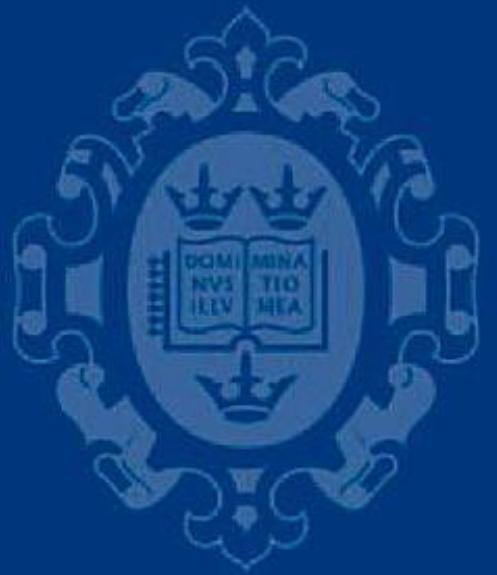

OXFORD SCIENCEPUBLICATIONS

# OXFORD LOGIC GUIDES

Series Editors

D.M. GABBAY

A.J. MACINTYRE

D.S. SCOTT

Available books in the series:

10. Michael Hallett: Cantorian set theory and limitation of size   
17. Stewart Shapiro: Foundations without foundationalism   
18. John P. Cleave: A study of logics   
21. C. McLarty: Elementary categories, elementary toposes   
22. R.M. Smullyan: Recursion theory for metamathematics   
23. Peter Clote and Jan Kraj´ıˇcek: Arithmetic, proof theory, and computational complexity   
24. A. Tarski: Introduction to logic and to the methodology of deductive sciences   
25. G. Malinowski: Many valued logics   
26. Alexandre Borovik and Ali Nesin: Groups of finite Morley rank   
27. R.M. Smullyan: Diagonalization and self-reference   
28. Dov M. Gabbay, Ian Hodkinson, and Mark Reynolds: Temporal logic: Mathematical foundations and computational aspects: volume 1   
29. Saharon Shelah: Cardinal arithmetic   
30. Erik Sandewall: Features and fluents: Volume I: A Systematic approach to the representation of knowledge about dynamical systems   
31. T.E. Forster: Set theory with a universal set: Exploring an untyped universe, second edition   
32. Anand Pillay: Geometric stability theory   
33. Dov M. Gabbay: Labelled deductive systems   
35. Alexander Chagrov and Michael Zakharyaschev: Modal logic   
36. G. Sambin and J. Smith: Twenty-five years of Martin-L¨of constructive type theory   
37. Mar´ıa Manzano: Model theory   
38. Dov M. Gabbay: Fibring logics   
39. Michael Dummet: Elements of Intuitionism, second edition   
40. D.M. Gabbay, M.A. Reynolds, and Marcelo Finger: Temporal logic: Mathematical foundations and computational aspects volume $\mathcal { Q }$   
41. J.M. Dunn and G. Hardegree: Algebraic Methods in Philosophical Logic   
42. H. Rott: Change, Choice and Inference: A study of belief revision and nonmonotonic reasoning   
43. P.T. Johnstone: Sketches of an Elephant: A topos theory compendium: Volume 1   
44. P.T. Johnstone: Sketches of an Elephant: A topos theory compendium: Volume 2   
45. David J. Pym and Eike Ritter: Reductive Logic and Proof Search: Proof theory, semantics and control   
46. D.M. Gabbay and L. Maksimova: Interpolation and Definability: Modal and Intuitionistic Logics   
47. John L. Bell: Set Theory: Boolean-valued models and independence proofs, third edition   
48. Laura Crosilla and Peter Schuster: From Sets and Types to Topology and Analysis: Towards practicable foundations for constructive mathematics   
49. Steve Awodey: Category Theory

# Category Theory

STEVE AWODEY

Carnegie Mellon University

# OXFORD

# UNIVERSITY PRESS

Great Clarendon Street, Oxford OX2 6DP

Oxford University Press is a department of the University of Oxford. It furthers the University’s objective of excellence in research, scholarship, and education by publishing worldwide in

Oxford New York

Auckland Cape Town Dar es Salaam Hong Kong Karachi Kuala Lumpur Madrid Melbourne Mexico City Nairobi New Delhi Shanghai Taipei Toronto

With offices in

Argentina Austria Brazil Chile Czech Republic France Greece Guatemala Hungary Italy Japan Poland Portugal Singapore South Korea Switzerland Thailand Turkey Ukraine Vietnam

Oxford is a registered trade mark of Oxford University Press in the UK and in certain other countries

Published in the United States by Oxford University Press Inc., New York

c Steve Awodey, 2006

The moral rights of the author have been asserted Database right Oxford University Press (maker)

First published 2006

All rights reserved. No part of this publication may be reproduced, stored in a retrieval system, or transmitted, in any form or by any means, without the prior permission in writing of Oxford University Press, or as expressly permitted by law, or under terms agreed with the appropriate reprographics rights organization. Enquiries concerning reproduction outside the scope of the above should be sent to the Rights Department, Oxford University Press, at the address above

You must not circulate this book in any other binding or cover and you must impose the same condition on any acquirer British Library Cataloguing in Publication Data Data available

Library of Congress Cataloging in Publication Data Data available

Typeset by Newgen Imaging Systems (P) Ltd., Chennai, India Printed in Great Britain on acid-free paper by Biddles Ltd., King’s Lynn, Norfolk

ISBN 0–19–856861–4 978–0–19–856861–2

1 3 5 7 9 10 8 6 4 2

in memoriam

Saunders Mac Lane

# PREFACE

Why write a new textbook on Category Theory, when we already have Mac Lane’s Categories for the Working Mathematician? Simply put, because Mac Lane’s book is for the working (and aspiring) mathematician. What is needed now, after 30 years of spreading into various other disciplines and places in the curriculum, is a book for everyone else.

This book has grown from my courses on Category Theory at Carnegie Mellon University over the last 10 years. In that time, I have given numerous lecture courses and advanced seminars to undergraduate and graduate students in Computer Science, Mathematics, and Logic. The lecture course based on the material in this book consists of two, 90-minute lectures a week for 15 weeks. The germ of these lectures was my own graduate student notes from a course on Category Theory given by Mac Lane at the University of Chicago. In teaching my own course, I soon discovered that the mixed group of students at Carnegie Mellon had very different needs than the Mathematics graduate students at Chicago and my search for a suitable textbook to meet these needs revealed a serious gap in the literature. My lecture notes evolved over a time to fill this gap, supplementing and eventually replacing the various texts I tried using.

The students in my courses often have little background in Mathematics beyond a course in Discrete Math and some Calculus or Linear Algebra or a course or two in Logic. Nonetheless, eventually, as researchers in Computer Science or Logic, many will need to be familiar with the basic notions of Category Theory, without the benefit of much further mathematical training. The Mathematics undergraduates are in a similar boat: mathematically talented, motivated to learn the subject by its evident relevance to their further studies, yet unable to follow Mac Lane because they still lack the mathematical prerequisites. Most of my students do not know what a free group is (yet), and so they are not illuminated to learn that it is an example of an adjoint.

This, then, is intended as a text and reference book on Category Theory, not only for students of Mathematics, but also for researchers and students in Computer Science, Logic, Linguistics, Cognitive Science, Philosophy, and any of the other fields that now make use of it. The challenge for me was to make the basic definitions, theorems, and proof techniques understandable to this readership, and thus without presuming familiarity with the main (or at least original) applications in algebra and topology. It will not do, however, to develop the subject in a vacuum, simply skipping the examples and applications. Material at this level of abstraction is simply incomprehensible without the applications and examples that bring it to life.

Faced with this dilemma, I have adopted the strategy of developing a few basic examples from scratch and in detail—namely posets and monoids—and

then carrying them along and using them throughout the book. This has several didactic advantages worth mentioning: both posets and monoids are themselves special kinds of categories, which in a certain sense represent the two “dimensions” (objects and arrows) that a general category has. Many phenomena occurring in categories can best be understood as generalizations from posets or monoids. On the other hand, the categories of posets (and monotone maps) and monoids (and homomorphisms) provide two further, quite different examples of categories in which to consider various concepts. The notion of a limit, for instance, can be considered both in a given poset and in the category of posets.

Of course, many other examples besides posets and monoids are treated as well. For example, the chapter on groups and categories develops the first steps of Group Theory up to kernels, quotient groups, and the homomorphism theorem, as an example of equalizers and coequalizers. Here, and occasionally elsewhere (e.g. in connection with Stone duality), I have included a bit more Mathematics than is strictly necessary to illustrate the concepts at hand. My thinking is that this may be the closest some students will ever get to a higher Mathematics course, so they should benefit from the labor of learning Category Theory by reaping some of the nearby fruits.

Although the mathematical prerequisites are substantially lighter than for Mac Lane, the standard of rigor has (I hope) not been compromised. Full proofs of all important propositions and theorems are given, and only occasional routine lemmas are left as exercises (and these are then usually listed as such at the end of the chapter). The selection of material was easy. There is a standard core that must be included: categories; functors; natural transformations; equivalence; limits and colimits; functor categories; representables; Yoneda’s Lemma; adjoints; and monads. That nearly fills a course. The only “optional” topic included here is cartesian closed categories and the lambda-calculus, which is a must for computer scientists, logicians, and linguists. Several other obvious further topics were purposely not included: 2-categories, toposes (in any depth), and monoidal categories. These topics are treated in Mac Lane, which the student should be able to read after having completed the course.

Finally, I take this opportunity to thank Wilfried Sieg for his exceptional support of this project; Peter Johnstone and Dana Scott for helpful suggestions and support; Andr´e Carus for advice and encouragement; Bill Lawvere for many very useful comments on the text; and the many students in my courses who have suggested improvements to the text, clarified the content with their questions, tested all of the exercises, and caught countless errors and typos. For the latter, I also thank the many readers who took the trouble to collect and send helpful corrections, particularly Brighten Godfrey, Peter Gumm, Bob Lubarsky and Dave Perkinson. Andrej Bauer and Kohei Kishida are to be thanked for providing Figures 9.1 and 8.1, respectively. Of course, Paul Taylor’s macros for commutative diagrams must also be acknowledged. And my dear Karin deserves thanks for too many things to mention. Finally, I wish to record here my debt of

gratitude to my mentor Saunders Mac Lane, not only for teaching me category theory, and trying to teach me how to write, but also for helping me to find my place in Mathematics. I dedicate this book to his memory.

Steve Awodey

Pittsburgh

September 2005

# CONTENTS

# Preface vi

# 1 Categories 1

1.1 Introduction 1   
1.2 Functions of sets 3   
1.3 Definition of a category 4   
1.4 Examples of categories 5   
1.5 Isomorphisms 11   
1.6 Constructions on categories 13   
1.7 Free categories 1 6   
1.8 Foundations: large, small, and locally small 21   
1.9 Exercises 23

# 2 Abstract structures 25

2.1 Epis and monos 25   
2.2 Initial and terminal objects 28   
2.3 Generalized elements 2 9   
2.4 Sections and retractions 33   
2.5 Products 3 4   
2.6 Examples of products 36   
2.7 Categories with products 41   
2.8 Hom-sets 42   
2.9 Exercises 45

# 3 Duality 47

3.1 The duality principle 4 7   
3.2 Coproducts 49   
3.3 Equalizers 54   
3.4 Coequalizers 57   
3.5 Exercises 63

# 4 Groups and categories 65

4.1 Groups in a category 6 5   
4.2 The category of groups 68   
4.3 Groups as categories 7 0   
4.4 Finitely presented categories 73   
4.5 Exercises 74

# 5 Limits and colimits 77

5.1 Subobjects 7 7   
5.2 Pullbacks 80

5.3 Properties of pullbacks 84   
5.4 Limits 89   
5.5 Preservation of limits 94   
5.6 Colimits 95   
5.7 Exercises 102

# 6 Exponentials 105

6.1 Exponential in a category 105   
6.2 Cartesian closed categories 108   
6.3 Heyting algebras 113   
6.4 Equational definition 118   
6.5 λ-calculus 119   
6.6 Exercises 123

# 7 Functors and naturality 125

7.1 Category of categories 125   
7.2 Representable structure 127   
7.3 Stone duality 131   
7.4 Naturality 133   
7.5 Examples of natural transformations 135   
7.6 Exponentials of categories 139   
7.7 Functor categories 142   
7.8 Equivalence of categories 146   
7.9 Examples of equivalence 150   
7.10 Exercises 155

# 8 Categories of diagrams 159

8.1 Set-valued functor categories 159   
8.2 The Yoneda embedding 160   
8.3 The Yoneda Lemma 162   
8.4 Applications of the Yoneda Lemma 166   
8.5 Limits in categories of diagrams 167   
8.6 Colimits in categories of diagrams 168   
8.7 Exponentials in categories of diagrams 172   
8.8 Topoi 174   
8.9 Exercises 176

# 9 Adjoints 179

9.1 Preliminary definition 179   
9.2 Hom-set definition 183   
9.3 Examples of adjoints 187   
9.4 Order adjoints 191   
9.5 Quantifiers as adjoints 193   
9.6 RAPL 197   
9.7 Locally cartesian closed categories 202

9.8 Adjoint functor theorem 210   
9.9 Exercises 219

# 10 Monads and algebras 223

10.1 The triangle identities 223   
10.2 Monads and adjoints 225   
10.3 Algebras for a monad 229   
10.4 Comonads and coalgebras 234   
10.5 Algebras for endofunctors 236   
10.6 Exercises 244

# References 249

# Index 251

This page intentionally left blank

# 1

# CATEGORIES

# 1.1 Introduction

What is category theory? As a first approximation, one could say that category theory is the mathematical study of (abstract) algebras of functions. Just as group theory is the abstraction of the idea of a system of permutations of a set or symmetries of a geometric object, category theory arises from the idea of a system of functions among some objects.

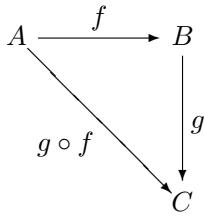

We think of the composition $g \circ f$ as a sort of “product” of the functions $f$ and $g$ , and consider abstract “algebras” of the sort arising from collections of functions. A category is just such an “algebra,” consisting of objects $A , B , C , \ldots$ and arrows $f : A  B$ , $g : B  C , \ldots$ , that are closed under composition and satisfy certain conditions typical of the composition of functions. A precise definition is given later in this chapter.

A branch of abstract algebra, category theory was invented in the tradition of Felix Klein’s Erlanger Programm, as a way of studying and characterizing different kinds of mathematical structures in terms of their “admissible transformations.” The general notion of a category provides a characterization of the notion of a “structure-preserving transformation,” and thereby of a species of structures admitting such transformations.

The historical development of the subject has been, very roughly, as follows:

1945 Eilenberg and Mac Lane’s “General theory of natural equivalences” was the original paper, in which the theory was first formulated.

late 1940s The main applications were originally in the fields of algebraic topology, particularly homology theory, and abstract algebra.

1950s A. Grothendieck et al. began using category theory with great success in algebraic geometry.

1960s F.W. Lawvere and others began applying categories to logic, revealing some deep and surprising connections.

1970s Applications were already appearing in computer science, linguistics, cognitive science, philosophy, and many other areas.

One very striking thing about the field is that it has such wide-ranging applications. In fact, it turns out to be a kind of universal mathematical language like set theory. As a result of these various applications, category theory also tends to reveal certain connections between different fields—like logic and geometry. For example, the important notion of an adjoint functor occurs in logic as the existential quantifier and in topology as the image operation along a continuous function. From a categorical point of view these turn out to be essentially the same operation.

The concept of adjoint functor is in fact one of the main things that the reader should take away from the study of this book. It is a strictly category-theoretical notion that has turned out to be a conceptual tool of the first magnitude—on par with the idea of a continuous function.

In fact, just as the idea of a topological space arose in connection with continuous functions, so also the notion of a category arose in order to define that of a functor, at least according to one of the inventors. The notion of a functor arose—so the story goes on—in order to define natural transformations. One might as well continue that natural transformations serve to define adjoints:

Category

Functor

Natural transformation

Adjunction

Indeed, that gives a pretty good outline of this book.

Before getting down to business, let us ask why it should be that category theory has such far-reaching applications. Well, we said that it is the abstract theory of functions, so the answer is simply this:

# Functions are everywhere!

And everywhere that functions are, there are categories. Indeed, the subject might better have been called abstract function theory, or, perhaps even better: archery.

# 1.2 Functions of sets

We begin by considering functions between sets. I am not going to say here what a function is, anymore than what a set is. Instead, we will assume a working knowledge of these terms. They can in fact be defined using category theory, but that is not our purpose here.

Let $f$ be a function from a set $A$ to another set $B$ , we write

$$
f: A \to B.
$$

To be explicit, this means that $f$ is defined on all of $A$ and all the values of $f$ are in $B$ . In set theoretic terms,

$$
\operatorname {r a n g e} (f) \subseteq B.
$$

Now suppose we also have a function $g : B  C$ ,

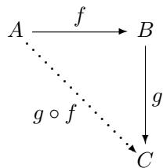

then there is a composite function $g \circ f : A \to C$ , given by

$$
(g \circ f) (a) = g (f (a)) \quad a \in A. \tag {1.1}
$$

Now this operation “ $\circ$ ” of composition of functions is associative, as follows. If we have a further function $h : C \to D$

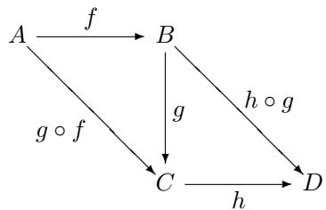

and form $h \circ g$ and $g \circ f$ then we can compare $( h \circ g ) \circ f$ and $h \circ ( g \circ f )$ as indicated in the above diagram. It turns out that these two functions are always identical,

$$
(h \circ g) \circ f = h \circ (g \circ f)
$$

since for any $a \in A$ , we have

$$
((h \circ g) \circ f) (a) = h (g (f (a))) = (h \circ (g \circ f)) (a)
$$

using (1.1).

By the way, this is of course what it means for two functions to be equal: for every argument, they have the same value.

Finally, note that every set $A$ has an identity function

$$
1 _ {A}: A \to A
$$

given by

$$
1 _ {A} (a) = a.
$$

These identity functions act as “units” for the operation $\circ$ of composition, in the sense of abstract algebra. That is to say,

$$
f \circ 1 _ {A} = f = 1 _ {B} \circ f
$$

for any $f : A  B$

These are all the properties of set functions that we want to consider for the abstract notion of function—composition and identities. Thus, we now want to “abstract away” everything else, so to speak. That is what is accomplished by the following definition.

# 1.3 Definition of a category

Definition 1.1. A category consists of the following data:

Objects: $A , B , C , \ldots$   
Arrows: $f , g , h , \ldots$   
• For each arrow $f$ there are given objects:

$$
\operatorname {d o m} (f), \qquad \operatorname {c o d} (f)
$$

called the domain and codomain of $f$ . We write:

$$
f: A \to B
$$

to indicate that $A = \operatorname { d o m } ( f )$ and $B = \operatorname { c o d } ( f )$

Given arrows $f : A  B$ and $g : B  C$ , that is, with:

$$
\operatorname {c o d} (f) = \operatorname {d o m} (g)
$$

there is given an arrow:

$$
g \circ f: A \to C
$$

called the composite of $f$ and $g$

For each object $A$ there is given an arrow:

$$
1 _ {A}: A \to A
$$

called the identity arrow of $A$ .

These data are required to satisfy the following laws:

Associativity:

$$
h \circ (g \circ f) = (h \circ g) \circ f
$$

for all $f : A  B$ , $g : B  C$ , $h : C \to D$ .

Unit:

$$
f \circ 1 _ {A} = f = 1 _ {B} \circ f
$$

for all $f : A  B$

A category is anything that satisfies this definition—and we will have plenty of examples very soon. For now I want to emphasize that, unlike in the previous section, the objects do not have to be sets and the arrows need not be functions. In this sense, a category is an abstract algebra of functions, or “arrows” (sometimes also called “morphisms”), with the composition operation “ $\circ$ ” as primitive. If you are familiar with groups, you may think of a category as a sort of generalized group.

# 1.4 Examples of categories

1. We have already encountered the category Sets of sets and functions. There is also the category

# Setsfin

of all finite sets and functions between them.

Indeed, there are many categories like this, given by restricting the sets that are to be the objects and the functions that are to be the arrows. For example, take finite sets as objects and injective (i.e., “1 to 1”) functions as arrows. Since injective functions compose to give an injective function, and since the identity functions are injective, this also gives a category.

What if we take sets as objects and as arrows, those $f : A  B$ such that for all $b \in B$ , the subset

$$
f ^ {- 1} (b) \subseteq A
$$

has at most two elements (rather than one)? Is this still a category? What if we take the functions such that $f ^ { - 1 } ( b )$ is finite? infinite? There are lots of such restricted categories of sets and functions.

2. Another kind of example one often sees in mathematics is categories of structured sets, that is, sets with some further “structure” and functions which “preserve it,” where these notions are determined in some independent way. Examples of this kind you may be familiar with are:

• groups and group homomorphisms,

• vector spaces and linear mappings,   
graphs and graph homomorphisms,   
the real numbers $\mathbb { R }$ and continuous functions $\mathbb { R } \to \mathbb { R }$ ,   
open subsets $U \subseteq \mathbb { R }$ and continuous functions $f : U \to V \subseteq \mathbb { R }$ defined on them,   
• topological spaces and continuous mappings,   
differentiable manifolds and smooth mappings,   
the natural numbers $\mathbb { N }$ and all recursive functions $\Nu  \mathbb { N }$ , or as in the example of continuous functions, one can take partial recursive functions defined on subsets $U \subseteq \mathbb { N }$ .   
posets and monotone functions.

Do not worry if some of these examples are unfamiliar to you. Later on, we will take a closer look at some of them. For now, let us just consider the last of the above examples in more detail.

3. A partially ordered set or poset is a set $A$ equipped with a binary relation $a \leq _ { A } b$ such that the following conditions hold for all $a , b , c \in A$ :

reflexivity: $a \leq _ { A } a$

transitivity: if $a \leq _ { A } b$ and $b \leq _ { A } c$ , then $a \leq _ { A } c$

antisymmetry: if $a \leq _ { A } b$ and $b \leq _ { A } a$ , then $a = b$

For example, the real numbers $\mathbb { R }$ with their usual ordering $x \leq y$ form a poset that is also linearly ordered: either $x \leq y$ or $y \leq x$ for any $x , y$ .

An arrow from a poset $A$ to a poset $B$ is a function

$$
m: A \to B
$$

that is monotone, in the sense that, for all $a , a ^ { \prime } \in A$ ,

$$
a \leq_ {A} a ^ {\prime} \quad \text {i m p l i e s} \quad m (a) \leq_ {B} m (a ^ {\prime}).
$$

What does it take for this to be a category? We need to know that $1 _ { A } :$ $A  A$ is monotone, but that is clear since $a \ \leq _ { A } \ a ^ { \prime }$ implies $a \ \leq _ { A } \ a ^ { \prime }$ . We also need to know that if $f : A  B$ and $g : B  C$ are monotone, then $g \circ f : A  C$ is monotone. This also holds, since $a \leq a ^ { \prime }$ implies $f ( a ) \leq f ( a ^ { \prime } )$ implies $g ( f ( a ) ) \leq g ( f ( a ^ { \prime } ) )$ implies $( g \circ f ) ( a ) \leq ( g \circ f ) ( a ^ { \prime } )$ . So we have the category Pos of posets and monotone functions.

4. The categories that we have been considering so far are examples of what are sometimes called concrete categories. Informally, these are categories in which the objects are sets, possibly equipped with some structure, and the arrows are certain, possibly structure-preserving, functions (we shall see later on that this notion is not entirely coherent; see Remark 1.7). Let’s now take a look at a few examples that are not of this sort.

Let Rel be the following category: take sets as objects and take binary relations as arrows. That is, an arrow $f : A  B$ is a subset $f \subseteq A \times B$ . The identity arrow on a set $A$ is the identity relation.

$$
1 _ {A} = \{(a, a) \in A \times A \mid a \in A \} \subseteq A \times A.
$$

Given $R \subseteq A \times B$ and $S \subseteq B \times C$ , define composition $S \circ R$ by

$$
(a, c) \in S \circ R \quad \text {i f f} \quad \exists b. (a, b) \in R \& (b, c) \in S
$$

that is, the “relative product” of $S$ and $R$ . We leave it as an exercise to show that Rel is in fact a category. (What needs to be done?)

For another example of a category in which the arrows are not “functions,” let the objects be finite sets $A , B , C$ and an arrow $F : A  B$ is a rectangular matrix $F = ( n _ { i j } ) _ { i < a , j < b }$ of natural numbers with $a = | A |$ and $b = | \boldsymbol { B } |$ , where $| C |$ is the number of elements in a set $C$ . The composition of arrows is by the usual matrix multiplication, and the identity arrows are the usual unit matrices.

# 5. Finite categories

Of course, the objects of a category do not have to be sets, either. Here are some very simple examples:

The category 1 looks like this:

*

It has one object and its identity arrow, which we do not draw.

The category 2 looks like this:

* ✲ -

It has two objects, their required identity arrows, and exactly one arrow between the objects.

The category 3 looks like this:

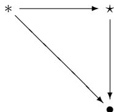

It has three objects, their required identity arrows, exactly one arrow from the first to the second object, exactly one arrow from the second to the third object, and exactly one arrow from the first to the third object (which is therefore the composite of the other two).

The category 0 looks like this:

It has no objects or arrows.

As above, we will omit the identity arrows in drawing categories from now on.

It is fairly easy to specify finite categories—just take some objects and start putting arrows between them, but make sure to put in the necessary identities and composites, as required by the axioms for a category. Also, if there are any loops, then they need to be cut off by equations to keep the category finite. For example, consider the following specification:

$$
A \xrightarrow [ g ]{f} B
$$

Unless we stipulate an equation like $g f = 1 _ { A }$ , we will end up with infinitely many arrows $g f$ , gf gf, gf gf gf, . . . . This is still a category, of course, but it is not a finite category. We will come back to this situation when we discuss free categories later in this chapter.

6. One important slogan of category theory is,

It’s the arrows that really matter!

So we should also look at the arrows or “mappings” between categories. A “homomorphism of categories” is called a functor.

Definition 1.2. A functor

$$
F: \mathbf {C} \to \mathbf {D}
$$

between categories $\mathbf { C }$ and $\mathbf { D }$ is a mapping of objects to objects and arrows to arrows, in such a way that:

(a) $F ( f : A \to B ) = F ( f ) : F ( A ) \to F ( B ) .$ ,   
(b) $F ( g \circ f ) = F ( g ) \circ F ( f )$ ,   
(c) $F ( 1 _ { A } ) = 1 _ { F ( A ) }$

Now, one can check that functors compose in the expected way, and that every category $\mathbf { C }$ has an identity functor $\mathbf { 1 } _ { \mathbf { C } } : \mathbf { C } \to \mathbf { C }$ . So we have another example of a category, namely Cat, the category of all categories and functors.

7. A preorder is a set $P$ equipped with a binary relation $p \leq q$ that is both reflexive and transitive: $a \leq a$ , and if $a \leq b$ and $b \leq c$ , then $a \leq c$ . Any preorder $P$ can be regarded as a category by taking the objects to be the elements of $P$ and taking a unique arrow,

$$
a \rightarrow b \quad \text {i f a n d o n l y i f} \quad a \leq b. \tag {1.2}
$$

The reflexive and transitive conditions on $\leq$ ensure that this is a category.

Going in the other direction, any category with at most one arrow between any two objects determines a preorder, simply by defining a binary relation $\leq$ on the objects by (1.2).

8. A poset is evidently a preorder satisfying the additional condition of antisymmetry: if $a \leq b$ and $b \leq a$ , then $a = b$ . So, in particular, a poset is also a category. Such poset categories are very common; for example, for any set $X$ , the powerset $P ( X )$ is a poset under the usual inclusion relation $U \subseteq V$ between the subsets $U , V$ of $X$ .

What is a functor $F : P  Q$ between poset categories $P$ and $Q$ ? It must satisfy the identity and composition laws . . . . Clearly, these are just the monotone functions already considered above.

It is often useful to think of a category as a kind of generalized poset, one with “more structure” than just $p \leq q$ . Thus, one can also think of a functor as a generalized monotone map.

9. An example from logic: Given a deductive system of logic, there’s an associated category, where the objects are formulas:

$$
\varphi , \psi , \dots
$$

An arrow from $\varphi$ to $\psi$ is a deduction of $\psi$ from the assumption $\varphi$ . Composition of arrows is given by putting together deductions in the obvious way, which is clearly associative. (What are the identity arrows $1 _ { \varphi }$ ?) Observe that there can be many different arrows

$$
p: \varphi \to \psi
$$

since there may be many different proofs. This category turns out to have a very rich structure, which we will consider later in connection with the lambda-calculus.

10. An example from computer science: Given a functional programming language $L$ , there is an associated category, where the objects are the data types of $L$ , and the arrows are the computable functions of $L$ (“processes,” “procedures,” “programs”). The composition of two such programs $X \ { \overset { f } { \to } } \ Y \ { \overset { g } { \to } } \ Z$ is given by applying $g$ to the output of $f$ , sometimes also written

$$
g \circ f = f; g.
$$

The identity is the “do nothing” program.

Categories such as this are basic to the idea of denotational semantics of programming languages. For example, if $\mathbf { C } ( L )$ is the category just defined, then the denotational semantics of the language $L$ in a category $\mathbf { D }$ of, say, Scott domains is simply a functor

$$
S: \mathbf {C} (L) \to \mathbf {D}
$$

since $S$ assigns domains to the types of $L$ and continuous functions to the programs. Both this example and the previous one are related to the notion of “cartesian closed category” that is considered later.

11. Let $X$ be a set. We can regard $X$ as a category $\mathbf { D i s } ( X )$ by taking the objects to be the elements of $X$ and taking the arrows to be just the identity arrows, one for each $x \in X$ . Such categories are called discrete. Note that discrete categories are just very special posets.

12. A monoid (sometimes called a semigroup with unit) is a set $M$ equipped with a binary operation $\cdot : M \times M \to M$ and a distinguished “unit” element $u \in M$ such that for all $x , y , z \in M$ ,

$$
x \cdot (y \cdot z) = (x \cdot y) \cdot z
$$

and

$$
u \cdot x = x = x \cdot u.
$$

Equivalently, a monoid is a category with just one object. The arrows of the category are the elements of the monoid. In particular, the identity arrow is the unit element $u$ . Composition of arrows is the binary operation $m \cdot n$ of the monoid.

Monoids are very common: there are the monoids of numbers like N, $\mathbb { Q }$ or $\mathbb { R }$ with addition and 0, or multiplication and 1. But also for any set $X$ , the set of functions from $X$ to $X$ , written

$$
\operatorname {H o m} _ {\mathbf {S e t s}} (X, X)
$$

is a monoid under the operation of composition. More generally, for any object $C$ in any category $\mathbf { C }$ , the set of arrows from $C$ to $C$ , written as ${ \mathrm { H o m } } _ { \mathbf { C } } ( C , C )$ , is a monoid under the composition operation of $\mathbf { C }$ .

Since monoids are structured sets, there is a category Mon whose objects are monoids and whose arrows are functions that preserve the monoid structure. In detail, a homomorphism from a monoid $M$ to a monoid $N$ is a function $h : M \to N$ such that for all $m , n \in M$ ,

$$
h (m \cdot_ {M} n) = h (m) \cdot_ {N} h (n)
$$

and

$$
h (u _ {M}) = u _ {N}.
$$

The reader should check that a monoid homomorphism from $M$ to $N$ is the same thing as a functor from $M$ regarded as a category to $N$ regarded as a category. In this sense, categories are also generalized monoids, and functors are generalized homomorphisms.

# 1.5 Isomorphisms

Definition 1.3. In any category $\mathbf { C }$ , an arrow $f ~ : ~ A ~  ~ B$ is called an isomorphism if there is an arrow $g : B  A$ in $\mathbf { C }$ such that

$$
g \circ f = 1 _ {A} \quad \text {a n d} \quad f \circ g = 1 _ {B}.
$$

Since inverses are unique (proof!), we write $g = f ^ { - 1 }$ . We say that $A$ is isomorphic to $B$ , written $A \cong B$ , if there exists an isomorphism between them.

The definition of isomorphism is our first example of an abstract, category theoretic definition of an important notion. It is abstract in the sense that it makes use only of the category theoretic notions, rather than some additional information about the objects and arrows. It has the advantage over other possible definitions that it applies in any category. For example, one sometimes defines an isomorphism of sets (groups, etc.) as a bijective function (resp. homomorphism), that is, one that is “1-1 and onto.” This is equivalent to our definition in some cases. But note that, for example in Pos, the category theoretic definition gives the right notion, while there are “bijective homomorphisms” between nonisomorphic posets. Moreover, in many cases only the abstract definition makes sense, for example, in the case of a monoid.

Definition 1.4. A group $G$ is a monoid with an inverse $g ^ { - 1 }$ for every element $g$ Thus $G$ is a category with one object, in which every arrow is an isomorphism.

The natural numbers N do not form a group under either addition or multiplication, but the integers $\mathbb { Z }$ and the positive rationals $\mathbb { Q } ^ { + }$ , respectively, do. For any set $X$ , we have the group $\operatorname { A u t } ( X )$ of automorphisms (or “permutations”) of $X$ , that is, isomorphisms $f : X \to X$ . (Question: why is this closed under “ $\cup$ ”?) A group of permutations is a subgroup $G \subseteq A u t ( X )$ for some set $X$ , that is, a group of automorphisms of $X$ . Thus $G$ must satisfy the following:

1. $1 _ { X } \in G$   
2. If $g , g ^ { \prime } \in G$ , then $g \circ g ^ { \prime } \in G$   
3. If $g \in G$ , then $g ^ { - 1 } \in G$

A homomorphism of groups $h : G \to H$ is just a homomorphism of monoids, which then necessarily also preserves the inverses (proof!).

Theorem (Cayley). Every group $G$ is isomorphic to a group of permutations.

# Proof. (sketch)

1. First, define the Cayley representation $G$ of $G$ to be the following group of permutations: the underlying set of $G$ is just $G$ , and for each $g \in G$ , we have the permutation $g$ , defined for all $h \in G$ by:

$$
\bar {g} (h) = g \cdot h.
$$

Now check that ${ \bar { g } } = h$ implies $g = h$ .

2. Next define homomorphisms $i : G \to G$ by $i ( g ) = \bar { g }$ , and $j : G \to G$ by $j ( \bar { g } ) = g$ .   
3. Finally show that $i \circ j = 1 _ { \bar { G } }$ and $j \circ i = 1 _ { G }$ .

Warning 1.5. Note the two different levels of isomorphisms that occur in the proof of Cayley’s theorem. There are permutations of the set of elements of $G$ , which are isomorphisms in Sets, and there is the isomorphism between $G$ and $G$ , which is in the category Groups of groups and group homomorphisms.

Cayley’s theorem says that any abstract group can be represented as a “concrete” one, that is, a group of permutations of a set. The theorem can in fact be generalized to show that any category that is not “too big” can be represented as one that is “concrete,” that is, a category of sets and functions. (There is a technical sense of not being “too big” that will be introduced in Section 1.8.)

Theorem 1.6. Every category $\mathbf { C }$ with a set of arrows is isomorphic to one in which the objects are sets and the arrows are functions.

Proof. (sketch) Define the Cayley representation $\mathbf { C }$ of $\mathbf { C }$ to be the following concrete category:

objects are sets of the form

$$
\bar {C} = \{f \in \mathbf {C} \mid \operatorname {c o d} (f) = C \}
$$

for all $C \in \mathbf { C }$ ,

arrows are functions

$$
\bar {g}: \bar {C} \to \bar {D}
$$

for $g : C  D$ in $\mathbf { C }$ , defined by ${ \bar { g } } ( f ) = g \circ f$ .

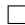

Remark 1.7. This shows us what is wrong with the naive notion of a “concrete” category of sets and functions: while not every category has special sets and functions as its objects and arrows, every category is isomorphic to such a one. Thus, the only special properties such categories can possess are ones that are categorically irrelevant, such as features of the objects that do not affect the arrows in any way (like the difference between the real numbers constructed as Dedekind cuts or as Cauchy sequences). A better attempt to capture what is intended by the rather vague idea of a “concrete” category is that arbitrary arrows $f : C \to D$ are completely determined by their composites with arrows $x : T  C$ from some “test object” $T$ , in the sense that $f x = g x$ for all such $x$ implies $f = g$ . This amounts to considering a particular representation of the category, determined by $T$ . A category is then said to be “concrete” when this

condition holds for $T$ a “terminal object,” in the sense of Section 2.2; but there are also good reasons for considering other objects $T$ , as we see in the next chapter.

Note that the condition that $\mathbf { C }$ have a set of arrows is needed to ensure that the collections $\{ f \in \mathbf { C } \mid \operatorname { c o d } ( f ) = C \}$ really are sets—we return to this point in Section 1.8.

# 1.6 Constructions on categories

Now that we have a stock of categories to work with, we consider some constructions that produce new categories from old.

1. The product of two categories $\mathbf { C }$ and $\mathbf { D }$ , written

$$
\mathbf {C} \times \mathbf {D}
$$

has objects of the form $( C , D )$ , for $C \in \mathbf { C }$ and $D \in \mathbf { D }$ , and arrows of the form

$$
(f, g): (C, D) \to (C ^ {\prime}, D ^ {\prime})
$$

for $f : C \to C ^ { \prime } \in \mathbf { C }$ and $g : D \to D ^ { \prime } \in \mathbf { D }$ . Composition and units are defined componentwise; that is,

$$
\begin{array}{l} \left(f ^ {\prime}, g ^ {\prime}\right) \circ (f, g) = \left(f ^ {\prime} \circ f, g ^ {\prime} \circ g\right) \\ 1 _ {(C, D)} = (1 _ {C}, 1 _ {D}). \\ \end{array}
$$

There are two obvious projection functors

$$
\mathrm {C} \xleftarrow {\pi_ {1}} \mathrm {C} \times \mathrm {D} \xrightarrow {\pi_ {2}} \mathrm {D}
$$

defined by $\pi _ { 1 } ( C , D ) = C$ and $\pi _ { 1 } ( f , g ) = f$ , and similarly for $\pi _ { 2 }$

The reader familiar with groups will recognize that for groups $G$ and $H$ , the product category $G \times H$ is the usual (direct) product of groups.

2. The opposite (or “dual”) category $\mathbf { C } ^ { \mathrm { { o p } } }$ of a category $\mathbf { C }$ has the same objects as $\mathbf { C }$ , and an arrow $f : C \to D$ in $\mathbf { C } ^ { \mathbf { o p } }$ is an arrow $f : D \to C$ in $C$ . That is $\mathbf { C } ^ { \mathrm { { o p } } }$ is just $\mathbf { C }$ with all of the arrows formally turned around.

It is convenient to have a notation to distinguish an object (resp. arrow) in $\mathbf { C }$ from the same one in $\mathbf { C } ^ { \mathbf { o p } }$ . Thus, let us write

$$
\bar {f}: \bar {D} \to \bar {C}
$$

in $\mathbf { C } ^ { \mathrm { { o p } } }$ for $f : C \to D$ in $\mathbf { C }$ . With this notation we can define composition and units in $\mathbf { C } ^ { \mathrm { { o p } } }$ in terms of the corresponding operations in $\mathbf { C }$ , namely,

$$
\begin{array}{l} 1 _ {\bar {C}} = 1 _ {C} \\ \bar {f} \circ \bar {g} = g \bar {\circ} f. \\ \end{array}
$$

Thus, a diagram in C

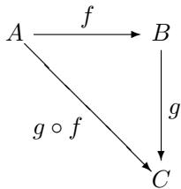

looks like this in $\mathbf { C } ^ { \mathrm { { o p } } }$

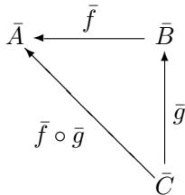

Many “duality” theorems of mathematics express the fact that one category is (a subcategory of) the opposite of another. An example of this sort which we will prove later is that Sets is dual to the category of complete, atomic Boolean algebras.

3. The arrow category $\bf { C } ^ {  }$ of a category $\mathbf { C }$ has the arrows of $\mathbf { C }$ as objects, and an arrow $g$ from $f : A  B$ to $f ^ { \prime } : A ^ { \prime } \to B ^ { \prime }$ in $\bf C ^ {  }$ is a “commutative square”

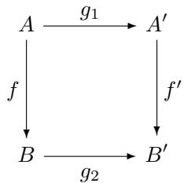

where $g _ { 1 }$ and $g _ { 2 }$ are arrows in $\mathbf { C }$ . That is, such an arrow is a pair of arrows $g = ( g _ { 1 } , g _ { 2 } )$ in $\mathbf { C }$ such that

$$
g _ {2} \circ f = f ^ {\prime} \circ g _ {1}.
$$

The identity arrow $1 _ { f }$ on an object $f : A  B$ is the pair $( 1 _ { A } , 1 _ { B } )$ Composition of arrows is done componentwise:

$$
\left(h _ {1}, h _ {2}\right) \circ \left(g _ {1}, g _ {2}\right) = \left(h _ {1} \circ g _ {1}, h _ {2} \circ g _ {2}\right)
$$

The reader should verify that this works out by drawing the appropriate commutative diagram.

Observe that there are two functors:

$$
\mathrm {C} \xleftarrow {\mathrm {d o m}} \mathrm {C} ^ {\rightarrow} \xrightarrow {\mathrm {c o d}} \mathrm {C}
$$

4. The slice category $\mathbf { C } / C$ of a category $\mathbf { C }$ over an object $C \in \mathbf { C }$ has:

• objects: all arrows $f \in \mathbf { C }$ such that $\operatorname { c o d } ( f ) = C$   
arrows: $g$ from $f : X \to C$ to $f ^ { \prime } : X ^ { \prime } \to C$ is an arrow $g : X \to X ^ { \prime }$ in $\mathbf { C }$ such that $f ^ { \prime } \circ g = f$ , as indicated in

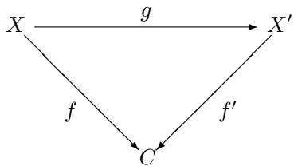

We leave it to the reader to work out the identity arrows and composites. If $\mathbf { C } = \mathbf { P }$ is a poset category and $p \in \mathbf { P }$ , then

$$
\mathbf {P} / p \cong \downarrow (p)
$$

the slice category $\mathbf { P } / p$ is just the “principal ideal” $\downarrow ( p )$ of elements $q \in \mathbf { P }$ with $q \leq p$ . We will have more examples of slice categories soon.

There is an obvious functor $U : \mathbf { C } / C \to \mathbf { C }$ that “forgets about the base object $C$ .” Can you find a functor $F : \mathbf { C } / C \to \mathbf { C } ^ { \to }$ such that $\mathbf { d o m o } F = U \mathbf { \dot { \Omega } }$ ? The coslice category $C / \mathbf { C }$ of a category $\mathbf { C }$ under an object $C$ of $\mathbf { C }$ has as objects all arrows $f$ of $\mathbf { C }$ such that $\operatorname { d o m } ( f ) = C$ , and an arrow from $f : C \to X$ to $f ^ { \prime } : C \to X ^ { \prime }$ is an arrow $h : X \to X ^ { \prime }$ such that $h \circ f = f ^ { \prime }$ . The reader should now carry out the rest of the definition of the coslice category by analogy with the definition of the slice category.

How can the coslice category be defined in terms of the slice category and the opposite construction?

Example 1.8. The category Sets $^ *$ of pointed sets consists of sets $A$ with a distinguished element $a \in A$ , and arrows $f : ( A , a )  ( B , b )$ are functions $f : A  B$ that preserves the “points,” $f ( a ) = b$ . This is isomorphic to the coslice category,

$$
\mathbf {S e t s} _ {*} \cong 1 \backslash \mathbf {S e t s}
$$

of Sets “under” any singleton $1 = \{ * \}$ . Indeed, functions $a : 1  A$ correspond uniquely to elements, $a ( * ) = a \in A$ , and arrows $f : ( A , a )  ( B , b )$ correspond exactly to commutative triangles:

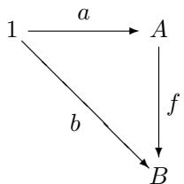

# 1.7 Free categories

Free monoid. Start with an “alphabet” $A$ of “letters” (a set)

$$
A = \{a, b, c, \dots \}.
$$

A word over $A$ is a finite sequence of letters:

$$
t h i s w o r d, \quad c a t e g o r i e s a r e f u n, \quad a s d d j b n z z f j, \dots
$$

We write “-” for the empty word. The “Kleene closure” of $A$ is defined to be the set

$$
A ^ {*} = \{\text {w o r d s} A \}.
$$

Define a binary operation “ $^ *$ ” on $A ^ { * }$ defined for $w , w ^ { \prime } \in A ^ { * }$ by $w * w ^ { \prime } = w w ^ { \prime }$ . Thus, “ $^ *$ ” is just concatenation. The operation “ $^ *$ ” is associative, and the empty word “-” is a unit. Thus, $A ^ { * }$ is a monoid—called the free monoid on the set $A$ . The elements $a \in A$ can be regarded as words of length one, so we have a function

$$
i: A \to A ^ {*}
$$

defined by $i ( a ) = a$ , and called the “insertion of generators.” The elements of $A$ “generate” the free monoid, in the sense that every $w \in A ^ { * }$ is a $^ *$ -product of $a$ ’s, that is, $w = a _ { 1 } * a _ { 2 } * \cdot \cdot \cdot * a _ { n }$ for some $a _ { 1 } , a _ { 2 } , . . . , a _ { n }$ in $A$ .

Now what does “free” mean here? Any guesses?

One sometimes sees definitions in “baby algebra” books along the following lines:

A monoid $M$ is freely generated by a subset $A$ of $M$ , if the following conditions hold.

1. Every element $m \in M$ can be written as a product of elements of $A$

$$
m = a _ {1} \cdot_ {M} \dots \cdot_ {M} a _ {n}, \quad a _ {i} \in A.
$$

2. No “nontrivial” relations hold in $M$ , that is, if $a _ { 1 } \dots a _ { j } = a _ { 1 } ^ { \prime } \dots a _ { k } ^ { \prime }$ , then this is required by the axioms for monoids.

The first condition is sometimes called “no junk,” while the second condition is sometimes called “no noise.” Thus, the free monoid on $A$ is a monoid containing $A$ and having no junk and no noise. What do you think of this definition of a free monoid?

I would object to the reference in the second condition to “provability,” or something. This must be made more precise for this to succeed as a definition. In category theory, we give a precise definition of “free”—capturing what is meant in the above—which avoids such vagueness.

First, every monoid $N$ has an underlying set $| N |$ , and every monoid homomorphism $f : N \to M$ has an underlying function $| f | : | N | \to | M |$ . It is easy to see that this is a functor, called the “forgetful functor.” The free monoid $M ( A )$

on a set $A$ is by definition “the” monoid with the following so called universal mapping property, or UMP!

Universal Mapping Property of $M ( A )$

There is a function $i : A \to | M ( A ) |$ , and given any monoid $N$ and any function $f : A  | N |$ , there is a unique monoid homomorphism $f : M ( A ) \to N$ such that $| f | \circ i = f$ , all as indicated in the following diagram:

in Mon:

$$
M (A) \xrightarrow {\bar {f}} N
$$

in Sets:

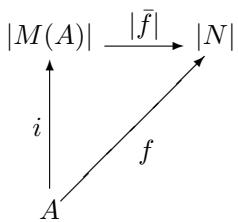

Proposition 1.9. $A ^ { * }$ has the UMP of the free monoid on $A$ .

Proof. Given $f : A  | N |$ , define ${ \bar { f } } : M ( A ) \to N$ by

$\bar { f } ( - ) = u _ { N } , \quad \mathrm { t h e ~ u n i t ~ o f ~ } N$

$$
\bar {f} \left(a _ {1} \dots a _ {i}\right) = f \left(a _ {1}\right) \cdot_ {N} \dots \cdot_ {N} f \left(a _ {i}\right).
$$

Then $f$ is clearly a homomorphism with

$$
\bar {f} (a) = f (a) \quad \text {f o r a l l} a \in A.
$$

If $g \colon M ( A ) \to N$ also satisfies $g ( a ) = f ( a )$ for all $a \in A$ , then for all $a _ { 1 } \dots a _ { i } \in A ^ { * }$ :

$$
\begin{array}{l} g \left(a _ {1} \dots a _ {i}\right) = g \left(a _ {1}\right) \cdot_ {N} \dots \cdot_ {N} g \left(a _ {i}\right) \\ = f \left(a _ {1}\right) \cdot_ {N} \dots \cdot_ {N} f \left(a _ {i}\right) \\ = \bar {f} (a _ {1}) \cdot_ {N} \dots \cdot_ {N} \bar {f} (a _ {i}) \\ = \bar {f} (a _ {1} \dots a _ {i}). \\ \end{array}
$$

So, $g = f$ , as required.

Think about why the above UMP captures precisely what is meant by “no junk” and “no noise.” Specifically, the existence part of the UMP captures the vague notion of “no noise,” while the uniqueness part makes precise the “no junk” idea.

Using the UMP, it is easy to show that the free monoid $M ( A )$ is determined uniquely up to isomorphism, in the following sense.

Proposition 1.10. Given monoids $M$ and $N$ with functions $i \colon A \to | M |$ and $j : A  | N |$ , each with the UMP of the free monoid on $A$ , there is a (unique) monoid isomorphism $h : M \cong N$ such that $| h | i = j$ and $| h ^ { - 1 } | j = i$ .

Proof. From $j$ and the UMP of $M$ , we have $j : M \to N$ with $| j | i = j$ and from $_ i$ and the UMP of $N$ , we have $i : N \to M$ with $| i | j = i$ . Composing gives a homomorphism $\bar { i } \circ \bar { j } : M \to M$ such that $| \bar { i } \circ \bar { j } | i = i$ . Since $1 _ { M } : M \to M$ also has this property, by the uniqueness part of the UMP of $M$ , we have $i \circ j = 1 _ { M }$ . Exchanging the roles of $M$ and $N$ shows $\bar { j } \circ \bar { i } = 1 _ { N }$ ;

in Mon:

$$
M \xrightarrow {\bar {j}} N \xrightarrow {\bar {i}} M
$$

in Sets:

$$
\begin{array}{c} | M | \xrightarrow {| \bar {j} |} | N | \xrightarrow {| \bar {i} |} | M | \\ \Bigg \downarrow_ {i} \Bigg \uparrow_ {j} \Bigg \downarrow_ {i} \\ A \end{array}
$$

For example, the free monoid on a set with a single element is isomorphic to the monoid of natural numbers N under addition (the “generator” is 1). Thus, as a monoid, $\mathbb { N }$ is uniquely determined up to isomorphism by the UMP of free monoids.

Free category. Now, we want to do the same thing for categories in general (not just monoids). Instead of underlying sets, categories have underlying graphs, so let us review these first.

A directed graph consists of vertices and edges, each of which is directed, that is, each edge has a “source” and a “target” vertex.

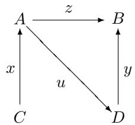

We draw graphs just like categories, but there is no composition of edges, and there are no identities.

A graph thus consists of two sets, $E$ (edges) and $V$ (vertices), and two functions, $s \colon E \to V$ (source) and $t \colon E \to V$ (target).

Now, every graph $G$ “generates” a category $\mathbf { C } ( G )$ , the free category on $G$ . It is defined by taking the vertices of $G$ as objects, and the paths in $G$ as arrows,

where a path is a finite sequence of edges $e _ { 1 } , \ldots , e _ { n }$ such that $t ( e _ { i } ) = s ( e _ { i + 1 } )$ , for all $i = 1 \dots n$ . We’ll write the arrows of $\mathbf { C } ( G )$ in the form $\epsilon _ { n } \epsilon _ { n - 1 } \ldots \epsilon _ { 1 }$ .

Put

$$
\operatorname {d o m} \left(e _ {n} \dots e _ {1}\right) = s \left(e _ {1}\right)
$$

$$
\operatorname {c o d} \left(e _ {n} \dots e _ {1}\right) = t \left(e _ {n}\right)
$$

and define composition by concatenation:

$$
e _ {n} \dots e _ {1} \circ e _ {m} ^ {\prime} \dots e _ {1} ^ {\prime} = e _ {n} \dots e _ {1} e _ {m} ^ {\prime} \dots e _ {1} ^ {\prime}.
$$

For each vertex $v$ , we have an “empty path” denoted ${ \mathrm { 1 } } _ { v }$ , which is to be the identity arrow at $v$ .

Note that if $G$ has only one vertex, then $\mathbf { C } ( G )$ is just the free monoid on the set of edges of $G$ . Also note that if $G$ has only vertices (no edges), then $\mathbf { C } ( G )$ is the discrete category on the set of vertices of $G$ .

Later on, we will have a general definition of “free.” For now, let us see that $\mathbf { C } ( G )$ also has a UMP.

First, define a “forgetful functor”

$$
U: \mathbf {C a t} \to \mathbf {G r a p h s}
$$

in the obvious way: the underlying graph of a category $\mathbf { C }$ has as edges the arrows of $\mathbf { C }$ , and as vertices the objects, with $s = \mathrm { d o m }$ and $t = c o d$ . The action of $U$ on functors is equally clear, or at least it will be, once we have defined the arrows in Graphs.

A homomorphism of graphs is of course a “functor without the conditions on identities and composition,” that is, a mapping of edges to edges and vertices to vertices that preserves sources and targets. We will describe this from a slightly different point of view, that will be useful later on. First, observe that we can describe a category $\mathbf { C }$ with a diagram like this:

$$
C _ {2} \xrightarrow {\circ} C _ {1} \xrightarrow [ \begin{array}{c} \longleftarrow i \\ \operatorname {d o m} \end{array} ]{\operatorname {c o d}} C _ {0}
$$

where $C _ { 0 }$ is the collection of objects of $\mathbf { C }$ , $C _ { 1 }$ the arrows, and $C _ { 2 }$ is the collection $\{ ( f , g ) \in C _ { 1 } \times C _ { 1 } : \operatorname { c o d } ( f ) = \operatorname { d o m } ( g ) \}$ .

Then a functor $F : \mathbf { C }  \mathbf { D }$ from $\mathbf { C }$ to another category $\mathbf { D }$ is a pair of functions

$$
F _ {0}: C _ {0} \to D _ {0}
$$

$$
F _ {1}: C _ {1} \to D _ {1}
$$

such that each similarly labeled square in the following diagram commutes:

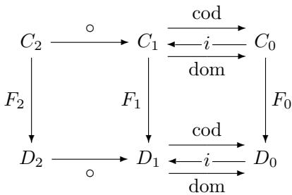

where $F _ { 2 } ( f , g ) = ( F _ { 1 } ( f ) , F _ { 1 } ( g ) )$ .

Now let us describe a homomorphism of graphs,

$$
h: G \to H.
$$

We need a pair of functions $h _ { 0 } : G _ { 0 } \to H _ { 0 }$ , $h _ { 1 } : G _ { 1 } \to H _ { 1 }$ making the two squares (once with $t$ ’s, once with $s$ ’s) in the following diagram commute:

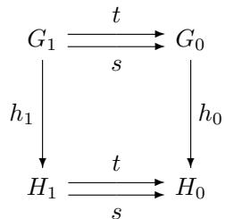

In these terms, we can easily describe the forgetful functor,

$$
U: \mathbf {C a t} \to \mathbf {G r a p h s}
$$

as sending the category

$$
C _ {2} \xrightarrow {\circ} C _ {1} \xrightarrow [ \begin{array}{c} \longleftarrow i \\ \operatorname {d o m} \end{array} ]{\operatorname {c o d}} C _ {0}
$$

to the underlying graph:

$$
C _ {1} \xrightarrow [ \mathrm {d o m} ]{\mathrm {c o d}} C _ {0}
$$

And similarly for functors, the effect of $U$ is described by erasing some parts of the diagrams (which is easier to demonstrate with chalk!).

The free category on a graph has the following UMP:

Universal Mapping Property of $\mathbf { C } ( G )$

There is a graph homomorphism $i : G \to | \mathbf { C } ( G ) |$ , and given any category $\mathbf { D }$ and any graph homomorphism $h : G \to | \mathbf { D } |$ , there is a unique functor $h : \mathbf { C } ( G ) \to \mathbf { D }$ with $| h | \circ i = h$ .

in Cat:

$$
\mathbf {C} (G) \stackrel {\bar {h}} {\longrightarrow} \mathbf {D}
$$

in Graph:

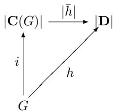

The free category on a graph with just one vertex is just a free monoid on the set of edges. The free category on a graph with two vertices and one edge between them is the finite category 2. The free category on a graph of the form:

$$
A \xrightarrow [ \begin{array}{c} \longleftarrow \\ f \end{array} ]{e} B
$$

has (in addition to the identity arrows) the infinitely many arrows:

$$
e, f, e f, f e, e f e, f e f, e f e f, \dots
$$

# 1.8 Foundations: large, small, and locally small

Let us begin by distinguishing between the following things:

categorical foundations for mathematics,

mathematical foundations for category theory.

As for the first: one sometimes hears it said that category theory can be used to provide “foundations for mathematics,” as an alternative to set theory. That is in fact the case, but it is not what we are doing here. In set theory, one often begins with existential axioms such as “every set has a powerset” and derives further sets, building up a universe of mathematical objects (namely sets), which in principle suffice for “all of mathematics.” Our axiom that every arrow has a domain and a codomain is not to be understood in the same way as set theory’s axiom that every set has a powerset! The difference is that in set theory—at least as usually conceived—the axioms are to be regarded as referring to (or determining) a single universe of sets. In category theory, by contrast, the axioms are a definition of something, namely of categories. This is just like in group theory or topology, where the axioms serve to define the objects under investigation. These, in turn, are assumed to exist in some “background” or “foundational” system, like set theory. That theory of sets could itself, in turn, be determined using category theory, or in some other way.

This brings us to the second point: we assume that our categories are comprised of sets and functions, in one way or another, like most mathematical objects, and taking into account the remarks just made about the possibility of categorical foundations. But in category theory, we sometimes run into difficulties with set theory as usually practiced. Mostly these are questions of size; some categories are “too big” to be handled comfortably in conventional set theory. We already encountered this issue when we considered the Cayley representation in Section 1.5. There we had to require that the category under consideration had (no more than) a set of arrows. We would certainly not want to impose this restriction in general, however (as one usually does for, say, groups); for then even the “category” Sets would fail to be a proper category, as would many other categories that we definitely want to study.

There are various formal devices for addressing these issues, and they are discussed in the book by Mac Lane. For our immediate purposes, the following distinction will be useful:

Definition 1.11. A category $\mathbf { C }$ is called small if both the collection $\mathbf { C } _ { 0 }$ of objects of $\mathbf { C }$ and the collection $\mathbf { C } _ { 1 }$ of arrows of $\mathbf { C }$ are sets. Otherwise, $\mathbf { C }$ is called large.

For example, all finite categories are clearly small, as is the category Setsfin of finite sets and functions. On the other hand, the category Pos of posets, the category Groups of groups, and the category Sets of sets are all large. We let Cat be the category of all small categories, which itself is a large category. In particular, then, Cat is not an object of itself, which may come as a relief to some readers.

This does not really solve all of our difficulties. Even for large categories like Groups and Sets we will want to also consider constructions like the category of all functors from one to the other (we will define this “functor category” later). But if these are not small, conventional set theory does not provide the means to do this directly (these categories would be “too large”). So, one needs a more elaborate theory of “classes” to handle such constructions. We will not worry about this when it is just a matter of technical foundations (Mac Lane I.6 addresses this issue). However, one very useful notion in this connection is the following:

Definition 1.12. A category $\mathbf { C }$ is called locally small if for all objects $X$ , $Y$ in $\mathbf { C }$ , the collection ${ \mathrm { H o m } } _ { \mathbf { C } } ( X , Y ) = \{ f \in \mathbf { C } _ { 1 } | ~ f : X \to Y ~ \}$ $f : X  Y \}$ is a set (called a hom-set).

Many of the large categories we want to consider are in fact locally small. Sets is locally small since ${ \mathrm { H o m } } _ { \mathbf { S e t s } } ( X , Y ) = Y ^ { X }$ , the set of all functions from $X$ to $Y$ . Similarly, Pos, Top, and Group are all locally small (is Cat?), and, of course, any small category is locally small.

# 1.9 Exercises

1. The objects of Rel are sets, and an arrow $f : A  B$ is a relation from $A$ to $B$ , that is, $f \subseteq A \times B$ . The identity relation $\{ \langle a , a \rangle \in A \times A | \ a \in A \}$ is the identity arrow on a set $A$ . Composition in Rel is to be given by

$$
g \circ f = \{\langle a, c \rangle \in A \times C \mid \exists b (\langle a, b \rangle \in f \& \langle b, c \rangle \in g) \}
$$

for $f \subseteq A \times B$ and $g \subseteq B \times C$ .

Show that Rel is a category.

2. Consider the following isomorphisms of categories and determine which hold.

(a) Rel ∼= Relop   
(b) Sets ∼= Setsop   
(c) For a fixed set $X$ with powerset $P ( X )$ , as poset categories $P ( X ) \cong$ $P ( X ) ^ { \mathrm { o p } }$ (the arrows in $P ( X )$ are subset inclusions $A \subseteq B$ for $A , B \subseteq { \cal X }$ ).

3. (a) Show that in Sets, the isomorphisms are exactly the bijections.

(b) Show that in Monoids, the isomorphisms are exactly the bijective homomorphisms.   
(c) Show that in Posets, the isomorphisms are not the same as the bijective homomorphisms.

4. Construct the “coslice category” $C / \mathbf { C }$ of a category $\mathbf { C }$ under an object $C$ from the slice category $\mathbf { C } / C$ and the “dual category” operation $- ^ { \mathrm { { O p } } }$ .   
5. How many free categories on graphs are there which have exactly six arrows? Draw the graphs that generate these categories.   
6. Prove the UMP for free categories on graphs:

Let $\mathbf { C } ( G )$ be the free category on the graph $G$ and $i : G \to U ( \mathbf { C } ( G ) )$ the graph homomorphism taking vertices and edges to themselves, regarded as objects and arrows in $\mathbf { C } ( G )$ . For any category $\mathbf { D }$ and graph homomorphism $f : G \to U ( \mathbf { D } )$ , there is a unique functor

$$
\bar {h}: \mathbf {C} (G) \to \mathbf {D}
$$

with

$$
U (\bar {h}) \circ i = h,
$$

where $U : { \mathbf { C a t } } \to { \mathbf { G r a p h } }$ is the underlying graph functor.

This page intentionally left blank

# 2

# ABSTRACT STRUCTURES

Let me begin with some remarks about category-theoretical definitions. By this I mean characterizations of properties of objects and arrows in a category in terms of other objects and arrows only, that is, in the language of category theory. Such definitions may be said to be abstract, structural, operational, relational, or external (as opposed to internal). The idea is that objects and arrows are determined by the role they play in the category via their relations to other objects and arrows, that is, by their position in a structure and not by what they “are” or “are made of” in some absolute sense. We will see many more examples of this kind of thing later; for now we start with some very simple ones. Let me call them abstract characterizations. We will see that one of the basic ways of giving such an abstract characterization is via a Universal Mapping Property or UMP.

# 2.1 Epis and monos

Recall that in Sets, a function $f : A  B$ is called

injective if $f ( a ) = f ( a ^ { \prime } )$ implies $a = a ^ { \prime }$ for all $a , a ^ { \prime } \in A$ ,

surjective if for all $b \in B$ there is some $a \in A$ with $f ( a ) = b$ .

We have the following abstract characterizations of these properties:

Definition 2.1. In any category $\mathbf { C }$ , an arrow

$$
f: A \to B
$$

is called a

monomorphism, if given any $g , h : C \to A$ , $f g = f h$ implies $g = h$ ,

$$
C \xrightarrow [ h ]{g} A \xrightarrow [ h ]{f} B
$$

epimorphism, if given any $i , j : B \to D$ , $i f = j f$ implies $i = j$ ,

$$
A \xrightarrow {f} B \xrightarrow [ j ]{i} D
$$

We often write $f : A \mapsto B$ if $f$ is a monomorphism and $f : A  B$ if $f$ is an epimorphism.

Proposition 2.2. A function $f : A  B$ between sets is monic just in case it is injective.

Proof. Suppose $f : A \mapsto B$ . Let $a , a ^ { \prime } \in A$ such that $a \neq a ^ { \prime }$ , and let $\{ x \}$ be any given one-element set. Consider the functions

$$
\bar {a}, \bar {a} ^ {\prime}: \{x \} \rightarrow A
$$

where

$$
\bar {a} (x) = a, \quad \bar {a} ^ {\prime} (x) = a ^ {\prime}.
$$

Since $\bar { a } \ne a ^ { \prime }$ , it follows, since $f$ is a monomorphism, that $f \bar { a } \ne f a ^ { \prime }$ -. Thus, $f ( a ) = ( f \bar { a } ) ( x ) \neq ( f \bar { a ^ { \prime } } ) ( x ) = f ( a ^ { \prime } )$ . Whence $f$ is injective.

Conversely, if $f$ is injective and $g , h : C \to A$ are functions such that $g \neq h$ , then for some $c \in C$ , $g ( c ) \neq h ( c )$ . Since $f$ is injective, it follows that $f ( g ( c ) ) \neq$ $f ( h ( c ) )$ , whence $f g \neq f h$ . □

Example 2.3. In many categories of “structured sets” like monoids, the monos are exactly the “injective homomorphisms.” More precisely, a homomorphism $h : M \to N$ of monoids is monic just if the underlying function $| h | : | M | \to$ $| N |$ is monic, that is, injective by the foregoing. To prove this, suppose $h$ is monic and take two different “elements” $m , m ^ { \prime } : 1 \to | M |$ , where $1 = \{ * \}$ is any one-element set. By the UMP of the free monoid $M ( * )$ there are distinct corresponding homomorphisms $\bar { m } , \bar { m ^ { \prime } } : M ( * ) \to M$ , with distinct composites $h \circ \bar { m } , h \circ \bar { m } ^ { \prime } : M ( * )  M  N$ , since $h$ is monic. Thus, the corresponding “elements” $h m , h m ^ { \prime } : 1  N$ of $N$ are also distinct, again by the UMP of $M ( * )$ . Conversely, if $| h | : | M | \to | N |$ is monic and $f , g : X \to M$ are any distinct homomorphisms, then $| f | , | g | : | X | \to | M |$ are distinct functions, and so $| h | \circ | f | , | h | \circ | g | : | X |  | M |  | N |$ are distinct, since $| h |$ is monic. Since therefore $| h \circ f | = | h | \circ | f | \neq | h | \circ | g | = | h \circ g |$ , we also must have $h \circ f \neq h \circ g$ .

A completely analogous situation holds, for example, for groups, rings, vector spaces, and posets. We shall see that this fact follows from the presence, in each of these categories, of certain objects like the free monoid $M ( * )$ .

Example 2.4. In a fixed poset $\mathbf { P }$ , every arrow $p \leq q$ is both monic and epic. Why?

While the epis in Sets are exactly the surjective functions (exercise!), epis in other categories are not always surjective homomorphisms, as the following example shows.

Example 2.5. In the category Mon of monoids and monoid homomorphisms, there is a monic homomorphism

$$
\mathbb {N} \mapsto \mathbb {Z}
$$

where $\mathbb { N }$ is the additive monoid $( N , + , 0 )$ of natural numbers and $\mathbb { Z }$ is the additive monoid $( Z , + , 0 )$ of integers. We will show that this map, given by the inclusion $N \subset Z$ of sets, is also epi in Mon by showing that the following holds:

Given any monoid homomorphisms $f , g \ : \ ( \mathbb { Z } , + , 0 ) \ \longrightarrow \ ( M , * , u )$ , if the restrictions to $N$ are equal, $f \mid _ { N } = g \mid _ { N }$ $f$ , then $f = g$ .

Note first that:

$$
\begin{array}{l} f (- n) = f ((- 1) _ {1} + (- 1) _ {2} + \dots + (- 1) _ {n}) \\ = f (- 1) _ {1} * f (- 1) _ {2} * \dots * f (- 1) _ {n} \\ \end{array}
$$

and similarly for $g$ . It therefore suffices to show that $f ( - 1 ) = g ( - 1 )$ . But

$$
\begin{array}{l} f (- 1) = f (- 1) * u \\ = f (- 1) * g (0) \\ = f (- 1) * g (1 - 1) \\ = f (- 1) * g (1) * g (- 1) \\ = f (- 1) * f (1) * g (- 1) \\ = f (- 1 + 1) * g (- 1) \\ = f (0) * g (- 1) \\ = u * g (- 1) \\ = g (- 1). \\ \end{array}
$$

Note that a morphism $e$ is epi if and only if $e$ cancels on the right: $x e = y e$ implies $x = y$ . Dually, $m$ is mono if and only if $m$ cancels on the left: $m x = m y$ implies $x = y$ .

Proposition 2.6. Every iso is mono and epi.

Proof. Consider the following diagram:

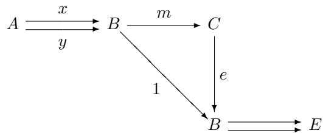

If $m$ is an isomorphism with inverse $e$ , then $m x = m y$ implies $x = e m x =$ $e m y = y$ . Thus, $m$ is monic. Similarly, $e$ cancels on the right, and thus $e$ is epic.

In Sets the converse of the foregoing also holds: every mono-epi is iso. But this is not in general true, as shown by the example in monoids above.

# 2.2 Initial and terminal objects

We now consider abstract characterizations of the empty set and the oneelement sets in the category Sets and structurally similar objects in general categories.

Definition 2.7. In any category $\mathbf { C }$ , an object

0 is initial if for any object $C$ there is a unique morphism

$$
0 \to C,
$$

1 is terminal if for any object $C$ there is a unique morphism

$$
C \to 1.
$$

As in the case of monos and epis, note that there is a kind of “duality” in these definitions. Precisely, a terminal object in $\mathbf { C }$ is exactly an initial object in $\mathbf { C } ^ { \mathrm { { o p } } }$ . We will consider this duality systematically later.

Since the notions of initial and terminal object are simple UMPs, such objects are uniquely determined up to isomorphism, just like the free monoids were.

Proposition 2.8. Initial (terminal) objects are unique up to isomorphism.

Proof. In fact, if $C$ and $C ^ { \prime }$ are both initial (terminal), then there is a unique isomorphism $C  C ^ { \prime }$ .

Suppose that 0 and $0 ^ { \prime }$ are both initial objects, the following diagram makes it clear that 0 and $0 ^ { \prime }$ are uniquely isomorphic.

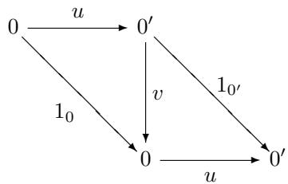

For terminal objects, apply the foregoing to $\mathbf { C } ^ { \mathrm { { o p } } }$ .

# Example 2.9.

1. In Sets the empty set is initial and any singleton set is terminal. Observe that Sets has just one initial object but many terminal objects (answering the question of whether $\mathbf { S e t s } \cong \mathbf { S e t s } ^ { \cup \mathrm { p } }$ ).

2. In Cat the category 0 (no objects and no arrows) is initial and the category 1 (one object and its identity arrow) is terminal.

3. In Groups, the one-element group is both initial and terminal (similarly for the category of vector spaces and linear transformations, as well as the category of monoids and monoid homomorphisms). But in Rings (commutative with unit), the ring $\mathbb { Z }$ of integers is initial (the one-element ring with $0 = 1$ is still terminal).

4. A Boolean algebra is a poset $B$ equipped with distinguished elements $0 , 1$ , binary operations $a \lor b$ of “join” and $a \wedge b$ of “meet,” and a unary operation $\neg b$ of “complementation.” These are required to satisfy the conditions

$$
\begin{array}{l} 0 \leq a \\ a \leq 1 \\ a \leq c \quad \text {a n d} \quad b \leq c \quad \text {i f f} \quad a \vee b \leq c \\ c \leq a \quad \text {a n d} \quad c \leq b \quad \text {i f f} \quad c \leq a \wedge b \\ a \leq \neg b \quad \text {i f f} \quad a \wedge b = 0 \\ \neg \neg a = a \\ \end{array}
$$

There is also an equivalent, fully equational characterization not involving the ordering. A typical example of a Boolean algebra is the powerset $P ( X )$ of all subsets $A \subseteq X$ of a set $X$ , ordered by inclusion $A \subseteq B$ , and with the Boolean operations being the empty set $0 = \emptyset$ , the whole set $1 = X$ , union and intersection of subsets as join and meet, and the relative complement $X - A$ as $\neg A$ . A familiar special case is the two-element Boolean algebra $\mathbf { 2 } ~ = ~ \{ 0 , 1 \}$ , sometimes also regarded as “truth values” with the logical operations of disjunction, conjunction, and negation as the Boolean operations. It is an initial object in the category of Boolean algebras, which has as arrows the Boolean homomorphisms. These are functors $h : B \to B ^ { \prime }$ that preserve the additional structure, in the sense that $h ( 0 ) = 0$ , $h ( a \vee b ) = h ( a ) \vee h ( b )$ , etc. The one-element Boolean algebra is terminal.

5. In a poset, an object is plainly initial iff it is the least element, and terminal iff it is the greatest element. Clearly, a category need not have either an initial object or a terminal object, for example, the poset $( \mathbb { Z } , \leq )$ has neither an initial object nor a terminal object.   
6. For any category $\mathbf { C }$ and any object $X \in \mathbf { C }$ , the identity arrow $1 _ { X } : X \to X$ is a terminal object in $\mathbf { C } / X$ and an initial object in $X / \mathbf { C }$ .

# 2.3 Generalized elements

Let us consider arrows into and out of initial and terminal objects. Clearly only certain of these will be of interest, but those are often especially significant.

A set $A$ has an arrow into the initial object $A  0$ just if it is itself empty and the same is true for posets. In monoids and groups, by contrast, every object has a unique arrow to the initial object, since it is also terminal.

In the category Bool of Boolean algebras, however, the situation is quite different. The maps $p : B \to { \bf 2 }$ into the initial Boolean algebra 2 correspond uniquely to the so-called ultrafilters $U$ in $B$ . A filter in a Boolean algebra $B$ is a nonempty subset $F \subseteq B$ that is closed upward and under meets:

$$
\begin{array}{l} a \in F \text {a n d} a \leq b \quad \text {i m p l i e s} \quad b \in F \\ a \in F \text {a n d} b \in F \quad \text {i m p l i e s} \quad a \wedge b \in F \\ \end{array}
$$

A filter $F ^ { \prime }$ is maximal if the only strictly larger filter $F \subset F ^ { \prime }$ is all of $B$ . An ultrafilter is a maximal filter. It is not hard to see that a filter $F$ is an ultrafilter just if for every element $b \in B$ , either $b \in F$ or $\neg b \in F$ , and not both (exercise!). Now if $p : B \to { \bf 2 }$ , let $U _ { p } = p ^ { - 1 } ( 1 )$ to get an ultrafilter $U _ { p } \subset B$ . And given an ultrafilter $U \subset B$ , define $p _ { U } ( b ) = 1$ iff $b \in U$ to get a Boolean homomorphism $p _ { U } : B \to { \bf 2 }$ . This is easy to check, as is the fact that these operations are mutually inverse. Boolean homomorphisms $B  2$ are also used in forming the “truth tables” one meets in logic. Indeed, a row of a truth table corresponds to such a homomorphism on a Boolean algebra of formulas.

Ring homomorphisms $A  \mathbb { Z }$ into the initial ring $\mathbb { Z }$ play an analogous and equally important role in algebraic geometry.

Now let us consider arrows from terminal objects. For any set $X$ , for instance, we have an isomorphism

$$
X \cong \operatorname {H o m} _ {\mathbf {S e t s}} (1, X)
$$

between elements $x \in X$ and arrows ${ \bar { x } } : 1 \to X$ , determined by $\bar { x } ( * ) = x$ , from a terminal object $1 = \{ * \}$ . We have already used this correspondence several times. A similar situation holds in posets (and in topological spaces), where the arrows $1  P$ correspond to elements of the underlying set of a poset (or space) $P$ . In any category with a terminal object 1, such arrows $1  A$ are called global elements, or points, or constants of $A$ . In sets, posets, and spaces, the general arrows $A  B$ are determined by what they do to the points of $A$ , in the sense that two arrows $f , g : A \longrightarrow B$ are equal if for every point $a : 1  A$ the composites are equal, $f a = g a$ .

But be careful; this is not always the case! How many points are there of an object $M$ in the category of monoids? That is, how many arrows of the form $1  M$ for a given monoid $M$ ? Just one! And how many points does a Boolean algebra have?

Because, in general, an object is not determined by its points it is convenient to introduce the device of generalized elements. These are arbitrary arrows,

$$
x: X \to A
$$

(any domain $X$ ), which can be regarded as generalized or variable elements of $A$ . Computer scientists and logicians sometimes think of arrows $1  A$ as constants or closed terms and general arrows $X  A$ as (arbitrary) terms.

# Example 2.10.

1. Consider arrows $f , g : X \to Y$ in Pos. Then $f = g$ iff for all $x : 1  X$ , we have $f x = g x$ . In this sense, posets “have enough points” to separate the arrows.   
2. By contrast, in Mon, for homomorphisms $h , j : M \to N$ we always have $h x \ = \ j x$ , for all $x : 1  M$ , since there’s just one such point $x$ . Thus monoids do not “have enough points.”   
3. But in any category $\mathbf { C }$ , and for any arrows $f , g : C \to C ^ { \prime }$ , we always have $f = g$ iff for all $x : D  C$ , it holds that $f x = g x$ (why?). Thus, every object has enough generalized elements.   
4. In fact, it often happens that it is enough to consider generalized elements of just a certain form $T  A$ , that is, for certain “test” objects $T$ . We shall consider this presently.

Generalized elements are also good for “testing” for various conditions. Consider, for instance, the following diagram.

$$
X \xrightarrow [ x ^ {\prime} ]{x} A \xrightarrow {f} B
$$

The arrow $f$ is monic iff $x \neq x ^ { \prime }$ implies $f x \neq f x ^ { \prime }$ , that is, just if $f$ is “injective on generalized elements.”

Similarly, in any category $\mathbf { C }$ , to test whether a square commutes

$$
\begin{array}{c} A \xrightarrow {f} B \\ g \Bigg {\downarrow} \\ D \xrightarrow {\beta} C \end{array}
$$

we shall have $\alpha f = \beta g$ just if $\alpha f x = \beta g x$ for all generalized elements $x : X \to A$ (just take $x = 1 _ { A } : A \to A$ !).

Example 2.11. Generalized elements can be used to “reveal more structure” than do the constant elements. For example, consider the following posets $X$ and $A$ :

$$
\begin{array}{l} A = \{a \leq b \leq c \} \\ X = \{x \leq y, x \leq z \} \\ \end{array}
$$

There is an order-preserving bijection $f : X \to A$ defined by

$$
f (x) = a, \qquad f (y) = b, \qquad f (z) = c.
$$

It is easy to see that $f$ is both monic and epic in the category Pos; however, it is clearly not an iso. One would like to say that $X$ and $A$ are “different structures,” and indeed, their being non-isomorphic says just this. But now, how to prove that they are not isomorphic (say, via some other $X  A$ )? In general, this can be quite difficult.

One way to prove that two objects are not isomorphic is to use “invariants”: attributes that are preserved by isomorphisms. If two objects differ by an invariant they cannot be isomorphic. Generalized elements provide an easy way to define invariants. For instance, the number of global elements of $X$ and $A$ is the same, namely the three elements of the sets. But consider instead the 2-elements $2  X$ . Then $X$ has 5 such, and $A$ has 6. Since these numbers are invariants, the posets cannot be isomorphic. In more detail, we can define for any poset $P$ the numerical invariant

$$
| \operatorname {H o m} (2, P) | = \text {n u m b e r o f e l e m e n t s o f} \operatorname {H o m} (2, P).
$$

Then if $P \cong Q$ , it is easy to see that $| \operatorname { H o m } ( 2 , P ) | = | \operatorname { H o m } ( 2 , Q ) |$ , since any isomorphism

$$
P \xrightarrow [ g ]{f} Q
$$

also gives an iso

$$
\operatorname {H o m} (2, P) \xrightarrow [ g _ {*} ]{f _ {*}} \operatorname {H o m} (2, Q)
$$

by composition:

$$
f _ {*} (h) = f h
$$

$$
g _ {*} (k) = g k
$$

for all $h : 2  P$ and $k : 2  Q$ .

Example 2.12. As in the foregoing example, it is often the case that generalized elements $t : T  A$ “based at” certain objects $T$ are especially “revealing.” We can think of such elements geometrically as “figures of shape $T$ in $A$ ,” just as an arrow ${ \bf 2 }  P$ in posets is a figure of shape $p \leq p ^ { \prime }$ in $P$ . For instance, as we have already seen, in the category of monoids, the arrows from the terminal monoid 1 are entirely uninformative, but those from the free monoid $M ( * )$ on one generator suffice to distinguish homomorphisms, in the sense that two homomorphisms $f , g : M \to N$ are equal if their composites with all such arrows are equal. In fact, for monoids the underlying set $| M |$ is plainly (isomorphic to) $\mathrm { H o m } _ { \mathbf { M o n } } ( M ( * ) , M )$ .

# 2.4 Sections and retractions

We already noted that any iso is both monic and epic. More generally, if an arrow

$$
f: A \to B
$$

has a left inverse

$$
g: B \to A, \quad g f = 1 _ {A}
$$

then $f$ must be monic and $g$ epic, by an easy exercise.

Definition 2.13. A split mono (epi) is an arrow with a left (right) inverse.

Terminology: Given arrows $e : X  A$ and $s : A \to X$ such that $e s = 1 _ { A }$ , then $s$ is called a section or splitting of $e$ , and $e$ is called a retraction of $s$ . The object $A$ is called a retract of $X$ .

Remark 2.14. Since functors preserve identities, they also preserve split epis and split monos. Compare the example above in Mon where the forgetful functor

$$
\mathbf {M o n} \to \mathbf {S e t}
$$

did not preserve the epi $\ N \to \mathbb { Z }$ .

Example 2.15. In Sets, every mono splits except those of the form

$$
\emptyset \hookrightarrow A.
$$

The condition that every epi splits is the categorical version of the axiom of choice. Indeed, consider an epi

$$
e: E \twoheadrightarrow X.
$$

We have the family of nonempty sets

$$
E _ {x} = e ^ {- 1} \{x \}, \quad x \in X.
$$

A splitting of $e$ is exactly a choice function for this family $( E _ { x } ) _ { x \in X }$ , that is, a function $s : X \to E$ such that $e s = 1 _ { X }$ , since this means that $s ( x ) \in E _ { x }$ for all $x \in X$ .

Conversely, given a family of nonempty sets,

$$
(E _ {x}) _ {x \in X}
$$

take $E = \{ ( x , y ) \mid x \in X , \ y \in E _ { x } \}$ and define the epi $e : E \twoheadrightarrow X$ by $( x , y ) \mapsto x$ A splitting $s$ of $e$ then determines a choice function for the family.

The idea that a “family of objects” $( E _ { x } ) _ { x \in X }$ can be represented by a single arrow $e : E \to X$ by using the “fibers” $e ^ { - 1 } ( x )$ has much wider application than this, and will be considered further in Section 7.9.

A notion related to the existence of “choice functions” is that of being “projective”: an object $P$ is said to be projective if for any epi $e : E \to X$ and arrow

$f : P \to X$ there is some (not necessarily unique) arrow $f : P \to E$ such that $e \circ f = f$ , as indicated in the following diagram:

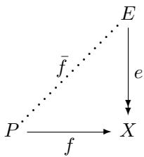

One says that $f$ lifts across e. Projective objects may be thought of as having “less structure,” thus permitting “more arrows.”

The axiom of choice implies that all sets are projective, and it follows that free objects in many (but not all!) categories of algebras then are also projective. The reader should show that, in any category, any retract of a projective object is also projective.

# 2.5 Products

Next we are going to see the categorical definition of a product of two objects in a category. This was first given by Mac Lane in 1950, and it is probably the earliest example of category theory being used to define a fundamental mathematical notion.

By “define” here I mean an abstract characterization, in the sense already used, in terms of objects and arrows in a category. And as before, we do this by giving a UMP, which determines the structure at issue up to isomorphism, as usual in category theory. Later in this chapter, we will have several other examples of such characterizations.

Let us begin by considering products of sets. Given sets $A$ and $B$ the cartesian product of $A$ and $B$ is the set of ordered pairs

$$
A \times B = \{(a, b) \mid a \in A, b \in B \}.
$$

Observe that there are two “coordinate projections”

$$
A \xleftarrow {\pi_ {1}} A \times B \xrightarrow {\pi_ {2}} B
$$

with

$$
\pi_ {1} (a, b) = a, \quad \pi_ {2} (a, b) = b.
$$

And indeed, given any element $c \in A \times B$ we have

$$
c = \left(\pi_ {1} c, \pi_ {2} c\right).
$$

The situation is captured concisely in the following diagram:

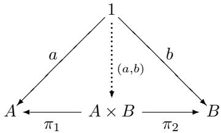

Replacing elements by generalized elements, we get the following definition.

Definition 2.16. In any category $\mathbf { C }$ , a product diagram for the objects $A$ and $B$ consists of an object $P$ and arrows

$$
A \xleftarrow {p _ {1}} P \xrightarrow {p _ {2}} B
$$

satisfying the following UMP:

Given any diagram of the form

$$
A \xleftarrow {x _ {1}} X \xrightarrow {x _ {2}} B
$$

there exists a unique $u : X  P$ , making the diagram

commute, that is, such that $x _ { 1 } = p _ { 1 } u$ and $x _ { 2 } = p _ { 2 } u$ .

Remark 2.17. As in other UMPs, there are two parts:

Existence: There is some $u : X \to U$ such that $x _ { 1 } = p _ { 1 } u$ and $x _ { 2 } = p _ { 2 } u$

Uniqueness: Given any $v : X \to U$ , if $p _ { 1 } v = x _ { 1 }$ and $p _ { 2 } v = x _ { 2 }$ , then $v = u$

Proposition 2.18. Products are unique up to isomorphism.

Proof. Suppose

$$
A \xleftarrow {p _ {1}} P \xrightarrow {p _ {2}} B
$$

and

$$
A \xleftarrow {q _ {1}} Q \xrightarrow {q _ {2}} B
$$

are products of $A$ and $B$ . Then there is a unique $i : P \to Q$ such that $q _ { 1 } \circ i = p _ { 1 }$ and $q _ { 2 } \circ i = p _ { 2 }$ . Similarly, there is a unique $j : Q \to P$ such that $p _ { 1 } \circ j = q _ { 1 }$

and $p _ { 2 } \circ \mathscr { j } = q _ { 2 }$ . Thus, $p _ { 1 } \circ j \circ i = p _ { 1 }$ and $p _ { 2 } \circ j \circ i = p _ { 2 }$ . Since $p _ { 1 } \circ 1 _ { P } = p _ { 1 }$ and $p _ { 2 } \circ 1 _ { P } = p _ { 2 }$ , it follows from the uniqueness condition that $j \circ i = 1 _ { P }$ . Similarly, $i \circ j = 1 _ { Q }$ . Thus, $i : P \to Q$ is an isomorphism. □

If $A$ and $B$ have a product, we write

$$
A \xleftarrow {p _ {1}} A \times B \xrightarrow {p _ {2}} B
$$

for one such product. Then given $X , x _ { 1 } , x _ { 2 }$ as in the definition, we write

$$
\langle x _ {1}, x _ {2} \rangle \text {f o r} u: X \to A \times B.
$$

Note, however, that a pair of objects may have many different products in a category. For example, given a product $A \times B , p _ { 1 } , p _ { 2 }$ , and any iso $h : A \times B \to Q$ , the diagram $Q , p _ { 1 } \circ h , p _ { 2 } \circ h$ is also a product of $A$ and $B$ .

Now an arrow into a product

$$
f: X \to A \times B
$$

is “the same thing” as a pair of arrows

$$
f _ {1}: X \to A, \quad f _ {2}: X \to B.
$$

So we can essentially forget about such arrows, in that they are uniquely determined by pairs of arrows. But something useful is gained if a category has products; namely, consider arrows out of the product,

$$
g: A \times B \to Y.
$$

Such a $g$ is a “function in two variables”; given any two generalized elements $f _ { 1 } : X \to A$ and $f _ { 2 } : X \to B$ , we have an element $g \langle f _ { 1 } , f _ { 2 } \rangle : X \to Y$ . Such arrows $g : A \times B \to Y$ are not “reducible” to anything more basic, the way arrows into products were (to be sure, they are related to the notion of an “exponential” $Y ^ { B }$ , via “currying” $\lambda f : A \to Y ^ { B }$ ; we discuss this further in chapter 6).

# 2.6 Examples of products

1. We have already seen cartesian products of sets. Note that if we choose a different definition of ordered pairs $\langle a , b \rangle$ we get different sets

$$
A \times B \quad \text {a n d} \quad A \times^ {\prime} B
$$

each of which is (part of) a product, and so are isomorphic. For instance, we could set:

$$
\begin{array}{l} \langle a, b \rangle = \{\{a \}, \{a, b \} \} \\ \langle a, b \rangle^ {\prime} = \langle a, \langle a, b \rangle \rangle \\ \end{array}
$$

2. Products of “structured sets” like monoids or groups can often be constructed as products of the underlying sets with componentwise operations: If $G$ and $H$ are groups, for instance, $G \times H$ can be constructed by taking the underlying set of $G \times H$ to be the set $\{ \langle g , h \rangle \ : | \ : g \in G , \ : h \in H \}$ and defining the binary operation by

$$
\langle g, h \rangle \cdot \langle g ^ {\prime}, h ^ {\prime} \rangle = \langle g \cdot g ^ {\prime}, h \cdot h ^ {\prime} \rangle
$$

the unit by

$$
u = \langle u _ {G}, u _ {H} \rangle
$$

and inverses by

$$
\langle a, b \rangle^ {- 1} = \langle a ^ {- 1}, b ^ {- 1} \rangle .
$$

The projection homomorphisms $G \times H \to G$ (or $H$ ) are the evident ones $\langle g , h \rangle \mapsto g$ (or $h$ ).

3. Similarly, for categories $\mathbf { C }$ and $\mathbf { D }$ , we already defined the category of pairs of objects and arrows,

$$
\mathbf {C} \times \mathbf {D}.
$$

Together with the evident projection functors, this is indeed a product in Cat (when $\mathbf { C }$ and $\mathbf { D }$ are small).

As a special case, we also get products of posets and of monoids as products of categories.

4. Let $P$ be a poset and consider a product of elements $p , q \in P$ . We must have projections

$$
p \times q \leq p
$$

$$
p \times q \leq q
$$

and if for any element $x$

$$
x \leq p, \quad \text {a n d} \quad x \leq q
$$

then we need

$$
x \leq p \times q.
$$

Do you recognize this operation $p \times q$ ? It is just what is usually called the greatest lower bound: $p \times q = p \wedge q$ . Many other order-theoretic notions are also special cases of categorical ones, as we shall see later.

5. (For those who know something about Topology.) Let us show that the product of two topological spaces $X , Y$ , as usually defined, really is a product

in Top, the category of spaces and continuous functions. Thus suppose we have spaces $X$ and $Y$ and the product spaces $X \times Y$ with its projections

$$
X \xleftarrow {p _ {1}} X \times Y \xrightarrow {p _ {2}} Y
$$

Recall that $O ( X \times Y )$ is generated by basic open sets of the form $U \times V$ where $U \in O ( X )$ and $V \in O ( Y )$ , so every $W \in O ( X \times Y )$ is a union of such basic opens.

Clearly $p _ { 1 }$ is continuous, since $p _ { 1 } ^ { - 1 } U = U \times Y$ .   
Given any continuous $f _ { 1 } : Z \to X , f _ { 2 } : Z \to Y$ , let $f : Z \to X \times Y$ be the function $f = \langle f _ { 1 } , f _ { 2 } \rangle$ . We just need to see that $f$ is continuous.   
Given any $\begin{array} { r } { W = \bigcup _ { i } ( U _ { i } \times V _ { i } ) \in O ( X \times Y ) } \end{array}$ , $\begin{array} { r } { f ^ { - 1 } ( W ) = \bigcup _ { i } f ^ { - 1 } ( U _ { i } \times V _ { i } ) } \end{array}$ , so it suffices to show $f ^ { - 1 } ( U \times V )$ is open. But

$$
\begin{array}{l} f ^ {- 1} (U \times V) = f ^ {- 1} ((U \times Y) \cap (X \times V)) \\ = f ^ {- 1} (U \times Y) \cap f ^ {- 1} (X \times V) \\ = f ^ {- 1} \circ p _ {1} ^ {- 1} (U) \cap f ^ {- 1} \circ p _ {2} ^ {- 1} (V) \\ = \left(f _ {1}\right) ^ {- 1} (U) \cap \left(f _ {2}\right) ^ {- 1} (V) \\ \end{array}
$$

where $( f _ { 1 } ) ^ { - 1 } ( U )$ and $( f _ { 2 } ) ^ { - 1 } ( V )$ are open, since $f _ { 1 }$ and $f _ { 2 }$ are continuous.

The following diagram concisely captures the situation at hand:

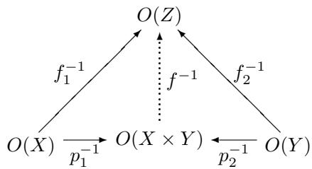

6. (For those familiar with type theory.) Let us consider the category of types of the (simply typed) $\lambda$ -calculus. The $\lambda$ –calculus is a formalism for the specification and manipulation of functions, based on the notions of “binding of variables” and functional evaluation. For example, given the real polynomial expression $x ^ { 2 } + 2 y$ , in the $\lambda$ -calculus one writes $\lambda y . x ^ { 2 } + 2 y$ for the function $y \mapsto x ^ { 2 } + 2 y$ (for each fixed value $x$ ), and $\lambda x \lambda y . x ^ { 2 } + 2 y$ for the function-valued function $x \mapsto ( y \mapsto x ^ { 2 } + 2 y )$ .

Formally, the $\lambda$ -calculus consists of:

Types: $A \times B , \ A \to B , \dots$ (generated from some basic types)   
Terms:

$$
\begin{array}{l} \langle a, b \rangle : A \times B \quad (a: A, b: B) \\ \operatorname {f s t} (c): A \quad (c: A \times B) \\ \operatorname {s n d} (c): B \quad (c: A \times B) \\ c a: B \quad (c: A \to B, a: A) \\ \end{array}
$$

$$
\lambda x. b: A \to B \quad (x: A, b: B)
$$

Equations:

$$
\begin{array}{l} \operatorname {f s t} (\langle a, b \rangle) = a \\ \operatorname {s n d} (\langle a, b \rangle) = b \\ \langle \operatorname {f s t} (c), \operatorname {s n d} (c) \rangle = c \\ (\lambda x. b) a = b [ a / x ] \\ \lambda x. c x = c \quad (\text {n o} x \text {i n} c) \\ \end{array}
$$

The relation $a \sim b$ (usually called $\beta \eta$ -equivalence) on terms is defined to be the equivalence relation generated by the equations, and renaming of bound variables:

$$
\lambda x. b = \lambda y. b [ y / x ] \quad (\text {n o} y \text {i n} b)
$$

The category of types $\mathbf { C } ( \lambda )$ is now defined as follows:

objects: the types,   
arrows $A  B$ : closed terms $c : A  B$ , identified if $c \sim c ^ { \prime }$   
identities: $1 _ { A } = \lambda x . x$ (where $x : A$ ),   
composition: $c \circ b = \lambda x . c ( b x )$ .

Let us verify that this is a well-defined category:

Unit laws:

$$
\begin{array}{l} c \circ 1 _ {B} = \lambda x (c ((\lambda y. y) x)) = \lambda x (c x) = c \\ 1 _ {C} \circ c = \lambda x ((\lambda y. y) (c x)) = \lambda x (c x) = c \\ \end{array}
$$

Associativity:

$$
\begin{array}{l} c \circ (b \circ a) = \lambda x (c ((b \circ a) x)) \\ = \lambda x (c ((\lambda y. b (a y)) x)) \\ = \lambda x (c (b (a x))) \\ = \lambda x (\lambda y (c (b y)) (a x)) \\ = \lambda x ((c \circ b) (a x)) \\ = (c \circ b) \circ a \\ \end{array}
$$

This category has binary products. Indeed, given types $A$ and $B$ , let

$$
p _ {1} = \lambda z. \operatorname {f s t} (z), \quad p _ {2} = \lambda z. \operatorname {s n d} (z) \quad (z: A \times B).
$$

And given $a$ and $b$ as in

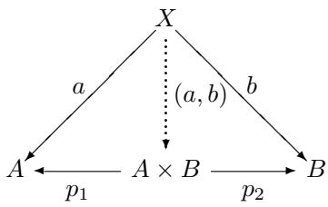

let

$$
(a, b) = \lambda x. \langle a x, b x \rangle .
$$

Then

$$
\begin{array}{l} p _ {1} \circ (a, b) = \lambda x \left(p _ {1} \left(\left(\lambda y. \langle a y, b y \rangle\right) x\right)\right) \\ = \lambda x \left(p _ {1} \left\langle a x, b x \right\rangle\right) \\ = \lambda x (a x) \\ = a. \\ \end{array}
$$

Similarly, $p _ { 2 } \circ ( a , b ) = b$

Finally, if $c : X  A \times B$ also has

$$
p _ {1} \circ c = a, \qquad p _ {2} \circ c = b
$$

then

$$
\begin{array}{l} (a, b) = \lambda x. \langle a x, b x \rangle \\ = \lambda x. \langle (p _ {1} \circ c) x, (p _ {2} \circ c) x \rangle \\ = \lambda x. \langle (\left(\lambda y (p _ {1} (c y))\right) x, (\lambda y (p _ {2} (c y))) x \rangle \\ = \lambda x. \langle (\lambda y ((\lambda z. \operatorname {f s t} (z)) (c y))) x, (\lambda y ((\lambda z. \operatorname {s n d} (z)) (c y))) x \rangle \\ = \lambda x. \langle \lambda y (\operatorname {f s t} (c y)) x, \lambda y (\operatorname {s n d} (c y)) x \rangle \\ = \lambda x. \langle \operatorname {f s t} (c x), \operatorname {s n d} (c x) \rangle \\ = \lambda x. (c x) \\ = c. \\ \end{array}
$$

# 2.7 Categories with products

Let $\mathbf { C }$ be a category that has a product diagram for every pair of objects. Suppose we have objects and arrows

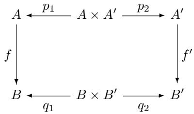

with indicated products. Then we write

$$
f \times f ^ {\prime}: A \times A ^ {\prime} \to B \times B ^ {\prime}
$$

for $f \times f ^ { \prime } = \langle f \circ p _ { 1 } , f ^ { \prime } \circ p _ { 2 } \rangle$ . Thus, both squares in the following diagram commute.

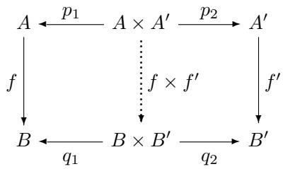

In this way, if we choose a product for each pair of objects, we get a functor

$$
\times : \mathbf {C} \times \mathbf {C} \rightarrow \mathbf {C}
$$

as the reader can easily check, using the UMP of the product. A category which has a product for every pair of objects is said to have binary products.

We can also define ternary products

$$
A _ {1} \times A _ {2} \times A _ {3}
$$

with an analogous UMP (there are three projections $p _ { i } : A _ { 1 } \times A _ { 2 } \times A _ { 3 } \to A _ { i }$ , and for any object $X$ and three arrows $x _ { i } : X  A _ { i }$ , there is a unique arrow $u : X  A _ { 1 } \times A _ { 2 } \times A _ { 3 }$ such that $p _ { i } u = x _ { i }$ for each of the three $_ i$ ’s.) Plainly, such a condition can be formulated for any number of factors.

It is clear, however, that if a category has binary products, then it has all finite products with two or more factors; for instance, one could set

$$
A \times B \times C = (A \times B) \times C
$$

to satisfy the UMP for ternary products. On the other hand, one could instead have taken $A \times ( B \times C )$ just as well. This shows that the binary product operation

$A \times B$ is associative up to isomorphism, for we must have

$$
(A \times B) \times C \cong A \times (B \times C)
$$

by the UMP of ternary products.

Observe also that a terminal object is a “null-ary” product, that is, a product of no objects:

Given no objects, there is an object 1 with no maps, and given any other object $X$ and no maps, there is a unique arrow

$$
! \colon X \to 1
$$

making nothing further commute.

Similarly, any object $A$ is the unary product of $A$ with itself one time.

Finally, one can also define the product of a family of objects $( C _ { i } ) _ { i \in I }$ indexed by any set $I$ , by giving a UMP for “ $I$ -ary products” analogous to those for nullary, unary, binary, and $n$ -ary products. We leave the precise formulation of this UMP as an exercise.

Definition 2.19. A category $\mathbf { C }$ is said to have all finite products if it has a terminal object and all binary products (and therewith products of any finite cardinality). The category $\mathbf { C }$ has all (small) products if every set of objects in $\mathbf { C }$ has a product.

# 2.8 Hom-sets

In this section, we assume that all categories are locally small.

Recall that in any category $\mathbf { C }$ , given any objects $A$ and $B$ , we write

$$
\operatorname {H o m} (A, B) = \{f \in \mathbf {C} \mid f: A \to B \}
$$

and call such a set of arrows a Hom-set. Note that any arrow $g : B  B ^ { \prime }$ in $\mathbf { C }$ induces a function:

$$
\operatorname {H o m} (A, g): \operatorname {H o m} (A, B) \to \operatorname {H o m} (A, B ^ {\prime})
$$

$$
(f: A \to B) \mapsto (g \circ f: A \to B \to B ^ {\prime})
$$

Thus, $\operatorname { H o m } ( A , g ) = g \circ f$ ; one sometimes writes $g _ { * }$ instead of $\operatorname { H o m } ( A , g )$ , so

$$
g _ {*} (f) = g \circ f.
$$

Let us show that this determines a functor

$$
\operatorname {H o m} (A, -): \mathbf {C} \to \mathbf {S e t s}
$$

called the (covariant) representable functor of $A$ .

We need to show that

$$
\operatorname {H o m} (A, 1 _ {X}) = 1 _ {\operatorname {H o m} (A, X)}
$$

and that

$$
\operatorname {H o m} (A, g \circ f) = \operatorname {H o m} (A, g) \circ \operatorname {H o m} (A, f).
$$

Taking an argument $x : A  X$ , we clearly have

$$
\begin{array}{l} \operatorname {H o m} (A, 1 _ {X}) (x) = 1 _ {X} \circ x \\ = x \\ = 1 _ {\operatorname {H o m} (A, X)} (x) \\ \end{array}
$$

and

$$
\begin{array}{l} \operatorname {H o m} (A, g \circ f) (x) = (g \circ f) \circ x \\ = g \circ (f \circ x) \\ = \operatorname {H o m} (A, g) (\operatorname {H o m} (A, f) (x)). \\ \end{array}
$$

We will study such representable functors much more carefully later. For now we just want to see how one can use Hom-sets to give another definition of products.

An object $P$ with arrows $p _ { 1 } : P  A$ and $p _ { 2 } : P  B$ is an element $( p _ { 1 } , p _ { 2 } )$ of the set

$$
\operatorname {H o m} (P, A) \times \operatorname {H o m} (P, B).
$$

And similarly for any set $X$ in place of $P$ . Now, given any arrow

$$
x: X \to P
$$

composing with $p _ { 1 }$ and $p _ { 2 }$ gives a pair of arrows $x _ { 1 } = p _ { 1 } \circ x : X \to A$ and $x _ { 2 } = p _ { 2 } \circ x : X  B$ , as indicated in the following diagram.

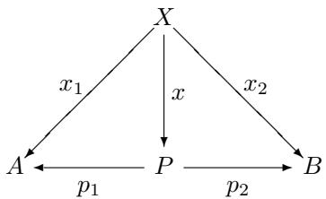

In this way, we have a function

$$
\vartheta_ {X} = \langle \operatorname {H o m} (X, p _ {1}), \operatorname {H o m} (X, p _ {2}) \rangle : \operatorname {H o m} (X, P) \to \operatorname {H o m} (X, A) \times \operatorname {H o m} (X, B)
$$

defined by

$$
\vartheta_ {X} (x) = \left(x _ {1}, x _ {2}\right) \tag {2.1}
$$

This function $\vartheta _ { X }$ can be used to express concisely the condition of being a product as follows.

Proposition 2.20. A diagram of the form

$$
A \xleftarrow {p _ {1}} P \xrightarrow [ p _ {2} ]{} B
$$

is a product for A and $B$ iff for every object $X$ , the canonical function $\vartheta _ { X }$ given in (2.1) is an isomorphism,

$$
\vartheta_ {X}: \operatorname {H o m} (X, P) \cong \operatorname {H o m} (X, A) \times \operatorname {H o m} (X, B).
$$

Proof. Examine the UMP of the product: it says exactly that for every element $( x _ { 1 } , x _ { 2 } ) \in \operatorname { H o m } ( X , A ) \times \operatorname { H o m } ( X , B )$ , there is a unique $x \in \operatorname { H o m } ( X , P )$ such that $\vartheta _ { X } ( x ) = ( x _ { 1 } , x _ { 2 } )$ , that is, $\vartheta _ { X }$ is bijective. □

Definition 2.21. Let $\mathbf { C }$ , $\mathbf { D }$ be categories with binary products. A functor $F$ : $\mathbf { C } \to \mathbf { D }$ is said to preserve binary products if it takes every product diagram

$$
A \xleftarrow {p _ {1}} A \times B \xrightarrow {p _ {2}} B \quad \text {i n} \mathbf {C}
$$

to a product diagram

$$
F A \xleftarrow {F p _ {1}} F (A \times B) \xrightarrow {F p _ {2}} F B \qquad \text {i n} \mathbf {D}.
$$

It follows that $F$ preserves products just if

$$
F (A \times B) \cong F A \times F B \quad (\mathrm {c a n o n i c a l l y})
$$

that is, iff the canonical “comparison arrow”

$$
\left\langle F p _ {1}, F p _ {2} \right\rangle : F (A \times B) \rightarrow F A \times F B
$$

is an iso.

For example, the forgetful functor U : Mon → Sets preserves binary products.

Corollary 2.22. For any object $X$ in a category $\mathbf { C }$ with products, the (covariant) representable functor

$$
\operatorname {H o m} _ {\mathbf {C}} (X, -): \mathbf {C} \rightarrow \mathbf {S e t s}
$$

preserves products.

Proof. For any $A , B \in \mathbf { C }$ , the foregoing proposition says that there is a canonical isomorphism:

$$
\operatorname {H o m} _ {\mathbf {C}} (X, A \times B) \cong \operatorname {H o m} _ {\mathbf {C}} (X, A) \times \operatorname {H o m} _ {\mathbf {C}} (X, B)
$$

□

# 2.9 Exercises

1. Show that a function between sets is surjective if it is an epimorphism in Sets.   
2. With regard to a commutative triangle,

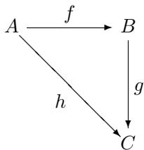

in any category $\mathbf { C }$ , show

a. if $f$ and are isos (resp. monos, resp. epis), so is $h$ ; $g$   
b. if $h$ is monic, so is $f$ ;   
c. if $h$ is epic, so is ; $g$   
d. (by example) if $h$ is monic, $g$ need not be.

3. Show that all sets are projective (use the axiom of choice). Show that the epis among posets are the surjections (on objects), and that the one-element poset 1 is projective. Finally, show that in any category, any retract of a projective object is also projective.

4. Let $A$ be a set. Define an $A$ -monoid to be a monoid $M$ equipped with a function $m : A \to U ( M )$ (to the underlying set of $M$ ). A morphism $h : ( M , m ) \to ( N , n )$ of $A$ -monoids is to be a monoid homomorphism $h$ : $M  N$ such that $U ( h ) \circ m = n$ (a commutative triangle). Together with the evident identities and composites, this defines a category $A - \mathbf { M o n }$ of $A$ -monoids.

Show that an initial object in A-Mon is the same thing as a free monoid $M ( A )$ on $A$ . (Hint: compare their respective UMPs.)

5. Show that for any Boolean algebra $B$ , Boolean homomorphisms $h : B \to 2$ correspond exactly to ultrafilters in $B$ .

6. In any category with binary products, show directly that:

$$
A \times (B \times C) \cong (A \times B) \times C.
$$

7. (a) For any index set $I$ , define the product $\textstyle \prod _ { i \in I } X _ { i }$ of an $I$ -indexed family of objects $( X _ { i } ) _ { i \in I }$ in a category, by giving a UMP generalizing that for binary products (the case $I = 2$ ).

(b) Show that in Sets, for any set $X$ the set $X ^ { I }$ of all functions $f : I \to X$ has this UMP, with respect to the “constant family” where $X _ { i } = X$ for all $i \in I$ , and thus

$$
X ^ {I} \cong \prod_ {i \in I} X
$$

This page intentionally left blank

# 3

# DUALITY

We have seen a few examples of definitions and statements which exhibit a kind of “duality,” like initial and terminal object and epimorphisms and monomorphisms. We now want to consider this duality more systematically. Despite its rather trivial first impression, it is indeed a deep and powerful aspect of the categorical approach.

# 3.1 The duality principle

First, let us look again at the formal definition of a category: There are two kinds of things, objects $A , B , C$ and . . . , arrows $f , g , h , \ldots$ ; four operations $\operatorname { d o m } ( f )$ , $\operatorname { c o d } ( f )$ , $1 _ { A }$ , $g \circ f$ ; and these satisfy the following seven axioms:

$$
\operatorname {d o m} (1 _ {A}) = A, \qquad \operatorname {c o d} (1 _ {A}) = A
$$

$$
f \circ 1 _ {\operatorname {d o m} (f)} = f, \qquad 1 _ {\operatorname {c o d} (f)} \circ f = f
$$

$$
\operatorname {d o m} (g \circ f) = \operatorname {d o m} (f), \quad \operatorname {c o d} (g \circ f) = \operatorname {c o d} (g)
$$

$$
h \circ (g \circ f) = (h \circ g) \circ f
$$

The operation “ $g \circ f ^ { \prime \prime }$ is only defined where

$$
\operatorname {d o m} (g) = \operatorname {c o d} (f),
$$

so a suitable form of this should occur as a condition on each equation containing $\circ$ , as in $\operatorname { d o m } ( g ) = \operatorname { c o d } ( f ) \Rightarrow \operatorname { d o m } ( g \circ f ) = \operatorname { d o m } ( f )$ .

Now, given any sentence $\Sigma$ in the elementary language of category theory, we can form the “dual statement” $\Sigma ^ { * }$ by making the following replacements:

$$
g \circ f \quad \text {f o r} \quad f \circ g
$$

$$
\begin{array}{c c c} \text {c o d} & \text {f o r} & \text {d o m} \end{array}
$$

$$
\begin{array}{c c c} \text {d o m} & \text {f o r} & \text {c o d .} \end{array}
$$

It is easy to see that then $\Sigma ^ { * }$ will also be a well-formed sentence. Next, suppose we have shown a statement $\Sigma$ to entail one $\Delta$ , without using any of the category axioms, then clearly $\Sigma ^ { * } \vdash \Delta ^ { * }$ , since the substituted terms are treated as mere

undefined constants. But now observe that the axioms for category theory CT are themselves “self-dual,” in the sense that we have:

$$
\mathrm {C T} ^ {*} = \mathrm {C T}
$$

We therefore have the following duality principle:

Proposition 3.1 (Formal duality). For any statement $\Sigma$ in the language of category theory, if Σ follows from the axioms for categories, then so does $\Sigma ^ { * }$ :

$$
\mathrm {C T} \vdash \Sigma \text {i m p l i e s} \mathrm {C T} \vdash \Sigma^ {*}
$$

Taking a more conceptual point of view, note that if $\Sigma$ involves some diagram of objects and arrows,

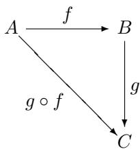

then $\Sigma ^ { * }$ involves the diagram obtained from it by reversing direction and the order of compositions of arrows.

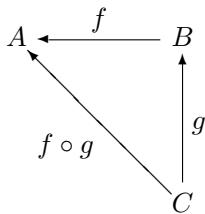

Recalling the opposite category $\mathbf { C } ^ { \mathrm { { o p } } }$ of a category $\mathbf { C }$ , we see that an interpretation of a statement $\Sigma$ in $\mathbf { C }$ automatically gives an interpretation of $\Sigma ^ { * }$ in $\mathbf { C } ^ { \mathrm { { o p } } }$ .

Now, since for every category $\mathbf { C }$

$$
\left(\mathbf {C} ^ {\mathrm {o p}}\right) ^ {\mathrm {o p}} = \mathbf {C} \tag {3.1}
$$

the conceptual form of the duality principle then results similarly in

Proposition 3.2 (Conceptual duality). For any statement $\Sigma$ about categories, if $\Sigma$ holds for all categories, then so does the dual statement $\Sigma ^ { * }$ .

Proof. If $\Sigma$ holds for all categories $\mathbf { C }$ , then it also holds in all categories $\mathbf { C } ^ { \mathrm { { o p } } }$ , but then $\Sigma ^ { * }$ holds in all categories $( \mathbf { C } ^ { \mathrm { { o p } } } ) ^ { \mathrm { { o p } } }$ , thus in all categories $\mathbf { C }$ . □

It may seem that only very simple or trivial properties such as “having a terminal object” are going to be subject to this sort of duality, but in fact this is far from

being so. Categorical duality turns out to be a very powerful and far-reaching phenomenon, as we shall see later. One way this occurs is that, rather than considering statements about all categories, we can also consider the dual of an abstract definition or property of objects and arrows, like “being a product diagram.” The dual property is arrived at by reversing the order of composition and the words “dom” and “cod.” Equivalently, it results from interpreting the original property in the opposite category. The next section provides an example of this procedure.

# 3.2 Coproducts

Let us consider the example of products and see what the dual notion must be. First, recall the definition of a product.

Definition 3.3. A diagram $A \stackrel { p _ { 1 } } { \longleftarrow } P \stackrel { p _ { 2 } } { \longrightarrow } B$ is a product of $A$ and $B$ , if for any $Z$ and $A \stackrel { z _ { 1 } } { \longleftarrow } Z \stackrel { z _ { 2 } } { \longrightarrow } B$ there is a unique $u : Z \to P$ with $p _ { i } \cup u = z _ { i }$ , all as indicated in

Now what is the dual statement?

A diagram $A \ { \stackrel { q _ { 1 } } { \longrightarrow } } \ Q \ { \stackrel { q _ { 2 } } {  } } \ B$ is a “dual-product” of $A$ and $B$ if for any $Z$ and $A \stackrel { z _ { 1 } } { \right. } Z \stackrel { z _ { 2 } } { \left. } B$ there is a unique $u : Q  Z$ with $u \circ q _ { i } = z _ { i }$ , all as indicated in

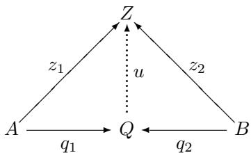

Actually, these are called coproducts; the convention is to use the prefix “co-” to indicate the dual notion. We usually write $A \ { \overset { i _ { 1 } } { \to } } \ A + B \ { \overset { i _ { 2 } } {  } } \ B$ for the coproduct and $[ f , g ]$ for the uniquely determined arrow $u : A + B \to Z$ . The “coprojections” $i _ { 1 } : A  A + B$ and $i _ { 2 } : B \to A + B$ are usually called injections, even though they need not be “injective” in any sense.

A coproduct of two objects is therefore exactly their product in the opposite category. Of course, this immediately gives lots of examples of coproducts. But what about some more familiar ones?

Example 3.4. In Sets, the coproduct $A + B$ of two sets is their disjoint union,

$$
A + B = \{(a, 1) \mid a \in A \} \cup \{(b, 2) \mid b \in B \}
$$

with evident coproduct injections

$$
i _ {1} (a) = (a, 1), \qquad i _ {2} (b) = (b, 2).
$$

Given any functions $f$ and $g$ as in:

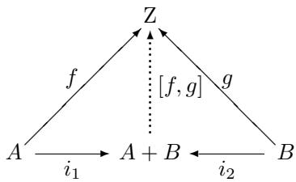

we define

$$
[ f, g ] (x, \delta) = \left\{ \begin{array}{l l} f (x) & \delta = 1 \\ g (x) & \delta = 2. \end{array} \right.
$$

If, in addition, $h \circ i _ { 1 } = f$ and $h \circ i _ { 2 } = g$ , then for any $( x , \delta ) \in A + B$ , we must have

$$
h (x, \delta) = [ f, g ] (x, \delta)
$$

as can be easily calculated.

Note that in Sets, every finite set $A$ is a coproduct:

$$
A \cong 1 + 1 + \dots + 1 (n \text {- t i m e s})
$$

for $n = \operatorname { c a r d } ( A )$ . This is because a function $f : A  Z$ is uniquely determined by its values $f ( a )$ for all $a \in A$ . So we have

$$
\begin{array}{l} A \cong \left\{a _ {1} \right\} + \left\{a _ {n} \right\} + \dots + \left\{a _ {n} \right\} \\ \cong 1 + 1 + \dots + 1 (n - \text {t i m e s}). \\ \end{array}
$$

In this spirit, we often write simply $2 = 1 + 1 , 3 = 1 + 1 + 1$ , etc.

Example 3.5. If $M ( A )$ and $M ( B )$ are free monoids on sets $A$ and $B$ , then in Mon we can construct their coproduct as

$$
M (A) + M (B) \cong M (A + B).
$$

One can see this directly by considering words over $A + B$ , but it also follows abstractly by using the diagram

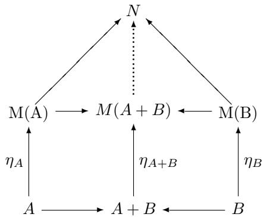

in which the $\eta$ ’s are the respective insertions of generators. The UMPs of $M ( A )$ , $M ( B )$ , $A + B$ , and $M ( A + B )$ then imply that the last of these has the required UMP of $M ( A ) + M ( B )$ .

It follows that the free monoid functor $M : \mathbf { S e t s }  \mathbf { M o n }$ preserves coproducts. This is an instance of a much more general phenomenon, which we will consider later, related to the fact we have already seen that the forgetful functor $U : \mathbf { M o n } \to \mathbf { S e t s }$ is representable and so preserves products.

Example 3.6. In Top the coproduct of two spaces

$$
X + Y
$$

is their disjoint union with the topology $O ( X + Y ) \cong O ( X ) \times O ( Y )$ . Note that this follows the pattern of discrete spaces, for which $O ( X ) = P ( X ) \cong 2 ^ { X }$ . Thus, for discrete spaces we indeed have

$$
O (X + Y) \cong 2 ^ {X + Y} \cong 2 ^ {X} \times 2 ^ {Y} \cong O (X) \times O (Y).
$$

Coproducts of posets are similarly constructed from the coproducts of the underlying sets, by “putting them side by side.” What about “rooted” posets, that is, posets with a distinguished initial element 0? In the category $\mathrm { P o s } _ { 0 }$ of such posets and monotone maps that preserve 0, one constructs the coproduct of two such posets $A$ and $B$ from the coproduct $A + B$ in the category Pos of posets, by identifying the two different 0s,

$$
A + _ {\mathrm {P o s} _ {0}} B = (A + _ {\mathrm {P o s}} B) / (0 _ {A} = 0 _ {B}).
$$

Example 3.7. In a fixed poset $P$ , what is a coproduct of two elements $p , q \in P$ ? We have

$$
p \leq p + q \quad \text {a n d} \quad q \leq p + q
$$

and if

$$
p \leq z \quad \text {a n d} \quad q \leq z
$$

then

$$
p + q \leq z.
$$

So $p + q = p \vee q$ is the join, or “least upper bound,” of $p$ and $q$ .

Example 3.8. Sum types in the $\lambda$ -calculus as usually formulated using case terms are coproducts in the category of types defined in subsection 2.6.

Example 3.9. Coproduct of monoids

Two monoids $A , B$ have a coproduct of the form

$$
A + B = M (| A | + | B |) / \sim
$$

where, as before, the free monoid $M ( | A | + | B | )$ is strings (words) over the disjoint union $| A | + | B |$ of the underlying sets—the elements of $A$ and $B$ —and the equivalence relation $v \sim w$ is the least one containing the following equations

$$
\begin{array}{l} u ^ {A} = (-) = u ^ {B} \\ (\dots a a ^ {\prime} \dots) = (\dots a \cdot a ^ {\prime} \dots) \\ (\dots b b ^ {\prime} \dots) = (\dots b \cdot b ^ {\prime} \dots). \\ \end{array}
$$

(If you need a refresher on quotienting a set by an equivalence relation, skip ahead and read the beginning of Section 3.4 now.) The unit is of course the equivalence class $[ - ]$ of the empty word. Multiplication of equivalence classes is also as expected, namely

$$
[ x \dots y ] \cdot [ x ^ {\prime} \dots y ^ {\prime} ] = [ x \dots y x ^ {\prime} \dots y ^ {\prime} ].
$$

The coproduct injections $i _ { A } : A \to A + B$ and $i _ { B } : B  A + B$ are simply:

$$
i _ {A} (a) = [ a ], \qquad i _ {B} (b) = [ b ].
$$

Given any homomorphism $f : A  M$ and $g : B  M$ into a monoid $M$ , the unique homomorphism

$$
[ f, g ]: A + B \longrightarrow M
$$

is defined by first lifting the function $[ \vert f \vert , \vert g \vert ] : \vert A \vert + \vert B \vert  \vert M \vert$ to the free monoid $M ( | A | + | B | )$ , and then observing that if $v \sim w$ in $M ( | A | + | B | )$ , then $[ | f | , | g | ] ( v ) = [ | f | , | g | ] ( w )$ . Why is this homomorphism the unique one

$$
h: M (| A | + | B |) / \sim \longrightarrow M
$$

with $h i _ { A } = f$ and $h i _ { B } = g$ ?

This construction also works to give coproducts in Groups, where it is usually called the free product of $A$ and $B$ and written $A \oplus B$ .

Example 3.10. For abelian groups $A , B$ , the free product $A \oplus B$ need not be abelian. One could, of course, take a quotient of $A \oplus B$ to get a coproduct in the

category Ab of abelian groups, but there is a more convenient (and important) presentation, which we now consider.

Since the words in the free product $A \oplus B$ must be forced to satisfy the further commutativity conditions

$$
(a _ {1} b _ {1} b _ {2} a _ {2} \dots) \sim (a _ {1} a _ {2} \dots b _ {1} b _ {2} \dots)
$$

we can shuffle all the $a$ ’s to the front, and the $b$ ’s to the back, of the words. But, furthermore, we already have

$$
\left(a _ {1} a _ {2} \dots b _ {1} b _ {2} \dots\right) \sim \left(a _ {1} + a _ {2} + \dots + b _ {1} + b _ {2} + \dots\right).
$$

Thus, we in effect have pairs of elements $( a , b )$ . So we take the product set as the underlying set of the coproduct

$$
| A + B | = | A \times B |.
$$

As inclusions, we use the homomorphisms

$$
i _ {A} (a) = (a, 0 _ {B})
$$

$$
i _ {B} (b) = (0 _ {A}, b).
$$

Then given any homomorphisms $A \ { \overset { f } { \to } } \ X \ { \overset { g } {  } } \ B$ , we let $[ f , g ] : A + B \to X$ be defined by

$$
[ f, g ] (a, b) = f (a) + _ {X} g (b)
$$

which can easily be seen to do the trick (exercise!).

Proposition 3.11. In the category Ab of abelian groups, there is a canonical isomorphism between the binary coproduct and product,

$$
A + B \cong A \times B.
$$

Proof. To define an arrow $\vartheta : A + B  A \times B$ we need one $A  A \times B$ (and one $B  A \times B$ ), so we need arrows $A  A$ and $A  B$ (and $B  A$ and $B  B$ ). For these we take $1 _ { A } : A  A$ and the zero homomorphism $0 _ { B } : A  B$ (and $0 _ { A } : B  A$ and $1 _ { B } : B \to B$ ). Thus, all together we get

$$
\vartheta = [ \langle 1 _ {A}, 0 _ {B} \rangle , \langle 0 _ {A}, 1 _ {B} \rangle ]: A + B \rightarrow A \times B.
$$

Then given any $( a , b ) \in A + B$ , we have

$$
\begin{array}{l} \vartheta (a, b) = [ \langle 1 _ {A}, 0 _ {B} \rangle , \langle 0 _ {A}, 1 _ {B} \rangle ] (a, b) \\ = \left\langle 1 _ {A}, 0 _ {B} \right\rangle (a) + \left\langle 0 _ {A}, 1 _ {B} \right\rangle (b) \\ = \left(1 _ {A} (a), 0 _ {B} (a)\right) + \left(0 _ {A} (b), 1 _ {B} (b)\right) \\ = (a, 0 _ {B}) + (0 _ {A}, b) \\ = (a + 0 _ {A}, 0 _ {B} + b) \\ = (a, b). \\ \end{array}
$$

□

This fact was first observed by Mac Lane, and it was shown to lead to a binary operation of addition on parallel arrows $f , g : A  B$ between abelian groups (and related structures like modules and vector spaces). In fact, the group structure of a particular abelian group $A$ can be recovered from this operation on arrows into $A$ . More generally, the existence of such an addition operation on arrows can be used as the basis of an abstract description of categories like Ab, called “abelian categories,” which are suitable for axiomatic homology theory.

Just as with products, one can consider the empty coproduct, which is an initial object 0, as well as coproducts of several factors, and the coproduct of two arrows,

$$
f + f ^ {\prime}: A + A ^ {\prime} \rightarrow B + B ^ {\prime}
$$

which leads to a coproduct functor $+ : \mathbf { C } \times \mathbf { C } \to \mathbf { C }$ on categories $\mathbf { C }$ with binary coproducts. All of these facts follows simply by duality; that is, by considering the dual notions in the opposite category. Similarly, we have the following proposition.

Proposition 3.12. Coproducts are unique up to isomorphism.

Proof. Use duality and the fact that the dual of “isomorphism” is “isomorphism.” □

In just the same way, one shows that binary coproducts are associative up to isomorphism, $( A + B ) + C \cong A + ( B + C )$ .

In this way, in the future it will thus suffice to introduce new notions and then simply observe that the dual notions have analogous (but dual) properties. The next two sections give another example of this sort.

# 3.3 Equalizers

In this section, we consider another abstract characterization; this time a generalization of the idea of the kernel of a homomorphism or an equationally defined “variety,” like the set of zeros of a real-valued function.

Definition 3.13. In any category $\mathbf { C }$ , given parallel arrows

$$
A \xrightarrow [ g ]{f} B
$$

an equalizer of $f$ and $g$ consists of $E$ and $e : E  A$ , universal such that

$$
f \circ e = g \circ e.
$$

That is, given $z : Z \to A$ with $f \circ z = g \circ z$ there is a unique $u : Z \to E$ with $e \cup u = z$ , all as in the diagram

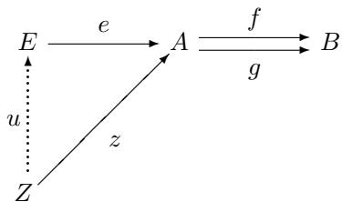

Let us consider some simple examples.

Example 3.14. In Sets, given functions $f , g \ : \ A  \implies B$ , their equalizer is the inclusion into $A$ of the equationally defined subset

$$
i: \{x \in A | f (x) = g (x) \} \hookrightarrow A.
$$

Since if $f h ( z ) = g h ( z )$ for some $h : Z \to A$ , then $h ( z ) \in \{ x \in A | f ( x ) = g ( x ) \}$ for all $z \in { Z }$ , whence $h$ “factors through” the inclusion function $_ i$ , in the sense that there is a function $h : Z \to \{ x \in A | f ( x ) = g ( x ) \}$ such that $i \circ h = h$ . Observe that $h$ is necessarily unique with this property, since $i$ is monic.

Let us pause here to note that in fact, every subset $U \subseteq A$ is of this “equational” form, that is, is an equalizer for some pair of functions. Indeed, one can do this in a very canonical way; first let us put

$$
2 = \{\top , \bot \}.
$$

Then consider the characteristic function

$$
\chi_ {U}: A \to 2
$$

defined for $x \in A$ by

$$
\chi_ {U} (x) = \left\{ \begin{array}{l l} \top & x \in U \\ \bot & x \notin U. \end{array} \right.
$$

Thus we have

$$
U = \{x \in A \mid \chi_ {U} (x) = \top \}.
$$

So the following is an equalizer

$$
U \xrightarrow {} A \xrightarrow [ \chi_ {U} ]{\text {T !}} 2
$$

where $\mathsf { T } ! = \mathsf { T o l } : U \stackrel { ! } { \to } 1 \stackrel { \top } { \to } 2$ .

Moreover, for every function,

$$
\varphi : A \to 2
$$

we can form the “variety” (i.e. equational subset)

$$
V _ {\varphi} = \{x \in A \mid \varphi (x) = \top \}
$$

as an equalizer, in the same way.

Now, it is easy to see that these operations $\chi _ { U }$ and $V _ { \varphi }$ are mutually inverse:

$$
\begin{array}{l} V _ {\chi_ {U}} = \{x \in A | \chi_ {U} (x) = \top \} \\ = \{x \in A | x \in U \} \\ = U \\ \end{array}
$$

and given $\varphi : A  2$

$$
\begin{array}{l} \chi_ {V _ {\varphi}} (x) = \left\{ \begin{array}{l l} \top & x \in V _ {\varphi} \\ \bot & x \not \in V _ {\varphi} \end{array} \right. \\ = \left\{ \begin{array}{l l} \top & \varphi (x) = \top \\ \bot & \varphi (x) = \bot \end{array} \right. \\ = \varphi (x). \\ \end{array}
$$

Therefore, we have an isomorphism

$$
\operatorname {H o m} (A, 2) \cong P (A)
$$

via the maps $V$ and $\chi$

The fact that equalizers of functions can be taken as subsets is a special case of a more general phenomenon:

Proposition 3.15. In any category, if $e : E  A$ is an equalizer of some pair of arrows, then e is monic.

Proof. Consider the diagram:

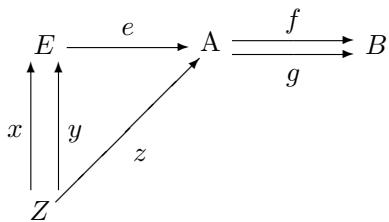

in which we assume $e$ is the equalizer of $f$ and $g$ . Supposing $e x = e y$ , we want to show $x = y$ . Put $z = e x = e y$ . Then $f z = f e x = g e x = g z$ , so there is a unique $u : Z \to E$ such that $e u = z$ . But from $e x = z$ and $e y = z$ , it follows that $x = u = y$ . □

Example 3.16. In many other categories, such as posets and monoids, the equalizer of a parallel pair of arrows $f , g : A  B$ can be constructed by taking the equalizer of the underlying functions as above, that is, the subset $A ( f = g ) \subseteq A$

of elements $x \in A$ where $f$ and $g$ agree, $f ( x ) = g ( x )$ , and then restricting the structure of $A$ to $A ( f = g )$ . For instance, in posets one takes the ordering from $A$ restricted to this subset $A ( f = g )$ , and in topological spaces one takes the subspace topology.

In monoids, the subset $A ( f = g )$ is then also a monoid with the operations from $A$ , and the inclusion is therefore a homomorphism, because $f ( u _ { A } ) = u _ { B } =$ $g ( u _ { A } )$ , and if $f ( a ) = g ( a )$ and $f ( a ^ { \prime } ) = g ( a ^ { \prime } )$ , then $f ( a \cdot a ^ { \prime } ) = f ( a ) \cdot f ( a ^ { \prime } ) =$ $g ( a ) \cdot g ( a ^ { \prime } ) = g ( a \cdot a ^ { \prime } )$ .

In abelian groups, one has an alternate description of the equalizer, using the fact that,

$$
f (x) = g (x) \quad \text {i f f} \quad (f - g) (x) = 0.
$$

Thus the equalizer of $f$ and $g$ is the same as that of the homomorphism $( f - g )$ and the zero homomorphism $0 : A  B$ , so it suffices to consider equalizers of the special form $A ( h , 0 ) \ \mapsto \ A$ for arbitrary homomorphisms $h : A  B$ . This subgroup of $A$ is called the kernel of $h$ , written $\ker ( h )$ . Thus we have the equalizer:

$$
\ker (f - g) \xrightarrow {} A \xrightarrow [ g ]{f} B
$$

The kernel of a homomorphism is of fundamental importance in the study of groups.

# 3.4 Coequalizers

A coequalizer is a generalization of a quotient by an equivalence relation, so let us begin by reviewing that notion. Recall first that an equivalence relation on a set $X$ is a binary relation $x \sim y$ which is

reflexive: $x \sim x$

symmetric: $x \sim y$ implies $y \sim x$

transitive: $x \sim y$ and $y \sim z$ implies $x \sim z$

Given such a relation, define the equivalence class $[ x ]$ of an element $x \in X$ by

$$
[ x ] = \{y \in X | x \sim y \}.
$$

The various different equivalence classes $[ x ]$ then form a partition of $X$ , in the sense that every element $y$ is in exactly one of them, namely $[ y ]$ (prove this!).

One sometimes thinks of an equivalence relation as arising from the equivalent elements having some property in common (like being the same color). One can then regard the equivalence classes $[ x ]$ as the properties and in that sense as “abstract objects” (the colors red, blue, etc., themselves). This is sometimes known as “definition by abstraction,” and it describes the way that the real

numbers can be constructed from Cauchy sequences of rationals or the finite cardinal numbers from finite sets.

The set of all equivalence classes

$$
X / \sim = \{[ x ] \mid x \in X \}
$$

may be called the quotient of $X$ by $\sim$ . It is used in place of $X$ when one wants to “abstract away” the difference between equivalent elements $x \sim y$ , in the sense that in $X / \sim$ such elements (and only such) are identified, since

$$
[ x ] = [ y ] \quad \text {i f f} \quad x \sim y.
$$

Now let us consider the notion dual to that of equalizer, namely that of a coequalizer.

Definition 3.17. For any parallel arrows $f , g \ : \ A  \ B$ in a category $\mathbf { C }$ , a coequalizer consists of $Q$ and $q : B  Q$ , universal with the property $q f = q g$ , as in:

$$
A \xrightarrow {f} B \xrightarrow {q} Q
$$

That is, given any $Z$ and $z : B  Z$ , if $z f = z g$ , then there exists a unique $u : Q \to Z$ such that $u q = z$ .

First observe that by duality, we know that such a coequalizer $q$ in a category $\mathbf { C }$ is an equalizer in $\mathbf { C } ^ { \mathrm { { o p } } }$ , hence monic by the last proposition, and so $q$ is epic in $\mathbf { C }$ .

Proposition 3.18. If $q : B  Q$ is a coequalizer of some pair of arrows, then $q$ is epic.

Example 3.19. Let $R \subseteq X \times X$ be an equivalence relation on a set $X$ , and consider the diagram

$$
R \xrightarrow [ r _ {2} ]{r _ {1}} X
$$

where the $r$ ’s are the two projections of the inclusion $i : R \subseteq X \times X$ , as indicated in the diagram

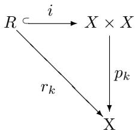

The canonical projection

$$
\pi : X \longrightarrow X / R
$$

defined by $x \mapsto [ x ]$ is then a coequalizer of $r _ { 1 }$ and $r _ { 2 }$ . For given an $f : X \to Y$ as in:

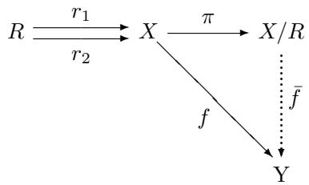

there exists a function $f$ such that

$$
\bar {f} \pi (x) = f (x)
$$

just in case $f$ “respects $R ^ { \ast }$ in the sense that

$$
(x, x ^ {\prime}) \in R \quad \text {i m p l i e s} \quad f (x) = f (x ^ {\prime}).
$$

But this condition just says that $f r _ { 1 } ~ = ~ f r _ { 2 }$ , since $f r _ { 1 } ( x , x ^ { \prime } ) ~ = ~ f ( x )$ and $f r _ { 2 } ( x , x ^ { \prime } ) = f ( x ^ { \prime } )$ for all $( x , x ^ { \prime } ) \in R$ . Moreover, such a function $\bar { f }$ , if it exists, is then necessarily unique, since $\pi$ is an epimorphism.

The coequalizer in Sets of an arbitrary parallel pair of functions $f , g : A  B$ can be constructed by quotienting $B$ by the equivalence relation generated by the equations $f ( x ) = g ( x )$ for all $x \in A$ . We leave the details as an exercise.

# Example 3.20. Presentations of algebras

Consider a category of “algebras”—say, monoids or groups—that has free algebras for all sets and coequalizers for all parallel pairs of arrows (see the exercises for a proof that monoids have coequalizers). We can use these to determine the notion of a presentation of an algebra by generators and relations.

For example, suppose we are given:

Generators: x, y, z

Relations: $x y = z , \ y ^ { 2 } = 1$

To build an algebra on these generators and satisfying these relations, start with

$$
F (3) = F (x, y, z)
$$

and then “force” the relation $x y = z$ by taking a coequalizer of the maps

$$
F (1) \xrightarrow [ z ]{x y} F (3) \xrightarrow [ q ]{q} Q
$$

We use the fact that maps $F ( 1 )  A$ correspond to elements $a \in A$ by $v \mapsto a$ , where $v$ is the single generator of $F ( 1 )$ . Now similarly, for the equation ${ y } ^ { 2 } = 1$ , take the coequalizer:

$$
F (1) \xrightarrow [ q (1) ]{q (y ^ {2})} Q \longrightarrow Q ^ {\prime}
$$

These two steps can actually be done simultaneously; let

$$
F (2) = F (1) + F (1)
$$

$$
F (2) \xrightarrow [ g ]{f} F (3)
$$

where $f = [ x y , y ^ { 2 } ]$ and $g = [ z , 1 ]$ . The coequalizer $q : F ( 3 )  Q$ of $f$ and $g$ then “forces” both equations to hold, in the sense that in $Q$ we have

$$
q (x) q (y) = q (z), \quad q (y) ^ {2} = 1.
$$

Moreover, no other relations among the generators hold in $Q$ except those required to hold by the stipulated equations. For, given any algebra $A$ and any three elements $a , b , c \in A$ such that $a b = c$ and $b ^ { 2 } = 1$ , by the UMP of $Q$ there is a unique homomorphism $u : Q  A$ such that

$$
u (x) = a, \qquad u (y) = b, \qquad u (z) = c.
$$

Thus any other equation that holds among the generators will also hold in any other algebra in which the stipulated equations hold, since the homomorphism $u$ also preserves equations. In this sense, $Q$ is the “universal” algebra with three generators satisfying the stipulated equations; as may be written suggestively in the form

$$
Q \cong F (x, y, z) / (x y = z, y ^ {2} = 1).
$$

Generally, given a finite presentation:

Generators: $g _ { 1 } , \ldots , g _ { n }$

Relations: $l _ { 1 } = r _ { 1 } , \ldots , l _ { m } = r _ { m }$

the algebra with that presentation is the coequalizer

$$
F (m) \xrightarrow [ r ]{l} F (n) \longrightarrow Q = F (n) / (l = r)
$$

where $l = \lfloor l _ { 1 } , \ldots , l _ { m } \rfloor$ and $r = [ r _ { 1 } , \ldots , r _ { m } ]$ . Such algebras are said to be finitely presented.

Warning 3.21. Presentations are not unique. One may well have two different presentations $F ( n ) / ( l = r )$ and $F ( n ^ { \prime } ) / ( l ^ { \prime } = r ^ { \prime } )$ by generators and relations of the same algebra,

$$
F (n) / (l = r) \cong F (n ^ {\prime}) / \left(l ^ {\prime} = r ^ {\prime}\right).
$$

For instance, given $F ( n ) / ( l = r )$ add a new generator $g _ { n + 1 }$ and the new relation $g _ { n } = g _ { n + 1 }$ . In general, there are many different ways of presenting a given algebra, just like there are many ways of axiomatizing a logical theory.

We did not really make use of the finiteness condition in the foregoing considerations. Indeed, any sets of generators $G$ and relations $R$ give rise to an algebra in the same way, by taking the coequalizer

$$
F (R) \xrightarrow [ r _ {2} ]{r _ {1}} F (G) \longrightarrow F (G) / (r _ {1} = r _ {2}).
$$

In fact, every “algebra” can be “presented” by generators and relations in this way, given a suitable notion of an “algebra.” More precisely, we have the following proposition for monoids, an analogous version of which also holds for groups, and many related structures.

Proposition 3.22. For every monoid M there are sets $G$ and $R$ and a coequalizer diagram,

$$
F (R) \xrightarrow [ r _ {2} ]{r _ {1}} F (G) \longrightarrow M
$$

with $F ( G )$ and $F ( R )$ free, thus $M \cong F ( G ) / ( r _ { 1 } = r _ { 2 } )$

Proof. For any monoid $N$ , let us write $T N = M ( | N | )$ for the free monoid on the set of elements of $N$ (and note that $T$ is therefore a functor). There is a homomorphism,

$$
\pi : T N \to N
$$

$$
\pi (x _ {1}, \dots , x _ {n}) = x _ {1} \cdot \dots \cdot x _ {n}
$$

induced by the identity $1 _ { | N | } : | N | \to | N |$ on the generators. (Here we are writing the elements of $T N$ as tuples $( x _ { 1 } , \ldots , x _ { n } )$ rather than strings $x _ { 1 } \ldots x _ { n }$ for clarity.)

Applying this construction twice to a monoid $M$ results in the arrows $\pi$ and $\varepsilon$ in the following diagram,

$$
T ^ {2} M \xrightarrow [ \mu ]{\varepsilon} T M \xrightarrow [ \pi ]{} M \tag {3.2}
$$

where $T ^ { 2 } M \ = \ T T M$ and $\mu ~ = ~ T \pi$ . Explicitly, the elements of $T ^ { 2 } M$ are tuples of tuples of elements of $M$ , say $( ( x _ { 1 } , \ldots , x _ { n } ) , \ldots , ( z _ { 1 } , \ldots , z _ { m } ) )$ , and the homomorphisms $\varepsilon$ and $\mu$ have the effect:

$$
\varepsilon \left(\left(x _ {1}, \dots , x _ {n}\right), \dots , \left(z _ {1}, \dots , z _ {m}\right)\right) = \left(x _ {1}, \dots , x _ {n}, \dots , z _ {1}, \dots , z _ {m}\right)
$$

$$
\mu \left(\left(x _ {1}, \dots , x _ {n}\right), \dots , \left(z _ {1}, \dots , z _ {m}\right)\right) = \left(x _ {1} \cdot \dots \cdot x _ {n}, \dots , z _ {1} \cdot \dots \cdot z _ {m}\right)
$$

Briefly, uses the multiplication in $^ { T M }$ and uses that in $M$ . $\varepsilon$ $\mu$

We claim that (3.2) is a coequalizer of monoids. To that end, suppose we have a monoid $N$ and a homomorphism $h : T M \to N$ with $h \varepsilon = h \mu$ . Then for any tuple $( x , \ldots , z )$ we have

$$
\begin{array}{l} h (x, \dots , z) = h \varepsilon ((x, \dots , z)) \\ = h \mu ((x, \dots , z)) \tag {3.3} \\ = h (x \cdot \dots \cdot z). \\ \end{array}
$$

Now define $h = h \circ i$ , where $i : | M | \to | T M |$ is the insertion of generators as indicated in the following:

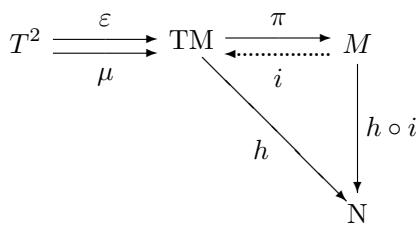

We then have:

$$
\begin{array}{l} \bar {h} \pi (x, \dots , z) = h i \pi (x, \dots , z) \\ = h (x \cdot \dots \cdot z) \\ = h (x, \dots , z) \quad \text {b y} \tag {3.3} \\ \end{array}
$$

We leave it as an easy exercise for the reader to show that $h$ is a homomorphism. □

# 3.5 Exercises

1. (a) In any category $\mathbf { C }$ , show that

$$
A \xrightarrow [ c _ {1} ]{} C \xleftarrow {} B
$$

is a coproduct diagram just if for every object $Z$ , the map

$$
\begin{array}{l} \operatorname {H o m} (C, Z) \longrightarrow \operatorname {H o m} (A, Z) \times \operatorname {H o m} (B, Z) \\ f \longmapsto \langle f \circ c _ {1}, f \circ c _ {2} \rangle \\ \end{array}
$$

is an isomorphism. If you do this by using duality, you may take the corresponding fact about products as given.

(b) If you proved the first part directly, prove the corresponding fact about products by using duality.

2. Show that the category Ab of abelian groups ( $x y = y x$ ) has all equalizers.   
3. In the proof of Proposition 3.22 in the text it is shown that any monoid $M$ has a specific presentation $T ^ { 2 } M \Rightarrow T M \to M$ as a coequalizer of free monoids. Show that coequalizers of this particular form are preserved by the forgetful functor $\mathbf { M o n } \to \mathbf { S e t s }$ .   
4. Prove that Sets has all coequalizers by constructing the coequalizer of a parallel pair of functions,

$$
A \xrightarrow [ g ]{f} B \longrightarrow Q = B / (f = g)
$$

by quotienting $B$ by a suitable equivalence relation $R$ on $B$ , generated by the pairs $( f ( x ) , g ( x ) )$ for all $x \in A$ . (Define $R$ to be the intersection of all equivalence relations on $B$ containing all such pairs.)

5. Show that the category of monoids has all coequalizers.

6. Consider the category of sets.

(a) Given a function $f : A  B$ , describe the equalizer of the functions $f \circ p _ { 1 } , f \circ p _ { 2 } : A \times A \to B$ as a (binary) relation on $A$ and show that it is an equivalence relation (called the kernel of $f$ ).   
(b) Show that the kernel of the quotient $A  A / R$ by an equivalence relation $R$ is $R$ itself.

(c) Given any binary relation $R \subseteq A \times A$ , let $\langle R \rangle$ be the equivalence relation on $A$ generated by $R$ (the least equivalence relation on $A$ containing $R$ ). Show that the quotient $A \to A / \langle R \rangle$ is the coequalizer of the two projections $R  A$ .   
(d) Using the foregoing, show that for any binary relation $R$ on a set $A$ , one can characterize the equivalence relation $\langle R \rangle$ generated by $R$ as the kernel of the coequalizer of the two projections of $R$ .

# 4

# GROUPS AND CATEGORIES

This chapter is devoted to some of the various connections between groups and categories. If you already know the basic group theory covered here, then this will give you some insight into the categorical constructions we have learned so far; and if you do not know it yet, then you will learn it now as an application of category theory. We will focus on three different aspects of the relationship between categories and groups:

1. groups in a category,   
2. the category of groups,   
3. groups as categories.

# 4.1 Groups in a category

As we have already seen, the notion of a group arises as an abstraction of the automorphisms of an object. In a specific, concrete case, a group $G$ may thus consist of certain arrows $g : X \to X$ for some object $X$ in a category $\mathbf { C }$ ,

$$
G \subseteq \operatorname {H o m} _ {\mathbf {C}} (X, X)
$$

But the abstract group concept can also described directly as an object in a category, equipped with a certain structure. This more subtle notion of a “group in a category” also proves to be quite useful.

Let $\mathbf { C }$ be a category with finite products. The notion of a group in C essentially generalizes the usual notion of a group in Sets.

Definition 4.1. A group in $\mathbf { C }$ consists of objects and arrows as so:

$$
G \times G \xrightarrow {m} G \xleftarrow {i} G
$$

satisfying the following conditions:

1. $m$ is associative, that is, the following commutes:

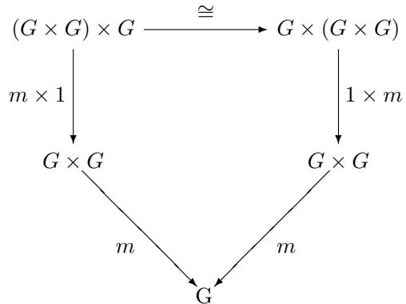

where $\cong$ is the canonical associativity isomorphism for products.

2. $u$ is a unit for $m$ , that is, both triangles in the following commute:

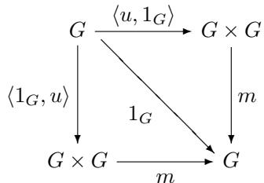

where we write $u$ for the “constant arrow” $u ! : G { \overset { ! } { \to } } 1 { \overset { u } { \to } } G$ .

3. $_ i$ is an inverse with respect to $m$ , that is, both sides of this commute:

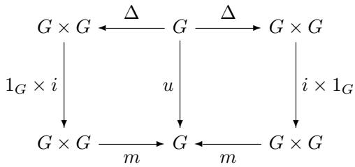

where $\Delta = \langle 1 _ { G } , 1 _ { G } \rangle$ .

Note that the requirement that these diagrams commute is equivalent to the more familiar condition that, for all (generalized) elements,

$$
x, y, z: Z \to G
$$

the following equations hold:

$$
m (m (x, y), z) = m (x, m (y, z))
$$

$$
m (x, u) = x = m (u, x)
$$

$$
m (x, i x) = u = m (i x, x)
$$

Definition 4.2. A homomorphism $h : G \to H$ of groups in $\mathbf { C }$ consists of an arrow in $\mathbf { C }$ ,

$$
h: G \to H
$$

such that

1. $h$ preserves $m$

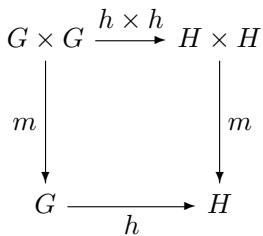

2. $h$ preserves $u$ :

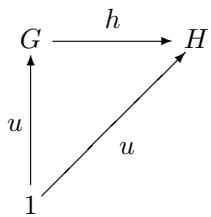

3. h preserves $_ i$ :

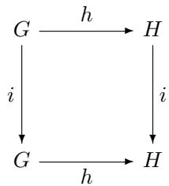

With the evident identities and composites, we thus have a category of groups in $\mathbf { C }$ , denoted:

$$
\operatorname {G r o u p} (\mathbf {C})
$$

Example 4.3. The idea of a group in a category captures the familiar notion of a group with additional structure.

A group in the usual sense is a group in the category Sets.   
A topological group is a group in Top, the category of topological spaces.   
A (partially) ordered group is a group in the category Pos of posets (in this case the inverse operation is usually required to be order-reversing, that is, of the form $i : G ^ { \mathrm { { r o p } } } \to G$ ).

For example, the real numbers $\mathbb { R }$ under addition are a topological and an ordered group, since the operations of addition $x + y$ and additive inverse $- x$ are continuous and order-preserving (resp. reversing). They are a topological “semigroup” under multiplication $x \cdot y$ as well, but the multiplicative inverse operation $1 / x$ is not continuous (or even defined!) at 0.

In logical terms, according to this point of view one can “model the theory of groups” in any category with finite products, not just Sets. Of course the same is true for other theories—like monoids and rings—given by operations and equations. Thus, for instance, one can also define the notion of a group in the lambda-calculus, since the category of types of the lambda-calculus also has finite products. Theories involving other logical operations like quantifiers can be modeled in categories having more structure than just finite products. Here we have a glimpse of so-called categorical semantics. Such semantics can be useful for theories that are not complete with respect to models in Sets, such as certain theories in intuitionistic logic.

# 4.2 The category of groups

Let $G$ and $H$ be groups (in Sets), and let

$$
h: G \to H
$$

be a group homomorphism. The kernel of $h$ is defined by the equalizer

$$
\ker (h) = \{g \in G \mid h (g) = u \} \longrightarrow G \xrightarrow [ u ]{h} H
$$

where, again, we write $u : G \to H$ for the constant homomorphism

$$
u! = G \stackrel {!} {\to} 1 \stackrel {u} {\to} H.
$$

We have already seen that this specification makes the above an equalizer diagram.

Observe that $\ker ( h )$ is a subgroup. Indeed, it is a normal subgroup, in the sense that for any $k \in \ker ( h )$ , we have (using multiplicative notation)

$$
g \cdot k \cdot g ^ {- 1} \in \ker (h) \quad \text {f o r a l l} g \in G.
$$

Now if $N { \stackrel { i } { \to } } G$ is any normal subgroup, we can construct the coequalizer

$$
N \xrightarrow [ u ]{i} G \xrightarrow {\pi} G / N
$$

sending $g \in G$ to $u$ iff $g \in N$ (“killing off $N$ ”), as follows: the elements of $G / N$ are the “cosets of $N$ ,” that is, equivalence classes of the form $[ g ]$ for all $g \in G$ , where we define

$$
g \sim h \quad \mathrm {i f f} \quad g \cdot h ^ {- 1} \in N.
$$

(Prove that this is an equivalence relation!) The multiplication on the factor group $G / N$ is then given by

$$
[ g ] \cdot [ g ^ {\prime} ] = [ g \cdot g ^ {\prime} ]
$$

which is well defined since $N$ is normal (proof!).

Let us show that the diagram above really is a coequalizer. First, it is clear that

$$
\pi \circ i = \pi \circ u!
$$

since $\boldsymbol { n } \cdot \boldsymbol { u } = \pi$ implies $[ n ] = [ u ]$ . Suppose we have $f : G \to H$ killing $N$ , that is, $f ( n ) = u$ for all $n \in N$ . We then propose a “factorization” $f$ , as indicated in

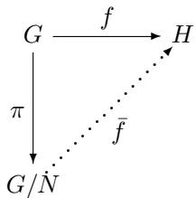

to be defined by

$$
\bar {f} [ g ] = f (g).
$$

This will be well defined if $x \sim y$ implies $f ( x ) = f ( y )$ . But, since $x \sim y$ implies $f ( x \cdot y ^ { - 1 } ) = u$ , we have

$$
f (x) = f (x \cdot y ^ {- 1} \cdot y) = f (x \cdot y ^ {- 1}) \cdot f (y) = u \cdot f (y) = f (y).
$$

Moreover, $f$ is unique with $\pi f = f$ , since $\pi$ is epic. Thus, we’ve shown most of the following classical Homomorphism Theorem for Groups.

Theorem 4.4. Every group homomorphism $h : G \to H$ has a kernel $\ker ( h ) =$ $h ^ { - 1 } ( u )$ , which is a normal subgroup of $G$ with the property that, for any normal subgroup $N \subseteq G$

$$
N \subseteq \ker (h)
$$

iff there is a (necessarily unique) homomorphism $\bar { h } : G / N \to H$ with $h \circ \pi = h$ , as indicated in:

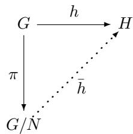

Proof. It only remains to show that if such a factorization $\bar { h }$ exists, then $N \subseteq \ker ( h )$ . But this is clear, since $\pi ( N ) = \left\{ \left[ u _ { G } \right] \right\}$ . So $h ( n ) = h \pi ( n ) =$ $h ( [ n ] ) = u _ { H }$ . □

Finally, putting $N = \ker ( h )$ in the theorem and taking any $[ x ] , [ y ] \in G / \ker ( h )$ , we have

$$
\begin{array}{l} \bar {h} [ x ] = \bar {h} [ y ] \Rightarrow h (x) = h (y) \\ \Rightarrow h (x y ^ {- 1}) = u \\ \Rightarrow x y ^ {- 1} \in \ker (h) \\ \Rightarrow x \sim y \\ \Rightarrow [ x ] = [ y ]. \\ \end{array}
$$

Thus, $h$ is injective and we have

Corollary 4.5. Every group homomorphism $h : G \to H$ factors as a quotient followed by an injective homomorphism,

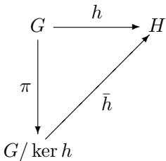

Thus $h : G / \ker ( h ) \ \stackrel { \sim } { \to } \ \operatorname { i m } ( h ) \subseteq H$ is an isomorphism onto the subgroup im(h) that is the image of $h$ .

In particular, therefore, a homomorphism $h$ is injective if and only if its kernel is “trivial,” in the sense that $\ker ( h ) = \{ u \}$ .

# 4.3 Groups as categories

First, let us recall that a group is a category. In particular, a group is a category with one object, in which every arrow is an iso.

If $G$ and $H$ are groups, regarded as categories, then we can consider arbitrary functors between them

$$
f: G \to H.
$$

It is easy to see that a functor between groups is exactly the same thing as a group homomorphism.

What is a functor $R : G \to \mathbf { C }$ from a group $G$ to another category $\mathbf { C }$ that is not necessarily a group? If $\mathbf { C }$ is the category of vector spaces and linear transformations, then such a functor is just what the group theorist calls a “linear

representation” of $G$ . In general, such a functor $R : G \to \mathbf { C }$ may be regarded as a representation of $G$ in $\mathbf { C }$ .

We will now generalize the notions of kernel of a homomorphism, and quotient or factor group by a normal subgroup, from groups to arbitrary categories, and then give the analogous homomorphism theorem for categories.

Definition 4.6. A congruence on a category $\mathbf { C }$ is an equivalence relation $f \sim g$ on arrows such that:

1. $f \sim g$ implies $\operatorname { d o m } ( f ) = \operatorname { d o m } ( g )$ and $\operatorname { c o d } ( f ) = \operatorname { c o d } ( g )$

$$
\begin{array}{c} \bullet \xrightarrow {f} \\ \hline g \end{array} \xrightarrow {} \bullet
$$

2. $f \sim g$ implies $b f a \sim b g a$ for all arrows $a : A  X$ and $b : Y  B$ , where $\operatorname { d o m } ( f ) = X = \operatorname { d o m } ( g )$ and $\operatorname { c o d } ( f ) = Y = \operatorname { c o d } ( g )$ ,

$$
\bullet \xrightarrow {a} \bullet \xrightarrow {f} \bullet \xrightarrow {b} \bullet
$$

Let $\sim$ be a congruence on the category $\mathbf { C }$ , and define the congruence category $\mathbf { C } ^ { \sim }$ by:

$$
(\mathbf {C} ^ {\sim}) _ {0} = \mathbf {C} _ {0}
$$

$$
\left(\mathbf {C} ^ {\sim}\right) _ {1} = \{\langle f, g \rangle | f \sim g \}
$$

$$
\tilde {1} _ {C} = \langle 1 _ {C}, 1 _ {C} \rangle
$$

$$
\langle f ^ {\prime}, g ^ {\prime} \rangle \circ \langle f, g \rangle = \langle f ^ {\prime} f, g ^ {\prime} g \rangle
$$

One easily checks that this composition is well defined, using the congruence conditions.

There are two evident projection functors:

$$
\mathbf {C} ^ {\sim} \xrightarrow [ p _ {2} ]{p _ {1}} \mathbf {C}
$$

We build the quotient category $\mathbf { C } / \sim$ as follows:

$$
(\mathbf {C} / \sim) _ {0} = \mathbf {C} _ {0}
$$

$$
(\mathbf {C} / \sim) _ {1} = (\mathbf {C} _ {1}) / \sim
$$

The arrows have the form $[ f ]$ where $f \in \mathbf { C } _ { 1 }$ , and we can put $1 _ { [ C ] } = [ 1 _ { C } ]$ , and $[ g ] \circ [ f ] = [ g \circ f ]$ , as is easily checked, again using the congruence conditions.

There is an evident quotient functor $\pi : \mathbf { C } \to \mathbf { C } / \sim$ . It then makes the following a coequalizer of categories:

$$
\mathbf {C} ^ {\sim} \xrightarrow [ p _ {2} ]{p _ {1}} \mathbf {C} \xrightarrow [ ]{\pi} \mathbf {C} / \sim
$$

This is proved much as for groups.

An exercise shows how to use this construction to make coequalizers for certain functors. Let us show how to use it to prove an analogous “homomorphism theorem for categories.” Suppose we have categories $\mathbf { C }$ and $\mathbf { D }$ and a functor

$$
F: \mathbf {C} \to \mathbf {D}.
$$

Then $F$ determines a congruence $\sim _ { F }$ on $\mathbf { C }$ by setting:

$$
f \sim_ {F} g \quad \text {i f f} \quad \operatorname {d o m} (f) = \operatorname {d o m} (g), \operatorname {c o d} (f) = \operatorname {c o d} (g), F (f) = F (g)
$$

That this is a congruence is easily checked.

Let us write

$$
\ker (F) = \mathbf {C} ^ {\sim_ {F}} \longrightarrow \mathbf {C}
$$

for the congruence category, and call this the kernel category of $F$ .

The quotient category

$$
\mathbf {C} / \sim_ {F}
$$

then has the following UMP:

Theorem 4.7. Every functor $F : \mathbf { C }  \mathbf { D }$ has a kernel category $\ker ( F )$ , determined by a congruence $\sim _ { F }$ on $\mathbf { C }$ such that given any congruence $\sim$ on C one has:

$$
f \sim g \Rightarrow f \sim_ {F} g
$$

if and only if there is a factorization $\widetilde { F } : { \bf C } / \sim \longrightarrow { \bf D }$ , as indicated in:

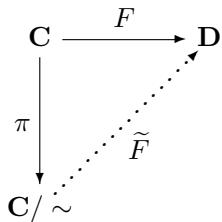

Just as in the case of groups, applying the theorem to the case $\mathbf { C } ^ { \sim } = \ker ( F )$ gives a factorization theorem:

Corollary 4.8. Every functor $F : \mathbf { C }  \mathbf { D }$ factors as $F = \widetilde { F } \circ \pi$ ,

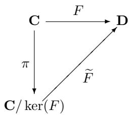

where $\boldsymbol { \mathscr { u } }$ is bijective on objects and surjective on Hom-sets, and $\widetilde { F }$ is injective on Hom-sets (i.e. “ faithful”):

$$
\widetilde {F} _ {A, B}: \operatorname {H o m} (A, B) \mapsto \operatorname {H o m} (F A, F B) \quad f o r a l l A, B \in \mathbf {C} / \ker (F)
$$

# 4.4 Finitely presented categories

Finally, let us consider categories presented by generators and relations.

We begin with the free category $\mathbf { C } ( G )$ on some finite graph $G$ , and then consider a finite set $\Sigma$ of relations of the form

$$
\left(g _ {1} \circ \dots \circ g _ {n}\right) = \left(g _ {1} ^ {\prime} \circ \dots \circ g _ {m} ^ {\prime}\right)
$$

with all $g _ { i } \in G$ , and $\mathrm { d o m } ( g _ { n } ) = \mathrm { d o m } ( g _ { m } ^ { \prime } )$ and $\mathrm { c o d } ( g _ { 1 } ) = \mathrm { c o d } ( g _ { 1 } ^ { \prime } ) .$ . Such a relation identifies two “paths” in $\mathbf { C } ( G )$ with the same “endpoints” and “direction.” Next, let $\sim _ { \Sigma }$ be the smallest congruence $\sim$ on $\mathbf { C }$ such that $f \sim f ^ { \prime }$ for each equation $g = g ^ { \prime }$ in $\Sigma$ . Such a congruence exists simply because the intersection of a family of congruences is again a congruence. Taking the quotient by this congruence we have a notion of a finitely presented category:

$$
\mathbf {C} (G, \Sigma) = \mathbf {C} (G) / \sim_ {\Sigma}
$$

This is completely analogous to the notion of a finite presentation for groups, and indeed specializes to that notion in the case of a graph with only one vertex. The UMP of $\mathbf { C } ( G , \Sigma )$ is then an obvious variant of that already given for groups.

Specifically, in $\mathbf { C } ( G , \Sigma )$ there is a “diagram of type $G$ ,” that is, a graph homomorphism $i : G \to | \mathbf { C } ( G , \Sigma ) |$ , satisfying all the conditions $i ( g ) = i ( g ^ { \prime } )$ , for all $g = g ^ { \prime } \in \Sigma$ . Moreover, given any category $\mathbf { D }$ with a diagram of type $G$ , say $h : G  | \mathbf { D } |$ , that satisfies all the conditions $h ( g ) = h ( g ^ { \prime } )$ , for all $g = g ^ { \prime } \in \Sigma$ , there is a unique functor $h : \mathbf { C } ( G , \Sigma ) \to \mathbf { D }$ with $| h | \circ i = h$ . The reader should draw the associated diagram of graphs and categories.

Just as in the case of presentations of groups, one can describe the construction of $\mathbf { C } ( G , \Sigma )$ as a coequalizer for two functors.

Indeed, suppose we have arrows $f , f ^ { \prime } \in \mathbf { C }$ . Take the least congruence $\sim$ on $\mathbf { C }$ with $f \sim f ^ { \prime }$ . Consider the diagram

$$
\mathbf {C} (\mathbf {2}) \xrightarrow [ f ^ {\prime} ]{f} \mathbf {C} \xrightarrow [ q ]{q} \mathbf {C} / \sim
$$

where 2 is the graph with two vertices and an edge between them, $f$ and $f ^ { \prime }$ are the unique functors taking the generating edge to the arrows by the same names, and $q$ is the canonical functor to the quotient category. Then $q$ is a coequalizer of $f$ and $f ^ { \prime }$ . To show this, take any $d : \mathbf { C }  \mathbf { D }$ with

$$
d f = d f ^ {\prime}.
$$

Since $\mathbf { C } ( 2 )$ is free on $\cdot { \stackrel { x } { \longrightarrow } } \cdot$ , and $f ( x ) = f$ and $f ^ { \prime } ( x ) = f ^ { \prime }$ , we have

$$
d (f) = d (f (x)) = d \left(f ^ {\prime} (x)\right) = d \left(f ^ {\prime}\right).
$$

Thus, $\langle f , f ^ { \prime } \rangle \in \ker ( d )$ , so $\sim \subseteq \ker ( d )$ (since $\sim$ is minimal with $f \sim f ^ { \prime }$ ). So there is a functor $d : \mathbf { C } / \sim \longrightarrow \mathbf { D }$ such that $d = d \circ q$ by the homomorphism theorem.

Example 4.9. The category with two uniquely isomorphic objects is not free on any graph, since it’s finite, but has “loops” (cycles). But it is finitely presented with graph

$$
A \xrightarrow [ g ]{f} B
$$

and relations

$$
g f = 1 _ {A}, \qquad f g = 1 _ {B}.
$$

Similarly, there are finitely presented categories with just one non-identity arrow $f : \cdot  \cdot$ and either

$$
f \circ f = 1 \quad \text {o r} \quad f \circ f = f.
$$

In the first case we have the group Z/2Z. In the second case an “idempotent” (but not a group).

Indeed, any of the cyclic groups

$$
\mathbb {Z} _ {n} \cong \mathbb {Z} / \mathbb {Z} n
$$

occur in this way, with the graph

$$
\star \xrightarrow {f} \star
$$

and the relation

$$
f ^ {n} = 1.
$$

# 4.5 Exercises

1. Regarding a group $G$ as a category with one object and every arrow an isomorphism, show that a categorical congruence $\sim$ on $G$ is the same thing as (the equivalence relation on $G$ determined by) a normal subgroup $N \subseteq G$ , that is, show that the two kinds of things are in isomorphic correspondence.

Show further that the quotient category $G / \sim$ and the factor group $G / N$ coincide. Conclude that the homomorphism theorem for groups is a special case of the one for categories.

2. Consider the definition of a group in a category as applied to the category Sets/ $I$ of sets sliced over a set $I$ . Show that such a group $G$ determines an

$I$ -indexed family of (ordinary) groups $G _ { i }$ by setting $G _ { i } = G ^ { - 1 } ( i )$ for each $i \in I$ . Show that this determines a functor Groups(Sets/I) GroupsI into the category of $I$ -indexed families of groups and $I$ -indexed families of homomorphisms.

3. Give four different presentations by generators and relations of the category 3, pictured:

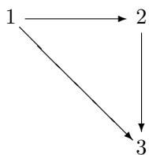

Is 3 free?

4. Given a congruence $\sim$ on a category $\mathbf { C }$ and arrows in $\mathbf { C }$ as follows,

$$
A \xrightarrow [ f ^ {\prime} ]{f} B \xrightarrow [ g ^ {\prime} ]{g} C
$$

show that $f \sim f ^ { \prime }$ and $g \sim g ^ { \prime }$ implies $g \circ f \sim g ^ { \prime } \circ f ^ { \prime }$ .

5. Given functors $F , G : \mathbf { C }  \mathbf { D }$ such that for all $C \in \mathbf { C }$ , $F C = G C$ , define a congruence on $\mathbf { D }$ by the condition:

$$
\begin{array}{l} f \sim g \quad \text {i f f} \quad \operatorname {d o m} (f) = \operatorname {d o m} (g) \\ \& \operatorname {c o d} (f) = \operatorname {c o d} (g) \\ \&\forall \mathbf {E}, H: \mathbf {D} \rightarrow \mathbf {E}. H F = H G \Rightarrow H (f) = H (g) \\ \end{array}
$$

Prove that this is a congruence.

Prove that $\mathbf { D } / \sim$ is the coequalizer of $F ^ { \prime }$ and $G$ .

This page intentionally left blank

# 5

# LIMITS AND COLIMITS

In this chapter we briefly discuss some topics relating to the definitions that we already have, rather than pushing on to new ones. This is partly in order to see how these are used, but also because we will need this material soon enough. After that, and after a brief look at one more elementary notion, we shall go on to what may be called “higher category theory.”

# 5.1 Subobjects

We have seen that every subset $U \subseteq X$ of a set $X$ occurs as an equalizer and that equalizers are always monomorphisms. So it is natural to regard monos as generalized subsets. That is, a mono in Groups can be regarded as a subgroup, a mono in Top as a subspace, and so on.

The rough idea is this: given a monomorphism,

$$
m: M \mapsto X
$$

in a category $\mathbf { G }$ of structured sets of some sort—call them “gadgets”—the image subset

$$
\{m (y) \mid y \in M \} \subseteq X
$$

which may be written $m ( M )$ , is often a sub-gadget of $X$ to which $M$ is isomorphic via $m$ .

$$
m: M \stackrel {{\sim}} {{\to}} m (M) \subseteq X
$$

More generally, we can think of the mono $m : M \mapsto X$ itself as determining a “part” of $X$ even in categories that do not have underlying functions.

Definition 5.1. A subobject of an object $X$ in a category $\mathbf { C }$ is a mono

$$
m: M \hookrightarrow X
$$

Given subobjects $m$ and $m ^ { \prime }$ of $X$ , a morphism $f : m  m ^ { \prime }$ is an arrow in $\mathbf { C } / X$ , as in

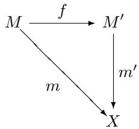

Thus we have a category,

$$
\mathrm {S u b} _ {\mathbf {C}} (X)
$$

of subobjects of $X$ in $\mathbf { C }$ .

In this definition, since $m ^ { \prime }$ is monic, there is at most one $f$ as in the diagram above, so that $\operatorname { S u b } _ { \mathbf { C } } ( X )$ is a preorder category. We define the relation of inclusion of subobjects by:

$$
m \subseteq m ^ {\prime} \quad \text {i f f} \quad \text {t h e r e e x i s t s s o m e} f: m \rightarrow m ^ {\prime}
$$

Finally, we say that $m$ and $m ^ { \prime }$ are equivalent, written $m \equiv m ^ { \prime }$ , if and only if they are isomorphic as subobjects, that is, $m \subseteq m ^ { \prime }$ and $m ^ { \prime } \subseteq m$ . This holds just if there are $f$ and $f ^ { \prime }$ making both triangles below commute.

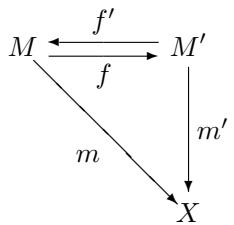

Observe that, in the above diagram, $m = m ^ { \prime } f = m f ^ { \prime } f$ , and since $m$ is monic, $f ^ { \prime } f = 1 _ { M }$ and similarly $f f ^ { \prime } = 1 _ { M ^ { \prime } }$ . So $M \cong M ^ { \prime }$ via $f$ . Thus we see that equivalent subobjects have isomorphic domains.

Remark 5.2. We sometimes abuse notation and language by calling $M$ the subobject when the mono $m : M \mapsto X$ is clear.

Note that if $M \subseteq M ^ { \prime }$ then the arrow $f$ which makes this so in

is also monic, so also $M$ is a subobject of $M ^ { \prime }$ . In fact, we have a functor

$$
\operatorname {S u b} \left(M ^ {\prime}\right) \to \operatorname {S u b} (X)
$$

defined by composition (since the composite of monos is monic).

In terms of generalized elements of an object $X$ ,

$$
z: Z \to X
$$

one can define a local membership relation,

$$
z \in_ {X} M
$$

between these and subobjects $m : M \mapsto X$ by

$$
z \in_ {X} M \text {i f f t h e r e e x i s t s} f: Z \to M \text {s u c h t h a t} z = m f
$$

Since $m$ is monic, if $z$ factors through it then it does so uniquely.

Example 5.3. An equalizer

$$
E \longrightarrow A \xrightarrow [ g ]{f} B
$$

is a subobject of $A$ with the property

$$
z \in_ {A} E \quad \text {i f f} f (z) = g (z)
$$

Thus, we can regard $E$ as the subobject of generalized elements $z : Z \to A$ such that $f ( z ) = g ( z )$ .

$$
E = \{z \in Z \mid f (z) = g (z) \} \subseteq A
$$

just as was the case for global elements in Sets. In categorical logic, one develops a way of making this intuition even more precise by giving a calculus of such subobjects.

Remark 5.4. It is often convenient to pass from the preorder

$$
\operatorname {S u b} _ {\mathbf {C}} (X)
$$

to the poset given by factoring out the equivalence relation “ ”. Then a subobject is an equivalence class of monos under mutual inclusion.

In Sets, under this notion of subobject, one then has an isomorphism,

$$
\operatorname {S u b} _ {\mathbf {S e t s}} (X) \cong P (X)
$$

that is, every subobject is represented by a unique subset. We shall use both notions of subobject, making clear when monos are intended, and when equivalence classes thereof are intended.

# 5.2 Pullbacks

The notion of a pullback, like that of a product, is one that comes up very often in mathematics and logic. It is a generalization of both intersection and inverse image.

We begin with the definition,

Definition 5.5. In any category C, a pullback of arrows $f , g$ with $\operatorname { c o d } ( f ) =$ $\operatorname { c o d } ( g )$

consists of arrows

such that $f p _ { 1 } \ = \ g p _ { 2 }$ and universal with this property. That is, given any $z _ { 1 } : Z \to A$ and $z _ { 2 } : Z  B$ with $f z _ { 1 } = g z _ { 2 }$ , there exists a unique

$$
u: Z \to P
$$

with $z _ { 1 } = p _ { 1 } u$ and $z _ { 2 } = p _ { 2 } u$ .

Here is the picture:

Remark 5.6. One sometimes uses product-style notation for pullbacks.

Pullbacks are clearly unique up to isomorphism since they are given by an UMP (universal mapping property). Here this means that given two pullbacks of a given pair of arrows, the uniquely determined maps between the pullbacks are mutually inverse.

In terms of generalized elements, any $z \in A \times _ { C } B$ , can be written uniquely as $z = \langle z _ { 1 } , z _ { 2 } \rangle$ with $f z _ { 1 } = g z _ { 2 }$ .

This makes

$$
A \times_ {C} B = \left\{\left\langle z _ {1}, z _ {2} \right\rangle \in A \times B \mid f z _ {1} = g z _ {2} \right\}
$$

look like a subobject of $A \times B$ , determined as an equalizer of $f \circ \pi _ { 1 }$ and $g \cup \pi _ { 2 }$ In fact, this is so.

Proposition 5.7. In a category with products and equalizers, given a corner of arrows

Consider the diagram

in which e is an equalizer of $f \pi _ { 1 }$ and $g \pi _ { 2 }$ and $p _ { 1 } = \pi _ { 1 } e$ , $p _ { 2 } = \pi _ { 2 } e$ . Then $E , p _ { 1 } , p _ { 2 }$ is a pullback of $f$ and $g$ . Conversely, if $E , p _ { 1 } , p _ { 2 }$ are given as such a pullback, then the arrow

$$
e = \langle p _ {1}, p _ {2} \rangle : E \rightarrow A \times B
$$

is an equalizer of $f \pi _ { 1 }$ and $g \pi _ { 2 }$ .

Proof. Take

with $f z _ { 1 } = g z _ { 2 }$ . We have $\langle z _ { 1 } , z _ { 2 } \rangle : Z \to A \times B$ so

$$
f \pi_ {1} \langle z _ {1}, z _ {2} \rangle = g \pi_ {2} \langle z _ {1}, z _ {2} \rangle .
$$

Thus, there is a $u : Z \to E$ to the equalizer with $e u = \langle z _ { 1 } , z _ { 2 } \rangle$ . Then

$$
p _ {1} u = \pi_ {1} e u = \pi_ {1} \langle z _ {1}, z _ {2} \rangle = z _ {1}
$$

and

$$
p _ {2} u = \pi_ {2} e u = \pi_ {2} \big <   z _ {1}, z _ {2} \big > = z _ {2}.
$$

If also $u ^ { \prime } : Z \to E$ has $p _ { i } u ^ { \prime } = z _ { i } , i = 1 , 2$ , then $\pi _ { i } e u ^ { \prime } = z _ { i }$ so $e u ^ { \prime } = \langle z _ { 1 } , z _ { 2 } \rangle = e u$ whence $u ^ { \prime } = u$ since $e$ in monic. The converse is similar. □

Corollary 5.8. If a category $\mathbf { C }$ has binary products and equalizers, then it has pullbacks.

The foregoing gives an explicit construction of a pullback in Sets as a subset of the product:

$$
\{\langle a, b \rangle \mid f a = g b \} = A \times_ {C} B \hookrightarrow A \times B
$$

Example 5.9. In Sets, take a function $f : A  B$ and a subset $V \subseteq B$ . Let, as usual,

$$
f ^ {- 1} (V) = \{a \in A \mid f (a) \in V \} \subseteq A
$$

and consider

where $i$ and $j$ are the canonical inclusions and $f$ is the evident factorization of the restriction of $f$ to $f ^ { - 1 } ( V )$ (since $a \in f ^ { - 1 } ( V ) \Rightarrow f ( a ) \in V )$ ).

This diagram is a pullback (observe that $z \in f ^ { - 1 } ( V ) \Leftrightarrow f z \in V$ for all $z : Z \to A$ ). Thus, the inverse image

$$
f ^ {- 1} (V) \subseteq A
$$

is determined uniquely up to isomorphism as a pullback.

As suggested by the previous example, we can use pullbacks to define inverse images in categories other than Sets. Indeed, given a pullback in any category:

if $m$ is monic, then $m ^ { \prime }$ is monic. (Exercise!)

Thus we see that, for fixed $f : A  B$ , taking pullbacks induces a map

$$
f ^ {- 1}: \operatorname {S u b} (B) \to \operatorname {S u b} (A)
$$

$$
m \mapsto m ^ {\prime}
$$

We will show that $f ^ { - 1 }$ also respects equivalence of subobjects

$$
M \equiv N \Rightarrow f ^ {- 1} (M) \equiv f ^ {- 1} (N)
$$

by showing that $f ^ { - 1 }$ is a functor; that is our next goal.

# 5.3 Properties of pullbacks

We start with the following simple lemma, which seems to come up all the time.

Lemma 5.10. (Two-pullbacks) Consider the commutative diagram below in a category with pullbacks:

1. If the two squares are pullbacks, so is the outer rectangle. Thus,

$$
A \times_ {B} (B \times_ {C} D) \cong A \times_ {C} D
$$

2. If the right square and the outer rectangle are pullbacks, so is the left square. Proof. Diagram chase. □

Corollary 5.11. The pullback of a commutative triangle is a commutative triangle. Specifically, given a commutative triangle as on the right end of the following “prism diagram”

for any $h : C ^ { \prime } \to C$ , if one can form the pullbacks $\alpha ^ { \prime }$ and $\beta ^ { \prime }$ as on the left end, then there exists a unique $\gamma ^ { \prime }$ as indicated, making the left end a commutative triangle, and the upper face a commutative rectangle, and indeed a pullback.

Proof. Apply the two-pullbacks lemma.

Proposition 5.12. Pullback is a functor. That is, for fixed $h : C ^ { \prime } \to C$ in a category C with pullbacks, there is a functor

$$
h ^ {*}: \mathbf {C} / C \to \mathbf {C} / C ^ {\prime}
$$

defined by

$$
(A \stackrel {\alpha} {\to} C) \mapsto (C ^ {\prime} \times_ {C} A \stackrel {\alpha^ {\prime}} {\to} C ^ {\prime})
$$

where $\alpha ^ { \prime }$ is the pullback of $\alpha$ along $h$ , and the effect on an arrow $\gamma : \alpha  \beta$ is given by the foregoing corollary.

Proof. One must check that

$$
h ^ {*} (1 _ {X}) = 1 _ {h ^ {*} X}
$$

and

$$
h ^ {*} (g \circ f) = h ^ {*} (g) \circ h ^ {*} (f)
$$

These can easily be verified by repeated applications of the two-pullbacks lemma. For example, for the first condition, consider

If the lower square is a pullback, then plainly so is the outer rectangle, whence the upper square is, too, and we have

$$
h ^ {*} 1 _ {X} = 1 _ {X ^ {\prime}} = 1 _ {h ^ {*} X}.
$$

Corollary 5.13. Let $\mathbf { C }$ be a category with pullbacks. For any arrow $f : A  B$ in $\mathbf { C }$ we have the following diagram of categories and functors:

This commutes simply because $f ^ { - 1 }$ is defined to be the restriction of $f ^ { * }$ to the subcategory Sub(B). Thus, in particular, $f ^ { - 1 }$ is functorial:

$$
M \subseteq N \Rightarrow f ^ {- 1} (M) \subseteq f ^ {- 1} (N)
$$

It follows that $M \equiv N$ implies $f ^ { - 1 } ( M ) \equiv f ^ { - 1 } ( N )$ , so that $f ^ { - 1 }$ is also defined on equivalence classes.

$$
f ^ {- 1} / \equiv : \operatorname {S u b} (B) / \equiv \longrightarrow \operatorname {S u b} (A) / \equiv
$$

Example 5.14. Consider a pullback in Sets:

We saw that

$$
E = \{\langle a, b \rangle \mid f (a) = g (b) \}
$$

can be constructed as an equalizer

$$
E \xrightarrow {\langle f ^ {\prime} , g ^ {\prime} \rangle} A \times B \xrightarrow [ g \pi_ {2} ]{f \pi_ {1}} C
$$

Now let $B = 1$ , $C = 2 = \{ \top , \bot \}$ , and $g = \top : 1  2$ . Then the equalizer

$$
E \longrightarrow A \times 1 \xrightarrow [ \top \pi_ {2} ]{f \pi_ {1}} 2
$$

is how we already described the “extension” of the “propositional function” $f : A  2$ . Therefore we can rephrase the correspondence between subsets

$U \subseteq A$ and their characteristic functions $\chi _ { U } : A \to 2$ in terms of pullbacks:

Precisely, the isomorphism,

$$
2 ^ {A} \cong P (A)
$$

given by taking a function $\varphi : A  2$ to its “extension”

$$
V _ {\varphi} = \{x \in A \mid \varphi (x) = \top \}
$$

can be described as a pullback.

$$
V _ {\varphi} = \{x \in A \mid \varphi (x) = \top \} = \varphi^ {- 1} (\top)
$$

Now suppose we have any function

$$
f: B \to A
$$

and consider the induced inverse image operation

$$
f ^ {- 1}: P (A) \to P (B)
$$

given by pullback, as in example 5.9 above. Taking some extension $V _ { \varphi } \subseteq A$ , consider the two-pullback diagram

We therefore have (by the two-pullbacks lemma)

$$
f ^ {- 1} (V _ {\varphi}) = f ^ {- 1} (\varphi^ {- 1} (\top)) = (\varphi f) ^ {- 1} (\top) = V _ {\varphi f}
$$

which from a logical point of view expresses the fact that the substitution of a term $f$ for the variable $x$ in the propositional function $\varphi$ is modeled by taking the pullback along $f$ of the corresponding extension

$$
f ^ {- 1} (\{x \in A \mid \varphi (x) = \top \}) = \{y \in B \mid \varphi (f (y)) = \top \}.
$$

Note that we have shown that for any function $f : B  A$ the following square commutes

where $2 ^ { f } : 2 ^ { A }  2 ^ { B }$ is precomposition $2 ^ { f } ( g ) = g \circ f$ . In a situation like this, one says that the isomorphism

$$
2 ^ {A} \cong P (A)
$$

is natural in $A$ , which is obviously a much stronger condition than just having isomorphisms at each object $A$ . We will consider such “naturality” systematically later. It was in fact one of the phenomena that originally gave rise to category theory.

Example 5.15. Let $I$ be an index set, and consider an $I$ -indexed family of sets:

$$
(A _ {i}) _ {i \in I}
$$

Given any function $\alpha : J  I$ , there is a $J$ -indexed family

$$
\left(A _ {\alpha (j)}\right) _ {j \in J},
$$

obtained by “reindexing along $\alpha$ .” This reindexing can also be described as a pullback. Specifically, for each set $A _ { i }$ take the constant, $i$ -valued function $\begin{array} { r l } { p _ { i } } & { { } : } \end{array}$ $A _ { i } \to I$ and consider the induced map on the coproduct

$$
p = \left[ p _ {i} \right]: \coprod_ {i \in I} A _ {i} \to I
$$

The reindexed family $( A _ { \alpha ( j ) } ) _ { j \in J }$ can be obtained by taking a pullback along $\alpha$ , as indicated in the following diagram:

where $q$ is the indexing projection for $( A _ { \alpha ( j ) } ) _ { j \in J }$ analogous to $p$ . In other words, we have

$$
J \times_ {I} \left(\coprod_ {i \in I} A _ {i}\right) \cong \coprod_ {j \in J} A _ {\alpha (j)}
$$

The reader should work out the details as an instructive exercise.

# 5.4 Limits

We have already seen that the notions of product, equalizer, and pullback are not independent; the precise relation between them is this.

Proposition 5.16. A category has finite products and equalizers iff it has pullbacks and a terminal object.

Proof. The “only if” direction has already been done. For the other direction, suppose $\mathbf { C }$ has pullbacks and a terminal object 1.

For any objects $A , B$ we clearly have $A \times B \cong A \times _ { 1 } B$ , as indicated in the following:

For any arrows $f , g : A \longrightarrow B$ , the equalizer $e : E  A$ is constructed as the following pullback:

In terms of generalized elements,

$$
E = \{(a, b) \mid \langle f, g \rangle (a) = \Delta b \}
$$

where $\langle f , g \rangle ( a ) = \langle f a , g a \rangle$ and $\Delta ( b ) = \langle b , b \rangle$ . So,

$$
\begin{array}{l} E = \{\langle a, b \rangle \mid f (a) = b = g (a) \} \\ \cong \left\{a \mid f (a) = g (a) \right\} \\ \end{array}
$$

which is just what we want. An easy diagram chase shows that

$$
E \xrightarrow {e} A \xrightarrow [ g ]{f} B
$$

is indeed an equalizer.

Product, terminal object, pullback, and equalizer, are all special cases of the general notion of a limit, which we will consider now. First, we need some preliminary definitions.

Definition 5.17. Let $\mathbf { J }$ and $\mathbf { C }$ be categories. A diagram of type $\mathbf { J }$ in $\mathbf { C }$ is a functor.

$$
D: \mathbf {J} \rightarrow \mathbf {C}.
$$

We will write the objects in the “index category” $\mathbf { J }$ lower case, $i , j , \dots$ and the values of the functor $D : { \bf { J } }  { \bf { C } }$ in the form $D _ { i } , D _ { j }$ , etc.

A cone to a diagram $D$ consists of an object $C$ in $\mathbf { C }$ and a family of arrows in $\mathbf { C }$ ,

$$
c _ {j}: C \to D _ {j}
$$

one for each object $j \in J$ , such that for each arrow $\alpha : i  j$ in $\mathbf { J }$ , the following triangle commutes.

A morphism of cones

$$
\vartheta : (C, c _ {j}) \to (C ^ {\prime}, c _ {j} ^ {\prime})
$$

is an arrow $\vartheta$ in $\mathbf { C }$ making each triangle,

commute. That is, such that $c _ { j } = c _ { j } ^ { \prime } \circ \vartheta$ for all $j \in \mathbf { J }$ . Thus, we have an apparent category

# Cone(D)

of cones to $D$ .

We are here thinking of the diagram $D$ as a “picture of $\mathbf { J }$ in $\mathbf { C }$ .” A cone to such a diagram $D$ is then imagined as a many-sided pyramid over the “base” $D$ and a morphism of cones is an arrow between the apexes of such pyramids. (The reader should draw some pictures at this point!)

Definition 5.18. A limit for a diagram $D : { \bf J }  { \bf C }$ is a terminal object in $\mathbf { C o n e } ( D )$ . A finite limit is a limit for a diagram on a finite index category $\mathbf { J }$ .

We often denote a limit in the form

$$
p _ {i}: \varprojlim_ {j} ^ {\lim  } D _ {j} \to D _ {i}.
$$

Spelling out the definition, the limit of a diagram $D$ has the following UMP: given any cone $( C , c _ { j } )$ to $D$ , there is a unique arrow $u : C \to \varprojlim _ { j } D _ { j }$ such that for all $j$ ,

$$
p _ {j} \circ u = c _ {j}.
$$

Example 5.19. Take $\mathbf { J } = \{ 1 , 2 \}$ the discrete category with two objects and no nonidentity arrows. A diagram $D : { \bf J }  { \bf C }$ is a pair of objects $D _ { 1 } , D _ { 2 } \in \mathbf { C }$ . A cone on $D$ is an object of $\mathbf { C }$ equipped with arrows

$$
D _ {1} \xleftarrow {c _ {1}} C \xrightarrow {c _ {2}} D _ {2}.
$$

And a limit of $D$ is a terminal such cone, that is, a product in $\mathbf { C }$ of $D _ { 1 }$ and $D _ { 2 }$ ,

$$
D _ {1} \xleftarrow {p _ {1}} D _ {1} \times D _ {2} \xrightarrow {p _ {2}} D _ {2}.
$$

Thus, in this case,

$$
\varprojlim_{j}D_{j}\cong D_{1}\times D_{2}.
$$

Example 5.20. Take $\mathbf { J }$ to be the following category:

$$
\cdot \xrightarrow [ \beta ]{\alpha} .
$$

A diagram of type $\mathbf { J }$ looks like

$$
D _ {1} \xrightarrow [ D _ {\beta} ]{D _ {\alpha}} D _ {2}
$$

and a cone is a pair of arrows

$$
\begin{array}{c} D _ {1} \xrightarrow [ D _ {\beta} ]{D _ {\alpha}} D _ {2} \\ c _ {1} \\ C \end{array}
$$

such that $D _ { \alpha } c _ { 1 } = c _ { 2 }$ and $D _ { \beta } c _ { 1 } = c _ { 2 }$ ; thus, $D _ { \alpha } c _ { 1 } = D _ { \beta } c _ { 1 }$ . A limit for $D$ is therefore an equalizer for $D _ { \alpha }$ , $D _ { \beta }$ .

Example 5.21. If $\mathbf { J }$ is empty, there is just one diagram $D : { \bf J }  { \bf C }$ , and a limit for it is thus a terminal object in $\mathbf { C }$ ,

$$
\varprojlim_ {j \in \mathbf {0}} D _ {j} \cong 1.
$$

Example 5.22. If $\mathbf { J }$ is the finite category

we see that a limit for a diagram of the form

is just a pullback of $f$ and $g$ ,

$$
\varprojlim_{j}D_{j}\cong A\times_{C}B.
$$

Thus, we have shown half of the following:

Proposition 5.23. A category has all finite limits iff it has finite products and equalizers (resp. pullbacks and a terminal object by the last proposition).

Here a category $\mathbf { C }$ is said to have all finite limits if every finite diagram $D : { \bf J } $ $\mathbf { C }$ has a limit in $\mathbf { C }$ .

Proof. We need to show that any finite limit can be constructed from finite products and equalizers. Take a finite diagram

$$
D: \mathbf {J} \rightarrow \mathbf {C}.
$$

Consider the finite products

$$
\prod_ {i \in J _ {0}} D _ {i} \quad \mathrm {a n d} \quad \prod_ {(\alpha : i \to j) \in J _ {1}} D _ {j}.
$$

Define two arrows

$$
\prod_ {i} D _ {i} \xrightarrow [ \psi ]{\phi} \prod_ {\alpha : i \to j} D _ {j}
$$

by taking their composites with the projections $\pi _ { \alpha }$ from the second product to be, respectively:

$$
\begin{array}{l} \pi_ {\alpha} \circ \phi = \phi_ {\alpha} = \pi_ {\operatorname {c o d} (\alpha)} \\ \pi_ {\alpha} \circ \psi = \psi_ {\alpha} = D _ {\alpha} \circ \pi_ {\mathrm {d o m} (\alpha)} \\ \end{array}
$$

where $\pi _ { \mathrm { c o d } ( \alpha ) }$ and $\pi _ { \mathrm { d o m } ( \alpha ) }$ are projections from the first product.

Now we take the equalizer:

$$
E \xrightarrow {e} \prod_ {i} D _ {i} \xrightarrow {\phi} \prod_ {\alpha : i \to j} D _ {j}
$$

We will show that $( E , e _ { i } )$ is a limit for $D$ , where $e _ { i } = \pi _ { i } \cup e$ . To that end, take any arrow $c : C \to \textstyle \prod _ { i } D _ { i }$ , and write $c = \langle c _ { i } \rangle$ for $c _ { i } = \pi _ { i } \cup c$ . Observe that the family of arrows $c _ { i } : C \to D _ { i }$ ) is a cone to $D$ if and only iff $\phi c = \psi c$ . Indeed,

$$
\phi \langle c _ {i} \rangle = \psi \langle c _ {i} \rangle
$$

iff for all $\alpha$

$$
\pi_ {\alpha} \phi \langle c _ {i} \rangle = \pi_ {\alpha} \psi \langle c _ {i} \rangle .
$$

But,

$$
\pi_ {\alpha} \phi \langle c _ {i} \rangle = \phi_ {\alpha} \langle c _ {i} \rangle = \pi_ {\mathrm {c o d} (\alpha)} \langle c _ {i} \rangle = c _ {j}
$$

and

$$
\pi_ {\alpha} \psi \langle c _ {i} \rangle = \psi_ {\alpha} \langle c _ {i} \rangle = D _ {\alpha} \circ \pi_ {\operatorname {d o m} (\alpha)} \langle c _ {i} \rangle = D _ {\alpha} \circ c _ {i}.
$$

Whence $\phi c = \psi c$ iff for all $\alpha : i  j$ we have $c _ { j } = D _ { \alpha } \circ c _ { i }$ thus, iff $c _ { i } : C \to D _ { i }$ ) is a cone, as claimed. It follows that $( E , e _ { i } )$ is a cone, and that any cone $( c _ { i } :$ $C  D _ { i }$ ) gives an arrow $\begin{array} { r } { \left. c _ { i } \right. : C \to \prod _ { i } D _ { i } } \end{array}$ with $\phi \langle c _ { i } \rangle = \psi \langle c _ { i } \rangle$ , thus there is a unique factorization $u : C \to E$ of $\left. c _ { i } \right.$ through $E$ , which is clearly a morphism of cones. □

The same proof yields the following:

Corollary 5.24. A category has all limits of some cardinality iff it has all equalizers and products of that cardinality, where $\mathbf { C }$ has limits (resp. products) of cardinality $\kappa$ iff $\mathbf { C }$ has a limit for every diagram $D : J  C$ where card $( J _ { 1 } ) \le \kappa$ (resp. C has all products of κ many objects).

The notions cones and limits of course dualize to give those of cocones and colimits. One then has the following dual theorem.

Theorem 5.25. A category C has finite colimits iff it has finite coproducts and coequalizers (resp. iff it has pushouts and an initial object). C has all colimits of size κ iff it has coequalizers and coproducts of size $\kappa$ .

# 5.5 Preservation of limits

Here is an application of limits by products and equalizers.

Definition 5.26. A functor $F : \mathbf { C }  \mathbf { D }$ is said to preserve limits of type $\mathbf { J }$ if, whenever $p _ { j } : L \to D _ { j }$ is a limit for a diagram $D : { \bf { J } }  { \bf { C } }$ ; the cone $F p _ { j } : F L $ $F D _ { j }$ is then a limit for the diagram $F D : { \bf J }  { \bf D }$ . Briefly

$$
F (\varprojlim D _ {j}) \cong \varprojlim F (D _ {j}).
$$

A functor that preserves all limits is said to be continuous.

For example, let $\mathbf { C }$ be locally small and recall the representable functor

$$
\operatorname {H o m} _ {\mathbf {C}} (C, -): \mathbf {C} \to \mathbf {S e t s}
$$

for any object $C \in \mathbf { C }$ , taking $f : X \to Y$ to

$$
f _ {*}: \operatorname {H o m} (C, X) \to \operatorname {H o m} (C, Y)
$$

where $f _ { * } ( g : C \to X ) = f \circ g$ .

Proposition 5.27. Representable functors preserve all limits.

It suffices to show that ${ \mathrm { H o m } } ( C , - )$ preserves products and equalizers.

• Suppose $\mathbf { C }$ has a terminal object 1. Then,

$$
\operatorname {H o m} _ {\mathbf {C}} (C, 1) = \left\{\left. ! _ {C} \right\} \cong 1. \right.
$$

Consider a binary product $X \times Y$ in $\mathbf { C }$ . Then we already know that,

$$
\operatorname {H o m} (C, X \times Y) \cong \operatorname {H o m} (C, X) \times \operatorname {H o m} (C, Y)
$$

by composing any $f : C \to X \times Y$ with the two product projections $p _ { 1 }$ : $X \times Y  X$ , and $p _ { 2 } : X \times Y \to Y$ .

For arbitrary products $\textstyle \prod _ { i \in I } X _ { i }$ one has analogously:

$$
\mathrm {H o m} _ {\mathbf {C}} (C, \prod_ {i} X _ {i}) \cong \prod_ {i} \mathrm {H o m} _ {\mathbf {C}} (C, X _ {i})
$$

Given an equalizer in $\mathbf { C }$ ,

$$
E \xrightarrow [ e ]{} X \xrightarrow [ g ]{f} Y
$$

consider the resulting diagram,

$$
\operatorname {H o m} (C, E) \underset {e _ {*}} {\longrightarrow} \operatorname {H o m} (C, X) \underset {g _ {*}} {\overset {f _ {*}} {\longrightarrow}} \operatorname {H o m} (C, Y).
$$

To show this is an equalizer in Sets, let $h : C \to X \in \operatorname { H o m } ( C , X )$ with $f _ { * } h = g _ { * } h$ . Then $f h \ : = \ : g h$ , so there is a unique $u : C \to E$ such that

$e u = h$ . Thus, we have a unique $u \in { \mathrm { H o m } } ( C , E )$ with $e _ { * } u = e u = h$ . So $e _ { * } : \operatorname { H o m } ( C , E ) \to \operatorname { H o m } ( C , X )$ is indeed the equalizer of $f _ { * }$ and $^ { g _ { * } }$ .

Definition 5.28. A functor of the form $F : \mathbf { C } ^ { \mathrm { o p } } \to \mathbf { D }$ is called a contravariant functor on $\mathbf { C }$ . Explicitly, such a functor takes $f : A  B$ to $F ( f ) : F ( B ) \to F ( A )$ and $F ( g \circ f ) = F ( f ) \circ F ( g )$ .

A typical example of a contravariant functor is a representable functor of the form,

$$
\operatorname {H o m} _ {\mathbf {C}} (-, C): \mathbf {C} ^ {\mathrm {o p}} \rightarrow \mathbf {S e t s}
$$

for any $C \in \mathbf { C }$ (where $\mathbf { C }$ is any locally small category). Such a contravariant representable functor takes $f : X \to Y$ to

$$
f ^ {*}: \operatorname {H o m} (Y, C) \to \operatorname {H o m} (X, C)
$$

by $f ^ { * } ( g : X \to C ) = g \circ f$ .

The dual version of the foregoing proposition is then this:

Corollary 5.29. Contravariant representable functors map all colimits to limits.

For example, given a coproduct $X + Y$ in any locally small category $\mathbf { C }$ , there is a canonical isomorphism,

$$
\operatorname {H o m} (X + Y, C) \cong \operatorname {H o m} (X, C) \times \operatorname {H o m} (Y, C) \tag {5.1}
$$

given by precomposing with the two coproduct inclusions.

From an example in Section 2.3 we can therefore conclude that the ultrafilters in a coproduct $A + B$ of Boolean algebras correspond exactly to pairs of ultrafilters $( U , V )$ , with $U$ in $A$ and $V$ in $B$ . This follows because we showed there that the ultrafilter functor Ult : Boolop Sets is representable:

$$
\operatorname {U l t} (B) \cong \operatorname {H o m} _ {\mathbf {B o o l}} (B, 2).
$$

Another case of the above iso (5.1) is the familiar law of exponents for sets:

$$
C ^ {X + Y} \cong C ^ {X} \times C ^ {Y}
$$

The arithmetical law of exponents $\boldsymbol { k } ^ { m + n } = \boldsymbol { k } ^ { n } \cdot \boldsymbol { k } ^ { m }$ is actually a special case of this!

# 5.6 Colimits

Let us briefly discuss some special colimits, since we did not really say much about them in the foregoing section.

First, we consider pushouts in Sets.

Suppose we have two functions

We can construct the pushout of $f$ and $g$ like this. Start with the coproduct (disjoint sum):

$$
B \longrightarrow B + C \longleftarrow C
$$

Now identify those elements $b \in B$ and $c \in C$ such that, for some $a \in A$ ,

$$
f (a) = b \quad \mathrm {a n d} \quad g (a) = c
$$

That is, we take the equivalence relation $\sim$ on $B { + } C$ generated by the conditions $f ( a ) \sim g ( a )$ for all $a \in A$ .

Then we take the quotient by $\sim$ to get the pushout

$$
B + _ {A} C \cong (B + C) / \sim
$$

which can be imagined as $B$ placed next to $C$ , with the respective parts that are images of $A$ overlapping. This construction follows simply by dualizing the one for pullbacks by products and equalizers.

In general, a colimit for a diagram $D : { \bf J }  { \bf C }$ is of course an initial object in the category of cocones. Explicitly, a cocone from the base $D$ consists of an object $C$ (the vertex) and arrows $c _ { j } : D _ { j } \to C$ for each $j \in \mathbf { J }$ , such that for all $\alpha : i  j$ in $\mathbf { J }$ ,

$$
c _ {j} \circ D (\alpha) = c _ {i}
$$

A morphism of cocones $f : ( C , ( c _ { j } ) ) \to ( C ^ { \prime } , ( c _ { j } ^ { \prime } ) )$ is an arrow $f : C \to C ^ { \prime }$ in $\mathbf { C }$ such that $f \circ c _ { j } = c _ { j } ^ { \prime }$ for all $j \in \mathbf { J }$ . An initial cocone is the expected thing: one that maps uniquely to any other cocone from $D$ .

We write such a colimit in the form:

$$
\varlimsup_ {j \in \mathbf {J}} D _ {j}
$$

Now let us consider some examples of a particular kind of colimit that comes up quite often. Our first example is what is sometimes called a direct limit of a sequence of algebraic objects, say groups. A similar construction will work for any sort of algebras (but non-equational conditions are not always preserved by direct limits).

Example 5.30. Direct limit of groups. Suppose we’re given a sequence,

$$
G _ {0} \underset {g _ {0}} {\longrightarrow} G _ {1} \underset {g _ {1}} {\longrightarrow} G _ {2} \underset {g _ {2}} {\longrightarrow} \dots
$$

of groups and homomorphisms, and we want a “colimiting” group $G _ { \infty }$ with homomorphisms

$$
u _ {n}: G _ {n} \to G _ {\infty}
$$

satisfying $u _ { n + 1 } \cup g _ { n } = u _ { n }$ . Moreover, $G _ { \infty }$ should be “universal” with this property. I think you can see the colimit setup here:

the index category is the ordinal number $\omega = ( \mathbb { N } , \leq )$ , regarded as a poset category,

the sequence

$$
G _ {0} \underset {g _ {0}} {\longrightarrow} G _ {1} \underset {g _ {1}} {\longrightarrow} G _ {2} \underset {g _ {2}} {\longrightarrow} \dots
$$

is a diagram of type $\omega$ in the category Groups,

• the colimiting group is the colimit of the sequence:

$$
G_{\infty}\cong \varinjlim_{n\in \omega}G_{n}
$$

This group always exists, and can be constructed as follows. Begin with the coproduct (disjoint sum) of sets

$$
\coprod_ {n \in \omega} G _ {n}.
$$

Then make identifications $x _ { n } \sim y _ { m }$ , where $x _ { n } \in G _ { n }$ and $y _ { m } \in G _ { m }$ , to ensure in particular that

$$
x _ {n} \sim g _ {n} (x _ {n})
$$

for all $x _ { n } \in G _ { n }$ and $g _ { n } : G _ { n } \to G _ { n + 1 }$

This means, specifically, that the elements of $G _ { \infty }$ are equivalence classes of the form

$$
[ x _ {n} ], \quad x _ {n} \in G _ {n}
$$

for any $n$ , and $[ x _ { n } ] = [ y _ { m } ]$ iff for some $k \geq m , n$

$$
g _ {n, k} (x _ {n}) = g _ {m, k} (y _ {m})
$$

where, generally, if $i \leq j$ , we define

$$
g _ {i, j}: G _ {i} \to \dots \to G _ {j}
$$

by composing consecutive $_ { g }$ ’s as in $g _ { i , j } = g _ { j - 1 } \circ \dots \circ g _ { i }$ . The reader can easily check that this is indeed the equivalence relation generated by all the conditions $x _ { n } \sim g _ { n } ( x _ { n } )$ .

The operations on $G _ { \infty }$ are now defined by

$$
[ x ] \cdot [ y ] = [ x ^ {\prime} \cdot y ^ {\prime} ]
$$

where $x \sim x ^ { \prime }$ , $y \sim y ^ { \prime }$ , and $x ^ { \prime } , y ^ { \prime } \in G _ { n }$ for $n$ sufficiently large. The unit is just $[ u _ { 0 } ]$ , and we take,

$$
[ x ] ^ {- 1} = [ x ^ {- 1} ].
$$

One can easily check that these operations are well defined, and determine a group structure on $G _ { \infty }$ , which moreover makes all the evident functions

$$
u _ {n}: G _ {n} \to G _ {\infty}, \qquad u _ {n} (x) = [ x ]
$$

into homomorphisms.

The universality of $G _ { \infty }$ and the $u _ { n }$ results from the fact that the construction is essentially a colimit in Sets, equipped with an induced group structure. Indeed, given any group $H$ and homomorphisms $h _ { n } : G _ { n } \to H$ with $h _ { n + 1 } \circ g _ { n } = h _ { n }$ define $h _ { \omega } : G _ { \omega } \to H$ by $g _ { \omega } ( [ x _ { n } ] ) = g _ { n } ( x _ { n } )$ . This is easily seen to be well defined and indeed a homomorphism. Moreover, it is the unique function that commutes with all the $u _ { n }$ .

The fact that the $\omega$ -colimit $G _ { \infty }$ of groups can be constructed as the colimit of the underlying sets is a case of a general phenomenon, expressed by saying that the forgetful functor U : Groups Sets “creates $\omega \cdot$ -colimits.”

Definition 5.31. A functor $F : \mathbf { C }  \mathbf { D }$ is said to create limits of type $\mathbf { J }$ if for every diagram $C : { \bf { J } }  { \bf { C } }$ and limit $p _ { j } : L  F C _ { j }$ in $\mathbf { D }$ there is a unique cone $\overline { { p _ { j } } } : \overline { { L } }  C _ { j }$ in $\mathbf { C }$ with $F ( { \overline { { L } } } ) = L$ and $F ( \overline { { p _ { j } } } ) = p _ { j }$ , which, furthermore, is a limit for $C$ . Briefly, every limit in $\mathbf { D }$ is the image of a unique cone in $\mathbf { C }$ , which is a limit there. The notion of creating colimits is defined analogously.

In these terms, then, we have the following proposition, the remaining details of which are left as an exercise.

Proposition 5.32. The forgetful functor $U$ : Groups $\longrightarrow$ Sets creates $\omega$ - colimits. It also creates all limits.

The same fact holds quite generally for other categories of algebraic objects, that is, sets equipped with operations satisfying some equations. Observe that not all colimits are created in this way. For instance, we have already seen that the coproduct of two abelian groups has their product as underlying set, since $G + H \cong G \times H$ .

Example 5.33. Cumulative hierarchy. Another example of this kind is the “cumulative hierarchy” construction encountered in set theory. Let us set

$$
V _ {0} = \emptyset
$$

$$
V _ {1} = P (\emptyset)
$$

$$
V _ {n + 1} = P \left(V _ {n}\right)
$$

Then there is a sequence of subset inclusions,

$$
\varnothing = V _ {0} \subseteq V _ {1} \subseteq V _ {2} \subseteq \dots
$$

since, generally, $A \subseteq B$ implies $P ( A ) \subseteq P ( B )$ for any sets $A$ and $B$ . The colimit of the sequence

$$
V _ {\omega} = \varinjlim_ {n} V _ {n}
$$

is called the cumulative hierarchy of rank $\omega$ . One can of course continue this construction through higher ordinals $\omega + 1 , \omega + 2 , . . . .$ .

More generally, let us start with some set $A$ (of “atoms”), and let

$$
V _ {0} (A) = A
$$

and then put

$$
V _ {n + 1} (A) = A + P \left(V _ {n} (A)\right)
$$

There is a sequence $V _ { 0 } ( A ) \to V _ { 1 } ( A ) \to V _ { 2 } ( A ) \to \dots .$ . as follows. Let

$$
v _ {0}: V _ {0} (A) = A \to A + P (A) = V _ {1} (A)
$$

be the left coproduct inclusion. Given $v _ { n - 1 } : V _ { n - 1 } ( A ) \to V _ { n } ( A )$ , let $v _ { n } : V _ { n } ( A ) \to$ $V _ { n + 1 } ( A )$ be defined by

$$
v _ {n} = 1 _ {A} + P _ {!} (v _ {n - 1}): A + P (V _ {n - 1} (A)) \rightarrow A + P (V _ {n} (A))
$$

where $P _ { ! }$ denotes the covariant powerset functor, taking a function $f : X \to Y$ to the “image under $f ^ { \ast }$ operation $P _ { ! } ( f ) : P ( X ) \to P ( Y )$ defined by taking $U \subseteq X$ to

$$
P _ {!} (f) (U) = \{f (u) \mid u \in U \} \subseteq Y
$$

The idea behind the sequence is that we start with $A$ , then add all the subsets of $A$ , then add all the new subsets that can be formed from all of those, and so on. The colimit of the sequence

$$
V _ {\omega} (A) = \varinjlim_ {n} V _ {n} (A)
$$

is called the cumulative hierarchy (of rank $\omega$ ) over $A$ . Of course, $V _ { \omega } = V _ { \omega } ( \emptyset )$ .

Now suppose we have some function

$$
f: A \to B
$$

Then there is a map

$$
V _ {\omega} (f): V _ {\omega} (A) \to V _ {\omega} (B)
$$

determined by the colimit description of $V _ { \omega }$ , as indicated in the following diagram.

Here the $f _ { n }$ are defined by

$$
f _ {0} = f: A \to B
$$

$$
f _ {1} = f + P _ {!} (f): A + P (A) \to B + P (B)
$$

$$
f _ {n + 1} = f + P _ {!} \left(f _ {n}\right): A + P \left(V _ {n} (A)\right)\rightarrow B + P \left(V _ {n} (B)\right)
$$

Since all the squares clearly commute, we have a cocone on the diagram $V _ { n } ( A )$ with vertex $V _ { \omega } ( B )$ , and there is thus a unique $f _ { \omega } : V _ { \omega } ( A ) \to V _ { \omega } ( B )$ that completes the diagram.

Thus we see that the cumulative hierarchy is functorial.

Example 5.34. $\omega C P O s$ . An $\omega C P O$ is a poset that is “ $\omega$ -cocomplete,” meaning it has all colimits of type $\omega = ( N , \leq )$ . Specifically, a poset $D$ is an $\omega$ CPO if for every diagram $d : \omega  D$ , i.e. every chain of elements of $D$ ,

$$
d _ {0} \leq d _ {1} \leq d _ {2} \leq \dots
$$

we have a colimit $d _ { \omega } = \varinjlim { d _ { n } }$ . This is an element such that:

1. $d _ { n } \leq d _ { \omega }$ for all $n \in \omega$   
2. for all $x \in D$ ; if $d _ { n } \leq x$ for all $n \in \omega$ , then also $d _ { \omega } \leq x$

A monotone map of $\omega$ CPOs

$$
h: D \to E
$$

is usually called continuous if it preserves colimits of type $\omega$ , that is,

$$
h (\varinjlim d _ {n}) = \varinjlim h (d _ {n}).
$$

An application of these notions is the following:

Proposition 5.35. If $D$ is an ωCPO with initial element 0 and

$$
h: D \to D
$$

is continuous, then h has a fixed point

$$
h (x) = x
$$

which, moreover, is least among all fixed points.

Proof. We use “Newton’s method,” which can be used, for example, to find fixed points of monotone, continuous functions $f : [ 0 , 1 ] \to [ 0 , 1 ]$ . Consider the sequence $d : \omega  D$ , defined by

$$
d _ {0} = 0
$$

$$
d _ {n + 1} = h \left(d _ {n}\right)
$$

Since $0 \leq d _ { 0 }$ , repeated application of $h$ gives $d _ { n } \leq d _ { n + 1 }$ . Now take the colimit $d _ { \omega } = \varinjlim _ { \mathsf { n } \in \omega } d _ { n }$ . Then

$$
\begin{array}{l} h(d_{\omega}) = h(\varinjlim_{n\in \omega}d_{n}) \\ = \varinjlim_ {n \in \omega} h (d _ {n}) \\ = \varinjlim_ {n \in \omega} d _ {n + 1} \\ = d _ {\omega}. \\ \end{array}
$$

The last step follows because the first term $d _ { 0 } = 0$ of the sequence is trivial.

Moreover, if $x$ is also a fixed point, $h ( x ) = x$ , then we have

$$
d _ {0} = 0 \leq x
$$

$$
d _ {1} = h (0) \leq h (x) = x
$$

$$
d _ {n + 1} = h \left(d _ {n}\right) \leq h (x) = x.
$$

So also $d _ { \omega } \leq x$ , since $d _ { \omega }$ is a colimit.

Finally, here is an example of how (co)limits depend on the ambient category; we consider colimits of posets and $\omega$ CPOs, rather than in them.

Let us define the finite $\omega$ CPOs

$$
\omega_ {n} = \left\{k \leq n \mid k \in \omega \right\}
$$

then we have continuous inclusion maps:

$$
\omega_ {0} \longrightarrow \omega_ {1} \longrightarrow \omega_ {2} \longrightarrow \dots
$$

In Pos, the colimit exists, and is $\omega$ , as can be easily checked. But $\omega$ itself is not $\omega$ -complete. Indeed, the sequence

$$
0 \leq 1 \leq 2 \leq \dots
$$

has no colimit. So the colimit of the $\omega _ { n }$ in the category of $\omega$ CPOs, if it exists, must be something else. In fact it is $\omega + 1$ .

$$
0 \leq 1 \leq 2 \leq \dots \leq \omega
$$

For then any bounded sequence has a colimit in the bounded part and any unbounded one has $\omega$ as colimit.

# 5.7 Exercises

1. Show that an arrow $m : M \to C$ in any category is monic if and only if the diagram below is a pullback.

Conclude that representable functors ${ \mathrm { H o m } } ( C , - )$ preserve monos.

2. Show that in any category, given a pullback square

if $m$ is monic, then so is $m ^ { \prime }$ .

3. (Equalizers by pullbacks and products) Show that a category with pullbacks and products has equalizers as follows: given arrows $f , g : A \longrightarrow B$ , take the pullback indicated below, where $\Delta = \langle 1 _ { B } , 1 _ { B } \rangle$ :

Show that $e : E  A$ is the equalizer of $f$ and $g$

4. (Partial maps) For any category $\mathbf { C }$ with pullbacks, define the category $\mathbf { P a r } ( \mathbf { C } )$ of partial maps in $\mathbf { C }$ as follows: the objects are the same as those of $\mathbf { C }$ , but an arrow $f : A  B$ is a pair $( | f | , U _ { f } )$ where $U _ { f } \mapsto A$ is a subobject (an equivalence class of monomorphisms) and $| f | : U _ { f } \to B$ (take a suitably defined equivalence class of arrows), as indicated in the diagram

Composition of $( | f | , U _ { f } ) : A \to B$ and $( | g | , U _ { g } ) : B \to C$ is given by taking a pullback and then composing to get $( | g \circ f | , | f | ^ { * } ( U _ { g } ) )$ , as suggested by the follow diagram.

Check to see that this really does define a category.

5. (Pushouts)

(a) Dualize the definition of a pullback to define the “copullback” (usually called the “pushout”) of two arrows with common domain.   
(b) Indicate how to construct pushouts using coproducts and coequalizers (proof “by duality”).

This page intentionally left blank

# 6

# EXPONENTIALS

We have now managed to unify most of the universal mapping properties (UMP) that we have seen so far with the notion of limits (or colimits). Of course, the free algebras are an exception to this. In fact, it will turn out that there is a common source of UMP’s, but it lies somewhat deeper, in the notion of adjoints, which unify free algebras, limits, and other universals of various kinds.

Next we are going to look at one more elementary universal structure, which is also an example of a universal that is not a limit. This important structure is called an “exponential” and it can be thought of as a categorical notion of a “function space.” As we’ll see it subsumes much more than just that, however.

# 6.1 Exponential in a category

Let us start by considering a function of sets,

$$
f (x, y): A \times B \to C
$$

written using variables $x$ over $A$ and $y$ over $B$ . If we now hold $a \in A$ fixed, we have a function

$$
f (a, y): B \to C
$$

and thus an element

$$
f (a, y) \in C ^ {B}
$$

of the set of all such functions.

Letting $a$ vary over $A$ then gives a map, which I will write like this:

$$
\tilde {f}: A \to C ^ {B}
$$

defined by $a \mapsto f ( a , y )$ .

The map $f : A \to C ^ { B }$ takes the “parameter” $a$ to the function $f _ { a } ( y ) : B \to C$ It’s uniquely determined by the equation

$$
\tilde {f} (a) (b) = f (a, b).
$$

Indeed, any map

$$
\phi : A \to C ^ {B}
$$

is uniquely of the form

$$
\phi = \tilde {f}
$$

for some $f : A \times B  C$ . For we can set

$$
f (a, b) := \phi (a) (b).
$$

What this means, in sum, is that we have an isomorphism of Hom-sets:

$$
\operatorname {H o m} _ {\mathbf {S e t s}} (A \times B, C) \cong \operatorname {H o m} _ {\mathbf {S e t s}} (A, C ^ {B})
$$

That is, there is a bijective correspondence between functions of the form $f : A \times B \to C$ and those of the form ${ \tilde { f } } : A  C ^ { B }$ . Moreover, this bijection is mediated by a certain operation of evaluation, which we have indicated in the foregoing by using variables. In order to generalize the indicated bijection to other categories, we’re going to need to make this evaluation operation explicit, too.

In Sets, it is the function

$$
\operatorname {e v a l}: C ^ {B} \times B \to C
$$

defined by $( g , b ) \mapsto g ( b )$ , that is,

$$
\operatorname {e v a l} (g, b) = g (b).
$$

This evaluation function has the following UMP: given any set $A$ and any function

$$
f: A \times B \to C
$$

there is a unique function

$$
\tilde {f}: A \to C ^ {B}
$$

such that eval $\circ ( \bar { f } \times 1 _ { B } ) = f$ . That is,

$$
\operatorname {e v a l} (\tilde {f} (a), b) = f (a, b). \tag {6.1}
$$

Here is the diagram:

You can read the equation (6.1) off from this diagram by taking a pair of elements $( a , b ) \in A \times B$ and chasing them around both ways, using the fact that $( \tilde { f } \times 1 _ { B } ) ( a , b ) = ( \tilde { f } ( a ) , b )$ .

Now, the property just stated of the evaluation function and the set $C ^ { B }$ of functions $B  C$ is one that will make sense in any category having binary products.

So, in that form, we can use it to define the notion we seek.

Definition 6.1. Let the category $\mathbf { C }$ have binary products. An exponential of objects $B$ and $C$ of $\mathbf { C }$ consists of an object

$$
C ^ {B}
$$

and an arrow

$$
\epsilon : C ^ {B} \times B \to C
$$

such that, for any object $Z$ and arrow

$$
f: Z \times B \to C
$$

there is a unique arrow

$$
\tilde {f}: Z \to C ^ {B}
$$

such that

$$
\epsilon \circ (\tilde {f} \times 1 _ {B}) = f
$$

all as in the diagram

Here is some terminology

· $\epsilon : C ^ { B } \times B  C$ is called evaluation.   
· ${ \ddot { f } } : Z \to C ^ { B }$ is called the (exponential) transpose of $f$   
Given an arrow

$$
g: Z \to C ^ {B}
$$

we write

$$
\bar {g} := \epsilon (g \times 1 _ {B}): Z \times B \to C
$$

and also call $g$ the transpose of $g$ . By the uniqueness clause of the definition, then

$$
\tilde {\bar {g}} = g
$$

and for any $f : Z \times B \to C$ ,

$$
\bar {\bar {f}} = f.
$$

Briefly, transposition of transposition is the identity.

Thus transposition provides the desired isomorphism,

$$
\operatorname {H o m} _ {\mathbf {C}} (Z \times B, C) \cong \operatorname {H o m} _ {\mathbf {C}} (Z, C ^ {B})
$$

where $f \mapsto { \ddot { f } }$ and $g \mapsto g$ .

# 6.2 Cartesian closed categories

Definition 6.2. A category is called cartesian closed if it has all finite products and exponentials.

Example 6.3. We already have Sets as one example, but note that also $\mathbf { S e t s } _ { f i n }$ is cartesian closed, since for finite sets $M , N$ , the set of functions $N ^ { M }$ has cardinality

$$
| N ^ {M} | = | N | ^ {| M |}
$$

and so is also finite.

Example 6.4. Recall that the category Pos of posets has as arrows $f : { \cal P }  { \cal Q }$ the monotone functions, $p \leq p ^ { \prime }$ implies $f p \leq f p ^ { \prime }$ . Given posets $P$ and $Q$ , the poset $P \times Q$ has pairs $( p , q )$ as elements, and is partially ordered by

$$
(p, q) \leq (p ^ {\prime}, q ^ {\prime}) \quad \text {i f f} \quad p \leq p ^ {\prime} \text {a n d} q \leq q ^ {\prime}.
$$

Thus the evident projections

$$
P \xleftarrow [ \pi_ {1} ]{} P \times Q \xrightarrow [ \pi_ {2} ]{} Q
$$

are monotone, as is the pairing $\langle f , g \rangle : X \to P \times Q$ if $f : X \to P$ and $g : X  Q$ are monotone.

For the exponential $Q ^ { P }$ , we take the set of monotone functions,

$$
Q ^ {P} = \left\{f: P \to Q \mid f \text {m o n o t o n e} \right\}
$$

ordered pointwise, that is,

$$
f \leq g \quad \text {i f f} \quad f p \leq g p \text {f o r a l l} p \in P.
$$

The evaluation

$$
\epsilon : Q ^ {P} \times P \to Q
$$

and transposition

$$
\tilde {f}: X \to Q ^ {P}
$$

of a given arrow

$$
f: X \times P \to Q
$$

are the usual ones of the underlying functions. Thus we need only show that these are monotone.

To that end, given $( f , p ) \leq ( f ^ { \prime } , p ^ { \prime } )$ in ${ Q ^ { P } } \times { P }$ we have

$$
\begin{array}{l} \epsilon (f, p) = f (p) \\ \leq f \left(p ^ {\prime}\right) \\ \leq f ^ {\prime} \left(p ^ {\prime}\right) \\ = \epsilon (f ^ {\prime}, p ^ {\prime}) \\ \end{array}
$$

so $\epsilon$ is monotone. Now take $f : X \times P \to Q$ monotone and let $x \leq x ^ { \prime }$ . We need to show

$$
\tilde {f} (x) \leq \tilde {f} \left(x ^ {\prime}\right) \quad \text {i n} Q ^ {P}
$$

which means

$$
\tilde {f} (x) (p) \leq \tilde {f} \left(x ^ {\prime}\right) (p) \quad \text {f o r a l l} p \in P.
$$

But

$$
\begin{array}{l} \tilde {f} (x) (p) = f (x, p) \\ \leq f \left(x ^ {\prime}, p\right) \\ \leq f ^ {\prime} \left(x ^ {\prime}, p\right) \\ = \tilde {f} (x ^ {\prime}) (p). \\ \end{array}
$$

Example 6.5. Now let us consider what happens if we restrict to the category of $\omega$ CPOs (see example 5.34). Given two $\omega$ CPOs $P$ and $Q$ , we will take as an exponential the subset,

$$
Q ^ {P} = \{f: P \rightarrow Q \mid f \text {m o n o t o n e a n d} \omega \text {- c o n t i n u o u s} \}.
$$

Then take evaluation $\epsilon : Q ^ { P } \times P \to Q$ and transposition as before, for functions. Then, since we know that the required equations are satisfied, we just need to check the following:

· $Q ^ { P }$ is an $\omega$ CPO   
· $\epsilon$ is $\omega$ -continuous   
· $\ddot { f }$ is $\omega$ -continuous if $f$ is

We leave this as an exercise!

We now derive some of the basic facts about exponentials and cartesian closed categories. First, let us ask, what is the transpose of evaluation?

$$
\epsilon : B ^ {A} \times A \to B
$$

It must be an arrow $\tilde { \epsilon } : B ^ { A } \to B ^ { A }$ such that

$$
\epsilon (\tilde {\epsilon} \times 1 _ {A}) = \epsilon
$$

that is, making the following diagram commute:

Since $1 _ { B ^ { A } } \times 1 _ { A } = 1 _ { ( B ^ { A } \times A ) }$ clearly has this property, we must have

$$
\tilde {\epsilon} = 1 _ {B ^ {A}}
$$

and so we also know that $\epsilon = \overline { { \left( 1 _ { B ^ { A } } \right) } }$ .

Now let us show that the operation $X \mapsto X ^ { A }$ on a CCC is functorial.

Proposition 6.6. In any cartesian closed category $\mathbf { C }$ , exponentiation by a fixed object A is a functor,

$$
- ^ {A}: \mathbf {C} \to \mathbf {C}.
$$

Toward the proof, consider first the case of sets. Given some function

$$
\beta : B \to C
$$

we put

$$
\beta^ {A}: B ^ {A} \to C ^ {A}
$$

defined by

$$
f \mapsto \beta \circ f.
$$

That is,

This assignment is functorial, because: for any $\alpha : C  D$

$$
\begin{array}{l} \left(\alpha \circ \beta\right) ^ {A} (f) = \alpha \circ \beta \circ f \\ = \alpha \circ \beta^ {A} (f) \\ = \alpha^ {A} \circ \beta^ {A} (f). \\ \end{array}
$$

Whence $( \alpha \circ \beta ) ^ { A } = \alpha ^ { A } \circ \beta ^ { A }$ . Also

$$
\begin{array}{l} (1 _ {B}) ^ {A} (f) = 1 _ {B} \circ f \\ = f \\ = 1 _ {B ^ {A}} (f). \\ \end{array}
$$

So $( 1 _ { B } ) ^ { A } = 1 _ { B ^ { A } }$

In a general CCC then, given $\beta : B  C$ , we define

$$
\beta^ {A}: B ^ {A} \to C ^ {A}
$$

by

$$
\beta^ {A} := \widetilde {(\beta \circ \epsilon)}.
$$

That is, we take the transpose of the composite

$$
B ^ {A} \times A \stackrel {\epsilon} {\to} B \stackrel {\beta} {\to} C
$$

giving

$$
\beta^ {A}: B ^ {A} \to C ^ {A}.
$$

It is easier to see in the form

$$
\begin{array}{c c} C ^ {A} & C ^ {A} \times A \xrightarrow {\epsilon} C \\ \beta^ {A} & \beta^ {A} \times 1 _ {A} \\ B ^ {A} & B ^ {A} \times A \xrightarrow {\epsilon} B \end{array}
$$

Now, clearly,

$$
(1 _ {B}) ^ {A} = 1 _ {B ^ {A}}: B ^ {A} \rightarrow B ^ {A}
$$

by examining

$$
\begin{array}{c} B ^ {A} \times A \longrightarrow B \\ 1 _ {(B ^ {A} \times A)} = 1 _ {B ^ {A}} \times 1 _ {A} \\ B ^ {A} \times A \xrightarrow {\epsilon} B \end{array}
$$

Quite similarly, given

$$
B \xrightarrow {\beta} C \xrightarrow {\gamma} D
$$

we have

$$
\gamma^ {A} \circ \beta^ {A} = (\gamma \circ \beta) ^ {A}.
$$

This follows from considering the commutative diagram

$$
\begin{array}{c} D ^ {A} \times A \xrightarrow {\epsilon} D \\ \gamma^ {A} \times 1 _ {A} \Bigg | \Bigg | \gamma \\ C ^ {A} \times A \xrightarrow {\epsilon} C \\ \beta^ {A} \times 1 _ {A} \Bigg | \Bigg | \beta \\ B ^ {A} \times A \xrightarrow {\epsilon} B \end{array}
$$

We use the fact that

$$
\left(\gamma^ {A} \times 1 _ {A}\right) \circ \left(\beta^ {A} \times 1 _ {A}\right) = \left(\left(\gamma^ {A} \circ \beta^ {A}\right) \times 1 _ {A}\right).
$$

The result follows by the uniqueness of transposes.

This suggests looking for another “universal” arrow, namely the transpose of the identity $1 _ { A \times B } : A \times B \to A \times B$ ,

$$
\tilde {1} _ {A \times B}: A \to (A \times B) ^ {B}.
$$

In Sets it has the values $\operatorname { i } _ { A \times B } ( a ) ( b ) = ( a , b )$ . Let us denote this map by $\eta =$ $\stackrel { . } { 1 } _ { A \times B }$ , so that

$$
\eta (a) (b) = (a, b).
$$

The map $\eta$ lets us compute $\ddot { f }$ from the functor $- ^ { A }$ . Indeed, given $f : Z \times A $ $B$ take

$$
f ^ {A}: (Z \times A) ^ {A} \to B ^ {A}
$$

and precompose with $\eta : Z \to ( Z \times A ) ^ { A }$ , as indicated in

$$
\begin{array}{c} (Z \times A) ^ {A} \xrightarrow {f ^ {A}} B ^ {A} \\ \eta \Bigg | _ {Z} \end{array}
$$

This gives the useful equation

$$
\tilde {f} = f ^ {A} \circ \eta
$$

which the reader should prove.

# 6.3 Heyting algebras

Any Boolean algebra $B$ , regarded as a poset category, has finite products 1 and $a \wedge b$ . We can also define the exponential in $B$ by

$$
b ^ {a} = (\neg a \lor b)
$$

which we will also write $a \Rightarrow b$ . The evaluation arrow is

$$
(a \Rightarrow b) \wedge a \leq b.
$$

This always holds since

$$
(\neg a \vee b) \wedge a = (\neg a \wedge a) \vee (b \wedge a) = 0 \vee (b \wedge a) = b \wedge a \leq b.
$$

To show that $a \Rightarrow b$ is indeed an exponential in $B$ , we just need to verify that if $a \wedge b \leq c$ then $a \leq b \Rightarrow c$ , that is, transposition. But if $a \wedge b \leq c$ , then

$$
\neg b \vee (a \wedge b) \leq \neg b \vee c = b \Rightarrow c.
$$

But we also have

$$
a \leq \neg b \vee a \leq (\neg b \vee a) \wedge (\neg b \vee b) = \neg b \vee (a \wedge b).
$$

This example suggests generalizing the notion of a Boolean algebra to that of a cartesian closed poset. Indeed, consider first the following useful notion.

Definition 6.7. A Heyting algebra is a poset with

1. finite meets: 1 and $p \wedge q$   
2. finite joins: 0 and $p \vee q$   
3. exponentials: for each $a , b$ , an element $a \Rightarrow b$ such that

$$
a \wedge b \leq c \quad \text {i f f} \quad a \leq b \Rightarrow c.
$$

The stated condition on exponentials $a \Rightarrow b$ is equivalent to the UMP in the case of posets. Indeed, given the condition, the transpose of $a \wedge b \leq c$ is $a \leq b \Rightarrow c$ and the evaluation $( a \Rightarrow b ) \land a \leq b$ follows immediately from $a \Rightarrow b \leq a \Rightarrow b$ (the converse is just as simple).

Every Heyting algebra is a distributive lattice, since we have

$$
\begin{array}{l} (a \vee b) \wedge c \leq z \text {i f f} a \vee b \leq c \Rightarrow z \\ \text {i f f} a \leq c \Rightarrow z \text {a n d} b \leq c \Rightarrow z \\ i f f a \wedge c \leq z \text {a n d} b \wedge c \leq z \\ \operatorname {i f f} (a \wedge c) \vee (b \wedge c) \leq z. \\ \end{array}
$$

Now pick $z = ( a \lor b ) \land c$ , respectively $z = ( a \wedge c ) \vee ( b \wedge c )$ .

One may well wonder whether all distributive lattices are Heyting algebras. The answer is in general, no; but certain ones always are.

Definition 6.8. A poset is (co)complete if it is so as a category, thus if it has all set-indexed meets $\textstyle \bigwedge _ { i \in I } a _ { i }$ (resp. joins $\mathsf { V } _ { i \in I } a _ { i }$ ). For posets, completeness and ∈ ∈ cocompleteness are equivalent (exercise!). A lattice, Heyting algebra, Boolean algebra, etc. is called complete if it is so as a poset.

Proposition 6.9. A complete lattice is a Heyting algebra iff it satisfies the infinite distributive law

$$
a \wedge \left(\bigvee_ {i} b _ {i}\right) = \bigvee_ {i} (a \wedge b _ {i}).
$$

Proof. One shows that Heyting algebra implies distributivity just as in the finite case. To show that the infinite distributive law implies Heyting algebra, set

$$
a \Rightarrow b = \bigvee_ {x \wedge a \leq b} x.
$$

Then, if

$$
y \wedge a \leq b
$$

then $y \ \leq \ \bigvee _ { x \wedge a < b } x \ = \ a \ \Rightarrow \ b$ . And conversely, if $y \ \leq \ a \ \Rightarrow \ b$ then $y \wedge a \ \leq$ $( \bigvee _ { x \wedge a \leq b } x ) \wedge a = \bigvee _ { x \wedge a \leq b } ( x \wedge a ) \leq \bigvee b = b$ .

Example 6.10. For any set $A$ , the powerset $P ( A )$ is a complete Heyting algebra with unions and intersections as joins and meets, since it satisfies the infinite distributive law. More generally, the lattice of open sets of a topological space is also a Heyting algebra, since the open sets are closed under finite intersections and arbitrary unions.

Of course, every Boolean algebra is a Heyting algebra with $a \Rightarrow b = \neg a \lor b$ , as we already showed. But in general, a Heyting algebra is not Boolean. Indeed, we can define a proposed negation by,

$$
\neg a = a \Rightarrow 0
$$

as must be the case, since in a Boolean algebra $\neg a = \neg a \lor 0 = a \Rightarrow 0$ . Then $a \leq \neg \neg a$ since $a \wedge ( a \Rightarrow 0 ) \leq 0$ . But, conversely, $\neg \neg a \ \leq \ a$ need not hold in a Heyting algebra. Indeed, in a topological space $X$ , the negation $\neg U$ of an open subset $U$ is the interior of the complement $X - U$ . Thus, for example, in the real interval $[ 0 , 1 ]$ we have $\neg \neg ( 0 , 1 ) = [ 0 , 1 ]$ .

Moreover, the law,

$$
1 \leq a \lor \neg a
$$

also need not hold in general. In fact, the concept of a Heyting algebra is the algebraic equivalent of the intuitionistic propositional calculus, in the same sense that Boolean algebras are an algebraic formulation of the classical propositional calculus.

To make this more precise, we first give a system of rules for the intuitionistic propositional calculus (IPC) in terms of entailments $p \vdash q$ between formulas $p$ and $q$ :

1. is reflexive and transitive   
2. $p \vdash \top$   
3. $\perp \vdash p$   
4. $p \vdash q$ and $p \vdash r$ iff $p \vdash q \land r$   
5. $p \vdash r$ and $q \vdash r$ iff $p \lor q \vdash r$   
6. $p \land q \vdash r$ iff $p \vdash q \Rightarrow r$

This is a complete system for IPC, equivalent to the more standard presentations the reader may have seen. To show this, note first that we have an “evaluation” entailment by reflexivity and (6):

$$
\begin{array}{l} p \Rightarrow q \vdash p \Rightarrow q \\ (p \Rightarrow q) \wedge p \vdash q \\ \end{array}
$$

We therefore have the rule of “modus ponens” by (4) and transitivity:

$$
\begin{array}{l} \top \vdash p \Rightarrow q \quad \text {a n d} \quad \top \vdash p \\ \top \vdash (p \Rightarrow q) \land p \\ \intercal \vdash q \\ \end{array}
$$

Moreover, by (4) there are “projections”:

$$
\begin{array}{l} p \wedge q \vdash p \wedge q \\ p \wedge q \vdash p \quad (\text {r e s p .} q) \\ \end{array}
$$

from which it follows that $p \mathrel { - } \Vdash \textsf { T } \land p$ . Thus, we get one of the usual axioms for products:

$$
\begin{array}{l} p \wedge q \vdash p \\ \top \wedge (p \wedge q) \vdash p \\ \top \vdash (p \wedge q) \Rightarrow p \\ \end{array}
$$

Now let us derive the usual axioms for $\Rightarrow$ , namely:

1. $p \Rightarrow p$   
2. $p \Rightarrow ( q \Rightarrow p )$   
3. $p \Rightarrow ( q \Rightarrow r ) ) \Rightarrow ( ( p \Rightarrow q ) \Rightarrow ( p \Rightarrow r ) ) .$

The first two are almost immediate:

$$
\begin{array}{l} p \vdash p \\ \top \wedge p \vdash p \\ \top \vdash p \Rightarrow p \\ \end{array}
$$

$$
\begin{array}{l} p \wedge q \vdash p \\ p \vdash q \Rightarrow p \\ \end{array}
$$

$$
\begin{array}{l} \top \wedge p \vdash (q \Rightarrow p) \\ \top \vdash p \Rightarrow (q \Rightarrow p) \\ \end{array}
$$

For the third one, we shall use the fact that $\Rightarrow$ distributes over $\wedge$ on the right:

$$
a \Rightarrow (b \wedge c) \dashv (a \Rightarrow b) \wedge (a \Rightarrow c)
$$

This is a special case of the exercise:

$$
(B \times C) ^ {A} \cong B ^ {A} \times C ^ {A}
$$

We also use the following simple fact, which will be recognized as a special case of proposition 6.6:

$$
a \vdash b \quad \text {i m p l i e s} \quad p \Rightarrow a \vdash p \Rightarrow b \tag {6.2}
$$

Then we have,

$$
(q \Rightarrow r) \wedge q \vdash r
$$

$$
p \Rightarrow ((q \Rightarrow r) \wedge q) \vdash p \Rightarrow r
$$

$$
(p \Rightarrow (q \Rightarrow r)) \wedge (p \Rightarrow q) \vdash p \Rightarrow r \tag {6.3}
$$

$$
(p \Rightarrow (q \Rightarrow r)) \vdash (p \Rightarrow q) \Rightarrow (p \Rightarrow r)
$$

$$
\top \vdash (p \Rightarrow (q \Rightarrow r)) \Rightarrow ((p \Rightarrow q) \land (p \Rightarrow r)).
$$

The “positive” fragment of IPC, involving only the logical operations

$$
\top , \land , \Rightarrow
$$

corresponds to the notion of a cartesian closed poset. We then add $\perp$ and disjunction $p \vee q$ on the logical side and finite joins on the algebraic side to arrive at a correspondence between IPC and Heyting algebras. The exact correspondence is given by mutually inverse constructions between Heyting algebras and intuitionistic propositional calculi. We briefly indicate the interesting direction, leaving the more routine one to the reader’s ingenuity.

Given any intuitionistic propositional calculus $\mathcal { L }$ , consisting of propositional formulas $p , q , r , \ldots$ over some set of variables $x , y , z , \ldots$ together with the rules

of inference stated above, and perhaps some distinguished formulas $a , b , c , \ldots$ . as axioms, one constructs from $\mathcal { L }$ a Heyting algebra $\operatorname { H A } ( \mathcal { L } )$ , called the Lindenbaum-Tarski algebra, consisting of equivalence classes $[ p ]$ of formulas $p$ , where:

$$
[ p ] = [ q ] \quad \text {i f f} \quad p \dashv q \tag {6.3}
$$

The ordering in $\operatorname { H A } ( \mathcal { L } )$ is given by:

$$
[ p ] \leq [ q ] \quad \text {i f f} \quad p \vdash q \tag {6.4}
$$

This is clearly well defined on equivalence classes, in the sense that if $p \vdash q$ and $[ p ] = [ p ^ { \prime } ]$ then $p ^ { \prime } \vdash q$ , and similarly for $q$ . The operations in $\operatorname { H A } ( \mathcal { L } )$ are then induced in the expected way by the logical operations:

$$
1 = [ \top ]
$$

$$
0 = [ \bot ]
$$

$$
[ p ] \wedge [ q ] = [ p \wedge q ]
$$

$$
[ p ] \vee [ q ] = [ p \vee q ]
$$

$$
[ p ] \Rightarrow [ q ] = [ p \Rightarrow q ]
$$

Again, these operations are easily seen to be well defined on equivalence classes, and they satisfy the laws for a Heyting algebra because the logical rules evidently imply them.

By (6.3) this Heyting algebra then has the property that a formula $p$ is provable in $\mathcal { L }$ just if $[ p ] = 1$ . We, therefore, have the following logical completeness theorem for IPC.

Proposition 6.11. The intuitionistic propositional calculus is complete with respect to models in Heyting algebras.

Proof. Suppose a formula $p$ is true in all Heyting algebras. Then in particular, it is so in $\operatorname { H A } ( \mathcal { L } )$ . Thus $p = 1$ in $\operatorname { H A } ( \mathcal { L } )$ , and so ${ \top \vdash p }$ . □

In sum, then, a particular instance $\mathcal { L }$ of intuitionistic propositional calculus can be regarded as a way of specifying (and reasoning about) a particular Heyting algebra $\operatorname { H A } ( \mathcal { L } )$ , that is, it is a presentation by generators and relations, in just the way that we have already seen other algebraic objects like monoids have such presentations. Indeed, the Heyting algebra $\operatorname { H A } ( { \mathcal { L } } )$ even has a UMP with respect to $\mathcal { L }$ that is entirely analogous to the UMP of a monoid that is finitely presented by generators and relations. Specifically, if, for instance, $\mathcal { L }$ is generated by the two elements $a , b$ and the single “axiom” $a \vee b \Rightarrow a \wedge b$ , then in $\operatorname { H A } ( { \mathcal { L } } )$ the elements $[ a ]$ and $[ b ]$ satisfy $[ a ] \vee [ b ] \leq [ a ] \wedge [ b ]$ (which is of course equivalent to $[ a ] \vee [ b ] \Rightarrow [ a ] \wedge [ b ] ) = 1$ ), and given any Heyting algebra $A$ with two elements $x$ and $y$ satisfying $x \vee y \le x \wedge y$ , there is a unique Heyting homomorphism $h : \mathrm { H A } ( { \mathcal { L } } ) \to A$ with $h ( [ a ] ) = x$ and $h ( [ b ] ) = y$ .

# 6.4 Equational definition

The following description of CCCs in terms of operations and equations on a category is sometimes useful. The proof is entirely routine and left to the reader.

Proposition 6.12. A category C is a CCC iff it has the following structure:

• A distinguished object 1, and for each object $C$ there is given an arrow

$$
! _ {C}: C \to 1
$$

such that for each arrow $f : C \to 1$ ,

$$
f =! _ {C}.
$$

• For each pair of objects $A , B$ , there is given an object $A \times B$ and arrows,

$$
p _ {1}: A \times B \to A \quad a n d \quad p _ {2}: A \times B \to B
$$

and for each pair of arrows $f : Z \to A$ and $g : Z  B$ , there is given an arrow,

$$
\langle f, g \rangle : Z \to A \times B
$$

such that:

$$
\begin{array}{l} p _ {1} \langle f, g \rangle = f \\ p _ {2} \langle f, g \rangle = g \\ \langle p _ {1} h, p _ {2} h \rangle = h \quad f o r a l l h: Z \to A \times B. \\ \end{array}
$$

• For each pair of objects $A , B$ , there is given an object $B ^ { A }$ and an arrow,

$$
\epsilon : B ^ {A} \times A \to B
$$

and for each arrow $f : Z \times A \longrightarrow B$ there is given an arrow

$$
\tilde {f}: Z \to B ^ {A}
$$

such that:

$$
\epsilon \circ (\tilde {f} \times 1 _ {A}) = f
$$

and

$$
\left(\epsilon \circ \left(g \times 1 _ {A}\right) \widetilde{\right)} = g
$$

for all $g : Z \to B ^ { A }$ , where,

$$
g \times 1 _ {A} = \left\langle g p _ {1}, p _ {2} \right\rangle : Z \times A \rightarrow B ^ {A} \times A.
$$

It is sometimes easier to check these equational conditions than to verify the corresponding UMPs. The next section provides an example of this sort.

# 6.5 $\lambda$ -calculus

We have seen that the notions of a cartesian closed poset with finite joins (i.e. a Heyting algebra) and intuitionistic propositional calculus are essentially the same,

$$
\mathrm {H A} \sim \mathrm {I P C}.
$$

These are two different ways of describing one and the same structure; whereby, to be sure, the logical description contains some superfluous data in the choice of a particular presentation, not required by the algebraic description.

We now want to consider another, very similar, correspondence between logic and categories, involving more general CCC’s. Indeed, the foregoing correspondence was the poset case of the following general one between CCCs and $\lambda$ -calculus,

$$
\mathrm {C C C} \sim \lambda \text {- c a l c u l u s}.
$$

These notions are also essentially equivalent, in a sense that we will now sketch (a more detailed treatment can be found in the book by Lambek and Scott). They are two different ways of representing the same idea, namely that of a collection of objects and functions, with operations of pairing, projection, application, and transposition (or “currying”).

First, recall the notion of a (typed) $\lambda$ -calculus from Chapter 2. It consists of:

• Types: $A \times B , \ A \to B , \dots$ (and some basic types)   
Terms: $x , y , z , \dotsc : A$ (variables for each type $A$ ) $a : A , \ b : B , \ldots$ (possibly some typed constants)

$$
\begin{array}{l} \langle a, b \rangle : A \times B \quad (a: A, b: B) \\ \operatorname {f s t} (c): A \qquad (c: A \times B) \\ \operatorname {s n d} (c): B \qquad (c: A \times B) \\ c a: B \qquad (c: A \to B, a: A) \\ \lambda x. b: A \to B \quad (x: A, b: B) \\ \end{array}
$$

Equations:

$$
\begin{array}{l} \operatorname {f s t} (\langle a, b \rangle) = a \\ \operatorname {s n d} (\langle a, b \rangle) = b \\ \langle \operatorname {f s t} (c), \operatorname {s n d} (c) \rangle = c \\ (\lambda x. b) a = b [ a / x ] \\ \lambda x. c x = c \quad (\text {n o} x \text {i n} c) \\ \end{array}
$$

Given a particular such $\lambda$ -calculus $\mathcal { L }$ , the associated category of types $\mathbf { C } ( \mathcal { L } )$ was then defined as follows:

objects: the types,   
arrows $A  B$ : equivalence classes of closed terms $\lfloor c \rfloor : A \to B$ , identified according to,

$$
[ a ] = [ b ] \quad \text {i f f} \mathcal {L} \vdash a = b \tag {6.5}
$$

• identities: $1 _ { A } = \lambda x . x$ (where $x : A$ ),   
• composition: $c \circ b = \lambda x . c ( b x )$ .

We have already seen that this is a well-defined category, and that it has binary products. It is a simple matter to add a terminal object. Now let us use the equational characterization of CCCs to show that it is cartesian closed. Given any objects $A , B$ , we set $B ^ { A } = A  B$ , and as the evaluation arrow we take,

$$
\epsilon = \lambda z. \operatorname {f s t} (z) \operatorname {s n d} (z): B ^ {A} \times A \to B \quad (z: Z).
$$

Then for any arrow $f : Z \times A \longrightarrow B$ , we take as the transpose,

$$
\tilde {f} = \lambda z \lambda x. f \langle z, x \rangle : Z \to B ^ {A} \quad (z: Z, x: A).
$$

It is now a straightforward $\lambda$ -calculus calculation to verify the two required equations, namely,

$$
\begin{array}{l} \epsilon \circ (\tilde {f} \times 1 _ {A}) = f, \\ \left(\epsilon \circ \left(g \times 1 _ {A}\right)\right) ^ {\widetilde {}} = g. \\ \end{array}
$$

In detail, for the first one recall that

$$
\alpha \times \beta = \lambda w. \langle \alpha \operatorname {f s t} (w), \beta \operatorname {s n d} (w) \rangle .
$$

So we have

$$
\begin{array}{l} \epsilon \circ (\tilde {f} \times 1 _ {A}) = (\lambda z. \operatorname {f s t} (z) \operatorname {s n d} (z)) \circ [ (\lambda y \lambda x. f \langle y, x \rangle) \times \lambda u. u ] \\ = \lambda v. (\lambda z. \operatorname {f s t} (z) \operatorname {s n d} (z)) [ (\lambda y \lambda x. f \langle y, x \rangle) \times \lambda u. u ] v \\ = \lambda v. (\lambda z. \operatorname {f s t} (z) \operatorname {s n d} (z)) [ \lambda w. \langle (\lambda y \lambda x. f \langle y, x \rangle) \operatorname {f s t} (w), (\lambda u. u) \operatorname {s n d} (w) \rangle ] v \\ = \lambda v. (\lambda z. \operatorname {f s t} (z) \operatorname {s n d} (z)) [ \lambda w. \langle (\lambda x. f \langle \operatorname {f s t} (w), x \rangle), \operatorname {s n d} (w) \rangle ] v \\ = \lambda v. (\lambda z. \operatorname {f s t} (z) \operatorname {s n d} (z)) [ \langle (\lambda x. f \langle \operatorname {f s t} (v), x \rangle), \operatorname {s n d} (v) \rangle ] \\ = \lambda v. (\lambda x. f \langle \operatorname {f s t} (v), x \rangle) \operatorname {s n d} (v) \\ = \lambda v. f \langle \operatorname {f s t} (v), \operatorname {s n d} (v) \rangle \\ = \lambda v. f v \\ = f. \\ \end{array}
$$

The second equation is proved similarly.

Let us call a set of basic types and terms, together with a set of equations between terms, a theory in the $\lambda$ -calculus. Given such a theory $\mathcal { L }$ , the cartesian closed category $\mathbf { C } ( \mathcal { L } )$ built from the $\lambda$ -calculus over $\mathcal { L }$ is the CCC presented by the generators and relations stated by $\mathcal { L }$ . Just as in the poset case of IPC and Heyting algebras, there is a logical completeness theorem that follows from this fact. To state it, we first require the notion of a model of a theory $\mathcal { L }$ in the $\lambda$ -calculus in an arbitrary cartesian closed category $\mathbf { C }$ . Roughly, a model is an assignment of the types and terms of $\mathcal { L }$ to objects and arrows of $\mathbf { C }$ :

$$
X \text {b a s i c t y p e} \quad \sim \quad [ X ] \text {o b j e c t}
$$

$$
b: A \to B \text {b a s i c t e r m} \quad \sim \quad [   [ b ]   ]: [   [ A ]   ] \to [   [ B ]   ] \text {a r r o w}
$$

This assignment is then extended to all types and terms in such a way that the $\lambda$ -calculus operations are taken to the corresponding CCC ones:

$$
\llbracket A \times B \rrbracket = \llbracket A \rrbracket \times \llbracket B \rrbracket
$$

$$
[   [ \langle f, g \rangle ]   ] = \langle [   [ f ]   ], [   [ g ]   ] \rangle
$$

etc.

Finally, it is required that all the equations of $\mathcal { L }$ are satisfied, in the sense that:

$$
\mathcal {L} \vdash [ a ] = [ b ]: A \rightarrow B \quad \text {i m p l i e s} \quad [   [ a ]   ] = [   [ b ]   ]: [   [ A ]   ] \rightarrow [   [ B ]   ] \tag {6.6}
$$

This is what is sometimes called “denotational semantics” for the $\lambda$ -calculus. It is essentially the conventional, set-theoretic semantics for first-order logic, but extended to higher types, restricted to equational theories, and generalized to CCCs.

For example, let $\mathcal { L }$ be the theory with one basic type $X$ , two basic terms,

$$
u: X
$$

$$
m: X \times X \to X
$$

and the usual equations for associativity and units,

$$
m \langle u, x \rangle = x
$$

$$
m \langle x, u \rangle = x
$$

$$
m \langle x, m \langle y, z \rangle \rangle = m \langle m \langle x, y \rangle , z \rangle .
$$

Thus $\mathcal { L }$ is just the usual equational theory of monoids. Then a model of $\mathcal { L }$ in a cartesian closed category $\mathbf { C }$ is nothing but a monoid in $\mathbf { C }$ , that is, an object $M = \mathbb { I } X ]$ equipped with a distinguished point

$$
\llbracket u \rrbracket : 1 \rightarrow M
$$

and a binary operation

$$
\llbracket m \rrbracket : M \times M \to M
$$

satisfying the unit and associativity laws.

Note that by (6.5) and (6.6), there is a model of $\mathcal { L }$ in $\mathbf { C } ( \mathcal { L } )$ with the property that $\ [ a ] \stackrel { } { = } \mathbb { [ } b ] \colon X \to Y$ if and only if $a = b$ is provable in $\mathcal { L }$ . In this way, one can prove the following CCC completeness theorem for $\lambda$ -calculus.

Proposition 6.13. For any theory $\mathcal { L }$ in the $\lambda$ -calculus, and any terms $a , b$ in $\mathcal { L }$ ,

$$
\mathcal {L} \vdash a = b \quad i f \text {f o r a l l m o d e l s M i n C C C s}, \quad [   [ a ]   ] _ {M} = [   [ b ]   ] _ {M}.
$$

This proposition says that the $\lambda$ -calculus is deductively complete for models in CCCs. It is worth emphasizing that this is not true if one restricts attention to models in the single category Sets; indeed there are many examples of theories in $\lambda$ -calculus in which equations holding for all models in Sets are still not provable (see the exercises for an example).

The cartesian closed category $\mathbf { C } ( \mathcal { L } )$ has the following UMP, analogous to the one for any algebra presented by generators and relations. Given any model $M$ of $\mathcal { L }$ in any cartesian closed category $\mathbf { C }$ , there is a unique functor,

$$
[   [ - ]   ] _ {M}: \mathbf {C} (\mathcal {L}) \to \mathbf {C}
$$

preserving the CCC structure, given by,

$$
\llbracket X \rrbracket_ {M} = M
$$

for the basic type $X$ , and similarly for the other basic types and terms of $\mathcal { L }$ . In this precise sense, the theory $\mathcal { L }$ is a presentation of the cartesian closed category $\mathbf { C } ( \mathcal { L } )$ by generators and relations.

Finally, let us note that the notions of $\lambda$ -calculus and CCC are essentially “equivalent,” in the sense that any cartesian closed category $\mathbf { C }$ also gives rise to a $\lambda$ -calculus $\mathcal L ( \mathbf C )$ ,

$$
\mathcal {L} \sim \mathbf {C} (\mathcal {L})
$$

and this construction is essentially inverse to the one just sketched.

Briefly, given $\mathbf { C }$ , we define $\mathcal L ( \mathbf C )$ by:

basic types: the objects of $\mathbf { C }$   
basic terms: $a : A  B$ for each $a : A  B$ in $\mathbf { C }$   
equations: many equations identifying the $\lambda$ -calculus operations with the corresponding category and CCC structure on $\mathbf { C }$ , for example:

$$
\begin{array}{l} \lambda x. \operatorname {f s t} (x) = p _ {1} \\ \lambda x. \operatorname {s n d} (x) = p _ {2} \\ \lambda y. f (x, y) = \tilde {f} (x) \\ g (f (x)) = (g \circ f) (x) \\ \lambda y. y = 1 _ {A} \\ \end{array}
$$

This suffices to ensure that there is an isomorphism of categories,

$$
\mathbf {C} (\mathcal {L} (\mathbf {C})) \cong \mathbf {C}.
$$

Moreover, the theories $\mathcal { L }$ and $ { \mathcal { L } } ( \mathbf { C } (  { \mathcal { L } } ) )$ will also be “equivalent” in a suitable sense, involving the kinds of considerations typical of comparing different presentations of algebras. We refer the reader to the book by Lambek and Scott (1986) for further details.

# 6.6 Exercises

1. Show that for any three objects $A , B , C$ in a cartesian closed category, there are isomorphisms:

(a)   
(b)

2. Is the category of monoids cartesian closed?   
3. Show that for any objects $A , B$ in a cartesian closed category, there is a bijective correspondence between points of the exponential $1  B ^ { A }$ and arrows $A  B$ .   
4. Show that the category of $\omega$ CPOs is cartesian closed, but that the category of strict $\omega$ CPOs is not (the strict $\omega$ CPOs are the ones with initial object $\perp$ , and the continuous maps between them are supposed to preserve $\perp$ ).   
5. In the $\lambda$ -calculus, consider the theory (due to Dana Scott) of a reflexive domain: there is one basic type $D$ , two constants $s$ and $T$ of types $s : ( D \to$ $D )  D$ and $r : D \to ( D \to D )$ , and two equations,

$$
s r x = x \quad (x: D)
$$

$$
r s y = y \quad (y: D \to D).
$$

Prove that, up to isomorphism, this theory has only one model $M$ in Sets, and that every equation holds in $M$ .

This page intentionally left blank

# 7

# FUNCTORS AND NATURALITY

We now want to start considering categories and functors more systematically, developing the “category theory” of category theory itself, rather than of other mathematical objects, like groups, or formulas in a logical system. Let me emphasize that, while some of this may look a bit like “abstract nonsense,” the idea behind it is that when one has a particular application at hand, the theory can then be specialized to that concrete case. The notion of a functor is a case in point; developing its general theory makes it a clarifying, simplifying, and powerful tool in its many instances.

# 7.1 Category of categories

We begin by reviewing what we know about the category Cat of categories and functors and tying up some loose ends.

We have already seen that Cat has finite coproducts 0, $\mathbf { C } + \mathbf { D }$ ; and finite products $\mathbf { 1 }$ , $\mathbf { C } \times \mathbf { D }$ . It is very easy to see that there are also all small coproducts and products, constructed analogously. We can therefore show that Cat has all limits by constructing equalizers. Thus let categories $\mathbf { C }$ and $\mathbf { D }$ and parallel functors $F$ and $G$ be given, and define the category $\mathbf { E }$ and functor $E$ ,

$$
\mathbf {E} \xrightarrow {E} \mathbf {C} \xrightarrow [ G ]{F} \mathbf {D}
$$

as follows (recall that for a category $\mathbf { C }$ , we write $\mathbf { C } _ { 0 }$ and $\mathbf { C } _ { 1 }$ for the collections of objects and arrows respectively):

$$
\begin{array}{l} \mathbf {E} _ {0} = \left\{C \in \mathbf {C} _ {0} \mid F (C) = G (C) \right\} \\ \mathbf {E} _ {1} = \{f \in \mathbf {C} _ {1} \mid F (f) = G (f) \} \\ \end{array}
$$

and let $E : { \bf E }  { \bf C }$ be the evident inclusion. This is then an equalizer, as the reader can easily check.

The category $\mathbf { E }$ is an example of a subcategory, that is, a monomorphism in Cat (recall that equalizers are monic). Often, by a subcategory of a category $\mathbf { C }$ one means specifically a collection U of some of the objects and arrows, $\mathbf { U } _ { 0 } \subseteq \mathbf { C } _ { 0 }$ and $\mathbf { U } _ { 1 } \subseteq \mathbf { C } _ { 1 }$ ), that is closed under the operations dom, cod, id, and $\circ$ . There is

then an evident inclusion functor

$$
i: \mathbf {U} \to \mathbf {C}
$$

which is clearly monic.

In general, coequalizers of categories are more complicated to describe— indeed, even for posets, determining the coequalizer of a pair of monotone maps can be quite involved, as the reader should consider.

There are various properties of functors other than being monic and epic, which turn out to be quite useful in Cat. A few of these are given by the following:

Definition 7.1. A functor $F : \mathbf { C }  \mathbf { D }$ is said to be:

injective on objects if the object part $F _ { 0 } : { \bf C } _ { 0 } \to { \bf D } _ { 0 }$ is injective, it is surjective on objects if $F _ { 0 }$ is surjective.   
Similarly $F$ is injective (resp. surjective) on arrows if the arrow part $F _ { 1 }$ : ${ \bf C } _ { 1 } \to { \bf D } _ { 1 }$ is injective (resp. surjective).   
• $F$ is faithful if for all $A , B \in \mathbf { C } _ { 0 }$ , the map

$$
F _ {A, B}: \operatorname {H o m} _ {\mathbf {C}} (A, B) \to \operatorname {H o m} _ {\mathbf {D}} (F A, F B)
$$

defined by $f \mapsto F ( f )$ is injective.

Similarly, $F ^ { \prime }$ is full if $F _ { A , B }$ is always surjective.

What is the difference between being faithful and being injective on arrows? Consider for example the “codiagonal functor” $\nabla : \mathbf { C } + \mathbf { C }  \mathbf { C }$ , as indicated in the following:

$\nabla$ is faithful, but not injective on arrows.

A full subcategory

$$
\mathbf {U} \mapsto \mathbf {C}
$$

consists of some objects of $\mathbf { C }$ and all of the arrows between them (thus satisfying the closure conditions for a subcategory). For example, the inclusion functor $\mathbf { S e t s } _ { f i n } \longleftrightarrow \mathbf { S e t s }$ is full and faithful, but the forgetful functor Groups Sets is faithful but not full.

Example 7.2. There is another “forgetful” functor for groups, namely to the category Cat of categories,

$$
G: \mathbf {G r o u p s} \to \mathbf {C a t}.
$$

Observe that this functor is full and faithful, since a functor between groups $F : G ( A ) \to G ( B )$ is exactly the same thing as a group homomorphism.

And exactly the same situation holds for monoids.

For posets, too, there is a full and faithful, forgetful functor

# $P : { \bf P o s }  { \bf C a t }$

again because a functor between posets $F ~ : ~ P ( A ) ~  ~ P ( B )$ is exactly a monotone map. And the same thing holds for the “discrete category” functor $S : \mathbf { S e t s }  \mathbf { C a t }$ .

Thus Cat provides a setting for comparing structures of many different kinds. For instance, one can have a functor $R : G \to \mathbf { C }$ from a group $G$ to a category $\mathbf { C }$ that is not a group. If $\mathbf { C }$ is a poset, then any such functor must be trivial (why?). But if $\mathbf { C }$ is, say, the category of finite dimensional, real vector spaces and linear maps, then a functor $R$ is exactly a linear representation of the group $G$ , representing every element of $G$ as an invertible matrix of real numbers and the group multiplication as matrix multiplication.

What is a functor $g : P  G$ from a poset to a group? Since $G$ has only one object $^ *$ , it will have $g ( p ) = * = g ( q )$ for all $p , q \in P$ . For each $p \leq q$ , it picks an element ${ \mathit { y } } _ { p , q }$ in such a way that

$$
g _ {p, p} = u \quad (\text {t h e u n i t o f} G)
$$

$$
g _ {q, r} \cdot g _ {p, q} = g _ {p, r}.
$$

For example, take $P = ( \mathbb { R } , \leq )$ to be the ordered real numbers and $G = ( \mathbb { R } , + )$ the additive group of reals, then subtraction is a functor,

$$
g: (\mathbb {R}, \leq) \to (\mathbb {R}, +)
$$

defined by,

$$
g _ {x, y} = (y - x).
$$

Indeed, we have,

$$
g _ {x, x} = (x - x) = 0
$$

$$
g _ {y, z} \cdot g _ {x, y} = (z - y) + (y - x) = (z - x) = g _ {x, z}.
$$

# 7.2 Representable structure

Let $\mathbf { C }$ be a locally small category, so that we have the representable functors,

# ${ \mathrm { H o m } } _ { \mathbf { C } } ( C , - ) : \mathbf { C } \to \mathbf { S e t s }$

for all objects $C \in \mathbf { C }$ . This function is evidently faithful if the object $C$ has the property that for any objects $X$ and $Y$ and arrows $f , g : X  Y$ , if $f \neq g$ there is an arrow $x : C \to X$ such that $f x \neq g x$ . That is, the arrows in the category

are distinguished by their effect on generalized elements based at $C$ . Such an object $C$ is called a generator for $\mathbf { C }$ .

In the category of sets, for example, the terminal object 1 is a generator. In groups, as we have already discussed, the free group $F ( 1 )$ on one element is a generator. Indeed, the functor represented by $F ( 1 )$ is isomorphic to the forgetful functor $U : \mathbf { G r p } \to \mathbf { S e t s }$ ,

$$
\operatorname {H o m} (F (1), G) \cong U (G). \tag {7.1}
$$

This isomorphism not only holds for each group $G$ , but also respects group homomorphisms, in the sense that for any such $h : G \to H$ there is a commutative square,

$$
\begin{array}{ccc}G & \quad & \operatorname {Hom}(F(1),G)\xrightarrow{\cong} U(G)\\ h\Big{\downarrow} & & h_{*}\Big{\downarrow} & \Big{\downarrow}U(h)\\ H & \quad & \operatorname {Hom}(F(1),H)\xrightarrow{\cong} U(H) \end{array}
$$

One says that the isomorphism (7.1) is “natural in $G$ .” In a certain sense, this “explains” why the forgetful functor $U$ preserves all limits, since representable functors necessarily do. The related fact that the forgetful functor is faithful is a precise way to capture the vague idea, which we initially used for motivation, that the category of groups is “concrete.”

Recall that there are also contravariant representable functors

$$
\operatorname {H o m} _ {\mathbf {C}} (-, C): \mathbf {C} ^ {\mathrm {o p}} \to \mathbf {S e t s}
$$

taking $f : A  B$ to $f ^ { * } : \operatorname { H o m } _ { \mathbf { C } } ( B , C ) \to \operatorname { H o m } _ { \mathbf { C } } ( A , C )$ by $f ^ { * } ( h ) = h \circ f$ for $h : B \to C$ .

Example 7.3. Given a group $G$ in a (locally small) category $\mathbf { C }$ , the contravariant representable functor $\mathrm { H o m } _ { \mathbf { C } } ( - , G )$ actually has a group structure, giving a functor

$$
\operatorname {H o m} _ {\mathbf {C}} (-, G): \mathbf {C} ^ {\mathrm {o p}} \to \mathbf {G r p}.
$$

In Sets, for example, for each set $X$ we can define the operations on the group ${ \mathrm { H o m } } ( X , G )$ pointwise,

$$
u (x) = u \quad (\text {t h e} G)
$$

$$
(f \cdot g) (x) = f (x) \cdot g (x)
$$

$$
f ^ {- 1} (x) = f (x) ^ {- 1}.
$$

In this case, we have an isomorphism

$$
\operatorname {H o m} (X, G) \cong \Pi_ {x \in X} G
$$

with the product group. Functoriality in $X$ is given simply by precomposition; thus, for any function $h : Y \to X$ , one has

$$
\begin{array}{l} h ^ {*} (f \cdot g) (y) = (f \cdot g) (h (y)) \\ = f (h (y)) \cdot g (h (y)) \\ = h ^ {*} (f) (y) \cdot h ^ {*} (g) (y) \\ = (h ^ {*} (f) \cdot h ^ {*} (g)) (y) \\ \end{array}
$$

and similarly for inverses and the unit. Indeed, it is easy to see that this construction works just as well for any other algebraic structure defined by operations and equations.

For instance, in topology one has the ring $\mathbb { R }$ of real numbers and, for any space $X$ , the ring

$$
\mathcal {C} (X) = \operatorname {H o m} _ {\operatorname {T o p}} (X, \mathbb {R})
$$

of real-valued, continuous functions on $X$ . Just as in the previous case, if

$$
h: Y \to X
$$

is any continuous function, we then get a ring homomorphism

$$
h ^ {*}: \mathcal {C} (X) \to \mathcal {C} (Y)
$$

by precomposing with $h$ . The recognition of ${ \mathcal { C } } ( X )$ as representable ensures that this “ring of real-valued functions” construction is functorial,

$$
\mathcal {C}: \operatorname {T o p} ^ {\mathrm {o p}} \rightarrow \operatorname {R i n g s}.
$$

In passing from $\mathbb { R }$ to ${ \mathrm { H o m } } _ { \mathbf { T o p } } ( X , \mathbb { R } )$ , all the algebraic structure of $\mathbb { R }$ is retained, but properties determined by conditions that are not strictly equational are not necessarily preserved. For instance, $\mathbb { R }$ is not only a ring, but also a field, meaning that every nonzero real number $r$ has a multiplicative inverse $r ^ { - 1 }$ ; formally,

$$
\forall x (x = 0 \lor \exists y. y \cdot x = 1).
$$

To see that this condition fails in for example ${ \mathcal { C } } ( \mathbb { R } )$ , consider the continuous function $f ( x ) = x ^ { 2 }$ . For any argument $y \ne 0$ , the multiplicative inverse must be $g ( y ) = 1 / y ^ { 2 }$ . But if this function were to be continuous, at 0 it would have to be $\scriptstyle \operatorname* { l i m } _ { y \to 0 } 1 / y ^ { 2 }$ which does not exist in $\mathbb { R }$ .

Example 7.4. A very similar situation occurs in the category BA of Boolean algebras. Given the Boolean algebra 2 with the usual (truth-table) operations $\land , \lor , \lnot , 0 , 1$ , for any set $X$ , we make the set

$$
\operatorname {H o m} _ {\mathbf {S e t s}} (X, \mathbf {2})
$$

into a Boolean algebra with the pointwise operations:

$$
0 (x) = 0
$$

$$
1 (x) = 1
$$

$$
(f \wedge g) (x) = f (x) \wedge g (x)
$$

When we define the operations in this way in terms of those on 2 we see immediately that ${ \mathrm { H o m } } ( X , 2 )$ is a Boolean algebra too, and that precomposition is a contravariant functor,

$$
\mathrm {H o m} (-, \mathbf {2}): \mathbf {S e t s} ^ {\mathrm {o p}} \to \mathbf {B A}
$$

into the category BA of Boolean algebras and their homomorphisms.

Now observe that for any set $X$ , the familiar isomorphism

$$
\operatorname {H o m} (X, \mathbf {2}) \cong \mathcal {P} (X)
$$

between characteristic functions $\phi : X \to 2$ and subsets $V _ { \phi } = \phi ^ { - 1 } ( 1 ) \subseteq X$ , relates the pointwise Boolean operations in ${ \mathrm { H o m } } ( X , 2 )$ to the subset operations of intersection, union, etc. in ${ \mathcal { P } } ( X )$ :

$$
\begin{array}{l} V _ {\phi \wedge \psi} = V _ {\phi} \cap V _ {\psi} \\ V _ {\phi \lor \psi} = V _ {\phi} \cup V _ {\psi} \\ V _ {\neg \phi} = X - V _ {\phi} \\ V _ {1} = X \\ V _ {0} = \emptyset \\ \end{array}
$$

In this sense, the set-theoretic Boolean operations on ${ \mathcal { P } } ( X )$ are induced by those on 2, and the powerset $\mathcal { P }$ is seen to be a contravariant functor to the category of Boolean algebras,

$$
\mathcal {P} ^ {\mathrm {B A}}: \mathbf {S e t s} ^ {\mathrm {o p}} \to \mathrm {B A}.
$$

As was the case for the covariant representable functor $\mathrm { H o m } _ { \mathbf G r \mathbf p } ( F ( 1 ) , - )$ and the forgetful functor $U$ from groups to sets, here the contravariant functors $\mathrm { H o m } _ { \mathbf { S e t s } } ( - , \mathbf { 2 } )$ and $\mathcal { P } ^ { \mathrm { B A } }$ from sets to Boolean algebras can also be seen to be naturally isomorphic, in the sense that for any function $f : Y \to X$ , the following square of Boolean algebras and homomorphisms commutes:

$$
\begin{array}{c c} X & \operatorname {H o m} (X, \mathbf {2}) \xrightarrow {\cong} P (X) \\ f & f ^ {*} \\ Y & \operatorname {H o m} (Y, \mathbf {2}) \xrightarrow {\cong} P (Y) \end{array}
$$

# 7.3 Stone duality

Before considering the topic of naturality more systematically, let us take a closer look at the foregoing example of powersets and Boolean algebras.

Recall that an ultrafilter in a Boolean algebra $B$ is a proper subset $U \subset B$ such that:

· $1 \in U$   
• $x , y \in U$ implies $x \wedge y \in U$   
· $x \in U$ and $x \leq y$ implies $y \in U$   
if $U \subset U ^ { \prime }$ and $U ^ { \prime }$ is a filter, then $U ^ { \prime } = B$

The maximality condition on $U$ is equivalent to the condition that for every $x \in B$ , either $x \in U$ or $\neg x \in U$ but not both (exercise!).

We already know that there is an isomorphism between the set $\mathrm { U l t } ( B )$ of ultrafilters on $B$ and the Boolean homomorphisms $B \to 2$ ,

$$
\operatorname {U l t} (B) \cong \operatorname {H o m} _ {\mathbf {B A}} (B, 2).
$$

This assignment $\mathrm { U l t } ( B )$ is functorial and contravariant, and the displayed isomorphism above is natural in $B$ . Indeed, given a Boolean homomorphism $h : B \to B ^ { \prime }$ , let

$$
\operatorname {U l t} (h) = h ^ {- 1}: \operatorname {U l t} \left(B ^ {\prime}\right) \to \operatorname {U l t} (B).
$$

Of course, we have to show that the inverse image $h ^ { - 1 } ( U ) \subset B$ of an ultrafilter $U \subset B ^ { \prime }$ is an ultrafilter in $B$ . But since we know that $U = \chi _ { U } ^ { - 1 } ( 1 )$ for some $\chi _ { U } : B ^ { \prime } \to 2$ , we have

$$
\begin{array}{l} \operatorname {U l t} (h) (U) = h ^ {- 1} \left(\chi_ {U} ^ {- 1} (1)\right) \\ = \left(\chi_ {U} \circ h\right) ^ {- 1} (1). \\ \end{array}
$$

So $\operatorname { U l t } ( h ) ( U )$ is also an ultrafilter. Thus, we have a contravariant functor of ultrafilters

$$
\mathrm {U l t}: \mathbf {B A} ^ {\mathrm {o p}} \rightarrow \mathbf {S e t s}
$$

as well as the contravariant powerset functor coming back

$$
\mathcal {P} ^ {\mathbf {B A}}: \operatorname {S e t s} ^ {\mathrm {o p}} \rightarrow \mathbf {B A}.
$$

The constructions,

$$
\mathbf {B A} ^ {\mathrm {o p}} \xleftarrow {(\mathcal {P} ^ {\mathbf {B A}}) ^ {\mathrm {o p}}} \text {S e t s}
$$

are not mutually inverse, however. For in general, U $\operatorname { I t } ( { \mathcal { P } } ( X ) )$ ) is much larger than $X$ , since there are many ultrafilters in ${ \mathcal { P } } ( X )$ that are not “principal,” that is, of

the form $\{ U \subseteq X \mid x \in U \}$ for some $x \in X$ . (But what if $X$ is finite?) Instead, there is a more subtle relation between these functors which we consider in more detail later; namely, these are an example of adjoint functors.

For now, consider the following observations. Let

$$
\mathcal {U} = \operatorname {U l t} \circ (\mathcal {P} ^ {\mathbf {B A}}) ^ {\mathrm {o p}}: \mathbf {S e t s} \rightarrow \mathbf {B A} ^ {\mathrm {o p}} \rightarrow \mathbf {S e t s}
$$

so that,

$$
\mathcal {U} (X) = \{U \subseteq \mathcal {P} (X) \mid U \text {i s a n u l t r a f i l t e r} \}
$$

is a covariant functor on Sets. Now observe that for any set $X$ there is a function,

$$
\eta : X \to \mathcal {U} (X)
$$

taking each element $x \in X$ to the principal ultrafilter

$$
\eta (x) = \left\{U \subseteq X \mid x \in U \right\}.
$$

This map is “natural” in $X$ , that is, for any function $f : X \to Y$ , the following diagram commutes.

$$
\begin{array}{c}X\xrightarrow{\eta_{X}}\mathcal{U}(X)\\ f\Big{\downarrow}\qquad \qquad \qquad \qquad \qquad \qquad \qquad \qquad \qquad \qquad \qquad \qquad \qquad \qquad \qquad \qquad \qquad \qquad \qquad \qquad \qquad \qquad \qquad \qquad \qquad \qquad \qquad \qquad \qquad \\ Y\xrightarrow{\eta_{Y}}\mathcal{U}(Y) \end{array}
$$

This is so because, for any ultrafilter $\nu$ in ${ \mathcal { P } } ( X )$ ,

$$
\mathcal {U} (f) (\mathcal {V}) = \{U \subseteq Y \mid f ^ {- 1} (U) \in \mathcal {V} \}.
$$

So in the case of the principal ultrafilters $\eta ( x )$ , we have

$$
\begin{array}{l} (\mathcal {U} (f) \circ \eta_ {X}) (x) = \mathcal {U} (f) (\eta_ {X} (x)) \\ = \left\{V \subseteq Y \mid f ^ {- 1} (V) \in \eta_ {X} (x) \right\} \\ = \{V \subseteq Y \mid x \in f ^ {- 1} (V) \} \\ = \{V \subseteq Y \mid f x \in V \} \\ = \eta_ {Y} (f x) \\ = (\eta_ {Y} \circ f) (x). \\ \end{array}
$$

Finally, observe that there is an analogous natural map at the “other side” of this situation, in the category of Boolean algebras. Specifically, for every Boolean algebra $B$ there is a homomorphism similar to the function , $\eta$

$$
\phi_ {B}: B \to \mathcal {P} (\mathrm {U l t} (B))
$$

given by

$$
\phi_ {B} (b) = \{\mathcal {V} \in \operatorname {U l t} (B) \mid b \in \mathcal {V} \}.
$$

It is not hard to see that $\phi _ { B }$ is always injective. For, given any distinct elements $b , b ^ { \prime } \in B$ , the Boolean prime ideal theorem implies that there is an ultrafilter $\nu$ such that $b \in \nu$ but not $b ^ { \prime } \in \mathcal { V }$ . The Boolean algebra $\mathcal { P } ( \mathrm { U l t } ( B ) )$ , together with the homomorphism $\phi _ { B }$ , is called the Stone representation of $B$ . It presents the arbitrary Boolean algebra $B$ as an algebra of subsets. For the record, we thus have the following very special case of the far-reaching Stone Duality Theorem:

Proposition 7.5. Every Boolean algebra $B$ is isomorphic to one consisting of subsets of some set $X$ , equipped with the set-theoretical Boolean operations.

# 7.4 Naturality

A natural transformation is a morphism of functors. That’s right: for fixed categories $\mathbf { C }$ and $\mathbf { D }$ we can regard the functors $\mathbf { C }  \mathbf { D }$ as the objects of a new category, and the arrows between these objects are what we are going to call natural transformations. They are to be thought of as different ways of “relating” functors to each other, in a sense that we will now explain.

Let us begin by considering a certain kind of situation that often arises: we have some “construction” on a category $\mathbf { C }$ and some other “construction,” and we observe that these two “constructions” are related to each other in a way that is independent of the specific objects and arrows involved. That is, the relation is really between the constructions themselves. To give a simple example, suppose $\mathbf { C }$ has products and consider, for objects $A , B , C \in \mathbf { C }$ ,

$$
(A \times B) \times C \quad \text {a n d} \quad A \times (B \times C).
$$

Regardless of what objects $A , B$ , and $C$ are, we have an isomorphism

$$
h: (A \times B) \times C \stackrel {{\sim}} {{\to}} A \times (B \times C).
$$

What does it mean that this isomorphism does not really depend on the particular objects $A , B , C ?$ One way to explain it is this:

Given any $f : A  A ^ { \prime }$ , we get a commutative square

$$
\begin{array}{c} (A \times B) \times C \xrightarrow {h _ {A}} A \times (B \times C) \\ \Bigg {\downarrow} \\ (A ^ {\prime} \times B) \times C \xrightarrow [ h _ {A ^ {\prime}} ]{} A ^ {\prime} \times (B \times C) \end{array}
$$

So what we really have is an isomorphism between the “constructions”

$$
(- \times B) \times C \quad \text {a n d} \quad - \times (B \times C)
$$

without regard to what is in the argument-place of these.

Now, by a “construction” we of course just mean a functor, and by a “relation between constructors” we mean a morphism of functors (which is what we are about to define). In the example, it is an isomorphism

$$
(- \times B) \times C \cong - \times (B \times C)
$$

of functors $\mathbf { C }  \mathbf { C }$ . In fact, we can of course consider the functors of three arguments

$$
F = \left(- _ {1} \times - _ {2}\right) \times - _ {3}: \mathbf {C} ^ {3} \rightarrow \mathbf {C}
$$

and

$$
G = - _ {1} \times (- _ {2} \times - _ {3}): \mathbf {C} ^ {3} \to \mathbf {C}
$$

and there is an analogous isomorphism

$$
F \cong G.
$$

But an isomorphism is a special morphism, so let us define the general notion first.

Definition 7.6. For categories $\mathbf { C } , \mathbf { D }$ and functors

$$
F, G: \mathbf {C} \to \mathbf {D}
$$

a natural transformation $\vartheta : F  G$ is a family of arrows in D

$$
(\vartheta_ {C}: F C \to G C) _ {C \in \mathbf {C} _ {0}}
$$

such that, for any $f : C \to C ^ { \prime }$ in $\mathbf { C }$ , one has $\vartheta _ { C ^ { \prime } } \circ F ( f ) = G ( f ) \circ \vartheta _ { C }$ , that is, the following commutes:

$$
\begin{array}{c} F C \xrightarrow {\vartheta_ {C}} G C \\ F f \Bigg | \Bigg | _ {\downarrow} ^ {} G f \\ F C ^ {\prime} \xrightarrow {\vartheta_ {C ^ {\prime}}} G C ^ {\prime} \end{array}
$$

Given such a natural transformation $\vartheta : F  G$ , the $\mathbf { D }$ -arrow $\vartheta _ { C } : F C  G C$ is called the component of $\vartheta$ at $C$ .

If you think of a functor $F : \mathbf { C }  \mathbf { D }$ as “picture” of $\mathbf { C }$ in $\mathbf { D }$ , then you can think of a natural transformation $\vartheta _ { C } : F C  G C$ as a “cylinder” with such a picture at each end.

# 7.5 Examples of natural transformations

We have already seen several examples of natural transformations in previous sections, namely the isomorphisms

$$
\begin{array}{l} \operatorname {H o m} _ {\mathbf {G r p}} (F (1), G) \cong U (G) \\ \operatorname {H o m} _ {\mathbf {S e t s}} (X, \mathbf {2}) \cong \mathcal {P} (X) \\ \operatorname {H o m} _ {\mathbf {B A}} (B, \mathbf {2}) \cong \operatorname {U l t} (X). \\ \end{array}
$$

There were also the maps from Stone duality,

$$
\begin{array}{l} \eta_ {X}: X \to \operatorname {U l t} (\mathcal {P} (X)) \\ \phi_ {B}: B \to \mathcal {P} (\operatorname {U l t} (B)). \\ \end{array}
$$

We now consider some further examples.

Example 7.7. Consider the free monoid $M ( X )$ on a set $X$ and define a natural transformation $\eta : 1 _ { \mathrm { S e t s } }  U M$ , such that each component $\eta _ { X } : X \to U M ( X )$ is given by the “insertion of generators” taking every element $x$ to itself, considered as a word.

This is natural, because the homomorphism $M ( f )$ on the free monoid $M ( X )$ is completely determined by what $f$ does to the generators.

Example 7.8. Let $\mathbf { C }$ be a category with products, and $A \in \mathbf { C }$ fixed. A natural transformation from the functor $A \times - : \mathbf { C } \to \mathbf { C }$ to $\mathbf { 1 } _ { \mathbf { C } } : \mathbf { C }  \mathbf { C }$ is given by taking the component at $C$ to be the second projection

$$
\pi_ {2}: A \times C \to C.
$$

From this, together with the pairing operation $\langle - , - \rangle$ , one can build up the isomorphism,

$$
h: (A \times B) \times C \stackrel {{\sim}} {{\to}} A \times (B \times C).
$$

For another such example in more detail, consider the functors

$$
\begin{array}{l} \times : \mathbf {C} ^ {2} \to \mathbf {C} \\ \bar {\times}: \mathbf {C} ^ {2} \to \mathbf {C} \\ \end{array}
$$

where $\times$ is defined on objects by

$$
A \bar {\times} B = B \times A
$$

and on arrows by

$$
\alpha \bar {\times} \beta = \beta \times \alpha .
$$

Define a “twist” natural transformation $t : \times  \times$ by

$$
t _ {(A, B)} \langle a, b \rangle = \langle b, a \rangle .
$$

To check that the following commutes,

$$
\begin{array}{c} A \times B \xrightarrow {t _ {(A , B)}} B \times A \\ \alpha \times \beta \Bigg | \quad \beta \times \alpha \\ A ^ {\prime} \times B ^ {\prime} \xrightarrow [ t _ {(A ^ {\prime} , B ^ {\prime})} ]{} B ^ {\prime} \times A ^ {\prime} \end{array}
$$

observe that for any generalized elements $a : Z \to A$ and $b : Z  B$ ,

$$
\begin{array}{l} (\beta \times \alpha) t _ {(A, B)} \langle a, b \rangle = (\beta \times \alpha) \langle b, a \rangle \\ = \left\langle \beta b, \alpha a \right\rangle \\ = t _ {\left(A ^ {\prime}, B ^ {\prime}\right)} \langle \alpha a, \beta b \rangle \\ = t _ {\left(A ^ {\prime}, B ^ {\prime}\right)} \circ (\alpha \times \beta) \langle a, b \rangle . \\ \end{array}
$$

Thus $t : \times  \times$ is natural. In fact, each component $t _ { ( A , B ) }$ is an isomorphism with inverse $t _ { ( B , A ) } .$ This is a simple case of an isomorphism of functors.

Definition 7.9. The functor category $\mathrm { F u n } ( \mathbf { C } , \mathbf { D } )$ has

objects: functors $F : \mathbf { C }  \mathbf { D }$ ,

arrows: natural transformations $\vartheta : F  G$ .

For each object $F$ , the natural transformation $1 _ { F }$ has components

$$
(1 _ {F}) _ {C} = 1 _ {F C}: F C \to F C
$$

and the composite natural transformation of $F { \overset { \vartheta } { \longrightarrow } } G { \overset { \phi } { \longrightarrow } } H$ has components

$$
(\phi \circ \vartheta) _ {C} = \phi_ {C} \circ \vartheta_ {C}.
$$

Definition 7.10. A natural isomorphism is a natural transformation

$$
\vartheta : F \to G
$$

which is an isomorphism in the functor category $\mathrm { F u n } ( \mathbf { C } , \mathbf { D } )$ .

Lemma 7.11. A natural transformation $\vartheta : { \boldsymbol { F } }  { \boldsymbol { G } }$ is a natural isomorphism iff each component $\vartheta _ { C } : F C  G C$ is an isomorphism.

Proof. Exercise!

In our first example we can therefore say that the isomorphism

$$
\vartheta_ {A}: (A \times B) \times C \cong A \times (B \times C)
$$

is natural in A, meaning that the functors

$$
F (A) = (A \times B) \times C
$$

$$
G (A) = A \times (B \times C)
$$

are naturally isomorphic.

Here is a classical example of a natural isomorphism.

Example 7.12. Consider the category

$$
\operatorname {V e c t} (\mathbb {R})
$$

of real vector spaces and linear transformations

$$
f: V \to W.
$$

Every vector space $V$ has a dual space

$$
V ^ {*} = \operatorname {V e c t} (V, \mathbb {R})
$$

of linear transformations. And every linear transformation

$$
f: V \to W
$$

gives rise to a dual linear transformation

$$
f ^ {*}: W ^ {*} \to V ^ {*}
$$

defined by precomposition, $f ^ { * } ( A ) ~ = ~ A \circ f$ for $A \ : \ W \to \ \mathbb { R }$ . In brief $( - ) ^ { * } = \mathrm { V e c t } ( - , \mathbb { R } ) : \mathbf { V e c t } ^ { \mathrm { o p } } \to \mathbf { V e c t }$ is the contravariant representable functor endowed with vector space structure, just like the examples already considered in Section 7.2.

As in those examples, there is a canonical linear transformation from each vector space to its double dual,

$$
\eta_ {V}: V \to V ^ {* *}
$$

$$
x \mapsto \left(\operatorname {e v} _ {x}: V ^ {*} \to \mathbb {R}\right)
$$

where $\operatorname { e v } _ { x } ( A ) = A ( x )$ for every $A : V \to \mathbb { R }$ . This map is the component of a natural transformation,

$$
\eta : 1 _ {\mathbf {V e c t}} \rightarrow * *
$$

since the following always commutes

in Vect. Indeed, given any $v \in V$ and $A : W \to \mathbb { R }$ in $W ^ { * }$ , we have

$$
\begin{array}{l} (f ^ {* *} \circ \eta_ {V}) (v) (A) = f ^ {* *} (\operatorname {e v} _ {v}) (A) \\ = \operatorname {e v} _ {v} \left(f ^ {*} (A)\right) \\ = \operatorname {e v} _ {v} (A \circ f) \\ = (A \circ f) (v) \\ = A (f v) \\ = \operatorname {e v} _ {f v} (A) \\ = (\eta_ {W} \circ f) (v) (A). \\ \end{array}
$$

Now, it is a well-known fact in linear algebra that every finite dimensional vector space $V$ is isomorphic to its dual space $V \cong V ^ { * }$ just for reasons of dimension. However, there is no “natural” way to choose such an isomorphism. On the other hand, the natural transformation,

$$
\eta_ {V}: V \to V ^ {* *}
$$

is a natural isomorphism when $V$ is finite dimensional.

Thus, the formal notion of naturality captures the informal fact that $V \cong V ^ { * * }$ “naturally,” unlike $V \cong V ^ { * }$ .

A similar situation occurs in Sets. Here we take 2 instead of $\mathbb { R }$ , and the dual $A ^ { * }$ of a set $A$ then becomes

$$
A ^ {*} = \mathcal {P} (A) \cong \mathbf {S e t s} (A, 2)
$$

while the dual of a map $f : A  B$ is the inverse image $f ^ { * } : { \mathcal { P } } ( B ) \to { \mathcal { P } } ( A )$ .

Note that the exponential evaluation corresponds to (the characteristic function of) the membership relation on $A \times { \mathcal { P } } ( A )$ .

Transposing again gives a map

which is described by

$$
\eta_ {A} (a) = \{U \subseteq A \mid a \in U \}.
$$

In Sets, one always has $A$ strictly smaller than ${ \mathcal { P } } ( A )$ , so $\eta _ { A } : A  A ^ { * * }$ is never an isomorphism. Nonetheless, $\eta : { 1 } _ { \mathbf { S e t s } }  { * } *$ is a natural transformation, which the reader should prove.

# 7.6 Exponentials of categories

We now want to show that the category Cat of (small) categories and functors is cartesian closed, by showing that any two categories $\mathbf { C } , \mathbf { D }$ have an exponential $\mathbf { D } ^ { \mathbf { C } }$ . Of course, we will take $\mathbf { D ^ { C } } = \operatorname { F u n } ( \mathbf { C } , \mathbf { D } )$ , the category of functors and natural transformations, for which we need to prove the required universal mapping property (UMP).

Proposition 7.13. Cat is cartesian closed, with the exponentials

$$
\mathbf {D} ^ {\mathbf {C}} = \mathrm {F u n} (\mathbf {C}, \mathbf {D}).
$$

Before giving the proof, let us note the following. Since exponentials are unique up to isomorphism, this gives us a way to verify that we have found the “right” definition of a morphism of functors. For the notion of a natural transformation is completely determined by the requirement that it makes the set ${ \bf H o m } ( { \bf C } , { \bf D } )$ into an exponential category. This is an example of how category theory can serve as a conceptual tool for discovering new concepts. Before giving the proof, we need the following.

Lemma 7.14.(Bifunctor lemma). Given categories A, B and C, a map of arrows and objects,

$$
\begin{array}{l} F _ {0}: \mathbf {A} _ {0} \times \mathbf {B} _ {0} \rightarrow \mathbf {C} _ {0} \\ F _ {1}: \mathbf {A} _ {1} \times \mathbf {B} _ {1} \rightarrow \mathbf {C} _ {1} \\ \end{array}
$$

is a functor $F : \mathbf { A } \times \mathbf { B }  \mathbf { C }$ iff:

1. $F$ is functorial in each argument: $F ( A , - ) : \mathbf { B }  \mathbf { C }$ and $F ( - , B ) : \mathbf { A }  \mathbf { C }$ are functors for all $A \in \mathbf { A } _ { 0 }$ and $B \in { \bf B } _ { 0 }$ .   
2. $F$ satisfies the following “interchange law:” Given $\alpha : A \to A ^ { \prime } \in \mathbf { A }$ and $\beta : B \to B ^ { \prime } \in \mathbf { B }$ , the following commutes.

that is, $F ( A ^ { \prime } , \beta ) \circ F ( \alpha , B ) = F ( \alpha , B ^ { \prime } ) \circ F ( A , \beta )$ in $\mathbf { C }$ .

Proof. (of Lemma) In $\mathbf A \times \mathbf B$ any arrow

$$
\langle \alpha , \beta \rangle : \langle A, B \rangle \rightarrow \langle A ^ {\prime}, B ^ {\prime} \rangle
$$

factors as

So (1) and (2) are clearly necessary. To show that they are also sufficient, we can define the (proposed) functor:

$$
F (\langle A, B \rangle) = F (A, B)
$$

$$
F (\langle \alpha , \beta \rangle) = F (A ^ {\prime}, \beta) \circ F (\alpha , B)
$$

The interchange law, together with functoriality in each argument, then ensures that

$$
F (\alpha^ {\prime}, \beta^ {\prime}) \circ F (\alpha , \beta) = F (\langle \alpha^ {\prime}, \beta^ {\prime} \rangle \circ \langle \alpha , \beta \rangle)
$$

as can be read off from the following diagram.

Proof. (of Proposition) We need to show:

1. $\epsilon = \mathrm { e v a l } : \mathrm { F u n } ( \mathbf { C } , \mathbf { D } ) \times \mathbf { C }  \mathbf { D }$ is functorial.   
2. For any category $\mathbf { X }$ and functor

$$
F: \mathbf {X} \times \mathbf {C} \rightarrow \mathbf {D}
$$

there is a functor

$$
\tilde {F}: \mathbf {X} \to \operatorname {F u n} (\mathbf {C}, \mathbf {D})
$$

such that $\epsilon \circ ( \tilde { F } \times 1 _ { \bf C } ) = F$ .

3. Given any functor

$$
G: \mathbf {X} \to \operatorname {F u n} (\mathbf {C}, \mathbf {D})
$$

one has $\epsilon \circ ( G \times 1 _ { \mathbf { C } } ) ) = G$ .

(1) Using the bifunctor lemma, we show that $\epsilon$ is functorial.

Fix $F : \mathbf { C }  \mathbf { D }$ and consider $\epsilon ( F , - ) = F : \mathbf { C } \to \mathbf { D }$ . This is clearly functorial!

Next, fix $C \in { \bf C } _ { 0 }$ and consider $\epsilon ( - , C ) : \mathrm { F u n } ( \mathbf { C } , \mathbf { D } ) \to \mathbf { D }$ defined by

$$
(\vartheta : F \to G) \mapsto (\vartheta_ {C}: F C \to G C).
$$

This is also clearly functorial.

For the interchange law, consider any $\vartheta : F  G \in \mathrm { F u n } ( \mathbf { C } , \mathbf { D } )$ and $f : C \to$ $C ^ { \prime } ) \in \mathbf { C }$ , then we need the following to commute:

But this holds because $\epsilon ( F , C ) = F ( C )$ and $\vartheta$ is a natural transformation.

The conditions (2) and (3) are now routine. For example, for (2), given

$$
F: \mathbf {X} \times \mathbf {C} \rightarrow \mathbf {D}
$$

let

$$
\tilde {F}: \mathbf {X} \to \operatorname {F u n} (\mathbf {C}, \mathbf {D})
$$

be defined by

$$
\tilde {F} (X) (C) = F (X, C).
$$

# 7.7 Functor categories

Let us consider some particular functor categories.

Example 7.15. First, clearly $\mathbf { C ^ { 1 } } = \mathbf { C }$ for the terminal category 1. Next, what about $\mathbf { C } ^ { 2 }$ , where ${ \bf 2 } = \cdot  { \bf . }$ is the single arrow category? This is just the arrow category of $\mathbf { C }$ that we already know,

$$
\mathbf {C} ^ {2} = \mathbf {C} ^ {\rightarrow}.
$$

Consider instead the discrete category, $2 = \{ 0 , 1 \}$ . Then clearly,

$$
\mathbf {C} ^ {2} \cong \mathbf {C} \times \mathbf {C}.
$$

Similarly for any set $I$ (regarded as a discrete category) we have

$$
\mathbf {C} ^ {I} \cong \prod_ {i \in I} \mathbf {C}.
$$

Example 7.16. “Transcendental deduction of natural transformations”

Given the possibility of functor categories $\mathbf { D } ^ { \mathbf { C } }$ , we can determine what the objects and arrows therein must be as follows:

objects: these correspond uniquely to functors of the form

$$
\mathbf {1} \rightarrow \mathbf {D} ^ {\mathbf {C}}
$$

and hence to functors

$$
\mathbf {C} \rightarrow \mathbf {D}
$$

arrows: by the foregoing example, these correspond uniquely to functors of the form

$$
\mathbf {1} \rightarrow (\mathbf {D} ^ {\mathbf {C}}) ^ {2}
$$

thus to functors of the form

$$
\mathbf {2} \rightarrow \mathbf {D} ^ {\mathbf {C}}
$$

and hence to functors

$$
\mathbf {C} \times \mathbf {2} \rightarrow \mathbf {D}
$$

respectively

$$
\mathbf {C} \rightarrow \mathbf {D} ^ {2}.
$$

But a functor from $\mathbf { C }$ into the arrow category $\mathbf { D ^ { 2 } }$ (respectively a functor into $\mathbf { D }$ from the cylinder category $\mathrm { \textbf { C } } \times \mathrm { \textbf { 2 } }$ ) is exactly a natural transformation between two functors from $\mathbf { C }$ into $\mathbf { D }$ , as the reader can see by drawing a picture of the functor’s image in $\mathbf { D }$ .

Example 7.17. Recall that a (directed) graph can be regarded as a pair of sets and a pair of functions,

$$
G _ {1} \xrightarrow [ s ]{t} G _ {0}
$$

where $G _ { 1 }$ is the set of edges, $G _ { 0 }$ is the set of vertices, and $s$ and $t$ are the source and target operations.

A homomorphism of graphs $h : G \to H$ is a map that preserves sources and targets. In detail, this is a pair of functions $h _ { 1 } : G _ { 1 } \to H _ { 1 }$ and $h _ { 0 } : G _ { 0 } \to H _ { 0 }$ such that for all edges $e \in G$ , we have $s h _ { 1 } ( e ) = h _ { 0 } s ( e )$ and similarly for $t$ as well. But this amounts exactly to saying that the following two diagrams commute.

Now consider the category $\Gamma$ , pictured as follows:

It has exactly two objects and two distinct, parallel, non-identity arrows. A graph $G$ is then exactly a functor,

$$
G: \Gamma \to \mathbf {S e t s}
$$

and a homomorphism of graphs $h : G \to H$ is exactly a natural transformation between these functors. Thus, the category of graphs is a functor category,

$$
\mathbf {G r a p h s} = \mathbf {S e t s} ^ {\Gamma}.
$$

As we see later, it follows from this fact that Graphs is cartesian closed.

Example 7.18. Given a product $\mathbf { C } \times \mathbf { D }$ of categories, take the first product projection

$$
\mathbf {C} \times \mathbf {D} \rightarrow \mathbf {C}
$$

and transpose it to get a functor

$$
\Delta : \mathbf {C} \rightarrow \mathbf {C} ^ {\mathbf {D}}.
$$

For $C \in \mathbf { C }$ , the functor $\Delta ( C )$ is the “constant $C$ -valued functor,”

• $\Delta ( C ) ( X ) = C$ for all $X \in \mathbf { D } _ { 0 }$   
• $\Delta ( x ) = 1 _ { C }$ for all $x \in \mathbf { D } _ { 1 }$

Moreover, $\Delta ( f ) : \Delta ( C ) \to \Delta ( C ^ { \prime } )$ is the natural transformation, each component of which is $f$ .

Now suppose we have any functor

$$
F: \mathbf {D} \to \mathbf {C}
$$

and a natural transformation

$$
\vartheta : \Delta (C) \to F.
$$

Then the components of $\vartheta$ all look like

$$
\vartheta_ {D}: C \to F (D)
$$

since $\Delta ( C ) ( D ) = C$ . Moreover, for any $d : D  D ^ { \prime }$ in $\mathbf { D }$ , the usual naturality square becomes a triangle, since $\Delta ( C ) ( d ) = 1 _ { C }$ for all $d : D  D ^ { \prime }$ .

$$
\begin{array}{c} C \xrightarrow {\vartheta_ {D}} F D \\ 1 _ {C} \Bigg \downarrow \quad \Bigg \downarrow F d \\ C \xrightarrow {\vartheta_ {D ^ {\prime}}} F D ^ {\prime} \end{array}
$$

Thus, such a natural transformation $\vartheta : \Delta ( C )  F$ is exactly a cone to the base $F ^ { \prime }$ (with vertex $C$ ). Similarly, a map of cones $\vartheta  \varphi$ is a constant natural transformation, that is, one of the form $\Delta ( h )$ for some $h : C \to D$ , making a commutative triangle

$$
\begin{array}{c} \Delta (C) \xrightarrow {\Delta (h)} \Delta (D) \\ \vartheta \xrightarrow {} F \end{array}
$$

Example 7.19. Take posets $P , Q$ and consider the functor category,

$$
Q ^ {P}.
$$

The functors $Q  P$ , as we know, are just monotone maps, but what is a natural transformation?

$$
\vartheta : f \to g
$$

For each $p \in { \cal P }$ we must have

$$
\vartheta_ {p}: f p \leq g p
$$

and if $p \leq q$ , then there must be a commutative square involving $f p \leq f q$ and $g p \leq g q$ , which, however, is automatic. Thus, the only condition is that $f p \leq g p$ for all $p$ , that is, $f \leq g$ pointwise. Since this is just the usual ordering of the poset $Q ^ { P }$ , the exponential poset agrees with the functor category. Thus, we have the following:

Proposition 7.20. The inclusion functor,

$$
\mathrm {P o s} \rightarrow \mathrm {C a t}
$$

preserves CCC structure.

Example 7.21. What happens if we take the functor category of two groups $G$ and $H$ ?

$$
H ^ {G}
$$

Do we get an exponential of groups? Let us first ask, what is a natural transformation between two group homomorphisms $f , g : G \to H$ ? Such a map $\vartheta : f  g$ would be an element $h \in H$ such that for every $x \in G$ , we have

$$
f (x) \cdot h = h \cdot g (x)
$$

or, equivalently,

$$
h ^ {- 1} \cdot f (x) \cdot h = g (x).
$$

Therefore, a natural transformation $\vartheta : f  g$ is an inner automorphism $y \mapsto$ $h ^ { - 1 } \cdot y \cdot h$ of $H$ (called conjugation by $h$ ), that takes $f$ to $g$ . Clearly, every such arrow $\vartheta : f  g$ has an inverse $\vartheta ^ { - 1 } : g \to f$ (conjugation by $h ^ { - 1 }$ ). But $H ^ { G }$ is still not usually a group, simply because there may be many different homomorphisms $G  H$ , so the functor category $H ^ { G }$ has more than one object.

This suggests enlarging the category of groups to include also categories with more than one object, but still having inverses for all arrows. Such categories are called groupoids, and have been studied by topologists (they occur as the paths between different points in a topological space). A groupoid can thus be regarded as a generalized group, in which the domains and codomains of elements $x$ and $y$ must match up, as in any category, for the multiplication $x \cdot y$ to be defined.

It is clear that if $G$ and $H$ are any groupoids, then the functor category $H ^ { G }$ is also a groupoid. Thus we have the following proposition, the detailed proof of which is left as an exercise.

Proposition 7.22. The category Grpd of groupoids is cartesian closed and the inclusion functor

$$
\mathbf {G r p d} \rightarrow \mathbf {C a t}
$$

preserves the CCC structure.

# 7.8 Equivalence of categories

Before examining some particular functor categories in more detail, we consider one very special application of the idea of natural isomorphism. Consider first the following situation.

Example 7.23. Let $\mathbf { O r d } _ { \mathrm { f i n } }$ be the category of finite ordinal numbers. Thus, the objects are the sets $0 , 1 , 2 , \ldots$ , where $0 = \emptyset$ and $n = \{ 0 , \ldots , n - 1 \}$ , while the arrows are all functions between these sets. Now suppose that for each finite set $A$ we select an ordinal $| A |$ that is its cardinal and an isomorphism,

$$
A \cong | A |.
$$

Then for each function $f : A  B$ of finite sets we have a function $| f |$ by completing the square

$$
\begin{array}{c} A \xrightarrow {\cong} | A | \\ f \Biggl \downarrow \quad \quad \quad \quad \quad \quad \quad \quad \quad \quad \quad \quad \quad \quad \quad \quad \quad \quad \quad \quad \quad \quad \quad \quad \quad \quad \quad \quad \quad \quad \quad \quad \quad \quad \quad \quad \quad \quad \quad \quad \quad \quad \quad \quad \quad \quad \quad \quad \quad \quad \end{array}
$$

This clearly gives us a functor

$$
| - |: \mathbf {S e t s} _ {\mathrm {f i n}} \rightarrow \mathbf {O r d} _ {\mathrm {f i n}}.
$$

Actually, all the maps in the above square are in Sets ; so we should also make the inclusion functor

$$
i: \mathbf {O r d} _ {\mathrm {f i n}} \to \mathbf {S e t s} _ {\mathrm {f i n}}
$$

explicit. Then we have the selected isos,

$$
\vartheta_ {A}: A \xrightarrow {\sim} i | A |
$$

and we know by (7.2) that,

$$
i (| f |) \circ \vartheta_ {A} = \vartheta_ {B} \circ f.
$$

This of course says that we have a natural isomorphism

$$
\vartheta : 1 _ {\mathbf {S e t s} _ {\mathrm {f i n}}} \rightarrow i \circ | - |
$$

between two functors of the form

$$
\mathbf {S e t s} _ {\mathrm {f i n}} \rightarrow \mathbf {S e t s} _ {\mathrm {f i n}}.
$$

On the other hand, if we take an ordinal and take its ordinal, we get nothing new,

$$
| i (-) | = 1 _ {\mathbf {O r d} _ {\mathrm {f i n}}}: \mathbf {O r d} _ {\mathrm {f i n}} \rightarrow \mathbf {O r d} _ {\mathrm {f i n}}.
$$

This is so because, for any cardinal $n$ ,

$$
\left| i (n) \right| = n
$$

and we can assume that we take $\vartheta _ { n } = 1 _ { n } : n \longrightarrow | i ( n ) |$ , so that also,

$$
\left| i (f) \right| = f: n \rightarrow m.
$$

In sum, then, we have a situation where two categories are very similar; but they are not the same and they are not even isomorphic (why?). This kind of correspondence is what is captured by the notion of equivalence of categories.

Definition 7.24. An equivalence of categories consists of a pair of functors

$$
E: \mathbf {C} \to \mathbf {D}
$$

$$
F: \mathbf {D} \to \mathbf {C}
$$

and a pair of natural isomorphisms

$$
\alpha : 1 _ {\mathbf {C}} \stackrel {\sim} {\to} F \circ E \qquad \mathrm {i n} \mathbf {C} ^ {\mathbf {C}}
$$

$$
\beta : 1 _ {\mathbf {D}} \stackrel {{\sim}} {{\to}} E \circ F \quad \text {i n} \mathbf {D} ^ {\mathbf {D}}.
$$

In this situation, the functor $F$ is called a pseudo-inverse of $E$ . The categories $\mathbf { C }$ and $\mathbf { D }$ are then said to be equivalent, written $\mathbf { C } \simeq \mathbf { D }$ .

Observe that equivalence of categories is a generalization of isomorphism. Indeed, two categories $\mathbf { C } , \mathbf { D }$ are isomorphic if there are functors.

$$
E: \mathbf {C} \to \mathbf {D}
$$

$$
F: \mathbf {D} \to \mathbf {C}
$$

such that

$$
1 _ {\mathbf {C}} = G F
$$

$$
1 _ {\mathbf {D}} = F G.
$$

In the case of equivalence $\mathbf { C } \simeq \mathbf { D }$ , we replace the identity natural transformations by natural isomorphisms.

Experience has shown that the mathematically significant properties of objects are those that are invariant under isomorphisms, and in category theory, identity of objects is a much less important relation than isomorphism. So it is really equivalence of categories that is the more important notion of “similarity” for categories. One can think of equivalence of categories as “isomorphism up to isomorphism.”

In the foregoing example $\mathbf { S e t s } _ { \mathrm { f i n } } \simeq \mathbf { O r d } _ { \mathrm { f i n } }$ , we see that every set is isomorphic to an ordinal, and the maps between ordinals are just the maps between them as sets. Thus we have:

1. for every set $A$ , there is some ordinal $n$ with $A \cong i ( n )$ ,   
2. for any ordinals $n , m$ , there is an isomorphism

$$
\operatorname {H o m} _ {\mathbf {O r d} _ {\mathrm {f i n}}} (n, m) \cong \operatorname {H o m} _ {\mathbf {S e t s} _ {\mathrm {f i n}}} (i (n), i (m))
$$

where $i : \mathbf { O r d } _ { \mathrm { f i n } } \longrightarrow \mathbf { S e t s } _ { \mathrm { f i n } }$ is the inclusion functor.

In fact, these conditions are characteristic of equivalences, as the following proposition shows.

Proposition 7.25. The following conditions on a functor $F : \mathbf { C }  \mathbf { D }$ are equivalent:

1. $F$ is (part of ) an equivalence of categories.   
2. F is full and faithful and “essentially surjective” on objects: for every $D \in \mathbf { D }$ there’s some $C \in \mathbf { C }$ such that $F C \cong D$ .

Proof. (1 implies 2) Take $E : \mathbf { D }  \mathbf { C }$ , and

$$
\alpha : 1 _ {\mathbf {C}} \stackrel {{\sim}} {{\to}} E F
$$

$$
\beta : 1 _ {\mathbf {D}} \stackrel {{\sim}} {{\to}} F E.
$$

In $\mathbf { C }$ , for any $C$ , we then have $\alpha _ { C } : C { \overset { \sim } { \to } } E F ( C )$ , and

commutes for any $f : C \to C ^ { \prime }$ .

Thus, if $F ( f ) = F ( f ^ { \prime } )$ , then $E F ( f ) = E F ( f ^ { \prime } )$ , so $f = f ^ { \prime }$ . So $F$ is faithful. Note that by symmetry, $E$ is also faithful.

Now take any arrow

$$
h: F (C) \to F (C ^ {\prime}) \mathrm {i n} \mathbf {D},
$$

and consider

where $f = ( \alpha _ { C ^ { \prime } } ) ^ { - 1 } \circ E ( h ) \circ \alpha _ { C }$ . Then we have also $F ( f ) : F ( C ) \to F ( C ^ { \prime } )$ and

$$
E F (f) = E (h): E F (C) \rightarrow E F \left(C ^ {\prime}\right)
$$

by the square

Since $E$ is faithful, $F ( f ) = h$ . So $F ^ { \prime }$ is also full.

Finally, for any object $D \in \mathbf { D }$ , we have

$$
\beta : 1 _ {\mathbf {D}} \xrightarrow {\sim} F E
$$

so

$$
\beta_ {D}: D \cong F (E D), \quad \text {f o r} E D \in \mathbf {C} _ {0}.
$$

(2 implies 1) We need to define $E : \mathbf { D }  \mathbf { C }$ and natural transformations,

$$
\alpha : 1 _ {\mathbf {C}} \xrightarrow {\sim} E F
$$

$$
\beta : 1 _ {\mathbf {D}} \stackrel {{\sim}} {{\to}} F E.
$$

Since $F ^ { \prime }$ is essentially surjective, for each $\boldsymbol { D } \in { \bf D } _ { 0 }$ we can pick some $E ( D ) \in { \bf C } _ { 0 }$ such that there’s some $\beta _ { D } : D \ { \overset { \sim } { \to } } \ F E ( D )$ . That gives $E$ on objects and the proposed components of $\beta : 1 _ { \mathbf { D } }  F E$ .

Given $h : D \to D ^ { \prime }$ in $\mathbf { D }$ , consider

Since $F : \mathbf { C }  \mathbf { D }$ is full and faithful, we can find a unique arrow

$$
E (h): E (D) \to E (D ^ {\prime})
$$

with $F E ( h ) = \beta _ { D ^ { \prime } } \circ h \circ \beta _ { D } ^ { - 1 }$ . It is easy to see that then $E : \mathbf { D }  \mathbf { C }$ is a functor and $\beta : 1 _ { \mathbf { D } } \cong F E$ is clearly a natural isomorphism.

To find $\alpha : 1 _ { \mathbf { C } }  E F$ , apply $F$ to $C$ and consider $\beta _ { F C } : F ( C )  F E F ( C )$ . Since $F$ is full and faithful, the preimage of $\beta _ { F C }$ is an isomorphism,

$$
\alpha_ {C} = F ^ {- 1} \left(\beta_ {F C}\right): C \stackrel {\sim} {\to} E F (C)
$$

which is easily seen to be natural, since $\beta$ is.

# 7.9 Examples of equivalence

Example 7.26. Pointed sets and partial maps

Let Par be the category of sets and partial functions. An arrow

$$
f: A \to B
$$

is a function $| f | : U _ { f } \to B$ for some $U _ { f } \subseteq A$ . Identities in Par are the same as those in Sets, that is, $1 _ { A }$ is the total identity function on $A$ . The composite of $f : A  B$ and $g : B  C$ is given as follows: Let $U _ { ( g \circ f ) } : = f ^ { - 1 } ( U _ { g } ) \subseteq A$ , and $| g \circ f | : U _ { ( g \circ f ) } \to C$ is the horizontal composite indicated in the following diagram, in which the square is a pullback.

It is easy to see that composition is associative and that the identities are units.

The category of pointed sets,

# Sets∗

has as objects, sets $A$ equipped with a distinguished “point” $a \in A$ , that is, pairs,

$$
(A, a) \mathrm {w i t h} a \in A.
$$

Arrows are functions that preserve the point, that is, an arrow $f : ( A , a )  ( B , b )$ is a function $f : A  B$ such that $f ( a ) = b$ .

Now we show:

# Proposition 7.27. Par ∼= Sets $^ *$

The functors establishing the equivalence are as follows:

$$
F: \operatorname {P a r} \rightarrow \operatorname {S e t s} _ {*}
$$

and is defined on an object $A$ by $F ( A ) = ( A \cup \{ * \} , * )$ where $^ *$ is a new point that we add to $A$ . We also write $A _ { * } = A \cup \{ * \}$ . For arrows, given $f : A  B$ , $F ( f ) : A _ { * } \to B _ { * }$ is defined by

$$
f _ {*} (x) = \left\{ \begin{array}{l l} f (x) & \text {i f} x \in U _ {f} \\ * & \text {o t h e r w i s e .} \end{array} \right.
$$

Then clearly $f _ { * } ( * _ { A } ) = * _ { B }$ , so in fact $f _ { * } : A _ { * } \to B _ { * }$ as required.

Coming back, the functor

$$
G: \mathbf {S e t s} _ {*} \to \mathbf {P a r}
$$

is defined on an object $( A , a )$ by $G ( A , a ) = A - \{ a \}$ and for an arrow $f : ( A , a ) $ $( B , b )$

$$
G (f): A - \{a \} \rightarrow B - \{b \}
$$

is the function with domain

$$
U _ {G (f)} = A - f ^ {- 1} (b)
$$

defined by $G ( f ) ( x ) = f ( x )$ for every $f ( x ) \neq b$ .

Now $F \circ G$ is the identity on Par, because we are just adding a new point and then throwing it away. But $G \circ F$ is only naturally isomorphic to $\mathbf { l _ { S e t s _ { * } } }$ , since we have

$$
(A, a) \cong ((A - \{a \}) \cup \{* \}, *).
$$

These sets are not equal, since $a \neq *$ . It still needs to be checked, of course, that $F ^ { \prime }$ and $G$ are functorial, and that the comparison $( A , a ) \cong ( ( A - \{ a \} ) \cup \{ * \} , * )$ is natural, but we leave these easy verifications to the reader.

Example 7.28. Slice categories and indexed families

For any set $I$ , the functor category SetsI is the category of $I$ -indexed sets. The objects are $I$ -indexed families of sets

$$
\left(A _ {i}\right) _ {i \in I}
$$

and the arrows are $I$ -indexed families of functions,

$$
(f _ {i}: A _ {i} \to B _ {i}) _ {i \in I}: (A _ {i}) _ {i \in I} \longrightarrow (B _ {i}) _ {i \in I}.
$$

This category has an equivalent description that is often quite useful: it is

equivalent to the slice category of Sets over $I$ , consisting of arrows $\alpha : A  I$ and “commutative triangles” over $I$ (see Section 1.6),

$$
\mathbf {S e t s} ^ {I} \simeq \mathbf {S e t s} / I.
$$

Indeed, define functors

$$
\begin{array}{l} \Phi : \mathbf {S e t s} ^ {I} \longrightarrow \mathbf {S e t s} / I \\ \Psi : \mathbf {S e t s} / I \longrightarrow \mathbf {S e t s} ^ {I} \\ \end{array}
$$

on objects as follows:

$$
\begin{array}{l} \Phi \left(\left(A _ {i}\right) _ {i \in I}\right) = \pi : \sum_ {i \in I} A _ {i} \rightarrow I \quad (\text {t h e i n d e x i n g p r o j e c t i o n}) \\ \Psi (\alpha : A \to I) = (\alpha^ {- 1} \{i \}) _ {i \in I} \\ \end{array}
$$

and analogously on arrows. We leave it as an exercise to show that these are mutually pseudo-inverse functors. (Why are they not inverses?)

The equivalent description of $\mathbf { S e t s } ^ { I }$ as Sets/ $I$ has the advantage that the slice category $\mathcal { E } / E$ makes sense for any object $E$ in a general category $\varepsilon$ , where the functor category $\mathcal { E } ^ { E }$ usually does not (for instance, in topological spaces). This allows the intuition of an “ $E$ -indexed family of objects of $\boldsymbol { \xi } ^ { \mathrm { { y } } }$ to be made precise. If $\varepsilon$ has pullbacks, reindexing along an arrow $f : E \to F$ in $\varepsilon$ is then represented by the pullback functor $f ^ { * } : { \mathcal { E } } / F \to { \mathcal { E } } / E$ . This is also worked out in the exercises.

Example 7.29. Stone duality

A class of examples of equivalences of categories are given by what are called “dualities.” Often, classical duality theorems are not of the form ${ \bf C } \cong { \bf D } ^ { \mathrm { o p } }$ (much less ${ \bf C } = { \bf D } ^ { \mathrm { o p } }$ ), but rather ${ \bf C } \simeq { \bf D } ^ { \mathrm { o p } }$ , that is, $\mathbf { C }$ is equivalent to the opposite

(or “dual”) category of $\mathbf { D }$ . This is because the duality is established by a construction which returns the original thing only up to isomorphism, not “on the nose.” Here is a simple example, which is a very special case of the far-reaching Stone-Duality theorem.

Proposition 7.30. The category of finite Boolean algebras is equivalent to the opposite of the category of finite sets,

$$
\mathbf {B A} _ {\mathrm {f i n}} \simeq \mathbf {S e t s} _ {\mathrm {f i n}} ^ {\mathrm {o p}}.
$$

Proof. The functors involved here are the contravariant powerset functor

$$
\mathcal {P} ^ {\mathrm {B A}}: \mathbf {S e t s} _ {\mathrm {f i n}} ^ {\mathrm {o p}} \to \mathbf {B A} _ {\mathrm {f i n}}
$$

on one side (the powerset of a finite set is finite!). Going back, we will use the functor,

$$
A: \mathbf {B A} _ {\mathrm {f i n}} ^ {\mathrm {o p}} \rightarrow \mathbf {S e t s} _ {\mathrm {f i n}}
$$

taking the set of atoms of a Boolean algebra,

$$
A (\mathcal {B}) = \left\{a \in \mathcal {B} \mid 0 <   a \text {a n d} (b <   a \Rightarrow b = 0) \right\}.
$$

In the finite case, this is isomorphic to the ultrafilter functor that we have already studied (see Section 7.3).

Lemma 7.31. For any finite Boolean algebra $\boldsymbol { \beta }$ , there is an isomorphism between atoms a in $\boldsymbol { \beta }$ and ultrafilters $U \subseteq B$ , given by

$$
U \mapsto \bigwedge_ {b \in U} b
$$

and

$$
a \mapsto \uparrow (a).
$$

Proof. If $a$ is an atom then ${ \uparrow } ( a )$ is an ultrafilter, since for any $b$ either $a \wedge b = a$ and then $b \in \uparrow ( a )$ or $a \wedge b = 0$ and so $\neg b \in \uparrow ( a )$ .

If $U \subseteq B$ is an ultrafilter then $0 < \bigwedge _ { b \in U } b$ , because, since $U$ is finite and closed under intersections, we must have $\textstyle \bigwedge _ { b \in U } b \in U$ . If $0 \neq b _ { 0 } < \bigwedge _ { b \in U } b$ then $b _ { 0 }$ is not in $U$ , so $\neg b _ { 0 } \in U$ . But then $b _ { 0 } < \neg b _ { 0 }$ and so $b _ { 0 } = 0$ .

Plainly $\textstyle { \uparrow } ( \bigwedge _ { b \in U } b ) \subseteq U$ since $b \in U$ implies $\textstyle \bigwedge _ { b \in U } b \subseteq b$ . Now let $\textstyle \bigwedge _ { b \in U } b \leq a$ for some $a$ ∈ not in $U$ . Then $\lnot a \ \in \ U$ ∈ implies that also $\textstyle \bigwedge _ { b \in U } b \leq \neg a$ ∈ , and so $\textstyle \bigwedge _ { b \in U } b \leq a \wedge \neg a = 0$ , which is impossible. □

Since we know that the set of ultrafilters $\mathrm { U l t } ( { \boldsymbol { B } } )$ is contravariantly functorial (it is represented by the Boolean algebra 2, see Section 7.3), we therefore also have a contravariant functor of atoms $A \cong \operatorname { U l t }$ . The explicit description of this functor is this: if $h : B \to B ^ { \prime }$ and $a ^ { \prime } \in A ( B ^ { \prime } )$ , then it follows from the lemma that there’s

a unique atom $a \in B$ such that $a ^ { \prime } \leq h ( b )$ iff $a \leq b$ for all $b \in B$ . To find this atom $a$ , take the intersection over the ultrafilter $h ^ { - 1 } ( \uparrow ( a ^ { \prime } ) )$ . Thus we can set $A ( h ) ( a ^ { \prime } ) = a$ , to get a function

$$
A (h): A \left(\mathcal {B} ^ {\prime}\right)\rightarrow A (\mathcal {B}).
$$

Of course, we must still check that this is a pseudo-inverse for $\mathcal { P } ^ { \mathbf { B A } } : \mathbf { S e t s } _ { \mathrm { f i n } } ^ { \mathrm { o p } } \longrightarrow$ $\mathbf { B A } _ { \mathrm { f i n } }$ . The required natural isomorphisms,

$$
\begin{array}{l} \alpha_ {X}: X \to A (\mathcal {P} (X)) \\ \beta_ {\mathcal {B}}: \mathcal {B} \rightarrow \mathcal {P} (A (\mathcal {B})) \\ \end{array}
$$

are explicitly described as follows.

The atoms in a finite powerset ${ \mathcal { P } } ( X )$ are just the singletons $\{ x \}$ for $x \in X$ , thus $\alpha _ { X } ( x ) = \{ x \}$ is clearly an isomorphism.

To define $\beta _ { B }$ , let

$$
\beta_ {\mathcal {B}} (b) = \{a \in A (\mathcal {B}) \mid a \leq b \}.
$$

To see that $\beta _ { B }$ is also iso, consider the proposed inverse,

$$
\left(\beta_ {\mathcal {B}}\right) ^ {- 1} (B) = \bigvee_ {a \in B} a \quad \text {f o r} B \subseteq A (\mathcal {B}).
$$

The isomorphism then follows from the following lemma, the proof of which is routine.

Lemma 7.32. For any finite Boolean algebra $\boldsymbol { \beta }$

1. $b = \bigvee \{ a \in A ( \mathcal { B } ) \mid a \leq b \}$ .   
2. If a is an atom and $a \leq b \vee b ^ { \prime }$ , then $a \leq b$ or $a \leq b ^ { \prime }$ .

Of course, one must still check that $\alpha$ and $\beta$ really are natural transformations. This is left to the reader.

Finally, we remark that the duality

$$
\mathbf {B A} _ {\mathrm {f i n}} \simeq \mathbf {S e t s} _ {\mathrm {f i n}} ^ {\mathrm {o p}}
$$

extends to one between all sets on the one side and the complete, atomic Boolean algebras, on the other,

$$
\mathbf {c a B A} \simeq \mathbf {S e t s} ^ {\mathrm {o p}}.
$$

where, a Boolean algebra $\boldsymbol { \beta }$ is complete if every subset $U \subseteq B$ has a join $U \in B$ and a complete homomorphism preserves these joins and $\boldsymbol { B }$ is atomic if every nonzero element $0 \neq b \in B$ has some $a \leq b$ with $a$ an atom.

Moreover, this is just the discrete case of the full Stone Duality Theorem, which states an equivalence between the category of all Boolean algebras

and the opposite of a certain category of topological spaces, called “Stone spaces,” and all continuous maps between them. See the book by Johnstone for details.

# 7.10 Exercises

1. Consider the (covariant) composite functor,

$$
\mathcal {F} = \mathcal {P} ^ {\mathbf {B A}} \circ \operatorname {U l t} ^ {\mathrm {o p}}: \mathbf {B A} \rightarrow \mathbf {S e t s} ^ {\mathrm {o p}} \rightarrow \mathbf {B A}
$$

taking each Boolean algebra $B$ to the powerset algebra of sets of ultrafilters in $B$ . Note that

$$
\mathcal {F} (B) \cong \operatorname {H o m} _ {\mathbf {S e t s}} (\operatorname {H o m} _ {\mathbf {B A}} (B, \mathbf {2}), 2)
$$

is a sort of “double-dual” Boolean algebra. There is always a homomorphism,

$$
\phi_ {B}: B \to \mathcal {F} (B)
$$

given by $\phi _ { B } ( b ) = \{ \mathcal { V } \in \operatorname { U l t } ( B ) \mid b \in \mathcal { V } \}$ . Show that for any Boolean homomorphism $h : A  B$ , the following square commutes.

$$
\begin{array}{c}A\xrightarrow{\phi_{A}}\mathcal{F}(A)\\ h\Bigg{\downarrow}\qquad \qquad \qquad \qquad \qquad \qquad \qquad \qquad \qquad \qquad \qquad \qquad \qquad \qquad \qquad \qquad \qquad \qquad \qquad \qquad \qquad \qquad \qquad \qquad \qquad \qquad \qquad \qquad \qquad \qquad \qquad \qquad \qquad \qquad \mathcal{F}(h)\\ B\xrightarrow{\phi_{B}}\mathcal{F}(B) \end{array}
$$

2. Consider the forgetful functors

$$
\text {G r o u p s} \xrightarrow {U} \text {M o n o i d s} \xrightarrow {V} \text {S e t s}
$$

Say whether each is faithful, full, injective on arrows, surjective on arrows, injective on objects, and surjective on objects.

3. Show that a natural transformation is a natural isomorphism just if each of its components is an isomorphism. Is the same true for monomorphisms?

4. Prove that for any finite Boolean algebra $B$ , the Stone representation

$$
\phi : B \to \mathcal {P} \mathrm {U l t} (B)
$$

is an isomorphism of Boolean algebras. Note the similarity to the case of finite dimensional vector spaces.

5. Show that a functor category $\mathbf { D } ^ { \mathbf { C } }$ has binary products if $\mathbf { D }$ does (construct the product of two functors $F$ and $G$ “objectwise”: $( F \times G ) ( C ) = F ( C ) \times$ $G ( C )$ ).

6. Show that the map of sets

$$
\begin{array}{l} \eta_ {A}: A \longrightarrow P P (A) \\ a \longmapsto \{U \subseteq A | a \in U \} \\ \end{array}
$$

is the component at $A$ of a natural transformation $\eta : 1 _ { \mathbf { S e t s } }  P P$ , where $P : \mathbf { S e t s } ^ { \cup \mathrm { p } }  \mathbf { S e t s }$ is the (contravariant) powerset functor.

7. Let $\mathbf { C }$ be a locally small category. Show that there is a functor

$$
\operatorname {H o m}: \mathbf {C} ^ {\mathrm {o p}} \times \mathbf {C} \rightarrow \mathbf {S e t s}
$$

such that for each object $C$ of $\mathbf { C }$ ,

$$
\operatorname {H o m} (C, -): \mathbf {C} \to \mathbf {S e t s}
$$

is the covariant representable functor and

$$
\operatorname {H o m} (-, C): \mathbf {C} ^ {\mathrm {o p}} \to \mathbf {S e t s}
$$

is the contravariant one. (Hint: use the Bifunctor Lemma)

8. What sorts of properties of categories do not respect equivalence? Find one that respects isomorphism, but not equivalence.

9. A category is skeletal if isomorphic objects are always identical. Show that every category is equivalent to a skeletal subcategory. (Every category has a “skeleton.”)

10. Complete the proof that, for any set $I$ , the category of $I$ -indexed families of sets, regarded as the functor category $\mathbf { S e t s } ^ { I }$ , is equivalent to the slice category Sets/ $I$ of sets over $I$ ,

$$
\mathbf {S e t s} ^ {I} \simeq \mathbf {S e t s} / I.
$$

Show that reindexing of families along a function $f : J  I$ , given by precomposition,

$$
\mathbf {S e t s} ^ {f} \left(\left(A _ {i}\right) _ {i \in I}\right) = \left(A _ {f (j)}\right) _ {j \in J}
$$

is represented by pullback, in the sense that the following diagram of categories and functors commutes up to natural isomorphism.

Here $f ^ { * } : \mathbf { S e t s } / J \to \mathbf { S e t s } / I$ $I$ is the pullback functor along $f : J \to I$ .

This page intentionally left blank

# 8

# CATEGORIES OF DIAGRAMS

In this chapter we will prove a very useful technical result called the Yoneda Lemma. It is probably the single most used result in category theory. Indeed, it is amazing how often it comes up, especially in view of the fact that it is a straightforward generalization of facts that we were able to show fairly easily about monoids and posets.

# 8.1 Set-valued functor categories

We are going to focus on special functor categories of the form,

# SetsC

where the category $\mathbf { C }$ is locally small. Thus the objects are set-valued functors,

$$
P, Q: \mathbf {C} \to \mathbf {S e t s}
$$

(sometimes called “diagrams on $\mathbf { C }$ ), and the arrows are natural transformations

$$
\alpha , \beta : P \to Q.
$$

Remember that, for each object $C \in \mathbf { C }$ , we can evaluate any commutative diagram in SetsC,

at any object $C$ to get a commutative diagram in Sets,

Thus, for each object $C$ there is an evaluation functor

$$
\operatorname {e v} _ {C}: \mathbf {S e t s} ^ {\mathbf {C}} \rightarrow \mathbf {S e t s}.
$$

Moreover, naturality means that if we have any arrow $f : D  C$ , we get a “cylinder” over the diagram (8.1) in Sets. One way of thinking about such functor categories that was already considered in Section 7.7 is suggested by considering the case where $\mathbf { C }$ is the category $\Gamma$ pictured as:

$$
1 \longrightarrow 0
$$

Then a set-valued functor $G : \Gamma $ Sets is just a graph and a natural transformation $\alpha : G  H$ is a graph homomorphism. Thus, for this case,

$$
\mathbf {S e t s} ^ {\Gamma} = \mathbf {G r a p h s}.
$$

This suggests regarding an arbitrary category of the form SetsC as a generalized “category of structured sets” and their “homomorphisms”; indeed, this is a very useful way of thinking of such functors and their natural transformations.

# 8.2 The Yoneda embedding

Among the objects of Sets $\mathbf { C }$ are certain very special ones, namely the (covariant) representable functors,

$$
\operatorname {H o m} _ {\mathbf {C}} (C, -): \mathbf {C} \to \mathbf {S e t s}.
$$

Observe that for each $h : C \to D$ in $\mathbf { C }$ , we have a natural transformation

$$
\operatorname {H o m} _ {\mathbf {C}} (h, -): \operatorname {H o m} _ {\mathbf {C}} (D, -) \rightarrow \operatorname {H o m} _ {\mathbf {C}} (C, -)
$$

(note the direction!) where the component at $X$ is defined by precomposition:

$$
(f: D \to X) \mapsto (f \circ h: C \to X).
$$

Thus, we have a contravariant functor

$$
k: \mathbf {C} ^ {\mathrm {o p}} \to \mathbf {S e t s} ^ {\mathbf {C}}
$$

defined by $k ( C ) = \mathrm { H o m } _ { \mathbf { C } } ( C , - )$ . Of course, this functor $k$ is just the exponential transpose of the bifunctor

$$
\operatorname {H o m} _ {\mathbf {C}}: \mathbf {C} ^ {\mathrm {o p}} \times \mathbf {C} \rightarrow \mathbf {S e t s}
$$

which was shown as an exercise to be functorial.

If we instead transpose HomC with respect to its other argument, we get a covariant functor,

$$
y: \mathbf {C} \rightarrow \mathbf {S e t s} ^ {\mathbf {C} ^ {\mathrm {o p}}}
$$

from $\mathbf { C }$ to a category of contravariant set-valued functors, sometimes called “presheaves.” (Or, what amounts to the same thing, we can put $\mathbf { D } = \mathbf { C } ^ { \mathrm { o p } }$ and apply the previous considerations to $\mathbf { D }$ in place of $\mathbf { C }$ .) More formally:

Definition 8.1. The Yoneda embedding is the functor $y : \mathbf { C } \to \mathbf { S e t s } ^ { \mathbf { C } ^ { \mathrm { o p } } }$ taking $C \in \mathbf { C }$ to the contravariant representable functor,

$$
y C = \operatorname {H o m} _ {\mathbf {C}} (-, C): \mathbf {C} ^ {\mathrm {o p}} \rightarrow \mathbf {S e t s}
$$

and taking $f : C \to D$ to the natural transformation,

$$
y f = \mathrm {H o m} _ {\mathbf {C}} (-, f): \mathrm {H o m} _ {\mathbf {C}} (-, C) \to \mathrm {H o m} _ {\mathbf {C}} (-, D).
$$

A functor $F : \mathbf { C }  \mathbf { D }$ is called an embedding if it is full, faithful, and injective on objects. We will soon show that $y$ really is an embedding; this is a corollary of the Yoneda Lemma.

One should thus think of the Yoneda embedding $y$ as a “representation” of $\mathbf { C }$ in a category of set-valued functors and natural transformations on some index category. Compared to the Cayley representation considered in Section 1.5, this one has the virtue of being full: any map ϑ : yC → yD in SetsCop $\vartheta : y C  y D$ $\mathbf { S e t s } ^ { \mathbf { C } ^ { \cup \mathrm { p } } }$ comes from a unique map $h : C \to D$ in $\mathbf { C }$ as $y h \ : = \ : \vartheta$ . Indeed, recall that the Cayley representation of a group $G$ was an injective group homomorphism

$$
G \mapsto \operatorname {A u t} (| G |) \subseteq | G | ^ {| G |}
$$

where each $g \in G$ is represented as an automorphism $\ddot { g }$ of the set $| G |$ of elements (i.e. a “permutation”), by letting it “act on the left,”

$$
\widetilde {g} (x) = g \cdot x
$$

and the group multiplication is represented by composition of permutations,

$$
\widetilde {g \cdot h} = \tilde {g} \circ \tilde {h}.
$$

We also showed a generalization of this representation to arbitrary categories. Thus for any monoid $M$ , there is an analogous representation

$$
M \mapsto \operatorname {E n d} (| M |) \subseteq | M | ^ {| M |}
$$

by left action, representing the elements of $M$ as endomorphisms of $\vert M \vert$

Similarly, any poset $P$ can be represented as a poset of subsets and inclusions by considering the poset $\operatorname { L o w } ( P )$ of “lower sets” $A \subseteq P$ , that is, subsets that are “closed down” in the sense that $a ^ { \prime } \leq a \in A$ implies $a ^ { \prime } \in A$ , ordered by inclusion. Taking the “principal lower set”

$$
\downarrow (p) = \{q \in P \mid q \leq p \}
$$

of each element $p \in { \cal P }$ determines a monotone injection

$$
\downarrow : P \mapsto \operatorname {L o w} (P) \subseteq \mathcal {P} (| P |)
$$

such that $p \leq q$ iff $\downarrow ( p ) \subseteq \downarrow ( q )$ .

The representation given by the Yoneda embedding is “better” than these in that it cuts down the arrows in the codomain category to just those in the image of the representation functor y : C → SetsCop $y : \mathbf { C } \to \mathbf { S e t s } ^ { \mathbf { C } ^ { \mathrm { o p } } }$ (since $y$ is full). Indeed, there may be many automorphisms $\alpha : G  G$ of a group $G$ that are not left actions by an element, but if we require $\alpha$ to commute with all right actions $\alpha ( x \cdot g ) = \alpha ( x ) \cdot g$ , then $\alpha$ must itself be a left action. This is what the Yoneda embedding does in general; it adds enough “structure” to the objects $y A$ in the image of the representation that the only “homomorphisms” $\vartheta : y A  y B$ between those objects are the representable ones $\vartheta = y h$ for some $h : A  B$ . In this sense, the Yoneda embedding $y$ represents the objects and arrows of $\mathbf { C }$ as certain “structured sets” and (all of ) their “homomorphisms.”

# 8.3 The Yoneda Lemma

Lemma 8.2.(Yoneda). Let C be locally small. For any object $C \in \mathbf { C }$ and functor F  SetsCop $F \in \mathbf { S e t s } ^ { \mathbf { C } ^ { \cup \mathrm { p } } }$ there is an isomorphism

$$
\operatorname {H o m} (y C, F) \cong F C
$$

which, moreover, is natural in both $F ^ { \prime }$ and $C$ .

Here:

(1) the Hom is $\scriptstyle \mathrm { H o m } _ { \mathbf { S e t s } } \mathbf { c } ^ { \mathrm { o p } }$ ,   
(2) naturality in $F$ means that, given any $\vartheta : F  G$ , the following diagram commutes:

$$
\begin{array}{c} \operatorname {H o m} (y C, F) \xrightarrow {\cong} F C \\ \operatorname {H o m} (y C, \vartheta) \Biggl | \Biggl | \vartheta_ {C} \\ \operatorname {H o m} (y C, G) \xrightarrow {\cong} G C \end{array}
$$

(3) naturality in $C$ means that, given any $h : C \to D$ , the following diagram commutes:

$$
\begin{array}{c} \operatorname {H o m} (y C, F) \xrightarrow {\cong} F C \\ \operatorname {H o m} (y h, F) \Bigg | \qquad \qquad \qquad \qquad \qquad \qquad \qquad \qquad \qquad \qquad \qquad \qquad \qquad \qquad \qquad \qquad \qquad \qquad \qquad \qquad \qquad \qquad \qquad \qquad \qquad \qquad \qquad \qquad \qquad \qquad \qquad \qquad \qquad \qquad F h \\ \operatorname {H o m} (y D, F) \xrightarrow {\cong} F D \end{array}
$$

Proof. To define the desired isomorphism,

$$
\eta_ {C, F}: \operatorname {H o m} (y C, F) \xrightarrow {\cong} F C
$$

take $\vartheta : y C \to F$ and let

$$
\eta_ {C, F} (\vartheta) = \vartheta_ {C} (1 _ {C})
$$

which we shall also write as

$$
x _ {\vartheta} = \vartheta_ {C} (1 _ {C})
$$

where $\vartheta _ { C } : \mathbf { C } ( C , C )  F C$ and so $\vartheta _ { C } ( 1 _ { C } ) \in F C$ .

Conversely, given any $a \in F C$ we define the natural transformation $\vartheta _ { a }$ : $y C \to F$ as follows. Given any $C ^ { \prime }$ we define the component

$$
\left(\vartheta_ {a}\right) _ {C ^ {\prime}}: \operatorname {H o m} \left(C ^ {\prime}, C\right)\rightarrow F C ^ {\prime}
$$

by setting

$$
(\vartheta_ {a}) _ {C ^ {\prime}} (h) = F (h) (a)
$$

for $h : C ^ { \prime } \to C$

To show that $\vartheta _ { a }$ is natural, take any $f : C ^ { \prime \prime } \to C ^ { \prime }$ and consider the diagram:

$$
\begin{array}{c} \operatorname {H o m} (C ^ {\prime \prime}, C) \xrightarrow {(\vartheta_ {a}) _ {C ^ {\prime \prime}}} F C ^ {\prime \prime} \\ \operatorname {H o m} (f, C) \Bigg |   \Bigg |   F (f) \\ \operatorname {H o m} (C ^ {\prime}, C) \xrightarrow {(\vartheta_ {a}) _ {C ^ {\prime}}} F C ^ {\prime} \end{array}
$$

We then calculate, for any $h \in y C ( C ^ { \prime } )$

$$
\begin{array}{l} \left(\vartheta_ {a}\right) _ {C ^ {\prime \prime}} \circ \operatorname {H o m} (f, C) (h) = \left(\vartheta_ {a}\right) _ {C ^ {\prime \prime}} (h \circ f) \\ = F (h \circ f) (a) \\ = F (f) \circ F (h) (a) \\ = F (f) \left(\vartheta_ {a}\right) _ {C ^ {\prime}} (h). \\ \end{array}
$$

So $\vartheta _ { a }$ is indeed natural.

Now to show that $\vartheta _ { a }$ and $x _ { \vartheta }$ are mutually inverse, let us calculate $\vartheta _ { x , \vartheta }$ for a given $\vartheta : y C  F$ . First, just from the definitions, we have that for any $h : C ^ { \prime } \to C$ ,

$$
\left(\vartheta_ {\left(x _ {\vartheta}\right)}\right) _ {C ^ {\prime}} (h) = F (h) \left(\vartheta_ {C} \left(1 _ {C}\right)\right).
$$

But since $\vartheta$ is natural, the following commutes:

So, continuing,

$$
\begin{array}{l} \left(\vartheta_ {\left(x _ {\vartheta}\right)}\right) _ {C ^ {\prime}} (h) = F (h) \left(\vartheta_ {C} \left(1 _ {C}\right)\right) \\ = \vartheta_ {C ^ {\prime}} \circ y C (h) \left(1 _ {C}\right) \\ = \vartheta_ {C ^ {\prime}} (h). \\ \end{array}
$$

Therefore $\vartheta _ { ( x \vartheta ) } = \vartheta$ .

Going the other way around, for any $a \in F C$ we have

$$
\begin{array}{l} x _ {\vartheta_ {a}} = (\vartheta_ {a}) _ {C} (1 _ {C}) \\ = F (1 _ {C}) (a) \\ = 1 _ {F C} (a) \\ = a. \\ \end{array}
$$

Thus, ${ \mathrm { H o m } } ( y C , F ) \cong F C$ , as required.

The naturality claims are also easy: given $\phi ~ : ~ { \cal F } ~  ~ { \cal F } ^ { \prime \prime }$ , taking $\vartheta \in$ ${ \mathrm { H o m } } ( y C , F )$ , and chasing around the diagram

we get

$$
\begin{array}{l} \phi_ {C} (x _ {\vartheta}) = \phi_ {C} (\vartheta_ {C} (1 _ {C})) \\ = (\phi \vartheta) _ {C} (1 _ {C}) \\ = x _ {(\phi \vartheta)} \\ = \eta_ {C, F ^ {\prime}} ((y C, \phi) (\vartheta)). \\ \end{array}
$$

For naturality in $C$ , take some $f : C ^ { \prime } \to C$ . We then have

$$
\begin{array}{l} \eta_ {C ^ {\prime}} (y f) ^ {*} (\vartheta) = \eta_ {C ^ {\prime}} (\vartheta \circ y f) \\ = (\vartheta \circ y f) _ {C ^ {\prime}} (1 _ {C ^ {\prime}}) \\ = \vartheta_ {C ^ {\prime}} \circ (y f) _ {C ^ {\prime}} \left(1 _ {C ^ {\prime}}\right) \\ = \vartheta_ {C ^ {\prime}} (f \circ 1 _ {C ^ {\prime}}) \\ = \vartheta_ {C ^ {\prime}} (f) \\ = \vartheta_ {C ^ {\prime}} \left(1 _ {C} \circ f\right) \\ = \vartheta_ {C ^ {\prime}} \circ (y C) (f) (1 _ {C ^ {\prime}}) \\ = F (f) \circ \vartheta_ {C} (1 _ {C}) \\ = F (f) \eta_ {C} (\vartheta). \\ \end{array}
$$

The penultimate equation is by the naturality square,

$$
\begin{array}{c} y C (C) \xrightarrow {\vartheta_ {C}} F (C) \\ y C (f) \Bigg | _ {\downarrow} \qquad \qquad \qquad \qquad \qquad \qquad \qquad \qquad \qquad \qquad \qquad \qquad \qquad \qquad \qquad \qquad \qquad \qquad \qquad \qquad \qquad \qquad \qquad \qquad \qquad \qquad \qquad \qquad \qquad \qquad \qquad \qquad \qquad \qquad F (f) \\ y C (C ^ {\prime}) \xrightarrow {\vartheta_ {C ^ {\prime}}} F (C ^ {\prime}) \end{array}
$$

Therefore, $\eta _ { C ^ { \prime } } \circ ( y f ) ^ { \ast } = F ( f ) \circ \eta _ { C }$ .

We leave the naturality in $F ^ { \prime }$ as an exercise.

The Yoneda Lemma is used to prove our first “theorem.”

Theorem 8.3. The Yoneda embedding $y : \mathbf { C } \to \mathbf { S e t s } ^ { \mathbf { C } ^ { \cup } }$ is full and faithful.

Proof. For any objects $C , D \in \mathbf { C }$ we have an isomorphism

$$
\operatorname {H o m} _ {\mathbf {C}} (C, D) = y D (C) \cong \operatorname {H o m} _ {\mathbf {S e t s}} \mathrm {C} ^ {\mathrm {o p}} (y C, y D).
$$

And this isomorphism is indeed induced by the functor $y$ , since it takes $h : C \to D$ to the natural transformation $\vartheta _ { h } : y C \to y D$ given by

$$
\begin{array}{l} \left(\vartheta_ {h}\right) _ {C ^ {\prime}} \left(f: C ^ {\prime} \rightarrow C\right) = y D (f) (h) \\ = \operatorname {H o m} _ {\mathbf {C}} (f, D) (h) \\ = h \circ f \\ = (y h) _ {C ^ {\prime}} (f). \\ \end{array}
$$

So $\vartheta _ { h } = y ( h )$

Remark 8.4. Note the following:

• If C is small, then SetsCop $\mathbf { C }$ is locally small, and so ${ \mathrm { H o m } } ( y C , P )$ in SetsCop is a set.   
• If C is locally small, then SetsCop $\mathbf { C }$ need not be locally small. In this case, the Yoneda Lemma tells us that ${ \mathrm { H o m } } ( y C , P )$ is always a set.   
If $\mathbf { C }$ is not locally small, then $y : \mathbf { C } \to \mathbf { S e t s } ^ { \mathbf { C } ^ { \mathrm { o p } } }$ will not even be defined, so the Yoneda Lemma does not apply.

Finally, observe that the Yoneda embedding $y : \mathbf { C } \to \mathbf { S e t s } ^ { \mathbf { C } ^ { \mathrm { o p } } }$ is also injective on objects. For, given objects $A , B$ in $\mathbf { C }$ , if $y A = y B$ then $\operatorname { l } _ { C } \in { \mathrm { H o m } } ( C , C ) =$ $y C ( C ) = y D ( C ) = \operatorname { H o m } ( C , D )$ implies $C = D$ .

# 8.4 Applications of the Yoneda Lemma

One frequent sort of application of the Yoneda Lemma is of the following form: given objects $y A \cong y B$ in $\mathbf { S e t s } ^ { \mathbf { C } ^ { \cup \mathrm { p } } }$ $A , B$ in a category . This results from the foregoing theorem and the fact that, $\mathbf { C }$ , to show that $A \cong B$ it suffices to show that if $F : \mathbf { C }  \mathbf { D }$ is any full and faithful functor, then $F A \cong F B$ clearly implies $A \cong B$ . We record this as the following.

Corollary 8.5. Given objects $A$ and $B$ in any locally small category $\mathbf { C }$ ,

$$
y A \cong y B \qquad i m p l i e s \qquad A \cong B.
$$

A typical such case is this. In any cartesian closed category $\mathbf { C }$ , there is an isomorphism,

$$
(A ^ {B}) ^ {C} \cong A ^ {(B \times C)}.
$$

Recall how involved it was to prove this directly, using the compound universal mapping property (UMP). Now, we just need to show that

$$
y ((A ^ {B}) ^ {C}) \cong y (A ^ {(B \times C)}).
$$

To that end, take any object $X \in \mathbf { C }$ , then we have isomorphisms

$$
\begin{array}{l} \left. \operatorname {H o m} \left(X, \left(A ^ {B}\right) ^ {C}\right) \cong \operatorname {H o m} \left(X \times C, A ^ {B}\right) \right. \\ \cong \operatorname {H o m} ((X \times C) \times B, A) \\ \cong \operatorname {H o m} (X \times (B \times C), A) \\ \cong \operatorname {H o m} (X, A ^ {(B \times C)}). \\ \end{array}
$$

Of course, it must be checked that these isomorphisms are natural in $X$ , but that’s left as an easy exercise.

Let us do another example of this kind.

Proposition 8.6. If the cartesian closed category C has coproducts, then $\mathbf { C }$ is “distributive,” that is, there is a canonical isomorphism,

$$
(A \times B) + (A \times C) \cong A \times (B + C).
$$

Proof. As in the previous proposition, we check that

$$
\begin{array}{l} \operatorname {H o m} (A \times (B + C), X) \cong \operatorname {H o m} (B + C, X ^ {A}) \\ \cong \operatorname {H o m} (B, X ^ {A}) \times \operatorname {H o m} (C, X ^ {A}) \\ \cong \operatorname {H o m} (A \times B, X) \times \operatorname {H o m} (A \times C, X) \\ \cong \operatorname {H o m} ((A \times B) + (A \times C), X). \\ \end{array}
$$

Finally, one sees easily that these isos are all natural in $X$ .

We have already seen a simple logical example of the Yoneda Lemma: to show that in the propositional calculus one has $\varphi \mathrel { - } \Vdash \psi$ for some formulas $\varphi , \psi$ , it suffices to show that for any formula $\vartheta$ , one has $\vartheta \vdash \varphi$ iff $\vartheta \vdash \psi$ .

More generally, given any objects $A , B$ in a locally small category $\mathbf { C }$ , to find an arrow $h : A  B$ it suffices to give one $\vartheta : y A  y B$ in $\mathbf { S e t s } ^ { \mathbf { C } ^ { \mathrm { o p } } }$ , for then there is a unique $h$ with $\vartheta = y h$ . Why should it be easier to give an arrow $y A  y B$ than one $A  B$ ? The key difference is that in general SetsCop has much more structure to work with than does $\mathbf { C }$ ; as we will see, it is complete, cocomplete, cartesian closed, and more. So one can use various “higher-order” tools, from limits to $\lambda$ -calculus; and if the result is an arrow of the form $y A  y B$ , then it comes from a unique one $A  B$ —despite the fact that $\mathbf { C }$ may not admit the “higher-order” constructions. In that sense, the category $\mathbf { S e t s } ^ { \mathbf { C } ^ { \mathrm { o p } } }$ is like an extension of $\mathbf { C }$ by “ideal elements” that permit calculations which can not be done in $\mathbf { C }$ . This is something like passing to the complex numbers to solve equations in the reals, or adding higher types to an elementary logical theory.

# 8.5 Limits in categories of diagrams

Recall that a category $\varepsilon$ is said to be complete if it has all small limits; that is, for any small category $J$ and functor $F : J  \mathcal { E }$ there is a limit $L = \varprojlim _ { j \in J } F j$ in $\varepsilon$ and a “cone” $\eta : \Delta L \to F$ in ${ \mathcal { E } } ^ { J }$ ←−, universal among arrows from constant functors $\Delta E$ . Here the constant functor $\Delta : \mathcal { E }  \mathcal { E } ^ { J }$ is the transposed projection $\mathcal { E } \times J  \mathcal { E }$ .

Proposition 8.7. For any locally small category C, the functor category SetsCop i s complete. Moreover, for every object $C \in C$ the evaluation functor

$$
\operatorname {e v} _ {C}: \mathbf {S e t s} ^ {\mathbf {C} ^ {\mathrm {o p}}} \rightarrow \mathbf {S e t s}
$$

preserves all limits.

Proof. Suppose we have $J$ small and $F : J \to \mathbf { S e t s } ^ { \mathbf { C } ^ { \cup \mathbf { p } } }$ . The limit of $F ^ { \prime }$ , if it exists, is an object in SetsC op , hence is a functor,

$$
(\varprojlim_{i\in J}F_{i}): \mathbf{C}^{\mathrm{op}}\to \mathbf{Sets}.
$$

By the Yoneda Lemma, if we had such a functor, then for each object $C \in \mathbf { C }$ we’d have a natural isomorphism,

$$
(\varprojlim F _ {i}) (C) \cong \operatorname {H o m} (y C, \varprojlim F _ {i}).
$$

But then it would be the case that,

$$
\begin{array}{l} \operatorname {H o m} (y C, \varprojlim F _ {i}) \cong \varprojlim \operatorname {H o m} (y C, F _ {i}) \quad \text {i n S e t s} \\ \cong \varprojlim F _ {i} (C) \quad \text {i n S e t s}. \\ \end{array}
$$

where the first isomorphism is because representable functors preserve limits, and the second is Yoneda again. Thus we simply define the limit $\varprojlim _ { i \in J } F _ { i }$ to be

$$
\left(\varprojlim_ {i \in J} F _ {i}\right) (C) = \varprojlim_ {i \in J} \left(F _ {i} C\right) \tag {8.2}
$$

that is, the pointwise limit of the functors $F _ { i }$ . The reader can easily work out how $\varprojlim F _ { i }$ acts on $\mathbf { C }$ -arrows, and what the universal cone is. Direct verification ←− shows that it is a limit in SetsCop . $\mathbf { S e t s } ^ { \mathbf { C } ^ { \mathrm { o p } } }$

Finally, the preservation of limits by evaluation functors is stated by (8.2).

# 8.6 Colimits in categories of diagrams

The notion of cocompleteness is of course the dual of completeness: a category is cocomplete if it has all (small) colimits. Like the foregoing proposition about the completeness of $\mathbf { S e t s } ^ { \mathbf { C } ^ { \mathrm { o p } } }$ , its cocompleteness actually follows simply from the fact that Sets is cocomplete. We leave the proof of the following as an exercise.

Proposition 8.8. Given any categories $\mathbf { C }$ and $\mathbf { D }$ , if $\mathbf { D }$ is cocomplete, then so is the functor category $\mathbf { D } ^ { \mathbf { C } }$ , and the colimits in $\mathbf { D } ^ { \mathbf { C } }$ are “computed pointwise,” in the sense that for every $C \in \mathbf { C }$ , the evaluation functor

$$
\operatorname {e v} _ {C}: \mathbf {D} ^ {\mathbf {C}} \to \mathbf {D}
$$

preserves colimits. Thus, for any small index category $J$ and functor $A : J $ $\mathbf { D } ^ { \mathbf { C } }$ , and for each $C \in \mathbf { C }$ there is a canonical isomorphism,

$$
(\varinjlim_ {j \in J} A _ {j}) (C) \cong \varinjlim_ {j \in J} (A _ {j} C).
$$

Proof. Exercise.

Corollary 8.9. For any locally small C, the functor category SetsCop is cocomplete, and colimits there are computed pointwise.

  
Figure 8.1: Category of elements

Proposition 8.10. For any small category C, every object $P$ in the functor category SetsCop i $\mathbf { C } ^ { \mathrm { { o p } } }$ s a colimit of representable functors,

$$
\varinjlim_ {j \in J} y A _ {j} \cong P.
$$

More precisely, there is a canonical choice of an index category $J$ and a functor $A : J  \mathbf { C }$ such that there is a natural isomorphism lim $y \circ A \ \cong \ P$ .

Proof. Given P : Cop  Sets, the index category we need is the so-called category of elements of $P$ , written,

$$
\int_ {\mathbf {C}} P
$$

and defined as follows.

objects: pairs $( x , C )$ where $C \in \mathbf { C }$ and $x \in P C$ ,

arrows: an $h : ( x ^ { \prime } , C ^ { \prime } )  ( x , C )$ is an arrow $h : C ^ { \prime } \to C$ in $\mathbf { C }$ such that

$$
P (h) (x) = x ^ {\prime} \tag {8.3}
$$

actually, the arrows are triples of the form $( h , ( x ^ { \prime } , C ^ { \prime } ) , ( x , C ) )$ satisfying (8.3).

The reader can easily work out the obvious identities and composites. See Figure 8.1.

Note that $\scriptstyle { \int _ { \mathbf { C } } } P$ is a small category since $\mathbf { C }$ is small. There is a “projection” functor,

$$
\pi : \int_ {\mathbf {C}} P \to \mathbf {C}
$$

defined by $\pi ( x , C ) = C$ and $\pi ( h , ( x ^ { \prime } , C ^ { \prime } ) , ( x , C ) ) = h$ .

To define the cocone of the form $y \circ \pi  P$ , take an object $( x , C ) \in \textstyle \int _ { \mathbf { C } } P$ and observe that (by the Yoneda Lemma) there is a natural, bijective correspondence between,

$$
\frac {x \in P (C)}{x : y C \to P}
$$

which we simply identify notationally. Moreover, given any arrow $h : ( x ^ { \prime } , C ^ { \prime } ) \to$ $( x , C )$ naturality in $C$ implies that there is a commutative triangle

Indeed, the category $\scriptstyle { \int _ { \mathbf { C } } } P$ is equivalent to the full subcategory

$$
y / P \mapsto \mathbf {S e t s} ^ {\mathbf {C} ^ {\mathrm {o p}}} / P
$$

of the slice category over $P$ on the objects (i.e. arrows in SetsCop ) with representable domains.

We can therefore take the component of the desired cocone $y \pi  P$ at $( x , C )$ to be simply $x : y C \to P$ . To see that this is a colimiting cocone, take any cocone $y \pi  Q$ with components $\vartheta _ { ( x , C ) } : y C \to Q$ and we require a unique natural transformation $\vartheta : { \cal P }  { \cal Q }$ as indicated in the following diagram.

We can define $\vartheta _ { C } : { \cal P } C  { \cal Q } C$ by setting

$$
\vartheta_ {C} (x) = \vartheta_ {(x, C)}
$$

where we again identify,

$$
\frac {\vartheta_ {(x , C)} \in Q (C)}{\vartheta_ {(x , C)} : y C \to Q}
$$

This assignment is easily seen to be natural in $C$ , again by the natural isomorphism of the Yoneda Lemma. We leave the remaining verification of uniqueness to the reader as well. □

We include the following because it fits naturally here, but defer the proof to the next chapter, where a neat proof can be given using adjoint functors. The reader may wish to prove it at this point using the materials at hand, which is also quite doable.

Proposition 8.11. For any small category C, the Yoneda embedding

$$
y: \mathbf {C} \rightarrow \mathbf {S e t s} ^ {\mathbf {C} ^ {\mathrm {o p}}}
$$

is the “free cocompletion” of $\mathbf { C }$ , in the following sense. Given any cocomplete category $\varepsilon$ and functor $F : \mathbf { C }  \mathcal { E }$ , there is a colimit preserving functor F! : $\mathbf { S e t s } ^ { \mathbf { C } ^ { \mathrm { o p } } } \to \mathcal { E }$ , unique up to natural isomorphism with the property

$$
F _ {!} \circ y \cong A
$$

as indicated in the following diagram.

any Proof. (Sketch, see Proposition 9.16.) Given $P \in \mathbf { S e t s } ^ { \mathbf { C } ^ { \mathrm { o p } } }$ , let $F : \mathbf { C }  \mathcal { E }$ , define $F _ { ! }$ as follows. For

$$
\varinjlim_ {j \in J} y A _ {j} \cong P
$$

be the canonical presentation of $P$ as a colimit of representables with $J = \int _ { \mathbf { C } } P$ , the category of elements of $P$ . Then set,

$$
F! (P) = \varinjlim_ {j \in J} F (A _ {j})
$$

which exists since $\varepsilon$ is cocomplete.

# 8.7 Exponentials in categories of diagrams

As an application, let us consider exponentials in categories of the form SetsCop for small $\mathbf { C }$ . We will need the following lemma.

Lemma 8.12. For any small index category J, functor A : J → SetsCop $A : J \to \mathbf { S e t s } ^ { \mathbf { C } ^ { \cup \mathbf { p } } }$ and diagram $B \in \mathbf { S e t s } ^ { \mathbf { C } ^ { \mathrm { o p } } }$ , there is a natural isomorphism

$$
\varinjlim_ {j} \left(A _ {j} \times B\right) \cong \left(\varinjlim_ {j} A _ {j}\right) \times B. \tag {8.4}
$$

Briefly, the functor − × B : SetsCop → SetsCop preserves colimits.

Proof. To specify the canonical natural transformation mentioned in (8.4), start with the cocone,

$$
\vartheta_ {j}: A _ {j} \to \varinjlim_ {j} A _ {j}, \qquad j \in J
$$

apply the functor $- \times B$ to get a cocone,

$$
\vartheta_ {j} \times B: A _ {j} \times B \to (\varinjlim_ {j} A _ {j}) \times B, \qquad j \in J
$$

and so there is a “comparison arrow” from the colimit,

$$
\vartheta : \varinjlim_ {j} (A _ {j} \times B) \to (\varinjlim_ {j} A _ {j}) \times B
$$

which we claim is a natural isomorphism.

By a past exercise, it suffices to show that each component,

$$
\vartheta_ {C}: (\varinjlim_ {j} (A _ {j} \times B)) (C) \to ((\varinjlim_ {j} A _ {j}) \times B) (C)
$$

is iso. But since the limits and colimits involved are all computed pointwise, it therefore suffices to show (8.4) under the assumption that the $A _ { j }$ and $B$ are just sets. To that end, take any set $X$ and consider the following isomorphisms in Sets,

$$
\begin{array}{l} \operatorname {H o m} (\varinjlim_ {j} (A _ {j} \times B), X) \cong \varprojlim_ {j} \operatorname {H o m} (A _ {j} \times B, X) \\ \cong \varprojlim_{j}\operatorname {Hom}(A_{j},X^{B})\qquad \qquad (\mathbf{Sets}\text{is CCC}) \\ \cong \operatorname {H o m} (\varinjlim_ {j} A _ {j}, X ^ {B}) \\ \cong \operatorname {H o m} ((\varinjlim_ {j} A _ {j}) \times B, X). \\ \end{array}
$$

Since these are natural in $X$ , the claim follows by Yoneda.

□

Now suppose we have functors $P$ and $Q$ and we want $Q ^ { P }$ . The reader should try to construct the exponential “pointwise,”

$$
Q ^ {P} (C) \stackrel {?} {=} Q (C) ^ {P (C)}
$$

to see that it does not work (it is not functorial).

If we had such an exponential $Q ^ { P }$ , we could compute its value at any object $C \in \mathbf { C }$ by Yoneda:

$$
Q ^ {P} (C) \cong \operatorname {H o m} (y C, Q ^ {P})
$$

And if it is to be an exponential, then we must also have

$$
\operatorname {H o m} (y C, Q ^ {P}) \cong \operatorname {H o m} (y C \times P, Q).
$$

But this latter set does exist. Thus, we can just define

$$
Q ^ {P} (C) = \operatorname {H o m} (y C \times P, Q) \tag {8.5}
$$

with the action on $h : C ^ { \prime } \to C$ being

$$
Q ^ {P} (h) = \operatorname {H o m} (y h \times 1 _ {P}, Q).
$$

This is clearly a contravariant, set-valued functor on $\mathbf { C }$ . Let us now check that it indeed gives an exponential of $P$ and $Q$ .

Proposition 8.13. For any objects $X , P , Q$ in Sets $\mathbf { C } ^ { \mathrm { { o p } } }$ , there is an isomorphism, natural in $X$ ,

$$
\operatorname {H o m} (X, Q ^ {P}) \cong \operatorname {H o m} (X \times P, Q).
$$

Proof. By Proposition 8.10, for a suitable index category $J$ , we can write $X$ as a colimit of representables,

$$
X \cong \varinjlim_ {j \in J} y C _ {j}.
$$

Thus we have isomorphisms,

$$
\begin{array}{l} \operatorname {H o m} (X, Q ^ {P}) \cong \operatorname {H o m} (\varinjlim_ {j} y C _ {j}, Q ^ {P}) \\ \cong \varprojlim_ {j} \operatorname {H o m} (y C _ {j}, Q ^ {P}) \\ \cong \varprojlim_ {j} Q ^ {P} (C _ {j}) \quad (\text {b y} \\ \cong \varprojlim \operatorname {H o m} (y C _ {j} \times P, Q) \quad (\text {b y 8 . 5}) \\ \cong \operatorname {H o m} (\varinjlim_ {j} (y C _ {j} \times P), Q) \\ \cong \operatorname {H o m} (\varinjlim_ {j} (y C _ {j}) \times P, Q) \quad \tag {Lemma 8.12} \\ \cong \operatorname {H o m} (X \times P, Q). \\ \end{array}
$$

And these isos are clearly natural in $X$ .

Theorem 8.14. For any small category C, the category of diagrams Sets Cop is cartesian closed. Moreover, the Yoneda embedding

$$
y: \mathbf {C} \to \mathbf {S e t s} ^ {\mathbf {C} ^ {\mathrm {o p}}}
$$

preserves all products and exponentials that exist in C.

Proof. In light of the foregoing proposition, it only remains to show that $y$ preserves products and exponentials. We leave this as an exercise. □

# 8.8 Topoi

Since we are now so close to it, we might as well introduce the important notion of a “topos,” even though this is not the place to develop that theory, as appealing as it is. First we require the following generalization of characteristic functions of subsets.

Definition 8.15. Let $\varepsilon$ be a category with all finite limits. A subobject classifier in $\varepsilon$ consists of an object $\Omega$ together with an arrow $t : 1  \Omega$ that is a “universal subobject,” in the following sense:

Given any object $E$ and any subobject $U \ \mapsto \ E$ , there is a unique arrow $u : E \to \Omega$ making the following diagram a pullback.

$$
\begin{array}{c} U \longrightarrow 1 \\ \Bigg {\downarrow} \\ E \longrightarrow u \end{array} \Bigg {\downarrow} t \tag {8.6}
$$

The arrow $u$ is called the classifying arrow of the subobject $U  E$ ; it can be thought of as taking exactly the part of $E$ that is $U$ to the “point” $t$ of $\Omega$ . The most familiar example of a subobject classifier is of course the set $2 = \{ 0 , 1 \}$ with a selected element as $t : 1  2$ . The fact that every subset $U \subseteq S$ of any set $S$ has a unique characteristic function $u : S  2$ is then exactly the subobject classifier condition.

It is easy show that a subobject classifier is unique up to isomorphism: the pullback condition is clearly equivalent to requiring the contravariant subobject functor,

$$
\operatorname {S u b} _ {\mathcal {E}} (-): \mathcal {E} ^ {\mathrm {o p}} \rightarrow \mathbf {S e t s}
$$

(which acts by pullback) to be representable,

$$
\operatorname {S u b} _ {\mathcal {E}} (-) \cong \operatorname {H o m} _ {\mathcal {E}} (-, \Omega).
$$

The required isomorphism is just the pullback condition stated in the definition of a subobject classifier.

Definition 8.16. A topos is a category $\varepsilon$ such that

1. $\varepsilon$ has all finite limits,   
2. $\varepsilon$ has a subobject classifier,   
3. $\varepsilon$ has all exponentials.

This compact definition proves to be amazingly rich in consequences: it can be shown for instance that topoi also have all finite colimits and that every slice category of a topos is again a topos. We refer the reader to the books by Mac Lane and Moerdijk, Johnstone, and McLarty for information on topoi, and here just give an example (albeit one that covers a very large number of cases).

Proposition 8.17. For any small category C, the category of diagrams SetsCop is a topos.

Proof. Since we already know that Sets $\mathbf { C } ^ { \mathrm { { o p } } }$ has all limits, and we know that it has exponentials by the foregoing section, we just need to find a subobject classifier. To that end, we define a sieve on an object $C$ of $\mathbf { C }$ to be a set $S$ of arrows $f : \cdot \to C$ (with arbitrary domain) that is closed under precomposition, that is, if $f : D \to C$ is in $S$ then so is $f \circ g : E  D  C$ for every $g : E  D$ (think of a sieve as a common generalization of a “lower set” in a poset and an “ideal” in a ring). Then let

$$
\Omega (C) = \{S \subseteq \mathbf {C} _ {1} \mid S \text {i s a s i e v e o n} C \}
$$

and given $h : D \to C$ let

$$
h ^ {*}: \Omega (C) \to \Omega (D)
$$

be defined by

$$
h ^ {*} (S) = \left\{g: \cdot \rightarrow D \mid h \circ g \in S \right\}.
$$

This clearly defines a presheaf $\Omega : \mathbf { C } ^ { \mathrm { o p } } \longrightarrow \pmb { \downarrow }$ Sets, with a distinguished point,

$$
t: 1 \to \Omega
$$

namely, at each $C$ , the “total sieve”

$$
t _ {C} = \{f: \cdot \to C \}.
$$

We claim that $t : 1  \Omega$ so defined is a subobject classifier for SetsCop . Indeed, given any object $E$ and subobject $U \ \mapsto \ E$ , define $u : E \to \Omega$ at any object $C \in \mathbf { C }$ by:

$$
u _ {C} (e) = \{f: D \rightarrow C \mid f ^ {*} (e) \in U (D) \mapsto E (D) \}
$$

for any $e \in E ( C )$ . That is, $u _ { C } ( e )$ is the sieve of arrows into $C$ that take $e \in E ( C )$ back into the subobject $U$ .

The reader should verify that this specification does indeed determine a unique classifying morphism for $U  E$ . □

Remark 8.18. One of the most fascinating aspects of topoi is their relation to logic. In virtue of the association of subobjects $U  E$ with arrows $u : E \to \Omega$ , the subobject classifier $\Omega$ can be regarded as an object of “propositions” or “truth-values,” with t = true. An arrow $u : E \to \Omega$ is then a “propositional function” of which $U \ \mapsto \ E$ is the “extension.” For, by the pullback condition (8.6), a generalized element $x : X \to E$ is “in” $U$ (i.e. factors through $U  E$ ) just if $u x = \mathrm { t r u e }$ ,

$$
x \in_ {E} U \qquad \text {i f f} \qquad u x = \text {t r u e}
$$

so that, again in the notation of Section 5.1,

$$
U = \{x \in E \mid u x = \text {t r u e} \}.
$$

This permits an interpretation of first-order logic in any topos, since topoi also have a way of modeling the logical quantifiers $\Finv$ and $\forall$ as adjoints to pullbacks (as will be described in Section 9.5).

Since topoi are also cartesian closed, they have an internal type theory described by the $\lambda$ -calculus (see Section 6.5). Combining this with the first-order logic and subobject classifier $\Omega$ provides a natural interpretation of higher-order logic, essentially employing the exponential $\Omega ^ { E }$ as a “power object” $P ( E )$ of subobjects of $E$ . This logical aspect of topoi is also treated in the books already mentioned.

# 8.9 Exercises

1. If $F : \mathbf { C }  \mathbf { D }$ is full and faithful, then $C \cong C ^ { \prime }$ iff $F C \cong F C ^ { \prime }$ .   
2. Let $\mathbf { C }$ be a locally small, cartesian closed category. Use the Yoneda embedding to show that for any objects $A , B , C$ in $\mathbf { C }$ ：

$$
(A \times B) ^ {C} \cong A ^ {C} \times B ^ {C}
$$

(cf. Problem 1., Chapter 6). If $\mathbf { C }$ also has binary coproducts, show that also

$$
A ^ {(B + C)} \cong A ^ {B} \times A ^ {C}.
$$

3. For any locally small category $\mathbf { C }$ , the functor category Sets $\mathbf { C } ^ { \mathrm { { o p } } }$ has binary products $F \times G$ , and these are computed pointwise:

$$
(F \times G) (C) \cong F C \times G C
$$

for all $C \in { \bf C } _ { 0 }$ .

4. Let $\mathbf { C }$ be a locally small category with binary products, and show that the Yoneda embedding

$$
y \colon \mathbf {C} \to \mathbf {S e t s} ^ {\mathbf {C} ^ {\mathrm {o p}}}
$$

preserves them. (Hint: this involves only a few lines of calculation.)

If $\mathbf { C }$ also has exponentials, show that $y$ also preserves them.

5. (a) Explicitly determine the subobject classifiers for the topoi Sets2 and Sets $\boldsymbol { \omega }$ , where as always 2 is the poset $0 < 1$ and $\omega$ is the poset of natural numbers $0 < 1 < 2 < \cdots$ .

(b) Show that $\scriptstyle ( \mathbf { S e t s } _ { \mathrm { f i n } } ) ^ { \mathbf { \hat { z } } }$ is a topos.

This page intentionally left blank

# 9

# ADJOINTS

This chapter represents the high point of this book, the goal toward which we have been working steadily. The notion of adjoint functor applies everything that we have learned up to now to unify and subsume all the different universal mapping properties that we have encountered, from free groups to limits to exponentials. But more importantly, it also captures an important mathematical phenomenon that is invisible without the lens of category theory. Indeed, I will make the admittedly provocative claim that adjointness is a concept of fundamental logical and mathematical importance that is not captured elsewhere in mathematics. pt

Many of the most striking applications of category theory involve adjoints and many important and fundamental mathematical notions are instances of adjoint functors. As such, they share the common behavior and formal properties of all adjoints and in many cases this fact alone accounts for all of their essential features.

# 9.1 Preliminary definition

We begin by recalling the universal mapping property (UMP) of free monoids: every monoid $M$ has an underlying set $U ( M )$ , and every set $X$ has a free monoid $F ( X )$ , and there is a function

$$
i _ {X}: X \to U F (X)
$$

with the following UMP.

For every monoid $M$ and every function $f : X \to U ( M )$ there is a unique homomorphism $g : F ( X ) \to M$ such that $f = U ( g ) \circ i _ { X }$ , all as indicated in the diagram:

Now consider the following map

$$
\phi : \operatorname {H o m} _ {\mathbf {M o n}} (F (X), M) \rightarrow \operatorname {H o m} _ {\mathbf {S e t s}} (X, U (M))
$$

defined by

$$
g \mapsto U (g) \circ i _ {X}.
$$

The UMP above says exactly that $\phi$ is an isomorphism,

$$
\operatorname {H o m} _ {\mathbf {M o n}} (F (X), M) \cong \operatorname {H o m} _ {\mathbf {S e t s}} (X, U (M)). \tag {9.1}
$$

This bijection (9.1) can also be written schematically as a 2-way rule

$$
\begin{array}{c} F (X) \longrightarrow M \\ \hline X \longrightarrow U (M) \end{array}
$$

where one gets from an arrow $g$ of the upper form to one $\phi ( g )$ of the lower form by the recipe

$$
\phi (g) = U (g) \circ i _ {X}.
$$

We pattern our preliminary definition of adjunction on this situation. It is preliminary because it really only gives half of the picture, as it were; in the next section an equivalent definition will emerge as both more convenient and conceptually clearer.

Definition 9.1 (preliminary). An adjunction between categories $\mathbf { C }$ and D consists of functors

$$
F: \mathbf {C} \xleftarrow {} \mathbf {D}: \mathbf {U}
$$

and a natural transformation

$$
\eta : 1 _ {\mathbf {C}} \to U \circ F
$$

with the property:

$( ^ { * } )$ For any $C \in \mathbf { C }$ , $\boldsymbol { D } \in \mathbf { D }$ , and $f : C \to U ( D )$ , there exists a unique $g : F C \to D$ such that

$$
f = U (g) \circ \eta_ {C}
$$

as indicated in

$$
F (C) \xrightarrow {g} D
$$

$$
\begin{array}{c}U(F(C))\xrightarrow{U(g)}U(D)\\ \eta_{C}\Big{\uparrow}\\ C\end{array}
$$

Terminology and notation:

· $F$ is called the left adjoint, $U$ is called the right adjoint, and $\eta$ is called the unit of the adjunction.   
• One sometimes writes $F \to U$ for “ $F$ is left and $U$ right adjoint.”   
The statement (*) is the UMP of the unit $\eta$

Note that the situation $F \ \dashv \ U$ is a generalization of equivalence of categories, in that a pseudo-inverse is an adjoint. In that case, however, it is the relation between categories that one is interested in. Here, one is concerned with the relation between specific functors. Thus, it is not the relation on categories “there exists an adjunction,” but rather “this functor has an adjoint” that we are concerned with.

Suppose now that we have an adjunction,

$$
\mathbf {C} \xleftarrow [ F ]{U} \mathbf {D}.
$$

Then, as in the example of monoids, take $C \in \mathbf { C }$ and $D \in \mathbf { D }$ and consider the operation

$$
\phi : \operatorname {H o m} _ {\mathbf {D}} (F C, D) \to \operatorname {H o m} _ {\mathbf {C}} (C, U D)
$$

given by $\phi ( g ) = U ( g ) \circ \eta _ { C }$ . Since, by the UMP of $\eta$ , every $f : C \to U D$ is $\phi ( g )$ for a unique $g$ , just as in our example we see that $\phi$ is an isomorphism

$$
\operatorname {H o m} _ {\mathbf {D}} (F (C), D) \cong \operatorname {H o m} _ {\mathbf {C}} (C, U (D)) \tag {9.2}
$$

which, again, can be displayed as the two-way rule:

$$
\begin{array}{c} F (C) \longrightarrow D \\ \hline C \longrightarrow U (D) \end{array}
$$

Example 9.2. Consider the “diagonal” functor,

$$
\Delta : \mathbf {C} \to \mathbf {C} \times \mathbf {C}
$$

defined on objects by

$$
\Delta (C) = (C, C)
$$

and on arrows by

$$
\Delta (f: C \to C ^ {\prime}) = (f, f): (C, C) \to (C ^ {\prime}, C ^ {\prime}).
$$

What would it mean for this functor to have a right adjoint? We would need a functor $R : \mathbf { C } \times \mathbf { C } \to \mathbf { C }$ such that for all $C \in \mathbf { C }$ and $( X , Y ) \in \mathbf { C } \times \mathbf { C }$ , there is a bijection:

$$
\begin{array}{c} \Delta C \longrightarrow (X, Y) \\ \hline C \longrightarrow R (X, Y) \end{array}
$$

That is, we would have

$$
\begin{array}{l} \operatorname {H o m} _ {\mathbf {C}} (C, R (X, Y)) \cong \operatorname {H o m} _ {\mathbf {C} \times \mathbf {C}} (\Delta C, (X, Y)) \\ \cong \operatorname {H o m} _ {\mathbf {C}} (C, X) \times \operatorname {H o m} _ {\mathbf {C}} (C, Y). \\ \end{array}
$$

We therefore must have $R ( X , Y ) \cong X \times Y$ , suggesting that $\Delta$ has as a right adjoint the product functor $\mathbf { \nabla } \times : \mathbf { C } \times \mathbf { C } \to \mathbf { C }$ ,

$$
\Delta \vdash x.
$$

The counit $\eta$ would have the form $\eta _ { C } : C \to C \times C$ , so we propose the “diagonal arrow” $\eta _ { C } = \langle 1 _ { C } , 1 _ { C } \rangle$ , and we need to check the UMP indicated in the following.

$$
\left(C, C\right) \xrightarrow {\left(f _ {1} , f _ {2}\right)} (X, Y)
$$

Indeed, given any $f : C \to X \times Y$ , we have unique $f _ { 1 }$ and $f _ { 2 }$ with $f = \langle f _ { 1 } , f _ { 2 } \rangle$ , for which we then have

$$
\begin{array}{l} \left(f _ {1} \times f _ {2}\right) \circ \eta_ {C} = \left\langle f _ {1} \pi_ {1}, f _ {2} \pi_ {2} \right\rangle \eta_ {C} \\ = \left\langle f _ {1} \pi_ {1} \eta_ {C}, f _ {2} \pi_ {2} \eta_ {C} \right\rangle \\ = \left\langle f _ {1}, f _ {2} \right\rangle \\ = f. \\ \end{array}
$$

Thus in sum, the functor $\Delta$ has a right adjoint if and only if $\mathbf { C }$ has binary products.

Example 9.3. For an example of a different sort, consider the category Pos of posets and monotone maps and $c$ Pos of cocomplete posets and cocontinuous maps. A poset $\boldsymbol { \mathscr { C } }$ is cocomplete just if it has a join $\vee _ { i } c _ { i }$ for every family of elements $( c _ { i } ) _ { i \in I }$ indexed by a set $I$ , and a monotone map $f : C  \mathcal { D }$ is cocontinuous if it preserves all such joins, $f ( \vee _ { i } c _ { i } ) = \vee _ { i } f ( c _ { i } )$ . There is an obvious forgetful functor

$$
U: \mathcal {C P o s} \to \mathbf {P o s}.
$$

What would a left adjoint $F \to U$ be? There would have to be a monotone map $\eta : P \to U F ( P )$ with the property: given any cocomplete poset $c$ and monotone

$f : P  U ( { \mathcal { C } } )$ , there exists a unique cocontinuous $f : F ( P ) \to { \mathcal { C } }$ such that $f = U ( f ) \circ \eta _ { P }$ , as indicated in

In this precise sense, such a poset $F ( P )$ would be a “free cocompletion” of $P$ , and $\eta : P \to U F ( P )$ a “best approximation” of $P$ by a cocomplete poset.

We leave it to the reader to show that such a “cocompletion” always exists, namely the poset of lower sets,

$$
\operatorname {L o w} (P) = \left\{U \subseteq P \mid p ^ {\prime} \leq p \in U \text {i m p l i e s} p ^ {\prime} \in U \right\}.
$$

# 9.2 Hom-set definition

The following proposition shows that the isomorphism (9.2) is in fact natural in both $C$ and $D$ .

Proposition 9.4. Given categories and functors,

the following conditions are equivalent:

1. $F$ is left adjoint to $U$ ; that is, there is a natural transformation

$$
\eta : 1 _ {\mathbf {C}} \to U \circ F
$$

that has the UMP of the unit:

For any $C \in \mathbf { C }$ , $D \in \mathbf { D }$ and $f : C \to U ( D )$ there exists a unique $g : F C \to D$ such that

$$
f = U (g) \circ \eta_ {C}.
$$

2. For any $C \in \mathbf { C }$ and $D \in \mathbf { D }$ there is an isomorphism,

$$
\phi : \operatorname {H o m} _ {\mathbf {D}} (F C, D) \cong \operatorname {H o m} _ {\mathbf {C}} (C, U D)
$$

that is natural in both $C$ and $D$ .

Moreover, the two conditions are related by the formulas

$$
\phi (g) = U (g) \circ \eta_ {C}
$$

$$
\eta_ {C} = \phi (1 _ {F C}).
$$

Proof. (1 implies 2) The recipe for $\phi$ , given $\eta$ is just the one stated and we have already observed it to be an isomorphism, given the UMP of the unit. For naturality in $C$ , take $h : C ^ { \prime } \to C$ and consider the following diagram:

$$
\begin{array}{c}\operatorname{Hom}_{\mathbf{D}}(FC,D)\xrightarrow{\phi_{C,D}}\operatorname{Hom}_{\mathbf{C}}(C,UD)\\ (Fh)^{*}\Bigg|\qquad \qquad \qquad \qquad \qquad \qquad \qquad \qquad \qquad \qquad \qquad \qquad \qquad \qquad \qquad \qquad \qquad \qquad \qquad \\ \operatorname{Hom}_{\mathbf{D}}(FC^{\prime},D)\xrightarrow{\cong}\operatorname{Hom}_{\mathbf{C}}(C^{\prime},UD) \end{array}
$$

Then for any $f : F C \to D$ we have

$$
\begin{array}{l} h ^ {*} \left(\phi_ {C, D} (f)\right) = \left(U (f) \circ \eta_ {C}\right) \circ h \\ = U (f) \circ U F (h) \circ \eta_ {C ^ {\prime}} \\ = U (f \circ F (h)) \circ \eta_ {C ^ {\prime}} \\ = \phi_ {C ^ {\prime}, D} (F (h) ^ {*} (f)). \\ \end{array}
$$

For naturality in $D$ , take $g : D  D ^ { \prime }$ and consider the diagram

$$
\begin{array}{c} \operatorname {H o m} _ {\mathbf {D}} (F C, D) \xrightarrow {\phi_ {C , D}} \operatorname {H o m} _ {\mathbf {C}} (C, U D) \\ g _ {*} \Bigg | \quad \quad \quad \quad \quad \quad \quad \quad \quad \quad \quad \quad \quad \quad \quad \quad \quad \quad \quad \quad \quad \quad \quad \quad \quad \quad \quad \quad \quad \quad \quad \quad \quad \quad \quad \quad \quad \quad \quad \quad \quad \quad \quad \quad \quad \quad \quad \quad \quad \quad \downarrow U (g) _ {*} \\ \operatorname {H o m} _ {\mathbf {D}} (F C, D ^ {\prime}) \xrightarrow {\cong} \operatorname {H o m} _ {\mathbf {C}} (C, U D ^ {\prime}) \end{array}
$$

Then for any $f : F C \to D$ we have

$$
\begin{array}{l} U (g) _ {*} (\phi_ {C, D} (f)) = U (g) \circ (U (f) \circ \eta_ {C}) \\ = U (g \circ f) \circ \eta_ {C} \\ = \phi_ {C ^ {\prime}, D} (g \circ f) \circ \eta_ {C} \\ = \phi_ {C ^ {\prime}, D} (g _ {*} (f)) \circ \eta_ {C}. \\ \end{array}
$$

So $\phi$ is indeed natural.

(2 implies 1) We are given a bijection $\phi$ ,

$$
\frac {F (C) \longrightarrow D}{C \longrightarrow U (D)} \tag {9.3}
$$

for each $C , D$ , that is natural in $C$ and $D$ . In detail, this means that given a commutative triangle

there are two ways to get an arrow of the form $C  U D ^ { \prime }$ , namely

Naturality in $D$ means that this diagram commutes,

$$
\phi (g \circ f) = U (g) \circ \phi (f).
$$

Dually, naturality in $C$ means that given

and writing $\psi = \phi ^ { - 1 }$ , the following commutes:

That is,

$$
\psi (f \circ h) = \psi (f) \circ F (h).
$$

Now, given such a natural bijection $\phi$ we want a natural transformation

$$
\eta : 1 _ {\mathbf {C}} \to U \circ F
$$

with the UMP of the unit. To find

$$
\eta_ {C}: C \to U F C
$$

we put $F C$ for $D$ and $1 _ { F C } : F C  F C$ in the adjoint schema (9.3) to get

$$
\begin{array}{c c} 1 _ {F C}: & F C \longrightarrow F C \\ \hline \eta_ {C}: & C \longrightarrow U F C \end{array} \phi
$$

That is, we define

$$
\eta_ {C} = \phi (1 _ {F C}).
$$

Finally, to see that $\eta$ has the required UMP of the unit, it clearly suffices to show that for all $g : F C \to D$ , we have

$$
\phi (g) = U (g) \circ \eta_ {C}
$$

since we are assuming that $\phi$ is iso. But

$$
\begin{array}{l} U _ {g} \circ \eta_ {C} = U _ {g} \circ \phi \left(1 _ {F C}\right) \\ = \phi (g \circ 1 _ {F C}) \\ = \phi (g). \\ \end{array}
$$

Note that the second condition in the proposition is symmetric, but the first condition is not. This implies that we also have following dual proposition.

Corollary 9.5. Given categories and functors

$$
\mathbf {C} \xleftarrow {U} \mathbf {D} _ {F}
$$

the following conditions are equivalent:

1. For any $C \in \mathbf { C }$ , $D \in \mathbf { D }$ there is an isomorphism

$$
\phi : \operatorname {H o m} _ {\mathbf {D}} (F C, D) \cong \operatorname {H o m} _ {\mathbf {C}} (C, U D)
$$

that is natural in $C$ and $D$ .

2. There is a natural transformation

$$
\epsilon : F \circ U \to 1 _ {\mathbf {D}}
$$

with the following UMP:

For any $C \in \mathbf { C }$ , $D \in \mathbf { D }$ and $g : F ( C ) \to D$ , there exists a unique $f : C \to U D$ such that:

$$
g = \epsilon_ {D} \circ F (f)
$$

as indicated in the diagram:

$$
C \xrightarrow {f} U (D)
$$

$$
\begin{array}{c}F(C)\xrightarrow{F(f)}FU(D)\\ \Big{\backslash}_{g}\Big{\backslash}_{D}^{\epsilon_{D}} \end{array}
$$

Moreover, the two conditions are related by the equations

$$
\psi (f) = \epsilon_ {D} \circ F (f)
$$

$$
\epsilon_ {D} = \psi (1 _ {U D})
$$

where $\psi = \phi ^ { - 1 }$

Proof. Duality.

We take the symmetric “Hom-set” formulation as our “official” definition of an adjunction.

Definition 9.6 “official”. An adjunction consists of functors

$$
F: \mathbf {C} \xleftarrow {} \mathbf {D}: \mathbf {U}
$$

and a natural isomorphism

$$
\phi : \operatorname {H o m} _ {\mathbf {D}} (F C, D) \cong \operatorname {H o m} _ {\mathbf {C}} (C, U D): \psi .
$$

This definition has the virtue of being symmetric in $F$ and $U$ . The unit $\eta : 1 _ { \mathbf { C } } \to U \circ F ^ { }$ and the counit $\epsilon : F \circ U  1 _ { \mathbf { D } }$ of the adjunction are then determined as:

$$
\eta_ {C} = \phi (1 _ {F C})
$$

$$
\epsilon_ {D} = \psi \left(1 _ {U D}\right)
$$

# 9.3 Examples of adjoints

Example 9.7. Suppose $\mathbf { C }$ has binary products. Take a fixed object $A \in \mathbf { C }$ , and consider the product functor

$$
- \times A: \mathbf {C} \rightarrow \mathbf {C}
$$

defined on objects by

$$
X \mapsto X \times A
$$

and on arrows by

$$
(h: X \to Y) \mapsto (h \times 1 _ {A}: X \times A \longrightarrow Y \times A).
$$

When does $- \times A$ have a right adjoint?

We would need a functor

$$
U: \mathbf {C} \to \mathbf {C}
$$

such that for all $X , Y \in \mathbf { C }$ there is a natural bijection

$$
\begin{array}{c} X \times A \longrightarrow Y \\ \hline X \longrightarrow U (Y) \end{array}
$$

So let us try defining $U$ by

$$
U (Y) = Y ^ {A}
$$

on objects and on arrows by

$$
U (g: Y \to Z) = g ^ {A}: Y ^ {A} \longrightarrow Z ^ {A}.
$$

Putting $U ( Y )$ for $X$ in the adjoint schema above then gives the counit:

$$
\begin{array}{c} Y ^ {A} \times A \xrightarrow {\epsilon} Y \\ \hline Y ^ {A} \xrightarrow [ 1 ]{} Y ^ {A} \end{array}
$$

This is, therefore, an adjunction if $\epsilon$ has the following UMP:

For any $f : X \times A \to Y$ , there is a unique $f : X \to Y ^ { A }$ such that $f =$ ${ \epsilon } \circ ( f \times 1 _ { A } )$ .

But this is exactly the UMP of the exponential! Thus, we do indeed have an adjunction:

$$
- \times A \dashv - ^ {A}
$$

Example 9.8. Here is a much more simple example. For any category $\mathbf { C }$ , consider the unique functor to the terminal category 1,

$$
! \colon \mathbf {C} \to \mathbf {1}.
$$

Now we ask, when does ! have a right adjoint? This would be an object $U : { \bf 1 }  { \bf C }$ such that for any $C \in \mathbf { C }$ , there is a bijective correspondence,

$$
\begin{array}{c} \text {! C} \longrightarrow * \\ \hline C \longrightarrow U (*) \end{array}
$$

Such a $U$ would have to be a terminal object in C. So ! has a right adjoint iff C has a terminal object. What do you think a left adjoint would be?

This last example is a clear case of the following general fact:

Proposition 9.9. Adjoints are unique up to isomorphism. Specifically, given a functor $F : \mathbf { C }  \mathbf { D }$ and right adjoints $U , V : \mathbf { D }  \mathbf { C }$ ,

$$
F \vdash U \quad a n d \quad F \vdash V
$$

we then have $U \cong V$ .

Proof. Here is the easy way. For any $D \in \mathbf { D }$ , and $C \in \mathbf { C }$ we have

$$
\begin{array}{l} \operatorname {H o m} _ {\mathbf {C}} (C, U D) \cong \operatorname {H o m} _ {\mathbf {D}} (F C, D) \quad \text {n a t u r a l l}, \text {s i n c e} F \vdash U \\ \cong \operatorname {H o m} _ {\mathbf {C}} (C, V D) \quad \text {n a t u r a l l}, \text {s i n c e} F \vdash V. \\ \end{array}
$$

Thus, by Yoneda, $U D \cong V D$ . But this isomorphism is natural in $D$ , again by adjointness. □

This proposition implies that one can use the condition of being right or left adjoint to a given functor to define (uniquely characterize up to isomorphism) a new functor. This sort of characterization, like a UMP, determines an object or construction “intrinsically,” in terms of its relation to some other given construction. Many important constructions turn out to be adjoints to particularly simple ones.

For example, what do you suppose would be a left adjoint to the diagonal functor

$$
\Delta : \mathbf {C} \to \mathbf {C} \times \mathbf {C}
$$

in the earlier example, where $\Delta ( C ) = ( C , C )$ and we had $\Delta  \times \ \because$ It would have to be functor $L ( X , Y )$ standing in the correspondence

$$
\begin{array}{c} L (X, Y) \longrightarrow C \\ \hline (X, Y) \longrightarrow (C, C) \end{array}
$$

Thus, it could only be the coproduct $L ( X , Y ) = X + Y$ . Therefore, $\Delta$ has a left adjoint if and only if $\mathbf { C }$ has binary coproducts, and then

$$
+ \dashv \Delta .
$$

Next, note that $\mathbf { C } \times \mathbf { C } \cong \mathbf { C } ^ { 2 }$ where 2 is the discrete two-object category (i.e. any two-element set). Then $\Delta ( C )$ is the constant $C$ -valued functor for each $C \in \mathbf { C }$ . Let us now replace 2 by any small index category $\mathbf { J }$ and consider possible adjoints to the corresponding diagonal functor

$$
\Delta : \mathbf {C} \rightarrow \mathbf {C} ^ {\mathbf {J}}
$$

with $\Delta ( C ) ( j ) = C$ for all $C \in \mathbf { C }$ and $j \in \mathbf { J }$ . In this case, one has left and right adjoints

$$
\underline {{\lim }} \dashv \Delta \dashv \underline {{\lim }}
$$

if and only if $\mathbf { C }$ has colimits and limits, respectively, of type J. Thus all of the particular limits and colimits we met earlier, such as pullbacks and coequalizers are instances of adjoints. We leave the proof of the general fact as an exercise. What are the units and counits of these adjunctions?

Example 9.10. Polynomial rings: Let $R$ be a commutative ring ( $\mathbb { Z }$ if you like) and consider the ring $R [ x ]$ of polynomials in one indeterminate $x$ with coefficients in $R$ . The elements of $R [ x ]$ all look like this:

$$
r _ {0} + r _ {1} x + r _ {2} x ^ {2} + \dots + r _ {n} x ^ {n} \tag {9.4}
$$

with the coefficients $r _ { i } \in R$ . Of course, there may be some identifications between such expressions depending on the ring $R$ .

There is an evident homomorphism $\eta : R  R [ x ]$ ], taking elements $r$ to constant polynomials $r = r _ { 0 }$ , and it has the following UMP:

Given any ring $A$ , homomorphism $\alpha : R  A$ , and element $a \in A$ , there is a unique homomorphism

$$
a ^ {*}: R [ x ] \to A
$$

such that $a ^ { * } ( x ) = a$ and $a ^ { * } \eta = \alpha$

Namely, for $a ^ { * }$ we take the “formal evaluation at $a$ ”

$$
a ^ {*} (r (x)) = \alpha (r) (a / x)
$$

given by applying $\alpha$ to the coefficients $r _ { i }$ , substituting $a$ for $x$ , and evaluating the result in $A$ ,

$$
a ^ {*} \left(r _ {0} + r _ {1} x + r _ {2} x ^ {2} + \dots + r _ {n} x ^ {n}\right) = \alpha \left(r _ {0}\right) + \alpha \left(r _ {1}\right) a + \alpha \left(r _ {2}\right) a ^ {2} + \dots + \alpha \left(r _ {n}\right) a ^ {n}.
$$

To describe this in terms of adjoints, define Rings $^ *$ to be the category of “pointed” rings, with objects of the form $( A , a )$ , where $A$ is a ring and $a \in A$ , and arrows $h : ( A , a )  ( B , b )$ are homomorphisms $h : A  B$ that preserve the distinguished point, $\boldsymbol { h } ( \boldsymbol { a } ) = \boldsymbol { b }$ .

The UMP just given says exactly that the functor

$$
U: \mathbf {R i n g s} _ {*} \to \mathbf {R i n g s}
$$

that “forgets the point” $U ( A , a ) = A$ has as left adjoint the functor

$$
[ x ]: \operatorname {R i n g s} \rightarrow \operatorname {R i n g s} _ {*}
$$

that “adjoins an indeterminate”

$$
[ x ] (R) = (R [ x ], x)
$$

and $\eta : R  R [ x ]$ is the unit of the adjunction. The reader should have no difficulty working out the details of this example. This provides a characterization of the polynomial ring $R [ x ]$ that does not depend on the somewhat vague description in terms of “formal polynomial expressions” like (9.4).

# 9.4 Order adjoints

Let $P$ be a preordered set, that is, a category in which there is at most one arrow $x \longrightarrow y$ between any two objects. A poset is a preorder that is skeletal. We define an ordering relation on the objects of $P$ by

$$
x \leq y \quad \text {i f f t h e r e e x i s t s a n a r r o w} x \rightarrow y.
$$

Given another such preorder $Q$ , suppose we have adjoint functors:

$$
P \xrightarrow [ U ]{F} Q \quad F + U
$$

Then the correspondence $Q ( F a , x ) \cong P ( a , U x )$ comes down to the simple condition $F a \leq x$ iff $a \leq U x$ . Thus an adjunction on preorders consists simply of order preserving maps $F , U$ satisfying the two-way rule or “bicondition”:

$$
\frac {F a \leq x}{a \leq U x}
$$

For each $p \in { \cal P }$ , the unit is therefore an element $p \leq U F p$ that is least among all $x$ with $p \leq U x$ . Dually, for each $q \in Q$ the counit is an element $F U q \leq q$ that is greatest among all $y$ with $F y \le q$ .

Such a set-up on preordered sets is sometimes called a Galois connection.

Example 9.11. A basic example is the interior operation on the subsets of a topological space $X$ . Let $\mathcal O ( X )$ be the set of open subsets of $X$ and consider the operations of inclusion and interior:

$$
\operatorname {i n c}: \mathcal {O} (X) \to \mathcal {P} (X)
$$

$$
\operatorname {i n t}: \mathcal {P} (X) \to \mathcal {O} (X)
$$

For any subset $A$ and open subset $U$ , the valid bicondition

$$
\frac {U \subseteq A}{U \subseteq i n t (A)}
$$

means that the interior operation is right adjoint to the inclusion of the open subsets among all the subsets:

$$
\mathsf {i n c} \dashv \mathsf {i n t}
$$

The counit here is the inclusion $i n t ( A ) \subseteq A$ , valid for all subsets $A$ . The case of closed subsets and the closure operation is dual.

Example 9.12. A related example is the adjunction on powersets induced by any function $f : A  B$ , between the inverse image operation $f ^ { - 1 }$ and the direct image $\operatorname { i m } ( f )$ ,

$$
\mathcal {P} (A) \xrightarrow [ \operatorname {i m} (f) ]{f ^ {- 1}} \mathcal {P} (B)
$$

Here we have an adjunction $\operatorname { i m } ( f ) \to f ^ { - 1 }$ as indicated by the bicondition

$$
\frac {\operatorname {i m} (f) (U) \subseteq V}{U \subseteq f ^ {- 1} (V)}
$$

which is plainly valid for all subsets $U \subseteq A$ and $V \subseteq B$ .

The inverse image operation $f ^ { - 1 } : { \mathcal { P } } ( B ) \to { \mathcal { P } } ( A )$ also has a right adjoint, given by

$$
f _ {*} (U) = \{b \in B \mid f ^ {- 1} (b) \subseteq U \}
$$

which we also leave for the reader to verify.

Note that if $A$ and $B$ are topological spaces and $f : A  B$ is continuous, then $f ^ { - 1 }$ restricts to the open sets $f ^ { - 1 } : { \mathcal { O } } ( B ) \to { \mathcal { O } } ( A )$ . Then the left adjoint $\operatorname { i m } ( f )$ need not exist (on opens), but the right adjoint $f _ { * }$ still does.

$$
\mathcal {O} (A) \xrightarrow [ f _ {*} ]{f ^ {- 1}} \mathcal {O} (B)
$$

Example 9.13. Suppose we have a preorder $P$ . Then, as we know, $P$ has meets iff for all $p , q \in P$ , there is an element $p \land q \in P$ satisfying the bicondition

$$
\frac {r \leq p \wedge q}{r \leq p \text {a n d} r \leq q}
$$

Dually, $P$ has joins if there is always an element $p \vee q \in P$ such that

$$
\frac {p \lor q \leq r}{p \leq r \text {a n d} q \leq r}
$$

The Heyting implication $q \Rightarrow r$ is characterized as an exponential by the bicondition

$$
\frac {p \wedge q \leq r}{p \leq q \Rightarrow r}
$$

Finally, an initial object 0 and a terminal object 1 are determined by the conditions

$$
0 \leq p
$$

and

$$
p \leq 1.
$$

In this way, the notion of a Heyting algebra can be formulated entirely in terms of adjoints. Equivalently, the intuitionistic propositional calculus is neatly axiomatized by the “adjoint rules of inference” just given. Together with the reflexivity and transitivity of entailment $p \vdash q$ , these rules are completely sufficient for the propositional logical operations. That is, they can serve as the rules of inference for a logical calculus of “sequents” $p \vdash q$ which is equivalent to the usual intuitionistic propositional calculus.

When we furthermore define negation by $\neg p = p \Rightarrow \bot$ , we then get the derived rule

$$
\frac {q \vdash \neg p}{p \wedge q \leq 0}
$$

Finally, the classical propositional calculus results from adding the rule

$$
\neg \neg p \vdash p.
$$

Let us now consider how this analysis can be extended to all of first-order logic.

# 9.5 Quantifiers as adjoints

Traditionally, the main obstacle to the further development of algebraic logic has been the treatment of the quantifiers. Categorical logic solves this problem beautifully with the recognition (due to F.W. Lawvere in the 1960s) that they, too, are adjoint functors.

Let $\mathcal { L }$ be a first-order language. For any list $x ~ = ~ x _ { 1 } , \ldots , x _ { n }$ of distinct variables let us denote the set of formulas with at most those variables free by

$$
\operatorname {F o r m} (\bar {x}) = \left\{\phi (\bar {x}) \mid \phi (\bar {x}) \text {h a s a t m o s t} \bar {x} \text {f r e e} \right\}.
$$

Then Form(¯x) is a preorder under the entailment relation of first-order logic

$$
\phi (\bar {x}) \vdash \psi (\bar {x}).
$$

Now let $y$ be a variable not in the list $x$ , and note that we have a trivial operation

$$
*: \operatorname {F o r m} (\bar {x}) \to \operatorname {F o r m} (\bar {x}, y)
$$

taking each $\phi ( { \bar { x } } )$ to itself; this is just a matter of observing that if $\phi ( \bar { x } ) \in \mathrm { F o r m } ( \bar { x } )$ then $y$ cannot be free in $\phi ( { \bar { x } } )$ . Of course, $^ *$ is a functor since,

$$
\phi (\bar {x}) \vdash \psi (\bar {x}) \quad \text {i n} \operatorname {F o r m} (\bar {x})
$$

implies,

$$
* \phi (\bar {x}) \vdash * \psi (\bar {x}) \quad \text {i n} \operatorname {F o r m} (\bar {x}, y).
$$

Now since for any $\psi ( \bar { x } , y ) \in \mathrm { F o r m } ( \bar { x } , y )$ there is, of course, no free $y$ in the formula $\forall y . \psi ( \bar { x } , y )$ , there is a map

$$
\forall y: \operatorname {F o r m} (\bar {x}, y) \rightarrow \operatorname {F o r m} (\bar {x}).
$$

We claim that this map is right adjoint to ∗,

$$
* \vdash \forall .
$$

Indeed, the usual rules of universal introduction and elimination imply that the following two-way rule of inference holds:

$$
\begin{array}{c c} * \phi (\bar {x}) \vdash \psi (\bar {x}, y) & \text {F o r m} (\bar {x}, y) \\ \hline \phi (\bar {x}) \vdash \forall y. \psi (\bar {x}, y) & \text {F o r m} (\bar {x}) \end{array}
$$

Observe that this derived rule, saying that the operation $\forall y$ which binds the variable $y$ , is right adjoint to the trivial operation $^ *$ , also takes account of the usual “book-keeping” side-conditions of the quantifier rules.

Conversely, we could instead take this adjoint rule as basic and derive the customary introduction and elimination rules from it. Indeed, the counit of the adjunction is the usual $\forall$ -elimination “axiom”

$$
\forall y. \psi (\bar {x}, y) \vdash \psi (\bar {x}, y).
$$

It is now natural to wonder about the other quantifier; indeed, we have a further adjunction

$$
\exists - \vdash * - \vdash \forall
$$

since the following two-way rule also holds.

$$
\frac {\exists y . \psi (\bar {x} , y) \vdash \phi (\bar {x})}{\psi (\bar {x} , y) \vdash \phi (\bar {x})}
$$

Here the unit is the existential introduction “axiom”

$$
\psi (\bar {x}, y) \vdash \exists y. \psi (\bar {x}, y).
$$

It actually follows from these rules that $\exists y$ and $\forall y$ are in particular functors, that is, that $\psi \vdash \phi$ implies $\exists y . \psi \vdash \exists y . \phi$ and similarly for $\forall$ .

The adjoint rules just given can therefore be used in place of the customary introduction and elimination rules, to give a complete system of deduction for quantificational logic. Many typical laws of predicate logic are just simple formal

manipulations of adjoints. For example:

$$
\psi (x, y) \vdash \psi (x, y)
$$

$$
\psi (x, y) \vdash \exists y. \psi (x, y) \quad (\text {u n i t o f} \exists \dashv *)
$$

$$
\forall x. \psi (x, y) \vdash \exists y. \psi (x, y) \quad (\text {c o u n i t} * \dashv \forall)
$$

$$
\exists y \forall x. \psi (x, y) \vdash \exists y. \psi (x, y) \quad (\exists \dashv *)
$$

$$
\exists y \forall x. \psi (x, y) \vdash \forall x \exists y. \psi (x, y) \quad (* \vdash \forall)
$$

The recognition of the quantifiers as adjoints also gives rise to the following geometric interpretation. Take any $\mathcal { L }$ structure $M$ and consider a formula $\phi ( x )$ in at most one variable $x$ . It determines a subset,

$$
[ \phi (x) ] ^ {M} = \{m \in M \mid M \vDash \phi (m) \} \subseteq M.
$$

Similarly, a formula in several variables determines a subset of the cartesian product

$$
[ \psi (x _ {1}, \dots , x _ {n}) ] ^ {M} = \left\{\left(m _ {1}, \dots , m _ {n}\right) \mid M \vDash \psi (m _ {1}, \dots , m _ {n}) \right\} \subseteq M ^ {n}.
$$

For instance $[ x = y ] ^ { M }$ is the diagonal subset $\{ ( m , m ) \mid m \in M \} \subseteq M \times M$ . Let us take two variables $x , y$ and consider the effect of the $^ *$ operation on these subsets. The assignment $\ast [ \phi ( x ) ] = [ \ast \phi ( x ) ]$ determines a functor

$$
*: \mathcal {P} (M) \to \mathcal {P} (M \times M).
$$

Explicitly, given $[ \phi ( { \boldsymbol { x } } ) ] \in { \mathcal { P } } ( M )$ , we have

$$
* [ \phi (x) ] = \left\{\left(m _ {1}, m _ {2}\right) \in M \times M \mid M \vDash \phi \left(m _ {1}\right) \right\} = \pi^ {- 1} ([ \phi (x) ])
$$

where $\pi : M \times M \to M$ is the first projection. Thus,

$$
* = \pi^ {- 1}.
$$

Similarly, the existential quantifier can be regarded as an operation on subsets by $\exists [ \psi ( x , y ) ] = [ \exists y . \psi ( x , y ) ]$ ,

$$
\exists : \mathcal {P} (M \times M) \to \mathcal {P} (M).
$$

Specifically, given $[ \psi ( x , y ) ] \subseteq M \times M$ , we have

$$
\begin{array}{l} \exists [ \psi (x, y) ] = [ \exists y. \psi (x, y) ] \\ = \{m \mid \text {f o r s o m e} y, M \vDash \psi (m, y) \} \\ = \operatorname {i m} (\pi) [ \psi (x, y) ]. \\ \end{array}
$$

Therefore,

$$
\exists = \operatorname {i m} (\pi).
$$

  
Figure 9.1: Quantifiers as adjoints

In this way, you can actually “see” the adjunction:

$$
\begin{array}{c} \exists y. \psi (x, y) \vdash \phi (x) \\ \hline \psi (x, y) \vdash \phi (x) \end{array}
$$

It is essentially the one already considered (example 9.12) between direct and inverse images, applied to the case of a product projection $\pi : M \times M \to M$ .

$$
\operatorname {i m} (\pi) \dashv \pi^ {- 1}
$$

See Figure 9.1.

Finally, the universal quantifier can also be regarded as an operation of the form

$$
\forall : \mathcal {P} (M \times M) \to \mathcal {P} (M)
$$

by setting $\forall [ \psi ( x , y ) ] = [ \forall y . \psi ( x , y ) ]$ . Then given $[ \psi ( x , y ) ] \subseteq M \times M$ , we have

$$
\begin{array}{l} \forall [ \psi (x, y) ] = [ \forall y. \psi (x, y) ] \\ = \{m \mid \text {f o r a l l} y, M \vDash \psi (m, y) \} \\ = \{m \mid \pi^ {- 1} \{m \} \subseteq [ \psi (x, y) ] \} \\ = \pi_ {*} ([ \psi (x, y) ]). \\ \end{array}
$$

Therefore,

$$
\forall = \pi_ {*}
$$

so the universal quantifier is the right adjoint to pullback along the projection $\pi$ . Again, in Figure 9.1 one can see the adjunction:

$$
\begin{array}{c} \phi (x) \leq \psi (x, y) \\ \hline \phi (x) \leq \forall y. \psi (x, y) \end{array}
$$

by considering the corresponding operations induced on subsets.

# 9.6 RAPL

In addition to the conceptual unification achieved by recognizing constructions as different as existential quantifiers and free groups as instances of adjoints, there is the practical benefit that one then knows that these operations behave in certain ways that are common to all adjoints. We next consider one of the fundamental properties of adjoints: preservation of limits.

In the previous section we had a string of three adjoints,

$$
\exists \dashv * \dashv \forall
$$

and it is easy to find other such strings. For example, there is a string of four adjoints between Cat and Sets,

$$
V \dashv F \dashv U \dashv R
$$

where U : Cat Sets is the forgetful functor to the set of objects

$$
U (\mathbf {C}) = \mathbf {C} _ {0}.
$$

An obvious question in this kind of situation is “are there more?” That is, given a functor does it have an adjoint? A useful necessary condition which shows that, for example, the strings above stop is the following proposition, which is also important in its own right.

Proposition 9.14. Right adjoints preserve limits (remember: “RAPL”!), and left adjoints preserve colimits.

Proof. Here is the easy way: suppose we have an adjunction

$$
\mathbf {C} \xrightarrow [ U ]{F} \mathbf {D} \quad F + U
$$

and we are given a diagram $C : J  \mathbf { D }$ such that the limit $\varprojlim D _ { j }$ exists in $\mathbf { D }$ . Then for any $X \in \mathbf { C }$ , we have

$$
\begin{array}{l} \operatorname {H o m} _ {\mathbf {C}} (X, U (\varprojlim D _ {j})) \cong \operatorname {H o m} _ {\mathbf {D}} (F X, \varprojlim D _ {j}) \\ \cong \varprojlim \operatorname {H o m} _ {\mathbf {D}} (F X, D _ {j}) \\ \cong \varprojlim \operatorname {H o m} _ {\mathbf {C}} (X, U D _ {j}) \\ \cong \operatorname {H o m} _ {\mathbf {C}} (X, \varlimsup_ {j} U D _ {j}) \\ \end{array}
$$

whence (by Yoneda), we have the required isomorphism

$$
U (\varprojlim D _ {j}) \cong \varprojlim U D _ {j}.
$$

It follows by duality that left adjoints preserve colimits.

It is illuminating to work out what the above argument “really means” in a particular case, say binary products. Given a product $A \times B$ in $\mathbf { D }$ , consider the following diagram, in which the part on the left is in $\mathbf { C }$ and that on the right in $\mathbf { D }$ .

Then given any $f$ and $g$ as indicated, we get the required unique arrow $\langle f , g \rangle$ by adjointness as

$$
\langle f, g \rangle = \overline {{\langle \bar {f} , \bar {g} \rangle}}
$$

where we write $f$ , etc., for both directions of the adjoint correspondence.

For another example, recall that in the proof that SetsCop has exponentials we needed the following distributivity law for sets:

$$
(\varprojlim_ {i} X _ {i}) \times A \cong \varprojlim_ {i} (X _ {i} \times A)
$$

We now see that this is a consequence of the fact that the functor $( - ) \times A$ is a left adjoint (namely to $( - ) ^ { A }$ ) and therefore preserves colimits.

It also follows immediately for the propositional calculus (and in any Heyting algebra) that, for example,

$$
p \Rightarrow (a \wedge b) \Vdash (p \Rightarrow a) \wedge (p \Rightarrow b)
$$

and

$$
(a \vee b) \wedge p \dashv (a \wedge p) \vee (b \wedge p).
$$

Similarly, for the quantifiers one has, for example,

$$
\forall x (\phi (x) \wedge \psi (x)) \dashv \forall x \phi (x) \wedge \forall x \psi (x).
$$

Since this does not hold for $\exists x$ , it cannot be a right adjoint to some other “quantifier.” Similarly

$$
\exists x (\phi (x) \vee \psi (x)) \dashv \exists x \phi (x) \vee \exists x \psi (x).
$$

And, as above, $\forall x$ cannot be a left adjoint, since it does not have this property.

The proposition gives an extremely important and useful property of adjoints. As in the foregoing examples, it can be used to show that a given functor does not have an adjoint by showing that it does not preserve (co)limits. But also, to show that a given functor preserves all (co)limits, sometimes the easiest way to

do so is to show that it has an adjoint. For example, it is very easy to recognize that the forgetful functor $U : \mathbf { P o s }  \mathbf { S e t s }$ from posets to sets has a left adjoint (what is it?). Thus, we know that limits of posets are limits of the underlying sets (suitably ordered). Dually, you may have shown “by hand” as an exercise that the coproduct of free monoids is the free monoid on the coproduct of their generating sets

$$
F (A) + F (B) \cong F (A + B).
$$

This now follows simply from the free $\dashv$ forgetful adjunction.

Example 9.15. Our final example of preservation of (co)limits by adjoints involves the UMP of categories of diagrams SetsCop mentioned in the foregoing chapter. For a small category $\mathbf { C }$ , a contravariant functor $P : \mathbf { C } ^ { \mathrm { { o p } } } \to \mathbf { S e t s }$ is often called a presheaf on $\mathbf { C }$ , and the functor category SetsCop is accordingly called the category of presheaves on $\mathbf { C }$ , sometimes written $\hat { \mathbf { C } }$ . This cocomplete category is the “free cocompletion” of $\mathbf { C }$ in the following sense.

Proposition 9.16. For any small category $\mathbf { C }$ , the Yoneda embedding

$$
\mathbf {y}: \mathbf {C} \rightarrow \mathbf {S e t s} ^ {\mathbf {C} ^ {\mathrm {o p}}}
$$

has the folloand functor rsal mapping property: given any coco, there is a colimit preserving functor $\varepsilon$ $F : \mathbf { C }  \mathcal { E }$ $\bar { F _ { ! } } : \mathbf { S e t s } ^ { \mathbf { C } ^ { \mathrm { o p } } } \to \mathcal { E }$ such that,

$$
F _ {!} \circ y \cong F \tag {9.5}
$$

as indicated in the following diagram.

Moreover, up to natural isomorphism, F! is the unique cocontinuous functor with this property.

Proof. We will show that there are adjoint functors,

with $F _ { ! } \circ \mathbf { y } \cong F$ . It then follows that $F _ { ! }$ preserves all colimits. To define $F _ { ! }$ , take any presheaf $P \in \mathbf { S e t s } ^ { \mathbf { C } ^ { \mathrm { o p } } }$ Cop and write it as a canonical colimit of representables

$$
\varinjlim_ {j \in J} \mathrm {y} C _ {j} \cong P
$$

with $J = \int _ { \mathbf { C } } P$ the category of elements of $P$ , as in proposition 8.10. Then set

$$
F_{!}(P) = \lim_{\substack{\rightarrow j\in J}}FC_{j}
$$

with the colimit taken in $\varepsilon$ , which is cocomplete. (We leave it to the reader to determine how to define $F _ { ! }$ on arrows.) Clearly, if $F _ { ! }$ is to preserve all colimits and satisfy (9.5), then up to isomorphism this must be its value for $P$ . For $F ^ { * }$ , take any $E \in \mathcal { E }$ and $C \in \mathbf { C }$ and observe that by (Yoneda and) the intended adjunction, for $F ^ { * } ( E ) ( C )$ we must have

$$
\begin{array}{l} F ^ {*} (E) (C) \cong \operatorname {H o m} _ {\hat {C}} (\mathrm {y} C, F ^ {*} (E)) \\ \cong \operatorname {H o m} _ {\mathcal {E}} (F _ {!} (\mathrm {y} C), E) \\ \cong \operatorname {H o m} _ {\mathcal {E}} (F C, E). \\ \end{array}
$$

Thus we simply set

$$
F ^ {*} (E) (C) = \operatorname {H o m} _ {\mathcal {E}} (F C, E)
$$

which is plainly a presheaf on $\mathbf { C }$ (we use here that $\varepsilon$ is locally small). Now let us check that indeed ${ \cal { F } } _ { ! } ~  ~ { \cal { F } } ^ { \ast }$ . For any $E \in \mathcal { E }$ and $P \in { \hat { \mathbf { C } } }$ , we have natural isomorphisms

$$
\begin{array}{l} \operatorname {H o m} _ {\hat {\mathbf {C}}} (P, F ^ {*} (E)) \cong \operatorname {H o m} _ {\hat {\mathbf {C}}} (\varliminf_ {j \in J} \mathrm {y} C _ {j}, F ^ {*} (E)) \\ \cong \varprojlim_{j\in J}\operatorname{Hom}_{\hat{\mathbf{C}}}(\mathrm{y}C_{j}  ,F^{*}(E)) \\ \cong \varprojlim_{j\in J}F^{*}(E)(C_{j}) \\ \cong \varprojlim_{\substack{j\in J}}\operatorname{Hom}_{\mathcal{E}}(FC_{j},E) \\ \cong \operatorname {H o m} _ {\mathcal {E}} (\varinjlim_ {j \in J} F C _ {j}, E) \\ \cong \operatorname {H o m} _ {\mathcal {E}} (F _ {!} (P), E). \\ \end{array}
$$

Finally, for any object $C \in \mathbf { C }$ ,

$$
F _ {!} (y C) = \varinjlim_ {j \in J} F C _ {j} \cong F C
$$

since the category of elements $J$ of a representable y $C$ has a terminal object, namely the element $1 _ { C } \in \mathrm { H o m } _ { \mathbf { C } } ( C , C )$ . □

Corollary 9.17. Let $f : \mathbf { C }  \mathbf { D }$ be a functor between small categories. The precomposition functor

$$
f ^ {*}: \mathbf {S e t s} ^ {\mathbf {D} ^ {\mathrm {o p}}} \rightarrow \mathbf {S e t s} ^ {\mathbf {C} ^ {\mathrm {o p}}}
$$

given by

$$
f ^ {*} (Q) (C) = Q (f C)
$$

has both left and right adjoints

$$
f _ {!} \vdash f ^ {*} \vdash f _ {*}
$$

Moreover, there is a natural isomorphism

$$
f _ {!} \circ \mathrm {y} _ {\mathbf {C}} \cong \mathrm {y} _ {\mathbf {D}} \circ f
$$

as indicated in the following diagram.

The induced functors $f _ { ! }$ and $f _ { * }$ are sometimes referred to in the literature as (left and right) Kan extensions.

Proof. First, define

$$
F = \mathrm {y} _ {\mathbf {D}} \circ f: \mathbf {C} \rightarrow \mathbf {S e t s} ^ {\mathbf {D} ^ {\text {o p}}}
$$

Then by the foregoing proposition we have adjoints $F _ { ! }$ and $F ^ { * }$ as indicated in

and we know that $F _ { ! } \circ \mathbf { y _ { C } } \cong \mathbf { y _ { \mathit { D } } } \circ f$ . We claim that $F ^ { \ast } \cong f ^ { \ast }$ . Indeed, by the definition of $F ^ { * }$ we have

$$
F ^ {*} (Q) (C) = \operatorname {H o m} _ {\hat {\mathbf {D}}} (F C, Q) \cong \operatorname {H o m} _ {\hat {\mathbf {D}}} (\mathrm {y} (f C), Q) \cong Q (f C) = f ^ {*} (Q) (C).
$$

This, therefore, gives the functors $f _ { ! } \to f ^ { * }$ . For $f _ { * }$ , apply the proposition to the composite

$$
f ^ {*} \circ y _ {\mathbf {D}}: \mathbf {D} \rightarrow \mathbf {S e t s} ^ {\mathbf {D} ^ {\mathrm {o p}}} \rightarrow \mathbf {S e t s} ^ {\mathbf {C} ^ {\mathrm {o p}}}.
$$

This gives an adjunction

$$
(f ^ {*} \circ \mathrm {y} _ {\mathbf {D}})! \dashv (f ^ {*} \circ \mathrm {y} _ {\mathbf {D}}) ^ {*}
$$

so we just need to show that

$$
(f ^ {*} \circ \mathrm {y} _ {\mathbf {D}}) _ {!} \cong f ^ {*}
$$

property of SetsDop , it suffices to show that in order to get the required right adjoint as $f _ { * } = ( f ^ { * } \circ \mathbf { y _ { D } } ) ^ { * }$ $f ^ { * }$ ◦    preserves colimits. But for any . By the universal colimit limj Qj in SetsDop $\varinjlim _ { j } Q _ { j }$

$$
\begin{array}{l} (f ^ {*} (\varinjlim_ {j} Q _ {j})) (C) \cong (\varinjlim_ {j} Q _ {j}) (f C) \\ \cong \varinjlim_ {j} (Q _ {j} (f C)) \\ \cong \varinjlim_ {j} ((f ^ {*} Q _ {j}) (C)) \\ \cong (\varinjlim_ {j} (f ^ {*} Q _ {j})) (C). \\ \end{array}
$$

This corollary says that, in a sense, every functor has an adjoint! For, given any $f : \mathbf { C }  \mathbf { D }$ , we indeed have the right adjoint

$$
f ^ {*} \circ \mathrm {y} _ {\mathbf {D}}: \mathbf {D} \rightarrow \hat {\mathbf {C}}
$$

except that its values are in the “ideal elements” of the cocompletion $\hat { \mathbf { C } }$ .

# 9.7 Locally cartesian closed categories

A special case of the situation described by corollary 9.17 is the change of base for indexed families of sets along a “reindexing” function $\alpha : J  I$ . An arbitrary such function between sets gives rise, by that corollary, to a triple of adjoint functors:

$$
\alpha_ {!} \dashv \alpha^ {*} \dashv \alpha_ {*}
$$

Let us examine these functors more closely in this special case.

An object $A$ of Sets $\boldsymbol { \mathit { 1 } }$ is an $I$ -indexed family of sets

$$
\left(A _ {i}\right) _ {i \in I}.
$$

Then $\alpha ^ { * } ( A ) = A \circ \alpha$ is the reindexing of $A$ along $\alpha$ to a $J$ -indexed family of sets

$$
\alpha^ {*} (A) = \left(A _ {\alpha (j)}\right) _ {j \in J}.
$$

Given a $J .$ -indexed family $B$ , let is calculate $\alpha _ { ! } ( B )$ and $\alpha _ { * } ( B )$ .

Consider first the case $I = 1$ and $\alpha = : _ { J } : J \to 1$ ∗. Then $( ! _ { J } ) ^ { * } : \mathbf { S e t s } \to \mathbf { S e t s } ^ { J }$ is the “constant family” or diagonal functor $\Delta ( A ) ( j ) = A$ , for which we know the adjoints:

These are, namely, just the (disjoint) sum and cartesian product of the sets in the family

$$
\sum_ {j \in J} B _ {j}, \qquad \prod_ {j \in J} B _ {j}.
$$

For recall that we have the adjunctions:

$$
\begin{array}{c c} \vartheta_ {j}: B _ {j} \to A \\ \hline (\vartheta_ {j}): \sum_ {j} B _ {j} \to A \end{array} , \quad \begin{array}{c c} \vartheta_ {j}: A \to B _ {j} \\ \hline \langle \vartheta_ {j} \rangle : A \to \prod_ {j} B _ {j} \end{array}
$$

By uniqueness of adjoints, it therefore follows that $( ! _ { J } ) _ { ! } \cong \Sigma$ and $( ! _ { J } ) _ { * } \cong \Pi$ .

A general reindexing $\alpha : J  I$ gives rise to generalized sum and product operations along $\alpha$

$$
\Sigma_ {\alpha} \vdash \alpha^ {*} \dashv \Pi_ {\alpha}
$$

defined on $J$ -indexed families $\boldsymbol { \it B _ { j } }$ ) by

$$
\left(\Sigma_ {\alpha} (B _ {j})\right) _ {i} = \sum_ {\alpha (j) = i} B _ {j}
$$

$$
\left(\Pi_ {\alpha} \left(B _ {j}\right)\right) _ {i} = \prod_ {\alpha (j) = i} B _ {j}.
$$

These operations thus assign to an element $i \in I$ the sum, respectively the product, over all the sets indexed by the elements $j$ in the preimage of $i$ under $\alpha$ .

Now let us recall from example 7.28 the equivalence between $J$ -indexed families of sets and the slice category of “sets over $J$ ”

$$
\mathbf {S e t s} ^ {J} \simeq \mathbf {S e t s} / J.
$$

It takes a family $( A _ { j } ) _ { j \in J }$ to the indexing projection $p : \textstyle \sum _ { j \in J } A _ { j } \to J$ and a map $\pi : A  J$ to the family $( \pi ^ { - 1 } ( j ) ) _ { j \in J }$ . We know, moreover, from an exercise in Chapter 7 that this equivalence respects reindexing, in the sense that for any $\alpha : J  I$ the following square commutes up to natural isomorphism.

Here we write $\alpha ^ { \sharp }$ for the pullback functor along $\alpha$ . Since $\alpha ^ { * }$ has both right and left adjoints, we have the diagram of induced adjoints:

Proposition 9.18. For any function $\alpha : J  I$ , the pullback functor $\alpha ^ { \sharp }$ : Sets/I  Sets/J has both left and right adjoints:

$$
\alpha_ {L} \vdash \alpha^ {\sharp} \dashv \alpha_ {\sharp}
$$

In particular, $\alpha ^ { \sharp }$ therefore preserves all limits and colimits.

Let us compute the functors explicitly. Given $\pi : A  J$ , let $A _ { j } = \pi ^ { - 1 } ( j )$ and recall that

$$
\alpha_ {!} (A) _ {i} = \sum_ {\alpha (j) = i} A _ {i}.
$$

But then we have

$$
\begin{array}{l} \alpha_ {!} (A) _ {i} = \sum_ {\alpha (j) = i} A _ {i} \\ = \sum_ {i \in \alpha^ {- 1} (j)} A _ {i} \\ = \sum_ {i \in \alpha^ {- 1} (j)} \pi^ {- 1} (j) \\ = \pi^ {- 1} \circ \alpha^ {- 1} (j) \\ = (\alpha \circ \pi) ^ {- 1} (i). \\ \end{array}
$$

It follows that $\alpha _ { L } ( \pi : A \to J )$ is simply the composite $\alpha \circ \pi : A \longrightarrow J \longrightarrow I$ ,

$$
\alpha_ {L} (\pi : A \to J) = (\alpha \circ \pi : A \to J \to I).
$$

Indeed, it is easy to check directly that composition along any function $\alpha$ is left adjoint to pullback along $\alpha$ .

As for the right adjoint

$$
\alpha_ {\sharp}: \mathbf {S e t s} / J \longrightarrow \mathbf {S e t s} / I
$$

given $\pi : A  J$ , the result $\alpha _ { \sharp } ( \pi ) : \alpha _ { \sharp } ( A )  I$ can be described fiberwise by

$$
\left(\alpha_ {\sharp} (A)\right) _ {i} = \left\{s: \alpha^ {- 1} (i) \rightarrow A \mid " s \text {i s a p a r t i a l s e c t i o n o f} \pi^ {"} \right\}
$$

where the condition “ $s$ is a partial section of $\boldsymbol { \mathscr { u } }$ ” means that the following triangle commutes with the canonical inclusion $\alpha ^ { - 1 } ( i ) \subseteq J$ at the base.

Henceforth, we shall also write these “change of base” adjoints along a map $\alpha : J  I$ in the form:

Finally, let us reconsider the case $I = 1$ , where these adjoints take the form:

In this case we have

$$
\begin{array}{l} \Sigma_ {J} (\pi : A \to J) = A \\ J ^ {*} (A) = \left(p _ {1}: J \times A \rightarrow J\right) \\ \end{array}
$$

$$
\Pi_ {J} (\pi : A \to J) = \{s: J \to A \mid \pi \circ s = 1 \}
$$

as the reader can easily verify. Moreover, one therefore has

$$
\Sigma_ {J} J ^ {*} (A) = J \times A
$$

$$
\Pi_ {J} J ^ {*} (A) = A ^ {J}.
$$

Thus the product $\dashv$ exponential adjunction can be factored as a composite of adjunctions as follows:

The following definition captures the notion of a category having this sort of adjoint structure. In such a category $\varepsilon$ , the slice categories can be regarded as categories of abstract indexed families of objects of $\varepsilon$ , and the reindexing of such families can be carried out, and it has associated adjoint operations of sum and product.

Definition 9.19. A category $\varepsilon$ is called locally cartesian closed if $\varepsilon$ has a terminal object and for every arrow $f : A  B$ in $\varepsilon$ , the composition functor

$$
\Sigma_ {f}: \mathcal {E} / A \to \mathcal {E} / B
$$

has a right adjoint $f ^ { * }$ which, in turn, has a right adjoint $\Pi _ { f }$ :

$$
\Sigma_ {f} \dashv f ^ {*} \dashv \Pi_ {f}
$$

The choice of name for such categories is explained by the following important fact.

Proposition 9.20. For any category $\varepsilon$ with a terminal object, the following are equivalent.

1. $\varepsilon$ is locally cartesian closed.   
2. Every slice category $\mathcal { E } / A$ of $\varepsilon$ is cartesian closed.

Proof. Let $\varepsilon$ be locally cartesian closed. Since $\varepsilon$ has a terminal object, products and exponentials in $\varepsilon$ can be built as:

$$
\begin{array}{l} A \times B = \Sigma_ {B} B ^ {*} A \\ B ^ {A} = \Pi_ {B} B ^ {*} A \\ \end{array}
$$

So $\varepsilon$ is cartesian closed. But clearly every slice category $\mathcal { E } / X$ is also locally cartesian closed, since “a slice of a slice is a slice.” Thus every slice of $\varepsilon$ is cartesian closed.

Conversely, suppose every slice of $\varepsilon$ is cartesian closed. Then $\varepsilon$ has pullbacks, since these are just binary products in a slice. Thus, we just need to construct the “relative product” functor $\Pi _ { f } : { \mathcal { E } } / A \to { \mathcal { E } } / B$ along a map $f : A  B$ . First, change notation:

$$
\mathcal {F} = \mathcal {E} / B
$$

$$
F = f: A \to B
$$

$$
\mathcal {F} / F = \mathcal {E} / A
$$

Thus, we want to construct $\Pi _ { F } : { \mathcal { F } } / F \to F$ . Given an object $p : X  F$ in $\mathcal { F } / F$ , the object $\Pi _ { F } ( p )$ is constructed as the following pullback,

where $\widetilde { 1 _ { F } }$ is the exponential transpose of the composite arrow

$$
1 \times F \cong F \xrightarrow {1} F.
$$

We leave it to the reader to recognize that there is then a natural bijection of the form:

$$
\frac {Y \to \Pi_ {F} (p)}{F ^ {*} Y \to p}
$$

Remark 9.21. The reader should be aware that some authors do not require the existence of a terminal object in the definition of a locally cartesian closed category.

Example 9.22 (Presheaves). For any small category $\mathbf { C }$ , the category SetsCop of presheaves on $\mathbf { C }$ is locally cartesian closed. This is a consequence of the following fact.

Lemma 9.23. For any object P ∈ SetsCop , $P \in \mathbf { S e t s } ^ { \mathbf { C } ^ { \mathrm { { o p } } } }$ there is a small category D and an equivalence of categories,

$$
\mathbf {S e t s} ^ {\mathbf {D} ^ {\mathrm {o p}}} \simeq \mathbf {S e t s} ^ {\mathbf {C} ^ {\mathrm {o p}}} / P.
$$

Moreover, there is also a functor $p : \mathbf { D }  \mathbf { C }$ such that the following diagram commutes (up to natural isomorphism).

Proof. One can take:

$$
\mathbf {D} = \int_ {\mathbf {C}} P
$$

$$
p = \pi : \int_ {\mathbf {C}} P \to \mathbf {C}
$$

Indeed, recall that by the Yoneda lemma, $\scriptstyle { \int _ { \mathbf { C } } } P$ can be described equivalently (isomorphically, in fact) as the category that we shall write suggestively as ${ \mathrm { y } } / P$ , described as follows:

objects pairs (C, x) where C ∈ C and x : yC → P in SetsCop $( C , x )$ $C \in \mathbf { C }$ $x : \mathrm { y } C \to P$

arrows all arrows between such objects in the slice category over $P$

Note that by Yoneda, each such arrow is of the form $\vartheta = \mathrm { y } h$ for a unique $h : C \to D$ in $\mathbf { C }$ , which, moreover, is such that $P ( h ) ( x ^ { \prime } ) = x$ .

Now let $I : \mathrm { y } / P \to \mathbf { S e t s } ^ { \mathbf { C } ^ { \mathrm { o p } } } / P$ be the evident (full and faithful) inclusion functor, and define a functor

$$
\Phi : \mathbf {S e t s} ^ {\mathbf {C} ^ {\mathrm {o p}}} / P \to \mathbf {S e t s} ^ {(\mathrm {y} / P) ^ {\mathrm {o p}}}
$$

by setting, for any $q : Q  P$ and $( C , x ) \in { \mathrm { y } } / P$

$$
\Phi (q) (C, x) = \operatorname {H o m} _ {\hat {\mathbf {C}} / P} (x, q).
$$

In other words, $\Phi ( q ) = I ^ { * } ( \mathrm { y } q )$ , which is plainly functorial. We leave it to the reader as an exercise to show that this functor establishes an equivalence of categories. □

Corollary 9.24. For any small category C, the category SetsCop of presheaves on $\mathbf { C }$ is locally cartesian closed.

Example 9.25 Fibrations of posets. A monotone map of posets $f : X \to P$ is a (discrete) fibration if it has the following lifting property:

For every $x \in X$ and $p ^ { \prime } \leq f x$ there is a unique $x ^ { \prime } \leq x$ such that $f ( x ^ { \prime } ) = p ^ { \prime }$ . One says that $x$ “lies over” $p = f ( x )$ and that any $\boldsymbol { p ^ { \prime } } \le p$ “lifts” to a unique $x ^ { \prime } \leq x$ lying over it, as indicated in the following diagram.

The identity morphism of a given poset $P$ is clearly a fibration, and the composite of two fibrations is easily seen to be a fibration. Let Fib denote the (non-full) subcategory of posets and fibrations between them as arrows.

Lemma 9.26. For any poset $P$ , the slice category Fib/ $P$ is cartesian closed.

Proof. The category Fib/ $P$ is equivalent to the category of presheaves on $P$

$$
\mathrm {F i b} / P \simeq \mathrm {S e t s} ^ {P ^ {\mathrm {o p}}}.
$$

To get a functor Φ : Fib/P → SetsP op , $\Phi : \mathbf { F i b } / P \to \mathbf { S e t s } ^ { P ^ { \mathrm { o p } } }$ take a fibration $q : Q  P$ to the presheaf defined on objects by

$$
\Phi (q) (p) = q ^ {- 1} (p) \qquad \text {f o r} p \in P.
$$

The liftindirection mines the actiontake a presheaf $p ^ { \prime } \leq p$ . For the othero (the indexing $\Psi : { \bf S e t s } ^ { P ^ { \mathrm { o p } } } \to { \bf F i b } / P$ $Q : P ^ { \mathrm { o p } } \to \mathbf { S e t s }$ projection of) its category of elements,

$$
\Psi (Q) = \int_ {P} Q \stackrel {\pi} {\longrightarrow} P.
$$

These are easily seen to be quasi-inverses.

The category Fib itself is almost locally cartesian closed; it only lacks a terminal object (why?). We can “fix” this simply by slicing it.

Corollary 9.27. For any poset $P$ , the slice category Fib/ $P$ is locally cartesian closed.

This sort of case is not uncommon, which is why the notion “locally cartesian closed” is often formulated without requiring a terminal object.

# 9.8 Adjoint functor theorem

The question we now want to consider systematically is, when does a functor have an adjoint? Consider first the question, when does a functor of the form $\mathbf { C } $ Sets have a left adjoint? If $U : \mathbf { C } \to \mathbf { S e t s }$ has $F  U$ , then $U$ is representable $U \cong { \mathrm { H o m } } ( F 1 , - )$ , since $U ( C ) \cong \operatorname { H o m } ( 1 , U C ) \cong \operatorname { H o m } ( F 1 , C )$ .

A related necessary condition that makes sense for categories other than Sets is preservation of limits. Suppose that $\mathbf { C }$ is complete and $U : \mathbf { C } \to \mathbf { X }$ preserves limits; then we can ask whether $U$ has a left adjoint. The Adjoint Functor Theorem (AFT) gives a necessary and sufficient condition for this case.

Theorem 9.28 (Freyd). Let $\mathbf { C }$ be locally small and complete. Given any category X and functor

$$
U: \mathbf {C} \to \mathbf {X}
$$

the following are equivalent:

1. U has a left adjoint.   
2. U preserves limits, and for each $X \in \mathbf { X }$ the functor $U$ satisfies the following: Solution set condition: There exists a set of objects $( C _ { i } ) _ { i \in I }$ in $\mathbf { C }$ such that for any object $C \in \mathbf { C }$ and arrow $f : X \to U C$ , there exists an $i \in I$ and arrows $\varphi : X  U C _ { i }$ and ${ \bar { f } } : C _ { i } \to C$ such that:

$$
f = U (\bar {f}) \circ \varphi
$$

Briefly: “every arrow $X ~  ~ U C$ factors through some object $C _ { i }$ in the solution set.”

For the proof, we require the following.

Lemma 9.29. Let D be locally small and complete. Then the following are equivalent:

1. D has an initial object.   
2. D satisfies the following:

Solution set condition: There is a set of objects $( D _ { i } ) _ { i \in I }$ in $\mathbf { D }$ such that for any object $D \in \mathbf { C }$ there is an arrow $D _ { i } \to D$ for some $i \in I$ .

Proof. If $\mathbf { D }$ has an initial object 0, then $\{ 0 \}$ is obviously a solution set.

Conversely, suppose we have a solution set $( D _ { i } ) _ { i \in I }$ and consider the object

$$
W = \prod_ {i \in I} D _ {i}.
$$

Then $W$ is “weakly initial” in the sense that for any object $D$ there is a (not necessarily unique) arrow $W  D$ , namely the composite

$$
\prod_ {i \in I} D _ {i} \to D _ {i} \to D
$$

for a suitable product projection $\Pi _ { i \in I } D _ { i } \to D _ { i }$ . Now take the joint equalizer of all endomorphisms $d : W \to W$ ∈ (which is a set, since $\mathbf { D }$ is locally small), as indicated in the diagram:

$$
V \xrightarrow {h} W \xrightarrow {\Delta} \prod_ {d: W \to W} W
$$

Here the arrows $\Delta$ and $\langle d \rangle$ have the $d$ -projections $1 _ { W } : W \to W$ and $d : W \to W$ , respectively. This equalizer then has the property that for any endomorphism $d : W \to W$ ,

$$
d \circ h = h. \tag {9.6}
$$

Note, moreover, that $V$ is still weakly initial, since for any $D$ there is an arrow $V \mapsto W \to D$ . Suppose that for some $D$ there are two arrows $f , g : V \to D$ . Take their equalizer $e : U \to V$ , and consider the following diagram,

$$
\begin{array}{c} U \xrightarrow {e} V \xrightarrow [ g ]{f} D \\ s \Bigg | \Bigg | h \\ W \xrightarrow {h e s} W \end{array}
$$

in which the arrow $s$ comes from $W$ being weakly initial. So for the endomorphism hes by (9.6) we have

$$
h e s h = h.
$$

Since $h$ is monic, $e s h = 1 _ { V }$ . But then $e s h e = e$ , and so also $s h e = 1 _ { U }$ since $e$ is monic. Therefore $U \cong V$ , and so $f = g$ . Thus $V$ is an initial object. □

Proof. (Theorem) If $U$ has a left adjoint $F \to U$ , then $\{ F X \}$ is itself a solution set for $X$ , since we always have a factorization,

where $f : F X \to C$ is the adjoint transpose of $f$ and $\eta : X \to U F X$ the unit of the adjunction.

Conversely, consider the following so-called comma-category $( X | U )$ , with:

objects: are pairs $( C , f )$ with $f : X  U C$

arrows: $g : ( C , f )  ( C ^ { \prime } , f ^ { \prime } )$ are arrows $g : C \to C ^ { \prime }$ with $f ^ { \prime } = U ( g ) f$ .

Clearly $U$ has a left adjoint $F$ iff for each object $X$ this category $( X | U )$ has an initial object, $( F X , \eta : X \to U F X$ ), which then has the UMP of the unit. Thus, to use the foregoing initial object lemma, we must check:

1. $( X | U )$ is locally small.   
2. $( X | U )$ satisfies the solution set condition in the lemma.   
3. $( X | U )$ is complete.

For (1), we just observe that $\mathbf { C }$ is locally small. For (2), the solution set condition of the theorem implies that there is a set of objects,

$$
\left\{\left(C _ {i}, \varphi : X \rightarrow U C _ {i}\right) \mid i \in I \right\}
$$

such that every object ( $C , f : X \to U C$ ) has an arrow $f : ( C _ { i } , \varphi )  ( C , f )$

Finally, to see that $( X | U )$ is complete, one can check directly that it has products and equalizers, because $U$ preserves these. We leave this as an easy exercise for the reader. □

Remark 9.30. 1. The theorem simply does not apply if $\mathbf { C }$ is not complete. In that case, a given functor may have an adjoint, but the AFT will not tell us that.

2. It is essential that the solution set in the theorem be a set (and that $\mathbf { C }$ have all set-sized limits).   
3. On the other hand, if $\mathbf { C }$ is itself small and complete, then we can plainly drop the solution set condition entirely. In that case we have the following.

Corollary 9.31. If $\mathbf { C }$ is a small and complete category and $U : \mathbf { C } \to \mathbf { X }$ is a functor that preserves all limits, then $U$ has a left adjoint.

Example 9.32. For complete posets $P , Q$ , a monotone function $f : P  Q$ has a right adjoint $g : Q  P$ iff $f$ is cocontinuous, in the sense that $f ( \bigvee _ { i } p _ { i } ) = \bigvee _ { i } f ( p _ { i } )$ for any set-indexed family of elements $( p _ { i } ) _ { i \in I }$ . (Of course, here we are using the dual formulation of the AFT.)

Indeed, we can let

$$
g (q) = \bigvee_ {f (x) \leq q} x.
$$

Then for any $p \in { \cal P }$ and $q \in Q$ , if

$$
p \leq g (q)
$$

then

$$
f (p) \leq f g (q) = f (\bigvee_ {f (x) \leq q} x) = \bigvee_ {f (x) \leq q} f (x) \leq q.
$$

While, conversely, if

$$
f (p) \leq q
$$

then clearly

$$
p \leq \bigvee_ {f (x) \leq q} x = g (q).
$$

As a further consequence of the AFT, we have the following characterization of representable functors on small complete categories.

Corollary 9.33. If $\mathbf { C }$ is a small and complete category, then for any functor U : C  Sets the following are equivalent:

1. U preserves all limits.   
2. U has a left adjoint.   
3. U is representable.

Proof. Immediate.

These corollaries are, however, somewhat weaker than it may at first appear, in light of the following fact:

Proposition 9.34. If $\mathbf { C }$ is small and complete, then $\mathbf { C }$ is a preorder.

Proof. Suppose not, and take $C , D \in \mathbf { C }$ with ${ \mathrm { H o m } } ( C , D ) \geq 2$ . Let $J$ be any set, and take the product

$$
\prod_ {J} D.
$$

There are isomorphisms:

$$
\operatorname {H o m} (C, \prod_ {J} D) \cong \prod_ {J} \operatorname {H o m} (C, D) \cong \operatorname {H o m} (C, D) ^ {J}
$$

So, for the cardinalities of these sets, we have

$$
| \operatorname {H o m} (C, \prod_ {J} D) | = | \operatorname {H o m} (C, C ^ {\prime}) | ^ {| J |} \geq 2 ^ {| J |} = | P (J) |.
$$

And that is for any set $J$ . On the other hand, clearly $| \mathbf { C } _ { 1 } | \geq | \operatorname { H o m } ( C , \prod _ { J } D ) |$ . So taking $J = \mathbf { C } _ { 1 }$ in the above gives a contradiction. □

Remark 9.35. An important special case of the AFT that often occurs “in nature” is that in which the domain category satisfies certain conditions that eliminate the need for the (rather unpleasant!) solution set condition entirely. Specifically, let A be a locally small, complete category satisfying the following conditions:

1. A is well powered: each object $A$ has at most a set of subobjects $S \longmapsto A$ .   
2. A has a cogenerating set: there is a set of objects $\{ A _ { i } \ | \ i \in I \}$ ( $I$ some index set), such that for any $A , X$ and $x \neq y : X \implies A$ in A there is some $s : A \to A _ { i }$ (for some $\imath$ ) that “separates” $x$ and $y$ , in the sense that $s x \neq s y$ .

Then any functor $U : \mathbf { A }  \mathbf { X }$ that preserves limits necessarily has a left adjoint. In this form (also originally proved by Freyd), the theorem is usually known as the Special Adjoint Functor Theorem (“SAFT”). We refer to Mac Lane, V.8 for the proof, and some sample applications.

Example 9.36. An important application of the AFT is that any equational theory $T$ gives rise to a free $\dashv$ forgetful adjunction between sets and the category of models of the theory, or “ $T$ -algebras.” In somewhat more detail, let $T$ be a (finitary) equational theory, consisting of finitely many operation symbols, each of some finite arity (including 0-ary operations, that is, constant symbols), and a set of equations between terms built from these operations and variables. For instance, the theory of groups has a constant $u$ (the group unit), a unary operation $g ^ { - 1 }$ (the inverse), and a binary operation $g \cdot h$ (the group product), and

a handful of equations such as $g \cdot u = g$ . The theory of rings has a further binary operation and some more equations. The theory of fields is not equational, however, because the condition $x \neq 0$ is required for an element $x$ to have a multiplicative inverse. A $T$ -algebra is a set equipped with operations (of the proper arities) corresponding to the operation symbols in $T$ , and satisfying the equations of $T$ . A homomorphism of $T$ -algebras $h : A  B$ is a function on the underlying sets that preserves all the operations, in the usual sense. Let $T$ - Alg be the category of all such algebras and their homomorphisms. There is an evident forgetful functor

$$
U: T \text {- A l g} \to \text {S e t s}
$$

The AFT implies that this functor has a left adjoint $F$ , the “free algebra” functor.

Proposition 9.37. For any equational theory $T$ , the forgetful functor to Sets has a left adjoint.

Rather than proving this general proposition (for which see Mac Lane, chapter V), it will be more illuminating to do a simple example.

Example 9.38. Let $T$ be the theory with one constant and one unary operation (no axioms). A $T$ -algebra is a set $M$ with the structure:

$$
1 \xrightarrow {a} M \xrightarrow {f} M
$$

If $1 \ { \xrightarrow { \ b \ } } \ N \ { \xrightarrow { \ g \ } } \ N$ is another such algebra, a homomorphism of $T$ -algebras $\phi : ( M , a , f )  ( N , b , g )$ is a function $\phi : M \to N$ that preserves the element and the operation, in the expected sense that

$$
\phi a = b
$$

$$
\phi f = g \phi .
$$

as indicated in the commutative diagram:

There is an evident forgetful functor (forget the structure):

$$
U: T \text {- A l g} \to \text {S e t s}
$$

This functor is easily seen to create all limits, as is the case for algebras for any theory $T$ . So in particular, $T$ -Alg is complete and $U$ preserves limits. Thus in order to apply the AFT we just need to check the solution set condition.

To that end, let $X$ be any set and take any function

$$
h: X \to M.
$$

The image $h ( X ) \subseteq M$ generates a sub- $T$ -model of $( M , a , f )$ as follows. Define the set “generated by $h ( X ) ^ { \because }$ to be

$$
\langle h (X) \rangle = \left\{f ^ {n} (z) \mid n \in \mathbb {N}, z = a \text {o r} z = h (x) \text {f o r s o m e} x \in X \right\}.
$$

Then $a \in \langle h ( X ) \rangle$ , and $f$ restricts to $\langle h ( X ) \rangle$ to give a function $f ^ { \prime } : \langle h ( X ) \rangle $ $\langle h ( X ) \rangle$ . Moreover, the inclusion $i : \langle h ( X ) \rangle \to M$ is a $T$ -algebra homomorphism

Furthermore, since $h ( X ) \subseteq \langle h ( X ) \rangle$ there is a factorization $h ^ { \prime }$ of $h$ , as indicated in the following diagram.

Now observe that, given $X$ , the cardinality $| \langle h ( X ) \rangle |$ is bounded, that is, for a sufficiently large $\kappa$ independent of $h$ and $M$ , we have

$$
| \langle h (X) \rangle | \leq \kappa .
$$

Indeed, we can take $\kappa = ( | X | + 1 ) \times | \mathbb { N } |$ .

To find a solution set for $X$ , let us now take one representative $N$ of each isomorphism class of $T$ -algebras with cardinality at most $\kappa$ . The set of all such algebras $N$ is then a solution set for $X$ and $U$ . Indeed, as we just showed, any function $h : X \to M$ factors through an element of this set (namely an isomorphic copy $N$ of $\langle h ( X ) \rangle$ ). By the AFT, there thus exists a free functor,

$$
F: \mathbf {S e t s} \to T \text {- A l g}.
$$

A similar argument works for any equational theory $T$ .

Finally, let us consider the particular free model $F ( \varnothing )$ in $T$ -Alg. Since left adjoints preserve colimits, this is an initial object. It follows that $F ( \varnothing )$ is a natural numbers object, in the following sense:

Definition 9.39. Let $\mathbf { C }$ be a category with a terminal object 1. A natural numbers object (NNO) in $\mathbf { C }$ is a structure of the form

$$
1 \xrightarrow {0} N \xrightarrow {s} N
$$

which is initial among all such structures. Precisely, given any $1 \stackrel { a } { \to } X \stackrel { f } { \to } X$ in $\mathbf { C }$ there is a unique arrow $\phi : N \to X$ such that the following commutes.

In other words, given any object $X$ , a “starting point” $a \in X$ and an operation $x \mapsto f ( x )$ on $X$ , we can build up a unique $\phi : N \to X$ recursively by the equations:

$$
\begin{array}{l} \phi (0) = a \\ \phi (s (n)) = f (\phi (n)) \quad \text {f o r a l l} n \in N \\ \end{array}
$$

Thus, the UMP of a natural numbers object says precisely that such an object supports recursive definitions. It is easy to show that the set $\mathbb { N }$ of natural numbers with the canonical structure of 0 and the “successor function” $s ( n ) = n + 1$ is an NNO, and that any NNO in Sets is isomorphic to it. The characterization of N in terms of the UMP of recursive definitions is therefore equivalent to the usual logical definition using the Peano axioms in Sets. But note that the notion of an NNO also makes sense in many categories where the Peano axioms do not make any sense.

Let us consider some simple examples of recursively defined functions using this universal mapping property.

Example 9.40. 1. Let $( N , 0 , s )$ be an NNO in a category C. Take any point $a : 1  N$ , and consider the new structure:

$$
1 \xrightarrow {a} N \xrightarrow {s} N
$$

Then by the universal property of the NNO, there is a unique morphism $f _ { a } : N \to N$ such that the following commutes.

Thus we have the following “recursion equations”:

$$
f _ {a} (0) = a
$$

$$
f _ {a} (s (n)) = s \left(f _ {a} (n)\right)
$$

If we write $f _ { a } ( n ) = a + n$ then the above equations become the familiar recursive definition of addition:

$$
a + 0 = a
$$

$$
a + (s n) = s (a + n)
$$

2. Now take this arrow $a + ( - ) : N \to N$ together with $0 : 1  N$ to get another arrow $g _ { a } : N \to N$ , which is the unique one making the following commute.

We then have the recursion equations:

$$
g _ {a} (0) = 0
$$

$$
g _ {a} (s n) = a + g _ {a} (n)
$$

So, writing $g _ { a } ( n ) = a \cdot n$ , the above equations become the familiar recursive definition of multiplication:

$$
a \cdot 0 = 0
$$

$$
a \cdot (s n) = a + a \cdot n
$$

3. For an example of a different sort, suppose we have a (small) category $\mathbf { C }$ and an endofunctor $F : \mathbf { C }  \mathbf { C }$ . Then there is a structure

$$
1 \xrightarrow {\mathrm {i d}} \mathbf {C} ^ {\mathbf {C}} \xrightarrow {F ^ {\mathbf {C}}} \mathbf {C} ^ {\mathbf {C}}
$$

where $\operatorname { i d } : 1 \to \mathbf { C } ^ { \mathbf { C } }$ is the transpose of the identity $\mathbf { 1 } _ { \mathbf { C } } : \mathbf { C }  \mathbf { C }$ (composed with the iso projection $1 \times \mathbf { C } \cong \mathbf { C }$ ). We therefore have a unique functor $f : \mathbb { N } \to \mathbf { C } ^ { \mathbf { C } }$ making the following diagram commute (we use the easy fact,

which the reader should check, that the discrete category $\mathbb { N }$ is an NNO in Cat).

Transposing gives the commutative diagram

from which we can read off the recursion equations:

$$
\bar {f} (0, C) = C
$$

$$
\bar {f} (s n, C) = F (\bar {f} (n, C))
$$

It follows that ${ \bar { f } } ( n , C ) = F ^ { ( n ) } ( C )$ , that is, $f ( n )$ is the $n$ th iterate of $F ^ { \prime }$

# 9.9 Exercises

1. Show that every monoid $M$ admits a surjection from a free monoid $F ( X ) \to M$ , by considering the counit of the free  forgetful adjunction.   
2. Let 2 be any two-element set and consider the “diagonal functor”

$$
\Delta : \mathbf {C} \to \mathbf {C} ^ {2}
$$

for any category $\mathbf { C }$ , that is, the exponential transpose of the first product projection

$$
\mathbf {C} \times 2 \rightarrow \mathbf {C}.
$$

Show that $\Delta$ has a right (resp. left) adjoint if and only if $\mathbf { C }$ has binary products (resp. coproducts).

Now let C = Sets and replace 2 with an arbitrary small category $\mathbf { J }$ . Determine both left and right adjoints for $\Delta : \mathbf { S e t s } \to \mathbf { S e t s } ^ { \mathbf { J } }$ . (Hint: Sets is complete and cocomplete.)

3. Given a function $f : A  B$ between sets, show that the direct image operation $\operatorname { i m } ( f ) : P ( A ) \to P ( B )$ is left adjoint to the inverse image $f ^ { - 1 }$ : $P ( B ) \to P ( A )$ .   
4. Show that the contravariant powerset functor : Setsop Sets is selfadjoint.   
5. Given an object $C$ in a category $\mathbf { C }$ when does the evident forgetful functor from the slice category $\mathbf { C } / C$

$$
U: \mathbf {C} / C \to \mathbf {C}
$$

have a right adjoint? What about a left adjoint?

6. Let $\mathcal { P }$ be the category of propositions (i.e. the preorder category associated to the propositional calculus, say with countably many propositional variables $p , q , r , \ldots$ , and a unique arrow $p \longrightarrow q$ if and only if $p \vdash q$ ). Show that for any fixed object $p$ , there is a functor

$$
- \wedge p: \mathcal {P} \to \mathcal {P}
$$

and that this functor has a right adjoint. What is the counit of the adjunction? (When) does $- \wedge p$ have a left adjoint?

7. (a) Given any set $I$ , explicitly describe the Yoneda embedding $y : I $ Sets $\boldsymbol { \mathit { 1 } }$ of $I$ into the category Sets $I$ of $I$ -indexed sets.   
(b) Given any function $f : J \to I$ from another set $J$ , prove directly that the following diagram commutes up to natural isomorphism.

(c) Describe the result of composing the Yoneda embedding with the equivalence,

$$
\mathbf {S e t s} ^ {I} \simeq \mathbf {S e t s} / I.
$$

(d) What does the commutativity of the above “change of base” square mean in terms of the categories Sets/ $I$ and Sets/ $J$ ?   
(e) Consider the inclusion functor $i : { \cal P } ( I ) \longrightarrow \mathrm { \bf S e t s } / I$ that takes a subset $U \subseteq I$ to its inclusion function $i ( U ) : U \to I$ . Show that this is a functor and that is has a left adjoint

$$
\sigma : \mathbf {S e t s} / I \longrightarrow P (I).
$$

(f) (Lawvere’s Hyperdoctrine Diagram) In Sets, given any function $f$ : $I  J$ , consider the following diagram of functors.

There are adjunctions $\sigma \to i$ (for both $I$ and $J$ ), as well as $\Sigma _ { f } \dashv f ^ { * } \to \Pi _ { f }$ and $\exists _ { f } \ \dashv \ f ^ { - 1 } \ \dashv \forall _ { f }$ , where $f ^ { * } : \mathbf { S e t s } / J \to \mathbf { S e t s } / I$ is pullback and $f ^ { - 1 } : P ( J ) \to P ( I )$ is inverse image.

Consider which of the many possible squares commute.

8. Use the adjoint functor theorem to prove the following facts, which were shown by explicit constructions in Chapter 1:

(a) Free monoids on sets exist.   
(b) Free categories on graphs exist.

9. Let $1  N  N$ be a natural numbers object in a cartesian closed category $\mathbf { C }$ . Show how to define the exponentiation operation $m ^ { \pi }$ as an arrow $N \times N \to N$ .

This page intentionally left blank

# 10

# MONADS AND ALGEBRAS

In the foregoing chapter, the adjoint functor theorem was seen to imply that the category of algebras for an equational theory $T$ always has a “free $T$ -algebra” functor, left adjoint to the forgetful functor into Sets. This adjunction describes the notion of a $T$ -algebra in a way that is independent of the specific syntactic description given by the theory $T$ , the operations and equations of which are rather like a particular presentation of that notion. In a certain sense that we are about to make precise, it turns out that every adjunction describes, in a “syntax invariant” way, a notion of an “algebra” for an abstract “equational theory.”

Toward this end, we begin with yet a third characterization of adjunctions. This one has the virtue of being entirely equational.

# 10.1 The triangle identities

Suppose we are given an adjunction,

$$
F: \mathbf {C} \xleftarrow {} \mathbf {D}: U.
$$

with unit and counit,

$$
\eta : 1 _ {\mathbf {C}} \to U F
$$

$$
\epsilon : F U \to 1 _ {\mathbf {D}}.
$$

We can take any $f : F C \to D$ to $\phi ( f ) = U ( f ) \circ \eta _ { C } : C \to U D$ and for any $g : C  U D$ we have $\phi ^ { - 1 } ( g ) = \epsilon _ { D } \circ F ( g ) : F C \to D$ . This we know gives the isomorphism

$$
\operatorname {H o m} _ {\mathbf {D}} (F C, D) \cong_ {\phi} \operatorname {H o m} _ {\mathbf {C}} (C, U D).
$$

Now put $1 _ { U D } : U D \to U D$ in place of $g : C \to U D$ in the foregoing. We know that $\phi ^ { - 1 } ( 1 _ { U D } ) = \epsilon _ { D }$ , and so

$$
\begin{array}{l} 1 _ {U D} = \phi (\epsilon_ {D}) \\ = U \left(\epsilon_ {D}\right) \circ \eta_ {U D}. \\ \end{array}
$$

And similarly, $\phi ( 1 _ { F C } ) = \eta _ { C }$ , so

$$
\begin{array}{l} 1 _ {F C} = \phi^ {- 1} (\eta_ {C}) \\ = \epsilon_ {F C} \circ F (\eta_ {C}). \\ \end{array}
$$

Thus, the two diagrams below commute.

Indeed, one has the following equations of natural transformations:

$$
U \epsilon \circ \eta_ {U} = 1 _ {U} \tag {10.1}
$$

$$
\epsilon_ {F} \circ F \eta = 1 _ {F} \tag {10.2}
$$

These are called the “triangle identities.”

Proposition 10.1. Given categories, functors, and natural transformations

$$
F: \mathbf {C} \xleftarrow {} \mathbf {D}: \mathbf {U}
$$

$$
\eta : 1 _ {\mathbf {C}} \to U \circ F
$$

$$
\epsilon : F \circ U \to 1 _ {\mathbf {D}}
$$

one has $F  U$ with unit $\eta$ and counit  iff the triangle identities (10.1) and (10.2) hold.

Proof. We have already shown one direction. For the other, we just need a natural isomorphism,

$$
\phi : \mathrm {H o m} _ {\mathbf {D}} (F C, D) \cong \mathrm {H o m} _ {\mathbf {C}} (C, U D).
$$

As earlier, we put

$$
\phi (f: F C \to D) = U (f) \circ \eta_ {C}
$$

$$
\vartheta (g: C \to U D) = \epsilon_ {D} \circ F (g).
$$

Then we check that these are mutually inverse:

$$
\begin{array}{l} (\vartheta (g)) = \phi (\epsilon_ {D} \circ F (g)) \\ = U \left(\epsilon_ {D}\right) \circ U F (g) \circ \eta_ {C} \\ = U \left(\epsilon_ {D}\right) \circ \eta_ {U D} \circ g \quad \eta \text {n a t u r a l} \\ = g \tag {10.1} \\ \end{array}
$$

Similarly,

$$
\begin{array}{l} (\phi (f)) = \vartheta (U (f) \circ \eta_ {C}) \\ = \epsilon_ {D} \circ F U (f) \circ F \eta_ {C} \\ = f \circ \epsilon_ {F C} \circ F \eta_ {C} \quad \epsilon \text {n a t u r a l} \\ = f \tag {10.2} \\ \end{array}
$$

Moreover, this isomorphism is easily seen to be natural.

The triangle identities have the virtue of being entirely “algebraic”—no quantifiers, limits, Hom-sets, infinite conditions, etc. Thus anything defined by adjoints, such as free groups, product spaces, quantifiers, . . . can be defined equationally. This is not only a matter of conceptual simplification; it also has important consequences for the existence and properties of the structures that are so determined.

# 10.2 Monads and adjoints

Next consider an adjunction $F \to U$ and the composite functor

$$
U \circ F: \mathbf {C} \to \mathbf {D} \to \mathbf {C}.
$$

Given any category $\mathbf { C }$ and endofunctor

$$
T: \mathbf {C} \to \mathbf {C}
$$

one can ask:

Question: When is $T = U \circ F$ for some adjoint functors $F  U$ to and from another category $\mathbf { D }$ ?

Thus, we seek necessary and sufficient conditions on the given endofunctor $T :$ $\mathbf { C } \to \mathbf { C }$ for recovering a category $\mathbf { D }$ and adjunction $F \to U$ . Of course, not every $T$ arises so, and we’ll see that even if $T = U \circ F$ for some $\mathbf { D }$ and $F  U$ , we cannot always recover that adjunction. Thus a better way to ask the question would be, given an adjunction what sort of “trace” does it leave on a category and can we recover the adjunction from this?

First, suppose we have $\mathbf { D }$ and $F  U$ and $T$ is the composite functor $T =$ $U \circ F$ . We have then a natural transformation,

$$
\eta : 1 \to T.
$$

And from the counit $\epsilon$ at $F C$ ,

$$
\epsilon_ {F C}: F U F C \to F C
$$

we have $U \epsilon _ { F C } : U F U F C  U F C$ , which we’ll call,

$$
\mu : T ^ {2} \to T.
$$

In general, then, as a first step toward answering our question, if $T$ arises from an adjunction, then it should have such a structure $\eta : 1  T$ and $\mu : T ^ { 2 } \to T$ .

Now, what can be said about the structure $( T , \eta , \mu )$ ? Actually, quite a bit! Indeed, the triangle equalities give us the following commutative diagrams:

$$
\mu \circ \mu_ {T} = \mu \circ T \mu \tag {10.3}
$$

$$
\mu \circ \eta_ {T} = 1 _ {T} = \mu \circ T \eta \tag {10.4}
$$

To prove the first one, for any $f : X \to Y$ in $\mathbf { D }$ , the following square in C commutes, just since $\epsilon$ is natural.

Now take $X = F U Y$ and $f = \epsilon _ { Y }$ to get the following:

Putting $F C$ for $Y$ and applying $U$ therefore gives this

which has the required form (10.3). The equations (10.4) in the form

are simply the triangle identities, once taken at $F C$ , and once under $U$ . We record this data in the following:

Definition 10.2. A monad on a category $\mathbf { C }$ consists of an endofunctor $T : { \bf C } $ $\mathbf { C }$ , and natural transformations $\eta : 1 _ { \mathbf { C } } \to T$ , and $\mu : T ^ { 2 } \to T$ satisfying the two commutative diagrams above, that is,

$$
\mu \circ \mu_ {T} = \mu \circ T \mu
$$

$$
\mu \circ \eta_ {T} = 1 = \mu \circ T \eta .
$$

Note the formal analogy to the definition of a monoid. For this reason, the equations are called the associativity and unit laws, respectively. It is remarkable that the notion of a monad actually first arose independently of adjunctions.

We have now shown the following:

Proposition 10.3. Every adjoint pair $F \to U$ with $U : \mathbf { D }  \mathbf { C }$ , unit $\eta : U F \to$ 1C and counit $\epsilon : 1 _ { \mathbf { D } }  F U$ gives rise to a monad $( T , \eta , \mu )$ on $\mathbf { C }$ with

$$
\begin{array}{l} T = U \circ F: \mathbf {C} \to \mathbf {C} \\ \eta : 1 \to T \quad t h e u n i t \\ \mu = U \epsilon_ {F}: T ^ {2} \to T. \\ \end{array}
$$

Example 10.4. Let $P$ be a poset. A monad on $P$ is a monotone function $T : P $ $P$ with $x \le T x$ and $T ^ { 2 } x \le T x$ . But then $T ^ { 2 } = T$ , that is, $T$ is idempotent. Such a $T$ , that is both inflationary and idempotent, is sometimes called a closure operation and written $T p = \bar { p }$ , since it acts like the closure operation on the subsets of a topological space. The “possibility operator” $\mathrm { c } p$ in modal logic is another example.

In the poset case, we can easily recover an adjunction from the monad. First, let $K = \mathrm { i m } ( T ) ( P )$ (the fixed points of $T$ ), and let $i : K  P$ be the inclusion. Then let $t$ be the factorization of $T$ through $K$ , as indicated in:

Observe that since $T T p = T p$ , for any element $k \in K$ we then have, for some $p \in { \cal P }$ , the equation $i t i k = i t i t p = i t p = i k$ , whence $t i k = k$ since $i$ is monic. We therefore have:

$$
p \leq i k \quad \text {i m p l i e s} \quad t p \leq t i k = k
$$

$$
t p \leq k \quad \text {i m p l i e s} \quad p \leq i t p \leq i k
$$

So indeed $t  i$ .

Example 10.5. Consider the covariant powerset functor

$$
\mathcal {P}: \mathbf {S e t s} \to \mathbf {S e t s}
$$

which takes each function $f : X \to Y$ to the image mapping $\operatorname { i m } ( f ) : P ( X ) \to$ $P ( Y )$ . Let $\eta _ { X } : X \to { \mathcal { P } } ( X )$ be the singleton operation

$$
\eta_ {X} (x) = \{x \}
$$

and let $\mu _ { X } : { \mathcal { P P } } ( X ) \to { \mathcal { P } } ( X )$ be the union operation

$$
\mu_ {X} (\alpha) = \bigcup \alpha .
$$

The reader should verify as an exercise that these operations are in fact natural in $X$ and that this defines a monad $( \mathcal { P } , \{ - \} , \bigcup )$ on Sets.

As we see in these examples, monads can, and often do, arise without coming from evident adjunctions. In fact, the notion of a monad originally did occur independently of adjunctions; they are also known as “triples,” and “standard constructions.” Despite this, the question, when does an endofunctor $T$ arise from an adjunction, has the answer: just if it is the functor part of a monad.

# 10.3 Algebras for a monad

Proposition 10.6. Every monad arises from an adjunction. More precisely, given a monad $( T , \eta , \mu )$ on the category $\mathbf { C }$ , there exists a category D and an adjunction $F \to U$ , $\eta : 1  U F$ , $\epsilon : F U \to 1$ with $U : \mathbf { D }  \mathbf { C }$ such that

$$
T = U \circ F
$$

$$
\eta = \eta (t h e u n i t)
$$

$$
\mu = U \epsilon_ {F}.
$$

Proof. We will first define the important category $\mathbf { C } ^ { T }$ called the Eilenberg-Moore category of $T$ . This will be our “D.” Then we need suitable functors

$$
F: \mathbf {C} \xleftarrow {} \mathbf {C} ^ {T}: U.
$$

And, finally, we need natural transformations $\eta : 1  U F$ and $\epsilon : F U \to 1$ satisfying the triangle identities.

To begin, $\mathbf { C } ^ { T }$ has as objects the “ $T$ -algebras,” which are pairs $( A , \alpha )$ of the form $\alpha : T A  A$ in $\mathbf { C }$ , such that

$$
1 _ {A} = \alpha \circ \eta_ {A} \quad \text {a n d} \quad \alpha \circ \mu_ {A} = \alpha \circ T \alpha . \tag {10.5}
$$

A morphism of $T$ -algebras,

$$
h: (A, \alpha) \to (B, \beta)
$$

is simply an arrow $h : A  B$ in $\mathbf { C }$ , such that,

$$
h \circ \alpha = \beta \circ T (h)
$$

as indicated in the following diagram.

It is obvious that $\mathbf { C } ^ { T }$ is a category with the expected composites and identities coming from $\mathbf { C }$ , and that $T$ is a functor.

Now define the functors,

$$
U: \mathbf {C} ^ {T} \rightarrow \mathbf {C}
$$

$$
U (A, \alpha) = A
$$

and

$$
F: \mathbf {C} \to \mathbf {C} ^ {T}
$$

$$
F C = (T C, \mu_ {C}).
$$

We need to check that $( T C , \mu _ { C } )$ is a $T$ -algebra. The equations (10.5) for $T$ -algebras in this case become:

But these come directly from the definition of a monad.

To see that $F$ is a functor, given any $h : C \to D$ in $\mathbf { C }$ , we have

since $\mu$ is natural. But this is a $T$ -algebra homomorphism $F C  F D$ , so we can put

$$
F h = T h: T C \to T D
$$

to get an arrow in $\mathbf { C } ^ { T }$ .

Now we’ve defined the category $\mathbf { C } ^ { T }$ and the functors

$$
\mathbf {C} \xrightarrow [ U ]{F} \mathbf {C} ^ {\mathbf {T}}
$$

and we want to show that $F \to U$ . Next, we need the unit and counit:

$$
\bar {\eta}: 1 _ {\mathbf {C}} \to U \circ F
$$

$$
\epsilon : F \circ U \to 1 _ {\mathbf {C} ^ {T}}
$$

Given $C \in \mathbf { C }$ , we have

$$
U F (C) = U (T C, \mu_ {C}) = T C.
$$

So we can take $\bar { \eta } = \eta : { 1 } _ { \mathbf { C } } \to U \circ F ^ { \prime }$ , as required.

Given $( A , \alpha ) \in \mathbf { C } ^ { T }$ ,

$$
F U (A, \alpha) = (T A, \mu_ {A})
$$

and the definition of a $T$ -algebra makes the following diagram commute:

$$
\begin{array}{c}T^{2}A\xrightarrow{T\alpha}TA\\ \mu_{A}\Bigg|\quad \Bigg|\alpha \\ TA\xrightarrow{\alpha}A \end{array}
$$

But this is a morphism $\epsilon _ { ( A , \alpha ) } : ( T A , \mu _ { A } ) \to ( A , \alpha )$ in $\mathbf { C } ^ { T }$ . Thus we are setting

$$
\epsilon_ {(A, \alpha)} = \alpha .
$$

And $\epsilon$ is natural by the definition of a morphism of $T$ -algebras, as follows. Given any $h : ( A , \alpha ) \to ( B , \beta )$ , we need to show

$$
h \circ \epsilon_ {(A, \alpha)} = \epsilon_ {(B, \beta)} \circ T h.
$$

But by the definition of $\epsilon$ , that is, $h \circ \alpha = \beta \circ T h$ , which holds since $h$ is a $T$ -algebra homomorphism.

Finally, the triangle identities now read as follows:

1. For $( A , \alpha )$ a $T$ -algebra

$$
\begin{array}{c}U(A,\alpha)\xrightarrow{}\\ \eta_{U(A,\alpha)}\xrightarrow{}\\ UFU(A,\alpha) \end{array} \xrightarrow{}U(A,\alpha)
$$

which amounts to

which holds since $( A , \alpha )$ is $T$ -algebra.

2. For any $C \in \mathbf { C }$

which is

which holds by one of the unit laws for $T$ .

Finally, note that we indeed have

$$
T = U \circ F
$$

$$
\eta = \text {u n i t} F \vdash U.
$$

And for the multiplication,

$$
\bar {\mu} = U \epsilon F
$$

we have, for any $C \in \mathbf { C }$ ,

$$
\bar {\mu} _ {C} = U \epsilon_ {F C} = U \epsilon_ {(T C, \mu_ {C})} = U \mu_ {C} = \mu_ {C}.
$$

So $\mu = \mu$ and we are done; the adjunction $F \to U$ via $\eta$ and $\epsilon$ gives rise to the monad $( T , \eta , \mu )$ . □

Example 10.7. Take the free monoid adjunction,

$$
F: \text {S e t s} \rightleftarrows \text {M o n}: \mathrm {U}.
$$

The monad on Sets is then T : Sets Sets, where for any set $X$ , $T ( X ) =$ $U F ( X ) =$ “strings over $X$ .” The unit $\eta : X \to T X$ is the usual “string of length one” operation, but what is the multiplication?

$$
\mu : T ^ {2} X \to T X
$$

Here $T ^ { 2 } X$ is the set of strings of strings,

$$
\left[ \left[ x _ {1 1}, \dots , x _ {1 n} \right], \left[ x _ {2 1}, \dots , x _ {2 n} \right], \dots , \left[ x _ {m 1}, \dots , x _ {m n} \right] \right].
$$

And $\mu$ of such a string of strings is the string of their elements,

$$
\mu \left(\left[ \left[ x _ {1 1}, \dots , x _ {1 n} \right], \left[ x _ {2 1}, \dots , x _ {2 n} \right], \dots , \left[ x _ {m 1}, \dots , x _ {m n} \right] \right]\right) = \left[ x _ {1 1}, \dots , x _ {m n} \right].
$$

Now, what is a $T$ -algebra in this case? By the equations for a $T$ -algebra, it is a map,

$$
\alpha : T A \to A
$$

from strings over $A$ to elements of $A$ , such that

$$
\alpha [ a ] = a
$$

and

$$
\alpha (\mu ([ \dots ], [ \dots ], \dots , [ \dots ]))) = \alpha (\alpha [ \dots ], \alpha [ \dots ], \dots , \alpha [ \dots ]).
$$

If we start with a monoid, then we can get a $T$ -algebra $m : T M  M$ by:

$$
m [ m _ {1}, \dots , m _ {n} ] = m _ {1} \cdot \dots \cdot m _ {n}
$$

This clearly satisfies the required conditions. Observe that we can even recover the monoid structure from $m$ by $u = m ( - )$ for the unit and $x \cdot y = m ( x , y )$ for the multiplication. Indeed every $T$ -algebra is of this form for a unique monoid (exercise!).

We have now given constructions back and forth between adjunctions and monads. And we know that if we start with a monad $T : \mathbf { C } \to \mathbf { C }$ , and then take the adjunction,

$$
F ^ {T}: \mathbf {C} \xleftarrow {} \mathbf {C} ^ {T}: U ^ {T}
$$

then we can get the monad back by $T = U ^ { T } \circ F ^ { T }$ . Thus, in particular, every monoid arises from some adjunction. But are ${ { \bf { C } } ^ { T } } , { U ^ { T } } , { F ^ { T } }$ unique with this property?

In general, the answer is no. There may be many different categories $\mathbf { D }$ and adjunctions $F \mathrm { ~ \tiny ~ \ - ~ } \cup : \mathbf { D } \mathrm { ~ \tiny ~ \ - ~ } \mathbf { C }$ , all giving the same monad on $\mathbf { C }$ . We have used the Eilenberg-Moore category $\mathbf { C } ^ { T }$ , but there is also something called the “Kleisli category,” which is in general different from $\mathbf { C } ^ { T }$ , but also has an adjoint pair to $\mathbf { C }$ giving rise to the same monad (see the exercises).

If we start with an adjunction $F \to U$ and construct $\mathbf { C } ^ { T }$ for $T = U \circ F$ , we then get a comparison functor $\Phi : \mathbf { D }  \mathbf { C } ^ { T }$ , with

$$
U ^ {T} \circ \Phi \cong U
$$

$$
\Phi \circ F = F ^ {T}
$$

In fact, $\Phi$ is unique with this property. A functor $U : \mathbf { D }  \mathbf { C }$ is called monadic if it has a left adjoint $F \to U$ , such that this comparison functor is an equivalence of categories,

$$
\mathbf {D} \xrightarrow [ \simeq ]{\Phi} \mathbf {C} ^ {T}
$$

for $T = U F$ .

Typical examples of monadic forgetful functors U : C  Sets are those from the “algebraic” categories arising as models for equational theories, like monoids, groups, rings, etc. Indeed, one can reasonably take monadicity as the definition of being “algebraic.”

An example of a right adjoint that is not monadic is the forgetful functor from posets,

$$
U: \mathbf {P o s} \to \mathbf {S e t s}.
$$

Its left adjoint $F ^ { \prime }$ is the discrete poset functor. For any set $X$ , therefore, one has as the unit the identity function $X = U F ( X )$ . The reader can easily show that the Eilenberg-Moore category for $T = { 1 } \mathbf { s } _ { \mathbf { e t s } }$ is then just Sets itself.

# 10.4 Comonads and coalgebras

By definition, a comonad on a category $\mathbf { C }$ is a monad on $\mathbf { C } ^ { \mathrm { { o p } } }$ . Explicitly, this consists of an endofunctor $G : { \bf C }  { \bf C }$ and natural transformations,

$$
\epsilon : G \to 1 \quad \text {t h e c o u n i t}
$$

$$
\delta : G \to G ^ {2} \quad \text {c o m u l t i p l i c a t i o n}
$$

satisfying the duals of the equations for a monad, namely

$$
\delta_ {G} \circ \delta = G \delta \circ \delta
$$

$$
\epsilon_ {G} \circ \delta = 1 _ {G} = G \epsilon \circ \delta .
$$

We leave it as an exercise in duality for the reader to verify that an adjoint pair $F \to U$ with $U : \mathbf { D }  \mathbf { C }$ and $F : \mathbf { C }  \mathbf { D }$ and $\eta : 1 _ { \mathbf { C } }  U F$ and $\epsilon : F U  1 _ { \mathbf { D } }$ gives rise to a comonad $( G , \epsilon , \delta )$ on $\mathbf { D }$ , where

$$
\begin{array}{l} G = F \circ U: \mathbf {D} \to \mathbf {D} \\ \epsilon : G \to 1 \\ \delta = F \eta_ {U}: G \to G ^ {2}. \\ \end{array}
$$

The notions of coalgebra for a comonad, and of a comonadic functor, are of course also precisely dual to the corresponding ones for monads. Why do we even bother to study these notions separately, rather than just considering their duals? As in other examples of duality, there are actually two distinct reasons:

1. We may be interested in a particular category with special properties not had by its dual. A comonad on SetsC is of course a monad on $\mathbf { \left( S e t s ^ { C } \right) } ^ { \mathrm { o p } }$ , but as we now know, Sets $\mathbf { C }$ has many special properties that its dual does not have (e.g. it is a topos!). So we can profitably consider the notion of a comonad on such a category.

A simple example of this kind is the comonad $G = \Delta \circ \varprojlim _ { \varprojlim }$ resulting from composing the “constant functor” functor $\Delta : \mathbf { S e t s } \to \mathbf { S e t s } ^ { \mathbf { C } }$ with the “limit” functor $\varprojlim : \mathbf { S e t s } ^ { \mathbf { C } } \to \mathbf { S e t s }$ . It can be shown in general that the ←− coalgebras for this comonad again form a topos. In fact, they are just the constant functors $\Delta ( S )$ for sets $S$ , and the category Sets is thus comonadic over SetsC.

2. It may happen that both structures—monad and comonad—occur together, and interact. Taking the opposite category will not alter this situation! This happens for instance when a system of three adjoint functors are composed:

$$
L \vdash U \vdash R \qquad \qquad \mathbf {C} \xleftarrow {\begin{array}{c} R \\ U \\ L \end{array} } \mathbf {D}
$$

resulting in a monad $T = U \circ L$ and a comonad $G = U \circ R$ , both on $\mathbf { C }$ . In such a case, $T$ and $U$ are then of course also adjoint $T \to G$ .

This arises, for instance, in the foregoing example with $R = \varprojlim _ { }$ , and $U = \Delta$ , and $L = \varinjlim \partial$ ←−the “colimit” functor. It also occurs in propositional modal logic, with $T = \diamond$ “possibility” and $G = \boxed { }$ “necessity,” where the adjointness $\diamond  \neg \sqsubseteq$ is equivalent to the law known to modal logicians as “S5.”

A related example is given by the open and closed subsets of a topological space: the topological interior operation on arbitrary subsets is a comonad and closure is a monad. We leave the details as an exercise.

# 10.5 Algebras for endofunctors

Some very basic kinds of algebraic structures have a more simple description than as algebras for a monad, and this description generalizes to structures that are not algebras for any monad, but still have some algebra-like properties.

As a familiar example, consider first the underlying structure of the notion of a group. We have a set $G$ equipped with operations as indicated in the following:

$$
G \times G \xrightarrow {m} G \xleftarrow {i} G
$$

We do not assume, however, that these operations satisfy the group equations of associativity, etc. Observe that this description of what we will call a “group structure” can plainly be compressed into a single arrow of the form:

$$
1 + G + G \times G \xrightarrow {[ u , i , m ]} G
$$

Now let us define the functor F : Sets → Sets by:

$$
F (X) = 1 + X + X \times X
$$

Then a group structure is simply an arrow,

$$
\gamma : F (G) \to G.
$$

Moreover, a homomorphism of group structures in the conventional sense

$$
h: G \to H,
$$

$$
h (u _ {G}) = u _ {H}
$$

$$
h (i (x)) = i (h (x))
$$

$$
h (m (x, y)) = m (h (x), h (y))
$$

is then exactly a function $h : G \to H$ such that the following diagram commutes.

$$
\begin{array}{c} F (G) \xrightarrow {F (h)} F (H) \\ \gamma \Bigg {\downarrow} \\ G \xrightarrow {h} H \end{array}
$$

where $\vartheta : F ( H )  H$ is the group structure on $H$ . This observation motivates the following definition.

Definition 10.8. Given an endofunctor $P : \cal { S } \to \cal { S }$ on any category $\boldsymbol { S }$ , a $P$ -algebra consists of an object $A$ of $\boldsymbol { S }$ and an arrow,

$$
\alpha : P A \to A.
$$

A homomorphism $h : ( A , \alpha ) \to ( B , \beta )$ of $P$ -algebras is an arrow $h : A  B$ in $\boldsymbol { S }$ such that $h \circ \alpha = \beta \circ P ( h )$ , as indicated in the following diagram:

The category of all such $P$ -algebras and their homomorphisms will be denoted as:

$$
P \text {- A l g} (S)
$$

We will usually write more simply $P$ -Alg when $\boldsymbol { S }$ is understood. Also, if there is a monad present, we will need to be careful to distinguish between algebras for the monad and algebras for the endofunctor (especially if $P$ is the functor part of the monad!).

Example 10.9. 1. For the functor $P ( X ) = 1 + X + X \times X$ on Sets we have already seen that the category GrpStr of group structures is the same thing as the category of $P$ -algebras,

$$
P - \operatorname {A l g} = \mathbf {G r p S t r}.
$$

2. Clearly, for any other algebraic structure of finite “signature,” that is, consisting of finitely many, finitary operations, there is an analogous description of the structures of that sort as algebras for an associated endofunctor. For instance, a ring structure, with two nullary, one unary, and two binary operations is given by the endofunctor

$$
R (X) = 2 + X + 2 \times X ^ {2}.
$$

In general, a functor of the form

$$
P (X) = C _ {0} + C _ {1} \times X + C _ {2} \times X ^ {2} + \dots + C _ {n} \times X ^ {n}
$$

with natural number coefficients $C _ { k }$ , is called a (finitary) polynomial functor, for obvious reasons. These functors present exactly the finitary structures. The same thing holds for finitary structures in any category $\boldsymbol { S }$

with finite products and coproducts; these can always be represented as algebras for a suitable endofunctor.

3. In a category such as Sets that is complete and cocomplete, there is an evident generalization to infinitary signatures by using generalized or “infinitary” polynomial functors, that is, ones with infinite sets $C _ { k }$ as coefficients (representing infinitely many operations of a given arity), infinite sets $B _ { k }$ as the exponents $X ^ { B _ { k } }$ (representing operations of infinite arity), or infinitely many terms (representing infinitely many different arities of operations), or some combination of these. The algebras for such an endofunctor

$$
P (X) = \sum_ {i \in I} C _ {i} \times X ^ {B _ {i}}
$$

can then be naturally viewed as generalized “algebraic structures.” Using locally cartesian closed categories, one can even present this notion without needing (co)completeness.

4. One can of course also consider algebras for an endofunctor $P : S  S$ that is not polynomial at all, such as the covariant powerset functor $\mathcal { P } : \mathbf { S e t s } \longrightarrow$ Sets. This leads to a proper generalization of the notion of an “algebra,” which however still shares some of the formal properties of conventional algebras, as shall be seen below.

Let P : Sets → Sets be a polynomial functor, say

$$
P (X) = 1 + X ^ {2}
$$

(what structure is this?). Then the notion of an initial $P$ -algebra gives rise to a recursion property analogous to that of the natural numbers. Specifically, let

$$
[ o, m ]: 1 + I ^ {2} \to I
$$

be an initial $P$ -algebra, that is, an initial object in the category of $P$ -algebras. Then, explicitly, we have the structure

$$
o \in I, \qquad m: I \times I \to I
$$

and for any set $X$ with a distinguished element and a binary operation

$$
a \in X, \quad *: X \times X \to X
$$

there is a unique function $u : I  X$ such that the following diagram commutes.

$$
\begin{array}{c}1 + I^{2}\xrightarrow{P(u)} 1 + X^{2}\\ [o,m]\Bigg|\qquad \qquad \qquad \qquad \Bigg|[a,]*\\ I\xrightarrow{}u\qquad X \end{array}
$$

This of course says that, for all $i , j \in I$ ,

$$
u (o) = a
$$

$$
u (m (i, j)) = u (i) * u (j).
$$

which is exactly a definition by recursion of the function $u : I  X$ . Indeed, the usual recursion property of the natural numbers $\mathbb { N }$ with zero $0 \in \mathbb N$ and successor $s : \mathbb { N } \to \mathbb { N }$ says precisely that $( \mathbb { N } , 0 , s )$ is the initial algebra for the endofunctor,

$$
P (X) = 1 + X: \mathbf {S e t s} \rightarrow \mathbf {S e t s}
$$

as the reader should check.

We next briefly investigate the question: When does an endofunctor have an initial algebra? The existence is constrained by the fact that initial algebras, when they exist, must have the following noteworthy property.

Lemma 10.10.(Lambek). Given any endofunctor $P : { \mathcal { S } }  { \mathcal { S } }$ on an arbitrary category $\boldsymbol { S }$ , if $i : P ( I ) \to I$ is an initial $P$ -algebra, then i is an isomorphism,

$$
P (I) \cong I.
$$

We leave the proof as an easy exercise.

In this sense, the initial algebra for an endofunctor $P : S  S$ is a “least fixed point” for $P$ . Such algebras are often used in computer science to model “recursive datatypes” determined by so-called “fixed point equations” $X \ = \ P ( X )$ .

Example 10.11. 1. For the polynomial functor,

$$
P (X) = 1 + X ^ {2}
$$

(monoid structure!), let us “unwind” the initial algebra,

$$
[ *, @ ]: 1 + I \times I \cong I.
$$

Given any element $x \in \ I$ , it is thus either of the form $^ *$ or of the form $x _ { 1 } @ x _ { 2 }$ for some elements $x _ { 1 } , x _ { 2 } \in I$ . Each of these $x _ { i }$ , in turn, is either of the form $^ *$ or of the form $x _ { i 1 } @ x _ { i 2 }$ , and so on. Continuing in this way, we have a representation of $x$ as a finite, binary tree. For instance, an element of the form $x = * \ @ ( * \ @ * )$ looks like:

We can present the monoid structure explicitly by letting

$$
I = \{t \mid t \text {i s a f i n i t e , b i n a r y t r e e} \}
$$

with:

$$
\begin{array}{l} * = \text {t h e} \\ @ (t _ {1}, t _ {2}) = t _ {1} @ t _ {2} \\ \end{array}
$$

The isomorphism,

$$
[ *, @ ]: 1 + I \times I \rightarrow I
$$

here is plain to see.

2. Similarly, for any other polynomial functor,

$$
P (X) = C _ {0} + C _ {1} \times X + C _ {2} \times X ^ {2} + \dots + C _ {n} \times X ^ {n}
$$

we can describe the initial algebra (in Sets),

$$
P (I) \cong I
$$

as a set of trees with branching types and labels determined by $P$ .

For instance, consider the polynomial

$$
P (X) = 1 + A \times X
$$

for some set $A$ . What is the initial algebra? Since,

$$
[ *, @ ]: 1 + A \times I \cong I
$$

we can unwind an element $x$ as:

$$
x = * \text {o r} a _ {1} @ x _ {1}
$$

$$
x _ {1} = * \text {o r} a _ {2} @ x _ {2}
$$

Thus we essentially have $x = a _ { 1 } @ a _ { 2 } @ \cdot \cdot \cdot  @ a _ { n }$ . So $I$ can be represented as the set $A$ -List of (finite) lists of elements $a _ { 1 } , a _ { 2 } , \dotsc$ of $A$ , with the structure:

$$
* = \text {t h e}
$$

$$
@ (a, \ell) = a @ \ell
$$

The usual procedure of “recursive definition” follows from initiality. For example, the length function for lists length : A-List  N is usually defined by:

$$
\operatorname {l e n g t h} (*) = 0 \tag {10.6}
$$

$$
\operatorname {l e n g t h} (\mathrm {a} @ \ell) = 1 + \operatorname {l e n g t h} (\ell) \tag {10.7}
$$

We can do this by equipping N with a suitable $P ( X ) = 1 + A \times X$ structure, namely,

$$
[ 0, m ]: 1 + A \times \mathbb {N} \to \mathbb {N}
$$

where $m ( a , n ) = 1 + n$ for all $n \in \mathbb N$ . Then by the UMP of the initial algebra we get a unique function length : $A$ -List $\to \mathbb { N }$ making a commutative square:

$$
\begin{array}{c}1 + A\times A\text{-List}\xrightarrow{1 + A\times\text{length}} 1 + A\times \mathbb{N}\\ [*,@]\Big{\downarrow}\qquad \qquad \qquad \qquad \qquad \qquad \qquad \qquad \qquad \qquad \qquad \qquad \qquad \qquad \qquad \qquad \qquad \qquad \qquad \qquad \qquad \qquad \qquad \qquad \qquad \qquad \qquad \qquad \\ A\text{-List}\xrightarrow{\text{length}}\mathbb{N} \end{array}
$$

But this commutativity is, of course, precisely equivalent to the equations (10.6) and (10.7) above.

In virtue of Lambek’s lemma, we at least know that not all endofunctors can have initial algebras. For, consider the covariant powerset functor $\mathcal { P } : \mathbf { S e t s } \to$ Sets. An initial algebra for this would give us a set $I$ with the property that ${ \mathcal { P } } ( I ) \cong I$ , which is impossible by the well-known theorem of Cantor!

The following proposition gives a useful sufficient condition for the existence of an initial algebra.

Proposition 10.12. If the category $\boldsymbol { S }$ has an initial object 0 and colimits of diagrams of type $\omega$ (call them “ $\omega$ -colimits”), and the functor

$$
P: \mathcal {S} \to \mathcal {S}
$$

preserves $\omega$ -colimits, then $P$ has an initial algebra.

Proof. Note that this generalizes a very similar result for posets already given above as Proposition 5.35. And even the proof by “Newton’s method” is essentially the same! Take the $\omega$ -sequence

$$
0 \to P 0 \to P ^ {2} 0 \to \dots
$$

and let $I$ be the colimit

$$
I = \varinjlim_{n}P^{n}0.
$$

Then, since $P$ preserves the colimit, there is an isomorphism

$$
P (I) = P (\varinjlim_ {n} P ^ {n} 0) \cong \varinjlim_ {n} P (P ^ {n} 0) = \varinjlim_ {n} P ^ {n} 0 = I
$$

which is seen to be an initial algebra for $P$ by an easy diagram chase.

Since (as the reader should verify) every polynomial functor P : Sets $\longrightarrow$ Sets preserves $\omega \cdot$ -colimits, we have:

Corollary 10.13. Every polynomial functor P : Sets $\longrightarrow$ Sets has an initial algebra.

Finally, we ask, what is the relationship between algebras for endofunctors and algebras for monads? The following proposition, which is a sort of “folk theorem”, gives the answer.

Proposition 10.14. Let the category $\boldsymbol { S }$ have finite coproducts. Given an endofunctor $P : S  S$ , the following conditions are equivalent:

1. The $P$ -algebras are the algebras for a monad. Precisely, there is a monad ( $T : S  S , \eta , \mu ,$ ), and an equivalence:

$$
P \text {- A l g} (\mathcal {S}) \simeq \mathcal {S} ^ {T}
$$

between the category of $P$ -algebras and the category $\mathcal { S } ^ { T }$ of algebras for the monad. Moreover, this equivalence preserves the respective forgetful functors to $\boldsymbol { S }$ .

2. The forgetful functor $U : P$ -Al ${ \mathfrak { s } } ( S ) \to S$ has a left adjoint

$$
F \vdash U.
$$

3. For each object A of $\boldsymbol { S }$ , the endofunctor

$$
P _ {A} (X) = A + P (X): \mathcal {S} \rightarrow \mathcal {S}
$$

has an initial algebra.

Proof. That (1) implies (2) is clear.

For (2) implies (3), suppose that $U$ has a left adjoint $F : S  P$ -Alg and consider the endofunctor $P _ { A } ( X ) = A + P ( X )$ . An algebra $( X , \gamma )$ is a map $\gamma :$ $A + P ( X ) \to X$ . But there is clearly a unique correspondence between the

following three types of things:

$$
\gamma : A + P (X) \to X
$$

$$
\alpha : A \to U (X, \beta)
$$

Thus the $P _ { A }$ -algebras can be described equivalently as arrows of the form $\alpha : A \to U ( X , \beta )$ for $P$ -algebras $( X , \beta )$ . Moreover, a $P _ { A }$ -homomorphism $h :$ $( \alpha , U ( X , \beta ) )  ( \alpha ^ { \prime } , U ( X ^ { \prime } , \beta ^ { \prime } ) )$ is just a $P$ -homomorphism $h : ( X , \beta ) \to ( X ^ { \prime } , \beta ^ { \prime } )$ making a commutative triangle with $\alpha$ and $\alpha ^ { \prime } : A \to U ( X ^ { \prime } , \beta ^ { \prime } )$ . But an initial object in this category is given by the unit $\eta : A \to U F A$ of the adjunction $F \vdash U$ , which shows (3).

Indeed, given just the forgetful functor $U : { \cal P - } \mathrm { A l g } \to \mathcal { S }$ $U : P$ , the existence of initial objects in the respective categories of arrows $\alpha : A \to U ( X , \beta )$ , for each $A$ , is exactly what is needed for the existence of a left adjoint $F$ to $U$ . So (3) also implies (2).

Before concluding the proof, it is illuminating to see how the free functor $F : S  P$ -Alg results from condition (3). For each object $A$ in $\boldsymbol { S }$ , consider the initial $P _ { A }$ -algebra $\alpha : A + P ( I _ { A } )  I _ { A }$ . In the notation of recursive type theory,

$$
I _ {A} = \mu_ {X}. A + P (X)
$$

meaning it is the (least) solution to the “fixed point equation”

$$
X = A + P (X).
$$

Since $\alpha$ is a map on the coproduct $A + P ( I _ { A } )$ , we have $\alpha = [ \alpha _ { 1 } , \alpha _ { 2 } ]$ ], and we can let:

$$
F (A) = \left(I _ {A}, \alpha_ {2}: P \left(I _ {A}\right)\rightarrow I _ {A}\right)
$$

To define the action of $F$ on an arrow $f : A  B$ , let $\beta : B + P ( I _ { B } )  I _ { B }$ be the initial $P _ { B }$ -algebra and consider the diagram

The right-hand vertical composite $\beta \circ ( f + P ( I _ { B } ) )$ now makes $I _ { B }$ into a $P _ { A }$ - algebra. There is thus a unique $P _ { A }$ -homomorphism $u$ as indicated, and we can set

$$
F (f) = u.
$$

Finally, to conclude, the fact that (2) implies (1) is an easy application of Beck’s Precise Tripleability Theorem, for which we refer the reader to section VI.7 of Mac Lane’s (1971) “Categories Work.” □

# 10.6 Exercises

1. Let $\mathbb { T }$ be the equational theory with one constant symbol and one unary function symbol (no axioms). In any category with a terminal object, a natural numbers object (NNO) is just an initial T-model. Show that the natural numbers

$$
(\mathbb {N}, 0 \in \mathbb {N}, n + 1: \mathbb {N} \to \mathbb {N})
$$

is a NNO in Sets, and that any NNO is uniquely isomorphic to it (as a T-model).

Finally, show that $( \mathbb { N } , 0 \in \mathbb { N } , n + 1 : \mathbb { N } \to \mathbb { N } .$ ) is uniquely characterized (up to isomorphism) as the initial algebra for the endofunctor $F ( X ) = X + 1$ .

2. (“Lambek’s Lemma”) Show that for any endofunctor $T : \mathbf { C } \to \mathbf { C }$ , if $i$ : $T I  I$ is an initial $T$ -algebra, then $i$ is an isomorphism.

Hint: Consider a diagram of the following form, with suitable arrows.

Conclude that for any NNO $N$ in any category, there is an isomorphism $N + 1 \cong N$ . Also, derive the usual recursion property of the natural numbers from initiality.

3. Assume given categories $\mathbf { C }$ and $\mathbf { D }$ and adjoint functors

$$
F: \mathbf {C} \leftrightarrows \mathbf {D}: U
$$

with unit $\eta : 1 _ { \mathbf { C } }  U F$ and counit $\epsilon : F U  1 _ { \mathbf { D } }$ . Show that every $D$ in $\mathbf { D }$ determines a $T = U F$ algebra $U \epsilon : U F U D  U D$ , and that there is a “comparison functor” $\Phi : \mathbf { D }  \mathbf { C } ^ { T }$ which, moreover, commutes with the “forgetful” functors $U : \mathbf { D }  \mathbf { C }$ and $U ^ { T } : \mathbf { C } ^ { T ^ { \prime } } \to \mathbf { C }$ .

4. Show that $( P , s , \cup )$ is a monad on Sets, where

P : Sets Sets is the covariant powerset functor, which takes each function $f : X \to Y$ to the image mapping

$$
P (f) = i m (f): P (X) \rightarrow P (Y)
$$

for each set $X$ , the component $s _ { X } : X \to P ( X )$ is the singleton mapping, with

$$
s _ {X} (x) = \{x \} \subseteq X
$$

for each $x \in X$ ;

for each set $X$ , the component $\cup _ { X } : P P ( X )  P ( X )$ is the union operation, with

$$
\cup_ {X} (\alpha) = \{x \in X \mid \exists_ {U \in \alpha}. x \in U \} \subseteq X
$$

for each $\alpha \subseteq P ( X )$ .

5. Consider the free $\dashv$ forgetful adjunction

$$
F: \mathbf {S e t s} \xleftarrow {} \mathbf {M o n}: \mathbf {U}
$$

between sets and monoids, and let $( T , \eta ^ { T } , \mu ^ { T } )$ be the associated monad on Sets. Show that any $T$ -algebra $\alpha : T A  A$ for this monad comes from a monoid structure on $A$ (exhibit the monoid multiplication and unit element).

6. (a) Show that an adjoint pair $F \to U$ with $U : \mathbf { D }  \mathbf { C }$ and $\eta : U F \to 1 _ { \mathbf { C } }$ and $\epsilon : 1 _ { \mathbf { D } }  F U$ also gives rise to a comonad $( G , \epsilon , \delta )$ in $\mathbf { D }$ , with

$$
\begin{array}{l} G = F \circ U: \mathbf {D} \to \mathbf {D} \\ \epsilon : G \to 1 \text {t h e c o u n i t} \\ \delta = F \eta_ {U}: G \to G ^ {2} \\ \end{array}
$$

satisfying the duals of the equations for a monad.

(b) Define the notion of a coalgebra for a comonad, and show (by duality) that every comonad $( G , \epsilon , \delta )$ on a category $\mathbf { D }$ “comes from” a (not necessarily unique) adjunction $F  G$ such that $G = F U$ and $\epsilon$ is the counit.   
(c) Let End be the category of sets equipped with an endomorphism, $e : S  S$ . Consider the functor $G : { \bf E n d } \to { \bf E n d }$ defined by

$$
G (S, e) = \{x \in S \mid e ^ {(n + 1)} (x) = e ^ {(n)} (x) \text {f o r s o m e} n \}
$$

equipped with the restriction of $e$ . Show that this is the functor part of a comonad on End.

7. Verify that the open and closed subsets of a topological space give rise to comonad and monad, respectively, on the powerset of the underlying pointset. Moreover, the categories of coalgebras and algebras are isomorphic.

8. (Kleisli category) Given a monad $( T , \eta , \mu )$ on a category $\mathbf { C }$ , in addition to the Eilenberg-Moore category we can construct another category $\mathbf { C } _ { T }$ and an adjunction $F  U$ , $\eta : 1  U F$ , $\epsilon : F U \to 1$ with $U : \mathbf { C } _ { T } \to \mathbf { C }$ such that:

$$
\begin{array}{l} T = U \circ F \\ \eta = \eta \quad (\text {t h e u n i t}) \\ \mu = U \epsilon_ {F} \\ \end{array}
$$

This category $\mathbf { C } _ { T }$ is called the Kleisli Category of the adjunction, and is defined as follows:

• the objects are the same as those of $\mathbf { C }$ , but written $A _ { T } , B _ { T } , \dots$   
an arrow $f _ { T } : A _ { T }  B _ { T }$ is an arrow $f : A  T B$ in $\mathbf { C }$   
the identity arrow $1 _ { A _ { T } } : A _ { T }  A _ { T }$ is the arrow $\eta _ { A } : A  T A$ in $\mathbf { C }$   
for composition, given $f _ { T } : A _ { T } \ \to \ B _ { T }$ and $g _ { T } : B _ { T } \to C _ { T }$ , the composite $g _ { T } \circ f _ { T } : A _ { T }  C _ { T }$ is defined to be

$$
\mu_ {C} \circ T g _ {T} \circ f _ {T}
$$

as indicated in the following diagram:

Verify that this indeed defines a category, and that there are adjoint functors $F : \mathbf { C } \to \mathbf { C } _ { T }$ and $U : \mathbf { C } _ { T } \to \mathbf { C }$ giving rise to the monad as $T = U F$ , as claimed.

9. The notion of a coalgebra for an endofunctor $P : S  S$ on an arbitrary category $\boldsymbol { S }$ is exactly dual to that of a $P$ -algebra. Determine the final coalgebra for the functor

$$
P (X) = 1 + A \times X
$$

for a set $A$ . (Hint: Recall that the initial algebra consisted of finite lists $a _ { 1 } , a _ { 2 } , \dotsc$ of elements of $A$ .)

This page intentionally left blank

# REFERENCES

The following works are referred to in the text. They are also recommended for further reading.   
1. Eilenberg, S. and S. Mac Lane (1945) “General theory of natural equivalences,” Transactions of the American Mathematical Society 58, 231–294.   
2. Johnstone, P.T. (1982) Stone Spaces, Cambridge: Cambridge University Press.   
3. Johnstone, P.T. (2002) Sketches of an Elephant: A Topos Theory Compendium, 2 vols, Oxford: Oxford University Press.   
4. Lambek, J. and P. Scott (1986) Introduciton to Higher-Order Categorical Logic, Cambridge: Cambridge University Press.   
5. Lawvere, F.W. (1969) “Adjointness in Foundations,” Dialectica, 23, 281– 296.   
6. Mac Lane, S. (1971) Categories for the Working Mathematician, Springer: Berlin Heidelberg New York, 2nd ed. 1998.   
7. Mac Lane, S. and I. Moerdijk (1992) Sheaves in Geometry and Logic: A First Introduction to Topos Theory, Springer: Berlin Heidelberg New York.   
8. McLarty, C. (1995) Elementary Categories, Elementary Toposes, Oxford: Oxford University Press.

This page intentionally left blank

# INDEX

2, 7, 129   
3, 7, 75

adjoint, 179–219

and orders, 191–193

cocompletion as, 182

examples of, 187–193

existence of, 197, 210

exponential as, 187

freeness as, 179

image as, 192

left/right, 181

limit as, 188

open interior as, 191

polynomial ring as, 190

in a poset, 192

preservation of limits, 197

product as, 181

quantifiers as, 193

rules of inference, 194

adjoint functor, 2

Adjoint functor theorem, 210

special, 214

adjunction, 2, see adjoint counit of, 187

Hom-set definition, 187

preliminary definition, 180

unit of, 181

AFT, see Adjoint functor theorem

algebra, 1, 4, 54

boolean, see boolean algebra

for a monad, 229

and endofunctors, 242

for an endofunctor, 236, 237

and monads, 242

heyting, see heyting algebra

initial, 238, 241

Lindenbaum-Tarski, 117

and logic, 193

presentation, 59, 61, 223

arrow, 4

classifying, 174

associative law, 5

atom

in a Boolean algebra, 153

automorphism, 11

inner, 145

BA, 129

Beck’s theorem, 244

bifunctor, 139

Boolean algebra, 14, 29, 30, 45, 113, 129, 131

finite, 153

${ \mathcal { C } } ( X )$ , 129

Cantor, 241

Cat, 8, 22, 28, 125, 127

cartesian closed, 139

category, 2, 4

algebraic, 234

arrow, 14

of Boolean algebras, 129

cartesian closed, 10, 108, 108–112, 145

and lambda calculus, 119

equational, 118

of categories, 8, 125

cocomplete, 168

complete, 167, 213

concrete, 6, 12, 128

congruence, 71

constructions on, 13–15

coslice, 15, 23

of diagrams, 159, 175

discrete, 10, 91, 127

Eilenberg-Moore, 229

of elements, 169, 208

finite, 7

finitely presented, 73–74

free, 16–21, 23

of functors, see functor category

of graphs, 144

of groups, 68–70

homomorphism of, 8

homomorphism theorem, 73

Kleisli, 233, 246

large, 22

with limits, 92

locally cartesian closed, 202, 206

category (contd.)

locally small, 22

monoid, 10

opposite, 13

of partial maps, 103

pointed sets, 15, 151

poset, 9, 15

preorder, 8

product, 13

with products, 42, 41–42

of propositions, 220

quotient, 71

skeletal, 156

slice, 15, 152

and indexed families, 203

small, 13, 22

of subobjects, 78

of types, 38, 120

category theory, 1–2, 8, 11, 21, 25, 34, 47, 125

and adjoints, 179

history of, 1

Cayley’s theorem, 11–12, 161

CCC, see category, cartesian closed

change of base, 202

choice

axiom of, 33, 45

function, see function, choice

co-, 49

coalgebra

for a comonad, 235

cocompletion of a category, 199

cocone, 93

codomain, 4, 49

coequalizer, 58, 57–62

of monoids, 62

of categories, 126

of posets, 63, 126

of sets, 63

cogenerating set, 214

colimit, 93, 95–102

creation of, 98

$\omega$ -colimit, 241

colimits

of posets, 102

comonad, 234, 234–235

and adjoints, 235

component, 134

composition, 4

of functions, 3

of partial maps, 103

computer science, 2, 9, 31

concatination, 16

cone, 90

as a natural transformation, 144

congruence, 71–73, 75

constant, 30

contravariant, 95

coproduct, 49, 49–54

of categories, 125

in a CCC, 167

of groups, 52

injection, 49

of monoids, 50, 52

in a posets, 51

of posets, 51

of sets, 50, 97

of spaces, 51

covariant, 42

ωCPO, 100, 109, 123

map of, 100

strict, 123

data type, 9

deduction, 9, 115

transcendental, 142

denotational semantics, 9, 121

diagram

commutative, 3

as a functor, 159

of a group, 66

hyperdoctrine, 221

product, 35

pullback, 81

of type, 90

distributive law, 114

and adjoints, 198

domain, 4, 49

duality, 14, 47–49, 58, 63, 235

conceptual, 48

and equivalence, 152

formal, 48

principle, 47

in Sets, 138

stone, 131–133, 152

of vector spaces, 137

element

generalized, 29–32, 35, 79, 81

global, 30

variable, 31

endofunctor, 218, 225, 236–244

epi, see epimorphism

epimorphism, 25, 45, 58

of monoids, 26

split, 33

equalizer, 54, 54–57

of abelian groups, 57

of functors, 125

of monoids, 57

of posets, 57

of spaces, 57

equivalence

of categories, 147, 146–155

and isomorphism, 148

and duality, 152

class, 57

relation, 57, 63, 79

equivalent categories, 147

evaluation, 107

exponent, 95

exponential, 107, 105–123

of categories, 139, 142

of ωCPOs, 109

of diagrams, 172

of graphs, 143

of groups, 145

in a poset, 113

of posets, 108

Fib, 209

and presheaves, 209

fibration, 209

field, 129

filter, 30

maximal, 30

ultra-, see ultrafilter

fixed point, 101, 239, 243

forgetful functor, see functor, forgetful

foundations, 21–22

free, 16

category, 18

cocompletion, 171

monoid, 16, 51, 179

monad, 232

free algebra, 214

Freyd, 210, 214

Fun, 136

function, 1–3

bijective, 11

characteristic, 55, 87, 130, 174

choice, 33

continuous, 6

equality of, 3

identity, 4

injective, 5, 25

monotone, 6

recursive, 6, 217

surjective, 25, 45

functor, 2, 8, 33, 125–127

adjoint, see adjoint, see adjoint

cocontinuous, 199

codiagonal, 126

comonadic, 235

comparison for a monad, 234

composition of, 8

constant, 144, 167

continuous, 94

contravariant, 95

coproduct, 54

embedding, 161

endo-, see endofunctor

exponential, 110

factoring, 156

faithful, 126

forgetful, 15, 16, 19, 44, 126

adjoint, 215

and limits, 98

full, 126

of groups, 70

identity, 8

injective, 126

monadic, 234

morphism of, 133

polynomial, see polynomial functor

of posets, 9

precomposition, 201

product, 41

product preserving, 44

projection, 13

representable, see representable functor

set-valued, 159

functor category, 136, 142–146, 159

cocompleteness of, 168

completeness of, 167

of groups, 145

of posets, 145

Galois connection, 191

generator, 128

generators, 19, 59

for a category, 73, 75

for a CCC, 122

insertion of, 16, 135

graph, 6, 23

directed, 18

as a functor, 144, 160

underlying, 19

Graphs, 144

Grothendieck, 2

group, 5, 11, 13, 65–75, 127

abelian, 53, 63

abstract, 65

as a category, 70–74

factor, 69

homomorphism theorem, 69

group (contd.)

in a category, 65–68, 75

in lambda calculus, 68

normal subgroup, 68

ordered, 67

permutation, 11

representation, 71, 127

structure, 128, 236

topological, 67

Group, 22

group theory, 1

groupoid, 145

groups

direct limit of, 97

heyting algebra, 113, 113–118

and adjoints, 193

Hom-set, 10, 42, 42–44

homomorphism

of algebras, 237

category, 8

complete, 154

graph, 19

group, 11, 67, 127

monoid, 10

ring, 30

ideal, 15

adjoint, 202

identity arrow, 4

indexed family, 152

and adjoints, 202–206

$\textstyle \int _ { \mathbf { C } } P$ , 169, 208

invariant, 32

IPC, see propositional calculus, intuitionistic

isomorphic, 11

isomorphism, 11, 11–13, 17, 23, 27

natural, 136

junk, 16, 17

Kan extension, 201

kernel

of a functor, 72

of a group homomorphism, 69

Kleene closure, 16

$\lambda$ -calculus, see lambda calculus

lambda calculus, 9, 38, 68, 119–123, 167

and CCC, 122

completeness theorem, 121

theory in, 121

Lambek’s lemma, 239, 244

large category, see category, large

lattice, 113

Lawvere, 2, 193, 221

LCCC, see category, locally cartesian closed

lifts, 34

lim, 97

−→lim , 91

←−limit, 90

creation of, 98

direct, 97

equalizer as, 91

product as, 91

pullback as, 92

terminal object as, 92

limits, 89–96

of categories, 125

of diagrams, 167

and monomorphisms, 103

preservation of, 94–96

preserved by adjoints, 197

by products and equalizers, 92

locally small category, see category, locally small

logic, 2, 9, 31, 61, 68, 119, 167, 220

and adjoints, 193

categorical, 79

first-order, 193

higher-order, 167, 176

intuitionistic, 114

modal, 228, 235

positive, 116

and topoi, 176

Mac Lane, 1, 34, 54

mapping, 6, 8

property, see universal mapping property

Mon, 10

monad, 227, 223–247

algebra for, 229

and adjoints, 223, 225, 229

Eilenberg-Moore category, 229

on a poset, 228

powerset, 228

monadic, 234

mono, see monomorphism

monoid, 10, 26, 52, 61, 239

free, 17, 16–18

and monad, 227

monomorphism, 25, 45, 56, 77

as a limit, 102

pullback of, 103

split, 33

morphism, 5 of cocones, 96 of cones, 90 of $T$ -algebras, 229

natural numbers object, 217, 215–219, 239, 244 natural transformation, 2, 134, 135–139, 142 naturality, 133–134 Newton’s method, 101, 241 NNO, see natural numbers object noise, 16, 17 nonsense abstract, 125 numbers, 10, 11, 18, 217 ordinal, 146

object, 4 generating, see generator initial, 28–30 natural numbers, see natural numbers object projective, 33, 45 terminal, 28–30

objects family of, 33

Ord, 146

Par(C), 103

Par, 103, 150

partial map, 103, 150

Π, 203

point, 30, 151

points enough, 31

polynomial functor, 237 generalized, 238 and trees, 240

Pos, 6, 22 not monadic, 234

poset, 6, 26, 29, 51, 127 complete, 114 fibration of, 209

preorder, 8, 79, 214

presheaf, 161

product, 35, 34–42 cartesian, 34 of categories, 37, 125 of functors, 135 of monoids, 37 in a poset, 37 of posets, 37

of sets, 36 of topological spaces, 37 programming language, 9 projective, see object, projective propositional calculus, 114–118, 167 and adjoints, 193 completeness theorem, 117 intuitionistic, 115 propositional function, 87 in a topos, 176 pseudo-inverse, 147 pullback, 80, 80–88 and characteristic functions, 87 and extensions, 87 functor, 85, 152 inverse image as, 83 by products and equalizers, 83 properties of, 84–88 and reindexing, 88 of sets, 83 two, lemma, 84 pushout, 103 of sets, 95

quantifiers geometric interpretation, 195 quantifiers as adjoints, 176, 193–196 quotient, 57, 58 of sets, 63

RAPL, 197–202

recursion, 239, 241

reindexing, 203

Rel, 7, 23

relation, 7, 59 composition, 7 identity, 7 local membership, 79 relative product, 7 representable functor, 42 characterization of, 21 and colimits, 95 and limits, 94 contravariant, 95, 128

representation, 11, 161 retract, 33 retraction, 33–34 ring, 26 of functions, 129 pointed, 190 polynomial, 190

SAFT, see Adjoint functor theorem, special Scott, Dana, 123

section, 33–34

semigroup, 10

set, 3, 10, 13

function, 106

pointed, 15, 151

power, 29, 79, 114, 130, 228, 238

as an adjoint, 220

structured, 5, 10, 26, 37, 162

and functors, 160

set theory, 21

Sets , 15, 151

sets

cumulative hierarchy, 98

family of, 88, 96, 152, 202

Sets, 5, 22

cartesian closed, 108

SetsC, 159

and adjoint functors, 201

cartesian closed, 174

cocomplete, 168

complete, 167

locally cartesian closed, 209

slice category of, 207

topos, 175

Sets , 5, 146, 153

SetsI , 152

SetsI , 202

sieve, 175

Σ, 203

small category, see category, small

solution set, 210

space, see topological space

Stone duality, see duality, stone

Stone duality theorem, 133

Stone representation, 133

Stone space, 155

string, 233

structure, 1, 25, 31, 129, 226

finitary, 237

representable, 127–131

Sub, 78

subcategory, 125

full, 126

subobject, 77, 77–80

classifier, 174, 177

for presheaves, 175

as an extension, 176

$T$ -algebra, 214

$T$ -algebra, 223

for a monad, 229

test object, 13, 31

topological space, 6, 37, 51, 114, 129, 155, 235, 246

interior, 191

topos, 175, 174–176

and logic, 176

transformation

natural, see natural transformation

transpose, 107

tree, 239, 240

triangle identities, 224, 223–225

triple, see monad

twist, 136

type theory, 38–40, 119–123, see lambda calculus

ultrafilter, 30, 45, 95, 131, 153

principal, 132

UMP, see universal mapping property

unit law, 5

universal, 17, 105

subobject, 174

universal mapping property, 17, 19, 25, 34, 122

and adjoints, 180

of a congruence, 72

of coequalizers, 58

of coproducts, 49

of equalizers, 54

of exponentials, 107

of free categories, 20

of free monoids, 17

of function sets, 106

of initial objects, 28

of limits, 91

of natural numbers, 216

of polynomials, 191

of products, 35, 45

of pullbacks, 80

of terminal objects, 28

of Yoneda, 171, 199

vector space, 6, 26, 137

finite dimensional, 138

well powered, 214

word, 16, 53

empty, 16

Yoneda embedding, 161, 160–162, 165

Yoneda lemma, 162, 166, 208