# Pa rt I V

# FI ELD TH EORY AN D GALOIS TH EORY

The previous sections have developed the theory of some of the basic algebraic structures of groups, rings and fields. The next two chapters consider properties of fields, particularly fields which arise from trying to solve equations (such as the simple equation ${ \bar { x } } ^ { 2 } + 1 = 0 \quad$ ), and fields which naturally arise in trying to perform "arithmetic" (adding, subtracting, multiplying and dividing). The elegant and beautiful Galois Theory relates the structure of fields to certain related groups and is one of the basic algebraic tools. Applications include solutions of classical compass and straightedge construction questions, finite fields and Abel's famous theorem on the insolvability (by radicals) of the general quintic polynomial.

# CHAPTER 1 3

# Field Theory

# 1 3.1 BASIC THEORY OF FIELD EXTENSIONS

Recall that a field $\pmb { F }$ is a commutative ring with identity in which every nonzero element has an inverse. Equivalently, the set ${ \boldsymbol { F } } ^ { \times } = { \boldsymbol { F } } - \{ { \boldsymbol { 0 } } \}$ of nonzero elements of $F$ is an abelian group under multiplication.

One of the first invariants associated with any field $\pmb { F }$ is its characteristic, defined as follows: If $1 _ { F }$ denotes the identity of $\pmb { F }$ , then $\pmb { F }$ contains the elements $1 _ { F } , 1 _ { F } + 1 _ { F }$ , $1 _ { F } + 1 _ { F } + 1 _ { F }$ , . . . of the additive subgroup of $F$ generated by $1 _ { F }$ . which may not all be distinct. For n a positive integer, let $n \cdot 1 _ { F } = 1 _ { F } + \cdot \cdot \cdot + 1 _ { F }$ $\mathbf { \lambda } _ { n }$ times). Then two possibilities arise: either all the elements $n \cdot 1 _ { F }$ are distinct, or else $\pmb { n } \cdot \pmb { 1 } _ { F } = \pmb { 0 }$ for some positive integer $\pmb { n }$ .

Definition. The characteristic of a field $F$ , denoted $\operatorname { c h } ( F )$ , i s defined to be the smallest positive integer $\pmb { p }$ such that $p \cdot 1 _ { F } = 0$ if such a $\pmb { p }$ exists and is defined to be 0 otherwise.

It is easy to see that

$$
\begin{array}{l} n \cdot 1 _ {F} + m \cdot 1 _ {F} = (m + n) \cdot 1 _ {F} \quad \text {a n d t h a t} \\ \left(n \cdot 1 _ {F}\right) \left(m \cdot 1 _ {F}\right) = m n \cdot 1 _ {F} \tag {13.1} \\ \end{array}
$$

for positive integers m and $\pmb { n }$ . It follows that th e characteristic of a field i s either 0 or a prime $\pmb { p }$ (hence the choice of $\pmb { p }$ in the definition above), since if ${ \pmb n } = { \pmb a } { \pmb b }$ is composite with $\boldsymbol { n } \cdot \boldsymbol { 1 } _ { F } = 0$ , then $a b \cdot 1 _ { F } = ( a \cdot 1 _ { F } ) ( b \cdot 1 _ { F } ) = 0$ and since $F$ is a field, one of $a \cdot 1 _ { F }$ or $b \cdot 1 _ { F }$ is 0, so the smallest such integer is necessarily a prime. It also follows that if $n \cdot 1 _ { F } = 0$ , then $\pmb { n }$ is divisible by $\pmb { p }$ .

Proposition 1. The characteristic of a field $F$ $, { \mathrm { c h } } ( F )$ , is either 0 or a prime $\pmb { p }$ . If $\mathbf { c h } ( F ) = p$ then for any $\alpha \in F$ ,

$$
p \cdot \alpha = \underbrace {\alpha + \alpha + \cdots + \alpha} _ {p \text {t i m e s}} = 0.
$$

Proof" Only the second statement has not been proved, and this follows immediately from the evident equality $p \cdot \alpha = p \cdot ( 1 _ { F } \alpha ) = ( p \cdot 1 _ { F } ) ( \alpha )$ in $F$ .

Remark: This notion of a characteristic makes sense also for any integral domain and its characteristic will be the same as for its field of fractions.

# Examples

(1) The fields $\mathbb { Q }$ and $\mathbb { R }$ both have characteristic 0: $\mathrm { c h } ( \mathbb { Q } ) = \mathrm { c h } ( \mathbb { R } ) = 0$ . The integral domain Z also has characteristic 0.   
(2) The (finite) field $\mathbb { F } _ { p } = \mathbb { Z } / p \mathbb { Z }$ has characteristic $\pmb { p }$ for any prime $\pmb { p }$   
(3) The integral domain $\mathbb { F } _ { P } [ { \boldsymbol { x } } ]$ of polynomials in the variable $x$ with coefficients in the field $\mathbb { F } _ { P }$ has characteristic $\pmb { p }$ , as does its field of fractions $\mathbb { F } _ { P } ( x )$ (the field of rational functions in $x$ with coefficients in $\mathbb { F } _ { P }$ ).

If we define $( - n ) \cdot 1 _ { F } = - ( n \cdot 1 _ { F } )$ for positive $\pmb { n }$ and $0 \cdot 1 _ { F } = 0$ , then we have a natural ring homomorphism (by equation (1))

$$
\begin{array}{l} \varphi : \mathbb {Z} \longrightarrow F \\ n \longmapsto n \cdot 1 _ {F} \\ \end{array}
$$

and we can interpret the characteristic of $F$ by noting that $\ker ( \varphi ) = \mathbf { c h } ( F ) \mathbb { Z } .$ . Taking the quotient by the kernel gives us an injection of either $\mathbb { Z }$ or $\mathbb { Z } / p \mathbb { Z }$ l into $F$ (depending on whether $\mathbf { c h } ( F ) = \mathbf { 0 }$ or $\mathbf { c h } ( F ) = p ,$ ). Since $F$ is a field, we see that $\pmb { F }$ contains a subfield isomorphic either to $\mathbb { Q }$ (the field of fractions of $\mathbb { Z }$ l) or to $\mathbb { F } _ { p } = \mathbb { Z } / p \mathbb { Z }$ l (the field of fractions of $\mathbb { Z } / p \mathbb { Z } )$ depending on the characteristic of $F$ , and in either case is the smallest subfield of $F$ containing $1 _ { F }$ (the field generated by $1 _ { F }$ in $F$ ).

Definition. The prime subfield of a field $F$ is the subfield of $F$ generated by the multiplicative identity $1 _ { F }$ of $F$ . It is (isomorphic to) either $\mathbb { Q }$ (if $\mathbf { c h } ( F ) = \mathbf { 0 } )$ ) or $\mathbb { F } _ { p }$ (if $\operatorname { c h } ( F ) = p ;$ ).

Remark: We shall usually denote the identity $1 _ { F }$ of a field $\pmb { F }$ simply by 1 . Then in a field of characteristic $\pmb { p }$ , one has $p \cdot 1 = 0$ , frequently written simply $\pmb { p } = \mathbf { 0 }$ (for example, ${ \displaystyle \mathbf { \nabla } } ^ { 2 } = { \bf { 0 } }$ in a field of characteristic 2). It should be kept in mind, however, that this is a shorthand statement - the element $" p "$ is really $p \cdot 1 _ { F }$ and is not a distinct element in $F$ . This notation is useful in light of the second statement in Proposition 1 .

# Examples

(1) The prime subfield of both $\mathbb { Q }$ < and $\mathbb { R }$ is $\mathbb { Q }$ .   
(2) The prime subfield of the field $\mathbb { F } _ { p } ( x )$ is isomorphic to $\mathbb { F } _ { p }$ , given by the constant polynomials.

Definition. If $\pmb { K }$ is a field containing the sub field $F$ , then $\pmb { K }$ is said to be an extension field (or simply an extension) of $F$ , denoted $K / F$ or by the diagram

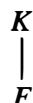

In particular, every field $F$ is an extension of its prime sub field. The field $F$ is sometimes called the base field of the extension.

The notation $K / F$ for a field extension is a shorthand for $^ { 6 6 } K$ over $F ^ { \prime \prime }$ and is not the quotient of $\pmb { K }$ by $F$ .

If $K / F$ is any extension of fields, then the multiplication defined in $\pmb { K }$ makes $\pmb { K }$ into a vector space over $\pmb { F } .$ . In particular every field $\pmb { F }$ can be considered as a vector space over its prime field.

Definition. The degree (or relative degree or index) of a field extension $K / F$ , denoted $[ K : F ] ,$ is the dimension of $\pmb { K }$ as a vector space over $F$ (i.e., $[ K : F ] = \dim _ { F } K )$ ). The extension is said to be finite if $[ K : F ]$ is finite and is said to be infinite otherwise.

An important class of field extensions are those obtained by trying to solve equations over a given field $F$ . For example, if $F = \mathbb { R }$ is the field of real numbers, then the simple equation $x ^ { 2 } + 1 = 0$ does not have a solution in $F .$ . The question arises whether there is some larger field containing $\mathbb { R }$ in which this equation does have a solution, and it was this question that led Gauss to introduce the complex numbers $\mathbb { C } = \mathbb { R } + \mathbb { R } i$ , where i is defined so that $i ^ { 2 } + 1 = 0$ . One then defines addition and multiplication in $\mathbb { C }$ by the usual rules familiar from elementary algebra and checks that in fact $\mathbb { C }$ so defined is a field, i.e., it is possible to find an inverse for every nonzero element of $\mathbb { C }$ .

Given any field $F$ and any polynomial $p ( x ) \in F [ x ]$ one can ask a similar question: does there exist an extension $\pmb { K }$ of $F$ containing a solution of the equation $p ( { \boldsymbol { x } } ) = \mathbf { 0 }$ (i.e., containing a root of $p ( x ) ) ?$ Note that we may assume here that the polynomial $p ( x )$ is irreducible in $F [ x ]$ since a root of any factor of $p ( x )$ is certainly a root of $p ( x )$ itself. The answer is yes and follows almost immediately from our work on the polynomial ring $F [ x ]$ . We first recall the following useful result on homomorphisms of fields (Corollary 10 of Chapter 7) which follows from the fact that the only ideals of a field $F$ are 0 and $F$ .

Proposition 2. Let $\varphi : F  F ^ { \prime }$ be a homomorphism of fields. Then $\varphi$ is either identically 0 or is injective, so that the image of $\varphi$ is either 0 or isomorphic to $F$ .

Theorem 3. Let $F$ be a field and let $p ( x ) \in F [ x ]$ be an irreducible polynomial. Then there exists a field $\pmb { K }$ containing an isomorphic copy of $F$ in which $p ( x )$ has a root. Identifying $F$ with this isomorphic copy shows that there exists an extension of $F$ in which $p ( x )$ has a root.

Proof: Consider the quotient

$$
K = F [ x ] / (p (x))
$$

of the polynomial ring $F [ x ]$ by the ideal generated by $p ( x )$ . Since by assumption $p ( x )$ is an irreducible polynomial in the P.I.D. $F [ x ]$ , the ideal $( p ( { \pmb x } ) )$ is a maximal ideal. Hence $\pmb { K }$ is actually afield (this is Proposition 1 2 of Chapter 7). The canonical projection $\pi$ of $F [ x ]$ to the quotient $F [ x ] / ( p ( x ) )$ restricted to $F \subset F [ x ]$ gives a homomorphism $\varphi = \pi | _ { F } : F \to K$ which is not identically 0 since it maps the identity 1 of $F$ to the identity 1 of $\pmb { K }$ . Hence by the proposition above, $\varphi ( F ) \cong F$ is an isomorphic copy

of $F$ contained in $\pmb { K }$ . We identify $F$ with its isomorphic image in $\pmb { K }$ and view $\pmb { F }$ as a subfield of $\pmb { K }$ . If $\bar { x } = \pi ( x )$ denotes the image of $_ x$ in the quotient $\pmb { K }$ , then

$$
\begin{array}{l} p (\bar {x}) = \overline {{p (x)}} \quad \text {(s i n c e} \pi \text {i s a h o m o m o r p h i s m)} \\ = p (x) (\operatorname {m o d} p (x)) \quad \text {i n} F [ x ] / (p (x)) \\ = 0 \quad \text {i n} F [ x ] / (p (x)) \\ \end{array}
$$

so that $\pmb { K }$ does indeed contain a root of the polynomial $p ( x )$ . Then $\pmb { K }$ is an extension of $F$ in which the polynomial $p ( x )$ has a root.

We shall use this result later to construct extensions of $F$ containing all the roots of $p ( x )$ (this is the notion of a splitting field and one of the central objects of interest in Galois theory).

To understand the field $K = F [ x ] / ( p ( x ) )$ constructed above more fully, it is useful to have a simple representation for the elements of this field. Since $F$ is a subfield of $\pmb { K }$ , we might in particular ask for a basis for $\pmb { K }$ as a vector space over $F$ .

Theorem 4. Let $p ( x ) \in F [ x ]$ be an irreducible polynomial of degree n over the field $F$ and let $\pmb { K }$ be the field $F [ x ] / ( p ( x ) )$ . Let $\theta = x$ mod $( p ( x ) ) \in K$ . Then the elements

$$
1, \theta , \theta^ {2}, \dots , \theta^ {n - 1}
$$

are a basis for $\pmb { K }$ as a vector space over $F$ , so the degree of the extension is n, i.e., $[ K : F ] = n$ . Hence

$$
K = \left\{a _ {0} + a _ {1} \theta + a _ {2} \theta^ {2} + \dots + a _ {n - 1} \theta^ {n - 1} \mid a _ {0}, a _ {1}, \dots , a _ {n - 1} \in F \right\}
$$

consists of all polynomials of degree $< n$ in $\pmb \theta$ .

Proof Let $a ( x ) \in F [ x ]$ be any polynomial with coefficients in $\pmb { F }$ . Since $F [ x ]$ i s a Euclidean Domain (this is Theorem 3 of Chapter 9), we may divide $a ( x )$ by $p ( x )$ :

$$
a (x) = q (x) p (x) + r (x) \quad q (x), r (x) \in F [ x ] \text {w i t h} \deg r (x) <   n.
$$

Since $q ( { \pmb x } ) p ( { \pmb x } )$ lies in the ideal $( p ( x ) )$ , it follows that $a ( x ) \equiv r ( x ) { \bmod { \left( p ( x ) \right) } }$ $( p ( x ) )$ , which shows that every residue class in $F [ x ] / ( p ( x ) )$ is represented by a polynomial of degree less than n. Hence the images $1 , \theta , \theta ^ { 2 } , \ldots , \theta ^ { n - 1 }$ $\theta ^ { n - 1 }$ of $1 , x , x ^ { 2 } , \ldots , { \bar { x } } ^ { n - 1 }$ in the quotient span the quotient as a vector space over $F$ . It remains to see that these elements are linearly independent, so form a basis for the quotient over $F$ .

If the elements $1 , \theta , \theta ^ { 2 } , \ldots , \theta ^ { n - 1 }$ were not linearly independent in $\pmb { K }$ , then there would be a linear combination

$$
b _ {0} + b _ {1} \theta + b _ {2} \theta^ {2} + \dots + b _ {n - 1} \theta^ {n - 1} = 0
$$

in $\pmb { K }$ , with $b _ { 0 } , b _ { 1 } , \dotsc , b _ { n - 1 } \in F .$ , not all 0. This is equivalent to

$$
b _ {0} + b _ {1} x + b _ {2} x ^ {2} + \dots + b _ {n - 1} x ^ {n - 1} \equiv 0 \bmod (p (x))
$$

I.e . ,

$$
p (x) \text {d i v i d e s} b _ {0} + b _ {1} x + b _ {2} x ^ {2} + \dots + b _ {n - 1} x ^ {n - 1}
$$

in $F [ x ]$ . But this is impossible, since $p ( x )$ is of degree n and the degree of the nonzero polynomial on the right is $< n$ . This proves that $\bar { 1 } , \theta , \theta ^ { 2 } , \ldots , \theta ^ { n - 1 }$ are a basis for $\pmb { K }$ over $F$ , so that $[ K : F ] = n$ by definition. The last statement of the theorem is clear.

This theorem provides an easy description of the elements of the field $F [ x ] / ( p ( x ) )$ as polynomials of degree $< n$ in $\theta$ where $\theta$ is an element (in $K$ ) with $p ( \theta ) = 0$ . It remains only to see how to add and multiply elements written in this form. The addition in the quotient $F [ x ] / ( p ( x ) )$ is just usual addition of polynomials. The multiplication of polynomials ${ \pmb a } ( { \pmb x } )$ and ${ b } ( x )$ in the quotient $F [ x ] / ( p ( x ) )$ is performed by finding the product $a ( { \boldsymbol { x } } ) b ( { \boldsymbol { x } } )$ in $F [ x ] ,$ , then finding the representative of degree $< n$ for the coset $a ( x ) b ( x ) + ( p ( x ) )$ (as in the proof above) by dividing $a ( { \boldsymbol { x } } ) b ( { \boldsymbol { x } } )$ by $p ( x )$ and finding the remainder.

This can also be done easily in terms of $\theta$ as follows: We may suppose $p ( x )$ is monic (since its roots and the ideal it generates do not change by multiplying by a constant), say $p ( x ) = x ^ { n } + p _ { n - 1 } x ^ { n - 1 } + \cdot \cdot \cdot + p _ { 1 } x + p _ { 0 }$ . Then in $\pmb { K }$ , since $p ( \theta ) = 0 ,$ , we have

$$
\theta^ {n} = - \left(p _ {n - 1} \theta^ {n - 1} + \dots + p _ {1} \theta + p _ {0}\right)
$$

i . e . , $\theta ^ { n }$ is a linear combination of lower powers of e . Multiplying both sides by $\theta$ and replacing the $\theta ^ { n }$ on the right hand side by these lower powers again, we see that also $\theta ^ { \bar { n + 1 } }$ is a polynomial of degree $< n$ in $\theta$ . Similarly, any positive power of $\theta$ can be written as a polynomial of degree $< n$ in $\theta$ , hence any polynomial in $\theta$ can be written as a polynomial of degree $< n$ in-8 . Multiplication in $\pmb { K }$ is now easily performed: one simply writes the product of two polynomials of degree $< n$ in $\theta$ as another polynomial of degree $< n$ in $\theta$ .

We summarize this as:

Corollary 5. Let $\pmb { K }$ be as in Theorem 4, and let $a ( \theta ) , b ( \theta ) \in K$ be two polynomials of degree $< n$ in $\theta .$ . Then addition in $\pmb { K }$ is defined simply by usual polynomial addition and multiplication in $\pmb { K }$ is defined by

$$
a (\theta) b (\theta) = r (\theta)
$$

where $r ( x )$ is the remainder (of degree $< n \dot { \bf \Phi }$ ) obtained after dividing the polynomial $a ( { \boldsymbol { x } } ) b ( { \boldsymbol { x } } )$ by $p ( x )$ in $F [ x ]$ .

By the results proved above, this definition of addition and multiplication on the polynomials of degree $< n$ in $\theta$ make $\pmb { K }$ into a field, so that one can also divide by nonzero elements as well, which is not so immediately obvious from the definitions of the operations.

It is also important in Theorem 4 that the polynomial $p ( x )$ be irreducible over $F$ . In general the addition and multiplication in Corollary 5 (which can be defined in the same way for any polynomial $p ( x ) )$ do not make the polynomials of degree $< n$ in $\theta$ into a field if $p ( x )$ is not irreducible. In fact, this set is not even an integral domain in general (its structure is given by Proposition 16 of Chapter 9). To describe the field containing a root $\theta$ of a general polynomial $f ( x )$ over $F$ , $f ( x )$ is factored into irreducibles in $F [ x ]$ and the results above are applied to an irreducible factor $p ( x )$ of $f ( x )$ having $\theta$ as a root. We shall consider this more in the following sections.

# Examples

(1) If we apply this construction to the special case $F = \mathbb { R }$ and $p ( x ) = x ^ { 2 } + 1$ then we obtain the field

$$
\mathbb {R} [ x ] / (x ^ {2} + 1)
$$

which is an extension of degree 2 of $\mathbb { R }$ in which $x ^ { 2 } + 1$ has a root. The elements of this field are of the form $a + b \theta$ for a , $b \in \mathbb { R }$ Addition is defined by

$$
(a + b \theta) + (c + d \theta) = (a + c) + (b + d) \theta . \tag {13.2a}
$$

To multiply we use the fact that $\theta ^ { 2 } + 1 = 0$ , i .e., $\theta ^ { 2 } = - 1$ in $\pmb { K }$ . (Alternatively, note that - 1 is also the remainder when $x ^ { 2 }$ is divided by $x ^ { 2 } + 1$ in $\mathbb { R } [ x ] .$ .) Then

$$
\begin{array}{l} (a + b \theta) (c + d \theta) = a c + (a d + b c) \theta + b d \theta^ {2} \\ = a c + (a d + b c) \theta + b d (- 1) \\ = (a c - b d) + (a d + b c) \theta . \tag {13.2b} \\ \end{array}
$$

These are, up to changing $\pmb { \theta }$ to i, the formulas for adding and multiplying in C. Put another way, the map

$$
\begin{array}{l} \varphi : \mathbb {R} [ x ] / (x ^ {2} + 1) \longrightarrow \mathbb {C} \\ a + b x \mapsto a + b i \\ \end{array}
$$

is a homomorphism. Since it is bijective (as a map of vector spaces over the reals, for example), it is an isomorphism. Notice that instead of taking the existence of $\mathbb { C }$ for granted (along with the fairly tedious verification that it is in fact a field), we could have defined $\mathbb { C }$ by this isomorphism. Then the fact that it is a field is a consequenc_e of Theorem 4.

(2) Take now $F = \mathbb { Q }$ to be the field of rational numbers and again take $p ( x ) = x ^ { 2 } + 1$ (still irreducible over $\mathbb { Q } ,$ , of course). Then the same construction, with the same addition and multiplication formulas as (2a) and (2b) above, except that now a and $\pmb { b }$ are elements of $\mathbb { Q } .$ , defines a field extension $\mathbb { Q } ( i )$ of $\mathbb { Q }$ of degree 2 containing a root i of $x ^ { 2 } + 1$ .   
(3) Take $F = \mathbb { Q }$ and $p ( x ) = x ^ { 2 } - 2 ,$ , irreducible over $\mathbb { Q }$ by Eisenstein's Criterion, for example. Then we obtain a field extension of $\mathbb { Q }$ of degree 2 containing a square root $\pmb { \theta }$ of 2, denoted $\mathbb { Q } ( \theta )$ . If we denote $\pmb { \theta }$ ( by $\sqrt { 2 } ,$ , the elements of this field are of the form

$$
a + b \sqrt {2}, \quad a, b \in \mathbb {Q}
$$

with addition defined by

$$
(a + b \sqrt {2}) + (c + d \sqrt {2}) = (a + c) + (b + d) \sqrt {2}
$$

and multiplication defined by

$$
(a + b \sqrt {2}) (c + d \sqrt {2}) = (a c + 2 b d) + (a d + b c) \sqrt {2}.
$$

(4) Let $F = \mathbb { Q }$ and $p ( x ) = x ^ { 3 } - 2 .$ , irreducible again by Eisenstein. Denoting a root of $p ( { \boldsymbol { x } } )$ by $\pmb { \theta }$ (, we obtain the field

$$
\mathbb {Q} [ x ] / (x ^ {3} - 2) \cong \{a + b \theta + c \theta^ {2} \mid a, b, c \in \mathbb {Q} \}
$$

with $\theta ^ { 3 } = 2$ , an extension of degree 3. To find the inverse of, say, $1 + \theta$ in this field, we can proceed as follows: By the Euclidean Algorithm in $\mathbb { Q } [ x ]$ there are polynomials $\pmb { a } ( \pmb { x } )$ and ${ \pmb b } ( { \pmb x } )$ with

$$
a (x) (1 + x) + b (x) \left(x ^ {3} - 2\right) = 1
$$

(since $p ( x ) = x ^ { 3 } - 2$ is irreducible, it is relatively prime to every polynomial of smaller degree). In the quotient field this equation implies that ${ \pmb a } ( \pmb \theta )$ is the inverse of $1 + \theta$ . In this case, a simple computation shows that we can take $\begin{array} { r } { a ( x ) = \frac { 1 } { 3 } ( x ^ { 2 } - x + 1 ) } \end{array}$ (and $\begin{array} { r } { b ( x ) = - \frac { 1 } { 3 } ) } \end{array}$ ), so that

$$
(1 + \theta) ^ {- 1} = \frac {\theta^ {2} - \theta + 1}{3}.
$$

(5) In general, if $\theta \in K$ is a root of the irreducible polynomial

$$
p (x) = p _ {n} x ^ {n} + p _ {n - 1} x ^ {n - 1} + \dots + p _ {1} x + p _ {0}
$$

we can compute $\theta ^ { - 1 } \in K$ from

$$
\theta \left(p _ {n} \theta^ {n - 1} + p _ {n - 1} \theta^ {n - 2} + \dots + p _ {1}\right) = - p _ {0}
$$

namely

$$
\theta^ {- 1} = \frac {- 1}{p _ {0}} \left(p _ {n} \theta^ {n - 1} + p _ {n - 1} \theta^ {n - 2} + \dots + p _ {1}\right) \in K
$$

(note that $p _ { 0 } \neq 0$ since $p ( x )$ is irreducible).

Remark: Determining inverses in extensions of this type may be familiar from elementary algebra in the case of <C or Example 3 under the name "rationalizing denominators." The last two examples indicates a procedure which is much more general than the ad hoc procedures of elementary algebra.

(6) Take $F = \mathbb { F } _ { 2 }$ , the finite field with two elements, and $p ( x ) = x ^ { 2 } + x + 1$ , which we have previously checked is irreducible over $\mathbb { F } _ { 2 }$ . Here we obtain a degree 2 extension of $\mathbb { F } _ { 2 }$

$$
\mathbb {F} _ {2} [ x ] / (x ^ {2} + x + 1) \cong \{a + b \theta \mid a, b \in \mathbb {F} _ {2} \}
$$

where $\theta ^ { 2 } = - \theta - 1 = \theta + 1$ . Multiplication in this field $\mathbb { F } _ { 2 } ( \boldsymbol { \theta } )$ (which contains fo� elements) is defined by

$$
\begin{array}{l} (a + b \theta) (c + d \theta) = a c + (a d + b c) \theta + b d \theta^ {2} \\ = a c + (a d + b c) \theta + b d (\theta + 1) \\ = (a c + b d) + (a d + b c + b d) \theta . \\ \end{array}
$$

(7) Let $\pmb { F } = \pmb { k } ( t )$ be the field of rational functions in the variable t over a field $k$ (for example, $\pmb { k } = \mathbb { Q }$ or $\pmb { k } = \mathbb { F } _ { p } ,$ ). Let $p ( x ) = x ^ { 2 } - t \in F [ x ]$ . Then $p ( x )$ is irreducible (it is Eisenstein at the prime (t) in $k [ t ]$ ). If we denote a root by $\pmb { \theta }$ , the corresponding degree 2 field extension $F ( \theta )$ consists of the elements

$$
\{a (t) + b (t) \theta \mid a (t), b (t) \in F \}
$$

where the coefficients ${ \pmb a } ( t )$ and $b ( t )$ are rational functions in t with coefficients in $\pmb { k }$ and where $\theta ^ { 2 } = \ t$ .

Suppose $F$ is a subfield of a field $\pmb { K }$ and $\alpha \in K$ is an element of $\pmb { K }$ . Then the collection of subfields of $\pmb { K }$ containing both $\pmb { F }$ and $\pmb { \alpha }$ is nonempty $\boldsymbol { K }$ is such a field, for example). Since the intersection of subfields is again a subfield, it follows that there is a unique minimal subfield of $\pmb { K }$ containing both $\pmb { F }$ and $\pmb { \alpha }$ (the intersection of all subfields with this property). Similar remarks apply if $\pmb { \alpha }$ is replaced by a collection a, {3, . . . of elements of $\pmb { K }$ .

Definition. Let $\pmb { K }$ be an extension of the field $F$ and let a $, \beta , \cdots \in K$ be a collection of elements of $\pmb { K }$ . Then the smallest subfield of $\pmb { K }$ containing both $\pmb { F }$ and the elements $\alpha , \beta , \ldots$ , denoted $F ( \alpha , \beta , \ldots )$ is called the field generated by a, $\beta ,$ , . . . over $F$ .

Definition. If the field $\pmb { K }$ is generated by a single element $\pmb { \alpha }$ over $\pmb { F }$ , $K = F ( \pmb { \alpha } )$ , then $\pmb { K }$ is said to be a simple extension of $F$ and the element $\pmb { \alpha }$ is called a primitive element for the extension.

We shall later characterize which extensions of a field $F$ are simple. In particular we shall prove that every finite extension of a field of characteristic 0 is a simple extension.

The connection between the simple extension $F ( \pmb { \alpha } )$ generated by $\pmb { \alpha }$ over $F$ where $\pmb { \alpha }$ is a root of some irreducible polynomial $p ( x )$ and the field constructed in Theorem 3 is provided by the following:

Theorem 6. Let $\pmb { F }$ be a field and let $p ( x ) \in F [ x ]$ be an irreducible polynomial. Suppose $\pmb { K }$ is an extension field of $\pmb { F }$ containing a root $\pmb { \alpha }$ of $p ( x ) \colon p ( \alpha ) = 0$ . Let $F ( \pmb { \alpha } )$ denote the subfield of $\pmb { K }$ generated over $F$ by $\pmb { \alpha } .$ . Then

$$
F (\alpha) \cong F [ x ] / (p (x)).
$$

Remark: This theorem says that any field over $\pmb { F }$ in which $p ( x )$ contains a root contains a subfield isomorphic to the extension of $F$ constructed· in Theorem 3 and that this field is (up to isomorphism) the smallest extension of $F$ containing such a root. The difference between this result and Theorem 3 is that Theorem 6 assumes the existence of a root $\pmb { \alpha }$ of $p ( x )$ in some field $\pmb { K }$ and the major point of Theorem 3 is proving that there exists such an extension field $\pmb { K }$ .

Proof: There is a natural homomorphism

$$
\begin{array}{l} \varphi : F [ x ] \longrightarrow F (\alpha) \subseteq K \\ a (x) \longmapsto a (\alpha) \\ \end{array}
$$

obtained by mapping $F$ to $F$ by the identity map and sending $x$ to $\pmb { \alpha }$ and then extending so that the map is a ring homomorphism (i.e., the polynomial ${ \pmb a } ( { \pmb x } )$ in $x$ maps to the polynomial $\pmb { a } ( \pmb { \alpha } )$ in $\pmb { \alpha }$ ). Since $\pmb { p } ( \pmb { \alpha } ) = \mathbf { 0 }$ by assumption, the element $p ( x )$ is in the kernel of $\varphi ,$ so we obtain an induced homomorphism (also denoted $\pmb { \varphi }$ ) :

$$
\varphi : F [ x ] / (p (x)) \longrightarrow F (\alpha).
$$

But since $p ( x )$ is irreducible, the quotient on the left is afield, and $\varphi$ is not the 0 map (it is the identity on $F$ , for example), hence $\pmb { \varphi }$ is an isomorphism of the field on the left with its image. Since this image is then a subfield of $F ( \pmb { \alpha } )$ containing $F$ and containing a, by the definition of $F ( \pmb { \alpha } )$ the map must be smjective, proving the theorem.

Combined with Corollary 5, this determines the field $F ( \pmb { \alpha } )$ when $\pmb { \alpha }$ is a root of an irreducible polynomial $p ( x )$ :

Corollary 7. Suppose in Theorem 6 that $p ( x )$ is of degree n. Then

$$
F (\alpha) = \left\{a _ {0} + a _ {1} \alpha + a _ {2} \alpha^ {2} + \dots + a _ {n - 1} \alpha^ {n - 1} \mid a _ {0}, a _ {1}, \dots , a _ {n - 1} \in F \right\} \subseteq K.
$$

Describing fields generated by more than one element is more complicated and we shall return to this question in the following section.

# Examples

(1) In Example 3 above, we have determined the field $\mathbb { Q } ( { \sqrt { 2 } } )$ generated over $\mathbb { Q }$ by the element ${ \sqrt { 2 } } \in \mathbb { R } .$ , having suggestively denoted the abstract solution $\theta$ of the equation $x ^ { 2 } - 2 = 0$ by the symbol ${ \sqrt { 2 } } ,$ which has an independent meaning in the field $\mathbb { R }$ (namely the positive square root of 2 in $\mathbb { R }$ ).

(2) The equation $x ^ { 2 } - 2 = 0$ has another solution in $\mathbb { R }$ , namely $- { \sqrt { 2 } } ,$ , the negative square root of 2 in $\mathbb { R }$ The field generated over $\mathbb { Q }$ by this solution consists of the elements $\{ a + b ( - { \sqrt { 2 } } ) \mid a , b \in \mathbb { Q } \} ,$ and is again isomorphic to the field in Example 3 above (hence also isomorphic to the field just considered, the isomorphism given explicitly by $a + b { \sqrt { 2 } } \mapsto a - b { \sqrt { 2 } }$ ). As a subset of $\mathbb { R }$ this is the same set of elements as in Example 1 .

(3) Similarly, i f we use the symbol $\sqrt [ 3 ] { 2 }$ to denote the (positive) cube root of 2 i n IR, then the field generated by $\sqrt [ 3 ] { 2 }$ over $\mathbb { Q }$ in $\mathbb { R }$ consists of the elements

$$
\{a + b \sqrt [ 3 ]{2} + c (\sqrt [ 3 ]{2}) ^ {2} | a, b, c \in \mathbb {Q} \}
$$

and is isomorphic to the field constructed in Example 4 above.

(4) The equation $\ x ^ { 3 } - 2 = 0$ has no further solutions in $\mathbb { R }$ , but there are two additional I . so utwns in $\mathbb { C }$ . b gtven y $\sqrt [ 3 ] { 2 } ( \frac { - 1 + i \sqrt { 3 } } { 2 } )$ J d 3 '2 - I - ; -JJ ) an �< ) $\sqrt [ 3 ] { 2 } ( \frac { - 1 - i \sqrt { 3 } } { 2 } )$ ( d . .  v 3 enotmg the post-2 2 tive real square root of 3) as can easily be checked. The fields generated by either of these two elements over $\mathbb { Q }$ are subfields of $\mathbb { C }$ (but not of $\mathbb { R } ^ { \cdot }$ ) and are both isomorphic to the field constructed in the previous example (and to Example 4 earlier).

As Theorem 6 indicates, the roots of an irreducible polynomial $\bar { p } ( x )$ are algebraically indistinguishable in the sense that the fields obtained by adjoining any root of an irreducible polynomial are isomorphic. In the last two examples above, the fields obtained by adjoining one of the three possible (complex) roots of $x ^ { 3 } - 2 = 0$ to $\mathbb { Q }$ were all algebraically isomorphic. The fields were distinguished not by their algebraic properties, but by whether their elements were real, which involves continuous operations.

The fact that different roots of the same irreducible polynomial have the same algebraic properties can be extended slightly, as follows:

Let $\varphi : F \stackrel { \sim } { \to } F ^ { \prime }$ be an isomorphism of fields. The map $\varphi$ induces a ring isomorphism (also denoted $\varphi$ )

$$
\varphi : F [ x ] \xrightarrow {\sim} F ^ {\prime} [ x ]
$$

defined by applying $\varphi$ to the coefficients of a polynomial in $F [ x ]$ . Let $p ( x ) \in F [ x ]$ be an irreducible polynomial and let $p ^ { \prime } ( x ) \in F ^ { \prime } [ x ]$ be the polynomial obtained by applying the map $\varphi$ to the coefficients of $p ( x )$ , i.e., the image of $p ( x )$ under $\varphi$ ([. The isomorphism $\varphi$ maps the maximal ideal $( p ( { \pmb x } ) )$ to the ideal $\left( { p ^ { \prime } ( x ) } \right)$ , so this ideal is also

maximal, which shows that $p ^ { \prime } ( x )$ is also irreducible in $\scriptstyle { F ^ { \prime } [ x ] } .$ . The following theorem shows that the fields obtained by adjoining a root of $p ( x )$ to $\pmb { F }$ and a root of $p ^ { \prime } ( x )$ to ${ \pmb F } ^ { \prime }$ have the same algebraic structure (i.e., are isomorphic):

Theorem 8. Let $\varphi : F \stackrel { \sim } { \to } F ^ { \prime }$ be an isomorphism of fields. Let $p ( x ) \in F [ x ]$ be an irreducible polynomial and let $p ^ { \prime } ( x ) \in F ^ { \prime } [ x ]$ be the irreducible polynomial obtained by applying the map $\varphi$ to the coefficients of $p ( x )$ . Let $\pmb { \alpha }$ be a root of $p ( x )$ (in some extension of $F _ { \cdot }$ ) and let $\beta$ be a root of $p ^ { \prime } ( x )$ (in some extension of $F ^ { \prime }$ ). Then there is an isomorphism

$$
\sigma : F (\alpha) \xrightarrow {\sim} F ^ {\prime} (\beta)
$$

$$
\alpha \longmapsto \beta
$$

mapping $\pmb { \alpha }$ to $\beta$ and extending $\varphi .$ , i.e., such that $\pmb { \sigma }$ restricted to $\pmb { F }$ is the isomorphism $\pmb { \varphi }$

Proof" As noted above, the isomorphism $\varphi$ induces a natural isomorphism from $F [ x ]$ to $F ^ { \prime } [ x ]$ which maps the maximal ideal $( p ( x ) )$ to the maximal ideal $\left( p ^ { \prime } ( { \pmb x } ) \right)$ . Taking the quotients by these ideals, we obtain an isomorphism of fields

$$
F [ x ] / (p (x)) \stackrel {{\sim}} {{\longrightarrow}} F ^ {\prime} [ x ] / \left(p ^ {\prime} (x)\right).
$$

By Theorem 6 the field on the left is isomorphic to $F ( \pmb { \alpha } )$ and by the same theorem the field on the right is isomorphic to $F ^ { \prime } ( \beta )$ . Composing these isomorphisms, we obtain the isomorphism $\pmb { \sigma }$ . It is clear that the restriction of this isomorphism to $\pmb { F }$ is $\varphi$ ({, completing the proof.

This extension theorem will be of considerable use when we consider Galois Theory later. It can be represented pictorially by the diagram

$$
\begin{array}{c c c c} \sigma : & F (\alpha) & \stackrel {{\sim}} {{\longrightarrow}} & F ^ {\prime} (\beta) \\ & | & & | \\ \varphi : & F & \stackrel {{\sim}} {{\longrightarrow}} & F ^ {\prime} \end{array}
$$

# E X E R C I S E S

1. Show that $p ( x ) = x ^ { 3 } + 9 x + 6$ is irreducible in $\mathbb { Q } [ x ] .$ . Let $\pmb \theta$ ( be a root of $p ( x )$ . Find qre inverse of $1 + \theta$ in $\mathbb { Q } ( \theta )$ .   
2. Show that $x ^ { 3 } - 2 x - 2$ is irreducible over $\mathbb { Q }$ and let $\theta$ be a root. Compute $( 1 + \theta ) ( 1 + \theta + \theta ^ { 2 } )$ and $\frac { 1 + \theta } { 1 + \theta + \theta ^ { 2 } }$ . m $\mathbb { Q } ( \theta )$ .   
3. Show that $x ^ { 3 } + x + 1$ is irreducible over $\mathbb { F } _ { 2 }$ and let $\theta$ be a root. Compute the powers of $\theta$ in $\mathbb { F } _ { 2 } ( \boldsymbol { \theta } )$ .   
4. Prove directly that the map $a + b { \sqrt { 2 } } \mapsto a - b { \sqrt { 2 } }$ ./2 is an isomorphism of $\mathbb { Q } ( { \sqrt { 2 } } )$ with itself.   
5. Suppose $\pmb { \alpha }$ is a rational root of a monic polynomial in $\mathbb { Z } [ x ]$ . Prove that $\pmb { \alpha }$ is an integer.   
6. Show that if $\pmb { \alpha }$ is a root of $a _ { n } x ^ { n } + a _ { n - 1 } x ^ { n - 1 } + \cdots + a _ { 1 } x + a _ { 0 }$ then $\mathbf { \delta } _ { a _ { n } \alpha }$ is a root of the monic polynomial $x ^ { n } + a _ { n - 1 } x ^ { n - 1 } + a _ { n } a _ { n - 2 } x ^ { n - 2 } + \cdot \cdot \cdot + a _ { n } ^ { n - 2 } a _ { 1 } x + a _ { n } ^ { n - 1 } a _ { 0 } .$ .   
7. Prove that $\ x ^ { 3 } - n x + 2$ is irreducible for $n \neq - 1 , 3 , 5 .$   
8. Prove that $\pmb { x } ^ { 5 } - \pmb { a x } - 1 \in \mathbb { Z } [ \pmb { x } ]$ is irreducible unless ${ \pmb a } = { \bf 0 }$ , 2 or -1. The first two correspond to linear factors, the third corresponds to the factorization $( x ^ { 2 } - x + 1 ) ( x ^ { 3 } + x ^ { 2 } - 1 )$ .

# 1 3.2 ALGEBRAIC EXTENSIONS

Let $F$ be a field and let $\pmb { K }$ be an extension of $F$ .

Definition. The element $\alpha \in K$ is said to be algebraic over $F$ if $\pmb { \alpha }$ is a root of some nonzero polynomial $f ( x ) \in F [ x ]$ . If $\pmb { \alpha }$ is not algebraic over $F$ (i.e., is not the root of any nonzero polynomial with coefficients in $F$ ) then $\pmb { \alpha }$ is said to be transcendental over $F$ . The extension $K / F$ is said to be algebraic if every element of $\pmb { K }$ is algebraic over $F$ .

Note that if $\pmb { \alpha }$ is algebraic over a field $F$ then it is algebraic over any extension field $L$ of $F$ (if $f ( x )$ having $\pmb { \alpha }$ as a root has coefficients in $F$ then it also has coefficients in $L$ ) .

Proposition 9. Let $\pmb { \alpha }$ be algebraic over $F$ . Then there is a unique monic irreducible polynomial $m _ { \alpha , F } ( x ) \in F [ x ]$ which has $\pmb { \alpha }$ as a root. A polynomial $f ( x ) \in F [ x ]$ has $\pmb { \alpha }$ as a root if and only if $m _ { \alpha , F } ( x )$ divides $f ( x )$ in $F [ x ]$ .

Proof· Let $g ( x ) \in F [ x ]$ be a polynomial of minimal degree having $\pmb { \alpha }$ as a root. Multiplying $g ( x )$ by a constant, we may assume $g ( x )$ is monic. Suppose $g ( x )$ were reducible in $F [ x ] .$ , say $g ( x ) = a ( x ) b ( x )$ with $a ( x ) , b ( x ) \in F [ x ]$ ${ \pmb a } ( { \pmb x } )$ both of degree smaller than the degree of $g ( x )$ . Then $g ( \alpha ) = a ( \alpha ) b ( \alpha )$ in $K ,$ , and since $\pmb { K }$ is a field, either $\pmb { a } ( \pmb { \alpha } ) = \pmb { 0 }$ or $\pmb { b } ( \pmb { \alpha } ) = \mathbf { 0 }$ , contradicting the minimality of the degree of $g ( x )$ . It follows that $g ( x )$ is a monic irreducible polynomial having $\pmb { \alpha }$ as a root. Suppose now that $f ( x ) \in F [ x ]$ is any polynomial having $\pmb { \alpha }$ as a root. By the Euclidean Algorithm in $F [ x ]$ there are polynomials $q ( x ) , r ( x ) \in F [ x ]$ such that

$$
f (x) = q (x) g (x) + r (x) \quad \text {w i t h} \quad \deg r (x) <   \deg g (x).
$$

Then $f ( \alpha ) = q ( \alpha ) g ( \alpha ) + r ( \alpha )$ in $\pmb { K }$ and since $\pmb { \alpha }$ i s a root of ooth $f ( x )$ and $g ( x )$ , we obtain $r ( \alpha ) = 0$ , which contradicts the minimality of $g ( x )$ unless $r ( x ) = 0$ . Hence $g ( x )$ divides any polynomial $f ( x )$ in $F [ x ]$ having $\pmb { \alpha }$ as a root and, in particular, would divide any other monic irreducible polynomial in $F [ x ]$ having $\pmb { \alpha }$ as a root. This proves that $m _ { \alpha , F } ( x ) = g ( x )$ is unique and completes the proof of the proposition.

Corollary 10. If $L / F$ is an extension of fields and $\pmb { \alpha }$ is algebraic over both $F$ and $L$ , then $m _ { \alpha , L } ( x )$ divides $m _ { \alpha , F } ( x )$ in $\boldsymbol { L } [ \boldsymbol { x } ]$ .

Proof' Thi'� is immediate from the second statement in Proposition 9 applied to $L$ , since $m _ { \alpha , F } ( x )$ is a polynomial in $L [ x ]$ having $\pmb { \alpha }$ as a root.

Definition. The polynomial $m _ { \alpha , F } ( x )$ (or just $m _ { \alpha } ( x )$ if the field $F$ is understood) in Proposition 9 is called the minimal polynomial for $\pmb { \alpha }$ over $F .$ . The degree of $m _ { \alpha } ( x )$ is called the degree of $\pmb { \alpha }$ .

Note that by the proposition, a monic polynomial over $F$ with $\pmb { \alpha }$ as a root is the minimal polynomial for $\pmb { \alpha }$ over $F$ if and only if it is irreducible over $F$ . Exercise 20

gives one method for computing the minimal polynomial for $\pmb { \alpha }$ over $F _ { \ast }$ , and the theory of Grobner bases can be used to compute the minimal polynomial for other elements in $F ( \alpha )$ (cf. Proposition 10 and Exercise 48 in Section 15. 1 ).

Proposition 11. Let $\pmb { \alpha }$ be algebraic over the field $F$ and let $F ( \alpha )$ be the field generated by $\pmb { \alpha }$ over $F .$ . Then

$$
F (\alpha) \cong F [ x ] / (m _ {\alpha} (x))
$$

so that in particular

$$
[ F (\alpha): F ] = \deg m _ {\alpha} (x) = \deg \alpha ,
$$

i.e., the degree of $\pmb { \alpha }$ over $F$ is the degree of the extension it generates over $F$

Proof: This follows immediately from Theorem 6. ·

# Examples

(1) The minimal polynomial for $\sqrt { 2 }$ over $\mathbb { Q }$ is $x ^ { 2 } - 2$ and $\sqrt { 2 }$ is of degree 2 over $\mathbb { Q } \mathrm { : }$ $\mathbb { Q } ( { \sqrt { 2 } } ) : \mathbb { Q } ] = 2 .$ .   
(2) The minimal polynomial for $\sqrt [ 3 ] { 2 }$ over $\mathbb { Q }$ is $x ^ { 3 } - 2$ and $\sqrt [ 3 ] { 2 }$ is of degree 3 over $\mathbb { Q }$ $\mathbb { Q } ( { \sqrt [ 3 ] { 2 } } ) : \mathbb { Q } ] = 3$ .   
(3) Similarly, for any $n > 1$ , the polynomial $x ^ { n } - 2$ is irreducible over $\mathbb { Q }$ since it is Eisenstein. Denoting a root of this polynomial by $\sqrt [ n ] { 2 }$ (where as usual we reserve this symbol to denote the positive $\hbar ^ { \mathrm { { t h } } }$ root of 2 if we want to view this root as an element of $\mathbb { R }$ , and where the symbol denotes any one of the algebraically indistinguishable abstract solutions in general), we have $\left[ \mathbb { Q } ( { \sqrt [ n ] { 2 } } ) : \mathbb { Q } \right] = n$ .   
(4) The minimal polynomial and the degree of an element $\pmb { \alpha }$ depend on the base field. For example, over $\mathbb { R }$ , the el�ment $\sqrt [ n ] { 2 }$ is of degree one, with minimal polynomial m 0 nt(x) = x - ::/2. $m \sqrt [ n ] { 2 } , \mathbb { R } ^ { ( \pmb { x } ) } = \pmb { x } - \sqrt [ n ] { 2 }$   
(5) Consider the polynomial $p ( { \boldsymbol { x } } ) = { \boldsymbol { x } } ^ { 3 } - 3 { \boldsymbol { x } } - 1$ over $\mathbb { Q } ,$ which is irreducible over $\mathbb { Q }$ since it is a cubic which has no rational root ( cf. Proposition 1 1 of Chapter 9). Hence $\left[ \mathbb { Q } ( \alpha ) : \mathbb { Q } \right] = 3$ for any root $\pmb { \alpha }$ of $p ( { \pmb x } )$ . For future reference we note that a quick sketch of the graph of this function over the real numbers shows that the graph crosses the $_ x$ -axis precisely once in the interval [0,2], i.e., there is precisely one real number $x , 0 < \alpha < 2$ satisfying $\alpha ^ { 3 } - 3 \alpha - 1 = 0$ .

Proposition 12. The element $\pmb { \alpha }$ is algebraic over $F$ if and only if the simple extension $F ( \alpha ) / F$ is finite. More precisely, if $\pmb { \alpha }$ is an element of an extension of degree n over $F$ then $\pmb { \alpha }$ satisfies a polynomial of degree at most n over $F$ and if $\pmb { \alpha }$ satisfies a polynomial of degree n over $F$ then the degree of $F ( \alpha )$ over $F$ is at most n .

Proof' If $\pmb { \alpha }$ is algebraic over $F$ , then the degree of the extension $F ( \alpha ) / F$ is the degree of the minimal polynomial for $\pmb { \alpha }$ over $F$ . Hence the extension is finite, of degree $\leq n$ if $\pmb { \alpha }$ satisfies a polynomial of degree n. Conversely, suppose $\pmb { \alpha }$ is an element of an extension of degree $\pmb { n }$ over $\pmb { F }$ (for example, if $[ F ( \alpha ) : F ] = n )$ ). Then the $\pm 1$ elements

$$
1, \alpha , \alpha^ {2}, \dots , \alpha^ {n}
$$

of $F ( \alpha )$ are linearly dependent over $F _ { \ast }$ , say

$$
b _ {0} + b _ {1} \alpha + b _ {2} \alpha^ {2} + \dots + b _ {n} \alpha^ {n} = 0
$$

with $b _ { 0 } , b _ { 1 } , b _ { 2 } , \dotsc , b _ { n } \in F$ not all 0. Hence $\pmb { \alpha }$ is the root of a nonzero polynomial with coefficients in $\pmb { F }$ (of degree $\leq n$ ), which proves $\pmb { \alpha }$ is algebraic over $\pmb { F }$ and also proves the second statement of the proposition.

Corollary 13. If the extension $K / F$ is finite, then it is algebraic.

Proof If ${ \pmb { \alpha } } \in { \pmb { K } }$ , then the subfield $F ( \alpha )$ is in particular a subspace of the vector space $\pmb { K }$ over $\pmb { F }$ . Hence $[ F ( \alpha ) : F ] \le [ K : F ]$ and so $\pmb { \alpha }$ is algebraic over $\pmb { F }$ by the proposition.

Remark: We shall prove below a sort of converse to this result (Theorem 17), but note that there are infinite algebraic extensions (we shall have an example later), so the literal converse of this corollary is not true.

# Example: (Quadratic Extensions m·�! Fields of Characteristic $\neq 2 )$ )

Let $\pmb { F }$ be a field of characteristic $\neq 2$ (for example, any field of characteristic 0, such as $\mathbb { Q }$ ) and let $\pmb { K }$ be an extension of $\pmb { F }$ of degree 2, $[ K : F ] = 2 .$ . Let $\pmb { \alpha }$ be any element of $\pmb { K }$ not contained in $\boldsymbol { F }$ . By the proposition above, $\pmb { \alpha }$ satisfies an equation of degree at most 2 over $F .$ . This equation cannot be of degree 1, since $\pmb { \alpha }$ is not an element of $\pmb { F }$ by assumption. It follows that the minimal polynomial of $\pmb { \alpha }$ is a monic quadratic

$$
m _ {\alpha} (x) = x ^ {2} + b x + c \quad b, c \in F.
$$

Since $F \subset F ( \alpha ) \subseteq K$ and $F ( \pmb { \alpha } )$ is already a vector space over $\boldsymbol { F }$ of dimension 2, we have $K = F ( \alpha )$ .

The roots of this quadratic equation can be determined by the quadratic formula, which is valid over any field of characteristic $\neq 2$ (the formula is obtained as in elementary algebra by completing the square):

$$
\alpha = \frac {- b \pm \sqrt {b ^ {2} - 4 c}}{2}
$$

(the reason for requiring the cha�:acteristic of $\pmb { F }$ not be 2 is that we must divide by 2). Here $b ^ { 2 } - 4 c$ is not a square in $\boldsymbol { F }$ since $\pmb { \alpha }$ is not an element of $\pmb { F }$ and the symbol $\sqrt { b ^ { 2 } - 4 c }$ denotes a root of the equation $x ^ { 2 } - ( b ^ { 2 } - 4 c ) = 0$ in $\pmb { K }$ (see the end of the next paragraph). Note that here there is no natural choice of one of the roots analogous to choosing the positive square root of 2 in $\mathbb { R }$ - the roots are algebraically indistinguishable.

Now $F ( \alpha ) = F ( \sqrt { b ^ { 2 } - 4 c } )$ as follows: by the formula above, $\pmb { \alpha }$ is an element of the field on the right, hence $F ( \alpha ) \subseteq F ( { \sqrt { b ^ { 2 } - 4 c } } )$ . Conversely, $\sqrt { b ^ { 2 } - 4 c } = \mp ( b + 2 \alpha )$ shows that $\sqrt { b ^ { 2 } - 4 c }$ is an element of $F ( \pmb { \alpha } )$ , which gives the reverse inclusion $F ( { \sqrt { b ^ { 2 } - 4 c } } ) \subseteq$ $F ( \pmb { \alpha } )$ (and incidentally shows that the equation $x ^ { 2 } - ( b ^ { 2 } - 4 c ) = 0$ does have a solution in $\kappa { \mathrm { , } }$ ).

It follows that any extension $\pmb { K }$ of $\boldsymbol { F }$ of degree 2 is of the form $F ( \sqrt { D } )$ where $\pmb { D }$ is an element of $\boldsymbol { F }$ which is not a square in $\boldsymbol { F }$ , and conversely, every such extension is an extension of degree 2 of $\boldsymbol { F }$ . For this reason, extensions of degree 2 of a field $\boldsymbol { F }$ are called quadratic extensions of $\pmb { F }$ .

Suppose that $F$ is a subfield of a field $\pmb { K }$ which in tum is a subfield of a field $L$ . Then there are three associated extension degrees - the dimension of $\pmb { K }$ and $L$ as vector spaces over $F$ , and the dimension of $L$ as a vector space over $\pmb { K }$ .

Theorem 14. Let $F \subseteq K \subseteq L$ be fields. Then

$$
[ L: F ] = [ L: K ] [ K: F ],
$$

i.e. extension degrees are multiplicative, where if one side of the equation is infinite, the other side is also infinite. Pictorially,

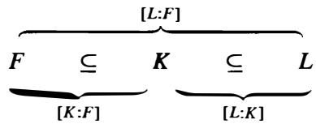

Proof· Suppose first that $[ L : K ] = m$ and $[ K : F ] = n$ are finite. Let $\alpha _ { 1 } , \alpha _ { 2 } , \ldots , \alpha _ { m }$ be a basis for $L$ over $\pmb { K }$ and let $\beta _ { 1 } , \beta _ { 2 } , \ldots , \beta _ { n }$ be a basis for $\pmb { K }$ over $F$ . Then every element of $L$ can be written as a linear combination

$$
a _ {1} \alpha_ {1} + a _ {2} \alpha_ {2} + \dots + a _ {m} \alpha_ {m}
$$

where $a _ { 1 } , \ldots , a _ { m }$ are elements of $\pmb { K }$ , hence are $F$ -linear combinations of $\beta _ { 1 } , \ldots , \beta _ { n }$ :

$$
a _ {i} = b _ {i 1} \beta_ {1} + b _ {i 2} \beta_ {2} + \dots + b _ {i n} \beta_ {n} \quad i = 1, 2, \dots , m \tag {13.3}
$$

where the $b _ { i j }$ are elements of $F$ . Substituting these expressions in for the coefficients $a _ { i }$ above, we see that every element of $\pmb { L }$ can be written as a linear combination

$$
\sum_{\substack{i = 1,2,\ldots ,m\\ j = 1,2,\ldots ,n}}b_{ij}\alpha_{i}\beta_{j}
$$

of the mn elements $\alpha _ { i } \beta _ { j }$ with coefficients in $F$ . Hence these elements span $L$ as a vector space over $F$ .

Suppose now that we had a linear relation in L

$$
\sum_{\substack{i = 1,2,\ldots ,m\\ j = 1,2,\ldots ,n}}b_{ij}\alpha_{i}\beta_{j} = 0
$$

with coefficients $b _ { i j }$ in $F$ . Then defining the elements $a _ { i } \in K$ by equation (3) above, this linear relation could be written

$$
a _ {1} \alpha_ {1} + a _ {2} \alpha_ {2} + \dots + a _ {m} \alpha_ {m} = 0.
$$

Since the $\alpha _ { i }$ are a basis for $L$ over $\pmb { K }$ , it follows that all the coefficients $a _ { i } , i = 1 , 2 , \ldots , m$ must be 0, i.e., that

$$
b _ {i 1} \beta_ {1} + b _ {i 2} \beta_ {2} + \dots + b _ {i n} \beta_ {n} = 0 \quad i = 1, 2, \dots , m
$$

in $\pmb { K }$ . Since now the $\beta _ { j }$ , $j = 1 , 2 , \ldots , n$ form a basis for $\pmb { K }$ over $F _ { \ast }$ , this implies $b _ { i j } = 0$ for all $_ i$ and $j$ . Hence the elements $\alpha _ { i } \beta _ { j }$ are linearly independent over $F$ , so form a basis for $\pmb { L }$ over $F$ and $[ L : F ] = m n = [ L : K ] [ K : F ] ,$ , as claimed.

If $[ K : F ]$ is infinite, then there are infinitely many elements of $\pmb { K }$ , hence of $\pmb { L }$ , which are linearly independent over $F$ , so that $[ L : F ]$ is also infinite. Similarly, if $[ L : K ]$ is infinite, there are infinitely many elements of $\pmb { L }$ linearly independent over $\pmb { K }$ , so certainly linearly independent over $F$ , so again $[ L : F ]$ is infinite. Finally, if $[ L : K ]$ and $[ K : F ]$ are both finite, then the proof above shows $[ L : F ]$ is finite, so that $[ L : F ]$ infinite implies at least one of $[ L : K ]$ and $[ K : F ]$ is infinite, completing the proof.

Remark: Note the similarity of this result with the result on group orders proved in Part I. As with diagrams involving groups we shall frequently indicate the relative degrees of extensions in field diagrams.

The multiplicativity of extension degrees is extremely useful in computations. A particular application is the following:

Corollary 15. Suppose $L / F$ is a finite extension and let $\pmb { K }$ be any subfield of $\pmb { L }$ containing $F , F \subseteq K \subseteq L .$ . Then $[ K : F ]$ divides $[ L : F ]$ .

Proof: This is immediate.

# Examples

(1) The element $\sqrt { 2 }$ is not contained in the field $\mathbb { Q } ( \pmb { \alpha } )$ where $\pmb { \alpha }$ is the real root of ${ \pmb x } ^ { 3 } - 3 { \pmb x } - 1$ between 0 and 2, since we have already determined that $\left[ \mathbb { Q } ( { \sqrt { 2 } } ) : \mathbb { Q } \right] = 2$ and $\left[ \mathbb { Q } ( \alpha ) : \mathbb { Q } \right] = 3$ and 2 does not divide 3. Note that it is not so easy to prove directly that $\sqrt { 2 }$ cannot be written as a rational linear combination of $1 , \alpha , \alpha ^ { 2 }$ .   
(2) Let as usual $\sqrt [ 6 ] { 2 }$ denote the positive real ${ \bf 6 ^ { u } }$ root of 2. Then $\mathbb { Q } ( { \sqrt [ 6 ] { 2 } } ) : \mathbb { Q } ] = 6 .$ . Since $( { \sqrt [ [ 6 ] { 2 } } ) ^ { 3 } = { \sqrt { 2 } }$ we have $\mathbb { Q } ( { \sqrt { 2 } } ) \subset \mathbb { Q } ( { \sqrt [ 6 ] { 2 } } )$ and by the multiplicativity of extension degrees, $\lbrack \mathbb { Q } ( { \sqrt [ 6 ] { 2 } } ) : \mathbb { Q } ( { \sqrt { 2 } } ) ] = 3 .$ . This gives us the field diagram

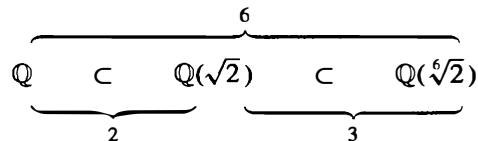

In particular, this shows that the minimal polynomial for lfi over Q( .J2 ) is of degree 3. It is therefore the polynomial $_ { x ^ { 3 } - { \sqrt { 2 } } }$ . Note that showing directly that this polynomial is irreducible over $\mathbb { Q } ( { \sqrt { 2 } } )$ is not completely trivial.

By Theorem 14 a finite extension of a finite extension is finite. The next results use this to show that an extension generated by a finite number of algebraic elements is finite (extending Proposition 1 2).

Definition. An extension $K / F$ is finitely generated if there are elements ${ \pmb { \alpha } } _ { \bf l }$ $\alpha _ { 1 } , \alpha _ { 2 } , \ldots , \alpha _ { k }$ in $\pmb { K }$ such that $K = F ( \alpha _ { 1 } , \alpha _ { 2 } , \ldots , \alpha _ { k } )$ .

Recall that the field generated over $F$ by a collection of elements in a field $\pmb { K }$ is the smallest subfield of $\pmb { K }$ containing these elements and $F .$ . The next lemma will show that for finitely generated extensions this field can be obtained recursively by a series of simple extensions.

Lemma 16. $F ( \alpha , { \bar { \beta } } ) = ( F ( \alpha ) ) ( \beta )$ , i.e., the field generated over $F$ by $\pmb { \alpha }$ and $\beta$ is the field generated by $\beta$ over the field $F ( \alpha )$ generated by $\pmb { \alpha }$ .

Proof" This follows by the minimality of the fields in question. The field $F ( \alpha , \beta )$ contains $F$ and $\pmb { \alpha } ,$ , hence contains the field $F ( \pmb { \alpha } )$ , and since it also contains $\beta _ { : }$ , we have the inclusion $( F ( \alpha ) ) ( \beta ) \subseteq F ( \alpha , \beta )$ by the minimality of the field $( F ( \alpha ) ) ( \beta )$ . Since the field $( F ( \alpha ) ) ( \beta )$ contains $F$ , a and $\beta ,$ , by the minimality of $F ( \alpha , \beta )$ we have the reverse inclusion $F ( \alpha , \beta ) \subseteq ( F ( \alpha ) ) ( \beta )$ , which proves the lemma.

By the lemma we have

$$
K = F \left(\alpha_ {1}, \alpha_ {2}, \dots , \alpha_ {k}\right) = \left(F \left(\alpha_ {1}, \alpha_ {2}, \dots , \alpha_ {k - 1}\right)\right) \left(\alpha_ {k}\right)
$$

and so by iterating, we see that $\pmb { K }$ is obtained by taking the field $F _ { 1 }$ generated over $F$ by ${ \pmb { \alpha } } _ { 1 }$ , then the field $F _ { 2 }$ generated over $F _ { 1 }$ (this is important) by $\pmb { \alpha } _ { 2 }$ , and so on, with $F _ { k } = K .$ . This gives a sequence of fields:

$$
F = F _ {0} \subseteq F _ {1} \subseteq F _ {2} \subseteq \dots \subseteq F _ {k} = K
$$

where

$$
F _ {i + 1} = F _ {i} \left(\alpha_ {i + 1}\right) \quad i = 0, 1, \dots , k - 1.
$$

Suppose now that the elements $\alpha _ { 1 } , \alpha _ { 2 } , \ldots , \alpha _ { k }$ are algebraic over $F$ of degrees $n _ { 1 } , n _ { 2 } , \ldots , n _ { k }$ (so a priori are algebraic over any extension of $\pmb { F }$ ). Then the extensions in this sequence are simple extensions of the type considered in Proposition 1 1 . The relative extension degree $[ F _ { i + 1 } : F _ { i } ]$ is equal to the degree of the minimal polynomial of $\pmb { \alpha } _ { i + 1 }$ over $F _ { i }$ , which is at most $n _ { i + 1 }$ (and equals $n _ { i + 1 }$ if and only if the minimal polynomial of $\pmb { \alpha } _ { i + 1 }$ over $F$ remains irreducible over $F _ { i }$ ). By the multiplicativity of extension degrees, we see that

$$
[ K: F ] = [ F _ {k}: F _ {k - 1} ] [ F _ {k - 1}: F _ {k - 2} ] \dots [ F _ {1}: F _ {0} ]
$$

is also finite, and $\leq n _ { 1 } n _ { 2 } \cdots n _ { k }$

This also gives a description of the elements of $F ( \alpha _ { 1 } , \alpha _ { 2 } , \ldots , \alpha _ { k } )$ . For simplicity, consider the case of the field $F ( \alpha , \beta )$ where $\pmb { \alpha }$ and $\beta$ are algebraic over $F$ . Then the elements of this field are of the form

$$
b _ {0} + b _ {1} \beta + b _ {2} \beta^ {2} + \dots + b _ {d - 1} \beta^ {d - 1}
$$

where $d = [ F ( \alpha ) ( \beta ) : F ( \alpha ) ]$ is the degree of $\beta$ over $F ( \alpha )$ (which may be strictly smaller than the degree of $\beta$ over $F$ ), and where the coefficients $b _ { 0 } , \ b _ { 1 } , \ldots , b _ { d - 1 }$ $b _ { 0 }$ are elements of $F ( \alpha )$ . The coefficients $b _ { i } \in F ( \alpha )$ $b _ { i } \in F ( \alpha ) , i = 0 , \dots , d - 1 ,$ , are of the form

$$
a _ {0 i} + a _ {1 i} \alpha + a _ {2 i} \alpha^ {2} + \dots + a _ {n - 1 i} \alpha^ {n - 1}
$$

where ${ \pmb n } = [ F ( { \pmb \alpha } ) : F ]$ is the degree of $\pmb { \alpha }$ over $F$ and the $\pmb { a } _ { i j }$ are elements of $F$ . Hence the elements of $F ( \alpha , \beta )$ are of the form

$$
\sum_{\substack{i = 0,1,\ldots ,n - 1\\ j = 0,1,\ldots ,d - 1}}a_{ij}\alpha^{i} \beta^{j}\qquad \qquad a_{ij}\in F.
$$

Since $[ F ( \alpha , \beta ) : F ] = [ F ( \alpha , \beta ) : F ( \alpha ) ] [ F ( \alpha ) : F ] = d n ,$ , the elements $\alpha ^ { i } \beta ^ { j }$ are in fact an $F$ basis for $F ( \alpha , \beta )$ .

In practice the field $F ( \alpha )$ generated by the algebraic $\pmb { \alpha }$ is obtained by adjoining the element $\pmb { \alpha }$ to $F$ and then "closing" the resulting set with respect to addition and multiplication, which amounts to adjoining the powers $\alpha ^ { 2 }$ , $\alpha ^ { 3 }$ , . . . of $\pmb { \alpha }$ and taking linear combinations (with coefficients from $F$ ) of these elements. The process terminates when a power of $\pmb { \alpha }$ is a linear combination of lower powers of $\pmb { \alpha }$ which amounts to knowing the minimal polynomial for a . The previous discussion shows a similar process gives the field $F ( \alpha , \beta )$ generated by two elttments, and by recursion, the field generated by any finite number of algebraic elements. This shows in particular that "closing" with respect to addition and multiplication also closes with respect to division for algebraic elements ( cf. Example 5 following Corollary 5 above). If the elements are not algebraic, one must also "close" with respect to inverses. The difficulty in this procedure is determining the degrees of the relative extensions - for example the degree $^ { d }$ for $F ( \alpha , \beta )$ over $F ( \alpha )$ above, for which one has only an a priori upper bound (the degree of $\beta$ over $\pmb { F }$ ).

This is the analogue of "closing" a set of elements in a group $\pmb { G }$ to determine the subgroup they generate.

# Examples

(1) The extension $\mathbb { Q } ( { \sqrt [ 6 ] { 2 } } , { \sqrt { 2 } } )$ is simply the extension $\mathbb { Q } ( { \sqrt [ 6 ] { 2 } } )$ since $\sqrt { 2 }$ is already an element of this field. Put another way, the degree $\pmb { d }$ of $\sqrt { 2 }$ over $\mathbb { Q } ( { \sqrt [ 6 ] { 2 } } )$ is 1, which is strictly smaller than the degree of $\sqrt { 2 }$ over $\mathbb { Q }$ . We shall later have less obvious examples where this occurs.

(2) Consider the field $\mathbb { Q } ( { \sqrt { 2 } } , { \sqrt { 3 } } )$ generated over $\mathbb { Q }$ by $\sqrt { 2 }$ and ${ \sqrt { 3 } } .$ J. Since $\sqrt { 3 }$ is of degree 2 over $\mathbb { Q }$ the degree of the extension $\mathbb { Q } ( { \sqrt { 2 } } , { \sqrt { 3 } } ) / \mathbb { Q } ( { \sqrt { 2 } } )$ is at most 2 and is precisely 2 if and only if $x ^ { 2 } - 3$ is irreducible over $\mathbb { Q } ( { \sqrt { 2 } } )$ . Since this polynomial is of degree 2, it is reducible only if it has a root, i.e., if and only if $\sqrt { 3 } \in \mathbb { Q } ( \sqrt { 2 } )$ . Suppose ${ \sqrt { 3 } } = a + b { \sqrt { 2 } }$ with $a , b \in \mathbb { Q }$ . Squaring this we obtain $3 = ( a ^ { 2 } + 2 b ^ { 2 } ) + 2 a b { \sqrt { 2 } } .$ . If $\mathbf { \nabla } _ { a } b \neq 0 ,$ , then we can solve this equation for $\sqrt { 2 }$ in terms of $\pmb { a }$ and $^ { b }$ which implies that $\sqrt { 2 }$ is rational, which it is not. If $\pmb { b = 0 }$ , then we would have that ${ \sqrt { 3 } } = a$ is rational, a contradiction. Finally, if $\pmb { a } = \mathbf { 0 }$ , we have ${ \sqrt { 3 } } = b { \sqrt { 2 } }$ and multiplying both sides by $\sqrt { 2 }$ we see that $\sqrt { 6 }$ would be rational, again a contradiction. This shows $\sqrt { 3 } \notin \mathbb { Q } ( \sqrt { 2 } )$ proving

$$
[ \mathbb {Q} (\sqrt {2}, \sqrt {3}): \mathbb {Q} ] = 4.
$$

Elements in this field (by "closing " 1, ${ \sqrt { 2 } } , { \sqrt { 3 } } )$ include $1 , { \sqrt { 2 } } , { \sqrt { 3 } } , { \sqrt { 6 } }$ $\sqrt { 6 }$ and by the computations above, these form a basis for this field:

$$
\mathbb {Q} (\sqrt {2}, \sqrt {3}) = \{a + b \sqrt {2} + c \sqrt {3} + d \sqrt {6} \mid a, b, c, d \in \mathbb {Q} \}.
$$

We can now characterize the finite extensions of a field $\pmb { F }$ :

Theorem 17. The extension $K / F$ is finite if and only if $\pmb { K }$ is generated by a finite number of algebraic elements over $F$ . More precisely, a field generated over $F$ by a finite number of algebraic elements of degrees $\pmb { n _ { 1 } }$ , $n _ { 2 } , \ldots , n _ { k }$ is algebraic of degree $\leq n _ { 1 } n _ { 2 } \dotsm \cdot n _ { k }$ .

Proof" If $K / F$ is finite of degree $\pmb { n } ,$ , let $\alpha _ { 1 } , \alpha _ { 2 } , \ldots , \alpha _ { n }$ be a basis for $\pmb { K }$ as a vector space over $F _ { \ast }$ . By Corollary 15, $[ F ( \alpha _ { i } ) : F ]$ divides $[ K : F ] = n$ for $i = 1 , 2 , \ldots , n ,$ , so

that Proposition 12 implies each ${ \pmb { \alpha } } _ { i }$ is algebraic over $F$ . Since $\pmb { K }$ is obviously generated over $F$ by $\alpha _ { 1 } , \alpha _ { 2 } , \ldots , \alpha _ { n }$ , we see that $\pmb { K }$ is generated by a finite number of algebraic elements over $F$ . The converse was proved above. The second statement of the theorem is immediate from Corollary 13 and the computation above.

The first example above shows that the inequality for the degree of the extension given in the theorem may be strict. We remark that information helpful in the determination of this degree can often be obtained by determining subfields and then applying Corollary 15.

Corollary 18. Suppose $\pmb { \alpha }$ and $\beta$ are algebraic over $\pmb { F }$ . Then $\alpha \pm \beta , \alpha \beta , \alpha / \beta$ (for $\boldsymbol \beta \neq \mathbf 0$ ), (in particular $\pmb { \alpha } ^ { - 1 }$ for ${ \pmb { \alpha } } \neq { \bf 0 } ,$ ) are all algebraic.

Proof All of these elements lie in the extension $\boldsymbol { F } ( \boldsymbol { \alpha } , \beta )$ , which is finite over $F$ by the theorem, hence they are algebraic by Corollary 13.

Corollary 19. Let $L / F$ be an arbitrary extension. Then the collection of elements of $L$ that are algebraic over $F$ form a subfield $\pmb { K }$ of $L$ .

Proof This is immediate from the previous corollary.

# Examples

(1) Consider the extension $\mathbb { C } / \mathbb { Q }$ and let $\overline { { \mathbb { Q } } }$ denote the subfield of all elements in $\mathbb { C }$ that are algebraic over $\mathbb { Q } .$ . In particular, the elements $\sqrt [ n ] { 2 }$ (the positive ${ \pmb n } ^ { \mathrm { t h } }$ roots of 2 in $\mathbb { R } ^ { \cdot }$ ) are all elements of $\overline { { \mathbb { Q } } } .$ , so that $\overline { { \mathbb { Q } } } : \mathbb { Q } \geq n$ for all integers $n > 1$ . Hence $\overline { { \mathbb { Q } } }$ is an infinite algebraic extension of $\mathbb { Q } .$ , called the field of algebraic numbers.

(2) Consider the field ${ \overline { { \mathbb { Q } } } } \cap \mathbb { R } .$ , the subfield of $\mathbb { R }$ consisting of elements algebraic over $\mathbb { Q } .$ The field $\mathbb { Q }$ is countable. The number of polynomials in $\mathbb { Q } [ x ]$ of any given degree $\pmb { n }$ is therefore also countable (since such a polynomial is determined by specifying $n + 1$ coefficients from $\mathbb { Q }$ ). Since these polynomials have at most n roots in $\mathbb { R }$ , the number of algebraic elements of $\mathbb { R }$ of degree n is countable. Finally, the collection of all algebraic elements in $\mathbb { R }$ is the countable union (indexed by $\pmb { n }$ ) of countable sets, hence is countable. Since $\mathbb { R }$ is uncountable, it follows that there exist (in fact many) elements of $\mathbb { R }$ which are not algebraic, i.e., are transcendental, over $\mathbb { Q }$ . In particular the subfield $\overline { { \mathbb { Q } } } \cap \mathbb { R }$ of algebraic elements of $\mathbb { R }$ is a proper subfield of $\mathbb { R } .$ so also $\overline { { \mathbb { Q } } }$ is a proper subfield of $\mathbb { C } .$

It is extremely difficult in general to prove that a given real number is not algebraic. For example, it is known (these are theorems) that $\pi = 3 . 1 4 1 5 9 . \nonumber$ .. and $e = 2 . 7 1 8 2 8 . .$ . . are transcendental elements of $\mathbb { R }$ . Even the proofs that these elements are not rational are not too easy.

Theorem 20. If $\pmb { K }$ is algebraic over $F$ and $L$ is algebraic over $\pmb { K }$ , then $L$ is algebraic over $F$ .

Proof Let a be any element of $L$ . Then $\pmb { \alpha }$ is algebraic over $\pmb { K }$ , so $\pmb { \alpha }$ satisfies some polynomial equation

$$
a _ {n} \alpha^ {n} + a _ {n - 1} \alpha^ {n - 1} + \dots + a _ {1} \alpha + a _ {0} = 0
$$

where the coefficients $a _ { 0 } , a _ { 1 } , \ldots , a _ { n }$ are in $\pmb { K }$ . Consider the field $F ( \alpha , a _ { 0 } , a _ { 1 } , \ldots , a _ { n } )$ generated over $\pmb { F }$ by $\pmb { \alpha }$ and the coefficients of this polynomial. Since $K / F$ is algebraic, the elements $a _ { 0 } , a _ { 1 } , \ldots , a _ { n }$ are algebraic over $\pmb { F }$ , so the extension $F ( a _ { 0 } , a _ { 1 } , \ldots , a _ { n } ) / F$ is finite by Theorem 17. By the equation above, we see that $\pmb { \alpha }$ generates an extension of this field of degree at most n, since its minimal polynomial over this field is a divisor of the polynomial above. Therefore

$$
[ F (\alpha , a _ {0}, a _ {1}, \dots , a _ {n}): F ] = [ F (\alpha , a _ {0}, \dots , a _ {n}): F (a _ {0}, \dots , a _ {n}) ] [ F (a _ {0}, \dots , a _ {n}): F ]
$$

is also finite and $F ( \alpha , a _ { 0 } , a _ { 1 } , \ldots , a _ { n } ) / F$ is an algebraic extension. In particular the element $\pmb { \alpha }$ is algebraic over $\pmb { F }$ , which proves that $L$ is algebraic over $F$ .

The subfield $F ( \alpha _ { 1 } , \alpha _ { 2 } , \ldots , \alpha _ { k } )$ generated by a finite set of elements $\alpha _ { 1 } , \alpha _ { 2 } , \ldots , \alpha _ { k }$ of a field $\pmb { K }$ contains each of the fields $F ( \alpha _ { i } ) , i = 1 , 2 , \ldots , k .$ . By the definitions, it is also the smallest subfield of $\pmb { K }$ containing these fields.

Definition. Let $K _ { 1 }$ and $K _ { 2 }$ be two subfields of a field $\pmb { K }$ . Then the composite field of $K _ { 1 }$ and $K _ { 2 }$ , denoted $K _ { 1 } K _ { 2 }$ , is the smallest subfield of $\pmb { K }$ containing both $K _ { 1 }$ and $K _ { 2 }$ • Similarly, the composite of any collection of subfields of $\pmb { K }$ is the smallest sub field containing all the subfields.

Note that the composite $K _ { 1 } K _ { 2 }$ can also be described as the intersection of all the subfields of $\pmb { K }$ containing both $K _ { 1 }$ and $K _ { 2 }$ and similarly for the composite of more than two fields, analogous to the subgroup generated by a subset of a group ( cf. Section 2.4 ).

# Example

The composite of the two fields $\mathbb { Q } ( { \sqrt { 2 } } )$ and $\mathbb { Q } ( { \sqrt [ 3 ] { 2 } } )$ is the field $\mathbb { Q } ( { \sqrt [ 6 ] { 2 } } )$ . This is because this field contains both of these subfields ( $( { \sqrt [ [ { 6 } ] { 2 } } ) ^ { 3 } = { \sqrt { 2 } }$ and $( \sqrt [ 6 ] { 2 } ) ^ { 2 } = \sqrt [ 3 ] { 2 }$ ) and conversely, any field containing both $\sqrt { 2 }$ and $\sqrt [ 3 ] { 2 }$ contains their quotient, which is $\sqrt [ 6 ] { 2 }$ .

Suppose now that $K _ { 1 }$ and $K _ { 2 }$ are finite extensions of $F$ in $\pmb { K }$ . Let $\alpha _ { 1 } , \alpha _ { 2 } , \ldots , \alpha _ { n }$ be an $F$ -basis for $K _ { 1 }$ and let $\beta _ { 1 } , \beta _ { 2 } , \ldots , \beta _ { m }$ be an $\pmb { F }$ -basis for $K _ { 2 }$ (so that $[ K _ { 1 } : F ] = n$ and $[ K _ { 2 } : F ] = m )$ ). Then it is clear that these give generators for the composite $K _ { 1 } K _ { 2 }$ over $F$ :

$$
K _ {1} K _ {2} = F \left(\alpha_ {1}, \alpha_ {2}, \dots , \alpha_ {n}, \beta_ {1}, \beta_ {2}, \dots , \beta_ {m}\right).
$$

Since $\alpha _ { 1 } , \alpha _ { 2 } , \ldots , \alpha _ { n }$ i s an $F$ -basis for $K _ { 1 }$ any power ${ \pmb { \alpha } } _ { i } { } ^ { k }$ of one of the $\pmb { \alpha }$ 's is a linear combination with coefficients in $F$ of the $\pmb { \alpha }$ 's and a similar statement holds for the $\beta ^ { \prime } { \bf s }$ . It follows that the collection of linear combinations

$$
\sum_{\substack{i = 1,2,\ldots ,n\\ j = 1,2,\ldots ,m}}a_{ij}\alpha_{i}\beta_{j}
$$

with coefficients in $\pmb { F }$ is closed under multiplication and addition since in a product of two such elements any higher powers of the a's and $\beta$ 's can be replaced by linear expressions. Hence, the elements $\alpha _ { i } \beta _ { j }$ for $i = 1 , 2 , \ldots , n$ and $j = 1 , 2 , \ldots , m$ span the composite extension $K _ { 1 } K _ { 2 }$ over $\pmb { F }$ . In particular, $[ K _ { 1 } K _ { 2 } : F ] \le m n$ . We summarize this as:

Proposition 21. Let $K _ { 1 }$ and $K _ { 2 }$ be two finite extensions of a field $F$ contained in $\pmb { K }$ . Then

$$
[ K _ {1} K _ {2}: F ] \leq [ K _ {1}: F ] [ K _ {2}: F ]
$$

with equality if and only if an $\pmb { F }$ -basis for one of the fields remains linearly independent over the other field. If $\alpha _ { 1 } , \alpha _ { 2 } , \ldots , \alpha _ { n }$ and $\beta _ { 1 }$ $\beta _ { 1 } , \beta _ { 2 } , \ldots , \beta _ { m }$ are bases for $K _ { 1 }$ and $K _ { 2 }$ over $F$ , respectively, then the elements $\alpha _ { i } \beta _ { j }$ for $i = 1 , 2 , \ldots , n$ and $j = 1 , 2 , \dots , m$ span $K _ { 1 } K _ { 2 }$ over $\pmb { F }$ .

Proof" From $K _ { 1 } K _ { 2 } = F ( \alpha _ { 1 } , \alpha _ { 2 } , \ldots , \alpha _ { n } , \beta _ { 1 } , \beta _ { 2 } , \ldots , \beta _ { m } ) = K _ { 1 } ( \beta _ { 1 } , \beta _ { 2 } , \ldots , \beta _ { m } )$ , we see as above that $\beta _ { 1 } , \beta _ { 2 } , \ldots , \beta _ { m }$ $\beta _ { m }$ span $K _ { 1 } K _ { 2 }$ over $K _ { 1 }$ . Hence $[ K _ { 1 } K _ { 2 } : K _ { 1 } ] \le m =$ $[ K _ { 2 } : F ]$ with equality if and only if these elements are linearly independent over $K _ { 1 }$ . Since $[ K _ { 1 } K _ { 2 } : F ] = [ K _ { 1 } K _ { 2 } : K _ { 1 } ] [ K _ { 1 } : F ]$ this proves the proposition.

By the proposition (and its proof), we have the following diagram:

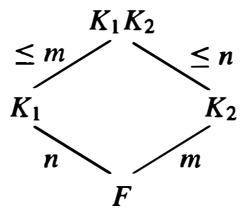

We shall have examples shortly where the inequality in the proposition is strict. One useful situation where one can be certain of equality is the following:

Corollary 22. Suppose that $[ K _ { 1 } : F ] = n .$ , $[ K _ { 2 } : F ] = m$ in Proposition 2 1 , where n and m are relatively prime: $( n , m ) = 1$ . Then $[ K _ { 1 } K _ { 2 } : F ] = [ K _ { 1 } : F ] [ K _ { 2 } : F ] = n m$ .

Proof" In general the extension degree $[ K _ { 1 } K _ { 2 } : F ]$ is divisible by both $\pmb { n }$ and m since $K _ { 1 }$ and $K _ { 2 }$ are subfields of $K _ { 1 } K _ { 2 }$ , hence is divisible by their least common multiple. In this case, since $( n , m ) = 1$ , this means $[ K _ { 1 } K _ { 2 } : F ]$ is divisible by nm , which together with the inequality $[ K _ { 1 } K _ { 2 } : F ] \le n m$ of the proposition proves the corollary.

# Example

The composite of the two fields $\mathbb { Q } ( { \sqrt { 2 } } )$ and $\mathbb { Q } ( { \sqrt [ 3 ] { 2 } } )$ is of degree 6 over $\mathbb { Q } .$ , which we determined earlier by actually computing the composite $\mathbb { Q } ( { \sqrt [ 6 ] { 2 } } )$ .

# E X E R C I S E S

1. Let $\mathbb { F }$ be a finite field of characteristic $\pmb { p }$ . Prove that $\vert \mathbb { F } \vert = p ^ { n }$ for some positive integer n.   
2. Let $g ( x ) = x ^ { 2 } + x - 1$ and let $h ( x ) = x ^ { 3 } - x + 1 .$ . Obtain fields of 4, 8, 9 and 27 elements by adjoining a root of $f ( x )$ to the field $\pmb { F }$ where $\pmb { f } ( \pmb { x } ) = \pmb { g } ( \pmb { x } )$ or $h ( x )$ and $F = \mathbb { F } _ { 2 }$ or $\mathbb { F } _ { 3 }$ Write down the multiplication tables for the fields with 4 and 9 elements and show that the nonzero elements form a cyclic group.   
3. Determine the minimal polynomial over $\mathbb { Q }$ for the element $1 + i$

4. Determine the degree over $\mathbb { Q }$ of $2 + { \sqrt { 3 } }$ and of $1 + { \sqrt [ { 3 } ] { 2 } } + { \sqrt [ { 3 } ] { 4 } } .$ .   
5. Let $F = \mathbb { Q } ( i )$ . Prove that $x ^ { 3 } - 2$ and $x ^ { 3 } - 3$ are irreducible over $\pmb { F }$ .   
6. Prove directly from the definitions that the field $F ( \alpha _ { 1 } , \alpha _ { 2 } , \ldots , \alpha _ { n } )$ is the composite of the fields $F ( \alpha _ { 1 } ) , F ( \alpha _ { 2 } ) , \ldots , F ( \alpha _ { n } )$ .   
7. Prove that $\mathbb { Q } ( { \sqrt { 2 } } + { \sqrt { 3 } } ) = \mathbb { Q } ( { \sqrt { 2 } } , { \sqrt { 3 } } )$ [one inclusion is obvious, for the other consider $( { \sqrt { 2 } } + { \sqrt { 3 } } ) ^ { 2 }$ , etc.] . Conclude that $\left[ \mathbb { Q } ( { \sqrt { 2 } } + { \sqrt { 3 } } ) : \mathbb { Q } \right] = 4 .$ . Find an irreducible polynomial satisfied by $\sqrt { 2 } + \sqrt { 3 }$ J.   
8. Let $F$ be a field of characteristic $\neq 2$ . Let $D _ { 1 }$ and $D _ { 2 }$ be elements of $\pmb { F }$ , neither of which is a square in $\pmb { F }$ . Prove that $F ( \sqrt { D _ { 1 } } , \sqrt { D _ { 2 } } )$ is of degree 4 over $\pmb { F }$ if $D _ { 1 } D _ { 2 }$ is not a square in $\pmb { F }$ and is of degree 2 over $\pmb { F }$ otherwise. When $F ( \sqrt { D _ { 1 } } , \sqrt { D _ { 2 } } )$ is of degree 4 over $\pmb { F }$ the field is called a biquadratic extension of $\pmb { F }$ .   
9. Let $\pmb { F }$ be a field of characteristic $\neq 2 .$ . Let $a , b$ be elements of the field $\pmb { F }$ with $^ { b }$ not a square in $\pmb { F }$ . Prove that a necessary and sufficient condition for ${ \sqrt { a + { \sqrt { b } } } } = { \sqrt { m } } + { \sqrt { n } }$ for some $_ { m }$ and $\pmb { n }$ in $\pmb { F }$ is that $a ^ { 2 } - b$ is a square in $\pmb { F }$ . Use this to determine when the field $\mathbb { Q } ( { \sqrt { a + { \sqrt { b } } } } )$ ) $( a , b \in \mathbb { Q } )$ is biquadratic over $\mathbb { Q } .$ .   
10. Determine the degree of the extension $\mathbb { Q } ( { \sqrt { 3 + 2 { \sqrt { 2 } } } } )$ ) over $\mathbb { Q } .$   
11. (a) Let $\sqrt { 3 + 4 i }$ denote the square root of the complex number $3 + 4 i$ that lies in the first quadrant and let $\sqrt { 3 - 4 i }$ denote the square root of 3 - 4i that lies in the fourth quadrant. Prove that $\lbrack \mathbb { Q } ( { \sqrt { 3 + 4 i } } + { \sqrt { 3 - 4 i } } ) : \mathbb { Q } ] = 1$ .   
(b) Determine the degree of the extension $\mathbb { Q } ( { \sqrt { 1 + { \sqrt { - 3 } } } } + { \sqrt { 1 - { \sqrt { - 3 } } } } ~ ;$ ) over $\mathbb { Q } .$   
12. Suppose the degree of the extension $K / F$ is a prime $\pmb { p }$ . Show that any subfield $E$ of $\pmb { K }$ containing $\pmb { F }$ is either $\pmb { K }$ or $\pmb { F }$ .   
13. Suppose $\boldsymbol { F } = \mathbb { Q } ( \alpha _ { 1 } , \alpha _ { 2 } , \ldots , \alpha _ { n } )$ where $\alpha _ { i } ^ { 2 } \in \mathbb { Q }$ for $i = 1 , 2 , \ldots , n$ . Prove that $\sqrt [ 3 ] { 2 } \notin F$ .   
14. Prove that if $[ F ( \alpha ) : F ]$ is odd then $F ( \alpha ) = F ( \alpha ^ { 2 } )$ .   
15. A field $\pmb { F }$ i s said to b e formally real i f - 1 i s not expressible as a sum of squares in $\pmb { F }$ . Let $\pmb { F }$ be a formally real field, let $f ( x ) \in F [ x ]$ be an irreducible polynomial of odd degree and let $\pmb { \alpha }$ be a root of $f ( x )$ . Prove that $F ( \alpha )$ is also formally real. [Pick $\pmb { \alpha }$ a counterexample of minimal degree. Show that $- 1 + f ( x ) g ( x ) = ( p _ { 1 } ( x ) ) ^ { 2 } + \cdot \cdot \cdot + ( p _ { m } ( x ) ) ^ { 2 }$ for some $p _ { i } ( x ) , g ( x ) \in F [ x ]$ where $g ( x )$ has odd degree $< \mathrm { d e g } f$ . Show that some root $\beta$ of $_ { g }$ has odd degree over $\pmb { F }$ and $F ( \beta )$ is not formally real, violating the minimality of $\pmb { \alpha }$ . ]   
16. Let $K / F$ be an algebraic extension and let $\pmb { R }$ be a ring contained in $\pmb { K }$ and containing $\pmb { F }$ Show that $\pmb R$ is a subfield of $\pmb { K }$ containing $\pmb { F }$ .   
17. Let $f ( x )$ be an irreducible polynomial of degree $\pmb { n }$ over a field $\pmb { F }$ . Let $g ( x )$ be any polynomial in $F [ x ]$ . Prove that every irreducible factor of the composite polynomial $f ( g ( x ) )$ has degree divisible by n.   
18. Let k be a field and let $k ( x )$ be the field of rational functions in $x$ with coefficients from $\pmb { k }$ . Let $t \in k ( x )$ be the rational function $\frac { P ( x ) } { Q ( x ) }$ with relatively prime polynomials $P ( x ) , Q ( x ) \in$ $k [ x ] .$ , with $Q ( x ) \neq 0$ . Then $k ( x )$ is an extension of $k ( t )$ and to compute its degree it is necessary to compute the minimal polynomial with coefficients in $k ( t )$ satisfied by $x$ .   
(a) Show that the polynomial $P ( X ) - t Q ( X )$ in the variable $\pmb { X }$ and coefficients in $k ( t )$ is irreducible over $k ( t )$ and has $_ x$ as a root. [By Gauss' Lemma this polynomial is irreducible in $( k ( t ) ) [ X ]$ if and only if it is irreducible in $( k [ t ] ) [ X ]$ . Then note that $( k [ t ] ) [ X ] = ( k [ X ] ) [ t ] . ]$ 1

(b) Show that the degree of $P ( X ) - t Q ( X )$ as a polynomial in $\pmb { X }$ with coefficients in $k ( t )$ is the maximum of the degrees of $P ( x )$ and $Q ( x )$ .

(c) Show that $[ k ( x ) : k ( t ) ] = [ k ( x ) : k ( { \frac { P ( x ) } { Q ( x ) } } ) ] = \operatorname* { m a x } { ( \deg P ( x ) , \deg Q ( x ) ) } .$

19. Let $\pmb { K }$ be an extension of $F$ of degree $\pmb { n }$

(a) For any $\alpha \in K$ prove that $\pmb { \alpha }$ acting by left multiplication on $\pmb { K }$ i s a n $\pmb { F }$ -linear transformation of $\pmb { K }$ .   
(b) Prove that $\pmb { K }$ is isomorphic to a subfield of the ring of $\pmb { n } \times \pmb { n }$ matrices over $F$ , so the ring of $\textbf { \em n } \times \pmb { \mathscr { n } }$ matrices over $\pmb { F }$ contains an isomorphic copy of every extension of $F$ of degree $\leq n$ .

20. Show that if the matrix of the linear transformation "multiplication by a" considered in the previous exercise is A then $\pmb { \alpha }$ is a root of the characteristic polynomial for A. This gives an effective procedure for determining an equation of degree n satisfied by an element $\pmb { \alpha }$ in an extension of $F$ of degree n. Use this procedure to obtain the monic polynomial of degree 3 satisfied by $\sqrt [ 3 ] { 2 }$ and by $1 + { \sqrt [ { 3 } ] { 2 } } + { \sqrt [ { 3 } ] { 4 } } .$ .   
21. Let $\pmb { K } = \mathbb { Q } ( \sqrt { \pmb { D } } )$ for some squarefree integer $\pmb { D } .$ . Let $\pmb { \alpha } = \pmb { \alpha } + \pmb { b } \sqrt { \pmb { D } }$ be an element of K. Use the basis 1 , $\sqrt { D }$ for $\pmb { K }$ as a vector space over $\mathbb { Q }$ and show that the matrix of the linear transformation "multiplication by $\pmb { \alpha } ^ { \ast }$ on $\pmb { K }$ considered in the previous exercises has the matrix $\left( \begin{array} { c c } { { a } } & { { b D } } \\ { { b } } & { { a } } \end{array} \right)$ . Prove directly that the map $a + b { \sqrt { D } } \mapsto { \left( \begin{array} { l l } { a } & { b D } \\ { b } & { a } \end{array} \right) }$ is an ( : isomorphism of the field $\pmb { K }$ with a subfield of the ring of $2 \times 2$ matrices with coefficients in $\mathbb { Q }$ .   
22. Let $\pmb { K } _ { 1 }$ and $\pmb { K } _ { 2 }$ be two finite extensions of a field $\pmb { F }$ contained in the field K. Prove that the $F$ -algebra $K _ { 1 } \otimes _ { F } K _ { 2 }$ is a field if and only if $[ K _ { 1 } K _ { 2 } : F ] = [ K _ { 1 } : F ] [ K _ { 2 } : F ]$ .

# 1 3.3 CLASSICAL STRAIGHTEDGE AND COM PASS CONSTRUCTIONS

As a simple application of the results we have obtained on algebraic extensions, and in particular on the multiplicativity of extension degrees, we can answer (in the negative) the following geometric problems posed by the Greeks:

I. (Doubling the Cube) Is it possible using only straightedge and compass to construct a cube with precisely twice the volume of a given cube?   
II. (Trisecting an Angle) Is it possible using only straightedge and compass to trisect any given angle ()?   
III. (Squaring the Circle) I s it possible using only straightedge and compass to construct a square whose area is precisely the area of a given circle?

To answer these questions we must translate the construction of lengths by compass and straightedge into algebraic terms. Let l denote a fixed given unit distance. Then any distance is determined by its length $a \in \mathbb { R }$ , which allows us to view geometric distances as elements of the real numbers $\mathbb { R }$ USing the given unit distance 1 to define the scale on the axes, we can then construct the usual Cartesian plane $\mathbb { R } ^ { 2 }$ and view all of our constructions as occurring in $\mathbb { R } ^ { 2 }$ . A point $( x , y ) \in \mathbb { R } ^ { 2 }$ is then constructible starting with the given distance 1 if and only if its coordinates $_ x$ and $y$ are constructible elements of $\mathbb { R }$ The problems above then amount to determining whether particular lengths in $\mathbb { R }$ can be obtained by compass and straightedge constructions from a fixed

unit distance. The collection of such real numbers together with their negatives will be called the constructible elements of $\mathbb { R }$ , and we shall not distinguish between the lengths that are constructible and the real numbers that are constructible.

Each straightedge and compass construction consists of a series of operations of the following four types: (1) connecting two given points by a straight line, (2) finding a point of intersection of two straight lines, (3) drawing a circle with given radius and center, and (4) finding the point(s) of intersection of a straight line and a circle or the intersection of two circles.

It is an elementary fact from geometry that if two lengths $\pmb { a }$ and $^ { b }$ are given one may construct using straightedge and compass the lengths ${ \pmb a } \pm { \pmb b }$ , ab and $\mathbf { { } } a / b$ (the first two are clear and the latter two are given by the construction of parallel lines (Figure 1) ).

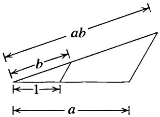

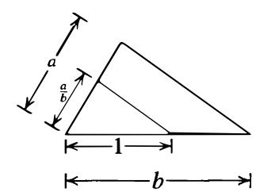  
Fig. 1

It is also an elementary geometry construction to construct $\sqrt { a }$ if $\pmb { a }$ is given: construct the circle with diameter $1 + a$ and erect the perpendicular to the diameter as indicated in Figure 2. Then $\sqrt { a }$ is the length of this perpendicular.

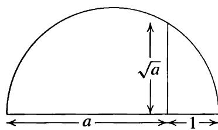  
Fig. 2

It follows that straightedge and compass constructions give all the algebraic operations of addition, subtraction, multiplication and division (by nonzero elements) in the reals so the collection of constructible elements is a subfield of $\mathbb { R }$ One can also take square roots of constructible elements. We shall now see that these are essentially the only operations possible.

From the given length 1 it is possible to construct by these operations all the rational numbers $\mathbb { Q } .$ Hence we may construct all of the points $( x , y ) \in \mathbb { R } ^ { 2 }$ whose coordinates are rational. We may construct additional elements of $\mathbb { R }$ by taking square roots, so the collection of elements constructible from 1 of $\mathbb { R }$ form a field strictly larger than $\mathbb { Q }$ .

The usual formula ("two point form") for the straight line connecting two points with coordinates in some field $F$ gives an equation for the line of the form $a x + b y - c = 0$ with $a , b , c \in F .$ . Solving two such equations simultaneously to determine the point of intersection of two such lines gives solutions also in $F$ . It follows that if the coordinates

of two points lie in the field $F$ then straightedge constructions alone will not produce additional points whose coordinates are not also in $\pmb { F }$ .

A compass construction (type (3) or (4) above) defines points obtained by the intersection of a circle with either a straight line or another circle. A circle with center $( h , k )$ and radius $r$ has equation

$$
(x - h) ^ {2} + (y - k) ^ {2} = r ^ {2}
$$

so when we consider the effect of compass constructions on elements of a field $\pmb { F }$ we are considering simultaneous solutions of such an equation with a linear equation $a x + b y - c = 0$ where $a , b , c , h , k , r \in F .$ , or the simultaneous solutions of two quadratic equations.

In the case of a linear equation and the equation for the circle, solving for $y _ { \cdot }$ , say, in the linear equation and substituting gives a quadratic equation for $x$ (and $\boldsymbol { y }$ is given linearly in terms of $\pmb { x }$ ) . Hence the coordinates of the point of intersection are at worst in a quadratic extension of $F$ .

In the case of the intersection of two circles, say

$$
(x - h) ^ {2} + (y - k) ^ {2} = r ^ {2}
$$

$\mathrm { a n d } \qquad ( x - h ^ { \prime } ) ^ { 2 } + ( y - k ^ { \prime } ) ^ { 2 } = { r ^ { \prime } } ^ { 2 } ,$

subtraction of the second equation from the first shows that we have the same intersection by considering the two equations

$$
(x - h) ^ {2} + (y - k) ^ {2} = r ^ {2}
$$

and $2 ( h ^ { \prime } - h ) x + 2 ( k ^ { \prime } - k ) y = r ^ { 2 } - h ^ { 2 } - k ^ { 2 } - r ^ { \prime 2 } + { h ^ { \prime } } ^ { 2 } + { k ^ { \prime } } ^ { 2 }$

which is the intersection of a circle and a straight line (the straight line connecting the two points of intersection, in fact) of the type just considered.

It follows that if a collection of constructible elements is given, then one can construct all the elements in the subfield $\pmb { F }$ of $\mathbb { R }$ generated by these elements and that any straightedge and compass operation on elements of $F$ produces elements in at worst a quadratic extension of $F$ . Since quadratic extensions have degree 2 and extension degrees are multiplicative, it follows that if $\alpha \in \mathbb { R }$ is obtained from elements in a field $\pmb { F }$ by a (finite) series of straightedge and compass operations then $\pmb { \alpha }$ is an element of an extension $\pmb { K }$ of $F$ of degree a power of $: [ K : F ] = 2 ^ { m }$ for some m. Since $[ F ( \pmb { \alpha } ) : F ]$ divides this extension degree, it must also be a power of 2.

Proposition 23. If the element $\pmb { \alpha } \in \mathbb { R }$ is obtained from a field $F \subset \mathbb { R }$ by a series of compass and straightedge constructions then $[ F ( \alpha ) : F ] = 2 ^ { k }$ for some integer ${ \pmb k } \geq { \bf 0 }$ .

Theorem 24. None of the classical Greek problems: (I) Doubling the Cube, (II) Trisecting an Angle, and (III) Squaring the Circle, is possible.

Proof" (I) Doubling the cube amounts to constructing $\sqrt [ 3 ] { 2 }$ in the reals starting with the unit 1 . Since $\mathbb { Q } ( { \sqrt [ 3 ] { 2 } } ) : \mathbb { Q } ] = 3$ is not a power of 2, this is impossible.

(II) If an angle $\theta$ can be constructed, then determining the point at distance 1 from the origin and angle $\theta$ from the positive $x$ axis in $\mathbb { R } ^ { 2 }$ shOWS that COS $\theta$ (the $x$ -COOrdinate

of this point) can be constructed (so then sin $\theta$ can also be constructed). Conversely if cos $\theta$ , then sin e , can be constructed, the point with those coordinates gives the angle $\theta$ .

The problem of trisecting the angle $\theta$ is then equivalent to the problem: given cos $\theta$ construct cos $\theta / 3$ .

To see that this is not always possible (it is certainly occasionally possible, for example for $\theta = 1 8 0 ^ { \circ }$ ), consider $\theta = 6 0 ^ { \circ }$ . Then cos $\begin{array} { r } { \theta = \frac { 1 } { 2 } } \end{array}$ . By the triple angle formula for cosines:

$$
\cos \theta = 4 \cos^ {3} \theta / 3 - 3 \cos \theta / 3,
$$

substituting $\theta = 6 0 ^ { \circ }$ , we see that $\beta = \cos 2 0 ^ { \circ }$ satisfies the equation

$$
4 \beta^ {3} - 3 \beta - 1 / 2 = 0
$$

or $8 ( \beta ) ^ { 3 } - 6 \beta - 1 = 0 .$ . This can be written $( 2 \beta ) ^ { 3 } - 3 ( 2 \beta ) - 1 = 0 .$ . Let $\alpha = 2 \beta$ . Then $\pmb { \alpha }$ is a real number between 0 and Z satisfying the equation

$$
\alpha^ {3} - 3 \alpha - 1 = 0.
$$

But we considered this equation in the last section and determined $\left[ \mathbb { Q } ( \alpha ) : \mathbb { Q } \right] = 3 ,$ , and as before we see that $\pmb { \alpha }$ is not constructible.

(III) Squaring the circle is equivalent to determining whether the real number $\pi =$ 3. 14159 . . . is constructible. As mentioned previously, it is a difficult problem even to prove that this number is not rational. It is in fact transcendental (which we shall assume without proof), so that $\mathbb { Q } ( \pi ) : \mathbb { Q } ]$ is not even finite, much less a power of Z, showing the impossibility of squaring the circle by straightedge and compass.

Remark: The proof above shows that cos $2 0 ^ { \circ }$ and sin $2 0 ^ { \circ }$ cannot be constructed. The question arises as to which integer angles (measured in degrees) are constructible? The angles $1 ^ { \circ }$ and $2 ^ { \circ }$ are not constructible, since otherwise the addition formulae for sines and cosines would give the constructibility for $2 0 ^ { \circ }$ . On the other hand, elementary geometric constructions (of the regular 5-gon for an angle of $7 2 ^ { \circ }$ and the equilateral triangle for an angle of ${ \bf 6 0 ^ { \circ } }$ ) together with the addition formulae and the half-angle formulae show that cos $3 ^ { \circ }$ and sin $3 ^ { \circ }$ are constructible. It follows from this that the trigonometric functions of an integer degree angle are constructible precisely when the angle is a multiple of $3 ^ { \circ }$ . Explicitly,

$$
\begin{array}{l} \cos 3 ^ {\circ} = \frac {1}{8} (\sqrt {3} + 1) \sqrt {5 + \sqrt {5}} + \frac {1}{1 6} (\sqrt {6} - \sqrt {2}) (\sqrt {5} - 1) \\ \sin 3 ^ {\circ} = \frac {1}{1 6} (\sqrt {6} + \sqrt {2}) (\sqrt {5} - 1) - \frac {1}{8} (\sqrt {3} - 1) \sqrt {5 + \sqrt {5}}, \\ \end{array}
$$

showing that these are obtained from $\mathbb { Q }$ by successive extractions of square roots and field operations.

After discussing the cyclotomic fields in Section 14.5 we shall consider another classical geometric question: "which regular $\pmb { n }$ -gons can be constructed by straightedge and compass?" (cf. Proposition 14.Z9).

We have been careful here to consider constructions using a straightedge rather than a ruler, the distinction being that a ruler has marks on it. If one uses a ruler, it is

possible to construct many additional algebraic elements. For example, suppose $\theta$ is a given angle and the unit distance I is marked on the ruler. Draw a circle of radius I with central angle $\theta$ as shown in Figure 3 and then slide the ruler until the distance between points A and $\pmb { B }$ on the circle is I . Then some elementary geometry shows that ( cf. the exercises) the angle $\pmb { \alpha }$ indicated is $\theta / 3$ , i.e., this construction (due to Archimedes) trisects $\theta$ . In particular, the second classical problem in Theorem 24 (Trisecting an Angle) can be solved with ruler and compass.

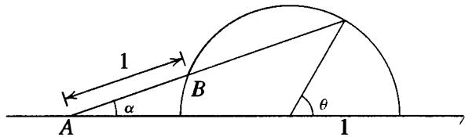  
Fig. 3

The first of the classical problems in Theorem 24 (Duplication of the Cube), which amounts to the construction of $\sqrt [ 3 ] { 2 } ,$ , can also be solved with ruler and compass. The following gives a construction for $k ^ { 1 / 3 }$ for any given positive real $\pmb { k }$ which is less than 1 . This construction was shown to us by J .H. Conway.

Drawing a circle of radius 1 and using the point $\boldsymbol { A } \ = \ ( k , 0 )$ as center, construct the point $B = ( 0 , \sqrt { 1 - k ^ { 2 } } )$ . Dividing this distance by 3, construct the point $( 0 , - \frac { 1 } { 3 } \sqrt { 1 - k ^ { 2 } } )$ and draw the line connecting this point with A. Slide the ruler with marked unit length 1 so that it passes through the point $\pmb { B }$ and so that the distance from the intersection point $c$ to the intersection point $D$ with the $x$ -axis is of length 1 , as indicated in Figure 4.

Then the distance between A and $D$ is $2 k ^ { 1 / 3 }$ and the distance between $\pmb { B }$ and $c$ is $2 k ^ { 2 / 3 }$ (cf. the exercises).

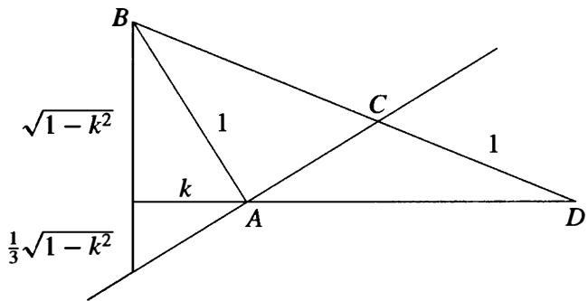  
Fig. 4

# E X E R C I S E S

1. Prove that it)is impossible to construct the regular 9-gon.   
2. Prove that Archimedes' construction actually trisects the angle e. [Note the isosceles triangles in Figure 5 to prove that $\beta = \gamma = 2 \alpha .$ ]

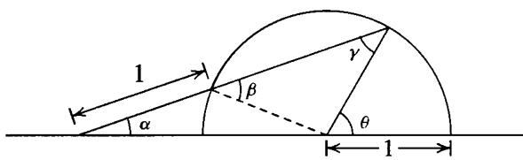

3. Prove that Conway's construction indicated in the text actually constructs $2 k ^ { 1 / 3 }$ and $2 k ^ { 2 / 3 }$ [One method: let $( x , y )$ be the coordinates of the point C, a the distance from $\pmb { B }$ to $c$ and $^ { b }$ the distance from A to $D ;$ use similar triangles to prove (a) ${ \frac { y } { 1 } } = { \frac { \sqrt { 1 - k ^ { 2 } } } { 1 + a } } ,$

(b) ${ \frac { x } { a } } = { \frac { b + k } { 1 + a } } , ( \mathbf { c } ) { \frac { y } { x - k } } = { \frac { { \sqrt { 1 - k ^ { 2 } } } } { 3 k } } ,$ , and also show that (d) $( 1 - k ^ { 2 } ) + ( b + k ) ^ { 2 } = ( 1 + a ) ^ { 2 }$ solve these equations for a and b.]

4. The construction of the regular 7-gon amounts to the constructibility of $\cos ( 2 \pi / 7 )$ . We shall see later (Section 14.5 and Exercise 2 of Section 14. 7) that $\alpha = 2 \cos ( 2 \pi / 7 )$ satisfies the equation $x ^ { 3 } + x ^ { 2 } - 2 x - 1 = 0$ . Use this to prove that the regular 7-gon is not constructible by straightedge and compass.

5. Use the fact that $\alpha = 2 \cos ( 2 \pi / 5 )$ satisfies the equation $x ^ { 2 } + x - 1 = 0$ to conclude that the regular 5-gon is constructible by straightedge and compass.

# 1 3.4 SPLITTI NG FIELDS AND ALGEBRAIC CLOSURES

Let $F$ be a field.

If $f ( x )$ is any polynomial in $F [ x ]$ then we have seen in Section 2 that there exists a field $\pmb { K }$ which can (by identifying $F$ with an isomorphic copy of $F$ ) be considered an extension of $F$ in which $f ( x )$ has a root $\pmb { \alpha } .$ . This is equivalent to the statement that $f ( x )$ has a linear factor $x - \alpha$ in $K [ x ]$ (this is Proposition 9 of Chapter 9).

Definition. The extension field $\pmb { K }$ of $F$ is called a splitting field for the polyno�al $f ( x ) \in F [ x ]$ if $f ( x )$ factors completely into linear factors (or splits completely) in $K [ x ]$ and $f ( x )$ does not factor completely into linear factors over any proper subfield of $\pmb { K }$ containing F.

If $f ( x )$ is of degree n, then $f ( x )$ has at most n roots in $F$ (Proposition 17 of Chapter 9) and has precisely $\pmb { n }$ roots (counting multiplicities) in $F$ if and only if $f ( x )$ splits completely in $F [ x ]$ .

Theorem 25. For any field $F$ , if $f ( x ) \in F [ x ]$ then there exists an extension $\pmb { K }$ of $\pmb { F }$ which is a splitting field for $f ( x )$ .

Proof" We first show that there is an extension $\pmb { { \cal E } }$ of $F$ over which $f ( x )$ splits completely into linear factors by induction on the degree $\pmb { n }$ of $f ( x )$ . If ${ n = 1 }$ , then take $E = F$ . Suppose now that $n > 1$ . If the irreducible factors of $f ( x )$ over $F$ are all of degree 1 , then $F$ is the splitting field for $f ( x )$ and we may take $E = F .$ . Otherwise, at least one of the irreducible factors, say $p ( x )$ of $f ( x )$ in $F [ x ]$ is of degree at least 2. By Theorem 3 there is an extension $E _ { 1 }$ of $\pmb { F }$ containing a root $\pmb { \alpha }$ of $p ( x )$ . Over $E _ { 1 }$ the polynomial $f ( x )$ has the linear factor $x - \alpha$ . The degree of the remaining factor $f _ { 1 } ( x )$ of $f ( x )$ is $n - 1$ , so by induction there is an extension $\pmb { { \cal E } }$ of $E _ { 1 }$ containing all the roots of $f _ { 1 } ( x )$ . Since $\alpha \in E$ , $\pmb { { \cal E } }$ is an extension of $F$ containing all the roots of $f ( x )$ . Now let $\pmb { K }$ be the intersection of all the subfields of $\pmb { { \cal E } }$ containing $F$ which also contain all the roots of $f ( x )$ . Then $\pmb { K }$ is a field which is a splitting field for $f ( x )$ .

We shall see shortly that any two splitting fields for $f ( x )$ are isomorphic (which extends Theorem 8), so (by abuse) we frequently refer to the splitting field of a polynomial.

Definition. If $\pmb { K }$ is an algebraic extension of $F$ which is the splitting field over $F$ for a collection of polynomials $f ( x ) \in F [ x ]$ then $\pmb { K }$ is called a normal extension of $F$ .

We shall generally use the term "splitting field" rather than "normal extension" ( cf. also Section 1 4.9).

# Examples

(1) The splitting field for $x ^ { 2 } - 2$ over $\mathbb { Q }$ is just $\mathbb { Q } ( { \sqrt { 2 } } )$ , since the two roots are $\pm \sqrt { 2 }$ and $- \sqrt { 2 } \in \mathbb { Q } ( \sqrt { 2 } )$ .   
(2) The splitting field for $( x ^ { 2 } - 2 ) ( x ^ { 2 } - 3 )$ is the field $\mathbb { Q } ( { \sqrt { 2 } } , { \sqrt { 3 } } )$ generated over $\mathbb { Q }$ by $\sqrt { 2 }$ and $\sqrt { 3 }$ since the roots of the polynomial are $\pm { \sqrt { 2 } } , \pm { \sqrt { 3 } }$ . We have already seen that this is an extension of degree 4 over $\mathbb { Q }$ and we have the following diagram of known subfields:

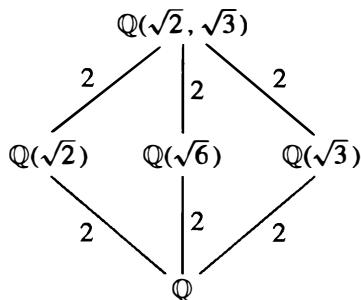

(3) The splitting field of $x ^ { 3 } - 2$ over $\mathbb { Q }$ is not just $\mathbb { Q } ( { \sqrt [ 3 ] { 2 } } )$ since as previously noted the three roots of this polynomial in $\mathbb { C }$ are

$$
\sqrt [ 3 ]{2}, \quad \sqrt [ 3 ]{2} \left(\frac {- 1 + i \sqrt {3}}{2}\right), \quad \sqrt [ 3 ]{2} \left(\frac {- 1 - i \sqrt {3}}{2}\right)
$$

and the latter two roots are not elements of $\mathbb { Q } ( { \sqrt [ 3 ] { 2 } } )$ ), since the elements of this field are of the form $a + b { \sqrt [ { 2 } ] { 2 } } + c { \sqrt [ { 3 } ] { 4 } }$ with rational a, b, c and all such numbers are real.

The splitting field $\pmb { K }$ of this polynomial is obtained by adjoining all three of these roots to $\mathbb { Q } .$ Note that since $\pmb { K }$ contains the first two roots above, then it contains their quotient $\frac { - 1 + { \sqrt { - 3 } } } { 2 }$ hence $\pmb { K }$ contains the element ${ \sqrt { - 3 } } .$ . On the other hand, any field containing $\sqrt [ 3 ] { 2 }$ and $\sqrt { - 3 }$ contains all three of the roots above. It follows that

$$
K = \mathbb {Q} (\sqrt [ 3 ]{2}, \sqrt {- 3})
$$

is the splitting field of $\scriptstyle { x ^ { 3 } - 2 \mathbf { o v e r } \mathbb { Q } }$ $\mathbb { Q }$ . Since $\sqrt { - 3 }$ satisfies the equation $x ^ { 2 } + 3 = 0$ , the degree of this extension over $\mathbb { Q } ( { \sqrt [ 3 ] { 2 } } )$ is at most 2, hence must be 2 since we observed above that $\mathbb { Q } ( \sqrt [ 3 ] { 2 } )$ is not the splitting field. It follows that

$$
[ \mathbb {Q} (\sqrt [ 3 ]{2}, \sqrt {- 3}): \mathbb {Q} ] = 6.
$$

Note that we could have proceeded slightly differently at the end by noting that $\mathbb { Q } ( { \sqrt { - 3 } } )$ is a subfield of $\pmb { K }$ , so that the index $\mathbb { Q } ( { \sqrt { - 3 } } ) : \mathbb { Q } ] = 2$ divides $[ K : \mathbb { Q } ]$ .

Since this extension degree is also divisible by 3 (because $\mathbb { Q } ( { \sqrt [ 3 ] { 2 } } ) \subset K )$ , the degree is divisible by 6, hence must be 6.

This gives us the diagram of known subfields:

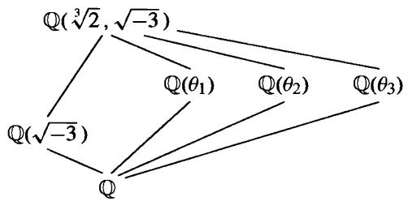

where

$$
\theta_ {1} = \sqrt [ 3 ]{2}, \quad \theta_ {2} = \sqrt [ 3 ]{2} \left(\frac {- 1 + i \sqrt {3}}{2}\right), \quad \theta_ {3} = \sqrt [ 3 ]{2} \left(\frac {- 1 - i \sqrt {3}}{2}\right).
$$

(4) One must be careful in computing splitting fields. The splitting field for the polynomial $x ^ { 4 } + 4$ over $\mathbb { Q }$ is smaller than one might at first suspect. In fact this polynomial factors over $\mathbb { Q }$ :

$$
\begin{array}{l} x ^ {4} + 4 = x ^ {4} + 4 x ^ {2} + 4 - 4 x ^ {2} = (x ^ {2} + 2) ^ {2} - 4 x ^ {2} \\ = (x ^ {2} + 2 x + 2) (x ^ {2} - 2 x + 2) \\ \end{array}
$$

where these two factors are irreducible (Eisenstein again). Solving for the roots of the two factors by the quadratic formula, we find the four roots

$$
\pm 1 \pm i
$$

so that the splitting field of this polynomial is just the field $\mathbb { Q } ( i )$ , an extension of degree 2 of $\mathbb { Q } .$ .

In general, if $f ( x ) \in F [ x ]$ is a polynomial of degree $\pmb { n } ,$ , then adjoining one root of $f ( x )$ to $F$ generates an extension $F _ { 1 }$ of degree at most $\pmb { n }$ (and equal to n if and only if $f ( x )$ is irreducible). Over $F _ { 1 }$ the polynomial $f ( x )$ now has at least one linear factor, so that any other root of $f ( x )$ satisfies an equation of degree at most $n - 1$ over $F _ { 1 }$ . Adjoining such a root to $F _ { 1 }$ we therefore obtain an extension of degree at most $n - 1$ of $F _ { 1 }$ , etc. Using the multiplicativity of extension degrees, this proves

Proposition 26. A splitting field of a polynomial of degree $\pmb { n }$ over $F$ is of degree at most n ! over $\boldsymbol { F }$ .

As the examples above show, the degree of a splitting field may be smaller than n ! . It will be proved later using Galois Theory that a "general" polynomial of degree n (in a well defined sense) over $\mathbb { Q }$ has a splitting field of degree n !, so this may be viewed as the "generic" situation (although most of the interesting examples we shall consider have splitting fields of smaller degree).

# Example: (Splitting Field of ${ \pmb x } ^ { { \pmb n } } - { \pmb 1 }$ : Cyclotomic Fields)

Consider the splitting field of the polynomial $x ^ { n } - 1$ over $\mathbb { Q }$ . The roots of this polynomial are called the $n ^ { \mathrm { t h } }$ roots of unity.

Recall that every nonzero complex number $a + b i \in \mathbb { C }$ can be written uniquely in the form

$$
r e ^ {i \theta} = r (\cos \theta + i \sin \theta) \quad r > 0, \quad 0 \leq \theta <   2 \pi
$$

which is simply representing the point $a + b i$ in the complex plane in terms of polar coordinates: $\boldsymbol { r }$ is the distance of $( a , b )$ from the origin and $\theta$ is the angle made with the real positive axis.

Over $\mathbb { C }$ there are $\pmb { n }$ distinct solutions of the equation $x ^ { n } = 1 ,$ , namely the elements

$$
e ^ {2 \pi k i / n} = \cos \left(\frac {2 \pi k}{n}\right) + i \sin \left(\frac {2 \pi k}{n}\right)
$$

for $k = 0 , 1 , \ldots , n - 1$ . These points are given geometrically by n equally spaced points starting with the point ( 1 ,0) (corresponding to ${ \pmb k } = { \bf 0 }$ ) on a circle of radius 1 in the complex plane (see Figure 6). The fact that these are all $n ^ { \mathrm { t h } }$ roots of unity is immediate, since

$$
(e ^ {2 \pi k i / n}) ^ {n} = e ^ {(2 \pi k i / n) n} = e ^ {2 \pi k i} = 1.
$$

It follows that $\mathbb { C }$ contains a splitting field for $x ^ { n } - 1$ and we shall frequently view the splitting field for $x ^ { n } - 1$ over $\mathbb { Q }$ as the field generated over $\mathbb { Q }$ in $\mathbb { C }$ by the numbers above.

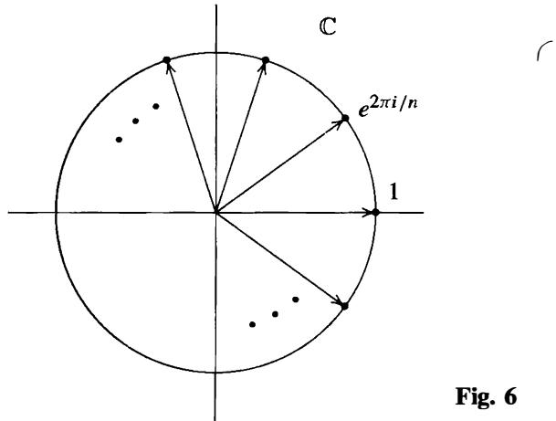

In any abstract splitting field $K / \mathbb { Q }$ for $x ^ { n } - 1$ the collection of $n ^ { \mathrm { t h } }$ roots of unity form a group under multiplication since if $\alpha ^ { n } = 1$ and $\beta ^ { n } = 1$ then $( \alpha \beta ) ^ { n } = 1$ , so this subset of $K ^ { \times }$ is closed under multiplication. It follows that this is a cyclic group (Proposition 1 8 of Chapter 9); we shall see that there are $_ n$ distinct roots in $\pmb { K }$ so it has order $\pmb { n }$ .

Definition. A generator of the cyclic group of all $n ^ { \mathrm { t h } }$ roots of unity is called a primitive $n ^ { \mathrm { t h } }$ root of unity.

Let $\xi _ { n }$ denote a primitive $n ^ { \mathrm { t h } }$ root of unity. The other primitive $n ^ { \mathrm { t h } }$ roots of unity are then the elements $\zeta _ { n } ^ { \alpha }$ where $1 \leq a < n$ is an integer relatively prime to $\pmb { n }$ , since these are the other generators for a cyclic group of order n. In particular there are precisely $\varphi ( n )$ primitive $n ^ { \mathrm { t h } }$ roots of unity, where $\varphi ( n )$ denotes the Euler $\varphi$ -function.

Over $\mathbb { C }$ we can see all of this directly by letting

$$
\zeta_ {n} = e ^ {2 \pi i / n}
$$

(the first $\pmb { n } ^ { \mathrm { t h } }$ root of unity counterclockwise from 1). Then all the other roots of unity are powers of $\xi _ { n }$ :

$$
e ^ {2 \pi k i / n} = \zeta_ {n} ^ {k}
$$

so that $\xi _ { n }$ is one possible generator for the multiplicative group of $n ^ { \mathrm { t h } }$ roots of unity. When we view the roots of unity in $\mathbb { C }$ we shall usually use $\xi _ { n }$ to denote this choice of a primitive $n ^ { \mathrm { t h } }$ root of unity. The primitive roots of unity in $\mathbb { C }$ for some small values of $\pmb { n }$ are

$$
\begin{array}{l} \zeta_ {1} = 1 \\ \zeta_ {2} = - 1 \\ \zeta_ {3} = \frac {- 1 + i \sqrt {3}}{2} \\ \zeta_ {4} = i \\ \zeta_ {5} = \frac {\sqrt {5} - 1}{4} + i \left(\frac {\sqrt {1 0 + 2 \sqrt {5}}}{4}\right) \\ \zeta_ {6} = \frac {1 + i \sqrt {3}}{2} \\ \zeta_ {8} = \frac {\sqrt {2}}{2} + i \frac {\sqrt {2}}{2} \\ \end{array}
$$

(these formulas follow from the elementary geometry of $\pmb { n }$ -gons and in any case can be verified directly by raising them to the appropriate power).

The splitting field of $x ^ { n } - 1$ over $\mathbb { Q }$ is the field $\mathbb { Q } ( \zeta _ { n } )$ and this field is given a name:

Definition. The field $\mathbb { Q } ( \zeta _ { n } )$ is called the cyclotomic field of $n ^ { \mathrm { t h } }$ roots of unity.

Determining the degree of this extension requires some analysis of the minimal polynomial of l;n over $\mathbb { Q }$ and will be postponed until later (Section 6). One important special case which we have in fact already considered is when $\pmb { n } = \pmb { p }$ is a prime. In this case, we have the factorization

$$
x ^ {p} - 1 = (x - 1) \left(x ^ {p - 1} + x ^ {p - 2} + \dots + x + 1\right)
$$

and since $\zeta _ { P } \neq 1$ it follows that $\boldsymbol { \zeta } _ { p }$ is a root of the polynomial

$$
\Phi_ {p} (x) = \frac {x ^ {p} - 1}{x - 1} = x ^ {p - 1} + x ^ {p - 2} + \dots + x + 1
$$

which we showed was irreducible in Section 9.4. It follows that $\bar { \pmb { \phi } } _ { p } ( { \pmb x } )$ is the minimal polynomial of $\zeta _ { p }$ over $\mathbb { Q }$ , so that

$$
[ \mathbb {Q} (\zeta_ {p}): \mathbb {Q} ] = p - 1.
$$

We shall see later that in general $\left[ \mathbb { Q } ( \zeta _ { n } ) : \mathbb { Q } \right] = \varphi ( n ) ~$ , where $\varphi ( n )$ is the Euler phi-function of $\pmb { n }$ (so that $\varphi ( p ) = p - 1 )$ .

# Example: (Splitting Field of $x ^ { p } - 2 , p$ a prime)

Let $\pmb { p }$ be a prime and consider the splitting field of $x ^ { p } - 2$ . If $\pmb { \alpha }$ is a root of this equation, i .e., $\pmb { \alpha } ^ { p } = 2$ , then $( \zeta \alpha ) ^ { p } = 2$ where $\boldsymbol { \zeta }$ is any $p ^ { \mathfrak { t h } }$ root of unity. Hence the solutions of this equation are

$$
\zeta^ {\sqrt {2}}, \quad \zeta a p ^ {\text {t h}} \text {r o o t} \text {o f u n i t y}
$$

where as usual the symbol $\sqrt [ n ] { 2 }$ denotes the positive real $p ^ { \mathfrak { t h } }$ root of 2 if we wish to view these elements as complex numbers, and denotes any one solution of $x ^ { p } = 2$ if we view these roots abstractly. Since the ratio of the two solutions $\zeta _ { p } \sqrt [ p ] { 2 }$ and $\sqrt [ n ] { 2 }$ for $\boldsymbol { \zeta _ { p } }$ a primitive $p ^ { \mathbf { u } }$ root of unity is just $\zeta _ { p }$ . the splitting field of $x ^ { p } - 2$ over $\mathbb { Q }$ contains $\mathbb { Q } ( \sqrt [ p ] { 2 } , \zeta _ { p } )$ . On the other hand, all the roots above lie in this field, so that the splitting field is precisely

$$
\mathbb {Q} (\sqrt [ p ]{2}, \xi_ {p}).
$$

This field contains the cyclotomic field o f $p ^ { \mathfrak { t h } }$ roots ofpruty and i s generated over i t by ${ \sqrt [ [object Object] ] { 2 } } ,$ hence is an extension of degree at most $\pmb { p }$ . It follows that the degree of this extension over $\mathbb { Q }$ is $\leq p ( p - 1 )$ . Since both $\mathbb { Q } ( { \sqrt [ n ] { 2 } } )$ and $\mathbb { Q } ( \zeta _ { p } )$ are subfields, the degree of the extension over $\mathbb { Q }$ is divisible by $\pmb { p }$ and by $p - 1$ . Since these two numbers are relatively prime it follows that the extension degree is divisible by $p ( p - 1 )$ so that we must have

$$
[ \mathbb {Q} (\sqrt [ \xi ]{2}, \zeta_ {p}): \mathbb {Q} ] = p (p - 1)
$$

(this is Corollary 22). Note in particular that we have proved $x ^ { p } - 2$ remains irreducible over $\mathbb { Q } ( \zeta _ { p } )$ , which is not at all obvious. We have the following diagram of known subfields:

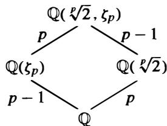

The special case $\pmb { p = 3 }$ was Example 3 above, where we simply indicated the $3 ^ { \mathrm { r d } }$ roots of unity explicitly.

We now return to the problem of proving it makes no difference how the splitting field of a polynomial $f ( x )$ over a field $F$ is constructed. As in Theorem 8 it is convenient to state the result for an arbitrary isomorphism $\varphi : F \stackrel { \sim } { \to } F ^ { \prime }$ between two fields.

Theorem 27. Let $\varphi : F \ { \stackrel { \sim } { \to } } \ F ^ { \prime }$ be an isomorphism of fields. Let $f ( x ) \ \in \ F [ x ]$ be a polynomial and let $f ^ { \prime } ( x ) \in F ^ { \prime } [ x ]$ be the polynomial obtained by applying $\pmb { \varphi }$ to the coefficients of $f ( x )$ . Let $\pmb { E }$ be a splitting field for $f ( x )$ over $\pmb { F }$ and let $E ^ { \prime }$ be a splitting field for $f ^ { \prime } ( x )$ over $F ^ { \prime }$ . Then the isomorphism $\varphi$ extends to an isomorphism $\sigma : E \stackrel { \sim } { \to } E ^ { \prime }$ , i . e . , $\sigma$ restricted to $\pmb { F }$ is the isomorphism $\varphi$ :

$$
\begin{array}{c c c c} \sigma : & E & \stackrel {{\sim}} {{\longrightarrow}} & E ^ {\prime} \\ & | & & | \\ \varphi : & F & \stackrel {{\sim}} {{\longrightarrow}} & F ^ {\prime} \end{array}
$$

Proof" We shall proceed by induction on the degree $\pmb { n }$ of $f ( x )$ . As in the discussion before Theorem 8, recall that an isomorphism $\varphi$ from one field $\pmb { F }$ to another field

$F ^ { \prime }$ induces a natural isomorphism between the polynomial rings $F [ x ]$ and $F ^ { \prime } [ x ]$ . In particular, if $f ( x )$ and $f ^ { \prime } ( x )$ correspond to one another under this isomorphism then the irreducible factors of $f ( x )$ in $F [ x ]$ correspond to the irreducible factors of $f ^ { \prime } ( x )$ in $F ^ { \prime } [ x ]$ .

If $f ( x )$ has all its roots in $F$ then $f ( x )$ splits completely in $F [ x ]$ and $f ^ { \prime } ( x )$ splits completely in $F ^ { \prime } [ x ]$ (with its linear factors being the imagesl)f the linear factors for $f ( x ) )$ . Hence $E = F$ and $E ^ { \prime } = F ^ { \prime }$ , and in this case we may take $\sigma = \varphi$ . This shows the result is true for $n = 1$ and in the case where all the irreducible factors of $f ( x )$ have degree 1 .

Assume now by induction that the theorem has been proved for any field $F$ , isomorphism $\varphi _ { : }$ , and polynomial $f ( x ) \in F [ x ]$ of degree $< n$ . Let $p ( { \boldsymbol { x } } )$ be an irreducible factor of $f ( x )$ in $F [ x ]$ of degree at least 2 and let $p ^ { \prime } ( x )$ be the corresponding irreducible factor of $f ^ { \prime } ( x )$ in $F ^ { \prime } [ x ] .$ If $\alpha \in E$ is a root of $p ( x )$ and $\beta \in E ^ { \prime }$ is a root of $p ^ { \prime } ( x ) .$ , then by Theorem 8 we can extend $\varphi$ to an isomm'Phism $\sigma ^ { \prime } : F ( \alpha ) \xrightarrow { \sim } F ^ { \prime } ( \beta )$ :

$$
\begin{array}{c c c c} \sigma^ {\prime}: & F (\alpha) & \stackrel {{\sim}} {{\longrightarrow}} & F ^ {\prime} (\beta) \\ & | & & | \\ \varphi : & F & \stackrel {{\sim}} {{\longrightarrow}} & F ^ {\prime}. \end{array}
$$

Let $F _ { 1 } = F ( \alpha )$ , $F _ { 1 } ^ { \prime } = F ^ { \prime } ( \beta )$ , so that we have the isomorphism $\sigma ^ { \prime } : F _ { 1 } \stackrel { \sim } { \to } F _ { 1 } ^ { \prime }$ { . We have $f ( x ) = ( x - \alpha ) f _ { 1 } ( x )$ over $F _ { 1 }$ where $f _ { 1 } ( x )$ has degree $n - 1$ and $f ^ { \prime } ( x ) = ( x - \beta ) f _ { 1 } ^ { \prime } ( x )$ . The field $\pmb { { \cal E } }$ i s a splitting field for $f _ { 1 } ( x )$ over $F _ { 1 }$ : all the roots of $f _ { 1 } ( x )$ are in $E$ and if they were contained in any smaller extension $\pmb { L }$ containing $F _ { 1 }$ , then, since $F _ { 1 }$ contains $\alpha , L$ would also contain all the roots of $f ( x )$ , which would contradict the minimality of $\pmb { { \cal E } }$ as the splitting field of $f ( x )$ over $F$ . Similarly $E ^ { \prime }$ is a splitting field for $f _ { 1 } ^ { \prime } ( x )$ over $F _ { 1 } ^ { \prime }$ . Since the degrees of $f _ { 1 } ( x )$ and $f _ { 1 } ^ { \prime } ( x )$ are less than $\pmb { n } ,$ , by induction there exists a map $\sigma : E \stackrel { \sim } { \to } E ^ { \prime }$ extending the isomorphism $\sigma ^ { \prime } : F _ { 1 } \stackrel { \sim } { \to } F _ { 1 } ^ { \prime }$ { . This gives the extended diagram:

$$
\begin{array}{c c c c} \sigma : & E & \stackrel {{\sim}} {{\longrightarrow}} & E ^ {\prime} \\ & | & & | \\ \sigma^ {\prime}: & F _ {1} & \stackrel {{\sim}} {{\longrightarrow}} & F _ {1} ^ {\prime} \\ & | & & | \\ \varphi : & F & \stackrel {{\sim}} {{\longrightarrow}} & F ^ {\prime}. \end{array}
$$

Then as the diagram indicates, $\pmb { \sigma }$ restricted to $F _ { 1 }$ is the isomorphism $\pmb { \sigma } ^ { \prime }$ , so in particular $\pmb { \sigma }$ restricted to $F$ is $\sigma ^ { \prime }$ restricted to $F$ , which is $\varphi$ , showing that $\pmb { \sigma }$ is an extension of $\varphi$ , completing the proof.

Corollary 28. (Uniqueness of Splitting Fields) Any two splitting fields for a polynomial $f ( x ) \in F [ x ]$ over a field $F$ are isomorphic.

Proof Take $\varphi$ to be the identity mapping from $F$ to itself and $\pmb { { \cal E } }$ and $E ^ { \prime }$ to be two splitting fields for $f ( x ) ( = f ^ { \prime } ( x ) )$ ) .

As we mentioned before, this result justifies the terminology of the splitting field for $f ( x )$ over $F$ , since any two are isomorphic. Splitting fields play a natural role in

the study of algebraic elements (if you are adjoining one root of a polynomial, why not adjoin all the roots?) and so take a particularly important role in Galois Theory.

We end this section with a discussion of field c;xtensions of $F$ which contain all the roots of all polynomials over $F$ .

Definition. The field $\overline { F }$ is called an algebraic closure of $F$ if $\overline { F }$ is algebraic over $F$ and if every polynomial $f ( x ) \in F [ x ]$ splits completely over $\overline { F }$ (so that $\scriptstyle { \overline { { F } } }$ can be said to contain all the elements algebraic over $F$ ).

Definition. A field $\pmb { K }$ is said to be algebraieally closed if every polynomial with coefficients in $\pmb { K }$ has a root in $\pmb { K }$ .

It is not obvious that algebraically closed fields exist nor that there exists an algebraic closure of a given field $F$ (we shall prove this shortly).

Note that if $\pmb { K }$ is algebraically closed, then in fact every $f ( x ) \in K [ x ]$ has all its roots in $\pmb { K }$ , since by definition $f ( x )$ has a root ${ \pmb { \alpha } } \in { \pmb { K } } ,$ , hence has a factor $x - \alpha$ in $K [ x ]$ . The remaining factor of $f ( x )$ then is a polynomial in $K [ x ] ,$ hence has a root, so has a linear factor etc., so that $f ( x )$ must split completely. Hence if $\pmb { K }$ is algebraically closed, then $\pmb { K }$ itself is an algebraic closure of $\pmb { K }$ and the converse is obvious, so that $K = { \overline { { K } } }$ if and only if $\pmb { K }$ is algebraically closed.

The next result shows that the process of "taking the algebraic closure" actually stops after one step - taking the algebraic closure of an algebraic closure does not give a larger field: the field is already algebraically closed (notationally: ${ \overline { { \overline { { F } } } } } = { \overline { { F } } }$ ).

Proposition 29. Let $\overline { F }$ be an algebraic closure of $F$ . Then $\overline { F }$ is algebraically closed.

Proof" Let $f ( x )$ be a polynomial in $\overline { { F } } [ \boldsymbol { x } ]$ and let $\pmb { \alpha }$ be a root of $f ( x )$ . Then $\pmb { \alpha }$ generates an algebraic extension $\overline { { F } } ( \alpha )$ of $\overline { F }$ , and $\overline { F }$ is algebraic over $F .$ . By Theorem 20, $\overline { { F } } ( \alpha )$ is algebraic over $F$ so in particular its element $\pmb { \alpha }$ is algebraic over $\boldsymbol { F }$ . But then $\alpha \in { \overline { { F } } }$ , showing $\overline { F }$ is algebraically closed.

Given a field $F$ we have already shown how to construct (finite) extensions of $F$ containing all the roots of any given polynomial $f ( x ) \in F [ x ]$ . Intuitively, an algebraic closure of $F$ is given by the field "generated" by all of these fields. The difficulty with this is "generated" where?, since they are not all subfields of a given field. For a finite collection of polynomials $f _ { 1 } ( x ) , \ldots , f _ { k } ( x )$ , we can identify their splitting fields as subfields of the splitting field of the product polynomial $f _ { 1 } ( x ) \cdots f _ { k } ( x ) ,$ , but the same idea used for an infinite number of polynomials requires numerous "bookkeeping" identifications and an application of Zorn's Lemma.

We shall instead construct an algebraic closure of $F$ by first constructing an algebraically closed field containing $F .$ . The proof uses a clever idea of Artin which very neatly solves the "bookkeeping" problem of constructing a field containing the appropriate roots of polynomials (which also ultimately relies on Zorn's Lemma) by introducing a separate variable for every polynomial.

Proof" For every nonconstant monic pl"iYnomial $f = f ( x )$ with coefficients in $F .$ , let $x _ { f }$ denote an indeterminate and consider the polynomial ring $F [ \dots , x _ { f } , \dots ]$ generated over $F$ by the variables $x _ { f }$ . In this polynomial ring consider the ideal $I$ generated by the polynomials $f ( x _ { f } )$ . If this ideal is not proper, then 1 is an element of the ideal, hence we have a relation

$$
g _ {1} f _ {1} \left(x _ {f _ {1}}\right) + g _ {2} f _ {2} \left(x _ {f _ {2}}\right) + \dots^ {\varepsilon} + g _ {n} f _ {n} \left(x _ {f _ {n}}\right) = 1
$$

where the $g _ { i } , i = 1 , 2 , \ldots , n _ { : }$ $g _ { i }$ , are polynomials in the $x _ { f }$ . For $i = 1 , 2 , . . . , n$ let $x _ { f _ { i } } = x _ { i }$ and let $x _ { n + 1 } , \ldots , x _ { m }$ be the remaining variables occurring in the polynomials $g _ { j } , j = 1 , 2 , \ldots , n .$ . Then the relation above reads

$$
g _ {1} \left(x _ {1}, x _ {2}, \dots , x _ {m}\right) f _ {1} \left(x _ {1}\right) + \dots + g _ {n} \left(x _ {1}, x _ {2}, \dots , x _ {m}\right) f _ {n} \left(x _ {n}\right) = 1.
$$

Let $F ^ { \prime }$ be a finite extension of $F$ containing a root $\pmb { \alpha _ { i } }$ of $f _ { i } ( x ) { \mathrm { f o r } } i = 1 , 2 , \ldots , n$ . Letting $x _ { i } = \alpha _ { i }$ , $i = 1 , 2 , \ldots , n$ and setting $x _ { n + 1 } = \cdots = x _ { m } = 0 $ , say, in the polynomial equation above would imply that $\mathbf { 0 } = 1$ in $F ^ { \prime }$ , clearly impossible.

Since the ideal $I$ is a proper ideal, it is contained in a maximal ideal $\mathcal { M }$ (this is where Zorn's Lemma is used). Then the quotient

$$
K _ {1} = F [ \dots , x _ {f}, \dots ] / \mathcal {M}
$$

is a field containing (an isomorphic copy of) $F$ . Each of the polynomials $f$ has a root in $K _ { 1 }$ by construction, namely the image of $x _ { f }$ , since $f ( x _ { f } ) \in I \subseteq M .$ We have constructed a field $K _ { 1 }$ in which every polynomial with coefficients from $\pmb { F }$ has a root. Performing the same construction with $K _ { 1 }$ instead of $F$ gives a field $K _ { 2 }$ containing $K _ { 1 }$ in which all polynomials with coefficients from $K _ { 1 }$ have a root. Continuing in this fashion we obtain a sequence of fields

$$
F = K _ {0} \subseteq K _ {1} \subseteq K _ {2} \subseteq \dots \subseteq K _ {j} \subseteq K _ {j + 1} \subseteq \dots
$$

where every polynomial with coefficients in $K _ { j }$ has a root in $K _ { j + 1 } , j = 0 , 1 , \ldots$ Let

$$
K = \bigcup_ {j \geq 0} K _ {j}
$$

be the union of these fields. Then $\pmb { K }$ is clearly a field containing $F$ . Since $\pmb { K }$ is the union of the fields $K _ { j }$ , the coefficients of any polynomial $h ( x )$ in $K [ x ]$ all lie in some field $K _ { N }$ for $N$ sufficiently large. But then $h ( x )$ has a root in $K _ { N + 1 }$ • so has a root in $\pmb { K }$ . I t follows that $\pmb { K }$ is algebraically closed, completing the proof.

We now use the algebraically closed field containing $F$ to construct an algebraic closure of $F$ :

Proposition 31. Let $\pmb { K }$ be an algebraically closed field and let $F$ be a subfield of $\pmb { K }$ . Then the collection of elements $\overline { F }$ of $\pmb { K }$ that are algebraic over $F$ is an algebraic closure of $\boldsymbol { F }$ . An algebraic closure of $F$ is unique up to isomorphism.

Proof" By definition, $\overline { F }$ is an algebraic extension of $F$ . Every polynomial $f ( x ) \in$ $F [ x ]$ splits completely over $\pmb { K }$ into linear factors $x - \alpha$ (the same is true for every

polynomial even in $K [ x ] )$ ). But each $\pmb { \alpha }$ is a root of $f ( x )$ , so is algebraic over $F$ , hence is an element of $\overline { F }$ . It follows that all the linear factors ${ \pmb x } - { \pmb \alpha }$ have coefficients in ${ \overline { { F } } } .$ , i . e . , $f ( x )$ splits completely in ${ \overline { { F } } } [ x ]$ and $\overline { F }$ is an algebraic closure of $F$ .

The uniqueness (up to isomorphism) of the algebraic closure is natural in light of the uniqueness (up to isomorphism) of splitting fields, and is proved along the same lines together with an application of Zorn's Lemma and will be omitted.

We shall prove later using Galois theory the following result (purely analytic proofs using complex analysis also exist).

Theorem. (Fundamental Theorem of Algebra) The field $\mathbb { C }$ is algebraically closed.

By Proposition 3 1 , we immediately obtain:

Corollary 32. The field $\mathbb { C }$ contains an algebraic closure for any of its subfields. In particular, $\overline { { \mathbb { Q } } } ,$ the collection of complex numbers algebraic over $\mathbb { Q }$ , is an algebraic closure of $\mathbb { Q }$ .

The point of these considerations is that all the computations involving elements algebraic over a field $F$ may be viewed as taking place in one (large) field, namely $\overline { F }$ . Similarly, we can speak sensibly of the composite of any collection of algebraic extensions by viewing them all as subfields of an algebraic closure. In the case of $\mathbb { Q }$ or finite extensions of $\mathbb { Q }$ we may consider all of our computations as occurring in $\mathbb { C }$ .

# E X E R C I S E S

1. Determine the splitting field and its degree over $\mathbb { Q }$ for $x ^ { 4 } - 2 .$   
2. Determine the splitting field and its degree over Q for $x ^ { 4 } + 2 .$   
3. Detennine the splitting field and its degree over $\mathbb { Q }$ for $x ^ { 4 } + x ^ { 2 } + 1$ .   
4. Detennine the splitting field and its degree over $\mathbb { Q }$ for $x ^ { 6 } - 4$ .   
5. Let $\pmb { K }$ be a finite extension of $\pmb { F }$ . Prove that $\pmb { K }$ is a splitting field over $\pmb { F }$ if and only if every irreducible polynomial in $F [ x ]$ that has a root in $\pmb { K }$ splits completely in $K [ x ] .$ . [Use Theorems 8 and 27 .]   
6. Let $K _ { 1 }$ and $\kappa _ { 2 }$ be finite extensions of $\pmb { F }$ contained in the field $\pmb { K }$ , and assume both are splitting fields over $\pmb { F }$ .   
(a) Prove that their composite $K _ { 1 } K _ { 2 }$ is a splitting field over $\pmb { F }$   
(b) Prove that $K _ { 1 } \cap K _ { 2 }$ is a splitting field over $\pmb { F }$ . [Use the preceding exercise.]

# 1 3.5 SEPARABLE AND INSEPARABLE EXTENSIONS

Let $F$ be a field and let $f ( x ) \in F [ x ]$ be a polynomial. Over a splitting field for $f ( x )$ we have the factorization

$$
f (x) = (x - \alpha_ {1}) ^ {n _ {1}} (x - \alpha_ {2}) ^ {n _ {2}} \dots (x - \alpha_ {k}) ^ {n _ {k}}
$$

where $\alpha _ { 1 } , \alpha _ { 2 } , \ldots , \alpha _ { k }$ are distinct elements of the splitting field and $n _ { i } \geq 1$ for all i . Recall that $\alpha _ { i }$ is called a multiple root if $n _ { i } > 1$ and is called a simple root if $n _ { i } = 1$ . The integer $\pmb { n _ { i } }$ i s called the multiplicity of the root $\alpha _ { i }$ .

Definition. A polynomial over $\pmb { F }$ is called separable if it has no multiple roots (i.e., all its roots are distinct). A polynomial which is not separable is called inseparable.

Note that if a polynomial $f ( x )$ has distinct roots in one splitting field then $f ( x )$ has distinct roots in any splitting field (since this is equivalent to $f ( x )$ factoring into distinct linear factors, and there is an isomorphism over $\pmb { F }$ between any two splitting fields of $f ( x )$ that is bijective on its roots), so that we need not specify the field containing all the roots of $f ( x )$ .

# Examples

(1) The polynomial $x ^ { 2 } - 2$ is separable over $\mathbb { Q }$ since its two roots $\pm \sqrt { 2 }$ are distinct. The polynomial $( x ^ { 2 } - 2 ) ^ { n }$ for any $n \geq 2$ is inseparable since it has the multiple roots $\pm { \sqrt { 2 } } ,$ each with multiplicity $\pmb { n }$ .   
(2) The polynomial $x ^ { 2 } - t \ ( = x ^ { 2 } + t )$ over the field $F = \mathbb { F } _ { 2 } ( t )$ of rational functions in t with coefficients from $\mathbb { F } _ { 2 }$ is irreduCible as we've seen before, but is not separable. If $\sqrt { t }$ denotes a root in some exteysion field (note that $\sqrt { t } \notin F )$ , then

$$
(x - \sqrt {t}) ^ {2} = x ^ {2} - 2 x \sqrt {t} + t = x ^ {2} + t = x ^ {2} - t
$$

since $F$ is a field of characteristic 2. Hence this irreducible polynomial has only one root (with multiplicity 2), so is not separable over $F$ .

There is a simple criterion to check whether a polynomial has multiple roots.

Definition. The derivative of the polynomial

$$
f (x) = a _ {n} x ^ {n} + a _ {n - 1} x ^ {n - 1} + \dots + a _ {1} x + a _ {0} \in F [ x ]
$$

is defined to be the polynomial

$$
D _ {x} f (x) = n a _ {n} x ^ {n - 1} + (n - 1) a _ {n - 1} x ^ {n - 2} + \dots + 2 a _ {2} x + a _ {1} \in F [ x ].
$$

This formula is nothing but the usual formula for the derivative of a polynomial familiar from calculus. It is purely algebraic and so can be applied to a polynomial over an arbitrary field $F$ , where the analytic notion of derivative (involving limits - a continuous operation) may not exist.

The usual (calculus) formulas for derivatives hold for derivatives in this situation as well, for example the formulas for the derivative of a sum and of a product:

$$
\begin{array}{l} D _ {x} (f (x) + g (x)) = D _ {x} f (x) + D _ {x} g (x) \\ D _ {x} (f (x) g (x)) = f (x) D _ {x} g (x) + \left(D _ {x} f (x)\right) g (x). \\ \end{array}
$$

These formulas can be proved directly from the definition for polynomials and do not require any limiting operations and are left as an exercise.

The next proposition shows that the separability of $f ( x )$ can be determined by the Euclidean Algorithm in the field where the coefficients of $f ( x )$ lie, without passing to a splitting field and factoring $f ( x )$ .

Proposition 33. A polynomial $f ( x )$ has a multiple root $\pmb { \alpha }$ if and only if $\pmb { \alpha }$ is also a root of $D _ { x } f ( x )$ , i . e . , $f ( x )$ and $D _ { x } f ( x )$ are both divisible by the minimal polynomial for $\pmb { \alpha }$ . In particular, $f ( x )$ is separable if and only if it is relatively prime to its derivative: $( f ( x ) , D _ { x } f ( x ) ) = 1$ .

Proof Suppose first that $\pmb { \alpha }$ is a multiple root of $f ( x )$ . Then over a splitting field,

$$
f (x) = (x - \alpha) ^ {n} g (x)
$$

for some integer $n \geq 2$ and some polynomial $g ( x )$ . Taking derivatives we obtain

$$
D _ {x} f (x) = n (x - \alpha) ^ {n - 1} g (x) + (x - \alpha) ^ {n} D _ {x} g (x)
$$

which shows $( n \geq 2 )$ that $D _ { x } f ( x )$ has $\pmb { \alpha }$ as a root.

Conversely, suppose that $\pmb { \alpha }$ is a root of both $f ( x )$ and $D _ { x } f ( x )$ . Then write

$$
f (x) = (x - \alpha) h (x)
$$

for some polynomial $h ( x )$ and take the derivative:

$$
D _ {x} f (x) = h (x) + (x - \alpha) D _ {x} h (x).
$$

Since $D _ { x } f ( \alpha ) = 0$ by assumption, substituting $\pmb { \alpha }$ into the last equation 8bows that $\pmb { h } ( \pmb { \alpha } ) = \mathbf { 0 }$ . Hence $h ( x ) = ( x - \alpha ) h _ { 1 } ( x )$ for some polynomial $h _ { 1 } ( x )$ , and

$$
f (x) = (x - \alpha) ^ {2} h _ {1} (x)
$$

showing that $\pmb { \alpha }$ is a multiple root of $f ( x )$

The equivalence with divisibility by the minimal polynomial for $\pmb { \alpha }$ follows from Proposition 9. The last statement is then clear (let $\pmb { \alpha }$ denote any root of a common factor of $f ( x )$ and $D _ { x } f ( x ) )$ .

# Examples

(1) The polynomial $x ^ { p ^ { n } } - x$ over $\mathbb { F } _ { p }$ has derivative $p ^ { n } x ^ { p ^ { n } - 1 } - 1 = - 1$ since the field has characteristic $\pmb { p }$ . Since in this case the derivative has no roots at all, it follows that the polynomial has no multiple roots, hence is separable.   
(2) The polynomial $x ^ { n } - 1$ has derivative $n x ^ { n - 1 }$ . Over any field of characteristic not dividing $\pmb { n }$ (including characteristic 0) this polynomial has only the root 0 (of multiplicity $n - 1 )$ , which is not a root of $x ^ { n } - 1$ . Hence $x ^ { n } - 1$ is separable and there are $\pmb { n }$ distinct $n ^ { \mathrm { t h } }$ roots of unity. We saw this directly over $\mathbb { Q }$ by exhibiting $\pmb { n }$ distinct solutions over $\mathbb { C }$ .   
(3) If $F$ is of characteristic $\pmb { p }$ and $\pmb { p }$ divides $\pmb { n }$ , then there are fewer than n distinct $n ^ { \mathrm { t h } }$ roots of unity over $F$ : in this case the derivative is identically 0 since $\pmb { n = 0 }$ in $\boldsymbol { F }$ . In fact every root of $x ^ { n } - 1$ is multiple in this case.

Corollary 34. Every irreducible polynomial over a field of characteristic 0 (for example, $\mathbb { Q } )$ is separable. A polynomial over such a field is separable if and only if it is the product of distinct irreducible polynomials.

Proof Suppose $F$ is a field of characteristic 0 and $p ( x ) \in F [ x ]$ is irreducible of degree n. Then the derivative $D _ { x } p ( x )$ is a polynomial of degree $n - 1$ . Up to constant factors the only factors of $p ( { \boldsymbol { x } } )$ in $F [ x ]$ are 1 and $p ( x )$ , so $D _ { x } p ( x )$ must be

relatively prime to $p ( { \boldsymbol { x } } )$ . This shows that any irreducible polynomial over a field of characteristic 0 is separable. The second statement of the corollary is then clear since distinct irreducibles never have zeros in common (by Proposition 9).

The point in the proof of the corollary that can fail in characteristic $p$ is the statement that the derivative $D _ { x } p ( x )$ is of degree $n - 1$ . In characteristic $\pmb { p }$ the derivative of any power $x ^ { p m }$ of $x ^ { p }$ is identically 0:

$$
D _ {x} \left(x ^ {p m}\right) = p m x ^ {p m - 1} = 0
$$

so it is possible for the degree of the derivative to decrease by more than one. If the derivative $D _ { x } p ( x )$ of the irreducible polynomial $p ( x )$ is nonzero, however, then just as before we conclude that $p ( x )$ must be separable.

It is clear from the definition of the derivative that if $p ( x )$ is a polynomial whose derivative is 0, then every exponent of $_ { x }$ in $p ( x )$ must be a multiple of $p$ where $p$ is the characteristic of $F$ :

$$
p (x) = a _ {m} x ^ {m p} + a _ {m - 1} x ^ {(m - 1) p} + \dots + a _ {1} x ^ {p} + a _ {0}.
$$

Letting

$$
p _ {1} (x) = a _ {m} x ^ {m} + a _ {m - 1} x ^ {m - 1} + \dots + a _ {1} x + a _ {0}
$$

we see that $p ( x )$ is a polynomial in $x ^ { p }$ , namely $p ( x ) = p _ { 1 } ( x ^ { p } )$ .

We now prove a simple but im$ortant result about raising to the $p ^ { \mathtt { t h } }$ power in a field of characteristic $p$ .

Proposition 35. Let $F$ be a field of characteristic $p$ . Then for any $a , b \in F$ ,

$$
(a + b) ^ {p} = a ^ {p} + b ^ {p}, \quad \text {a n d} \quad (a b) ^ {p} = a ^ {p} b ^ {p}.
$$

Put another way, the $p ^ { \mathrm { t h } } .$ -power map defined by $\varphi ( a ) = a ^ { p }$ is an injective field homomorphism from $F$ to $F$ .

Proof: The Binomial Theorem for expanding $( a + b ) ^ { n }$ for any positive integer n holds (by the standard induction proof) over any commutative ring:

$$
(a + b) ^ {n} = a ^ {n} + \binom {n} {1} a ^ {n - 1} b + \dots + \binom {n} {i} a ^ {n - i} b ^ {i} + \dots + b ^ {n}.
$$

It should be observed that the binomial coefficients

$$
\binom {n} {i} = \frac {n !}{i ! (n - i) !}
$$

are integers (recall that ma for $m \in \mathbb { Z }$ is defined for $\pmb { \alpha }$ an element of any ring) and here are elements of the prime field.

If $\pmb { p }$ is a prime, then the binomial coefficients $\binom { p } { i }$ for $i = 1 , 2 , \ldots , p - 1$ are all divisible by $p$ since for these values of i the numbers i ! and $( p - i )$ ! only involve factors smaller than $p ,$ , hence are relatively prime to $p$ and so cannot cancel the factor of $p$ in the numerator of the expression $\frac { { p ! } ^ { - } } { i ! ( p - i ) ! }$ . It follows that over a field of characteristic $p$ all the intermediate terms in the expansion of $( a + b ) ^ { p }$ are 0, which gives the first equation of the proposition. The second equation is trivial, as is the fact that $\varphi$ is injective.

Definition. The map in Proposition 35 is called the Frobenius endomorphism of $F$

Corollary 36. Suppose that $\mathbb { F }$ is a finite field of characteristic $\pmb { p }$ . Then every element of $\mathbb { F }$ is a $p ^ { \mathrm { t h } }$ power in $\mathbb { F }$ (notationally, $\mathbb { F } = \mathbb { F } ^ { p }$ ) .

Proof" The injectivity of the Frobenius endomorphism of $\mathbb { F }$ implies that i t is also surjective when $\mathbb { F }$ is finite, which is the statement of the corollary.

We now prove the analogue of Corollary 34 for finite fields.

Let $\mathbb { F }$ be a finite field and suppose that $p ( { \boldsymbol { x } } ) \in \mathbb { F } [ { \boldsymbol { x } } ]$ is an irreducible polynomial with coefficients in $\mathbb { F } .$ . If $p ( x )$ were inseparable then we have seen that $p ( x ) = q ( x ^ { p } )$ for some polynomial $q ( x ) \in \mathbb { F } [ x ]$ . Let

$$
q (x) = a _ {m} x ^ {m} + a _ {m - 1} x ^ {m - 1} + \dots + a _ {1} x + a _ {0}.
$$

By Corollary 36, each $a _ { i }$ $a _ { i } , i = 1 , 2 , \ldots , m$ i s a $p ^ { \mathfrak { t h } }$ power in $\mathbb { F }$ , say $a _ { i } = b _ { i } ^ { p }$ . Then by Proposition 35 we have

$$
\begin{array}{l} p (x) = q \left(x ^ {p}\right) = a _ {m} \left(x ^ {p}\right) ^ {m} + a _ {m - 1} \left(x ^ {p}\right) ^ {m - 1} + \dots + a _ {1} x ^ {p} + a _ {0} \\ = b _ {m} ^ {p} (x ^ {p}) ^ {m} + b _ {m - 1} ^ {p} (x ^ {p}) ^ {m - 1} + \dots + b _ {1} ^ {p} x ^ {p} + b _ {0} ^ {p} \\ = \left(b _ {m} x ^ {m}\right) ^ {p} + \left(b _ {m - 1} x ^ {m - 1}\right) ^ {p} + \dots + \left(b _ {1} x\right) ^ {p} + \left(b _ {0}\right) ^ {p} \\ = \left(b _ {m} x ^ {m} + b _ {m - 1} x ^ {m - 1} + \dots + b _ {1} x + b _ {0}\right) ^ {p} \\ \end{array}
$$

which shows that $p ( x )$ is the $p ^ { \mathfrak { t h } }$ powe; of a polynomial in $\mathbb { F } [ x ]$ , a contradiction to the irreducibility of $p ( x )$ . This proves:

Proposition 37. Every irreducible polynomial over a finite field $\mathbb { F }$ is separable. A polynomial in $\mathbb { F } [ x ]$ is separable if and only if it is the product of distinct irreducible polynomials in $\mathbb { F } [ x ]$ .

The important part of the proof of this result is the fact that every element in the characteristic $\pmb { p }$ field $\mathbb { F }$ was a $p ^ { \mathfrak { t h } }$ power in IF. This suggests the following definition:

Definition. A field $\pmb { K }$ of characteristic $\pmb { p }$ is called peifect if every element of $\pmb { K }$ is a $p ^ { \mathfrak { t h } }$ power in $\pmb { K }$ , i . e . , $K = K ^ { p }$ . Any field of characteristic 0 is also called perfect.

With this definition, we see that we have proved that every irreducible polynomial over a perfect field is separable. It is not hard to see that if $\pmb { K }$ is not perfect then there are inseparable irreducible polynomials.

# Example: (Existence and Uniqueness of Finite Fields)

Let $\pmb { n } > 0$ be any positive integer and consider the splitting field of the polynomial $x ^ { p ^ { n } } - x$ over $\mathbb { F } _ { p }$ · We have already seen that this polynomial is separable, hence has precisely $p ^ { n }$ proots. Let $\pmb { \alpha }$ and $\beta$ be any two roots of this polynomial, so that $\pmb { \alpha } ^ { p ^ { n } } = \pmb { \alpha }$ and $\beta ^ { p ^ { n } } = \beta$ . Then $( \alpha \beta ) ^ { p ^ { n } } = \alpha \beta$ , $( \alpha ^ { - 1 } ) ^ { p ^ { n } } = \alpha ^ { - 1 }$ and by Proposition 35 also

$$
(\alpha + \beta) ^ {p ^ {n}} = \alpha^ {p ^ {n}} + \beta^ {p ^ {n}} = \alpha + \beta .
$$

Hence the set $\mathbb { F }$ consisting of the $p ^ { n }$ distinct roots of $x ^ { p ^ { n } } - x$ over $\mathbb { F } _ { p }$ is closed under addition, multiplication and inverses in its splitting field It follows that $\mathbb { F }$ is a subfield, hence in fact must be the splitting field. Since the number of elements is $p ^ { n }$ , we have $[ \mathbb { F } : \mathbb { F } _ { p } ] = n ,$ , which shows that there exist finite fields of degree $\pmb { n }$ over $\mathbb { F } _ { p }$ for any ${ \pmb n } > { \bf 0 }$ .

Let now $\mathbb { F }$ be any finite field of characteristic $\pmb { p }$ . If $\mathbb { F }$ is of dimension n over its prime subfield $\mathbb { F } _ { p }$ • then $\mathbb { F }$ has precisely $p ^ { n }$ elements. Since the multiplicative group $\mathbb { F } ^ { \times }$ is (in fact cyclic) of order $p ^ { n } - 1 ,$ , we have $\pmb { \alpha } ^ { p ^ { n } - 1 } = 1$ for every ${ \pmb { \alpha } } \neq { \bf 0 }$ in $\mathbb { F }$ , so that $\pmb { \alpha } ^ { p ^ { n } } = \pmb { \alpha }$ for every $\alpha \in \mathbb { F }$ . But this means $\pmb { \alpha }$ is a root of $\pmb { x } ^ { p ^ { n } } - \pmb { x }$ , hence $\mathbb { F }$ is contained in a splitting field for this polynomial. Since we have seen that the splitting field has order $p ^ { n }$ this shows that $\mathbb { F }$ is a splitting field for $x ^ { p ^ { n } } - x .$ Since splitting fields are unique up to isomorphism, this proves that finite fieltls of any order $p ^ { n }$ exist and are unique up to isomorphism. We shall denote the finite field of order $p ^ { n }$ by $\mathbb { F } _ { p ^ { n } }$ •

We shall consider finite fields more later.

We now investigate further the structure of inseparable irreducible polynomials over fields of characteristic $\pmb { p }$ . We have seen above that if $p ( x )$ is an irreducible polynomial which is not separable, then its derivative $D _ { x } p ( x )$ is identically 0, so that $p ( x ) = p _ { 1 } ( x ^ { p } )$ for some polynomial $p _ { 1 } ( x )$ . The polynomial $p _ { 1 } ( x )$ may or may not itself be separable. If not, then it too is a polynomial in $x ^ { p }$ , $p _ { 1 } ( x ) = p _ { 2 } ( x ^ { p } )$ , so that $p ( x )$ is a polynomial in $x ^ { p ^ { 2 } } \colon p ( x ) = p _ { 2 } ( x ^ { p ^ { 2 } } )$ . Continuing in this fashion we see that there is a uniquely defined power $p ^ { k }$ of $\pmb { p }$ such that $p ( x ) = p _ { k } ( x ^ { p ^ { k } } )$ where $p _ { k } ( x )$ has nonzero derivative. It is clear that $p _ { k } ( x )$ is irreducible since any factorization of $p _ { k } ( x )$ would, after replacing $x$ by $x ^ { p ^ { k } }$ , immediately imply a factorization of the irreducible $p ( x )$ . It follows that $p _ { k } ( x )$ is separable. We summarize this as:

Proposition 38. Let $p ( x )$ be an irreducible polynomial over a field $F$ of characteristic $\pmb { p }$ . Then there is a unique integer $k \geq 0$ and a unique irreducible separable polynomial $p _ { s e p } ( x ) \in F [ x ]$ such that

$$
p (x) = p _ {s e p} \left(x ^ {p ^ {k}}\right).
$$

Definition. Let $p ( x )$ be an irreducible polynomial over a field of characteristic $\pmb { p } .$ . The degree of $p _ { s e p } ( x )$ in the last proposition is called the separable degree of $p ( x ) .$ , denoted $\mathbf { d e g } _ { s } p ( x )$ . The integer $p ^ { k }$ in the proposition is called the inseparable degree of $p ( x )$ , denoted deg; $p ( x )$ .

From the definitions and the proposition we see that $p ( x )$ is separable if and only if its inseparability degree is 1 if and only if its degree is equal to its separable degree. Also, computing degrees in the relation $\dot { p } ( x ) = \dot { p _ { s e p } } ( x ^ { p ^ { k } } )$ we see that

$$
\deg p (x) = \deg_ {s} p (x) \deg_ {i} p (x).
$$

# Examples

(1) The polynmpial $p ( x ) = x ^ { 2 } - t$ over $F = \mathbb { F } _ { 2 } ( t )$ considered above has derivative 0, hence is not separable (as we determined earlier). Here $p _ { s e p } ( x ) = x - t$ with inseparability degree 2.

(2) The polynomial $p ( x ) = x ^ { 2 ^ { m } } - t$ over $F = \mathbb { F } _ { 2 } ( t )$ is irreducible with the same separable polynomial part, but with inseparability degree $2 ^ { m }$ .

(3) The polynomial $( { \boldsymbol { x } } ^ { p ^ { 2 } } - t ) ( { \boldsymbol { x } } ^ { p ^ { } } - t )$ over $F = \mathbb { F } _ { p } ( t )$ has (two) inseparable irreducible factors so is inseparable. This polynomial cannot be written in the form $f _ { s e p } ( x ^ { p ^ { k } } )$ where $f _ { s e p } ( x )$ is separable, which is the reason we restricted to irreducible polynomials above. This example also shows that there is no analogous factorization to define the separable and inseparable degrees of a general polynomial.

The notion of separability carries over to the fields generated by the roots of these polynomials.

Definition. The field $\pmb { K }$ is said to be separable (or separably algebraic) over $\pmb { F }$ if every element of $\pmb { K }$ is the root of a separable polynomial over $\pmb { F }$ (equivalently, the minimal polynomial over $F$ of every element of $\pmb { K }$ is separable). A field which is not separable is inseparable.

We have seen that the issue of separability is straightforward for finite extensions of perfect fields since for these fields the minimal polynomial of an algebraic element is irreducible hence separable.

Corollary 39. Every finite extension of a perfect field is separable. In particular, every finite extension of either $\mathbb { Q }$ or a finite field is separable.

We shall consider separable and inseparable extensions more after developing some Galois Theory, in particular defining the separable and inseparable degree of the extension $K / F$ .

# E X E R C I S E S

l. Prove that the derivative $D _ { x }$ of a polynomial satisfies $D _ { x } ( f ( x ) + g ( x ) ) = D _ { x } ( f ( x ) ) +$ $D _ { x } ( g ( x ) )$ and $D _ { x } ( f ( x ) g ( x ) ) = D _ { x } ( f ( x ) ) g ( x ) + D _ { x } ( g ( x ) ) f ( x )$ for any two polynomials $f ( x )$ and $g ( x )$ .   
2. Find all irreducible polynomials of degrees 1 , 2 and 4 over $\mathbb { F } _ { 2 }$ and prove that their product is $x ^ { 1 6 } - x$ .   
3. Prove that $\pmb { d }$ divides $\pmb { n }$ if and only if $x ^ { d } - 1$ divides $x ^ { n } - 1$ . [Note that if $\pmb { n } = q d + \pmb { r }$ then $x ^ { n } - 1 = ( x ^ { q d + r } - x ^ { r } ) + ( x ^ { r } - 1 ) . ]$   
4. Let ${ \pmb a } > 1$ be an integer. Prove for any positive integers $\pmb { n }$ , $\pmb { d }$ that d divides $\pmb { n }$ if and only if $\alpha ^ { d } - 1$ divides $\pmb { a } ^ { n } - 1$ (cf. the previous exercise). Conclude in particular that $\mathbb { F } _ { p ^ { d } } \subseteq \mathbb { F } _ { p ^ { n } }$ if and only if $\pmb { d }$ divides $\pmb { n }$ .   
5. For any prime $\pmb { p }$ and any nonzero $\pmb { \alpha } \in \mathbb { F } _ { p }$ prove that $\pmb { x } ^ { p } - \pmb { x } + \pmb { a }$ is irreducible and separable over $\mathbb { F } _ { p }$ · [For the irreducibility: One approach - prove first that if $\pmb { \alpha }$ is a root then $\pmb { \alpha } + 1$ is also a root. Another approach - suppose it's reducible and compute derivatives.]   
6. Prove that $\begin{array} { r } { { \boldsymbol { x } } ^ { p ^ { n } - 1 } - 1 = \prod _ { \alpha \in \mathbb { F } _ { p ^ { n } } ^ { \times } } \left( { \boldsymbol { x } } - { \boldsymbol { \alpha } } \right) } \end{array}$ . Conclude that $\begin{array} { r } { \prod _ { \alpha \in \mathbb { F } _ { p ^ { n } } ^ { \times } } \alpha = ( - 1 ) ^ { p ^ { n } } } \end{array}$ so the product � of the nonzero elements of a finite field is $+ 1$ if $\pmb { p } = 2$ and $- 1$ if $\pmb { p }$ is odd. For $\pmb { p }$ odd and ${ n = 1 }$ derive Wilson 's Theorem: $( p - 1 ) ! \equiv - 1$ (mod $\pmb { p }$ ).

7. Suppose $\pmb { K }$ is a field of characteristic $\pmb { p }$ which is not a perfect field: $K \neq K ^ { p }$ . Prove there exist irreducible inseparable polynomials over $\pmb { K }$ . Conclude that there exist inseparable finite extensions of $\pmb { K }$ .   
8. Prove that $f ( x ) ^ { p } = f ( x ^ { p } )$ for any polynomial $f ( x ) \in \mathbb { F } _ { p } [ x ]$   
9. Show thatthe binomial coefficient $\binom { p n } { p i }$ is the coefficient of $x ^ { p i }$ in the expansion of $( 1 + x ) ^ { p n }$ . Working over $\mathbb { F } _ { p }$ show that this is the coefficient of $( x ^ { p } ) ^ { i }$ in $( 1 + x ^ { p } ) ^ { n }$ and hence prove that $\textstyle { \binom { p n } { p i } } \equiv { \binom { n } { i } }$ (mod p).   
10. Let $f ( x _ { 1 } , x _ { 2 } , \ldots , x _ { n } ) \in \mathbb { Z } [ x _ { 1 } , x _ { 2 } , \ldots , x _ { n } ]$ be a polynomial in the variables $x _ { 1 } , x _ { 2 } , \ldots , x _ { n }$ with integer coefficients. For any prime $\pmb { p }$ prove that the polynomial

$$
f \left(x _ {1}, x _ {2}, \dots , x _ {n}\right) ^ {p} - f \left(x _ {1} ^ {p}, x _ {2} ^ {p}, \dots , x _ {n} ^ {p}\right) \in \mathbb {Z} \left[ x _ {1}, x _ {2}, \dots , x _ {n} \right]
$$

has all its coefficients diviSible by $\pmb { p }$

11. Suppose $K [ x ]$ is a polynomial ring over the field $\pmb { K }$ and $\pmb { F }$ i s a subfield o f $\pmb { K }$ . If $\boldsymbol { F }$ i s a perfect field and $f ( x ) \in F [ x ]$ has no repeated irreducible factors in $F [ x ] .$ , prove that $f ( x )$ has no repeated irreducible factors in $K [ x ]$ .

# 1 3.6 CYCLOTOM IC POLYNOMIALS AND EXTENSIONS

The purpose of this section is to prove that the cyclotomic extension

$$
\mathbb {Q} (\xi_ {n}) / \mathbb {Q}
$$

generated by the $n ^ { \mathrm { t h } }$ roots of unity over $\mathbb { Q }$ introduced in Section 4 is of degree $\varphi ( n )$ where $\pmb { \varphi }$ denotes Euler's phi-function ( $=$ the number of integers $\iota , 1 \leq a < n$ relatively prime to $\pmb { n } =$ the order of the group $( \mathbb { Z } / n \mathbb { Z } ) ^ { \times } )$ .

Definition. Let $\mu _ { n }$ denote the group of $n ^ { \mathrm { t h } }$ roots of unity over $\mathbb { Q } .$

Then as we have already observed, $\mathbb { Z } / n \mathbb { Z } \cong \mu _ { n }$ as groups (under multiplication on the right, addition on the left), given explicitly by the map $a \mapsto ( \zeta _ { n } ) ^ { a }$ for a fixed primitive $n ^ { \mathrm { t h } }$ root of unity. The primitive $n ^ { \mathrm { t h } }$ roots of unity are given by the residue classes prime to n so there are precisely $\varphi ( n )$ primitive $n ^ { \mathrm { t h } }$ roots of unity.

If $\pmb { d }$ i� a divisor of $\pmb { n }$ and $\boldsymbol { \zeta }$ is a $d ^ { \mathrm { t h } }$ root of unity, then $\boldsymbol { \zeta }$ is also an $n ^ { \mathrm { t h } }$ root of unity since $\zeta ^ { n } = ( \zeta ^ { d } ) ^ { n / d } = 1$ . Hence

$$
\mu_ {d} \subseteq \mu_ {n} \quad \text {f o r a l l} d \mid n.
$$

Conversely, the order of any element of the group $\mu _ { n }$ is a divisor of n so that if $\boldsymbol { \zeta }$ is an $n ^ { \mathrm { t h } }$ root of unity which is also a $d ^ { \mathrm { t h } }$ root of unity for some smaller $^ { d }$ then $d \mid n$ .

Definition. Define the $n ^ { \mathrm { t h } }$ cyclotomic polynomial $\Phi _ { n } ( x )$ to be the polynomial whose roots are the primitive $n ^ { \mathrm { t h } }$ roots of unity:

$$
\Phi_{n}(x) = \prod_{\zeta \text{primitive}\in \mu_{n}}(x - \zeta) = \prod_{\substack{1\leq a <   n\\ (a,n) = 1}}(x - \zeta_{n}{}^{a})
$$

(which is of degree $\varphi ( n ) ,$ ).

The roots of the polynomial $x ^ { n } - 1$ are precisely the $n ^ { \mathrm { t h } }$ roots of unity so we have the factorization

$$
x^{n} - 1 = \prod_{\substack{\zeta^{n} = 1\\ \text{i.e.}\zeta \in \mu_{n}}}(x - \zeta).
$$

If we group together the factors $( x - \zeta )$ where $\boldsymbol { \zeta }$ is an element of order $\pmb { d }$ in $\mu _ { n }$ (i.e., $\boldsymbol { \zeta }$ is a primitive $\bar { d } ^ { \mathrm { { u } } }$ root of unity) we obtain

$$
x^{n} - 1 = \prod_{d|n}\prod_{\substack{\zeta \in \mu_{d}\\ \zeta \text{primitive}}}(x - \zeta).
$$

The inner product is $\Phi _ { d } ( x )$ by definition so we have the factorization

$$
x ^ {n} - 1 = \prod_ {d \mid n} \Phi_ {d} (x). \tag {13.4}
$$

Note incidentally that comparing degrees gives the identity

$$
n = \sum_ {d \mid n} \varphi (d).
$$

This factorization allows us to compute $\Phi _ { n } ( x )$ for any $\pmb { n }$ recursively: clearly $\bar { \phi } _ { 1 } ( x ) = x - 1$ and $\bar { \Phi } _ { 2 } ( x ) = x + 1 ,$ . Then

$$
x ^ {3} - 1 = \Phi_ {1} (x) \Phi_ {3} (x) = (x - 1) \Phi_ {3} (x)
$$

which gives

$$
\Phi_ {3} (x) = x ^ {2} + x + 1.
$$

Similarly

$$
x ^ {4} - 1 = \Phi_ {1} (x) \Phi_ {2} (x) \Phi_ {4} (x) = (x - 1) (x + 1) \Phi_ {4} (x)
$$

gives

$$
\Phi_ {4} (x) = x ^ {2} + 1
$$

(in these cases these could also be obtained directly from the explicit roots of unity). Continuing in this fashion we can compute $\Phi _ { n } ( x )$ for any $\pmb { n }$ . Note also that for $\pmb { p }$ a prime we recover our polynomial

$$
\Phi_ {p} (x) = x ^ {p - 1} + x ^ {p - 2} + \dots + x + 1.
$$

For some small values of $\pmb { n }$ the polynomials are

$$
\Phi_ {5} (x) = x ^ {4} + x ^ {3} + x ^ {2} + x + 1
$$

$$
\Phi_ {6} (x) = x ^ {2} - x + 1
$$

$$
\Phi_ {7} (x) = x ^ {6} + x ^ {5} + x ^ {4} + x ^ {3} + x ^ {2} + x + 1
$$

$$
\Phi_ {8} (x) = x ^ {4} + 1
$$

$$
\Phi_ {9} (x) = x ^ {6} + x ^ {3} + 1
$$

$$
\Phi_ {1 0} (x) = x ^ {4} - x ^ {3} + x ^ {2} - x + 1
$$

$$
\Phi_ {1 1} (x) = x ^ {1 0} + x ^ {9} + \dots + x + 1
$$

$$
\Phi_ {1 2} (x) = x ^ {4} - x ^ {2} + 1.
$$

For all the values computed above, $\varPhi _ { n } ( x )$ was a (monic) polynomial with integer coefficients. This is always the case:

Lemma 40. The cyclotomic polynomial $\Phi _ { n } ( x )$ is a monic polynomial in $\mathbb { Z } [ x ]$ of degree $\varphi ( n )$ .

Proof· It is clear that $\varPhi _ { n } ( x )$ is monic and has degree $\varphi ( n )$ . We must show the coefficients lie in $\mathbb { Z }$ We use induction on n. The result is true for $n = 1$ (and $n \leq 1 2 \AA ,$ ). Assume by induction that $\Phi _ { d } ( x ) \in \mathbb { Z } [ x ]$ for all $1 \leq d < n$ . Then $x ^ { n } - 1 = f ( x ) \varPhi _ { n } ( x )$ where $\begin{array} { r } { f ( \bar { { \boldsymbol x } } ) = \prod _ { d \mid n } \varPhi _ { d } ( { \boldsymbol x } ) } \end{array}$ is monic and has coefficients in $\mathbb { Z } .$ . Since $f ( x )$ clearly d..>n divides $x ^ { n } - 1$ in $F [ x ]$ where $F = \mathbb { Q } ( \zeta _ { n } )$ is the field of $n ^ { \mathrm { t h } }$ roots of unity and both $f ( x )$ and $x ^ { n } - 1$ have coefficients in $\mathbb { Q }$ , $f ( x )$ divides $x ^ { n } - 1$ in $\mathbb { Q } [ x ]$ by the Division Algorithm (cf. the remark at the end of Section 9.2). By Gauss' Lemma, $f ( x )$ divides $x ^ { n } - 1$ in $\mathbb { Z } [ x ]$ , hence $\Phi _ { n } ( x ) \in \mathbb { Z } [ x ] .$ .

We remark in passing that while all the coefficients of $\Phi _ { n } ( x )$ in the examples computed above were 0, ± 1 . it is known that there are cyclotomic polynomials with arbitrarily large coefficients.

Theorem 41. The cyclotomic polynomial $\varPhi _ { n } ( x )$ is an irreducible monic polynomial in $\mathbb { Z } [ x ]$ of degree $\varphi ( n )$ .

Proof" We must show that $\varPhi _ { n } ( x )$ is irreducible. If not then we have a factorization

$$
\Phi_ {n} (x) = f (x) g (x) \quad \text {w i t h} f (x), g (x) \text {m o n i c i n} \mathbb {Z} [ x ]
$$

where we take $f ( x )$ to be an irreducible factor of $\varPhi _ { n } ( x )$ . Let $\boldsymbol { \zeta }$ be a primitive $n ^ { \mathrm { t h } }$ root of 1 which is a root of $f ( x )$ (so then $f ( x )$ is the minimal polynomial for $\boldsymbol { \zeta }$ over $\mathbb { Q }$ ) and let $\pmb { p }$ denote any prime not dividing $\pmb { n }$ . Then $\zeta ^ { p }$ is again a primitive $n ^ { \mathrm { t h } }$ root Of 1 , hence is a root of either $f ( x )$ or $g ( { \pmb x } )$ .

Suppose $g ( \zeta ^ { p } ) = 0$ . Then $\boldsymbol { \zeta }$ is a root of $g ( x ^ { p } )$ and since $f ( { \dot { x } } )$ is the minimal polynomial for s. $f ( x )$ must divide $g ( x ^ { p } )$ in $\mathbb { Z } [ x ] .$ , say

$$
g \left(x ^ {p}\right) = f (x) h (x), \quad h (x) \in \mathbb {Z} [ x ].
$$

If we reduce this equation mod $\pmb { p }$ . we obtain

$$
\bar {g} (x ^ {p}) = \bar {f} (x) \bar {h} (x) \quad \text {i n} \mathbb {F} _ {p} [ x ].
$$

By the remarks of the last section,

$$
\bar {g} (x ^ {p}) = (\bar {g} (x)) ^ {p}
$$

so we have the equation

$$
(\bar {g} (x)) ^ {p} = \bar {f} (x) \bar {h} (x)
$$

in the U.F.D. $\mathbb { F } _ { p } [ x ]$ . It follows that ${ \overline { { f } } } ( x )$ and $\bar { g } ( x )$ have a factor in common in $\mathbb { F } _ { p } [ x ]$

Now, from $\Phi _ { n } ( x ) = f ( x ) g ( x )$ we see by reducing mod $\pmb { p }$ that $\overline { { \varPhi } } _ { n } ( x ) = \bar { f } ( x ) \bar { g } ( x )$ , and so by the above it follows that $\overline { { \varPhi } } _ { n } ( x ) \in \mathbb { F } _ { P } [ x ]$ has a multiple root. But then also $x ^ { n } - 1$ would have a multiple root over $\mathbb { F } _ { p }$ since it has $\overline { { \varPhi } } _ { n } ( x )$ as a factor. This is a

contradiction since we have seen in the last section that there are $\pmb { n }$ distinct roots of $x ^ { n } - 1$ over any field of characteristic not dividing n.

Hence $\zeta ^ { p }$ must b e a root of $f ( x )$ . Since this applies to every root $\boldsymbol { \zeta }$ of $f ( x )$ , it follows that $\zeta ^ { a }$ is a root of $f ( x )$ for every integer a relatively prime to n : write $a = p _ { 1 } p _ { 2 } \cdots p _ { k }$ as a product of (not necessarily distinct) primes not dividing n so that $\zeta ^ { p _ { 1 } }$ is a root of $f ( x )$ , so also $( \zeta ^ { p _ { 1 } } ) ^ { p _ { 2 } }$ is a root of $f ( x )$ , etc. But this means that every primitive $n ^ { \mathrm { t h } }$ root of unity is a root of $f ( x )$ , i . e . , $f ( x ) = \Phi _ { n } ( x )$ , showing $\Phi _ { n } ( x )$ is irreducible. �

Corollary 42. The degree over $\mathbb { Q }$ of the cyclotomic field of $n ^ { \mathrm { t h } }$ roots of unity is $\varphi ( n )$

$$
[ \mathbb {Q} (\zeta_ {n}): \mathbb {Q} ] = \varphi (n).
$$

Proof" By the theorem, $\Phi _ { n } ( x )$ is the minimal polynomial for any primitive $n ^ { \mathrm { t h } }$ root of unity $\xi _ { n }$ ·

# Example

The cyclotomic field $\mathbb { Q } ( \zeta _ { 8 } )$ of the ${ \pmb 8 } ^ { \mathrm { t h } }$ roots of unity is of degree $\varphi ( 8 ) = 4 \mathbf { o v e r } \mathbb { Q }$ . This field contains the $4 ^ { \mathrm { t h } }$ roots of unity, i.e., $\mathbb { Q } ( i ) \subset \mathbb { Q } ( \zeta _ { 8 } )$ as well as the element $\zeta _ { 8 } + \zeta _ { 8 } { } ^ { 7 } = { \sqrt { 2 } }$ (recall the explicit roots of unity in Section 4). It follows that

$$
\mathbb {Q} (\zeta_ {8}) = \mathbb {Q} (i, \sqrt {2}).
$$

One interesting number-theoretic application of the cyclotomic polynomials outlined in the exercises is the proof that for any $\pmb { n }$ there are infinitely many primes which are congruent to 1 modulo n. The complete factorization in $\mathbb { F } _ { p } [ { \boldsymbol { x } } ]$ of $\Phi _ { \ell } ( x )$ for a prime £ (which is irreducible in $\mathbb { Z } [ x ] )$ is described in Exercise 8 below.

We shall return to the example of cyclotomic fields after we have developed some Galois Theory.

# E X E R C I S E S

1. Suppose m and $\pmb { n }$ are relativ�ly prime positive integers. Let $\zeta _ { m }$ be a primitive $\pmb { m } ^ { \hat { \pmb { u } } }$ $\mathbf { \mu } _ { m } \mathbf { \hat { u } } _ { \mathrm { ~ I ~ I ~ o ~ o t ~ } }$ ot of unity and let $\zeta _ { n }$ be a primitive $\mathbf { \hat { \Pi } } _ { n } \mathbf { \hat { \mathbf { d } } } _ { }$ root of unity. Prove that $\zeta _ { m } \zeta _ { n }$ is a primitive mnth root of unity.   
2. Let $\xi _ { n }$ be a primitive ${ \pmb n } ^ { \mathbb { \Lambda } }$ root of unity and let d be a divisor of n. Prove that $\boldsymbol { \zeta } _ { n } ^ { d }$ is a primitiwe $( n / d ) ^ { \mathbb { d } }$ root of unity.   
3. Prove that if a field contains the $n ^ { \mathrm { t h } }$ roots of unity for n odd then it also contains the $z _ { n } \hbar ^ { \mathbf { h } }$ roots of unity.   
4. Prove that if ${ \pmb n } = { \pmb p } ^ { { \pmb k } } { \pmb m }$ where $\pmb { p }$ is a prime and $\pmb { m }$ is relatively prime to $\pmb { p }$ then there are precisely $\pmb { m }$ distinct ${ \pmb n } ^ { \mathbb { \Lambda } }$ roots of unity over a field of characteristic $\pmb { p }$ .   
5. Prove there are only a finite number of roots of unity in any finite extension $\pmb { K }$ of $\mathbb { Q }$   
6. Prove that for n odd, ${ n > 1 }$ $, \phi _ { 2 n } ( x ) = \phi _ { n } ( - x )$ .   
7. Use the Mobius Inversion formula indicated in Section 14.3 to prove

$$
\Phi_ {m} (x) = \prod_ {d | n} (x ^ {d} - 1) ^ {\mu (m / d)}.
$$

8. Let £ be a prime and let $\begin{array} { r } { \phi _ { \ell } ( x ) = \frac { x ^ { \ell } - 1 } { x - 1 } = x ^ { \ell - 1 } + x ^ { \ell - 2 } + \ldots + x + 1 \in \mathbb { Z } [ x ] } \end{array}$ be the $\ell ^ { \mathrm { { t h } } }$ cyclotomic polynomial, which is irreducible over $\mathbb { Z }$ by Theorem  1 . This exercise determines the factorization of $\pmb { \phi } _ { \pmb { \ell } } ( \pmb { x } )$ modulo $\pmb { p }$ for any prime $\pmb { p } .$ . Let $\boldsymbol { \zeta }$ denote any fixed primitive $\ell ^ { \mathrm { { t h } } }$ root of unity.

(a) Show that if $p = l$ then $\begin{array} { r } { \phi _ { \ell } ( x ) = ( x - 1 ) ^ { \ell - 1 } \in \mathbb { F } _ { \ell } [ x ] . } \end{array}$   
(b) Suppose $p \neq \ell$ and let $f$ denote the order of p mod £, i.e., $f$ is the smallest power of $\pmb { p }$ with $p ^ { f } \equiv 1$ mod £. Use the fact that $\mathbb { F } _ { p ^ { n } } ^ { \times }$ is a cyclic group to show that $n = f$ is the smallest power $p ^ { n }$ of $\pmb { p }$ with $\boldsymbol { \zeta } \in \mathbb { F } _ { p ^ { n } }$ . Conclude that the minimal polynomial of $\boldsymbol { \zeta }$ over $\mathbb { F } _ { p }$ has degree $f$ .   
(c) Show that $\mathbb { F } _ { p } ( \xi ) = \mathbb { F } _ { p } ( \xi ^ { a } )$ for any integer a not divisible by £. [One inclusion is obvious. For the other, note that $\zeta = ( \zeta ^ { a } ) ^ { b }$ where $\pmb { b }$ is the multiplicative inverse of a mod £.] Conclude using (b) that, in $\mathbb { F } _ { p } [ x ]$ $\mathbb { F } _ { p } [ x ] , \Phi _ { \ell } ( x )$ $\pmb { \phi } _ { \pmb { \ell } } ( \pmb { x } )$ is the product of $\textstyle { \frac { \ell - 1 } { f } }$ distinct irreducible polynomials of degree $f$ .   
(d) In particular, prove that, viewed in $\mathbb { F } _ { p } [ x ] , \phi _ { 7 } ( x ) = x ^ { 6 } + x ^ { 5 } + \ldots + x + 1$ is $( x - 1 ) ^ { 6 }$ for $p = 7 ,$ a product of distinct linear factors for $p \equiv 1$ mod 7, a product of 3 irreducible quadratics for $p \equiv 6 { \bmod { 7 } }$ , a product of 2 irreducible cubics for $p \equiv 2 , 4 { \bmod { 7 } } ,$ , and is irreducible for $p \equiv 3$ , 5 mod 7.

9. Suppose A is an $n \times n$ matrix over $\mathbb { C }$ for which $A ^ { k } = I$ for some integer $k \geq 1 .$ . Show that A can be diagonalized. Show that the matrix $A = { \binom { 1 } { 0 } } \alpha \ O \left( \begin{array} { l l } { { 1 } } & { { \alpha } } \\ { { 0 } } & { { 1 } } \end{array} \right)$ where $\pmb { \alpha }$ is an element of a field of characteristic $\pmb { p }$ satisfies $A ^ { p } = \iota$ and cannot be diagonalized if ${ \pmb { \alpha } } \neq { \bf 0 }$ .

10. Let $\varphi$ denote the Frobenius map $x \mapsto x ^ { p }$ on the finite field $\mathbb { F } _ { p ^ { n } }$ Prove that $\varphi$ gives an isomorphism of $\mathbb { F } _ { p ^ { n } }$ to itself (such an isomorphism is called an automorphism). Prove that $\varphi ^ { n }$ is the identity map and that no lower power of $\varphi$ is the identity.   
11. Let $\pmb { \varphi }$ denote the Frobenius map $x \mapsto x ^ { p }$ on the finite field $\mathbb { F } _ { p ^ { n } }$ as in the previous exercise. Determine the rational canonical form over $\mathbb { F } _ { p }$ for $\varphi$ < considered as an $\mathbb { F } _ { p }$ -linear transformation of the $\pmb { n }$ -dimensional $\mathbb { F } _ { p }$ -vector space $\mathbb { F } _ { p ^ { n } }$ .   
12. Let $\pmb { \varphi }$ denote the Frobenius map $x \mapsto x ^ { p }$ on the finite field $\mathbb { F } _ { p ^ { n } }$ as in the previous exercise. Determine the Jordan canonical form (over a field containing all the eigenvalues) for $\varphi$ considered as an $\mathbb { F } _ { p }$ -linear transformation of the $\pmb { n }$ -dimensional $\mathbb { F } _ { p }$ -vector space $\mathbb { F } _ { p ^ { n } }$ .   
13. (Wedderburn 's Theorem on Finite Division Rings) This exercise outlines a proof (following Witt) of Wedderburn's Theorem that a finite division ring $\pmb { D }$ is a field (i.e., is commutative).

(a) Let Z denote the center of $\pmb { D }$ (i.e., the elements of $\pmb { D }$ which commute with every element of $\pmb { D }$ ). Prove that $z$ is a field containing $\mathbb { F } _ { p }$ for some prime $\pmb { p } .$ . If $\boldsymbol { z } = \mathbb { F } _ { q }$ prove that $\pmb { D }$ has order $\pmb q ^ { n }$ for some integer $\pmb { n }$ $\pmb { D }$ is a vector space over Z] .   
(b) The nonzero elements $D ^ { \times }$ of $\pmb { D }$ form a multiplicative group. For any $\boldsymbol { x } \in D ^ { \times }$ show that the elements of $\pmb { D }$ which commute with $x$ form a division ring which contains $\mathbf { Z }$ Show that this division ring is of order $\pmb q ^ { m }$ for some integer $\pmb { m }$ and that $m < n$ if $_ { x }$ is not an element of Z.   
(c) Show that the class equation (Theorem 4.7) for the group $D ^ { \times }$ is

$$
q ^ {n} - 1 = (q - 1) + \sum_ {i = 1} ^ {r} \frac {q ^ {n} - 1}{\left| C _ {D ^ {\times}} \left(x _ {i}\right) \right|}
$$

where $x _ { 1 } , x _ { 2 } , \ldots , x _ { r }$ are representatives of the distinct conjugacy classes in $D ^ { \times }$ not contained in the center of $D ^ { \times }$ . Conclude from (b) that for each i, $| C _ { D ^ { \times } } ( x _ { i } ) | = q ^ { m _ { i } } - 1$ for some $m _ { i } < n$ .

(d) Prove that since $\frac { q ^ { n } - 1 } { q ^ { m _ { i } } - 1 }$ is an integer (namely, the index $| D ^ { \times } : C _ { D ^ { \times } } ( x _ { i } ) |$ ) then $m _ { i }$ divides $\pmb { n }$ (cf. Exercise 4 of Section 5). Conclude that $\Phi _ { n } ( x )$ divides $( x ^ { n } - 1 ) / ( x ^ { m _ { i } } - 1 )$ and hence that the integer $\Phi _ { n } ( q )$ divides $( q ^ { n } - 1 ) / ( q ^ { m _ { i } } - 1 )$ for $i = 1 , 2 , \ldots , r$ .   
(e) Prove that (c) and (d) imply that $\begin{array} { r } { \Phi _ { n } ( q ) = \prod _ { \mathrm { } \mathfrak { s p r i m i t i v e } } ( q - \xi ) } \end{array}$ divides $q - 1$ . Prove that $| q - \zeta | > q - 1$ (complex absolute value) for any root of unity $\zeta \neq 1$ [note that 1 is the closest point on the unit circle in $\mathbb { C }$ < to the point $\pmb q$ on the real line]. Conclude that $n = 1$ , i.e., that $D = Z$ is a field.

The following exercises provide a proof that for any positive integer $\pmb { m }$ there are infinitely many primes $\pmb { p }$ with $p \equiv 1$ (mod m) . This is a special case of Dirichlet's Theorem on Primes in Arithmetic Progressions which states more generally that there are infinitely many primes $\pmb { p }$ with $\pmb { p } \equiv \pmb { a }$ (mod m) for any a relatively prime to $\pmb { m }$ .

14. Given any monic polynomial $P ( x ) \in \mathbb { Z } [ x ]$ of degree at least one show that there are infinitely many distinct prime divisors of the integers

$$
P (1), P (2), P (3), \dots , P (n), \dots .
$$

[Suppose $p 1 , p 2 , \ldots , p \boldsymbol { k }$ are the only primes dividing the values $P ( n )$ , n = 1 , 2 . . . . . Let N be an integer with $P ( N ) = a \neq 0 .$ Show that $Q ( x ) = a ^ { - 1 } P ( N + a ~ p _ { 1 } p _ { 2 } \ldots ~ p _ { k } ~ x )$ is an element of $\mathbb { Z } [ x ]$ and that $Q ( n ) \equiv 1$ (mod $p 1 p 2 \cdots p _ { k } )$ for n = 1 , 2, . . . . Conclude that there is some integer $M$ such that $Q ( M )$ has a prime factor different from $p 1 , p 2 , \ldots , p \pmb { \imath }$ and hence that $P ( N + a p _ { 1 } p _ { 2 } \cdots p _ { k } M )$ has a prime factor different from $p 1 , p 2 , \ldots , p _ { k } . ]$

15. Let $\pmb { p }$ be an odd prime not dividing $\pmb { m }$ and let $\phi _ { m } ( x )$ be the $m ^ { \mathrm { t h } }$ cyclotomic polynomial. Suppose $a \in \mathbb { Z }$ satisfies $\pmb { \phi } _ { m } ( \pmb { a } ) \equiv \mathbf { 0 }$ (mod $\pmb { p }$ ). Prove that $\pmb { a }$ is relatively prime to $\pmb { p }$ and that the order of $\pmb { a }$ in $( \mathbb { Z } / p \mathbb { Z } ) ^ { \times }$ is precisely $\pmb { m }$ . [Since

$$
x^{m} - 1 = \prod_{d|m}\Phi_{d}(x) = \Phi_{m}(x)\prod_{\substack{d|m\\ d <   m}}\Phi_{d}(x)
$$

we see first that $\pmb { q } ^ { m } - 1 \equiv 0$ (mod p) i.e., ${ \pmb { a } } ^ { m } \equiv 1$ (mod p ) . If the order of a mod $\pmb { p }$ were less than $\pmb { m }$ , then $\pmb { a } ^ { d } \equiv 1$ (mod p) for some d dividing $\pmb { m }$ , so then $\pmb { \mathcal { D } } _ { d } ( \pmb { a } ) \equiv \mathbf { 0 }$ (mod $\pmb { p }$ ) for some $d < m$ . But then $x ^ { m } - 1$ would have $\pmb { a }$ as a multiple root mod $\pmb { p }$ , a contradiction.]

16. Let $\mathbf { { \boldsymbol { a } } \in \mathbb { Z } }$ . Show that if $\pmb { p }$ is an odd prime dividing $\Phi _ { m } ( a )$ then either $\pmb { p }$ divides m or $p \equiv 1$ (mod m).   
17. Prove there are infinitely many primes $\pmb { p }$ with $p \equiv 1 { \pmod { m } }$ $p \equiv 1$ .

# CHAPTER 1 4

# Ga lois Theory

# 1 4.1 BASIC DEFINITIONS

In the previous chapter we proved the existence of a finite extension of a field $F$ which contains all the roots of a given polynomial $f ( x )$ whose coefficients are in $\boldsymbol { F }$ . The main idea of Galois Theory (named for Evariste Galois, 1 8 1 1-1 832) is to consider the relation of the group of permutations of the roots of $f ( x )$ to the algebraic structure of its splitting field. The connection is given by the Fundamental Theorem of the next section. It can be viewed as another (extremely elegant) application of the important idea in mathematics that one (in our case algebraic) object acting on another provides structural information about both.

In this section we introduce the terminology and basic properties of the objects of interest. Let $\pmb { K }$ be a field.

# Definition.

(1) An isomorphism $\pmb { \sigma }$ of $\pmb { K }$ with itself is called an automorphism of $\pmb { K }$ . The collection of automorphisms of $\pmb { K }$ is denoted Aut(K). If $\alpha \in K$ we shall write a a for $\sigma ( \alpha )$ .   
(2) An automorphism $\sigma \in \operatorname { A u t } ( K )$ is said to fix an element $\alpha \in K$ if $\sigma \alpha = \alpha$ . I f $F$ is a subset of $\pmb { K }$ (for example, a subfield), then an automorphism $\pmb { \sigma }$ is said to fix $\pmb { F }$ if it fixes all the elements of $F$ , i.e., $\pmb { \sigma } \pmb { a } = \pmb { a }$ for all $a \in F$ .

Note that any field has at least one automorphism, the identity map, denoted by 1 and sometimes called the trivial automorphism.

The prime field of $\pmb { K }$ is generated by $1 \in K$ and since any automorphism $\sigma$ takes 1 to 1 (and 0 to 0), i.e., $\sigma ( 1 ) = 1$ , it follows that $\pmb { \sigma } \pmb { a } = \pmb { a }$ for all $\pmb { a }$ in the prime field. Hence any automorphism of a field $\pmb { K }$ fixes its prime subfield. In particular we see that $\mathbb { Q }$ and $\mathbb { F } _ { p }$ have only the trivial automorphism: $\mathbf { A u t } ( \mathbb { Q } ) = \{ 1 \}$ and $\mathbf { A u t } ( \mathbb { F } _ { p } ) = \{ 1 \}$ .

Definition. Let $K / F$ be an extension of fields. Let Aut( KIF) be the collection of automorphisms of $\pmb { K }$ which fix $F$ .

Note that if $\pmb { F }$ is the prime subfield of $\pmb { K }$ then $\operatorname { \mathbf { A u t } } ( K ) = \operatorname { \mathbf { A u t } } ( K / F )$ since every automorphism of $\pmb { K }$ automatically fixes $\pmb { F }$ .

If $\pmb { \sigma }$ and $\pmb { \tau }$ are automorphisms of $\pmb { K }$ then the composite (j T (and also the composite $\pmb { \tau \sigma }$ , which may not be the same) is defined and is again an automorphism of $\pmb { K }$ .

Proposition 1. Aut(K) is a group under composition and Aut $( K / F )$ is a subgroup.

Proof" It is clear that Aut $( K )$ is a group. If $\pmb { \sigma }$ and $\pmb { \tau }$ are automorphisms of $\pmb { K }$ which fix $F$ then also $\pmb { \sigma } \pmb { \tau }$ and $\sigma ^ { - 1 }$ are the identity on $F .$ , which shows that Aut $( K / F )$ is a subgroup.

The following proposition is extremely useful for determining the automorphisms of algebraic extensions.

Proposition 2. Let $K / F$ be a field extension and let $\alpha \in K$ be algebraic over $F$ . Then for any $\sigma \in \mathop { \mathrm { A u t } } ( K / F )$ , $\pmb { \sigma } \pmb { \alpha }$ is a root of the minimal polynomial for $\pmb { \alpha }$ over $F$ i.e., $\mathbf { A u t } ( K / F )$ permutes the roots of irreducible polynomials. Equivalently, any polynomial with coefficients in $F$ having $\pmb { \alpha }$ as a root also has (fa as a root.

Proof· Suppose $\pmb { \alpha }$ satisfies the equation

$$
\alpha^ {n} + a _ {n - 1} \alpha^ {n - 1} + \dots + a _ {1} \alpha + a _ {0} = 0
$$

where $a _ { 0 } , a _ { 1 } , \ldots , a _ { n - 1 }$ are elements of $F$ . Applying the automorphism $\pmb { \sigma }$ ( we obtain (using the fact that $\pmb { \sigma }$ is an additive homomorphism)

$$
\sigma \left(\alpha^ {n}\right) + \sigma \left(a _ {n - 1} \alpha^ {n - 1}\right) + \dots + \sigma \left(a _ {1} \alpha\right) + \sigma \left(a _ {0}\right) = \sigma (0) = 0.
$$

Using the fact that $\pmb { \sigma }$ is also a multiplicative homomorphism this becomes

$$
(\sigma (\alpha)) ^ {n} + \sigma (a _ {n - 1}) (\sigma (\alpha)) ^ {n - 1} + \dots + \sigma (a _ {1}) (\sigma (\alpha)) + \sigma (a _ {0}) = 0.
$$

By assumption, $\pmb { \sigma }$ fixes all the elements of $F$ $, \mathbf { s o } \sigma ( a _ { i } ) = a _ { i } , i = 0 , 1 , \dots , n - 1$ . Hence

$$
(\sigma \alpha) ^ {n} + a _ {n - 1} (\sigma \alpha) ^ {n - 1} + \dots + a _ {1} (\sigma \alpha) + a _ {0} = 0.
$$

But this says precisely that $\pmb { \sigma } \pmb { \alpha }$ is a root of the same polynomial over $F$ as $\pmb { \alpha }$ . This proves the proposition.

# Examples

(1) Let $\kappa = \mathbb { Q } ( { \sqrt { 2 } } )$ . If $\tau \in \mathsf { A u t } ( \mathbb { Q } ( \sqrt { 2 } ) ) = \mathsf { A u t } ( \mathbb { Q } ( \sqrt { 2 } ) / \mathbb { Q } )$ , then $\tau ( \sqrt { 2 } ) = \pm \sqrt { 2 }$ since these are the two roots of the minimal polynomial for ${ \sqrt { 2 } } .$ . Since $\pmb { \tau }$ fixes $\mathbb { Q }$ , this determines $\pmb { \tau }$ completely:

$$
\tau (a + b \sqrt {2}) = a \pm b \sqrt {2}.
$$

The map ${ \sqrt { 2 } } \mapsto { \sqrt { 2 } }$ is just the identity automorphism 1 of $\mathbb { Q } ( { \sqrt { 2 } } )$ . The map $\sigma : \sqrt { 2 } \mapsto - \sqrt { 2 }$ is the isomorphism considered in Example 2 following Corollary 1 3.7. Hence $\mathbf { A u t } ( \mathbb { Q } ( { \sqrt { 2 } } ) ) = \mathbf { \bar { A u t } } ( \mathbb { Q } ( { \sqrt { 2 } } ) / \mathbb { Q } ) = \{ 1 , \sigma \}$ is a cyclic group of order 2 generated by $\sigma$ .

(2) Let $\pmb { K } = \mathbb { Q } ( \sqrt [ 3 ] { 2 } )$ . A s before, if $\tau \in \mathsf { A u t } ( K / \mathbb { Q } )$ , then $\pmb { \tau }$ i s completely determined by its action on $\sqrt [ 3 ] { 2 }$ since

$$
\tau (a + b \sqrt [ 3 ]{2} + c (\sqrt [ 3 ]{2}) ^ {2}) = a + b \tau \sqrt [ 3 ]{2} + c (\tau \sqrt [ 3 ]{2}) ^ {2}.
$$

Since $\tau \sqrt [ 3 ] { 2 }$ must b e a root of $x ^ { 3 } - 2$ and the other two roots of this equation are not elements of $\pmb { K }$ (recall the splitting field of this polynomial is degree 6 over $\mathbb { Q }$ ), the only possibility is $\tau \sqrt [ 3 ] { 2 } = \sqrt [ 3 ] { 2 }$ i.e., $\tau = 1$ . Hence $\mathrm { \bf A u t } ( \mathbb { Q } ( \sqrt [ 3 ] { 2 } ) / \bar { \mathbb { Q } } ) = 1$ is the trivial group.

In general, if $\pmb { K }$ is generated over $\pmb { F }$ by some collection of elements, then any automorphism $\sigma \in \mathop { \mathrm { A u t } } ( K / F )$ is completely determined by what it does to the generators. If $K / F$ is finite then $\pmb { K }$ is finitely generated over $F$ by algebraic elements so by the proposition the number of automorphisms of $\pmb { K }$ fixing $F$ is finite, i.e., $\mathbf { A u t } ( K / F )$ is a finite group. In particular, the automorphisms of a finite extension can be considered as permutations of the roots of a finite number of equations (not every permutation gives rise to an automorphism, however, as Example 2 above illustrates). It was the investigation of permutations of the roots of equations that led Galois to the theory we are describing.

We have associated to each field extension $K / F$ (equivalently, with a subfield $F$ of K) a group, Aut $( K / F )$ , the group of automorphisms of $\pmb { K }$ which fix $F .$ . One can also reverse this process and associate to each group of automorphisms a field extension.

Proposition 3. Let $H \leq \mathbf { A u t } ( K )$ be a subgroup of the group of automorphisms of $\pmb { K }$ . Then the collection $F$ of elements of $\pmb { K }$ fixed by all the elements of $H$ is a subfield of $\pmb { K }$ .

Proof: Let $h \in H$ and let $\pmb { a }$ , $b \in F$ . Then by definition h(a) = a, $h ( b ) = b$ so that $h ( a \pm b ) = h ( a ) \pm h ( b ) = a \pm b , h ( a b ) = h ( a ) h ( b ) = a b$ and $h ( a ^ { - 1 } ) = h ( a ) ^ { - 1 } = a ^ { - 1 }$ , so that $F$ is closed, hence a subfield of $\pmb { K }$ .

Note that it is nqJ: important in this proposition that $H$ actually be a subgroup of Aut(K) - the collection of elements of $\pmb { K }$ fixed by all the elements of a subset of Aut(K) is also a subfield of $\pmb { K }$ .

Definition. If $H$ is a subgroup of the group of automorphisms of $\pmb { K }$ , the subfield of $\pmb { K }$ fixed by all the elements of $H$ is called the fixed field of $H$ .

Proposition 4. The association of groups to fields and fields to groups defined above is inclusion reversing, namely

(1) if $F _ { 1 } \subseteq F _ { 2 } \subseteq K$ are two subfields of $\pmb { K }$ then Aut $( K / F _ { 2 } ) \le \mathrm { A u t } ( K / F _ { 1 } )$ . and   
(2) if $H _ { 1 } \leq H _ { 2 } \leq \mathsf { A u t } ( K )$ are two subgroups of automorphisms with associat fixed fields $F _ { 1 }$ and $F _ { 2 }$ , respectively, then $F _ { 2 } \subseteq F _ { 1 }$ .

Proof: Any automorphism of $\pmb { K }$ that fixes $F _ { 2 }$ also fixes its subfield $F _ { 1 }$ , which gives ( 1 ). The second assertion is proved similarly.

# Examples

(1) Suppose $\pmb { K } = \mathbb { Q } ( \sqrt { 2 } )$ as in Example I above. Then the fixed field of $\mathbf { A u t } ( \mathbb { Q } ( { \sqrt { 2 } } ) ) =$ $\operatorname { A u t } ( \mathbb { Q } ( { \sqrt { 2 } } ) / \mathbb { Q } ) = \{ 1 , \sigma \}$ will be the set of elements of $\mathbb { Q } ( { \sqrt { 2 } } )$ with

$$
\sigma (a + b \sqrt {2}) = a + b \sqrt {2}
$$

since everything is fixed by the identity automorphism. This is the equation

$$
a - b \sqrt {2} = a + b \sqrt {2}.
$$

which is equivalent to $\pmb { b = 0 }$ , so the fixed field of Aut(Q( ,fi ) /Q) is just $\mathbb { Q }$

(2) Suppose now that $\pmb { K } = \mathbb { Q } ( \sqrt [ 3 ] { 2 } )$ as in Example 2 above. In this case $\mathbf { A u t } ( K ) = 1 ,$ , so that every element of $\pmb { K }$ is fixed, i.e., the fixed field of $\mathbf { A u t } ( \mathbb { Q } ( { \sqrt [ { 3 } ] { 2 } } ) / \mathbb { Q } )$ is $\mathbb { Q } ( \sqrt [ 3 ] { 2 }$ ) .

Given a subfield $F$ of $\pmb { K }$ , the associated group is the collection of automorphisms of $\pmb { K }$ which fix $F$ . Given a group of automorphisms of $\pmb { K }$ , the associated extension is defined by taking $F$ to be the fixed field of the automorphisms. In the first example above, starting with the subfield $\mathbb { Q }$ of $\mathbb { Q } ( { \sqrt { 2 } } )$ one obtains the group $\{ 1 , \sigma \}$ and starting with the group $\{ 1 , \sigma \}$ one obtains the subfield $\mathbb { Q }$ , so there is a "duality" between the two. In the second example, however, starting with the subfield $\mathbb { Q } \mathbf { o f } \mathbb { Q } ( { \sqrt [ 3 ] { 2 } } )$ ) one obtains only the trivial group and starting with the trivial group one obtains the full field $\mathbb { Q } ( { \sqrt [ 3 ] { 2 } } )$ .

An examination of the two examples suggests that for the second example there are "not enough" automorphisms to force the fixed field to be $\mathbb { Q }$ rather than the full $\mathbb { Q } ( { \sqrt [ 3 ] { 2 } } )$ . This in tum seems to be due to the fact that the other roots of $x ^ { 3 } - 2$ , which are the only possible images of $\sqrt [ 3 ] { 2 }$ under an automorphism, are not elements of $\mathbb { Q } ( { \sqrt [ 3 ] { 2 } } )$ ) . (Although even if they were we would need to check that the additional maps we could define were automorphisms.) We now make precise the notion of fields with "enough" automorphisms (leading to the definition of a Galois extension). As one might suspect even from these two examples (and we prove in the next section) these are related to splitting fields.

We first investigate the size ofthe automorphism group in the case of splitting fields.

Let $F$ be a field and let $E$ be the splitting field over $F$ of $f ( x ) \in F [ x ]$ . The main tool is Theorem 1 3.27 on the existence of extensions of isomorphisms, which states that any isomorphism $\varphi : F \stackrel { \sim } { \to } F ^ { \prime }$ of $F$ with $F ^ { \prime }$ can be extended to an isomorphism $\sigma : E \stackrel { \sim } { \to } E ^ { \prime }$ between $E$ and the splitting field $E ^ { \prime }$ for $f ^ { \prime } ( x ) = \varphi ( f ( x ) ) \in F ^ { \prime } [ x ] .$ .

We now show by induction on $[ E : F ]$ that the number of such extensions is at most $[ E : F ] ,$ with equality if $f ( x )$ is separable over $F$ . If $[ E : F ] = 1$ then $E = F ,$ , $E ^ { \prime } = F ^ { \prime }$ , $\sigma = \varphi$ and the number of extensions is 1. If $[ E : F ] > 1$ then $f ( x )$ has at least one irreducible factor $p ( x )$ of degree $> 1$ with corresponding irreducible factor $p ^ { \prime } ( x )$ of $f ^ { \prime } ( x )$ . Let $\pmb { \alpha }$ be a fixed root of $p ( x )$ . If $\pmb { \sigma }$ is any extension of $\varphi$ to $E$ , then $\pmb { \sigma }$ restricted to the subfield $F ( \alpha )$ of $E$ is an isomorphism $\pmb { \tau }$ of $F ( \alpha )$ with some subfield of $E ^ { \prime }$ . The isomorphism $\pmb { \tau }$ is completely determined by its action on $\pmb { \alpha } ,$ , i.e., by $\pmb { \tau } \pmb { \alpha }$ , since $\pmb { \alpha }$ generates $F ( \alpha )$ over $F$ . Just as in Proposition 2, we see that Ta must be some root $\beta$ of $p ^ { \prime } ( x )$ . Then we have a diagram

$$
\begin{array}{c c c c} \sigma : & E & \stackrel {{\sim}} {{\longrightarrow}} & E ^ {\prime} \\ & | & & | \\ \tau : & F (\alpha) & \stackrel {{\sim}} {{\longrightarrow}} & F ^ {\prime} (\beta) \\ & | & & | \\ \varphi : & F & \stackrel {{\sim}} {{\longrightarrow}} & F ^ {\prime} \end{array}
$$

Conversely, for any $\beta$ a root of $p ^ { \prime } ( x )$ there are extensions $\pmb { \tau }$ and $\pmb { \sigma }$ giving such a diagram (this is Theorem 13.8 and Theorem 1 3.27). Hence to count the number of extensions $\pmb { \sigma }$ we need only count the possible number of these diagrams.

The number of extensions of $\varphi$ to an isomorphism T is equal to the number of distinct roots $\beta$ of $p ^ { \prime } ( x )$ . Since the degree of $p ( x )$ and $p ^ { \prime } ( x )$ are both equal to $[ F ( \alpha ) : F ] ,$ , we see that the number of extensions of $\varphi$ ({ to a $\pmb { \tau }$ is at most $[ F ( \alpha ) : F ] ,$ , with equality if the roots of $p ( x )$ are distinct.

Since $E$ is also the splitting field of $f ( x )$ over $F ( \alpha )$ , $E ^ { \prime }$ is the splitting field of $f ^ { \prime } ( x )$

over $F ^ { \prime } ( \beta )$ , and $[ E : F ( \alpha ) ] < [ E : F ] ,$ , we may apply our induction hypothesis to these field extensions. By induction, the number of extensions of $\pmb { \tau }$ to $\pmb { \sigma }$ is $\leq [ E : F ( \alpha ) ] ,$ , with equality if $f ( x )$ has distinct roots.

From $[ E : F ] = [ E : F ( \alpha ) ] [ F ( \alpha ) : F ]$ it follows that the number of extensions of $\varphi$ to $\pmb { \sigma }$ is $\leq [ E : F ] .$ . We have equality if $p ( x )$ and $f ( x )$ have distinct roots, which is equivalent to $f ( x )$ having distinct roots since $p ( x )$ is a factor of $f ( x )$ , completing the proof by induction.

In the particular case when $F = F ^ { \prime }$ and $\varphi$ is the identity map we have $f ( x ) = f ^ { \prime } ( x )$ and $E = E ^ { \prime }$ so the isomorphisms of $E$ to $E ^ { \prime }$ restricting to $\varphi$ on $F$ are the automorphisms of $E$ fixing $F$ . We state this as follows:

Proposition 5. Let $E$ be the splitting field over $F$ of the polynomial $f ( x ) \in F [ x ]$ . Then

$$
| \operatorname {A u t} (E / F) | \leq [ E: F ]
$$

with equality if $f ( x )$ is separable over $F$ .

Remark: While we were primarily interested in counting the automorphisms of $E$ which fix $F$ (which is the situation of $F = F ^ { \prime }$ , $\varphi = 1$ above), it would still have been necessary to consider the situation of more general $\varphi$ (and different fields $F ^ { \prime }$ ) because of the induction step in the proof (which involves the fields $F ( \pmb { \alpha } )$ and $F ( \beta )$ for two roots of the same polynomial $p ( x ) )$ ) .

One can modify the proof above to show more generally that $\lvert \mathbf { A u t } ( K / F ) \rvert \le [ K : F ]$ for any finite extension $K / F$ (we shall prove this in the next section from a slightly different point of view). This gives us a notion of field extensions with "enough" automorphisms.

Definition. Let $K / F$ be a finite extension. Then $\pmb { K }$ is said to be Galois over $F$ and $K / F$ is a Galois extension if $| \mathbf { A u t } ( K / F ) | = [ K : F ] .$ If $K / F$ is Galois the group of automorphisms Aut $( K / F )$ is called the Galois group of $K / F$ , denoted $\operatorname { G a l } ( K / F )$ .

Remark: The Galois group of an extension $K / F$ is sometimes defined to be the group of automorphisms $\mathsf { A u t } ( K / F )$ for all $K / F$ . We have chosen the definition above so that the notation $\operatorname { G a l } ( K / F )$ will emphasize that the extension $K / F$ has the maximal number of automorphisms.

Corollary 6. If $\pmb { K }$ is the splitting field over $F$ of a separable polynomial $f ( x )$ then $K / F$ is Galois.

We shall see in the next section that the converse is also true, which will completely characterize Galois extensions.

Note also that Corollary 6 implies that the splitting field of any polynomial over $\mathbb { Q }$ is Galois, since the splitting field of $f ( x )$ is clearly the same as the splitting field of the product of the irreducible factors of $f ( x )$ (i.e., the polynomial obtained by removing multiple factors), which is separable (Corollary 1 3. 34).

Definition. If $f ( x )$ is a separable polynomial over $F$ , then the Galois group of $f ( x )$ over $F$ is the Galois group of the splitting field of $f ( x )$ over $F$ .

# Examples

(1) The extension $\mathbb { Q } ( { \sqrt { 2 } } ) / \mathbb { Q }$ is Galois with Galois group $\operatorname { G a l } ( \mathbb { Q } ( { \sqrt { 2 } } ) / \mathbb { Q } ) = \{ 1 , \sigma \} \cong$ $\mathbb { Z } / 2 \mathbb { Z }$ where $\pmb { \sigma }$ is the automorphism

$$
\sigma : \mathbb {Q} (\sqrt {2}) \xrightarrow {\sim} \mathbb {Q} (\sqrt {2})
$$

$$
a + b \sqrt {2} \longmapsto a - b \sqrt {2}.
$$

(2) More generally, any quadratic extension $\pmb { K }$ of any field $\pmb { F }$ of characteristic different from 2 is Galois. This follows from the discussion of quadratic extensions following Corollary 13. 1 3, which shows that any extension $\pmb { K }$ of degree 2 of $\pmb { F }$ (where the characteristic of $\pmb { F }$ is not 2) is of the form $F ( \sqrt { D } )$ for some $\pmb { D }$ hence is the splitting field of $x ^ { 2 } - D$ (since if $\sqrt { D } \in K$ then also $- { \sqrt { D } } \in K )$ ).   
(3) The extension $\mathbb { Q } ( { \sqrt [ 3 ] { 2 } } ) / \mathbb { Q }$ is not Galois since its group of automorphlsms is only of order 1 .   
(4) The extension $\mathbb { Q } ( { \sqrt { 2 } } , { \sqrt { 3 } } )$ i s Galois over $\mathbb { Q }$ since it i s the splitting field of the polynomial $( x ^ { 2 } - 2 ) ( x ^ { 2 } - 3 )$ . Any automorphism $\pmb { \sigma }$ is completely determined by its action on the generators $\sqrt { 2 }$ and ${ \sqrt { 3 } } .$ J, which must be mapped to $\pm \sqrt { 2 }$ and $\pm \sqrt { 3 } .$ J, respectively. Hence the only possibilities for automorphisms are the maps

$$
\left\{ \begin{array}{l l} \sqrt {2} \mapsto \sqrt {2} & \left\{ \begin{array}{l l} \sqrt {2} \mapsto - \sqrt {2} \\ \sqrt {3} \mapsto \sqrt {3} \end{array} \right. \\ \sqrt {3} \mapsto \sqrt {3} & \left\{ \begin{array}{l l} \sqrt {2} \mapsto \sqrt {2} \\ \sqrt {3} \mapsto - \sqrt {3} \end{array} \right. \\ \end{array} \right. \left\{ \begin{array}{l l} \sqrt {2} \mapsto - \sqrt {2} \\ \sqrt {3} \mapsto - \sqrt {3} \end{array} \right..
$$

Since the Galois group is of order 4, all these elements are in fact automorphisms of $\mathbb { Q } ( { \sqrt { 2 } } , { \sqrt { 3 } } )$ over $\mathbb { Q } .$ .

Define the automorphisms $\pmb { \sigma }$ and $\pmb { \tau }$ by

$$
\sigma : \left\{ \begin{array}{l} \sqrt {2} \mapsto - \sqrt {2} \\ \sqrt {3} \mapsto \sqrt {3} \end{array} \right. \qquad \tau : \left\{ \begin{array}{l} \sqrt {2} \mapsto \sqrt {2} \\ \sqrt {3} \mapsto - \sqrt {3} \end{array} \right.
$$

or, more explicitly, by

$$
\begin{array}{l} \sigma : a + b \sqrt {2} + c \sqrt {3} + d \sqrt {6} \mapsto a - b \sqrt {2} + c \sqrt {3} - d \sqrt {6} \\ \tau : a + b \sqrt {2} + c \sqrt {3} + d \sqrt {6} \mapsto a + b \sqrt {2} - c \sqrt {3} - d \sqrt {6} \\ \end{array}
$$

(since, for example,

$$
\sigma (\sqrt {6}) = \sigma (\sqrt {2} \sqrt {3}) = \sigma (\sqrt {2}) \sigma (\sqrt {3}) = (- \sqrt {2}) (\sqrt {3}) = - \sqrt {6}).
$$

Then $\sigma ^ { 2 } ( { \sqrt { 2 } } ) = \sigma ( \sigma { \sqrt { 2 } } ) = \sigma ( - { \sqrt { 2 } } ) = { \sqrt { 2 } }$ and clearly $\sigma ^ { 2 } ( { \sqrt { 3 } } ) = { \sqrt { 3 } } .$ J. Hence $\sigma ^ { 2 } = 1$ is the identity automorphism. Similarly, $\tau ^ { 2 } = 1$ . The automorphism $\pmb { \sigma \tau }$ can be easily computed:

$$
\sigma \tau (\sqrt {2}) = \sigma (\tau (\sqrt {2})) = \sigma (\sqrt {2}) = - \sqrt {2}
$$

and

$$
\sigma \tau (\sqrt {3}) = \sigma (\tau (\sqrt {3})) = \sigma (- \sqrt {3}) = - \sqrt {3}
$$

so that $\pmb { \sigma \tau }$ is the remaining nontrivial automorphism in the Galois group. Since this automorphism also evidently has order 2 in the Galois group, we have

$$
\operatorname {G a l} (\mathbb {Q} (\sqrt {2}, \sqrt {3}) / \mathbb {Q}) = \{1, \sigma , \tau , \sigma \tau \}
$$

i.e., the Galois group is isomorphic to the Klein 4-group.

Associated to each subgroup of $\mathbf { G a l } ( \mathbb { Q } ( { \sqrt { 2 } } , { \sqrt { 3 } } ) / { \overline { { \mathbb { Q } } } } )$ is the corresponding fixed subfield of $\mathbb { Q } ( { \sqrt { 2 } } , { \sqrt { 3 } } )$ . For example, the subfield corresponding to $\{ 1 , \sigma \tau \}$ is the set of elements fixed by the map

$$
\sigma \tau : a + b \sqrt {2} + c \sqrt {3} + d \sqrt {6} \mapsto a - b \sqrt {2} - c \sqrt {3} + d \sqrt {6}
$$

which is the set of elements $\mathbf { { \Pi } } _ { a + d \sqrt { 6 } } .$ . i.e., the field $\mathbb { Q } ( { \sqrt { 6 } } )$ . One can similarly determine the fixed fields for the other subgroups of the Galois group:

<table><tr><td>subgroup</td><td>fixed field</td></tr><tr><td>{1}</td><td>Q(√2,√3)</td></tr><tr><td>{1,σ}</td><td>Q(√3)</td></tr><tr><td>{1,στ}</td><td>Q(√6)</td></tr><tr><td>{1,τ}</td><td>Q(√2)</td></tr><tr><td>{1,σ,τ,στ}</td><td>Q</td></tr></table>

(5) The splitting field of $x ^ { 3 } - 2$ over $\mathbb { Q }$ is Galois of degree 6. The roots of this equation are $\sqrt [ 3 ] { 2 } , \rho \sqrt [ 3 ] { 2 } , \rho ^ { 2 } \sqrt [ 3 ] { 2 }$ h w ere $\rho = \xi _ { 3 } = \frac { - 1 + \sqrt { - 3 } } { 2 }$ . . . . b f . 1s a pnrruttve cu e root o umty. Hence the splitting field can be written $\mathbb { Q } ( { \sqrt [ 3 ] { 2 } } , \rho { \sqrt [ 3 ] { 2 } } )$ ). Any automorphism maps each of these two elements to one of the roots of $x ^ { 3 } - 2$ , giving 9 possibilities, but since the Galois group has order 6 not every such map is an automorphism of the field

To determine the Galois group we use a more convenient set of generators, namely $\sqrt [ 3 ] { 2 }$ and $\pmb { \rho }$ . Then any automorphism $\pmb { \sigma }$ maps $\sqrt [ 3 ] { 2 }$ to one of $\sqrt [ 3 ] { 2 } , \rho \sqrt [ 3 ] { 2 } , \rho ^ { 2 } \sqrt [ 3 ] { 2 }$ and maps p to p or p2 $\pmb { \rho }$ $\pmb { \rho }$ $\rho ^ { 2 } = { \frac { - 1 - { \sqrt { - 3 } } } { 2 } }$ since these are the roots of the cyclotomic polynomial $\begin{array} { r } { \varPhi _ { 3 } ( x ) = x ^ { 2 } + x + 1 } \end{array}$ . Since $\sigma$ is completely determined by its action on these two elements this gives only 6 possibilities and so each of these possibilities is actually an automorphism. To give these automorphisms explicitly, let $\pmb { \sigma }$ and $\pmb { \tau }$ be the automorphisms defined by

$$
\sigma : \left\{ \begin{array}{c} \sqrt [ 3 ]{2} \mapsto \rho^ {\sqrt [ 3 ]{2}} \\ \rho \mapsto \rho \end{array} \right. \quad \tau : \left\{ \begin{array}{c} \sqrt [ 3 ]{2} \mapsto \sqrt [ 3 ]{2} \\ \rho \mapsto \rho^ {2} = - 1 - \rho . \end{array} \right.
$$

As before, these can be given explicitly on the elements of $\mathbb { Q } ( \sqrt [ 3 ] { 2 } , \rho )$ , which are linear combinations of the basis { $1 , \sqrt [ 3 ] { 2 } , ( \sqrt [ 3 ] { 2 } ) ^ { 2 } , \rho , \rho \sqrt [ 3 ] { 2 } , \rho ( \sqrt [ 3 ] { 2 } ) ^ { 2 } \}$ . For example

$$
\begin{array}{l} \sigma (\rho \sqrt [ 3 ]{2}) = (\rho) (\rho \sqrt [ 3 ]{2}) = \rho^ {2} \sqrt [ 3 ]{2} = (- 1 - \rho) \sqrt [ 3 ]{2} \\ = - \sqrt [ 3 ]{2} - \rho \sqrt [ 3 ]{2} \\ \end{array}
$$

and we may similarly determine the action of $\sigma$ on the other basis elements. This gives

$$
\begin{array}{l} \sigma : \quad a + b ^ {3} \sqrt {2} + c ^ {3} \sqrt {4} + d \rho + e \rho^ {3} \sqrt {2} + f \rho^ {3} \sqrt {4} \quad \longmapsto \\ a - e ^ {\sqrt [ 3 ]{2}} + (f - c) ^ {\sqrt [ 3 ]{4}} + d \rho + (b - e) \rho^ {\sqrt [ 3 ]{2}} - c \rho^ {\sqrt [ 3 ]{4}}. \tag {14.1} \\ \end{array}
$$

The other elements of the Galois group are

$$
1: \left\{ \begin{array}{c} \sqrt [ 3 ]{2} \mapsto \sqrt [ 3 ]{2} \\ \rho \mapsto \rho \end{array} \right. \qquad \sigma^ {2}: \left\{ \begin{array}{c} \sqrt [ 3 ]{2} \mapsto \rho^ {2} \sqrt [ 3 ]{2} \\ \rho \mapsto \rho \end{array} \right.
$$

Computing a r we have

$$
\sigma \tau : \left\{ \begin{array}{c} \sqrt [ 3 ]{2} \mapsto \sqrt [ 3 ]{2} \stackrel {\sigma} {\mapsto} \rho \sqrt [ 3 ]{2} \\ \rho \mapsto \rho^ {2} \stackrel {\sigma} {\mapsto} \rho^ {2} \end{array} \right.
$$

i.e.,

$$
\sigma \tau : \left\{ \begin{array}{c} \sqrt [ 3 ]{2} \mapsto \rho^ {\sqrt [ 3 ]{2}} \\ \rho \mapsto \rho^ {2} \end{array} \right.
$$

so that $\sigma \tau = \tau \sigma ^ { 2 }$ • Similarly one computes that $\sigma ^ { 3 } = \tau ^ { 2 } = 1$ . Hence

$$
\operatorname {G a l} (\mathbb {Q} (\sqrt [ 3 ]{2}, \zeta_ {3}) / \mathbb {Q}) = \langle \sigma , \tau \rangle \cong S _ {3}
$$

is the symmetric group on 3 letters. Alternatively (and less computationally), since $G = \operatorname { G a l } ( \mathbb { Q } ( { \sqrt [ 3 ] { 2 } } , \xi _ { 3 } ) / \bar { \mathbb { Q } } )$ acts as permutations of the 3 roots o $x ^ { 3 } - 2 , G$ is a subgroup of $s _ { 3 }$ , hence must be $s _ { 3 }$ since it is of order 6. The computations above explicitly identify the automorphisms in $\pmb { G }$ and give an explicit isomorphism of $\pmb { G }$ with ${ \pmb S } _ { 3 }$ .

As in the previous example we can determine the fixed fields for any of the subgroups of the Galois group. For example, consider the fixed field of the subgroup $\{ 1 , { \bar { \sigma } } , \sigma ^ { 2 } \}$ generated by $\sigma$ . These are just the elements fixed by $\sigma$ (given explicitly in equation ( 1)) since if an element is fixed by $\sigma$ then it is also fixed by $\sigma ^ { 2 }$ . (In general, the fixed field of some subgroup is the field fixed by a set of generators for the subgroup.) The elements fixed by $\sigma$ are those with

$$
a = a \quad b = - e \quad c = f - c \quad d = d \quad e = b - e \quad f = - c
$$

which is equivalent to $b = c = f = e = 0$ . Hence the fixed field of $\{ 1 , \sigma , \sigma ^ { 2 } \}$ is the field $\mathbb { Q } ( \pmb { \rho } )$ .

Remark: This example shows that some care must be exercised in determining Galois groups from the actions on generators. As mentioned, not every map taking $\sqrt [ 3 ] { 2 }$ and $\pmb { \rho } \sqrt [ 3 ] { 2 }$ to roots of $x ^ { 3 } - 2$ gives rise to an automorphism of the field (for example, the map

$$
\begin{array}{l} \sqrt [ 3 ]{2} \mapsto \rho^ {\sqrt [ 3 ]{2}} \\ \rho^ {3 \sqrt {2}} \mapsto \rho^ {3 \sqrt {2}} \\ \end{array}
$$

· clearly cannot be an automorphism since it is evidently not an injection). The point is that there may be (sometimes very subtle) algebraic relations among the generators and these relations must be respected by an automorphism. For example, the quotient of the generators here is $\rho _ { i }$ , which is mapped to 1 and not to a root of the minimal polynomial for $\pmb { \rho }$ . Put another way, the quotient of these generators satisfies a quadratic equation and this map does not respect that property.

For another (less trivial) example, compare with the discussion of the splitting field of $x ^ { 8 } - 2$ in Section 2.

(6) As in Example 3, the field $\mathbb { Q } ( { \sqrt [ 4 ] { 2 } } )$ is not Galois over $\mathbb { Q }$ since any automorphism is determined by where it sends $\sqrt [ 4 ] { 2 }$ and of the four possibilities $\{ \pm \sqrt [ 4 ] { 2 } , \pm i \sqrt [ 4 ] { 2 } \}$ . only two are elements of the field (the two real roots).

Note that we have

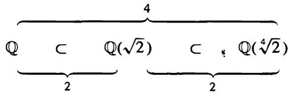

where $\mathbb { Q } ( { \sqrt { 2 } } ) / \mathbb { Q }$ and $\mathbb { Q } ( { \sqrt [ 4 ] { 2 } } ) / \mathbb { Q } ( { \sqrt { 2 } } )$ are both Galois extensions by Example 2 since both are quadratic extensions. This shows that a Galois extension of a Galois extension is not necessarily Galois.

(7) The extension of finite fields $\mathbb { F } _ { p ^ { n } } / \mathbb { F } _ { p }$ constructed after Proposition 13.37 is Galois by Corollary 6 since $\mathbb { F } _ { p ^ { n } }$ P is the splitting field over $\mathbb { F } _ { p }$ of the separable polynomial $x ^ { p ^ { n } } - x$ . It follows that the group of automorph�ms for this extension is of order n. The injective homomorphism

$$
\sigma : \mathbb {F} _ {p ^ {n}} \rightarrow \mathbb {F} _ {p ^ {n}}
$$

$$
\alpha \mapsto \alpha^ {p}
$$

of Proposition 13.35 is smjective in this case since $\mathbb { F } _ { p ^ { n } }$ is finite, hence is an isomorphism. This gives an automorphism of $\mathbb { F } _ { P ^ { n } }$ , called the Frobenius automorphism, which we shall denote by $\sigma _ { p }$ . Iterating $\sigma _ { p }$ we have $\sigma _ { p } ^ { 2 } ( \alpha ) = \sigma _ { p } ( \sigma _ { p } ( \alpha ) ) = ( \alpha ^ { p } ) ^ { p } = \alpha ^ { p ^ { 2 } }$ • Similarly we have

$$
\sigma_ {p} ^ {i} (\alpha) = \alpha^ {p ^ {i}} \qquad i = 0, 1, 2, \ldots
$$

Since $\pmb { \alpha } ^ { p ^ { n } } = \pmb { \alpha }$ , we see that $\sigma _ { p } ^ { p ^ { n } } = 1$ is the identity automorphism. No lower power of $\sigma _ { p }$ can be the identity, since this would imply $\pmb { \alpha } ^ { p ^ { i } } = \pmb { \alpha }$ for all $\pmb { \alpha } \in \mathbb { F } _ { p ^ { n } }$ for some $i < n ,$ , which is impossible since there are only $p ^ { i }$ roots of this equation. It follows that $\sigma _ { p }$ is of order n in the Galois group, which means that $\mathrm { G a l } ( \mathbb { F } _ { p ^ { n } } / \mathbb { F } _ { p } )$ is cyclic of order $\pmb { n }$ , with the Frobenius automorphism $\sigma _ { p }$ as generator.

(8) The inseparable extension $\mathbb { F } _ { 2 } ( x )$ P  over $\mathbb { F } _ { 2 } ( t )$ where $x ^ { 2 } - t = 0$ considered in Section 13.5 is not Galois. Any automorphism of this degree 2 extension is determined by its action on $x .$ , which must be sent to a root of the equation $x ^ { 2 } - t .$ . We have already seen that there is only one root of this equation (with multiplicity 2) since we are in a field of characteristic 2. Hence the extension has only the trivial automorphism. Note that $\mathbb { F } _ { 2 } ( x )$ is the splitting field for $x ^ { 2 } - t$ over $\mathbb { F } _ { 2 } ( t )$ , so this example shows the separability condition in Corollary 6 is necessary.

# E X E R C I S E S

1. (a) Show that if the field $\pmb { K }$ is generated over $\pmb { F }$ by the elements $\alpha _ { 1 } , \ldots , \alpha _ { n }$ then an automorphism $\sigma$ of $\pmb { K }$ fixing $\pmb { F }$ is uniquely determined by $\sigma ( \alpha _ { 1 } ) , \ldots , \sigma ( \alpha _ { n } )$ - In particular show that an automorphism fixes $\pmb { K }$ if and only if it fixes a set of generators for $\pmb { K }$ .

(b) Let $G \le \operatorname { G a l } ( K / F )$ b e a subgroup of the Galois group of the extension $K / F$ and suppose $\sigma _ { 1 } , . . . , \sigma _ { k }$ are generators for $\pmb { G }$ . Show that the subfield $E / F$ is fixed by $\pmb { G }$ if and only if it is fixed by the generators $\sigma _ { 1 } , \ldots , \sigma _ { k }$ .

2. Let $\pmb { \tau }$ be the map $\tau : \mathbb { C } \to \mathbb { C }$ defined by $\tau ( a + b i ) = a - b i$ (complex conjugation). Prove that $\pmb { \tau }$ is an automorphism of $\mathbb { C }$ .

3. Detennine the fixed field of complex conjugation on $\mathbb { C }$ .

4. Prove that $\mathbb { Q } ( { \sqrt { 2 } } )$ and $\mathbb { Q } ( { \sqrt { 3 } } )$ are not isomorphic.

5. Determine the automorphisms of the extension $\mathbb { Q } ( { \sqrt [ 4 ] { 2 } } ) / \mathbb { Q } ( { \sqrt { 2 } } )$ explicitly.

6. Let $\pmb { k }$ be a field.

(a) Show that the mapping $\varphi : k [ t ]  k [ t ]$ defined by $\varphi ( f ( t ) ) = f ( a t + b )$ for fixed a, $b \in k$ , $\pmb { a } \neq \mathbf { 0 }$ is an automorphism of k[t] which is the identity on $\pmb { k }$ . .,   
(b) Conversely, let $\varphi$ be an automorphism of $k [ t ]$ which is the identity on $\pmb { k }$ . Prove that there exist a, $b \in k$ with $\pmb { a } \neq \mathbf { 0 }$ such that $\varphi ( f ( t ) ) = f ( a t + b )$ as in (a).

7. This exercise detennines Au $( \mathbb { R } / \mathbb { Q } )$ .

(a) Prove that any $\sigma \in \mathsf { A u t } ( \mathbb { R } / \mathbb { Q } )$ takes squares to squares and takes positive reals to positive reals. Conclude that ${ a < b }$ implies $\sigma a < \sigma b$ for every a, $b \in \mathbb { R }$ .   
(b) Prove that $- \frac { 1 } { m } < a - b < \frac { 1 } { m }$ implies $- \frac { 1 } { m } < \sigma a - \sigma b < \frac { 1 } { m }$ for every positive integer m. Conclude that $\pmb { \sigma }$ is a continuous map on $\mathbb { R }$   
(c) Prove that any continuous map on $\mathbb { R }$ which is the identity on $\mathbf { \dot { \mathbb { Q } } }$ is the identity map, hence Aut $( \mathbb { R } / \mathbb { Q } ) = 1$ .

8. Prove that the automorphisms of the rational function field $k ( t )$ which fix $\pmb { k }$ are precisely the . fractional lineartransformations determmed by $t \mapsto { \frac { a t + b } { c t + d } } \operatorname { f o r } a , b , c , d \in k , a d - b c \neq 0$ (so $f ( t ) \in k ( t )$ maps to $f ( \frac { a t + b } { c t + d } )$ ( )ct + d ) (cf. Exercise 1 8 of Section 1 3.2).

9. Determine the fixed field of the automorphism $t \mapsto t + 1$ of $k ( t )$ .

10. Let $\pmb { K }$ be an extension of the field $F .$ . Let $\varphi : K \to K ^ { \prime }$ be an isomorphism of $\pmb { K }$ with a field $\pmb { K } ^ { \prime }$ which maps $\boldsymbol { F }$ to the subfield $F ^ { \prime }$ of $\pmb { K } ^ { \prime }$ . Prove that the map $\sigma \stackrel { - } { \mapsto } \varphi \sigma \varphi ^ { - 1 }$ defines a group isomorphism Aut $( K / F ) \stackrel { \sim } {  } \mathrm { A u t } ( K ^ { \prime } / F ^ { \prime } )$ .

# 1 4.2 THE FUNDAMENTAL THEOREM OF GALOIS THEORY

In the Galois extension $\mathbf { G a l } ( \mathbb { Q } ( { \sqrt { 2 } } , { \sqrt { 3 } } ) / \mathbb { Q } )$ considered in the previous section, there was a strong similarity between the diagram of subgroups of the Galois group:

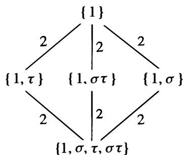

and the diagram of corresponding fixed fields

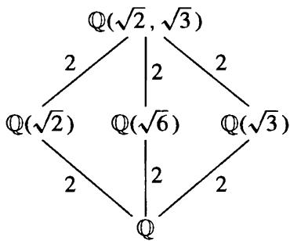

(we have inverted the lattice of subgroups because of the inclusion-reversing nature of the correspondence).

Note that this is also the diagram of all known subfields of the extension and that in this case each of the subfields is also a Galois extension of $\mathbb { Q }$ .

In a similar way there is a strong similarity between the diagram

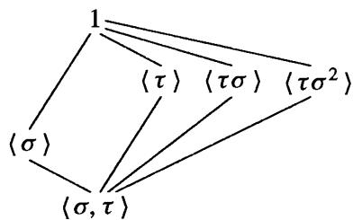

of subgroups of the Galois group and the diagram of known subfields for the splitting field of $x ^ { 3 } - 2$ :

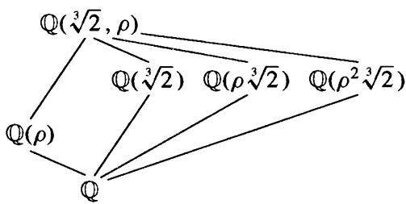

where the subfields in the second diagram are precisely the fixed fields of the subgroups in the first diagram.

Note in this pair of diagrams only the subgroup $\langle \sigma \rangle$ generated by $\pmb { \sigma }$ is normal in $\boldsymbol { s } _ { 3 }$ and that the subfield $\mathbb { Q } ( \rho )$ is the only subfield Galois over $\mathbb { Q }$ .

The Fundamental Theorem of Galois Theory states that the relations observed in the two examples above are not coincidental and hold for any Galois extension. Before proving this we first develop some preliminary results on group characters, of which field automorphisms give particular examples.

Definition. A character1 $\pmb { \chi }$ of a group $\pmb { G }$ with values in a field $\pmb { L }$ is a homomorphism from $\pmb { G }$ to the multiplicative group of $\pmb { L }$ :

$$
\chi : G \to L ^ {\times}
$$

i.e., $\chi ( g _ { 1 } g _ { 2 } ) = \chi ( g _ { 1 } ) \chi ( g _ { 2 } )$ for all $g _ { 1 } , g _ { 2 } \in G$ and $\chi ( g )$ i s a nonzero element of $\pmb { L }$ for all $g \in G$ .

Definition. The characters $\chi _ { 1 } , \chi _ { 2 } , \ldots , \chi _ { n }$ of $\pmb { G }$ are said to be linearly independent over $\pmb { L }$ if they are linearly independent as functions on $G ,$ , i.e., if there is no nontrivial relation

$$
a _ {1} \chi_ {1} + a _ {2} \chi_ {2} + \dots + a _ {n} \chi_ {n} = 0 \quad (a _ {1}, \dots , a _ {n} \in L \text {n o t a l l} 0) \tag {14.2}
$$

as a function on $\pmb { G }$ (that is, $a _ { 1 } \chi _ { 1 } ( g ) + a _ { 2 } \chi _ { 2 } ( g ) + \cdot \cdot \cdot + a _ { n } \chi _ { n } ( g ) = 0$ for all $g \in G$ ).

Theorem 7. (Linear Independence of Characters) If $\chi _ { 1 } , \chi _ { 2 } , \ldots , \chi _ { n }$ are distinct characters of $\pmb { G }$ with values in $\pmb { L }$ then they are linearly independent over $\pmb { L }$ .

Proof" Suppose the characters were linearly dependent. Among all the linear dependence relations (2) above, choose one with the minimal number m of nonzero coefficients $\pmb { a } _ { i }$ . We may suppose (by renumbering, if necessary) that the m nonzero coefficients are $a _ { 1 } , a _ { 2 } , \ldots , a _ { m }$ :

$$
a _ {1} \chi_ {1} + a _ {2} \chi_ {2} + \dots + a _ {m} \chi_ {m} = 0.
$$

Then for any $g \in G$ we have

$$
a _ {1} \chi_ {1} (g) + a _ {2} \chi_ {2} (g) + \dots + a _ {m} \chi_ {m} (g) = 0. \tag {14.3}
$$

Let ${ \pmb \mathrm { \varepsilon } } _ { \pmb { \varepsilon } } \mathbf { 0 }$ be an element with $\chi _ { 1 } ( g _ { 0 } ) \neq \chi _ { m } ( g _ { 0 } )$ (which exists, since $\chi _ { 1 } \neq \chi _ { m }$ )· Since (3) holds for every element of $\pmb { G }$ , in particular we have

$$
a _ {1} \chi_ {1} (g _ {0} g) + a _ {2} \chi_ {2} (g _ {0} g) + \dots + a _ {m} \chi_ {m} (g _ {0} g) = 0
$$

i.e.,

$$
a _ {1} \chi_ {1} (g _ {0}) \chi_ {1} (g) + a _ {2} \chi_ {2} (g _ {0}) \chi_ {2} (g) + \dots + a _ {m} \chi_ {m} (g _ {0}) \chi_ {m} (g) = 0. \tag {14.4}
$$

Multiplying equation (3) by $\chi _ { m } ( g _ { 0 } )$ and subtracting from equation (4) we obtain

$$
\begin{array}{l} [ \chi_ {m} (g _ {0}) - \chi_ {1} (g _ {0}) ] a _ {1} \chi_ {1} (g) + [ \chi_ {m} (g _ {0}) - \chi_ {2} (g _ {0}) ] a _ {2} \chi_ {2} (g) + \dots \\ + \left[ \chi_ {m} (g _ {0}) - \chi_ {m - 1} (g _ {0}) \right] a _ {m - 1} \chi_ {m - 1} (g) = 0, \\ \end{array}
$$

which holds for all $g \in G$ . But the first coefficient is nonzero and this is a relation with fewer nonzero coefficients, a contradiction.

Consider now an injective homomorphism $\pmb { \sigma }$ of a field $\pmb { K }$ into a field $L ,$ called an embedding of $\pmb { K }$ into $\pmb { L }$ . Then in particular $\pmb { \sigma }$ is a homomorphism of the multiplicative group $G = K ^ { \times }$ into the multiplicative group $L ^ { \times }$ , so a may be viewed as a character of $\pmb { K } ^ { \times }$ with values in L. Note also that this character contains all of the useful information about the values of $\pmb { \sigma }$ viewed simply as a function on $\pmb { K } ,$ , since the only point of $\pmb { K }$ not considered in $\pmb { K } ^ { \times }$ is 0, and we know $\pmb { \sigma }$ maps 0 to 0.

Corollary 8. If $\sigma _ { 1 }$ $\sigma _ { 1 } , \sigma _ { 2 } , \ldots , \sigma _ { n }$ are distinct embeddings of a field $\pmb { K }$ into a field $L$ , then they are linearly independent as functions on $\pmb { K }$ . In particular distinct automorphisms of a field $\pmb { K }$ are linearly independent as functions on $\pmb { K }$ .

We now use Corollary 8 to prove the fundamental relation between the orders of subgroups of the automorphism group of a field $\pmb { K }$ and the degrees of the extensions over their fixed fields.

Theorem 9. Let $G = \{ \sigma _ { 1 } = 1 , \sigma _ { 2 } , \ldots , \sigma _ { n } \}$ be a subgroup of automorphisms of a field $\pmb { K }$ and let $F$ be the fixed field. Then

$$
[ K: F ] = n = | G |.
$$

Proof" Suppose first that $n > [ K : F ]$ and let $\omega _ { 1 } , \omega _ { 2 } , \ldots , \omega _ { m }$ $\omega _ { m }$ be a basis for $\pmb { K }$ over F $m = [ K : F ] )$ . Then the system

$$
\sigma_ {1} \left(\omega_ {1}\right) x _ {1} + \sigma_ {2} \left(\omega_ {1}\right) x _ {2} + \dots + \sigma_ {n} \left(\omega_ {1}\right) x _ {n} = 0
$$

$$
\sigma_ {1} \left(\omega_ {m}\right) x _ {1} + \sigma_ {2} \left(\omega_ {m}\right) x _ {2} + \dots + \sigma_ {n} \left(\omega_ {m}\right) x _ {n} = 0
$$

of m equations in $\pmb { n }$ unknowns $x _ { 1 }$ $x _ { 1 } , x _ { 2 } , \ldots , x _ { n }$ has a nontrivial solution $\beta _ { 1 } , \beta _ { 2 } , \ldots , \beta _ { n }$ in $\pmb { K }$ since by assumption there are more unknowns than equations.

Let $a _ { 1 } , a _ { 2 } , \ldots , a _ { m }$ be $\pmb { m }$ arbitrary elements of $\pmb { F }$ . The field $F$ is by definition fixed by $\sigma _ { 1 } , . . . , \sigma _ { n }$ so each of these elements is fixed by every $\sigma _ { i }$ , i . e . , $\sigma _ { i } ( a _ { j } ) = a _ { j }$ , $i = 1 , 2 , \ldots , n , j = 1 , 2 , \ldots , m$ $j = 1$ . Multiplying the first equation above by $\pmb { a _ { 1 } }$ . the second by $\mathbf { \delta } _ { a _ { 2 } }$ , . . . , the last by $a _ { m }$ then gives the system of equations

$$
\sigma_ {1} \left(a _ {1} \omega_ {1}\right) \beta_ {1} + \sigma_ {2} \left(a _ {1} \omega_ {1}\right) \beta_ {2} + \dots + \sigma_ {n} \left(a _ {1} \omega_ {1}\right) \beta_ {n} = 0
$$

$$
\sigma_ {1} \left(a _ {m} \omega_ {m}\right) \beta_ {1} + \sigma_ {2} \left(a _ {m} \omega_ {m}\right) \beta_ {2} + \dots + \sigma_ {n} \left(a _ {m} \omega_ {m}\right) \beta_ {n} = 0.
$$

Adding these equations we see that there are elements $\beta _ { 1 } , \ldots , \beta _ { n }$ in $\pmb { K }$ , not all 0, satisfying

$$
\sigma_ {1} \left(a _ {1} \omega_ {1} + a _ {2} \omega_ {2} + \dots + a _ {m} \omega_ {m}\right) \beta_ {1} + \dots + \sigma_ {n} \left(a _ {1} \omega_ {1} + a _ {2} \omega_ {2} + \dots + a _ {m} \omega_ {m}\right) \beta_ {n} = 0
$$

for all choices of $a _ { 1 } , \ldots , a _ { m }$ in $F$ . Since $\omega _ { 1 } , \ldots , \omega _ { m }$ is an $\pmb { F }$ -basis for $\pmb { K }$ , every $\alpha \in K$ is of the form $a _ { 1 } \omega _ { 1 } + a _ { 2 } \omega _ { 2 } + \cdot \cdot \cdot + a _ { m } \omega _ { m }$ , so the previous equation means

$$
\sigma_ {1} (\alpha) \beta_ {1} + \dots + \sigma_ {n} (\alpha) \beta_ {n} = 0
$$

for all $\textbf { \em { \alpha } } \in \textbf { \em K }$ . But this means the distinct automorphisms $\sigma _ { 1 } , \ldots , \sigma _ { n }$ are linearly dependent over $\pmb { K }$ , contradicting Corollary 8.

We have proved $n \le [ K : F ]$ . Note that we have so far not used the fact that $\sigma _ { 1 } , \sigma _ { 2 } , \ldots , \sigma _ { n }$ are the elements of a group.

Suppose now that $n < [ K : F ] .$ . Then there are more than n $\pmb { F }$ -linearly independent elements of $\pmb { K }$ , say ${ \pmb { \alpha } } _ { 1 }$ $\alpha _ { 1 } , \ldots , \alpha _ { n + 1 }$ $\pmb { \alpha _ { n + 1 } }$ · The system

$$
\sigma_ {1} (\alpha_ {1}) x _ {1} + \sigma_ {1} (\alpha_ {2}) x _ {2} + \dots + \sigma_ {1} (\alpha_ {n + 1}) x _ {n + 1} = 0
$$

( 1 4.5)

$$
\sigma_ {n} (\alpha_ {1}) x _ {1} + \sigma_ {n} (\alpha_ {2}) x _ {2} + \dots + \sigma_ {n} (\alpha_ {n + 1}) x _ {n + 1} = 0
$$

of n equations in $n + 1$ unknowns $x _ { 1 } , \ldots , x _ { n + 1 }$ has a solution $\beta _ { 1 } , \ldots , \beta _ { n + 1 }$ in $\pmb { K }$ where not all the $\beta _ { i }$ $\beta _ { i } , i = 1 , 2 , \ldots , n + 1$ are 0. If all the elements of the solution $\beta _ { 1 } , \ldots , \beta _ { n + 1 }$ $\beta _ { 1 }$ were elements of $\pmb { F }$ then the first equation (recall $\sigma _ { 1 } = 1$ is the identity automorphism) would contradict the linear independence over $F$ of $\alpha _ { 1 } , \alpha _ { 2 } , \ldots , \alpha _ { n + 1 }$ · Hence at least one $\beta _ { i } , i = 1 , 2 , \ldots , n + 1 ,$ , is not an element of $\pmb { F }$ .

Among all the nontrivial solutions $( \beta _ { 1 } , \ldots , \beta _ { n + 1 } )$ of the system (5) choose one with the minimal number $r$ of nonzero $\beta _ { i }$ . By renumbering if necessary we may assume $\beta _ { 1 } , \ldots , \beta _ { r }$ are nonzero. Dividing the equations by $\beta _ { r }$ we may also assume $\beta _ { r } = 1$ . We have already seen that at least one of $\beta _ { 1 } , \ldots , \beta _ { r - 1 }$ • 1 is not an element of $\pmb { F }$ (which shows in particular that $r > 1 \AA _ { , }$ ), say $\beta _ { 1 } \notin F$ . Then our system of equations reads

$$
\sigma_ {1} (\alpha_ {1}) \beta_ {1} + \dots + \sigma_ {1} (\alpha_ {r - 1}) \beta_ {r - 1} + \sigma_ {1} (\alpha_ {r}) = 0
$$

( 1 4.6)

$$
\sigma_ {n} (\alpha_ {1}) \beta_ {1} + \dots + \sigma_ {n} (\alpha_ {r - 1}) \beta_ {r - 1} + \sigma_ {n} (\alpha_ {r}) = 0
$$

or more briefly

$$
\sigma_ {i} \left(\alpha_ {1}\right) \beta_ {1} + \dots + \sigma_ {i} \left(\alpha_ {r - 1}\right) \beta_ {r - 1} + \sigma_ {i} \left(\alpha_ {r}\right) = 0 \quad i = 1, 2, \dots , n. \tag {14.7}
$$

Since $\beta _ { 1 } \notin F$ , there is an automorphism $\sigma _ { k _ { 0 } }$ $( k _ { 0 } \in \{ 1 , 2 , \ldots , n \} )$ with $\sigma _ { k _ { 0 } } \beta _ { 1 } \neq \beta _ { 1 }$ . If we apply the automorphism $\sigma _ { k _ { 0 } }$ to the equations in (6), we obtain the system of equations

$$
\sigma_ {k _ {0}} \sigma_ {j} (\alpha_ {1}) \sigma_ {k _ {0}} (\beta_ {1}) + \dots + \sigma_ {k _ {0}} \sigma_ {j} (\alpha_ {r - 1}) \sigma_ {k _ {0}} (\beta_ {r - 1}) + \sigma_ {k _ {0}} \sigma_ {j} (\alpha_ {r}) = 0 \tag {14.8}
$$

for $j = 1 , 2 , \dots , n .$ . But the elements

$$
\sigma_ {k _ {0}} \sigma_ {1}, \sigma_ {k _ {0}} \sigma_ {2}, \dots , \sigma_ {k _ {0}} \sigma_ {n}
$$

are the same as the elements

$$
\sigma_ {1}, \sigma_ {2}, \dots , \sigma_ {n}
$$

in some order since these elements form a group. In other words, if we define the index i by $\sigma _ { k _ { 0 } } \sigma _ { j } = \sigma _ { i }$ then i and $j$ both run over the set $\{ 1 , 2 , \ldots , n \}$ . Hence the equations in (8) can be written

$$
\sigma_ {i} \left(\alpha_ {1}\right) \sigma_ {k _ {0}} \left(\beta_ {1}\right) + \dots + \sigma_ {i} \left(\alpha_ {r - 1}\right) \sigma_ {k _ {0}} \left(\beta_ {r - 1}\right) + \sigma_ {i} \left(\alpha_ {r}\right) = 0. \tag {14.8'}
$$

If we now subtract the equations in $( { \pmb 8 } ^ { \prime } )$ from those in (7) we obtain the system

$$
\sigma_ {i} \left(\alpha_ {1}\right) \left[ \beta_ {1} - \sigma_ {k _ {0}} \left(\beta_ {1}\right) \right] + \dots + \sigma_ {i} \left(\alpha_ {r - 1}\right) \left[ \beta_ {r - 1} - \sigma_ {k _ {0}} \left(\beta_ {r - 1}\right) \right] = 0
$$

for $i = 1 , 2 , \ldots , n .$ . But this is a solution to the system of equations (5) with

$$
x _ {1} = \beta_ {1} - \sigma_ {k _ {0}} (\beta_ {1}) \neq 0
$$

(by the choice of $k _ { 0 }$ ), hence is nontrivial and has fewer than r nonzero $x _ { i }$ . This is a contradiction and completes the proof.

Our first use of this result is to prove that the inequality of Proposition 5 holds for any finite extension $K / F$ .

Corollary 10. Let $K / F$ be any finite extension. Then

$$
\left| \operatorname {A u t} (K / F) \right| \leq [ K: F ]
$$

with equality if and only if $F$ is the fixed field of Aut $( K / F )$ . Put another way, $K / F$ is Galois if and only if $F$ is the fixed field of Aut $( K / F )$ .

Proof" Let $F _ { 1 }$ be the fixed field of Au $( K / F )$ , so that

$$
F \subseteq F _ {1} \subseteq K.
$$

By Theorem 9, $[ K : F _ { 1 } ] = | \mathbf { A u t } ( K / F ) |$ . Hence $[ K : F ] = | \mathrm { { A u t } } ( K / F ) | [ F _ { 1 } : F ] ,$ which proves the corollary.

Corollary 11. Let $G$ be a finite subgroup of automorphisms of a field $\pmb { K }$ and let $F$ be the fixed field. Then every automorphism of $\pmb { K }$ fixing $F$ is contained in $G ,$ , i.e., $\operatorname { A u t } ( K / F ) = G$ , so that $K / F$ is Galois, with Galois group $G$ .

Proof" By definition $F$ is fixed by all the elements of $G$ so we have $G \leq \mathrm { A u t } ( K / F )$ (and the question is whether there are any automorphisms of $\pmb { K }$ fixing $F$ not in $G$ i.e., whether this containment is proper). Hence $| G | \leq | \mathbf { A u t } ( K / F ) |$ . By the theorem we have $| G | = [ K : F ]$ and by the previous corollary $| \mathrm { A u t } ( K / F ) | \le [ K : F ]$ . This gives

$$
[ K: F ] = | G | \leq | \operatorname {A u t} (K / F) | \leq [ K: F ]
$$

and it follows that we must have equalities throughout, proving the corollary.

Corollary 12. If $G _ { 1 } \neq G _ { 2 }$ are distinct finite subgroups of automorphisms of a field $\pmb { K }$ then their fixed fields are also distinct.

Proof: Suppose $F _ { 1 }$ is the fixed field of $G _ { 1 }$ and $F _ { 2 }$ is the fixed field of $G _ { 2 }$ • If $F _ { 1 } = F _ { 2 }$ then by definition $F _ { 1 }$ is fixed by $G _ { 2 }$ • By the previous corollary any automorphism fixing $F _ { 1 }$ is contained in $G _ { 1 }$ , hence $G _ { 2 } \leq G _ { 1 }$ . Similarly $G _ { 1 } \leq G _ { 2 }$ and so $G _ { 1 } = G _ { 2 }$ .

By the corollaries above we see that taking the fixed fields for distinct finite subgroups of Aut(K) gives distinct subfields of $\pmb { K }$ over which $\pmb { K }$ is Galois. Further, the degrees of the extensions are given by the orders of the subgroups. We saw this explicitly for the fields $\pmb { K } = \mathbb { Q } ( \sqrt { 2 } , \sqrt { 3 } )$ and $\pmb { K } = \mathbb { Q } ( \sqrt [ 3 ] { 2 } , \rho )$ above. A portion of the Fundamental Theorem states that these are all the subfields of $\pmb { K }$ .

The next result provides the converse of Proposition 5 and characterizes Galois extensions.

Theorem 13. The extension $K / F$ is Galois if and only if $\pmb { K }$ is the splitting field of some separable polynomial over $\pmb { F }$ . Furthermore, if this is the case then every irreducible polynomial with coefficients in $F$ which has a root in $\pmb { K }$ is separable and has all its roots in $\pmb { K }$ (so in particular $K / F$ is a separable extension).

Proof" Proposition 5 proves that the splitting field of a separable polynomial is Galois.

We now show that if $K / F$ is Galois then every irreducible polynomial $p ( { \pmb x } )$ in $F [ x ]$ having a root in $\pmb { K }$ splits completely in $\pmb { K }$ . Set $G = { \mathrm { G a l } } ( K / F )$ . Let $\alpha \in K$ be a root of $p ( { \pmb x } )$ and consider the elements

$$
\alpha , \sigma_ {2} (\alpha), \dots , \sigma_ {n} (\alpha) \in K \tag {14.9}
$$

where $\{ 1 , \sigma _ { 2 } , \ldots , \sigma _ { n } \}$ are the elements of $\operatorname { G a l } ( K / F )$ . Let

$$
\alpha , \alpha_ {2}, \alpha_ {3}, \dots , \alpha_ {r}
$$

denote the distinct elements in (9). If $\tau \in G$ then since $\pmb { G }$ is a group the elements $\{ \tau , \tau \sigma _ { 2 } , \ldots , \tau \sigma _ { n } \}$ are the same as the elements $\{ 1 , \sigma _ { 2 } , \ldots , \sigma _ { n } \}$ in some order. It follows that applying $\tau \in G$ to the elements in (9) simply permutes them, so in particular applying $\pmb { \tau }$ to $\alpha , \alpha _ { 2 } , \alpha _ { 3 } , \ldots , \alpha _ { r }$ also permutes these elements. The polynomial

$$
f (x) = (x - \alpha) (x - \alpha_ {2}) \dots (x - \alpha_ {r})
$$

therefore has coefficients which are fixed by all the elements of $\pmb { G }$ since the elements of $\pmb { G }$ simply permute the factors. Hence the coefficients lie in the fixed field of $G ,$ , which by Corollary 10 is the field $F$ . Hence $f ( x ) \in F [ x ] .$ .

Since $p ( { \pmb x } )$ is irreducible and has $\pmb { \alpha }$ as a root, $p ( { \pmb x } )$ is the minimal polynomial for $\pmb { \alpha }$ over $F$ , hence divides any polynomial with coefficients in $F$ having $\pmb { \alpha }$ as a root (this is Proposition 1 3.9). It follows that $p ( { \pmb x } )$ divides $f ( x )$ in $F [ x ]$ and since $f ( x )$ obviously divides $p ( { \pmb x } )$ in $K [ x ]$ by Proposition 2, we have

$$
p (x) = f (x).
$$

I n particular, this shows that $p ( { \pmb x } )$ i s separable and that all i ts roots lie in $\pmb { K }$ (in fact they are among the elements $\alpha , \sigma _ { 2 } \alpha , \ldots , \sigma _ { n } \alpha \ ,$ $\sigma _ { n } \pmb { \alpha }$ ), proving the last statement of the theorem.

To complete the proof, suppose $K / F$ is Galois and let $\omega _ { 1 } , \omega _ { 2 } , \ldots , \omega _ { n }$ $\omega _ { 1 }$ $\omega _ { n }$ be a basis for $K / F$ . Let $p _ { i } ( x )$ be the minimal polynomial for $\omega _ { i }$ over $F$ , $i = 1 , 2 , \ldots , n$ . Then by what we have just proved, $p _ { i } ( x )$ is separable and has all its roots in $\pmb { K }$ . Let $g ( { \pmb x } )$ be the polynomial obtained by removing any multiple factors in the product $p _ { 1 } ( x ) \cdots p _ { n } ( x )$ (the "squarefree part"). Then the splitting field of the two polynomials is the same and this field is $\pmb { K }$ (all the roots lie in $\pmb { K }$ , so $\pmb { K }$ contains the splitting field, but $\omega _ { 1 }$ , w2 , . . . , Wn are among the roots, so the splitting field contains $\pmb { K }$ ). Hence $\pmb { K }$ is the splitting field of the separable polynomial $g ( { \pmb x } )$ .

Definition. Let $K / F$ be a Galois extension. If $\alpha \in K$ the elements $\pmb { \sigma } \pmb { \alpha }$ for $\pmb { \sigma }$ in $\operatorname { G a l } ( K / F )$ are called the conjugates (or Galois conjugates) of $\pmb { \alpha }$ over $F .$ . If $E$ is a subfield of $\pmb { K }$ containing $F$ , the field $\pmb { \sigma } ( E )$ is called the conjugate field of $E$ over $F$ .

The proof of the theorem shows that in a Galois extension $K / F$ the other roots of the minimal polynomial over $F$ of any element $\alpha \in K$ are precisely the distinct conjugates of $\pmb { \alpha }$ under the Galois group of $K / F$ .

The second statement in this theorem also shows that $\pmb { K }$ is not Galois over $F$ if we can find even one irreducible polynomial over $\pmb { F }$ having a root in $\pmb { K }$ but not having all its roots in K. This justifies in a very strong sense the intuition from earlier examples that Galois extensions are extensions with "enough" distinct roots of irreducible polynomials (namely, if it contains one root then it contains all the roots).

Finally, notice that we now have 4 characterizations of Galois extensions $K / F$

(1) splitting fields of separable polynomials over $F$   
(2) fields where $F$ is precisely the set of elements fixed by $\mathsf { A u t } ( K / F )$ (in general, the fixed field may be larger than $F$ )   
(3) fields with $[ K : F ] = | \mathbf { A u t } ( K / F ) |$ (the original definition)   
(4) finite, normal and separable extensions.

Theorem 14. (Fundamental Theorem of Galois Theory) Let $K / F$ be a Galois extension and set $G = { \mathrm { G a l } } ( K / F )$ . Then there is a bijection

$$
\left\{ \begin{array}{c c} & K \\ \text {s u b f i e l d s} E & | \\ \text {o f} K & E \\ \text {c o n t a i n i n g} F & | \\ & F \end{array} \right\} \quad \longleftrightarrow \quad \left\{ \begin{array}{c c} & 1 \\ \text {s u b g r o u p s} H & | \\ \text {o f} G & H \\ & | \\ & G \end{array} \right\}
$$

given by the correspondences

$$
E \quad \longrightarrow \quad \left\{ \begin{array}{c} \text {t h e e l e m e n t s o f G} \\ \text {f i x i n g E} \end{array} \right\}
$$

$$
\left\{ \begin{array}{c} \text {t h e f i x e d f i e l d} \\ \text {o f} H \end{array} \right\} \quad \longleftarrow \qquad H
$$

which are inverse to each other. Under this correspondence,

(1) (inclusion reversing) If $E _ { 1 }$ , $E _ { 2 }$ correspond to $H _ { 1 }$ , $H _ { 2 }$ , respectively, then $E _ { 1 } \subseteq E _ { 2 }$ if and only if $H _ { 2 } \leq H _ { 1 }$   
(2) $[ K : E ] = | H |$ and $[ E : F ] = | G : H |$ , the index of $H$ in $G$ :

$$
\begin{array}{c c c} K & & \\ | & \} & | H | \\ E & & \\ | & \} & | G: H | \\ F & & \end{array}
$$

(3) $K / E$ is always Galois, with Galois group $\mathrm { { G a l } } ( K / E ) = H$

$$
\begin{array}{c c} K & \\ \mid & H \\ E & \end{array}
$$

( 4) $E$ is Galois over $F$ if and only if $H$ is a normal subgroup in $G$ . If this is the case, then the Galois group is isomorphic to the quotient group

$$
\operatorname {G a l} (E / F) \cong G / H.
$$

More generally, even if $H$ is not necessarily normal in $\pmb { G }$ , the isomorphisms of $E$ (into a fixed algebraic closure of $F$ containing $\pmb { K }$ ) which fix $F$ are in one to one correspondence with the cosets $\{ \sigma H \}$ of $H$ in $\pmb { G }$ .

(5) I f $E _ { 1 }$ , $E _ { 2 }$ correspond to $H _ { 1 }$ , $H _ { 2 }$ , respectively, then the intersection $E _ { 1 } \cap E _ { 2 }$ corresponds to the group $\langle H _ { 1 } , H _ { 2 } \rangle$ generated by $H _ { 1 }$ and $H _ { 2 }$ and the composite field $E _ { 1 } E _ { 2 }$ corresponds to the intersection $H _ { 1 } \cap H _ { 2 }$ • Hence the lattice of subfields

of $\pmb { K }$ containing $\pmb { F }$ and the lattice of subgroups of $\pmb { G }$ are "dual" (the lattice diagram for one is the lattice diagram for the other turned upside down).

Proof" Given any subgroup $H$ of $\pmb { G }$ we obtain a unique fixed field $E = K _ { H }$ by Corollary 12. This shows that the correspondence above is injective from right to left.

If $\pmb { K }$ is the splitting field of the separable polynomial $f ( x ) \in F [ x ]$ then we may also view $f ( x )$ as an element of $E [ x ]$ for any subfield $E$ of $\pmb { K }$ containing $F _ { \ast }$ . Then $\pmb { K }$ is also the splitting field of $f ( x )$ over $E$ , so the extension $K / E$ is Galois. By Corollary 1 0, $E$ is the fixed field of Aut $( K / E ) \le G$ , showing that every subfield of $\pmb { K }$ containing $F$ arises as the fixed field for some subgroup of $G .$ . Hence the correspondence above is surjective from right to left, hence a bijection. The correspondences are inverse to each other since the automorphisms fixing $E$ are precisely $\mathbf { A u t } ( K / E )$ by Corollary 10.

We have already seen that the Galois correspondence is inclusion reversing in Proposition 4, which gives (1 ).

If $E = K _ { H }$ is the fixed field of $H _ { \mathrm { { ; } } }$ , then Theorem 9 gives $[ K : E ] = | H |$ and $[ K : F ] = | G |$ . Taking the quotient gives $[ E : F ] = | G : H |$ , which proves (2).

Corollary 1 1 gives (3) immediately.

Suppose $E = K _ { H }$ is the fixed field of the subgroup $H$ . Every $\sigma \in G = \mathbf { G a l } ( K / F )$ when restricted to $E$ is an embedding ${ \pmb { \sigma } } | _ { E }$ of $E$ with the sub field $\sigma ( E )$ of $\pmb { K }$ . Conversely, let $\tau : E \stackrel { \sim } { \to } \tau ( E ) \subseteq \overline { { F } }$ be any embedding of $E$ (into a fixed algebraic closure $\overline { F }$ of $F$ containing $K _ { \cdot }$ ) which fixes $F$ . Then $\tau ( E )$ is in fact contained in $\pmb { K }$ : if $\alpha \in E$ has minimal polynomial $m _ { \alpha } ( x )$ over $F$ then $\pmb { \tau } ( \pmb { \alpha } )$ is another root of $m _ { \alpha } ( x )$ and $\pmb { K }$ contains all these roots by Theorem 13. As above $\pmb { K }$ is the splitting field of $f ( x )$ over $E$ and so also the splitting field of $\tau f ( x )$ (which is the same as $f ( x )$ since $f ( x )$ has coefficients in $\pmb { F }$ ) over $\tau ( E )$ . Theorem 13.27 on extending isomorphisms then shows that we can extend $\pmb { \tau }$ to an isomorphism $\sigma$ :

$$
\begin{array}{c c c c} \sigma : & K & \stackrel {{\sim}} {{\longrightarrow}} & K \\ & | & & | \\ \tau : & E & \stackrel {{\sim}} {{\longrightarrow}} & \tau (E). \end{array}
$$

Since $\sigma$ fixes $F$ (because $\pmb { \tau }$ does), it follows that every embedding $\pmb { \tau }$ of $E$ fixing $\pmb { F }$ is the restriction to $E$ of some automorphism $\pmb { \sigma }$ of $\pmb { K }$ fixing $F .$ , in other words, every embedding of $E$ is of the form ${ \pmb { \sigma } } \{ _ { E }$ for some $\sigma \in G$ .

Two automorphisms $\sigma$ , $\pmb { \sigma } ^ { \prime } \in G$ restrict to the same embedding of $E$ if and only if ${ \boldsymbol { \sigma } } ^ { - 1 } { \boldsymbol { \sigma } } ^ { \prime }$ is the identity map on $E$ . But then $\pmb { \sigma } ^ { - 1 } \pmb { \sigma } ^ { \prime } \in H$ (i.e., ${ \pmb { \sigma } } ^ { \prime } \in \sigma H )$ ) since by (3) the automorphisms of $\pmb { K }$ which fix $E$ are precisely the elements in $H$ . Hence the distinct embeddings of $E$ are in bijection with the cosets $\sigma H$ of $H$ in $G .$ . In particular this gives

$$
| \operatorname {E m b} (E / F) | = [ G: H ] = [ E: F ]
$$

where $\operatorname { E m b } ( E / F )$ denotes the set of embeddings of $E$ (into a fixed algebraic closure of $F$ ) which fix $\boldsymbol { F }$ . Note that $\operatorname { E m b } ( E / F )$ contains the automorphisms Aut $( E / F )$ .

The extension $E / F$ will be Galois if and only if $| \mathbf { A u t } ( E / F ) | = [ E : F ]$ . By the equality above, this will be the case if and only if each ofthe embeddings of $\pmb { { \cal E } }$ is actually an automorphism of $E _ { i }$ , i.e., if and only if $\sigma ( E ) = E$ for every $\sigma \in G$ .

I f $\sigma \in G$ , then the subgroup of $G$ fixing the field $\sigma ( E )$ i s the group $\sigma H \sigma ^ { - 1 }$ , i . e . ,

$$
\sigma_ {\cdot} (E) = K _ {\sigma H \sigma^ {- 1}}.
$$

To see this observe that if $\sigma \alpha \in \sigma ( E )$ then

$$
(\sigma h \sigma^ {- 1}) (\sigma \alpha) = \sigma (h \alpha) = \sigma \alpha \quad \text {f o r a l l} h \in H,
$$

since $\pmb { h }$ fixes $\alpha \in E$ , which shows that $\pmb { \sigma } \pmb { H } \pmb { \sigma } ^ { - 1 }$ fixes $\sigma ( E )$ . The group fixing $\sigma ( E )$ has order equal to the degree of $\pmb { K }$ over $\pmb { \sigma } ( E )$ . But this is the same as the degree of $\pmb { K }$ over $E$ since the fields are isomorphic, hence the same as the order of $H$ . Hence $\pmb { \sigma } \pmb { H } \pmb { \sigma } ^ { - 1 }$ is precisely the group fixing $\sigma ( E )$ since we have shown containment and their orders are the same.

Because of the bijective nature of the Galois correspondence already proved we know that two sub fields of $\pmb { K }$ containing $\pmb { F }$ are equal if and only if their fixing subgroups are equal in $\pmb { G }$ . Hence $\sigma ( E ) = E$ for all $\sigma \in G$ if and only if $\sigma H \sigma ^ { - 1 } \overset { } { = } H$ for all ${ \pmb { \sigma } } \in { \pmb { G } }$ , in other words $E$ is Galois over $\pmb { F }$ if and only if $\pmb { H }$ is a normal subgroup of $\pmb { G }$ .

We have already identified the embeddings of $E$ over $\pmb { F }$ as the set of cosets of H in $\pmb { G }$ and when $H$ is normal in $G$ seen that the embeddings are automorphisms. It follows that in this case the group of cosets $G / H$ is identified with the group of automorphisms of the Galois extension $E / F$ by the definition of the group operation (composition of automorphisms). Hence $G / H \cong \mathbf { G a l } ( E / F )$ when $H$ is normal in $G$ , which completes the proof of (4).

Suppose $H _ { 1 }$ is the subgroup of elements of $\pmb { G }$ fixing the subfield $E _ { 1 }$ and $H _ { 2 }$ is the subgroup of elements of $G$ fixing the subfield $E _ { 2 }$ . Any element in $H _ { 1 } \cap H _ { 2 }$ fixes both $E _ { 1 }$ and $E _ { 2 }$ , hence fixes every element in the composite $E _ { 1 } E _ { 2 }$ , since the elements in this field are algebraic combinations of the elements of $E _ { 1 }$ and $E _ { 2 }$ . Conversely, if an automorphism $\pmb { \sigma }$ fixes the composite $E _ { 1 } E _ { 2 }$ then in particular $\pmb { \sigma }$ fixes $E _ { 1 }$ , i.e. , $\sigma \in H _ { 1 }$ , and $\pmb { \sigma }$ fixes $E _ { 2 }$ , i.e., $\sigma \in H _ { 2 }$ , hence $\sigma \in H _ { 1 } \cap H _ { 2 }$ . This proves that the composite $E _ { 1 } E _ { 2 }$ corresponds to the intersection $H _ { 1 } \cap H _ { 2 }$ . Similarly, the intersection $E _ { 1 } \cap E _ { 2 }$ corresponds to the group $\langle H _ { 1 } , H _ { 2 }$ ) generated by $H _ { 1 }$ and $H _ { 2 }$ , completing the proof of the theorem.

# Example: $( \mathbb { Q } ( { \sqrt { 2 } } , { \sqrt { 3 } } )$ and $\mathbb { Q } ( \sqrt [ 3 ] { 2 } , \rho ) )$

We have already seen examples of this theorem at the beginning of this section. We now see that the diagrams of subfields for the two fields $\mathbb { Q } ( { \sqrt { 2 } } , { \sqrt { 3 } } )$ and $\mathbb { Q } ( \sqrt [ 3 ] { 2 } , \rho )$ given before indicate all the subfields for these two fields.

Since every subgroup of the Klein 4-group is normal, all the subfields of $\mathbb { Q } ( { \sqrt { 2 } } , { \sqrt { 3 } } )$ are Galois extensions of $\mathbb { Q } .$ .

Similarly, since the only nontrivial normal subgroup of $s _ { 3 }$ is the subgroup of order 3, we see that only the subfield $\mathbb { Q } ( \rho )$ of $\pmb { K } = \mathbb { Q } ( \sqrt [ 3 ] { 2 } , \bar { \rho } )$ is Galois over $\mathbb { Q }$ , with Galois group isomorphic to $S _ { 3 } / \langle \sigma \rangle$ , i.e., the cyclic group of order 2. For example, the nontrivial automorphism of $\mathbb { Q } ( \boldsymbol { \rho } )$ is induced by restricting any element (r, for instance) in the nontrivial coset of $\langle \sigma \rangle$ to $\mathbb { Q } ( \boldsymbol { \rho } )$ ). This is clear from the explicit descriptions of these automorphisms given before - each of the elements r, ra, $\scriptstyle \tau \sigma ^ { 2 }$ in this coset map $\pmb { \rho }$ to $\rho ^ { 2 }$ . The restrictions of the elements of $\operatorname { G a l } ( K / \mathbb { Q } )$ to the (non-Galois) cubic subfields do not give automorphisms of these fields in general, rather giving isomorphisms of these fields with each other, in accordance with (4) of the theorem.

# Example: $( \mathbb { Q } ( { \sqrt { 2 } } + { \sqrt { 3 } } ) )$

Consider the field $\mathbb { Q } ( { \sqrt { 2 } } + { \sqrt { 3 } } )$ . This is clearly a subfield of the Galois extension $\mathbb { Q } ( { \sqrt { 2 } } , { \sqrt { 3 } } )$ . The other roots of the minimal polynomial for $\sqrt { 2 } + \sqrt { 3 }$ over $\mathbb { Q }$ are therefore

the distinct conjugates of $\sqrt { 2 } + \sqrt { 3 }$ under the Galois group. The conjugates are

$$
\pm \sqrt {2} \pm \sqrt {3}
$$

which are easily seen to be distinct. The minimal polynomial is therefore

$$
[ x - (\sqrt {2} + \sqrt {3}) ] [ x - (\sqrt {2} - \sqrt {3}) ] [ x - (- \sqrt {2} + \sqrt {3}) ] [ x - (- \sqrt {2} - \sqrt {3}) ]
$$

which is quickly computed to be the polynomial $x ^ { 4 } - 1 0 x ^ { 2 } + 1$ . It follows that this polynomial is irreducible and that

$$
\mathbb {Q} (\sqrt {2}, \sqrt {3}) = \mathbb {Q} (\sqrt {2} + \sqrt {3}),
$$

either by degree considerations or by noting that only the automorphism I of $\{ 1 , \sigma , \tau , \sigma \tau \}$ fixes $\sqrt { 2 } + \sqrt { 3 }$ so the fixing group for this field is the same as for $\mathbb { Q } ( { \sqrt { 2 } } , { \sqrt { 3 } } )$ .

# Example: (Splitting Field of $\pmb { x } ^ { 8 } - 2 )$

The splitting field of $x ^ { 8 } - 2$ over $\mathbb { Q }$ is generated by $\theta = \sqrt [ 8 ] { 2 }$ (any fixed ${ \pmb 8 } ^ { \mathrm { t h } }$ root of 2, say the real one) and a primitive ${ \pmb 8 } ^ { \mathrm { t h } }$ root of unity $\zeta = \zeta _ { 8 }$ . Recall from Section 1 3.6 that

$$
\mathbb {Q} (\zeta_ {8}) = \mathbb {Q} (i, \sqrt {2}).
$$

Since $\theta ^ { 4 } = \sqrt { 2 }$ w e see that the splitting field i s generated by $\pmb \theta$ and i. The subfield $\mathbb { Q } ( \boldsymbol { \theta } )$ is of degree 8 over $\mathbb { Q }$ (since $x ^ { 8 } - \bar { 2 }$ is irreducible, being Eisenstein), and all the elements of this field are real. Hence $i \notin \mathbb { Q } ( \theta )$ and since i generates at most a quadratic extension of this field, the splitting field

$$
\mathbb {Q} (\sqrt [ 8 ]{2}, \zeta_ {8}) = \mathbb {Q} (\sqrt [ 8 ]{2}, i)
$$

is of degree 1 6 over $\mathbb { Q }$

The Galois group is determined by the action on the generators $\pmb \theta$ and i which gives the possibilities

$$
\left\{ \begin{array}{l} \theta \mapsto \zeta^ {a} \theta \hskip 2 8. 4 5 2 7 5 6 p t a = 0, 1, 2, \ldots , 7 \\ i \mapsto \pm i \end{array} \right.
$$

Since we have already seen that the degree of the extension is 16 and there are only I 6 possible such maps, it follows that i n fact each o f the maps above i s an automorphism of $\mathbb { Q } ( { \sqrt [ 8 ] { 2 } } , i )$ over $\mathbb { Q }$ .

Define the two automorphisms

$$
\sigma : \left\{ \begin{array}{l} \theta \mapsto \zeta \theta \\ i \mapsto i \end{array} \right. \qquad \tau : \left\{ \begin{array}{l} \theta \mapsto \theta \\ i \mapsto - i \end{array} \right.
$$

$\scriptstyle { \overline { { \tau } } }$ is the map induced by complex conjugation). Since

$$
\begin{array}{l} \zeta = \zeta_ {8} = \frac {\sqrt {2}}{2} + i \frac {\sqrt {2}}{2} = \frac {1}{2} (1 + i) \sqrt {2} \\ = \frac {1}{2} (1 + i) \theta^ {4} \\ \end{array}
$$

we can easily compute what happens to $\boldsymbol { \zeta }$ from the explicit expressions for the powers of $\boldsymbol { \zeta }$ in the following Figure I .

Using these explicit values we find

$$
\sigma : \left\{ \begin{array}{l} \theta \mapsto \zeta \theta \\ i \mapsto i \\ \zeta \mapsto - \zeta = \zeta^ {5} \end{array} \right. \qquad \qquad \tau : \left\{ \begin{array}{l} \theta \mapsto \theta \\ i \mapsto - i \\ \zeta \mapsto \zeta^ {7} \end{array} \right.
$$

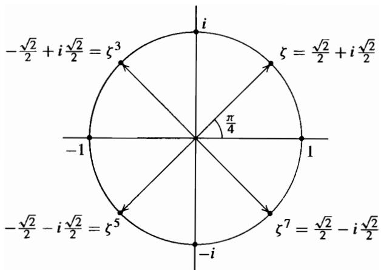  
Fig. 1

Note that the reason we are interested in also keping track of the action on the element $\boldsymbol { \zeta }$ is that it willbe needed in computing the composites of automorphisms,for example in computing

$$
\begin{array}{l} \sigma^ {2} (\theta) = \sigma (\zeta \theta) = \sigma (\zeta) \sigma (\theta) = (- \zeta) (\zeta \theta) = - \zeta^ {2} \theta \\ = - i \theta . \\ \end{array}
$$

We can similarly compute the following automorphisms:

$$
\sigma : \left\{ \begin{array}{l} \theta \mapsto \zeta \theta \\ i \mapsto i \\ \zeta \mapsto \zeta^ {5} \end{array} \right.
$$

$$
\tau \sigma : \left\{ \begin{array}{l} \theta \mapsto \zeta^ {7} \theta \\ i \mapsto - i \\ \zeta \mapsto \zeta^ {3} \end{array} \right.
$$

$$
\sigma^ {2}: \left\{ \begin{array}{l} \theta \mapsto \zeta^ {6} \theta \\ i \mapsto i \\ \zeta \mapsto \zeta \end{array} \right.
$$

$$
\tau \sigma^ {2}: \left\{ \begin{array}{l} \theta \mapsto \zeta^ {2} \theta \\ i \mapsto - i \\ \zeta \mapsto \zeta^ {7} \end{array} \right.
$$

$$
\sigma^ {3}: \left\{ \begin{array}{l} \theta \mapsto \zeta^ {7} \theta \\ i \mapsto i \\ \zeta \mapsto - \zeta \end{array} \right.
$$

$$
\tau \sigma^ {3}: \left\{ \begin{array}{l} \theta \mapsto \zeta \theta \\ i \mapsto - i \\ \zeta \mapsto \zeta^ {3} \end{array} \right.
$$

$$
\sigma^ {4}: \left\{ \begin{array}{l} \theta \mapsto - \theta \\ i \mapsto i \\ \zeta \mapsto \zeta \end{array} \right.
$$

$$
\tau \sigma^ {4}: \left\{ \begin{array}{l} \theta \mapsto - \theta \\ i \mapsto - i \\ \zeta \mapsto \zeta^ {7} \end{array} \right.
$$

$$
\sigma^ {5}: \left\{ \begin{array}{l} \theta \mapsto \zeta^ {5} \theta \\ i \mapsto i \\ \zeta \mapsto - \zeta \end{array} \right.
$$

$$
\tau \sigma^ {5}: \left\{ \begin{array}{l} \theta \mapsto \zeta^ {3} \theta \\ i \mapsto - i \\ \zeta \mapsto \zeta^ {3} \end{array} \right.
$$

$$
\sigma^ {6}: \left\{ \begin{array}{l} \theta \mapsto \zeta^ {2} \theta \\ i \mapsto i \\ \zeta \mapsto \zeta \end{array} \right.
$$

$$
\tau \sigma^ {6}: \left\{ \begin{array}{l} \theta \mapsto \zeta^ {6} \theta \\ i \mapsto - i \\ \zeta \mapsto \zeta^ {7} \end{array} \right.
$$

$$
\sigma^ {7}: \left\{ \begin{array}{l} \theta \mapsto \zeta^ {3} \theta \\ i \mapsto i \\ \zeta \mapsto - \zeta \end{array} \right. \qquad \tau \sigma^ {7}: \left\{ \begin{array}{l} \theta \mapsto \zeta^ {5} \theta \\ i \mapsto - i \\ \zeta \mapsto \zeta^ {3}. \end{array} \right.
$$

Since this exhausts the possibilities, these elements (together with 1 and $\pmb { \tau }$ ) are the Galois group. We see in particular that $\pmb { \sigma }$ and $\pmb { \tau }$ generate the Galois group. To determine the relations satisfied by these elements, we observe first that clearly $\tau ^ { 2 } = 1$ and $( \sigma ^ { 4 } ) ^ { 2 } = 1$ , so that

$$
\sigma^ {8} = \tau^ {2} = 1.
$$

Also, we compute

$$
\sigma \tau : \left\{ \begin{array}{l} \theta \mapsto \zeta \theta \\ i \mapsto - i \\ \zeta \mapsto \zeta^ {3} \end{array} \right.
$$

so that

$$
\sigma \tau = \tau \sigma^ {3}.
$$

It is not too difficult to show that these relations define the group completely, i.e.,

$$
\operatorname {G a l} (\mathbb {Q} (\sqrt [ 8 ]{2}, i) / \mathbb {Q}) = \langle \sigma , \tau \mid \sigma^ {8} = \tau^ {2} = 1, \sigma \tau = \tau \sigma^ {3} \rangle .
$$

Such a group is called a quasidihedral group (recall that the dihedral group of order 16 would have the relation ${ \pmb { \sigma } } { \bar { \pmb { \tau } } } = \pmb { \tau } \pmb { \sigma } ^ { 7 }$ instead of $\sigma \tau = \tau \sigma ^ { 3 }$ ) and is a subgroup of $\pmb { S 8 }$ since the Galois group is a subgroup of the permutations of the 8 roots of $x ^ { 8 } - 2 .$

This example again illustrates that one must take care in determining Galois groups from the actions on generators. We first computed the degree of the Galois extension above to determine the number of elements in the Galois group. Had we proceeded directly from the original generators $\theta = \sqrt [ 8 ] { 2 }$ and $\zeta = \zeta _ { 8 }$ we might have (incorrectly) concluded that there were a total of 32 elements in the Galois group, since the first generator is mapped to any of 8 possible roots of $x ^ { 8 } - 2$ and the second generator is mapped to any of 4 possible roots of its minimal polynomial $\Phi _ { 4 } ( x ) = x ^ { 4 } + \bar { 1 } .$ The problem, as previously indicated, is that these choices are not independent. Here the reason is provided by the algebraic relation

$$
\theta^ {4} = \sqrt {2} = \zeta + \zeta^ {7}
$$

which shows that one cannot specify the images of $\pmb \theta$ and $\boldsymbol { \xi }$ independently - their images must again satisfy this algebraic relation. This relation is perhaps sufficiently subtle to serve as a caution against rashly concluding maps are automorphisms. We note that in general it is necessary to provide justification that maps are automorphisms. This can be accomplished for example by using the extension theorems or by using degree considerations as we did here.

Determining the lattice of subgroups of this group $\pmb { G }$ is a straightforward problem.

The lattice is the following:

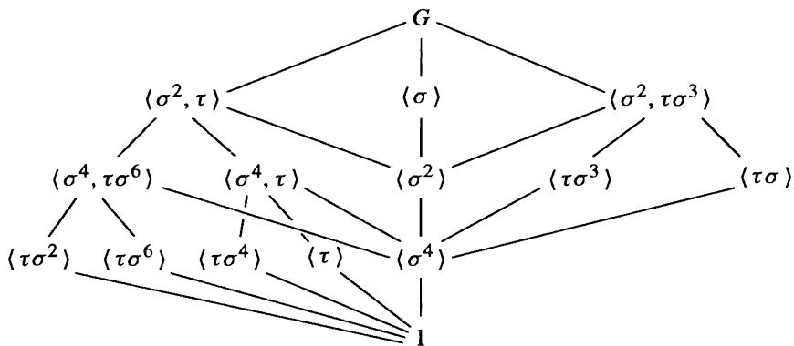

Determining the subfields corresponding to these subgroups (which by the Fundamental Theorem gives all the subfields of $\mathbb { Q } ( \sqrt [ 8 ] { 2 } , i ) )$ is quite simple for a number of the subgroups above using (2) of the Fundamental Theorem, which states that the degree of the extension over $\mathbb { Q }$ is equal to the index of the fixing subgroup. It then suffices to find a subfield of the right degree which is fixed by the subgroup in question. Remember also that if a subfield is fixed by the generators of a subgroup, then it is fixed by the subgroup. For example, from the explicit description for the automorphism $\sigma$ we see that $\mathbb { Q } ( i )$ is fixed by the group generated by $\sigma$ . Since this is a subgroup of index 2 and $\mathbb { Q } ( i )$ is of degree 2 over $\mathbb { Q } ,$ , it must be the full fixed field. Most of the fixed fields for the subgroups above can be determined in as simple a manner.

For the subgroups of order 4 on the right (namely, generated by $\tau \sigma ^ { 3 }$ and by $\pmb { \tau } \pmb { \sigma } .$ ), it is perhaps not so easy to see how to determine the corresponding fixed field. For the subgroup $H$ generated by $\tau \sigma ^ { 3 }$ we may proceed as follows: the element $\theta ^ { 2 } = \sqrt [ 4 ] { 2 }$ is clearly fixed by $\sigma ^ { 4 }$ . By the diagram above, $\sigma ^ { 4 }$ is a normal subgroup of $H$ of index 2, with representatives 1 , $\tau \sigma ^ { 3 }$ for the cosets. Consider the element

$$
\alpha = (1 + \tau \sigma^ {3}) \theta^ {2} = \theta^ {2} + \tau \sigma^ {3} \theta^ {2}.
$$

Then $\pmb { \alpha }$ is fixed by $\sigma ^ { 4 }$ (we are in a commutative group $H$ of order 4, so $\sigma ^ { 4 }$ commutes with 1 and $\tau \sigma ^ { 3 }$ and we already know $\theta ^ { 2 }$ is fixed by $\sigma ^ { 4 }$ ). But (and this is the point), $\pmb { \alpha }$ is also fixed by $\tau \sigma ^ { 3 }$ :

$$
\begin{array}{l} \tau \sigma^ {3} \alpha = \tau \sigma^ {3} (1 + \tau \sigma^ {3}) \theta^ {2} = [ \tau \sigma^ {3} + (\tau \sigma^ {3}) ^ {2} ] \theta^ {2} \\ = (\tau \sigma^ {3} + \sigma^ {4}) \theta^ {2} \\ \end{array}
$$

and the last expression is just $\pmb { \alpha }$ since $\sigma ^ { 4 } \theta ^ { 2 } = \theta ^ { 2 }$ • Hence $\pmb { \alpha }$ is an element of the fixed field for H. Explicitly

$$
\alpha = \sqrt [ 4 ]{2} + i \sqrt [ 4 ]{2} = (1 + i) \sqrt [ 4 ]{2}.
$$

A quick check shows that $\pmb { \alpha }$ is not fixed by the automorphism $\sigma ^ { 2 }$ , so by the diagram of subgroups above, it follows that the fixing subgroup for the field $\mathbb { Q } ( \pmb { \alpha } )$ is no larger than $H$ , hence is precisely $H$ . which gives us our fixed field. This also gives the fixed field for $\langle \tau \sigma \rangle$ by recalling that in general if $E$ is the fixed field of $H$ then the fixed field of $\tau H \tau ^ { - 1 }$ is the field $\tau ( E )$ . For $H = \langle \tau \sigma ^ { 3 } \rangle$ , $\tau H \tau ^ { - 1 } = \langle \tau \sigma \rangle$ , with fixed field given by $\tau ( \alpha ) = ( 1 - i ) \sqrt [ 4 ] { 2 }$ .

In general one tries to determine elements which are fixed by a given subgroup $H$ of the Galois group (cf. the exercises, which indicate where the element above arose) and

attempts to generate a sufficiently large field to give the full fixed field. In our case we were able to accomplish this with a single generator. We shall see later that every finite extension of $\mathbb { Q }$ is a simple extension, so there will be a single generator of this type, but in general it may be difficult to produce it directly.

The element $\pmb { \alpha }$ is a root of the polynomial

$$
x ^ {4} + 8
$$

which must therefore be irreducible since we have already determined that a root of this polynomial generates an extension of degree 4 over $\mathbb { Q } .$ .

In a similar way it is possible to complete the diagram of subfields of $\mathbb { Q } ( \sqrt [ 8 ] { 2 } , i )$ , which we have inverted to emphasize its relation with the subgroup diagram above $( \theta = \sqrt [ 8 ] { 2 }$ ) :

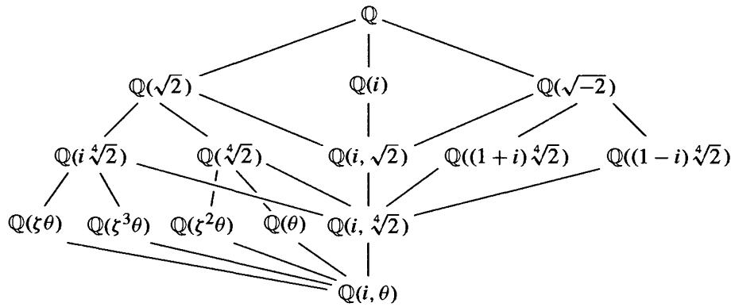

Note that the group $\langle { \sigma ^ { 4 } } \rangle$ is normal in $\pmb { G }$ (in fact it is the center of $\pmb { G }$ ) with quotient $G / \langle { \sigma } ^ { 4 } \rangle \cong D _ { 8 }$ , so the corresponding fixed field $\mathbb { Q } ( i , \sqrt [ 4 ] { 2 } )$ is Galois over $\mathbb { Q }$ with $D _ { 8 }$ as Galois group. Being Galois it is a splitting field, evidently the splitting field for $x ^ { 4 } - 2$ . The lattice of subfields for this field is then immediate from the lattice above.

We end this example with the following amusing aspect of this Galois extension. It is an easy exercise to verify that

$$
\langle \sigma^ {2}, \tau \rangle \cong D _ {8} \quad \langle \sigma \rangle \cong \mathbb {Z} / 8 \mathbb {Z} \quad \langle \sigma^ {2}, \tau \sigma^ {3} \rangle \cong Q _ {8}
$$

where $D _ { 8 }$ is the dihedral group of order 8 and $Q _ { 8 }$ is the quaternion group of order 8. It follows that the field $\mathbb { Q } ( \sqrt [ 8 ] { 2 } , i )$ is Galois of degree 8 over its three quadratic subfields

$$
\mathbb {Q} (\sqrt {2}) \quad \mathbb {Q} (i) \quad \mathbb {Q} (\sqrt {- 2})
$$

with dihedral, cyclic and quaternion Galois groups, respectively, so that three of the 5 possible groups of order 8 (and both non-abelian ones) appear as Galois groups in this extension.

We shall consider additional examples and applications in the following sections.

# E X E R C I S E S

1. Determine the minimal polynomial over $\mathbb { Q }$ for the element ${ \sqrt { 2 } } + { \sqrt { 5 } }$ .   
2. Determine the minimal polynomial over $\mathbb { Q }$ for the element $1 + { \sqrt [ { 3 } ] { 2 } } + { \sqrt [ { 3 } ] { 4 } } .$ .   
3. Determine the Galois group of $( x ^ { 2 } - 2 ) ( x ^ { 2 } - 3 ) ( x ^ { 2 } - 5 )$ . Determine all the subfields of the splitting field of this polynomial.

4. Let $\pmb { p }$ be a prime. Determine the elements of the Galois group of $x ^ { p } - 2 .$

5. Prove that the Galois group of $x ^ { p } - 2$ for $\pmb { p }$ a prime is isomorphic to the group of matrices $\left( \begin{array} { l l } { a } & { b } \\ { 0 } & { 1 } \end{array} \right)$ where a, b e !Fp, a :;i: O.

6. Let $\pmb { K } = \mathbb { Q } ( \sqrt [ 8 ] { 2 } , i )$ and let $F _ { 1 } = \mathbb { Q } ( i )$ , $F _ { 2 } = \mathbb { Q } ( { \sqrt { 2 } } )$ , $F _ { 3 } = \mathbb { Q } ( { \sqrt { - 2 } } )$ . Prove that $\operatorname { G a l } ( K / F _ { 1 } ) \cong Z _ { 8 }$ , $\operatorname { G a l } ( K / F _ { 2 } ) \cong D _ { 8 }$ , $\operatorname { G a l } ( K / F _ { 3 } ) \cong Q _ { 8 }$ .

7. Determine all the subfields of the splitting field of $x ^ { 8 } - 2$ which are Galois over $\mathbb { Q }$

8. Suppose $\pmb { K }$ is a Galois extension of $\pmb { F }$ of degree $p ^ { n }$ for some prime $\pmb { p }$ and some $n \geq 1$ Show there are Galois extensions of $\pmb { F }$ contained i n $\pmb { K }$ of degrees $\pmb { p }$ and $p ^ { n - 1 }$ .

9. Give an example of fields $F _ { 1 } , F _ { 2 } , F _ { 3 }$ with $\mathbb { Q } \subset F _ { 1 } \subset F _ { 2 } \subset F _ { 3 }$ , $[ F _ { 3 } : \mathbb { Q } ] = 8$ and each field is Galois over all its subfields with the exception that ${ \cal F } _ { 2 }$ is not Galois over $\mathbb { Q }$ .

10. Determine the Galois group of the splitting field over $\mathbb { Q }$ of $x ^ { 8 } - 3$

11. Suppose $f ( x ) \in \mathbb { Z } [ x ]$ is an irreducible quartic whose splitting field has Galois group $s _ { 4 }$ over $\mathbb { Q }$ (there are many such quartics, cf. Section 6). Let $\pmb \theta$ be a root of $f ( x )$ and set $\pmb { K } = \mathbb { Q } ( \pmb { \theta } )$ . Prove that $\pmb { K }$ is an extension of $\mathbb { Q }$ of degree 4 which has no proper subfields. Are there any Galois extensions of $\mathbb { Q }$ of degree 4 with no proper subfields?

12. Determine the Galois group of the splitting field over $\mathbb { Q }$ of $x ^ { 4 } - 1 4 x ^ { 2 } + 9 .$

13. Prove that if the Galois group of the splitting field of a cubic over $\mathbb { Q }$ is the cyclic group of order 3 then all the roots of the cubic are real.

14. Show that $\mathbb { Q } ( { \sqrt { 2 + { \sqrt { 2 } } } } )$ is a cyclic quartic field, i.e., is a Galois extension of degree 4 with cyclic Galois group.

15. (Biquadratic Extensions) Let $\pmb { F }$ be a field of characteristic $\neq 2 .$

(a) If $K = F ( { \sqrt { D _ { 1 } } } , { \sqrt { D _ { 2 } } } )$ where $D _ { 1 }$ $, D _ { 2 } \in F$ have the property that none of $D _ { 1 }$ . $\scriptstyle D _ { 2 }$ or $D _ { 1 } D _ { 2 }$ is a square in $\pmb { F }$ , prove that $K / F$ is a Galois extension with $\operatorname { G a l } ( K / F )$ isomorphic to the Klein 4-group.

(b) Conversely, suppose $K / F$ is a Galois extension with $\operatorname { G a l } ( K / F )$ isomorphic to the Klein 4-group. Prove that $K = F ( { \sqrt { D _ { 1 } } } , { \sqrt { D _ { 2 } } } )$ ) where $D _ { 1 }$ , $D _ { 2 } \in F$ have the property that none of $D _ { 1 }$ , $\scriptstyle D _ { 2 }$ or $D _ { 1 } D _ { 2 }$ is a square in $\pmb { F }$ .

16. (a) Prove that $x ^ { 4 } - 2 x ^ { 2 } - 2$ is irreducible over $\mathbb { Q }$

(b) Show the roots of this quartic are

$$
\alpha_ {1} = \sqrt {1 + \sqrt {3}} \quad \alpha_ {3} = - \sqrt {1 + \sqrt {3}}
$$

$$
\alpha_ {2} = \sqrt {1 - \sqrt {3}} \quad \alpha_ {4} = - \sqrt {1 - \sqrt {3}}.
$$

(c) Let $K _ { 1 } = \mathbb { Q } ( \alpha _ { 1 } )$ and $K _ { 2 } = \mathbb { Q } ( \alpha _ { 2 } )$ . Show that $K _ { 1 } \neq K _ { 2 }$ , and $K _ { 1 } \cap K _ { 2 } = \mathbb { Q } ( { \sqrt { 3 } } ) = F$   
(d) Prove that $\pmb { K _ { 1 } }$ . $\pmb { K } _ { 2 }$ and $\pmb { K } _ { 1 } \pmb { K } _ { 2 }$ are Galois over $\pmb { F }$ with $\operatorname { G a l } ( K _ { 1 } K _ { 2 } / F )$ the Klein 4-group. Write out the elements of $\operatorname { G a l } ( K _ { 1 } K _ { 2 } / F )$ explicitly. Determine all the subgroups of the Galois group and give their corresponding fixed subfields of $\pmb { K } _ { 1 } \pmb { K } _ { 2 }$ containing $\pmb { F }$   
(e) Prove that the splitting field of $x ^ { 4 } - 2 x ^ { 2 } - 2$ over $\mathbb { Q }$ is of degree 8 with dihedral Galois group.

The following two exercises indicate one method for constructing elements in subfields of a given field and are quite useful in many computations.

17. Let $K / F$ be any finite extension and let $\alpha \in K$ . Let $\pmb { L }$ be a Galois extension of $\pmb { F }$ containing $\pmb { K }$ and let $H \leq \mathbf { G a l } ( L / F )$ be the subgroup corresponding to $\pmb { K }$ . Define the norm of a from

$\pmb { K }$ to $\pmb { F }$ to be

$$
\mathrm {N} _ {K / F} (\alpha) = \prod_ {\sigma} \sigma (\alpha),
$$

where the product is taken over all the embeddings of $\pmb { K }$ into an algebraic closure of $F$ (so over a set of coset representatives for $\pmb { H }$ in $\operatorname { G a l } ( L / F )$ by the Fundamental Theorem of Galois Theory). This is a product of Galois conjugates of $\pmb { \alpha } .$ . In particular, if $K / F$ is Galois this is $\textstyle \prod _ { \sigma \in { \bf G a l } ( K / F ) } \sigma ( \alpha )$ .

(a) Prove that $\mathbf { N } _ { K / F } ( \alpha ) \in F$   
(b) Prove that $\mathbf { N } _ { K / F } ( \alpha \beta ) = \mathbf { N } _ { K / F } ( \alpha ) \mathbf { N } _ { K / F } ( \beta )$ , so that the norm is a multiplicative map from $\pmb { K }$ to $\pmb { F }$ .   
(c) Let $\pmb { K } = \pmb { F } ( \sqrt { D } )$ be a quadratic extension of $\pmb { F }$ . Show that $\begin{array} { r } { \mathbf { N } _ { K / F } ( a + b \sqrt { D } ) = } \end{array}$ $a ^ { 2 } - D b ^ { 2 }$ •   
(d) Let $m _ { \alpha } ( x ) = x ^ { d } + a _ { d - 1 } x ^ { d - 1 } + \dots + a _ { 1 } x + a _ { 0 } \in F [ x ]$ be the minimal polynomial for $\alpha \in K$ over $\boldsymbol { F }$ . Let $n = \left[ K : F \right]$ . Prove that $\pmb { d }$ divides $\pmb { n } _ { ! }$ , that there are $\pmb { d }$ distinct Galois conjugates of $\pmb { \alpha }$ which are all repeated ${ \pmb n } / d$ times in the product above and conclude that $\aleph _ { K / F } ( \alpha ) = ( - 1 ) ^ { n } a _ { 0 } ^ { n / d }$ .

18. With notation as in the previous problem, define the trace of $\pmb { \alpha }$ from $\pmb { K }$ to $\pmb { F }$ to be

$$
\operatorname {T r} _ {K / F} (\alpha) = \sum_ {\sigma} \sigma (\alpha),
$$

a sum of Galois conjugates of $\pmb { \alpha }$

(a) Prove that $\mathbf { T r } _ { K / F } ( \alpha ) \in F$   
(b) Prove that $\operatorname { T r } _ { K / F } ( \alpha + \beta ) = \operatorname { T r } _ { K / F } ( \alpha ) + \operatorname { T r } _ { K / F } ( \beta )$ , so that the trace is an additive map from $\pmb { K }$ to $\pmb { F }$ .   
(c) Let $K = F ( { \sqrt { D } } )$ be a quadratic extension of $\pmb { F }$ . Show that $\operatorname { T r } _ { K / F } ( a + b { \sqrt { D } } ) = 2 a$   
(d) Let $m _ { \alpha } ( x )$ be as in the previous problem. Prove that $\mathrm { T r } _ { K / F } ( \alpha ) = - \frac { n } { d } a _ { d - 1 }$ ·

19. With notation as in the previous problems show that $\mathbf { N } _ { K / F } ( a \pmb { \alpha } ) \ = \ a ^ { n } \mathbf { N } _ { K / F } ( \pmb { \alpha } )$ and ${ \bf T r } _ { K / F } ( a \alpha ) = a { \bf T r } _ { K / F } ( \alpha )$ for all $\mathbf { \pmb { a } }$ in the base field $F .$ , In particular show that $\mathbf { N } _ { K / F } ( a ) =$ $\pmb { a } ^ { n }$ and ${ \bf T r } _ { K / F } ( a ) = n a$ for all $a \in F$ .   
20. With notation as in the previous problems show more generally that $\begin{array} { r l } { \prod _ { \sigma } ( x - \sigma ( \alpha ) ) = } & { { } } \end{array}$ $( m _ { \alpha } ( x ) ) ^ { n / d }$ .   
21. Use the linear independence of characters to show that for any Galois extension $\pmb { K }$ of $F$ there is an element $\alpha \in K$ with $\mathrm { T r } _ { K / F } ( \alpha ) \neq 0 .$ .   
22. Suppose $K / F$ is a Galois extension and let $\sigma$ be an element of the Galois group.

(a) Suppose $\textbf { \em a } \in \textbf { \em K }$ is of the form $\alpha = \frac { \beta } { \sigma \beta }$ for some nonzero $\beta \in \ K$ . Prove that $\mathbf { N } _ { K / F } ( \pmb { \alpha } ) = \mathbf { 1 } .$ .   
(b) Suppose $\alpha \in K$ i s o f the form $\pmb { \alpha } = \pmb { \beta } - \pmb { \sigma } \pmb { \beta }$ for some $\beta \in { \cal K }$ . Prove that $\mathrm { T r } _ { K / F } ( \boldsymbol { \alpha } ) = 0$

The next exercise and Exercise 26 following establish the multiplicative and additive forms of Hilbert's Theorem 90. These are instances of the vanishing of a first cohomology group, as will be discussed in Section 17 .3.

23. (Hilbert's Theorem $_ { 9 0 }$ ) Let $\pmb { K }$ be a Galois extension of $F$ with cyclic Galbis group of order n generated by $\sigma$ . Suppose $\alpha \in K$ has $\mathbf { N } _ { K / F } ( \alpha ) = 1 .$ . Prove that $\pmb { \alpha }$ is of the form $\alpha = \frac { \beta } { \sigma \beta }$ for some nonzero $\beta \in { \cal K }$ . [By the linear independence of characters show there exists some $\theta \in K$ such that

$$
\beta = \theta + \alpha \sigma (\theta) + (\alpha \sigma \alpha) \sigma^ {2} (\theta) + \dots + (\alpha \sigma \alpha \dots \sigma^ {n - 2} \alpha) \sigma^ {n - 1} (\theta)
$$

is nonzero. Compute $\frac { \beta } { \sigma \beta }$ using the fact that $\pmb { \alpha }$ has nonn 1 to F.]

24. Prove that the rational solutions $a , b \in \mathbb { Q }$ of Pythagoras' equation $a ^ { 2 } + b ^ { 2 } = 1$ are of the fonn $a = { \frac { s ^ { 2 } - t ^ { 2 } } { s ^ { 2 } + t ^ { 2 } } }$ and $b = \frac { 2 s t } { s ^ { 2 } + t ^ { 2 } }$ for some s $, t \in \mathbb { Q }$ and hence show that any right triangle with integer sides has sides of lengths $( m ^ { 2 } - n ^ { 2 }$ , 2mn, $m ^ { 2 } + n ^ { 2 } )$ ) for some integers $m , n _ { * }$ [Note that $a ^ { 2 } + b ^ { 2 } = 1$ is equivalent to $\mathrm { N } _ { \mathbb { Q } ( i ) / \mathbb { Q } } ( a + i b ) = 1$ , then use Hilbert's Theorem 90 above with $\beta = s + i t .$ ]

25. Generalize the previous problem to determine all the rational solutions of the equation $a ^ { 2 } + D b ^ { 2 } = 1$ for $D \in \mathbb { Z } .$ , $\pmb { D } > \mathbf { 0 }$ , $\pmb { D }$ not a perfect square in $\mathbb { Z } .$ .

26. (Additive Hilbert's Theorem 90) Let $\pmb { K }$ be a Galois extension of $\boldsymbol { F }$ with cyclic Galois group of order $\pmb { n }$ generated by $\sigma$ . Suppose $\alpha \in K$ has $\mathrm { T r } _ { K / F } ( \boldsymbol { \alpha } ) = 0 .$ . Prove that $\pmb { \alpha }$ is of the fonn $\alpha = \beta - \sigma \beta$ for some $\beta \in { \cal K }$ . [Let $\theta \in K$ be an element with $\mathrm { T r } _ { K / F } ( \boldsymbol { \theta } ) \neq 0$ by a previous exercise, let

$$
\beta = \frac {1}{\operatorname {T r} _ {K / F} (\theta)} [ \alpha \sigma (\theta) + (\alpha + \sigma \alpha) \sigma^ {2} (\theta) + \dots + (\alpha + \sigma \alpha + \dots + \sigma^ {n - 2} \alpha) \sigma^ {n - 1} (\theta) ]
$$

and compute $\beta - \sigma \beta .$

27. Let $\alpha = \sqrt { ( 2 + \sqrt { 2 } ) ( 3 + \sqrt { 3 } ) }$ (positive real square roots for concreteness) and consider the extension $\pmb { { \cal E } } = \mathbb { Q } ( \pmb { \alpha } )$ .

(a) Show that $a = ( 2 + { \sqrt { 2 } } ) ( 3 + { \sqrt { 3 } } )$ is not a square in $F = \mathbb { Q } ( { \sqrt { 2 } } , { \sqrt { 3 } } )$ . [If $\ b { a } = \ b { c } ^ { 2 }$ $c \in F$ , then $a \varphi ( a ) = ( 2 + { \sqrt { 2 } } ) ^ { 2 } ( 6 ) = ( c \varphi c ) ^ { 2 }$ for the automorphism $\varphi \in \operatorname { G a l } ( F / \mathbb { Q } )$ fixing $\mathbb { Q } ( { \sqrt { 2 } } )$ . Since $c \varphi c = \mathbf { N } _ { F / \mathbb { Q } ( \sqrt { 2 } ) } ( c ) \in \mathbb { Q } ( \sqrt { 2 } )$ conclude that this implies $\sqrt { 6 } \in \mathbb { Q } ( \sqrt { 2 } )$ , a contradiction.]   
(b) Conclude from (a) that $\left[ E : \mathbb { Q } \right] = 8 .$ Prove that the roots of the minimal polynomial over $\mathbb { Q }$ for $\pmb { \alpha }$ are the 8 elements $\pm { \sqrt { ( 2 \pm { \sqrt { 2 } } ) ( 3 \pm { \sqrt { 3 } } ) } }$ .   
(c) Let $\beta = \sqrt { ( 2 - \sqrt { 2 } ) ( 3 + \sqrt { 3 } ) }$ . Show that $\alpha \beta = \sqrt { 2 } ( 3 + \sqrt { 3 } ) \in F$ so that $\beta \in E$ Show similarly that the other roots are also elements of $E$ so that $E$ is a Galois extension of $\mathbb { Q }$ . Show that the elements of the Galois group are precisely the maps determined by mapping $\pmb { \alpha }$ to one of the eight elements in (b).   
(d) Let $\sigma ~ \in ~ \operatorname { G a l } ( E / \mathbb { Q } )$ be the automorphism which maps $\pmb { \alpha }$ to $\beta$ {. Show that since $\sigma ( \alpha ^ { 2 } ) = \beta ^ { 2 }$ that $\sigma ( { \sqrt { 2 } } ) = - { \sqrt { 2 } }$ and $\sigma ( \sqrt { 3 } ) = \sqrt { 3 }$ . From $\alpha \beta = \sqrt { 2 } ( 3 + \sqrt { 3 } )$ conclude that $\sigma ( \alpha \beta ) = - \alpha \beta$ and hence $\sigma ( \beta ) = - \alpha$ . Show that $\sigma$ is an element of order 4 in $\operatorname { G a l } ( E / \mathbb { Q } )$ .   
(e) Show similarly that the map $\pmb { \tau }$ defined by $\tau ( \alpha ) = \sqrt { ( 2 + \sqrt { 2 } ) ( 3 - \sqrt { 3 } ) }$ is an element of order 4 in $\operatorname { G a l } ( E / \mathbb { Q } )$ . Prove that $\sigma$ and $\pmb { \tau }$ generate the Galois group, $\sigma ^ { 4 } = \tau ^ { 4 } = 1 .$ , $\sigma ^ { 2 } = \tau ^ { 2 }$ and that $\sigma \tau = \tau \sigma ^ { 3 }$ .   
(f) Conclude that ${ \bf G a l } ( E / \mathbb { Q } ) \cong Q { \bf { \& } }$ , the quaternion group of order 8.

28. Let $f ( x ) \in F [ x ]$ be an irreducible polynomial of degree n over the field $F$ , let $\pmb { L }$ be the splitting field of $f ( x )$ over $F$ and let $\pmb { \alpha }$ be a root of $f ( x )$ in $L .$ If $\pmb { K }$ is any Galois extension of $\boldsymbol { F }$ contained in $\pmb { L }$ , show that the polynomial $f ( x )$ splits into a product of $\pmb { m }$ irreducible polynomials each of degree $\pmb { d }$ over $\pmb { K }$ , where $m = [ F ( \alpha ) \cap K : F ]$ and $d = \lbrack K ( \alpha ) : K \rbrack$ ( cf. also the generalization in Exercise 4 of Section 4 ). [If $H$ is the subgroup of the Galois group of $\pmb { L }$ over $F$ corresponding to $\pmb { K }$ then the factors of $f ( x )$ over $\pmb { K }$ correspond to the orbits of $H$ on the roots of $f ( x )$ . Then use Exercise 9 of Section 4. 1 .]

29. Let $\pmb { k }$ be a field and let $k ( t )$ be the field of rational functions in the variable t. Define the maps $\pmb { \sigma }$ and $\pmb { \tau }$ of $k ( t )$ to itself by $\sigma f ( t ) = f ( \frac { 1 } { 1 - t } )$ and $\tau f ( t ) = f ( \frac { 1 } { t } )$ for $f ( t ) \in k ( t )$ .

(a) Prove that $\pmb { \sigma }$ and $\pmb { \tau }$ are automorphisms of $\pmb { k } ( t )$ (cf. Exercise 8 of Section 1 ) and that the group $G = \langle \sigma , \tau \rangle$ they generate is isomorphic to $\pmb { S } _ { 3 }$ .   
(b) Prove that the element $t = { \frac { ( t ^ { 2 } - t + 1 ) ^ { 3 } } { t ^ { 2 } ( t - 1 ) ^ { 2 } } }$ is fixed by all the elements of $\pmb { G }$   
(c) Prove that $k ( t )$ is precisely the fixed field of $\pmb { G }$ in $k ( t )$ [compute the degree of the extension].

30. Prove that the fixed field of the subgroup of automorphisms generated by $\pmb { \tau }$ in the previous problem is $k ( t + \frac { 1 } { t } )$ . Prove that the fixed field of the subgroup generated by the automorphism $\tau \sigma ^ { 2 }$ (which maps t to $1 - t )$ is $\pmb { k } ( t ( 1 - t ) )$ . Determine the fixed field of the subgroup generated by $\pmb { \tau \sigma }$ and the fixed field of the subgroup generated by $\pmb { \sigma }$ .

31. Let $\pmb { K }$ b e a finite extension of $\pmb { F }$ of degree n. Let $\pmb { \alpha }$ b e an element of $\pmb { K }$ .

(a) Prove that $\pmb { \alpha }$ acting by left multiplication on $\pmb { K }$ i s a n $\pmb { F }$ -linear transformation $\pmb { T _ { \alpha } }$ of $\pmb { K }$   
(b) Prove that the minimal polynomial for $\pmb { \alpha }$ over $\pmb { F }$ is the same as the minimal polynomial for the linear transformation $\pmb { T _ { \alpha } }$ .   
(c) Prove that the trace $\mathrm { T r } _ { K / F } ( \boldsymbol { \alpha } )$ is the trace of the $n \times n$ matrix defined by $\pmb { T _ { \alpha } }$ (which justifies these two uses of the same word "trace"). Prove that the norm $\Nu _ { K / F } ( \pmb { \alpha } )$ is the determinant of $\pmb { T _ { \alpha } }$ .

# 1 4.3 FINITE FIELDS

A finite field $\mathbb { F }$ has characteristic $\pmb { p }$ for some prime $\pmb { p }$ so is a finite dimensional vector space over $\mathbb { F } _ { p }$ . Ifthe dimension is n, i.e., $[ \mathbb { F } : \mathbb { F } _ { p } ] = n ,$ , then $\mathbb { F }$ has precisely $p ^ { n }$ elements. We have already seen (following Proposition 13.37) that $\mathbb { F }$ is then isomorphic to the splitting field of the polynomial $\boldsymbol { x } ^ { p ^ { n } } - \boldsymbol { x }$ , hence is unique up to isomorphism. We denote the finite field of order $p ^ { n }$ by $\mathbb { F } _ { p ^ { n } }$ •

The field $\mathbb { F } _ { p ^ { n } }$ is Galois over $\mathbb { F } _ { p }$ • with cyclic Galois group of order n generated by the Ftobenius automorphism

$$
\operatorname {G a l} \left(\mathbb {F} _ {p ^ {n}} / \mathbb {F} _ {p}\right) = \langle \sigma_ {p} \rangle \cong \mathbb {Z} / n \mathbb {Z}
$$

where

$$
\begin{array}{l} \sigma_ {p}: \mathbb {F} _ {p ^ {n}} \rightarrow \mathbb {F} _ {p ^ {n}} \\ \alpha \mapsto \alpha^ {p} \\ \end{array}
$$

(Example 7 following Corollary 6). By the Fundamental Theorem, every sub field of $\mathbb { F } _ { p ^ { n } }$ corresponds to a subgroup of $\mathbb { Z } / n \mathbb { Z }$ . Hence for every divisor $^ { d }$ of $\pmb { n }$ there is precisely one sub field of $\mathbb { F } _ { p ^ { n } }$ of degree $^ { d }$ over $\mathbb { F } _ { p }$ ' namely the fixed field of the subgroup generated by $\sigma _ { p } ^ { d }$ of order ${ \pmb n } / d$ , and there are no other sub fields. This field is isomorphic to $\mathbb { F } _ { p ^ { d } }$ , the unique finite field of order $p ^ { d }$ .

Since the Galois group is abelian, every subgroup is normal, so each of the sub fields $\mathbb { F } _ { p ^ { d } }$ $\mathbf { \Delta } _ { \mathbf { \pmb { d } } }$ a divisor of n) is Galois over $\mathbb { F } _ { p }$ (which is also clear from the fact that these are themselves splitting fields). Further, the Galois group $\operatorname { G a l } ( \mathbb { F } _ { p ^ { d } } / \mathbb { F } _ { p } )$ is generated by the image of $\sigma _ { p }$ in the quotient group $\mathrm { G a l } ( \mathbb { F } _ { P ^ { n } } / \mathbb { F } _ { p } ) / \langle \sigma _ { p } ^ { d } \rangle$ . If we denote this element

again by $\sigma _ { p }$ • we recover the Frobenius automorphism for the extension $\mathbb { F } _ { p ^ { d } } / \mathbb { F } _ { p }$ . (Note, however, that $\sigma _ { p }$ has order $\pmb { n }$ in $\mathrm { G a l } ( \mathbb { F } _ { p ^ { n } } / \mathbb { F } _ { p } )$ and order $\pmb { d }$ in $\mathrm { G a l } ( \mathbb { F } _ { p ^ { d } } / \mathbb { F } _ { p } )$ .)

We summarize this in the following proposition.

Proposition 15. Any finite field is isomorphic to $\mathbb { F } _ { p ^ { n } }$ for some prime $\pmb { p }$ and some integer $n \geq 1$ . The field $\mathbb { F } _ { p ^ { n } }$ is the splitting field over $\mathbb { F } _ { p }$ of the polynomial $x ^ { p ^ { n } } - x ,$ , with cyclic Galois group of order n generated by the Frobenius automorphism $\sigma _ { p }$ . The subfields of $\mathbb { F } _ { p ^ { n } }$ are all Galois over $\mathbb { F } _ { p }$ and are in one to one correspondence with the divisors $\pmb { d }$ of $\pmb { n }$ . They are the fields $\mathbb { F } _ { p ^ { d } }$ , the fixed fields of ${ \sigma _ { p } } ^ { d }$ .

The corresponding statements for the finite extensions of any finite field are easy consequences of Proposition 15 and are outlined in the exercises.

As an elementary application we have the following result on the polynomial $x ^ { 4 } + 1$ in $\mathbb { Z } [ x ]$ .

Corollary 16. The irreducible polynomial $x ^ { 4 } + 1 \in \mathbb { Z } [ x ]$ is reducible modulo every prime $\pmb { p }$ .

Proof" Consider the polynomial $x ^ { 4 } + 1$ over $\mathbb { F } _ { p } [ { \boldsymbol { x } } ]$ for the prime $\pmb { p }$ . I f $p = 2$ we have $x ^ { 4 } + 1 = ( x + 1 ) ^ { 4 }$ and the polynomial is reducible. Assume now that $\pmb { p }$ is odd. Then $p ^ { 2 } - 1$ is divisible by 8 since $\pmb { p }$ is congruent mod 8 to 1 , 3, 5 or 7 and all of these square to 1 mod 8. Hence $x ^ { p ^ { 2 } - 1 } - 1$ is divisible by $x ^ { 8 } - 1$ . Then we have the divisibilities

$$
x ^ {4} + 1 \left| x ^ {8} - 1 \right| x ^ {p ^ {2} - 1} - 1 \left| x ^ {p ^ {2}} - x \right.
$$

which shows that all the roots of $x ^ { 4 } + 1$ are roots of $x ^ { p ^ { 2 } } - x$ . (Equivalently, these roots are fixed by the square of the Frobenius automorphism $\sigma _ { p } ^ { 2 }$ .) Since the roots of $x ^ { p ^ { 2 } } - x$ are the field $\mathbb { F } _ { p ^ { 2 } }$ , it follows that the extension generated by any root of $x ^ { 4 } + 1$ is at most of degree 2 over $\mathbb { F } _ { p }$ • which means that $x ^ { 4 } + 1$ cannot be irreducible over $\mathbb { F } _ { p }$ ·

The multiplicative group $\mathbb { F } _ { p ^ { n } } { } ^ { \times }$ is obviously a finite subgroup of the multiplicative group of a field. By Proposition 9. 1 8, this is a cyclic group. If $\theta$ is any generator, then clearly $\mathbb { F } _ { p ^ { n } } = \mathbb { F } _ { p } ( \theta )$ . This proves the following result.

Proposition 17. The finite field $\mathbb { F } _ { p ^ { n } }$ is simple. In particular, there exists an irreducible polynomial of degree $\pmb { n }$ over $\mathbb { F } _ { p }$ for every $n \geq 1$ .

We have described the finite fields $\mathbb { F } _ { p ^ { n } }$ above as the splitting fields of the polynomials $x ^ { p ^ { n } } - x .$ By the previous proposition, this field can also be described as a quotient of $\mathbb { F } _ { p } [ { \boldsymbol { x } } ]$ , namely by the minimal polynomial for e. Since $\theta$ is necessarily a root of $x ^ { p ^ { n } } - x$ , we see that the minimal polynomial for $\theta$ is a divisor of $x ^ { p ^ { n } } - x$ o f degree n.

Conversely, let $p ( x )$ be any irreducible polynomial of degree $\pmb { d }$ , say, dividing $x ^ { p ^ { n } } - x$ . If $\pmb { \alpha }$ is a root of $p ( x )$ , then the extension $\mathbb { F } _ { p } ( \pmb { \alpha } )$ is a subfield of $\mathbb { F } _ { p ^ { n } }$ of degree d. Hence $\pmb { d }$ is a divisor of n and the extension is Galois by Proposition 15 (in fact, the extension $\mathbb { F } _ { p ^ { d } }$ ) so in particular all the roots of $p ( x )$ are contained in $\mathbb { F } _ { p } ( \pmb { \alpha } )$ .

The elements of $\mathbb { F } _ { p ^ { n } }$ are precisely the roots of $x ^ { p ^ { n } } - x$ . If we group together the factors $x - \alpha$ of this polynomial according to the degree $^ { d }$ of their minimal polynomials over $\mathbb { F } _ { p }$ • we obtain

Proposition 18. The polynomial $x ^ { p ^ { n } } - x$ is precisely the product of all the distinct irreducible polynomials in $\mathbb { F } _ { p } [ { \boldsymbol { x } } ]$ of degree $^ { d }$ where $^ { d }$ runs through all divisors of n .

This proposition can be used to produce irreducible polynomials over $\mathbb { F } _ { p }$ recursively. For example, the irreducible quadratics over $\mathbb { F } _ { 2 }$ are the divisors of

$$
\frac {x ^ {4} - x}{x (x - 1)}
$$

which gives the single polynomial $x ^ { 2 } + x + 1$ . Similarly, the irreducible cubics over this field are the divisors of

$$
\frac {x ^ {8} - x}{x (x - 1)} = x ^ {6} + x ^ {5} + x ^ {4} + x ^ {3} + x ^ {2} + x + 1
$$

which factors into the two cubics $x ^ { 3 } + x + 1$ and $x ^ { 3 } + x ^ { 2 } + 1$ . The irreducible quartics are given by dividing $x ^ { 1 6 } - x$ by $x ( x - 1 )$ and the irreducible quadratic $x ^ { 2 } + { x } + 1$ above and then factoring into irreducible quartics:

$$
\frac {x ^ {1 6} - x}{x (x - 1) \left(x ^ {2} + x + 1\right)} = \left(x ^ {4} + x ^ {3} + x ^ {2} + x + 1\right) \left(x ^ {4} + x ^ {3} + 1\right) \left(x ^ {4} + x + 1\right).
$$

This gives a method for determining the product of all the irreducible polynomials over $\mathbb { F } _ { p }$ of a given degree. There exist efficient algorithms for factorization of polynomials mod $\pmb { p }$ which will give the individual irreducible polynomials (cf. the exercises) in practice. The importance of having irreducible polynomials at hand is that they give a representation of the finite fields $\mathbb { F } _ { p ^ { n } }$ (as quotients $\mathbb { F } _ { p } [ x ] / ( f ( x ) )$ for $f ( x )$ irreducible of degree n) conducive to explicit computations.

Note also that since the finite field $\mathbb { F } _ { p ^ { n } }$ is unique up to isomorphism, the quotients of $\mathbb { F } _ { p } [ x ]$ by any of the irreducible polynomials of degree $\pmb { n }$ are all isomorphic. If $f _ { 1 } ( x )$ and $f _ { 2 } ( x )$ are irreducible of degree n, then $f _ { 2 } ( x )$ splits completely in the field $\mathbb { F } _ { p ^ { n } } \cong \mathbb { F } _ { p } [ x ] / ( f _ { 1 } ( x ) )$ . If we denote a root of $f _ { 2 } ( x )$ by $\alpha ( x )$ (to emphasize that it is a polynomial of degree $< n$ in $x$ in $\mathbb { F } _ { p } [ x ] / ( f _ { 1 } ( x ) )$ ), then the isomorphism is given by

$$
\begin{array}{l} \mathbb {F} _ {p} [ x ] / \left(f _ {2} (x)\right) \cong \mathbb {F} _ {p} [ x ] / \left(f _ {1} (x)\right) \\ x \mapsto \alpha (x) \\ \end{array}
$$

(we have mapped a root of $f _ { 2 } ( x )$ in the first field to a root of $f _ { 2 } ( x )$ in the second field). For example, if $f _ { 1 } ( x ) = x ^ { 4 } + x ^ { 3 } + 1$ , $f _ { 2 } ( x ) = x ^ { 4 } + x + 1$ are two of the irreducible quartics over $\mathbb { F } _ { 2 }$ determined above, then a simple computation verifies that

$$
\alpha (x) = x ^ {3} + x ^ {2}
$$

is a root of $f _ { 2 } ( x )$ in $\mathbb { F } _ { 1 6 } = \mathbb { F } _ { 2 } [ x ] / ( x ^ { 4 } + x ^ { 3 } + 1 )$ . Then we have

$$
\begin{array}{l} \mathbb {F} _ {2} [ x ] / (x ^ {4} + x + 1) \cong \mathbb {F} _ {2} [ x ] / (x ^ {4} + x ^ {3} + 1) \quad (\cong \mathbb {F} _ {1 6}) \\ x \mapsto x ^ {3} + x ^ {2}. \\ \end{array}
$$

If we assume a result from elementary number theory we can give a formula for the number of irreducible polynomials of degree n. Define the Mobius $\pmb { \mu }$ -function by

$$
\mu (n) = \left\{ \begin{array}{l l} 1 & \text {f o r} n = 1 \\ 0 & \text {i f} n \text {h a s a s q u a r e f a c t o r} \\ (- 1) ^ {r} & \text {i f} n \text {h a s} r \text {d i s t i n c t p r i m e f a c t o r s .} \end{array} \right.
$$

If now $f ( n )$ is a function defined for all nonnegative integers $\pmb { n }$ and $F ( n )$ is defined by

$$
F (n) = \sum_ {d \mid n} f (d) \quad n = 1, 2, \dots
$$

then the Mobius inversion formula states that one can recover the function $f ( n )$ from $F ( n )$ :

$$
f (n) = \sum_ {d \mid n} \mu (d) F (\frac {n}{d}) \quad n = 1, 2, \dots .
$$

1bis is an elementary result from number theory which we take for granted. Define

$\psi ( n ) =$ the number of irreducible polynomials of degree n in $\mathbb { F } _ { p } [ x ]$ .

Counting degrees in Proposition 1 8 we have

$$
p ^ {n} = \sum_ {d | n} d \psi (d).
$$

Applying the Mobius inversion formula (for $f ( n ) = n \psi ( n ) )$ ) we obtain

$$
n \psi (n) = \sum_ {d | n} \mu (d) p ^ {n / d}
$$

which gives us a formula for the number of irreducible polynomials of degree n over $\mathbb { F } _ { p }$ :

$$
\psi (n) = \frac {1}{n} \sum_ {d \mid n} \mu (d) p ^ {n / d}.
$$

For example, in the case $p = 2$ , $n = 4$ we have

$$
\psi (4) = \frac {1}{4} [ \mu (1) 2 ^ {4} + \mu (2) 2 ^ {2} + \mu (4) 2 ^ {1} ] = \frac {1}{4} (1 6 - 4 + 0) = 3
$$

as we determined directly above.

We have seen above that

$\mathbb { F } _ { p ^ { n } } \subseteq \mathbb { F } _ { p ^ { n } }$ if and only if $\pmb { m }$ divides n .

In particular, given any two finite fields $\mathbb { F } _ { p ^ { n _ { 1 } } }$ and $\mathbb { F } _ { p ^ { n _ { 2 } } }$ there is a third finite field containing (an isomorphic copy of) them, namely $\mathbb { F } _ { p ^ { n _ { 1 } n _ { 2 } } }$ . 1bis gives us a partial ordering on these fields and allows us to think of their union. Since these give all the finite extensions of $\mathbb { F } _ { p }$ , we see that the union of $\mathbb { F } _ { p ^ { n } }$ for all $\pmb { n }$ is an algebraic closure of $\mathbb { F } _ { p }$ , unique up to isomorphism:

$$
\overline {{\mathbb {F} _ {p}}} = \bigcup_ {n \geq 1} \mathbb {F} _ {p ^ {n}}.
$$

1bis provides a simple description of the algebraic closure of $\mathbb { F } _ { p }$

# E X E R C I S E S

1. Factor $x ^ { 8 } - x$ into irreducibles in $\mathbb { Z } [ x ]$ and in $\mathbb { F } _ { 2 } [ \boldsymbol { x } ]$   
2. Write out the multiplication table for $\mathbb { F } _ { 4 }$ and $\mathbb { F } _ { 8 }$ .   
3. Prove that an algebraically closed field must be infinite.   
4. Construct the finite field of 16 elements and find a generator for the multiplicative group. How many generators are there?   
5. Exhibit an explicit isomorphism between the splitting fields of $x ^ { 3 } - x + 1$ and $x ^ { 3 } - x - 1$ over $\mathbb { F } _ { 3 }$ .   
6. Suppose $\pmb { K } = \mathbb { Q } ( \pmb { \theta } ) = \mathbb { Q } ( \sqrt { \pmb { D } _ { 1 } }$ , $\sqrt { D _ { 2 } }$ ) with $D _ { 1 }$ , $D _ { 2 } \in \mathbb { Z } ,$ , is a biquadratic extension and that $\theta = a + b \sqrt { D _ { 1 } } + c \sqrt { D _ { 2 } } + d \sqrt { D _ { 1 } D _ { 2 } }$ where $a , b , c , d \in \mathbb { Z }$ are integers. Prove that the minimal polynomial $m _ { \theta } ( x )$ for $\theta$ over $\mathbb { Q }$ is irreducible of degree 4 over $\mathbb { Q }$ but is reducible modulo every prime $\pmb { p } .$ . In particular show that the polynomia $x ^ { 4 } - 1 0 x ^ { 2 } + 1$ is irreducible in $\mathbb { Z } [ x ]$ but is reducible modulo every prime. [Use the fact that there are no biquadratic extensions over finite fields.]   
7. Prove that one of2, 3 or 6 is a square in $\mathbb { F } _ { p }$ for every prime $\pmb { p }$ . Conclude that the polynomial

$$
x ^ {6} - 1 1 x ^ {4} + 3 6 x ^ {2} - 3 6 = (x ^ {2} - 2) (x ^ {2} - 3) (x ^ {2} - 6)
$$

has a root modulo $\pmb { p }$ for every prime $\pmb { p }$ but has no root in $\mathbb { Z }$ .

8. Determine the splitting field of the polynomial $x ^ { p } - x - a$ over $\mathbb { F } _ { p }$ where $\pm 0$ , $\boldsymbol { \alpha } \in \mathbb { F } _ { p }$ · Show explicitly that the Galois group is cyclic. [Show $\alpha \mapsto \alpha + 1$ is an automorphism.] Such an extension is called an Artin-Schreier extension (cf. Exercise 9 of Section 7).   
9. Let ${ \pmb q } = { \pmb p } ^ { m }$ be a power of the prime $\pmb { p }$ and let $\mathbb { F } _ { q } = \mathbb { F } _ { p ^ { n } }$ be the finite field with $\pmb q$ elements. Let $\sigma _ { q } = \sigma _ { p } ^ { m }$ be the $m ^ { \mathrm { t h } }$ power of the Frobenius automorphism $\sigma _ { p }$ . called the $\pmb q$ -Frobenius automorphism.

(a) Prove that $\sigma _ { q }$ fixes $\mathbb { F } _ { q }$   
(b) Prove that every finite extension of $\mathbb { F } _ { q }$ of degree $\pmb { n }$ is the splitting field of $x ^ { q ^ { n } } - x$ over $\mathbb { F } _ { q }$ , hence is unique.   
(c) Prove that every finite extension of $\mathbb { F } _ { q }$ of degree n is cyclic with $\sigma _ { q }$ as generator.   
(d) Prove that the subfields of the unique extension of $\mathbb { F } _ { q }$ of degree $_ n$ are in bijective correspondence with the divisors $\pmb { d }$ of $\pmb { n }$ .

10. Prove that $\pmb { n }$ divides $\varphi ( p ^ { n } - 1 )$ . [Observe that $\varphi ( p ^ { n } - 1 )$ is the order of the group of automorphisms of a cyclic group of order $p ^ { n } - 1 . ]$   
11. Prove that $x ^ { p ^ { n } } - x + 1$ is irreducible over $\mathbb { F } _ { p }$ only when $n = 1$ or $\pmb { n } = \pmb { p } = 2$ . [Note that if $\pmb { \alpha }$ is a root, then so is $\pmb { \alpha } + \pmb { \alpha }$ for any $\pmb { \alpha } \in \mathbb { F } _ { p ^ { n } }$ . Show that this implies $\mathbb { F } _ { p } ( \pmb { \alpha } )$ contains $\mathbb { F } _ { p ^ { n } }$ and that $\begin{array} { r } { [ \mathbb { F } _ { p } ( \pmb { \alpha } ) : \mathbb { F } _ { p ^ { n } } ] = p . } \end{array}$ . ]

(Berlekamp 's Factorization Algorithm) The following exercises outline the Berlekamp factorization algorithm for factoring polynomials in $\mathbb { F } _ { p } [ { \boldsymbol { x } } ]$ . The efficiency of this algorithm is based on the efficiency of computing greatest common divisors in $\mathbb { F } _ { p } [ \boldsymbol { x } ]$ by the Euclidean Algorithm and on the efficiency of row-reduction matrix algorithms for solving systems of linear equations.

Let $f ( x ) \in \mathbb { F } _ { p } [ x ]$ be a monic polynomial of degree n and let $f ( x ) = p _ { 1 } ( x ) p _ { 2 } ( x ) \dots p _ { k } ( x )$ where $p _ { 1 } ( x ) , p _ { 2 } ( x ) , \ldots , p _ { k } ( x )$ are powers of distinct monic irreducibles in $\mathbb { F } _ { p } [ \boldsymbol { x } ]$ .

12. Show that in order to write $f ( x )$ as a product of irreducible polynomials in $\mathbb { F } _ { p } [ \boldsymbol { x } ]$ it suffices to determine the factors $p _ { 1 } ( x ) , \ldots , p _ { k } ( x )$ . [If $p ( x ) = q ( x ) ^ { N } \in \mathbb { F } _ { p } [ x ]$ with $\pmb q ( \pmb x )$ monic

and irreducible, show that $q ( x )$ can be determined from $p ( x )$ by checking for $p ^ { \mathtt { t h } }$ powers and by computing greatest common divisors with derivatives.]

13. Let $ { \boldsymbol { g } } (  { \boldsymbol { { x } } } ) \in \mathbb { F } _ { p } [  { \boldsymbol { { x } } } ]$ be any polynomial of degree $< n$ . Denote by $R ( h ( x ) )$ the remainder of $h ( x )$ after division by $f ( x )$ . Prove the following are equivalent:

(a) $R ( g ( x ^ { p } ) ) = g ( x )$   
(b) $f ( x )$ divides $[ g ( x ) - 0 ] [ g ( x ) - 1 ] \ldots [ g ( x ) - ( p - 1 ) ]$ . [Use the fact that $g ( x ^ { p } ) = g ( x ) ^ { p }$ together with the factorization of $x ^ { p } - x$ in $\mathbb { F } _ { p } [ x ] . ]$   
(c) $p _ { i } ( x )$ divides the product in (b) for $i = 1 , 2 , \ldots , k$   
(d) For each i, $i = 1 , 2 , \ldots , k$ there is an $\boldsymbol { s } _ { i } \in \mathbb { F } _ { p }$ such that $p _ { i } ( x )$ divides $g ( x ) - s _ { i }$ , i . e . , $g ( x ) \equiv s _ { i }$ (mod $p _ { i } ( x ) )$ ) .

14. Prove that the polynomials $g ( x )$ of degree $< n$ satisfying the equivalent conditions of the previous exercise form a vector space $\pmb { V }$ over $\mathbb { F } _ { p }$ of dimension $\pmb { k }$ . [Use the Chinese Remainder Theorem applied to the $p ^ { k }$ possible choices for the $s _ { i }$ in 1 3 (d)] .

15. Let $g ( x ) = b _ { 0 } + b _ { 1 } x + \cdot \cdot \cdot + b _ { n - 1 } x ^ { n - 1 } \epsilon { \cal V } .$ . For $j = 0 , 1 , \ldots , n - 1$ let

$$
R \left(x ^ {p j}\right) = a _ {0, j} + a _ {1, j} x + \dots + a _ {n - 1, j} x ^ {n - 1}
$$

and let A be the $\pmb { n } \times \pmb { n }$ matrix

$$
A = \left( \begin{array}{c c c c} a _ {0, 0} & a _ {0, 1} & \dots & a _ {0, n - 1} \\ a _ {1, 0} & a _ {1, 1} & \dots & a _ {1, n - 1} \\ \vdots & \vdots & \ddots & \vdots \\ a _ {n - 1, 0} & a _ {n - 1, 1} & \dots & a _ {n - 1, n - 1} \end{array} \right). \tag {*}
$$

Show that condition (a) of Exercise 13 for $g ( x ) \in V$ is equivalent to

$$
(A - I) B = 0 \quad (* *)
$$

where $\pmb { B }$ is the column matrix with entries $b 0 , b _ { 1 } , \ldots , b _ { n - 1 }$ · Conclude that the rank of the matrix $A - I$ is ${ \pmb n } - { \pmb k }$ . Note that this already suffices to determine if $f ( x )$ is irreducible, without actually determining the factors.

16. Let $g _ { 1 } ( x ) , g _ { 2 } ( x ) , \ldots , g _ { k } ( x )$ be a basis of solutions to $( \ast \ast )$ (so a basis for V), where we may take $g _ { 1 } ( x ) = 1$ . Beginning with $w ( x ) = f ( x )$ , compute the greatest common divisor $( w ( x ) , g _ { i } ( x ) - s )$ for $i = 2$ , 3, . . . , k and $\boldsymbol { s } \in \mathbb { F } _ { p }$ for every factor of $f ( x )$ already computed. Note by Exercise 13(d) that every factor $p _ { i } ( x )$ of $f ( x )$ divides such a g.c.d. The process terminates when $\pmb { k }$ relatively prime factors have been determined.

Prove that this procedure actually gives all the factors $p _ { 1 } ( x ) , p _ { 2 } ( x ) , \ldots , p _ { k } ( x )$ , i.e. , one can separate the individual factors $p 1 ( x ) , p _ { 2 } ( x ) , \ldots , p _ { k } ( x )$ by this procedure, as follows:

If this were not the case, then for two of the factors, say. $p _ { 1 } ( x )$ and $p _ { 2 } ( x )$ , for each $i = 1 , 2 , \ldots , k$ there would exist $s _ { i } \in \mathbb { F } _ { p }$ such that $g _ { i } ( x ) - s _ { i }$ is divisible by both $p _ { 1 } ( x )$ and $p _ { 2 } ( x )$ P . By the Chinese Remainder Theorem, choose a $g ( x ) \in V$ satisfying $g ( x ) \equiv 0$ (mod $p _ { 1 } ( x ) )$ ) and $g ( x ) \equiv 1$ (mod $p _ { 2 } ( x ) )$ ). Write $\begin{array} { r } { g ( x ) = \sum _ { i = 1 } ^ { k } c _ { i } g _ { i } ( x ) } \end{array}$ in terrns of the basis for $\pmb { V }$ and let $\begin{array} { r } { s = \sum _ { i = 1 } ^ { k } c _ { i } s _ { i } ( x ) \in \mathbb { F } _ { p } } \end{array}$ · Show that $\pmb { s } \equiv \mathbf { 0 }$ (mod $p _ { 1 } ( x ) )$ so that $\pmb { s } = \mathbf { 0 }$ and $s \equiv 1$ (mod $p _ { 2 } ( x ) ,$ ) so that $s = 1$ , a contradiction.

17. This exercise follows Berlekamp's Factorization Algorithm outlined in the previous exercises to determine the factorization of $f ( x ) = x ^ { 5 } + x ^ { 2 } + 4 x + 6$ in $\mathbb { F } _ { 7 } [ \boldsymbol { x } ]$ .

(a) Show that $x ^ { 7 } \equiv x ^ { 2 } + 3 x ^ { 3 } + 6 x ^ { 4 }$ (mod f (x )). Similarly compute $x ^ { 1 4 }$ , $x ^ { 2 1 }$ , and $x ^ { 2 8 }$ modulo $f ( x )$ (note that $x ^ { 1 4 }$ can most easily be computed by squaring the result for

$\pmb { x } ^ { 7 }$ and then reducing, etc.) to show that in this case the matrix A in Exercise 1 5 is

$$
\left( \begin{array}{c c c c c} 1 & 0 & 5 & 1 & 4 \\ 0 & 0 & 1 & 1 & 2 \\ 0 & 1 & 3 & 3 & 3 \\ 0 & 3 & 4 & 2 & 2 \\ 0 & 6 & 3 & 1 & 1 \end{array} \right).
$$

(b) Show that the reduced row echelon form for $A - I$ is the matrix

$$
\left( \begin{array}{c c c c c} 0 & 1 & 0 & 0 & 6 \\ 0 & 0 & 1 & 0 & 6 \\ 0 & 0 & 0 & 1 & 2 \\ 0 & 0 & 0 & 0 & 0 \\ 0 & 0 & 0 & 0 & 0 \end{array} \right).
$$

Conclude that $\pmb { k } = 2$ $k = 2 ( \mathbf { s o } f ( x )$ is the product of precisely two factors which are powers of irreducible polynomials) and that $g _ { 1 } ( x ) = 1$ and $g _ { 2 } ( x ) = x ^ { 4 } + 5 x ^ { 3 } + x ^ { 2 } + x$ give a basis for the solutions to $( \ast \ast )$ in Exercise 15.

(c) Following the procedure in Exercise 1 6, show that $( f ( x ) , g _ { 2 } ( x ) - 1 ) = x ^ { 2 } + 3 x + 5 =$ $p _ { 1 } ( x )$ , with $\bar { f ( x ) } / p _ { 1 } ( x ) = x ^ { 3 } + 4 x ^ { 2 } + 4 x + 4 = p _ { 2 } ( x )$ , giving the powers of the irreducible polynomials dividing $f ( x )$ in $\mathbb { F } _ { 7 } [ \pmb { x } ]$ . Show that neither factor is a $7 ^ { \mathrm { t h } }$ power in $\mathbb { F } _ { 7 } [ \pmb { x } ]$ and that each is relatively prime to its derivative to conclude that both factors are irreducible polynomials, giving the complete factorization of $f ( x )$ into irreducible polynomials:

$$
f (x) = (x ^ {2} + 3 x + 5) \left(x ^ {3} + 4 x ^ {2} + 4 x + 4\right) \in \mathbb {F} _ {7} [ x ].
$$

# 1 4.4 COMPOSITE EXTENSIONS AND SIMPLE EXTENSIONS

We now consider the effect of taking composites with Galois extensions. The first result states that "sliding up" a Galois extension gives a Galois extension.

Proposition 19. Suppose $K / F$ is a Galois extension and $F ^ { \prime } / F$ is any extension. Then $K F ^ { \prime } / F ^ { \prime }$ is a Galois extension, with Galois group

$$
\operatorname {G a l} \left(K F ^ {\prime} / F ^ {\prime}\right) \cong \operatorname {G a l} (K / K \cap F ^ {\prime})
$$

isomorphic to a subgroup of $\operatorname { G a l } ( K / F )$ . Pictorially,

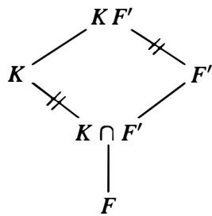

Proof" If $K / F$ is Galois, then $\pmb { K }$ is the splitting field of some separable polynomial $f ( x )$ in $F [ x ]$ . Then $K F ^ { \prime } / F ^ { \prime }$ is the splitting field of $f ( x )$ viewed as a polynomial in

$F ^ { \prime } [ x ]$ , hence this extension is Galois. Since $K / F$ is Galois, every embedding of K fixing $\pmb { F }$ is an automorphism of $\pmb { K }$ , so the map

$$
\varphi : \operatorname {G a l} \left(K F ^ {\prime} / F ^ {\prime}\right)\rightarrow \operatorname {G a l} (K / F)
$$

$$
\sigma \mapsto \sigma | _ {K}
$$

defined by restricting an automorphism $\pmb { \sigma }$ to the subfield $\pmb { K }$ is well defined. It is clearly a homomorphism, with kernel

$$
\ker \varphi = \{\sigma \in \operatorname {G a l} \left(K F ^ {\prime} / F ^ {\prime}\right) \mid \sigma | _ {K} = 1 \}.
$$

Since an element in $\mathbf { G a l } ( K F ^ { \prime } / F ^ { \prime } )$ is trivial on $F ^ { \prime }$ , the elements in the kernel are trivial both on $\pmb { K }$ and on $F ^ { \prime }$ , hence on their composite, so the kernel consists only of the identity automorphism. Hence $\varphi$ is injective.

Let H denote the image of $\varphi$ in $\operatorname { G a l } ( K / F )$ and let $K _ { H }$ denote the corresponding fixed subfield of $\pmb { K }$ containing $\pmb { F }$ . Since every element in $H$ fixes $F ^ { \prime }$ , $K _ { H }$ contains $K \cap F ^ { \prime }$ . On the other hand, the composite $K _ { H } F ^ { \prime }$ is fixed by $\mathbf { G a l } ( K F ^ { \prime } / F ^ { \prime } )$ (any $\sigma \in \operatorname { G a l } ( K F ^ { \prime } / F ^ { \prime } )$ fixes $F ^ { \prime }$ and acts on $K _ { H } \subseteq K$ via its restriction ${ \pmb { \sigma } } | _ { K } \in { \pmb { H } }$ , which fixes $K _ { H }$ by definition). By the Fundamental Theorem it follows that $K _ { H } F ^ { \prime } = F ^ { \prime }$ , so that $K _ { H } \subseteq F ^ { \prime }$ , which gives the reverse inclusion $K _ { H } \subseteq K \cap F ^ { \prime }$ . Hence $K _ { H } = K \cap F ^ { \prime }$ , so again by the Fundamental Theorem, $H = \mathbf { G a l } ( K / K \cap F ^ { \prime } )$ , completing the proof.

Corollary 20. Suppose $K / F$ is a Galois extension and $F ^ { \prime } / F$ is any finite extension. Then

$$
[ K F ^ {\prime}: F ] = \frac {[ K : F ] [ F ^ {\prime} : F ]}{[ K \cap F ^ {\prime} : F ]}.
$$

Proof: This follows by the proposition fromthe equality $[ K F ^ { \prime } : F ^ { \prime } ] = [ K : K \cap F ^ { \prime } ]$ given by the orders of the Galois groups in the proposition.

The example $F = \mathbb { Q }$ , $\begin{array} { r } { K = \mathbb { Q } ( \sqrt [ 3 ] { 2 } ) , } \end{array}$ ), $F ^ { \prime } = \mathbb { Q } ( \rho \sqrt [ 3 ] { 2 } )$ ), $\rho$ a primitive $3 ^ { \mathrm { r d } }$ root of unity, shows that the formula of Corollary 20 does not hold in general if neither of the two extensions is Galois.

Proposition 21. Let $K _ { 1 }$ and $K _ { 2 }$ be Galois extensions of a field $\pmb { F }$ . Then

(1) The intersection $K _ { 1 } \cap K _ { 2 }$ is Galois over $\pmb { F }$ .   
(2) The composite $K _ { 1 } K _ { 2 }$ is Galois over $\pmb { F }$ . The Galois group is isomorphic to the subgroup

$$
H = \left\{\left(\sigma , \tau\right) \mid \sigma | _ {K _ {1} \cap K _ {2}} = \tau | _ {K _ {1} \cap K _ {2}} \right\}
$$

of the direct product $\mathbf { G a l } ( K _ { 1 } / F ) \times \mathbf { G a l } ( K _ { 2 } / F )$ consisting of elements whose restrictions to the intersection $K _ { 1 } \cap K _ { 2 }$ are equal.

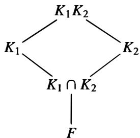

Proof" (1) Suppose $p ( x )$ is an irreducible polynomial in $F [ x ]$ with a root $\pmb { \alpha }$ in $K _ { 1 } \cap K _ { 2 }$ • Since $\alpha \in K _ { 1 }$ and $K _ { 1 } / F$ is Galois, all the roots of $p ( x )$ lie in $K _ { 1 }$ . Similarly all the roots lie in $K _ { 2 }$ , hence all the roots of $p ( x )$ lie in $K _ { 1 } \cap K _ { 2 }$ • It follows easily that $K _ { 1 } \cap K _ { 2 }$ is Galois as in Theorem 13.

(2) I f $K _ { 1 }$ is the splitting field of the separable polynomial $f _ { 1 } ( x )$ and $K _ { 2 }$ i s the splitting field of the separable polynomial $f _ { 2 } ( x )$ then the composite is the splitting field for the squarefree part of the polynomial $f _ { 1 } ( x ) f _ { 2 } ( x )$ , hence is Galois over $F$ .

The map

$$
\begin{array}{l} \varphi : \operatorname {G a l} \left(K _ {1} K _ {2} / F\right)\rightarrow \operatorname {G a l} \left(K _ {1} / F\right) \times \operatorname {G a l} \left(K _ {2} / F\right) \\ \sigma \mapsto (\sigma | _ {K _ {1}}, \sigma | _ {K _ {2}}) \\ \end{array}
$$

is clearly a homomorphism. The kernel consists of the elements $\sigma$ which are trivial on both $K _ { 1 }$ and $K _ { 2 }$ , hence trivial on the composite, so the map is injective. The image lies in the subgroup $H$ , since

$$
\left(\sigma \mid_ {K _ {1}}\right) \mid_ {K _ {1} \cap K _ {2}} = \sigma \mid_ {K _ {1} \cap K _ {2}} = \left(\sigma \mid_ {K _ {2}}\right) \mid_ {K _ {1} \cap K _ {2}}.
$$

The order of $H$ can be computed by observing that for every $\sigma \in \operatorname { G a l } ( K _ { 1 } / F )$ there are $| \mathrm { G a l } ( K _ { 2 } / K _ { 1 } \cap K _ { 2 } ) |$ elements $\tau \in \mathrm { G a l } ( K _ { 2 } / F )$ whose restrictions to $K _ { 1 } \cap K _ { 2 }$ $K _ { 1 }$ are $\sigma | _ { K _ { 1 } \cap K _ { 2 } }$ · Hence

$$
\begin{array}{l} | H | = | \operatorname {G a l} \left(K _ {1} / F\right) | \cdot | \operatorname {G a l} \left(K _ {2} / K _ {1} \cap K _ {2}\right) | \\ = | \operatorname {G a l} \left(K _ {1} / F\right) | \frac {| \operatorname {G a l} \left(K _ {2} / F\right) |}{| \operatorname {G a l} \left(K _ {1} \cap K _ {2} / F\right) |}. \\ \end{array}
$$

By Corollary 20 and the diagram above we see that the orders of $H$ and $\operatorname { G a l } ( K _ { 1 } K _ { 2 } / F )$ are then both equal to

$$
\left[ K _ {1} K _ {2}: F \right] = \frac {\left[ K _ {1}: F \right] \left[ K _ {2}: F \right]}{\left[ K _ {1} \cap K _ {2}: F \right]}.
$$

Hence the image of $\varphi$ is precisely $H$ , completing the proof.

Corollary 22. Let $K _ { 1 }$ and $K _ { 2 }$ be Galois extensions of a field $F$ with $K _ { 1 } \cap K _ { 2 } = F$ . Then

$$
\operatorname {G a l} \left(K _ {1} K _ {2} / F\right) \cong \operatorname {G a l} \left(K _ {1} / F\right) \times \operatorname {G a l} \left(K _ {2} / F\right).
$$

Conversely, if $\pmb { K }$ is Galois over $F$ and $\boldsymbol { G } = \mathbf { G a l } ( \boldsymbol { K } / F ) = \boldsymbol { G } _ { 1 } \times \boldsymbol { G } _ { 2 }$ is the direct product of two subgroups $G _ { 1 }$ and $G _ { 2 }$ , then $\pmb { K }$ is the composite of two Galois extensions $K _ { 1 }$ and $K _ { 2 }$ of $F$ with $K _ { 1 } \cap K _ { 2 } = F$ .

Proof" The first part follows immediately from the proposition. For the second, let $K _ { 1 }$ be the fixed field of $G _ { 1 } \subset G$ and let $K _ { 2 }$ be the fixed field of $G _ { 2 } \subset G .$ . Then $K _ { 1 } \cap K _ { 2 }$ is the field corresponding to the subgroup $G _ { 1 } G _ { 2 }$ , which is all of $G$ in this case, so $K _ { 1 } \cap K _ { 2 } = F .$ . The composite $K _ { 1 } K _ { 2 }$ is the field corresponding to the subgroup $G _ { 1 } \cap G _ { 2 }$ , which is the identity here, so $K _ { 1 } K _ { 2 } = K _ { \mathrm { { } } }$ , completing the proof.

Corollary 23. Let $E / F$ be any finite separable extension. Then $E$ is contained in an extension $\pmb { K }$ which is Galois over $\pmb { F }$ and is minimal in the sense that in a fixed algebraic closure of $\pmb { K }$ any other Galois extension of $F$ containing $E$ contains $\pmb { K }$ .

Proof" There exists a Galois extension of $\pmb { F }$ containing $E$ , for example the composite of the splitting fields of the minimal polynomials for a basis for $E$ over $\pmb { F }$ (which are all separable since $E$ is separable over $\pmb { F }$ ). Then the intersection of all the Galois extensions of $F$ containing $E$ is the field $\pmb { K }$ .

Definition. The Galois extension $\pmb { K }$ of $F$ containing $E$ i n the previous corollary is called the Galois closure of $E$ over $F$ .

It is often simpler to work in a Galois extension (for example in computing degrees as in Corollary 20). The existence of a Galois closure for a separable extension is frequently useful for reducing computations to consideration of Galois extensions.

Recall that an extension $\pmb { K }$ of $F$ is called simple if $K = F ( \theta )$ for some element $\theta$ , in which case $\theta$ is called a primitive element for $\pmb { K }$ .

Proposition 24. Let $K / F$ be a finite extension. Then $K = F ( \theta )$ if and only if there exist only finitely many subfields of $\pmb { K }$ containing $\pmb { F }$ .

Proof" Suppose first that $K = F ( \theta )$ i s simple. Let $E$ be a subfield of $\pmb { K }$ containing $F \colon F \subseteq E \subseteq K$ . Let $f ( x ) \in F [ x ]$ be the minimal polynomial for $\theta$ over $F$ and let $g ( x ) \in E [ x ]$ be the minimal polynomial for $\theta$ over $E$ . Then $g ( x )$ divides $f ( x )$ in $E [ x ]$ . Let $E ^ { \prime }$ be the field generated over $\pmb { F }$ by the coefficients of $g ( x )$ . Then $E ^ { \prime } \subseteq E$ and clearly the minimal polynomial for $\theta$ over $E ^ { \prime }$ is still $g ( x )$ . But then

$$
[ K: E ] = \deg g (x) = [ K: E ^ {\prime} ]
$$

implies that $E = E ^ { \prime }$ . It follows that the subfields of $\pmb { K }$ containing $\pmb { F }$ are the subfields generated by the coefficients of the monic factors of $f ( x )$ , hence there are finitely many such subfields.

Suppose conversely that there are finitely many subfields of $\pmb { K }$ containing $F$ . If $F$ is a finite field, then we have already seen that $\pmb { K }$ is a simple extension (Proposition 17). Hence we may suppose $F$ is infinite. It clearly suffices to show that $F ( \alpha , \beta )$ is generated by a single element since $\pmb { K }$ is finitely generated over $F .$ . Consider the subfields

$$
F (\alpha + c \beta), \quad c \in F.
$$

Then since there are infinitely many choices for $c \in F$ and only finitely many such subfields, there exist c, $c ^ { \prime }$ in $F$ $, c \neq c ^ { \prime }$ , with

$$
F (\alpha + c \beta) = F (\alpha + c ^ {\prime} \beta).
$$

Then $\alpha + c \beta$ and $\alpha + c ^ { \prime } \beta$ both lie i n $F ( \pmb { \alpha } + c \pmb { \beta } )$ , and taking their difference shows that $( c - c ^ { \prime } ) \beta \in F ( \alpha + c \beta )$ Hence $\beta \in F ( \alpha + c \beta )$ and then also $\alpha \in F ( \alpha + c \beta )$ . Therefore $F ( \alpha , \beta ) \subseteq F ( \alpha + c \beta )$ and since the reverse inclusion is obvious, we have

$$
F (\alpha , \beta) = F (\alpha + c \beta),
$$

completing the proof.

Theorem 25. (The Primitive Element Theorem) If $K / F$ is finite and separable, then $K / F$ is simple. In particular, any finite extension of fields of characteristic 0 is simple.

Proof: Let $L$ be the Galois closure of $\pmb { K }$ over $F _ { \ast }$ . Then any subfield of K containing $F$ corresponds to a subgroup of the Galois group $\operatorname { G a l } ( L / F )$ by the Fundamental Theorem. Since there are only finitely many such subgroups, the previous proposition shows that $K / F$ is simple. The last statement follows since any finite extension of fields in characteristic 0 is separable.

As the proof of the proposition indicates, a primitive element for an extension can be obtained as a simple linear combination of the generators for the extension. In the case of Galois extensions it is only necessary to determine a linear combination which is not fixed by any nontrivial element of the Galois group since then by the Fundamental Theorem this linear combination could not lie in any proper subfield.

# Examples

(1) The element $\sqrt { 2 } + \sqrt { 3 }$ generates the field $\mathbb { Q } ( { \sqrt { 2 } } , { \sqrt { 3 } } )$ as we have already seen (it is not fixed by any of the four Galois automorphisms of this field).   
(2) The field $\widehat { \mathbb { F } _ { p } } ( x , y )$ of rational functions in the variables $x$ and $y$ over the algebraic closure $\overline { { \mathbb { F } _ { p } } }$ of $\mathbb { F } _ { p }$ is not a simple extension of the subfield $F = \overline { { \mathbb { F } _ { p } } } ( x ^ { p } , y ^ { p } )$ . It is easy to see that

$$
[ \overline {{\mathbb {F} _ {p}}} (x, y): \overline {{\mathbb {F} _ {p}}} (x ^ {p}, y ^ {p}) ] = p ^ {2}
$$

and that the subfields

$$
F (x + c y), \quad c \in \overline {{\mathbb {F} _ {p}}}
$$

are all of degree $\pmb { p }$ over $\overline { { \mathbb { F } _ { p } } } ( x ^ { p } , y ^ { p } )$ (note that $( x + c y ) ^ { p } = x ^ { p } + c ^ { p } y ^ { p } \in { \widehat { \mathbb { F } } } _ { p } ( x ^ { p } , y ^ { p } ) )$ . If any two of these subfields were equal, then just as in the proof of Proposition 24 we would have

$$
\overline {{\mathbb {F} _ {p}}} (x, y) = F (x + c y)
$$

which is impossible by degree considerations. Hence there are infinitely many such subfields and the extension cannot be simple.

# E X E R C I S E S

1. Determine the Galois closure of the field $\mathbb { Q } ( { \sqrt { 1 + { \sqrt { 2 } } } } )$ ) over $\mathbb { Q } .$   
2. Find a primitive generator for $\mathbb { Q } ( { \sqrt { 2 } } , { \sqrt { 3 } } , { \sqrt { 5 } } )$ over $\mathbb { Q } .$   
3. Let $\pmb { F }$ be a field contained in the ring of $n \times n$ matrices over $\mathbb { Q }$ . Prove that $[ F : \mathbb { Q } ] \leq n$ (Note that, by Exercise 19 of Section 13.2, the ring of $n \times n$ matrices over $\mathbb { Q }$ does contain fields of degree n over $\mathbb { Q }$ .)   
4. Let $f ( x ) \in F [ x ]$ be an irreducible polynomial of degree $\pmb { n }$ over the field $\pmb { F }$ , let $\pmb { L }$ be the splitting field of $f ( x )$ over $\pmb { F }$ and let $\pmb { \alpha }$ be a root of $f ( x )$ in $L$ . If $\pmb { K }$ is any Galois extension of $F$ , show that the polynomial $f ( x )$ splits into a product of $\mathbf { \nabla } m$ irreducible polynomials each of degree $\pmb { d }$ over $\pmb { K }$ , where $d = [ K ( \alpha ) : K ] = [ ( L \cap K ) ( \alpha ) : L \cap K ]$ and $m = n / d = [ F ( \alpha ) \cap K : F ] .$ . [Show first that the factorization of $f ( x )$ over $\pmb { K }$ is the same as its factorization over $L \cap K$ . Then if $\pmb { H }$ is the subgroup of the Galois group of $\pmb { L }$

over $\pmb { F }$ corresponding to $L \cap K$ the factors of $f ( x )$ over $L \cap K$ correspond to the orbits of $\pmb { H }$ on the roots of $f ( x )$ . Use Exercise 9 of Section 4. 1 .]

5. Let $p$ be a prime and let $F$ be a field. Let $\pmb { K }$ be a Galois extension of $\pmb { F }$ whose Galois group is a $p { \cdot }$ -group (i.e., the degree $[ K : F ]$ is a power of $\pmb { p }$ ). Such an extension is called a $\pmb { p }$ -extension (note that $p$ -extensions are Galois by definition).

(a) Let $\pmb { L }$ be a $p$ -extension of K. Prove that the Galois closure of $\pmb { L }$ over $\pmb { F }$ is a $p { \cdot }$ -extension of $F$ .   
(b) Give an example to show that (a) need not hold if $[ K : F ]$ is a power of $p$ but $K / F$ is not Galois.

6. Prove that $\mathbb { F } _ { p } ( x , y ) / \mathbb { F } _ { p } ( x ^ { p } , y ^ { p } )$ is not a simple extension by explicitly exhibiting an infinite number of intermediate subfields.   
7. Let $F \subseteq K \subseteq L$ and let $\theta \in L$ with $\pmb { p } ( \pmb { x } ) = \pmb { m } _ { \theta , F } ( \pmb { x } )$ . Prove that $K \otimes _ { F } F ( \theta ) \cong$ $K [ x ] / ( p ( x ) )$ as $\pmb { K }$ -algebras.   
8. Let $\pmb { K } _ { 1 }$ and $\pmb { K } _ { 2 }$ be two algebraic extensions of a field $\pmb { F }$ contained in the field $\pmb { L }$ of characteristic zero. Prove that the $\pmb { F }$ -algebra $K _ { 1 } \otimes _ { F } K _ { 2 }$ has no nonzero nilpotent elements. [Use the preceding exercise.]

# 1 4.5 CYCLOTOMIC EXTENSIONS AND ABELIAN EXTENSIONS OVER Q

We have already determined that the cyclotomic field $\mathbb { Q } ( \zeta _ { n } )$ of $n ^ { \mathrm { t h } }$ roots of unity is a Galois extension of $\mathbb { Q }$ of degree $\varphi ( n )$ where $\varphi$ denotes the Euler $\varphi \mathrm { . }$ -function. Any automorphism of this field is uniquely determined by its action on the primitive $n ^ { \mathrm { t h } }$ root of unity $\xi _ { n }$ . This element must be mapped to another primitive $n ^ { \mathrm { t h } }$ root of unity (recall these are the roots of the irreducible cyclotomic polynomial $\Phi _ { n } ( x ) .$ ). Hence $\sigma ( \zeta _ { n } ) = \zeta _ { n } ^ { \alpha }$ for some integer a, $1 \leq a < n$ , relatively prime to n. Since there are precisely $\varphi ( n )$ such integers $\pmb { a }$ it follows that in fact each of these maps is indeed an automorphism of $\mathbb { Q } ( \xi _ { n } )$ . Note also that we can define $\sigma _ { a }$ for any integer a relatively prime to $\pmb { n }$ by the same formula and that $\sigma _ { \alpha }$ depends only on the residue class of a modulo n.

Theorem 26. The Galois group of the cyclotomic field $\mathbb { Q } ( \xi _ { n } )$ of $n ^ { \mathrm { t h } }$ roots of unity is isomorphic to the multiplicative group $( \mathbb { Z } / n \mathbb { Z } ) ^ { \times }$ . The isomorphism is given explicitly by the map

$$
(\mathbb {Z} / n \mathbb {Z}) ^ {\times} \xrightarrow {\sim} \operatorname {G a l} (\mathbb {Q} (\zeta_ {n}) / \mathbb {Q})
$$

$$
a (\mathrm {m o d} n) \mapsto \sigma_ {a}
$$

where $\sigma _ { \alpha }$ is the automorphism defined by

$$
\sigma_ {a} (\zeta_ {n}) = \zeta_ {n} ^ {a}.
$$

Proof" The discussion above shows that $\sigma _ { \alpha }$ is an automorphism for any a (mod n), so the map above is well defined. It is a homomorphism since

$$
\begin{array}{l} \left(\sigma_ {a} \sigma_ {b}\right) \left(\zeta_ {n}\right) = \sigma_ {a} \left(\zeta_ {n} ^ {b}\right) = \left(\zeta_ {n} ^ {b}\right) ^ {a} \\ = \zeta_ {n} ^ {a b} \\ \end{array}
$$

which shows that $\sigma _ { a } \sigma _ { b } = \sigma _ { a b }$ · The map is bijective by the discussion above since we know that every Galois automorphism is of the form $\sigma _ { a }$ for a uniquely defined $\pmb { a }$ (mod n). Hence the map is an isomorphism.

# Examples

(1) The field $\mathbb { Q } ( \xi _ { 5 } )$ is Galois over $\mathbb { Q }$ with Galois group $( \mathbb { Z } / 5 \mathbb { Z } ) ^ { \times } \cong \mathbb { Z } / 4 \mathbb { Z } .$ . This is our first example of a Galois extension of $\mathbb { Q }$ of degree 4 with a cyclic Galois group. The elements of the Galois group are $\{ \sigma _ { 1 } = 1 , \sigma _ { 2 } , \sigma _ { 3 } , \sigma _ { 4 } \}$ in the notation above. A generator for this cyclic group is $\sigma _ { ^ 2 } : \zeta _ { 5 } \mapsto \zeta _ { 5 } ^ { 2 }$ (since 2 has order 4 in $( \mathbb { Z } / 5 \mathbb { Z } ) ^ { \times } )$ .

There -is precisely one nontrivial subfield, a quadratic extension of $\mathbb { Q }$ , the fixed field of the subgroup { 1 , $\sigma _ { 4 } = \sigma _ { - 1 } ]$ ). An element in this subfield is given by

$$
\alpha = \zeta_ {5} + \sigma_ {- 1} \zeta_ {5} = \zeta_ {5} + \zeta_ {5} ^ {- 1}
$$

since this element is clearly fixed by $\pmb { \sigma } _ { - 1 }$ · The element $\pmb { \zeta 5 }$ satisfies

$$
\zeta_ {5} ^ {4} + \zeta_ {5} ^ {3} + \zeta_ {5} ^ {2} + \zeta_ {5} + 1 = 0.
$$

Notice then that

$$
\begin{array}{l} \alpha^ {2} + \alpha - 1 = \left(\zeta_ {5} ^ {2} + 2 + \zeta_ {5} ^ {- 2}\right) + \left(\zeta_ {5} + \zeta_ {5} ^ {- 1}\right) - 1 \\ = \zeta_ {5} ^ {2} + 2 + \zeta_ {5} ^ {3} + \zeta_ {5} + \zeta_ {5} ^ {4} - 1 = 0. \\ \end{array}
$$

Solving explicitly for $\pmb { \alpha }$ we see that the quadratic extension of $\mathbb { Q }$ generated by $\pmb { \alpha }$ is $\mathbb { Q } ( { \sqrt { 5 } } )$ :

$$
\mathbb {Q} (\zeta_ {5} + \zeta_ {5} ^ {- 1}) = \mathbb {Q} (\sqrt {5}).
$$

It can be shown in general (this is not completely trivial) that for $\pmb { p }$ an odd prime the field $\mathbb { Q } ( \zeta _ { p } )$ contains the quadratic field $\mathbb { Q } ( { \sqrt { \pm p } } )$ ), where the $^ +$ sign is correct if $p \equiv 1 { \bmod { 4 } }$ and the - sign is correct if $p \equiv 3 { \bmod { 4 } }$ (cf. Exercise I l in Section 7).

(2) $\mathbb { Q } ( \zeta _ { 1 3 } ) , { \bf F o r } p$ an odd prime we can construct a primitive element for any of the subfields of $\mathbb { Q } ( \zeta _ { p } )$ as in the previous example. A basis for $\mathbb { Q } ( \zeta _ { p } )$ over $\mathbb { Q }$ is given by

$$
1, \zeta_ {p}, \zeta_ {p} ^ {2}, \dots , \zeta_ {p} ^ {p - 2}.
$$

Since

$$
\zeta_ {p} ^ {p - 1} + \zeta_ {p} ^ {p - 2} + \dots + \zeta_ {p} + 1 = 0
$$

we see that also the elements

$$
\zeta_ {p}, \zeta_ {p} ^ {2}, \dots , \zeta_ {p} ^ {p - 2}, \zeta_ {p} ^ {p - 1}
$$

form a basis. The reason for choosing this basis is that any $\pmb { \sigma }$ in the Galois group $\operatorname { G a l } ( \mathbb { Q } ( \zeta _ { p } ) / \mathbb { Q } )$ simply permutes these basis elements since these are precisely the primitive $p ^ { \mathtt { t h } }$ roots of unity. Note that it is at this point that we need $\pmb { p }$ to be a prime ­ in general the primitive $n ^ { \mathrm { t h } }$ roots of unity do not give a basis for the cyclotomic field of $\pmb { n } ^ { \hat { \pmb { \mathrm { u } } } }$ roots of unity over $\mathbb { Q }$ (for example, the primitive $4 ^ { \mathrm { t h } }$ roots of unity, $\pm i$ , are not linearly independent).

Let $\pmb { H }$ be any subgroup of the Galois group of $\mathbb { Q } ( \zeta _ { p } )$ over $\mathbb { Q }$ and let

$$
\alpha_ {H} = \sum_ {\sigma \in H} \sigma \zeta_ {p}, \tag {14.10}
$$

the sum of the conjugates of $\boldsymbol { \zeta } _ { p }$ by the elements in $\pmb { H }$ . For any $\tau \in H$ , the elements ra run over the elements of $\pmb { H }$ as $\pmb { \sigma }$ runs over the elements of $\pmb { H }$ . It follows that $\pmb { \tau } \pmb { \alpha } = \pmb { \alpha }$ , so

that $\pmb { \alpha }$ lies in the fixed field for H. If now $\pmb { \tau }$ is not an element of $\pmb { H }$ , then rex is the sum of basis elements (recall that any automorphism permutes the basis elements here), one of which is $\tau ( \zeta _ { p } )$ . If we had $\tau \alpha = \alpha$ then since these elements are a basis, we must have $\tau ( \zeta _ { p } ) = \sigma ( \zeta _ { p } )$ for one of the terms $\sigma \zeta _ { p }$ in ( 1 0). But this implies $\pmb { \tau } \pmb { \sigma } ^ { - 1 } = 1$ since this automorphism is the identity on $\zeta _ { p }$ · Then $\tau = \sigma \in H$ , a contradiction. This shows that $\pmb { \alpha }$ is not fixed by any automorphism not contained in $\pmb { H }$ , so that $\mathbb { Q } ( \pmb { \alpha } )$ is precisely the fixed field of $\pmb { H }$ .

For a specific example, consider the subfields of $\mathbb { Q } ( \zeta _ { 1 3 } )$ , which correspond to the subgroups of $( \mathbb { Z } / 1 3 \mathbb { Z } ) ^ { \times } \cong \mathbb { Z } / 1 2 \mathbb { Z }$ 3. A generator for this cyclic group is the automorphism $\sigma = \sigma _ { 2 }$ which maps $\zeta _ { 1 3 }$ to $\zeta _ { 1 3 } ^ { 2 }$ . The nontrivial subgroups correspond to the z 3nontrivial divisors of 12, hence are of orders 2, 3, 4, and 6 with generators $\sigma ^ { 6 } , \sigma ^ { 4 } , \sigma ^ { 3 }$ and $\sigma ^ { 2 }$ , respectively. The corresponding fixed fields will be of degrees 6, 4, 3 and 2 over $\mathbb { Q }$ , respectively. Generators are given by $( \zeta = \zeta _ { 1 3 } )$ )

$$
\zeta + \sigma^ {6} \zeta = \zeta + \zeta^ {2 ^ {6}} = \zeta + \zeta^ {- 1}
$$

$$
\zeta + \sigma^ {4} \zeta + \sigma^ {8} \zeta = \zeta + \zeta^ {2 ^ {4}} + \zeta^ {2 ^ {8}} = \zeta + \zeta^ {3} + \zeta^ {9}
$$

$$
\zeta + \sigma^ {3} \zeta + \sigma^ {6} \zeta + \sigma^ {9} \zeta = \zeta + \zeta^ {8} + \zeta^ {1 2} + \zeta^ {5}
$$

$$
\zeta + \sigma^ {2} \zeta + \sigma^ {4} \zeta + \sigma^ {6} \zeta + \sigma^ {8} \zeta + \sigma^ {1 0} \zeta = \zeta + \zeta^ {4} + \zeta^ {3} + \zeta^ {1 2} + \zeta^ {9} + \zeta^ {1 0}.
$$

The lattice of subfields for this extension is the following:

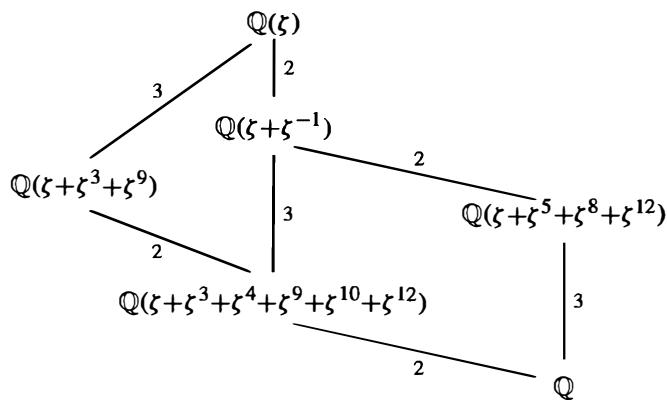

The elements constructed in equation (1 0) and their conjugates are called the periods of $\boldsymbol { \zeta }$ and are useful in the study of the arithmetic of the cyclotomic fields. The study of their combinatorial properties is referred to as cyclotomy.

Suppose that $n = p _ { 1 } ^ { a _ { 1 } } p _ { 2 } ^ { a _ { 2 } } \cdots p _ { k } ^ { a _ { k } }$ is the decomposition of $\pmb { n }$ into distinct prime powers. Since �!: $\zeta _ { n } ^ { p _ { 2 } ^ { a _ { 2 } } \cdots p _ { k } ^ { a _ { k } } }$ n2 a· · · Pk is a primitive $p _ { 1 } ^ { a _ { 1 } }$ -th root of unity, the field $K _ { 1 } = \mathbb { Q } ( \xi _ { p _ { 1 } ^ { a _ { 1 } } } )$ is a subfield of $\mathbb { Q } ( \xi _ { n } )$ . Similarly, each of the fields $K _ { i } = \mathbb { Q } ( \xi _ { p _ { i } ^ { a _ { i } } } )$ $K _ { i } = \mathbb { Q } ( \xi _ { p _ { i } ^ { a _ { i } } } ) , i = 1 , 2 , \ldots , k$ is a subfield of $\mathbb { Q } ( \xi _ { n } )$ . The composite of the fields contains the product $\zeta _ { p _ { 1 } ^ { a _ { 1 } } } \xi _ { p _ { 2 } ^ { a _ { 2 } } } \cdot \cdot \cdot \cdot \xi _ { p _ { k } ^ { a _ { k } } }$ , which is a primitive $\pmb { n } ^ { \hat { \Pi } }$ root of unity, hence the composite field is $\mathbb { Q } ( \xi _ { n } )$ . Since the extension degrees $[ K _ { i } : \mathbb { Q } ]$ equal $\varphi ( p _ { i } ^ { a _ { i } } ) , i = 1 , 2 , \ldots , k$ $\varphi ( p _ { i } ^ { a _ { i } } )$ and $\varphi ( n ) = \varphi ( p _ { 1 } ^ { a _ { 1 } } ) \varphi ( p _ { 2 } ^ { a _ { 2 } } ) \cdot \cdot \cdot \varphi ( p _ { k } ^ { a _ { k } } )$ , the degree of the composite of the fields $K _ { i }$ is precisely the product of the degrees of the $K _ { i }$ . It follows from Proposition 21 (and a simple induction from the two fields considered in the proposition to the $k$ fields here) that the intersection of all these fields

is precisely $\mathbb { Q } .$ Then Corollary 22 shows that the Galois group for $\mathbb { Q } ( \zeta _ { n } )$ is the direct product of the Galois groups over $\mathbb { Q }$ for the subfields $K _ { i }$ . We summarize this as the following corollary.

Corollary 27. Let $\pmb { n } = p _ { 1 } ^ { a _ { 1 } } p _ { 2 } ^ { a _ { 2 } } \cdot \cdot \cdot p _ { k } ^ { a _ { k } }$ be the decomposition of the positive integer n into distinct prime powers. Then the cyclotomic fields $\mathbb { Q } ( \xi _ { p _ { i } ^ { a _ { i } } } ) , i = 1 , 2 , \ldots , k$ intersect only in the field $\mathbb { Q }$ and their composite is the cyclotomic field $\mathbb { Q } ( \xi _ { n } )$ . We have

$$
\operatorname {G a l} (\mathbb {Q} (\zeta_ {n}) / \mathbb {Q}) \cong \operatorname {G a l} (\mathbb {Q} (\zeta_ {p _ {1} ^ {a _ {1}}}) / \mathbb {Q}) \times \operatorname {G a l} (\mathbb {Q} (\zeta_ {p _ {2} ^ {a _ {2}}}) / \mathbb {Q}) \times \dots \times \operatorname {G a l} (\mathbb {Q} (\zeta_ {p _ {k} ^ {a _ {k}}}) / \mathbb {Q})
$$

which under the isomorphism in Theorem 26 is the Chinese Remainder Theorem:

$$
(\mathbb {Z} / n \mathbb {Z}) ^ {\times} \cong (\mathbb {Z} / p _ {1} ^ {a _ {1}} \mathbb {Z}) ^ {\times} \times (\mathbb {Z} / p _ {2} ^ {a _ {2}} \mathbb {Z}) ^ {\times} \times \dots \times (\mathbb {Z} / p _ {k} ^ {a _ {k}} \mathbb {Z}) ^ {\times}.
$$

Proof: The only statement which has not been proved is the identification of the isomorphism of Galois groups with the statement of the Chinese Remainder Theorem on the group $( \mathbb { Z } / n \mathbb { Z } ) ^ { \times }$ , which is quite simple and is left for the exercises.

By Theorem 26 the Galois group of $\mathbb { Q } ( \zeta _ { n } ) / \mathbb { Q }$ is in particular an abelian group.

Definition. The extension $K / F$ is called an abelian extension if $K / F$ is Galois and $\operatorname { G a l } ( K / F )$ is an abelian group.

Since all the subgroups and quotient groups of abelian groups are abelian, we see by the Fundamental Theorem of Galois Theory that every subfield containing $F$ of an abelian extension of $F$ is again an abelian extension of $F .$ . By the results on composites of extensions in the last section, we also see that the composite of abelian extensions is again an abelian extension (since the Galois group of the composite is isomorphic to a subgroup of the direct product of the Galois groups, hence is abelian).

It is an open problem to determine which groups arise as the Galois groups of Galois extensions of $\mathbb { Q }$ . Using the results above we can see that every abelian group appears as the Galois group of some extension of $\mathbb { Q } .$ , in fact as the Galois group of some subfield of a cyclotomic field.

Let $n = p _ { 1 } p _ { 2 } \cdots p _ { k }$ be the product of distinct primes. Then by the Chinese Remainder Theorem

$$
\begin{array}{l} (\mathbb {Z} / n \mathbb {Z}) ^ {\times} \cong (\mathbb {Z} / p _ {1} \mathbb {Z}) ^ {\times} \times (\mathbb {Z} / p _ {2} \mathbb {Z}) ^ {\times} \times \dots \times (\mathbb {Z} / p _ {k} \mathbb {Z}) ^ {\times} \\ \cong \mathbf {Z} _ {p _ {1} - 1} \times \mathbf {Z} _ {p _ {2} - 1} \times \dots \times \mathbf {Z} _ {p _ {k} - 1}. \tag {14.11} \\ \end{array}
$$

Now, suppose $\pmb { G }$ is any finite abelian group. By the Fundamental Theorem for Abelian Groups,

$$
G \cong Z _ {n _ {1}} \times Z _ {n _ {2}} \times \dots \times Z _ {n _ {k}}
$$

for some integers $n _ { 1 } , n _ { 2 } , \ldots , n _ { k }$ . We take as known that given any integer m there are infinitely many primes $p$ with $p \equiv 1$ mod m (see the exercises following Section 13.6

for one proof using cyclotomic polynomials). Given this result, choose distinct primes Pt . pz , . . . , Pk such that $p 1 , p 2 , \ldots , p _ { k }$

$$
p _ {1} \equiv 1 \bmod n _ {1}
$$

$$
p _ {2} \equiv 1 \bmod n _ {2}
$$

$$
p _ {k} \equiv 1 \bmod n _ {k}
$$

and let $n = p _ { 1 } p _ { 2 } \cdots p _ { k }$ as above.

By construction, $n _ { i }$ divides $p _ { i } - 1$ for $i = 1 , 2 , \ldots , k ,$ , so the group $Z _ { p _ { i } - 1 }$ has a subgroup H; of order $H _ { i }$ p - 1 ${ \frac { p _ { i } - 1 } { n _ { i } } } \mathbf { f o r } i = 1 , 2 , \ldots , k ,$ and the quotient by this subgroup is cyclic of order $n _ { i }$ . Hence the quotient of $( \mathbb { Z } / n \mathbb { Z } ) ^ { \times }$ in equation ( l l) by $H _ { 1 } \times H _ { 2 } \times \cdots \times H _ { k }$ is isomorphic to the group $G$ .

By Theorem 26 and the Fundamental Theorem of Galois Theory, we see that there is a subfield of $\mathbb { Q } ( \zeta _ { p _ { 1 } p _ { 2 } \cdots p _ { k } } )$ which is Galois over $\mathbb { Q }$ with $\pmb { G }$ as Galois group. We summarize this in the following corollary.

Corollary 28. Let $\pmb { G }$ be any finite abelian group. Then there is a subfield $\pmb { K }$ of a cyclotomic field with ${ \mathrm { G a l } } ( K / \mathbb { Q } ) \cong G$ .

There is a converse to this result (whose proof is beyond our scope), the celebrated Kronecker-Weber Theorem:

Theorem (Kronecker-Weber) Let $\pmb { K }$ be a finite abelian extension of $\mathbb { Q } .$ Then $\pmb { K }$ is contained in a cyclotomic extension of $\mathbb { Q }$ .

The abelian extensions of $\mathbb { Q }$ are the "easiest" Galois extensions (at least in so far as the structure of their Galois groups is concerned) and the previous result shows they can be classified by the cyclotomic extensions of $\mathbb { Q } .$ For other finite extensions of $\mathbb { Q }$ as base field, it is more difficult to describe the abelian extensions. The study of the abelian extensions of an arbitrary finite extension $F$ of $\mathbb { Q }$ is referred to as class field theory. There is a classification of the abelian extensions of $F$ by invariants associated to $F$ which greatly generalizes the results on cyclotomic fields over $\mathbb { Q } .$ . In general, however, the construction of abelian extensions is not nearly as explicit as in the case of the cyclotomic fields. One case where such a description is possible is for the abelian extensions of an imaginary quadratic field $\mathcal { ( Q ( \sqrt { - D } ) }$ for $D$ positive), where the abelian extensions can be constructed by adjoining values of certain elliptic functions (this is the analogue of adjoining the roots of unity, which are the values of the exponential function $e ^ { x }$ for certain $x$ ). The study of the arithmetic of such abelian extensions and the search for similar results for non-abelian extensions are rich and fascinating areas of current mathematical research.

We end our discussion of the cyclotomic fields with the problem of the constructibility of the regular $\pmb { n }$ -gon by straightedge and compass.

Recall (cf. Section 1 3.3) that an element $\pmb { \alpha }$ is constructible over $\mathbb { Q }$ if and only if the field $\mathbb { Q } ( \pmb { \alpha } )$ is contained in a field $\pmb { K }$ obtained by a series of quadratic extensions:

$$
\mathbb {Q} = K _ {0} \subset K _ {1} \subset \dots \subset K _ {i} \subset K _ {i + 1} \subset \dots \subset K _ {m} = K \tag {14.12}
$$

with

$$
[ K _ {i + 1}: K _ {i} ] = 2, \quad i = 0, 1, \dots , m - 1.
$$

The construction of the regular n-gon in $\mathbb { R } ^ { 2 }$ i s evidently equivalent to the construction of the $n ^ { \mathrm { t h } }$ roots of unity, since the $n ^ { \mathrm { t h } }$ roots of unity form the vertices of a regular n-gon on the unit circle in $\mathbb { C }$ with one vertex at the point 1 .

The construction of $\xi _ { n }$ i s equivalent to the constructibility of the first coordinate $x$ in $\mathbb { R } ^ { 2 }$ of $\xi _ { n }$ , namely the real part of $\zeta _ { n }$ . Since the complex conjugate of $\xi _ { n }$ is just $\zeta _ { n } ^ { - 1 }$ , the real part of $\xi _ { n }$ is $x = \frac { 1 } { 2 } ( \zeta _ { n } + \zeta _ { n } ^ { - 1 } )$ . Note that $\xi _ { n }$ satisfies the quadratic equation $\zeta _ { n } ^ { 2 } - 2 x \zeta _ { n } + 1 = 0$ over $\mathbb { Q } ( x )$ . Since $\mathbb { Q } ( x )$ consists only of real numbers, it follows that $[ \mathbb { Q } ( \zeta _ { n } ) : \mathbb { Q } ( x ) ] = 2$ , so that $\mathbb { Q } ( x )$ is an extension of degree $\varphi ( n ) / 2$ of $\mathbb { Q } .$ .

It follows that if the regular $\pmb { n }$ ..gon can be constructed by straightedge and compass then $\varphi ( n )$ must be a power of 2. Conversely, if $\varphi ( n ) = 2 ^ { m }$ is a power of 2, then the Galois group $\operatorname { G a l } ( \mathbb { Q } ( \zeta _ { n } ) / \mathbb { Q } )$ is an abelian group whose order is a power of2, so the same is true for the Galois group $\mathbf { G a l } ( \mathbb { Q } ( x ) / \mathbb { Q } )$ . It is easy to see by the Fundamental Theorem for Abelian Groups that an abelian group $G$ of order $2 ^ { m }$ has a chain of subgroups

$$
G = G _ {m} > G _ {m - 1} > \dots > G _ {i + 1} > G _ {i} > \dots > G _ {0} = 1
$$

with

$$
[ G _ {i + 1}: G _ {i} ] = 2, \quad i = 0, 1, 2, \dots , m - 1.
$$

Applying this to the group $G = { \mathrm { G a l } } ( \mathbb { Q } ( x ) / \mathbb { Q } )$ and taking the fixed fields for the subgroups $G _ { i }$ $\mathcal { T } _ { i } , i = 0 , 1 , \ldots , m - 1$ , we obtain (by the Fundamental Theorem of Galois Theory) a sequence of quadratic extensions as in (12) above.

We conclude that the regular n-gon can be constructed by straightedge and compass if and only if $\varphi ( n )$ is a power of 2. Decomposing n into prime powers to compute $\varphi ( n )$ we see that this means $\dot { \boldsymbol { n } } = 2 ^ { k } p _ { 1 } \cdots p _ { r }$ is the product of a power of 2 and distinct odd primes $p _ { i }$ where $p _ { i } - 1$ is a power of 2. It is an elementary exercise to see that a prime $\pmb { p }$ with $p - 1$ a power of 2 must be of the form

$$
p = 2 ^ {2 s} + 1
$$

for some integer s . Such primes are called Fermat primes. The first few are

$$
\begin{array}{l} 3 = 2 ^ {1} + 1 \\ 5 = 2 ^ {2} + 1 \\ 1 7 = 2 ^ {4} + 1 \\ 2 5 7 = 2 ^ {8} + 1 \\ 6 5 5 3 7 = 2 ^ {1 6} + 1 \\ \end{array}
$$

(but $2 ^ { 3 2 } + 1$ is not a prime, being divisible by 641). It is not known if there are infinitely many Fermat primes. We summarize this in the following proposition.

Proposition 29. The regular $\pmb { n }$ -gon can be constructed by straightedge and compass if and only if $n = 2 ^ { k } p _ { 1 } \cdots p _ { r }$ is the product of a power of 2 and distinct Fermat primes.

The proof above actually indicates a procedure for constructing the regular n-gon as a succession of square roots. For example, the construction of the regular 17 -gon (solved by Gauss in 1796 at age 19) requires the construction of the subfields of degrees 2, 4, 8 and 16 in $\mathbb { Q } ( \zeta _ { 1 7 } )$ . These subfields can be constructed by forming the periods of $\xi _ { 1 7 }$ as in the example of the $1 3 ^ { \mathrm { t h } }$ roots of unity above. In this case, the fact that $\mathbb { Q } ( \zeta _ { 1 7 } )$ is obtained by a series of quadratic extensions reflects itself in the fact that the periods can be "halved" successively (i.e., if $H _ { 1 } < H _ { 2 }$ are subgroups with $[ H _ { 2 } : H _ { 1 } ] = 2$ then the periods for $H _ { 1 }$ satisfy a quadratic equation whose coefficients involve the periods for $H _ { 2 }$ ). For example, the periods for the subgroup of index 2 (generated by $\sigma _ { 2 }$ ) in the Galois group are $( \zeta = \xi _ { 1 7 } )$ 5

$$
\begin{array}{l} \eta_ {1} = \zeta + \zeta^ {2} + \zeta^ {4} + \zeta^ {8} + \zeta^ {9} + \zeta^ {1 3} + \zeta^ {1 5} + \zeta^ {1 6} \\ \eta_ {2} = \zeta^ {3} + \zeta^ {5} + \zeta^ {6} + \zeta^ {7} + \zeta^ {1 0} + \zeta^ {1 1} + \zeta^ {1 2} + \zeta^ {1 4} \\ \end{array}
$$

which "halve" the period for the full Galois group and which satisfy

$$
\eta_ {1} + \eta_ {2} = - 1
$$

(from the minimal polynomial satisfied by $\zeta _ { 1 7 }$ ) and

$$
\eta_ {1} \eta_ {2} = - 4
$$

(which requires computation - we know that it must be rational by Galois Theory, since this product is fixed by all the elements of the Galois group). Hence these two periods are the roots of the quadratic equation

$$
x ^ {2} + x - 4 = 0
$$

which we can solve explicitly. In a similar way, the periods for the subgroup of index 4 (generated by $\sigma _ { 4 . }$ ) naturally halve these periods, so are quadratic over these, etc. In this way one can determine $\pmb { \zeta _ { 1 7 } }$ explicitly in terms of iterated square roots. For example, one finds that $8 ( \xi + \zeta ^ { - 1 } ) = 1 6 \cos ( \frac { 2 \pi } { 1 7 } )$ (which is enough to construct the regular 17-gon) is given explicitly by

$$
- 1 + \sqrt {1 7} + \sqrt {2 (1 7 - \sqrt {1 7})} + 2 \sqrt {1 7 + 3 \sqrt {1 7} - \sqrt {2 (1 7 - \sqrt {1 7})}} - 2 \sqrt {2 (1 7 + \sqrt {1 7})}.
$$

A relatively simple construction of the regular 17 -gon (shown to us by J .H. Conway) is indicated in the exercises.

While we have seen that it is not possible to solve for $\xi _ { n }$ using only successive square roots in general, by definition it is possible to obtain $\xi _ { n }$ by successive extraction of higher roots (namely, taking an $n ^ { \mathrm { t h } }$ root of 1 ). This is not the case for solutions of general equations of degree n, where one cannot generally determine solutions by radicals, as we shall see in the next sections.

# E X E R C I S E S

1. Detennine the minimal polynomials satisfied by the primitive generators given in the text for the subfields of $\mathbb { Q } ( \zeta _ { 1 3 } )$ .

2. Detennine the subfields of $\mathbb { Q } ( \zeta _ { 8 } )$ generated by the periods of $\zeta _ { 8 }$ and in particular show that not every subfield has such a period as primitive element.

3. Detennine the quadratic equation satisfied by the period $\pmb { \alpha } = \xi \pmb { \varsigma } + \xi _ { \pmb { \varsigma } } ^ { - 1 }$ of the ${ \pmb 5 } ^ { \mathrm { t h } }$ root of unity $\pmb { \zeta 5 }$ . Determine the quadratic equation satisfied by $\pmb { \zeta 5 }$ over $\mathbb { Q } ( \pmb { \alpha } )$ and use this to explicitly solve for the ${ \pmb { 5 } } ^ { \mathrm { t h } }$ root of unity.

4. Let $\sigma _ { a } \in \operatorname { G a l } ( \mathbb { Q } ( \zeta _ { n } ) / \mathbb { Q } )$ denote the automorphism of the cyclotomic field of $n ^ { \mathrm { t h } }$ roots of unity which maps $\zeta _ { n }$ to $\zeta _ { n } ^ { a }$ where $\pmb { a }$ is relatively prime to $\pmb { n }$ and $\zeta _ { n }$ is a primitive $n ^ { \mathrm { t h } }$ root of unity. Show that $\sigma _ { a } ( \zeta ) = \zeta ^ { a }$ for every $n ^ { \mathrm { t h } }$ root of unity.

5. Let $\pmb { p }$ be a prime and let $\epsilon _ { 1 } , \epsilon _ { 2 } , \ldots , \epsilon _ { p - 1 }$ denote the primitive $p ^ { \mathtt { t h } }$ roots of unity. Set $p _ { n } = \epsilon _ { 1 } ^ { n } + \epsilon _ { 2 } ^ { n } + \cdot \cdot \cdot + \epsilon _ { p - 1 } ^ { n }$ , the sum of the $n ^ { \mathrm { t h } }$ powers of the $\epsilon _ { i }$ . Prove that $p _ { n } = - 1$ if $\pmb { p }$ does not divide n and that $p _ { n } = p - 1$ if $\pmb { p }$ does divide n. [One approach: $p _ { 1 } = - 1$ from $\bar { \phi } _ { p } ( x )$ ; show that $p _ { n }$ is a Galois conjugate of $_ { p 1 }$ for $\pmb { p }$ not dividing $\pmb { n }$ , hence is also $- 1 . ]$

6. Let $\zeta _ { n }$ denote a primitive $n ^ { \mathrm { t h } }$ root of unity and let $\pmb { K } = \mathbb { Q } ( \zeta _ { n } )$ be the associated cyclotomic field. Let a denote the trace of $\zeta _ { n }$ from $\pmb { K }$ to $\mathbb { Q }$ (cf. Exercise 1 8 of Section 2). Prove that ${ a = 1 }$ if $ n = 1$ , ${ \pmb a = 0 }$ if $\pmb { n }$ is divisible by the square of a prime, and $\pmb { \alpha } = ( - 1 ) ^ { r }$ if $\pmb { n }$ is the product of $r$ distinct primes.

7. Show that complex conjugation restricts to the automorphism $\pmb { \sigma } _ { - 1 } \in \mathbf { G a l } ( \mathbb { Q } ( \zeta _ { n } ) / \mathbb { Q } )$ of the cyclotomic field of $n ^ { \mathrm { t h } }$ roots of unity. Show that the field $K ^ { + } = \mathbb { Q } ( \zeta _ { n } + \zeta _ { n } ^ { - 1 } )$ is the subfield of real elements in $\pmb { K } = \mathbb { Q } ( \zeta _ { n } )$ , called the maximal real subfield of $\pmb { K }$ .

8 . Let $K _ { n } = \mathbb { Q } ( \zeta _ { 2 ^ { n + 2 } } )$ b e the cyclotomic field of $2 ^ { n + 2 }$ -th roots of unity, ${ \pmb n } \geq { \bf 0 }$ . Set $\alpha _ { n } =$ $\zeta _ { 2 ^ { n + 2 } } + \zeta _ { 2 ^ { n + 2 } } ^ { - 1 }$ and $K _ { n } ^ { + } = \mathbb { Q } ( \alpha _ { n } )$ , the maximal real subfield of $K _ { n }$ .

(a) Show that for all ${ \pmb n } \ge { \bf 0 }$ , $[ K _ { n } : \mathbb { Q } ] = 2 ^ { n + 1 }$ , $[ K _ { n } : K _ { n } ^ { + } ] = 2 .$ , $[ K _ { n } ^ { + } : \mathbb { Q } ] = 2 ^ { n }$ , and $[ K _ { n + 1 } ^ { + } : K _ { n } ^ { + } ] = 2 .$ .   
+(b) Detennine the quadratic equation satisfied by $\zeta _ { 2 ^ { n + 2 } }$ over $K _ { n } ^ { + }$ in terms of $\alpha _ { n }$   
(c) Show that for $n \geq 0 , \alpha _ { n + 1 } ^ { 2 } = 2 + \alpha _ { n }$ ${ \pmb n } \ge { \bf 0 }$ and hence show that

$$
\alpha_ {n} = \sqrt {2 + \sqrt {2 + \sqrt {\cdots + \sqrt {2}}}} \quad (n \text {t i m e s}),
$$

giving an explicit formula for the (constructible) $2 ^ { n + 2 }$ -th roots of unity.

9. Notation as in the previous exercise.

(a) Prove that $K _ { n } ^ { + }$ is a cyclic extension of $\mathbb { Q }$ of degree $2 ^ { n }$ . [Use an explicit isomorphism $( \mathbb { Z } / 2 ^ { n + 2 } \mathbb { Z } ) ^ { \times } \cong \mathbb { Z } / 2 \mathbb { Z } \times \mathbb { Z } / 2 ^ { n } \mathbb { Z }$ l. as abelian groups (i.e., $( \mathbb { Z } / 2 ^ { n + 2 } \mathbb { Z } ) ^ { \times }$ is isomorphic to a cyclic group of order 2 and a cyclic group of order $2 ^ { n }$ - cf. Exercises 22 and 23 of Section 2.3]   
(b) Prove that $K _ { n }$ is a biquadratic extension of $K _ { n - 1 } ^ { + }$ and that two of the three intermediate subfields are $K _ { n } ^ { + }$ and $K _ { n - 1 }$ · Prove that the remaining field intermediate between $K _ { n - 1 } ^ { + }$ and $K _ { n }$ is a cyclic extension of $\mathbb { Q }$ of degree $2 ^ { n }$ .

10. Prove that $\mathbb { Q } ( \sqrt [ 3 ] { 2 } )$ is not a subfield of any cyclotomic field over $\mathbb { Q }$

11. Prove that the primitive $n ^ { \mathrm { t h } }$ roots of unity form a basis over $\mathbb { Q }$ for the cyclotomic field of $n ^ { \mathrm { t h } }$ roots of unity if and only if $\pmb { n }$ is squarefree (i.e., $\pmb { n }$ is not divisible by the square of any prime).

12. Let $\sigma _ { p }$ denote the Frobenius automorphism $x \mapsto x ^ { p }$ of the finite field $\mathbb { F } _ { q }$ of $q = p ^ { n }$ elements. Viewing $\mathbb { F } _ { q }$ as a vector space $\pmb { V }$ of dimension n over $\mathbb { F } _ { p }$ we can consider $\sigma _ { p }$ as a linear transformation of V to $V .$ . Determine the characteristic polynomial of $\sigma _ { p }$ and prove that the linear transformation $\sigma _ { p }$ is diagonalizable over $\mathbb { F } _ { p }$ if and only if $\pmb { n }$ divides $p - 1 ,$ , and i s diagonalizable over the algebraic closure of $\mathbb { F } _ { p }$ i f and only i f $( n , p ) = 1$ .

13. Let $n = p _ { 1 } ^ { a _ { 1 } } p _ { 2 } ^ { a _ { 2 } } \ldots p _ { k } ^ { a _ { k } }$ be the prime factorization of $\pmb { n }$ and let $\zeta _ { n }$ be a primitive $n ^ { \mathrm { t h } }$ root of unity. For each $i = 1 , 2 , \ldots , k$ define $d _ { i }$ by $n = p _ { i } ^ { a _ { i } } d _ { i }$ and let $\zeta _ { p _ { i } ^ { a _ { i } } } = \zeta _ { n } ^ { d _ { i } }$ , so that $\zeta _ { p _ { i } ^ { a _ { i } } }$ is a particular primitive $p _ { i } ^ { a _ { i } }$ -th root of unity. Let $\sigma _ { a } \in \mathbf { G a l } ( \mathbb { Q } ( \zeta _ { n } ) / \mathbb { Q } )$ be the automorphism mapping $\xi _ { n }$ to $\zeta _ { n } ^ { \alpha }$ for $\pmb { a }$ relatively prime to $\pmb { n }$ .

(a) $i = 1 , 2 , \ldots , k , \sigma _ { a }$ $\sigma _ { a }$ $\zeta _ { p _ { i } ^ { a _ { i } } }$ $\zeta _ { p _ { i } ^ { a _ { i } } } ^ { a }$ and gives an autohich.we may denote $\mathbb { Q } ( \zeta _ { p _ { i } ^ { a _ { i } } } ) / \mathbb { Q } )$ $^ { a }$ $p _ { i } ^ { a _ { i } }$ $\sigma _ { a }$ $\textbf { \textit { a } } ( \mathrm { m o d } \ p _ { i } ^ { \alpha _ { i } } )$   
(b) Prove that the map $\sigma _ { a } \mapsto ( \sigma _ { a \mathrm { ~ } ( \mathrm { m o d ~ } p _ { 1 } ^ { a _ { 1 } } ) } , \hdots , \sigma _ { a \mathrm { ~ } ( \mathrm { m o d ~ } p _ { k } ^ { a _ { k } } ) } )$ is the isomorphism of Corollary 27 corresponding to the Chinese Remainder Theorem for $( \mathbb { Z } / n \mathbb { Z } ) ^ { \times }$ .

The following Exercises 14 to 18 determine the periods associated to a primitive $1 7 ^ { \mathrm { t h } }$ root of unity and provide a proof for the simple geometric construction indicated in Exercise 17 for the regular 1 7-gon. Let $\zeta = \zeta _ { 1 7 } = \cos { \frac { 2 \bar { \pi } } { 1 7 } } + i$ sin $\frac { 2 \pi } { 1 7 }$ be a fixed primitive $1 7 ^ { \mathrm { t h } }$ root of unity i n <C.

14. Define the periods of $\boldsymbol { \zeta }$ as follows:

$$
\begin{array}{l} \eta_ {1} = \zeta + \zeta^ {2} + \zeta^ {4} + \zeta^ {8} + \zeta^ {9} + \zeta^ {1 3} + \zeta^ {1 5} + \zeta^ {1 6} \quad \eta_ {3} ^ {\prime} = \zeta^ {6} + \zeta^ {7} + \zeta^ {1 0} + \zeta^ {1 1} \\ \eta_ {2} = \zeta^ {3} + \zeta^ {5} + \zeta^ {6} + \zeta^ {7} + \zeta^ {1 0} + \zeta^ {1 1} + \zeta^ {1 2} + \zeta^ {1 4} \quad \eta_ {4} ^ {\prime} = \zeta^ {3} + \zeta^ {5} + \zeta^ {1 2} + \zeta^ {1 4} \\ \eta_ {1} ^ {\prime} = \zeta + \zeta^ {4} + \zeta^ {1 3} + \zeta^ {1 6} \quad \eta_ {1} ^ {\prime \prime} = \zeta + \zeta^ {1 6} \\ \eta_ {2} ^ {\prime} = \zeta^ {2} + \zeta^ {8} + \zeta^ {9} + \zeta^ {1 5} \quad \eta_ {2} ^ {\prime \prime} = \zeta^ {4} + \zeta^ {1 3}. \\ \end{array}
$$

(a) Show that all of these periods are real numbers and that $\eta _ { 1 } ^ { \prime \prime } = 2 \cos { \frac { 2 \pi } { 1 7 } } .$ Show that as real numbers these periods are approximately

$$
\begin{array}{l} \eta_ {1} \sim 1. 5 6 2 \quad \eta_ {1} ^ {\prime} \sim 2. 0 4 9 \quad \eta_ {3} ^ {\prime} \sim - 2. 9 0 6 \quad \eta_ {1} ^ {\prime \prime} \sim 1. 8 6 5 \\ \eta_ {2} \sim - 2. 5 6 2 \quad \eta_ {2} ^ {\prime} \sim - 0. 4 8 8 \quad \eta_ {4} ^ {\prime} \sim 0. 3 4 4 \quad \eta_ {2} ^ {\prime \prime} \sim 0. 1 8 5. \\ \end{array}
$$

(b) Prove that $\pmb { \eta } _ { 1 }$ and $\pmb { \eta } _ { 2 }$ are roots of the equation $x ^ { 2 } + x - 4 = 0 .$   
(c) Prove that $\pmb { \eta } _ { 1 } ^ { \prime }$ and $\eta _ { 2 } ^ { \prime }$ are roots of the equation $x ^ { 2 } - \eta _ { 1 } x - 1 = 0$ and that $\pmb { \eta } _ { 3 } ^ { \prime }$ and $\pmb { \eta _ { 4 } ^ { \prime } }$ are roots of the equation $x ^ { 2 } - \eta _ { 2 } x - 1 = 0 .$ .   
(d) Prove that $\eta _ { 1 } ^ { \prime \prime }$ and $\eta _ { 2 } ^ { \prime \prime }$ are roots of the equation $x ^ { 2 } - \eta _ { 1 } ^ { \prime } x + \eta _ { 4 } ^ { \prime } = 0 .$

$( 0 < 2 \theta < \frac { \pi } { 2 } )$ $\pmb \theta$ $x ^ { 2 } - { \frac { 2 } { a } } x - 1 = 0 .$   
16. Let $c$ be the circle in $\mathbb { R } ^ { 2 }$ having the points $( h , k )$ and (0, 1) as a diameter. Prove that this circle intersects the $x$ -axis if and only if $h ^ { 2 } - 4 k \geq 0$ and in this case the two intercepts are the roots of the equation $x ^ { 2 } - h x + k = 0 .$ .   
17. (Construction of the Regular 1 7-gon) Draw a circle of radius 2 centered at the origin (0, 0) .

(a) Join the point (4, 0) to the point (0, 1) and construct the line $\ell _ { 1 }$ bisecting the angle

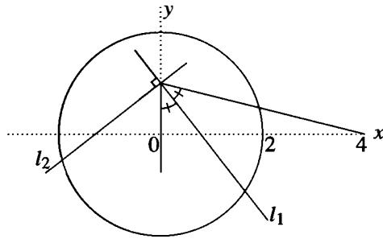

(b) Using the intersection of $\ell _ { 1 }$ and the $\pmb { x }$ -axis as center and radius equal to the distance to (0, 1), construct the circle $c _ { 1 }$ and let $A = ( s , 0 )$ be the right-hand point of intersection of $c _ { 1 }$ with the $\pmb { x }$ -axis. Similarly, let $\pmb { { \cal B } } = ( t , 0 )$ denote the right-hand point of intersection of the $\pmb { x }$ -axis and the circle $c _ { 2 }$ whose center is the intersection of $\ell _ { 2 }$ and the $\pmb { x }$ -axis and whose radius is equal to the distance to (0, 1) as in Figure 3.

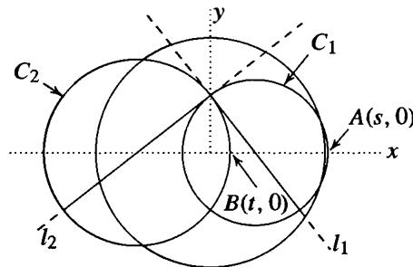  
Fig. 3

(c) Construct a perpendicular to the $\pmb { x }$ -axis at the point A and mark off the distance t from (0, 0) to $\pmb { B }$ to construct the point $( s , t )$ . Construct the circle with $( s , t )$ and (0, 1 ) as a diameter and let $P$ denote the right-hand point of intersection of this circle with the $\pmb { x }$ -axis. The perpendicular to the $\pmb { x }$ -axis at $P$ intersects the circle of radius 2 at the second vertex of a regular 17-gon whose first vertex is at (2,0), hence constructs the regular 17-gon by straightedge and compass as in Figure 4.

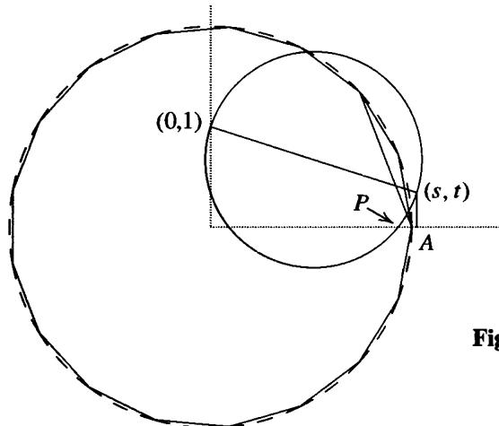  
ig. 4

18. Notation as in the previous exercises.

(a) Prove that $\ell _ { 1 }$ intersects the $x$ -axis in the point $( \eta _ { 1 } / 2 , 0 )$ and that $\ell _ { 2 }$ intersects the $x$ -axis in the point $( \eta _ { 2 } / 2 , 0 )$ .

(b) Prove that $c _ { 1 }$ is the circle having the points $( \eta _ { 1 } , - 1 )$ and (0, 1) as diameter. Prove that $s = \eta _ { 1 } ^ { \prime }$ · Similarly prove that $C _ { 2 }$ is the circle having the points $( \eta _ { 2 } , - 1 )$ and (0, 1 ) as diameter and that $t = \eta _ { 4 } ^ { \prime }$ .

(c) Prove that $P$ has coordinates $( \eta _ { 1 } ^ { \prime \prime } , 0 )$ and hence that the construction in the previous problem constructs the regular 17 -gon by straightedge and compass.

# 1 4.6 GALOIS GROUPS OF POLYNOMIALS

Recall that the Galois group of a separable polynomial $f ( x ) \in F [ x ]$ is defined to be the Galois group of the splitting field of $f ( x )$ 0\�er $F$ .

I f $\pmb { K }$ is a Galois extension of $F$ then $\pmb { K }$ is the splitting field for some separable polynomial $f ( x )$ over $F .$ . Any automorphism $\sigma \in \operatorname { G a l } ( K / F )$ maps a root of an irreducible factor of $f ( x )$ to another root of the irreducible factor and $\sigma$ is uniquely determined by its action on these roots (since they generate $\pmb { K }$ over $\pmb { F }$ ). If we fix a labelling of the roots $\alpha _ { 1 } , \ldots , \alpha _ { n }$ of $f ( x )$ we see that any $\sigma \in \operatorname { G a l } ( K / F )$ defines a unique permutation of $\alpha _ { 1 } , \ldots , \alpha _ { n }$ , hence defines a unique permutation of the subscripts $\left\{ 1 , 2 , \ldots , n \right\}$ (which depends on the fixed labelling of the roots). This gives an injection

$$
\operatorname {G a l} (K / F) \hookrightarrow S _ {n}
$$

of the Galois group into the symmetric group on n letters which is clearly a homomorphism (both group operations are composition). We may therefore think of Galois groups as subgroups of symmetric groups. Since the degree of the splitting field is the same as the order of the Galois group by the Fundamental Theorem. this explains from the group-theoretic side why the splitting field for a polynomial of degree $\pmb { n }$ over $F$ is of degree at most n ! over $F$ (Proposition 1 3 .26).

In general, if the factorization of $f ( x )$ into irreducibles is $f ( x ) = f _ { 1 } ( x ) \cdot \cdot \cdot f _ { k } ( x )$ where $f _ { i } ( x )$ has degree $n _ { i } , i = 1 , 2 , \ldots , k .$ , then since the Galois group permutes the roots of the irreducible factors among themselves we have $\operatorname { G a l } ( K / F ) \le S _ { n _ { 1 } } \times \cdot \cdot \cdot \times S _ { n _ { k } }$ .

If $f ( x )$ is irreducible, then given any two roots of $f ( x )$ there is an automorphism in the Galois group $G$ of $f ( x )$ which maps the first root to the second (this follows from our extension Theorem 1 3.27). Such a group is said to be transitive on the roots, i.e., you can get from any given root to any other root by applying some element of $G$ . The fact that the Galois group must be transitive on blocks of roots (namely, the roots of the irreducible factors) can often be helpful in reducing the number of possibilities for the structure of $\pmb { G }$ ( cf. the discussion of Galois groups of polynomials of degree 4 below).

# Examples

(1) Consider the biquadratic extension $\mathbb { Q } ( { \sqrt { 2 } } , { \sqrt { 3 } } )$ over $\mathbb { Q }$ , which is the splitting field of $( x ^ { 2 } - 2 ) ( x ^ { 2 } - 3 )$ . Label the roots as $\alpha _ { 1 } = \sqrt { 2 }$ , $\alpha _ { 2 } = - \sqrt { 2 }$ , $\alpha _ { 3 } = \sqrt { 3 }$ and $\alpha _ { 4 } = - \sqrt { 3 }$ The elements of the Galois group are $\{ 1 , \sigma , \tau , \sigma \tau \}$ where $\sigma$ maps $\sqrt { 2 }$ to $- \sqrt { 2 }$ and fixes $\sqrt { 3 }$ and $\pmb { \tau }$ fixes $\sqrt { 2 }$ and maps $\sqrt { 3 }$ to $- { \sqrt { 3 } } .$ . As permutations of the roots for this

labelling we see that $\pmb { \sigma }$ interchanges the first two and fixes the second two and $\pmb { \tau }$ fixes the first two and interchanges the second two, i.e.,

$$
\sigma = (1 2) \quad \text {a n d} \quad \tau = (3 4)
$$

as elements of $s _ { 4 }$ . Similarly, or by taking the product of these two elements, we see that

$$
\sigma \tau = (1 2) (3 4) \in S _ {4}.
$$

Hence

$$
\operatorname {G a l} (\mathbb {Q} (\sqrt {2}, \sqrt {3}) / \mathbb {Q}) \cong \{1, (1 2), (3 4), (1 2) (3 4) \} \subset S _ {4}
$$

identifying this Galois group with the Klein-4 subgroup of $s _ { 4 }$ . Note that if we had changed the labelling of the roots above we would have obtained a different (isomorphic) representation of the Galois group as a subgroup of $s _ { 4 }$ (for example, interchanging the second and third roots would have given the subgroup { 1 , (1 3) , (24) , (13) (24) }).

(2) The Galois group of $x ^ { 3 } - 2$ acts as permutations on the three roots $\sqrt [ 3 ] { 2 } , \rho \sqrt [ 3 ] { 2 }$ and $\rho ^ { 2 } \sqrt [ 3 ] { 2 }$ where $\pmb { \rho }$ is a primitive $3 ^ { \mathrm { r d } }$ root of unity. With this ordering, the generators $\pmb { \sigma }$ and $\pmb { \tau }$ we have defined earlier give the permutations

$$
\sigma = (1 2 3) \quad \tau = (2 3)
$$

which gives

$$
\{1, \sigma , \sigma^ {2}, \tau , \tau \sigma , \tau \sigma^ {2} \} = \{1, (1 2 3), (1 3 2), (2 3), (1 3), (1 2) \} = S _ {3},
$$

in this case the full symmetric group on 3 letters.

Recall that every finite group is isomorphic to a subgroup of some symmetric group $s _ { n }$ . It is an open problem to determine whether every finite group appears as the Galois group for some polynomial over $\mathbb { Q }$ . We have seen in the last section that every abelian group is a Galois group over $\mathbb { Q }$ (for some subfield of a cyclotomic field). We shall explicitly determine the Galois groups for polynomials of small degree $( \leq 4 )$ below which will in particular show that every subgroup of ${ \pmb S _ { 4 } }$ arises as a Galois group.

We first introduce some definitions and show that the "general" polynomial of degree $\pmb { n }$ has $s _ { n }$ as Galois group (so the second example above should be viewed as "typical").

Definition. Let $x _ { 1 }$ , x , . . • , $x _ { n }$ be indeterminates. Tbe elementary symmetricfunctions $s _ { 1 } , s _ { 2 } , \ldots , s _ { n }$ are defined by

$$
\begin{array}{l} s _ {1} = x _ {1} + x _ {2} + \dots + x _ {n} \\ s _ {2} = x _ {1} x _ {2} + x _ {1} x _ {3} + \dots + x _ {2} x _ {3} + x _ {2} x _ {4} + \dots + x _ {n - 1} x _ {n} \\ \begin{array}{c} \bullet \\ \bullet \\ \bullet \end{array} \\ s _ {n} = x _ {1} x _ {2} \dots x _ {n} \\ \end{array}
$$

i.e. , the $i ^ { \mathrm { t h } }$ symmetric function $s _ { i }$ of $x _ { 1 } , x _ { 2 } , \ldots , x _ { n }$ $x _ { 1 }$ is the sum of all products of the $x _ { j }$ ' s taken i at a time.

Definition. The general polynomial of degree n is the polynomial

$$
(x - x _ {1}) (x - x _ {2}) \dots (x - x _ {n})
$$

whose roots are the indeterminates $x _ { 1 } , x _ { 2 } , \ldots , x _ { n }$ .

It is easy to see by induction that the coefficients of the general polynomial of degree n are given by the elementary symmetric functions in the roots:

$$
(x - x _ {1}) (x - x _ {2}) \dots (x - x _ {n}) = x ^ {n} - s _ {1} x ^ {n - 1} + s _ {2} x ^ {n - 2} + \dots + (- 1) ^ {n} s _ {n}. \tag {14.13}
$$

For any field $F .$ , the extension $F ( x _ { 1 } , x _ { 2 } , \ldots , x _ { n } )$ is then a Galois extension of the field $F ( s _ { 1 } , s _ { 2 } , \ldots , s _ { n } )$ since it is the splitting field of the general polynomial of degree $\pmb { n }$ .

$\mathrm { I f } \sigma \in S _ { n }$ is any permutation of $\{ 1 , 2 , \ldots , n \}$ , then $\sigma$ acts on the rational functions in $F ( x _ { 1 } , x _ { 2 } , \ldots , x _ { n } )$ by permuting the subscripts of the variables $x _ { 1 } , x _ { 2 } , \ldots , x _ { n }$ $x _ { 1 }$ . It is clear that this gives an automorphism of $F ( x _ { 1 } , x _ { 2 } , \ldots , x _ { n } )$ . Identifying $\sigma \in S _ { n }$ with this automorphism of $F ( x _ { 1 } , x _ { 2 } , \ldots , x _ { n } )$ identifies $s _ { n }$ as a subgroup ofAut $( F ( x _ { 1 } , x _ { 2 } , \ldots , x _ { n } ) )$ ) .

The elementary symmetric functions $s _ { 1 } , s _ { 2 } , \ldots , s _ { n }$ are fixed under any permutation of their subscripts (this is the reason they are called symmetric), which shows that the subfield $F ( s _ { 1 } , s _ { 2 } , \ldots , s _ { n } )$ is contained in the fixed field of $S _ { n }$ . By the Fundamental Theorem of Galois Theory, the fixed field of $S _ { n }$ has index precisely n ! in $F ( x _ { 1 } , x _ { 2 } , \ldots , x _ { n } )$ . Since $F ( x _ { 1 } , x _ { 2 } , \ldots , x _ { n } )$ i s the splitting field over $F ( s _ { 1 } , s _ { 2 } , \ldots , s _ { n } )$ of the polynomial of degree $\pmb { n }$ in ( 1 3), we have

$$
[ F (x _ {1}, x _ {2}, \dots , x _ {n}): F (s _ {1}, s _ {2}, \dots , s _ {n}) ] \leq n!. \tag {14.14}
$$

It follows that we actually have equality and that $F ( s _ { 1 } , s _ { 2 } , \ldots , s _ { n } )$ is precisely the fixed field of $S _ { n }$ . This proves the following result.

Proposition 30. The fixed field of the symmetric group $S _ { n }$ acting on the field of rational functions in n variables $F ( x _ { 1 } , x _ { 2 } , \ldots , x _ { n } )$ is the field of rational functions in the elementary symmetric functions $F ( s _ { 1 } , s _ { 2 } , \ldots , s _ { n } )$ .

Definition. Arational function $f ( x _ { 1 } , x _ { 2 } , \ldots , x _ { n } )$ is called symmetric if it is not changed by any permutation of the variables $x _ { 1 } , x _ { 2 } , \ldots , x _ { n }$ ·

Corollary 31. (Fundamental Theorem on Symmetric Functions) Any symmetric function in the variables $x _ { 1 } , x _ { 2 } , \ldots , x _ { n }$ is a rational function in the elementary symmetric functions $s _ { 1 } , s _ { 2 } , \ldots , s _ { n }$ ·

Proof· A symmetric function lies in the fixed field of $S _ { n }$ above, hence is a rational function in $s _ { 1 } , \ldots , s _ { n }$ .

This corollary explains why these are called the elementary symmetric functions.

Remark: If $f ( x _ { 1 } , \ldots , x _ { n } )$ is a polynomial in $x _ { 1 } , x _ { 2 } , \ldots , x _ { n }$ which is symmetric then it can be seen that $f$ is actually a polynomial in $s _ { 1 }$ $s _ { 1 } , s _ { 2 } , \ldots , s _ { n } ,$ . which strengthens the statement of the corollary. It is in fact true that a symmetric polynomial whose coefficients lie in $R _ { * }$ , where $R$ is any commutative ring with identity, is a polynomial in the elementary symmetric functions with coefficients in $R .$ . A proof of this fact is implicit in the algorithm outlined in the exercises for writing a symmetric polynomial as a polynomial in the elementary symmetric functions.

# Examples

(1) The expression $( x _ { 1 } - x _ { 2 } ) ^ { 2 }$ is symmetric in $x _ { 1 } , x _ { 2 }$ . We have

$$
\left(x _ {1} - x _ {2}\right) ^ {2} = \left(x _ {1} + x _ {2}\right) ^ {2} - 4 x _ {1} x _ {2} = s _ {1} ^ {2} - 4 s _ {2},
$$

a polynomial in the elementary symmetric functions.

(2) The polynomial $x _ { 1 } ^ { 2 } + x _ { 2 } ^ { 2 } + x _ { 3 } ^ { 2 }$ is symmetric in $x _ { 1 } , x _ { 2 } , x _ { 3 }$ , and in this case We have

$$
\begin{array}{l} x _ {1} ^ {2} + x _ {2} ^ {2} + x _ {3} ^ {2} = (x _ {1} + x _ {2} + x _ {3}) ^ {2} - 2 (x _ {1} x _ {2} + x _ {1} x _ {3} + x _ {2} x _ {3}) \\ = s _ {1} ^ {2} - 2 s _ {2}. \\ \end{array}
$$

(3) The polynomial $x _ { 1 } ^ { 2 } x _ { 2 } ^ { 2 } + x _ { 1 } ^ { 2 } x _ { 3 } ^ { 2 } + x _ { 2 } ^ { 2 } x _ { 3 } ^ { 2 }$ is symmetric. Since

$$
\begin{array}{l} (x _ {1} x _ {2} + x _ {1} x _ {3} + x _ {2} x _ {3}) ^ {2} = x _ {1} ^ {2} x _ {2} ^ {2} + x _ {1} ^ {2} x _ {3} ^ {2} + x _ {2} ^ {2} x _ {3} ^ {2} + 2 \left(x _ {1} ^ {2} x _ {2} x _ {3} + x _ {2} ^ {2} x _ {1} x _ {3} + x _ {3} ^ {2} x _ {1} x _ {2}\right) \\ = x _ {1} ^ {2} x _ {2} ^ {2} + x _ {1} ^ {2} x _ {3} ^ {2} + x _ {2} ^ {2} x _ {3} ^ {2} + 2 x _ {1} x _ {2} x _ {3} \left(x _ {1} + x _ {2} + x _ {3}\right) \\ \end{array}
$$

we have

$$
x _ {1} ^ {2} x _ {2} ^ {2} + x _ {1} ^ {2} x _ {3} ^ {2} + x _ {2} ^ {2} x _ {3} ^ {2} = s _ {2} ^ {2} - 2 s _ {1} s _ {3}.
$$

Suppose now we start with the general polynomial

$$
x ^ {n} - s _ {1} x ^ {n - 1} + s _ {2} x ^ {n - 2} + \dots + (- 1) ^ {n} s _ {n}
$$

over the field $F ( s _ { 1 } , s _ { 2 } , \ldots , s _ { n } )$ where we view the $s _ { i } , i = 1 , 2 , \ldots , n$ $\pmb { S _ { i } }$ as indeterminates. If we define the roots of this polynomial to be $x _ { 1 } , x _ { 2 } , \ldots , x _ { n }$ then the $\pmb { s _ { i } }$ are precisely the elementary symmetric functions in the roots $x _ { 1 } , \ldots , x _ { n }$ . Moreover, these roots are indeterminates as well in the sense that there are no polynomial relations over $F$ between them. For suppose $p ( t _ { 1 } , \ldots , t _ { n } )$ is a nonzero polynomial in n variables with coefficients in $F$ such that $p ( x _ { 1 } , \ldots , x _ { n } ) = 0$ . Then the product, ${ \widetilde { p } } ,$ , over all $\pmb { \sigma }$ in $s _ { n }$ of $p ( t _ { \sigma ( 1 ) } , \ldots , t _ { \sigma ( n ) } )$ is a nonzero symmetric polynomial with $\widetilde { p } ( x _ { 1 } , \ldots , x _ { n } ) = 0 .$ . This gives a nonzero polynomial relation over $F$ among $s _ { 1 } , \ldots , s _ { n }$ , a contradiction. Conversely, if the roots of a polynomial $f ( x )$ are independent indeterminates over $F$ , then so are the coefficients of $f ( x )$ - cf. the beginning of Section 9. Thus defining the general polynomial over $F$ as having indeterminate roots or indeterminate coefficients is equivalent. From this point of view our result can be stated in the following form.

Theorem 32. The general polynomial

$$
x ^ {n} - s _ {1} x ^ {n - 1} + s _ {2} x ^ {n - 2} + \dots + (- 1) ^ {n} s _ {n}
$$

over the field $F ( s _ { 1 } , s _ { 2 } , \ldots , s _ { n } )$ is separable with Galois group $S _ { n }$

This result says that if there are no relations among the coefficients of a polynomial of degree n (which is what we mean when we say the $s _ { i }$ are indeterminates above) then the Galois group of this polynomial over the field generated by its coefficients is the full symmetric group $s _ { n }$ . Loosely speaking, this means that the "generic" polynomial of degree n will have $s _ { n }$ as Galois group. Note, however, that over finite fields every polynomial has a cyclic Galois group (all extensions of finite fields are cyclic), so that "generic" polynomials in this sense do not exist. Over $\mathbb { Q }$ one can make precise the

notion of "generic" polynomial and then it is true that most polynomials have the full symmetric group as Galois group.

For $n \geq 5$ there is only one normal subgroup of $S _ { n }$ , namely the subgroup $A _ { n }$ of index 2. Hence in general there is only one normal subfield of $F ( x _ { 1 } , x _ { 2 } , \ldots , x _ { n } )$ containing $F ( s _ { 1 } , s _ { 2 } , \ldots , s _ { n } )$ and it is an extension of degree 2.

Definition. Define the discriminant $D$ of $x _ { 1 } , x _ { 2 } , \ldots , x _ { n }$ by the formula

$$
D = \prod_ {i <   j} (x _ {i} - x _ {j}) ^ {2}.
$$

Define the discriminant of a polynomial to be the discriminant of the roots of the polynomial.

The discriminant $D$ is a symmetric function in $x _ { 1 } , \ldots , x _ { n }$ , hence is an element of $K = F ( s _ { 1 } , s _ { 2 } , \ldots , s _ { n } )$ .

When we first defined the alternating group $A _ { n }$ we saw that a permutation $\sigma \in S _ { n }$ is an element of the subgroup $A _ { n }$ if and only if $\pmb { \sigma }$ fixes the product

$$
\sqrt {D} = \prod_ {i <   j} (x _ {i} - x _ {j}) \in \mathbb {Z} [ x _ {1}, x _ {2}, \dots , x _ {n} ].
$$

It follows (by the Fundamental Theorem) that if $F$ has characteristic different from 2 then $\sqrt { D }$ generates the fixed field of $A _ { n }$ and generates a quadratic extension of $\pmb { K }$ . This proves the following proposition.

Proposition 33. If $\mathbf { c h } ( F ) \neq 2$ then the permutation $\sigma \in S _ { n }$ is an element of $A _ { n }$ if and only if it fixes the square root of the discriminant $D$ .

We now consider the Galois groups of separable polynomials of small degree $( \leq 4 )$ over a field $F$ which we assume is of characteristic different from 2 and 3. Note that over $\mathbb { Q }$ or over a finite field (or, more generally, over any perfect field) the splitting field of an arbitrary polynomial $f ( x )$ is the same as the splitting field for the product of the irreducible factors of $f ( x )$ taken precisely once, which is a separable polynomial.

If the roots of the polynomial $f ( x ) = x ^ { n } + a _ { n - 1 } x ^ { n - 1 } + \cdot \cdot \cdot + a _ { 1 } x + a _ { 0 }$ are $\alpha _ { 1 } , \alpha _ { 2 } , \ldots , \alpha _ { n }$ , then the discriminant of $f ( x ) \mathrm { i } s ^ { 2 }$

$$
D = \prod_ {i <   j} (\alpha_ {i} - \alpha_ {j}) ^ {2}.
$$

Note that $\pmb { D } = \mathbf { 0 }$ if and only if $f ( x )$ is not separable, i.e., if the roots ${ \pmb { \alpha } } _ { 1 }$ $\alpha _ { 1 } , \ldots , \alpha _ { n }$ $\pmb { \alpha _ { n } }$ are not distinct. Recall that over a perfect field (e.g., $\mathbb { Q }$ or a finite field) this implies $f ( x )$ ， is reducible since every irreducible polynomial over a perfect field is separable.

The discriminant $D$ is symmetric in the roots of $f ( x )$ , hence is fixed by all the automorphisms of the Galois group of $f ( x )$ . By the Fundamental Theorem it follows that

$D \in F$ . The discriminant can in general be written as a polynomial in the coefficients of $f ( x )$ (by Corollary 3 1 ) which are fairly complicated for larger degrees (we shall give formulas for $n \leq 4$ below). Finally, note that since

$$
\sqrt {D} = \prod_ {i <   j} (\alpha_ {i} - \alpha_ {j})
$$

we have the useful fact that $\sqrt { D }$ is always contained in the splitting field for $f ( x )$ .

If the roots of $f ( x )$ are distinct, fix some ordering of the roots and view the Galois group of $f ( x )$ as a subgroup of $s _ { n }$ as above.

Proposition 34. The Galois group of $f ( x ) \in F [ x ]$ is a subgroup of $A _ { n }$ if and only if the discriminant $D \in F$ is the square of an element of $F$ .

Proof: This is a restatement of Proposition 33 in this case. The Galois group is contained in $A _ { n }$ if and only if every element of the Galois group fixes

$$
\sqrt {D} = \prod_ {i <   j} \left(\alpha_ {i} - \alpha_ {j}\right)
$$

i.e., if and only if $\sqrt { D } \in F$ .

This property, together with the fact that $\pmb { D } = \mathbf { 0 }$ determines the presence of multiple roots, is the reason $\pmb { D }$ is called the discriminant.

# Polynomials of Degree 2

Consider the polynomial $x ^ { 2 } + a x + b$ with roots a, {3. The discriminant $\pmb { D }$ for this polynomial is $( \alpha - \beta ) ^ { 2 }$ , which can be written as a polynomial in the elementary symmetric functions of the roots. We did this in Example 1 above:

$$
D = s _ {1} ^ {2} - 4 s _ {2} = (- a) ^ {2} - 4 (b) = a ^ {2} - 4 b,
$$

the usual discriminant for this quadratic.

The polynomial is separable if and only if $a ^ { 2 } - 4 b \neq 0$ . The Galois group is a subgroup of $\mathscr { S } _ { 2 }$ . the cyclic group of order 2 and is trivial (i.e., $\pmb { A } _ { 2 }$ in this case) if and only if $a ^ { 2 } - 4 b$ is a rational square, which completely determines the possible Galois groups.

Note that this restates results we obtained previously by explicitly solving for the roots: if the polynomial is reducible (namely $\pmb { D }$ is a square in $F _ { \cdot }$ ), then the Galois group is trivial (the splitting field is just $F$ ), while if the polynomial is irreducible the Galois group is isomorphic to $\mathbb { Z } / 2 \mathbb { Z }$ since the splitting field is the quadratic extension $F ( \sqrt { D } )$ .

# Polynomials of degree 3

Suppose the cubic polynomial is

$$
f (x) = x ^ {3} + a x ^ {2} + b x + c. \tag {14.15}
$$

If we make the substitution $x = y - a / 3$ the polynomial becomes

$$
g (y) = y ^ {3} + p y + q \tag {14.16}
$$

where

$$
p = \frac {1}{3} \left(3 b - a ^ {2}\right) \quad q = \frac {1}{2 7} \left(2 a ^ {3} - 9 a b + 2 7 c\right). \tag {14.17}
$$

The splitting fields for these two polynomials are the same since their roots differ by the constant $a / 3 \in F$ and since the formula for the discriminant involves the diff erences of roots, we see that these two polynomials also have the same discriminant.

Let the roots of the polynomial in ( 1 6) be a, $\beta ,$ , and $\gamma$ . We first compute the discriminant of this polynomial in terms of $\pmb { p }$ and $q$ . Note that

$$
g (y) = (y - \alpha) (y - \beta) (y - \gamma)
$$

so that if we differentiate we have

$$
D _ {y} g (y) = (y - \alpha) (y - \beta) + (y - \alpha) (y - \gamma) + (y - \beta) (y - \gamma).
$$

Then

$$
\begin{array}{l} D _ {y} g (\alpha) = (\alpha - \beta) (\alpha - \gamma) \\ D _ {\gamma} g (\beta) = (\beta - \alpha) (\beta - \gamma) \\ D _ {y} g (\gamma) = (\gamma - \alpha) (\gamma - \beta). \\ \end{array}
$$

Taking the product we see that

$$
D = \left[ (\alpha - \beta) (\alpha - \gamma) (\beta - \gamma) \right] ^ {2} = - D _ {y} g (\alpha) D _ {y} g (\beta) D _ {y} g (\gamma).
$$

Since $D _ { y } g ( y ) = 3 y ^ { 2 } + p$ , we have

$$
\begin{array}{l} - D = (3 \alpha^ {2} + p) (3 \beta^ {2} + p) (3 \gamma^ {2} + p) \\ = 2 7 \alpha^ {2} \beta^ {2} \gamma^ {2} + 9 p \left(\alpha^ {2} \beta^ {2} + \alpha^ {2} \gamma^ {2} + \beta^ {2} \gamma^ {2}\right) + 3 p ^ {2} \left(\alpha^ {2} + \beta^ {2} + \gamma^ {2}\right) + p ^ {3}. \\ \end{array}
$$

The corresponding expressions in the elementary symmetric functions of the roots were determined in Examples 2 and 3 above. Note that here $\pmb { s } _ { 1 } = \mathbf { 0 }$ , $s _ { 2 } = p$ and $s _ { 3 } = - q$ . We obtain

$$
- D = 2 7 (- q) ^ {2} + 9 p \left(p ^ {2}\right) + 3 p ^ {2} (- 2 p) + p ^ {3}
$$

so that

$$
D = - 4 p ^ {3} - 2 7 q ^ {2}. \tag {14.18}
$$

This is the same as the discriminant of $f ( x )$ in ( 1 5). Expressing $D$ in terms of $a , b , c$ using ( 17) we obtain

$$
D = a ^ {2} b ^ {2} - 4 b ^ {3} - 4 a ^ {3} c - 2 7 c ^ {2} + 1 8 a b c \tag {14.18'}
$$

# (Galois Group of a Cubic)

a. If the cubic polynomial $f ( x )$ is reducible, then it splits either into three linear factors or into a linear factor and an irreducible quadratic. In the first case the Galois group is trivial and in the second case the Galois group is of order 2.

b. If the cubic polynomial $f ( x )$ is irreducible then a root of $f ( x )$ generates an extension of degree 3 over $F .$ , so the degree of the splitting field over $F$ is divisible by 3. Since the Galois group is a subgroup of $\pmb { S } _ { 3 }$ , there are only two possibilities, namely

$\pmb { A } _ { 3 }$ or ${ \cal S } _ { 3 }$ . The Galois group is $\pmb { A } _ { 3 }$ (i.e., cyclic of order 3) if and only if the discriminant $D$ in ( 1 8) is a square.

Explicitly, if $D$ is the square of an element of $F$ , then the splitting field of the irreducible cubic $f ( x )$ is obtained by adjoining any single root of $f ( x )$ to $F .$ . The resulting field is Galois over $F$ of degree 3 with a cyclic group of order 3 as Galois group. If $D$ is not the square of an element of $F$ then the splitting field of $f ( x )$ is of degree 6 over $F$ , hence is the field $F ( \theta , { \sqrt { D } } )$ for any one of the roots $\theta$ of $f ( x )$ . This extension is Galois over $F$ with Galois group $\pmb { S _ { 3 } }$ (generators are given by $\sigma$ (, which takes $\theta$ to one of the other roots of $f ( x )$ and fixes $\sqrt { D }$ , and $\pmb { \tau } .$ , which takes $\sqrt { D }$ to $- \sqrt { D }$ and fixes $\pmb \theta$ ) .

We see that in both cases the splitting field for the irreducible cubic $f ( x )$ is obtained by adjoining $\sqrt { D }$ and a root of $f ( x )$ to $F$ .

We shall give explicit formulas for the roots of (16) (Cardano 's Formulas) in the next section after introducing the notion of a Lagrange Resolvent.

# Polynomials of Degree 4

Let the quartic polynomial be

$$
f (x) = x ^ {4} + a x ^ {3} + b x ^ {2} + c x + d
$$

which under the substitution $x = y - a / 4$ becomes the quartic

$$
g (y) = y ^ {4} + p y ^ {2} + q y + r
$$

with

$$
\begin{array}{l} p = \frac {1}{8} (- 3 a ^ {2} + 8 b) \\ q = \frac {1}{8} (a ^ {3} - 4 a b + 8 c) \\ r = \frac {1}{2 5 6} (- 3 a ^ {4} + 1 6 a ^ {2} b - 6 4 a c + 2 5 6 d). \\ \end{array}
$$

Let the roots of $g ( y )$ be ${ \pmb { \alpha } } _ { 1 }$ . a2, a3, and $\pmb { \alpha _ { 4 } }$ and let $G$ denote the Galois group for the splitting field of $g ( y )$ (or of $f ( x ) )$ ).

Suppose first that $g ( y )$ is reducible. If $g ( y )$ splits into a linear and a cubic, then $G$ is the Galois group of the cubic, which we determined above. Suppose then that $g ( y )$ splits into two irreducible quadratics. Then the splitting field is the extension $F ( \sqrt { D _ { 1 } } , \sqrt { D _ { 2 } } )$ where $D _ { 1 }$ and $D _ { 2 }$ are the discriminants of the two quadratics. If $D _ { 1 }$ and $D _ { 2 }$ do not differ by a square factor then this extension is a biquadratic extension and $G$ is isomorphic to the Klein 4-subgroup of $\pmb { S _ { 4 } }$ • If $D _ { 1 }$ is a square times $D _ { 2 }$ then this extension is a quadratic extension and $G$ is isomorphic to $\mathbb { Z } / 2 \mathbb { Z } .$ .

We are reduced to the situation where $g ( y )$ is irreducible. In this case recall that the Galois group is transitive on the roots, i.e., it is possible to get from a given root to any other root by applying some automorphism of the Galois group. Examining the possibilities we see that the only transitive subgroups of $s _ { 4 }$ , hence the only possibilities

for our Galois group $G .$ , are the groups

s4 , A4

D8 = { 1 , ( 1324) , ( 1 2) (34) , ( 1423) , ( 1 3 ) (24) , ( 14) (23 ) , ( 1 2) , (34) } and its conjugates

$$
V = \{1, (1 2) (3 4), (1 3) (2 4), (1 4) (2 3) \}
$$

C = { 1 , ( 1234) , ( 1 3 ) (24) , ( 1 432) } and its conjugates.

$( D _ { 8 }$ is the dihedral group, a Sylow 2-subgroup of $s _ { 4 }$ , with 3 (isomorphic) conjugate subgroups in $s _ { 4 }$ , V is the Klein 4-subgroup of $\pmb { S _ { 4 } }$ , normal in $s _ { 4 }$ , and $c$ is a cyclic group, with 3 (isomorphic) conjugates in $s _ { 4 }$ ) .

Consider the elements

$$
\begin{array}{l} \theta_ {1} = \left(\alpha_ {1} + \alpha_ {2}\right) \left(\alpha_ {3} + \alpha_ {4}\right) \\ \theta_ {2} = \left(\alpha_ {1} + \alpha_ {3}\right) \left(\alpha_ {2} + \alpha_ {4}\right) \\ \theta_ {3} = \left(\alpha_ {1} + \alpha_ {4}\right) \left(\alpha_ {2} + \alpha_ {3}\right) \\ \end{array}
$$

in the splitting field for $g ( y )$ . These elements are permuted amongst themselves by the permutations in $s _ { 4 }$ . The stabilizer of $\theta _ { 1 }$ in $s _ { 4 }$ is the dihedral group $D _ { 8 }$ . The stabilizers in $s _ { 4 }$ of $\theta _ { 2 }$ and $\theta _ { 3 }$ are the conjugate dihedral subgroups of order 8. The subgroup of $S _ { 4 }$ which stabilizes all three of these elements is the intersection of these subgroups, namely the Klein 4-group $V$ .

Since $s _ { 4 }$ merely permutes $\theta _ { 1 } , \theta _ { 2 } , \theta _ { 3 }$ it follows that the elementary symmetric functions in the (J's are fixed by all the elements of $s _ { 4 }$ , hence are in $F$ . An elementary computation in symmetric functions shows that these elementary symmetric functions are ${ 2 p }$ $\bar { 2 } p , p ^ { 2 } - 4 r$ , and $- q ^ { 2 }$ , which shows that $\theta _ { 1 } , \theta _ { 2 } , \theta _ { 3 }$ are the roots of

$$
h (x) = x ^ {3} - 2 p x ^ {2} + \left(p ^ {2} - 4 r\right) x + q ^ {2}
$$

called the resolvent cubic for the quartic $g ( y )$ . Since

$$
\begin{array}{l} \theta_ {1} - \theta_ {2} = \alpha_ {1} \alpha_ {3} + \alpha_ {2} \alpha_ {4} - \alpha_ {1} \alpha_ {2} - \alpha_ {3} \alpha_ {4} \\ = - \left(\alpha_ {1} - \alpha_ {4}\right) \left(\alpha_ {2} - \alpha_ {3}\right) \\ \end{array}
$$

and similarly

$$
\begin{array}{l} \theta_ {1} - \theta_ {3} = - (\alpha_ {1} - \alpha_ {3}) (\alpha_ {2} - \alpha_ {4}) \\ \theta_ {2} - \theta_ {3} = - (\alpha_ {1} - \alpha_ {2}) (\alpha_ {3} - \alpha_ {4}) \\ \end{array}
$$

we see that the discriminant of the resolvent cubic is the same as the discriminant of the quartic $g ( y )$ , hence also as the discriminant of the quartic $f ( x )$ . Using our formula for the discriminant of the cubic, we can easily compute the discriminant in terms of $p , q , r$ :

$$
D = 1 6 p ^ {4} r - 4 p ^ {3} q ^ {2} - 1 2 8 p ^ {2} r ^ {2} + 1 4 4 p q ^ {2} r - 2 7 q ^ {4} + 2 5 6 r ^ {3}
$$

from which one can give the formula for $D$ in terms of $a , b , c , d$ :

$$
\begin{array}{l} D = - 1 2 8 b ^ {2} d ^ {2} - 4 a ^ {3} c ^ {3} + 1 6 b ^ {4} d - 4 b ^ {3} c ^ {2} - 2 7 a ^ {4} d ^ {2} + 1 8 a b c ^ {3} \\ + 1 4 4 a ^ {2} b d ^ {2} - 1 9 2 a c d ^ {2} + a ^ {2} b ^ {2} c ^ {2} - 4 a ^ {2} b ^ {3} d - 6 a ^ {2} c ^ {2} d \\ + 1 4 4 b c ^ {2} d + 2 5 6 d ^ {3} - 2 7 c ^ {4} - 8 0 a b ^ {2} c d + 1 8 a ^ {3} b c d. \\ \end{array}
$$

The splitting field for the resolvent cubic is a subfield of the splitting field of the quartic, so the Galois group of the resolvent cubic is a quotient of $\pmb { G }$ . Hence knowing the action of the Galois group on the roots of the resolvent cubic $h ( x )$ gives information about the Galois group of $g ( y )$ , as follows:

# (Galois group of a quartic)

a. Suppose first that the resolvent cubic is irreducible. If $D$ is not a square, then $\pmb { G }$ is not contained in $\pmb { A _ { 4 } }$ and the Galois group of the resolvent cubic is $\pmb { S _ { 3 } }$ , which implies that the degree of the splitting field for $g ( y )$ is divisible by 6. The only possibility is then $G = S _ { 4 }$ .   
b. If the resolvent cubic is irreducible and $D$ is a square, then $_ G$ is a subgroup of $A _ { 4 }$ and 3 divides the order of $\pmb { G }$ (the Galois group of the resolvent cubic is $A _ { 3 }$ ). The only possibility is $G = A _ { 4 }$ .   
cl. We are left with the case where the resolvent cubic is reducible. The first possibility is that $h ( x )$ has 3 roots in $F$ (i.e., splits completely). Since each of the elements $\theta _ { 1 } , \theta _ { 2 } , \theta _ { 3 }$ is in $F$ , every element of $\pmb { G }$ fixes all three of these elements, which means $G \subseteq V$ . The only possibility is $G = V$ .   
c2. I f $h ( x )$ splits into a linear and a quadratic, then precisely one of $\theta _ { 1 }$ , 02 , 03 i s in $F$ , say $\theta _ { 1 }$ . Then $\pmb { G }$ stabilizes $\theta _ { 1 }$ but not $\theta _ { 2 }$ and $\theta _ { 3 }$ , so we have $G \subseteq D _ { 8 }$ and $G \nsubseteq V$ . This leaves two possibilities: $G = D _ { 8 }$ or $G = C$ . One way to distinguish between these is to observe that $F ( \sqrt { D } )$ is the fixed field of the elements of $_ G$ in $\pmb { A _ { 4 } } .$ . For the two cases being considered, we have $D _ { 8 } \cap A _ { 4 } = V , C \cap A _ { 4 } = \{ 1 , ( 1 3 ) ( 2 4 ) \} .$ $D _ { 8 } \cap A _ { 4 } = V _ { \ast }$ $C \cap A _ { 4 } = \{ 1$ . The first group is transitive on the roots of $g ( y )$ , the second is not. It follows that the first case occurs if and only if $g ( y )$ is irreducible over $F ( \sqrt { D } )$ . We may therefore determine $\pmb { G }$ completely by factoring $g ( y )$ in $F ( \sqrt { D } )$ , and so completely determine the Galois group in all cases. ( cf. the exercises following and in the next section, where it is shown that over $\mathbb { Q }$ the Galois group cannot be cyclic of degree 4 if $D$ is not the sum of two squares - so in particular if $D < 0 .$ .)

We shall give explicit formulas for the roots of a quartic polynomial at the end of the next section.

# The Fundamental Theorem of Algebra

We end this section with two proofs of the Fundamental Theorem of Algebra. We need two facts regarding the field C:

(a) Every polynomial with real coefficients of odd degree has a root in the reals. Equivalently, there are no nontrivial finite extensions of $\mathbb { R }$ of odd degree.   
(b) Quadratic polynomials with coefficients in $\mathbb { C }$ have roots in C Equivalently, there are no quadratic extensions of $\mathbb { C }$

The first result follows from the Intermediate Value Theorem in calculus, since the graph of a monic polynomial $f ( x ) \in \mathbb { R } [ x ]$ of odd degree is negative for large negative values of $x$ and positive for large positive values of $x ,$ , hence crosses the axis somewhere. The equivalence with the second statement follows since a finite extension of $\mathbb { R }$ is a

simple extension and the minimal polynomial of a primitive element would have odd degree, hence would be both irreducible over $\mathbb { R }$ and have a root in $\mathbb { R }$ , hence must be of degree 1 .

The second result follows by a direct computation. B y the quadratic formula it suffices to show that every complex number $\alpha = a + b i , a , b \in \mathbb { R } .$ , has a square root in C. Write $\alpha = r e ^ { i \theta }$ for some $r \geq 0$ and some $\theta \in [ 0 , 2 \pi )$ . Then $\sqrt { r } e ^ { i \theta / 2 }$ is a square root of a. (Explicitly, let $c \in \mathbb { R }$ be a square root of the real number $\frac { a + { \sqrt { a ^ { 2 } + b ^ { 2 } } } } { 2 }$ and let $\pmb { d } \in \mathbb { R }$ be a square root of the real number $\frac { - a + { \sqrt { a ^ { 2 } + b ^ { 2 } } } } { 2 }$ where the signs of the two square roots are chosen so that cd has the same sign as $\pmb { b } .$ Then multiplying out we see that $( c + d i ) ^ { 2 } = a + b i .$ .)

Theorem 35. (Fundamental Theorem of Algebra) Every polynomial $f ( x ) \in \mathbb { C } [ x ]$ of degree n has precisely $\pmb { n }$ roots in $\mathbb { C }$ (counted with multiplicity). Equivalently, $\mathbb { C }$ is algebraically closed.

Proof I. It suffices to prove that every polynomial $f ( x ) \in \mathbb { C } [ x ]$ has a root in $\mathbb { C }$ . Let $\pmb { \tau }$ denote the automorphism complex conjugation. If $f ( x )$ has no root in $\mathbb { C }$ then neither does the conjugate polynomial ${ \overline { { f } } } ( x ) = \tau f ( x )$ obtained by applying $\pmb { \tau }$ to the coefficients of $f ( x )$ (since its roots are the conjugates of the roots of $f ( x ) )$ . The product $f ( x ) { \bar { f } } ( x )$ has coefficients which are invariant under complex conjugation, hence has real coefficients. It suffices then to prove that a polynomial with real coefficients has a root in C.

Suppose that $f ( x )$ is a polynomial of degree n with real coefficients and write $n = 2 ^ { k } m$ where $\mathbf { \nabla } m$ is odd. We prove that $f ( x )$ has a root in $\mathbb { C }$ by induction on k. For $k = 0$ , $f ( x )$ has odd degree and by (a) above $f ( x )$ has a root in $\mathbb { R }$ so we are done. Suppose now that $k \geq 1$ . Let $\alpha _ { 1 } , \alpha _ { 2 } , \ldots , \alpha _ { n }$ be the roots of $f ( x )$ and set $K = \mathbb { R } ( \alpha _ { 1 } , \alpha _ { 2 } , \ldots , \alpha _ { n } , i )$ . Then $\pmb { K }$ is a Galois extension of $\mathbb { R }$ containing $\mathbb { C }$ and the roots of $f ( x )$ . For any $t \in \mathbb { R }$ consider the polynomial

$$
L _ {t} = \prod_ {1 \leq i <   j \leq n} [ x - (\alpha_ {i} + \alpha_ {j} + t \alpha_ {i} \alpha_ {j}) ].
$$

Any automorphism of $K / \mathbb { R }$ permutes the terms in this product so the coefficients of $L _ { t }$ are invariant under all the elements of $\operatorname { G a l } ( K / \mathbb { R } )$ . Hence $L _ { t }$ is a polynomial with real coefficients. The degree of $L _ { t }$ is

$$
\frac {n (n - 1)}{2} = 2 ^ {k - 1} m \left(2 ^ {k} m - 1\right) = 2 ^ {k - 1} m ^ {\prime}
$$

where $m ^ { \prime }$ is odd (since $k \geq 1 \AA .$ ). The power of 2 in this degree is therefore less than $\pmb { k }$ , so by induction the polynomial $L _ { t }$ has a root in C. Hence for each $t \in \mathbb { R }$ one of the elements $\alpha _ { i } + \alpha _ { j } + t \alpha _ { i } \alpha _ { j }$ for some i, $j \left( 1 \leq i < j \leq n \right)$ is an element of $\mathbb { C }$ Since there are infinitely many choices for t and only finitely many values of i and $j$ we see that for some $_ i$ and $j$ (say, $i = 1$ and $j = 2 \rangle$ ) there are distinct real numbers s and $t$ with

$$
\alpha_ {1} + \alpha_ {2} + s \alpha_ {1} \alpha_ {2} \in \mathbb {C} \quad \alpha_ {1} + \alpha_ {2} + t \alpha_ {1} \alpha_ {2} \in \mathbb {C}.
$$

Since $s \neq t$ it follows that $\pmb { a } = \pmb { \alpha _ { 1 } } + \pmb { \alpha _ { 2 } } \in \mathbb { C }$ and $b = \alpha _ { 1 } \alpha _ { 2 } \in \mathbb { C } .$ But then ${ \pmb { \alpha } } _ { \bf { l } }$ and $\pmb { \alpha } _ { 2 }$ are the roots of the quadratic $\pmb { x } ^ { 2 } - a \pmb { x } + b$ with coefficients in $\mathbb { C }$ , hence are elements of $\mathbb { C }$ by (b) above, completing the proof.

II. The second proof again uses (a) and (b) above, but replaces the computations with the polynomials $L _ { t }$ above with a simple group-theoretic argument involving the nilpotency of a Sylow 2-subgroup of the Galois group:

Let $f ( x )$ be a polynomial of degree n with real coefficients and let $\pmb { K }$ be the splitting field of $f ( x )$ over $\mathbb { R }$ Then $K ( i )$ is a Galois extension of $\mathbb { R } .$ Let $\pmb { G }$ denote its Galois group and let $P _ { 2 }$ denote a Sylow 2-subgroup of $G .$ . The fixed field of $P _ { 2 }$ is an extension of $\mathbb { R }$ of odd degree, hence by (a) is trivial.

It follows that $\mathrm { { G a l } } ( K ( i ) / \mathbb { C } )$ is a 2-group. Since 2-groups have subgroups of all orders (recall this is true of a finite $\pmb { p }$ -group for any prime $\pmb { p }$ , cf. Theorem 6. 1 ), if this group is nontrivial, there would exist a quadratic extension of $\mathbb { C } ,$ impossible by (b), completing the proof.

The Fundamental Theorem of Algebra was first rigorously proved by Gauss in 1 8 16 (his doctoral dissertation in 1798 provides a proof using geometric considerations requiring some topological justification). The first proof above is essentially due to Laplace in 1795 (hence the reason fornarning the polynomials $L _ { t }$ ). The reason Laplace's proof was deemed unacceptable was that he assumed the existence of a splitting field for polynomials (i.e., that the roots existed somewhere in some field), which had not been established at that time. The elegant second proof is a simplification due to Artin.

# E X E R C I S E S

1. Show that a cubic with a multiple root has a linear factor. Is the same true for quartics?   
2. Determine the Galois groups of the following polynomials:

(a) $x ^ { 3 } - x ^ { 2 } - 4$   
(b) $x ^ { 3 } - 2 x + 4$   
(c) $\ x ^ { 3 } - x + 1$   
(d) $x ^ { 3 } + x ^ { 2 } - 2 x - 1 .$

3. Prove for any $a , b \in \mathbb { F } _ { p ^ { n } }$ that if $\ x ^ { 3 } + a x + b$ is irreducible then $- 4 a ^ { 3 } - 2 7 b ^ { 2 }$ is a square in $\mathbb { F } _ { p ^ { n } }$ ·   
4. Determine the Galois group of $x ^ { 4 } - 2 5$   
5. Determine the Galois group of $x ^ { 4 } + 4$ .   
6. Determine the Galois group of $x ^ { 4 } + 3 x ^ { 3 } - 3 x - 2 .$   
7. Determine the Galois group of $x ^ { 4 } + 2 x ^ { 2 } + x + 3$   
8. Determine the Galois group of $\pmb { x } ^ { 4 } + 8 \pmb { x } + 1 2$ .   
9. Determine the Galois group of $x ^ { 4 } + 4 x - 1$ (cf. Exercise 19).   
10. Determine the Galois group of $\pmb { x } ^ { 5 } + \pmb { x } - 1$   
11. Let $\boldsymbol { F }$ be an extension of $\mathbb { Q }$ of degree 4 that is not Galois over $\mathbb { Q }$ . Prove that the Galois closure of $\boldsymbol { F }$ has Galois group either ${ \pmb S } _ { 4 }$ , ${ \pmb A } _ { 4 }$ or the dihedral group $D _ { 8 }$ of order 8. Prove that the Galois group is dihedral if and only if $F$ contains a quadratic extension of $\mathbb { Q }$ .   
12. Prove that an extension $\boldsymbol { F }$ of $\mathbb { Q }$ of degree 4 can be generated by the root of an irreducible biquadratic $x ^ { 4 } + a x ^ { 2 } + b$ over $\mathbb { Q }$ if and only if $F$ contains a quadratic extension of $\mathbb { Q } .$ .

13. (a) Let ±a , $\pm \beta$ denote the roots of the polynomial $f ( x ) = x ^ { 4 } + a x ^ { 2 } + b \in \mathbb { Z } [ x ]$ . Prove that $f ( x )$ is irreducible if and only if $\pmb { \alpha } ^ { 2 }$ , $\alpha \pm \beta$ are not elements of $\mathbb { Q }$ <. 3

(b) Suppose $f ( x )$ is irreducible and let $\pmb { G }$ be the Galois group of $f ( x )$ . Prove that

(i) $G \cong V$ , the Klein 4-group, if and only if $\pmb { b }$ is a square in $\mathbb { Q }$ < if and only if $\alpha \beta \in \mathbb { Q }$ is rational.   
(ii) $G \cong C$ , the cyclic group of order 4, if and only if $b ( a ^ { 2 } - 4 b )$ is a square in $\mathbb { Q }$ if and only if $\mathbb { Q } ( \alpha \beta ) = \mathbb { Q } ( \alpha ^ { 2 } )$ .   
(iii) ${ \cal G } \cong { \cal D } _ { 8 }$ , the dihedral group of order 8, if and only if $\pmb { b }$ and $b ( a ^ { 2 } - 4 b )$ are not squares in $\mathbb { Q }$ if and only if $\bar { \alpha } \beta \notin \mathbb { Q } ( \alpha ^ { 2 } )$ .

14. Prove the polynomial $x ^ { 4 } - p x ^ { 2 } + q \in \mathbb { Q } [ x ]$ is irreducible for any distinct odd primes $\pmb { p }$ and $\pmb q$ and has as Galois group the dihedral group of order 8.4

15. Prove the polynomial $x ^ { 4 } + p x + p \in \mathbb { Q } [ x ]$ is irreducible for every prime $\pmb { p }$ and for $p \neq 3 ,$ , 5 has Galois group $s _ { 4 }$ . Prove the Galois group for $p = 3$ is dihedral of order 8 and for $p = 5$ is cyclic of order 4.5   
16. Determine the Galois group over $\mathbb { Q }$ of the polynomial $x ^ { 4 } + 8 x ^ { 2 } + 8 x + 4 .$ . Determine which of the subfields of this field are Galois over $\mathbb { Q }$ and for those which are Galois determine a polynomial $f ( x ) \in \mathbb { Q } [ x ]$ for which they are the splitting field over $\mathbb { Q } .$ <.   
17. Find the Galois group of $x ^ { 4 } - 7$ over $\mathbb { Q }$ < explicitly as a permutation group on the roots.   
18. Let $\pmb \theta$ be a root of $x ^ { 3 } - 3 x + 1$ . Prove that the splitting field of this polynomial is $\mathbb { Q } ( \pmb { \theta } )$ and that the Galois group is cyclic of order 3. In particular the other roots of this polynomial can be written in the form $a + b \theta + c \theta ^ { 2 }$ for some $a , b , c \in \mathbb { Q }$ <. Determine the other roots explicitly in terms of 6.   
19. Let $f ( x )$ be an irreducible polynomial of degree 4 in $\mathbb { Q } [ x ]$ with discriminant $\pmb { D } .$ . Let $\pmb { K }$ denote the splitting field of $f ( x )$ , viewed as a subfield of the complex numbers $\mathbb { C }$ .

(a) Prove that $\mathbb { Q } ( { \sqrt { D } } ) \subset K$   
(b) Let r denote complex conjugation and let $\pmb { \tau } _ { K }$ denote the restriction of complex conjugation to K. Prove that $\tau _ { K }$ is an element of $\operatorname { G a l } ( K / \mathbb { Q } )$ of order 1 or 2 depending on whether every element of $\pmb { K }$ is real or not.   
(c) Prove that if $D \ < 0$ then $\pmb { K }$ cannot be cyclic of degree 4 over $\mathbb { Q }$ (i.e., $\operatorname { G a l } ( K / \mathbb { Q } )$ cannot be a cyclic group of order 4).   
(d) Prove generally that $\mathbb { Q } ( { \sqrt { D } } )$ for squarefree $\pmb { D } < \mathbf { 0 }$ is not a subfield of a cyclic quartic field (cf. also Exercise 19 of Section 7).

20. Determine the Galois group of $( x ^ { 3 } - 2 ) ( x ^ { 3 } - 3 )$ over $\mathbb { Q } .$ . Determine all the subfields which contain $\mathbb { Q } ( \rho )$ where $\pmb { \rho }$ is a primitive $3 ^ { \mathrm { r d } }$ root of unity.   
21. Let $G \leq S _ { n }$ be a subgroup of the symmetric group and suppose $\sigma _ { 1 } , \ldots , \sigma _ { k }$ are generators for $\pmb { G }$ . If the function $f ( x _ { 1 } , x _ { 2 } , \ldots , x _ { n } )$ is fixed by the generators $\sigma _ { i }$ show it is fixed by $\pmb { G }$   
22. (Newton 's Fonnulas) Let $f ( x )$ be a monic polynomial of degree n with roots $\pmb { \alpha } _ { 1 } , \ldots , \pmb { \alpha } _ { n }$ Let $s _ { i }$ be the elementary symmetric function of degree i in the roots and define $\pmb { s } _ { i } = \mathbf { 0 }$ for $i > n$ . Let $p _ { i } = \alpha _ { 1 } ^ { i } + \cdot \cdot \cdot + \alpha _ { n } ^ { i } , i \geq 0 ,$ $i \geq 0$ , be the sum of the $i ^ { \mathbf { t h } }$ powers of the roots of $f ( x )$

Prove Newton 's Formulas:

$$
p _ {1} - s _ {1} = 0
$$

$$
p _ {2} - s _ {1} p _ {1} + 2 s _ {2} = 0
$$

$$
p _ {3} - s _ {1} p _ {2} + s _ {2} p _ {1} - 3 s _ {3} = 0
$$

$$
p _ {i} - s _ {1} p _ {i - 1} + s _ {2} p _ {i - 2} - \dots + (- 1) ^ {i - 1} s _ {i - 1} p _ {1} + (- 1) ^ {i} i s _ {i} = 0
$$

23. (a) $\operatorname { I f } x + y + z = 1 , x ^ { 2 } + y ^ { 2 } + z ^ { 2 } = 2$ and $x ^ { 3 } + y ^ { 3 } + z ^ { 3 } = 3 ,$ , determine $x ^ { 4 } + y ^ { 4 } + z ^ { 4 }$

(b) Prove generally that $x$ , y, z are not rational but that $x ^ { n } + y ^ { n } + z ^ { n }$ is rational for every positive integer $\pmb { n }$ .

24. Prove that an $\textbf { \em n } \times \pmb { \mathscr { n } }$ matrix A over a field of characteristic 0 is nilpotent if and only if the trace of $A ^ { k }$ is 0 for all ${ \pmb k } \geq { \bf 0 }$ .

25. Prove that two $n \times n$ matrices A and $\pmb { B }$ over a field of characteristic 0 have the same characteristic polynomial if and only if the trace of $A ^ { k }$ equals the trace of $B ^ { k }$ for all ${ \pmb k } \geq { \bf 0 }$ .

26. Use the fact that the trace of $\pmb { A } \pmb { B }$ is the same as the trace of $\pmb { B A }$ for any two $n \times n$ matrices A and $\pmb { B }$ to show that AB and BA have the same characteristic polynomial over a field of characteristic 0 (the same result is true over a field of arbitrary characteristic).

27. Let $f ( x )$ . be a monic polynomial of degree $\pmb { n }$ with roots $\alpha _ { 1 } , \alpha _ { 2 } , \ldots , \alpha _ { n }$

(a) Show that the discriminant $\pmb { D }$ of $f ( x )$ is the square of the Vandermonde determinant

$$
\left| \begin{array}{c c c c c} 1 & \alpha_ {1} & \alpha_ {1} ^ {2} & \ldots & \alpha_ {1} ^ {n - 1} \\ 1 & \alpha_ {2} & \alpha_ {2} ^ {2} & \ldots & \alpha_ {2} ^ {n - 1} \\ \vdots & \vdots & \vdots & \ddots & \vdots \\ 1 & \alpha_ {n} & \alpha_ {n} ^ {2} & \ldots & \alpha_ {n} ^ {n - 1} \end{array} \right| = \prod_ {i > j} (\alpha_ {i} - \alpha_ {j}).
$$

(b) Taking the Vandermonde matrix above, multiplying on the left by its transpose and taking the determinant show that one obtains

$$
D = \left| \begin{array}{c c c c c} p _ {0} & p _ {1} & p _ {2} & \dots & p _ {n - 1} \\ p _ {1} & p _ {2} & p _ {3} & \dots & p _ {n} \\ \vdots & \vdots & \vdots & \ddots & \vdots \\ p _ {n - 1} & p _ {n} & p _ {n + 1} & \dots & p _ {2 n - 2} \end{array} \right|
$$

where $p _ { i } = \alpha _ { 1 } ^ { i } + \cdot \cdot \cdot + \alpha _ { n } ^ { i }$ is the sum of the $i ^ { \mathrm { t h } }$ powers of the roots of $f ( x )$ , which can be computed in terms of the coefficients of $f ( x )$ using Newton's formulas above. This gives an efficient procedure for calculating the discriminant of a polynomial.

28. Let a be a root of the irreducible polynomial $f ( x ) \in F [ x ]$ and let $K = F ( \alpha )$ . Let $\pmb { D }$ be the discriminant of $f ( x )$ . Prove that $D = ( - 1 ) ^ { n ( n - 1 ) / 2 } \mathrm { N } _ { K / F } ( f ^ { \prime } ( \alpha ) )$ , where $f ^ { \prime } ( x ) = D _ { x } f ( x )$ is the derivative of $f ( x )$ .

The following exercises describe the resultant of two polynomials and in particular provide another efficient method for calculating the discriminant of a polynomial.

29. Let $\pmb { F }$ be a field and let $f ( x ) = a _ { n } x ^ { n } + a _ { n - 1 } x ^ { n - 1 } + \cdots + a _ { 1 } x + a _ { 0 }$ and $g ( x ) = b _ { m } x ^ { m } +$ $b _ { m - 1 } x ^ { m - 1 } + \cdot \cdot \cdot + b _ { 1 } x + b _ { 0 }$ be two polynomials in $F [ x ]$ .

(a) Prove that a necessary and sufficient condition for $f ( x )$ and $g ( x )$ to have a common root (or, equivalently, a common divisor in $F [ x ] )$ is the existence of a polynomial

$a ( x ) \in F [ x ]$ of degree at most $m - 1$ and a polynomial $b ( x ) \in F [ x ]$ of degree at most $n - 1$ with $a ( x ) f ( x ) = b ( x ) g ( x )$ .

(b) Writing $\alpha ( x )$ and $b ( x )$ explicitly as polynomials show that equating coefficients in the equation $a ( x ) f ( x ) = b ( x ) g ( x )$ gives a system of $n + m$ linear equations for the coefficients of $a ( x )$ and $b ( x )$ . Prove that this system has a nontrivial solution (hence $f ( x )$ and $g ( x )$ have a common zero) if and only if the determinant

$$
R (f, g) = \left| \begin{array}{c c c c c c c c} a _ {n} & a _ {n - 1} & \dots & a _ {0} & & & & \\ & a _ {n} & a _ {n - 1} & \dots & a _ {0} & & & \\ & & a _ {n} & a _ {n - 1} & \dots & a _ {0} & & \\ & & & \ddots & & & & \\ & & & & a _ {n} & a _ {n - 1} & \dots & a _ {0} \\ b _ {m} & b _ {m - 1} & \dots & b _ {0} & & & & \\ & b _ {m} & b _ {m - 1} & \dots & b _ {0} & & & \\ & & b _ {m} & b _ {m - 1} & \dots & b _ {0} & & \\ & & & \ddots & & & & \\ & & & & b _ {m} & b _ {m - 1} & \dots & b _ {0} \end{array} \right|
$$

is zero. Here $R ( f , g )$ , called the resultant of the two polynomials, is the determinant of an $( n + m ) \times ( n + m )$ matrix $\pmb { R }$ with $\pmb { m }$ rows involving the coefficients of $f ( x )$ and n rows involving the coefficients of $g ( x )$ .

30. (a) With notations as in the previous problem, show that we have the matrix equation

$$
R \left( \begin{array}{c} x ^ {n + m - 1} \\ x ^ {n + m - 2} \\ \vdots \\ x \\ 1 \end{array} \right) = \left( \begin{array}{c} x ^ {m - 1} f (x) \\ x ^ {m - 2} f (x) \\ \vdots \\ f (x) \\ x ^ {n - 1} g (x) \\ x ^ {n - 2} g (x) \\ \vdots \\ g (x) \end{array} \right).
$$

(b) Let $\pmb { R } ^ { \prime }$ denote the matrix of co factors of $\pmb { R }$ as in Theorem 30 of Section 1 1 .4, so ${ R ^ { \prime } R } = R ( f , g ) I$ , where $\pmb { I }$ is the identity matrix. Multiply both sides of the matrix equation above by $\pmb { R ^ { \prime } }$ and equate the bottom entry of the resulting column matrices to prove that there are polynomials $r ( x ) , s ( x ) \in F [ x ]$ such that $R ( f , g )$ is equal to $r ( x ) f ( x ) + s ( x ) g ( x )$ , i.e., the resultant of two polynomials is a linear combination (in $F [ x ] )$ of the polynomials.

31. Consider $f ( x )$ and $g ( x )$ as general polynomials and suppose the roots of $f ( x )$ $f ( x ) { \mathrm { a r e } } x _ { 1 } , \ldots , x _ { n }$ and the roots of $g ( x )$ are $y _ { 1 } , \ldots , y _ { m }$ . The coefficients of. $f ( x )$ are powers of $a _ { n }$ times the elementary symmetric functions in $x _ { 1 } , x _ { 2 } , \ldots , x _ { n }$ and the coefficients of. $g ( x )$ are powers of $b _ { m }$ times the elementary symmetric functions in $y _ { 1 } , y _ { 2 } , \ldots , y _ { m }$ ·

(a) By expanding the determinant show that $R ( f , g )$ is homogeneous of degree m in the coefficients $\pmb { a } _ { i }$ and homogeneous of degree $\pmb { n }$ in the coefficients $b _ { j }$ .   
(b) Show that $R ( f , g )$ is $a _ { n } ^ { m } b _ { m } ^ { n }$ times a symmetric function in $x 1 , \ldots , x _ { n }$ and $y _ { 1 } , \ldots , y _ { m }$   
(c) Since $R ( f , g )$ is 0 if $f ( x )$ and $g ( x )$ have a common root, say . $x _ { i } = y _ { j }$ . show that $R ( f , g )$ is divisible by $x _ { i } - y _ { j }$ for i = 1 , 2, . . , n, j = 1 , 2, .  . , m. Conclude by

degree considerations that

$$
R = a _ {n} ^ {m} b _ {m} ^ {n} \prod_ {i = 1} ^ {n} \prod_ {j = 1} ^ {m} (x _ {i} - y _ {j}).
$$

(d) Show that the product in (c) can be also be written

$$
R (f, g) = a _ {n} ^ {m} \prod_ {i = 1} ^ {n} g (x _ {i}) = (- 1) ^ {n m} b _ {m} ^ {n} \prod_ {j = 1} ^ {m} f (y _ {j}).
$$

This gives an interesting reciprocity between the product of $\pmb { \delta }$ evaluated at the roots of $f$ and ihe product of $f$ evaluated at the roots of $\pmb { \delta }$ .

32. Consider now the special case where $g ( x ) = f ^ { \prime } ( x )$ is the derivative of the polynomial $f ( x ) = x ^ { n } + a _ { n - 1 } x ^ { { \bar { n } } - 1 } + \cdots + a _ { 1 } x + a _ { 0 }$ and suppose the roots of $f ( x )$ are $\alpha _ { 1 } , \alpha _ { 2 } , \ldots , \alpha _ { n }$ . Using the formula

$$
R (f, f ^ {\prime}) = \prod_ {i = 1} ^ {n} f ^ {\prime} (\alpha_ {i})
$$

of the previous exercise, prove that

$$
D = (- 1) ^ {n (n - 1) / 2} R \left(f, f ^ {\prime}\right)
$$

where $\pmb { D }$ is the discriminant of $f ( x )$

33. (a) Prove that the discriminant of the cyclotomic polynomial $\bar { \Phi } _ { p } ( x )$ of the $p ^ { \mathtt { t h } }$ roots of unity for an odd prime $\pmb { p }$ is $( - 1 ) ^ { ( p - 1 ) / 2 } p ^ { p - 2 }$ [One approach: use Exercise 5 of the previous section together with the determinant form for the discriminant in terms of the power sums p; .]   
(b) Prove that $\mathbb { Q } ( { \sqrt { ( - 1 ) ^ { ( p - 1 ) / 2 } p } } ) \subset \mathbb { Q } ( \zeta _ { p } )$ for $\pmb { p }$ an odd prime. (Cf. also Exercise I I of Section 7.)   
34. Use the previous exercise to prove that every quadratic extension of $\mathbb { Q }$ is contained in a cyclotomic extension (a special case of the Kronecker-Weber Theorem).   
35. Prove that the discriminant $\pmb { D }$ of the polynomial $x ^ { n } + p x + q$ is given by the formula $( - 1 ) ^ { n ( n - 1 ) / 2 } n ^ { n } q ^ { n - 1 } + ( - 1 ) ^ { ( n - 1 ) ( n - 2 ) \bar { / } 2 } ( \bar { n } - 1 ) ^ { n - 1 } p ^ { n }$ .   
36. Prove that the discriminant o $: x ^ { n } + n x ^ { n - 1 } + n ( n - 1 ) x ^ { n - 2 } + \cdots + n ( n - 1 ) \ldots ( 3 ) ( 2 ) x + n !$ is $( - 1 ) ^ { n ( n - 1 ) / 2 } ( n ! ) ^ { n }$ .

The following exercises 37 to 43 outline two procedures for writing a symmetric function in terms of the elementary symmetric functions. Let $f ( x _ { 1 } , \ldots , x _ { n } )$ be a polynomial which is symmetric in $x _ { 1 } , \ldots , x _ { n }$ . Recall that the degree (sometimes called the weight) of the monomial $\hat { A } x _ { 1 } ^ { a _ { 1 } } x _ { 2 } ^ { a _ { 2 } } \ldots x _ { n } ^ { a _ { n } } \left( a _ { i } \geq 0 \right)$ $( a _ { i } \geq 0 )$ is $a _ { 1 } + a _ { 2 } + \cdots + a _ { n }$ nd that a polynomial is lwmogeneous (ofdegree $( m )$

37. (a) Show that every polynomial $f ( x _ { 1 } , \ldots , x _ { n } )$ can be written as a sum of homogeneous polynomials. Show that if $f ( x _ { 1 } , \ldots , x _ { n } )$ is symmetric then each of these homogeneous polynomials is also symmetric.   
(b) Show that the monomial $B \hat { s } _ { 1 } ^ { a _ { 1 } } \hat { s } _ { 2 } ^ { a _ { 2 } } \ldots \hat { s } _ { n } ^ { a _ { n } }$ in the elementary symmetric functions is a homogeneous polynomial in $x _ { 1 } , x _ { 2 } , \ldots , x _ { n }$ of degree $a _ { 1 } + 2 a _ { 2 } + \cdots + n a _ { n }$ .

In writing $f ( { \boldsymbol { x } } _ { 1 } , \ldots , { \boldsymbol { x } } _ { n } )$ as a polynomial in the symmetric functions it therefore suffices to assume that $f ( x _ { 1 } , \ldots , x _ { n } )$ is homogeneous.

Recall the lexicographic monomial order with $x _ { 1 } > x _ { 2 } > \cdots > x _ { n }$ defined in Section 9.6, where the nonzero monomial term with exponents $( a _ { 1 } , a _ { 2 } , \ldots , a _ { n } )$ comes before the nonzero monomial term with exponents $( b _ { 1 } , b _ { 2 } , \ldots , b _ { n } )$ if the initial components of the two $\pmb { n }$ -tuples of expon�nts are equal and the first component where they differ has $a _ { i } > b _ { i }$ . If $f ( x 1 , \ldots , x _ { n } )$ contains the monomial $A x _ { 1 } ^ { a _ { 1 } } x _ { 2 } ^ { a _ { 2 } } \ldots x _ { n } ^ { a _ { n } }$ then since $f ( x 1 , \ldots , x _ { n } )$ is symmetric it also contains all the permuted monomials. Among these choose the lexicographically largest monomial, which therefore satisfies $a _ { 1 } \geq a _ { 2 } \geq \cdots \geq a _ { n } \geq 0 .$ .

38. (a) Show that the monomial $A s _ { 1 } ^ { a _ { 1 } - a _ { 2 } } s _ { 2 } ^ { a _ { 2 } - a _ { 3 } } \cdot \cdot \cdot s _ { n } ^ { a _ { n } }$ in the elementary symmetric functions has the same lexicographic initial term.

(b) Show that subtracting $A s _ { 1 } ^ { a _ { 1 } - a _ { 2 } } s _ { 2 } ^ { a _ { 2 } - a _ { 3 } } \cdot \cdot \cdot s _ { n } ^ { a _ { n } }$ from $f ( x )$ yields either 0 or a symmetric polynomial of the same degree whose terms are lexicographically smaller than the terms in $f ( x _ { 1 } , \ldots , x _ { n } )$ ·   
(c) Show that the iteration of this procedure (lexicographic ordering, choosing the lexicographically largest term, subtracting the associated monomial in the elementary symmetric functions) terminates, expressing $f ( x _ { 1 } , \ldots , x _ { n } )$ as a polynomial in the elementary symmetric functions.

39. Use the algorithm described in Exercise 38 to prove that a polynomial $f ( x _ { 1 } , \ldots , x _ { n } )$ that is symmetric in $x _ { 1 } , \ldots , x _ { n }$ can be expressed uniquely as a polynomial in the elementary symmetric functions.

40. Use the procedure in Exercise 38 to express each of the following symmetric functions as a polynomial in the elementary symmetric functions:

(a) $( x _ { 1 } - x _ { 2 } ) ^ { 2 }$   
(b) $x _ { 1 } ^ { 2 } + x _ { 2 } ^ { 2 } + x _ { 3 } ^ { 2 }$   
(c) $x _ { 1 } ^ { \bar { 2 } } x _ { 2 } ^ { 2 } + \bar { x } _ { 1 } ^ { 2 } x _ { 3 } ^ { \bar { 2 } } + x _ { 2 } ^ { 2 } x _ { 3 } ^ { 2 } .$

41. Use the procedure in Exercise 38 to express $\textstyle \sum _ { i \neq j } x _ { i } ^ { 2 } x _ { j }$ as a polynomial in the elementary symmetric functions.

We now know that a symmetric polynomial $f ( x _ { 1 } , \ldots , x _ { n } )$ can be written uniquely as a polynomial in the elementary symmetric functions. Using this existence and uniqueness we can describe an alternate and computationally useful method for determining the coefficients of the elementary symmetric functions in this polynomiaL As in Exercise 37 we may assume that $f ( x 1 , \ldots , x _ { n } )$ is homogeneous of degree M. Let $N$ be the maximum degree of any of the variables $x _ { 1 } , \ldots , x _ { n }$ in $f ( x _ { 1 } , \ldots , x _ { n } )$ .

(a) Determine all of the possible monomials $A _ { i } s _ { 1 } ^ { a _ { 1 } } s _ { 2 } ^ { a _ { 2 } } \cdot \cdot \cdot s _ { n } ^ { a _ { n } }$ s� • • s�" appearing in $f ( x 1 , \ldots , x _ { n } )$ from the constraints

$$
a _ {1} + 2 a _ {2} + \dots + n a _ {n} = M
$$

$$
a _ {1} + a _ {2} + \dots + a _ {n} \leq N.
$$

(b) Since $\begin{array} { r } { f ( x _ { 1 } , \ldots , x _ { n } ) = \sum A _ { i } s _ { 1 } ^ { a _ { 1 } } s _ { 2 } ^ { a _ { 2 } } \cdot \cdot \cdot s _ { n } ^ { a _ { n } } } \end{array}$ is a polynomial identity, it i<> valid for any substitution of values for $x 1 , \ldots , x _ { n }$ . Each substitution into this equation gives a linear relation on the coefficients $A _ { i }$ and so a sufficient number of substitutions wil1 determine the $A _ { i }$ .

42. Show that the function $( x _ { 1 } + x _ { 2 } - x _ { 3 } - x _ { 4 } ) ( x _ { 1 } + x _ { 3 } - x _ { 2 } - x _ { 4 } ) ( x _ { 1 } + x _ { 4 } - x _ { 2 } - x _ { 3 } )$ is symmetric in $x 1 , x _ { 2 } , x _ { 3 } , x _ { 4 }$ and use the preceding procedure to prove it can be expressed as a polynomial in the elementary symmetric functions as $s _ { 1 } ^ { 3 } - 4 s _ { 1 } s _ { 2 } + 8 s _ { 3 }$ .

43. Express each of the following in terms of the elementary symmetric functions:

(a) $\textstyle \sum _ { i \neq j } x _ { i } ^ { 2 } x _ { j }$

(b) Li, j , k distinct $x _ { i } ^ { 2 } x _ { j } x _ { k }$

(c) $\textstyle \sum _ { i , j , k }$ distinct $x _ { i } ^ { 2 } x _ { j } ^ { 2 } x _ { k } ^ { 2 }$

44. Let $\alpha _ { 1 } , \alpha _ { 2 } , \alpha _ { 3 } , \alpha _ { 4 }$ be the roots of a quartic polynomial f (x) over Q. Show thatthe quantities $\alpha _ { 1 } \alpha _ { 2 } + \alpha _ { 3 } \alpha _ { 4 }$ , $\alpha _ { 1 } \alpha _ { 3 } + \alpha _ { 2 } \alpha _ { 4 }$ , and $\alpha _ { 1 } \alpha _ { 4 } + \alpha _ { 2 } \alpha _ { 3 }$ are permuted by the Galois group of $f ( x )$ . Conclude that these elements are the roots of a cubic polynomial with coefficients in $\mathbb { Q }$ (also sometimes referred to as the resolvent cubic of $f ( x ) )$ .   
45. If $f ( x ) = x ^ { 3 } + p x + q \in \mathbb { Z } [ x ]$ is irreducible, prove that its discriminant $D = - 4 p ^ { 3 } - 2 7 q ^ { 2 }$ is an integer not equal to 0, ± 1 .   
46. Prove that every finite group occurs as the Galois group of a field extension of the form $F ( x _ { 1 } , x _ { 2 } , \ldots , x _ { n } ) / E$ .   
47. Let $F$ be a field of characteristic 0 in which every cubic polynomial has a root. Let $f ( x )$ be an irreducible quartic polynomial over $F$ whose discriminant is a square in $F .$ . Determine the Galois group of $f ( x )$ .   
48. This exercise determines the splitting field $\pmb { K }$ for the polynomial $f ( x ) = x ^ { 6 } - 2 x ^ { 3 } - 2$ over $\mathbb { Q }$ (cf. also Exercise 2 of Section 8).   
(a) Prove that $f ( x )$ is irreducible over $\mathbb { Q }$ with roots the three cube roots of $1 \pm { \sqrt { 3 } }$   
(b) Prove that $\pmb { K }$ contains the field $\mathbb { Q } ( { \sqrt { - 3 } } )$ of $3 ^ { \mathrm { r d } }$ roots of unity and contains $\mathbb { Q } ( { \sqrt { 3 } } )$ , hence contains the biquadratic field $F = \mathbb { Q } ( i , { \sqrt { 3 } } )$ . Take the product of two of the roots in (a) to prove that $\pmb { K }$ contains $\sqrt [ 3 ] { 2 }$ and conclude that $\pmb { K }$ is an extension of the field ${ \cal L } = \mathbb { Q } ( \sqrt [ 3 ] { 2 } , i , \sqrt { 3 } )$ .   
(c) Prove that $\mathbf { [ } L : \mathbb { Q } ] = 1 2$ and that $\pmb { K }$ is obtained from $\pmb { L }$ by adjoining the cube root of an element in $L _ { \mathrm { * } }$ , so that $[ K : \mathbb { Q } ] = 1 2$ or 36.   
(d) Prove that if $[ K : \mathbb { Q } ] = 1 2$ then $K = \mathbb { Q } ( { \sqrt [ 3 ] { 2 } } , i , { \sqrt { 3 } } )$ ) and that $\operatorname { G a l } ( K / \mathbb { Q } )$ is isomorphic to the direct product of the cyclic group of order 2 and $s _ { 3 }$ . Prove that if $[ K : \mathbb { Q } ] = 1 2$ then there is a unique real cubic subfield in $\pmb { K }$ , namely $\mathbb { Q } ( { \sqrt [ 3 ] { 2 } } )$ .   
(e) Take the quotient ofthe two real roots in (a) to show that $\sqrt [ 3 ] { 2 + \sqrt { 3 } }$ and $\sqrt [ 3 ] { 2 - \sqrt { 3 } }$ (real roots) are both elements of $\pmb { K }$ . Show that $\alpha = \sqrt [ 3 ] { 2 + \sqrt { 3 } } + \sqrt [ 3 ] { 2 - \sqrt { 3 } }$ is a real root of the irreducible cubic equation $x ^ { 3 } - 3 x - 4$ whose discriminant is $- 2 ^ { 2 } 3 ^ { 4 }$ . Conclude that the Galois closure of $\mathbb { Q } ( \pmb { \alpha } )$ contains $\mathbb { Q } ( i )$ so in particular $\mathbb { Q } ( \alpha ) \neq \mathbb { Q } ( { \sqrt [ { 3 } ] { 2 } } )$ .   
(f) Conclude from (e) that $G = { \mathrm { G a l } } ( K / \mathbb { Q } )$ i s of order 36. Determine all the elements of G explicitly and in particular show that $\pmb { G }$ is isomorphic to $S _ { 3 } \times S _ { 3 }$ .   
49. Prove that the Galois group over $\mathbb { Q }$ of $x ^ { 6 } - 4 x ^ { 3 } + 1$ is isomorphic to the dihedral group of order 1 2. [Observe that the two real roots are inverses of each other.]   
50. (Criterion for the Galois Group of an Irreducible Cubic over an Arbitrary Field) Suppose $\pmb { K }$ is a field and $f ( x ) = x ^ { 3 } + a x ^ { 2 } + b x + c \in K [ x ]$ is irreducible, so the Galois group of $f ( x )$ over $\pmb { K }$ is either $s _ { 3 }$ or $A _ { 3 }$ .   
(a) Show that the Galois group of $f ( x )$ is $A _ { 3 }$ if and only if the resultant quadratic polynomial $g ( x ) = x ^ { 2 } + ( a b - 3 c ) x + ( b ^ { 3 } + a ^ { 3 } c - 6 a b c + 9 c ^ { 2 } )$ has a root in $\pmb { K } .$ . [If a, fJ, y are the roots of $f ( x )$ show that the Galois group is $A _ { 3 }$ if and only if the element $\theta = \alpha \beta ^ { 2 } + \beta \gamma ^ { 2 } + \gamma \alpha ^ { 2 }$ is an element of $\pmb { K }$ and that $\theta$ ( is a root of $g ( { \pmb x } ) . ]$ Show that the discriminant of $g ( x )$ is the same as the discriminant of $f ( x )$ .   
(b) $( \mathbf { c h } ( K ) \neq 2 )$ I f $\pmb { K }$ has characteristic different from 2 show either from (a) or directly from the definition of the discriminant that the Galois group of $f ( x )$ is $A _ { 3 }$ if and only if the discriminant of $f ( x )$ is a square in $\pmb { K }$ .   
(c) $( \mathbf { c h } ( K ) = 2 )$ If $\pmb { K }$ has characteristic 2 show that the discriminant of $f ( x )$ is always a square. Show that $f ( x )$ can be taken to be of the form $x ^ { 3 } + p x + q$ and that the Galois group of $f ( x )$ is $\pmb { A } _ { 3 }$ if and only if the quadratic $x ^ { 2 } + q x + ( p ^ { 3 } + q ^ { 2 } )$ has a root in $\pmb { K }$ (equivalently, if $( p ^ { 3 } + q ^ { 2 } ) / q ^ { 2 } \stackrel { . } { \in } K$ is in the image of the Artin-Schreier map $x \mapsto x ^ { 2 } - x$ mapping $\pmb { K }$ to $\pmb { K }$ ) .

(d) If $K = \mathbb { F } _ { 2 } ( t )$ where t is transcendental over $\mathbb { F } _ { 2 }$ . Prove that the polynomials $x ^ { 3 } +$ $t ^ { 2 } x + t ^ { 3 }$ , $x ^ { 3 } + ( t ^ { 2 } + t + 1 ) x + ( t ^ { 2 } + t + 1 )$ 2, and $x ^ { 3 } + ( t ^ { 2 } + t + 1 ) x + ( t ^ { 3 } + t ^ { 2 } + t )$ have $A _ { 3 }$ as Galois group while $\ x ^ { 3 } + t ^ { 2 } x + t$ and $\scriptstyle { x ^ { 3 } } = x + t$ have $s _ { 3 }$ as Galois group.

51. This exercise proves Stunn 's Theorem determining the number of real roots of a polynomial $f ( x ) \in \mathbb { R } [ x ]$ in an interval $[ a , b ]$ . The multiple roots of $f ( x )$ are zeros of the g.c.d. of $f ( x )$ and its derivative $f ^ { \prime } ( x )$ , and it follows that to determine the real roots of $f ( x )$ in $[ a , b ]$ we may assume that the roots of $f ( x )$ are simple.

Apply the Euclidean algorithm to $f _ { 0 } ( x ) = f ( x )$ and its derivative $f _ { 1 } ( x ) = f ^ { \prime } ( x )$ using the negative of the remainder at each stage to find a sequence of polynomials $f ( x ) , f ^ { \prime } ( x ) , f _ { 2 } ( x ) , \ldots , f _ { n } ( x )$ with

$$
f _ {i - 1} (x) = q _ {i} (x) f _ {i} (x) - f _ {i + 1} (x) \quad i = 0, 1, \dots , n - 1
$$

where $f _ { n } ( x ) \in \mathbb { R }$ is a nonzero constant.

(a) Prove that consecutive polynomials /; (x), $f _ { i + 1 } ( x )$ for $i = 0 , 1 , \ldots , n - 1$ have no common zeros. [Show that otherwise $f _ { i + 2 } ( c ) = f _ { i + 3 } ( c ) = \cdots = 0$ , and derive a contradiction.]   
(b) If $f _ { i } ( c ) = 0$ for some $i = 0 , 1 , \ldots , n - 1$ , prove that one of the two values $f _ { i - 1 } ( c )$ $\pmb { f } _ { i + 1 } ( c )$ is strictly negative and the other is strictly positive.

For any real number $\pmb { \alpha }$ , let $V ( \pmb { \alpha } )$ denote the number of sign changes in the Stunn sequence of real numbers

$$
f (\alpha), f ^ {\prime} (\alpha), f _ {2} (\alpha), \dots , f _ {n} (\alpha),
$$

ignoring any 0' s that appear (for example - 1 , -2, 0, + 3, -4 has signs - -+- disregarding the 0, so there are 2 sign changes, the first from $^ { - 2 }$ to $+ 3$ , the second from $+ 3$ to -4).

(c) Suppose ${ \pmb { \alpha } } < \pmb { \beta }$ and that all the elements in the Sturm sequences for $\pmb { \alpha }$ and for $\beta$ are nonzero. Prove that unless $f _ { i } ( c ) = 0$ for some $\alpha < c < \beta$ and some $i \ =$ $0 , 1 , \ldots , n - 1$ , then the signs of all the elements in these two Sturm sequences are the same, so in particular $V ( \alpha ) = V ( \beta )$ .   
(d) If $f _ { j } ( c ) = 0$ prove that there is a sufficiently small interval $( \alpha , \beta )$ containing c so that $f _ { j } ( x )$ has no zero other than $^ { c }$ for $\alpha < x < \beta$ .   
(e) If $j \ge 1$ in (d), prove that the number of sign changes in $f _ { j - 1 } ( \alpha ) , f _ { j } ( \alpha ) , f _ { j + 1 } ( \alpha )$ and in $f _ { j - 1 } ( \beta ) , f _ { j } ( \beta ) , f _ { j + 1 } ( \beta )$ are the same. [Observe that $f _ { j - 1 } ( c )$ and $f _ { j + 1 } ( c )$ have opposite signs by (b) and $f _ { j - 1 } ( x )$ and $f _ { j + 1 } ( x )$ do not change sign in $( \alpha , \beta ) . ]$   
(f) If $j = 0$ in (d) show that the number of sign changes in $f ( \alpha ) , f ^ { \prime } ( \alpha )$ is one more than the number of sign changes in $f ( \beta ) , f ^ { \prime } ( \beta )$ . [If $f ^ { \prime } ( c ) > 0$ then $f ( x )$ is increasing at c, so that $f ( { \pmb \alpha } ) < { \bf 0 }$ , $f ( \beta ) > 0$ , and $f ^ { \prime } ( x )$ does not change sign in $( \alpha , \beta )$ , so the signs change from -+ to ++. Similarly if $f ^ { \prime } ( c ) < 0 . ]$   
(g) Prove Stunn's Theorem: if $f ( x )$ is a polynomial with real coefficients all of whose real roots are simple then the number of real zeros of $f ( x )$ in an interval $[ a , b ]$ where $f ( a )$ and $f ( b )$ are both nonzero is given by $V ( a ) - V ( b )$ . [Use (c), (e) and (f) to see that as $\pmb { \alpha }$ runs from $\pmb { a }$ to $\pmb { b }$ the number $V ( \pmb { \alpha } )$ of sign changes is constant unless $\pmb { \alpha }$ passes through a zero of $f ( x )$ , in which case it decreases by precisely 1 .]   
(h) Suppose $f ( x ) = x ^ { 5 } + p x + q \in \mathbb { R } [ x ]$ has simple roots. Show that the sequence of polynomials above is given by f(x), 5x4 + p, $( - 4 p / 5 ) x + q$ , and $- D / ( \bar { 2 5 } 6 p ^ { 4 } )$ where $D = 2 5 6 p ^ { 5 } + 3 1 \bar { 2 } 5 q ^ { 4 }$ is the discriminant of $f ( x )$ . Conclude for $\pmb { p } > \mathbf { 0 }$ that $f ( x )$ has precisely one real root and for $\pmb { p } < \mathbf { 0 }$ that $f ( x )$ has precisely 1 or 3 real roots depending on whether $\pmb { D } > \mathbf { 0 }$ or $D < 0$ , respectively. [E.g. , if $\pmb { p } < \mathbf { 0 }$ and $D < 0$ then at $- \infty$ the signs are - + -+ with 3 sign changes and at $+ \infty$ the signs are + + ++ with no sign changes.]

# 1 4.7 SOLVABLE AND RADICAL EXTENSIONS: INSOLVABILITY OF THE QUINTIC

We now investigate the question of solving for the roots of a polynomial by radicals, that is, in terms of the algebraic operations of addition, subtraction, multiplication, division and the extraction of $n ^ { \mathrm { t h } }$ roots. The quadratic formula for the roots of a polynomial of degree 2 is familiar from elementary algebra and we shall derive below similar formulas for the roots of cubic and quartic polynomials. For polynomials of degree $\geq 5 ,$ however, we shall see that such formulas are not possible - this is Abel's Theorem on the insolvability of the general quintic. The reason for this is quite simple: we shall see that a polynomial is solvable by radicals if and only if its Galois group is a solvable group (which explains the terminology) and for $n \geq 5$ the group $S _ { n }$ is not solvable.

We first discuss simple radical extensions, namely extensions obtained by adjoining to a field $F$ the $n ^ { \mathrm { t h } }$ root of an element a in $F$ . Since all the roots of the polynomial ${ \pmb x } ^ { n } - { \pmb a }$ for $a \in F$ differ by factors of the $n ^ { \mathfrak { h } }$ roots of unity, adjoining one such root will give a Galois extension if and only if this field contains the $n ^ { \mathrm { t h } }$ roots of unity. Simple radical extensions are best behaved when the base field $F$ already contains the appropriate roots of unity. The symbol $\sqrt [ n ] { a }$ { for $a \in F$ will be used to denote any root of the polynomial $x ^ { n } - a \in F [ x ]$ .

Definition. The extension $K / F$ is said to b e cyclic if i t is Galois with a cyclic Galois group.

Proposition 36. Let $\pmb { F }$ be a field of characteristic not dividing n which contains the $n ^ { \mathrm { t h } }$ roots of unity. Then the extension $F ( \sqrt [ n ] { a } )$ for $a \in F$ is cyclic over $F$ of degree dividing n.

Proof" The extension $\pmb { K } = \pmb { F } ( \sqrt [ n ] { \pmb { a } } )$ is Galois over $F$ if $\pmb { F }$ contains the $n ^ { \mathrm { t h } }$ roots of unity since it is the splitting field for $x ^ { n } - a$ , For any $\sigma \in \operatorname { G a l } ( K / F )$ , $\pmb { \sigma } ( \sqrt [ n ] { a } )$ is another root of this polynomial, hence $\sigma ( \sqrt [ n ] { a } ) = \zeta _ { \sigma } \sqrt [ n ] { a }$ { for some $n ^ { \mathrm { t h } }$ root of unity $\zeta _ { \sigma }$ . This gives a map

$$
\begin{array}{l} \operatorname {G a l} (K / F) \to \mu_ {n} \\ \sigma \mapsto \zeta_ {\sigma} \\ \end{array}
$$

where $\mu _ { n }$ denotes the group of $n ^ { \mathrm { t h } }$ roots of unity. Since $\pmb { F }$ contains $\mu _ { n }$ , every $n ^ { \mathrm { t h } }$ root of unity is fixed by every element of $\operatorname { G a l } ( K / F )$ . Hence

$$
\begin{array}{l} \sigma \tau (\sqrt [ n ]{a}) = \sigma (\zeta_ {\tau} \sqrt [ n ]{a}) \\ = \zeta_ {\tau} \sigma (\sqrt [ n ]{a}) \\ = \zeta_ {\tau} \zeta_ {\sigma} ^ {n} \sqrt {a} = \zeta_ {\sigma} \zeta_ {\tau} ^ {n} \sqrt {a} \\ \end{array}
$$

which shows that $\zeta _ { \sigma \tau } = \zeta _ { \sigma } \zeta _ { \tau }$ , so the map above is a homomorphism. The kernel consists precisely of the automorphisms which fix $\sqrt [ n ] { a }$ {, namely the identity. This gives an injection of $\operatorname { G a l } ( K / F )$ into the cyclic group $\mu _ { n }$ of order $\pmb { n }$ , which proves the proposition.

Let now $\pmb { K }$ be any cyclic extension of degree n over a field $F$ of characteristic not dividing n which contains the $n ^ { \mathrm { t h } }$ roots of unity. Let $\pmb { \sigma }$ be a generator for the cyclic group $\operatorname { G a l } ( K / F )$ .

Definition. For $\alpha \in K$ and any $n ^ { \mathrm { t h } }$ root of unity $\boldsymbol { \zeta }$ , define the Lagrange resolvent $( \alpha , \zeta ) \in K$ by

$$
(\alpha , \zeta) = \alpha + \zeta \sigma (\alpha) + \zeta^ {2} \sigma^ {2} (\alpha) + \dots + \zeta^ {n - 1} \sigma^ {n - 1} (\alpha).
$$

If we apply the automorphism $\sigma$ to $( \alpha , \zeta )$ we obtain

$$
\sigma (\alpha , \zeta) = \sigma \alpha + \zeta \sigma^ {2} (\alpha) + \zeta^ {2} \sigma^ {3} (\alpha) + \dots + \zeta^ {n - 1} \sigma^ {n} (\alpha)
$$

since $\boldsymbol { \zeta }$ is an element of the base field $\pmb { F }$ so is fixed by $\sigma$ . We have $\zeta ^ { n } = 1$ in $\mu _ { n }$ and $\sigma ^ { n } = 1$ in $\operatorname { G a l } ( K / F )$ so this can be written

$$
\begin{array}{l} \sigma (\alpha , \zeta) = \sigma \alpha + \zeta \sigma^ {2} (\alpha) + \zeta^ {2} \sigma^ {3} (\alpha) + \dots + \zeta^ {- 1} \alpha \\ = \zeta^ {- 1} (\alpha + \zeta \sigma (\alpha) + \zeta^ {2} \sigma^ {2} (\alpha) + \dots + \zeta^ {n - 1} \sigma^ {n - 1} (\alpha)) \\ = \zeta^ {- 1} (\alpha , \zeta). \tag {14.19} \\ \end{array}
$$

It follows that

$$
\sigma (\alpha , \zeta) ^ {n} = (\zeta^ {- 1}) ^ {n} (\alpha , \zeta) ^ {n} = (\alpha , \zeta) ^ {n}
$$

so that $( \alpha , \zeta ) ^ { n }$ is fixed by $\operatorname { G a l } ( K / F )$ , hence is an element of $\pmb { F }$ for any $\alpha \in K$

Let $\boldsymbol { \zeta }$ b e a primitive $n ^ { \mathrm { t h } }$ root of unity. By the linear independence of the automorphisms $1 , \sigma , \overbar { \mathbf { \Omega } } , \ldots , \sigma ^ { n - 1 }$ (Theorem 7), there is an element $\alpha \in K$ with $( \alpha , \zeta ) \neq 0$ . Iterating ( 1 9) we have

$$
\sigma^ {i} (\alpha , \zeta) = \zeta^ {- i} (\alpha , \zeta), \quad i = 0, 1, \dots ,
$$

and it follows that $\sigma ^ { i }$ does not fix $( \alpha , \zeta )$ for any $i < n$ . Hence this element cannot lie in any proper subfield of $K$ , so $K = F ( ( \alpha , \zeta ) )$ . Since we proved $( \alpha , \zeta ) ^ { n } = a \in F$ above, we have $F ( { \sqrt [ n ] { a } } ) = F ( ( \alpha , \zeta ) ) = K$ . This proves the following converse of Proposition 36.

Proposition 37. Any cyclic extension of degree n over a field $F$ of characteristic not dividing n which contains the $n ^ { \mathrm { t h } }$ roots of unity is of the form $F ( \sqrt [ n ] { a } )$ for some $a \in F$ .

Remark: The two propositions above form a part of what is referred to as Kummer theory. A group $G$ is said to have exponent n if $g ^ { n } = 1$ for every $g \in G$ . Let $F$ be a field of characteristic not dividing n which contains the $n ^ { \mathrm { t h } }$ roots of unity. If we take elements $a _ { 1 } , \dots , a _ { k } \in F ^ { \times }$ then as in Proposition 36 we can see that the extension

$$
F \left(\sqrt [ n ]{a _ {1}}, \sqrt [ n ]{a _ {2}}, \dots , \sqrt [ n ]{a _ {k}}\right) \tag {14.20}
$$

is an abelian extension of $F$ whose Galois group is of exponent n. Conversely, any abelian extension of exponent $\pmb { n }$ is of this form.

Denote by $( F ^ { \times } ) ^ { n }$ the subgroup of the multiplicative group $F ^ { \times }$ consisting of the $n ^ { \mathrm { t h } }$ powers of nonzero elements of $\boldsymbol { F }$ . The quotient group $F ^ { \times } / ( F ^ { \times } ) ^ { n }$ is an abelian group of exponent $\pmb { n }$ . The Galois group of the extension in (20) is isomorphic to the group generated in ${ F ^ { \times } } / ( { F ^ { \times } } ) ^ { n }$ by the elements $a _ { 1 } , \ldots , a _ { k }$ and two extensions as in (20) are 1equal if and only if their associated groups in $F ^ { \times } / ( F ^ { \times } ) ^ { n }$ are equal.

Hence the (finitely generated) subgroups of $F ^ { \times } / ( F ^ { \times } ) ^ { n }$ classify the abelian extensions of exponent n over fields containing the $n ^ { \mathrm { t h } }$ roots of unity (and characteristic not

dividing n). Such extensions are called Kummer extensions.

These results generalize the case $k = 1$ above and can be proved in a similar way.

For simplicity we now consider the situation of a base field $F$ of characteristic 0. As in the previous propositions the results are valid over fields whose characteristics do not divide any of the orders of the roots that will be taken.

# Definition.

(1) An element $\pmb { \alpha }$ which is algebraic over $F$ can be expressed by radicals or solved for in terms of radicals if $\pmb { \alpha }$ is an element of a field $\pmb { K }$ which can be obtained by a succession of simple radical extensions

$$
F = K _ {0} \subset K _ {1} \subset \dots \subset K _ {i} \subset K _ {i + 1} \subset \dots \subset K _ {s} = K \tag {14.21}
$$

where $K _ { i + 1 } = K _ { i } ( \sqrt [ n _ { i } ] { a _ { i } } )$ for some $a _ { i } \in K _ { i }$ $\dot { \mathbf { \zeta } } _ { i } , i = 0 , 1 , \dots , s - 1$ . Here $\sqrt [ n ] { a _ { i } }$ denotes some root of the polynomial $x ^ { n _ { i } } - a _ { i }$ . Such a field $\pmb { K }$ will be called a root extension of $F$ .

(2) A polynomial $f ( x ) \in F [ x ]$ can be solved by radicals if all its roots can be solved for in terms of radicals.

This gives a precise meaning to the intuitive notion that $\pmb { \alpha }$ is obtained by successive algebraic operations (addition, subtraction, multiplication and division) and successive root extractipns. For example, the element

$$
- 1 + \sqrt {1 7} + \sqrt {2 (1 7 - \sqrt {1 7})} + 2 \sqrt {1 7 + 3 \sqrt {1 7} - \sqrt {2 (1 7 - \sqrt {1 7})} - 2 \sqrt {2 (1 7 + \sqrt {1 7})}}
$$

encountered at the end of Section 5 (used to construct the regular 17-gon) is expressed by radicals and is contained in the field $K _ { 4 }$ , where

$$
K _ {0} = \mathbb {Q}
$$

$$
K _ {1} = K _ {0} \left(\sqrt {a _ {0}}\right) \quad a _ {0} = 1 7
$$

$$
K _ {2} = K _ {1} \left(\sqrt {a _ {1}}\right) \quad a _ {1} = 2 (1 7 - \sqrt {1 7})
$$

$$
K _ {3} = K _ {2} \left(\sqrt {a _ {2}}\right) \quad a _ {2} = 2 (1 7 + \sqrt {1 7})
$$

$$
K _ {4} = K _ {3} (\sqrt {a _ {3}}) \quad a _ {3} = 1 7 + 3 \sqrt {1 7} - \sqrt {2 (1 7 - \sqrt {1 7})} - 2 \sqrt {2 (1 7 + \sqrt {1 7})}.
$$

Eacl� of these extensions is a radical extension. The fact that no roots other than square roots are required reflects the fact that the regular 17 -gon is constructible by straightedge and compass.

In considering radical extensions one may always adjoin roots of unity, since by definition the roots of unity are radicals. This is useful because then cyclic extensions become radical extensions and conversely. In particular we have:

Lemma 38. If $\pmb { \alpha }$ is contained in a root extension $K$ as in (2 1 ) above, then $\pmb { \alpha }$ is contained in a root extension which is Galois over $F$ and where each extension $K _ { i + 1 } / K _ { i }$ is cyclic.

Proof" Let $\pmb { L }$ be the Galois closure of $\pmb { K }$ over $F$ . For any $\sigma \in \operatorname { G a l } ( L / F )$ we have the chain of subfields

$$
F = \sigma K _ {0} \subset \sigma K _ {1} \subset \dots \subset \sigma K _ {i} \subset \sigma K _ {i + 1} \subset \dots \subset \sigma K _ {s} = \sigma K
$$

where $\sigma K _ { i + 1 } / \sigma K _ { i }$ is again a simple radical extension (since it is generated by the element $\sigma ( \sqrt [ n ] { a _ { i } } )$ , which is a root of the equation $x ^ { n _ { i } } - \sigma ( a _ { i } )$ over $\sigma ( K _ { i } ) )$ ). It is easy to see that the composite of two root extensions is again a root extension (if $K ^ { \prime }$ is another root extension with subfields $K _ { i } ^ { \prime }$ [, first take the composite of $K _ { 1 } ^ { \prime }$ with the fields $K _ { 0 } , K _ { 1 } , \ldots , K _ { s } ,$ $K _ { s }$ , then the composite of these fields with $K _ { 2 } ^ { \prime }$ . etc. so that each individual extension in this process is a simple radical extension). It follows that the composite of all the conjugate fields $\sigma ( K )$ for $\sigma \in \operatorname { G a l } ( L / F )$ is again a root extension. Since this field is precisely $L ,$ we see that $\pmb { \alpha }$ is contained in a Galois root extension.

We now adjoin to $F$ the $\pmb { n _ { i } }$ -th roots of unity for all the roots $\sqrt [ n ] { a _ { i } }$ {(i of the simple radical extensions in the Galois root extension $K / F$ , obtaining the field $F ^ { \prime }$ ', say, and then form the composite of $F ^ { \prime }$ with the root extension:

$$
F \subseteq F ^ {\prime} = F ^ {\prime} K _ {0} \subseteq F ^ {\prime} K _ {1} \subseteq \dots \subseteq F ^ {\prime} K _ {i} \subseteq F ^ {\prime} K _ {i + 1} \subseteq \dots \subseteq F ^ {\prime} K _ {s} = F ^ {\prime} K.
$$

The field ${ \pmb F } ^ { \prime } { \pmb K }$ is a Galois extension of $F$ since it is the composite of two Galois extensions. The extension from $F$ to $F ^ { \prime } = F ^ { \prime } K _ { 0 }$ can be given as a chain of subfields with each individual extension cyclic (this is true for any abelian extension). Each extension $F ^ { \prime } K _ { i + 1 } / F ^ { \prime } K _ { i }$ is a simple radical extension and since we now have the appropriate roots of unity in the base fields, each of these individual extensions from $F ^ { \prime }$ to $F ^ { \prime } K$ is a cyclic extension by Proposition 36. Hence $F ^ { \prime } K / F$ is a root extension which is Galois over $F$ with cyclic intermediate extensions, completing the proof.

Recall from Section 3.4 (cf. also Section 6. 1 ) that a finite group $_ G$ is solvable if there exists a chain of subgroups

$$
1 = G _ {s} \leq G _ {s - 1} \leq \dots \leq G _ {i + 1} \leq G _ {i} \leq \dots \leq G _ {0} = G \tag {14.22}
$$

with $G _ { i } / G _ { i + 1 }$ cyclic, $i = 0 , 1 , \ldots , s - 1$ . We have proved that subgroups and quotient groups of solvable groups are solvable and that if $H \leq G$ and $G / H$ are both solvable, then $_ G$ is solvable.

We now prove Galois' fundamental connection between solving for the roots of polynomials in terms of radicals and the Galois group of the polynomial. We continue to work over a field $F$ of characteristic 0, but it is easy to see that the proof is valid over any field of characteristic not dividing the order of the Galois group or the orders of the radicals involved.

Theorem 39. The polynomial $f ( x )$ can be solved by radicals if and only if its Galois group is a solvable group.

Proof" Suppose first that $f ( x )$ can be solved by radicals. Then each root of $f ( x )$ is contained in an extension as in the lemma. The composite $L$ of such extensions is

again of the same type by Proposition 21 . Let $G _ { i }$ be the subgroups corresponding to the subfields $K _ { i } , i = 0 , 1 , \ldots , s - 1$ $K _ { i }$ . Since

$$
\operatorname {G a l} \left(K _ {i + 1} / K _ {i}\right) = G _ {i} / G _ {i + 1} \quad i = 0, 1, \dots , s - 1
$$

it follows that the Galois group $G = { \bf G a l } ( L / F )$ is a solvable group. The field $\pmb { L }$ contains the splitting field of $f ( x )$ so the Galois group of $f ( x )$ is a quotient group of the solvable group $G _ { : }$ , hence is solvable.

Suppose now that the Galois group $G$ of $f ( x )$ is a solvable group and let $\pmb { K }$ be the splitting field for $f ( x )$ . Taking the fixed fields of the subgroups in a chain (22) for $\pmb { G }$ gives a chain

$$
F = K _ {0} \subset K _ {1} \subset \dots \subset K _ {i} \subset K _ {i + 1} \subset \dots \subset K _ {s} = K
$$

where $K _ { i + 1 } / K _ { i } , i = 0 , 1 , \ldots , s - 1$ $K _ { i + 1 } / K _ { i }$ is a cyclic extension of degree $\pmb { n _ { i } }$ . Let $F ^ { \prime }$ be the cyclotomic field over $F$ of all roots of unity of order $n _ { i }$ $n _ { i } , i = 0 , 1 , \ldots , s - 1$ and form the composite fields $K _ { i } ^ { \prime } = F ^ { \prime } K _ { i }$ . We obtain a sequence of extensions

$$
F \subseteq F ^ {\prime} = F ^ {\prime} K _ {0} \subseteq F ^ {\prime} K _ {1} \subseteq \dots \subseteq F ^ {\prime} K _ {i} \subseteq F ^ {\prime} K _ {i + 1} \subseteq \dots \subseteq F ^ {\prime} K _ {s} = F ^ {\prime} K.
$$

The extension $F ^ { \prime } K _ { i + 1 } / F ^ { \prime } K _ { i }$ is cyclic of degree dividing $n _ { i }$ $\iota _ { i } , i = 0 , 1 , \ldots , s - 1$ (by Proposition 19). Since we now have the appropriate roots of unity in the base fields, each of these cyclic extensions is a simple radical extension by Proposition 37. Each of the roots of $f ( x )$ is therefore contained in the root extension ${ \pmb F } ^ { \prime } { \pmb K }$ so that $f ( x )$ can be solved by radicals.

Corollary 40. The general equation of degree n cannot be solved by radicals for $n \geq 5$

Proof" For $n \geq 5$ the group $S _ { n }$ is not solvable as we showed in Chapter 4. The corollary follows immediately from Theorems 32 and 39.

This corollary shows that there is no formula involving radicals analogous to the quadratic formula for polynomials of degree 2 for the roots of a polynomial of degree 5. To give an example of a specific polynomial over $\mathbb { Q }$ of degree 5 whose roots cannot be expressed in terms of radicals we must demonstrate a polynomial of degree 5 with rational coefficients having $s _ { 5 }$ (or $A _ { 5 }$ , which is also not solvable) as Galois group (cf. also Exercise 2 1 , which gives a criterion for the solvability of a quintic).

# Example

Consider the polynomial $f ( x ) = x ^ { 5 } - 6 x + 3 \in \mathbb { Q } [ x ]$ . This polynomial is irreducible since it is Eisenstein at 3. The splitting field $\pmb { K }$ for this polynomial therefore has degree divisible by 5, since adjoining one root of $f ( x )$ to $\mathbb { Q }$ generates an extension of degree 5. The Galois group $\pmb { G }$ is therefore a subgroup of $s _ { 5 }$ of order divisible by 5 so contains an element of order 5. The only elements in $s _ { 5 }$ of order 5 are 5-cycles, so $\pmb { G }$ contains a 5-cycle.

Since $f ( - 2 ) = - 1 7$ , $f ( 0 ) = 3$ , $f ( 1 ) = - 2 ,$ , and $f ( 2 ) = 2 3$ we see that $f ( x )$ has a real root in each of the intervals $( - 2 , 0 )$ , (0, 1 ) and ( 1 , 2) . By the Mean Value Theorem, if there were 4 real roots then the derivative $f ^ { \prime } ( x ) = 5 x ^ { 4 } - 6$ would have at least 3 real zeros, which it does not. Hence these are the only real roots. (This also follows easily by Descartes' rule of signs.) By the Fundamental Theorem of Algebra $f ( x )$ has 5 roots in C. Hence $f ( x )$ has two complex roots which are not real. Let r denote the automorphism of

complex conjugation in $\mathbb { C } .$ Since the coefficients of $f ( x )$ are real, the two complex roots must be interchanged by $\pmb { \tau }$ (since they are not fixed, not being real). Hence the restriction of complex conjugation to $\pmb { K }$ fixes three of the roots of $f ( x )$ and interchanges the other two. As an element of $G , \tau | _ { K }$ is therefore a transposition.

It is now a simple exercise to show that any 5-cycle together with any transposition generate all of $s _ { 5 }$ . It follows that $G = S \varsigma$ , so the roots of $\pmb { x } ^ { 5 } - 6 \pmb { x } + 3$ cannot be expressed by radicals.

As indicated in this example, a great deal of information regarding the Galois group can be obtained by understanding the cycle types of the automorphisms in $\pmb { G }$ considered as a subgroup of $S _ { n }$ . In practice this is the most efficient way of determining the Galois groups of polynomials of degrees $\geq 5$ (becoming more difficult the larger the degree, of course, if only because the possible subgroups of $S _ { n }$ are vastly more numerous). We describe this procedure in the next section.

By Theorem 39, any polynomial of degree $n \leq 4$ can be solved by radicals, since $S _ { n }$ is a solvable group for these n. For ${ n = 2 }$ this is just the familiar quadratic formula. For ${ \pmb n } = 3$ the formula is known as Cardano 's Formula (named for Geronimo Cardano (1501-1576)) and the formula for $n = 4$ can be reduced to this one. The formulas are valid over any field $\pmb { F }$ of characteristic $\neq 2$ , 3, which are the characteristics dividing the orders of the radicals necessary and the orders of the possible Galois groups (which are subgroups of $\pmb { S } _ { 3 }$ and ${ \pmb S } _ { 4 }$ ). For simplicity we shall derive the formulas over $\mathbb { Q }$ .

# Solution of Cubic Equations by Radicals: Cardano's Formulas

From the proof of Theorem 39 and the fact that a composition series for $s _ { 3 }$ as in equation (22) is given by $1 \leq A _ { 3 } \leq S _ { 3 }$ we should expect that the solution of the cubic

$$
f (x) = x ^ {3} + a x ^ {2} + b x + c
$$

(or equivalently, under the substitution $x = y - a / 3 .$

$$
g (y) = y ^ {3} + p y + q,
$$

where

$$
p = \frac {1}{3} \left(3 b - a ^ {2}\right) \quad q = \frac {1}{2 7} \left(2 a ^ {3} - 9 a b + 2 7 c\right)
$$

to involve adjoining the $3 ^ { \mathrm { r d } }$ roots of unity and the formation of Lagrange resolvents involving these roots of unity.

Let $\rho$ denote a primitive $3 ^ { \mathrm { r d } }$ root of unity, so that $\rho ^ { 2 } + \rho + 1 = 0 .$ . Let the roots of $g ( y )$ be a, {3, and $\gamma$ , so that

$$
\alpha + \beta + \gamma = 0
$$

(one of the reasons for changing from $f ( x )$ to $g ( { \pmb x } ) )$ . Over the field $\mathbb { Q } ( { \sqrt { D } } )$ where $D$ is the discriminant (computed in the last section) the Galois group of $g ( y )$ is $\pmb { A } _ { 3 }$ , i . e . , a cyclic group of order 3. If we adjoin $\rho$ then this extension is a radical extension of

degree 3, with generator given by a Lagrange Resolvent, as in the proof of Proposition 37. Consider therefore the elements

$$
(\alpha , 1) = \alpha + \beta + \gamma = 0
$$

$$
\theta_ {1} = (\alpha , \rho) = \alpha + \rho \beta + \rho^ {2} \gamma
$$

$$
\theta_ {2} = (\alpha , \rho^ {2}) = \alpha + \rho^ {2} \beta + \rho \gamma .
$$

Note that the sum of these resolvents is

$$
\theta_ {1} + \theta_ {2} = 3 \alpha \tag {14.23}
$$

since $1 + \rho + \rho ^ { 2 } = 0 .$ . Similarly

$$
\rho^ {2} \theta_ {1} + \rho \theta_ {2} = 3 \beta
$$

$$
\rho \theta_ {1} + \rho^ {2} \theta_ {2} = 3 \gamma . \tag {14.23'}
$$

We also showed in general before Proposition 37 that the cube of these resolvents must lie in $\mathbb { Q } ( { \sqrt { D } } , \rho )$ . Expanding $\theta _ { 1 } ^ { 3 }$ we obtain

$$
\begin{array}{l} \alpha^ {3} + \beta^ {3} + \gamma^ {3} + 3 \rho (\alpha^ {2} \beta + \beta^ {2} \gamma + \alpha \gamma^ {2}) \\ + 3 \rho^ {2} \left(\alpha \beta^ {2} + \beta \gamma^ {2} + \alpha^ {2} \gamma\right) + 6 \alpha \beta \gamma . \tag {14.24} \\ \end{array}
$$

We have

$$
\begin{array}{l} \sqrt {D} = (\alpha - \beta) (\alpha - \gamma) (\beta - \gamma) \\ = (\alpha^ {2} \beta + \beta^ {2} \gamma + \alpha \gamma^ {2}) - (\alpha \beta^ {2} + \beta \gamma^ {2} + \alpha^ {2} \gamma). \\ \end{array}
$$

Using this equation we see that (24) can be written

$$
\alpha^ {3} + \beta^ {3} + \gamma^ {3} + 3 \rho [ \frac {1}{2} (S + \sqrt {D}) ] + 3 \rho^ {2} [ \frac {1}{2} (S - \sqrt {D}) ] + 6 \alpha \beta \gamma \tag {14.24'}
$$

where for simplicity we have denoted by S the expression

$$
\left(\alpha^ {2} \beta + \beta^ {2} \gamma + \alpha \gamma^ {2}\right) + \left(\alpha \beta^ {2} + \beta \gamma^ {2} + \alpha^ {2} \gamma\right).
$$

Since $s$ is symmetric in the roots, each of the expressions in (24') is a symmetric polynomial in $\pmb { \alpha }$ , $\beta$ and $\gamma$ , hence is a polynomial in the elementary symmetric functions $\begin{array} { r } { { s _ { 1 } } = 0 } \end{array}$ , $\scriptstyle { s _ { 2 } } = { p _ { } }$ , and $s _ { 3 } = - q$ . After a short calculation one finds

$$
\alpha^ {3} + \beta^ {3} + \gamma^ {3} = - 3 q \quad S = 3 q
$$

so that from (24') we find $( \rho + \rho ^ { 2 } = - 1$ and $\rho - \rho ^ { 2 } = \sqrt { - 3 } )$

$$
\begin{array}{l} \theta_ {1} ^ {3} = - 3 q + \frac {3}{2} \rho (3 q + \sqrt {D}) + \frac {3}{2} \rho^ {2} (3 q - \sqrt {D}) - 6 q \\ = \frac {- 2 7}{2} q + \frac {3}{2} \sqrt {- 3 D}. \tag {14.25} \\ \end{array}
$$

Similarly, we find

$$
\theta_ {2} ^ {3} = \frac {- 2 7}{2} q - \frac {3}{2} \sqrt {- 3 D}. \tag {14.25'}
$$

Equations (25) and (23) essentially give the solutions of our cubic. One small point remains, however, namely the issue of extracting the cube roots of the expressions in (25) to obtain $\theta _ { 1 }$ and $\theta _ { 2 }$ . There are 3 possible cube roots, which might suggest a total of 9 expressions in (23). This is not the case since $\theta _ { 1 }$ and $\theta _ { 2 }$ are not independent (adjoining one of them already gives the Galois extension containing all of the roots). A computation like the one above (but easier) shows that

$$
\theta_ {1} \theta_ {2} = - 3 p \tag {14.26}
$$

showing that the choice of cube root for $\theta _ { 1 }$ determines $\theta _ { 2 }$ • Using $D = - 4 p ^ { 3 } - 2 7 q ^ { 2 }$ , we obtain Cardano's explicit formulas, as follows.

Let

$$
\begin{array}{l} A = \sqrt [ 3 ]{\frac {- 2 7}{2} q + \frac {3}{2} \sqrt {- 3 D}} \\ B = \sqrt [ 3 ]{\frac {- 2 7}{2} q - \frac {3}{2} \sqrt {- 3 D}} \\ \end{array}
$$

where the cube roots are chosen so that $A B = - 3 p$ . Then the roots of the equation

$$
y ^ {3} + p y + q = 0
$$

are

$$
\alpha = \frac {A + B}{3} \quad \beta = \frac {\rho^ {2} A + \rho B}{3} \quad \gamma = \frac {\rho A + \rho^ {2} B}{3} \tag {14.27}
$$

where $\rho = - \frac { 1 } { 2 } + \frac { 1 } { 2 } \sqrt { - 3 } .$

# Examples

(1) Consider the cubic equation $x ^ { 3 } - x + 1 = 0$ . The discriminant of this cubic is

$$
D = - 4 (- 1) ^ {3} - 2 7 (1) ^ {2} = - 2 3
$$

which is not the square of a rational number, so the Galois group for this polynomial is ${ \pmb S } _ { 3 }$ . Substituting into the formulas above we have

$$
\begin{array}{l} A = \sqrt [ 3 ]{\frac {- 2 7}{2} + \frac {3}{2} \sqrt {6 9}} \\ B = \sqrt [ 3 ]{\frac {- 2 7}{2} - \frac {3}{2} \sqrt {6 9}} \\ \end{array}
$$

where we choose A to be the real cube root and then from $A B = 3$ we see that $\pmb { B }$ is also reaL The roots of the cubic are given by (27) and we see that there is one real root and two (conjugate) complex roots (which we could have determined without solving for the roots, of course).

(2) Consider the equation $x ^ { 3 } + x ^ { 2 } - 2 x - 1 = 0 .$ . Letting $x = s - 1 / 3$ the equation becomes $s ^ { 3 } - { \frac { \hat { 7 } } { 3 } } s - { \frac { 7 } { 2 7 } } = 0 .$ . Multiplying through by 27 to clear denominators and letting $y = 3 s$ we see that $y$ satisfies the cubic equation

$$
y ^ {3} - 2 1 y - 7 = 0.
$$

The discriminant $\pmb { D }$ for this cubic is

$$
D = - 4 (- 2 1) ^ {3} - 2 7 (- 7) ^ {2} = 3 ^ {6} 7 ^ {2}
$$

which shows that the Galois group for this (Eisenstein at 7) cubic is $\pmb { A } _ { 3 }$ . Substituting into the formulas above we have

$$
A = 3 \sqrt [ 3 ]{\frac {7}{2} + \frac {2 1}{2} \sqrt {- 3}}
$$

$$
B = 3 \sqrt [ 3 ]{\frac {7}{2} - \frac {2 1}{2} \sqrt {- 3}}
$$

and the roots of our cubics can be expressed in terms of A and $\pmb { B }$ using the formulas above. This cubic arises from trying to express a primitive $7 ^ { \mathrm { t h } }$ root of unity $\pmb { \zeta 7 }$ in terms of radicals similar to the explicit formulas for the other roots of unity of small order (cf. the exercises).

In this case we have $g ( - 5 ) = - 2 7$ , $g ( - 1 ) = 1 3$ , $g ( 0 ) = - 7$ and $g ( 5 ) = 1 3$ , so that this cubic has 3 real roots. The expressions above for these roots are sums of the conjugates of complex numbers. We shall see later that this is necessary, namely that it is impossible to solve for these real roots using only radicals involving real numbers.

A cubic with rational coefficients has either one real root and two complex conjugate imaginary roots or has three real roots. These two cases can be distinguished by the sign of the discriminant:

Suppose in the first case that the roots are $^ { a }$ and $\boldsymbol { b } \pm i \boldsymbol { c }$ where a, b, and $c$ are real and $c \neq 0 .$ Then

$$
\begin{array}{l} \sqrt {D} = [ a - (b + i c) ] [ a - (b - i c) ] [ (b + i c) - (b - i c) ] \\ = 2 i c [ (a - b) ^ {2} + c ^ {2} ] \\ \end{array}
$$

is purely imaginary, so that the discriminant $_ D$ is negative. Then in the formulas for A and $\pmb { B }$ above we may choose both to be real. The first root in (27) is then real and the second two are complex conjugates.

If all three roots are real, then clearly $\sqrt { D }$ is real, so $D \geq 0$ is a nonnegative real number. If $\pmb { D } = \mathbf { 0 }$ then the cubic has repeated roots. For $D > 0$ (sometimes called the Casus irreducibilis), the formulas for the roots involve radicals of nonreal numbers, as in Example 2. We now show that for irreducible cubics this is necessary. The exercises outline the proof of the following generalization: if all the roots of the irreducible polynomial $f ( x ) \in \mathbb { Q } [ x ]$ are real and if one of these roots can be expressed by real radicals, then the degree of $f ( x )$ is a power of 2, the Galois group of $f ( x )$ is a 2-group, and the roots of $f ( x )$ can be constructed by straightedge and compass.

Suppose that the irreducible cubic $f ( x )$ has three real roots and that it were possible to express one of these roots by radicals involving only real numbers. Then the splitting field for the cubic would be contained in a root extension

$$
\mathbb {Q} = K _ {0} \subset K _ {1} = \mathbb {Q} (\sqrt {D}) \subset \dots \subset K _ {i} \subset K _ {i + 1} \subset \dots \subset K _ {s} = K
$$

where each field $K _ { i } , i = 0 , 1 , \ldots , s .$ , is contained in the real numbers $\mathbb { R }$ and $s \geq 2$ since the quadratic extension $\mathbb { Q } ( { \sqrt { D } } )$ cannot contain the root of an irreducible cubic. We have begun this root extension with $\mathbb { Q } ( { \sqrt { D } } )$ because over this field the Galois group of the polynomial is cyclic of degree 3.

Note that for any field $F$ the extension $F ( \sqrt [ m ] { a } )$ ) of $F$ can be obtained by two smaller simple radical extensions: let

$$
F _ {1} = F (\sqrt [ n ]{a})
$$

and let $b = \sqrt [ n ] { a } \in F _ { 1 }$ , so that

$$
F \left(\sqrt [ m ]{a}\right) = F _ {1} \left(\sqrt [ m ]{b}\right).
$$

We may therefore always assume our radical extensions are of the form $F ( \sqrt [ [object Object] ]$ where $p$ is a prime.

Suppose now that $F$ is a subfield of the real numbers $\mathbb { R }$ and let $\pmb { a }$ be an element of $F$ . Let $p$ be a prime and let $\alpha = \sqrt [ p ] { a }$ ( denote a real $p ^ { \mathtt { t h } }$ root of $^ { a . }$ . Then $[ F ( \sqrt [ [object Object] ] { \ : } ) : F ]$ must be either 1 or $\pmb { p }$ , as follows. The conjugates of $\pmb { \alpha }$ over $F$ all differ from $\pmb { \alpha }$ by a $p ^ { \mathfrak { t h } }$ root of unity. It follows that the constant term of the minimal polynomial of $\pmb { \alpha }$ over $F$ is $\alpha ^ { d } \zeta$ where $d = [ F ( { \sqrt [ { e } ] { a } } ) : F ]$ is the degree of the minimal polynomial and $\boldsymbol { \zeta }$ is some $p ^ { \mathfrak { t h } }$ root of unity. Since $\pmb { \alpha }$ is real and $\alpha ^ { d } \zeta \in F$ is real, it follows that $\zeta = \pm 1$ , so that $\pmb { \alpha } ^ { d } \in F$ . Then, if $d \neq p , \alpha ^ { d } \in F$ and $\alpha ^ { p } = a \in F$ implies $\alpha \in F$ , so $d = 1$ .

Hence we may assume for the radical extensions above that $[ K _ { i + 1 } : K _ { i } ]$ is a prime $p _ { i }$ and $K _ { i + 1 } = K _ { i } ( \sqrt [ \eta _ { i } ] { a _ { i } } )$ for some $a _ { i } \in K _ { i }$ $\mathbf { \Phi } _ { i } , i = 0 , 1 , \ldots , s - 1$ . In other words, the original tower of real radical extensions can be refined to a tower where each of the successive radical extensions has prime degree.

If any field containing $\sqrt { D }$ contains one of the roots of $f ( x )$ then it contains the splitting field for $f ( x ) ,$ , hence contains all the roots of the cubic. We suppose $\pmb { s }$ is chosen so that $K _ { s - 1 }$ does not contain any of the roots of the cubic.

Consider the extension $K _ { s } / K _ { s - 1 }$ · The field $K _ { s }$ contains all the roots of the cubic $f ( x )$ and the field $K _ { s - 1 }$ contains none of these roots. It follows that $f ( x )$ is irreducible over $K _ { s - 1 }$ , so $[ K _ { s } : K _ { s - 1 } ]$ is divisible by 3. Since we have reduced to the case where this extension degree is a prime, it follows that the extension degree is precisely 3 and that the extension $K _ { s } / K _ { s - 1 }$ is Galois (being the splitting field of $f ( x )$ over $K _ { s - 1 }$ ). Since also $K _ { s } = K _ { s - 1 } ( \sqrt [ 3 ] { a } )$ for some $a \in K _ { s - 1 }$ b the Galois extension $K _ { s }$ must also contain the other cube roots of $\pmb { a }$ . This implies that $K _ { s }$ contains $\rho$ , a primitive $3 ^ { \mathrm { r d } }$ root of unity. This contradicts the assumption that $K _ { s }$ is a subfield of $\mathbb { R }$ and shows that it is impossible to express the roots of this cubic in terms of real radicals only.

# Solution of Quartic Equations by Radicals

Consider now the case of a quartic polynomial

$$
f (x) = x ^ {4} + a x ^ {3} + b x ^ {2} + c x + d
$$

which under the substitution $x = y - a / 4$ becomes the quartic

$$
g (y) = y ^ {4} + p y ^ {2} + q y + r
$$

with

$$
p = \frac {1}{8} (- 3 a ^ {2} + 8 b)
$$

$$
q = \frac {1}{8} (a ^ {3} - 4 a b + 8 c)
$$

$$
r = \frac {1}{2 5 6} \left(- 3 a ^ {4} + 1 6 a ^ {2} b - 6 4 a c + 2 5 6 d\right).
$$

Let the roots of $g ( y )$ be ${ \alpha } _ { 1 } , { \alpha } _ { 2 } , { \alpha } _ { 3 }$ , and $\pmb { \alpha _ { 4 } }$ . The resolvent cubic introduced in the previous section for this quartic is

$$
h (x) = x ^ {3} - 2 p x ^ {2} + \left(p ^ {2} - 4 r\right) x + q ^ {2}
$$

and has roots

$$
\begin{array}{l} \theta_ {1} = \left(\alpha_ {1} + \alpha_ {2}\right) \left(\alpha_ {3} + \alpha_ {4}\right) \\ \theta_ {2} = \left(\alpha_ {1} + \alpha_ {3}\right) \left(\alpha_ {2} + \alpha_ {4}\right) \\ \theta_ {3} = \left(\alpha_ {1} + \alpha_ {4}\right) \left(\alpha_ {2} + \alpha_ {3}\right). \\ \end{array}
$$

Th e Galois group of the splitting field for $f ( x )$ (or $g ( y ) )$ over the splitting field of the resolvent cubic $h ( x )$ is the Klein 4-group. Such extensions are biquadratic, which means that it is possible to solve for the roots ${ \pmb { \alpha } } _ { 1 } , { \pmb { \alpha } } _ { 2 } , { \pmb { \alpha } } _ { 3 }$ , and $\pmb { \alpha _ { 4 } }$ in terms of square roots of expressions involving the roots $\theta _ { 1 }$ , $\theta _ { 2 }$ , and $\theta _ { 3 }$ of the resolvent cubic. In this case we evidently have

$$
\left(\alpha_ {1} + \alpha_ {2}\right) \left(\alpha_ {3} + \alpha_ {4}\right) = \theta_ {1} \quad \left(\alpha_ {1} + \alpha_ {2}\right) + \left(\alpha_ {3} + \alpha_ {4}\right) = 0
$$

which gives

$$
\alpha_ {1} + \alpha_ {2} = \sqrt {- \theta_ {1}} \quad \alpha_ {3} + \alpha_ {4} = - \sqrt {- \theta_ {1}}.
$$

Similarly,

$$
\begin{array}{l} \alpha_ {1} + \alpha_ {3} = \sqrt {- \theta_ {2}} \quad \alpha_ {2} + \alpha_ {4} = - \sqrt {- \theta_ {2}} \\ \alpha_ {1} + \alpha_ {4} = \sqrt {- \theta_ {3}} \quad \alpha_ {2} + \alpha_ {3} = - \sqrt {- \theta_ {3}}. \\ \end{array}
$$

An easy computation shows that ${ \sqrt { - \theta _ { 1 } } } { \sqrt { - \theta _ { 2 } } } { \sqrt { - \theta _ { 3 } } } = - q$ , so that the choice of two of the square roots determines the third. Since $\alpha _ { 1 } + \alpha _ { 2 } + \alpha _ { 3 } + \alpha _ { 4 } = 0$ , if we add the left-hand equations above we obtain $2 \alpha _ { 1 }$ , and similarly we may solve for the other roots of $g ( y )$ . We find

$$
\begin{array}{l} 2 \alpha_ {1} = \sqrt {- \theta_ {1}} + \sqrt {- \theta_ {2}} + \sqrt {- \theta_ {3}} \\ 2 \alpha_ {2} = \sqrt {- \theta_ {1}} - \sqrt {- \theta_ {2}} - \sqrt {- \theta_ {3}} \\ 2 \alpha_ {3} = - \sqrt {- \theta_ {1}} + \sqrt {- \theta_ {2}} - \sqrt {- \theta_ {3}} \\ 2 \alpha_ {4} = - \sqrt {- \theta_ {1}} - \sqrt {- \theta_ {2}} + \sqrt {- \theta_ {3}} \\ \end{array}
$$

which reduces the solution of the quartic equation to the solution of the associated resolvent cubic.

# E X E R C I S E S

1. Use Cardano's Formulas to solve the equation $x ^ { 3 } + x ^ { 2 } - 2 = 0$ . In particular show that the equation has the real root

$$
\frac {1}{3} \left(\sqrt [ 3 ]{2 6 + 1 5 \sqrt {3}} + \sqrt [ 3 ]{2 6 - 1 5 \sqrt {3}} - 1\right).
$$

Show directly that the roots of this cubic are 1 , $- 1 \pm i .$ . Explain this b y proving that

$$
\sqrt [ 3 ]{2 6 + 1 5 \sqrt {3}} = 2 + \sqrt {3} \quad \sqrt [ 3 ]{2 6 - 1 5 \sqrt {3}} = 2 - \sqrt {3}
$$

so that

$$
\sqrt [ 3 ]{2 6 + 1 5 \sqrt {3}} + \sqrt [ 3 ]{2 6 - 1 5 \sqrt {3}} = 4.
$$

2. Let $\pmb { \zeta 7 }$ be a primitive $7 ^ { \mathrm { t h } }$ root of unity and let $\pmb { \alpha } = \pmb { \zeta } + \pmb { \zeta } ^ { - 1 }$ .

(a) Show that $\boldsymbol { \zeta } _ { 7 }$ is a root of the quadratic $z ^ { 2 } - \alpha z + 1$ over $\mathbb { Q } ( \pmb { \alpha } )$   
(b) Show using the minimal polynomial for $\boldsymbol { \zeta } _ { 7 }$ that a is a root of the cubic $x ^ { 3 } + x ^ { 2 } - 2 x - 1$   
(c) Use (a) and (b) together with the explicit solution of the cubic in (b) in the text to express $\boldsymbol { \zeta } _ { 7 }$ in terms of radicals similar to the expressions given earlier for the other roots of unity of small order. (The complicated nature of the expression explains why we did not include $\pmb { \zeta 7 }$ earlier in our list of explicit roots of unity.)

3. Let $F$ be a field of characteristic $\neq 2$ . State and prove a necessary and sufficient condition on a, $\beta \in F$ so that $F ( { \sqrt { \alpha } } ) = F ( { \sqrt { \beta } } )$ . Use this to determine whether $\mathbb { Q } ( { \sqrt { 1 - { \sqrt { 2 } } } } ) =$ $\mathbb { Q } ( i , { \sqrt { 2 } } )$ .

4. Let $\pmb { K } = \mathbb { Q } ( \sqrt [ n ] { \pmb { a } } )$ , where $a \in \mathbb { Q } , a > 0$ and suppose $[ K : \mathbb { Q } ] = n$ (i.e., ${ \pmb x } ^ { n } - { \pmb a }$ is irreducible). Let $E$ be any subfield of $\pmb { K }$ and let $[ E : \mathbb { Q } ] = d$ . Prove that $\pmb { { \cal E } } = \mathbb { Q } ( \sqrt [ d ] { a } )$ . [Consider $\mathbb { N } _ { K / E } ( \sqrt [ n ] { a } ) \in E \mathrm { ~ . ] ~ }$

5. Let $\pmb { K }$ be as in the previous exercise. Prove that if $\pmb { n }$ is odd then $\pmb { K }$ has no nontrivial subfields which are Galois over $\mathbb { Q }$ and if $\pmb { n }$ is even then the only nontrivial subfield of $\pmb { K }$ which is Galois over $\mathbb { Q }$ is $\mathbb { Q } ( { \sqrt { a } } )$ .

6. Let $L$ be the Galois closure of $\pmb { K }$ i n the previous two exercises (i.e., the splitting field of $x ^ { n } - a )$ . Prove that $[ L : \mathbb { Q } ] = n \varphi ( n )$ or ${ \frac { 1 } { 2 } } n \varphi ( n )$ . [Note that $\mathbb { Q } ( \zeta _ { n } ) \cap K$ is a Galois extension of Q.]

7. (Kummer Generators for Cyclic Extensions) Let $F$ be a field of characteristic not dividing n containing the $n ^ { \mathrm { t h } }$ roots of unity and let $\pmb { K }$ be a cyclic extension of degree $\pmb { d }$ dividing n. Then $\pmb { K } = \widetilde { \pmb { F } } ( \sqrt [ n ] { \pmb { a } } )$ for some nonzero $a \in F$ . Let $\sigma$ be a genemtor for the cyclic group $\operatorname { G a l } ( K / F )$ .

(a) Show that $\sigma ( \sqrt [ n ] { a } ) = \zeta \sqrt [ n ] { a }$ for some primitive $d ^ { \mathrm { t h } }$ root of unity $\boldsymbol { \zeta }$   
$\frac { \sigma ( \sqrt [ n ] { a } ) } { \sqrt [ n ] { a } } = \left( \frac { \sigma ( \sqrt [ n ] { b } ) } { \sqrt [ n ] { b } } \right) ^ { i }$ (b) Suppose $K = F ( \sqrt [ n ] { a } ) = F ( \sqrt [ n ] { b } )$ . Use (a) to show that for some integer i relatively prime to d. Conclude that $\sigma$ fixes the element $\frac { \sqrt [ n ] { a } } { ( \sqrt [ n ] { b } ) ^ { i } }$ so this is an element of $F$ .   
(c) Prove that $K = F ( \sqrt [ n ] { a } ) = F ( \sqrt [ n ] { b } )$ if and only if $a = b ^ { i } c ^ { n }$ and $\pmb { b } = \pmb { a } ^ { j } d ^ { n }$ for some $c , d \in F ,$ , i.e., if and only if $^ { a }$ and $\pmb { b }$ generate the same subgroup of $\pmb { F } ^ { \times }$ modulo $n ^ { \mathrm { t h } }$ powers.

8. Let $p , q$ and $r$ be primes in $\mathbb { Z }$ with $q \neq r$ . Let $\pmb { \ell } / \overline { { \pmb q } }$ denote any root of $x ^ { p } - q$ and let $\ell / \bar { r }$ denote any root of $x ^ { p } - r$ . Prove that $\mathbb { Q } ( \ell / q ) \neq \mathbb { Q } ( \ell / { \ r } )$ .   
9. (Artin-Schreier Extensions) Let $F$ be a field of characteristic $\pmb { p }$ and let $\pmb { K }$ be a cyclic extension of $F$ of degree $\pmb { p }$ . Prove that $K \mathrm { \dot { = } } F ( \alpha )$ where $\pmb { \alpha }$ is a root of the polynomial $x ^ { p } - x - a$ for some $a \in F$ . [Note that $\mathbf { T r } _ { K / F } ( - 1 ) = 0$ since $F$ is of characteristic $\pmb { p }$ so that $- 1 = \alpha - \sigma \alpha$ for some $\alpha \in K$ where $\pmb { \sigma }$ is a generator of $\operatorname { G a l } ( K / F )$ by Exercise 26 of Section 2. Show that $\pmb { \alpha } = \pmb { \alpha } ^ { p } - \pmb { \alpha }$ is an element of F.] Note that since $\boldsymbol { F }$ contains the $p ^ { \mathtt { t h } }$ roots of unity (namely, 1 ) that this completes the description of all cyclic extensions of prime degree $\pmb { p }$ over fields containing the $p ^ { \tt t h }$ roots of unity in all characteristics.   
10. Let $K = \mathbb { Q } ( \zeta _ { p } )$ be the cyclotomic field of $p ^ { \mathtt { t h } }$ roots of unity for the prime $\pmb { p }$ and let

$G = { \mathrm { G a l } } ( K / \mathbb { Q } )$ . Let $\boldsymbol { \zeta }$ denote any $p ^ { \mathrm { t h } }$ root of unity. Prove that $\textstyle \sum _ { \sigma \in G } \sigma ( \zeta )$ (the trace from $\pmb { K }$ to $\mathbb { Q }$ of $\boldsymbol { \zeta }$ ) is $^ { - 1 }$ or $p - 1$ depending on whether $\boldsymbol { \zeta }$ is or is not a primitive $p ^ { \mathrm { t h } }$ root of unity.

11. (The Classical Gauss Sum) Let $K = \mathbb { Q } ( \zeta _ { p } )$ be the cyclotomic field of $p ^ { \mathrm { t h } }$ roots of unity for the odd prime $p$ , viewed as a subfield of $\mathbb { C }$ , and let $G = { \mathrm { G a l } } ( K / \mathbb { Q } )$ . Let $\pmb { H }$ denote the subgroup of index 2 in the cyclic group $\pmb { G }$ . Define $\begin{array} { r } { \eta _ { 0 } = \sum _ { \tau \in H } \tau ( \zeta _ { p } ) } \end{array}$ . 171 = LTEa H r (tp). where $\sigma$ is a generator of $\operatorname { G a l } ( K / \mathbb { Q } )$ (the two periods of $\boldsymbol { \zeta _ { p } }$ with respect to $\pmb { H }$ , i.e., the sum of the conjugates of $\xi _ { p }$ with respect to the two cosets of $\pmb { H }$ in $\pmb { G }$ , cf. Section 5).

(a) Prove that $\sigma ( \eta _ { 0 } ) = \eta _ { 1 } , \sigma ( \eta _ { 1 } ) = \eta _ { 0 }$ and that

$$
\eta_ {0} = \sum_ {a = \text {s q u a r e}} \zeta_ {p} ^ {a}, \quad \eta_ {1} = \sum_ {b \neq \text {s q u a r e}} \zeta_ {p} ^ {b}.
$$

where the sums are over the squares and nonsquares (respectively) in $( \mathbb { Z } / p \mathbb { Z } ) ^ { \times }$ . [Observe that $\pmb { H }$ is the subgroup of squares in $( \mathbb { Z } / p \mathbb { Z } ) ^ { \times } . ]$

(b) Prove that $\eta _ { 0 } + \eta _ { 1 } = ( \xi _ { p } , 1 ) = - 1$ and $\eta _ { 0 } - \eta _ { 1 } = ( \zeta _ { p } , - 1 )$ where $( \zeta _ { p } , 1 )$ and $( \zeta _ { p } , - 1 )$ are two of the Lagrange resolvents of $\xi _ { p }$ -

(c) Let $\begin{array} { r } { g = \sum _ { i = 0 } ^ { p - 1 } \zeta _ { p } ^ { i ^ { 2 } } } \end{array}$ (the classical Gauss sum). Prove that

$$
g = (\zeta_ {p}, - 1) = \sum_ {i = 0} ^ {p - 2} (- 1) ^ {i} \sigma^ {i} (\zeta_ {p}).
$$

(d) Prove that $\tau g = g$ if $\tau \in H$ and $\tau g = - g$ if $\pmb { \tau } \notin \pmb { H } .$ . Conclude in particular that $\left[ \mathbb { Q } ( g ) : \mathbb { Q } \right] = 2$ . Recall that complex conjugation is the automorphism $\pmb { \sigma } _ { - 1 }$ on $\pmb { K }$ (cf. Exercise 7 of Section 5). Conclude that ${ \bar { \pmb g } } = { \pmb g }$ if - 1 is a square mod $p$ (i.e., if $p \equiv 1 { \bmod { 4 } }$ ) and ${ \bar { g } } = - g$ if $^ { - 1 }$ is not a square mod $p$ (i.e., if $p \equiv 3$ mod 4) where $\bar { \pmb g }$ denotes the complex conjugate of $_ { g }$ .

(e) Prove that $g { \bar { g } } = p .$ . [The complex conjugate of a root of unity is its reciprocal. Then $\begin{array} { r } { \tilde { g } = \sum _ { j = 0 } ^ { p - 2 } ( - 1 ) ^ { j } ( \sigma ^ { j } ( \xi _ { p } ) ) ^ { - 1 } } \end{array}$ gives

$$
\begin{array}{l} g \bar {g} = \sum_ {i, j = 0} ^ {p - 2} (- 1) ^ {i} (- 1) ^ {j} \frac {\sigma^ {i} (\zeta_ {p})}{\sigma^ {j} (\zeta_ {p})} = \sum_ {i, j = 0} ^ {p - 2} (- 1) ^ {i - j} \sigma^ {j} \left[ \frac {\sigma^ {i - j} (\zeta_ {p})}{\zeta_ {p}} \right] \\ = \sum_ {k = 0} ^ {p - 2} (- 1) ^ {k} \sum_ {j = 0} ^ {p - 2} \sigma^ {j} \left[ \frac {\sigma^ {k} (\zeta_ {p})}{\zeta_ {p}} \right] \\ \end{array}
$$

where $k = i - j$ . If ${ \pmb k } = { \bf 0 }$ the element ak(tp) $\frac { \sigma ^ { k } ( \zeta _ { p } ) } { \zeta _ { p } }$ is 1 , and if $\pmb { k } \neq \mathbf { 0 }$ then this is a primitive $p ^ { \mathrm { t h } }$ root of unity. Use the previous exercise to conclude that the inner sum is $p - 1$ when ${ k = 0 }$ and is - 1 otherwise.]

(t) Conclude that $g ^ { 2 } = ( - 1 ) ^ { ( p - 1 ) / 2 } p$ and that $\mathbb { Q } ( { \sqrt { ( - 1 ) ^ { ( p - 1 ) / 2 } p } } \ )$ ) is the unique quadratic subfield of $\mathbb { Q } ( \zeta _ { p } )$ . (Cf. also Exercise 33 of Section 6.)

12. Let $\pmb { L }$ be the Galois closure of the finite extension $\mathbb { Q } ( \pmb { \alpha } )$ of $\mathbb { Q }$ . For any prime $\pmb { p }$ dividing the order of $\operatorname { G a l } ( L / \mathbb { Q } )$ prove there is a subfield $\pmb { F }$ of $\pmb { L }$ with $[ L : F ] = p$ and $L = F ( \alpha )$ .   
13. Let $\boldsymbol { F }$ be a subfield of the real numbers $\mathbb { R }$ Let $^ { a }$ be an element of $\boldsymbol { F }$ and let $\pmb { K } = \pmb { F } ( \sqrt [ n ] { \pmb { a } } )$ where $\sqrt [ n ] { a }$ { denotes a real $n ^ { \mathrm { t h } }$ root of $\pmb { a }$ . Prove that i f $\pmb { L }$ i s any Galois extension of $F$ contained in $\pmb { K }$ then $[ L : F ] \leq 2 .$ .   
14. This exercise shows that in general it is necessary to use complex numbers when expressing real roots in terms of radicals and generalizes the Casus irreducibilis of cubic equations.

Let $f ( x ) \in \mathbb { Q } [ x ]$ be an irreducible polynomial all of whose roots are real. S.1ppose further that one of the roots, $\pmb { \alpha } _ { \pmb { \mathscr { s } } }$ of $f ( x )$ can be expressed in terms of real radicals (i.e., there is a root extension of real fields $\mathbb { Q } = K _ { 0 } \subset K _ { 1 } \subset \ldots \subset K _ { m } \subset \mathbb { R }$ with $K _ { i + 1 } = K _ { i } ( \sqrt [ n _ { i } ] { a _ { i } } )$ , $i = 1 , 2 , \ldots , m - 1 ,$ , for some integers $\pmb { n _ { i } }$ and some $a _ { i } \in K _ { i }$ and $\alpha \in K _ { m } .$ ). Prove that the Galois group of $f ( x )$ is a 2-group. Conclude in particular that the degree of $f ( x )$ is a power of 2 and that the real roots of such a polynomial can be expressed entirely in terms of real radicals if and only if these roots can be constructed by straightedge and compass. [The argument is similar to the case of cubics. Let $L \in \mathbb { R }$ be the Galois closure of $\mathbb { Q } ( \pmb { \alpha } )$ and suppose the order of $\operatorname { G a l } ( L / \mathbb { Q } )$ is divisible by some odd prime $p$ . Let $\pmb { F }$ be a subfield of $L$ with $[ L : F ] = p$ and $L = F ( \alpha )$ (by Exercise 12) and consider the composite fields $K _ { i } ^ { \prime } = F K _ { i }$ , $\ { \boldsymbol { i } } = \mathbf { 0 }$ , 1 , . . . , m. These are again real radical extensions and by the argument in the text for the Casus irreducibilis, we may assume each $[ K _ { i + 1 } ^ { \prime } : K _ { i } ^ { \prime } ]$ is a prime. Since $\alpha \notin F = F K _ { 0 } ,$ , there is an integer s with $\alpha \notin K _ { s - 1 } ^ { \prime }$ ' $\alpha \in K _ { s } ^ { \prime }$ . Since the extensions are of prime degree, we have $K _ { s } ^ { \prime } = K _ { s - 1 } ^ { \prime } ( \alpha )$ . Since $L = F ( \alpha )$ is Galois of degree $p , \pmb { K } _ { s } ^ { \prime }$ is a Galois extension of $K _ { s - 1 } ^ { \prime }$ of degree $p ,$ , contradicting the previous exercise.]

15. ( 'Cardano 's Formulas 'for a Cubic in Characteristic 2) Suppose $f ( x ) = x ^ { 3 } + p x + q$ is an irreducible cubic over a field of characteristir.: 2. Let $\rho$ be a primitive $3 ^ { \mathrm { r d } }$ root of unity and let e. $\theta ^ { \prime }$ be the roots of the quadratic $x ^ { 2 } + q x + ( p ^ { 3 } + q ^ { 2 } )$ (cf. Exercise 50 of Section 6). Let $\theta _ { \mathbf { l } }$ and $\theta _ { 2 }$ be cube roots of $\rho q + \theta$ and $\rho q + \theta ^ { \prime }$ ', respectively, where the cube roots are chosen so that $\theta _ { 1 } \theta _ { 2 } = p .$ . Prove that the roots of $f ( x )$ are given by ${ \pmb { \alpha } } = \theta _ { 1 } + \theta _ { 2 } ,$ . $\beta = \rho \pm \theta _ { 1 }$ , and $\gamma = \rho \alpha + \theta _ { 2 } = \alpha + \beta$ .

16. Let $\pmb { a }$ be a nonzero rational number.

(a) Determine when the extension $\mathbb { Q } ( { \sqrt { a i } } )$ $( i ^ { 2 } = - 1 )$ ) is of degree 4 over $\mathbb { Q }$   
(b) When $\pmb { K } = \mathbb { Q } ( \sqrt { \pmb { a } i } )$ is of degree 4 over $\mathbb { Q }$ show that $\pmb { K }$ is Galois over $\mathbb { Q }$ with the Klein 4-group as Galois group. In this case determine the quadratic extensions of $\mathbb { Q }$ contained in $\pmb { K }$ .

17. Let $\ b { D } \in \mathbb { Z }$ be a squarefree integer and let ${ \pmb a } \in \mathbb { Q }$ b e a nonzero rational number. Show that $\mathbb { Q } ( { \sqrt { a { \sqrt { D } } } } )$ cannot be a cyclic extension of degree 4 over $\mathbb { Q }$ .

18. Let $D \in \mathbb { Z }$ be a squarefree integer and let ${ \pmb a } \in \mathbb { Q }$ be a nonzero rational number. Prove that if $\mathbb { Q } ( { \sqrt { a { \sqrt { D } } } } )$ is Galois over $\mathbb { Q }$ then $D = - 1$ .

19. Let $D \in \mathbb { Z }$ be a squarefree integer and let $\pmb { K } = \mathbb { Q } ( \sqrt { \pmb { D } } )$ .

(a) Prove that i f $D = s ^ { 2 } + t ^ { \bar { 2 } }$ i s the sum o f two rational squares then there exists an extension $L / \mathbb { Q }$ containing $\pmb { K }$ which is Galois over $\mathbb { Q }$ with a cyclic Galois group of order 4. [Consider the extension $\mathbb { Q } ( { \sqrt { D + s { \sqrt { D } } } } )$ .] (Note also that $\pmb { D }$ is the sum of two rational squares if and only if $\pmb { D }$ is also the sum of two integer squares, so one may assume s and t are integral without loss.)   
(b) Prove conversely that if $\pmb { K }$ can be embedded in a cyclic extension $L$ of degree 4 as in (a) then $\pmb { D }$ is the sum of two squares. [One approach: (i) observe first that $\pmb { L }$ is quadratic over $\kappa ,$ , so $L = K ( { \sqrt { a + b { \sqrt { D } } } } )$ for some $a , b \in \mathbb { Q } ,$ , (ii) show that $L$ contains the quadratic subfield $\mathbb { Q } ( { \sqrt { a ^ { 2 } - b ^ { 2 } D } } )$ , which must be $\mathbb { Q } ( { \sqrt { D } } )$ if $L / \mathbb { Q }$ is cyclic, and use Exercise 7.]   
(c) Conclude in particular that $\mathbb { Q } ( { \sqrt { 3 } } )$ is not a subfield of any cyclic extension of degree 4 over $\mathbb { Q } .$ Similarly conclude that the fields $\mathbb { Q } ( { \sqrt { D } } )$ for squarefree integers $D < 0$ are never contained in cyclic extensions of degree 4 over $\mathbb { Q }$ (this gives an alternate proof for Exercise 19, Section 6).

20. Let $\pmb { p }$ be a prime. Show that any solvable subgroup of $S _ { p }$ of order divisible by $\pmb { p }$ is

contained in the normalizer of a Sylow $\pmb { p }$ -subgroup of $s _ { p }$ (a Frobenius group of order $p ( p - 1 ) )$ . Conclude that an irreducible polynomial $f ( x ) \in \mathbb { Q } [ x ]$ of degree $\pmb { p }$ is solvable by radicals if and only if its Galois group is contained in the Frobenius group of order $p ( p - 1 )$ . [Let $G \leq S _ { p }$ be a solvable subgroup of order divisible by $\pmb { p } .$ . Then $\pmb { G }$ contains a $\pmb { p }$ -cycle, hence is transitive on $\{ 1 , 2 , \ldots , p \}$ . Let $H < G$ be the stabilizer in $\pmb { G }$ of the element 1, so H has index $\pmb { p }$ in $\pmb { G } .$ Show that $\pmb { H }$ contains no nontrivial normal subgroups of $\pmb { G }$ (note that the conjugates of $H$ are the stabilizers of the other points). Let $G ^ { ( n - 1 ) }$ be the last nontrivial subgroup in the derived series for G. Show that $H \cap G ^ { ( n - 1 ) } = 1$ and conclude that $| G ^ { ( n - 1 ) } | = \bar { p } ,$ , so that the Sylow $\pmb { p }$ -subgroup of $\pmb { G }$ (which is also a Sylow $\pmb { p }$ -subgroup in $S _ { p , \ l }$ ) is normal in $\pmb { G }$ .]

21. (Criterion for the Solvability of a Quintic) By the previous exercise, an irreducible polynomial $f ( x )$ in $\mathbb { Q } [ x ]$ of degree 5 can be solved by radicals if and only if its Galois group (considered as a subgroup of ${ \pmb S } _ { 5 }$ ) is contained in the Frobenius group of order 20. It is known that this is the case if and only if an associated polynomial $g ( x )$ of degree 6 has a rational root (cf. Dummit, Solving Solvable Quintics, Math. Comp., 57(1991), pp. 387- 401). If the quintic is in the general form (where a translation is performed so that the coefficient of ${ \overset { - } { \mathbf { \sigma } } } _ { \mathbf { x } ^ { 4 } }$ is zero)

$$
f (x) = x ^ {5} + p x ^ {3} + q x ^ {2} + r x + s \quad p, q, r, s \in \mathbb {Q}
$$

then the associated polynomial of degree 6 is

$$
\begin{array}{l} g (x) = x ^ {6} + 8 r x ^ {5} + \left(2 p q ^ {2} - 6 p ^ {2} r + 4 0 r ^ {2} - 5 0 q s\right) x ^ {4} \\ + \left(- 2 q ^ {4} + 2 1 p q ^ {2} r - 4 0 p ^ {2} r ^ {2} + 1 6 0 r ^ {3} - 1 5 p ^ {2} q s - 4 0 0 q r s + 1 2 5 p s ^ {2}\right) x ^ {3} \\ + \left(p ^ {2} q ^ {4} - 8 q ^ {4} r + 9 p ^ {4} r ^ {2} - 1 3 6 p ^ {2} r ^ {3} + 6 2 5 q ^ {2} s ^ {2} + 4 0 0 r ^ {4} - 6 p ^ {3} q ^ {2} r \right. \\ + 7 6 p q ^ {2} r ^ {2} - 5 0 p q ^ {3} s - 1 4 0 0 q r ^ {2} s + 5 0 0 p r s ^ {2} + 9 0 p ^ {2} q r s) x ^ {2} \\ + (- 1 0 8 p ^ {5} s ^ {2} + 3 2 p ^ {4} r ^ {3} - 2 5 6 p ^ {2} r ^ {4} - 3 1 2 5 s ^ {4} + 5 1 2 r ^ {5} - 2 p q ^ {6} + 3 q ^ {4} r ^ {2} \\ - 5 8 q ^ {5} s + 2 7 5 0 q ^ {2} r s ^ {2} - 3 1 p ^ {3} q ^ {3} s - 5 0 0 p r ^ {2} s ^ {2} + 1 9 p ^ {2} q ^ {4} r \\ - 5 1 p ^ {3} q ^ {2} r ^ {2} + 7 6 p q ^ {2} r ^ {3} - 2 4 0 0 q r ^ {3} s - 3 2 5 p ^ {2} q ^ {2} s ^ {2} + 5 2 5 p ^ {3} r s ^ {2} \\ + 6 2 5 p q s ^ {3} + 1 1 7 p ^ {4} q r s + 1 0 5 p q ^ {3} r s + 2 6 0 p ^ {2} q r ^ {2} s) x \\ + \left(q ^ {8} + 2 5 6 r ^ {6} + 1 7 q ^ {4} r ^ {3} - 2 7 p ^ {7} s ^ {2} - 4 p ^ {6} r ^ {3} + 4 8 p ^ {4} r ^ {4} - 1 9 2 p ^ {2} r ^ {5} \right. \\ + 3 1 2 5 p ^ {2} s ^ {4} - 9 3 7 5 r s ^ {4} - 1 6 0 0 q r ^ {4} s - 9 9 p ^ {5} r s ^ {2} - 1 2 5 p q ^ {4} s ^ {2} \\ - 1 2 4 q ^ {5} r s + 3 2 5 0 q ^ {2} r ^ {2} s ^ {2} - 2 0 0 0 p r ^ {3} s ^ {2} - 1 3 p q ^ {6} r + p ^ {5} q ^ {2} r ^ {2} \\ + 6 5 p ^ {2} q ^ {4} r ^ {2} - 1 2 8 p ^ {3} q ^ {2} r ^ {3} - 1 6 p q ^ {2} r ^ {4} - 4 p ^ {5} q ^ {3} s - 1 2 p ^ {2} q ^ {5} s \\ - 1 5 0 p ^ {4} q ^ {2} s ^ {2} + 1 2 0 0 p ^ {3} r ^ {2} s ^ {2} + 1 8 p ^ {6} q r s + 1 2 p ^ {3} q ^ {3} r s + 1 9 6 p ^ {4} q r ^ {2} s \\ + 5 9 0 p q ^ {3} r ^ {2} s - 1 6 0 p ^ {2} q r ^ {3} s - 7 2 5 p ^ {2} q ^ {2} r s ^ {2} - 1 2 5 0 p q r s ^ {3}). \\ \end{array}
$$

In the particular case where $f ( x ) = x ^ { 5 } + A x + B$ this polynomial i s simply

$$
g (x) = x ^ {6} + 8 A x ^ {5} + 4 0 A ^ {2} x ^ {4} + 1 6 0 A ^ {3} x ^ {3} + 4 0 0 A ^ {4} x ^ {2} + (5 1 2 A ^ {5} - 3 1 2 5 B ^ {4}) x - 9 3 7 5 A B ^ {4} + 2 5 6 A ^ {6}.
$$

(a) Use this criterion to prove that the Galois group over $\mathbb { Q }$ of the polynomial $x ^ { 5 } - 5 x + 1 2$ is the dihedral group of order 10. [Show the associated sixth degree polynomial is

$$
x ^ {6} - 4 0 x ^ {5} + 1 0 0 0 x ^ {4} - 2 0 0 0 0 x ^ {3} + 2 5 0 0 0 0 x ^ {2} - 6 6 4 0 0 0 0 0 x + 9 7 6 0 0 0 0 0 0
$$

and has $\textstyle x = 4 0$ as a rational root. Cf. also Exercise 35 in Section 6.]

(b) Use this criterion to prove that $\pmb { x } ^ { 5 } - \pmb { x } - 1$ is not solvable by radicals.

# 1 4.8 COM PUTATION OF GALOIS GROUPS OVER Q

In the determination of the Galois groups of polynomials of degrees $\leq 4$ in Section 6 and in the determination of the Galois group of the polynomial $x ^ { 5 } - 6 x + 3$ in the previous section we observed that it was possible to obtain useful information regarding the Galois group from the cycle types of the automorphisms as elements in $S _ { n }$ . This is very useful in computing Galois groups of polynomials over $\mathbb { Q }$ and we now briefly describe the theoretical justification.

Let $f ( x )$ be a polynomial with rational coefficients. In determining the Galois group of $f ( x )$ we may assume that $f ( x )$ is separable and has integer coefficients. Then the discriminant $\pmb { D }$ of $f ( x )$ is an integer and is nonzero.

For any prime $\pmb { p }$ , consider the reduction $\overline { { f } } ( x ) \in \mathbb { F } _ { p } [ x ]$ of $f ( x )$ modulo $\pmb { p }$ . If $\pmb { p }$ divides $\pmb { D }$ then the reduced polynomial ${ \overline { { f } } } ( x )$ has discriminant $\overline { { D } } = 0$ in $\mathbb { F } _ { p }$ ' so is not separable.

If $\pmb { p }$ does not divide $\pmb { D }$ , then ${ \overline { { f } } } ( x )$ is a separable polynomial over $\mathbb { F } _ { p }$ and we can factor ${ \overline { { f } } } ( x )$ into distinct irreducibles

$$
\overline {{f}} (x) = \overline {{f}} _ {1} (x) \overline {{f}} _ {2} (x) \dots \overline {{f}} _ {k} (x) \qquad \text {i n}   \mathbb {F} _ {p} [ x ].
$$

Let $n _ { i }$ be the degree of $\overline { { f } } _ { i } ( x ) , i = 1 , 2 , \ldots , k .$

The importance of this reduction is provided by the following theorem from algebraic number theory which is an elementary consequence of the study of the arithmetic in finite extensions of $\mathbb { Q }$ (and which we take for granted).

Theorem. For any prime $\pmb { p }$ not dividing the discriminant $\pmb { D }$ of $f ( x ) \in \mathbb { Z } [ x ] .$ , the Galois group over $\mathbb { F } _ { p }$ of the reduction ${ \overline { { f } } } ( x ) = f ( x )$ (mod $p ^ { \prime }$ ) is permutation group isomorphic to a subgroup of the Galois group over $\mathbb { Q }$ of $f ( x )$ .

The meaning of the statement "permutation group isomorphic" in the theorem is that not only is the Galois group of the reduction ${ \overline { { f } } } ( x )$ mod $\pmb { p }$ of $f ( x )$ isomorphic to a subgroup of the Galois group of $f ( x )$ but that there is an ordering of the roots of ${ \overline { { f } } } ( x )$ and of $f ( x )$ (depending on $p$ ) so that under this isomorphism the action of the corresponding automorphisms as permutations of these roots is the same. In particular there are automorphisms in the Galois group of $f ( x )$ with the same cycle types as the automorphisms of ${ \overline { { f } } } ( x )$ .

The Galois group of ${ \overline { { f } } } ( x )$ is a cyclic group since every finite extension of $\mathbb { F } _ { p }$ is a cyclic extension. Let $\sigma$ be a generator for this Galois group over $\mathbb { F } _ { p }$ (for example, the Frobenius automorphism). The roots of $\overline { { f } } _ { 1 } ( x )$ are permuted amongst themselves by the Galois group, and given any two of these roots there is a Galois automorphism taking the first root to the second (recall that the group is said to be transitive on the roots when this is the case). Similarly, the Galois group permutes the roots of each of the factors $\overline { { f } } _ { i } ( x ) , i = 1 , 2 , \ldots , k$ transitively. Since these factors are relatively prime we also see that no root of one factor is mapped to a root of any other factor by any element of the Galois group.

View $\pmb { \sigma }$ as an element in $S _ { n }$ by labelling the n roots of ${ \overline { { f } } } ( x )$ and consider the cycle decomposition of $\sigma$ , which is a product of $\pmb { k }$ distinct permutations since $\pmb { \sigma }$ permutes

the roots of each of the factors $\overline { { f } } _ { i } ( x )$ amongst themselves. By the observations we just made, the action of $\pmb { \sigma }$ on the roots of $\overline { { f } } _ { 1 } ( x )$ must be a cycle of length $n _ { i }$ since otherwise the powers of $\pmb { \sigma }$ could not be transitive on the roots of $\overline { { f } } _ { 1 } ( \boldsymbol { x } )$ . Similarly the action of $\pmb { \sigma }$ on the roots of $\overline { { f } } _ { i } ( x )$ gives a cycle of length ${ \pmb n } _ { i }$ $n _ { i } , i = 1 , 2 , \ldots , k$ .

We see that the automorphism $\sigma$ generating the Galois group of ${ \overline { { f } } } ( x )$ has cycle decomposition $( n _ { 1 } , n _ { 2 } , \ldots , n _ { k } )$ where $n _ { 1 } , n _ { 2 } , \ldots , n _ { k }$ are the degrees of the irreducible factors of $f ( x )$ reduced modulo $\pmb { p }$ , which gives us the following result.

Corollary 41. For any prime $\pmb { p }$ not dividing the discriminant of $f ( x ) \in \mathbb { Z } [ x ] .$ , the Galois group of $f ( x )$ over $\mathbb { Q }$ contains an element with cycle decomposition $( n _ { 1 } , n _ { 2 } , \ldots , n _ { k } )$ where $n _ { 1 } , n _ { 2 } , \ldots , n _ { k }$ are the degrees of the irreducible factors of $f ( x )$ reduced modulo $\pmb { p }$ .

# Example

Consider the polynomial $x ^ { 5 } - x - 1$ . The discriminant of this polynomial is $2 8 6 9 = 1 9 \cdot 1 5 1$ so we reduce at primes $\neq 1 9$ , I 5 1 . Reducing mod 2 the polynomial $x ^ { 5 } - x - 1$ factors as $( x ^ { 2 } + x + 1 ) ( x ^ { 3 } + x ^ { 2 } + 1 )$ (mod 2) so the Galois group has a (2,3)-cycle. Cubing this element we see the Galois group contains a transposition.

Reducing mod 3 the polynomial is irreducible, as follows: $x ^ { 5 } - x - 1$ has no roots mod 3 so if it were reducible mod 3 then it would have an irreducible quadratic factor, hence would have a factor in common with $x ^ { 9 } - x$ (which is the product of all irreducible polynomials of degrees 1 and 2 over $\mathbb { F } _ { 3 }$ ), hence a factor in common with either $x ^ { 4 } - 1$ or $x ^ { 4 } + 1$ , hence a factor in.common with either $x ^ { 5 } - x$ or $x ^ { 5 } + x$ , hence a factor in common with either $^ { - 1 }$ or $2 x + 1$ which it obviously does not. This shows both that $x ^ { 5 } - x - 1$ is irreducible in $\mathbb { Z } [ x ]$ and that there is a 5-cycle in its Galois group.

Since $s _ { 5 }$ is generated by any 5-cycle and any transposition, it follows that the Galois group of $x ^ { 5 } - x - 1$ is $s _ { 5 }$ (so in particular this polynomial cannot be solved by radicals, (cf. ExeiCise 21 of Section 7).

The arguments in the example above indicate how to construct polynomials with $S _ { n }$ as Galois group. We use the fact that a transitive subgroup of $S _ { n }$ containing a transposition and an $n - 1$ -cycle is $S _ { n }$ . Let $f _ { 1 }$ be an irreducible polynomial of degree n over $\mathbb { F } _ { 2 }$ . Let $f _ { 2 } \in \mathbb { F } _ { 3 } [ x ]$ be the product of an irreducible polynomial of degree 2 with irreducible polynomials of odd degree (for example, an irreducible polynomial of degree $n - 3$ and $x$ if $\pmb { n }$ is even and an irreducible polynomial of degree $n - 2$ if $\pmb { n }$ is odd). Let $f _ { 3 } \in \mathbb { F } _ { 5 } [ x ]$ be the product of $x$ with an irreducible polynomial of degree $n - 1$ . Finally, let $f ( x ) \in \mathbb { Z } [ x ]$ be any polynomial with

$$
\begin{array}{l} f (x) \equiv f _ {1} (x) (\mathrm {m o d} 2) \\ \equiv f _ {2} (x) (\mathrm {m o d} 3) \\ \equiv f _ {3} (x) (\mathrm {m o d} 5). \\ \end{array}
$$

The reduction of $f ( x )$ mod 2 shows that $f ( x )$ is irreducible in $\mathbb { Z } [ x ] ,$ , hence the Galois group is transitive on the n roots of $f ( x )$ . Raising the element given by the factorization of $f ( x )$ mod 3 to a suitable odd power shows the Galois group contains a transposition. The factorization mod 5 shows the Galois group contains an $n - 1$ -cycle, hence the Galois group is $S _ { n }$ .

Proposition 42. For each $n \in \mathbb { Z } ^ { + }$ there exist infinitely many polynomials $f ( x ) \in \mathbb { Z } [ x ]$ with $S _ { n }$ as Galois group over $\mathbb { Q }$ .

There are extremely efficient algorithms for factoring polynomials $f ( x ) \in \mathbb { Z } [ x ]$ modulo $\pmb { p }$ (cf. Exercises 12 to 17 of Section 3), so the corollary above is an effective procedure for determining some of the cycle types of the elements of the Galois group. In using Corollary 41 some care should be taken not to assume that a particular cycle is an element of the Galois group. For example, one factorization might imply the existence of a (2,2) cycle, say ( 1 2)(34) and another factorization imply the existence of a transposition. One cannot conclude that the transposition is necessarily ( 1 2), however (nor (34), nor ( 1 3), etc.). The choice of ( 1 2)(34) to represent the first cycle fixes a particular ordering on the roots and this may not be the ordering with respect to which the transposition appears as ( 1 2).

Corollary 41 is particularly efficient in determining when the Galois group is large (e.g., $s _ { n }$ ), since a transitive group containing sufficiently many cycle types must be $S _ { n }$ (for example, a transitive subgroup of $S _ { n }$ containing a transposition and an $n - 1 -$ cycle is $S _ { n }$ , as used above). The most difficult Galois groups to determine in this way are the small Galois groups (e.g., a cyclic group of order $\pmb { n }$ ), since factorization after factorization will produce only elements of orders dividing n and one is not sure whether there will be some $\pmb { p }$ yet to come producing a cycle type inconsistent with the assumption of a cyclic Galois group. If one could "compute forever" one could at least be sure of the precise distribution of cycle types among the elements of the Galois group in the following sense: suppose the Galois group $G \subseteq S _ { n }$ .has order $N$ and that there are $n _ { T }$ elements of $G$ with cycle type $_ T$ (e.g., (2,2)-cycles, transpositions, etc.) so that the "density" of cycle type $T$ in $\pmb { G }$ is $d _ { T } = n _ { T } / N$ . Then it is possible to define a density on the set of prime numbers (so that it makes sense to speak of "1/2" the primes, etc.) and we have the following result (which relies on the Tchebotarov Density Theorem in algebraic number theory).

Theorem. The density of primes $\pmb { p }$ for which $f ( x )$ splits into type $_ T$ modulo $\pmb { p }$ is precisely $d _ { T }$ .

This says that if we knew the factorization of $f ( x )$ modulo every prime we could at least determine the number of elements of $G$ with a given cycle type. Unfortunately, even this would not be sufficient to determine $\pmb { G }$ (up to isomorphism): it is known that there are nonisomorphic groups containing the same number of elements of all cycle types (there are two nonisomorphic groups of order 96 in $s _ { 8 }$ both having cycle type distributions: 1 1 -cycle, 6 (2,2)-cycles, l3 (2,2,2,2)-cycles, 32 (3,3)-cycles, 1 2 (4,4)-cycles, 3 2 (2,6)-cycles). There are infinitely many such examples (the regular representation of the elementary abelian group of order $p ^ { \bar { 3 } }$ and for the nonabelian group of order $p ^ { 3 }$ of exponent $\pmb { p }$ give two nonisomorphic groups in $S _ { p ^ { 3 } }$ whose nonidentity elements are all the product of $p ^ { 2 }$ p-cycles for any prime $\pmb { p }$ ) .

In practice one uses the factorizations of $f ( x )$ modulo small primes to get an idea of the probable Galois group (based on the previous result). One then tries to prove this is indeed the Galois group - often a difficult problem. For polynomials of small degree, definitive algorithms exist, based in part on the computation of resolvent polynomials.

These are analogues of the cubic resolvent used in the previous sections to determine the Galois group of quartic polynomials. These resolvent polynomials have rational coefficients and have as roots certain combinations of the roots of $f ( x )$ (similar to the combinations $( \alpha _ { 1 } + \alpha _ { 2 } ) ( \alpha _ { 3 } + \alpha _ { 4 } )$ for the cubic resolvent). One then determines the factorization of these resolvent polynomials to obtain information on the Galois group of $f ( x )$ - for example the existence of a linear factor implies the Galois group lies in the stabilizer in $s _ { n }$ of the combination of the roots of $f ( x )$ chosen (for example, the dihedral group of order 8 for our resolvent cubic). It should be observed, however, that the degree of the resolvent polynomials constructed, unlike the situation of the resolvent cubic for quartic polynomials, are in general much larger than the degree of $f ( x )$ . The effectiveness of this computational technique also depends heavily on the explicit knowledge of the possible transitive subgroups of $s _ { n }$ . For $n = 2 , 3 , \ldots , 8$ the number of isomorphism classes of transitive subgroups of $s _ { n }$ is 1 , 2, 5, 5, 1 6, 7, 50, respectively. There is a great deal of interest in the computation of Galois groups, motivated in part by the problem of determining which groups occur as Galois groups over $\mathbb { Q }$ .

We illustrate these techniques with some easier examples (from The Computation of Galois Groups, L. Soicher, Master's Thesis, Concordia University, Montreal, 1 98 1 ).

# Examples

(1) There are 5 isomorphism classes of transitive subgroups of $s _ { 5 }$ given by the groups $Z _ { 5 }$ , Dw, $F _ { 2 0 }$ , the so-called Frobenius group of order 20 (the Galois group of $x ^ { 5 } - 2$ with generators (1 2 3 4 5) and (2 3 5 4) in $s _ { 5 }$ ), $A _ { 5 }$ and $s _ { 5 }$ . The cycle type distributions for these groups are as follows:

<table><tr><td>cycle type :</td><td>1</td><td>2</td><td>(2, 2)</td><td>3</td><td>(2, 3)</td><td>4</td><td>5</td></tr><tr><td>Z5</td><td>1</td><td></td><td></td><td></td><td></td><td></td><td>4</td></tr><tr><td>D10</td><td>1</td><td></td><td>5</td><td></td><td></td><td></td><td>4</td></tr><tr><td>F20</td><td>1</td><td></td><td>5</td><td></td><td></td><td>10</td><td>4</td></tr><tr><td>A5</td><td>1</td><td></td><td>15</td><td>20</td><td></td><td></td><td>24</td></tr><tr><td>S5</td><td>1</td><td>10</td><td>15</td><td>20</td><td>20</td><td>30</td><td>24.</td></tr></table>

Given this information, the irreducibility of $x ^ { 5 } - x - 1$ (giving the transitivity on the 5 roots) and the cycle type (2,3) intmediately shows that the Galois group of $x ^ { 5 } - x - 1$ is $s _ { 5 }$ .

Consider now the polynomial $x ^ { 5 } + 1 5 x + 1 2 .$ . The discri1ninant is $2 ^ { 1 0 } 3 ^ { 4 } 5 ^ { 5 }$ so the Galois group is not contained in $A _ { 5 }$ . There are two possibilities: $s _ { 5 }$ or $F _ { 2 0 }$ - One can easily determine which is more likely by factoring the polynomial modulo a number of small primes and comparing the distribution of cycle types with those in the table above. This does not prove the probable Galois group is actually correct. To decide which of $s _ { 5 }$ and $F _ { 2 0 }$ is correct one can compute the resolvent polynomial $R ( x )$ of degree 15 whose roots are the distinct permutations under $s _ { 5 }$ of $( \alpha _ { 1 } + \alpha _ { 2 } - \alpha _ { 3 } - \alpha _ { 4 } ) ^ { 2 }$ for 4 of the roots $\alpha _ { 1 } , \alpha _ { 2 } , \alpha _ { 3 } , \alpha _ { 4 }$ of $f ( x )$ . By definition, $s _ { 5 }$ is transitive on the roots of $\boldsymbol { R } ( \boldsymbol { x } )$ and it is not difficult to check using the explicit generators for $F _ { 2 0 }$ given above that $F _ { 2 0 }$ is not transitive on these 15 values. It follows that $R ( x )$ will be a reducible polynomial over $\mathbb { Q }$ if and only if the Galois group of the quintic is $F _ { 2 0 }$ - One finds that for $x ^ { 5 } + 1 5 x + 1 2$ the resolvent polynomial $\boldsymbol { R } ( \boldsymbol { x } )$ factors into a polynomial of degree 5 and a polynomial of degree 10, hence the Galois group for this quintic is $F _ { 2 0 }$ - One

can also use Exercise 21 of the previous section (cf. Exercise 6), which is also based on the computation of a related resolvent polynomial.

(2) Consider the polynomial $x ^ { 7 } - 1 4 x ^ { 5 } + 5 6 x ^ { \hat { 3 } } - 5 6 x + 2 2 .$ . The discriminant is computed to be $2 ^ { 6 } 7 ^ { 1 0 }$ so the Galois group is contained in $\pmb { A } _ { 7 }$ .

Factoring the polynomial for the 42 primes not equal to 7 between 3 and 193 gives a cycle type distribution of 1 1-cycle $( 2 . 3 8 ~ \% )$ ), 30 (3,3)-cycles $( 7 1 . 4 3 ~ \% )$ ), 1 1 7-cycles $( 2 6 . 1 9 ~ \% )$ ). There are 7 isomorphism classes of transitive subgroups of $s _ { 7 }$ , 4 of them contained in $\pmb { A } _ { 7 }$ • Of these, one contains no (3,3)-cycles, which leaves the three possibilities $\pmb { A } _ { 7 }$ , $G L _ { 3 } ( \mathbb { F } _ { 2 } )$ , or $F _ { 2 1 }$ , the Frobenius group of order 2 1 (which has generators (1 2 3 4 5 6 7) and (2 3 5) ( 4 7 6) in $s _ { 7 }$ ). The cycle type distributions for these three are as follows:

<table><tr><td>cycle type:</td><td>1</td><td>2</td><td>(2, 2)</td><td>3</td><td>(2, 2, 3)</td><td>(3, 3)</td><td>(2, 4)</td><td>5</td><td>7</td></tr><tr><td>\( F_{21} \)</td><td>1</td><td></td><td></td><td></td><td></td><td>14</td><td></td><td></td><td>6</td></tr><tr><td>\( GL_3(F_2) \)</td><td>1</td><td></td><td>21</td><td></td><td></td><td>56</td><td>42</td><td></td><td>48</td></tr><tr><td>\( A_7 \)</td><td>1</td><td>21</td><td>105</td><td>70</td><td>210</td><td>280</td><td>630</td><td>504</td><td>720</td></tr></table>

It follows that there is a strong probability that the Galois group of this polynomial is the Frobenius group of order 2 1 . This is actually the case (the verification requires computation of a resolvent of degree 35 and factoring it over $\mathbb { Z }$ - there are three factors, of degrees 7,7, and 21).

# E X E R C I S E S

1. Let $\pmb { p }$ be a prime. Prove that the polynomial $x ^ { 4 } + 1$ splits mod $\pmb { p }$ either into two irreducible quadratics or into 4 linear factors using Corollary 41 together with the knowledge that the Galois group of this polynomial is the Klein 4-group.   
2. (Cf. Exercise 48 of Section 6).

(a) Let $\pmb { K }$ be the splitting field of $x ^ { 6 } - 2 x ^ { 3 } - 2$ . Prove that if $[ K : \mathbb { Q } ] = 1 2$ then $K = \mathbb { Q } ( { \sqrt [ 3 ] { 2 } } , i , { \sqrt { 3 } } )$ and $\pmb { K }$ is generated over the biquadratic field $F = \mathbb { Q } ( i , { \sqrt { 3 } } )$ by $\alpha = \sqrt [ 3 ] { 1 + \sqrt { 3 } }$ and by $\beta = \sqrt [ 3 ] { 1 - \sqrt { 3 } } .$ . Show that if this is the case then the elements of order 3 in $\operatorname { G a l } ( K / \mathbb { Q } )$ lie in $\operatorname { G a l } ( K / F )$ . Conclude that any element of $\operatorname { G a l } ( K / \mathbb { Q } )$ of order 3 maps $\pmb { \alpha }$ to another cube root of $1 + { \sqrt { 3 } }$ and maps $\beta$ to another cube root of $1 - { \sqrt { 3 } }$ and if it is the identity on $\pmb { \alpha }$ or $\beta$ then it is the identity on all of $\pmb { K }$ .   
(b) Show that the factorization of $f ( x )$ into irreducibles over $\mathbb { F } _ { 1 3 }$ is the polynomial $( x -$ $7 ) ( x - 8 ) ( x - 1 1 ) ( x ^ { 3 } + 3 )$ and use Corollary 41 to show that $[ K : \mathbb { Q } ] = 3 6 .$ .   
(c) Knowing that $G = { \mathrm { G a l } } ( K / \mathbb { Q } )$ is of order 36 determine all the elements of $\pmb { G }$ explicitly and in particular show that $_ G$ is isomorphic to ${ \cal S } _ { 3 } \times { \cal S } _ { 3 }$ .

3. Prove that the Galois group of $x ^ { 5 } + 2 0 x + 1 6$ is $\pmb { A } \varsigma$   
4. Prove that the Galois group of $x ^ { 5 } + x ^ { 4 } - 4 x ^ { 3 } - 3 x ^ { 2 } + 3 x + 1$ is cyclic of order 5. [Show this is the minimal polynomial of $\zeta _ { 1 1 } + \zeta _ { 1 1 } ^ { - 1 }$ . ]   
5. Prove that the Galois group of $x ^ { 5 } + 1 1 x + 4 4$ is the dihedral group $D _ { 1 0 }$ ( cf. Exercise 21 of Section 7).   
6. Prove that the Galois group of $x ^ { 5 } + 1 5 x + 1 2$ is $F _ { 2 0 }$ , the Frobenius group of order 20 (cf. Exercise 21 of Section 7).   
7. Prove that the Galois group of $x ^ { 6 } + 2 4 x - 2 0$ is $\pmb { A } _ { 6 }$   
8. Prove that the Galois group of $x ^ { 7 } + 7 x ^ { 4 } + 1 4 x + 3$ is $\pmb { A } _ { 7 }$

9. Determine a polynomial of degree 7 whose Galois group is cyclic of order 7.

10. Determine the probable Galois group of $x ^ { 7 } - 7 x + 3$

# 1 4.9 TRANSCENDENTAL EXTENSIONS, I NSEPARABLE EXTENSIONS, I NFIN ITE GALOIS GROUPS

This section collects some results on arbitrary extensions $E / { \dot { F } }$ . These results supplement those of the preceding sections and complete the basic picture of how an arbitrary (possibly infinite) extension decomposes. Since this section is primarily intended as a survey, none of the proofs are included; whenever these proofs can be easily supplied by the reader we indicate this either in the text or (with hints) in the exercises.

Throughout this section $E / F$ is an extension of fields. Recall that an element of $E$ which is not algebraic over $F$ is called transcendental over $F .$ . Keep in mind that extensions involving transcendentals are always of infinite degree. We generally reserve the expression $^ { \bullet } t$ is an 'indeterminate' over $F ^ { \prime \prime }$ , when we are thinking of evaluating t. Field theoretically, however, the terms transcendental and indeterminate are synonymous (so that the subfield $\mathbb { Q } ( \pi )$ of $\mathbb { R }$ and the field $\mathbb { Q } ( t )$ are isomorphic).

# Definition.

(1) A subset $\{ a _ { 1 } , a _ { 2 } , \ldots , a _ { n } \}$ of $E$ is called algebraically independent over $F$ if there is no nonzero polynomial $f ( x _ { 1 } , x _ { 2 } , \ldots , x _ { n } ) \in F [ x _ { 1 } , x _ { 2 } , \ldots , x _ { n } ]$ such that $f ( a _ { 1 } , a _ { 2 } , \ldots , a _ { n } ) = 0$ . An arbitrary subset $s$ of $E$ is called algebraically independent over $\pmb { F }$ if every finite subset of $s$ is algebraically independent. The elements of S are called independent transcendentals over $F$ .   
(2) A transcendence base for $E / F$ i s a maximal subset (with respect t o inclusion) of $E$ which is algebraically independent over $F$ .

Note that if $E / F$ is algebraic, the empty set is the only algebraically independent subset of $E$ . In particular, elements of an algebraically independent set are necessarily transcendental. Moreover, one easily checks that $s \subseteq E$ is an algebraically independent set over $F$ if and only if each $s \in S$ is transcendental over ${ \cal { F } } ( S - \{ s \} )$ . It is also an easy exercise to see that S is a transcendence base for $E / F$ if and only if S is a set of algebraically independent transcendentals over $F$ and $E$ is algebraic over $F ( S )$ .

Theorem. The extension $E / F$ has a transcendence base and any two transcendence bases of $E / F$ have the same cardinality.

Proof" The first statement is a standard Zorn's Lemma argument. The proof of the second uses the same "Replacement Lemma" idea as was used to prove that any two bases of a vector space have the same cardinality.

Definition. The cardinality of a transcendence base for $E / F$ is called the transcendence degree of $E / F$ .

Algebraic extensions are precisely the extensions of transcendence degree 0.

One special case of this theorem is when $E$ is finitely generated over $\boldsymbol { F }$ , that is, $E = F ( \alpha _ { 1 } , \alpha _ { 2 } , \ldots , \alpha _ { n } )$ , for some (not necessarily algebraically independent) elements $\alpha _ { 1 } , \ldots , \alpha _ { n }$ of $E$ . It is clear that we may renumber $\alpha _ { 1 } , \ldots , \alpha _ { n }$ so that $\alpha _ { 1 } , \ldots , \alpha _ { m }$ are independent transcendentals and $\alpha _ { m + 1 } , \ldots , \alpha _ { n }$ are algebraic over $F ( \alpha _ { 1 } , \ldots , \alpha _ { m } )$ (so $E$ is a finite extension of the latter field). In this case $E$ is called a function field in m variables over $\boldsymbol { F }$ . Such fields play a fundamental role in algebraic geometry as fields of functions on $\pmb { m }$ -dimensional surfaces. For instance, when $\pmb { F } = \mathbb { C }$ and $m = 1$ , these fields arise i n analysis a s fields of meromorphic functions on compact Riemann surfaces.

Note that if $s _ { 1 }$ and $s _ { 2 }$ are transcendence bases for $E / F$ it is not necessarily the case that $F ( S _ { 1 } ) = F ( S _ { 2 } )$ . For example, if t is transcendental over Q, {t} and $\{ t ^ { 2 } \}$ are both transcendence bases for $\mathbb { Q } ( t ) / \mathbb { Q }$ but (as we shall see shortly) $\mathbb { Q } ( t ^ { 2 } )$ is a proper subfield of $\mathbb { Q } ( t )$ .

We now see that if $x _ { 1 } , x _ { 2 } , \ldots , x _ { n }$ are indeterminates over $\pmb { F }$ and

$$
f (x) = \left(x - x _ {1}\right) \left(x - x _ {2}\right) \dots \left(x - x _ {n}\right) \tag {14.28}
$$

is the general polynomial of degree $\pmb { n }$ , then the set of n elementary symmetric functions $s _ { 1 } , s _ { 2 } , \ldots , s _ { n }$ in the $x _ { i } { ' } \mathbf { s }$ are also independent transcendentals over $\boldsymbol { F }$ . This is because $x _ { 1 } , \ldots , x _ { n }$ is a transcendence base for $E = F ( x _ { 1 } , \ldots , x _ { n } ) $ over $F$ (so the transcendence degree is $\pmb { n }$ ) and $E$ is algebraic over $F ( s _ { 1 } , \ldots , s _ { n } )$ (of degree n !). The theorem forces $s _ { 1 } , \ldots , s _ { n }$ to be a transcendence base for this extension as well (in particular, they are independent transcendentals ). The general polynomial of degr�e n over $\pmb { F }$ may therefore equivalently be defined by taking $a _ { 1 } , \ldots , a _ { n }$ to be any independent transcendentals (or indeterminates) and letting

$$
f (x) = x ^ {n} + a _ {1} x ^ {n - 1} + \dots + a _ {n} \tag {14.29}
$$

where the roots of $f$ are denoted by $x _ { 1 } , \ldots , x _ { n }$ (and $s _ { i } = ( - 1 ) ^ { i } a _ { i } \mathrm { , }$ ) .

Definition. An extension $E / F$ is called purely transcendental if it has a transcendence base $s$ such that $E = F ( S )$ .

In the preceding discussion, both $F ( x _ { 1 } , \ldots , x _ { n } )$ and $F ( s _ { 1 } , \ldots , s _ { n } )$ are purely transcendental over $F .$ . As an exercise (following) one can show that $\mathbb { Q } ( t , { \sqrt { t ^ { 3 } - t } } )$ is not a purely transcendental extension of $\mathbb { Q }$ even though it contains no elements that are algebraic over $\mathbb { Q }$ other than those in $\mathbb { Q }$ itself (i.e., the process of decomposing a general extension into a purely transcendental extension followed by an algebraic extension cannot generally be reversed so that the algebraic piece occurs first).

If $E$ is a purely transcendental extension of $\boldsymbol { F }$ of transcendence degree $n = 1$ or 2 and $\pmb { L }$ is an intermediate field, $F \subseteq L \subseteq E$ with the same transcendence degree, then $\pmb { L }$ is again a purely transcendental extension of $F$ (Liiroth $( n = 1 )$ , Castelnuovo $( n = 2 )$ ) . This result is not true if the transcendence degree is $\geq 3$ , however, although examples where $\pmb { L }$ fails to be purely transcendental are difficult to construct. For extensions of transcendence degree 1 the intermediate fields are described by the following theorem.

Theorem. Let t be transcendental over $F$ .

(1) (Ltiroth) If $F \subseteq K \subseteq F ( t )$ , then $K = F ( r )$ , for some $r \in F ( t )$ . In particular, every nontrivial extension of $\pmb { F }$ contained in $F ( t )$ is purely transcendental over $F$ .   
(2) If $P = P ( t )$ , $Q = Q ( t )$ are nonzero relatively prime polynomials in $F [ t ]$ which are not both constant,

$$
[ F (t): F (P / Q) ] = \max  (\deg P, \deg Q).
$$

Proof: The proof of (2) is outlined in Exercise 18 of Section 1 3.2.

By part (2) of this theorem we see that $F ( P / Q ) = F ( t )$ if and only if P, Q are nonzero relatively prime polynomials of degree $\leq 1$ (not both constant). Thus $F ( r ) = F ( t )$ If and only if $r = \stackrel { \textstyle = } { \frac { a + b } { c t + d } } ,$ where $a , b , c , d \in F$ and $a d - b c \neq 0$ (called a fractional linear transfonnation oft). For any $r \in F ( t ) - F$ the map $t \mapsto r$ extends to an embedding of $F ( t )$ into itself which is the identity on $F$ . This embedding is surjective (i.e., is an automorphism of $F ( t )$ ) precisely for tqe fractional linear transformations. Furthermore, the map

$$
G L _ {2} (F) \to \operatorname {A u t} (F (t) / F) \quad \text {d e f i n e d b y} \quad A = \left( \begin{array}{c c} a & c \\ b & d \end{array} \right) \mapsto \sigma_ {A},
$$

where $\sigma _ { A }$ denotes the automorphism of $F ( t )$ defined by mapping t to $( a t + b ) \big / ( c t + d ) .$ is a smjective homomorphism with kernel consisting of the scalar matrices. Thus

$$
\operatorname {A u t} (F (t) / F) \cong P G L _ {2} (F)
$$

where $P G L _ { 2 } ( F ) = G L _ { 2 } ( F ) / \{ \lambda I \mid \lambda \in F ^ { \times } \}$ gives the group of automorphisms of this transcendental extension (cf. Exercise 8 of Section 1 ).

When $\mathbb { F }$ is a finite field of order $\pmb q$ , $\mathbf { A u t } ( \mathbb { F } ( t ) / \mathbb { F } ) \cong P G L _ { 2 } ( \mathbb { F } )$ is a finite group of order $q ( q - 1 ) ( q + 1 )$ . By Corollary 1 1 if $\pmb { K }$ is the fixed field ofAu $( \mathbb { F } ( t ) / \mathbb { F } )$ , then $\mathbb { F } ( t )$ is Galois over $\pmb { K }$ with Galois group equal to Au $( \mathbb { F } ( t ) / \mathbb { F } )$ . In particular, the fixed field of Aut $( \mathbb { F } ( t ) / \mathbb { F } )$ is not $\mathbb { F }$ in this case.

This also provides further examples of the Galois correspondence which can be written out completely for small values of $\pmb q$ . For instance, if $q = | \mathbb { F } | = 2$ , $P G L _ { 2 } ( \mathbb { F } )$ is nonabelian of order 6, hence is isomorphic to $\pmb { S _ { 3 } }$ . and has the following lattice of subgroups:

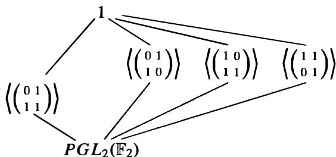  
Fig. 5

The field $\mathbb { F } ( t )$ is of degree 6 over the fixed field $\pmb { K }$ of Aut $( \mathbb { F } ( t ) / \mathbb { F } )$ and the lattice of subfields $K \subseteq L \subseteq \mathbb { F } ( t )$ is dual to the lattice of subgroups of $\pmb { S _ { 3 } }$ . The fixed field of a

cyclic subgroup $\langle \sigma \rangle$ is easily found (via the preceding theorem) by finding a rational function $r$ in t which is fixed by $\pmb { \sigma }$ such that $[ \mathbb { F } ( t ) : \mathbb { F } ( r ) ] = | \sigma |$ . For example, if $\sigma : t \mapsto 1 / ( 1 + t )$ , then $\pmb { \sigma }$ has order 3. The rational funct\on

$$
r = t + \sigma (t) + \sigma^ {2} (t) = \frac {t ^ {3} + t + 1}{t (t + 1)}
$$

is fixed by $\sigma$ and $[ \mathbb { F } ( t ) : \mathbb { F } ( r ) ] = 3$ (by part (2) of the theorem). Since $\mathbb { F } ( r )$ is contained in the fixed field of $\langle \sigma \rangle$ and the degree of $\mathbb { F } ( t )$ over the fixed field is 3, $\mathbb { F } ( r )$ is the fixed field of $\langle \sigma \rangle$ . In this way one can explicitly describe the lattice of all subfields of $\mathbb { F } ( t )$ containing $\pmb { K }$ shown in Figure 6.

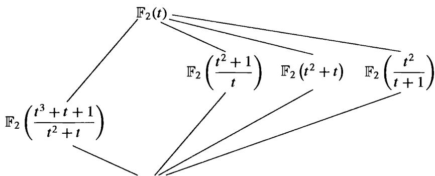  
Fig. 6

$$
\mathbb {F} _ {2} \left(\frac {(t ^ {3} + t + 1) (t ^ {3} + t ^ {2} + 1)}{(t ^ {2} + t) ^ {2}}\right)
$$

Purely transcendental extensions of $\mathbb { Q }$ play an important role in the problem of realizing finite groups as Galois groups over $\mathbb { Q }$ . We describe a deep result of Hilbert which is fundamental to this area of research. If $\pmb { a } _ { 1 }$ , $a _ { 2 } , \ldots , a _ { n }$ are independent indeterminates over a field $\pmb { F }$ , we may evaluate (or specialize) $a _ { 1 } , \ldots , a _ { n }$ at any elements of $\pmb { F }$ , i . e . , substitute values in $\pmb { F }$ for the "variables" $a _ { 1 } , a _ { 2 } , \ldots , a _ { n }$ . If $E$ is a Galois extension of $F ( a _ { 1 } , \ldots , a _ { n } )$ , then $E$ is obtained as a splitting field of a polynomial whose coefficients lie in $F [ a _ { 1 } , \ldots , a _ { n } ]$ . Any specialization of $a _ { 1 } , \ldots , a _ { n }$ ${ a } _ { n }$ into $F$ maps this polynomial into one whose coefficients lie in $\pmb { F }$ . The specialization of $E$ is the splitting field of the resulting specialized polynomial.

Theorem. (Hilbert) Let $x _ { 1 } , x _ { 2 } , \ldots , x _ { n }$ be independent transcendentals over $\mathbb { Q }$ , let $E =$ $\mathbb { Q } ( \boldsymbol { x } _ { 1 } , \ldots , \boldsymbol { x _ { n } } )$ and let $\pmb { G }$ be a finite group of automorphisms of $E$ with fixed field $\pmb { K }$ . If $\pmb { K }$ is a purely transcendental extension of $\mathbb { Q }$ with transcendence basis $a _ { 1 } , a _ { 2 } , \ldots , a _ { n }$ , then there are infinitely many specializations of $a _ { 1 } , \ldots , a _ { n }$ in $\mathbb { Q }$ such that $E$ specializes to a Galois extension of $\mathbb { Q }$ with Galois group isomorphic to $\pmb { G }$ .

Hilbert's Theorem gives a sufficient condition for the specialized extension not to collapse. In general, the Galois group of the specialized extension is a subgroup of $\pmb { G }$ ( cf. Proposition 19) and may be a proper subgroup of $\pmb { G }$ . It is also known that the fixed

field $\pmb { K }$ need not always be a purely transcendental extension of $\mathbb { Q }$ . An example of this occurs when $G$ is the cyclic group of order 4 7.

This theorem can be used to give another proof of Proposition 42:

Corollary. $S _ { n }$ is a Galois group over $\mathbb { Q }$ , for all $\pmb { n }$ .

Proof of the Corollary: We have already proved that the fixed field of $S _ { n }$ acting in the obvious fashion on $\mathbb { Q } ( x _ { 1 } , \ldots , x _ { n } )$ is purely transcendental over $\mathbb { Q }$ (with the elementary symmetric functions as a transcendence base), so Hilbert's Theorem immediately implies the corollary.

The hypothesis that $\pmb { K }$ be purely transcendental over $\mathbb { Q }$ is crucial to the proof of Hilbert's Theorem. Every finite group is isomorphic to a subgroup of $S _ { n }$ and so acts on $\mathbb { Q } ( x _ { 1 } , \ldots , x _ { n } )$ for some n. It is not known, however, even for the subgroup $A _ { n }$ of $S _ { n }$ whether its fixed field under the obvious action is a purely transcendental extension of $\mathbb { Q }$ (although it is known by other means that $A _ { n }$ is a Galois group over $\mathbb { Q }$ for all $\pmb { n }$ ). Thus there are a number of important open problems in this area of research.

One should also notice that Hilbert's Theorem does not work when the base field $\mathbb { Q }$ is replaced by an arbitrary field $F$ (suppose $F$ were algebraically closed, for instance). In particular, as noted earlier, the general polynomial $f ( x )$ in Section 6 has Galois group $S _ { n }$ over $F ( a _ { 1 } , \ldots , a _ { n } )$ for any $F$ , but when $F$ is a finite field, the specialized extension obtained from its splitting field is always cyclic.

We next expand on the theory of inseparable extensions described in Section 1 3.5. Let $\pmb { p }$ be a prime and let $F$ be a field of characteristic $\pmb { p }$ .

Definition. An algebraic extension $E / F$ is called purely inseparable if for each $\alpha \in E$ the minimal polynomial of $\pmb { \alpha }$ over $F$ has only one distinct root.

It is easy to see that the following are equivalent:

(1) $E / F$ is purely inseparable   
(2) if $\alpha \in E$ is separable over $F$ , then $\alpha \in F$   
(3) if $\alpha \in E$ , then $\alpha ^ { p ^ { n } } \in F$ for some $\pmb { n }$ (depending on $\pmb { \alpha }$ ), and $m _ { \alpha , F } ( x ) = x ^ { p ^ { n } } - \alpha ^ { p ^ { n } }$

The following easy proposition describes composites of separable and purely inseparable extensions.

Proposition. If $E _ { 1 }$ and $E _ { 2 }$ are sub fields of $E$ which are both separable (or both purely inseparable) extensions of $F$ , then their composite $E _ { 1 } E _ { 2 }$ is separable (purely inseparable, respectively) over $F$ .

Proof: Exercise.

One immediate consequence of this is the following result.

Proposition. Let $E / F$ be an algebraic extension. Then there is a unique field $E _ { s e p }$ with $F \subseteq E _ { s e p } \subseteq E$ such that $E _ { s e p }$ is separable over $F$ and $E$ is purely inseparable over $E _ { s e p }$ · The field $E _ { s e p }$ is the set of elements of $E$ which are separable over $F$ .

The degree of $E _ { s e p } / F$ is called the separable degree of $E / F$ and the degree of $E / E _ { s e p }$ is called the inseparable degree of $E / F$ (often denoted as $[ E : F ] _ { s }$ and $[ E : F ] _ { i }$ respectively). The product of these two degrees is the (ordinary) degree. The propositions immediately give the following corollary.

Corollary. Separable degrees (respectively inseparable degrees) are multiplicative.

When $E$ is generated over $F$ by the root of an irreducible polynomial $p ( { \boldsymbol { x } } ) \in F [ { \boldsymbol { x } } ]$ the separable and inseparable degrees of the extension $E / F$ are the same as the separable and inseparable degrees of the polynomial $p ( { \pmb x } )$ defined in Section 1 3.5.

The proposition asserts that any algebraic extension may be decomposed into a separable extension followed by a purely inseparable one. Exercise 3 at the end of this section outlines an example illustrating that this decomposition cannot generally be reversed, namely an extension which is not a separable extension of a purely inseparable extension. We shall shortly state conditions on an extension under which the decomposition into separable and purely inseparable subextensions may be reversed.

We now know that an arbitrary extension $E / F$ can be decomposed into a purely transcendental extension $F ( S )$ of $F$ followed by a separable extension $E _ { 1 }$ of $F ( S )$ followed by a purely inseparable extension $E / E _ { 1 }$ . In certain instances the inseparability in the algebraic extension at the "top" may be removed by a judicious choice of transcendence base:

Proposition. If $E$ is a finitely generated extension of a perfect field $F$ , then there is a transcendence base $_ T$ of $E / F$ such that $E$ is a separable (algebraic) extension of $F ( T )$ .

A transcendence base $_ T$ as described in the proposition is called a separating transcendence base. Exercise 4 at the end of this section illustrates this with a nontrivial example.

Recall that an extension $E / F$ is IWrmal if it is the splitting field of some (possibly infinite) set of polynomials in $F [ x ]$ (in particular, normal extensions are algebraic but not necessarily finite or separable). We previously used the synonymous term splitting field and the term normal is reintroduced here in the context of arbitrary algebraic extensions since it is used frequently in the literature, often in the context of em beddings of a field into an algebraic closure. Although the following set of equivalences can be gleaned from the preceding sections, the reader should write out a complete proof, checking that the arguments work for both infinite and inseparable extensions:

Proposition. Let $E / F$ be an arbitrary algebraic extension and let $\Omega$ be an algebraic closure of $E .$ . The following are equivalent:

(1) $E / F$ is a normal extension (i.e., is the splitting field over $F$ of some set of polynomials in $F [ \boldsymbol { x } ] )$

(2) whenever $\sigma : E  \Omega$ is an embedding such that ${ \pmb { \sigma } } | _ { F }$ is the identity, $\sigma ( E ) = E$   
(3) whenever an irreducible polynomial $f ( x ) \in F [ x ]$ has one root in $E$ , it has all its roots in $\pmb { { \cal E } }$ .

In general, any embedding of a normal extension $E / F$ into an algebraic closure of $\pmb { { \cal E } }$ which extends the identity embedding of $F$ is an automorphism of $E$ , i.e., is an element of Aut $( E / F )$ . Moreover, the number of such automorphisms equals the separable degree of $E / F$ , provided the latter is finite:

if $E / F$ is a normal extension and $[ E : F ] _ { s }$ is finite, $| \mathbf { A u t } ( E / F ) | = [ E : F ] _ { s } .$ •

If $[ E : F ] _ { s }$ is infinite we shall see shortly that $\lvert \mathbf { A u t } ( E / F ) \rvert$ is also infinite but need not be of the same cardinality.

If $E / F$ is a normal extension whose separable degree is finite, let $E _ { 0 }$ be the fixed field of Aut $E / F )$ . By Corollary 1 1 , $E / E _ { 0 }$ is a (separable) Galois extension whose degree equals $\left| \mathsf { A u t } ( E / F ) \right|$ . It follows that $E _ { 0 } / F$ must be purely inseparable (of degree equal to $[ E : F ] _ { i } )$ , i.e., the separable and purely inseparable pieces of the extension may be reversed for normal extensions. More precisely, we easily obtain the following proposition.

Proposition. If $E / F$ is normal with $[ E : F ] _ { s } < \infty$ , then $E = E _ { s e p } E _ { p i }$ , where $E _ { p i }$ is a purely inseparable extension of $F$ $E _ { p i }$ consists of all purely inseparable elements of $\pmb { { \cal E } }$ over $F$ ) and $E _ { s e p } \cap E _ { p i } = F$ .

Finally, we mention how Galois Theory generalizes to infinite extensions.

Definition. An extension $E / F$ is called Galois if it is algebraic, normal and separable. In this case Aut $( E / F )$ is called the Galois group of the extension and is denoted by $\operatorname { G a l } ( E / F )$ .

For infinite extensions there need not be a bijection between the set of all subgroups of the Galois group and the set of all subfields of $\pmb { { \cal E } }$ containing $F .$ , as the following example illustrates.

Let $\pmb { { \cal E } }$ be the subfield of $\mathbb { R }$ obtained by adjoining to $\mathbb { Q }$ all square roots of positive rational numbers. One easily sees that $\pmb { { \cal E } }$ may also be described as the splitting field of the set of polynomials $x ^ { 2 } - p$ , where $\pmb { p }$ runs over all primes in $\mathbb { Z } ^ { + }$ . Note that $\pmb { { \cal E } }$ is a (countably) infinite Galois extension of $\mathbb { Q }$ . Since every automorphism $\pmb { \sigma }$ of $E$ is determined by its action on the square roots of the primes and $\sigma$ either fixes or negates each of these, $\sigma ^ { 2 }$ is the identity automorphism. It follows that Aut( E) is an infinite elementary abelian 2-group. Thus Aut $( E )$ is an infinite dimensional vector space over $\mathbb { F } _ { 2 }$ · By an exercise in the section on dual spaces (Section 1 1 .3) the number of nonzero homomorphisms of Aut(E) into $\mathbb { F } _ { 2 }$ is uncountable, whence their kernels (which are subspaces of co-dimension 1) are uncountable in number (and distinct). Thus Aut(E) has uncountably many subgroups of index 2, whereas $\mathbb { Q }$ has only a countable number of quadratic extensions.

The basic problem is that many (most) subgroups of $\operatorname { G a l } ( E / F )$ do not correspond (in a bijective fashion) to subfields of $\pmb { { \cal E } }$ containing $F$ . In order to pick out the ••nght''

set of subgroups of $\operatorname { G a l } ( E / F )$ we must introduce a topology on this group (called the Krull topology). The axioms for the collection of (topologically) closed subsets of a topological space are precisely the bookkeeping devices which single out the relevant subgroups (these are listed in Section 15.2). Galois theory for finite extensions force certain subgroups of finite index to be closed sets and these in turn determine the topology on the entire group (as we might expect since every extension of $F$ inside $E$ is a composite of finite extensions). Moreover, the Galois group of $E / F$ is the inverse limit of the collection of finite groups $\operatorname { G a l } ( K / F )$ , where $\pmb { K }$ runs over all finite Galois extensions of $F$ contained in $E$ (cf. Exercise 10, Section 7.6).

Theorem. $( \mathrm { K n l l } ) \mathbf { L e t } E / F$ $E / F$ be a Galois extension with Galois group G. Topologize $\pmb { G }$ by taking as a base for the closed sets the subgroups of $\pmb { G }$ which are the fixing subgroups of the finite extensions of $\pmb { F }$ in $E$ , together with all left and right cosets of these subgroups. Then with this ("Krull") topology the closed subgroups of $\pmb { G }$ correspond bijectively with the subfields of $E$ containing $\pmb { F }$ and the corresponding lattices are dual. Closed normal subgroups of $\pmb { G }$ correspond to normal extensions of $F$ in $E$ .

One important area of current research is to describe (as a topological group) the Galois group of certain field extensions such as $\overline { { F } } / F$ , where $\overline { F }$ is the algebraic closure of $F$ . Little is known about the latter group when $F = \mathbb { Q }$ (in particular, its normal subgroups of finite index, i.e., which finite groups occur as Galois groups over $\mathbb { Q }$ , are not known). If $E$ is the algebraic closure of the finite field $\mathbb { F } _ { p }$ • the Galois group of this extension is the topologically cyclic group $\widehat { \mathbb { Z } }$ with the Frobenius automorphism as a topological generator. The group $\widehat { \mathbb { Z } }$ is an uncountable group (in particular, is not isomorphic to $\mathbb { Z }$ ) with the property that every closed subgroup of finite index is normal with cyclic quotient. Note that $\overrightarrow { \mathbb { Z } }$ must also have nontrivial infinite closed subgroups (unlike Z) since $E$ contains proper subfields which are infinite over $\mathbb { F } _ { p }$ (such as the composite of all extensions of $\mathbb { F } _ { p }$ of $q$ -power degree, for any prime $q$ - this Galois extension of $\mathbb { F } _ { p }$ has Galois group $\mathbb { Z } _ { q }$ , the $q$ -adic integers, as described in Exercise 1 1 of Section 7.6).

# E X E R C I S E S

l. Prove that every purely inseparable extension is normal.

2. Let $\pmb { p }$ be a prime and let $K = \mathbb { F } _ { p } ( x , y )$ with $x$ and $y$ independent transcendentals over $\mathbb { F } _ { p }$ Let $F = \mathbb { F } _ { p } ( x ^ { p } - x , y ^ { p } - x )$ .

(a) Prove that $[ K : F ] = p ^ { 2 }$ and the separable degree and inseparable degree of $K / F$ are both equal to $\pmb { p }$ .   
(b) Prove that there is a subfield $E$ of $\pmb { K }$ containing $\pmb { F }$ which is purely inseparable over $\pmb { F }$ of degree $\pmb { p }$ (so then $\pmb { K }$ is a separable extension of $E$ of degree $\pmb { p }$ ). [Le $s = x ^ { p } - x \in F$ and $t = y ^ { p } - x \in F$ and consider s - t.]

3. Let $\pmb { p }$ be an odd prime, let $\pmb { s }$ and t be independent transcendentals over $\mathbb { F } _ { p }$ • and let $\pmb { F }$ be the field $\mathbb { F } _ { p } ( s , t )$ . Let $\beta$ be a root of $x ^ { 2 } - s x + t = 0$ and let $\pmb { \alpha }$ be a root of $x ^ { p } - \beta = 0$ (in some algebraic closure of $\boldsymbol { F }$ ). Set $E = F ( \beta )$ and $K = F ( \alpha )$ .

(a) Prove that $E$ is a Galois extension of $\pmb { F }$ of degree 2 and that $\pmb { K }$ is a purely inseparable extension of $E$ of degree $\pmb { p }$ .

(b) Prove that $\pmb { K }$ is not a normal extension of ${ \pmb F } _ { \pmb { \imath } }$ . [If it were, conjugate $\beta$ over $\pmb { F }$ to show that $\pmb { K }$ would contain a $p ^ { \mathfrak { t h } }$ root of $\pmb { s }$ and then also a $p ^ { \mathtt { t h } }$ root of t, so $[ K : F ] \geq p ^ { 2 }$ , a contradiction.]   
(c) Prove that there is no field $K _ { 0 }$ such that $F \subseteq K _ { 0 } \subseteq K$ with $K _ { 0 } / F$ purely inseparable and $K / K _ { 0 }$ separable. [If there were such a field, use Exercise 1 and the fact that the composite of two normal extensions is again normal to show that $\pmb { K }$ would be a normal extension of $\pmb { F }$ . ]

4. Under the notation of the previous exercise prove that a, s is a separating transcendence base for $\pmb { K }$ over $\mathbb { F } _ { p }$ .   
5. Let $\pmb { p }$ be a prime, let t be transcendental over $\mathbb { F } _ { p }$ and let $\pmb { K }$ be obtained by adjoining to $\mathbb { F } _ { p } ( t )$ all $\pmb { p }$ -power roots of t . Prove that $\pmb { K }$ has transcendence degree 1 over $\mathbb { F } _ { p }$ and has no separating transcendence base.   
6. Show that if $\pmb { t }$ is transcendental over $\mathbb { Q }$ then $\mathbb { Q } ( t , { \sqrt { t ^ { 3 } - t } } )$ is not a purely transcendental extension of $\mathbb { Q }$ . (This is an example of what is called an elliptic function field.)   
7. Let $\pmb { k }$ be the field with 4 elements, t a transcendental over $\pmb { k } ,$ , $F = k ( t ^ { 4 } + t )$ and $\pmb { K } = \pmb { k } ( t )$

(a) Show that $[ K : F ] = 4$ .   
(b) Show that $\pmb { K }$ is separable over $\pmb { F }$   
(c) Show that $\pmb { K }$ is Galois over $\pmb { F }$   
(d) Describe the lattice of subgroups of the Galois· group and the corresponding lattice of subfields of $\pmb { K }$ , giving each subfield in the form $k ( r )$ , for some rational function $r$ .

8. Let $\pmb { p }$ be an odd prime, $\pmb { k }$ an algebraically closed field of characteristic $\pmb { p }$ and let t be transcendental over $\pmb { k }$ . Suppose $\pmb { F }$ is a degree 2 field extension of $k ( t )$ . Show that $\pmb { F }$ can be written in the form $k ( t , y ) .$ , for some $y \in F$ with $y ^ { 2 } \in k ( t )$ and $\boldsymbol { y }$ transcendental over $\pmb { k }$ . If $y ^ { 2 } = 4 t ^ { 3 } - t - 1 ,$ find $[ F : k ( y ) ]$ and describe $k ( t ) \cap k ( y )$ as $k ( r )$ , for some $\pmb { r } \in \pmb { k } ( t )$ .   
9. Let t be transcendental over $\mathbb { F } _ { 3 }$ , let $K = \mathbb { F } _ { 3 } ( t )$ , let $G = \mathsf { A u t } ( K / \mathbb { F } _ { 3 } )$ and let $\pmb { F }$ be the fixed field of G.

(a) Prove $G \cong S _ { 4 }$ and deduce that there is a unique field $E$ with $F \subseteq E \subseteq K$ and $[ E : F ] = 2$ . [Recall that $G \cong P G L _ { 2 } ( \mathbb { F } _ { 3 } )$ ; show that $G L _ { 2 } ( \mathbb { F } _ { 3 } )$ permutes the 4 lines in a 2-dimensional vector space over $\mathbb { F } _ { 3 }$ and the kernel of this permutation representation is the scalar matrices.]   
(b) Complete the description of the lattice of subfields of $\pmb { K }$ containing $E$

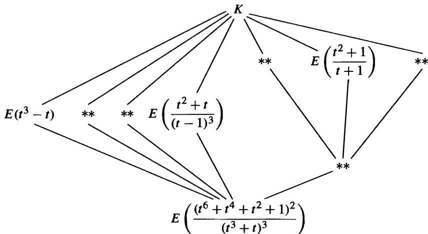

Give each subfield in the form $E ( r )$ for some rational function r. (The lattice of

subgroups of $A _ { 4 }$ appears in Section 3.5).

10. Prove that a purely transcendental proper extension of a field is never algebraically closed.

11. Let S be a set of independent transcendentals over a field $\pmb { F }$ and let $\pmb { \Omega }$ be an algebraic closure of $F ( S )$ . Prove that any permutation on S extends to an element of Aut $( F ( S ) / F )$ . Prove that any such automorphism of $F ( S )$ extends to an automorphism of $\Omega$ . Deduce that $\mathbb { C }$ has infinitely many automorphisms.

12. Let $\pmb { K }$ be a subfield of $\mathbb { C }$ maximal with respect to the property ${ \mathfrak { s } } { \sqrt { 2 } } \notin K$ . "

(a) Show such a field $\pmb { K }$ exists.   
(b) Show that $\mathbb { C }$ is algebraic over $\pmb { K }$   
(c) Prove that every finite extension of $\pmb { K }$ i n $\mathbb { C }$ is Galois with Galois group a cyclic 2-group.   
(d) Deduce that $[ \mathbb { C } : K ]$ is countable (and not finite).

13. Let $\pmb { K }$ be the fixed field in $\mathbb { C }$ of an automorphism of $\mathbb { C }$ . Prove that every finite extension of $\pmb { K }$ in $\mathbb { C }$ is cyclic.

14. Let $K _ { n }$ be the splitting field of $( x ^ { 2 } - p _ { 1 } ) ( x ^ { 2 } - p _ { 2 } ) \cdots ( x ^ { 2 } - p _ { n } ) { \mathrm { o v e r } } \mathbb { Q } ,$ $\mathbb { Q } ,$ where $p 1 , \ldots , p _ { n }$ are the first $_ n$ primes. Prove that the Galois group of $K _ { n } / \mathbb { Q }$ is an elementary abelian 2-group of order $2 ^ { n }$ .

15. Let $K _ { 0 } = \mathbb { Q }$ and for $n \geq 0$ define the field $K _ { n + 1 }$ as the extension of $K _ { n }$ obtained by adjoining to $K _ { n }$ all roots of all cubic polynomials over $K _ { n }$ . Let $\pmb { K }$ be the union of the subfields $K _ { n }$ , $n \geq 0 .$ . Prove that $\pmb { K }$ is a Galois extension of $\mathbb { Q } .$ . Prove that every cubic polynomial over $\pmb { K }$ splits completely over $\pmb { K }$ . Prove that there are nontrivial algebraic extensions of $\pmb { K }$ .

16. Let $F$ be th e composite o f all the splitting fields o f irreducible cubics over $\mathbb { Q }$ . Prove that $\pmb { F }$ does not contain all quadratic extensions of $\mathbb { Q } .$ .

17. Let $K _ { 0 } = \mathbb { Q }$ and for $n \geq 0$ define the field $K _ { n + 1 }$ as the extension of $K _ { n }$ obtained by adjoining to $K _ { n }$ all radicals of elements in $K _ { n }$ . Let $\pmb { K }$ be the union of the subfields $K _ { n }$ ${ \pmb n } \geq { \bf 0 }$ . Prove that $\pmb { K }$ is a Galois extension of $\mathbb { Q } .$ Prove that there are no nontrivial solvable Galois extensions of $\pmb { K }$ . Prove that there are nontrivial Galois extensions of $\pmb { K }$ .

18. Let $F _ { 0 } = \mathbb { Q }$ and for $n \geq 0$ define the field $F _ { n + 1 }$ as the extension of $F _ { n }$ obtained by adjoining to $F _ { n }$ all real radicals of elements in $F _ { n }$ . Let $F$ be the union of the subfields $F _ { n }$ , $n \geq 0$ . Let $K ^ { + }$ be the fixed field of complex conjugation restricted to the field $\pmb { K }$ in the previous exercise (the maximal real subfield of $\pmb { K }$ ). Prove that $F \neq K ^ { + }$ .

19. This exercise proves that if $K / F$ is a Galois extension of fields, then $\operatorname { G a l } ( K / F )$ is isomorphic to ijm $\underline { { 1 } } \mathbf { G a l } ( L / F )$ , where the inverse limit is taken over all the finite Galois extensions $\pmb { L }$ of $F$ contained in $\pmb { K }$ .

(a) Show that $\pmb { K }$ is the union of the fields $\pmb { L }$ .   
(b) Prove that the map $\varphi : \mathbf { G a l } ( K / F ) \to \varprojlim \mathbf { G a l } ( L / F )$ defined by mapping $\pmb { \sigma }$ in $\operatorname { G a l } ( K / F )$ to $( \dots , \sigma | _ { L } , \dots ) .$ , where $\sigma \vert _ { L }$ is the restriction of $\sigma$ to $L ,$ is a homomorphism.   
(c) Show that $\varphi$ ({ is injective.   
(d) If $( \dots , \sigma _ { L } , \dots ) \in \varprojlim \mathbf { G a l } ( L / F ) ,$ , define $\sigma \in \operatorname { G a l } ( K / F )$ by $\sigma ( \alpha ) = \sigma _ { L } ( \alpha )$ if $\pmb { \alpha } \in \pmb { L }$ Prove that $\pmb { \sigma }$ is a well defined automorphism and deduce that $\varphi$ ({ is surjective.

# Pa rt V

# I NTRODUCTIO N TO COM M UTATIVE RI N GS, ALGEBRAIC G EO M ETRY, AN D HOMOLOGI CAL ALGEBRA

In this part of the book we continue the study of rings and modules, concentrating first on commutative rings. The topic of commutative algebra, which is of interest in its own right, is also a basic foundation for other areas of algebra. To indicate some of the importance of the algebraic topics introduced, we parallel the development of the ring theory in Chapter 15 with an introduction to affine algebraic geometry. Each section first presents the basic algebraic theory and then follows with an application of those ideas to geometry together with an indication of computational methods using the theory of Grabner bases from Chapter 9. The purpose here is twofold: the first is to present an application of algebraic techniques in the important branch of mathematics called Algebraic Geometry, and the second is to indicate some of the motivations for the algebraic concepts introduced from their origins in geometric questions.

This connection of geometry and algebra shows a rich interplay between these two areas of mathematics and demonstrates again how results and structures in one circle of mathematical ideas provide insights into another.

In Chapter 16 we continue with some of the fundamental structures involving commutative rings, culminating with Dedekind Domains and a structure theorem for modules over such rings which is a generalization of the structure theorem for modules over P.I.D.s in Chapter 12.

In Chapter 17 we describe some of the basic techniques of "homological algebra," which continues with some of the questions raised by the failure of exactness of some of the sequences considered in Chapter 10. The cohomology of groups in this chapter is intended to serve both as a more in-depth application of homological algebra to see its uses in practice, and as a relatively self contained exposition of this important topic.

# CHAPTER 1 5

# Com m utative Ri ngs a nd Algebra ic Geo metry

Throughout this chapter $R$ will denote a commutative ring with $1 \neq 0$

# 1 5.1 NOETHERIAN RINGS AND AFFINE ALGEBRAIC SETS

In this section we study Noetherian rings in greater detail. These are a natural generalization of Principal Ideal Domains and were introduced briefly in Chapter 12. Note that when $R$ is considered as a left module over itself, its $R$ -submodules are precisely its ideals, so the definition in Section l of Chapter 12 may be phrased in the following form:

Definition. A commutative ring $R$ is said to be Noetherian or to satisfy the ascending chain condition on ideals (or A. C. C. on ideals) if there is no infinite increasing chain of ideals in $R ,$ i.e., whenever $I _ { 1 } \subseteq I _ { 2 } \subseteq I _ { 3 } \subseteq \cdots$ is an increasing chain of ideals of $R$ , then there is a positive integer m such that $I _ { k } = I _ { m }$ for all $k \geq m$ .

Proposition 1 . If $I$ is an ideal of the Noetherian ring $\pmb R$ , then the quotient $R / I$ is a Noetherian ring. Any homomorphic image of a Noetherian ring is Noetherian.

Proof" If $R$ is a ring and $I$ is an ideal in $R ,$ , then any infinite ascending chain of ideals in the quotient $R / I$ would correspond by the Lattice Isomorphism Theorem to an infinite ascending chain of ideals in $R .$ . This gives the first statement, and the second follows by the first Isomorphism Theorem.

Theorem 2. The following are equivalent:

(1) $R$ is a Noetherian ring.   
(2) Every nonempty set of ideals of $R$ contains a maximal element under inclusion.   
(3) Every ideal of $R$ is finitely generated.

Proof" The proof is identical to that of Theorem 1 in Section 12. 1 in the special case where the $R$ -module $M$ is $R$ itself (and submodules are ideals).

# Examples

Every Principal Ideal Domain is Noetherian since it satisfies condition (3) of Theorem 2. In particular, Z, the polynomial ring $k [ x ]$ where $\pmb { k }$ is a field, and the Gaussian integers Z[i ] , are Noetherian rings. The ring $\mathbb { Z } [ x _ { 1 } , x _ { 2 } , \ldots ]$ is not Noetherian since the ideal $( x _ { 1 } , x _ { 2 } , \ldots )$ cannot be generated by any finite set (any finite set of generators involves only finitely many of the $x _ { i }$ ). Exercise 33( d) in Section 7.4 shows that the ring of continuous real valued functions on [0, 1 ] is not Noetherian.

A Noetherian ring may have arbitrarily long ascending chains of ideals and may have infinitely long descending chains of ideals. For example, Z has the infinite descending chain

$$
(2) \supset (4) \supset (8) \supset \dots
$$

i.e., aNoetherianring need not satisfy the descending chain condition on ideals (D. C. C.). We shall see, however, that a commutative ring satisfying D.C.C. on ideals necessarily also satisfies A.C.C., i.e., is Noetherian; such rings are called Artinian and are studied in Chapter 1 6.

The following theorem and its corollary, which we record here for completeness, were proved in Section 9.6 (Theorem 21 and Corollary 22, respectively).

Theorem 3. (Hilbert's Basis Theorem) If R is a Noetherian ring then so is the polynomial ring $R [ x ]$ .

Note that Hilbert's Basis Theorem shows how larger Noetherian rings may be built from existing ones in a manner analogous to Theorem 7 of Section 9.3 (which proved that if $R$ is a U.F.D., then so is $R [ x ] )$ ) .

Corollary 4. The polynomial ring $k [ x _ { 1 } , x _ { 2 } , \ldots , x _ { n } ]$ with coefficients from a field $k$ is a Noetherian ring.

Let $k$ be a field. Recall that a ring $\pmb { R }$ is a $k$ -algebra if $k$ is contained in the center of $R$ and the identity of $\pmb { k }$ is the identity of $\pmb { R }$ .

# Definition.

(1) The ring $\pmb { R }$ is a finitely generated $\pmb { k }$ -algebra if $\pmb { R }$ is generated as a ring by $k$ together with some finite set $r _ { 1 } , r _ { 2 } , \ldots , r _ { n }$ of elements of $\pmb { R }$ .   
(2) Let $\pmb { R }$ and S be $\pmb { k }$ -algebras. A map $\psi : R  s$ is a $\pmb { k }$ -algebra homomorphism if $\psi$ is a ring homomorphism that is the identity on $\pmb { k }$ .

I f $R$ i s a $\pmb { k }$ -algebra then $R$ is both a ring and a vector space over $k$ , an d i t is important to distinguish the sense in which elements of $R$ are generators for $R$ . For example, the polynomial ring $k [ x _ { 1 } , \ldots , x _ { n } ]$ in a finite number of variables over $k$ is a finitely generated $\pmb { k }$ -algebra since $x _ { 1 } , \ldots , x _ { n }$ $x _ { 1 }$ are ring generators, but for ${ \pmb n } > { \bf 0 }$ this ring is an infinite dimensional vector space over $k$ .

Corollary 5. The ring $R$ is a finitely generated $k$ -algebra if and only if there is some surjective $k$ -algebra homomorphism

$$
\varphi : k \left[ x _ {1}, x _ {2}, \dots , x _ {n} \right]\rightarrow R
$$

from the polynomial ring in a finite number of variables onto $R$ that is the identity map on $k .$ Any finitely generated $k$ -algebra is therefore Noetherian.

Proof" If $R$ is generated as a $k$ -algebra by $r _ { 1 } , \ldots , r _ { n }$ , then we may define the map $\varphi : k [ x _ { 1 } , \ldots , x _ { n } ] \to R$ by $\varphi ( x _ { i } ) = r _ { i }$ for all $_ i$ and $\varphi . ( a ) = a$ for all $a \in k .$ . Then $\varphi$ extends uniquely to a surjective ring homomorphism. Conversely, given a surjective homomorphism $\varphi .$ , the images of $x _ { 1 } , \ldots , x _ { n }$ under $\varphi$ then generate $R$ as a $k$ -algebra, proving that $R$ is finitely generated. Since $k [ x _ { 1 } , \ldots , x _ { n } ]$ is Noetherian by the previous corollary, any finitely generated $k$ -algebra is therefore the quotient of a Noetherian ring, hence also Noetherian by Proposition 1 .

# Example

Suppose the $\pmb { k }$ -algebra $\pmb { R }$ is finite dimensional as a vector space over $\pmb { k }$ , for example when $R = k [ x ] / ( f ( x ) )$ , where $f$ is any nonzero polynomial in $k [ x ]$ . Then in particular $\pmb R$ is a finitely generated $\pmb { k }$ -algebra since a vector space basis also generates $\pmb { R }$ as a ring. In this case since ideals are also $\pmb { k }$ -subspaces any ascending or descending chain of ideals has at most $\dim _ { k } R + 1$ distinct terms, hence $\pmb { R }$ satisfies both A. C. C. and D.C. C. on ideals.

The basic idea behind "algebraic geometry" is to equate geometric questions with algebraic questions involving ideals in rings such as $k [ x _ { 1 } , \ldots , x _ { n } ]$ . The Noetherian nature of these rings reduces many questions to consideration of finitely many algebraic equations (and this was in tum one of the main original motivations for Hilbert's Basis Theorem). We first consider the principal geometric object, the notion of an "algebraic set" of points.

# Affine Algebraic Sets

Recall that the set $\mathbb { A } ^ { n }$ of $\pmb { n }$ -tuples of elements of the field $k$ is called affine $\pmb { n }$ -space over $k$ (cf. Section 10. 1 ) . If $x _ { 1 } , x _ { 2 } , \ldots , x _ { n }$ are independent variables over $k$ , then the polynomials $f$ in $k [ x _ { 1 } , x _ { 2 } , \ldots , x _ { n } ]$ can be viewed as $k$ -valued functions $f : \mathbb { A } ^ { n } \to k$ on $\mathbb { A } ^ { n }$ by evaluating $f$ at the points in $\mathbb { A } ^ { n }$ :

$$
f: (a _ {1}, a _ {2}, \dots , a _ {n}) \mapsto f (a _ {1}, a _ {2}, \dots , a _ {n}) \in k.
$$

This gives a ring of k-valued functions on An, denoted by $k [ \mathbb { A } ^ { n } ]$ and called the coordinate ring of $\mathbb { A } ^ { n }$ . For instance, when $k = \mathbb { R }$ and $n = 2 ,$ the coordinate ring of Euclidean 2-space $\mathbb { R } ^ { 2 }$ is denoted by $\mathbb { R } [ \mathbb { A } ^ { 2 } ]$ and is the ring of polynomials in two variables, say $_ { x }$ and $y$ , acting as real valued functions on $\mathbb { R } ^ { 2 }$ (the usual "coordinate functions").

Each subset S of functions in the coordinate ring $k [ \mathbb { A } ^ { n } ]$ determines a subset ${ \mathcal { Z } } ( S )$ of affine space, namely the set of points where all functions in S are simultaneously zero:

$$
\mathcal {Z} (S) = \left\{\left(a _ {1}, a _ {2}, \dots , a _ {n}\right) \in \mathbb {A} ^ {n} \mid f \left(a _ {1}, a _ {2}, \dots , a _ {n}\right) = 0 \text {f o r a l l} f \in S \right\},
$$

where $\mathcal { Z } ( \boldsymbol { \mathsf { 0 } } ) = \mathbb { A } ^ { n }$

Definition. A subset $V$ of $\mathbb { A } ^ { n }$ is called an affine algebraic set (or just an algebraic set) if $V$ is the set of common zeros of some set S of polynomials, i.e., if $V = \mathcal { Z } ( S )$ for some $S \subseteq k [ \mathbb { A } ^ { n } ]$ . In this case $V = \mathcal { Z } ( S )$ is called the locus of S in $\mathbb { A } ^ { n }$ .

If $S = \{ f \} \bullet \operatorname { r } \left\{ f _ { 1 } , \ldots , f _ { m } \right\}$ we shall simply write $\mathcal { Z } ( f )$ or $\mathcal { Z } ( f _ { 1 } , \ldots , f _ { m } )$ for ${ \mathcal { Z } } ( S )$ and call it the locus of $f$ or $f _ { 1 } , \ldots , f _ { m }$ , respectively. Note that the locus of a single polynomial of the form $f - g$ is the same as the solutions in affine $\pmb { n }$ -space of the equation $f = g ,$ , so affine algebraic sets are the solution sets to systems of polynomial equations, and as a result occur frequently in mathematics.

# Examples

(1) If $n = 1$ then the locus of a single polynomial $f \in k [ x ]$ is the set of roots of $f$ in $\pmb { k }$ The algebraic sets in $\mathbb { A } ^ { 1 }$ are 0, any finite set, and $\pmb { k }$ (cf. the exercises).   
(2) The one point subsets of $\mathbb { A } ^ { n }$ for any $\pmb { n }$ are affine algebraic since $\{ ( a _ { 1 } , a _ { 2 } , \ldots , a _ { n } ) \}$ is $\mathcal { Z } ( x _ { 1 } - a _ { 1 }$ , $x _ { 2 } - a _ { 2 }$ , . . . , $x _ { n } - a _ { n } )$ ). More generally, any finite subset of $\mathbb { A } ^ { n }$ n is an affine algebraic set.   
(3) One may define lines, planes, etc. in $\mathbb { A } ^ { n }$ - these are linear algebraic sets, the loci of sets of linear (degree 1 ) polynomials of $k [ x _ { 1 } , \ldots , x _ { n } ]$ . For example, a line in $\mathbb { A } ^ { 2 }$ is defined by an equation $a x + b y = c$ (which is the locus of the polynomial $f ( x , y ) = a x + b y - c \in k [ x , y ] )$ . A line in $\mathbb { A } ^ { 3 }$ is the locus of two linear polynomials of $k [ x , y , z ]$ that are not multiples of each other. In particular, the coordinate axes, coordinate planes, etc. in $\mathbb { A } ^ { n }$ are all affine algebraic sets. For instance, the $x$ -axis in $\mathbb { A } ^ { 3 }$ is the zero set $\mathcal { Z } ( y , z )$ and the $_ { x , y }$ plane is the zero set $\mathcal { Z } ( z )$ .   
(4) In general the algebraic set ${ \mathcal { Z } } ( f )$ of a nonconstant polynomial $f$ is called a hypersuiface in $\mathbb { A } ^ { n }$ . Conic sections are familiar algebraic sets in the Euclidean plane $\mathbb { R } ^ { 2 }$ For example, the locus of $y - x ^ { 2 }$ is the parabola $\mathbf { y } = x ^ { 2 }$ , the locus of $x ^ { 2 } + y ^ { 2 } - 1$ is the unit circle, and $\mathcal { Z } ( x y - 1 )$ is the hyperbola $y = 1 / x$ . The x- and $y$ -axes are the algebraic sets $\mathcal { Z } ( y )$ and ${ \mathcal { Z } } ( x )$ respectively. Likewise, quadric surfaces such as the ellipsoid defined by the equation $x ^ { 2 } + { \frac { y ^ { 2 } } { 4 } } + { \frac { z ^ { 2 } } { 9 } } = 1$ are affine algebraic sets in ${ \mathbb R } ^ { 3 }$ .

We leave as exercises the straightforward verification of the following properties of affine algebraic sets. Let $s$ and $T$ be subsets of $\pmb { k } [ \mathbb { A } ^ { n } ]$ .

(1) I f $s \subseteq T$ then ${ \mathcal { Z } } ( T ) \subseteq { \mathcal { Z } } ( S )$ (i.e., $\boldsymbol { z }$ i s inclusion reversing or contravariant).   
(2) ${ \mathcal { Z } } ( S ) = { \mathcal { Z } } ( I )$ , where $I = ( S )$ is the ideal in $\pmb { k } [ \mathbb { A } ^ { n } ]$ generated by the subset S.   
(3) The intersection of two affine algebraic sets is again an affine algebraic set, in fact ${ \mathcal { Z } } ( S ) \cap { \mathcal { Z } } ( T ) = { \mathcal { Z } } ( S \cup T ) .$ . More generally an arbitrary intersection of affine algebraic sets is an algebraic set: if $\{ S _ { j } \}$ is any collection of subsets of $\pmb { k } [ \mathbb { A } ^ { n } ]$ , then

$$
\cap \mathcal {Z} (S _ {j}) = \mathcal {Z} (\cup S _ {j}).
$$

(4) The union of two affine algebraic sets is again an affine algebraic set, in fact ${ \mathcal { Z } } ( I ) \cup { \mathcal { Z } } ( J ) = { \mathcal { Z } } ( I J ) .$ , where $I$ and $\pmb { J }$ are ideals and $_ { I J }$ is their product.   
(5) $\mathcal { Z } ( 0 ) = \mathbb { A } ^ { n }$ and $\mathcal { Z } ( 1 ) = \emptyset$ (here 0 and 1 denote constant functions).

By (2), every affine algebraic set is the algebraic set corresponding to an ideal of the coordinate ring. Thus we may consider

$$
\mathcal {Z}: \{\text {i d e a l e s} k [ \mathbb {A} ^ {n} ] \} \rightarrow \{\text {a f f i n e a l g e b r a i c s e t s i n} \mathbb {A} ^ {n} \}.
$$

Since every ideal I in the Noetherian ring $k [ x _ { 1 } , x _ { 2 } , \ldots , x _ { n } ]$ is finitely generated, say $I = ( f _ { 1 } , f _ { 2 } , \ldots , f _ { q } )$ , it follows from (3) that $\mathcal { Z } ( I ) = \mathcal { Z } ( f _ { 1 } ) \cap \mathcal { Z } ( f _ { 2 } ) \cap \cdots \cap \mathcal { Z } ( f _ { q } )$ . i . e . , each affine algebraic set is the intersection of a finite number of hypersuifaces in $\mathbb { A } ^ { n }$ . Note that this "geometric" property i n affine $\pmb { n }$ -space i s a consequence of an "algebraic" property of the corresponding coordinate ring (namely, Hilbert's Basis Theorem).

If $V$ is an algebraic set in affine n-space, then there may be many ideals I such that $V = \mathcal { Z } ( I )$ . For example, in affine 2-space over $\mathbb { R }$ the $y$ -axis is the locus of the ideal $( x )$ of $\mathbb { R } [ \boldsymbol { x } , \boldsymbol { y } ]$ , and also the locus of $\bar { ( } x ^ { 2 } )$ , $( x ^ { 3 } )$ , etc. More generally, the zeros of any polynomial are the same as the zeros of all its positive powers, and it follows that $\dot { \mathcal { Z } } ( \dot { I } ) = \mathcal { Z } ( I ^ { k } )$ for all $k \geq 1$ . We shall study the relationship between ideals that determine the same affine algebraic set in the next section when we discuss radicals of ideals.

While the ideal whose locus determines a particular algebraic set $V$ is not unique, there is a unique largest ideal that determines $V$ , given by the set of all polynomials that vanish on V. In general, for any subset A of $\mathbb { A } ^ { n }$ define

$$
\mathcal {I} (A) = \{f \in k [ x _ {1}, \dots , x _ {n} ] \mid f (a _ {1}, a _ {2}, \dots , a _ {n}) = 0 \text {f o r a l l} (a _ {1}, a _ {2}, \dots , a _ {n}) \in A \}.
$$

I t i s immediate that $\pmb { \mathcal { T } } ( A )$ i s an ideal, and i s the unique largest ideal of functions that are identically zero on A . This defines a correspondence

$$
\mathcal {I}: \{\text {s u b s e t s i n} \mathbb {A} ^ {n} \} \rightarrow \{\text {i d e a l s o f} k [ \mathbb {A} ^ {n} ] \}.
$$

# Examples

(1) In the Euclidean plane, $\boldsymbol { \tau }$ (the $x$ -axis) is the ideal generated by y in the coordinate ring $\mathbb { R } [ x , y ]$ .   
(2) Over any field $\pmb { k }$ , the ideal of functions vanishing at $( a _ { 1 } , a _ { 2 } , \ldots , a _ { n } ) \in \mathbb { A } ^ { n }$ is a maximal ideal since it is the kernel of the surjective ring homomorphism from $k [ x _ { 1 } , \dots , x _ { n } ]$ to the field $\pmb { k }$ given by evaluation at $( a _ { 1 } , a _ { 2 } , \ldots , a _ { n } )$ . It follows that

$$
\mathcal {I} \left(\left(a _ {1}, a _ {2}, \dots , a _ {n}\right)\right) = \left(x _ {1} - a _ {1}, x _ {2} - a _ {2}, \dots , x _ {n} - a _ {n}\right).
$$

(3) Let $V = \mathcal { Z } ( x ^ { 3 } - y ^ { 2 } )$ in $\mathbb { A } ^ { 2 }$ . If $( a , b ) \in \mathbb { A } ^ { 2 }$ is an element of $V$ then $\mathbf { a } ^ { 3 } = b ^ { 2 }$ . If $\textbf { \em a } \neq \mathbf { 0 }$ , then also $b \neq 0$ and we can write $a = ( b / a ) ^ { 2 }$ , $\boldsymbol b = ( b / a ) ^ { 3 }$ • It follows that $V$ is the set $\{ ( a ^ { 2 } , a ^ { 3 } ) \mid a \in k \}$ . For any polynomial $f ( x , y ) \in k [ x , y ]$ ] we can write $f ( x , y ) = f _ { 0 } ( x ) + f _ { 1 } ( x ) y + ( x ^ { 3 } - y ^ { 2 } ) g ( x , y ) ,$ . For $f ( x , y ) \in { \mathcal { T } } ( V ) .$ , i . e . , $f ( a ^ { 2 } , a ^ { 3 } ) = 0$ for all $a \in k$ , it follows that $f _ { 0 } ( a ^ { 2 } ) + f _ { 1 } ( a ^ { 2 } ) a ^ { 3 } = 0$ for all $a \in k$ . If $f _ { 0 } ( x ) = a _ { r } x ^ { r } + \cdot \cdot \cdot + a _ { 0 }$ and $f _ { 1 } ( x ) = b _ { s } x ^ { s } + \cdot \cdot \cdot + b _ { 0 }$ then

$$
f _ {0} (x ^ {2}) + x ^ {3} f _ {1} (x ^ {2}) = \left(a _ {r} x ^ {2 r} + \dots + a _ {0}\right) + \left(b _ {s} x ^ {2 s + 3} + \dots + b _ {0} x ^ {3}\right)
$$

and this polynomial is 0 for every $a \in k$ . If $\pmb { k }$ is infinite. this polynomial has infinitely many zeros, which can happen only if all of the coefficients are zero. The coefficients of the terms of even degree are the coefficients of $f _ { 0 } ( x )$ and the coefficients of the terms of odd degree are the coefficients of $f _ { 1 } ( x ) ,$ , so it follows that $f _ { 0 } ( x )$ and $f _ { 1 } ( x )$ are both 0. It follows that $f ( x , y ) = ( x ^ { 3 } - y ^ { 2 } ) g ( x , y )$ , and so

$$
\mathcal {I} (V) = \left(x ^ {3} - y ^ {2}\right) \subset k [ x, y ].
$$

If $\pmb { k }$ is finite, however, there may be elements in $\boldsymbol { \mathcal { T } } ( V )$ not lying in the ideal $( x ^ { 3 } - y ^ { 2 } )$ . For example, if $\pmb { k } = \mathbb { F } _ { 2 }$ , then V is simply the set { (0, 0) , ( 1 , 1 ) } and so ${ \mathcal { T } } ( V )$ .contains the polynomial $x ( x - 1 )$ (cf. Exercise 1 5).

The following properties of the map $\pmb { \tau }$ are very easy exercises. Let A and $\pmb { B }$ be subsets of $\mathbb { A } ^ { n }$ .

(6) If $A \subseteq B$ then ${ \mathcal { T } } ( B ) \subseteq { \mathcal { T } } ( A )$ (i.e .• $\boldsymbol { \tau }$ is also contravariant).   
(7) ${ \mathcal { T } } ( A \cup B ) = { \mathcal { T } } ( A ) \cap { \mathcal { T } } ( B )$   
(8) $\mathcal { T } ( \varnothing ) = k [ x _ { 1 } , \ldots , x _ { n } ]$ and, if $k$ i s infinite, $\mathcal { T } ( \mathbb { A } ^ { n } ) = \mathbf { 0 }$

Moreover, there are easily verified relations between the maps $\mathcal { Z }$ and $\boldsymbol { \mathcal { T } }$ :

(9) If A is any subset of $\mathbb { A } ^ { n }$ then $A \subseteq { \mathcal { Z } } ( { \mathcal { T } } ( A ) )$ , and if l is any ideal then $I \subseteq { \mathcal { T } } ( { \mathcal { Z } } ( I ) )$ (10) I f $V = \mathcal { Z } ( I )$ is an affine algebraic set then $V = \mathcal { Z } ( \mathcal { T } ( V ) )$ , and if $I = { \mathcal { T } } ( A )$ then $\mathcal { I } ( \mathcal { Z } ( I ) ) = I ,$ , i . e . , $\mathcal { Z } ( \mathcal { T } ( \mathcal { Z } ( I ) ) ) = \mathcal { Z } ( I )$ and $\mathcal { T } ( \mathcal { Z } ( \mathcal { T } ( A ) ) ) = \mathcal { T } ( A )$ .

The last relation shows that the maps $\mathcal { Z }$ and $\boldsymbol { \tau }$ act as inverses of each other provided one restricts to the collection of affine algebraic sets $V = \mathcal { Z } ( I )$ in $\mathbb { A } ^ { n }$ and to the set of ideals in $k [ \mathbb { A } ^ { n } ]$ of the form $\mathcal { T } ( V )$ . In the case where the field $k$ is algebraically closed we shall (in the following two sections) characterize those ideals $I$ that are of the form $\mathcal { T } ( V )$ for some affine algebraic set $V$ in terms of purely ring-theoretic properties of the ideal I (this is the famous "Zeros Theorem" of Hilbert, cf. Theorem 32).

Definition. If $V \subseteq { \mathbb { A } } ^ { n }$ is an affine algebraic set the quotient ring $k [ \mathbb { A } ^ { n } ] / \mathbb { Z } ( V )$ is called the coordinate ring of $V$ , and is denoted by k[V].

Note that for $V = \mathbb { A } ^ { n }$ and $k$ infinite we have $\mathcal { T } ( V ) = \mathbf { 0 }$ , so this definition extends the previous terminology. The polynomials in $k [ \mathbb { A } ^ { n } ]$ define $k$ -valued functions on V simply by restricting these functions on $\mathbb { A } ^ { n }$ to the subset V. Two such polynomial functions $f$ and $_ { g }$ define the same function on $V$ if and only if $f - g$ is identically 0 on $V$ , which is to say that $f - g \in { \mathcal { T } } ( V )$ . Hence the cosets ${ \overline { { f } } } = f + { \mathcal { T } } ( V )$ giving the elements of the quotient $k [ V ]$ are precisely the restrictions to $V$ of ordinary polynomial functions $f$ from $\mathbb { A } ^ { n }$ to $k$ (which helps to explain the notation $k [ V ] )$ . If $x _ { i }$ denotes the $i ^ { \mathrm { { t h } } }$ coordinate function on $\mathbb { A } ^ { n }$ (projecting an $\pmb { n }$ -tuple onto its $i ^ { \mathrm { t h } }$ component), then the restriction $\overline { { x _ { i } } }$ of $x _ { i }$ to $V$ (which also just gives the $i ^ { \mathrm { { t h } } }$ component of the elements in $V$ viewed as a subset of $\mathbb { A } ^ { n }$ ) is an element of $k [ V ] ,$ , and $k [ V ]$ is finitely generated as a $k$ -algebra by $\overline { { x _ { 1 } } } , \ldots , \overline { { x _ { n } } }$ (although this need not be a minimal generating set).

# Example

If $V = \mathcal { Z } ( x y - 1 )$ is the hyperbola $y = 1 / x$ in $\mathbb { R } ^ { 2 }$ , then $\mathbb { R } [ V ] = \mathbb { R } [ x , y ] / ( x y - 1 )$ . The polynomials $f ( x , y ) = x$ (the $x$ -coordinate function) and $g ( x , y ) = x + ( x y - 1 )$ , which are different functions on $\mathbb { R } ^ { 2 }$ , define the same function on the subset V. On the point $( 1 / 2 , 2 ) \in V$ , for example, both give the value 1/2. In the quotient ring $\mathbb { R } [ V ]$ we have $\overline { { x } } \overline { { y } } = 1$ , so $\mathbb { R } [ V ] \cong \mathbb { R } [ x , 1 / x ] ,$ . For any function ${ \overline { { f } } } \in \mathbb { R } [ V ]$ and any $( a , b ) \in V$ we have ${ \overline { { f } } } ( a , b ) = f ( a , 1 / a )$ for any polynomial $f \in k [ x$ , y] mapping to $\overline { { f } }$ in the quotient.

Suppose now that $V \subseteq \mathbb { A } ^ { n }$ and $\pmb { W } \subseteq \mathbb { A } ^ { m }$ are two affine algebraic sets. Since $V$ and $W$ are defined by the vanishing of polynomials, the most natural algebraic maps between $V$ and W are those defined by polynomials:

Definition. A map $\varphi : V \to W$ is called a morphism (or polynomial map or regular map) of algebraic sets if there are polynomials $\varphi _ { 1 } , \dots , \varphi _ { m } \in k [ x _ { 1 } , x _ { 2 } , \dots , x _ { n } ]$ such that

$$
\varphi ((a _ {1}, \dots , a _ {n})) = (\varphi_ {1} (a _ {1}, \dots , a _ {n}), \dots , \varphi_ {m} (a _ {1}, \dots , a _ {n}))
$$

for all $( a _ { 1 } , \ldots , a _ { n } ) \in V$ . The map $\varphi : V \to W$ is an isomorphism of algebraic sets if there is a morphism $\psi : W \to V$ with $\varphi \circ \psi = 1 _ { W }$ and $\psi \circ \varphi = 1 _ { V }$ .

Note that in general $\varphi _ { 1 } , \varphi _ { 2 } , \ldots , \varphi _ { m }$ are not uniquely defined. For example, both $\scriptstyle f = x$ and $g = x + ( x y - 1 )$ in the example above define the same morphism from $V = \mathcal { Z } ( x y - 1 )$ to $W = \mathbb { A } ^ { 1 }$ .

Suppose $F$ is a polynomial in $k [ x _ { 1 } , \dots , x _ { m } ] .$ . Then $F \circ \varphi = F ( \varphi _ { 1 } , \varphi _ { 2 } , \ldots , \varphi _ { m } )$ is a polynomial in $k [ x _ { 1 } , \ldots , x _ { n } ]$ since $\varphi _ { 1 } , \varphi _ { 2 } , \ldots , \varphi _ { m }$ are polynomials in $x _ { 1 } , \ldots , x _ { n }$ . If ${ \cal F } ~ \in ~ { \cal Z } ( W )$ , then $F \circ \varphi ( ( a _ { 1 } , a _ { 2 } , \ldots , a _ { n } ) ) \ : = \ : 0$ for every $( a _ { 1 } , a _ { 2 } , \ldots , a _ { n } ) \ \in \ V$ since $\varphi ( ( a _ { 1 } , a _ { 2 } , \ldots , a _ { n } ) ) \ \in \ W$ . Thus $F \circ \varphi \ \in { \mathcal { I } } ( V )$ . It follows that $\varphi$ induces a well defined map from the quotient ring $k [ x _ { 1 } , \dots , x _ { m } ] / \mathcal { T } ( W )$ to the quotient ring $k [ x _ { 1 } , \dots , x _ { n } ] /  { \mathbb { Z } } ( V )$ :

$$
\begin{array}{l} \widetilde {\varphi}: k [ W ] \rightarrow k [ V ] \\ f \mapsto f \circ \varphi \\ \end{array}
$$

where $f \circ \varphi$ is given by $F \circ \varphi + { \mathcal { T } } ( V )$ for any polynomial $F = F ( x _ { 1 } , \ldots , x _ { m } ) $ with $f = F + { \mathcal { T } } ( W )$ . It is easy to check that $\tilde { \varphi }$ is a $\pmb { k }$ -algebra homomorphism (for example, ${ \widetilde { \varphi } } ( f + g ) = ( f + g ) \circ \varphi = f \circ \varphi + g \circ \varphi = { \widetilde { \varphi } } ( f ) + { \widetilde { \varphi } } ( g )$ shows that $\widetilde { \varphi }$ is additive) . Note also the contravariant nature of $\widetilde { \varphi }$ (: the morphism from $V$ to W induces a $\pmb { k }$ -algebra homomorphism from $k [ W ]$ to $k [ V ]$ .

Suppose conversely that $\Phi$ is any $\pmb { k }$ -algebra homomorphism from the coordinate ring $k [ W ] = k [ x _ { 1 } , \dots , x _ { m } ] / { \cal T } ( W )$ to $k [ V ] = k [ x _ { 1 } , \ldots , x _ { n } ] / { \mathcal { T } } ( V )$ . Let $F _ { i }$ be a representative in $k [ x _ { 1 } , \ldots , x _ { n } ]$ for the image under $\Phi$ of $\bar { x _ { i } } \in k [ W ]$ (i .e., $\tilde { \pmb { \phi } } ( x _ { i } \mathrm { { \ m o d } } \mathcal { T } ( W ) )$ is $F _ { i } \bmod { \mathcal { L } } ( V ) )$ . Then $\varphi = ( F _ { 1 } , \ldots , F _ { m } )$ defines a polynomial map from $\mathbb { A } ^ { n }$ to $\mathbb { A } ^ { m }$ , and in fact $\varphi$ is a morphism from V to W. To see this it suffices to check that $\varphi$ maps a point of $V$ to a point of W since by definition $\varphi$ is already defined by polynomials. If $g \in \mathcal { T } ( W ) \subset k [ x _ { 1 } , \dotsc , x _ { m } ] ,$ , then in $k [ W ]$ we have

$$
g \left(x _ {1} + \mathcal {I} (W), \dots , x _ {m} + \mathcal {I} (W)\right) = g \left(x _ {1}, \dots , x _ {m}\right) + \mathcal {I} (W) = \mathcal {I} (W) = 0 \in k [ W ],
$$

and so

$$
\Phi (g \left(x _ {1} + \mathcal {I} (W), \dots , x _ {m} + \mathcal {I} (W)\right)) = 0 \in k [ V ].
$$

Since $\Phi$ is a $\pmb { k }$ -algebra homomorphism, it follows that

$$
g \left(\Phi \left(x _ {1} + \mathcal {I} (W)\right), \dots , \Phi \left(x _ {m} + \mathcal {I} (W)\right) = 0 \in k [ V ]. \right.
$$

By definition, $\varPhi ( x _ { i } + \mathcal { T } ( W ) ) = F _ { i }$ mod i( V), so

$$
g \left(F _ {1} \operatorname {m o d} \mathcal {I} (V), \dots , F _ {m} \operatorname {m o d} \mathcal {I} (V)\right) = 0 \in k [ V ],
$$

$$
g \left(F _ {1}, \dots , F _ {m}\right) \in \mathcal {I} (V).
$$

It follows that $g ( F _ { 1 } ( a _ { 1 } , \dots , a _ { n } ) , \dots , F _ { m } ( a _ { 1 } , \dots , a _ { n } ) ) = 0$ $g ( F _ { 1 } ( a _ { 1 } , \dots , a _ { n } )$ for every $( a _ { 1 } , \ldots , a _ { n } )$ in $V$ . This shows that if $( a _ { 1 } , . . . , a _ { n } ) \in V$ , then every polynomial in $\mathcal { T } ( W )$ vanishes

on $\varphi ( a _ { 1 } , \ldots , a _ { n } )$ - By property (10) of the maps $\boldsymbol { z }$ and $\tau$ above, this means that $\varphi ( a _ { 1 } , \ldots , a _ { n } ) \in { \mathcal { Z } } ( { \mathcal { T } } ( W ) ) = W$ , which proves that $\varphi$ maps a point in $V$ to a point in W. It follows that $\varphi = ( F _ { 1 } , \ldots , F _ { m } )$ is a morphism from $V$ to W. Since the $F _ { i }$ are well defined modulo $\boldsymbol { \mathcal { T } } ( V )$ , this morphism from $V$ to W does not depend on the choice ofthe $F _ { i }$ . Furthermore, the morphism $\varphi$ induces the original $k$ -algebra homomorphism $\Phi$ from k [ W] to k [ V ] , i.e., $\widetilde \varphi = \Phi$ , since both homomorphisms take the value $F _ { i } + { \mathcal { T } } ( V )$ o $\mathfrak { n } x _ { i } + \mathcal { T } ( W ) \in k [ W ]$ . This proves the first two statements in the following theorem.

Theorem 6. Let $V \subseteq \mathbb { A } ^ { n }$ and $W \subseteq \mathbb { A } ^ { m }$ be affine algebraic sets. Then there is a bijective correspondence

$$
\left\{ \begin{array}{c} \text {m o r p h i s m s f r o m V t o W} \\ \text {a s a l g e b r a i c s e t s} \end{array} \right\} \longleftrightarrow \left\{ \begin{array}{c} k \text {- a l g e b r a h o m o m o r p h i s m s} \\ \text {f r o m k [ W ] t o k [ V ]} \end{array} \right\}.
$$

More precisely,

(1) Every morphism $\varphi : V \to W$ induces an associated $k$ -algebra homomorphism $\widetilde { \varphi } : k [ W ] \to k [ V ]$ defined by $\widetilde \varphi ( f ) = f \circ \varphi$ .   
(2) Every $k$ -algebra homomorphism $\phi : k [ W ] \to k [ V ]$ is induced by a unique morphism $\varphi : V \to W$ , i . e . , $\Phi = \widetilde { \varphi }$ (.   
(3) If $\varphi : V \to W$ and $\psi : W \to U$ are morphisms of affine algebraic sets, then $\widetilde { \psi \circ \varphi } = \widetilde { \varphi } \circ \widetilde { \psi } : k [ U ] \to k [ V ] .$ .   
(4) The morphism $\varphi : V \to W$ is an isomorphism if and only if $\widetilde { \varphi } : k [ W ] \to k [ V ]$ i s a $k$ -algebra isomorphism.

Proof: The proof of (3) is left as an exercise and ( 4) is then immediate.

# Example

For any infinite field $\pmb { k }$ let $\boldsymbol { V } = \mathbb { A } ^ { 1 }$ and let $W = \mathcal { Z } ( x ^ { 3 } - y ^ { 2 } ) = \{ ( a ^ { 2 } , a ^ { 3 } ) \mid a \in k \} .$ . The map $\varphi : V \to W$ defined by $\varphi ( a ) = ( a ^ { 2 } , a ^ { 3 } )$ is a morphism from $\pmb { V }$ to W. Note that $\varphi$ is a bijection. The coordinate rings are $k [ V ] = k [ x ]$ and $k [ W ] = k [ x , y ] / ( x ^ { 3 } - y ^ { 2 } )$ (by the computations in a previous example - it is at this point we need $\pmb { k }$ to be infinite) and the associated $\pmb { k }$ -algebra homomorphism of coordinate rings is determined by

$$
\begin{array}{l} \widetilde {\varphi}: k [ W ] \longrightarrow k [ V ] \\ x \mapsto x ^ {2} \\ y \mapsto x ^ {3}. \\ \end{array}
$$

The image of $\widetilde { \varphi }$ is the subalgebra $k [ x ^ { 2 } , x ^ { 3 } ] = k + x ^ { 2 } k [ x ]$ of $k [ x ] ,$ , so in particular $\widetilde { \varphi }$ is not smjective. Hence $\widetilde { \varphi }$ is not an isomorphism of coordinate rings, and it follows that $\varphi$ is not an isomorphism of algebraic sets, even though the morphism $\varphi$ is a bijective map. The inverse map is given by $\psi ( 0 , 0 ) = 0$ and $\psi ( a , b ) = b / a$ for $b \neq 0$ , and this cannot be achieved by a polynomial map.

The bijection in Theorem 6 gives a translation from maps between two geometrically defined algebraic sets $V$ and W into algebraic maps between their coordinate rings. It also allows us to define a morphism intrinsically in terms of $V$ and W without explicit reference to the ambient affine spaces containing them:

Corollary 7. Suppose $\varphi : V \to W$ is a map of affine algebraic sets. Then $\varphi$ is a morphism if and only if for every $f \in k [ W ]$ the composite map $f \circ \varphi$ is an element of $k [ V ]$ (as a $\pmb { k }$ -valued function on $V$ ). When $\varphi$ is a morphism, $\varphi ( \boldsymbol { \upsilon } ) = \boldsymbol { \upsilon }$ with $\upsilon \in V$ and $w \in W$ if and only if $\widetilde { \varphi } ^ { - 1 } ( \mathbb { Z } ( \{ v \} ) ) = \mathbb { Z } ( \{ w \} )$ .

Proof" We first prove that if $\varphi$ is any map from $V$ to W such that $\widetilde { \varphi }$ is a $\pmb { k }$ -algebra homomorphism then $\varphi ( \pmb { \upsilon } ) = \pmb { \upsilon }$ if and only if $\widetilde { \varphi } ^ { - 1 } ( \mathcal { T } ( \{ v \} ) ) = \mathcal { T } ( \{ w \} )$ , which will in particular establish the second statement. Note that $\varphi ( \pmb { \upsilon } ) = \pmb { \upsilon }$ if and only if every polynomial $f$ vanishing at $\pmb { w }$ vanishes at $\varphi ( \upsilon )$ (by property (10) above: $\{ \pmb { w } \} = \mathcal { Z } ( \mathcal { T } ( \{ \pmb { w } \} ) ) )$ ) . Since $f$ vanishes at $\varphi ( \upsilon )$ if and only if $\widetilde \varphi ( f )$ vanishes at $\pmb { v }$ , this is equivalent to the statement that $\widetilde { \varphi } ( f ) \in \mathcal { T } ( \{ v \} )$ for every $f \in \mathcal { T } ( \{ w \} )$ , i . e . , $\widetilde { \varphi } ( \mathcal { T } ( \{ w \} ) ) \subseteq \mathcal { T } ( \{ v \} )$ , or ${ \mathcal { T } } ( \{ w \} ) \subseteq { \widetilde { \varphi } } ^ { - 1 } ( { \mathcal { T } } ( \{ v \} ) )$ . Since both $\pmb { \mathcal { T } } ( \{ \pmb { w } \} )$ and $\boldsymbol { \mathcal { T } } ( \{ \boldsymbol { v } \} )$ are maximal ideals, this is equivalent to $\widetilde { \varphi } ^ { - 1 } ( \mathcal { T } ( \{ v \} ) ) = \mathcal { T } ( \{ w \} )$ .

We now prove the first statement. If $\varphi$ is a morphism, then $f \circ \varphi \in k [ V ]$ for every $f \in k [ W ]$ . For the converse, observe first that composition with any map $\varphi : V \to W$ defines a $\pmb { k }$ -algebra homomorphism $\widetilde { \varphi }$ from the $\pmb { k }$ -algebra of $\pmb { k }$ -valued functions on W to the $\pmb { k }$ -algebra of $\pmb { k }$ -valued functions on $V$ (this is immediate from the pointwise definition of the addition and multiplication of functions). If $f \circ \varphi \in k [ V ]$ for every $f \in k [ W ] ,$ , then $\widetilde { \varphi }$ is a $\pmb { k }$ -algebra homomorphism from k[W] to k[V], so by the proposition, $\widetilde { \varphi } = \widetilde { \Phi }$ for a unique morphism $\Phi : V \to W .$ . Also, since $\widetilde { \varphi }$ is a $\pmb { k }$ -algebra homomorphism from $k [ W ]$ to $k [ V ]$ it follows by what we have already shown that $\varphi ( \pmb { v } ) = \pmb { w }$ if and only if $\widetilde { \varphi } ^ { - 1 } ( \mathcal { T } ( \{ v \} ) ) = \mathcal { T } ( \{ w \} )$ . Because $\widetilde { \varphi } = \widetilde { \Phi }$ , this is equivalent to $\widetilde { \pmb { \phi } } ^ { - 1 } ( \mathcal { T } ( \{ v \} ) ) = \mathcal { T } ( \{ w \} )$ , and so $\boldsymbol { \varPhi } ( \boldsymbol { v } ) = \boldsymbol { w }$ . Hence $\varphi$ and $\Phi$ define the same map on $V$ and so $\varphi$ is a morphism, completing the proof.

Corollary 7 and the last part of Theorem 6 show that the isomorphism type of the coordinate ring of $V$ (as a $\pmb { k }$ -algebra) does not depend on the embedding of $V$ in a particular affine $\pmb { n }$ -space.

# Computations in Affine Algebraic Sets and $\pmb { k }$ -algebras

The theory of Grobner bases developed in Section 9.6 is very useful in computations involving affine algebraic sets, for example in computing in the coordinate rings $k [ \mathbb { A } ^ { n } ] / \mathbb { Z } ( V )$ . When $n > 1$ it can be difficult to describe the elements in this quotient ring explicitly. By Theorem 23 in Section 9.6, each polynomial $f$ in k[A"] has a unique remainder after general polynomial division by the elements in a Grobner basis for $\boldsymbol { \mathcal { T } } ( V )$ , and this remainder therefore serves as a unique representative for the coset $\bar { \ b { f } }$ of $f$ in the quotient $k [ \mathbb { A } ^ { n } ] / \mathbb { Z } ( V )$ .

# Examples

(1) In the example $W = \mathcal { Z } ( x ^ { 3 } - y ^ { 2 } )$ above, we showed $I = \mathcal { T } ( W ) = ( x ^ { 3 } - y ^ { 2 } )$ for any infinite field $\pmb { k }$ and $\ s o k [ W ] = k [ x , y ] / ( x ^ { 3 } - y ^ { 2 } )$ . Here $x ^ { 3 } - y ^ { 2 }$ gives a Grobner basis for I with respect to the lexicographic monomial ordering with $y > x$ , so every polynomial $f = f ( x , y )$ can be written uniquely in the form $f ( x , y ) = f _ { 0 } ( x ) + f _ { 1 } ( x ) y + f _ { I }$ [ with $f _ { 0 } ( x ) , f _ { 1 } ( x ) \in k [ x ]$ and $f _ { I } \in I .$ . Then $f _ { 0 } ( x ) + f _ { 1 } ( x ) y$ gives a unique representative for $\bar { \pmb f }$ in $k [ W ]$ . With respect to the lexicographic monomial ordering with $x \ > \ y .$ ,

$\ x ^ { 3 } - y ^ { 2 }$ is again a Grobner basis for I, but now the remainder representing $\bar { \pmb f }$ in k[W] is of the form $h _ { 0 } ( y ) + h _ { 1 } ( y ) x + h _ { 2 } ( y ) x ^ { 2 }$ .

(2) Let $V = \mathcal { Z } ( x z + y ^ { 2 } + z ^ { 2 } , x y - x z + y z - 2 z ^ { 2 } ) \subset \mathbb { C } ^ { 3 } .$ and $\ b { W } = \mathcal { Z } ( \ b { u } ^ { 3 } - \ b { u v } ^ { 2 } + \ b { v } ^ { 3 } ) \subset \mathbb { C } ^ { 2 }$ . We shall show later that / = I( V) = (xz + y2 + z2 , $x y - x z + y z - 2 z ^ { 2 } ) \subset \mathbb { C } [ x , y , z ]$ and $J = \mathcal { T } ( W ) = ( u ^ { 3 } - u v ^ { 2 } + v ^ { 3 } ) \subset \mathbb { C } [ u , v ] .$ . In this case $\pmb { u } ^ { 3 } - \pmb { u } \pmb { v } ^ { 2 } + \pmb { v } ^ { 3 }$ gives a Grobner basis for $\pmb { J }$ for the lexicographic monomial ordering with $u > v$ similar to the previous example. The situation for $\pmb { I }$ is more complicated. With respect to the lexicographic monomial ordering with $x > y > z$ the reduced Grobner basis for I is given by

$$
g _ {1} = x y + y ^ {2} + y z - z ^ {2}, \quad g _ {2} = x z + y ^ {2} + z ^ {2}, \quad g _ {3} = y ^ {3} - y ^ {2} z + z ^ {3}.
$$

Unique representatives for $\mathbb { C } [ V ] = \mathbb { C } [ x , y , z ] / ( x ^ { 2 } + x z + y ^ { 2 }$ , $2 x ^ { 2 } - x y + x z - y z )$ are given by the remainders after general polynomial division by {gt , g2, g }.

We saw already in Section 9.6 that Grobner bases and elimination theory can be used in the explicit computation of affine algebraic sets ${ \mathcal { Z } } ( S )$ , or, equivalently, in explicitly solving systems of algebraic equations. The same theory can be used to determine explicitly a set of generators for the image and kernel of a $k$ -algebra homomorphism

$$
\Phi : k [ y _ {1}, \dots , y _ {m} ] / J \longrightarrow k [ x _ {1}, \dots , x _ {n} ] / I
$$

where $I$ and $\pmb { J }$ are ideals. In the particular case when $I = { \mathcal { T } } ( V )$ and $J = \mathcal { T } ( W )$ are the ideals associated to affine algebraic sets $V \subseteq \mathbb { A } ^ { n }$ and $\pmb { W } \subseteq \mathbb { A } ^ { m }$ then by Theorem 6, the $\pmb { k }$ -algebra homomorphism $\Phi$ corresponds to a morphism from $V$ to $\pmb { W }$ , and we shall apply the results here to affine algebraic sets in Section 3.

For $1 \leq i \leq m$ , let $\varphi _ { i } \in k [ x _ { 1 } , \ldots , x _ { n } ]$ be any polynomial representing the coset $\pmb { \phi } ( \bar { y } _ { i } )$ , where as usual we use a bar to denote the coset of an element in a quotient. The polynomials $\varphi _ { 1 } , \ldots , \varphi _ { n }$ are unique up to elements of I. Then the image of a coset $f ( y _ { 1 } , \dots , y _ { m } ) + J$ under $\Phi$ is the coset $f ( \varphi _ { 1 } , \ldots , \varphi _ { m } ) + I$ . Given any $\varphi _ { 1 } , \ldots , \varphi _ { n }$ , the map sending $y _ { i }$ to $\varphi _ { i }$ induces a $k$ -algebra homomorphism $\Phi$ if and only if $f ( y _ { 1 } , \dots , y _ { m } ) \in I$ for every $f \in J _ { : }$ , a condition which can be checked on a set of generators for $\pmb { J }$ .

Proposition 8. With notation as above, let $R = k [ y _ { 1 } , \dots , y _ { m } , x _ { 1 } , \dots , x _ { n } ]$ and let $\pmb { A }$ be the ideal generated by $y _ { 1 } - \varphi _ { 1 } , . . . , y _ { m } - \varphi _ { m }$ together with generators for I . Let $\pmb { G }$ be the reduced Grobner basis of $\pmb { A }$ with respect to the lexicographic monomial ordering $x _ { 1 } > \cdots > x _ { n } > y _ { 1 } > \cdots > y _ { m }$ · Then

(a) The kernel of $\Phi$ is $\pmb { \mathscr { A } } \cap \pmb { \mathscr { k } } [ y _ { 1 } , \dotsc , \dotsc , y _ { m } ]$ modulo $\pmb { J }$ . The elements of $\pmb { G }$ i n $k [ y _ { 1 } , \dots , y _ { m } ]$ (taken modulo $\pmb { J }$ ) generate ker $\Phi$ .   
(b) If $f \in k [ x _ { 1 } , \ldots , x _ { n } ] ,$ . then $\bar { \ b { f } }$ is in the image of $\Phi$ if and only if the remainder after general polynomial division of $f$ by the elements in $\pmb { G }$ is an element $h \in k [ y _ { 1 } , \ldots , y _ { m } ] ,$ $y _ { m } ] ,$ . in which case $\Phi ( { \bar { h } } ) = { \bar { \cal f } }$ .

Proof· If we show ker $\pmb { \phi } = \pmb { A } \cap \pmb { k } [ y _ { 1 } , \dotsc , y _ { m } ]$ modulo $\pmb { J }$ then (a) follows by Proposition 30 in Section 9.6. Suppose first that $f \in \mathcal { A } \cap k [ y _ { 1 } , \dotsc , y _ { m } ]$ . If $f _ { 1 } , \ldots , f _ { s }$ are generators for $I$ in $k [ x _ { 1 } , \ldots , x _ { n } ]$ , then

$$
f (y _ {1}, \dots , y _ {m}) = \sum_ {i = 1} ^ {n} a _ {i} \left(y _ {i} - \varphi_ {i}\right) + \sum_ {j = 1} ^ {s} b _ {i} f _ {i}
$$

as polynomials in $R$ , where $a _ { 1 } , \dots , a _ { n } , b _ { 1 } . \dots . b _ { s } \in R .$ . Substituting $y _ { i } = \varphi _ { i }$ we see that $f ( \varphi _ { 1 } , \ldots , \varphi _ { m } )$ is an element of I. Since $\bar { \phi } ( \bar { f } ) = f ( \varphi _ { 1 } , \ldots , \varphi _ { m } )$ modulo I , it follows that $f$ represents a coset in the kernel of $\Phi$ . Conversely, suppose $f \in k [ y _ { 1 } , \ldots , y _ { m } ]$ represents an element in ker $\Phi$ . Then $f ( \varphi _ { 1 } , \ldots , \varphi _ { m } ) \in I$ (in k [x t , . . . , Xn ] ) and so also $f ( \varphi _ { 1 } , \ldots , \varphi _ { m } ) \in { \mathcal { A } }$ (in $R$ ). Since $y _ { i } - \varphi _ { i } \in { \mathcal { A } } ,$ ，

$$
f (y _ {1}, \dots , y _ {m}) \equiv f (\varphi_ {1}, \dots , \varphi_ {m}) \equiv 0 \bmod \mathcal {A}
$$

so $f \in { \mathcal { A } } \cap k [ y _ { 1 } , \dotsc , y _ { m } ] .$

For (b), suppose first that $f \in k [ x _ { 1 } , \ldots , x _ { n } ]$ represents an element in the image of $\Phi$ , i . e . , $\bar { \boldsymbol { f } } = \boldsymbol { \Phi } ( \bar { h } )$ for some polynomial $h \in k [ y _ { 1 } , \dotsc , y _ { m } ]$ $y _ { m } ]$ . Then

$$
f (x _ {1}, \dots , x _ {n}) - h (\varphi_ {1}, \dots , \varphi_ {m}) \in I
$$

as polynomials in $k [ x _ { 1 } , \ldots , x _ { n } ]$ , and so $f ( x _ { 1 } , \dots , x _ { n } ) - h ( \varphi _ { 1 } , \dots , \varphi _ { m } ) \in { \cal A }$ as polynomials in $R .$ As before, since each $y _ { i } - \varphi _ { i } \in { \mathcal { A } }$ it follows that

$$
f (x _ {1}, \dots , x _ {n}) - h (y _ {1}, \dots , y _ {m}) \in \mathcal {A}.
$$

Then $f ( x _ { 1 } , \ldots , x _ { n } )$ and $h ( y _ { 1 } , \ldots , y _ { m } )$ leave the same remainder after general polynomial division by the elements in $G$ . Since $x _ { 1 } ~ > ~ \cdots ~ > ~ x _ { n } ~ > ~ y _ { 1 } ~ > ~ \cdots ~ > ~ y _ { m } ,$ • the remainder of $h ( y _ { 1 } , \ldots , y _ { m } )$ is again a polynomial $h _ { 0 }$ only involving $y _ { 1 } , \ldots , y _ { m }$ . Note also that $h - h _ { 0 } \in \mathcal { A } \cap k [ y _ { 1 } , . . . , y _ { m } ]$ so $\bar { h }$ and $\overline { { h _ { 0 } } }$ differ by an element in ker $\Phi$ by (a), so $\boldsymbol { \Phi } ( \overline { { h _ { 0 } } } ) = \boldsymbol { \Phi } ( \bar { h } ) = \bar { \boldsymbol { f } }$ . For the converse, if $f$ leaves the remainder $h \in k [ y _ { 1 } , \ldots , y _ { m } ]$ after general polynomial division by the elements in $\pmb { G }$ then $f ( x _ { 1 } , \dots , x _ { n } ) - h ( y _ { 1 } , \dots , y _ { m } ) \in A$ , i.e.,

$$
f \left(x _ {1}, \dots , x _ {n}\right) - h \left(y _ {1}, \dots , y _ {m}\right) = \sum_ {i = 1} ^ {n} a _ {i} \left(y _ {i} - \varphi_ {i}\right) + \sum_ {j = 1} ^ {s} b _ {i} f _ {i}
$$

as polynomials in $R _ { ; }$ , where $a _ { 1 } , \dots , a _ { n } , b _ { 1 } , \dots , b _ { s } \in R .$ . Substituting $y _ { i } = \varphi _ { i }$ we obtain

$$
f (x _ {1}, \dots , x _ {n}) - h (\varphi_ {1}, \dots , \varphi_ {m}) \in I
$$

as polynomials in $x _ { 1 } , \ldots x _ { n }$ , and so $\bar { \boldsymbol { f } } = \boldsymbol { \Phi } ( \bar { h } )$ .

It follows in particular from Proposition 8 that $\Phi$ will be a surjective homomorphism if and only if for each $i = 1$ , 2, . . . , n, dividing $x _ { i }$ by the elements in the Grobner basis $G$ leaves a remainder $h _ { i }$ in $k [ y _ { 1 } , \dots , y _ { m } ]$ In particular, $x _ { n } - h _ { n }$ leaves a remainder of 0. But this means the leading term of some element $g _ { n }$ in $G$ divides the leading term of $x _ { n } - h _ { n }$ and since $x _ { 1 } > \cdots > x _ { n } > y _ { 1 } > \cdots > y _ { m }$ by the choice of the ordering, the leading term of $x _ { n } - h _ { n }$ is just $x _ { n }$ · It follows that $L T ( g _ { n } ) = x _ { n } $ and so $g _ { n } = x _ { n } - h _ { n , 0 } \in G$ for some $h _ { n , 0 } \in k [ y _ { 1 } , \ldots , y _ { m } ]$ (in fact $h _ { n , 0 }$ is the remainder of $h _ { n }$ after division by the elements in $\pmb { G }$ ). Next, since ${ \pmb x } _ { n - 1 } - { \pmb h } _ { n - 1 }$ leaves a remainder of 0, there is an element ${ \pmb g } _ { n - 1 }$ in $\pmb { G }$ whose leading term is $x _ { n - 1 }$ Since $\pmb { G }$ is a reduced Grobner basis and $g _ { n } \in G$ , the leading term of $g _ { n }$ , i.e., $x _ { n }$ , does not divide any of the terms in $_ { g _ { n - 1 } }$ and it follows that $g _ { n - 1 } = x _ { n - 1 } - h _ { n - 1 , 0 } \in G$ for some $h _ { n - 1 , 0 } \in k [ y _ { 1 } , \ldots , y _ { m } ] .$ · -Proceeding in a similar fashion we obtain the following corollary, showing that whether $\Phi$ is smjective can be seen immediately from the elements in the reduced Grobner basis.

Corollary 9. The map $\Phi$ is surjective if and only if for each i , $1 \leq i \leq n .$ , the reduced Grobner basis $G$ contains a polynomial $x _ { i } - h _ { i }$ where $h _ { i } \in k [ y _ { 1 } , \ldots , y _ { m } ]$ ·

# Examples

(1) Let $\pmb { \phi } : \mathbb { Q } [ \pmb { u } , \pmb { \upsilon } ]  \mathbb { Q } [ \pmb { x } ]$ be defined by $\Phi ( u ) = x ^ { 2 } + x$ and $\Phi (  { \boldsymbol { v } } ) =  { \boldsymbol { x } } ^ { 3 }$ • The reduced Grobner basis $_ G$ for the ideal $\pmb { \mathcal { A } } = ( \pmb { u } - \pmb { x } ^ { 2 } - \pmb { x } , \pmb { \nu } - \pmb { x } ^ { 3 } )$ with respect to the lexicographic monomial ordering $x > u > v$ is

$$
g _ {1} = x ^ {2} + x - u, \quad g _ {3} = v x - x - u ^ {2} + u + 2 v,
$$

$$
g _ {2} = u x + x - u - v, \quad g _ {4} = u ^ {3} - 3 u v - v ^ {2} - v.
$$

The kernel of $\Phi$ is the ideal generated by $G \cap \mathbb { Q } [ u , \upsilon ] = \{ g _ { 4 } \}$ . By Corollary 9, we see that $\Phi$ is not surjective. The remainder after general polynomial division of $x ^ { 4 }$ by $\{ g _ { 1 } , g _ { s } , g _ { 3 } , g _ { 4 } \}$ is $x + u ^ { 2 } - u - 2 \nu \not \in \mathbb { Q } [ u , v ]$ , so $x ^ { 4 }$ is not in the image of $\Phi$ . The remainder of $x ^ { 5 } + x$ is $- u ^ { 2 } + u \nu + u + 2 \nu \in \mathbb { Q } [ u , v ]$ so $x ^ { 5 } + x = \Phi ( - u ^ { 2 } + u v + u + 2 v )$ is in the image of $\Phi$ , as a quick check will confinn.

(2) Let $V = \mathcal { Z } ( I ) \subset \mathbb { C } ^ { 3 }$ and $\pmb { W } = \mathcal { Z } ( J ) \subset \mathbb { C } ^ { 2 }$ where $I = ( x z + y ^ { 2 } + z ^ { 2 }$ , $x y - x z + y z - 2 z ^ { 2 } )$ and $J = ( u ^ { 3 } - u v ^ { 2 } + v ^ { 3 } )$ as in Example 2 following Corollary 7. Then the map $\varphi : V \to W$ defined by $\varphi ( ( a , b , c ) ) = ( c , b )$ is a morphism from $V$ to W. To see this, we must check that $( c , b ) \in W$ if $( a , b , c ) \in V$ . Equivalently, by Theorem 6, we must check that the map

$$
\widetilde {\varphi}: \mathbb {C} [ u, v ] / (u ^ {3} - u v ^ {2} + v ^ {3}) \longrightarrow \mathbb {C} [ x, y, z ] / (x z + y ^ {2} + z ^ {2}, x y - x z + y z - 2 z ^ {2})
$$

induced by mapping $\pmb { u }$ to z and v to $y$ is a <C-algebra homomorphism. This in turn is equivalent to verifying that $f = z ^ { 3 } - z y ^ { 2 } + y ^ { 3 }$ is an element of the ideal I. In this case $f$ is actually an element in the reduced Grobner basis for I:

$$
x y + y ^ {2} + y z - z ^ {2}, \quad x z + y ^ {2} + z ^ {2}, \quad y ^ {3} - y ^ {2} z + z ^ {3},
$$

so certainly $f \in I .$ (Note that dividing $f$ by the original two generators for I leaves the nonzero remainder $f$ itself, from which it is much less clear that $f \in I ,$ , so it is important to use a Grobner basis when working in coordinate rings.)

(3) In the previous example, let ${ \mathcal { A } } = ( u - z , v - y , x z + y ^ { 2 } + z ^ { 2 } , x y - x z + y z -$ $x y - x z + y z -$ $2 z ^ { 2 } ) \subset \mathbb { C } [ u , v , x , y , z ]$ as in Proposition 8. With respect to the lexicographic monomial ordering $x > y > z > u > v$ the reduced Grobner basis $\pmb { G }$ for $\pmb { A }$ is

$$
x u + u ^ {2} + v ^ {2}, \quad x v - u ^ {2} + u v + v ^ {2}, \quad y - v, \quad z - u, \quad u ^ {3} - u v ^ {2} + v ^ {3}.
$$

By Proposition 8, we see that ker $\widetilde { \varphi }$ is generated by $u ^ { 3 } - u v ^ { 2 } + v ^ { 3 } \equiv 0 { \bmod { J } }$ , so $\widetilde { \varphi }$ is injective. Since there is no element of the form $x - h ( u , v )$ in G, $\widetilde { \varphi }$ is not surjective (in fact $x$ is not in the image).

As a final example, we use the determination of the kernel of $\pmb { k }$ -algebra homomorphisms to compute minimal polynomials of elements in simple algebraic field extensions.

Proposition 10. Suppose $\pmb { \alpha }$ is a root of the irreducible polynomial $p ( x ) \in k [ x ]$ and $\beta \in k ( \alpha )$ , say $\beta = f ( \alpha )$ for the polynomial $f \in k [ x ]$ . Let $G$ be the reduced Grobner basis for the ideal $( p , y - f )$ in $k [ x$ , y] for the lexicographic monomial ordering $x > y$ . Then the minimal polynomial of $\beta$ { over $\pmb { k }$ is the monic polynomial in $G \cap k [ y ]$ .

Proof: The kernel of the $\pmb { k }$ -algebra homomorphism $k [ y ] \to k [ x ] / ( p ) \cong k ( \alpha )$ defined by mapping y first to $f$ and then to $\beta$ { is the principal ideal generated by the minimal polynomial of $\beta$ in $k [ y ]$ , and the result follows by Proposition 8.

# Example

Take $k = \mathbb { Q } .$ , and let $\beta = 1 + \sqrt [ 3 ] { 2 } + 3 \sqrt [ 3 ] { 4 } \in \mathbb { Q } ( \sqrt [ 3 ] { 2 } )$ . Then the ideal $( x ^ { 3 } - 2 , y - ( 1 + x + 3 x ^ { 2 } ) )$ in $\mathbb { Q } [ x , y ]$ has reduced Grabner basis $\{ 5 3 x - 3 y ^ { 2 } + 7 y + 3 2 , y ^ { 3 } - 3 y ^ { 2 } - 1 5 y - 9 3 \}$ for the lexicographic monomial ordering $\ x \ > \ y _ { \ }$ , so the minimal polynomial for $\beta$ is $y ^ { 3 } - 3 y ^ { 2 } - 1 5 y - 9 3$ .

# E X E R C I S E S

Let $R$ be a commutative ring with $1 \neq 0$ and let $\pmb { k }$ be a field.

1. Prove the converse to Hilbert's Basis Theorem: if the polynomial ring $R [ x ]$ is Noetherian, then $\pmb R$ is Noetherian.

2. Show that each of the following rings are not Noetherian by exhibiting an explicit infinite increasing chain of ideals:

(a) the ring of continuous real valued functions on [0, 1],   
(b) the ring of all functions from any infinite set X to Zj2Z.

3. Prove that the field $k ( x )$ of rational functions over $\pmb { k }$ in the variable $x$ is not a finitely generated $\pmb { k }$ -algebra. (Recall that $k ( x )$ is the field of fractions of the polynomial ring $k [ x ]$ Note that $k ( x )$ is a finitely generated .field extension over $\pmb { k }$ . )   
4. Prove that if $\pmb R$ is Noetherian, then so is the ring $R [ [ x ] ]$ of formal power series in the variable $x$ with coefficients from $\pmb R$ ( cf. Exercise 3, Section 7 .2). [Mimic the proof of Hilbert's Basis Theorem.]   
5. (Fitting's Lemma) Suppose $M$ is a Noetherian $R$ -module and $\varphi : M \to M$ is an $R$ -module endomorphism of M. Prove that ker(9" ) n image $( \varphi ^ { n } ) = 0$ for $\pmb { n }$ sufficiently large. Show that if $\varphi$ is surjective, then $\varphi$ is an isomorphism. [Observe that $\ker ( \varphi ) \subseteq \ker ( \varphi ^ { 2 } ) \subseteq \ldots . ]$   
6. Suppose that $0 \longrightarrow M ^ { \prime } \longrightarrow M \longrightarrow M ^ { \prime \prime } \longrightarrow 0$ is an exact sequence of $R$ -modules. Prove that $M$ is a Noetherian $R$ -module if and only if $M ^ { \prime }$ and $M ^ { \prime \prime }$ are Noetherian $R$ -modules.   
7. Prove that submodules, quotient modules, and finite direct sums of Noetherian $R$ -modules are again Noetherian $R$ -modules.   
8. If $R$ is a Noetherian ring, prove that $M$ is a Noetherian $R$ -module if and only if $M$ is a finitely generated $R$ -module. (Thus any submodule of a finitely generated module over a Noetherian ring is also finitely generated)   
9. For $\pmb { k }$ a field show that any subring of the polynomial ring $k [ x ]$ containing $\pmb { k }$ is Noetherian. Give an example to show such subrings need not be U.F.D.s. [If $k \subset R \subseteq k [ x ]$ and $y \in R - k$ show that $k [ x ]$ is a finitely generated k[y]-module; then use the previous two exercises. For the second, consider $k [ x ^ { \bar { 2 } } , x ^ { 3 } ] . ]$   
10. Prove that the subring $k [ x , x ^ { 2 } y , x ^ { 3 } y ^ { 2 } , \ldots , x ^ { i } y ^ { i - 1 } , \ldots ]$ ] ofthe polynomial ring k[x , y] is not a Noetherian ring, hence not a finitely generated $\pmb { k }$ -algebra. (Thus subrings of Noetherian rings need not be Noetherian and subalgebras of finitely generated $\pmb { k }$ -algebras need not be finitely generated.)   
11. Suppose $R$ is a commutative ring in which all the prime ideals are finitely generated. This exercise proves that $R$ is Noetherian.

(a) Prove that if the collection of ideals of $\pmb { R }$ that are not finitely generated is nonempty, then it contains a maximal element I, and that $R / I$ is a Noetherian ring.   
(b) Prove that there are finitely generated ideals $J _ { 1 }$ and $J _ { 2 }$ containing I with $J _ { 1 } J _ { 2 } \subseteq I$ and that $J _ { 1 } J _ { 2 }$ is finitely generated. [Observe that I is not a prime ideal.]   
(c) Prove that $I / J _ { 1 } J _ { 2 }$ is a finitely generated $R / I$ -submodule of ${ \cal J } _ { 1 } / { \cal J } _ { 1 } { \cal J } _ { 2 }$ . [Use Exercise 8 . ]   
(d) Show that (c) implies the contradiction that I would be finitely generated over $\pmb R$ and deduce that $\pmb { R }$ is Noetherian.

12. Suppose $\pmb { R }$ is a Noetherian ring and S is a finitely generated $R$ -algebra. If $T \subseteq s$ is an $R$ -algebra such that S is a finitely generated $_ T$ -module, prove that $_ T$ is a finitely generated $R$ -algebra. [If $s _ { 1 } , \ldots , s _ { n }$ generate S as an $\pmb { R }$ -algebra, and $s _ { 1 } ^ { \prime } , \ldots , s _ { m } ^ { \prime }$ generate S as a $T \cdot$ - module, show that the elements $\mathbf { \delta } _ { s _ { i } }$ and $s _ { j } ^ { \prime } s _ { k } ^ { \prime }$ can be written as finite $_ T$ -linear combinations of the $s _ { i } ^ { \prime }$ . If $\pmb { T _ { 0 } }$ is the $\pmb R$ -subalgebra generated by the coefficients of these linear combinations, show S (hence $\pmb { T _ { 0 } }$ ) is finitely generated (by the $s _ { i } ^ { \prime }$ ) as a $T _ { 0 }$ -module, and conclude that $_ T$ is finitely generated as an $\pmb R$ -algebra.]   
13. Verify properties ( 1 ) to (10) of the maps $z$ and $\tau$ .   
14. Show that the affine algebraic sets in $\mathbb { A } ^ { 1 }$ over any field $\pmb { k }$ are $\varnothing , k ,$ , and finite subsets of $\pmb { k }$   
15. If $\pmb { k } = \mathbb { F } _ { 2 }$ and $V = \{ ( 0 , 0 ) , ( 1 , 1 ) \} \subset \mathbb { A } ^ { 2 }$ , show that ${ \mathcal { T } } ( V )$ is the product ideal $\mathbf { m } _ { 1 } \mathbf { m } _ { 2 }$ where ${ \mathfrak { m } } _ { 1 } = ( x , y )$ and ${ \mathfrak { m } } _ { 2 } = ( x - 1 , y - 1 )$ .   
16. Suppose that $V$ i s a finite algebraic set i n $\mathbb { A } ^ { n }$ . I f $V$ has $\pmb { m }$ points, prove that $k [ V ]$ is isomorphic as a $\pmb { k }$ -algebra to $k ^ { m }$ ( . [Use the Chinese Remainder Theorem.]   
17. If $\pmb { k }$ is a finite field show that every subset of $\mathbb { A } ^ { n }$ is an affine algebraic set.   
18. If $\pmb { k } = \mathbb { F } _ { q }$ is the finite field with $\pmb q$ elements show that $\mathcal { T } ( \mathbb { A } ^ { 1 } ) = ( x ^ { q } - x ) \subset k [ x ] .$   
19. For each nonconstant $f \in k [ x ]$ describe $\mathcal { Z } ( f ) \subseteq \mathbb { A } ^ { 1 }$ in terms of the unique factorization of $f$ in $k [ x ] .$ , and then use this to describe $\mathcal { T } ( \mathcal { Z } ( f ) )$ . Deduce that $\mathcal { T } ( \mathcal { Z } ( f ) ) = ( f )$ if and only if $f$ is the product of distinct linear factors in $k [ x ]$ .   
20. If $f$ and $_ { g }$ are irreducible polynomials in $k [ x , y ]$ that are not associates (do not divide each other), show that $\mathcal { Z } ( ( f , g ) )$ is either $\pmb { \emptyset }$ or a finite set in $\mathbb { A } ^ { 2 }$ . [If $( f , g ) \neq ( 1 ) ,$ , show $( f , g )$ contains a nonzero polynomial in $k [ x ]$ (and similarly a nonzero polynomial in $k [ y ] )$ ) by letting $R = k [ x ]$ , $\pmb { F } = \pmb { k } ( \pmb { x } )$ , and applying Gauss's Lemma to show $f$ and $^ { g }$ are relatively prime in F [y ] . ]   
21. Identify each 2 x 2 matrix $\scriptstyle { \binom { a } { c } } \ d \neq$ with entries from k with the point $( a , b , c , d )$ i n $\mathbb { A } ^ { 4 }$ Show that the group $s L _ { 2 } ( k )$ of matrices of determinant 1 is an algebraic set in $\mathbb { A } ^ { 4 }$ .   
22. Prove that $s L _ { n } ( k )$ is an affine algebraic set in $\mathbb { A } ^ { n ^ { 2 } }$ • [Generalize the preceding exercise.]   
23. Let $V$ be any line in $\mathbb { R } ^ { 2 }$ (the zero set of any nonzero linear polynomial $a x + b y - c )$ ). Prove that $\mathbb { R } [ V ]$ is isomorphic as an $\mathbb { R }$ -algebra to the polynomial ring $\mathbb { R } [ x ] .$ , and give the corresponding isomorphism from $\mathbb { A } ^ { 1 }$ to $V$ .   
24 . Let $V = \mathcal { Z } ( x y - z ) \subseteq \mathbb { A } ^ { 3 }$ • Prove that $V$ is isomorphic to $\mathbb { A } ^ { 2 }$ and provide an explicit isomorphism $\varphi$ and associated $\pmb { k }$ -algebra isomorphism $\widetilde { \varphi }$ from $k [ V ]$ to $k [ \mathbb { A } ^ { 2 } ]$ , along with their inverses. Is $V = \mathcal { Z } ( x y - z ^ { 2 } )$ isomorphic to $\mathbb { A } ^ { 2 } \bgroup ?$   
25. Suppose $V \subseteq \mathbb { A } ^ { n }$ is an affine algebraic set and $f \in k [ V ]$ . The graph of $f$ is the collection of points $\{ ( a _ { 1 } , \ldots , a _ { n } , f ( a _ { 1 } , \ldots , a _ { n } ) ) \}$ in $\mathbb { A } ^ { n + 1 }$ . Prove that the graph of $f$ is an affine algebraic set isomorphic to $V$ . [The morphism in one direction maps $( a _ { 1 } , \ldots , a _ { n } )$ to $( a _ { 1 } , \ldots , a _ { n }$ , $f ( a _ { 1 } , \ldots , a _ { n } ) )$ .]

26. Let $V = \mathcal { Z } ( x z - y ^ { 2 } , y z - x ^ { 3 } , z ^ { 2 } - x ^ { 2 } y ) \subseteq \mathbb { A } ^ { 3 }$

(a) Prove that the map $\varphi : { \mathbb { A } } ^ { 1 } \to V$ defined by $\varphi ( t ) = ( t ^ { 3 } , t ^ { 4 } , t ^ { 5 } )$ is a smjective morphism. [For the smjectivity, if $( x , y , z ) \neq ( 0 , 0 , 0 )$ , let $\pmb { t } = \mathbf { y } / \pmb { x } . ]$ 1   
(b) Describe the corresponding $\pmb { k }$ -algebra homomorphism $\widetilde { \varphi } : k [ V ] \to k [ \mathbb { A } ^ { 1 } ]$ ] explicitly.   
(c) Prove that $\varphi$ is not an isomorphism.

27. Suppose $\varphi : V \to W$ is a morphism of affine algebraic sets. If $W ^ { \prime }$ is an affine algebraic subset of $W$ prove that the preimage $V ^ { \prime } = \varphi ^ { - 1 } ( W ^ { \prime } )$ of $W ^ { \prime }$ in $\boldsymbol { V }$ is an affine algebraic subset of $\boldsymbol { V }$ . If $W ^ { \prime } = \mathcal { Z } ( I )$ show that $V ^ { \prime } = \mathcal { Z } ( \widetilde { \varphi } ( I ) )$ for the corresponding morphism ${ \widetilde { \varphi } } : k [ W ] \to k [ V ]$ .   
28. Prove that if $\boldsymbol { V }$ and $W$ are affine algebraic sets, then so is $V \times W$ and $k [ V \times W ] \cong$ $k [ V ] \otimes _ { k } k [ W ]$ .

The following seven exercises introduce the notion of the associated primes of an $R$ -module M. Cf. also Exercises 30-40 in Section 4 and Exercises 25 30 in Section 5.

Definition. A prime ideal $P$ of $R$ is said to be associated to the $R$ -module $M$ (sometimes called an assassin for $M$ ) if $P$ is the annihilator of some element m of $M$ , i.e., if $M$ contains a submodule $R m$ isomorphic to $R / P$ . The collection of associated primes for $M$ is denoted ${ \sf A s s } _ { R } ( M )$ .

When $M = I$ is an ideal in $\pmb R$ , it is customary to abuse the terminology and refer instead to the elements of $ { \mathbf { A s s } } _ { R } ( R / I )$ (rather than the less interesting collection $\pmb { \triangle s s } _ { R } ( I ) )$ ) as the primes associated to I. (Cf. Exercises 28-29 in Section 5.)

29. If $R = \mathbb { Z }$ and $M = \mathbb { Z } / n \mathbb { Z }$ , show that ${ \sf A s s } _ { R } ( M )$ consists of the prime ideals $( p )$ for the prime divisors $\pmb { p }$ of $\pmb { n }$ .   
30. If $M$ is the union of some collection of submodules $M _ { i }$ , prove that ${ \sf A s s } _ { R } ( M )$ is the union of the collection $\mathbf { A s s } _ { R } ( M _ { i } )$ .   
31. Suppose that $\mathbf { A n n } ( m ) = P$ , i . e. , that $R m \cong R / P$ . Prove that if $0 \neq m ^ { \prime } \in R m$ then $\mathbf { A n n } ( m ^ { \prime } ) = P$ . Deduce that $\mathsf { A s s } _ { R } ( R / P ) = \{ P \}$ . [Observe that $R / P$ is an integral domain.]   
32. Suppose that $M$ is an $R \mathrm { \Omega }$ -module and that $P$ is a maximal element in the collection of ideals of the form $\mathsf { A n n } ( m )$ , for $m \in M .$ . Prove that $P$ is a prime ideal. [If $P = \mathbf { A n n } ( m )$ and $a b \in P$ , show that $b m \neq 0$ implies $\mathbf { A n n } ( m ) \subseteq \mathbf { A n n } ( b m )$ and use the maximality of $P$ to deduce that $a \in \mathsf { A n n } ( b m ) = P .$ ]   
33. Suppose $R$ is a Noetherian ring and $M \neq 0$ is an $R$ -module. Prove that $\mathbf { A s s } _ { R } ( M ) \neq \pmb { \emptyset } .$ . [Use Exercise 32.]   
34. If $\pmb { L }$ is a submodule of $M$ with quotient $N \cong M / L$ , prove that there are containments $\mathsf { A s s } _ { R } ( N ) \subseteq \mathsf { A s s } _ { R } ( M ) \subseteq \mathsf { A s s } _ { R } ( L ) \cup \mathsf { A s s } _ { R } ( N )$ , and show that both containments can be proper. [If $R m \cong R / P$ , show that ${ \cal R } m \cap { \cal L } = 0$ implies $P \in \mathsf { A s s } _ { R } ( N )$ and if $R m \cap L \neq 0$ then $P \in \mathsf { A s s } _ { R } ( L )$ (by Exercise 3 1 ). For the second statement, consider $n \mathbb { Z } \subset \mathbb { Z } . ]$   
35. Suppose $M$ is an $R$ -module and let $s$ be a subset of the prime ideals in ${ \sf A s s } _ { R } ( M )$ . Prove there is a submodule $N$ of $M$ with $\mathbf { A s s } _ { R } ( N ) = { \mathcal { S } }$ and $\mathsf { A s s } _ { R } ( M / N ) = \mathsf { A s s } _ { R } ( M ) - \mathcal { S }$ . [Consider the collection of submodules $N ^ { \prime }$ of $M$ with $\mathbf { A s s } _ { R } ( N ^ { \prime } ) \subseteq { \mathcal { S } }$ . Use Exercise 30 and Zorn's Lemma to show that there is a maximal submodule $N$ subject to $\mathsf { A s s } _ { R } ( N ) \subseteq \mathcal S$ . If $P \in \mathsf { A s s } _ { R } ( M / N )$ , there is a submodule $M ^ { \prime } / N \cong R / P$ . Use the previous exercise to show that $\mathsf { A s s } _ { R } ( M ^ { \prime } ) \subseteq \mathsf { A s s } _ { R } ( N ) \cup \{ P \}$ and then use maximality of $N$ to show $P \in { \mathsf { A s s } } _ { R } ( M ) - { \mathcal { S } } _ { \mathrm { : } }$ , so that $\operatorname { A s s } _ { R } ( M / N ) \subseteq \operatorname { A s s } _ { R } ( M ) - \mathcal { S }$ and $\mathbf { A s s } _ { R } ( N ) \subseteq { \mathcal { S } }$ . Use the previous exercise again to conclude that equality holds in each.]

Suppose $M$ is a finitely generated module over the commutative ring $\pmb { R }$ with generators $m _ { 1 } , \ldots , m _ { n }$ . The Fitting ideal $\mathcal { F } _ { R } ( M )$ (of level 0) of $M$ (also called a determinant ideal) is the ideal in $R$ generated by the determinants of all $n \times n$ matrices $A = ( r _ { i j } )$ where $r _ { i j } \in R$ and $r _ { i 1 } m _ { 1 } + \cdot \cdot \cdot + r _ { i n } m _ { n } = 0$ in $M$ , i.e., the rows of A consist of the coefficients in $R$ of relations among the generators $m _ { i }$ (A is called an $n \times n$ "relations matrix" for $M$ ). The following five exercises outline some of the properties of the Fitting ideal.

36. (a) Show that the Fitting ideal of $M$ is also the ideal in $R$ generated by all the $n \times n$ minors of all $p \times n$ matrices $A = ( r _ { i j } )$ for $p \geq 1$ whose rows consist of the coefficients in $R$ of relations among the generators $m _ { i }$ .

(b) Let A be a fixed $p \times n$ matrix as in (a) and let $A ^ { \prime }$ be a $p \times n$ matrix obtained from A by any elementary row or column operation. Show that the ideal in $R$ generated by all the $n \times n$ minors of A is the same as the ideal in $R$ generated by all the $n \times n$ minors of $\pmb { A } ^ { \prime }$ .

37. Suppose $m _ { 1 } , \ldots , m _ { n }$ and $\boldsymbol { m } _ { 1 } ^ { \prime } , \ldots , \boldsymbol { m } _ { n ^ { \prime } } ^ { \prime }$ arc two sets of $R$ -module generators for $M$ . Let $\mathcal { F }$ denote the Fitting ideal for $M$ computed using the generators $m _ { 1 } , \ldots , m _ { n }$ and let ${ \mathcal { F } } ^ { \prime }$ denote the Fitting ideal for $M$ computed using the generators $m _ { 1 } , \ldots , m _ { n } , m _ { 1 } ^ { \prime } , \ldots , m _ { n ^ { \prime } } ^ { \prime }$ .

(a) Show that $m _ { s } ^ { \prime } = a _ { s ^ { \prime } 1 } m _ { 1 } + \cdot \cdot \cdot + a _ { s ^ { \prime } n } m _ { n }$ for some $a _ { s ^ { \prime } 1 } , \dotsc , a _ { s ^ { \prime } n } \in R$ , and deduce that $( - \boldsymbol { a } _ { s ^ { \prime } 1 } , \dots , - \boldsymbol { a } _ { s ^ { \prime } n } , 0 , \dots , 0 , 1 , 0 , \dots 0 )$ is a relation among $m _ { 1 } , \ldots , m _ { n } , m _ { 1 } ^ { \prime } , \ldots , m _ { n ^ { \prime } } ^ { \prime }$ .

(b) If $A = ( r _ { i j } )$ is an $n \times n$ matrix whose rows are the coefficients of relations among $m _ { 1 } , \ldots , m _ { n }$ show that det $\boldsymbol { A } = \operatorname* { d e t } \boldsymbol { A } ^ { \prime }$ $\pmb { A } ^ { \prime }$ where $\pmb { A } ^ { \prime }$ is an $( n + n ^ { \prime } ) \times ( n + n ^ { \prime } )$ matrix whose rows are the coefficients of relations among $m _ { 1 } , \ldots , m _ { n } , m _ { 1 } ^ { \prime } , \ldots , m _ { n ^ { \prime } } ^ { \prime }$ . Deduce that ${ \mathcal { F } } \subseteq { \mathcal { F } } ^ { \prime }$ . [Use (a) to find a block upper triangular $\pmb { A } ^ { \prime }$ having A in the upper left block and the $n ^ { \prime } \times n ^ { \prime }$ identity matrix in the lower right block.]

(c) Prove that ${ \mathcal { F } } ^ { \prime } \subseteq { \mathcal { F } }$ and conclude that ${ \mathcal { F } } ^ { \prime } = { \mathcal { F } }$ . [Use the previous exercise.]

(d) Deduce from (c) that the Fitting ideal $\mathcal { F } _ { R } ( M )$ of $M$ is an invariant of $M$ that does not depend on the choice of generators for $M$ used to compute it.

38. All modules in this exercise are assumed finitely generated.

(a) If $M$ can be generated by n elements prove that $\mathsf { A n n } ( M ) ^ { n } \subseteq { \mathcal { F } } _ { R } ( M ) \subseteq \mathsf { A n n } ( M ) ,$ , where Ann(M) is the annihilator of $M$ in $R$ . [If A is an $n \times n$ relations matrix for $M$ , then $\pmb { A } \pmb { X } = \mathbf { 0 }$ , where $\pmb { X }$ is the column matrix whose entries are $m _ { 1 } , \ldots , m _ { n }$ . Multiply by the adjoint of A to deduce that det A annihilates M.]

(b) If $M = M _ { 1 } \times M _ { 2 }$ is the direct product of the $R$ -modules $M _ { 1 }$ and $M _ { 2 }$ prove that $\mathcal { F } _ { R } ( M ) = \mathcal { F } _ { R } ( M _ { 1 } ) \mathcal { F } _ { R } ( M _ { 2 } )$ .

(c) If $M = ( R / I _ { 1 } ) \times \cdot \cdot \cdot \times ( R / I _ { n } )$ is the direct product of cyclic $R$ -modules for ideals $I _ { i }$ in $R$ prove that $\mathcal { F } _ { R } ( M ) = I _ { 1 } I _ { 2 } \ldots I _ { n }$ .

(d) If $R = \mathbb { Z }$ and $M$ is a finitely generated abelian group show that $\mathcal { F } _ { \mathbb { Z } } ( M ) = 0$ if $M$ is infinite and $\mathcal { F } _ { \mathbb { Z } } ( M ) = | M | \mathbb { Z }$ if $M$ is finite.

(e) If I is an ideal in $R$ prove thatthe image of $\mathcal { F } _ { R } ( M )$ in thequotien $R / I$ is $\mathcal { F } _ { R / I } ( M / I M )$

(f) Prove that $\mathcal { F } _ { R } ( M / I M ) \subseteq ( \mathcal { F } _ { R } ( M ) , I ) \subseteq R$ .

(g) If $\varphi : M \to M ^ { \prime }$ is a smjective $R$ -module homomorphism prove $\mathcal { F } _ { R } ( M ) \subseteq \mathcal { F } _ { R } ( M ^ { \prime } )$ .

(h) If $0 \to L \to M \to N \to 0$ is a short exact sequence of $R$ -modules, prove that $\mathcal { F } _ { R } ( L ) \mathcal { F } _ { R } ( N ) \subseteq \mathcal { F } _ { R } ( M )$ .

(i) Suppose $R$ is the polynomial ring k[x , y , z] over the field k. Let $M = R / ( x , y ^ { 2 } , y z , z ^ { 2 } )$ and let $\pmb { L }$ be the submodule $( x , y , z ) / ( x , y ^ { 2 } , y z , z ^ { 2 } )$ of $M$ . Prove that $\mathcal { F } _ { R } ( M )$ is $( x , y ^ { 2 } , y z , z ^ { 2 } )$ and $\mathcal { F } _ { R } ( L )$ i s $( x , y , z ) ^ { 2 }$ . (This shows that in general the Fitting ideal of a submodule $\pmb { L }$ of $M$ need not contain the Fitting ideal for $M$ . )

39. Suppose $M$ is an $R$ -module and that $\varphi : R ^ { n } \to M$ is a smjective $R$ -module homomorphism (i.e . , $M$ can be generated by $\pmb { n }$ elements). Let $L = \ker \varphi$ . Prove that the image of the

$\pmb { R }$ -module homomorphism from $\textstyle \bigwedge ^ { n } ( L ) \to \bigwedge ^ { n } ( R ^ { n } ) \cong R$ induced by the inclusion of $\pmb { L }$ in $R ^ { n }$ is the Fitting ideal $\mathcal { F } _ { R } ( M )$ .

40. Suppose $\pmb { R }$ and S are commutative rings, $\varphi : R  s$ is a ring homomorphism, $M$ is a finitely generated $\pmb { R }$ -module, and $M ^ { \prime } = S \otimes _ { R } M$ is the S-module obtained by extending scalars from $\pmb { R }$ to S. Prove that the Fitting ideal $\mathcal { F } _ { S } ( M ^ { \prime } )$ for $M ^ { \prime }$ over S is the extension to S of the Fitting ideal $\mathcal { F } _ { R } ( M )$ for $M$ over $\pmb R$ .

The following two exercises indicate how the remainder in Theorem 23 of Chapter 9 can be used to effect computations in quotients of polynomial rings.

41. Suppose $\{ g 1 , \ldots , g _ { m } \}$ is a Grobner basis for the ideal $\pmb { I }$ in $k [ x _ { 1 } , \ldots , x _ { n } ]$ - Prove that the monomials $\pmb { m }$ not divisible by any $\pmb { L T } ( \pmb { g } _ { i } )$ , $1 \leq i \leq m$ , give a $\pmb { k }$ -vector space basis for the quotient $k [ x _ { 1 } , \ldots , x _ { n } ] / I$ .   
42. Let $I = ( x ^ { 3 } y - x y ^ { 2 } + 1 , x ^ { 2 } y ^ { 2 } - y ^ { 3 } - 1 )$ as in Example 1 following Proposition 9.26.

(a) Use the previous exercise to show that $\{ 1 , y , y ^ { 2 } , \mathbf { \bar { y } } ^ { 3 } \}$ is a basis for the $\pmb { k }$ -vector space $k [ x , y ] / I$ .   
(b) Compute the $4 \times 4$ multiplication table for the basis vectors in (a).

43. Suppose $K [ x _ { 1 } , \ldots , x _ { n } ]$ is a polynomial ring in n variables over a field $\pmb { K }$ and $\pmb { k }$ is a subfield of $\pmb { K }$ . If I is an ideal in $k [ x _ { 1 } , \dots , x _ { n } ] .$ . let $\pmb { I ^ { \prime } }$ be the ideal generated by I in $K [ x _ { 1 } , \ldots , x _ { n } ] .$ -

(a) If G i s a Grobner basis for the ideal I i n $k [ x _ { 1 } , \ldots , x _ { n } ]$ with respect to some monomial ordering, show that $\pmb { G }$ is also a Grobner basis for the ideal $I ^ { \prime }$ in $K [ x _ { 1 } , \ldots , x _ { n } ]$ with respect to the same monomial ordering. [Use Buchberger's Criterion.]   
(b) Prove that the dimension of the quotient $k [ x _ { 1 } , \ldots , x _ { n } ] / I$ as a vector space over $\pmb { k }$ is the same as the dimension of the quotient $K [ x _ { 1 } , \ldots , x _ { n } ] / I ^ { \prime }$ as a vector space over $\pmb { K }$ [One method: use (a) and Exercise 41 .]   
(c) Prove that $I = k [ x _ { 1 } , \ldots , x _ { n } ]$ if and only if $I ^ { \prime } = K [ x _ { 1 } , \ldots , x _ { n } ] .$

44. Let $V = \mathcal { Z } ( x ^ { 3 } - x ^ { 2 } z - y ^ { 2 } z )$ and $\ b { W } = \ b { \mathcal { Z } } ( x ^ { 2 } + y ^ { 2 } - z ^ { 2 } ) \operatorname { i n } \mathbb { C } ^ { 3 }$ . Then ${ \mathcal { T } } ( V ) = ( x ^ { 3 } - x ^ { 2 } z - y ^ { 2 } z )$ and ${ \mathcal { T } } ( W ) = ( x ^ { 2 } + y ^ { 2 } - z ^ { 2 } )$ in $\mathbb { C } [ x , y , z ]$ (cf. Exercise 23 in Section 3). Show that $\varphi ( ( a , b , c ) ) = ( a ^ { 2 } c - b ^ { 2 } c$ , 2abc, $- a ^ { 3 } )$ defines a morphism from $\pmb { V }$ to W .

45. Let $V = \mathcal { Z } ( x ^ { 3 } + y ^ { 3 } + 7 z ^ { 3 } ) \subset \mathbb { C } ^ { 3 }$ . Then $\mathcal { T } ( V ) = ( x ^ { 3 } + y ^ { 3 } + 7 z ^ { 3 } )$ in $\mathbb { C } [ x , y , z ]$ (cf. Exercise 24 in Section 3).

(a) Show that

$$
\widetilde {\varphi} (x) = x \left(y ^ {3} - 7 z ^ {3}\right), \quad \widetilde {\varphi} (y) = y \left(7 z ^ {3} - x ^ {3}\right), \quad \widetilde {\varphi} (z) = z \left(x ^ {3} - y ^ {3}\right)
$$

defines a <C-algebra homomorphism from $k [ V ]$ t o itself.

(b) Let $\varphi : V \to V$ be the morphism corresponding to $\widetilde { \pmb { \varphi } }$ . Observe that $( - 2 , 1 , 1 ) \in V$ and compute $\varphi ( ( - 2 , 1 , 1 ) ) \in V$ .   
(c) Prove there are infinitely many points $( a , b , c )$ on $\pmb { V }$ with $a , b , c \in \mathbb { Z }$ and the greatest common divisor of $a , b$ , and $^ c$ is 1 .

46. Let $V = \mathcal { Z } ( x z + y ^ { 2 } + z ^ { 2 }$ , $x y - x z + y z - 2 z ^ { 2 } ) \subset \mathbb { C } ^ { 3 }$ and $\ b { W } = \mathcal { Z } ( \ b { u } ^ { 3 } - \ b { u v } ^ { 2 } + \ b { v } ^ { 3 } ) \subset \mathbb { C } ^ { 2 }$ as in Example 2 followingCorollary 9. Show thatthe map $\begin{array} { r } { \mathbf { \nabla } \varphi ( ( a , b ) ) = ( - 2 a ^ { 2 } + a b , a b - b ^ { 2 } , a ^ { 2 } - } \end{array}$ $a ^ { 2 } -$ ab) defines a morphism from W to V. Show the corresponding $\mathbb { C }$ -algebra homomorphism from $k [ V ]$ to $k [ W ]$ has a kernel generated by $x ^ { 2 } - 3 y ^ { \bar { 2 } } + y z$ .

47. Define $\pmb { \phi } : \mathbb { Q } [ \pmb { u } , \pmb { v } , \pmb { w } ]  \mathbb { Q } [ \pmb { x }$ , y] by $\Phi ( u ) = x ^ { 2 } + y , \Phi ( v ) = x + y ^ { 2 }$ , and $\Phi ( { \boldsymbol { w } } ) = { \boldsymbol { x } } - \mathbf { y }$ Show that neither $x$ nor $\textbf { y }$ is in the image of $\pmb { \phi }$ . Show that $f = 2 x ^ { 3 } - 4 x y - 2 y ^ { 3 } - 4 y$ is in the image of $\pmb { \phi }$ and find a polynomial in $\mathbb { Q } [ { \pmb u } , { \pmb v } , { \pmb w } ]$ mapping to $f$ . Show that ker $\pmb { \phi }$ is the ideal generated by

$$
u ^ {2} - 2 u v - 2 u w ^ {2} + 4 u w + v ^ {2} - 2 v w ^ {2} - 4 v w + w ^ {4} + 3 w ^ {2}.
$$

48. Suppose $\pmb { \alpha }$ is a root of the irreducible polynomial $p ( x ) \in k [ x ]$ and $\beta = \ f ( \alpha ) / g ( \alpha )$ with polynomials $f ( x ) , g ( x ) \in k [ x ]$ where $g ( { \pmb \alpha } ) \neq { \bf 0 }$ .

(a) Show $a g + b p = 1$ for some polynomials $a , b \in k [ x ]$ and show $\beta = h ( \alpha )$ where $\pmb { h } = \pmb { a } f$ .

(b) Show that the ideals $( p , y - h )$ and $( p , g y - f )$ are equal in $k [ x , y ]$

(c) Conclude that the minimal polynomial for $\beta$ is the monic polynomial in $G \cap k [ y ]$ where $\pmb { G }$ is the reduced Grabner basis for the ideal $( p , g y - f )$ in $k [ x$ , y] for the lexicographic monomial ordering $x > y$ .

(d) Find the minimal polynomial over $\mathbb { Q }$ of $( 3 - { \sqrt [ 3 ] { 2 } } + { \sqrt [ 3 ] { 4 } } ) / ( 1 + 3 { \sqrt [ 3 ] { 2 } } - 3 { \sqrt [ 3 ] { 4 } } ) .$

# 1 5.2 RADICALS AND AFFINE VARIETIES

Since the zeros of a polynomial $f$ are the same as the zeros of the powers $f ^ { 2 } , f ^ { 3 } , \ldots$ in general there are many different ideals in the ring $k [ x _ { 1 } , x _ { 2 } , \ldots , x _ { n } ]$ whose zero locus define the same algebraic set V in affine $\pmb { n }$ -space. This leads to the notion of the radical of an ideal, which can be defined in any commutative ring:

Definition. Let I be an ideal in a commutative ring $R$ .

(1) The radical of 1 , denoted by rad I, is the collection of elements in $R$ some power of which lie in $\pmb { I }$ , i . e . ,

$$
\operatorname {r a d} I = \{a \in R \mid a ^ {k} \in I \text {f o r s o m e} k \geq 1 \}.
$$

(2) The radical of the zero ideal i s called the nilradical of $R$

(3) A n ideal I i s called a radical ideal if $I = { \bf r a d } I$

Note that $a \in R$ is i n the nilradical o f $R$ i f and only if some power of $\pmb { a }$ is 0, s o the nilradical of $R$ is the set of all nilpotent elements of $R .$ .

Proposition 11. Let $\pmb { I }$ be an ideal in the commutative ring $R$ . Then rad $\pmb { I }$ is an ideal containing I, and (rad /)/I is the nilradical of $R / I$ . In particular, $R / I$ has no nilpotent elements if and only if $I = { \bf r a d } I$ is a radical ideaL

Proof" It is clear that $I \subseteq { \mathrm { r a d } } I$ . By definition, the nilradica] of $R / I$ consists of the elements in the quotient some power of which is 0. Under the Lattice Isomorphism Theorem for rings this collection of elements corresponds to the elements of $\pmb R$ some power of which lie in I, i.e., rad I. It is therefore sufficient to prove that the nilradical $N$ of any commutative ring $R$ is an ideaL Since ${ \mathbf { 0 } } \in N .$ , $N \neq \emptyset .$ . If $a \in N$ and $r \in R ,$ , then since ${ \pmb a } ^ { n } = { \bf 0 }$ for some $n \geq 1$ , the commutativity of $R$ implies that $( r a ) ^ { n } = r ^ { n } a ^ { n } = 0 ;$ , $\mathbf { s o } r a \in N$ . It remains to see that if $a , b \in N$ then $a + b \in N$ . Suppose ${ \pmb a } ^ { n } = { \bf 0 }$ and $\pmb { b } ^ { m } = \mathbf { 0 }$ . Since the Binomial Theorem holds in the commutative ring $R$ (cf. Exercise 25 in Section 7.3),

$$
(a + b) ^ {n + m} = \sum_ {i = 0} ^ {n + m} r _ {i} a ^ {i} b ^ {n + m - i}
$$

for some ring elements $r _ { i }$ (the binomial coefficients in $R$ ). For each term in this sum either $i \geq n$ (in which case $\pmb { a } ^ { i } = \pmb { 0 } .$ ) or $n + m - i \geq m ,$ , (in which case $b ^ { n + m - i } = 0 ,$ ) . Hence $( a + b ) ^ { n + m } = 0 .$ , which shows that $\mathbf { \omega } _ { a + b }$ is nilpotent, i.e., $a + b \in N$ .

Proposition 12. The radical of a proper ideal $\boldsymbol { I }$ is the intersection of all prime ideals containing I. In particular, the nilradical is the intersection of all the prime ideals in $R$ .

Proof Passing to $R / I$ , Proposition 1 1 shows that it suffices to prove this result for $I = 0 ;$ , and in this case the statement is that the nilradical $N$ of $R$ is the intersection of all the prime ideals in $R$ . Let $N ^ { \prime }$ denote the intersection of all the prime ideals in $R$ .

Let $\pmb { a }$ be any nilpotent element in $R$ and let $P$ be any prime ideal. Since $\pmb { a } ^ { k } = \pmb { 0 }$ for some $\pmb { k }$ , there is a smallest positive power $\pmb { n }$ such that $a ^ { n } \in P$ . Then the product $a ^ { n - 1 } a \in P$ , and since $P$ is prime, either $a ^ { n - 1 } \in P$ or $a \in P$ . The former contradicts the rninirnality of $\pmb { n }$ , and so $a \in P$ . Since $P$ was arbitrary, $a \in N ^ { \prime } .$ , which shows that $N \subseteq N ^ { \prime }$ .

We prove the reverse containment $N ^ { \prime } \subseteq N$ by showing that if $a \notin N$ , then $a \notin N ^ { \prime }$ . If $\pmb { a }$ is an element of $R$ not contained in $N$ , let $s$ be the family of all proper ideals not containing any positive power of $^ { a }$ . The collection $s$ is not empty since ${ \mathbf { 0 } } \in { \mathcal { S } } .$ . Also, if $a ^ { k }$ is not contained in any ideal in the chain $I _ { 1 } \subseteq I _ { 2 } \subseteq \cdots$ , then $a ^ { k }$ is also not contained in the union of these ideals, which shows that chains in $s$ have upper bounds. By Zorn's Lemma, $s$ has a maximal element, $P$ . The ideal $P$ must in fact be a prime ideal, as follows. Suppose for some $x$ and $y$ not contained in $P$ , the product xy is an element of $P$ . By the maximality of $P , a ^ { n } \in ( x ) + P$ and $a ^ { m } \in ( y ) + P$ for some positive integers $\pmb { n }$ and m. Then $a ^ { n + m } \in ( x y ) + P = P$ contradicting the fact that $P$ is an element of $s$ . This shows that $P$ is indeed a prime ideal not containing $^ { a , }$ , and hence $a \notin N ^ { \prime }$ ', completing the proof.

Note that in Noetherian rings, Theorem 2 can be used to circumvent the appeal to Zorn's Lemma in the preceding proof.

Corollary 13. Prime (and hence also maximal) ideals are radical.

Proof· If $P$ is a prime ideal, then $P$ is clearly the intersection of all the prime ideals containing $P$ , so $P = \operatorname { r a d } P$ by the proposition.

# Examples

(1) In the ring of integers $\mathbb { Z }$ , the ideal $( a )$ is a radical ideal if and only if $^ a$ is squarefree or zero. More generally, if $a = p _ { 1 } ^ { a _ { 1 } } p _ { 2 } ^ { a _ { 2 } } \cdot \cdot \cdot p _ { r } ^ { a _ { r } }$ with $a _ { i } ~ \geq ~ 1$ for all i, is the prime factorization of the positive integer $^ a$ , then $\mathbf { r a d } ( a ) = ( p _ { 1 } p _ { 2 } \cdot \cdot \cdot p _ { r } )$ . For instance, $\mathbf { r a d } ( 1 8 0 ) = ( 3 0 )$ . Note that $( p _ { 1 } ) , ( p _ { 2 } ) , \ldots , ( p _ { r } )$ are precisely the prime ideals containing the ideal $( a )$ and that their intersection is the ideal $( p _ { 1 } p _ { 2 } \cdots p _ { r } )$ . More generally, in any U.F.D. $R , \operatorname { r a d } ( a ) = ( p _ { 1 } p _ { 2 } \cdot \cdot \cdot p _ { r } )$ if $a = p _ { 1 } ^ { a _ { 1 } } p _ { 2 } ^ { a _ { 2 } } \cdots p _ { r } ^ { a _ { r } }$ · ·  is the unique factorization of $^ a$ into distinct irreducibles.   
(2) The ideal $( x ^ { 3 } - y ^ { 2 } )$ in $k [ x , y ]$ is a prime ideal (Exercise 14, Section 9. 1 ), hence is radical.   
(3) If $l _ { 1 } , \ldots , l _ { m }$ are linear polynomials in $k [ x _ { 1 } , x _ { 2 } , \ldots , x _ { n } ]$ then $I = ( l _ { 1 } , \ldots , l _ { m } )$ is either $k [ x _ { 1 } , x _ { 2 } , \ldots , x _ { n } ]$ or a prime ideal, hence $\pmb { I }$ is a radical ideal.

Proposition 14. If $R$ is a Noetherian ring then for any ideal $I$ some positive power of rad I is contained in $\boldsymbol { I }$ . In particular, the nilradical, $N$ , of a Noetherian ring is a nilpotent ideal: $N ^ { k } = 0$ for some $k \geq 1$ .

Proof" For any ideal I, the ideal rad I is finitely generated since $R$ is Noetherian. If $a _ { 1 } , \ldots , a _ { m }$ are generators of rad I, then by definition of the radical, for each i we have $a _ { i } ^ { k _ { i } } \in I$ for some positive integer $k _ { i }$ . Let $\pmb { k }$ be the maximum of all the $k _ { i }$ . Then the ideal $( \operatorname { r a d } I ) ^ { k m }$ is generated by elements of the form $a _ { 1 } ^ { d _ { 1 } } a _ { 2 } ^ { d _ { 2 } } \cdots a _ { m } ^ { d _ { m } }$ where $d _ { 1 } + \cdots + d _ { m } = k m ,$ , and each of these elements has at least one factor $a _ { i } ^ { d _ { i } }$ with $d _ { i } \geq k$ . Then $a _ { i } ^ { d _ { i } } \in I ,$ , hence each generator of $( \operatorname { r a d } I ) ^ { k m }$ lies in $I$ , and so $( { \mathrm { r a d } } I ) ^ { k m } \subseteq I$ .

# The Zariski Topology

We saw in the preceding section that if we restrict to the set of ideals I of $k [ \mathbb { A } ^ { n } ]$ arising as the ideals associated with some algebraic set $V$ , i.e., with $I = \boldsymbol { \mathcal { T } } ( V )$ , then the maps $\boldsymbol { z }$ (from such ideals to algebraic sets) and $\boldsymbol { \tau }$ (from algebraic sets to ideals) are inverses of each other: $\mathcal { Z } ( \mathcal { T } ( V ) ) = V$ and $\mathcal { T } ( \mathcal { Z } ( I ) ) = I \vert$ . The elements of the ring $k [ \mathbb { A } ^ { n } ] / \mathbb { Z } ( V )$ give $\pmb { k }$ -valued functions on $V$ and, since $\pmb { k }$ has no nilpotent elements, powers of nonzero functions are also nonzero functions. Put another way, the ring $k [ \mathbb { A } ^ { n } ] / \mathbb { Z } ( V )$ has no nilpotent elements, so by Proposition 1 1 , the ideal $\boldsymbol { \mathcal { T } } ( V )$ is always a radical ideal.

For arbitrary fields $\pmb { k }$ , it is in general not true that every radical ideal is the ideal of some algebraic set, i.e., of the form $\boldsymbol { \mathcal { T } } ( V )$ for some algebraic set V. For example, the ideal $( \bar { x } ^ { 2 } + 1 )$ in $\mathbb { R } [ x ]$ is maximal, hence is a radical ideal (by Corollary 1 3), but is not the ideal of any algebraic set - if it were, then $x ^ { 2 } + 1$ would have to vanish on that set, but $x ^ { 2 } + 1$ has no zeros in $\mathbb { R }$ A similar construction works for any field $\pmb { k }$ that is not algebraically closed - there exists an irreducible polynomial $p ( x )$ of degree at least 2 in $k [ x ]$ , which then generates the maximal (hence radical) ideal $( p ( x ) )$ in $k [ x ]$ that has no zeros in $\pmb { k }$ . It is perhaps surprising that the presence of polynomials in one variable that have no zeros is the only obstruction to a radical ideal (in any number of variables) not being of the form $\boldsymbol { \mathcal { T } } ( V )$ . This is shown by the next theorem, which provides a fundamental connection between "geometry" and "algebra" and shows that over an algebraically closed field (such as $\mathbb { C }$ ) every radical ideal is of the form $\boldsymbol { \mathcal { T } } ( V )$ . Over these fields the "geometrically defined" ideals $I = \pi ( V )$ are therefore the same as the radical ideals, which is a "purely algebraic" property of the ideal I (namely that $I = { \bf r a d } I $ ).

Theorem. (Hilbert 's Nullstellensatz) Let $E$ be an algebraically closed field. Then $\mathcal { T } ( \mathcal { Z } ( I ) ) = \mathop { \bf r a d } I$ for every ideal I of $E [ x _ { 1 } , x _ { 2 } , \ldots , x _ { n } ]$ . Moreover, the maps $\boldsymbol { z }$ and $\boldsymbol { \tau }$ in the correspondence

$$
\{\text {a f f i n e a l g e b r a i c s e t s} \} \xrightarrow [ ]{z} \{\text {r a d i c a l i d e a l s} \}
$$

are bijections that are inverses of each other.

Proof" This will be proved in the next section (cf. Theorem 32).

# Example

The maps $\boldsymbol { \tau }$ and $\boldsymbol { z }$ in the Nullstellensatz are defined over any field $\pmb { k }$ , and as mentioned are not bijections if $\pmb { k }$ is not algebraically closed. For any field $\pmb { k }$ , however, the map $\boldsymbol { z }$ is always surjective and the map $\tau$ is always injective (cf. Exercise 9).

One particular consequence of the Nullstellensatz is that for any proper ideal I we have $\mathcal { Z } ( I ) \neq \emptyset$ since rad $I \neq k [ \mathbb { A } ^ { n } ]$ . Hence there always exists at least one common zero ("nullstellen" in German) for all the polynomials contained in a proper ideal (over an algebraically closed field).

We next see that the affine algebraic sets define a topology on affine $\pmb { n }$ -space. Recall that a topological space is any set $X$ together with a collection of subsets $\tau$ of $X$ , called the closed sets in $X$ , satisfying the following axioms:

(i) an arbitrary intersection of closed sets is closed: if $s _ { i } \in \tau$ for $_ i$ in any index set, then $\cap S _ { i } \in \mathcal { T }$ ,   
(ii) a finite union of closed sets is closed: if $S _ { 1 } , \dots , S _ { q } \in \mathcal { T }$ then $\begin{array} { r } { S _ { 1 } \cup \ldots \cup S _ { q } \in \mathcal { T } , } \end{array}$ and   
(iii) the empty set and the whole space are closed: $\ b \mathcal { X } , \ b \mathcal { X } \in \mathcal { T }$

A subset $U$ of $\pmb { X }$ is called open if its complement, $X - U .$ , is dosed (i.e., $X - U \in \mathcal { T } )$ The axioms for a topological space are often (equivalently) phrased in terms of the collection of open sets in $X$ .

There are many examples of topological spaces, and a wealth of books on topology. A fixed set $X$ may have a number of different topologies on it, and the collections of closed sets need not be related in these different structures. On any set $X$ there are always at least two topologies: the so-called discrete topology in which every subset of $X$ is closed (i.e., $\tau$ is the collection of all subsets of $X$ ), and the so-called trivial topology in which the only closed sets are 0 and $X$ required by axiom (iii).

Suppose now that $\ b { X } = \mathbb { A } ^ { n }$ is affine $\pmb { n }$ -space over an arbitrary field $\pmb { k }$ . Then the collection $\tau$ consisting of all the affine algebraic sets in $\mathbb { A } ^ { n }$ satisfies the three axioms for a topological space - these are precisely properties (3), (4) and (5) of algebraic sets in the preceding section. It follows that these sets can be taken to be the closed sets in a topology on $\mathbb { A } ^ { n }$ :

Definition. The Zariski topology on affine $\pmb { n }$ -space over an arbitrary field $\pmb { k }$ is the topology in which the closed sets are the affine algebraic sets in $\mathbb { A } ^ { n }$ .

The Zariski topology is quite "coarse" in the sense that there are "relatively few" closed (or open) sets. For example, for the Zariski topology on $\mathbb { A } ^ { 1 }$ the only closed sets are 0, $k$ and the finite sets (cf. Exercise 14 in Section 1), and so the nonempty open sets are the complements of finite sets. If $\pmb { k }$ is an infinite field it follows that in the Zariski topology any two nonempty open sets in $\mathbb { A } ^ { 1 }$ have nonempty intersection. In the language of point-set topology, the Zariski topology is always $T _ { 1 }$ (points are closed sets), but for infinite fields the Zariski topology is never $T _ { 2 }$ (Hausdorff), i.e., two distinct points never belong to two disjoint open sets (cf. the exercises). For example, when $k = \mathbb { R }$ , a nonempty Zariski open set is just the real line $\mathbb { R }$ with some finite number of points removed, and any two such sets have (infinitely many) points in common. Note also that the Zariski open (respectively, dosed) sets in $\mathbb { R }$ are also open (respectively, closed) sets with respect to the usual Euclidean topology. The converse is not true; for example the interval [0, 1] is closed in the Euclidean topology but is not closed in the Zariski topology. In this sense the Euclidean topology on $\mathbb { R }$ is much "finer"; there are

many more open sets in the Euclidean topology, in fact the collection of Euclidean open (respectively, closed) sets properly contains the collection of Zariski open (respectively, closed) sets.

The Zariski topology on $\mathbb { A } ^ { n }$ is defined so that the affine algebraic subsets of $\mathbb { A } ^ { n }$ are closed. In other words, the topology is defined by the zero sets of the ideals in the coordinate ring of $\mathbb { A } ^ { n }$ . A similar definition can be used to define a Zariski topology on any algebraic set $V$ in $\mathbb { A } ^ { n }$ , as follows. If $k [ V ]$ is the coordinate ring of V, then the distinct elements of $k [ V ]$ define distinct $k$ -valued functions on $V$ and there is a natural way of defining

$$
\begin{array}{l} \mathcal {Z}: \{\text {i d e a l s i n} k [ V ] \} \longrightarrow \{\text {a l g e b r a c s u b s e t s o f} V \} \\ \mathcal {I}: \{\text {s u b s e t s o f} V \} \longrightarrow \{\text {i d e a l s i n} k [ V ] \} \\ \end{array}
$$

just as for the case $V = \mathbb { A } ^ { n }$ . For example, if $\overline { { J } }$ is an ideal in $k [ V ]$ , then $\mathcal { Z } ( \overline { { J } } )$ is the set of elements in $V$ that are common zeros of all the functions in the ideal $\overline { { J } }$ . It is easy to verify that the resulting zero sets in $V$ satisfy the three axioms for a topological space, defining a Zariski topology on $V$ , where the closed sets are the algebraic subsets, $\mathcal { Z } ( \overline { { J } } )$ . for any ideal $\overline { { J } }$ of $k [ V ]$ . By the Lattice Isomorphism Theorem, the ideals of $k [ V ]$ are the ideals of $k [ x _ { 1 } , \ldots , x _ { n } ]$ that contain $\pi ( V )$ taken mod $\pi ( V )$ . If $J$ is the complete preimage in $k [ x _ { 1 } , \ldots , x _ { n } ]$ of $\overline { { J } }$ , then the locus of $J$ in $\mathbb { A } ^ { n }$ is the same as the locus of $\overline { { J } }$ in V. It follows that this definition of the Zariski topology on $V$ is just the subspace topology for $V \subseteq \mathbb { A } ^ { n }$ . (Recall that in a topological space $\pmb { X }$ , the closed sets with respect to the subspace topology of a subspace Y are defined to be the sets $c \cap { Y }$ , where $c$ is a closed set in $\pmb { X }$ .) The advantage to the definition of the Zariski topology on $V$ above is that it is defined intrinsically in terms of the coordinate ring $k [ V ]$ of $V$ , and since the isomorphism type of $k [ V ]$ does not depend on the affine space $\mathbb { A } ^ { n }$ containing $V$ , the Zariski topology on $V$ also depends only on $V$ and not on the ambient affine space in which $V$ may be embedded.

If $V$ and W are two affine algebraic spaces, then since a morphism $\varphi : V \to W$ is defined by polynomial functions, it is easy to see that $\varphi$ is continuous with respect to the Zariski topologies on $V$ and W (cf. Exercise 27 in Section 1 , which shows that the inverse image of a Zariski closed set under a morphism is Zariski closed). In fact the Zariski topology is the coarsest topology in which points are closed and for which polynomial maps are continuous. There exist maps that are continuous with respect to the Zariski topology that are not morphisms, however (cf. Exercise 17).

We have the usual topological notions of closure and density with respect to the Zariski topology.

Definition. For any subset A of $\mathbb { A } ^ { n }$ , the Zariski closure of A is the smallest algebraic set containing A . If $A \subseteq V$ for an algebraic set $V$ then A is Zariski dense in $V$ if the Zariski closure of A is $V$ .

For example, if $k = \mathbb { R }$ , the algebraic sets in $\mathbb { A } ^ { 1 }$ are $\varnothing , \mathbb { R } .$ , and finite subsets of $\mathbb { R }$ by Exercise 14 in Section 1 . The Zariski closure of any infinite set A of real numbers is then all of $\mathbb { A } ^ { 1 }$ and A is Zariski dense in $\mathbb { A } ^ { 1 }$ .

Proposition 15. The Zariski closure of a subset A in $\mathbb { A } ^ { n }$ is $\mathcal { Z } ( \mathcal { T } ( A ) )$ .

Proof Certainly $A \subseteq { \mathcal { Z } } ( { \mathcal { T } } ( A ) )$ . Suppose $V$ is any algebraic set containing A: $A \subseteq V$ . Then ${ \mathcal { T } } ( V ) \subseteq { \mathcal { T } } ( A )$ and ${ \mathcal { Z } } ( { \mathcal { T } } ( A ) ) \subseteq { \mathcal { Z } } ( { \mathcal { T } } ( V ) ) = V$ , so $\mathcal { Z } ( \mathcal { T } ( A ) )$ i s the smallest algebraic set containing A.

I $\mathbf { f } { \boldsymbol { \varphi } } : V \to W$ is a morphism of algebraic sets, the image $\varphi ( V )$ of V need not be an algebraic subset of W, i.e., need not be Zariski closed in W. For example the projection of the hyperbola $V = \mathcal { Z } ( x y - 1 )$ in $\mathbb { R } ^ { 2 }$ onto the $x \cdot$ -axis has image ${ { \mathbb { R } } ^ { 1 } } - \{ 0 \}$ , which as we have just seen is not an affine algebraic set.

The next result shows that the Zariski closure of the image of a morphism is determined by the kernel of the associated $\pmb { k }$ -algebra homomorphism.

Proposition 16. Suppose $\varphi : V \to W$ is a morphism of algebraic sets and $\widetilde { \varphi } : k [ W ] \to$ k[ V] is the associated $\pmb { k }$ -algebra homomorphism of coordinate rings. Then

(1) The kernel of $\widetilde { \varphi }$ is $\mathcal { T } ( \varphi ( V ) )$ .   
(2) The Zariski closure of $\varphi ( V )$ is the zero set in W of ker $\widetilde { \varphi }$ . In particular, the homomorphism $\widetilde { \varphi }$ is injective if and only if $\varphi ( V )$ is Zariski dense in W.

Proof: Since ${ \widetilde { \varphi } } = f \circ \varphi$ , we have $\widetilde \varphi ( f ) = 0$ if and only if $( f \circ \varphi ) ( P ) = 0$ for all $P \in V$ , i.e., $f ( Q ) = { \bf 0 }$ for all $Q = \varphi ( P ) \in \varphi ( V )$ , which is the statement that $f \in { \mathcal { T } } ( \varphi ( V ) )$ , proving the first statement. Since the Zariski closure of $\varphi ( V )$ is the zero set of ${ \mathcal { T } } ( \varphi ( V ) )$ by the previous proposition, the first statement in (2) follows.

If $\widetilde { \varphi }$ is injective then the Zariski closure of $\varphi ( V )$ is $\mathcal { Z } ( 0 ) = W$ and so $\varphi ( V )$ is Zariski dense. Conversely, suppose $\varphi ( V )$ is Zariski dense in W, i.e., ${ \mathcal { Z } } ( { \mathcal { T } } ( \varphi ( V ) ) ) = W$ . Then ${ \mathcal { T } } ( \varphi ( V ) ) = { \mathcal { T } } ( { \mathcal { Z } } ( { \mathcal { T } } ( \varphi ( V ) ) ) ) = { \mathcal { T } } ( W ) = 0$ and so ker $\widetilde { \varphi } = 0$ .

By Proposition 16 the ideal of polynomials defining the Zariski closure of the image of a morphism $\varphi$ is the kernel of the corresponding $\pmb { k }$ -algebra homomorphism $\widetilde { \varphi }$ in Theorem 6. Proposition 8( 1) allows us to compute this kernel using Grobner bases.

# Example: (Implicitization)

A morphism $\varphi : \mathbb { A } ^ { n }  \mathbb { A } ^ { m }$ is just a map

$$
\varphi \left(\left(a _ {1}, a _ {2}, \dots , a _ {n}\right)\right) = \left(\varphi_ {1} \left(a _ {1}, a _ {2}, \dots , a _ {n}\right), \dots , \varphi_ {m} \left(a _ {1}, a _ {2}, \dots , a _ {n}\right)\right)
$$

where $\varphi _ { i }$ is a polynomial. If $\pmb { k }$ is an infinite field, then $\pmb { \mathcal { T } } ( \mathbb { A } ^ { m } )$ and $\mathcal { T } ( \mathbb { A } ^ { n } )$ are both 0, so we may write $k [ \mathbb { A } ^ { m } ] = k [ y _ { 1 } , \ldots , y _ { m } ]$ and $k [ \mathbb { A } ^ { n } ] = k [ x _ { 1 } , \ldots , x _ { n } ]$ . The $\pmb { k }$ -algebra homomorphism $\widetilde { \varphi } : k [ \mathbb { A } ^ { m } ] \to k [ \mathbb { A } ^ { n } ]$ m corresponding to $\varphi$ is then defined by mapping $y _ { i }$ to $\varphi _ { i } = \varphi _ { i } ( x _ { 1 } , \ldots , x _ { n } )$ . The image $\varphi ( \mathbb { A } ^ { n } )$ consists of the set of points $( b _ { 1 } , \ldots , b _ { m } )$ with

$$
\begin{array}{l} b _ {1} = \varphi_ {1} \left(a _ {1}, a _ {2}, \dots , a _ {n}\right) \\ b _ {2} = \varphi_ {2} (a _ {1}, a _ {2}, \dots , a _ {n}) \\ \end{array}
$$

$$
b _ {m} = \varphi_ {m} (a _ {1}, a _ {2}, \dots , a _ {n})
$$

where $a _ { i } ~ \in ~ k$ . This is the collection of points in $\mathbb { A } ^ { m }$ parametrized by the functions $\varphi _ { 1 } , \ldots , \varphi _ { m }$ (with the ${ \pmb a } _ { i }$ as parameters). In general such a parametrized collection of points

is not an algebraic set. Finding the equations for the smallest algebraic set containing these points is referred to as implicitization, since it amounts to finding a (' smallest') collection of equations satisfied by the $b _ { i }$ (the 'implicit' algebraic relations).

By Proposition 16, this algebraic set is the Zariski closure of $\varphi ( \mathbb { A } ^ { n } )$ and is the zero set of ker $\widetilde { \varphi }$ - By Proposition 8 this kernel is given by $\mathcal { A } \cap \boldsymbol { k } [ y _ { 1 } , \ldots , y _ { m } ] ,$ . where $\pmb { A }$ is the ideal in $k [ x _ { 1 } , \ldots , x _ { n } , y _ { 1 } , \ldots , y _ { m } ]$ generated by the polynomials $y _ { 1 } - \varphi _ { 1 } , \ldots , y _ { m } - \varphi _ { m }$ · If we compute the reduced Grobner basis $_ G$ for $\pmb { A }$ with respect to the lexicographic monomial ordering $x _ { 1 } > \cdot \cdot \cdot > x _ { n } > y _ { 1 } > \cdot \cdot \cdot > y _ { m }$ , then the polynomials of $_ G$ lying in $k [ y _ { 1 } , \dots , y _ { m } ]$ generate ker $\tilde { \pi }$ . The zero set of these polynomials defines the Zariski closure of $\varphi ( \mathbb { A } ^ { n } )$ and therefore give the implicitization.

For an explicit example, consider the points $A = \{ ( a ^ { 2 } , a ^ { 3 } ) \mid a \in \mathbb { R } \}$ in $\mathbb { R } ^ { 2 } .$ . Using coordinates $x$ , y for $\mathbb { R } ^ { 2 }$ and t for $\mathbb { R } ^ { 1 }$ , the ideal $\pmb { A }$ in $\mathbb { R } [ x , y , z , t ]$ is $( x - t ^ { 2 } , y - t ^ { 3 } )$ . The only element of the reduced Grobner basis for $\pmb { A }$ for the ordering $t > x > y$ lying in $\mathbb { R } [ x , y ]$ is $x ^ { 3 } - y ^ { 2 }$ , so $\mathcal { Z } ( x ^ { 3 } - y ^ { 2 } )$ is the smallest algebraic set in $\mathbb { R } ^ { 2 }$ containing A.

# Example: (Projections of Algebraic Sets)

Suppose $V \subseteq { \mathbb { A } } ^ { n }$ is an algebraic set and $m \ < \ n _ { \ast }$ . Let $\pi : V  \mathbb { A } ^ { m }$ be the morphism projecting onto the first m coordinates:

$$
\pi \left(\left(a _ {1}, a _ {2}, \dots , a _ {n}\right)\right) = \left(a _ {1}, a _ {2}, \dots , a _ {m}\right).
$$

Ifwe use coordinates $x 1 , \ldots , x _ { n }$ in $k [ V ]$ and coordinates Yl , . . . , $y _ { m }$ in $\pmb { k } [ \mathbb { A } ^ { m } ]$ , the $\pmb { k }$ -algebra homomorphism corresponding to $\pi$ is given by the map

$$
\begin{array}{l} \tilde {\pi}: k [ y _ {1}, \dots , y _ {m} ] \longrightarrow k [ x _ {1}, \dots , x _ {n} ] / \mathcal {I} (V) \\ y _ {i} \longmapsto x _ {i}. \\ \end{array}
$$

Suppose $V = \mathcal { Z } ( I )$ and $\boldsymbol { I } = ( f _ { 1 } , \dots , f _ { s } )$ · The Zariski closure of $\pi ( V )$ is the zero set of ker $\tilde { \pi } = \mathcal { A } \cap k [ y _ { 1 } , \dotsc , y _ { m } ]$ where $\pmb { A }$ is the ideal in $k [ x _ { 1 } , \dots , x _ { n } , y _ { 1 } , \dots , y _ { m } ]$ generated by the polynomials $y _ { 1 } - x _ { 1 } , \ldots , y _ { m } - x _ { m }$ together with a set of generators for ${ \mathcal { T } } ( V )$ . The polynomials involving only $y _ { 1 } , \ldots , y _ { m }$ in the requced Grobner basis $_ G$ for $\pmb { A }$ with respect to the lexicographic monomial ordering $x _ { 1 } > \cdot \cdot \cdot > x _ { n } > y _ { 1 } > \cdot \cdot \cdot > y _ { m }$ are generators for the Zariski closure of $\pi ( V )$ .

If k is algebraically closed we can actually do better with the help of the Nullstellensatz, which gives $\mathcal { T } ( V ) = \mathop { \bf r a d } I$ . Then it is straightforward to see that we obtain the same zero set if in the ideal $\pmb { A }$ we replace the generators for ${ \mathcal { T } } ( V )$ by the generators $f _ { 1 } , \ldots , f _ { s }$ of I (cf. Exercise 46).

For an explicit example, consider projection onto the first two coordinates of $V =$ $\mathcal { Z } ( x y - z ^ { 2 } , x z - y , x ^ { 2 } - z )$ in $\mathbb { C } ^ { 3 }$ . Using $u , v$ as coordinates in $\mathbb { C } ^ { 2 }$ , we find the reduced Grobner basis $\pmb { G }$ for the ideal $( u - x , v - y , x y - z ^ { 2 } , x z - y , x ^ { 2 } - z )$ for the ordering $x > y > z > u > v$ contains only the polynomial $\pmb { u } ^ { 3 } - \pmb { v }$ in $\mathbb { C } [ u$ , v] . The smallest algebraic set containing $\pi ( V )$ is then the cubic $\bar { \boldsymbol { v } } = \boldsymbol { u } ^ { 3 }$ .

# Affine Varieties

We next consider the question of whether an algebraic set can be decomposed into smaller algebraic sets and the corresponding algebraic formulation in terms of its coordinate ring.

Definition. A nonempty affine algebraic set $V$ is called irreducible if it cannot be written as $V = V _ { 1 } \cup V _ { 2 }$ , where $V _ { 1 }$ and $V _ { 2 }$ are proper algebraic sets in V. An irreducible affine algebraic set is called an affine variety.

Equivalently, an algebraic set (which is a closed set in the Zariski topology) is irreducible if it cannot be written as the union of two proper, closed subsets.

# Proposition 17.

(1) The affine algebraic set $V$ is irreducible if and only if $\boldsymbol { \mathcal { T } } ( V )$ is a prime ideaL

(2) Every nonempty affine algebraic set $V$ may be written uniquely in the form

$$
V = V _ {1} \cup V _ {2} \cup \dots \cup V _ {q}
$$

where each $V _ { i }$ is irreducible, and $V _ { i } \not \in V _ { j }$ for all $j \neq i$ (i.e., the decomposition is "minimal" or "irredundant").

Proof" Let $I = \boldsymbol { \mathcal { T } } ( V )$ and suppose first that $V = V _ { 1 } \cup V _ { 2 }$ is reducible, where $V _ { 1 }$ and $V _ { 2 }$ are proper closed subsets. Since $V _ { 1 } \neq V$ , there is some function $f _ { 1 }$ that vanishes on $V _ { 1 }$ but not on $V$ , i.e. , $f _ { 1 } \in { \mathcal { T } } ( V _ { 1 } ) { - } I .$ . Similarly, there is a function $f _ { 2 } \in \mathcal { I } ( V _ { 2 } ) { - } I$ . Then $f _ { 1 } f _ { 2 }$ vanishes on $V _ { 1 } \cup V _ { 2 } = V _ { ; }$ , so $f _ { 1 } f _ { 2 } \in I$ which shows that $I$ is not a prime ideal. Conversely, if $I$ is not a prime ideal, there exists $f _ { 1 } , f _ { 2 } \in k [ \mathbb { A } ^ { n } ]$ such that $f _ { 1 } f _ { 2 } \in I$ but neither $f _ { 1 }$ nor $f _ { 2 }$ belongs to $I$ . Let $V _ { 1 } = \mathcal { Z } ( f _ { 1 } ) \cap V$ and $V _ { 2 } = \mathcal { Z } ( f _ { 2 } ) \cap V .$ . Since the intersection of closed sets is closed, $V _ { 1 }$ and $V _ { 2 }$ are algebraic sets. Since neither $f _ { 1 }$ nor $f _ { 2 }$ vanishes on $V$ , both $V _ { 1 }$ and $V _ { 2 }$ are proper subsets of $V$ . Because $f _ { 1 } f _ { 2 } \in I$ , $V \subseteq \mathcal { Z } ( f _ { 1 } f _ { 2 } ) = \mathcal { Z } ( f _ { 1 } ) \cup \mathcal { Z } ( f _ { 2 } )$ , and so $V$ is reducible. This proves ( 1 ).

To prove (2), let $s$ be the collection of non empty algebraic sets that cannot be written as a finite union of irreducible algebraic sets, and suppose by way of contradiction that $\boldsymbol { s } \neq \boldsymbol { \theta }$ . Let $I _ { 0 }$ be a maximal element ofthe corresponding set of ideals, $\{ { \mathcal { T } } ( V ) \mid V \in { \mathcal { S } } \}$ , which exists (by Theorem 2) since $k [ \mathbb { A } ^ { n } ]$ is Noetherian. Then $V _ { 0 } = \mathcal { Z } ( I _ { 0 } )$ is a minimal element of $s$ . Since $V _ { 0 } \in { \mathcal { S } }$ , it cannot be irreducible by the definition of $s$ . On the other hand, if $V _ { 0 } = V _ { 1 } \cup V _ { 2 }$ for some proper, closed subsets $V _ { 1 } , V _ { 2 }$ of $V _ { 0 }$ , then by the minimality of $V _ { 0 }$ both $V _ { 1 }$ and $V _ { 2 }$ may be written as finite unions of irreducible algebraic sets. Then $V _ { 0 }$ may be written as a finite union of irreducible algebraic sets, a contradiction. This proves ${ \mathcal { S } } = \emptyset .$ , i.e., every affine algebraic set has a decomposition into affine varieties.

To prove uniqueness, suppose $V$ has two decompositions into affine varieties (where redundant term..<; have been removed from each decomposition):

$$
V = V _ {1} \cup V _ {2} \cup \dots \cup V _ {r} = U _ {1} \cup U _ {2} \cup \dots \cup U _ {s}.
$$

Then $V _ { 1 }$ is contained in the union of the $U _ { i }$ . Since $V _ { 1 } \cap U _ { i }$ is an algebraic set for each i, we obtain a decomposition of $V _ { 1 }$ into algebraic subsets:

$$
V _ {1} = \left(V _ {1} \cap U _ {1}\right) \cup \left(V _ {1} \cap U _ {2}\right) \cup \dots \cup \left(V _ {1} \cap U _ {s}\right).
$$

Since $V _ { 1 }$ i s irreducible, we must have $V _ { 1 } = V _ { 1 } \cap U _ { j }$ for some $j$ , i . e . , $V _ { 1 } \subseteq U _ { j }$ . By the symmetric argument we have $U _ { j } \subseteq V _ { j ^ { \prime } }$ for some $j ^ { \prime }$ . Thus $V _ { 1 } \subseteq V _ { j ^ { \prime } }$ , so $j ^ { \prime } = 1$ and $V _ { 1 } = U _ { j }$ . Applying a similar argument for each $V _ { i }$ it follows that $r = s$ and that $\{ V _ { 1 } , \dots , V _ { r } \} = \{ U _ { 1 } , \dots , U _ { s } \}$ . This completes the proof.

Corollary 18. An affine algebraic set $V$ is a variety if and only if its coordinate ring $k [ V ]$ is an integral domain.

Proof" This follows immediately since $\pmb { \mathcal { T } } ( V )$ is a prime ideal if and only if the quotient $k [ V ] = k [ \mathbb { A } ^ { n } ] / \mathbb { Z } ( V )$ is an integral domain (Proposition 13 of Chapter 7).

Definition. If V is a variety, then the field of fractions of the integral domain $k [ V ]$ is called the field of rational functions on V and is denoted by $k ( V )$ . The dimension of a variety $V$ , denoted dim V, is defined to be the transcendence degree of $k ( V )$ over $\pmb { k }$ .

# Examples

(1) Single points in $\mathbb { A } ^ { n }$ are affine varieties since their corresponding ideals in $\pmb { k } [ \mathbb { A } ^ { n } ]$ are maximal ideals. The coordinate ring of a point is isomorphic to $\pmb { k } .$ , which is also the field of rational functions. The dimension of a single point is 0. Any finite set is the union of its single point subsets, and this is its unique decomposition into affine subvarieties.   
(2) The $_ x$ -axis in $\mathbb { R } ^ { 2 }$ is irreducible since it has coordinate ring $\mathbb { R } [ x , y ] / ( y ) \cong \mathbb { R } [ x ]$ , which is an integral domain. Similarly, the $\mathbf { y } .$ -axis and, more generally, lines in $\mathbb { R } ^ { 2 }$ are also irreducible (cf. Exercise 23 in Section 1). Linear sets in $\mathbb { R } ^ { n }$ are affine varieties. The field of rational functions on the $_ { x }$ -axis is the quotient field $\mathbb { R } ( x )$ of $\mathbb { R } [ x ] ,$ which is why $\mathbb { R } ( x )$ is called a rational function field. The dimension of the $x$ -axis (or, more generally, any line) is 1 .   
(3) The union ofthe $_ { x }$ and $\boldsymbol { y }$ axes in $\mathbb { R } ^ { 2 }$ , namely $\mathcal { Z } ( x y )$ , is not a variety: $\mathcal { Z } ( x y ) = \mathcal { Z } ( x ) \cup$ $\mathcal { Z } ( y )$ is its unique decomposition into subvarieties. The corresponding coordinate ring $\mathbb { R } [ x , y ] / ( x y )$ contains zero divisors.   
(4) The hyperbola $x y = 1$ in $\mathbb { R } ^ { 2 }$ is a variety since we saw in Section 1 that its coordinate ring is the integral domain $\mathbb { R } [ x , 1 / x ]$ . Note that the two disjoint branches of the hyperbola (defined by $x > 0$ and $x \ < \ 0$ ) are not subvarieties (cf. also Exercises 12-1 3).   
(5) If $V = \mathcal { Z } ( l _ { 1 } , l _ { 2 } , \ldots , l _ { m } )$ is thezero setoflinearpolynomial $l _ { 1 } , \ldots , l _ { m } \operatorname { i n } k [ x _ { 1 } , \ldots , x _ { m } ]$ and $\pmb { V } \neq \pmb { \emptyset }$ , then $\pmb { V }$ is an affine variety (called a linear variety). Note that determining whether $V \neq \emptyset$ is a linear algebra problem.

We end this section with some general ring-theoretic results that were originally motivated by their connection with decomposition questions in geometry.

# Primary Decomposition of Ideals in Noetherian Rings

The second statement in Proposition 17 shows that any ideal of the form $\boldsymbol { \mathcal { T } } ( V )$ in $\pmb { k } [ \mathbb { A } ^ { n } ]$ may be written uniquely as a finite intersection of prime ideals, and by Hilbert's Nullstellensatz this applies in particular to all radical ideals when $\pmb { k }$ is algebraically closed. In a large class of commutative rings (including all Noetherian rings) every ideal has a primary decomposition, which is a similar decomposition but allows ideals that are analogous to "prime powers" (but see the examples below). This decomposition can be considered as a generalization of the factorization of an integer ${ \pmb n } \in \mathbb { Z }$ into the product of prime powers. We shall be primarily concerned with the case of Noetherian rings.

Definition. A proper ideal $Q$ in the commutative ring $R$ is called primary if whenever $a b \in Q$ and $a \notin { \cal Q } .$ , then $b ^ { n } \in { \cal Q }$ for some positive integer n . Equivalently, if $a b \in Q$ and $a \not \in { \cal Q }$ , then $b \in \mathrm { r a d } Q$ $Q$ .

Some of the basic properties of primary ideals are given in the following proposition.

Proposition 19. Let $\pmb { R }$ be a commutative ring with 1 .

(1) Prime ideals are primary.   
(2) The ideal $Q$ is primary if and only if every zero divisor in $R / Q$ is nilpotent.   
(3) If $Q$ is primary then rad $Q$ is a prime ideal, and is the unique smallest prime ideal containing $Q$ .   
(4) I f $Q$ i s an ideal whose radical i s a maximal ideal, then $Q$ i s a primary ideal.   
(5) Suppose $M$ is a maximal ideal and $Q$ is an ideal with $M ^ { n } \subseteq Q \subseteq M$ for some $n \geq 1$ Then $Q$ is a primary ideal with rad $Q = M$ .

Proof" The first two statements are immediate from the definition of a primary ideal. For (3), suppose ab E rad $Q .$ . Then $a ^ { m } b ^ { m } = ( a b ) ^ { m } \in Q$ , and since $Q$ is primary, either $a ^ { m } \in Q .$ , in which case $a \in$ rad $Q .$ , or $( b ^ { m } ) ^ { n } \in Q$ for some positive integer $\pmb { n }$ , in which case $b \in$ rad $Q .$ . This proves that rad $Q$ is a prime ideal, and it follows that rad $Q$ is the smallest prime ideal containing $Q$ (Proposition 12).

To prove ( 4) we pass to the quotient ring $R / Q$ ; by (2), it suffices to show that every zero divisor in this quotient ring is nilpotent. We are reduced to the situation where $Q = ( \mathbf { 0 } )$ and $M = { \mathrm { r a d } } Q = { \mathrm { r a d } } ( 0 )$ , which is the nilradical, is a maximal ideal. Since the nilradical is contained in every prime ideal (Proposition 12), it follows that $M$ is the unique prime ideal, so also the unique maximal ideal. If $^ { d }$ were a zero divisor, then the ideal $( d )$ would be a proper ideal, hence contained in a maximal ideal. This implies that $d \in M$ , hence every zero divisor is indeed nilpotent.

Finally, suppose $M ^ { n } \subseteq Q \subseteq M$ for some $n \geq 1$ where $M$ is a maximal ideal. Then $Q \subseteq M$ so rad $Q \subseteq$ rad $M = M .$ . Conversely, $M ^ { n } \subseteq Q$ shows that M � rad Q , so rad $Q = M$ is a maximal ideal, and $Q$ is primary by (4).

Definition. If $Q$ is a primary ideal, then the prime ideal $P = \operatorname { r a d } Q$ is called the associated prime to $Q$ , and $Q$ is said to belong to $P$ (or to be $P$ -primary).

It is easy to check that a finite intersection of $P$ -primary ideals is again a $P$ -primary ideal (cf. the exercises).

# Examples

(1) The primary ideals in $\mathbb { Z }$ are 0 and the ideals $( { \pmb p } ^ { m } )$ for $\pmb { p }$ a prime and $m \geq 1$   
(2) For any field $\pmb { k }$ , the ideal $( x )$ i n $k [ x , y ]$ i s primary since it i s a prime ideal. For any $n \geq 1$ , the ideal $( x , y ) ^ { n }$ is primary since it is a power of the maximal ideal $( x , y )$ .   
(3) The ideal $Q \ = \ ( x ^ { 2 } , y )$ in the polynomial ring $k [ x , y ]$ is primary since we have $( x , y ) ^ { 2 } \subseteq ( x ^ { 2 } , y ) \subseteq ( x , y )$ . Similarly, $Q ^ { \prime } = ( 4 , x )$ in $\mathbb { Z } [ x ]$ is a $( 2 , x )$ -primary ideal.   
(4) Primary ideals need not be powers of prime ideals. For example, the primary ideal $Q$ in the previous example is not the power of a prime ideal, as follows. If $( x ^ { 2 } , y ) = P ^ { k }$ for some prime ideal $P$ and some $k \geq 1$ , then $x ^ { 2 }$ • $y \in P ^ { k } \subseteq P$ so x , y E P. Then $P = ( x , y )$ , and since $y \not \in ( x , y ) ^ { 2 }$ • it would follow that $k = 1$ and $Q = ( x , y )$ . Since $x \not \in ( x ^ { 2 } , y )$ , this is impossible.   
(5) If $\pmb R$ is Noetherian, and $\boldsymbol { Q }$ is a primary ideal belonging to the prime ideal $P$ , then

$$
P ^ {m} \subseteq Q \subseteq P
$$

for some $m \geq 1$ by Proposition 14. If $P$ is a maximal ideal, then the last statement in Proposition 19 shows that the converse also holds. This is not necessarily true if $\pmb { P }$

is a prime ideal that is not maximal. For example, consider the ideal $I = ( x ^ { 2 } , x y )$ in $\pmb { k } [ \pmb { x } , \pmb { y } ] .$ . Then $( x ^ { 2 } ) \subset I \subset ( x )$ , and $( x )$ is a prime ideal, but I is not primary: $x y \in I$ and $x \notin { I } .$ , but no positive power of $\textbf { y }$ is an element of I. This example also shows that an ideal whose radical is prime (but not maximal as in (4) of the proposition) is not necessarily primary.

(6) Powers of prime ideals need not be primary. For example, consider the quotient ring $R = \mathbb { R } [ x , y , z ] / ( x y - z ^ { 2 } )$ , the coordinate ring of the cone $z ^ { 2 } = x y$ in $\mathbb { R } ^ { 3 }$ , and let $P = ( \bar { x } , \bar { z } )$ be the ideal generated by $\bar { x }$ and z in $R .$ . This is a prime ideal in $R$ since the quotient is $R / ( \bar { x } , \bar { z } ) \cong \mathbb { R } [ x , y , z ] / ( x , z ) \cong \mathbb { R } [ y ]$ (because $\bar { ( x y - z ^ { 2 } ) } \subset ( x , z ) )$ . The ideal

$$
P ^ {2} = (\bar {x} ^ {2}, \bar {x} \bar {z}, \bar {z} ^ {2}) = (\bar {x} ^ {2}, \bar {x} \bar {z}, \bar {x} \bar {y}) = \bar {x} (\bar {x}, \bar {y}, \bar {z}),
$$

however, is not primary: $\bar { x } \bar { y } = \bar { z } ^ { 2 } \in P ^ { 2 }$ , but $\bar { { \boldsymbol { x } } } \notin P ^ { 2 }$ , and no power of $\bar { \bf y }$ is in $P ^ { 2 }$ • Note that $P ^ { 2 }$ is another example of an ideal that is not primary whose radical is prime.

(7) Suppose $R$ is a U.F.D. If $\pi$ is an irreducible element of $R$ then it is easy to see that the powers $( \pi ^ { n } )$ for $\pmb { n } = 1 , 2 , \dots$ are $( \pi )$ -primary ideals. Conversely, suppose $\pmb { Q }$ is a $( \pi )$ -primary ideal, and let $\pmb { n }$ be the largest integer with $Q \subseteq ( \pi ^ { n } )$ (such an integer exists since, for example, $\pi ^ { k } \in { \cal Q }$ for some $k \geq 1$ , $\mathbf { s o } n \leq k \mathrm { , }$ ). If $\pmb q$ is an element of $\pmb { Q }$ not contained in $( \pi ^ { n + 1 } )$ , then $q = r \pi ^ { n }$ for some $r \in R$ and r $\notin \left( \pi \right)$ . Since $r \not \in ( \pi )$ and $\pmb { Q }$ is $( \pi )$ -primary, it follows that $\pi ^ { n } \in { \cal Q }$ . This shows that $Q = ( \pi ^ { n } )$ .

In the examples above, the ideal $( x ^ { 2 } , x y )$ i n $k [ x , y ]$ is not a primary ideal, but it can be written as the intersection of primary ideals: $( x ^ { 2 } , x y ) = ( x ) \cap ( x , y ) ^ { 2 }$ .

# Definition.

(1) An ideal $I$ in $\pmb R$ has a primary decomposition if it may be written as a finite intersection of primary ideals:

$$
I = \bigcap_ {i = 1} ^ {m} Q _ {i} \quad Q _ {i} \text {a p r i m a r y i d e a l}.
$$

(2) The primary decomposition above is minimal and the $Q _ { i }$ are called the primary components of I if

(a) no primary ideal contains the intersection of the remaining primary ideals, i.e., $Q _ { i } \nsupseteq { \cap _ { j \neq i } Q _ { j } }$ for all i , and   
(b) the associated prime ideals are all distinct: rad $Q _ { i } \neq \operatorname { r a d } Q _ { j } \operatorname { f o r } i \neq j .$ $Q _ { j }$ $i \neq j$

We now prove that in a Noetherian ring every proper ideal has a minimal primary decomposition. This result is often called the Lasker-Noether Decomposition Theorem, since it was first proved for polynomial rings by the chess master Emanuel Lasker and the proof was later greatly simplified and generalized by Emmy Noether.

Definition. A proper ideal $I$ in the commutative ring $R$ is said to be irreducible if I cannot be written nontrivially as the intersection of two other ideals, i.e., if $I = J \cap K$ with ideals J, K implies that $I = J$ or $I = K$ .

I t is easy to see that a prime ideal i s irreducible (see Exercise 1 1 in Section 7.4). The ideal $( x , y ) ^ { 2 }$ in $k [ x , y ]$ in Example 2 earlier shows that primary ideals need not

be irreducible since it is the intersection of the ideals be irreducible since it is the intersection of the ideals $( x ) + ( x , y ) ^ { 2 } = ( x , y ^ { 2 } )$ and and $( y ) + ( x , y ) ^ { 2 } = ( y , x ^ { 2 } )$ . In a Noetherian ring, however, irreducible ideals are necessarily . In a Noetherian ring, however,irreducible ideals are necessarily primary: primary:

Proposition 20. Let $R$ be a Noetherian ring. Then

(1) every irreducible ideal is primary, and   
(2) every proper ideal in $R$ is a finite intersection of irreducible ideals.

Proof To prove (1) let $Q$ be an irreducible ideal and suppose that $a b \in Q$ and $b \notin { \cal Q }$ . It is easy to check that for any fixed $\pmb { n }$ the set of elements $x \in R$ with $a ^ { n } x \in Q$ is an ideal, $A _ { n }$ , in $R .$ . Clearly $A _ { 1 } \subseteq A _ { 2 } \subseteq \ldots$ and since $R$ is Noetherian this ascending chain of ideals must stabilize, i.e., $A _ { n } = A _ { n + 1 } = \ldots$ for some $n > 0 .$ . Consider the two ideals $I = ( a ^ { n } ) + Q$ and $J = ( b ) + Q$ of $R _ { i }$ , each containing $Q .$ . If $y \in I \cap J$ then $y = a ^ { n } z + q$ for some $z \in R$ and $q \in Q$ . Since $a b \in Q ,$ , it follows that $a J \subseteq Q$ , and in particular ay $\in { \cal Q } .$ . Then $a ^ { n + 1 } z = a y - a q \in Q .$ , so $z \in A _ { n + 1 } = A _ { n }$ . But $z \in A _ { n }$ means that $a ^ { n } z \in Q .$ , so $y \in Q .$ . It follows that $I \cap J = Q .$ . Since $Q$ is irreducible and $( b ) + Q \neq Q$ (since $b \notin { Q } )$ , we must have $a ^ { n } \in Q ,$ , which shows that $Q$ is primary.

The proof of (2) is the same as the proof of the second statement in Proposition 1 7 . Let $s$ be the collection of ideals of $R$ that cannot be written as a finite intersection of irreducible ideals. If $s$ is not empty, then since $R$ is Noetherian, there is a maximal element I in $s$ . Then $\boldsymbol { I }$ is not itself irreducible, so $I = J \cap K$ for some ideals $\pmb { J }$ and $\pmb { K }$ distinct from I . Then $I \subset J$ and $I \subset K$ and the maximality of I implies that neither $\pmb { J }$ nor $\pmb { K }$ is in $s .$ . But this means that both $\pmb { J }$ and $\pmb { K }$ can be written as finite intersections of irreducible ideals, hence the same would be true for I . This is a contradiction, so ${ s = \emptyset }$ , which completes the proof of the proposition.

It is immediate from the previous proposition that in a Noetherian ring every proper ideal has a primary decomposition. If any of the primary ideals in this decomposition contains the intersection of the remaining primary ideals, then we may simply remove this ideal since this will not change the intersection. Hence we may assume the decomposition satisfies (a) in the definition of a minimal decomposition. Since a finite intersection of $P$ -primary ideals is again $P$ -primary (Exercise 3 1 ), replacing the primary ideals in the decomposition with the intersections of all those primary ideals belonging to the same prime, we may also assume the decomposition satisfies (b) in the definition of a minimal decomposition. This proves the first statement of the following:

Theorem 21. (Primary Decomposition Theorem) Let $R$ be a Noetherian ring. Then every proper ideal I in $R$ has a minimal primary decomposition. If

$$
I = \bigcap_ {i = 1} ^ {m} Q _ {i} = \bigcap_ {i = 1} ^ {n} Q _ {i} ^ {\prime}
$$

are two minimal primary decompositions for I then the sets of associated primes in the two decompositions are the same:

$$
\{\operatorname {r a d} Q _ {1}, \operatorname {r a d} Q _ {2}, \dots , \operatorname {r a d} Q _ {m} \} = \{\operatorname {r a d} Q _ {1} ^ {\prime}, \operatorname {r a d} Q _ {2} ^ {\prime}, \dots , \operatorname {r a d} Q _ {n} ^ {\prime} \}.
$$

Moreover, the primary components $Q _ { i }$ belonging to the minimal elements in this set of associated primes are uniquely determined by I.

Proof: The proof of the uniqueness of the set of associated primes is outlined in the exercises, and the proof of the uniqueness of the primary components associated to the minimal primes will be given in Section 4.

Definition. If I is an ideal in the Noetherian ring $\pmb { R }$ then the associated prime ideals in any primary decomposition of I are called the associated prime ideals of I . If an associated prime ideal $P$ of I does not contain any other associated prime ideal of I then $P$ is called an isolated prime ideal; the remaining associated prime ideals of I are called embedded prime ideals.

The prime ideals associated to an ideal I provide a great deal of information about the ideal I (cf. for example Exercises 41 and 43):

Corollary 22. Let I be a proper ideal in the Noetherian ring $\pmb { R }$ .

(1) A prime ideal $P$ contains the ideal $\pmb { I }$ if and only if $P$ contains one of the associated primes of I , hence if and only if $P$ contains one of the isolated primes of I , i.e., the isolated primes of $\pmb { I }$ are precisely the minimal elements in the set of all prime ideals containing I . In particular, there are only finitely many minimal elements among the prime ideals containing I.   
(2) The radical of I i s the intersection of the associated primes of I , hence also the intersection of the isolated primes of I.   
(3) There are prime ideals $P _ { 1 } , \ldots , P _ { n }$ $P _ { n }$ (not necessarily distinct) containing I such that $P _ { 1 } P _ { 2 } \dots P _ { n } \subseteq I$ .

Proof" The first statement in (1) is an exercise ( cf. Exercise 37), and the remainder of ( 1 ) follows. Then (2) follows from ( 1 ) and Proposition 1 2, and (3) follows from (2) and Proposition 14.

The last statement in Theorem 21 states that not only the isolated primes, but also the primary components belonging to the isolated primes, are uniquely determined by I. In general the primary decomposition of an ideal I is itself not unique.

# Examples

(1) Let $I = ( x ^ { 2 } , x y )$ in $\mathbb { R } [ \boldsymbol { x } , \boldsymbol { y } ]$ . Then

$$
(x ^ {2}, x y) = (x) \cap (x, y) ^ {2} = (x) \cap (x ^ {2}, y)
$$

are two minimal primary decompositions for I. The associated primes for I are $( x )$ and $\operatorname { r a d } ( ( x , y ) ^ { 2 } ) = \operatorname { r a d } ( ( x ^ { 2 } , y ) ) = ( x , y )$ . The prime $( x )$ is the only isolated prime since $( x ) \subset ( x , y )$ , and $( x , y )$ is an embedded prime. A prime ideal $P$ contains I if and only if $P$ contains $( x )$ . The $( x )$ -primary component of I corresponding to this isolated prime is just $( x )$ and occurs in both primary decompositions; the $( x , y )$ -primary component of I corresponding to this embedded prime is not uniquely determined - it is $( x , y ) ^ { 2 }$ in the first decomposition and is $( x ^ { 2 } , y )$ in the second. The radical of I is the isolated prime $( x )$ .

This example illustrates the origin of the terminology: in general the irreducible components of the algebraic space ${ \mathcal { Z } } ( I )$ defined by I are the zero sets of the isolated primes for I, and the zero sets of the embedded primes are irreducible subspaces of

these components (so arc "embedded" in the irreducible components). In this example, $\mathcal { Z } ( I )$ is the set of points with $x ^ { 2 } = x y = 0$ , which is just the $\mathbf { y }$ -axis in $\mathbb { R } ^ { 2 }$ . There is only one irreducible component of this algebraic space (namely the $y .$ -axis), which is the locus for the isolated prime $( x )$ . The locus for the embedded prime $( x , y )$ is the origin (0. 0), which is an irreducible subspace embedded in the y-axis.

(2) Suppose $R$ is a U.F.D. If $a = { p _ { 1 } } ^ { e _ { 1 } } \cdot \cdot \cdot { p _ { m } } ^ { e _ { m } }$ is the unique factorization into distinct prime powers of the element $a \in R ,$ , then $( a ) = ( p _ { 1 } ) ^ { e _ { 1 } } \cap \cdots \cap ( p _ { m } ) ^ { e _ { m } }$ is the minimal primary decomposition of the principal ideal $( a )$ . The associated primes to $( a )$ are $( p _ { 1 } ) , \ldots , ( p _ { m } )$ and arc all isolated. The primary decomposition of ideals is a generalization of the factorization of elements into prime powers. See also Exercise 44 for a characterization of U.F.D.s in terms of minimal primary decompositions.

For any Noetherian ring, an ideal I is radical if and only ifthe primary components of a minimal primary decomposition of I are all prime ideals (in which case this primary decomposition is unique) , cf. Exercise 43 . This generalizes the observation made previously that Proposition 1 7 together with Hilbert's Nullstellensatz shows that any radical ideal in $\pmb { k } [ \mathbb { A } ^ { n } ]$ may be written uniquely as a finite intersection of prime ideals when the field $k$ is algebraically closed - this is the algebraic statement that an algebraic set can be decomposed uniquely into the union of irreducible algebraic sets.

# E X E R C I S E S

1. Prove (3) of Corollary 22 directly by considering the collection $s$ of ideals that do not contain a finite product of prime ideals. [If I is a maximal element in $s$ , show that since I is not prime there are ideals J, K properly containing I (hence not in $s$ ) with $J K \subseteq I . ]$ 1

2. Let I and $\pmb { J }$ be ideals in the ring $\pmb { R }$ . Prove the following statements:

(a) If $I ^ { k } \subseteq J$ for some $k \geq 1$ then rad I � rad J .   
(b) I f $I ^ { k } \subseteq J \subseteq I$ for some $k \geq 1$ then rad $I = \operatorname { r a d } J$   
(c) ra $\mathbf { l } ( I J ) = \mathbf { r a d } ( I \cap J ) = \mathbf { r a d } I \cap \mathbf { r a d }$ 1 $\pmb { J }$ .   
(d) rad(rad $I ) = { \bf r a d } I$   
(e) rad $I + \operatorname { r a d } J \subseteq \operatorname { r a d } ( I + J )$ and rad $( I + J ) = \operatorname { r a d } ( \operatorname { r a d } I + \operatorname { r a d } J )$ .

3. Prove that the intersection of two radical ideals is again a radical ideal.

4. Let $I = { \mathfrak { m } } _ { 1 } { \mathfrak { m } } _ { 2 }$ be the product of the ideals ${ \mathfrak { m } } _ { 1 } = ( x , y )$ and ${ \mathfrak { m } } _ { 2 } = ( x - 1 , y - 1 )$ in $\mathbb { F } _ { 2 } [ { \boldsymbol { x } } , { \boldsymbol { y } } ]$ . Prove that I is a radical ideal. Prove that the ideal $( x ^ { 3 } - y ^ { 2 } )$ is a radical ideal in $\mathbb { F } _ { 2 } [ { \boldsymbol { x } } , { \boldsymbol { y } } ]$   
5. If $I = ( x y , ( x - y ) z ) \subset k [ x , y , z ]$ prove that rad $I = ( x y , x z , y z )$ . For this ideal prove directly that $\mathcal { Z } ( I ) = \mathcal { Z } ( \mathop { \bf r a d } I )$ , that $\mathcal { Z } ( I )$ is not irreducible, and that rad I is not prime.   
6. Give an example to show that over a field $\pmb { k }$ that is not algebraically closed the containment $I \subseteq { \mathcal { T } } ( { \mathcal { Z } } ( I ) )$ can be proper even when $\pmb { I }$ is a radical ideal.   
7. Suppose $\pmb { R }$ and S are rings and $\varphi : R  S$ is a ring homomorphism. If I is an ideal of $\pmb { R }$ show that $\varphi ( \operatorname { r a d } I ) \subseteq \operatorname { r a d } ( \varphi ( I ) )$ . If in addition $\varphi$ is surjective and I contains the kernel of $\varphi$ show that $\varphi ( \mathbf { r a d } I ) = \mathbf { r a d } ( \varphi ( I ) )$ .   
8. Suppose the prime ideal $P$ contains the ideal /. Prove that $P$ contains the radical of /.   
9. Prove that for any field $\pmb { k }$ the map $\mathcal { Z }$ in the Nullstellensatz is always surjective and the map $\boldsymbol { \tau }$ in the Nullstellensatz is always injective. [Use property ( 1 0) of the maps $\mathcal { Z }$ and $\boldsymbol { \tau }$ in Section 1 .] Give examples (over a field $\pmb { k }$ that is not algebraically closed) where $\boldsymbol { z }$ is not injective and $\boldsymbol { \tau }$ is not surjective.

10. Prove that for $\pmb { k }$ a finite field the Zariski topology is the same as the discrete topology: every subset is closed (and open).

11. Let V be a variety in $\mathbb { A } ^ { n }$ and let $U _ { 1 }$ and $U _ { 2 }$ be two subsets of $\mathbb { A } ^ { n }$ that are open in the Zariski topology. Prove that if $V \cap U _ { 1 } \neq \emptyset$ and $V \cap U _ { 2 } \neq \emptyset$ then $V \cap U _ { 1 } \cap U _ { 2 } \neq \emptyset .$ . Conclude that any nonempty open subset of a variety is everywhere dense in the Zariski topology (i.e., its closure is all of $\pmb { V }$ ) .

12. Use the fact that nonempty open sets of an affine variety are everywhere dense to prove that an affine variety is connected in the Zariski topology. (A topological space is connected if it is not the union of two disjoint, proper, open subsets.)

13. Prove that the affine algebraic set $\pmb { V }$ is connected in the Zariski topology if and only if k[V] is not a direct sum of two nonzero ideals. Deduce from this that a variety is connected in the Zariski topology.

14. Prove that if $\pmb { k }$ is an infinite field, then the varieties in $\mathbb { A } ^ { 1 }$ are the empty set, the whole space, and the one point subsets. What are the varieties in $\mathbb { A } ^ { 1 }$ in the case of a finite field k?

15. Suppose $\pmb { V }$ is a hypersurface in $\mathbb { A } ^ { n }$ and ${ \mathcal { T } } ( V ) = ( f )$ for some nonconstant polynomial $f \in k [ x _ { 1 } , x _ { 2 } , \ldots , x _ { n } ]$ · Prove that $\pmb { V }$ is a variety if and only if $f$ is irreducible.

16. Suppose $V \subseteq \mathbb { A } ^ { n }$ is an affine variety and $f \in k [ V ]$ . Prove that the graph of $f$ (cf. Exercise 25 in Section 1 ) is an affine variety.

17. Prove that any permutation of the elements of a field $\pmb { k }$ is a continuous map from $\mathbb { A } ^ { 1 }$ to itself in the Zariski topology on $\mathbb { A } ^ { 1 }$ . Deduce that if $\pmb { k }$ is an infinite field, there are Zariski continuous maps from $\mathbb { A } ^ { 1 }$ to itself that are not polynomials.

18. Let $\pmb { V }$ be an affine algebraic set in $\mathbb { A } ^ { n }$ over $\pmb { k } = \mathbb { C }$ .

(a) Prove that morphisms of algebraic sets over $\mathbb { C }$ are continuous in the Euclidean topology (the topology on $\mathbb { C } ^ { n }$ obtained by identifying $\mathbb { C } ^ { n }$ with $\mathbb { R } ^ { 2 n }$ with its usual Euclidean topology).

(b) Prove that $\pmb { V }$ is a closed set in the Euclidean topology on $\mathbb { C } ^ { n }$ (so the Zariski closed sets of $\mathbb { A } ^ { n }$ over $\mathbb { C }$ are also Euclidean closed).

(c) Give an example of a set that is closed in the Euclidean topology but is not closed in the Zariski topology, i.e., is not an affine algebraic set (so the Euclidean topology is "finer'' than the Zariski topology).

19. Give an example of an injective $\pmb { k }$ -algebra homomorphism $\widetilde \varphi : k [ W ] \to k [ V ]$ whose associated morphism $\varphi : V \to W$ is not swjective.

20. Suppose $\varphi : V \to W$ is a swjective morphism of affine algebraic sets. Prove that if $\pmb { V }$ is a variety then W is a variety.

21. Let V be an algebraic set in $\mathbb { A } ^ { n }$ and let $f \in k [ V ]$ . Define $V _ { f } = \{ v \in V \mid f ( v ) \neq 0 \}$

(a) Show that $\nu _ { f }$ is a Zariski open set in $\pmb { V }$ (called a principal open set in $\pmb { V }$

(b) Let $\pmb { J }$ be the ideal in $k [ x _ { 1 } , \dots , x _ { n } , x _ { n + 1 } ]$ generated by $\boldsymbol { \mathcal { T } } ( V )$ and $x _ { n + 1 } f - 1$ , and let $W = \mathcal { Z } ( J ) \subseteq \mathbb { A } ^ { n + 1 }$ . Show that $\begin{array} { r } { J = \mathcal { T } ( W ) } \end{array}$ and that the map $\pi : \mathbb { A } ^ { n + 1 } \to \mathbb { A } ^ { n }$ by projection onto the first $\pmb { n }$ coordinates is a Zariski continuous bijection from W onto $\nu _ { f }$ (so the principal open set $V _ { f }$ in $\pmb { V }$ may be embeddea as a closed set in some (larger) affine space).

(c) If $U$ is any open set in V show that $U = V _ { f _ { 1 } } \cup \ldots \cup V _ { f _ { m } }$ for some $f _ { 1 } , \dots , f _ { m } \in k [ V ]$ (This shows that the principal open sets form a base for the Zariski topology.)

22. Prove that $G L _ { n } ( k )$ is an open affine algebraic set in $\mathbb { A } ^ { n ^ { 2 } }$ and can be embedded as a closed affine algebraic set in $\mathbb { A } ^ { n ^ { 2 } + 1 }$ . In particular, deduce that the set $k ^ { \times }$ of nonzero elements in

$\mathbb { A } ^ { 1 }$ embeds into $\mathbb { A } ^ { 2 }$ as the hyperbola $x y = 1$ . [Use the preceding exercise.]

23. Show that if $\pmb { k }$ is infinite then $\{ ( a , a ^ { 2 } , a ^ { 3 } ) | a \in k \} \subset \mathbb { A } ^ { 3 }$ is an affine algebraic variety. If $\pmb { k }$ is finite show that this set is always reducible.

24. Let $V = \mathcal { Z } ( x z - y ^ { 2 } , y z - x ^ { 3 } , z ^ { 2 } - x ^ { 2 } y ) \subset { \mathbb { A } } ^ { 3 }$ . Show that if $\pmb { k }$ is infinite then $\boldsymbol { V }$ is an affine variety. [Usc Exercise 26 of Section 1 and Exercise 20.]

25. Suppose $f ( x ) = x ^ { 3 } + a x ^ { 2 } + b x + c$ is an irreducible cubic in $\mathbb { Q } [ x ]$ of discriminant $\pmb { D }$ . Let $I = ( x + y + z + a , x y + x z + y z - b , x y z + c )$ in $\mathbb { Q } [ x$ , y, z] .

(a) Prove that I is a prime ideal if and only if $\pmb { D }$ is not a square in $\mathbb { Q }$ , in which case I is a maximal ideal and $\mathbb { Q } [ x , y , z ] / I$ is a splitting field for $f ( x )$ over $\mathbb { Q } .$ .   
(b) If $D = r ^ { 2 }$ , prove that the primary decomposition of $\pmb { I }$ is ${ \cal I } = { \cal Q } _ { + } \cap { \cal Q } _ { - }$ where $Q _ { \pm } = ( I , ( x - y ) ( x - z ) ( y - z ) \pm r )$ . Prove $Q _ { + }$ and $Q _ { - }$ are maximal ideals, and $\mathbb { Q } [ x , y , z ]$ modulo $Q _ { + }$ or $Q _ { - }$ is a splitting field for $f ( x )$ over $\mathbb { Q }$ .

26. A topological space $\pmb { X }$ is called quasicompact if whenever any collection of closed subsets $V _ { i }$ of $\pmb { X }$ has empty intersection, then some finite number of these also has empty intersection, i.e.,

$$
\text {w h e n e v e r} \bigcap_ {i} V _ {i} = \emptyset \text {t h e r e e x i s t s} V _ {i _ {1}}, V _ {i _ {2}}, \dots , V _ {i _ {N}} \text {s u c h t h a t} \bigcap_ {t = 1} ^ {N} V _ {i _ {t}} = \emptyset .
$$

Prove that every affine algebraic set is quasicompact. [Translate the definition into a property of ideaL<> in $k [ x _ { 1 } , \ldots , x _ { n } ] . ]$ (A quasicompact and Hausdorff space is called compact.)

27. When $\pmb { k }$ is an infinite field prove that the Zariski topology on $k ^ { 2 }$ is not the same as taking the Zariski topology on $\pmb { k }$ and then forming the product topology on $k \times k$ . [By Exercise 14 of Section 1 , in the product topology on $k \times k$ the Zariski closed sets in $k \times k$ are finite unions of sets of the form $\{ a \} \times \{ b \}$ , $\{ a \} \times k$ and $k \times \{ b \}$ , for any a, $\boldsymbol { b } \in \boldsymbol { k }$ .]

28. Prove that each of the following rings have infinitely many minimal prime ideals, and that (0) is not the intersection of any finite number of these (so (0) docs not have a primary decomposition in these rings):

(a) the infinite direct product ring $\mathbb { Z } / 2 \mathbb { Z } \times \mathbb { Z } / 2 \mathbb { Z } \times \cdot \cdot \cdot$ (which is a Boolean ring, cf. Exercise 23 in Section 7.4).   
(b) $k [ x _ { 1 } , x _ { 2 } , \dots ] / ( x _ { 1 } x _ { 2 } , x _ { 3 } x _ { 4 } , \dots , x _ { 2 i - 1 } x _ { 2 i } , \dots )$ , where $x _ { 1 }$ , xz, . . . arc independent variables over the field $\pmb { k }$ .

29. Suppose that A and $\pmb { B }$ are ideals with $A B \subseteq Q$ for a primary ideal Q. Prove that if $A \not \in Q$ then B c rad $Q$ .   
30. Let $Q$ be a $P .$ -primary ideal and suppose A is an ideal not contained in $Q$ . Define $A ^ { \prime } = \{ r _ { } \in R \mid r A \subseteq Q \}$ to be the elements of $\pmb { R }$ that when multiplied by elements of A give clements of $Q$ . Prove that $A ^ { \prime }$ is a $P$ -primary ideaL   
31. Prove that if $Q _ { 1 }$ and $Q _ { 2 }$ are primary ideals belonging to the same prime ideal $P _ { \varepsilon }$ , then $Q _ { 1 } \cap Q _ { 2 }$ is a primary ideal belonging to $P$ . Conclude that a finite intersection of $P$ - primary ideals is again $P$ -primary.   
32. Prove that if $Q _ { 1 }$ and $Q _ { 2 }$ are primary ideals belonging to the same maximal ideal $M$ , then $Q _ { 1 } + Q _ { 2 }$ and $Q _ { 1 } Q _ { 2 }$ are primary ideals belonging to M. Conclude that finite sums and finite products of $M$ -primary ideals are again $M$ -primary.   
33. Let $I \ = \ ( x ^ { 2 } , x y , x z , y z )$ in $k [ x , y , z ]$ . Prove that a primary decomposition of $\pmb { I }$ is $I = ( x , y ) \cap ( x , z ) \cap ( x , y , z ) ^ { 2 }$ , determine the isolated and embedded primes of I, and find rad l.   
34. Suppose $\varphi : R  s$ is a surjective ring homomorphism. Prove that an ideal $Q$ i n $\pmb R$ containing the kernel of $\varphi$ is primary if and only if $\varphi ( Q )$ is primary in S. and when this is

the case the prime associated to $\varphi ( Q )$ is the image $\varphi ( P )$ of the prime $P$ associated to $\boldsymbol { Q }$

35. Suppose $\varphi : R  S$ is a ring homomorphism.

(a) Suppose $\pmb { I }$ is an ideal of $\pmb { R }$ containing ker $\varphi$ with minimal primary decomposition $I = Q _ { 1 } \cap \cdots \cap Q _ { m }$ with rad $Q _ { i } = P _ { i }$ . If $\varphi$ is a surjective homomorphism prove that $\varphi ( I ) = \varphi ( Q _ { 1 } ) \cap \cdot \cdot \cdot \cap \varphi ( Q _ { m } )$ , where rad $\varphi ( Q _ { i } )$ is given by $\varphi ( P _ { i } )$ , is a minimal primary decomposition of $\varphi ( I )$ . [Use the previous exercise.]   
(b) Suppose $\pmb { I }$ is an ideal of S with minimal primary decomposition $I = Q _ { 1 } \cap \cdots \cap Q _ { m }$ withrad $Q _ { i } = P _ { i }$ . Prove that $\varphi ^ { - 1 } ( I ) = \varphi ^ { - 1 } ( \mathscr { Q } _ { 1 } ) \cap \cdots \cap \varphi ^ { - 1 } ( \mathscr { Q } _ { m } )$ , where rad $\varphi ^ { - 1 } ( Q _ { i } )$ i s given by $\varphi ^ { - 1 } ( P _ { i } )$ , is a primary decomposition of $\varphi ^ { - 1 } ( I )$ , and i s minimal i f $\varphi$ is surjective.

36. Let $I = ( x y , x - y z )$ in $k [ x , y , z ]$ . Prove that $( x , z ) \cap ( y ^ { 2 } , x - y z )$ is a minimal primary decomposition of /. [Consider the ring homomorphism $\varphi : k [ x , y , z ] \to k [ y , z ]$ given by mapping $\pmb { x }$ to yz. y to $y$ , and z to z and use the previous exercise.]   
37. Prove that a prime ideal $P$ contains the ideal I if and only if $P$ contains one of the associated primes of a minimal primary decomposition of /. [Use Exercise 3 and Exercise 1 1 in Section 7.4.]   
38. Show that every associated prime ideal for a radical ideal is isolated. [Suppose that $P _ { 2 } = \operatorname { r a d } Q _ { 2 } \subseteq P _ { 1 } = \operatorname { r a d } Q _ { 1 }$ in the decomposition of Theorem 21 for the radical ideal /. Show that if $a \in Q _ { 2 } \cap \cdots \cap Q _ { m } \subseteq P _ { 2 }$ then ${ \pmb a } ^ { n } \in { \pmb I }$ for some $n \geq 1$ , conclude that $a \in Q _ { 1 }$ and derive a contradiction to the minimality of the primary decomposition.]   
39. Fix an element $^ { a }$ in the ring R. For any ideal / in the ring $\pmb { R }$ let $I _ { a } = \{ r \in R \mid a r \in I \}$ .

(a) Prove that $I _ { a }$ is an ideal and $I _ { a } = R$ if and only if $a \in { \cal I }$   
(b) Prove that $( I \cap J ) _ { a } = I _ { a } \cap J _ { a }$ for ideals I and $\jmath$   
(c) Suppose that $\boldsymbol { Q }$ is a $P$ -primary ideal and that $a \notin { \cal Q }$ . Prove that $Q _ { a }$ is a $P$ -primary ideal and that $Q _ { a } = Q$ if $a \notin P$ .

40. With notation as in the previous exercise, suppose $I = { Q } _ { 1 } \cap \cdots \cap { Q } _ { m }$ is a minimal primary decomposition of the ideal $\pmb { I }$ and let $P _ { i }$ be the prime ideal associated to $Q _ { i }$ .

(a) Prove that $I _ { a } = ( Q _ { 1 } ) _ { a } \cap \cdots \cap ( Q _ { m } ) _ { a }$ and thatrad $( I _ { a } ) = \operatorname { r a d } ( ( Q _ { 1 } ) _ { a } ) \cap \cdot \cdot \cdot \cap \operatorname { r a d } ( ( Q _ { m } ) _ { a } )$   
(b) Prove that rad $\left( I _ { a } \right)$ is the intersection of the prime ideals $P _ { i }$ for which $a \notin { Q } _ { i }$ . [Use the previous exercise.]   
(c) Prove that if rad $( I _ { a } )$ is a prime ideal then $\mathbf { r a d } ( I _ { a } ) = P _ { j }$ for some $j .$ . [Use the fact that prime ideals are irreducible.]   
(d) FQr each $i = 1 , \ldots , m$ , prove that $\smash { \mathbf { r a d } ( I _ { a } ) = P _ { i } }$ for some $a \in R$ . [Show there exists an $a \in R$ with $a \notin { \cal Q } _ { i }$ but $a \in { \mathcal { Q } } _ { j }$ for all $j \neq i . ]$ )   
(e) Show from (c) and (d) that the associated primes for a minimal primary decomposition are precisely the collection of prime ideals among the ideals $\substack { \mathrm { \bf T a d } ( I _ { a } ) }$ for $a \in R ,$ , and conclude that they are uniquely determined by I independent of the minimal primary decomposition.

41. Let $P _ { 1 } , \ldots , P _ { m }$ $P _ { m }$ be the associated prime ideals of the ideal (0) in the Noetherian ring R.

(a) Show that $P _ { 1 } \cap \cdots \cap P _ { m }$ is the collection of nilpotent elements in $\pmb { R }$ . [Apply Corollary 22 to $I = ( 0 ) . ]$   
(b) Show that $P _ { 1 } \cup \dots \cup P _ { m }$ is the collection of zero divisors in $\pmb { R }$ . [Let $I ~ = ~ ( 0 )$ in the previous exercise and show that the set of zero divisors is given by the set $\cup _ { a \in R - \{ 0 \} } ( 0 ) _ { a } = \cup _ { a \in R - \{ 0 \} } \mathtt { r a d } ( ( 0 ) _ { a } ) . ]$

42. Suppose $\pmb { R }$ is a Noetherian ring. Prove that $\pmb { R }$ is either an integral domain, has nonzero nilpotent elements, or has at least two minimal prime ideals. [Use the previous exercise.]   
43. Prove that the ideal / in the Noetherian ring $\pmb R$ is radical if and only if the primary compo-

nents of a minimal primary decomposition are all prime ideals, and conclude that in this case the minimal primary decomposition is unique. [If $I = Q _ { 1 } \cap \cdots \cap Q _ { m }$ is radical with $Q _ { i }$ a $P _ { i }$ -primary component of a minimal decomposition, show that if $a \in P _ { 1 } \cap \cdots \cap P _ { m }$ then some power of $\pmb { a }$ is in I, hence $\pmb { a } \in \pmb { I }$ since 1 is radical. Deduce that $I = P _ { 1 } \cap \cdots \cap P _ { m }$ and show that this is also a minimal primary decomposition, i.e., for any i there exists $\pmb { b }$ with $\textit { \textbf { b } } \notin \textit { \textbf { P } } _ { i }$ , but $b \in \mathcal Ḋ P Ḍ _ { j }$ for $j \neq i .$ . If $a \in P _ { i }$ , show that ab $\in \ Q _ { i }$ , and that $a \in Q _ { i }$ . Conclude that $Q _ { i } = P _ { i }$ .]

44. Prove that a Noetherian integral domain $\pmb R$ is a U.F.D. if and only if for every $a \in R$ the isolated primes associated to the principal ideal $( a )$ are principal ideals. [See Example 2 following Corollary 22. To prove $\pmb { R }$ is a U.F.D., show that an irreducible $a \in R$ is prime and then follow the proof of Theorem 14 in Section 8.3.]

45. Let $\pmb { R }$ be the ring of all real valued functions on the open interval ( - 1 . 1) that have derivatives of all orders (the ring of $c ^ { \infty }$ functions). Let

$$
F (x) = \left\{ \begin{array}{l l} e ^ {- 1 / x ^ {4}} & \text {i f} x \neq 0 \\ 0 & \text {i f} x = 0 \end{array} \right.
$$

(you may assume ${ F } \in { \cal R }$ and $F ^ { ( n ) } ( 0 ) = 0$ for all $n \geq 0$ ) . Let $( F )$ be the principal ideal generated by $\boldsymbol { F }$ and let $A = \operatorname { r a d } ( ( F ) )$ . Let $M$ be the (maximal) ideal of all functions in $\pmb { R }$ that are zero at $x = 0$ and let $P = \cap _ { n = 1 } ^ { \infty } M ^ { n }$ .

(a) Prove that $M = \left( x \right)$ is the ideal generated by the function $x$ in $\pmb R$ and that $M ^ { n } = ( x ^ { n } )$ consists of the functions whose first $n - 1$ derivatives vanish at the origin.   
(b) Prove that $\pmb { R }$ is not Noetherian (compare Exercise 33 in Section 7.4). [One approach is the following: Let $G ( x )$ be the function that is 0 for $x < 0$ and is equal to $F ( x )$ for $x \ge 0$ . Let $I _ { n }$ be the ideal of functions in $\pmb R$ vanishing for all $x \leq 1 / n$ . Use translates of $G ( x )$ to show that $I _ { 1 } \subset I _ { 2 } \subset I _ { 3 } \subset \cdots$ is an infinite ascending chain.]   
(c) Prove that $P$ consists of the functions all of whose derivatives are zero at $x = 0$ (i.e., the functions whose associated Taylor series at ${ \boldsymbol x } = { \bf 0 }$ is identically zero), and that $P$ is a prime ideal.   
(d) Prove that ${ \boldsymbol { F } } \in { \boldsymbol { P } }$ and deduce that $A \subseteq P$   
(e) Prove that $A \neq P$ . [Let $G ( x ) = e ^ { - 1 / x ^ { 2 } }$ when $x \neq 0$ and $G ( 0 ) = 0$ . Show that ${ \pmb G } \in { \pmb P }$ but $G \notin A . ]$   
(f) Show that there is a prime ideal $\boldsymbol { Q }$ containing $( F )$ with $Q \neq P ,$ , M. Prove that $Q \subset P$ i.e., there are nonzero prime ideals properly contained in $P$ .

46. Let $A$ be any ideal in $R = k [ x _ { 1 } , \ldots , x _ { n } , y _ { 1 } , \ldots , y _ { m } ] $

(a) Show that rad( $\begin{array} { r } { \boldsymbol { \mathcal { A } } \cap k [ y _ { 1 } , \ldots , y _ { m } ] ) = \operatorname { r a d } \boldsymbol { \mathcal { A } } \cap k [ y _ { 1 } , \ldots , y _ { m } ] } \end{array}$   
(b) Suppose $( f _ { 1 } , \ldots , f _ { s } )$ is an ideal i n $k [ x _ { 1 } , \ldots , x _ { n } ]$ . Let $F _ { 1 } , \ldots , F _ { t }$ be generators for the radical of $( f _ { 1 } , \ldots , f _ { s } )$ , computed in $k [ x _ { 1 } , \ldots , x _ { n } ]$ . Suppose $\pmb { J }$ is an ideal in $\pmb { R }$ and let $\mathcal { A } = J + ( f _ { 1 } , \ldots , f _ { s } )$ , $\pmb { \mathcal { B } } = J + ( F _ { 1 } , \ldots , F _ { t } )$ as ideals in $\pmb { R }$ . Prove that rad $\pmb { \mathcal { A } } = \operatorname { r a d } \pmb { B }$ .   
(c) Conclude from (a) and (b) that $\pmb { \mathcal { A } } = ( y _ { 1 } - x _ { 1 } , \dots , y _ { m } - x _ { m }$ , fl , . . . , f, ) nk [yt • . . . , Ym 1 and $\pmb { \mathcal { B } } = ( y _ { 1 } - x _ { 1 } , \ldots , y _ { m } - x _ { m } , F _ { 1 } , \ldots , F _ { t } ) \cap k [ y _ { 1 } , \ldots , y _ { m } ]$ have the same zero sets over an algebraically closed field $\pmb { k }$ . [Use Hilbert's Nullstellensatz.]

47. Determine the Zariski closure in $\mathbb { C } ^ { 3 }$ of the points on the curve $\{ ( a ^ { 2 } , a ^ { 3 } , a ^ { 4 } ) | a \in \mathbb { C } \}$   
48. Show that ${ \mathcal { Z } } ( x ^ { 3 } - x y z + z ^ { 2 } )$ is the smallest algebraic set in $\mathbb { R } ^ { 3 }$ containing the points $\{ ( s t , s + t , s ^ { 2 } t ) \mid s , t \in \mathbb { R } \}$ .   
49. Show that $\mathcal { Z } ( x ^ { 3 } z ^ { 2 } - 3 x y ^ { 2 } z ^ { 2 } - y ^ { 6 } - z ^ { 4 } )$ is the smallest algebraic set in $\mathbb { R } ^ { 3 }$ containing the points $\{ ( s ^ { 2 } + t ^ { 2 } , s t , s ^ { 3 } ) \mid s , t \in \mathbb { R } \}$ .

50. Find equations defining the Zariski closure of the set of points $\{ ( s ^ { 4 } , s ^ { 3 } t , s t ^ { 3 } , t ^ { 4 } ) \mid s , t \in \mathbb { R } \}$

51. Show that $V = \mathcal { Z } ( x ^ { 2 } - y ^ { 2 } z )$ (the Whitney umbrella surface) is the smallest algebraic set in ${ \mathbb { R } } ^ { 3 }$ containing the points $S = \{ ( s t , s , t ^ { 2 } ) \mid s , t \in \mathbb { R } \}$ . Show that $s$ is not Zariski closed in $V$ (the missing points explain the name for the surface). Do the same over $\mathbb { C }$ , but show that in this case $s = V$ is closed.

52. Let $V = \mathcal { Z } ( x z ^ { 2 } - w ^ { 3 } , x w ^ { 2 } - y ^ { 4 } , y ^ { 4 } z ^ { 2 } - w ^ { 5 } ) \subset \mathbb { C } ^ { 4 }$ . Determine the Zariski closure of the image of $\pmb { V }$ under the projection $\pi ( ( x , y , z , w ) ) = ( x , y , z )$ .

53. Let $V = \mathcal { Z } ( x y - 1 )$ in $\mathbb { A } ^ { 2 }$ and let S be the projection of $V$ onto the $x$ -axis in $\mathbb { A } ^ { 1 }$ .

(a) If $\pmb { k } = \mathbb { R } ,$ show that $\mathcal { T } ( V ) = ( x y - 1 ) \subset \mathbb { R } [ x , y ]$ and that $( \pmb { u } - \pmb { x } , \pmb { x } \pmb { y } - 1 ) \cap \mathbb { R } [ \pmb { u } ] = 0$ in $\mathbb { R } [ x , y , u ]$ . Use Propositions 8 and 16 to conclude that the Zariski closure of $s$ is $\mathbb { A } ^ { 1 }$ and show that S is not itself closed.   
(b) If $\pmb { k } = \mathbb { F } _ { 3 }$ , show that $\mathcal { T } ( V ) = ( x y - 1 , x ^ { 3 } - x , y ^ { 3 } - y ) \subset \mathbb { F } _ { 3 } [ x , y ]$ and that $( u \mathrm { ~ - ~ }$ $x , x y - 1 , x ^ { 3 } - x , y ^ { 3 } - y ) \cap \mathbb { F } _ { 3 } [ u ] = ( u ^ { 2 } - 1 )$ in $\mathbb { F } _ { 3 } [ x , y , u ]$ . Use Propositions 8 and 16 to conclude that $s$ is Zariski closed in $\mathbb { A } ^ { 1 }$ •

54. Recall the ideal quotient $( I : J ) = \{ r \in R \mid r J \in I \}$ of two ideals I, J in a ring $\pmb R$ ( cf. Exercise $3 4 f .$ in Section 9.6). Clearly $I \subseteq ( I : J )$ .

(a) Show that $\mathcal { Z } ( I ) - \mathcal { Z } ( J )$ , the set of elements of $\mathcal { Z } ( I )$ not lying i n ${ \mathcal { Z } } ( J )$ , is contained in ${ \mathcal { Z } } ( ( I : J ) )$ and conclude that the Zariski closure of $\mathcal { Z } ( I ) - \mathcal { Z } ( J )$ is contained in ${ \mathcal { Z } } ( ( I : J ) )$ .   
(b) Show that if $\pmb { k }$ is algebraically closed and $\pmb { I }$ is a radical ideal then ${ \mathcal { Z } } ( ( I : J ) )$ i s precisely the Zariski closure of $\mathcal { Z } ( I ) - \mathcal { Z } ( J )$ .   
(c) Show that if $V$ and $W$ are affine algebraic sets then $( { \mathcal { T } } ( V ) : { \mathcal { T } } ( W ) ) = { \mathcal { T } } ( V - W )$

# 1 5.3 I NTEGRAL EXTENSIONS AND HILBERT'S NULLSTELLENSATZ

In this section we consider the important concept of an integral extension of rings, which is a generalization to rings of algebraic extensions of fields. This leads to the definition of the "integers" in finite extensions of $\mathbb { Q }$ (the basic subject of the branch of mathematics called algebraic number theory) and is also related to the existence of tangent lines for algebraic curves.

Definition. Suppose $R$ is a sub ring of the commutative ring S with $1 = 1 _ { S } \in R$

(1) An element $s \in S$ is integral over $R$ if $\pmb { s }$ is the root of a monic polynomial in $R [ x ]$ .   
(2) The ring S is an integral extension of $R$ or just integral over $R$ if every $s \in S$ is integral over $R$ .   
(3) The integral closure of $R$ i n S i s the set of elements of S that are integral over R.   
(4) The ring $R$ is said to be integrally closed in S if $R$ is equal to its integral closure in S. The integral closure of an integral domain $\pmb R$ in its field of fractions is called the normalization of R. An integral domain is called integrally closed or normal if it is integrally closed in its field of fractions.

Before giving some examples of integral extensions we prove some basic properties of integral elements analogous to those of algebraic elements over fields.

Proposition 23. Let $R$ be a subring of the commutative ring S with $1 \in R$ and let $s \in S .$ . Then the following are equivalent:

(1) $\pmb { s }$ is integral over $R$   
(2) $R [ s ]$ is a finitely generated $R$ -module (where $R [ s ]$ is the ring of all $R$ -linear combinations of powers of $\pmb { s }$ ), and   
(3) $s \in T$ for some subring $T , R \subseteq T \subseteq S .$ , that is a finitely generated $R$ -module.

Proof Suppose first that ( 1 ) holds and let $\pmb { s }$ be a root of the monic polynomial $x ^ { n } + a _ { n - 1 } x ^ { n - 1 } + \dots + a _ { 0 } \in R [ x ] .$ . Then

$$
s ^ {n} = - \left(a _ {n - 1} s ^ {n - 1} + a _ {n - 2} s ^ {n - 2} + \dots + a _ {0}\right)
$$

and so $s ^ { n }$ , and then all higher powers of s, can be expressed as $R$ -linear combinations of sn - 1 , $s ^ { n - 1 }$ $s ^ { n - 1 } , \ldots , s , 1 .$ . Hence $R [ s ] = R 1 + R s + \cdots + R s ^ { n - 1 }$ is finitely generated as an $R$ -module, which gives (2).

If (2) holds, then (3) holds with $T = R [ s ]$

Suppose that (3) holds and let $\nu _ { 1 } , \nu _ { 2 } , \ldots , \nu _ { n }$ ${ \pmb v } _ { n }$ be a finite generating set for T. Then for $i = 1 , 2 , \ldots , n$ the element $\mathbf { \Delta } _ { \mathbf { \mathcal { S } } \mathbf { \mathcal { V } } _ { i } }$ is an element of $_ T$ since ${ \pmb T }$ is a ring, and so can be written as $\pmb { R }$ -linear combinations of $\nu _ { 1 } , \ldots , \nu _ { n }$ :

$$
s v _ {i} = \sum_ {j = 1} ^ {n} a _ {i j} v _ {j},
$$

$$
0 = \sum_ {j = 1} ^ {n} \left(\delta_ {i j} s - a _ {i j}\right) v _ {j} \quad i = 1, 2, \dots , n
$$

where $\delta _ { i j }$ is the Kronecker delta. If $\pmb { B }$ is the $n \times n$ matrix whose i, $^ j$ entry is $\delta _ { i j } s - a _ { i j }$ , and $\boldsymbol { v }$ is the $n \times 1$ column vector whose entries are $\nu _ { 1 } , \ldots , \nu _ { n }$ ${ \mathfrak { v } } _ { n }$ , then these equations are simply $B \pmb { v } = \mathbf { 0 }$ . It follows from Cramer's Rule that $( \operatorname* { d e t } B ) v _ { i } = 0$ for all i (cf. Exercise 3, Section 1 1 .4). Since $1 \in T$ is an $R$ -linear combination of $\nu _ { 1 } , \ldots , \nu _ { n } ,$ ${ \boldsymbol { v } } _ { n }$ , it follows that det $\pmb { B } = \mathbf { 0 } .$ . But $B = s I - A ,$ , where A is the matrix $( a _ { i j } )$ . Thus $\pmb { s }$ is a root of the monic polynomial det $( x I - A ) \in R [ x ]$ (the characteristic polynomial of A), and so s is a root of a monic polynomial with coefficients in $R _ { ☉ }$ , which gives ( 1 ), completing the proof.

Corollary 24. Let $R \subseteq S$ be as in Proposition 23 and let $s , t \in S$ .

(1) If s and t are integral over $R$ then so are $s \pm t$ and st.   
(2) The integral closure of $R$ in $s$ is a subring of $s$ containing $R$   
(3) Integrality is transitive: let $s$ be a subring of $_ T$ ; i f $_ T$ is integral over S and $s$ is integral over $R _ { i }$ , then $_ T$ is integral over $R$ .

Proof Let s and t be integral over $R$ . By Proposition 23 both $R [ s ]$ and $R [ t ]$ are finitely generated $R$ -modules, say

$$
R [ s ] = R s _ {1} + R s _ {2} + \dots + R s _ {n}
$$

$$
R [ t ] = R t _ {1} + R t _ {2} + \dots + R t _ {m}.
$$

Then

$$
R [ s, t ] = R s _ {1} t _ {1} + \dots + R s _ {i} t _ {j} + \dots + R s _ {n} t _ {m}
$$

· is a ring containing $s \pm t$ and $^ { s t }$ that is also a finitely generated $\pmb { R }$ -module. Hence s ± t and st are also integral over $R ,$ , which proves ( 1 ) and also (2).

To prove (3), let $t \in T$ . Since t is integral over S, it is the root of some monic polynomial $p ( x ) = x ^ { n } { + } a _ { n - 1 } x ^ { n - 1 } { + } { \cdots } { + } a _ { 0 } \in S [ x ] .$ . Since $a _ { i } \in S$ is integral over $\pmb { R }$ , each ring $R [ a _ { i } ]$ is a finitely generated $R$ -module and so the ring $R _ { 1 } = R [ a _ { 0 } , a _ { 1 } , \dotsc , a _ { n - 1 } ]$ is also a finitely generated $\pmb { R }$ -module. Since the monic polynomial $p ( x )$ has its coefficients in $R _ { 1 }$ , t is integral over ${ \pmb R } _ { 1 }$ and it follows that the ring $R _ { 1 } [ t ] = R [ a _ { 0 } , a _ { 1 } , \dotsc , a _ { n - 1 } , t ]$ is a finitely generated $R ^ { }$ -module. By the proposition, this means that $t$ is integral over $\pmb { R }$ , which gives (3).

The second statement in Corollary 24 shows that taking the elements of S that are integral over $\pmb { R }$ gives a (possibly larger) subring of S, and the last statement in the corollary shows that the process of taking the integral closure stops after one step:

Corollary 25. Let $\pmb { R }$ be a subring of the commutative ring $s$ with $1 \in R$ . Then the integral closure of $\pmb { R }$ in S is integrally closed in S .

# Examples

(1) If $\pmb { R }$ and S are fields then S is integral over $\pmb R$ if and only if S is algebraic over R - if $s \in S$ is a root of the polynomial $p ( x )$ with coefficients in $\pmb { R }$ then it is a root of the monic polynomial obtained by dividing by the (nonzero) leading coefficient of $p ( x )$ .   
(2) Suppose S is an integral extension of $\pmb { R }$ and I is an ideal in S. Then $s / I$ is an integral ring extension of $R / ( R \cap I )$ (reducing the monic polynomial over $\pmb { R }$ satisfied by $s \in S$ modulo I gives a monic polynomial satisfied by $\bar { s } \in S / I$ over $R / ( R \cap I ) )$ .   
(3) If $\pmb { R }$ is a U.F.D. then $\pmb R$ is integrally closed, as follows. Suppose $\mathbf { { } } a / b$ is an element in the field of fractions of $\pmb R$ (with $b \neq 0$ and $\pmb { a }$ and $^ { b }$ having no common factors) and satisfies $( a / b ) ^ { n } + r _ { n - 1 } ( a / b ) ^ { n - 1 } + \cdot \cdot \cdot + r _ { 1 } ( a / b ) + r _ { 0 } = 0$ with $r 0 , \ldots , r _ { n - 1 } \in R .$ . Then

$$
a ^ {n} = b \left(- r _ {n - 1} a ^ {n - 1} - \dots - r _ {1} a b ^ {n - 2} - r _ {0} b ^ {n - 1}\right)
$$

shows that any irreducible element dividing $^ { b }$ divides $\pmb { a } ^ { n }$ , hence divides $^ { a }$ . Since $\mathbf { { } } a / b$ is in lowest terms, this shows that $^ { b }$ must be a unit, i.e., $a / b \in R$ .

(4) The polynomial ring $k [ x , y ]$ over the field $\pmb { k }$ is integrally closed in its fraction field $k ( x , y )$ by example (3) above. The ideal $( x ^ { 2 } - y ^ { 3 } )$ is prime (cf. Exercise 14, Section 9. 1), so the quotient ring $R = k [ x , y ] / ( x ^ { 2 } - y ^ { 3 } ) = k [ \bar { x }$ , y] is an integral domain. This domain is not integrally closed, however, since $\bar { x } / \bar { y }$ is an element of the fraction field of $\pmb { R }$ that is integral over $\pmb R$ (since $( { \bar { x } } / { \bar { y } } ) ^ { 3 } - { \bar { x } } = 0 )$ ), but is not an element of $\pmb R$ . In particular, $\pmb { R }$ is not a U.F.D. by the previous example.

We next consider the behavior of ideals in integral ring extensions.

Definition. Let $\varphi : R  S$ be a homomorphism of commutative rings.

(a) If I is an ideal in $\pmb { R }$ then the extension of I to S is the ideal $\varphi ( I ) S$ of $s$ generated by the image of $\boldsymbol { I }$ .   
(b) I f $\pmb { J }$ is an ideal of $s$ , then the contraction in $R$ of $\pmb { J }$ i s the ideal $\varphi ^ { - 1 } ( J )$

In the special case where $R$ is a subring of $s$ and $\varphi$ is the natural injection, the extension of $I \subseteq R$ is the ideal I S in S and the contraction of $J \subseteq S$ is the ideal $J \cap R$ of $R$ .

It is immediate from the definition that

(1) $I \subseteq I S \cap R ,$ more generally, $\boldsymbol { I }$ is contained in the contraction of its extension to S, and   
(2) $( J \cap R ) S \subseteq J $ , more generally, $\pmb { J }$ contains the extension of its contraction in $R$ .

In general equality need not hold in either situation (cf. the exercises).

If $Q$ is a prime ideal in S, then its contraction is prime in $R$ (although the contraction of a maximal ideal need not be maximal). On the other hand, if $P$ is a prime ideal in $R _ { * }$ its extension need not be prime (or even proper) in S; moreover, it is not generally true that $P$ is the contraction of a prime ideal of S (cf. the exercises). For integral ring extensions, however, the situation is more controlled:

Theorem 26. Let $R$ be a subring of the commutative ring $s$ with $1 \in R$ and suppose that S integral over $R$ .

(1) Assume that $s$ is an integral domain. Then $R$ is a field if and only if S is a field.   
(2) Let $P$ be a prime ideal in $R$ . Then there is a prime ideal $Q$ in $s$ with $P = Q \cap R$ Moreover, $P$ is maximal if and only if $Q$ i s maximal.   
(3) (The Going-up Theorem) Let $P _ { 1 } \subseteq P _ { 2 } \subseteq \cdots \subseteq P _ { n }$ be a chain of prime ideals in $R$ and suppose there are prime ideals $Q _ { 1 } \subseteq Q _ { 2 } \subseteq \cdots \subseteq Q _ { m }$ of S with $P _ { i } = Q _ { i } \cap R , 1 \leq i \leq m$ and $\textit { \textbf { m } } < \textit { \textbf { n } }$ . Then the ascending chain of ideals can be completed: there are prime ideals $Q _ { m + 1 } \subseteq \cdots \subseteq Q _ { n }$ in $s$ such that $P _ { i } = Q _ { i } \cap R$ for all i .   
(4) (The Going-down Theorem) Assume that $s$ is an integral domain and $R$ is integrally closed in S. Let $P _ { 1 } \supseteq P _ { 2 } \supseteq \cdots \supseteq P _ { n }$ be a chain of prime ideals in $R$ and suppose there are prime ideals $Q _ { 1 } \supseteq Q _ { 2 } \supseteq \cdots \supseteq Q _ { m }$ of S with $P _ { i } = Q _ { i } \cap R , 1 \leq i \leq m$ and $m \ < \ n$ . Then the descending chain of ideals can be completed: there are prime ideals $Q _ { m + 1 } \supseteq \cdots \supseteq Q _ { n }$ in S such that $P _ { i } = Q _ { i } \cap R$ for all i .

Proof" To prove (1) assume first that $R$ i s a field and let $\pmb { s }$ be a nonzero element of S. Then $\pmb { s }$ is integral over $\pmb R$ , so

$$
s ^ {n} + a _ {n - 1} s ^ {n - 1} + \dots + a _ {1} s + a _ {0} = 0
$$

for some $a _ { 0 } , a _ { 1 } , \ldots , a _ { n - 1 }$ in $R .$ . Since S is an integral domain, we may assume $\mathbf { \delta } _ { a _ { 0 } \neq 0 }$ (otherwise cancel factors of $\pmb { s }$ ). Then

$$
s \left(s ^ {n - 1} + a _ {n - 1} s ^ {n - 2} + \dots + a _ {1}\right) = - a _ {0}
$$

and since $( - 1 / a _ { 0 } ) \in R ,$ , this shows that $( - 1 / a _ { 0 } ) ( s ^ { n - 1 } + a _ { n - 1 } s ^ { n - 2 } + \cdots + a _ { 1 } )$ is an inverse for $\pmb { s }$ in $s$ , so $s$ is a field. Conversely, suppose $s$ is a field and $r$ is a nonzero element of $R .$ Since $r ^ { - 1 } \in S$ is integral over $R$ we have

$$
r ^ {- m} + a _ {m - 1} r ^ {- m + 1} + \dots + a _ {1} r ^ {- 1} + a _ {0} = 0
$$

for some $a _ { 0 } , \dots , a _ { m - 1 } \in R$ . Then $r ^ { - 1 } = - ( a _ { m - 1 } + \cdot \cdot \cdot + a _ { 1 } r ^ { m - 2 } + a _ { 0 } r ^ { m - 1 } ) \in R$ , so $R$ is a field.

The proof of the first statement in (2) is given in Corollary 50. For the second statement, observe that the integral domain $s / Q$ is an integral extension of $R / P$ (Example 2 following Corollary 25). By (1), $s / Q$ is a field if and only if $R / P$ is a field, i.e., $Q$ is maximal if and only if $P$ is maximal.

To prove (3), it suffices by induction to prove that if $P _ { 1 } \subseteq P _ { 2 }$ and $Q _ { 1 }$ is a prime of S with $Q _ { 1 } \cap R = P _ { 1 }$ then there is a prime $Q _ { 2 }$ of S with $Q _ { 1 } \subseteq Q _ { 2 }$ and $Q _ { 2 } \cap R = P _ { 2 }$ . Since $\overline { { S } } = S / Q _ { 1 }$ is an integral extension of $\overline { { R } } = R / P _ { 1 }$ , the first part of (2) shows that there exists a prime $\overline { { Q _ { 2 } } }$ of $\overline { s }$ with $\overline { { Q _ { 2 } } } \cap \overline { { R } } = P _ { 2 } / P _ { 1 }$ • Then the preimage $Q _ { 2 }$ of $\overline { { Q _ { 2 } } }$ in $s$ is a prime ideal containing $Q _ { 1 }$ with $Q _ { 2 } \cap R = P _ { 2 }$ .

The proof of (4) is outlined in Exercise 24 in Section 4.

Corollary 27. Suppose $\pmb R$ is a subring of the ring S with $1 \in R$ and assume S is integral and finitely generated (as a ring) over $R$ . If $P$ is a maximal ideal in $R$ then there is a nonzero and finite number of maximal ideals $Q$ of $s$ with $Q \cap R = P$ .

Proof' There exists at least one maximal ideal $Q$ lying over $P$ by (2) of the theorem, so we must see why there are only finitely many such maximal ideals in S. If $Q$ is a maximal ideal of S with $Q \cap R = P$ then $s / Q$ is a field containing the field $R / P$ . To prove that there are only finitely many possible $Q$ it suffices to prove that there are only finitely many homomorphisms from S to a field containing $R / P$ that extend the homomorphism from $R$ to $R / P$ . Let $S = R [ s _ { 1 } , \ldots , s _ { n } ] ,$ , where the elements $s _ { i }$ are integral over $R$ by assumption, and let $p _ { i } ( x )$ be a monic polynomial with coefficients in $\pmb R$ satisfied by $s _ { i }$ . If $Q$ is a maximal ideal of S then $S / Q = ( R / P ) [ \bar { s } _ { 1 } , \ldots , \bar { s } _ { n } ]$ is the field extension of the field $R / P$ with generators $\overline { { s } } _ { 1 } , \ldots , \overline { { s } } _ { n }$ . The element $\overline { { s } } _ { i }$ is a root of the monic polynomial $\bar { p } _ { i } ( x )$ with coefficients in $R / P$ obtained by reducing the coefficients of $p _ { i } ( x )$ mod $P$ . There are only a finite number of possible roots of this monic polynomial (in a fixed algebraic closure of $R / P )$ , and so only finitely many possible field extensions of the form $( R / P ) [ { \bar { s } } _ { 1 } , \ldots , { \bar { s } } _ { n } ] ,$ , which proves the corollary.

# Algebraic Integers

We can use the concept of an integral ring extension to define the "integers" in extension fields of the rational numbers $\mathbb { Q }$ :

Definition. Let $\pmb { K }$ be an extension field of $\mathbb { Q } .$

(1) An element $\alpha \in K$ is called an algebraic integer if $\pmb { \alpha }$ is integral over $\mathbb { Z } .$ , i.e., if $\pmb { \alpha }$ is the root of some monic polynomial with coefficients in $\mathbb { Z }$ .   
(2) The integral closure of $\mathbb { Z }$ in $\pmb { K }$ is called the ring of integers of $\pmb { K }$ , and is denoted by ${ \mathcal { O } } _ { K }$ .

An algebraic integer is clearly algebraic over $\mathbb { Q }$ , so the ring of all algebraic integers is the ring of integers in $\overline { { \mathbb { Q } } }$ , an algebraic closure of $\mathbb { Q }$ . Examples of algebraic integers include ${ \sqrt { 2 } } , { \sqrt { - 1 } } , { \sqrt [ { 3 } ] { 5 } } ,$ , etc. since these elements are certainly roots of monic polynomials with coefficients in $\mathbb { Z }$ . The definition of an algebraic integer $\pmb { \alpha }$ is that $\pmb { \alpha }$ be a root

of some monic polynomial in $\mathbb { Z } [ x ]$ , a condition which seems difficult to check. The next proposition gives a simple criterion for $\pmb { \alpha }$ to be an algebraic integer in terms of the minimal polynomial for $\pmb { \alpha }$ .

Proposition 28. An element $\pmb { \alpha }$ in some field extension of $\mathbb { Q }$ i s a n algebraic integer if and only if $\pmb { \alpha }$ is algebraic over $\mathbb { Q }$ and its minimal polynomial ${ \pmb m } _ { { \pmb \alpha } , { \mathbb Q } } ( { \pmb x } )$ has integer coefficients. In particular, the algebraic integers in $\mathbb { Q }$ are the integers $\mathbb { Z } ,$ , i . e . , ${ \mathcal { O } } _ { \mathbb { Q } } = \mathbb { Z } .$

Proof: If $\pmb { \alpha }$ is algebraic over $\mathbb { Q }$ with $\begin{array} { r } { m _ { \alpha . \mathbb { Q } } ( x ) \in \mathbb { Z } [ x ] , } \end{array}$ , then by definition $\pmb { \alpha }$ is integral over Z. Conversely, assume $\pmb { \alpha }$ is integral over $\mathbb { Z }$ , and let $f ( x )$ be a monic polynomial in $\mathbb { Z } [ x ]$ ofminimum degree having $\pmb { \alpha }$ as a root. If $f$ were reducible in $\mathbb { Q } [ x ] .$ , then by Gauss' Lemma $f ( x ) = g ( x ) h ( x )$ for some monic polynomials $g ( x ) , h ( x )$ in $\mathbb { Z } [ x ]$ of degree smaller than the degree of $f$ . But then $\pmb { \alpha }$ would be a root of either $_ { g }$ or $h$ , contradicting the minimality of $f$ . Hence $f$ is irreducible in $\mathbb { Q } [ x ]$ , so $f ( x ) = m _ { \alpha , \mathbb { Q } } ( x )$ and so the minimal polynomial for $\pmb { \alpha }$ has coefficients in $\mathbb { Z } .$ Finally, the minimal polynomial of $\alpha = a / b \in \mathbb { Q } ( a / b$ reduced to lowest terms and $b > 0 \AA$ ) is ${ b x - a }$ , which is monic if and only if $b = 1$ , so ${ \pmb { \alpha } } \in \mathbb { Q }$ is an algebraic integer if and only if $\alpha \in \mathbb { Z }$ .

Because the integers $\mathbb { Z }$ are the algebraic integers in $\mathbb { Q } .$ , for emphasis (and clarity) the elements of $\mathbb { Z }$ are sometimes referred to as the "rational integers" to distinguish them from the "integers" in extensions of finite degree over $\mathbb { Q }$ (called number fields). The next result gives some of the basic structure of the ring of integers in a general number field.

Theorem 29. Let $K$ be a number field of degree n over $\mathbb { Q }$

(1) The ring ${ \mathcal { O } } _ { K }$ of integers in $\pmb { K }$ is a Noetherian ring and is a free $\mathbb { Z }$ -module of rank n.   
(2) For every $\beta \in K$ there is some nonzero $d \in \mathbb { Z }$ such that $d \beta$ is an algebraic integer. In particular, $\pmb { K }$ is the field of fractions of ${ \mathcal { O } } _ { K }$ .   
(3) If $\beta _ { 1 } , \beta _ { 2 } , \ldots , \beta _ { n }$ is any $\mathbb { Q }$ -basis of $\pmb { K }$ , then there is an integer $^ { d }$ such that $d \beta _ { 1 } , d \beta _ { 2 } , \ldots , d \beta _ { n }$ is a basis for a free $\mathbb { Z }$ -submodule of ${ \mathcal { O } } _ { K }$ of rank $_ n$ . Any basis of the $\mathbb { Z }$ -module ${ \mathcal { O } } _ { K }$ is also a basis for $\pmb { K }$ as a vector space over $\mathbb { Q }$ .

Proof: Note first that any $\mathbb { Z }$ -linear dependence relation among elements in ${ \mathcal { O } } _ { K }$ is a $\mathbb { Q }$ -linear dependence relation in $K$ , and multiplying a $\mathbb { Q }$ -linear dependence relation of elements of ${ \mathcal { O } } _ { K }$ in $\pmb { K }$ by a common denominator for the coefficients yields a $\mathbb { Z }$ -linear dependence relation in ${ \mathcal { O } } _ { K }$ . Let $\beta$ be any element of $K$ and let $x ^ { k } + a _ { k - 1 } \dot { x } ^ { k - 1 } + \cdots + a _ { 0 }$ be the minimal polynomial of $\beta$ over $\mathbb { Q }$ . If $^ { d }$ is a common denominator for the coefficients, then multiplying through by $d ^ { k }$ shows that

$$
(d \beta) ^ {k} + d a _ {k - 1} (d \beta) ^ {k - 1} + \dots + d ^ {k - 1} a _ {1} (d \beta) + d ^ {k} a _ {0} = 0,
$$

and $d ^ { k } a _ { 0 } , d ^ { k - 1 } a _ { 1 } , \dotsc , d a _ { k - 1 } \in \mathbb { Z } .$ . Hence $d \beta$ is an algebraic integer, which proves the first part of (2) and then the second statement in (2) follows immediately.

If $\beta _ { 1 } , \ldots , \beta _ { n }$ are a $\mathbb { Q }$ -basis for $K$ over $\mathbb { Q }$ , then there is a nonzero integer $^ { d }$ such that $d \beta _ { 1 } , . . . , d \beta _ { n }$ all lie in ${ \mathcal { O } } _ { K }$ . These elements are still linearly independent over $\mathbb { Q } .$ , so in particular are independent over $\mathbb { Z }$ , hence generate a free submodule of ${ \mathcal { O } } _ { K }$ of rank $\pmb { n }$ ,

which proves the first statement in (3).

Since ${ \mathcal { O } } _ { K }$ is a subring of the field $\pmb { K }$ , it is a torsion free $\mathbb { Z }$ -module. If ${ \mathcal { O } } _ { K }$ were contained in some finitely generated $\mathbb { Z }$ -module it would follow that ${ \mathcal { O } } _ { K }$ is also finitely generated over $\mathbb { Z }$ , hence is a free $\mathbb { Z }$ -module. If $\pmb { L }$ is the Galois closure of $\pmb { K }$ , then ${ \mathcal { O } } _ { K } \subseteq { \mathcal { O } } _ { L }$ and so it suffices to see that $\mathcal { O } _ { L }$ is contained in a finitely generated Zmodule. Let $\alpha _ { 1 } , \ldots , \alpha _ { m }$ be a $\mathbb { Q }$ -basis for $L _ { * }$ Multiplying by an integer $d \in \mathbb { Z }$ , if necessary, we may assume that each $\pmb { \alpha _ { i } }$ is an algebraic integer, i.e., at , . . . , $\alpha _ { m } \in \mathcal { O } _ { L }$ . For each fixed $\theta \neq 0$ in $\pmb { L }$ , the map

$$
T _ {\theta}: L \to \mathbb {Q} \quad \text {d e f i n e d b y} \quad T _ {\theta} (\alpha) = \operatorname {T r} _ {L / \mathbb {Q}} (\theta \alpha)
$$

(where $ { \mathbf { T } } _ {  { \mathbf { I } } /  { \mathbb { Q } } }$ denotes the trace map from $\pmb { L }$ to $\mathbb { Q }$ , cf. Exercise 18 in Section 14.2) is a $\mathbb { Q }$ -linear transformation from $\pmb { L }$ to $\mathbb { Q }$ . This linear transformation is nonzero because $T _ { \theta } ( \theta ^ { - 1 } ) = \mathrm { T r } _ { L / \mathbb { Q } } \left( 1 \right) = m$ . It follows that the map from $\pmb { L }$ to $\mathbf { H o m } _ { \mathbb { Q } } ( L , \mathbb { Q } )$ mapping $\theta$ to $T _ { \theta }$ is an injective homomorphism of vector spaces over $\mathbb { Q }$ . Since both spaces have the same dimension over $\mathbb { Q } ,$ , the map is an isomorphism. Put another way, every linear functional on $\pmb { L }$ is of the form $T _ { \theta }$ for some $\theta \in L$ . In particular, there are elements $\alpha _ { 1 } ^ { \prime } , \ldots , \alpha _ { m } ^ { \prime }$ in $\pmb { L }$ whose corresponding linear transformations $T _ { \alpha _ { i } ^ { \prime } }$ give the dual basis of $\alpha _ { 1 } , \ldots , \alpha _ { m }$ , i.e.,

$$
\operatorname {T r} _ {L / \mathbb {Q}} (\alpha_ {i} ^ {\prime} \alpha_ {j}) = \left\{ \begin{array}{l l} 1, & \text {i f} i = j \\ 0, & \text {o t h e r w i s e .} \end{array} \right.
$$

Since $\alpha _ { 1 } ^ { \prime } , \ldots , \alpha _ { m } ^ { \prime }$ are linearly independent, they give a basis for $\pmb { L }$ over $\mathbb { Q }$ . Hence every element $\beta \in { \mathcal { O } } _ { L }$ can be written

$$
\beta = a _ {1} \alpha_ {1} ^ {\prime} + \dots + a _ {i} \alpha_ {i} ^ {\prime} + \dots + a _ {m} \alpha_ {m} ^ {\prime}
$$

with $a _ { 1 } , \ldots , a _ { m } \in \mathbb { Q }$ . Multiplying by $\alpha _ { j }$ and taking the trace shows that

$$
\operatorname {T r} _ {L / \mathbb {Q}} (\beta \alpha_ {j}) = a _ {1} \operatorname {T r} _ {L / \mathbb {Q}} \left(\alpha_ {1} ^ {\prime} \alpha_ {j}\right) + \dots + a _ {i} \operatorname {T r} _ {L / \mathbb {Q}} \left(\alpha_ {i} ^ {\prime} \alpha_ {j}\right) + \dots + a _ {m} \operatorname {T r} _ {L / \mathbb {Q}} \left(\alpha_ {m} ^ {\prime} \alpha_ {j}\right) = a _ {j}.
$$

But $\beta$ and $\pmb { \alpha } _ { j }$ are both elements of $\mathcal { O } _ { L }$ , so also $\beta \pmb { \alpha } _ { j }$ is an element of $\mathcal { O } _ { L }$ , and this implies that $a _ { j } = \mathrm { T r } _ { L / \mathbb { Q } } ( \beta \alpha _ { j } )$ is an element of $\mathbb { Z }$ (cf. Exercise 1 8(d) of Section 1 4.2). It follows that

$$
\mathcal {O} _ {L} \subseteq \mathbb {Z} \alpha_ {1} ^ {\prime} + \dots + \mathbb {Z} \alpha_ {m} ^ {\prime}
$$

so that $\mathcal { O } _ { L }$ is contained in a finitely generated $\mathbb { Z }$ -module, proving that ${ \mathcal { O } } _ { K }$ (and also $\mathcal { O } _ { L } )$ is a free $\mathbb { Z }$ -module.

Since $\pmb { K }$ has dimension $\pmb { n }$ as a vector space over $\mathbb { Q } .$ , it follows that ${ \mathcal { O } } _ { K }$ is a free $\mathbb { Z } \mathrm { - }$ - module of rank at most n (by Theorem 5 of Section 1 2. 1 ). Because ${ \mathcal { O } } _ { K }$ also contains a free $\mathbb { Z }$ -submodule of rank n, it follows that the $\mathbb { Z }$ -rank of ${ \mathcal { O } } _ { K }$ is precisely $\pmb { n }$ , proving ( 1 ), and then the second statement in (3) follows by the remarks on $\mathbb { Z }$ -linear and $\mathbb { Q }$ -linear dependence relations.

Finally, any ideal I in ${ \mathcal { O } } _ { K }$ is a Z-submodule of a free $\mathbb { Z }$ -module of rank n, so is a free $\mathbb { Z }$ -module of rank at most $\pmb { n } ,$ and a set of $\mathbb { Z }$ -module generators for $I$ is also a set of ${ \mathcal { O } } _ { K }$ -generators. Hence every ideal of ${ \mathcal { O } } _ { K }$ can be generated by at most $\pmb { n }$ elements, which implies that ${ \mathcal { O } } _ { K }$ is a Noetherian ring and completes the proof.

Definition. An integral basis for the number field $\pmb { K }$ is a basis of the ring of integers in $\pmb { K }$ considered as a free Z-module of rank $[ K : \mathbb { Q } ]$ .

If $P$ is a nonzero prime ideal in the ring of integers $\mathcal { O } _ { K }$ of a number field $\pmb { K }$ then $P \cap \mathbb { Z }$ is a prime ideal in Z. If $\pmb { \alpha } \in \pmb { P }$ , then the constant term of the minimal polynomial for $\pmb { \alpha }$ over $\mathbb { Q }$ is then an element in $P \cap \mathbb { Z } ,$ , which shows that $P \cap \mathbb { Z } = p \mathbb { Z }$ is also a nonzero prime ideal in Z. By Theorem 26, every prime ideal $( p )$ in $\mathbb { Z }$ arises in this way. Since $p \mathbb { Z }$ is a maximal ideal, it also follows from (2) in Theorem 26 that nonzero prime ideals in ${ \mathcal { O } } _ { K }$ are maximal, and then by Corollary 27, there are finitely many prime ideals $P$ in ${ \mathcal { O } } _ { K }$ with $P \cap \mathbb { Z } = p \mathbb { Z } .$ We shall see later (Corollary 16 in Section 16.3) that every nonzero ideal in the ring of integers of a number field can be written uniquely as the product of prime ideals, and in the case of the ideal $p { \mathcal { O } } _ { K }$ the distinct prime factors are precisely the finitely many ideals $P$ in ${ \mathcal { O } } _ { K }$ with $P \cap \mathbb { Z } = p \mathbb { Z } .$ . This property replaces the unique factorization of elements in $O _ { K }$ into primes (which need not hold since $O _ { K }$ need not be a U.F.D.). We shall also see that primary ideals in ${ \mathcal { O } } _ { K }$ are powers of prime ideals (in fact this is equivalent to the unique factorization of ideals of ${ \mathcal { O } } _ { K }$ into products of prime ideals, cf. the exercises).

# Example: (The Ring of Integers in Quadratic Extensions of Q)

If $\pmb { K }$ is a quadratic extension of $\mathbb { Q }$ then $\pmb { K } = \mathbb { Q } ( \sqrt { \pmb { D } } )$ for some square free integer $\pmb { D }$ . Then

$$
\mathcal {O} _ {\mathbb {Q} (\sqrt {D})} = \mathbb {Z} [ \omega ] = \mathbb {Z} \cdot 1 + \mathbb {Z} \cdot \omega ,
$$

with integral basis I , w , where

$$
\omega = \left\{ \begin{array}{l l} \sqrt {D}, & \text {i f} D \equiv 2, 3 \bmod 4 \\ \frac {1 + \sqrt {D}}{2}, & \text {i f} D \equiv 1 \bmod 4. \end{array} \right.
$$

This is the quadratic integer ring introduced in Section 7 . I . Since $\omega$ satisfies $\omega ^ { 2 } - D = 0$ (respectively, $\omega ^ { 2 } - \omega + \overline { { ( 1 - D ) / 4 } } )$ for $D \equiv 2 .$ , 3 mod 4 (respectively, $D \equiv 1 { \bf m o d } 4 _ { \cdot }$ ), it follows that $\omega$ is an algebraic integer in $\pmb { K }$ and so $\mathbb { Z } [ \omega ] \subseteq { \mathcal { O } } _ { K }$ . To prove that this is the full ring of integers in $\pmb { K }$ , let $\alpha = a + b { \sqrt { D } }$ ..[i5 with $a , b \in \mathbb { Q } .$ , and suppose that $\pmb { \alpha }$ is an algebraic integer. If $\mathbf b = \mathbf 0$ , then ${ \pmb { \alpha } } \in \mathbb { Q }$ and so $\alpha \in \mathbb { Z }$ . If $b \neq 0 .$ , the minimal polynomial of $\pmb { \alpha }$ is $x ^ { 2 } - 2 a x + ( a ^ { 2 } - b ^ { 2 } D )$ . Then Proposition 28 shows that $_ { 2 a }$ and $a ^ { 2 } - b ^ { 2 } D$ are elements of $\mathbb { Z } .$ Then $4 ( a ^ { 2 } - b ^ { 2 } D ) = ( 2 a ) ^ { 2 } - ( 2 b ) ^ { 2 } D \in \mathbb { Z } ,$ , hence $4 b ^ { 2 } D \in \mathbb { Z } .$ . Since $_ D$ is squarefree it follows that $^ { 2 b }$ is an integer. Write $a = x / 2$ and ${ b = y / 2 }$ for some integers x , y. Since $a ^ { 2 } - b ^ { 2 } D$ is an integer, $x ^ { 2 } - y ^ { 2 } D \equiv 0$ (mod 4). Since 0 and I are the only squares mod 4 and $\pmb { D }$ is not divisible by 4, it is easy to check that the only possibilities are the following:

(i) $\pmb { D } \equiv 2$ or 3 (mod 4) and x, y are both even, or   
(ii) $D \equiv 1$ (mod 4) and x, y are both even or both odd.

In case (i), $a , b \in \mathbb { Z }$ and $\pmb { \alpha } \in \mathbb { Z } [ \omega ]$ . In case (ii), $a + b { \sqrt { D } } = r + s \omega$ where $r = ( x - y ) / 2$ and $s = y$ are bo!h integers, so again $\pmb { \alpha } \in \mathbb { Z } [ \omega ]$ .

# Example: (The Ring of Integers in Cyclotomic Fields)

The ring of integers in the cyclotomic field $\mathbb { Q } ( \zeta _ { n } )$ of ${ \pmb n } ^ { \mathrm { t h } }$ roots of unity is $\mathbb { Z } [ \zeta _ { n } ]$ , where $\xi _ { n }$ is any primitive ${ \pmb n } ^ { \mathrm { t h } }$ root of I . The elements I , $\xi _ { n } , \ldots , \xi _ { n } ^ { \varphi ( n ) - 1 }$ are an integral basis. It is clear that $\xi _ { n }$ is an algebraic integer since it is a root of $x ^ { n } - 1 ,$ , so the ring $\mathbb { Z } [ \zeta _ { n } ]$ is contained in the ring of integers. The proof that this is the full ring of algebraic integers in $\mathbb { Q } ( \zeta _ { n } )$ involves techniques from algebraic number theory beyond the scope of the material here.

# Noether's Normalization Lemma and Hilbert's Nul lstellensatz

We now apply some of the techniques from the algebraic theory of integral ring extensions to affine geometry.

Definition. If $k$ is a field the elements $y _ { 1 } , y _ { 2 } , \ldots , y _ { q }$ in some $k$ -algebra are called algebraically independent over $k$ if there is no nonzero polynomial $\pmb { p }$ in $\pmb q$ variables over $k$ such that $\begin{array} { r } { p ( y _ { 1 } , y _ { 2 } , \ldots , y _ { q } ) = 0 . } \end{array}$

Thus $y _ { 1 } , y _ { 2 } , \ldots , y _ { q }$ are algebraically independent if and only if the $k$ -algebra homomorphism from the polynomial ring $k [ x _ { 1 } , \ldots , x _ { q } ]$ to $k [ y _ { 1 } , \ldots , y _ { q } ]$ defined by $x _ { i } \mapsto y _ { i }$ is an isomorphism. Elements in a field extension of $k$ are algebraically independent if and only if they are independent transcendentals over $\pmb { k }$ .

Theorem 30. (Noether's Normalization Lemma) Let $k$ be a field and suppose that $A = k [ r _ { 1 } , r _ { 2 } , \ldots , r _ { m } ]$ is a finitely generated $k$ -algebra. Then for some q, $0 \leq q \leq m$ , there are algebraically independent elements $y _ { 1 } , y _ { 2 } , \dotsc , y _ { q } \in A$ such that A is integral over $k [ y _ { 1 } , y _ { 2 } , \ldots , y _ { q } ]$

Proof" Proceed by induction on $\mathbf { \nabla } m$ . If $r _ { 1 } , \ldots , r _ { m }$ are algebraically independent over $\pmb { k }$ then take $y _ { i } = r _ { i } , i = 1 , \ldots , m$ $y _ { i } ~ = r _ { i }$ . Otherwise, there exists $f ( x _ { 1 } , \ldots , x _ { m } ) \ \in$ $k [ x _ { 1 } , \dots , x _ { m } ]$ such that $f ( r _ { 1 } , \ldots , r _ { m } ) = 0 $ . The polynomial $f$ is a sum of monomials of the form $a x _ { 1 } ^ { e _ { 1 } } x _ { 2 } ^ { e _ { 2 } } \dotsb x _ { m } ^ { e _ { m } }$ , where the degree of this monomial is $e _ { 1 } + \cdots + e _ { m }$ and $d .$ $f$ variables if necessary, we may assume that $f$ is a nonconstant polynomial in $x _ { m }$ with coefficients in the ring $k [ x _ { 1 } , x _ { 2 } , \ldots , x _ { m - 1 } ] .$ We now perform a change of variables that transforms (or "normalizes") $f$ into a monic polynomial in $x _ { m }$ with coefficients from a subring of A which is generated over $\pmb { k }$ by $m - 1$ elements, at which point we shall be able to apply induction.

Define integers $\alpha _ { i } = ( 1 + d ) ^ { i }$ and new variables $X _ { i } = x _ { i } - x _ { m } ^ { \alpha _ { i } }$ for $1 \leq i \leq m - 1$ . Let

$$
g \left(X _ {1}, X _ {2}, \dots , X _ {m - 1}, x _ {m}\right) = f \left(X _ {1} + x _ {m} ^ {\alpha_ {1}}, X _ {2} + x _ {m} ^ {\alpha_ {2}}, \dots , X _ {m - 1} + x _ {m} ^ {\alpha_ {m - 1}}, x _ {m}\right),
$$

$\mathbf { s o } g \in k [ X _ { 1 } , \ldots , X _ { m - 1 } , x _ { m } ]$ . Each monomial term of $f$ contributes a single term of the form a constant times $x _ { m } ^ { e }$ to g . It is also easy to check that the choice of $\alpha _ { i }$ ensures that distinct monomials in $f$ give different values of $^ e$ (for example by viewing the degrees of the monomials in the new variables as integers expressed in base $b = d + 1 _ { . }$ ). If $N$ is the highest power of $x _ { m }$ that occurs, then it follows that

$$
g = c x _ {m} ^ {N} + \sum_ {i = 0} ^ {N - 1} h _ {i} \left(X _ {1}, \dots , X _ {m - 1}\right) x _ {m} ^ {i}
$$

for some nonzero $c \in k .$ . If now $s _ { i } = r _ { i } - r _ { r n } ^ { \alpha _ { i } }$ then

$$
\frac {1}{c} g \left(s _ {1}, s _ {2}, \dots , s _ {m - 1}, r _ {m}\right) = \frac {1}{c} f \left(r _ {1}, r _ {2}, \dots , r _ {m - 1}, r _ {m}\right) = 0,
$$

which shows that $r _ { m }$ is integral over $B = k [ s _ { 1 } , \ldots , s _ { m - 1 } ] .$ · Each $r _ { i }$ for $1 \leq i \leq m - 1$ is integral over $B [ r _ { m } ]$ since $r _ { i }$ is a root of the monic polynomial $\pmb { x } - s _ { i } - r _ { m } ^ { \alpha _ { i } }$ , so A is

integral over $B [ r _ { m } ]$ . By transitivity of integrality, A is therefore integral over $B$ . Since $B$ is a $k$ -algebra generated by $m - 1$ elements, induction completes the proof.

A more "geometric" interpretation of Noether's Normalization Lemma is indicated in Exercise 15. We next use the Normalization Lemma to prove that if $k$ is an algebraically closed field then the maximal ideals of the polynomial ring $k [ x _ { 1 } , x _ { 2 } , \ldots , x _ { n } ]$ are ofthe form $( x _ { 1 } - a _ { 1 } , \ldots , x _ { n } - a _ { n } )$ for some $a _ { 1 } , \ldots , a _ { n } \in k .$ $\pmb { a } _ { 1 }$ . Viewing $k [ x _ { 1 } , x _ { 2 } , \ldots , x _ { n } ]$ as the ring of polynomial functions on $\mathbb { A } ^ { n }$ , this says that the maximal ideals correspond to the kernels of evaluation maps at points of $\mathbb { A } ^ { n }$ - similar to the corresponding result for rings of continuous functions on a compact set ( cf. Exercises 33, 34 in Section 7.4 ).

Theorem 31. (Hilbert's Nullstellensatz - Weak Form) Let $k$ be an algebraically closed field. Then $M$ is a maximal ideal in the polynomial ring $k [ x _ { 1 } , x _ { 2 } , \ldots , x _ { n } ]$ if and only if $M = ( x _ { 1 } - a _ { 1 } , \ldots , x _ { n } - a _ { n } )$ for some $a _ { 1 } , \ldots , a _ { n } \in k .$ . Equivalently, the maps $\mathcal { Z }$ and $\boldsymbol { \tau }$ give a bijective correspondence

$$
\{\text {p o i n t s i n} \mathbb {A} ^ {n} \} \xrightarrow [ ]{\tau} \{\text {m a x i m a l i d e a l s i n} k [ \mathbb {A} ^ {n} ] \}.
$$

Moreover, i f I i s any proper ideal i n $k [ x _ { 1 } , x _ { 2 } , \ldots , x _ { n } ]$ then $\mathcal { Z } ( I ) \neq \emptyset$

Proof: Certainly $( x _ { 1 } - a _ { 1 } , \ldots , x _ { n } - a _ { n } )$ i s a maximal ideal i n $k [ x _ { 1 } , x _ { 2 } , \ldots , x _ { n } ]$ . Conversely, for any maximal ideal $M$ in $k [ x _ { 1 } , x _ { 2 } , \ldots , x _ { n } ]$ , let $E = k [ x _ { 1 } , x _ { 2 } , \dots , x _ { n } ] / M$ $E = k [ x _ { 1 }$ . Then $\boldsymbol { \cal E }$ is a field containing $k$ that is finitely generated over $k$ (by $\bar { \ b { x } } _ { i } , \dotsc , \bar { \ b { x } } _ { n } )$ . By Noether's Normalization Lemma, $\boldsymbol { \cal E }$ is integral over a polynomial ring $k [ y _ { 1 } , \ldots , y _ { q } ]$ . Then $k [ y _ { 1 } , \ldots , y _ { q } ]$ is a field by Theorem 26(1), and since a polynomial ring in one or more variables is never a field, it follows that $q = 0 .$ . Hence $E$ is integral over $k ,$ so $\boldsymbol { \cal E }$ is algebraic over $k$ . Because $k$ is algebraically closed, $E = k ,$ , i.e., $\bar { x } _ { i } \in k$ for $1 \leq i \leq n$ . Hence for $i = 1 , \ldots , n$ there i s some $\mathbf { \alpha } _ { a _ { i } } \in k$ such that $x _ { i } - a _ { i } \in M .$ . This means that the maximal ideal $( x _ { 1 } - a _ { 1 } , \ldots , x _ { n } - a _ { n } )$ is contained in $M$ , so $M = ( x _ { 1 } - a _ { 1 } , \ldots , x _ { n } - a _ { n } )$ . Finally, if $I$ is any nonzero ideal in $k [ x _ { 1 } , x _ { 2 } , \ldots , x _ { n } ]$ then $I$ is contained in a maximal ideal $M = ( x _ { 1 } - a _ { 1 } , \ldots , x _ { n } - a _ { n } )$ . and so $( a _ { 1 } , \ldots , a _ { n } ) \in { \mathcal { Z } } ( I )$ .

Theorem 32. (Hilbert's Nullstellensatz) Let $k$ be an algebraically closed field. Then $\boldsymbol { \mathcal { T } } ( \mathcal { Z } ( I ) ) = \mathop { \Gamma \mathrm { a d } } I$ for every ideal $I$ of $k [ x _ { 1 } , x _ { 2 } , \ldots , x _ { n } ]$ . Moreover, the maps $\mathcal { Z }$ and $\tau$ define inverse bijections

$$
\{\text {a f f i n e a l g e b r a i c s e t s} \} \xrightarrow [ \begin{array}{c} \mathcal {I} \\ \leftarrow \mathcal {Z} \end{array} ]{\longrightarrow} \{\text {r a d i c a l i d e a l s} \}.
$$

Proof" Since rad $I \subseteq { \mathcal { T } } ( { \mathcal { Z } } ( I ) )$ it remains to prove the reverse inclusion. By Hilbert's Basis Theorem, $\boldsymbol { I } = ( f _ { 1 } , f _ { 2 } , \ldots , f _ { m } )$ . Let $g \in \mathcal { T } ( \mathcal { Z } ( I ) )$ . Introduce a new variable $x _ { n + 1 }$ and consider the ideal $I ^ { \prime }$ generated by $f _ { 1 } , \ldots , f _ { m }$ and $x _ { n + 1 } g \mathrm { ~ - ~ } 1$ in $k [ x _ { 1 } , \dots , x _ { n } , x _ { n + 1 } ]$ · At any point of $\mathbb { A } ^ { n + 1 }$ where $f _ { 1 } , \ldots , f _ { m }$ vanish the polynomial $_ { g }$ also vanishes since $g \in { \mathcal { T } } ( { \mathcal { Z } } ( I ) )$ , so that $x _ { n + 1 } g \mathrm { ~ - ~ } 1$ is nonzero. Hence $\mathcal { Z } ( I ^ { \prime } ) = \emptyset$ in $\mathbb { A } ^ { n + 1 }$ . By the Weak Form of the Nullstellensatz, $I ^ { \prime }$ cannot be a proper ideal, i.e., $1 \in I ^ { \prime }$ . Write

$$
1 = a _ {1} f _ {1} + \dots + a _ {m} f _ {m} + a _ {m + 1} (x _ {n + 1} g - 1) \quad \text {f o r s o m e} a _ {i} \in k [ x _ {1}, \dots , x _ {n + 1} ].
$$

Letting $y = 1 / x _ { n + 1 }$ and multiplying by a high power of $y$ in this equation shows that

$$
y ^ {N} = c _ {1} f _ {1} + \dots + c _ {m} f _ {m} + c _ {m + 1} (g - y) \quad \text {f o r s o m e} c _ {i} \in k [ x _ {1}, \dots , x _ {n}, y ].
$$

Substituting $_ { g }$ for $y$ in this polynomial equation shows that $g ^ { N } \in I$ (in $k [ x _ { 1 } , \ldots , x _ { n } ] )$ . i . e . , $g \in$ rad i. Hence $\mathcal { T } ( \mathcal { Z } ( I ) ) \subseteq$ rad i and so $\boldsymbol { \mathcal { T } } ( \mathcal { Z } ( I ) ) = \mathop { \mathrm { r a d } } \boldsymbol { I }$ , completing the proof.

It follows directly from Proposition 12 and Theorem 26(2) that if S is an integral extension of $R$ with $1 \in R$ and if $\pmb { I }$ is an ideal of $R ,$ , then

$$
\left(\operatorname {r a d} _ {S} I S\right) \cap R = \operatorname {r a d} _ {R} I
$$

where IS is the ideal generated by $\pmb { I }$ in S, and the subscript indicates the ring in which the radicals are being computed. This has the following geometric interpretation.

Corollary 33. (Variant of Hilbert's Nullstellensatz) If $\pmb { k }$ is any field with algebraic closure $\bar { k }$ and $\pmb { I }$ is an ideal in $k [ x _ { 1 } , x _ { 2 } , \ldots , x _ { n } ] ;$ . then $\mathcal { T } _ { k } ( \mathcal { Z } _ { \bar { k } } ( I ) ) = \operatorname { r a d } I$ , where $\mathcal { Z } _ { \bar { \pmb { k } } } ( I )$ is the zero set in $\bar { k } ^ { n }$ of the polynomials in $\pmb { I }$ and $\mathcal { T } _ { k } ( \mathcal { Z } _ { \bar { k } } ( I ) )$ is the ideal of polynomials in $k [ x _ { 1 } , x _ { 2 } , \ldots , x _ { n } ]$ vanishing at all the points in $\mathcal { Z } _ { \bar { \star } } ( I )$ . In particular, $I = ( 1 )$ if and only if there are no common zeros in $\bar { k } ^ { n }$ of the polynomials in $\pmb { I }$ .

Proof" Since ${ \bar { k } } [ x _ { 1 } , x _ { 2 } , \ldots , x _ { n } ]$ is an integral extension of $k [ x _ { 1 } , x _ { 2 } , \ldots , x _ { n } ]$ (generated by the integral elements $\bar { \pmb { k } }$ ), the corollary follows immediately from Theorem 32 and the remarks on radicals above.

From the Nullstellensatz we now have a dictionary between geometric and ringtheoretic objects over the algebraically closed field $\pmb { k }$ :

<table><tr><td>Geometry</td><td>Algebra</td></tr><tr><td>affine algebraic set V</td><td>coordinate ring k[V]</td></tr><tr><td>points of V</td><td>maximal ideals of k[V]</td></tr><tr><td>affine algebraic subsets in V</td><td>radical ideals of k[V]</td></tr><tr><td>subvarieties in V</td><td>prime ideals in k[V]</td></tr><tr><td>morphism φ: V → W</td><td>k-algebra homomorphism
    φ: k[W] → k[V]</td></tr></table>

# Computing Radicals

There are algorithms for computing radicals and primary decompositions in polynomial rings using Grabner bases. While they are relatively elementary, they are somewhat technical and so we limit our discussion here to some preliminary results.

For hypersurfaces $V = \mathcal { Z } ( f )$ defined by a single polynomial $f \in k [ x _ { 1 } , \ldots , x _ { n } ] ,$ determining ${ \mathcal { T } } ( V ) = { \mathrm { r a d } } ( f )$ is straightforward. Since $k [ x _ { 1 } , \dots , x _ { n } ]$ is a U.F.D ., $f$ factors uniquely as the product of powers of nonassociate irreducibles: $f = p _ { 1 } ^ { a _ { 1 } } \cdots p _ { s } ^ { a _ { s } }$ and then rad $( f )$ is generated by $p _ { 1 } \cdots p _ { s }$ (the 'squarefree part' of $f$ ) .

# Example

Suppose $\pmb { W } = \pmb { \mathcal { Z } } ( \pmb { J } )$ with $J = ( u ^ { 3 } - u v ^ { 2 } + v ^ { 3 } ) \in \mathbb { Q } [ u , v ] .$ . The polynomial $\ x ^ { 3 } - x + 1$ is irreducible over $\mathbb { Q } ,$ , so $f = u ^ { 3 } - u v ^ { 2 } + v ^ { 3 }$ is irreducible in $\mathbb { Q } [ u , v ]$ . Hence rad $J = J$ and $\mathcal { T } ( W ) = J$ .

For nonprincipal ideals I, determining rad I i s more complicated. The following proposition (based on Hilbert's Nullstellensatz) gives a criterion determining when an element is contained in rad I.

Proposition 34. Suppose $\pmb { k }$ i s any field. I f $\boldsymbol { I } ~ = ~ ( f _ { 1 } , \ldots , f _ { s } )$ is a proper ideal in $k [ x _ { 1 } , \dots , x _ { n } ] ,$ , then $f \in { \bf { r a d } } I$ if and only if $( f _ { 1 } , \dots , f _ { s } , 1 - y f ) = k [ x _ { 1 } , \dots , x _ { n } , y ]$ .

Proof By Corollary 33, $( f _ { 1 } , \dots , f _ { s } , 1 - y f ) = k [ x _ { 1 } , \dots , x _ { n } , y ]$ if and only if the equations

$$
1 - y f (x _ {1}, \dots , x _ {n}) = 0, \quad f _ {1} (x _ {1}, \dots , x _ {n}) = 0, \quad \dots , \quad f _ {s} (x _ {1}, \dots , x _ {n}) = 0
$$

have no common zero over the algebraic closure $\bar { k }$ of $k .$ . For a given $( a _ { 1 } , \ldots , a _ { n } ) \in { \bar { k } } ^ { n }$ , the equation $1 - y f ( a _ { 1 } , \ldots , a _ { n } ) = 0$ has a solution $y$ unless $f ( a _ { 1 } , \ldots , a _ { n } ) = 0 $ . Hence, the system of equations has no common zero if and only if for every $( a _ { 1 } , \ldots , a _ { n } ) \in { \bar { k } } ^ { n }$ with $f _ { 1 } ( a _ { 1 } , \dots , a _ { n } ) = \dots = f _ { s } ( a _ { 1 } , \dots a _ { n } ) = 0$ we also have $f ( a _ { 1 } , \ldots , a _ { n } ) = 0 $ . Equivalently, if $( a _ { 1 } , \ldots , a _ { n } ) \in { \mathcal Z } _ { \bar { k } } ( I )$ , then also $f ( a _ { 1 } , \ldots , a _ { n } ) = 0 $ , i.e., we have $f \in \mathcal { T } _ { k } ( \mathcal { Z } _ { \bar { k } } ( I ) ) = \operatorname { r a d } I ,$ , by Corollary 33.

Since the reduced Grobner basis (with respect to any fixed monomial ordering) for an ideal is unique, we immediately obtain the following algorithmic method for determining when a polynomial lies in the radical of an ideal.

Corollary 35. Suppose $\boldsymbol { I } = ( f _ { 1 } , \ldots , f _ { s } )$ in $k [ x _ { 1 } , \ldots , x _ { n } ]$ . Then $f \in { \bf r a d } I$ if and only if { 1 } is the reduced Grobner basis for the ideal $( f _ { 1 } , \ldots , f _ { s } , 1 - y f )$ in $k [ x _ { 1 } , \dots , x _ { n } , y ]$ with respect to any monomial ordering.

# Example

Consider $I = ( x ^ { 2 } - y ^ { 2 } , x y )$ in $k [ x , y ]$ . The reduced Grobner basis for $( x ^ { 2 } - y ^ { 2 } , x y , 1 - t x )$ in $k [ x , y , t ]$ with respect to the order $x > y > t$ is { 1 }, showing $x \in \mathop {  } ( \mathrm { a d } ( I )$ . To determine the smallest power of $_ x$ lying in I, we find that the ideal $( x ^ { 2 } - y ^ { 2 } , x y , x ^ { 3 } )$ in $k [ x$ , y] has the same reduced Grabner basis as I (namely $\{ x ^ { 2 } - y ^ { 2 } , x y , y ^ { 3 } \} )$ , but $( x ^ { 2 } - y ^ { 2 } , x ^ { 2 } , x y )$ has basis $\{ x ^ { 2 } , x y , y ^ { 2 } \}$ . It follows that $x ^ { 3 } \in I$ and $x ^ { 2 } \notin I$ (alternatively, $x ^ { 3 }$ leaves a nonzero remainder after general polynomial division by $\{ x ^ { 2 } - y ^ { 2 } , x y , y ^ { 3 } \}$ , but $x ^ { 3 }$ has a remainder of 0). By a similar computation (or by symmetry), $y \in$ rad I, with $y ^ { 3 } \in I$ but $y ^ { 2 } \notin I$ . Since $( x , y ) \subseteq \mathbf { r a d } I _ { : }$ , i t follows that rad $\pmb { I } = ( \pmb { x } , \pmb { y } )$ .

Some additional results for computing radicals are presented in the exercises.

# E X E R C I S E S

Let $R$ be a subring of the commutative ring S with $1 \in R$ .

1. Use the fact that a U.F.D. is integrally closed to prove that the Gaussian integers, Z[i], is the ring of integers in $\mathbb { Q } ( i )$ .   
2. Suppose $\pmb { k }$ is a field and let $\mathbf { \Omega } _ { t } ~ = ~ \bar { x } / \bar { y }$ in the field of fractions of the integral domain $R \stackrel {  } { = } k [ x , y ] / ( x ^ { 2 } - y ^ { 3 } )$ . Prove that $\pmb { K } = \pmb { k } ( t )$ is the fraction field of $R$ and $k [ t ]$ is the integral closure of $\pmb R$ in $\pmb { K }$ .   
3. Suppose $k$ is a field and i and $^ j$ are relatively prime positive integers. Find the normalization of the integral domain $R = k [ x , y ] / ( x ^ { i } - \hat { y ^ { j } } )$ (cf. Exercise 1 4, Section 9 . 1 ).   
4. Suppose $\pmb { k }$ is a field and let $P$ be the ideal $( y ^ { 2 } - x ^ { 3 } - x ^ { 2 } )$ in the polynomial ring k[ x, y]. Prove that $P$ is a prime ideal and find the normalization of the integral domain $R = k [ x , y ] / P$ . [To prove $P$ is prime, show that $y ^ { 2 } - x ^ { 3 } - x ^ { 2 }$ is irreducible in the U.F.D. k[x, y]. Then consider $t = { \bar { y } } / { \bar { x } } \in R .$ ]   
5. If $R$ is an integral domain with field of fractions $\pmb { F }$ , show that $\pmb { F }$ is a finitely generated $R$ -module if and only if $R = F$ .   
6. For each of the following give specific rings $R \subseteq S$ and explicit ideals in these rings that exhibit the specified relation:

(a) an ideal I of $\pmb R$ such that $I \ne S I \cap R$ (so the contraction of the extension of an ideal I need not equal $\pmb { I }$ )   
(b) a prime ideal $P$ of $R$ such that there is no prime ideal $\boldsymbol { Q }$ of S with $P = Q \cap R$   
(c) a maximal ideal $M$ of S such that $M \cap R$ is not maximal in $\pmb R$   
(d) a prime ideal $P$ of $R$ whose extension ${ \pmb P S }$ to $s$ is not a prime ideal in S   
(e) an ideal $\pmb { J }$ of S such that $J \neq ( J \cap R ) S$ (so the extension of the contraction of an ideal J need not equal $\pmb { J }$ ) .

7. Let ${ \mathcal { O } } _ { K }$ be the ring of integers in a number field $\pmb { K }$

(a) Suppose that every nonzero ideal I of ${ \mathcal { O } } _ { K }$ can be written as the product of powers of prime ideals. Prove that an ideal $\pmb { Q }$ of ${ \mathcal { O } } _ { K }$ is $P$ -primary if and only if $Q = P ^ { m }$ for some $m \geq 1$ . [Show first that since nonzero primes in ${ \mathcal { O } } _ { K }$ are maximal that $P _ { 1 } { } ^ { m _ { 1 } } \subseteq P _ { 2 } { } ^ { m _ { 2 } }$ for distinct nonzero primes $P _ { 1 }$ , $P _ { 2 }$ implies $P _ { 1 } = P _ { 2 }$ . ]   
(b) Suppose that an ideal $\boldsymbol { Q }$ of ${ \mathcal { O } } _ { K }$ is $P$ -primary if and only if $Q = P ^ { m }$ for some $m \geq 1$ . Assuming all of Theorem 2 1 , prove that every nonzero ideal I of ${ \mathcal { O } } _ { K }$ can be written uniquely as the product of powers of prime ideals. [Prove that ${ P _ { 1 } } ^ { m _ { 1 } }$ and $P _ { 2 } m _ { 2 }$ are comaximal ideals if $P _ { 1 }$ and $P _ { 2 }$ are distinct nonzero prime ideals and use the Chinese Remainder Theorem.]

8. Prove that if $s _ { 1 } , \ldots , s _ { n } \in S$ are integral over $R _ { ☉ }$ , then the ring $R [ s _ { 1 } , \ldots , s _ { n } ]$ is a finitely generated $R$ -module.   
9. Suppose that S is integral over $R$ and that $P$ is a prime ideal in R. Prove that every element s in the ideal PS generated by $P$ in S satisfies an equation $s ^ { n } + a _ { n - 1 } s ^ { n - 1 } + \cdot \cdot \cdot + a _ { 1 } s + a _ { 0 } = 0$ where the coefficients $a _ { 0 } , a _ { 1 } , \ldots , a _ { n - 1 }$ are elements of $P$ . $\mathrm { I f } s = p _ { 1 } s _ { 1 } + \cdot \cdot \cdot + p _ { m } s _ { m } \in P S ,$ , show that $T = R [ s _ { 1 } , \ldots , s _ { m } ]$ m satisfies the hypotheses in Proposition 23(3). Follow the proof in Proposition 23 that $\pmb { s }$ is integral, noting that $s \in P T$ so that the $\pmb { a } _ { i j }$ are elements of $P$ . ]   
10. Prove the following generalization of Proposition 28: Suppose $R$ is an integrally closed integral domain with field of fractions $\pmb { k }$ and $\pmb { \alpha }$ is an element of an extension field $\pmb { K }$ of $\pmb { k }$ . Show that $\pmb { \alpha }$ is integral over $\pmb R$ if and only if $\pmb { \alpha }$ is algebraic over $\pmb { k }$ and the minimal polynomial $m _ { \alpha , k } ( x )$ for a over k has coefficients in $R .$ . [I $\pmb { \alpha }$ is integral prove the conjugates

of $\pmb { \alpha }$ , i.e., the roots of $m _ { \alpha , k } ( x )$ , are also integral, so the elementary symmetric functions of the conjugates are elements of $\pmb { k }$ that are integral over $\pmb { R }$ .]

11. Suppose $\pmb { R }$ is an integrally closed integral domain with field of fractions $\pmb { k }$ and $p ( x ) \in$ $R [ x ]$ is a monic polynomial. Show that if $p ( x ) = a ( x ) b ( x )$ with monic polynomials $a ( x ) , b ( x ) \in k [ x ]$ then $a ( x ) , b ( x ) \in R [ x ]$ (compare to Gauss' Lemma, Proposition 5, Section 9.3). [See the previous exercise.]   
12. Suppose S is an integral domain that is integral over a ring $\pmb { R }$ as in the previous exercise. If $P$ is a prime ideal in $\pmb { R }$ , let $\pmb { s }$ be any element in the ideal $_ { P S }$ generated by $P$ in S. Prove that, with the exception of the leading term, the coefficients of the minimal polynomial $m _ { s , k } ( x )$ for $\pmb { S }$ over $\pmb { k }$ are elements of $P$ . [By Exercise 10, $m _ { s , k } ( x ) \in R [ x ]$ . Exercise 9 shows that $\pmb { s }$ is a root of a monic polynomial $p ( x ) = x ^ { n } + a _ { n - 1 } x ^ { n - 1 } + \cdots + a _ { 0 }$ with $a _ { 0 } , \ldots , a _ { n - 1 } \in P .$ . Use the previous exercise to show that $p ( x ) = m _ { s , k } ( x ) b ( x )$ with ${ \pmb b } ( { \pmb x } )$ in $R [ x ]$ , and consider this equation in the integral domain $( R / P ) [ x ]$ . ]

The next two exercises extend Exercise 6 in Section 7.5 by characterizing fields that are not fields of fractions of any of their proper subrings.

13. Let $\pmb { K }$ be a field of characteristic 0 and let A be a subring of $\pmb { K }$ maximal with respect to $1 / 2 \notin { \cal A }$ . (Such A exists by Zorn's Lemma.) Let $\pmb { F }$ be the field of fractions of A in $\pmb { K }$ .

(a) Show that $\pmb { K }$ is algebraic over $\pmb { F }$ . [If t is transcendental over $\pmb { F }$ , show that $1 / 2 \not \in A [ t ] . ]$   
(b) Show that A is integrally closed in $\pmb { K }$ . [Show that 1 j2 is not in the integral closure of A in K . ]   
(c) Deduce from (a) and (b) that $K = F$

14. Show that a field $\pmb { K }$ is the field of fractions of some proper subring of $\pmb { K }$ if and only if $\pmb { K }$ is not a subfield of the algebraic closure of a finite field. [If $\pmb { K }$ contains t transcendental over $\mathbb { F } _ { p }$ argue as in the preceding exercise with $1 / t$ in place of 1 /2 to show that $\pmb { K }$ is the quotient field of some proper subring.]

The next exercise gives a "geometric" interpretation ofNoether's Normalization Lemma, showing that every affine algebraic set is a finite covering of some affine $\pmb { n }$ -space.

15. Let V be an affine algebraic set over an algebraically closed field k. Prove that for some n there is a surjective morphism from $V$ onto $\mathbb { A } ^ { n }$ with finite fibers, and that if $V$ is a variety, then n can be taken to be the dimension of V. [By Noether's Normalization Lemma the finitely generated $\pmb { k }$ -algebra $S = k [ V ]$ contains a polynomial subalgebra $R =$ $k [ x _ { 1 } , x _ { 2 } , \ldots , x _ { n } ]$ such that S is integral over $\pmb { R }$ . Apply Theorem 6 to the inclusion of $\pmb { R }$ in S to obtain a morphism $\varphi$ from $V$ to $\mathbb { A } ^ { n }$ . To see that $\varphi$ ({ is surjective with finite fibers, apply Corollary 27 to the maximal ideal $( x _ { 1 } - a _ { 1 } , . . . , x _ { n } - a _ { n } )$ of $\pmb { R }$ corresponding to a point $( a _ { 1 } , \ldots , a _ { n } )$ of $\mathbb { A } ^ { n }$ .]   
16. Let $V$ be an affine algebraic set in $\mathbb { C } ^ { n }$ . Prove that V is compact in the Euclidean topology (i.e., closed and bounded) if and only if it is finite. [Use Exercise 1 8 in Section 2, the previous exercise, and the behavior of compact sets with respect to continuous functions.]   
17. Let $\pmb { R }$ be a subring of the commutative ring S with $1 _ { S } \in R$ and suppose that S is integral over $\pmb { R }$ . This exercise proves that $\pmb { R }$ and S have the same Krull dimension, cf. Section 1 6. 1 .

(a) If $P _ { 1 } \subset P _ { 2 } \subset \cdots \subset P _ { n }$ is a chain of distinct prime ideals in $\pmb { R }$ prove that there is a chain $Q _ { 1 } \subset Q _ { 2 } \subset \cdots \subset Q _ { n }$ of distinct prime ideals in S with $Q _ { i } \cap R = P _ { i }$ .   
(b) Prove conversely that if $Q _ { 1 } \subset Q _ { 2 } \subset \cdots \subset Q _ { n }$ is a chain of distinct prime ideals in S and $P _ { i } = Q _ { i } \cap R$ then $P _ { 1 } \subset P _ { 2 } \subset \cdots \subset P _ { n }$ is a chain of distinct prime ideals in $\pmb { R }$ . [To prove the $P _ { i }$ are distinct, pass to a quotient and reduce the problem to showing that if $\boldsymbol { Q }$ is a nonzero prime ideal in the integral domain S then $Q \cap R$ is a nonzero prime

ideal in $\pmb { R } .$ In this case, if $s \in Q$ is nonzero, show that the constant coefficient of a polynomial of minimal degree in $R [ x ]$ satisfied by $\pmb { s }$ is a nonzero element in $Q \cap \pmb { R } ]$

18. Let $V = \mathcal { Z } ( I )$ and $\pmb { W } = \pmb { \mathcal { Z } } ( \pmb { J } )$ where $\pmb { I }$ is the ideal $( u v + v ) \subset \mathbb { C } [ u , v ]$ and $\pmb { J }$ is the ideal $( - 2 y - y ^ { 2 } + 2 z + z ^ { 2 } , 2 x - y z - z ^ { 2 } ) \subset \mathbb { C } [ x , y , z ] .$ .

(a) Show that $\pmb { I }$ and $\pmb { J }$ are prime ideals. Conclude that $I = \mathbb { Z } ( V )$ and $\begin{array} { r } { J = \mathcal { T } ( W ) } \end{array}$ and that $V$ and $\pmb { W }$ are varieties.   
(b) Show that the map $\varphi : V \to W$ defined by $\varphi ( ( a _ { 1 } , a _ { 2 } ) ) = ( a _ { 1 } ^ { 2 } + a _ { 2 } , a _ { 1 } + a _ { 2 } , a _ { 1 } - a _ { 2 } )$ is an isomorphism.

19. Let $I = ( x ^ { 3 } + y ^ { 3 } + z ^ { 3 }$ , x2 + y2 + z2 , $( x + y + z ) ^ { 3 } ) \subset k [ x , y , z ]$ . Use Grobner bases to show that $\pmb { x }$ , y, z E rad I if $\mathbf { c h } ( k ) \neq 2 , 3$ .   
20. Let $I = ( x ^ { 3 } + y ^ { 3 } + z ^ { 3 } , x y + x z + y z , x y z ) \subset k [ x , y , z ] .$ . Use Grobner bases to show that $x , y , z \in \operatorname { r a d } I .$ .

21. Let $I = ( x ^ { 4 } + y ^ { 4 } + z ^ { 4 } , x + y + z ) \subset k [ x , y , z ] .$

(a) Use Grobner bases to show that $x y + x z + y z \in \mathop { \bf { r a d } } I$ if $\mathbf { c h } ( k ) \neq 2$ and determine the smallest power of $x y + x z + y z$ contained in I. Show that none of x , y or z is contained in rad I .   
(b) If $J = ( x ^ { 4 } + y ^ { 4 } + z ^ { 4 } , x + y + z , x y + x z + y z )$ show that the reduced Grobner basis of $\pmb { J }$ relative to the lexicographic ordering $x > y > z$ is $\{ x + y + z , y ^ { 2 } + y z + z ^ { 2 } \}$ Deduce that $k [ x , y , z ] / J \cong k [ y , z ] / ( y ^ { 2 } + y z + z ^ { 2 } )$ and that $\pmb { J }$ is radical if $\mathbf { c h } ( k ) \neq 3$   
(c) If $\mathbf { c h } ( k ) \neq 2 , $ 3, show that rad $I = J$   
(d) If $\mathbf { c h } ( k ) = 3$ , show that rad $I = ( x - y , y - z )$   
(e) If $\mathbf { c h } ( k ) = 2$ , show that $I = ( x + y + z )$ is a prime, hence radical, ideal.

22. Let $I = ( x ^ { 2 } y + z ^ { 3 } , x + y ^ { 3 } - z , 2 y ^ { 4 } z - y z ^ { 2 } - z ^ { 3 } ) \subset k [ x , y , z ] .$ Use Grobner bases to show that $\pmb { x }$ , y, z E rad I and conclude that rad $\pmb { I } = ( x , y , z )$ . Show that x9, y 7 , z9 are the smallest powers of $x , y , z ,$ respectively, lying in $\pmb { I }$ .

23. Let $V = \mathcal { Z } ( x ^ { 3 } - x ^ { 2 } z - y ^ { 2 } z )$ and $W = \mathcal { Z } ( x ^ { 2 } + y ^ { 2 } - z ^ { 2 } )$ in $\mathbb { C } ^ { 3 }$ . Show that ${ \mathcal { T } } ( V ) =$ $( x ^ { 3 } - x ^ { 2 } z - y ^ { 2 } z )$ and $\mathcal { T } ( \dot { W } ) = ( x ^ { 2 } + y ^ { 2 } - z ^ { 2 } )$ in $\mathbb { C } [ { \boldsymbol { x } } , { \boldsymbol { y } } , z ]$ .   
24. Let $V = \mathcal { Z } ( x ^ { 3 } + y ^ { 3 } + 7 z ^ { 3 } ) \subset \mathbb { C } ^ { 3 }$ • Show that $\mathcal { T } ( V ) = ( x ^ { 3 } + y ^ { 3 } + 7 z ^ { 3 } )$ in $\mathbb { C } [ { \pmb x } , { \pmb y } , z ]$   
25. Let $I = ( x z + y ^ { 2 } + z ^ { 2 } , x y - x z + y z - 2 z ^ { 2 } )$ and let $K = I + ( x ^ { 2 } - 3 y ^ { 2 } + y z ) \subset \mathbb { C } [ x , y , z ]$

(a) By Exercise 46 in Section 1 , there is an injective $\mathbb { C }$ -algebra homomorphism from $\mathbb { C } [ x , y , z ] / K$ to $\mathbb { C } [ u , v ] / ( u ^ { 3 } - u v ^ { 2 } + v ^ { 3 } )$ . Use this together with the example preceding Proposition 34 to prove that $\pmb { K }$ is a radical ideal and deduce that rad $I \subseteq K$ .   
(b) Show that rad $I \subseteq ( { \bf y } , z )$   
(c) Show that $K \cap ( y , z ) = I$ and deduce that I is radical, so that ${ \mathcal { T } } ( V ) = I$ if $V = \mathcal { Z } ( I )$   
(d) Show that $y ( x ^ { 2 } - 3 y ^ { 2 } + y z )$ and $z ( x ^ { 2 } - 3 y ^ { 2 } + y z )$ are elements of $\pmb { I }$ but none of $\textbf { y }$ z, or $x ^ { 2 } - 3 y ^ { 2 } + y z$ is contained in $\pmb { I }$ .

26. Let $\pmb { I }$ be an ideal in $k [ x _ { 1 } , \ldots , x _ { n } ]$ . Prove that the following are equivalent (an ideal satisfying any of these conditions is called a zero-dimensional ideal because of (d)):

(a) The quotient $k [ x _ { 1 } , \ldots , x _ { n } ] / I$ has finite dimension as a vector space over $k$   
(b) $I \cap k [ x _ { i } ] \neq 0$ for each $i = 1 , 2 , \ldots , n$ .   
(c) If $_ G$ is any reduced Grobner basis for I then for each $i = 1 , \ldots , n .$ , there is a $g _ { i } \in G$ with leading term $\pmb { x } _ { i } ^ { n _ { i } }$ for some $n _ { i } \geq 1$ .   
(d) The set of common zeros $\mathcal { Z } _ { \bar { k } } ( I )$ of the polynomials i n I in an algebraic closure $\bar { \pmb { k } }$ of $\pmb { k }$ is finite.

[For (a) implies (b) use the injection $k [ x _ { i } ] / ( I \cap k [ x _ { i } ] ) \hookrightarrow k [ x _ { 1 } , \dots , x _ { n } ] / I$ . For (b) implies (c) note some $L T ( g _ { i } )$ divides the leading term of a generator for $I \cap { k [ x _ { i } ] }$ . For (c) implies (a)

use Exercise 37 in Section 9.6. Show (b) implies (d). For (d) implies (b) show the product $m _ { a _ { 1 } , k } ( x _ { i } ) \dots m _ { a _ { N } , k } ( x _ { i } )$ of the minimal polynomials of the $i ^ { \mathrm { t h } }$ coordinates $a _ { 1 } , \ldots , a _ { N }$ of the points in $\mathcal { Z } _ { \bar { k } } ( I )$ is a nonzero polynomial in $\mathcal { T } ( \mathcal { Z } _ { \bar { k } } ( I ) )$ and apply Corollary 33.]

27. Let $\pmb { I }$ be a zero-dimensional ideal in $k [ x _ { 1 } , \ldots , x _ { n } ]$ and let $\pmb { I ^ { \prime } }$ be the ideal generated by I in $\bar { k } [ x _ { 1 } , \ldots , x _ { n } ]$ where $\bar { \pmb { k } }$ is the algebraic closure of $\pmb { k }$ . Let $\mathcal { Z } ( I )$ be the zero set of $\pmb { I }$ in $\pmb { k } ^ { n }$ and let $\mathcal { Z } _ { \bar { k } } ( I )$ be the zero set of $\pmb { I }$ (equivalently, of $\pmb { I ^ { \prime } }$ ) in $\bar { \pmb { k } } ^ { n }$ ,

(a) Prove that $| \mathcal { Z } _ { \bar { k } } ( I ) | = \mathrm { d i m } _ { \bar { k } } \bar { k } [ x _ { 1 } , \dots , x _ { n } ] / \mathrm { r a d } I ^ { \prime }$ . [Show that rad $\pmb { I ^ { \prime } }$ is the product of the maximal ideals corresponding to the points in $V _ { \bar { k } }$ and use the Chinese Remainder Theorem.]   
(b) Show $| { \mathcal { Z } } ( I ) | \leq \dim _ { k } k [ x _ { 1 } , \ldots , x _ { n } ] / I .$ . [One approach: use Exercise 43 in Section I and observe that $\dim _ { \bar { k } } \bar { k } [ x _ { 1 } , \dots , x _ { n } ] / \operatorname { r a d } I ^ { \prime } \leq \dim _ { \bar { k } } \bar { k } [ x _ { 1 } , \dots , x _ { n } ] / I ^ { \prime } . ]$ ]

28. Suppose I is a zero-dimensional ideal in $k [ x _ { 1 } , \ldots , x _ { n } ]$ , and suppose $I \cap k [ x _ { i } ]$ is generated by the nonzero polynomial $h _ { i }$ (cf. Exercise 26). Let $r _ { i }$ be the product of the irreducible factors of $h _ { i }$ (the 'squarefree part' of $h _ { i }$ ) .

(a) Prove that $I + ( r _ { 1 } , \ldots , r _ { n } ) \subseteq \mathbf { r a d } I$   
(b) (Radicals of zero-dimensional ideals for perfect fields) If $\pmb { k }$ is a perfect field, prove that rad $I = I + ( r _ { 1 } , \ldots , r _ { n } )$ . [Use induction on n . Write $r _ { 1 } = p _ { 1 } \ldots p _ { t }$ with distinct irreducibles $p _ { i }$ in $k [ x _ { 1 } ]$ . If $J = I + ( r _ { 1 } , \ldots , r _ { n } )$ show that $J = J _ { 1 } \cap \cdots \cap J _ { t }$ where $J _ { t } = J + \left( p _ { t } \right)$ . Show for each i that reduction modulo ${ p } _ { i }$ induces an isomorphism $k [ x _ { 1 } , \dots , x _ { n } ] / J _ { i } \cong K [ x _ { 2 } , \dots , x _ { n } ] / J _ { i } ^ { \prime }$ where $\pmb { K }$ is the extension field $k [ x ] / ( p _ { i } )$ and $J _ { i } ^ { \prime } \subseteq K [ x _ { 2 } , \ldots , x _ { n } ]$ is the reduction of the ideal $J _ { i }$ modulo $\left( { p _ { i } } \right)$ . Use Exercise 1 1 of Section 13.5 to show that the image of $r _ { j }$ in $J _ { i } ^ { \prime } \cap K [ x _ { j } ]$ remains a nonzero squarefree polynomial for each $j = 2 , \ldots , n$ since $\pmb { k }$ is perfect. Conclude by induction that $J _ { i } ^ { \prime }$ ( is a radical ideal. Deduce that $J _ { i }$ is a radical ideal, and finally that $\pmb { J }$ is a radical ideal.]   
(c) Find the radicals of $( x ^ { 7 } + x + y ^ { 3 } , x ^ { 4 } + y ^ { 3 } + y )$ , $( x ^ { 3 } - x y ^ { 2 } + x , x ^ { 2 } y + y ^ { 3 } )$ , and $( x ^ { 4 } + y ^ { 3 } , x ^ { 3 } - x y + y ^ { 2 } )$ in $\mathbb { Q } [ x$ , y] and of $( x ^ { 2 } + y ^ { 2 } z , x ^ { 2 } y ^ { 2 } + z ^ { 3 }$ , $y ^ { 2 } + z ^ { 2 } )$ in Qfx , y , z] .   
(d) Let ${ \pmb k } = { \pmb { \mathbb { F } } } _ { { \pmb { p } } } ( t )$ . Show that $I = ( x ^ { p } + t , y ^ { p } - t )$ is a zero-dimensional ideal in $k [ x , y ]$ such that both $I \cap k [ x ]$ and I n k[y] contain nonzero squarefree polynomials, but that I is not a radical ideal (so the result in (b) need not hold if $\pmb { k }$ is not perfect). [Show that $x + y \in \mathop { \bf r a d } I$ but $x + y \notin I . ]$ 1

# 1 5.4 LOCALIZATION

The idea of "localization at a prime" in a ring is an extremely powerful and pervasive tool in algebra for isolating the behavior of the ideals in a ring. It is an algebraic analogue of the familiar idea of localizing at a point when considering questions of, for example, the differentiability of a function $f ( x )$ on the real line. In fact one of the important applications (and also one of the original motivations for the development) of this technique is to translate such "local" properties in the geometry of affine algebraic spaces to corresponding properties of their coordinate rings.

We first consider a very general construction of "rings of fractions." Let $D$ be a multiplicatively closed subset of $R$ containing 1 (i.e., $1 \in D$ and $a b \in D$ if a , $, b \in D \}$ ). The next result constructs a new ring $D ^ { - 1 } R$ which is the "smallest" ring in which the elements of $D$ become units. This generalizes the construction of rings of fractions in Section 7.5 by allowing $D$ to contain zero or zero divisors, and so in this case $R$ need not embed as a subring of $D ^ { - 1 } R$ .

Theorem 36. Let $R$ be a commutative ring with 1 and let $\pmb { D }$ be a multiplicatively closed subset of $R$ containing 1 . Then there is a commutative ring $D ^ { - 1 } R$ and a ring homomorphism $\pi : R \to D ^ { - 1 } R$ satisfying the following universal property: for any homomorphism $\psi : R  S$ of commutative rings that sends 1 to 1 such that $\psi ( d )$ is a unit in S for every $\mathbf { \chi } _ { d } \in \mathbf { \mathcal { D } }$ , there is a unique homomorphism $\Psi : D ^ { - 1 } R  S$ such that $\Psi \circ \pi = \psi$ .

Proof: The proof is very similar to the proof of Theorem 1 5 in Section 7 .5. In this case we define a relation on $R \times D$ by

$$
(r, d) \sim (s, e) \quad \text {i f a n d o n l y i f} \quad x (e r - d s) = 0 \quad \text {f o r s o m e} x \in D.
$$

This relation is clearly reflexive and symmetric. If $( r , d ) \sim ( s , e )$ and $( s , e ) \sim ( t , f )$ then $x ( e r - d s ) = 0$ and $y ( f s - e t ) = 0$ for some x $, y \in D$ . Multiplying the first equation by $f y$ and the second by $\pmb { d x }$ and adding gives $e x y ( f r - d t ) = 0 $ . Since $D$ is closed under multiplication, $( r , d ) \sim ( t , f )$ and so "' is transitive.

Let $r / d$ denote the equivalence class of $( r , d )$ under $\sim$ and let $D ^ { - 1 } R$ be the set of these equivalence classes. Define addition and multiplication in $D ^ { - 1 } R$ by

$$
\frac {a}{b} + \frac {c}{d} = \frac {a d + b c}{b d} \quad \text {a n d} \quad \frac {a}{b} \times \frac {c}{d} = \frac {a c}{b d}.
$$

It is an exercise to check that these operations are well defined and make $D ^ { - 1 } R$ into a commutative ring with $1 = 1 / 1$ . For each $d \in D , d / 1$ is a unit in $D ^ { - 1 } R$ (even in the degenerate case when $D ^ { - 1 } R$ is the zero ring).

Finally, define $\pi : R \to D ^ { - 1 } R$ by $\pi ( r ) = r / 1$ . It follows easily that $\pi$ is a ring homomorphism. Suppose that $\psi : R  s$ is a homomorphism of commutative rings that sends 1 to 1 such that $\psi ( d )$ is a unit in S for every $\mathbf { \chi } _ { d } \in \mathbf { D } .$ . Define

$$
\Psi : D ^ {- 1} R \to S \qquad \text {b y} \qquad \Psi \left(\frac {r}{d}\right) = \psi (r) \psi (d) ^ {- 1}.
$$

This map is welJ defined because if $r / d = s / e$ then $x ( e r - d s ) = 0$ for some $x \in D$ . Then $\psi ( x ) ( \psi ( e r ) - \psi ( d s ) ) = 0$ in S, so $\psi ( e r ) - \psi ( d s ) = 0$ since $\psi ( x )$ is a unit in S, and therefore $\psi ( r ) \psi ( d ) ^ { - 1 } = \psi ( s ) \psi ( e ) ^ { - 1 }$ . It is immediate that $\Psi$ 1 is a ring homomorphism and $\Psi \circ \pi = \psi$ .

Finally, $\Psi$ i s unique because every element of $D ^ { - 1 } R$ can be written as a product $( r / 1 ) ( d / 1 ) ^ { - 1 }$ • The value of $\Psi$ 1 on each element of the form $x / 1$ is uniquely determined by $\psi$ , namely $\Psi ( x / 1 ) = \Psi ( \pi ( x ) ) = \psi ( x )$ . Since $\Psi$ is a ring homomorphism, its value on $\pmb { u } ^ { - 1 }$ for any unit $\pmb { u }$ is uniquely determined by $\Psi ( u )$ . Thus $\Psi$ 1 is uniquely determined on every element of $D ^ { - 1 } R$ , completing the proof.

Corollary 37. In the notation of Theorem 36,

(1) ker $\pi = \{ r \in R \mid x r = 0$ for some $x \in D \}$ ; in particular, $\pi : R \to D ^ { - 1 } R$ is an injection .if and only if $\pmb { D }$ contains no zero divisors of $R$ , and   
(2) $\bar { D ^ { - 1 } } R = 0$ if and only if $0 \in D _ { \mathrm { ~ \scriptsize ~ { ~ \cdot ~ } ~ } }$ , hence if and only if $D$ contains nilpotent elements.

Proof By definition, we have $\pi ( r ) = 0$ if and only if $( r , 1 ) \sim ( 0 , 1 )$ , i.e., if and only if $x r = 0$ for some $x \in D$ , which is ( 1 ). For (2), note that $D ^ { - 1 } R = 0$ if and only

if the 1 of this ring is zero, i.e., $( 1 , 1 ) \sim ( 0 , 1 )$ . This occurs if and only if $\scriptstyle x 1 = 0$ for some $x \in D$ , i.e., if and only if $\mathbf { 0 } \in \cal D$ .

Definition. The ring $D ^ { - 1 } R$ is called the ring of fractions of $R$ with respect to $D$ or the localization of $R$ at $D$ .

# Examples

(1) Let $\pmb { R }$ be an integral domain and let $D = R - \{ 0 \}$ . Then $D ^ { - 1 } R$ is the field of fractions, $Q ,$ of $\pmb { R }$ described in Section 7.5. More generally, if $_ D$ is any multiplicatively closed subset of ${ \pmb R } - \{ { \bf 0 } \}$ , then $D ^ { - 1 } R$ is the subring of $\boldsymbol { Q }$ consisting of elements $r / d$ with $r \in R$ and $\mathbf { \pmb { d } } \in \mathbf { D }$ .

(2) Let $\pmb R$ be any commutative ring with 1 and let $f$ be any element of $\pmb { R } .$ Let $_ D$ be the multiplicative set $\{ f ^ { n } \mid n \geq 0 \}$ of nonnegative powers of $f$ in $R .$ . Define $R _ { f } = D ^ { - 1 } R$ Note that $R _ { f } = 0$ if and only if $f$ is nilpotent. If $f$ is not nilpotent, then $f$ becomes a unit in $R _ { f }$ . It is not difficult to see that

$$
R _ {f} \cong R [ x ] / (x f - 1),
$$

where $R [ x ]$ is the polynomial ring in the variable $x$ (cf. the exercises). Note also that $R _ { f }$ and $R _ { f ^ { n } }$ are naturally isomorphic for any $n \geq 1$ since both $f$ and $f ^ { n }$ are units in both rings. If $f$ is a zero divisor then $\pi : R \to R _ { f }$ does not embed $\pmb { R }$ into $R _ { f }$ . For example, let $R = k [ x , y ] / ( x y )$ , and take $\scriptstyle f = x$ . Then $x$ i s a unit i n $\scriptstyle R _ { x }$ and $\boldsymbol { y }$ is mapped to 0 by the first part of the corollary (explicitly: $y = x y / x = 0$ in $\scriptstyle R _ { x }$ ). In this case $\pi ( R ) = k [ x ] \subset R _ { f } = k [ x , x ^ { - 1 } ] .$ .

(3) (Localizing at a Prime) Let $P$ be a prime ideal in any ring $\pmb R$ and let $D = R - P$ By definition of a prime ideal $_ D$ is multiplicatively closed. Passing to the ring $D ^ { - 1 } R$ in this case is called localizing $R$ at $P$ and the ring $D ^ { - 1 } R$ is denoted by $R _ { P }$ . Every element of $\pmb { R }$ not in $P$ becomes a unit in $R _ { P }$ . For example, if $R = \mathbb { Z }$ and $P = ( p )$ is a prime ideal, then

$$
\mathbb {Z} _ {(p)} = \left\{\frac {a}{b} \in \mathbb {Q} \mid p \nmid b \right\} \subseteq \mathbb {Q}
$$

and every integer $^ { b }$ not divisible by $\pmb { p }$ is a unit.

(4) If $\pmb { V }$ is any nonempty set and $\pmb { k }$ is a field, let $\pmb { R }$ be any ring of $\pmb { k }$ -valued functions on $\pmb { V }$ containing the constant functions (for instance, the ring of all continuous real valued functions on the closed interval [0, 1 ]). For any $a \in V$ let $M _ { a }$ be the ideal of functions in $\pmb { R }$ that vanish at a. Then $M _ { a }$ is the kernel of the ring homomorphism from $\pmb R$ to the field $\pmb { k }$ given by evaluating each function in $\pmb R$ at a. Since $\pmb { R }$ contains the constant functions, evaluation is surjective and so $M _ { a }$ is a maximal (hence also prime) ideal. The localization of $\pmb { R }$ at this prime ideal is then

$$
R _ {M _ {a}} = \left\{\frac {f}{g} \mid f, g \in R, g (a) \neq 0 \right\}.
$$

Each function in $R _ { M _ { a } }$ can then be evaluated at $\pmb { a }$ by $( f / g ) ( a ) = f ( a ) / g ( a )$ , and this value does not depend on the choice of representative for the class $f / g$ , so ${ R } _ { M _ { a } }$ becomes a ring of $\pmb { k }$ -valued "rational functions" defined at $\pmb { a }$ .

We next consider extensions and contractions of ideals with respect to the map $\pi : R \to D ^ { - 1 } R$ in Theorem 36. To ease some of the notation, if $\boldsymbol { I }$ is an ideal of $R$ , let $^ { e } I$ denote the extension of $I$ to $D ^ { - 1 } R$ (instead of the more cumbersome $D ^ { - 1 } R \pi ( I ) )$ ), and if $\pmb { J }$ is an ideal of $D ^ { - 1 } R$ , let $^ c J$ denote the contraction of $\pmb { J }$ to $R$ .

If $I$ is an ideal of $R$ then it is easy to see that every element of $^ { e } I$ can be written in the form ${ a \mathord { \left/ { \vphantom { a 2 a } } \right. \kern - delimiterspace } d }$ for some $\textbf { \em a } \in \textbf { \em I }$ and $\textbf { \em d } \in \textbf { \em D } ;$ , so the extension of $I$ to $D ^ { - 1 } R$ is also frequently denoted by $D ^ { - 1 } I$ .

Proposition 38. In the preceding notation we have

(1) For any ideal $J$ of $D ^ { - 1 } R$ we have $J = ^ { e } ( ^ { c } J )$ . In particular, every ideal of $D ^ { - 1 } R$ is the extension of some ideal of $R ,$ and distinct ideals of $D ^ { - 1 } R$ have distinct contractions in $R$ .   
(2) For any ideal $I$ of $R$ we have

$$
{ } ^ { c } ( \mathbin  \text { ~ \vrule h e i g h t 6 . 0 p t w i d t h 0 . 0 p t h e i g h t 0 . 0 p t w i d t h 0 . 0 p t h e i g h t 0 . 0 p t w i d t h 0 . 0 p t h e i g h t 0 . 0 p t w i d t h 0 . 0 p t w i d t h 0 . 0 p t w i d t h 0 . 0 p t w i d t h 0 . 0 p t w i d t h 0 . 0 p t w i d t h 0 . 0 p t w i d t h 0 . 0 p t w i d t h 0 . 0 p t w i d t h 0 .} ) = \{ r \in R \mid d r \in I \text { f o r s o m e } d \in D \}.
$$

Also, ${ } ^ { e } I = D ^ { - 1 } R$ if and only if $I \cap D \neq \emptyset .$

(3) Extension and contraction give a bijective correspondence

$$
\left\{ \begin{array}{c} \text {p r i m e i d e a l s} P \text {o f} R \\ \text {w i t h} P \cap D = \emptyset \end{array} \right\} \xrightarrow [ c ]{e} \left\{ \begin{array}{c} \text {p r i m e i d e a l s o f} D ^ {- 1} R \\ \text {w i t h} P \cap D = \emptyset \end{array} \right\}.
$$

(4) If $R$ is Noetherian (or Artinian) then $D ^ { - 1 } R$ is Noetherian (Artinian, respectively).

Proof· We always have ${ } ^ { e } ( { } ^ { c } J ) \subseteq J .$ . For the reverse inclusion let ${ a / d } \in J$ . Then $a / 1 = d ( a / d ) \in J ,$ , and so $a \in \pi ^ { - 1 } ( J ) = { } ^ { c } J$ . Thus $a / 1 \in { } ^ { e } ( { } ^ { c } J )$ , so we also have $( a / 1 ) ( 1 / d ) = a / d \in { } ^ { e } ( { } ^ { c } J )$ , hence $J = { } ^ { e } ( { } ^ { c } J )$ . This proves the first statement in ( 1) and the second statement follows immediately.

Let $I ^ { \prime } = \{ r \in R \mid d r \in I$ for some $d \in D \}$ . We first show $I ^ { \prime } \subseteq ^ { c } ( ^ { e } I )$ . If $r \in { I ^ { \prime } }$ then there is some $\textbf { \em d } \in \textbf { \em D }$ such that $d r = a \in I$ . Then $r / 1 = a / d \in { } ^ { e } I$ , $\mathbf { s o } r \in \mathfrak { c } ( \mathbf { \mathfrak { e } } _ { I } )$ . To show the reverse containment ${ } ^ { c } ( { } ^ { e } I ) \subseteq I { } ^ { \prime } { } _ { \mathrm { { } } }$ ' let $r \in ^ { c } ( { ^ { e } I } )$ so that $r / 1 = a / d$ for some $a \in I$ and $\pmb { d } \in \pmb { D }$ . Then $x ( d r - a ) = 0$ for some $\boldsymbol { x } \in D$ , ${ \bf s o } x d r = x a \in I$ , and because $x d \in D$ it follows that $\boldsymbol { r } \in I ^ { \prime }$ . This proves the first assertion of (2). Now ${ } ^ { e } I = D ^ { - 1 } R$ if and only if $1 / 1 \in { ^ { e } I }$ , if and only if $1 \in ^ { c } ( { ^ { e } I } ) = I ^ { \prime }$ . The second assertion of (2) then follows from the definition of $I ^ { \prime }$ .

To prove (3) observe first that if $Q$ is a prime ideal in $D ^ { - 1 } R$ , then its preimage under any homomorphism sending 1 to 1 is a prime ideal (cf. Exercise 13, Section 7.4), so c maps prime ideals of $D ^ { - 1 } R$ to prime ideals of $R$ disjoint from $D$ . In the reverse direction, let $P$ be a prime ideal of $R$ disjoint from $D$ and let $Q = { } ^ { e } P$ and suppose $( a / d _ { 1 } ) ( b / d _ { 2 } ) \in { \cal Q }$ . Then $( a b ) / ( d _ { 1 } d _ { 2 } ) \in { \cal Q } ,$ , so abl $( d _ { 1 } d _ { 2 } ) = c / d$ for some $c \in P$ and $\mathbf { \Gamma } _ { d } \in \mathbf { \Gamma } D .$ . Then $x ( d a b - d _ { 1 } d _ { 2 } c ) = 0$ for some $x \in D$ . Since $c \in P$ we have xdab $\in { \cal P }$ , and since $P$ i s a prime ideal disjoint from $D$ we have $a b \in P$ . Since $P$ i s prime, either $\pmb { a } \in \pmb { P }$ or $\boldsymbol { b } \in \mathcal Ḋ P Ḍ$ , hence ${ \pmb a } / d _ { 1 }$ or ${ b } / { d _ { 2 } }$ is in $Q$ . This proves $Q$ is a prime ideal and shows 1 that e maps prime ideals of $R$ disjoint from $D$ to prime ideals of $D ^ { - 1 } R$ . Finally, it follows immediately from (2) that $P = { ^ c } ( { ^ e } P )$ for every prime ideal of $R$ disjoint from $D$ . Thus $^ c$ and $e$ are inverse correspondences, hence are bijections between these sets of prime ideals. This establishes (3).

By (1) every ascending (respectively, descending) chain of distinct ideals in $D ^ { - 1 } R$ contracts to an ascending (respectively, descending) chain of distinct ideals in $R _ { * }$ , giving (4) and completing the proof.

Because $1 \in D ;$ , first localizing the ideal $I$ and then contracting that localization as in (2) results in an ideal in $R$ containing $I \colon I \subseteq ^ { c } ( ^ { e } I )$ .

Definition. Suppose $R$ is a commutative ring with 1 and $D$ is a multiplicatively closed subset containing 1 . The saturation of the ideal l in $R$ with respect to $D$ is the idea $^ c ( ^ { e } I )$ in $R$ , where contraction and extension are computed with respect to $\pi : R \mapsto D ^ { - 1 } R$ . If $I = ^ { c } ( { } ^ { e } I )$ then $I$ is said to be saturated with respect to $D$ .

Loosely speaking, (2) of Proposition 38 shows that the saturation of $I$ consists of elements of $R$ that would lie in I if we allowed denominators from $D .$ . The ideal is saturated with respect to $D$ if we don't obtain any additional elements even if we allow denominators from $D$ .

We can apply our results on localization to give an algorithm for determining whether an ideal $P$ in the polynomial ring $k [ x _ { 1 } , \ldots , x _ { n } ]$ with coefficients in the field $\pmb { k }$ is prime. The basic idea is to use the fact that $k [ x _ { 1 } , \dots , x _ { i } ] = k [ x _ { 1 } , \dots , x _ { i - 1 } ] [ x _ { i } ]$ to consider inductively whether the ideals $P _ { i } = P \cap k [ x _ { 1 } , \dotsc , x _ { i } ]$ are prime.

In general, suppose $\pmb { R }$ is a commutative ring. If $P$ is a prime ideal in $R [ x ]$ then $P \cap R$ is a prime ideal in $R$ and so $S = R / ( P \cap R )$ is an integral domain. Let $F$ denote its quotient field. We then have two natural ring homomorphisms:

$$
R [ x ] \longrightarrow (R / P \cap R) [ x ] = S [ x ] \longrightarrow F [ x ]
$$

where the first is the natural projection homomorphism and the second is the natural inclusion induced by $s \subseteq F$ . Note that $F [ x ]$ is the localization of $s [ x ]$ with respect to the multiplicatively closed set $D = S - \{ 0 \}$ . The next proposition shows that the image of $P$ under the first homomorphism is a prime ideal in $s [ x ]$ that is saturated with respect to $D$ and extends to a prime ideal in $F [ x ] _ { \ast }$ and that, conversely, we can determine whether an ideal is prime in $R [ x ]$ by these properties.

Proposition 39. Suppose $R$ is a commutative ring with 1 and $I$ is an ideal in $R [ x ]$ Then $I$ is a prime ideal in $R [ x ]$ if and only if

i. $J = I \cap R$ is a prime ideal in $R ,$ i.e., $S = R / J$ is an integral domain, and   
ii. if $\overline { I }$ is the image of $I$ in $s [ x ]$ then $\overline { { I } } F [ x ]$ is a prime ideal in $F [ x ]$ satisfying $\overline { { I } } F [ x ] \cap S [ x ] = \overline { { I } } .$ .

Proof Suppose $I$ is a prime ideal in $R [ x ]$ , so that $J = I \cap R$ is a prime ideal in $R$ and $S = R / J$ is an integral domain. By Proposition 2 in Chapter 9, the kernel of the reduction homomorphism $R [ x ] \mapsto S [ x ] = ( R / J ) [ x ]$ is $J [ x ] ,$ , which is contained in $I [ x ] ,$ so we have a ring isomorphism $R [ x ] / I \cong S [ x ] / \overline { { I } }$ . Since $R [ x ] / I$ is an integral domain, it follows that $\overline { I }$ is a prime ideal in the integral domain $s [ x ]$ . The elements of $\overline { { I } } \cap \cal S$ are the images of the elements in $R \cap I$ , so ${ \overline { { I } } } \cap S = 0 .$ . Since the ring $F [ x ]$ is the localization of $S [ x ]$ with respect to the multiplicatively closed set ${ \pmb S } - \{ { \bf 0 } \}$ , condition (ii) follows by Proposition 38(3).

Conversely, if $\boldsymbol { \mathit { I } }$ is not prime, then either $\pmb { J }$ is not prime in $\pmb { R }$ or $\pmb { J }$ is prime in $R$ but $\overline { I }$ is not prime in $s [ x ] .$ . In the latter case either $\overline { { I } } F [ x ]$ is not prime in $F [ x ]$ or, again

by Proposition 38(3), $\overline { I }$ is not saturated. Thus, if $I$ is not prime, either (i) or (ii) fails, completing the proof.

Since $F [ x ]$ is a Euclidean Domain, the ideal $\overline { { I } } F [ x ] = \left( h ( x ) \right)$ in Proposition 39 is principal, and is prime if and only if $h ( x )$ is either 0 or is irreducible in $F [ x ]$ . Suppose $h ( x )$ is an element in I whose image in $s [ x ]$ has leading coefficient $a \in S .$ . The next proposition shows that $\pmb { a }$ gives a bound on the denominators necessary for the saturation $\overline { { I } } F [ x ] \cap S [ x ]$ and can be used to compute this saturation.

Proposition 40. Let S be an integral domain with fraction field $F$ and let A be a nonzero ideal in $s [ x ]$ . Suppose $A F [ x ] = ( h ( x ) )$ where $h ( x )$ is a polynomial in $s [ x ]$ with leading coefficient $a \in S .$ . Let $s _ { a }$ be the localization of S with respect to the powers of $\pmb { a }$ . Then

(1) $A F [ x ] \cap S [ x ] = A S _ { a } [ x ] \cap S [ x ] ,$ , and   
(2) if $A$ denotes the ideal generated by $\pmb { A }$ and 1 - at in the polynomial ring $s [ x , t ] ,$ then $A S _ { a } [ x ] \cap S [ x ] = A \cap S [ x ]$ .

Proof: We first show $A F [ x ] \cap S _ { a } [ x ] = A S _ { a } [ x ]$ . Since $S _ { a } \subseteq F$ , the containment $A S _ { a } [ x ] \subseteq A F [ x ] \cap S _ { a } [ x ]$ is immediate. Suppose now that $f ( x ) \in A F [ x ] \cap S _ { a } [ x ]$ . If the leading term of $f ( x )$ i s $s x ^ { N }$ and the leading term of $h ( x )$ i s $\pmb { a x } ^ { m }$ , then since $A F [ x ] = ( h ( x ) )$ we have $N \geq m$ . Then the polynomial $f ( x ) - ( s / a ) x ^ { N - m } h ( x )$ is again in $A F [ x ] \cap S _ { a } [ x ]$ and is of lower degree than $f ( x )$ . Iterating, we see that $f ( x )$ can be written as a polynomial in $S _ { a } [ x ]$ times $h ( x )$ , so $f ( x ) \in A S _ { a } [ x ]$ . Intersecting both sides of $A F [ x ] \cap S _ { a } [ x ] = A S _ { a } [ x ]$ with $s [ x ]$ gives the first statement in the proposition.

To prove the second statement, suppose first that $f ( x ) \in { \mathcal { A } } \cap S [ x ]$ . Then we can write $f ( x ) = f _ { 1 } ( x , t ) b ( x ) + f _ { 2 } ( x , t ) ( 1 - a t )$ for some polynomials $b ( x ) \in A$ and $f _ { 1 } , f _ { 2 } \in S [ x , t ]$ . Substituting $t = 1 / a$ gives $f ( x ) = f _ { 1 } ( x , 1 / a ) b ( x )$ , and since $f _ { 1 } ( x , 1 / a ) \ \in \ S _ { a } [ x ]$ , we obtain $f ( x ) \ \in \ A S _ { a } [ x ] \cap S [ x ]$ . Conversely, suppose that $f ( x ) = b ( x ) g ( x ) \in S [ x ]$ where $g ( x ) \in S _ { a } ( x )$ and $b ( x ) \in A$ . If $a ^ { N }$ is the largest power of $\pmb { a }$ appearing in the denominators of the coefficients of $g ( x )$ then $a ^ { N } g ( x ) \in S [ x ]$ . Writing $f ( x ) = ( a t ) ^ { N } f ( x ) + ( 1 - ( a t ) ^ { N } ) f ( x ) = b ( x ) t ^ { N } ( a ^ { N } g ( x ) ) + ( 1 - ( a t ) ^ { N } ) f$ (x) we see that $f ( x ) \in { \mathcal { A } } \cap S [ x ]$ , giving the reverse containment and completing the proof.

Suppose now that $P$ is an ideal in $k [ x _ { 1 } , \ldots , x _ { n } ]$ . Let $P _ { i }$ for $i = 1 , \ldots , n$ be the intersection of $P$ with $k [ x _ { 1 } , \ldots , x _ { i } ]$ . We use Propositions 39 and 40 to determine inductiyely whether $P _ { 1 }$ , $P _ { 2 }$ , . . . , $P _ { n } = P$ are prime ideals in their respective polynomial rings.

The ideal $P _ { 1 }$ will be prime in the Euclidean Domain $k [ x _ { 1 } ]$ if and only if it is 0 or is generated by an irreducible polynomial. Suppose now that $i \geq 2$ and we have already proved that $P _ { i - 1 }$ is a prime ideal in $k [ x _ { 1 } , \dots , x _ { i - 1 } ] ,$ , so that the quotient ring $S = k [ x _ { 1 } , \dots , x _ { i - 1 } ] / P _ { i - 1 }$ is an integral domain. If $F$ denotes the quotient field of S, then by Proposition 39, $P _ { i }$ is a prime ideal in $k [ x _ { 1 } , \ldots , x _ { i } ]$ if and only if its image in $( k [ x _ { 1 } , \ldots , x _ { i - 1 } ] / P _ { i - 1 } ) [ x _ { i } ] = S [ x _ { i } ]$ is a saturated ideal whose extension to the Euclidean Domain $F [ x _ { i } ]$ is a prime ideal. Suppose $h ( x _ { i } ) \in S [ x _ { i } ]$ is a generator for this ideal and $\pmb { a }$ is the leading coefficient of $h ( x _ { i } )$ . Then $( h ( x _ { i } ) )$ is a prime ideal in $F [ \pmb { x } _ { i } ]$ if and only if

$h ( x _ { i } ) = 0$ or $h ( x _ { i } )$ is an irreducible polynomial. By Proposition 40, the image of $P _ { i }$ in $S [ x _ { i } ]$ will be saturated if and only if it equals $\mathsf { \pmb { A } } \cap \mathbb { S } [ \pmb { x } _ { i } ]$ where $A$ is the ideal generated by $P _ { i }$ and 1 - at in $S [ x _ { i } , t ] .$ . This latter condition can be checked in $k [ x _ { 1 } , \dots , x _ { i } , t ] ;$ : it is equivalent to checking that the intersection of the ideal generated by $P _ { i }$ and $1 - a t$ in $k [ x _ { 1 } , \dots , x _ { i } , t ]$ with $k [ x _ { 1 } , \dots , x _ { i } ]$ is just $P _ { i }$ (cf. Exercise 3).

Combining these observations with our results on Grobner bases from Chapter 9 we obtain the following algorithm for determining whether the ideal $P$ in $k [ x _ { 1 } , \ldots , x _ { n } ]$ is prime (or, equivalently, whether the associated affine algebraic set is a variety).

# Algorithm for Determining when an Ideal in $k [ x _ { 1 } , \ldots , x _ { n } ]$ is Prime

(1) Compute the reduced Grobner basis $G = \{ g _ { 1 } , \ldots , g _ { m } \}$ for $P$ with respect to the lexicographic monomial ordering $x _ { n } > \cdots > x _ { 1 }$ .

By Proposition 29 in Section 9.6 the elements of $G$ lying in $k [ x _ { 1 } , \ldots , x _ { i } ]$ will be the reduced Grobner basis $\{ g _ { 1 } , \ldots , g _ { m _ { i } } \}$ J for $P _ { i } = P \cap k [ x _ { 1 } , \ldots , x _ { i } ] .$ .

(2) Determine whether $P _ { 1 }$ is a prime ideal i n $k [ x _ { 1 } ]$ by checking that $P _ { 1 } = 0$ or the nonzero generator of $P _ { 1 }$ is irreducible in $k [ x _ { 1 } ]$ .

For each $i \geq 2$ , suppose $P _ { i - 1 }$ has been determined to be a prime ideal in $k [ x _ { 1 } , \dots , x _ { i - 1 } ]$ (otherwise, $P$ is not a prime ideal i n $k [ x _ { 1 } , \ldots , x _ { n } ] )$ · Let $S = k [ x _ { 1 } , \dots , x _ { i - 1 } ] / P _ { i - 1 }$ and let $F$ be the fraction field of S. Apply steps (3) and (4) to determine whether $P _ { i }$ is a prime ideal in $k [ x _ { 1 } , \ldots , x _ { i } ]$ .

(3) If $m _ { i } = m _ { i - 1 }$ then $P _ { i }$ maps to the zero ideal in $S [ x _ { i } ] .$ , hence is prime. Otherwise the image of $P _ { i }$ in $S [ x _ { i } ]$ and in $F [ x _ { i } ]$ is a nonzero ideal, and is generated by the images of $g _ { m _ { i - 1 } + 1 } , \ldots , g _ { m _ { i } }$ · Apply the Euclidean algorithm in $F [ x _ { i } ]$ to these generators to find an element $h ( x _ { i } )$ in $P _ { i }$ whose image in $F [ \pmb { x } _ { i } ]$ generates the image of $P _ { i }$ in $F [ { \boldsymbol { x } } _ { i } ]$ . Determine whether $h ( x _ { i } )$ is irreducible in $F [ x _ { i } ] .$ -if not then $P _ { i }$ and $P$ are not prime ideals.

(Note that after applying the Euclidean algorithm to the generators of the image of $P _ { i }$ in $F [ x _ { i } ]$ we can multiply by a single element of S to 'clear denominators' in each equation so that all remainders (and in particular the last nonzero remainder $h ( x _ { i } )$ ) will be elements in the image of $P _ { i }$ . )

(4) Let $a \in k [ x _ { 1 } , \dotsc , x _ { i - 1 } ]$ be the leading coefficient of $h ( x _ { i } )$ (as a polynomial in $x _ { i }$ ). Compute the reduced Grobner basis in $k [ x _ { 1 } , \dots , x _ { i } , t ]$ for the ideal generated by $P _ { i }$ and $1 - a t$ with respect to the lexicographic monomial ordering $t > x _ { i } > \cdots > x _ { 1 }$ . Determine whether the elements of this reduced basis that lie in $k [ x _ { 1 } , \ldots , x _ { i } ]$ are $\{ g _ { 1 } , \ldots , g _ { m _ { i } } \}$ }-if so, then $P _ { i }$ is a prime ideal in $k [ x _ { 1 } , \ldots , x _ { i } ]$ and if not then $P _ { i }$ and $P$ are not prime ideals.

Finally, we note that similar ideas (together with some minor modifications to extend results on Grobner bases to polynomial rings $R [ x _ { 1 } , \ldots , x _ { n } ]$ with coefficients in an integral domain $R$ ) can be used to provide algorithms for determining when an ideal in, for example, $\mathbb { Z } [ x _ { 1 } , \ldots , x _ { n } ]$ is prime.

# Examples

(1) Consider the ideal $P = ( x z - y ^ { 2 } , y z - x ^ { 3 } , z ^ { 2 } - x ^ { 2 } y )$ in $k [ x , y , z ]$ for any infinite field k. It follows from Exercise 26 in Section 1 that $P$ is a prime ideal since there is an injection of $k [ x , y , z ] / P$ into the integral domain $k [ \mathbb { A } ^ { 1 } ]$ (cf. Exercise 24 in Section 2). Here we prove $P \subset \mathbb { Q } [ x , y , z ]$ is prime using the ideas in this section. The reduced Grobner basis for $P$ with respect to the lexicographic monomial ordering $x > y > z$ is $\{ x ^ { 3 } - y z , x ^ { 2 } y - z ^ { 2 } , x y ^ { 3 } - \bar { z } ^ { 3 } , x z - y ^ { 2 } , y ^ { 5 } - \bar { z } ^ { 4 } \}$ . Hence $P _ { 1 } = P \cap \mathbb { Q } [ z ] = ( 0 )$ , and $P _ { 2 } \cap \mathbb { Q } [ y , z ] = ( y ^ { 5 } - z ^ { 4 } )$ . Since $P _ { 1 } = 0 .$ , the ideal $P _ { 1 }$ is prime in $\mathbb { Q } [ z ]$ .

We next check $P _ { 2 }$ is prime in $\mathbb { Q } [ y , z ]$ , which can be done directly (cf. Exercise 4 or Exercise 14 in Section 9.1). In this case $\pmb { S } = \mathbb { Q } [ \ b { z } ]$ and $\pmb { F } = \mathbb { Q } ( z )$ . The image of $P _ { 2 }$ in $F [ y ]$ is generated by $h ( y ) = y ^ { 5 } - z ^ { 4 }$ , which is irreducible in $\mathbb { Q } ( z ) [ y ]$ . The leading coefficient of $h ( y )$ is 1, and the reduced Grobner basis for $( y ^ { 5 } - z ^ { 4 } , 1 - t )$ in $\mathbb { Q } [ y , z , t ]$ with respect to the lexicographic monomial ordering $t > y > z$ is $\{ y ^ { 5 } - z ^ { 4 } , 1 - t \}$ . The element in the reduced Grobner basis for $P _ { 2 }$ is the only element of this basis lying in $\mathbb { Q } [ y$ , z] so $P _ { 2 }$ is a prime ideal in $\mathbb { Q } [ y , z ]$ .

We now use the fact that $P _ { 2 }$ is prime to prove that $P$ is prime. In this case $s$ is the integral domain $\mathbb { Q } [ y , z ] / P _ { 2 } = \mathbb { Q } [ y , z ] / ( y ^ { 5 } - z ^ { 4 } )$ with quotient field $\pmb { F }$ given by

$$
\begin{array}{l} S = \mathbb {Q} [ \bar {z} ] + \mathbb {Q} [ \bar {z} ] \bar {y} + \mathbb {Q} [ \bar {z} ] \bar {y} ^ {2} + \mathbb {Q} [ \bar {z} ] \bar {y} ^ {3} + \mathbb {Q} [ \bar {z} ] \bar {y} ^ {4} \\ F = \mathbb {Q} (\bar {z}) + \mathbb {Q} (\bar {z}) \bar {y} + \mathbb {Q} (\bar {z}) \bar {y} ^ {2} + \mathbb {Q} (\bar {z}) \bar {y} ^ {3} + \mathbb {Q} (\bar {z}) \bar {y} ^ {4} \\ \end{array}
$$

where $\bar { y } ^ { 5 } = \bar { z } ^ { 4 }$ • The image of $P$ in $s [ x ]$ is the ideal $\overline { { P } }$ generated by the elements $g _ { 1 } = x ^ { 3 } - \bar { y } \bar { z }$ , $g _ { 2 } = \bar { y } x ^ { 2 } - \bar { z } ^ { 2 }$ , $g _ { 3 } = \bar { y } ^ { 3 } x - \bar { z } ^ { 3 }$ , $\mathbf { \delta } _ { g 4 } = \hat { z } \mathbf { x } - \hat { y } ^ { 2 }$ , and ${ \bar { y } } ^ { 5 } - { \bar { z } } ^ { 4 } = 0$ .

The greatest common divisor in $F [ x ]$ of ${ \pmb { \mathrm { \delta } } } \mathbf { 1 }$ 4 , g , g3 , g generating the image of $P$ in $F [ \boldsymbol { x } ]$ is the irreducible polynomial $x - \bar { y } ^ { 2 } / \bar { z }$ . The polynomial $h ( x ) = z x - y ^ { 2 }$ in $P$ has image generating the same ideal in $F [ x ] .$ , so we may take ${ \pmb a } = { \pmb z }$ in (4) of the algorithm. The reduced Grobner basis for $( x z - y ^ { 2 } , y z - \bar { x ^ { 3 } } , z ^ { 2 } - x ^ { 2 } y , 1 - z t )$ with respect to the lexicographic monomial ordering $t > x > y > z$ consists of the reduced Grobner basis for $P$ together with the elements $t y ^ { 2 } - x$ and $t z - 1$ involving $\pmb { t }$ , so $P$ is a prime ideal in $\mathbb { Q } [ x , y , z ]$ .

(2) Consider the ideal $\bar { P ^ { } } = ( x z - y ^ { 3 } , x y - z ^ { 2 } ) \operatorname { i n } \mathbb { Q } [ x , y , z ]$ , with reduced Grobner basis for the lexicographic monomial ordering $x > y > z$ given by $\{ x y - z ^ { 2 } , x z - y ^ { 3 } , y ^ { 4 } - z ^ { 3 } \}$ . Here $P _ { 1 } = 0$ and $P _ { 2 } = P \cap \mathbb { Q } [ y , z ] = ( y ^ { 4 } - z ^ { 3 } )$ are prime ideals as in Example 1. In this case ${ \cal S } = \mathbb { Q } [ y , z ] / P _ { 2 }$ is given by

$$
S = \mathbb {Q} [ \bar {z} ] + \mathbb {Q} [ \bar {z} ] \bar {y} + \mathbb {Q} [ \bar {z} ] \bar {y} ^ {2} + \mathbb {Q} [ \bar {z} ] \bar {y} ^ {3}
$$

with $\bar { \mathbf { y } } ^ { 4 } = \bar { z } ^ { 3 }$ , with quotient field $\boldsymbol { F }$ similar to the previous example, and ${ \overline { { P } } } = ( g _ { 1 } , g _ { 2 } )$ in $s [ x ]$ where $\mathbf { \delta } _ { g 1 } = \hat { \mathbf { y } } \mathbf { x } - \hat { z } ^ { 2 }$ and $\underline { { { g } } } _ { 2 } = \overline { { { z } } } \underline { { { x } } } - \overline { { { y } } } ^ { 3 }$ . The extension of $\overline { { P } }$ to $F [ x ]$ is generated by the irreducible polynomial $\bar { y } x - \bar { z } ^ { 2 }$ • and $h ( x ) = y x - z ^ { 2 }$ is an element of $P$ having the same image in $F [ x ] ,$ , with leading coefficient $\mathbf { \alpha } _ { a } = \mathbf { \beta } _ { y }$ . The reduced Grobner basis for the ideal $( x z - y ^ { 3 } , x y - z ^ { 2 } , 1 - y t )$ in $\mathbb { Q } [ x , y , z , t ]$ using the lexicographic ordering $t > x > y > z$ is $\{ x ^ { 2 } - y ^ { 2 } z , x y - z ^ { 2 }$ , $x z - y ^ { 3 }$ $y ^ { 3 } , y ^ { 4 } - z ^ { 3 } , t y - 1 , t z ^ { 2 } - x \}$ , containing the element $x ^ { 2 } - y ^ { 2 } z$ not in the reduced Grobner basis for $P$ , so $P$ is not a prime ideal in $\mathbb { Q } [ x , y , z ]$ . This computation not only shows $P$ is not a prime ideal, it does so by explicitly showing the image of $P$ in $s [ x ]$ is not saturated using the localization $s _ { a }$ . The computation of $\mathbf { \omega } _ { a } = \mathbf { \gamma } _ { y }$ allows us to find an explicit pair of elements not in $P$ whose product is in $P \colon f = x ^ { 2 } - y ^ { 2 } z \notin P$ and $y \notin P ;$ , but some power of $y$ times $f$ lies in $P$ . In this case a quick computation verifies that $y f \in P$ .

# Localizations of Modules

Suppose now that $M$ is an $R$ -module and $D$ is a multiplicatively closed subset of $R$ containing 1 as above. Then the ideas used in the construction of ${ \bf \Pi } _ { D ^ { - 1 } R }$ can be used to construct a $D ^ { - 1 } R$ -module $D ^ { - 1 } M$ from $M$ in a similar fashion, as follows. Define the relation on $D \times M$ by

$$
(d, m) \sim (e, n) \quad \text {i f a n d o n l y i f} \quad x (d n - e m) = 0 \quad \text {f o r s o m e} x \in D,
$$

which is easily checked to be an equivalence relation. Let $m / d$ denote the equivalence class of $( d , m )$ and let $D ^ { - 1 } M$ denote the set of equivalence classes. It is then straightforward to verify that the operations

$$
\frac {m}{d} + \frac {n}{e} = \frac {e m + d n}{d e} \qquad \text {a n d} \qquad \left(\frac {r}{d}\right) \left(\frac {m}{e}\right) = \frac {r m}{d e}
$$

are well defined and give $D ^ { - 1 } M$ the structure of a $D ^ { - 1 } R$ -module.

Definition. The $D ^ { - 1 } R$ -module $D ^ { - 1 } M$ is called the module of fractions of M with respect to $D$ or the localization of $M$ at $D$ .

Note that the localization $D ^ { - 1 } M$ i s also a n $R \mathrm { \cdot }$ -module (since each $r \in R$ acts by $r / 1$ on $D ^ { - 1 } M _ { . } ^ { \cdot }$ ), and there is an $R$ -module homomorphism

$$
\pi : M \to D ^ {- 1} M \quad \text {d e f i n e d b y} \quad \pi (m) = \frac {m}{1}.
$$

It follows directly from the definition of the equivalence relation that

$$
\ker \pi = \{m \in M \mid d m = 0 \text {f o r s o m e} d \in D \}.
$$

The homomorphism $\pi$ has a universal property analogous to that in Theorem 36. Suppose $N$ is an $R$ -module with the property that left multiplication on $N$ by $\mathbf { \Delta } _ { d }$ is a bijection of $N$ for every $\mathbf { \Gamma } _ { d } \in D .$ . If $\psi : M \to N$ is any $R \mathrm { \cdot }$ -module homomorphism then there is a unique $R$ -module homomorphism $\Psi : D ^ { - 1 } M \to N$ such that $\Psi \circ \pi = \psi$ .

If $M$ and $N$ are $R$ -modules and $\varphi : M \to N$ is a n $R \mathrm { \cdot }$ -module homomorphism, then for any multiplicative set $D$ in $R$ it is easy to check that there is an induced $D ^ { - 1 } R$ -module homomorphism from $D ^ { - 1 } M$ to $D ^ { - 1 } N$ defined by mapping $m / d$ to $\varphi ( m ) / d$ .

The next result shows that the localization of $M$ at $D$ is related to the tensor product.

Proposition 41. Let $D$ be a multiplicatively closed subset of $R$ containing 1 and let $M$ be an $R$ -module. Then $D ^ { - 1 } M \cong D ^ { - 1 } R \otimes _ { R } M$ as $D ^ { - 1 } R$ -modules, i.e., $\mathsf { \bar { D } } ^ { - 1 } M$ is the $D ^ { - 1 } R$ -module obtained by extension of scalars from the $R$ -module $M$ .

Proof: The map from $D ^ { - 1 } R \times M$ to $D ^ { - 1 } M$ defined by mapping $( r / d , m )$ to rmjd is well defined and $R$ -balanced, so induces a homomorphism from $D ^ { - 1 } R \otimes _ { R } M$ to $D ^ { - 1 } M$ . The map sending $m / d$ to $( 1 / d ) \otimes m$ gives a well defined inverse homomorphism (if $m / d = m ^ { \prime } / d ^ { \prime }$ in $D ^ { - 1 } M$ then $x ( d ^ { \prime } m - d m ^ { \prime } ) = 0$ for some $x \in D$ , and then $( 1 / d ) \otimes m$ can be written as $( 1 / x d ^ { \prime } d ) \otimes ( x d ^ { \prime } m ) = ( 1 / x d ^ { \prime } d ) \otimes ( x d m ^ { \prime } ) = ( 1 / d ^ { \prime } ) \otimes m ^ { \prime } )$ . Hence $D ^ { - 1 } M$ is isomorphic to $D ^ { - 1 } R \otimes _ { R } M$ as an $R$ -module since these inverse isomorphisms are also $D ^ { - 1 } R$ -module homomorphisms.

Localizing a ring $R$ or an $R \mathrm { \cdot }$ -module $M$ at $D$ behaves very well with respect to algebraic operations on rings and modules, as the following proposition shows:

Proposition 42. Let $R$ be a commutative ring with I and let $D ^ { - 1 } R$ be its localization with respect to the multiplicatively closed subset $_ D$ of $R$ containing 1 .

(1) Localization commutes with finite sums and intersections of ideals: If $I$ and J are ideals of $R ,$ , then

$$
D ^ {- 1} (I + J) = D ^ {- 1} (I) + D ^ {- 1} (J) \quad \text {a n d} \quad D ^ {- 1} (\dot {I} \cap J) = D ^ {- 1} (I) \cap D ^ {- 1} (J).
$$

Localization commutes with quotients:

$$
D ^ {- 1} R / D ^ {- 1} I \cong D ^ {- 1} (R / I),
$$

(where the localization on the right is with respect to the image of $_ D$ in the quotient $R / I )$ ).

{2) Localization commutes with taking radicals: If $N$ is the nilradical of $R$ , then $D ^ { - 1 } N$ is the nilradical of $D ^ { - 1 } R$ . If $I$ is an ideal in $R$ , then rad $( D ^ { - 1 } I )$ is $D ^ { - 1 } ( { \bf r a d } I )$ .

(3) Primary ideals correspond to primary ideals in the correspondence (3) of Proposition 38. More precisely, suppose $Q$ is a $P -$ -primary ideal in $R$ . If $D \cap P \neq \emptyset$ then $D ^ { - 1 } Q = \bar { D ^ { - 1 } R }$ . If $D \cap P = \emptyset$ then $D ^ { - 1 } P$ is a prime ideal, the extension $D ^ { - 1 } Q$ of $Q$ is a $D ^ { - 1 } P$ -primary ideal in $D ^ { - 1 } R$ , and the contraction back to $\pmb R$ of $D ^ { - 1 } Q$ is $Q$ .

(4) Localization commutes with finite sums, intersections and quotients of modules: If $L$ and $N$ are submodules of the $\pmb R$ -module $M$ , then

{a) $D ^ { - 1 } ( L + N ) = D ^ { - 1 } L + D ^ { - 1 } N$ and $D ^ { - 1 } ( L \cap N ) = D ^ { - 1 } L \cap D ^ { - 1 } N ,$   
(b) $D ^ { - 1 } N$ is a submodule of $D ^ { - 1 } M$ and $D ^ { - 1 } M / D ^ { - 1 } N = D ^ { - 1 } ( M / N )$ .

(5) Localization commutes with finite direct sums of modules: If $M$ and $N$ are $R$ -modules, then $D ^ { - 1 } ( M \oplus N ) \cong D ^ { - 1 } M \oplus D ^ { - 1 } N$ .

(6) Localization is exact (i.e., $D ^ { - 1 } R$ i s a flat $R$ -module): I f $0 \to L \ { \stackrel { \psi } { \to } } \ M \ { \stackrel { \varphi } { \to } }$ $N  0$ is a short exact sequence of $R$ -modules, then the induced sequence $0 \to D ^ { - 1 } L \stackrel { \psi ^ { \prime } } { \to } D ^ { - 1 } M \stackrel { \varphi ^ { \prime } } { \to } D ^ { - 1 } N \to 0$ of $D ^ { - 1 } R$ -modules is also exact.

Proof: We first prove (6). Suppose that $0 \to L { \stackrel { \psi } { \to } } M { \stackrel { \varphi } { \to } } N \to 0$ is a short exact sequence of $R$ -modules. Every element of $D ^ { - 1 } N$ is of the $\mathbf { f o m } n / d$ for some $\pmb { n } \in N$ and $\mathbf { \Gamma } _ { d } \in \mathbf { D } .$ . Since $\varphi$ is surjective, $\pmb { n } = \varphi ( m )$ for some $m \in M$ , $\mathbf { s o } \varphi ^ { \prime } ( m / d ) = \varphi ( m ) / d = n / d$ and $\varphi ^ { \prime } : D ^ { - 1 } M  D ^ { - 1 } N$ is surjective. If $m / d$ is in the kemel of $\varphi ^ { \prime }$ then $d _ { 1 } \varphi ( m ) = 0$ for some $d _ { 1 } \in D$ . Then $\varphi ( d _ { 1 } m ) = 0$ implies $d _ { 1 } m = \psi ( l )$ for some $l \in L$ by the exactness of the original sequence at $M$ , so $m / d = d _ { 1 } m / ( d _ { 1 } d ) = \psi ( l ) / ( d _ { 1 } d ) = \psi ^ { \prime } ( l / ( d _ { 1 } d ) )$ and $\ker ( \varphi ^ { \prime } ) \subseteq \mathrm { i m a g e } ( \psi ^ { \prime } )$ $( \psi ^ { \prime } )$ . If $\psi ( l ) / d \in \mathrm { i m a g e } ( \psi ^ { \prime } )$ $( \psi ^ { \prime } )$ then $\varphi ^ { \prime } ( \psi ( l ) / d ) = \varphi ( \psi ( l ) ) / d = 0 ,$ which shows the reverse inclusion image $( \psi ^ { \prime } ) \subseteq \ker ( \varphi ^ { \prime } )$ , and we have exactness of the induced sequence at $D ^ { - 1 } M$ . Finally, suppose $\psi ^ { \prime } ( l / d ) = 0 .$ . Then $d _ { 2 } \psi ( l ) = 0$ for some $d _ { 2 } \in D$ , i.e., $\psi ( d _ { 2 } l ) = 0$ , so $\bf { \nabla } ) d _ { 2 } l = 0$ by the injectivity of $\psi$ . Hence $l / d = d _ { 2 } l / ( d _ { 2 } d ) = 0$ and $\psi ^ { \prime }$ is injective. This proves that the sequence $0 \to D ^ { - 1 } L \stackrel { \psi ^ { \prime } } { \to } D ^ { - 1 } M \stackrel { \varphi ^ { \prime } } { \to } D ^ { - 1 } N \to 0$ is exact.

To prove the first statement in ( 1 ), note that $( i + j ) / d = i / d + j / d$ for i E I, j E J and $\mathbf { \nabla } _ { d } \in \mathbf { D }$ shows $D ^ { - 1 } ( I + J ) \subseteq D ^ { - 1 } ( I ) { + } D ^ { - 1 } ( J )$ ; and $\dot { \iota } / d _ { 1 } + j / d _ { 2 } = ( d _ { 2 } i + d _ { 1 } j ) / ( d _ { 1 } d _ { 2 } )$ for $i \in I ,$ , $j \in J$ and $d _ { 1 } , d _ { 2 } \in D$ shows $D ^ { - 1 } ( I ) + D ^ { - 1 } ( J ) \subseteq D ^ { - 1 } ( I + J )$ . For the second statement, the inclusion $D ^ { - 1 } ( I \cap J ) \subseteq D ^ { - 1 } ( I ) \cap D ^ { - 1 } ( J )$ is immediate. If

$a / d \in D ^ { - 1 } ( I ) \cap D ^ { - 1 } ( J )$ then $d _ { 1 } a ~ \in ~ I$ and $d _ { 2 } a \ \in \ J$ for some $d _ { 1 } , d _ { 2 } \in D .$ . Then $d _ { 1 } d _ { 2 } a \in I \cap J$ and $a / d = ( d _ { 1 } d _ { 2 } a ) / ( d _ { 1 } d _ { 2 } d )$ gives the inclusion $D ^ { - 1 } ( I ) \cap D ^ { - 1 } ( J ) \subseteq$ $D ^ { - 1 } ( I \cap J )$ . The last statement in ( 1 ) follows by applying (6) to the exact sequence $0 \to I { \stackrel { \psi } { \to } } R { \stackrel { \varphi } { \to } } R / I \to 0 .$

To prove (2), suppose first that $a \in \mathop { \bf { r a d } } I$ , so that $a ^ { n } \in I$ for some $n \geq 1$ . Then $( a / d ) ^ { n } = a ^ { n } / d ^ { n } \in D ^ { - 1 } I$ $( a / d ) ^ { n } = a ^ { n } / d ^ { n } \in \bar { D } ^ { - 1 } I \mathrm { ~ s o ~ } D ^ { - 1 } ( \mathrm { r a d ~ } I ) \subseteq \mathrm { r a d } ( D ^ { - 1 } I )$ $D ^ { - 1 } ( { \bf r a d } I ) \subseteq { \bf r a d } ( D ^ { - 1 } I )$ . Conversely, if $a / d \in \operatorname { r a d } ( D ^ { - 1 } I )$ then $( a / d ) ^ { n } \ \in \ D ^ { - 1 } I$ for some $n \geq 1$ , i . e . , $d _ { 1 } a ^ { n } \in I$ for some $d _ { 1 } \in D .$ . Hence $( d _ { 1 } a ) ^ { n } = d _ { 1 } ^ { n - 1 } ( d _ { 1 } a ^ { n } ) \in I$ , so $d _ { 1 } a \in \mathrm { r a d } I$ and then $a / d = d _ { 1 } a / ( d _ { 1 } d ) \in D ^ { - 1 } ( \mathbf { r a d } I )$ shows that rad $( D ^ { - 1 } I ) \subseteq D ^ { - 1 } ( \mathbf { r a d } I )$ . This proves the second statement in (2), and the first statement follows by applying this to the ideal $I = ( { \bf 0 } )$ .

For (3), note first that $D \cap P = \emptyset$ if and only if $D \cap Q = \emptyset$ (one inclusion is obvious and the other follows since $d \in D \cap P$ implies $d ^ { n } \in D \cap Q$ for some n). The statement for $D \cap P \neq \emptyset$ and the fact that $D ^ { - 1 } P$ is a prime ideal for $D \cap P = \emptyset$ were proved in Proposition 38. To see that $D ^ { - 1 } Q$ is a primary ideal in $D ^ { - 1 } R$ , suppose that $( a / d _ { 1 } ) ( b / d _ { 2 } ) \in D ^ { - 1 } Q$ and $a / d _ { 1 } \not \in D ^ { - 1 } Q$ . Then there is some element $\pmb { d } \in \pmb { D }$ so that dab $\in { \cal Q }$ , and since $a \not \in Q$ and $Q$ is primary, we have $( d b ) ^ { n } \in Q$ for some $n \geq 1$ . Then $( b / d _ { 2 } ) ^ { n } = d ^ { n } b ^ { n } / ( d ^ { n } d _ { 2 } ^ { n } ) \in D ^ { - 1 } Q .$ , so that $D ^ { - 1 } Q$ is primary. The radical of $D ^ { - 1 } Q$ is $D ^ { - 1 } P$ by (2). Finally, by (2) of Proposition 38, the contraction of $D ^ { - 1 } Q$ i s a n ideal of $R$ containing $Q$ and consists precisely of the elements $r \in R$ with $d r \in { \cal Q }$ for some $d \in D .$ . Since $Q$ is $P$ -primary, the definition of primary implies that if $d r \in Q$ and $\textit { d } \notin \mathcal { P }$ , then $r \in { \cal Q } .$ , hence the contraction of $D ^ { - 1 } Q$ is $Q$ .

The proof of ( 4) is essentially the same as the proof of ( 1) and is left as an exercise.

It is easy to see that if the exact sequence $0 \to L { \stackrel { \psi } { \to } } M { \stackrel { \varphi } { \to } } N \to 0$ of $R$ -modules splits, then the exact sequence $0 \to D ^ { - 1 } L \stackrel { \psi ^ { \prime } } { \to } D ^ { - 1 } M \stackrel { \varphi ^ { \prime } } { \to } D ^ { - 1 } N \to 0$ of $D ^ { - 1 } R$ -modules also splits, which gives (5).

Proposition 38 shows that localizing at the multiplicatively closed set $_ D$ emphasizes the ideals of $R$ not containing any elements of $_ D$ since the other ideals of $R$ become trivial when extended to $D ^ { - 1 } R$ . The following proposition provides a more precise statement in terms of the effect of localization on primary decomposition of ideals.

Proposition 43. Let $R$ be a Noetherian ring and let

$$
I = Q _ {1} \cap \dots \cap Q _ {m}
$$

be a minimal primary decomposition of the proper ideal $I$ , where $Q _ { i }$ is a $P _ { i }$ -primary ideal. Suppose $_ D$ is a multiplicatively closed set of $R$ containing 1 and the primary ideals $Q _ { 1 } , \ldots , Q _ { m }$ $Q _ { m }$ are numbered so that $D \cap P _ { i } = \emptyset$ for $1 \leq i \leq t$ and $D \cap P _ { i } \neq \emptyset$ for $t + 1 \leq i \leq m$ . Then

$$
D ^ {- 1} I = D ^ {- 1} Q _ {1} \cap \dots \cap D ^ {- 1} Q _ {t}
$$

is a minimal primary decomposition of $D ^ { - 1 } I$ in $D ^ { - 1 } R$ and $D ^ { - 1 } Q _ { i }$ is a $D ^ { - 1 } P _ { i }$ -primary ideal. Further, the contraction of $D ^ { - 1 } Q _ { i }$ back to $R$ is $Q _ { i }$ for $1 \leq i \leq t$ and

$$
{ } ^ { c } ( D ^ { - 1 } I ) = Q _ { 1 } \cap \dots \cap Q _ { t }
$$

is a minimal primary decomposition of the contraction of $D ^ { - 1 } I$ back to $R$ .

Proof" By (3) of Proposition 42, $D ^ { - 1 } Q _ { i } = D ^ { - 1 } R$ for $t + 1 \leq i \leq m ,$ , and $D ^ { - 1 } Q _ { i }$ is a $D ^ { - 1 } P _ { i }$ -primary ideal with pullback $Q _ { i }$ for $1 \leq i \leq t$ . By ( 1 ) of the same proposition, $D ^ { - 1 } I = D ^ { - 1 } Q _ { 1 } \cap \cdots \cap D ^ { - 1 } Q _ { t } ,$ , and (3) shows that this is a primary decomposition. Contracting to $R$ shows that ${ } ^ { c } ( D ^ { - 1 } I ) = Q _ { 1 } \cap \cdots \cap Q _ { t }$ , which also implies that the decompositions are minimal.

In particular we can finish the proof of Theorem 21 :

Corollary 44. The primary ideals belonging to the isolated primes in a minimal primary decomposition of $I$ are uniquely defined by I.

Proof: Let $P$ be a minimal element in the set $\{ P _ { 1 } , \ldots , P _ { m } \}$ of primes belonging to $\boldsymbol { I }$ , and take $D = R - P$ in Proposition 43. Then $D \cap P _ { i } = \emptyset$ only for $P = P _ { i }$ , so the contraction of the localization of I at $_ D$ is precisely the primary ideal $Q$ belonging to the minimal prime $P$ . Since the prime ideals $\{ P _ { 1 } , \ldots , P _ { m } \}$ of primes belonging to I are uniquely determined by I, it follows that the primary ideals $Q$ belonging to the isolated primes of $I$ are also uniquely determined by $I$ .

The effect of isolating in on certain prime ideals by localization is particularly precise in the case of localizing at a prime $P$ (considered in Example 3 following Corollary 37 above). We first recall the definition of an important type of ring (cf. Exercises 37-39 in Section 7.4).

Definition. A conunutative ring with 1 that has a unique maximal ideal is called a local ring.

Proposition 45. Let $R$ be a conunutative ring with 1 . Then the following are equivalent:

(1) $R$ is a local ring with unique maximal ideal $M$   
(2) if $M$ is the set of elements of $R$ that are not units, then $M$ is an ideal   
(3) there is a maximal ideal $M$ of $R$ such that every element $1 + m$ with $m \in M$ is a unit in $R$ .

Proof· I $a \in R$ then the ideal $( a )$ i s either $R$ , in which case $\pmb { a }$ is a unit, or is a proper ideal, in which case $( a )$ is contained in a maximal ideal (Proposition 1 1 of Section 7 .4). It follows that if $R$ is a local ring and $M$ is its unique maximal ideal then every $a \notin M$ is a unit, so M consists precisely of the set of nonunits in $R ,$ , showing that ( 1 ) implies (2). It also follows that if the set $M$ of nonunits in $R$ is an ideal then this ideal must be the unique maximal ideal in $R ,$ , so that (2) implies ( 1).

Suppose now that (3) is satisfied. If $\pmb { a }$ is an element of $R$ not contained in the maximal ideal $M$ , then $( a ) + M = R ,$ , so that $a b + m = 1$ for some $b \in R$ and $m \in M$ . Then $a b = 1 - m$ is a unit by assumption, so a is also a unit. This shows that $M$ is the unique maximal ideal in $R ,$ , so (3) implies ( 1 ). Conversely, if $R$ is a local ring, then $1 + m \notin M$ for any $m \in M$ , so $1 + m$ is a unit, so ( 1 ) implies (3).

Proposition 46. For any commutative ring $R$ with 1 , let $R _ { P }$ be the localization of $R$ at the prime ideal $P$ and let $^ { e } P$ be the extension of $P$ to $R _ { P }$ .

(1) The ring $R _ { P }$ i s a local ring with unique maximal ideal $^ { e } P$ . The contraction of $^ { e } P$ to $R$ is $P$ , i . e . , $^ c ( ^ { e } P ) = P$ , and the map from $R$ to $R _ { P }$ induces an injection of the integral domain $R / P$ into $R _ { P } / { } ^ { e } P$ . The quotient $R _ { P } / { } ^ { e } P$ is a field and is isomorphic to the fraction field of the integral domain $R / P$ .   
(2) I f R is an integral domain, then $R _ { P }$ i s an integral domain. The ring $R$ injects into the local ring $R _ { P }$ , and, identifying $R$ with its image in $R _ { P }$ , the unique maximal ideal of $R _ { P }$ is $P R _ { P }$ .   
(3) The prime ideals in $R _ { P }$ are i n bijective correspondence with the prime ideals of $\pmb { R }$ contained in $P$ .   
(4) I f $P$ is a minimal nonzero prime ideal of $R$ then $R _ { P }$ has a unique nonzero prime ideal.   
(5) If $P \ = \ M$ is a maximal ideal and $I$ is any $M$ -primary ideal of $R$ then $R _ { M } / { } ^ { e } I \cong R / I$ . In particular, $R _ { M } / { } ^ { e } M \cong R / M$ and $( ^ { e } M ) / ( ^ { e } M ) ^ { n } \cong M / M ^ { n }$ for all $n \geq 1$ .

Proof" If $P ^ { \prime }$ i s a prime ideal of $R$ , then $P ^ { \prime } \cap ( R - P ) = \emptyset$ if and only i f $P ^ { \prime } \subseteq P$ , s o (3) i s immediate from (3) i n Proposition 38, and (4) follows. Since ${ } ^ { e } P \neq R _ { P }$ by (2) of Proposition 38, it follows from (3) that $R _ { P }$ is a local ring with unique maximal ideal $^ { e } P$ , which proves the first statement in ( 1 ).

By Proposition 38(2) the contraction $^ c ( ^ { e } P )$ is the set $\{ r \in R \mid d r \in P$ for some $\ b { d } \in$ $R - P \}$ , and since $P$ is prime, $d r \in P$ with $\textit { d } \notin \mathop { P }$ implies $\boldsymbol { r } ~ \in ~ \boldsymbol { P }$ . This shows that ${ } ^ { c } ( { } ^ { e } P ) = P$ , which is the second statement in ( 1).

The kernel of the map from $R$ to $R _ { P } / { } ^ { e } P$ is ${ } ^ { c } ( { } ^ { e } P ) = P$ , so the induced map from $R / P$ into $R _ { P } / { } ^ { e } P$ is injective. The quotient $R _ { P } / { } ^ { e } P$ is a field by the first part of ( 1 ), so there is an induced homomorphism from the fraction field of the integral domain $R / P$ into $R _ { P } / { } ^ { e } P$ . The universal property of the localization $R _ { P }$ shows there is an inverse homomorphism from $R _ { P } / { } ^ { e } P$ to the fraction field of $R / P$ (since every element of $R$ not in $P$ maps to a unit in $R / P _ { \ast }$ ). It follows that $R _ { P } / { } ^ { e } P$ is isomorphic to the fraction field of $R / P$ .

I f $R$ is an integral domain, then $R - P$ has n o zero divisors, s o $R$ injects into $R _ { P }$ by Corollary 37; if $R$ is identified with its image in $R _ { P }$ then ${ } ^ { e } { P } = { P } { R } _ { P }$ , so (2) follows.

To prove (5), by Proposition 42( 1) we may pass to the quotient $R / I$ and so reduce to the case $I = 0 .$ . In this case the maximal ideal $P = M$ in $R$ is the nilradical of $R$ , hence is the unique maximal ideal of $R$ . By Proposition 45 every element of $R - M$ i s a unit, so $R _ { P } = R$ , and each of the statements in (5) follows immediately, completing the proof of the proposition.

# Example

The results of (5) of the proposition are not true in general if $P$ is a prime ideal that is not maximal. For example, $P = ( 0 )$ in $R = \mathbb { Z }$ has $R / P = \mathbb { Z }$ and $R _ { P } / P R _ { P } = \mathbb { Q } ;$ in this case $( P R _ { P } ) / ( P R _ { P } ) ^ { n } \cong P / P ^ { n } = 0$ for all $n \geq 1$ (cf. the exercises).

Definition. Let $M$ be an $R$ -module, let $P$ be a prime ideal of $R$ and set $D = R - P$ . The $R _ { P }$ -module $D ^ { - 1 } M$ i s called the localization of M a t $P$ , and is denoted by $M _ { P }$ .

By Proposition 41, $M _ { P }$ can also be identified with the tensor product $R _ { P } \otimes _ { R } M$ . When $R$ is an integral domain and $P = ( \mathbf { 0 } )$ , then $M _ { ( 0 ) }$ is a module over the field of fractions $F$ of $R _ { ; }$ , i.e., is a vector space over $F$ .

The element $m / 1$ is zero in $M _ { P }$ if and only if $r m = 0$ for some $r \in R - P$ , so localizing at $P$ annihilates the $P ^ { \prime }$ -torsion elements of $M$ for primes $P ^ { \prime }$ not contained in $P .$ . In particular, localizing at (0) over an integral domain annihilates the torsion subgroup of $M$ .

Definition. If $R$ is an integral domain, then the rank of the $R$ -module $M$ is the dimension of the localization $M _ { ( 0 ) }$ as a vector space over the field of fractions of $R$ .

It i s easy to see that this definition of rank agrees with the notion o f rank introduced in Chapter 1 2.

# Example

Let $R = \mathbb { Z }$ and let $\mathbb { Z } _ { ( p ) }$ be the localization of $\mathbb { Z }$ at the nonzero prime ideal $( p )$ . Any abelian group $M$ is a $\mathbb { Z }$ -module so we may localize $M$ at $( p )$ by forming $M _ { ( p ) }$ . This abelian group is the same as the quotient of $M$ with respect to the subgroup of elements whose order is finite and not divisible by $\pmb { p }$ . If $M$ is a finite (or, more generally, torsion) abelian group, then $M _ { ( p ) }$ is a $\pmb { p }$ -group, and is the Sylow $\pmb { p }$ -subgroup or $\pmb { p }$ -primary component of M. The localization $M _ { ( 0 ) }$ of $M$ at (0) is the trivial group. For a specific example, let $M = \mathbb { Z } / 6 \mathbb { Z }$ be the cyclic group of order 6, considered as a $\mathbb { Z }$ -module. Then the localization of $M$ at $p = 2$ is $\mathbb { Z } / 2 \mathbb { Z } ,$ at $p = 3$ is $\mathbb { Z } / 3 \mathbb { Z } ,$ , and reduces to 0 at all other prime ideals of Z.

Localization of a module $M$ at a prime $P$ in general produces a simpler module $M _ { P }$ whose properties are easier to determine. It is then of interest to translate these "local" properties of $M _ { P }$ back into "global" information about the module M itself. For example, the most basic question of whether a module $M$ is 0 can be answered locally:

Proposition 47. Let $M$ be an $R$ -module. Then the following are equivalent:

(1) $M = 0$   
(2) $M _ { P } = \mathbf { 0 }$ for all prime ideals $P$ of $R$ , and   
(3) $M _ { \mathfrak { m } } = \mathbf { 0 }$ for all maximal ideals m of $R$

Proof: The implications (1) implies (2) implies (3) are obvious, so it remains to prove that (3) implies ( 1 ). Suppose m is a nonzero element in $M$ , and consider the annihilator $\pmb { I }$ of $\mathbf { \nabla } m$ in $R ,$ , i.e., the ideal of elements $r \in R$ with $r m = 0$ . Since $\pmb { m }$ is nonzero $\pmb { I }$ is a proper ideal in $R$ . Let m be a maximal ideal of $\pmb R$ containing $\pmb { I }$ and consider the element $m / 1$ in the corresponding localization $M _ { \mathfrak { m } }$ of $M$ . If this element were 0, then $r m = 0$ for some $r \in R - \mathfrak { m }$ . But then $r$ would be an element in l not contained in m, a contradiction. Hence $M _ { \mathfrak { m } } \neq 0$ , which proves that (3) implies ( 1 ) .

It is not in general true that a property shared by all of the localizations of a module $M$ is also shared by $M .$ . For example, all of the localizations of a ring $R$ can be integral domains without $R$ itself being an integral domain (for example, $\mathbb { Z } / 6 \mathbb { Z }$ above). Nevertheless, a great deal of information can be ascertained from studying the various possible localizations, and this is what makes this technique so useful. If $R$ is an integral

domain, for example, then each of the localizations $R _ { P }$ can be considered as a subring of the fraction field $\pmb { F }$ of $R$ that contains $R$ ; the next proposition shows that the elements of $R$ are the only elements of $\pmb { F }$ contained in every localization.

Proposition 48. Let $R$ be an integral domain. Then $R$ is the intersection of the localizations of R: $R = \cap _ { P } R _ { P }$ . In fact, $R = \cap _ { \mathfrak { m } } R _ { \mathfrak { m } }$ is the intersection of the localizations of $\pmb { R }$ at the maximal ideals m of $R$ .

Proof: As mentioned, $R \subseteq \cap _ { \mathfrak { m } } R _ { \mathfrak { m } }$ . Suppose now that $\pmb { a }$ is an element ofthe fraction field $\pmb { F }$ of $R$ that is contained in $R _ { \mathfrak { m } }$ for every maximal ideal m of $R ,$ , and consider

$$
I _ {a} = \{d \in R \mid d a \in R \}.
$$

It is easy to check that $\pmb { I }$ i s an ideal of $R$ , and that $a \in R$ if and only if $1 \in { \cal I } _ { a }$ , i.e. , $I _ { a } = R .$ Suppose that $I _ { a } \neq R .$ Then there is a maximal ideal m containing $I _ { a }$ , and since $\alpha \in R _ { \mathfrak { m } }$ we have $\alpha = r / d$ for some $r \in R$ and $d \in R - \mathfrak { m }$ . But then $d \in { \cal I } _ { a }$ and $d \notin \mathfrak { m } ,$ , a contradiction. Hence $a \in R ,$ , so $\cap _ { \mathfrak { m } } R _ { \mathfrak { m } } \subseteq R _ { \mathfrak { m } }$ , and we have proved the second assertion in the proposition. The first is then immediate.

Another important property of a ring $R$ that can be detected locally is normality:

Proposition 49. Let $R$ be an integral domain. Then the following are equivalent:

(1) $R$ is normal, i.e., $R$ is integrally closed (in its field of fractions)   
(2) $R _ { P }$ is normal for all prime ideals $P$ of $R$   
(3) $R _ { \mathfrak { m } }$ is normal for all maximal ideals m of $R$

Proof: Let $\pmb { F }$ be the field of fractions of $R$ , so all of the various localizations of $R$ may be considered as subrings of $\pmb { F }$ .

Assume first that $R$ is integrally closed and suppose $y \in F$ is integral over $R _ { P }$ . Then y is a root of a monic polynomial of degree n with coefficients of the $\mathbf { f o r m } a _ { i } / d _ { i }$ for some $d _ { i } \notin P$ . The element $y ^ { \prime } = y ( d _ { 0 } d _ { 1 } \cdot \cdot \cdot d _ { n - 1 } ) ^ { n }$ is then a root of a monic polynomial of degree n with coefficients from $R$ , i.e. , $y ^ { \prime }$ is integral over $R .$ Since $R$ is assumed normal, this implies $y ^ { \prime } \in R ,$ and so $y = y ^ { \prime } / ( d _ { 0 } \cdot \cdot \cdot d _ { n - 1 } ) \in R _ { P }$ , which proves that (1) implies (2). The implication (2) implies (3) i s trivial. Suppose now that $R _ { \mathfrak { m } }$ i s normal for all maximal ideals m of $\pmb R$ and let y be an element of $\pmb { F }$ that is integral over $R$ . Since $R \subseteq R _ { \mathfrak { m } } ,$ y is in particular also integral over $R _ { \mathfrak { m } }$ and so $y \in R _ { \mathfrak { m } }$ for every maximal ideal by assumption. Then $y \in R$ by the previous proposition, which proves that (3) implies ( 1 ).

We now may easily prove the first part of the Going-up Theorem ( cf. Section 3) that was used in the proof of Corollary 27.

Corollary 50. Let $R$ be a subring of the commutative ring S with $1 \in R$ , and assume that S is integral over $R .$ If $P$ is a prime ideal in $R ,$ then there is a prime ideal $Q$ of S with $P = Q \cap R$ .

Proof: Let $D = R - P$ so that $D$ is a multiplicatively closed subset of both $\pmb R$ and S. Then the following diagram commutes:

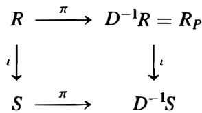

where the vertical maps are inclusions. It is easy to see that $D ^ { - 1 } S$ is integral over $R _ { P }$ (Exercise 20). Let m be any maximal ideal of $D ^ { - 1 } S$ . Then $\mathsf { m } \cap R _ { P }$ is a maximal ideal in $R _ { P }$ by the second statement in Theorem 26(2) (note that the first part of Theorem 26(2) was not used in the proof of the second statement). By Proposition 38( 1), ${ \mathfrak { m } } \cap R _ { P }$ is the extension of $P$ to the local ring $R _ { P }$ , and the contraction of this ideal to $R$ is just $P$ . Put another way, the preimage of m by the maps along the top and right of the diagram above is $P$ . If $Q \subset S$ denotes the preimage of m by the map along the bottom of the diagram, then $Q$ is a prime idea] by Proposition 38(3). Since $Q \cap R$ is the pullback of $Q$ by the map along the left of the diagram above, the commutativity of the diagram shows that $Q \cap R = P$ .

# local Rings of Affine Algebraic Varieties

For the remainder of this section, let $k$ be an algebraically closed field and let $V$ be an affine variety over $k$ with coordinate ring $k [ V ]$ . Then $k [ V ]$ is an integral domain, so we may form its field of fractions:

$$
k (V) = \{f / g \mid f, g \in k [ V ], g \neq 0 \}.
$$

The elements of $k ( V )$ are called rational functions on $V$ and $k ( V )$ is called the field of rational functions on $V$ . When $k [ V ]$ is a Unique Factorization Domain there is an essentially unique representative for $f / g$ that is in "lowest terms," but in general each fraction $f / g \in k ( V )$ has many representations as a ratio oftwo elements of $k [ V ]$ . Since $k [ V ]$ is an integral domain, $f / g = f _ { 1 } / g _ { 1 }$ if and only if $f g _ { 1 } = f _ { 1 } g$ .

The elements of $k [ V ]$ can be considered as $k$ -valued functions on $V$ , and if the denominator doesn't vanish the same is true for an element of $k ( V )$ (which helps to explain the terminology for this field). Since the same element of $k ( V )$ may be written in the form $f / g$ in several ways, we make the following definition:

Definition. We say $f / g$ is regular at v or defined at the point $v \in V$ if there is some $f _ { 1 } , g _ { 1 } \in k [ V ]$ with $f / g = f _ { 1 } / g _ { 1 }$ and $g _ { 1 } ( v ) \neq 0$ .

If $f _ { 2 } , g _ { 2 }$ is another such pair with $g _ { 2 } ( v ) \neq 0$ , then $f _ { 1 } ( v ) / g _ { 1 } ( v ) = f _ { 2 } ( v ) / g _ { 2 } ( v )$ as elements of $k$ , so whenever $f / g$ is regular at $\boldsymbol { v }$ there is a well defined way of specifying its value in $k$ at $\boldsymbol { v }$ .

# Example

The variety $V = \mathcal { Z } ( x z - y \pmb { w } )$ in $\mathbb { A } ^ { 4 }$ has coordinate ring $k [ V ] = k [ x , y , z , w ] / ( x z - y w )$

Consider the element $f = \bar { x } / \bar { y }$ in the quotient field $k ( V )$ of $k [ V ]$ . Since $\bar { x } \bar { z } = \bar { y } \bar { w }$ in $k [ V ]$ , the element $f$ can also be written as $\bar { w } / \bar { z }$ . From the first expression for $f$ it follows that $f$

is regular at all points of $V$ where $\bar { y } \neq 0$ , and from the second expression it follows that $f$ is regular at all point<> of $V$ where $\bar { z } \neq 0$ . It is not too difficult to show that these are all the points of $V$ where $f$ is regular. Furthermore, there is no single expression $\scriptstyle f = a / b$ for $f$ with a, $b \in \pmb { k } [ V ]$ such that $\boldsymbol b ( \boldsymbol v ) \neq 0$ for every v where $f$ is regular (cf. Exercise 25).

If $f / g \in k ( V )$ is regular at the point ${ \pmb v }$ , say $f / g = f _ { 1 } / g _ { 1 }$ with $g _ { 1 } ( v ) \neq 0$ , then $f / g$ is also regular at all the points $\pmb { \upsilon }$ in the Zariski open neighborhood $V _ { g _ { 1 } }$ of $\pmb { \upsilon }$ where $g _ { 1 } \neq 0 .$ . As a $\pmb { k }$ -valued function on $V$ this means that if $f / g$ is defined at $v ,$ then it is also defined in a (Zariski open) neighborhood of $\pmb { \upsilon }$ . Since any nonempty open set of an affine variety is Zariski dense (cf. Exercise 1 1 in Section 2), we see that every rational function on $V$ is defined at a dense set of points in $V$ (so "almost everywhere" in a suitable sense). Also, each pair $f _ { 1 } / g _ { 1 }$ and $f _ { 2 } / g _ { 2 }$ representing $f / g$ agree as functions on the open neighborhood $V _ { g _ { 1 } } \cap V _ { g _ { 2 } }$ of $v ,$ , but the "size" of this neighborhood depends on ${ \pmb { \mathrm { g } } } _ { \pmb { 1 } }$ and $^ { g _ { 2 } }$ - there is in general not a common open neighborhood of $\pmb { \upsilon }$ where all representatives of $f / g$ with nonzero denominator at v are simultaneously defined.

If $\pmb { \upsilon }$ is a fixed point in $V$ , then a rational function $f / g$ is regular at v if and only if $f / g = f _ { 1 } / g _ { 1 }$ for some $f _ { 1 } , g _ { 1 } \in k [ V ]$ with $g _ { 1 } \notin \mathcal { T } ( v )$ , the ideal of functions on $V$ that are zero at v. This means that the set of rational functions that are defined at $\pmb { \upsilon }$ is the same as the localization of $k [ V ]$ at the maximal ideal $\scriptstyle { \mathcal { T } } ( \upsilon )$ :

Definition. For each point $v \in V$ the collection of rational functions on $V$ that are defined at $\pmb { \upsilon }$ ,

$$
\mathcal {O} _ {v, V} = \{f / g \in k (V) \mid f / g \text {i s r e g u l a r a t} v \},
$$

is called the local ring of V at v. Equivalently, the local ring of $V$ at $\pmb { \upsilon }$ is the localization of $k [ V ]$ at the maximal ideal $\boldsymbol { \mathcal { T } } ( \boldsymbol { \upsilon } )$ .

In particular, $\mathcal { O } _ { v , V }$ is a local ring with unique maximal ideal ${ \mathfrak { m } } _ { v , V }$ , where

$$
\mathfrak {m} _ {v, V} = \{f / g \in \mathcal {O} _ {v, V} \mid f / g = f _ {1} / g _ {1} \text {w i t h} f _ {1} (v) = 0, g _ {1} (v) \neq 0 \}
$$

is the set of rational functions on $V$ that are defined and equal to 0 at $\boldsymbol { v }$ . Since $\mathcal { O } _ { v , V }$ is a localization of the Noetherian integral domain $k [ V ]$ at a prime ideal, $\mathcal { O } _ { v , V }$ is also a Noetherian integral domain. Note also that $\mathcal { O } _ { \upsilon . V } / \mathfrak { m } _ { \upsilon . V } \cong k [ V ] / \mathcal { T } ( \upsilon ) \cong k$ by Proposition 46(5).

Recall that the polynomial maps from $V$ to $k$ are also referred to as the regular maps of $V$ to $k .$ . This is because these are precisely the rational functions on $V$ that are regular everywhere:

Proposition 51. If $V$ is an affine variety over an algebraically closed field $\pmb { k }$ then the rational functions on $V$ that are regular at all points of $V$ are precisely the polynomial functions $k [ V ]$ .

Proof' This follows from Proposition 48, which shows that the intersection (in $k ( V ) )$ of all of the localizations of $k [ V ]$ at the maximal ideals of $k [ V ]$ is precisely $k [ V ]$ .

Since the maximal ideals of $k [ V ]$ are in bijective correspondence with the points of V, the fact that the local ring $\mathcal { O } _ { v , \nu }$ is the same as the localization of $k [ V ]$ at the maximal ideal corresponding to v shows that $\mathcal { O } _ { v , \nu }$ depends intrinsically on the ring $k [ V ]$ and is independent of the embedding of $V$ in a particular affine space.

Suppose $\varphi : V \to W$ is a morphism of affine varieties with associated $\pmb { k }$ -algebra homomorphism $\widetilde { \varphi } : k [ W ] \to k [ V ]$ . If $v \in V$ is mapped to $w \in W$ by $\varphi ,$ , then it is straightforward to show that $\widetilde { \varphi }$ induces a homomorphism (also denoted by $\widetilde { \varphi }$ ) between the corresponding local rings:

$$
\widetilde {\varphi}: \mathcal {O} _ {w, W} \to \mathcal {O} _ {v, V} \quad \text {w h e r e} \quad \widetilde {\varphi} (h / k) = \widetilde {\varphi} (h) / \widetilde {\varphi} (k),
$$

and that under this homomorphism, $\widetilde { \varphi } ^ { - 1 } ( \mathfrak { m } _ { v , V } ) = \mathfrak { m } _ { w , W }$ (a homomorphism of local rings having this property is called a local homomorphism). Note that $\widetilde { \varphi }$ does not in general extend to a field homomorphism from all of $k ( W )$ into $k ( V )$ since elements of $k [ W ]$ lying in the kernel of $\widetilde { \varphi }$ do not map to invertible elements in $k ( V )$ . It is also easy to check that if $\psi \circ \varphi$ is a composition of morphisms then on the local rings $\widetilde { \psi \circ \varphi } = \widetilde { \varphi } \circ \widetilde { \psi }$ .

The local ring $\mathcal { O } _ { v , \nu }$ can be used to provide an algebraic definition of the "smoothness" (in the sense of the existence of tangents) of $V$ at ${ \boldsymbol { v } } ,$ , as we now indicate. Suppose first that $V = \mathcal { Z } ( f )$ is the hypersurface variety in $\mathbb { A } ^ { n }$ defined by the zeros of an irreducible polynomial $f$ in $k [ x _ { 1 } , \ldots , x _ { n } ]$ . For any point $\pmb { \upsilon } = ( v _ { 1 } , \ldots , v _ { n } )$ on $V$ let $D _ { v } ( f ) ( x _ { 1 } , \ldots , x _ { n } )$ be the linear polynomial:

$$
D _ {v} (f) \left(x _ {1}, \dots , x _ {n}\right) = \sum_ {i = 1} ^ {n} \frac {\partial f}{\partial x _ {i}} (v) x _ {i},
$$

where the partial derivative of $f$ with respect to $x _ { i }$ is given by the usual formal rule for the derivative of a polynomial in $x _ { i }$ (with all other variables considered constant). The polynomial $D _ { v } ( f ) ( x _ { 1 } - v _ { 1 } , \dots , x _ { n } - v _ { n } )$ is the first order Taylor polynomial of the function $f$ at v, so gives the best linear approximation to $f ( x _ { 1 } , \dots , x _ { n } ) \in k [ x _ { 1 } , \dots , x _ { n } ]$ at v. It follows that if T is the linear variety ${ \mathcal { Z } } ( D _ { v } ( f ) ( x _ { 1 } , \ldots , x _ { n } ) )$ consisting of those points where $D _ { v } ( f )$ is zero, then the translate $\upsilon +  { \mathbf { T } }$ is "tangent". to the hypersurface $\mathcal { Z } ( f )$ at v .

# Example

Suppose $f = x ^ { 2 } - y \in k [ x , y ]$ , so that $V = \mathcal { Z } ( f )$ is just the parabola $\ y = x ^ { 2 }$ . We have $\partial f / \partial x = 2 x$ and $\partial f / \partial y = - 1$ , which at $\boldsymbol { v } = ( 3 , 9 )$ are equal to 6 and $^ { - 1 }$ , respectively. Then

$$
D _ {(3, 9)} (f) (x, y) = 6 x - y,
$$

and the corresponding linear variety T is the line $\boldsymbol { y } = 6 \boldsymbol { x }$ through the origin. The translate $( 3 , 9 ) + \mathbf { T }$ is the usual tangent line to the parabola at (3, 9) . The Taylor expansion of $x ^ { 2 } - y$ at (3 , 9) is $x ^ { 2 } - y = [ 6 ( x - 3 ) - ( \bar { y } - 9 ) ] + ( x - 3 ) ^ { 2 }$ . The first order terms are $D _ { ( 3 , 9 ) } ( f ) ( x - 3 , y - 9 )$ and give the best linear approximation to $x ^ { 2 } - y$ near (3,9).

It is straightforward to extend these notions to any affine variety $V$ in $\mathbb { A } ^ { n }$ .

Definition. Define the tangent space to $V$ at v to be the linear variety

$$
\mathbb {T} _ {v, V} = \mathcal {Z} \left(\left\{D _ {v} (f) \left(x _ {1}, \dots , x _ {n}\right) \mid f \in \mathcal {I} (V) \right\}\right).
$$

The formal partial derivatives are $\pmb { k }$ -linear and obey the usual product rule for derivatives, so the tangent space may be computed from the generators for $\boldsymbol { \mathcal { T } } ( V )$ :

$$
\text {i f} \quad \mathcal {I} (V) = \left(f _ {1}, f _ {2}, \dots , f _ {m}\right) \quad \text {t h e n} \quad \mathbb {T} _ {v, V} = \bigcap_ {i = 1} ^ {m} \mathcal {Z} \left(D _ {v} \left(f _ {i}\right)\right).
$$

Note that $\mathbb { T } _ { \boldsymbol { v } , \boldsymbol { V } }$ is an intersection of vector spaces, so is a vector subspace of $k ^ { n }$ .

This definition of the tangent space $\mathbb { T } _ { v , V } ,$ while making apparent the connection with tangents to the variety V, seems to depend on the embedding of $V$ in $\mathbb { A } ^ { n }$ . In fact the tangent space can be defined entirely in terms of the local ring $\mathcal { O } _ { v , V }$ , as the next proposition proves.

Proposition 52. Let V be an affine variety over the algebraically closed field $k$ and let v be a point on $V$ with local ring $\mathcal { O } _ { v , V }$ and corresponding maximal ideal ${ \mathfrak { m } } _ { v , V }$ . Then there is a $\pmb { k }$ -vector space isomorphism

$$
\left(\mathbb {T} _ {v, V}\right) ^ {*} \cong \mathfrak {m} _ {v, V} / \mathfrak {m} _ {v, V} ^ {2}
$$

where $( \mathbb { T } _ { \boldsymbol { v } , \boldsymbol { V } } ) ^ { * }$ denotes the vector space dual ( cf. Section 1 1 .3) of the tangent space $\mathbb { T } _ { \boldsymbol { v } , \boldsymbol { V } }$ to $V$ at $\pmb { v }$ .

Proof: Let $( k ^ { n } ) ^ { * }$ denote the $\pmb { n }$ -dimensional vector space dual to $k ^ { n }$ . Since each $D _ { v } ( f )$ is a linear function, $D _ { v }$ is a linear transformation from $k [ x _ { 1 } , \ldots , x _ { n } ]$ to $( k ^ { n } ) ^ { * }$ .

Let $M _ { v }$ be the maximal ideal in $k [ x _ { 1 } , \ldots , x _ { n } ]$ generated by the set $x _ { i } - v _ { i }$ for $1 \leq i \leq n$ . The image $M _ { v } / \mathcal { T } ( V )$ of $M _ { v }$ in $k [ V ]$ is the ideal $\boldsymbol { \mathcal { T } } ( \boldsymbol { v } )$ of functions on $V$ that are zero at $\pmb { v }$ and $\mathcal { T } ( v ) ^ { 2 } = M _ { v } ^ { 2 } { + } \mathcal { T } ( V )$ . Then $\mathcal { O } _ { v . V }$ is the localization of $k [ V ]$ at $\boldsymbol { \mathcal { T } } ( \boldsymbol { v } )$ ; and identifying $\boldsymbol { \mathcal { T } } ( \boldsymbol { v } )$ with its image in $\mathcal { O } _ { v , v }$ we have $\mathfrak { m } _ { v , V } = \mathcal { T } ( v ) \mathcal { O } _ { v , V }$ (Proposition 46(2)). By definition of $D _ { v }$ we have $D _ { v } ( x _ { i } - v _ { i } ) = x _ { i }$ , and since these linear functions form a basis of $( k ^ { n } ) ^ { * }$ , it follows that $D _ { v }$ maps $M _ { v }$ surjectively onto $( k ^ { n } ) ^ { * }$ . The kernel of $D _ { v }$ consists of the elements of $k [ x _ { 1 } , \ldots , x _ { n } ]$ whose Taylor expansion at $\boldsymbol { v }$ starts in degree at least 2 and these are just the elements in $M _ { v } ^ { 2 }$ . Hence $D _ { v }$ defines an isomorphism

$$
D _ {v}: M _ {v} / M _ {v} ^ {2} \stackrel {\sim} {\rightarrow} (k ^ {n}) ^ {*}.
$$

The tangent space $\mathbb { T } _ { v , V }$ is a vector subspace of $k ^ { n }$ , so every linear function on $k ^ { n }$ restricts to a linear function on $\mathbb { T } _ { v , V }$ . Composing $D _ { v }$ with this restriction map gives a linear transformation

$$
D: M _ {v} \xrightarrow {D _ {v}} (k ^ {n}) ^ {*} \xrightarrow {\text {r e s}} (\mathbb {T} _ {v, V}) ^ {*}
$$

which is surjective since the individual maps are each surjective. We have already seen that ${ \mathcal T } ( \boldsymbol { v } ) ^ { 2 } = M _ { v } ^ { 2 } + { \mathcal T } ( V )$ , so ${ \mathcal Z } ( v ) / { \bar { \mathcal Z } } ( v ) ^ { 2 } \cong M _ { v } / ( M _ { v } ^ { 2 } + { \mathcal Z } ( V ) )$ . It follows by Proposition 46(5) that $\mathfrak { m } _ { \upsilon , V } / \mathfrak { m } _ { \upsilon , V } ^ { 2 } \cong \mathcal { T } ( \upsilon ) / \mathcal { T } ( \upsilon ) ^ { 2 }$ • To prove the proposition it is therefore sufficient to show that ker $D = M _ { v } ^ { 2 } + \mathcal { I } ( V )$ , since then

$$
\mathfrak {m} _ {v, V} / \mathfrak {m} _ {v, V} ^ {2} \cong M _ {v} / (M _ {v} ^ {2} + \mathcal {I} (V)) = M _ {v} / \ker D \cong (\mathbb {T} _ {v, V}) ^ {*}.
$$

The polynomial $f$ is in ker $D$ if and only if $D _ { v } ( f )$ is zero on $\mathbb { T } _ { v , V }$ , i.e., if and only if the linear term of the Taylor polynomial of $f$ expanded about $\pmb { v }$ lies in $\mathcal { T } ( \mathbb { T } _ { \nu , V } )$ . Since the linear terms of the functions in $\mathcal { T } ( V )$ generate the ideal $\mathcal { T } ( \mathbb { T } _ { \nu , V } )$ , it follows that $f$ is in ker $D$ if and only if $f - g$ has zero linear term for some $_ { g }$ in $\boldsymbol { \mathcal { T } } ( V )$ . But this is equivalent to $f \in \mathcal { T } ( V ) + M _ { v } ^ { 2 }$ , so ker $D = \mathcal { T } ( V ) + M _ { v } ^ { 2 }$ , completing the proof of the proposition.

Recall that the dimension of a variety $V$ is by definition the transcendence degree of the field $k ( V )$ over $k .$ Since each local ring $\mathcal { O } _ { v , V }$ has $k ( V )$ as its field of fractions, the dimension of $V$ is determined by the transcendence degree over $k$ of the field of fractions of any of its local rings.

Definition. We say $V$ is nonsingular at the point $v \in V$ (or v is a nonsingular point of V) if the dimension of the $k$ -vector space $\mathbb { T } _ { v , V }$ is dim V. Equivalently (by Proposition 52), $\pmb { v }$ is a nonsingular point of $V$ if $\dim _ { k } ( \mathfrak { m } _ { \nu , V } / \mathfrak { m } _ { \nu , V } ^ { 2 } ) = \dim V$ . Otherwise the point $\pmb { v }$ is called a singular point. The variety $V$ is nonsingular or smooth if it is nonsingular at every point.

The geometric picture is that at a nonsingular point $\pmb { v }$ there are as many independent tangents as one would expect: a tangent line on a curve, a tangent plane on a surface, etc.

Whether a variety V is nonsingular at a point v can be determined from properties of the local ring $\mathcal { O } _ { v , V }$ . namely whether $\dim _ { k } ( \bar { \mathfrak { m } } _ { v , V } / \mathfrak { m } _ { v , V } ^ { 2 } ) = \dim \mathcal { O } _ { v , V }$ · A local ring having this property is said to be a regular local ring. In particular, the notion of singularity does not depend on the embedding of $V$ in a specific affine space. This algebraic interpretation can be used to define smoothness for abstract algebraic varieties, where the geometric intuition of tangent planes to surfaces (for example) is not as obvious.

If $f _ { 1 } , \ldots , f _ { m }$ $f _ { m }$ are generators for $\mathcal { T } ( V )$ defining $V$ in $\mathbb { A } ^ { n }$ , then the dimension of $V$ can be determined from a Grobner basis for $\mathcal { T } ( V )$ (cf. Exercise 29). Determining the dimension ofthe tangent space $\mathbb { T } _ { v , V }$ as a vector space over $k$ is a linear algebra problem: this vector space is the set of solutions of the m linear equations $D _ { \nu } ( f _ { i } ) ( x _ { 1 } , \dots , x _ { n } ) = 0$ . If r is the rank of the $m \times n$ matrix of coefficients $\partial f _ { i } / \partial x _ { j } ( \boldsymbol { v } )$ of this system of equations, then $\mathbb { T } _ { v , V }$ is a vector space of dimension $n - r .$ . Using this it is not too difficult to establish the following:

1. We have dim $V \leq \dim _ { k } ( \mathbb { T } _ { v , V } ) \leq n$ for every point v in $V \subseteq \mathbb { A } ^ { n }$ .   
2. The set of singular points of $V$ is a proper Zariski closed subset of $V$ . The set of nonsingular points of $V$ is a nonempty open subset of $V$ ; in particular the nonsingular points of $V$ are dense in $V$ (so "most" points of $V$ are nonsingular).

We also state without proof the following result which further relates the local geometry of V to the algebraic properties of the local rings of $V$ :

3 . I f v i s a nonsingular point, then the local ring $\mathcal { O } _ { v , V }$ is a Unique Factorization Domain; in particular, $\mathcal { O } _ { v , V }$ is integrally closed (cf. Example 3 following Corollary 25).

The variety V is said to be factorial if $\mathcal { O } _ { v , \nu }$ is a U.F.D. for every point $v \in V$ , and is said to be a normal variety if $\mathcal { O } _ { v , v }$ is integrally closed for every $v \in V$ (which by Proposition 49 is equivalent to $k [ V ]$ being integrally closed). By (3) above we have

smooth varieties c factorial varieties c normal varieties.

In general each of the above containments is proper. In the case when V has dimension l, i.e., V is an affine curve, however, these three properties are in fact equivalent: we shall prove later that an irreducible affine curve is smooth if and only if it is normal or factorial (cf. Corollary 1 3 in Section 16.2). It follows that over an algebraically closed field $k$ ,

an irreducible affine curve $c$ is smooth if and only if k [ C] is integrally closed.

For any irreducible affine curve $c$ the integral closure, S, of $k [ V ]$ in $k ( V )$ is also the coordinate ring of an irreducible affine curve $\widetilde { c }$ . Then S is integral over $k [ V ]$ and, by Theorem 30 and Corollary 27 it follows that there is a morphism from the smooth curve $\widetilde { c }$ onto $c$ that has finite fibers. The curve $\tilde { c }$ is called the normalization or the nonsingular model of $c _ { i }$ , and one can show that it is unique up to isomorphism. Note how the existence of a smooth curve mapping finitely to $\pmb { C }$ (a problem in "geometry") is solved by the existence of integral closures in ring extensions (a problem in "algebra").

We shall give another characterization of smoothness for irreducible affine curves at the end of Section 16.2.

# E X E R C I S E S

As usual $\pmb { R }$ is a commutative ring with 1 and $\pmb { D }$ is a multiplicatively closed set in $\pmb R$ .

1. Suppose $M$ is a finitely generated $\pmb { R }$ -module. Prove that $D ^ { - 1 } M = 0$ if and only if $d M = 0$ for some $\pmb { d } \in \pmb { D }$ .   
2. Let I be an ideal in $\pmb { R }$ , let $\pmb { D }$ be a multiplicatively closed subset of $\pmb { R }$ with ring of fractions $D ^ { - 1 } R$ , and let ${ } ^ { c } ( { } ^ { e } I ) = R$ be the saturation of I with respect to $\pmb { D }$ .   
(a) Prove that ${ } ^ { c } ( { } ^ { e } I ) = R$ i f and only if ${ } ^ { e } I = D ^ { - 1 } R$ if and only if I n $\pmb { D } \neq \pmb { \emptyset }$ .   
(b) Prove that $I = ^ { c } ( ^ { e } I )$ is saturated if and only if for every $\pmb { d } \in \pmb { D }$ , if $\mathbf { \Psi } \mathbf { \psi } \mathbf { \psi } \mathbf { \psi } \mathbf { \psi } \mathbf { \psi } \mathbf { \psi } \mathbf { \psi } \mathbf { \psi } \mathbf { \psi } \mathbf { \psi } \mathbf { \psi } \mathbf { \psi } \mathbf { \psi } \mathbf { \psi } \mathbf { \psi } \mathbf { \psi } \mathbf { \psi } \mathbf { \psi } \mathbf { \psi } \mathbf { \psi } \mathbf { \psi } \mathbf { \psi } \mathbf { \psi } \mathbf { \psi } \mathbf { \psi } \mathbf { \psi } \mathbf { \psi } \mathbf { \psi } \mathbf { \psi } \mathbf { \psi } \mathbf { \psi } \mathbf { \psi } \mathbf { \psi } \mathbf { \psi } \mathbf { \psi } \mathbf { \psi } \mathbf { \psi } \mathbf { \psi } \mathbf { \psi } \mathbf { \psi } \mathbf { \psi } \mathbf { \psi } \mathbf { \psi } \mathbf { \psi } \mathbf { \psi } \mathbf { \psi } \mathbf { \psi } \mathbf { \psi } \mathbf { \psi } \mathbf { \psi } \mathbf { \psi } \mathbf { \psi } \mathbf { \psi } \mathbf { \psi } \mathbf { \psi } \mathbf { \psi } \mathbf { \psi } \mathbf { \psi } \mathbf { \psi } \mathbf { \psi } \mathbf { \psi } \mathbf { \psi } \mathbf { \psi } \mathbf { \psi } \mathbf { \psi } \mathbf { \psi } \mathbf \psi \psi \psi \psi \mathbf { } \psi \psi \mathbf { \psi } \psi \mathbf \psi \psi \psi \psi \psi \psi \psi \psi \mathbf \psi \psi \psi \psi \psi \psi \psi \psi \psi \psi \psi \psi \psi \psi \psi \psi \psi \psi \psi \psi \psi \psi \psi \psi \psi \psi \psi \psi \psi \psi \psi \psi \psi \psi \psi \psi \psi \psi \psi \psi \psi \psi \psi \psi \psi \psi \psi \psi \psi \psi \psi \psi \psi \psi \psi \psi \psi \psi \psi \psi \psi \psi \psi \psi \psi \psi $ then $a \in { \cal I }$   
(c) Prove that extension and contraction define inverse bijections between the ideals of $\pmb { R }$ saturated with respect to $\pmb { D }$ and the ideals of $D ^ { - 1 } R$ .   
(d) Let $I = ( 2 x , 3 y ) \subset \mathbb { Z } [ x , y ]$ . Show the saturation of I with respect to $\mathbb { Z } - \{ 0 \}$ is $( x , y )$

3. If I is an ideal in the commutative ring $\pmb R$ let $\varphi : R [ x _ { 1 } , \ldots , x _ { n } ] \cong ( R / I ) [ x _ { 1 } , \ldots , x _ { n } ]$ be the ring homomorphism with kernel $I [ x _ { 1 } , \ldots , x _ { n } ]$ given by reducing coefficients modulo I . If $\overline { { A } }$ is an ideal in $( R / I ) [ x _ { 1 } , \ldots , x _ { n } ] ,$ . let A denote the inverse image of $\overline { { A } }$ under $\varphi$ .

(a) For any $i \geq 1$ show that the inverse image under $\pmb { \varphi }$ of the subring $( R / I ) [ x _ { 1 } , \ldots , x _ { i } ]$ is $R [ x _ { 1 } , \ldots , x _ { i } ] + I [ x _ { 1 } , \ldots , x _ { n } ] ,$ .   
(b) Prove that $\varphi ( A \cap R [ x _ { 1 } , \ldots , x _ { i } ] ) = { \overline { { A } } } \cap ( R / I ) [ x _ { 1 } , \ldots , x _ { i } ]$

4. Let $f = y ^ { 5 } - z ^ { 4 }$ , viewed as a polynomial in $\textbf { y }$ with coefficients in $\mathbb { Q } [ z ]$ .

(a) Prove that $f$ has no roots in $\mathbb { Q } [ z ]$   
(b) Suppose $\dot { f } = ( y ^ { 2 } + a y + b ) ( y ^ { 3 } + c y ^ { 2 } + d y + e )$ . Show that $a , b , c , d , e$ satisfy the system of equations

$$
a + c = 0, \quad a c + b + d = 0, \quad a d + b c + e = 0, \quad a e + b d = 0, \quad b e - z ^ {4} = 0.
$$

Deduce that $e ^ { 5 } = z ^ { 1 2 }$ and conclude that $f$ is irreducible in Q[y, z]. [Use elimination.]

5. Suppose $R$ is a U .ED. with field of fractions $\pmb { F }$ and $p \in R [ x ]$ is a monic polynomial.

(a) Show that the ideal $\pmb { p R } [ \pmb { x } ]$ generated by $\pmb { p }$ in $R [ x ]$ is prime if and only if the ideal $p F [ x ]$ generated by $\pmb { p }$ in $F [ x ]$ is prime. [Use Gauss' Lemma.]   
(b) Show that ${ \pmb p R } [ { \pmb x } ]$ is saturated, i.e., that $p F [ x ] \cap R [ x ] = p R [ x ] .$

6. Show that $I = ( y ^ { 3 } - x z , x y ^ { 2 } - z ^ { 2 } )$ is not a prime ideal in $\mathbb { Q } [ x , y , z ]$ and find explicit elements $a , b \in \mathbb { Q } [ x , y , z ]$ with $a b \in I$ but a ¢ I and $b \notin { I }$ .   
7. Show that $P = ( y ^ { 3 } - x z , x y ^ { 2 } - z ^ { 2 } , x ^ { 2 } - y z )$ is a prime ideal in $\mathbb { Q } [ x , y , z ]$   
8. Show that $P = ( x ^ { 2 } - y z , w ^ { 2 } - x ^ { 4 } z )$ is a prime ideal in $\mathbb { Q } [ x , y , z , w ]$   
9. Show that $P = ( x z ^ { 2 } - w ^ { 3 } , x w ^ { 2 } - y ^ { 4 } , y ^ { 4 } z ^ { 2 } - w ^ { 5 } )$ is a prime ideal in $\mathbb { Q } [ x , y , z , w ] .$

10. Show that $\pmb { I } = ( \pmb { x } \pmb { y } - \pmb { w } ^ { 3 } , \pmb { y } ^ { 2 } - z \pmb { w } )$ is not a prime ideal in $\mathbb { Q } [ x , y , z , \pmb { w } ]$ and find a, $^ { b }$ with $a b \in I$ but a , $b \notin { I }$ .

11. Let $R _ { P }$ be the localization of $R$ at the prime $P$ . Prove that if $\boldsymbol { Q }$ is a $P$ -primary ideal of $R$ then $\boldsymbol { Q } = ^ { c } ( ^ { e } \boldsymbol { Q } )$ with respect to the extension and contraction of $Q$ to $R _ { P }$ . Show the same result holds if $Q$ is $P ^ { \prime }$ -primary for some prime $P ^ { \prime }$ contained in $P$ .

12. Let $R = \mathbb { R } [ x , y , z ] / ( x y - z ^ { 2 } )$ , let $P = ( \bar { x } , \bar { z } )$ be the prime ideal generated by the images of $x$ and $\mathbf { y }$ in $R _ { ☉ }$ , and let $R _ { P }$ be the localization of $\pmb R$ at $P$ . Prove that $P ^ { 2 } R _ { P } \cap R = ( { \bar { x } } )$ and is strictly larger than $P ^ { 2 }$ .

13. Prove that if $N$ and $N ^ { \prime }$ are two $R$ -submodules of an $R$ -module $M$ with $N _ { P } = N _ { P } ^ { \prime }$ in the localization $M _ { P }$ for every prime ideal $P$ of $R$ (or just for every maximal ideal) then $N = N ^ { \prime }$ .

14. Suppose $\varphi : M \to N$ is a n $R$ -module homomorphism. Prove that $\varphi$ is injective (respectively, surjective) if and only if the induced $R _ { P }$ -module homomorphism $\varphi : M _ { P } \to N _ { P }$ is injective (respectively, surjective) for every prime ideal $P$ of $R$ (or just for every maximal ideal of $R$ ).

15. Let $R = \mathbb { Z } [ { \sqrt { - 5 } } ]$ be the ring of integers in the quadratic field $\mathbb { Q } ( { \sqrt { - 5 } } )$ and let I be the prime ideal ( $2 , 1 + { \sqrt { - 5 } } )$ of $R$ generated by 2 and $1 + { \sqrt { - 5 } }$ ( cf. Exercise 5, Section 8.2). Recall that every nonzero prime ideal $P$ of $R$ contains a prime $p \in \mathbb { Z }$ .

(a) If $P$ is a prime ideal of $R$ not containing 2 prove that $I _ { P } = R _ { P }$   
(b) If $P$ is a prime ideal of $R$ containing 2 prove that $P = I$ and that $I _ { P } = ( 1 + \sqrt { - 5 } ) R _ { P }$   
(c) Prove that $I _ { P } \cong R _ { P }$ as $R _ { P }$ -modules for every prime ideal $P$ of $R$ but that $\pmb { I }$ and $R$ are not isomorphic $R$ -modules. (This example shows that it is important in Exercise 14 to be given the $R$ -module homomorphism $\varphi$ .) [Observe that $I \cong R$ as $R \mathrm { . }$ -modules if and only if I is a: principal ideal.]

16. Prove that localization commutes with tensor products: there is a unique isomorphism of $D ^ { - 1 } R$ -modules $\varphi : ( D ^ { - 1 } M ) \otimes _ { D ^ { - 1 } R } ( D ^ { - 1 } N ) \tilde { \cong } D ^ { - 1 } ( M \otimes _ { R } N )$ with $\varphi ( ( m / d ) \otimes ( n / d ^ { \prime } ) )$ given by $( m \otimes n ) / d d ^ { \prime }$ for any $R$ -modules M, N, and multiplicatively closed set $\pmb { D }$ in $R$ .   
17. Prove that the $R$ -module A is a flat $R$ -module if and only if $A _ { P }$ is a flat $R _ { P }$ -module for every prime ideal $P$ of $R$ (or just for every maximal ideal of $R$ ). [Use Proposition 4 1 , Exercises 14 and 16, and the exactness properties of localization.]   
18. In the notation of Example 2 following Corollary 37, prove that $R _ { f } \cong R [ x ] / ( f x - 1 )$ if/ i s not nilpotent i n $R$ . [Show that the map $\varphi : R [ x ]  R _ { f }$ defined by $\varphi ( r ) = r / 1$ and $\varphi ( { \boldsymbol { x } } ) = 1 / f$ gives a surjective ring homomorphism and the universal property in Theorem 36 gives an inverse.]   
19. Prove that if $R$ is an integrally closed integral domain and $\pmb { D }$ is any multiplicatively closed subset of $R$ containing 1 , then $D ^ { - 1 } R$ is integrally closed.

20. Suppose that $R$ is a subring of the ring $s$ with $1 \in R$ and that $s$ is integral over $R$ . If $\pmb { D }$ is any multiplicatively closed subset of $R$ , prove that $D ^ { - 1 } S$ is integral over $D ^ { - 1 } R$ .

21. Suppose $\varphi : R \to s$ is a ring homomorphism and $D ^ { \prime }$ is a multiplicatively closed subset of S. Let $D = \varphi ^ { - 1 } ( D ^ { \prime } )$ . Prove that $\pmb { D }$ is a multiplicatively closed subset of $R$ and that the map $\varphi ^ { \prime } : D ^ { - 1 } R  D ^ { \prime - 1 } S$ given by $\varphi ^ { \prime } ( r / d ) = \varphi ( r ) / \varphi ( d )$ is a ring homomorphism.

22. Suppose $P \subseteq Q$ are prime ideals in $\pmb R$ and let $R _ { Q }$ be the localization of $R$ at $\boldsymbol { Q }$ . Prove that the localization $R _ { P }$ is isomorphic to the localization of $R _ { Q }$ at the prime ideal $P R _ { Q }$ (cf. the preceding exercise).

23. Let $\varphi : A  B$ be a homomorphism of commutative rings with $\varphi ( 1 _ { A } ) = 1 _ { B }$ , and let $P$ be a prime ideal of A. Let contraction and extension of ideals with respect to $\varphi$ be denoted by superscripts $^ c$ and $^ e$ respectively. Prove that $P$ is the contraction of a prime ideal in $\pmb { B }$ if and only if $P = ( P ^ { e } ) ^ { c }$ . [Localize $\pmb { B }$ at $\varphi ( A - P ) .$ .]

24. (The Going-down Theorem) Let $s$ be an integral domain, let $R$ be an integrally closed subring of S containing $1 s$ , and let $\pmb { k }$ be the field of fractions of $R .$ . Suppose that $P _ { 2 } \subseteq P _ { 1 }$ are prime ideals in $\pmb R$ and that $Q \mathbf { 1 }$ is a prime ideal in S with $Q _ { 1 } \cap R = P _ { 1 }$ . Let $s _ { Q _ { 1 } }$ be the localization of S at $Q \mathbf { 1 }$ .

(a) Show that $P _ { 2 } \subseteq P _ { 2 } S _ { Q _ { 1 } } \cap R$ .

(b) Suppose that $a \in P _ { 2 } S _ { Q _ { 1 } } \cap R$ and write $\pmb { a } = \pmb { s } / d$ with $s \in P _ { 2 } S$ and $d \in S , d \notin Q _ { 1 }$ . I f the minimal polynomial of $\pmb { s }$ over $\pmb { k }$ i s $x ^ { n } + a _ { n - 1 } x ^ { n - 1 } + \cdots + a _ { 1 } x + a _ { 0 }$ with $a _ { 0 } , \ldots , a _ { n - 1 } \in P _ { 2 }$ (cf. Exercise 12 in Section 3) show that the minimal polynomial of $^ { d }$ over $\pmb { k }$ is $x ^ { n } + b _ { n - 1 } x ^ { n - 1 } + \cdot \cdot \cdot + b _ { 1 } x + b _ { 0 }$ where $b _ { i } = a _ { i } / a ^ { n - i }$ and conclude that $b _ { i } \in R .$ . [Use Exercise 10 in Section 3.]

(c) Show that $a \in P _ { 2 }$ and conclude that $P _ { 2 } S _ { Q _ { 1 } } \cap R = P _ { 2 }$ . [Show $a \notin P _ { 2 }$ implies $b _ { i } \in P _ { 2 }$ for $i = 0 , 1 , \ldots , n - 1$ , which would imply $d ^ { n } \in P _ { 2 } S \subseteq P _ { 1 } S \subseteq Q _ { 1 }$ and so $d \in { \cal Q } _ { 1 . } ]$

(d) Prove that $P _ { 2 } S _ { Q _ { 1 } }$ is contained in a prime ideal $P$ of $s _ { Q _ { 1 } }$ with $P \cap R = P _ { 2 }$ . [Use (c) and the previous exercise for $\varphi : R  S _ { Q _ { 1 } }$ .]

(e) Let $Q _ { 2 } = P \cap S .$ . Prove that $Q _ { 2 } \subseteq Q _ { 1 }$ and that $Q _ { 2 } \cap R = P _ { 2 }$

(f) Use induction together with the previous result to prove the Going-down Theorem: Theorem 26(4).

25. Let $\pmb { k }$ be an algebraically closed field and let $V = \mathcal { Z } ( x z - y w ) \subset \mathbb { A } ^ { 4 }$ . Prove that the set of points $\pmb { v }$ where $f = \bar { x } / \bar { y } \in k ( V )$ is regular is precisely the set of points $( x , y , z , w )$ where $y \neq 0$ or $z \neq 0$ . [If $f = \bar { a } / \bar { b }$ show that $a y - b x \in ( x z - y w )$ as polynomials in $k [ x , y , z , w ]$ and conclude that $b \in ( y , z ) .$ .] Prove that there is no function $a / b \in k ( V )$ with $\pmb { b } ( \pmb { v } ) \neq \pmb { 0 }$ for every v where $f$ is regular.

26. (Differentials of Morphisms) Let $\varphi : V \to W$ be a morphism of affine varieties over the algebraically closed field $\pmb { k }$ and suppose $\varphi ( \pmb { \nu } ) = \pmb { w }$ .

(a) Show that $\varphi$ induces a linear map from the $\pmb { k }$ -vector space $M _ { w } / M _ { w } ^ { 2 }$ to the $\pmb { k }$ -vector space $M _ { v } / M _ { v } ^ { 2 }$ , and use this to show that $\varphi$ induces a linear map dcp (called the differential of $\varphi$ ) from the $\pmb { k }$ -vector space $\mathbb { T } _ { v , V }$ to the $\pmb { k }$ -vector space $\mathbb { T } _ { \boldsymbol { w } , \boldsymbol { W } }$ .

(b) Prove that if $V \subseteq \mathbb { A } ^ { n }$ , $W \subseteq \mathbb { A } ^ { m }$ and $\varphi = ( F _ { 1 } ( x _ { 1 } , \ldots , x _ { n } ) , \ldots , F _ { m } ( x _ { 1 } , \ldots , x _ { n } ) )$ $F _ { m } ( x _ { 1 } , \ldots , x _ { n } ) )$ then $d \varphi : \mathbb { T } _ { v , V } \to \mathbb { T } _ { w , W }$ is given explicitly by

$$
(d \varphi) (a _ {1}, \dots , a _ {n}) = \left(D _ {v} \left(F _ {1}\right) \left(a _ {1}, \dots , a _ {n}\right), \dots , D _ {v} \left(F _ {m}\right) \left(a _ {1}, \dots , a _ {n}\right)\right).
$$

[If $g = g ( y _ { 1 } , \dots , y _ { m } )$ show that the chain rule implies

$$
\frac {\partial (g \circ \varphi)}{\partial x _ {i}} (v) = \sum_ {j = 1} ^ {m} \frac {\partial g}{\partial y _ {j}} (w) \frac {\partial F _ {j}}{\partial x _ {i}} (v),
$$

so that $D _ { v } ( g \circ \varphi ) ( a _ { 1 } , \ldots , a _ { n } ) = D _ { w } ( g ) ( b _ { 1 } , \ldots , b _ { m } )$ where $b _ { j } = D _ { v } ( F _ { j } ) ( a _ { 1 } , \dots , a _ { n } )$ · Then use the fact that $g \circ \varphi \in { \mathcal { T } } ( V )$ if $g \in { \mathcal { T } } ( W ) . ]$

(c) If $\psi : U \to V$ is another morphism with $\psi ( u ) = \upsilon ,$ , prove that the associated $d ( \varphi \circ \psi ) : \mathbb { T } _ { u , U }  \mathbb { T } _ { w , W }$ is the same as $d \varphi \circ d \psi$ .   
(d) Prove that if $\varphi$ is an isomorphism then $\pmb { d \varphi }$ is a vector space isomorphism from $\mathbb { T } _ { v , V }$ to $\mathbb { T } _ { w , W }$ for every $\varphi ( \pmb { \upsilon } ) = \pmb { w }$ .

27. Let $V = \mathbb { A } ^ { 1 }$ and $W = \mathcal { Z } ( x z - y ^ { 2 } , y z - x ^ { 3 } , z ^ { 2 } - x ^ { 2 } y ) \subset \mathbb { A } ^ { 3 }$ $\ b { W } = \ b { \mathcal { Z } } ( \ b { x } \ b { z } - \ b { y } ^ { 2 }$ • Let $\varphi : V \to W$ be the suijective morphism $\varphi ( t ) = ( t ^ { 3 } , t ^ { 4 } , t ^ { 5 } )$ (cf. Exercise 26 in Section 1). For each $\pmb { t } \in \mathbb { A } ^ { 1 }$ describe the differential $d \varphi : \mathbb { T } _ { t , \mathbb { A } ^ { 1 } } \to \mathbb { T } _ { ( t ^ { 3 } , t ^ { 4 } , t ^ { 5 } ) , W }$ in the previous exercise explicitly; in particular prove that $\pmb { d \varphi }$ is an isomorphism of vector spaces for all $\pmb { t } \neq \mathbf { 0 }$ and is the zero map for ${ \pmb t = 0 }$ . Use this to prove that $\pmb { V }$ and $W$ are not isomorphic.   
28. If $\pmb { k }$ is a field, the quotient $\pmb { k } [ \pmb { x } ] / ( \pmb { x } ^ { 2 } )$ is called the ring of dual numbers over k. If $\pmb { V }$ is an affine algebraic set over $\pmb { k }$ , show that a $\pmb { k }$ -algebra homomorphism from $k [ V ]$ to $k [ x ] / ( x ^ { 2 } )$ is equivalent to specifying a point $\upsilon \in V$ with $\mathcal { O } _ { v , V } / \mathfrak { m } _ { v , V } = k$ (called a $\pmb { k }$ -rational point of V) together with an element in the tangent space $\mathbb { T } _ { v , V }$ of $\pmb { V }$ at $\pmb { \upsilon }$ .   
29. (Computing the dimension of a variety) Let $P$ be a prime ideal in $k [ x _ { 1 } , \ldots , x _ { n } ] .$ . set $P _ { 0 } = \mathbf { 0 }$ and let $P _ { i } = P \cap k [ x _ { 1 } , \ldots , x _ { i } ]$ . Define the varieties $V _ { i } = \mathcal { Z } ( P _ { i } ) \subseteq \mathbb { A } ^ { i }$ with $\nu _ { 0 }$ the zero dimensional variety consisting of a single point and coordinate ring $\pmb { k }$ .

(a) Show that dim $V _ { i - 1 } \leq \dim V _ { i } \leq \dim V _ { i - 1 } + 1 .$ [First exhibit an injection from $k [ V _ { i - 1 } ]$ into k [ V; ] ; then show that k [ V; ] i s a $\pmb { k }$ -algebra generated by $k [ V _ { i - 1 } ]$ and one additional generator.]   
(b) If the ideal generated by $P _ { i - 1 }$ in $k [ x _ { 1 } , \ldots , x _ { i } ]$ equals $P _ { i }$ , show that $V _ { i } \cong V _ { i - 1 } \times \mathbb { A } ^ { 1 }$ and deduce that dim $V _ { i } = \dim V _ { i - 1 } + 1$ .   
(c) If the ideal generated by $P _ { i - 1 } \mathrm { i n } k [ x _ { 1 } , \dots , x _ { i } ]$ is properly contained in $P _ { i }$ , show that dim $V _ { i } = \dim V _ { i - 1 }$ ·   
(d) Show that dim $\pmb { V }$ equals the number of $i \in \left\{ 1 , 2 , \ldots , n \right\}$ such that the ideal generated by $P _ { i - 1 }$ in $k [ x _ { 1 } , \dots , x _ { i } ]$ equals the ideal $P _ { i }$ . Deduce that if $\pmb { G }$ is the reduced Grobner basis for $P$ with respect to the lexicographic monomial ordering $x _ { n } > \cdots > x _ { 1 }$ and $G _ { i } = G \cap k [ x _ { 1 } , . . . , x _ { i } ]$ where ${ \cal G } _ { 0 } = \emptyset ,$ , and $N$ is the number of i with $G _ { i } \neq G _ { i - 1 }$ for $1 \leq i \leq n$ , then dim $V = n - N$ .

The following eleven exercises introduce the notion o f the suppon of an $\pmb { R }$ -module M and its relation to the associated primes of M. Cf. also Exercises 29 to 35 in Section 1 and Exercises 25 to 30 in Section 5.

Definition. If M is an R-module, then the set of prime ideals $P$ of $\pmb { R }$ for which the localization $M _ { P }$ is nonzero is called the suppon of $M .$ , denoted Supp(M).

30. Prove that $M = 0$ if and only if $\mathbf { S u p p } ( M ) = \emptyset .$ . [Use Proposition 47.]   
31. If $0 \to L \to M \to N \to 0$ is an exact sequence of $\pmb { R }$ -modules, prove that the localization $M _ { P }$ is nonzero if and only if one of the localizations $N _ { P }$ and $L _ { P }$ is nonzero and deduce that S $\mathsf { \iota p p } ( M ) = \mathsf { S u p p } ( L ) \cup \mathsf { S u p p } ( N )$ . In particular, if $M = M _ { 1 } \oplus \cdots \oplus M _ { n }$ prove that $\operatorname { S u p p } ( M ) = \operatorname { S u p p } ( M _ { 1 } ) \cup \dots \cup \operatorname { S u p p } ( M _ { n } )$ .   
32. Suppose $P \subseteq Q$ are prime ideals i n $\pmb { R }$ and that $M$ i s an $\pmb { R }$ -module. Prove that the localization of the $\pmb { R }$ -module $M _ { Q }$ at $P$ is the localization $M _ { P }$ , i .e., $( M _ { Q } ) _ { P } = M _ { P }$ . [Argue directly, or use Proposition 41 and the associativity of the tensor product.]   
33. Suppose $P \ \subseteq \ Q$ are prime ideals in $\pmb { R }$ and that $M$ is an $\pmb { R }$ -module. Prove that if $P \in \operatorname { S u p p } ( M )$ then $Q \in \operatorname { S u p p } ( M )$ . [Use the previous exercise.]   
34. (a) Suppose $M = R m$ is a cyclic $\pmb { R }$ -module. Prove that $M _ { P } = 0$ if and only if there is

an element $r \in R , r \notin P$ with $r m = 0$ . Deduce that $P \in \mathsf { S u p p } ( M )$ if and only if $P$ contains the annihilator of $_ { m }$ in $\pmb R$ (cf. Exercise 10 in Section 1 0. 1 ).

(b) If $M = R m _ { 1 } + \cdot \cdot \cdot + R m _ { n }$ is a finitely generated $\pmb { R }$ -module prove that $P \in \mathsf { S u p p } ( M )$ if and only if $P$ is contained in $\mathsf { S u p p } ( R m _ { i } )$ for some $i = 1 , \ldots , n$ . [Use Proposition 42.] Deduce that $P \in \mathsf { S u p p } ( M )$ if and only if $P$ contains the annihilator $\mathsf { A n n } ( M )$ of $M$ in R. [Note $\mathsf { A n n } ( M ) = \cap _ { i = 1 } ^ { n } \mathsf { A n n } ( R m _ { i } )$ , then use (a) and Exercise 1 1 of Section 7.4.]

35. Suppose $P$ is a prime ideal of $\pmb R$ with $P \cap D = \emptyset .$ . Prove that if $P \in { \mathsf { A s s } } _ { R } ( M )$ then $D ^ { - 1 } P \in { \bf A s s } _ { D ^ { - 1 } R } ( D ^ { - 1 } M )$ . [Use Proposition 38(3) and Proposition 42.]

36. Suppose $D ^ { - 1 } P \in { \sf A s s } _ { D ^ { - 1 } R } ( D ^ { - 1 } M )$ where $P = ( a _ { 1 } , \ldots , a _ { n } )$ is a finitely generated prime ideal in $\pmb R$ with $P \cap D = \emptyset$ .

(a) Suppose $m / d \in D ^ { - 1 } M$ has annihilator $D ^ { - 1 } P$ in $D ^ { - 1 } R$ . Show that $d _ { i } a _ { i } m = 0 \in R$ for some $d _ { 1 } , \dots , d _ { n } \in D$ .   
(b) Let $d ^ { \prime } = d _ { 1 } d _ { 2 } \ldots d _ { n }$ . Show that $P = \mathsf { A n n } ( d ^ { \prime } m )$ and conclude that $P \in { \mathsf { A s s } } _ { R } ( M )$ [The inclusion $P \subseteq \mathsf { A n n } ( d ^ { \prime } m )$ is immediate. For the reverse inclusion, show that $b \in \mathsf { A n n } ( d ^ { \prime } m )$ implies that $\pmb { b } / 1$ annihilates $m / d$ in $D ^ { - 1 } M$ , hence $b / 1 \in D ^ { - 1 } P$ , and conclude $\boldsymbol { b } \in \boldsymbol { P }$ . ]

37. Suppose $M$ is a module over the Noetherian ring R. Use the previous two exercises to show that under the bijection of Proposition 38(3) the prime ideals $P$ of ${ \sf A s s } _ { R } ( M )$ with $P \cap D = \emptyset$ correspond bijectively with the prime ideals of $ { \mathbf { A s s } } _ { D ^ { - 1 } R } ( D ^ { - 1 } M )$ .   
38. Suppose $M$ is a module over the Noetherian ring $\pmb R$ and $\pmb { D }$ is a multiplicatively closed subset of $\pmb { R } .$ Let $s$ be the subset of prime ideals $P$ in $\mathbf { A s s } _ { R } ( M )$ with $P \cap D \neq \emptyset .$ . This exercise proves that the kernel $N$ of the localization map $M  D ^ { - 1 } M$ is the unique submodule $N$ of $M$ with $\mathbf { A s s } _ { R } ( N ) = { \mathcal { S } }$ and $\operatorname { A s s } _ { R } ( M / N ) = \operatorname { A s s } _ { R } ( M ) - \mathcal { S }$ .

(a) If $N ^ { \prime }$ is a submodule of $M$ with $\mathrm { \bf A s s } _ { R } ( N ^ { \prime } ) = \mathcal { S }$ and $\operatorname { A s s } _ { R } ( M / N ^ { \prime } ) = \operatorname { A s s } _ { R } ( M ) - S$ as in Exercise 35 in Section 1, prove that the diagram

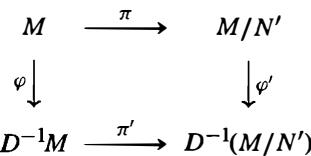

is commutative, where $\pi$ and $\pi ^ { \prime }$ are the natural projections (cf. Proposition 42(6)) and $\varphi , \varphi ^ { \prime }$ are the localization homomorphisms.

(b) Show that $\mathrm { A s s } _ { D ^ { - 1 } R } ( D ^ { - 1 } N ^ { \prime } ) = \emptyset$ and conclude that $D ^ { - 1 } N ^ { \prime } = 0$ and tha $\pi ^ { \prime }$ is injective. [Use the previous exercise, the definition of $s$ , and Exercise 34 in Section 1 .]   
(c) If $x$ is the kernel $\pmb { K }$ of $\varphi ^ { \prime }$ show that $\mathbf { A n n } ( x ) \cap D \neq \emptyset$ and that $\mathsf { A s s } _ { R } ( K ) \subseteq \mathcal S$ . Show that $\mathsf { A s s } _ { R } ( K ) \subseteq \mathsf { A s s } _ { R } ( M / N ^ { \prime } )$ implies that $\mathbf { A s s } _ { R } ( K ) = \pmb { \emptyset }$ , and deduce that $K = 0$ .   
(d) Prove $\varphi$ and $\pi$ have the same kernel, i.e., $N = N ^ { \prime }$ , and this submodule of $M$ is unique.

The next two exercises establish a fundamental relation between the sets ${ \sf A s s } _ { R } ( M )$ and Supp(M) of prime ideals related to the $\pmb R$ -module $M$ .

39. Prove that $\mathsf { A s s } _ { R } ( M ) \subseteq \mathsf { S u p p } ( M )$ . [If $R m \cong R / P$ use Proposition 42(4) and Proposition 46( 1 ) to show that $0 \neq ( R m ) _ { P } \subseteq M _ { P }$ . j   
40. Suppose that $\pmb R$ is Noetherian and $M$ is a n $\pmb R$ -module.

(a) If $P \in \operatorname { S u p p } ( M )$ prove that $P$ contains a prime ideal $\boldsymbol { Q }$ with $Q \in { \mathsf { A s s } } _ { R } ( M )$   
(b) If $P$ is a minimal prime in Supp(M), show that $P \in { \mathsf { A s s } } _ { R } ( M )$ . [Use Exercise 33 in Section 1 to show that $\mathbf { A s s } _ { R _ { P } } ( M _ { P } ) \neq \pmb { \emptyset }$ and then use Exercise 37.]   
(c) Conclude that $\mathsf { A s s } _ { R } ( M ) \subseteq \mathsf { S u p p } ( M )$ and that these two sets have the same minimal elements.

# 1 5.5 THE PRIME SPECTRUM OF A RING

Throughout this section the term "ring" will mean commutative ring with 1 and all ring homomorphisms $\varphi : R  S$ will be assumed to map $1 _ { R }$ to $1 _ { S }$ .

We have seen that most of the geometric properties of affine algebraic sets $V$ over $k$ can be translated into algebraic properties of the associated coordinate rings $k [ V ]$ of $k$ -valued functions on V. For example, the morphisms from $V$ to W correspond to $k$ -algebra ring homomorphisms from k[W] to k[V]. When the field $k$ is an algebraically closed field this translation is particularly precise: Hilbert's Nullstellensatz establishes a bijection between the points $\pmb { \upsilon }$ of $V$ and the maximal ideals $M = \boldsymbol { \mathcal { T } } ( \boldsymbol { v } )$ of $k [ V ] ,$ , and if $\varphi : V \to W$ is a morphism then $\varphi ( v ) \in W$ corresponds to the maximal ideal $\widetilde { \varphi } ^ { - 1 } ( M )$ in k[W]. In this development we have generally started with geometric properties of the affine algebraic sets and then seen that many of the algebraic properties common to the associated coordinate rings can be defined for arbitrary commutative rings. Suppose now we try to reverse this, namely start with a general commutative ring as the algebraic object and attempt to define a corresponding "geometric" object by analogy with $k [ V ]$ and $V$ .

Given a commutative ring $R ,$ , perhaps the most natural analogy with $k [ V ]$ and $V$ would suggest defining the collection of maximal ideals $M$ of $R$ as the "points" of the associated geometric object. Under this definition, if $\widetilde \varphi : R ^ { \prime } \to R$ is a ring homomorphism, then $\widetilde { \varphi } ^ { - 1 } ( M )$ should correspond to the maximal ideal $M$ . Unfortunately, the inverse image of a maximal ideal by a ring homomorphism in general need not be a maximal ideal. Since the inverse image of a prime ideal under a ring homomorphism (that maps I to 1) is prime, this suggests that a better definition might include the prime ideals of $R$ . This leads to the following:

Definition. Let $R$ be a commutative ring with I . The spectrum or prime spectrum of $R$ , denoted Spec $R$ , is the set of all prime ideals of $R .$ . The set of all maximal ideals of $R$ , denoted mSpec $R$ , is called the maximal spectrum of $R$ .

# Examples

(1) If $\pmb R$ is a field then Spec R = mSpec ${ \pmb R } = \{ ( 0 ) \}$   
(2) The points in Spec $\mathbb { Z }$ are the prime ideal (0) and the prime ideals $( p )$ where $\pmb { p } > \mathbf { 0 }$ is a prime, and mSpec Z consists of all the prime ideals of Spec Z except (0) .

(3) The elements of Spec $\mathbb { Z } [ x ]$ are the following:

(a) (0)   
(b) $( p )$ where $\pmb { p }$ is a prime in $\mathbb { Z }$   
(c) $( f )$ where $f \neq 1$ is a polynomial of content 1 (i.e., the g.c.d. of its coefficients is equal to 1) that is irreducible in $\mathbb { Q } [ x ]$   
(d) $( p , g )$ where $\pmb { p }$ is a prime in $\mathbb { Z }$ and $_ { g }$ is a monic polynomial that is irreducible mod $\pmb { p }$ .

The elements of mSpec $\mathbb { Z } [ x ]$ are the primes in (d) above.

In the analogy with $k [ V ]$ and $V$ when $k$ is algebraically closed, the elements $f \in$ $k [ V ]$ are functions on $V$ with values in $k$ , obtained by evaluating $f$ at the point $\pmb { \upsilon }$ in $V$ . Note that "evaluation at $\boldsymbol { v } ^ { \flat }$ defines a homomorphism from $k [ V ]$ to $\pmb { k }$ with kernel $\boldsymbol { \mathcal { T } } ( \boldsymbol { \upsilon } )$ , and that the value of $f$ at $\pmb { \upsilon }$ is the element of $k$ representing $f$ in the quotient

$k [ V ] / \mathbb { Z } ( \nu ) \cong k .$ . Put another way, the value of $f \in k [ V ]$ at $\nu \in V$ can be viewed as the element ${ \overline { { f } } } \in k [ V ] / { \pi } ( v ) \cong k .$ A similar definition can be made in general:

Definitio�. If $f \in R$ then the value of $f$ at the point $P \in { \mathsf { S p e c } } R$ is the element $f ( P ) = { \bar { f } } \in R / P$ .

Note that the values of $f$ at different points $P$ in general lie in different integral domains. Note also that in general $f \in R$ is not uniquely determined by its values, rather $f$ is determined only up to an element in the nilradical of $R$ (cf. Exercise 3).

There are analogues of the maps $\mathcal { Z }$ and $\boldsymbol { \tau }$ and also for the Zariski topology. For any subset A of $R$ define

$$
\mathcal {Z} (A) = \{P \in X \mid A \subseteq P \} \subseteq \operatorname {S p e c} R,
$$

the collection of prime ideals containing A. It is immediate that $\mathcal { Z } ( A ) = \mathcal { Z } ( I )$ , where $I = ( A )$ is the ideal generated by A so there is no loss simply in considering $\mathcal { Z } ( I )$ where $\pmb { I }$ is an ideal of $R$ . Note that, by definition, $P \in { \mathcal { Z } } ( I )$ if and only if $I \subseteq P$ , which occurs if and only if $f \in P$ for every $f \in I$ . Viewing $f \in R$ as a function on Spec $R$ as above, this says that $P \in { \mathcal { Z } } ( I )$ if and only if $f ( P ) = f { \bmod { P } } = 0 \in R / P$ for all $f \in I$ . In this sense, ${ \mathcal { Z } } ( I )$ consists of the points in Spec $R$ at which all the functions in I have the value 0.

For any subset $Y$ of Spec $R$ define

$$
\mathcal {I} (Y) = \bigcap_ {P \in Y} P,
$$

the intersection of the prime ideals in Y.

Proposition 53. Let $R$ be a commutative ring with 1 . The maps $\mathcal { Z }$ and $\boldsymbol { \tau }$ between $R$ and Spec $\pmb { R }$ defined above satisfy

(1) for any ideal I of $R , { \mathcal { Z } } ( I ) = { \mathcal { Z } } ( \mathbf { r a d } ( I ) ) = { \mathcal { Z } } ( { \mathcal { Z } } ( I ) ) )$ ), and $\boldsymbol { \mathcal { T } } ( \mathcal { Z } ( I ) ) = \mathop { \mathrm { r a d } } \boldsymbol { I } .$   
(2) for any ideals I, J of R, $\mathcal { Z } ( I \cap J ) = \mathcal { Z } ( I J ) = \mathcal { Z } ( I ) \cup \mathcal { Z } ( J )$ , and   
(3) if $\{ I _ { j } \}$ is an arbitrary collection of ideals of $R$ , then $\mathcal { Z } ( \cup I _ { j } ) = \cap \mathcal { Z } ( I _ { j } )$

Proof: If $P$ i s a prime ideal containing the ideal I then $P$ contains rad I (Exercise 8, Section 2), which implies $\mathcal { Z } ( I ) = \mathcal { Z } ( \mathbf { r a d } ( I ) )$ . Since rad $\pmb { I }$ is the intersection of all the prime ideals containing $\pmb { I }$ (Proposition 12), the definition of $\boldsymbol { \mathcal { T } } ( I )$ gives $\mathcal { Z } ( \mathbf { r a d } ( I ) ) =$ $\mathcal { Z } ( \mathcal { T } ( I ) )$ . Similarly,

$$
\mathcal {I} (\mathcal {Z} (I)) = \bigcap_ {P \in \mathcal {Z} (I)} P = \bigcap_ {I \subseteq P} P = \operatorname {r a d} I,
$$

which completes the proof of ( 1). It is immediate that ${ \mathcal { Z } } ( I \cap J ) = { \mathcal { Z } } ( I ) \cup { \mathcal { Z } } ( J )$ . Suppose the prime ideal $P$ contains $_ { I J }$ . I f $P$ does not contain $\pmb { I }$ then there is some element $\textit { i } \in \textit { I }$ with $i \not \in { \cal P }$ . Since $i J \subseteq P$ , it follows that $J \subseteq P$ . This proves $\mathcal { Z } ( I J ) = \mathcal { Z } ( I ) \cup \mathcal { Z } ( J )$ and completes the proof of (2). The proof of (3) is immediate.

The first statement in the proposition shows that every set $\mathcal { Z } ( I )$ in Spec $R$ occurs for some radical ideal $\pmb { I }$ , and since $\boldsymbol { \mathcal { T } } ( \mathcal { Z } ( I ) ) = \mathop { \mathrm { r a d } } \boldsymbol { I }$ , this radical ideal is unique.

The second two statements in the proposition show that the collection

$$
\mathcal {T} = \left\{\mathcal {Z} (I) \mid I \text {i s a n i d e a l o f} R \right\}
$$

satisfies the three axioms for the closed sets of a topology on Spec $R$ as in Section 2.

Definition. The topology on Spec $R$ defined by the closed sets $\mathcal { Z } ( I )$ for the ideals I of $R$ is called the Zariski topology on Spec $R$ .

By definition, the closure in the Zariski topology of the singleton set $\{ P \}$ in Spec $R$ consists of all the prime ideals of $\pmb R$ that contain $P .$ . In particular, a point $P$ in Spec $R$ is closed in the Zariski topology if and only if the prime ideal $P$ is not contained in any other prime ideals of $R ,$ i.e., if and only if $P$ is a maximal ideal (so the Zariski topology on Spec $R$ is not generally Hausdorff). These points are given a name:

Definition. The maximal ideals of $\pmb R$ are called the closed points in Spec $R$ .

In terms of the terminology above, the points in Spec $R$ that are closed in the Zariski topology are precisely the points in mSpec $R$ .

A closed subset of a topological space is irreducible if it is not the union of two proper closed subsets, or, equivalently, if every nonempty open set is dense. Arguments similar to those used to prove Proposition 17 show that the closed subset $Y = \mathcal { Z } ( I )$ in Spec $R$ is irreducible if and only if $\boldsymbol { \mathcal { T } } ( \boldsymbol { Y } ) = \mathbf { r a d } \boldsymbol { I }$ is prime (cf. Exercise 16).

The following proposition summarizes some of these results:

Proposition 54. The maps $\mathcal { Z }$ and $\boldsymbol { \tau }$ define inverse bijections

$$
\{\text {Z a r i s k i c l o s e d s u b s e t s o f S p e c} R \} \xrightarrow [ \leftarrow ]{\tau} \{\text {r a d i c a l i d e a l s o f} R \}.
$$

Under this correspondence the closed points in Spec $R$ correspond to the maximal ideals in $R$ , and the irreducible subsets of Spec $R$ correspond to the prime ideals in $R$ .

# Examples

(1) If $X = { \mathsf { S p e c } } \mathbb { Z }$ then $\pmb { X }$ is irreducible and the nonzero primes give closed points in $\pmb { X }$ The point (0) i s not a closed point, in fact the closure of (0) i s all of $\pmb { X }$ , i.e., (0) i s dense in Spec Z. For this reason the element (0) is called a generic point in Spec Z.

Since every ideal of Z is principal, the Zariski closed sets in Spec Z are 0, Spec Z and any finite set of nonzero prime ideals in Z.

(2) Suppose $X = \operatorname { S p e c } \mathbb { Z } [ x ]$ as in Example 3 previously. For each integer prime $p$ the Zariski closure of the element $( p ) \in X$ consists of the maximal ideals $( p , g )$ of type (d). Likewise for each $\mathbb { Q }$ -irreducible polynomial $f$ of type (c), the Zariski closure of the element $( f )$ is the collection of prime ideals of type (d) where $_ { g }$ is some divisor of $f$ in $\mathbb { Z } / p \mathbb { Z } [ x ]$ .

# Example: (Affine $\pmb { k }$ -algebras)

Suppose $R = k [ V ]$ is the coordinate ring of some affine algebraic set $V \subseteq \mathbb { A } ^ { n }$ over an algebraically closed field $\pmb { k }$ . Then $R = k [ x _ { 1 } , \ldots , x _ { n } ] / { \mathcal { T } } ( V )$ where ${ \mathcal { T } } ( V )$ is a radical ideal in $k [ x _ { 1 } , \dots , x _ { n } ]$ . In particular $\pmb R$ is a finitely generated $\pmb { k }$ -algebra and since ${ \mathcal { T } } ( V )$ is radical, $\pmb R$ contains no nonzero nilpotent elements.

Definition. A finitely generated algebra over an algebraically closed field $\pmb { k }$ having no nonzero nilpotent elements is called an affine $k$ -algebra.

If R is an affine $\pmb { k }$ -algebra, then by Corollary 5 there is a surjective $\pmb { k }$ -algebrahomomorphism $\pi : k [ x _ { 1 } , \ldots , x _ { n } ] \to R$ whose kernel $I = \ker \pi$ must be a radical ideal since $\pmb R$ has no nonzero nilpotent elements. Let $V = \mathcal { Z } ( I ) \subseteq \mathbb { A } ^ { n }$ • Then $R \cong k [ x _ { 1 } , \ldots , x _ { n } ] / I = k [ V ]$ is the coordinate ring of an affine algebraic set over $\pmb { k }$ . Hence affine $\pmb { k }$ -algebras are precisely the rings arising as the rings of functions on affine algebraic sets over algebraically closed fields.

By the Nullstellensatz, the points of mSpec $R$ are in bijective correspondence with $V$ , and the points of Spee R are in bijective correspondence with the subvarieties of $V$ . By Theorem 6, morphisrns between two affine algebraic sets correspond bijectively with $( k -$ algebra) homomorphisms of affine $\pmb { k }$ -algebras. In the language of categories these results show that over an algebraically closed field $\pmb { k }$ there is an equivalence of categories

$$
\left\{ \begin{array}{c} \text {a f f i n e a l g e b r a i c s e t s} \\ \text {m o r p h i s m s o f a l g e b r a i c s e t s} \end{array} \right\} \longleftrightarrow \left\{ \begin{array}{c} \text {a f f i n e k - a l g e b r a s} \\ k \text {- a l g e b r a h o m o m o r p h i s m s} \end{array} \right\}.
$$

The map from left to right sends the affine algebraic set V to its coordinate ring $k [ V ]$ . The map from right to left sends the affine $\pmb { k }$ -algebra $R$ to mSpec $\pmb { R } .$ . The pair (mSpec R , R) is sometimes called the canonical model of the affine $\pmb { k }$ -algebra $R$ .

Over an algebraically closed field $k$ , a $k \mathrm { . }$ -algebra homomorphism $\varphi : R  s$ between two affine $k$ -algebras as in the previous example has the property (by the Nullstellensatz) that the inverse image of a maximal ideal in S is a maximal ideal in R. As previously mentioned, one reason for considering Spec $R$ rather than just mSpec R for more general rings is that inverse images of maximal ideals under ring homomorphisms are not in general maximal ideals. When $R$ is an affine $k$ -algebra corresponding to an affine algebraic set V, the space Spec $R$ contains not only the "geometric points" of $V$ (in the form of the closed points in Spec $R$ ), but also the nonclosed points corresponding to all of the subvarieties of V (in the form of the non-closed points in Spec $R ,$ , i.e., the prime ideals $P$ of $R$ that are not maximal).

In general, if $\varphi : R  S$ is a ring homomorphism mapping $1 _ { R }$ to $1 _ { S }$ and $P$ is a prime ideal in S then $\varphi ^ { - 1 } ( P )$ is a prime ideal in $R$ . This defines a map $\varphi ^ { * } : \mathsf { S p e c } S \to \mathsf { S p e c } R$ with $\varphi ^ { * } ( P ) = \varphi ^ { - 1 } ( P )$ . If ${ \mathcal { Z } } ( I ) \subseteq { \mathbf { S p e c } } R$ is a Zariski closed subset of Spec $R _ { \mathrm { { s } } }$ , then it is easy to show that $( \varphi ^ { * } ) ^ { - 1 } ( { \mathcal { Z } } ( I ) )$ is the Zariski closed subset $\mathcal { Z } ( \varphi ( I ) S )$ defined by the ideal generated by $\varphi ( I )$ in S. Since the inverse image of a closed subset in Spec $R$ is a closed subset in Spec S, the induced map $\varphi ^ { * }$ is continuous in the Zariski topology. This proves the following proposition.

Proposition 55. Every ring homomorphism $\varphi : R  s$ mapping $1 _ { R }$ to $1 _ { S }$ induces a map $\varphi ^ { * }$ : Spec $S \to \operatorname { S p e c } R$ that is continuous with respect to the Zariski topologies on Spec $R$ and Spec S.

While the generalization from affine algebraic sets to Spec R for general rings $R$ has made matters slightly more complicated, there are (at least) two very important benefits gained by this more general setting. The first is that Spec $R$ can be considered even for commutative rings $R$ containing nilpotent elements; the second is that Spec $R$ need not be a $\pmb { k }$ -algebra for any field $k _ { \mathrm { { i } } }$ , and even when it is, the field $\pmb { k }$ need not be algebraically closed. The fact that many of the properties found in the situation of affine $\pmb { k }$ -algebras hold in more general settings then allows the application of "geometric" ideas to these situations (for example, to Spec $R$ when $R$ is finite).

# Examples

(1) The natural inclusion $\varphi : \mathbb { Z } \to \mathbb { Z } [ i ]$ induces a ma $) \varphi ^ { * } : S \mathrm { p e c } \mathbb { Z } [ i ] \to S \mathrm { p e c } \mathbb { Z } .$ . The fiber of $\varphi ^ { * }$ over the nonzero prime $P$ in $\mathbb { Z }$ consists of the prime ideals of /L[i] containing $P$ . If $P = ( p )$ where $p = 2$ or $\pmb { p }$ is a prime congruent to 3 mod 4, then there is only one element in this fiber; if $p$ is a prime congruent to I mod 4, then there are two elements in the fiber: the primes $( \pi )$ and $( \pi ^ { \prime } )$ where $p = \pi \pi ^ { \prime }$ in /L[i ] , cf. Proposition 1 8 in Section 8.3. This can be represented pictorially in the following figure:

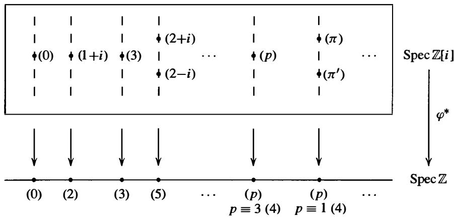

(2) If $\pmb { k }$ is an algebraically closed field then Spec k[x] consists of (0) and the ideals $( x - a )$ • for $a \in k ;$ the natural inclusion $\varphi : k [ x ] \to k [ x , y ]$ induces the Zariski continuous map $\varphi ^ { * } : \mathsf { S p e c } k [ x , y ] \to \mathsf { S p e c } k [ x ]$ . The elements of Spec k[x, y] are

(a) (0),   
(b) $( f )$ where $f$ is an irreducible polynomial in $k [ x , y ] ,$ and   
(c) $( x - a , y - b )$ with $a , b \in k$

(cf. Exercise 4). The prime (0) is Zariski dense in Spec k[x, y]; the Zariski closure of the primes in (b) consists of the primes $( x - a , y - b )$ in (c) with $f ( a , b ) = 0$ ; the closed points, i.e., the elements of $\mathrm { m } S _ { \mathrm { P e c } k [ x , y ] } $ , are the primes in (c).

By the Nullstellensatz, each prime ideal $P$ in Spec k[x, y] is uniquely determined by the corresponding zero set ${ \mathcal { Z } } ( P )$ . The prime $( 0 ) \in k [ x$ , y] corresponds to $\mathbb { A } ^ { 2 }$ • The prime $( f )$ corresponds to the points where $f ( x , y ) = 0$ , and $P = ( f )$ is the intersection of all the maximal ideals containing $P .$ . The maximal ideal $( x - a , y - b )$ corresponds to the point $( a , b ) \in \mathbb { A } ^ { 2 }$ . Fibered over $\mathbf { S p e c } k [ x ]$ by the map $\varphi ^ { * }$ these primes can be pictured geometrically as in the diagram on the following page.

In this diagram, the prime $( x - a )$ in Spec k[x] is identified with the element $a \in k .$ The prime $( x ) \in \operatorname { S p e c } k [ x , y ]$ corresponds to the points in $\mathbb { A } ^ { 2 }$ with $x = 0$ , i.e.,

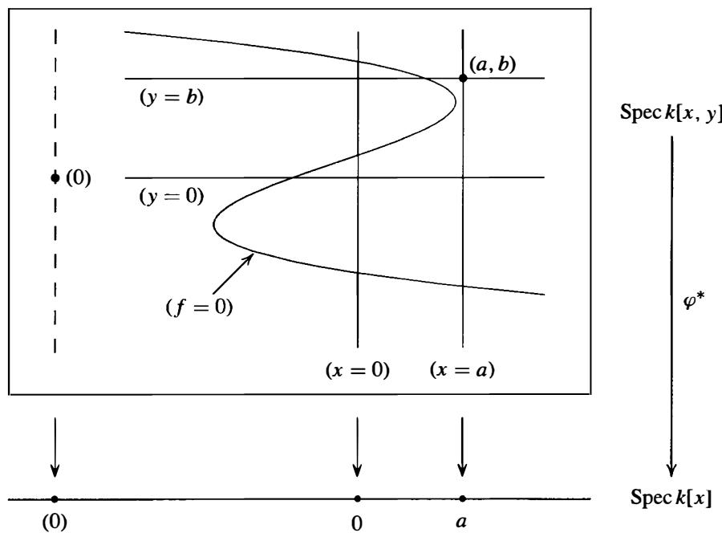

with the $\mathbf { y }$ -axis in $\mathbb { A } ^ { 2 }$ ; the prime $( y ) \in \mathbb { S p e c } k [ x , y ]$ similarly corresponds to the $_ x$ - axis. The prime $( f ) \in \mathsf { S p e c } k [ x , y ]$ corresponds to the irreducible curve $f ( x , y ) = 0$ in $\mathbb { A } ^ { 2 }$ ; the points $( a , b ) \in \mathbb { A } ^ { 2 }$ lying on this curve correspond to the maximal ideals $( x - a , y - b ) \in { \mathsf { S p e c } } k [ x , y ]$ containing $( f )$ . The closed point $( x - a , y - b ) \in$ Spec k[x, y] corresponds to the "geometric point" $( a , b ) \in \mathbb { A } ^ { 2 }$ .

Note that Spec $k [ x$ , y] captures all of the geometry of algebraic sets in $\mathbb { A } ^ { 2 }$ : every algebraic set in $\mathbb { A } ^ { 2 }$ is the finite union of some subset of the irreducible algebraic sets corresponding to the elements of Spec $k [ x$ , y] pictured above. With the exception of the everywhere dense point (0), the "geometric" picture of Spec $k [ x , y ]$ is precisely the usual geometry of the affine plane $\mathbb { A } ^ { 2 }$ . When $\pmb { k }$ is not algebraically closed the situation is slightly more complicated, but the picture is similar, cf. Exercise 4.

(3) The situation for Spec $\mathbb { Z } [ x ] ,$ viewed as fibered over Spec Z by the natural inclusion $\mathbb { Z } \to \mathbb { Z } [ x ]$ is very similar to the situation of Spec $k [ x , y ]$ in the previous example. The elements of Spec $\mathbb { Z } [ x ]$ were discussed in Example 2 following Proposition 54 and can be pictured as in the diagram on the following page.

The element (0) is Zariski dense in Spec $\mathbb { Z } [ x ]$ . The closure of $( p )$ consists of $( p )$ and all the closed points $( p , g )$ where $_ { g }$ is a monic polynomial in $\mathbb { Z } [ x ]$ that is irreducible mod $p$ . The closure of $( f )$ consists of $( f )$ together with the maximal ideals $( p , g )$ that contain $( f )$ , which is the same as saying that the image of $f$ in the quotient $\mathbb { Z } [ x ] / ( p , g )$ is 0, i.e., the irreducible polynomial $_ { g }$ is a factor of $f$ mod $p .$ . The closed points, mSpec $\mathbb { Z } [ x ] ,$ , are the maximal ideals $( p , g )$ .

Note that the maximal ideals $( p , g )$ containing $( f )$ are precisely the closed points in mSpec $\mathbb { Z } [ x ]$ in the diagram above where the "function" $f$ on Spec $\mathbb { Z } [ x ]$ (taking the prime $P$ to $f ( P ) = f { \bmod { P } } \in \mathbb { Z } [ x ] / P )$ is zero. For example, the polynomial $f = x ^ { 3 } - 4 x ^ { 2 } + x - 9 \in \mathbb { Z } [ x ]$ fits the diagram above: $f$ is irreducible in $\mathbb { Z } [ x ] .$ , and

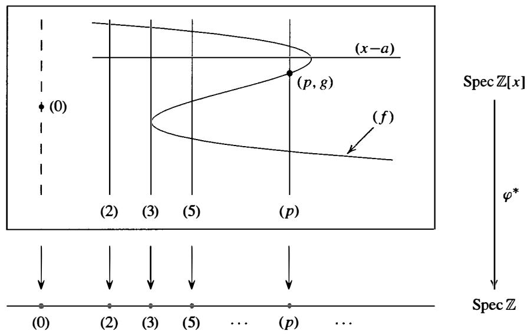

over $\mathbb { F } _ { p }$ factors into irreducibles as follows:

$$
f \equiv x ^ {3} + x + 1 \bmod 2
$$

$$
f \equiv x (x + 1) ^ {2} \bmod 3
$$

$$
f \equiv (x + 1) (x + 2) (x + 3) \bmod 5.
$$

There is one point in the fiber over (2) intersecting $( f )$ , namely the closed point ( $2 , x ^ { 3 } + x + \bar { 1 } )$ . There are two closed points in the fiber over (3) given by $( 3 , x )$ and $( 3 , x + 1 )$ (with some "multiplicity" at the latter point). Over (5) there are three closed points: $( 5 , x + 1 )$ , $( 5 , x + 2 )$ , and $( 5 , x + 3 )$ . For the diagram above, the prime $\pmb { p }$ might be $p = 5 3$ , since this is the first prime $\pmb { p }$ greater than 5 for which this polynomial has three irreducible factors mod $\pmb { p }$ . Note that while the prime $( f )$ is drawn as a smooth curve in this diagram to emphasize the geometric similarity with the structure of Spec k[x. y] in the previous example, the fibers above the primes in Spec Z are discrete, so some care should be exercised. For example, since $f$ factors as $( x + 2 ) ( x ^ { 2 } + x + 6 )$ mod 7, the intersection of $( f )$ with the fiber above (7) contains only the two points $( 7 , x + 2 )$ and $( 7 , x ^ { 2 } + x + 6 )$ , each with multiplicity one.

The possible number of closed points in $( f )$ lying in a fiber over $( p ) \in { \mathsf { S p e c } } \mathbb { Z }$ is controlled by the Galois group of the polynomial $f$ over $\mathbb { Q }$ < (cf. Section I 4.8). For example, $f = x ^ { 4 } + 1$ has one closed point in the fiber above (2) and either two or four closed points in a fiber above $( p )$ for $\pmb { p }$ odd (cf. Exercise 8).

The space Spec $R$ together with its Zariski topology gives a geometric generalization for arbitrary commutative rings 6f the points in a variety $V$ . We now consider the question of generalizing the ring of rational functions on $V$ .

When V is a variety over the algebraically closed field $\pmb { k }$ the elements in the quotient field $k ( V )$ of the coordinate ring $k [ V ]$ define the rational functions on V. Each element $\pmb { \alpha }$ in $k ( V )$ can in general be written as a quotient $a / f$ of elements $a , f \in k [ V ]$ in many different ways. The set of points $U$ at which $\pmb { \alpha }$ is regular is an open subset of $V$ ; by definition, it consists of all the points $v \in V$ where $\pmb { \alpha }$ can be represented by

some quotient $a / f$ with $f ( v ) \neq 0$ , and then the representative $a / f$ defines an element in the local ring $\mathcal { O } _ { v , \nu }$ · Note also that the same representative $a / f$ defines $\pmb { \alpha }$ not only at $v ,$ , but also at all the other points where $f$ is nonzero, namely on the open subset $V _ { f } = \{ w \in V \mid f ( w ) \neq 0 \}$ of $V$ . These open sets $V _ { f }$ (called principal open sets, cf. Exercise 21 in Section 2) for the various possible representatives $a / f$ for $\pmb { \alpha }$ give an open cover of $U$ . The example of the function $\alpha = \bar { x } / \bar { y }$ for $V = \mathcal { Z } ( x z - y w ) \subset \mathbb { A } ^ { 4 }$ preceding Proposition 5 1 shows that in general a single representative for $\pmb { \alpha }$ does not suffice to determine all of $U$ - for this example, $U = V _ { \bar { y } } \cup V _ { \bar { z } }$ , and $U$ is not covered by any single $V _ { f }$ (cf. Exercise 25 of Section 4).

This interpretation of rational functions as functions that are regular on open subsets of $V$ can be generalized to Spec R. We first define the analogues $X _ { f }$ in $X = \operatorname { S p e c } R$ of the sets $V _ { f }$ and establish their basic properties.

Definition. For any $f \in R$ let $X _ { f }$ denote the collection of prime ideals in $X = \operatorname { S p e c } R$ that do not contain $f$ . Equivalently, $X _ { f }$ is the set of points of Spec $R$ at which the value of $f \in R$ is nonzero. The set $X _ { f }$ is called a principal (or basic) open set in Spec R.

Since $X _ { f }$ is the complement of the Zariski closed set $\mathcal { Z } ( f )$ it is indeed an open set in Spec $\pmb { R }$ as the name implies. Some basic properties of the principal open sets are indicated in the next proposition. Recall that a map between topological spaces is a homeomorphism if it is continuous and bijective with continuous inverse.

Proposition 56. Let $f \in R$ and let $X _ { f }$ be the corresponding principal open set in $X = { \mathsf { S p e c } } R .$ . Then

(1) $X _ { f } = X$ if and only if $f$ is a unit, and $X _ { f } = \theta$ if and only if $f$ is nilpotent,   
(2) $X _ { f } \cap X _ { g } = X _ { f g } .$   
(3) $X _ { f } \subseteq X _ { g _ { 1 } } \cup \dots \cup X _ { g _ { n } }$ if and only if $f \in \operatorname { r a d } ( g _ { 1 } , \dotsc , g _ { n } )$ ; in particular $X _ { f } = X _ { g }$ if and only if rad $( f ) = \operatorname { r a d } ( g )$ ),   
(4) the principal open sets form a basis for the Zariski topology on Spec $R _ { i }$ , i . e . , every Zariski open set in $\pmb { X }$ is the union of some collection of principal open sets $X _ { f }$ .   
(5) the natural map from $\pmb R$ to $R _ { f }$ induces a homeomorphism from Spec $R _ { f }$ to $X _ { f }$ where $R _ { f }$ i s the localization o f $R$ at $f$ ,   
(6) the spectrum of any ring is quasicompact (i.e., every open cover has a finite subcover); in particular, $X _ { f }$ is quasicompact, and   
(7) if $\varphi : R  s$ is any homomorphism of rings (with $\varphi ( 1 _ { R } ) = 1 _ { s } )$ then under the induced map $\varphi ^ { * } : Y = \operatorname { S p e c } S \to \operatorname { S p e c } R$ the full preimage of the principal open set $X _ { f }$ in $\pmb { X }$ is the principal open set $Y _ { \varphi ( f ) }$ in Y .

Proof Parts ( 1 ), (2) and (7) are left as easy eXercises. For (3), observe that, by definition, $X _ { g _ { 1 } } \cup \cdots \cup X _ { g _ { n } }$ consists of the primes $P$ not containing at least one of $g _ { 1 } , \ldots , g _ { n }$ . Hence $X _ { g _ { 1 } } \cup \cdots \cup X _ { g _ { n } }$ is the complement of the closed set ${ \mathcal { Z } } ( ( g _ { 1 } , \ldots , g _ { n } ) )$ ) consisting of the primes $P$ that contain the ideal generated by $g _ { 1 } , \ldots , g _ { n }$ . If $( g _ { 1 } , . . . , g _ { n } ) = R$ then $\textstyle X _ { g _ { 1 } } \cup \ldots \cup X _ { g _ { n } } = X$ and there is nothing to prove. Otherwise, $X _ { f } \subseteq X _ { g _ { 1 } } \cup \dots \cup X _ { g _ { n } }$ if and only if every prime $P$ with $\textit { f } \notin \textit { P }$ also satisfies $P \notin \mathcal { Z } ( ( g _ { 1 } , . . . , g _ { n } ) )$ . This latter condition is equivalent to the statement that if the prime $P$ contains the ideal

$( g _ { 1 } , \ldots , g _ { n } )$ then $P$ also contains $f$ , i . e . , $f$ is contained in the intersection of all the prime ideals $P$ containing $( g _ { 1 } , \ldots , g _ { n } )$ . Since this intersection is $\mathbf { r a d } ( g _ { 1 } , \ldots , g _ { n } )$ by Proposition 12, this proves (3).

If $U = X - { \mathcal { Z } } ( I )$ is a Zariski open subset of $X$ , then $U$ is the union of the sets $X _ { f }$ with $f \in I$ , which proves (4).

The natural ring homomorphism from $R$ to the localization $R _ { f }$ establishes a bijection between the prime ideals in $R _ { f }$ and the prime ideals in $R$ not containing $( f )$ (Proposition 38). The corresponding Zariski continuous map from Spec $R _ { f }$ to Spec $R$ is therefore continuous and bijective. Since every ideal of $R _ { f }$ is the extension of some ideal of $R$ (cf. Proposition 38( 1 )), it follows that the inverse map is also continuous, which proves (5).

In (6), every open set is the union of principal open sets by (4), so it suffices to prove that if $X$ is covered by principal open sets $X _ { g _ { i } }$ (for i in some index set $\mathcal { I }$ ) then $X$ is a finite union of some of the $X _ { g _ { i } }$ · If the ideal I generated by the $\pmb { g } _ { i }$ were a proper ideal in $R$ , then I would be contained in some maximal ideal $P$ . But in this case the element $P$ in $X = { \mathsf { S p e c } } R$ would not be contained in any principal open set $X _ { g _ { i } }$ , contradicting the assumption that $X$ is covered by the $X _ { g _ { i } }$ . Hence $I = R$ and so $1 \in R$ can be written as a finite sum $1 = a _ { 1 } g _ { i _ { 1 } } + \dots + a _ { n } g _ { i _ { n } }$ with $i _ { 1 } , \ldots , i _ { n } \in \mathcal { I }$ . Consider the finite union $X _ { g _ { 1 } } \cup \dots \cup X _ { g _ { n } }$ . Any point $P$ in $X$ not contained in this union would be a prime in $R$ that contains $g _ { i _ { 1 } } , \ldots , g _ { i _ { n } }$ , hence would contain 1 , a contradiction. It follows that $X = X _ { g _ { 1 } } \cup \ldots \cup X _ { g _ { n } }$ as needed. The second part of (6) follows from (5).

We now define an analogue for $X = \operatorname { S p e c } R$ of the rational functions on a variety V. As we observed, for the variety $V$ a rational function $\alpha \in k ( V )$ is a regular function on some open set $U$ . At each point $v \in U$ there is a representative $a / f$ for $\pmb { \alpha }$ with $f ( v ) \neq 0$ , and this representative is an element in the localization $\mathcal { O } _ { v , V } = k [ V ] _ { \mathbb { Z } ( v ) }$ · In this way the regular function $\pmb { \alpha }$ on $U$ can be considered as a function from $U$ to the disjoint union of these localizations: the point $v \in U$ is mapped to the representative $a / f \in k [ V ] _ { \mathcal { T } ( v ) }$ . Furthermore the same representative can be used simultaneously not only at $\pmb { v }$ but on the whole Zariski neighborhood $V _ { f }$ of $\pmb { v }$ (so, "locally near ${ \pmb v } , \stackrel { \triangledown } { \alpha }$ is given by a single quotient of elements from $k [ V ] ,$ ). Note that $a / f$ is an element in the localization $k [ V ] _ { f }$ , which is contained in each of the localizations $k [ V ] _ { \tau ( w ) }$ for $w \in V _ { f }$ .

We now generalize this to Spec $R$ by considering the collection of functions $\pmb { s }$ from the Zariski open subset $U$ of Spec $R$ to the disjoint union of the localizations $R _ { P }$ for $P \in U$ such that $s ( P ) \in R _ { P }$ and such that $\pmb { S }$ is given locally by quotients of elements of $R$ . More precisely:

Definition. Suppose $U$ is a Zariski open subset of Spec $R .$ . If ${ \pmb U } = { \pmb \emptyset } .$ , define $\mathcal { O } ( U ) = \mathbf { 0 } .$ . Otherwise, define ${ \mathcal { O } } ( U )$ to be the set of functions $\begin{array} { r } { s : U \to \bigcup _ { Q \in U } R _ { Q } } \end{array}$ from $U$ to the disjoint union of the localizations $R _ { Q }$ for $Q \in U$ with the following two properties:

(1) $s ( Q ) \in R _ { Q }$ for every $Q \in U$ , and   
(2) for every $P \in U$ there is an open neighborhood $X _ { f } \subseteq U$ of $P$ in $U$ and an element $a / f ^ { n }$ in the localization $R _ { f }$ defining $\pmb { s }$ on $X _ { f }$ , i.e., $s ( Q ) = a / f ^ { n } \in R _ { Q }$ for every $Q \in X _ { f }$ .

If $s , t$ are elements in $\mathcal { O } ( U )$ then $s + t$ and st are also elements in $\mathcal { O } ( U )$ (cf. Exercise 1 8), so each $\mathcal { O } ( U )$ is a ring. Also, every $a \in R$ gives an element in $\mathcal { O } ( U )$

defined by $s ( Q ) = a \in R _ { Q }$ . and in particular $1 \in R$ gives an identity for the ring ${ \mathcal { O } } ( U )$ . If $U ^ { \prime }$ is an open subset of $\pmb { U }$ , then there is a natural restriction map from ${ \mathcal { O } } ( U )$ to $\mathcal { O } ( U ^ { \prime } )$ which is a homomorphism of rings ( cf. Exercise 19).

Definition. Let $R$ be a commutative ring with 1, and let $X = \operatorname { S p e c } R$ .

(1) The collection of rings $\mathcal { O } ( U )$ for the Zariski open sets of $X$ together with the restriction maps $\mathcal { O } ( U ) \to \mathcal { O } ( U ^ { \prime } )$ for $U ^ { \prime } \subseteq U$ is called the structure sheaf on $X$ , and is denoted simply by $\boldsymbol { \mathcal { O } }$ (or ${ \mathcal { O } } _ { X } .$ ).   
(2) The elements $\pmb { s }$ of $\mathcal { O } ( U )$ are called the sections of $\boldsymbol { \mathcal { O } }$ over $\boldsymbol { U }$ . The elements of ${ \mathcal { O } } ( X )$ are called the global sections of $\mathcal { O }$ .

The next proposition generalizes the result of Proposition 5 1 that the only rational functions on a variety $V$ that are regular everywhere are the elements of the coordinate ring k[V].

Proposition 57. Let $X = { \mathsf { S p e c } } R$ and let $\mathcal { O } = \mathcal { O } _ { X }$ be its structure sheaf. The global sections of $\boldsymbol { \mathcal { O } }$ are the elements of $R ,$ , i.e. , ${ \mathcal { O } } ( X ) \cong R$ . More generally, if $X _ { f }$ is a principal open set in $X$ for some $f \in R$ , then $\mathcal { O } ( X _ { f } )$ is isomorphic to the localization $R _ { f }$ .

Proof" Suppose that $a / f ^ { n }$ is an element of the localization $R _ { f }$ . Then the map defined by $s ( Q ) = a / f ^ { n } \in R _ { Q }$ for $Q \in X _ { f }$ gives an element in $\mathcal { O } ( X _ { f } )$ , and it is immediate that the resulting map $\psi$ from $R _ { f }$ to ${ \mathcal { O } } ( X _ { f } )$ is a ring homomorphism. Suppose that $a / f ^ { n } = b / f ^ { m }$ in $R _ { Q }$ for every $Q \in X _ { f }$ , i . e . , $g ( a f ^ { m } - b f ^ { n } ) = 0$ in $R$ for some $g \notin { Q }$ . If I i s the ideal i n $R$ of elements $r \in R$ with $r ( a f ^ { m } - b f ^ { n } ) = 0$ , it follows from $g \in I$ that $I$ is not contained in $Q$ for any $Q \in X _ { f }$ . Put another way, every prime ideal of $R$ containing $I$ also contains $f$ . Hence $f$ is contained in the intersection of all the prime ideals of $R$ containing I, which is to say that $f \in { \bf r a d } I$ . Then $f ^ { N } \in I$ for some integer $N \geq 0$ , and so $f ^ { N } ( a f ^ { m } - b f ^ { n } ) = 0$ in $R$ . But this shows that $a / f ^ { n } = b / f ^ { m }$ in $R _ { f }$ and so the map $\psi$ is injective. Suppose now that $s \in \mathcal { O } ( X _ { f } )$ . Then by definition $X _ { f }$ can be covered by principal open sets $X _ { g _ { i } }$ on which $s ( Q ) = a _ { i } / g _ { i } ^ { n _ { i } } \in R _ { Q }$ for every $Q \in { \cal X } _ { g _ { i } }$ . By (6) of Proposition 56, we may take a finite number of the $g _ { i }$ and then by taking different $a _ { i }$ we may assume all the $n _ { i }$ are equal (since $a _ { i } / g _ { i } ^ { n _ { i } } = ( a _ { i } g _ { i } ^ { n - n _ { i } } ) / g _ { i } ^ { n }$ if $\pmb { n }$ is the maximum ofthe $n _ { i }$ ). Since $s ( Q ) = a _ { i } / g _ { i } ^ { n } = a _ { j } / g _ { j } ^ { n }$ in $R _ { Q }$ for all $Q \in X _ { g _ { i } g _ { j } } = X _ { g _ { i } } \cap X _ { g _ { j } }$ • the injectivity of $\psi$ (applied to $R _ { g _ { i } g _ { j } }$ ) shows that $a _ { i } / g _ { i } ^ { n } = a _ { j } / g _ { j } ^ { n }$ in $R _ { g _ { i } g _ { j } }$ r This means that $g _ { i } { g _ { j } } ^ { N } ( a _ { i } g _ { j } ^ { n } - a _ { j } g _ { i } ^ { n } ) = 0 ;$ , i.e. ,

$$
a _ {i} g _ {i} ^ {N} g _ {j} ^ {n + N} = a _ {j} g _ {i} ^ {n + N} g _ {j} ^ {N}
$$

in $R$ for some $N \geq 0$ , and we may assume $N$ sufficiently large that this holds for every i and $j$ . Since $X _ { f }$ is the union of the $X _ { g _ { i } } = X _ { g _ { i } ^ { n + N } } , f$ is contained in the radical of the ideal generated by the $g _ { i } ^ { n }$ by (3) of Proposition 56, say

$$
f ^ {M} = \sum_ {i} b _ {i} g _ {i} ^ {n + N}
$$

for some $M \geq 1$ and $b _ { i } \in R$ . Define $\begin{array} { r } { a = \sum b _ { i } a _ { i } g _ { i } ^ { N } \in R } \end{array}$ . Then

$$
g _ {j} ^ {N} a _ {j} f ^ {M} = \sum_ {i} b _ {i} (a _ {j} g _ {i} ^ {n + N} g _ {j} ^ {N}) = \sum_ {i} b _ {i} (a _ {i} g _ {i} ^ {N} g _ {j} ^ {n + N}) = g _ {j} ^ {n + N} a.
$$

It follows that $a / f ^ { M } = a _ { j } / g _ { j } ^ { n }$ in $R _ { g _ { j } }$ , and so the element in $\mathcal { O } ( X _ { f } )$ defined by $a / f ^ { M }$ in $R _ { f }$ agrees with $\pmb { s }$ on every $X _ { g _ { j } }$ , and so on all of $X _ { f }$ since these open sets cover $X _ { f }$ . Hence the map $\psi$ gives an isomorphism $R _ { f } \cong \mathcal { O } ( X _ { f } )$ . Taking $f = 1$ gives $R \cong { \mathcal { O } } ( X )$ , completing the proof.

In the case of affine varieties $V$ the local ring $\mathcal { O } _ { v , V }$ at the point $\textbf { \em v } \in \textbf { \em V }$ is the collection of all the rational functions in $k ( V )$ that are defined at v. Put another way, $\mathcal { O } _ { v , \nu }$ is the union of the rings of regular functions on $U$ for the open sets $U$ containing $P$ . where this union takes place in the function field $k ( V )$ of $V$ . In the more general case of $X = { \mathsf { S p e c } } R _ { : }$ , the rings ${ \mathcal { O } } ( U )$ for the open sets containing $P \in { \mathrm { S p e c } } R$ are not contained in such an obvious common ring. In this case we proceed by considering the collection of pairs $( s , U )$ with $U$ an open set of $\pmb { X }$ containing $P$ and $s \in { \mathcal { O } } ( U )$ . We identify two pairs $( s , U )$ and $( s ^ { \prime } , U ^ { \prime } )$ if there is an open set $U ^ { \prime \prime } \subseteq U \cap U ^ { \prime }$ containing $P$ on which s and $s ^ { \prime }$ restrict to the same element of $\mathcal { O } ( U ^ { \prime \prime } )$ . In the situation of affine varieties, this says that two functions defined in Zariski neighborhoods of the point v define the same regular function at $\pmb { v }$ if they agree in some common neighborhood of v . The collection of equivalence classes of pairs $( s , U )$ defines the direct limit of the rings ${ \mathcal { O } } ( U )$ , and is denoted li!p ${ \mathcal { O } } ( U )$ (cf. Exercise 8 in Section 7.6).

Definition. If $P \in X = \mathbf { S } \mathbf { p } \mathbf { e } \mathbf { c } R$ , then the direct limit, $\underline { { \operatorname* { l i m } } } \mathcal { O } ( U )$ , of the rings ${ \mathcal { O } } ( U )$ for the open sets $U$ of $\pmb { X }$ containing $P$ is called the stalk of the structure sheaf at $P$ , and is denoted $\mathcal { O } _ { P }$ .

Proposition 58. Let $X = { \mathsf { S p e c } } R$ and let $\mathcal { O } = \mathcal { O } _ { X }$ be its structure sheaf. The stalk of $\scriptscriptstyle \mathcal { O }$ at the point $P \in X$ is isomorphic to the localization $R _ { P }$ of $R$ at P : $\mathcal { O } _ { P } \cong R _ { P }$ . In particular, the stalk $\mathcal { O } _ { P }$ is a local ring.

Proof: If $( s , U )$ represents an element in the stalk $\mathcal { O } _ { P }$ , then $s ( P )$ is an element of the localization $R _ { P }$ . By the definition of the direct limit, this element does not depend on the choice of representative $( s , U )$ , and so gives a well defined ring homomorphism $\varphi$ from $\mathcal { O } _ { P }$ to $R _ { P }$ . If a, $f \in R$ with $\textit { f } \notin \textit { P }$ , then the map $s ( Q ) = a / f \in R _ { Q }$ defines an element in $\mathcal { O } ( X _ { f } )$ . Then the class of $( s , X _ { f } )$ in the stalk $\mathcal { O } _ { P }$ is mapped to $a / f$ in $R _ { P }$ by $\varphi _ { : }$ , so $\varphi$ is a surjective map. To see that $\varphi$ is also injective, suppose that the classes of $( s , U )$ and $( s ^ { \prime } , U ^ { \prime } )$ in $\mathcal { O } _ { P }$ satisfy $s ( P ) = s ^ { \prime } ( P )$ in $R _ { P }$ . By definition of ${ \mathcal { O } } ( U )$ , $\pmb { s } = \pmb { a } / g ^ { n }$ on $X _ { g }$ for some $g \notin { \cal P }$ . Similarly, $s ^ { \prime } = b / ( g ^ { \prime } ) ^ { m }$ on $X _ { g ^ { \prime } }$ for some $g ^ { \prime } \notin { \mathcal { P } }$ . Since $a / g ^ { n } = b / ( g ^ { \prime } ) ^ { m }$ in $R _ { P }$ , there is some $\textit { h } \notin \mathcal { P }$ with $h ( a ( g ^ { \prime } ) ^ { m } - b g ^ { n } ) = 0$ in $R .$ . If $Q \in X _ { g g ^ { \prime } h } = X _ { g } \cap X _ { g ^ { \prime } } \cap X _ { h }$ this last equality shows that $a / g ^ { n } = b / ( g ^ { \prime } ) ^ { m }$ in $R _ { Q }$ , so that $\pmb { s }$ and $s ^ { \prime }$ agree when restricted to $X _ { g g ^ { \prime } h }$ · By definition of the direct limit, $( s , U )$ and $( s ^ { \prime } , U ^ { \prime } )$ define the same element in the stalk $\mathcal { O } _ { P }$ , which proves that $\varphi$ is injective and establishes the proposition.

Proposition 58 shows that the algebraically defined localization $R _ { P }$ for P E Spec R plays the role of the local ring $\mathcal { O } _ { v . V }$ of regular functions at $\pmb { v }$ for the affine variety $V$ . If $\mathfrak { m } _ { P }$ denotes the maximal ideal $P R _ { P }$ in $R _ { P }$ and $k ( P ) = R _ { P } / { \mathfrak { m } } _ { P }$ denotes the corresponding quotient field (which by Proposition 46(1) is also the fraction field of $R / P )$ , then the tangent space at $P$ is defined to be the $k ( P )$ -vector space dual of ${ \mathfrak { m } } _ { P } / { \mathfrak { m } } _ { P } ^ { 2 }$ .

This is an algebraic definition that generalizes the definition of the tangent space $\mathbb { T } _ { v , V }$ to a variety $V$ at a point $\boldsymbol { v }$ (by Proposition 52). This can now be used to define what it means for a point in Spec $R$ to be nonsingular: the point $P \in { \mathsf { S p e c } } R$ is nonsingular or smooth if the local ring $R _ { P }$ is what is called a "regular local ring" (cf. Section 1 6.2).

Proposition 58 also suggests a nice geometric view of the structure sheaf on Spec R. If we view each point $P \in { \mathsf { S p e c } } R$ as having the local ring $R _ { P }$ above it, then above the open set $U$ in $X = { \mathsf { S p e c } } R$ is a "sheaf' (in the sense of a "bundle") of these "stalks" (in the sense of a "stalk of wheat"), which helps explain some of the terminology. A section $\pmb { S }$ in the structure sheaf $\mathcal { O } ( U )$ is a map from $U$ to this bundle of stalks. The image of $U$ under such a section $\pmb { s }$ is indicated by the shaded region in the following figure.

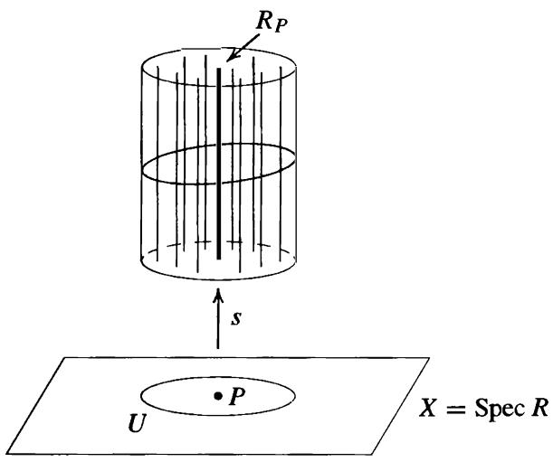

Definition. Let $R$ be a commutative ring with 1 . The pair (Spec R, Ospec R), consisting of the space Spec $R$ with the Zariski topology together with the structure sheaf $\mathcal { O } _ { \mathtt { S p e c } R }$ · is called an affine scheme.

The notion of an affine scheme gives a completely algebraic generalization of the geometry of affine algebraic sets valid for arbitrary commutative rings, and is the starting point for modem algebraic geometry.

# Examples

(1) If $\pmb { F }$ is any field then $X = \operatorname { S p e c } F = \{ ( 0 ) \}$ . In this case there are only two open sets $\pmb { X }$ and !ZJ, both of which are principal open sets: $X = X _ { 1 }$ and ${ \mathfrak { d } } = X _ { 0 }$ . The global sections are ${ \mathcal { O } } ( X ) = F$ . There is only one stalk: $\mathcal { O } _ { ( 0 ) } = F _ { 0 } = F$ .   
(2) If $R = \mathbb { Z }$ then because $\pmb { R }$ is a P.I.D. every open set in $\pmb { X } = \pmb { S } \pmb { \mathrm { p e c } } \mathbb { Z }$ is principal open:

$$
X _ {n} = \{(p) \mid p \nmid n \} \quad \text {a n d}
$$

$$
\mathcal {O} \left(X _ {n}\right) = \mathbb {Z} _ {n} = \mathbb {Z} [ 1 / n ] = \{a / b \in \mathbb {Q} \mid \text {i f t h e p r i m e} p \mid b \text {t h e n} p \mid n \}.
$$

For nonzero $\pmb { p }$ the stalk at $( p )$ is the local ring $\mathbb { Z } _ { ( p ) }$ • and the stalk at (0) is $\mathbb { Q } .$ . All the restriction maps as well as the maps from sections to stalks are the natural inclusions.

(3) For a general integral domain $\pmb R$ with quotient field $\pmb { F }$ the stalks and sections are

$$
\mathcal {O} (U) = \{a / b \in F \mid b \notin P \text {f o r a l l} P \in U \}
$$

$$
\mathcal {O} _ {P} = R _ {P} = \{a / b \in F \mid b \notin P \}
$$

where th e stalk at (0) i s $\pmb { F }$ , i.e., ${ \mathcal { O } } _ { ( 0 ) } = F$ . Again, the restriction maps and the maps to the stalks are all inclusions.

(4) For the local ring $R = \mathbb { Z } _ { ( 2 ) } = \{ a / b \in \mathbb { Q } \mid b \mathrm { o d }$ d} we have Spec $R = \{ ( 0 ) , ( 2 ) \}$ with (2) the only closed point and $\{ ( 0 ) \} = X _ { 2 }$ a principal open set. The sections $\mathcal { O } ( \{ \{ 0 \} \} )$ are $R _ { 2 } = \mathbb { Q }$ , and the stalks are $\mathcal { O } _ { ( 0 ) } = R _ { ( 0 ) } = \mathbb { Q }$ and $O _ { ( 2 ) } = R _ { ( 2 ) } = R$ .

We next consider the relationship of the affine schemes corresponding to rings $\pmb { R }$ and S with respect to a ring homomorphism from $R$ to S.

Suppose that $\varphi : R  s$ is a ring homomorphism. We have already seen in Proposition 56(7) that there is an induced continuous map $\varphi ^ { * }$ from $Y = { \tt S p e c } S$ to $X = { \mathsf { S p e c } } R$ and that under this map the full preimage of the principal open set $X _ { g }$ for $g \in R$ is the principal open set $Y _ { \varphi ( g ) }$ · It follows that $\varphi$ also induces a map on corresponding sections, as follows. Let $Q ^ { \prime } \in Y$ be any element in Spec S and let $Q = \bar { \varphi } ^ { * } ( Q ^ { \prime } ) = \varphi ^ { - 1 } ( Q ^ { \prime } ) \in X$ be the corresponding element in Spec R. If $\pmb { U }$ is a Zariski open set in $\pmb { X }$ containing $Q .$ , then $U ^ { \prime } = ( \varphi ^ { * } ) ^ { - 1 } ( U )$ is a Zariski open set in Y containing $Q ^ { \prime }$ . Note that $\varphi$ induces a natural ring homomorphism, $\varphi _ { Q }$ say, from the localization $R _ { Q }$ to the localization $\pmb { S } \pmb { Q } ^ { \prime }$ defined by $\varphi _ { Q } ( a / f ) = \varphi ( a ) / \varphi ( f ) \in S _ { Q ^ { \prime } }$ for $f \notin Q .$ . Let $s \in { \mathcal { O } } _ { X } ( U )$ be a section of the structure sheaf of $\pmb { X }$ given locally in the neighborhood $X _ { g }$ of $P \in X$ by $\pmb { a } / g ^ { n }$ . It is easy to check that the composite

$$
s ^ {\prime}: U ^ {\prime} \xrightarrow {\varphi^ {*}} U \xrightarrow {s} \bigsqcup_ {Q \in U} R _ {Q} \xrightarrow {\varphi} \bigsqcup_ {Q ^ {\prime} \in U} S _ {Q ^ {\prime}}
$$

defines a map given locally in the neighborhood $Y _ { \varphi ( g ) }$ by the element $\varphi ( a ) / \varphi ( g ) ^ { n }$ , so that $s ^ { \prime } \in { \mathcal { O } } _ { Y } ( U ^ { \prime } )$ is a section of the structure sheaf of $Y$ . It is then straightforward to check that the resulting map $\varphi ^ { \# } : { \mathcal { O } } _ { X } ( U ) \to { \mathcal { O } } _ { Y } ( U ^ { \prime } )$ is a ring homomorphism (mapping $1 \in { \mathcal { O } } _ { X } ( U )$ to $1 \in { \mathcal { O } } _ { Y } ( U ^ { \prime } ) )$ that is compatible with the restriction maps on ${ \mathcal { O } } _ { X }$ and $\mathcal { O } _ { Y }$ (cf. Exercise 20). It also follows that there is an induced ring homomorphism on the stalks: $\varphi ^ { \# } : \mathcal { O } _ { X , P } \to \mathcal { O } _ { Y , P ^ { \prime } }$ for any point $P ^ { \prime } \in { \mathsf { S p e c } } S$ and corresponding point $P = \varphi ^ { * } ( P ^ { \prime } ) \in \operatorname { S p e c } R .$ . Under the isomorphism in Proposition 58, the homomorphism $\varphi ^ { \# }$ from $R _ { P } \cong \mathcal { O } _ { X , P }$ to $s _ { P ^ { \prime } } \cong \mathcal { O } _ { Y , P ^ { \prime } }$ is just the natural ring homomorphism $\varphi _ { P }$ on the localizations induced by the homomorphism $\varphi$ <. In particular, the inverse image under $\varphi ^ { \# }$ of the maximal ideal in the local ring $\mathcal { O } _ { Y , P ^ { \prime } }$ is the maximal ideal in the local ring ${ \mathcal { O } } _ { X , P }$ ·

Definition. Suppose (Spec R, $\mathcal { O } _ { \tt S p e c R } )$ ) and (Spec S, $\mathcal { O } _ { \tt S p e c } { s } )$ ) are two affine schemes. A morphism of affine schemes from (Spec S, Ospec s) to (Spec $R , { \mathcal { O } } _ { \operatorname { s p e c } R } )$ is a pair $( \varphi ^ { * } , \varphi ^ { \# } )$ such that

(1) $\varphi ^ { * } : \operatorname { S p e c } S \to \operatorname { S p e c } R$ is Zariski continuous,   
(2) there are ring homomorphisms $\varphi ^ { \# } : \mathcal { O } ( U ) \to \mathcal { O } ( \varphi ^ { * - 1 } ( U ) )$ for every Zariski open subset $\pmb { U }$ in Spec $R$ that commute with the restriction maps, and

(3) if $P ^ { \prime } \in \mathsf { S p e c } S$ with corresponding point $P = \varphi ^ { * } ( P ) \in { \mathrm { S p e c } } R ,$ , then under the induced homomorphism on stalks $\varphi ^ { \# } : \mathcal { O } _ { \operatorname { S p e c } R , P } \to \mathcal { O } _ { \operatorname { S p e c } S , P ^ { \prime } }$ the preimage of the maximal ideal of $\mathcal { O } _ { \tt S p e c } \thinspace s , P ^ { \prime }$ is the maximal ideal of $\mathcal { O } _ { \mathtt { S p e c } R , P }$ .

A homomorphism $\psi : A  B$ from the local ring A to the local ring $\pmb { B }$ with the property that the preimage of the maximal ideal of $\pmb { B }$ is the maximal ideal of A is called a local homomorphism of local rings. The third condition in the definition is then the statement that the induced homomorphism on stalks is required to be a local homomorphism.

With this terminology, the discussion preceding the definition shows that a ring homomorphism $\varphi : R  S$ induces a morphism of affine schemes from (Spec S, Ospec s) to (Spec $R$ , $\mathcal { O } _ { \mathtt { s p e c } R } )$ -

Conversely, suppose $( \varphi ^ { * } , \varphi ^ { \# } )$ is a morphism of affine schemes from (Spec $s , \mathcal { O } _ { \mathtt { s p e c } s } )$ to (Spec R, Ospec R)- Then in particular, for $U = { \mathsf { S p e c } } R$ , $( \varphi ^ { * } ) ^ { - 1 } ( U ) = { \mathrm { S p e c } } S$ , so by assumption there is a ring homomorphism $\varphi ^ { \# } : { \mathcal { O } } _ { S \mathrm { p e c } R } ( S \mathrm { p e c } R ) \to { \mathcal { O } } _ { \mathrm { S p e c } S } ( S \mathrm { p e c } S )$ defined on the global sections. By Proposition 57, we have $\mathcal { O } _ { \mathtt { S p e c } R } ( \mathtt { S p e c } R ) \cong R$ and $\mathcal { O } _ { \mathtt { S p e c } S } ( \mathtt { S p e c } S ) \cong S$ as rings. Composing with these isomorphisms shows that $\varphi ^ { \# }$ gives a ring homomorphism $\varphi : R  S$ . By Proposition 58 we have a local homomorphism $\varphi ^ { \# } : R _ { P }  S _ { P ^ { \prime } }$ , and by the compatibility with the restriction homomorphisms it follows that the diagram

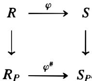

commutes, where the two vertical maps are the natural localization homomorphisms. Since $\varphi ^ { \# }$ is assumed to be a local homomorphism, $( \varphi ^ { \# } ) ^ { - 1 } ( P ^ { \prime } S _ { P ^ { \prime } } ) = P R _ { P }$ , from which it follows that $\varphi ^ { - 1 } ( P ^ { \prime } ) = P$ . Hence the continuous map from Spec S to Spec $R$ induced by $\varphi$ is the same as $\varphi ^ { * }$ , and it follows easily that $\varphi$ also induces the homomorphism $\varphi ^ { \# }$ . This shows that there is a ring homomorphism $\varphi : R  S$ inducing both $\varphi ^ { * }$ and $\varphi ^ { \# }$ as before.

We summarize this in the following proposition:

Theorem 59. Every ring homomorphism $\varphi : R  S$ induces a morphism

$$
\left(\varphi^ {*}, \varphi^ {\#}\right): \left(\operatorname {S p e c} S, \mathcal {O} _ {\operatorname {S p e c} S}\right)\rightarrow \left(\operatorname {S p e c} R, \mathcal {O} _ {\operatorname {S p e c} R}\right)
$$

of affine schemes. Conversely, every morphism of affine schemes arises from such a ring homomorphism $\varphi$ .

Theorem 59 is the analogue for Spec $\pmb R$ of Theorem 6, which converted geometric questions relating to affine algebraic sets to algebraic questions for their coordinate rings.

The condition that the homomorphism on stalks be a local homomorphism in the definition of a morphism of affine schemes is necessary: a continuous map on the spectra together with a set of compatible ring homomorphisms on sections (hence also on stalks) is not sufficient to force these maps to come from a ring homomorphism.

# Example

Let $R = \mathbb { Z } _ { ( 2 ) }$ and $\pmb { S } = \mathbb { Q }$ as in the preceding set of examples. Define $\varphi ^ { * } : \mathsf { S p e c } \mathbb { Q } \to$ Spec $\mathbb { Z } _ { ( 2 ) }$ by $\varphi ^ { * } ( ( 0 ) ) = ( 2 )$ (which is Zariski continuous). Define $\varphi ^ { \# } : { \mathcal { O } } ( \operatorname { S p e c } R ) \to$ $\mathcal { O } ( \mathsf { S p e c } S )$ to be the inclusion map $\mathbb { Z } _ { ( 2 ) } \hookrightarrow \mathbb { Q }$ and define $\varphi ^ { \# }$ for all other U � Spec R simply to be the zero map. It is straightforward to check that these homomorphisms commute with the restriction maps. This family of maps does not arise from a ring homomorphism, however, because on the stalks for (0) E Spec S and $\varphi ^ { * } ( ( 0 ) ) = ( 2 ) \in S \mathrm { p e c } R$ the induced homomorphism

$$
\varphi^ {\#}: \mathcal {O} _ {\operatorname {S p e c} R, (2)} \hookrightarrow \mathcal {O} _ {\operatorname {S p e c} S, (0)}
$$

is the injection $\mathbb { Z } _ { ( 2 ) } \hookrightarrow \mathbb { Q } _ { \mathrm { ~ } }$ , which is not a local homomorphism (the inverse image of (0) is (0) and not the maximal ideal $2 \mathbb { Z } _ { ( 2 ) . }$ ) .

The proof ofTheorem 59 shows that a morphism $( \varphi ^ { * } , \varphi ^ { \# } )$ of affine schemes necessarily comes from the ring homomorphism defined by $\varphi ^ { \# }$ on global sections. In this example, the homomorphism on global sections is the inclusion map of $\pmb R$ into S. The inclusion map from $\pmb R$ to S defines a map from Spec S to Spec $\pmb R$ that maps $( 0 ) \in { \mathsf { S p e c } } S$ to $( 0 ) \in \mathsf { S p e c } R$ and not to (2) E Spec R, so this map does not agree with the original map $\varphi ^ { * }$ .

The previous example shows that the converse in Theorem 59 would not be true without the third (local homomorphism) condition in the definition of a morphism of affine schemes. As a result, Theorem 59 shows that the appropriate place to view affine schemes is in the category of locally ringed spaces. Roughly speaking, a locally ringed space is a topological space $\pmb { X }$ together with a collection of rings $\mathcal { O } ( U )$ for each open subset of $\pmb { X }$ (with a compatible set of homomorphisms from $\mathcal { O } ( U )$ to $\mathcal { O } ( U ^ { \prime } )$ if $U ^ { \prime } \subseteq U$ and with some local conditions on the sections) such that the stalks $\mathcal { O } _ { P } = \varinjlim \mathcal { O } ( U )$ for $P \in U$ are local rings. The morphisms in this category are continuous maps between the topological spaces together with ring homomorphisms between corresponding $\mathcal { O } ( U )$ with precisely the same conditions as imposed in the definition of a morphism of affine schemes.

A scheme is a locally ringed space in which each point lies in a neighborhood isomorphic to an affine scheme (with some compatibility conditions between such neighborhoods), and is a fundamental object of study in modern algebraic geometry. The affine schemes considered here form the building blocks that are "glued together" to define general schemes in the same way that ordinary Euclidean spaces form the building blocks that are "glued together" to define manifolds in analysis.

# E X E R C I S E S

All rings are assumed commutative with identity, and all ring homomorphisms are assumed to map identities ro identities.

1. If $N$ is the nilradical of R, prove that Spec $\pmb R$ and Spec $R / N$ are homeomorphic. [Show that the natural homomorphism from $\pmb R$ to $R / N$ induces a Zariski continuous isomorphism from Spec $R / N$ to Spec R.]   
2. Let I be an ideal in the ring R. Prove that the continuous map from Spec $R / I$ to Spec R induced by the canonical projection homomorphism $R \to R / I$ maps Spec $R / I$ homeomorphically onto the closed set $\mathcal { Z } ( I )$ in Spec $\pmb R$ .

3. Prove that two elements $f , g \in R$ have the same values at all elements $P$ in Spec $\pmb { R }$ if and only if $f - g$ is contained in the nilradical of R. In particular, prove that an element in an affine $\pmb { k }$ -algebra is uniquely determined by its values.

4. Let $\pmb { k }$ be an arbitrary field, not necessarily algebraically closed. Prove that the prime ideals in $k [ x$ , y] (i.e., the elements of $\mathsf { S p e c } k [ x , y ] )$ are

(ii) $( f )$ where $f$ is an irreducible polynomial in $k [ x , y ] ,$ and   
(iii) $( p ( x ) , g ( x , y ) )$ where $p ( x )$ is an irreducible polynomial in $k [ x ]$ and $g ( x , y )$ is an irreducible polynomial in $k [ x$ , y] that is irreducible modulo $p ( x )$ , i . e . , $g ( x , y )$ remains irreducible in the quotient $k [ x , y ] / ( p ( x ) )$ .

Prove that mSpec kfx , y] consists of the primes in (iii). [Use Exercise 20 in Section 1 .]

5. Let ${ \mathfrak { m } } = ( p ( x ) , g ( x , y ) )$ be a maximal ideal in $k [ x , y ]$ as in the previous exercise. Show that $K = k [ x , y ] / { \mathfrak { m } }$ is an algebraic field extension of $k _ { \mathrm { { \ell } } }$ , so that $k [ x$ , y] can also be viewed as a subring of $K [ x , y ]$ . If x, y are mapped to a, $\beta \in { \cal K } .$ , respectively, under the canonical homomorphism $k [ x , y ]  k [ x , y ] / \mathsf { m }$ , prove that $\mathfrak { m } = k [ x , y ] \cap ( x - \alpha , y - \beta ) \subseteq K [ x , y ] .$ ${ \mathfrak { m } } = k [ x$ .   
6. Describe the elements in Spec $\mathbb { R } [ x ]$ and Spec $\mathbb { C } [ x ] .$ Describe the elements in Spec $\mathbb { Z } _ { ( 2 ) } [ x ]$ where $\mathbb { Z } _ { ( 2 ) } = \left\{ a / b \in \mathbb { Q } \vert b \right\}$ is odd} is the localization of $\mathbb { Z }$ at the prime (2).   
7. Let $( f ) = ( x ^ { 5 } + x + 1 )$ in Spec $\mathbb { Z } [ x ]$ viewed as fibered over Spec Z as in Example 3 following Proposition 55. Show that there are two closed points in the fiber over (2), three closed points in the fiber over (5), four closed points in the fiber over (1 9), and five closed points in the fiber over (21 1 ) .   
8 . Let $( f ) = ( x ^ { 4 } + 1 )$ in Spec $\mathbb { Z } [ x ]$ viewed as fibered over Spec Z as in Example 3 following Proposition 55. Prove that there is one closed point in the fiber over (2), four closed points in the fiber over $\pmb { p }$ for $\pmb { p }$ odd, $p \equiv 1 { \bmod { 8 } }$ , and two closed points in the fiber over $\pmb { p }$ for all other odd primes $\pmb { p }$ (cf. Corollary 1 6 in Section 3 of Chapter 14).   
9. Prove that the elements in the fiber over $( p )$ of the Zariski continuous map from Spec $\mathbb { Z } [ x ]$ to Spec Z are homeomorphic with the elements in ${ \mathsf { S p e c } } ( \mathbb { Z } [ x ] \otimes _ { \mathbb { Z } } \mathbb { F } _ { p } )$ .   
10. Let $X = { \mathsf { S p e c } } R$ and let $X _ { f }$ be the principal open set corresponding to $f \in R .$ Prove that $X _ { f } \cap X _ { g } = X _ { f g }$ · Prove that $X _ { f } = X$ if and only if $f$ is a unit in $R _ { i }$ , and that $X _ { f } = \theta$ if and only if $f$ is nilpotent.   
11. If $X _ { f }$ and $X _ { g }$ are principal open sets in $X = { \mathsf { S p e c } } R$ , prove that the open set $X _ { f } \cup X _ { g }$ is the complement of the closed set $\mathcal { Z } ( I )$ where $\boldsymbol { I } = ( f , g )$ is the ideal in $\pmb { R }$ generated by $f$ and g .   
12. Prove that a Zariski open subset $U$ of $X = { \mathsf { S p e c } } R$ is quasicompact if and only if $U$ i s a finite union of principal open subsets. Give an example of a ring R, a Zariski open subset $U$ of Spec $R _ { ☉ }$ , and a Zariski open covering of $U$ that cannot be reduced to a finite subcovering.   
13. Let $\varphi : R  S$ be a homomorphism of rings. Prove that under the induced map $\varphi ^ { * }$ from $Y = { \mathsf { S p e c } } S$ to $X = { \mathsf { S p e c } } R$ the full preimage of the principal open set $X _ { f }$ in $\pmb { X }$ is the principal open set $Y _ { \varphi ( f ) }$ in Y .   
14. Suppose that $\pmb { R } = \pmb { R } _ { 1 } \times \pmb { R } _ { 2 }$ is the direct product of the rings $R _ { 1 }$ and $R _ { 2 }$ . Prove that $X = { \mathsf { S p e c } } R$ is the disjoint union of open subspaces $X _ { 1 }$ . $X _ { 2 }$ (which are therefore also closed), where $X _ { 1 }$ is homeomorphic to Spec $R _ { 1 }$ and $X _ { 2 }$ is homeomorphic to Spec $R _ { 2 }$ .   
15. Prove that $X = { \mathsf { S p e c } } R$ is not connected if and only if $\pmb { R }$ is the direct product of two nonzero rings if and only if $\pmb { R }$ contains an idempotent $^ { e }$ with $\epsilon \neq 0 ,$ , 1 (cf. the previous exercise).

16. Prove that $X = \operatorname { S p e c } R$ is irreducible (i.e., any two nonempty open subsets have a nontrivial intersection) if and only if $X _ { f } \cap X _ { g } \neq \emptyset$ for any two nonempty principal open sets $X _ { f }$ and $X _ { g }$ • Deduce that $X = { \mathsf { S p e c } } R$ is irreducible if and only if the nilradical of $\pmb { R }$ is a prime ideal. [Use Exercise 1 0.]

17. Let $G = \langle \sigma \rangle$ be a group of order 2, let $R = \mathbb { Z } [ G ] = \{ a + b \sigma \mid a , b \in \mathbb { Z } \}$ be the corresponding group ring, and let $X = \operatorname { s p e c } R$ .

(a) Prove that the nilradical of $\pmb { R }$ is (0) but is not a prime ideal. Prove that $X = X ^ { + } \cup X ^ { - }$ where $X ^ { + } = \mathcal { Z } ( 1 - \sigma )$ and $X ^ { - } = \mathcal { Z } ( 1 + \sigma )$ . [Use $( 1 + \sigma ) ( 1 - \sigma ) = 0 . ]$   
(b) Prove that the homomorphism $\mathbb { Z } [ G ] \to \mathbb { Z }$ defined by mapping $\sigma$ to 1 induces a homeomorphism of $X ^ { + }$ with Spec .Z, and the homomorphism mapping $\sigma$ to $^ { - 1 }$ induces a homeomorphism of $X ^ { - }$ with Spec Z.   
(c) Prove that $X ^ { + } \cap X ^ { - }$ consists of the single element $\mathfrak { m } = ( 1 + \sigma , 1 - \sigma ) = ( 2 , 1 - \sigma )$ and that this is a closed point in $X$ .   
(d) Show that $( 1 - \sigma )$ and $( 1 + \sigma )$ are the unique non-closed points in $X$ , with closures $X ^ { + }$ and $X ^ { - }$ , respectively. Describe the closed points, mSpec $R ,$ . in $X$ and prove that Spec $\mathbb { Z } [ \sigma \rangle ]$ can be pictured as follows:

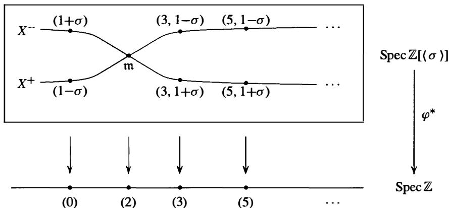

18. Let $\mathcal { O }$ be the structure sheaf on $X = \mathsf { S p e c } R$ , let $\pmb { U }$ be an open set in $X$ , and suppose $s , t \in { \mathcal { O } } ( U )$ . If $\pmb { s } = \pmb { a } / f _ { 1 } ^ { n }$ on $X _ { f _ { 1 } }$ and $t =  { b } / f _ { 2 } ^ { m }$ on $X _ { f _ { 2 } }$ , show that

$$
s t = \left(a b f _ {1} ^ {m} f _ {2} ^ {n}\right) / \left(f _ {1} f _ {2}\right) ^ {n + m} \quad \text {a n d} \quad s + t = \left(a f _ {1} ^ {m} f _ {2} ^ {m + n} + b f _ {1} ^ {m + n} f _ {2} ^ {n}\right) / \left(f _ {1} f _ {2}\right) ^ {n + m}
$$

on $X _ { f _ { 1 } f _ { 2 } }$ . Deduce that ${ \mathcal { O } } ( U )$ is a commutative ring with identity.

19. Let $\mathcal { O }$ be the structure sheaf on $X = { \mathsf { S p e c } } R ,$ , let $\ l { v } \subseteq U$ be open sets in $X$ , and let $s \in { \mathcal { O } } ( U )$ . Suppose $P \in V$ and that $s = a / f ^ { n }$ on $X _ { f } \subseteq U$ .

(a) Show that there is a principal open set $X _ { f ^ { \prime } } \subseteq V \cap X _ { f }$ containing $P$ .   
(b) Show that $( f ^ { \prime } ) ^ { m } = b f$ for some $b \in R$ .   
(c) Show that $s = ( a b ^ { n } ) / ( f ^ { \prime } ) ^ { m n }$ on $X _ { f ^ { \prime } }$ and conclude that restricting $\pmb { s }$ t o $\pmb { V }$ gives a well defined ring homomorphism from ${ \mathcal { O } } ( U )$ to ${ \mathcal { O } } ( V )$ .

20. Let $\varphi : R  s$ be a homomorphism of rings, let X = Spec R, $Y = { \mathsf { S p e c } } S$ , and let $\nu \subseteq U$ be Zariski open subsets of $X$ . Set $\bar { V ^ { \prime } } = ( \varphi ^ { * } ) ^ { - 1 } ( \bar { V } )$ and $U ^ { \prime } = ( \varphi ^ { * } ) ^ { - 1 } ( U )$ , the corresponding Zariski open subsets of Y with respect to the continuous map $\varphi ^ { * } : Y \to X$ induced by $\varphi$ . Prove that the induced map $\varphi ^ { \# } : { \bar { \mathcal { O } } } _ { X } ( U ) \to { \mathcal { O } } _ { Y } ( U ^ { \prime } )$ on sections is a ring homomorphism. Prove that $V ^ { \prime } \subseteq U ^ { \prime }$ and that $\varphi ^ { \# }$ is compatible with restriction i .e., that

the diagram

$$
\begin{array}{ccc}\mathcal{O}_{X}(U) & \xrightarrow{\varphi^{\#}} & \mathcal{O}_{Y}(U^{\prime})\\ \big{\downarrow} & & \big{\downarrow}\\ \mathcal{O}_{X}(V) & \xrightarrow{\varphi^{\#}} & \mathcal{O}_{Y}(V^{\prime}) \end{array}
$$

is commutative, where the vertical maps are the restriction homomorphisms.

21. Suppose $\pmb { D }$ is a multiplicatively closed subset of $\pmb { R }$ . Show that the localization homomorphism $R  D ^ { - 1 } \bar { R }$ induces a homeomorphism from $\mathsf { S p e c } ( D ^ { - 1 } R )$ to the collection of prime ideals $P$ of $\pmb R$ with $P \cap D = \emptyset$ .   
22. Show that $\mathsf { S p e c } k [ x , y ] / ( x y )$ is connected but is the union of two proper closed subsets each homeomorphic to $\mathbf { S p e c } k [ x ]$ , hence is not irreducible (cf. Exercise 16).   
23. For each of the following rings $\pmb R$ exhibit the elements of Spec $\pmb { R }$ , the open sets $\boldsymbol { U }$ in Spec $\pmb { R }$ , the sections ${ \mathcal { O } } ( U )$ of the structure sheaf for Spec $\pmb { R }$ for each open $U$ , and the stalks $\mathcal { O } _ { P }$ at each point P E Spec R:

(a)

24. (a) If every ideal of $\pmb { R }$ is principal, show every open set in Spec $\pmb { R }$ is a principal open set.

(b) Show that if $R = \mathbb { Z } [ x ] / ( 4 , x ^ { 2 } )$ then $\pmb { R }$ contains a nonprincipal ideal, but every open set in Spec $\pmb R$ is a principal open set.

25. (a) If $M$ is an $\pmb { R }$ -module prove that Supp(M) is a Zariski closed subset of Spec R. [Use Exercise 33 of Section 4.]   
(b) If M is a finitely generated $\pmb R$ -module prove that $\operatorname { S u p p } ( M ) = { \mathcal { Z } } ( \operatorname { A n n } ( M ) ) \subseteq \operatorname { S p e c } R .$ [Use Exercise 34 of Section 4.]

26. Suppose $M$ is a finitely generated module over the Noetherian ring $\pmb R$ .

(a) Prove that there are finitely many minimal primes $* P _ { 1 }$ $\ast P _ { 1 } , \ldots , P _ { n }$ $P _ { n }$ containing Ann(M). [Use Corollary 22.]   
(b) Prove that $\{ P _ { 1 } , \ldots , P _ { n } \}$ is also the set of minimal primes in As $_ { R } ( M )$ and that Supp( M) is the union ofthe Zariski closed sets $\mathcal { Z } ( P _ { 1 } ) , \ldots , \mathcal { Z } ( P _ { n } )$ in Spec R. [Use the previous exercise and Exercise 40 in Section 4.]

The previous exercise gives a geometric view of a finitely generated module M over a Noetherian ring R: over each point $P$ in Spec $\pmb { R }$ is the localization $M _ { P }$ (the stalk over $P$ ). The stalk is nonzero precisely over the points in the Zariski closed subsets $\mathcal { Z } ( P _ { 1 } ) , \ldots , \mathcal { Z } ( P _ { n } )$ where the $P _ { i }$ are the minimal primes in ${ \sf A s s } _ { R } ( M )$ . These ideas lead to the notion of the (coherent) module sheaf on Spec R associated to $M$ (with a picture similar to that of the structure sheaf following Proposition 58), which is a powerful tool in modern algebraic geometry.

27. Let $R = k [ x , y ]$ and let $M$ be the ideal $( x , y )$ in $\pmb { R }$ . Prove that $\operatorname { S u p p } ( M ) = \operatorname { S p e c } R$ and $\mathbf { A s s } _ { R } ( M ) = \{ 0 \}$ .

The next two exercises show that the associated primes for an ideal / in a Noetherian ring $\pmb { R }$ in the sense of primary decomposition are the associated primes for I in the sense ofAss $_ { R } ( R / I )$ .

28. This exercise proves that the ideal $\boldsymbol { Q }$ in a Noetherian ring $\pmb { R }$ is $P$ -primary if and only if $\operatorname { A s s } _ { R } ( R / Q ) = \{ P \}$ .

(a) Suppose $\boldsymbol { Q }$ is a $P$ -primary ideal and let $M$ be the $\pmb { R }$ -module ${ R \mathord { \left/ { \vphantom { R Q } } \right. \kern - delimiterspace } Q }$ . If $0 \neq m \in M$ , show that $Q \subseteq \mathbf { A n n } ( m ) \subseteq P$ and that rad $\mathbf { A n n } ( m ) = P .$ . Deduce that if $\mathsf { A n n } ( m )$ is a prime ideal then it is equal to $P$ and hence that $\operatorname { A s s } _ { R } ( R / Q ) = \{ P \}$ . [Use Exercise 33 in Section 1 .]

(b) For any ideal $\boldsymbol { Q }$ of $R _ { i }$ , let $0 \neq M \subseteq R / Q$ . Prove that the radical of Ann(M) is the intersection of the prime ideals in Supp(M). [Use Proposition 12 and Exercise 25.]   
(c) For $M$ as in (b), prove that the radical of AnnM is also the inters�ction of the prime ideals in ${ \bf A s s } _ { R } ( M )$ . [Use Exercise 26(b).]   
(d) If $\boldsymbol { Q }$ is an ideal of $\pmb { R }$ with $\operatorname { A s s } _ { R } ( R / Q ) = \{ P \}$ prove that rad $Q = P$ . [Use the fact that $Q = \mathbf { A n n } ( R / Q )$ and (c).]   
(e) If $\boldsymbol { Q }$ is an ideal of $\pmb { R }$ with $\operatorname { A s s } _ { R } ( R / Q ) = \{ P \}$ prove that $\boldsymbol { Q }$ is $P$ -primary. $[ \mathrm { I f } a b \in Q$ with $a \notin \mathcal { Q }$ consider $0 \neq M = ( R a + Q ) / Q \subseteq R / Q$ and show that $^ { b }$ is contained in AnnM � radAnn(M). Use Exercises 33-34 in Section 1, to show that $\mathbf { A s s } _ { R } ( M ) = \{ P \}$ , then use (c) to show that radAn $| ( M ) = P ;$ , and conclude finally that $\boldsymbol { b } \in \mathcal Ḋ P Ḍ$ .]

29. Suppose $\smash { I \ = \ Q _ { 1 } \cap \cdots \cap Q _ { n } }$ is a minimal primary decomposition of the ideal I in the Noetherian ring $\pmb { R }$ with $P _ { i } ~ = ~ \operatorname { r a d } Q _ { i }$ , $i = 1 , \ldots , n$ . This exercise proves that $\mathsf { A s s } _ { R } ( R / I ) = \{ P 1 , \ldots , P _ { n } \}$ -

(a) Prove that the natural projection homomorphisms induce an injection of $R / I$ into $R / Q _ { 1 } \oplus \cdots \oplus R / Q _ { n }$ and deduce that $\mathsf { A s s } _ { R } ( R / I ) \subseteq \{ P _ { 1 } , \ldots , P _ { n } \}$ - [Use Exercise 34 in Section 1 and the previous exercise.]   
(b) Let $Q _ { i } ^ { \prime } = \cap _ { j \neq i } Q _ { j }$ - Show that the minimality of the decomposition implies that $0 \neq Q _ { i } ^ { \prime } / I = ( Q _ { i } ^ { \prime } + Q _ { i } ) / Q _ { i } \subseteq R / Q _ { i }$ . Deduce that $\mathsf { A s s } _ { R } ( Q _ { i } ^ { \prime } / I ) = \{ P _ { i } \}$ . [Use Exercises 33-34 in Section 1 and the previous exercise.] Deduce that $\{ P _ { i } \} \in \mathsf { A s s } _ { R } ( R / I )$ so that $\mathsf { A s s } _ { R } ( R / I ) = \{ P 1 , \ldots , P _ { n } \}$ - [Use $Q _ { i } ^ { \prime } / I \subseteq R / I$ and Exercise 34 in Section 1 .]

30. Let / be the ideal $( x ^ { 2 } , x y , x z , y z )$ in $R = k [ x , y , z ]$ . Prove that $ { \mathbf { A s s } } _ { R } ( R / I )$ consists of the primes $\{ ( x , y ) , ( x , z ) , ( x , y , z ) \}$ .

31. (Spec for Quadratic Integer Rings) Let $\pmb { R }$ be the ring of integers in the quadratic field $K = \mathbb { Q } ( { \sqrt { D } } )$ where $\pmb { D }$ is a squarefree integer and let $P$ be a nonzero prime ideal in $\pmb { R }$ . This exercise shows how the prime ideals in $\pmb { R }$ are determined explicitly from the primes $( p )$ in $\mathbb { Z } .$ , giving in particular a description of Spec R fibered over Spec Z.

As in the discussion and example following Theorem 29, we have $R = \mathbb { Z } [ \omega ]$ where $\omega = \sqrt { D }$ if $\scriptstyle D \equiv 2 ,$ 3 mod 4 (respectively, $\omega = ( 1 + \sqrt { D } ) / 2$ if $D \equiv 1 { \bmod { 4 } }$ ), with minimal polynomial $m _ { \omega } ( x ) = x ^ { 2 } - D$ (respectively, $m _ { \omega } ( x ) = x ^ { 2 } - x + ( 1 - D ) / 4 )$ ), and $P \cap \mathbb { Z } = p \mathbb { Z }$ is a nonzero prime ideal of $\mathbb { Z }$ .

(a) For any prime $\pmb { p }$ in $\mathbb { Z }$ show that $R / p R \cong \mathbb { Z } [ x ] / ( p , m _ { \omega } ( x ) ) \cong \mathbb { F } _ { p } [ x ] / ( \overline { { m } } _ { \omega } ( x ) )$ as rings, where $\overline { { m } } _ { \omega } ( x )$ is the reduction of $m _ { \omega } ( x )$ modulo $\pmb { p } .$ . Deduce that there is a prime ideal $P$ in $\pmb { R }$ with $P \cap \mathbb { Z } = ( p )$ (this gives an alternate proof of Theorem 26(2) in this case).   
(b) Use the isomorphism in (a) to prove that $P$ is determined explicitly by the factorization of $m _ { \omega } ( x )$ modulo $\pmb { p }$ :

(i) If $\overline { { { m } } } _ { \omega } ( x ) \equiv ( x - a ) ^ { 2 } { \bmod { p } }$ where ${ \pmb { a } } \in \mathbb { Z }$ then $P = ( p , \omega - a )$ and $p R = P ^ { 2 }$ Show that this case occurs only for the finitely many primes $\pmb { p }$ dividing the discriminant of $m _ { \omega } ( x )$ .   
(ii) $\operatorname { I f } { \overline { { m } } } _ { \omega } ( x ) \equiv ( x - a ) ( x - b ) { \bmod { p } }$ with integers $\pmb { a }$ , $b \in \mathbb { Z }$ that are distinct modulo $\pmb { p }$ then $P$ is either $P _ { 1 } = ( p , \omega - a )$ or $P _ { 2 } = ( p , \omega - b )$ and $P _ { 1 } , P _ { 2 }$ are distinct prime ideals in $\pmb { R }$ with $\begin{array} { r } { p R = P _ { 1 } P _ { 2 } } \end{array}$ .   
(iii) If $\overline { { m } } _ { \omega } ( x )$ is irreducible modulo $\pmb { p }$ then $P = p R$

(c) Show that the picture for Spec $\pmb { R }$ over Spec Z for any $\pmb { D }$ is similar to that for the case $R = \mathbb { Z } [ i ]$ when $D = - 1$ : there is precisely one nonclosed point $( 0 ) \in { \mathsf { S p e c } } R$ over $( 0 ) \in { \mathsf { S p e c } } \mathbb { Z } ,$ , precisely one closed point $P \in { \mathsf { S p e c } } R$ over each of the primes $( p )$ in Spec Z in (i) (called ramified primes) and over the primes in (iii) (called inert primes), and precisely two closed points over the primes in (ii) (called split primes).

# CHAPTER 1 6

# Arti n ia n Ri n gs, Discrete Va l uation Ri ngs, a nd Dedeki nd Doma i ns

Throughout this chapter $R$ will denote a commutative ring with $1 \neq 0$

# 1 6.1 ARTINIAN RINGS

In this section we shall study the basic theory of commutative rings that satisfy the descending chain condition (D.C.C.) on ideals, theArtinian rings (named after E. Artin). While one might at first expect that these rings have properties analogous to those for the commutative rings satisfying the ascending chain condition (the Noetherian rings), in fact this is not the case. The structure of Artinian rings is very restricted; for example anArtinian ring is necessarily also Noetherian (Theorem 3). NoncommutativeArtinian rings play a central role in Representation Theory (cf. Chapters 18 and 1 9).

Definition. For any commutative ring $R$ the Krull dimension (or simply the dimension) of $R$ is the maximum possible length of a chain $P _ { 0 } \subset P _ { 1 } \subset P _ { 2 } \subset \cdots \subset P _ { n }$ of distinct prime ideals in $R$ . The dimension of $R$ is said to be infinite if $R$ has arbitrarily long chains of distinct prime ideals.

A ring with finite dimension must satisfy both the ascending and descending chain conditions on prime ideals (although not necessarily on all ideals). A field has dimension 0 and a Principal Ideal Domain that is not a field has dimension 1.

We shall see shortly that rings with D.C.C. on ideals always have dimension 0 (i.e., primes are maximal). If $R$ is an integral domain that is also a finitely generated $\pmb { k }$ -algebra over a field $\pmb { k } ,$ then the dimension of $R$ is equal to the transcendence degree over $\pmb { k }$ of the field of fractions of $R$ ( cf. Exercise 1 1 ). In particular, the Krull dimension agrees with the definition introduced earlier for the dimension of an affine variety. The advantage of the definition above is that it does not refer to any $k$ -algebra structure and applies to arbitrary commutative rings $R$ .

Definition. The Jacobson radical of $R$ i s the intersection of all maximal ideals of $R$ and is denoted by Jac $R$ .

The Jacobson radical is analogous to the Frattini subgroup of a group, and it enjoys some corresponding properties (cf. Exercise 24 in Section 6. 1):

Proposition 1. Let $\mathcal { I }$ be the Jacobson radical of the conunutative ring $R$ .

(1) If I is a proper ideal of $R$ , then s o is $( I , { \mathcal { I } } )$ , the ideal generated by $I$ and $\mathcal { I }$   
(2) The Jacobson radical contains the nilradical of R: rad $\mathbf { 0 } \subseteq \mathbf { J a c } R$ .   
(3) An element $x$ belongs to $\mathcal { I }$ if and only if $1 - r x$ is a unit for all $r \in R$   
(4) (Nakayama 's Lemma) If $M$ is any finitely generated $R$ -module and ${ \mathcal { I } } M = M $ then $M = 0$ .

Proof: If $\pmb { I }$ is a proper ideal in $R$ , then $I \subseteq M$ for some maximal ideal $M .$ . Since ${ \mathcal { I } } \subseteq M$ , also $( I , { \mathcal { I } } ) \subseteq M$ , which proves ( 1 ).

Part (2) follows from the definitions of the two radicals and Proposition 1 2 in Section 15.2 since maximal ideals are prime.

Suppose $1 - r x$ is not a unit and let $M$ be a maximal ideal containing $1 - r x .$ . Since $1 \notin M , r x \notin M$ , so x cannot belong to $\mathcal { I }$ because ${ \mathcal { I } } \subseteq M$ . Conversely, suppose $x \notin \mathcal { I }$ , i.e., there is a maximal ideal $M$ with $x \notin M .$ . Then $\pmb { R } = ( \pmb { x } , \pmb { M } )$ , hence $1 = r x + y$ for some $y \in M$ . Thus $1 - r x = y \in M$ and so $1 - r x$ is not a unit, which proves (3).

To prove (4), assume $M \neq 0$ and let $\pmb { n }$ be the smallest integer such that $M$ is generated by n elements, say $m _ { 1 } , \ldots , m _ { n }$ $m _ { n }$ . Since $M = \mathcal { I } M$ we have

$$
m _ {n} = r _ {1} m _ {1} + r _ {2} m _ {2} + \dots + r _ {n} m _ {n} \quad \text {f o r s o m e} r _ {1}, r _ {2}, \dots , r _ {n} \in \mathcal {J}.
$$

Thus $( 1 - r _ { n } ) m _ { n } = r _ { 1 } m _ { 1 } + \cdot \cdot \cdot + r _ { n - 1 } m _ { n - 1 }$ · By (3), $1 - r _ { n }$ is a unit, so $m _ { n }$ lies in the module generated by $m _ { 1 } , \ldots , m _ { n - 1 }$ • contradicting the rninimality of n. Hence $M = 0$ , completing the proof.

Definition. A conunutative ring $R$ is said to be Artinian or to satisfy the descending chain condition on ideals (or D. C. C. on ideals) if there is no infinite decreasing chain of ideals in $R ,$ i.e., whenever $I _ { 1 } \supseteq I _ { 2 } \supseteq I _ { 3 } \supseteq \cdots$ is a decreasing chain of ideals of $R _ { i }$ , then there is a positive integer m such that $I _ { k } = I _ { m }$ for all $k \geq m$ . Similarly, an $R$ -module $M$ is said to be Artinian if it satisfies D.C.C. on submodules.

It is inunediate from the Lattice Isomorphism Theorem that every quotient $R / I$ of an Artinian ring $R$ by an ideal $I$ is again an Artinian ring.

The following result for Artinian rings is parallel to results in Theorem 15.2. The proof is completely analogous, and so is left as an exercise.

Proposition 2. The following are equivalent:

(1) $R$ is an Artinian ring.   
(2) Every nonempty set of ideals of $R$ contains a minimal element under inclusion.

The next result gives the main structure theorem for Artinian rings.

Theorem 3. Let $R$ be an Artinian ring.

(1) There are only finitely many maximal ideals in $R$ .   
(2) The quotient $R / ( \operatorname { J a c } R )$ is a direct product of a finite number of fields. More precisely, if $M _ { 1 }$ $M _ { 1 } , \ldots , M _ { n }$ $M _ { n }$ are the finitely many maximal ideals in $R$ then

$$
R / (\operatorname {J a c} R) \cong k _ {1} \times \dots \times k _ {n},
$$

where $k _ { i }$ is the field $R / M _ { i }$ for $1 \leq i \leq n$ .

(3) Every prime ideal of $R$ i s maximal, i.e., $R$ has Krull dimension 0. The Jacobson radical of $R$ equals the nilradical of $R$ and is a nilpotent ideal: (Jac $R ) ^ { m } = 0$ for some $m \geq 1$ .   
(4) The ring $R$ is isomorphic to the direct product of a finite number of Artinian local rings.   
(5) Every Artinian ring is Noetherian.

Proof: To prove ( 1 ), let $s$ be the set of all ideals of $R$ that are the intersection of a finite number of maximal ideals. By Proposition 2, $s$ has a minimal element, say $M _ { 1 } \cap M _ { 2 } \cap \cdots \cap M _ { n }$ . Then for any maximal ideal $M$ we have

$$
M \cap M _ {1} \cap M _ {2} \cap \dots \cap M _ {n} = M _ {1} \cap M _ {2} \cap \dots \cap M _ {n},
$$

so $M \supseteq M _ { 1 } \cap M _ { 2 } \cap \cdot \cdot \cdot \cap M _ { n }$ . By Exercise 1 1 in Section 7.4, $M \supseteq M _ { i }$ for some i . Thus $M = M _ { i }$ and so $M _ { 1 }$ $M _ { 1 } , \ldots , M _ { n }$ $M _ { n }$ are all the maximal ideals of $R$ .

The proof of (2) is immediate from the Chinese Remainder Theorem (Section 7 .6) applied to $M _ { 1 } , \ldots , M _ { n }$ $M _ { 1 }$ $M _ { n }$ , since these maximal ideals are clearly pairwise co maximal and their intersection is Jac $R$ .

For (3), we first prove ${ \mathcal { I } } = { \mathrm { J a c } } R$ i s nilpotent. B y D.C.C. there i s some $m > 0$ such that $\mathcal { J } ^ { m } = \mathcal { J } ^ { m + i }$ for all positive i . By way of contradiction assume ${ \mathcal { I } } ^ { m } \neq 0$ . Let $s$ be the set of proper ideals $\pmb { I }$ such that $I { \mathcal { I } } ^ { m } \neq 0$ , so ${ \mathcal { I } } \in { \mathcal { S } }$ . Let $I _ { 0 }$ be a minimal element of $s$ . There is some $x \in I _ { 0 }$ such that $x J ^ { m } \neq 0$ , so by rninimality we must have $I _ { 0 } = \left( x \right)$ . But now $( ( x ) \mathcal { T } ) \mathcal { J } ^ { m } = x \mathcal { T } ^ { m + 1 } = x \mathcal { T } ^ { m }$ , so it follows by rninimality of $( x )$ that $( x ) = ( x ) \mathcal { I }$ . By Nakayama's Lemma above, $( x ) = \mathbf { 0 }$ , a contradiction. This proves Jac $R$ is nilpotent.

Since Jac $R$ is nilpotent, in particular Jac R � rad 0, so these two ideals are equal by the second statement in Proposition 1 .

Every prime ideal $P$ in $R$ contains the nilradical of $R$ , hence contains Jac $R$ by what has already been proved,. The image of $P$ is a prime ideal in the quotient ring $R / ( \operatorname { J a c } R ) = k _ { 1 } \times \cdots \times k _ { n }$ . But in a direct product of rings $R _ { 1 } \times R _ { 2 }$ (where each $R _ { i }$ has a 1) every ideal is of the form $I _ { 1 } \times I _ { 2 }$ where $I _ { j }$ is an ideal of $R _ { j }$ for $j = 1 , 2$ (cf. Exercise 3 in Section 7.6). It follows that a prime ideal in $k _ { 1 } \times \cdots \times k _ { n }$ consists of the elements that are 0 in one of the components. In particular, such a prime ideal is also a maximal ideal in $k _ { 1 } \times \cdots \times k _ { n }$ and it follows that $P$ was a maximal ideal in $R _ { i }$ , which finishes the proof of (3).

Let $M _ { 1 } , \ldots , M _ { n }$ be all the distinct maximal ideals of $R$ and let $( \operatorname { J a c } R ) ^ { m } = 0$ as in (3). Then

$$
\prod_ {i = 1} ^ {n} M _ {i} ^ {m} \subseteq \left(\prod_ {i = 1} ^ {n} M _ {i}\right) ^ {m} \subseteq (\operatorname {J a c} R) ^ {m} = 0.
$$

By the Chinese Remainder Theorem it follows that

$$
R \cong (R / M _ {1} ^ {m}) \times (R / M _ {2} ^ {m}) \times \dots \times (R / M _ {n} ^ {m}),
$$

and each $R / M _ { i } ^ { m }$ is an Artinian ring with unique maximal ideal $M _ { i } / M _ { i } ^ { m }$ , proving (4).

To prove (5), it suffices by (4) to prove that an Artinian local ring is Noetherian, so assume $R$ is Artinian with unique maximal ideal $M$ . In this case we have $M = \operatorname { J a c } R$ , so $M ^ { m } = ( \operatorname { J a c } R ) ^ { m } = 0$ for some positive m. Then $\pmb { R } \cong \pmb { R } / \pmb { M } ^ { m }$ , and i n this case i t is an exercise to see that $R / M ^ { m }$ is Noetherian if and only if it is Artinian ( cf. Exercise 8).

Corollary 4. The ring $R$ is Artinian if and only if $R$ is Noetherian and has Krull dimension 0.

Proof" The forward implication was proved in Theorem 3. Suppose now that $R$ is Noetherian and that $R$ has Krull dimension 0, i.e., that prime ideals of $R$ are maximal. Since $R$ is Noetherian, by Corollary 22(3) in Section 15.2, the ideal $( 0 ) = P _ { 1 } \cdots P _ { n }$ is the product of (not necessarily distinct) prime ideals, and these prime ideals are then maximal since $R$ has dimension 0. By the Chinese Remainder Theorem, $R$ is isomorphic to the direct product of a finite number of Noetherian rings of the form $R / M ^ { m }$ where $M$ is a maximal ideal in $R$ . As in the proof of (5) of the theorem, $R / M ^ { m }$ is Artinian, and it follows that $R$ is Artinian.

# Examples

(1) Let $\textbf { \em n } > \textbf { 1 }$ be an integer. Since the ring $R \ = \ \mathbb { Z } / n \mathbb { Z }$ is finite, it is Artinian. If $n = p _ { 1 } ^ { a _ { 1 } } p _ { 2 } ^ { a _ { 2 } } \cdot \cdot \cdot p _ { s } ^ { a _ { s } }$ is the unique factorization of $\pmb { n }$ into distinct prime powers, then

$$
\mathbb {Z} / n \mathbb {Z} \cong (\mathbb {Z} / p _ {1} ^ {a _ {1}} \mathbb {Z}) \times (\mathbb {Z} / p _ {2} ^ {a _ {2}} \mathbb {Z}) \times \dots \times (\mathbb {Z} / p _ {s} ^ {a _ {s}} \mathbb {Z}).
$$

Each $\mathbb { Z } / p _ { i } ^ { a _ { i } } \mathbb { Z }$ is an Artinian local ring with unique maximal ideal $( p _ { i } ) / ( p _ { i } ^ { a _ { i } } )$ , so this is the decomposition of $\mathbb { Z } / n \mathbb { Z }$ given by Theorem 3(4). The Jacobson radical of $\pmb R$ is the ideal generated by $p _ { 1 } p _ { 2 } \cdots p _ { s }$ , the squarefree part of $\pmb { n }$ and $R / ( \operatorname { J a c } R ) \cong$ $( { \mathbb Z } / p _ { 1 } { \mathbb Z } ) \times \dots \times ( { \mathbb Z } / p _ { s } { \mathbb Z } )$ is a direct product of fields. The ideals generated by $p _ { i }$ for $i = 1 , \dots , s$ are the maximal ideals of $\pmb R$ .

(2) For any field $\pmb { k }$ , a $\pmb { k }$ -algebra $\pmb R$ that is finite dimensional as a vector space over $\pmb { k }$ is Artinian because ideals in $\pmb { R }$ are in particular $\pmb { k }$ -subspaces of $R _ { i }$ , hence the length of any chain of ideals in $\pmb { R }$ is bounded by $\mathrm { d i m } _ { k } R$ .   
(3) Suppose $f$ i s a nonzero polynomial i n k [ x ] where $\pmb { k }$ is a field. Then the quotient ring $R = k [ x ] / ( f ( x ) )$ is Artinian by the previous example. The decomposition of $\pmb R$ as a direct product of Artinian local rings is given by

$$
k [ x ] / (f (x)) \cong k [ x ] / \left(f _ {1} (x) ^ {a _ {1}}\right) \times \dots \times k [ x ] / \left(f _ {s} (x) ^ {a _ {s}}\right)
$$

where $f ( x ) = f _ { 1 } ( x ) ^ { a _ { 1 } } \cdot \cdot \cdot f _ { s } ( x ) ^ { a _ { s } }$ is the factorization of $f ( x )$ into powers of distinct irreducibles in $k [ x ]$ (cf. Proposition 16 in Section 9.5). The Jacobson radical of $\pmb { R }$ is the ideal generated by the squarefree part of $f ( x )$ and the maximal ideals of $\pmb R$ are the ideals generated by the irreducible factors $f _ { i } ( x ) { \mathrm { f o r } } i = 1 , \dots , s$ $f _ { i } ( x )$ similar to Example 1 .

# E X E R C I S E S

Let $\pmb R$ be a commutative ring with 1 and let $\mathcal { I }$ be its Jacobson radical.

1. Suppose $\pmb { R }$ is an Artinian ring and I is an ideal in $\pmb { R }$ . Prove that ${ R \mathord { \left/ { \vphantom { R I I } } \right. \kern - delimiterspace } I }$ is also Artinian.   
2. Show that every finite commutative ring with 1 is Artinian.   
3. Prove that an integral domain of Krull dimension 0 is a field.   
4. Prove that an Arlin ian integral domain is a field.   
5. Suppose $\pmb { I }$ is a nilpotent ideal in $\pmb R$ and $M = I M$ for some $\pmb R$ -module M. Prove that $M = 0 .$ .   
6. Suppose that $0 \longrightarrow M ^ { \prime } \longrightarrow M \longrightarrow M ^ { \prime \prime } \longrightarrow 0$ is an exact sequence of $\pmb { R }$ -modules. Prove that $M$ is an Artinian $\pmb { R }$ -module if and only if $M ^ { \prime }$ and $M ^ { \prime \prime }$ are Artinian $\pmb { R }$ -modules.   
7. Suppose $R = F$ is a field. Prove that an $\pmb { R }$ -module $M$ is Artinian if and only if it is Noetherian if and only if $M$ is a finite dimensional vector space over $\boldsymbol { F }$ .   
8. Let $M$ be a maximal ideal of the ring $\pmb { R }$ and suppose that $M ^ { n } = 0$ for some $n \geq 1 .$ . Prove that $\pmb R$ is Noetherian if and only if $\pmb R$ is Artinian. [Observe the each successive quotient $M ^ { i } / M ^ { i + 1 }$ , $i = 0 , \ldots , n - 1$ in the filtration $R \supseteq M \supseteq \cdots \supseteq M ^ { n - 1 } \supseteq M ^ { n } = 0$ is a module over the field $F = R / M$ . Then use the previous two exercises and Exercise 6 of Section 1 5 . 1 .]   
9. Let M be a finitely generated $\pmb { R }$ -module. Prove that i $x _ { 1 } , \ldots , x _ { n }$ are elements of $M$ whose images in $M / \mathcal { I } M$ generate $M / { \mathcal { I } } M ,$ , then they generate M. Deduce that if $\pmb R$ is Noetherian and the images of $a _ { 1 } , \ldots , a _ { n }$ in $\mathcal { I } / \mathcal { I } ^ { 2 }$ generate $\mathcal { I } / \mathcal { T } _ { : }$ , then ${ \mathcal { I } } = ( a _ { 1 } , \ldots , a _ { n } )$ . [Let $N$ be the submodule generated by $x _ { 1 } , \ldots , x _ { n }$ and apply Nakayama's Lemma to the module $A = M / N . ]$   
10. Let $R = \mathbb { Z } _ { ( 2 ) }$ be the localization of $\mathbb { Z }$ at the prime ideal (2). Prove that Jac $\pmb { R } = ( 2 )$ is the ideal generated by 2. If $M = \mathbb { Q }$ <, prove that $M / 2 M$ is a finitely generated $\pmb { R }$ -module but that $M$ is not finitely generated over $\pmb { R }$ . Why doesn't this contradict the previous exercise? [Note the hypotheses in Nakayama's Lemma.]   
11. Let $V$ be an affine variety over a field $\pmb { k }$ and let $R = k [ V ]$ be its coordinate ring. Let $d _ { t } ( R )$ denote the transcendence degree of the field of fractions $k ( V )$ over $k _ { : }$ , and let $d _ { p } ( R )$ be the Krull dimension of $\pmb { R }$ defined in terms of chains of prime ideals. This exercise shows $d _ { t } ( R ) = d _ { p } ( R )$ . By Noether's Normalization Lemma there is a polynomial subring $R _ { 1 } = k [ y _ { 1 } , \ldots , y _ { m } ]$ of $\pmb { R }$ such that $\pmb R$ is integral over $\pmb { R } _ { 1 }$ .   
(a) Show that $d _ { t } ( R _ { 1 } ) = d _ { t } ( R ) = m$ and that $d _ { p } ( R _ { 1 } ) = d _ { p } ( R )$ . Deduce that we may assume $R = R _ { 1 }$ . [Use the Going-up and Going-down Theorems (cf. Theorem 26, Section 1 5.3) to prove the second equality.]   
(b) When $R = R _ { 1 }$ show that $d _ { p } ( R ) \geq d _ { t } ( R )$ by exhibiting an explicit chain of prime ideals of length $\pmb { m }$ .   
(c) When $R = R _ { 1 }$ show that any nonzero prime ideal of $\pmb R$ contains an element $f$ such that $R ( f )$ is transcendental over $\pmb R$ of transcendence degree 1. Use induction to show that ${ d _ { p } ( R ) \leq d _ { t } ( R ) }$ , and deduce that $d _ { p } ( R ) = d _ { t } ( R )$ .   
12. Let $\pmb { R }$ be a N oetherian local ring with maximal ideal $M$ .   
(a) The quotient $M / M ^ { 2 }$ is a module (i.e., vector space) over the field ${ \pmb R } / M$ . Prove that $d = \dim _ { R / M } ( M / M ^ { 2 } )$ is finite.   
(b) Prove that $M$ can be generated as an ideal in $\pmb R$ by $\pmb { d }$ elements and by no fewer. [Use Exercise 9.]   
(c) Let $R = k [ x _ { 1 } , \ldots , x _ { n } ] _ { ( x _ { 1 } , \ldots , x _ { n } ) }$ be the localization of the polynomial ring $k [ x _ { 1 } , \ldots , x _ { n } ]$ over the field $\pmb { k }$ at the maximal ideal $( x _ { 1 } , \ldots , x _ { n } )$ . and let $M$ be the maximal ideal in

R. Prove that dim $R / M ( M / M ^ { 2 } ) = n = \dim R$ . [Cf. the previous exercise.]

It can be shown that $\dim { } _ { R / M } ( M / M ^ { 2 } ) \geq \dim R$ for any Noetherian local ring $\pmb R$ with maximal ideal M. A Noetherian local ring $\pmb R$ is called a regular local ring if dim $R / M ( M / M ^ { 2 } ) = \dim R .$ It is a fact that a regular local ring is necessarily an integral domain and is also integrally closed.

13. If R is a Noetherian ring, prove that the Zariski topology on Spec $\pmb R$ is discrete (i.e., every subset is Zariski open and also Zariski closed) if and only if $\pmb { R }$ is Artinian.   
14. Suppose I is the ideal $( x _ { 1 } , x _ { 2 } ^ { 2 } , x _ { 3 } ^ { 3 } , \ldots )$ in the polynomial ring $k [ x _ { 1 } , x _ { 2 } , x _ { 3 } , . . . ]$ where k is a field and let $\pmb R$ be the quotient ring $k [ x _ { 1 } , x _ { 2 } , x _ { 3 } , \ldots ] / I .$ . Prove that the image of the ideal $( x _ { 1 } , x _ { 2 } , x _ { 3 } , \dots )$ in $\pmb R$ is the unique prime ideal in $\pmb R$ but is not finitely generated. Deduce that $\pmb R$ is a local ring of Krull dimension 0 but is not Artinian.

# 1 6.2 DISCRETE VALUATION RINGS

In the previous section we showed that the Artinian rings are the Noetherian rings having Krull dimension 0. We now consider the easiest Noetherian rings of dimension 1 , the Discrete Valuation Rings first introduced in Section 8. 1 :

# Definition.

(1) A discrete valuation on a field $\pmb { K }$ is a function $\nu : K ^ { \times } \to \mathbb { Z }$ satisfying

(i) $\nu$ is surjective,

(ii) $\nu ( x y ) = \nu ( x ) + \nu ( y )$ for all x $, y \in K ^ { \times }$ ,

(iii) $\nu ( x + y ) \geq \operatorname* { m i n } \{ \nu ( x ) , \nu ( y ) \}$ for all x , $y \in K ^ { \times }$ with $x + y \neq 0$

The subring $\{ x \in K \mid \nu ( x ) \geq 0 \} \cup \{ 0 \}$ is called the valuation ring of $\nu$

(2) An integral domain $\pmb { R }$ is called a Discrete Valuation Ring (D.V.R.) if $\pmb { R }$ is the valuation ring of a discrete valuation $\nu$ on the field of fractions of $\pmb { R }$ .

The valuation $\nu$ is often extended to all of $\pmb { K }$ by defining $\nu ( 0 ) = + \infty ,$ , in which case (ii) and (iii) hold for all $a , b \in K$ .

# Examples

(1) The localization $\mathbb { Z } _ { ( p ) }$ of $\mathbb { Z }$ at any nonzero prime ideal $( p )$ is a D.V.R. with respect to the discrete valuation $\nu _ { p }$ on $\mathbb { Q }$ defined as follows (cf. Exercise 27, Section 7. 1 }. Every element $a / b \in \mathbb { Q } ^ { \times }$ can be written uniquely in the form $p ^ { n } ( a _ { 1 } / b _ { 1 } )$ where $\pmb { n } \in \mathbb { Z } .$ $a _ { 1 } / b _ { 1 } \in \mathbb { Q } ^ { \times }$ and both ${ a 1 }$ and $\pmb { b _ { 1 } }$ are relatively prime to $\pmb { p }$ . Define

$$
v _ {p} \left(\frac {a}{b}\right) = v _ {p} \left(p ^ {n} \frac {a _ {1}}{b _ {1}}\right) = n.
$$

One easily checks that the axioms for a D.V.R. are satisfied. We call $\nu _ { p }$ the $\pmb { p }$ -adic valuation on $\mathbb { Q }$ . The corresponding valuation ring is the set of rational numbers with ${ \pmb n } \ge { \bf 0 }$ together with 0, i.e., the rational numbers $a / b$ where $\pmb { b }$ is not divisible by $\pmb { p } .$ which is Z(p) $\mathbb { Z } _ { ( p ) }$

(2) For any field $\pmb { F }$ , let $f$ be an irreducible polynomial in $F [ x ]$ . Every nonzero element in the field $F ( x )$ can be written uniquely in the form $f ^ { n } ( a / b )$ where $n \in \mathbb { Z } , a / b \in F [ x ] ^ { \times }$ and both $\pmb { a }$ and $\pmb { b }$ are relatively prime to $f$ . Then

$$
v _ {f} \left(f ^ {n} \frac {a}{b}\right) = n
$$

defines a valuation on $F ( x )$ and the corresponding valuation ring is the localization $F [ x ] _ { f }$ of $F [ x ]$ at $f$ consisting of the rational functions in $F ( x )$ whose denominator is not divisible by $f$ . When $\pmb { f } = \pmb { x } - \pmb { \alpha }$ is a polynomial of degree 1 in $F [ x ] _ { \mathfrak { s } }$ the valuation $\nu _ { f }$ gives the order of the zero (if ${ \pmb n } \geq { \bf 0 }$ ) or pole (if $n < 0 ,$ ) of the element in $F ( x )$ at ${ \pmb x } = { \pmb \alpha }$ .

(3) The ring of formal Laurent series $F ( \boldsymbol { \alpha } ) )$ with coefficients in the field $\boldsymbol { F }$ has a discrete valuation $\nu$ defined by

$$
\nu \left(\sum_ {i \geq n} ^ {\infty} a _ {i} x ^ {i}\right) = n
$$

(cf. Exercise 5, Section 7.2). The corresponding D.V.R. is the ring $F [ [ x ] ]$ of power series in $x$ with coefficients in $\boldsymbol { F }$ .

Note that $\nu ( 1 ) = \nu ( 1 ) + \nu ( 1 )$ implies that $\pmb { \nu } ( \mathbf { 1 } ) = \mathbf { 0 }$ , so every Discrete Valuation Ring $R$ is a ring with identity $1 \neq \mathbf { 0 } .$ . Since $R$ is a subring of a field by definition, $R$ is in particular an integral domain. It is easy to see that a D.V.R. is a Euclidean Domain (cf. Example 4 in Section 8 . 1 ), so in particular is also a P.I.D. and a U.F.D. In fact the factorization and ideal structure of a D.V.R. is very simple, as the next proposition shows.

Proposition 5. Suppose $R$ is a Discrete Valuation Ring with respect to the valuation $\nu$ , and let t be any element of $R$ with $\nu ( t ) = 1$ . Then

(1) A nonzero element $u \in R$ is a unit if and only if $\pmb { \nu } ( \pmb { u } ) = \mathbf { 0 }$   
(2) Every nonzero element $r \in R$ can be written in the form $r = u t ^ { n }$ for some unit $u \in R$ and some ${ \pmb n } \ge { \bf 0 }$ . Every nonzero element $\pmb { x }$ in the field of fractions of $R$ can be written in the form $x = u t ^ { n }$ for some unit $u \in R$ and some $n \in \mathbb { Z } .$ .   
(3) Every nonzero ideal of $R$ is a principal ideal of the form $( t ^ { n } )$ for some $\begin{array} { r } { n \geq 0 . } \end{array}$ In particular, $R$ is a Noetherian ring.

Proof" If u is a unit, then ${ \pmb u } { \pmb v } = 1$ for some $v \in R$ and then $\nu ( u ) + \nu ( v ) = \nu ( u v ) = 1$ with $\nu ( u ) \geq 0$ and ${ \pmb \nu } ( { \pmb v } ) \geq { \bf 0 }$ shows that $\pmb { \nu } ( \pmb { u } ) = \mathbf { 0 }$ . Conversely, if $\pmb { u }$ is nonzero and $\pmb { \nu } ( \pmb { u } ) = \mathbf { 0 }$ then $u ^ { - 1 } \in K$ satisfies $\nu ( u ^ { - 1 } ) + \nu ( u ) = \nu ( 1 ) = 0$ . Hence $\nu ( u ^ { - 1 } ) = 0$ and $u ^ { - 1 } \in R ,$ so $\pmb { u }$ is a unit. This proves ( 1 ).

For (2), note that if $\nu ( x ) = n$ then $\nu ( x t ^ { - n } ) = 0$ , $\mathfrak { s o } { { x } } t ^ { - n } = u$ is a unit in $R$ by ( 1 ). Hence $x = u t ^ { n }$ , where $x \in R$ if and only if $\begin{array} { r } { n = \nu ( x ) \geq 0 . } \end{array}$ .

If I is a nonzero ideal in $R$ , let r E I be an element with $\nu ( r )$ minimal. If $\nu ( r ) = n$ , then r differs from $t ^ { n }$ by a unit by (2), $\mathbf { s o } t ^ { n } \in I$ and $( t ^ { n } ) \subseteq I .$ . If now $\pmb { a }$ is any nonzero element of $I _ { i }$ , then $\nu ( a ) \geq n$ by choice of $\pmb { n } .$ . Then $\nu ( a t ^ { - n } ) \geq 0$ and so $a t ^ { - n } \in R$ , which shows that $a \in ( t ^ { n } )$ . Hence $I = ( t ^ { n } )$ , proving the first statement in (3). It is then clear that ascending chains of ideals in $R$ are finite, proving that $R$ is Noetherian and completing the proof.

Definition. If $R$ is a D.V.R. with valuation $\nu$ , then an element t of $R$ with $\nu ( t ) = 1$ is called a unifonnizing (or local) parameter for $R$ .

Corollary 6. Let $R$ be a Discrete Valuation Ring.

(1) The ring $R$ is an integrally closed local ring with unique maximal ideal given by the elements with strictly positive valuation: $M = \{ r \in R \mid \nu ( r ) > 0 \}$ . Every nonzero ideal in $R$ is of the form $M ^ { n }$ for some integer ${ \pmb n } \ge { \bf 0 }$ .   
(2) The only prime ideals of $R$ are $M$ and 0, i.e., Spec $R = \{ 0 , M \}$ . In particular, a D.V.R. has Krull dimension 1 .

Proof" Any U.F.D. i s integrally closed in its fraction field (Example 3 i n Section 1 5.3), so $\pmb R$ is integrally closed. The remainder of the statements follow immediately from the description of the ideals of $R$ in Proposition 5.

The definition of a Discrete Valuation Ring is extremely explicit in terms of a valuation on the fraction field, and as a result it appears that it might be difficult to recognize whether a given ring $R$ is a D.V.R. from purely "internal" algebraic properties of R. In fact, the ring-theoretic properties in Proposition 5 and Corollary 6 characterize Discrete Valuation Rings. The following theorem gives several alternate algebraic descriptions of Discrete Valuation Rings in which there is no explicit mention of the valuation.

Theorem 7. The following properties of a ring $R$ are equivalent:

(1) $R$ is a Discrete Valuation Ring,   
(2) $R$ is a P.I.D. with a unique maximal ideal $P \neq 0$   
(3) $R$ is a U.F.D. with a unique (up to associates) irreducible element t,   
( 4) $R$ is a Noetherian integral domain that is also a local ring whose unique maximal ideal is nonzero and principal,   
(5) $R$ is a Noetherian, integrally closed, integral domain that is also a local ring of Krull dimension 1 i.e., R has a unique nonzero prime ideal: Spec $R = \{ 0 , M \}$

Proof: That ( 1) implies each of the other properties was proved above.

If (2) holds then (3) is immediate since irreducible elements generate prime ideals in a U.F.D. (Proposition 12, Section 8.3).

If (3) holds, then every nonzero element in $R$ can be written uniquely in the form $u t ^ { n }$ for some unit $\pmb { u }$ and some $n \geq 0 .$ Then every nonzero element in the fraction field of $\pmb R$ can be written uniquely in the form $u t ^ { n }$ for some unit $\pmb { u }$ and some $n \in \mathbb { Z } .$ . It is now straightforward to check that the map $\nu ( u t ^ { n } ) = n$ is a discrete valuation on the field of fractions of $R ,$ and $R$ is the valuation ring of 1!, and (1) holds.

Suppose (4) holds, let $M = \left( t \right)$ be the unique maximal ideal of $R$ , and let $M _ { 0 } =$ $\cap _ { i = 1 } ^ { \infty } M ^ { i }$ . Then $M _ { 0 } = M M _ { 0 }$ , and since $R$ is Noetherian $M _ { 0 }$ is finitely generated. By hypothesis $M = \operatorname { J a c } R$ , so by Nakayama's Lemma $M _ { 0 } = 0$ . If I is any proper, nonzero ideal of $R$ then there is some ${ \pmb n } \geq { \bf 0 }$ such that $I \subseteq M ^ { n }$ but $I \not \in M ^ { n + 1 }$ . Let $a \in I - M ^ { n + 1 }$ and write $a = t ^ { n } u$ for some $u \in R .$ . Then $u \notin M ,$ , and so $\pmb { u }$ is a unit in the local ring $R .$ Thus $\mathbf { \Psi } ( a ) = \mathbf { \Psi } ( t ^ { n } ) = M ^ { n }$ for every $a \in I - M ^ { n + 1 }$ • This shows that $I = ( t ^ { n } )$ , and so every ideal of $R$ is principal, which shows that (2) holds.

We have shown that (1 ), (2), (3) and ( 4) are equivalent, and that each of these implies (5). To complete the proof we show that (5) implies (4), which amounts to showing that the ideal $M$ in (5) is a principal ideal. Since $0 \neq M = \operatorname { J a c } R$ and $M$ is

finitely generated because $R$ is Noetherian, by Nakayama's Lemma (Proposition 1 (4)), $M \neq M ^ { 2 }$ . Let $t \in M - M ^ { 2 }$ . We argue that $M = ( t )$ . By Proposition 12 in Section 15.2, the assumption that $M$ is the unique nonzero prime ideal in $R$ implies that $M = { \bf r a d } \left( t \right)$ , and then Proposition 14 in Section 15.2 implies that some power of $M$ is contained in $\mathbf { \rho } ( t )$ . Proceeding by way of contradiction, assume $( t ) \neq M$ , so that $M ^ { n } \subseteq ( t )$ but $M ^ { n - 1 } \nsubseteq \left( t \right)$ for some $n \geq 2$ . Then there is an element $x \in M ^ { n - 1 } - ( t )$ such that $x M \subseteq ( t )$ . Note that $\pmb { t } \neq \mathbf { 0 }$ so $y = x / t$ belongs to the field of fractions of $R .$ . Also, $y \notin R$ because $x = t y \notin \left( t \right)$ . However, by choice of $_ { x }$ we have $y M \subseteq R$ , and then one checks that $y M$ is an ideal in $R .$ If $y M = R$ then $1 = y m$ for some $m \in M$ . This leads to a contradiction because we would then have $t = x m \in M ^ { 2 }$ , contrary to the choice of t . Thus $y M$ is a proper ideal, hence is contained in the unique maximal ideal of $R _ { i }$ , namely $y M \subseteq M$ . Now $M$ is a finitely generated $R$ -module on which $y$ acts by left multiplication as an $R$ -module homomorphism. By the same (determinant) method as in the proof of Proposition 23 in Section 15.3 there is a monic polynomial $\pmb { p }$ with coefficients in $R$ such that $p ( y ) m = 0$ for all $m \in M .$ . Since $p ( y )$ is an element of a field containing $\pmb R$ and $M$ , we must have $p ( y ) = 0 .$ . Hence $y$ is integral over R. Since $R$ is integrally closed by assumption, it follows that $y \in R ,$ , a contradiction. Hence $M = ( t )$ is principal, so ( 5) implies ( 4 ), completing the proof of the theorem.

Corollary 8. If $R$ is any Noetherian, integrally closed, integral domain and $P$ is a minimal nonzero prime ideal of $R _ { ☉ }$ , then the localization $R _ { P }$ of $\pmb { R }$ at $P$ is a Discrete Valuation Ring.

Proof: By results in Section 15.4, the localization $R _ { P }$ is a Noetherian (Proposition 38(4)), integrally closed (Proposition 49), integral domain (Proposition 46(2)), that is a local ring with unique nonzero prime ideal (Proposition 46(4)), so $R _ { P }$ satisfies (5) in the theorem.

# Examples

(1) If $\pmb { R }$ is any Principal Ideal Domain then every localization $R _ { P }$ of $\pmb { R }$ at a nonzero prime ideal $P = ( p )$ is a Discrete Valuation Ring. This follows immediate! y from Corollary 8 since $\pmb { R }$ is integrally closed (being a U.F.D., cf. Example 3 in Section 15.3) and nonzero prime ideals in a P.I.D. are maximal (Proposition 8.7). Note that the quotient field $\pmb { K }$ of $R _ { P }$ is the same as the quotient field of $\pmb { R }$ , so each nonzero prime $\pmb { p }$ in $\pmb { R }$ produces a valuation $\nu _ { p }$ on $\pmb { K }$ , given by the formula

$$
\nu \left(p ^ {n} \frac {a}{b}\right) = n
$$

where $\pmb { a }$ and $^ { b }$ are elements of $\pmb { R }$ not divisible by $\pmb { p }$ . This generalizes both Examples 1 and 2 above.

(2) The ring $\mathbb { Z } _ { p }$ of $\pmb { p }$ -adic integers is a Discrete Valuation Ring since it is a P.I.D. with unique maximal ideal $p \mathbb { Z } _ { p }$ (cf. Exercise 1 1, Section 7.6). The fraction field of $\mathbb { Z } _ { p }$ is called the field of $\boldsymbol { p }$ -adic numbers and is denoted $\mathbb { Q } _ { P }$ . The element $\pmb { p }$ is a uniforrnizing parameter for $\mathbb { Z } _ { p }$ , so every nonzero element in $\mathbb { Q } _ { p }$ can be written uniquely in the form $p ^ { n } u$ for some $\textbf { \em n } \in \mathbb { Z }$ and unit $u \in \mathbb { Z } _ { p } ^ { \times }$ , (where $\pmb { u } = a _ { 0 } + a _ { 1 } p + a _ { 2 } p ^ { 2 } + . . .$ . with $0 < a _ { 0 } < p$ as in Exercise l l(c), Section 7.6). The corresponding $\pmb { p }$ -adic valuation $\nu _ { p }$ on $\mathbb { Q } _ { P }$ is then given by $\nu _ { P } ( p ^ { n } u ) = n$ .

A discrete valuation $\nu$ on a field $\pmb { K }$ defines an associated metric (or "distance function"), $\scriptstyle d _ { \nu }$ , on $\pmb { K }$ as follows: fix any real number $\beta > 1$ (the actual value of $\beta$ does not matter for verifying the axioms of a metric), and for all $a , b \in K$ define

$$
d _ {v} (a, b) = \left\| a - b \right\| _ {v} \quad \text {w h e r e} \quad \left\| a \right\| _ {v} = \beta^ {- v (a)}
$$

and where we set $\begin{array} { r } { d _ { \nu } ( a , a ) = 0 } \end{array}$ . It is easy to check that $\scriptstyle d _ { \nu }$ satisfies the three axioms for a metric:

(i) $d _ { \nu } ( a , b ) \geq 0$ , with equality holding if and only if ${ \pmb a } = { \pmb b } ;$   
(ii) $d _ { \nu } ( a , b ) = d _ { \nu } ( b , a )$ , i . e . , $\scriptstyle d _ { \nu }$ is symmetric,   
(iii) $d _ { \nu } ( a , b ) \leq d _ { \nu } ( a , c ) + d _ { \nu } ( c , b )$ , for all $a , b , c \in K$ , i . e . , $\scriptstyle d _ { \nu }$ satisfies the "triangle inequality."

The triangle inequality is a consequence of axiom (iii) of the discrete valuation. Indeed, a stronger version of the triangle inequality holds:

(iii)' $\begin{array} { r } { d _ { \nu } ( a , b ) \leq \operatorname* { m a x } \{ d _ { \nu } ( a , c ) , d _ { \nu } ( c , b ) \} } \end{array}$ , for all $a , b , c \in K$

For this reason $\scriptstyle d _ { \nu }$ is sometimes called an ultrametric. One may now use Cauchy sequences to form the completion of $K$ with respect to $\scriptstyle d _ { \nu }$ , denoted by $K _ { \nu }$ , in the same way that the real numbers $\mathbb { R }$ are constructed from the rational numbers $\mathbb { Q } .$ . It is not difficult to show that $K _ { \nu }$ is also a field with a discrete valuation that agrees with $\nu$ on the dense subset $\pmb { K }$ of $K _ { \nu }$ .

# Examples

(1) Consider the $\pmb { p }$ -adic valuation $\nu _ { p }$ on $\mathbb { Q }$ and take $\beta = p .$ . Write $| | a | | _ { p }$ for $| | a | | _ { \nu _ { p } }$ ' so that for a, b relatively prime to $\pmb { p }$ ,

$$
\left| \left| p ^ {n} \frac {a}{b} \right| \right| _ {p} = p ^ {- n}.
$$

Note that integers (or rational numbers) have small $\pmb { p }$ -adic absolute value if they are divisible by a large power of $\pmb { p }$ . For example, the sequence 1 , $p , p ^ { 2 } , p ^ { 3 }$ , • • . converges to zero in the $\pmb { p }$ -adic metric.

It is not too difficult to see that the completion of $\mathbb { Q }$ with respect to the $\pmb { p }$ -adic metric is the field $\mathbb { Q } _ { p }$ of $\pmb { p }$ -adic numbers, and the completion of $\mathbb { Z }$ : is the ring $\mathbb { Z } _ { p }$ of $\pmb { p }$ -adic integers. One way to see this is to check that each element $\pmb { a }$ of the completion may be represented as a $\pmb { p }$ -adic Laurent series:

$$
a = \sum_ {n = n _ {0}} ^ {\infty} a _ {i} p ^ {i} \quad \text {w h e r e} n _ {0} \in \mathbb {Z} \text {a n d} a _ {i} \in \{0, 1, \dots , p - 1 \} \text {f o r a l l} i,
$$

and then use Example 2 previously. In terms of this expansion, the $\pmb { p }$ -adic valuation is given by $\nu _ { p } ( a ) = n _ { 0 }$ (when $a _ { n _ { 0 } } \neq 0 ,$ ) .

(2) In a similar way, the completion of $F ( x )$ with respect to the valuation $\nu _ { x }$ in Example 2 at the beginning of this section gives the field $F ( \left( x \right) )$ with corresponding valuation ring $F [ [ x ] ]$ in Example 3 in the same set of examples.

The completion of a field $\pmb { K }$ with respect to a discrete valuation $\nu$ is a field $K _ { \nu }$ in which the elements can be easily described in terms of a uniforrnizing parameter. In addition, $K _ { \nu }$ is a topological space where the topology is defined by the metric $\scriptstyle d _ { \nu }$ . Furthermore, Cauchy sequences of elements in $K _ { \nu }$ converge to elements of $K _ { \nu }$ (i.e., $K _ { \nu }$

is complete in the $\nu$ -adic topology). This is similar to the situation of the completion $\mathbb { R }$ of $\mathbb { Q }$ with respect to the usual Euclidean metric. This allows the application of ideas from analysis to the study of such rings, and is an important tool in the study of algebraic number fields and in algebraic geometry.

# Fractional Ideals

We complete our discussion of Discrete Valuation Rings by giving another characterization of D. V.R.s in terms of "fractional ideals," which can be defined for any integral domain:

Definition. For any integral domain $R$ with fraction field K, a fractional ideal of $R$ is an $R$ -submodule A of $\pmb { K }$ such that $d A \subseteq R$ for some nonzero $\ b { d } \in \ b { R }$ (equivalently, a submodule of the form $d ^ { - 1 } I$ for some nonzero $d \in R$ and ideal $I$ of $R$ ).

The equivalence of these two definitions follows from the observation that d A is an $R$ -submodule (i.e., an ideal) of $R$ .

The notion of a fractional ideal in $\pmb { K }$ depends on the ring $R$ . Loosely speaking, a fractional ideal is an ideal of $\pmb { R }$ up to a fixed "denominator" $d .$ . The ideals of $R$ are also fractional ideals of $R$ (with denominator $d = 1 \mathrm { \cdot }$ ) and are the fractional ideals that are contained in $R$ . For clarity these are occasionally called the integral ideals of $\pmb { R }$ . When $R$ is a Noetherian integral domain, a fractional ideal of $R$ is the same as a finitely generated $R$ -submodule of $\pmb { K }$ (cf. Exercise 6).

For any $x \in K$ the (cyclic) $R$ -module $R x = \{ r x \mid r \in R \}$ is called the principal fractional ideal generated by $x$ .

If A and $\pmb { B }$ are fractional ideals, their product, $\pmb { A } \pmb { B }$ , is defined to be the set of all finite sums of elements of the form ab where $a \in A$ and $b \in B .$ . If $A = d ^ { - 1 } I$ and $B = ( d ^ { \prime } ) ^ { - 1 } J$ for ideals I, J in $\pmb { R }$ and nonzero d, $d ^ { \prime } \in R ,$ , then $A B = ( d d ^ { \prime } ) ^ { - 1 } I J$ where $_ { I J }$ is the usual product ideal. In particular, this shows that the product of two fractional ideals is a fractional ideal.

Definition. The fractional ideal A is said to be invertible if there exists a fractional ideal $B$ with $\pmb { A } \pmb { B } = \pmb { R } ,$ , in which case $B$ is called the inverse of A and denoted $A ^ { - 1 }$ •

If A is an invertible fractional ideal, the fractional ideal $\pmb { B }$ with $A B = R$ is unique: $A B = A C = R$ implies $B = B ( A C ) = ( B A ) C = C$ .

Proposition 9. Let $R$ be an integral domain and let A be a fractional ideal of $\pmb { R }$ .

(1) If A is a nonzero principal fractional ideal then A is invertible.   
(2) If A is nonzero then the set $A ^ { \prime } = \{ x \in K \mid x A \subseteq R \}$ is a fractional ideal of $R .$ In general we have $A A ^ { \prime } \subseteq R$ and $\boldsymbol { A } \boldsymbol { A } ^ { \prime } = \boldsymbol { R }$ if and only if A is invertible, in which case $\pmb { A } ^ { - 1 } = \pmb { A } ^ { \prime }$ .   
(3) If A is an invertible fractional ideal of $R$ then A is finitely generated.   
(4) The set of invertible fractional ideals is an abelian group under multiplication with identity R. The set of nonzero principal fractional ideals is a subgroup of the invertible fractional ideals.

Proof" If $A = x R$ is a nonzero principal fractional ideal, then taking $B = x ^ { - 1 } R$ shows that A is invertible, proving ( 1 ).

One easily sees that $A ^ { \prime }$ is an $\pmb { R }$ -submodule of $\pmb { K }$ . If A is a nonzero fractional ideal there is some nonzero element $\pmb { d } \in \pmb { R }$ such that $d A \subseteq R ,$ , so A contains nonzero elements of $R .$ . Let $^ { a }$ be any nonzero element of A contained in R. Then by definition of $A ^ { \prime }$ we have $a A ^ { \prime } \subseteq R ,$ so $A ^ { \prime }$ is a fractional ideal. Also by definition, $A A ^ { \prime } \subseteq R .$ If $\boldsymbol { A } \boldsymbol { A } ^ { \prime } = \boldsymbol { R }$ then A is invertible with inverse $A ^ { - 1 } = A ^ { \prime }$ . Conversely, if $A B = R ,$ , then $B \subseteq A ^ { \prime }$ by definition of $A ^ { \prime }$ . Then $R = A B \subseteq A A ^ { \prime } \subseteq R ,$ showing that $A A ^ { \prime } = R$ , proving (2).

If A is invertible, then $\boldsymbol { A } \boldsymbol { A } ^ { \prime } = \boldsymbol { R }$ by (2) and so $1 = a _ { 1 } a _ { 1 } ^ { \prime } + \cdots + a _ { n } a _ { n } ^ { \prime }$ for some $a _ { 1 } , \ldots , a _ { n } \in A$ and $a _ { 1 } ^ { \prime } , \ldots , a _ { n } ^ { \prime } \in A ^ { \prime }$ ${ \pmb a } _ { 1 } ^ { \prime }$ . If $a \in A _ { \mathrm { : } }$ , then $\mathbf { } a = ( a a _ { 1 } ^ { \prime } ) a _ { 1 } + \cdot \cdot \cdot + ( a a _ { n } ^ { \prime } ) a _ { n }$ , where each ${ a } { a } _ { i } ^ { \prime } \in R$ by definition of $A ^ { \prime }$ . It follows that A is generated over $\pmb { R }$ by $a _ { 1 } , \ldots , a _ { n }$ and so A is finitely generated, proving (3).

Finally, it is clear that the product of two invertible fractional ideals is again invertible. This product is commutative, associative, and $R A = A$ for any fractional ideal. The inverse of an invertible fractional ideal is an invertible fractional ideal by definition, proving the first statement in (4). The second statement in (4) is immediate since the product of $x R$ and $y R$ is $( x y ) R$ and the inverse of $x R$ is $x ^ { - 1 } R$ .

Definition. If $\pmb { R }$ is an integral domain, then the quotient of the group of invertible fractional ideals of $\pmb { R }$ by the subgroup of nonzero principal fractional ideals of $\pmb { R }$ is called the class group of $R$ . The order of the class group of $R$ is called the class number of $R$ .

The class group of $R$ is the trivial group and the class number of $R$ is 1 if and only if $\pmb { R }$ is a P.I.D. The class group of $\pmb { R }$ measures how close the ideals of $\pmb { R }$ are to being principal.

Whether a fractional ideal A of $R$ is invertible is also related to whether A is projective as an $R$ -module. Recall that an $R$ -module $M$ is projective over $\pmb { R }$ if and only if $M$ is a direct summand of a free module (Proposition 30, Section 1 0.5). Equivalently, $M$ is projective if and only if there is a free $R \mathrm { \Omega }$ -module $F$ and $R$ -module homomorphisms $f : F \to M$ and $g : M \to F$ with $f \circ g = 1$ (Proposition 25, Section 1 0.5).

Proposition 10. Let $R$ be an integral domain with fraction field $\pmb { K }$ and let A be a nonzero fractional ideal of $R$ . Then A is invertible if and only if A is a projective $R \mathrm { \Omega }$ -module.

Proof· Assume first that A is invertible, so $\textstyle \sum _ { i = 1 } ^ { n } a _ { i } a _ { i } ^ { \prime } = 1$ for some $a _ { i } \in A$ and $a _ { i } ^ { \prime } \in A ^ { \prime }$ as in (2) of Proposition 9. Let $F$ be the free $R \mathrm { \Omega }$ -module on $y _ { 1 } , \ldots , y _ { n }$ · Define $f : F \to A$ by $\begin{array} { r } { f ( \sum _ { i = 1 } ^ { n } r _ { i } y _ { i } ) = \sum _ { i = 1 } ^ { n } r _ { i } a _ { i } } \end{array}$ and $g : A  F$ by $\begin{array} { r } { f ( c ) = \sum _ { i = 1 } ^ { n } ( c a _ { i } ^ { \prime } ) y _ { i } } \end{array}$ · It is immediate that both $f$ and $\pmb { \mathrm { \varepsilon } }$ are $R$ -module homomorphisms (note that $c a _ { i } ^ { \prime } \in R$ by definition of $A ^ { \prime }$ ). Since

$$
(f \circ g) (c) = f \left(\sum_ {i = 1} ^ {n} \left(c a _ {i} ^ {\prime}\right) y _ {i}\right) = \sum_ {i = 1} ^ {n} \left(c a _ {i} ^ {\prime}\right) a _ {i} = c \left(\sum_ {i = 1} ^ {n} a _ {i} a _ {i} ^ {\prime}\right) = c,
$$

so $f \circ g = 1$ and $\pmb { A }$ is a direct summand of $F$ , hence is projective.

Conversely, suppose that $\pmb { A }$ is nonzero and projective, so there is a free $\pmb { R }$ -module $F$ and $R \mathrm { \cdot }$ -homomorphisms $f : F \to A$ and $g : A  F$ with $f \circ g = 1$ . Fix any $0 \neq a \in A$ and suppose $\begin{array} { r } { g ( a ) = \sum _ { i = 1 } ^ { n } \tilde { a } _ { i } y _ { i } } \end{array}$ where $\tilde { a _ { i } } \in R$ and $y _ { 1 } , \ldots , y _ { n }$ is part of a set of free generators for $F$ . Define $a _ { i } = f ( y _ { i } )$ and $a _ { i } ^ { \prime } = \tilde { a _ { i } } / a \in K$ for $i = 1 , \ldots , n .$ . For any $b \in A$ we have $b g ( a ) = a g ( b ) = g ( a b )$ since $_ { g }$ is an $R$ -module homomorphism. Write $\begin{array} { r } { g ( b ) = \sum _ { i = 1 } ^ { n } \tilde { b _ { i } } y _ { i } + \sum _ { j \in \mathcal { T } } \tilde { b _ { j } } y _ { j } } \end{array}$ where $\{ y _ { j } \}$ for $j \in \mathcal I$ are the remaining elements in the set of free generators for $F$ . Then

$$
\sum_ {i = 1} ^ {n} (b \tilde {a _ {i}}) y _ {i} = \sum_ {i = 1} ^ {n} (a \tilde {b _ {i}}) y _ {i} + \sum_ {j \in \mathcal {J}} (a \tilde {b _ {j}}) y _ {j}.
$$

We may equate coefficients of the elements in the free $\pmb { R }$ -module basis for $F$ in this equation and it follows that $\begin{array} { r } { g ( b ) = \sum _ { i = 1 } ^ { n } \tilde { b _ { i } } y _ { i } } \end{array}$ where $\tilde { b _ { i } } \in R$ and that $b { \tilde { a } } _ { i } = a { \tilde { b } } _ { i }$ for $i = 1 , \ldots , n .$ . In particular, it follows from the definition of $a _ { i } ^ { \prime }$ that $b a _ { i } ^ { \prime } = b ( \tilde { a _ { i } } / a ) = \tilde { b _ { i } }$ is an element of $R$ for every element $^ { b }$ of A. This shows that $\pmb { a } _ { i } ^ { \prime } \in A ^ { \prime }$ for $i = 1 , \ldots , n$ . Since $f \circ g = 1$ . we have

$$
a = f \circ g (a) = f \left(\sum_ {i = 1} ^ {n} \tilde {a} _ {i} y _ {i}\right) = \sum_ {i = 1} ^ {n} \tilde {a} _ {i} a _ {i} = \sum_ {i = 1} ^ {n} \left(a a _ {i} ^ {\prime}\right) a _ {i} = a \left(\sum_ {i = 1} ^ {n} a _ {i} a _ {i} ^ {\prime}\right),
$$

and so $\textstyle \sum _ { i = 1 } ^ { n } a _ { i } a _ { i } ^ { \prime } = 1$ . It follows that $\boldsymbol { A } \boldsymbol { A } ^ { \prime } = \boldsymbol { R }$ and so A is invertible by Proposition 9, completing the proof.

The next result shows that if the integral domain $R$ is also a local ring, then whether fractional ideals are invertible determines whether $R$ is a D.V.R.

Proposition 11. Suppose the integral domain $R$ is a local ring that is not a field. Then $R$ is a Discrete Valuation Ring if and only if every nonzero fractional ideal of $R$ is invertible.

Proof" If $R$ is a D.V.R. with uniformizing parameter t , then by Proposition 5 every nonzero ideal of $R$ is of the form $( t ^ { n } )$ for some ${ \pmb n } \geq { \bf 0 }$ and every element $^ { d }$ in $R$ can be written in the form utm for some unit $u \in R$ and some $m \geq 0$ . It follows that every nonzero fractional ideal of $R$ is of the form $t ^ { N } R$ for some $N \in \mathbb { Z }$ , so is a principal fractional ideal and hence invertible by the previous proposition.

Conversely, suppose that every nonzero fractional ideal of $R$ is invertible. Then every nonzero ideal of $R$ is finitely generated by (3) of Proposition 9, so $R$ is Noetherian. Let $M$ be the unique maximal ideal of $R .$ . If $M = M ^ { 2 }$ then $M = 0$ by Nakayama's Lemma, and then $R$ would be a field, contrary to hypothesis. Hence there is an element t with $t \in M - M ^ { 2 }$ • By assumption $M$ is invertible, and since $t \in M ,$ , the fractional ideal $t M ^ { - 1 }$ is a nonzero ideal in $\pmb { R } .$ If $t M ^ { - 1 } \subseteq M$ , then $t \in M ^ { 2 }$ , contrary to the choice of t . Hence $t M ^ { - 1 } = R ,$ , so $( t ) = M$ , and $M$ is a nonzero principal ideal. It follows by the equivalent condition 4 of Theorem 7 that $R$ is a D.V.R., completing the proof.

We end this section with an application to algebraic geometry.

# Nonsingularity and Local Rings of Affine Plane Curves

Let $k$ be an algebraically closed field and let $c$ be an irreducible affine curve over $k$ . I n other words, $c$ is an affine algebraic set whose coordinate ring $k [ C ]$ i s an integral domain and whose field of rational functions $k ( C )$ has transcendence degree 1 over $\pmb { k }$ (cf. Section 1 5 .4) .

Recall that, by definition, the point $\boldsymbol { v }$ on $c$ is nonsingular if $\mathfrak { m } _ { v , C } / \mathfrak { m } _ { v , C } ^ { 2 }$ is a ! ­ dimensional vector space over $k$ , where $\mathfrak { m } _ { v , C }$ is the unique maximal ideal in the local ring $\mathcal { O } _ { v , c }$ of rational functions on $c$ defined at $\pmb { \nu }$ .

Proposition 12. Let v be a point on the irreducible affine curve $c$ over $k$ . Then $c$ is nonsingular at $\pmb { \nu }$ if and only if the local ring $\mathcal { O } _ { v , c }$ is a Discrete Valuation Ring.

Proof" Suppose first that v is nonsingular. Then $\dim _ { k } ( \mathfrak { m } _ { v , C } / \mathfrak { m } _ { v , C } ^ { 2 } ) = 1$ , and since $\mathcal { O } _ { v , c }$ is Noetherian, it follows from Exercise 1 2 in Section 1 that ${ \mathfrak { m } } _ { v , C }$ is principal. Hence $\mathcal { O } _ { v , c }$ is a D.V.R. by Theorem 7(4). Conversely, suppose $\mathcal { O } _ { v , c }$ is a D.V.R. and t is a uniformizing element for $\mathcal { O } _ { v , c }$ · Then every element in ${ \mathfrak { m } } _ { v , C }$ can be written uniquely in the form at for some $\pmb { a }$ in $\mathcal { O } _ { v , c }$ - The map from $\mathfrak { m } _ { v , C }$ to $\mathcal { O } _ { v , C } / \mathfrak { m } _ { v , C }$ defined by mapping at to a mod ${ \mathfrak { m } } _ { v , C }$ is easily checked to be a surjective $\mathcal { O } _ { v , c }$ -module homomorphism with kernel $\mathfrak { m } _ { v , C } ^ { 2 }$ - Hence $\mathfrak { m } _ { v , C } / \mathfrak { m } _ { v , C } ^ { 2 }$ is isomorphic as an $\mathcal { O } _ { v , c } / \mathfrak { m } _ { v , C }$ -module to $\mathcal { O } _ { v , c } / \mathfrak { m } _ { v , C }$ · Since $\mathcal { O } _ { v , c } / \mathfrak { m } _ { v , c } \cong k$ (Proposition 46(5) in Section 1 5 .4), it follows that $\mathrm { 4 m } _ { k } ( \mathrm { m } _ { v , C } / \mathrm { m } _ { v , C } ^ { 2 } ) = \mathrm { 1 }$ , and so v is a nonsingular point on $c$ .

Definition. If v is a nonsingular point on $c$ with corresponding discrete valuation $\nu _ { v }$ defined on $k ( C )$ , then $\nu _ { v } ( f ) = n$ for $f \in k ( V )$ is the order of zero of $f$ at $\boldsymbol { v }$ (if ${ \pmb n } \geq { \bf 0 } .$ ) or the order of the pole of $f$ at $\pmb { \nu }$ (if $n < 0 ,$ ) .

Using the criterion for nonsingularity for points on curves in Proposition 12 we can prove a result first mentioned in Section 15.4:

Corollary 13. An irreducible affine curve $c$ over an algebraically closed field $\pmb { k }$ is smooth if and only if its coordinate ring $k [ C ]$ is integrally closed.

Proof" The curve $c$ is smooth if and only if every localization $\mathcal { O } _ { v , c }$ is a D.V.R. Since k[ C] has Krull dimension 1 (Exercise 1 1 in Section 1 ), the same is true for each $\mathcal { O } _ { v , c }$ · It then follows by Theorem 7(5) that every localization $\mathcal { O } _ { v , c }$ is a D.V.R. if and only if $\mathcal { O } _ { v , c }$ is integrally closed. By Proposition 49 in Section 15.4, this in turn is equivalent to the statement that $k [ C ]$ is integrally closed, which proves the corollary.

# E X E R C I S E S

1. Suppose $\pmb R$ is a Discrete Valuation Ring with respect to the valuation v on the fraction field $\pmb { K }$ of R. If x, $y \in K$ with $\nu ( x ) < \nu ( y )$ prove that $\nu ( x + y ) = \operatorname* { m i n } ( \nu ( x ) , \nu ( y ) )$ . [Note that $x + y = x ( 1 + y / x ) . ]$ 1

2. Suppose $\pmb { R }$ is a Discrete Valuation Ring with unique maximal ideal $M$ and quotient $F = R / M$ . For any $n \geq 0$ show that $M ^ { n } / M ^ { n + 1 }$ is a vector space over $\pmb { F }$ and that dim $\boldsymbol { r } ( M ^ { n } / M ^ { n + 1 } ) = \dot { 1 }$ .

3. Suppose $\pmb R$ is an integral domain that is also a local ring whose unique maximal ideal $M = \left( t \right)$ is nonzero and principal, and suppose that $\cap _ { n \geq 1 } ( t ^ { n } ) = 0$ . Prove that $\pmb R$ is a Discrete Valuation Ring. [Show that every nonzero element in $\pmb { R }$ can be written in the form $u t ^ { n }$ for some unit $u \in R$ and some $n \geq 0 . ]$

4. Suppose $\pmb { R }$ is a Noetherian local ring whose unique maximal ideal $M = ( t )$ i s principal. Prove that either $\pmb { R }$ is a Discrete Valuation Ring or ${ \pmb { t } } ^ { n } = { \bf { 0 } }$ for some ${ \pmb n } \geq { \bf 0 }$ . In the latter case show that $\pmb R$ is Artinian.

5. Suppose that $\pmb R$ is a Noetherian integral domain that is also a local ring of Krull dimension 1 . Let $M$ be the unique maximal ideal of $\pmb { R }$ and let $F = R / M$ , so that $M / M ^ { 2 }$ is a vector space over $F$ .

(a) Prove that if ${ \dim _ { F } ( M / M ^ { 2 } ) } = 1$ then $\pmb R$ is a Discrete Valuation Ring.   
(b) If every nonzero ideal of $\pmb { R }$ is a power of $M$ prove that $\pmb R$ is a Discrete Valuation Ring.

6. Let $\pmb R$ be an integral domain with fraction field $\pmb { K }$ . Prove that every finitely generated Rsubmodule of $\pmb { K }$ is a fractional ideal of $\pmb { R } .$ . If $\pmb { R }$ is Noetherian, prove that A is a fractional ideal of $\pmb R$ if and only if $\pmb { R }$ is a finitely generated $\pmb R$ -submodule of $\pmb { K }$ .

7 . I f $\pmb { R }$ is an integral domain and A is a fractional ideal of $\pmb { R }$ , prove that i f A is projective then A is finitely generated. Conclude that every integral domain that is not Noetherian contains an ideal that is not projective.   
8. Suppose $\pmb R$ is a Noetherian integral domain that is also a local ring with nonzero maximal ideal $M .$ . Prove that $\pmb R$ is a D.V.R. if and only if the only $M$ -primary ideals in $\pmb { R }$ are the powers of $M$ .   
9. Let $C = \mathcal { Z } ( x z - y ^ { 2 } , y z - x ^ { 3 } , z ^ { 2 } - x ^ { 2 } y ) \subset \mathbb { A } ^ { 3 }$ over the algebraically closed field k. If $v = ( 0 , 0 , 0 ) \in C$ , prove that $\mathrm { d i m } _ { k } ( \mathfrak { m } _ { v , C } / \mathfrak { m } _ { v , C } ^ { 2 } ) = 3$ so that $\pmb { v }$ is singular on C. Conclude that $k [ C ]$ is not integrally closed in $k ( C )$ and determine its integral closure. [cf. Exercise 27, Section 1 5 .4.]

# 1 6.3 DEDEKIND DOMAINS

In the previous section we showed that Discrete Valuation Rings are the local rings that are integrally closed Noetherian integral domains of Krull dimension 1 . In this section we consider the effect of relaxing the condition that the ring be a local ring:

Definition. A Dedekind Domain is a Noetherian, integrally closed, integral domain of Krull dimension 1 .

Equivalently, $R$ is a Dedekind Domain if $R$ i s a Noetherian, integrally closed, integral domain that is not a field in which every nonzero prime ideal is maximal.

The first result shows that Dedekind Domains are a generalization of the class of Principal Ideal Domains. We shall see later (Theorem 22) that there is a structure theorem for finitely generated modules over a Dedekind Domain extending the corresponding result for P.I.D.s proved in Section 1 2. 1 .

# Proposition 14.

(1) Every Principal Ideal Domain is a Dedekind Domain.   
(2) The ring of integers in an algebraic number field is a Dedekind Domain.

Proof" A P.LD. is clearly Noetherian, is integrally closed since it is a U.ED. (Example 3, Section 15.3), and nonzero prime ideals are maximal (Proposition 7 in Section 8.2), which proves ( 1 ). Let ${ \mathcal { O } } _ { K }$ be the ring of integers in the number field $K ,$ , i.e., the integral closure of $\mathbb { Z }$ in $\pmb { K }$ . Then Corollary 25 in Section 15.3 shows that ${ \mathcal { O } } _ { K }$ is integrally closed, ${ \mathcal { O } } _ { K }$ is Noetherian by Theorem 29 in Section 15.3, and the fact that nonzero prime ideals in ${ \mathcal { O } } _ { K }$ are maximal was proved in the discussion following the same theorem. This proves (2).

The following theorem gives a number of important equivalent characterizations of Dedekind Domains. Recall that the basic properties of fractional ideals were developed in the previous section.

Theorem 15. Suppose $R$ is an integral domain with fraction field $K \neq R$ . The following are equivalent conditions for $R$ to be a Dedekind Domain:

(1) The ring $R$ is Noetherian, integrally closed, and every nonzero prime ideal is maximal.   
(2) The ring $R$ is Noetherian and for each nonzero prime $P$ of $R$ the localization $R _ { P }$ is a Discrete Valuation Ring.   
(3) Every nonzero fractional ideal of $R$ in $\pmb { K }$ is invertible.   
(4) Every nonzero fractional ideal of $R$ in $\pmb { K }$ is a projective R-module.   
(5) Every nonzero proper ideal $\pmb { I }$ of $R$ can be written as a finite product of prime ideals: $I = P _ { 1 } P _ { 2 } \dotsm P _ { n }$ (not necessarily distinct).

When the condition in (5) holds, the set of primes $\{ P _ { 1 } , \ldots , P _ { n } \}$ is uniquely determined and so every nonzero proper ideal $\pmb { I }$ of $R$ can be written uniquely (up to order) as a product of powers of prime ideals.

Proof" If $R$ satisfies ( 1 ), then $R _ { P }$ is a D.V.R by Corollary 8, so ( 1 ) implies (2). Conversely, assume each $R _ { P }$ is a D.V.R Then $R$ is integrally closed by Proposition 49 in Section 15.4 and every nonzero prime ideal is maximal by Proposition 46(3) in Section 1 5.4, so (2) implies ( 1 ).

Suppose now that (1) is satisfied and that A is a nonzero fractional ideal of $R$ . Let $A ^ { \prime } = \{ x \in K \mid x A \subseteq R \}$ as in Proposition 9. For any prime ideal $P$ of $R$ the behavior of $R$ -modules under localization shows that $( A A ^ { \prime } ) _ { P } = A _ { P } ( A ^ { \prime } ) _ { P } = A _ { P } ( A _ { P } ) ^ { \prime }$ ( cf. Exercise 4 ). Since $R _ { P }$ is a D. V.R by what has already been shown, $A _ { P } ( A _ { P } ) ^ { \prime } = R _ { P }$ by Proposition 1 L Hence $( A A ^ { \prime } ) _ { P } = R _ { P }$ for all nonzero primes $P$ of $R ,$ , so $A A ^ { \prime } = R$ (Exercise 13 in Section 15.4), and A is invertible, showing (1) implies (3). Conversely, suppose every nonzero fractional ideal of $R$ is invertible. Then every ideal in $R$ is finitely generated by Proposition 9(3), so $R$ is Noetherian. Every localization $R _ { P }$ of $R$ at a nonzero prime $P$ is a local ring in which the nonzero fractional ideals are invertible ( cf. Exercise 4 ), hence is a D. V.R by Proposition 1 1 . Hence (3) implies (2) and so ( 1 ), (2) and (3) are equivalent. The equivalence of these with (4) is given by Proposition 10.

Suppose now that (1) is satisfied, and let I be any nonzero proper ideal in $R .$ . Since $R$ is Noetherian, I has a minimal primary decomposition $I = Q _ { 1 } \cap \cdots \cap Q _ { n }$ as in Theorem 21 of Section 15.2. The associated primes $P _ { i } = { \bf r a d } Q _ { i }$ for $i = 1 , \ldots , n$ are all distinct, and since primes are maximal in $R$ by hypothesis, the associated primes are all pairwise comaximal, and it follows easily that the same is true for the $Q _ { i }$ (Exercise

5). It follows that $Q _ { 1 } \cap \cdots \cap Q _ { n } = Q _ { 1 } \cdot \cdot \cdot Q _ { n }$ (Theorem 17 in Section 7 .6) so that I is the product of primary ideals. The $P$ -primary ideals of $R$ correspond bijectively with the $P R _ { P }$ -primary ideals in the localization $R _ { P }$ (Proposition 42(3) in Section 15.4), and since $R _ { P }$ is a D.V.R. (because ( 1 ) implies (2)), it follows from Corollary 6 that if $Q$ is a $P -$ -primary ideal in $R$ then $Q = P ^ { m }$ for some integer $m \geq 1$ . Applying this to $Q _ { i }$ , $i = 1 , \ldots , n$ shows that $\pmb { I }$ is the product of powers of prime ideals, which gives the first implication in (5).

Conversely, suppose that all the nonzero proper ideals of $R$ can be written as a product of prime ideals. We first show for any integral domain that a factorization of an ideal into invertible prime ideals is unique, i.e., if $P _ { 1 } \cdot \cdot \cdot P _ { n } = \tilde { P } _ { 1 } \cdot \cdot \cdot \tilde { P } _ { m }$ are two factorizations of I into invertible prime ideals then $n = m$ and the two sets of primes $\{ P _ { 1 } , \ldots , P _ { n } \}$ and $\{ \tilde { P } _ { 1 } , \dots , \tilde { P } _ { m } \}$ are equal. Suppose $\tilde { P } _ { 1 }$ is a minimal element in the set $\{ \tilde { P } _ { 1 } , \dots , \tilde { P } _ { m } \}$ . Since $\cdot P _ { 1 } \cdot \cdot \cdot P _ { n } \subseteq \tilde { P } _ { 1 }$ , the prime ideal $\tilde { P } _ { 1 }$ contains one of the primes $P _ { 1 } , \ldots , P _ { n }$ , say $P _ { 1 } \subseteq \tilde { P } _ { 1 }$ . Similarly $P _ { 1 }$ contains $\tilde { P } _ { i }$ for some $i = 1 , \ldots , m$ . Then $\tilde { P } _ { i } \subseteq P _ { 1 } \subseteq \tilde { P } _ { 1 }$ and by the minimality of $\tilde { P } _ { 1 }$ it follows that $\tilde { P } _ { i } = P _ { 1 } = \tilde { P } _ { 1 }$ , so the factorization becomes $P _ { 1 } P _ { 2 } \cdot \cdot \cdot P _ { n } = P _ { 1 } \tilde { P } _ { 2 } \cdot \cdot \cdot \tilde { P } _ { m }$ . Since $P _ { 1 }$ is invertible, multiplying by the inverse ideal shows that $P _ { 2 } \cdots P _ { n } = \tilde { P } _ { 2 } \cdots \tilde { P } _ { m }$ and an easy induction finishes the proof. In particular, the uniqueness statement in ( 5) now follows from the first statement in (5) since in a Dedekind domain every fractional ideal, in particular every prime ideal of $R ,$ , is invertible.

We next show that invertible primes in $R$ are maximal. Suppose then that $P$ is an invertible prime ideal in $R$ and take $a \in R , a \notin P$ . We want to show that $P + a R = R$ . By assumption, the two ideals $P + a R$ and $P + a ^ { 2 } R$ can be written as a product of prime ideals, say $P + a R = P _ { 1 } \cdot \cdot \cdot P _ { n }$ and $P + a ^ { 2 } R = \tilde { P } _ { 1 } \cdot \cdot \cdot \tilde { P } _ { m }$ . Note that $P \subseteq P _ { i }$ for $i = 1 , \ldots , n$ and also $P \subseteq \tilde { P } _ { j }$ for $j = 1 , \dots , m$ . In the quotient $R / P$ , which is an integral domain, we have the factorization $( \bar { a } ) = ( P _ { 1 } / P ) \cdot \cdot \cdot ( P _ { n } / P )$ , and each $P _ { i } / P$ is a prime ideal in $R / P$ . Since the product is a principal ideal, each $P _ { i } / P$ is also an invertible $R / P$ -ideal (cf. Exercise 2). Similarly, $( \bar { a } ^ { 2 } ) \stackrel { - } { = } ( \tilde { P } _ { 1 } / P ) \cdot \cdot \cdot ( \tilde { P } _ { m } / P )$ is a factorization into a product of invertible prime ideals. Then $( \bar { a } ) ^ { 2 } = ( P _ { 1 } / P ) ^ { 2 } \cdot \cdot \cdot$ $( P _ { n } / P ) ^ { 2 } = ( \tilde { P } _ { 1 } / P ) \cdot \cdot \cdot ( \tilde { P } _ { m } / P )$ give two factorizations into a product of invertible prime ideals in the integral domain $R / P$ , so by the uniqueness result in the previous paragraph, $m = 2 n$ and $\{ P _ { 1 } / P , P _ { 1 } / P , . . . , P _ { n } / P , P _ { n } / P \} = \{ \tilde { P } _ { 1 } / P , . . . , \tilde { P } _ { m } / P \}$ . It follows that the set of primes $\tilde { P } _ { 1 } , \ldots , \tilde { P } _ { m }$ $\tilde { P } _ { m }$ in $R$ consists of the primes $P _ { 1 } , \ldots , P _ { n }$ , each repeated twice. This shows that $P + a ^ { 2 } R = ( P + a R ) ^ { 2 }$ • Since $P \subseteq P + a ^ { 2 } R$ and $( \bar { P } + a R ) ^ { 2 } \subseteq P ^ { 2 } + a R$ , we have $P \subseteq P ^ { 2 } + a R$ , so every element $x$ in $P$ can be written in the form $x = y + a z$ where $y \in P ^ { 2 }$ and $z \in R .$ Then $a z = x - y \in P$ and since $a \notin P _ { : }$ , we have $z \in P .$ , which shows that $P \subseteq P ^ { 2 } + a P$ . Clearly $P ^ { 2 } + a P \subseteq P$ and so $P = P ^ { 2 } + a P = P ( P + a R )$ . Since $P$ is assumed invertible, it follows that $R = P + a R$ for any $a \in R - P$ , which proves that $P$ is a maximal ideal.

We now show that every nonzero prime ideal is invertible. If $P$ is a nonzero prime ideal, let $\pmb { a }$ be any nonzero element in $P$ . By assumption, $R a = P _ { 1 } \cdots P _ { n }$ can be written as a product of prime ideals, and $P _ { 1 } , \ldots , P _ { n }$ $P _ { n }$ are invertible since their product is principal (by Exercise 2 again). Since $P _ { 1 } \cdot \cdot \cdot P _ { n } = R a \subseteq P$ , the prime ideal $P$ contains $P _ { i }$ for some $1 \leq i \leq n .$ . Since $P _ { i }$ is maximal by the previous paragraph, it follows that

$\boldsymbol { P } = \boldsymbol { P } _ { i }$ is invertible.

Finally, since every nonzero proper ideal of $R$ is a product of prime ideals, it follows that every nonzero ideal of $R$ is invertible, and since every fractional ideal of $\pmb R$ is of the form $( d ^ { - 1 } ) I$ for some ideal in $R$ , also every fractional ideal of $R$ is invertible. This proves that (5) implies (3), and complete the proof of the theorem.

The following corollary follows immediately from Proposition 14:

Corollary 16. If $O _ { K }$ is the ring of integers in an algebraic number field $\pmb { K }$ then every nonzero ideal $\pmb { I }$ in ${ \mathcal { O } } _ { K }$ can be written uniquely as the product of powers of distinct prime ideals:

$$
I = P _ {1} ^ {\epsilon_ {1}} P _ {2} ^ {\epsilon_ {2}} \dots P _ {n} ^ {\epsilon_ {n}},
$$

where $P _ { 1 } , \ldots , P _ { n }$ are distinct prime ideals and $e _ { i } \geq 1$ for $i = 1 , \ldots , n$

Remark: The development of Dedekind Domains given here reverses the historical development. As mentioned in Section 9.3, the unique factorization of nonzero ideals into a product of prime ideals replaces the failure of unique factorization of nonzero elements into products of prime elements in rings of integers of number fields. This property of rings of integers in Corollary 16 is what led originally to the definition of an ideal, and Dedekind originally defined what we now call Dedekind Domains by property 5 in Theorem 15. It was Noether who observed that they can also be characterized by property (1 ), which we have taken as the initial definition of a Dedekind Domain.

The unique factorization into prime ideals in Dedekind Domains can be used to explicitly define the valuations $\nu _ { P }$ on $R$ with respect to which the valuation rings are the localizations $R _ { P }$ in Theorem 15(2) (cf. Exercise 6). We now indicate how unique factorization for ideals can be used to define a divisibility theory for ideals similar to the divisibility of integers in $\mathbb { Z }$ .

Definition. If A and $B$ are ideals in the integral domain $R$ then $\pmb { B }$ is said to divide A (and A is divisible by $B _ { . }$ ) if there is an ideal $c$ in $R$ with $A = B C$ .

If $B$ divides A then certainly $A \subseteq B$ . If $R$ is a Dedekind Domain, the converse is true: $A \subseteq B$ implies $C = A B ^ { - 1 } \subseteq B B ^ { - 1 } = R$ so $c$ is an ideal in $\pmb R$ with $B C = A$ .

We can also define the notion of the greatest common divisor $( A , B )$ of two ideals A and B: (A , B) divides both A and $B$ and any ideal dividing both A and $B$ divides $( A , B )$ . The second statement in the next proposition shows that this greatest common divisor always exists for integral ideals in a Dedekind Domain and gives a formula for it similar to the formula for the greatest common divisor of two integers.

Proposition 17. Suppose $R$ is a Dedekind Domain and A, B are two nonzero ideals in $R$ , with prime ideal factorizations $A = P _ { 1 } ^ { e _ { 1 } } \cdots P _ { n } ^ { e _ { n } }$ and $B = P _ { 1 } ^ { f _ { 1 } } \cdot \cdot \cdot P _ { n } ^ { f _ { n } }$ (where e; $, f _ { i } \ge 0$ for $i = 1 , \ldots , n )$ . Then

( 1) $A \subseteq B$ if and only if $B$ divides A (i.e., "to contain is to divide") if and only if $f _ { i } \leq e _ { i }$ for $i = 1 , \ldots , n .$ ,

(2) $A + B = ( A , B ) = P _ { 1 } ^ { \mathrm { m i n } ( e _ { 1 } , f _ { 1 } ) } \cdot \cdot \cdot P _ { n } ^ { \mathrm { m i n } ( e _ { n } , f _ { n } ) }$ , so in particular A and $\pmb { B }$ are relatively prime, $A + B = R ,$ if and only if they have no prime ideal factors in common.

Proof: We proved the first statement in (1) above. If each $f _ { i } \ \leq \ e _ { i }$ , then taking $C = P _ { 1 } ^ { e _ { 1 } - f _ { 1 } } \cdot \cdot \cdot \overline { { P _ { n } ^ { e _ { n } - f _ { n } } } } \subseteq R$ shows that $\pmb { B }$ divides A . Conversely, if $\pmb { B }$ divides A, then writing $c$ as a product of prime ideals in $A = B C$ shows that $f _ { i } \leq e _ { i }$ for all i , which proves all of (1). Since $A + B$ is the smallest ideal containing both A and $\pmb { B }$ , (2) now follows from ( 1).

Proposition 18. (Chinese Remainder Theorem) Suppose $\pmb { R }$ is a Dedekind Domain, $P _ { 1 } , P _ { 2 } , \ldots , P _ { n }$ are distinct prime ideals in $\pmb R$ and $a _ { i } \geq 0$ are integers, $i = 1 , \ldots , n$ . Then

$$
R / P _ {1} ^ {a _ {1}} \dots P _ {n} ^ {a _ {n}} \cong R / P _ {1} ^ {a _ {1}} \times R / P _ {2} ^ {a _ {2}} \times \dots \times R / P _ {n} ^ {a _ {n}}.
$$

Equivalently, for any elements $r _ { 1 } , r _ { 2 } , \ldots , r _ { n } \in R$ there exists an element $r \in R ,$ , unique up to an element in $P _ { 1 } ^ { a _ { 1 } } \cdots P _ { n } ^ { a _ { n } }$ , with

$$
r \equiv r _ {1} \bmod P _ {1} ^ {a _ {1}}, \quad r \equiv r _ {2} \bmod P _ {2} ^ {a _ {2}}, \quad \dots , \quad r \equiv r _ {n} \bmod P _ {n} ^ {a _ {n}}.
$$

Proof' This is immediate from Theorem 17 in Section 7.6 since the previous proposition shows that the $P _ { i } ^ { a _ { i } }$ are pairwise comaximal ideals.

Corollary 19. Suppose $I$ is an ideal in the Dedekind Domain R. Then

(1) there is an ideal $\pmb { J }$ of $\pmb R$ relatively prime to $I$ such that the product $I J = ( a )$ is a principal ideal,   
(2) if I is nonzero then every ideal in the quotient $R / I$ is principal; equivalently, if $I _ { 1 }$ is an ideal of $\pmb { R }$ containing $I$ then $I _ { 1 } = I + R b$ for some $b \in R ,$ , and   
(3) every ideal in $\pmb R$ can be generated by two elements; in fact if $\pmb { I }$ is nonzero and $0 \neq a \in I$ then $I = R a + R b$ for some $b \in I$ .

Proof' Suppose $I = P _ { 1 } ^ { e _ { 1 } } \cdot \cdot \cdot P _ { n } ^ { e _ { n } }$ is the prime ideal factorization of $I$ in $\pmb { R }$ . For each $i = 1 , \ldots , n$ , let $r _ { i }$ be an element of $P _ { i } ^ { e _ { i } } - P _ { i } ^ { e _ { i } + 1 }$ . By the proposition, there is an element $a \in R$ with $a \equiv r _ { i }$ mod $P _ { i } ^ { e _ { i } + 1 }$ for all i . Hence $a \in P _ { i } ^ { e _ { i } } - P _ { i } ^ { e _ { i } + 1 }$ for all i , so the power of $P _ { i }$ in prime ideal factorization of $( a )$ is precisely $e _ { i }$ by (1) of Proposition 17:

$$
(a) = P _ {1} ^ {e _ {1}} \dots P _ {n} ^ {e _ {n}} P _ {n + 1} ^ {e _ {n + 1}} \dots P _ {m} ^ {e _ {m}}
$$

for some prime ideals $P _ { n + 1 } , \ldots , P _ { m }$ $P _ { m }$ distinct from $P _ { 1 } , \ldots , P _ { n }$ . Letting $J = P _ { n + 1 } ^ { e _ { n + 1 } } \cdots P _ { m } ^ { e _ { m } }$ gives (1). For (2), by the Chinese Remainder Theorem it suffices to prove that every ideal in $R / P ^ { m }$ is principal in the case of a power of a prime ideal $P$ , and this is immediate since $R / P ^ { m } \cong R _ { P } / P ^ { m } R _ { P }$ and the localization $R _ { P }$ is a P.I.D. Finally, (3) follows from (2) by taking $I = R a$ .

The first statement in Corollary 19 shows that there is an integral ideal $\pmb { J }$ relatively prime to $I$ lying in the inverse class of I in the class group of $\pmb { R } .$ One can even impose additional conditions on $J ,$ , cf. Exercise 1 1 .

Corollary 20. If $\pmb { R }$ is a Dedekind Domain then $\pmb R$ is a P.I.D. (i .e., $\pmb R$ has class number 1) if and only if $\pmb R$ is a U.F.D.

Proof: Every P.I.D. is a U.F.D., so suppose that $\pmb { R }$ is a U.F.D. and let $P$ be any prime ideal in $\pmb { R }$ . Then $P = R a + R b$ for some $a \neq 0$ and $^ { b }$ in $\pmb R$ by Corollary 19. We have $\left( a ^ { \prime } \right) \subseteq P$ for one of the irreducible factors $\mathbf { { \boldsymbol { a } } ^ { \prime } }$ of $^ a$ since their product is an element in the prime $P .$ , and then $P$ divides $( a ^ { \prime } )$ in $\pmb { R }$ by Proposition 17(1). It follows that $P = ( a ^ { \prime } )$ is principal since $( a ^ { \prime } )$ is a prime ideal (Proposition 12 in Section 8.3). Since every ideal in $\pmb R$ is a product of prime ideals, every ideal of $\pmb { R }$ is principal, i.e., $\pmb R$ is a P.I.D.

Corollary 20 shows that the class number of a Dedekind domain $\pmb R$ gives a measure of the failure of unique factorization of elements. It is a fundamental result in algebraic number theory that the class number of the ring of integers of an algebraic number field is finite. For general Dedekind Domains, however, the class number need not be finite. In fact, for any abelian group A (finite or infinite) there is a Dedekind Domain whose class group is isomorphic to A.

# Modules over Dedekind Domains and the Fundamental Theorem of Finitely Generated Modules

We tum next to the consideration of modules over Dedekind Domains R. Every fractional ideal of $\pmb { R }$ is an $\pmb { R }$ -module and the first statement in the following proposition shows that two fractional ideals of $\pmb { R }$ are isomorphic as $\pmb { R }$ -modules if and only if they represent the same element in the class group of $\pmb { R }$ .

Proposition 21. Let $\pmb { R }$ be a Dedekind Domain with fraction field $\kappa .$

(1) Suppose $\boldsymbol { \mathit { I } }$ and $\pmb { J }$ are two fractional ideals of $\pmb { R } .$ Then $I \cong J$ as $\pmb { R }$ -modules if and only if $\boldsymbol { \mathit { I } }$ and $\pmb { J }$ differ by a nonzero principal ideal: $\pmb { I } = ( \pmb { a } ) \pmb { J }$ for some $0 \neq a \in K$ .   
(2) More generally, suppose $I _ { 1 }$ $I _ { 1 } , I _ { 2 } , \ldots , I _ { n }$ and $J _ { 1 }$ , $J _ { 2 }$ , . . . , $J _ { m }$ are nonzero fractional ideals in the fraction field $\pmb { K }$ of the Dedekind Domain $\pmb { R }$ . Then

$$
I _ {1} \oplus I _ {2} \oplus \dots \oplus I _ {n} \cong J _ {1} \oplus J _ {2} \oplus \dots \oplus J _ {m}
$$

as $\pmb { R }$ -modules if and only if $n = m$ and the product ideals $I _ { 1 } I _ { 2 } \cdots I _ { n }$ and $J _ { 1 } J _ { 2 } \cdots J _ { n }$ differ by a principal ideal:

$$
I _ {1} I _ {2} \dots I _ {n} = (a) J _ {1} J _ {2} \dots J _ {n}
$$

for some $0 \neq a \in K .$

(3) In particular,

$$
I _ {1} \oplus I _ {2} \oplus \dots \oplus I _ {n} \cong \underbrace {R \oplus \cdots \oplus R} _ {n - 1 \text {f a c t o r s}} \oplus \left(I _ {1} I _ {2} \dots I _ {n}\right)
$$

and $R ^ { n } \oplus I \cong R ^ { n } \oplus J$ if and only if I and $\pmb { J }$ differ by a principal ideal: $\pmb { I } = ( a ) \pmb { J }$ $a \in K .$

Proof: Multiplication by $0 \neq a \in K$ gives an $\pmb { R }$ -module isomorphism from $\pmb { J }$ to $( a ) J$ , so if $\mathbf { \Psi } _ { I } = ( a ) J$ we have $I \cong J$ as $\pmb { R }$ -modules. For the converse, observe that we

may assume $J \neq 0$ and then $I \cong J$ implies $R \cong J ^ { - 1 } I$ . But this says that $J ^ { - 1 } I = a R$ is principal (with generator $\pmb { a }$ given by the image of $1 \in R )$ ), i . e . , $\pmb { I } = ( \pmb { a } ) \pmb { J }$ , proving ( 1 ) .

We next show that for any nonzero fractional ideals $I$ and $\pmb { J }$ that $I \oplus J \cong R \oplus I J$ . Replacing $I$ and $\pmb { J }$ by isomorphic $R$ -modules a/ and $^ { b J }$ , if necessary, we may assume that $I$ and $\pmb { J }$ are integral ideals that are relatively prime (cf. Exercise 12), so that $I + J = R$ and $I \cap J = I J$ . It is easy to see that the map from $I \oplus J$ to $I + J = R$ defined by mapping $( x , y )$ to $x + y$ is a surjective $R$ -module homomorphism with kernel $I \cap J = I J$ , so we have an exact sequence

$$
0 \longrightarrow I J \longrightarrow I \oplus J \longrightarrow R \longrightarrow 0
$$

of $R$ -modules. This sequence splits since $R$ is free, so $I \oplus J \cong R \oplus I J ,$ , as claimed.

The first statement in (3) now follows by induction, and combining this statement with ( 1 ) shows that if $I _ { 1 } \cdot \cdot \cdot I _ { n } = ( a ) J _ { 1 } \cdot \cdot \cdot J _ { n }$ for some nonzero ${ a \in K }$ then $I _ { 1 } \oplus \cdots \oplus I _ { n }$ is isomorphic to $J _ { 1 } \oplus \cdots \oplus J _ { n }$ . This proves the "if' statement in (2). It remains to prove the "only if" statement in (2) since the corresponding statement in (3) is a special case. So suppose $I _ { 1 } \oplus I _ { 2 } \oplus \cdot \cdot \cdot \oplus I _ { n } \cong J _ { 1 } \oplus J _ { 2 } \oplus \cdot \cdot \cdot \oplus J _ { m }$ as $R$ -modules.

Since $I \otimes _ { R } K$ is the localization of the ideal $I$ in $\pmb { K }$ ( cf. Proposition 41 in Section 1 5 .4) it follows that $I \otimes _ { R } K \cong K$ for any nonzero fractional ideal / of $K$ . Since tensor products commute with direct sums, $( I _ { 1 } \oplus \cdot \cdot \cdot \oplus I _ { n } ) \otimes _ { R } K \cong K ^ { n }$ is an $\pmb { n }$ -dimensional vector space over $K$ . Similarly, $J _ { 1 } \oplus \cdot \cdot \cdot \oplus J _ { m } \otimes _ { R } K \cong K ^ { m }$ , from which it follows that $n = m$ .

Note that replacing $I _ { 1 }$ b y the isomorphic fractional ideal ${ \pmb a } _ { 1 } ^ { - 1 } I _ { 1 }$ for any nonzero element $a _ { 1 } \in I _ { 1 }$ does not effect the validity of the statements in (2). Hence we may assume $I _ { 1 }$ contains $R$ , and similarly we may assume that each of the fractional ideals in (2) contains $R .$ Let $\varphi$ denote the $R$ -module isomorphism from $I _ { 1 } \oplus \cdots \oplus I _ { n }$ to $J _ { 1 } \oplus \cdots \oplus J _ { n }$ . For $i = 1 , 2 , \ldots , n$ define

$$
\varphi ((0, \dots , 0, 1, 0, \dots , 0)) = (a _ {1, i}, a _ {2, i}, \dots , a _ {n, i}) \in J _ {1} \oplus J _ {2} \oplus \dots \oplus J _ {n}
$$

where $1 \ \in \ I _ { i }$ on the left hand side occurs in position i . Since $\varphi$ is an $R$ -module homomorphism it follows that

$$
J _ {j} = a _ {j, 1} I _ {1} + a _ {j, 2} I _ {2} + \dots + a _ {j, i} I _ {i} + \dots + a _ {j, n} I _ {n}
$$

for each $j = 1 , 2 , \dots , n .$ Taking the product of these ideals for $j = 1 , 2 , \dots , n$ it follows that

$$
\left(a _ {j _ {1}, 1} a _ {j _ {2}, 2} \dots a _ {j _ {n}, n}\right) I _ {1} I _ {2} \dots I _ {n} \subseteq J _ {1} J _ {2} \dots J _ {n}
$$

for any permutation $\{ j _ { 1 } , j _ { 2 } , \ldots , j _ { n } \}$ of $\left\{ 1 , 2 , \ldots , n \right\}$ . Hence

$$
d I _ {1} I _ {2} \dots I _ {n} \subseteq J _ {1} J _ {2} \dots J _ {n}
$$

where $^ { d }$ is the determinant of the matrix $( a _ { i , j } )$ , since the determinant is the sum of terms $\epsilon ( \sigma ) a _ { 1 . \sigma ( 1 ) } \cdot \cdot \cdot a _ { n . \sigma ( n ) }$ where $\epsilon ( \sigma )$ is the sign of the permutation $\sigma$ of $\{ 1 , 2 , \ldots , n \}$ . Similarly, for $j = 1 , \ldots , n$ , define

$$
\varphi^ {- 1} \left(\left(0, \dots , 0, 1, 0, \dots , 0\right)\right) = \left(b _ {1, j}, b _ {2, j}, \dots , b _ {n, j}\right) \in I _ {1} \oplus I _ {2} \oplus \dots \oplus I _ {n}
$$

where $1 \in J _ { j }$ on the left hand side occurs in position $j$ . The product of the two matrices $( a _ { i , j } )$ and $( b _ { i , j } )$ is just the identity matrix., so $d \neq 0$ and the determinant of the matrix $( b _ { i , j } )$ is $d ^ { - 1 }$ • As above we have

$$
d ^ {- 1} J _ {1} J _ {2} \dots J _ {n} \subseteq I _ {1} I _ {2} \dots I _ {n},
$$

which shows that $I _ { 1 } I _ { 2 } \cdot \cdot \cdot I _ { n } = ( a ) J _ { 1 } J _ { 2 } \cdot \cdot \cdot J _ { n }$ , where $\begin{array} { r } { 0 \neq a = d ^ { - 1 } \in K . } \end{array}$ , completing the proof of the proposition.

We now consider finitely generated modules over Dedekind Domains and prove a structure theorem for such modules extending the results in Chapter 12 for finitely generated modules over P.I.D.s.

Recall that the rank of M is the maximal number of $\pmb R$ -linearly independent elements in $M$ , or, equivalently, the dimension of $M \otimes _ { R } K$ as a $\pmb { K }$ -vector space, where $\pmb { K }$ is the fraction field of $\pmb R$ (cf. Exercises 1-4, 20 in Section 12. 1).

Theorem 22. Suppose M is a finitely generated module over the Dedekind Domain $\pmb R$ . Let ${ \pmb n } \ge { \bf 0 }$ denote the rank of M and let $\mathrm { T o r } ( M )$ be the torsion submodule of $M$ . Then

$$
M \cong \underbrace {R \oplus R \oplus \cdots \oplus R \oplus I} _ {n \text {f a c t o r s}} \oplus \operatorname {T o r} (M)
$$

for some ideal $\pmb { I }$ of $R _ { ; }$ , and

$$
\operatorname {T o r} (M) \cong R / P _ {1} ^ {e _ {1}} \times R / P _ {2} ^ {e _ {2}} \times \dots \times R / P _ {s} ^ {e _ {s}}
$$

for some ${ \pmb s } \geq { \bf 0 }$ and powers $P _ { i } ^ { e _ { i } }$ , $e _ { 1 } \geq 1$ , of (not necessarily distinct) prime ideals. The ideals $P _ { i } ^ { e _ { i } }$ for $i = 1 , \ldots , s$ are unique and the ideal $\pmb { I }$ is unique up to multiplication by a principal ideal.

Proof: Suppose first that $M$ is a finitely generated torsion free module over $\pmb R$ , i . e . , $\mathbf { T o r } ( M ) = \mathbf { 0 }$ . Then the natural $\pmb R$ -module homomorphism from $M$ to $M \otimes _ { R } K$ is injective, so we may view $M$ as an $R$ -submodule of the vector space $M \otimes _ { R } K$ . If $M$ has rank n over $R ,$ then $M \otimes _ { R } K$ is a vector space over $\pmb { K }$ of dimension $\pmb { n }$ . Let $x _ { 1 } , \ldots , x _ { n }$ be a basis for $M \otimes _ { R } K$ over $\kappa$ and let $\displaystyle m _ { 1 } , \ldots , m _ { s }$ be $\pmb R$ -module generators for $M$ . Each $m _ { i } , i = 1 , \ldots , s$ $m _ { i }$ can be written as a $\pmb { K }$ -linear combination of $x _ { 1 } , \ldots , x _ { n }$ · Let $0 \neq d \in R$ be a common denominator for all the coefficients in $\pmb { K }$ of these linear combinations, and set $y _ { i } = x _ { i } / d , i = 1 , \ldots , n .$ Then

$$
M \subseteq R y _ {1} + \dots + R y _ {n} \subset K x _ {1} + \dots + K x _ {n}
$$

which shows that $M$ is contained in a free $\pmb R$ -submodule of rank $\pmb { n }$ and every element $\pmb { m }$ in $M$ can be written uniquely in the form

$$
m = a _ {1} y _ {1} + \dots + a _ {n} y _ {n}
$$

with $a _ { 1 } , \ldots , a _ { n } \in R .$ . The map $\varphi : M \to R$ defined by $\varphi ( a _ { 1 } y _ { 1 } + \cdot \cdot \cdot + a _ { n } y _ { n } ) = a _ { n } $ is an $\pmb R$ -module homomorphism, so we have an exact sequence

$$
0 \longrightarrow \ker \varphi \longrightarrow M \xrightarrow {\varphi} I _ {1} \longrightarrow 0
$$

where $I _ { 1 }$ is the image of $\pmb { \varphi }$ in $R _ { i }$ , hence is an ideal in $\pmb { R }$ . The submodule ker $\pmb { \varphi }$ ( is also a torsion free $\pmb { R }$ -module whose rank is at most ${ n - 1 }$ (since it is contained in $R y _ { 1 } + \cdot \cdot \cdot + R y _ { n - 1 } )$ , and it follows by comparing ranks that $I _ { 1 }$ is nonzero and that ker $\pmb { \varphi }$ ( has rank precisely $n - 1$ . By (4) of Theorem 15, $I _ { 1 }$ is a projective $\pmb { R }$ -module, so this sequence splits:

$$
M \cong I _ {1} \oplus (\ker \varphi).
$$

By induction on the rank, we see that a finitely generated torsion free $R$ -module is isomorphic to the direct sum of n nonzero ideals of $\pmb R$ :

$$
M \cong I _ {1} \oplus I _ {2} \oplus \dots \oplus I _ {n}.
$$

Since $I _ { 1 } , \ldots , I _ { n }$ are each projective $R$ -modules, it follows that any finitely generated torsion free $R$ -module is projective.

If now $M$ is any finitely generated $R$ -module, the quotient $M / \operatorname { T o r } ( M )$ is finitely generated and torsion free, hence projective by what was just proved. The exact sequence

$$
0 \longrightarrow \operatorname {T o r} (M) \longrightarrow M \longrightarrow M / \operatorname {T o r} (M) \longrightarrow 0
$$

therefore splits, and so

$$
M \cong \operatorname {T o r} (M) \oplus (M / \operatorname {T o r} (M)).
$$

By the results in the previous paragraph $M / \operatorname { T o r } ( M )$ is isomorphic to a direct sum of n nonzero ideals of $R _ { i }$ , and by Proposition 21 we obtain

$$
M \cong \underbrace {R \oplus R \oplus \cdots \oplus R \oplus I} _ {n \text {f a c t o r s}} \oplus \operatorname {T o r} (M)
$$

for some ideal I of $\pmb R$ . The uniqueness statement regarding the ideal I is also immediate from the uniqueness statement in Proposition 21(3).

It remains to prove the statements regarding the torsion submodule $\mathrm { T o r } ( M )$ . Suppose then that $N$ is a finitely generated torsion $R$ -module. Let $I = \mathbf { A n n } ( N )$ be the annihilator of $N$ in $R$ and suppose $I = P _ { 1 } ^ { e _ { 1 } } \cdots P _ { t } ^ { e _ { t } }$ is the prime ideal factorization of I in $R _ { * }$ , where $P _ { 1 } , \ldots , P _ { t }$ are distinct prime ideals. Then $N$ is a module over $R / I$ , and

$$
R / I \cong R / P _ {1} ^ {e _ {1}} \times R / P _ {2} ^ {e _ {2}} \times \dots \times R / P _ {t} ^ {e _ {t}}.
$$

It follows that

$$
N \cong (N / P _ {1} ^ {e _ {1}} N) \times (N / P _ {2} ^ {e _ {2}} N) \times \dots \times (N / P _ {t} ^ {e _ {t}} N)
$$

as $R$ -modules. Each $N / P ^ { e } N$ is a finitely generated module over $R / P ^ { e } \cong R _ { P } / P ^ { e } R _ { P }$ where $R _ { P }$ is the localization of $R$ at the prime $P$ , i.e., is a finitely generated module over $R _ { P }$ that is annihilated by $P ^ { e } R _ { P }$ . Since $\pmb R$ is a Dedekind Domain, each $R _ { P }$ is a P.I.D. (even a D.V.R.), so we may apply the Fundamental Theorem for Finitely Generated Modules over a P.I.D. to see that each $N / P ^ { e } N$ is isomorphic as an $R _ { P }$ -module to a direct sum of finitely many modules of the form $R _ { P } / P ^ { f } R _ { P }$ where $f \leq e .$ . It follows that each $N / P ^ { e } N$ is isomorphic as an $R$ -module to a direct sum of finitely many modules of the form $R / P ^ { f } R$ where $f \leq e .$ . This proves that $N$ is isomorphic to the direct sum of finitely many modules of the form $R / P _ { i } ^ { f _ { i } }$ for various prime ideals $P _ { i }$ . Hence Tor(M) can be decomposed into a direct sum as in the statement in the theorem.

Finally, it remains to prove that the ideals $P _ { i } ^ { e _ { i } }$ for $i = 1$ , . . . , s in the decomposition ofTor(M) are unique. This is similar to the uniqueness argument in the proof ofTheorem 10 in Section 12. 1 (cf. also Exercises 1 1-12 in Section 12. 1): for any prime ideal $P$ of $R$ , the quotient $P ^ { i - 1 } M / P ^ { i } M$ is a vector space over the field $R / P$ and the difference ${ \bf { d i m } } _ { R / P } { \bf \bar { P } } ^ { i - 1 } { \cal { M } } / P ^ { i } { \cal { M } } - { \bf { d i m } } _ { R / P } P ^ { i } { \cal { M } } / P ^ { i + { \bar { 1 } } } { \cal { M } }$ is the number of direct summands of $M$ isomorphic to $R / P ^ { i }$ , hence is uniquely determined by $M .$ . This concludes the proof of the theorem.

If $M$ is a finitely generated module over the Dedekind Domain $R$ as in Theorem 22, then the isomorphism type of $M$ as an $R$ -module is determined by the rank n, the prime powers $\boldsymbol { P } _ { i } ^ { e _ { i } }$ for $i = 1 , \ldots , s$ (called the elementary divisors of $M$ , and the class of the ideal $\pmb { I }$ in the class group of $R$ (called the Steinitz class of $M$ ). Note that a P.I.D. is the same as a Dedekind Domain whose class number is 1, in which case every nonzero ideal I of $R$ is isomorphic as an $R$ -module simply to R. In this case, Theorem 22 reduces to the elementary divisor form of the structure theorem for finitely generated modules over P.I.D.s in Chapter 12. There is also an invariant factor version of the description of the torsion $R$ -modules in Theorem 22 (cf. Exercise 14).

The next result extends the characterization of finitely generated projective modules over P.I.D.s (Exercise 21 in Section 1 2. 1 ) to Dedekind Domains.

Corollary 23. A finitely generated module over a Dedekind Domain is projective if and only if it is torsion free.

Proof: We showed that a finitely generated torsion free $R$ -module is projective in the proof of Theorem 22, so by the decomposition of $M$ in Theorem 22, M is projective if and only if $\mathrm { T o r } ( M )$ is projective (cf. Exercise 3 in Section 10.5). To complete the proof it suffices to show that no nonzero torsion $R$ -module is projective, which is left as an exercise ( cf. Exercise 1 5).

# E X E R C I S E S

1. If $R$ is an integral domain, show that every fractional ideal of $R$ is invertible if and only if every integral ideal of $R$ is invertible.

2. Suppose $\pmb R$ is an integral domain with fraction field $\pmb { K }$ and $A _ { 1 } , A _ { 2 } , \ldots , A _ { n }$ $A _ { n }$ are fractional ideals of $\pmb R$ whose product is a nonzero principal fractional ideal: $A _ { 1 } A _ { 2 } \cdot \cdot \cdot A _ { n } = R x$ for some $0 \neq x \in K$ . For each $i = 1 , \ldots , n$ prove that $A _ { i }$ is an invertible fractional ideal with inverse $( x ^ { - 1 } ) A _ { 1 } \cdot \cdot \cdot A _ { i - 1 } A _ { i + 1 } \cdot \cdot \cdot A _ { n }$ .

3. Suppose $R$ is an integral domain with fraction field $\pmb { K }$ and $P$ is a nonzero prime ideal in $R$ . Show that the fractional ideals of $R _ { P }$ in $\pmb { K }$ are the $R P$ -modules of the form $A R _ { P }$ where A is a fractional ideal of $R$ .

4. Suppose $R$ is an integral domain with fraction field $\pmb { K }$ and A is a fractional ideal of $R$ i n $\pmb { K }$ . Let $A ^ { \prime } = \{ x \in K \mid x A \subseteq R \}$ as in Proposition 9.

(a) For any prime ideal $P$ in $\pmb R$ prove that the localization $( A ^ { \prime } ) _ { P }$ of $A ^ { \prime }$ at $P$ is a fractional ideal of $R _ { P }$ in $\pmb { K }$ .   
(b) If A is a finitely generated $R$ -module, prove that $( A ^ { \prime } ) _ { P } = ( A _ { P } ) ^ { \prime }$ where $( A _ { P } ) ^ { \prime }$ i s the fractional $R _ { P }$ ideal $\{ x \in K \mid x A _ { P } \subseteq R _ { P } \}$ corresponding to the localization $A _ { P }$ .

5 . If $Q \mathbf { 1 }$ i s a $P _ { 1 }$ -primary ideal and $Q _ { 2 }$ i s a $P _ { 2 }$ -primary ideal where $P _ { 1 }$ and $P _ { 2 }$ are comaximal ideals in a Noetherian ring $R _ { ☉ }$ , prove that $Q _ { 1 }$ and $Q _ { 2 }$ are also comaximal. [Use Proposition 14 in Section 1 5.2.]

6. Suppose $\pmb R$ is a Dedekind Domain with fraction field $\pmb { K }$

(a) Prove that every nonzero fractional ideal of $R$ in $\pmb { K }$ can be written uniquely as the product of distinct prime powers $P _ { 1 } ^ { a _ { 1 } } \cdots P _ { n } ^ { a _ { n } }$ where the ${ a } _ { i }$ are nonzero integers, possibly negative.

(b) If $0 \neq x \in K$ , let $P ^ { \nu _ { P } ( x ) }$ be the power of the prime $P$ in the factorization of the principal ideal $( x )$ as in (a) (where $\nu _ { P } ( x ) = 0$ if $P$ is not one of the primes occurring). Prove $\nu _ { P }$ is a valuation on $\pmb { K }$ with valuation ring $R _ { P } ,$ , the localization of $R$ at $P$ .

7. Suppose $\pmb { R }$ is a Noetherian integral domain that is not a field. Prove that $R$ is a Dedekind Domain if and only if for every maximal ideal $M$ of $\pmb R$ there are no ideals $\pmb { I }$ of $R$ with $M ^ { 2 } \subset I \subset M .$ . [Use Exercise 12 in Section 1 and Theorems 7 and 15.]   
8. Suppose $\pmb R$ is a Noetherian integral domain with Krull dimension 1 . Prove that every nonzero ideal I in R can be written uniquely as a product of primary ideals whose radicals are all distinct. [Cf. the proof of Theorem 1 5. Use the uniqueness of the primary components belonging to the isolated primes in a minimal primary decomposition (Theorem 21 i n Section 1 5.2).]   
9. Suppose $R$ is an integral domain. Prove that $R _ { P }$ is a D.V.R. for every nonzero prime ideal $P$ if and only if $R _ { M }$ is a D.V.R. for every nonzero maximal ideal.   
10. Suppose $R$ is a Noetherian integral domain that is not a field. Prove that $\pmb R$ is a Dedekind Domain if and only if nonzero primes $M$ are maximal and every $M .$ -primary ideal is a power of M.   
11. If I and $\pmb { J }$ are nonzero ideals in the Dedekind Domain R show there exists an integral ideal $I _ { 1 }$ in $R$ that is relatively prime to both I and $\pmb { J }$ such that $I _ { 1 } I$ is a principal ideal in $R$ .   
12. If I and $\pmb { J }$ are nonzero fractional ideals for the Dedekind Domain $\pmb R$ prove there are elements a, $\beta \in { \cal K }$ such that a/ and $\beta J$ are nonzero integral ideals in $R$ are relatively prime.   
13. Suppose I and $\pmb { J }$ are nonzero ideals in the Dedekind Domain R. Prove that there is an ideal $I _ { 1 } \cong I$ that is relatively prime to J. [Use Corollary 19 to find an ideal $I _ { 2 }$ with $I _ { 2 } I = ( a )$ and $( I _ { 2 } , J ) = R$ . If $I _ { 2 } = P _ { 1 } ^ { e _ { 1 } } \cdots P _ { n } ^ { e _ { n } }$ , choose $b \in R$ with $b \in P _ { i } ^ { e _ { i } } - P _ { i } ^ { e _ { i } + 1 }$ and $\boldsymbol { b } \equiv 1$ mod $P$ for every prime $P$ dividing $J .$ . Show that $( b ) = I _ { 2 } I _ { 1 }$ for some ideal $I _ { 1 }$ and consider $( a ) I _ { 1 }$ to prove that $I _ { 1 } \cong I . ]$ 1   
14. Prove that every finitely generated torsion module over a Dedekind Domain R is isomorphic to a direct sum $R / I _ { 1 } \oplus R / I _ { 2 } \oplus \cdot \cdot \cdot \oplus R / I _ { n }$ with unique nonzero ideals $I _ { 1 } , \ldots , I _ { n }$ of $R$ satisfying $I _ { 1 } \subseteq I _ { 2 } \subseteq \cdots \subseteq I _ { n }$ (called the invariant factors of $M$ ). [cf. Section 1 2. 1 .]   
15. If $P$ is a nonzero prime ideal in the Dedekind Domain $R$ prove that $R / P ^ { n }$ is not a projective $R$ -module for any $n \geq 1$ . [Consider the exact sequence $0 \to P ^ { n } / P ^ { n + 1 } \to \bar { R / } \bar { P ^ { n + 1 } } \to$ $R / P ^ { n } \to 0 . ]$ Conclude that if $M \neq 0$ is a finitely generated torsion $R$ -module then $M$ is not projective. [cf. Exercise 3, Section 1 0.5.]   
16. Prove that the class number of the Dedekind Domain $\pmb R$ is 1 if and only if every finitely generated projective $R$ -module is free.   
17. Suppose $\pmb R$ is a Dedekind Domain.   
(a) Show that $\iota \sim J$ if and only if $I \cong J$ as $R$ -modules defines an equivalence relation on the set of nonzero fractional ideals of $\pmb { R } .$ Let $C ( R )$ be the corresponding set of $R \mathrm { \cdot }$ -module isomorphism classes and let $[ I ] \in C ( R )$ denote the equivalence class containing the fractional ideal / of R.   
(b) Show that the multiplication $[ I ] [ J ] = [ I \oplus J ]$ gives a well defined binary operation with respect to which $C ( R )$ is an abelian group with identity $1 = [ R ]$ .   
(c) Prove that the abelian group $C ( R )$ in (b) is isomorphic to the class group of R.   
18. If R is a Dedekind Domain and I is any nonzero ideal, prove that $R / I$ contains only finitely many ideals. In particular, show that $R / I$ is an Artinian ring.   
19. Suppose I is a nonzero fractional ideal in the Dedekind Domain R. Explicitly exhibit I as a direct summand of a free $R$ -module to show that $\pmb { I }$ is projective. [Considel; $I \oplus I ^ { - 1 }$

and use Proposition 2 1 .]

20. Suppose l and $\pmb { J }$ are two nonzero fractional ideals in the Dedekind Domain $\pmb R$ and that $I ^ { n } = J ^ { n }$ for some $n \neq 0$ . Prove that $I = J$ .

21. Suppose $\pmb { K }$ is an algebraic number field and ${ \mathcal { O } } _ { K }$ is the ring of integers in $\pmb { K }$ . I f $P$ i s a nonzero prime ideal in ${ \mathcal { O } } _ { K }$ prove that $P = ( p , \pi )$ for some prime $p \in \mathbb Z$ and algebraic integer $\pi \in { \mathcal { O } } _ { K }$ .

22. Suppose $\pmb { K } = \mathbb { Q } ( \sqrt { \pmb { D } } )$ i s a quadratic extension o f $\mathbb { Q }$ where $\pmb { D }$ i s a square free integer and $\mathcal { O } _ { K } ^ { - }$ is the ring of integers in $\pmb { K }$ .

(a) Prove that $\vert \mathcal { O } _ { K } / ( p ) \vert = p ^ { 2 }$ . [Observe that ${ \mathcal { O } } _ { K } \cong \mathbb { Z } ^ { 2 }$

(b) Use Corollary 16 to show that there are 3 possibilities for the prime ideal factorization of $( p )$ in $\mathcal { O } _ { K }$ :

(i) $( { \pmb p } ) = { \pmb P }$ is a prime ideal with $| \mathcal { O } _ { K } / P | = p ^ { 2 }$ ,   
(ii) $( p ) = P _ { 1 } P _ { 2 }$ with distinct prime ideals $P _ { 1 }$ , $P _ { 2 }$ and $| { \mathcal O } _ { K } / P _ { 1 } | = | { \mathcal O } _ { K } / P _ { 2 } | = p ,$   
(iii) $( p ) = P ^ { 2 }$ for some prime ideal $P$ with $| \mathcal { O } _ { K } / P | = p$

(In cases (i), (ii), and (iii) the prime $\pmb { p }$ is said to be inert, split, or ramified in ${ \mathcal { O } } _ { K }$ , respectively. The set of ramified primes is finite: the primes $\pmb { p }$ dividing $\pmb { D }$ if $D \equiv 1$ , 2 mod 4; $\pmb { p } = 2$ and the primes $\pmb { p }$ dividing $_ D$ if $D \equiv 3 { \bmod { 4 } }$ . Cf. Exercise 31 in Section 1 5.5.)

(c) Determine the prime ideal factorizations of the primes ${ \mathfrak { p } } = 2$ , 3 , 5 , 7, 1 1 in the ring of integers ${ \mathcal { O } } _ { K } = \mathbb { Z } [ { \sqrt { - 5 } } ]$ of $\pmb { K } = \mathbb { Q } ( \sqrt { - 5 } )$ .

23. Let $\mathcal { O }$ be the ring of integers in the algebraic closure $\overline { { \mathbb { Q } } }$ of $\mathbb { Q }$ .

(a) Show that the infinite sequence of ideals in $\mathcal { O } \left( 2 \right) \subseteq ( \sqrt { 2 } ) \subseteq ( \sqrt [ 4 ] { 2 } ) \subseteq ( \sqrt [ 8 ] { 2 } ) \subseteq \cdot \cdot \cdot$ is strictly increasing, and so $\scriptscriptstyle \mathcal { O }$ is not Noetherian.   
(b) Show that $\scriptscriptstyle \mathcal { O }$ has Krull dimension 1 . [Use Theorem 26 in Section 15.3.]   
(c) Let $\pmb { K }$ be a number field and let I be any ideal in ${ \mathcal { O } } _ { K }$ . Show that there is some finite extension $\pmb { L }$ of $\pmb { K }$ such that I becomes principal when extended to $\mathcal { O } _ { L }$ , i.e., the ideal $I { \mathcal { O } } _ { L }$ is principal (where $\pmb { L }$ depends on /}-you may use the theorem that the class group of $\pmb { K }$ is a finite group. [ cf. Exercise 20.]   
(d) Prove that $\boldsymbol { \mathcal { O } }$ is a Bezout Domain (cf. Section 8. 1).

24. Suppose $F$ and $\pmb { K }$ are algebraic number fields with $\mathbb { Q } \subseteq F \subseteq K$ , with rings of integers $\mathcal { O } _ { F }$ and ${ \mathcal { O } } _ { K }$ , respectively. Since $\mathcal { O } _ { F } \subseteq \mathcal { O } _ { K }$ , the ring ${ \mathcal { O } } _ { K }$ is naturally a module over ${ \mathcal { O } } _ { F }$ .

(a) Prove ${ \mathcal { O } } _ { K }$ i s a torsion free $\mathcal { O } _ { F }$ -module of rank $n = [ K : F ]$ . [Compute ranks over Z.] If ${ \mathcal { O } } _ { K }$ is free over $\mathcal { O } _ { F }$ then ${ \mathcal { O } } _ { K }$ is said to have a relative integral basis over $\mathcal { O } _ { F }$   
(b) Prove that if $F$ has class number 1 then ${ \mathcal { O } } _ { K }$ has a relative integral basis over $\mathcal { O } _ { F }$

I f $\pmb { K } = \mathbb { Q } ( \sqrt { - 5 } , \sqrt { 2 } )$ then the ring o f integers ${ \mathcal { O } } _ { K }$ i s given by

$$
\mathcal {O} _ {K} = \mathbb {Z} + \mathbb {Z} \sqrt {- 5} + \mathbb {Z} \sqrt {- 1 0} + \mathbb {Z} \omega \quad \text {w h e r e} \omega = (\sqrt {- 1 0} + \sqrt {2}) / 2.
$$

(c) If $F _ { 1 } = \mathbb { Q } ( { \sqrt { 2 } } )$ prove that ${ \mathcal { O } } _ { K }$ has a relative integral basis over ${ \mathcal { O } } _ { F _ { 1 } }$ and find an explicit basis $\{ \alpha , \beta \}$ : $\mathcal { O } _ { K } = \mathcal { O } _ { F _ { 1 } } \cdot \alpha + \mathcal { O } _ { F _ { 1 } } \cdot \beta .$ .   
(d) If $F _ { 2 } = \mathbb { Q } ( { \sqrt { - 5 } } )$ , show that $P _ { 3 } = ( 3 , 1 + { \sqrt { - 5 } } ) = ( 3 , 5 - { \sqrt { - 5 } } )$ is a prime ideal of $\mathcal { O } _ { F _ { 2 } }$ that is not principal and that $\mathcal { O } _ { K } = \mathcal { O } _ { F _ { 2 } } \cdot 1 + ( 1 / 3 ) P _ { 3 } \cdot \omega .$ . [Check that $\sqrt { - 1 0 } = - ( 5 - \sqrt { - 5 } ) \omega / 3 . ]$ Conclude that the Steinitz class of ${ \mathcal { O } } _ { K }$ as a module over $\mathcal { O } _ { F _ { 2 } }$ is the nontrivial class of $P _ { 3 }$ in the class group of ${ \mathcal O } _ { F _ { 2 } }$ and so there is no relative integral basis of ${ \mathcal { O } } _ { K }$ over ${ \mathcal O } _ { F _ { 2 } }$ .   
(e) Determine whether ${ \mathcal { O } } _ { K }$ has a relative integral basis over the ring of integers of the remaining quadratic subfield $F _ { 3 } = \mathbb { Q } ( { \sqrt { - 1 0 } } )$ of $\pmb { K }$ .

25. Suppose $c$ is a nonsingular irreducible affine curve over an algebraically closed field $\pmb { k }$ Prove that the coordinate ring $k [ C ]$ is a Dedekind Domain.

# CHAPTER 1 7

# I ntroductio n to Homologica l Algebra and G ro u p Cohomology

Let $R$ be a ring with l . In Section 10.5 we saw that a short exact sequence

$$
0 \longrightarrow L \xrightarrow {\psi} M \xrightarrow {\varphi} N \longrightarrow 0 \tag {17.1}
$$

of $R$ -modules gives rise to an exact sequence of abelian groups

$$
0 \longrightarrow \operatorname {H o m} _ {R} (N, D) \xrightarrow {\varphi^ {\prime}} \operatorname {H o m} _ {R} (M, D) \xrightarrow {\psi^ {\prime}} \operatorname {H o m} _ {R} (L, D) \tag {17.2}
$$

for any $R$ -module $D$ and that the homomorphism $\psi ^ { \prime }$ is in general not smjective so this sequence cannot always be extended to a short exact sequence. Equivalently, homomorphisms from $L$ to $D$ cannot in general be lifted to homomorphisms from M into $D$ . In this chapter we introduce some of the techniques of "homological algebra," which provide a method of extending some exact sequences in a natural way. For the situation above one obtains an infinite exact sequence involving the "cohomology groups" $\mathbf { E x t } _ { R } ^ { n } ( \_ , D )$ (cf. Theorem 8), and these groups provide a measure of the set of homomorphisms from $\cal L$ into $D$ that cannot be extended to M. We then consider the analogous questions for the other two functors considered in Section 10.5, namely taking homomorphisms from $D$ into the terms of the sequence ( 1) and tensoring the sequence ( 1) with $D$ .

In the subsequent sections we concentrate on an important special case of this general type of homological construction-the "cohomology of finite groups." We make explicit the computations in this case and indicate some applications of these techniques to establish some new results in group theory. In this sense, Sections 2-4 may be considered as an explicit "example" illustrating some uses of the general theory in Section l .

Cohomology and homology groups occur i n many areas of mathematics. The formal notions of homology and cohomology groups and the general area of homological algebra arose from algebraic topology around the middle of the $2 0 ^ { \mathrm { t h } }$ century in the study of the relation between the higher homotopy groups and the fundamental group of a topological space, although the study of certain specific cohomology groups, such as Schur's work on group extensions (described in Section 4), predates this by half a century. As with much of algebra, the ideas common to a number of different areas were abstracted into general theories. Much of the language of homology and cohomology reflects its topological origins: homology groups, chains, cycles, boundaries, etc.

# 1 7.1 I NTRODUCTION TO HOMOLOGICAL ALGEBRA-EXT AND TOR

In this section we describe some general terminology and results in homological algebra leading to the so called Long Exact Sequence in Cohomology. We then define certain (cohomology) groups associated to the sequence (2) and apply the general homological results to obtain a long exact sequence extending this sequence at the right end. We then indicate the corresponding development for sequences obtained by taking homomorphisms from $D$ to the terms in (1 ) or by tensoring the terms with $D$ .

We begin with a generalization of the notion of an exact sequence, namely a sequence of abelian group homomorphisms where successive maps compose to zero (i.e., the image of one map is contained in the kernel of the next):

Definition. Let $c$ be a sequence of abelian group homomorphisms:

$$
0 \longrightarrow C ^ {0} \xrightarrow {d _ {1}} C ^ {1} \longrightarrow \dots \longrightarrow C ^ {n - 1} \xrightarrow {d _ {n}} C ^ {n} \xrightarrow {d _ {n + 1}} \dots . \tag {17.3}
$$

(1) The sequence $c$ is called a cochain complex if the composition of any two successive maps is zero: $d _ { n + 1 } \circ d _ { n } = 0$ for all $\pmb { n }$ .   
(2) If $c$ is a cochain complex, its $n ^ { \mathrm { t h } }$ cohomology group is the quotient group ker $d _ { n + 1 } /$ image $d _ { n }$ . and is denoted by $H ^ { n } ( { \cal { C } } )$ .

There is a completely analogous "dual" version in which the homomorphisms are between groups in decreasing order, in which case the sequence corresponding to (3) is • wntten $\cdots \stackrel { d _ { n + 1 } } {  } C _ { n } \stackrel { d _ { n } } {  } \cdots \stackrel { d _ { 1 } } {  } C _ { 0 }  0 .$ Th "f th . . f . . en 1 e composttlon o any two successtve homomorphisms is zero, the complex is called a chain complex, and its homology groups are defined as $H _ { n } ( C ) = \ker d _ { n } /$ image $d _ { n + 1 }$ · For chain complexes the notation is often chosen so that the indices appear as subscripts and are decreasing, whereas for cochain complexes the indices are superscripts and are increasing. We shall instead use a uniform notation for the maps on both, since it will be clear from the context whether we are dealing with a chain or a cochain complex.

Chain complexes were the first to arise in topological settings, with cochain complexes soon following. With our applications in Section 2 in mind, we shall concentrate on cochains and cohomology, although all of the general results in this section have similar statements for chains and homology. We shall also be interested in the situation where each $C ^ { n }$ is an $R \mathrm { \cdot }$ -module and the homomorphisms $d _ { n }$ are $\pmb { R }$ -module homomorphisms (referred to simply as a complex of R -modules), in which case the groups $H ^ { n } ( { \mathcal { C } } )$ are also $\pmb { R }$ -modules.

Note that if $c$ is a cochain (respectively, chain) complex then $c$ is an exact sequence if and only if all its cohomology (respectively, homology) groups are zero. Thus the $n ^ { \mathrm { t h } }$ cohomology (respectively, homology) group measures the failure of exactness of a complex at the $n ^ { \mathrm { t h } }$ stage.

Definition. Let $\pmb { \mathcal { A } } = \{ A ^ { n } \}$ and $\pmb { { \cal B } } = \{ { \pmb { B } } ^ { n } \}$ be cochain complexes. A homomorphism of complexes $\alpha : A  B$ is a set of homomorphisms $\alpha _ { n } : A ^ { n } \to B ^ { n }$ such that for every $\pmb { n }$ the following diagram commutes:

$$
\begin{array}{l} \dots \longrightarrow A ^ {n} \longrightarrow A ^ {n + 1} \longrightarrow \dots \\ \quad \downarrow \alpha_ {n} \quad \downarrow \alpha_ {n + 1} \\ \dots \longrightarrow B ^ {n} \longrightarrow B ^ {n + 1} \longrightarrow \dots \end{array} \tag {17.4}
$$

Proposition 1. A homomorphism $\alpha : { \mathcal { A } }  B$ of cochain complexes induces group homomorphisms from $H ^ { n } \left( { \cal { A } } \right)$ to $H ^ { n } ( B )$ for $n \geq 0$ on their respective cohomology groups.

Proof" It is an easy exercise to show that the commutativity of ( 4) implies that the images and kernels at each stage of the maps in the first row are mapped to the corresponding images and kernels for the maps in the second row, thus giving a well defined map on the respective quotient (cohomology) groups.

Definition. Let $\pmb { \mathcal { A } } = \{ A ^ { n } \}$ , $B = \{ B ^ { n } \}$ and ${ \mathcal { C } } = \{ C ^ { n } \}$ be cochain complexes. A short exact sequence of complexes $0 \to A { \overset { \alpha } { \to } } B { \overset { \beta } { \to } } C \to 0$ is a sequence of homomorphisms of complexes such that $0 \to A ^ { n } { \overset { \alpha _ { n } } { \to } } B ^ { n } { \overset { \beta _ { n } } { \to } } C ^ { n } \to 0$ is short exact for every n.

One of the main features of cochain complexes is that they lead to long exact sequences in cohomology, which is our first main result:

Theorem 2. (The Long Exact Sequence in Cohomology) Let $0 \to A { \overset { \alpha } { \to } } B { \overset { \beta } { \to } } C \to 0$ be a short exact sequence of cochain complexes. Then there is a long exact sequence of cohomology groups:

$$
\begin{array}{l} 0 \rightarrow H ^ {0} (\mathcal {A}) \rightarrow H ^ {0} (\mathcal {B}) \rightarrow H ^ {0} (\mathcal {C}) \stackrel {\&_ {0}} {\rightarrow} H ^ {1} (\mathcal {A}) \tag {17.5} \\ \rightarrow H ^ {1} (\mathcal {B}) \rightarrow H ^ {1} (\mathcal {C}) \stackrel {\delta_ {1}} {\rightarrow} H ^ {2} (\mathcal {A}) \rightarrow \dots \\ \end{array}
$$

where the maps between cohomology groups at each level are those in Proposition 1 . The maps $\delta _ { n }$ are called connecting homomorphisms.

Proof" The details of this proof are somewhat lengthy. For each n the verification that the sequence $H ^ { n } ( { \cal A } )  H ^ { n } ( { \cal B } )  H ^ { n } ( { \cal C } )$ is exact is a straightforward check of the definition of exactness of each map, similar to the proof of Theorem 33 in Section 10.5. The construction of a connecting homomorphism $\delta _ { n }$ is outlined in Exercise 2. Some work is then needed to show that $\delta _ { n }$ is a homomorphism, and that the sequence is exact at $\delta _ { n }$ •

One immediate consequence of the existence of the long exact sequence in Theorem 2 is the fact that if any two of the cochain complexes A, B, C are exact, then so is the third ( cf. Exercise 6).

# Homomorphisms and the Groups � (A, B)

To apply Theorem 2 to analyze the sequence (2), we try to produce a cochain complex whose first few cohomology groups in the long exact sequence (5) agree with the terms in (2). To do this we introduce the notion of a "resolution" of an $R$ -module:

Definition. Let A be any $R \mathrm { \Omega }$ -module. A projective resolution of A is an exact sequence

$$
\dots \longrightarrow P _ {n} \xrightarrow {d _ {n}} P _ {n - 1} \longrightarrow \dots \xrightarrow {d _ {1}} P _ {0} \xrightarrow {\epsilon} A \longrightarrow 0 \tag {17.6}
$$

such that each $P _ { i }$ is a projective $R$ -module.

Every $R$ -module has a projective resolution: Let $P _ { 0 }$ be any free (hence projective) $R$ -module on a set of generators of A and define an $\pmb { R }$ -module homomorphism E from $P _ { 0 }$ onto A by Theorem 6 in Chapter 10. This begins the resolution $\epsilon : P _ { 0 }  A  0$ . The smjectivity of $\epsilon$ ensures that this sequence is exact. Next let $K _ { 0 } = \ker \epsilon$ and let $P _ { 1 }$ be any free module mapping onto the submodule $K _ { 0 }$ of $P _ { 0 }$ ; this gives the second stage $P _ { 1 }  P _ { 0 }  A$ which, by construction, is also exact. We can continue this way, taking at the $n ^ { \mathrm { t h } }$ stage a free $R$ -module $P _ { n + 1 }$ that maps sutjectively onto the submodule ker $\pmb { d } _ { n }$ of $P _ { n }$ , obtaining in fact a free resolution of A.

One of the reasons that projective modules are used in the resolution of A is that this makes it possible to lift various maps ( cf. the proof of Proposition 4 following, for instance).

In general a projective resolution is infinite in length, but if A is itself projective, then it has a very simple projective resolution of finite length, namely $0 \to A { \xrightarrow { \downarrow } } A \to 0$ given by the identity map from A to itself.

Given the projective resolution (6), we rllay form a related sequence by taking homomorphisms of each of the terms into $D _ { i }$ , keeping in mind that this reverses the direction of the homomorphisms. This yields the sequence

$$
\begin{array}{l} 0 \longrightarrow \operatorname {H o m} _ {R} (A, D) \xrightarrow {\epsilon} \operatorname {H o m} _ {R} (P _ {0}, D) \xrightarrow {d _ {1}} \operatorname {H o m} _ {R} (P _ {1}, D) \xrightarrow {d _ {2}} \dots \\ \dots \xrightarrow {d _ {n - 1}} \operatorname {H o m} _ {R} \left(P _ {n - 1}, D\right) \xrightarrow {d _ {n}} \operatorname {H o m} _ {R} \left(P _ {n}, D\right) \xrightarrow {d _ {n + 1}} \dots \tag {17.7} \\ \end{array}
$$

where to simplify notation we have denoted the induced maps from ${ \bf H o m } _ { R } ( P _ { n - 1 } , D )$ to ${ \bf H o m } _ { R } ( P _ { n } , D )$ for $n \geq 1$ again by $d _ { n }$ and similarly for the map induced by $\epsilon$ (cf. Section 10.5). This sequence is not necessarily exact, however it is a cochain complex (this is part of the proof of Theorem 33 in Section 10.5). The corresponding cohomology groups have a special name.

Definition. Let A and $_ D$ be a $R$ -modules. For any projective resolution of A as in (6) let $d _ { n } : { \mathrm { H o m } } _ { R } ( P _ { n - 1 } , D ) \to { \mathrm { H o m } } _ { R } ( P _ { n } , D )$ for all $n \geq 1$ as in (7). Define

$$
\operatorname {E x t} _ {R} ^ {n} (A, D) = \ker d _ {n + 1} / \text {i m a g e} d _ {n}
$$

where $\mathbf { E x t } _ { R } ^ { 0 } ( A , D ) = \mathbf { k e r } d _ { 1 }$ . The group $\mathbf { E x t } _ { R } ^ { n } ( A , D )$ is called the $n ^ { \mathrm { t h } }$ cohomology group derivedfrom the functor ${ \bf H o m } _ { R } ( \_ , D )$ . When $R = \mathbb { Z }$ the group $\mathbf { E x t } _ { \mathbb { Z } } ^ { n } ( A , D )$ is also denoted simply $\mathbf { E x t } ^ { n } ( A , D )$ .

Note that the groups $\mathbf { E x t } _ { R } ^ { n } ( A , D )$ are also the cohomology groups of the cochain complex obtained from (7) by replacing the term ${ \bf H o m } _ { R } ( A , D )$ with zero (which does not effect the cochain property), i.e., they are the cohomology groups of the cochain complex $0 \to \operatorname { H o m } _ { R } ( P _ { 0 } , D ) \to \cdots .$ .

We shall show below that these cohomology groups do not depend on the choice of projective resolution of A. Before doing so we identify the $0 ^ { \mathrm { t h } }$ cohomology group and give some examples.

Proposition 3. For any $\pmb { R }$ -module A we have $\mathbf { E x t } _ { R } ^ { 0 } ( A , D ) \cong \mathbf { H o m } _ { R } ( A , D ) .$

Proof" Since the sequence $P _ { 1 } \stackrel { d _ { 1 } } {  } P _ { 0 } \stackrel { \epsilon } {  } A  0$ is exact, it follows that the corresponding sequence $0 \to \operatorname { H o m } _ { R } ( A , D ) { \overset { \epsilon } { \to } } \operatorname { H o m } _ { R } ( P _ { 0 } , D ) { \overset { d _ { 1 } } { \to } } \operatorname { H o m } _ { R } ( P _ { 1 } , D )$ is also exact by Theorem 33 in Section 10.5 (noting the first comment in the proof). Hence $\operatorname { E x t } _ { R } ^ { 0 } ( A , D ) = \ker d _ { 1 } = { \mathrm { i m a g e } } \epsilon \cong \operatorname { H o m } _ { R } ( A , D )$ , as claimed.

# Examples

(1) Let $R = \mathbb { Z }$ and let $A = \mathbb { Z } / m \mathbb { Z }$ for some $m \ge 2$ . By the proposition we have $\mathbb { E } \mathbf { x } \mathbf { t } _ { \mathbb { Z } } ^ { 0 } ( \mathbb { Z } / m \mathbb { Z } , D ) \cong \mathbf { H } \mathbf { o m } _ { \mathbb { Z } } ( \mathbb { Z } / m \mathbb { Z } , D )$ , and it follows that $\mathbf { E x t } _ { \mathbb { Z } } ^ { 0 } ( \mathbb { Z } / m \mathbb { Z } , D ) \cong { } _ { m } D ,$ , where $_ { m } D = \{ d \in D \mid m d = 0 \}$ are the elements of $\pmb { D }$ that have order dividing $^ { m }$ . For the higher cohomology groups, we use the simple projective resolution

$$
0 \longrightarrow \mathbb {Z} \xrightarrow {m} \mathbb {Z} \longrightarrow \mathbb {Z} / m \mathbb {Z} \longrightarrow 0
$$

for A given by multiplication by $_ { m }$ on $\mathbb { Z } .$ Taking homomorphisms into a fixed Zmodule $\pmb { D }$ gives the cochain complex

$$
0 \longrightarrow \operatorname {H o m} _ {\mathbb {Z}} (\mathbb {Z} / m \mathbb {Z}, D) \longrightarrow \operatorname {H o m} _ {\mathbb {Z}} (\mathbb {Z}, D) \xrightarrow {m} \operatorname {H o m} _ {\mathbb {Z}} (\mathbb {Z}, D) \longrightarrow 0 \longrightarrow \dots .
$$

We have $D \cong { \bf H o m z } ( \mathbb { Z } , D )$ (cf. Example 4 following Corollary 32 in Section 10.5) and under this isomorphism we have $\mathbf { E x t } _ { \mathbb { Z } } ^ { 1 } ( \mathbb { Z } / m \mathbb { Z } , D ) \cong D / m D$ for any abelian group $\pmb { D } .$ . It follows immediately from the definition and the cochain complex above that $\mathbf { E x t } _ { \mathbb { Z } } ^ { n } ( \mathbb { Z } / m \mathbb { Z } , D ) = 0$ for all $n \geq 2$ and any abelian group $\pmb { D } _ { \pmb { \imath } }$ , which we summarize as

$$
\operatorname {E x t} _ {\mathbb {Z}} ^ {0} (\mathbb {Z} / m \mathbb {Z}, D) \cong_ {m} D
$$

$$
\operatorname {E x t} _ {\mathbb {Z}} ^ {1} (\mathbb {Z} / m \mathbb {Z}, D) \cong D / m D
$$

$$
\operatorname {E x t} _ {\mathbb {Z}} ^ {n} (\mathbb {Z} / m \mathbb {Z}, D) = 0, \quad \text {f o r a l l} n \geq 2.
$$

(2) The same abelian groups may be modules over several different rings $\pmb { R }$ and the $\mathbf { E x t } _ { R }$ cohomology groups depend on R. For example, suppose $R = \mathbb { Z } / m \mathbb { Z }$ for some integer $m \ge 1 ,$ . An $\pmb { R }$ -module $_ D$ is the same as an abelian group $\pmb { D }$ with exponent dividing $_ { m }$ , i . e . , $\mathbf { \nabla } m D = 0$ . In particular. for any divisor $\pmb { d }$ of $^ { m }$ , the group $\mathbb { Z } / d \mathbb { Z }$ i s an $\pmb { R }$ -module, and

$$
\dots \xrightarrow {m / d} \mathbb {Z} / m \mathbb {Z} \xrightarrow {d} \mathbb {Z} / m \mathbb {Z} \xrightarrow {m / d} \mathbb {Z} / m \mathbb {Z} \xrightarrow {d} \mathbb {Z} / m \mathbb {Z} \longrightarrow \mathbb {Z} / d \mathbb {Z} \longrightarrow 0
$$

is a projective (in fact, free) resolution of $\mathbb { Z } / d \mathbb { Z }$ as a $\mathbb { Z } / m \mathbb { Z }$ -module, where the final map is the natural projection mapping x mod m to x mod d. Taking homomorphisms into the $\mathbb { Z } / m \mathbb { Z }$ -module $\pmb { D } _ { \pmb { \imath } }$ , using the isomorphism $\mathrm { H o m } _ { \mathbb { Z } / m \mathbb { Z } } ( \mathbb { Z } / m \mathbb { Z } , D ) \cong D ,$ , and removing the first term gives the cochain complex

$$
0 \longrightarrow D \xrightarrow {d} D \xrightarrow {m / d} D \xrightarrow {d} D \xrightarrow {m / d} \dots .
$$

Hence

$$
\operatorname {E x t} _ {\mathbb {Z} / m \mathbb {Z}} ^ {0} (\mathbb {Z} / d \mathbb {Z}, D) \cong_ {d} D,
$$

$$
\operatorname {E x t} _ {\mathbb {Z} / m \mathbb {Z}} ^ {n} (\mathbb {Z} / d \mathbb {Z}, D) \cong_ {(m / d)} D / d D, \quad n \text {o d d}, n \geq 1,
$$

$$
\operatorname {E x t} _ {\mathbb {Z} / m \mathbb {Z}} ^ {n} (\mathbb {Z} / d \mathbb {Z}, D) \cong_ {d} D / (m / d) D, \quad n \text {e v e n}, n \geq 2,
$$

where $\mathrm { \Sigma } _ { k } D = \{ d \in D \mid k d = 0 \}$ denotes the set of elements of $\pmb { D }$ killed by $\pmb { k }$ . In particular, $\mathbf { E x t } _ { \mathbb { Z } / p ^ { 2 } \mathbb { Z } } ^ { n } ( \mathbb { Z } / p \mathbb { Z } , \mathbb { Z } / p \mathbb { Z } ) \cong \mathbb { Z } / p \mathbb { Z }$ for all $n \geq 0$ , whereas, for example, $\mathbf { E x t } _ { \mathbb { Z } } ^ { n } ( \mathbb { Z } / p \mathbb { Z } , \mathbb { Z } / \bar { p } \mathbb { Z } ) = 0$ for all ${ \pmb n } \geq 2$ .

In order to show that the cohomology groups $\mathbf { E x t } _ { R } ^ { n } ( A , D )$ are independent of the choice of projective resolution of A we shall need to be able to "compare" resolutions. The next proposition shows that an $R$ -module homomorphism from A to $B$ lifts to a homomorphism from a projective resolution of A to a projective resolution of $B$ - this lifting property is one instance where the projectivity of the modules in the resolution is important.

Proposition 4. Let $f : A  A ^ { \prime }$ be any homomorphism of $R$ -modules and take projective resolutions of A and $\pmb { A } ^ { \prime }$ , respectively. Then for each $n \geq 0$ there is a lift $f _ { n }$ of $f$ such that the following diagram commutes:

$$
\begin{array}{l} \dots \xrightarrow {d _ {2}} P _ {1} \xrightarrow {d _ {1}} P _ {0} \xrightarrow {\epsilon} A \longrightarrow 0 \\ \dots \xrightarrow {f _ {1}} \Bigg \downarrow \quad f _ {0} \Bigg \downarrow \quad f \Bigg \downarrow \\ \dots \xrightarrow {d _ {2} ^ {\prime}} P _ {1} ^ {\prime} \xrightarrow {d _ {1} ^ {\prime}} P _ {0} ^ {\prime} \xrightarrow {\epsilon^ {\prime}} A ^ {\prime} \longrightarrow 0 \end{array} \tag {17.8}
$$

where the rows are the projective resolutions of A and $A ^ { \prime }$ , respectively.

Proof Given the two rows and map $f$ in (8), then since $P _ { 0 }$ is projective we may lift the map $f \epsilon : P _ { 0 }  A ^ { \prime }$ to a map $f _ { 0 } : P _ { 0 } \to P _ { 0 } ^ { \prime }$ in such a way that $\epsilon ^ { \prime } f _ { 0 } = f { \epsilon }$ (Proposition 30(2) in Section 1 0.5). This gives the first lift of $f$ . Proceeding inductively in this fashion, assume $f _ { n }$ has been defined to make the diagram commutative to that point. Thus image $f _ { n } d _ { n + 1 } \subseteq \ker d _ { n } ^ { \prime }$ . The projectivity of $P _ { n + 1 }$ implies that we may lift the map $f _ { n } d _ { n + 1 } : P _ { n + 1 } \to P _ { n } ^ { \prime }$ to a map $f _ { n + 1 } : P _ { n + 1 } \to P _ { n + 1 } ^ { \prime }$ to make the diagram commute at the next stage. This completes the proof.

The commutative diagram in Proposition 4 implies that the induced diagram

$$
\begin{array}{c c c c} 0 \longrightarrow \operatorname {H o m} _ {R} (A, D) \longrightarrow \operatorname {H o m} _ {R} (P _ {0}, D) \longrightarrow \operatorname {H o m} _ {R} (P _ {1}, D) \longrightarrow \dots \\ f & f _ {0} & f _ {1} \\ 0 \longrightarrow \operatorname {H o m} _ {R} (A, D) \longrightarrow \operatorname {H o m} _ {R} (P _ {0} ^ {\prime}, D) \longrightarrow \operatorname {H o m} _ {R} (P _ {1} ^ {\prime}, D) \longrightarrow \dots \end{array} \tag {17.9}
$$

is also commutative. The two rows of this diagram are cochain complexes, and this commutative diagram depicts a homomorphism of these cochain complexes. By Proposition 1 we have an induced map on their cohomology groups:

Proposition 5. Let $f : A  A ^ { \prime }$ be a homomorphism of $R$ -modules and take projective resolutions of A and $A ^ { \prime }$ as in Proposition 4. Then for every $\pmb { n }$ there is an induced group homomorphism $\varphi _ { n } : \mathbf { E x t } _ { R } ^ { n } ( A ^ { \prime } , D ) \to \mathbf { E x t } _ { R } ^ { n } ( A , D )$ on the cohomology groups obtained via these resolutions, and the maps $\varphi _ { n }$ depend only on $f ,$ , not on the choice of lifts $f _ { n }$ in Proposition 4.

Proof" The existence of the map on the cohomology groups $\mathbf { E x t } _ { R } ^ { n }$ follows from Proposition 1 applied to the homomorphism of cochain complexes (9). The more difficult part is showing these maps do not depend on the choice oflifts $f _ { n }$ in Proposition 4. This is easily seen to be equivalent to showing that if $f$ is the zero map, then the induced maps on cohomology groups are also all zero. Assume then that $f = 0 .$ . By the projectivity of the modules $P _ { i }$ one may inductively define $R$ -module homomorphisms $s _ { n } : P _ { n } \to P _ { n + 1 } ^ { \prime }$ with the property that for all $\pmb { n }$ ,

$$
f _ {n} = d _ {n + 1} ^ {\prime} s _ {n} + s _ {n - 1} d _ {n} \tag {17.10}
$$

so the maps $s _ { n }$ give reverse downward diagonal arrows across the squares in (8). (The collection of maps $\{ s _ { n } \}$ is called a chain homotopy between the chain homomorphism given by the $f _ { n }$ and the zero chain homomorphism, cf. Exercise 4.) Taking homomorphisms into $D$ gives diagram (9) with additional upward diagonal arrows from the homomorphisms induced by the $s _ { n }$ , and these induced homomorphisms satisfy the relations in (10) (i.e., they form a homotopy between cochain complex homomorphisms). It is now an easy exercise using the diagonal maps added to (9) to see that any element in $\mathbf { H o m } _ { R } ( P _ { n } ^ { \prime } , D )$ representing a coset in $\mathbf { E x t } _ { R } ^ { n } ( A ^ { \prime } , D )$ maps to the zero coset in $\mathbf { E x t } _ { R } ^ { n } ( A , D )$ (cf. Exercise 4). This completes the argument.

One may also check that the homomorphism $\varphi _ { 0 } : \mathbf { E x t } _ { R } ^ { 0 } ( A ^ { \prime } , D ) \to \mathbf { E x t } _ { R } ^ { 0 } ( A , D )$ in Proposition 5 is the same as the map $f : { \mathrm { H o m } } _ { R } ( A ^ { \prime } , D ) \to { \mathrm { H o m } } _ { R } ( A , D )$ defined in Section 1 0.5 once the corresponding groups have been identified via the isomorphism in Proposition 3.

Theorem 6. The groups $\mathbf { E x t } _ { R } ^ { n } ( A , D )$ depend only on A and $_ D$ , i.e., they are independent of the choice of projective resolution of A .

Proof" In the notation of Proposition 4 let $A ^ { \prime } = A$ , let $f : A  A ^ { \prime }$ b e the identity map and let the two rows of (8) be two projective resolutions of A. For any choice oflifts of the identity map, the resulting homomorphisms on cohomology groups $\varphi _ { n } : \mathbf { E x t } _ { R } ^ { n } ( A ^ { \prime } , D ) \to \mathbf { E x t } _ { R } ^ { n } ( A , D )$ are seen to be isomorphisms as follows. Add a third row to the diagram (8) by copying the projective resolution in the top row below the second row. Let $_ { g }$ be the identity map from $\pmb { A } ^ { \prime }$ to A and lift $_ { g }$ to maps $g _ { n } : P _ { n } ^ { \prime } \to P _ { n }$ by Proposition 4. Let $\psi _ { n } : \mathbf { E x t } _ { R } ^ { n } ( A , D ) \to \mathbf { E x t } _ { R } ^ { n } ( A ^ { \prime } , D )$ be the resulting map on cohomology groups. The maps $g _ { n } \circ f _ { n } : P _ { n } \to P _ { n }$ are now a lift of the identity map $g \circ f ,$ , and they are seen to induce the homomorphisms $\varphi _ { n } \circ \psi _ { n }$ on the cohomology groups. However, since the first and third rows are identical, taking the identity map from $P _ { n }$ to itself for all $\pmb { n }$ is a particular lift of $g \circ f$ , and this choice clearly induces the identity map on cohomology groups. The last assertion of Proposition 5 then implies that $\varphi _ { n } \circ \psi _ { n }$ is also the identity on $\mathbf { E x t } _ { R } ^ { n } ( A , D )$ . By a symmetric argument $\psi _ { n } \circ \varphi _ { n }$ is the

identity on $\mathbf { E x t } _ { R } ^ { n } ( A ^ { \prime } , D )$ . This shows the maps $\varphi _ { n }$ and $\psi _ { n }$ are isomorphisms, as needed to complete the proof.

For a fixed $\pmb { R }$ -module $D$ and fixed integer ${ \pmb n } \geq { \bf 0 }$ , Proposition 5 and Theorem 6 show that $\mathbf { E x t } _ { R } ^ { n } ( \_ , D )$ defines a (contravariant) functor from the category of $\pmb { R }$ -modules to the category of abelian groups.

The next result shows that projective resolutions for a submodule and corresponding quotient module of an $\pmb { R }$ -module $M$ can be fit together to give a projective resolution of $M$ .

Proposition 7. (Simultaneous Resolution) Let $0 \to L \to M \to N \to 0$ be a short exact sequence of $R \mathrm { \cdot }$ -modules, let $L = A$ have a projective resolution as in (6) above, and let $N$ have a similar projective resolution where the projective modules are denoted by ${ \overrightarrow { P } } _ { n }$ · Then there is a resolution of $M$ by the projective modules $P _ { n } \oplus \overline { { P } } _ { n }$ such that the following diagram commutes:

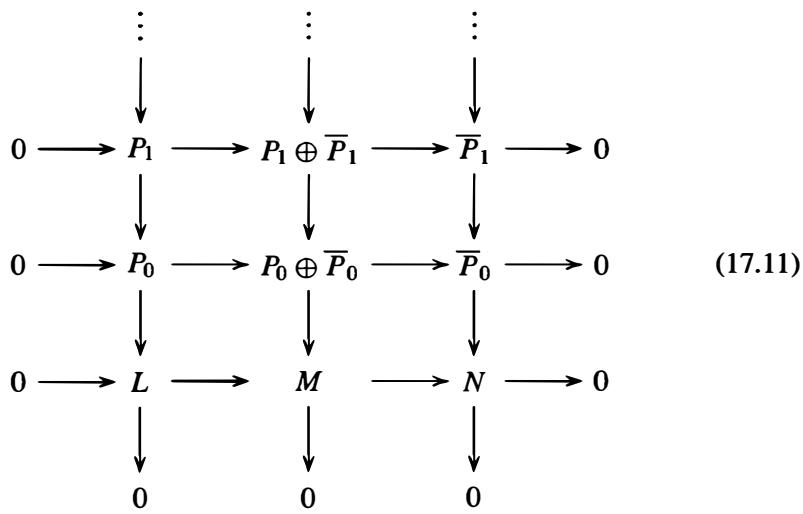

Moreover, the rows and columns of this diagram are exact and the rows are split.

Proof" The left and right nonzero columns of (1 1) are exact by hypothesis. The modules in the middle column are projective (cf. Exercise 3, Section 1 0.5) and the row maps are the obvious ones to make each row a split exact sequence. It remains then to define the vertical maps in the middle column in such a way as to make the diagram commute. This is accomplished in a straightforward manner, working inductively from the bottom upward - the first step in this process is outlined in Exercise 5.

Theorem 2 and Proposition 7 now yield the long exact sequence for $\mathbf { E x t } _ { R }$ that extends the exact sequence (2).

Theorem 8. Let $0 \to L \to M \to N \to 0$ be a short exact sequence of $R$ -modules. Then there is a long exact sequence of abelian groups

$$
\begin{array}{l} 0 \rightarrow \operatorname {H o m} _ {R} (N, D) \rightarrow \operatorname {H o m} _ {R} (M, D) \rightarrow \operatorname {H o m} _ {R} (L, D) \xrightarrow {\delta_ {0}} \operatorname {E x t} _ {R} ^ {1} (N, D) \tag {17.12} \\ \rightarrow \operatorname {E x t} _ {R} ^ {1} (M, D) \rightarrow \operatorname {E x t} _ {R} ^ {1} (L, D) \xrightarrow {\delta_ {1}} \operatorname {E x t} _ {R} ^ {2} (N, D) \rightarrow \dots \\ \end{array}
$$

where the maps between groups at the same level $\pmb { n }$ are as in Proposition 5 and the connecting homomorphisms $\delta _ { n }$ are given by Theorem 2.

Proof" Take a simultaneous projective resolution of the short exact sequence as in Proposition 7 and take homomorphisms into $D _ { * }$ . To obtain the cohomology groups $\mathbf { E x t } _ { R } ^ { n }$ from the resulting diagram, as noted in the discussion preceding Proposition 3 we replace the lowest nonzero row in the transformed diagram with a row of zeros to get the following commutative diagram:

$$
\begin{array}{c c c c} \vdots & \vdots & \vdots \\ \uparrow & \uparrow & \uparrow \\ 0 \longrightarrow \operatorname {H o m} _ {R} (\overline {{P}} _ {1}, D) \longrightarrow \operatorname {H o m} _ {R} (P _ {1} \oplus \overline {{P}} _ {1}, D) \longrightarrow \operatorname {H o m} _ {R} (P _ {1}, D) \longrightarrow 0 \\ \uparrow & \uparrow & \uparrow \\ 0 \longrightarrow \operatorname {H o m} _ {R} (\overline {{P}} _ {0}, D) \longrightarrow \operatorname {H o m} _ {R} (P _ {0} \oplus \overline {{P}} _ {0}, D) \longrightarrow \operatorname {H o m} _ {R} (P _ {0}, D) \longrightarrow 0 \\ \uparrow & \uparrow & \uparrow \\ 0 & 0 & 0 & (1 7. 1 3) \end{array}
$$

The columns of ( 1 3) are cochain complexes, and the rows are split by Proposition 29(2) of Section 10.5 and the discussion following it. Thus (1 3) is a short exact sequence of cochain complexes. Theorem 2 then gives a long exact sequence of cohomology groups whose terms are, by definition, the groups $\mathbf { E x t } _ { R } ^ { n } ( \_ , D )$ , for $n \geq 0 .$ . The $0 ^ { \mathrm { t h } }$ order terms are identified by Proposition 3, completing the proof.

Theorem 8 shows how the exact sequence (2) can be extended in a natural way and shows that the group $\mathbf { E x t } _ { R } ^ { 1 } ( N , D )$ is the first measure of the failure of (2) to be exact on the right - in fact (2) can be extended to a short exact sequence on the right if and only if the connecting homomorphism $\delta _ { 0 }$ in ( 12) is the zero homomorphism. In particular, if $\mathbf { E x t } _ { R } ^ { 1 } ( N , D ) = { \bar { 0 } }$ for all $R$ -modules $N$ , then (2) will be exact on the right for every exact sequence ( 1). We have already seen (Corollary 35 in Section 10.5) that this implies the $R$ -module $D$ is injective. Part of the next result shows that the converse is also true and characterizes injective modules in terms of $\mathbf { E x t } _ { R }$ groups.

Proposition 9. For an $R$ -module $Q$ the following are equivalent:

(1) $Q$ is injective,   
(2) $\mathbf { E x t } _ { R } ^ { 1 } ( A , Q ) = 0$ for all $R$ -modules A, and   
(3) $\mathbf { E x t } _ { R } ^ { n } ( A , Q ) = 0$ for all $R$ -modules A and all $n \geq 1$

Proof: We showed (2) implies ( 1 ) above, and (3) implies (2) is trivial, so it remains to show that if $Q$ is injective then $\mathbf { E x t } _ { R } ^ { n } ( A , Q ) = \mathbf { 0 }$ for all $R$ -modules A and all $n \geq 1$ . Take a projective resolution

$$
\dots \longrightarrow P _ {n} \longrightarrow P _ {n - 1} \longrightarrow \dots \longrightarrow P _ {0} \longrightarrow A \longrightarrow 0
$$

for A. Since $Q$ is injective, the sequence

$$
0 \rightarrow \operatorname {H o m} _ {R} (A, Q) \rightarrow \operatorname {H o m} _ {R} (P _ {0}, Q) \rightarrow \dots \rightarrow \operatorname {H o m} _ {R} (P _ {n - 1}, Q) \rightarrow \operatorname {H o m} _ {R} (P _ {n}, Q) \rightarrow \dots
$$

is still exact (Corollary 35 in Section 10.5), so all of the cohomology groups for this cochain complex are 0. In particular, the groups $\mathbf { E x t } _ { R } ^ { n } ( A , Q )$ for $n \geq 1$ are all trivial, which is (3).

For a fixed $R$ -module $D$ , the result in Theorem 8 can be viewed as explaining what happens to the short exact sequence $0 \to L \to M \to N \to 0$ on the right after applying the left exact functor ${ \bf H o m } _ { R } ( \_ { D } )$ . This is why the (contravariant) functors $\mathbf { E x t } _ { R } ^ { n } ( \_ , D )$ are called the right derived functors for the functor ${ \bf H o m } _ { R } ( \_ { D } )$ .

One can also consider the effect of applying the left exact functor ${ \bf H o m } _ { R } ( D , \_ \_ )$ , i . e . , by taking homomorphisms from $D$ rather than into $D$ . The next theorem shows that in fact the same $\mathbf { E x t } _ { R }$ groups define the (covariant) right derived functors for ${ \bf H o m } _ { R } ( D , \_ \_ )$ as well.

Theorem 10. Let $0 \to L \to M \to N \to 0$ be a short exact sequence of $R \mathrm { \Omega }$ -modules. Then there is a long exact sequence of abelian groups

$$
\begin{array}{l} 0 \rightarrow \operatorname {H o m} _ {R} (D, L) \rightarrow \operatorname {H o m} _ {R} (D, M) \rightarrow \operatorname {H o m} _ {R} (D, N) \xrightarrow {\gamma_ {0}} \operatorname {E x t} _ {R} ^ {1} (D, L) \tag {17.14} \\ \rightarrow \operatorname {E x t} _ {R} ^ {1} (D, M) \rightarrow \operatorname {E x t} _ {R} ^ {1} (D, N) \xrightarrow {\gamma_ {1}} \operatorname {E x t} _ {R} ^ {2} (D, L) \rightarrow \dots . \\ \end{array}
$$

Proof" Let $0 \to L \to M \to N \to 0$ be a short exact sequence of $R$ -modules. By taking a projective resolution of $D$ and then applying ${ \bf H o m } _ { R } ( \_ { L } )$ , ${ \bf H o m } _ { R } ( \_ , M )$ and ${ \bf H o m } _ { R } ( \_ , N )$ to this resolution one obtains the columns in a commutative diagram similar to ( 1 3), but with L, M and $N$ in the second positions rather than the first. Applying the Long Exact Sequence Theorem to this array gives ( 14).

Theorem 10 shows that the group $\mathbf { E x t } _ { R } ^ { 1 } ( D , L )$ measures whether the exact sequence

$$
0 \longrightarrow \operatorname {H o m} _ {R} (D, L) \longrightarrow \operatorname {H o m} _ {R} (D, M) \longrightarrow \operatorname {H o m} _ {R} (D, N)
$$

can be extended to a short exact sequence - it can be extended if and only if $\gamma _ { 0 }$ is the zero homomorphism. In particular, this will always be the case if the module $D$ has the property that $\mathbf { E x t } _ { R } ^ { 1 } ( D , B ) = 0$ for all $R$ -modules $B$ ; in this case it follows by Corollary 32 in Section 10.5 that $D$ is a projective $R$ -module. As in the situation of injective $R$ -modules in Proposition 9, the vanishing of these cohomology groups in fact characterizes projective $R$ -modules:

Proposition 11. For an $R$ -module $P$ the following are equivalent:

(1) $P$ is projective,   
(2) $\mathbf { E x t } _ { R } ^ { 1 } ( P , B ) = 0$ for all $R$ -modules $B$ , and   
(3) $\mathbf { E x t } _ { R } ^ { n } ( P , B ) = 0$ for all $R$ -modules $B$ and all $n \geq 1$

Proof" We proved (2) implies ( 1 ) above, and (3) implies (2) is trivial, so it remains to prove that ( 1 ) implies (3). If $P$ is a projective $R$ -module, then the simple exact sequence

$$
0 \longrightarrow P \stackrel {1} {\longrightarrow} P \longrightarrow 0
$$

given by the identity map on $P$ is a projective resolution of $P$ . Taking homomorphisms into $B$ gives the simple cochain complex

$$
0 \to \operatorname {H o m} _ {R} (P, B) \xrightarrow {1} \operatorname {H o m} _ {R} (P, B) \to 0 \to \dots \to 0 \to \dots
$$

from which it follows by definition that $\mathbf { E x t } _ { R } ^ { n } ( P , B ) = 0$ for all $n \geq 1$ , which gives (3).

# Examples

(1) Since $\mathbb { Z } ^ { m }$ is a free, hence projective, Z-module, it follows from Proposition 1 1 that

$$
\operatorname {E x t} _ {\mathbb {Z}} ^ {n} \left(\mathbb {Z} ^ {m}, B\right) = 0
$$

for all abelian groups $\pmb { B }$ , all $m \ge 1 ,$ , and all $n \geq 1$

(2) It is not difficult to show that $\mathbf { E x t } _ { R } ^ { n } ( A _ { 1 } \oplus A _ { 2 } , B ) \cong \mathbf { E x t } _ { R } ^ { n } ( A _ { 1 } , B ) \oplus \mathbf { E x t } _ { R } ^ { n } ( A _ { 2 } , B )$ for all ${ \pmb n } \ge { \bf 0 }$ ( cf. Exercise 10), so the previous example together with the example following Proposition 3 determines $\mathbf { E x t } _ { \mathbb { Z } } ^ { n } ( A , B )$ for all finitely generated abelian groups A. In particular, $\mathbf { E x t } _ { \mathbb { Z } } ^ { n } ( A , B ) = 0$ for all finitely generated groups A, all abelian groups $\pmb { B }$ , and all $n \geq 2$ .

We have chosen to define the cohomology group $\mathbf { E x t } _ { R } ^ { n } ( A , B )$ using a projective resolution of A. There is a parallel development using an injective resolution of $B$ :

$$
0 \rightarrow B \rightarrow Q _ {0} \rightarrow Q _ {1} \rightarrow \dots
$$

where each $Q _ { i }$ is injective. In this situation one defines $\mathbf { E x t } _ { R } ^ { n } ( A , B )$ as the $n ^ { \mathrm { t h } }$ cohomology group of the cochain sequence obtained by applying ${ \bf H o m } _ { R } ( A , \_ \_ )$ to the resolution for B. The theory proceeds in a manner analogous to the development of this section. Ultimately one shows that there is a natural isomorphism between the groups $\mathbf { E x t } _ { R } ^ { n } ( A , B )$ constructed using both methods.

# Examples

(1) Suppose $R = \mathbb { Z }$ and A and $\pmb { B }$ are $\mathbb { Z }$ -modules, i.e., are abelian groups. Recall that a $\mathbb { Z }$ -module is injective if and only if it is divisible (Proposition 36 in Section 10.5). The group $\pmb { B }$ can be embedded in an injective $\mathbb { z }$ -module $Q _ { 0 }$ (Corollary 37 in Section 10.5) and the quotient, $Q _ { 1 }$ , of $Q _ { 0 }$ by the image of $\pmb { B }$ is again injective. Hence we have an injective resolution

$$
0 \longrightarrow B \longrightarrow Q _ {0} \longrightarrow Q _ {1} \longrightarrow 0
$$

of B. Applying Homz(A , __) to this sequence gives the cochain complex

$$
0 \longrightarrow \operatorname {H o m} _ {\mathbb {Z}} (A, B) \longrightarrow \operatorname {H o m} _ {\mathbb {Z}} (A, Q _ {0}) \longrightarrow \operatorname {H o m} _ {\mathbb {Z}} (A, Q _ {1}) \longrightarrow 0 \longrightarrow \dots
$$

from which it follows immediately that

$$
\operatorname {E x t} _ {\mathbb {Z}} ^ {n} (A, B) = 0
$$

for all abelian groups A and $\pmb { B }$ and all $n \geq 2$ , showing that the result of the previous example holds also when A is not finitely generated.

(2) Suppose A is a torsion abelian group. Then we have $\mathbf { E x t } ^ { 0 } ( A , \mathbb { Z } ) \cong \mathbf { H o m } ( A , \mathbb { Z } ) = 0$ since $\mathbb { Z }$ is torsion free. The sequence $0 \to \mathbb { Z } \to \mathbb { Q } \to \mathbb { Q } / \mathbb { Z } \to 0$ gives an injective resolution of ::£. Applying Hom( A, __) gives the cochain complex

$$
0 \longrightarrow \operatorname {H o m} (A, \mathbb {Z}) \longrightarrow \operatorname {H o m} (A, \mathbb {Q}) \longrightarrow \operatorname {H o m} (A, \mathbb {Q} / \mathbb {Z}) \longrightarrow 0 \longrightarrow \dots
$$

and since $\mathbb { Q }$ is also torsion free, this shows that

$$
\operatorname {E x t} _ {\mathbb {Z}} ^ {\mathbf {1}} (A, \mathbb {Z}) \cong \operatorname {H o m} _ {\mathbb {Z}} (A, \mathbb {Q} / \mathbb {Z}).
$$

The group $\mathbf { H o m } ( A , \mathbb { Q } / \mathbb { Z } )$ is called the Pontriagin dual group to A. If A is a finite abelian group the Pontriagin dual of A is isomorphic to A ( cf. Exercise I4, Section 5.2). In particular, $\mathbf { E x t } ^ { 1 } ( A , \mathbb { Z } ) \cong A$ is nonzero for all nonzero finite abelian groups A. We have $\mathbf { E x t } ^ { n } ( A , \mathbb { Z } ) = 0$ for all ${ \pmb n } \geq 2$ by the previous example.

We record an important property of $\mathbf { E x t } _ { R } ^ { 1 }$ , which helps to explain the name for these cohomology groups. Recall that equivalent extensions were defined at the beginning of Section 1 0.5.

Theorem 12. For any $R$ -modules $N$ and $L$ there is a bijection between $\mathbf { E x t } _ { R } ^ { 1 } ( N , L )$ and the set of equivalence classes of extensions of $N$ by $L$ .

Although we shall not prove this result, in Section 4 we establish a similar bijection between equivalence classes of group extensions of $G$ by A and elements of a certain cohomology group, where $G$ is any finite group and A is any $\mathbb { Z } G$ -module.

# Example

Suppose $\pmb { R } = \mathbb { Z }$ : and $\pmb { A } = \pmb { B } = \mathbb { Z } / p \mathbb { Z } .$ . We showedabove that $\mathbf { E x t } _ { R } ^ { 1 } ( \mathbb { Z } / p \mathbb { Z } , \mathbb { Z } / p \mathbb { Z } ) \cong \mathbb { Z } / p \mathbb { Z } ,$ , so by Theorem I2 there are precisely $\pmb { p }$ equivalence classes of extensions of Z:: 1 pZ by Z:: 1 p Z. These are given by the direct sum $\mathbb { Z } / p \mathbb { Z } \oplus \mathbb { Z } / p \mathbb { Z }$ (which corresponds to the trivial class in $\mathbf { E x t } _ { R } ^ { 1 } ( \mathbb { Z } / p \mathbb { Z } , \mathbb { Z } / p \mathbb { Z } ) )$ and the $p - 1$ extensions

$$
0 \longrightarrow \mathbb {Z} / p \mathbb {Z} \longrightarrow \mathbb {Z} / p ^ {2} \mathbb {Z} \stackrel {i} {\longrightarrow} \mathbb {Z} / p \mathbb {Z} \longrightarrow 0
$$

defined by the map $i ( x ) = i x { \bmod { p } }$ for $i = 1 , 2 , \ldots , p - 1$ . Note that while these are inequivalent as extensions, they all determine the same group $\mathbb { Z } / p ^ { 2 } \mathbb { Z }$ .

# Tensor Products and the Groups $\tau o r _ { n } ^ { R } ( A , B )$

The cohomology groups $\mathbf { E x t } _ { R } ^ { n } ( A , B )$ determine what happens to short exact sequences on the right after applying the left exact functors ${ \bf H o m } _ { R } ( D , \_ \_ )$ and ${ \bf H o m } _ { R } ( \_ D )$ . One may similarly ask for the behavior of short exact sequences on the left after applying the right exact functor $D \otimes _ { R }$ _ or the right exact functor _ $\otimes _ { R } D .$ . This leads to the Tor (homology) groups (whose name derives from their relation to torsion submodules), and we now briefly outline the development of these left derived functors. In some respects this theory is "dual" to the theory for $\mathbf { E x t } _ { R }$ . We concentrate on the situation for $D \otimes _ { R }$ _ when $D$ is a right $R$ -module. When $D$ is a left $R$ -module there is a completely symmetric theory for _ $\otimes _ { R } D$ ; when $R$ is commutative and all $R$ -modules have the same left and right $R$ action the homology groups resulting from both developments are isomorphic.

Suppose then that $D$ is a right $R$ -module. Then for every left $R$ -module $B$ the tensor product $D \otimes _ { R } B$ is an abelian group and the functor $D \otimes$ _ is covariant and right exact, i.e., for any short exact sequence ( 1 ) of left $R \mathrm { \Omega }$ -modules,

$$
D \otimes L \longrightarrow D \otimes M \longrightarrow D \otimes N \longrightarrow 0
$$

is an exact sequence of abelian groups. This sequence may be extended at the left end to a long exact sequence as follows. Let

$$
\dots \longrightarrow P _ {n} \xrightarrow {d _ {n}} P _ {n - 1} \longrightarrow \dots \xrightarrow {d _ {1}} P _ {0} \xrightarrow {\epsilon} B \longrightarrow 0
$$

be a projective resolution of $B .$ , and take tensor products with $\pmb { D }$ to obtain

$$
\dots \longrightarrow D \otimes P _ {n} \xrightarrow {\mathrm {l} \otimes d _ {n}} D \otimes P _ {n - 1} \longrightarrow \dots \xrightarrow {\mathrm {l} \otimes d _ {1}} D \otimes P _ {0} \xrightarrow {\mathrm {l} \otimes \epsilon} D \otimes B \longrightarrow 0. \tag {17.15}
$$

It follows from the argument in Theorem 39 of Section 10.5 that (15) is a chain complex - the composition of any two successive maps is zero - so we may form its homology groups.

Definition. Let $D$ be a right $R$ -module and let $B$ be a left $R$ -module. For any projective resolution of $B$ by left $R$ -modules as above let $1 \otimes d _ { n } : D \otimes P _ { n } \to D \otimes P _ { n - 1 }$ for all $n \geq 1$ as in ( 1 5). Then

$$
\operatorname {T o r} _ {n} ^ {R} (D, B) = \ker (1 \otimes d _ {n}) / \operatorname {i m a g e} (1 \otimes d _ {n + 1})
$$

where $\mathbf { T o r } _ { 0 } ^ { R } ( D , B ) = ( D \otimes P _ { 0 } ) /$ image(l ®d1). The group $\mathrm { T o r } _ { n } ^ { R } ( D , B )$ is called the $n ^ { \mathrm { t h } }$ homology group derived from the functor $D \otimes$ _. When $R = \mathbb { Z }$ the group $\mathrm { T o r } _ { n } ^ { \mathbb { Z } } ( D , B )$ is also denoted simply ${ \mathrm { T o r } } _ { n } ( D , B )$ .

Thus $\mathrm { T o r } _ { n } ^ { R } ( D , B )$ i s the $n ^ { \mathrm { t h } }$ homology group of the chain complex obtained from (15) by removing the term $D \otimes B$ .

A completely analogous proof to Proposition 3 (but relying on Theorem 39 in Section 1 0.5) implies the following:

Proposition 13. For any left $R$ -module $B$ we have $\mathbf { T o r } _ { 0 } ^ { R } ( D , B ) \cong D \otimes B$ .

# Example

Let $R = \mathbb { Z }$ and let $B = \mathbb { Z } / m \mathbb { Z }$ for some $m \ge 2$ . By the proposition, $\mathbf { T o r } _ { 0 } ^ { \mathbb { Z } } ( D , \mathbb { Z } / m \mathbb { Z } )$ is isomorphic to $D \otimes \mathbb { Z } / m \mathbb { Z }$ , so we have $ { \mathbf { T } }  { \mathbf { 0 } }  { \mathbb { T } } _ { 0 } ^ { \mathbb { Z } } ( D , \mathbb { Z } / m \mathbb { Z } ) \cong D / m D$ (Example 8 following Corollary 12 in Section 10.4). For the higher groups we apply $\pmb { D } \otimes$ _ to the projective resolution

$$
0 \longrightarrow \mathbb {Z} \xrightarrow {m} \mathbb {Z} \longrightarrow \mathbb {Z} / m \mathbb {Z} \longrightarrow 0
$$

of $\pmb { B }$ and use the isomorphisms $D \otimes \mathbb { Z } \cong D$ and $D \otimes \mathbb { Z } / m \mathbb { Z } \cong D / m D$ . This gives the chain complex

$$
\dots \longrightarrow 0 \longrightarrow D \stackrel {m} {\longrightarrow} D \longrightarrow D / m D \longrightarrow 0.
$$

It follows that $ { \mathbf { T } }  { \mathbf { o r } } _ { 1 } ^ { \mathbb { Z } } ( D , \mathbb { Z } / m \mathbb { Z } ) \cong \operatorname { \rho } _ { m } D$ is the subgroup of $_ D$ annihilated by $_ m$ and that $ { \mathrm { T o r } } _ { n } ^ { \mathbb { Z } } ( D , \mathbb { Z } / m \mathbb { Z } ) = { \bar { 0 } }$ for all $n \geq 2$ , which we summarize as

$$
\begin{array}{l} \operatorname {T o r} _ {0} (D, \mathbb {Z} / m \mathbb {Z}) \cong D / m D, \\ \operatorname {T o r} _ {1} (D, \mathbb {Z} / m \mathbb {Z}) \cong {} _ {m} D, \\ \operatorname {T o r} _ {n} (D, \mathbb {Z} / m \mathbb {Z}) = 0, \quad \text {f o r a l l} n \geq 2. \\ \end{array}
$$

As for Ext, the Tor groups depend on the ring $\pmb R$ (cf. Exercise 20).

Following a similar development to that for $\mathbf { E x t } _ { R }$ , one shows:

# Proposition 14.

(1) The homology groups $\mathrm { T o r } _ { n } ^ { R } ( D , B )$ are independent of the choice of projective resolution of $\pmb { B }$ , and   
(2) for every $R$ -module homomorphism $f : B  B ^ { \prime } $ there are induced maps $\psi _ { n } : \mathrm { T o r } _ { n } ^ { R } ( D , B ) \to \mathrm { T o r } _ { n } ^ { R } ( D , B ^ { \prime } )$ on homology groups (depending only on $f$ ).

There is a Long Exact Sequence in Homology analogous to Theorem 2, except that all the arrows are reversed, whose proof follows mutatis mutandis from the argument for cohomology. This together with Simultaneous Resolution gives:

Theorem 15. Let $0 \to L \to M \to N \to 0$ be a short exact sequence ofleft $R$ -modules. Then there is a long exact sequence of abelian groups

$$
\begin{array}{l} \dots \rightarrow \operatorname {T o r} _ {2} ^ {R} (D, N) \xrightarrow {\delta_ {1}} \operatorname {T o r} _ {1} ^ {R} (D, L) \rightarrow \operatorname {T o r} _ {1} ^ {R} (D, M) \rightarrow \\ \operatorname {T o r} _ {1} ^ {R} (D, N) \xrightarrow {\delta_ {0}} D \otimes L \to D \otimes M \to D \otimes N \to 0 \\ \end{array}
$$

where the maps between groups at the same level $\pmb { n }$ are as in Proposition 14 (and the maps $\delta _ { n }$ are called connecting homomorphisms).

There is a characterization of fiat modules corresponding to Propositions 9 and 1 1 whose proof is very similar and is left as an exercise.

Proposition 16. For a right $R$ -module $\pmb { D }$ the following are equivalent:

(1) $\pmb { D }$ is a flat $R$ -module,   
(2) $\mathrm { T o r } _ { 1 } ^ { R } ( D , B ) = 0$ for all left $\pmb { R }$ -modules $\pmb { B }$ , and   
(3) $\mathrm { T o r } _ { n } ^ { R } ( D , B ) = 0$ for all left $\pmb { R }$ -modules $\pmb { B }$ and all $n \geq 1$

We have defined $\mathrm { T o r } _ { n } ^ { R } ( A , B )$ as the homology of the chain complex obtained by tensoring a projective resolution of $\pmb { B }$ on the left with A. The same groups are obtained by taking the homology of the chain complex obtained by tensoring a projective resolution of A on the right by $\pmb { B }$ . Put another way, the $\mathrm { T o r } _ { n } ^ { R } ( A , B )$ groups define the (covariant) left derived functors for both of the right exact functors A ®R _ and _ $\otimes _ { R } B \colon$ : if $\pmb { D }$ is a left $R$ -module, then the short exact sequence $0 \to L \to M \to N \to 0$ of right $\pmb { R }$ -modules gives rise to the long exact sequence

$$
\begin{array}{l} \dots \to \operatorname {T o r} _ {2} ^ {R} (N, D) \xrightarrow {\gamma_ {1}} \operatorname {T o r} _ {1} ^ {R} (L, D) \to \operatorname {T o r} _ {1} ^ {R} (M, D) \to \\ \operatorname {T o r} _ {1} ^ {R} (N, D) \xrightarrow {\gamma_ {0}} L \otimes_ {R} D \to M \otimes_ {R} D \to N \otimes_ {R} D \to 0 \\ \end{array}
$$

of abelian groups. In particular, the left $\pmb { R }$ -module $\pmb { D }$ is flat if and only i $\mathrm { T o r } _ { 1 } ^ { R } ( A , D ) = 0$ for all right $\pmb { R }$ -modules A .

When $\pmb { R }$ i s commutative, $A \otimes _ { R } B \cong B \otimes _ { R } A$ (Proposition 20 in Section 10.4) for any two $\pmb { R }$ -modules A and $\pmb { B }$ with the standard $\pmb { R }$ -module structures, and it follows that ${ \mathrm { T o r } } _ { n } ^ { R } ( A , B ) \cong { \mathrm { T o r } } _ { n } ^ { R } ( B , A )$ as $R$ -modules. When $\pmb { R }$ is commutative the Tor long exact sequences are exact sequences of $R$ -modules.

# Examples

(1) If $R = \mathbb { Z }$ , then since $\mathbb { Z } ^ { m }$ is free, hence flat (Corollary 42, Section 10.5), we have ${ \mathrm { T o r } } _ { n } ( A , \mathbb { Z } ^ { m } ) = 0$ for all $n \geq 1$ and all abelian groups A.   
(2) Since $\mathbf { T o r } _ { n } ^ { R } ( A , B _ { 1 } \oplus B _ { 2 } ) \cong \mathbf { T o r } _ { n } ^ { R } ( A , B _ { 1 } ) \oplus \mathbf { T o r } _ { n } ^ { R } ( A , B _ { 2 } )$ (cf. Exercise 10), the previous two examples together determine $\mathrm { T o r } _ { n } ^ { R } ( A , B )$ for all abelian groups A and all finitely generated abelian groups $\pmb { B }$ .   
(3) As a particular case of the previous example, $\mathrm { T o r } _ { 1 } ( A , B )$ is a torsion group and $\mathbf { T o r } _ { n } ( A , B ) = { \bf 0 }$ for every abelian group A, every finitely generated abelian group $B .$ , and all $n \geq 2$ . In fact these results hold without the condition that $\pmb { B }$ be finitely generated.   
(4) The exact sequence $0 \to \mathbb { Z } \to \mathbb { Q } \to \mathbb { Q } / \mathbb { Z } \to 0$ gives the long exact sequence

$$
\dots \rightarrow \operatorname {T o r} _ {1} (D, \mathbb {Q}) \rightarrow \operatorname {T o r} _ {1} (D, \mathbb {Q} / \mathbb {Z}) \rightarrow D \otimes \mathbb {Z} \rightarrow D \otimes \mathbb {Q} \rightarrow D \otimes \mathbb {Q} / \mathbb {Z} \rightarrow 0.
$$

Since $\mathbb { Q }$ is a flat $\mathbb { Z }$ -module (Example 2 following Corollary 42 in Section 10.5), the proposition shows that we have an exact sequence

$$
0 \longrightarrow \operatorname {T o r} _ {1} (D, \mathbb {Q} / \mathbb {Z}) \longrightarrow D \longrightarrow D \otimes \mathbb {Q}
$$

and so $\mathbf { T o r } _ { 1 } ( D , \mathbb { Q } / \mathbb { Z } )$ is isomorphic to the kernel of the natural map from $\pmb { D }$ into $\pmb { D } \otimes \mathbb { Q }$ , which is the torsion subgroup of $\pmb { D }$ (cf. Exercise 9 in Section 1 0.4).

The following results show that, for $R = \mathbb { Z }$ , the Tor groups are closely related to torsion subgroups. The Tor groups first arose in applications of torsion abelian groups in topological settings, which helps explain the terminology.

Proposition 17. Let A and $B$ be $\mathbb { Z }$ modules and let t (A) and $t ( B )$ denote their respective torsion submodules. Then $\operatorname { T o r } _ { 1 } ( A , B ) \cong \operatorname { T o r } _ { 1 } ( t ( A ) , t ( B ) )$ .

Proof" In the case where A and $B$ are finitely generated abelian groups this follows by Examples 3 and 4 above. For the general case, cf. Exercise 16.

Corollary 18. If A is an abelian group then A is torsion free if and only ifTor1 $( A , B ) = 0$ for every abelian group $\pmb { B }$ (in which case A is fiat as a $\mathbb { Z }$ -module).

Proof" By the proposition, if A has no elements of finite order then we have $\operatorname { T o r } _ { 1 } ( A , B ) = \operatorname { T o r } _ { 1 } ( t ( A ) , B ) = \operatorname { T o r } _ { 1 } ( 0 , B ) = 0$ for every abelian group B. Conversely, if $\mathbf { T o r } _ { 1 } ( A , B ) = 0$ for all $B$ , then in particular $\begin{array} { r } { \mathbf { T o r } _ { 1 } ( A , \mathbb { Q } / \mathbb { Z } ) = 0 , } \end{array}$ , and this group is isomorphic to the torsion subgroup of A by the example above.

The results of Proposition 17 and Corollary 1 8 hold for any P.I.D. $R$ in place of Z (cf. Exercise 26 in Section 10.5 and Exercise 16).

Finally, we mention that the cohomology and homology theories we have described may be developed in a vastly more general setting by axiomatizing the essential properties of $R \mathrm { \cdot }$ -modules and the $\mathbf { H o m } _ { R }$ and tensor product functors. This leads to the general notions of abelian categories and additive functors. In the case of the abelian category of $R$ -modules, any additive functor $\mathcal { F }$ to the category of abelian groups gives rise to a set of derived functors, $\mathcal { F } _ { n }$ , also from $R \mathrm { \cdot }$ -modules to abelian groups, for all $\begin{array} { r } { n \geq 0 } \end{array}$ . Then for each short exact sequence $0 \to L \to M \to N \to 0$ of $R$ -modules there is a long exact sequence of (cohomology or homology) groups whose terms are ${ \mathcal { F } } _ { n } ( L )$ , ${ \mathcal { F } } _ { n } ( M )$ and ${ \mathcal { F } } _ { n } ( N )$ , and these long exact sequences reflect the exactness properties of the functor $\mathcal { F }$ . If $\mathcal { F }$ is left or right exact then the $0 ^ { \mathrm { t h } }$ derived functor $\mathcal { F } _ { 0 }$ is naturally equivalent to $\mathcal { F }$ (hence the $0 ^ { \mathrm { t h } }$ degree groups ${ \mathcal { F } } _ { 0 } ( X )$ are isomorphic to ${ \mathcal { F } } ( X ) )$ ), and if $\mathcal { F }$ is an exact functor then $\mathcal { F } _ { n } ( X ) = 0$ for all $n \geq 1$ and all $R$ -modules $\pmb { X }$ .

# E X E R C I S E S

1. Give the details of the proof of Proposition 1 .

2 . This exercise defines the connecting map $\delta _ { n }$ in the Long Exact Sequence of Theorem 2 and proves it is a homomorphism. In the notation of Theorem 2 let $0 \to A { \overset { \alpha } { \to } } B { \overset { \beta } { \to } } C \to 0$ be a short exact sequence of cochain complexes, where for simplicity the cochain maps for A, l3 and $c$ are all denoted by the same $\pmb { d }$ .

(a) If $c \in C ^ { n }$ represents the class $x \in H ^ { n } ( { \mathcal { C } } )$ show that there is some $\ b { b } \in \ b { B } ^ { n }$ with $\beta _ { n } ( b ) = c$ .   
(b) Show that $d _ { n + 1 } ( b ) \in \ker \beta _ { n + 1 }$ and conclude that there is a unique $a \in A ^ { n + 1 }$ such that $\alpha _ { n + 1 } ( a ) = d _ { n + 1 } ( b )$ . [Use $c \in \ker d _ { n + 1 }$ and the commutativity of the diagram.]   
(c) Show that $d _ { n + 2 } ( a ) = 0$ and conclude that $\pmb { a }$ defines a class $\overline { { a } }$ in the quotient group $H ^ { n + 1 } ( { \mathcal { A } } )$ . [Use the fact that $\alpha _ { n + 2 }$ is injective.]   
(d) Prove that $\overline { { a } }$ is independent of the choice of $\pmb { b }$ , i.e., if ${ \pmb b } ^ { \prime }$ is another choice and $\pmb { a } ^ { \prime }$ is its unique preimage in $A ^ { n + 1 }$ then $\overline { { { \pmb { a } } } } = \overline { { { \pmb { a } } ^ { \prime } } }$ , and that $\overline { { a } }$ is also independent of the choice of c representing the class $\pmb { x }$ .   
(e) Define $\delta _ { n } ( x ) = { \overline { { a } } }$ and prove that $\delta _ { n }$ is a group homomorphism from $H ^ { n } ( { \mathcal { C } } )$ to $H ^ { n + 1 } ( { \mathcal { A } } )$ . [Use the fact that $\delta _ { n } ( x )$ is independent of the choices of $^ c$ and $\pmb { b }$ to compute $\delta _ { n } ( x _ { 1 } + x _ { 2 } )$ .]

3. Suppose

$$
\begin{array}{c} A \xrightarrow {\alpha} B \xrightarrow {\beta} C \longrightarrow 0 \\ f \Bigg | _ {\downarrow} g \Bigg | _ {\downarrow} h \Bigg | _ {\downarrow} \\ 0 \xrightarrow {} A ^ {\prime} \xrightarrow {\alpha^ {\prime}} B ^ {\prime} \xrightarrow {\beta^ {\prime}} C ^ {\prime} \end{array}
$$

is a commutative diagram of $R$ -modules with exact rows.

(a) If $c \in \ker h$ and $\beta ( b ) = c$ prove that $g ( b ) \in \ker \beta ^ { \prime }$ and conclude that $g ( b ) = \alpha ^ { \prime } ( a ^ { \prime } )$ for some ${ \pmb a } ^ { \prime } \in { \pmb A } ^ { \prime }$ . [Use the commutativity of the diagram.]   
(b) Show that $\pmb \delta ( c ) = \pmb a ^ { \prime }$ mod image $f$ is a well defined $R$ -module homomorphism from ker h to the quotient A' 1 image $f$ .   
(c) (The Snake Lemma) Prove there is an exact sequence

$$
\ker f \longrightarrow \ker g \longrightarrow \ker h \xrightarrow {\delta} \operatorname {c o k e r} f \longrightarrow \operatorname {c o k e r} g \longrightarrow \operatorname {c o k e r} h
$$

where coker $f$ (the cokernel of $f$ ) is A' /(image f) and similarly for coker g and coker h.

(d) Show that if $\pmb { \alpha }$ i s injective and $\beta ^ { \prime }$ i s smjective (i.e., the two rows i n the commutative diagram above can be extended to short exact sequences) then the exact sequence in (c) can be extended to the exact sequence

$$
0 \longrightarrow \ker f \longrightarrow \ker g \longrightarrow \ker h \xrightarrow {\delta} \operatorname {c o k e r} f \longrightarrow \operatorname {c o k e r} g \longrightarrow \operatorname {c o k e r} h \longrightarrow 0
$$

4. Let $\mathcal { A } = \{ A ^ { n } \}$ and $B = \{ B ^ { n } \}$ be cochain complexes, where the maps $A ^ { n }  A ^ { n + 1 }$ and $B ^ { n }  B ^ { n + 1 }$ in both complexes are denoted by $d _ { n + 1 }$ for all n. Cochain complex homomorphisms $\pmb { \alpha }$ and $\beta$ from $A$ to $_ B$ are said to be homotopic if for all $\pmb { n }$ there are module homomorphisms $s _ { n } : A ^ { n + 1 } \to B ^ { n }$ such that the maps $\alpha _ { n } - \beta _ { n }$ from $A ^ { n }$ to $B ^ { n }$ satisfy

$$
\alpha_ {n} - \beta_ {n} = d _ {n} s _ {n - 1} + s _ {n} d _ {n + 1}.
$$

The collection of maps $\{ s _ { n } \}$ is called a cochain homotopy from $\pmb { \alpha }$ to $\beta$ {. One may similarly ndefine chain homotopies between chain complexes.

(a) Prove that homotopic maps of cochain complexes induce the same maps on cohomology, i.e., if $\pmb { \alpha }$ and $\beta$ are homotopic homomorphisms of cochain complexes then the induced group homomorphisms from $H ^ { n } ( { \cal { A } } )$ to $H ^ { n } ( B )$ are equal for every ${ \pmb n } \ge { \bf 0 }$ (Thus "homotopy" gives a sufficient condition for two maps of complexes to induce the same maps on cohomology or homology; this condition is not in general necessary.) [Use the definition of homotopy to show $( \alpha _ { n } - \beta _ { n } ) ( z ) \in$ image $\scriptstyle { d _ { n } }$ for every $z \in \ker d _ { n + 1 }$ .]   
(b) Prove that the relation $\alpha \sim \beta$ if $\pmb { \alpha }$ and $\beta$ { are homotopic is an equivalence relation on any set of cochain complex homomorphisms.

S. Establish the first step in the Simultaneous Resolution result of Proposition 7 as follows: assume the first two nonzero rows in diagram ( 1 1) are given, except for the map from $P _ { 0 } \oplus \overline { { P } } _ { 0 }$ to $M$ (where the maps along the row of projective modules are the obvious injection and projection for this split exact sequence). Let $\mu : \overline { { P } } _ { 0 } \to M$ be a lifting to $\overline { { P } } _ { 0 }$ of the map ${ \overline { { P } } } _ { 0 } \to N$ (which exists because $\bar { \overline { { P } } } _ { 0 }$ is projective). Let A. be the composition $P _ { 0 } \to L \to M$ in the diagram. Define

$$
\pi : P _ {0} \oplus \overline {{P}} _ {0} \rightarrow M \quad \text {b y} \quad \pi (x, y) = \lambda (x) + \mu (y).
$$

Show that with this definition the first two nonzero rows o f ( 1 1) form a commutative diagram.

6. Let $0 \to A { \overset { \alpha } { \to } } B { \overset { \beta } { \to } } { \mathcal { C } } \to 0$ be a short exact sequence of cochain complexes. Prove that if any two of A, 13, C are exact, then so is the third. [Use Theorem 2.]   
7. Prove that a finitely generated abelian group A is free if and only if $\mathbf { E x t } ^ { 1 } ( A , \mathbb { Z } ) = 0$   
8. Prove that if $0 \to L \to M \to N \to 0$ is a split short exact sequence of $\pmb { R }$ -modules, then for every $n \geq 0$ the sequence $0 \to \operatorname { E x t } _ { R } ^ { n } ( N , D ) \to \operatorname { E x t } _ { R } ^ { n } ( M , D ) \to \operatorname { E x t } _ { R } ^ { n } ( L , D ) \to 0$ is also short exact and split. [Use a splitting homomorphism and Proposition 5.]   
9. Show that

$$
0 \longrightarrow \mathbb {Z} / d \mathbb {Z} \longrightarrow \mathbb {Z} / m \mathbb {Z} \xrightarrow {d} \mathbb {Z} / m \mathbb {Z} \xrightarrow {m / d} \mathbb {Z} / m \mathbb {Z} \xrightarrow {d} \mathbb {Z} / m \mathbb {Z} \xrightarrow {m / d} \dots
$$

is an injective resolution of $\mathbb { Z } / d \mathbb { Z }$ as a $\mathbb { Z } / m \mathbb { Z }$ -module. [Use Proposition 36 in Section 1 0.5.] Use this to compute the groups $\mathbf { E x t } _ { \mathbb { Z } / m \mathbb { Z } } ^ { n } ( A , \mathbb { Z } / d \mathbb { Z } )$ in terms of the dual group $\mathbf { H o m z } _ { / m \mathbb { Z } } ( A , \mathbb { Z } / m \mathbb { Z } )$ . In particular, if $m = p ^ { 2 }$ and $d = p$ , give another derivation of the result $\dot { \mathbf { E x t } } _ { \mathbb { Z } / p ^ { 2 } \mathbb { Z } } ^ { n } ( \mathbb { Z } / p \mathbb { Z } , \mathbb { Z } / p \mathbb { Z } ) \cong \mathbb { Z } / p \mathbb { Z }$ .

10. (a) Prove that an arbitrary direct sum $\oplus _ { i \in I } P _ { i }$ of projective modules $P _ { i }$ is projective and that an arbitrary direCt product $\textstyle \prod _ { j \in J } Q _ { j }$ Of injectiVe moduleS $Q _ { j }$ iS injectiVe.   
(b) Prove that an arbitrary direct sum of projective resolutions is again projective and use this to show $\begin{array} { r } { { \bf E x t } _ { R } ^ { n } ( \oplus _ { i \in I } A _ { i } , B ) \cong \prod _ { i \in I } { \bf E x t } _ { R } ^ { n } ( A _ { i } , B ) } \end{array}$ for any collection of $R$ -modules A; $( i \in I )$ . [cf. Exercise 12 in Section 10.5.]   
(c) Prove that an arbitrary direct product of injective resolutions is an inj ective resolution and use this to show $\begin{array} { r } { { \bf E x t } _ { R } ^ { n } ( \bar { A } , \prod _ { j \in J } B _ { j } ) \cong \prod _ { j \in J } { \bf E x t } _ { R } ^ { n } ( A , B _ { j } ) } \end{array}$ for any collection of $R$ -modules $B _ { j }$ $( j \in J )$ . [cf. Exercise 1 2 in Section 1 0.5.]   
(d) Prove that ${ \mathrm { T o r } } _ { n } ^ { R } ( A , \oplus _ { j \in J } B _ { j } ) \cong \oplus _ { j \in J } { \mathrm { T o r } } _ { n } ^ { R } ( A , B _ { j } )$ for any collection of $R \mathrm { \cdot }$ -modules $B _ { j } \left( j \in J \right)$ .   
11. (Bass ' Characterization of Noetherian Rings) Suppose $\pmb { R }$ is a commutative ring.   
(a) If $\pmb { R }$ is Noetherian, and $\pmb { I }$ is any nonzero ideal in $\pmb { R }$ show that the image of any $R \mathrm { \Omega }$ module homomorphism $f : I \to \oplus _ { j \in \mathcal { I } } Q _ { j }$ from I into a direct sum of injective $\pmb { R }$ -modules $2 j \left( j \in \mathcal { I } \right)$ is contained in some finite direct sum of the $Q _ { j }$ .   
(b) If $\pmb { R }$ is Noetherian, prove that an arbitrary direct sum $\oplus _ { j \in { \mathcal { I } } } Q _ { j }$ of injective $\pmb { R }$ -modules is again injective. [Use Baer's Criterion (Proposition 36) and Exercise 4 in Section 10.5 together with (a) .]   
(c) Let $I _ { 1 } \subseteq I _ { 2 } \subseteq \dots$ . be an ascending chain ofideals of $\pmb { R }$ with union I and let $I / I _ { i } \to Q _ { i }$ for i = 1, 2, . . . be an injection of the quotient $I / I _ { i }$ into an injective $R \mathrm { \Omega }$ -module $Q _ { i }$ (by Theorem 38 in Section 1 0.5). Prove that the composition of these injections with the product of the canonical projection maps $I  I _ { i }$ gives an $\pmb { R }$ -module homomorphism $f : I  \oplus _ { i = 1 , 2 , \ldots } Q _ { i }$ .   
(d) Prove the converse of (b): if an arbitrary direct sum $\oplus _ { j \in \mathcal { I } } Q _ { j }$ of injective $R$ -modules is again injective then $\pmb { R }$ is Noetherian. [If the direct sum in (c) is injective, use Baer's Criterion to lift $f$ to a homomorphism $\boldsymbol { F } : \boldsymbol { R }  \oplus _ { i = 1 , 2 , \ldots Q _ { i } }$ . If the component of $F ( 1 )$ in $Q _ { i }$ is $0 \mathbf { f o r } i \geq n$ prove that $I = I _ { n }$ and the ascending chain of ideals is finite.]   
12. Prove Proposition 1 3: $\mathbf { T o r } _ { 0 } ^ { R } ( D , A ) \cong D \otimes _ { R } A .$ . [Follow the proof of Proposition 3.]   
13. Prove Proposition 16 characterizing flat modules.   
14. Suppose $0 \to A \to B \to C \to 0$ is a short exact sequence of $\pmb { R }$ -modules. Prove that if $c$ is a flat $R$ -module, then A is flat if and only if $\pmb { B }$ is also flat. [Use the Tor long exact sequence.] Give an example to show that if A and $\pmb { B }$ are flat then $c$ need not be flat.

15. (a) If I is an ideal in $R$ and $M$ is an $R$ -module, prove that $ { \mathbf { T o r } } _ { 1 } ^ { R } ( M , R / I )$ is isomorphic to the kernel of the map $M \otimes _ { R } I \to M$ that maps m ® i to mi for $i \in I$ and $m \in M$ . [Use the Tor long exact sequence associated to $0 \to I \to R \to R / I \to 0$ noting that $R$ is flat.]

(b) (A Flatness Criterion using Tor) Prove that the $R$ -module $M$ is flat if and only if $ { \mathrm { T o r } } _ { 1 } ^ { R } ( M , R / I ) = 0$ for every finitely generated ideal $\pmb { I }$ of $R$ . [Use Exercise 25 in Section 1 0.5.]

16. Suppose $R$ is a P.I.D. and A and $\pmb { B }$ are $R$ -modules. If $t ( B )$ denotes the torsion submodule of $\pmb { B }$ show that $\mathbf { T o r } _ { 1 } ^ { R } ( A , t ( B ) ) \cong \mathbf { T o r } _ { 1 } ^ { R } ( A , B )$ and deduce that $\mathrm { T o r } _ { 1 } ^ { R } ( A , B )$ is isomorphic to $\mathrm { T o r } _ { 1 } ^ { R } ( t ( A ) , t ( B ) )$ . [Use Exercise 26 in Section 10.5 to show that $B / t ( B )$ is flat over $R ,$ , then use the Tor long exact sequence with $D = A$ applied to the short exact sequence $0  t ( B )  B  B / t ( B )  0$ and the remarks following Proposition 16.]

17. Let $A = \mathbb { Z } / 2 \mathbb { Z } \oplus \mathbb { Z } / 3 \mathbb { Z } \oplus \mathbb { Z } / 4 \mathbb { Z } \oplus \cdot \cdot \cdot ,$ . Prove that ${ \bf E x t ^ { 1 } } ( A , B ) \cong ( B / 2 B ) \times ( B / 3 B ) \times$ $( B / 4 B ) \times \cdots$ for any abelian group A. [Use Exercise 10.] Prove that $\mathbf { E x t ^ { 1 } } ( A , B ) = 0$ if and only if $\pmb { B }$ is divisible.

18. Prove that $\mathbb { Z } / 2 \mathbb { Z }$ is a projective $\mathbb { Z } / 6 \mathbb { Z }$ -module and deduce that $\begin{array} { r } { \mathbf { T o r } _ { 1 } ^ { \mathbb { Z } / 6 \mathbb { Z } } ( \mathbb { Z } / 2 \mathbb { Z } , \mathbb { Z } / 2 \mathbb { Z } ) = 0 . } \end{array}$

19. Suppose $r \neq 0$ is not a zero divisor in the commutative ring $R$ .

(a) Prove that multiplication by r gives a free resolution $0 \to R \stackrel { r } { \to } R \to R / r R \to 0$ of the quotient $R / r R$ .

(b) Prove that $\mathbf { E x t } _ { R } ^ { 0 } ( R / r R , B ) = { _ { r } B }$ is the set of elements $\textbf { \em b } \in \textbf { \em B }$ with $r b = 0 .$ , that $\mathop { \mathrm { E x t } _ { R } ^ { 1 } } ( R / r R , B ) \cong B / r B$ , and that $\boldsymbol { \mathrm { E x t } } _ { R } ^ { n } ( R / r R , B ) = 0$ for $n \geq 2$ for every $R$ - module $\pmb { B }$ .

(c) Prove that $\mathrm { T o r } _ { 0 } ^ { R } ( A , R / r R ) = A / r A$ , that $\mathbf { T o r } _ { 1 } ^ { R } ( A , R / r R ) = { _ { r } } A$ is the set ofelements $a \in A$ with $\boldsymbol r \boldsymbol a = 0$ , and that $\mathrm { T o r } _ { n } ^ { R } ( A , R / r R ) = 0$ for $n \geq 2$ for every $R$ -module A.

20. Prove that $\operatorname { T o r } _ { 0 } ^ { \mathbb { Z } / m \mathbb { Z } } ( A , \mathbb { Z } / d \mathbb { Z } ) \cong A / d A ,$ , that $\mathbf { T o r } _ { n } ^ { \mathbb { Z } / m \mathbb { Z } } ( A , \mathbb { Z } / d \mathbb { Z } ) \cong { _ { d } A } / { ( m / d ) A }$ for n odd, $n \geq 1 ,$ and that $\mathbf { T o r } _ { n } ^ { \mathbb { Z } / m \mathbb { Z } } ( A , \mathbb { Z } / d \mathbb { Z } ) \cong { \mathfrak { \Gamma } } _ { ( m / d ) } A / d A$ for $\pmb { n }$ even, $n \geq 2$ . [Use the projective resolution in Example 2 following Proposition 3.]

21. Let $R = k [ x , y ]$ where $\pmb { k }$ is a field, and let $\pmb { I }$ be the ideal $( x , y )$ in $R$ .

(a) Let $\alpha : R  R ^ { 2 }$ be the map $\pmb { \alpha } ( r ) = ( y r , - x r )$ and let $\beta : R ^ { 2 } \to R$ be the map $\beta ( ( r _ { 1 } , r _ { 2 } ) ) = r _ { 1 } x + r _ { 2 } y$ . Show that

$$
0 \longrightarrow R \xrightarrow {\alpha} R ^ {2} \xrightarrow {\beta} R \longrightarrow k \longrightarrow 0
$$

where the map $R \to R / I = k$ is the canonical projection, gives a free resolution of $\pmb { k }$ as an $R$ -module.

(b) Use the resolution in (a) to show that $\operatorname { T o r } _ { 2 } ^ { R } ( k , k ) \cong k .$

(c) Prove that $\operatorname { T o r } _ { 1 } ^ { R } ( k , I ) \cong k .$ . [Use the long exact sequence corresponding to the short exact sequence $0 \to I \to R \to k \to 0$ and (b).]-

(d) Conclude from (c) that the torsion free $R$ -module $\pmb { I }$ is not flat (compare to Exercise 26 in Section 1 0.5).

22. (Flat Base Change for Tor) Suppose $R$ and S are commutative rings and $f : R \to s$ is a ring homomorphism making S into an $R$ -module as in Example 6 following Corollary 12 in Section 10.4. Prove that if S is flat as an $R$ -module, then $\operatorname { T o r } _ { n } ^ { R } ( A , B ) \cong \operatorname { T o r } _ { n } ^ { S } ( S \otimes _ { R } A , B )$ for all $R$ -modules A and all S-modules B. [Show that since S is flat, tensoring an $R$ -module projective resolution for A with $s$ gives an $s .$ -module projective resolution of S ®R A.]

23. (Localization and Tor) Let $D ^ { - 1 } R$ be the localization of the commutative ring $\pmb R$ with respect to the multiplicative subset $D$ of $\pmb R$ . Prove that localization commutes with Tor, i . e . , $D ^ { - 1 } \mathrm { T o r } _ { n } ^ { R } ( A , B ) \cong \mathrm { T o r } _ { n } ^ { D ^ { - 1 } R } ( D ^ { - 1 } A , D ^ { - 1 } B )$ for all $\pmb R$ -modules A and $\pmb { B }$ and all ${ \pmb n } \geq { \bf 0 }$ [Use the previous exercise and the fact that $D ^ { - 1 } R$ is flat over $\pmb R$ , cf. Proposition 42(6) in Section 1 5 .4.]   
24. (Flatness is local) Suppose $\pmb R$ is a commutative ring. Prove that an $R$ -module $M$ is flat if and only if every localization $M _ { P }$ is a flat $R P$ -module for every maximal (hence also for every prime) ideal in $\pmb R$ . [Use the previous exercise together with the characterization of flatness in terms of Tor.]   
25. If $\pmb R$ is an integral domain with field of fractions $\pmb { F }$ , prove that $\mathbf { T o r } _ { 1 } ^ { R } ( F / R , B ) \cong t ( B )$ for any $\pmb { R }$ -module $\pmb { B }$ , where $\pmb { t } ( B )$ denotes the $R$ -torsion submodule of $\pmb { B }$ .

An $\pmb R$ -module $M$ i s said to be finitely presented i f there i s an exact sequence

$$
R ^ {s} \longrightarrow R ^ {t} \longrightarrow M \longrightarrow 0
$$

of $R$ -modules for some integers s and t. Equivalently, $M$ is finitely generated by t elements and the kernel of the corresponding $R$ -module homomorphism $R ^ { t } \to M$ can be generated by s elements.

26. (a) Prove that every finitely generated module over a Noetherian ring $\pmb R$ is finitely presented. [Use Exercise 8 in Section 1 5 . 1 .]   
(b) Prove that an $\pmb R$ -module $M$ is finitely presented and projective if and only if $M$ is a direct summand of $R ^ { n }$ for some integer $n \geq 1$ .

27. Suppose that $M$ i s a finitely presented $\pmb { R }$ -module and that $0 \to A { \overset { \alpha } { \to } } B { \overset { \beta } { \to } } M \to 0$ is an exact sequence of $\pmb R$ -modules. This exercise proves that if $\pmb { B }$ is a finitely generated $R$ -module then A is also a finitely generated $R$ -module.

(a) Suppose $R ^ { s } \stackrel { \psi } {  } R ^ { t } \stackrel { \varphi } {  } M  0$ and $e _ { 1 } , \ldots , e _ { t }$ is an $\pmb R$ -module basis for $R ^ { t }$ • Show that there exist $b _ { 1 } , \dots , b _ { t } \in B$ so that $\beta ( b _ { i } ) = \varphi ( e _ { i } )$ for $i = 1 , \ldots , t$ .   
(b) If $f$ is the $\pmb { R }$ -module homomorphism from $R ^ { t }$ t o $\pmb { B }$ defined by $f ( e _ { i } ) = b _ { i }$ for $i = 1 , \dots , t$ , show that $f ( \psi ( R ^ { s } ) ) \subseteq \ker \beta$ . [Use $\varphi \circ \psi = 0 . ]$ Conclude that there is a commutative diagram

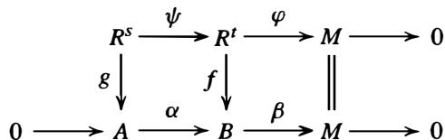

of $R \mathrm { \cdot }$ -modules with exact rows.

(c) Prove that A/ image $g \cong B ,$ 1 image $f$ and use this to prove that A is finitely generated. [For the isomorphism, use the Snake Lemma in Exercise 3. Then show that image g and A/ image g are both finitely generated and apply Exercise 7 of Section 1 0.3.]   
(d) If $\pmb { I }$ is an ideal of $\pmb R$ conclude that $R / I$ is a finitely presented $R$ -module if and only if I is a finitely generated ideal.

28. Suppose $\pmb R$ is a local ring with unique maximal ideal m and $M$ is a finitely presented $\pmb { R }$ -module. Suppose $m _ { 1 } , \ldots , m _ { s }$ are elements in $M$ whose images in $M / { \mathfrak { m } } M$ form a basis for $M / { \mathfrak { m } } M$ as a vector space over the field $R / { \mathfrak { m } }$ .

(a) Prove that $m _ { 1 } , \ldots , m _ { s }$ generate $M$ as an $R$ -module. [Use Nakayama's Lemma.]   
(b) Conclude from (a) that there is an exact sequence $0 \to \ker \varphi \to R ^ { s } \stackrel { \varphi } { \to } M \to 0$ that maps a set of free generators of $R ^ { s }$ to the elements $\mathbf { \omega } _ { m _ { 1 } } , \ldots , \mathbf { \omega } _ { m _ { s } }$ . Deduce that there is

an exact sequence

$$
\operatorname {T o r} _ {1} ^ {R} (M, R / \mathfrak {m}) \longrightarrow (\ker \varphi) / \mathfrak {m} (\ker \varphi) \longrightarrow 0.
$$

[Use the Tor long exact sequence with respect to tensoring with $R / { \mathfrak { m } } ,$ , using the fact that $N \otimes R / { \mathfrak { m } } \cong N / { \mathfrak { m } } N$ for any $R \mathrm { \cdot }$ -module $N$ (Example 8 following Corollary 12 in Section lOA] and the fact that $\varphi : ( R / { \mathfrak { m } } ) ^ { s } \cong M / { \mathfrak { m } } M$ is an isomorphism by the choice of $m _ { 1 } , \ldots , m _ { s } . ]$ 1

(c) Prove that if $\mathbf { T o r } _ { 1 } ^ { R } ( M , R / \mathfrak { m } ) = 0$ then $\displaystyle m _ { 1 } , \ldots , m _ { s }$ are a setoffree $\pmb R$ -modulegenerators for $M$ . [Use the previous exercise and Nakayama's Lemma to show that ker $\varphi = 0 . ]$

29. Suppose $\pmb R$ is a local ring with unique maximal ideal m. This exercise proves that a finitely generated $R$ -module is fiat if and only if it is free.

(a) Prove that $M = F / K$ is -the quotient of a finitely generated free module $\pmb { F }$ by a submodule $\pmb { K }$ with $K \subseteq { \mathfrak { m } } F$ . [Let $\pmb { F }$ be a free module with ${ \cal F } / \mathrm { m } { \cal F } \cong M / \mathrm { m } M . ]$ 1   
(b) Suppose $x \in K$ and write $x = a _ { 1 } e _ { 1 } + \cdots + a _ { n } e _ { n }$ where $e 1 , \ldots , e _ { n }$ are an $\pmb R$ -basis for $\pmb { F }$ . Let $\boldsymbol { I } = ( a _ { 1 } , \ldots , a _ { n } )$ be the ideal of $R$ generated by $a _ { 1 } , \ldots , a _ { n } )$ - Prove that if $M$ is fiat, then $I = { \mathfrak { m } } I$ and deduce that $\pmb { K } = \mathbf { 0 }$ , so $M$ is free. [Use Exercise 25(d) of Section 10.5 to see that $x \in I K \subseteq \mathsf { m } I F$ and conclude that $I \subseteq \mathsf { m } I .$ . Then apply Nakayama's Lemma to the finitely generated ideal / .]

30. Suppose $R$ is a local ring with unique maximal ideal m, M is an $\pmb R$ -module, and consider the following statements:

(i) $M$ is a free $\pmb R$ -module,   
(ii) $M$ is a projective $R$ -module,   
(iii) $M$ is a fiat $R$ -module, and   
(iv) $ { \mathbf { T o r } } _ { 1 } ^ { R } ( M , R / \mathfrak { m } ) = 0 .$

(a) Prove that (i) implies (ii) implies (iii) implies (iv).   
(b) Prove that (i) , (ii), and (iii) are equivalent if $M$ is finitely generated. (Exercise 34 below shows (iii) need not imply (i) or (ii) if M is finitely generated but $R$ is not locaL) [Use the previous exercise.]   
(c) Prove that (i), (ii), (iii), and (iv) are equivalent if M is finitely presented. (Exercise 35 below shows that (iv) need not imply (i), (ii) or (iii) if M is finitely generated but not finitely presented.) [Use Exercise 28.]

Remark: It is a theorem of Kaplansky (cf. Projective Modules, Annals of Mathematics, 68(1958), pp. 372-377) that (i) and (ii) are equivalent without the condition that $M$ be finitely generated.

31. (Localization and Hom for Finitely Presented Modules) Suppose $D ^ { - 1 } R$ is the localization of the commutative ring $R$ with respect to the multiplicative subset $_ D$ of $R _ { i }$ , and let $M$ be a finitely presented $\pmb R$ -module.

(a) For any $\pmb R$ -modules A and $\pmb { B }$ prove there is a unique $D ^ { - 1 } R$ -module homomorphism from $D ^ { - 1 } \mathrm { H o m } _ { R } ( A , B )$ to $\mathrm { H o m } _ { D ^ { - 1 } R } ( D ^ { - 1 } A , D ^ { - 1 } \bar { B } )$ that maps $\varphi \in \operatorname { H o m } _ { R } ( A , B )$ to the homomorphism from $D ^ { - 1 } A$ to $D ^ { - 1 } B$ induced by $\varphi$ -   
(b) For any $R$ -module $N$ and any $m \geq 1$ show that ${ \bf H o m } _ { R } ( R ^ { m } , N ) \cong N ^ { m }$ as $\pmb R$ -modules and deduce that $D ^ { - 1 } { \mathrm { H o m } } _ { R } ( R ^ { m } , N ) \cong ( D ^ { - 1 } N ) ^ { m }$ as $D ^ { - 1 } R$ -modules.   
(c) Suppose $R ^ { s } \longrightarrow R ^ { t } \longrightarrow M \longrightarrow 0$ is exact. Prove there is a commutative diagram

$$
\begin{array}{c c c c c}0 \rightarrow&D ^ {- 1} \operatorname {H o m} _ {R} (M, N)&\rightarrow&D ^ {- 1} \operatorname {H o m} _ {R} (R ^ {t}, N)&\rightarrow&D ^ {- 1} \operatorname {H o m} _ {R} (R ^ {s}, N)\\&\Bigg {\downarrow}&&\Bigg {\downarrow}&&\Bigg {\downarrow}\\0 \rightarrow \operatorname {H o m} _ {D ^ {- 1} R} (D ^ {- 1} M, D ^ {- 1} N)&\rightarrow \operatorname {H o m} _ {D ^ {- 1} R} ((D ^ {- 1} R) ^ {t}, D ^ {- 1} N)&\rightarrow \operatorname {H o m} _ {D ^ {- 1} R} ((D ^ {- 1} R) ^ {s}, D ^ {- 1} N)\end{array}
$$

of $D ^ { - 1 } R$ -modules with exact rows. [For the first row first take $R$ -module homomor-

phisms from the terms in the presentation for $\pmb { M }$ into $N$ using Theorem 33 of Section 10.5 (noting the first comment in the proof) and then tensor with the flat $R$ -module $D ^ { - 1 } R$ , cf. Propositions 41 and 42(6) in Section 15.4. For the second row first tensor the presentation with $D ^ { - 1 } R$ and then take $D ^ { - 1 } R$ -module homomorphisms into $D ^ { - 1 } N .$ ]

(d) Use (b) to prove that localization commutes with taking homomorphisms when M is finitely presented, i.e., $D ^ { - 1 } { \bf H o m } _ { R } ( M , N ) \cong { \bf H o m } _ { D ^ { - 1 } R } ( D ^ { - 1 } M , D ^ { - 1 } N )$ as $D ^ { - 1 } R \cdot$ - modules. [Show the second two vertical maps in the diagram above are isomorphisms and deduce that the left vertical map is also an isomorphism.] (This result is not true in general if M is not finitely presented.)

32. (Localization and Extfor Finitely Presented Modules) Suppose $D ^ { - 1 } R$ is the localization of the commutative ring $\pmb R$ with respect to the multiplicative subset $\pmb { D }$ of $\pmb { R } .$ . Prove that if $M$ is a finitely presented $R$ -module then $D ^ { - 1 } \bar { \mathbf { E x t } _ { R } ^ { n } } ( M , N ) \cong \bar { \mathbf { E x t } _ { D ^ { - 1 } R } ^ { n } } ( D ^ { - 1 } M , D ^ { - 1 } N )$ as $D ^ { - 1 } R$ -modules for every $\pmb { R }$ -module $N$ and every ${ \pmb n } \ge { \bf 0 }$ . [Use a projective resolution of $N$ and the previous exercise, noting that tensoring the resolution with $D ^ { - 1 } R$ gives a projective resolution for the $D ^ { - 1 } R$ -module $D ^ { - 1 } N$ .]

33. Suppose $\pmb R$ is a commutative ring and $M$ is a finitely presented $R$ -module (for example a finitely generated module over a Noetherian ring, or a quotient, $R / I$ , of $R$ by a finitely generated ideal I , cf. Exercises 26 and 27). Prove that the following are equivalent:

(a) $M$ is a projective $R$ -module,   
(b) $M$ is a flat $R \mathrm { \cdot }$ -module,   
(c) $M$ is locally free, i.e., each localization $M _ { P }$ is a free $R _ { P }$ -module for every maximal (hence also for every prime) ideal $P$ of $\pmb R$ .

In particular show that finitely generated projective modules are the same as finitely presented flat modules. [Exercises 24 and 30 show that (b) is equivalent to (c). Use the Ext criterion for projectivity and Exercises 30 and 32 to see that (a) is equivalent to (c).]

34. (a) Prove that every $\pmb R$ -module for the commutative ring $R$ is flat if and only if every finitely generated ideal I of $\pmb R$ is a direct summand of $R ,$ in which case every finitely generated ideal of R is principal and projective (such a ring is said to be absolutely fiat). [Use Exercise 15, the previous exercise applied to the finitely presented $R \mathrm { \cdot }$ -module $R / I ,$ , and the remarks following Proposition 16.]

(b) Prove that every Boolean ring is absolutely flat. [Use Exercise 24 in Section 7.4, noting that if $\pmb { I } = \pmb { R } \pmb { x }$ then $x$ is an idempotent so $R = R x \oplus R ( 1 - x ) . ]$ 1   
(c) Let $R$ be the direct product and I the direct sum of countably many copies of $\mathbb { Z } / 2 \mathbb { Z } .$ L Prove that $\pmb { I }$ is an ideal of the Boolean ring $R$ that is not finitely generated and that the cyclic $R$ -module $M = R / I$ is flat but not projective (so finitely generated flat modules need not be projective).

35. Let $R$ be the local ring obtained by localizing the ring of $c ^ { \infty }$ functions on the open interval ( - 1 , 1 ) at the maximal ideal of functions that are 0 at ${ \boldsymbol { x } } = \mathbf { 0 }$ ( cf. Exercise 45 of Section 1 5 .2), let ${ \mathfrak { m } } = ( x )$ be the unique maximal ideal of $R$ and let $P$ be the prime ideal $\cap _ { n \geq 1 } { \mathfrak { m } } ^ { n }$ . Set $M = R / P$ .

(a) Prove that $\mathbf { T o r } _ { 1 } ^ { R } ( M , R / \mathfrak { m } ) = 0 \mathrm { . }$ . [Use Exercise 19 applied with $r = x$ , noting that $R / P$ is an integral domain.]   
(b) Prove that $M$ is not flat (hence not projective). [Let $\pmb { F }$ be as in Exercise 45 of Section 15 .2. Show that the sequence $0 \to R \to R \to R / ( F ) \to 0$ induced by multiplication by $\pmb { F }$ is exact, but is not exact after tensoring with $M$ .]

# 1 7.2 THE COHOMOLOGY OF GROUPS

In this section we consider the application of the general techniques of the previous section in an important special case.

Let $\pmb { G }$ be a group.

Definition. An abelian group A on which $\pmb { G }$ acts (on the left) as automorphisms is called a $\pmb { G }$ -module.

Note that a $\pmb { G }$ -module is the same as an abelian group A and a homomorphism $\varphi : G \to \mathbf { A u t } ( A )$ of $\pmb { G }$ into the group of automorphisms of A . Since an abelian group is the same as a module over $\mathbb { Z } .$ , it is also easy to see that a $\pmb { G }$ -module A is the same as a module over the integral group ring,ZG, of $\pmb { G }$ with coefficients in $\mathbb { Z } .$ When $\pmb { G }$ is an infinite group the ring ZG consists of all the finite formal sums of elements of $\pmb { G }$ with coefficients in $\mathbb { Z } .$

As usual we shall often use multiplicative notation and write ga in place of $_ { g \cdot a }$ for the action of the element $g \in G$ on the element $a \in A$ .

Definition. If A is a $\pmb { G }$ -module, let $A ^ { G } = \{ a \in A \mid g a = a$ for all $g \in G \}$ be the elements of A fixed by all the elements of $\pmb { G }$ _

# Examples

(1) If $\pmb { g } \pmb { a } = \pmb { a }$ for all $a \in A$ and $g \in G$ then $\pmb { G }$ is said to act trivially on A . In this case $A ^ { G } = A .$ The abelian group $\mathbb { Z }$ will always be assumed to have trivial $\pmb { G }$ -action for any group $\pmb { G }$ unless otherwise stated.   
(2) For any $G$ -module A the fixed points $A ^ { G }$ of A under the action of $\pmb { G }$ is clearly a ZG-submodule of A on which $G$ acts trivially.   
(3) If $\pmb { V }$ is a vector space over the field $F$ of dimension n and $G = G L _ { n } ( F )$ then $\pmb { V }$ is naturally a $G \mathrm { . }$ -module. In this case $V ^ { G } = \{ 0 \}$ since any nonzero element in $\pmb { V }$ can be taken to any other nonzero element in V by some linear transformation.   
(4) A semidirect product $E = A \rtimes G$ as in Section 5.5 in the case where A is an abelian normal subgroup gives a $\pmb { G }$ -module A where the action of $\pmb { G }$ is given by the homomorphism $\varphi : G \to \mathbf { A u t } ( A )$ . The subgroup $A ^ { G }$ consists of the elements of A lying in the center of $\boldsymbol { E }$ . More generally, if A is any abelian normal subgroup of a group $E$ , then $\pmb { { \cal E } }$ acts on A by conjugation and this makes A into a $E$ -module and also an $E / A$ -module. In this case $\mathring { A ^ { E } } = A ^ { E / A }$ also consists of the elements of A lying in the center of $\pmb { { \cal E } }$ .   
(5) If $K / F$ is an extension of fields that is Galois with Galois group $G$ then the additive group $\pmb { K }$ is naturally a $G$ -module, with $\pmb { K } ^ { G } = \pmb { F }$ . Similarly, the multiplicative group $\pmb { K } ^ { \times }$ of nonzero elements in $\pmb { K }$ is a $\pmb { G }$ -module, with fixed points $( K ^ { \times } ) ^ { G } = F ^ { \times }$ .

The fixed point subgroups in this last example played a central role in Galois Theory in Chapter 14. In general, it is easy to see that a short exact sequence

$$
0 \longrightarrow A \longrightarrow B \longrightarrow C \longrightarrow 0
$$

of $\pmb { G }$ -modules induces an exact sequence

$$
0 \longrightarrow A ^ {G} \longrightarrow B ^ {G} \longrightarrow C ^ {G} \tag {17.15}
$$

that in general cannot be extended to a short exact sequence (in general a coset in the quotient $c$ that is fixed by $\pmb { G }$ need not be represented by an element in $\pmb { B }$ fixed by $\pmb { G }$ ). One way to see that ( 1 5) is exact is to observe that $A ^ { G }$ can be related to a Hom group:

Lemma 19. Suppose A is a $G$ -modu1e and ${ \bf H o m z } _ { G } ( \mathbb { Z } , A )$ is the group of all ZG-modu1e homomorphisms from $\mathbb { Z }$ (with trivial $G$ -action) to A. Then $A ^ { G } \cong \operatorname { H o m } _ { \mathbb { Z } G } ( \mathbb { Z } , A )$ .

Proof Any $\pmb { G }$ -module homomorphism $\pmb { \alpha }$ from $\mathbb { Z }$ to A is uniquely determined by its value on 1 . Let $\pmb { \alpha _ { a } }$ denote the $\pmb { G }$ -module homomorphism with $\alpha ( 1 ) = a$ . Since $\pmb { \alpha } _ { \pmb { a } }$ is a $\pmb { G }$ -modu1e homomorphism. $a = \alpha _ { a } ( 1 ) = \alpha _ { a } ( g \cdot 1 ) = g \cdot \alpha _ { a } ( 1 ) = g \cdot a$ for all $g \in G$ , so that $\pmb { a }$ must lie in $A ^ { G }$ . Likewise, for any $a \in A ^ { G }$ it is easy to check that the map $\alpha _ { a } \mapsto a$ gives an isomorphism from $\mathrm { { \bf { H o m } } } _ { \mathbb { Z } G } ( \mathbb { Z } , A )$ to $A ^ { G }$ .

Combined with the results of the previous section, the lemma not only shows that the sequence ( 1 5) is exact, it shows that any projective resolution of $\mathbb { Z }$ considered as a $\mathbb { Z } G$ -module will give a long exact sequence extending (15). One such projective resolution is the standard resolution or bar resolution of $\mathbb { Z }$ :

$$
\dots \xrightarrow {\cdot} F _ {n} \xrightarrow {d _ {n}} F _ {n - 1} \rightarrow \dots \xrightarrow {d _ {1}} F _ {0} \xrightarrow {\text {a u g}} \mathbb {Z} \longrightarrow 0. \tag {17.16}
$$

Here $F _ { n } = \mathbb { Z } G \otimes _ { \mathbb { Z } } \mathbb { Z } G \otimes _ { \mathbb { Z } } \cdot \cdot \cdot \otimes _ { \mathbb { Z } } \mathbb { Z } G$ (where there are $n + 1$ factors) for ${ \pmb n } \geq { \bf 0 }$ , which is a $G$ -module under the action defined on simple tensors by $g \cdot ( g _ { 0 } \otimes g _ { 1 } \otimes \cdot \cdot \cdot \otimes g _ { n } ) =$ $( g g _ { 0 } ) \otimes g _ { 1 } \otimes \cdot \cdot \cdot \otimes g _ { n }$ • It is not difficult to see that $F _ { n }$ is a free ZG-module of rank $| G | ^ { n }$ with ZG basis given by the elements $1 \otimes g _ { 1 } \otimes g _ { 2 } \otimes \cdot \cdot \cdot \otimes g _ { n } $ , where $g _ { i } \in G .$ . The map aug : $F _ { 0 } \to \mathbb { Z }$ is the augmentation map aug $\begin{array} { r } { ( \sum _ { g \in G } \alpha _ { g } g ) = \sum _ { g \in G } \alpha _ { g } } \end{array}$ , and the map $d _ { 1 }$ is given by $d _ { 1 } ( 1 \otimes g ) = g - 1$ . The maps $d _ { n }$ for $n \geq 2$ are more complicated and their definition, together with a proof that ( 16) is a projective (in fact, free) resolution can be found in Exercises 1-3.

Applying (ZG-module) homomorphisms from the terms in ( 16) to the $G$ -module A (replacing the first term by 0) as in the previous section, we obtain the cochain complex

$$
0 \longrightarrow \operatorname {H o m} _ {\mathbb {Z} G} \left(F _ {0}, A\right) \xrightarrow {d _ {1}} \operatorname {H o m} _ {\mathbb {Z} G} \left(F _ {1}, A\right) \xrightarrow {d _ {2}} \operatorname {H o m} _ {\mathbb {Z} G} \left(F _ {2}, A\right) \xrightarrow {d _ {3}} \dots , \tag {17.17}
$$

the cohomology groups of which are, by definition, the groups $\operatorname { E x t } _ { \mathbb { Z } G } ^ { n } ( \mathbb { Z } , A )$ . Then, as in Theorem 8, the short exact sequence $0 \longrightarrow A \longrightarrow B \longrightarrow C \longrightarrow 0$ of $G$ -modules gives rise to a long exact sequence whose first terms are given by ( 1 5) and whose higher terms are the cohomology groups $\mathbf { E x t } _ { \mathbb { Z } G } ^ { n } ( \mathbb { Z } , A )$ .

To make this more explicit, we can reinterpret the terms in this cochain complex without explicit reference to the standard resolution of $\mathbb { Z } ,$ , as follows. The elements of ${ \mathrm { H o m } } _ { \mathbb { Z } G } ( F _ { n } , A )$ are uniquely determined by their values on the ZG basis elements of $F _ { n }$ , which may be identified with the $\pmb { n }$ -tuples $( g _ { 1 } , g _ { 2 } , \ldots , g _ { n } )$ of elements $\pmb { g _ { i } }$ of $G$ . It follows for $n \geq 1$ that the group ${ \mathrm { H o m } } _ { \mathbb { Z } G } ( F _ { n } , A )$ may be identified with the set of functions from $G \times \cdots \times G$ (n copies) to A . For ${ \pmb n } = { \bf 0 }$ we identify $\mathbf { H o m z } _ { G } ( \mathbb { Z } G , A )$ with A.

Definition. If $\pmb { G }$ is a finite group and A is a $G$ -module, define $C ^ { 0 } ( G , A ) = A$ and for $n \geq 1$ define $C ^ { n } ( G , A )$ to be the collection of all maps from $G ^ { n } = G \times \cdot \cdot \cdot \times G ( n$ copies) to A. The elements of $C ^ { n } ( G , A )$ are called n-cochains (ofG with values in A).

Each $C ^ { n } ( G , A )$ is an additive abelian group: for $C ^ { 0 } ( G , A ) = A$ given by the group structure on A; for $n \geq 1$ given by the usual pointwise addition of functions: $( f _ { 1 } + f _ { 2 } ) ( g _ { 1 } , g _ { 2 } , \ldots , g _ { n } ) = f _ { 1 } ( g _ { 1 } , g _ { 2 } , \ldots , g _ { n } ) + f _ { 2 } ( g _ { 1 } , g _ { 2 } , \ldots , g _ { n } )$ . Under the identification of ${ \mathrm { H o m } } _ { \mathbb { Z } G } ( F _ { n } , A )$ with $C ^ { n } ( G , A )$ the cochain maps $d _ { n }$ in (17) can be given very explicitly (cf. also Exercise 3 and the following comment):

Definition. For ${ \pmb n } \geq { \bf 0 }$ , define the $n ^ { \mathrm { t h } }$ coboundary homomorphism from $C ^ { n } ( G , A )$ to $C ^ { n + 1 } ( G , A )$ by

$$
\begin{array}{l} d _ {n} (f) \left(g _ {1}, \dots , g _ {n + 1}\right) = g _ {1} \cdot f \left(g _ {2}, \dots , g _ {n + 1}\right) \\ + \sum_ {i = 1} ^ {n} (- 1) ^ {i} f \left(g _ {1}, \dots , g _ {i - 1}, g _ {i} g _ {i + 1}, g _ {i + 2}, \dots , g _ {n + 1}\right) \\ + (- 1) ^ {n + 1} f \left(g _ {1}, \dots , g _ {n}\right) \tag {17.18} \\ \end{array}
$$

where the product $g _ { i } g _ { i + 1 }$ occupying the $i ^ { \mathrm { t h } }$ position of $f$ is taken in the group $\pmb { G }$ .

It is immediate from the definition that the maps $d _ { n }$ are group homomorphisms. It follows from the fact that (17) is a projective resolution that $d _ { n } \circ d _ { n - 1 } = 0$ for $n \geq 1$ (a self contained direct proof just from the definition of $d _ { n }$ above can also be given, but is tedious).

# Definition.

(1) Let $Z ^ { n } ( G , A ) = \ker d _ { n }$ for $n \geq 0$ . The elements of $Z ^ { n } ( G , A )$ are called ncocycles.   
(2) Let $B ^ { n } ( G , A ) = { \mathrm { i m a g e } } d _ { n - 1 }$ $d _ { n - 1 }$ for $n \geq 1$ and let $B ^ { 0 } ( G , A ) = 1 .$ . The elements of $B ^ { n } ( G , A )$ are called $\pmb { n }$ -coboundaries.

Since $d _ { n } \circ d _ { n - 1 } = 0$ for $n \geq 1$ we have image $d _ { n - 1 } \subseteq \ker d _ { n }$ , so that $B ^ { n } ( G , A )$ is always a subgroup of $Z ^ { n } ( G , A )$ .

Definition. For any $\pmb { G }$ -module A the quotient group $Z ^ { n } ( G , A ) / B ^ { n } ( G , A )$ is called the $n ^ { \mathrm { t h } }$ cohomology group of $\pmb { G }$ with coefficients in A and is denoted by $H ^ { n } ( G , A ) , n \geq 0$ .

The definition of the cohomology group $H ^ { n } ( G , A )$ in terms of cochains will be particularly useful in the following two sections when we examine the low dimensional groups $H ^ { 1 } ( G , A )$ and $H ^ { 2 } ( G , A )$ and their application in a variety of settings. It should be remembered, however, that $H ^ { n } ( G , A ) \cong \operatorname { E x t } ^ { n } ( \mathbb { Z } , A )$ for all $\begin{array} { r } { n \geq 0 } \end{array}$ . In particular, these groups can be computed using any projective resolution of $\mathbb { Z }$ .

# Examples

(1) For $f = a \in C ^ { 0 } ( G , A )$ we have $d _ { 0 } ( f ) ( g ) = g \cdot a - a$ and so ker $d _ { 0 }$ is the set $\{ a \in A \mid g \cdot a = a$ for all $g \in G \}$ , i.e., $Z ^ { 0 } ( G , A ) = A ^ { G }$ and so

$$
H ^ {0} (G, A) = A ^ {G},
$$

for any group $\pmb { G }$ and $\pmb { G }$ -module A.

(2) Suppose $G = 1$ is the trivial group. Then $G ^ { n } = \{ ( 1 , 1 , \ldots , 1 ) \}$ is also the trivial group, so $f \in C ^ { n } ( G , A )$ is completely determined by $f ( 1 , 1 , \ldots , 1 ) = a \in A .$ . Identifying $\pmb { f } = \pmb { a }$ we obtain $C ^ { n } ( G , A ) = A$ for all $n \geq 0$ . Then, if $f = a \in A { \mathrm { . } }$ ,

$$
d _ {n} (f) (1, 1, \ldots , 1) = a + \sum_ {i = 1} ^ {n} (- 1) ^ {i} a + (- 1) ^ {n + 1} a = \left\{ \begin{array}{l l} 0 & \text {i f n i s e v e n} \\ 1 & \text {i f n i s o d d} \end{array} \right.,
$$

so $d _ { n } = 0$ if $\pmb { n }$ is even and $d _ { n } = 1$ is the identity if $\pmb { n }$ is odd. Hence

$$
H ^ {0} (1, A) = A ^ {G} = A
$$

$$
H ^ {n} (1, A) = 0 \text {f o r a l l} n \geq 1.
$$

# Example: (Cohomology of a Finite Cyclic Group)

Suppose $\pmb { G }$ is cyclic of order m with generator $\pmb { \sigma }$ . Let $N = 1 + \sigma + \sigma ^ { 2 } + \cdots + \sigma ^ { m - 1 } \in \mathbb { Z } G$ . Then $N ( \sigma - 1 ) = ( \sigma - 1 ) N = \sigma ^ { m } - 1 = 0$ , and so we have a particularly simple free resolution

$$
\dots \xrightarrow {\sigma - 1} \mathbb {Z} G \xrightarrow {N} \mathbb {Z} G \xrightarrow {\sigma - 1} \dots \xrightarrow {N} \mathbb {Z} G \xrightarrow {\sigma - 1} \mathbb {Z} G \xrightarrow {\mathrm {a u g}} \mathbb {Z} \longrightarrow 0
$$

where aug denotes the augmentation map (cf. Exercise 8). Taking $\mathbb { Z } G$ -module homomorphisms from the terms of this resolution to A (replacing the first term by 0) and using the identification $\mathbf { H o m } _ { \mathbb { Z } G } ( \mathbb { Z } G , A ) = A$ gives the chain complex

$$
0 \longrightarrow A \stackrel {\sigma - 1} {\longrightarrow} A \stackrel {N} {\longrightarrow} A \stackrel {\sigma - 1} {\longrightarrow} A \stackrel {N} {\longrightarrow} \dots
$$

whose cohomology computes the groups $H ^ { n } ( G , A )$ :

$$
H ^ {0} (G, A) = A ^ {G}, \text {a n d} H ^ {n} (G, A) = \left\{ \begin{array}{l l} A ^ {G} / N A & \text {i f n i s e v e n ,} n \geq 2 \\ N A / (\sigma - 1) A & \text {i f n i s o d d ,} n \geq 1 \end{array} \right.
$$

where $\mathrm { { } } N A = \{ a \in A \mid N a = 0 \}$ is the subgroup of A annihilated by $N$ , since the kernel of multiplication by $\sigma - 1$ is $A ^ { G }$ .

If in particular $G = \langle \sigma \rangle$ acts trivially on A, then $\pmb { N } \cdot \pmb { a } = m \pmb { a }$ , so that in this case $H ^ { 0 } ( G , A ) = A ;$ , with $H ^ { n } ( G , A ) = A / m A$ for even $n \geq 2$ , and $H ^ { n } ( G , A ) = { } _ { m } A .$ , the elements of A of order dividing $^ { m }$ , for odd $n \geq 1$ . Specializing even further to $m = 1$ gives Example 2 previously.

Proposition 20. Suppose $\pmb { m } \pmb { A } = \mathbf { 0 }$ for some integer $m \geq 1$ (i.e., the $\pmb { G }$ -module A has exponent dividing m as an abelian group). Then

$$
m Z ^ {n} (G, A) = m B ^ {n} (G, A) = m H ^ {n} (G, A) = 0 \quad \text {f o r a l l} n \geq 0.
$$

In particular, if A has exponent $\pmb { p }$ for some prime $\pmb { p }$ then the abelian groups $Z ^ { n } ( G , A )$ , $B ^ { n } ( G , A )$ and $H ^ { n } ( G , A )$ have exponent dividing $\pmb { p }$ and so these groups are all vector spaces over the finite field $\mathbb { F } _ { p } = \mathbb { Z } / p \mathbb { Z } .$ L

Proof" If $f \in C ^ { n } ( G , A )$ is an $\pmb { n }$ -cochain then $f \in A$ (if $\begin{array} { r } { n = 0 , } \end{array}$ ), in which case $m f = 0$ , or $f$ is a function from $G ^ { n }$ to $A$ (if $n \geq 1 \AA$ ), in which case mf is a function from $G ^ { n }$ to $\pmb { m } \pmb { A } = 0$ , so again $m f = 0$ . Hence $m Z ^ { n } ( G , A ) = m B ^ { n } ( G , A ) = 0$ since these are subgroups of $C ^ { n } ( G , A )$ . Then $m H ^ { n } ( G , A ) = 0$ since $m Z ^ { n } ( G , A ) = 0$ , and the remaining statements in the proposition are immediate.

By Example 1 , the long exact sequence in Theorem 10 written in terms of the cohomology groups $H ^ { n } ( G , A )$ becomes

$$
0 \longrightarrow A \longrightarrow B \longrightarrow C \longrightarrow 0
$$

is a short exact sequence of $G$ -modules. Then there is a long exact sequence:

$$
\begin{array}{l} 0 \longrightarrow A ^ {G} \longrightarrow B ^ {G} \longrightarrow C ^ {G} \xrightarrow {\delta_ {0}} H ^ {1} (G, A) \longrightarrow H ^ {1} (G, B) \longrightarrow H ^ {1} (G, C) \xrightarrow {\delta_ {1}} \dots \\ \dots \xrightarrow {\delta_ {n - 1}} H ^ {n} (G, A) \longrightarrow H ^ {n} (G, B) \longrightarrow H ^ {n} (G, C) \xrightarrow {\delta_ {n}} H ^ {n + 1} (G, A) \longrightarrow \dots \\ \end{array}
$$

of abelian groups.

Among many other uses of the long exact sequence in Theorem 21 is a technique called dimension shifting which makes it possible to analyze the cohomology group $H ^ { n + 1 } ( G , A )$ of dimension $n + 1$ for A by instead considering a cohomology group of dimension n for a different $G$ -module. The technique is based on finding a $G$ -module almost all of whose cohomology groups are zero. Such modules are given a name:

Definition. A $G$ -module $M$ is called cohomologically trivial for $\pmb { G }$ if $H ^ { n } ( G , M ) = 0$ for all $n \geq 1$ .

Corollary 22. (Dimension Shifting) Suppose $0 \to A \to M \to C \to 0$ i s a short exact sequence of $G$ -modules and that $M$ is cohomologically trivial for $G$ . Then there is an exact sequence

$$
0 \longrightarrow A ^ {G} \longrightarrow M ^ {G} \longrightarrow C ^ {G} \longrightarrow H ^ {1} (G, A) \longrightarrow 0
$$

and

$$
H ^ {n + 1} (G, A) \cong H ^ {n} (G, C) \text {f o r a l l} n \geq 1.
$$

Proof" Since $M$ is cohomologically trivial for G, the portion

$$
H ^ {n} (G, M) \longrightarrow H ^ {n} (G, C) \longrightarrow H ^ {n + 1} (G, A) \longrightarrow H ^ {n + 1} (G, M)
$$

of the long exact sequence in Theorem 21 reduces to

$$
0 \longrightarrow H ^ {n} (G, C) \longrightarrow H ^ {n + 1} (G, A) \longrightarrow 0
$$

which shows that $H ^ { n } ( G , C ) \cong H ^ { n + 1 } ( G , A )$ for $n \geq 1$ . Similarly, the first portion of the long exact sequence in Theorem 2 1 gives the first statement in the corollary.

We now indicate a natural construction that produces a $G \mathrm { . }$ -module given a module over a subgroup $H$ of $G$ . When $H = 1$ is the trivial group this construction produces a cohomologically trivial module $M$ and an exact sequence as in Corollary 22 for any $G$ -module A.

Definition. If $H$ is a subgroup of $\pmb { G }$ and A is an $H .$ -module, define the induced $\pmb { G }$ - module $M _ { H } ^ { G } ( A )$ to be ${ \bf H o m } _ { \mathbb { Z } H } ( \mathbb { Z } G , A )$ . In other words, $M _ { H } ^ { G } ( A )$ is the set of maps $f$ from $\pmb { G }$ to A satisfying $f ( h x ) = h f ( x )$ for every $x \in G$ and $h \in H$ .

The action of an element $g \in G$ on $f \in M _ { H } ^ { G } ( A )$ is given by $( g \cdot f ) ( x ) = f ( x g )$ for $x \in G$ ( cf. Exercise 1 0 in Section 1 0.5).

Recall that if $H$ is a subgroup of $\pmb { G }$ and $\pmb { A }$ is an $H$ -module, then the module $\mathbb { Z } G \otimes _ { \mathbb { Z } H }$ A obtained by extension of scalars from ZH to ZG is a $\pmb { G }$ -module. For a finite group $\pmb { G }$ , or more generally if $H$ has finite index in $\pmb { G }$ , we have $M _ { H } ^ { G } ( A ) \cong \mathbb { Z } G \otimes _ { \mathbb { Z } H } A$ ( cf. Exercise 10). When $\pmb { G }$ is infinite this need no longer be the case (cf. Exercise 1 1). The module $\mathbb { Z } G \otimes _ { \mathbb { Z } H } A$ is sometimes called the induced $G \mathrm { . }$ -module and the module $M _ { H } ^ { G } ( A )$ is sometimes referred to as the coinduced $\pmb { G }$ -module. For finite groups. associativity of the tensor product shows that $M _ { H } ^ { G } ( M _ { K } ^ { H } ( A ) ) = M _ { K } ^ { G } ( A )$ for subgroups $K \leq H \leq G ,$ , and the same result holds in general (this follows from the definition using Exercise 7).

# Examples

(1) If $\pmb { H }$ is a subgroup of $\pmb { G }$ and $0 \to A \to B \to C \to 0$ is a short exact sequence of $H .$ -modules then $\bar { 0 }  M _ { H } ^ { G } ( A )  M _ { H } ^ { G } ( B )  M _ { H } ^ { G } ( C )  0$ is a short exact sequence of $\pmb { G }$ -modules, since $M _ { H } ^ { G } ( A ) \cong \mathbb { Z } G \otimes _ { \mathbb { Z } H } A$ and $\pmb { \mathbb { Z } } \pmb { G }$ is free, hence flat, over ZH.

(2) When $\pmb { G }$ is finite and A is the trivial $\pmb { H }$ -module $\mathbb { Z } .$ , the module $M _ { H } ^ { G } ( \mathbb { Z } )$ is a free $\mathbb { Z }$ module of rank $m = | G : H |$ . There is a basis $b _ { 1 } , \ldots , b _ { m }$ such that $\pmb { G }$ permutes these basis elements in the same way it permutes the left cosets of $\pmb { H }$ in $\pmb { G }$ by left multiplication, i.e., if we let $b _ { i }  g _ { i } H$ then $g b _ { i } = b _ { j }$ if and only if $g g _ { i } H = g _ { j } H$ . The module $M _ { H } ^ { G } ( \mathbb { Z } )$ is the permutation module over $\mathbb { Z }$ for $\pmb { G }$ with stabilizer H. A special case of interest is when $G = S _ { m }$ and $H = S _ { m - 1 }$ where $s _ { m }$ permutes $\{ 1 , 2 , \ldots , m \}$ as usual. Permutation modules and induced modules over fields are studied in Part VI.

(3) Any abelian group A is an $\pmb { H }$ -module when $H = 1$ is the trivial group. The corresponding induced $\pmb { G }$ -module $M _ { 1 } ^ { G }$ (A) is just the collection of all maps $f$ from $\pmb { G }$ into A. For $g \in G$ the map $g \cdot f \in M _ { 1 } ^ { G } ( A )$ satisfies $( g \cdot f ) ( x ) = f ( x g )$ for $\boldsymbol { x } \in G$ .

(4) Suppose A is a $\pmb { G }$ -module. Then there is a natural map

$$
\varphi : A \longrightarrow M _ {1} ^ {G} (A)
$$

from A into the induced G-module $M _ { 1 } ^ { G } ( A )$ in the previous example defined by mapping $a \in A$ to the function $f _ { a }$ with $f _ { a } ( x ) = x a$ for all $x \in G .$ . It is clear that $\varphi$ is a group homomorphism, and $f _ { g a } ( x ) = x ( g a ) = ( x g ) a = f _ { a } ( x g ) = ( g \cdot f _ { a } ) ( x )$ shows that $\varphi$ is a $\pmb { G }$ -module homomorphism as well. Since $f _ { a } ( 1 ) = a$ , it follows that $f _ { a }$ is the zero function on $\pmb { G }$ if and only if ${ \pmb a } = { \bf 0 }$ in A, so that $\varphi$ is an injection. Hence we may identify A as a $\pmb { G }$ -submodule of the induced module $M _ { 1 } ^ { G } ( A )$ .

(5) More generally, if A is a $\pmb { G }$ -module and $\pmb { H }$ is any subgroup of $\pmb { G }$ then the function $f _ { a } ( x )$ in the previous example is an element in the subgroup $M _ { H } ^ { G } ( A )$ since we have $f _ { a } ( h x ) = ( h x ) ( a ) = h ( x a ) = h f _ { a } ( x )$ for all $h \in H .$ . The associated map from A to $M _ { H } ^ { G } ( A )$ is an injective $\pmb { G }$ -module homomorphism.

(6) The fixed points $( M _ { H } ^ { G } ( A ) ) ^ { G }$ are maps $f$ from $\pmb { G }$ to A with $g f = f$ for all $g \in G ,$ , i.e. , with $( g f ) ( x ) = f ( x )$ for all $g , x \in G .$ . By definition of the $\pmb { G }$ -action on $M _ { H } ^ { G } ( A )$ , this is the equation $f ( x g ) = f ( x )$ for all $g , x \in G .$ . Taking $x = 1$ shows that $f$ is constant on all of G : $f ( g ) = f ( 1 ) = a \in A .$ . The constant function $\pmb { f } = \pmb { a }$ is an element of $M _ { H } ^ { G } ( A )$ if and only if $a = f ( h x ) = h f ( x ) = h a$ for all $h \in H$ , so $( M _ { H } ^ { G } ( A ) ) ^ { G } \cong A ^ { H }$

An element $f _ { a } ( x )$ in the previous example is contained in the subgroup $( M _ { H } ^ { G } ( A ) ) ^ { G }$ if and only if xa is constant for $x \in G$ , i.e., if and only if $a \in A ^ { G }$ .

One of the important properties of the $G \mathrm { . }$ -module $M _ { H } ^ { G } ( A )$ induced from the Hmodule A is that its cohomology with respect to $G$ is the same as the cohomology of A with respect to $H$ :

Proposition 23. (Shapiro 's Lemma) For any subgroup $H$ of $G$ and any $H .$ -module A we have $H ^ { n } ( G , M _ { H } ^ { G } ( A ) ) \cong H ^ { n } ( H , A )$ for $\begin{array} { r } { n \geq 0 . } \end{array}$ .

Proof: Let $\cdot \cdot \cdot  P _ { n }  \cdot \cdot \cdot  P _ { 0 }  \mathbb { Z }  0$ be a resolution of $\mathbb { Z }$ by projective $G$ n -modules (for example, the standard resolution). The cohomology groups $\mathsf { \bar { \Pi } } H ^ { n } ( G , M _ { H } ^ { G } ( A ) )$ are computed by taking homomorphisms from this resolution into $M _ { H } ^ { G } ( A ) = \operatorname { H o m } _ { \mathbb { Z } H } ( \mathbb { Z } G , A )$ . Since ZG is a free ZH-module it follows that this Gmodule resolution is also a resolution of $\mathbb { Z }$ by projective $H$ -modules, hence by taking homomorphisms into A the same resolution may be used to compute the cohomology groups $H ^ { n } ( H , A )$ . To see that these two collections of cohomology groups are isomorphic, we use the natural isomorphism of abelian groups

$$
\Phi : \operatorname {H o m} _ {\mathbb {Z} G} \left(P _ {n}, \operatorname {H o m} _ {\mathbb {Z} H} (\mathbb {Z} G, A)\right) \cong \operatorname {H o m} _ {\mathbb {Z} H} \left(P _ {n}, A\right)
$$

given by $\Phi ( f ) ( p ) = f ( p ) ( 1 )$ , for all $f \in { \mathrm { H o m z } } \sigma ( P _ { n }$ . $\mathbf { H o m } _ { \mathbb { Z } H } ( \mathbb { Z } G , A ) )$ ) and $p \in P _ { n }$ . The inverse isomorphism is defined by taking $\Psi ( f ^ { \prime } ) ( p )$ to be the map from ZG to A that takes $g \in G$ to the element $f ^ { \prime } ( g p )$ in A for all $f ^ { \prime } \in { \mathrm { H o m } } _ { \mathbb { Z } H } ( P _ { n } , A )$ and $p \in { \cal P } _ { n }$ , i.e., $( \Psi ( f ^ { \prime } ) ( p ) ) ( g ) = f ^ { \prime } ( g p )$ . Note this is well defined because $P _ { n }$ is a $\pmb { G }$ -module. (These maps are a special case of an Adjoint Associativity Theorem, cf. Exercise 7.) Since these isomorphisms commute with the cochain maps, they induce isomorphisms on the corresponding cohomology groups, i.e., $H ^ { n } ( G , M _ { H } ^ { G } ( A ) ) \cong H ^ { n } ( H , A )$ , as required.

Corollary 24. For any $G$ -module A the module $M _ { 1 } ^ { G } ( A )$ is cohomologically trivial for $G$ , i . e . , $H ^ { n } ( G , M _ { 1 } ^ { G } ( A ) ) = 0$ for all $n \geq 1$ .

Proof" Thi s follows immediately from the proposition applied with $H = 1$ together with the computation of the cohomology of the trivial group in Example 2 preceding Proposition 20.

By the corollary, the fourth example above gives us a short exact sequence of $G$ -modules

$$
0 \longrightarrow A \xrightarrow {\varphi} M \longrightarrow C \longrightarrow 0
$$

where $M = M _ { 1 } ^ { G } ( A )$ is cohomologically trivial for $G$ and where $c$ is the quotient of $M _ { 1 } ^ { G } ( A )$ by the image of A. The dimension shifting result in Corollary 22 then becomes:

Corollary 25. For any $G$ -module A we have $H ^ { n + 1 } ( G , A ) \cong H ^ { n } ( G , M _ { 1 } ^ { G } ( A ) / A )$ for all $n \geq 1$ .

We next consider several important maps relating various cohomology groups. Some applications of the use of these homomorphisms appear in the following two sections.

In general, suppose we have two groups $\pmb { G }$ and $G ^ { \prime }$ and that A is a $\pmb { G }$ -module and $\pmb { A } ^ { \prime }$ is a $\pmb { G } ^ { \prime }$ -module. If $\varphi : G ^ { \prime } \to G$ is a group homomorphism then A becomes a $\pmb { G } ^ { \prime }$ -module by defining $g ^ { \prime } \cdot a = \varphi ( g ^ { \prime } ) a$ for $g ^ { \prime } \in G ^ { \prime }$ and $a \in A$ . If now $\psi : A  A ^ { \prime }$ is a homomorphism of abelian groups then we consider whether $\psi$ is a $G ^ { \prime }$ -module homomorphism:

Definition. Suppose A is a $\pmb { G }$ -module and $A ^ { \prime }$ is a $G ^ { \prime }$ -module. The group homomorphisms $\varphi : G ^ { \prime } \to G$ and $\psi : A \to A ^ { \prime }$ are said to be compatible if $\psi$ is a $\pmb { G } ^ { \prime }$ -module homomorphism when A is made into a $\pmb { G } ^ { \prime }$ -module by means of $\varphi$ , i.e., if $\psi ( \varphi ( g ^ { \prime } ) a ) = g ^ { \prime } \psi ( a )$ for all $g ^ { \prime } \in G ^ { \prime }$ and $a \in A$ .

The point of compatible homomorphisms is that they induce group homomorphisms on associated cohomology groups, as follows.

If $\varphi : G ^ { \prime } \to G$ and $\psi : A  A ^ { \prime }$ are homomorphisms, then $\varphi$ induces a homomorphism $\varphi ^ { n } : ( G ^ { \prime } ) ^ { n } \to G ^ { n }$ , and so a homomorphism from $C ^ { n } ( G , A )$ to $C ^ { n } ( G ^ { \prime } , A )$ that maps $f$ to $f \circ \varphi ^ { n }$ . The map $\psi$ induces a homomorphism from $C ^ { n } ( G ^ { \prime } , A )$ to $C ^ { n } ( G ^ { \prime } , A ^ { \prime } )$ that maps $f$ to $\psi \circ f$ . Taken together we obtain an induced homomorphism

$$
\begin{array}{l} \lambda_ {n}: C ^ {n} (G, A) \longrightarrow C ^ {n} \left(G ^ {\prime}, A ^ {\prime}\right) \\ f \longmapsto \psi \circ f \circ \varphi^ {n}. \\ \end{array}
$$

If in addition $\varphi$ and $\psi$ are compatible homomorphisms, then it is easy to check that the induced maps $\lambda _ { n }$ commute with the coboundary operator:

$$
\lambda_ {n + 1} \circ d _ {n} = d _ {n} \circ \lambda_ {n}
$$

for all $n \geq 0$ . It follows that $\lambda _ { n }$ maps cocycles to cocycles and coboundaries to coboundaries, hence induces a group homomorphism on cohomology:

$$
\lambda_ {n}: H ^ {n} (G, A) \longrightarrow H ^ {n} \left(G ^ {\prime}, A ^ {\prime}\right)
$$

for $\mathbf { \nabla } _ { n } \geq \mathbf { 0 }$

We consider several instances of such maps:

# Examples

(1) Suppose $\pmb { G } = \pmb { G } ^ { \prime }$ and $\varphi$ is the identity map. Then to say that the group homomorphism $\psi : A \to A ^ { \prime }$ is compatible with $\varphi$ is simply the statement that $\psi$ is a $\pmb { G }$ -module homomorphism. Hence any $\pmb { G }$ -module homomorphism from A to $A ^ { \prime }$ induces a group homomorphism

$$
H ^ {n} (G, A) \longrightarrow H ^ {n} (G, A ^ {\prime}) \quad \text {f o r} n \geq 0.
$$

In particular, if $0 \to A \to B \to C \to 0$ is a short exact sequence of $\pmb { G }$ -modules we obtain induced homomorphisms from $H ^ { n } ( G , A )$ to $H ^ { n } ( G , B )$ and from $H ^ { n } ( G , B )$ to $H ^ { n } ( G , C )$ for n :::: 0. These are simply the homomorphisms in the long exact sequence of Theorem 21.

(2) (The Restriction Homomorphism) I f A i s a $\pmb { G }$ -module, then A i s also an $\pmb { H }$ -module for any subgroup $\pmb { H }$ of $\pmb { G }$ . The inclusion map $\varphi : H  G$ of $\pmb { H }$ into $\pmb { G }$ and the identity

map $\psi : A  A$ are compatible homomorphisms. The corresponding induced group homomorphism on cohomology is called the restriction homomorphism:

$$
\operatorname {R e s}: H ^ {n} (G, A) \longrightarrow H ^ {n} (H, A), \quad n \geq 0.
$$

The terminology comes from the fact that the map on cochains from $C ^ { n } ( G , A )$ to $C ^ { n } ( H , A )$ is simply restricting a map $f$ from $G ^ { n }$ to A to the subgroup $H ^ { n }$ of $G ^ { n }$ .

(3) (The Inflation Homomorphism) Suppose $\pmb { H }$ is a normal subgroup of $\pmb { G }$ and A is a $\pmb { G }$ -module. The elements $A ^ { H }$ of A that are fixed by $\pmb { H }$ are naturally a module for the quotient group $G / H$ under the action defined by $( g H ) \cdot a = g \cdot a .$ . It is then immediate that the projection $\varphi : G \to G / H$ and the inclusion $\psi : A ^ { H } \to A$ are compatible homomorphisms. The corresponding induced group homomorphism on cohomology is called the inflation homomorphism:

$$
\operatorname {I n f}: H ^ {n} (G / H, A ^ {H}) \longrightarrow H ^ {n} (G, A), \quad n \geq 0.
$$

(4) (The Corestriction Homomorphism) Suppose that $H$ is a subgroup of $\pmb { G }$ of index m and that A is a $\pmb { G }$ -module. Let $g _ { 1 } , \ldots , g _ { m }$ be representatives for the left cosets of $\pmb { H }$ in $\pmb { G }$ . Define a map

$$
\psi : M _ {H} ^ {G} (A) \longrightarrow A \quad \text {b y} \quad f \longmapsto \sum_ {i = 1} ^ {m} g _ {i} \cdot f \left(g _ {i} ^ {- 1}\right).
$$

Note that if we change any coset representative $\pmb { g } _ { i }$ by $g _ { i } h$ , then $( g _ { i } h ) f ( ( g _ { i } h ) ^ { - 1 } ) =$ $g _ { i } h f ( h ^ { - 1 } g _ { i } ^ { - 1 } ) = g _ { i } \bar { h } h ^ { - 1 } \bar { f } ( g _ { i } ^ { - 1 } ) \stackrel {  } { = } g _ { i } f ( g _ { i } ^ { - 1 } )$ so the map $\psi$ is independent of the choice of coset representatives. It is easy to see that $\psi$ is a $\pmb { G }$ -module homomorphism (and even that it is surjective), so we obtain a group homomorphism from $\overset { \vartriangle } { \boldsymbol { H } ^ { n } } ( G , M _ { H } ^ { G } ( A ) )$ ) to $H ^ { n } ( G , A )$ , for all $n \geq 0 .$ Since A is also an $\pmb { H }$ -module, by Shapiro's Lemma we have an isomorphism $H ^ { n } ( G , M _ { H } ^ { G } ( A ) ) \cong H ^ { n } ( H , A )$ . The composition of these two homomorphisms is called the corestriction homomorphism:

$$
\operatorname {C o r}: H ^ {n} (H, A) \longrightarrow H ^ {n} (G, A), \quad n \geq 0.
$$

This homomorphism can be computed explicitly by composing the isomorphism $\Psi$ in the proof of Shapiro's Lemma for any resolution of $\mathbb { Z }$ by projective $\pmb { G }$ -modules $P _ { n }$ (note these are $\pmb { G }$ -modules and not simply $H .$ -modules) with the map $\psi$ , as follows. For a cocycle $f \in { \bf H o m } _ { \mathbb { Z } H } ( P _ { n } , A )$ representing a cohomology class $c \in H ^ { n } ( H , A )$ , a cocycle Cor $( f ) \in { \bf H o m } _ { \mathbb { Z } G } ( P _ { n } , A )$ representing Cor $( c ) \in H ^ { n } ( G , A )$ is given by

$$
\operatorname {C o r} \left(f\right) (p) = \sum_ {i = 1} ^ {m} g _ {i} \cdot \Psi (f) (p) (g _ {i} ^ {- 1}) = \sum_ {i = 1} ^ {m} g _ {i} f (g _ {i} ^ {- 1} p),
$$

for $p \in P _ { n }$ . When ${ \pmb n } = { \bf 0 }$ this is particularly simple since we can take $P _ { 0 } = \mathbb { Z } G$ . In this case $f \in { \mathrm { H o m } } _ { \mathbb { Z } H } ( \mathbb { Z } G , A ) = M _ { H } ^ { G } ( A )$ is a cocycle if $\pmb { f } = \pmb { a }$ is constant for some $a \in A ^ { H }$ and then $\operatorname { C o r } ( f )$ is the constant function with value $\textstyle \sum _ { i = 1 } ^ { m } g _ { i } \cdot a \in A ^ { G }$ :

$$
\operatorname {C o r}: H ^ {0} (H, A) = A ^ {H} \longrightarrow A ^ {G} = H ^ {0} (G, A)
$$

$$
a \longmapsto \sum_ {i = 1} ^ {m} g _ {i} \cdot a.
$$

The next result establishes a fundamental relation between the restriction and corestriction homomorphisms.

Proposition 26. Suppose $H$ is a subgroup of $G$ of index m. Then Cor o Res = m, i.e., if $c$ is a cohomology class in $H ^ { n } ( G , A )$ for some $\pmb { G }$ -module A, then

$$
\operatorname {C o r} (\operatorname {R e s} (c)) = m c \in H ^ {n} (G, A) \quad \text {f o r a l l} n \geq 0.
$$

Proof" This follows from the explicit formula for corestriction in Example 4 above, as follows. If $f \in { \mathrm { H o m } } _ { \mathbb { Z } H } ( P _ { n } , A )$ were in ${ \bf H o m } _ { \mathbb { Z } G } ( P _ { n } , A )$ , i.e., if $f$ were also a Gmodule homomorphism, then $g _ { i } f ( g _ { i } ^ { - 1 } p ) = g _ { i } g _ { i } ^ { - 1 } f ( p ) = f ( p )$ , for $1 \leq i \leq m$ . Since restriction is the induced map on cohomology of the natural inclusion of $\mathrm { I o m } _ { \mathbb { Z } G } ( P _ { n } , A )$ into ${ \bf H o m } _ { \mathbb { Z } H } ( P _ { n } , A )$ , for such an $f$ we obtain

$$
\begin{array}{l} \operatorname {H o m} _ {\mathbb {Z} G} \left(P _ {n}, A\right) \xrightarrow {\text {R e s}} \operatorname {H o m} _ {\mathbb {Z} H} \left(P _ {n}, A\right) \xrightarrow {\operatorname {C o r}} \operatorname {H o m} _ {\mathbb {Z} G} \left(P _ {n}, A\right) \\ f \longmapsto f \longmapsto m f. \\ \end{array}
$$

It follows that Res o Cor is multiplication by m on the cohomology groups as well.

Corollary 27. Suppose the finite group $\pmb { G }$ has order m. Then $m H ^ { n } ( G , A ) = 0$ for all $n \geq 1$ and any $\pmb { G }$ -module A.

Proof" Let $H = 1$ , so that $[ G : H ] = m ,$ , in Proposition 26. Then for any class $c \in H ^ { n } ( G , A )$ we have $m c = \mathbf { C o r } ( \mathbf { R e s } ( c ) )$ . Since $\operatorname { R e s } ( c ) \in H ^ { n } ( H , A ) = H ^ { n } ( 1 , A )$ , we have $\mathbf { R e s } ( c ) = \mathbf { 0 }$ for all $n \geq 1$ by the second example preceding Proposition 20. Hence $m c = 0$ for all $n \geq 1 ,$ , which is the corollary.

Corollary 28. If $\pmb { G }$ is a finite group then $H ^ { n } ( G , A )$ is a torsion abelian group for all $n \geq 1$ and all $\pmb { G }$ -modules A.

Proof" This is immediate from the previous corollary.

Corollary 29. Suppose $G$ is a finite group whose order is relatively prime to the exponent of the $\pmb { G }$ -module A. Then $H ^ { n } ( G , A ) = 0$ for all $n \geq 1 .$ . In particular, if A is a finite abelian group with $( | G | , | A | ) = 1$ then $H ^ { n } ( G , A ) = 0$ for all $n \geq 1$ .

Proof" This follows since the abelian group $H ^ { n } ( G , A )$ is annihilated b y $| G |$ b y the previous corollary and is annihilated by the exponent of $A$ by Proposition 20.

Note that the statements in the preceding corollaries are not in general true for $\begin{array} { r } { n = 0 , } \end{array}$ , since then $H ^ { 0 } ( G , A ) = A ^ { G }$ , which need not even be torsion.

We mention without proof the following result. Suppose that $H$ is a normal subgroup of $\pmb { G }$ and $A$ is a $G$ -module. The cohomology groups $H ^ { n } ( H , A )$ can be given the structure of $G / H$ -modules ( cf. Exercise 17). It can be shown that there is an exact sequence

$$
0 \rightarrow H ^ {1} (G / H, A ^ {H}) \xrightarrow {\operatorname {I n f}} H ^ {1} (G, A) \xrightarrow {\operatorname {R e s}} H ^ {1} (H, A) ^ {G / H} \xrightarrow {\operatorname {T r a}} H ^ {2} (G / H, A ^ {H}) \xrightarrow {\operatorname {I n f}} H ^ {2} (G, A)
$$

where $H ^ { 1 } ( H , A ) ^ { G / H }$ denotes the fixed points of $H ^ { 1 } ( H , A )$ under the action of $G / H$ and Tra is the so-called transgression homomorphism. This exact sequence relates the

cohomology groups for $\pmb { G }$ to the cohomology groups for the normal subgroup $H$ and for the quotient group $G / H .$ . Put another way, the cohomology for $\pmb { G }$ is related to the cohomology for the factors in the filtration $1 \leq H \leq G$ for $\pmb { G }$ . More generally, one could try to relate the cohomology for $\pmb { G }$ to the cohomology for the factors in a longer filtration for $\pmb { G }$ . This is the theory of spectral sequences and is an important tool in homological algebra.

# Galois Cohomology and Profinite Groups

One important application of group cohomology occurs when the group $\pmb { G }$ is the Galois group of a field extension $K / F$ . In this case there are many groups of interest on which $\pmb { G }$ acts, for example the additive group of $\pmb { K }$ , the multiplicative group $K ^ { \times }$ , etc. The Galois group $G = \operatorname { G a l } ( K / F )$ is the inverse limit $\varprojlim G a l ( L / F )$ of the Galois groups of the finite extensions $\pmb { L }$ of $F$ contained in $\pmb { K }$ and is a compact topological group with respect to its Krull topology (i.e., the group operations on $\pmb { G }$ are continuous with respect to the topology defined by the subgroups $\operatorname { G a l } ( K / L )$ of $\pmb { G }$ of finite index), cf. Section 14.9. In this situation it is useful (and often essential) to take advantage of the additional topological structure of $\pmb { G }$ . For example the subfields of $\pmb { K }$ containing $F$ correspond bijectively with the closed subgroups of $G = { \mathrm { G a l } } ( K / F )$ , and the example of the composite of the quadratic extensions of $\mathbb { Q }$ discussed in Section 14.9 shows that in general there are many subgroups of $\pmb { G }$ that are not closed. Fortunately, the modifications necessary to define the cohomology groups in this context are relatively minor and apply to arbitrary inverse limits of finite groups (the profinite groups). If $\pmb { G }$ is a profinite group then $G = \varprojlim G / N$ where the inverse limit is taken over the open normal subgroups $N$ of $\pmb { G }$ (cf. Exercise 23).

Definition. If $\pmb { G }$ is a profinite group then a discrete $\pmb { G }$ -module A is a $G$ -module A with the discrete topology such that the action of $\pmb { G }$ on A is continuous, i.e., the map $G \times A \to A$ mapping $( g , a )$ to ${ \pmb g } \cdot { \pmb a }$ is continuous.

Since A is given the discrete topology, every subset of A is open, and in particular every element $a \in A$ is open. The continuity of the action of $\pmb { G }$ on A is then equivalent to the statement that the stabilizer $G _ { \alpha }$ of $^ { a }$ in $\pmb { G }$ is an open subgroup of $G ,$ , hence is of finite index since $\pmb { G }$ is compact (cf. Exercise 22). This in tum is equivalent to the statement that $A = \cup A ^ { H }$ where the union is over the open subgroups $H$ of $\pmb { G }$ .

Some care must be taken in defining the cohomology groups $H ^ { n } ( G , A )$ of a profinite group $\pmb { G }$ acting on a discrete $G$ -module A since there are not enough projectives in this category. For example, when $\pmb { G }$ is infinite, the free $G$ -module ZG is not a discrete $G \mathrm { . }$ -module $G$ does not act continuously, cf. Exercise 25). Nevertheless, the explicit description of $H ^ { n } ( G , A )$ given in this section (occasionally referred to as the discrete cohomology groups) can be easily modified - it is only necessary to require the cochains $C ^ { n } ( G , A )$ to be continuous maps from $G ^ { n }$ to A. The definition of the coboundary maps $d _ { n }$ in equation (18) is precisely the same, as is the definition of the groups of cocycles, coboundaries, and the corresponding cohomology groups. It is customary not to introduce a separate notation for these cohomology groups, but to specify which cohomology is meant in the terminology.

Definition. If $\pmb { G }$ is a profinite group and A is a discrete $\pmb { G }$ -module, the cohomology groups $H ^ { n } ( G , A )$ computed using continuous cochains are called the profinite or continuous cohomology groups. When $G \doteq \operatorname { G a l } ( K / F )$ is the Galois group of a field extension $K / F$ then the Galois cohomology groups $H ^ { n } ( G , A )$ will always mean the cohomology groups computed using continuous cochains.

When $\pmb { G }$ is a finite group, every $\pmb { G }$ -module is a discrete $\pmb { G }$ -module so the discrete and continuous cohomology groups of $\pmb { G }$ are the same. When $\pmb { G }$ is infinite, this need not be the case as shown by the example mentioned previously of the free $\pmb { G }$ -module 7LG when $\pmb { G }$ is an infinite profinite group. All the major results in this section remain valid for the continuous cohomology ' groups when $\mathbf { \Omega } ^ { \mathfrak { s } } G$ -module" is replaced by "discrete $\pmb { G }$ -module" and "subgroup" is replaced by "closed subgroup." For example, the Long Exact Sequence in Group Cohomology remains true as stated, the restriction homomorphism requires the subgroup $H$ of $\pmb { G }$ to be a closed subgroup (so that the restriction of a continuous map on $G ^ { n }$ to $H ^ { n }$ remains continuous), Proposition 26 requires $H$ to be closed, etc.

We can write $G = \varprojlim ( G / N )$ and $A = \cup A ^ { N }$ where $N$ runs over the open normal subgroups of $\pmb { G }$ (necessarily of finite index in $\pmb { G }$ since $\pmb { G }$ is compact). Then $A ^ { N }$ is a discrete $G / N$ -module and it is not difficult to show that

$$
H ^ {n} (G, A) = \varinjlim_ {N} H ^ {n} (G / N, A ^ {N}) \tag {17.19}
$$

where the cohomology groups are continuous cohomology and the direct limit is taken over the collection of all open normal subgroups $N$ of $\pmb { G }$ (cf. Exercise 24). Since $G / N$ is a finite group, the continuous cohomology groups $H ^ { n } ( G / N , A ^ { N } )$ in this direct limit are just the (discrete) cohomology groups considered earlier in this section. The computation of the continuous cohomology for a profinite group $\pmb { G }$ can therefore always be reduced to the consideration of finite group cohomology where there is no distinction between the continuous and discrete theories.

# E X E R C I S E S

1. Let $F _ { n } = \mathbb { Z } G \otimes _ { \mathbb { Z } } \mathbb { Z } G \otimes _ { \mathbb { Z } } \cdot \cdot \cdot \otimes _ { \mathbb { Z } } \mathbb { Z } G$ $( n + 1$ factors) for ${ \pmb n } \geq { \bf 0 }$ with $\pmb { G }$ -action defined on simple tensors by $g \cdot ( g _ { 0 } \otimes g _ { 1 } \otimes \cdot \cdot \cdot \otimes g _ { n } ) = ( g g _ { 0 } ) \otimes g _ { 1 } \otimes \cdot \cdot \cdot \otimes g _ { n } ,$ .

(a) Prove that $F _ { n }$ is a free ZG-module of rank $| G | ^ { n }$ with ZG basis $1 \otimes g _ { 1 } \otimes g _ { 2 } \otimes \cdot \cdot \cdot \otimes g _ { n }$ with $g _ { i } \in G$ .

Denote the basis element $1 \otimes g _ { 1 } \otimes g _ { 2 } \otimes \cdot \cdot \cdot \otimes g _ { n }$ in (a) by $( g _ { 1 } , g _ { 2 } , \ldots , g _ { n } )$ and define the $\pmb { G }$ -module homomorphisms $\scriptstyle { d _ { n } }$ for $n \geq 1$ on these basis elements by $d _ { 1 } ( g _ { 1 } ) = g _ { 1 } - 1$ and

$$
\begin{array}{l} d _ {n} (g _ {1}, \dots , g _ {n}) = g _ {1} \cdot (g _ {2}, \dots , g _ {n}) + \sum_ {i = 1} ^ {n - 1} (- 1) ^ {i} (g _ {1}, \dots , g _ {i - 1}, g _ {i} g _ {i + 1}, g _ {i + 2}, \dots , g _ {n}) \\ + (- 1) ^ {n} \left(g _ {1}, \dots , g _ {n - 1}\right), \\ \end{array}
$$

for $\pmb { n } \geq 2$ . Define the $\mathbb { Z }$ .-module contracting homomorphisms

$$
\mathbb {Z} \xrightarrow {s _ {- 1}} F _ {0} \xrightarrow {s _ {0}} F _ {1} \xrightarrow {s _ {1}} F _ {2} \xrightarrow {s _ {2}} \dots
$$

on a $\mathbb { Z }$ basis by $s _ { - 1 } ( 1 ) = 1$ and $s _ { n } ( g _ { 0 } \otimes \cdot \cdot \cdot \otimes g _ { n } ) = 1 \otimes g _ { 0 } \otimes \cdot \cdot \cdot \otimes g _ { n } .$

(b) Prove that

$$
\epsilon s _ {- 1} = 1, \quad d _ {1} s _ {0} + s _ {- 1} \epsilon = 1, \quad d _ {n + 1} s _ {n} + s _ {n - 1} d _ {n} = 1, \text {f o r a l l} n \geq 1
$$

where the map aug : $F _ { 0 } \to \mathbb { Z }$ is the augmentation map $\begin{array} { r } { \mathbf { a u g } ( \sum _ { g \in G } \alpha _ { g } g ) = \sum _ { g \in G } \alpha _ { g } } \end{array}$

(c) Prove that the maps $s _ { n }$ are a chain homotopy (cf. Exercise 4 in Section 1) between the identity (chain) map and the zero (chain) map from the chain

$$
\dots \longrightarrow F _ {n} \xrightarrow {d _ {n}} F _ {n - 1} \xrightarrow {d _ {n - 1}} \dots \xrightarrow {d _ {1}} F _ {0} \xrightarrow {\mathrm {a u g}} \mathbb {Z} \longrightarrow 0 \tag {*}
$$

of $\mathbb { Z }$ modules to itself.

(d) Deduce from (c) that all $\mathbb { Z }$ module homology groups of $( \ast )$ are zero, i.e., $( \ast )$ is an exact sequence of $\mathbb { Z }$ -modules. Conclude that $( \ast )$ is a projective $\pmb { G }$ -module resolution of $\mathbb { Z }$ .

2. Let $P _ { n }$ denote the free $\mathbb { Z }$ -module with basis $( g _ { 0 } , g _ { 1 } , g _ { 2 } , \ldots , g _ { n } )$ with $g _ { i } \in G$ and define an action of $\pmb { G }$ on $P _ { n }$ by $g \cdot ( g _ { 0 } , g _ { 1 } , \ldots , g _ { n } ) = ( g g _ { 0 } , g g _ { 1 } , \ldots , g g _ { n } )$ . For $n \geq 1$ define

$$
d _ {n} \left(g _ {0}, g _ {1}, g _ {2}, \dots , g _ {n}\right) = \sum_ {i = 0} ^ {n} (- 1) ^ {i} \left(g _ {0}, \dots , \hat {g} _ {i}, \dots , g _ {n}\right),
$$

where $( g _ { 0 } , \ldots , \hat { g _ { i } } , \ldots , g _ { n } )$ denotes the term $( g _ { 0 } , g _ { 1 } , g _ { 2 } , \ldots , g _ { n } )$ with ${ { g } _ { i } }$ deleted.

(a) Prove that $P _ { n }$ is a free ZG-module with basis $( 1 , g _ { 1 } , g _ { 2 } , \ldots , g _ { n } )$ where $g _ { i } \in G$   
(b) Prove that $d _ { n - 1 } \circ d _ { n } = 0$ for $n \geq 1$ . [Show that the term $( g _ { 0 } , \ldots , \hat { g _ { j } } , \ldots , \hat { g _ { k } } , \ldots , g _ { n } )$ missing the entries $_ { g j }$ and ${ \pmb { \imath } } _ { k }$ occurs twice in $d _ { n - 1 } \circ d _ { n } ( g _ { 0 } , g _ { 1 } , g _ { 2 } , \ldots , g _ { n } )$ , with opposite signs.]   
(c) Prove that $\varphi : P _ { n } \to F _ { n }$ defined by

$$
\varphi \left(\left(g _ {0}, g _ {1}, g _ {2}, \dots , g _ {n}\right)\right) = g _ {0} \otimes \left(g _ {0} ^ {- 1} g _ {1}\right) \otimes \left(g _ {1} ^ {- 1} g _ {2}\right) \dots \otimes \left(g _ {n - 1} ^ {- 1} g _ {n}\right)
$$

is a $\pmb { G }$ -module isomorphism with inverse $\psi : P _ { n } \to F _ { n }$ given by

$$
\psi (g _ {0} \otimes g _ {1} \otimes \dots \otimes g _ {n}) = (g _ {0}, g _ {0} g _ {1}, g _ {0} g _ {1} g _ {2}, \dots , g _ {0} g _ {1} g _ {2} \dots g _ {n}).
$$

(d) Prove that if $\epsilon ( g _ { 0 } ) = 1$ for all $g _ { 0 } \in G$ then

$$
\dots \longrightarrow P _ {n} \xrightarrow {d _ {n}} P _ {n - 1} \xrightarrow {d _ {n - 1}} \dots \xrightarrow {d _ {1}} P _ {0} \xrightarrow {\epsilon} \mathbb {Z} \longrightarrow 0 \tag {**}
$$

is a free $\pmb { G }$ -module resolution of $\mathbb { Z }$ . [Show that the isomorphisms in (c) take the $\pmb { G }$ -module resolutions $( * * )$ and $( \ast )$ of the previous exercise into each other.]

3. Let $F _ { n }$ and $P _ { n }$ be as in the previous two exercises and let A be a $\pmb { G }$ -module.

(a) Prove that ${ \mathrm { H o m } } _ { \mathbb { Z } G } ( F _ { n } , A )$ can be identified with the collection $C ^ { n } ( G , A )$ of maps from $G \times G \times \cdots \times G$ (n copies) to A and that under this identification the associated coboundary maps from $C ^ { n } ( G , A )$ to $C ^ { n + 1 } ( G , A )$ are given by equation ( 18).   
(b) Prove that ${ \bf H o m } _ { \mathbb { Z } G } ( P _ { n } , A )$ can be identified with the collection of maps $f$ $f \operatorname { f r o m } n + 1$ $\pm 1$ copies $G \times G \times \cdots \times G$ to A that satisfy $f ( g g _ { 0 } , g g _ { 1 } , \ldots , g g _ { n } ) = g f ( g _ { 0 } , g _ { 1 } , \ldots , g _ { n } )$

The group $C ^ { n } ( G , A )$ is sometimes called the group of inhomogeneous n-cochains of $\pmb { G }$ in A , and the group in (b) of the previous exercise is called the group of homogeneous n-cochains of $\pmb { G }$ in A. The inhomogeneous cochains are easier to describe since there is no restriction on the maps from $G ^ { n }$ to A, but the coboundary map $d _ { n }$ on homogeneous cochains is less complicated (and more naturally suggested in topological contexts) than the coboundary map on inhomogeneous cochains. The results of the previous exercises show that the cohomology groups $H ^ { n } ( G , A )$ defined using either homogeneous or inhomogeneous cochains are the same and indicate the origin of the coboundary maps $d _ { n }$ used in the text. Historically, $H ^ { n } ( G , A )$ was originally defined using homogeneous cochains.

4. Suppose $\pmb { H }$ is a normal subgroup of the group $\pmb { G }$ and $\pmb { A }$ is a $\pmb { G }$ -module. For every $g \in G$ prove that the map $f ( a ) = g a$ for $a \in A ^ { H }$ defines an automorphism of the subgroup $A ^ { H }$   
5. Suppose the $\pmb { G }$ -module A decomposes as a direct sum $A = A _ { 1 } \oplus A _ { 2 }$ of $\pmb { G }$ -submodules. Prove that for all ${ \pmb n } \ge { \bf 0 }$ , $H ^ { n } ( G , A ) \cong H ^ { n } ( G , A _ { 1 } ) \oplus H ^ { n } ( G , A _ { 2 } )$ .   
6. Suppose $0 \to A \to M _ { 1 } \to M _ { 2 } \to \cdot \cdot \cdot \to M _ { k } \to C \to 0$ is an exact sequence of $\pmb { G }$ - modules where $M _ { 1 }$ , $M _ { 2 } , \dots , M _ { k }$ are cohomologically trivial. Prove that $H ^ { \bar { n } + k } ( G , A ) \cong$ $H ^ { n } ( G , C )$ for all $n \geq 1$ . [Decompose the exact sequence into a succession of short exact sequences and use Corollary 22. For example, if $0 \to A { \overset { \alpha } { \to } } M _ { 1 } { \overset { \beta } { \to } } M _ { 2 } { \overset { \gamma } { \to } } C \to 0$ is exact, show that $0  A  M _ { 1 }  B  0$ and $0  B  M _ { 2 }  C  0$ are both exact, where $B = M _ { 1 } /$ image a = Mt / ker � � image $\beta = \ker \gamma$ .]   
7. (Adjoint Associativity) Let R, S and $_ T$ be rings with 1 , let $P$ be a left S-module, let $N$ be a $( T , s )$ -bimodule, and let A be a left $_ T$ -module. Prove that

$$
\Phi : \operatorname {H o m} _ {S} (P, \operatorname {H o m} _ {T} (N, A)) \longrightarrow \operatorname {H o m} _ {T} (N \otimes_ {S} P, A)
$$

defined by $\phi ( f ) ( n \otimes p ) \ : = \ : f ( p ) ( n )$ is an isomorphism of abelian groups. (See also Theorem 43 in Section 10.5).

8. Suppose $\pmb { G }$ is cyclic of order m with generator $\sigma$ and let $N = 1 + \sigma + \sigma ^ { 2 } + \cdots + \sigma ^ { m - 1 } \in \mathbb { Z } G$

(a) Prove that the augmentation map aug $\begin{array} { r } { ( \sum _ { i = 0 } ^ { m - 1 } a _ { i } \sigma ^ { i } ) = \sum _ { i = 0 } ^ { m - 1 } a _ { i } } \end{array}$ is a $\pmb { G }$ -module homomorphism from ZG to $\mathbb { Z } .$   
(b) Prove that multiplication by $N$ and by $\sigma - 1$ in ZG define a free $\pmb { G }$ -module resolution of Z: . $\dotsb { \overset { \sigma - 1 } { \longrightarrow } } \mathbb { Z } G { \overset { N } { \longrightarrow } } \mathbb { Z } G { \overset { \sigma - 1 } { \longrightarrow } } \dotsb { \overset { N } { \longrightarrow } } \mathbb { Z } G { \overset { \sigma - 1 } { \longrightarrow } } \mathbb { Z } G { \overset { \mathrm { a u g } } { \longrightarrow } } \mathbb { Z } { \overset { \sigma } { \longrightarrow } } 0 .$

9. Suppose $\pmb { G }$ is an infinite cyclic group with generator $\sigma$

(a) Prove that multiplication by $\sigma - 1 \in \mathbb { Z } G$ defines a free $\pmb { G }$ -module resolution of $\mathbb { Z } { : 0 } \longrightarrow \mathbb { Z } G \stackrel { \sigma - 1 } { \longrightarrow } \mathbb { Z } G \longrightarrow \mathbb { Z } \longrightarrow 0 .$ .   
(b) Show that $H ^ { 0 } ( G , A ) \cong A ^ { G }$ , that $H ^ { 1 } ( G , A ) \cong A / ( \sigma - 1 ) A$ , and that $H ^ { n } ( G , A ) = 0$ for all $n \geq 2$ . Deduce that $H ^ { 1 } ( G , \mathbb { Z } G ) \cong \mathbb { Z }$ (so freemodules neednotbe cohomologically trivial).

10. Suppose $\pmb { H }$ is a subgroup of finite index m in the group $\pmb { G }$ and A is an $H .$ -module. Let $x _ { 1 } , \ldots , x _ { m }$ be a set of left coset representatives for $\pmb { H }$ in G: $G = x _ { 1 } H \cup \ldots \cup x _ { m } H$ .

(a) Prove that $\mathbb { Z } G = \bigoplus _ { i = 1 } ^ { m } x _ { i } \mathbb { Z } \bar { H } = \bigoplus _ { i = 1 } ^ { m } \mathbb { Z } H x _ { i } ^ { - 1 }$ and $\mathbb { Z } G \otimes _ { \mathbb { Z } H } A = \bigoplus _ { i = 1 } ^ { m } ( x _ { i } \otimes A )$ as abelian groups.   
(b) Let $f _ { i , a }$ be the function from '7/.,G to A defined by

$$
f _ {i, a} (x) = \left\{ \begin{array}{l l} h a & \text {i f} x = h x _ {i} ^ {- 1} \text {w i t h} h \in H \\ 0 & \text {o t h e r w i s e .} \end{array} \right.
$$

Prove that $f _ { i , a } \in M _ { H } ^ { G } ( A ) = \mathrm { H o m } _ { \mathbb { Z } H } ( \mathbb { Z } G , A )$ , i.e., $f _ { i , a } ( h ^ { \prime } x ) = h ^ { \prime } f _ { i . a } ( x )$ for $\pmb { h } ^ { \prime } \in \pmb { H }$

(c) Prove that the map $\begin{array} { r } { \varphi ( f ) = \sum _ { i = 1 } ^ { m } x _ { i } \otimes f ( x _ { i } ^ { - 1 } ) } \end{array}$ from $M _ { H } ^ { G } ( A )$ to $\mathbb { Z } G \otimes _ { \mathbb { Z } H } A$ is a $\pmb { G }$ module homomorphism. [Write $x _ { i } ^ { - 1 } g = h _ { i } x _ { i { ' } } ^ { - 1 }$ for $i = 1 , \ldots , m$ and observe that $x _ { i } \otimes f ( x _ { i } ^ { - 1 } g ) = x _ { i } \otimes h _ { i } f ( x _ { i ^ { \prime } } ^ { - 1 } ) = x _ { i } h _ { i } \otimes f ( x _ { i ^ { \prime } } ^ { - 1 } ) = g x _ { i ^ { \prime } } \otimes f ( x _ { i ^ { \prime } } ^ { - 1 } ) . ]$   
(d) Prove that $\varphi$ gives a $\pmb { G }$ -module isomorphism $\varphi : M _ { H } ^ { G } ( A ) \cong \mathbb { Z } G \otimes _ { \mathbb { Z } H } A .$ . [For the injectivity observe that an $\pmb { H }$ -module homomorphism is 0 if and only if $f ( x _ { i } ^ { - 1 } ) = 0$ for $i = 1 , \ldots , m .$ . For the smjectivity prove that $\varphi ( f _ { i , a } ) = x _ { i } \otimes a . ]$ 1

11. Prove that the isomorphism $M _ { H } ^ { G } ( A ) \cong \mathbb { Z } G \otimes _ { \mathbb { Z } H } A$ in (d) of the previous exercise need not hold if $\pmb { H }$ is not of finite index in $\pmb { G }$ . [If $\pmb { G }$ is an infinite cyclic group show that Shapiro's Lemma implies $H ^ { 1 } ( G , M _ { 1 } ^ { G } ( \mathbb { Z } ) ) = 0$ while $H ^ { 1 } ( G , \mathbb { Z } G ) \cong \mathbb { Z }$ by Exercise 9.]

12. If $H$ is a subgroup of $\pmb { G }$ and A is an abelian group let $M _ { G / H } ( A )$ denote the abelian group of all maps from the left cosets $_ { g H }$ of $\pmb { H }$ in $\pmb { G }$ to A .

(a) Prove that $M _ { 1 } ^ { G } ( A ) \cong M _ { 1 } ^ { H } ( M _ { G / H } ( A ) )$ as $H$ -modules. [If $\{ g _ { i } \} _ { i \in \mathcal { I } }$ is a choice of left coset representatives of $H$ in $\pmb { G }$ define the correspondence between $f \in M _ { 1 } ^ { G } ( A )$ and $F : H  M _ { G / H } ( A )$ by $F ( h ) ( g _ { i } H ) = f ( g _ { i } h )$ , and check that this is an isomorphism of $H$ -modules.]   
(b) A $\pmb { G }$ -module A such that $H ^ { n } ( H , A ) = 0$ for all $n \geq 1$ and all subgroups $H$ of $\pmb { G }$ i s called cohomologically trivial. Prove that $M _ { 1 } ^ { G } ( A )$ is a cohomologically trivial for any abelian group A.   
(c) If $\pmb { G }$ is finite, prove that $\mathbb { Z } G \otimes _ { \mathbb { Z } } A$ is cohomologically trivial for all abelian groups A.

13. Suppose A is a $\pmb { G }$ -module and $\pmb { H }$ is a subgroup of $\pmb { G }$ . Prove that the group homomorphism from $H ^ { n } ( G , A )$ to $H ^ { n } ( G , M _ { H } ^ { G } ( A ) )$ for all $n \geq 0$ induced from the $\pmb { G }$ -module homomorphism from A to $M _ { H } ^ { G } ( A )$ in Example 3 following Corollary 22 composed with the isomorphism $H ^ { n } ( G , M _ { H } ^ { G } ( A ) ) \cong H ^ { n } ( H , A )$ of Shapiro's Lemma is the restriction homomorphism from $H ^ { n } ( G , A )$ to $H ^ { n } ( H , A )$ .

14. Suppose $\varphi : H \to G$ is the inclusion map of the subgroup $\pmb { H }$ of $\pmb { G }$ into $\pmb { G }$ . If A is an Hmodule and $M _ { H } ^ { G } ( A )$ the associated induced $\pmb { G }$ -module, define the group homomorphism $\psi : M _ { H } ^ { G } ( A )  A$ by mapping $f$ to its value at 1 : $\psi ( f ) = f ( 1 )$ .

(a) Prove that $\varphi$ and $\psi$ are compatible homomorphisms.   
(b) Prove that the induced group homomorphism from $H ^ { n } ( G , M _ { H } ^ { G } ( A ) )$ to $H ^ { n } ( H , A )$ for ${ \pmb n } \geq { \bf 0 }$ is the isomorphism in Shapiro's Lemma.

15. Suppose $\pmb { H }$ is a normal subgroup of $\pmb { G }$ and A is a $\pmb { G }$ -module. For fixed $g \in G$ , le $\psi ( a ) = g a$ and $\varphi ( h ) = g ^ { - 1 } h g$ for $h \in H$ .

(a) Prove that $\varphi$ and $\psi$ are compatible homomorphisms.   
(b) For each $n \geq 0$ , prove that the homomorphism $\theta _ { g }$ from $H ^ { n } ( H , A )$ to $H ^ { n } ( H , A )$ induced by the compatible homomorphisms $\varphi$ and $\psi$ is an automorphism of $H ^ { n } ( H , A )$ [Observe that both $\varphi$ and $\psi$ have inverses.]   
(c) Show that $\theta _ { g }$ acting on $H ^ { 0 } ( H , A )$ is the automorphism in Exercise 4.

16. Let A be a $\pmb { G }$ -module and for $g \in G$ let $\theta _ { g }$ denote the automorphism of $H ^ { n } ( G , A )$ defined in the previous exercise.

(a) Prove that $\theta _ { g }$ acting on $H ^ { 0 } ( G , A ) = A ^ { G }$ is the identity map.   
(b) Prove that $\theta _ { g }$ acting on $H ^ { n } ( G , A )$ is the identity map for $n \geq 1$ . [By induction on n and dimension shifting. For $n = 1 \AA$ , use the exact sequence in Corollary 22, together with (a) applied to $\theta _ { g }$ on $C ^ { G }$ . For $n \geq 2$ use the isomorphism $H ^ { n + 1 } ( G , A ) \cong H ^ { n } ( G , C )$ in Corollary 22.]

17. Suppose that $\pmb { H }$ is a normal subgroup of $\pmb { G }$ and $\pmb { A }$ is a $\pmb { G }$ -module. For $\textbf { \em n } \geq \textbf { 0 }$ prove that $H ^ { n } ( H , A )$ is a $G / H$ -module where $_ { g H }$ acts by the automorphism $\theta _ { g }$ induced by conjugation by $_ { g }$ on $H$ and the natural action of $_ { g }$ on A as in Exercise 15. [Use the previous exercise to show this action of a coset is well defined.]

18. Suppose that $\pmb { G }$ is cyclic of order $\pmb { m }$ , that $\pmb { H }$ is a subgroup of $\pmb { G }$ of index $\pmb { d }$ , and that $\mathbb { Z }$ is a trivial $\pmb { G }$ -module. Use the projective $\pmb { G }$ -module resolution in Exercise 8 to prove

(a) that Cor $: H ^ { n } ( H , \mathbb { Z } ) \to H ^ { n } ( G , \mathbb { Z } )$ is multiplication by $\pmb { d }$ from $\mathbb { Z }$ to $\mathbb { Z }$ fo $\pmb { n = 0 }$ , from $\mathbb { Z } / ( m / d ) \mathbb { Z }$ to $\mathbb { Z } / m \mathbb { Z }$ if $\pmb { n }$ is odd, and from 0 to 0 if $\pmb { n }$ is even, ${ \pmb n } \geq 2 $ , and   
(b) that Res : $H ^ { n } ( G , \mathbb { Z } ) \to H ^ { n } ( H , \mathbb { Z } )$ is the identity map from $\mathbb { Z }$ to $\mathbb { Z }$ for ${ \pmb n } = { \bf 0 } .$ , and is the natural projection map from $\mathbb { Z } / m \mathbb { Z }$ to $\mathbb { Z } / ( m / d ) \mathbb { Z }$ or from 0 to 0, depending on ·the parity of $n \geq 1$ .

19. Let $\pmb { p }$ b e a prime and let $P$ be a Sylow $\pmb { p }$ -subgroup of the finite group $\pmb { G }$ . Show that for

any $\pmb { G }$ -module A and all ${ \pmb n } \ge { \bf 0 }$ the map ${ \mathrm { R e s } } : H ^ { n } ( G , A ) \to H ^ { n } ( P , A )$ is injective on the $\pmb { p }$ -primary component of $H ^ { 1 } ( G , A )$ . Deduce that if $| A | = p ^ { a }$ then the restriction map is injective on $H ^ { n } ( G , A )$ . [Use Proposition 26.]

20. Let $\pmb { p }$ be a prime, let $G = \langle \sigma \rangle$ be cyclic of order $p ^ { m }$ and let W be a vector space of dimension $\mathbf { \nabla } _ { d } ^ { d } > 0$ over $\mathbb { F } _ { p }$ on which $\sigma$ acts as a linear transformation. Assume W has a basis such that the matrix of $\sigma$ is a $d \times d$ elementary Jordan block with eigenvalue 1 .

(a) Prove that $\pmb { d } \le \pmb { p } ^ { m }$ . [Use facts about the minimal polynomial o f an elementary Jordan block.]   
(b) Prove that $\dim _ { \mathbb { F } _ { p } } W ^ { G } = 1$   
(c) Prove that $\dim _ { \mathbb { F } _ { p } } ( \sigma - 1 ) W = d - 1$   
(d) I f $N = 1 + \sigma + \cdots + \sigma ^ { p ^ { m } - 1 }$ is the usual norm element, prove that NW is of dimension 1 if $\pmb { d } = \pmb { p } ^ { m }$ (respectively, of dimension 0 if $\textbf { \em d } < \ p ^ { m } )$ and that the dimension of $_ { N } W$ is $d - 1$ (respectively, $\pmb { d }$ ). [Let $\pmb R$ be the group ring $\mathbb { F } _ { p } G$ . and show that every nonzero $\pmb R$ -submodule of $\pmb R$ contains $N$ . Note that W is a cyclic $\pmb R$ -module and let $\varphi : R \to W$ be a surjective homomorphism. Conclude that if $\pmb { \varphi }$ is not an isomorphism then $N \in \ker \varphi .$ ]   
(e) Deduce that if $\pmb { d } = \pmb { p } ^ { m }$ then $H ^ { n } ( G , W ) = 0 .$ , and if $\pmb { d } < p ^ { m }$ then $H ^ { n } ( G , W )$ has order $\pmb { p } ,$ for all $n \geq 1$ (i.e., these cohomology groups are zero if and only if $\pmb { W }$ is a free $\mathbb { F } _ { p } G$ -module).

21. Let $\pmb { p }$ be a prime, let $G = \langle \sigma \rangle$ be cyclic of order $p ^ { m }$ and let $\pmb { V }$ be a $\pmb { G }$ -module of exponent $\pmb { p } .$ . Let $V = V _ { 1 } \oplus V _ { 2 } \oplus \cdot \cdot \cdot \oplus V _ { k }$ be a decomposition of $\boldsymbol { V }$ giving the Jordan Canonical Form of $\pmb { \sigma }$ , where each $V _ { i }$ is $\pmb { \sigma }$ -invariant and a matrix of $\sigma$ on $V _ { i }$ is an $d _ { i } \times d _ { i }$ elementary Jordan block with eigenvalue 1, $d _ { i } \geq 1$ (cf. Section 12.3). Prove that $| V ^ { G } | = p ^ { k }$ and $| H ^ { n } ( G , V ) | = p ^ { s }$ where $\pmb { s }$ is the number of $V _ { i }$ of dimension less than $p ^ { m }$ over $\mathbb { F } _ { p }$ . for all $n \geq 1$ . [Use the preceding exercise and Exercise 5.]   
22. Suppose $\pmb { G }$ is a topological group, i.e., there is a topology on $\pmb { G }$ such that the maps $G \times G \to G$ defined by $( g _ { 1 } , g _ { 2 } ) \mapsto g _ { 1 } g _ { 2 }$ and $G \to G$ defined by $g \mapsto g ^ { - 1 }$ are continuous.

(a) If $H$ is an open subgroup of $\pmb { G }$ and $g \in G$ , prove that the cosets $_ { g H }$ and $H g$ and the subgroup $g ^ { - 1 } H g$ are also open.   
(b) Prove that any open subgroup is also closed. [The complement is the union of cosets as in (a) .]   
(c) Prove that a closed subgroup of finite index is open.   
(d) If $\pmb { G }$ is compact prove that every open subgroup $H$ is of finite index.

23. Suppose $\pmb { G }$ is a compact topological group. Prove the following are equivalent:

(i) $\pmb { G }$ is profinite, i.e., $G = \varprojlim G _ { i }$ is the inverse limit of finite groups $G _ { i }$   
(ii) There exists a family $\{ \dot { N } _ { i } \} ( i \in \mathcal { T } )$ of open normal subgroups $N _ { i }$ in $\pmb { G }$ such that $\cap _ { i } N _ { i } = 1$ and in this case $G \cong \varprojlim ( G / N _ { i } )$ .   
(iii) There exists a family $\{ H _ { j } \} ( j \in \mathcal { I } )$ of open subgroups $H _ { j }$ i n $\pmb { G }$ such that $\cap _ { j } H _ { j } = 1$ . [To show (iii) implies (ii), let $H$ be open in $\pmb { G }$ and use (d) of the previous exercise to show that $N = \cap _ { g \in G } g ^ { - 1 } H g$ is a finite intersection and conclude that $N \subseteq H \subseteq G$ and $N$ is open and normal in G.]

24. Suppose $N$ and $N ^ { \prime }$ are open normal subgroups of the profinite group $\pmb { G }$ and $N ^ { \prime } \subseteq N$ . Prove that the projection homomorphism $\varphi : G / N ^ { \prime } \to G / N$ and the injection $\psi : A ^ { N } \to A ^ { N ^ { \prime } }$ are compatible homomorphisms and deduce there is an induced homomorphism from $H ^ { n } ( G / N , A ^ { N } )$ to $H ^ { n } ( G / N ^ { \prime } , A ^ { N ^ { \prime } } )$ .   
25. If $\pmb { G }$ is an infinite profinite group show that $\pmb { G }$ does not act continuously on $A = \mathbb { Z } G$ . [Show that the stabilizer of $a \in A$ is not always of finite index in $\pmb { G }$ .]

# 1 7.3 CROSSED HOMOMORPHISMS AND $H ^ { \eta } ( G \mathcal { A } )$

In this section we consider in greater detail the cohomology group $H ^ { 1 } ( G , A )$ where $G$ is a group and A is a $G$ -module. From the definition of the coboundary map $d _ { 1 }$ in equation ( 1 8), if $f \in C ^ { 1 } ( G , A )$ then

$$
d _ {1} (f) \left(g _ {1}, g _ {2}\right) = g _ {1} \cdot f \left(g _ {2}\right) - f \left(g _ {1} g _ {2}\right) + f \left(g _ {1}\right).
$$

Thus any function $f : G \to A$ i s a 1 -cocycle i f and only i f it satisfies the identity

$$
f (g h) = f (g) + g f (h) \quad \text {f o r a l l} g, h \in G. \tag {17.20}
$$

Equivalently, a 1-cocycle is determined by a collection $\{ a _ { g } \} _ { g \in G }$ of elements in A satisfying $a _ { g h } = a _ { g } + g a _ { h }$ for 8· $h \in G$ (and then the 1 -cocycle $f$ is the function sending $_ { g }$ to $a _ { g }$ ). Note that if 1 denotes the identity of $G$ , then $f ( 1 ) = f ( 1 ^ { 2 } ) = f ( 1 ) + 1 \cdot f ( 1 ) =$ $2 f ( 1 )$ , so $f ( 1 ) = 0$ is the identity in A. Thus 1 -cocycles are necessarily "normalized" at the identity. It then follows from the cocycle condition that $f ( g ^ { - 1 } ) = - g ^ { - 1 } f ( g )$ for all $g \in G$ .

If A is a $G$ -module on which $G$ acts trivially, then the cocycle condition (20) is simply $f ( g h ) = f ( g ) + f ( h )$ , i . e . , $f$ is simply a homomorphism from the multiplicative group $\pmb { G }$ to the additive group A. Because of this the functions from $\pmb { G }$ to $\pmb { A }$ satisfying (20) are called crossed homomorphisms.

A 1-cochain $f$ is a 1 -coboundary if there is some $a \in A$ such that

$$
f (g) = g \cdot a - a \quad \text {f o r a l l} g \in G, \tag {17.21}
$$

(equivalently, $a _ { g } = g a - a$ in the notation above). Note that since $- a \in A$ , the co boundary condition in (2 1 ) can also be phrased as $f ( g ) = a - g \cdot a$ for some fixed $a \in A$ and all $g \in G$ . The 1 -coboundaries are called principal crossed homomorphisms. With this terminology the cohomology group $H ^ { 1 } ( G , A )$ is the group of crossed homomorphisms modulo the subgroup of principal crossed homomorphisms.

# Example: (Hilbert's Theorem 90)

Suppose $G = { \mathrm { G a l } } ( K / F )$ is the Galois group of a finite Galois extension $K / F$ of fields. Then the multiplicative group $\pmb { K } ^ { \times }$ is a $\pmb { G }$ -module and $H ^ { 1 } ( G , K ^ { \times } ) = 0 .$ . To see this, let $\{ \alpha _ { \sigma } \}$ be the values $f ( \sigma )$ of a 1-cocycle $f ,$ , so that $\alpha _ { \sigma } \in K ^ { \times }$ and $\alpha _ { \sigma \tau } = \alpha _ { \sigma } \sigma ( \alpha _ { \tau } )$ (the cocycle condition written multiplicatively for the group $K ^ { \times }$ ). By the linear independence of automorphisms (Corollary 8 in Section 14.2), there is an element $\gamma \in K$ such that

$$
\beta = \sum_ {\tau \in G} \alpha_ {\tau} \tau (\gamma)
$$

is nonzero, i.e., $\beta \in K ^ { \times }$ . Then for any $\sigma \in G$ we have

$$
\sigma (\beta) = \sum_ {\tau \in G} \sigma \left(\alpha_ {\tau}\right) \sigma \tau (\gamma) = \alpha_ {\sigma} ^ {- 1} \sum_ {\tau \in G} \alpha_ {\sigma \tau} \sigma \tau (\gamma) = \alpha_ {\sigma} ^ {- 1} \beta
$$

where the second equality comes from the cocycle condition. Hence $\alpha _ { \sigma } = \beta / \sigma ( \beta )$ , which is the multiplicative form of the coboundary condition (21 ) (for the element ${ \pmb { a } } = \beta ^ { - 1 }$ ) . Since every 1-cocycle is a 1 -coboundary, we have $H ^ { 1 } ( G , K ^ { \times } ) = 0 .$ . The same result holds for infinite Galois extensions by equation (19) in the previous section since $H ^ { 1 } ( G , K ^ { \times } )$ is the direct limit of trivial groups.

As a special case, suppose $K / F$ is a Galois extension with cyclic Galois group G having generator $\sigma$ . The cohomology groups for $\pmb { G }$ were computed explicitly in the pre. vious section, and in particular, $H ^ { 1 } ( G , A ) = { { _ N A } / ( \sigma - 1 ) } A$ for any $\pmb { G }$ -module A (written additively). Since this group is trivial in the present context, we see that an element $\pmb { \alpha }$ in $\pmb { K }$ is in the kernel of the norm map, i.e., $\ N _ { K / F } ( \alpha ) = 1$ if and only if $\alpha = \sigma ( \beta ) / \beta$ for some $\beta \in { \cal K } .$ . (For a direct proof of this result in the cyclic case, cf. Exercise 23 in Section 14.2.)

This famous result for cyclic extensions was first proved by Hilbert and appears as "Theorem $9 0 ^ { \circ }$ in his book (known as the "Zahlbericht") on number theory in 1 897. As a result, the more general result $H ^ { 1 } ( G , K ^ { \times } ) = 0$ is referred to in the literature as "Hilbert's Theorem 90." In general, the higher dimensional cohomology groups $H ^ { n } ( G , K ^ { \times } )$ for $n \geq 2$ can be nontrivial (cf. Exercise 1 3).

# Example

Suppose $G = { \mathrm { G a l } } ( K / F )$ is the Galois group of a finite Galois extension $K / F$ of fields as in the previous example. Then the additive group $\pmb { K }$ is also a $\pmb { G }$ -module and $H ^ { n } ( G , K ) = 0$ for all $n \geq 2 .$ . The proof of this in general uses the fact that there is a normal basis for $\pmb { K }$ over $\pmb { F }$ , i.e., there is an element $\alpha \in K$ whose Galois conjugates give a basis for $\pmb { K }$ as a vector space over $F _ { \mathrm { i } }$ , or, equivalently, $K \cong \mathbb { Z } G \otimes _ { \mathbb { Z } } F$ as $\pmb { G }$ -modules. The latter isommphism shows that $\pmb { K }$ is induced as a $\pmb { G }$ -module, and then $H ^ { n } ( G , K ) = 0$ follows from Corollary 24 in Section 2. For a direct proof in the case where $\pmb { G }$ is cyclic, cf. Exercise 26 in Section 1 4.2.

If $G$ acts trivially on A, then $g \cdot a - a = 0 $ , so 0 is the only principal crossed homomorphism, i.e., $B ^ { 1 } ( G , A ) = 0$ . This proves the following result:

Proposition 30. If A is a $G$ -module on which $\pmb { G }$ acts trivially then $H ^ { 1 } ( G , A ) =$ $\mathbf { H o m } ( G , A )$ , the group of all group homomorphisms from $G$ to $H$ .

If $\pmb { G }$ is a profinite group, then the same result holds for the continuous cohomology group $H ^ { 1 } ( G , A )$ provided one takes the group of continuous homomorphisms from $G$ into A .

# Examples

(1) If $\pmb { G }$ acts trivially on A then $H ^ { 1 } ( G , A ) = H ^ { 1 } ( G / [ G , G ] , A )$ since any group homommphism from $\pmb { G }$ to the abelian group A factors through the commutator subgroup $[ G , G ]$ (cf. Proposition 7(5) in Section 5.4), so computing $H ^ { 1 }$ for trivial $\pmb { G }$ -action reduces to computing $H ^ { 1 }$ for some abelian group.   
(2) If $\pmb { G }$ is a finite group acting trivially on $\mathbb { Z } ,$ , then $H ^ { 1 } ( G , \mathbb { Z } ) = 0$ because $\mathbb { Z }$ has no nonzero elements of finite order so there is no nonzero group homommphism from $\pmb { G }$ to $\mathbb { Z }$ .   
(3) If A is cyclic of prime order $\pmb { p }$ and $\pmb { G }$ is a $\pmb { p }$ -group then $\pmb { G }$ must act trivially on A (since the autommphism group of A has order $p - 1 )$ , so in this case one always has $H ^ { 1 } ( G , A ) = { \bf H o m } ( G , A )$ .   
(4) IfG is a finitegroupthat acts trivially on $\mathbb { Q } / \mathbb { Z }$ then $H ^ { 1 } ( G , \mathbb { Q } / \mathbb { Z } ) = \mathbf { H o m } ( G , \mathbb { Q } / \mathbb { Z } ) = \hat { G }$ is the dual group of $\pmb { G }$ ( cf. Exercise 1 4 in Section 5 .2. ). Since $\mathbb { Q } / \mathbb { Z }$ is abelian, any homommphism of $\pmb { G }$ into $\mathbb { Q } / \mathbb { Z }$ factors through the commutator quotient $G ^ { \mathrm { a b } } = G / [ G , G ]$ of $G .$ , so $\mathbf { H o m } ( G , \mathbb { Q } / \mathbb { Z } ) = \mathbf { H o m } ( G ^ { \mathrm { a b } } , \mathbb { Q } / \mathbb { Z } )$ . It follows that ${ \bf H o m } ( G , \mathbb { Q } / \mathbb { Z } ) \cong G ^ { \mathsf { \hat { a } b } }$ (which by cf. Exercise 14 again is noncanonically isommphic to $G ^ { \mathbf { a b } }$ ) .

If $0 \to A \to B \to C \to 0$ is a short exact sequence of $G$ -modules then the long exact sequence in group cohomology in Theorem 21 of the previous section begins with terms

$$
0 \longrightarrow A ^ {G} \longrightarrow B ^ {G} \longrightarrow C ^ {G} \xrightarrow {\delta_ {0}} H ^ {1} (G, A) \longrightarrow \dots .
$$

The connecting homomorphism $\delta _ { 0 }$ is given explicitly as follows: if $c \in C ^ { G }$ then there is an element $\boldsymbol { b } \in \boldsymbol { B }$ mapping to $^ c$ and then $\delta _ { 0 } ( c )$ is the class in $H ^ { 1 } ( G , A )$ of the 1-cocycle given by

$$
\begin{array}{l} \delta_ {0} (c): G \longrightarrow A \\ g \longmapsto g \cdot b - b. \\ \end{array}
$$

Note that $g \cdot b - b$ is (the image in $\pmb { B }$ of) an element of A for all $g \in G$ since $c \in C ^ { G }$ To verify directly that $f = \delta _ { 0 } ( c )$ satisfies the cocycle condition in (20), we compute

$$
f (g h) = g h \cdot b - b = (g \cdot b - b) + g \cdot (h \cdot b - b) = f (g) + g f (h).
$$

From the explicit expression $f = g \cdot b - b$ it is al so clear that $\delta _ { 0 } ( c ) \in H ^ { 1 } ( G , A )$ maps to 0 i n the next term $H ^ { 1 } ( G , B )$ of the long exact sequence above since $f$ i s the coboundary for the element $\boldsymbol { b } \in \boldsymbol { B }$ .

# Example: (Kummer Theory)

Suppose that $\pmb { F }$ is a field of characteristic 0 containing the group $\mu _ { n }$ of all $n ^ { \mathrm { t h } }$ roots of unity for some $n \geq 1$ . Let $\pmb { K }$ be an algebraic closure of $\pmb { F }$ and let $G = { \mathrm { G a l } } ( K / F )$ . The group $\pmb { G }$ acts trivially on $\mu _ { n }$ since $\mu _ { n } \subset F$ by assumption, i.e., $\mu _ { n } \cong \mathbb { Z } / n \mathbb { Z }$ as Gmodules. Hence the Galois cohomology group $H ^ { 1 } ( G , \mu _ { n } )$ is the group ${ \bf H o m } _ { c } ( G , \mathbb { Z } / n \mathbb { Z } )$ of continuous homomorphisms of $\pmb { G }$ into $\mathbb { Z } / n \mathbb { Z } .$ . If $\pmb { \chi }$ is such a continuous homomorphism, then ker $x \subseteq G$ is a closed normal subgroup of $\pmb { G }$ , hence corresponds by Galois theory to a Galois extension $L _ { x } / F .$ . Then $\operatorname { G a l } ( L _ { \chi } / F ) \cong \operatorname { i m a g e } \chi , \operatorname { s o } L _ { \chi }$ $\pmb { L } _ { \pmb { \chi } }$ is a cyclic extension of $\pmb { F }$ of degree dividing n. Conversely, every such cyclic extension of $\pmb { F }$ defines an element in ${ \bf H o m } _ { c } ( G , \mathbb { Z } / n \mathbb { Z } )$ , so there is a bijection between the elements of the Galois cohomology group $H ^ { 1 } ( G , \mu _ { n } )$ and the cyclic extensions of $\pmb { F }$ of degree dividing n.

The homomorphism of raising to the $n ^ { \mathrm { t h } }$ power is smjective on $K ^ { \times }$ (since we can always extract $n ^ { \mathfrak { h } }$ roots in $\pmb { K }$ ) and has kernel $\mu _ { n }$ . Hence the sequence

$$
1 \longrightarrow \mu_ {n} \longrightarrow K ^ {\times} \xrightarrow {n} K ^ {\times} \longrightarrow 1
$$

is an exact sequence of discrete $\pmb { G }$ -modules. The associated long exact sequence in Galois cohomology gives

$$
1 \longrightarrow \mu_ {n} ^ {G} \longrightarrow (K ^ {\times}) ^ {G} \stackrel {n} {\longrightarrow} (K ^ {\times}) ^ {G} \longrightarrow H ^ {1} (G, \mu_ {n}) \longrightarrow H ^ {1} (G, K ^ {\times}) \longrightarrow \dots .
$$

We have $\mu _ { n } ^ { G } = \mu _ { n }$ and $( K ^ { \times } ) ^ { G } = F ^ { \times }$ by Galois theory, and $H ^ { 1 } ( G , K ^ { \times } ) = 0$ by Hilbert's Theorem 90, so this exact sequence becomes

$$
1 \longrightarrow \mu_ {n} \longrightarrow F ^ {\times} \stackrel {{n}} {{\longrightarrow}} F ^ {\times} \longrightarrow H ^ {1} (G, \mu_ {n}) \longrightarrow 0,
$$

which in turn is equivalent to the isomorphism

$$
H ^ {1} (G, \mu_ {n}) \cong F ^ {\times} / F ^ {\times n}
$$

where $F ^ { \times { n } }$ denotes the group of $n ^ { \mathrm { t h } }$ powers of elements of $_ { F ^ { \times } }$ . This isomorphism is made explicit using the explicit form for the connecting homomorphism given above: for every $\alpha \in F ^ { \times }$ and $\sigma \in G$ , the element $\sqrt [ n ] { \alpha }$ in $K ^ { \times }$ maps to $\pmb { \alpha }$ in the exact sequence and

$$
\chi (\sigma) = \frac {\sigma (\sqrt [ n ]{\alpha})}{\sqrt [ n ]{\alpha}}
$$

defines an element in $H ^ { 1 } ( G , \mu _ { n } )$ (cf. Exercise 1 1). The kernel of this homomorphism $\pmb { \chi }$ is the field $\pmb { F } ( \sqrt [ n ] { \alpha } )$ . By the results of the previous paragraph, when $\pmb { F }$ contains the $n ^ { \mathrm { t h } }$ roots of unity an extension $L / F$ is Galois with cyclic Galois group of order dividing $\pmb { n }$ if and only if $\pmb { L } = F ( \sqrt [ n ] { \pmb { \alpha } } )$ for some $\alpha \in F ^ { \times }$ . Furthermore, the class of $\pmb { \alpha }$ in $F ^ { \times } / { F ^ { \times } } ^ { n }$ is unique, i.e., $\pmb { \alpha }$ is unique up to an $n ^ { \mathrm { t h } }$ power of an element in $\pmb { F }$ . Such an extension is called a Kummer extension, cf. Section 14.7 and Exercise 12.

If the characteristic of $\pmb { F }$ is a prime $\pmb { p }$ , the same argument applies when n is not divisible by $\pmb { p }$ , replacing the algebraic closure of $\pmb { F }$ with the separable closure of $\pmb { F }$ (the largest separable algebraic extension of $\pmb { F }$ ).

# Example: (The Transfer Homomorphism)

Suppose $\pmb { G }$ is a finite group and $\pmb { H }$ is a subgroup. The corestriction defines a homomorphism from $H ^ { 1 } ( H , \mathbb { Q } / \mathbb { Z } )$ to $H ^ { 1 } ( G , \mathbb { Q } / \mathbb { Z } )$ , which by Example 4 above gives a homomorphism from $\hat { H ^ { \mathrm { a b } } }$ to $\hat { G } ^ { \mathrm { a b } }$ . This gives a homomorphism

$$
\mathbf {V e r}: G ^ {\mathrm {a b}} \longrightarrow H ^ {\mathrm {a b}}
$$

called the transfer (or Verlagerungen) homomorphism (cf. Exercise 14). To make this homomorphism explicit, consider the exact sequence

$$
0 \longrightarrow \mathbb {Q} / \mathbb {Z} \longrightarrow M _ {1} ^ {G} (\mathbb {Q} / \mathbb {Z}) \longrightarrow C \longrightarrow 0 \tag {17.22}
$$

defined by the homomorphism mapping $\pmb { { a } } \in \mathbb { Q } / \mathbb { Z }$ to $f _ { a } ~ \in ~ M _ { 1 } ^ { G } ( \mathbb { Q } / \mathbb { Z } )$ in Example 4 preceding Proposition 23 in the previous section (so $f _ { a } ( g ) = g \cdot a$ for $g \in G \mathcal $ ). This is a short exact sequence of $\pmb { G }$ -modules and hence also of $H$ -modules. The first portions of the associated long exact sequences for the cohomology with respect to $H$ and then $\pmb { G }$ give the rows in the commutative diagram

$$
\begin{array}{c c c c c} \dots & \longrightarrow & C ^ {H} \xrightarrow {\delta_ {0}} & H ^ {1} (H, \mathbb {Q} / \mathbb {Z}) & \longrightarrow & 0 \\ & & \Biggl \downarrow \operatorname {C o r} & \Biggl \downarrow \operatorname {C o r} \\ \dots & \longrightarrow & C ^ {G} \xrightarrow {\delta_ {0}} & H ^ {1} (G, \mathbb {Q} / \mathbb {Z}) & \longrightarrow & 0 \end{array}
$$

since $H ^ { 1 } ( H , M _ { 1 } ^ { G } ( \mathbb { Q } / \mathbb { Z } ) ) = H ^ { 1 } ( G , M _ { 1 } ^ { G } ( \mathbb { Q } / \mathbb { Z } ) ) = 0$ (cf. Exercise 12 in Section 2). Let $\chi \in H ^ { 1 } ( H , \mathbb { Q } / \mathbb { Z } )$ and suppose that $c \in C ^ { H }$ is an element mapping to $\pmb { \chi }$ by the surjective connecting homomorphism $\delta _ { \mathbf { 0 } }$ in the first row of the diagram above. By the commutativity, ${ \pmb x } ^ { \prime } = { \bf C o r } ( { \pmb x } )$ is the image under the connecting homomorphism $\delta _ { 0 }$ of $c ^ { \prime } = \mathbf { C o r } ( c ) \in C ^ { G }$ in the second row of the diagram. By our explicit formula for the coboundary map $\delta _ { 0 }$ , if $F \in M _ { 1 } ^ { G } ( \mathbb { Q } / \mathbb { Z } )$ is any element mapping to $c ^ { \prime }$ in (22) then $g \cdot F - F = f _ { a ^ { \prime } }$ for a unique $\pmb { a } ^ { \prime } \in \mathbb { Q } / \mathbb { Z } ,$ , and we have $\chi ^ { \prime } ( g ) = \delta _ { 0 } ( c ^ { \prime } ) ( g ) = a ^ { \prime }$ for $g \in G .$ . Since $f _ { a ^ { \prime } } ( x ) = x \cdot a ^ { \prime } = a ^ { \prime }$ for any $x \in G$ because $\pmb { G }$ acts trivially on $\mathbb { Q } / \mathbb { Z }$ l., the function $g \cdot F - F$ in fact has the constant value ${ \pmb a } ^ { \prime }$ , and so can be evaluated at any $x \in G$ to determine the value of $x ^ { \prime } ( g )$ .

Since $\begin{array} { r } { c ^ { \prime } = \sum _ { i = 1 } ^ { m } g _ { i } \cdot c \in C ^ { G } } \end{array}$ where $g _ { 1 } , \ldots , g _ { m }$ are representatives of the left cosets of $H$ in $\pmb { G }$ (cf. Example 4 preceding Proposition 26), such an element $F$ is given by

$$
F = \sum_ {i = 1} ^ {m} g _ {i} \cdot f,
$$

where $f \in M _ { 1 } ^ { G } ( \mathbb { Q } / \mathbb { Z } )$ is any element mapping to $^ c$ in (22). This $f$ can be used to compute the explicit co boundary of $^ c$ as before: $h \cdot f - f = f _ { a }$ for a unique ${ \pmb { a } } \in \mathbb { Q } / \mathbb { Z }$ and $\chi ( h ) = a$ for $h \in H$ . As before, the function $h \cdot f - f = f _ { a }$ has the constant value $\pmb { a }$ and so can be evaluated at any element $x$ of $\pmb { G }$ to determine the value of $\chi ( h )$ .

Computing $g \cdot F - F$ on the element $1 \in G$ it follows that

$$
\chi^ {\prime} (g) = \sum_ {i = 1} ^ {m} f (g g _ {i}) - \sum_ {i = 1} ^ {m} f (g _ {i}).
$$

For $i = 1 , \ldots , m$ , write

$$
g g _ {i} = g _ {j} h (g, g _ {i}) \quad \text {w i t h} h (g, g _ {i}) \in H, \tag {17.23}
$$

noting that the resulting set of $g _ { j }$ is some permutation of $\{ g _ { 1 } , \ldots , g _ { m } \}$ . Then

$$
\sum_ {i = 1} ^ {m} f \left(g g _ {i}\right) - \sum_ {i = 1} ^ {m} f \left(g _ {i}\right) = \sum_ {i = 1} ^ {m} \left[ f \left(g _ {j} h \left(g, g _ {i}\right)\right) - f \left(g _ {j}\right) \right] = \sum_ {i = 1} ^ {m} \chi \left(h \left(g, g _ {i}\right)\right)
$$

since as noted above, $\chi ( h ) = f ( x h ) - f ( x )$ for any $x \in G$ . Hence

$$
\chi^ {\prime} (g) = \chi (\prod_ {i = 1} ^ {m} h (g, g _ {i}))
$$

and so the transfer homomorphism is given by the formula

$$
\operatorname {V e r} (g) = \prod_ {i = 1} ^ {m} h (g, g _ {i}) \tag {17.24}
$$

with the elements $h ( g , g _ { i } ) \in H$ defined by equation (23). Note that this proves in particular that the map defined in (24) is a homomorphism from $G ^ { \mathsf { a b } }$ to $H ^ { \mathbf { a b } }$ that is independent of the choice of representatives $_ { g _ { i } }$ for $H$ in $\pmb { G }$ in (23). Proving that this map is a homomorphism directly is not completely trivial. The same formula also defines the transfer homomorphism when $\pmb { G }$ is infinite and $H$ is a subgroup of finite index in $\pmb { G }$ .

As an example ofthe transfer, suppose $H = n \mathbb { Z }$ l and $G = \mathbb { Z }$ and choose $) , 1 , 2 , \ldots , n { - } 1$ a s coset representatives for $H$ in $\pmb { G }$ . I f $g = 1$ , then all the elements $h ( g , g _ { i } )$ are 0 for $i = 1 , 2 , \ldots , n - 1$ and $h ( 1 , n - 1 ) = n$ . Hence the transfer map from $\mathbb { Z }$ to n'll maps 1 to $\pmb { n } .$ , so is simply multiplication by the index. Sitnilarly, the transfer map from any cyclic group $\pmb { G }$ to a subgroup $H$ of index $\pmb { n }$ is the $n ^ { \mathrm { t h } }$ power map. See also Exercise 8.

For the cyclic group $\mathbb { F } _ { p } ^ { \times }$ for an odd prime $\pmb { p }$ and subgroup $\{ \pm 1 \}$ , it follows that the transfer map is the homomorphism $\mathbf { V e r } : \mathbb { F } _ { p } ^ { \times } \to \{ \pm 1 \}$ given by

$$
\operatorname {V e r} (a) = a ^ {(p - 1) / 2} = \left(\frac {a}{p}\right) = \left\{ \begin{array}{l l} + 1 & \text {i f} a \text {i s a s q u a r e} \\ - 1 & \text {i f} a \text {i s n o t a s q u a r e} \end{array} \right.
$$

(the symbol $( { \frac { a } { p } } )$ is called the Legendre symbol or the quadratic residue symbol). If instead we take the elements $1 , 2 , \ldots , ( p - 1 ) / 2$ as coset representatives for $\{ \pm 1 \}$ in $\mathbb { F } _ { p } ^ { \times }$ we see that

$$
\left(\frac {a}{p}\right) = (- 1) ^ {m (a)}
$$

where $m ( a )$ is the number of elements among $a , 2 a , \ldots , ( p - 1 ) a / 2$ whose least positive remainder modulo $\pmb { p }$ is greater than $( p - 1 ) / 2$ (in which case the element differs by - 1 from one of our chosen coset representatives and contributes one factor of - 1 to the product in (24)). This result is known as Gauss ' Lemma in elementary number theory and can be used to prove Gauss' celebrated Quadratic Reciprocity Law (cf. also Exercise 15).

Next we give two important interpretations of $H ^ { 1 } ( G , A )$ in terms of semidirect products. If $\pmb { A }$ is a $G$ -module, let $E$ be the semidirect product $E = A \rtimes G$ , where A is normal in $E$ and the action of $\pmb { G }$ (viewed as a subgroup of $\pmb { { \cal E } }$ ) on A by conjugation is the same as its $G$ -module action: $g a g ^ { - 1 } = g \cdot a$ . In the notation of Section 5.5, $E = A \rtimes _ { \varphi } G$ , where $\varphi$ is the homomorphism of $G$ into Aut(A) given by the $G$ -module action. In particular, $E$ will be the direct product of A and $G$ if and only if $G$ acts trivially on A. As in Section 5 .5, we shall write the elements of $E$ as $( a , g )$ where $a \in A$ and $g \in G ,$ , with group operation

$$
(a _ {1}, g _ {1}) (a _ {2}, g _ {2}) = (a _ {1} + g _ {1} \cdot a _ {2}, g _ {1} g _ {2}).
$$

Note that A i s written additively, while $G$ and $E$ are written multiplicatively.

Definition. Let $\pmb { X }$ be any group and let $Y$ be a normal subgroup of $X .$ . The stability group of the series $1 \leq Y \leq X$ is the group of all automorphisms of $\pmb { X }$ that map $\pmb { Y }$ to itself and act as the identity on both of the factors $\pmb { Y }$ and $X / Y ,$ , i . e . ,

$$
\begin{array}{l} \operatorname {S t a b} (1 \triangleq Y \triangleq X) = \{\sigma \in \operatorname {A u t} (X) \mid \sigma (y) = y \text {f o r a l l} y \in Y, \\ \text {a n d} \sigma (x) \equiv x \bmod Y \text {f o r a l l} x \in X \}. \\ \end{array}
$$

In the special case where $Y$ is an abelian normal subgroup of $X$ , conjugation by elements of $\pmb { Y }$ induce (inner) automorphisms of $X$ that stabilize the series $1 \leq Y \leq X$ , and in this case $Y / C _ { Y } ( X )$ is isomorphic to a subgroup of Stab $\mathbf { 1 } \leq Y \leq X )$ ) (where $C _ { Y } ( X )$ is the elements of $\pmb { Y }$ in the center of $X$ ).

Proposition 31. Let A be a $G$ -module and let $E$ be the semidirect product $\pmb { A } \rtimes \pmb { G }$ . For each cocycle $f \in Z ^ { 1 } ( G , A )$ define $\sigma _ { f } : E \to E$ by

$$
\sigma_ {f} ((a, g)) = (a + f (g), g).
$$

Then the map $f  \sigma _ { f }$ is a group isomorphism from $Z ^ { 1 } ( G , A )$ onto $\mathbf { S t a b } ( 1 \leq A \leq E )$ ) . Under this isomorphism the subgroup $B ^ { 1 } ( G , A )$ of coboundaries maps onto the subgroup $A / C _ { A } ( E )$ of the stability group.

Proof" It is an exercise to see that the cocycle condition implies $\sigma _ { f }$ is an automorphism of $E$ that stabilizes the chain $1 \leq A \leq E$ . Likewise one checks directly that $\sigma _ { f _ { 1 } + f _ { 2 } } = \sigma _ { f _ { 1 } } \circ \sigma _ { f _ { 2 } }$ , so the map $f \mapsto \sigma _ { f }$ is a group homomorphism. By definition of $\sigma _ { f }$ this map is injective. Conversely, let $\sigma \in \operatorname { S t a b } ( 1 \leq A \leq E )$ . Since $\pmb { \sigma }$ acts trivially on $E / A ,$ each element $( \mathbf { 0 } , \pmb { g } )$ in this semidirect product maps under $\pmb { \sigma }$ to another element $( a , g )$ in the same coset of A; define $f _ { \sigma } : G \to A$ by letting $f _ { \sigma } ( g ) = a$ . If we identify A with the elements of the form $( a , 1 )$ in $E$ , then the group operation in $E$ shows that

$$
f _ {\sigma} (g) = \sigma ((0, g)) (0, g) ^ {- 1}.
$$

Because $\sigma$ is a stability automorphism of $E _ { i }$ , it is easy to check that $f _ { \sigma }$ satisfies the cocycle condition. It follows immediately from the definitions that $f _ { \sigma _ { f } } = f .$ , so the map $f \mapsto \sigma _ { f }$ is an isomorphism.

Now $f$ is a co boundary if and only if there is some $x \in A$ such that $f ( g ) = x - g \cdot x$ for all $g \in G$ . Thus $f$ is a coboundary if and only if $\sigma _ { f } ( ( a , g ) ) = ( a + x - g \cdot x , g )$ . But conjugation in $\pmb { { \cal E } }$ by the element $( x , 1 )$ maps $( a , g )$ to the same element $( a + x - g \cdot x , g )$ , so the automorphism $\sigma _ { f }$ is conjugation by $( x , 1 )$ . This proves the remaining assertion of the proposition.

Corollary 32. In the notation of Proposition 3 1 let $\varphi _ { \alpha }$ denote the automorphism of $\pmb { { \cal E } }$ given by conjugation by $\pmb { a }$ for any $a \in A$ . Then the cocycles $f _ { 1 }$ and $f _ { 2 }$ are in the same cohomology class in $H ^ { 1 } ( G , A )$ if and only if $\sigma _ { f _ { 1 } } = \varphi _ { a } \circ \sigma _ { f _ { 2 } }$ ' for some $a \in A$ .

The proposition and corollary show that 1-cocycles may be computed by finding automorphisms of $\pmb { { \cal E } }$ that stabilize the series $1 \leq A \leq E _ { \cdot }$ , and vice versa. The first cohomology group is then given by taking these automorphisms modulo inner automorphisms, i.e., is the group of "outer stability automorphisms" of this series.

# Example

Let $G = Z _ { 2 }$ act by inversion on $A \ = \ \mathbb { Z } / 4 \mathbb { Z } .$ The corresponding semidirect product $E = A \rtimes G$ is the dihedral group of order 8, which has automorphism group isomorphic to $D _ { 8 }$ ; viewing $\boldsymbol { E }$ as a normal (index 2) subgroup of $D _ { 1 6 }$ . conjugation in the latter group restricted to $\boldsymbol { E }$ exhibits 8 distinct automorphisms of $\boldsymbol { E }$ (cf. Proposition 17 in Section 4.4). The subgroup A of $\boldsymbol { E }$ is characteristic in $\boldsymbol { E }$ , hence every automorphism of $E$ sends A to itself, and therefore also acts on $E / A$ (necessarily trivially since $| E / A | = 2 )$ ). Half the automorphisms of $\boldsymbol { E }$ invert A and half centralize A; in fact, the cyclic subgroup of order 8 in $D _ { 1 6 }$ (which contains A) maps to a cyclic group of order 4 of automorphisms centralizing A. Thus Stab $( 1 \leq A \leq E ) \cong Z _ { 4 } \cong Z ^ { 1 } ( G , \bar { A } )$ . Since the center of $\boldsymbol { E }$ is a subgroup of A of order 2, $| A / Z ( E ) | = 2 = | B ^ { 1 } ( G , A ) |$ . This proves $| H ^ { 1 } ( G , A ) | = 2 .$ .

In the semidirect product $\pmb { { \cal E } }$ the subgroup $G$ is a complement to A, i.e., $E = A G$ and $A \cap G = 1$ ; moreover, every $E$ -conjugate of $G$ i s also a complement to A . But A may have complements in $\pmb { { \cal E } }$ that are not conjugate to $G$ in $\pmb { { \cal E } }$ . Our second interpretation of ${ \dot { H } } ^ { 1 } ( G , A )$ shows that this cohomology group characterizes the $E$ -conjugacy classes of complements of $A$ in $E$ .

Proposition 33. Let A be a $G$ -module and let $\pmb { { \cal E } }$ be the semidirect product $A \rtimes G$ . For each 1 -cocycle $f$ let

$$
G _ {f} = \{(f (g), g) | g \in G \}.
$$

Then $G _ { f }$ is a subgroup complement to A in $\pmb { { \cal E } }$ . The map $f \mapsto G _ { f }$ is a bijection from $Z ^ { 1 } ( G , { \cal A } )$ to the set of complements to A in $\pmb { { \cal E } }$ . Two complements are conjugate in $\pmb { { \cal E } }$ if and only if their corresponding 1-cocycles are in the same cohomology class in $H ^ { 1 } ( G , A )$ , so there is a bijection between ${ \dot { H } } ^ { 1 } ( G , A )$ and the set of $E$ -conjugacy classes of complements to A.

Proof" By the cocycle condition,

$$
(f (g), g) (f (h), h) = (f (g) + g f (h) g ^ {- 1}, g h) = (f (g) + g \cdot f (h), g h) = (f (g h), g h),
$$

and it follows that $G _ { f }$ is closed under the group operation in E. As observed earlier, each cocycle necessarily has $f ( 1 ) = 0$ , so $G _ { f }$ contains the identity (0, 1 ) of $E$ . The inverse to $( f ( g ) , g )$ in $E$ is $( f ( g ^ { - 1 } ) , g ^ { - 1 } )$ , so $G _ { f }$ is closed under inverses. This proves $G _ { f }$ is a subgroup of $E .$ . Since the distinct elements of $G _ { f }$ represent the distinct cosets of A in E, $G _ { f }$ is a complement to A in $E$ . Distinct cocycles give different coset representatives, hence they determine different complements.

Conversely, if $c$ is any complement to A in $G _ { \cdot }$ , then $c$ contains a unique coset representative $a _ { g } g$ of Ag for each $g \in G .$ . Since $c$ is closed under the group operation the element $( a _ { g } g ) ( a _ { h } h ) \ = \ ( a _ { g } g a _ { h } g ^ { - 1 } ) g h$ represents the coset $A g h$ , and so $\mathbf { \Delta } _ { a _ { g h } }$ is $a _ { g } g a _ { h } g ^ { - 1 } = a _ { g } \overline { { { ( g \cdot a _ { h } ) } } }$ (written additively in A this becomes $a _ { g h } = a _ { g } + ( g \cdot a _ { h } ) )$ . This shows that the map $f : G \to A$ given by $f ( g ) = a _ { g }$ is a cocycle, and so $C = G _ { f }$ . Hence there is a bijection between 1-cocycles and complements to A in $\pmb { { \cal E } }$ .

Since Stab $( 1 \leq A \leq E )$ ) normalizes A it permutes the complements to $A$ i n $E$ . I n the notation of Proposition 3 1 , for 1-cocycles $f _ { 1 }$ and $f _ { 2 }$ it follows immediately from the definition that $\sigma _ { f _ { 1 } } ( G _ { f _ { 2 } } ) = G _ { f _ { 1 } + f _ { 2 } }$ . This shows that the permutation action of Stab $1 \leq A \leq E )$ on the set of complements to A in $E$ is the (left) regular representation of this group. Furthermore, if $a \in A$ and $\varphi _ { a }$ is the stability automorphism conjugation by $\pmb { a }$ , then

$$
a G _ {f} a ^ {- 1} = \varphi_ {a} \left(G _ {f}\right) = G _ {f + \beta_ {a}} \tag {17.25}
$$

where $\beta _ { a }$ is the 1-coboundary $\beta _ { a } : g \mapsto a - g \cdot a$ . Since $G _ { f }$ is a complement to A, any $e \in E$ may be written as ag for some $a \in A$ and $g \in G _ { f }$ . Then $e G _ { f } e ^ { - 1 } = a G _ { f } a ^ { - 1 }$ , i.e., the $E$ -conjugates of $G _ { f }$ are the just the A-conjugates of $G _ { f }$ . Now the complements $G _ { f _ { 1 } }$ and $G _ { f _ { 2 } }$ are conjugate in $E$ if and only if $G _ { f _ { 2 } } = a G _ { f _ { 1 } } a ^ { - 1 } = G _ { f _ { 1 } + \beta _ { a } }$ for some $a \in A$ by (25). This shows two complements are conjugate in $E$ if and only if their corresponding cocycles differ by a coboundary, i.e., represent the same cohomology class in $H ^ { 1 } ( G , A )$ , which completes the proof.

Corollary 34. Under the notation of Proposition 33, all complements to A are conjugate in $E$ if and only if $H ^ { 1 } ( G , A ) = 0 .$ .

Corollary 35. If A is a finite abelian group whose order is relatively prime to $| G |$ then all complements to A in any semidirect product $E = A \rtimes G$ are conjugate in $E$ .

# Examples

(1) Let $\pmb { A } = \langle \pmb { a } \rangle$ and $G = \langle { g } \rangle$ both be cyclic of order 2. The group $\pmb { G }$ must act trivially on A, hence $A \rtimes G = A \times G$ is a Klein 4-group. Here $A \rtimes G$ is abelian, so every subgroup is conjugate only to itself, and since $H ^ { 1 } ( G , A ) = \mathbf { H o m } ( Z _ { 2 } , \mathbb { Z } / 2 \mathbb { Z } )$ has order 2, there are precisely two complements to A in $\pmb { { \cal E } }$ , namely $\left. { g } \right.$ and $\langle a g \rangle$ .   
(2) H $\pmb { A } = \langle \pmb { a } \rangle$ is cyclic of order 2 and $G = \langle x \rangle \times \langle y \rangle$ is a Klein 4-group, then as before $\pmb { G }$ must act trivially on A, so $H ^ { 1 } ( G , A ) = \mathbf { H o m } ( Z _ { 2 } \times Z _ { 2 } , \mathbb { Z } / 2 \mathbb { Z } )$ has order 4. The four complements to A in $A \times G$ are G, $\langle a x , y \rangle$ , ( x , ay ) and $\langle a x , a y \rangle$ .   
(3) Proposition 33 can also be used to compute $H ^ { 1 } ( G , A )$ . Let $A = \langle r \rangle$ be cyclic of order 4 and let $G = \langle s \rangle$ be cyclic of order 2 acting on A by inversion: $s r s ^ { - 1 } = r ^ { - 1 }$ as in the Example following Corollary 32. Then $A \rtimes G$ is the dihedral group ${ D _ { 8 } }$ of order 8. The subgroup A has four complements in $D _ { 8 }$ , namely the groups generated

by each of the four elements of order 2 not in $A \colon \langle s \rangle , \langle r ^ { 2 } s \rangle , \langle r s \rangle$ and $\langle r ^ { 3 } s \rangle$ . The former pair and the latter pair are conjugate in $D _ { 8 }$ (in both cases via $r$ ), but $\langle s \rangle$ is not conjugate to $\langle r s \rangle$ . Thus A has 2 conjugacy classes of complements in $\pmb { A } \rtimes \pmb { G }$ and hence $H ^ { 1 } ( Z _ { 2 } , \mathbb { Z } / 4 \mathbb { Z } )$ has order 2. This also follows from the computation of the cohomology of cyclic groups in Section 2.

# E X E R C I S E S

1. Let $\pmb { G }$ be the cyclic group of order 2 and let A be a $\pmb { G }$ -module. Compute the isomorphism types of $Z ^ { 1 } ( { \bar { G } } , A )$ , ${ \bar { B } } ^ { 1 } ( { \bar { G } } , A )$ and $H ^ { 1 } ( G , A )$ for each of the following:

(a) $A = \mathbb { Z } / 4 \mathbb { Z }$ (trivial action),   
(b) $A = \mathbb { Z } / 2 \mathbb { Z } \times \mathbb { Z } / 2 \mathbb { Z }$ (trivial action),   
(c) $A = \mathbb { Z } / 2 \mathbb { Z } \times \mathbb { Z } / 2 \mathbb { Z }$ (any nontrivial action).

2. Let $\pmb { p }$ be a prime and let $\pmb { P }$ be a $\pmb { p }$ -group.

(a) Show that $H ^ { 1 } ( P , \mathbb { F } _ { p } ) \cong P / \Phi ( P )$ , where $\Phi ( P )$ is the Frattini subgroup of $\pmb { P }$ (cf. the exercises in Section 6 . 1 ).   
(b) Deduce that the dimension of $H ^ { 1 } ( P , \mathbb { F } _ { p } )$ as a vector space over $\mathbb { F } _ { p }$ equals the minimum number of generators of $P$ . [Use Exercise 26( c), Section 6. 1 .]

3. If $\pmb { G }$ is the cyclic group of order 2 acting by inversion on $\mathbb { Z }$ show that $| H ^ { 1 } ( G , \mathbb { Z } ) | = 2 .$ [Show that in $E = \mathbb { Z } \rtimes G$ every element of $E - \mathbb { Z }$ has order 2, and there are two conjugacy classes in this coset.]   
4. Let A be the Klein 4-group and let $G = \operatorname { A u t } ( A ) \cong S _ { 3 }$ act on A in the natural fashion. Prove that $H ^ { 1 } ( G , A ) = 0 .$ . [Show that in the sernidirect product $E = A \rtimes G ,$ , G is the normalizer of a Sylow 3-subgroup of $E$ . Apply Sylow's Theorem to show all complements to A in $E$ are conjugate.]   
5. Let $\pmb { G }$ be the cyclic group of order 2 acting on an elementary abelian 2-group A of order $2 ^ { n }$ . Show that $H ^ { 1 } ( G , A ) = 0$ if and only if $n = 2 k$ and $| A ^ { G } | = 2 ^ { k }$ . [In $E = A \rtimes G$ show that $( a , x )$ is an element of order 2 if and only if $a \in A ^ { G }$ , where $G = \langle x \rangle$ . Then compare the number of complements to A with the number of $\pmb { E }$ -conjugates of $_ { x }$ .]   
6. (Thompson Transfer Lemma) Let $\pmb { G }$ be a finite group of even order, let $T$ be a Sylow 2-subgroup of $\pmb { G }$ , let $M \leq T$ with $| T : M | = 2$ , and let $_ { x }$ be an element of order 2 in G. Show that if $\pmb { G }$ has no subgroup of index 2 then $M$ contains some $\pmb { G }$ -conjugate of $x$ as follows:

(a) Let $\mathbf { V e r } : G / [ G , G ] \to T / [ T , T ]$ be the transfer homomorphism. Show that

$$
\operatorname {V e r} (x) = \prod_ {g} g ^ {- 1} x g \bmod [ T, T ]
$$

where the product is over representatives of the cosets $_ { g T }$ that are fixed under left multiplication by $_ { x }$ .

(b) Show that under left multiplication $_ { x }$ fixes an odd number of left co sets of $_ T$ i n $\pmb { G }$   
(c) Show that if $\pmb { G }$ has no subgroup of index 2 then $\mathbf { V e r } ( x ) \in M / [ T , T ]$ . Deduce that for some $g \in G$ we must have $g ^ { - 1 } x g \in M$ . [Consider the product $\mathbf { v e r } ( x )$ in the group ${ \pmb T } / M$ of order 2.]

7. Let $\pmb { H }$ be a subgroup of $\pmb { G }$ and let $x \in G$ . The transfer $\mathbf { V e r } : G / [ G , G ] \to H / [ H , H ]$ may be computed as follows: let $\mathcal { O } _ { 1 } , \mathcal { O } _ { 2 } , \ldots , \mathcal { O } _ { k }$ $\mathcal { O } _ { 1 }$ be the distinct orbits of $x$ acting by left multiplication on the left cosets of $\pmb { H }$ in $\pmb { G }$ , let $\mathcal { O } _ { i }$ have length $\pmb { n _ { i } }$ and let $g _ { i } H$ be any representative of $\mathcal { O } _ { i }$ .

(a) Show that $\mathcal { O } _ { i } = \{ g _ { i } H , x g _ { i } H , x ^ { 2 } g _ { i } H , \ldots , x ^ { n _ { i } - 1 } g _ { i } H \}$ and that $g _ { i } ^ { - 1 } x ^ { n _ { i } } g _ { i } \in H$   
(b) Show that $\begin{array} { r } { \mathbf { V e r } ( x ) = \prod _ { i = 1 } ^ { k } g _ { i } ^ { - 1 } x ^ { n _ { i } } g _ { i } \bmod { [ H , H ] } } \end{array}$

8. Assume the center, $\boldsymbol { Z } ( G )$ , of $\pmb { G }$ is of index $\pmb { m }$ . Prove that $\mathbf { V e r } ( x ) = x ^ { m }$ , for all $x \in G$ , where Ver is the transfer homomorphism from $G / [ G , G ]$ t o $\boldsymbol { Z } ( G )$ . [Use the preceding exercise.]

9. Let $\pmb { p }$ be a prime, let $n \geq 3$ , and let $V$ be an $\pmb { n }$ -dimensional vector space over $\mathbb { F } _ { p }$ with basis $\nu _ { 1 } , \nu _ { 2 } , \ldots , \nu _ { n }$ · Let $V$ be a module for the symmetric group $s _ { n }$ , where each $\pi \in S _ { n }$ permutes the basis in the natural way: $\pi ( v _ { i } ) = v _ { \pi ( i ) }$ ·

(a) Show that $\vert H ^ { 1 } ( S _ { n } , V ) \vert = { \left\{ \begin{array} { l l } { 0 , } & { { \mathrm { i f ~ } } p \neq 2 } \\ { 2 , } & { { \mathrm { i f ~ } } p = 2 } \end{array} \right. }$ $p \neq 2$ . [Use Shapiro's Lemma.]   
(b) Show that $H ^ { 1 } ( A _ { n } , V ) = 0$ for all primes $\pmb { p }$

10. Let $V$ be the natural permutation module for $s _ { n }$ over $\mathbb { F } _ { 2 }$ , $n \geq 3 ,$ , as described in the preceding exercise, and let $W = \{ a _ { 1 } \upsilon _ { 1 } + \cdot \cdot \cdot + a _ { n } \upsilon _ { n } \mid a _ { 1 } + \cdot \cdot \cdot + a _ { n } = 0 \}$ (the "trace zero" submodule of $V$ ). Show that if $\pmb { n }$ is even then $H ^ { 1 } ( A _ { n } , W ) \neq 0 .$ . [Show that in the sernidirect product $V \rtimes A _ { n }$ the element $\pmb { v } _ { \pmb { 1 } }$ induces a nontrivial outer automorphism on $E = W \rtimes A _ { n }$ that stabilizes the series $1 \leq W \leq E . $ ]   
11. Let $F$ be a field of characteristic not dividing $\pmb { n }$ and let $\pmb { \alpha }$ be any nonzero element in $F$ . Let $\pmb { K }$ be a Galois extension of $F$ containing the splitting field of $x ^ { n } - a$ , and let $\sqrt [ n ] { \alpha }$ be a fixed $n ^ { \mathrm { t h } }$ root of $\pmb { \alpha }$ in $\pmb { K }$ .

(a) Prove that $\sigma ( \sqrt [ n ] { \alpha } ) / \sqrt [ n ] { \alpha }$ is an $n ^ { \mathrm { t h } }$ root of unity.   
(b) Prove that the function $f ( \sigma ) = \sigma ( \sqrt [ n ] { \alpha } ) / \sqrt [ n ] { \alpha }$ is a 1-cocycle of $\pmb { G }$ with values in the group $\pmb { \mu _ { n } }$ of $n ^ { \mathrm { t h } }$ roots of unity in $\pmb { K }$ (note $\mu _ { n }$ is not assumed to be contained in $F$ ) .   
(c) Prove that the 1 -cocycle obtained by a different choice of $n ^ { \mathrm { t h } }$ root of $\pmb { \alpha }$ in $\pmb { K }$ differs from the 1 -cocycle in (b) by a 1 -coboundary.

12. Let $F$ be a field of characteristic not dividing $\pmb { n }$ that contains the $n ^ { \mathrm { t h } }$ roots of unity, and suppose $L / F$ is a Galois extension with abelian Galois group of exponent dividing n. Prove that $\pmb { L }$ is the composite of cyclic extensions of $F$ whose degrees are divisors of $\pmb { n }$ and use this to prove that there is a bijection between the subgroups of the multiplicative group $\pmb { F } ^ { \times } / F ^ { \times }$ and such extensions $\pmb { L }$ .   
13. The Galois group of the extension $\mathbb { C } / \mathbb { R }$ is the cyclic group $G = \langle \tau \rangle$ of order 2 generated by complex conjugation $\pmb { \tau }$ . Prove that $H ^ { 2 } ( G , \mathbb { C } ^ { \times } ) \cong \mathbb { R } ^ { \times } / \mathbb { R } ^ { + } \cong \mathbb { Z } / 2 \mathbb { Z }$ where $\mathbb { R } ^ { + }$ denotes the positive real numbers.   
14. For any group $\pmb { G }$ let $\hat { G } = \operatorname { H o m } ( G , \mathbb { Q } / \mathbb { Z } )$ denote its dual group.

(a) If $\varphi : G _ { 1 } \to G _ { 2 }$ is a group homomorphism prove that composition with $\varphi$ induces a homomorphism $\hat { \varphi } : \hat { G } _ { 2 } \to \hat { G } _ { 1 }$ on their dual groups.   
(b) For any fixed $_ { g }$ in $G .$ , show that evaluation at $_ { g }$ gives a homomorphism $\varphi _ { g }$ from $\hat { \boldsymbol { G } }$ to $\mathbb { Q } / \mathbb { Z }$ .   
(c) Prove that th�ap taking $g \in G$ to $\varphi _ { g }$ in (b) defines a homomorphism from $\pmb { G }$ to its double dual $\widehat { ( \hat { G } ) }$ .   
(d) Prove that if $\pmb { G }$ is a finite abelian group then the homomorphism in (c) is an isomorphism of $\pmb { G }$ with its double dual. (By Exercise 14 in Section 5.2 the group $\pmb { G }$ is (noncanonically) isomorphic to its dual $\hat { G }$ . This shows that $\pmb { G }$ is canonically isomorphic to its double dual - the isomorphism is independent of any choice of generators for $\pmb { G }$ . )   
(e) If $\psi : { \hat { G } } _ { 2 }  { \hat { G } } _ { 1 }$ is a homomorphism where $G _ { 1 }$ and $G _ { 2 }$ are finite abelian groups, then by (a) and (d) there is an induced homomorphism $\varphi : G _ { 1 } \to G _ { 2 }$ . Prove that

$$
\varphi (g _ {1}) = g _ {2} \text {i f} \chi (g _ {2}) = \chi^ {\prime} (g _ {1}) \text {f o r} \chi^ {\prime} = \psi (\chi).
$$

15. Use Gauss' Lemma in the computation of the transfer map for $\mathbb { F } _ { p } ^ { \times }$ t o $\{ \pm 1 \}$ to prove that 2 is a square modulo the odd prime $\pmb { p }$ if and only if $p \equiv \pm 1$ mod 8. [Count how many elements in $2 , 4 , \ldots , p - 1$ are greater than $( p - 1 ) / 2 . ]$ 1

# 1 7.4 GROUP EXTENSIONS, FAUOR SETS AND $H ^ { 2 } ( G , A )$

If A is a $\pmb { G }$ -module then from the definition of the coboundary map $d _ { 2 }$ in equation ( 1 8) a function $f$ from $G \times G$ to $A$ is a 2-cocycle if it satisfies the identity

$$
f (g, h) + f (g h, k) = g \cdot f (h, k) + f (g, h k) \quad \text {f o r a l l} g, h, k \in G. \tag {17.26}
$$

Equivalently, a 2-cocycle is determined by a collection of elements $\{ a _ { g , h } \} _ { g , h \in G }$ of elements in A satisfying $a _ { g , h } + a _ { g h , k } = g \cdot a _ { h , k } + a _ { g , h k }$ for $g , h , k \in { \tilde { G } }$ (and then the 2-cocycle $f$ is the function sending $( g , h )$ to $a _ { g , h . }$ ).

A 2-cochain $f$ is a coboundary if there is a function $f _ { 1 } : G \to A$ such that

$$
f (g, h) = g f _ {1} (h) - f _ {1} (g h) + f _ {1} (g), \quad \text {f o r a l l} g, h \in G \tag {17.27}
$$

i.e. , $f$ is the image under $d _ { 1 }$ of the 1-cochain $f _ { 1 }$ ·

One of the main results of this section is to make a connection between the 2- cocycles $Z ^ { 2 } ( G , A )$ and the factor sets associated to a group extension of $G$ by A, which arise when considering the effect of choosing different coset representatives in defining the multiplication in the extension. In particular, we shall show that there is a bijection between equivalence classes of group extensions of $G$ by $A$ (with the action of $G$ on A fixed) and the elements of $H ^ { 2 } ( { \bar { G } } , A )$ .

We first observe some basic facts about extensions. Let $E$ be any group extension of $G$ by A,

$$
1 \longrightarrow A \xrightarrow {\iota} E \xrightarrow {\pi} G \longrightarrow 1. \tag {17.28}
$$

The extension (28) determines an action of $G$ on A, as follows. For each $g \in G$ let $e _ { g }$ be an element of $E$ mapping onto $_ { g }$ by $\pi$ (the choice of such a set of representatives for $G$ in $E$ is called a set-theoretic section of $\pi$ ). The element $e _ { g }$ acts by conjugation on the normal subgroup $\pmb { \iota } ( A )$ of $E$ , mapping $\pmb { \iota } ( a )$ to $e _ { g } \iota ( a ) e _ { g } ^ { - 1 }$ • Any other element in $E$ that maps to $_ { g }$ is of the form $e _ { g } \pmb { \imath } ( a _ { 1 } )$ for some $a _ { 1 } \in A$ , and since $\iota ( A )$ is abelian, conjugation by this element on t (A) is the same as conjugation by $e _ { g }$ , so is independent of the choice of representative for g . Hence $G$ acts on $\iota ( A )$ , and so also on A since l is injective. Since conjugation is an automorphism, the extension (28) defines A as a $G$ -module.

Recall from Section 10.5 that two extensions $1 \to A \ { \overset { \iota _ { 1 } } { \to } } \ E _ { 1 } \ { \overset { \pi _ { 1 } } { \to } } \ G \to \ 1$ and $1 \to A { \overset { \iota _ { 2 } } { \to } } E _ { 2 } { \overset { \pi _ { 2 } } { \to } } G \to 1$ are equivalent if there is a group isomorphism $\beta : E _ { 1 }  E _ { 2 }$ such that the following diagram commutes:

$$
\begin{array}{c c c} 1 \longrightarrow A & \xrightarrow {\iota_ {1}} & E _ {1} \xrightarrow {\pi_ {1}} G \\ & \downarrow \mathrm {i d} & \downarrow \beta \end{array} \quad \begin{array}{c c c} 1 \\ & \downarrow \mathrm {i d} \end{array} \tag {17.29}
$$

$$
1 \longrightarrow A \xrightarrow {\iota_ {2}} E _ {2} \xrightarrow {\pi_ {2}} G \longrightarrow 1.
$$

In this case we simply say $\beta$ is the equivalence between the two extensions. As noted in Section 10.5, equivalence of extensions is reflexive, symmetric and transitive. We also observe that

equivalent extensions define the same $G$ -module structure on A.

To see this assume (29) is an equivalence, let $_ { g }$ be any element of $\pmb { G }$ and let $e _ { g }$ be any element of $\pmb { { \cal E } } _ { 1 }$ mapping onto $_ { g }$ by $\pi _ { 1 }$ . The action of $_ { g }$ on A given by conjugation in $\scriptstyle { E _ { 1 } }$ maps each $\pmb { a }$ to $\iota _ { 1 } ^ { - 1 } ( e _ { g } \iota _ { 1 } ( a ) e _ { g } ^ { - 1 } )$ . Let $e _ { g } ^ { \prime } = \beta ( e _ { g } )$ . Since the diagram commutes, $\pi _ { 2 } ( e _ { g } ^ { \prime } ) = g$ , so the action of $_ { g }$ on $\pmb { A }$ in the second extension is given by conjugation by $e _ { g } ^ { \prime }$ . This conjugation maps $\pmb { a }$ to $\iota _ { 2 } ^ { - 1 } ( e _ { g } ^ { \prime } \iota _ { 2 } ( a ) { e _ { g } ^ { \prime } } ^ { - 1 } )$ . Since $\iota _ { 1 } , \iota _ { 2 }$ and $\beta$ are injective, the two actions of $_ { g }$ on $\pmb { a }$ are equal if and only if they result in the same image in $E _ { 2 }$ , i . e . , $\beta \circ \iota _ { 1 } ( \iota _ { 1 } ^ { - 1 } ( e _ { g } \iota _ { 1 } ( a ) e _ { g } ^ { - 1 } ) ) = e _ { g } ^ { \prime } \iota _ { 2 } ( a ) e _ { g } ^ { \prime } { } ^ { - 1 }$ . This equality is now immediate from the definition of $e _ { g } ^ { \prime }$ and the commutativity of the diagram.

We next see how an extension as in (28) defines a 2-cocycle in $Z ^ { 2 } ( G , A )$ . For simplicity we identify A as a subgroup of $E$ via $\pmb { \iota }$ and we identify $G$ as $E / A$ via $\pi$ .

Definition. A map $\mu : G \to E$ with $\pi \circ \mu ( g ) = g$ and $\pmb { \mu } ( 1 ) = \mathbf { 0 }$ , i.e., so that for each $g \in G , \mu ( g )$ is a representative of the coset $_ { A g }$ of $E$ and the identity of $E$ (which is the zero of A) represents the identity coset, is called a normalized section of $\pi$ .

Fix a section $\pmb { \mu }$ of $\pi$ in (28). Each element of $E$ may be written uniquely in the form $\mathbf { \boldsymbol { a } } \mu ( \mathbf { \boldsymbol { g } } )$ , where $a \in A$ and $g \in G$ . For g , $h \in G$ the product $\mu ( g ) \mu ( h )$ in $E$ lies in the coset $A g h ,$ so there is a unique element $f ( g , h )$ in A such that

$$
\mu (g) \mu (h) = f (g, h) \mu (g h) \quad \text {f o r a l l} g, h \in G. \tag {17.30}
$$

If in addition $\pmb { \mu }$ is normalized at the identity we also have

$$
f (g, 1) = 0 = f (1, g) \quad \text {f o r a l l} g \in G. \tag {17.31}
$$

Definition. The function $f$ defined by equation (30) is called the factor set for the extension $E$ associated to the section $\pmb { \mu }$ . If $f$ also satisfies (3 1 ) then $f$ is called a normalized factor set.

We shall see in the examples following that it is possible for different sections $\pmb { \mu }$ to give the same factor set $f$ .

We now verify that the factor set $f$ is in fact a 2-cocycle. First note that the group operation in $E$ may be written

$$
\begin{array}{l} (a _ {1} \mu (g)) (a _ {2} \mu (h)) = (a _ {1} + \mu (g) a _ {2} \mu (g) ^ {- 1}) \mu (g) \mu (h) \\ = \left(a _ {1} + g \cdot a _ {2}\right) (\mu (g) \mu (h)) \tag {17.32} \\ = (a _ {1} + g \cdot a _ {2} + f (g, h)) \mu (g h) \\ \end{array}
$$

where $g \cdot a _ { 2 }$ denotes the $G$ -module action of $_ { g }$ on $\mathbf { \delta } _ { a _ { 2 } }$ given by conjugation in $E$ . Now use (32) and the associative law in $E$ to compute the product $\mu ( g ) \mu ( h ) \mu ( k )$ in two different ways:

$$
\begin{array}{l} (\mu (g) \mu (h)) \mu (k) = (f (g, h) + f (g h, k)) \mu (g h k) \\ \mu (g) (\mu (h) \mu (k)) = (g f (h, k) + f (g, h k)) \mu (g h k). \tag {17.33} \\ \end{array}
$$

It follows that the factors in A of the two right hand sides in (33) are equal for every $g , h , k \in G$ , and this is precisely the 2-cocycle condition (26) for $f$ . This shows that the factor set associated to the extension $E$ and any choice of section $\mu$ is an element in $Z ^ { 2 } ( G , A )$ .

We next see how the factor set $f$ depends on the choice of section $\pmb { \mu }$ . Suppose $\mu ^ { \prime }$ is another section for the same extension $E$ in (28), and let $f ^ { \prime }$ be its associated factor set. Then for all $g \in G$ both $\mu ( g )$ and $\mu ^ { \prime } ( g )$ lie in the same coset $_ { A g }$ , so there is a function $f _ { 1 } : G \to A$ such that $\mu ^ { \prime } ( g ) = f _ { 1 } ( g ) \mu ( g )$ for all g. Then

$$
\mu^ {\prime} (g) \mu^ {\prime} (h) = f ^ {\prime} (g, h) \mu^ {\prime} (g h) = \left(f ^ {\prime} (g, h) + f _ {1} (g h)\right) \mu (g h).
$$

We also have

$$
\begin{array}{l} \mu^ {\prime} (g) \mu^ {\prime} (h) = \left(f _ {1} (g) \mu (g)\right) \left(f _ {1} (h) \mu (h)\right) = \left(f _ {1} (g) + g \cdot f _ {1} (h)\right) (\mu (g) \mu (h)) \\ = \left(f _ {1} (g) + g \cdot f _ {1} (h) + f (g, h)\right) \mu (g h). \\ \end{array}
$$

Equating the factors in A in these two expressions for $\mu ^ { \prime } ( g ) \mu ^ { \prime } ( h )$ shows that

$$
f ^ {\prime} (g, h) = f (g, h) + \left(g f _ {1} (h) - f _ {1} (g h) + f _ {1} (g)\right) \quad \text {f o r a l l} g, h \in G,
$$

in other words $f$ and $f ^ { \prime }$ differ by the 2-coboundary of $f _ { 1 }$ as in (27).

We have shown that the factor sets associated to the extension $E$ corresponding to different choices of sections give 2-cocycles in $Z ^ { 2 } ( G , A )$ that differ by a coboundary in $B ^ { 2 } ( G , A )$ . Hence associated to the extension $E$ is a well defined cohomology class in $H ^ { 2 } ( G , A )$ determined by the factor set in (30) for any choice of section $\mu$ .

If the extension $E$ of $\pmb { G }$ by $A$ !s a split extension (which is to say that $E = A \rtimes G$ is the semidirect product of $\pmb { G }$ by A with the given conjugation action of $G$ on A), then there is a section $\pmb { \mu }$ of $\pmb { G }$ that is a homomorphism from $G$ to $E$ . In this case the factor set $f$ in (30) is identically 0: $f ( g , h ) = 0$ for all $g , h \in G .$ . Hence the cohomology class in $H ^ { 2 } ( G , A )$ defined by a split extension is the trivial class.

Suppose now that $\beta$ is an equivalence between the extension in (28) and an extension $E ^ { \prime }$ :

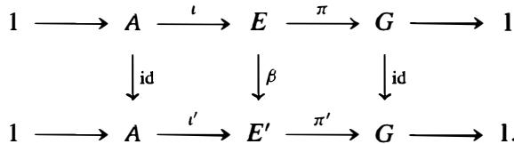

If $\mu$ is a section of $\pi$ , then $\mu ^ { \prime } = \beta \circ \mu$ is a section of $\pi ^ { \prime }$ , so what we have just proved can be used to determine the cohomology class in $H ^ { 2 } ( G , A )$ corresponding to $E ^ { \prime }$ . Applying the homomorphism $\beta$ to equation (30) gives

$$
\beta (\mu (g)) \beta (\mu (h)) = \beta (f (g, h)) \beta (\mu (g h)) \quad \text {f o r a l l} g, h \in G.
$$

Since $\beta$ restricts to the identity map on A , this is

$$
\mu^ {\prime} (g) \mu^ {\prime} (h) = f (g, h) \mu^ {\prime} (g h) \quad \text {f o r a l l} g, h \in G,
$$

which shows that the factor set for $E ^ { \prime }$ associated to $\mu ^ { \prime }$ is the same as the factor set for $E$ associated to $\pmb { \mu }$ . This proves that equivalent extensions define the same cohomology class in $H ^ { 2 } ( G , A )$ .

We next show how this procedure may be reversed: Given a class in $H ^ { 2 } ( G , A )$ we construct an extension $E _ { f }$ whose corresponding factor set is in the given class in $H ^ { 2 } ( G , A )$ . The process generalizes the semidirect product construction of Section 5.5 (which is the special case when $f$ is the zero cocycle representing the trivial class).

Note first that any 2-cocycle arising from the factor set of an extension as above where the section $\mu$ is normalized satisfies the condition in (3 1) .

Definition. A 2-cocycle $f$ such that $f ( g , 1 ) = 0 = f ( 1 , g )$ for all $g \in G$ is called a nonnalized 2-cocycle.

The construction of $E _ { f }$ is a little simpler when $f$ is a normalized cocycle and for simplicity we indicate the construction in this case (the minor modifications necessary when $f$ is not normalized are indicated in Exercise 4).

We first see that any 2-cocycle $f$ lies in the same cohomology class as a normalized 2-cocycle. Let $d _ { 1 } f _ { 1 }$ be the 2-coboundary of the constant function $f _ { 1 }$ on G whose value is $f ( 1 , 1 )$ . Then $f ( 1 , 1 ) = d _ { 1 } f _ { 1 } ( 1 , 1 )$ , and one easily checks from the 2-cocycle condition that $f - d _ { 1 } f _ { 1 }$ is normalized.

We may therefore assume that our cohomology class in $H ^ { 2 } ( G , A )$ is represented by the normalized 2-cocycle $f$ . Let $E _ { f }$ be the set $A \times G ,$ , and define a binary operation on $E _ { f }$ by

$$
(a _ {1}, g) (a _ {2}, h) = \left(a _ {1} + g \cdot a _ {2} + f (g, h), g h\right) \tag {17.34}
$$

where, as usual, $g \cdot a _ { 2 }$ denotes the module action of $\pmb { G }$ on A. It is straightforward to check that the group axioms hold: Since $f$ is normalized, the identity element is (0, 1 ) and inverses are given by

$$
(a, g) ^ {- 1} = \left(- g ^ {- 1} \cdot a - f \left(g ^ {- 1}, g\right), g ^ {- 1}\right). \tag {17.35}
$$

The cocycle condition implies the associative law by calculations similar to (32) and (33) earlier - the details are left as exercises.

Since $f$ is a normalized 2-cocycle, $A ^ { * } = \{ ( a , 1 ) \mid a \in A \}$ is a subgroup of $E _ { f }$ , and the map $\iota ^ { * } : a \mapsto ( a , 1 )$ is an isomorphism from $\pmb { A }$ to $A ^ { * }$ . Moreover, from (34) and (35) it follows that

$$
(0, g) (a, 1) (0, g) ^ {- 1} = (g \cdot a, 1) \quad \text {f o r a l l} g \in G \text {a n d a l l} a \in A. \tag {17.36}
$$

Since $E _ { f }$ is generated by $A ^ { * }$ together with the set of elements $( \mathbf { 0 } , g )$ for $g \in G$ , (36) implies that $A ^ { * }$ is a normal subgroup of $E _ { f }$ . Furthermore, it is immediate from (34) that the map $\pi ^ { * } : ( a , g ) \mapsto g$ is a surjective homomorphism from $E _ { f }$ to $G$ with kernel $A ^ { * }$ , i . e . , $E _ { f } / A ^ { * } \cong G$ . Thus

$$
1 \longrightarrow A \xrightarrow {i ^ {*}} E _ {f} \xrightarrow {\pi^ {*}} G \longrightarrow 1 \tag {17.37}
$$

is a specific extension of $G$ by A, where (36) ensures also that the action of $G$ on A by conjugation in this extension is the module action specified in determining the 2-cocycle $f$ in $H ^ { 2 } ( G , A )$ . The extension sequence (37) shows that this extension has the normalized section $\mu ( g ) = ( 0 , g )$ whose corresponding normalized factor set is $f$ . Note that this proves not only that every cohomology class in $H ^ { 2 } ( G , A )$ arises from

some extension $\pmb { { \cal E } }$ , but that every normalized 2-cocycle arises as the normalized factor set of some extension.

Finally, suppose $f ^ { \prime }$ is another normalized 2-cocycle in the same cohomology class in $H ^ { 2 } ( G , A )$ as $f$ and let $E _ { f ^ { \prime } }$ be the corresponding extension. If $f$ and $f ^ { \prime }$ differ by the coboundary of $f _ { 1 } : G \to A$ then $f ( g , h ) - f ^ { \prime } ( g , h ) = g f _ { 1 } ( h ) - f _ { 1 } ( g h ) + f _ { 1 } ( g )$ for all $g , h \in G$ . Setting $g = h = 1$ shows that $f _ { 1 } ( 1 ) = 0$ . Define

$$
\beta : E _ {f} \longrightarrow E _ {f ^ {\prime}} \quad \text {b y} \quad \beta ((a, g)) = (a + f _ {1} (g), g).
$$

It is immediate that $\beta$ is a bijection, and

$$
\begin{array}{l} \beta ((a _ {1}, g) (a _ {2}, h)) = \beta ((a _ {1} + g \cdot a _ {2} + f (g, h), g h)) \\ = \left(a _ {1} + g \cdot a _ {2} + f (g, h) + f _ {1} (g h), g h\right)) \\ = \left(a _ {1} + f _ {1} (g) + g \cdot \left(a _ {2} + f _ {1} (h)\right) + f ^ {\prime} (g, h), g h\right) \\ = (a _ {1} + f _ {1} (g), g) (a _ {2} + f _ {1} (h), h) = \beta ((a _ {1}, g)) \beta ((a _ {2}, h)) \\ \end{array}
$$

shows that $\beta$ is an isomorphism from $E _ { f }$ to $E _ { f ^ { \prime } }$

The restriction of $\beta$ to A is given by $\beta ( ( a , 1 ) ) = ( a + f _ { 1 } ( 1 ) , 1 ) = ( a , 1 )$ , so $\beta$ is the identity map on A. Similarly $\beta$ is the identity map on the second component of $( a , g )$ , so $\beta$ induces the identity map on the quotient $G .$ . It follows that $\beta$ defines an equivalence between the extensions $E _ { f }$ and $E _ { f ^ { \prime } }$ . This shows that the equivalence class of the extension $E _ { f }$ depends only on the cohomology class of $f$ in $H ^ { 2 } ( G , A )$ .

We summarize this discussion in the following theorem.

Theorem 36. Let A be a $\pmb { G }$ -mod;Jle. Then

(1) A function $f : G \times G \to A$ is a normalized factor set of some extension $\pmb { { \cal E } }$ of $G$ by A (with conjugation given by the $\pmb { G }$ -module action on A) if and only if $f$ is a normalized 2-cocycle in $Z ^ { 2 } ( G , A )$ .   
(2) There is a bijection between the equivalence classes of extensions $E$ as in ( 1 ) and the cohomology classes in $H ^ { 2 } ( G , A )$ . The bijection takes an extension $\pmb { { \cal E } }$ into the class of a normalized factor set $f$ for $E$ associated to any normalized section $\pmb { \mu }$ of $G$ into $\pmb { E }$ , and takes a cohomology class $\pmb { c }$ in $H ^ { 2 } ( G , A )$ to the extension $E _ { f }$ defined by the extension (37) for any normalized cocycle $f$ in the class $\pmb { c }$ .   
(3) Under the bijection in (2), split extensions correspond to the trivial cohomology class.

Corollary 37. Every extension of $\pmb { G }$ by the abelian group A splits if and only if $H ^ { 2 } ( G , A ) = 0$ .

Corollary 38. If A is a finite abelian group and $( | A | , | G | ) = 1$ then every extension of $\pmb { G }$ by A splits.

Proof: This follows immediately from Corollary 29 in Section 2.

We can use Corollary 38 to prove the same result without the restriction that A be an abelian group.

Theorem 39. (Schur's Theorem) If $E$ is any finite group containing a normal subgroup $N$ whose order and index are relatively prime, then $N$ has a complement in $E$ .

Remark: Recall that a subgroup whose order and index are relatively prime is called a Hall subgroup, so Schur's Theorem says that every normal Hall subgroup has a complement that splits the group as a semidirect product.

Proof" We use induction on the order of $E .$ . Since we may assume $N \neq 1$ , let $\pmb { p }$ be a prime dividing $| N |$ and let $P$ be a Sylow $\pmb { p }$ -subgroup of $N .$ . Let $E _ { 0 }$ be the normalizer in $E$ of $P$ and let $N _ { 0 } = N \cap E _ { 0 }$ . By Frattini's Argument (Proposition 6 in Section 6. 1) $E = E _ { 0 } N$ . It follows from the Second Isomorphism Theorem that $N _ { 0 }$ i s a (normal) Hall subgroup of $E _ { 0 }$ and $| E _ { 0 } : N _ { 0 } | = | E : N |$ (cf. Exercise 10 of Section 3.3).

If $E _ { 0 } < E$ , then by induction applied to $N _ { 0 }$ in $E _ { 0 }$ we obtain that $E _ { 0 }$ contains a complement $\pmb { K }$ to $N _ { 0 }$ . Since $| K | = | E _ { 0 } : N _ { 0 } | , i$ $\pmb { K }$ is also a complement to $N$ in $E$ , as needed. Thus we may assume $E _ { 0 } = E$ , i . e . , $P$ is normal in $E$ .

Since the center of P, $Z ( P )$ , is characteristic in $P$ , it is normal in $E$ (cf. Section 4.4 ). If $Z ( P ) = N .$ , then $N$ is abelian and the theorem follows from Corollary 38. Thus we may assume $Z ( P ) \neq N ,$ . Let bars denote passage to the quotient group $E / Z ( P )$ . Then $\overline { { N } }$ is a normal Hall subgroup of $\overline { { E } }$ . By induction it has a complement $\overline { { K } }$ in $\overleftarrow { E }$ . Let $E _ { 1 }$ be the complete preirnage of $\overline { { K } }$ in $E$ . Then $| E _ { 1 } | = | \overline { { K } } | | Z ( P ) | = | E / N | | Z ( P ) |$ . s o $\boldsymbol { Z } ( P )$ is a normal Hall subgroup of $E _ { 1 }$ . B y induction $\boldsymbol { Z } ( P )$ has a complement in $E _ { 1 }$ which is seen by order considerations to also. be a complement to $N$ in $\pmb { E }$ . This completes the proof.

# Examples

(1) If $G = Z _ { 2 }$ and $A = \mathbb { Z } / 2 \mathbb { Z }$ then $\pmb { G }$ acts trivially on A and so $H ^ { 2 } ( G , A ) = A ^ { G } / N A =$ $\mathbb { Z } / 2 \mathbb { Z }$ by the computation of the cohomology of cyclic groups in Section 2, so by Theorem 36 there are precisely two inequivalent extensions of $\pmb { G }$ by A. These are the cyclic group of order 4 and the Klein 4-group, the latter being split and hence corresponding to the trivial class in $H ^ { 2 }$ .

(2) If $G = \langle g \rangle \cong Z _ { 2 }$ and $A = \langle a \rangle \cong \mathbb { Z } / 4 \mathbb { Z }$ is a group of order 4 on which $\pmb { G }$ acts trivially, then $H ^ { 2 } ( G , A ) = A / 2 A \cong \mathbb { Z } / 2 \mathbb { Z }$ by the computation of the cohomology of cyclic groups. As in the previous example there are two inequivalent extensions of $\pmb { G }$ by A; evidently these are the groups $Z _ { 8 }$ and $Z _ { 4 } \times Z _ { 2 }$ . the latter split extension corresponding to the trivial cohomology class.

If $E = \langle r \rangle \times \langle s \rangle$ denotes the split extension of $\pmb { G }$ by A, where $| r | = 4$ and $| s | = 2$ , then $\mu _ { i } ( g ) = r ^ { i } s$ for $i = 0 , \ldots , 3$ give the four normalized sections of $\pmb { G }$ in $\boldsymbol { E }$ . The sections ${ \pmb { \mu } } _ { \mathbf { 0 } } , { \pmb { \mu } } _ { 2 }$ both give the zero factor set $f$ . The sections J.Lt , J.L3 both give the factor set $f ^ { \prime }$ with $f ^ { \prime } ( g , g ) = a ^ { 2 } \in A .$ . Both $f$ and $f ^ { \prime }$ give normalized 2-cocycles lying in the trivial cohomology class of $H ^ { 2 } ( G , A )$ . The extension $E _ { f }$ corresponding to the zero 2-cocycle $f$ is the group with the elements $( a , 1 )$ and $( 1 , g )$ as the usual generators (of orders 4 and 2, respectively) for $Z _ { 4 } \times Z _ { 2 }$ . In $E _ { f ^ { \prime } }$ • however, $( a , 1 )$ has order 4 but so does $( 1 , g )$ since $( 1 , g ) ^ { 2 } = ( f ^ { \prime } ( g , g ) , g ^ { 2 } ) = ( a ^ { 2 } , 1 ) .$ . The 2-cocycles $f$ and $f ^ { \prime }$ differ by the coboundary $f _ { 1 }$ with $f _ { 1 } ( 1 ) = 1$ and $f _ { 1 } ( g ) = r$ . The isomorphism $\beta ( a , g ) = ( a + f _ { 1 } ( g ) , g )$ from $E _ { f }$ to $E _ { f ^ { \prime } }$ maps the generators (a, 1) and $( 1 , g )$ of $E _ { f }$ to the generators $( a , 1 )$ and $( a , g )$ of $E _ { f ^ { \prime } }$ and gives the explicit equivalence of these two extensions.

The situation where $\pmb { G }$ acts on A by inversion is handled in Exercise 3.

(3) Suppose $G = Z _ { 2 }$ and A is the Klein 4-group. If $\pmb { G }$ acts nontrivially on A then $\pmb { G }$ interchanges two of the nonidentity elements, say $\pmb { a }$ and $\pmb { b }$ , of A and fixes the third nonidentity element c. Then $A ^ { G } = N A = \{ 1 , c \}$ and so $H ^ { 2 } ( G , A ) = 0 ,$ , and so every extension $\pmb { { \cal E } }$ of $\pmb { G }$ by A splits. This can be seen directly, as follows. Since the action is nontrivial, such a group must be nonabelian, hence must be $D _ { 8 }$ . From the lattice of $D _ { 8 }$ in Section 2.5 one sees that for each Klein 4-group there is a subgroup of order 2 in $D _ { 8 }$ not contained in the 4-group and that subgroup splits the extension.

If $\pmb { G }$ acts trivially on A then $\bar { { \cal H } } ^ { 2 } ( G , A ) = \bar { A } / 2 A \tilde { \equiv } A$ , so there are 4 inequivalent extensions of $\pmb { G }$ by A in this case. These are considered in Exercise 1 .

# Example: (Groups of Order 8 and $H ^ { 2 } ( Z _ { 2 } \times Z _ { 2 } , \mathbb { Z } / 2 \mathbb { Z } ) )$

Let $G = \{ 1 , a , b , c \}$ be the Klein 4-group and let $A = \mathbb { Z } / 2 \mathbb { Z }$ . The 2-group $\pmb { G }$ must act trivially on A. The elements of $H ^ { 2 } ( G , A )$ classify extensions $\boldsymbol { E }$ of order 8 which has a quotient group by some $\mathbf { \boldsymbol { Z } } _ { 2 }$ subgroup that is isomorphic to the Klein 4-group. Although there are, up to group isomorphism, only four such groups, we shall see that there are eight inequivalent extensions.

Since $G \times G$ has 16 elements, we have $| C ^ { 2 } ( G , A ) | = 2 ^ { 1 6 }$ . The cocycle condition (26) here reduces to

$$
f (g, h) + f (g h, k) = f (h, k) + f (g, h k) \quad \text {f o r a l l} g, h, k \in G. \tag {17.38}
$$

The following relations hold for the subgroup $Z ^ { 2 } ( G , A )$ of cocycles:

(l) $f ( g , 1 ) = f ( 1 , g ) = f ( 1 , 1 )$ , for all $g \in G$   
(2) $f ( g , 1 ) + f ( g , a ) + f ( g , b ) + f ( g , c ) = 0 ,$ , for all $g \in G$   
(3) $f ( 1 , h ) + f ( a , h ) + f ( b , h ) + f ( c , h ) = 0$ , for all $h \in G$

The first of these come from (38) by setting $\pmb { h } = \pmb { k } = 1$ and by setting $\pmb { g } = \pmb { h } = 1$ . The other two relations come from (38) by setting $g = h$ and $\scriptstyle h = k$ , respectively, using relations ( 1 ) and (2). It follows that every 2-cocycle $f$ can be represented by a vector $( \alpha , \beta , \gamma , \delta , \epsilon )$ in $\mathbb { F } _ { 2 }$ where

$$
\alpha = f (1, g) = f (g, 1), \text {f o r a l l} g \in G,
$$

$$
\beta = f (a, a), \quad \gamma = f (a, b), \quad \delta = f (b, a), \quad \epsilon = f (b, b)
$$

because the relations above then determine the remaining values of $f$ :

$$
f (a, c) = \alpha + \beta + \gamma \quad f (b, c) = \alpha + \delta + \epsilon \quad f (c, a) = \alpha + \beta + \delta
$$

$$
f (c, b) = \alpha + \gamma + \epsilon \quad f (c, c) = \alpha + \beta + \gamma + \epsilon .
$$

It follows that $| Z ^ { 2 } ( G , A ) | \leq 2 ^ { 5 }$ . Although one could eventually show that every function satisfying these relations is a 2-cocycle (hence the order is exactly 32), this will follow from other considerations below.

A cocycle $f$ is a coboundary if there is a function $f _ { 1 } : G \to A$ such that

$$
f (g, h) = f _ {1} (h) - f _ {1} (g h) + f _ {1} (g), \quad \text {f o r a l l} g, h \in G.
$$

This coboundary condition is easily seen to be equivalent to the conditions:

(i) $f ( g , 1 ) = f ( 1 , g ) = f ( g , g )$ for all $g \in G$ , and   
(ii) $f ( g , h ) = f ( g ^ { \prime } , h ^ { \prime } )$ whenever g, h are distinct nonidentity elements and so are $g ^ { \prime } , h ^ { \prime }$

These relations are equivalent to $\alpha = \beta = \epsilon$ and $\gamma = \delta$ . Thus $B ^ { 2 } ( G , A )$ consists of the vectors $( \pmb { \alpha } , \pmb { \alpha } , \gamma , \gamma , \pmb { \alpha } )$ , and so $H ^ { 2 } ( G , A )$ has dimension at most 3 (i.e., order at most $2 ^ { 3 } = 8$ ). It is easy to see that $\{ ( 0 , \beta , \gamma , 0 . \epsilon ) \}$ with f3 , y, and $\epsilon$ in $\mathbb { F } _ { 2 }$ gives a set of representatives for $Z ^ { 2 } ( { \cal G } , A ) / B ^ { 2 } ( { \cal G } , A )$ , and each of these representative cocycles is normalized. We

now prove $| H ^ { 2 } ( G , A ) | = 8$ (and also that $| Z ^ { 2 } ( G , A ) | = 2 ^ { 5 } ;$ ) by explicitly exhibiting eight inequivalent group extensions,

Suppose $E$ is an extension of $\pmb { G }$ by A, where for simplicity we assume $A \leq E$ . If $\mu : G \to E$ is a section, the factor set for $E$ associated to $\pmb { \mu }$ satisfies

$$
\mu (g) \mu (h) = f (g, h) \mu (g h).
$$

The group $E$ is generated by $\mu ( a ) , \mu ( b )$ and A, and A is contained in the center of $E$ since $\pmb { G }$ acts trivially on A. Hence $E$ is abelian if and only if $\mu ( a ) \mu ( b ) = \mu ( b ) \mu ( a )$ , which by the relation above occurs if and only if $f ( a , b ) = f ( b , a )$ . If $\pmb { g }$ is a nonidentity element in $\pmb { G }$ , we also see from the relation above that $\pmb { \mu } ( \pmb { g } )$ is an element of order 2 in $E$ if and only if $f ( g , g ) = 0 \quad$ . Because A is contained in the center of $E$ , both elements in any nonidentity coset $\scriptstyle A \mu ( g )$ have the same order (either 2 or 4).

There are four groups of order 8 containing a normal subgroup of order 2 with quotient group isomorphic to the Klein 4-group: $Z _ { 2 } \times Z _ { 2 } \times Z _ { 2 }$ , $Z _ { 4 } \times Z _ { 2 } , D _ { 8 } .$ , and $Q _ { 8 }$ .

The group $E \cong Z _ { 2 } \times Z _ { 2 } \times Z _ { 2 }$ is the split extension of $\pmb { G }$ by A and has $\pmb { f } = \mathbf { 0 }$ as factor set.

When ${ \pmb E } \cong { \pmb Q } _ { \mathbf { 8 } }$ , in the usual notation for the quaternion group $A = \langle - 1 \rangle$ . In this (nonabelian) group every nonidentity coset consists of elements of order 4, and this property is unique to $Q _ { 8 }$ , so the resulting factor set $f$ satisfies $f ( g , g ) \neq 0$ for all nonidentity elements in $\pmb { G }$ .

When $E \cong Z _ { 4 } \times Z _ { 2 } = \left. { x } \right. \times \left. { y } \right.$ we must have $A = \langle x ^ { 2 } \rangle$ • The cosets $\pmb { A x }$ and Axy both consist of elements of order 4, and the coset Ay consists of elements of order 2, so exactly one of 11(a), $\mu ( b )$ or $\mu ( c )$ is an element of order 2 and the other two must be of order 4. This suggests three homomorphisms from $E$ to $\pmb { G }$ , defined on generators by

$$
\begin{array}{l} \pi_ {1} (y) = a \quad \pi_ {1} (x) = b \\ \pi_ {2} (y) = b \quad \pi_ {2} (x) = a. \\ \pi_ {3} (y) = c \quad \pi_ {3} (x) = a \\ \end{array}
$$

Each of these homomorphisms maps suijectively onto $\pmb { G }$ , has A as kernel, and has $\pmb { \mu } ( \pmb { a } )$ (respectively, $\mu ( b ) , \mu ( c ) )$ an element oforder 2 in $E$ . Any isomorphism of $E$ with itself that is the identity on A must take the unique nonidentity coset Ay of A consisting of elements of order 2 to itself. Hence any extension equivalent to the extension $\pmb { { \cal E } } _ { 1 }$ defined by $\pi _ { 1 }$ also maps y to a (since the equivalence is the identity on $\pmb { G }$ ). It follows that the three extensions defined by $\pi _ { 1 } , \pi _ { 2 }$ and $\pmb { \pi _ { 3 } }$ are inequivalent.

The situation when $E \cong D _ { 8 } = \langle r , s \rangle$ is similar. In this case $A = \langle r ^ { 2 } \rangle$ , the cosets As and Asr consist of elements of order 2, and the coset Ar consists of elements of order 4. In this case exactly one of $\pmb { \mu } ( \pmb { a } )$ , $\mu ( b )$ or $\mu ( c )$ is an element of order 4 and the other two are of order 2, suggesting the three homomorphisms defined on generators by

$$
\begin{array}{l} \pi_ {1} (r) = a \quad \pi_ {1} (s) = b \\ \pi_ {2} (r) = b \quad \pi_ {2} (s) = a. \\ \pi_ {3} (r) = c \quad \pi_ {3} (s) = a \\ \end{array}
$$

As before, the corresponding extensions are inequivalent.

The existence of 8 inequivalent extensions of $\pmb { G }$ by A proves that $| H ^ { 2 } ( G , A ) | = 8 ,$ , and hence that these are a complete list of all the inequivalent extensions. In particular, the extension $E _ { 1 } ^ { \prime } \cong Z _ { 4 } \times Z _ { 2 }$ defined by the homomorphism $\pi _ { 1 } ^ { \prime }$ mapping y to $^ { a }$ and $x$ to $^ c$ must be equivalent to the extension $\scriptstyle { E _ { 1 } }$ above (and similarly for the other two extensions isomorphic to $Z _ { 4 } \times Z _ { 2 }$ and the three extensions for $D _ { 8 }$ ). This proves the existence of certain outer automorphisms for these groups, cf. Exercise 9.

Remark: For any prime $\pmb { p }$ the cohomology groups of the elementary abelian group $E _ { p ^ { m } }$ with coefficients in the finite field $\mathbb { F } _ { p }$ may be determined by relating them to the cohomology groups of the factors in the direct product as mentioned at the end of Section 2. In general, $H ^ { 2 } ( E _ { p ^ { m } } , \mathbb { F } _ { p } )$ is a vector space over $\mathbb { F } _ { p }$ of dimension $\frac { 1 } { 2 } m ( m + 1 )$ . When $p = 2$ and $m = 2$ this is the result $H ^ { 2 } ( Z _ { 2 } \times Z _ { 2 } , \mathbb { Z } / 2 \mathbb { Z } ) \cong ( \mathbb { Z } / 2 \mathbb { Z } ) ^ { 3 }$ above.

# Crossed Product Algebras and the Brauer Group

Suppose $F$ is a field. Recall that an $F$ -algebra $B$ is a ring containing the field $F$ i n its center and the identity of $B$ is the identity of $F$ , cf. Section 10. 1 .

Definition. An $F$ -algebra A is said to be simple i f A contains no nontrivial proper (two sided) ideals. A central simple $F$ -algebra A is a simple $F$ -algebra whose center is $F$ .

Among the easiest central simple $F$ -algebras are the matrix algebras $M _ { n } ( F )$ of $n \times n$ matrices with coefficients in $F$ .

If $K / F$ is a finite Galois extension of fields with Galois group $G = \operatorname { G a l } ( K / F )$ , then we can use the normalized 2-cocycles in $Z ^ { 2 } ( G , K ^ { \times } )$ to construct certain central simple $\pmb { K }$ -algebras. The construction of these algebras from 2-cocycles and their classification in terms of $H ^ { 2 } ( G , K ^ { \times } )$ (cf. Theorem 42 below) are important applications of cohomological methods in number theory. Their construction in the case when $\pmb { G }$ is cyclic was one of the precursors leading to the development of abstract cohomology.

Suppose $f = \{ a _ { \sigma , \tau } \} _ { \sigma , \tau \in G }$ is a normalized 2-cocycle in $Z ^ { 2 } ( G , K ^ { \times } )$ . Let $B _ { f }$ be the vector space over $L$ having basis $\pmb { u } _ { \sigma }$ for $\sigma \in G$ :

$$
B _ {f} = \left\{\sum_ {\sigma \in G} \alpha_ {\sigma} u _ {\sigma} \mid \alpha_ {\sigma} \in K \right\}. \tag {17.39}
$$

Define a multiplication on $B _ { f }$ by

$$
u _ {\sigma} \alpha = \sigma (\alpha) u _ {\sigma} \quad u _ {\sigma} u _ {\tau} = a _ {\sigma , \tau} u _ {\sigma \tau} \tag {17.40}
$$

for $\alpha \in L$ and $\sigma , \tau \in G$ . The second equation shows that the $a _ { \sigma , \tau }$ give a "factor set" for the elements ${ \pmb u } _ { \sigma }$ in $B _ { f }$ and is one reason this terminology is used. Using this multiplication we find

$$
(u _ {\sigma} u _ {\tau}) u _ {\rho} = a _ {\sigma , \tau} a _ {\sigma \tau , \rho} u _ {\sigma \tau \rho} \quad \text {a n d} \quad u _ {\sigma} \left(u _ {\tau} u _ {\rho}\right) = \sigma \left(a _ {\tau , \rho}\right) a _ {\sigma , \tau \rho} u _ {\sigma \tau \rho}.
$$

Since $a _ { \sigma , \tau } a _ { \sigma \tau , \rho } = \sigma ( a _ { \tau , \rho } ) a _ { \sigma , \tau \rho }$ is the multiplicative form of the cocycle condition (26), it follows that the multiplication defined in (40) is associative.

Since the cocycle is normalized we have $a _ { 1 , \sigma } = a _ { \sigma , 1 } = 1$ for all $\sigma \in G$ and it follows from (40) that the element $\pmb { u } _ { 1 }$ is an identity in $B _ { f }$ · Identifying $\pmb { K }$ with the elements $\pmb { \alpha u } _ { 1 }$ in $B _ { f }$ , we see that $B _ { f }$ is an $F$ -algebra containing the field $\pmb { K }$ and having dimension $n ^ { 2 }$ over $F$ if $n = [ K : F ] = | G |$ .

Proposition 40. The $F$ -algebra $B _ { f }$ with $\pmb { K }$ -vector space basis $u _ { \sigma }$ in (39) and multiplication defined by (40) is a central simple $F$ -algebra.

Proof" It remains to show that the center of $B _ { f }$ is $F$ and that $B _ { f }$ contains no nonzero proper ideals. Suppose $\begin{array} { r } { x = \sum _ { \sigma \in G } \alpha _ { \sigma } \pmb { u } _ { \sigma } } \end{array}$ is an element in the center of $B _ { f }$ . Then $x \beta = \beta x$ for $\beta \in K$ shows that $\sigma ( { \boldsymbol { \beta } } ) = \beta$ if $\alpha _ { \sigma } \neq 0 .$ . Since there is an element $\beta \in K$ not fixed by $\sigma$ for any $\sigma \neq 1$ , this shows that $\scriptstyle a _ { \sigma } = 0$ for all $\sigma \neq 1$ , so ${ \pmb x } = { \pmb \alpha } _ { 1 } { \pmb u } _ { 1 }$ . Then $x u _ { \tau } = u _ { \tau } x$ if and only if $\tau ( \alpha _ { 1 } ) = \alpha _ { 1 }$ , so if this is true for all $\pmb { \tau }$ then we must have $\alpha _ { 1 } = a \in K$ . Hence ${ \pmb x } = { \pmb a } { \pmb u } _ { 1 }$ and the center of $B _ { f }$ is $F$ .

To show that $B _ { f }$ is simple, suppose $I$ is a nonzero ideal in $B _ { f }$ and let

$$
x = \alpha_ {\sigma_ {1}} u _ {\sigma_ {1}} + \dots + \alpha_ {\sigma_ {m}} u _ {\sigma_ {m}}
$$

be a nonzero element of I with the minimal number m of nonzero terms. If $m > 1$ there is an element $\beta \in K ^ { \times }$ with $\sigma _ { m } ( \beta ) \neq \sigma _ { m - 1 } ( \beta )$ . Then the element $x - \sigma _ { m } ( \beta ) \thinspace x \thinspace \beta ^ { - 1 }$ would be an element of the ideal I with the nonzero element $( 1 - \sigma _ { m } ( \beta ) \sigma _ { m - 1 } ( \beta ) ^ { - 1 } ) \alpha _ { \sigma _ { m - 1 } }$ as coefficient of $u _ { \sigma _ { m - 1 } }$ , and would have fewer nonzero terms than $x$ since the coefficient of $u _ { \sigma _ { m } }$ is 0. It follows that $m = 1$ and ${ \pmb x } = { \pmb \alpha } { \pmb u } _ { \sigma }$ for some $\alpha \in K$ and some $\sigma .$ . This element is a unit, with inverse $\sigma ^ { - 1 } ( \alpha ^ { - 1 } ) u _ { \sigma } ~ ^ { }$ , so $\boldsymbol { \cdot } \boldsymbol { I } = \boldsymbol { B } _ { f }$ , completing the proof.

Definition. The central simple $F$ -algebra $B _ { f }$ defined by (39) and (40) is called the crossed product algebra for the factor set $\{ a _ { \sigma , \tau } \}$ .

If $f ^ { \prime } = a _ { \sigma , \tau } ^ { \prime }$ is a normalized cocycle in the same cohomology class in $H ^ { 2 } ( G , K ^ { \times } )$ a s $a _ { \sigma , \tau }$ then there are elements $b _ { \sigma } \in K ^ { \times }$ with

$$
a _ {\sigma , \tau} ^ {\prime} = a _ {\sigma , \tau} \left(\sigma \left(b _ {\tau}\right) b _ {\sigma \tau} ^ {- 1} b _ {\sigma}\right)
$$

(the multiplicative form of the coboundary condition (27)). If $B _ { f ^ { \prime } }$ is the $F$ -algebra with $\pmb { K }$ -basis $v _ { \sigma }$ defined from this cocycle as in (39) and ( 40), then the $\pmb { K }$ -vector space homomorphism $\varphi$ defined by mapping ${ \pmb u } _ { \sigma } ^ { \prime }$ to ${ b } _ { \sigma } \boldsymbol { u } _ { \sigma }$ satisfies

$$
\begin{array}{l} \varphi \left(u _ {\sigma} ^ {\prime} u _ {\tau} ^ {\prime}\right) = \varphi \left(a _ {\sigma , \tau} ^ {\prime} u _ {\sigma \tau} ^ {\prime}\right) = a _ {\sigma , \tau} ^ {\prime} b _ {\sigma \tau} u _ {\sigma \tau} = b _ {\sigma} \sigma \left(b _ {\tau}\right) u _ {\sigma} u _ {\tau} \\ = \left(b _ {\sigma} u _ {\sigma}\right) \left(b _ {\tau} u _ {\tau}\right) = \varphi \left(u _ {\sigma} ^ {\prime}\right) \varphi \left(u _ {\tau} ^ {\prime}\right). \\ \end{array}
$$

It follows that $\varphi$ i s an $F$ -algebra isomorphism from $B _ { f ^ { \prime } }$ to $B _ { f }$

We have shown that every cohomology class $^ c$ i n $H ^ { 2 } ( G , K ^ { \times } )$ defines an isomorphism class of central simple $\pmb { F }$ -algebras, namely the isomorphism class of any crossed product algebra for a normalized cocycle $\{ a _ { \sigma , \tau } \}$ representing the class c. The next result shows that the trivial cohomology class corresponds to the isomorphism class containing $M _ { n } ( F )$ .

Proposition 41. The crossed product algebra for the trivial cohomology class in $H ^ { 2 } ( G , K ^ { \times } )$ is isomorphic to the matrix algebra $M _ { n } ( F )$ where $n = \left[ K : F \right]$ .

Proof" If $\alpha \in K$ then multiplication by $\pmb { \alpha }$ defines a linear transformation $\scriptstyle { T _ { \alpha } }$ of $\pmb { K }$ viewed as an $\pmb { n }$ -dimensional vector space over $\pmb { F }$ . Similarly, every automorphism $\sigma \in G$ defines an $F$ -linear transformation $T _ { \sigma }$ of $\pmb { K }$ , and we may view both $T _ { \alpha }$ and $T _ { \sigma }$ as

elements of $M _ { n } ( F )$ by choosing a basis for $\pmb { K }$ over $\boldsymbol { F }$ . If $\scriptstyle B _ { 0 }$ denotes the crossed product algebra for the trivial factor set $( a _ { \sigma , \tau } = 1$ for all $\sigma , \tau \in G )$ ), consider the additive map $\varphi : B _ { 0 } \to M _ { n } ( F )$ defined by $\varphi ( \alpha u _ { \sigma } ) = T _ { \alpha } T _ { \sigma }$ . Since $T _ { a \alpha } = a T _ { \alpha }$ for $a \in F$ , the map $\varphi$ is an $\pmb { F }$ -vector space homomorphism. If $x \in K$ , we have

$$
T _ {\sigma} T _ {\alpha} (x) = T _ {\sigma} (\alpha x) = \sigma (\alpha x) = \sigma (\alpha) \sigma (x) = T _ {\sigma (\alpha)} T _ {\sigma},
$$

so $T _ { \sigma } T _ { \alpha } = T _ { \sigma ( \alpha ) } T _ { \sigma }$ as linear transformations on $\pmb { K }$ . It then follows from ${ \pmb u } _ { \sigma } { \pmb u } _ { \tau } = { \pmb u } _ { \sigma } \tau$ that

$$
\begin{array}{l} \varphi \left(\left(\alpha u _ {\sigma}\right) \left(\beta u _ {\tau}\right)\right) = \varphi (\alpha \sigma (\beta) u _ {\sigma \tau}) = T _ {\alpha \sigma (\beta)} T _ {\sigma \tau} = T _ {\alpha} T _ {\sigma (\beta)} T _ {\sigma} T _ {\tau} \\ = T _ {\alpha} T _ {\sigma} T _ {\beta} T _ {\tau} = \varphi (\alpha u _ {\sigma}) \varphi (\beta u _ {\tau}) \\ \end{array}
$$

which shows that $\varphi$ i s an ${ \pmb F }$ -algebra homomorphism from $\scriptstyle B _ { 0 }$ to $M _ { n } ( F )$ . Since ker $\varphi$ is an ideal in $\scriptstyle B _ { 0 }$ and $\varphi \neq 0$ , it follows from Proposition 40 that ker $\varphi = 0$ and $\varphi$ is an injection. Since both $\scriptstyle B _ { 0 }$ and $M _ { n } ( F )$ have dimension $n ^ { 2 }$ as vector spaces over $\pmb { F }$ , it follows that $\varphi$ is an $\pmb { F }$ -algebra isomorphism, proving the proposition.

# Example

If $\pmb { K } = \mathbb { C }$ and $F = \mathbb { R } ,$ then $G = { \mathrm { G a l } } ( \mathbb { C } / \mathbb { R } )$ is of order 2 and generated by complex conjugation $\pmb { \tau }$ . We have $\| H ^ { 2 } ( G , \mathbb { C } ^ { \times } ) \| = 2 .$ The central simple $\mathbb { R }$ -algebra $\scriptstyle B _ { 0 }$ corresponding to the trivial class is $\mathbb { C } \boldsymbol { u } _ { 1 } \oplus \mathbb { C } \boldsymbol { u } _ { \tau }$ with $u _ { \tau } ( a + b i ) = ( a - b i ) u _ { \tau }$ and $u _ { \tau } ^ { 2 } = u _ { 1 }$ . This is isomorphic to the matrix algebra $M _ { 2 } ( \mathbb { R } )$ under the map

$$
\varphi ((a + b i) u _ {1} + (c + d i) u _ {\tau}) = a I + b T _ {i} + c T _ {\tau} + d T _ {i} T _ {\tau} = \left( \begin{array}{c c} a + c & - b + d \\ b + d & a - c \end{array} \right).
$$

A normalized cocycle $f$ representing the nontrivial cohomology class is defined by the values $a _ { 1 , 1 } = a _ { 1 , \tau } = a _ { \tau , 1 } = 1$ and $\begin{array} { r } { { \pmb { a } } _ { \tau , \tau } = - 1 , } \end{array}$ . The corresponding central simple $\mathbb { R }$ -algebra $B _ { f }$ is given by $\mathbb { C } \boldsymbol { v } _ { 1 } \oplus \mathbb { C } \boldsymbol { v } _ { \tau }$ . The element ${ \boldsymbol { v } } _ { 1 }$ is the identity of $B _ { f }$ , and we have the relations $\boldsymbol { v } _ { \ u { \tau } } ( a + b i ) = ( a - b i ) \boldsymbol { v } _ { \ u { \tau } }$ and $v _ { \tau } ^ { 2 } = - v _ { 1 }$ . Letting $v _ { 1 } = 1$ and $v _ { \tau } = j$ we see that $B _ { f }$ is isomorphic as an $\mathbb { R }$ -algebra to the real Hamilton Quaternions $\mathbb { R } + \mathbb { R } i + \mathbb { R } j + \mathbb { R } k$ .

There is a rich theory of simple algebras and we mention without proof the following results. Let A be a central simple $F .$ -algebra of finite dimension over $\boldsymbol { F }$ .

I. If $F \subseteq B \subseteq A$ where $\pmb { B }$ i s a simple $\pmb { F }$ -algebra define the centralizer $B ^ { c }$ of $\pmb { B }$ i n A to be the elements of A that commute with all the elements of $B .$ . Define the opposite algebra $B ^ { o p p }$ to be the set $\pmb { B }$ with opposite multiplication, i.e., the product $b _ { 1 } b _ { 2 }$ in $B ^ { o p p }$ is given by the product $b _ { 2 } b _ { 1 }$ in $\pmb { B }$ . Both $\pmb { B } ^ { c }$ and $B ^ { o p p }$ are simple $\boldsymbol { F }$ -algebras and we have

a. $( \dim _ { F } B ) ( \dim _ { F } B ^ { c } ) = \dim _ { F } A$   
b. $A \otimes _ { F } B ^ { o p p } \cong M _ { r } ( B ^ { c } )$ as $\pmb { F }$ -algebras, where $r = \dim _ { F } B$   
c . $B \otimes _ { F } B ^ { c } \cong A$ i f $\pmb { B }$ is a central simple $\pmb { F }$ -algebra.

II. If $A ^ { \prime }$ is an Artinian (satisfies D.C.C. on left ideals) simple $\pmb { F }$ -algebra, then $\pmb { A } \otimes _ { F } \pmb { A } ^ { \prime }$ is an Artinian simple $\pmb { F }$ -algebra with center $( A ^ { \prime } ) ^ { c }$ .

III. We have $A \cong M _ { r } ( \Delta )$ for some division ring $\pmb { \triangle }$ whose center is $\boldsymbol { F }$ and some integer $r \geq 1$ . The division ring $\pmb { \triangle }$ and $r$ are uniquely determined by A. The same statement holds for any Artinian simple $\boldsymbol { F }$ -algebra.

The last result is part of Wedderburn's Theorem described in greater detail in the following chapter.

Definition. If A is a central simple $F$ -algebra then a field $\pmb { L }$ containing $F$ is said to split A if $A \otimes _ { F } L \cong M _ { m } ( L )$ for some $m \geq 1$ .

It follows from (II) that every maximal commutative subalgebra of $\pmb { \triangle }$ is a field $E$ with $E = E ^ { c } = E ^ { o p p }$ ; if $[ E : F ] = m$ we obtain $\mathrm { d i m } _ { F } \Delta = m ^ { 2 }$ . Applying (II) to $A = \Delta$ and $B = E$ we also see that $\Delta \otimes _ { F } E \cong M _ { m } ( E )$ . It can also be shown that a maximal subfield $\pmb { E }$ of the central simple $F$ -algebra A also satisfies $E = E ^ { c } = E ^ { o p p }$ and so again by (II) it follows that $A \otimes _ { F } E \cong M _ { r } ( E )$ $( r ^ { 2 } = \dim _ { F } A )$ .

If $A = M _ { r } ( \Delta )$ then the field $\pmb { L }$ splits A if and only if $\pmb { L }$ splits $\pmb { \triangle }$ , as follows. If $\Delta \otimes _ { F } L \cong M _ { n } ( L )$ then

$$
A \otimes_ {F} L \cong M _ {r} (\Delta) \otimes_ {F} L \cong M _ {r} (\Delta \otimes_ {F} L) \cong M _ {r} (M _ {n} (L)) \cong M _ {r n} (L).
$$

Conversely if $A \otimes _ { F } L \cong M _ { n } ( L )$ then

$$
M _ {n} (L) \cong M _ {r} (\Delta) \otimes_ {F} L \cong M _ {r} (\Delta \otimes_ {F} L).
$$

By (Il) and (III), $\Delta \otimes _ { F } L \cong M _ { s } ( \Delta ^ { \prime } )$ for some division ring $\triangle ^ { \prime }$ . Together with the previous isomorphism, the uniqueness statement in (III) shows that $\Delta ^ { \prime } \cong L$ and then the isomorphism $\Delta \otimes _ { F } L \cong M _ { s } ( L )$ shows that $\pmb { L }$ splits $\pmb { \triangle }$ . .

We see from the discussion above that a maximal commutative subfield of $\Delta$ . splits both $\pmb { \triangle }$ and $A \cong M _ { r } ( \Delta )$ for any $r \geq 1$ . It is not too difficult to show from this that every central simple $F$ -algebra of finite dimension over $F$ can be split by a finite Galois extension of $F$ .

Applying (I) by taking A to be the crossed product algebra $B _ { f }$ and taking $B = K$ shows that $K = K ^ { c } = K ^ { o p p }$ and $B _ { f } \otimes _ { F } K \cong M _ { n } ( K )$ . In particular, the crossed product algebras $B _ { f }$ are always split by $\pmb { K }$ .

# Example

In the example of the Hamilton Quatemions above we have $B _ { f } \otimes _ { \mathbb { R } } \mathbb { C } \cong M _ { 2 } ( \mathbb { C } )$ <. We have $B _ { f } \otimes _ { \mathbb { R } } \mathbb { C } = \mathbb { C } + \mathbb { C } i + \mathbb { C } j + \mathbb { C } k$ and an explicit isomorphism $\varphi$ to $M _ { 2 } ( \mathbb { C } )$ < is given by

$$
\varphi (i) = \left( \begin{array}{c c} \sqrt {- 1} & 0 \\ 0 & - \sqrt {- 1} \end{array} \right) \qquad \varphi (j) = \left( \begin{array}{c c} 0 & - 1 \\ 1 & 0 \end{array} \right)
$$

and extending <C-linearly.

By (III) every central simple $F$ -algebra A is isomorphic as an $\pmb { F }$ -algebra to $M _ { r } ( \triangle )$ for some division ring $\pmb { \triangle }$ uniquely determined up to $F$ -isomorphism, called the division ring part of A.

Definition. Two central simple $F$ -algebras A and $\pmb { B }$ are similar if $A \cong M _ { r } ( \Delta )$ and $B \cong M _ { s } ( \Delta )$ for the same division ring $\pmb { \triangle }$ , i.e., if A and $\pmb { B }$ have the same division ring parts.

Let [A] denote the similarity class of A . By (II), if A and $\pmb { B }$ are central simple $F$ -algebras then $\boldsymbol { A } \otimes _ { \boldsymbol { F } } \boldsymbol { B }$ is again a central simple $F$ -algebra, so we may define a multiplication on similarity classes by $[ A ] [ B ] = [ A \otimes _ { F } B ]$ . The class $[ F ]$ is an identity for this multiplication and associativity of the tensor product shows that the multiplication is associative. By (lb) applied with $B = A$ (so then $B ^ { c } = F$ since A is central) we have $[ A ] [ A ^ { o p p } ] = [ F ] .$ , so inverses exist with this multiplication.

Definition. The group of similarity classes of central simple $F$ -algebras with multiplication $[ A ] [ B ] = \left[ A \otimes _ { F } B \right]$ is called the Brauer group of $F$ and is denoted $B r ( F )$ .

If $L$ is any extension field of $\pmb { F }$ then by (II) the algebra $A \otimes _ { F } L$ is a central simple $L$ -algebra. It is easy to check that the map $[ A ]  [ A \otimes _ { F } L ]$ is a well defined homomorphism from $B r ( F )$ to $B r ( L )$ . The kernel of this homomorphism consists of the classes of the algebras A with $A \otimes _ { F } L \cong M _ { m } ( L )$ for some $m \geq 1$ , i.e., the algebras A that are split by $L$ .

Definition. If $L / F$ is a field extension then the relative Brauer group $B r ( L / F )$ is the group of similarity classes of central simple $F$ -algebras that are split by $L .$ Equivalently, $B r ( L / F )$ is the kernel of the homomorphism $[ A ]  [ A \otimes _ { F } L ]$ from $B r ( F )$ to $B r ( L )$ .

The following theorem summarizes some major results in this area and shows the fundamental connection between Brauer groups and the crossed product algebras constructed above.

Theorem 42. Suppose $K / F$ is a Galois extension of degree n with $G = { \mathrm { G a l } } ( K / F )$

(1) The central simple $F$ -algebra A with ${ \bf d i m } _ { F } { \cal A } = n ^ { 2 }$ is split b y $\pmb { K }$ if and only if $A \otimes _ { F } K \cong M _ { n } ( K )$ if and only if A is isomorphic to a crossed product algebra $B _ { f }$ as in (39) and ( 40).   
(2) There is a bijection between the $F$ -isomorphism classes of central simple $F$ algebras A with $A \otimes _ { F } K \cong M _ { n } ( K )$ and the elements of $H ^ { 2 } ( G , K ^ { \times } )$ . Under this bijection the class $c \in H ^ { 2 } ( G , K ^ { \times } )$ containing the normalized cocycle $f$ corresponds to the isomorphism class of the crossed product algebra $B _ { f }$ defined in (39) and (40), and the trivial cohomology class corresponds to $M _ { n } ( F )$ .   
(3) Every central simple $F$ -algebra of finite dimension over $F$ and split by $\pmb { K }$ is similar to one of dimension $n ^ { 2 }$ split by $\pmb { K }$ . The bijection in (2) also establishes a bijection between $B r ( K / F )$ and $H ^ { 2 } ( G , K ^ { \times } )$ which is also an isomorphism of groups.   
(4) There is a bijection between the collection of $F$ -isomorphism classes of central simple division algebras over $F$ that are split by $\pmb { K }$ and $H ^ { 2 } ( G , K ^ { \times } )$ .

As previously mentioned, every central simple $F$ -algebra of finite dimension over $F$ can be split by some finite Galois extension of $F$ , and it follows that

$$
B r (F) = \bigcup_ {K} B r (K / F)
$$

where the union is over all finite Galois extensions of $F$ . It follows that there is a bijection between $B r ( F )$ and $H ^ { 2 } ( \mathbf { G a l } ( F ^ { s } / F ) , ( F ^ { s } ) ^ { \times } )$ where $F ^ { s }$ denotes a separable algebraic closure of $F$ . Here $\mathbf { G a l } ( F ^ { s } / F )$ is considered as a profinite group and the cohomology group refers to continuous Galois cohomology.

One consequence of this result and Theorem 42 is that a full set of representatives for the $F$ -isomorphism classes of central simple division algebras $\pmb { \triangle }$ over $F$ can be obtained from the division algebra parts of the crossed product algebras for finite Galois extensions of $F$ . Those division algebras that are split over $\pmb { K }$ occur for the crossed product algebras for $K / F$ .

# Example

Since $H ^ { 2 } ( { \bf G a l } ( { \mathbb F } _ { q ^ { d } } / { \mathbb F } _ { q } ) , { \mathbb F } _ { q ^ { d } } ^ { \times } ) = 0$ (cf. Exercise 1 0), we have $B r ( \mathbb { F } _ { q ^ { d } } / \mathbb { F } _ { q } ) = 0$ and hence also $B r ( \mathbb { F } _ { q } ) = 0 .$ . As a consequence, every finite division algebra is a field (cf. Exercise 13 in Section 1 3.6 for a direct proof), and every finite central simple algebra $\mathbb { F } _ { q }$ -algebra is isomorphic to a full matrix ring $M _ { r } ( \mathbb { F } _ { q } )$ .

# E X E R C I S E S

1. Let $A = \{ 1 , a , b , c \}$ be the Klein 4-group and let $G = \langle { g } \rangle { }$ be the cyclic group of order 2 acting trivially on A.

(a) Prove that $| C ^ { 2 } ( G , A ) | = 2 ^ { 8 }$   
(b) Show that coboundaries are constant functions, and deduce that $| B ^ { 2 } ( G , A ) | = 4$   
(c) Use the cocycle condition to show that $| Z ^ { 2 } ( G , A ) | \leq 2 ^ { 4 }$   
(d) If $E = Z _ { 4 } \times Z _ { 2 } = \langle { x } \rangle \times \langle { y } \rangle$ , prove that the extensions $1 \to A { \overset { \iota _ { i } } { \to } } E { \overset { \pi } { \to } } G \to 1$ defined by $\pi ( x ) = g , \pi ( y ) = 1$ and $\iota _ { 1 } ( a ) = x ^ { 2 }$ , $\iota _ { 1 } ( b ) = y$ (respectively, $\iota _ { 2 } ( b ) = x ^ { 2 }$ , $\iota _ { 2 } ( a ) = y$ , and $\iota _ { 3 } ( c ) = x ^ { 2 }$ , $\iota _ { 3 } ( a ) = y )$ , together with the split extension $Z _ { 2 } \times Z _ { 2 } \times Z _ { 2 }$ give 4 inequivalent extensions of $\mathbf { \delta } _ { Z _ { 2 } }$ by the Klein 4-group. Deduce that $H ^ { 2 } ( G , A )$ has order 4 by explicitly exhibiting the corresponding cocycles.

2. Let $A = \mathbb { Z } / 4 \mathbb { Z }$ and let $\pmb { G }$ be the cyclic group of order 2 acting trivially on A.

(a) Prove that $| C ^ { 2 } ( G , A ) | = 2 ^ { 8 }$   
(b) Use the coboundary condition to show that $| B ^ { 2 } ( G , A ) | = 2 ^ { 3 }$   
(c) Use the cocycle condition to show that $| Z ^ { 2 } ( G , A ) | \leq 2 ^ { 4 }$   
(d) Show that $| { \cal H } ^ { 2 } ( G , A ) | = 2$ by exhibiting two inequivalent extensions of $\pmb { G }$ by $\pmb { A }$ and their corresponding cocycles.

3. Let $A = \mathbb { Z } / 4 \mathbb { Z }$ and let $\pmb { G }$ be the cyclic group of order 2 acting by inversion on A.

(a) Show that there are four co boundaries and that only the zero co boundary is normalized.   
(b) Prove by a direct computation of cocycle and co boundary groups that $| { \cal H } ^ { 2 } ( G , A ) | = 2 .$   
(c) Exhibit two distinct cohomology classes and their corresponding extension groups.   
(d) Show that for a given extension of $\pmb { G }$ by A with extension group isomorphic to $D _ { 8 }$ there are four normalized sections, all of which have the zero 2-cocycle as their factor set.   
(e) Show that for a given extension of $\pmb { G }$ by A with extension group isomorphic to $Q _ { 8 }$ there are sixteen sections, four of which are normalized, and all of the latter have the same factor set.

4. For a non-normalized 2-cocycle $f$ one defines the extension group $E _ { f }$ on the set $A \times G$ by the same binary operation in equation (34). Verify two of the group axioms in this case by showing that identity is now $( - f ( 1 , 1 ) , 1 )$ and inverses are given by

$$
(a, x) ^ {- 1} = (- x ^ {- 1} \cdot a - f (x ^ {- 1}, x) - f (1, 1), x ^ {- 1}).
$$

(Verification of the associative law i s essentially the same as for normalized 2-cocycles.) Prove also that the set $A ^ { * * } = \{ ( a - f ( 1 , 1 ) , 1 ) \mid a \in A \}$ is a subgroup of $E _ { f }$ and the map $\iota ^ { * * } : a \mapsto ( a - f ( 1 , 1 ) , 1 )$ is an isomorphism from A to $A ^ { * * }$ . Show that this extension $E _ { f }$ , with the injection $\pmb { \iota } ^ { \star \star }$ and the usual projection map $\pi ^ { * }$ onto $\pmb { G }$ , is equivalent to an extension derived from a normalized cocycle in the same class as $f$ .

5. Show that the set of equivalences of a given extension $1 \to A { \overset { \iota } { \to } } E { \overset { \pi } { \to } } G \to 1$ with itself form a group under composition, and that this group is isomorphic to the stability group

$\operatorname { S t a b } ( 1 \leq \iota ( A ) \leq E )$ . (Thus Proposition 3 1 implies $Z ^ { 1 } ( G , A )$ is the group of equivalences of the extension with itself).

6. (Gaschiitz 's Theorem) Let $\pmb { p }$ be a prime, let A be an abelian normal $\pmb { p }$ -subgroup of a finite group $\pmb { G }$ , and let $P$ be a Sylow $\pmb { p }$ -subgroup of $\pmb { G }$ . Prove that $\pmb { G }$ is a split extension of $G / A$ by A if and only if $P$ is a split extension of $P / A$ by A. (Note that $A \leq P$ by Exercise 37 in Section 4.5). [Use Sylow's Theorem to show if $\pmb { G }$ splits over A then so too does $P$ . Conversely, show that a normalized 2-cocycle associated to the extension of $P / A$ by A via Theorem 36 is the image of a normalized 2-cocycle in $H ^ { 2 } ( G / A , A )$ under the restriction homomorphism Res : $H ^ { 2 } ( G / A , A )  H ^ { 2 } ( P / A , A )$ . Then use Proposition 26 and the fact that multiplication by $| G : P |$ is an automorphism of A.j

7. (a) Prove that $H ^ { 2 } ( A _ { 4 } , \mathbb { Z } / 2 \mathbb { Z } ) \neq 0$ by exhibiting a nonsplit extension of $\pmb { A _ { 4 } }$ by a cyclic group of order 2. [See Exercise 1 1 , Section 4.5.]   
(b) Prove that $H ^ { 2 } ( A _ { 5 } , \mathbb { Z } / 2 \mathbb { Z } ) \neq 0$ by showing that $s L _ { 2 } ( \mathbb { F } _ { 5 } )$ is a nonsplit extension of $\pmb { A } \pmb { \varsigma }$ by a cyclic group of order 2. [Use Propositions 21 and 23 in Section 4.5.]

8. The Schur multiplier of a finite group $\pmb { G }$ is defined as the group $H ^ { 2 } ( G , \mathbb { C } ^ { \times } )$ , where the multiplicative group $\mathbb { C } ^ { \times }$ of complex numbers is a trivial $\pmb { G }$ -module. Prove that the Schur multiplier is a finite group. [Show that every cohomology class contains a cocycle whose values lie in the $n ^ { \mathrm { t h } }$ roots of unity, where $\pmb { n } = | G |$ , as follows: If $f$ is any cocycle then by Corollary 27, $f ^ { n } \in B ^ { 2 } ( G , \mathbb { C } ^ { \times } )$ . Define $k \in C ^ { 2 } ( G , \mathbb { C } ^ { \times } )$ by $k ( g _ { 1 } , g _ { 2 } ) \stackrel { \cdot } { = } f ( \stackrel { \cdot } { g _ { 1 } } , g _ { 2 } ) ^ { 1 / n }$ (take any ${ \pmb n } ^ { \hat { \pmb { \mathrm { u } } } }$ roots). Show that $k \in B ^ { 2 } ( G , \mathbb { C } ^ { \times } )$ and $f k ^ { - 1 }$ takes values in the group of $n ^ { \Uparrow }$ roots of 1 .]   
9. Use the classification of the extensions of the Klein 4-group by $Z _ { 2 }$ in the example following Theorem 39 to prove the following (in the notation of that example):

(a) There is an (outer) automorphism of $Z _ { 4 } \times Z _ { 2 }$ which interchanges the cosets $\pmb { A x }$ and Axy and fixes the coset Ay.   
(b) There is an outer automorphism of $D _ { 8 }$ which interchanges the cosets As and Asr and fixes the coset Ar.

10. Suppose $\mathbb { F } _ { q }$ is a finite field with $G = \operatorname { G a l } ( \mathbb { F } _ { q ^ { d } } / \mathbb { F } _ { q } ) = \langle \sigma _ { q } \rangle$ where $\sigma _ { q }$ is the Frobenius automorphism, and let $N$ be the usual norm element for the cyclic group $\pmb { G }$ .

(a) Use Hilbert's Theorem 90 to prove that $| { \cal N } ( \mathbb { F } _ { q ^ { d } } ^ { \times } ) | = ( q ^ { d } - 1 ) / ( q - 1 )$ , and deduce that the norm map from $\mathbb { F } _ { q ^ { d } }$ to $\mathbb { F } _ { q }$ is surjective.   
(b) Prove that $H ^ { n } ( G , \mathbb { F } _ { q ^ { d } } ^ { \times } ) = 0$ for all $n \geq 1$

# Pa rt V I

# I NTRO DU GION TO TH E REPRESENTATION TH EORY O F FI N ITE G RO U PS

The final two chapters are an introduction to the representation theory of finite groups together with some applications. We have already seen in Part I how actions of groups on sets, namely permutation representations, are a fundamental tool for unravelling the structure of groups. Cayley's Theorem and Sylow's Theorem as well as many of the results and applications in Sections 6. 1 and 6.2 are based on groups acting on sets. The chapter on Galois Theory developed one of the most beautiful correspondences in mathematics where the action of a group as automorphisms of a field gives rise to a correspondence between the lattice of subgroups of the Galois group and the lattice of subfields of a Galois extension of fields. In these final two chapters we study groups acting as linear transformations on vector spaces. We shall be primarily interested in utilizing these linear actions to provide information about the groups themselves.

In Part III we saw that modules are the "representation objects" for rings in the sense that the axioms for an $R$ -module specify a "ring action" of $\pmb R$ on some abelian group $M \cdot$ which preserves the abelian group structure of $M$ . In the case where $M$ was an $F [ x ]$ -module, $x$ acted as a linear transformation from the vector space $M$ to itself. In Chapter 12 the classification of finitely generated modules over Principal Ideal Domains gave us a great deal of information about these linear transformations of $M$ (e.g., canonical forms). In Chapter 16 we used the ideal structure in Dedekind Domains to generalize the results of Chapter 1 2 to the classification of finitely generated modules over such domains. In this part we follow a process similar to the study of $F [ x ]$ -modules, replacing the polynomial ring with the group ring $_ { F G }$ of $G$ and classifying all finitely generated $_ { F G }$ -modules for certain fields $\pmb { F }$ (Wedderburn's Theorem). We then use this classification to derive some results about finite groups such as Burnside's Theorem on the solvability of groups of order $p ^ { a } q ^ { b }$ in Chapter 1 9.

# CHAPTER 1 8

# Representation Theory a nd Character Theory

# 1 8.1 LIN EAR ACTIONS AND MODULES OVER GROUP RINGS

For the remainder of the book the groups we consider will be finite groups, unless explicitly mentioned otherwise. Throughout this section ${ \pmb F }$ is a field and $\pmb { G }$ is a finite group. We first introduce the basic terminology. Recall that if $V$ is a vector space over ${ \pmb F }$ , then $G L ( V )$ is the group of nonsingular linear transformations from $V$ to itself (under composition), and if $\textbf { \em n } \in \mathbb { Z } ^ { + }$ , then $G L _ { n } ( F )$ is the group of invertible $n \times n$ matrices with entries from ${ \pmb F }$ (under matrix multiplication).

Definition. Let $G$ be a finite group, let ${ \pmb F }$ be a field and let V be a vector space over $\pmb { F }$ .

(1) A linear representation of $G$ is any homomorphism from $G$ into $G L ( V )$ . The degree of the representation is the dimension of $V$ .   
(2) Let $n \in \mathbb { Z } ^ { + }$ . A matrix representation of $\pmb { G }$ is any homomorphism from $G$ into $G L _ { n } ( F )$ .   
(3) A linear or matrix representation is faithful if it is injective.   
(4) The group ring of $G$ over ${ \pmb F }$ is the set of all formal sums of the form

$$
\sum_ {g \in G} \alpha_ {g} g, \quad \alpha_ {g} \in F
$$

with componentwise addition and multiplication $( \alpha g ) ( \beta h ) = ( \alpha \beta ) ( g h )$ (where $\pmb { \alpha }$ and $\beta$ are multiplied in $\pmb { F }$ and $g h$ is the product in $G$ ) extended to sums via the distributive law (cf. Section 7.2).

Unless we are specifically discussing permutation representations the term "representation" will always mean "linear representation." When we wish to emphasize the field $F$ we shall say ${ \pmb F }$ -representation, or representation of $G$ on $V$ over ${ \pmb F }$ .

Recall that if V is a finite dimensional vector space of dimension $\pmb { n }$ , then by fixing a basis of $V$ we obtain an isomorphism $G L ( V ) \cong G L _ { n } ( F )$ . In this way any linear representation of $G$ on a finite dimensional vector space gives a matrix representation and vice versa. For the most part our linear representations will be of finite degree and we shall pass freely between linear representations and matrix representations (specifying a

basis when we wish to give an explicit correspondence between the two). Furthermore, given a linear representation $\varphi : G \to G L ( V )$ of finite degree, a corresponding matrix representation provides numerical invariants (such as the determinant of $\varphi ( g )$ for $_ { g \in }$ $G )$ which are independent of the choice of basis giving the isomorphism between $G L ( V )$ and $G L _ { n } ( F )$ . The exploitation of such invariants will be fundamental to our development.

Before giving examples of representations we recall the group ring $_ { F G }$ in greater detail (group rings were introduced in Section 7 .2, and some notation and examples were discussed in that section). Suppose the elements of $\pmb { G }$ are $g _ { 1 } , g _ { 2 } , \ldots , g _ { n }$ . Each element of $_ { F G }$ is of the form

$$
\sum_ {i = 1} ^ {n} \alpha_ {i} g _ {i}, \quad \alpha_ {i} \in F.
$$

Two formal sums1 are equal if and only if all corresponding coefficients of group elements are equal. Addition and multiplication in $_ { F G }$ are defined as follows:

$$
\begin{array}{l} \sum_ {i = 1} ^ {n} \alpha_ {i} g _ {i} + \sum_ {i = 1} ^ {n} \beta_ {i} g _ {i} = \sum_ {i = 1} ^ {n} (\alpha_ {i} + \beta_ {i}) g _ {i} \\ \left(\sum_{i = 1}^{n}\alpha_{i}g_{i}\right)\left(\sum_{i = 1}^{n}\beta_{i}g_{i}\right) = \sum_{k = 1}^{n}\left(\sum_{\substack{i,j\\ g_{i}g_{j} = g_{k}}}\alpha_{i}\beta_{j}\right)g_{k} \\ \end{array}
$$

where addition and multiplication of the coefficients $\pmb { \alpha _ { i } }$ and $\beta _ { j }$ is performed in $F$ . Note that by definition of multiplication,

FG is a commutative ring if and only if G is an abelian group.

The group $\pmb { G }$ appears in ${ \pmb F } { \pmb G }$ (identifying $\pmb { g } _ { i }$ with $1 g _ { i }$ ) and the field $\pmb { F }$ appears in FG (identifying $\beta$ with $\beta g _ { 1 } .$ , where $_ { g _ { 1 } }$ is the identity of $G$ ). Under these identifications

$$
\beta \left(\sum_ {i = 1} ^ {n} \alpha_ {i} g _ {i}\right) = \sum_ {i = 1} ^ {n} (\beta \alpha_ {i}) g _ {i}, \quad \text {f o r a l l} \beta \in F.
$$

In this way

F G is a vector space over $\pmb { F }$ with the elements of G as a basis.

In particular, ${ \pmb F } { \pmb G }$ is a vector space over $F$ of dimension equal to $| G |$ . The elements of $\pmb { F }$ commute with all elements of ${ \pmb F } { \pmb G }$ , i . e . , $F$ is in the center of $_ { F G }$ . When we wish to emphasize the latter two properties we shall say that $_ { F G }$ is an $F$ -algebra (in general, an $F$ -algebra is a ring $R$ which contains $\pmb { F }$ in its center, so $R$ is both a ring and an $\pmb { F }$ -vector space).

Note that the operations in $_ { F G }$ are similar to those in the $\pmb { F }$ -algebra $F [ x ]$ (although $F [ x ]$ is infinite dimensional over $\pmb { F }$ ). In some works ${ \pmb F } { \pmb G }$ is denoted by $F [ G ]$ , although the latter notation is currently less prevalent.

# Examples

(1) If $G = \langle g \rangle$ is cyclic of order ${ \pmb n \in \mathbb Z ^ { + } }$ , then the elements of $_ { F G }$ are of the form

$$
\sum_ {i = 0} ^ {n - 1} \alpha_ {i} g ^ {i}.
$$

The map $F [ x ] \to F \langle g \rangle$ which sends $x ^ { k }$ to $g ^ { k }$ for all ${ \pmb k } \geq { \bf 0 }$ extends by $F$ -linearity to a smjective ring homomorphism with kernel equal to the ideal generated by $x ^ { n } - 1$ . Thus

$$
F \langle g \rangle \cong F [ x ] / (x ^ {n} - 1).
$$

This is an isomorphism of $\pmb { F }$ -algebras, i.e., i s a ring isomorphism which i s $F$ -linear.

(2) Under the notation of the preceding example let $\bar { r = 1 } + \bar { g } + g ^ { 2 } + \cdots + g ^ { n - 1 }$ so r is a nonzero element of $F \langle g \rangle$ . Note that $r g = g + g ^ { 2 } + \cdot \cdot \cdot + g ^ { n - 1 } + 1 = r ,$ hence $r ( 1 - g ) = 0$ . Thus the ring $F \langle g \rangle$ contains zero divisors (provided $n > 1 \AA$ ). More generally, if $\pmb { G }$ is any group of order $> 1$ , then for any nonidentity element $g \in G ,$ $F \langle g \rangle$ is a subring of ${ \pmb F } { \pmb G } .$ , so $_ { F G }$ also contains zero divisors.   
(3) Let $G = { \pmb S } _ { 3 }$ and $F = \mathbb { Q }$ . The elements $r = 5 ( 1 2 ) - 7 ( 1 2 3 )$ and $s = - 4 ( 1 2 3 ) +$ 12(1 3 2) are typical members of $\mathbb { Q } s _ { 3 }$ . Their sum and product are seen to be

$$
\begin{array}{l} r + s = 5 (1 2) - 1 1 (1 2 3) + 1 2 (1 3 2) \\ r s = - 2 0 (2 3) + 2 8 (1 3 2) + 6 0 (1 3) - 8 4 \\ \end{array}
$$

(recall that products (compositions) of permutations are computed from right to left). An explicit example of a sum and product of two elements in the group ring $\mathbb { Q } D _ { 8 }$ appears in Section 7.2.

Before giving specific examples of representations we discuss the correspondence between representations of $G$ and $F G$ -modules (after which we can simultaneously give examples of both). This discussion closely parallels the treatment of $F [ x ]$ -modules in Section 1 0. 1 .

Suppose first that $\varphi : G \to G L ( V )$ is a representation of $G$ on the vector space $V$ over $F$ . As above, write $G = \left\{ g _ { 1 } , \ldots , g _ { n } \right\}$ . so for each $i \in \{ 1 , \ldots , n \} , \varphi ( g _ { i } )$ is a linear transformation from $V$ to itself. Make $V$ into an $_ { F G }$ -module by defining the action of a ring element on an element of $V$ as follows:

$$
\left(\sum_ {i = 1} ^ {n} \alpha_ {i} g _ {i}\right) \cdot v = \sum_ {i = 1} ^ {n} \alpha_ {i} \varphi (g _ {i}) (v), \qquad \mathrm {f o r a l l} \sum_ {i = 1} ^ {n} \alpha_ {i} g _ {i} \in F G, v \in V.
$$

We verify a special case of axiom 2(b) of a module (see Section 10. 1) which shows precisely where the fact that $\varphi$ is a group homomorphism is needed:

$$
\begin{array}{l} (g _ {i} g _ {j}) \cdot v = \varphi (g _ {i} g _ {j}) (v) \quad (\text {b y}) \\ = (\varphi (g _ {i}) \circ \varphi (g _ {j})) (v) \quad \text {(s i n c e} \varphi \text {i s a g r o u p h o m o m o r p h i s m)} \\ = \varphi (g _ {i}) (\varphi (g _ {j}) (v)) \quad \text {(b y d e f i n i t i o n o f a c o m p o s i t i o n o f l i n e a r} \\ = g _ {i} \cdot \left(g _ {j} \cdot v\right) \quad (\text {b y}) \\ \end{array}
$$

This argument extends by linearity to arbitrary elements of $_ { F G }$ to prove that axiom 2(b) of a module holds in general. It is an exercise to check that the remaining module axioms hold.

Note that $\pmb { F }$ is a subring of $_ { F G }$ and the action of the field element $\pmb { \alpha }$ on a vector is the same as the action of the ring element $\pmb { \alpha 1 }$ on a vector i.e., the $_ { F G }$ -module action extends the $\pmb { F }$ action on $V$ .

Suppose now that conversely we are given an $_ { F G }$ -module V. We obtain an associated vector space over $\pmb { F }$ and representation of $\pmb { G }$ as follows. Since V is an $_ { F G }$ -module, it is an $\pmb { F }$ -module, i.e., it is a vector space over $F$ . Also, for each $g \in G$ we obtain a map from $V$ to $V$ , denoted by $\varphi ( \pmb { g } )$ , defined by

$$
\varphi (g) (v) = g \cdot v \quad \text {f o r a l l} v \in V,
$$

where $g \cdot v$ is the given action of the ring element $_ { g }$ on the element $\pmb { v }$ of $V$ . Since the elements of $\pmb { F }$ commute with each $g \in G$ it follows by the axioms for a module that for all $v , w \in V$ and all $\iota , \beta \in F$ we have

$$
\begin{array}{l} \varphi (g) (\alpha v + \beta w) = g \cdot (\alpha v + \beta w) \\ = g \cdot (\alpha v) + g \cdot (\beta w) \\ = \alpha (g \cdot v) + \beta (g \cdot w) \\ = \alpha \varphi (g) (v) + \beta \varphi (g) (w), \\ \end{array}
$$

that is, for each $g \in G ,$ , $\varphi ( \pmb { g } )$ is a linear transformation. Furthermore, it follows by axiom 2(b) of a module that

$$
\varphi \left(g _ {i} g _ {j}\right) (v) = \left(\varphi \left(g _ {i}\right) \circ \varphi \left(g _ {j}\right)\right) (v)
$$

(this is essentially the calculation above with the steps reversed). This proves that $\varphi$ is a group homomorphism (in particular, $\varphi ( g ^ { - 1 } ) = \varphi ( \bar { g } ) ^ { - 1 }$ , so every element of $G$ maps to a nonsingular linear transformation, i.e., $\varphi : G \to G L ( V ) )$ ).

This discussion shows there is a bijection between $_ { F G }$ -modules and pairs $( V , \varphi )$ :

$$
\left\{V \text {a n} F G \text {- m o d u l e} \right\} \longleftrightarrow \left\{ \begin{array}{c} V \text {a v e c t o r s p a c e o v e r} F \\ \text {a n d} \\ \varphi : G \to G L (V) \text {a r e p r e s e n t a t i o n} \end{array} \right\}.
$$

Giving a representation $\varphi : G \to G L ( V )$ on a vector space $V$ over $\pmb { F }$ is therefore equivalent to giving an FG-module $V$ . Under this correspondence we shall say that the module $V$ affords the representation $\varphi$ of $G$ .

Recall from Section 10. 1 that if a vector space $M$ i s made into an $F [ x ]$ -module via the linear transformation $T$ , then the $F [ x ] .$ -submodules of $M$ are precisely the $T$ - stable subspaces of $M$ . In the current situation if $V$ is an $_ { F G }$ -module affording the representation $\varphi .$ , then a subspace $U$ of $V$ is called $\pmb { G }$ -invariant or $G$ -stable if $g \cdot u \in U$ for all $g \in G$ and all $u \in U$ (i.e., if $\varphi ( g ) ( u ) \in U$ for all $g \in G$ and all $u \in U$ ). It follows easily that

the FG-submodules of $V$ are precisely the $\pmb { G }$ -stable subspaces of V.

# Examples

(1) Let $V$ be a }-dimensional vector space over ${ \pmb F }$ and make V into an $_ { F G }$ -module by letting $g v \ : = \ : v$ for all $g \in G$ and $v \in V$ . This module affords the representation $\varphi : G \to G L ( V )$ defined by $\varphi ( g ) = I =$ the identity linear transformation, for all $g \in G$ . The corresponding matrix representation (with respect to any basis of V) is the homomorphism of $\pmb { G }$ into $G L _ { 1 } ( F )$ which sends every group element to the $1 \times 1$ identity matrix. We shall henceforth refer to this as the trivial representation of $\pmb { G }$ . The trivial representation has degree 1 and if $| G | > 1$ , i t is not faithful.

(2) Let $V = F G$ and consider this ring as a left module over itself. Then $V$ affords a representation of $\pmb { G }$ of degree equal to $| G |$ . If we take the elements of $\pmb { G }$ as a basis of V, then each $g \in G$ permutes these basis elements under the left regular permutation representation:

$$
\boldsymbol {g} \cdot \boldsymbol {g} _ {i} = \boldsymbol {g g} _ {i}.
$$

With respect to this basis of $V$ the matrix of the group element $\pmb { g }$ has a 1 in row i and column $j$ if $g g _ { j } = g _ { i }$ , and has O's in all other positions. This (linear or matrix) representation is called the regular representation of G. Note that each nonidentity element of $\pmb { G }$ induces a nonidentity permutation on the basis of $V$ so the regular representation is always faithful.

(3) Let $\pmb { n } \in \mathbb { Z } ^ { + }$ , let $G = S _ { n }$ and let $V$ be an $_ n$ -dimensional vector space over ${ \pmb F }$ with basis $e _ { 1 } , e _ { 2 } , \ldots , e _ { n }$ . Let $s _ { n }$ act on $V$ by defining for each $\sigma \in S _ { n }$

$$
\sigma \cdot e _ {i} = e _ {\sigma (i)}, \quad 1 \leq i \leq n
$$

i.e., $\sigma$ acts by permuting the subscripts of the basis elements. This provides an (injective) homomorphism of $s _ { n }$ into $G L ( V )$ (i.e., a faithful representation of $s _ { n }$ of degree n), hence makes $V$ into an $F S _ { n }$ -module. As in the preceding example, the matrix of $\pmb { \sigma }$ with respect to the basis $e _ { 1 } , \ldots , e _ { n }$ $e _ { n }$ has a 1 in row i and column $j$ if ${ \boldsymbol { \sigma } } \cdot { \boldsymbol { e } } _ { j } = { \boldsymbol { e } } _ { i }$ (and has 0 in all other entries). Thus $\pmb { \sigma }$ has a I in row i and column $j$ if $\sigma ( j ) = i$ .

For an example of the ring action, consider the action of $F S _ { 3 }$ on the 3-dimensional vector space over $\pmb { F }$ with basis $\boldsymbol { e } _ { 1 } , \boldsymbol { e } _ { 2 } , \boldsymbol { e } _ { 3 }$ . Let $\pmb { \sigma }$ be the transposition ( 1 2), let $\pmb { \tau }$ be the 3-cycle (1 2 3) and let $r = 2 \sigma - 3 \tau \in F S _ { 3 }$ . Then

$$
\begin{array}{l} r \cdot (\alpha e _ {1} + \beta e _ {2} + \gamma e _ {3}) = 2 (\alpha e _ {\sigma (1)} + \beta e _ {\sigma (2)} + \gamma e _ {\sigma (3)}) - 3 (\alpha e _ {\tau (1)} + \beta e _ {\tau (2)} + \gamma e _ {\tau (3)}) \\ = 2 \left(\alpha e _ {2} + \beta e _ {1} + \gamma e _ {3}\right) - 3 \left(\alpha e _ {2} + \beta e _ {3} + \gamma e _ {1}\right) \\ = (2 \beta - 3 \gamma) e _ {1} - \alpha e _ {2} + (2 \gamma - 3 \beta) e _ {3}. \\ \end{array}
$$

(4) If $\psi : H  G L ( V )$ is any representation of $\pmb { H }$ and $\varphi : G \to H$ is any group homomorphism, then the composition $\psi \circ \varphi$ is a representation of $\pmb { G }$ . For example, let $V$ be the $F S _ { n }$ -module of dimension $\pmb { n }$ described in the preceding example. If $\pi : G \to S _ { n }$ is any permutation representation of $\pmb { G }$ , the composition of $\pi$ with the representation above gives a linear representation of $\pmb { G }$ . In other words, $V$ becomes an ${ \pmb F } { \pmb G }$ -module under the action

$$
g \cdot e _ {i} = e _ {\pi (g) (i)}, \quad \text {f o r a l l} g \in G.
$$

Note that the regular representation, (2), is just the special case of this where $\pmb { n } = | G |$ and $\pi$ i s the left regular permutation representation of $\pmb { G }$ .

(5) Any homomorphism of $\pmb { G }$ into the multiplicative group $\begin{array} { r } { F ^ { \times } = G L _ { 1 } ( F ) } \end{array}$ is a degree 1 (matrix) representation. For example, suppose $G = \langle g \rangle \cong Z _ { n }$ is the cyclic group of order n and $\boldsymbol { \zeta }$ is a fixed $n ^ { \mathrm { t h } }$ root of 1 in ${ \pmb F }$ . Let $g ^ { i } \mapsto \zeta ^ { i }$ , for all $i \in \mathbb { Z }$ . This representation of $\langle \pmb { g } \rangle$ is a faithful representation if and only if $\boldsymbol { \zeta }$ is a primitive $n ^ { \mathrm { t h } }$ root of 1 .

(6) In many situations it is easier to specify an explicit matrix representation of a group $\pmb { G }$ rather than to exhibit an $\pmb { F G }$ -module. For example, recall that the dihedral group $D _ { 2 n }$ has the presentation

$$
D _ {2 n} = \langle r, s \mid r ^ {n} = s ^ {2} = 1, r s = s r ^ {- 1} \rangle .
$$

If $\pmb { R }$ and S are any matrices satisfying the relations $R ^ { n } = { \mathcal { S } } ^ { 2 } = I$ and $R S = S R ^ { - 1 }$ then the map $r \mapsto R$ and $s \mapsto s$ extends uniquely to a homomorphism from $D _ { 2 n }$ to the matrix group generated by $\pmb { R }$ and S, hence gives a representation of $D _ { 2 n }$ · An explicit example of matrices R, $S \in M _ { 2 } ( \mathbb { R } )$ may be obtained as follows. If a regular n-gon is drawn on the x, y plane centered at the origin with the line $y = x$ as one of its lines of symmetry then the matrix $\pmb R$ that rotates the plane through $2 \pi / n$ radians and the matrix S that reflects the plane about the line $y = x$ both send this $\pmb { n }$ -gon onto itself. It follows that these matrices act as symmetries of the $\pmb { n }$ -gon and so satisfy the above relations. These matrices are readily computed (cf. Exercise 25, Section 1 .6) and so the maps

$$
r \mapsto R = \left( \begin{array}{c c} \cos 2 \pi / n & - \sin 2 \pi / n \\ \sin 2 \pi / n & \cos 2 \pi / n \end{array} \right) \qquad \text {a n d} \qquad s \mapsto S = \left( \begin{array}{c c} 0 & 1 \\ 1 & 0 \end{array} \right)
$$

extend uniquely to a (degree 2) representation of $D _ { 2 n }$ into $G L _ { 2 } ( \mathbb { R } )$ . Since the matrices $\pmb R$ and S have orders n and 2 respectively, it follows that they generate a subgroup of $G L _ { 2 } ( \mathbb { R } )$ of order $_ { 2 n }$ and hence this representation is faithfuL

(7) By using the usual generators and relations for the quaternion group

$$
Q _ {8} = \langle i, j \mid i ^ {4} = j ^ {4} = 1, i ^ {2} = j ^ {2}, i ^ {- 1} j i = j ^ {- 1} \rangle
$$

one may similarly obtain (cf. Exercise 26, Section 1 .6) a representation $\varphi$ from $\scriptstyle Q _ { 8 }$ to $G L _ { 2 } ( \mathbb { C } )$ defined by

$$
\varphi (i) = \left( \begin{array}{c c} \sqrt {- 1} & 0 \\ 0 & - \sqrt {- 1} \end{array} \right) \qquad \text {a n d} \qquad \varphi (j) = \left( \begin{array}{c c} 0 & - 1 \\ 1 & 0 \end{array} \right).
$$

This representation of $Q _ { 8 }$ is faithfuL

(8) A 4-dimensional representation of the quatemion group $\scriptstyle Q _ { 8 }$ may be obtained from the real Hamilton quatemions, Ill[ (cf. Section 7. 1). The group $\scriptstyle Q _ { 8 }$ is a subgroup of the multiplicative group of units of Ill[ and each of the elements of $Q _ { 8 }$ acts by left multiplication on the 4-dimensional real vector space Ill[_ Since the real numbers are in the center ofJH[ (i.e., since Ill[ is an $\mathbb { R }$ -algebra), left multiplication is $\mathbb { R }$ -Iinear. This linear action thus gives a homomorphism from $Q _ { 8 }$ into $G L _ { 4 } ( \mathbb { R } )$ . One can easily write out the explicit matrices of each of the elements of $\scriptstyle Q _ { 8 }$ with respect to the basis $1 , i , j , k$ of Ill[_ For example, left multiplication by i acts by $1 \mapsto i ,$ , $i \mapsto - 1$ , $j \mapsto k$ and $\pmb { k } \mapsto - \pmb { j }$ and left multiplication by $^ j$ acts by $1 \mapsto j , i \mapsto - k , j \mapsto - 1$ $j \mapsto - 1$ and $k \mapsto i$ so

$$
i \mapsto \left( \begin{array}{c c c c} 0 & - 1 & 0 & 0 \\ 1 & 0 & 0 & 0 \\ 0 & 0 & 0 & - 1 \\ 0 & 0 & 1 & 0 \end{array} \right) \qquad \text {a n d} \qquad j \mapsto \left( \begin{array}{c c c c} 0 & 0 & - 1 & 0 \\ 0 & 0 & 0 & 1 \\ 1 & 0 & 0 & 0 \\ 0 & - 1 & 0 & 0 \end{array} \right).
$$

This representation of $\scriptstyle Q _ { 8 }$ is also faithful.

(9) Suppose that $\pmb { H }$ is a normal subgroup of the group $\pmb { G }$ and suppose that $\pmb { H }$ is an elementary abelian $\pmb { p }$ -group for some prime $\pmb { p }$ . Then $V = H$ is a vector space over $\mathbb { F } _ { p }$ , where the scalar $\pmb { a }$ acts on the vector $\pmb { v }$ by $\scriptstyle { a v = v ^ { a } }$ (see Section 10.1). The action of each element of $\pmb { G }$ by conjugation on $\pmb { V }$ is $\mathbb { F } _ { p }$ -linear because $g v ^ { a } g ^ { - 1 } = ( g v g ^ { - 1 } ) ^ { a }$ and this action of $\pmb { G }$ on $\pmb { V }$ makes $\boldsymbol { v }$ into an $\mathbb { F } _ { p } G$ -module (the automorphisms of elementary abelian $\pmb { p }$ -groups were discussed in Sections 4.4 and 10. 1 ). The kernel of

this representation is the set of elements of this representation is the set of elements of $\pmb { G }$ that commute with every element of that commute with every element of H, H, $C _ { G } ( H )$ (which always contains the abelian group (which always contains the abelian group $\pmb { H }$ itself). Thus the action of a itself). Thus the action of a group on subsets of itself often affords linear representations over finite fields. Rep- group on subsets of itself often affords linear representations over finite fields. Representations of groups over finite fields are called modular representations and these resentations of groups over finite fields are called modular representations and these are fundamental to the study of the internal structure of groups. are fundamental to the study of the internal structure of groups.

(10) For an example of an $_ { F G }$ -submodule, let $G = S _ { n }$ and let $V$ be the $F S _ { n } \mathrm { . }$ -module described in Example 3. Let $N$ be the subspace of $V$ consisting of vectors all of whose coordinates are equal, i.e.,

$$
N = \left\{\alpha_ {1} e _ {1} + \alpha_ {2} e _ {2} + \dots + \alpha_ {n} e _ {n} \mid \alpha_ {1} = \alpha_ {2} = \dots = \alpha_ {n} \right\}
$$

(this i s a ! -dimensional $s _ { n }$ -stable subspace). Each $\sigma \in S _ { n }$ fixes each vector in $N$ so the submodule $N$ affords the trivial representation of $s _ { n }$ . As an exercise, one may show that if $n \geq 3$ then $N$ is the unique !-dimensional subspace of $V$ which is $S _ { n }$ -stable, i . e . , $N$ is the unique !-dimensional $F S _ { n }$ -submodule $N$ is called the trace submodule of $F S _ { n }$ ) .

Another $F S _ { n }$ -submodule of $V$ is the subspace I of all vectors whose coordinates sum to zero:

$$
I = \left\{\alpha_ {1} e _ {1} + \alpha_ {2} e _ {2} + \dots + \alpha_ {n} e _ {n} \mid \alpha_ {1} + \alpha_ {2} + \dots + \alpha_ {n} = 0 \right\}.
$$

Again I is an $s _ { n }$ -stable subspace (since each $\sigma \in S _ { n }$ permutes the coordinates of each vector in $V .$ , each $\pmb { \sigma }$ leaves the sum of the coefficients unchanged). Since I is the kernel of the linear transformation from $V$ onto $\pmb { F }$ which sends a vector to the sum of its coefficients (called the augmentation map - cf. Section 7.3), I has dimension $n - 1$ .

(11) If $V = F G$ is the regular representation of $\pmb { G }$ described in Example 2 above, then $V$ has $_ { F G }$ -submodules of dimensions 1 and $| G | - 1$ as in the preceding example:

$$
\begin{array}{l} N = \left\{\alpha_ {1} g _ {1} + \alpha_ {2} g _ {2} + \dots + \alpha_ {n} g _ {n} \mid \alpha_ {1} = \alpha_ {2} = \dots = \alpha_ {n} \right\} \\ I = \left\{\alpha_ {1} g _ {1} + \alpha_ {2} g _ {2} + \dots + \alpha_ {n} g _ {n} \mid \alpha_ {1} + \alpha_ {2} + \dots + \alpha_ {n} = 0 \right\}. \\ \end{array}
$$

In fact $N$ and $\pmb { I }$ are 2-sided ideals of $_ { F G }$ (not just left ideals - note that $N$ is in the center of $F G$ ). The ideal / is called the augmentation ideal of $_ { F G }$ and $N$ is called the trace ideal of $_ { F G }$ .

Recall that in the study of a linear transformation $T$ of a vector space $V$ to itself we made V into an $F [ x ]$ -module (where $x$ acted as $T$ on $V$ ); our goal was to decompose $V$ into a direct sum of cyclic submodules. In this way we were able to find a basis of $V$ for which the matrix of $T$ with respect to this basis was in some canonical form. Changing the basis of $V$ did not change the module $V$ but changed the matrix representation of $_ T$ by similarity (i.e., changed the isomorphism between $G L ( V )$ and $G L _ { n } ( F ) )$ ). We introduce the analogous terminology to describe when two $_ { F G }$ -modules are the same up to a change of basis.

Definition. Two representations of $G$ are equivalent (or similar) if the $_ { F G }$ -modules affording them are isomorphic modules. Representations which are not equivalent are called inequivalent.

Suppose $\varphi : G \to G L ( V )$ and $\psi : G  G L ( W )$ are equivalent representations (here $V$ and W must be vector spaces over the same field $F$ ). Let $T : V \to W$ be

an $_ { F G }$ -module isomorphism between them. Since $T$ is, in particular, an $F$ -module isomorphism, $T$ is a vector space isomorphism, so $V$ and W must have the same dimension. Furthermore, for all $g \in G ,$ , $v \in V$ we have $T ( g \cdot v ) = g \cdot ( T ( v ) )$ , since ${ \pmb T }$ is an isomorphism of $_ { F G }$ -modules. By definition of the action of ring elements this means $T ( \varphi ( g ) v ) = \psi ( g ) ( T ( v ) )$ , that is

$$
T \circ \varphi (g) = \psi (g) \circ T \quad \text {f o r a l l} g \in G.
$$

In particular, if we identify $V$ and $W$ as vector spaces, then two representations $\varphi$ and $\psi$ of $G$ on a vector space $V$ are equivalent if and only if there is some $T \in G L ( V )$ such that $T \circ \varphi ( g ) \circ T ^ { - 1 } = \psi ( g )$ for all $g \in G .$ . This $_ T$ is a simultaneous change of basis for all $\varphi ( \pmb { g } )$ , $g \in G$ .

In matrix terminology, two representations $\varphi$ and $\psi$ are equivalent if there is a fixed invertible matrix $P$ such that

$$
P \varphi (g) P ^ {- 1} = \psi (g) \quad \text {f o r a l l} g \in G.
$$

The linear transformation $_ T$ or the matrix $P$ above is said to intertwine the representations $\varphi$ and $\psi$ (it gives the "rule" for changing $\varphi$ into $\psi$ ).

In order to study the decomposition of an $_ { F G }$ -module into (direct sums of) submodules we shall need some terminology. We state these definitions for arbitrary rings since we shall be discussing direct sum decompositions in greater generality in the next section.

Definition. Let $\pmb { R }$ be a ring and let $M$ be a nonzero $R$ -module.

(1) The module $M$ is said to be irreducible (or simple) if its only submodules are 0 and $M$ ; otherwise $M$ is called reducible.   
(2) The module $M$ is said to be indecomposable if M cannot be written as $M _ { 1 } \oplus M _ { 2 }$ for any nonzero submodules $M _ { 1 }$ and $M _ { 2 }$ ; otherwise $M$ is called decomposable.   
(3) The module $M$ is said to be completely reducible if it is a direct sum of irreducible submodules.   
(4) A representation is called irreducible, reducible, indecomposable, decomposable or completely reducible according to whether the $_ { F G }$ -module affording it has the corresponding property.   
(5) If $M$ is a completely reducible $R$ -module, any direct summand of $M$ is called a constituent of $M$ (i.e. , $N$ is a constituent of $M$ if there is a submodule $N ^ { \prime }$ of $M$ such that $\begin{array} { r } { M = N \oplus N ^ { \prime } . } \end{array}$ ).

An irreducible module is, by definition, both indecomposable and completely reducible. We shall shortly give examples of indecomposable modules that are not irreducible.

If $R = F G ,$ , an irreducible $F G$ -module V is a nonzero $F$ -vector space with no nontrivial, proper $\pmb { G }$ -invariant subspaces. For example, if $\dim _ { F } V = 1$ then $V$ is necessarily irreducible (its only subspaces are 0 and $V$ ) .

Suppose $V$ is a finite dimensional $F G$ -module and $V$ is reducible. Let $U$ be a $\pmb { G }$ -invariant subspace. Form a basis of $V$ by taking a basis of $U$ and enlarging it to a

basis of $V$ . Then for each $g \in G$ the matrix, $\varphi ( \pmb { g } )$ , of $\pmb { g }$ acting on $V$ with respect to this basis is of the fonn

$$
\varphi (g) = \left( \begin{array}{c c} \varphi_ {1} (g) & \psi (g) \\ 0 & \varphi_ {2} (g) \end{array} \right)
$$

where $\varphi _ { 1 } = \varphi | _ { U }$ (with respect to the chosen basis of $U$ ) and $\varphi _ { 2 }$ is the representation of $\pmb { G }$ on $V / U$ (and $\psi$ is not necessarily a homomorphism - $\psi ( g )$ need not be a square matrix). So reducible representations are those with a corresponding matrix representation whose matrices are in block upper triangular fonn.

Assume further that the ${ \pmb F } { \pmb G }$ -module $V$ is decomposable, $V = U \oplus U ^ { \prime }$ . Take for a basis of $V$ the union of a basis of $U$ and a basis of $U ^ { \prime }$ . With this choice of basis the matrix for each $g \in G$ is of the fonn

$$
\varphi (g) = \left( \begin{array}{c c} \varphi_ {1} (g) & 0 \\ 0 & \varphi_ {2} (g) \end{array} \right)
$$

(i.e. , $\psi ( g ) = 0$ for all $g \in G$ ). Thus decomposable representations are those with a corresponding matrix representation whose matrices are in block diagonal fonn.

# Examples

(1) As noted above, all degree 1 representations are irreducible, indecomposable and completely reducible. In particular, this applies to the trivial representation and to the representations described in Example 5 above.

(2) If $| G | > 1$ , the regular representation of $\pmb { G }$ is reducible (the augmentation ideal and the trace ideal are proper nonzero submodules). We shall later determine the conditions under which this representation is completely reducible and how it decomposes into a direct sum.

(3) For $n > 1$ the $F S _ { n }$ -module described in Example 10 above is reducible since $N$ and 1 n are proper, nonzero submodules. The module $N$ is irreducible (being !-dimensional) and if the characteristic of the field $F$ does not divide $\pmb { n } _ { \pmb { i } }$ , then 1 is also irreducible.

(4) The degree 2 representation of the dihedral group $D _ { 2 n } = G$ described in Example 6 above is irreducible for $n \geq 3$ . There are no $\pmb { G }$ -invariant ! -dimensional subspaces since a rotation by $2 \pi / n$ radians sends no line in $\mathbb { R } ^ { 2 }$ to itself. Similarly, the degree 2 complex representation of $Q _ { 8 }$ described in Example 7 is irreducible since the given matrix $\varphi ( i )$ has exactly two !-dimensional eigenspaces (corresponding to its distinct eigenvalues $\pm { \sqrt { - 1 } } )$ and these are not invariant under the matrix $\varphi ( j )$ . The degree 4 representation $\varphi : Q _ { 8 }  G L _ { 4 } ( \mathbb { R } )$ described in Example 8 can also be shown to be irreducible (see the exercises). We shall see, however, that if we view $\varphi$ as a complex representation $\varphi : Q _ { 8 }  G L _ { 4 } ( \mathbb { C } )$ Gust by considering the real entries of the matrices to be complex entries) then there is a complex matrix $P$ such that $P ^ { - 1 } \varphi ( g ) P$ is a direct sum of $2 \times 2$ block matrices for all $g \in Q _ { 8 }$ . Thus an irreducible representation over a field $F$ may become reducible when the field is extended.

(5) Let $G = \langle { g } \rangle$ be cyclic of order $\pmb { n }$ and assume $F$ contains all the $n ^ { \mathrm { t h } }$ roots of 1 . As noted in Example 1 in the set of examples of group algebras, $F \langle g \rangle \cong F [ x ] / ( x ^ { n } - 1 )$ Thus the $_ { F G }$ -modules are precisely the $F [ x ]$ -modules annihilated by $x ^ { n } - 1$ . The latter (finite dimensional) modules are described, up to equivalence, by the Jordan Canonical Form Theorem.

If the minimal polynomial of $\pmb { g }$ acting on an $F \langle g \rangle$ -module V has distinct roots in $F$ , there is a basis of V such that $_ { g }$ (hence all its powers) is represented by a diagonal

matrix (cf. Corollary 25, Section 12.3). In this case, V is a completely reducible $F ( \pmb { g } )$ ­ module (being a direct sum of ! -dimensional $_ { g \dag }$ -invariant subspaces). In general, the minimal polynomial of $_ { g }$ acting on $V$ divides $x ^ { n } - 1$ so if $x ^ { n } - 1$ has distinct roots in $\pmb { F }$ , then $V$ is a completely reducible $\pmb { F } \langle \pmb { g } \rangle$ -module. The polynomial $x ^ { n } - 1$ has distinct roots in $\pmb { F }$ if and only if the characteristic of $\pmb { F }$ does not divide n. This gives a sufficient condition for every $F \langle g \rangle$ -module to be completely reducible.

If the minimal polynomial of $_ { g }$ acting on V does not have distinct roots (so the characteristic of $\pmb { F }$ does divide $\pmb { n }$ ), the Jordan canonical form of $_ { g }$ must have an elementary Jordan block of size $> 1$ . Since every linear transformation has a unique Jordan canonical form, $_ { g }$ cannot be represented by a diagonal matrix, i.e., V is not completely reducible. It follows from results on cyclic modules in Section 1 2.3 that the (!-dimensional) eigenspace of $_ { g }$ in any Jordan block of size $> 1$ admits no ( g } ­ invariant complement, i.e., V is reducible but not completely reducible.

Specifically, let $\pmb { p }$ be a prime, let $F = \mathbb { F } _ { p }$ and let $_ { g }$ be of order $\pmb { p } .$ . Let $V$ be the 2-dimensional space over $\mathbb { F } _ { p }$ with basis v, w and define an action of $_ { g }$ on $V$ by

$$
\boldsymbol {g} \cdot \boldsymbol {v} = \boldsymbol {v} \quad \text {a n d} \quad \boldsymbol {g} \cdot \boldsymbol {w} = \boldsymbol {v} + \boldsymbol {w}.
$$

This endomorphism of $V$ does have order $\pmb { p }$ (in $G L ( V ) )$ and the matrix of $_ { g }$ with respect to this basis is the elementary Jordan block

$$
\varphi (g) = \left( \begin{array}{c c} 1 & 1 \\ 0 & 1 \end{array} \right).
$$

Now V is reducible (span{v} is a $\langle { g } \rangle { }$ -invariant subspace) but V is indecomposable (the above $2 \times 2$ elementary Jordan matrix is not similar to a diagonal matrix).

The first fundamental result in the representation theory of finite groups shows how Example 5 generalizes to noncyclic groups.

Theorem 1. (Maschke 's Theorem) Let $G$ be a finite group and let $\boldsymbol { F }$ be a field whose characteristic does not divide $| G |$ . If $V$ is any $_ { F G }$ -module and $U$ is any submodule of $V$ , then V has a submodule W such that $V = U \oplus W$ (i.e., every submodule is a direct summand).

Remark: The hypothesis of Maschke's Theorem applies to any finite group when $\boldsymbol { F }$ has characteristic 0.

Proof" The idea of the proof of Maschke's Theorem is to produce an $F G$ -module homomorphism

$$
\pi : V \to U
$$

which is a projection onto $U$ , i.e., which satisfies the following two properties:

(i) $\pi ( u ) = u$ for all ${ \pmb u } \in { \pmb U }$   
(ii) $\pi ( \pi ( v ) ) = \pi ( v )$ for all $v \in V$ (i.e., rr2 = rr )

(in fact (ii) i s implied b y (i) and the fact that $\pi ( V ) \subseteq U )$

Suppose first that . we can produce such an $_ { F G }$ -module homomorphism and let $W = \ker \pi$ . Since $\pi$ is a module homomorphism, W is a submodule. We see that W is a direct sum complement to $U$ as follows. If $v \in U \cap W$ then by (i), $v = \pi ( v )$ whereas by definition of $\begin{array} { r } { V , \pi ( v ) = 0 } \end{array}$ . This shows $U \cap W = 0 .$ . To show $V = U + W$ let $\boldsymbol { v }$ be

an arbitrary element of $V$ and write $\pmb { v } = \pi ( \pmb { v } ) + ( \pmb { v } - \pi ( \pmb { v } ) )$ . By definition, $\pi ( v ) \in U$ . By property (ii) of $\pi$ ,

$$
\pi (v - \pi (v)) = \pi (v) - \pi (\pi (v)) = \pi (v) - \pi (v) = 0,
$$

i . e . , $v - \pi ( v ) \in W$ . This shows $V = U + W$ and hence $V = U \oplus W$ . To establish Maschke's Theorem it therefore suffices to find such an $_ { F G }$ -module projection $\pi$ .

Since $\pmb { U }$ is a subspace it has a vector space direct sum complement $W _ { 0 }$ in $V$ (take a basis $\scriptstyle B _ { 1 }$ of $U$ , build it up to a basis $\pmb { \imath }$ of $V$ and let $W _ { 0 }$ be the span of $\pmb { { \cal B } } - \pmb { { \cal B } } _ { 1 }$ ). Thus $V = U \oplus W _ { 0 }$ as vector spaces but $W _ { 0 }$ need not be $\pmb { G }$ -stable (i.e., need not be an $F G -$ - submodule). Let $\pi _ { 0 } : V  U$ be the vector space projection of $V$ onto $U$ associated to this direct sum decomposition, i.e., $\pi _ { 0 }$ is defined by

$$
\pi_ {0} (u + w) = u \quad \text {f o r a l l} u \in U, w \in W _ {0}.
$$

The key idea of the proof is to "average" $\pi _ { 0 }$ over $\pmb { G }$ to form an ${ \bf \nabla } F G .$ -module projection $\pi$ . For each $g \in G$ define

$$
g \pi_ {0} g ^ {- 1}: V \to U \qquad {\mathrm {b y}} \qquad g \pi_ {0} g ^ {- 1} (v) = g \cdot \pi_ {0} (g ^ {- 1} \cdot v), \quad {\mathrm {f o r a l l}} v \in V
$$

(here · denotes the action of elements of the ring $F G$ ). Since $\pi _ { 0 }$ maps $V$ into $U$ and $U$ is stable under the action of g we have that $g \pi _ { 0 } g ^ { - 1 }$ maps $V$ into $U$ . Both $_ { g }$ and $g ^ { - 1 }$ act as $F$ -linear transformations, so $g \pi _ { 0 } g ^ { - 1 }$ is a linear transformation. Furthermore, if $\pmb { u }$ is in the $\pmb { G }$ -stable space $U$ then so is $g ^ { - 1 } u$ , and by definition ofrro we have $\pi _ { 0 } ( g ^ { - 1 } u ) = g ^ { - 1 } u$ . From this we obtain that for all $g \in G$ ,

$$
g \pi_ {0} g ^ {- 1} (u) = u \quad \text {f o r a l l} u \in U
$$

(i.e. , $g \pi _ { 0 } g ^ { - 1 }$ is also a vector space projection of $V$ onto $U$ ).

Let $n = | G |$ and view $\pmb { n }$ as an element of $F$ $( n = 1 + \cdots + 1 , n$ times). By hypothesis $\pmb { n }$ is not zero in $F$ and so has an inverse in $F$ . Define

$$
\pi = \frac {1}{n} \sum_ {g \in G} g \pi_ {0} g ^ {- 1}.
$$

Since $\pi$ is a scalar multiple of a sum of linear transformations from V to $U$ , it is also a linear transformation from V to $U .$ . Furthermore, each term in the sum defining $\pi$ restricts to the identity map on the subspace $U$ and so $\pi | _ { U }$ is $1 / n$ times the sum of $\pmb { n }$ copies of the identity. These observations prove the following:

$$
\pi : V \rightarrow U \text {i s a l i n e a r t r a n s f o r m a t i o n}
$$

$$
\pi (u) = u \quad \text {f o r a l l} u \in U
$$

$$
\pi^ {2} (\boldsymbol {v}) = \pi (\boldsymbol {v}) \quad \text {f o r a l l} \boldsymbol {v} \in V.
$$

It remains to show that $\pi$ is an $_ { F G }$ -module homomorphism (i.e., is $_ { F G }$ -linear). It

suffices to prove that for all $\begin{array} { r } { h \in G , \pi ( h v ) = h \pi ( v ) } \end{array}$ , for $v \in V$ . In this case

$$
\begin{array}{l} \pi (h v) = \frac {1}{n} \sum_ {g \in G} g \pi_ {0} (g ^ {- 1} h v) \\ = \frac {1}{n} \sum_ {g \in G} h \left(h ^ {- 1} g\right) \pi_ {0} \left(\left(g ^ {- 1} h\right) v\right) \\ = \frac{1}{n}\sum_{\substack{k = h^{-1}g\\ g\in G}}h(k\pi_{0}(k^{-1}v) = h\pi (v) \\ \end{array}
$$

(as g runs over all elements of $G$ , so does $\pmb { k } = \pmb { h } ^ { - 1 } \pmb { g }$ and the module element h may be brought outside the summation by the distributive law in modules). This establishes the existence of the $_ { F G }$ -module projection $\pi$ and so completes the proof.

The applications of Maschke's Theorem will be to finitely generated ${ \pmb F } { \pmb G } .$ -modules. Unlike the situation of $F [ x ]$ -modules, however, finitely generated ${ \pmb F } { \pmb G }$ -modules are automatically finite dimensional vector spaces (the difference being that $\pmb { F G }$ itself is finite dimensional, whereas $F [ x ]$ is not). Let $V$ be an $_ { F G }$ -module. If $\pmb { V }$ is a finite dimensional vector space over ${ \pmb F } _ { \pmb { \imath } }$ , then a fortiori $V$ is finitely generated as an $\pmb { F G - }$ module (any $\pmb { F }$ basis gives a set of generators over $F G$ ). Conversely, if $V$ is finitely generated as an ${ \pmb F } { \pmb G }$ -module, say by $v _ { 1 } , \ldots , v _ { k }$ . then one easily sees that $V$ is spanned as a vector space by the finite set $\{ g \cdot v _ { i } \mid g \in G ,$ , $1 \leq i \leq k \}$ . Thus

an F G-module is finitely generated if and only if it is finite dimensional.

Corollary 2. If $\pmb { G }$ is a finite group and $\pmb { F }$ is a field whose characteristic does not divide $| G |$ , then every finitely generated $_ { F G }$ -module is completely reducible (equivalently, every $\pmb { F }$ -representation of $G$ of finite degree is completely reducible).

Proof: Let $V$ be a finitely generated ${ \pmb F } { \pmb G }$ -module. As noted above, $V$ is finite dimensional over $\pmb { F }$ , so we may proceed by induction on its dimension. If $V$ is irreducible, it is completely reducible and the result holds. Suppose therefore that $V$ has a proper, nonzero ${ \pmb F } { \pmb G } .$ -submodule $\pmb { U }$ . By Maschke's Theorem $\pmb { U }$ has an $_ { F G }$ -submodule complement W, i.e., $V = U \oplus W$ . By induction, each of $\pmb { U }$ and W are direct sums of irreducible submodules, hence so is $V$ . This completes the induction.

Corollary 3. Let $\pmb { G }$ be a finite group, let $\pmb { F }$ be a field whose characteristic does not divide $| G |$ and let $\varphi : G \to G L ( V )$ be a representation of $\pmb { G }$ of finite degree. Then there is a basis of $V$ such that for each $g \in G$ the matrix of $\varphi ( g )$ with respect to this basis is block diagonal:

$$
\left( \begin{array}{c c c c} \varphi_ {1} (g) & & & \\ & \varphi_ {2} (g) & & \\ & & \ddots & \\ & & & \varphi_ {m} (g) \end{array} \right)
$$

where $\varphi _ { i }$ is an irreducible matrix representation of $G , 1 \leq i \leq m$ .

Proof" By Corollary 2 we may write $V = U _ { 1 } \oplus U _ { 2 } \oplus \cdots \oplus U _ { m } ,$ , where $U _ { i }$ is an irreducible ${ \pmb F } { \pmb G } .$ -submodule of $V$ . Let $\textstyle B _ { i }$ be a basis of $U _ { i }$ and let $\boldsymbol { B }$ be the union of the $B _ { i }$ 's. For each $g \in G ,$ , the matrix of $\varphi ( g )$ with respect to the basis $\boldsymbol { B }$ is of the form in the corollary, where $\varphi _ { i } ( g )$ is the matrix of $\varphi ( g ) | _ { U _ { i } }$ with respect to the basis $B _ { i }$ .

The converse of Maschke's Theorem is also true. Namely, if the characteristic of $F$ does divide $| G |$ , then $\pmb { G }$ possesses (finitely generated) ${ \pmb F } { \pmb G }$ -modules which are not completely reducible. Specifically, the regular representation (i.e., the module $_ { F G }$ itself) is not completely reducible.

In Section 1 8.2 we shall discuss the question of uniqueness of the constituents in direct sum decompositions of ${ \pmb F } { \pmb G }$ -modules into irreducible submodules.

# E X E R C I S E S

Let $\pmb { F }$ be a field, let $\pmb { G }$ be a finite group and let ${ \pmb n } \in \mathbb { Z } ^ { + }$ .

l. Prove that if $\varphi : G \to G L ( V )$ is any representation, then $\varphi$ gives a faithful representation of $G / \ker \varphi$ .

2. Let $\varphi : G \to G L _ { n } ( F )$ be a matrix representation. Prove that the map $g \mapsto \operatorname* { d e t } ( \varphi ( g ) )$ ) is a degree 1 representation.

3. Prove that the degree I representations of $\pmb { G }$ are in bijective correspondence with the degree 1 representations of the abelian group $G / G ^ { \prime }$ (where $\pmb { G } ^ { \prime }$ is the commutator subgroup of $\pmb { G }$ ).

4. Let $\pmb { V }$ be a (possibly infinite dimensional) ${ \pmb F } { \pmb G }$ -module ( $\pmb { G }$ is a finite group). Prove that for each $v \in V$ there is an $_ { F G }$ -submodule containing $v$ of dimension $\leq | G |$ .

5 . Prove that i f $| G | > 1$ then every irreducible $\pmb { F G }$ -module has dimension $< | G |$

6. Write out the matrices $\varphi ( \pmb { g } )$ for every $g \in G$ for each of the following representations that were described in the second set of examples:

(a) the representation of $s _ { 3 }$ described in Example 3· (let ${ \pmb n } = 3$ in that example)   
(b) the representation of $D _ { 8 }$ described in Example 6 (i.e., let ${ n = 4 }$ in that example and write out the values of all the sines and cosines, for all group elements)   
(c) the representation of $Q _ { 8 }$ described in Example 7   
(d) the representation of $Q _ { 8 }$ described in Example 8.

7. Let $\pmb { V }$ be the 4-dimensional permutation module for $s _ { 4 }$ described in Example 3 of the second set of examples. Let $\pi : D _ { 8 }  S _ { 4 }$ be the permutation representation of $D _ { 8 }$ obtained from the action of $D _ { 8 }$ by left multiplication on the set of left cosets of its subgroup $\langle s \rangle$ . Make V into an $F D _ { 8 }$ -module via rr as described in Example 4 and write out the $4 \times 4$ matrices for r and $\pmb { s }$ given by this representation with respect to the basis $e _ { 1 } , \ldots , e _ { 4 }$ .

8. Let V be the $F S _ { n }$ -module described in Examples 3 and 10 in the second set of examples.

(a) Prove that if $v$ is any element of $V$ such that $\pmb { \sigma } \cdot \pmb { v } = \pmb { v }$ for all $\sigma \in S _ { n }$ then $v$ is an $\pmb { F }$ -multiple of $e _ { 1 } + e _ { 2 } + \cdots + e _ { n }$ .   
(b) Prove that i f $n \geq 3$ , then $\pmb { V }$ has a unique !-dimensional submodule, namely the sub module $N$ consisting of all $\pmb { F }$ -multiples of $e _ { 1 } + e _ { 2 } + \cdots + e _ { n }$ .

9. Prove that the 4-dimensional representation of $\scriptstyle Q _ { 8 }$ on $\mathbb { H }$ li described in Example 8 in the second set of examples is irreducible. [Show that any $\scriptstyle Q _ { 8 }$ -stable subspace is a left ideal.]

10. Prove that $G L _ { 2 } ( \mathbb { R } )$ has no subgroup isomorphic to $\scriptstyle Q _ { 8 }$ . [This may be done by direct computation using generators and relations for $\pmb { Q _ { 8 } }$ . Simplify these calculations by putting one generator in rational canonical form.]

11. Let $\varphi : S _ { n } \to G L _ { n } ( F )$ be the matrix representation given by the permutation module described in Example 3 in the second set of examples, where the matrices are computed with respect to the basis $e _ { 1 } , \ldots , e _ { n }$ $e _ { n }$ . Prove that det $\varphi ( \sigma ) = \epsilon ( \sigma )$ for all $\sigma \in S _ { n }$ , where $\epsilon ( \sigma )$ is the sign of the permutation $\pmb { \sigma }$ . [Check this on transpositions.]   
12. Assume the characteristic of $F$ is not 2. Let $H$ be the set of $T \in M _ { n } ( F )$ such that $T$ has exactly one nonzero entry in each row and each column and zeros elsewhere, and the nonzero entries are $\pm 1$ . Prove that $H$ is a subgroup of $G L _ { n } ( F )$ and that $H$ is isomorphic to $E _ { 2 ^ { n } } \rtimes S _ { n }$ (semidirect product), where $E _ { 2 ^ { n } }$ is the elementary abelian group of order $2 ^ { n }$ .

The next few exercises explore an important result known as Schur's Lemma and some of its consequences.

13. Let $\pmb { R }$ be a ring and let M and $N$ be simple (i.e., irreducible) $\pmb { R }$ -modules.

(a) Prove that every nonzero $R$ -module homomorphism from $M$ to $N$ is an isomorphism. [Consider its kernel and image.]   
(b) Prove Schur's Lemma: if M is a simple $\pmb { R }$ -module then ${ \bf H o m } _ { R } ( M , M )$ is a division ring (recall that ${ \bf H o m } _ { R } ( M , M )$ is the ring of all $\pmb { R }$ -module homomorphisms from $M$ to $M$ , where multiplication in this ring is composition).

14. Let $\varphi : G \to G L ( V )$ be a representation of G. The centralizer of $\varphi$ is defined to be the set of all linear transformations, A, from $\pmb { V }$ to itself such that $A \varphi ( g ) = \varphi ( g ) A$ for all $g \in G$ (i.e., the linear transformations of $\pmb { V }$ which commute with all $\varphi ( g ) ^ { \ast } \mathbf { s } )$ .

(a) Prove that a linear transformation A from V to $\pmb { V }$ is in the centralizer of $\varphi$ if and only if it is an $_ { F G }$ -module homomorphism from $V$ to itself (so the centralizer of $\varphi$ is the same as the ring $\mathbf { H o m } _ { F G } ( V , V ) )$ .   
(b) Show that if z is in the center of $\pmb { G }$ then $\varphi ( z )$ is in the centralizer of $\varphi$   
(c) Assume $\varphi$ is an irreducible representation (so V is a simple FG-module). Prove that if $H$ is any finite abelian subgroup of $G L ( V )$ such that $A \varphi ( g ) = \varphi ( g ) A$ for all $A \ \in \ H$ then $H$ is cyclic (in other words, any finite abelian subgroup of the multiplicative group of units in the ring ${ \bf H o m } _ { F G } ( V , V )$ is cyclic). [By the preceding exercise, ${ \mathrm { H o m } } _ { F G } ( V , V )$ is a division ring, so this reduces to proving that a finite abelian subgroup of the multiplicative group of nonzero elements in a division ring is cyclic. Show that the division subring generated by an abelian subgroup of any division ring is a field and use Proposition 18, Section 9.5.]   
(d) Show that if $\varphi$ is a faithful irreducible representation then the center of $\pmb { G }$ is cyclic.   
(e) Deduce from (d) that if $\pmb { G }$ is abelian and $\varphi$ is any irreducible representation then $G / \mathbf { k e r } \varphi$ is cyclic.

15. Exhibit all !-dimensional complex representations of a finite cyclic group; make sure to decide which are inequivalent.   
16. Exhibit all l-dimensional complex representations of a finite abelian group. Deduce that the number of inequivalent degree 1 complex representations of a finite abelian group equals the order of the group. [First decompose the abelian group into a direct product of cyclic groups, then use the preceding exercise.]   
17. Prove the following variant of Schur's Lemma for complex representations of abelian groups: if $\pmb { G }$ is abelian, any irreducible complex representation, $\varphi ,$ of $\pmb { G }$ is of degree 1 and $G / \ker \varphi$ is cyclic. [This can be done without recourse to Exercise 14 by using the observation that for any $g \in G$ the eigenspaces of $\varphi ( g )$ are $\pmb { G }$ -stable. Your proof that $\varphi$ has degree 1 should also work for infinite abelian groups.]   
18. Prove the following general form of Schur's Lemma for complex representations: if $\varphi : G \to G L _ { n } ( \mathbb { C } )$ is an irreducible matrix representation and A is an $n \times n$ matrix com-

muting with muting with $\varphi ( g )$ for all for all $g \in G$ , then A is a scalar matrix. Deduce that if , then A is a scalar matrix. Deduce that if $\varphi$ is a faithful, is a faithful, irreducible, complex representation then the center of irreducible, complex representation then the center of $\pmb { G }$ is cyclic and is cyclic and $\varphi ( z )$ is a scalar is a scalar matrix for all elements matrix for all elements $z$ in the center of in the center of $\pmb { G }$ . [As in the preceding exercise, the eigenspaces . [As in the preceding exercise, the eigenspaces of A are of A are $\pmb { G }$ -stable.] -stable.]

19. Prove that if $\pmb { G }$ is an abelian group then any finite dimensional complex representation of $\pmb { G }$ is equivalent to a representation into diagonal matrices (i.e., any finite group of commuting matrices over C can be simultaneously diagonalized). [This can be done without recourse to Maschke's Theorem by looking at eigenspaces.]

20. Prove that the number of degree 1 complex representations of any finite group $\pmb { G }$ equals $| G : G ^ { \prime } |$ , where $G ^ { \prime }$ is the commutator subgroup of $\pmb { G }$ . [Use Exercises 3 and 16.]

21. Let $\pmb { G }$ be a noncyclic abelian group acting by conjugation on an elementary abelian $\pmb { p }$ -group $V _ { \ast }$ , where $\pmb { p }$ is a prime not dividing the order of $\pmb { G }$ .

(a) Prove that if W is an irreducible $\mathbb { F } _ { p } G$ -submodule of V then there is some nonidentity element $g \in G$ such that $W \le C _ { V } ( g )$ (here $C _ { V } ( g )$ is the subgroup of elements of $\pmb { V }$ that are fixed by $\pmb { g }$ under conjugation).   
(b) Prove that $\pmb { V }$ is generated by the subgroups $C _ { V } ( g )$ as $\pmb { \delta }$ runs over all nonidentity elements of $\pmb { G }$ .

22. Let $\pmb { p }$ b e a prime, let $P$ be a $\pmb { p }$ -group and let $\pmb { F }$ be a field of characteristic $\pmb { p }$ . Prove that the only irreducible representation of $P$ over ${ \pmb F }$ is the trivial representation. [Do this for a group of order $\pmb { p }$ first using the fact that ${ \pmb F }$ contains all $p ^ { \mathfrak { h } }$ roots of 1 (namely 1 itself). If $P$ is not of order $\pmb { p }$ , let $z$ be an element of order $\pmb { p }$ in the center of $P$ , prove that $z$ is in the kernel of the irreducible representation and apply induction to ${ P / ( z ) } . ]$ 1   
23. Let $\pmb { p }$ be a prime, let $P$ be a nontrivial $\pmb { p }$ -group and let $\pmb { F }$ be a field of characteristic $\pmb { p } .$ . Prove that the regular representation is not completely reducible. [Use the preceding exercise.]   
24. Let $\pmb { p }$ be a prime, let $P$ be a nontrivial $\pmb { p }$ -group and let ${ \pmb F }$ be a field of characteristic $\pmb { p }$ . Prove that the regular representation is indecomposable.

# 1 8.2 WEDDERBURN'S THEOREM AND SOME CONSEQUENCES

In this section we give a famous classification theorem due to Wedderburn which describes, in particular, the structure of the group algebra $_ { F G }$ when the characteristic of $F$ does not divide the order of G. From this classification theorem we shall derive various consequences, including the fact that for each finite group $G$ there are only a finite number of nonisomorphic irreducible $F G$ -modules. This result, together with Maschke's Theorem, in some sense completes the Holder Program for representation theory of finite groups over such fields. The remainder of the book is concerned with developing techniques for determining and working with the irreducible representations as well as applying this knowledge to obtain group-theoretic information.

Theorem 4. (Wedderburn 's Theorem) Let $R$ be a nonzero ring with l (not necessarily commutative). Then the following are equivalent:

(1) every $R$ -module is projective   
(2) every $R$ -module is injective   
(3) every $R$ -module is completely reducible   
(4) the ring $R$ considered as a left $R$ -module is a direct sum:

$$
R = L _ {1} \oplus L _ {2} \oplus \dots \oplus L _ {n},
$$

where each $L _ { i }$ is a simple module (i.e., a simple left ideal) with $L _ { i } = R e _ { i }$ , for some $e _ { i } \in R$ with

(i) $e _ { i } e _ { j } = 0$ if i =!= j   
(ii) $e _ { i } ^ { 2 } = e _ { i }$ for all i   
$\begin{array} { r } { \sum _ { i = 1 } ^ { n } e _ { i } = 1 } \end{array}$

(5) as rings, $\pmb { R }$ is isomorphic to a direct product of matrix rings over division rings, i . e . , $R = R _ { 1 } \times R _ { 2 } \times \cdot \cdot \cdot \times R _ { r }$ where $R _ { j }$ is a two-sided ideal of $\pmb { R }$ and $R _ { j }$ is isomorphic to the ring of all ${ n } _ { j } \times { n } _ { j }$ matrices with entries in a division ring $\Delta _ { j }$ , $j = 1 , 2 , \dots , r$ . The integer $r$ , the integers $n _ { j }$ , and the division rings $\Delta _ { j }$ (up to isomorphism) are uniquely determined by $\pmb { R }$ .

Proof: A proof of Wedderburn's Theorem is outlined in Exercises 1 to 10

Definition. A ring $\pmb { R }$ satisfying any of the (equivalent) properties in Theorem 4 is called semisimple with minimwn condition.

Rings $\pmb { R }$ satisfying any of the equivalent conditions of Theorem 4 also satisfy the minimum condition or descending chain condition (D. C. C) on left ideals:

if $I _ { 1 } \supseteq I _ { 2 } \supseteq \cdots$ is a descending chain of left ideals of $\pmb { R }$

then there is an $N \in \mathbb { Z } ^ { + }$ such that $I _ { k } = I _ { N }$ for all $k \geq N$

(which explains the use of this term in the definition above). The rings we deal with will all have this minimum condition. For example, group algebras always have this property since in any strictly descending chain of ideals the vector space dimensions of the ideals (which are $F$ -subspaces of $F G$ ) are strictly decreasing, hence the length of a strictly descending chain is at most the dimension of $F G ( = | G | )$ . We shall therefore use the term "semisimple" to mean "semisimple with minimum condition." The rings $R _ { i }$ in conclusion (5) of Wedderburn's Theorem are called the Wedderburn components of $R$ and the direct product decomposition of R is called its Wedderburn decomposition. Note that Wedderburn's Theorem for commutative rings is a consequence of the classification of Artinian rings in Section 16. 1 . A commutative semisimple ring with minimum condition is an Artinian ring with Jacobson radical equal to zero and so is a direct product of fields (which are its Wedderburn components).

One should note that condition (5) is a two-sided condition which describes the overall structure of $R$ completely (the ring operations in this direct product of rings are componentwise addition and multiplication). In particular it implies that a sernisimple ring also has the minimum condition on right ideals: A useful way of thinking of the elements of the direct product $R _ { 1 } \times \cdots \times R _ { r }$ in conclusion (5) is as $\pmb { n } \times \pmb { n }$ (block diagonal) matrices of the form

$$
\left( \begin{array}{c c c c} A _ {1} & & & \\ & A _ {2} & & \\ & & \ddots & \\ & & & A _ {r} \end{array} \right)
$$

where $A _ { i }$ is an arbitrary $n _ { i } \times n _ { i }$ matrix with entries from $\Delta _ { i }$ (here $\begin{array} { r } { n = \sum _ { i = 1 } ^ { r } n _ { i } ) } \end{array}$ ) .

Recall from Section 10.5 that an $R$ -module $Q$ is injective if whenever $Q$ is a submodule of any $R$ -module $M .$ , then $M$ has a submodule $N$ such that $M = Q \oplus N$ . Maschke's Theorem therefore implies:

Corollary 5. If $G$ is a finite group and $\pmb { F }$ is a field whose characteristic does not divide $| G |$ , then the group algebra $_ { F G }$ is a semisimple ring.

Before obtaining more precise information about how the invariants $n , r , \triangle _ { j }$ , etc. , relate to invariants in group rings $_ { F G }$ for certain fields $F$ , we first study the structure of matrix rings (i.e., the rings described in conclusions (4) and (5) of Wedderburn' s Theorem). We introduce some terminology which is used extensively in ring theory. Recall that the center of the ring $R$ is the subring of elements commuting with all elements in $R ;$ it will be denoted by $Z ( R )$ (the center will contain I if the ring has a 1).

# Definition.

(1) A nonzero element e in a ring $\pmb { R }$ is called an idempotent if $e ^ { 2 } = e$   
(2) Idempotents $e _ { 1 }$ and $_ { e _ { 2 } }$ are said to be orthogonal if $e _ { 1 } e _ { 2 } = e _ { 2 } e _ { 1 } = 0 .$   
(3) An idempotent $^ e$ is said to be primitive if it cannot be written as a sum of two (commuting) orthogonal idempotents .   
(4) The idempotent e is called a primitive central idempotent if $e \in Z ( R )$ and $^ e$ cannot be written as a sum of two orthogonal idempotents in the ring $Z ( R )$ .

Proposition 6 describes the ideal structure of a matrix ring and Proposition 8 extends these results to direct products of matrix rings.

Proposition 6. Let $\pmb { \triangle }$ be a division ring, let $n \in \mathbb { Z } ^ { + }$ , let $R$ be the ring of all $n \times n$ matrices with entries from $\pmb { \triangle }$ . and let $\pmb { I }$ be the identity matrix $\left[ = \right.$ the 1 of $R$ ) .

(1) The only two-sided ideals of $R$ are 0 and $R$ .   
(2) The center of $R$ consists of the scalar matrices $\pmb { \alpha I }$ , where $\pmb { \alpha }$ is in the center of $\pmb { \triangle }$ ${ \cal Z } ( R ) = \{ \alpha I \mid \alpha \in { \cal Z } ( \Delta ) \}$ , and this is a field isomorphic to $Z ( \Delta )$ . In particular, if $\pmb { \triangle }$ is a field, the center of $R$ is the subring of all scalar matrices. The only central idempotent in $R$ is $\pmb { I }$ (in particular, $\pmb { I }$ is primitive).   
(3) Let $e _ { i }$ be the matrix with a 1 in position i, i and zeros elsewhere. Then $e _ { 1 } , \ldots , e _ { n }$ are orthogonal primitive idempotents and $\textstyle \sum _ { i = 1 } ^ { n } e _ { i } = I$ .   
(4) $L _ { i } = R e _ { i }$ i s the left ideal consisting of arbitrary entries i n column i and zeros in all other columns. $L _ { i }$ is a simple left $R$ -module. Every simple left $R \mathrm { \Omega }$ -module is isomorphic to $L _ { 1 }$ (in particular, all $L _ { i }$ are isomorphic $R$ -modules) and as a left $R$ -module we have $R = L _ { 1 } \oplus \cdot \cdot \cdot \oplus L _ { n }$ .

Before proving this proposition it will be useful to have the following result.

Lemma 7. Let $R$ be an arbitrary nonzero ring.

(1) If $M$ and $N$ are simple $R$ -modules and $\varphi : { \cal M }  { \cal N }$ is a nonzero $R$ -module homomorphism, then $\varphi$ is an isomorphism.   
(2) (Schur's Lemma) If $M$ is a simple $R$ -module, then ${ \bf H o m } _ { R } ( M , M )$ is a division ring.

Proof of Lemma 7: To prove ( 1) note that since $\varphi$ is nonzero, ker $\varphi$ is a proper submodule of M. By simplicity of $M$ we have ker $\varphi = 0 .$ . Similarly, the image of $\varphi$ is a nonzero submodule of the simple module $N _ { ; }$ , hence $\varphi ( M ) = N .$ . This proves $\varphi$ is bijective, so ( 1 ) holds.

By part (1), every nonzero element of the ring ${ \bf H o m } _ { R } ( M , M )$ is an isomorphism, hence has an inverse. This gives (2).

Proof of Proposition 6 Let A be an arbitrary matrix in $\pmb R$ whose i, $j$ entry is ${ a } _ { i j }$ · Let $E _ { i j }$ be the matrix with a 1 in position i, $^ j$ and zeros elsewhere. The following straightforward computations are left as exercises:

(i) $E _ { i j } A$ is the matrix whose $i ^ { \mathrm { t h } }$ row equals the $j ^ { \mathrm { t h } }$ row of A and all other rows are zero.

(ii) $A E _ { i j }$ is the matrix whose $j ^ { \mathrm { t h } }$ column equals the $i ^ { \mathrm { t h } }$ column of A and all other columns are zero.

(iii) $E _ { p q } A E _ { r s }$ is the matrix whose p, s entry is ${ a } _ { q r }$ and all other entries are zero.

To prove (1) suppose $\pmb { J }$ is any nonzero 2-sided ideal of $R$ and let A be an element of $\pmb { J }$ with a nonzero entry in position $q , r .$ . Given any $p , s \in \{ 1 , \ldots , n \}$ we obtain from (iii) that

$$
E _ {p s} = \frac {1}{a _ {q r}} E _ {p q} A E _ {r s} \in J.
$$

Since the $\pmb { \triangle }$ -linear combinations of $\{ E _ { p s } \mid 1 \leq p \leq n , 1 \leq s \leq n \}$ give all of $R$ , it follows that $J = R .$ This proves (1).

To prove (2) assume $A \in Z ( R )$ . Th us for all i , $^ j$ we have $E _ { i j } A = A E _ { i j }$ . From (i) and (ii) above it follows immediately that all off-diagonal entries of A are zero and all diagonal entries of A are equal. Thus $A = \alpha I$ for some $\alpha \in \Delta$ . Furthermore, A must also commute with the set of all scalar matrices $\beta I , \beta \in \Delta ,$ , i.e., $\pmb { \alpha }$ must commute with all elements of $\pmb { \triangle } .$ Finally, since $\boldsymbol { Z } ( R )$ is a field, it is immediate that it contains a unique idempotent (namely J). This establishes all parts of (2).

In part (3) it is clear that $e _ { 1 } , \ldots , e _ { n }$ are orthogonal idempotents whose sum is $\boldsymbol { I }$ . We defer proving that they are primitive until we have established (4).

Next we prove (4). From (ii) above it follows that $R e _ { i } = R E _ { i i }$ is the set of matrices with arbitrary entries in the $i ^ { \mathrm { t h } }$ column and zeros in all other columns. Furthermore, if A is any nonzero element of $R e _ { i }$ , then certainly $R A \subseteq R e _ { i }$ . The reverse inclusion holds because if $a _ { p i }$ is a nonzero entry of A, then by (i) above

$$
e _ {i} = E _ {i i} = \frac {1}{a _ {p i}} E _ {i p} A \in R A.
$$

This proves $R e _ { i } = R A$ for any nonzero element $A \in R e _ { i }$ , and so $R e _ { i }$ must be a simple $R$ -module.

Let $M$ be any simple $R$ -module. Since $I m = m$ for all $m \in M$ and since $I =$ $\textstyle \sum _ { i = 1 } ^ { n } e _ { i }$ . there exists some i and some $m \in M$ such that $e _ { i } m \neq 0$ . For this i and m the map $r e _ { i } \mapsto r e _ { i } m$ is a nonzero $R$ -module homomorphism from the simple $R$ -module $R e _ { i }$ to the simple module M. By Lemma 7(1) it is an isomorphism. By (ii), the map $r \mapsto r E _ { i 1 }$ gives $R e _ { i } \cong R e _ { 1 }$ . Finally, every matrix is the direct sum of its columns so $R = L _ { 1 } \oplus \cdots \oplus L _ { n }$ . This completes the proof of (4).

It remains to prove that the idempotents in part (3) are primitive. If $e _ { i } = a + b$ , for some orthogonal idempotents $\pmb { a }$ and $^ { b , }$ then we shall see that

$$
L _ {i} = R e _ {i} = R a \oplus R b.
$$

This will contradict the fact that $L _ { i }$ is a simple $R$ -module. To establish the above direct sum note first that since $\mathbf { \nabla } _ { a b } = b \mathbf { \nabla } a = 0$ , we have $a e _ { i } = a \in R e _ { i }$ and $b e _ { i } = b \in R e _ { i }$ . For all $r \in R$ we have $r e _ { i } = r a + r b$ , hence $R e _ { i } = R a + R b$ . Moreover, $R a \cap R b = 0$ because if $r a = s b$ for some $r , s \in R ,$ , then $r a = r a a = s b a = 0$ (recall $\mathbf { \delta } _ { a } = a ^ { 2 }$ and $\pmb { b } \pmb { a } = \mathbf { 0 } ,$ ). This completes all parts of the proof.

Proposition 8. Let $R = R _ { 1 } \times R _ { 2 } \times \cdot \cdot \cdot \times R _ { r } ,$ where $R _ { i }$ is the ring of $n _ { i } \times n _ { i }$ matrices over the division ring $\Delta _ { i }$ , for $i = 1 , 2 , \ldots , r$ .

$$
N = z _ {1} N \oplus z _ {2} N \oplus \dots \oplus z _ {r} N.
$$

(1) Identify $R _ { i }$ with the $i ^ { \mathrm { t h } }$ component of the direct product. Let $z _ { i }$ be the $\mathbf { \nabla } _ { r }$ -tuple with the identity of $R _ { i }$ in position $\dot { \pmb { \imath } }$ and zero in all other positions. Then $R _ { i } = z _ { i } R$ and for any $a \in R _ { i }$ , $z _ { i } a = a$ and $z _ { j } a = 0$ for all $j \neq i$ . The elements $z _ { 1 } , \ldots , z _ { r }$ are all of the primitive central idempotents of $R$ . They are pairwise orthogonal and $\begin{array} { r } { \sum _ { i = 1 } ^ { r } z _ { i } = 1 } \end{array}$ .   
(2) Let $N$ be any left $R$ -module and let $z _ { i } N = \{ z _ { i } x \mid x \in N \}$ , $1 \leq i \leq r$ . Then $z _ { i } N$ is a left $\pmb R$ -submodule of $N$ , each $z _ { i } N$ is an $R _ { i }$ -module on which $R _ { j }$ acts trivially for all $j \neq i$ , and   
(3) The simple $R$ -modules are the simple $R _ { i }$ -modules on which $R _ { j }$ acts trivially for $j \neq i$ in the following sense. Let $M _ { i }$ be the unique simple $R _ { i }$ -module (cf. Proposition 6). We may consider $M _ { i }$ as an $R$ -module by letting $R _ { j }$ act trivially for all $j \neq i$ . Then $M _ { 1 }$ $M _ { 1 } , \ldots , M _ { r }$ $M _ { r }$ are pairwise nonisomorphic simple $R$ -modules and any simple $R$ -module is isomorphic to one of $M _ { 1 } , \ldots , M _ { r }$ . Explicitly, the $R$ -module $M _ { i }$ is isomorphic to the simple left ideal $( 0 , \ldots , 0 , L ^ { ( i ) } , 0 , \ldots , 0 )$ of all elements of $R$ whose $i ^ { \mathrm { t h } }$ component, $L ^ { ( i ) }$ , consists of matrices with arbitrary entries in the first column and zeros elsewhere.   
( 4) For any $R$ -module $N$ the $R$ -submodule $z _ { i } N$ is a direct sum of simple $R$ -modules, each of which is isomorphic to the module $M _ { i }$ in (3 ). In particular, if $M$ is a simple $R$ -module, then there is a unique i such that $z _ { i } M = M$ and for this index i we have $M \cong M _ { i }$ ; for all $j \neq i , z _ { j } M = 0 .$ .   
(5) If each $\Delta _ { i }$ equals the field $F$ , then $R$ is a vector space over $F$ of dimension $\textstyle \sum _ { i = 1 } ^ { r } n _ { i } ^ { 2 }$ and ${ \bf d i m } _ { F } Z ( R ) = r$ .

Proof· In part ( 1 ) since multiplication in the direct product of rings is componentwise it is clear that $z _ { i }$ times the element $( a _ { 1 } , \ldots , a _ { r } )$ of $R$ is the $\mathbf { \nabla } _ { r }$ -tuple with $\pmb { a } _ { i }$ in position i and zeros elsewhere. Thus $R _ { i } = z _ { i } R , z _ { i }$ is the identity in $R _ { i }$ and $z _ { i } a = 0$ if $a \in R _ { j }$ for any $j \neq i$ . It is also clear that $z _ { 1 } , \ldots , z _ { r }$ are pairwise orthogonal central idempotents whose sum is the identity of $R$ . The central idempotents of $R$ are, by definition, the idempotents in $Z ( R ) = F _ { 1 } \times F _ { 2 } \times \cdot \cdot \cdot \times F _ { r }$ , where $F _ { i }$ is the center of $R _ { i }$ . By Proposition 6, $F _ { i }$ is the field $Z ( \Delta _ { i } )$ . If $\pmb { w } = ( \pmb { w } _ { 1 } , \dots , \pmb { w } _ { r } )$ is any central idempotent then $w _ { i } \in F _ { i }$ for all i , and since $w ^ { 2 } = w$ we have $w _ { i } ^ { 2 } = w _ { i }$ in the field $F _ { i }$ . Since 0 and 1 are the only solutions to $x ^ { 2 } = x$ in a field, the only central idempotents in $R$ are $\mathbf { \nabla } _ { r }$ -tuples

whose entries are O's and l 's. Thus $z _ { 1 } , \ldots , z _ { r }$ are primitive central idempotents and since every central idempotent is a sum of these, they are the complete set of primitive central idempotents of $R .$ This proves ( 1 ).

To prove (2) let $N$ be any left $R$ -module. First note that for any $z \in Z ( R )$ the set $\{ z x \mid x \in N \}$ is an $\pmb { R }$ -submodule of $N .$ . In particular, $z _ { i } N$ is an $R$ -submodule. Let $z _ { i } x \in z _ { i } N$ and let $a \in R _ { j }$ for some $j \neq i$ . By ( 1 ) we have that $\mathbf { \alpha } _ { a } = a z _ { j }$ and so $a z _ { i } x = ( a z _ { j } ) ( z _ { i } x ) = a z _ { i } z _ { j } x = 0$ because $z _ { i } z _ { j } \ = \ 0$ . Thus the $\pmb R$ -submodule $z _ { i } N$ is acted on trivially by $R _ { j }$ for all $j \neq i$ . For each $x \in N$ we have by ( 1 ) that $x = 1 x = z _ { 1 } x + \cdot \cdot \cdot + z _ { r } x ,$ , hence $N = z _ { 1 } N + \cdots + z _ { r } N$ . Finally, this sum is direct because if, for instance, $x \in z _ { 1 } N \cap ( z _ { 2 } N + \cdot \cdot \cdot + z _ { r } N )$ , then $\begin{array} { r } { x = z _ { 1 } x } \end{array}$ whereas $z _ { 1 }$ times any element of $z _ { 2 } N + \cdots + z _ { r } N$ is zero. This proves (2).

In part (3) first note that an $R _ { i }$ -module $M$ becomes an $R$ -module when $R _ { j }$ is defined to act trivially on $M$ for all $j \neq i$ . For such a module $M$ the $R$ -submodules are the same as the $R _ { i }$ -submodules. Thus $M _ { i }$ is a simple $R$ -module for each i since it is a simple $R _ { i }$ -module.

Next, let $M$ be a simple $R$ -module. By (2), $M = z _ { 1 } M \oplus \cdots \oplus z _ { r } M$ . Since $M$ has no nontrivial proper $R$ -submodules, there must be a unique i such that $M = z _ { i } M$ and $z _ { j } M = 0$ for all $j \neq i$ . Thus the simple $R$ -module $M$ is annihilated by $R _ { j }$ for all $j \neq i$ . This implies that the $R$ -submodules of $M$ are the same as the $R _ { i }$ -submodules of $M$ , so $M$ is therefore a simple $R _ { i }$ -module. By Proposition 6, $M$ is isomorphic as an $R _ { i }$ -module to $M _ { i }$ . Since $R _ { j }$ acts trivially on both $M$ and $M _ { i }$ for all $j \neq i$ , it follows that the $R _ { i }$ -module isomorphism may be viewed as an $\pmb { R }$ -module isomorphism as well.

Suppose $i \neq j$ and suppose $\varphi : M _ { i } \to M _ { j }$ is an $R$ -module isomorphism. $\mathrm { I f } s _ { i } \in M _ { i }$ then $s _ { i } = z _ { i } s _ { i }$ SO

$$
\varphi (s _ {i}) = \varphi (z _ {i} s _ {i}) = z _ {i} \varphi (s _ {i}) = 0,
$$

since $\varphi ( s _ { i } ) \in M _ { j }$ and $z _ { i }$ acts trivially on $M _ { j }$ . This contradicts the fact that $\varphi$ is an isomorphism and proves that $M _ { 1 } , \ldots , M _ { r }$ $M _ { 1 }$ $M _ { r }$ are pairwise nonisomorphic simple $R$ -modules.

Finally, the left ideal of $\pmb R$ described in (3) is acted on trivially by $R _ { j }$ for all $j \neq i$ and, by Proposition 6, it is up to isomorphism the unique simple $R _ { i }$ -module. This left ideal is therefore a simple $R$ -module which is isomorphic to $M _ { i }$ . This proves (3).

For part (4) we have already proved that if $M$ is any simple $R$ -module then there is a unique i such that $z _ { i } M = M$ and $z _ { j } M = 0$ for all $j \neq i$ . Furthermore, we have shown that for this index i the simple $R$ -module $M$ is isomorphic to $M _ { i }$ . Now let $N$ be any $R$ -module. Then $z _ { i } N$ is a module over $R _ { i }$ which is acted on trivially by $R _ { j }$ for all $j \neq i$ . By Wedderburn's Theorem $z _ { i } N$ is a direct sum of simple $R$ -modules. Since each of these simple summands is acted on trivially by $R _ { j }$ for all $j \neq i ,$ , each is isomorphic to $M _ { i }$ . This proves ( 4 ).

In part (5) if each $\Delta _ { i }$ equals the field $F$ , then as an $F$ -vector space

$$
R \cong M _ {n _ {1}} (F) \oplus M _ {n _ {2}} (F) \oplus \dots \oplus M _ {n _ {r}} (F).
$$

Each matrix ring $M _ { n _ { i } } ( F )$ has dimension $n _ { i } ^ { 2 }$ over $F$ , hence $R$ has dimension $\textstyle \sum _ { i = 1 } ^ { r } n _ { i } ^ { 2 }$ over $F .$ . Furthermore, the center of each $M _ { n _ { i } } ( F )$ is ! -dimensional (since by Proposition 6(2) it is isomorphic to $\pmb { F }$ ), hence $\boldsymbol { Z } ( R )$ has dimension $\boldsymbol { r }$ over $F$ . This completes the proof of the proposition.

We now apply Wedderburn's Theorem (and the above ring-theoretic calculations) to the group algebra $_ { F G }$ . First of all, in order to apply Wedderburn's Theorem we need the characteristic of $F$ not to divide $| G |$ . In fact, since we shall be dealing with numerical data in the sections to come it will be convenient to have the characteristic of $F$ equal to 0. Secondly, it will simplify matters if we force all the division rings which will appear in the Wedderburn decomposition of $_ { F G }$ to equal the field $\pmb { F }$ - we shall prove that imposing the condition that $\pmb { F }$ be algebraically closed is sufficient to ensure this. To simplify notation we shall therefore take $\pmb { F } = \mathbb { C }$ for most of the remainder of the text. The reader can easily check that any algebraically closed field of characteristic 0 (e.g., the field of all algebraic numbers) can be used throughout in place of $\mathbb { C }$ .

By Corollary 5 the ring $\mathbb { C } G$ is semisimple so by Wedderburn's Theorem

$$
\mathbb {C} G \cong R _ {1} \times R _ {2} \times \dots \times R _ {r}
$$

where $R _ { i }$ is the ring of $n _ { i } \times n _ { i }$ matrices over some division ring $\Delta _ { i }$ . Thinking of the elements of this direct product as $\textbf { \em n } \times \textbf { \em n }$ block matrices $\begin{array} { r } { ( n = \sum _ { i = 1 } ^ { r } n _ { i } ) } \end{array}$ where the $i ^ { \mathrm { t h } }$ block has entries from $\Delta _ { i }$ , the field $\mathbb { C }$ appears in this direct product as scalar matrices and is contained in the center of $\mathbb { C } G$ . Note that each $\Delta _ { i }$ is a vector space over $\mathbb { C }$ of dimension $\leq n .$ . The next result shows that this implies each $\Delta _ { i } = \mathbb { C }$ .

Proposition 9. If $\pmb { \triangle }$ is a division ring that is a finite dimensional vector space over an algebraically closed field $F$ and $F \subseteq Z ( \Delta )$ , then $\Delta = F$ .

Proof· Since $F \subseteq Z ( \Delta )$ , for each $\alpha \in \Delta$ the division ring generated by $\pmb { \alpha }$ and $F$ is a field. Also, since $\pmb { \triangle }$ is finite dimensional over $F$ the field $F ( \alpha )$ is a finite extension of $F$ . Because $F$ is algebraically closed it has no nontrivial finite extensions, hence $F ( \alpha ) = F$ for all $\alpha \in \Delta$ , i.e., $\Delta = F$ .

This proposition proves that each $R _ { i }$ in the Wedderburn decomposition of $\mathbb { C } G$ is a matrix ring over $\mathbb { C }$ :

$$
R _ {i} = M _ {n _ {i}} (\mathbb {C}).
$$

Now Proposition 8(5) implies that

$$
\sum_ {i = 1} ^ {r} n _ {i} ^ {2} = | G |.
$$

The final application in this section is to prove that r $\left[ = \right.$ the number of Wedderburn components in $\mathbb { C } G$ ) equals the number of conjugacy classes of $G$ . To see this, first note that Proposition 8(5) asserts that $r = \mathrm { d i m } _ { \mathbb { C } } Z ( \mathbb { C } G )$ . We compute this dimension in another way.

Let $\mathcal { \kappa } _ { 1 } , \ldots , \mathcal { K } _ { s }$ be the distinct conjugacy classes of $G$ (recall that these partition G). For each conjugacy class $\kappa _ { i }$ of $G$ let

$$
X _ {i} = \sum_ {g \in \mathcal {K} _ {i}} g \quad \in \mathbb {C} G.
$$

Note that $X _ { i }$ and $X _ { j }$ have no common terms for $i \neq j ,$ hence they are linearly independent elements of CG. Furthermore, since conjugation by a group element permutes the

elements of each class, $h ^ { - 1 } X _ { i } h = X _ { i }$ , i.e., $X _ { i }$ commutes with all group elements. This proves that $X _ { i } \in Z ( \mathbb { C } G )$ .

We show the $X _ { i }$ 's form a basis of $\mathbf { { \mathcal { Z } } } ( \mathbb { C } G )$ , which will prove $s = \mathrm { d i m } _ { \mathbb { C } } Z ( \mathbb { C } G ) = r$ . Since the $X _ { i } { ' } { \bf { s } }$ are linearly independent it remains to show they span $\mathbf { \mathscr { Z } } ( \mathbb { C } G )$ . Let $\begin{array} { r } { X = \sum _ { g \in G } \alpha _ { g } g } \end{array}$ be an arbitrary element of $\mathbf { { \mathcal { Z } } } ( \mathbb { C } G )$ . Since $h ^ { - 1 } X h = X$ ,

$$
\sum_ {g \in G} \alpha_ {g} h ^ {- 1} g h = \sum_ {g \in G} \alpha_ {g} g.
$$

Since the elements of $\pmb { G }$ form a basis of $\mathbb { C } G$ the coefficients of $_ { g }$ in the above two sums are equal:

$$
\alpha_ {h g h ^ {- 1}} = \alpha_ {g}.
$$

Since $\pmb { h }$ was arbitrary, every element in the same conjugacy class of a fixed group element $_ { g }$ has the same coefficient in $X ,$ , hence $X$ can be written as a linear combination of the $X _ { i } { ' } { \bf { s } }$ .

We summarize these results in the following theorem.

Theorem 10. Let $\pmb { G }$ be a finite group.

(1) $\mathbb { C } G \cong M _ { n _ { 1 } } ( \mathbb { C } ) \times M _ { n _ { 2 } } ( \mathbb { C } ) \times \cdot \cdot \cdot \times M _ { n _ { r } } ( \mathbb { C } ) .$   
(2) CG has exactly $r$ distinct isomorphism types of irreducible modules and these have complex dimensions $n _ { 1 } , n _ { 2 } , \ldots , n _ { r }$ (and so $\pmb { G }$ has exactly $r$ inequivalent irreducible complex representations of the corresponding degrees).   
(3) $\textstyle \sum _ { i = 1 } ^ { r } n _ { i } ^ { 2 } = | G |$   
(4) r equals the number of conjugacy classes in $\pmb { G }$

# Corollary 11.

(1) Let A be a finite abelian group. Every irreducible complex representation of A is 1 -dimensional (i.e., is a homomorphism from A into $\mathbb { C } ^ { \times }$ ) and A has $| A |$ inequivalent irreducible complex representations. Furthermore, every finite dimensional complex matrix representation of A is equivalent to a representation into a group of diagonal matrices.   
(2) The number of inequivalent (irreducible) degree 1 complex representations of any finite group $\pmb { G }$ equals $| G / G ^ { \prime } |$ .

Proof: If A is abelian, CA is a commutative ring. Since a $k \times k$ matrix ring is not commutative whenever $k > 1$ we must have each $n _ { i } = 1$ . Thus $r = \left| A \right|$ $\left[ = \right.$ the number of conjugacy classes of A). Since every CA-module is a direct sum of irreducible submodules, there is a basis such that the matrices are diagonal with respect to this basis. This establishes the first part of the corollary.

For a general group $\pmb { G }$ , every degree 1 representation, $\varphi ,$ is a homomorphism of $\pmb { G }$ into $\mathbb { C } ^ { \times }$ . Thus $\varphi$ factors through $G / G ^ { \prime }$ . Conversely, every degree 1 representation of $G / G ^ { \prime }$ gives, by composition with the natural projection $G \to G / G ^ { \prime }$ , a degree 1 representation of $\pmb { G }$ . The degree 1 representations of $\pmb { G }$ are therefore precisely the irreducible representations of the abelian group $G / G ^ { \prime }$ . Part (2) is now immediate from (1 ).

# Examples

(1) The irreducible complex representations of a finite abelian group A (i.e., the homomorphisms from A into $\mathbb { C } ^ { \times }$ ) can be explicitly described as follows: decompose A into a direct product of cyclic groups

$$
A \cong C _ {1} \times \dots \times C _ {n}
$$

where $| C _ { i } | = | \langle x _ { i } \rangle | = d _ { i }$ . Map each $x _ { i }$ to a (not necessarily primitive) $d _ { i } ^ { \mathrm { . t h } }$ root of 1 and extend this to all powers of $x _ { i }$ to give a homomorphism. Since there are $d _ { i }$ choices for the image of each $x _ { i }$ , the number of distinct homomorphisms of A into $\mathbb { C } ^ { \times } = G L _ { 1 } ( \mathbb { C } )$ defined by this process equals I A I . By Corollary 1 1 , these are all the irreducible representations of A. Note that it is necessary that the field contain the appropriate roots of 1 in order to realize these representations. An exercise below explores the irreducible representations of cyclic groups over $\mathbb { Q } .$ .

(2) Let $G = { \cal S } _ { 3 }$ . By Theorem 10 the number of irreducible complex representations of $\pmb { G }$ is three $[ =$ the number of conjugacy classes of $\pmb { S } _ { 3 }$ ). Since the sum of the squares of the degrees is 6, the degrees must be I , 1 and 2. The two degree 1 representations are immediately evident: the trivial representation and the representation of $s _ { 3 }$ into $\{ \pm 1 \}$ given by mapping a permutation to its sign (i.e., $\sigma \mapsto + 1$ if $\pmb { \sigma }$ is an even permutation and $\sigma \mapsto - 1$ if $\pmb { \sigma }$ is an odd permutation). The degree 2 representation can be found by decomposing the permutation representation on 3 basis vectors (described in Section 1) into irreducibles as follows: let $s _ { 3 }$ act on the basis vectors $e _ { 1 }$ , $_ { e _ { 2 } , e _ { 3 } }$ of a vector space $\pmb { V }$ by permuting their indices. The vector $t = e _ { 1 } + e _ { 2 } + e _ { 3 }$ is a nonzero fixed vector, so t spans a !-dimensional $\pmb { G }$ -invariant subspace (which is a copy of the trivial representation). By Maschke's Theorem there is a 2-dimensional $\pmb { G }$ -invariant complement, I . Note that the permutation representation is not a sum of degree 1 representations: otherwise it could be represented by diagonal matrices and the permutations would commute in their action - this is impossible since the representation is faithful and $\pmb { G }$ is non-abelian. Thus I cannot be decomposed further, so I affords the irreducible 2-dimensional representation. Indeed, I is the "augmentation" submodule described in Section 1 :

$$
I = \{w \in V \mid w = \alpha_ {1} e _ {1} + \alpha_ {2} e _ {2} + \alpha_ {3} e _ {3} \quad \text {w i t h} \quad \alpha_ {1} + \alpha_ {2} + \alpha_ {3} = 0 \}.
$$

Clearly $e _ { 1 } - e _ { 2 }$ and $_ { e _ { 2 } - e _ { 3 } }$ are independent vectors in I, hence they form a basis for this 2-dimensional space. With respect to this basis of I we obtain a matrix representation of $s _ { 3 }$ and, for example, this matrix representation on two elements of $s _ { 3 }$ is

$$
(1   2) \mapsto \left( \begin{array}{c c} - 1 & 1 \\ 0 & 1 \end{array} \right) \qquad \text {a n d} \qquad (1   2   3) \mapsto \left( \begin{array}{c c} 0 & - 1 \\ 1 & - 1 \end{array} \right).
$$

(3) We decompose the regular representation over $\mathbb { C }$ of an arbitrary finite group. Recall that this is the representation afforded by the left eG-module eG itself. By Theorem I 0, eG is first of all a direct product of two-sided ideals:

$$
\mathbb {C} G \cong M _ {n _ {1}} (\mathbb {C}) \times M _ {n _ {2}} (\mathbb {C}) \times \dots \times M _ {n _ {r}} (\mathbb {C}).
$$

Now by Proposition 6(4) each $M _ { n _ { i } } ( \mathbb { C } )$ decomposes further as a direct sum of $\pmb { n _ { i } }$ isomorphic simple left ideals. These left ideals give a complete set of isomorphism classes of irreducible $\mathbb { C } G$ -modules. Thus the regular representation (over C) of $\pmb { G }$ decomposes as the direct sum of all irreducible representations of G, each appearing with multiplicity equal to the degree of that irreducible representation.

We record one additional property of <CG which we shall prove in Section 19.2.

Theorem 12. The degree of each complex irreducible representation of a finite group $G$ divides the order of $G ,$ , i.e., in the notation of Theorem 10, each ${ \pmb n } _ { i }$ divides $| G |$ for $i = 1 , 2 , \ldots , r$ .

In the next section we shall describe the primitive central idempotents of $\mathbb { C } G$ in terms of the group elements.

# E X E R C I S E S

Let $\pmb { G }$ be a finite group and let $\pmb R$ be a ring with 1 .

1 . Prove that conditions ( 1 ) and (2) of Wedderburn's Theorem are equivalent.   
2. Prove that (3) implies (2) in Wedderburn's Theorem. [Let $\boldsymbol { Q }$ be a submodule of an $\pmb { R }$ - module N. Use Zorn's Lemma to show there is a submodule M maximal with respect to $Q \cap M = 0$ . If $Q + M = N$ , then (2) holds; otherwise let $M _ { 1 }$ be the complete preimage in $N$ of some simple module in $N / M$ not contained in $( Q + M ) / M$ , and argue that $M _ { 1 }$ contradicts the maximality of M.]   
3. Prove that (4) implies (3) in Wedderburn's Theorem. [Let N be a nonzero $\pmb { R }$ -module. First show $N$ contains simple submodules by considering a cyclic submodule. Then use Zorn's Lemma applied to the set of direct sums of simple submodules (appropriately ordered) to show that $N$ contains a maximal completely reducible submodule $M$ . If $M \neq N$ let $M _ { 1 }$ be the complete preimage in $N$ of a simple module in $N / M$ and contradict the maximality of M.]   
4. Prove that (5) implies (4) in Wedderburn's Theorem. [Use the methods in the proofs of Propositions 6 and 8 to decompose each $R _ { i }$ as a left $\pmb R$ -module.]

The next six exercises establish some general results about rings and modules that imply the remaining implication of Wedderburn's Theorem: (2) implies (5). In these exercises assume $\pmb R$ satisfies (2): every $\pmb R$ -module is injective.

5. Show that $\pmb R$ has the descending chain condition (D.C.C.) on left ideals. Deduce that $\pmb R$ is a finite direct sum of left ideals. [If not, then show that as a left $\pmb { R } \llcorner$ -module R is a direct sum of an infinite number of nonzero submodules. Derive a contradiction by writing the element 1 in this direct sum.]

6. Show that $R = R _ { 1 } \times R _ { 2 } \times \cdot \cdot \cdot \times R _ { r }$ where $R _ { j }$ is a 2-sided ideal and a simple ring (i .e., has no proper, nonzero 2-sided ideals). Show each $R _ { j }$ has an identity and satisfies D.C.C. on left ideals. [Use the preceding exercise to show $\pmb R$ has a minimal 2-sided ideal $\scriptstyle R _ { 1 }$ . As a left $\pmb { R }$ -module $\pmb { R } = \pmb { R } _ { 1 } \oplus \pmb { R } ^ { \prime }$ for some left ideal $\pmb { R } ^ { \prime }$ . Show $\pmb { R } ^ { \prime }$ is a right ideal and proceed inductively using D.C.C.]

7. Let S be a simple ring with 1 satisfying D.C.C. on left ideals and let $\pmb { L }$ be a minimal left ideal in S. Show that $s \cong L ^ { n }$ as left S-modules, where $L ^ { n } = L \oplus \cdots \oplus L$ with n factors. [Argue by simplicity that $L S = S$ so $1 = l _ { 1 } s _ { 1 } + \cdot \cdot \cdot + l _ { n } s _ { n }$ for some $l _ { i } \in L$ and $s _ { i } \in S$ with n minimal. Show that the map $( x _ { 1 } , \ldots , x _ { n } ) \mapsto x _ { 1 } s _ { 1 } + \cdot \cdot \cdot + x _ { n } s _ { n }$ is a surjective homomorphism of left S-modules; use the minimality of $\pmb { L }$ and $\pmb { n }$ to show it is an injection.]

8. Let A be any ring with 1 , let $\pmb { L }$ be any left A-module and let $L ^ { n }$ be the direct sum of n copies of L with itself.

(a) Prove the ring isomorphism ${ \bf H o m } _ { A } ( L ^ { n } , L ^ { n } ) \cong { \cal M } _ { n } ( D )$ , where $D = \operatorname { H o m } _ { A } ( L , L )$ (multiplication in the ring ${ \bf H o m } _ { A } ( X , X )$ is function composition, cf. Proposition 2(4) in Section I 0.2).

(b) Deduce that if L is a simple A-module, then (b) Deduce that if L is a simple A-module, then $\mathbf { H o m } _ { A } ( L ^ { n } , L ^ { n } )$ is isomorphic to a matrix is isomorphic to a matrix ring over a division ring. [Use Schur's Lemma and (a).] ring over a division ring. [Use Schur's Lemma and (a).]   
(c) Prove the ring isomorphism (c） Prove the ring isomorphism ${ \bf H o m } _ { A } ( A , A ) \cong A ^ { o p p }$ , where ,where $A ^ { o p p }$ is the opposite ring to is the opposite ring to A (the elements and addition are the same as in A but the value of the product A (the elements and addition are the same as in A but the value of the product $x \cdot y$ in in $A ^ { o p p }$ is is $\mathbf { \boldsymbol { y } } \mathbf { \boldsymbol { x } } ,$ computed in A), cf. the end of Section 17.4. [Any homomorphism is , computed in A), cf. the end of Section 17.4. [Any homomorphism is determined by its value on 1 .] determined by its value on 1.]

9. Prove that if S is a simple ring with I satisfying D.C.C. on left ideals then $S \cong M _ { n } ( \Delta )$ for some division ring 11. (This result together with Exercise 6 completes the existence part of the proof that (2) implies (5) in Wedderburn's Theorem). [Use Exercises 7 and 8 to show $S ^ { o p p } \cong \operatorname { H o m } _ { S } ( L ^ { n } , L ^ { n } ) \cong M _ { n } ( D )$ for some division ring $\pmb { D }$ . Then show $S \cong M _ { n } ( \Delta )$ , where $\pmb { \triangle }$ is the division ring $\pmb { D } ^ { o p p }$ . ]

10. Prove that $\pmb { \triangle }$ and n in the isomorphism $S \cong M _ { n } ( \Delta )$ of the previous exercise are uniquely determined by S (proving the uniqueness statement in Wedderburn's Theorem), as follows. Suppose $S = M _ { n } ( \Delta ) \cong M _ { n ^ { \prime } } ( \Delta ^ { \prime } )$ as rings, where $\pmb { \triangle }$ and $\triangle ^ { \prime }$ are division rings.

(a) Prove that $\Delta \cong { \mathrm { H o m } } _ { S } ( L , L )$ where $\pmb { L }$ is a minimal left ideal in S. Deduce that $\triangle \cong \triangle ^ { \prime }$ . [Use Proposition 6(4).]   
(b) Prove that a finitely generated (left) module over a division ring $\pmb { \triangle }$ has a "basis" (a linearly independent generating set), and that any two bases have the same cardinality. Deduce that $\pmb { n } = \pmb { n } ^ { \prime }$ . [Mimic the proof of Corollary 4(2) of Section 1 1 . 1 .]

11. Prove that if $\pmb R$ is a ring with 1 such that every $\pmb { R }$ -module is free then $\pmb R$ is a division ring.   
12. Let $\pmb { F }$ be a field, let $f ( x ) \in F [ x ]$ and let $R = F [ x ] / ( f ( x ) )$ . Find necessary and sufficient conditions on the factorization of $f ( x )$ in $F [ x ]$ so that $\pmb R$ is a semisimple ring. When R is semisimple, describe its Wedderburn decomposition. [See Proposition 16 in Section 9.5.]   
13. Let $\pmb { G }$ be the cyclic group of order n and let $\pmb { R } = \mathbb { Q } \pmb { G }$ . Describe the Wedderburn decomposition of $\pmb R$ and find the number and the degrees of the irreducible representations of $\pmb { G }$ over $\mathbb { Q } .$ . In particular, show that if $\boldsymbol { n } = \boldsymbol { p }$ is a prime then $\pmb { G }$ has exactly one nontrivial irreducible representation over $\mathbb { Q }$ and this representation has degree $p - 1$ . [Recall from the first example in Section 1 that $\mathbb { Q } G = \mathbb { Q } [ x ] / ( x ^ { n } - 1 )$ . Use Proposition 16 in Section 9.5 and results from Section 13.6.]   
14. Let $\pmb { p }$ be a prime and let $F = \mathbb { F } _ { p }$ be the field of order $\pmb { p }$ . Let $\pmb { G }$ be the cyclic group of order 3 and let $R = F G$ . For each of $\pmb { p } = 2$ and $p = 7$ describe the Wedderburn decomposition of $\pmb R$ and find the number and the degrees of the irreducible representations of $\pmb { G }$ over ${ \pmb F }$ .   
15. Prove that if $P$ is a $\pmb { p }$ -group for some prime $\pmb { p }$ , then $P$ has a faithful irreducible complex representation if and only if $\boldsymbol { Z } ( \boldsymbol { P } )$ is cyclic. [Use Exercise 1 8 in Section 1 , Theorem 6. 1 (2) and Example 3.]   
16. Prove that if $V$ is an irreducible $\pmb { F G }$ -module and ${ \pmb F }$ is an algebraically closed field then ${ \bf H o m } _ { F G } ( V , V )$ is isomorphic to $\pmb { F }$ (as a ring).   
17. Let $\pmb { F }$ be a field, let $\pmb { R } = \pmb { M } _ { n } ( \pmb { F } )$ and let $M$ be the unique irreducible R-module. Prove that ${ \bf H o m } _ { R } ( M , M )$ is isomorphic to ${ \pmb F }$ (as a ring).   
18. Find all 2-sided ideals of $M _ { n } ( \mathbb { Z } )$

# 1 8.3 CHARACTER THEORY AND THE ORTHOGONALITY RELATIONS

In general, for groups of large order the representations are difficult to compute and unwieldy if not impossible to write down. For example, a matrix representation of degree 100 involves matrices with 10,000 entries, and a number of $1 0 0 \times 1 0 0$ matrices

may be required to describe the representation, even on a set of generators for the group. There are, however, some striking examples where large degree representations have been computed and used effectively. One instance of this is a construction of the simple group $J _ { 1 }$ by Z. Janko in 1965 (the existence problem for simple groups was discussed at the end of Section 6.2). Janko was investigating certain properties of simple groups and he found that if any simple group possessed these properties, then it would necessarily have order 175,560 and would be generated by two elements. Furthermore, he proved that a hypothetical simple group with these properties must have a ?-dimensional representation over the field $\mathbb { F } _ { 1 1 }$ with two generators mapping to the two matrices

$$
\left( \begin{array}{c c c c c c c} 0 & 1 & 0 & 0 & 0 & 0 & 0 \\ 0 & 0 & 1 & 0 & 0 & 0 & 0 \\ 0 & 0 & 0 & 1 & 0 & 0 & 0 \\ 0 & 0 & 0 & 0 & 1 & 0 & 0 \\ 0 & 0 & 0 & 0 & 0 & 1 & 0 \\ 0 & 0 & 0 & 0 & 0 & 0 & 1 \\ 1 & 0 & 0 & 0 & 0 & 0 & 0 \end{array} \right) \text {a n d} \left( \begin{array}{c c c c c c c} - 3 & 2 & - 1 & - 1 & - 3 & - 1 & - 3 \\ - 2 & 1 & 1 & 3 & 1 & 3 & 3 \\ - 1 & - 1 & - 3 & - 1 & - 3 & - 3 & 2 \\ - 1 & - 3 & - 1 & - 3 & - 3 & 2 & - 1 \\ - 3 & - 1 & - 3 & - 3 & 2 & - 1 & - 1 \\ 1 & 3 & 3 & - 2 & 1 & 1 & 3 \\ 3 & 3 & - 2 & 1 & 1 & 3 & 1 \end{array} \right)
$$

(note that for any simple group S, every representation of S into $G L _ { n } ( F )$ which does not map all group elements to the identity matrix is a faithful representation, so S is isomorphic to its image in $G L _ { n } ( F ) )$ . In particular, Janko's calculations showed that the simple group satisfying his properties was unique, if it existed. M. Ward was able to show that these two matrices do generate a subgroup of $G L _ { 7 } ( \mathbb { F } _ { 1 1 } )$ of order 175,560 and it follows that there does exist a simple group satisfying Janko's properties.

In a similar vein, S. Norton, R. Parker and J. Thackray constructed the simple group $J _ { 4 }$ of order 86,775,57 1 ,046,077,562,880 using a 1 1 2-dimensional representation over $\mathbb { F } _ { 2 }$ • This group was shown to be generated by two elements, and explicit matrices in $G L _ { 1 1 2 } ( \mathbb { F } _ { 2 } )$ for these two generators were computed in the course of their analysis.

In 198 1 , R. Griess constructed the largest of the sporadic groups, the so called Monster, of order

$$
2 ^ {4 6} \cdot 3 ^ {2 0} \cdot 5 ^ {9} \cdot 7 ^ {6} \cdot 1 1 ^ {2} \cdot 1 3 ^ {3} \cdot 1 7 \cdot 1 9 \cdot 2 3 \cdot 2 9 \cdot 3 1 \cdot 4 1 \cdot 4 7 \cdot 5 9 \cdot 7 1.
$$

His proof involves calculations of automorphisms of an algebra over $\mathbb { C }$ of dimension 1 96,884 and leads to a construction of the Monster by means of a representation of this degree.

By analogy, in general it is difficult to write out the explicit permutations associated to a permutation representation $\varphi : G \to S _ { n }$ for large degrees n . There are, however, numerical invariants such as the signs and the cycle types of the permutations $\pi ( \pmb { g } )$ and these numerical invariants might be easier to compute than the permutations themselves (i.e., it may be possible to determine the cycle types of elements without actually having to write out the permutations themselves, as in the computation of Galois groups over $\mathbb { Q }$ in Section 14.8). These invariants alone may provide enough information in a given situation to carry out some analysis, such as prove that a given group is not simple (as illustrated in Section 6.2). Furthermore, the invariants just mentioned do not depend on the labelling of the set $\{ 1 , 2 , \ldots , n \}$ (i.e., they are independent of a "change of basis" in $S _ { n }$ ) and they are the same for elements that are conjugate in G.

In this section we show how to attach numerical invariants to linear representations. These invariants depend only on the equivalence class (isomorphism type) of the representation. In other words, for each representation $\varphi : G \to G L _ { n } ( F )$ we shall attach an element of $F$ to each matrix $\varphi ( \pmb { g } )$ and we shall see that this number can, in many instances, be computed without knowing the matrix $\varphi ( \pmb { g } )$ . Moreover, we shall see that these invariants are independent of the similarity class of $\varphi$ (i.e., are the same for a fixed $g \in G$ if the representation $\varphi$ is replaced by an equivalent representation) and that they, in some sense, characterize the similarity classes of representations of $\pmb { G }$ .

Throughout this section $\pmb { G }$ is a finite group and, for the moment, $F$ is an arbitrary field. All representations considered are assumed to be finite dimensional.

# Definition.

(1) A class .function is any function from $\pmb { G }$ into $F$ which is constant on the conjugacy classes of $\pmb { G }$ , i.e., $f : G \to F$ such that $f ( g ^ { - 1 } x g ) = f ( x )$ for all $g , x \in G$ .   
(2) If $\varphi$ is a representation of $\pmb { G }$ afforded by the ${ \pmb F } { \pmb G }$ -module $V$ , the character of $\varphi$ is the function

$$
\chi : G \to F \quad \text {d e f i n e d b y} \quad \chi (g) = \operatorname {t r} \varphi (g),
$$

where tr $\varphi ( \pmb { g } )$ is the trace of the matrix of $\varphi ( \pmb { g } )$ with respect to some basis of $V$ (i.e., the sum of the diagonal entries of that matrix). The character is called irreducible or reducible according to whether the representation is irreducible or reducible, respectively. The degree of a character is the degree of any representation affording it.

In the notation of the second part of this definition we shall also refer to $\pmb { \chi }$ as the character afforded by the F G-module V . In general, a character is not a homomorphism from a group into either the additive or multiplicative group of the field.

# Examples

(1) The character of the trivial representation is the function $x ( g ) = 1$ for all $g \in G .$ . This character is called the principal character of $\pmb { G }$ .   
(2) For degree l representations, the character and the representation are usually identified (by identifying a $1 \times 1$ matrix with its entry). Thus for abelian groups, irreducible complex representations and their characters are the same (cf. Corollary l l ).   
(3) Let $\Pi : G  S _ { n }$ be a permutation representation and let $\varphi$ be the resulting linear representation on the basis $e _ { 1 } , \ldots , e _ { n }$ of the vector space V:

$$
\varphi (g) \left(e _ {i}\right) = e _ {\Pi (g) (i)}
$$

(cf. Example 4 of Section l ). With respect to this basis the matrix of $\varphi ( \pmb { g } )$ has a l in the diagonal entry i, i if $\Pi ( g )$ fixes i ; otherwise, the matrix of $\varphi ( \pmb { g } )$ has a zero in position i, i . Thus if $\pi$ is the character of $\varphi$ then

$$
\pi (g) = \text {t h e n u m b e r o f f i x e d p o i n t s o f} g \text {o n} \{1, 2, \dots , n \}.
$$

In particular, if TI is the permutation representation obtained from left multiplication on the set of left cosets of some subgroup $\pmb { H }$ of $\pmb { G }$ then the resulting character is called the pennutation character of $\pmb { G }$ on $\pmb { H }$ .

(4) The special case of Example 3 when n is the regular permutation representation of $\pmb { G }$ is worth recording: if $\varphi$ is the regular representation of $\pmb { G }$ (afforded by the module $F G \mathrm { , }$ ) and $\pmb { \rho }$ is its character:

$$
\rho (g) = \left\{ \begin{array}{l l} 0 & \text {i f} g \neq 1 \\ | G | & \text {i f} g = 1. \end{array} \right.
$$

The character of the regular representation of $\pmb { G }$ is called the regular character of $\pmb { G }$ . Note that this provides specific examples where a character takes on the value 0 and is not a group homomorphism from $\pmb { G }$ into either ${ \pmb F }$ or $_ { F ^ { \times } }$ .

(5) Let $\varphi : D _ { 2 n }  G L _ { 2 } ( \mathbb { R } )$ be the explicit matrix representation described in Example 6 in the second set of examples of Section 1 . If $\pmb { \chi }$ is the character of $\varphi$ then, by taking traces of the given $2 \times 2$ matrices one sees that $\chi ( r ) = 2 \cos ( 2 \pi / n )$ and $\pmb { \chi } ( s ) = \mathbf { 0 }$ . Since $\varphi$ takes the identity of $D _ { 2 n }$ to the ${ \tt 2 } \times { \tt 2 }$ identity matrix, $x ( 1 ) = 2$ .   
(6) Let $\varphi : Q _ { 8 }  G L _ { 2 } ( \mathbb { C } )$ be the explicit matrix representation described in Example 7 in the second set of examples of Section 1 . If $\pmb { \chi }$ is the character of $\varphi$ then, by taking traces of the given $2 \times 2$ matrices, $\pmb { \chi } ( i ) = \mathbf { 0 }$ and $x ( j ) = 0$ . Since the element $- 1 \in Q _ { 8 }$ maps to minus the $2 \times 2$ identity matrix, $\chi ( - 1 ) = - 2 .$ . Since $\varphi$ takes the identity of $\pmb { Q 8 }$ to the ${ \tt 2 } \times { \tt 2 }$ identity matrix, $x ( 1 ) = 2$ .   
(7) Let $\varphi : Q _ { 8 }  G L _ { 4 } ( \mathbb { R } )$ be the matrix representation described in Example 8 in the second set of examples of Section 1 . If $\pmb { \chi }$ is the character of $\varphi$ then, by inspection of the matrices exhibited, $\chi ( i ) = \chi ( j ) = 0$ . Since $\varphi$ takes the identity of $Q _ { 8 }$ to the $4 \times 4$ identity matrix, $x ( 1 ) = 4 .$ .

For $n \times n$ matrices A and $\pmb { B }$ , direct computation shows that tr $A B = \operatorname { t r } B A .$ . If A is invertible, this implies that

$$
\operatorname {t r} A ^ {- 1} B A = \operatorname {t r} B.
$$

Thus the character of a representation is independent of the choice of basis of the vector space affording it, i.e.,

$$
\text {e q u i v a l e n t r e p r e s e n t a t i o n s h a v e t h e s a m e c h a r a c t e r .} \tag {18.1}
$$

Let $\varphi$ be a representation o f $\pmb { G }$ of degree n with character $\pmb { \chi }$ · Since $\varphi ( g ^ { - 1 } x g )$ is $\varphi ( g ) ^ { - 1 } \varphi ( x ) \varphi ( g )$ for all $g , x \in G $ , taking traces shows that

$$
t h e \text {c h a r a c t e r} a \text {r e p r e s e n t i o n} \quad \text {i s} \quad \text {c l a s s f u n c t i o n}. \tag {18.2}
$$

Since the trace of the $\textbf { \em n } \times \pmb { \mathscr { n } }$ identity matrix is $\pmb { n }$ and $\varphi$ takes the identity of $\pmb { G }$ to the identity linear transformation (or matrix),

$$
\chi (1) \text {i s t h e d e g r e e o f} \varphi . \tag {18.3}
$$

If $V$ is an ${ \bf \nabla } F G .$ -module whose corresponding representation has character $\pmb { \chi }$ . then each element of the group ring $\pmb { F G }$ acts as a linear transformation from $V$ to $V$ . Thus each $\begin{array} { r } { \sum _ { g \in G } \alpha _ { g } g \in F G } \end{array}$ has a trace when it is considered as a linear transformation from $V$ to $V$ . The trace of $g \in G$ acting on $V$ is, by definition, $\chi ( g )$ . Since the trace of any linear combination of matrices is the linear combination of the traces, the trace of $\sum _ { g \in G } \alpha _ { g } g$ acting on $V$ is $\textstyle \sum _ { g \in G } \alpha _ { g } \chi ( g )$ . Note that this trace function on $\pmb { F G }$ is the unique extension of the character $\pmb { \chi }$ of $\pmb { G }$ to an $\pmb { F }$ -linear transformation from $\pmb { F G }$ to $\pmb { F }$ . In this way we shall consider characters of $\pmb { G }$ as also being defined on the group ring FG.

Notice in Example 3 above that if the field $F$ has characteristic $p > 0$ , the values of the character mod $\pmb { p }$ might be zero even though the number of fixed points is nonzero. In order to circumvent such anomalies and to use the consequences of Wedderburn's Theorem obtained when $F$ is algebraically closed we again specialize the field to be the complex numbers (or any algebraically closed field of characteristic 0). By the results of the previous section

$$
\mathbb {C} G \cong M _ {n _ {1}} (\mathbb {C}) \times M _ {n _ {2}} (\mathbb {C}) \times \dots \times M _ {n _ {r}} (\mathbb {C}). \tag {18.4}
$$

For the remainder of this section fix the following notation:

$M _ { 1 } , M _ { 2 } , \ldots , M _ { r }$ are the inequivalent irreducible $\mathbb { C } G .$ -modules,

(1 8.5) $\pmb { \chi } _ { i }$ is the character afforded by $M _ { i }$ , $1 \leq i \leq r .$ .

Thus $r$ is the number of conjugacy classes of $\pmb { G }$ and we may relabel $M _ { 1 } , \ldots , M _ { r }$ if necessary so that the degree of $\chi _ { i }$ is ${ \pmb n } _ { i }$ for all $\pmb { i }$ (which is also the dimension of $M _ { i }$ over <C).

Now every (finite dimensional) <CG-module $M$ is isomorphic (equivalent) to a direct sum of irreducible modules:

$$
M \cong a _ {1} M _ {1} \oplus a _ {2} M _ {2} \oplus \dots \oplus a _ {r} M _ {r}, \tag {18.6}
$$

where $a _ { i }$ is a nonnegative integer indicating the multiplicity of the irreducible module $M _ { i }$ in this direct sum decomposition, i.e.,

$$
a _ {i} M _ {i} = \overbrace {M _ {i} \oplus \cdots \oplus M _ {i}} ^ {a _ {i} \text {t i m e s}}.
$$

Note that if the representation $\varphi$ is afforded by the module $M$ and $M = M _ { 1 } \oplus M _ { 2 }$ , then we may choose a basis of $M$ consisting of a basis of $M _ { 1 }$ together with a basis of $M _ { 2 }$ . The matrix representation with respect to this basis is of the form

$$
\varphi (g) = \left( \begin{array}{c c} \varphi_ {1} (g) & 0 \\ 0 & \varphi_ {2} (g) \end{array} \right)
$$

where $\varphi _ { i }$ is the representation afforded by $M _ { i }$ , i = I , 2. One sees immediately that if $\psi$ is the character of $\varphi$ and $\psi _ { i }$ is the character of $\varphi _ { i }$ , then $\psi ( g ) = \psi _ { 1 } ( g ) + \psi _ { 2 } ( g )$ , i.e., $\psi = \psi _ { 1 } + \psi _ { 2 }$ . By induction we obtain:

the character of a representation is the sum of the characters

( 1 8.7) of the constituents appearing in a direct sum decomposition.

If $\psi$ is the character afforded by the module $M$ in (6) above, this gives

$$
\psi = a _ {1} \chi_ {1} + a _ {2} \chi_ {2} + \dots + a _ {r} \chi_ {r}. \tag {18.8}
$$

Thus every (complex) character is a nonnegative integral sum of irreducible (complex) characters. Conversely, by taking direct sums of modules one sees that every such sum of characters is the character of some complex representation of $\pmb { G }$ .

We next prove that the correspondence between characters and equivalence classes of complex representations is bijective. Let $z _ { 1 } , z _ { 2 } , \ldots , z _ { r }$ be the primitive central idempatents of <CG described in the preceding section. Since these are orthogonal (or equivalently, since they are the $\boldsymbol { r }$ -tuples in the decomposition of $\mathbb { C } G$ into a direct product of r

subrings which have a 1 in one position and zeros elsewhere), $z _ { 1 } , \ldots , z _ { r }$ are $\mathbb { C }$ -linearly independent elements of CG. As above, each irreducible character $\pmb { \chi _ { i } }$ is a function on CG. By Proposition 8(3) we have

(a) if $j \neq i$ then $z _ { j } M _ { i } = 0$ , i . e . , $z _ { j }$ acts as the zero matrix on $M _ { j }$ , hence $\chi _ { j } ( z _ { i } ) = 0 ,$ and   
(b) $z _ { i }$ acts as the identity on $M _ { i }$ , hence $\chi _ { i } ( z _ { i } ) = n _ { i }$

Thus $\chi _ { 1 } , \ldots , \chi _ { r }$ are multiples of the dual basis to the independent set $z _ { 1 } , \ldots , z _ { r }$ . hence are linearly independent functions. Now if the $\mathbb { C } G$ -module $M$ described in (6) above can be decomposed in a different fashion into irreducibles, say,

$$
M \cong b _ {1} M _ {1} \oplus b _ {2} M _ {2} \oplus \dots \oplus b _ {r} M _ {r},
$$

then we would obtain a relation

$$
a _ {1} \chi_ {1} + a _ {2} \chi_ {2} + \dots + a _ {r} \chi_ {r} = b _ {1} \chi_ {1} + b _ {2} \chi_ {2} + \dots + b _ {r} \chi_ {r}.
$$

By linear independence of the irreducible characters, $b _ { i } = a _ { i }$ for all $i \in \{ 1 , . . . , r \}$ . Thus, in any decomposition of $M$ into a direct sum of irreducibles, the multiplicity of the irreducible $M _ { i }$ is the same, $1 \leq i \leq r$ . In particular,

two representations are equivalent if and only if they have the same character. ( 1 8.9)

This uniqueness can be seen in an alternate way. First, use Proposition 8(2) to decompose an arbitrary finite dimensional $\mathbb { C } G$ -module $M$ uniquely as

$$
M = z _ {1} M \oplus z _ {2} M \oplus \dots \oplus z _ {r} M.
$$

By part ( 4) of the same proposition, $z _ { i } M$ is a direct sum of simple modules, each of which is isomorphic to $M _ { i }$ . The multiplicity of $M _ { i }$ in a direct sum decomposition of $z _ { i } M$ . . d" . I IS, by countmg ImensiOns, equa to $\frac { \dim z _ { i } M } { \dim M _ { i } } ,$ Thi h h I . I" . . s proves t at t e mu tip ICity o f $M _ { i }$ in any direct sum decomposition of $M$ into simple submodules is uniquely determined.

Note that, as with decompositions of $F [ x ]$ -modules into cyclic submodules, a CG-module may have many direct sum decompositions into irreducibles - only the multiplicities are unique (see also the exercises). More precisely, comparing with the Jordan canonical form of a single linear transformation, the direct summand $a _ { i } M _ { i } = M _ { i } \oplus \cdots \oplus M _ { i }$ $( a _ { i }$ times) which equals the submodule $z _ { i } M$ is the analogue of the generalized eigenspace corresponding to a single eigenvalue. This submodule of $M$ is unique (as is a generalized eigenspace) and is called the ${ \pmb x } _ { i } ^ { \mathrm { t h } }$ isotypic component of $M$ . Within the $\chi _ { i } ^ { \mathrm { t h } }$ isotypic component, the summands $M _ { i }$ are analogous to the !­ dimensional eigenspaces and, just as with the eigenspace of an endomorphism there is no unique basis for the eigenspace. If $G = \langle g \rangle$ is a finite cyclic group, the isotypic components of $\pmb { G }$ are the same as the generalized eigenspaces of $_ { g }$ .

Observe that the vector space of all (complex valued) class functions on $\pmb { G }$ has a basis consisting of the functions which are 1 on a given class and zero on all other classes. There are $r$ of these, where $r$ is the number of conjugacy classes of $\pmb { G }$ , so the dimension of the complex vector space of class functions is $r$ . Since the number of

(complex) irreducible characters of $\pmb { G }$ equals the number of conjugacy classes and these are linearly independent class functions, we see that

$$
\text {t h e i r r e d u c i b l e c h a r a c t e r s a b a s i s f o r t h e s p a c e o f a l l c o m p l e x c l a s s f u n c t i o n s .} \tag {18.10}
$$

The next step in the theory of characters is to put an Hermitian inner product structure on the space of class functions and prove that the irreducible characters form an orthonormal basis with respect to this inner product. For class functions $\pmb { \theta }$ and $\psi$ define

$$
(\theta , \psi) = \frac {1}{| G |} \sum_ {g \in G} \theta (g) \overline {{\psi (g)}}
$$

(where the bar denotes complex conjugation). One easily checks that ( , ) is Hermitian: for a, $\beta \in \mathbb { C }$

(a) (a61 + /362 , 1/f) = a (Ot . 1/f) + /3 (� . 1/f),   
(b) (0, al/ft + fJ1/f2) = a(O, 1/Ft) + P(O, 1/f2), and   
(c) $( \theta , \psi ) = \overline { { ( \psi , \theta ) } }$ .

Our principal aim is to show that the irreducible characters form an orthonormal basis for the space of complex class functions with respect to this Hermitian form (we already know that they are a basis). This fact will follow from the orthogonality of the primitive central idempotents, once we have explicitly determined these in the next proposition.

Proposition 13. Let $z _ { 1 } , \ldots , z _ { r }$ be the orthogonal primitive central idempotents in $\mathbb { C } G$ labelled in such a way that $z _ { i }$ acts as the identity on the irreducible CG-module $M _ { i }$ , and let $\pmb { \chi } _ { i }$ be the character afforded by $M _ { i }$ . Then

$$
z _ {i} = \frac {\chi_ {i} (1)}{| G |} \sum_ {g \in G} \chi_ {i} (g ^ {- 1}) g.
$$

Proof" Let $z = z _ { i }$ and write

$$
z = \sum_ {g \in G} \alpha_ {g} g.
$$

Recall from Example 4 in this section that if $\pmb { \rho }$ is the regular character of $\pmb { G }$ then

$$
\rho (g) = \left\{ \begin{array}{l l} 0 & \text {i f} g \neq 1 \\ | G | & \text {i f} g = 1 \end{array} \right. \tag {18.11}
$$

and recall from the last example in Section 2 that

$$
\rho = \sum_ {j = 1} ^ {r} \chi_ {j} (1) \chi_ {j}. \tag {18.12}
$$

To find the coefficient $\alpha _ { g }$ . apply $\pmb { \rho }$ to $z g ^ { - 1 }$ and use linearity of $\pmb { \rho }$ together with equation ( 1 1 ) to obtain

$$
\rho (z g ^ {- 1}) = \alpha_ {g} | G |.
$$

Computing $\rho ( z g ^ { - 1 } )$ using ( 1 2) then gives

$$
\sum_ {j = 1} ^ {r} \chi_ {j} (1) \chi_ {j} \left(z g ^ {- 1}\right) = \alpha_ {g} | G |. \tag {18.13}
$$

Let $\varphi _ { j }$ be the irreducible representation afforded by $M _ { j }$ , $1 \leq j \leq r$ . Since we may consider $\varphi _ { j }$ as an algebra homomorphism from $\mathbb { C } G$ into End $( M _ { j } )$ ) , we obtain $\varphi _ { j } ( z g ^ { - 1 } ) =$ $\varphi _ { j } ( z ) \varphi _ { j } ( g ^ { - 1 } )$ . Also, we have already observed that $\varphi _ { j } ( z )$ is 0 if $j \neq i$ and $\varphi _ { i } ( z )$ is the identity endomorphism on $M _ { i }$ . Thus

$$
\varphi_ {j} (z g ^ {- 1}) = \left\{ \begin{array}{l l} 0 & \text {i f} j \neq i \\ \varphi_ {i} (g ^ {- 1}) & \text {i f} j = i. \end{array} \right.
$$

This proves $\chi _ { j } ( z g ^ { - 1 } ) = \chi _ { i } ( g ^ { - 1 } ) \delta _ { i j }$ , where $\delta _ { i j }$ is zero if $i \neq j$ and is 1 if $i = j$ (called the Kronecker delta). Substituting this into equation ( 1 3) gives a8 $\alpha _ { g } = { \frac { 1 } { | G | } } \chi _ { i } ( 1 ) \chi _ { i } ( g ^ { - 1 } )$ . This is the coefficient of $_ { g }$ in the statement of the proposition, completing the proof.

The orthonormality of the irreducible characters will follow directly from the orthogonality of the central primitive idempotents via the following calculation:

$$
\begin{array}{l} z _ {i} \delta_ {i j} = z _ {i} z _ {j} \\ = \frac {\chi_ {i} (1)}{| G |} \frac {\chi_ {j} (1)}{| G |} \sum_ {g, h \in G} \chi_ {i} (g ^ {- 1}) \chi_ {j} (h ^ {- 1}) g h \\ = \frac {\chi_ {i} (1)}{| G |} \frac {\chi_ {j} (1)}{| G |} \sum_ {y \in G} \left[ \sum_ {x \in G} \chi_ {i} \left(x y ^ {- 1}\right) \chi_ {j} \left(x ^ {- 1}\right) \right] y \\ \end{array}
$$

(to get the latter sum from the former substitute $\textbf {  { y } }$ for $g h$ and $x$ for $\pmb { h }$ ). Since the elements of $\pmb { G }$ are a basis of <CG we may equate coefficients with those of $z _ { i }$ found in Proposition 13 to get (the coefficient of g)

$$
\delta_ {i j} \frac {\chi_ {i} (1)}{| G |} \chi_ {i} (g ^ {- 1}) = \frac {\chi_ {i} (1) \chi_ {j} (1)}{| G | ^ {2}} \sum_ {x \in G} \chi_ {i} (x g ^ {- 1}) \chi_ {j} (x ^ {- 1}).
$$

Simplifying (and replacing $_ { g }$ by $g ^ { - 1 }$ ) gives

$$
\delta_ {i j} \frac {\chi_ {i} (g)}{\chi_ {j} (1)} = \frac {1}{| G |} \sum_ {x \in G} \chi_ {i} (x g) \chi_ {j} \left(x ^ {- 1}\right) \quad \text {f o r a l l} g \in G. \tag {18.14}
$$

Taking $g = 1$ in ( 14) gives

$$
\delta_ {i j} = \frac {1}{| G |} \sum_ {x \in G} \chi_ {i} (x) \chi_ {j} \left(x ^ {- 1}\right). \tag {18.15}
$$

The sum on the right side would be precisely the inner product $( \chi _ { i } , \chi _ { j } ) \mathrm { i f } \chi _ { j } ( x ^ { - 1 } )$ were equal to $\overline { { x _ { j } ( x ) } }$ ; this is the content of the next proposition.

Proposition 14. If $\psi$ is any character of $G$ then $\psi ( x )$ is a sum of roots of l in $\mathbb { C }$ and $\psi ( x ^ { - 1 } ) = { \overline { { \psi ( x ) } } }$ for all $x \in G$ .

Proof" Let $\varphi$ be a representation whose character is $\psi$ , fix an element $x \in G$ and let $| x | = k .$ Since the minimal polynomial of $\varphi ( x )$ divides $X ^ { k } - 1$ (hence has distinct roots), there is a basis of the underlying vector space such that the matrix of $\varphi ( x )$ with respect to this basis is a diagonal matrix with $k ^ { \mathrm { { t h } } }$ roots of 1 on the diagonal. Since $\psi ( x )$ is the sum of the diagonal entries (and does not depend on the choice of basis), $\psi ( x )$ is a sum of roots of 1 . Moreover, if $\epsilon$ is a root of 1 $\epsilon ^ { - 1 } = \overline { { \epsilon } }$ . Thus the inverse of a diagonal matrix with roots of 1 on the diagonal is the diagonal matrix with the complex conjugates of those roots of 1 on the diagonal. Since the complex conjugate of a sum is the sum of the complex conjugates, $\bar { \psi ( x ^ { - 1 } ) } = \mathrm { t r } \varphi ( x ^ { - 1 } ) = \bar { \mathrm { t r } \varphi ( x ) } = \bar { \psi ( x ) }$ .

Keep in mind that in the proof of Proposition 14 we first fixed a group element $x$ and then chose a basis of the representation space so that $\varphi ( x )$ was a diagonal matrix. It is always possible tQ diagonalize a single element but it is possible to simultaneously diagonalize all $\varphi ( x )$ ' s if and only if $\varphi$ is similar to a sum of degree 1 representations.

Combining the above proposition with equation (15) proves:

Theorem 15. (The First Orthogonality Relation for Group Characters) Let $G$ be a finite group and let $\chi _ { 1 } , \ldots , \chi _ { r }$ be the irreducible characters of $G$ over $\mathbb { C } .$ <. Then with respect to the inner product ( , ) above we have

$$
\left(\chi_ {i}, \chi_ {j}\right) = \delta_ {i j}
$$

and the irreducible characters are an orthonormal basis for the space of class functions. In particular, if $\theta$ is any class function then

$$
\theta = \sum_ {i = 1} ^ {r} (\theta , \chi_ {i}) \chi_ {i}.
$$

Proof: We have just established that the irreducible characters form an orthonormal basis for the space of class functions. If $\theta$ is any class function, write $\begin{array} { r } { \theta = \sum _ { i = 1 } ^ { r } a _ { i } \chi _ { i } . } \end{array}$ , for some $a _ { i } \in \mathbb { C } .$ . It follows from linearity of the Hermitian product that $a _ { i } = ( \theta , \chi _ { i } ) .$ , as stated.

We list without proof the Second Orthogonality Relation; we shall not require it for the applications in this book.

Theorem 16. {The Second Orthogonality Relation for Group Characters) Under the notation above, for any $x , y \in G$

$$
\sum_ {i = 1} ^ {r} \chi_ {i} (x) \overline {{\chi_ {i} (y)}} = \left\{ \begin{array}{l l} | C _ {G} (x) | & \text {i f x a n d y a r e c o n j u g a t e i n G} \\ 0 & \text {o t h e r w i s e .} \end{array} \right.
$$

Definition. For $\theta$ any class function on $G$ the norm of $\theta$ is $( \theta , \theta ) ^ { 1 / 2 }$ and will be denoted by $| | \theta | |$ -

When a class function is written in terms of the irreducible characters, $\theta = \sum \alpha _ { i } \chi _ { i }$ ' its norm is easily calculated as $\textstyle | | \theta | | = ( \sum \alpha _ { i } ^ { 2 } ) ^ { 1 / 2 }$ . It follows that

a character has norm 1 if and only if it is irreducible.

Finally, observe that computations of the inner product of characters $\theta$ and $\psi$ may be simplified as follows. If $\kappa _ { 1 } , . . . , \kappa _ { r }$ are the conjugacy classes of $G$ with sizes $d _ { 1 } , \ldots , d _ { r }$ and representatives $g _ { 1 } , \ldots , g _ { r }$ respectively, then the value $\theta ( g _ { i } ) \overline { { \psi ( g _ { i } ) } }$ appears $d _ { i }$ times in the sum for $( \theta , \psi )$ , once for each element of $\kappa _ { i }$ . Collecting these terms gives

$$
(\theta , \psi) = \frac {1}{| G |} \sum_ {i = 1} ^ {r} d _ {i} \theta (g _ {i}) \overline {{\psi (g _ {i})}},
$$

a sum only over representatives of the conjugacy classes of $G .$ . In particular, the norm of $\theta$ is given by

$$
| | \theta | | ^ {2} = (\theta , \theta) = \frac {1}{| G |} \sum_ {i = 1} ^ {r} d _ {i} | \theta (g _ {i}) | ^ {2}.
$$

# Examples

(1) Let $G = s _ { 3 }$ and let $\pi$ be the permutation character of degree 3 described in the examples at the beginning of this section. Recall that $\pi ( \sigma )$ equals the number of elements in ( 1 , 2, 3} fixed by $\pmb { \sigma }$ . The conjugacy classes of $s _ { 3 }$ are represented by 1, (1 2 ) and ( 1 2 3) of sizes 1 , 3 and 2 respectively, and $\pi ( 1 ) = 3$ , $\pi ( ( 1 ~ 2 ) ) = 1 .$ , $\pi ( ( 1 2 3 ) ) = 0$ . Hence

$$
\begin{array}{l} \left| \left| \pi \right| \right| ^ {2} = \frac {1}{6} \left[ 1 \pi (1) ^ {2} + 3 \pi ((1 2)) ^ {2} + 2 \pi ((1 2 3)) ^ {2} \right] \\ = \frac {1}{6} (9 + 3 + 0) = 2 \\ \end{array}
$$

This implies that $\pi$ is a sum of two distinct irreducible characters, each appearing with multiplicity 1 . Let ${ \pmb \chi } _ { 1 }$ be the principal character of $s _ { 3 }$ , so that $\chi _ { 1 } ( \sigma ) = { \overline { { \chi _ { 1 } ( \sigma ) } } } = 1$ for all $\sigma \in S 3$ . Then

$$
\begin{array}{l} (\pi , \chi_ {1}) = \frac {1}{6} \left[ 1 \pi (1) \overline {{\chi_ {1} (1)}} + 3 \pi ((1 2)) \overline {{\chi_ {1} ((1 2))}} + 2 \pi ((1 2 3)) \overline {{\chi_ {1} ((1 2 3))}} \right] \\ = \frac {1}{6} (3 + 3 + 0) = 1 \\ \end{array}
$$

so the principal character appears as a constituent of $\pi$ with multiplicity 1 . This proves ${ \pmb { \pi } } = { \pmb { \chi } } _ { 1 } + { \pmb { \chi } } _ { 2 }$ for some irreducible character $\pmb { \chi } _ { 2 }$ of $s _ { 3 }$ of degree 2 (and agrees with our earlier decomposition of this representation). This also shows that the value of $\pmb { \chi } _ { 2 }$ on ${ \pmb { \sigma } } \in S _ { 3 }$ is the number of fixed points of $\pmb { \sigma }$ minus 1 .

(2) Let $\pmb { G } = \pmb { S _ { 4 } }$ and let $\pi$ be the natural permutation character of degree 4 (so again $\pi ( \sigma )$ is the number of fixed points of $\pmb { \sigma }$ ). The conjugacy classes of $\pmb { S _ { 4 } }$ are represented by 1, ( 1 2), ( 1 2 3 ) , ( 1 2 3 4) and ( 1 2) (3 4) o f sizes 1 , 6, 8, 6 and 3 respectively. Again we compute:

$$
\begin{array}{l} \left| \left| \pi \right| \right| ^ {2} = \frac {1}{2 4} \left[ 1 \pi (1) ^ {2} + 6 \pi ((1 2)) ^ {2} + 8 \pi ((1 2 3)) ^ {2} + 6 \pi ((1 2 3 4)) ^ {2} \right. \\ \left. + 3 \pi ((1 2) (3 4)) ^ {2} \right] \\ = \frac {1}{2 4} (1 6 + 2 4 + 8 + 0 + 0) = 2. \\ \end{array}
$$

so $\pi$ has two distinct irreducible constituents. If $\pmb { \chi } _ { 1 }$ is the principal character of $s _ { 4 }$ then

$$
\begin{array}{l} (\pi , \chi_ {1}) = \frac {1}{2 4} [ 1 \pi (1) + 6 \pi ((1 2)) + 8 \pi ((1 2 3)) \\ \left. + 6 \pi ((1 2 3 4)) + 3 \pi ((1 2) (3 4)) \right] \\ = \frac {1}{2 4} (4 + 1 2 + 8 + 0 + 0) = 1. \\ \end{array}
$$

This proves that the degree 4 permutation character is the sum of the principal character and an irreducible character of degree 3.

(3) Let $G = D _ { 8 }$ , where

$$
D _ {8} = \langle r, s \mid s ^ {2} = r ^ {4} = 1, r s = s r ^ {- 1} \rangle .
$$

The conjugacy classes of $D _ { 8 }$ are represented by $1 , s , r , r ^ { 2 }$ and s r and have sizes 1 , 2, 2, 1 and 2, respectively. Let $\varphi$ be the degree 2 matrix representation of $D _ { 8 }$ obtained as in Example 6 in Section l from embedding a square in $\mathbb { R } ^ { 2 }$ :

$$
\varphi (s) = \left( \begin{array}{c c} 0 & 1 \\ 1 & 0 \end{array} \right),   \varphi (r) = \left( \begin{array}{c c} 0 & - 1 \\ 1 & 0 \end{array} \right),   \varphi (r ^ {2}) = \left( \begin{array}{c c} - 1 & 0 \\ 0 & - 1 \end{array} \right),   \varphi (s r) = \left( \begin{array}{c c} 1 & 0 \\ 0 & - 1 \end{array} \right).
$$

Let $\psi$ be the character of this representation (where we consider the real matrices as a subset of the complex matrices). Again, since $\psi$ is real valued one computes

$$
\begin{array}{l} \left| \left| \psi \right| \right| ^ {2} = \frac {1}{8} \left[ 1 \psi (1) ^ {2} + 2 \psi (s) ^ {2} + 2 \psi (r) ^ {2} + 1 \psi (r ^ {2}) ^ {2} + 2 \psi (s r) ^ {2} \right] \\ = \frac {1}{8} (4 + 0 + 0 + 4 + 0) = 1. \\ \end{array}
$$

This proves the representation $\varphi$ is irreducible (even if we allow similarity transformations by complex matrices).

We have seen that the sum of two characters is again a character. Specifically, if $\psi _ { 1 }$ and $\psi _ { 2 }$ are characters of representations $\varphi _ { 1 }$ and $\varphi _ { 2 }$ , then $\psi _ { 1 } + \psi _ { 2 }$ is the character of $\varphi _ { 1 } + \varphi _ { 2 }$ ·

Proposition 17. If $\psi _ { 1 }$ and $\psi _ { 2 }$ are characters, then so is their product $\psi _ { 1 } \psi _ { 2 }$

Proof" Let $V _ { 1 }$ and $V _ { 2 }$ be $\mathbb { C } G$ -modules affording characters $\psi _ { 1 }$ and $\psi _ { 2 }$ and define $W = V _ { 1 } \otimes _ { \mathbb { C } } V _ { 2 }$ . Since each $g \in G$ acts as a linear transformation on $V _ { 1 }$ and $V _ { 2 }$ . the action of $_ { g }$ on simple tensors by $g ( v _ { 1 } \otimes v _ { 2 } ) = ( g v _ { 1 } ) \otimes ( g v _ { 2 } )$ extends by linearity to a well defined linear transformation on W by Proposition 17 in Section 1 1 .2. One easily checks that this action also makes W into a $\mathbb { C } G$ -module. By Exercise 38 in Section 1 1 .2 the character afforded by W is $\psi _ { 1 } \psi _ { 2 }$ ·

The next chapter will contain further explicit character computations as well as some applications of group characters to proving theorems about certain classes of groups.

# Some Remarks on Fourier Analysis and Group Characters

This brief discussion is intended to indicate some connections of the results above with other areas of mathematics.

The theory of group representations described to this point is a special branch of an area of mathematics called Harmonic Analysis. Readers may already be familiar with the basic theory of Fourier series which also falls into this realm. We make some observations which show how representation theory for finite groups corresponds to "Fourier series" for some infinite groups (in particular, to Fourier series on the circle). To be mathematically precise one needs the Lebesgue integral to ensure completeness of certain (Hilbert) spaces but readers may get the flavor of things by replacing "Lebesgue" by "Riemann."

Let $G$ be the multiplicative group of points on the unit circle in <C:

$$
G = \{z \in \mathbb {C} \mid | z | = 1 \}.
$$

We shall usually view $G$ as the interval [0, 2rr] i n ffi. with the two end points identified, i.e., as the additive group $\mathbb { R } / 2 \pi \mathbb { Z }$ (the isomorphism is: the real number x corresponds to the complex number $e ^ { i x }$ ). Note that $G$ has a translation invariant measure, namely the Lebesgue measure, and the measure of the circle is $2 \pi$ . For finite groups, the counting measure is the translation invariant measure (so the measure of a subset $\pmb { H }$ is the number of elements in that subset, $| H | )$ and integrals on a finite group with respect to this counting measure are just finite sums.

The space

$$
L ^ {2} (G) = \{f: G \to \mathbb {C} \mid f \text {i s m e a s u r a b l e a n d} | f | ^ {2} \text {i s i n t e g r a b l e o v e r} G \}
$$

plays the role of the group algebra of the infinite group $G$ . This space becomes a commutative ring with 1 under the convolution of functions: for $f , \bar { g } \in L ^ { 2 } ( G )$ the product $f * g : G \to \mathbb { C }$ is defined by

$$
(f * g) (x) = \frac {1}{2 \pi} \int_ {0} ^ {2 \pi} f (x - y) g (y) d y \quad \text {f o r a l l} x \in G.
$$

(Recall that for a finite group $H _ { \cdot }$ , the group algebra is also formally the ring of $\mathbb { C }$ <-valued functions on $\pmb { H }$ under a convolution multiplication and that these functions are written as formal sums - the element $\sum \alpha _ { g } g \in \mathbb { C } G$ denotes the function which sends $_ { g }$ to $\alpha _ { g } \in \mathbb { C }$ for all $g \in G$ . )

The complete set of continuous homomorphisms of $G$ into $G L _ { 1 } ( \mathbb { C } )$ is given by

$$
e _ {n} (x) = \mathrm {e} ^ {i n x}, \quad x \in [ 0, 2 \pi ], \quad n \in \mathbb {Z}.
$$

(Recall that for a finite abelian group, all irreducible representations are ] -dimensional and for 1 -dimensional representations, characters and representations may be identified.)

The ring $L ^ { 2 } ( G )$ admits an Hermitian inner product: for $f , g \in L ^ { 2 } ( G )$

$$
(f, g) = \frac {1}{2 \pi} \int_ {0} ^ {2 \pi} f (t) \overline {{g (t)}} d t.
$$

Under this inner product, $\{ e _ { n } \mid n \in \mathbb { Z } \}$ is an orthonormal basis (where the term "basis" is used in the analytic sense that these are independent and 0 is the only function orthogonal to all of them). Moreover,

$$
L ^ {2} (G) = \widehat {\bigoplus_ {n \in \mathbb {Z}} E _ {n}}
$$

where $E _ { n }$ is the !-dimensional subspace spanned by $e _ { n }$ , the hat over the direct sum denotes taking the closure of the direct sum in the $L ^ { 2 }$ -topology, and equality indicates equality in the $L ^ { 2 }$ sense. (Recall that the group algebra of a finite abelian group is the direct sum of the irreducible !-dimensional submodules, each occurring with multiplicity one.) These facts imply the well known result from Fourier analysis that every square integrable function $f ( x )$ on $[ 0 , 2 \pi ]$ has a Fourier series

$$
\sum_ {n = - \infty} ^ {\infty} c _ {n} e ^ {i n x}
$$

where the Fourier coefficients, $c _ { n }$ , are given by

$$
c _ {n} = (f, e _ {n}) = \frac {1}{2 \pi} \int_ {0} ^ {2 \pi} f (t) e ^ {- i n t} d t.
$$

This brief description indicates how the representation theory of finite groups extends to certain infinite groups and the results we have proved may already be familiar in the latter context. In fact, there is a completely analogous theory for arbitrary (not necessarily abelian) compact Lie groups - here the irreducible (complex) representations need not be !-dimensional but they are all finite dimensional and $L ^ { 2 } ( G )$ decomposes as a direct sum of them, each appearing with multiplicity equal to its degree. The emphasis (at least at the introductory level) in this theory is often on the importance of being able to represent functions as (Fourier) series and then using these series to solve other problems (e.g., solve differential equations). The underlying group provides the "symmetry" on which to build this ''harmonic analysis," rather than being itself the principal object of study.

# E X E R C I S E S

Let $\pmb { G }$ be a finite group. Unless stated otherwise all representations and characters are over $\mathbb { C } .$

1. Prove that tr $A B = \mathbf { t r } B A$ for $n \times n$ matrices A and $\pmb { B }$ with entries from any commutative ring.   
2. In each of (a) to (c) let $\psi$ be the character afforded by the specified representation $\varphi$

(a) Let $\varphi$ be the degree 2 representation of ${ \cal D } _ { 1 0 }$ described in Example 6 in the second set of examples in Section 1 (here ${ n = 5 }$ ) and show that $| | \psi | | ^ { 2 } = 1$ (hence $\varphi$ is irreducible).   
(b) Let $\varphi$ be the degree 2 representation of $Q _ { 8 }$ described in Example 7 in the second set of examples in Section 1 and show that $| | \psi | | ^ { 2 } = 1$ (hence $\varphi$ is irreducible).   
(c) Let $\varphi$ be the degree 4 representation of $Q _ { 8 }$ described in Example 8 in the second set of examples in Section 1 and show that $| | \psi | | ^ { 2 } = 4$ (hence even though $\varphi$ is irreducible over IR, cp decomposes over $\mathbb { C }$ as twice an irreducible representation of degree 2).

3. If $\pmb { \chi }$ is an irreducible character of $\pmb { G }$ , prove that the $\pmb { \chi }$ -isotypic subspace of a <CG-module is unique.

4. Prove that if $N$ is any irreducible $\mathbb { C } G$ -module and $M = N \oplus N$ , then $M$ has infinitely many direct sum decompositions into two copies of $N$ .

S. Prove that a class function is a character if and only if it is a positive integral linear combination of irreducible characters.

6. Let $\varphi : G \to G L ( V )$ be a representation with chaJacter $\psi$ . Let W be the subspace $\{ v \in V \mid \varphi ( g ) ( v ) = v$ for all $g \in G \}$ of $V$ fixed pointwise by all elements of $\pmb { G }$ . Prove that dim $\pmb { W } = ( \psi , \chi _ { 1 } )$ , where $\pmb { \chi _ { 1 } }$ is the principal character of $\pmb { G }$ .

7. Assume $V$ is a $\mathbb { C } G$ -module on which $\pmb { G }$ acts by permuting the basis $B = \{ e _ { 1 } , \ldots , e _ { n } \}$ Write $\boldsymbol { B }$ a s a disjoint union o f the orbits $\smash { \mathcal { B } _ { 1 } , \ldots , \bar { \mathcal { B } } _ { t } }$ ${ \bar { B } } _ { t }$ of $\pmb { G }$ on $\boldsymbol { B }$ .

(a) Prove that $V$ decomposes as a CG-module as $V _ { 1 } \oplus \cdots \oplus V _ { t }$ , where $V _ { i }$ is the span of $\boldsymbol { B } _ { i }$ .   
(b) Prove that if $v _ { i }$ is the sum of the vectors in $\boldsymbol { B } _ { i }$ then the !-dimensional subspace of $V _ { i }$ spanned by $v _ { i }$ is the unique $\mathbb { C } G$ -submodule of $V _ { i }$ affording the trivial representation (in other words, any vector in $V _ { i }$ that is fixed under the action of $\pmb { G }$ is a multiple of ${ \pmb v } _ { i } \dot { }$ ). [Use the fact that $\pmb { G }$ is transitive on $\boldsymbol { B } _ { i }$ . See also Exercise 8 in Section 1 .]   
(c) Let $W = \{ v \in V \mid \varphi ( g ) ( v ) = v$ for all $g \in G \}$ be the subspace of $V$ fixed pointwise by all elements of $\pmb { G }$ . Deduce that dim $W = t =$ the number of orbits of $\pmb { G }$ on $\pmb { \imath }$ .

8. Prove the following result (sometimes called Burnside's Lemma although its origin is with Frobenius): let $\pmb { G }$ be a subgroup of $s _ { n }$ and for each $\sigma \in G$ let $\mathbf { F i x } ( \sigma )$ denote the number of fixed points of $\pmb { \sigma }$ on $\{ 1 , \ldots , n \}$ . Let t be the number of orbits of $\pmb { G }$ on $\{ 1 , \ldots , n \}$ . Then

$$
t | G | = \sum_ {g \in G} \operatorname {F i x} (g).
$$

[Use the preceding two exercises.]

9. Let $\pmb { G }$ be a nontrivial, transitive group of permutations on the finite set $\Omega$ and let $\psi$ be the character afforded by the linear representation over $\mathbb { C }$ obtained from $\Omega$ (cf. Example 4 in Section 1) so $\psi ( \sigma )$ is the number of fixed points of $\sigma$ on $\Omega$ . Now let $\pmb { G }$ act on the set $\Omega \times \Omega$ by $g \cdot ( \omega _ { 1 } , \omega _ { 2 } ) = ( g \cdot \omega _ { 1 } , g \cdot \omega _ { 2 } )$ and let $\pi$ be the character afforded by the linear representation obtained from this action.

(a� Prove that $\pi = \psi ^ { 2 }$   
(b) Prove that the number of orbits of $\pmb { G }$ on $\Omega \times \Omega$ is given by the inner product $( \psi , \psi )$ . [By the preceding exercises, the number of orbits on $\Omega \times \Omega$ is equal to $( \pi , \chi _ { 1 } )$ , where $\pmb { \chi _ { 1 } }$ is the principal character.]   
(c) Recall that $\pmb { G }$ is said to be doubly transitive on $\Omega$ if it has precisely 2 orbits in its action on $\Omega \times \Omega$ (it always has at least 2 orbits since the diagonal, $\{ ( \omega , \omega ) \mid \omega \in \Omega \} .$ is one orbit). Prove that if $\pmb { G }$ is doubly transitive on $\pmb { \Omega }$ then $\psi = \chi _ { 1 } + \chi _ { 2 } ,$ . where $\pmb { \chi _ { 1 } }$ is the principal character and $\pmb { \chi } _ { 2 }$ is a nonprincipal irreducible character of $\pmb { G }$ .   
(d) Let $\Omega = \{ 1 , 2 , \dots , n \}$ and let $G = S _ { n }$ act on $\Omega$ in the natural fashion. Show that the character of the associated linear representation decomposes as the principal character plus an irreducible character of degree $n - 1$ .

10. Let $\psi$ be the character of any 2-dimensional representation of a group $\pmb { G }$ and let $_ x$ be an element of order 2 in $\pmb { G }$ . Prove that $\psi ( x ) = 2$ , 0 or $^ { - 2 }$ . Generalize this to $\pmb { n }$ -dimensional representations.   
ll. Let $\pmb { \chi }$ be an irreducible character of G. Prove that for every element z in the center of $\pmb { G }$ we have $\pmb { \chi } ( z ) = \epsilon \pmb { \chi } ( 1 )$ , where $\epsilon$ is some root of 1 in $\mathbb { C } .$ [Use Schur's Lemma.]   
12. Let $\psi$ be the character of some representation $\varphi$ ({ of $\pmb { G }$ . Prove that for $g \in G$ the following hold:

(a) if $\psi ( g ) = \psi ( 1 )$ then $g \in \ker \varphi$ , and

(b) if $| \psi ( g ) | = \psi ( 1 )$ and $\varphi$ is faithful then $g ~ \in ~ Z ( G )$ (where $\left| \psi ( g ) \right|$ is the complex absolute value of $\psi ( g ) ,$ ). [Use the method of proof of Proposition 14.]

13. Let $\varphi : G \to G L ( V )$ be a representation and let $\chi : G \to \mathbb { C } ^ { \times }$ be a degree 1 representation. Prove that $\chi \varphi : G \to G L ( V )$ defined by $\chi \varphi ( g ) = \chi ( g ) \varphi ( g )$ is a representation (note that multiplication of the linear transformation $\varphi ( g )$ by the complex number $\chi ( g )$ is well defined). Show that $\pmb { \chi } \varphi$ is irreducible if and only if $\varphi$ is irreducible. Show that if $\psi$ is the character afforded by $\varphi$ then $\chi \psi$ is the character afforded by $\pmb { \chi } \varphi .$ . Deduce that the product of any irreducible character with a character of degree 1 is also an irreducible character.

The next few exercises study the notion of algebraically conjugate characters. These exercises may be considered as extensions of Proposition 14 and some consequences of these extensions. In particular we obtain a group-theoretic characterization of the conditions under which all irreducible characters of a group take values in $\mathbb { Q }$ .

Let $\pmb { F }$ be the sub field of $\mathbb { C }$ of all elements that are algebraic over $\mathbb { Q }$ (the field of algebraic numbers). Thus $\pmb { F }$ is the algebraic closure of $\mathbb { Q }$ contained in $\mathbb { C }$ and all the results established over $\mathbb { C }$ hold without change over $\pmb { F }$ .

14. Note that since $F \subseteq \mathbb { C }$ , every representation $\varphi : G \to G L _ { m } ( F )$ may also be considered as a complex representation. Prove that if $\varphi$ is a representation over $F$ that is irreducible over $\pmb { F }$ , then $\varphi$ is also irreducible when considered over the larger field $\mathbb { C }$ (note that this is not true if $\pmb { F }$ is not algebraically closed - cf. Exercise 2(c) above). Show that the set of irreducible characters of $\pmb { G }$ over $\pmb { F }$ is the same as the set of irreducible characters over $\mathbb { C }$ (i.e .. these are exactly the same set of class functions on $\pmb { G }$ ). Deduce that every complex representation is equivalent to a representation over $F _ { \ast }$ . [Since $\pmb { F }$ is algebraically closed of characteristic 0, the irreducible characters over either $\pmb { F }$ or $\mathbb { C }$ are characterized by the first orthogonality relation.]

Let $\varphi : G \to G L _ { m } ( F )$ be any representation with character $\psi$ . Let $\mathbb { Q } ( \boldsymbol { \varphi } )$ denote the subfield of $\pmb { F }$ generated by all the entries of the matrices $\varphi ( g )$ for all $g \in G$ .

15. Prove that $\mathbb { Q } ( \boldsymbol { \varphi } )$ is a finite extension of $\mathbb { Q }$ .

Now let $\pmb { K }$ be any Galois extension of $\mathbb { Q }$ containing $\mathbb { Q } ( \boldsymbol { \varphi } )$ and let $\sigma \in \operatorname { G a l } ( K / \mathbb { Q } )$ . In fact, since every automorphism of $\pmb { K }$ extends to an automorphism of $\pmb { F }$ , we may assume $\sigma$ is any automorphism of $F$ . The map $\varphi ^ { \sigma } : G \to G L _ { n } ( F )$ is defined by letting $\varphi ^ { \sigma } ( g )$ be the $n \times n$ matrix whose entries are obtained by applying the field automorphism $\sigma$ to the entries of the matrix $\varphi ( g )$ .

16. Prove that $\varphi ^ { \sigma }$ is a representation. Prove also that the character of $\varphi ^ { \sigma }$ is $\psi ^ { \sigma }$ , where $\psi ^ { \sigma } ( g ) = \sigma ( \psi ( g ) )$ .   
17. Prove that $\varphi$ is irreducible if and only if $\varphi ^ { \sigma }$ is irreducible.

The representation $\varphi ^ { \sigma }$ (or character $\psi ^ { \sigma }$ ) is called the algebraic conjugate of $\varphi$ by $\sigma$ (or of $\psi$ , respectively); two representations $\varphi _ { 1 }$ and $\varphi _ { 2 }$ (or characters $\psi _ { 1 }$ and $\psi _ { 2 } .$ ) are said to be algebraically conjugate if there is some automorphism $\sigma$ of $F$ such that $\varphi _ { 1 } ^ { \sigma } = \varphi _ { 2 }$ (or $\psi _ { 1 } ^ { \sigma } = \psi _ { 2 }$ , respectively). Some care needs to be taken with this (standard) notation since the exponential notation usually denotes a right action whereas automorphisms of $\pmb { F }$ act on the left on representations: $\varphi ^ { ( \sigma \tau ) } = ( \varphi ^ { \tau } ) ^ { \sigma }$ .

Let $\mathbb { Q } ( \psi )$ be the subfield of $F$ generated by the numbers $\psi ( g )$ for all $g \in G$ . Let $| G | = n$ and let $\epsilon$ be a primitive $n ^ { \mathrm { t h } }$ root of 1 in $F$ .

18. Prove that $\mathbb { Q } ( \psi ) \subseteq \mathbb { Q } ( \epsilon )$ . Deduce that $\mathbb { Q } ( \psi )$ is a Galois extension of $\mathbb { Q }$ with abelian Galois group. [Sec Proposition 14.]

Recall from Section 14.5 that ${ \bf G a l ( \mathbb { Q } } ( \epsilon ) / \mathbb { Q } ) \cong ( \mathbb { Z } / n \mathbb { Z } ) ^ { \times }$ , where the Galois automorphisms are given on the generator $\epsilon$ by $\sigma _ { a } : \epsilon \mapsto \epsilon ^ { a }$ , where $\pmb { a }$ is an integer relatively prime to n .

19. Prove that if $\sigma _ { a } \in \operatorname { G a l } ( \mathbb { Q } ( \epsilon ) / \mathbb { Q } )$ is the field automorphism defined above, then for all $g \in G$ we have $\psi ^ { \sigma _ { a } } ( g ) = \psi ( g ^ { a } )$ . [Use the method of Proposition 14.]   
20. Prove that if $\pmb { g }$ is an element of $\pmb { G }$ which is conjugate to $g ^ { a }$ for all integers a relatively prime to $\pmb { n }$ , then $\psi ( g ) \in \mathbb { Q }$ , for every character $\psi$ of $\pmb { G }$ . [Use the preceding exercise and the fact that $\mathbb { Q }$ is the field fixed by all $\sigma _ { a }$ 's.]   
21. Prove that an element $g \in G$ is conjugate to $g ^ { a }$ for all integers a relatively prime to $| G |$ if and only if $\pmb { g }$ is conjugate to $g ^ { a ^ { \prime } }$ for all integers $\pmb { a } ^ { \prime }$ relatively prime to $| { g } |$ .   
22. Show for any positive integer $\pmb { n }$ that every character of the symmetric group $s _ { n }$ is rational valued (i.e., $\psi ( g ) \in \mathbb { Q }$ for all $g \in S _ { n }$ and all characters $\psi$ of $s _ { n }$ ) .

The next two exercises establish the converse to Exercise 20.

23. Prove that elements $_ x$ and $\textbf { y }$ are conjugate in a group $\pmb { G }$ if and only if ${ \pmb x } ( { \pmb x } ) = { \pmb x } ( { \pmb y } )$ for all irreducible characters $\pmb { \chi }$ of $\pmb { G }$ .

24. Let $g \in G$ and assume that every irreducible character of $\pmb { G }$ is rational valued on g. Prove that $\pmb { g }$ is conjugate to $g ^ { a }$ for every integer a relatively prime to $| G |$ . [If $\pmb { g }$ is not conjugate to $g ^ { a }$ for some a relatively prime to $| G |$ then by the preceding exercise there is an irreducible character $\pmb { \chi }$ such that $\chi ( g ) \neq \chi ( g ^ { a } )$ . Derive a contradiction from the hypothesis that ${ \pmb x } ( \pmb g ) \in \mathbb { Q } . ]$

25. Describe which irreducible characters of the cyclic group of order $\pmb { n }$ are algebraically conjugate.

26. Prove that every irreducible character of both $\scriptstyle Q _ { 8 }$ and $D _ { 8 }$ is rational valued. Prove that $D _ { 1 0 }$ has an irreducible character that is not rational valued.

27. Let $G = H \times K$ and let $\varphi : H \to G L ( V )$ be an irreducible representation of $\pmb { H }$ with character $\pmb { \chi }$ . Then $G \stackrel { \pi _ { H } } { \longrightarrow } H \stackrel { \varphi } { \longrightarrow } G L ( V )$ gives an irreducible representation of $\pmb { G }$ , where $\pi _ { H }$ is the natural projection; the character, $\widetilde { { \pmb x } } .$ , of this representation is $\widetilde { \chi } ( ( h , k ) ) = \chi ( h )$ . Likewise any irreducible character $\psi$ of $\pmb { K }$ gives an irreducible character $\widetilde { \psi }$ of $\pmb { G }$ with $\widetilde { \psi } ( ( h , k ) ) = \mathrm { \dot { \psi } } ( k )$ .

(a) Prove that the product $\widetilde { x } \widetilde { \psi }$ is an irreducible character of G. [Show it has norm 1 .]   
(b) Prove that every irreducible character of $\pmb { G }$ is obtained from such products of ir ducible characters of the direct factors. [Use Theorem 10, either (3) or (4).]

28. (Finite subgroups oj $G L _ { 2 } ( \mathbb { Q } ) )$ Let $\pmb { G }$ be a finite subgroup of $G L _ { 2 } ( \mathbb { Q } )$

(a) Show that $G L _ { 2 } ( \mathbb { Q } )$ does not contain an element of order n for $n = 5 , 7$ , or $n \geq 9$ Deduce that $| G | = 2 ^ { a } 3 ^ { b }$ . [Use rational canonical forms.]   
(b) Show that the Klein 4-group is the only noncyclic abelian subgroup of $G L _ { 2 } ( \mathbb { Q } )$ Deduce from this and (a) that $| G | \left| 2 4 \right.$ .   
(c) Show that the only finite subgroups of $G L _ { 2 } ( \mathbb { Q } )$ are the cyclic groups of order 1, 2, 3, 4, and 6, the Klein 4-group, and the dihedral groups of order 6, 8, and 12. [Use the classifications of groups of small order in Section 4.5 and Exercise 10 of Section 1 to restrict $\pmb { G }$ to this list. Show conversely that each group listed has a 2-dimensional faithful rational representation.]

# Exa m pl es a nd Ap p l ications of Cha racter Theory

# 1 9.1 CHARACTERS OF GROUPS OF SMALL ORDER

The character table of a finite group is the table of character values formatted as follows: list representatives of the r conjugacy classes along the top row and list the irreducible characters down the first column. The entry in the table in row $\pmb { \chi } _ { i }$ and column $_ { g _ { j } }$ is $\chi _ { i } ( g _ { j } )$ . The character table of a finite group is unique up to a permutation of its rows and columns. It is customary to make the principal character the first row and the identity the first column and to list the characters in increasing order by degrees. In our examples we shall list the size of the conjugacy classes under each class so the entire table will have $r + 2$ rows and $r + 1$ columns (although strictly speaking, the character table is the $r \times r$ matrix of character values). This will enable one to easily check the "orthogonality of rows" using the first orthogonality relation: if the classes are represented by $g _ { 1 } , \ldots , g _ { r }$ of sizes $d _ { 1 } , \ldots , d _ { r }$ then

$$
\left(\chi_ {i}, \chi_ {j}\right) = \frac {1}{| G |} \sum_ {k = 1} ^ {r} d _ {k} \chi_ {i} \left(g _ {k}\right) \overline {{\chi_ {j} \left(g _ {k}\right)}}.
$$

The second orthogonality relation says that the Hermitian product of any two distinct columns of a character table is zero (i.e., it gives an "orthogonality of columns").

A number of character tables are given in the Atlas of Finite Groups by Conway, Curtis, Norton, Parker and Wilson, Clarendon Press, 1985. These include the character table of the Monster simple group, $M$ . The group $M$ has 194 irreducible characters. The smallest degree of a nonprincipal irreducible character of M is 196883 and the largest degree is on the order of $2 \bar { \times } 1 0 ^ { 2 6 }$ . Nonetheless, it is possible to compute the values of all these characters on all conjugacy classes of $M$ .

For the first example of a character table let $G = \langle x \rangle$ be the cyclic group of order 2. Then $G$ has 2 conjugacy classes and two irreducible characters:

Character Table of $\mathbf { Z } _ { 2 }$   

<table><tr><td>classes:</td><td>1</td><td>x</td></tr><tr><td>sizes:</td><td>1</td><td>1</td></tr><tr><td>x1</td><td>1</td><td>1</td></tr><tr><td>x2</td><td>1</td><td>-1</td></tr></table>

The characters and representations of this abelian group are the same, and the irreducible representations of any abelian group are described in Example 1 at the end of Section 1 8.2.

Similarly, if $G = \langle x \rangle$ is cyclic of order 3, and $\boldsymbol { \zeta }$ is a fixed primitive cube root of I (so $\zeta ^ { 2 } = \overline { { \zeta } } )$ . then the character table of $G$ is the following:

<table><tr><td>classes:</td><td>1</td><td>x</td><td>x2</td></tr><tr><td>sizes:</td><td>1</td><td>1</td><td>1</td></tr><tr><td>x1</td><td>1</td><td>1</td><td>1</td></tr><tr><td>x2</td><td>1</td><td>ζ</td><td>ζ2</td></tr><tr><td>x3</td><td>1</td><td>ζ2</td><td>ζ</td></tr></table>

# Character Table of $\mathbf { Z _ { 3 } }$

Next we construct the character table of $\pmb { S } _ { 3 }$ . Recall from Example 2 in Section 1 8.2 that $\boldsymbol { s } _ { 3 }$ has 3 irreducible characters whose values are described in that example and in Example 1 at the end of Section 1 8.3.

<table><tr><td>classes:</td><td>1</td><td>(1 2)</td><td>(1 2 3)</td></tr><tr><td>sizes:</td><td>1</td><td>3</td><td>2</td></tr><tr><td>\( \chi_1 \)</td><td>1</td><td>1</td><td>1</td></tr><tr><td>\( \chi_2 \)</td><td>1</td><td>-1</td><td>1</td></tr><tr><td>\( \chi_3 \)</td><td>2</td><td>0</td><td>-1</td></tr></table>

# Character Table of $\mathbf { S _ { 3 } }$

Next we consider $D _ { 8 } ,$ adopting the notation of Example 3 of Section 1 8.3. By Corollary 1 1 , $D _ { 8 }$ has four characters of degree I . Also, in Example 3 we constructed an irreducible degree 2 representation. Since the sum of the squares of the degrees of these representations is 8, this accounts for all irreducible representations (or, since there are 5 conjugacy classes, there are 5 irreducible representations). If we let bars denote passage to the commutator quotient group (which is the Klein 4-group), then ${ \overline { { 1 } } } = { \overline { { r ^ { 2 } } } }$ • The degree 1 representations $\left( = \right.$ their characters) are computed by sending generators $\overline { { s } }$ and $\scriptstyle { \overline { { r } } }$ to $\pm 1$ (and the product class is mapped to the product of the values). Matrices for the degree 2 irreducible representation were computed in Example 3 of Section 1 8.3 and the character of this representation can be read directly from these matrices. The character table of $D _ { 8 }$ is therefore the following:

<table><tr><td>classes:</td><td>1</td><td>r2</td><td>s</td><td>r</td><td>sr</td></tr><tr><td>sizes:</td><td>1</td><td>1</td><td>2</td><td>2</td><td>2</td></tr><tr><td>χ1</td><td>1</td><td>1</td><td>1</td><td>1</td><td>1</td></tr><tr><td>χ2</td><td>1</td><td>1</td><td>-1</td><td>1</td><td>-1</td></tr><tr><td>χ3</td><td>1</td><td>1</td><td>1</td><td>-1</td><td>-1</td></tr><tr><td>χ4</td><td>1</td><td>1</td><td>-1</td><td>-1</td><td>1</td></tr><tr><td>χ5</td><td>2</td><td>-2</td><td>0</td><td>0</td><td>0</td></tr></table>

# Character Table of $\bf { D _ { 8 } }$

Now we compute the character table of the quaternion group of order 8. We use the usual presentation

$$
Q _ {8} = \langle i, j \mid i ^ {4} = 1, i ^ {2} = j ^ {2}, i ^ {- 1} j i = j ^ {- 1} \rangle
$$

and let $k = i j$ and $i ^ { 2 } = - 1$ . The conjugacy classes of $Q _ { 8 }$ are represented by $1 , - 1 , i ,$ , $j$ and $\pmb { k }$ of sizes 1 , 1 , 2 , 2 and 2 , respectively. Since the commutator quotient of $Q _ { 8 }$ is the Klein 4-group, there are four characters of degree 1 . The one remaining irreducible character must have degree 2 in order that the sum of the squares of the degrees be 8. Let $\pmb { \chi } _ { 5 }$ be the degree 2 irreducible character of $Q _ { 8 }$ • One may check that the representation $\varphi : Q _ { 8 }  G L _ { 2 } ( \mathbb { C } )$ described explicitly in Example 7 in the second set of examples of Section 1 8. 1 affords $\pmb { \chi } _ { 5 }$ . but we show how the orthogonality relations give the values of $\pmb { \chi } _ { 5 }$ without knowing these explicit matrices. If $\varphi$ is an irreducible representation of degree 2, by Schur's Lemma (cf. Exercise 1 8 in Section 18.1 ) $\varphi ( - 1 )$ is a $2 \times 2$ scalar matrix and so is ± the identity matrix since - 1 has order 2 in $Q _ { 8 }$ . Hence $\chi _ { 5 } ( - 1 ) = \pm 2$ . Let $\chi _ { 5 } ( i ) = a$ , $\chi _ { 5 } ( j ) = b$ and $\pmb { \chi } _ { 5 } ( \pmb { k } ) = \pmb { c }$ . The orthogonality retations give

$$
1 = (\chi_ {5}, \chi_ {5}) = \frac {1}{8} (2 ^ {2} + (\pm 2) ^ {2} + 2 a \overline {{a}} + 2 b \overline {{b}} + 2 c \overline {{c}}).
$$

Since ali, bb and $c \overline { { c } }$ are nonnegative real numbers, they must all be zero. Also, since ${ \pmb \chi } _ { 5 }$ is orthogonal to the principal character we get

$$
0 = \left(\chi_ {1}, \chi_ {5}\right) = \frac {1}{8} (2 + (\pm 2) + 0 + 0 + 0),
$$

hence $\chi _ { 5 } ( - 1 ) = - 2 .$ . The complete character table of $Q _ { 8 }$ is the following:

<table><tr><td>classes:</td><td>1</td><td>-1</td><td>i</td><td>j</td><td>k</td></tr><tr><td>sizes:</td><td>1</td><td>1</td><td>2</td><td>2</td><td>2</td></tr><tr><td>x1</td><td>1</td><td>1</td><td>1</td><td>1</td><td>1</td></tr><tr><td>x2</td><td>1</td><td>1</td><td>-1</td><td>1</td><td>-1</td></tr><tr><td>x3</td><td>1</td><td>1</td><td>1</td><td>-1</td><td>-1</td></tr><tr><td>x4</td><td>1</td><td>1</td><td>-1</td><td>-1</td><td>1</td></tr><tr><td>x5</td><td>2</td><td>-2</td><td>0</td><td>0</td><td>0</td></tr></table>

# Character Table of $\mathbf { Q _ { 8 } }$

Observe that $D _ { 8 }$ and $Q _ { 8 }$ have the same character table, hence

nonisomorphic groups may have the same character table.

Note that the values of the degree 2 representation of $Q _ { 8 }$ could also have been easily calculated by applying the second orthogonality relation to each column of the character table. We leave this check as an exercise. Also note that although the degree 2 irreducible characters of $D _ { 8 }$ and $Q _ { 8 }$ have the same (real number) values the degree 2 representation of $D _ { 8 }$ may be realized by real matrices whereas it may be shown that $Q _ { 8 }$ has no faithful 2-dimensional representation over $\mathbb { R }$ (cf. Exercise 1 0 in Section 1 8 . 1).

For the next example we construct the character table of $s _ { 4 }$ . The conjugacy classes of $s _ { 4 }$ are represented by 1 , ( 1 2) , ( 1 2 3) , ( 1 2 3 4) and ( 1 2) (3 4) with sizes 1 , 6, 8, 6, and 3 respectively. Since $S _ { 4 } ^ { \prime } = A _ { 4 }$ , there are two characters of degree 1 : the principal character and the character whose values are the sign of the permutation.

To obtain a degree 2 irreducible character let $V$ be the normal subgroup of order 4 generated by ( 1 2) (3 4) and ( 1 3) (2 4) . Any representation $\varphi$ ({ of $S _ { 4 } / V \cong S _ { 3 }$ gives, by composition with the natural projection $S _ { 4 }  S _ { 4 } / V$ , a representation of $S _ { 4 }$ ; if the former is irreducible, so is the latter. Let $\varphi$ be the composition of the projection with the irreducible 2-dimensional representation of $S _ { 3 }$ , and let $\pmb { \chi } _ { 3 }$ be its character. The classes of 1 and ( 1 2) (3 4) map to the identity in the $s _ { 3 }$ quotient, ( 1 2) and (1 2 3 4) map to transpositions and ( 1 2 3) maps to a 3-cycle. The values of $\pmb { \chi } _ { 3 }$ can thus be read directly from the values of the character of degree 2 in the table for $s _ { 3 }$ .

Since $S _ { 4 }$ has 5 irreducible characters and the sum of the squares of the degrees is 24, there must be two remaining irreducible characters, each of degree 3. In Example 2 of Section 1 8.3 one of these was calculated, call it $\pmb { \chi _ { 4 } }$ · Recall that

$$
\chi_ {4} (\sigma) = (\text {t h e n u m b e r o f f i x e d p o i n t s o f} \sigma) - 1.
$$

The remaining irreducible character, $\pmb { \chi } _ { 5 }$ , is $x _ { 4 } \times 2$ · One can either use Proposition 1 7 in Section 1 8.3 or Exercise 1 3 in Section 1 8.3 to see that this product is indeed a character. The first orthogonality relation verifies that it is irreducible.

<table><tr><td>classes:</td><td>1</td><td>(12)</td><td>(123)</td><td>(1234)</td><td>(12)(34)</td></tr><tr><td>sizes:</td><td>1</td><td>6</td><td>8</td><td>6</td><td>3</td></tr><tr><td>χ1</td><td>1</td><td>1</td><td>1</td><td>1</td><td>1</td></tr><tr><td>χ2</td><td>1</td><td>-1</td><td>1</td><td>-1</td><td>1</td></tr><tr><td>χ3</td><td>2</td><td>0</td><td>-1</td><td>0</td><td>2</td></tr><tr><td>χ4</td><td>3</td><td>1</td><td>0</td><td>-1</td><td>-1</td></tr><tr><td>χ5</td><td>3</td><td>-1</td><td>0</td><td>1</td><td>-1</td></tr></table>

# Character Table of $\mathbf { S _ { 4 } }$

From the character table of $S _ { 4 }$ one can easily compute the character table of $A _ { 4 }$ . Note that $A _ { 4 }$ has 4 conjugacy classes. Also $| A _ { 4 } : A _ { 4 } ^ { \prime } | = 3$ , so $A _ { 4 }$ has three characters of degree 1 with $V = A _ { 4 } ^ { \prime }$ in the kernel of each degree 1 representation. The remaining irreducible character must have degree 3. One checks directly from the orthogonality relation applied in $A _ { 4 }$ that the character $\pmb { \chi _ { 4 } }$ of $s _ { 4 }$ restricted to ${ \cal A } _ { 4 } ( = x \varsigma | _ { A _ { 4 } } )$ ) is irreducible. This irreducibility check is really necessary since an irreducible representation of a group need not restrict to an irreducible representation of a subgroup (for instance, the irreducible degree 2 representation of $S _ { 3 }$ must become reducible when restricted to any proper subgroup, since these are all abelian). The character table of $A _ { 4 }$ is the following

<table><tr><td>classes:</td><td>1</td><td>(12)(34)</td><td>(123)</td><td>(132)</td></tr><tr><td>sizes:</td><td>1</td><td>3</td><td>4</td><td>4</td></tr><tr><td>x1</td><td>1</td><td>1</td><td>1</td><td>1</td></tr><tr><td>x2</td><td>1</td><td>1</td><td>ζ</td><td>ζ2</td></tr><tr><td>x3</td><td>1</td><td>1</td><td>ζ2</td><td>ζ</td></tr><tr><td>x4</td><td>3</td><td>-1</td><td>0</td><td>0</td></tr></table>

# Character Table of $\mathbf { A } _ { 4 }$

where $\boldsymbol { \zeta }$ is a primitive cube root of 1 in C.

As a final example we construct the following character table of $s _ { 5 }$ :

<table><tr><td>classes: sizes:</td><td>1</td><td>(12) 10</td><td>(123) 20</td><td>(1234) 30</td><td>(12345) 24</td><td>(12)(34) 15</td><td>(12)(345) 20</td></tr><tr><td>\( \chi_1 \)</td><td>1</td><td>1</td><td>1</td><td>1</td><td>1</td><td>1</td><td>1</td></tr><tr><td>\( \chi_2 \)</td><td>1</td><td>-1</td><td>1</td><td>-1</td><td>1</td><td>1</td><td>-1</td></tr><tr><td>\( \chi_3 \)</td><td>4</td><td>2</td><td>1</td><td>0</td><td>-1</td><td>0</td><td>-1</td></tr><tr><td>\( \chi_4 \)</td><td>4</td><td>-2</td><td>1</td><td>0</td><td>-1</td><td>0</td><td>1</td></tr><tr><td>\( \chi_5 \)</td><td>5</td><td>-1</td><td>-1</td><td>1</td><td>0</td><td>1</td><td>-1</td></tr><tr><td>\( \chi_6 \)</td><td>5</td><td>1</td><td>-1</td><td>-1</td><td>0</td><td>1</td><td>1</td></tr><tr><td>\( \chi_7 \)</td><td>6</td><td>0</td><td>0</td><td>0</td><td>1</td><td>-2</td><td>0</td></tr></table>

# Character Table of $\mathbf { s } _ { 5 }$

The conjugacy classes and their sizes were computed in Section 4.3. Since $| S _ { 5 } : S _ { 5 } ^ { \prime } | = 2 $ , there are two degree 1 characters: the principal character and the "sign" character.

The natural permutation of $s _ { 5 }$ on 5 points gives rise to a permutation character of degree 5. As with $s _ { 4 }$ and $S _ { 3 }$ the orthogonality relations show that the square of its norm is 2 and it contains the principal character. Thus $\pmb { \chi } _ { 3 }$ is the permutation character minus the principal character (and, as with the smaller symmetric groups, $\chi _ { 3 } ( \sigma )$ is the number of fixed points of $\sigma$ minus 1 ). As argued with $S _ { 4 }$ , it follows that $\chi _ { 4 } = \chi _ { 3 } \chi _ { 2 }$ is also an irreducible character.

To obtain xs recall that $s _ { 5 }$ has six Sylow 5-subgroups. Its action by conjugation on these gives a faithful permutation representation of degree 6. If $\psi$ is the character of the associated linear representation, then since $\sigma \in S _ { 5 }$ fixes a Sylow 5-subgroup if and only if it normalizes that subgroup, we have

$$
\psi (\sigma) = \text {t h e n u m b e r o f S y l o w 5 - s u b g r o u p s n o r m a l i z e d b y} \sigma .
$$

The normalizer in $s _ { 5 }$ of the Sylow 5-subgroup ( (1 2 3 4 5) ) is ( ( 1 2 3 4 5) , (2 3 5 4) ) and all normalizers of Sylow 5-subgroups are conjugate in $s _ { 5 }$ to this group. This normalizer contains only the identity, 5-cycles, 4-cycles and products of two disjoint transpositions. No other cycle type normalizes any Sylow 5-subgroup so on any other class, $\psi$ is zero. To compute $\psi$ on the remaining three nonidentity classes note (by inspection in $s _ { 6 }$ ) that in any faithful action on 6 points the following hold: an element of order 5 must be a 5-cycle (hence fixes 1 point); any element of order 4 which fixes one point must be a 4-cycle (hence fixes 2 points); an element of order 2 which is the square of an element of order 4 fixes exactly 2 points also. This gives all the values of $\psi$ . Now direct computation shows that

$$
\left| \left| \psi \right| \right| ^ {2} = 2 \quad \text {a n d} \quad \left(\chi_ {1}, \psi\right) = 1.
$$

Thus $\chi _ { 5 } = \psi - \chi _ { 1 }$ is irreducible of degree 5. By the same theory as for $\pmb { \chi _ { 4 } }$ one gets that $\chi _ { 6 } = \chi _ { 5 } \chi _ { 2 }$ is another irreducible character.

Since there are 7 conjugacy classes, there is one remaining irreducible character and its degree is 6. Its values can be obtained immediately from the decomposition of the regular character, $\rho$ (cf. Example 3 in Section 1 8.2 and Example 4 in Section 1 8.3):

$$
\chi_ {7} = \frac {\rho - \chi_ {1} - \chi_ {2} - 4 \chi_ {3} - 4 \chi_ {4} - 5 \chi_ {5} - 5 \chi_ {6}}{6}.
$$

A direct calculation by the orthogonality relations checks that $\pmb { \chi } _ { 7 }$ is irreducible. Note that the values of the character $\pmb { \chi } _ { 7 }$ were computed without explicitly exhibiting a representation with this character.

# E X E R C I S E S

1. Calculate the character tables of $\mathbf { \mathcal { Z } } _ { 2 } \times \mathbf { \mathcal { Z } } _ { 2 }$ , $Z _ { 2 } \times { \mathbf Z } _ { 3 }$ and $Z _ { 2 } \times Z _ { 2 } \times Z _ { 2 }$ . Explain why the table of $Z _ { 2 } \times Z _ { 3 }$ contains primitiVe ${ \bf 6 ^ { t h } }$ roots of 1 .

2. Compute the degrees of the irreducible characters of $D _ { 1 6 }$ ·

3. Compute the degrees of the irreducible characters of $A { \boldsymbol { s } }$ . Deduce that the degree 6 irreducible character of $s _ { 5 }$ is not irreducible when restricted to $A { \boldsymbol { \varsigma } }$ . [The conjugacy classes of $A s$ are worked out in Section 4.3.]

4. Using the character tables in this section, for each of parts (a) to (d) use the first orthogonality relation to write the specified permutation character (cf. Example 3, Section 1 8.3) as a sum of irreducible characters:

(a) the permutation character of the subgroup $A _ { 3 }$ of $s _ { 3 }$   
(b) the permutation character of the subgroup ( (1 2 3 4) ) of $s _ { 4 }$   
(c) the permutation character of the subgroup $V _ { 4 }$ of $\pmb { S _ { 4 } }$   
(d) the permutation character ofthe subgroup ( ( 1 2 3) , ( 1 2) , (4 5) ) of $s _ { 5 }$ (this subgroup is the normalizer of a Sylow 3-subgroup of $s _ { 5 }$ ) .

5. Assume that for any character $\psi$ of a group, $\psi ^ { 2 }$ is also a character (where $\psi ^ { 2 } ( g ) = ( \psi ( g ) ) ^ { 2 } )$ - this is a special case of Proposition 17 in Section 1 8.3. Using the character tables in this section, for each of parts (a) to (e) write out the values of the square, $\chi ^ { 2 }$ , of the specified character $\pmb { \chi }$ and use the first orthogonality relation to write $x ^ { 2 }$ as a sum of irreducible characters:

(a) $\chi = \chi _ { 3 } .$ , the degree 2 character in the table of $s _ { 3 }$   
(b) $\pmb { \chi } = \pmb { \chi } \pmb { \chi }$ , the degree 2 character in the table of $Q _ { 8 }$   
(c) $\chi = \chi s$ . the last character in the table of $\pmb { S _ { 4 } }$   
(d) $\chi = \chi _ { 4 }$ , the second degree 4 character in the table of $s _ { 5 }$   
(e) $\pmb { \chi } = \pmb { \chi } _ { 7 }$ , the last character in the table of $s _ { 5 }$

6. Calculate the character table of $A s$   
7. Show that $s _ { 6 }$ has an irreducible character of degree 5.   
8. Calculate the character table of $D _ { 1 0 }$ . (This table contains nonreal entries.)   
9. Calculate the character table of $D _ { 1 2 }$   
10. Calculate the character table of $s _ { 3 } \times s _ { 3 }$ .   
11. Calculate the character table of ${ Z } _ { 3 } \times { S } _ { 3 }$   
12. Calculate the character table of $Z _ { 2 } \times S _ { 4 }$   
13. Calculate the character table of $s _ { 3 } \times s _ { 4 }$   
14. Let n be an integer with $n \geq 3 .$ Show that every irreducible character of $D _ { 2 n }$ has degree 1 or 2 and find the number of irreducible characters of each degree. [The conjugacy classes of $D _ { 2 n }$ were found in Exercises 31 and 32 of Section 4.3 and its commutator subgroup was computed in Section 5.4.]   
15. Prove that the character table is an invertible matrix. [Use the orthogonality relations.]   
16. For each of $A { \boldsymbol { s } }$ and $D _ { 1 0 }$ describe which irreducible characters are algebraically conjugate (cf. the exercises in Section 1 8.3).

17. Let $\pmb { p }$ be any prime and let $P$ be a non-abelian group of order $p ^ { 3 }$ (up to isomorphism there are two choices for $P$ ; for odd $\pmb { p }$ these were constructed when the groups of order $p ^ { 3 }$ were classified in Section 5.5). This exercise determines the character table of $P$ and shows that both isomorphism types have the same character table (the argument includes the $\pmb { p } = 2$ case wmxed out in this section).

(a) Prove that $P$ has $p ^ { 2 }$ characters of degree 1.

(b) Prove that $P$ has $p - 1$ irreducible characters of degree $\pmb { p }$ and that these together with the $p ^ { 2 }$ degree 1 characters are all the irreducible characters of $P .$ . [Use Theorem 1 0(3) and Theorem 12 in Section 18.2.]

(c) Deduce that (regardless of the isomorphism type) the group $P$ has $p ^ { 2 } { + } p { - } 1$ conjugacy classes, $\pmb { p }$ of which are of size 1 (i.e., are central classes) and $p ^ { 2 } - 1$ of which each have size $\pmb { p } .$ . Deduce also that the classes of size $\pmb { p }$ are precisely the nonidentity cosets of the center of $P$ (i.e., if $x \in P - Z ( P )$ then the conjugacy class of $_ { x }$ is the set of $\pmb { p }$ elements in the coset ${ \boldsymbol { x Z } } ( P ) ,$ ) .

(d) Prove that if $\pmb { \chi }$ is an irreducible character of degree $p$ then the representation affording $\pmb { \chi }$ is faithful.

(e) Fix a generator, z, of the center of $P$ and let $\epsilon$ be a fixed primitive $p ^ { \mathrm { t h } }$ root of 1 in $\mathbb { C }$ . Prove that if $\pmb { \chi }$ is an irreducible character of degree $\pmb { p }$ then $\pmb { \chi } ( z ) = \pmb { p } \pmb { \epsilon } ^ { i }$ for some $i \in \{ 1 , 2 , . . . , p - 1 \}$ . Prove further that $\pmb { \chi } ( \pmb { x } ) = \mathbf { 0 }$ for all $x \in P - Z ( P )$ . (Note then that the degree $\pmb { p }$ characters are all algebraically conjugate.) [Use the same reasoning as in the construction of the character table of Qg.]

(f) Prove that for each $i \in \{ 1 , 2 , \ldots , p - 1 \}$ there is a unique irreducible character Xi of degree $\pmb { p }$ such that $\chi _ { i } ( z ) = p \epsilon ^ { i }$ . Deduce that the character table of $P$ is uniquely determined, and describe it. [Recall from Section 6. 1 that regardless of the isomorphism type, $P ^ { \prime } = Z ( P )$ and $P / P ^ { \prime } \cong Z _ { p } \times Z _ { p }$ . From this one can write out the degree 1 characters. Part (e) describes the degree $\pmb { p }$ characters.]

# 1 9.2 THEOREMS OF BURNSIDE AND HALL

In this section we give a "theoretical" application of character theory: Burnside's $p ^ { a } q ^ { b }$ Theorem. We also prove Philip Hall's characterization of finite solvable groups, which is a group-theoretic proof relying on Burnside's Theorem as the first step in its induction.

# Burnside's Theorem

The following result was proved by Burnside in 1904. Although purely group-theoretic proofs of it were discovered recently (see Theorem 2.8 in Finite Groups Ill by B. Huppert and N. Blackburn, Springer-Verlag, 1982) the original proof by Burnside presented here is very accessible, elegant, and quite brief (given our present knowledge of representation theory).

Theorem 1. (Burnside) For $\pmb { p }$ and $\pmb q$ primes, every group of order $p ^ { a } q ^ { b }$ is solvable.

Before undertaking the proof of Burnside's Theorem itself we establish some results of a general nature. An easy consequence of these preliminary propositions is that the degrees of the irreducible characters of any finite group divide its order. The particular results that lead directly to the proof of Burnside's Theorem appear in Lemmas 6 and 7.

It follows quite easily that a counterexample to Burnside's Theorem of minimal order is a non-abelian simple group, and it is these two character-theoretic lemmas that give the contradiction by proving the existence of a normal subgroup.

We first recall from Section 1 5.3 the definition of algebraic integers.

Definition. An element ${ \pmb { \alpha } } \in \mathbb { C }$ is called an algebraic integer if it is a root of a monic polynomial with coefficients from /Z.

The basic results needed for the proof of Burnside's Theorem are:

# Proposition 2. Let $\pmb { \alpha } \in \mathbb { C } .$ .

(1) The following are equivalent:

(i) $\pmb { \alpha }$ is an algebraic integer,   
(ii) $\pmb { \alpha }$ is algebraic over $\mathbb { Q }$ and the minimal polynomial of $\pmb { \alpha }$ over $\mathbb { Q }$ has integer coefficients, and   
(iii) $\mathbb { Z } [ \pmb { \alpha } ]$ is a finitely generated $\mathbb { Z }$ -module (where $\mathbb { Z } [ \pmb { \alpha } ]$ is the subring of $\mathbb { C }$ generated by $\mathbb { Z }$ and $\pmb { \alpha }$ , i.e., is the ring of all $\mathbb { Z }$ -linear combinations of nonnegative powers of $\pmb { \alpha }$ ).

(2) The algebraic integers in $\mathbb { C }$ form a ring and the algebraic integers in $\mathbb { Q }$ are the elements of $\mathbb { Z } .$

Proof" These are established in Section 15.3. (The portion of Section 1 5.3 consisting of integral extensions and properties of algebraic integers may be read independently from the rest of Chapter 15.)

Corollary 3. For every character $\psi$ of the finite group $G , \psi ( x )$ is an algebraic integer for all $x \in G$ .

Proof: By Proposition 14 in Section 18.3, $\psi ( x )$ is a sum of roots of 1 . Each root of 1 is an algebraic integer, so the result follows immediately from Proposition 2(2).

We shall also need some preliminary character-theoretic lemmas before beginning the main proof. Adoptthe following notation for the arbitrary finite group $G \colon \chi _ { 1 } , \ldots , \chi _ { r }$ are the distinct irreducible (complex) characters of $G , \kappa _ { 1 } , \ldots , \kappa _ { r }$ are the conjugacy classes of $G$ and $\varphi _ { i }$ is an irreducible matrix representation whose character is $\pmb { \chi } _ { i }$ for each i .

Proposition 4. Define the complex valued function $\omega _ { i }$ on $\{ \mathcal { K } _ { 1 } , \ldots , \mathcal { K } _ { r } \}$ for each i by

$$
\omega_ {i} (\mathcal {K} _ {j}) = \frac {\left| \mathcal {K} _ {j} \right| \chi_ {i} (g)}{\chi_ {i} (1)}
$$

where $_ { g }$ is any element of $\kappa _ { j }$ . Then $\omega _ { i } ( \boldsymbol { K } _ { j } )$ is an algebraic integer for all i and $j$ .

Proof: We first prove that if $\pmb { I }$ i s the identity matrix, then

$$
\sum_ {g \in \mathcal {K} _ {j}} \varphi_ {i} (g) = \omega_ {i} (\mathcal {K} _ {j}) I. \tag {19.1}
$$

To see this let $X$ be the left hand side of ( 1). As we saw in Section 1 8.2, each $x \in G$ acting by conjugation permutes the elements of $\kappa _ { j }$ and so $X$ commutes with $\varphi _ { i } ( \pmb { g } )$ for all g. By Schur's Lemma (Exercise 1 8 in Section 1 8. 1 ) $X$ is a scalar matrix:

$$
X = \alpha I \quad \text {f o r s o m e} \alpha \in \mathbb {C}.
$$

It remains to show that $\alpha = \omega _ { i } ( \boldsymbol { K } _ { j } )$ . But

$$
\operatorname {t r} X = \sum_ {g \in \mathcal {K} _ {j}} \operatorname {t r} \varphi_ {i} (g) = \sum_ {g \in \mathcal {K} _ {j}} \chi_ {i} (g) = | \mathcal {K} _ {j} | \chi_ {i} (g).
$$

Thus $\alpha \chi _ { i } ( 1 ) = \mathrm { t r } X = | \mathcal { K } _ { j } | \chi _ { i } ( g )$ , as needed to establish ( 1 ).

Now let $\pmb { g }$ be a fixed element of $\kappa _ { s }$ and define $a _ { i j s }$ to be the number of ordered pairs $g _ { i } , g _ { j }$ with $g _ { i } \in \mathcal { K } _ { i }$ , $g _ { j } \in \mathcal { K } _ { j }$ and $g _ { i } g _ { j } = g _ { \cdot }$ . Notice that $a _ { i j s }$ is an integer. It is independent ofthe choice of $_ { g }$ in $\kappa _ { s }$ because if $x ^ { - 1 } g x$ is a conjugate of $\pmb { g }$ , every ordered pair ${ { g } _ { i } }$ , $_ { g _ { j } }$ whose product is $\pmb { g }$ gives rise to an ordered pair $x ^ { - 1 } g _ { i } x$ , $x ^ { - 1 } g _ { j } x$ whose product is $\dot { \boldsymbol { x } } ^ { - 1 } \boldsymbol { g x }$ (and vice versa).

Next we prove that for all i, $j , t \in \left\{ 1 , \ldots , r \right\}$

$$
\omega_ {t} \left(\mathcal {K} _ {i}\right) \omega_ {t} \left(\mathcal {K} _ {j}\right) = \sum_ {s = 1} ^ {r} a _ {i j s} \omega_ {t} \left(\mathcal {K} _ {s}\right). \tag {19.2}
$$

To see this note that by ( 1 ), the left hand side of (2) is the diagonal entry of the scalar matrix on the left of the following equation:

$$
\begin{array}{l} \left(\sum_ {g \in \mathcal {K} _ {i}} \varphi_ {t} (g)\right) \left(\sum_ {g \in \mathcal {K} _ {j}} \varphi_ {t} (g)\right) = \sum_ {g _ {i} \in \mathcal {K} _ {i}} \sum_ {g _ {j} \in \mathcal {K} _ {j}} \varphi_ {t} \left(g _ {i} g _ {j}\right) \\ = \sum_ {s = 1} ^ {r} \sum_ {g \in \mathcal {K} _ {s}} a _ {i j s} \varphi_ {t} (g) \\ = \sum_ {s = 1} ^ {r} a _ {i j s} \sum_ {g \in \mathcal {K} _ {s}} \varphi_ {t} (g) \quad \begin{array}{l} (\text {s i n c e} a _ {i j s} \text {i s i n d e p e n d e n t} \\ \text {o f} g \in \mathcal {K} _ {s}) \end{array} \\ = \sum_ {s = 1} ^ {r} a _ {i j s} \omega_ {t} \left(\mathcal {K} _ {s}\right) I \quad (\text {b y (1)}). \\ \end{array}
$$

Comparing entries of these scalar matrices gives (2).

Now (2) implies that the subring of $\mathbb { C }$ generated by $\mathbb { Z }$ and $\omega _ { t } ( \mathcal { K } _ { 1 } ) , \ldots , \omega _ { t } ( \mathcal { K } _ { r } )$ is a finitely generated $\mathbb { Z }$ -module for each $t \in \{ 1 , \ldots , r \}$ (it is generated as a $\mathbb { Z }$ -module by $1 , \omega _ { t } ( \mathcal { K } _ { 1 } ) , \ldots , \omega _ { t } ( \mathcal { K } _ { r } ) )$ $\omega _ { t } ( K _ { r } ) )$ . Since $\mathbb { Z }$ is a Principal ldeal Domain the submodule $\mathbb { Z } [ \omega _ { t } ( \boldsymbol { K } _ { i } ) ]$ is also a finitely generated $\mathbb { Z }$ -module, hence $\omega _ { t } ( \boldsymbol { K } _ { i } )$ is an algebraic integer by Proposition 2. This completes the proof.

Corollary 5. The degree of each complex irreducible representation of a finite group $\pmb { G }$ divides the order of $\pmb { G }$ , i . e . , $\chi _ { i } ( 1 ) \mid | G |$ for $i = 1 , 2 , \ldots , r .$ .

Proof" Under the notation of Proposition 4 and with $g _ { j } \in \mathcal { K } _ { j }$ we have

$$
\begin{array}{l} \frac {| G |}{\chi_ {i} (1)} = \frac {| G |}{\chi_ {i} (1)} (\chi_ {i}, \chi_ {i}) \\ = \sum_ {j = 1} ^ {r} \frac {\left| \mathcal {K} _ {j} \right| \chi_ {i} \left(g _ {j}\right) \overline {{\chi_ {i} \left(g _ {j}\right)}}}{\chi_ {i} (1)} \\ = \sum_ {j = 1} ^ {r} \omega_ {i} \left(\mathcal {K} _ {j}\right) \overline {{\chi_ {i} (g _ {j})}}. \\ \end{array}
$$

The right hand side is an algebraic integer and the left hand side is rational, hence is an integer. This proves the corollary.

The next two lemmas lead directly to Burnside's Theorem.

Lemma 6. If $G$ is any group that has a conjugacy class $\kappa$ and an irreducible matrix representation $\varphi$ with character $\pmb { \chi }$ such that $( | K | , \chi ( 1 ) ) = 1$ , then for $g \in \mathcal { K }$ either $\chi ( g ) = 0$ or $\varphi ( \pmb { g } )$ is a scalar matrix.

Proof" By hypothesis there exist s $, t \in \mathbb { Z }$ such that $s | \mathcal { K } | + t \chi ( 1 ) = 1$ . Thus

$$
s | \mathcal {K} | \chi (g) + t \chi (1) \chi (g) = \chi (g).
$$

Divide both sides of this by $x ( 1 )$ and note that by Corollary 3 and Proposition 4 both $\chi ( \pmb { g } )$ and $\frac { | \mathcal { K } | \chi ( g ) } { \chi ( 1 ) }$ . . . are algebrruc mtegers, hence so 1s $\frac { \chi ( g ) } { \chi ( 1 ) }$ Let $a _ { 1 } = \frac { \chi ( g ) } { \chi ( 1 ) }$ and let $a _ { 1 } , a _ { 2 } , \ldots , a _ { n }$ be all its algebraic conjugates over $\mathbb { Q }$ (i.e. , the roots of the minimal polynomial of ${ \pmb a } _ { 1 }$ over $\mathbb { Q }$ ). Since ${ \pmb a } _ { 1 }$ is a sum of $x ( 1 )$ roots of 1 divided by the integer $x ( 1 )$ , each $\pmb { a } _ { i }$ is also a sum of $x ( 1 )$ roots of 1 divided by $x ( 1 )$ . Thus $\pmb { a } _ { i }$ has complex absolute value $\leq 1$ for all i . Now $\begin{array} { r } { \pmb { b } = \prod _ { i = 1 } ^ { n } \pmb { a } _ { i } \in \mathbb { Q } } \end{array}$ and $^ { b }$ is an algebraic integer $( \pm b$ is the constant term of the irreducible polynomial of ${ \pmb a } _ { \bf l }$ ), hence $b \in \mathbb { Z } .$ . But

$$
| b | = \prod_ {i = 1} ^ {n} | a _ {i} | \leq 1,
$$

so $\mathbf b = \mathbf 0$ , ± 1 . Since all $\pmb { a } _ { i }$ 's are conjugate, $b = 0 \Leftrightarrow a _ { 1 } = 0 \Leftrightarrow \chi ( g ) = 0$ . Also, $b = \pm 1 \Leftrightarrow | a _ { i } | = 1$ for all i . Thus either $\chi ( g ) = 0$ or $| \chi ( g ) | = \chi ( 1 )$ . In the former situation the lemma is established, so assume $| \chi ( g ) | = \chi ( 1 )$ .

Let $\varphi _ { 1 }$ be a matrix representation equivalent to $\varphi$ in which $\varphi _ { 1 } ( \pmb { g } )$ is a diagonal matrix:

$$
\varphi_ {1} (g) = \left( \begin{array}{c c c c} \epsilon_ {1} & & & \\ & \epsilon_ {2} & & \\ & & \ddots & \\ & & & \epsilon_ {n} \end{array} \right).
$$

Thus $\chi ( g ) = \epsilon _ { 1 } + \cdot \cdot \cdot + \epsilon _ { n }$ · By the triangle inequality if $\epsilon _ { i } \neq \epsilon _ { j }$ for any i, $j$ , then $| \epsilon _ { 1 } + \cdot \cdot \cdot + \epsilon _ { n } | < n = \chi ( 1 )$ . Since this is not the case we must have $\varphi _ { 1 } ( \pmb { g } ) = \epsilon I$ (where $\epsilon = \epsilon _ { i }$ for all i). Since scalar matrices are similar only to themselves, $\varphi ( g ) = \epsilon I$ as well. This completes the proof.

Lemma 7. If $| \kappa |$ is a power of a prime for some nonidentity conjugacy class $\kappa$ of $\pmb { G }$ , then $\pmb { G }$ is not a non-abelian simple group.

Proof: Suppose to the contrary that $G$ is a non-abelian simple group and let $| K | = p ^ { c }$ . Let $g \in { \mathcal { K } } .$ . If $c = 0$ then $g ~ \in ~ Z ( G )$ , contrary to a non-abelian simple group having a trivial center. As above, let $\chi _ { 1 } , \ldots , \chi _ { r }$ be all the irreducible characters of $\pmb { G }$ with $\pmb { \chi } _ { 1 }$ the principal character and let $\rho$ be the regular character of $\pmb { G }$ . By decomposing $\rho$ into irreducibles we obtain

$$
0 = \rho (g) = 1 + \sum_ {i = 2} ^ {r} \chi_ {i} (1) \chi_ {i} (g). \tag {19.3}
$$

If p 1 xj ( l ) for every $j > 1$ with $\chi _ { j } ( g ) \neq 0 .$ , then write $\chi _ { j } ( 1 ) = p d _ { j }$ . In this case (3) becomes

$$
0 = 1 + p \sum_ {j} d _ {j} \chi_ {j} (g).
$$

Thus $\textstyle \sum _ { j } d _ { j } \chi _ { j } ( g ) = - 1 / p$ is an algebraic integer, a contradiction. This proves there is some $j$ such that $\pmb { p }$ does not divide $\pmb { \chi } _ { j } ( 1 )$ and $\chi _ { j } ( g ) \neq 0$ . If $\varphi$ is a representation whose character is $\chi _ { j }$ , then $\varphi$ is faithful (because $\pmb { G }$ is assumed to be simple) and, by Lemma 6, $\varphi ( g )$ is a scalar matrix. Since $\varphi ( g )$ commutes with all matrices, $\varphi ( g ) \in Z ( \varphi ( G ) )$ . This forces $g \in Z ( G )$ , contrary to $\pmb { G }$ being a non-abelian simple group. The proof of the lemma is complete.

We now prove Burnside's Theorem. Let $\pmb { G }$ be a group of order $p ^ { a } q ^ { b }$ for some primes $\pmb { p }$ and $\pmb q$ . If $\boldsymbol { p } = \boldsymbol { q }$ or if either exponent is 0 then $\pmb { G }$ is nilpotent hence solvable. Thus we may assume this is not the case. Proceeding by induction let $\pmb { G }$ be a counterexample of minimal order. If G has a proper, nontrivial normal subgroup $N$ , then by induction both $N$ and $G / N$ are solvable, hence so is $\pmb { G }$ ( cf. Section 3.4 or Proposition 6. 10). Thus we may assume $\pmb { G }$ is a non-abelian simple group. Let $P \in S y l _ { p } ( G )$ . By Theorem 8 of Chapter 4 there exists $g \in Z ( P )$ with $g \neq 1$ . Since $P \leq C _ { G } ( g )$ , the order of the conjugacy class of $_ { g }$ (which equals $| G : C _ { G } ( g ) | )$ is prime to $\pmb { p }$ , i.e., is a power of $\pmb q$ . This violates Lemma 7 and so completes the proof of Burnside's Theorem.

# Philip Hall's Theorem

Recall that a subgroup of a finite group is called a Hall subgroup if its order and index are relatively prime. For any subgroup $H$ of a group $\pmb { G }$ a subgroup $K$ such that $G = H K$ and $H \cap K = 1$ is called a complement to $H$ in $\pmb { G }$ .

Theorem 8. (P. Hall) Let $\pmb { G }$ be a group of order $p _ { 1 } ^ { \alpha _ { 1 } } p _ { 2 } ^ { \alpha _ { 2 } } \dotsm p _ { t } ^ { \alpha _ { t } }$ where $p _ { 1 } , \ldots , p _ { t }$ are distinct primes. If for each $i \in \{ 1 , \ldots , t \}$ there exists a subgroup $H _ { i }$ of $\pmb { G }$ with $| G : H _ { i } | = p _ { i } ^ { \alpha _ { i } }$ , then $\pmb { G }$ is solvable.

Hall's Theorem can also be phrased: if for each i $\in \{ 1 , \ldots , t \}$ a Sylow $p _ { i }$ -subgroup of $\pmb { G }$ has a complement, then $\pmb { G }$ is solvable. The converse to Hall's Theorem is also true - this was Exercise 33 in Section 6. 1 .

We shall first need some elementary lemmas.

Lemma 9. If $G$ is solvable of order $> 1$ , then there exists $P \leq G$ with $P$ a nontrivial $\pmb { p }$ -group for some prime $\pmb { p }$ .

Proof: This is a special case of the exercise on minimal normal subgroups of solvable groups at the end of Section 6. 1 . One can see this easily by letting $P$ be a nontrivial Sylow subgroup of the last nontrivial term, $G ^ { ( n - 1 ) }$ , in the derived series of $G$ (where $G$ has solvable length $\pmb { n }$ ). In this case $G ^ { ( n - 1 ) }$ is abelian so $P$ is a characteristic subgroup of $G ^ { ( n - 1 ) }$ , hence is normal in $G$ .

Lemma 10. Let $G$ be a group of order $p _ { 1 } ^ { \alpha _ { 1 } } p _ { 2 } ^ { \alpha _ { 2 } } \cdots p _ { t } ^ { \alpha _ { t } }$ where $p _ { 1 } , \ldots , p _ { t }$ are distinct primes. Suppose there are subgroups $H$ and $K$ of $G$ such that for each $i \in \{ 1 , \ldots , t \}$ , either $p _ { i } ^ { \alpha _ { i } }$ divides $\left| H \right|$ or $p _ { i } ^ { \alpha _ { i } }$ divides $| K |$ . Then $G = H K$ and $| H \cap K | = ( | H | , | K | )$ .

Proof' Fix some $i \in \{ 1 , \ldots , t \}$ and suppose first that $p _ { i } ^ { \alpha _ { i } }$ divides the order of $H$ . Since H K is a disjoint union of right cosets of $H$ and each of these right cosets has order equal to $\left| H \right|$ , it follows that $p _ { i } ^ { \alpha _ { i } }$ divides $| H K |$ . Similarly, if $p _ { i } ^ { \alpha _ { i } }$ divides $| K |$ , since $_ { H K }$ is a disjoint union of left cosets of $\pmb { K }$ , again $p _ { i } ^ { \alpha _ { i } }$ divides $| H K |$ . Thus $\vert G \vert \mid \vert H K \vert$ and so $G = H K$ . Since

$$
| H K | = \frac {| H | | K |}{| H \cap K |},
$$

it follows that $| H \cap K | = ( | H | , | K | )$ .

We now begin the proof of Hall's Theorem, proceeding by induction on $| G |$ . Note that if $t = 1$ the hypotheses are trivially satisfied for any group $( H _ { 1 } = 1 )$ ) and if $t = 2$ the hypotheses are again satisfied for any group by Sylow's Theorem $( H _ { 1 }$ is a Sylow $_ { p _ { 2 } }$ -subgroup of $\pmb { G }$ and $H _ { 2 }$ is a Sylow ${ \pmb p } _ { 1 }$ -subgroup of $\pmb { G }$ ). If $t = 1$ , G is nilpotent, hence solvable and if $t = 2$ , G is solvable by Burnside's Theorem. Assume therefore that $t \geq 3$ .

Fix i and note that by the preceding lemma, for all $j \in \{ 1 , \ldots , t \} - \{ i \} ,$ ,

$$
\left| H _ {i}: H _ {i} \cap H _ {j} \right| = p _ {j} ^ {\alpha_ {j}}.
$$

Thus every Sylow $p _ { j }$ rsubgroup of $H _ { i }$ has a complement in $H _ { i } \colon H _ { j } \cap H _ { i }$ . By induction $H _ { i }$ is solvable.

By Lemma 9 we may choose $P \leq H _ { 1 }$ with $| P | = p _ { i } ^ { a } > 1$ for some $i > 1$ . Since $t \geq 3$ there exists an index $j \in \{ 1 , \ldots , t \} - \{ 1 , i \}$ . By Lemma 10

$$
\left| H _ {1} \cap H _ {j} \right| = p _ {2} ^ {\alpha_ {2}} \dots p _ {j - 1} ^ {\alpha_ {j - 1}} p _ {j + 1} ^ {\alpha_ {j + 1}} \dots p _ {t} ^ {\alpha_ {t}}.
$$

Thus $H _ { 1 } \cap H _ { j }$ contains a Sylow $\pmb { p _ { i } }$ -subgroup of $H _ { 1 }$ . Since $P$ is a normal $p _ { i }$ -subgroup of $H _ { 1 }$ , $P$ is contained in every Sylow $p _ { i }$ -subgroup of $H _ { 1 }$ and so $P \leq H _ { 1 } \cap H _ { j }$ . By Lemma 10, $G = H _ { 1 } H _ { j }$ so each $g \in G$ may be written $g = h _ { 1 } h _ { j }$ for some $h _ { 1 } \in H _ { 1 }$ and $h _ { j } \in H _ { j }$ . Then

$$
g H _ {j} g ^ {- 1} = (h _ {1} h _ {j}) H _ {j} (h _ {1} h _ {j}) ^ {- 1} = h _ {1} H _ {j} h _ {1} ^ {- 1}
$$

and so

$$
\bigcap_ {g \in G} g H _ {j} g ^ {- 1} = \bigcap_ {h _ {1} \in H _ {1}} h _ {1} H _ {j} h _ {1} ^ {- 1}.
$$

Now $P \leq H _ { j }$ and $h _ { 1 } P h _ { 1 } ^ { - 1 } = P$ for all $h _ { 1 } \in H _ { 1 }$ . Thus

$$
1 \neq P \leq \bigcap_ {h _ {1} \in H _ {1}} h _ {1} H _ {j} h _ {1} ^ {- 1}.
$$

Thus $N = \cap _ { g \in G } g H _ { j } g ^ { - 1 }$ is a nontrivial, proper normal subgroup of G. It follows that both $N$ and $G / N$ satisfy the hypotheses of the theorem ( cf. the exercises in Section 3 .3). Both $N$ and $G / N$ are solvable by induction, so $\pmb { G }$ is solvable. This completes the proof of Hall's Theorem.

# E X E R C I S E S

1. Show that every character of the symmetric group $s _ { n }$ is integer valued, for all $_ n$ (i.e., $\psi ( g ) \in \mathbb { Z }$ for all $g \in S _ { n }$ and all characters $\psi$ of $s _ { n }$ ). [See Exercise 22 in Section 1 8.3.]   
2. Let $\pmb { G }$ be a finite group with the property tha:t every maximal subgroup has either prime or prime squared index. Prove that $\pmb { G }$ is solvable. (The simple group $G L _ { 3 } ( \mathbb { F } _ { 2 } )$ has the property that every maximal subgroup has index either 7 or 8, i.e., either prime or prime cubed index - cf. Section 6.2.). [Let $\pmb { p }$ be the largest prime dividing $| G |$ and let $P$ be a Sylow $\pmb { p }$ -subgroup of $\pmb { G }$ . If $P \ \leq \ G ,$ , apply induction to $G / P$ . Otherwise let $M$ be a maximal subgroup containing $N _ { G } ( P )$ . Use Exercise 5 1 in Section 4.5 to show that $p = 3$ and deduce that $| G | = 2 ^ { a } 3 ^ { b }$ .]   
3. Assume $\pmb { G }$ is a finite group that possesses an abelian subgroup $\pmb { H }$ whose index is a power of a prime. Prove that $\pmb { G }$ is solvable.   
4. Repeat the preceding exercise with the word "abelian" replaced by "nilpotent."   
5. Use the ideas in the proof of Philip Hall's Theorem to prove Burnside's $p ^ { a } q ^ { b }$ Theorem in the special case when all Sylow subgroups are abelian (without use of character theory.)

# 1 9.3 INTRODUCTION TO THE THEORY OF INDUCED CHARACTERS

Let $\pmb { G }$ be a finite group, let $\pmb { H }$ be a subgroup of $\pmb { G }$ and let $\varphi$ be a representation of the subgroup $H$ over an arbitrary field $F$ . In this section we show how to obtain a representation of $G ,$ , called the induced representation, from the representation $\varphi$ ({ of its subgroup. We also determine a formula for the character of this induced representation, the induced character, in terms of the character of $\varphi$ and we illustrate this formula by computing some induced characters in specific groups. Finally, we apply the theory of induced characters to prove that there are no simple groups of order $3 ^ { 3 } \cdot 7 \cdot 1 3 \cdot 4 0 9 ,$ , a group order which was discussed at the end of Section 6.2 in the context of the existence problem for simple groups. The theory of induced representations and induced characters marks the beginning of more advanced representation theory. This section is intended as an introduction rather than as a comprehensive treatment, and the results we have included were chosen to serve this purpose.

First observe that it may not be possible to extend a representation $\varphi$ of the subgroup $H$ to a representation $\Phi$ of $\pmb { G }$ in such a way that $\Phi | _ { H } = \varphi .$ ({. For example, $A _ { 3 } \leq S _ { 3 }$ and $A _ { 3 }$ has a faithful representation of degree 1 ( cf. Section l ). Since every degree 1 representation of $S _ { 3 }$ contains $A _ { 3 } = S _ { 3 } ^ { \prime }$ in its kernel, this representation of $A _ { 3 }$ cannot be extended to a representation of $S _ { 3 }$ . For another example of a representation of a

subgroup which cannot be extended to the whole group take $\pmb { G }$ to be any simple group and let $\varphi$ be any representation of $H$ with the property that ker $\varphi$ is a proper, nontrivial normal subgroup of $H$ If $\varphi$ extended to a representation $\Phi$ of $\pmb { G }$ then the kernel of $\Phi$ would be a proper, nontrivial subgroup of $G ,$ , contrary to $\pmb { G }$ being a simple group. We shall see that the method of induced characters produces a representation $\Phi$ of $\pmb { G }$ from a given representation $\varphi$ of its subgroup $H$ but that $\Phi | _ { H } \neq \varphi$ in general (indeed, unless $H = G$ the degree of $\Phi$ will be greater than the degree of $\varphi$ ).

We saw in Example 5 following Corollary 9 in Section 10.4 that because $F H$ is a subring of $_ { F G }$ , the ring $_ { F G }$ is an $( F G , F H )$ -bimodule; and so for any left ${ \pmb F } { \pmb H }$ -module $V$ , the abelian group $F G \otimes _ { F H } V$ is a left $\pmb { F G }$ -module (called the extension of scalars from $F H$ to $\pmb { F G }$ for $V$ ). In the representation theory of finite groups this extension is given a special name.

Definition. Let $H$ be a subgroup of the finite group $\pmb { G }$ and let $V$ be an $F H$ -module affording the representation $\varphi$ of $H .$ . The $_ { F G }$ -module $F G \otimes _ { F H } V$ is called the induced module of $V$ and the representation of $\pmb { G }$ it affords is called the induced representation of $\varphi .$ If $\psi$ is the character of $\varphi$ then the character of the induced representation is called the induced character and is denoted by ${ \bf I n d } _ { H } ^ { G } ( \psi )$ .

Theorem 11. Let $H$ be a subgroup of the finite group $G$ and let $g _ { 1 } , \ldots , g _ { m }$ be representatives for the distinct left cosets of $H$ in $\pmb { G }$ . Let $V$ be an $F H$ -module affording the matrix representation $\varphi$ of $H$ of degree $\pmb { n }$ . The $_ { F G }$ -module $W = F G \otimes _ { F H } V$ has dimension nm over $F$ and there is a basis of $W$ such that $W$ affords the matrix representation $\Phi$ defined for each $g \in G$ by

$$
\varPhi (g) = \left( \begin{array}{c c c} \varphi (g _ {1} ^ {- 1} g g _ {1}) & \dots & \varphi (g _ {1} ^ {- 1} g g _ {m}) \\ \vdots & \vdots & \vdots \\ \varphi (g _ {m} ^ {- 1} g g _ {1}) & \dots & \varphi (g _ {m} ^ {- 1} g g _ {m}) \end{array} \right)
$$

where each $\varphi ( { \pmb g } _ { i } ^ { - 1 } { \pmb g } _ { j } )$ is an $n \times n$ block appearing in the i, $j$ block position of $\Phi ( g )$ , and where $\varphi ( { g } _ { i } ^ { - 1 } { g } { g } _ { j } )$ is defined to be the zero block whenever ${ { g } _ { i } ^ { - 1 } } { { g } } { { g } _ { j } } \notin { { H } }$ .

Proof First note that $_ { F G }$ is a free right $F H$ -module:

$$
F G = g _ {1} F H \oplus g _ {2} F H \oplus \dots \oplus g _ {m} F H.
$$

Since tensor products commute with direct sums (Theorem 17, Section 1 0.4), as abelian groups we have

$$
W = F G \otimes_ {F H} V \cong (g _ {1} \otimes V) \oplus (g _ {2} \otimes V) \oplus \dots \oplus (g _ {m} \otimes V).
$$

Since $F$ i s in the center of $_ { F G }$ it follows that this i s an $F$ -vector space isomorphism as well. Thus if ${ \pmb v } _ { 1 }$ $v _ { 1 } , v _ { 2 } , \ldots , v _ { n }$ $v _ { n }$ is a basis of $V$ affording the matrix representation $\varphi _ { : }$ , then $\{ g _ { i } \otimes v _ { j } \mid 1 \leq i \leq m$ , $1 \leq j \leq n \}$ is a basis of W. This shows the dimension of W is mn. Order the basis into $\mathbf { \nabla } m$ sets, each of size n as

$$
g _ {1} \otimes v _ {1}, g _ {1} \otimes v _ {2}, \dots , g _ {1} \otimes v _ {n}, g _ {2} \otimes v _ {1}, \dots , g _ {2} \otimes v _ {n}, \dots \dots , g _ {m} \otimes v _ {n}.
$$

We compute the matrix representation $\Phi ( g )$ of each $_ { g }$ acting on W with respect to this basis. Fix $j$ and $\pmb { g } ,$ , and let $g g _ { j } = g _ { i } h$ for some index i and some $h \in H .$ . Then for every $\pmb { k }$

$$
\begin{array}{l} g \left(g _ {j} \otimes v _ {k}\right) = \left(g g _ {j}\right) \otimes v _ {k} = g _ {i} \otimes h v _ {k} \\ = \sum_ {t = 1} ^ {n} a _ {t k} (h) \left(g _ {i} \otimes v _ {t}\right) \\ \end{array}
$$

where $\mathbf { \mu } _ { a _ { t k } }$ is the t, k coefficient of the matrix of $h$ acting on $V$ with respect to the basis $\{ \nu _ { 1 } , \ldots , \nu _ { n } \}$ . In other words, the action of $_ { g }$ on W maps the $j ^ { \mathrm { t h } }$ block of n basis vectors of W to the $i ^ { \mathrm { t h } }$ block of basis vectors, and then has the matrix $\varphi ( h )$ on that block. Since $\pmb { h } = g _ { i } ^ { - 1 } \pmb { g } g _ { j }$ , this describes the block matrix $\Phi ( g )$ of the theorem, as needed.

# Corollary 12. In the notation of Theorem 1 1

(1) if $\psi$ is the character afforded by $V$ then the induced character is given by

$$
\operatorname {I n d} _ {H} ^ {G} (\psi) (g) = \sum_ {i = 1} ^ {m} \psi \left(g _ {i} ^ {- 1} g g _ {i}\right)
$$

where $\psi ( g _ { i } ^ { - 1 } g g _ { i } )$ is defined to be O if $g _ { i } ^ { - 1 } g g _ { i } \notin H ,$ , and

(2) $\mathbf { I n d } _ { H } ^ { G } ( \psi ) ( g ) = 0$ if $_ { g }$ is not conjugate in $G$ to some element of H. In particular, if $H$ is a normal subgroup of $G$ then ${ \mathbf { I n d } } _ { H } ^ { G } ( \psi )$ is zero on all elements of $G - H$ .

Remark: Since the character $\psi$ of $H$ is constant on the conjugacy classes of $H$ we have $\psi ( g ) = \psi ( h ^ { - 1 } g h )$ for all $h \in H$ . As $h$ runs over all elements of H, x h runs over all elements of the coset $x H .$ . Thus the formula for the induced character may also be written

$$
\operatorname {I n d} _ {H} ^ {G} (\psi) (g) = \frac {1}{| H |} \sum_ {x \in G} \psi (x ^ {- 1} g x)
$$

where the elements $x$ in each fixed coset give the same character value $| H |$ times (which accounts for the factor of $1 / | H | )$ , and again $\psi ( x ^ { - 1 } g x ) = 0$ if $x ^ { - 1 } g x \notin H$ .

Proof: From the matrix of $_ { g }$ computed above, the blocks $\varphi ( g _ { i } ^ { - 1 } g g _ { i } )$ down the diagonal of ${ \Phi ( g ) }$ are zero except when $g _ { i } ^ { - 1 } g g _ { i } \in H .$ . Thus the trace of the block matrix $\Phi ( g )$ is the sum of the traces of the matrices $\varphi ( g _ { i } ^ { - 1 } g g _ { i } )$ for which $g _ { i } ^ { - 1 } g g _ { i } \in H$ . Since the trace of $\varphi ( g _ { i } ^ { - 1 } g g _ { i } )$ is $\psi ( g _ { i } ^ { - 1 } g g _ { i } )$ , part ( 1 ) holds.

If $g _ { i } ^ { - 1 } g g _ { i } \notin H$ for all coset representatives $g _ { i }$ then each term in the sum for ${ \bf I n d } _ { H } ^ { G } ( \psi ) ( g )$ is zero. In particular, if $_ { g }$ is not in the normal subgroup $H$ then neither is any conjugate of $_ { g }$ , so ${ \bf I n d } _ { H } ^ { G } ( \psi )$ is zero on g.

# Examples

(1) Let $G = D _ { 1 2 } = \langle r , s \mid r ^ { 6 } = s ^ { 2 } = 1$ . $r s = s r ^ { - 1 }$ ) be the dihedral group oforder 1 2 and let $H = \{ 1 , s , r ^ { 3 } , s r ^ { 3 } \}$ , so that $\pmb { H }$ is isomorphic to the Klein 4-group and $| G : H | = 3$ . Following the notation ofTheorem 1 1 we exhibit the matrices for r and s of the induced

representation of a specific representation $\varphi$ of $H .$ . Let the representation of $\pmb { H }$ on a 2-dimensional vector space over $\mathbb { Q }$ with respect to some basis $v _ { 1 } , v _ { 2 }$ be given by

$$
\varphi (s) = \left( \begin{array}{c c} - 1 & 0 \\ 0 & 1 \end{array} \right) = A, \quad \varphi (r ^ {3}) = \left( \begin{array}{c c} 1 & 0 \\ 0 & - 1 \end{array} \right) = B, \quad \varphi (s r ^ {3}) = \left( \begin{array}{c c} - 1 & 0 \\ 0 & - 1 \end{array} \right) = C,
$$

so ${ \pmb n } = 2$ , $m = 3$ and the induced representation $\Phi$ has degree $n m = 6 .$ . Fix representatives $g _ { 1 } = 1$ , $g _ { 2 } = r$ , and $g _ { 3 } = r ^ { 2 }$ for the left cosets of $\pmb { H }$ in $\pmb { G }$ , so that $g _ { k } \stackrel { \cdot } { = } r ^ { k - 1 }$ . Then

$$
g _ {i} ^ {- 1} r g _ {j} = r ^ {- (i - 1) + 1 + (j - 1)} = r ^ {j - i + 1}, \text {a n d}
$$

$$
g _ {i} ^ {- 1} s g _ {j} = s r ^ {(i - 1) + (j - 1)} = s r ^ {i + j - 2}.
$$

Thus the $6 \times 6$ matrices for the induced representation are seen to be

$$
\Phi (r) = \left( \begin{array}{c c c} 0 & 0 & B \\ I & 0 & 0 \\ 0 & I & 0 \end{array} \right) \quad \Phi (s) = \left( \begin{array}{c c c} A & 0 & 0 \\ 0 & 0 & C \\ 0 & C & 0 \end{array} \right)
$$

where the $2 \times 2$ matrices A, $\pmb { B }$ and $c$ are given above, $\pmb { I }$ is the $2 \times 2$ identity matrix and 0 denotes the $2 \times 2$ zero matrix.

(2) If $\pmb { H }$ is any subgroup of $\pmb { G }$ and $\psi _ { 1 }$ is the principal character of $H$ , then ${ \bf I n d } _ { H } ^ { G } ( \psi _ { 1 } ) ( g )$ counts 1 for each coset representative ${ { g } _ { i } }$ such that ${ { g } _ { i } ^ { - 1 } } g g _ { i } \in { \cal H } .$ . Since $g _ { i } ^ { - 1 } g g _ { i } \in H$ if and only if $_ { g }$ fixes the left coset $g _ { i } H$ under left multiplication, ${ \bf I n d } _ { H } ^ { G } ( \psi _ { 1 } ) ( g )$ is the number of points fixed by $_ { g }$ in the permutation representation of $_ { g }$ on the left cosets of H. Thus by Example 3 of Section 1 8.3 we see that: $i f \psi _ { 1 }$ is the principal character of H then $I n d _ { H } ^ { G } ( \psi _ { 1 } )$ is the permuflltion character on the left cosets of $\pmb { H }$ in G. In the special case when $H = 1$ , this implies ${ i f } \chi _ { 1 }$ is the principal character of the trivial subgroup $H = 1$ then $I n d _ { 1 } ^ { G } ( \chi _ { 1 } )$ is the regular character of G. This also shows that an induced character is not, in general, irreducible even if the character from which it is induced is irreducible.

(3) Let $G = S _ { 3 }$ and let $\psi$ be a nonprincipal linear character of $A _ { 3 } = \langle { x } \rangle$ , so that $\psi ( x ) = \xi$ , for some primitive cube root of unity $\boldsymbol { \zeta }$ (the character tables of $A _ { 3 } = Z _ { 3 }$ and $s _ { 3 }$ appear in Section 1 ). Let $\bar { \Psi } = \mathbf { I n d } _ { A _ { 3 } } ^ { S _ { 3 } } ( \psi )$ . Thus $\Psi$ has degree $1 \cdot | S _ { 3 } : A _ { 3 } | = 2$ and, by the corollary, $\Psi$ is zero on all transpositions. If $y$ is any transposition then 1 , $\boldsymbol { y }$ is a set of left coset representatives of $A _ { 3 }$ in $s _ { 3 }$ and $\mathbf { y } ^ { - 1 } x y = x ^ { 2 }$ . Thus $\Psi ( x ) = \psi ( x ) + \psi ( x ^ { 2 } )$ equals $\zeta + \zeta ^ { 2 } = - 1$ . This shows that if $\psi$ is either of the two nonprincipal irreducible characters of $A _ { 3 }$ then the induced character of $\psi$ is the (unique) irreducible character of $s _ { 3 }$ of degree 2. In particular, different characters of a subgroup may induce the same character of the whole group.

(4) Let $G = D _ { 8 }$ have its usual generators and relations and let $H = \langle s \rangle$ . Let $\psi$ be the nonprincipal irreducible character of $\pmb { H }$ and let $\Psi = { \bf I n d } _ { H } ^ { G } ( \psi )$ . Pick left coset representatives $1 , r , r ^ { 2 }$ , $r ^ { 3 }$ for $H .$ . By Theorem 1 1 , $\Psi ( 1 ) = 4 .$ . Since $\psi ( s ) = - 1$ , one computes directly that $\Psi ( s ) = - 2$ . By Corollary 1 2(2) we obtain $\Psi ( r ) = \Psi ( r ^ { 2 } ) = \Psi ( s r ) = 0 .$ . In the notation of the character table of ${ \pmb { D } } _ { 8 }$ in Section 1, by the orthogonality relations we obtain $\Psi = \chi _ { 2 } + \chi _ { 4 } + \chi _ { 5 }$ (which may be checked by inspection).

For the remainder of this section the field $F$ is taken to be the complex numbers: $F = \mathbb { C }$ .

Before concluding with an application of induced characters to simple groups we compute the characters of an important class of groups.

Definition. A finite group $\pmb { G }$ is called a Frobenius group with Frobenius kernel $Q$ if $Q$ is a proper, nontrivial normal subgroup of $\pmb { G }$ and $C _ { G } ( x ) \le Q$ for all nonidentity elements $x$ of $Q$ .

In view of the application to simple groups mentioned at the beginning of this section we shall restrict attention to Frobenius groups $\pmb { G }$ of order $q ^ { a } p ,$ , where $\pmb { p }$ and $\pmb q$ are distinct primes, such that the Frobenius kernel $Q$ is an elementary abelian $\pmb q$ -group of order $q ^ { a }$ and the cyclic group $G / Q$ acts irreducibly by conjugation on $Q$ . In other words, we shall assume $Q$ is a direct product of cyclic groups of order $\pmb q$ and the only normal subgroups of $\pmb { G }$ that are contained in $Q$ are I and $Q ,$ , i.e. , $Q$ is a minimal normal subgroup of G. For example, $A _ { 4 }$ is a Frobenius group of this type with Frobenius kernel $V _ { 4 }$ , its Sylow 2-subgroup. Also, if $\pmb { p }$ and $\pmb q$ are distinct primes with $\boldsymbol { p } < \boldsymbol { q }$ and $\pmb { G }$ is a non-abelian group of order pq (one always exists if $p \mid q - 1 )$ then $\pmb { G }$ is a Frobenius group whose Frobenius kernel is its Sylow $\pmb q$ -subgroup (which is normal by Sylow's Theorem). We essentially determine the character table of these Frobenius groups. Analogous results on more general Frobenius groups appear in the exercises.

Proposition 13. Let $\pmb { G }$ be a Frobenius group of order $q ^ { a } p$ , where $\pmb { p }$ and $\pmb q$ are distinct primes, such that the Frobenius kernel $Q$ is an elementary abelian $\pmb q$ -group of order $q ^ { a }$ and the cyclic group $G / Q$ acts irreducibly by conjugation on $Q$ . Then the following hold:

(1) $G = Q P$ where $P$ is a Sylow $\pmb { p } .$ -subgroup of $G .$ . Every nonidentity element of $\pmb { G }$ has order $\pmb { p }$ or $\pmb q$ . Every element of order $\pmb { p }$ is conjugate to an element of $P$ and every element of order $\pmb q$ belongs to $Q .$ . The nonidentity elements of $P$ represent the $p - 1$ distinct conjugacy classes of elements of order $\pmb { p }$ and each of these classes has size $q ^ { a }$ . There are $( q ^ { a } - 1 ) / p$ distinct conjugacy classes of elements of order $\pmb q$ and each of these classes has size $\pmb { p }$ .   
(2) $\pmb { G } ^ { \prime } = \pmb { Q }$ so the number of degree 1 characters of $\pmb { G }$ is $\pmb { p }$ and every degree 1 character contains $Q$ in its kernel.   
(3) If $\psi$ is any nonprincipal irreducible character of $Q ,$ , then ${ \mathbf { I n d } } _ { Q } ^ { G } ( \psi )$ is an irreducible character of $G$ . Moreover, every irreducible character of $\pmb { G }$ of degree $> 1$ is equal to ${ \mathbf { I n d } } _ { Q } ^ { G } ( \psi )$ for some nonprincipal irreducible character $\psi$ of $Q$ . Every irreducible character of $\pmb { G }$ has degree either 1 or $\pmb { p }$ and the number of irreducible characters of degree $\pmb { p }$ is $( q ^ { a } - 1 ) / p$ .

Proof: Note that $Q P$ equals $\pmb { G }$ by order consideration. By definition of a Frobenius group and because $Q$ is abelian, $C _ { G } ( h ) = Q$ for every nonidentity element $\pmb { h }$ of $Q .$ . If $x$ were an element of order $p q$ , then $x ^ { p }$ would be an element of order $\pmb q$ , hence would lie in the unique Sylow $\pmb q$ -subgroup $Q$ of $G .$ . But then $x$ would commute with $x ^ { p }$ and so $x$ would belong to $C _ { G } ( x ^ { p } ) = Q ,$ , a contradiction. Thus $\pmb { G }$ has no elements of order pq. By Sylow's Theorem every element of order $\pmb { p }$ is conjugate to an element of $P$ and every element of order $\pmb q$ lies in $Q$ . No two distinct elements of $P$ are conjugate in $\pmb { G }$ because if $g ^ { - 1 } x g = y$ for some x $, y \in P$ then ${ \overline { { g ^ { - 1 } x g } } } = { \overline { { y } } }$ in the abelian group ${ \overline { { G } } } = G / Q$ and so ${ \overline { { x } } } = { \overline { { y } } }$ . Then $x = y$ because ${ \overline { { P } } } \cong P$ . Thus there are exactly $p - 1$ conjugacy classes of elements of order $\pmb { p }$ and these are represented by the nonidentity elements of $P$ . If $x$ is a nonidentity element of $P _ { i }$ , then $C _ { G } ( x ) = P$ and so the conjugacy class of

$x$ consists of $| G : P | = q ^ { a }$ elements. Finally, if $\boldsymbol { h }$ is a nonidentity element of $Q ,$ , then $C _ { G } ( h ) = Q$ and the conjugacy class of $^ h$ is $\{ h , h ^ { x } , \ldots , h ^ { x ^ { p - 1 } } \} ,$ , where $P = \langle x \rangle$ . This proves all parts of ( 1 ).

Since $G / Q$ is abelian, $G ^ { \prime } \leq Q$ . Since $G$ is non-abelian and $Q$ is, by hypothesis, a minimal normal subgroup of $G$ we must have $G ^ { \prime } = Q$ . Part (2) now follows from Corollary 1 1 in Section 1 8.2.

Let $\psi$ be a nonprincipal irreducible character of $Q$ and let $\Psi = { \bf I n d } _ { Q } ^ { G } ( \psi )$ . We use the orthogonality relations to show that $\Psi$ is irreducible. Let $1 , x , \dotsc , x ^ { p - 1 }$ be coset representatives for $Q$ in $_ G$ . By Corollary 1 2, $\Psi$ is zero on $G - Q$ so

$$
\begin{array}{l} | | \Psi | | ^ {2} = \frac {1}{| G |} \sum_ {h \in Q} \Psi (h) \overline {{\Psi (h)}} \\ = \frac {1}{| G |} \sum_ {h \in Q} \sum_ {i = 0} ^ {p - 1} \psi \left(x ^ {i} h x ^ {- i}\right) \overline {{\psi \left(x ^ {i} h x ^ {- i}\right)}} \\ = \frac {P}{| G |} \sum_ {h \in Q} \psi (h) \overline {{\psi (h)}} \\ = \frac {p | Q |}{| G |} = 1, \\ \end{array}
$$

where the second line follows from the definition of the induced character $\Psi$ I , the third line follows because each element of $Q$ appears exactly $\pmb { p }$ times in the sum in the second line, and the last line follows from the first orthogonality relation in $Q$ because $\psi$ is an irreducible character of $Q$ . This proves $\Psi$ is an irreducible character of $_ G$ .

We prove that every irreducible character of $_ G$ of degree $> 1$ is the induced character of some nonprincipal degree 1 character of $Q$ by counting the number of distinct irreducible characters of $G$ obtained this way. By parts (1) and (2) the number of irreducible characters of $G$ $\left[ = \right.$ the number of conjugacy classes) is $p + ( q ^ { a } - 1 ) / p$ and the number of degree 1 characters is $p .$ . Thus the number of irreducible characters of $G$ of degree $> 1$ is $( q ^ { a } - 1 ) / p$ . The group $P$ acts on the set $c$ of nonprincipal irreducible characters of $Q$ as follows: for each $\psi \in { \mathcal { C } }$ and each $x \in P$ let $\psi ^ { x }$ be defined by

$$
\psi^ {x} (h) = \psi (x h x ^ {- 1}) \quad \text {f o r a l l} h \in Q.
$$

Since $\psi$ is a nontrivial homomorphism from $Q$ into $\mathbb { C } ^ { \times }$ (recall that all irreducible characters of the abelian group $Q$ have degree 1 ) it follows easily that $\psi ^ { x }$ is also a homomorphism. Thus $\psi ^ { x } \in \mathcal C$ and so $P$ permutes the elements of C. Now let $x$ be a generator for the cyclic group $P$ . Then $1 , x , \dotsc , x ^ { p - 1 }$ are representatives for the left cosets of $Q$ in $_ G$ . By Corollary 1 2 applied with this set of coset representatives we see that if $\psi \in { \mathcal { C } }$ then the value of ${ \bf I n d } _ { Q } ^ { G } ( \psi )$ on any element $\boldsymbol { h }$ of $Q$ is given by the sum $\psi ( h ) + \psi ^ { x } ( h ) + \cdots + \psi ^ { x ^ { p - 1 } } ( h )$ . Thus when the induced character ${ \bf I n d } _ { Q } ^ { G } ( \psi )$ is restricted to $Q$ it decomposes into irreducible characters of $Q$ as

$$
\operatorname {I n d} _ {Q} ^ {G} (\psi) | _ {Q} = \psi + \psi^ {x} + \dots + \psi^ {x ^ {p - 1}}.
$$

If $\psi _ { 1 }$ and $\psi _ { 2 }$ are in different orbits of the action of $P$ on $c$ then the induced characters $\mathbf { I n d } _ { Q } ^ { G } ( \psi _ { 1 } )$ and $\mathbf { I n d } _ { Q } ^ { G } ( \psi _ { 2 } )$ restrict to distinct characters of $Q$ (they have no irreducible

constituents in common). Thus characters induced from elements of distinct orbits of $P$ on $c$ are distinct irreducible characters of $G$ . The abelian group $Q$ has $q ^ { a } - 1$ nonprincipal irreducible characters (i.e., $| { \mathcal { C } } | = q ^ { a } - 1 )$ ) and $| P | = p$ so there are at least $( q ^ { a } - 1 ) / p$ orbits of $P$ on $c$ and hence at least this number of distinct irreducible characters of $G$ of degree $\pmb { p }$ . Since $G$ has exactly $( q ^ { a } - 1 ) / p$ irreducible characters of degree $> 1$ , every irreducible character of $\pmb { G }$ of degree $> 1$ must have degree $\pmb { p }$ and must be an induced character from some element of $c$ . The proof is complete.

For the final example we shall require two properties of induced characters. These properties are listed in the next proposition and the proofs are straightforward exercises which follow easily from the formula for induced characters or from the definition of induced modules together with properties of tensor products.

Proposition 14. Let $G$ be a group, let $H$ be a subgroup of $\pmb { G }$ and let $\psi$ and $\psi ^ { \prime }$ be characters of $H$ .

(1) (Induction of characters is additive) $\mathbf { I n d } _ { H } ^ { G } ( \psi + \psi ^ { \prime } ) = \mathbf { I n d } _ { H } ^ { G } ( \psi ) + \mathbf { I n d } _ { H } ^ { G } ( \psi ^ { \prime } ) .$   
(2) (Induction of characters is transitive) If $H \leq K \leq G$ then

$$
\operatorname {I n d} _ {K} ^ {G} \left(\operatorname {I n d} _ {H} ^ {K} (\psi)\right) = \operatorname {I n d} _ {H} ^ {G} (\psi).
$$

It follows from part ( 1 ) of Proposition 14 that if $\textstyle \sum _ { i = 1 } ^ { s } n _ { i } \psi _ { i }$ is any integral linear combination of characters of $H$ with $n _ { i } \geq 0$ for all i then

$$
\operatorname {I n d} _ {H} ^ {G} \left(\sum_ {i = 1} ^ {s} n _ {i} \psi_ {i}\right) = \sum_ {i = 1} ^ {s} n _ {i} \operatorname {I n d} _ {H} ^ {G} (\psi_ {i}). \tag {*}
$$

A class function of $H$ of the form $\textstyle \sum _ { i = 1 } ^ { s } n _ { i } \psi _ { i }$ , where the coefficients are any integers (not necessarily nonnegative) is called a generalized character or virtual character of H. For a generalized character of $H$ we define its induced generalized character of $G$ by equation $( \ast )$ , allowing now negative coefficients $n _ { i }$ as well. In this way the function $\mathbf { I n d } _ { H } ^ { G }$ becomes a group homomorphism from the additive group of generalized characters of $H$ to the additive group of generalized characters of $\pmb { G }$ (which maps characters to characters). This implies that the formula for induced characters in Corollary 12 holds also if $\psi$ is a generalized character of $H$ .

# Application to Groups of Order $\mathbf { 3 ^ { 3 } \cdot 7 \cdot 1 3 \cdot 4 0 9 }$

We now conclude with a proof of the following result:

$$
\text {t h e r e a r e n o s i m p l e g r o u p s o f o r d e r} 3 ^ {3} \cdot 7 \cdot 1 3 \cdot 4 0 9.
$$

As mentioned at the beginning of this section, simple groups of this order were discussed at the end of Section 6.2 in the context of the existence problem for simple groups. It is possible to prove that there are no simple groups of this order by arguments involving a permutation representation of degree 819 (cf. the exercises in Section 6.2). We include a character-theoretic proof of this since the methods illustrate some important ideas in the theory of finite groups. The approach is based on M. Suzuki's seminal paper The nonexistence of a certain type of simple group of odd order, Proc. Amer. Math. Soc.,

8(1957), pp. 686-695, which treats much more general groups. Because we are dealing with a specific group order, our arguments are simpler and numerically more explicit, yet they retain some of the key ideas of Suzuki's work. Moreover, Suzuki's paper and its successor, Finite groups in which the centralizer of any non-identity element is nilpotent, by W. Feit, M. Hall and J. Thompson, Math. Zeit., 74(1960), pp. 1-17, are prototypes for the lengthy and difficult Feit-Thompson Theorem ( cf. Section 3.4 ). Our discussion also conveys some of the flavor of these fundamental papers. In particular, each of these papers follows the basic development in which the structure and embedding of the Sylow subgroups is first determined and then character theory (with heavy reliance on induced characters) is applied.

For the remainder of this section we assume $\pmb { G }$ is a simple group of order $3 ^ { 3 } \cdot 7 \cdot 1 3$ · 409. We list some properties of $\pmb { G }$ which may be verified using the methods stemming from Sylow's Theorem discussed in Section 6.2. The details are left as exercises.

(1) Let $q _ { 1 } = 3 ,$ , let $Q _ { 1 }$ be a Sylow 3-subgroup of $\pmb { G }$ and let $N _ { 1 } = N _ { G } ( Q _ { 1 } )$ . Then $Q _ { 1 }$ is an elementary abelian 3-group of order $_ { 3 ^ { 3 } }$ and $N _ { 1 }$ is a Frobenius group of order $_ { 3 ^ { 3 } }$ · 13 with Frobenius kernel $Q _ { 1 }$ and with $N _ { 1 } / Q _ { 1 }$ acting irreducibly by conjugation on $Q _ { 1 }$ .   
(2) Let $q _ { 2 } = 7$ , let $Q _ { 2 }$ be a Sylow ?-subgroup of $\pmb { G }$ and let $N _ { 2 } = N _ { G } ( Q _ { 2 } )$ . Then $Q _ { 2 }$ is cyclic of order 7 and $N _ { 2 }$ is the non-abelian group of order 7 · 3 (so $N _ { 2 }$ is a Frobenius group with Frobenius kernel $Q _ { 2 }$ ).   
(3) Let $q _ { 3 } = 1 3 ,$ , let $Q _ { 3 }$ be a Sylow 1 1 -subgroup of $\pmb { G }$ and let $N _ { 3 } = N _ { G } ( Q _ { 3 } )$ . Then $Q _ { 3 }$ is cyclic of order 1 3 and $N _ { 3 }$ is the non-abelian group of order 13 · 3 (so $N _ { 3 }$ is a Frobenius group with Frobenius kernel $\begin{array} { c } { { Q _ { 3 } } } \end{array}$ ).   
(4) Let $q _ { 4 } = 4 0 9$ , let $Q _ { 4 }$ be a Sylow 409-subgroup of $\pmb { G }$ and let $N _ { 4 } = N _ { G } ( Q _ { 4 } )$ . Then $Q _ { 4 }$ is cyclic of order 409 and $N _ { 4 }$ is the non-abelian group of order 409 · 3 (so $N _ { 4 }$ is a Frobenius group with Frobenius kernel $Q _ { 4 }$ ).   
(5) Every nonidentity element of $\pmb { G }$ has prime order and $Q _ { i } \cap Q _ { i } ^ { g } \ : = \ : 1$ for every $g \in G - N _ { i }$ , for each $i = 1$ , 2, 3, 4. The nonidentity conjugacy classes of $\pmb { G }$ are:   
(a) 2 classes of elements of order 3 (each of these classes has size $7 \cdot 1 3 \cdot 4 0 9 ,$   
(b) 2 classes of elements of order 7 (each of these classes has size $3 ^ { 3 } \cdot 1 3 \cdot 4 0 9 )$   
(c) 4 classes of elements of order 1 3 (each of these classes has size $3 ^ { 3 } \cdot 7 \cdot 4 0 9 )$   
(d) 136 classes of elements of order 409 (each of these classes has size 33 · 7 · 1 3), and so there are 145 conjugacy classes in G.

Since each of the groups $N _ { i }$ is a Frobenius group satisfying the hypothesis of Proposition 1 3, the number of characters of $N _ { i }$ of degree $> 1$ may be read off from that proposition:

(i) $N _ { 1 }$ has 2 irreducible characters of degree 1 3   
(ii) $N _ { 2 }$ has 2 irreducible characters of degree 3   
(iii) $N _ { 3 }$ has 4 irreducible characters of degree 3   
(iv) $N _ { 4 }$ has 136 irreducible characters of degree 3.

From now on, to simplify notation, for any subgroup $H$ of $\pmb { G }$ and any generalized character $\pmb { \mu }$ of $H$ let

$$
\mu^ {*} = \operatorname {I n d} _ {H} ^ {G} (\mu)
$$

so a star will always denote induction from a subgroup to the whole group $\pmb { G }$ and the subgroup will be clear from the context.

The following lemma is a key point in the proof. It shows how the vanishing of induced characters described in Corollary 1 2 (together with the trivial intersection property of the Sylow subgroups $Q _ { i }$ , namely the fact that $Q _ { i } \cap Q _ { i } ^ { g } = 1$ for all $_ { g \in }$ $G - N _ { G } ( Q _ { i } ) )$ ) may be used to relate inner products of certain generalized characters to the inner products of their induced generalized characters. For these computations it is important that the generalized characters are zero on the identity (which explains why we are considering differences of characters of the same degree).

Lemma 15. For any $i \in \{ 1 , 2 , 3 , 4 \}$ let $q = q _ { i }$ , let $Q = Q _ { i }$ , let $N = N _ { i }$ and let $p = | N : Q |$ . Let $\psi _ { 1 } , \ldots , \psi _ { 4 }$ be any irreducible characters of $N$ of degree $\pmb { p }$ (not necessarily distinct) and let $\alpha = \psi _ { 1 } - \psi _ { 2 }$ and $\beta = \psi _ { 3 } - \psi _ { 4 }$ . Then $\pmb { \alpha }$ and $\beta$ are generalized characters of $N$ which are zero on every element of $N$ of order not equal to $q$ . Furthermore, $\alpha ^ { * }$ and $\beta ^ { * }$ are generalized characters of $\pmb { G }$ which are zero on every element of $\pmb { G }$ of order not equal to $q$ and

$$
(\alpha^ {*}, \beta^ {*}) _ {G} = (\alpha , \beta) _ {N}
$$

(where $( ~ , ~ ) _ { H }$ denotes the usual Hermitian product of class functions computed in the group $\pmb { H }$ ). In other words, induction from $N$ to $G$ is an inner product preserving map on such generalized characters a, $\beta$ of $N$ .

Proof" By Proposition 1 3, there are nonprincipal characters $\lambda _ { 1 } , \ldots , \lambda _ { 4 }$ of $Q$ of degree 1 such that $\psi _ { j } = \mathbf { I n d } _ { Q } ^ { N } ( \lambda _ { j } )$ for $j = 1 , \ldots , 4 .$ $j = 1$ By Corollary 12 therefore, each $\psi _ { j }$ vanishes on $N - Q$ , hence so do $\pmb { \alpha }$ and $\beta$ . Note that since $\psi _ { j } ( 1 ) = p$ for all $j$ we have $\alpha ( 1 ) = \beta ( 1 ) = 0 .$ By the transitivity of induction, $\boldsymbol { \psi } _ { j } ^ { * } = \mathbf { I n d } _ { N } ^ { G } ( \boldsymbol { \psi } _ { j } ) = \mathbf { I n d } _ { Q } ^ { G } ( \boldsymbol { \lambda } _ { j } )$ for all $j$ . Again by Corollary 12 applied to the latter induced character we see that $\psi _ { j } ^ { * }$ vanishes on all elements not conjugate in $\pmb { G }$ to some element of $Q ,$ , hence so do both $\pmb { \alpha } ^ { * }$ and $\beta ^ { * }$ . Since the induced characters $\boldsymbol { \psi } _ { j } ^ { * }$ all have degree $| G : Q |$ , the generalized characters $\alpha ^ { * }$ and $\beta ^ { * }$ are zero on the identity. Thus $\pmb { \alpha } ^ { * }$ and $\beta ^ { * }$ vanish on all elements of $G$ which are not of order $q$ . Finally, if $g _ { 1 } , \ldots , g _ { m }$ are representatives for the left cosets of $N$ in $\pmb { G }$ with $g _ { 1 } = 1$ , then because $Q \cap Q ^ { g _ { k } } = 1$ for all $k > 1$ (by (5) above), it follows immediately from the formula for induced (generalized) characters that $\alpha ^ { * } ( x ) = \alpha ( x )$ and $\beta ^ { * } ( x ) = \beta ( x )$ for all nonidentity elements $x \in Q$ (i.e., for all elements $x \in N$ of order $\pmb q$ ). Furthermore, by Sylow's Theorem every element of $\pmb { G }$ of order $\pmb q$ lies in a conjugate of $Q _ { i }$ , hence the collection of $\pmb { G }$ -conjugates of the set $Q - \{ 1 \}$ partition the elements of order $q$ in $\pmb { G }$ into $| G \ : \ N |$ disjoint subsets. Since $\alpha ^ { * }$ and $\beta ^ { * }$ are class functions on $\pmb { G }$ , the sum of $\alpha ^ { * } ( x ) \overline { { \beta ^ { * } ( x ) } }$ as $_ x$ runs over any of these subsets is the same. These facts imply

$$
\begin{array}{l} (\alpha^ {*}, \beta^ {*}) _ {G} = \frac {1}{| G |} \sum_ {x \in G} \alpha^ {*} (x) \overline {{\beta^ {*} (x)}} \\ = \frac{1}{|G|}\sum_{\substack{x\in G\\ |x| = q}}\alpha^{*}(x)\overline{\beta^{*}(x)} \\ = \frac{1}{|G|}\sum_{\substack{x\in N\\ |x| = q}}|G:  N|\alpha^{*}(x)\overline{\beta^{*}(x)} \\ \end{array}
$$

$$
= \frac {1}{| N |} \sum_ {x \in N} \alpha (x) \overline {{\beta (x)}} = (\alpha , \beta) _ {N}.
$$

This completes the proof.

The next lemma sets up a correspondence between the irreducible characters of $N _ { i }$ of degree $> 1$ and some nonprincipal irreducible characters of $\pmb { G }$ .

Lemma 16. For any $i \in \{ 1 , 2 , 3 , 4 \}$ let $q = q _ { i }$ , let $Q = Q _ { i }$ , let $N = N _ { i }$ and let $p = | N : \ell |$ - Let $\psi _ { 1 } , \ldots , \psi _ { k }$ be the distinct irreducible characters of $N$ of degree $\pmb { p }$ . Then there are distinct irreducible characters $\chi _ { 1 } , \ldots , \chi _ { k }$ of $G .$ , all of which have the same degree, and a fixed sign $\epsilon = \pm 1$ such that $\psi _ { 1 } ^ { * } - \psi _ { j } ^ { * } = \epsilon ( \chi _ { 1 } - \chi _ { j } )$ for all $j = 2 , 3 , \dots , k .$ .

Proof: Let $\alpha _ { j } = \psi _ { 1 } - \psi _ { j }$ for $j = 2 , 3 , \ldots , k$ so $\alpha _ { j }$ satisfies the hypothesis of Lemma 15. Since $\psi _ { 1 } \neq \psi _ { j }$ • by Lemma 15

$$
2 = \left\| \alpha_ {j} \right\| ^ {2} = \left(\alpha_ {j}, \alpha_ {j}\right) _ {N} = \left(\alpha_ {j} ^ {*}, \alpha_ {j} ^ {*}\right) _ {G} = \left\| \alpha_ {j} ^ {*} \right\| ^ {2}
$$

for all $j$ . Thus $\pmb { \alpha } _ { j } ^ { \ast }$ must have two distinct irreducible characters of $\pmb { G }$ as its irreducible constituents. Since $\alpha _ { j } ^ { * } ( 1 ) = 0$ it must be a difference of two distinct irreducible characters, both of which have the same degree. In particular, the lemma holds if $k = 2$ (which is the case for $q = 3$ and $q = 7 .$ ). Assume therefore that $k > 2$ and write

$$
\begin{array}{l} \alpha_ {2} ^ {*} = \psi_ {1} ^ {*} - \psi_ {2} ^ {*} = \epsilon (\chi - \chi^ {\prime}) \\ \alpha_ {3} ^ {*} = \psi_ {1} ^ {*} - \psi_ {3} ^ {*} = \epsilon^ {\prime} (\theta - \theta^ {\prime}) \\ \end{array}
$$

for some irreducible characters $\chi , \chi ^ { \prime } , \theta , \theta ^ { \prime }$ of $\pmb { G }$ and some signs $\epsilon , \epsilon ^ { \prime }$ • As proved above, $\chi \neq \chi ^ { \prime }$ and $\theta \neq \theta ^ { \prime }$ • Interchanging $\theta$ and $\pmb { \theta } ^ { \prime }$ if necessary, we may assume $\epsilon = \epsilon ^ { \prime }$ • Thus

$$
\alpha_ {3} ^ {*} - \alpha_ {2} ^ {*} = \psi_ {2} ^ {*} - \psi_ {3} ^ {*} = \epsilon (\theta - \theta^ {\prime} - \chi + \chi^ {\prime}).
$$

B y Lemma 15, $\psi _ { 2 } ^ { * } - \psi _ { 3 } ^ { * } = ( \psi _ { 2 } - \psi _ { 3 } ) ^ { * }$ also has exactly two distinct irreducible constituents, hence either $\theta = \chi$ or $\theta ^ { \prime } = x ^ { \prime }$ . Replacing $\epsilon$ by $- \epsilon$ if necessary we may assume that $\theta = \chi$ so that now we have

$$
\begin{array}{l} \alpha_ {2} ^ {*} = \psi_ {1} ^ {*} - \psi_ {2} ^ {*} = \epsilon (\chi - \chi^ {\prime}) \\ \alpha_ {3} ^ {*} = \psi_ {1} ^ {*} - \psi_ {3} ^ {*} = \epsilon (\chi - \theta^ {\prime}) \\ \end{array}
$$

where $x , x ^ { \prime }$ and $\theta$ are distinct irreducible characters of $\pmb { G }$ and the sign $\epsilon$ is determined. Label $\chi = \chi _ { 1 } , \chi ^ { \prime } = \chi _ { 2 }$ and $\theta = x _ { 3 }$ · Now one similarly checks that for each $j \ge 3$ there is an irreducible character $\pmb { \chi } _ { j }$ of $\pmb { G }$ such that

$$
\alpha_ {j} ^ {*} = \psi_ {1} ^ {*} - \psi_ {j} ^ {*} = \epsilon (\chi_ {1} - \chi_ {j})
$$

and $\chi _ { 1 } , \ldots , \chi _ { k }$ are distinct. Since all $\pmb { \chi } _ { j }$ s have the same degree as $\pmb { \chi } _ { 1 }$ . the proof is complete.

We remark that it need not be the case that $\chi _ { j } = \psi _ { j } ^ { * }$ for any $j$ , but only that the differences of irreducible characters of $N$ induce to differences of irreducible characters of $\pmb { G }$ .

The irreducible characters $\pmb { \chi } _ { j }$ of $\pmb { G }$ obtained via Lemma 16 are called exceptional characters associated to $Q$ .

Lemma 17. The exceptional characters associated to $Q _ { i }$ are all distinct from the exceptional characters associated to $Q _ { j }$ for i and $j$ distinct elements of { 1 , 2, 3 , 4}.

Proof" Let $\pmb { \chi }$ be an exceptional character associated to $Q _ { i }$ and let $\theta$ ( be an exceptional character associated to $Q _ { j }$ . By construction, there are distinct irreducible characters $\psi$ and $\psi ^ { \prime }$ of $Q _ { i }$ such that $\psi ^ { \dot { * } } - \psi ^ { \prime * } = \chi - \chi ^ { \prime }$ and there are distinct irreducible characters $\lambda$ and $\lambda ^ { \prime }$ of $Q _ { j }$ such that $\lambda ^ { * } - \lambda ^ { \prime } ^ { * } = \theta - \theta ^ { \prime }$ . Let $\alpha = \psi - \psi ^ { \prime }$ and let $\beta = \lambda - \lambda ^ { \prime }$ . By Lemma 15, $\pmb { \alpha } ^ { * }$ is zero on all elements of $G$ whose order is not equal to $\pmb { q } _ { i }$ (including the identity) and $\beta ^ { * }$ is zero on all elements of $\pmb { G }$ whose order is not equal to $q _ { j }$ . Thus clearly $( \alpha ^ { \ast } , \beta ^ { \ast } ) = 0 .$ . It follows easily that the two irreducible constituents of $\alpha ^ { * }$ are pairwise orthogonal to those of $\beta ^ { * }$ as well. This establishes the lemma.

It is now easy to show that such a simple group $G$ does not exist. By Lemma 16 and properties (i) to (iv) of $G$ we can count the number of exceptional characters:

(i) there are 2 exceptional characters associated to $Q _ { 1 }$   
(ii) there are 2 exceptional characters associated to $Q _ { 2 }$   
(iii) there are 4 exceptional characters associated to $Q _ { 3 }$   
(iv) there are 136 exceptional characters associated to $Q _ { 4 }$

Denote the common degree of the exceptional characters associated to $Q _ { i }$ by $d _ { i }$ for $i = 1 , \ldots , 4 .$ By Lemma 17, the exceptional characters account for 144 nonprincipal irreducible characters of $\pmb { G }$ hence these, together with the principal character, are all the irreducible characters of $G$ (the number of conjugacy classes of $G$ is 145). The sum of the squares of the degrees of the irreducible characters is the order of $G$ :

$$
1 + 2 d _ {1} ^ {2} + 2 d _ {2} ^ {2} + 4 d _ {3} ^ {2} + 1 3 6 d _ {4} ^ {2} = 1 0 0 4 9 1 3.
$$

Simplifying this, we obtain

$$
d _ {1} ^ {2} + d _ {2} ^ {2} + 2 d _ {3} ^ {2} + 6 8 d _ {4} ^ {2} = 5 0 2 4 5 6. \tag {19.4}
$$

Finally, since each nonprincipal irreducible representation of the simple group $\pmb { G }$ is faithful and since the smallest degree of a faithful representation of $N _ { 1 }$ is 13, each $d _ { i } \ge 1 3$ . Since $d _ { 4 } < \sqrt { 5 0 2 4 5 6 / 6 8 } < 8 6$ and $d _ { 4 }$ divides $| G |$ , it follows that

$$
d _ {4} \in \{1 3, 2 1, 2 7, 3 9, 6 3 \}.
$$

Furthermore, each d; $\big | \left| G \right|$ by Corollary 5 and so there are a small number of possibilities for each $d _ { i }$ . One now checks that equation (4) has no solution (this is particularly easy to do by computer). This contradiction completes the proof.

# E X E R C I S E S

Throughout the exercises all representations are over the complex numbers.

1. Let $G = S _ { 3 } ,$ , let $H = A _ { 3 }$ and let $\pmb { V }$ be the 3-dimensional CH-module which affords the natural permutation representation of $A _ { 3 }$ . More explicitly, let $V$ have basis $e _ { 1 } , e _ { 2 } , e _ { 3 }$ and let $\sigma \in A _ { 3 }$ act on $V$ by $\sigma e _ { i } = e _ { \sigma ( i ) }$ · Let 1 and ( 1 2) be coset representatives for the left cosets of $\pmb { A } _ { 3 }$ in $s _ { 3 }$ and write out the explicit matrices described in Theorem 1 1 for the action of $s _ { 3 }$ on the induced module W, for each of the elements of $s _ { 3 }$ .   
2. In each of pans (a) to (f) a character $\psi$ of a subgroup $\pmb { H }$ of a particular group $\pmb { G }$ is specified. Compute the values of the induced character ${ \bf { I n d } } _ { H } ^ { G } ( \psi )$ on all the conjugacy classes of $\pmb { G }$ and use the character tables in Section I to write ${ \bf I n d } _ { H } ^ { G } ( \psi )$ as a sum of irreducible characters:

(a) $\psi$ is the unique nonprincipal degree 1 character of the subgroup ( (1 2) } of $s _ { 3 }$   
(b) $\psi$ is the degree 1 character of the subgroup $\langle r \rangle$ of $D _ { 8 }$ defined by $\psi ( r ) = i ,$ , where $\mathbf { \sigma } _ { i } \in \mathbb { C }$ is a square root of - 1   
(c) $\psi$ i s the degree 1 character of the subgroup $\langle r \rangle$ of $D _ { 8 }$ defined by $\psi ( r ) = - 1$   
(d) $\psi$ i s any of the nonprincipal degree 1 characters of the subgroup $V _ { 4 } = \langle ( 1 2 ) ,$ , (3 4) } of $s _ { 4 }$   
(e) $\psi = \chi _ { 4 }$ is the first of the two characters of degree 3 in the character table of $H = S _ { 4 }$ in Section 1 and $H$ is a subgroup of $G = S _ { 5 }$   
(t) $\psi$ is any of the nonprincipal degree 1 characters of the subgroup $V _ { 4 } = \langle ( 1 2 )$ , (3 4) } of $s _ { 5 }$ .

3. Use Proposition 13 to explicitly write out the character table of each of the following groups:

(a) the dihedral group of order 10   
(b) the non-abelian group of order 57   
(c) the non-abelian group of order 56 which has a normal, elementary abelian Sylow 2-subgroup.

4. Let $H$ be a subgroup of $\pmb { G }$ , let $\varphi$ be a representation of $H$ and suppose that $N$ is a normal subgroup of $\pmb { G }$ with $N \leq H$ and $N$ contained in the kernel of $\varphi .$ Prove that $N$ is also contained in the kernel of the induced representation of $\varphi$ { .   
5. Let $N$ be a normal subgroup of $\pmb { G }$ and let $\psi _ { 1 }$ be the principal character of N. Let $\Psi$ be the induced character ${ \bf \tilde { I n d } } _ { N } ^ { G } ( \psi _ { 1 } )$ so that by the preceding exercise we may consider $\Psi$ as the character of a representation of $G / N$ . Prove that $\Psi$ is the character of the regular representation of $G / N$ .   
6. Let $z$ be any subgroup of the center of $\pmb { G }$ , let $| G : Z | = m$ and let $\psi$ be a character of $z$ Prove that

$$
\operatorname {I n d} _ {Z} ^ {G} (\psi) (g) = \left\{ \begin{array}{l l} m \psi (g) & \text {i f} g \in Z \\ 0 & \text {i f} g \notin Z. \end{array} \right.
$$

7. Let $\varphi$ be a matrix representation of the subgroup $H$ of $\pmb { G }$ and define matrices ${ \pmb { \phi } } ( { \pmb g } )$ for every $g \in G$ by the displayed formula in the statement of Theorem 1 1 . Prove directly that $\pmb { \phi }$ is a representation by showing that ${ \pmb { \phi } } ( { \pmb x } { \pmb y } ) = { \pmb { \phi } } ( { \pmb x } ) { \pmb { \phi } } ( { \pmb y } )$ for all $x , y \in G$ .   
8. Let $\pmb { G }$ be a Frobenius group with Frobenius kernel $\boldsymbol { Q }$ . Assume that both $\boldsymbol { Q }$ and $G / Q$ are abelian but $\pmb { G }$ is not abelian (i.e., $G \neq Q .$ ). Let $| Q | = n$ and $| G : Q | = m$ .

(a) Prove that $G / Q$ is cyclic and show that $G = Q C$ for some cyclic subgroup $\ b { C }$ of $\pmb { G }$ with $c \cap Q = 1$ (i.e., $\pmb { G }$ is a sernidirect product of $\boldsymbol { Q }$ and $c$ and $| C | = m ,$ ). [Let $\pmb q$ be a prime divisor of $\pmb { n }$ and let $G / Q$ act by conjugation on the elementary abelian $\pmb q$ -group $\{ h \in \mathcal { Q } \mid h ^ { q } = 1 \}$ . Apply Exercise 14(e) of Section 18. 1 and the definition of a Frobenius group to an irreducible constituent of this $\mathbb { F } _ { q } G / Q$ -module.]   
(b) Prove that $\pmb { n }$ and $\pmb { m }$ are relatively prime. [If a prime $\pmb { p }$ divides both the order and index of $Q ,$ , let $P$ be a Sylow $\pmb { p }$ -subgroup of $\pmb { G }$ . Then $P \cap Q \triangleleft P$ and $P \cap Q$ is a Sylow $\pmb { p }$ -subgroup of $\boldsymbol { Q }$ . Consider the centralizer in $\pmb { G }$ of the subgroup $z ( P ) \cap Q$ (this intersection is nontrivial by Theorem 1 of Section 6. 1 ).]   
(c) Show that $\pmb { G }$ has no elements of order $q p$ , where $\pmb q$ is any nontrivial divisor of $\pmb { n }$ and $\pmb { p }$ is any nontrivial divisor of $\pmb { m }$ . [Argue as in Proposition 1 3 . ]   
(d) Prove that the number of nonidentity conjugacy classes of $\pmb { G }$ contained in $\boldsymbol { Q }$ i s $( n - 1 ) / m$ and that each of these classes has size $\pmb { m }$ . [Argue a s i n Proposition 1 3 .]   
(e) Prove that no two distinct elements of $c$ are conjugate in $\pmb { G }$ . Deduce that the nonidentity elements of $c$ are representatives for $m - 1$ distinct conjugacy classes of $\pmb { G }$ and that each of these classes has size n. Deduce then that every element of $G - Q$

is conjugate to some element of $c$ and that $\pmb { G }$ has $m + ( n - 1 ) / m$ conjugacy classes.

(f) Prove that $\pmb { G } ^ { \prime } = \pmb { Q }$ and deduce that $\pmb { G }$ has $\pmb { m }$ distinct characters of degree 1 . [To show $Q \leq G ^ { \prime }$ let $c = \langle x \rangle$ and argue that the map $h \mapsto [ h , x ] = x ^ { - 1 } h ^ { - 1 } x h$ i s a homomorphism from $\boldsymbol { Q }$ to $\boldsymbol { Q }$ whose kernel is trivial, hence this map is sutjective.]   
(g) Show that if $\psi$ is any nonprincipal irreducible character of $\pmb { Q }$ , then $\mathbf { I n d } _ { Q } ^ { G } ( \psi )$ is an irreducible character of G. Show that every irreducible character of $\pmb { G }$ of degree $> 1$ is equal to ${ \bf I n d } _ { Q } ^ { G } ( \psi )$ for some nonprincipal irreducible character $\psi$ of $\scriptstyle Q .$ . Deduce that every irreducible character of $\pmb { G }$ has degree either 1 or m and the number of irreducible characters of degree $\pmb { m }$ is $( n - 1 ) / m$ . [Check that the proof of Proposition 13(3) establishes this more general result with the appropriate changes to the numbers involved.]

9. Use the preceding exercise to explicitly write out the character table of

( ( 1 2 3 4 5) , (2 3 5 4) ) . which is the normalizer in $s _ { 5 }$ of a Sylow 5-subgroup (this group is a Frobenius group of order 20) .

10. Let $N$ be a normal subgroup of $G _ { ; }$ , let $\psi$ be a character of $N$ and let $g \in G .$ . Define $\psi ^ { g }$ by $\psi ^ { g } ( h ) = \psi ( g h g ^ { - 1 } )$ for all $\pmb { h } \in N$ .

(a) Prove that $\psi ^ { g }$ is a character of $N$ $\dot { \boldsymbol { \psi } }$ and $\psi ^ { g }$ are called $\pmb { G }$ -conjugate characters of $N$ ). Prove that $\psi ^ { g }$ is irreducible if and only if $\psi$ is irreducible.   
(b) Prove that the map $\psi \mapsto \psi ^ { g }$ is a right group action of $\pmb { G }$ on the set of characters of $N$ and $N$ is in the kernel of this action.   
(c) Prove that if $\psi _ { 1 }$ and $\psi _ { 2 }$ are $\pmb { G }$ -conjugate characters of $N .$ , then $\mathbf { I n d } _ { N } ^ { G } ( \psi _ { 1 } ) = \mathbf { I n d } _ { N } ^ { G } ( \psi _ { 2 } )$ Prove also that if $\psi _ { 1 }$ and $\psi _ { 2 }$ are characters of $N$ that are not $\pmb { G }$ -conjugate then $\mathbf { I n d } _ { N } ^ { G } ( \psi _ { 1 } ) \neq \mathbf { I n d } _ { N } ^ { G } ( \psi _ { 2 } )$ . [Use the argument in the proof of Proposition 13(3).]

11. Show that if $G = A _ { 4 }$ and $N = V _ { 4 }$ is its Sylow 2-subgroup then any two nonprincipal irreducible characters of $N$ are $\pmb { G }$ -conjugate (cf. the preceding exercise).   
12. Let $G = D _ { 2 n }$ be presented by its usual generators and relations. Prove that if $\psi$ is any degree 1 character of $H = \langle r \rangle$ such that $\psi \neq \psi ^ { s }$ , then ${ \bf I n d } _ { H } ^ { G } ( \psi )$ is an irreducible character of $D _ { 2 n }$ · Show that every irreducible character of $D _ { 2 n }$ is the induced character of some degree I character of $\langle r \rangle$ .   
13. Prove both parts of Proposition 14.   
14. Prove the following result known as Frobenius Reciprocity: let $H \leq G$ , let $\psi$ be any character of $\pmb { H }$ and let $\pmb { \chi }$ be any character of $\pmb { G }$ . Then

$$
(\psi , \chi | _ {H}) _ {H} = (\operatorname {I n d} _ {H} ^ {G} (\psi), \chi) _ {G}.
$$

[Expand the right hand side using the formula for the induced character ${ \bf I n d } _ { H } ^ { G } ( \psi )$ or follow the proof of Shapiro's Lemma in Section I7.2.]

15. Assume $\pmb { G }$ were a simple group of order $3 ^ { 3 } \cdot 7 \cdot 1 3 \cdot 4 0 9$ whose Sylow subgroups and their normalizers are described by properties (1) to (5) in this section. Prove that the permutation character of degree 8I9 obtained from the action of $\pmb { G }$ on the left cosets of the subgroup $N _ { 4 }$ decomposes as $\chi _ { 0 } + \gamma + \gamma ^ { \prime }$ , where $\pmb { \chi _ { 0 } }$ is the principal character of $\pmb { G }$ and $\gamma$ and $\gamma ^ { \prime }$ are distinct irreducible characters of $\pmb { G }$ of degree 409. [Use Exercise 9 in Section 18.3 to show that this permutation character $\pi$ has $| | \overline { { \pi } } | | ^ { 2 } = 3 . ]$

# APPEN DIX I

# Cartesian Prod u cts and Zorn's Lem ma

Section 1 of this appendix contains the definition of the Cartesian product of an arbitrary collection of sets. In the text we shall primarily be interested in products of finitely many (or occasionally countably many) sets. We indicate how the general definition agrees with the familiar "ordered n-tuple" notion of a Cartesian product in these cases. Section 2 contains a discussion of Zorn's Lemma and related topics.

# 1 . CARTESIAN PRODUCTS

A set $\pmb { I }$ is called an indexing set or index set if the elements of $\pmb { I }$ are used to index some collection of sets. In particular, if A and $\pmb { I }$ are sets, we can form the collection $\{ A _ { i } \mid i \in I \}$ by specifying that $A _ { i } = A$ for all $i \in I$ . Thus any set can be an indexing set; we use this term to emphasize that the elements are used as indices.

# Definition.

(1) Let I be an indexing set and let $\{ A _ { i } \mid i \in I \}$ be a collection of sets. A choice function is any function

$$
f: I \to \bigcup_ {i \in I} A _ {i}
$$

such that $f ( i ) \in A _ { i }$ for all $i \in I$

(2) Let $\pmb { I }$ be an indexing set and for all $i \in I$ let $A _ { i }$ be a set. The Cartesian product of $\{ A _ { i } \mid i \in I \}$ is the set of all choice functions from I to $\cup _ { i \in I } A _ { i }$ and is denoted by $\textstyle \prod _ { i \in I } A _ { i }$ (where if either $\pmb { I }$ or any of the sets $A _ { i }$ are empty the Cartesian product is the empty set). The elements of this Cartesian product are written as $\textstyle \prod _ { i \in I } a _ { i }$ , where this denotes the choice function $f$ such that $f ( i ) = a _ { i }$ for each $i \in I$ .   
(3) For each $j \in I$ the set $A _ { j }$ is called the $j ^ { \tt t h }$ component of the Cartesian product $\prod _ { i \in I } A _ { i }$ and $a _ { j }$ is the $j ^ { \flat }$ coordinate of the element $\textstyle \prod _ { i \in I } a _ { i }$ .   
(4) For $j \in I$ the projection map of $\textstyle \prod _ { i \in I } A _ { i }$ onto the $j ^ { \tt t h }$ coordinate, $A _ { j }$ , is defined by $\textstyle \prod _ { i \in I } a _ { i } \mapsto a _ { j }$ .

Each choice function $f$ in the Cartesian product $\textstyle \prod _ { i \in I } A _ { i }$ may be thought of as a way of "choosing" an element $f ( i )$ from each set $A _ { i }$ .

If $I = \{ 1 , 2 , \dots , n \}$ for some $\textbf { \em n } \in \mathbb { Z } ^ { + }$ and if $f$ is a choice function from I to $A _ { 1 } \cup \dots \cup A _ { n }$ , where each $A _ { i }$ is nonempty, we can associate to $f$ a unique (ordered) $\pmb { n }$ -tuple:

$$
f \rightarrow (f (1), f (2), \dots , f (n)).
$$

Note that by definition of a choice function, $f ( i ) \in A _ { i }$ for all $_ i$ , so the $\pmb { n }$ -tuple above has an element of $A _ { i }$ in the $i ^ { \mathrm { t h } }$ position for each i .

Conversely, given an $\pmb { n }$ -tuple $( a _ { 1 } , a _ { 1 } , \ldots , a _ { n } )$ , where $a _ { i } \in A _ { i }$ for all $i \in I$ , there is a unique choice function, $f$ , from $I$ to $\cup _ { i \in I } A _ { i }$ associated to it, namely

$$
f (i) = a _ {i}, \quad \text {f o r a l l} i \in I.
$$

It is clear that this map from n-tuples to choice functions is the inverse to the map described in the preceding paragraph. Thus there is a bijection between ordered ntuples and elements of $\textstyle \prod _ { i \in I } A _ { i }$ . Henceforth when $I = \{ 1 , 2 , \dots , n \}$ we shall write

$$
\prod_ {i = 1} ^ {n} A _ {i} \quad \text {o r} \quad A _ {1} \times A _ {2} \times \dots \times A _ {n}
$$

for the Cartesian product and we shall describe the elements as ordered $\pmb { n }$ -tuples.

If $I = \mathbb { Z } ^ { + }$ , we shall similarly write: $\textstyle \prod _ { i = 1 } ^ { \infty } A _ { i }$ or $A _ { 1 } \times A _ { 2 } \times \cdots$ for the Cartesian product of the $A _ { i }$ 's. We shall write the elements as ordered tuples: $( a _ { 1 } , a _ { 2 } , \ldots ) ,$ , i.e. , as infinite sequences whose $i ^ { \mathrm { t h } }$ terms are in $A _ { i }$ .

Note that when $I = \{ 1 , 2 , \ldots , n \}$ or $I = \mathbb { Z } ^ { + }$ we have used the natural ordering on $I$ to arrange the elements of our Cartesian products into $\pmb { n }$ -tuples. Any other ordering of I (or any ordering on a finite or countable index set) gives a different representation of the elements of the same Cartesian product.

# Examples

(1) $A \times B = \{ ( a , b ) \mid a \in A , b \in B \} .$ .   
(2) $\mathbb { R } ^ { n } = \mathbb { R } \times \mathbb { R } \times \cdots \times \mathbb { R }$ ( n factors) i s the usual set o f n-tuples with real number entries, Euclidean n-space.   
(3) Suppose $I = \mathbb { Z } ^ { + }$ and $A _ { i }$ is the same set A, for all $i \in { I . }$ The Cartesian product $\Pi _ { i \in \mathbb { Z } ^ { + } } A$ is the set of all (infinite) sequences $a _ { 1 } , a _ { 2 } , a _ { 3 } \dots$ . of elements of A. In particular, if $A = \mathbb { R }$ , then the Cartesian product $\Pi _ { i \in \mathbb { Z } ^ { + } } \mathbb { R }$ is the set of all real sequences.   
(4) Suppose $\pmb { I }$ is any indexing set and $A _ { i }$ is the same set A, for all $i \in { I . }$ . The Cartesian product $\Pi _ { i \in I } A$ is just the set of all functions from I to A, where the function $f :$ $I  A$ corresponds to the element $\textstyle \prod _ { i \in I } f ( i )$ in the Cartesian product. This Cartesian product is often (particularly in topology books) denoted by $A ^ { I }$ . Note that for each fixed $j \in I$ the projection map onto the ${ j ^ { \mathrm { { t h } } } }$ coordinate sends the function $f$ to $f ( j )$ , i.e., is evaluation at $^ j$ .   
(5) Let $\pmb { R }$ be a ring and let $x$ b e an indeterminate over R . The definition of the ring $R [ x ]$ of polynomials in $_ x$ with coefficients from R may be given in terms of Cartesian products rather than in the more intuitive and familiar terms of "formal sums" (in Chapters 7 and 9 we introduced them in the latter form since this is the way we envision and work with them). Let I be the indexing set $\mathbb { Z } ^ { + } \cup \{ { \bf 0 } \}$ and let $R [ x ]$ be the subset of the Cartesian product $\textstyle \prod _ { i = 0 } ^ { \infty } R$ consisting of elements $( a _ { 0 } , a _ { 1 } , a _ { 2 } , \ldots )$ such that only finitely many of the ${ { a } _ { i } }$ 's are nonzero. If $( a _ { 0 } , a _ { 1 } , a _ { 2 } , \ldots , a _ { n } , 0 , 0 , \ldots )$ is such a sequence we represent it by the more familiar "formal sum" $\textstyle \sum _ { i = 0 } ^ { n } a _ { i } x ^ { i }$ . Addition and multiplication of these sequences is defined so that the usual rules for addition and multiplication of polynomials hold.

Proposition 1. Let I be a nonempty countable set and for each $i \in I$ let $A _ { i }$ be a set. The cardinality of the Cartesian product is the product of the cardinalities of the sets $A _ { i }$ ,i.e.,

$$
| \prod_ {i \in I} A _ {i} | = \prod_ {i \in I} | A _ {i} |,
$$

(where if some $A _ { i }$ is an infinite set or if I is infinite and an infinite number of $A _ { i } { } ^ { : }$ 's have cardinality $\geq 2 ,$ , both sides of this equality are infinity). In particular,

$$
\left| A _ {1} \times A _ {2} \times \dots \times A _ {n} \right| = \left| A _ {1} \right| \times \left| A _ {2} \right| \times \dots \times \left| A _ {n} \right|.
$$

Proof" In order to count the number of choice functions note that each i $\in I$ may be mapped to any of the $\left| A _ { i } \right|$ elements of $A _ { i }$ and for $i \neq j$ the values of choice functions at i and $j$ may be chosen completely independently. Thus the number of choice functions is the product of the cardinalities of the A; 's, as claimed.

For Cartesian products of finitely many sets, $A _ { 1 } \times A _ { 2 } \times \cdots \times A _ { n }$ , one can see this easily from the $\pmb { n }$ -tuple representation: the elements of $A _ { 1 } \times A _ { 2 } \times \cdots \times A _ { n }$ are $\pmb { n }$ -tuples $( a _ { 1 } , a _ { 2 } , \ldots , a _ { n } )$ and each ${ a } _ { i }$ may be chosen as any of the $\left| A _ { i } \right|$ elements of $A _ { i }$ . Since these choices are made independently for $i \neq j ,$ , there are $\left| A _ { 1 } \right| \cdot \left| A _ { 2 } \right| \cdot \cdot \cdot \left| A _ { n } \right|$ elements in the Cartesian product.

# E X E R C I S E

1. Let $\pmb { I }$ and $\pmb { J }$ be any two indexing sets and let A be an arbitrary set. For any function $\varphi : J  I$ define

$$
\varphi^ {*}: \prod_ {i \in I} A \to \prod_ {j \in J} A \qquad \text {b y} \qquad \varphi^ {*} (f) = f \circ \varphi \quad \text {f o r a l l c h o i c e f u n c t i o n s} f \in \prod_ {i \in I} A.
$$

(a) Let $I = \{ 1 , 2 \}$ , let $J = \{ 1 , 2 , 3 \}$ and let $\varphi : J \to I$ be defined by $\varphi ( 1 ) = 2$ , $\varphi ( 2 ) = 2$ and $\varphi ( 3 ) = 1$ . Describe explicitly how a 3-tuple in $A \times A \times A$ maps to an ordered pair in $A \times A$ under this $\varphi ^ { * }$ .

(b) Let $I = J = \{ 1 , 2 , \ldots , n \}$ and assume $\varphi$ is a permutation of I. Describe in terms of $\pmb { n }$ tuples in $A \times A \times \cdots \times A$ the function $\varphi ^ { * }$ .

# 2. PARTIALLY ORDERED SETS AND ZORN'S LEMMA

We shall have occasion to use Zorn's Lemma as a form of "infinite induction" in a few places in the text where it is desirable to know the existence of some set which is maximal with respect to certain specified properties. For example, Zorn's Lemma is used to show that every vector space has a basis. In this situation a basis of a vector space V is a subset of V which is maximal as a set consisting of linearly independent vectors (the maximality ensures that these vectors span V). For finite dimensional spaces this can be proved by induction; however, for spaces of arbitrary dimension Zorn's Lemma is needed to establish this. By having results which hold in full generality the theory often becomes a little neater in places, although the main results of the text do not require its use.

A specific instance in the text where a maximal object which helps to simplify matters is constructed by Zorn's Lemma is the algebraic closure of a field. An algebraic closure of a field $F$ is an extension of $F$ which is maximal among any collection of algebraic extensions. Such a field contains (up to isomorphism) all elements which are algebraic over $F .$ , hence all manipulations involving such algebraic elements can be effected in this one larger field. In any particular situation the use of an algebraic closure can be avoided by adjoining the algebraic elements involved to the base field $F$ , however this becomes tedious (and often obscures matters) in complicated proofs. For the specific fields appearing as examples in this text the use of Zorn's Lemma to construct an algebraic closure can be avoided (for example, the construction of an algebraic closure of any subfield of the complex numbers or of any finite field does not require it).

The first example of the use of Zorn's Lemma appears in the proof of Proposition 1 1 in Section 7 .4.

In order to state Zorn's Lemma we need some terminology.

Definition. A partial order on a nonempty set A is a relation ::; on A satisfying

(1) $x \leq x$ for all $x \in A$ (reflexive),   
(2) if $x \leq y$ and $y \leq x$ then $x = y$ for all $x$ , $y \in A$ ( antisymmetric ),   
(3) if $x \leq y$ and $y \le z$ then $x \leq z$ for all x , y . z E A (transitive).

We shall usually say that A is a partially ordered set under the ordering $\leq$ or that A is partially ordered by ::;.

Definition. Let the nonempty set A be partially ordered by ::;.

(1) A subset $\pmb { B }$ of A is called a chain if for all x $, y \in B$ , either $x \leq y$ or $y \leq x$   
(2) An upper bound for a subset $B$ of $\pmb { A }$ is an element $u \in A$ such that ${ b \leq u }$ , for all $\boldsymbol { b } \in \boldsymbol { B }$ .   
(3) A maximal element of A is an element $m \in A$ such that if $m \leq x$ for any $x \in A$ then $m = x$ .

In the literature a chain is also called a tower or called a totally ordered or linearly ordered or simply ordered subset.

Some examples below highlight the distinction between upper bounds and maximal elements. Also note that if m is a maximal element of A, it is not necessarily the case that $x \leq m$ for all $x \in A$ (i.e., $\pmb { m }$ is not necessarily a maximum element).

# Examples

(1) Let A be the power set (i.e., set of all subsets) of some set $\pmb { X }$ and $\leq$ be set containment: �- Notice that this is only a partial ordering since some subsets of $\pmb { X }$ may not be comparable, e.g. singletons: if $x \neq y$ then $\{ x \} \not \subseteq \{ y \}$ and $\{ y \} \not \subseteq \{ x \} .$ . In this situation an example of a chain is a collection of subsets of $\pmb { X }$ such as

$$
X _ {1} \subseteq X _ {2} \subseteq X _ {3} \subseteq \dots .
$$

Any subset $\pmb { B }$ of A has an upper bound, $^ { b }$ , namely,

$$
b = \bigcup_ {x \in B} x.
$$

This partially ordered set A has a (unique) maximal element, X.

In many instances the set A consists of some (but not necessarily all) subsets of a set X (i.e. , A is a subset of the power set of $\pmb { X }$ ) and with the ordering on A again being inclusion. The existence of upper bounds and maximal elements depends on the nature of A.

(2) Let A be the collection of all proper subsets of $\mathbb { Z } ^ { + }$ ordered under �. In this situation, chains need not have maximal elements, e.g. the chain

$$
\{1 \} \subseteq \{1, 2 \} \subseteq \{1, 2, 3 \} \subseteq \dots
$$

does not have an upper bound. The set A does have maximal elements: for example $\mathbb { Z } ^ { + } - \{ n \}$ is a maximal element of A for any ${ \pmb n } \in \mathbb { Z } ^ { + }$ .

(3) Let $A = \mathbb { R }$ under the usual $\leq$ relation. In this example every subset of A is a chain (including A itself). The notion of a subset of A having an upper bound is the same as the usual notion of a subset of $\mathbb { R }$ being bounded above by some real number (so some sets, such as intervals of finite length, have upper bounds and others, such as the set of positive reals, do not). The set A does not have a maximal element.

Zorn's Lemma If A is a nonempty partially ordered set in which every chain has an upper bound then A has a maximal element.

It is a nontrivial result that Zorn 's Lemma is independent of the usual (Zermel£r Fraenkel) axioms of set theory1 in the sense that if the axioms of set theory are consistent,2 then so are these axioms together with Zorn's Lemma; and if the axioms of set theory are consistent, then so are these axioms together with the negation of Zorn's Lemma. The use of the term "lemma" in Zorn's Lemma is historical.

For the sake of completeness (and to relate Zorn's Lemma to formulations found in other courses) we include two other equivalent formulations of Zorn's Lemma.

The Axiom of Choice The Cartesian product of any nonempty collection of non empty sets is nonempty. In other words, if $\pmb { I }$ is any nonempty (indexing) set and $A _ { i }$ is a non empty set for all $i \in I ,$ , then there exists a choice function from I to $\cup _ { i \in I } A _ { i }$ .

Definition. Let A be a nonempty set. A well ordering on A is a total ordering on A such that every nonempty subset of A has a minimum (or smallest) element, i.e., for each nonempty $B \subseteq A$ there is some $s \in B$ such that $s \leq b$ , for all $\boldsymbol { b } \in \boldsymbol { B }$ .

The Well Ordering Principle Every nonempty set A has a well ordering.

Theorem 2. Assuming the usual (Zermelo-Fraenkel) axioms of set theory, the following are equivalent:

(1) Zorn's Lemma   
(2) the Axiom of Choice   
(3) the Well Ordering Principle.

Proof This follows from elementary set theory. We refer the reader to Real and Abstract Analysis by Hewitt and Stromberg, Springer-Verlag, 1965, Section 3 for these equivalences and some others.

# E X E R C I S E S

1. Let A be the collection of all finite subsets of $\mathbb { R }$ ordered by inclusion. Discuss the existence (or nonexistence) of upper bounds, minimal and maximal elements (where minimal elements are defined analogously to maximal elements). Explain why this is not a well ordering.

2. Let A be the collection of all infinite subsets of $\mathbb { R }$ ordered by inclusion. Discuss the existence (or nonexistence) of upper bounds, minimal and maximal elements. Explain why this is not a well ordering.

3. Show that the following partial orderings on the given sets are not well orderings:

(a) $\mathbb { R }$ under the usual relation ::::=.   
(b) $\mathbb { R } ^ { + }$ under the usual relation $\leq$   
(c) $\mathbb { R } ^ { + } \cup \{ { \bf 0 } \}$ under the usual relation ::::=.   
(d) $\mathbb { Z }$ under the usual relation ::::=.

4. Show that $\mathbb { Z } ^ { + }$ is well ordered under the usual relation ::::= .

# APPEN D IX I I

# Category Theory

Category theory provides the language and the mathematical foundations for discussing properties of large classes of mathematical objects such as the class of "all sets" or "all groups" while circumventing problems such as Russell's Paradox. In this framework one may explore the commonality across classes of concepts and methods used in the study of each class: homomorphisms, isomorphisms, etc., and one may introduce tools for studying relations between classes: functors, equivalence of categories, etc. One may then formulate precise notions of a "natural" transformation and "natural" isomorphism, both within a given class or between two classes. (In the text we described "natural'' as being "coordinate free.") A prototypical example of natural isomorphisms within a class is the isomorphism of an arbitrary finite dimensional vector space with its double dual in Section 1 1 .3. In fact one of the primary motivations for the introduction of categories and functors by S. Eilenberg and S. MacLane in 1945 was to give a precise meaning to the notions of"natural" in cases such as this. Category theory has also played a foundational role for formalizing new concepts such as schemes ( cf. Section 15.5) that are fundamental to major areas of contemporary research (e.g., algebraic geometry). Pioneering work of this nature was done by A. Grothendieck, K. Morita and others.

Our treatment of category theory should be viewed more as an introduction to some of the basic language. Since we have not discussed the Zermelo-Fraenkel axioms of set theory or the Godel-Bernays axioms of classes we make no mention of the foundations of category theory. To remain consistent with the set theory axioms, however, we implicitly assume that there is a universe set U which contains all the sets, groups, rings, etc. that one would encounter in "ordinary" mathematics (so that the category of "all sets" implicitly means "all sets in U"). The reader is referred to books on set theory, logic, or category theory such as Categories for the Working Mathematician by S. MacLane, Springer-Verlag, 1 97 1 for further study.

We have organized this appendix so that wherever possible the examples of each new concept use terminology and structures in the order that these appear in the body of the text. For instance, the first example of a functor involves sets and groups, the second example uses rings, etc. In this way the appendix may be read early on in one's study, and a greater appreciation may be gained through rereading the examples as one becomes conversant with a wider variety of mathematical structures.

# 1 . CATEGORIES AND FUNCTORS

We begin with the basic concept of this appendix.

Definition. A category C consists of a class of objects and sets of morphisms between those objects. For every ordered pair A , B of objects there is a set $\mathbf { H o m } _ { \mathbf { C } } ( A , B )$ of

morphisms from A to $B _ { i }$ , and for every ordered triple A , B, C of objects there is a law of composition of morphisms, i.e., a map

$$
\operatorname {H o m} _ {\mathbf {C}} (A, B) \times \operatorname {H o m} _ {\mathbf {C}} (B, C) \longrightarrow \operatorname {H o m} _ {\mathbf {C}} (A, C)
$$

where $( f , g ) \mapsto g f ,$ , and $_ { g f }$ is called the composition of $_ { g }$ with $f$ . The objects and morphism satisfy the following axioms: for objects A, B, $c$ and $D$

(i) if $A \neq B$ or $c \neq D$ , then $\mathbf { H o m } _ { \mathbf { C } } ( A , B )$ and $\mathbf { H o m } _ { \mathbf { C } } ( C , D )$ are disjoint sets,   
(ii) composition of morphisms is associative, i.e., $h ( g f ) = ( h g ) f$ for every $f$ in $\mathbf { H o m } _ { \mathbf { C } } ( A , B ) , \xi$ in $\mathbf { H o m } _ { \mathbf { C } } ( B , C )$ and $\pmb { h }$ in $\mathbf { H o m } _ { \mathbf { C } } ( C , D )$ ,   
(iii) each object has an identity morphism, i.e., for every object A there is a morphism $1 _ { A } \in \operatorname { H o m } _ { C } ( A , A )$ such that $f 1 _ { A } = f$ for every $f \in { \mathrm { H o m } } _ { \mathbf { C } } ( A , B )$ and $1 _ { A } g = g$ for every $g \in { \mathrm { H o m } } _ { \mathbf { C } } ( B , A )$ .

Morphisms are also called arrows. It is an exercise to see that the identity morphism for each object is unique (by the same argument that the identity of a group is unique). We shall write $\mathbf { H o m } ( A , B )$ for $\mathbf { H o m } _ { \mathbf { C } } ( A , B )$ when the category is clear from the context.

The terminology we use throughout the text is common to all categories: a morphism from A to $\pmb { B }$ will be denoted by $f : A  B$ or $A \ { \stackrel { f } { \to } } \ B .$ The object A is the domain of $f$ and $\pmb { B }$ is the codomain of $f$ . A morphism from A to A is an endomorphism of A. A morphism $f : A  B$ is an isomorphism if there is a morphism $g : B  A$ such that $g f = 1 _ { A }$ and $f g = 1 B$ .

There is a natural notion of a subcategory category C of D, i.e., when every object of C is also an object in D, and for objects A , $\pmb { B }$ in C we have the containment $\mathrm { H o m } _ { \mathbf { C } } ( A , B ) \subseteq \mathrm { H o m } _ { \mathbf { D } } ( A , B )$ .

# Examples

In each of the following examples we leave the details of the verification of the axioms for a category as exercises.

(1) Set is the category of all sets. For any two sets A and ${ \mathfrak { z } } , \mathrm { H o m } ( A , B )$ is the set of all functions from A to B. Composition of morphisms is the familiar composition of functions: $g f = g \circ f$ . The identity in ${ \bf H o m } ( A , A )$ is the map $\mathbf { 1 } _ { A } ( a ) = a$ , for all $a \in A$ . This category contains the category of all finite sets as a subcategory.   
(2) Grp is the category of all groups, where morphisms are group homomorphisms. Note that the composition of group homomorphisms is again a group homomorphism. A subcategory of Grp is Ab, the category of all abelian groups. Similarly, Ring is the category of all nonzero rings with 1, where morphisms are ring homomorphisms that send 1 to 1. The category CRing of all commutative rings with I is a subcategory of Ring.   
(3) For a fixed ring R, the category R-mod consists of all left $\pmb { R }$ -modules with morphisms being $\pmb R$ -module homomorphisms.   
( 4) Top is the category whose objects are topological spaces and morphisms are continuous maps between topological spaces (cf. Section 1 5.2). Note that the identity (set) map from a space to itself is continuous in every topology, so Hom(A , A) always has an identity.   
(5) Let 0 be the empty category, with no objects and no morphisms. Let I denote the category with one object, A, and one morphism: $\mathbf { H o m } ( A , A ) = \{ 1 _ { A } \}$ . Let 2 be the category with two objects, $\pmb { A _ { 1 } }$ and $\pmb { A } _ { 2 }$ , and only one nonidentity morphism:

$\mathbf { H o m } ( A _ { 1 } , A _ { 2 } ) = \{ f \}$ and $\begin{array} { r } { \mathbf { H o m } ( A _ { 2 } , A _ { 1 } ) = \emptyset . } \end{array}$ . Note that the objects $\pmb { A } _ { 1 }$ and $\pmb { A } _ { 2 }$ and the morphism $f$ are "primitives" in the sense that $\pmb { A } _ { 1 }$ and $\pmb { A } _ { 2 }$ arc not defined to be sets and $f$ is simply an arrow (literally) from $\pmb { A } _ { 1 }$ to $\pmb { A } _ { 2 }$ ; it is not defined as a set map on the elements of some set. One can continue this way and define N to be the category with $N$ objects A I , Az , . . . , $\pmb { A } _ { N }$ with the only nonidentity morphisms being a unique arrow from $\pmb { A } _ { i }$ to $A _ { j }$ for every $j > i$ (so that composition of arrows is uniquely determined).

(6) lf G is a group, form the category G as follows. The only object is $\pmb { G }$ and ${ \bf H o m } ( G , G ) =$ $G _ { \mathrm { { \ell } } }$ ; the composition of two functions $f$ and $_ { g }$ is the product $_ { g f }$ in the group G. Note that $\mathbf { H o m } ( G , G )$ has an identity morphism: the identity of the group $\pmb { G }$ .

# Definition. Let C and D be categories.

(1) We say $\mathcal { F }$ is a covariant functor from C to D if

(a) for every object A in C, $\mathcal { F } A$ is an object in D, and   
(b) for every $f \in \operatorname { H o m } _ { \mathbf { C } } ( A , B )$ we have ${ \mathcal { F } } ( f ) \in { \mathrm { H o m } } _ { \mathbf { D } } ( { \mathcal { F } } A , { \mathcal { F } } B ) .$ , such that the following axioms are satisfied:   
(i) if $_ { g f }$ is a composition of morphisms in C, then ${ \mathcal { F } } ( g f ) = { \mathcal { F } } ( g ) { \mathcal { F } } ( f )$ in D, and   
(ii) $\mathcal { F } ( 1 _ { A } ) = 1 _ { \mathcal { F } A }$

(2) We say $\mathcal { F }$ is a contravariant functor from C to D if the conditions in (1 ) hold but property (b) and axiom (i) are replaced by:

$\mathbf { ( \delta \tilde { \mathbf { b } } ^ { \prime } ) }$ for every $f \in \operatorname { H o m } _ { \mathbf { C } } ( A , B ) , { \mathcal { F } } ( f ) \in \operatorname { H o m } _ { \mathbf { D } } ( { \mathcal { F } } B , { \mathcal { F } } A ) .$   
(i') if $_ { g f }$ is a composition of morphisrns in C, then ${ \mathcal { F } } ( g f ) = { \mathcal { F } } ( f ) { \mathcal { F } } ( g )$ in D

(i.e., contravariant functors reverse the arrows).

# Examples

In each of these examples the verification of the axioms for a functor are left as exercises. Additional examples of functors appear in the exercises at the end of this section.

(1) The identity functor $\scriptstyle { \pmb { \tau } } _ { c }$ maps any category C to itself by sending objects and morphisms to themselves. More generally, if C is a subcategory ofD, the inclusion functor maps C into D by sending objects and morphisms to themselves.   
(2) Let $\mathcal { F }$ be the functor from Grp to Set that maps any group $G$ to the same set $\pmb { G }$ and any group homomorphism $\varphi$ to the same set map $\varphi$ . This functor is called the forgeiful functor since it "removes" or "forgets" the structure of the groups and the homomorphisms between them. Likewise there are forgetful functors from the categories Ab, $\pmb { R }$ -mod, Top, etc., to Set.   
(3) The abelianizing functor maps Grp to Ab by sending each group $\pmb { G }$ to the abelian group $G ^ { \mathbf { a b } } = G / G ^ { \prime }$ , where $G ^ { \prime }$ is the commutator subgroup of $\pmb { G }$ (cf. Section 5.4). Each group homomorphism $\varphi : G \to H$ is mapped to the induced homomorphism on quotient groups:

$$
\bar {\varphi}: G ^ {a b} \rightarrow H ^ {a b} \quad \text {b y} \quad \bar {\varphi} (x G ^ {\prime}) = \varphi (x) H ^ {\prime}.
$$

The definition of the commutator subgroup ensures that $\overline { { \varphi } }$ is well defined and the axioms for a functor are satisfied.

(4) Let $\pmb R$ be a ring and let $\pmb { D }$ be a left $\pmb { R }$ -module. For each left $\pmb { R }$ -module $N$ the set ${ \bf H o m } _ { R } ( D , N )$ is an abelian group, and is an $\pmb { R }$ -module if $\pmb R$ is commutative (cf. Proposition 2 in Section 1 0.2). If $\varphi : N _ { 1 } \to N _ { 2 }$ is an $\pmb { R }$ -module homomorphism, then for every $f \in { \bf H o m } _ { R } ( D , N _ { 1 } )$ we have $\varphi \circ f \in { \bf H o m } _ { R } ( D , N _ { 2 } )$ . Thus

$\varphi ^ { \prime } : { \mathrm { H o m } } _ { R } ( D , N _ { 1 } ) \to { \mathrm { H o m } } _ { R } ( D , N _ { 2 } )$ by $\varphi ^ { \prime } ( f ) = \varphi \circ f$ . This shows the map

$$
\mathcal {H} o m (D, \_): N \longrightarrow \operatorname {H o m} _ {R} (D, N)
$$

$$
\mathcal {H} o m (D, \_): \varphi \longrightarrow \varphi^ {\prime}
$$

is a covariant functor from $\pmb { R }$ -Mod to Grp. If $\pmb { R }$ is commutative, it maps $\pmb { R }$ -Mod to itself.

(5) In the notation of the preceding example, we observe that if $\varphi : N _ { 1 }  N _ { 2 } ,$ then for every $g \in { \bf H o m } _ { R } ( N _ { 2 } , D )$ we have $g \circ \varphi \in { \bf H o m } _ { R } ( N _ { 1 } , D )$ . Thus $\varphi ^ { \prime } : { \bf H o m } _ { R } ( N _ { 2 } , D ) $ ${ \bf H o m } _ { R } ( N _ { 1 } , D )$ by $\varphi ^ { \prime } ( g ) = g \circ \varphi$ . In this case the map

$$
\mathcal {H} o m (\_ , D): N \longrightarrow \operatorname {H o m} _ {R} (N, D)
$$

$$
\mathcal {H} o m (\_ , D): \varphi \longrightarrow \varphi^ {\prime}
$$

defines a contravariant functor.

(6) When $_ D$ is a right $\pmb { R }$ -module the map $D \otimes _ { R } \_ { \cdot - } : N \to D \otimes _ { R } N$ defines a covariant functor from R-Mod to Ab (or to $\pmb { R }$ -Mod when $\pmb { R }$ is commutative). Here the morphism $\varphi : N _ { 1 }  N _ { 2 }$ maps to the morphism $1 \otimes \varphi$ ({.

Likewise when $\pmb { D }$ is a left $\pmb { R }$ -module _ $\otimes _ { R } D : N \to N \otimes _ { R } D$ defines a covariant functor from the category of right $\pmb R$ -modules to Ab (or to $\pmb { R }$ -Mod when $\pmb { R }$ is commutative), where the morphism $\varphi$ maps to the morphism $\varphi \otimes 1$ .

(7) Let $\pmb { K }$ be a field and let $\pmb { K } .$ -fdVec be the category of all finite dimensional vector spaces over $\pmb { K }$ , where morphisms in this category are $\pmb { K }$ -linear transformations. We define the double dual functor $\mathcal { D } ^ { 2 }$ from $\pmb { K }$ -fdVec to itself. Recall from Section 1 1 .3 that the dual space, $V ^ { * }$ , of $V$ is defined as $V ^ { * } = \mathbf { H o m } _ { K } ( V , K )$ ; the double dual of V is $V ^ { * * } = \mathbf { H o m } _ { K } ( V ^ { * } , K )$ . Then $\mathcal { D } ^ { 2 }$ is defined on objects by mapping a vector space V to its double dual $V ^ { * * }$ . If $\varphi : V \to W$ is a linear transformation of finite dimensional spaces, then

$$
\mathcal {D} ^ {2} (\varphi): V ^ {* *} \to W ^ {* *} \qquad \text {b y} \qquad \mathcal {D} ^ {2} (\varphi) (E _ {v}) = E _ {\varphi (v)},
$$

where $\pmb { { E } _ { v } }$ denotes "evaluation at $\boldsymbol { v } ^ { \flat }$ for each $v \in V ,$ . By Theorem 19 in Section 1 1 .3, $E _ { v } \in V ^ { * * }$ , and each element of $V ^ { \ast \ast }$ is of the form $\scriptstyle { E _ { v } }$ for a unique $v \in V$ . Since $\varphi ( \boldsymbol { v } ) \in W$ we have $E _ { \varphi ( v ) } \in W ^ { * * }$ , so $\mathcal { D } ^ { 2 } ( \varphi )$ is well defined.

The functor $\mathcal { F }$ from C to $\mathbf { D }$ is called faithful (or is called full) if for every pair of objects A and $\pmb { B }$ in C the map ${ \mathcal { F } } : \operatorname { H o m } ( A , B ) \to \operatorname { H o m } ( { \mathcal { F } } A , { \mathcal { F } } B )$ is injective (or surjective, respectively). Thus, for example, the forgetful functor is faithful but not full.

# E X E R C I S E S

1. Let $N$ be a group and let Nor-N be the collection of all groups that contain $N$ as a normal subgroup. A morphism between objects A and $\pmb { B }$ is any group homomorphism that maps $N$ into N.

(a) Prove that Nor-N is a category.   
(b) Show how the projection homomorphism $G \mapsto G / N$ may be used to define a functor from Nor-N to Grp.

2. Let $H$ be a group. Define a map $\varkappa \times$ from Grp to itself on objects and morphisms as follows:

$$
\mathcal {H} \times : G \to H \times G, \text {a n d}
$$

if $\varphi : G _ { 1 } \to G _ { 2 }$ then $\mathcal { H } \times ( \varphi ) : H \times G _ { 1 } \to H \times G _ { 2 }$ by (h , g) f-+ (h , ({! (g)) .

Prove that $\varkappa \times$ is a functor.

3. Show that the map Ring to Grp by mapping a ring to its group of units (i.e., $R \mapsto R ^ { \times }$ defines a functor. Show by explicit examples that thi s functor i s neither faithful nor fulL

4. Show that for each $n \geq 1$ the map ${ \mathcal { G L } } _ { n } : R \to G L _ { n } ( R )$ defines a functor from CRing to Grp. [Define $\mathcal { G L } _ { n }$ on morphisms by applying each ring homomorphism to the entries of a matrix.]

5. Supply the details that show the double dual map described in Example 7 satisfies the axioms of a functor.

# 2. NATURAL TRANSFORMATIONS AND UNIVERSALS

As mentioned in the introduction to this appendix, one of the motivations for the inception of category theory was to give a precise definition of the notion of "natural" isomorphism. We now do so, and see how some natural maps mentioned in the text are instances of the categorical concept. We likewise give the categorical definition of "universal arrows" and view some occurrences of universal properties in the text in this light.

Definition. Let C and D be categories and let $\mathcal { F }$ , $\mathfrak { s }$ be covariant functors from C to D. A natural transfonnation or morphism of functors from $\mathcal { F }$ to $\mathfrak { s }$ is a map $\pmb { \eta }$ that assigns to each object A in C a morphism $\pmb { \eta _ { A } }$ in $\mathbf { H o m _ { D } } ( { \mathcal { F } } A , { \mathcal { G } } A )$ with the following property: for every pair of objects A and $\pmb { B }$ in C and every $f \in \operatorname { H o m } _ { \mathbf { C } } ( A , B )$ we have $\mathcal { G } ( f ) \eta _ { A } = \eta _ { B } \mathcal { F } ( f )$ , i.e., the following diagram commutes:

$$
\begin{array}{l} \mathcal {F} A \xrightarrow {\eta_ {A}} \mathcal {G} A \\ \begin{array}{c c} \mathcal {F} (f) \Big {\downarrow} & \Big {\downarrow} \mathcal {G} (f) \end{array} \\ \mathcal {F} B \xrightarrow {\eta_ {B}} \mathcal {G} B \\ \end{array}
$$

If each $\pmb { \eta _ { A } }$ is an isomorphism, $\pmb { \eta }$ is called a natural isomorphism of functors.

Consider the special case where $\mathbf { C } = \mathbf { D }$ and C is a subcategory of Set, and where $\mathcal { F }$ is the identity functor. There is a natural transformation $\pmb { \eta }$ from the identity functor to $\mathfrak { s }$ if whenever $\mathfrak { s }$ maps the object A to the object $\mathcal { G } A$ there is a morphism $\pmb { \eta _ { A } }$ from A to $\mathcal { G } A$ , and whenever there is a morphism $f$ from A to $\pmb { B }$ the morphism $\mathcal G ( f )$ is compatible with $f$ as a map from $\mathcal { G } A$ to ${ \mathcal { G B } } .$ . In fact $\mathcal { G } ( f )$ is uniquely determined by $f$ as a map from the subset $\pmb { \eta } _ { A } ( A )$ in $\mathcal { G } A$ to the subset $\pmb { \eta _ { B } } ( B )$ of $\mathcal { G B }$ . If $\pmb { \eta }$ is a natural isomorphism, then the value of $\mathfrak { s }$ on every morphism is completely determined by $\pmb { \eta }$ , namely $\mathcal { G } ( f ) = \eta _ { B } f \eta _ { A } ^ { - 1 }$ • In this case the functor $\mathfrak { s }$ is entirely specified by rJ. We shall see that some of the examples of functors in the preceding section arise this way.

# Examples

(1) For any categories C and D and any functor $\mathcal { F }$ from C to D the identity is a natural isomorphism from $\mathcal { F }$ to itself: $\eta _ { A } = 1 _ { \mathcal { F } A }$ for every object A in C.

(2) Let $\pmb R$ be a ring and let $\mathcal { F }$ be any functor from R-Mod to itself. The zero map is a natural transformation from $\mathscr { F }$ to itself: $\pmb { \eta } _ { A } = \mathbf { 0 } _ { A }$ for every $\pmb R$ -module A, where $\mathbf { 0 } _ { A }$ is the zero map from A to itself. This is not a natural isomorphism.   
(3) Let $\mathscr { F }$ be the identity functor from Grp to itself, and let $\mathfrak { g }$ be the abelianizing functor (Example 3) considered here as a map from Grp to itself. For each group $\pmb { G }$ let $\eta _ { G } : G \to G / G ^ { \prime }$ be the usual projection map onto the quotient group. Then $\eta$ is a natural transformation (but not an isomorphism) with respect to these two functors. (We call the maps 1'JG the natural projection maps.)   
( 4) Let $\mathcal { G } = \mathcal { D } ^ { 2 }$ be the double dual functor from the category of finite dimensional vector spaces over a field $\pmb { K }$ to itself (Example 7). Then there is a natural isomorphism $\eta$ from the identity functor to $\mathscr { G }$ given by

$$
\eta_ {V}: V \to V ^ {* *} \quad \text {b y} \quad \eta_ {V} (v) = E _ {v}
$$

where $\pmb { E } _ { \pmb { v } }$ is "evaluation at v" for every $v \in V$

(5) Let $\mathcal { G L } _ { n }$ be the functor from CRing to Grp defined as follows. Each object (commutative ring) $\pmb R$ is mapped by $\mathcal { G L } _ { n }$ to the group $G L _ { n } ( R )$ of $n \times n$ invertible matrices with entries from $\pmb R$ . For each ring homomorphism $f : R  s$ let ${ \mathcal { G L } } _ { n } ( f )$ be the map of matrices that applies $f$ to each matrix entry. Since $f$ sends 1 to 1 it follows that ${ \mathcal { G L } } _ { n } ( f )$ sends invertible matrices to invertible matrices ( cf. Exercise 4 in Section 1 ). Let $\mathfrak { g }$ be the functor from CRing to Grp that maps each ring $\pmb R$ to its group of units $R ^ { \times }$ , and each ring homomorphism $f$ to its restriction to the groups of units (also denoted by $f$ ). The detenninant is a natural transformation from $\mathcal { G L } _ { n }$ to $\mathscr { G }$ because the determinant is defined by the same polynomial for all rings so that the following diagram commutes:

$$
\begin{array}{l} G L _ {n} (R) \xrightarrow {\det } R ^ {\times} \\ \begin{array}{c c} \mathcal {G L} _ {n} (f) \Big \downarrow & \Big \downarrow f \end{array} \\ G L _ {n} (S) \xrightarrow {\det } S ^ {\times} \\ \end{array}
$$

Let C, D and E be categories, let $\mathscr { F }$ be a functor from C to D, and let $\mathfrak { g }$ be a functor from D to E. There is an obvious notion of the composition of functors $\mathcal { G F }$ from C to E. When $\mathbf { E } = \mathbf { C }$ the composition $\mathcal { G F }$ maps $\mathbf { c }$ to itself and $\mathcal { F } \mathcal { G }$ maps D to itself. We say C and D are isomorphic if for some $\mathscr { F }$ and $\mathfrak { g }$ we have $\mathcal { G F }$ is the identity functor $\scriptstyle { \mathcal { I } } _ { C }$ , and ${ \mathcal { F G } } = { \mathcal { T } } _ { D }$ . By the discussion in Section 10. 1 the categories $\mathbb { Z } -$ Mod and Ab are isomorphic. It also follows from observations in Section 10. 1 that the categories of elementary abelian $\pmb { p }$ -groups and vector spaces over $\mathbb { F } _ { p }$ are isomorphic. In practice we tend to identify such isomorphic categories. The following generalization of isomorphism between categories gives a broader and more useful notion of when two categories are "similar."

Definition. Categories C and D are said to be equivalent if there are functors $\mathscr { F }$ from C to $\mathbf { D }$ and $\mathfrak { g }$ from $\mathbf { D }$ to C such that the functor $\mathcal { G F }$ is naturally isomorphic to $\scriptstyle { \mathcal { T } } _ { C }$ (the identity functor of C) and $\mathcal { F } \mathcal { G }$ is naturally isomorphic to the identity functor $\mathcal { I } _ { D }$ .

It i s an exercise that equivalence of categories i s reflexive, symmetric and transitive. The example of Affine $\pmb { k }$ -algebras in Section 15.5 is an equivalence of categories (where one needs to modify the direction of the arrows in the definition of a natural

transformation to accommodate the contravariant functors in this example). Another example (which requires some proving) is that for $\pmb R$ a commutative ring with 1 the categories of left modules $\pmb { R }$ -Mod and $M _ { n \times n } ( R )$ -Mod are equivalent.

Finally, we introduce the concepts of universal arrows and universal objects.

# Definition.

(1) Let C and D be categories, let $\mathcal { F }$ be a functor from C to D, and let $\pmb { X }$ be an object in D. A universal arrow from $\pmb { X }$ to $\mathcal { F }$ is a pair $( U ( X ) , \pmb { \iota } )$ , where $U ( X )$ is an object in C and $\iota : X \to { \mathcal { F } } U ( X )$ is a morphism in D satisfying the following property: for any object A in C if $\varphi$ is any morphism from $\pmb { X }$ to $\mathcal { F } A$ in D, then there exists a unique morphism ${ \Phi } : U ( X ) \to A$ in C such that $\mathcal { F } ( \boldsymbol { \phi } ) \iota = \varphi ,$ , i.e., the following diagram commutes:

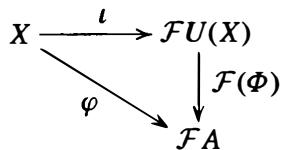

(2) Let C be a category and let $\mathcal { F }$ be a functor from C to the category Set of all sets. A universal element of the functor $\mathcal { F }$ is a pair $( U , \iota )$ , where $\pmb { U }$ is an object in C and t is an element of the set $\mathcal { F } U$ satisfying the following property: for any object A in C and any element $_ { g }$ in the set $\mathcal { F } A$ there is a unique morphism $\varphi : U \to A$ in C such that $\mathcal { F } ( \boldsymbol { \varphi } ) ( t ) = \pmb { g }$ .

# Examples

(1) (Universal Arrow: Free Objects) Let R be a ring with 1 . We translate into the language of universal arrows the statement that if $U ( X )$ is the free $\pmb { R }$ -module on a set $X$ then any set map from $X$ to an $\pmb { R }$ -module A extends uniquely by $\pmb { R }$ -linearity to an $\pmb { R }$ -module homomorphism from $U ( X )$ to A (cf. Theorem 6, Section 10.3): Let $\mathcal { F }$ be the forgetful functor from R-Mod to Set, so that $\mathcal { F }$ maps an $\pmb { R }$ -module A to the set A, i.e., $A = { \mathcal { F } } A$ as sets. Let $\pmb { X }$ be any set (i.e., an object in Set), let $U ( X )$ be the free $\pmb { R }$ -module with basis $X$ , and let $\iota : X \to { \mathcal { F } } U ( X )$ be the set map which sends each $b \in X$ to the basis element $^ { b }$ in $U ( X )$ . Then the universal property of free $\pmb { R }$ -modules is precisely the result that $( U ( X ) , \iota )$ is a universal arrow from $X$ to the forgetful functor $\mathcal { F }$ .

Similarly, free groups, vector spaces (which are free modules over a field), polynomial algebras (which are free $\pmb { R }$ -algebras) and the like are all instances of universal arrows.

(2) ( UniversalArrow: Fields of Fractions) Let $\mathcal { F }$ be the forgetful functor from the category of fields to the category of integral domains, where the morphisms in both categories are injective ring homomorphisms. For any integral domain $X$ let $U ( X )$ be its field of fractions and let t be the inclusion of $\pmb { X }$ into $U ( X )$ . Then $( U ( X ) , \iota )$ is a universal arrow from $X$ to the functor $\mathcal { F }$ (cf. Theorem 15(2) in Section 7.5).   
(3) (Universal Object: Tensor Products) This example refers to the construction of the tensor product of two modules in Section 1 0.4. Let $\mathbf { C } = R \mathbf { \mathrm { . } }$ -Mod be the category of $\pmb { R }$ -modules over the commutative ring $\pmb { R }$ , and let $M$ and $N$ be $\pmb { R }$ -modules. For each $\pmb { R }$ -module A let Bilin(M, N; A) denote the set of all $\pmb { R }$ -bilinear functions from $M \times N$ to A. Define a functor from $R \mathrm { \cdot }$ -Mod to Set on objects by

$$
\mathcal {F}: A \longrightarrow \operatorname {B i l i n} (M, N; A),
$$

and if $\varphi : A  B$ is an $\pmb { R }$ -module homomorphism then

$$
\mathcal {F} (\varphi) (h) = \varphi \circ h \quad \text {f o r e v e r y} h \in \operatorname {B i l i n} (M, N; A).
$$

Let $U = M \otimes _ { R } N$ and let t be the bilinear function

$$
\iota : M \times N \to M \otimes_ {R} M \quad \text {b y} \quad \iota (m, n) = m \otimes n,
$$

so t is an element of the set $\mathbf { B i l i n } ( M , N ; M \otimes _ { R } N ) = { \mathcal { F } } U$ . Then $( M \otimes _ { R } N , \iota )$ is a universal element of $\mathcal { F }$ because for any $\pmb { R }$ -module A and for any bilinear map $g : M \times N  A$ (i.e., any element of ${ \mathcal { F } } A )$ ) there is a unique $\pmb { R }$ -module homomorphism $\varphi : M \otimes _ { R } N \to A$ such that $g = \varphi \circ \iota = \mathcal { F } ( \varphi ) ( \iota )$ .

# E X E R C I S E S

1. Let Nor-N be the category described in Exercise 1 of Section l , and let $\mathcal { F }$ be the inclusion functor from Nor-N into Grp. Describe a functor $\mathfrak { g }$ from Nor-N into Grp such that the transformation $\pmb { \eta }$ defined by $\eta _ { G } : G \to G / N$ is a natural transformation from $\mathcal { F }$ to $\mathfrak { g }$ .

2. Let H and $\pmb { K }$ be groups and let $\varkappa \times$ and $\kappa \times$ be functors from Grp to itself described in Exercise 2 of Section 1 . Let $\varphi : H \to K$ be a group homomorphism.

(a) Show that the maps $\eta _ { A } : H \times A \to K \times A$ by $\eta _ { A } ( h , a ) = ( \varphi ( h ) , a )$ determine a natural transformation $\pmb { \eta }$ from $\varkappa \times$ to $\kappa \times$ .   
(b) Show that the transformation $\pmb { \eta }$ is a natural isomorphism if and only i f $\varphi$ is a group isomorphism.

3. Express the universal property of the commutator quotient group - described in Proposition 7(5) of Section 5.4 - as a universal arrow for some functor $\mathcal { F }$ .

# Index

# A

1-parameter subgroup, 505

2-stage Euclidean Domain, 294

A.C.C.- see ascending chain condition

abelian, 17

abelian categories,791

abelian extensions of Q, 599ff

abelian group,17,84,158f,196,339,468 representation of, 861

Abel's Theorem (insolvability of quintic), 625

absolutely flat,797

action,faithful,43,1ff.

group ring, 842

group,41ff,112ff, 451

left vs.right,128,156

Adjoint Associativity, 401,804,811

affine algebraic sets,658ff.

affine curve, 726

affine k-algebra, 734

affine n-space, 338, 658

affine scheme,742

affords a representation,114, 843

algebra,342ff,657

algebraic, element, 520ff.,527

extension, 520ff., 527

integer,695f,887

number, 527

algebraic closure, 543

of a finite field,588

algebraic conjugate - see conjugate

algebraic geometry, 330, 655ff.,658,742,745, 760,762,911

algebraically closed, 543

algebraically conjugate characters, 878

algebraically independent,645,699

algebraically indistinguishable, 518

algorithm, for Jordan Canonical Form, 496 for rational canonical form,481

alternating form, 437

alternating group, 107ff., 611 A4,110,111

$A _ { 5 }$ simplicity of,127,145

characters of, 883

simplicity of,110,149ff.

alternating,function,436,446

tensor,451

angle trisecting, 535,535

annihilated by, 338

annihilator, 249

of a submodule, 344, 460

of a subspace, 434, 435

arrow, 912

Artin-Schreier extensions, 589, 636

Artin--Schreier map, 623

Artinian,657,750f.,855

ascending chain condition (A.C.C.), 458, 656f.

assassin, 670

associate,284ff.

associated primes, of a module, 67o, 730, 748

of a prime ideal, 685

of an ideal, 682

associative, 16

asymptotic behavior, 508

augmentation, ideal, 245,253,255,258,846

map,245,255,799,811

augmented matrix. 424

$\mathbf { A u t } ( \mathbb { R } / \mathbb { Q } )$ ,567

automorphism, 41,133ff.

group,41,133ff.

of ${ \pmb D } _ { 8 }$ ,136,220

of $\scriptstyle Q _ { 8 }$ ,136,220ff.

of $s _ { 6 }$ ,221

of $s _ { n }$ ,136ff.

of a cyclic group,61,135,136,314

ofa field extension,558ff.

of a field, 558ff.

of an elementary abelian group,136

autonomous system, 507

# B

$B ^ { n } ( G ; A )$ -see coboundaries

Baer's Criterion,396

balanced map,365ff.

bar resolution, 799

base field,511

basic open set,738

basis,354

free, 218, 354

of a field extension, 5 1 3

of a vector space, 408

Bass' Characterization of Noetherian Rings, 793

belongs to an ideal, 682

Berlekamp's Factorization Algorithm, 3 1 1 , 589.ff.

Betti number, 1 59, 464

Bezout Domain, 274. 283, 294. 302, 307, 775

bijection, 2

bilinear, 368.ff., 372, 436

bimodule, 366, 404

binary, operation, 16 relation, 3

Binomial Theorem, 60, 249, 548

biquadratic, extension, 530, 582, 589 polynomial, 617

block, 1 1 7

diagonal, 423, 475

upper triangular, 423

Boolean ring, 23 1 , 232, 249, 250, 258, 267

Brauer group, 836

Buchberger's Algorithm, 324.ff.

Buchberger's Criterion, 324.ff., 332

building, 212

Building-Up Lemma. 41 1

Burnside's Basis Theorem, 199

Burnside's Lemma, 877

Burnside's $N / C$ -Theorem, 2 1 3

Burnside's $p ^ { a } q ^ { b }$ Theorem, 196, 886.ff.

#

$C ^ { n } ( G ; A )$ - see cochains

cancellation laws, 20

canonical forms, 457, 472

canonical model, 734

Cardano's Formulas, 630.ff., 638.ff.

cardinality, l

Cartesian product, l , 905ff.

Castelnuovo's Theorem. 646

Casus irreducibilis, 633, 637

category, 391 , 91 1 ff.

Cauchy's Theorem, 93, 96, 102, 146

Cayley-Hamilton Theorem, 478

Cayley's Theorem, l l 8.ff.

center, of a group, 50, 84, 89, 124, 1 34, 198

of a group ring, 239

of a matrix ring, 239, 834, 856

of a $\pmb { p }$ -group, 1 25, 1 88

of a ring, 23 1 , 23 1 , 344, 832.ff., 856

central idempotent, 357, 856

central product, 1 57, 169

central simple algebra, 832.ff.

centralize, 94

centralizer, 49.ff., 123.ff., l33.ff.

of a cycle, 173

of a representation, 853

chain complex, 777

homotopy, 782

change of basis, 40, 419

changing the base - see extension of scalars

character, of a group. 568, 866

of a representation, 866

character table, 880.ff.

of ${ \pmb A } _ { { \pmb 4 } }$ , 883

of ${ D } _ { 8 }$ , 8 8 1

of $Q _ { 8 }$ , 882

of $s _ { 3 } ,$ , 8 8 1

of $s _ { 4 }$ , 883

of $s _ { 5 } ,$ , 884

of 7Lj27L, 880

of 7Lj37L, 881

characteristic, of a field, 510

of a ring, 250

characteristic function, 249

characteristic $\pmb { p }$ fields, 5 1 0

characteristic polynomial, 473

characteristic subgroup, 135.ff., 174

Chinese Remainder Theorem, 246. 265ff., 3 1 3, 357, 768

choice function, 905

class equation, l 22.ff., 5 56

class field theory, 600

class function, 866, 870

class group, 761 , 774

class number, 761

Classical Greek Problems, 53 l.ff.

classification theorems, 38, l42.ff., l 8l.ff.

closed, topologically, 676

under an operation, 16, 242, 528

closed points, 733

coboundaries, 800

cochain. 777, 799, 808

cochain complex, 777

cochain homotopy, 792

cocycle, 800

codomain, l

coefficient matrix, 424

cofactor, 439

Expansion Formula, 439

Formula for the Inverse of a Matrix, 440

coherent module sheaf, 748

cohomologically trivial, 802, 804, 8 1 2

cohomology group, 777, 798.ff.

coinduced module, 803, 8 1 1 , 812

cokernel, 792

coloring graphs, 335

column rank, 418, 427, 434

comaximal ideals, 265

commutative, 16, 223

diagram, 100

commutator, 89, 169

commutator series - see derived series

commutator subgroup, 89, 169, l95.ff.

commute, diagram, 100

compact, 688

support, 225

companion matrix, 475

compatible homomorphisms, 805

complement, 1 80, 453, 454, 820, 829, 890

complete, 759.ff.

complete preimage, 83

completely reducible, 847

completion, 759.ff.

complex conjugation, 345, 567, 603, 61 8, 654, 872

complex numbers, 1, 512, 515, 654

component of a direct product, 155, 338

composite extensions, 529, 59l.ff. of fields, 528

composition factors. 103

composition series, 103.ff.

computing k-algebra homomorphisms, 664.ff.

computing Galois groups, 640.ff.

congruence class, 8.ff.

congruent, 8

conjugacy class, 123.ff., 489, 860

conjugate, algebraic, 573 field, 573

of a field element, 573

of a group element, 82, l23.ff.

of a set, 1 23.ff.

of a subgroup, 134, 139.ff.

conjugation, 45, 52, 1 22.ff., 133

in $A _ { n }$ , 1 27, 1 3 1

$s _ { n }$ , 1 25.ff.

connected, 687

connecting homomorphisms, 778, 791

constituent of a module, 847

constructible, 532.ff.

constructibility of a regular n-gon, 534ff., 60l.ff.

construction of cube roots, 535

construction of the regular 17 -gon, 602.ff.

continuous cohomology groups, 809

continuous group action, 808.ff.

contracting homomorphisms, 809

contraction of ideals, 693, 708.ff.

contravariant, 659

converge. 503

coordinate ring, 661

coprime - see relatively prime

corestriction homomorphism, 806, 807

corresponding group actions, 129

coset, 17ff., 89.ff.

representatives, 77

Cramer's Rule, 438

Criterion for the Solvability of a Quintic, 639

crossed homomorphisms, 814ff.

crossed product algebra, 833.f

cubic equations, formulas for roots, 630.ff.

curve, 726

cycle, 29, 30, 33, l06.ff., 1 73

cycle decomposition. 29, 30, 1 15.ff., 641 algorithm, 30.ff.

cycle type, 1 26.ff.

of automorphisms, 640

cyclic extensions, 625. 636

cyclic group, 22, 54ff., 90, 149, 192, 198, 539

characters of, 880, 881

cohomology of, 801, 8 1 1

cyclic module, 351, 462

cyclotomic extensions, 552.ff. , 596ff.

cyclotomic field, 540.ff., 698

cyclotomic polynomial, 3 10, 489, 552.ff.

cyclotomy, 598

#

D.C.C. - see descending chain condition

decomposable module, 847

Dedekind Domain, 764.ff.

modules over, 769.ff.

Dedekind-Hasse Criterion, 281

Dedekind-Hasse norm, 28 1, 289, 294

degree, of a character, 866

of a field element, 520

of a field extension, 5 12

of a monomial, 621

of a polynomial, 234, 295, 297

of a representation. 840

of a symmetric group, 29

degree ordering, 331

dense, 677, 687

density of primes, 642

derivative, of a polynomial, 3 12, 546

of a power series, 505

derived functors, 785

derived series, 195.ff.

descending chain condition (D.C.C.), 33 1 , 657, 751, 855

determinant, 248, 435.ff. , 450, 488

computing, 441

determinant ideal, 67 1

diagonal subgroup, 49, 89

diagonalizable matrices criterion, 493, 494

Dickson's Lemma, 334

differential, 723

of a morphism, 728

dihedral group, 23/f.

as Galois group, 617/f.

characters of, 88 1 , 885

commutator subgroup of, 171

conjugacy classes in, 132

dimension, of a ring, 750, 754/f.

of a tensor product, 421

of a variety, 68 1, 729

of a vector space, 408, 41 1

of $S ^ { k } ( V )$ , 446

${ \mathcal { T } } ^ { k } ( V )$ , 443

$\textstyle \bigwedge ^ { k } ( V )$ , 449

dimension shifting, 802

Diophantine Equations, 14. 245. 276, 278

direct factor, 455

direct limit, 268, 358, 741

direct product, characters of, 879

infinite, 157, 357, 414

of free modules, 358

of groups, 1 8, 15�, 385, 593

of injective modules, 793

of injective resolutions. 793

of modules, 353, 357, 358, 385

of rings, 23 1 , 233, 265/f.

direct sum, infinite, 158, 357, 414

of injective modules, 403

of modules, 35 1/f., 357, 385

of projective modules. 392, 403, 793

of projective resolutions, 793

of rings, 232

direct summand, 373, 385, 451

directed set, 268

Dirichlet's Theorem on Primes in Arithmetic Progressions, 557

discrete $G$ -module, 808

discrete cohomology groups, 808/f.

discrete valuation, 232, 238, 272, 755

Discrete Valuation Ring, 232, 272, 755/f., 762

discriminant, 610

as resultant, 621

of a cubic, 612

of a polynomial, 610

of a quadratic, 6 1 1

of a quartic, 614

$p ^ { \mathrm { t h } }$ cyclotomic polynomial. 621

distributive laws, 34, 223

divides, 4, 252, 274

divisibility of ideals, 767

divisible, group, 66, 86, 167

module, 397

Division Algorithm, 4, 270, 299

division ring, 224, 225, 834

divisor, 274

domain, 1

double coset, 1 17

double dual, 432, 823, 914

Doubling the Cube impossibility of, 53 1/f.

doubly transitive, 1 17, 877

dual basis, 432

dual group, 167, 8 15, 823

dual module, 404, 404

dual numbers, 729

dual vector space, 43 1

#

echelon, 425

eigenspace, 473

eigenvalue, 414, 423, 472

eigenvector, 414, 423, 472

Eisenstein's Criterion, 309ft., 312

elementary abelian group, 1 36, 155, 339, 654

elementary divisor, 161/f., 465/f.

decomposition, 161/f., 464

decomposition algorithm, 495

elementary Jordan matrix, 492

elementary row and column operations, 424, 470/f., 479/f.

elementary symmetric functions, 607

elimination ideal, 328/f.

elimination theory, 327/f.

elliptic, curve, 14

function, 600

function field, 653

integral, 14

embedded prime ideal, 685

ernbedding, 83, 359, 569

endomorphism, 347

ring, 347

equivalence class, 3, 45, 1 14

equivalence of categories, 734, 916

equivalence of short exact sequences, 381

equivalence relation, 3, 45, 1 14

equivalent extensions, 381, 787, 824

equivalent representations, 846, 869

Euclidean Algorithm, 5, 271

Euclidean Domain, 270/f., 299

modules over, 470, 490

Euler $\varphi$ -function, 7, 8, 1 1, 267, 3 15, 539/f., 589

Euler's Theorem, 13, 96

evaluation homomorphism, 244, 255, 43�

exact, functor, 391, 396

sequence, 378

exactness, of Hom, 389ft., 393/f.

of tensor products, 399

exceptional characters, 901

exponent of a group, 165/f., 626

exponential map, 86

exponential notation, 20,22

exponential of a matrix, 503ff.

${ \bf E x t } _ { R } ^ { n } ( A , B ) ,$ 779ff.

extension, of a map,3,386,393

of ideals, 693,708ff.

of modules, 378

of scalars,359ff.,363ff.,369,373

extension field, 511ff.

extension problem. 104, 378,776

Extension Theorem, for Isomorphisms of Fields, 519,541

exterior algebra, 446

exterior power, 446

exterior product -see wedge product

external, direct product, 172

direct sum, 353

# F

$_ F$ -algebra- see algebra

factor group - see quotient group

factor set, 824ff.

factor through, homomorphism,100, 365

factorial variety, 726

factorization,283ff.

faithful,co,4,1

functor, 914

representation, 840

Fano Plane, 210

Feit-Thompson Theorem, 104,106,149,196,212, 899

Fermat primes, 601

Fermat's Little Theorem, 96

Fermat's Theorem on sums of squares, 291

fiber,2,73ff,240ff.

fiber product of homomorphisms, 407

fiber sum of homomorphisms, 407

field,34,224,226,510ff.

offractions,260ff.

of $\pmb { p }$ -adic numbers, 759

of rational functions, 264, 516,530, 567,585, 647ff.,681,721

field extension, 511ff.

field generated by, 511, 516

field norm, 229

finite covering, 704

finite dimensional, 408,411

finite extensions, 512f, 521,526

finite fields,34,301,529

algebraic closure of, 588

existence and uniqueness of, 549ff

Galois groups of,566,586

of four elements, 516, 653

subfields of,588

finite group, 17

finitely generated, field extension, 524ff., 646

group,65,158,218ff.

ideal, 251,317

$\pmb { k }$ -algebra, 657

module,351ff., 458

finitely presented,group,218f.

module, 795f.

First Order Diophantine Equation,276,278

First Orthogonality Relation, 872

Fitting ideal, 671

Fitting's Lemma, 668

fixed,element,558

field, 560

set,131,798

fixed point free,41,132

flat module, 400ff, 405f, 790,795

form,297

formal Laurent series,238,265,756,759

formal power series,238,258,265,668

formally real fields,530

Fourier Analysis,875ff.

fractional ideal,76ff.

fractional linear transformations, 567, 647

Frattini subgroup,198ff.

Frattini's Argument,193

free,abelian group,158,355

group,215ff.

module,338,352,354ff.,358,400

nilpotent group,221

free generators, 218

of a module, 354

free rank,159,218,355,460,464

Frobenius automorphism, 549,556,566,586,589, 604

Frobenius group,168, 638, 643ff, 896

as Galois group, 638

characters of,896

Frobenius kernel, 896

Frobenius Reciprocity, 904

full functor, 914

function, 1

function field, 646, 653

functor,391,396,398,913

contravariant, 395,913

covariant,391,398,913

fundamental matrix, 506

Fundamental Theorem, of Algebra,545, 615ff

of Arithmetic, 6,289

of Finitely Generated Abelian Groups,158ff., 196,468

of Finitely Generated Modules over a

Dedekind Domain,769ff.

of Finitely Generated Modules over a P.I.D., 462, 464, 466

of Galois Theory, 574ff.

on Symmetric Functions, 608

# G

G-invariant, 843

G-module, 798

G-stable, 843

Galois closure, 594

Galois cohomology groups, 809ff.

Galois conjugates, 573

Galois extension, 562, 512ff.

Galois group, 562ff., 514ff.

of $\mathbb { F } _ { p ^ { n } }$ • 566, 586

$\mathbb { Q } ( 2 ^ { 1 / 8 } , i )$ or $x ^ { 8 } - 2 , 5 7 7 8 .$

of $\mathbb { Q } ( 2 ^ { 1 / 8 } , i )$ over quadratic subfields, 581

of $\mathbb { Q } ( { \sqrt { ( 2 + { \sqrt { 2 } } ) ( 3 + { \sqrt { 3 } } ) } } )$ , 584

of $\mathbb { Q } ( { \sqrt { 2 + { \sqrt { 2 } } } } )$ , 5 82

of $\mathbb { Q } ( { \sqrt { 2 } }$ ), 563

of iQI(.J2 , ,J3 ), 563ff., 567, 576

of $\mathbb { Q } ( { \sqrt { D _ { 1 } } } , { \sqrt { D _ { 2 } } } )$ $\sqrt { D _ { 2 } }$ ) , 582

of $\mathbb { Q } ( \zeta _ { 1 3 } )$ , 598ff.

of $\mathbb { Q } ( \zeta \varsigma )$ , 597

of $\mathbb { Q } ( \zeta _ { n } + \zeta _ { n } ^ { - 1 } .$ ), 601 , 603

of $\mathbb { Q } ( \zeta _ { n } )$ . 596ff.

of $\mathbb { Q } ( \zeta _ { p } )$ . 597

of $x ^ { 3 } - 2$ , 564ff., 568, 576

of $x ^ { 4 } + 1 ,$ 579ff.

of $x ^ { 4 } - 2 x ^ { 2 } - 2$ , 582

$x ^ { 6 } - 2 x ^ { 3 } - 2$ , 623, 644

of $x ^ { n } - a$ , 636

of $x ^ { p } - x - a .$ , 589

of a biquadratic, 582

of a composite extension, 592

of a cubic, 612

of a cyclotomic field, 599

of a general polynomial, 609

of a quadratic, 563

of a quartic, 615, 618

Galois groups, of polynomials, 606ff. infinite, 651ff.

over IQI, 640ff.

Galois Theory, 14, 105, 558ff.

Gaschiitz's Theorem, 838

Gauss' Lerruna, 303, 530, 819, 824

Gauss-Jordan elimination, 327, 424ff.

Gauss sum, 637

Gaussian integers, 229ff., 271 , 278, 289ff. , 377

general linear group, 35, 89, 236, 413, 418

general polynomial, 607, 609, 629, 646

general polynomial division, 320ff., 331

generalized associative law, 18

generalized character, 898

generalized eigenspace, 501

generalized quaternion group, 178

generating set, 61ff.

generator, 25ff., 54, 218ff.

of $S _ { n }$ , 64, 107ff., 219

$S _ { p }$

of a cyclic group, 57

of a free module, 354

of a subgroup, 61ff.

of a submodule, 351

of an ideal, 251

generic point, 733

germs of continuous functions, 269

$G L _ { 3 } ( \mathbb { F } _ { 2 } )$ , 2 1 lff., 489, 644

global sections, 740

globally asymptotically stable, 508

Going-down Theorem, 694, 728

Going-up Theorem, 694, 720

graded, ordering, 331

ring, 443

graded ideal, 443

graded lexicographic ordering (grlex), 331

graph, 210, 669, 687

coloring, 335ff.

greatestcorrunon divisor (g.c.d.), 4, 252, 274ff., 287

of ideals, 767

grevlex monomial ordering, 331

Grobner basis, 315ff., 319ff., 664ff., 702, 712

in field extensions, 672

group, 1 3, 16ff.

$n ^ { \mathrm { t h } }$ roots of unity - see root of unity

of units in a ring, 226

group extensions, 824ff.

group ring, 236ff., 798, 840

group table, 21

groups, of order 12, 144, 182

of order 30, 143, 1 82

of order 56, 1 85

of order 60, 145ff., 1 86

of order 75, 1 85

of order 147, 1 85

of order 168, 207ff.

of order $_ { 3 ^ { 3 } }$ . 7 . 1 3 . 409, 212ff., 898ff.

of order $p ^ { 2 }$ , 1 25, 1 37

of order $p ^ { 3 }$ , 179, 1 83, 198, 1 99ff., 886

of order $2 p ^ { 2 }$ , 1 86

of order ${ \pmb { 4 } } _ { P }$ , 1 86

of order pq, 143, 179, 181

of order $p ^ { 2 } q$ , 1 44

groups, table of small order, 167ff.

# H

$H ^ { n } ( G ; A )$ - see cohomology group

Flall subgroup, 101, 200, 829, 890

Flall's Theorem, 1 05, 1 96, 890

Hamilton Quatemions, 224ff., 23 1, 237, 249, 299

Flannonic Analysis, 875

Fleisenberg group, 35, 53, 174, 179, 187

Hilbert's Basis Theorem, 3 1 6, 334, 657

Flilbert's Nullstellensatz, 675, 700ff.

Flilbert's Specialization Theorem, 648

Flilbert',s Theorem 90, 583, 8 14

additive fonn, 584, 815

Flilbert's Zahlbericht, 815

Flotder Program, 103ff.

holomorph, 179, 186

Flom, of direct products, 404

of direct sums, 388, 388, 404

FlomF(V, W), 416

FlomR(M, N), 345ff., 385ff.

homeomorphism, 738

homogeneous cochains, 810

homogeneous component, of a polynomial, 297 of a graded ring, 443

homogeneous ideal, 299

homogeneous of degree $\pmb { m }$ , 621

homogeneous polynomial, 297

homological algebra, 391 , 655, 716ff.

homology groups, 777

homomorphism, of algebras, 343, 657

of complexes, 777

of fields, 253, 512

of graded rings, 443

of groups, 36, 73ff., 215

of modules, 345ff.

of rings, 239ff.

of short exact sequences, 38lff.

of tensor algebras, 450

homotopic, 792

hypemilpotent group, 191

hypersurface, 659

# I

icosahedron - see Platonic solids

ideal quotient, 333, 69 1

ideal, 242ff.

generated by set, 251

idempotent, 267, 856

idempotent linear transfonnation, 423

identity, of a group, 17

matrix, 236

of a ring, 223

image, of a map, 2

of ak-algebrahomomorphism, computing, 665ff.

of a linear transfonnation, computing, 429

implicitization, 678

incidence relation, 210

indecomposable module, 847

independence of characters, 569, 872

independent transcendentals, 645

index, of a subgroup, 90ff.

of a field extension, 512

induced, character, 892ff., 898

module, 363, 803, 8 1 1, 812. 893

representation, 893

inductive limit - see direct limit

inequivalent extensions, 379ff.

inert prime, 749, 775

infinite cyclic group, 57, 8 1 1

infinite Galois groups, 65 lff.

inflation homomorphism, 806

inhomogeneous cochains, 810

injective envelope - see injective hull

injective hull, 398, 405, 405

injective map, 2

injective module, 395ff., 403ff., 784

injective resolution, 786

injectively equivalent, 407

inner automorphism, 1 34

inner product of characters, 870ff.

inseparable degree, of a polynomial, 550

of a field extension, 650

inseparable extension, 551 , 566

inseparable polynomial, 546

insolvability of the quintic;, 625, 629

integer, 1. 695ff.

integers mod n - see '!L./ n'!L.

integral basis, 698, 775

integral closure, 229, 691ff.

integral domain, 228, 235

integral element, 691

integral extension, 691ff.

integral group ring ('!L.G), 237, 798

integral ideal, 760

integral Quaternions, 229

integrally closed, 69 1ff.

internal, direct product, 172

direct sum, 354

intersection of ideals, computing, 330ff.

intertwine, 847

invariant factor, 159ff., 464, 774

decomposition, 159ff., 462ff.

of a matrix, 475, 477

Invariant Factor Decomposition Algorithm, 480

invariant subspace, 341 , 843

inverse, of a map, 2

of an element in a group, 1 7

inverse image, 2

inverse limit, 268, 358, 652ff.

inverse of a fractional ideal, 760

inverse of matrices, 427, 440

invertible fractional ideal, 760

irreducibility, criteria, 307ff.

of a cyclotomic polynomial, 310

irreducible algebraic set, 679

irreducible character, 866, 870, 873

irreducible element, 284

in Z[i ], 289ff.

irreducible ideal, 683

irreducible module, 356, 847

irreducible polynomial, 287, 512ff., 572

of degree n over $\mathbb { F } _ { p }$ • 301 , 586

irreducible topological space, 733

isolated prime ideal, 685

isomorphism, classes, 37

of algebras, 343

of cyclic groups, 56

of groups, 37

of modules, 345

of rings, 239

of short exact sequences, 381

of vector spaces, 408

Isomorphism Theorems, for groups, 97ff.

for modules, 349

for rings, 243, 246

isomorphism type, 37

isotypic component, 869

# J

Jacobson radical, 259, 750

join, 67, 88

Jordan block, 492

Jordan canonical form, 457, 472, 492ff.

Jordan-Holder Theorem, 103ff.

#

$k$ -stage Euclidean Domains, 294

$k$ -tensors, 442

kernel, of a group action, 43, 5 1 , 1 1 2ff.

of a homomorphism, 40, 75, 239, 345

of ak-algebrahomomorphism, computing, 665ff.

of a $k$ -algebra homomorphism, 678

of a linear transformation, computing, 429

Klein 4-group (Viergruppe), 68, 1 36, 1 55

Kronecker product, 42lff., 43 1

Kronecker-Weber Theorem, 60

Krull dimension, 704, 750ff., 754

Krull topology, 652

Krull's Theorem, 652

Kummer extensions, 627, 817

Kummer generators for cyclic extensions, 636

Kummer theory, 626, 8 1 6, 823

#

Lagrange resolvent, 626

Lagrange's Theorem, 13, 45, 89ff., 460

lattice of subfields, 57 4

of $\mathbb { Q } ( \sqrt [ 3 ] { 2 } , \rho )$ , 568

of $\mathbb { Q } ( \zeta _ { 1 3 } )$ , 598

$\mathbb { Q } ( 2 ^ { 1 / 8 } , i )$

lattice of subgroups, 66ff.

of $A _ { 4 }$ , 1 1 1

of $D _ { 8 }$ , 69, 99

$D _ { 1 6 }$

of $Q _ { 8 }$ , 69, 99

of $Q D _ { 1 6 }$ · 72, 580

of $s _ { 3 }$ . 69

of Z/2Z, 67

of Z/4Z, 67

of Z/6Z, 68

of $\mathbb { Z } / 8 \mathbb { Z }$ , 67

of Z/ 12Z, 68

of $\mathbb { Z } / n \mathbb { Z }$ , 67

of $\mathbb { Z } / p ^ { n } \mathbb { Z } ,$ , 68

of $\mathbb { Z } / 2 \mathbb { Z } \times \mathbb { Z } / 2 \mathbb { Z }$ (Klein 4-group), 68

of $\mathbb { Z } / 2 \mathbb { Z } \times \mathbb { Z } / 4 \mathbb { Z }$ , 7lff.

of $\mathbb { Z } / 2 \mathbb { Z } \times \mathbb { Z } / 8 \mathbb { Z } ,$ , 72

of the modular group of order 16, 72

lattice of subgroups for quotient group, 98ff.

Laurent series - see formal Laurent series

leading coefficient, 234, 295

leading term, 234, 295, 3 1 8

ideal of, 3 18ff.

least common multiple (l.c.m.), 4, 279, 293

least residue, 9

left derived functor, 788

left exact, 391 , 395, 402

left group action, 43

left ideal, 242, 251 , 256

left inverse, in a ring, 233

of a map, 2

left module, 337

left multiplication, 44, 1 1 8ff. , 53 1

left Principal Ideal Domain, 302

left regular representation, 44, 1 20

left translation, 44

left zero divisor, 233

Legendre symbol, 8 1 8

length o f a cycle, 30

lexicographic monomial ordering, 3 1 7ff., 622

Lie groups, 505, 876

lifts, 386

linear algebraic sets, 659

linear character, 569

linear combination, 5, 275, 280, 408

linear equations, solving, 425ff.

linear functional, 43 1

linear representation, 840

linear transformation, 340ff., 346, 408

linearly independent, characters, 569, 872 vectors, 409

local homomorphism, 723, 744

local ring, 259, 717, 752ff., 755 of an affine variety, 72lff.

localization, 706ff., 795, 796

at a point in a variety, 722

at a prime, 708ff., 7 18

of a module, 714ff.

locally ringed spaces, 745

locus. 659

Long Exact Sequence, 778, 789

in Group Cohomology, 802

lower central series, 193

Liiroth's Theorem, 647

#

map, 1 , 215

Maschke's Theorem, 453, 849

matrix, 34, 235, 415ff.

of a composition, 418

of a linear transformation, 415ff.

matrix representation, 840

matrix ring, 235ff., 418

ideals of, 249

maximal ideal, 253ff., 280, 512

maximal order. 232

maximal real subfield of a cyclotomic field, 603

maximal spectrum, 73 1

of k[x], 735

of k[x, y], 735

of Z[i ], 735

of /L[x], 736

maximal subgroup, 65, 1 17, 1 3 1 , 188, 198

of solvable groups, 200

middle linear map - see balanced map

minimal element, 4

minimal Grobner basis, 325ff.

minimal normal subgroup, 200

minimal polynomial, 474

of a field element. 520

of a field element, computing, 667

minimal prime ideal, 298, 688

minimal primary decomposition, 683

minimum condition, 855

Minkowski's Criterion, 441

minor, 439

Mobius inversion formula, 555, 588

modular arithmetic, 9, 224

modular group of order 1 6, 72, 186

modular representations, 846

module, 337ff.

over Z, 339, 456ff.

over F[x], 340ff., 456ff.

over a Dedekind Domain, 769f

over a group ring, 798ff., 843ff.

over a P.I.D., 456ff.

sheaf of, 7 48

module of fractions, 714

monic, 234

monomial, 297

monomial ideal, 3 1 8, 332, 334

monomial ordering, 317

monomial part, 297

monomial term, 297

Monster simple group, 865

morphism, 9 1 1

of affine algebraic sets, 662

of affine schemes, 743

multidegree, 297, 3 1 8

multilinear form, 435

multilinear map, 372, 435

multiple, 252, 274

multiple root of a polynomial, 3 1 2, 545, 547

multiplicative field norm, 230, 582

multiplicative function, 7, 267

multiplicative subgroup of a field, 3 14

multiplicativity of extension degrees, 523, 529

multiplicity of a root, 3 1 3, 545

#

Nakayama's Lemma, 75 1

natural, 83, 1 67, 432, 9 1 1ff.

projection, 83, 243, 348, 916

Newton's Formulas, 618

nilpotence class, 190

nilpotent, element, 23 1 , 250, 596, 689

group, 190ff., 198

ideal, 25 1 , 258, 674

matrix, 502

nilradical, 250, 258, 673, 674

Noetherian, module, 458, 469

ring, 316, 458, 656ff., 793

Noether's Normalization Lemma, 699ff.

noncommutative polynomial algebra, 302, 443

nonfinitely generated ideal, 298, 657

nongenerator, 199

nonpivotal, 425

nonprincipal ideal, 252, 273, 298

nonsimple field extension, 595

nonsingular, point, 725, 742, 763 variety, 725

nonsingular, linear transformation, 413 matrix, 417

nonsingular curve, 775

nonsingular model, 726

norm, 232, 270, 299

of a character, 872

of an element in a field, 582, 585

normal basis, 815

normal complement, 385

normal extension, 537, 650

normal ring, 691

normal subgroup, 82ff.

normal variety, 726

normalization, 691, 726

normalize, 82, 94

normalized, cocycle, 827

factor set, 825

section, 825

normalizer, 50ff., 123ff., 134, 147, 206ff.

null space, 413

number fields, 696

# 0

object, 9 1 1

opposite algebra, 834

orbit, 45, 1 15ff., 877

order, of a permutation, 32

of a set, 1

of an element in a group, 20, 55. 57, 90

order of conductor f, 232

order of zero or pole, 756, 763

ordered basis, 409

orthogonal characters, 872

orthogonal idempotents, 377, 856, 870

orthogonality relations, 872

outer automorphism group, 137

#

$\pmb { p }$ -adic integers, 269, 652, 758ff.

$\pmb { p }$ -adic Laurent series, 759

$\pmb { p }$ -adic valuation, 759

$\pmb { p }$ -extensions, 596, 638

$\pmb { p }$ -group, 139, 1 88

characters of, 886

representations of, 854, 864

$\pmb { p }$ -primary component, 142, 358, 465

$p ^ { \mathrm { t h } }$ -power map, l66, 174

P.I.D. - see Principal Ideal Domain

parabolic subgroup, 212

partition, of a set, 3

of n, 1 26, 1 62

Pell's equation, 230

perfect field, 549

perfect group, 174

periods in cyclotomic fields, 598, 602, 604

permutation, 3, '19, 42

even, 108ff.

odd, 108ff.

sign of, 108ff., 436ff.

permutation character, 866, 877, 895

permutation group, 1 16, 120

permutation matrix, 157

permutation module, 803

permutation representation, 43, 1 1 2ff., 203ff., 840, 844, 852, 877

pivotal element, 425

Platonic solids, symmetries of, 28, 45, 92, 1 1 1 , 148

pole, 756

polynomial, 234

map, 299, 662

ring. 234ff., 295ff.

polynomials with $s _ { n }$ as Galois group, 642ft.

Pontriagin dual group, 787

positive nonn, 270

Postage Stamp Problem, 278

power of an ideal, 247

power series of matrices, 502ft.

power set, 232

preimage, 2

presentation, 26ff., 39, 218ff., 380

primary component - see $\pmb { p }$ -primary component

Primary Decomposition Theorem. for abelian groups, 161

for ideals, 68 lff., 716ff.

for modules, 357, 465, 772

primary ideal, 260, 298, 748

prime, 6

prime element in a ring, 284

prime factorization, 6

for ideals, 765ff.

prime ideal, 255ff., 280, 674

algorithm for determining, 71 Off.

prime spectrum, 731ff.

prime subfield, 264, 5 1 1 , 558

primes associated, to a module, 670

to an ideal, 670

primitive central idempotent, 856, 870

primitive element, 517, 594

Primitive Element Theorem, 595

primitive idempotent, 856

primitive permutation group, 1 17

primitive roots of unity, 539ff.

principal character, 866

principal crossed homomorphisms, 814

principal fractional ideal, 760

principal ideal, 251

Principal Ideal Domain (P.I.D.), 279ff., 284, 459

characterization of, 281 , 289, 294

that is not Euclidean, 282

principal open set, 687, 738

product, of ideals, 247, 250

of subgroups, 93ff.

profinite, 809, 8 1 3

projection, 83, 423, 453

homomorphism, 153ff.

projections of algebraic sets, 679

projective limit - see inverse limit

projective module, 390ff., 400, 403ff. , 761 , 773, 786

projective plane, 210

projective resolution, 779

projectively equivalent, 407

Public Key Code, 279

pullback of a homomorphism, 407

purely inseparable, 649

purely transcendental, 646

pushout of a homomorphism, 407

Pythagoras' equation rational solutions, 584

#

$\mathbb { Q } .$ , subgroups of, 65, 198

Q/71.., 86

quadratic, equation, 522, 533

extensions, 522, 533

field, 227, 698

subfield of cyclic quartic fields, criterion, 638

subfield of $\mathbb { Q } ( \zeta _ { p } )$ , 62 1 , 637

quadratic integer rings, 229ff., 248, 27 1, 278, 286, 293ff.. 698, 749

that are Euclidean, 278

that are P.I.D.s, 278

Quadratic Reciprocity Law, 819

quadratic residue symbol, 818

quartic equations, formulas for roots, 634ff.

quasicornpact, 688, 738, 746

quasidihedral group, 7 lff., 1 86

as Galois group, 579

quaternion group, 36

as Galois group, 584

characters of, 882

generalized, 178

representations of, 845, 852

Quaternion ring, 224, 229, 258

(see also Hamilton Quatemions)

quintic, insolvability, 625, 629

quotient, computations in k-algebras, 672

group, 15, 73ff., 76, 574

module, 348

ring, 24lff.

vector space, 408, 412

quotient field, 260ff.

# R

radical extension, 625ff.

radical ideal, 258, 673, 689

radical of an ideal, 258, 673ff., 701

computing, 70 1

radical of a zero-dimensional ideal, 706ff.

radicals, 625

ramified prime, 749, 775

range, 2

rank, of a free module, 338, 354, 356, 358, 459

of a group, 1 65, 21 8, 355

of a linear transformation, 413

of a module, 460, 468, 469, 471, 719, 773

rational canonical form, 457, 472ff.

computing, 48 lff.

rational functions - see field of rational functions

rational group ring, 237

rational numbers, 1, 260

rational valued characters, 879

real numbers, 1

modulo 1, 2 1 , 86

reciprocity, 229, 621

recognition theorem, 171, 180

reduced Grabner basis, 326ff.

reduced row echelon form, 425

reduced word, 216ff.

reducible character, 866

reducible element, 284

reducible module, 847

reduction homomorphism, 245, 296, 300, 586

reduction mod n, 10, 243, 296, 640

reduction of polynomials mod p, 586, 589

reflexive, 3

regular at a point, 721

regular local ring, 725, 755

regular map, 662, 722

regular representation, 844, 862ff.

relations, 25ff., 21 8ff.. 380

relations matrix, 470

relative Brauer group, 836

relative degree of a field extension, 512

relative integral basis, 7 7 5

relatively prime, 4, 282

remainder, 5, 270, 320ff.

Replacement Theorem, 410, 645

representation, 840ff.

permutation, 43, 1 12ff., 203ff., 840. 844. 852,877

representative, 3, 9, 77

residue class, 8

resolvent cubic, 614, 623

resolvent polynomials, 642

restricted direct product, 158

restriction homomorphism, 269, 805, 807

restriction maps, 269, 740

restriction of scalars, 359

resultant, 619ff.

reverse of a polynomial, 312

right derived functor, 785

right Euclidean Domain, 302

right exact, 400, 402

right group action, 43, 128, 844, 852

right ideal, 242, 25 1

right inverse, in a ring, 233

of a map, 2

right module, 337

right regular representation, 132

right zero divisor, 233

ring, 223

of algebraic integers, 695ff.

of continuous functions, 225, 227, 259

of dual numbers, 729

of fractions, 260ff., 708

of integers, 229

of sets, 232

root, 3 10, 521

root extension, 627

root of a polynomial, 307ff., 512

root of unity, 22, 66, 86, 539ff., 552

row equivalent, 425

row rank, 418, 427, 434

row reduced, 424

ruler and compass constructions, 534

# s

saturated, 710

saturation of an ideal, 710ff.

scalar, 408

scalar matrix, 236

scalar transformations, 348

Schanuel's Lemma, 407

scheme, 745

Schur multiplier, 838

Schur's Lemma, 356, 853, 856

Schur's Theorem, 829

second dual - see double dual

Second Orthogonality Relation, 872

section, 384, 740

semidihedral group - see quasidihedral group

semidirect product, 175ff., 383, 385, 821 , 829

semisimple, 855

separable, 551

extension, 551, 572, 594ff.

polynomial, 546, 562, 572

separable degree, of a field extension, 650

of a polynomial, 550

separating transcendence base, 650

Shapiro's Lemma, 804

short exact sequence, 379

of complexes, 778

Short Five Lemma, 383

similar, linear transformations, 419, 476

matrices, 419, 476, 493ff.

similar central simple algebras, 835

similar representations, 846

similarity, 40

simple algebra, 832

simple extensions, 517, 586, 594

simple group, 91, 102ff., 149ff., 20lff., 212

classification of, 103, 212

of order 168, 207ff.

sporadic, 104, 865

simple module - see irreducible module

simple radical extension, 625

simple ring, 253, 863

simple tensor, 360

Simultaneous Resolution, 783

singular point, 725

skew field - see division ring

skew-symmetrization, 452

Smith Normal Form, 479

smooth, 725, 742

Snake Lemma, 792

solution, of cubic equations, 630

of quartic equations, 634ff.

solvability of a quintic, criterion, 630, 639

solvability of groups of odd order - see

Feit-Thompson Theorem

solvable by radicals, 627ff.

solvable extensions, 625ff.

solvable group, 105, 149, 19(ff., 628, 886, 890

solvable length, l95ff.

solving algebraic equations, 327ff.

solving linear equations, 425ff.

span, 62, 351, 408, 427

special linear group, 48, 89, 101, 669

specialization, 648

spectral sequences, 808

spectrum - see also prime spectrum and maximal

spectrum

of k[x], 735

of k[x, y], 735

of Z[Z/2Z], 747

of Z[i], 735

of Z[x], 736

split algebra, 835

split exact sequence, 384, 388Jr.

split extension, 384

split prime, 749, 775

splits completely, 536

splitting field, 513, 536Jr., 562, 572

of $( { \overset { . } { x } } ^ { 2 } - 2 ) ( x ^ { 2 } - 3 )$ , 5 37

of $x ^ { 2 } - 2$ . 537

of $x ^ { 2 } - t$ over $k ( t )$ , 5 1 6

of $x ^ { 2 } + 1$ , 5 1 5

$\mathbf { o f } x ^ { 2 } + x + 1$ over $\mathbb { F } _ { 2 }$ , 5 1 6

of $x ^ { 3 } - 2$ , 537

of $x ^ { 4 } - p x + q$ , 6 1 8

of $x ^ { 4 } - p x ^ { 2 } + q$ . 6 1 8

of $x ^ { 4 } + 4$ , 538

of $x ^ { 4 } + 8 ,$ , 581

of $x ^ { 4 } - 2 x ^ { 2 } - 2 ,$ , 582

of $x ^ { 6 } - 2 x ^ { 3 } - 2$ , 623

of $x ^ { 8 } - 2$ , 577jf.

of $x ^ { n } - 1$ , 539jf.

of $x ^ { p } - 2$ , 54 1

of $x ^ { p } - x - a$ over $\mathbb { F } _ { p }$ , 589

Psplitting homomorphism, 384

splitting of polynomials in Galois extensions, 572, 584. 595

sporadic simple group-see simple group, sporadic

square root of a matrix, 502

squarefree part, 227

Squaring the Circle, impossibility of, 531jf.

stability group, 8 1 9

stabilizer, 44, 51jf., l 1 2jf., 1 23jf.

stable subspace, 341 , 843

stalk, 741

standard bimodule structure, 367

standard resolution, 799

steady states, 507

Steinitz class, 773

Stone-Cech compaetification, 259

straightedge and compass constructions, 531Jr. , 602

structure sheaf, 7 40jf.

Sturm's Theorem, 624

subfield, 5 1 1 , 5 16

subgroup, 22, 46jf.

criterion, 47

of cyclic groups, 58Jr.

of index 2, 91, 1 20, 122

sublattice, 70

submodulc, 337

criterion, 342

subring, 228

subspace topolog� 677

sum, of ideals, 247, 250

of submodules, 349, 35 1

support, 729Jr.

smjective, 2

Sylow $\pmb { p }$ -subgroup, 101, 1 39Jr. , 161

Sylow's Theorem, 93, 1 05, 1 39jf., 617

symmetric algebra, 444

symmetric function, 436, 608

symmetric group, 29jf.

as Galois group, 642Jr., 6491f.

characters of, 879, 881, 883, 884

conjugation in - see conjugation

isomorphisms between, 37, 40

Sylow $\pmb { p }$ -subgroups of, 1 68, 1 87

symmetric polynomials, 608, 621jf.

symmetric relation, 3

symmetric tensor, 451

symmetrization, 452

# T

table, group, 21

tangent space, 724ff. , 741jf.

Tchebotarov Density Theorem, 642

tensor algebra, 443

tensor product, 359Jr., 788Jr.

associativity of, 37 1

of algebras, 374

of direct products, 376

of direct sums, 373, 376

of fields, 377, 531 , 596

of free modules, 404

of homomorphisms, 370

of ideals, 377

of matrices. 421

of projective modules, 402, 404

of vector spaces, 420

tensors, 360, 364

tetrahedron - see Platonic solids

Thompson subgroup, 1 39

Thompson Transfer Lemma, 822

Thompson's Theorem, 1 96

topological space, 676jf.

Tor� (A, B), 788Jr.

torsion, element, 344

module, 356, 460, 463

subgroup, 48

submodule, 344

torsion free, 406, 460

trace, of a field element, 583, 585

of a matrix, 248, 431 , 43 1 , 488, 866

trace ideal of a group ring, 846

transcendence base, 645

transcendence degree, 645

transcendental, element, 520, 527, 534

extension, 645ff.

transfer homomorphism, 817 , 822

transgression homomorphism, 807

transition matrix, 4 1 9

transitive, action, 1 1 5, 606, 640

subgroups of $s _ { 5 }$ , 643

subgroups of $s _ { n }$ , 640

transitive relation, 3

transpose, 434, 501

transposition, 107ff.

trilinear, 372, 436

Trisecting an Angle impossibility of, 53 1ff.

trivial, action, 43

homomorphism, 79

ideal, 243

representation, 844

ring, 224

subgroup, 47

submodule, 338

twisted polynomial ring, 302

two-sided ideal, 242, 251

two-sided inverse, 2

# u

U.F.D. - see Unique Factorization Domain

ultrametric, 759

uniformizing parameter, 756

unipotent radical, 212

Unique Factorization Domain (U.F.D.), 283ff., 303ff., 690, 698, 769

unique factorization of ideals, 767

uniqueness of splitting fields, 542

unital module, 337

units, 226

in Z/nZ, 1 0, 17, 6 1 , 1 35, 267, 3 1 4, 596

universal property, of direct limits, 268

of free groups, 215ff.

of free modules, 354

of inverse limits, 269

of multilinear maps, 372, 442, 445, 447

of tensor products, 361, 365

universal side divisor, 277

universe, 9 1 1

upper central series, 1 90

upper triangular matrices, 49, 174, 1 87, 236, 502

# v

valuation ring, 232, 755ff.

value of $f$ in Spec R, 732

Vandermonde determinant. 619

variety, 679ff.

vector space, 338, 408ff., 5 1 2

Verlagerungen - see transfer homomorphism

virtual character, 898

# w

Wedderburn components, 855

Wedderburn decomposition, 855

Wedderburn's Theorem on Finite Division Rings, 556ff.

Wedderburn's Theorem on Semisimple rings, 854.ff.

wedge product, 447

of ideals, 449, 455

of a monomial, 621

well defined, 1, 77, 100

Well Ordering of Z, 4, 8, 273, 909

Wilson's Theorem, 55 1

word, 215

wreath product. 1 87

# z

$Z ^ { n } ( G ; A )$ - see cocycles

Z[i] - see Gaussian integers

Z[.J2 ], 278, 3 1 1

Z[.J=S" ], 273, 279. 283ff.

$\mathbb { Z } [ ( 1 + { \sqrt { - 1 9 } } )$ /2], 277, 280, 282

Zfn'Jl, 8jf., 17, 56, 15ff., 226, 267

$( \mathbb { Z } / n \mathbb { Z } ) ^ { \times }$ , 1 0, 1 8, 6 1 , 1 35, 267, 3 1 4, 596

Zariski closed set, 676

Zariski closure, 677Jf., 691

Zariski dense, 677, 687

Zariski topology, 676ff., 733

zero divisor, 226, 689

zero ring, 224

zero set, 659

zero-dimensional ideal, 705ff.

Zorn's Lemma, 65, 254, 414, 645, 907ff.