# THE

# RISING

# SEA

Foundations

of Algebraic

Geometry

Ravi Vakil

# THE

# RISING

# SEA

# THE

# RISING

# SEA

Foundations

of Algebraic

Geometry

Ravi Vakil

PRINCETON UNIVERSITY PRESS

PRINCETON AND OXFORD

Copyright $^ { © }$ 2025 by Ravi Vakil

Princeton University Press is committed to the protection of copyright and the intellectual property our authors entrust to us. Copyright promotes the progress and integrity of knowledge created by humans. Thank you for supporting free speech and the global exchange of ideas by purchasing an authorized edition of this book. If you wish to reproduce or distribute any part of it in any form, please obtain permission.

Requests for permission to reproduce material from this work should be sent to permissions@press.princeton.edu

Published by Princeton University Press

41 William Street, Princeton, New Jersey 08540

99 Banbury Road, Oxford OX2 6JX

press.princeton.edu

All Rights Reserved

ISBN 978-0-691-26866-8

ISBN (pbk.) 978-0-691-26867-5

ISBN (e-book) 978-0-691-26868-2

Library of Congress Control Number: 2025938020

British Library Cataloging-in-Publication Data is available

Editorial: Diana Gillooly and Whitney Rauenhorst

Production Editorial: Kathleen Cioffi

Text and Cover Design: Wanda España

Production: Erin Suydam

Publicity: William Pagdatoon

Copyeditor: Bhisham Bherwani

Cover image: Hokusai’s The Great Wave at Kanagawa (1760–1849) vintage Japanese Ukiyo-e woodcut print. Original public domain / Rawpixel

This book has been composed in Palatino

Printed in the United States of America

10 9 8 7 6 5 4 3 2 1

This book is dedicated to Alice, Benjamin, and Jacob.

Je pourrais illustrer la . . . approche, en gardant l’image de la noix qu’il s’agit d’ouvrir. La première parabole qui m’est venue à l’esprit tantôt, c’est qu’on plonge la noix dans un liquide émollient, de l’eau simplement pourquoi pas, de temps en temps on frotte pour qu’elle pénètre mieux, pour le reste on laisse faire le temps. La coque s’assouplit au fil des semaines et des mois—quand le temps est mûr, une pression de la main suffit, la coque s’ouvre comme celle d’un avocat mûr à point! . . .

L’image qui m’était venue il y a quelques semaines était différente encore, la chose inconnue qu’il s’agit de connaître m’apparaissait comme quelque étendue de terre ou de marnes compactes, réticente à se laisser pénétrer. . . . La mer s’avance insensiblement et sans bruit, rien ne semble se casser rien ne bouge l’eau est si loin on l’entend à peine. . . . Pourtant elle finit par entourer la substance rétive.

I can illustrate the . . . approach with the . . . image of a nut to be opened. The first analogy that came to my mind is of immersing the nut in some softening liquid, and why not simply water? From time to time you rub so the liquid penetrates better, and otherwise you let time pass. The shell becomes more flexible through weeks and months—when the time is ripe, hand pressure is enough, the shell opens like a perfectly ripened avocado! . . .

A different image came to me a few weeks ago. The unknown thing to be known appeared to me as some stretch of earth or hard marl, resisting penetration. . . . The sea advances insensibly in silence, nothing seems to happen, nothing moves, the water is so far off you hardly hear it. . . . Yet finally it surrounds the resistant substance.

—A. Grothendieck [Gr5, p. 552-3], translation by C. McLarty [Mc, p. 1]

#

xv

0.1 For the Reader xv   
0.2 For the Expert xviii   
0.3 Background and Conventions xix   
$0 . 4 ^ { \star \star }$ The Goals of This Book xx

# PART I Preliminaries

# 1 Just Enough Category Theory to Be Dangerous 3

1.1 Categories and Functors 5   
1.2 Universal Properties Determine an Object up to Unique Isomorphism 9   
1.3 Limits and Colimits 16   
1.4 Adjoints 20   
1.5 An Introduction to Abelian Categories 23   
1.6* Spectral Sequences 32

# 2 Sheaves 41

2.1 Motivating Example: The Sheaf of Smooth Functions 41   
2.2 Definition of Sheaf and Presheaf 42   
2.3 Morphisms of Presheaves and Sheaves 47   
2.4 Properties Determined at the Level of Stalks, and Sheafification 50   
2.5 Recovering Sheaves from a “Sheaf on a Base” 53   
2.6 Sheaves of Abelian Groups, and ${ \mathcal { O } } _ { X }$ -Modules, Form Abelian Categories 56   
2.7 The Inverse Image Sheaf 58

# PART II

# Schemes

# 3 Toward Affine Schemes: The Underlying Set, and Topological Space 65

3.1 Toward Schemes 65  
3.2 The Underlying Set of an Affine Scheme 67   
3.3 Visualizing Schemes: Generic Points 76   
3.4 The Underlying Topological Space of an Affine Scheme 77   
3.5 A Base of the Zariski Topology on Spec A: Distinguished Open Sets 79   
3.6 Topological (and Noetherian) Properties 80   
3.7 The Function I( ), Taking Subsets of Spec A to Ideals of A 87

# 4 The Structure Sheaf, and the Definition of Schemes in General 89

4.1 The Structure Sheaf of an Affine Scheme 89   
4.2 Visualizing Schemes: Nilpotents 92   
4.3 Definition of Schemes 95   
4.4 Three Examples 97   
4.5 Projective Schemes, and the Proj Construction 102

# 5 Some Properties of Schemes 109

5.1 Topological Properties 109   
5.2 Reducedness and Integrality 110   
5.3 The Affine Communication Lemma, and Properties of Schemes That Can Be Checked “Affine-Locally” 112   
5.4 Normality and Factoriality 115

# 6 Rings Are to Modules as Schemes Are to . . . 121

6.1 Quasicoherent Sheaves 121   
6.2 Characterizing Quasicoherence Using the Distinguished Affine Base 123   
6.3 Quasicoherent Sheaves Form an Abelian Category 127   
6.4 Finite Type Quasicoherent, Finitely Presented, and Coherent Sheaves 128   
6.5 Algebraic Interlude: The Jordan–Hölder Package 130   
6.6 Visualizing Schemes: Associated Points and Zerodivisors 133   
6.7** Coherent Modules over Non-Noetherian Rings 143

# PART III

# Morphisms of Schemes

# 7 Morphisms of Schemes 147

7.1 Motivations for the “Right” Definition of Morphism of Schemes 147   
7.2 Morphisms of Ringed Spaces 148   
7.3 From Locally Ringed Spaces to Morphisms of Schemes 150   
7.4 Maps of Graded Rings and Maps of Projective Schemes 156   
7.5 Rational Maps from Reduced Schemes 157   
7.6* Representable Functors and Group Schemes 163   
7.7** The Grassmannian: First Construction 166

# 8 Useful Classes of Morphisms of Schemes 169

8.1 “Reasonable” Classes of Morphisms (Such as Open Embeddings) 169   
8.2 Another Algebraic Interlude: Lying Over and Nakayama 171   
8.3 A Gazillion Finiteness Conditions on Morphisms 174   
8.4 Images of Morphisms: Chevalley’s Theorem and Elimination Theory 181

# 9 Closed Embeddings and Related Notions 187

9.1 Closed Embeddings and Closed Subschemes 187   
9.2 Locally Closed Embeddings and Locally Closed Subschemes 189   
9.3 Important Examples from Projective Geometry 191   
9.4 The (Closed Sub)scheme-Theoretic Image 196   
9.5 Slicing by Effective Cartier Divisors, Regular Sequences and Regular Embeddings 199

# 10 Fibered Products of Schemes, and Base Change 205

10.1 They Exist 205   
10.2 Computing Fibered Products in Practice 210   
10.3 Interpretations: Pulling Back Families, and Fibers of Morphisms 213   
10.4 Properties Preserved by Base Change 217   
10.5* Properties Not Preserved by Base Change, and How to Fix Them 219   
10.6 Products of Projective Schemes: The Segre Embedding 226   
10.7 Normalization 228

# 11 Separated and Proper Morphisms, and (Finally!) Varieties 233

11.1 Fun with Diagonal Morphisms, and Quasiseparatedness Made Easy 233   
11.2 Separatedness, and Varieties 235   
11.3 The Locus where Two Morphisms from X to Y Agree, and the “Reduced-to-Separated” Theorem 241   
11.4 Proper Morphisms 243

# PART IV

# “Geometric” Properties of Schemes

# 12 Dimension 251

12.1 Dimension and Codimension 251   
12.2 Dimension, Transcendence Degree, and Noether Normalization 254   
12.3 Krull’s Theorems 261   
12.4 Dimensions of Fibers of Morphisms of Varieties 266

# 13 Regularity and Smoothness 271

13.1 The Zariski Tangent Space 271   
13.2 Regularity, and Smoothness over a Field 275   
13.3 Examples 280   
13.4 Bertini’s Theorem 283   
13.5 Discrete Valuation Rings, and Algebraic Hartogs’s Lemma 286   
13.6 Smooth (and Étale) Morphisms: First Definition 292   
13.7* Valuative Criteria for Separatedness and Properness 294   
13.8* More Sophisticated Facts about Regular Local Rings 298   
$1 3 . 9 ^ { \ast }$ Filtered Rings and Modules, and the Artin-Rees Lemma 299

# PART V

# Quasicoherent Sheaves on Schemes, and Their Uses

# 14 More on Quasicoherent and Coherent Sheaves 303

14.1 Vector Bundles $^ { \prime \prime } = { } ^ { \prime \prime }$ Locally Free Sheaves 303   
14.2 Locally Free Sheaves on Schemes in Particular 307   
14.3 More Pleasant Properties of Finite Type and Coherent Sheaves 311   
14.4 Pushforwards of Quasicoherent Sheaves 315   
14.5 Pullbacks of Quasicoherent Sheaves: Three Different Perspectives 316   
14.6 The Quasicoherent Sheaf Corresponding to a Graded Module 322

# 15 Line Bundles, Maps to Projective Space, and Divisors 325

15.1 Some Line Bundles on Projective Space 325   
15.2 Line Bundles and Maps to Projective Space 328   
15.3 The Curve-to-Projective Extension Theorem 335   
15.4 Hard but Important: Line Bundles and Weil Divisors 337   
15.5 The Payoff: Many Fun Examples 343   
15.6 Effective Cartier Divisors $\mathit { \Omega } ^ { \prime \prime } = \mathit { \Omega } ^ { \prime \prime }$ Invertible Ideal Sheaves 346   
15.7 The Graded Module Corresponding to a Quasicoherent Sheaf 348

# 16 Maps to Projective Space, and Properties of Line Bundles 351

16.1 Globally Generated Quasicoherent Sheaves 351   
16.2 Ample and Very Ample Line Bundles 353   
16.3 Applications to Curves 357   
16.4* The Grassmannian as a Moduli Space 362

# 17 Projective Morphisms, and Relative Versions of Spec and Proj 367

17.1 Relative Spec of a (Quasicoherent) Sheaf of Algebras 367   
17.2 Relative Proj of a (Quasicoherent) Sheaf of Graded Algebras 370   
17.3 Projective Morphisms 373

# 18 Čech Cohomology of Quasicoherent Sheaves 379

18.1 (Desired) Properties of Cohomology 379   
18.2 Definitions and Proofs of Key Properties 383   
18.3 Cohomology of Line Bundles on Projective Space 387   
18.4 Riemann–Roch, and Arithmetic Genus 390   
18.5 A First Glimpse of Serre Duality 395   
18.6 Hilbert Functions, Hilbert Polynomials, and Genus 398   
18.7 Higher Pushforward (or Direct Image) Sheaves 403   
18.8* Serre’s Characterizations of Ampleness and Affineness 407   
18.9* From Projective to Proper Hypotheses: Chow’s Lemma and Grothendieck’s Coherence Theorem 409

# 19 Application: Curves 413

19.1 A Criterion for a Morphism to Be a Closed Embedding 413   
19.2 A Series of Crucial Tools 415   
19.3 Curves of Genus 0 418   
19.4 Classical Geometry Arising from Curves of Positive Genus 418   
19.5 Hyperelliptic Curves 421   
19.6 Curves of Genus 2 424   
19.7 Curves of Genus 3 424   
19.8 Curves of Genus 4 and 5 426   
19.9 Curves of Genus 1 428   
19.10 Elliptic Curves Are Group Varieties 434   
19.11 Counterexamples and Pathologies Using Elliptic Curves 439

# 20* Application: A Glimpse of Intersection Theory 443

20.1 Intersecting n Line Bundles with an n-Dimensional Variety 443   
20.2 Intersection Theory on a Surface 447   
20.3 The Grothendieck Group of Coherent Sheaves, and an Algebraic Version of Homology 452   
20.4** The Nakai–Moishezon and Kleiman Criteria for Ampleness 454

# 21 Differentials 459

21.1 Motivation and Game Plan 459   
21.2 Definitions and First Properties 460   
21.3 Examples 472   
21.4 The Riemann–Hurwitz Formula 476   
21.5 Understanding Smooth Varieties Using Their Cotangent Bundles 481   
21.6 Generic Smoothness, and Consequences 485   
21.7 Unramified Morphisms 489

# 22* Blowing Up 491

22.1 Motivating Example: Blowing Up the Origin in the Plane 491   
22.2 Blowing Up, by Universal Property 492   
22.3 The Blow-up Exists, and Is Projective 497   
22.4 Examples and Computations 501

# PART VI

# More Cohomological Tools

# 23 Derived Functors 511

23.1 The Tor Functors 511   
23.2 Derived Functors in General 514   
23.3 Derived Functors and Spectral Sequences 517

23.4 Derived Functor Cohomology of $\mathcal { O }$ -Modules 523   
23.5 Čech Cohomology and Derived Functor Cohomology Agree 525

# 24 Flatness 531

24.1 Easier Facts 532   
24.2 Flatness through Tor 537   
24.3 Ideal-Theoretic Criteria for Flatness 540   
24.4** Aside: The Koszul Complex and the Hilbert Syzygy Theorem 546   
24.5 Topological Implications of Flatness 548   
24.6 Local Criteria for Flatness 552   
24.7 Flatness Implies Constant Euler Characteristic 557   
24.8 Smooth and Étale Morphisms, and Flatness 560

# 25 Cohomology and Base Change Theorems 567

25.1 Statements and Applications 567   
25.2 Proofs of Cohomology and Base Change Theorems 572   
25.3 Applying Cohomology and Base Change to Moduli Problems 576

# 26 Depth and Cohen–Macaulayness 581

26.1 Depth 581   
26.2 Cohen–Macaulay Rings and Schemes 584   
26.3 Serre’s $\mathsf { R } _ { 1 } + \mathsf { S } _ { 2 }$ Criterion for Normality 587

# 27 The Twenty-Seven Lines on a Cubic Surface 589

27.1 Preliminary Facts 590   
27.2 Every Smooth Cubic Surface (over k) Contains 27 Lines 591   
27.3 Every Smooth Cubic Surface (over k) is a Blown-Up Plane 595

# 28 Power Series and the Theorem on Formal Functions 599

28.1 Algebraic Preliminaries 599   
28.2 Types of Singularities 603   
28.3 The Theorem on Formal Functions 604   
28.4 Zariski’s Connectedness Lemma and Stein Factorization 606   
28.5 Zariski’s Main Theorem 608   
28.6 Castelnuovo’s Criterion for Contracting (−1)-Curves 612   
28.7** Proof of the Theorem on Formal Functions 28.3.2 615

# 29* Proof of Serre Duality 619

29.1 Desiderata 619   
29.2 Ext Groups and Ext Sheaves for $\mathcal { O }$ -Modules 624  
29.3 Serre Duality for Projective k-Schemes 626   
29.4 The Adjunction Formula for the $\omega _ { X } ,$ and $\omega _ { X } = \mathcal { H } _ { X }$ 629

# Bibliography 635

Index 641

This book is intended to give a serious and reasonably complete introduction to algebraic geometry, and is not just for (future) experts in the field. The exposition serves a narrow set of goals (see §0.4), and necessarily takes a particular point of view on the subject.

It has now been many decades since David Mumford wrote that algebraic geometry “seems to have acquired the reputation of being esoteric, exclusive, and very abstract, with adherents who are secretly plotting to take over all the rest of mathematics! In one respect this last point is accurate” ([Mu4, preface] and [Mu7, p. 227]). The revolution has now fully come to pass, and has fundamentally changed how we think about many fields of pure mathematics. A remarkable number of celebrated advances rely in some way on the insights and ideas first articulated by Alexander Grothendieck, Jean-Pierre Serre, and others.

For a number of reasons, algebraic geometry has earned a reputation of being inaccessible. The power of the subject comes from rather abstract heavy machinery, and it is easy to lose sight of the intuitive nature of the objects and methods. Many in nearby fields have only a vague sense of the fundamental ideas of the subject. Algebraic geometry itself has fractured into many parts, and even within algebraic geometry, new researchers are often unaware of the basic ideas in subfields removed from their own.

But there is another more optimistic perspective to be taken. The ideas that allow algebraic geometry to connect several parts of mathematics are fundamental, and well-motivated. Many people in nearby fields would find it useful to develop a working knowledge of the foundations of the subject, and not just at a superficial level. Within algebraic geometry itself, there is a canon (at least for those approaching the subject from this particular direction), which everyone in the field can and should be familiar with. The rough edges of scheme theory have been sanded down over the past half century, although there remains an inescapable need to understand the subject on its own terms.

0.0.1. The importance of exercises. This book has a lot of exercises. I have found that unless I have some problems I can think through, ideas don’t get fixed in my mind. Some exercises are trivial— some experts find this offensive, but I find this desirable. A very few necessary ones may be hard, but the reader should have been given the background to deal with them—the difficult exercises are not just an excuse to push hard material out of the text. The exercises are interspersed with the exposition; they are not left for the end. Most have been extensively field-tested. The point of view here is one I explored with Kedlaya and Poonen in [KPV], a book that was ostensibly about problems, but secretly a case for how one should learn and think about and do mathematics. Most people learn by doing, rather than just passively reading. Judiciously chosen problems can be the best way of guiding the learner toward enlightenment.

0.0.2. Structure. You will quickly notice that everything is labeled x.y.z, where $x$ is the chapter; $_ { 9 }$ is the section; and z is a number, except that exercises are indicated by letters (and are sprinkled throughout the text, rather than at the end of sections). Individual paragraphs often get labels for ease of reference, or to indicate a new topic. Definitions are in bold, and are sometimes given in passing.

# 0.1 For the Reader

This book is intended to be a collection of communal wisdom, necessarily distilled through an imperfect filter. I wish to say a few words on how you might use it, although it is not clear to me whether you should follow this advice.

Before discussing details, I want to say clearly at the outset: the wonderful machine of modern algebraic geometry was created to understand basic and naive questions about geometry (broadly construed). The purpose of this book is to give you a thorough foundation in these powerful ideas. Do not be seduced by the lotus-eaters into infatuation with untethered abstraction. Hold tight to your geometric motivation as you learn the formal structures which have proved to be so effective in studying fundamental questions. When introduced to a new idea, always ask why you should care. Do not expect an answer right away, but demand an answer eventually. Try at least to apply any new abstraction to some concrete example you can understand well. See if you can make a rough picture to capture the essence of the idea. (I deliberately asked an uncoordinated and confused three-year-old to make most of the figures in the book in order to show that even quick sketches can enlighten and clarify.)

Understanding algebraic geometry is often thought to be hard because it consists of large complicated pieces of machinery. In fact the opposite is true; to switch metaphors, rather than being narrow and deep, algebraic geometry is shallow but extremely broad. It is built out of a large number of very small parts, in keeping with Grothendieck’s vision of mathematics. It is a challenge to hold the entire organic structure, with its messy interconnections, in your head.

A reasonable place to start is with the idea of “affine complex varieties”: subsets of $\mathbb { C } ^ { \mathfrak { n } }$ cut out by some polynomial equations. Your geometric intuition can immediately come into play—you may already have some ideas or questions about dimension, or smoothness, or solutions over subfields such as $\mathbb { R }$ or $\mathbb { Q }$ . Wiser heads would counsel spending time understanding complex varieties in some detail before learning about schemes. Instead, I encourage you to learn about schemes immediately, learning about affine complex varieties as the central (but not exclusive) example. This is not ideal, but can save time, and is surprisingly workable. An alternative is to learn about varieties elsewhere, and then come back to this book later.

The intuition for schemes can be built on the intuition for affine complex varieties. Allen Knutson and Terry Tao have pointed out that this involves three different simultaneous generalizations, which can be interpreted as three large themes in mathematics. (i) We allow nilpotents in the ring of functions, which is basically analysis (looking at near-solutions of equations instead of exact solutions). (ii) We glue these affine schemes together, which is what we do in differential geometry (looking at manifolds instead of coordinate patches). (iii) Instead of working over $\mathbb { C }$ (or another algebraically closed field), we work more generally over a ring that isn’t an algebraically closed field, or even a field at all, which is basically number theory (solving equations over number fields, rings of integers, etc.).

Because our goal is to be comprehensive, and to understand everything one should know after a first course, it will necessarily take longer to get to interesting sample applications. You may be misled into thinking that one has to work this hard to get to these applications—it is not true! You should deliberately keep an eye out for examples you would have cared about before. This will take some time and patience.

As you learn algebraic geometry, you should pay attention to crucial stepping stones. Of course, the steps get bigger the farther you go.

Chapter 1. Category theory is only language, but it is language with an embedded logic. Category theory is much easier once you realize that it is designed to formalize and abstract things you already know. The initial chapter on category theory prepares you to think cleanly. For example, when someone names something a “cokernel” or a “product,” you should want to know why it deserves that name, and what the name really should mean. The conceptual advantages of thinking this way will gradually become apparent over time. Yoneda’s Lemma—and more generally, the idea of understanding an object through the maps to it—will play an important role.

Chapter 2. The theory of sheaves again abstracts something you already understand well (see the motivating example of §2.1), and what is difficult is understanding how one best packages and works with the information of a sheaf (stalks, sheafification, sheaves on a base, etc.).

Chapters 1 and 2 are a risky gamble, and they attempt a delicate balance. Attempts to explain algebraic geometry often leave such background to the reader, refer to other sources the reader won’t read, or punt it to a telegraphic appendix. Instead, this book attempts to explain everything necessary, but as little as possible, and tries to get across how you should think about (and work with) these fundamental ideas, and why they are more grounded than you might fear.

Chapters 3–5. Armed with this background, you will be able to think cleanly about various sorts of “spaces” studied in different parts of geometry (including real manifolds, topological spaces, and complex manifolds), as ringed spaces that locally are of a certain form. A scheme is just another kind of “geometric space,” and we are then ready to transport lots of intuition from “classical geometry” to this new setting. (This also will set you up to later think about other geometric kinds of spaces in algebraic geometry, such as complex analytic spaces, algebraic spaces, orbifolds, stacks, rigid analytic spaces, and formal schemes.) The ways in which schemes differ from your geometric intuition can be internalized, and your intuition can be expanded to accommodate them. There are many properties you will realize you will want, as well as other properties that will later prove important. These all deserve names. Take your time becoming familiar with them.

Chapters 7–11. Thinking categorically will lead you to ask about morphisms of schemes (and other spaces in geometry). One of Grothendieck’s fundamental lessons is that the morphisms are central. Important geometric properties should really be understood as properties of morphisms. There are many classes of morphisms with special names, and in each case you should think through why that class deserves a name.

Chapters 12–13. You will then be in a good position to think about fundamental geometric properties of schemes: dimension and smoothness. You may be surprised that these are subtle ideas, but you should keep in mind that they are subtle everywhere in mathematics.

Chapters 14–22. Vector bundles are ubiquitous tools in geometry, and algebraic geometry is no exception. They lead us to the more general notion of quasicoherent sheaves, much as free modules over a ring lead us to modules more generally. We study their properties next, including cohomology. Chapter 19, applying these ideas to study curves, may help make clear how useful they are.

Chapters 23–29. With this in hand, you are ready to learn more advanced tools widely used in the subject. Many examples of what you can do are given, and the classical story of the 27 lines on a smooth cubic surface (Chapter 27) is a good opportunity to see many ideas come together.

The rough logical dependencies among the chapters are shown in Figure 0.1. (Caution: This should be taken with a grain of salt. For example, you can avoid using much of Chapter 19 on curves in later chapters, but it is a crucial source of examples, and a great way to consolidate your understanding.)

In general, I prefer to have as few hypotheses as possible. Certainly a hypothesis that isn’t necessary to the proof is a red herring. But if a reasonable hypothesis can make the proof cleaner and more memorable, I am willing to include it.

In particular, Noetherian hypotheses are handy when necessary, but are otherwise misleading. Even Noetherian-minded readers (normal human beings) are better off having the right hypotheses, as they will make clearer why things are true.

We often state results particular to varieties, especially when there are techniques unique to this situation that one should know. But restricting to algebraically closed fields is useful surprisingly rarely. Geometers needn’t be afraid of arithmetic examples or of algebraic examples; a central insight of algebraic geometry is that the same formalism applies without change.

Pathological examples are useful to know. On mountain highways, there are tall sticks on the sides of the road designed for bad weather. In winter, you cannot see the road clearly, and the sticks serve as warning signs: if you cross this line, you will die! Pathologies and (counter)examples serve

a similar goal. They also serve as a reality check when confronting a new statement, theorem, or conjecture whose veracity you may doubt. (See, for example, §4.1.8.)

When working through a book in algebraic geometry, it is particularly helpful to have other algebraic geometry books at hand, to see different approaches and to have alternative expositions when things become difficult. This book may serve as a good secondary book. If it is your primary source, then two other excellent books with what I consider a similar philosophy are [Liu] and [GW]. De Jong’s encyclopedic online reference [Stacks] is peerless. There are many other outstanding sources out there, perhaps one for each approach to the subject; you should browse around and find one you find sympathetic.

If you are looking for a correct or complete history of the subject, you have come to the wrong place. This book is not intended to be a complete guide to the literature, and many important sources are ignored or left out, due to my own ignorance and laziness.

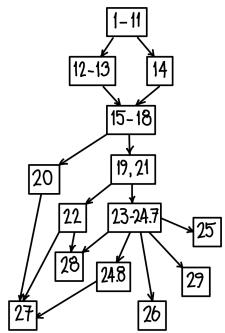  
Figure 0.1 Important logical dependencies among chapters (or, more precisely, a directed graph showing which chapter should be read before which other chapter).

Finally, if you attempt to read this without working through a significant number of exercises (see §0.0.1), I will come to your house and pummel you with [Gr-EGA] until you beg for mercy. It is important to not just have a vague sense of what is true, but to be able to actually get your hands dirty. To quote Mark Kisin: “You can wave your hands all you want, but it still won’t make you fly.” Note: The hints may help you, but sometimes they may not.

# 0.2 For the Expert

If you use this book for a course, you should of course adapt it to your own point of view and your own interests. In particular, you should think about an application or theorem you want to reach at the end of the course (which may well not be in this book), and then work toward it. You should feel no compulsion to sprint to the end; I advise instead taking more time, and ending at the right place for your students. (Figure 0.1, showing large-scale dependencies among the chapters, may help you map out a course.) I have found that the theory of curves (Chapter 19) and the 27 lines on the cubic surface (Chapter 27) have served this purpose well at the end of winter and spring quarters. This has been true even if some of the needed background has not been covered, and has had to be taken by students as some sort of black box. For the first quarter, the goal is to build a common language for many kinds of geometry and geometric spaces (not just algebraic geometry, but also manifolds, complex geometry, some differential geometry, and more)—a sort of archetypal form of a geometric space.

Faithfulness to the goals of $\ S 0 . 4$ required a brutal triage, and I have made a number of decisions you may wish to reverse. I will briefly describe some choices made that may be controversial.

Decisions on how to describe things were made for the sake of the learners. If there were two approaches, and one was “correct” from an advanced point of view, and one was direct and natural from a naive point of view, I went with the latter.

On the other hand, the theory of varieties (over an algebraically closed field, say) was not done first and separately. This choice brought me close to tears, but in the end I am convinced that it can work well, if done in the right spirit.

Instead of spending the first part of the course on varieties, I spent the time in a different way. It is tempting to assume that students will either arrive with great comfort and experience with category theory and sheaf theory, or that they will pick up these ideas on their own time. I would love to live in that world. I encourage you to not skimp on these foundational issues. I have found that although these first lectures felt painfully slow to me, they were revelatory to a

number of the students, and those with more experience were not bored and did not waste their time. This investment paid off in spades when I was able to rely on their ability to think cleanly and to use these tools in practice. Furthermore, if they left the course with nothing more than hands-on experience with these ideas, the world was still better off for it.

For the most part, we will state results in the maximal generality that the proof justifies, but we will not give a much harder proof if the generality of the stronger result will not be used. There are a few cases where we work harder to prove a somewhat more general result that many readers may not appreciate. For example, we prove a number of theorems for proper morphisms, not just projective morphisms. But in such cases, readers are invited or encouraged to ignore the subtleties required for the greater generality.

I consider line bundles (and maps to projective space) more fundamental than divisors. General Cartier divisors are not seriously discussed (§15.6.4), although effective Cartier divisors play an essential role.

Cohomology is done first using the Čech approach (as Serre first did), and derived functor cohomology is introduced only later. I am well aware that Grothendieck thinks that the agreement of Čech cohomology with derived functor cohomology “should be considered as an accidental phenomenon,” and that “it is important for technical reasons not to take as definition of cohomology the Čech cohomology,” [Gr3, p. 108]. But I am convinced that this is the right way for most people to see this kind of cohomology for the first time. (It is certainly true that many topics in algebraic geometry are best understood in the language of derived functors. But this is a view from the mountaintop, looking down, and not the best way to explore the forests. In order to appreciate derived functors appropriately, one must understand the homological algebra behind it, and not just take it as a black box.)

We restrict to the Noetherian case only when it is necessary, or (rarely) when it really saves effort. In this way, non-Noetherian people will clearly see where they should be careful, and Noetherian people will realize that non-Noetherian things are not so terrible. Moreover, even if you are interested primarily in Noetherian schemes, it helps to see “Noetherian” in the hypotheses of theorems only when necessary, as it will help you remember how and when this property gets used.

There are some cases where Noetherian readers will suffer a little more than they would otherwise. As an inflammatory example, instead of using Noetherian hypotheses, we invoke the notion of quasiseparatedness early and often. The cost is that one extra word has to be remembered, on top of an overwhelming number of other words. But once that is done, it is not hard to remember that essentially every scheme anyone cares about is quasiseparated. Furthermore, whenever the hypotheses “quasicompact and quasiseparated” turn up, the reader will immediately guess a key idea of the proof. As another example, coherent sheaves and finite type (quasicoherent) sheaves are the same in the Noetherian situation, but are still worth distinguishing in statements of the theorems and exercises, for the same reason: to be clearer on what is used in the proof.

Many important topics are not discussed. Valuative criteria are not proved (see §13.7), and their statement is relegated to an optional section. Completely omitted: dévissage, formal schemes, and cohomology with supports. Sorry!

# 0.3 Background and Conventions

“Should you just be an algebraist or a geometer?” is like saying, “Would you rather be deaf or blind?”

—M. Atiyah, [At2, p. 659]

All rings are assumed to be commutative unless explicitly stated otherwise. All rings are assumed to contain a unit, denoted by 1. Maps of rings must send 1 to 1. We don’t require that $0 \neq 1$ ; in

other words, the “0-ring” (with one element) is a ring. (There is a ring map from any ring to the 0-ring; the 0-ring only maps to itself. The 0-ring is the final object in the category of rings.) The definition of “integral domain” includes $1 \neq 0 ,$ so the 0-ring is not an integral domain. We accept the Axiom of Choice, usually in the guise of Zorn’s Lemma. In particular, any proper ideal in a ring is contained in a maximal ideal. (The Axiom of Choice also arises in the argument that the category of A-modules has enough injectives; see Exercise 23.2.G.)

The reader should be familiar with some basic notions in commutative ring theory, in particular, the notion of ideals (including prime and maximal ideals), various types of rings (including integral domains, principal ideal domains, unique factorization domains, and local rings), localization, and modules. Tensor products and exact sequences of A-modules will be important. We will use the notation $( A , { \mathfrak { m } } )$ or $( A , { \mathfrak { m } } , { \mathfrak { k } } )$ for local rings (rings with a unique maximal ideal)—A is the ring, m its maximal ideal, and $\ k = \lambda / \mathfrak { m }$ its residue field. We will use the structure theorem for finitely generated modules over a principal ideal domain A: any such module can be written as the direct sum of principal modules A/(a). Some experience with field theory will be important from time to time.

Manifolds will be brought up periodically as examples, but for the most part, they are meant for motivation, so we will often not specify whether they are topological (real) manifolds, differentiable $( C ^ { \infty }$ , i.e., smooth) real manifolds, analytic (real) manifolds, or complex (holomorphic) manifolds. Nonetheless, we will define all four (Definition 4.3.9).

0.3.1. Caution about foundational issues. We will not concern ourselves with subtle foundational issues (set-theoretic issues, universes, etc.). It is true that some people should be careful about these issues. But is that really how you want to live your life? (If you are one of these rare people, a good start is [KS2, §1.1].)   
0.3.2. Further background. It may be helpful to have books on other subjects at hand that you can dip into for specific facts, rather than reading them in advance. In commutative algebra, [E] is good for this. Other popular choices are [AtM] and [Mat2]. The book [Al] takes a point of view useful to algebraic geometry. For homological algebra, [Weib] is simultaneously detailed and readable.

Background from other parts of mathematics (topology, geometry, complex analysis, number theory, . . .) will of course be helpful for intuition and grounding. Some previous exposure to topology is certainly essential.

0.3.3. Nonmathematical conventions. “Unimportant” means “unimportant for the current exposition,” not necessarily unimportant in the larger scheme of things. Other words may be used idiosyncratically as well.

There are optional sections of topics worth knowing on a second or third (but not first) reading. They are marked with a star: $^ *$ . Starred sections are not necessarily harder, but merely unimportant. You should not read double-starred sections $( * * )$ ) unless you really really want to, but you should be aware of their existence. (It may be strange to have parts of a book that should not be read!)

Let’s now find out if you are taking my advice about double-starred sections.

# $\mathbf { 0 . 4 ^ { * * } }$ The Goals of This Book

There are a number of possible introductions to the field of algebraic geometry: Riemann surfaces; complex geometry; the theory of varieties; a nonrigorous examples-based introduction; algebraic geometry for number theorists; an abstract functorial approach; and more. All have their place. Different approaches suit different students (and different advisors). This book takes only one route.

Our intent is to cover a canon completely and rigorously, with enough examples and calculations to help develop intuition for the machinery. This is often the content of a “second course” in algebraic geometry, and in an ideal world, people would learn this material over many years,

after having background courses in commutative algebra, algebraic topology, differential geometry, complex analysis, homological algebra, number theory, and French literature. We do not live in an ideal world. For this reason, the book is written as a first introduction, but a challenging one.

This book seeks to do a very few things, but tries to do them well. Our goals and premises are as follows.

The core of the material should be digestible over a single year. After a year of blood, sweat, and tears, readers should have a broad familiarity with the foundations of the subject, and be ready to attend seminars, and learn more advanced material. They should not just have a vague intuitive understanding of the ideas of the subject; they should know interesting examples, know why they are interesting, and be able to work through their details. Readers in other fields of mathematics should know enough to understand the algebro-geometric ideas that arise in their area of interest.

This means that this book is not encyclopedic, and even beyond that, hard choices have to be made. (In particular, analytic aspects are essentially ignored, and are at best dealt with in passing, without proof. This is a book about algebraic algebraic geometry.)

This book is usable (and has been used) for a course, but the course should (as always) take on the personality of the instructor. With a good course, people should be able to leave early and still get something useful from the experience. With this book, it is possible to leave without regret after learning about category theory, or about sheaves, or about geometric spaces, having become a better person.

The book is also usable (and has been used) for learning on one’s own. But most mortals cannot learn algebraic geometry fully on their own; ideally, you should read in a group, and even if not, you should have someone you can ask questions to (both stupid and smart questions).

There is certainly more than a year’s material here, but I have tried to make clear which topics are essential, and which are not. Those teaching a class will choose which “inessential” things are important for the point they wish to get across, and use them.

There is a canon (at least for this particular approach to algebraic geometry). I have been repeatedly surprised at how much people in different parts of algebraic geometry agree on what every civilized algebraic geometer should know after a first (serious) year. (There are of course different canons for different parts of the subject, e.g., complex algebraic geometry, combinatorial algebraic geometry, computational algebraic geometry, etc.) There are extra bells and whistles that different instructors might add on, to prepare students for their particular part of the field or their own point of view, but the core of the subject remains unified, despite the diversity and richness of the subject. There are some serious and painful compromises to be made to reconcile this goal with the previous one.

Algebraic geometry is for everyone (with the appropriate definition of “everyone”). Algebraic geometry courses tend to require a lot of background, which makes them inaccessible to all but those who know they will go deeply into the subject. Algebraic geometry is too important for that; it is essential that many of those in nearby fields develop some serious familiarity with the foundational ideas and tools of the subject, and not just at a superficial level. (Similarly, algebraic geometers uninterested in any nearby field are necessarily arid, narrow thinkers. Do not be such a person!)

For this reason, this book attempts to require as little background as possible. The background required will, in a technical sense, be surprisingly minimal—ideally just some commutative ring theory and point-set topology, and call for some comfort with things like prime ideals and localization. This is misleading, of course—the more you know, the better. And the less background you have, the harder you will have to work—this is not a light read. On a related note . . .

The book is intended to be as self-contained as possible. I have tried to follow the motto: “If you use it, you must prove it.” I have noticed that most students are human beings: if you tell them that some algebraic fact is in some late chapter of a book on commutative algebra, they will not immediately go and read it. Surprisingly often, what we need can be developed quickly from

scratch, and even if people do not read it, they can see what is involved. The cost is that the book is much denser, and that significant sophistication and maturity is demanded of the reader. The benefit is that more people can follow it; they are less likely to reach a point where they get thrown. On the other hand, people who already have some familiarity with algebraic geometry, but want to understand the foundations more completely, should not be bored, and can focus on more subtle issues.

This goal is important because one should not just know what is true, but also know why things are true, and what is hard, and what is not hard. Also, this helps the previous goal, by reducing the number of prerequisites.

The book is intended to build intuition for the formidable machinery of algebraic geometry. The exercises are central for this (see §0.0.1). Informal language can sometimes be helpful. Many examples are given. (If you do not have pictures in your head which provide you with insight into why things are true, and how to prove things, then you cannot really say that you are “thinking geometrically.”) Learning how to think cleanly (and, in particular, categorically) is essential. The advantages of appropriate generality should be made clear by example, and not through intimidation. The motivation is more local than global. For example, there is no introductory chapter explaining why one might be interested in algebraic geometry, and instead there is an introductory chapter explaining why you should want to think categorically (and how to actually do this).

Balancing the above goals is already impossible. We must thus give up any hope of achieving any other desiderata. There are no other goals.

0.4.1. Inadequate acknowledgments. This entire project consists of communal wisdom passed from person to person. I have tried to collect it and distill it and curate it, but I can in no way begin to give correct credit for the ideas. I cannot even begin to correctly credit the people I personally learned from. There are far too many to list, and any list I have tried to make has had too many painful omissions. Instead, I will try to decribe the broad classes of people who have influenced this work.

My life began in Toronto, and I had an early glimpse of algebraic geometry at the University of Toronto, through Bierstone, Milman, Murty, Arthur, and many others. In my graduate and postdoctoral years at Harvard, Princeton, and MIT, I fell in love with algebraic geometry and developed into the mathematician that I am, and if you know whom I met during those years—older role models and teachers, slightly older mentors, many peers, and brilliant younger students—you will see their personalities in these pages. In some important algebro-geometric sense, Joe Harris gave me a heart, Brendan Hassett gave me a brain, and Johan de Jong gave me a spine. But the entire ethos of algebraic geometry at the time—where subfields were rapidly developing, yet people learned from and talked to each other across the entire field, with generosity and friendship—is what attracted me into the subject. Perhaps most of the famous algebraic geometers of today have their ideas in these pages (although they may not realize it), coming from long conversations at conferences, or gleaned from talks.

It may surprise the next group how much I learned from them: my students and postdocs (both official ones and those who merely passed through). My main contribution as a mathematician has been in thinking about how to develop talent, and I have have taken great joy in watching extraordinary talent develop.

I (and soon, you) also owe an extreme debt to those have contributed to these notes over the years. Many people have individually given hundreds of detailed useful comments, and the resulting conversations have been particularly rewarding. At one point I kept a list of those in this group who merited particular thanks, but the length and arbitrariness of that list led me to decide to leave the evidence in public on the website where these notes came to life, math216.wordpress.com. (Many people preferred to give their comments by email, so their contributions may be less visible.)

The phrase “the rising sea” is due to Grothendieck [Gr5, pp. 552–3], with this particular translation by McLarty [Mc, p. 1]. The phrase was popularized as the title of Daniel Murfet’s excellent

blog [Mur], and I want to particularly thank Daniel for his generosity in sharing this title. The cover is an ominous variation on Hokusai’s famous woodblock print, The Great Wave off Kanagawa. Mike Stay is the author of Jokes 1.2.12 and 21.5.2. Many particulars of the design of the prepublication version of the book are due to a number of people, but in particular to Sándor Kovács. I am also indebted to Diana Gillooly for her care and wisdom in shepherding this book to publication.

I am grateful for the financial support this project has indirectly received over the years, from Stanford, the National Science Foundation, and the Simons Foundation. The generous support of fundamental research and basic science has been an important engine of human development over centuries, so it is a pleasure to acknowledge it here.

Finally, at the most basic level, I am grateful to my family, and for my family.

# PART I

# Preliminaries

# Chapter 1

# Just Enough Category Theory to Be Dangerous

Was mich nicht umbringt, macht mich stärker. That which does not kill me, makes me stronger.

—F. Nietzsche [N, aphorism number 8]

Before we get to any interesting geometry, we need to develop a language to discuss things cleanly and effectively. This is best done in the language of categories. There is not much to know about categories to get started; it is just a very useful language. Like all mathematical languages, category theory comes with an embedded logic, which allows us to abstract intuitions in settings we know well to far more general situations.

Our motivation is as follows. We will be creating some new mathematical objects (such as schemes, and certain kinds of sheaves), and we expect them to act like objects we have seen before. We could try to nail down precisely what we mean by “act like,” and what minimal set of things we have to check in order to verify that they act the way we expect. Fortunately, we don’t have to—other people have done this before us, by defining key notions, such as abelian categories, which behave like modules over a ring.

Our general approach will be as follows. I will try to tell you what you need to know, and no more. (This I promise: If I use the word “topoi,” you can shoot me.) I will begin by telling you things you already know, and describing what is essential about the examples, in a way that we can abstract a more general definition. We will then see this definition in less familiar settings, and get comfortable with using it to solve problems and prove theorems.

1.0.1. Example: product. For example, we will define the notion of product of schemes. We could just give a definition of product, but then you should want to know why this precise definition deserves the name of “product.” As a motivation, we revisit the notion of product in a situation we know well: (the category of) sets. One way to define the product of sets U and V is as the set of ordered pairs $\{ ( \mathfrak { u } , \nu ) : \mathfrak { u } \in \mathfrak { U } , \nu \in \mathsf { V } \}$ . But someone from a different mathematical culture might reasonably define it as the set of symbols $\{ \boldsymbol { \nu } : \mathrm { \boldsymbol { u } } \in \mathrm { \boldsymbol { U } } , \boldsymbol { \nu } \in \mathrm { \boldsymbol { V } } \}$ . These notions are “obviously the same.” Better: There is “an obvious bijection between the two.”

This can be made precise by giving a better definition of product, in terms of a universal property. Given two sets $M$ and $\Nu ,$ , a product is a set P, along with maps $\mu$ : $\mathsf { P } \to M$ and $v \colon \mathsf { P } \to \mathsf { N }$ , such that for any set $\mathsf { P } ^ { \prime }$ with maps $\mu ^ { \prime } \colon \mathsf { P } ^ { \prime }  M$ and ν ′ : $\mathsf { P } ^ { \prime } \to \mathsf { N }$ →, these maps factor uniquely through P:

(1.0.1.1)

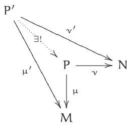

(The symbol ∃ means “there exists,” and the symbol ! means “unique.”) Thus a product is a diagram

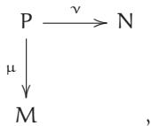

and not just a set P, although the maps $\mu$ and ν are often left implicit.

This definition agrees with the traditional definition, with one twist: there isn’t just a single product; but any two products come with a unique isomorphism between them. In other words, the product is unique up to unique isomorphism. Here is why: If you have a product

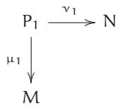

and I have a product

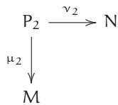

then by the universal property of my product (letting $\left( \mathsf { P } _ { 2 } , \mu _ { 2 } , \nu _ { 2 } \right)$ play the role of $( \mathsf { P } , \mu , \nu )$ and $\left( \mathsf { P } _ { 1 } , \mu _ { 1 } , \nu _ { 1 } \right)$ play the role of $( \mathsf { P } ^ { \prime } , \mathsf {  { \mu } } ^ { \prime } , \mathsf {  { v } } ^ { \prime } )$ in (1.0.1.1)), there is a unique map $\mathsf { f } \colon \mathsf { P } _ { 1 }  \mathsf { P } _ { 2 }$ making the appropriate diagram commute (i.e., µ1 = µ2 ◦ f and $\mathsf { v } _ { 1 } = \mathsf { v } _ { 2 } \circ \mathsf { f }$ ). Similarly, by the universal property of your product, there is a unique map ${ \mathfrak { g } } \colon { \mathsf { P } } _ { 2 } \to { \mathsf { P } } _ { 1 }$ making the appropriate diagram commute. Now consider the universal property of my product, this time letting $\left( \mathsf { P } _ { 2 } , \mu _ { 2 } , \nu _ { 2 } \right)$ play the role of both $( \mathsf { P } , \mu , \nu )$ and $( \mathsf { P } ^ { \prime } , \mathsf { \mu } ^ { \prime } , \mathsf { v } ^ { \prime } )$ in (1.0.1.1). There is a unique map h: ${ \sf P } _ { 2 }  { \sf P } _ { 2 }$ such that

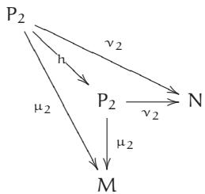

commutes. However, I can name two such maps: the identity map $\mathrm { i d } _ { \mathsf { P } _ { 2 } }$ and ${ \textsf { f o g } }$ . Thus ${ \mathsf { f o } } { \mathsf { g } } = { \mathsf { i d } } _ { { \mathsf { P } } _ { 2 } }$ . Similarly, ${ \mathfrak { g o f } } = \mathrm { i d } _ { { \mathfrak { p } } _ { 1 } }$ . Thus the maps f and g arising from the universal property are bijections. In short, there is a unique bijection between $\mathsf { P } _ { 1 }$ and ${ \sf P } _ { 2 }$ preserving the “product structure” (the maps to M and N). This gives us the right to name any such product $M \times \mathsf { N } _ { \cdot }$ , since any two such products are uniquely identified.

This definition has the advantage that it works in many circumstances, and once we define categories, we will soon see that the above argument applies verbatim in any category to show that products, if they exist, are unique up to unique isomorphism. Even if you haven’t seen the definition of category before, you can verify that this agrees with your notion of product in some category that you have seen before (such as the category of vector spaces, or the category of manifolds).

This is handy even in cases that you understand. For example, one way of defining the product of two manifolds M and N is to cut them both up into charts, then take products of charts, then glue them together. But if I cut up the manifolds M and N in one way, and you cut them up in another, how do we know our resulting product manifolds are the “same”? We could wave our hands, or make an annoying argument about refining covers, but instead, we should just show

that they are “categorical products” and hence canonically the “same” (i.e., isomorphic). We will formalize this argument in §1.2.

Another set of notions we will abstract is that of categories that “behave like modules.” We will want to define kernels and cokernels for new notions, and we should make sure that these notions behave the way we expect them to. This leads us to the definition of abelian categories, first defined by Grothendieck in his Tôhoku paper [Gr1].

In this chapter, we will give an informal introduction to these and related notions, in the hope of our developing just enough familiarity to comfortably use them in practice.

# 1.1 Categories and Functors

The introduction of the digit 0 or the group concept was general nonsense too, and mathematics was more or less stagnating for thousands of years because nobody was around to take such childish steps.

—A. Grothendieck, [BroP, pp. 4–5]

Before functoriality, people lived in caves.

—B. Conrad

We begin with an informal definition of categories and functors.

# 1.1.1. Categories.

A category consists of a collection of objects, and for each pair of objects, a set of morphisms (or arrows) between them. (For experts: technically, this is the definition of a locally small category. In the correct definition, the morphisms need only form a class, not necessarily a set, but see Caution 0.3.1.) Morphisms are often informally called maps. The collection of objects of a category $\mathcal { C }$ is often denoted by $\operatorname { o b j } ( { \mathcal { C } } ) .$ , but we will usually denote the collection also by $\mathcal { C }$ . If A, $\mathrm { B } \in { \mathcal { C } } ,$ , then the set of morphisms from A to B is denoted by $\operatorname { M o r } ( A , { \mathrm { B } } )$ . A morphism is often written f : $\mathsf { A } \to \mathsf { B } ,$ and A is said to be the source of ${ \sf f } ,$ and B the target of f. (Of course, $\operatorname { M o r } ( A , { \mathrm { B } } )$ is taken to be disjoint from $\mathrm { M o r } ( \mathcal { A } ^ { \prime } , \mathbb { B } ^ { \prime } )$ unless $\bar { \mathsf { A } } = \bar { \mathsf { A } } ^ { \prime }$ and $\mathrm { B } = \mathrm { B } ^ { \prime }$ .)

Morphisms compose as expected: there is a composition $\operatorname { M o r } ( \mathrm { B } , \mathrm { C } ) \times \operatorname { M o r } ( \mathrm { A } , \mathrm { B } ) \to \operatorname { M o r } ( \mathrm { A } , \mathrm { C } ) ,$ and if $\mathsf { f } \in \operatorname { M o r } ( \mathsf { A } , \mathsf { B } )$ and ${ \mathfrak { g } } \in \operatorname { M o r } ( { \mathfrak { B } } , { \mathsf { C } } )$ , then their composition is denoted by ${ \mathfrak { g o f } }$ . Composition is associative: if $\mathsf { f } \in \operatorname { M o r } ( \mathsf { A } , \mathsf { B } )$ , ${ \mathfrak { g } } \in \operatorname { M o r } ( { \mathrm { B } } , { \mathrm { C } } ) .$ , and $\mathsf { h } \in \mathbf { M o r } ( \mathsf { C } , \mathsf { D } ) .$ , then $\mathtt { h } \circ ( { \mathfrak { g } } \circ { \mathfrak { f } } ) = ( { \mathfrak { h } } \circ { \mathfrak { g } } ) \circ { \mathfrak { f } } .$ . For each object ${ \boldsymbol { \cal A } } \in { \mathcal { C } } _ { \mathrm { \Delta \Gamma } }$ , there is always an identity morphism $\operatorname { i d } _ { A } \colon A \to A ,$ such that when you (leftor right-) compose a morphism with the identity, you get the same morphism. More precisely, for any morphisms f : $\lambda \to \mathbb { B }$ and ${ \mathfrak { g } } \colon { \mathrm { B } } \to { \mathsf { C } }$ , idB ◦f = f and ${ \mathfrak { g o i d } } _ { \mathrm { B } } = { \mathfrak { g } }$ . (If you wish, you may check that “identity morphisms are unique”: there is only one morphism deserving the name idA.) This ends the definition of a category.

We have a notion of isomorphism between two objects of a category (a morphism f : $\lambda \to \mathbb { B }$ such that there exists some—necessarily unique—morphism ${ \mathfrak { g } } \colon { \mathrm { B } } \to { \bar { A } } .$ , where ${ \textsf { f o g } }$ and ${ \mathfrak { g o f } }$ are the identities on B and A respectively).

1.1.2. Example. The prototypical example to keep in mind is the category of sets, denoted by Sets. The objects are sets, and the morphisms are maps of sets. (Because Russell’s paradox shows that there is no set of all sets, we did not say earlier that there is a set of all objects. But as stated in $\ S 0 . 3 ,$ we are deliberately omitting all set-theoretic issues.)   
1.1.3. Example. Another good example is the category $V e c _ { \boldsymbol { \mathrm { k } } }$ of vector spaces over a given field k. The objects are k-vector spaces, and the morphisms are linear transformations. (What are the isomorphisms?)   
1.1.A. UNIMPORTANT EXERCISE. A category in which each morphism is an isomorphism is called a groupoid. (This notion is not important in what we will discuss. The point of this

exercise is to give you some practice with categories, by relating them to an object you know well.)

(a) A perverse definition of a group is: a groupoid with one object. Make sense of this. (Similarly, in case you care, a perverse definition of a monoid is: a category with one object.)   
(b) Describe a groupoid that is not a group.

1.1.B. EXERCISE. If A is an object in a category $\mathcal { C } _ { \iota }$ , show that the invertible elements of $\operatorname { M o r } ( A , A )$ 0 form a group (called the automorphism group of $\mathsf { A } ,$ denoted by Aut(A)). What are the automorphism groups of the objects in Examples 1.1.2 and 1.1.3? Show that two isomorphic objects have isomorphic automorphism groups. (For readers with a topological background: if $x$ is a topological space, then the fundamental groupoid is the category where the objects are points of $\scriptstyle \mathsf { X } ,$ and the morphisms $x \to { \mathfrak { y } }$ are paths from $x$ to y, up to homotopy. Then the automorphism group of $x _ { 0 }$ is the (pointed) fundamental group $\pi _ { 1 } ( \boldsymbol { X } , \boldsymbol { x } _ { 0 } )$ . In the case where X is connected, and $\pi _ { 1 } ( X )$ is not abelian, this illustrates the fact that for a connected groupoid—whose definition you can guess—the automorphism groups of the objects are all isomorphic, but not canonically isomorphic.)   
1.1.4. Example: Abelian groups. The abelian groups, along with group homomorphisms, form a category $A b$ .   
1.1.5. Important Example: Modules over a ring. If A is a ring, then the A-modules form a category $M o d _ { A }$ . (This category has additional structure; it will be the prototypical example of an abelian category; see §1.5.) Taking $\mathsf { A } = \mathsf { k } ,$ we obtain Example 1.1.3; taking $\begin{array} { r } { A = \mathbb { Z } , } \end{array}$ we obtain Example 1.1.4.   
1.1.6. Example: Rings. There is a category Rings, where the objects are rings, and the morphisms are maps of rings in the usual sense (maps of sets that respect addition and multiplication, and that send 1 to 1 by our conventions; see §0.3).   
1.1.7. Example: Topological spaces. The topological spaces, along with continuous maps, form a category Top. The isomorphisms are homeomorphisms.

In all of the above examples, the objects of the categories were in obvious ways sets with additional structure (a concrete category, although we won’t use this terminology). This needn’t be the case, as the next example shows.

1.1.8. Example: Partially ordered sets. A partially ordered set (or poset) is a set S along with a binary relation $\geq$ on S satisfying:

(i) $x \ge x$ (reflexivity),   
(ii) $x \ge { 9 }$ and $y \ge z$ imply $x \ge z$ (transitivity), and   
(iii) if $x \ge { 9 }$ and $y \geq x$ then ${ \mathfrak { x } } = { \mathfrak { y } }$ (antisymmetry).

A partially ordered set $( S , \geq )$ can be interpreted as a category whose objects are the elements of S, and with a single morphism from $x$ to $_ { 9 }$ if and only if $x \geq y$ (and no morphism otherwise).

A trivial example is $( S , \geq )$ where $x \ge { 9 }$ if and only if ${ \mathfrak { x } } = { \mathfrak { y } }$ . Another example is

(1.1.8.1)

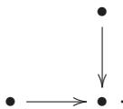

Here there are three objects. The identity morphisms are omitted for convenience, and the two non-identity morphisms are depicted. A third example is

(1.1.8.2)

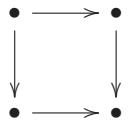

Here the “obvious” morphisms are again omitted: the identity morphisms, and the morphism from the upper left to the lower right. Similarly,

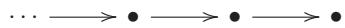

depicts a partially ordered set, where, again, only the “generating morphisms” are depicted.

# 1.1.11. Functors.

1.1.9. Example: The category of subsets of a set, and the category of open subsets of a topological space. If X is a set, then the subsets form a partially ordered set, where arrows are given by inclusion. (Be careful: you may be expecting the arrows to go the other way, because of Example 1.1.8.) Informally, if $\ u \mathrm { u } \subset \mathsf { V } ,$ then we have exactly one morphism $\mathsf { U } \to \mathsf { V }$ in the category (and otherwise none). Similarly, if $x$ is a topological space, then the open sets form a partially ordered set, where the maps are given by inclusions.   
1.1.10. Definition. A subcategory $\mathcal { A }$ of a category $\mathcal { B }$ has as its objects some of the objects of ${ \mathcal { B } } ,$ and some of the morphisms of ${ \mathcal { B } } ,$ such that the objects of $\mathcal { A }$ include the sources and targets of the morphisms of $\mathcal { A }$ , and the morphisms of $\mathcal { A }$ include the identity morphisms of the objects of $\mathcal { A } ,$ , and are preserved by composition. (For example, (1.1.8.1) is in an obvious way a subcategory of (1.1.8.2). Also, we have an obvious “inclusion” i: ${ \mathcal { A } } \to { \mathcal { B } } ,$ , which will soon be an example of a functor.)   
A covariant functor F from a category $\mathcal { A }$ to a category ${ \mathcal { B } } ,$ denoted by F: ${ \mathcal { A } } \to { \mathcal { B } } ,$ is the following data. It is a map of objects F: $\mathrm { o b j } ( { \mathcal { A } } )  \mathrm { o b j } ( { \mathcal { B } } ) ,$ , and for each $\lambda _ { 1 } , \lambda _ { 2 } \in { \mathcal { A } }$ , and morphism m: $\lambda _ { 1 } $ $\lambda _ { 2 } ,$ a morphism $\mathsf { F } ( \mathsf { m } ) \colon \mathsf { F } ( \mathsf { A } _ { 1 } ) \longrightarrow \mathsf { F } ( \mathsf { A } _ { 2 } )$ in $\mathcal { B }$ . We require that F preserve identity morphisms (for $A \in$ $\mathcal { A } , \mathsf { F } ( \mathrm { i d } _ { A } ) = \mathrm { i d } _ { \mathsf { F } ( A ) } ,$ ), and that F preserve composition $( { \mathsf { F } } ( \mathsf { m } _ { 2 } \circ \mathsf { m } _ { 1 } ) = { \mathsf { F } } ( \mathsf { m } _ { 2 } ) \circ { \mathsf { F } } ( \mathsf { m } _ { 1 } ) )$ . (You may wish to verify that covariant functors send isomorphisms to isomorphisms.) A trivial example is the identity functor id : $\mathcal { A }  \mathcal { A }$ , whose definition you can guess. Here are some less trivial examples.   
1.1.12. Example: A forgetful functor. Consider the functor from the category of vector spaces (over a field k) $V e c _ { \boldsymbol { \mathrm { k } } }$ to Sets that associates to each vector space its underlying set. The functor sends a linear transformation to its underlying map of sets. This is an example of a forgetful functor, where some additional structure is forgotten. Another example of a forgetful functor is $M o d _ { \mathrm { A } } $ $A b$ from A-modules to abelian groups, which remembers only the abelian group structure of the A-module.   
1.1.13. Topological examples. Examples of covariant functors include the fundamental group functor $\pi _ { 1 } ,$ which sends a topological space X with choice of a point $x _ { 0 } \in X$ to a group $\pi _ { 1 } ( X , x _ { 0 } )$ (what are the objects and morphisms of the source category?), and the ith homology functor $T o p  A b$ , which sends a topological space X to its ith homology group $\mathsf { H } _ { \mathrm { i } } ( \mathsf { X } , \mathbb { Z } )$ . The covariance corresponds to the fact that a (continuous) morphism of pointed topological spaces $\Phi \colon X \to Y$ with $\Phi ( \boldsymbol { x } _ { 0 } ) = \boldsymbol { y } _ { 0 }$ induces a map of fundamental groups $\pi _ { 1 } ( X , x _ { 0 } ) \longrightarrow \pi _ { 1 } ( Y , y _ { 0 } ) ,$ , and similarly for homology groups.   
1.1.14. Example. Suppose A is an object in a category $\mathcal { C }$ . Then there is a functor $\mathtt { h } ^ { A }$ : $\mathcal { C } \longrightarrow S e t s$ sending $\boldsymbol { \mathrm { B } } \in \mathcal { C }$ to $\operatorname { M o r } ( A , { \mathrm { B } } )$ and sending f: $\mathrm { B } _ { 1 }  \mathrm { B } _ { 2 }$ to $\operatorname { M o r } ( \mathtt { A } , \mathtt { B } _ { 1 } ) \to \operatorname { M o r } ( \mathtt { A } , \mathtt { B } _ { 2 } ) .$ →, described by

$$
[ g: A \to B _ {1} ] \longmapsto [ f \circ g: A \to B _ {1} \to B _ {2} ].
$$

This seemingly silly functor ends up surprisingly being an important concept.

1.1.15. Definitions. If F: ${ \mathcal { A } } \to { \mathcal { B } }$ and G: $: { \mathcal { B } } \to { \mathcal { C } }$ are covariant functors, then we define a functor $\Game \operatorname { F }$ : $\mathcal { A } \xrightarrow { } \mathcal { C }$ → →(the composition of G and F) in the obvious way. Composition of functors is associative in an evident sense.

A covariant functor F: ${ \mathcal { A } } \to { \mathcal { B } }$ is faithful if for all $A , A ^ { \prime } \in { \mathcal { A } }$ , the map $\mathrm { M o r } _ { \mathcal { A } } ( \mathsf { A } , \mathsf { A } ^ { \prime } ) \to$ $\operatorname { M o r } _ { \mathcal { B } } ( \mathsf { F } ( \mathsf { A } ) , \mathsf { F } ( \mathsf { A } ^ { \prime } ) )$ → →is injective, and full if it is surjective. A functor that is full and faithful is fully faithful. (For various philosophical reasons, the notion of “full” functor on its own is unimportant; “fully faithful” is the useful notion.) A subcategory i: ${ \mathcal { A } } \to { \mathcal { B } }$ is a full subcategory if i is full.

(Inclusions are always faithful, so there is no need for the phrase “faithful subcategory.”) Thus a subcategory ${ \mathcal { A } } ^ { \prime }$ of $\mathcal { A }$ is full if and only if for all A, $\mathrm { B } \in \mathrm { o b j } ( \mathcal { A } ^ { \prime } ) , \mathrm { M o r } _ { \mathcal { A } ^ { \prime } } ( \mathrm { A } , \mathrm { B } ) = \mathrm { M o r } _ { \mathcal { A } } ( \mathrm { A } , \mathrm { B } )$ . For example, the forgetful functor $V e c _ { \boldsymbol { \mathrm { k } } }  S e t s$ is faithful, but not full; and if $A$ is a ring, the category of finitely generated A-modules is a full subcategory of the category $M o d _ { A }$ of A-modules.

1.1.16. Definition. A contravariant functor is defined in the same way as a covariant functor, except the arrows switch directions: in the above language, $\mathsf { F } ( A _ { 1 } \to A _ { 2 } )$ is now an arrow from $\mathsf { F } ( A _ { 2 } )$ to $\mathsf { F } ( A _ { 1 } )$ . (Thus $\mathsf { F } ( \mathsf { m } _ { 2 } \circ \mathsf { m } _ { 1 } ) = \mathsf { F } ( \mathsf { m } _ { 1 } ) \circ \mathsf { F } ( \mathsf { m } _ { 2 } ) .$ , not $\mathsf { F } ( \mathfrak { m } _ { 2 } ) \circ \mathsf { F } ( \mathfrak { m } _ { 1 } )$ .)

It is wise to state whether a functor is covariant or contravariant, unless the context makes it very clear. If it is not stated (and the context does not make it clear), the functor is often assumed to be covariant.

Sometimes people describe a contravariant functor $\mathcal { C } \to \mathcal { D }$ as a covariant functor $\mathcal { C } ^ { \mathrm { o p p } }  \mathcal { D } ,$ , where $\mathcal { C } ^ { \mathrm { o p p } }$ is the same category as $\mathcal { C }$ except that the arrows go in the opposite direction. Here $\mathcal { C } ^ { \mathrm { o p p } }$ is said to be the opposite category to $\mathcal { C }$ .

One can define fullness, etc. for contravariant functors, and you should do so.

1.1.17. Linear algebra example. If $V e c _ { \boldsymbol { \mathrm { k } } }$ is the category of k-vector spaces (introduced in Example 1.1.3), then taking duals gives a contravariant functor $( \cdot ) ^ { \vee } \colon V e c _ { \bf k }  V e c _ { \bf k }$ . Indeed, to each linear transformation f : ${ \mathsf { V } } \to { \mathsf { W } } _ { \mathbb { \ell } }$ , we have a dual transformation $\mathsf { f } ^ { \vee } : W ^ { \vee }  \mathsf { V } ^ { \vee }$ , and $( \mathsf { f o g } ) ^ { \vee } = \mathsf { g } ^ { \vee } \circ \mathsf { f } ^ { \vee }$ .   
1.1.18. Topological example (cf. Example 1.1.13) for those who have seen cohomology. The ith cohomology functor $\mathsf { H } ^ { \mathrm { i } } ( \cdot , \mathbb { Z } ) \colon T o p  A b$ is a contravariant functor.   
1.1.19. Example. There is a contravariant functor $T o p  R i n g s$ taking a topological space X to the ring of real-valued continuous functions on X. A morphism of topological spaces $\Chi \to \Upsilon$ (a continuous map) induces the pullback map from functions on Y to functions on X.   
1.1.20. Example (the functor of points; cf. Example 1.1.14). Suppose A is an object of a category $\mathcal { C }$ . Then there is a contravariant functor $\mathtt { h } _ { \mathtt { A } } \colon { \mathcal { C } } \longrightarrow S e t s$ sending $\boldsymbol { \mathrm { B } } \in \mathcal { C }$ to $\operatorname { M o r } ( \mathtt { B } , \lambda ) ,$ , and sending the morphism f : $\mathrm { B } _ { 1 }  \mathrm { B } _ { 2 }$ to the morphism $\operatorname { M o r } ( \mathtt { B } _ { 2 } , \mathtt { A } ) \to \operatorname { M o r } ( \mathtt { B } _ { 1 } , \mathtt { A } )$ via

$$
[ g: B _ {2} \to A ] \longmapsto [ g \circ f: B _ {1} \to B _ {2} \to A ].
$$

This example initially looks weird and different, but Examples 1.1.17 and 1.1.19 may be interpreted as special cases; do you see how? What is A in each case? This functor might reasonably be called the functor of maps (to A), but is actually known as the functor of points. We will meet this functor again in §1.2.11 and (in the category of schemes) in Definition 7.3.10.

1.1.21.* Natural transformations (and natural isomorphisms) of covariant functors, and equivalences of categories.

(This notion won’t come up in an essential way until at least Chapter 7, so you shouldn’t read this section until then.) Suppose F and G are two covariant functors from $\mathcal { A }$ to $\mathcal { B }$ . A natural transformation of covariant functors $\mathsf { F } \to \mathsf { G }$ is the data of a morphism $\mathfrak { m } _ { A } \colon \mathsf { F } ( A ) \longrightarrow \mathsf { G } ( A )$ for each $\boldsymbol { A } \in \mathcal { A }$ such that for each f : $A  A ^ { \prime }$ in $\mathcal { A }$ , the diagram

$$
\begin{array}{c} F (A) \xrightarrow {F (f)} F (A ^ {\prime}) \\ m _ {A} \Bigg \downarrow \\ G (A) \xrightarrow [ G (f) ]{} G (A ^ {\prime}) \end{array}
$$

commutes. A natural isomorphism of functors is a natural transformation such that each $\mathsf { m } _ { A }$ is an isomorphism. (We make analogous definitions when F and G are both contravariant.)

The data of functors F: ${ \mathcal { A } } \to { \mathcal { B } }$ and $\mathsf { F ^ { \prime } }$ : $\mathcal { B } \xrightarrow { } \mathcal { A }$ such that $\mathsf { F } \circ \mathsf { F } ^ { \prime }$ is naturally isomorphic to the identity functor $\mathrm { i d } \mathcal { R }$ on $\mathcal { B }$ and $\mathsf { F } ^ { \prime } \circ \mathsf { F }$ is naturally isomorphic to $\mathrm { i d } _ { \mathcal { A } }$ is said to be an equivalence of categories. The right notion of when two categories are “essentially the same” is not isomorphism

(a functor giving bijections of objects and morphisms) but equivalence. Exercises 1.1.C and 1.1.D might give you some vague sense of this. Later exercises (for example, to show that “rings” and “affine schemes” are essentially the same once arrows are reversed, Exercise 7.3.E) may help, too.

Two examples might make this strange concept more comprehensible. The double dual of a finite-dimensional vector space V is not V, but we learn early to say that it is canonically isomorphic to V. We can make that precise as follows. $\mathrm { L e t } f . d . V e c _ { \mathrm { k } }$ be the category of finite-dimensional vector spaces over k. Note that this category contains oodles of vector spaces of each dimension.

1.1.C. EXERCISE. Let $( \cdot ) ^ { \vee \vee } : f . d . V e c _ { \bf k } \longrightarrow f . d . V e c _ { \bf k }$ be the double dual functor from the category of finite-dimensional vector spaces over $\mathrm { k }$ to itself. Show that $( \cdot ) ^ { \vee \vee }$ is naturally isomorphic to the identity functor on $f . d . V e c _ { \mathrm { k } }$ . (Without the finite-dimensionality hypothesis, we only get a natural transformation of functors from id to $( \cdot ) ^ { \vee \vee }$ .)

Let $\mathcal { V }$ be the category whose objects are the k-vector spaces ${ \boldsymbol { k } } ^ { \mathrm { n } }$ for each $\mathfrak { n } \geq 0$ (there is one vector space for each n), and whose morphisms are linear transformations. The objects of $\mathcal { V }$ can be thought of as vector spaces with bases, and the morphisms as matrices. There is an obvious functor $\mathcal { V } \longrightarrow f . d . V e c _ { \mathrm { k } } ,$ as each $\boldsymbol { \mathrm { k } } ^ { \mathrm { n } }$ is a finite-dimensional vector space.

1.1.D. EXERCISE. Show that $\mathcal { V } \longrightarrow f . d . V e c _ { \mathrm { k } }$ gives an equivalence of categories, by describing an “inverse” functor. (Recall that we are being cavalier about set-theoretic assumptions—see Caution 0.3.1—so feel free to simultaneously choose bases for each vector space in $f . d . V e c _ { \mathrm { k } }$ . To make this precise, you will need to use Gödel-Bernays set theory or else replace $f . d . V e c _ { \mathrm { k } }$ with a very similar small category, but we won’t worry about this.)

1.1.22.** Aside for experts. Your argument for Exercise 1.1.D will show that (modulo set-theoretic issues) this definition of equivalence of categories is the same as another one commonly given: a covariant functor F: ${ \mathcal { A } } \to { \mathcal { B } }$ is an equivalence of categories if it is fully faithful and every object of $\mathcal { B }$ is isomorphic to an object of the form F(A) for some $\boldsymbol { \mathsf { A } } \in \mathcal { A }$ (F is essentially surjective, a term we will not need).

# 1.2 Universal Properties Determine an Object up to Unique Isomorphism

Given some category that we come up with, we often will have ways of producing new objects from old. In good circumstances, definitions will be usefully made using the notion of a universal property. Informally, we wish that there were an object with some property. We first show that if it exists, then it is essentially unique, or more precisely, is unique up to unique isomorphism. Then we go about constructing an example of such an object to show existence.

Explicit constructions are sometimes easier to work with than universal properties, but with a little practice, universal properties are useful in proving things quickly and slickly. Indeed, when learning the subject, people often find explicit constructions more appealing, and use them more often in proofs, but as they become more experienced, they find universal property arguments more elegant and insightful.

1.2.1. Products were defined by a universal property. We have seen one important example of a universal property argument already in $\ S 1 . 0 . 1$ : products. You should go back and verify that our discussion there gives a notion of product in any category, and shows that products, if they exist, are unique up to unique isomorphism.   
1.2.2. Initial, final, and zero objects. Here are some simple but useful concepts that will give you practice with universal property arguments. An object of a category $\mathcal { C }$ is an initial object if it has precisely one map to every object. It is a final object if it has precisely one map from every object. It is a zero object if it is both an initial object and a final object.   
1.2.A. EXERCISE. Show that any two initial objects are uniquely isomorphic. Show that any two final objects are uniquely isomorphic.

In other words, if an initial object exists, it is unique up to unique isomorphism, and similarly for final objects. This (partially) justifies the phrase “the initial object” rather than “an initial object,” and similarly for “the final object” and “the zero object.” (Convention: We often say “the,” not “a,” for anything defined up to unique isomorphism.)

1.2.B. EXERCISE. What are the initial and final objects in Sets, Rings, and Top (if they exist)? How about in the two examples of §1.1.9?

1.2.3. Localization of rings and modules. Another important example of a definition by universal property is the notion of localization of a ring. We first review a constructive definition, and then reinterpret the notion in terms of universal property. A multiplicative subset S of a ring A is a subset closed under multiplication containing 1. We define a ring $S ^ { - 1 } A$ . The elements of $S ^ { - 1 } A$ are of the form $\mathbf { a } / s$ where ${ \mathfrak { a } } \in { \mathcal { A } }$ and $s \in S ,$ , and where $\mathbf { a } _ { 1 } / s _ { 1 } = \mathbf { a } _ { 2 } / s _ { 2 }$ if (and only if) for some $s \in S _ { \ast }$ , $s ( s _ { 2 } \mathbf { a } _ { 1 } - s _ { 1 } \mathbf { a } _ { 2 } ) = 0 .$ . We define $( \mathbf { a } _ { 1 } / s _ { 1 } ) + ( \mathbf { a } _ { 2 } / s _ { 2 } ) = \left( s _ { 2 } \mathbf { a } _ { 1 } + s _ { 1 } \mathbf { a } _ { 2 } \right) / ( s _ { 1 } s _ { 2 } ) ,$ , and $( \mathbf { a } _ { 1 } / s _ { 1 } ) \times ( \mathbf { a } _ { 2 } / s _ { 2 } ) = ( \mathbf { a } _ { 1 } \mathbf { a } _ { 2 } ) / ( s _ { 1 } s _ { 2 } )$ . (If you wish, you may check that this equality of fractions really is an equivalence relation and the two binary operations on fractions are well-defined on equivalence classes and make $S ^ { - 1 } A$ into a ring.) We have a canonical ring map

$$
A \longrightarrow S ^ {- 1} A \tag {1.2.3.1}
$$

given by $\mathbf { a } \mapsto \mathbf { a } / 1$ . Note that if $0 \in S$ , $S ^ { - 1 } A$ is the 0-ring.

There are two particularly important flavors of multiplicative subsets. The first is $\{ 1 , 6 , 6 ^ { 2 } , \ldots \} ,$ where $\mathsf { f } \in \boldsymbol { A }$ . This localization is denoted by $\mathsf { A } _ { \mathrm { f } }$ . (Can you describe an isomorphism $\bar { A } _ { \mathrm { f } } \longleftrightarrow$ $A [ \mathrm { t } ] / ( \mathrm { t } \mathsf { f } - 1 ) \hat { \ddagger }$ ?) The second is ${ \mathsf { A } } \setminus { \mathfrak { p } } ,$ where $\mathfrak { p }$ is a prime ideal. This localization $S ^ { - 1 } A$ is denoted by $\mathsf { A } _ { \mathsf { p } }$ . (Notational warning: If $\mathfrak { p }$ is a prime ideal, then $\lambda _ { \mathfrak { p } }$ means you’re allowed to divide by elements not in p. However, if ${ \mathsf { f } } \in { \mathsf { A } } ,$ , $A _ { \mathrm { f } }$ means you’re allowed to divide by f. This can be confusing. For example, if (f) is a prime ideal, then $\mathsf { A } _ { \mathsf { f } } \neq \mathsf { A } _ { ( \mathsf { f } ) }$ .)

Warning: Sometimes localization is first introduced in the special case where A is an integral domain and $0 \not \in S$ . In that case, $A \hookrightarrow S ^ { - 1 } A ,$ but this isn’t always true, as shown by the following exercise. (But we will see that noninjective localizations needn’t be pathological, and we can sometimes understand them geometrically; see Exercise 3.2.L.)

1.2.C. EXERCISE. Show that $A \to S ^ { - 1 } A$ is injective if and only if S contains no zerodivisors. (A zerodivisor of a ring A is an element a such that there is a nonzero element b with ${ \mathrm { a b } } = 0$ . The other elements of A are called non-zerodivisors. For example, an invertible element is never a zerodivisor. Counterintuitively, 0 is a zerodivisor in every ring but the 0-ring. More generally, if M is an A-module, then ${ \mathfrak { a } } \in { \mathcal { A } }$ is a zerodivisor for M if there is a nonzero $\mathfrak { m } \in M$ with $\mathrm { { a m } } = 0$ . The other elements of A are called non-zerodivisors for M. Equivalently, and very usefully, $\mathbf { a } \in \mathcal { A }$ is a non-zerodivisor for M if and only if $\times \mathbf { a } : M \to M$ is an injection, or equivalently in the language of ${ \ S 1 . 4 . 4 } ,$ if

$$
0 \longrightarrow M \xrightarrow {\times a} M
$$

is exact.)

If A is an integral domain and $S = A \setminus \{ 0 \} ,$ then $S ^ { - 1 } A$ is called the fraction field of A, which we denote by K(A). The previous exercise shows that A is a subring of its fraction field K(A). We now return to the case where A is a general (commutative) ring.

1.2.D. EXERCISE. Verify that $A \to S ^ { - 1 } A$ satisfies the following universal property: $S ^ { - 1 } A$ is initial among A-algebras B where every element of S is sent to an invertible element in B. (Recall: The data of “an A-algebra $\mathrm { B ^ { \prime \prime } }$ and $\mathbf { \ddot { a } }$ ring map $A  \mathrm { B } ^ { \prime \prime }$ are the same.) Translation: Any map $\lambda \to \mathbb { B }$ where every element of S is sent to an invertible element factors uniquely through $A \to S ^ { - 1 } A$ . Another translation: a ring map out of $S ^ { - 1 } A$ is the same thing as a ring map from A that sends every element of S to an invertible element. Furthermore, an $S ^ { - 1 } A$ -module is the same thing as an A-module for which $\mathfrak { s } \times \because M \to M$ is an A-module isomorphism for all $s \in S$ .

In fact, it is cleaner to define $A \to S ^ { - 1 } A$ by the universal property, and to show that it exists, and to use the universal property to check various properties $S ^ { - 1 } A$ has. Let’s get some practice with this by defining localizations of modules by the universal property. Suppose M is an A-module. We define the A-module map $\Phi \colon M \to S ^ { - 1 } M$ as being initial among A-module maps $M \to \mathsf { N }$ such that elements of S are invertible in N ( $\boldsymbol s \times \mathrel { \mathop : } \mathsf { N } \to \mathsf { N }$ is an isomorphism for all $s \in S$ ). More precisely, any such map $\alpha \colon M \to \Nu$ factors uniquely through $\boldsymbol { \Phi }$ :

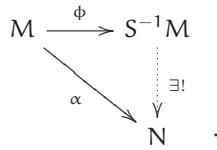

(Translation: $M \to S ^ { - 1 } M$ is universal (initial) among A-module maps from M to modules that are actually $S ^ { - 1 } A$ -modules. Can you make this precise by defining clearly the objects and morphisms in this category?)

Notice: (i) This determines $\Phi \colon M \to S ^ { - 1 } M$ up to unique isomorphism (you should think through what this means); (ii) we are defining not only ${ \mathsf { S } } ^ { - 1 } M ,$ but also the map $\Phi$ at the same time; and (iii) essentially by definition the A-module structure on $S ^ { - 1 } M$ extends to an $S ^ { - 1 } A$ -module structure.

1.2.E. EXERCISE. Show that $\Phi \colon M \to S ^ { - 1 } M$ exists, by constructing something satisfying the universal property. Hint: Define elements of ${ \mathsf { S } } ^ { - 1 } M$ to be of the form $\mathfrak { m } / s$ where $\mathfrak { m } \in M$ and $s \in S ,$ and $\mathfrak { m } _ { 1 } / s _ { 1 } = \mathfrak { m } _ { 2 } / s _ { 2 }$ if and only if for some $s \in S$ , $s ( s _ { 2 } \mathsf { m } _ { 1 } - s _ { 1 } \mathsf { m } _ { 2 } ) = 0$ . Define the additive structure by $( \mathfrak { m } _ { 1 } / s _ { 1 } ) + ( \mathfrak { m } _ { 2 } / s _ { 2 } ) = ( s _ { 2 } \mathfrak { m } _ { 1 } + s _ { 1 } \mathfrak { m } _ { 2 } ) / ( s _ { 1 } s _ { 2 } ) ,$ , and the $S ^ { - 1 } A$ -module structure (and hence the A-module structure) as given by $( \mathbf { a } _ { 1 } / s _ { 1 } ) \cdot ( \mathbf { m } _ { 2 } / s _ { 2 } ) = ( \mathbf { a } _ { 1 } \mathbf { m } _ { 2 } ) / ( s _ { 1 } s _ { 2 } )$ .

# 1.2.F. EXERCISE.

(a) Show that localization commutes with finite products, or equivalently, with finite direct sums. In other words, if $M _ { 1 } , \ldots , M _ { n }$ are A-modules, describe an isomorphism (of A-modules, and of $S ^ { - 1 } A$ -modules) $S ^ { - 1 } ( M _ { 1 } \times \cdot \cdot \cdot \times M _ { \mathrm { n } } ) { \longrightarrow } S ^ { - 1 } M _ { 1 } \times \cdot \cdot \cdot \times S ^ { - 1 } M _ { \mathrm { n } }$ .   
→(b) Show that localization commutes with arbitrary direct sums.   
(c) Show that “localization does not necessarily commute with infinite products”: the obvious map $\begin{array} { r } { { \mathsf { S } } ^ { - 1 } ( \prod _ { \mathrm { i } } M _ { \mathrm { i } } ) \to \prod _ { \mathrm { i } } { \mathsf { S } } ^ { - 1 } M _ { \mathrm { i } } } \end{array}$ induced by the universal property of localization is not always an isomorphism. (Hint: $( 1 , 1 / 2 , 1 / 3 , 1 / 4 , \dots ) \in \mathbb { Q } \times \mathbb { Q } \times \dots .$ )

1.2.4. Remark. Localization does not always commute with Hom; see Example 1.5.10. But Exercise 1.5.H will show that in good situations (if the first argument of Hom is finitely presented), localization does commute with Hom.

1.2.5. Tensor products. Another important example of a universal property construction is the notion of a tensor product of A-modules:

$$
\otimes_ {A}: \quad \mathrm {o b j} (M o d _ {A}) \times \mathrm {o b j} (M o d _ {A}) \longrightarrow \mathrm {o b j} (M o d _ {A})
$$

$$
(M, N) \longmapsto M \otimes_ {A} N
$$

The subscript A is often suppressed when it is clear from context. The tensor product is often defined as follows. Suppose you have two A-modules $\boldsymbol { \mathsf { M } }$ and N. Then elements of the tensor product $M \otimes _ { { \cal A } } \mathsf { N }$ are finite A-linear combinations of symbols $\mathsf { m } \otimes \mathsf { n }$ $( \mathfrak { m } \in \mathcal { M } , \ \mathfrak { n } \in \mathbb { N } )$ ), subject to relations $\left( \mathfrak { m } _ { 1 } + \mathfrak { m } _ { 2 } \right) \otimes \mathfrak { n } = \mathfrak { m } _ { 1 } \otimes \mathfrak { n } + \mathfrak { m } _ { 2 } \otimes \mathfrak { n } , \mathfrak { m } \otimes \left( \mathfrak { n } _ { 1 } + \mathfrak { n } _ { 2 } \right) = \mathfrak { m } \otimes \mathfrak { n } _ { 1 } + \mathfrak { m } \otimes \mathfrak { n } _ { 2 } , \mathfrak { a } ( \mathfrak { m } \otimes \mathfrak { n } ) = \mathfrak { a } _ { 1 } \otimes \mathfrak { n } _ { 2 } .$ $\mathbf { a } ( \mathbf { m } \otimes \mathbf { n } ) =$ $( \mathbf { a } \mathbf { m } ) \otimes \mathbf { n } { = } \mathbf { m } \otimes ( \mathbf { a } \mathbf { n } )$ (where $\mathbf { a } \in \mathsf { A } , \mathsf { m } _ { 1 } , \mathsf { m } _ { 2 } \in \mathsf { M } , \mathsf { n } _ { 1 } , \mathsf { n } _ { 2 } \in \mathsf { N } )$ . More formally, $M \otimes _ { { \cal A } } \mathsf { N }$ is the free A-module generated by $M \times \mathsf { N } ,$ quotiented by the submodule generated by $( \mathsf { m } _ { 1 } + \mathsf { m } _ { 2 } , \mathsf { n } ) -$ $( \mathsf { m } _ { 1 } , \mathsf { n } ) - ( \mathsf { m } _ { 2 } , \mathsf { n } )$ $( \mathfrak { m } _ { 1 } , \mathfrak { n } ) - ( \mathfrak { m } _ { 2 } , \mathfrak { n } ) , ( \mathfrak { m } , \mathfrak { n } _ { 1 } + \mathfrak { n } _ { 2 } ) - ( \mathfrak { m } , \mathfrak { n } _ { 1 } ) - ( \mathfrak { m } , \mathfrak { n } _ { 2 } ) , \mathfrak { a } ( \mathfrak { m } , \mathfrak { n } ) - ( \mathfrak { a } \mathfrak { n } _ { 1 } + \mathfrak { n } _ { 2 } )$ $\operatorname { a } ( \mathfrak { m } , \mathfrak { n } ) - ( \mathfrak { a } \mathfrak { m } , \mathfrak { n } ) .$ , and ${ \mathfrak { a } } ( { \mathfrak { m } } , { \mathfrak { n } } ) - ( { \mathfrak { m } } , { \mathfrak { a } } { \mathfrak { n } } )$ for ${ \mathfrak { a } } \in { \mathcal { A } }$ , m, m1, $\mathrm { , } \mathfrak { m } _ { 2 } \in \mathrm { M } \mathrm { , } \mathfrak { n } , \mathfrak { n } _ { 1 } \mathrm { , } \mathfrak { n } _ { 2 } \in \mathsf { N } .$ . The image of $( \mathfrak { m } , \mathfrak { n } )$ in this quotient is ${ \mathfrak { m } } \otimes { \mathfrak { n } }$ .

If $\boldsymbol { A }$ is a field ${ \mathrm { k } } ,$ we recover the tensor product of vector spaces.

1.2.G. EXERCISE (IF YOU HAVEN’T SEEN TENSOR PRODUCTS BEFORE). Show that Z/(10) $\otimes _ { \mathbb { Z } } \mathbb { Z } / ( 1 2 ) \cong \mathbb { Z } / ( 2 )$ . (This exercise is intended to give some hands-on practice with tensor products.)   
1.2.H. IMPORTANT EXERCISE: RIGHT-EXACTNESS OF $( \cdot ) \otimes _ { \mathsf { A } } \mathsf { N }$ . Show that $( \cdot ) \otimes _ { \mathsf { A } } \mathsf { N }$ gives a covariant functor $M o d _ { \mathrm { A } } \longrightarrow M o d _ { \mathrm { A } }$ . Show that $( \cdot ) \otimes _ { { \cal A } } \mathsf { N }$ is a right-exact functor, i.e., if

$$
M ^ {\prime} \to M \to M ^ {\prime \prime} \to 0
$$

is an exact sequence of A-modules (which means $\mathsf { f } \colon M \to M ^ { \prime \prime }$ is surjective, and $M ^ { \prime }$ surjects onto the kernel of f; see §1.4.4), then the induced sequence

$$
M ^ {\prime} \otimes_ {A} N \to M \otimes_ {A} N \to M ^ {\prime \prime} \otimes_ {A} N \to 0
$$

is also exact. This exercise is repeated in Exercise 1.5.G, but you may get a lot out of doing it now. (You will be reminded of the definition of right-exactness in §1.5.6.)

In contrast, you can quickly check that the tensor product is not left-exact: tensor the exact sequence of $\mathbb { Z }$ -modules

$$
0 \longrightarrow \mathbb {Z} \xrightarrow {\times 2} \mathbb {Z} \longrightarrow \mathbb {Z} / (2) \longrightarrow 0
$$

with $\mathbb { Z } / ( 2 )$

The constructive definition of $\otimes$ is a weird definition, and really the “wrong” definition. To motivate a better one: notice that there is a natural A-bilinear map $M \times \mathsf { N } \to M \otimes _ { \mathsf { A } } \mathsf { N } .$ . (If $M , \mathsf { N } , \mathsf { P } \in$ $M o d _ { A } ,$ a map f : $M \times \mathsf { N } \to \mathsf { P }$ is A-bilinear if $\mathsf { f } ( \mathsf { m } _ { 1 } + \mathsf { m } _ { 2 } , \mathsf { n } ) = \mathsf { f } ( \mathsf { m } _ { 1 } , \mathsf { n } ) + \mathsf { f } ( \mathsf { m } _ { 2 } , \mathsf { n } ) ,$ $\mathsf { f } ( \mathsf { m } , \mathsf { n } _ { 1 } + \mathsf { n } _ { 2 } ) =$ $\mathsf { f } ( \mathsf { m } , \mathsf { n } _ { 1 } ) + \mathsf { f } ( \mathsf { m } , \mathsf { n } _ { 2 } ) ,$ and $\mathsf { f } ( \mathtt { a m } , \mathtt { n } ) = \mathsf { f } ( \mathtt { m } , \mathtt { a n } ) = \mathtt { a f } ( \mathtt { m } , \mathtt { n } )$ .) Any A-bilinear map $M \times \mathsf { N } \to \mathsf { P }$ factors through the tensor product uniquely: $M \times \mathsf { N } \to M \otimes _ { \mathrm { { A } } } \mathsf { N } \to \mathsf { P }$ . (Think this through!)

→ →We can take this as the definition of the tensor product as follows. It is an A-module $\intercal$ along with an A-bilinear map t: $M \times \mathsf { N } \to \mathsf { T } ,$ , such that given any A-bilinear map $\mathrm { t } ^ { \prime } \colon M \times \mathsf { N }  \mathsf { T } ^ { \prime }$ , there is a unique A-linear map f: $\mathsf { T } \to \mathsf { T } ^ { \prime }$ such that $\mathrm { t } ^ { \prime } = \mathrm { f } \circ \mathrm { t }$ .

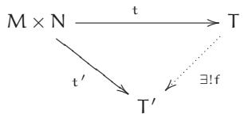

1.2.I. EXERCISE. Show that $\mathsf { T } , \mathsf { t } \colon M \times \mathsf { N } \to \mathsf { T } )$ ) is unique up to unique isomorphism. Hint: First figure out what “unique up to unique isomorphism” means for such pairs, using a category of pairs (T, t). Then follow the analogous argument for the product.

In short, given M and N, there is an A-bilinear map t : $M \times \mathsf { N } \to M \otimes _ { \mathsf { A } } \mathsf { N } ,$ , unique up to unique isomorphism, defined by the following universal property: for any A-bilinear map t′ : $M \times \mathsf { N } \to \mathsf { T } ^ { \prime }$ there is a unique A-linear map f: $M \otimes _ { \mathrm { { A } } } \mathsf { N } \to \mathsf { T } ^ { \prime }$ such that $\mathrm { t } ^ { \prime } = \mathsf { f } \circ \mathrm { t }$ .

As with all universal property arguments, this argument shows uniqueness assuming existence. To show existence, we need an explicit construction.

1.2.J. EXERCISE. Show that the construction of §1.2.5 satisfies the universal property of tensor product.

The three exercises below are useful facts about tensor products with which you should be familiar.

1.2.K. IMPORTANT EXERCISE.

(a) If M is an A-module and $\lambda \to \mathbb { B }$ is a morphism of rings, give $\operatorname { B } \otimes _ { A } M$ the structure of a Bmodule (this is part of the exercise). Show that this describes a functor $M o d _ { \mathrm { A } }  M o d _ { \mathrm { B } }$ .   
(b) (tensor product of rings) If further $\mathsf { A } \to \mathsf { C }$ is another morphism of rings, show that $\mathrm { { B } } \otimes _ { \mathrm { { A } } } \mathrm { { C } }$ has a natural structure of a ring. Hint: Multiplication will be given by $( { \sf b } _ { 1 } \otimes { \sf c } _ { 1 } ) ( { \sf b } _ { 2 } \otimes { \sf c } _ { 2 } ) =$ $\left( \mathsf { b } _ { 1 } \mathsf { b } _ { 2 } \right) \otimes \left( \mathsf { c } _ { 1 } \mathsf { c } _ { 2 } \right)$ . (Exercise 1.2.U will interpret this construction as a fibered coproduct.)

1.2.L. IMPORTANT EXERCISE. If S is a multiplicative subset of A and M is an A-module, describe a natural isomorphism $( \mathsf { S } ^ { - 1 } \mathsf { A } ) \otimes _ { \mathsf { A } } \mathsf { M } \stackrel { \sim } { \longrightarrow } \mathsf { S } ^ { - 1 } M$ (as $S ^ { - 1 } A$ -modules and as A-modules).

1.2.M. EXERCISE ( $\otimes$ COMMUTES WITH $\oplus$ ). Show that tensor products commute with arbitrary direct sums: if M and $\{ { \mathsf { N } } _ { \mathrm { i } } \} _ { \mathrm { i } \in \mathrm { I } }$ are all A-modules, describe an isomorphism

$$
M \otimes (\oplus_ {i \in I} N _ {i}) \xrightarrow {\sim} \oplus_ {i \in I} (M \otimes N _ {i}).
$$

1.2.6. Essential Example: Fibered products. Suppose we have morphisms $\alpha \colon X \to Z$ and $\beta \colon \Upsilon \to Z$ (in any category). Then the fibered product (or fibred product) is an object $\boldsymbol { \mathrm { \Sigma } } \times \boldsymbol { \mathrm { \Sigma } } \boldsymbol { \mathrm { \Sigma } } ^ { \mathrm { Y } }$ along with morphisms $\operatorname { p r } x \colon X \times _ { Z } \Upsilon \to X$ and prY : ${ \cal X } \times _ { Z } \Upsilon \to \Upsilon ,$ , where the two compositions $\alpha \circ { \mathsf { p r } } _ { X }$ , $\beta \circ$ prY $: X \times _ { Z } \ Y \to Z$ agree, such that given any object W with maps to X and Y (whose compositions to Z agree), these maps factor through some unique $W {  } X \times _ { Z } Y$ :

(1.2.6.1)

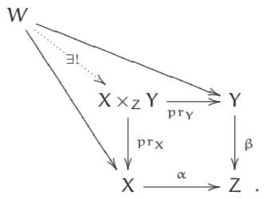

(Warning: The definition of the fibered product depends on $\propto$ and $\beta ,$ even though they are omitted from the notation ${ \tt X } \times _ { Z } { \tt Y } .$ .)

By the usual universal property argument, if it exists, it is unique up to unique isomorphism. (You should think this through until it is clear to you.) Thus the use of the phrase “the fibered product” (rather than “a fibered product”) is reasonable, and we should reasonably be allowed to give it the name ${ \tt X } \times _ { Z } { \tt Y } .$ . We know what maps to it are: they are precisely maps to X and maps to Y that agree as maps to Z.

1.2.7. Definition. As an example, if π: $\Chi \to \Upsilon$ is a morphism, and the fibered product $\mathsf { X } \times \mathsf { \ v { v } } X$ exists, then this determines a diagonal morphism $\delta _ { \pi } \colon X \to X \times \gamma X$ . The diagonal morphism will turn out to be a very useful notion.

Depending on your religion, the diagram

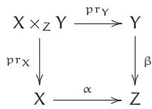

is called a fibered/pullback/Cartesian diagram/square (six possibilities—and even more are possible if you prefer “fibred” to “fibered”).

The right way to interpret the notion of fibered product is first to think about what it means in the category of sets.

1.2.N. EXERCISE (FIBERED PRODUCTS OF SETS). Show that in Sets,

$$
X \times_ {Z} Y = \{(x, y) \in X \times Y: \alpha (x) = \beta (y) \}.
$$

More precisely, show that the right side, equipped with its evident maps to X and Y, satisfies the universal property of the fibered product. (This will help you build intuition for fibered products.)

1.2.O. EXERCISE. If X is a topological space, show that fibered products always exist in the category of open sets of X, by describing what a fibered product is. (Hint: It has a one-word description.)

1.2.P. EXERCISE. If Z is the final object in a category $\mathcal { C }$ , and X, $\Upsilon \in \mathcal { C } _ { \mathbf { \lambda } }$ , show that ${ } ^ { \prime \prime } { \boldsymbol { X } } \times _ { Z } { \boldsymbol { Y } } = { \boldsymbol { X } } \times { \boldsymbol { Y } } ^ { \prime \prime }$ : “the” fibered product over Z is uniquely isomorphic to “the” product. Assume all relevant (fibered) products exist. (This is an exercise about unwinding the definition.)   
1.2.Q. USEFUL EXERCISE: TOWERS OF CARTESIAN DIAGRAMS ARE CARTESIAN DIAGRAMS. If the two squares in the following commutative diagram are Cartesian diagrams, show that the “outside rectangle” (involving U, V, Y, and Z) is also a Cartesian diagram.

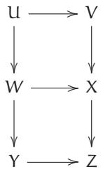

1.2.R. EXERCISE. Given morphisms ${ \cal X } _ { 1 } \to { \cal Y }$ , ${ \tt X } _ { 2 }  { \tt Y } ,$ and ${ \Upsilon } \to { Z } ,$ show that there is a natural morphism ${ \sf X } _ { 1 } \times _ { \sf Y } { \sf X } _ { 2 }  { \sf X } _ { 1 } \times _ { Z } { \sf X } _ { 2 } ,$ assuming that both fibered products exist. (This is trivial once you figure out what it is saying. The point of this exercise is to see why it is trivial.)   
1.2.S. IMPORTANT EXERCISE: THE DIAGONAL-BASE-CHANGE DIAGRAM. Suppose we are given morphisms $\Chi _ { 1 } , \qquad \to \mathsf { Y }$ and $\Upsilon  Z$ . Show that the following diagram is a Cartesian square.

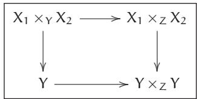

Assume all relevant (fibered) products exist. (If this exercise is too hard now, you can try it again at Exercise 1.3.B.) You will appreciate how useful this diagram is when you repeatedly use the diagonal morphism in proofs and constructions.

If you liked this problem, you may enjoy Exercise 11.1.C.

1.2.8. Coproducts. Define coproduct in a category by reversing all the arrows in the definition of product. Define fibered coproduct in a category by reversing all the arrows in the definition of fibered product. Coproduct is denoted by ⨿.   
1.2.T. EXERCISE. Show that coproduct for Sets is disjoint union. This is why we use the notation ⨿ for disjoint union.   
1.2.U. EXERCISE. Suppose $\lambda \to \mathbb { B }$ and $\lambda \to C$ are two ring morphisms, so in particular B and C are A-modules. Recall (Exercise 1.2.K) that B A C has a ring structure. Show that there is a natural morphism $\mathrm { B \to B } \otimes _ { \mathrm { A } } \mathrm { C }$ given by $\mathbf { b } \mapsto \mathbf { b } \otimes { \mathsf { 1 } } .$ (This is not necessarily an inclusion; see Exercise 1.2.G.) Similarly, there is a natural morphism $\mathrm { C } \to \mathrm { B } \otimes _ { \mathrm { A } } \mathrm { C }$ . Show that this gives a fibered coproduct on rings, i.e., that

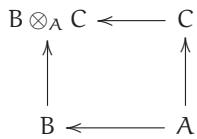

satisfies the universal property of fibered coproduct.

# 1.2.9. Monomorphisms and epimorphisms.

1.2.10. Definition. A morphism π: $\Chi \to \Upsilon$ is a monomorphism if any two morphisms $\mu _ { 1 } : Z  X$ and $\mu _ { 2 } \colon Z  X$ such that $\pi \circ \mu _ { 1 } = \pi \circ \mu _ { 2 }$ must satisfy $\mu _ { 1 } = \mu _ { 2 }$ . In other words, there is at most one

way of filling in the dotted arrow so that the diagram

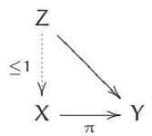

commutes—for any object Z, the natural map $\operatorname { M o r } ( Z , X ) \to \operatorname { M o r } ( Z , Y )$ is an injection. Intuitively, it is the categorical version of an injective map, and indeed this notion generalizes the familiar notion of injective maps of sets. (The reason we don’t use the word “injective” is that in some contexts, “injective” will have an intuitive meaning that may not agree with “monomorphism.” One example: in the category of divisible groups, the map $\mathbb { Q } \to \mathbb { Q } / \mathbb { Z }$ is a monomorphism but not injective. This is also the case with “epimorphism”—to be defined shortly—in contract with “surjective.”)

1.2.V. EXERCISE. Show that the composition of two monomorphisms is a monomorphism.

1.2.W. EXERCISE. Prove that a morphism π: $\Chi \to \Upsilon$ is a monomorphism if and only if the fibered product $\mathsf { X } \times \mathsf { \ v { v } } X$ exists, and the induced diagonal morphism $\delta _ { \pi } \colon X \to X \times _ { Y } X$ (Definition 1.2.7) is an isomorphism. We may then take this as the definition of monomorphism. (Monomorphisms aren’t central to future discussions, although they will come up again. This exercise is just good practice.)   
1.2.X. EASY EXERCISE. We use the notation of Exercise 1.2.R. Show that if $\Upsilon  Z$ is a monomorphism, then the morphism ${ \sf X } _ { 1 } \times _ { \sf Y } { \sf X } _ { 2 }  { \sf X } _ { 1 } \times _ { Z } { \sf X } _ { 2 }$ you described in Exercise 1.2.R is an isomorphism. (Hint: For any object V, give a natural bijection between maps from V to the first and maps from V to the second. It is also possible to use the Diagonal-Base-Change diagram, Exercise 1.2.S.)

The notion of epimorphism is “dual” to the definition of monomorphism, where all the arrows are reversed. This concept will not be central for us, although it turns up in the definition of an abelian category. Intuitively, it is the categorical version of a surjective map. (But be careful when working with categories of objects that are sets with additional structure, as epimorphisms need not be surjective. Example: In the category Rings, $\mathbb { Z } \to \mathbb { Q }$ is an epimorphism, but obviously not surjective.)

1.2.11. Representable functors and Yoneda’s Lemma. Much of our discussion about universal properties can be cleanly expressed in terms of representable functors, under the rubric of “Yoneda’s Lemma.” Yoneda’s lemma is an easy fact stated in a complicated way. Informally speaking, you can essentially recover an object in a category by knowing the maps into it. For example, we have seen that the data of maps to $\boldsymbol { x } \times \boldsymbol { Y }$ are naturally (canonically) the data of maps to $x$ and to Y. Indeed, we have now taken this as the definition of $\boldsymbol { x } \times \boldsymbol { Y }$ .

Recall Example 1.1.20. Suppose A is an object of category $\mathcal { C }$ . For any object $C \in { \mathcal { C } } ,$ we have a set of morphisms $\operatorname { M o r } ( \mathbf { \boldsymbol { C } } , { \boldsymbol { A } } )$ . If we have a morphism f : $\mathrm { B } \to \mathrm { C } ,$ , we get a map of sets

$$
\operatorname {M o r} (\mathrm {C}, A) \longrightarrow \operatorname {M o r} (\mathrm {B}, A) \tag {1.2.11.1}
$$

by composition: given a map from C to $A$ , we get a map from B to A by precomposing with f : $\mathrm { B } \to$ C. Hence this gives a contravariant functor $\mathtt { h } _ { \mathtt { A } } \colon { \mathcal { C } } \longrightarrow S e t s$ . Yoneda’s Lemma states that the functor $\mathsf { h } _ { \mathsf { A } }$ determines A up to unique isomorphism. More precisely:

1.2.Y. IMPORTANT EXERCISE THAT YOU SHOULD DO ONCE IN YOUR LIFE (YONEDA’SLEMMA).

(a) Suppose you have two objects A and $A ^ { \prime }$ in a category $\mathcal { C } ,$ and maps

$$
i _ {C}: \operatorname {M o r} (C, A) \longrightarrow \operatorname {M o r} (C, A ^ {\prime}) \tag {1.2.11.2}
$$

that commute with the maps (1.2.11.1). Show that the $\mathrm { i } _ { \mathrm { C } }$ (as C ranges over the objects of $\mathcal { C }$ ) are induced from a unique morphism ${ \mathfrak { g } } \colon { \bar { A } } \to { \bar { A } } ^ { \prime }$ . More precisely, show that there is a unique morphism ${ \mathfrak { g } } \colon { \bar { A } } \to { \bar { A } } ^ { \prime }$ such that for all $C \in \mathcal { C }$ , iC is $\mathfrak { u } \mapsto \mathfrak { g } \circ \mathfrak { u }$ .

(b) If furthermore the iC are all bijections, show that the resulting g is an isomorphism. (Hint for both: This is much easier than it looks. This statement is so general that there are really only a couple of things that you could possibly try. For example, if you’re hoping to find a morphism $A  A ^ { \prime }$ , where will you find it? Well, you are looking for an element $\operatorname { M o r } ( \boldsymbol { A } , \boldsymbol { A } ^ { \prime } )$ . So just plug $C = A$ into (1.2.11.2), and see where the identity goes.)

There is an analogous statement with the arrows reversed, where instead of maps into A, you think of maps from A. The role of the contravariant functor $\mathsf { h } _ { \mathsf { A } }$ of Example 1.1.20 is played by the covariant functor $\mathtt { h } ^ { A }$ of Example 1.1.14. Because the proof is the same (with the arrows reversed), you needn’t think it through.

The phrase “Yoneda’s Lemma” properly refers to a more general statement. Although it looks more complicated, it is no harder to prove.

# 1.2.Z.* EXERCISE.

(a) Suppose A and B are objects in a category $\mathcal { C }$ . Give a bijection between the natural transformations $\hbar ^ { \mathsf { A } } \to \mathsf { h } ^ { \mathsf { B } }$ of covariant functors C Sets (see Example 1.1.14 for the definition) and the morphisms $\mathrm { B } \to A$ .   
(b) State and prove the corresponding fact for contravariant functors hA (see Example 1.1.20). Remark: A contravariant functor F from $\mathcal { C }$ to Sets is said to be representable if there is a natural isomorphism

$$
\xi : F \xrightarrow {\sim} h _ {A}.
$$

Thus the representing object A is determined up to unique isomorphism by the pair (F, ξ). There is a similar definition for covariant functors. (We will revisit this in ${ \ S } 7 . 6 ,$ and this problem will appear again as Exercise 7.6.C. The element $\xi ^ { - 1 } ( \mathrm { i d } _ { A } ) \in \mathsf { F } ( A )$ is often called the “universal object”; do you see why?)

(c) Yoneda’s Lemma. Suppose F is a covariant functor $\mathcal { C } \longrightarrow S e t s ,$ and $A \in \mathcal { C }$ . Give a bijection between the natural transformations $\hbar ^ { A }  \mathsf { F }$ and F(A). (The corresponding fact for contravariant functors is essentially Exercise 10.1.B.)

In fancy terms, Yoneda’s lemma states the following. Given a category ${ \mathcal { C } } ,$ , we can produce a new category, called the functor category of $\mathcal { C } _ { \iota }$ , where the objects are contravariant functors $\mathcal { C } $ Sets, and the morphisms are natural transformations of such functors. We have a functor (which we can usefully call h) from $\mathcal { C }$ to its functor category, which sends A to $\mathsf { h } _ { \mathsf { A } }$ . Yoneda’s Lemma states that this is a fully faithful functor, called the Yoneda embedding. (Fully faithful functors were defined in §1.1.15.)

1.2.12. Joke. The Yoda embedding, contravariant it is.

# 1.3 Limits and Colimits

Two important definitions, those of limits and colimits, are determined by universal properties. They generalize a number of familiar constructions. I will give the definitions first, and then show you why they are familiar. For example, fractions will be motivating examples of colimits (Exercise 1.3.D(a)), and the p-adic integers (Example 1.3.4) will be motivating examples of limits.

1.3.1. Limits. We say that a category is a small category if the objects form a set and the morphisms form a set. (This is a technical condition intended only for experts.) Suppose $\mathcal { I }$ is any small category, and $\mathcal { C }$ is any category. Then a functor F: ${ \mathcal { I } } \to { \mathcal { C } }$ (i.e., with an object $\boldsymbol { A } _ { \mathrm { i } } \in \mathcal { C }$ for each element $\mathrm { i } \in { \mathcal { S } } ,$ , and appropriate commuting morphisms dictated by $\mathcal { I }$ ) is said to be a diagram indexed by $\mathcal { I }$ . We call $\mathcal { I }$ an index category. Our index categories will usually be partially

ordered sets (Example 1.1.8), in which, in particular, there is at most one morphism between any two objects. (But other examples are sometimes useful.) For example, if $\boxed { \begin{array} { r l } \end{array} }$ is the category

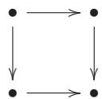

and $\mathcal { A }$ is a category, then a functor $\sqsupset  \mathcal { A }$ is precisely the data of a commuting square in $\mathcal { A }$ .

→Then the limit of the diagram is an object $\operatorname* { l i m } _ { \mathcal { I } } A _ { \mathrm { i } }$ (or $\varprojlim _ { \mathcal { I } } { A _ { \mathrm { i } } } )$ of $\mathcal { C }$ along with morphisms f $: \operatorname* { l i m } _ { \mathcal { I } } \mathcal { A } _ { \mathrm { i } } \to \mathcal { A } _ { \mathrm { j } }$ for each $\mathrm { j } \in { \mathcal { I } } ,$ , such that if m : $\mathrm { j } \to \mathsf { k }$ is a morphism in $\mathcal { I } _ { \mathbf { \lambda } }$ , then

(1.3.1.1)

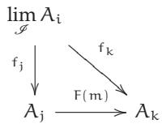

commutes, and the object and the maps to each $A _ { \mathrm { i } }$ are universal (final) with respect to this property. More precisely, given any other object W along with maps ${ \mathfrak { g } } _ { \mathrm { i } } \colon W \to { \bar { A } } _ { \mathrm { i } }$ commuting with the F(m) (if m : $\mathrm { j } \to \mathsf { k }$ is a morphism in $\mathcal { I }$ , then ${ \mathfrak { g } } _ { \mathrm { k } } = { \mathsf { F } } ( { \mathfrak { m } } ) \circ { \mathfrak { g } } _ { \mathrm { j } }$ ), there is a unique map

$$
g \colon W \to \lim  _ {\mathcal {I}} A _ {i}
$$

so that ${ \mathfrak { g } } _ { \mathrm { i } } = { \mathfrak { f } } _ { \mathrm { i } } \circ { \mathfrak { g } }$ for all i. (In some cases, the limit is sometimes called the inverse limit or projective limit. We won’t use this language.) By the usual universal property argument, if the limit exists, it is unique up to unique isomorphism.

1.3.2. Examples: Products. For example, if $\mathcal { I }$ is the partially ordered set

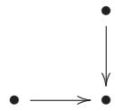

we obtain the fibered product.

If $\mathcal { I }$ is

we obtain the product.

If $\mathcal { I }$ is a set (i.e., its only morphisms are the identity maps), then the limit is called the product of the $\mathsf { A } _ { \mathrm { i } } ,$ and is denoted by $\prod _ { \mathrm { i } } A _ { \mathrm { i } }$ . The special case where $\mathcal { I }$ has two elements is the example of the previous paragraph.

1.3.A. EXERCISE (REALITY CHECK). Suppose that the partially ordered set $\mathcal { I }$ has an initial object e. Show that the limit of any diagram indexed by $\mathcal { I }$ exists.   
1.3.B. EXERCISE: THE DIAGONAL-BASE-CHANGE DIAGRAM, AGAIN. Solve 1.2.S again by identifying both ${ \sf X } _ { 1 } \times { \sf Y } \ d { \sf X } _ { 2 }$ and $\mathsf { Y } \times _ { ( \mathsf { Y } \times _ { Z } \mathsf { Y } ) }$ $\left( X _ { 1 } \times _ { Z } X _ { 2 } \right)$ as the limit of the diagram

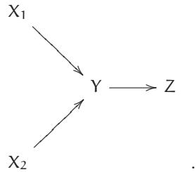

1.3.3. Example: Formal power series. For a ring A, the (formal) power series, $\mathbb { A } [ [ \mathbf { x } ] ] ,$ are often described informally (and somewhat unnaturally) as being the ring

$$
A [ [ x ] ] = \left\{a _ {0} + a _ {1} x + a _ {2} x ^ {2} + \dots \right\}
$$

(where $\mathbf { a } _ { \mathrm { i } } \in \mathsf { A } ,$ and the ring operations are the “obvious” ones). It is an example of a limit in the category of rings:

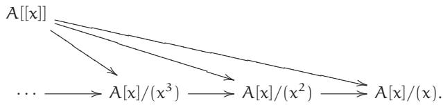

The universal property of limits yields a natural ring morphism $\boldsymbol { A } [ \boldsymbol { x } ]  \boldsymbol { A } [ [ \boldsymbol { x } ] ]$ . If $\lambda = \mathbb { R }$ or $\mathbb { C } ,$ this map factors through the ring of convergent power series.

1.3.4. Example: The p-adic integers. For a prime number p, the p-adic integers (or more informally, p-adics), $\mathbb { Z } _ { \mathrm { p } } ,$ are often described informally (and somewhat unnaturally) as being of the form

$$
a _ {0} + a _ {1} p + a _ {2} p ^ {2} + \dots
$$

(where $0 \leq \mathfrak { a } _ { \mathrm { i } } < \mathfrak { p }$ ). They are an example of a limit in the category of rings:

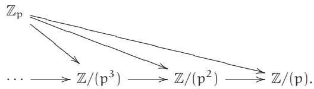

(Warning: $\mathbb { Z } _ { \mathfrak { p } }$ is sometimes used to denote the integers modulo p, but $\mathbb { Z } / ( \mathfrak { p } )$ or $\mathbb { Z } / { \mathfrak { p } } \mathbb { Z }$ is better to use for this, to avoid confusion. Worse: by §1.2.3, $\mathbb { Z } _ { \mathfrak { p } }$ also denotes those rationals whose denominators are a power of p. Hopefully the meaning of $\mathbb { Z } _ { \mathfrak { p } }$ will be clear from the context.)

The similarity of Examples 1.3.3 and 1.3.4 is no coincidence. Formal power series and the p-adic integers are examples of completions, the topic of Chapter 28.

Limits do not always exist for any index category $\mathcal { I }$ . However, you can often easily check that limits exist if the objects of your category can be interpreted as sets with additional structure, and arbitrary products exist (respecting the set-like structure).

1.3.C. IMPORTANT EXERCISE. Show that in the category Sets,

$$
\left\{\left(a _ {i}\right) _ {i \in \mathscr {I}} \in \prod_ {i} A _ {i}: F (m) \left(a _ {j}\right) = a _ {k} \text {f o r a l l} m \in \operatorname {M o r} _ {\mathscr {I}} (j, k) \subset \operatorname {M o r} (\mathscr {I}) \right\},
$$

along with the obvious projection maps to each $\lambda _ { \mathrm { i } } ,$ is the limit $\operatorname* { l i m } _ { \mathcal { I } } A _ { \mathrm { i } }$ .

This clearly also works in the category $M o d _ { A }$ of A-modules (in particular, $V e c _ { \boldsymbol { \mathrm { k } } }$ and $A b$ ), as well as Rings.

From this point of view, $2 + 3 \mathfrak { p } + 2 \mathfrak { p } ^ { 2 } + \cdot \cdot \cdot \in \mathbb { Z } \mathfrak { p }$ can be understood as the sequence $( 2 , 2 +$ $3 \mathfrak { p } , 2 + 3 \mathfrak { p } + 2 \mathfrak { p } ^ { 2 } , \dots )$ .

1.3.5. Colimits. More immediately relevant for us will be the dual (arrow-reversed version) of the notion of limit (or inverse limit). We just flip the arrows $\mathsf { f } _ { \mathrm { i } }$ in (1.3.1.1), and get the notion of a colimit, which is denoted by colimI Ai (or $\varinjlim _ { \mathrm { ~ } } { \mathcal { A } } _ { \mathrm { i } }$ ). (You should draw the corresponding dia-→gram.) Again, if it exists, it is unique up to unique isomorphism. (In some cases, the colimit is sometimes called the direct limit, inductive limit, or injective limit. We won’t use this language. I prefer using limit/colimit in analogy with kernel/cokernel and product/coproduct. This is more than analogy, as kernels and products may be interpreted as limits, and similarly with cokernels

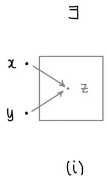

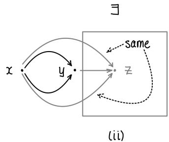  
Figure 1.1 A filtered category (pictorial definition).

and coproducts. Also, I remember that kernels “map to,” and cokernels are “mapped to,” which reminds me that a limit maps to all the objects in the big commutative diagram indexed by $\mathcal { I }$ ; and a colimit has a map from all the objects.)

1.3.6. Joke. A comathematician is a device for turning cotheorems into ffee.

Even though we have just flipped the arrows, colimits behave quite differently from limits.

1.3.7. Example. The abelian group $5 ^ { - \infty } \mathbb { Z }$ of rational numbers whose denominators are powers of 5 is a colimit $\mathrm { c o l i m } _ { \mathrm { i } \in \mathbb { Z } ^ { + } } 5 ^ { - \mathrm { i } } \mathbb { Z }$ $5 ^ { - \mathrm { i } } \mathbb { Z }$ . More precisely, $5 ^ { - \infty } \mathbb { Z }$ is the colimit of the diagram

$$
\mathbb {Z} \longrightarrow 5 ^ {- 1} \mathbb {Z} \longrightarrow 5 ^ {- 2} \mathbb {Z} \longrightarrow \dots
$$

in the category of abelian groups.

The colimit over an index set I is called the coproduct, denoted by $\operatorname { I I } _ { \mathrm { i } } A _ { \mathrm { i } } ,$ and is the dual (arrow-reversed) notion to the product.

# 1.3.D. EXERCISE.

(a) Interpret the statement ${ } ^ { \prime \prime } \mathbb { Q } = \operatorname { c o l i m } { \textstyle { \frac { 1 } { n } } } \mathbb { Z }$ .”   
(b) Interpret the union of some subsets of a given set as a colimit. (Dually, the intersection can be interpreted as a limit.) The objects of the category in question are the subsets of the given set.

Colimits do not always exist, but there are two useful large classes of examples for which they do.

1.3.8. Definition. A nonempty partially ordered set $( S , \geq )$ is filtered (or is said to be a filtered set) if for each x, ${ \mathfrak { y } } \in S _ { \cdot }$ , there is a $z$ such that $x \ge z$ and $y \ge z$ . More generally (see Figure 1.1), a nonempty category $\mathcal { I }$ is filtered if:

(i) for each $\qquad x , y \in { \mathcal { I } } ,$ , there is a $z \in \mathcal { I }$ and arrows $x \to z$ and $y  z ,$ and   
(ii) for every two arrows u : $x \to { \mathfrak { y } }$ and v: $x \to { \mathfrak { y } }$ , there is an arrow w: ${ \mathfrak { y } } \to z$ such that $w \circ \mathfrak { u } = w \circ \nu$

(Other terminologies are also commonly used, such as “directed partially ordered set” and “filtered index category,” respectively.)

1.3.E. EXERCISE. Suppose $\mathcal { I }$ is filtered. (We will almost exclusively use the case where $\mathcal { I }$ is a filtered set.) Recall the symbol ⨿ for disjoint union of sets. Show that any diagram in Sets indexed by $\mathcal { I }$ has the following, with the obvious maps to it, as a colimit:

$$
\left\{(a _ {i}, i) \in \coprod_ {i \in \mathcal {I}} A _ {i} \right\} / \binom {(a _ {i}, i) \sim (a _ {j}, j) \text {i f a n d o n l y i f t h e r e a r e f :} A _ {i} \rightarrow A _ {k} \text {a n d}} {g: A _ {j} \rightarrow A _ {k} \text {i n t h e d i a g r a m f o r w h i c h f (a _ {i}) = g (a _ {j}) i n} A _ {k}}
$$

(You will see that the “filtered” hypothesis is there is to ensure that $\sim$ is an equivalence relation.)

For example, in Example 1.3.7, each element of the colimit is an element of something upstairs, but you can’t say in advance what it is an element of. For instance, 17/125 is an element of $5 ^ { - 3 } \mathbb { Z }$ (or $5 ^ { - 4 } \mathbb { Z } ,$ or later ones), but not $5 ^ { - 2 } \mathbb { Z }$ .

This idea applies to many categories whose objects can be interpreted as sets with additional structure (such as abelian groups, A-modules, groups, etc.). For example, the colimit colim $M _ { \mathrm { i } }$ in the category of A-modules $M o d _ { A }$ can be described as follows. The set underlying colim $M _ { \mathrm { i } }$ is defined as in Exercise 1.3.E. To add the elements $\mathfrak { m } _ { \mathrm { i } } \in M _ { \mathrm { i } }$ and $\mathfrak { m } _ { \mathrm { j } } \in M _ { \mathrm { j } } .$ , choose an $\ell \in \mathcal { I }$ with arrows u : $i \to \ell$ and v : $\mathrm { j } \longrightarrow \ell ,$ , and then define the sum of $\mathfrak { m } _ { \mathrm { i } }$ and $\mathfrak { m } _ { \mathrm { j } }$ to be $\mathsf { F } ( \mathfrak { u } ) ( \mathfrak { m } _ { \mathrm { i } } ) + \mathsf { F } ( \nu ) ( \mathfrak { m } _ { \mathrm { j } } ) \in M _ { \ell }$ . The element $\mathfrak { m } _ { \mathrm { i } } \in M _ { \mathrm { i } }$ is 0 if and only if there is some arrow u: $i \to k$ for which $\mathsf { F } ( \mathrm { u } ) ( \mathrm { m } _ { \mathrm { i } } ) = 0 ,$ , i.e., if and only if it becomes 0 “later in the diagram.” Last, multiplication by an element of $\boldsymbol { A }$ is defined in the obvious way.

1.3.F. EXERCISE. Verify that the A-module described above is indeed the colimit. (Make sure you verify that addition is well-defined, i.e., is independent of the choice of representatives $\mathrm { \ m _ { i } }$ and ${ \mathfrak { m } } _ { \mathrm { j } } ,$ the choice of $\ell ,$ and the choice of arrows $\mathfrak { u }$ and $\nu$ . Similarly, make sure that scalar multiplication is well-defined.)   
1.3.G. USEFUL EXERCISE (LOCALIZATION AS A COLIMIT). Generalize Exercise 1.3.D(a) to interpret localization of an integral domain as a colimit over a filtered set: suppose S is a multiplicative set of A, and interpret $\begin{array} { r } { { \mathsf { S } } ^ { - 1 } { \mathsf { A } } = { \mathsf { c o l i m } } \frac { 1 } { s } { \mathsf { A } } } \end{array}$ $\textstyle { \frac { 1 } { s } } A$ where the colimit is over $s \in S$ , and in the category of A-modules. (Aside: Can you make some version of this work even if A isn’t an integral domain, e.g., $\mathsf { S } ^ { - 1 } \mathsf { A } { = } \mathsf { c o l i m } \mathsf { A } _ { s } \ ?$ This will work in the category of A-algebras.)

A variant of this construction works without the filtered condition if you have another means of “connecting elements in different objects of your diagram.” For example:

1.3.H. EXERCISE: COLIMITS OF A-MODULES WITHOUT THE FILTERED CONDITION. Suppose you are given a diagram of A-modules indexed by $\mathcal { I }$ : F : $\mathcal { I }  M o d _ { A } ,$ where we let $\boldsymbol { M } _ { \mathrm { i } } : = \mathsf { F } ( \mathrm { i } )$ . Show that the colimit is $\oplus _ { \mathrm { i } \in \mathcal { I } } M _ { \mathrm { i } }$ modulo the relations $\mathrm { { m } _ { \mathrm { { i } } } - \mathrm { { F } ( \mathrm { { n } ) ( \mathrm { { m } _ { \mathrm { { i } } } ) } } } }$ for every n: $\mathrm { i } \xrightarrow { } \mathrm { j }$ in $\mathcal { I }$ (i.e., for every arrow in the diagram). (Somewhat more precisely: “modulo” means “quotiented by the submodule generated by.”)   
1.3.9. Summary. One useful thing to informally keep in mind is the following. In a category where the objects are “set-like,” an element of a limit can be thought of as a family of elements of each object in the diagram that are “compatible” (Exercise 1.3.C). And an element of a colimit can be thought of as (“has a representative that is”) an element of a single object in the diagram (Exercise 1.3.E). Even though the definitions of limit and colimit are the same, just with arrows reversed, these interpretations are quite different.   
1.3.10. Small remark. In fact, colimits exist in the category of sets for all reasonable (“small”) index categories (see for example [E, Thm. A6.1]), but that won’t matter to us.   
1.3.11. Joke. What do you call someone who reads a paper on category theory? Answer: A coauthor.

# 1.4 Adjoints

We next come to a very useful notion closely related to universal properties. Just as a universal property “essentially” (up to unique isomorphism) determines an object in a category (assuming such an object exists), “adjoints” essentially determine a functor (again, assuming it exists). Two covariant functors F : ${ \mathcal { A } } \to { \mathcal { B } }$ and G: $\mathcal { B } \xrightarrow { } \mathcal { A }$ are adjoint if there is a natural bijection for all $\boldsymbol { A } \in \mathcal { A }$ and $\mathbb { B } \in \mathcal { B }$ ,

$$
\tau_ {A B}: \operatorname {M o r} _ {\mathcal {B}} (F (A), B) \rightarrow \operatorname {M o r} _ {\mathcal {A}} (A, G (B)). \tag {1.4.0.1}
$$

We say that (F, G) form an adjoint pair, and that F is left-adjoint to G (and G is right-adjoint to F). We say F is a left adjoint (and G is a right adjoint). By “natural” we mean the following. For all

f : $A  A ^ { \prime }$ in $\mathcal { A }$ , we require

$$
\begin{array}{c} \operatorname {M o r} _ {\mathcal {B}} \left(\mathrm {F} \left(A ^ {\prime}\right), \mathrm {B}\right) \xrightarrow {\mathrm {F f} ^ {*}} \operatorname {M o r} _ {\mathcal {B}} \left(\mathrm {F} (A), \mathrm {B}\right) \\ \Biggl \downarrow_ {\tau_ {A ^ {\prime} B}} \\ \operatorname {M o r} _ {\mathcal {A}} \left(A ^ {\prime}, G (B)\right) \xrightarrow {\mathrm {f} ^ {*}} \operatorname {M o r} _ {\mathcal {A}} \left(A, G (B)\right) \end{array}
$$

to commute, and for all ${ \mathfrak { g } } \colon { \mathrm { B } } \to { \mathrm { B } } ^ { \prime }$ in $\mathcal { B }$ we want a similar commutative diagram to commute. (Here $\mathsf { f } ^ { * }$ →is the map induced by f : $A  A ^ { \prime }$ , and $\mathsf { F f } ^ { * }$ is the map induced by Ff : $\mathsf { F } ( \boldsymbol { A } ) \to \mathsf { F } ( \boldsymbol { A } ^ { \prime } )$ .)

1.4.A. EXERCISE. Write down what this diagram should be.

1.4.B. EXERCISE. Show that the map τAB (1.4.0.1) has the following properties. For each A there is a map η $\iota \colon { \cal A } \to { \mathsf { G F } } ( { \cal A } )$ so that for any ${ \mathfrak { g } } \colon { \mathsf { F } } ( A )  { \mathsf { B } } ,$ the corresponding $\tau _ { A \mathrm { B } } ( { \mathfrak { g } } ) \colon { \mathrm { A } } \to { \mathrm { G } } ( \mathrm { B } )$ is given by the composition

$$
A \xrightarrow {\eta_ {A}} G F (A) \xrightarrow {G g} G (B).
$$

Similarly, there is a map $\epsilon _ { \mathrm { B } } \colon \mathsf { F G } ( \mathrm { B } )  \mathrm { B }$ for each B so that for any $\mathsf { f } \colon \mathsf { A } \to \mathsf { G } ( \mathsf { B } )$ , the corresponding map $\tau _ { \mathrm { A B } } ^ { - 1 } ( \mathsf { f } ) \colon \mathsf { F } ( A )  \mathsf { B }$ is given by the composition

$$
F (A) \xrightarrow {F f} F G (B) \xrightarrow {\epsilon_ {B}} B.
$$

Here is a key example of an adjoint pair.

1.4.C. EXERCISE. Suppose $M , \Nu _ { i }$ , and P are A-modules (where A is a ring). Describe a bijection $\mathrm { H o m } _ { \mathrm { A } } ( M \otimes _ { \mathrm { A } } \mathsf { N } , \mathsf { P } ) \longleftrightarrow \mathrm { H o m } _ { \mathrm { A } } ( M , \mathrm { H o m } _ { \mathrm { A } } ( \mathsf { N } , \mathsf { P } ) )$ . (Hint: Try to use the universal property of $\otimes$ .)   
1.4.D. EXERCISE (TENSOR-HOM ADJUNCTION). Show that $( \cdot ) \otimes _ { \mathsf { A } } \mathsf { N }$ and $\mathrm { H o m } _ { A } ( \mathsf { N } , \cdot )$ are adjoint functors.   
1.4.E. EXERCISE. Suppose $\mathrm { B } \to A$ is a morphism of rings. If M is an A-module, you can create a B-module $M _ { \mathrm { B } }$ by considering it as a B-module. This gives a functor $\cdot _ { \mathrm { B } } \colon M o d _ { \mathrm { A } }  M o d _ { \mathrm { B } }$ . Show that this functor is right-adjoint to B A. In other words, describe a bijection

$$
\operatorname {H o m} _ {\mathrm {A}} (\mathrm {N} \otimes_ {\mathrm {B}} \mathrm {A}, \mathrm {M}) \cong \operatorname {H o m} _ {\mathrm {B}} (\mathrm {N}, \mathrm {M} _ {\mathrm {B}})
$$

functorial in both arguments. (This adjoint pair is very important.)

1.4.1.* Fancier remarks we won’t use. You can check that the left adjoint determines the right adjoint up to natural isomorphism, and vice versa. The maps $\boldsymbol { \mathsf { n } } _ { \mathsf { A } }$ and $\epsilon _ { \mathrm { B } }$ of Exercise 1.4.B are called the unit and counit of the adjunction. This leads to a different characterization of adjunction. Suppose functors F: ${ \mathcal { A } } \to { \mathcal { B } }$ and $\mathsf { G } \colon \mathcal { B } \to \mathcal { A }$ are given, along with natural transformations $\boldsymbol { \eta } \colon \mathrm { i d } _ { \mathcal { A } }  \mathrm { G F }$ and $\epsilon \colon \mathsf { F G }  \mathsf { i d } _ { \mathcal { B } }$ with the property that ${ \mathsf { G e } } \circ \mathsf { \Pi } \circ \mathsf { \Pi } { \mathsf { G } } = \mathsf { i d } _ { \mathsf { G } }$ (for each $\mathrm { B } \in { \mathcal { B } } ,$ the composition of $\eta _ { \mathsf { G } ( \mathsf { B } ) } \colon \mathsf { G } ( \mathsf { B } ) \longrightarrow \mathsf { G F G } ( \mathsf { B } )$ and $\mathsf { G } ( \epsilon _ { \mathsf { B } } ) \colon \mathsf { G F G } ( \mathsf { B } ) \to \mathsf { G } ( \mathsf { B } )$ is the identity) and $\epsilon \mathsf { F o F } \mathsf { \Pi } _ { \mathsf { M } } = \mathsf { i d } _ { \mathsf { F } }$ . Then you can check that F is left-adjoint to G. These facts aren’t hard to check, so if you want to use them, you should verify everything for yourself.

1.4.2. Examples from other fields. For those familiar with representation theory: Frobenius reciprocity may be understood in terms of adjoints. Suppose V is a finite-dimensional representation of a finite group $\mathsf { G } ,$ and W is a representation of a subgroup ${ \mathsf { H } } < { \mathsf { G } }$ . Then induction and restriction are an adjoint pair (IndGH, ResG) between the category of G-modules and the category of H-modules.

Topologists’ favorite adjoint pair may be the suspension functor and the loop space functor.

1.4.3. Example: Groupification of abelian semigroups. Here is another motivating example: getting an abelian group from an abelian semigroup. (An abelian semigroup is just like an

abelian group, except we don’t require an identity or an inverse. Morphisms of abelian semigroups are maps of sets preserving the binary operation. One example is the nonnegative integers $\mathbb { Z } ^ { \geq 0 } = \{ 0 , 1 , 2 , \ldots \}$ under addition. Another is the positive integers $\mathbb { Z } ^ { + } = \{ 1 , 2 , 3 , \dots \}$ under addition. Yet another is the positive integers $\mathbb { Z } ^ { + }$ under multiplication. You may enjoy groupifying all three.) From an abelian semigroup, you can create an abelian group. In our examples, from the nonnegative integers under addition $( \mathbb { Z } ^ { \geq 0 } , + ) ,$ , we create the integers $\left( \mathbb { Z } , + \right)$ , and from the positive integers under multiplication $( \mathbb { Z } ^ { + } , \times ) .$ , we create the positive rationals $( \mathbb { Q } ^ { + } , \times )$ . Here is a formalization of that notion. A groupification of an abelian semigroup S is a map of abelian semigroups $\pi \colon S \to { \mathsf { G } }$ such that G is an abelian group, and any map of abelian semigroups from S to an abelian group $\mathsf { G } ^ { \prime }$ factors uniquely through G:

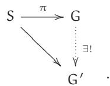

(Perhaps “abelian groupification” would be more precise than “groupification.”)

1.4.F. EXERCISE (AN ABELIAN GROUP IS GROUPIFIED BY ITSELF). Show that if an abelian semigroup is already a group then the identity morphism is the groupification. (More correct: the identity morphism is $a$ groupification.) Note that you don’t need to construct groupification (or even know that it exists in general) to solve this exercise.

1.4.G. EXERCISE. Construct the “groupification functor” H from the category of nonempty abelian semigroups to the category of abelian groups. (One possible construction: given an abelian semigroup S, the elements of its groupification H(S) are ordered pairs $( \mathbf { a } , \mathbf { b } ) \in \mathsf { S } \times \mathsf { S } ,$ which you may think of as ${ \mathrm {  ~ a ~ } } - { \mathrm {  ~ b ~ } } ,$ with the equivalence that $( \mathbf { a } , \mathbf { b } ) \sim ( \mathbf { c } , \mathbf { d } )$ if $\mathtt { a } + \mathtt { d } + e = \mathtt { b } + \mathtt { c } + e$ for some $e \in S$ . Describe addition in this group, and show that it satisfies the properties of an abelian group. Describe the abelian semigroup map $S \to \mathsf { H } ( S )$ .) Let F be the forgetful functor from the category of abelian groups $A b$ to the category of abelian semigroups. Show that H is left-adjoint to F.

(Here is the general idea for experts: We have a full subcategory of a category. We want to “project” from the category to the subcategory. We have

$$
\operatorname {M o r} _ {\text {c a t e g o r y}} (S, H) = \operatorname {M o r} _ {\text {s u b c a t e g o r y}} (G, H)
$$

automatically; thus we are describing the left adjoint to the forgetful functor. How the argument worked: we constructed something which was in the smaller category, which automatically satisfies the universal property.)

1.4.H. EXERCISE (CF. EXERCISE 1.4.E). The purpose of this exercise is to give you more practice with “left adjoints of forgetful functors,” the means by which we get abelian groups from abelian semigroups, and sheaves from presheaves. Suppose A is a ring, and S is a multiplicative subset. Then $S ^ { - 1 }$ A-modules are a full subcategory (§1.1.15) of the category of A-modules (via the obvious inclusion $M o d _ { S ^ { - 1 } A } \hookrightarrow M o d _ { A } ,$ ). Then $M o d _ { A }  M o d _ { S ^ { - 1 } A }$ can be interpreted as an adjoint to the forgetful functor $M o d _ { S ^ { - 1 } A }  M o d _ { A }$ . State and prove the correct statements.

→(Here is the larger story. Every $S ^ { - 1 } A$ -module is an A-module, and this is an injective map, so we have a forgetful functor $\bar { \cdot } : M o d _ { \scriptscriptstyle { S ^ { - 1 } A } }  M o d _ { \scriptscriptstyle { A } }$ . In fact this is a fully faithful functor: it is injective on objects, and the morphisms between any two $S ^ { - 1 } A$ -modules as A-modules are just the same when they are considered as $S ^ { - 1 } A$ -modules. Then there is a functor $\mathsf { G } \colon M o d _ { \mathsf { A } } \longrightarrow M o d _ { \mathsf { S } ^ { - 1 } A } ,$ which might reasonably be called “localization with respect to $S , { } ^ { \prime \prime }$ which is left-adjoint to the forgetful functor. Translation: If M is an A-module, and $\mathsf { N }$ is an $S ^ { - 1 } A$ -module, then $\mathsf { M o r } ( \mathsf { G } M , \mathsf { N } )$ 0 (morphisms as $S ^ { - 1 } A$ -modules, which are the same as morphisms as A-modules) are in natural bijection with $\mathrm { M o r } ( M , \mathsf { F N } )$ (morphisms as A-modules).)

Table 1.1 Some important adjoint pairs.   

<table><tr><td>situation</td><td>category A</td><td>category B</td><td>left adjoint F: A → B</td><td>right adjoint G: B → A</td></tr><tr><td>A-modules (Ex. 1.4.D)</td><td>ModA</td><td>ModA</td><td>(·) ⊗A N</td><td>HomA(N, ·)</td></tr><tr><td>ring maps B → A (Ex. 1.4.E)</td><td>ModB</td><td>ModA</td><td>(·) ⊗B A (extension of scalars)</td><td>M ↦ MB (restriction of scalars)</td></tr><tr><td>(pre)sheaves on a topological space X (Ex. 2.4.K)</td><td>presheaves on X</td><td>sheaves on X</td><td>sheafification</td><td>forgetful</td></tr><tr><td>(semi)groups (§1.4.3)</td><td>semigroups</td><td>groups</td><td>groupification</td><td>forgetful</td></tr><tr><td>sheaves, π: X → Y (Ex. 2.7.B)</td><td>sheaves on Y</td><td>sheaves on X</td><td>π-1</td><td>π*</td></tr><tr><td>sheaves of abelian groups or O-modules, open embeddings π: U ↦ Y (Ex. 23.4.G)</td><td>sheaves on U</td><td>sheaves on Y</td><td>π!</td><td>π-1</td></tr><tr><td>quasicoherent sheaves, π: X → Y (Prop. 14.5.7)</td><td>QCohY</td><td>QCohX</td><td>π*</td><td>π*</td></tr><tr><td>ring maps B → A (Ex. 17.1.J)</td><td>ModA</td><td>ModB</td><td>M ↦ MB (restriction of scalars)</td><td>N ↦ HomB(A, N)</td></tr><tr><td>quasicoherent sheaves, affine π: X → Y (Ex. 17.1.K(b))</td><td>QCohX</td><td>QCohY</td><td>π*</td><td>π?</td></tr></table>

Table 1.1 gives most of the adjoints that will come up for us. Other examples will also come up, such as the adjoint pair $( \sim , \Gamma _ { \bullet } )$ between graded modules over a graded ring, and quasicoherent sheaves on the corresponding projective scheme (§15.7).

1.4.4. Last comments only for people who have seen adjoints before. If (F, G) is an adjoint pair of functors, then F commutes with colimits, and G commutes with limits. Also, limits commute with limits and colimits commute with colimits. We will prove these facts (and a little more) in §1.5.14.

# 1.5 An Introduction to Abelian Categories

Ton papier sur l’Algèbre homologique a été lu soigneusement, et a converti tout le monde (même Dieudonné, qui semble complètement fonctorisé!) à ton point de vue.

Your paper on homological algebra was read carefully and converted everyone (even Dieudonné, who seems to be completely functorised!) to your point of view.

—J.-P. Serre, letter to A. Grothendieck, July 13, 1955 [GrS, pp. 17–18]

Since learning linear algebra, you have been familiar with the notions and behaviors of kernels, cokernels, etc. Later in your life you saw them in the category of abelian groups, and later still in the category of A-modules.

We will soon define some new categories (certain sheaves) that will have familiar-looking behavior, reminiscent of that of modules over a ring. The notions of kernels, cokernels, images,

and more will make sense, and they will behave “the way we expect” from our experience with modules. This can be made precise through the notion of an abelian category. Abelian categories are the right general setting in which one can do “homological algebra,” in which notions of kernel, cokernel, and so on are used, and one can work with complexes and exact sequences.

We will see enough to motivate the definitions that we will see in general: monomorphism (and subobject), epimorphism, kernel, cokernel, and image. But in this book we will avoid showing that they behave “the way we expect” in a general abelian category because the examples we will see are directly interpretable in terms of modules over rings. In particular, it is not worth memorizing the definition of abelian category.

Two central examples of an abelian category are the category $A b$ of abelian groups, and the category $M o d _ { A }$ of A-modules. The first is a special case of the second (just take $A = \mathbb { Z }$ ). As we give the definitions, you should verify that $M o d _ { A }$ is an abelian category.

We first define the notion of additive category. We will use it only as a stepping stone to the notion of an abelian category. Two examples you can keep in mind while reading the definition: the category of free A-modules (where A is a ring), and real (or complex) Banach spaces.

1.5.1. Definition. A category $\mathcal { C }$ is said to be additive if it satisfies the following properties.

Ad1. For each A, $\mathbb { B } \in { \mathcal { C } } _ { \varepsilon }$ , Mor(A, B) is an abelian group, such that composition of morphisms distributes over addition. (You should think about what this means—it translates to two distinct statements.)   
Ad2. $\mathcal { C }$ has a zero object, denoted by 0. (This is an object that is simultaneously an initial object and a final object, Definition 1.2.2.)   
Ad3. It has products of two objects (a product $A \times \mathrm { B }$ for any pair of objects), and hence, by induction, products of any finite number of objects.

In an additive category, the morphisms are often called homomorphisms, and Mor is denoted by Hom. In fact, the notation Hom is a good indication that you’re working in an additive category. A functor between additive categories preserving the additive structure of Hom is called an additive functor.

1.5.2. Remarks. It is a consequence of the definition of additive category that finite products are also finite coproducts (i.e., sums)—the details don’t matter to us. The symbol $\oplus$ is used for this notion. Also, it is quick to show that additive functors send zero objects to zero objects (show that Z is a 0-object if and only if $\mathrm { i d } _ { Z } = 0 _ { Z } ;$ ; additive functors preserve both id and 0), and preserve products.

One motivation for the name 0-object is that the 0-morphism in the abelian group Hom(A, B) is the composition $A  0  \mathrm { B }$ . (We also remark that the notion of 0-morphism thus makes sense in any category with a 0-object.)

(A cleaner axiomatization of additive categories that makes clear that the abelian group structure of $\operatorname { M o r } ( A , { \mathrm { B } } )$ is intrinsic to the category itself is the following [Lur, pp. 21–22]. A0. $\mathcal { C }$ has a zero object. A1. $\mathcal { C }$ has products of any two objects, and coproducts of any two objects. By the universal property of product and coproduct, we have natural morphisms $\Phi _ { \mathrm { A B } } : \mathrm { A } \coprod \mathrm { B } \longrightarrow \mathrm { A } \times \mathrm { B } . \ A 2 . \ \Phi _ { \mathrm { A B } }$ $\Phi _ { A B }$ is an isomorphism. This allows us to define a binary operation on $\operatorname { M o r } ( A , { \mathrm { B } } )$ , with ${ \mathfrak { f } } + { \mathfrak { g } }$ (for f, ${ \mathfrak { g } } \in M { \mathfrak { o r } } ( { \mathfrak { A } } , { \mathfrak { B } } ) )$ defined by the composition

$$
A \xrightarrow {\left( \begin{array}{c} f, g \end{array} \right)} B \times B \xrightarrow {\phi_ {B B} ^ {- 1}} B \coprod B \longrightarrow B,
$$

where the last map is the “codiagonal” defined by the universal property of coproduct. A little work shows that this endows Mor(A, B) with the structure of a commutative monoid, i.e., an abelian semigroup with identity. The identity is the composition $\lambda  0  \mathtt { B }$ . A3. This commutative monoid Mor(A, B) is an abelian group.)

1.5.3. The category of A-modules $M o d _ { A }$ is clearly an additive category, but it has even more structure. We now formalize some essential aspects of this structure in the notion of abelian category.

1.5.4. Definition. Let $\mathcal { C }$ be a category with a 0-object (and thus 0-morphisms). A kernel of a morphism f: $\mathrm { B } \to \mathsf { C }$ is defined to be a map i: $\lambda \to \mathbb { B }$ such that ${ \mathsf { f o i } } = 0$ , and that is universal with respect to this property. Diagramatically:

(1.5.4.1)

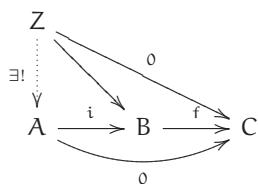

(Note that the kernel is not just an object; it is a morphism of an object to B. In practice, the term is often applied to just the object, and the intended interpretation is clear from the context.) Hence it is unique up to unique isomorphism by universal property nonsense. The kernel is written ker $\mathsf { f } \to \mathsf { B }$ . A cokernel (denoted by coker f) is defined dually by reversing the arrows—do this yourself. The kernel of f : $\mathrm { B } \to \mathsf { C }$ is the limit (§1.3) of the diagram

(1.5.4.2)

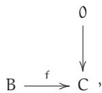

and similarly the cokernel is a colimit (see (2.6.0.1)).

If i : $\lambda \to \mathbb { B }$ is a monomorphism, then we say that A is a subobject of B, where the map i is implicit. There is also the notion of quotient object, defined dually to subobject.

An abelian category is an additive category satisfying three additional properties.

(1) Every map has a kernel and cokernel.   
(2) Every monomorphism is the kernel of its cokernel.   
(3) Every epimorphism is the cokernel of its kernel.

It is a nonobvious (and imprecisely stated) fact that every property you want to be true about kernels, cokernels, etc. follows from these three. (Warning: In part of the literature, additional hypotheses are imposed as part of the definition.)

The image of a morphism f : $\lambda \to \mathbb { B }$ is defined as $\operatorname { i m } ( \mathsf { f } ) = \ker ( \mathrm { c o k e r } \mathsf { f } )$ whenever it exists (e.g., in every abelian category). The morphism f: $\lambda \to \mathbb { B }$ factors uniquely through $\operatorname { i m } \mathrm { f }  \mathrm { B }$ whenever im f exists, and $\lambda \to \operatorname { i m } \operatorname { f }$ is an epimorphism and a cokernel of ker $\ell \to A$ in every abelian category. The reader may want to verify this as a (hard!) exercise.

The cokernel of a monomorphism is called the quotient. The quotient of a monomorphism $\lambda \to \mathbb { B }$ is often denoted by B/A (with the map from B implicit).

We will leave the foundations of abelian categories untouched. The key thing to remember is that if you understand kernels, cokernels, images and so on in the category of modules over a given ring, you can manipulate objects in any abelian category. This is made precise by the Freyd– Mitchell Embedding Theorem (Remark 1.5.5).

However, the abelian categories we will come across will obviously be related to modules, and our intuition will clearly carry over, so we needn’t invoke a theorem whose proof we haven’t read. For example, we will show that sheaves of abelian groups on a topological space X form an abelian category (§2.6), and the interpretation in terms of “compatible germs” will connect notions of kernels, cokernels etc. of sheaves of abelian groups to the corresponding notions of abelian groups.

1.5.5. Small remark on chasing diagrams. It is useful to prove facts (and solve exercises) about abelian categories by chasing elements. Unfortunately, some commonly used abelian categories,

such as the category of complexes (to be defined in Exercise 1.5.C), do not have “elements”— they are not naturally “sets with additional structure” in any obvious way. Nonetheless, proof by element-chasing can be justified by the Freyd–Mitchell Embedding Theorem: If $\mathcal { C }$ is an abelian category whose objects form a set, then there is a ring A and an exact, fully faithful functor from $\mathcal { C }$ into $M o d _ { A } ,$ , which embeds $\mathcal { C }$ as a full subcategory. (Unfortunately, the ring A need not be commutative.) A proof is sketched in [Weib, §1.6], and references to a complete proof are given there. A proof is also given in [KS2, §9.6]. The upshot is that to prove something about a diagram in some abelian category, we may assume that it is a diagram of modules over some ring, and we may then “diagram-chase” elements. Moreover, any fact about kernels, cokernels, and so on that holds in $M o d _ { A }$ holds in any abelian category.

If invoking a theorem whose proof you haven’t read bothers you, a short alternative is Mac Lane’s “elementary rules for chasing diagrams,” [Mac, Thm. 3, p. 204]; [Mac, Lem. 4, p. 205] gives a proof of the Five Lemma (Exercise 1.6.6) as an example.

But in any case, do what you need to do to put your mind at ease, so you can move forward. Do as little as your conscience will allow.

# 1.5.6. Complexes, exactness, and homology.

(In this entire discussion, we assume we are working in an abelian category.) We say a sequence

$$
\dots \longrightarrow A \xrightarrow {f} B \xrightarrow {g} C \longrightarrow \dots \tag {1.5.6.1}
$$

is a complex at B if ${ \mathfrak { g o f } } = 0$ , and is exact at B if ker ${ \mathfrak { g } } = { \mathrm { i m } } \operatorname { f }$ . (More specifically, g has a kernel that is an image of f. Exactness at B implies being a complex at B—do you see why?) A sequence is a complex (resp., exact) if it is a complex (resp., exact) at each (internal) term. A short exact sequence is an exact sequence with five terms, the first and last of which are zeros—in other words, an exact sequence of the form

$$
0 \longrightarrow A \longrightarrow B \longrightarrow C \longrightarrow 0.
$$

For example, 0 / A / 0 is exact if and only if $A = 0$ ;

$$
0 \longrightarrow A \xrightarrow {f} B
$$

is exact if and only if f is a monomorphism (with a similar statement for A f / B / 0);

$$
0 \longrightarrow A \xrightarrow {f} B \longrightarrow 0
$$

is exact if and only if f is an isomorphism; and

$$
0 \longrightarrow A \xrightarrow {f} B \xrightarrow {g} C
$$

is exact if and only if f is a kernel of g (with a similar statement for $\begin{array} { r } { \mathrm { ~ \mathsf { A } ~ } \xrightarrow { \mathrm { ~ \mathsf { ~ f ~ } ~ } } \mathrm { ~ B ~ } \xrightarrow { \mathrm { ~ \mathsf { ~ g ~ } ~ } } \mathrm { ~ C ~ } \xrightarrow { \mathrm { ~ \mathsf ~ { ~ \chi ~ } ~ } } \mathrm { ~ \mathsf { ~ O } ~ } } \end{array}$ . To show some of these facts it may be helpful to prove that (1.5.6.1) is exact at B if and only if the cokernel of f is a cokernel of the kernel of g.

If you would like practice in playing with these notions before thinking about homology, you can prove the Snake Lemma (stated in Example 1.6.5, with a stronger version in Exercise 1.6.B), or the Five Lemma (stated in Example 1.6.6, with a stronger version in Exercise 1.6.C). (I would do this in the category of A-modules, but see [KS2, Lem. 12.1.1, Lem. 8.3.13] for proofs in general.)

If (1.5.6.1) is a complex at B, then its homology at B (often denoted by H) is ker ${ \mathfrak { g } } / { \mathfrak { i } } { \mathfrak { m } } ^ { \dagger }$ . (More precisely, there is some monomorphism $\mathrm { i m } \uparrow \hookrightarrow \ker { \mathfrak { g } } ,$ and H is the cokernel of this monomorphism.) Therefore, (1.5.6.1) is exact at B if and only if its homology at B is 0. We say that elements of ker g (assuming the objects of the category are sets with some additional structure) are the cycles, and elements of im f are the boundaries (so homology is “cycles mod boundaries”). If the complex is indexed in decreasing order, the indices are often written as subscripts, and $\mathsf { H } _ { \mathrm { i } }$ is the

homology at $\lambda _ { \mathrm { i } + 1 }  \lambda _ { \mathrm { i } }  \lambda _ { \mathrm { i } - 1 } .$ . If the complex is indexed in increasing order, the indices are often → →written as superscripts, and the homology ${ \mathsf { H } } ^ { \mathrm { i } }$ at $\mathsf { A } ^ { \mathrm { i } - 1 } \to \mathsf { A } ^ { \mathrm { i } } \to \mathsf { A } ^ { \mathrm { i } + 1 }$ is often called cohomology.

An exact sequence

$$
A ^ {\bullet}: \quad \dots \longrightarrow A ^ {i - 1} \xrightarrow {f ^ {i - 1}} A ^ {i} \xrightarrow {f ^ {i}} A ^ {i + 1} \xrightarrow {f ^ {i + 1}} \dots \tag {1.5.6.2}
$$

can be “factored” into short exact sequences

$$
0 \longrightarrow \ker f ^ {i} \longrightarrow A ^ {i} \longrightarrow \ker f ^ {i + 1} \longrightarrow 0,
$$

which is helpful in proving facts about long exact sequences by reducing them to facts about short exact sequences.

More generally, if (1.5.6.2) is assumed only to be a complex, then it can be “factored” into short exact sequences.

$$
0 \longrightarrow \ker f ^ {i} \longrightarrow A ^ {i} \longrightarrow \operatorname {i m} f ^ {i} \longrightarrow 0, \tag {1.5.6.3}
$$

$$
0 \longrightarrow \operatorname {i m} f ^ {i - 1} \longrightarrow \ker f ^ {i} \longrightarrow H ^ {i} (A ^ {\bullet}) \longrightarrow 0
$$

1.5.A. EXERCISE. Describe exact sequences

$$
0 \longrightarrow \operatorname {i m} f ^ {i} \longrightarrow A ^ {i + 1} \longrightarrow \operatorname {c o k e r} f ^ {i} \longrightarrow 0, \tag {1.5.6.4}
$$

$$
0 \longrightarrow H ^ {i} (A ^ {\bullet}) \longrightarrow \operatorname {c o k e r} f ^ {i - 1} \longrightarrow \operatorname {i m} f ^ {i} \longrightarrow 0
$$

(These are somehow dual to (1.5.6.3). In fact, in some mirror universe this might have been given as the standard definition of homology.) Assume the category is that of modules over a fixed ring for convenience, but be aware that the result is true for any abelian category.

1.5.B. EXERCISE AND IMPORTANT DEFINITION. Suppose

$$
0 \xrightarrow {d ^ {0}} A ^ {1} \xrightarrow {d ^ {1}} \dots \xrightarrow {d ^ {n - 1}} A ^ {n} \xrightarrow {d ^ {n}} 0
$$

is a complex of finite-dimensional k-vector spaces (often called $\bar { A } ^ { \bullet }$ for short). Define $\mathrm { h } ^ { \mathrm { i } } ( \boldsymbol { A } ^ { \bullet } ) : =$ $\dim \mathsf { H } ^ { \mathrm { i } } ( A ^ { \bullet } )$ . Show that $\sum ( - 1 ) ^ { \mathrm { i } } \dim { \mathsf { A } } ^ { \mathrm { i } } = \sum ( - 1 ) ^ { \mathrm { i } } { \mathsf { h } } ^ { \mathrm { i } } ( { \mathsf { A } } ^ { \bullet } )$ . In particular, if $\bar { A } ^ { \bullet }$ is exact, then $\sum ( - 1 ) ^ { \mathrm { i } } \dim { \mathsf { A } } ^ { \mathrm { i } } = 0$ . (If you haven’t dealt much with cohomology, this will give you some practice.)

1.5.C. IMPORTANT EXERCISE. Suppose $\mathcal { C }$ is an abelian category. Define the category $C o m \mathrm { { _ { \it 6 } } }$ of complexes) as follows. The objects are infinite complexes

$$
A ^ {\bullet}: \quad \dots \longrightarrow A ^ {i - 1} \xrightarrow {f ^ {i - 1}} A ^ {i} \xrightarrow {f ^ {i}} A ^ {i + 1} \xrightarrow {f ^ {i + 1}} \dots
$$

in $\mathcal { C } ,$ , and the morphisms $A ^ { \bullet }  \mathbb { B } ^ { \bullet }$ are commuting diagrams

$$
\begin{array}{l} \dots \longrightarrow A ^ {i - 1} \xrightarrow {f ^ {i - 1}} A ^ {i} \xrightarrow {f ^ {i}} A ^ {i + 1} \xrightarrow {f ^ {i + 1}} \dots . \\ \downarrow \quad \quad \quad \quad \quad \quad \quad \quad \quad \quad \quad \quad \quad \quad \quad \quad \quad \quad \quad \quad \quad \quad \quad \quad \quad \quad \quad \quad \quad \quad \quad \quad \quad \quad \quad \quad \quad \quad \quad \quad \quad \quad \quad \quad \quad \quad \quad \quad \quad \quad \end{array}
$$

Show that $C o m \mathrm { { c _ { \it { G } } } }$ is an abelian category.

Feel free to deal with the special case of modules over a fixed ring. (Remark for experts: Essentially the same argument shows that $\mathcal { C } ^ { \mathcal { S } }$ is an abelian category for any small category $\mathcal { I }$ and any abelian category $\mathcal { C }$ . This immediately implies that the category of presheaves on a topological space X with values in an abelian category $\mathcal { C }$ is automatically an abelian category; cf. §2.3.5.)

1.5.D. IMPORTANT EXERCISE. Show that (1.5.6.5) induces a map of homology $\mathsf { H } ^ { \mathrm { i } } ( \mathsf { A } ^ { \bullet } ) $ $\mathsf { H } ^ { \mathrm { i } } ( \mathsf { B } ^ { \bullet } )$ . Show furthermore that ${ \mathsf { H } } ^ { \mathrm { i } }$ is a covariant functor $C o m _ { \mathscr { C } }  \mathscr { C }$ →. (Again, feel free to deal with the special case ModA.)   
1.5.7. Homotopic maps induce the same maps on homology. We say two maps of complexes f : $C ^ { \bullet } \to \mathsf { D } ^ { \bullet }$ and ${ \mathfrak { g } } \colon { \mathsf { C } } ^ { \bullet } \to { \mathsf { D } } ^ { \bullet }$ are homotopic if there is a sequence of maps $_ w$ : $\dot { \mathrm { ~ C ~ } ^ { \mathrm { i } } } \xrightarrow { } \mathrm { D } ^ { \mathrm { i } - \bar { 1 } }$ such that $\mathsf { f } - \mathsf { g } = \mathrm { d } w + w \mathrm { d }$ .   
1.5.E. EXERCISE. Show that two homotopic maps give the same map on homology.   
1.5.8. Theorem (long exact sequences) — A short exact sequence of complexes

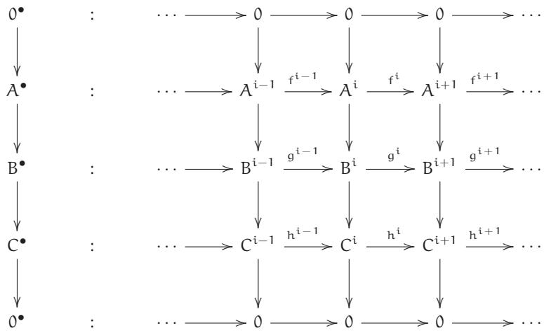

induces a long exact sequence in cohomology

$$
\dots \longrightarrow H ^ {i - 1} (C ^ {\bullet}) \longrightarrow
$$

$$
\mathrm {H} ^ {\mathrm {i}} \left(\mathrm {A} ^ {\bullet}\right) \longrightarrow \mathrm {H} ^ {\mathrm {i}} \left(\mathrm {B} ^ {\bullet}\right) \longrightarrow \mathrm {H} ^ {\mathrm {i}} \left(\mathrm {C} ^ {\bullet}\right) \longrightarrow
$$

$$
\mathrm {H} ^ {\mathrm {i} + 1} \left(A ^ {\bullet}\right) \longrightarrow \dots
$$

(This requires a definition of the connecting homomorphism ${ \mathsf { H } } ^ { \mathsf { i } - 1 } ( { \mathsf { C } } ^ { \bullet } ) \to { \mathsf { H } } ^ { \mathrm { i } } ( { \mathsf { A } } ^ { \bullet } ) ,$ , which is “natural” in an appropriate sense.) In the category of modules over a ring, Theorem 1.5.8 will come out of our discussion of spectral sequences—see Exercise 1.6.F—but this is a somewhat perverse way of proving it. For a proof in general, see [KS2, Theorem 12.3.3]. You may want to prove it yourself, by first proving a weaker version of the Snake Lemma (Example 1.6.5), where in the hypotheses (1.6.5.1), the 0’s in the bottom left and top right are removed, and in the conclusion (1.6.5.2), the first and last 0’s are removed.

1.5.9. Exactness of functors. If F : ${ \mathcal { A } } \to { \mathcal { B } }$ is an additive covariant functor from one abelian category to another, we say that F is right-exact if the exactness of

$$
A ^ {\prime} \longrightarrow A \longrightarrow A ^ {\prime \prime} \longrightarrow 0
$$

in $\mathcal { A }$ implies that

$$
\mathrm {F} \left(A ^ {\prime}\right) \longrightarrow \mathrm {F} (A) \longrightarrow \mathrm {F} \left(A ^ {\prime \prime}\right) \longrightarrow 0
$$

is also exact. Dually, we say that F is left-exact if the exactness of

$$
0 \longrightarrow A ^ {\prime} \longrightarrow A \longrightarrow A ^ {\prime \prime} \quad \text {i m p l i e s}
$$

$$
0 \longrightarrow F (A ^ {\prime}) \longrightarrow F (A) \longrightarrow F (A ^ {\prime \prime}) \quad \text {i s e x a c t .}
$$

An additive contravariant functor is left-exact if the exactness of

$$
A ^ {\prime} \longrightarrow A \longrightarrow A ^ {\prime \prime} \longrightarrow 0 \quad \text {i m p l i e s}
$$

$$
0 \longrightarrow F (A ^ {\prime \prime}) \longrightarrow F (A) \longrightarrow F \left(A ^ {\prime}\right) \quad \text {i s e x a c t .}
$$

The reader should be able to deduce what it means for a contravariant functor to be right-exact. An additive covariant or contravariant functor is exact if it is both left-exact and right-exact.

1.5.F. EXERCISE. Suppose F is an exact functor. Show that applying F to an exact sequence preserves exactness. For example, if F is covariant, and $A ^ { \prime }  A  A ^ { \prime \prime }$ is exact, then $\mathsf { F } \mathsf { A } ^ { \prime } \to \mathsf { F } \mathsf { A } \to \mathsf { F } \mathsf { A } ^ { \prime \prime }$ is exact. (This will be generalized in Exercise 1.5.I(c).)

1.5.G. EXERCISE. Suppose A is a ring, ${ \mathsf { S } } \subset A$ is a multiplicative subset, and M is an A-module.

(a) Show that localization of A-modules $M o d _ { \mathrm { A } } \longrightarrow M o d _ { \mathrm { S } ^ { - 1 } \mathrm { A } }$ is an exact covariant functor.   
(b) Show that $( \cdot ) \otimes _ { \cal A } { \cal M }$ is a right-exact covariant functor $M o d _ { \mathrm { A } } \longrightarrow M o d _ { \mathrm { A } }$ . (This is a repeat of Exercise 1.2.H.)   
(c) Show that $\mathrm { H o m } ( M , \cdot )$ is a left-exact covariant functor $M o d _ { \mathrm { A } }  M o d _ { \mathrm { A } }$ . If $\mathcal { C }$ is any abelian category, and $C \in \mathcal { C } ,$ , show that ${ \mathrm { H o m } } ( \mathbf { \boldsymbol { C } } , \cdot )$ is a left-exact covariant functor $\mathcal { C }  A b$ .   
(d) Show that $\mathrm { H o m } ( \cdot , M )$ is a left-exact contravariant functor $M o d _ { \mathrm { A } } \longrightarrow M o d _ { \mathrm { A } }$ . If $\mathcal { C }$ is any abelian category, and $C \in { \mathcal { C } } ,$ , show that $\operatorname { H o m } ( \cdot , \mathbf { C } )$ is a left-exact contravariant functor $\mathcal { C }  A b$ .

1.5.H. EXERCISE. Suppose $M$ is a finitely presented A-module: M has a finite number of generators, and with these generators it has a finite number of relations; or, equivalently, and usefully fits in an exact sequence

$$
A ^ {\oplus q} \longrightarrow A ^ {\oplus p} \longrightarrow M \longrightarrow 0. \tag {1.5.9.1}
$$

Use (1.5.9.1) and the left-exactness of Hom to describe an isomorphism

$$
S ^ {- 1} \operatorname {H o m} _ {A} (M, N) \xleftarrow {\sim} \operatorname {H o m} _ {S - 1 A} (S ^ {- 1} M, S ^ {- 1} N).
$$

(You might be able to interpret this in light of a variant of Exercise 1.5.I below, for left-exact contravariant functors rather than right-exact covariant functors.)

1.5.10. Example: Hom doesn’t always commute with localization. In the language of Exercise 1.5.H, take $\mathsf { A } = \mathsf { N } = \mathbb { Z } , M = \mathbb { Q } ,$ $M = \mathbb { Q } ,$ and $S = \mathbb { Z } \setminus \{ 0 \}$ .

# 1.5.11.* Two useful facts in homological algebra.

We now come to two (sets of) facts I wish I had learned as a child, as they would have saved me lots of grief. They encapsulate what is best and worst of abstract nonsense. The statements are so general as to be nonintuitive. The proofs are very short. They generalize some specific behavior that is easy to prove on an ad hoc basis. Once they are second nature to you, many subtle facts will become obvious to you as special cases. And you will see that they will get used (implicitly or explicitly) repeatedly.

# 1.5.12.* Interaction of homology and (right/left-)exact functors.

You might wait to prove this until you learn about cohomology in Chapter 18, when it will first be used in a serious way.

1.5.I. IMPORTANT EXERCISE (THE FHHF THEOREM). This result can take you far, and perhaps for that reason it has sometimes been called the Fernbahnhof (FernbaHnHoF) Theorem, notably in [Vak1, Exer. 1.5.I]. Suppose F: ${ \mathcal { A } } \to { \mathcal { B } }$ is a covariant functor of abelian categories, and $C ^ { \bullet }$ is a complex in $\mathcal { A }$ .

(a) (F right-exact yields $\mathsf { F H } ^ { \bullet } \longrightarrow \mathsf { H } ^ { \bullet } \mathsf { F } ,$ ) If F is right-exact, describe a natural morphism $\mathsf { F H } ^ { \bullet } $ H•F. (More precisely, for each ${ \mathrm { i } , }$ the left side is F applied to the cohomology at piece i of $C ^ { \bullet }$ , while the right side is the cohomology at piece i of FC•.)

(b) (F left-exact yields $\mathsf { F H } ^ { \bullet } \ll \mathsf { H } ^ { \bullet } \mathsf { F } )$ If F is left-exact, describe a natural morphism $\mathsf { H } ^ { \bullet } \mathsf { F } \longrightarrow \mathsf { F } \mathsf { H } ^ { \bullet }$   
(c) (F exact yields $\mathsf { F H } ^ { \bullet } \xrightarrow { \sim } \mathsf { H } ^ { \bullet } \mathsf { F }$ ) If F is exact, show that the morphisms of (a) and (b) are inverses and thus isomorphisms.

i d i i + 1 / coker di / 0 to give an isomorphism F coker $\mathrm { d } ^ { \mathrm { i } } $ coker $\mathsf { F d } ^ { \mathrm { i } }$ . Then use the first line of (1.5.6.4) to give an epimorphism $\mathsf { F i m d } ^ { \mathrm { i } } \twoheadrightarrow \mathrm { i m } \mathsf { F d } ^ { \mathrm { i } }$ . Then use the second line of (1.5.6.4) to give the desired map $\mathsf { F H } ^ { \mathrm { i } } \mathsf { C } ^ { \bullet } \to \mathsf { H } ^ { \mathrm { i } } \mathsf { F C } ^ { \bullet }$ . While you are at it, you may as well describe a map for the fourth member of the quartet {coker, im, H, ker}: F ker $\mathrm { d } ^ { \mathrm { i } }  \mathrm { k e r } \mathsf { F } \mathrm { d } ^ { \mathrm { i } }$ .

1.5.13. If this makes your head spin, you may prefer to think of it in the following specific case, where both $\mathcal { A }$ and $\mathcal { B }$ are the category of A-modules, and F is $( \cdot ) \otimes _ { \mathsf { A } } \mathsf { N }$ for some fixed A-module N. Your argument in this case will translate without change to yield a solution to Exercise 1.5.I(a) and (c) in general. If $\otimes \mathsf { N }$ is exact, then N is called a flat A-module. (The notion of flatness will turn out to be very important, and is discussed in detail in Chapter 24.)

For example, localization is exact (Exercise 1.5.G(a)), so $S ^ { - 1 } A$ is a flat A-algebra for all multiplicative sets S. Thus taking cohomology of a complex of A-modules commutes with localization—something you could verify directly.

1.5.14. Interaction of adjoints, (co)limits, and (left- and right-) exactness.

A surprising number of arguments boil down to the following statement:

Limits commute with limits and right adjoints. In particular, in an abelian category, because kernels are limits, both limits and right adjoints are left-exact.

And to its dual:

Colimits commute with colimits and left adjoints. In particular, because cokernels are colimits, both colimits and left adjoints are right-exact.

These statements were promised in §1.4.4, and will be proved below. The latter has a useful extension:

In ModA, colimits over filtered index categories are exact. “Filtered” was defined in §1.3.8.

1.5.15.** Caution. It is not true that in abelian categories in general, colimits over filtered index categories are exact. (Grothendieck realized the desirability of such colimits being exact, and formalized this as his $" \mathrm { A B } 5 ^ { \prime \prime }$ axiom; see, for example, [Stacks, tag 079A].) Here is a counterexample. Because the axioms of abelian categories are self-dual, it suffices to give an example in which a cofiltered limit fails to be exact (where cofiltered has the obvious dual definition to filtered), and we do this. Fix a prime p. In the category $A b$ of abelian groups, for each positive integer n, we have an exact sequence $\mathbb { Z } \to \mathbb { Z } / ( { \mathfrak { p } } ^ { \mathfrak { n } } ) \to 0$ . Taking the limit over all n in the obvious way, we obtain $\mathbb { Z } \to \mathbb { Z } _ { \mathfrak { p } } \to 0 ,$ , which is certainly not exact.)

→Unimportant Remark 1.5.18 will dash another hope you may have.

1.5.16. If you want to use these statements (for example, later in this book), you will have to prove them. Let’s now make them precise.

1.5.J. EXERCISE (KERNELS COMMUTE WITH LIMITS). Suppose $\mathcal { C }$ is an abelian category, and a : ${ \mathcal { I } } \to { \mathcal { C } }$ and b: $\mathcal { S } \xrightarrow { } \mathcal { C }$ are two diagrams in $\mathcal { C }$ indexed by $\mathcal { I }$ . For convenience, let $\lambda _ { \mathrm { i } } = \mathbf { a } ( \mathrm { i } )$ and $\mathrm { B } _ { \mathrm { i } } = \mathbf { b } ( \mathrm { i } )$ be the objects in those two diagrams. Let h $\mathrm { \Omega _ { i } } \colon { \mathsf { A } } _ { \mathrm { i } } \to { \mathsf { B } } _ { \mathrm { i } }$ be maps commuting with the maps in the diagrams. (Translation: h is a natural transformation of functors ${ \mathrm { a } } \to { \mathrm { b } }$ ; see §1.1.21.) Then the ker $\mathsf { h } _ { \mathrm { i } }$ form another diagram in $\mathcal { C }$ indexed by $\mathcal { I }$ . Describe a canonical isomorphism lim ker $\mathtt { h } _ { \mathrm { i } } \longleftrightarrow$ $\ker ( \operatorname* { l i m } A _ { \mathrm { i } } \to \operatorname* { l i m } B _ { \mathrm { i } }$ ), assuming the limits exist.

Implicit in the previous exercise is the idea that limits should somehow be understood as functors.

1.5.K. EXERCISE. Make sense of the statement that “limits commute with limits” in a general category, and prove it. (Hint: Recall that kernels are limits. The previous exercise should be a corollary of this one.)

1.5.17. Proposition (right adjoints commute with limits) — Suppose (F: $\mathcal { C } \to \mathcal { D }$ , G $: \mathcal { D } \xrightarrow { } \mathcal { C }$ ) is a pair of adjoint functors. If $\lambda { = } \operatorname* { l i m } A _ { \mathrm { i } }$ is a limit in $\mathcal { D }$ of a diagram indexed by $\mathcal { I }$ , then $\mathsf { G } \mathsf { A } = \operatorname* { l i m } \mathsf { G } \mathsf { A } _ { \mathrm { i } }$ (with the corresponding maps $\operatorname { G } { \lambda } \to \operatorname { G } { \lambda } _ { \mathrm { i } }$ ) is a limit in $\mathcal { C }$ .

Proof. We must show that $\mathsf { G } \mathsf { A } \to \mathsf { G } \mathsf { A } _ { \mathrm { i } }$ satisfies the universal property of limits. Suppose we have maps $W \to \mathsf { G } A _ { \mathrm { i } }$ commuting with the maps of $\mathcal { I }$ . We wish to show that there exists a unique $W \to \mathsf { G } A$ extending the $W \to \mathsf { G } A _ { \mathrm { i } }$ . By adjointness of F and $\mathsf { G } ,$ we can restate this as: Suppose we have maps $\mathsf { F W } \to \mathsf { A } _ { \mathrm { i } }$ commuting with the maps of $\mathcal { I }$ . We wish to show that there exists a unique $\mathsf { F W } \to \bar { A }$ extending the $\mathsf { F W } \to \mathsf { A } _ { \mathrm { i } }$ . But this is precisely the universal property of the limit. □

Of course, the dual statements to Exercise 1.5.K and Proposition 1.5.17 hold by the dual arguments.

If F and G are additive functors between abelian categories, and (F, G) is an adjoint pair, then (as kernels are limits and cokernels are colimits) G is left-exact and F is right-exact.

1.5.L. EXERCISE. Show that in $M o d _ { A } ,$ , colimits over filtered index categories are exact. (Your argument will apply without change to any abelian category whose objects can be interpreted as “sets with additional structure.”) Right-exactness follows from the above discussion, so the issue is left-exactness. (Possible hint: After you show that localization is exact, Exercise 1.5.G(a), or stalkification is exact, Exercise 2.6.E, in a hands-on way, you will be easily able to prove this. Conversely, if you do this exercise, those two will be easy.)

1.5.M. EXERCISE. Show that filtered colimits commute with homology in $M o d _ { A }$ . Hint: Use the FHHF Theorem (Exercise 1.5.I), and the previous exercise.

In light of Exercise 1.5.M, you may want to think about how limits (and colimits) commute with homology in general, and which way maps go. The statement of the FHHF Theorem should suggest the answer. (Are limits analogous to left-exact functors, or right-exact functors?) We won’t directly use this insight, but see $\ S 1 8 . 1$ (vii) for an example.

Just as colimits are exact (not just right-exact) in especially good circumstances, limits are exact (not just left-exact), too. The following will be used twice in Chapter 28.

# 1.5.N. EXERCISE. Suppose

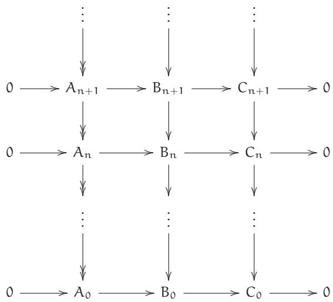

is an inverse system of exact sequences of modules over a ring, such that the maps $\lambda _ { \mathfrak { n } + 1 } \to \lambda _ { \mathfrak { n } }$ are surjective. (We say: “transition maps of the left term are surjective.”) Show that the limit

$$
0 \longrightarrow \lim A _ {n} \longrightarrow \lim B _ {n} \longrightarrow \lim C _ {n} \longrightarrow 0 \tag {1.5.17.1}
$$

is also exact. (You will need to define the maps in (1.5.17.1).)

1.5.18. Unimportant remark. Based on these ideas, you may suspect that right-exact functors always commute with colimits. The fact that the tensor product commutes with infinite direct sums (Exercise 1.2.M) may reinforce this idea. Unfortunately, it is not true—“double dual” ∨∨ : $V e c _ { \boldsymbol { \mathrm { k } } } \longrightarrow V e c _ { \boldsymbol { \mathrm { k } } }$ is covariant and right exact (in fact, exact), but does not commute with infinite direct sums, as $\oplus _ { \mathrm { i } = 1 } ^ { \infty } ( \mathsf { k } ^ { \vee \vee } )$ is not isomorphic to $( \mathbb { O } _ { \mathrm { i = 1 } } ^ { \infty } \mathbf { k } ) ^ { \vee \vee }$ .   
1.5.19.* Dreaming of derived functors. When you see a left-exact functor, you should always dream that you are seeing the end of a long exact sequence. If

$$
0 \longrightarrow M ^ {\prime} \longrightarrow M \longrightarrow M ^ {\prime \prime} \longrightarrow 0
$$

is an exact sequence in abelian category $\mathcal { A }$ , and F: ${ \mathcal { A } } \to { \mathcal { B } }$ is a left-exact functor, then

$$
0 \longrightarrow F M ^ {\prime} \longrightarrow F M \longrightarrow F M ^ {\prime \prime}
$$

is exact, and you should always dream that it continues in some natural way. For example, the next term should depend only on $M ^ { \prime }$ —call it $\mathsf { R } ^ { 1 } \mathsf { F } \boldsymbol { M } ^ { \prime }$ —and if it is zero, then $\mathbb { F } M \to \mathbb { F } M ^ { \prime \prime }$ is an epimorphism. This remark holds true for left-exact and contravariant functors too. In good cases, such a continuation exists, and is incredibly useful. We will discuss this in Chapter 23.

# 1.6* Spectral Sequences

Je suis quelque peu affolé par ce déluge de cohomologie, mais j’ai courageusement tenu le coup. Ta suite spectrale me paraît raisonnable (je croyais, sur un cas particulier, l’avoir mise en défaut, mais je m’étais trompé, et cela marche au contraire admirablement bien).

I am a bit panic-stricken by this flood of cohomology, but have borne up courageously. Your spectral sequence seems reasonable to me (I thought I had shown that it was wrong in a special case, but I was mistaken, on the contrary it works remarkably well).

—J.-P. Serre, letter to A. Grothendieck, March 14, 1956 [GrS, p. 38]

Spectral sequences are a powerful bookkeeping tool for proving things involving complicated commutative diagrams. They were introduced by Leray in the 1940s at the same time as he introduced sheaves. They have a reputation for being abstruse and difficult. It has been suggested that the name ‘spectral’ was given because, like specters, spectral sequences are terrifying, evil, and dangerous. I have heard no one disagree with this interpretation, which is perhaps not surprising since I just made it up.

Nonetheless, the goal of this section is to tell you enough that you can use spectral sequences without hesitation or fear, and why you shouldn’t be frightened when they come up in a seminar. What is perhaps different in this presentation is that we will use spectral sequences to prove things that you may have already seen, and that you can prove easily in other ways. This will allow you to get some hands-on experience in how to use them. We will also see them only in the special case of double complexes (the version by far the most often used in algebraic geometry), and not in the general form usually presented (filtered complexes, exact couples, etc.). See [Weib, Ch. 5] for more detailed information if you wish.

You should not read this section when you are reading the rest of Chapter 1. Instead, you should read it just before you need it for the first time. When you finally do read this section, you must do the exercises up to Exercise 1.6.F.

For concreteness, we work in the category $M o d _ { A }$ of module over a ring A. However, everything we say will apply in any abelian category. (And if it helps you feel secure, work instead in the category $V e c _ { \boldsymbol { \mathrm { k } } }$ of vector spaces over a field k.)

# 1.6.1. Double complexes.

A double complex is a collection of A-modules $\mathsf { E } ^ { \mathsf { p } , \mathsf { q } }$ (p, q  Z), and “rightward” morphisms ${ \mathsf { d } } _ { \to } ^ { \mathfrak { p } , \mathfrak { q } } : \mathsf { E } ^ { \mathfrak { p } , \mathfrak { q } } \to \mathsf { E } ^ { \mathfrak { p } + 1 , \mathfrak { q } }$ and “upward” morphisms ${ \bf d } _ { \uparrow } ^ { \ p , { \ q } } \colon \mathsf { E } ^ { { \ p } , { \ q } } \to \mathsf { E } ^ { { \ p } , { \ q } + 1 }$ . In the superscript, the first entry denotes the column number (the $^ { \prime \prime } x$ ↑-coordinate”), and the second entry denotes the row number (the $^ { \prime \prime } { \mathfrak { Y } }$ -coordinate”). (Warning: This is opposite to the convention for matrices.) The subscript is meant to suggest the direction of the arrows. We will always write these as $\mathrm { d } _ {  }$ and ${ \bf d } _ { \uparrow }$ and ignore the superscripts. We require that $\mathrm { d } _ {  }$ and ${ \bf d } _ { \uparrow }$ satisfy (a) $\mathrm { d } _ {  } ^ { 2 } = 0 ,$ , (b) ${ \mathrm { d } } _ { \uparrow } ^ { 2 } = 0$ , and one more condition: (c) either $\mathrm { d } { \bf \underline { { \ } } } , { \bf d } _ { \uparrow } = { \bf d } _ { \uparrow } { \bf d } _ {  }$ (all the squares commute) or ${ \bf d } _ {  } { \bf d } _ { \uparrow } + { \bf d } _ { \uparrow } { \bf d } _ {  } = 0$ (they all anticommute). Both come up in nature, and you can switch from one to the other by replacing $\mathrm { d } _ { \uparrow } ^ { \mathrm { p , q } }$ with $( - 1 ) ^ { \mathfrak { p } } \mathrm { d } _ { \uparrow } ^ { \mathfrak { p } , \mathfrak { q } }$ . So I ↑ ↑will assume that all the squares anticommute, and that you know how to turn the commuting case into this one. (You will see that there is no difference in the recipe, basically because the image and kernel of a homomorphism f equal the image and kernel respectively of $- \mathsf { f }$ .)

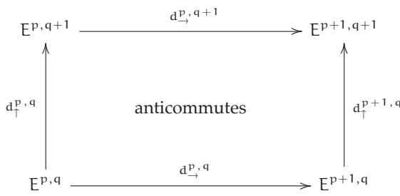

There are variations on this definition, where, for example, the vertical arrows go downward, or some subset of the $\mathsf { E } ^ { \mathsf { p } , \mathsf { q } }$ is required to be zero.

From the double complex we construct a corresponding (single) complex $\mathsf { E } ^ { \bullet }$ with $\mathsf { E } ^ { \mathsf { k } } =$ $\mathbb { \oplus _ { i } E ^ { i , k - i } } ,$ with $\mathrm { d } = \mathrm { d } _ {  } + \mathrm { d } _ { \uparrow }$ . In other words, when there is a single superscript ${ \sf k } ,$ we mean a sum of the kth antidiagonal of the double complex. The single complex is sometimes called the total complex. Note that $\begin{array} { r } { \mathbf { d } ^ { 2 } = ( \mathbf { d } _ {  } + \mathbf { d } _ { \uparrow } ) ^ { 2 } = \mathbf { d } _ {  } ^ { \overline { { 2 } } } + ( \mathbf { d } _ {  } \mathbf { d } _ { \uparrow } + \mathbf { \bar { d } } _ { \uparrow } \mathbf { d } _ {  } ) + \mathbf { \bar { d } } _ { \uparrow } ^ { 2 } = 0 , } \end{array}$ , so $\mathsf { E } ^ { \bullet }$ is indeed a complex.

The cohomology of the single complex is sometimes called the hypercohomology of the double complex. We will instead use the phrase cohomology of the double complex.

Our initial goal will be to find the cohomology of the double complex. You will see later that we secretly also have other goals.

A spectral sequence is a recipe for computing some information about the cohomology of the double complex. I won’t yet give the full recipe. Surprisingly, this fragmentary bit of information is sufficient to prove lots of things.

1.6.2. Approximate definition. A spectral sequence with rightward orientation is a sequence of tables or pages $\to \mathsf { E } _ { 0 } ^ { \flat , \mathsf { q } } , \to \mathsf { E } _ { 1 } ^ { \flat , \mathsf { q } } , \to \mathsf { E } _ { 2 } ^ { \flat , \mathsf { q } }$ , …(p, ${ \mathfrak { q } } \in \mathbb { Z } )$ , where $\begin{array} { r } { \mathopen { } \mathclose \bgroup   \mathrm { E } _ { 0 } ^ { \mathfrak { p } , \mathrm { q } } = \mathrm { E } ^ { \mathfrak { p } , \mathrm { q } } \aftergroup \egroup  } \end{array}$ , along with a differential

$$
\rightarrow d _ {r} ^ {p, q}: \rightarrow E _ {r} ^ {p, q} \longrightarrow \rightarrow E _ {r} ^ {p - r + 1, q + r}
$$

$( \boldsymbol { \mathrm { r } } \in \mathbb { Z } ^ { \geq 0 } )$ with $ \mathrm { d } _ { \mathrm { r } } ^ { \mathrm { p , q } } \circ  \mathrm { d } _ { \mathrm { r } } ^ { \mathrm { p + r - 1 , q - r } } = 0 ,$ and with an isomorphism of the cohomology of $ \mathrm { d } _ { \mathrm { r } }$ at $\underline { { \mathbf { \Pi } } } _ { \vec { \mathbf { \Pi } } \vec { \mathbf { \Pi } } \vec { \mathbf { \Pi } } } \mathbf { E } _ { \vec { \mathbf { r } } } ^ { \vec { \mathbf { p } } , \mathbf { q } }$ (i.e., $\mathrm { k e r } {  } \mathrm { d } _ { \mathrm { r } } ^ { \mathrm { p } , \mathrm { q } } / \mathrm { i m } {  } \mathrm { d } _ { \mathrm { r } } ^ { \mathrm { p } + \mathrm { r } - 1 , \mathrm { q } - \mathrm { r } } )$ with $\boldsymbol { \varTheta } _ { \mathrm { { r + 1 } } } ^ { \mathrm { { p , { q } } } }$ .

→ → →The orientation indicates that our 0th differential is the rightward one: $\mathbf { d } _ { 0 } = \mathbf { d } _ {  }$ . The left subscript $^ { \prime \prime } \longrightarrow ^ { \prime \prime }$ is usually omitted.

The order of the morphisms is best understood visually:

(1.6.2.1)

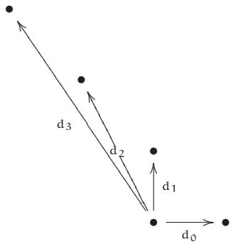

(the morphisms each apply to different pages). Notice that the map always is “degree $1 ^ { \prime \prime }$ in terms of the grading of the single complex E•. (You should figure out what this informal statement really means.)

The actual definition describes what $\mathsf { E } _ { \mathrm { r } } ^ { \bullet , \bullet }$ and $\mathrm { d } _ { \mathrm { r } } ^ { \bullet , \bullet }$ really are, in terms of $\mathbb { E } ^ { \bullet , \bullet }$ . We will describe $\mathrm { d } _ { 0 } , \mathrm { d } _ { 1 }$ , and ${ \mathrm { d } } _ { 2 }$ below, and you should for now take on faith that this sequence continues in some natural way.

Note that $\mathsf { E } _ { \mathrm { r } } ^ { \mathrm { p } , \mathrm { q } }$ is always a subquotient of the corresponding term on the ith page $\mathsf { E } _ { \mathrm { i } } ^ { \mathsf { p } , \mathsf { q } }$ for all ${ \mathrm { i } } < { \mathrm { r } }$ . In particular, if $\mathsf { E } ^ { \mathsf { p } , \mathsf { q } } = 0$ , then $\mathsf { E } _ { \mathrm { r } } ^ { \mathsf { p } , \mathsf { q } } = 0$ for all r.

Suppose now that $\mathbb { E } ^ { \bullet , \bullet }$ is a first quadrant double complex, i.e., $\mathsf { E } ^ { \mathsf { p } , \mathsf { q } } = 0$ for $\mathfrak { p } < 0$ or $\mathsf { q } < 0$ (so $\mathsf { E } _ { \mathrm { r } } ^ { \mathfrak { p } , \mathrm { q } } = 0$ for all r unless p, $\mathbf { \Delta q } \in \mathbb { Z } ^ { \geq 0 } .$ ). Then for any fixed p, q, once r is sufficiently large, $\mathsf { E } _ { \mathrm { r } + 1 } ^ { \mathsf { p } , \mathsf { q } }$ is computed from $\left( \mathbb { E } _ { \mathrm { r } } ^ { \bullet , \bullet } , { \mathrm { d } } _ { \mathrm { r } } \right)$ using the complex

(1.6.2.2)

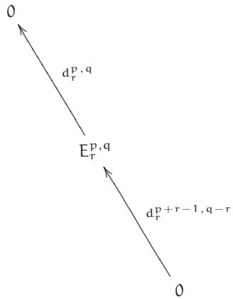

and thus we have canonical isomorphisms

$$
E _ {r} ^ {p, q} \cong E _ {r + 1} ^ {p, q} \cong E _ {r + 2} ^ {p, q} \cong \dots .
$$

We denote this module by $\mathsf { E } _ { \infty } ^ { \mathrm { p } , \mathrm { q } }$ . The same idea works in other circumstances, for example, when ∞the double complex is only nonzero in a finite number of rows— $\cdot \mathsf { E } ^ { \mathsf { p } , \mathsf { q } } = 0$ unless ${ \bf q } _ { 0 } < { \bf q } < { \bf q } _ { 1 }$ . This will come up for example in the mapping cone and long exact sequence discussion (Exercises 1.6.F and 1.6.E below).

We now describe the first few pages of the spectral sequence explicitly. As stated above, the differential ${ \mathrm { d } } _ { 0 }$ on $\mathsf E _ { 0 } ^ { \bullet , \bullet } = \mathsf E ^ { \bullet , \bullet }$ is defined to be $\mathrm { d } _ {  }$ . The rows are complexes.

The 0th page $\mathsf { E } _ { 0 }$ :

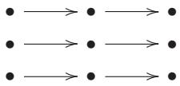

So $\mathsf { E } _ { 1 }$ is just the table of cohomologies of the rows. You should check that there are now vertical maps $\mathsf { d } _ { 1 } ^ { \mathsf { p } , \mathsf { q } } : \mathsf { E } _ { 1 } ^ { \mathsf { p } , \mathsf { q } } \to \mathsf { E } _ { 1 } ^ { \mathsf { p } , \mathsf { q } + 1 }$ of the row cohomology groups, induced by $\mathrm { d } _ { \uparrow } ,$ and that these make the columns into complexes. (This is essentially the fact that a map of complexes induces a map on homology.) We have “used up the horizontal morphisms,” but “the vertical differentials live on.”

The 1st page E1:

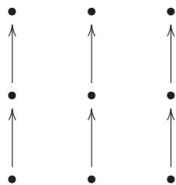

We take cohomology of $\mathrm { d } _ { 1 }$ on $\mathsf { E } _ { 1 } ,$ giving us a new table, $\mathsf { E } _ { 2 } ^ { \mathsf { p } , \mathsf { q } }$ . It turns out that there are natural morphisms from each entry to the entry two above and one to the left, and that the composition of these two is 0. (It is a very worthwhile exercise to work out how this natural morphism ${ \mathrm { d } } _ { 2 }$ should be defined. Your argument may be reminiscent of the connecting homomorphism in the Snake Lemma 1.6.5 or in the long exact sequence in cohomology arising from a short exact sequence of complexes, Theorem 1.5.8. This is no coincidence.)

The 2nd page E2:

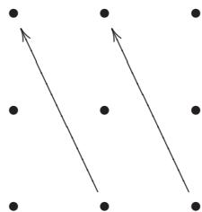

This is the beginning of a pattern.

Then it is a theorem that there is a filtration of $\mathsf { H } ^ { \mathsf { k } } ( \mathsf { E } ^ { \bullet } )$ by $\mathsf { E } _ { \infty } ^ { \mathrm { p } , \mathrm { q } }$ where ${ \mathfrak { p } } + { \mathfrak { q } } = { \mathfrak { k } }$ . (We can’t yet state it as an official Theorem because we haven’t precisely defined the pages and differentials in the spectral sequence.) More precisely, there is a filtration

$$
E _ {\infty} ^ {0, k} \quad \stackrel {E _ {\infty} ^ {1, k - 1}} {\longrightarrow} \quad ? \quad \stackrel {E _ {\infty} ^ {2, k - 2}} {\longrightarrow} \quad \dots \quad \stackrel {E _ {\infty} ^ {k, 0}} {\longrightarrow} \quad H ^ {k} (E ^ {\bullet}) \tag {1.6.2.3}
$$

where the quotients are displayed above each inclusion. (Here is a tip for remembering which way the quotients are supposed to go. The differentials on later and later pages point deeper and deeper into the filtration. Thus the entries in the direction of the later arrowheads are the subobjects, and the entries in the direction of the later “arrowtails” are quotients. This tip has the advantage of being independent of the details of the spectral sequence, e.g., the “quadrant” or the orientation.)

We say that the spectral sequence $\_ \operatorname { E } _ { \bullet } ^ { \bullet , \bullet }$ converges to $\mathsf { H } ^ { \bullet } ( \mathsf { E } ^ { \bullet } )$ . We often say that $\mathbf { \Phi } _ {  } \mathsf { E } _ { 2 } ^ { \bullet , \bullet }$ (or any other page) abuts to $\mathsf { H } ^ { \bullet } ( \mathsf { E } ^ { \bullet } )$ .

Although the filtration gives only partial information about ${ \sf H } ^ { \bullet } ( { \sf E } ^ { \bullet } ) .$ , sometimes one can find $\mathsf { H } ^ { \bullet } ( \mathsf { E } ^ { \bullet } )$ precisely. One example is if all $\mathsf { E } _ { \infty } ^ { \mathrm { i } , \mathsf { k } - \mathrm { i } }$ are zero, or if all but one of them are zero (e.g., if $\mathsf { E } _ { \mathrm { r } } ^ { \bullet , \bullet }$ ∞has precisely one nonzero row or column, in which case one says that the spectral sequence collapses at the rth step, although we will not use this term). Another example is in the category of vector spaces over a field, in which case we can find the dimension of $\mathsf { H } ^ { \boldsymbol { \mathsf { k } } } ( \mathsf { E } ^ { \bullet } )$ . Also, in lucky circumstances, $\mathsf { E } _ { 2 }$ (or some other small page) already equals $\mathsf { E } _ { \infty }$ .

1.6.A. EXERCISE: INFORMATION FROM THE SECOND PAGE. Show that ${ \sf H } ^ { 0 } ( { \sf E } ^ { \bullet } ) = { \sf E } _ { \infty } ^ { 0 , 0 } = { \sf E } _ { 2 } ^ { 0 , 0 }$ and

$$
0 \longrightarrow E _ {2} ^ {0, 1} \longrightarrow H ^ {1} (E ^ {\bullet}) \longrightarrow E _ {2} ^ {1, 0} \xrightarrow {d _ {2} ^ {1 , 0}} E _ {2} ^ {0, 2} \longrightarrow H ^ {2} (E ^ {\bullet})
$$

is exact.

# 1.6.3. The other orientation.

You may have observed that we could as well have done everything in the opposite direction, i.e., reversing the roles of horizontal and vertical morphisms. Then the sequences of arrows giving the spectral sequence would look like this (compare to (1.6.2.1)):

(1.6.3.1)

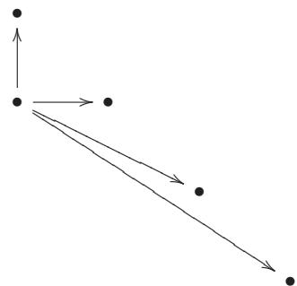

This spectral sequence is denoted by $\uparrow ^ { \mathsf { E } _ { \bullet } ^ { \bullet , \bullet } }$ (“with the upward orientation”). Then we would again get pieces of a filtration of $\mathsf { H } ^ { \bullet } ( \mathsf { E } ^ { \bullet } )$ ↑ • (where we have to be a bit careful with the order with which $\uparrow \mathsf { E } _ { \infty } ^ { \mathrm { p } , \mathrm { q } }$ corresponds to the subquotients—it is the opposite order to that of (1.6.2.3) for $\to \mathsf { E } _ { \infty } ^ { \mathfrak { p } , \mathrm { q } }$ ). Warning: in general there is no isomorphism between $ \mathsf { E } _ { \infty } ^ { \mathfrak { p } , \mathbf { q } }$ and $\boldsymbol { \uparrow } \mathsf { E } _ { \infty } ^ { \mathrm { p , q } }$ .

→ ∞ ↑ ∞In fact, the observation that we can start with either the horizontal or vertical maps was our secret goal all along. Both algorithms compute information about the same thing $( \mathsf { H } ^ { \bullet } ( \mathsf { E } ^ { \bullet } ) )$ , and usually we don’t care about the final answer—we often care about the answer we get in one way, and we get at it by doing the spectral sequence in the other way.

# 1.6.4. Examples.

We are now ready to see how this is useful. The moral of these examples is the following. In the past, you may have proved various facts involving various sorts of diagrams, by chasing elements around. Now, you will just plug them into a spectral sequence, and let the spectral sequence machinery do the chasing for you.

1.6.5. Example: Proving the Snake Lemma. Consider the diagram

(1.6.5.1)

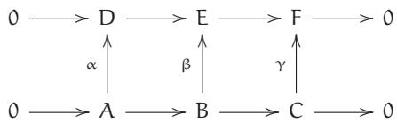

where the rows are exact in the middle (at A, B, C, D, E, F) and the squares commute. (Normally the Snake Lemma is described with the vertical arrows pointing downward, but I want to fit this into my spectral sequence conventions.) We wish to show that there is an exact sequence

(1.6.5.2)

$$
0 \rightarrow \ker \alpha \rightarrow \ker \beta \rightarrow \ker \gamma \rightarrow \operatorname {c o k e r} \alpha \rightarrow \operatorname {c o k e r} \beta \rightarrow \operatorname {c o k e r} \gamma \rightarrow 0.
$$

We plug this into our spectral sequence machinery. We first compute the cohomology using the rightward orientation, i.e., using the order (1.6.2.1). Then because the rows are exact, $\mathsf { E } _ { 1 } ^ { \mathsf { p } , \mathsf { q } } = 0 _ { \mathsf { \iota } }$ , so the spectral sequence has already converged: $\mathsf { E } _ { \infty } ^ { \mathrm { p } , \mathrm { q } } = 0$ .

We next compute this $\prime \prime 0 \prime \prime$ ∞ in another way, by computing the spectral sequence using the upward orientation. Then $_ { \uparrow } \mathsf { E } _ { 1 } ^ { \bullet , \bullet }$ (with its differentials) is:

$$
0 \longrightarrow \operatorname {c o k e r} \alpha \longrightarrow \operatorname {c o k e r} \beta \longrightarrow \operatorname {c o k e r} \gamma \longrightarrow 0
$$

$$
0 \longrightarrow \ker \alpha \longrightarrow \ker \beta \longrightarrow \ker \gamma \longrightarrow 0.
$$

Then $\bar { \mathsf { r } } \mathsf { E } _ { 2 } ^ { \bullet , \bullet }$ is of the form:

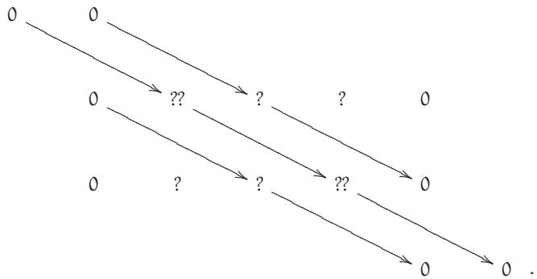

We see that after $\phantom { } _ { \uparrow } \mathsf { E } _ { 2 } ,$ all the terms will stabilize except for the double question marks—all maps to and from the single question marks are to and from 0-entries. And after $\mathsf { \Pi } _ { \uparrow } \mathsf { E } _ { 3 } ,$ even the two double-question-mark terms will stabilize. But in the end our complex must be the 0 complex. This means that in $\phantom { } _ { \uparrow } \mathsf { E } _ { 2 } ,$ all the entries must be zero, except for the two double question marks, and these two must be isomorphic. This means that $\ c \to$ ker α ker β ker γ and coker α coker $\beta $ coker $\gamma \to 0$ are both exact (which comes from the vanishing of the single question marks), and

$$
\operatorname {c o k e r} (\ker \beta \to \ker \gamma) \cong \ker (\operatorname {c o k e r} \alpha \to \operatorname {c o k e r} \beta)
$$

is an isomorphism (which comes from the equality of the double question marks). Taken together, we have proved the exactness of (1.6.5.2), and hence the Snake Lemma! (Notice: In the end we didn’t really care about the double complex. We just used it as a prop to prove the Snake Lemma.)

Spectral sequences make it easy to see how to generalize results further. For example, if $\lambda \to \mathbb { B }$ is no longer assumed to be injective, how would the conclusion change?

1.6.B. UNIMPORTANT EXERCISE (GRAFTING EXACT SEQUENCES, A VARIANT OF THE SNAKE LEMMA). Extend the Snake Lemma as follows. Suppose we have a commuting diagram

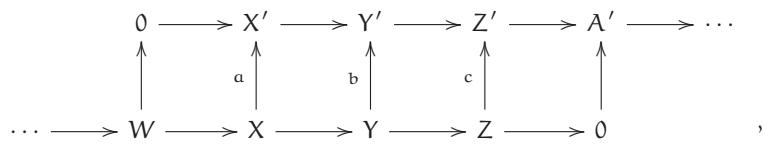

where the top and bottom rows are exact. Show that the top and bottom rows can be “grafted together” to an exact sequence

$$
\begin{array}{c} \dots \longrightarrow W \longrightarrow \ker a \longrightarrow \ker b \longrightarrow \ker c \\ \longrightarrow \operatorname {c o k e r} a \longrightarrow \operatorname {c o k e r} b \longrightarrow \operatorname {c o k e r} c \longrightarrow A ^ {\prime} \longrightarrow \dots . \end{array}
$$

1.6.6. Example: The Five Lemma. Suppose

$$
\begin{array}{c c c c c} \text {F} & \longrightarrow & G & \longrightarrow & H \\ \alpha & \uparrow & \beta & \uparrow & \gamma \\ & & & \gamma & \uparrow \\ A & \longrightarrow & B & \longrightarrow & C \\ & \longrightarrow & D & \longrightarrow & E \end{array} \tag {1.6.6.1}
$$

where the rows are exact and the squares commute.

Suppose $\alpha , \beta , \delta , \epsilon$ are isomorphisms. We will show that $\gamma$ is an isomorphism.

We first compute the cohomology of the total complex using the rightward orientation (1.6.2.1). We choose this because we see that we will get lots of zeros. Then $\bf \Pi _ {  } \mathsf { E } _ { 1 } ^ { \bullet , \bullet }$ looks like this:

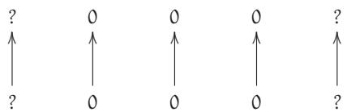

Then $\phantom { } \phantom { } \partial \mathsf { E } _ { 2 }$ looks similar, and the sequence will converge by $\mathsf { E } _ { 2 } ,$ as we will never get any arrows between two nonzero entries in a table thereafter. We can’t conclude that the cohomology of the total complex vanishes, but we can note that it vanishes in all but four degrees—and most importantly, it vanishes in the two degrees corresponding to the entries C and H (the source and target of $\gamma$ ).

We next compute this using the upward orientation (1.6.3.1). Then $\uparrow ^ { \mathsf { E } _ { 1 } }$ looks like

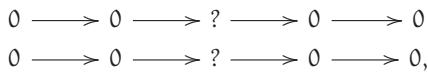

and the spectral sequence converges at this step. We wish to show that those two question marks are zero. But they are precisely the cohomology groups of the total complex that we just showed were zero—so we are done!

The best way to become comfortable with this sort of argument is to try it out yourself several times, and realize that it really is easy. So you should do the following exercises! Many can readily be done directly, but you should deliberately try to use this spectral sequence machinery in order to get practice and develop confidence.

1.6.C. EXERCISE: A SUBTLER FIVE LEMMA. By looking at the spectral sequence proof of the Five Lemma above, prove a subtler version of it, where one of the isomorphisms can instead be required to be just an injection, and another can instead be required to be just a surjection. (I am deliberately not telling you which ones, so you can see how the spectral sequence is telling you how to improve the result.)

1.6.D. EXERCISE: ANOTHER SUBTLE VERSION OF THE FIVE LEMMA. If $\beta$ and δ (in (1.6.6.1)) are injective, and $\propto$ is surjective, show that $\gamma$ is injective. Give the dual statement (whose proof is of course essentially the same).

The next two exercises no longer involve first quadrant double complexes. You will have to think a little to realize why there is no reason for confusion or alarm.

1.6.E. IMPORTANT EXERCISE (THE MAPPING CONE). Suppose $\mu \colon A ^ { \bullet }  \mathrm { B } ^ { \bullet }$ is a morphism of complexes. Suppose $C ^ { \bullet }$ is the single complex associated to the double complex $A ^ { \bullet } $ $\mathtt { B } ^ { \bullet }$ . $C ^ { \bullet }$ is called the mapping cone of $\mu .$ .) Show that there is a long exact sequence of complexes:

$$
\dots \to H ^ {i - 1} \left(C ^ {\bullet}\right) \to H ^ {i} \left(A ^ {\bullet}\right) \to H ^ {i} \left(B ^ {\bullet}\right) \to H ^ {i} \left(C ^ {\bullet}\right) \to H ^ {i + 1} \left(A ^ {\bullet}\right) \to \dots .
$$

(There is a slight notational ambiguity here; depending on how you index your double complex, your long exact sequence might look slightly different.) In particular, we will use the fact that $\mu$ induces an isomorphism on cohomology if and only if the mapping cone is exact. (We won’t use it until the proof of Theorem 18.2.4.)

1.6.F. EXERCISE. Use spectral sequences to show that a short exact sequence of complexes gives a long exact sequence in cohomology (Theorem 1.5.8). (This is a generalization of Exercise 1.6.E.)

The Grothendieck composition-of-functors spectral sequence (Theorem 23.3.5) will be an important example of a spectral sequence that specializes in a number of useful ways.

You are now ready to go out into the world and use spectral sequences to your heart’s content!

# 1.6.7. Complete definition of spectral sequences, and proof.

You should most definitely not read the precise definition of a spectral sequence, and the proof that they work as advertised, any time soon after reading the introduction to spectral sequences above. But after a suitable interval, you should at least flip through a construction and proof to convince yourself that nothing fancy is involved. The idea is not as bad as you might think; see [Vak2].

It is useful to notice that the proof implies that spectral sequences are functorial in the 0th page: the spectral sequence formalism has good functorial properties in the double complex. Unfortunately, Grothendieck’s terminology, “spectral functor,” [Gr1, §2.4] did not catch on.

# Chapter 2

# Sheaves

It is perhaps surprising that geometric spaces are often best understood in terms of (nice) functions on them. For example, a differentiable manifold that is a subset of $\mathbb { R } ^ { { \ n } }$ can be studied in terms of its smooth $( C ^ { \infty } )$ functions. Because “geometric spaces” can have few (everywhere-defined) functions, a more precise version of this insight is that the structure of the space can be well understood by considering all functions on all open subsets of the space. This information is encoded and organized in something called a sheaf. Sheaves were introduced by Leray in the 1940s, and Serre introduced them to algebraic geometry. (The reason for the name will be somewhat explained in Remark 2.4.3.) We will define sheaves and describe useful facts about them. We will begin with a motivating example to convince you that the notion is not so foreign.

One reason sheaves are slippery to work with is that they keep track of a huge amount of information, and there are some subtle local-to-global issues. There are also three different ways of getting a hold of them:

• in terms of open sets (the definition §2.2)—intuitive but in some ways the least helpful;   
in terms of stalks (see §2.4.1); and   
• in terms of a base of a topology (§2.5).

(Some people strongly prefer the espace étalé interpretation, $\ S 2 . 2 . 1 1 ,$ as well.) Knowing which to use requires experience, so it is essential to do a number of exercises on different aspects of sheaves in order to truly understand the concept.

# 2.1 Motivating Example: The Sheaf of Smooth Functions

Consider smooth $( C ^ { \infty } )$ functions on the topological space $X = \mathbb { R } ^ { \mathrm { n } }$ (or more generally on a manifold X). The sheaf of smooth functions on X is the data of all smooth functions on all open subsets on X. We will see how to manage these data, and observe some of their properties. On each open set $\mathrm { u } \subset \mathrm { X } ,$ we have a ring of smooth functions. We denote this ring of functions by $\mathcal { O } ( \mathrm { U } )$ .

Given a smooth function on an open set, you can restrict it to a smaller open set, obtaining a smooth function there. In other words, if $\mathsf { u } \subset \mathsf { V }$ is an inclusion of open sets, we have a “restriction map” resV,U : $\mathcal { O } ( \mathsf { V } ) \to \mathcal { O } ( \mathsf { U } )$ .

Take a smooth function on a big open set, and restrict it to a medium open set, and then restrict that to a small open set. The result is the same as if you restrict the smooth function on the big open set directly to the small open set. In other words, if $\mathsf { U } \hookrightarrow \mathsf { V } \hookrightarrow \mathsf { W }$ , then the following diagram commutes:

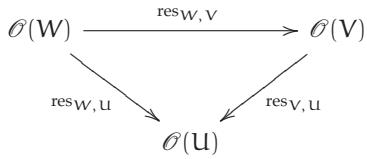

Next take two smooth functions $\mathsf { f } _ { 1 }$ and $\mathsf { f } _ { 2 }$ on a big open set U, and an open cover of U by some collection of open subsets $\{ \mathrm { U } _ { \mathrm { i } } \}$ . (We say $\{ \mathrm { U } _ { \mathrm { i } } \}$ covers U, or is an open cover of U, if $\mathrm { { U } = \cup \mathrm { { U } _ { i } } }$ .) Suppose that $\mathsf { f } _ { 1 }$ and $\mathsf { f } _ { 2 }$ agree on each of these $\mathrm { { u } _ { i } }$ . Then they must have been the same function to begin with. In other words, if $\{ \mathrm { U } _ { \mathrm { i } } \} _ { \mathrm { i } \in \mathrm { I } }$ is a cover of U, and $\mathsf { f } _ { 1 }$ , $\mathsf { f } _ { 2 } \in \mathcal { O } ( \mathsf { U } )$ , and $\mathrm { r e s } _ { \mathrm { U } , \mathrm { U } _ { i } } \mathrm { f } _ { 1 } = \mathrm { r e s } _ { \mathrm { U } , \mathrm { U } _ { i } } \mathrm { f } _ { 2 } ,$ then $\boldsymbol { \mathsf { f } } _ { 1 } = \boldsymbol { \mathsf { f } } _ { 2 }$ . Thus we can identify functions on an open set by looking at them on a covering by small open sets.

Finally, suppose you are given the same U and cover $\{ \mathrm { U } _ { \mathrm { i } } \} ;$ take a smooth function on each of the Ui—a function $\mathsf { f } _ { 1 }$ on $\mathrm { u } _ { 1 }$ , a function $\boldsymbol { \mathsf { f } } _ { 2 }$ on $\mathrm { U } _ { 2 } ,$ and so on—and assume they agree on the pairwise overlaps. Then they can be “glued together” to make one smooth function on all of U. In other words, given $\mathsf { f } _ { \mathrm { i } } \in \mathcal { O } ( \mathrm { U } _ { \mathrm { i } } )$ for all i such that $\mathrm { r e s u } _ { \mathrm { i } } , \mathrm { u } _ { \mathrm { i } } \cap \mathrm { u } _ { \mathrm { j } }$ $\mathsf { f } _ { \mathrm { i } } = \mathrm { r e s } _ { \mathsf { U } _ { \mathrm { j } } , \mathsf { U } _ { \mathrm { i } } \cap \mathsf { U } _ { \mathrm { j } } } .$ fj for all i and j, there is some $\mathsf { f } \in \mathcal { O } ( \mathsf { U } )$ such that $\mathrm { r e s u , u _ { i } \ f = f _ { i } }$ for all i.

The entire example above would have worked just as well with continuous functions, or realanalytic functions, or just plain real-valued functions. Thus all of these classes of “nice” functions share some common properties. We will soon formalize these properties in the notion of a sheaf.

2.1.1. The germ of a smooth function. Before we do, we first give another definition, that of the germ of a smooth function at a point $\mathfrak { p } \in \mathsf { X }$ . Intuitively, it is a “shred” of a smooth function at p. Germs are objects of the form

$$
(f, \text {o p e n s e t} U) \quad \text {s u c h t h a t} \quad p \in U, f \in \mathcal {O} (U)
$$

modulo the relation that $( \mathsf { f } , \mathsf { U } ) \sim ( \mathsf { g } , \mathsf { V } )$ if there is some open set $W \subset \sqcup , V$ containing p where $\mathsf { f } | _ { W } = \mathsf { g } | _ { W }$ (i.e., $\operatorname { r e s } _ { \mathrm { { U } } , W } \mathrm { { f } } = \operatorname { r e s } _ { \mathrm { { V } } , W } { \mathfrak { g } } .$ ). In other words, two functions that are the same in an open neighborhood of p (but may differ elsewhere) have the same germ. We call this set of germs the stalk at p, and denote it by ${ \mathcal { O } } _ { \mathfrak { p } }$ . Notice that the stalk is a ring: you can add two germs, and get another germ: if you have a function f defined on U, and a function g defined on V, then $\mathsf { f } + \mathsf { g }$ is defined on U V. Moreover, ${ \mathfrak { f } } + { \mathfrak { g } }$ is well-defined: if $\tilde { \boldsymbol { \mathsf { f } } }$ has the same germ as f, meaning that there is some open set W containing p on which they agree, and $\tilde { \mathfrak { g } }$ has the same germ as g, meaning they agree on some open $W ^ { \prime }$ containing p, then $\tilde { \mathsf { f } } + \tilde { \mathsf { g } }$ is the same function as ${ \mathfrak { f } } + { \mathfrak { g } }$ on $\mathsf { U } \cap \mathsf { V } \cap \mathsf { W } \cap \mathsf { W } ^ { \prime }$ .

Notice also that if ${ \mathfrak { p } } \in \mathrm { U } ,$ , you get a map $\mathcal { O } ( \mathrm { U } ) \to \mathcal { O } _ { \mathfrak { p } }$ . Experts may already see that we are talking about germs as colimits.

We can see that ${ \mathcal { O } } _ { \mathfrak { p } }$ is a local ring as follows. Consider those germs vanishing at p, which we denote by ${ \mathfrak { m } } _ { \mathfrak { p } } \subset { \mathcal { O } } _ { \mathfrak { p } }$ . They certainly form an ideal: ${ \mathfrak { m } } _ { \mathfrak { p } }$ is closed under addition, and when you multiply something vanishing at p by any function, the result also vanishes at p. We check that this ideal is maximal by showing that the quotient ring is a field:

$$
0 \longrightarrow \mathfrak {m} _ {\mathrm {p}} := \text {i d e a l o f g e r m s v a n i s h i n g a t p} \longrightarrow \mathcal {O} _ {\mathrm {p}} \xrightarrow {\mathrm {f} \mapsto \mathrm {f} (\mathrm {p})} \mathbb {R} \longrightarrow 0. \tag {2.1.1.1}
$$

2.1.A. EXERCISE. Show that this is the only maximal ideal of ${ \mathcal { O } } _ { \mathfrak { p } }$ . (Hint: show that every element of $\mathcal { O } _ { \mathfrak { p } } \setminus \mathfrak { m } _ { \mathfrak { p } }$ is invertible.)

Note that we can interpret the value of a function at a point, or the value of a germ at a point, as an element of the local ring modulo the maximal ideal. (We will see that this doesn’t work for more general sheaves, but does work for things behaving like sheaves of functions. This will be formalized in the notion of a locally ringed space, which we will see, briefly, in §7.3.)

2.1.2. Aside. Notice that ${ \mathfrak { m } } _ { \mathfrak { p } } / { \mathfrak { m } } _ { \mathfrak { p } } ^ { 2 }$ is a module over $\begin{array} { r } { \mathcal { O } _ { \mathfrak { p } } / \mathfrak { m } _ { \mathfrak { p } } \cong \mathbb { R } , } \end{array}$ i.e., it is a real vector space. It turns out to be naturally (whatever that means) the cotangent space to the differentiable or analytic manifold at p. This insight will prove handy later, when we define tangent and cotangent spaces of schemes.

2.1.B.* EXERCISE FOR THOSE WITH DIFFERENTIAL GEOMETRIC BACKGROUND. Prove this. (Rhetorical question for experts: What goes wrong if the sheaf of continuous functions is substituted for the sheaf of smooth functions? What goes wrong if you use the sheaf of $C ^ { 1 }$ functions?)

# 2.2 Definition of Sheaf and Presheaf

We now formalize these notions, by defining presheaves and sheaves. Presheaves are simpler to define, and notions such as kernel and cokernel are straightforward. Sheaves are more complicated to define, and some notions such as cokernel require more thought. But sheaves are more useful

because they are in some vague sense more geometric; you can get information about a sheaf locally.

# 2.2.1. Definition of sheaf and presheaf on a topological space X.

To be concrete, we will define sheaves of sets. However, in the definition the category Sets can be replaced by any reasonable category, and other important examples are abelian groups Ab, k-vector spaces $V e c _ { \bf k } ,$ rings Rings, modules over a ring $M o d _ { A } ,$ and more. (You may have to think more when dealing with a category of objects that isn’t “sets with additional structure,” but there aren’t any surprising complications. In any case, this won’t be relevant for us, although people who want to do this should start by solving Exercise 2.2.C.) Sheaves (and presheaves) are often written in calligraphic font. The fact that $\mathcal { F }$ is a sheaf on a topological space X is often written as

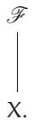

# 2.2.2. Definition: Presheaf. A presheaf of sets $\mathcal { F }$ on a topological space X is the following data.

• To each open set $\mathrm { u } \subset \mathrm { X } ,$ we have a set $\mathcal { F } ( \mathrm { u } )$ (e.g., the set of differentiable functions in our motivating example). (Notational warning: Several notations are in use, for various good reasons; such as $\mathcal { F } ( \mathbf { \boldsymbol { U } } ) = \Gamma ( \mathbf { \boldsymbol { U } } , \mathcal { F } ) = \mathbf { \boldsymbol { H } } ^ { 0 } ( \mathbf { \boldsymbol { U } } , \mathcal { F } )$ . We will use them all.) The elements of $\mathcal { F } ( \mathrm { u } )$ are called sections of $\mathcal { F }$ over U. (§2.2.11 combined with Exercise 2.2.G gives a motivation for this terminology, although this isn’t so important for us.)

By convention, if the $^ { \prime \prime } \mathrm { u } ^ { \prime \prime }$ is omitted, it is implicitly taken to be X: “sections of ${ \mathcal { F } } ^ { \prime \prime }$ means “sections of $\mathcal { F }$ over X.” These are also called global sections.

• For each inclusion ${ \mathrm { u } } \hookrightarrow { \mathrm { V } }$ of open sets, we have a restriction map

$$
\operatorname {r e s} _ {V, U}: \mathcal {F} (V) \to \mathcal {F} (U)
$$

(just as we did for differentiable functions). If $\mathsf { f } \in \mathcal { F } ( \mathsf { V } )$ , we often write

$$
f | _ {U}
$$

for resV,U(f).

The data is required to satisfy the following two conditions.

• The map $\mathrm { r e s u } , \mathrm { u }$ is the identity: $\mathrm { r e s } _ { \mathrm { u , u } } = \mathrm { i d } _ { \mathcal { F } ( \mathrm { u } ) }$ .   
• If $\mathsf { U } \hookrightarrow \mathsf { V } \hookrightarrow \boldsymbol { W }$ are inclusions of open sets, then the restriction maps compose as you would expect, i.e., the diagram

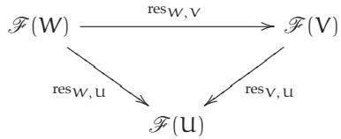

commutes.

2.2.A. EXERCISE FOR CATEGORY-LOVERS: “A PRESHEAF IS THE SAME AS A CONTRAVARI-ANT FUNCTOR.” Given any topological space $\scriptstyle \mathsf { X } ,$ we have a “category of open sets” (Example 1.1.9), where the objects are the open sets and the morphisms are inclusions. Verify that the data of a presheaf is precisely the data of a contravariant functor from the category of open sets of X to the category of sets. (This interpretation is surprisingly useful.)

2.2.3. Definition: Stalks and germs. We define the stalk of a presheaf at a point in two equivalent ways. One will be hands-on, and the other will be as a colimit.

2.2.4. Define the stalk of a presheaf $\mathcal { F }$ at a point p to be the set of germs of $\mathcal { F }$ at p, denoted by ${ \mathcal { F } } _ { \mathfrak { p } } ,$ as in the example of $\ S 2 . 1 . 1$ . Germs correspond to sections over some open set containing p, and two of these sections are considered the same if they agree on some smaller open set containing p. More precisely: the stalk is

$$
\{(f, \text {o p e n} U): p \in U, f \in \mathcal {F} (U) \}
$$

modulo the relation that $( \mathsf { f } , \mathsf { U } ) \sim ( \mathsf { g } , \mathsf { V } )$ if there is some open set $W \subset \sqcup , \boldsymbol { \vee }$ where $\mathsf { p } \in W$ and $\operatorname { r e s } _ { \mathrm { u } , \boldsymbol { w } } \mathrm { f } = \operatorname { r e s } _ { \mathrm { v } , \boldsymbol { w } } \mathrm { g }$ . (To explain the agricultural terminology: the French name “germe” is meant to suggest a tiny shoot sprouting from a seed, cf. “germinate”.)

2.2.5. A useful equivalent definition of a stalk is as a colimit of all $\mathcal { F } ( \mathrm { u } )$ over all open sets U containing p:

$$
\mathcal {F} _ {\mathrm {p}} = \operatorname {c o l i m} \mathcal {F} (\mathrm {U}).
$$

The index category is a filtered set (given any two such open sets, there is a third such set contained in both), so these two definitions are the same by Exercise 1.3.E. Hence we can define stalks for sheaves of sets, groups, rings, and other things for which colimits exist for directed sets. It is very helpful to keep both definitions of stalk in mind at the same time.

If ${ \mathfrak { p } } \in \mathrm { { U } } ,$ , and $\mathsf { f } \in \mathcal { F } ( \mathsf { U } )$ , then the image of f in ${ \mathcal { F } } _ { \mathfrak { p } }$ is called the germ of f at p. (Warning: Unlike in the example of §2.1.1, in general, the value of a section at a point doesn’t make sense.)

2.2.6. Definition: Sheaf. A presheaf is a sheaf if it satisfies two more axioms. Notice that these axioms use the additional information of when some open sets cover another.

Identity axiom. For any open set U, if $\{ \mathrm { U } _ { \mathrm { i } } \} _ { \mathrm { i } \in \mathrm { I } }$ is an open cover of U, and $\dot { \bar { \mathbf { \Gamma } } } _ { 1 } , \dot { \mathsf { f } } _ { 2 } \in \mathcal { F } ( \mathbb { U } ) .$ , and $\mathsf { f } _ { 1 } | \mathsf { u } _ { \mathrm { i } } = \mathsf { f } _ { 2 } | \mathsf { u } _ { \mathrm { i } }$ for all ${ \mathrm { i } , }$ then $\boldsymbol { \mathsf { f } } _ { 1 } = \boldsymbol { \mathsf { f } } _ { 2 }$ .

(A presheaf satisfying the identity axiom is called a separated presheaf, but we will not use that notation in any essential way.)

Gluability axiom. If $\{ \mathrm { U } _ { \mathrm { i } } \} _ { \mathrm { i } \in \mathrm { I } }$ is an open cover of U, and we are given $\mathsf { f } _ { \mathrm { i } } \in \mathcal { F } ( \mathrm { U } _ { \mathrm { i } } )$ for all ${ \mathrm { i } , }$ such that $\mathsf { f } _ { \mathrm { i } } | _ { \mathsf { U } _ { \mathrm { i } } \cap \mathsf { U } _ { \mathrm { j } } } = \mathsf { f } _ { \mathrm { j } } | _ { \mathsf { U } _ { \mathrm { i } } \cap \mathsf { U } _ { \mathrm { j } } }$ for all i, j, then there is some $\mathsf { f } \in \mathcal { F } ( \mathsf { U } )$ such that $\mathrm { r e s u , u _ { i } \ f = f _ { i } }$ for all i.

In mathematics, definitions often come paired: “at most one” and “at least one.” In this case, identity means there is at most one way to glue, and gluability means that there is at least one way to glue.

(For experts and scholars of the empty set only: an additional axiom sometimes included is that $\mathcal { F } ( \emptyset )$ is a one-element set, and in general, for a sheaf with values in a category, $\mathcal { F } ( \emptyset )$ is required to be the final object in the category. This actually follows from the above definitions, assuming that the empty product is appropriately defined as the final object.)

Example. If U and V are disjoint, then $\mathcal { F } ( \mathrm { U } \cup \mathsf { V } ) = \mathcal { F } ( \mathrm { U } ) \times \mathcal { F } ( \mathsf { V } )$ . Here we use the fact that $\mathcal { F } ( \emptyset )$ is the final object.

The stalk of a sheaf at a point is just its stalk as a presheaf—the same definition applies—and similarly for the germs of a section of a sheaf.

2.2.B. UNIMPORTANT EXERCISE: PRESHEAVES THAT ARE NOT SHEAVES. Show that the following are presheaves on C (with the classical topology), but not sheaves: (a) bounded functions, (b) holomorphic functions admitting a holomorphic square root.

Both of the presheaves in the previous exercise satisfy the identity axiom. A “natural” example failing even the identity axiom is implicit in Remark 2.5.5.

We now make a couple of points intended only for category-lovers.

2.2.7. Interpretation in terms of the equalizer exact sequence. The two axioms for a presheaf to be a sheaf can be interpreted as “exactness” of the “equalizer exact sequence”: $\begin{array} { r l r } { \overrightarrow { \mathbf { \nabla } } } & { { } \overrightarrow { \mathbf { \nabla } } \times \mathcal { F } ( \mathsf { U } ) \overrightarrow { \mathbf { \nabla } } } & { \overrightarrow { \mathbf { \nabla } } \times \prod \mathcal { F } ( \mathsf { U } _ { \mathrm { i } } ) \overrightarrow { \mathbf { \nabla } } } \end{array}$ . Identity is exactness at ${ \mathcal { F } } ( \sqcup ) ,$ , and gluability is exactness at $\Pi { \mathcal { F } } ( \mathfrak { U } _ { \mathrm { i } } )$ . I won’t make this precise, or even explain what the double right

arrow means. (What is an exact sequence of sets?!) But you may be able to figure it out from the context.

2.2.C. EXERCISE. The identity and gluability axioms may be interpreted as saying that $\mathcal { F } ( \cup _ { \mathrm { i } \in \mathrm { I } } \mathsf { U } _ { \mathrm { i } } )$ is a certain limit. What is that limit?

Here are a number of examples of sheaves.

# 2.2.D. EXERCISE.

(a) Verify that the examples of $\ S 2 . 1$ are indeed sheaves (of smooth functions, or continuous functions, or real-analytic functions, or plain real-valued functions, on a manifold or $\mathbb { R } ^ { { \mathfrak { n } } }$ ).   
(b) Show that real-valued continuous functions on (open sets of) a topological space X form a sheaf.

2.2.8. Important example: Restriction of a sheaf. Suppose $\mathcal { F }$ is a sheaf on $\Sigma ,$ and U is an open subset of X. Define the restriction of $\mathcal { F }$ to U, denoted by ${ \mathcal { F } } | _ { \mathrm { U } } ,$ to be the collection $\mathcal { F } | \mathrm { u } \left( \mathsf { V } \right) { = } \mathcal { F } ( \mathsf { V } )$ for all open subsets ${ \mathsf { V } } \subset { \mathsf { U } }$ . Clearly this is a sheaf on U. (Unimportant but fun fact: $\ S 2 . 7$ will tell us how to restrict sheaves to arbitrary subsets.)

2.2.9. Important example: The skyscraper sheaf. Suppose X is a topological space, with ${ \mathfrak { p } } \in X ,$ and S is a set. Let $\mathfrak { i } _ { \mathfrak { p } } \colon \mathfrak { p } \to X$ be the inclusion. Then $\mathfrak { i } _ { \mathfrak { p } , \ast } S$ defined by

$$
i _ {p, *} S (U) = \left\{ \begin{array}{l l} S & \text {i f} p \in U, \text {a n d} \\ \{e \} & \text {i f} p \notin U \end{array} \right.
$$

forms a sheaf. Here $\{ e \}$ is any one-element set. (Check this if it isn’t clear to you—what are the restriction maps?) This is called a skyscraper sheaf supported at p, because the informal picture of it looks like a skyscraper at p. (Mild caution: This informal picture suggests that the only nontrivial stalk of a skyscraper sheaf is at p, which isn’t the case. Exercise 6.1.B(b) gives an example, although it certainly isn’t the simplest one.) There is an analogous definition for sheaves of abelian groups, except $\mathfrak { i } _ { \mathfrak { p } , * } S ( \mathrm { U } ) = \{ 0 \}$ if ${ \mathfrak { p } } \notin \mathrm { U } ;$ and for sheaves with values in a category more generally, ${ \mathfrak { i } } _ { \mathfrak { p } , * } S ( \mathrm { U } )$ should be a final object.

(This notation is admittedly hideous, and the alternative $( \mathfrak { i } _ { \mathfrak { p } } ) _ { * } S$ is equally bad. In §2.2.12 we explain this notation.)

2.2.10. Constant presheaves and constant sheaves. Let X be a topological space, and S a set. Define $\underline { { S } } _ { \mathrm { p r e } } ( \mathrm { U } ) = S$ for all open sets U. You will readily verify that $\underline { { S } } _ { \mathrm { p r e } }$ forms a presheaf (with restriction maps the identity). This is called the constant presheaf associated to S. This isn’t (in general) a sheaf. (It may be distracting to say why. Lovers of the empty set will insist that the sheaf axioms force the sections over the empty set to be the final object in the category, i.e., a one-element set. But even if we patch the definition by setting $\underline { { \mathsf { S } } } _ { \mathrm { p r e } } ( \mathcal { O } ) = \{ e \} ,$ if S has more than one element, and X is the two-point space with the discrete topology, i.e., where every subset is open, you can check that $\underline { { S } } _ { \mathrm { p r e } }$ fails gluability.)   
2.2.E. EXERCISE (CONSTANT SHEAVES). Now let $\mathcal { F } ( \mathrm { u } )$ be the set of maps ${ \mathrm { U } } \to S$ that are locally constant, i.e., for any point p in U, there is an open neighborhood of p where the function is constant. Show that this is a sheaf. (A better description is this: endow S with the discrete topology, and let $\mathcal { F } ( \mathrm { u } )$ be the continuous maps $\mathsf { U } \to \mathsf { S }$ .) This is called the constant sheaf (with values in S); do not confuse it with the constant presheaf. (I would prefer the name “locally constant sheaf,” but it is too late in history for this change.) We denote this sheaf by S.   
2.2.F. EXERCISE (“MORPHISMS GLUE”). Suppose Y is a topological space. Show that “continuous maps to $\Upsilon ^ { \prime \prime }$ form a sheaf of sets on X. More precisely, to each open set U of X, we associate the set of continuous maps of U to Y. Show that this forms a sheaf. (Exercise 2.2.D(b), with ${ \mathsf { Y } } = \mathbb { R } ,$ and Exercise 2.2.E, with $\Upsilon = S$ with the discrete topology, are both special cases.)

2.2.G. EXERCISE. This is a fancier version of the previous exercise.

(a) (Sheaf of sections of a map.) Suppose we are given a continuous map µ: $\Upsilon  X$ . Show that “sections of $\mu ^ { \prime \prime }$ form a sheaf. More precisely, to each open set U of $\mathsf { X } ,$ associate the set of continuous maps $s \colon \ U \to \Upsilon$ such that $\mu \circ s = \mathrm { i d } | _ { \mathrm { u } }$ . Show that this forms a sheaf. (For those who have heard of vector bundles, these are a good example.) This is motivation for the phrase “section of a sheaf.”   
(b) (This exercise is for those who know what a topological group is. If you don’t know what a topological group is, you might be able to guess.) Suppose that Y is a topological group. Show that continuous maps to Y form a sheaf of groups.

2.2.11.* The space of sections (espace étalé) of a (pre)sheaf. Depending on your background, you may prefer the following perspective on sheaves. Suppose $\mathcal { F }$ is a presheaf of sets (e.g., a sheaf) on a topological space X. Construct a topological space F along with a continuous map π: $\digamma \to X$ as follows: as a set, F is the disjoint union of all the stalks of $\mathcal { F }$ . This naturally gives a map of sets $\pi \colon \mathsf { F } \to \mathsf { X }$ . Topologize F as follows. Each s in $\mathcal { F } ( \mathrm { U } )$ determines a subset $\{ ( \mathsf { x } , \mathsf { s } _ { \mathsf { x } } ) : \mathsf { x } \in \mathsf { U } \}$ of F. The topology on F is the weakest topology such that these subsets are open. (These subsets form a base of the topology. For each ${ \mathfrak { y } } \in { \mathfrak { F } } ,$ , there is an open neighborhood V of $_ { 9 }$ and an open neighborhood U of $\pi ( \mathfrak { y } )$ such that $\pi | _ { V }$ is a homeomorphism from V to U. Do you see why these facts are true?) The topological space F could be thought of as the space of sections of $\mathcal { F }$ (in French called the espace étalé of $\mathcal { F }$ ). We will not discuss this construction at any length, but it can have some advantages: (a) It is always better to know as many ways as possible of thinking about a concept. (b) “Inverse image” (informally, “pullback”) has a natural interpretation in this language (mentioned briefly in Exercise 2.7.C). (c) Sheafification has a natural interpretation in this language (see Remark 2.4.7).   
2.2.H. IMPORTANT EXERCISE/DEFINITION: THE PUSHFORWARD SHEAF OR DIRECT IMAGE SHEAF. Suppose $\pi \colon X \to \Upsilon$ is a continuous map, and $\mathcal { F }$ is a presheaf on X. Then define a presheaf $\pi _ { * } { \mathcal { F } }$ on Y by $\pi _ { * } { \mathcal { F } } ( \mathsf { V } ) { = } { \mathcal { F } } ( \pi ^ { - 1 } ( \mathsf { V } ) ) .$ , where V is an open subset of Y. Show that $\pi _ { * } { \mathcal { F } }$ is a presheaf on Y, and is a sheaf if $\mathcal { F }$ is. This is called the pushforward (or direct image) of $\mathcal { F }$ . More precisely, $\pi _ { * } { \mathcal { F } }$ is called the pushforward of $\mathcal { F }$ by $\pi$ .   
2.2.12. As the notation suggests, the skyscraper sheaf (Example 2.2.9) can be interpreted as the pushforward of the constant sheaf S on a one-point space p, under the inclusion morphism $\mathfrak { i } _ { \mathfrak { p } } \colon \{ \mathfrak { p } \} \to X$ .   
Once we endow sheaves with the structure of a category, we will see that the pushforward is a functor from sheaves on X to sheaves on Y (Exercise 2.3.B).   
2.2.I. EXERCISE (PUSHFORWARD INDUCES MAPS OF STALKS). Suppose $\pi \colon X \to \Upsilon$ is a continuous map, and $\mathcal { F }$ is a sheaf of sets (or rings or A-modules) on X. If $\pi ( { \mathfrak { p } } ) = { \mathfrak { q } } ,$ describe the natural morphism of stalks $( \pi _ { * } \mathcal { F } ) _ { \mathfrak { q } } \to \mathcal { F } _ { \mathfrak { p } }$ . (You can use the explicit definition of stalk using representatives, $\ S 2 . 2 . 4 ,$ or the universal property, §2.2.5. If you prefer one way, you should try the other.)   
2.2.13. Important example: Ringed spaces, and ${ \mathcal { O } } _ { X }$ -modules. Suppose ${ \mathcal { O } } _ { X }$ is a sheaf of rings on a topological space X (i.e., a sheaf on X with values in the category of Rings). Then $( X , { \mathcal { O } } _ { X } )$ is called a ringed space. The sheaf of rings is often denoted by ${ \mathcal { O } } _ { X } ,$ pronounced “oh-X.” This sheaf is called the structure sheaf of the ringed space. Sections of the structure sheaf ${ \mathcal { O } } _ { X }$ over an open subset U are called functions on U. Functions on X are called global functions, or just functions. (Caution: what we call “functions,” others sometimes call “regular functions.” Furthermore, we will later define “rational functions” on schemes in §5.2.I and §6.6.36, which are not precisely functions in this sense; they are a particular type of “partially defined function.”)   
The symbol ${ \mathcal { O } } _ { X }$ will always refer to the structure sheaf of a ringed space X. The restriction ${ \mathcal { O } } _ { X \mid \sqcup }$ of ${ \mathcal { O } } _ { X }$ to an open subset $\mathsf { u } \subset \mathsf { X }$ is denoted by $\mathcal { O } _ { \mathsf { U } }$ . (We will later call $( \mathsf { U } , \mathcal { O } _ { \mathsf { U } } ) \to ( \mathsf { X } , \mathcal { O } _ { \mathsf { X } } )$ an open embedding of ringed spaces; see Definition 7.2.1.) The stalk of ${ \mathcal { O } } _ { X }$ at a point p is written $" \mathcal { O } _ { \mathsf { X } , \mathsf { p } } , "$ because this looks less hideous than $" \mathcal { O } _ { \mathsf { X } _ { \mathsf { P } } }$ .”

Just as we have modules over a ring, we have ${ \mathcal { O } } _ { X }$ -modules over a sheaf of rings ${ \mathcal { O } } _ { X }$ . There is only one possible definition that could go with the name ${ \mathcal { O } } _ { X }$ -module (or often $\mathcal { O }$ -module)— a sheaf of abelian groups $\mathcal { F }$ with the following additional structure. For each U, $\mathcal { F } ( \mathrm { U } )$ is an ${ \mathcal { O } } _ { X } ( \mathrm { U } )$ -module. Furthermore, this structure should behave well with respect to restriction maps: if $\mathsf { U } \subset \mathsf { V } .$ , then

$$
\begin{array}{c} \mathcal {O} _ {\mathrm {X}} (\mathrm {V}) \times \mathcal {F} (\mathrm {V}) \xrightarrow {\text {a c t i o n}} \mathcal {F} (\mathrm {V}) \\ \operatorname {r e s} _ {\mathrm {V}, \mathrm {U}} \times \operatorname {r e s} _ {\mathrm {V}, \mathrm {U}} \Bigg \downarrow \quad \quad \quad \quad \quad \quad \quad \quad \quad \quad \quad \quad \quad \quad \quad \quad \quad \quad \quad \quad \quad \quad \quad \quad \quad \quad \quad \quad \quad \quad \quad \quad \quad \quad \quad \quad \quad \quad \quad \quad \quad \quad \quad \quad \quad \quad \quad \quad \quad \quad \operatorname {r e s} _ {\mathrm {V}, \mathrm {U}} \\ \mathcal {O} _ {\mathrm {X}} (\mathrm {U}) \times \mathcal {F} (\mathrm {U}) \xrightarrow {\text {a c t i o n}} \mathcal {F} (\mathrm {U}) \end{array} \tag {2.2.13.1}
$$

commutes. (You should convince yourself that I haven’t forgotten anything.)

Recall that the notion of A-module generalizes the notion of abelian group, because an abelian group is the same thing as a $\mathbb { Z }$ -module. Similarly, the notion of ${ \mathcal { O } } _ { X }$ -module generalizes the notion of sheaf of abelian groups, because the latter is the same thing as a $\mathbb { Z }$ -module. Hence when we are proving things about ${ \mathcal { O } } _ { X }$ -modules, we are also proving things about sheaves of abelian groups.

2.2.J. EXERCISE. If $( X , { \mathcal { O } } _ { X } )$ is a ringed space, and $\mathcal { F }$ is an ${ \mathcal { O } } _ { X }$ -module, describe how for each ${ \mathfrak { p } } \in X ,$ $\mathcal { F } _ { \mathfrak { p } }$ is an $\mathcal { O } _ { \mathsf { X } , \mathsf { p } }$ -module.   
2.2.14. For those who know about vector bundles. The motivating example of ${ \mathcal { O } } _ { X }$ -modules is the sheaf of sections of a vector bundle. If $( X , { \mathcal { O } } _ { X } )$ is a differentiable manifold (so ${ \mathcal { O } } _ { X }$ is the sheaf of smooth functions), and $\pi \colon V \to X$ is a vector bundle over $\Sigma ,$ then the sheaf of smooth sections $\boldsymbol { \mathrm { { y } } } \colon \boldsymbol { \mathrm { { X } } } \to \boldsymbol { \mathrm { { V } } }$ is an ${ \mathcal { O } } _ { X }$ -module. Indeed, given a section s of $\pi$ over an open subset $\mathrm { u } \subset \mathrm { X } ,$ and a function f on U, we can multiply s by f to get a new section fs of $\pi$ over U. Moreover, if $\mathrm { u } ^ { \prime }$ is a smaller subset, then we could multiply f by s and then restrict to $\mathrm { u } ^ { \prime }$ , or we could restrict both f and s to $\mathrm { u } ^ { \prime }$ and then multiply, and we would get the same answer. That is precisely the commutativity of (2.2.13.1).

# 2.3 Morphisms of Presheaves and Sheaves

2.3.1. Definitions. Whenever one defines a new mathematical object, category theory teaches us to try to understand maps from one such object to another. We now define morphisms of presheaves, and similarly for sheaves. In other words, we will describe the category of presheaves (of sets, abelian groups, etc.) and the category of sheaves.

A morphism of presheaves of sets (or indeed of presheaves with values in any category) on X, $, \phi \colon { \mathcal { F } }  { \mathcal { G } } ,$ is the data of maps $\Phi ( \mathrm { U } )$ : $\mathcal { F } ( \mathsf { U } ) \longrightarrow \mathcal { G } ( \mathsf { U } )$ for all U behaving well with respect to restriction: if $\mathsf { u } \hookrightarrow \mathsf { V }$ then

$$
\begin{array}{c} \mathcal {F} (V) \xrightarrow {\phi (V)} \mathcal {G} (V) \\ \text {r e s} _ {V, U} \Bigg | \quad \Bigg | \quad \text {r e s} _ {V, U} \\ \mathcal {F} (U) \xrightarrow {\phi (U)} \mathcal {G} (U) \end{array}
$$

commutes. (Notice: The underlying space of both $\mathcal { F }$ and $\mathcal { G }$ is X.)

Morphisms of sheaves are defined identically: the morphisms from a sheaf $\mathcal { F }$ to a sheaf $\mathcal { G }$ are precisely the morphisms from $\mathcal { F }$ to $\mathcal { G }$ as presheaves. (Translation: The category of sheaves on $x$ is a full subcategory of the category of presheaves on X.) If $( X , { \mathcal { O } } _ { X } )$ is a ringed space, then morphisms of ${ \mathcal { O } } _ { X }$ -modules have the obvious definition. (Can you write it down?)

An example of a morphism of sheaves is the map from the sheaf of smooth functions on $\mathbb { R }$ to the sheaf of continuous functions. This is a “forgetful map”: we are forgetting that these functions are differentiable, and remembering only that they are continuous.

2.3.2. Notation. We may as well set some notation: let SetsX, $A b _ { { \cal X } } ,$ etc. denote the category of sheaves of sets, abelian groups, etc. on a topological space X. Let $M o d _ { \mathcal { O } _ { \mathsf { X } } }$ denote the category of ${ \mathcal { O } } _ { X }$ -modules on a ringed space $( X , { \mathcal { O } } _ { X } )$ . Let $S e t s _ { x } ^ { \mathrm { p r e } }$ , etc. denote the category of presheaves of sets, etc. on X.   
2.3.3. Aside for category-lovers. If you interpret a presheaf on X as a contravariant functor (from the category of open sets), a morphism of presheaves on X is a natural transformation of functors (§1.1.21).   
2.3.A. EXERCISE: MORPHISMS OF (PRE)SHEAVES INDUCE MORPHISMS OF STALKS. If $\phi \colon { \mathcal { F } }  { \mathcal { G } }$ is a morphism of presheaves on $\Sigma ,$ and ${ \mathfrak { p } } \in { \mathsf { X } } ,$ describe an induced morphism of stalks $\Phi _ { \mathfrak { p } } : \mathcal { F } _ { \mathfrak { p } } \to \mathcal { G } _ { \mathfrak { p } }$ . Translation: Taking the stalk at p induces a stalkification functor $S e t s _ { X }  S e t s .$ . (Your proof will extend in obvious ways. For example, if $\Phi$ is a morphism of ${ \mathcal { O } } _ { X }$ -modules, then $\Phi _ { ^ { \mathrm { { p } } } }$ is a map of $\mathcal { O } _ { \mathsf { X } , \mathsf { p } }$ -modules.)   
2.3.B. EXERCISE. Suppose π: $\Chi \to \Upsilon$ is a continuous map of topological spaces (i.e., a morphism in the category of topological spaces). Show that pushforward gives a functor $\pi _ { * } \colon S e t s _ { \mathsf { X } } \to S e t s _ { \mathsf { Y } }$ . Here Sets can be replaced by other categories. (Watch out for some possible confusion: a presheaf is a functor, and presheaves form a category. It may be best to forget that presheaves are functors for now.)   
2.3.C. IMPORTANT EXERCISE AND DEFINITION: “SHEAF Hom.” Suppose $\mathcal { F }$ and $\mathcal { G }$ are two sheaves of sets on X. (In fact, it will suffice that $\mathcal { F }$ is a presheaf.) Let $\mathcal { H } o m ( \mathcal { F } , \mathcal { G } )$ be the collection of data

$$
\mathcal {H} o m (\mathscr {F}, \mathscr {G}) (U) := \operatorname {M o r} (\mathscr {F} | _ {U}, \mathscr {G} | _ {U}).
$$

(Recall the notation $\mathcal { F } | _ { \mathrm { u } } ,$ the restriction of the sheaf to the open set U, Example 2.2.8.) Show that this is a sheaf of sets on X. (To avoid a common confusion: the right side does not say $\operatorname { M o r } ( \mathcal { F } ( \mathsf { U } ) , \mathcal { G } ( \mathsf { U } ) )$ .) This sheaf is called “sheaf Hom.” (Strictly speaking, we should reserve Hom for when we are in an additive category, so this should possibly be called “sheaf Mor.” But the terminology “sheaf $\mathrm { H o m } ^ { \prime \prime }$ is too established to uproot.) It will be clear from your construction that, like Hom, Hom is a contravariant functor in its first argument and a covariant functor in its second argument.

Warning: Hom does not commute with taking stalks. More precisely: it is not true that $\mathcal { H } o m ( \mathcal { F } , \mathcal { G } ) _ { \mathfrak { p } }$ is isomorphic to $\mathrm { H o m } ( \mathcal { F } _ { \mathfrak { p } } , \mathcal { G } _ { \mathfrak { p } } )$ . (Can you think of a counterexample? There is at least a map from one of these to the other—in which direction?)

2.3.4. We will use many variants of the definition of Hom. For example, if $\mathcal { F }$ and $\mathcal { G }$ are sheaves of abelian groups on X, then $\mathcal { H } o m _ { A b } \left( \mathcal { F } , \mathcal { G } \right)$ is defined by taking $\mathcal { H } o m _ { A b _ { \mathbf { X } } } ( \mathcal { F } , \mathcal { G } ) ( \mathrm { U } )$ to be the maps as sheaves of abelian groups $\mathcal { F } | _ { \mathrm { U } }  \mathcal { G } | _ { \mathrm { U } }$ . (Note that $\mathcal { H } o m _ { A b } ( \mathcal { F } , \mathcal { G } )$ has the structure of a sheaf of abelian groups in a natural way.) Similarly, if $\mathcal { F }$ and $\mathcal { G }$ are ${ \mathcal { O } } _ { X }$ -modules, we define $\mathcal { H } o m _ { M o d _ { \mathcal { O } _ { \chi } } } ( \mathcal { F } , \mathcal { G } )$ in the analogous way (and it is an ${ \mathcal { O } } _ { X }$ -module). Obnoxiously, the subscripts $A b _ { X }$ and $M o d _ { \mathcal { O } _ { \mathsf { X } } }$ are often dropped (here and in the literature), so be careful which category you are working in! We call $\mathcal { H } o m _ { M o d } _ { \sigma _ { \mathrm { X } } } \left( \mathcal { F } , \mathcal { O } _ { \mathsf { X } } \right)$ the dual of the ${ \mathcal { O } } _ { X }$ -module $\mathcal { F }$ , and denote it by $\mathcal { F } ^ { \vee }$ .

2.3.D. UNIMPORTANT EXERCISE (REALITY CHECK).

(a) If $\mathcal { F }$ is a sheaf of sets on $\Sigma ,$ then show that $\mathcal { H } o m ( \{ \mathfrak { p } \} , \mathcal { F } ) \cong \mathcal { F } ,$ , where $\{ { \mathfrak { p } } \}$ is the constant sheaf “with values in the one element set $\{ { \mathfrak { p } } \}$ .”   
(b) If $\mathcal { F }$ is a sheaf of abelian groups on X, then show that $\mathcal { H } o m _ { A b \times } \left( \underline { { \mathbb { Z } } } , \mathcal { F } \right) \cong \mathcal { F }$ (an isomorphism of sheaves of abelian groups).   
(c) If $\mathcal { F }$ is an ${ \mathcal { O } } _ { X }$ -module, then show that $\mathcal { H } o m _ { M o d _ { \mathcal { O } _ { \chi } } } ( \mathcal { O } _ { \sf X } , \mathcal { F } ) \cong \mathcal { F }$ (an isomorphism of ${ \mathcal { O } } _ { X }$ - modules).

A key idea in (b) and (c) is that 1 “generates” (in some sense) $\mathbb { Z }$ (in (b)) and ${ \mathcal { O } } _ { X }$ (in (c)).

# 2.3.5. Presheaves of abelian groups (and even “presheaf ${ \mathcal { O } } _ { X }$ -modules”) form an abelian category.

We can make module-like constructions using presheaves of abelian groups on a topological space X. (Throughout this section, all (pre)sheaves are of abelian groups.) For example, we can clearly add maps of presheaves and get another map of presheaves: if $\Phi , \Psi \colon { \mathcal { F } } \longrightarrow { \mathcal { G } } ,$ , then we define the map $\Phi + \boldsymbol \psi$ by $( \Phi + \Psi ) ( \mathsf { V } ) = \Phi ( \mathsf { V } ) + \Psi ( \mathsf { V } )$ . (There is something small to check here: that the result is indeed a map of presheaves.) In this way, presheaves of abelian groups form an additive category (Definition 1.5.1: the morphisms between any two presheaves of abelian groups form an abelian group; there is a 0-object; and one can take finite products). For exactly the same reasons, sheaves of abelian groups also form an additive category.

If $\Phi$ : $\mathcal { F }  \mathcal { G }$ is a morphism of presheaves, define the presheaf kernel kerpre $\boldsymbol { \Phi }$ by $( \mathrm { k e r _ { p r e } } \Phi ) ( \mathsf { U } ) : = \mathrm { k e r } \Phi ( \mathsf { U } )$ .

2.3.E. EXERCISE. Show that $\ker _ { \mathrm { p r e } } \Phi$ $\Phi$ is a presheaf. (Hint: If ${ \mathrm { u } } \hookrightarrow \mathsf { V } .$ , define the restriction map by chasing the following diagram:

$$
\begin{array}{c} 0 \longrightarrow \ker_ {\mathrm {p r e}} \phi (V) \longrightarrow \mathcal {F} (V) \longrightarrow \mathcal {G} (V) \\ \quad \quad \quad \quad \quad \quad \quad \quad \quad \quad \quad \quad \quad \quad \quad \quad \quad \quad \quad \quad \quad \quad \quad \quad \quad \quad \quad \quad \quad \quad \quad \quad \quad \quad \quad \quad \quad \quad \quad \quad \quad \quad \quad \quad \quad \quad \quad \quad \quad \quad \vdots \\ & \qquad \qquad \qquad \qquad \qquad \qquad \qquad \qquad \qquad \qquad \qquad \qquad \qquad \qquad \qquad \qquad \qquad \qquad \qquad \qquad \qquad \qquad \qquad \qquad \qquad \qquad \qquad \qquad \qquad \qquad \qquad \qquad \qquad \qquad \\ 0 \longrightarrow \ker_ {\mathrm {p r e}} \phi (U) \longrightarrow \mathcal {F} (U) \longrightarrow \mathcal {G} (U). \end{array}
$$

You should check that the restriction maps compose as desired.)

Define the presheaf cokernel cokerpre $\boldsymbol { \Phi }$ similarly. It is a presheaf by essentially the same (dual) argument.

2.3.F. EXERCISE: THE COKERNEL DESERVES ITS NAME. Show that the presheaf cokernel satisfies the universal property of cokernels (Definition 1.5.4) in the category of presheaves.

Similarly, $\ker _ { \mathrm { p r e } } \Phi \longrightarrow \mathcal { F }$ satisfies the universal property for kernels in the category of presheaves.

It is not too tedious to verify that presheaves of abelian groups form an abelian category, and the reader is free to do so. The key idea is that all abelian-categorical notions may be defined and verified “open set by open set.” We needn’t worry about restriction maps—they “come along for the ride.” Hence we can define terms such as subpresheaf, image presheaf (or presheaf image), and quotient presheaf (or presheaf quotient), and they behave as you would expect. You construct kernels, quotients, cokernels, and images open set by open set. Homological algebra (exact sequences and so forth) works, and also “works open set by open set.” In particular:

2.3.G. EASY EXERCISE. Show (or observe) that for a topological space X with open set U, $\mathcal { F } \mapsto$ $\mathcal { F } ( \mathrm { u } )$ gives a functor from presheaves of abelian groups on X, $A b _ { X } ^ { \mathrm { p r e } }$ , to abelian groups, $A b$ . Then show that this functor is exact.

2.3.H. EXERCISE. Show that a sequence of presheaves $0 \to { \mathcal { F } } _ { 1 } \to { \mathcal { F } } _ { 2 } \to \cdot \cdot \cdot \to { \mathcal { F } } _ { \mathfrak { n } } \to 0$ is exact if and only if $0 \to { \mathcal { F } } _ { 1 } ( \mathsf { U } ) \to { \mathcal { F } } _ { 2 } ( \mathsf { U } ) \to \cdots \to { \mathcal { F } } _ { \mathsf { n } } ( \mathsf { U } ) \to 0$ is exact for all U.

The above discussion essentially carries over without change to presheaves with values in any abelian category. (Think this through if you wish.)

However, we are interested in more geometric objects, sheaves, where things can be understood in terms of their local behavior, thanks to the identity and gluing axioms. We will soon see that sheaves of abelian groups also form an abelian category, but a complication will arise that will force the notion of sheafification on us. Sheafification will be the answer to many of our prayers. We just haven’t yet realized what we should be praying for.

To begin with, sheaves $A b _ { X }$ form an additive category, as described in the first paragraph of $\ S 2 . 3 . 5$ .

Kernels work just as with presheaves:

2.3.I. IMPORTANT EXERCISE. Suppose $\phi \colon { \mathcal { F } }  { \mathcal { G } }$ is a morphism of sheaves. Show that the presheaf kernel $\ker _ { \mathrm { p r e } } \Phi$ is in fact a sheaf. Show that it satisfies the universal property of kernels (Definition 1.5.4). (Hint: The second question follows immediately from the fact that $\ker _ { \mathrm { p r e } } \Phi$ $\Phi$ satisfies the universal property in the category of presheaves.)

Thus if $\boldsymbol { \Phi }$ is a morphism of sheaves, we define

$$
\ker \phi := \ker_ {\text {p r e}} \phi .
$$

The problem arises with the cokernel.

2.3.J. IMPORTANT EXERCISE. Let X be $\mathbb { C }$ with the classical topology, let ${ \mathcal { O } } _ { X }$ be the sheaf of holomorphic functions, and let $\mathcal { F }$ be the presheaf of functions admitting a holomorphic logarithm. Describe an exact sequence of presheaves on X:

$$
0 \longrightarrow \mathbb {Z} \longrightarrow \mathcal {O} _ {\mathrm {X}} \longrightarrow \mathcal {F} \longrightarrow 0,
$$

where $\mathbb { Z } \to { \mathcal { O } } _ { X }$ is the natural inclusion and $\mathcal { O } _ { X }  \mathcal { F }$ is given by $\mathsf { f } \mapsto \exp ( 2 \pi \mathrm { i } \mathsf { f } )$ . (Be sure to verify exactness.) Show that $\mathcal { F }$ is not a sheaf. (Hint: $\mathcal { F }$ does not satisfy the gluability axiom. The problem is that there are functions that don’t have a logarithm but locally have a logarithm.) This will come up again in Example 2.4.9.

We will have to put our hopes for understanding cokernels of sheaves on hold for a while. We will first learn to understand sheaves using stalks.

# 2.4 Properties Determined at the Level of Stalks, and Sheafification

2.4.1. Properties determined by stalks. We now come to the second way of understanding sheaves mentioned at the start of the chapter. In this section, we will see that lots of facts about sheaves can be checked “at the level of stalks.” We call any property determined at the level of stalks stalk-local. This isn’t true for presheaves, and reflects the local nature of sheaves. We will see that sections and morphisms are determined “by their stalks,” and the property of a morphism being an isomorphism may be checked at stalks. (The last one is the trickiest.)

2.4.A. IMPORTANT EASY EXERCISE (SECTIONS ARE DETERMINED BY GERMS). Prove that a section of a sheaf of sets is determined by its germs, i.e., the natural map

$$
\mathscr {F} (\mathrm {U}) \longrightarrow \prod_ {\mathrm {p} \in \mathrm {U}} \mathscr {F} _ {\mathrm {p}} \tag {2.4.1.1}
$$

is injective. Hint 1: you won’t use the gluability axiom, so this is true for separated presheaves. Hint 2: it is false for presheaves in general—see Exercise 2.4.E—so you will use the identity axiom. (Your proof will also apply to sheaves of groups, rings, etc.—to categories of “sets with additional structure.” The same is true for many exercises in this section.)

Exercise 2.4.A suggests a question: Which elements of the right side of (2.4.1.1) are in the image of the left side?

2.4.2. Important definition. We say that an element $( s _ { \mathrm { p } } ) _ { \mathsf { p } \in \mathsf { U } }$ of the right side $\Pi _ { \mathfrak { p } \in \mathfrak { U } } \mathcal { F } _ { \mathfrak { p } }$ of (2.4.1.1) consists of compatible germs if for all ${ \mathfrak { p } } \in \mathrm { { U } } ,$ there is some representative

$$
\left(\tilde {s} _ {\mathrm {p}} \in \mathcal {F} \left(\mathrm {U} _ {\mathrm {p}}\right), \mathrm {U} _ {\mathrm {p}} \text {o p e n i n} \mathrm {U}\right)
$$

for $s _ { \mathrm { p } }$ (where $\mathfrak { p } \in \mathrm { U } _ { \mathfrak { p } } \subset \mathrm { U }$ ) such that the germ of $\tilde { s } _ { \mathrm { p } }$ at all $\mathsf { q } \in \mathrm { U } _ { \mathrm { p } }$ is $s _ { \mathrm { q } }$ . Equivalently, there is an open cover $\{ \mathrm { U } _ { \mathrm { i } } \}$ of U, and sections $\mathsf { f } _ { \mathrm { i } } \in \mathcal { F } ( \mathsf { U } _ { \mathrm { i } } )$ , such that if $\mathfrak { p } \in \mathrm { U } _ { \mathrm { i } } ,$ then $s _ { \mathrm { p } }$ is the germ of $\mathsf { f } _ { \mathrm { i } }$ at p. Clearly any section s of $\mathcal { F }$ over U gives a choice of compatible germs for U.

2.4.B. IMPORTANT EXERCISE. Prove that any choice of compatible germs for a sheaf of sets $\mathcal { F }$ over U is the image of a section of $\mathcal { F }$ over U. (Hint: You will use gluability.)

We have thus completely described the image of (2.4.1.1), in a way that will prove useful.

2.4.3. Remark. This perspective motivates the agricultural terminology “sheaf”: a sheaf is (the data of) a bunch of stalks, bundled together appropriately.

Now we throw morphisms into the mix. Recall Exercise 2.3.A: morphisms of (pre)sheaves induce morphisms of stalks.

2.4.C. EXERCISE (MORPHISMS ARE DETERMINED BY STALKS). If $\Phi \ u _ { 1 }$ and $\Phi _ { 2 }$ are morphisms from a presheaf of sets $\mathcal { F }$ to a sheaf of sets $\mathcal { G }$ that induce the same maps on each stalk, show that $\Phi _ { 1 } = \Phi _ { 2 }$ . Hint: consider the following diagram.

(2.4.3.1)

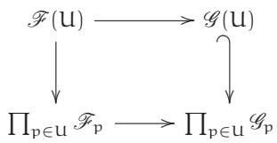

2.4.D. TRICKY EXERCISE (ISOMORPHISMS ARE DETERMINED BY STALKS). Show that a morphism of sheaves of sets is an isomorphism if and only if it induces an isomorphism of all stalks. Hint: Use (2.4.3.1). Once you have injectivity, show surjectivity, perhaps using Exercise 2.4.B, or gluability in some other way; this is more subtle. Warning: This exercise does not say that if two sheaves have isomorphic stalks, then they are isomorphic.

# 2.4.E. EXERCISE.

(a) Show that Exercise 2.4.A is false for general presheaves.   
(b) Show that Exercise 2.4.C is false for general presheaves.   
(c) Show that Exercise 2.4.D is false for general presheaves.

(General hint for finding counterexamples of this sort: Consider a 2-point space with the discrete topology.)

# 2.4.4. Sheafification.

Every sheaf is a presheaf (and indeed by definition sheaves on X form a full subcategory of the category of presheaves on X). Just as groupification (§1.4.3) gives an abelian group that best approximates an abelian semigroup, sheafification gives the sheaf that best approximates a presheaf, with an analogous universal property. (One possible example to keep in mind is the sheafification of the presheaf of holomorphic functions admitting a square root on $\mathbb { C }$ with the classical topology. See also the exponential exact sequence, Example 2.4.9.)

2.4.5. Definition. If $\mathcal { F }$ is a presheaf on X, then a morphism of presheaves sh: $\mathcal { F }  \mathcal { F } ^ { \mathrm { s h } }$ on X is a sheafification of $\mathcal { F }$ if $\mathcal { F } ^ { \mathrm { s h } }$ is a sheaf, and for any sheaf $\mathcal { G }$ , and any presheaf morphism $\mathfrak { g } \colon \mathcal { F }  \mathcal { G }$ , there exists a unique morphism of sheaves f : $\mathcal { F } ^ { \mathrm { s h } } \xrightarrow { } \mathcal { G }$ making the diagram

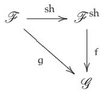

commute.

We still have to show that it exists. The following two exercises require existence (which we will show shortly), but not the details of the construction.

2.4.F. EXERCISE. Show that sheafification is unique up to unique isomorphism, assuming it exists. Show that if $\mathcal { F }$ is a sheaf, then the sheafification is id : $\mathcal { F } \longrightarrow \mathcal { F }$ . (This should be second nature by now.)   
2.4.G. EASY EXERCISE (SHEAFIFICATION IS A FUNCTOR). Assume for now that sheafification exists. Use the universal property to show that for any morphism of presheaves $\phi \colon { \mathcal { F } }  { \mathcal { G } } .$ , we get a natural induced morphism of sheaves $\boldsymbol { \Phi } ^ { \mathrm { s h } }$ : $\mathcal { F } ^ { \mathrm { s h } } \xrightarrow { } \mathcal { G } ^ { \mathrm { s h } }$ . Show that sheafification is a functor from presheaves on X to sheaves on X.   
2.4.6. Construction. We next show that any presheaf of sets (or groups, rings, etc.) has a sheafification. Suppose $\mathcal { F }$ is a presheaf. Define $\mathcal { F } ^ { \mathrm { s h } }$ by defining $\mathcal { F } ^ { \mathrm { s h } } ( \mathrm { u } )$ as the set of “compatible (families of) germs” of the presheaf $\mathcal { F }$ over U. Explicitly:

$\mathcal { F } ^ { \mathrm { s h } } ( \mathrm { U } ) : = \{ ( \boldsymbol { \mathsf { f } } _ { \mathsf { p } } \in \mathcal { F } _ { \mathsf { p } } ) _ { \mathsf { p } \in \mathrm { U } } :$ for all ${ \mathfrak { p } } \in { \mathrm { U } }$ , there exists an open neighborhood V of p, contained in U, and $s \in \mathcal { F } ( V )$ with $s _ { \mathrm { q } } = f _ { \mathrm { q } }$ for all $\mathsf { q } \in { \mathsf { V } } \}$ .

Here $s _ { \mathbf { q } }$ means the germ of s at q—the image of s in the stalk $\mathcal { F } _ { \mathbf { q } }$

2.4.H. EASY EXERCISE. Show that $\mathcal { F } ^ { \mathrm { s h } }$ (using the tautological restriction maps) forms a sheaf.   
2.4.I. EASY EXERCISE. Describe a natural map of presheaves sh: $\mathcal { F }  \mathcal { F } ^ { \mathrm { s h } }$ .   
2.4.J. EXERCISE. Show that the map sh satisfies the universal property of sheafification (Definition 2.4.5). (This is easier than you might fear.)   
2.4.K. USEFUL EXERCISE, NOT JUST FOR CATEGORY-LOVERS. Show that the sheafification functor is left-adjoint to the forgetful functor from sheaves on $x$ to presheaves on X. This is not difficult—it is largely a restatement of the universal property. But it lets you use results from §1.5.14, and can “explain” why you don’t need to sheafify when taking kernel (why the presheaf kernel is already the sheaf kernel), and why you need to sheafify when taking cokernel and (soon, in Exercise 2.6.K) tensor product.   
2.4.L. EXERCISE. Show $\mathcal { F }  \mathcal { F } ^ { \mathrm { s h } }$ induces an isomorphism of stalks. (Possible hint: Use the concrete description of the stalks. Another possibility once you read Remark 2.7.3: judicious use of adjoints.)

As a reality check, you may want to verify that “the sheafification of a constant presheaf is the corresponding constant sheaf” (see $\ S 2 . 2 . 1 0 )$ ): If $x$ is a topological space and S is a set, then $( \underline { { S } } _ { \mathrm { p r e } } ) ^ { \mathrm { s h } }$ may be naturally identified with S.

2.4.7.* Remark. The “space of sections” (or “espace étalé”) construction (§2.2.11) yields a differentsounding description of sheafification that may be preferred by some readers. The main idea is identical: if $\mathcal { F }$ is a presheaf, let F be the space of sections (or espace étalé) of $\mathcal { F }$ . You may wish to show that if $\mathcal { F }$ is a presheaf, the sheaf of sections of $\digamma \to X$ (defined in Exercise 2.2.G(a)) is the sheafification of $\mathcal { F }$ . Exercise 2.2.E may be interpreted as an example of this construction. The “space of sections” construction of the sheafification is essentially the same as Construction 2.4.6.

# 2.4.8. Subsheaves and quotient sheaves.

We now discuss subsheaves and quotient sheaves from the perspective of stalks.

2.4.M. EXERCISE. Suppose $\phi \colon { \mathcal { F } }  { \mathcal { G } }$ is a morphism of sheaves of sets on a topological space X. Show that the following are equivalent.

(a) $\Phi$ is a monomorphism in the category of sheaves.   
(b) $\Phi$ is injective on the level of stalks: $\Phi _ { \mathfrak { p } } : \mathcal { F } _ { \mathfrak { p } } \to \mathcal { G } _ { \mathfrak { p } }$ is injective for all ${ \mathfrak { p } } \in X$ .   
(c) $\Phi$ is injective on the level of open sets: $\Phi ( \operatorname { U } ) \colon { \mathcal { F } } ( \operatorname { U } ) \to { \mathcal { G } } ( \operatorname { U } )$ is injective for all open U  X.

(Possible hints: For (b) implies (a), recall that morphisms are determined by stalks, Exercise 2.4.C. For (a) implies (c), use the “indicator sheaf” with one section over every open set contained in U,

and no section over any other open set.) If these conditions hold, we say that $\mathcal { F }$ is a subsheaf of $\mathcal { G }$ (where the “inclusion” $\boldsymbol { \Phi }$ is sometimes left implicit).

(You may later wish to extend your solution to Exercise 2.4.M to show that for any morphism of presheaves, if all maps of sections are injective, then all stalk maps are injective. And furthermore, if $\Phi \colon { \mathcal { F } }  { \mathcal { G } }$ is a morphism from a separated presheaf to an arbitrary presheaf, then injectivity on the level of stalks implies that $\boldsymbol { \Phi }$ is a monomorphism in the category of presheaves. This is useful in some approaches to Exercise 2.6.C.)

2.4.N. EXERCISE. Continuing the notation of the previous exercise, show that the following are equivalent.

(a) $\Phi$ is an epimorphism in the category of sheaves.   
(b) $\Phi$ is surjective on the level of stalks: $\phi _ { \mathrm { p } } : { \mathcal { F } } _ { \mathfrak { p } } \to { \mathcal { G } } _ { \mathfrak { p } }$ is surjective for all ${ \mathfrak { p } } \in X$ .

(Possible hint: Use a skyscraper sheaf.)

If these conditions hold, we say that $\mathcal { G }$ is a quotient sheaf of $\mathcal { F }$ .

Thus monomorphisms and epimorphisms—subsheafiness and quotient sheafiness—can be checked at the level of stalks.

Both exercises generalize readily to sheaves with values in any reasonable category, where “injective” is replaced by “monomorphism” and “surjective” is replaced by “epimorphism.”

Notice that there was no part (c) to Exercise 2.4.N, and Example 2.4.9 shows why. (But there is a version of (c) that implies (a) and (b): surjectivity on all open sets in any base of a topology implies that the corresponding map of sheaves is an epimorphism, Exercise 2.5.D.)

2.4.9. Example (cf. Exercise 2.3.J). Let $\ b { X } = \mathbb { C }$ with the classical topology, and define ${ \mathcal { O } } _ { X }$ to be the sheaf of holomorphic functions, and $\mathcal { O } _ { X } ^ { * }$ to be the sheaf of invertible (nowhere zero) holomorphic functions. This is a sheaf of abelian groups under multiplication. We have maps of sheaves

$$
0 \longrightarrow \underline {{\mathbb {Z}}} \xrightarrow {\times 2 \pi \mathrm {i}} \mathcal {O} _ {X} \xrightarrow {\exp} \mathcal {O} _ {X} ^ {*} \longrightarrow 1. \tag {2.4.9.1}
$$

(You can figure out what the sheaves 0 and 1 mean; they are isomorphic, and are written in this way for reasons that may be clear.) We will soon interpret this as an exact sequence of sheaves of abelian groups (the exponential exact sequence; see Exercise 2.6.F), although we don’t yet have the language to do so.

2.4.O. ENLIGHTENING EXERCISE. Show that exp: $\mathcal { O } _ { \mathsf { X } } \longrightarrow \mathcal { O } _ { \mathsf { X } } ^ { * }$ describes $\mathcal { O } _ { X } ^ { * }$ as a quotient sheaf of ${ \mathcal { O } } _ { X }$ . Find an open set on which this map is not surjective.

This is a great example to get a sense of what “surjectivity” means for sheaves: nowhere vanishing holomorphic functions (such as the function x away from the origin) have logarithms locally, but they need not have logarithms globally.

# 2.5 Recovering Sheaves from a “Sheaf on a Base”

Sheaves are natural things to want to think about, but hard to get our hands on. We like the identity and gluability axioms, but they make proving things trickier than for presheaves. We have discussed how we can understand sheaves using stalks (using “compatible germs”). We now introduce a second way of getting a hold of sheaves, by introducing the notion of a sheaf on a base. Warning: This way of understanding an entire sheaf from limited information is confusing. You may find it helpful to focus on the central insight that this partial information suffices to determine the germs, and that they are compatible (with nearby germs).

First, we define a base of a topology. Suppose we have a topological space X, i.e., we know which subsets $\mathrm { { u } _ { i } }$ of X are open. Then a base of a topology is a subcollection of the open sets $\{ { \mathrm { B } } _ { \mathrm { j } } \} \subset \{ { \mathrm { U } } _ { \mathrm { i } } \} ,$ such that each $\mathrm { { U } _ { i } }$ is a union of some of the $\mathrm { B _ { j } }$ . Here is one example that you have

seen early in your mathematical life. Suppose $X = \mathbb { R } ^ { \mathrm { n } }$ . Then the way the classical topology is often first defined is by defining open balls $\mathsf { B } _ { \mathsf { r } } ( { \boldsymbol x } ) = \{ \mathsf { y } \in \mathbb { R } ^ { \mathsf { n } } \ : \ | \mathsf { y } - { \boldsymbol x } | < { \mathsf { r } } \} ,$ and declaring that any union of open balls is open. So the balls form a base of the classical topology—we say they generate the classical topology. As an application of how we use them, to check continuity of some map $\pi \colon X \to \mathbb { R } ^ { \mathfrak { n } }$ , you need only think about the pullback of balls on $\mathbb { R } ^ { { \mathfrak { n } } }$ —part of the traditional δ-ϵ definition of continuity.

Now suppose we have a sheaf $\mathcal { F }$ on a topological space $\Sigma ,$ and a base $\{ \mathrm { B } _ { \mathrm { i } } \}$ of open sets on X. Then consider the information

$$
\left(\left\{\mathcal {F} \left(\mathrm {B} _ {\mathrm {i}}\right)\right\}, \left\{\operatorname {r e s} _ {\mathrm {B} _ {\mathrm {i}}, \mathrm {B} _ {\mathrm {j}}} : \mathcal {F} \left(\mathrm {B} _ {\mathrm {i}}\right)\rightarrow \mathcal {F} \left(\mathrm {B} _ {\mathrm {j}}\right)\right\}\right),
$$

which is a subset of the information contained in the sheaf—we are paying attention only to the information involving elements of the base, not to all open sets.

We can recover the entire sheaf from this information. This is because we can determine the stalks from this information, and we can determine when germs are compatible.

2.5.A. IMPORTANT EXERCISE. Make this precise. How can you recover a sheaf $\mathcal { F }$ from this partial information?

This suggests a notion, called a sheaf on a base. A sheaf of sets (or abelian groups, rings, . . . ) on a base $\{ \mathrm { B } _ { \mathrm { i } } \}$ is the following. For each $\mathtt { B _ { i } }$ in the base, we have a set $\mathsf { F } ( \mathsf { B } _ { \mathrm { i } } )$ . If $\mathrm { B } _ { \mathrm { i } } \subset \mathrm { B } _ { \mathrm { j } } ,$ we have maps resB , $\mathrm { _ { B _ { i } } \colon F ( B _ { j } ) \longrightarrow F ( B _ { i } ) , }$ , with $\mathrm { r e s } _ { \mathrm { B } _ { \mathrm { i } } , \mathrm { B } _ { \mathrm { i } } } = \mathrm { i d } _ { \mathsf { F } ( \mathrm { B } _ { \mathrm { i } } ) } .$ . (Things called $\prime \prime \mathrm { B } ^ { \prime \prime }$ are always assumed to be in the base.) If $\mathsf { B } _ { \mathrm { i } } \subset \mathsf { B } _ { \mathrm { j } } \subset \mathsf { B } _ { \mathsf { k } } ,$ then res $\begin{array} { r } { { 3 } _ { \mathbf { k } } , \mathbf { B } _ { \mathbf { i } } = \mathbf { r e s } _ { \mathrm { B } _ { \mathbf { j } } , \mathrm { B } _ { \mathbf { i } } } \circ \mathbf { r e s } _ { \mathrm { B } _ { \mathbf { k } } , \mathrm { B } _ { \mathbf { j } } } . } \end{array}$ . So far we have defined a presheaf on a base $\{ \mathrm { B } _ { \mathrm { i } } \}$ .

We also require the base identity axiom: If ${ \mathrm { B } } = \cup { \mathrm { B } } _ { \mathrm { i } } ,$ then if f, ${ \mathfrak { g } } \in { \mathsf { F } } ( { \mathsf { B } } )$ are such that $\mathrm { r e s } _ { \mathrm { B } , \mathrm { B } _ { \mathrm { i } } } \mathrm { f } =$ $\mathrm { r e s } _ { \mathrm { B } , \mathrm { B } _ { \mathrm { i } } } ~ 9$ for all ${ \mathrm { i } , }$ then $\boldsymbol { \mathsf { f } } = \boldsymbol { \mathsf { g } }$ .

We require the base gluability axiom, too: If ${ \mathrm { B } } = \cup { \mathrm { B } } _ { \mathrm { i } } ,$ and we have $\mathsf { f } _ { \mathrm { i } } \in \mathsf { F } ( \mathsf { B } _ { \mathrm { i } } )$ such that $\mathsf { f } _ { \mathrm { i } }$ agrees with $\mathsf { f } _ { \mathrm { j } }$ on any basic open set contained in $\mathrm { B } _ { \mathrm { i } } \cap \mathrm { B } _ { \mathrm { j } }$ (i.e., $\mathrm { r e s } _ { \mathrm { B } _ { \mathrm { i } } , \mathrm { B } _ { \mathrm { k } } } \mathrm { f } _ { \mathrm { i } } = \mathrm { r e s } _ { \mathrm { B } _ { \mathrm { j } } , \mathrm { B } _ { \mathrm { k } } } \mathrm { f } _ { \mathrm { j } }$ for all $\mathtt { B } _ { \mathtt { k } } \subset$ $\mathrm { B } _ { \mathrm { i } } \cap \mathrm { B } _ { \mathrm { j } } .$ ), then there exists ${ \mathsf { f } } \in { \mathsf { F } } ( { \mathsf { B } } )$ such that resB,B f = fi for all i.

2.5.1. Theorem — Suppose $\{ \mathrm { B } _ { \mathrm { i } } \}$ is a base on $\mathsf { X } ,$ and F is a sheaf of sets on this base. Then there is a sheaf $\mathcal { F }$ extending F (with isomorphisms $\mathcal { F } ( \mathrm { B } _ { \mathrm { i } } ) \longleftrightarrow \mathsf { F } ( \mathrm { B } _ { \mathrm { i } } )$ agreeing with the restriction maps). This sheaf $\mathcal { F }$ is unique up to unique isomorphism.

Proof. We will define $\mathcal { F }$ as the sheaf of (families of) compatible germs of F.

Define the stalk of a presheaf F on a base at ${ \mathfrak { p } } \in X$ by

$$
F _ {p} = \operatorname {c o l i m} F \left(B _ {i}\right),
$$

where the colimit is over all $\mathtt { B _ { i } }$ (in the base) containing p.

We will say a family of germs in an open set U is compatible near p if there is a section s of F over some $\mathtt { B _ { i } }$ containing p such that the germs over $\mathtt { B _ { i } }$ are precisely the germs of s. More formally, define

$$
\mathscr {F} (\mathsf {U}) := \left\{\left(\mathrm {f} _ {\mathrm {p}} \in \mathrm {F} _ {\mathrm {p}}\right) _ {\mathrm {p} \in \mathsf {U}}: \text {f o r a l l p \in U , t h e r e e x i s t s B w i t h p \in B \subset U , s \in F (B)} \right.,
$$

$$
\left. \text {w i t h} s _ {q} = f _ {q} \text {f o r a l l} q \in B \right\},
$$

where each B is in our base.

This is a sheaf (for the same reasons that the sheaf of compatible germs was; cf. Exercise 2.4.H).

I next claim that if B is in our base, the natural map $\mathsf { F } ( \mathrm { B } ) \to \mathcal { F } ( \mathrm { B } )$ is an isomorphism.

2.5.B. EXERCISE. Verify that $\mathsf { F } ( \mathrm { B } ) \to \mathcal { F } ( \mathrm { B } )$ is an isomorphism, likely by showing that it is injective and surjective (or else by describing the inverse map and verifying that it is indeed inverse). Possible hint: Elements of $\mathcal { F } ( \mathtt { B } )$ are determined by stalks, as are elements of F(B).

It will be clear from your solution to Exercise 2.5.B that the restriction maps for F are the same as the restriction maps of $\mathcal { F }$ (for elements of the base).

Finally, you should verify to your satisfaction that $\mathcal { F }$ is indeed unique up to unique isomorphism. (First be sure that you understand what this means!) □

Theorem 2.5.1 shows that sheaves on X can be recovered from their “restriction to a base.” It is clear from the argument (and in particular the solution to the Exercise 2.5.B) that if $\mathcal { F }$ is a sheaf and F is the corresponding sheaf on the base B, then for any p  X, ${ \mathcal { F } } _ { \mathfrak { p } }$ is naturally isomorphic to $\mathsf { F } _ { \mathsf { p } }$ .

Theorem 2.5.1 is a statement about objects in a category, so we should hope for a similar statement about morphisms.

2.5.C. IMPORTANT EXERCISE: MORPHISMS OF SHEAVES CORRESPOND TO MORPHISMS OF SHEAVES ON A BASE. Suppose $\{ \mathtt { B } _ { \mathrm { i } } \}$ is a base for the topology of X. A morphism $\mathsf { F } \to \mathsf { G }$ of sheaves on the base is a collection of maps $\mathsf { F } ( \mathsf { B } _ { \mathsf { k } } ) \to \mathsf { G } ( \mathsf { B } _ { \mathsf { k } } )$ such that the diagram

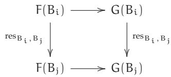

commutes for all $\mathrm { B } _ { \mathrm { j } } \hookrightarrow \mathrm { B } _ { \mathrm { i } }$ .

(a) Verify that a morphism of sheaves is determined by the induced morphism of sheaves on the base.   
(b) Show that a morphism of sheaves on the base gives a morphism of the induced sheaves. (Possible hint: Compatible stalks.)

2.5.2. Remark. The above constructions and arguments describe an equivalence of categories (§1.1.21) between sheaves on X and sheaves on a given base of X. There is no new content to this statement, but you may wish to think through what it means. What are the functors in each direction? Why aren’t their compositions the identity?   
2.5.3. Remark. It will be useful to extend these notions to ${ \mathcal { O } } _ { X }$ -modules (see, for example, Exercise 6.2.C). You will readily be able to verify that there is a correspondence (really, equivalence of categories) between ${ \mathcal { O } } _ { X }$ -modules and $" \mathcal { O } _ { X }$ -modules on a base.” Rather than working out the details, you should just informally think through the main points: What is an $" \mathcal { O } _ { X }$ -module on a base”? Given an ${ \mathcal { O } } _ { X }$ -module on a base, why is the corresponding sheaf naturally an ${ \mathcal { O } } _ { X }$ -module? Later, if you are forced at gunpoint to fill in details, you will be able to.   
2.5.D. UNIMPORTANT EXERCISE. Suppose a morphism of sheaves of sets $\mathsf { F } \to \mathsf { G }$ on a base $\{ \mathrm { B } _ { \mathrm { i } } \}$ is surjective for all $\mathtt { B _ { i } }$ (i.e., $\mathsf { F } ( \mathrm { B } _ { \mathrm { i } } ) \to \mathsf { G } \left( \mathrm { B } _ { \mathrm { i } } \right)$ is surjective for all i). Show that the corresponding morphism of sheaves (not on the base) is surjective (or, more precisely, is an epimorphism). The converse is not true, unlike the case for injectivity. This gives a useful sufficient criterion for “surjectivity”: a morphism of sheaves is an epimorphism (“surjective”) if it is surjective for sections on a base. You may enjoy trying this out with Example 2.4.9 (dealing with holomorphic functions in the classical topology on $\ b X = \mathbb { C }$ ), showing that the exponential map exp: ${ \mathcal { O } } _ { X } \to { \mathcal { O } } _ { X } ^ { * }$ is surjective, using the base of contractible open sets.

# 2.5.4. Gluing sheaves.

We will repeatedly see the theme of constructing some object by gluing, in many different contexts. Keep an eye out for it! In each case, we carefully consider what information we need in order to glue.

2.5.E. IMPORTANT EXERCISE. Suppose ${ \mathsf { X } } = \cup { \mathsf { U } } _ { \mathrm { i } }$ is an open cover of X, and we have sheaves $\mathcal { F } _ { \mathrm { i } }$ on $\mathrm { { u } _ { i } }$ along with isomorphisms

$$
\phi_ {i j}: \mathcal {F} _ {i} | _ {u _ {i} \cap u _ {j}} \xrightarrow {\sim} \mathcal {F} _ {j} | _ {u _ {i} \cap u _ {j}}
$$

(with $\phi _ { \mathrm { i i } }$ the identity) that agree on triple overlaps, i.e.,

(2.5.4.1)

$$
\phi_ {j k} \circ \phi_ {i j} = \phi_ {i k}
$$

on $\mathrm { U } _ { \mathrm { i } } \cap \mathrm { U } _ { \mathrm { j } } \cap \mathrm { U } _ { \mathrm { k } }$ (this is called the cocycle condition, for reasons we ignore). Show that these sheaves can be glued together into a sheaf $\mathcal { F }$ on X (unique up to unique isomorphism), with isomorphisms $\mathcal { F } | _ { \mathfrak { U } _ { \mathrm { i } } } \xrightarrow { \sim } \mathcal { F } _ { \mathrm { i } } ,$ and the isomorphisms over Ui Uj are the obvious ones. Warning: We are not assuming this is a finite cover, so you cannot use induction. For this reason this exercise can be perplexing. (You can use the ideas of this section to solve this problem, but you don’t necessarily need to. Hint: As the base, take those open sets contained in some Ui.)

Thus we can “glue sheaves together,” using limited patching information. Small observation: The hypothesis $\phi _ { \mathrm { i i } }$ is the identity is extraneous, as it follows from the cocycle condition.

2.5.5. Remark for experts. Exercise 2.5.E almost says that the “set” of sheaves forms a sheaf itself, but not quite. Making this precise leads one to the notion of a stack.

2.6 Sheaves of Abelian Groups, and ${ \mathcal { O } } _ { X }$ -Modules, Form Abelian Categories

We are now ready to see that sheaves of abelian groups, and their cousins, ${ \mathcal { O } } _ { X }$ -modules, form abelian categories. In other words, we may treat them similarly to vector spaces, and modules over a ring. In the process of doing this, we will see that this is much stronger than an analogy; kernels, cokernels, exactness, and so forth can be understood at the level of stalks (which are just abelian groups), and the compatibility of the germs will come for free.

The category of sheaves of abelian groups on a topological space X is clearly an additive category (Definition 1.5.1). In order to show that it is an abelian category, we must begin by showing that any morphism $\phi \colon { \mathcal { F } }  { \mathcal { G } }$ has a kernel and a cokernel. We have already seen that $\boldsymbol { \Phi }$ has a kernel (Exercise 2.3.I): the presheaf kernel is a sheaf, and is a kernel in the category of sheaves.

2.6.A. EXERCISE. Show that the stalk of the kernel is the kernel of the stalks: for all ${ \mathfrak { p } } \in X ,$ there is a natural isomorphism

$$
\left(\ker \left(\mathcal {F} \rightarrow \mathcal {G}\right)\right) _ {\mathrm {p}} \xleftarrow {\sim} \ker \left(\mathcal {F} _ {\mathrm {p}} \rightarrow \mathcal {G} _ {\mathrm {p}}\right).
$$

We next address the issue of the cokernel. Now $\phi \colon { \mathcal { F } }  { \mathcal { G } }$ has a cokernel in the category of presheaves; call it ${ \mathcal { H } } _ { \mathrm { p r e } }$ (where the subscript is meant to remind us that this is a presheaf). Let $\mathrm { { h } } \colon \mathcal { H } _ { \mathrm { { p r e } } } \to \mathcal { H }$ be its sheafification. Recall that the cokernel is defined using a universal property: →it is the colimit of the diagram

(2.6.0.1)

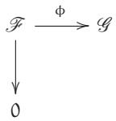

in the category of presheaves (cf. (1.5.4.2) and the comment thereafter).

2.6.1. Proposition — The composition $\mathcal { G }  \mathcal { H }$ is the cokernel of $\Phi$ in the category of sheaves.

Proof. We show that it satisfies the universal property. Given any sheaf $\mathcal { E } ^ { \mathcal { C } }$ and a commutative diagram

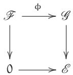

we construct

We show that there is a unique morphism $\mathcal { H } \xrightarrow { } \mathcal { E }$ making the diagram commute. As ${ \mathcal { H } } _ { \mathrm { p r e } }$ is the cokernel in the category of presheaves, there is a unique morphism of presheaves $\mathcal { H } _ { \mathrm { p r e } }  \mathcal { E }$ making the diagram commute. But then by the universal property of sheafification (Definition 2.4.5), there is a unique morphism of sheaves $\mathcal { H } \xrightarrow { } \mathcal { E }$ making the diagram commute. □

2.6.B. EXERCISE. Show that the stalk of the cokernel is naturally isomorphic to the cokernel of the stalk.

We have now defined the notions of kernel and cokernel, and verified that they may be checked at the level of stalks. We have also verified that the properties of a morphism being a monomorphism or an epimorphism are also determined at the level of stalks (Exercises 2.4.M and 2.4.N). Hence we have proved the following:

2.6.2. Theorem — Sheaves of abelian groups on a topological space X form an abelian category.

That’s all there is to it—what needs to be proved has been shifted to the stalks, where everything works because stalks are abelian groups!

And we see more: all structures coming from the abelian nature of this category may be checked at the level of stalks. For example:

2.6.C. EXERCISE. Suppose ϕ: $\mathcal { F }  \mathcal { G }$ is a morphism of sheaves of abelian groups. Show that the image sheaf im $\boldsymbol { \Phi }$ is the sheafification of the image presheaf. (You must use the definition of image in an abelian category. In fact, this gives the accepted definition of image sheaf for a morphism of sheaves of sets.) Show that the stalk of the image is the image of the stalk.

As a consequence, exactness of a sequence of sheaves may be checked at the level of stalks. If you are not sure about this, you should do the following exercise.

2.6.D. EXERCISE. Suppose $\alpha \colon { \mathcal { F } }  { \mathcal { G } }$ and $\beta : \mathcal { G }  \mathcal { H }$ are two morphisms of sheaves of abelian groups on X. Show that

$$
\mathcal {F} \xrightarrow {\alpha} \mathcal {G} \xrightarrow {\beta} \mathcal {H}
$$

is exact (at $\mathcal { G }$ ) if and only if for all ${ \mathfrak { p } } \in X ,$

$$
\mathscr {F} _ {\mathrm {p}} \xrightarrow {\alpha_ {\mathrm {p}}} \mathscr {G} _ {\mathrm {p}} \xrightarrow {\beta_ {\mathrm {p}}} \mathscr {H} _ {\mathrm {p}}
$$

is exact.

In particular:

2.6.E. IMPORTANT EXERCISE (CF. EXERCISE 2.3.A). Show that taking the stalk of a sheaf of abelian groups is an exact functor. More precisely, if X is a topological space and ${ \mathfrak { p } } \in X$ is a point, show that taking the stalk at p defines an exact functor $A b _ { \mathrm { X } }  A b$ .

2.6.F. EXERCISE. Check that the exponential exact sequence (2.4.9.1) is indeed an exact sequence of sheaves of abelian groups.

2.6.G. EXERCISE: LEFT-EXACTNESS OF THE FUNCTOR OF “SECTIONS OVER U.” Suppose U X is an open set, and $0 \to { \mathcal { F } } \to { \mathcal { G } } \to { \mathcal { H } }$ is an exact sequence of sheaves of abelian groups. Show that

$$
0 \longrightarrow \mathcal {F} (\mathsf {U}) \longrightarrow \mathcal {G} (\mathsf {U}) \longrightarrow \mathcal {H} (\mathsf {U})
$$

is exact. (You should do this “by hand,” even if you realize there is a very fast proof using the left-exactness of the “forgetful” right adjoint to the sheafification functor.) Show that the section functor need not be exact: show that if $0 \to { \mathcal { F } } \to { \mathcal { G } } \to { \mathcal { H } } \to 0$ is an exact sequence of sheaves of abelian groups, then

$$
0 \longrightarrow \mathcal {F} (\mathsf {U}) \longrightarrow \mathcal {G} (\mathsf {U}) \longrightarrow \mathcal {H} (\mathsf {U}) \longrightarrow 0
$$

need not be exact. (Hint: Recall the exponential exact sequence (2.4.9.1). But feel free to make up a different example.)

2.6.H. EXERCISE: LEFT-EXACTNESS OF PUSHFORWARD. Suppose $0 \to { \mathcal { F } } \to { \mathcal { G } } \to { \mathcal { H } }$ is an exact sequence of sheaves of abelian groups on X. If π: $\Chi \to \Upsilon$ is a continuous map, show that

$$
0 \longrightarrow \pi_ {*} \mathcal {F} \longrightarrow \pi_ {*} \mathcal {G} \longrightarrow \pi_ {*} \mathcal {H}
$$

is exact. (The previous exercise, dealing with the left-exactness of the global section functor can be interpreted as a special case of this, the case where Y is a point.)

2.6.I. EXERCISE: LEFT-EXACTNESS OF Hom (CF. EXERCISE 1.5.G(C) AND (D)). Suppose $\mathcal { F }$ is a sheaf of abelian groups on a topological space X. Show that $\mathcal { H } o m ( \mathcal { F } , \cdot )$ is a left-exact covariant functor $A b _ { X }  A b _ { X }$ . Show that $\mathcal { H } o m ( \cdot , \mathcal { F } )$ is a left-exact contravariant functor $A b _ { X }  A b _ { X }$ .

# 2.6.3. ${ \mathcal { O } } _ { X }$ -modules.

2.6.J. EXERCISE. Show that if $( X , { \mathcal { O } } _ { X } )$ is a ringed space, then ${ \mathcal { O } } _ { X }$ -modules form an abelian category. (There is a fair bit to check, but there aren’t many new ideas.)

2.6.4. Many facts about sheaves of abelian groups carry over to ${ \mathcal { O } } _ { X }$ -modules without change, because a sequence of ${ \mathcal { O } } _ { X }$ -modules is exact if and only if the underlying sequence of sheaves of abelian groups is exact. You should be able to easily check that all of the statements of the earlier exercises in $\ S 2 . 6$ also hold for ${ \mathcal { O } } _ { X }$ -modules, when modified appropriately. For example (Exercise 2.6.I), $\mathcal { H } o m _ { \mathcal { O } _ { \mathsf { X } } } ( \cdot , \cdot )$ is a left-exact contravariant functor in its first argument and a left-exact covariant functor in its second argument.

We end with a useful construction using some of the ideas in this section.

2.6.K. IMPORTANT EXERCISE: TENSOR PRODUCTS OF $\mathcal { O } _ { X }$ -MODULES.

(a) Suppose ${ \mathcal { O } } _ { X }$ is a sheaf of rings on X. Define (categorically) what we should mean by tensor product of two ${ \mathcal { O } } _ { X }$ -modules. Give an explicit construction, and show that it satisfies your categorical definition. Hint: Take the “presheaf tensor product”—which needs to be defined— and sheafify. Note: $\otimes _ { \mathcal { O } _ { \mathsf { X } } }$ is often written $\otimes$ when the subscript is clear from the context. (An example showing sheafification is necessary will arise in Example 15.1.1.)   
(b) Show that the tensor product of stalks is the stalk of the tensor product. (If you can show this, you may be able to make sense of the phrase “colimits commute with tensor products.”)

2.6.5. Conclusion. Just as presheaves of abelian groups on a topological space form an abelian category because all abelian-categorical notions make sense open set by open set, sheaves of abelian groups on a topological space form an abelian category because all abelian-categorical notions make sense stalk by stalk.

# 2.7 The Inverse Image Sheaf

We next describe a notion that is fundamental, but rather intricate. We will not need it for some time, so this may be best left for a second reading. Suppose we have a continuous map π: $\ d X \to \Upsilon ,$ .

If $\mathcal { F }$ is a sheaf on X, we have defined the pushforward or direct image sheaf $\pi _ { * } { \mathcal { F } } _ { * }$ , which is a sheaf on Y. There is also a notion of inverse image sheaf. (We will not call it the pullback sheaf, reserving that name for a later construction for quasicoherent sheaves, §14.5.) This is a covariant functor $\pi ^ { - 1 }$ from sheaves on Y to sheaves on X. If the sheaves on Y have some additional structure (e.g., group or ring), then this structure is respected by $\pi ^ { - 1 }$ .

2.7.1. Definition by adjoint: Elegant but abstract. We define the inverse image $\pi ^ { - 1 }$ as the left adjoint to $\pi _ { * }$ .

This isn’t really a definition; we need a construction to show that the adjoint exists. Note that we then get canonical maps $\pi ^ { - 1 } \pi _ { * } { \mathcal { F } } \to { \mathcal { F } }$ (associated to the identity in $\operatorname { M o r } _ { \Upsilon } ( \pi _ { * } \mathcal { F } , \pi _ { * } \mathcal { F } ) )$ and $\mathcal { G } \to \pi _ { * } \pi ^ { - 1 } \mathcal { G }$ (associated to the identity in $\operatorname { M o r } _ { \mathbf { X } } ( \pi ^ { - 1 } \mathcal { G } , \pi ^ { - 1 } \mathcal { G } ) )$ .

2.7.2. Construction: Concrete but ugly. Define the temporary notation

$$
\pi_ {\operatorname {p r e}} ^ {- 1} \mathscr {G} (U) = \operatorname {c o l i m} _ {V \supset \pi (U)} \mathscr {G} (V).
$$

(Recall the explicit description of colimit: Sections of $\pi _ { \mathrm { p r e } } ^ { - 1 }$ over U are sections on open sets containing $\pi ( \mathrm { U } )$ , with an equivalence relation. Note that $\pi ( \mathrm { U } )$ won’t be an open set in general.)

2.7.A. EXERCISE. Show that this defines a presheaf on X. Show that it needn’t form a sheaf. (Hint: Map two points to one point.)

Now define the inverse image of $\mathcal { G }$ by $\pi ^ { - 1 } { \mathcal { G } } : = ( \pi _ { \mathrm { p r e } } ^ { - 1 } { \mathcal { G } } ) ^ { \mathrm { s h } }$ . Note that $\pi ^ { - 1 }$ is a functor from sheaves on Y to sheaves on X. The next exercise shows that $\pi ^ { - 1 }$ is indeed left-adjoint to $\pi _ { * }$ . But you may wish to try the later exercises first, and come back to Exercise 2.7.B at another time. (For the later exercises, try to give two proofs, one using the universal property, and the other using the explicit description.)

2.7.B. IMPORTANT TRICKY EXERCISE $( ( \pi ^ { - 1 } , \pi _ { * } )$ ARE ADJOINT). If $\pi \colon X \to \Upsilon$ is a continuous map, and $\mathcal { F }$ is a sheaf on X and $\mathcal { G }$ is a sheaf on Y, describe a bijection

$$
\operatorname {M o r} _ {X} \left(\pi^ {- 1} \mathcal {G}, \mathcal {F}\right) \xleftarrow {\sim} \operatorname {M o r} _ {Y} \left(\mathcal {G}, \pi_ {*} \mathcal {F}\right).
$$

Observe that your bijection is “natural” in the sense of the definition of adjoints (i.e., it is functorial in both $\mathcal { F }$ and $\mathcal { G }$ ). Thus Construction 2.7.2 satisfies the universal property of Definition 2.7.1. Possible hint: Show that both sides agree with the following third construction, which we denote by $\operatorname { M o r } _ { \Upsilon \Upsilon } ( \mathcal { G } , \mathcal { F } )$ . A collection of maps $\Phi \mathrm { v u } \colon { \mathcal { G } } ( \mathsf { V } ) \to { \mathcal { F } } ( \mathsf { U } )$ (as U runs through all open sets of X, and V runs through all open sets of Y containing $\pi ( \mathrm { U } )$ ) is said to be compatible if for all open $\mathsf { U } ^ { \prime } \subset \mathsf { U } \subset X$ and all open ${ \mathsf { V } } ^ { \prime } \subset { \mathsf { V } } \subset { \mathsf { Y } }$ with $\pi ( \mathsf { U } ) \subset \mathsf { V }$ , $\pi ( \mathrm { U } ^ { \prime } ) \subset \mathrm { V } ^ { \prime }$ , the diagram

$$
\begin{array}{c} \mathcal {G} (V) \xrightarrow {\phi_ {V U}} \mathcal {F} (U) \\ \left. \begin{array}{c} \operatorname {r e s} _ {V, V ^ {\prime}} \Bigg | \quad \Bigg | \operatorname {r e s} _ {U, U ^ {\prime}} \\ \mathcal {G} (V ^ {\prime}) \xrightarrow {\phi_ {V ^ {\prime} U ^ {\prime}}} \mathcal {F} (U ^ {\prime}) \end{array} \right. \end{array} \tag {2.7.2.1}
$$

commutes. Define $\operatorname { M o r } _ { \Upsilon \Upsilon } ( \mathcal { G } , \mathcal { F } )$ to be the set of all compatible collections $\phi = \{ \phi \mathrm { v u } \}$ .

2.7.3. Remark (“stalk and skyscraper are an adjoint pair”). As a special case, if X is a point $\mathfrak { p } \in \Upsilon .$ , we see that $\pi ^ { - 1 } \mathcal { G }$ is the stalk $\mathcal { G } _ { \mathfrak { p } }$ of $\mathcal { G }$ , and maps from the stalk $\mathcal { G } _ { \mathfrak { p } }$ to a set S are the same as maps of sheaves on Y from $\mathcal { G }$ to the skyscraper sheaf with set S supported at p. You may prefer to prove this special case by hand directly before solving Exercise 2.7.B, as it is enlightening. (It can also be useful—can you use it to solve Exercises 2.4.L and 2.4.N?)

2.7.C. EXERCISE. Show that the stalks of $\pi ^ { - 1 } \mathcal { G }$ are the same as the stalks of $\mathcal { G }$ . More precisely, if $\pi ( { \mathfrak { p } } ) = { \mathfrak { q } } ,$ , describe a natural isomorphism $\mathcal { G } _ { \mathfrak { q } } \xrightarrow { \sim } ( \pi ^ { - 1 } \mathcal { G } ) _ { \mathfrak { p } }$ . (Possible hint: use the concrete description of the stalk, as a colimit. Recall that stalks are preserved by sheafification, Exercise 2.4.L. Alternatively, use adjointness.)

Exercise 2.7.C, along with the notion of compatible germs, may give you a simple way of thinking about (and perhaps visualizing) inverse image sheaves. Closely related: you can think of sections of the inverse image sheaf as, locally, inverse images of sections on the target. (Those preferring the “espace étalé” or “space of sections” perspective, §2.2.11, can check that the “inverse image of the space of sections” is the “space of sections” of the inverse image.)

2.7.D. EXERCISE (EASY BUT USEFUL). If U is an open subset of Y, i: $\mathsf { u } \to \mathsf { Y }$ is the inclusion, and $\mathcal { G }$ is a sheaf on Y, show that $\mathrm { i } ^ { - 1 } \mathcal { G }$ is naturally isomorphic to $\mathcal { G } | _ { \mathrm { U } }$ →(the restriction of $\mathcal { G }$ to U, §2.2.8).   
2.7.E. EXERCISE. Show that $\pi ^ { - 1 }$ is an exact functor from sheaves of abelian groups on Y to sheaves of abelian groups on X (cf. Exercise 2.6.E). (Hint: exactness can be checked on stalks, and by Exercise 2.7.C, the stalks are the same.) Essentially the same argument will show that $\pi ^ { - 1 }$ is an exact functor from ${ \mathcal { O } } _ { \mathsf { Y } }$ -modules (on Y) to $( \pi ^ { - 1 } \mathcal { O } _ { \mathsf { Y } } )$ -modules (on X), but don’t bother writing that down. (Remark for experts: $\pi ^ { - 1 }$ is a left adjoint, hence right-exact by abstract nonsense, as discussed in §1.5.14. Left-exactness holds because colimits of abelian groups over filtered index sets are exact, Exercise 1.5.L.)

# 2.7.4. Definition: The push-pull map.

Suppose

$$
\begin{array}{c} W \xrightarrow {\beta^ {\prime}} X \\ \alpha^ {\prime} \Bigg \downarrow \\ Y \xrightarrow {\beta} Z \end{array}
$$

is a commutative (not necessarily Cartesian!) diagram, and $\mathcal { F }$ is a sheaf on X. Define the push-pull map

$$
\beta^ {- 1} \alpha_ {*} \mathcal {F} \longrightarrow \alpha_ {*} ^ {\prime} (\beta^ {\prime}) ^ {- 1} \mathcal {F} \tag {2.7.4.2}
$$

of sheaves on Y as follows. Start with the identity $( \beta ^ { \prime } ) ^ { - 1 } \mathcal { F } \xrightarrow { \sim } ( \beta ^ { \prime } ) ^ { - 1 } \mathcal { F }$ on W. By adjointness of $\big ( \big ( \beta ^ { \prime } \big ) ^ { - 1 } , \beta _ { * } ^ { \prime } \big ) ,$ , this is the same as the data of a morphism $\begin{array} { r } { \mathcal { F } \longrightarrow \left( \beta _ { * } ^ { \prime } \right) \left( \beta ^ { \prime } \right) ^ { - 1 } \mathcal { F } } \end{array}$ on X. Apply $\alpha _ { * }$ to get a map $\alpha _ { * } \mathcal { F } \longrightarrow \alpha _ { * } \big ( \beta _ { * } ^ { \prime } \big ) \big ( \beta ^ { \prime } \big ) ^ { - 1 } \mathcal { F }$ on Z. By the commutativity of (2.7.4.1), this is the map $\alpha _ { * } \mathcal { F } $ $\beta _ { * } \bigl ( \alpha _ { * } ^ { \prime } \bigr ) \bigl ( \beta ^ { \prime } \bigr ) ^ { - 1 } \mathcal { F }$ on Z. By adjointness of $\bigl ( \beta ^ { - 1 } , \beta _ { * } \bigr ) .$ , this yields a map (2.7.4.2).

We observe that this entire construction is functorial in $\mathcal { F }$ (i.e., given a map $\mathcal { F }  \mathcal { G }$ of sheaves on X, we get a certain commutative diagram of sheaves on Y—what is it?). (We will later extend this to $\mathcal { O }$ -modules, quasicoherent sheaves, and cohomology; see Exercises 7.2.D(f), 14.5.K, and 18.7.B.)

$2 . 7 . \mathbf { F } . ^ { \ast \ast }$ SURPRISINGLY HARD EXERCISE. We could have defined the push-pull map in a “dual way” starting with the identity $\alpha _ { * } { \mathcal { F } }  \alpha _ { * } { \mathcal { F } }$ on Z, then using adjointness of $( \alpha ^ { - 1 } , \alpha _ { * } ) ,$ , and continuing from there. Why does this give the same definition of the push-pull map?

# 2.7.5. The support of a sheaf, and the support of a section of a sheaf.

Exercise 2.7.H below gives us an excuse to introduce the notion of support, which we use repeatedly later.

2.7.6. Definition. Suppose $\mathcal { F }$ is a sheaf (or, indeed, a separated presheaf) of abelian groups on $\mathsf { X } ,$ and s is a global section of $\mathcal { F }$ . Define the support of the section s, denoted by Supp s, to be the set of points p of $x$ where s has a nonzero germ:

$$
\operatorname {S u p p} s := \left\{p \in X: s _ {p} \neq 0 \text {i n} \mathcal {F} _ {p} \right\}.
$$

We think of this as the subset of $x$ where “the section s lives”—the complement is the locus where s is the 0-section. (Unimportant: We could define this even if $\mathcal { F }$ is a presheaf, but without the inclusion $\begin{array} { r } { \mathcal { F } ( \mathsf { U } ) \hookrightarrow \prod _ { \mathsf { p } \in \mathsf { U } } \mathcal { F } _ { \mathsf { p } } } \end{array}$ of Exercise 2.4.A, we could have the strange situation where we have a nonzero section that “lives nowhere,” because it is 0 “near every point,” i.e., is 0 in every stalk.)

2.7.G. EXERCISE (THE SUPPORT OF A SECTION IS CLOSED). Show that Supp s is a closed subset of X.

2.7.7. Caution: The locus where a continuous function is nonzero is open; the locus where the germ of a function is nonzero is closed. Basically by the definition of continuity, the locus where the value of a continuous function is nonzero is open. (More generally, the locus where the value of a function on a locally ringed space is nonzero is open; see Exercise 4.3.F(a).) In contrast, Exercise 2.7.G shows that the locus where the germ of a function is nonzero is closed. We will try to avoid misunderstanding by using phrases like $^ { \prime \prime } \dag$ is 0 at $\boldsymbol { \mathrm { p ^ { \prime \prime } } }$ (the value of f is zero, i.e., $\mathsf { f } ( \mathsf { p } ) = 0 .$ ) and $^ { \prime \prime } \dag$ is 0 near $\boldsymbol { \mathrm { p ^ { \prime \prime } } }$ (the germ of f is zero, i.e., $\mathsf { f } = 0$ in ${ \mathcal { O } } _ { X , { \mathrm { p } } } ,$ or equivalently, f is zero in some neighborhood of p).

2.7.8. Definition. Define the support of a sheaf of groups $\mathcal { G } _ { \iota }$ , denoted by Supp G , as the locus where the stalks are nontrivial:

$$
\operatorname {S u p p} \mathcal {G} := \left\{\mathrm {p} \in \mathrm {X}: | \mathcal {G} _ {\mathrm {p}} | \neq 1 \right\}.
$$

Equivalently, $\operatorname { S u p p } { \mathcal { G } }$ is the union of supports of sections over all open sets. Clearly support is a “stalk-local notion,” and hence “commutes” with restriction to open sets. (Irrelevant for us: more generally, if the sheaf has values in some category, such as the category of sets, the support can be defined as the points where the stalk is not the terminal object.)

# 2.7.H. EXERCISE.

(a) Suppose $Z \subset { \mathsf { Y } }$ is a closed subset, and i: $Z \hookrightarrow \Upsilon$ is the inclusion. If $\mathcal { F }$ is a sheaf of groups on Z, then show that the stalk $( \mathfrak { i } _ { * } \mathcal { F } ) _ { \mathfrak { q } }$ is the one-element group if ${ \mathfrak { q } } \notin Z ,$ and $\mathcal { F } _ { \mathbf { q } }$ if $\mathbf { q } \in Z$ .   
(b) Suppose Supp $\mathcal { G } \subset Z ,$ , where Z is closed. Show that the natural map $\mathcal { G } \to \mathrm { i } _ { * } \mathrm { i } ^ { - 1 } \mathcal { G }$ is an isomorphism. Thus a sheaf supported on a closed subset can be considered a sheaf on that closed subset.

2.7.9. Extension by zero, an occasional left adjoint to the inverse image functor. In addition to always being a left adjoint, $\pi ^ { - 1 }$ can also be a right adjoint when $\pi$ is an inclusion of an open subset. We discuss this when we need it, in §23.4.7.

# PART II

# Schemes

L’idée même de schéma est d’une simplicité enfantine—si simple, si humble, que personne avant moi n’avait songé à se pencher si bas. Si “bébête” même, pour tout dire, que pendant des années encore et en dépit de l’évidence, pour beaucoup de mes savants collègues, ça faisait vraiment “pas sérieux”!

The very idea of scheme is of infantile simplicity—so simple, so humble, that no one before me thought of stooping so low. So childish, in short, that for years, despite all the evidence, for many of my erudite colleagues, it was really “not serious”!

—A. Grothendieck [Gr5, p. P32], translated by C. McLarty [Mc, p. 313]

# Chapter 3

# Toward Affine Schemes: The Underlying Set, and Topological Space

There is no serious historical question of how Grothendieck found his definition of schemes. It was in the air. Serre has well said that no one invented schemes. . . The question is, what made Grothendieck believe he should use this definition to simplify an 80 page paper by Serre into some 1,000 pages of Éléments de Géométrie Algébrique?

— C. McLarty [Mc, p. 313]

We are now ready to consider the notion of a scheme, which is the type of geometric space central to algebraic geometry. We should first think through what we mean by “geometric space.” You have likely seen the notion of a manifold, and we wish to abstract this notion so that it can be generalized to other settings, notably so that we can deal with non-smooth and arithmetic objects.

# 3.1 Toward Schemes

The key insight behind this generalization from the notion of something like a manifold to a more versatile notion of a “geometric space” is the following: we can understand a geometric space (such as a manifold) well by understanding the functions on this space. More precisely, we will understand it through the sheaf of functions on the space. If we are interested in differentiable manifolds, we will consider smooth functions; if we are interested in analytic manifolds, we will consider real analytic functions; and so on.

Thus we will define a scheme to be the following data

The set: the points of the scheme   
• The topology: the open sets of the scheme   
• The structure sheaf: the sheaf of “algebraic functions” (a sheaf of rings) on the scheme.

Recall that a topological space with a sheaf of rings is called a ringed space (§2.2.13).

We will try to draw pictures throughout. Pictures can help develop geometric intuition, which can guide the algebraic development (and, eventually, vice versa). Some people find pictures very helpful, while others are repulsed or confused.

We will try to make all three notions as intuitive as possible. For the set, in the key example of complex (affine) varieties (roughly, things cut out in $\mathbb { C } ^ { \mathrm { { n } } }$ by polynomials), we will see that the points are the “traditional points” (n-tuples of complex numbers), plus some extra points that will be handy to have around. For the topology, we will require that “the subset where an algebraic function vanishes must be closed,” and require nothing else. For the sheaf of algebraic functions (the structure sheaf), we will expect that in the complex plane $\mathbb { C } ^ { 2 }$ , $( 3 x ^ { 2 } + y ^ { 2 } ) / ( 2 x + 4 x y + 1 )$ should be an algebraic function on the open set consisting of points where the denominator doesn’t vanish, and this will largely motivate our definition.

3.1.1. Example: Differentiable manifolds. As motivation, we return to our example of differentiable manifolds, reinterpreting them from this perspective. We will be quite informal in this discussion. Suppose X is a differentiable manifold. It is a topological space, and has a sheaf of smooth $( C ^ { \infty } )$ functions ${ \mathcal { O } } _ { X }$ (see $\ S 2 . 1$ ). This gives X the structure of a ringed space. We have observed that

evaluation at a point ${ \mathfrak { p } } \in X$ gives a surjective map from the stalk to $\mathbb { R }$

$$
\mathcal {O} _ {\mathrm {X}, \mathrm {p}} \longrightarrow \mathbb {R},
$$

so the kernel, the (germs of) functions vanishing at p, is a maximal ideal ${ \mathfrak { m } } _ { \mathtt { X } , \mathtt { p } }$ (see §2.1.1).

We could define a differentiable real manifold as a topological space X with a sheaf of rings (see Definition 4.3.9). We would require that there is a cover of X by open sets such that on each open set the ringed space is isomorphic to a ball around the origin in $\mathbb { R } ^ { { \mathfrak { n } } }$ (with the sheaf of smooth functions on that ball). With this definition, the ball is the basic patch, and a general manifold is obtained by gluing these patches together. (Admittedly, a great deal of geometry comes from how one chooses to patch the balls together!) In the algebraic setting, the basic patch is an affine scheme, which we will discuss soon. (In the definition of manifold, there is an additional requirement that the topological space be Hausdorff and second-countable, to avoid pathologies. Schemes are often required to be “separated” to avoid essentially the same pathologies. Separatedness will be discussed in Chapter 11.)

Functions are determined by their values at points. This is an obvious statement, but won’t be true for schemes in general. We will see an example in Exercise 3.2.A(a), and discuss this behavior further in §3.2.12.

Morphisms of manifolds. How can we describe maps of differentiable manifolds π $\colon X \to \Upsilon ?$ They are certainly continuous maps—but which ones? We can pull back functions along continuous maps. Smooth functions pull back to smooth functions. More formally, we have a map $\pi ^ { - 1 } \mathcal { O } _ { \Upsilon } $ ${ \mathcal { O } } _ { X }$ . (The inverse image sheaf $\pi ^ { - 1 }$ was defined in §2.7.) Inverse image is left-adjoint to pushforward, so we also get a map $\pi ^ { \sharp }$ $: \mathcal { O } _ { \mathsf { Y } } \to \pi _ { * } \mathcal { O } _ { \mathsf { X } }$ .

Certainly, given a map of differentiable manifolds, smooth functions pull back to smooth functions. It is less obvious that this is a sufficient condition for a continuous map to be smooth.

3.1.A. IMPORTANT EXERCISE FOR THOSE WITH A LITTLE EXPERIENCE WITH MANI-FOLDS. Suppose that $\pi \colon X \to \Upsilon$ is a continuous map of differentiable manifolds (as topological spaces—not a priori smooth). Show that $\pi$ is smooth if smooth functions pull back to smooth functions, i.e., if pullback by $\pi$ gives a map $\mathcal { O } _ { \Upsilon } \longrightarrow \pi _ { * } \mathcal { O } _ { \Chi }$ . (Hint: Check this on small patches. Once you figure out what you are trying to show, you will realize that the result is immediate.)   
3.1.B. EXERCISE. Show that a morphism of differentiable manifolds π $\iota \colon X \to Y$ with $\pi ( { \mathfrak { p } } ) = { \mathfrak { q } }$ induces a morphism of stalks $\pi ^ { \sharp } \colon { \mathcal { O } } _ { \Upsilon , { \mathfrak { q } } } \to { \mathcal { O } } _ { { \mathsf { X } } , { \mathsf { p } } }$ . Show that $\pi ^ { \sharp } ( { \mathfrak { m } } _ { \Upsilon , { \mathfrak { q } } } ) \subset { \mathfrak { m } } _ { X , { \mathfrak { p } } } .$ In other words, if you pull back a function that vanishes at ${ \bf q } ,$ you get a function that vanishes at p—not a huge surprise. (In §7.3, we formalize this by saying that maps of manifolds are maps of locally ringed spaces.)   
3.1.2. Aside. Here is a little more for experts: Notice that $\pi$ induces a map on tangent spaces (see Aside 2.1.2),

$$
\left(\mathfrak {m} _ {X, p} / \mathfrak {m} _ {X, p} ^ {2}\right) ^ {\vee} \longrightarrow \left(\mathfrak {m} _ {Y, q} / \mathfrak {m} _ {Y, q} ^ {2}\right) ^ {\vee}.
$$

This is the tangent map you would geometrically expect. Again, it is interesting that the cotangent map $\mathfrak { m } _ { \Upsilon , \mathfrak { q } } / \mathfrak { m } _ { \Upsilon , \mathfrak { q } } ^ { 2 } \to \overline { { \mathfrak { m } _ { \Upsilon , \mathfrak { p } } } } / \mathfrak { m } _ { \Upsilon , \mathfrak { p } } ^ { 2 }$ is algebraically more natural than the tangent map (there are no “duals”).

Experts are now free to try to interpret other differential-geometric information using only the map of topological spaces and the map of sheaves. For example: How can one check if $\pi$ is a submersion of manifolds? How can one check if f is an immersion? (We will see that the algebro-geometric version of these notions are smooth morphism and unramified morphism; see Definition 13.6.2 and §21.7, respectively.)

3.1.3. Side Remark. Manifolds are covered by disks that are all isomorphic. This isn’t true for schemes (even for “smooth complex varieties”). There are examples of two “smooth complex curves” (the algebraic version of Riemann surfaces) X and Y so that no nonempty open subset of X is isomorphic to a nonempty open subset of Y (see Exercise 7.5.L). And there is a Riemann

surface X such that no two open subsets of X are isomorphic (see Exercise 19.7.E). Informally, this is because in the Zariski topology on schemes, all nonempty open sets are “huge” and have more “structure.”

3.1.4. Other examples. If you are interested in differential geometry, you might be interested in differentiable manifolds, on which the functions under consideration are smooth functions. Similarly, if you are interested in topology, you will be interested in topological spaces, on which you will consider the continuous functions. If you are interested in complex geometry, you will be interested in complex manifolds (or possibly “complex analytic varieties”), on which the functions are holomorphic functions. In each of these cases of interesting “geometric spaces,” the topological space and sheaf of functions are clear. The notion of scheme fits naturally into this family.

# 3.2 The Underlying Set of an Affine Scheme

For any ring A, we are going to define something called Spec A, the spectrum of A. In this section, we will define it as a set, but we will soon endow it with a topology, and later we will define a sheaf of rings on it (the structure sheaf). Such an object is called an affine scheme. Later Spec A will denote the set along with the topology, and a sheaf of functions. But for now, as there is no possibility of confusion, Spec A will just be the set.

3.2.1. The set Spec A is the set of prime ideals of A. The prime ideal p of A when considered as an element of Spec A will be denoted by [p], to avoid confusion. Elements ${ \mathfrak { a } } \in { \mathcal { A } }$ will be called functions on Spec A, and their value at the point [p] will be a (mod p). This is weird: a function can take values in different rings at different points—the function 5 on Spec Z takes the value 1 (mod 2) at [(2)] and 2 (mod 3) at [(3)].

“An element a of the ring lying in a prime ideal $\mathfrak { p } ^ { \prime \prime }$ translates to $^ { \prime \prime } a$ function a that is 0 at the point [p]” or “a function a vanishing at the point [p],” and we will use these phrases interchangeably. Notice that if you add or multiply two functions, you add or multiply their values at all points; this is a translation of the fact that $\mathsf { A } \to \mathsf { A } / \mathsf { p }$ is a ring morphism. These translations are important—make sure you are very comfortable with them! They should become second nature.

If A is generated over a base field (or base ring) by elements $\mathbf { x } _ { 1 } , \ldots , \mathbf { x } _ { \mathrm { r } } ,$ the elements $\mathbf { x } _ { 1 } , \ldots , \mathbf { x } _ { r }$ are often called coordinates, because we will later be able to reinterpret them as restrictions of “coordinates on r-space,” via the idea of §3.2.10, made precise in Exercise 7.2.F.

3.2.2. Beginning of a grand dictionary between algebra and geometry. We are building up the beginning of a grand dictionary; see the first part of $\ S 3 . 7 . 2$ . At some point you will get the sense that we are slowly decoding some timeless Rosetta Stone whose etchings we struggle to make out.

3.2.3. Glimpses of the future. In §4.1.3: we will interpret functions on Spec A as global sections of the “structure sheaf,” i.e., as functions on a ringed space, in the sense of §2.2.13. We repeat a caution from $\ S 2 . 2 . 1 3$ : what we will call “functions,” others may call “regular functions.” And we will later define “rational functions” (§6.6.36), which are not precisely functions in this sense; they are a particular type of “partially-defined function.”

The notion of “value of a function” will be later interpreted as a value of a function on a particular locally ringed space; see Definition 4.3.7.

# 3.2.4. We now give some examples.

Example 1 (the complex affine line): $\mathbb { A } _ { \mathbb { C } } ^ { 1 } : = \operatorname { S p e c } \mathbb { C } [ x ]$ . Let’s find the prime ideals of $\mathbb { C } [ x ]$ . As C[x] is an integral domain, 0 is prime. Also, $( x - \mathbf { a } )$ is prime, for any $\mathbf { a } \in \mathbb { C } ;$ it is even a maximal ideal, as the quotient by this ideal is a field:

$$
0 \longrightarrow (x - a) \longrightarrow \mathbb {C} [ x ] \xrightarrow {\mathrm {f} \mapsto f (a)} \longrightarrow \mathbb {C} \longrightarrow 0.
$$

(This exact sequence may remind you of (2.1.1.1) in our motivating example of manifolds.)

  
Figure 3.1 A picture of $\mathbb { A } _ { \mathbb { C } } ^ { 1 } =$ Spec C[x].

We now show that there are no other prime ideals. We use the fact that $\mathbb { C } [ x ]$ has a division algorithm, and is a unique factorization domain. Suppose p is a prime ideal. If ${ \mathfrak { p } } \neq ( 0 )$ , then suppose ${ \mathfrak { f } } ( { \mathfrak { x } } ) \in { \mathfrak { p } }$ is a nonzero element of smallest degree. It is not constant, as prime ideals can’t contain 1. If $\mathsf { f } ( { \boldsymbol { x } } )$ is not linear, then factor $\mathsf { f } ( \boldsymbol { x } ) = \mathsf { g } ( \boldsymbol { x } ) \mathsf { h } ( \boldsymbol { x } ) ,$ , where ${ \mathfrak { g } } ( x )$ and $\mathrm { h } ( x )$ have positive degree. (Here we use the fact that $\mathbb { C }$ is algebraically closed.) Then ${ \mathfrak { g } } ( { \mathfrak { x } } ) \in { \mathfrak { p } }$ or $\mathbf { h } ( \mathbf { \boldsymbol { x } } ) \in \mathfrak { p } ,$ contradicting the minimality of the degree of f. Hence there is a linear element $x - \mathbf a$ of p. Then I claim that ${ \mathfrak { p } } = ( { \mathfrak { x } } - { \mathfrak { a } } )$ . Suppose ${ \mathfrak { f } } ( { \mathfrak { x } } ) \in { \mathfrak { p } }$ . Then the division algorithm would give $\mathsf { f } ( \boldsymbol { \mathsf { x } } ) = \mathsf { g } ( \boldsymbol { \mathsf { x } } ) ( \boldsymbol { \mathsf { x } } - \boldsymbol { \mathsf { a } } ) + \mathsf { m } ,$ where $\mathfrak { m } \in \mathbb { C }$ . Then ${ \mathfrak { m } } =$ ${ \mathfrak { f } } ( { \mathfrak { x } } ) - { \mathfrak { g } } ( { \mathfrak { x } } ) ( { \mathfrak { x } } - { \mathfrak { a } } ) \in { \mathfrak { p } }$ . If $\mathfrak { m } \ne 0$ , then $1 \in { \mathfrak { p } } ,$ , giving a contradiction.

Thus we can and should (and must!) make a picture of $\mathbb { A } _ { \mathbb { C } } ^ { 1 } = \mathsf { S p e c } \mathbb { C } [ \mathbb { x } ]$ (see Figure 3.1). This is just the first illustration of a point of view of Sophie Germain [Ge]: “L’algèbre n’est qu’une géométrie écrite; la géométrie n’est qu’une algèbre figurée.” (Algebra is but written geometry; geometry is but drawn algebra.)

There is one “traditional” point for each complex number, plus one extra (“bonus”) point [(0)]. We can mostly picture $\mathbb { A } _ { \mathbb { C } } ^ { 1 }$ as $\mathbb { C }$ : the point $[ ( x - \mathbf { a } ) ]$ we will reasonably associate to $\mathbf { a } \in \mathbb { C }$ . Where should we picture the point [(0)]? The best way of thinking about it is somewhat zen. It is somewhere on the complex line, but nowhere in particular. Because (0) is contained in all of these prime ideals, we will somehow associate it with this line passing through all the other points. This new point [(0)] is called the “generic point” of the line. (We will formally define “generic point” in $\ S 3 . 6 . )$ It is “generically on the line” but you can’t pin it down any further than that. It is not at any particular place on the line. (This is misleading too—we will see in Easy Exercise 3.6.N that it is “near” every point. So it is near everything, but located nowhere precisely.) We will place it far to the right for lack of anywhere better to put it. You will notice that we sketch $\mathbb { A } _ { \mathbb { C } } ^ { 1 }$ as one-(real-)dimensional (even though we picture it as an enhanced version of $\mathbb { C }$ ); this is to later remind ourselves that this will be a one-dimensional space, where dimensions are defined in an algebraic (or complex-geometric) sense. (Dimension will be defined in Chapter 12.)

To give you some feeling for this space, we make some statements that are currently undefined, but suggestive. The functions on $\mathbb { A } _ { \mathbb { C } } ^ { 1 }$ are the polynomials. So $f ( x ) = x ^ { 2 } - 3 x + 1$ is a function. What is its value at $[ ( { \boldsymbol { x } } - 1 ) ] ,$ which we think of as the point $1 \in \mathbb { C } ?$ Answer: f(1)! Or equivalently, we can evaluate $\mathsf { f } ( { \boldsymbol { x } } )$ modulo $x - 1$ —this is the same thing by the division algorithm. (What is its value at [(0)]? It is $\mathsf { \Psi } ^ { \mathsf { \tilde { \alpha } } } ( \boldsymbol { \mathsf { x } } )$ (mod 0), which is just $\mathsf { f } ( { \boldsymbol { x } } )$ .)

Here is a more complicated example: $9 ( x ) = ( x - 3 ) ^ { 3 } / ( x - 2 )$ is a “rational function.” It is defined everywhere but $x = 2$ . (When we know what the structure sheaf is, we will be able to say that it is an element of the structure sheaf on the open set $\mathbb { A } _ { \mathbb { C } } ^ { 1 } \setminus \{ 2 \} . )$ We want to say that ${ \mathfrak { g } } ( x )$ has a triple zero at 3, and a single pole at 2, and we will be able to after $\ S 1 3 . 5$ .

Example 2 (the affine line over $\ k = \overline { { \mathsf { k } } } )$ ): $\mathbb { A } _ { \mathrm { k } } ^ { 1 } { : = } \mathrm { S p e c } \mathbb { k } [ x ]$ where k is an algebraically closed field. This is called the affine line over k. All of our discussion in the previous example carries

  
Figure 3.2 A “picture” of Spec Z, which looks suspiciously like Figure 3.1.

over without change. We will use the same picture, which is after all intended to just be a metaphor.

Example 3: Spec Z. An amazing fact is that from our perspective, this will look a lot like the affine line $\mathbb { A } _ { \overline { { \mathbf { k } } } } ^ { 1 }$ . The integers, like $\overline { { \mathsf { k } } } [ \boldsymbol { x } ]$ , form a unique factorization domain, with a division algorithm. The prime ideals are: (0) and (p), where p is prime. Thus everything from Example 1 carries over without change, even the picture. Our picture of Spec $\mathbb { Z }$ is shown in Figure 3.2.

Let’s blithely carry over our discussion of functions to this space. 100 is a function on Spec Z. Its value at (3) is $^ { \prime \prime } 1$ (mod 3).” Its value at (2) is $^ { \prime \prime } 0$ (mod 2),” and in fact it has a double zero. 27/4 is a “rational function” on Spec $\mathbb { Z } ,$ defined away from (2). We want to say that it has a double pole at (2), and a triple zero at (3). Its value at (5) is

$$
2 7 \times 4 ^ {- 1} \equiv 2 \times (- 1) \equiv 3 \pmod {5}.
$$

(We will gradually make this discussion precise over time.)

Example 4: Silly but important examples, and the German word for bacon. The set Spec k, where k is any field, is boring: one point. Spec 0, where 0 is the zero-ring, is the empty set, as 0 has no prime ideals.

# 3.2.A. A SMALL EXERCISE ABOUT SMALL SCHEMES.

(a) Describe the set Spec k[ϵ]/ $( \epsilon ^ { 2 } )$ . The ring k[ϵ]/ $\left( \epsilon ^ { 2 } \right)$ is called the ring of dual numbers, and will turn out to be quite useful. You should think of ϵ as a very small number, so small that its square is 0 (although it itself is not 0). It is a nonzero function whose value at all points is zero, thus giving our first example of functions not being determined by their values at points. We will discuss this phenomenon further in $\ S 3 . 2 . 1 2$ .   
(b) Describe the set Spec $\mathbb { k } [ x ] _ { ( \mathbf { x } ) }$ (see §1.2.3 for a discussion of localization). We will see this scheme again repeatedly, starting with §3.2.9 and Exercise 3.4.K. You might later think of it as a shred of a particularly nice “smooth curve.”

In Example 2, we restricted to the case of algebraically closed fields for a reason: things are more subtle if the field is not algebraically closed.

Example 5 (the affine line over $\mathbb { R }$ ): $\mathbb { A } _ { \mathbb { R } } ^ { 1 } = \mathsf { S p e c } \mathbb { R } [ x ]$ . Using the fact that $\mathbb { R } [ x ]$ is a Euclidean domain, similar arguments to those of Examples 1–3 show that the prime ideals are (0), $( x - \mathbf { a } ) .$ , where $\mathbf { a } \in \mathbb { R } ,$ and $( x ^ { 2 } + \mathbf { a } \mathbf { x } + \mathbf { b } ) ,$ , where $\mathsf { x } ^ { 2 } + \mathsf { a x } + \mathsf { b }$ is an irreducible quadratic. The latter two are maximal ideals, i.e., their quotients are fields. For example: $\mathbb { R } [ { \mathsf { x } } ] / ( { \mathsf { x } } - 3 ) \cong \mathbb { R } , \mathbb { R } [ { \mathsf { x } } ] / ( { \mathsf { x } } ^ { 2 } + 1 ) \cong \mathbb { C }$ .

3.2.B. UNIMPORTANT EXERCISE. Show that for the last type of prime, of the form $( x ^ { 2 } + \mathtt { a x } + \mathtt { b } )$ , the quotient is always isomorphic to $\mathbb { C }$ .

So we have the points that we would normally expect to see on the real line, corresponding to real numbers; the generic point 0; and new points which we may interpret as conjugate pairs of complex numbers (the roots of the quadratic). This last type of point should be seen as more akin to the real numbers than to the generic point. You can picture $\mathbb { A } _ { \mathbb { R } } ^ { 1 }$ as the complex plane, folded along the real axis. But the key point is that Galois-conjugate points (such as i and $- \mathrm { i }$ ) are considered glued.

Let’s explore functions on this space. Consider the function $\mathsf { f } ( \mathsf { x } ) = \mathsf { x } ^ { 3 } - 1 .$ . Its value at the point $\left[ \left( x - 2 \right) \right]$ is 7, or perhaps better, $^ { \prime \prime } 7$ (mod $x - 2$ ).” How about at $( x ^ { 2 } + 1 ) ?$ We get

$$
x ^ {3} - 1 \equiv - x - 1 \pmod {x ^ {2} + 1},
$$

which may be profitably interpreted as $- \mathrm { i } - 1$ .

One moral of this example is that we can work over a non-algebraically closed field if we wish. It is more complicated, but we can recover much of the information we care about.

3.2.C. IMPORTANT EXERCISE. Describe the set $\mathbb { A } _ { \mathbb { Q } } ^ { 1 }$ . (This is harder to picture in a way analogous to $\mathbb { A } _ { \mathbb { R } } ^ { 1 }$ . But the rough cartoon of points on a line, as in Figure 3.1, remains a reasonable sketch.)

Example 6 (the affine line over $\mathbb { F } _ { \mathfrak { p } }$ ): $\mathbb { A } _ { \mathbb { F } _ { \mathfrak { p } } } ^ { 1 } = \mathsf { S p e c } \mathbb { F } _ { \mathfrak { p } } [ \mathbb { x } ] .$ . As in the previous examples, $\mathbb { F } _ { \mathfrak { p } } [ x ]$ is a Euclidean domain, so the prime ideals are of the form (0) or $\left( \mathsf { f } ( \boldsymbol { x } ) \right)$ , where $\mathsf { f } ( \boldsymbol { x } ) \in \mathbb { F } _ { \mathfrak { p } } [ \boldsymbol { x } ]$ is an irreducible polynomial, which can be of any degree. Irreducible polynomials correspond to sets of Galois conjugates in $\overline { { \mathbb { F } } } _ { \mathfrak { p } }$ .

Note that Spec $\mathbb { F } _ { \mathfrak { p } } [ x ]$ has p points corresponding to the elements of $\mathbb { F } _ { \mathfrak { p } } ,$ , but also many more (infinitely more, see Exercise 3.2.D). This makes this space much richer than simply p points. For example, a polynomial $\mathsf { f } ( { \boldsymbol { x } } )$ is not determined by its values at the p elements of $\mathbb { F } _ { \mathfrak { p } } ,$ but it is determined by its values at the points of Spec $\mathbb { F } _ { \mathfrak { p } } [ x ]$ . (As we have mentioned before, this is not true for all schemes.)

You should think about this, even if you are a geometric person—this intuition will later turn up in geometric situations. Even if you think you are interested only in working over an algebraically closed field (such as $\mathbb { C }$ ), you will have non-algebraically closed fields (such as $\mathbb { C } ( x )$ ) forced upon you.

3.2.D. EXERCISE. If k is a field, show that Spec k[x] has infinitely many points. (Hint: Euclid’s proof of the infinitude of primes of $\mathbb { Z }$ .)

Example 7 (the complex affine plane): $\mathbb { A } _ { \mathbb { C } } ^ { 2 } = \operatorname { S p e c } \mathbb { C } [ { \mathsf { x } } , { \mathsf { y } } ]$ . (As with Examples 1 and 2, our discussion will apply with $\mathbb { C }$ replaced by any algebraically closed field.) Sadly, $\mathbb { C } [ x , y ]$ is not a principal ideal domain: $\left( x , y \right)$ is not a principal ideal. We can quickly name some prime ideals. One is (0), which has the same flavor as the (0) ideals in the previous examples. $( x - 2 , y - 3 )$ is prime, and indeed maximal, because $\mathbb { C } [ x , y ] / ( x - 2 , y - 3 ) \cong \mathbb { C } ,$ where this isomorphism is via $\mathsf { f } ( \mathsf { x } , \mathsf { y } ) \mapsto \mathsf { f } ( 2 , 3 )$ . More generally, $( x - \mathbf { a } , y - \mathbf { b } )$ is prime for any $( \mathbf { a } , \mathbf { b } ) \in \mathbb { C } ^ { 2 }$ . Also, if $\mathsf { f } ( { \boldsymbol { x } } , { \boldsymbol { y } } )$ is an irreducible polynomial (e.g., $\ y - x ^ { 2 }$ or ${ \mathfrak { y } } ^ { 2 } - { \mathfrak { x } } ^ { 3 } )$ , then $\left( \mathsf { f } ( \mathsf { x } , \mathsf { y } ) \right)$ is prime.

3.2.E. EXERCISE. Show that we have identified all the prime ideals of $\mathbb { C } [ x , y ]$ . Hint: Suppose $\mathfrak { p }$ is a prime ideal that is not principal. Show you can find ${ \mathsf { f } } ( { \mathsf { x } } , { \mathsf { y } } ) , { \mathsf { g } } ( { \mathsf { x } } , { \mathsf { y } } ) \in { \mathsf { p } }$ with no common factor. By considering the Euclidean algorithm in the Euclidean domain $\mathbb { C } ( \boldsymbol { \mathsf { x } } ) [ \boldsymbol { \mathsf { y } } ] ,$ show that you can find a nonzero $\mathtt { h } ( \mathtt { x } ) \in ( \mathtt { f } ( \mathtt { x } , \mathtt { y } ) , \mathtt { g } ( \mathtt { x } , \mathtt { y } ) ) \subset \mathfrak { p }$ . Using primality, show that one of the linear factors of $\mathrm { h } ( \boldsymbol { x } ) ,$ , say $( x - \mathbf { a } )$ , is in p. Similarly show there is some $( { \mathfrak { y } } - { \mathfrak { b } } ) \in { \mathfrak { p } }$ .

We now attempt to draw a picture of $\mathbb { A } _ { \mathbb { C } } ^ { 2 }$ (see Figure 3.3). The maximal prime ideals of $\mathbb { C } [ x , y ]$ correspond to the traditional points in $\mathbb { C } ^ { 2 } \colon [ ( { \mathsf { x } } - { \mathsf { a } } , { \mathsf { y } } - { \mathsf { b } } ) ]$ corresponds to $( \mathbf { a } , \mathbf { b } ) \in \mathbb { C } ^ { 2 }$ . We now have to visualize the “bonus points.” [(0)] somehow lives behind all of the traditional points; it is somewhere on the affine plane, but nowhere in particular. So, for example, it does not lie on the parabola $\ y = x ^ { 2 }$ . The point $[ ( { \mathfrak { y } } - { \mathfrak { x } } ^ { 2 } ) ]$ lies on the parabola $\ y = x ^ { 2 }$ , but nowhere in particular on it. (Figure 3.3 is a bit misleading. For example, the point [(0)] isn’t in the fourth quadrant; it is somehow near every other point, which is why it is depicted as a somewhat diffuse large dot.) You can see from this picture that we already are implicitly thinking about “dimension.” The prime ideals $( x - \mathbf { a } , y - \mathbf { b } )$ are somehow of dimension 0, the prime ideals $\left( \mathsf { f } \left( \mathsf { x } , \mathsf { y } \right) \right)$ are of dimension 1, and (0) is of dimension 2. (All of our dimensions here are complex or algebraic dimensions. The complex plane $\mathbb { C } ^ { 2 }$ has real dimension 4, but complex dimension 2. Complex dimensions are in general half of real dimensions.) We won’t define dimension precisely until Chapter 12, but you should feel free to keep it in mind before then.

Note, too, that maximal ideals correspond to the “smallest” points. Smaller ideals correspond to “bigger” points. “One prime ideal contains another” means that the points “have the opposite containment.” All of this will be made precise once we have a topology. This order-reversal is a little confusing, and will remain so even once we have made the notions precise.

We now come to the obvious generalization of Example 7.

  
Figure 3.3 Picturing $\mathbb { A } _ { \mathbb { C } } ^ { 2 } = \operatorname { S p e c } \mathbb { C } [ { \mathsf { x } } , { \mathsf { y } } ]$ .

Example 8 (complex affine n-space—important!): Let $\mathbb { A } _ { \mathbb { C } } ^ { \mathrm { n } } : = \operatorname { S p e c } \mathbb { C } [ \mathbf { x } _ { 1 } , \dots , \mathbf { x } _ { \mathrm { n } } ]$ . (Important definition: More generally, $\mathbb { A } _ { A } ^ { n }$ is defined to be Spec $A [ x _ { 1 } , \ldots , x _ { n } ] ,$ where A is an arbitrary ring. When the base ring is clear from context, the subscript A is often omitted. For pedants: the notation $\mathbb { A } _ { A } ^ { \mathfrak { n } }$ implicitly includes the data of the n coordinate functions $x _ { 1 } , \ldots , x _ { n }$ .) For concreteness, let’s consider ${ \mathfrak { n } } = 3$ . We now have an interesting question in what at first appears to be pure algebra: What are the prime ideals of $\mathbb { C } [ x , y , z ] ^ { \prime }$ ?

Analogously to before, $( x - a , y - b , z - c )$ is a prime ideal. This is a maximal ideal, because its residue ring is a field $\mathrm { ( \mathbb { C } ) }$ ; we think of these as “zero-dimensional points.” We will often write $\left( \mathbf { a } , \mathbf { b } , \mathbf { c } \right)$ for $[ ( { \mathsf { x } } - { \mathsf { a } } , { \mathsf { y } } - { \mathsf { b } } , z - { \mathsf { c } } ) ]$ because of our geometric interpretation of these ideals. There are no more maximal ideals, by Hilbert’s weak Nullstellensatz.

3.2.5. Hilbert’s weak Nullstellensatz — If k is an algebraically closed field, then the maximal ideals of $\mathbf { \dot { k } } [ x _ { 1 } , \dots , x _ { n } ]$ are precisely those ideals of the form $( \mathsf { x } _ { 1 } - \mathsf { a } _ { 1 } , \ldots , \mathsf { x } _ { \mathsf { n } } - \mathsf { a } _ { \mathsf { n } } )$ , where $\mathbf { a } _ { \mathrm { i } } \in \mathbb { k }$ .

We may as well state a slightly stronger version now.

3.2.6. Hilbert’s Nullstellensatz — If k is any field, every maximal ideal of $\mathbf { k } [ x _ { 1 } , \ldots , x _ { n } ]$ has residue field a finite extension of k. Translation: any field extension of k that is finitely generated as a k-algebra is necessarily also finitely generated as a k-vector space (i.e., is a finite extension of fields).

This statement is also often called Zariski’s Lemma.

3.2.F. EXERCISE. Show that the Nullstellensatz 3.2.6 implies the weak Nullstellensatz 3.2.5.

We will prove the Nullstellensatz in $\ S 8 . 4 . 3 ,$ , and again in Exercise 12.2.B.

The following fact is a useful accompaniment to the Nullstellensatz.

3.2.G. EXERCISE (NOT REQUIRING THE NULLSTELLENSATZ). Any integral domain A which is a finite k-algebra (i.e., a k-algebra that is a finite-dimensional vector space over k) must be a field. Hint: For any nonzero $\mathbf { \boldsymbol { x } } \in \mathsf { A } ,$ , show $\times { } x { } \colon A  A$ is an isomorphism. (Thus, in combination with the Nullstellensatz 3.2.6, we see that prime ideals of $\mathbf k [ \pmb { x } _ { 1 } , \dots , \pmb { x } _ { \mathrm n } ]$ with finite-dimensional residue ring are the same as maximal ideals of $\mathbf { k } [ x _ { 1 } , \ldots , x _ { n } ]$ . This is worth remembering.)

There are other prime ideals of $\mathbb { C } [ x , y , z ] ,$ too. We have (0), which corresponds to a “threedimensional point.” We have $\left( \mathsf { f } ( x , y , z ) \right)$ , where $\mathsf { f }$ is irreducible. To this we associate the “hypersurface” $\mathsf { f } = 0$ , so this is “two-dimensional” in nature. But we have not found them all! One clue: we have prime ideals of “dimension” 0, 2, and 3—we are missing “dimension 1.” Here is one such prime ideal: $\left( { x , y } \right)$ . We picture this as the locus where $\mathtt { x } = \mathtt { y } = 0$ , which is the $z$ -axis. This is a prime ideal, as the corresponding quotient $\mathbb { C } [ x , y , z ] / ( x , y ) \cong \mathbb { C } [ z ]$ is an integral domain (and should be interpreted as the functions on the $z$ -axis). There are lots of “one-dimensional prime ideals,” and it is not possible to classify them in a reasonable way. It will turn out that they correspond to things that we think of as irreducible curves. Thus remarkably the answer to the purely algebraic question (“what are the prime ideals of $\mathbb { C } [ x , y , z ] ^ { \prime \prime } )$ ) is fundamentally geometric!

The fact that the points of $\mathbb { A } _ { \mathbb { Q } } ^ { 1 }$ corresponding to maximal ideals of the ring $\mathbb { Q } [ \mathbf { x } ]$ (what we will soon call “closed points”; see Definition 3.6.8) can be interpreted as points of $\overline { { \mathbb { Q } } }$ where Galoisconjugates are glued together (Exercise 3.2.C) extends to $\mathbb { A } _ { \mathbb { Q } } ^ { { \mathrm n } }$ . For example, in $\mathbb { A } _ { \mathbb { Q } } ^ { 2 } ,$ , $( { \sqrt { 2 } } , { \sqrt { 2 } } )$ is glued to $( - { \sqrt { 2 } } , - { \sqrt { 2 } } )$ but not to $( { \sqrt { 2 } } , - { \sqrt { 2 } } )$ . The following exercise will give you some idea of how this works.

3.2.H. EXERCISE. Describe the maximal ideal of $\mathbb { Q } [ x , y ]$ corresponding to $( { \sqrt { 2 } } , { \sqrt { 2 } } )$ and $( - { \sqrt { 2 } } , - { \sqrt { 2 } } )$ . Describe the maximal ideal of $\mathbb { Q } [ x , y ]$ corresponding to $( { \sqrt { 2 } } , - { \sqrt { 2 } } )$ and $( - { \sqrt { 2 } } , { \sqrt { 2 } } )$ . What are the residue fields in each case?

The description of “closed points” of $\mathbb { A } _ { \mathbb { Q } } ^ { 2 }$ (those points corresponding to maximal ideals of the ${ \mathrm { r i n g } } \mathbb { Q } [ x , y ] ,$ ) as Galois-orbits of points in ${ \overline { { \mathbb { Q } } } } ^ { 2 }$ can even be extended to other “non-closed” points, as follows.

3.2.I. UNIMPORTANT AND TRICKY BUT FUN EXERCISE. Consider the map of sets $\Phi \colon \mathbb { C } ^ { 2 } \to$ $\mathbb { A } _ { \mathbb { Q } } ^ { 2 }$ defined as follows. $\left( z _ { 1 } , z _ { 2 } \right)$ is sent to the prime ideal of $\mathbb { Q } [ x , y ]$ →consisting of polynomials vanishing at $\left( z _ { 1 } , z _ { 2 } \right)$ .

(a) What is the image of $( \pi , \pi ^ { 2 } )$ ?   
$( \boldsymbol { \mathrm { b } } ) ^ { * }$ Show that $\boldsymbol { \Phi }$ is surjective. (Warning: You will need some ideas we haven’t discussed in order to solve this. Once we define the Zariski topology on $\mathbb { A } _ { \mathbb { Q } } ^ { 2 } ,$ you will be able to check that $\boldsymbol { \Phi }$ is continuous, where we give $\mathbb { C } ^ { 2 }$ the classical topology. This example generalizes. For example, you may later be able to generalize this to arbitrary dimension.)

3.2.7. Quotients and localizations. Two natural ways of getting new rings from old ones— quotients and localizations—have interpretations in terms of spectra.   
3.2.8. Quotients: Spec A/I as a subset of Spec A. It is an important fact that the prime ideals of A/I are in bijection with the prime ideals of A containing I.   
3.2.J. ESSENTIAL ALGEBRA EXERCISE (MANDATORY IF YOU HAVEN’T SEEN IT BEFORE). Suppose A is a ring, and I an ideal of A. Let $\Phi \colon { \cal A } \longrightarrow { \cal A } / { \mathrm { I } }$ . Show that $\phi ^ { - 1 }$ gives an inclusion-preserving bijection between prime ideals of $\mathsf { A } / \mathrm { I }$ and prime ideals of A containing I. Thus we can picture Spec A/I as a subset of Spec A.

  
Figure 3.4 A “picture” of Spec $\mathbb { C } [ x , y , z ] / ( x ^ { 2 } + y ^ { 2 } - z ^ { 2 } )$ .

As an important motivational special case, you now have a picture of affine complex varieties. Suppose A is a finitely generated $\mathbb { C }$ -algebra, generated by $x _ { 1 } , \ldots , x _ { n } ,$ with relations $\mathsf { f } _ { 1 } \left( \mathsf { x } _ { 1 } , \ldots , \mathsf { x } _ { \mathsf { n } } \right) = \cdots \cdot = \mathsf { f } _ { \mathsf { r } } ( \mathsf { x } _ { 1 } , \ldots , \mathsf { x } _ { \mathsf { n } } ) = 0$ . Then this description in terms of generators and relations naturally gives us an interpretation of Spec A as a subset of $\mathbb { A } _ { \mathbb { C } } ^ { { \mathrm { n } } } ,$ which we think of as “traditional points” (n-tuples of complex numbers) along with some “bonus” points we haven’t yet fully described. To see which of the traditional points are in Spec A, we simply solve the equations $\mathsf { f } _ { 1 } = \cdot \cdot \cdot = \mathsf { f } _ { \mathrm { r } } = 0$ . For example, Spec $\mathbb { C } [ x , y , z ] / ( x ^ { 2 } + y ^ { 2 } - z ^ { 2 } )$ may be pictured as shown in Figure 3.4. (Admittedly this is just a “sketch of the $\mathbb { R }$ -points,” but we will still find it helpful later.) This entire picture carries

over (along with the Nullstellensatz) with $\mathbb { C }$ replaced by any algebraically closed field. Indeed, the picture of Figure 3.4 can be said to depict Spec $\ k [ x , y , z ] / ( x ^ { 2 } + y ^ { 2 } - z ^ { 2 } )$ for most algebraically closed fields k (although it is misleading in characteristic 2, because of the coincidence $x ^ { 2 } + \overset { \cdot } { y } ^ { 2 } - z ^ { 2 } =$ $( x + y + z ) ^ { 2 } )$ .

3.2.9. Localizations: Spec $S ^ { - 1 } A$ as a subset of Spec A. The following exercise shows how prime ideals behave under localization.

3.2.K. ESSENTIAL ALGEBRA EXERCISE (MANDATORY IF YOU HAVEN’T SEEN IT BEFORE). Suppose S is a multiplicative subset of A. Describe an order-preserving bijection of the prime ideals of $S ^ { - 1 } A$ with the prime ideals of A that don’t meet the multiplicative set S.

Recall from $\ S 1 . 2 . 3$ that there are two important flavors of localization. The first is $\ A _ { \mathrm { f } } =$ $\{ 1 , \mathsf { f } , \mathsf { f } ^ { 2 } , \hdots \} ^ { - 1 } \mathrm { A }$ where $\mathsf { f } \in \boldsymbol { A }$ . A motivating example is $\mathtt { A } = \mathbb { C } [ { \mathsf { x } } , { \mathsf { y } } ] , { \mathsf { f } } = { \mathsf { y } } - { \mathsf { x } } ^ { 2 } .$ . The second is $\mathsf { A } _ { \mathfrak { p } } =$ $( \lambda \backslash { \mathfrak { p } } ) ^ { - 1 } \lambda ,$ where p is a prime ideal. A motivating example is $\begin{array} { r } { \pmb { \cal A } = \mathbb { C } [ \pmb { x } , \mathsf { y } ] , } \end{array}$ , $\mathsf { S } = \mathsf { A } \setminus ( \mathsf { x } , \mathsf { y } )$ .

If ${ \mathsf { S } } = \{ 1 , { \mathsf { f } } , { \mathsf { f } } ^ { 2 } , \ldots \} ,$ the prime ideals of ${ \mathsf { S } } ^ { - 1 } { \mathsf { A } }$ are just those prime ideals not containing f—the points where $^ { \prime \prime } \dag$ doesn’t vanish.” (In §3.5, we will call this a distinguished open set, once we know what open sets are.) So to picture Spec $\mathbb { C } [ x , y ] _ { y - x ^ { 2 } }$ , we picture the affine plane, and throw out those points on the parabola $y - x ^ { 2 } = 0$ —the points $\left( \mathbf { a } , \mathbf { a } ^ { 2 } \right)$ for $\mathbf { a } \in \mathbb { C }$ (by which we mean $[ ( { \boldsymbol { \mathsf { x } } } - { \boldsymbol { \mathsf { a } } } , { \boldsymbol { \mathsf { y } } } - { \boldsymbol { \mathsf { a } } } ^ { 2 } ) ] ) _ { P _ { 0 } }$ , as well as the “new kind of point” $[ ( { \mathfrak { y } } - { \mathfrak { x } } ^ { 2 } ) ]$ .

It can be initially confusing to think about localization in the case where zerodivisors are inverted, because localization $A \to S ^ { - 1 } A$ is not injective (Exercise 1.2.C). Geometric intuition can help. Consider the case $\mathsf { A } = \mathbb { C } [ \mathsf { x } , \mathsf { y } ] / ( \mathsf { x } \mathsf { y } )$ and $\mathsf { f } = \boldsymbol { x }$ . What is the localization $\operatorname { A } _ { \mathrm { f } } ?$ The space Spec $\mathbb { C } [ x , y ] / ( x y )$ “is” the union of the two axes in the affine plane. Localizing means throwing out the locus where $x$ vanishes. So we are left with the $x$ -axis, minus the origin, so we expect Spec $\mathbb { C } [ x ] _ { x }$ . So there should be some natural isomorphism

$$
(\mathbb {C} [ x, y ] / (x y)) _ {x} \xrightarrow {\sim} \mathbb {C} [ x ] _ {x}.
$$

3.2.L. EXERCISE. Show that these two rings are isomorphic. (You will see that $_ { 9 }$ on the left goes to 0 on the right.)

If $S = A \setminus { \mathfrak { p } } _ { }$ , the prime ideals of ${ \mathsf { S } } ^ { - 1 } { \mathsf { A } }$ are just the prime ideals of A contained in p. In our example $\mathsf { A } = \mathbb { C } [ \mathsf { x } , \mathsf { y } ] , \mathsf { p } = ( \mathsf { x } , \mathsf { y } ) .$ ${ \mathfrak { p } } = ( { \mathfrak { x } } , { \mathfrak { y } } )$ , we keep all those points corresponding to “things through the origin,” i.e., the zero-dimensional point $( x , y )$ , the twodimensional point (0), and those one-dimensional points $\left( \mathsf { f } \left( \mathsf { x } , \mathsf { y } \right) \right)$ where $\begin{array} { r } { \mathsf { f } ( 0 , 0 ) = 0 , } \end{array}$ , i.e., those “irreducible curves through the origin.” You can think of this being a shred of the plane near the origin; anything not actually “visible” at the origin is discarded (see Figure 3.5).

Another example is when $\lambda = \operatorname { k } [ x ]$ , and ${ \mathfrak { p } } =$ $( x )$ (or more generally when $\mathfrak { p }$ is any maximal ideal). Then $\mathsf { A } _ { \mathsf { p } }$ has only two prime ideals (Exercise 3.2.A(b)). You should see this as the germ of a “smooth curve,” where one point is the “classical

  
Figure 3.5 Picturing Spec $\mathbb { C } [ x , y ] _ { ( x , y ) }$ as a “shred of A2 .” Only those points near the origin remain.

point,” and the other is the “generic point of the curve.” This is an example of a discrete valuation ring, and indeed all discrete valuation rings should be visualized in such a way. We will discuss discrete valuation rings in $\ S 1 3 . 5$ . By then we will have justified the use of the words “smooth” and “curve.” (Reality check: try to picture Spec of $\mathbb { Z }$ localized at (2) and at (0). How do the two pictures differ?)

3.2.10. Important fact: Maps of rings induce maps of spectra (as sets). We now make an observation that will later grow to be the notion of morphisms of schemes.

3.2.M. IMPORTANT EASY EXERCISE. If $\Phi \colon \mathrm { B }  \mathcal { A }$ is a map of rings, and p is a prime ideal of A, show that $\Phi ^ { - 1 } \left( { \mathfrak { p } } \right)$ is a prime ideal of B.

Hence a map of rings $\Phi \colon \mathrm { B }  \mathcal { A }$ induces a map of sets Spec A Spec B “in the opposite direction.” This gives a contravariant functor from the category of rings to the category of sets: the composition of two maps of rings induces the composition of the corresponding maps of spectra.

# 3.2.N. EASY EXERCISE (REALITY CHECK). Let B be a ring.

(a) Suppose $\mathrm { I } \subset \mathrm { B }$ is an ideal. Show that the map Spec $\mathrm { B } / \mathrm { I } \longrightarrow \mathrm { S p e c B }$ is the inclusion of $\ S 3 . 2 . 8$ .   
(b) Suppose ${ \mathsf { S } } \subset { \mathsf { B } }$ →is a multiplicative set. Show that the map Spec $\mathsf { S } ^ { - 1 } \mathsf { B } \to \mathsf { S p e c B }$ is the inclusion of $\ S 3 . 2 . 9$ .

3.2.11. An explicit example. In the case of “affine complex varieties” (or indeed affine varieties over any algebraically closed field), the translation between maps given by explicit formulas and maps of rings is quite direct. For example, consider a map from the parabola in $\mathbb { C } ^ { 2 }$ (with coordinates a and b) given by ${ \boldsymbol { \mathrm { b } } } = { \boldsymbol { \mathrm { a } } } ^ { 2 }$ , to the “curve” in $\mathbb { C } ^ { 3 }$ (with coordinates $x , \ y ,$ and $z$ ) cut out by the equations $\ y = x ^ { 2 }$ and $z = \ y ^ { 2 }$ . Suppose the map sends the point $( \mathbf { a } , \mathbf { b } ) \in \mathbb { C } ^ { 2 }$ to the point $( \mathbf { a } , \mathbf { b } , \mathbf { b } ^ { 2 } ) \in \mathbb { C } ^ { 3 }$ . In our new language, we have a map

$$
\operatorname {S p e c} \mathbb {C} [ a, b ] / (b - a ^ {2}) \longrightarrow \operatorname {S p e c} \mathbb {C} [ x, y, z ] / (y - x ^ {2}, z - y ^ {2})
$$

given by

$$
\mathbb {C} [ a, b ] / (b - a ^ {2}) \leftarrow \mathbb {C} [ x, y, z ] / (y - x ^ {2}, z - y ^ {2}),
$$

$$
(a, b, b ^ {2}) \prec (x, y, z),
$$

i.e., $x \mapsto { \mathsf { a } } , { \mathsf { y } } \mapsto { \mathsf { b } } ,$ , and $z \mapsto \mathsf { b } ^ { 2 }$ . If the idea is not yet clear, the following two exercises are very much worth doing—they can be very confusing the first time you see them, and very enlightening (and trivial) when you finally figure them out.

  
Figure 3.6 The map $\mathbb { C } \to \mathbb { C }$ given by $\ x \mapsto y = x ^ { 2 }$ .

3.2.O. IMPORTANT EXERCISE (SPECIAL CASE). Consider the map of complex manifolds sending $\mathbb { C } \to$ $\mathbb { C }$ via $\ x \mapsto y = x ^ { 2 }$ . We interpret the “source” $\mathbb { C }$ as the $^ { \prime \prime } x$ -line,” and the “target” $\mathbb { C }$ the $^ { \prime \prime } { \mathfrak { Y } }$ -line.” You can picture it as the projection of the parabola $\ y = x ^ { 2 }$ in the xy-plane to the y-axis (see Figure 3.6). Interpret the corresponding map of rings as given by $\mathbb { C } [ \mathsf { y } ] \to \mathbb { C } [ \mathsf { x } ]$ by $\mathfrak { y } \mapsto \mathfrak { x } ^ { 2 }$ . Verify that the preimage (the fiber) above the point $\mathbf { a } \in \mathbb { C }$ is the point(s) $\pm { \sqrt { \mathrm { a } } } \in \mathbb { C } ,$ using the definition given above (identifying a with $[ ( { \mathfrak { y } } - { \mathfrak { a } } ) ] ,$ and $\sqrt { \alpha }$ with $[ ( { \bf x } - \sqrt { \bf a } ) ] ,$ ). (A more sophisticated version of this example appears in Example 10.3.4. Warning: The roles of $x$ and $_ { 9 }$ are swapped there, in order to picture double covers in a certain way.)

3.2.P. IMPORTANT EXERCISE (GENERALIZING EXAMPLE 3.2.11). Suppose k is a field, and $\mathsf { f } _ { 1 } , \ldots , \mathsf { f } _ { \mathsf { n } } \in \mathsf { k } [ \mathsf { x } _ { 1 } , \ldots , \mathsf { x } _ { \mathsf { m } } ]$ are given. Let $\Phi \colon \mathsf { k } [ \mathsf { y } _ { 1 } , \ldots , \mathsf { y } _ { \mathsf { n } } ] \longrightarrow \mathsf { k } [ \mathsf { x } _ { 1 } , \ldots , \mathsf { x } _ { \mathsf { m } } ]$ be the morphism of $\mathrm { k }$ -algebras defined by ${ \mathfrak { y } } _ { \mathrm { i } } \mapsto { \mathfrak { f } } _ { \mathrm { i } }$ .

(a) Show that $\boldsymbol { \Phi }$ induces a map of sets Spec $\mathsf { k } [ \mathsf { x } _ { 1 } , \hdots , \mathsf { x } _ { \mathrm { m } } ] / \mathrm { I } \longrightarrow \mathrm { S p e c k } [ \mathsf { y } _ { 1 } , \hdots , \mathsf { y } _ { \mathrm { n } } ] / \mathrm { J }$ for any ideals $\operatorname { I } \subset \operatorname { k } [ x _ { 1 } , \dotsc , x _ { \mathsf { m } } ]$ and $\vartriangle { \sf K } [ \ v { y } _ { 1 } , \dots , \ v { y } _ { \mathrm { n } } ]$ such that $\Phi ( { \mathrm { J } } ) \subset { \mathrm { I } } .$ . (You may wish to consider the case ${ \mathrm { I } } = 0$ and $\textstyle \int = 0$ first. In fact, part (a) has nothing to do with k-algebras; you may wish to prove the statement when the rings $\mathbf { k } [ \mathbf { x } _ { 1 } , \dots , \mathbf { x } _ { \mathrm { m } } ]$ and $\mathbb { k } [ \mathsf { y } _ { 1 } , \ldots , \mathsf { y } _ { \mathsf { n } } ]$ are replaced by general rings A and B.)   
(b) Show that the map of part (a) sends the point $( \mathbf { a } _ { 1 } , \dots , \mathbf { a } _ { \mathrm { m } } ) \in \mathbf { k } ^ { \mathrm { m } }$ (or more precisely, the point $[ ( x _ { 1 } - \mathbf { a } _ { 1 } , \ldots , x _ { \mathrm { m } } - \mathbf { a } _ { \mathrm { m } } ) ] \in S { \mathrm { p e c } } \operatorname { k } [ x _ { 1 } , \ldots , x _ { \mathrm { m } } ] )$ to

$$
\left(f _ {1} \left(a _ {1}, \dots , a _ {m}\right), \dots , f _ {n} \left(a _ {1}, \dots , a _ {m}\right)\right) \in k ^ {n}.
$$

3.2.Q. EXERCISE: PICTURING $\mathbb { A } _ { \mathbb { Z } } ^ { \mathbb { N } }$ . Consider the map of sets π: $\mathbb { A } _ { \mathbb { Z } } ^ { \mathrm { n } } \longrightarrow \mathrm { S p e c \mathbb { Z } , }$ given by the ring map $\mathbb { Z } \to \mathbb { Z } [ { \mathsf { x } } _ { 1 } , \ldots , { \mathsf { x } } _ { \mathsf { n } } ] .$ If p is prime, describe a bijection between the fiber $\pi ^ { - 1 } ( \left[ ( { \mathfrak { p } } ) \right] )$ and $\mathbb { A } _ { \mathbb { F } _ { \mathfrak { p } } } ^ { { \mathfrak { n } } }$ . (You → won’t need to describe either set! Which is good because you can’t.) This exercise may give you a

sense of how to picture maps (see Figure 3.7), and in particular why you can think of $\mathbb { A } _ { \mathbb { Z } } ^ { { \mathrm { n } } }$ as an $^ { \prime \prime } { \mathbb { A } } ^ { \mathrm { n } }$ -bundle” over Spec Z. (Can you interpret the fiber over [(0)] as $\mathbb { A } _ { \mathrm { k } } ^ { \mathrm { n } }$ for some field k?)

3.2.12. Functions are not determined by their values at points: the fault of nilpotents. We conclude this section by describing some strange behavior. We are developing machinery that will let us bring our geometric intuition to algebra. There is one serious serious point where your intuition will be false, so you should know now, and adjust your intuition appropriately. As noted by Mumford ([Mu2, p. 12]), “it is this aspect of schemes which was most scandalous when Grothendieck defined them.”

Suppose we have a function (ring element) vanishing at all points. Then it is not necessarily the zero function! The translation of this question is: is the intersection of all prime ideals necessarily just 0? The answer is no, as is

  
Figure 3.7 A picture of $\mathbb { A } _ { \mathbb { Z } } ^ { \mathrm { n } } \longrightarrow \mathsf { S p e c \mathbb { Z } }$ as a “family of $\mathbb { A } ^ { \mathrm { n } } \{ { s } , { \prime } ^ { \prime \prime }$ → or an “Anbundle over Spec Z.” What is the field k? How should you “geometrically” think of the three points indicated?

shown by the example of the ring of dual numbers $\mathsf { k } [ \epsilon ] / ( \epsilon ^ { 2 } )$ : $\epsilon \neq 0$ , but $\epsilon ^ { 2 } = 0$ . (We saw this ring in Exercise 3.2.A(a).) Any function whose power is zero certainly lies in the intersection of all prime ideals.

3.2.R. EXERCISE. Ring elements that have a power that is 0 are called nilpotents.

(a) Show that if I is an ideal of nilpotents, then the inclusion Spec $\mathrm { B } / \mathrm { I } \longrightarrow \mathrm { S p e c } \mathrm { B }$ of Exercise 3.2.J is a bijection. Thus nilpotents don’t affect the underlying set. (We will soon see in $\ S 3 . 4 . 7$ that they won’t affect the topology either—the difference will be in the structure sheaf.)   
(b) Show that the nilpotents of a ring B form an ideal. This ideal is called the nilradical, and is denoted by $\mathfrak { N } = \mathfrak { N } ( \mathrm { B } )$ .

Thus the nilradical is contained in the intersection of all the prime ideals. The converse is also true:

3.2.13. Theorem — The nilradical $\mathfrak { N } ( A )$ is the intersection of all the prime ideals of A. Geometrically: a function on Spec A vanishes at every point if and only if it is nilpotent.   
3.2.S. EXERCISE. If you don’t know this theorem, then look it up, or better yet, prove it yourself. (Hint: Use the fact that any proper ideal of A is contained in a maximal ideal, which requires Zorn’s Lemma. Possible further hint: Suppose $x \notin \mathfrak { N } ( \cal { A } )$ . We wish to show that there is a prime ideal not containing x. Show that $\mathsf { A } _ { \mathrm { x } }$ is not the 0-ring, by showing that $1 \neq 0$ .)   
3.2.14. In particular, although it is upsetting that functions are not determined by their values at points, we have precisely specified what the failure of this intuition is: two functions have the same values at points if and only if they differ by a nilpotent. You should think of this geometrically: a function vanishes at every point of the spectrum of a ring if and only if it has a power that is zero. And if there are no nonzero nilpotents—if $\mathfrak { N } = ( 0 )$ —then functions are determined by their values at points. If a ring has no nonzero nilpotents, we say that it is reduced.   
3.2.T. FUN UNIMPORTANT EXERCISE: DERIVATIVES WITHOUT DELTAS AND EPSILONS (OR AT LEAST WITHOUT DELTAS). Suppose we have a polynomial $\mathsf { f } ( { \boldsymbol { x } } ) \in \mathsf { k } [ { \boldsymbol { x } } ]$ . Instead, we work in $\mathbb { k } [ x , \epsilon ] / ( \epsilon ^ { 2 } )$ . What then is $\mathsf { f } ( \boldsymbol { x } + \epsilon ) \boldsymbol { ? }$ (Do a couple of examples, then prove the pattern

you observe.) This is a hint that nilpotents will be important in defining differential information (Chapter 21).

# 3.3 Visualizing Schemes: Generic Points

A heavy warning used to be given that pictures are not rigorous; this has never had its bluff called and has permanently frightened its victims into playing for safety. Some pictures, of course, are not rigorous, but I should say most are (and I use them whenever possible myself).

— J. E. Littlewood [Lit, p. 54]

We all know that Art is not truth. Art is a lie that makes us realize truth, at least the truth that is given us to understand. The artist must know the manner whereby to convince others of the truthfulness of his lies.

—P. Picasso [Pi, p. 315]

For years, you have been able to picture $\ x ^ { 2 } + \ y ^ { 2 } = 1$ in the plane, and you now have an idea of how to picture Spec Z. If we are claiming to understand rings as geometric objects (through the Spec functor), then we should wish to develop geometric insight into them. To develop geometric intuition about schemes, it is helpful to have pictures in your mind, extending your intuition about geometric spaces you are already familiar with. As we go along, we will empirically develop some idea of what schemes should look like. This section summarizes what we have gleaned so far.

Some mathematicians prefer to think completely algebraically, and never think in terms of pictures. Others will be disturbed by the fact that this is an art, not a science. And finally, this hand-waving will necessarily never be used in the rigorous development of the theory. For these reasons, you may wish to skip these sections. However, having the right picture in your mind can greatly help in understanding what facts should be true, and how to prove them. Fitzgerald’s exhortation on the importance of stretching one’s mind is essential advice to a mathematician.

The test of a first-rate intelligence is the ability to hold two opposed ideas in the mind at the same time, and still retain the ability to function.

— F. Scott Fitzgerald, The Crack-Up [Fi, p. 41]

Our starting point is the example of “affine complex varieties” (things cut out by equations involving a finite number of variables over $\mathbb { C }$ ), and, more generally, similar examples over arbitrary algebraically closed fields. We begin with notions that are intuitive (“traditional” points behaving the way you expect them to), and then add in the two features that are new and disturbing, generic points and nonreduced behavior. You can then extend this notion to seemingly different spaces, such as Spec Z.

Hilbert’s weak Nullstellensatz 3.2.5 shows that the “traditional points” are present as points of the scheme, and this carries over to any algebraically closed field. If the field is not algebraically closed, the traditional points are glued together into clumps by Galois conjugation, as in Examples 5 (the real affine line) and 6 (the affine line over $\mathbb { F } _ { \mathfrak { p } }$ ) in §3.2. This is a geometric interpretation of Hilbert’s Nullstellensatz 3.2.6.

But we have some additional points to add to the picture. You should remember that they “correspond” to “irreducible” “closed” (algebraic) subsets. As motivation, consider the case of the complex affine plane (Example 7): we had one for each irreducible polynomial, plus one corresponding to the entire plane. We will make “closed” precise when we define the Zariski topology (in the next section). You may already have an idea of what “irreducible” should mean; we make that precise at the start of §3.6. By “correspond” we mean that each closed irreducible subset has a corresponding point sitting on it, called its generic point (defined in §3.6). It is a new point, distinct from all the other points in the subset. (The correspondence is described in Exercise 3.7.F for

Spec A, and in Exercise 5.1.B for schemes in general.) We don’t know precisely where to draw the generic point, so we may stick it arbitrarily anywhere, but you should think of it as being “almost everywhere,” and, in particular, near every other point in the subset.

In §3.2.8, we saw how the points of Spec A/I should be interpreted as a subset of Spec A. So, for example, when you see Spec $\mathbb { C } [ \mathsf { x } , \mathsf { y } ] / ( \mathsf { x } + \mathsf { y } ) ,$ , you should picture this not just as a line, but as a line in the xy-plane; the choice of generators $x$ and $_ { 9 }$ of the algebra $\mathbb { C } [ x , y ]$ implies an inclusion into affine space.

In §3.2.9, we saw how the points of Spec $S ^ { - 1 } A$ should be interpreted as subsets of Spec A. The two most important cases were discussed. The points of Spec $\mathsf { A } _ { \mathsf { f } }$ correspond to the points of Spec A where f doesn’t vanish; we will later (§3.5) interpret this as a distinguished open set.

If $\mathfrak { p }$ is a prime ideal, then Spec $\mathsf { A } _ { \mathfrak { p } }$ should be seen as a “shred of the space Spec A near the subset corresponding to p.” The simplest nontrivial case of this is $\lambda = \operatorname { k } [ x ]$ and ${ \mathfrak { p } } = ( { \mathfrak { x } } ) \subset A$ (see Exercise 3.2.A, which we discuss again in Exercise 3.4.K).

“If any one of them can explain it,” said Alice, (she had grown so large in the last few minutes that she wasn’t a bit afraid of interrupting him), “I’ll give him sixpence. I don’t believe there’s an atom of meaning in it.”

“If there’s no meaning in it,” said the King, “that saves a world of trouble, you know, as we needn’t try to find any.”

— Lewis Carroll [Carr, Ch. XII]

# 3.4 The Underlying Topological Space of an Affine Scheme

We next introduce the Zariski topology on the spectrum of a ring. When you first hear the definition, it seems odd, but with a little experience it becomes reasonable. As motivation, consider $\mathbb { A } _ { \mathbb { C } } ^ { 2 } =$ Spec C[x, y], the complex (affine) plane (with a few extra points). In algebraic geometry, we will only be allowed to consider algebraic functions, i.e., polynomials in x and y. The locus where a polynomial vanishes should reasonably be a closed set, and the Zariski topology is defined by saying that the only sets we should consider closed should be these sets, and other sets forced to be closed by these. In other words, it is the coarsest topology where these sets are closed.

3.4.1. In particular, although topologies are often described using open subsets, it will be more convenient for us to define this topology in terms of closed subsets. If S is a subset of a ring A, define the vanishing set of S by

$$
V (S) := \{[ p ] \in S p e c A: S \subset p \}.
$$

It is the set of points on which all elements of S are zero. (It should now be second nature to equate “vanishing at a point” with “contained in a prime.”) We declare that these—and no others—are the closed subsets.

For example, consider $\begin{array} { r } { V ( x y , y z ) \subset \mathbb { A } _ { \mathbb { C } } ^ { 3 } = S \mathrm { p e c } \mathbb { C } [ x , y , z ] } \end{array}$ . Which points are contained in this locus? We think of this as solving $x y = y z = 0$ . Of the “traditional” points (interpreted as ordered triples of complex numbers, thanks to the Hilbert’s Nullstellensatz 3.2.5), we have the points where $\mathfrak { y } = 0$ or $\scriptstyle x = z = 0$ : the $_ { x z }$ -plane and the $_ { 9 }$ -axis respectively. Of the “new” points, we have the generic point of the xz-plane (also known as the point $\left[ ( { \mathfrak { y } } ) \right]$ ), and the generic point of the y-axis (also known as the point $\left[ \left( x , z \right) \right]$ ). You might imagine that we also have a number of “one-dimensional” points contained in the $_ { x z }$ -plane.

3.4.A. EASY EXERCISE. Check that the $x$ -axis is contained in $V ( x y , y z )$ . (The x-axis is defined by $y = z = 0 ,$ , and the $_ { 9 }$ -axis and $z$ -axis are defined analogously.)

Let’s return to the general situation. The following exercise lets us restrict attention to vanishing sets of ideals.

3.4.B. EASY EXERCISE. Show that if (S) is the ideal generated by S, then $\mathsf { V } ( \mathsf { S } ) = \mathsf { V } ( ( \mathsf { S } ) )$ .

3.4.2. Definition. We define the Zariski topology by declaring that V(S) is closed for all S. (We may as well state here that Zariski closure means closure in the Zariski topology.) Let’s check that the Zariski topology is indeed a topology:

3.4.C. EXERCISE.

(a) Show that $\mathcal { D }$ and Spec A are both open subsets of Spec A.   
(b) If $\mathrm { I } _ { \mathrm { i } }$ is a collection of ideals (as i runs over some index set), show that $\cap _ { \mathrm { i } } { \mathsf { V } } ( { \mathrm { I } } _ { \mathrm { i } } ) = { \mathsf { V } } ( \sum _ { \mathrm { i } } { \mathrm { I } } _ { \mathrm { i } } )$ . Hence the union of any collection of open sets is open.   
(c) Show that $\mathrm { V } ( \mathrm { I } _ { 1 } ) \cup \mathrm { V } ( \mathrm { I } _ { 2 } ) = \mathrm { V } ( \mathrm { I } _ { 1 } \mathrm { I } _ { 2 } )$ . (The product of two ideals $\mathrm { I } _ { 1 }$ and $\mathrm { I } _ { 2 }$ of A are finite A-linear combinations of products of elements of $\mathrm { I } _ { 1 }$ and ${ \mathrm { I } } _ { 2 } ,$ i.e., elements of the form $\begin{array} { r } { \sum _ { \mathrm { j } = 1 } ^ { \mathrm n } \dot { \mathfrak l } _ { 1 , \mathrm { j } } \dot { \mathfrak l } _ { 2 , \mathrm { j } } , } \end{array}$ where $\mathfrak { i } _ { \mathrm { k , j } } \in \mathrm { I } _ { \mathrm { k } }$ . Equivalently, it is the ideal generated by products of elements of $\mathrm { I } _ { 1 }$ and $\mathrm { I } _ { 2 }$ . You should quickly check that this is an ideal, and that products are associative, i.e., $\left( \operatorname { I } _ { 1 } \operatorname { I } _ { 2 } \right) \operatorname { I } _ { 3 } =$ $\mathrm { I } _ { 1 } \left( \mathrm { I } _ { 2 } \mathrm { I } _ { 3 } \right)$ .) Hence the intersection of any finite number of open sets is open.

3.4.3. Properties of the “vanishing set” function $\mathsf { V } ( \cdot )$ . The function $\mathsf { V } ( \cdot )$ is obviously inclusion-reversing: If $S _ { 1 } \subset S _ { 2 }$ , then ${ \mathsf { V } } ( { \mathsf { S } } _ { 2 } ) \subset { \mathsf { V } } ( { \mathsf { S } } _ { 1 } )$ . Warning: We could have equality in the second inclusion without equality in the first, as the next exercise shows.

3.4.D. EXERCISE/DEFINITION. If $\mathrm { I } \subset A$ is an ideal, then define its radical by

$$
\sqrt {1} := \{r \in A: r ^ {n} \in I \text {f o r s o m e} n \in \mathbb {Z} ^ {> 0} \}.
$$

For example, the nilradical $\mathfrak { N }$ (§3.2.R) is $\sqrt { ( 0 ) }$ . Show that $\sqrt { \mathrm { I } }$ is an ideal (cf. Exercise 3.2.R(b)). Show that $\mathsf { V } ( \sqrt { \mathrm { I } } ) = \mathsf { V } ( \mathrm { I } )$ . We say an ideal is radical if it equals its own radical. Show that ${ \sqrt { \sqrt { \mathrm { I } } } } = { \sqrt { \mathrm { I } } } ,$ and that prime ideals are radical.

3.4.4. Examples. Let’s see how this meshes with our examples from the previous section.

Here are two useful consequences. As $( \mathrm { I } \cap \mathsf { J } ) ^ { 2 } \subset \mathrm { I J } \subset \mathrm { I } \cap \mathsf { J }$ (products of ideals were defined in Exercise 3.4.C), we have that ${ \mathsf { V } } ( { \mathrm { I J } } ) = { \mathsf { V } } ( { \mathrm { I } } \cap { \mathsf { J } } )$ $( = \mathsf { V } ( \mathrm { I } ) \cup \mathsf { V } ( \mathrm { J } )$ by Exercise 3.4.C(c)). Also, combining this with Exercise 3.4.B, we see $\mathsf { V } ( \mathsf { S } ) = \mathsf { V } ( ( \mathsf { S } ) ) = \mathsf { V } ( \sqrt { ( \mathsf { S } ) } )$ .   
3.4.E. EXERCISE (RADICALS COMMUTE WITH FINITE INTERSECTIONS). If $\operatorname { I } _ { 1 } , \ldots , \operatorname { I } _ { n }$ are ideals of a ring A, show that ${ \sqrt { \cap _ { \mathrm { i = 1 } } ^ { \mathrm n } \mathrm { I _ { i } } } } = \cap _ { \mathrm { i = 1 } } ^ { \mathrm n } { \sqrt { \mathrm { I _ { i } } } }$ . We will use this property repeatedly without referring back to this exercise.   
3.4.F. EXERCISE FOR LATER USE. Show that $\sqrt { \mathrm { I } }$ is the intersection of all the prime ideals containing I. (Hint: Use Theorem 3.2.13 on an appropriate ring.)

Recall that $\mathbb { A } _ { \mathbb { C } } ^ { 1 } ,$ as a set, was just the “traditional” points (corresponding to maximal ideals, in bijection with $\mathbf { a } \in \mathbb { C } ^ { }$ , and one “new” point [(0)]. The Zariski topology on $\mathbb { A } _ { \mathbb { C } } ^ { 1 }$ is not that exciting: the open sets are the empty set, and $\mathbb { A } _ { \mathbb { C } } ^ { 1 }$ minus a finite number of maximal ideals. (It “almost” has the cofinite topology. Notice that the open sets are determined by their intersections with the “traditional points”. The “new” point [(0)] comes along for the ride, which is a good sign that it is harmless. Ignoring the “new” point, observe that the topology on $\mathbb { A } _ { \mathbb { C } } ^ { 1 }$ is a coarser topology than the classical topology on $\mathbb { C }$ .)

3.4.G. EXERCISE. Describe the topological space $\mathbb { A } _ { \mathrm { k } } ^ { 1 }$ (cf. Exercise 3.2.D). (Notice that the strange new point [(0)] is “near every other point”—every neighborhood of every point contains [(0)]. This is typical of these new points; see Easy Exercise 3.6.N.)

The case of Spec $\mathbb { Z }$ is similar. The topology is “almost” the cofinite topology in the same way. The open sets are the empty set, and Spec Z minus a finite number of “ordinary” primes ((p), where p is prime).

3.4.5. Closed subsets of $\mathbb { A } _ { \mathbb { C } } ^ { 2 }$ . The case $\mathbb { A } _ { \mathbb { C } } ^ { 2 }$ is more interesting. You should think through where the “one-dimensional prime ideals” fit into the picture. In Exercise 3.2.E, we identified all the prime

ideals of $\mathbb { C } [ x , y ]$ (i.e., the points of $\mathbb { A } _ { \mathbb { C } } ^ { 2 }$ ) as the maximal ideals $[ ( { \mathsf { x } } - { \mathsf { a } } , { \mathsf { y } } - { \mathsf { b } } ) ]$ (where a, $\boldsymbol { \mathrm { b } } \in \mathbb { C }$ —“zerodimensional points”), the “one-dimensional points” $\left[ ( \mathsf { f } ( \mathsf { x } , \mathsf { y } ) ) \right]$ (where $\mathsf { f } ( { \boldsymbol { \mathsf { x } } } , { \boldsymbol { \mathsf { y } } } )$ is irreducible), and the “two-dimensional point” [(0)].

Then the closed subsets are of the following form:

(a) the entire space (the closure of the “two-dimensional point” [(0)]),   
(b) a finite number (possibly none) of “curves” (each the closure of a “one-dimensional point”— the “one-dimensional point” along with the “zero-dimensional points” “lying on it”) and a finite number (possibly none) of “zero-dimensional” points (what we will soon call “closed points”; see Definition 3.6.8).

We will soon know enough to verify this using general theory, but you can prove it yourself now, using ideas in Exercise 3.2.E. (The key idea: if $\mathsf { f } ( { \boldsymbol { \mathsf { x } } } , { \boldsymbol { \mathsf { y } } } )$ and ${ \mathfrak { g } } ( { \mathfrak { x } } , { \mathfrak { y } } )$ are irreducible polynomials that are not multiples of each other, why do their zero sets intersect at a finite number of points?)

3.4.6. Important fact: Maps of rings induce continuous maps of topological spaces. We saw in §3.2.10 that a map of rings $\Phi \colon \mathrm { B }  \mathcal { A }$ induces a map of sets $\pi$ : Spec A Spec B.   
3.4.H. IMPORTANT EASY EXERCISE. By showing that closed sets pull back to closed sets, show that $\pi$ is a continuous map. Interpret Spec as a contravariant functor $R i n g s  T o p$ .

Not all continuous maps arise in this way. Consider for example the continuous map on $\mathbb { A } _ { \mathbb { C } } ^ { 1 }$ that is the identity except 0 and 1 (i.e., $\left[ \left( x \right) \right]$ and $\left[ \left( x - 1 \right) \right]$ ) are swapped; no polynomial can manage this marvelous feat.

In §3.2.10, we saw that Spec B/I and Spec $S ^ { - 1 } \mathrm { B }$ are naturally subsets of Spec B. It is natural to ask if the Zariski topology behaves well with respect to these inclusions, and indeed it does.

3.4.I. IMPORTANT EXERCISE (CF. EXERCISE 3.2.N). Suppose that $\mathrm { I } , S \subset \mathrm { B }$ are an ideal and a multiplicative subset respectively.

(a) Show that Spec B/I is naturally a closed subset of Spec B. If ${ \mathsf { S } } = \{ 1 , { \mathsf { f } } , { \mathsf { f } } ^ { 2 } , \ldots \} \left( { \mathsf { f } } \in \mathbb { B } \right) _ { }$ , show that Spec ${ \mathsf { S } } ^ { - 1 } { \mathsf { B } }$ is naturally an open subset of Spec B. Show that for arbitrary S, Spec $S ^ { - 1 } \mathbb { B }$ need not be open or closed. (Hint: Spec $\mathbb { Q } \subset \mathsf { S p e c } \mathbb { Z } ,$ or possibly Figure 3.5.)   
(b) Show that the Zariski topology on Spec B/I (resp., Spec ${ \mathsf { S } } ^ { - 1 } { \mathsf { B } }$ ) is the subspace topology induced by inclusion in Spec B. (Hint: Compare closed subsets.)

3.4.7. In particular, if $\operatorname { I } \subset { \mathfrak { N } }$ is an ideal of nilpotents, the bijection Spec B/I Spec B (Exercise 3.2.R) is a homeomorphism. Thus nilpotents don’t affect the topological space. (The difference will be in the structure sheaf.)   
3.4.J. USEFUL EXERCISE FOR LATER. Suppose $\mathrm { I } \subset \mathrm { B }$ is an ideal. Show that f vanishes on ${ \cal V } ( \mathrm { I } )$ if and only if $\mathsf { f } \in \sqrt { \mathrm { I } }$ (i.e., $\mathsf { f } ^ { \mathrm { n } } \in \mathrm { I }$ for some $\mathfrak { n } \geq 1$ ). (Hint: Exercise 3.4.F. If you are stuck, you will get another hint when you see Exercise 3.5.E.)   
3.4.K. EASY EXERCISE (CF. EXERCISE 3.2.A). Describe the topological space Spec $\operatorname { k } [ x ] _ { ( \mathbf { x } ) }$ .

# 3.5 A Base of the Zariski Topology on Spec A: Distinguished Open Sets

If ${ \mathfrak { f } } \in { \mathfrak { A } } ,$ , define the distinguished open set

$$
\begin{array}{l} D (f) := \{[ p ] \in S p e c A: f \notin p \} \\ = \{[ p ] \in S p e c A: f ([ p ]) \neq 0 \}. \\ \end{array}
$$

It is the locus where f doesn’t vanish. (I often privately write this as $\mathrm { D } ( \mathsf { f } \neq 0 )$ to remind myself of this. I also privately call this the “Doesn’t-vanish set” of f in analogy with V(f) being the Vanishing set of f.) We have already seen this set when discussing Spec $A _ { \mathrm { f } }$ as a subset of Spec A. For example,

we have observed that the Zariski topology on the distinguished open set D(f) ⊂ Spec A coincides with the Zariski topology on Spec $\boldsymbol { A } _ { \mathrm { f } }$ (Exercise 3.4.I).

The reason these sets are important is that they form a particularly nice base for the (Zariski) topology:

3.5.A. EASY EXERCISE. Show that the distinguished open sets form a base for the (Zariski) topology. (Hint: Given a subset $S \subset A _ { \prime }$ , show that the complement of V(S) is $\cup _ { \mathsf { f } \in S } \mathsf { D } ( \mathsf { f } )$ .)

Here are some important but not difficult exercises to give you a feel for this concept.

3.5.B. NIFTY EXERCISE. Suppose $\mathsf { f } _ { \mathrm { i } } \in \mathsf { A }$ as i runs over some index set J. Show that $\cup _ { \mathrm { i \in J } } \mathsf { D } ( \mathsf { f } _ { \mathrm { i } } ) =$ Spec A if and only if $( \{ f _ { \mathrm { i } } \} _ { \mathrm { i \in J } } ) = A ,$ , or equivalently and very usefully, if there are ${ \bf a } _ { \mathrm { i } }$ (i J), all but finitely many 0, such that $\sum \mathrm { _ { i \in J } } \mathrm { a _ { i } } \mathsf { f } _ { \mathrm { i } } = 1$ . (One of the directions will use the fact that any proper ∈ideal of A is contained in some maximal ideal.)   
3.5.C. EXERCISE. Show that if Spec A is an infinite union of distinguished open sets $\cup _ { \mathrm { j \in J } } \mathsf { D } ( \mathsf { f } _ { \mathrm { j } } ) ,$ , then in fact it is a union of a finite number of these, i.e., there is a finite subset $\boldsymbol { \mathrm { J } } ^ { \prime }$ so that Spec $A =$ $\cup _ { \mathrm { j \in J ^ { \prime } } } \mathsf { D } ( \mathsf { f } _ { \mathrm { j } } )$ . (Hint: Exercise 3.5.B.)   
3.5.D. EASY EXERCISE. Show that $\mathsf { D } ( \mathsf { f } ) \cap \mathsf { D } ( \mathsf { g } ) = \mathsf { D } ( \mathsf { f } \mathsf { g } )$ .   
3.5.E. IMPORTANT EXERCISE (CF. EXERCISE 3.4.J). Show that $\mathsf { D } ( \mathsf { f } ) \subset \mathsf { D } ( \mathsf { g } )$ if and only if $\mathsf { f } ^ { \mathrm { n } } \in ( \mathsf { g } )$ for some $\mathfrak { n } \geq 1$ , if and only if $9$ is an invertible element of $\boldsymbol { A } _ { \mathrm { f } }$ .

We will use Exercise 3.5.E often. You can solve it thinking purely algebraically, but the following geometric interpretation may be helpful. (You should try to draw your own picture to go with this discussion.) Inside Spec A, we have the closed subset $V ( { \mathfrak { g } } ) = { \mathrm { S p e c } } A / ( { \mathfrak { g } } ) ,$ , where g vanishes, and its complement $\mathrm { D } ( { \mathfrak { g } } )$ , where g doesn’t vanish. Then f is a function on this closed subset ${ \mathsf { V } } ( { \mathfrak { g } } )$ (or more precisely, on Spec A/(g)), and by assumption it vanishes at all points of the closed subset. Now any function vanishing at every point of the spectrum of a ring must be nilpotent (Theorem 3.2.13). In other words, there is some n such that $\mathsf { f } ^ { \mathrm { n } } = 0$ in A/(g), i.e., $\mathsf { f } ^ { \mathrm { n } } \equiv 0$ (mod g) in A, i.e., $\mathsf { f } ^ { \mathrm { n } } \in ( \mathsf { g } )$ .

3.5.F. EASY EXERCISE. Show that $\mathrm { D } ( { \mathsf { f } } ) = \emptyset$ if and only if $\mathsf { f } \in \mathfrak { N }$ .   
3.5.G. UNIMPORTANT EXERCISE (INJECTIVE MAPS OF RINGS INDUCE MAPS OF SPECTRA WITH DENSE IMAGE). Show that if $\mathbb { B } \longrightarrow \mathbb { A }$ , then the induced map of topological spaces Spec $A $ Spec B has dense image.   
3.5.1. Remark/caution about notation. There will be two variations on the notation D(f): the projective distinguished open set $\mathrm { D } _ { + }$ (f) (the locus on a projective scheme where a “form f of positive degree” doesn’t vanish, §4.5.8), and $X _ { \mathrm { f } }$ (the locus on a scheme X where a function f doesn’t vanish, Definition 6.2.8). These are almost the same thing as D(f), but not quite, so we keep the notation separate for reasons of hygiene.

# 3.6 Topological (and Noetherian) Properties

Many topological notions are useful when applied to the topological space Spec A and, later, to schemes.

3.6.1. Possible topological attributes of Spec A: Connectedness, irreducibility, quasicompactness.

3.6.2. Connectedness.

A topological space X is connected if it cannot be written as the disjoint union of two nonempty open sets. Exercise 3.6.A below gives an example of a nonconnected Spec A, and the subsequent remark explains that all examples are of this form.

3.6.A. EXERCISE. If $\mathrm { A } = \mathrm { A } _ { 1 } \times \mathrm { A } _ { 2 } \times \cdot \cdot \cdot \times \mathrm { A } _ { \mathrm { n } } ,$ describe a homeomorphism Spec A1 ⨿ Spec A2 ⨿ · · · ⨿ Spec An Spec A for which each Spec $\lambda _ { \mathrm { i } }$ is mapped onto a distinguished open subset $\mathrm { D } ( \mathrm { f } _ { \mathrm { i } } )$ of Spec A. Thus Spec $\textstyle \prod _ { i = 1 } ^ { n } A _ { i } = \coprod _ { i = 1 } ^ { n }$ Spec $A _ { \mathrm { i } }$ as topological spaces. (Hint: Reduce to ${ \mathfrak { n } } = 2$ for convenience. Let ${ \sf f } _ { 1 } = ( 1 , 0 )$ and $\mathsf { f } _ { 2 } = \left( 0 , 1 \right)$ .)

3.6.3. Remark: The idempotent-connectedness package. An extension of Exercise 3.6.A is that Spec A is not connected if and only if A is isomorphic to the product of nonzero rings $\boldsymbol { A } _ { 1 }$ and $\mathsf { A } _ { 2 }$ . The key idea is to show that both conditions are equivalent to there existing nonzero $\mathbf { a } _ { 1 }$ , $\mathbf { a } _ { 2 } \in A$ for which ${ \boldsymbol { \mathrm { a } } } _ { 1 } ^ { 2 } = { \boldsymbol { \mathrm { a } } } _ { 1 }$ , $\mathbf { a } _ { 2 } ^ { 2 } = \mathbf { a } _ { 2 }$ , $\mathbf { a } _ { 1 } + \mathbf { a } _ { 2 } = 1$ , and hence $\mathrm { a } _ { 1 } \mathrm { a } _ { 2 } = 0$ . An element ${ \mathfrak { a } } \in { \mathcal { A } }$ satisfying $\mathtt { a } ^ { 2 } = \mathtt { a }$ is called an idempotent. This will appear as Exercise 10.5.L.

# 3.6.4. Irreducibility.

A topological space is said to be irreducible if it is nonempty, and it is not the union of two proper closed subsets. In other words, a nonempty topological space X is irreducible if whenever $\mathsf X = \mathsf Y \cup \mathsf Z$ with Y and Z closed in $\Sigma ,$ we have $\Upsilon = X$ or $Z = X$ . Equivalently (and helpfully): any two nonempty open subsets of X intersect. This is a less useful notion in classical geometry— $\cdot \mathbb { C } ^ { 2 }$ is reducible (i.e., not irreducible), but we will see that $\mathbb { A } _ { \mathbb { C } } ^ { 2 }$ is irreducible (Exercise 3.6.C).

# 3.6.B. EASY EXERCISE.

(a) Show that in an irreducible topological space, any nonempty open set is dense. (For this reason, you will see that unlike in the classical topology, in the Zariski topology, nonempty open sets are all “huge.”)   
(b) If X is a topological space, and Z is a subset (with the subspace topology), show that Z is irreducible if and only if the closure Z in X is irreducible.

3.6.C. EASY EXERCISE. If A is an integral domain, show that Spec A is irreducible. (Hint: Pay attention to the generic point [(0)].) We will generalize this in Exercise 3.7.G.

3.6.D. EXERCISE. Show that an irreducible topological space is connected.

3.6.E. EXERCISE. Give (with proof!) an example of a ring A where Spec A is connected but reducible. (Possible hint: A picture may help. The symbol $^ { \prime \prime } \times ^ { \prime \prime }$ has two “pieces” yet is connected.)

# 3.6.F. TRICKY EXERCISE.

(a) Suppose $\operatorname { I } = ( w z - x y , w y - x ^ { 2 } , x z - y ^ { 2 } ) \subset \ker , x , y , z ]$ . Show that $\operatorname { S p e c k } [ w , x , y , z ] / \mathrm { I }$ is irreducible, by showing that $\mathsf { k } [ w , x , y , z ] / \mathrm { I }$ is an integral domain. (This is hard, so here is one of several possible hints: Show that $\mathsf { k } [ w , x , y , z ] / \mathrm { I }$ is isomorphic to the k-subalgebra of k[a, b] generated by monomials of degree divisible by 3. There are other approaches as well, some of which we will see later. This is an example of a hard question: how do you tell if an ideal is prime?) We will later see this as the cone over the twisted cubic curve (the twisted cubic curve is defined in Exercise $9 . 3 . \mathrm { A } ,$ and is a special case of a Veronese embedding, §9.3.6).

$( \boldsymbol { \mathrm { b } } ) ^ { \star }$ Note that the generators of the ideal of part (a) may be rewritten as the equations ensuring that

$$
\operatorname {r a n k} \left( \begin{array}{c c c} w & x & y \\ x & y & z \end{array} \right) \leq 1,
$$

i.e., as the determinants of the $2 \times 2$ submatrices. Generalize part (a) to the ideal of rank one $2 \times \mathrm { n }$ matrices. This notion will correspond to the cone (§9.3.11) over the degree n rational normal curve (Exercise 9.3.I).

# 3.6.5. Quasicompactness.

A topological space X is quasicompact if given any cover ${ \mathsf { X } } = \cup _ { \mathrm { i \in I } } \ U _ { \mathrm { i } }$ by open sets, there is a finite subset S of the index set I such that ${ X = \cup _ { \mathrm { i } \in S } \mathrm { U } _ { \mathrm { i } } }$ . Informally: every open cover has a finite subcover. We will like this condition, because we are afraid of infinity. Depending on your definition of “compactness,” this is the definition of compactness, minus possibly a Hausdorff

condition. However, this isn’t really the algebro-geometric analog of “compact” (we certainly wouldn’t want $\mathbb { A } _ { \mathbb { C } } ^ { 1 }$ to be compact)—the right analog is “properness” (§11.4).

# 3.6.G. EXERCISE.

(a) Show that Spec A is quasicompact. (Hint: Exercise 3.5.C.)   
$( \boldsymbol { \mathrm { b } } ) ^ { \star }$ (Less important) Show that in general Spec A can have nonquasicompact open sets. Possible hint: Let $\mathsf { A } = \mathsf { k } [ \mathsf { x } _ { 1 } , \mathsf { x } _ { 2 } , \mathsf { x } _ { 3 } , \ldots ]$ and ${ \mathfrak { m } } = ( { \mathfrak { x } } _ { 1 } , { \mathfrak { x } } _ { 2 } , \dotsc ) \subset { \bar { \mathsf { A } } } ,$ and consider the complement of $\mathsf { V } ( \mathfrak { m } )$ . This example will be useful for constructing other “counterexamples” later, e.g., Exercises 8.1.F and 5.1.K. In Exercise 3.6.U, we will see that such weird behavior doesn’t happen for “suitably nice” (Noetherian) rings.

# 3.6.H. EXERCISE.

(a) If X is a topological space that is a finite union of quasicompact spaces, show that X is quasicompact.   
(b) Show that every closed subset of a quasicompact topological space is quasicompact.

3.6.6.** Fun but irrelevant remark. Exercise 3.6.A shows that $\mathrm { I I } _ { \mathrm { i } = 1 } ^ { \mathrm { n } }$ Spec Ai =∼ Spec ∏n Ai, but this never holds if $^ { \prime \prime } { \mathfrak { n } }$ is infinite” and all $A _ { \mathrm { i } }$ are nonzero, as Spec of any ring is quasicompact (Exercise 3.6.G(a)). This leads to an interesting phenomenon. We show that Spec $\Pi _ { \mathrm { i = 1 } } ^ { \infty } { \cal A } _ { \mathrm { i } }$ is “strictly bigger” than $\mathrm { I I } _ { \mathrm { i } = 1 } ^ { \infty }$ Spec $\mathsf { A } _ { \mathrm { i } } ,$ where each $A _ { \mathrm { i } }$ is isomorphic to the field k. First, we have an inclusion of sets $\mathrm { I I } _ { \mathrm { i } = 1 } ^ { \infty }$ Spec $\begin{array} { r } { \mathsf { A } _ { \mathrm { i } } \hookrightarrow S \mathsf { p e c } \prod _ { \mathrm { i } = 1 } ^ { \infty } \mathsf { A } _ { \mathrm { i } } , } \end{array}$ as there is a maximal ideal of $\prod A _ { \mathrm { i } }$ corresponding to each i (precisely, those elements that are 0 in the ith component.) But there are other maximal ideals of $\prod A _ { \mathrm { i } }$ . Hint: Describe a proper ideal not contained in any of these maximal ideals. (One idea: consider elements $\prod { \mathfrak { a } } _ { \mathrm { i } }$ that are “eventually zero,” i.e., $\mathtt { a } _ { \mathrm { i } } = 0$ for ${ \mathfrak { i } } \gg 0$ .) This leads to the notion of ultrafilters, which are very useful, but irrelevant to our current discussion.

# 3.6.7. Possible topological properties of points of Spec A.

3.6.8. Definition. A point of a topological space ${ \mathfrak { p } } \in X$ is said to be a closed point if $\{ { \mathfrak { p } } \}$ is a closed subset. In the classical topology on $\mathbb { C } ^ { \mathrm { { n } } }$ , all points are closed. In Spec $\mathbb { Z }$ and Spec k[t], all the points are closed except for [(0)].

3.6.I. EXERCISE. Show that the closed points of Spec A correspond to the maximal ideals. (In particular, nonempty affine schemes have closed points, as nonzero rings have maximal ideals, §0.3.)

3.6.9. Connection to the classical theory of varieties. Hilbert’s Nullstellensatz lets us interpret the closed points of $\mathbb { A } _ { \mathbb { C } } ^ { { \mathrm { n } } }$ as the n-tuples of complex numbers. More generally, the closed points of Spe $\bar { \mathsf { { c k } } } [ \mathsf { x } _ { 1 } , \mathsf { . . . } , \mathsf { x } _ { \mathsf { n } } ] / ( \mathsf { f } _ { 1 } , \mathsf { . . . } , \mathsf { f } _ { \mathsf { r } } )$ (where $\overline { { \mathtt { k } } }$ is an algebraically closed field) are naturally interpreted as those points in $\overline { { \mathsf { k } } } ^ { \mathrm { n } }$ satisfying the equations $\mathsf { f } _ { 1 } = \cdot \cdot \cdot = \mathsf { f } _ { \mathrm { r } } = 0$ (see Exercises 3.2.J and 3.2.N(a), for example). Hence from now on we will say “closed point” instead of “traditional point” and “nonclosed point” instead of “bonus” point when discussing subsets of $\mathbb { A } _ { \overline { { \mathbf { k } } } } ^ { { \mathrm { n } } }$ . The following exercise is the reason that on algebraic varieties, the set of closed points is dense (cf. Exercise 5.3.F and Definition 11.2.9).

# 3.6.J. EXERCISE.

(a) Suppose that k is a field, and A is a finitely generated k-algebra. Show that the set of closed points of Spec A is dense, by showing that if $\mathsf { f } \in \mathsf { A } ,$ and D(f) is a nonempty (distinguished) open subset of Spec A, then D(f) contains a closed point of Spec A. Hint: Note that $A _ { \mathrm { f } }$ is also a finitely generated k-algebra. Use the Nullstellensatz 3.2.6 to recognize closed points of Spec of a finitely generated k-algebra B as those for which the residue field (the quotient of A by

the corresponding maximal ideal) is a finite extension of k. Apply this to both $\mathrm { B } = \mathcal { A }$ and $\mathrm { B } = \mathsf { A } _ { \mathrm { f } }$ .

(b) Show that if $\boldsymbol { A }$ is a k-algebra that is not finitely generated, the set of closed points need not be dense. (Hint: Exercise 3.4.K.)

3.6.K. EXERCISE. Suppose $\mathrm { k }$ is an algebraically closed field, and $\boldsymbol { \mathrm { A } } = \mathrm { k } [ x _ { 1 } , \dots , x _ { { \mathrm { n } } } ] / \mathrm { I }$ is a finitely generated k-algebra with $\mathfrak { N } ( A ) = \{ 0 \}$ (so the discussion of §3.2.14 applies). Consider the set $\boldsymbol { \mathrm { X } } =$ Spec A as a subset of $\mathbb { A } _ { \mathrm { k } } ^ { \mathrm { n } }$ . The space $\mathbb { A } _ { \mathrm { k } } ^ { \mathrm { n } }$ contains the “classical” points $\operatorname { k } ^ { \mathfrak { n } }$ . Show that functions on X are determined by their values on the closed points (by the weak Nullstellensatz 3.2.5, the “classical” points kn  Spec A of Spec A). Hint: If f and g are different functions on $\Sigma ,$ then ${ \mathfrak { f } } - { \mathfrak { g } }$ is nowhere zero on an open subset of X. Use Exercise 3.6.J(a).

Once we know what a variety is (Definition 11.2.9), this will immediately imply that a function on a variety over an algebraically closed field is determined by its values on the “classical points.” (Before the advent of scheme theory, functions on varieties—over algebraically closed fields—were thought of as functions on “classical” points, and Exercise 3.6.K basically shows that there is no harm in thinking of “traditional” varieties as a particular flavor of schemes.)

3.6.10. Specialization and generization. Given two points $x , y$ of a topological space $\mathsf { X } ,$ we say that $x$ is a specialization of $^ { 1 , }$ and $_ { 9 }$ is a generization of $x ,$ if $x \in \overline { { \{ y \} } }$ . This (and Exercise 3.6.L) now makes precise our hand-waving about “one point containing another.” It is of course nonsense for a point to contain another. But it is not nonsense to say that the closure of a point contains another. For example, in $\mathbb { A } _ { \mathbb { C } } ^ { 2 } = { \sf S p e c } \mathbb { C } [ { \sf x } , { \sf y } ] , [ ( { \sf y } - { \sf x } ^ { 2 } ) ]$ $[ ( \boldsymbol { \mathsf { y } } - \boldsymbol { \mathsf { x } } ^ { 2 } ) ]$ is a generization of $[ ( \mathsf { x } - 2 , \mathsf { y } - 4 ) ] = ( 2 , 4 ) \in \mathbb { C } ^ { 2 } ,$ , and $( 2 , 4 )$ is a specialization of $[ ( { \mathfrak { y } } - { \mathfrak { x } } ^ { 2 } ) ]$ (see Figure 3.8).

  
Figure 3.8 $( 2 , 4 ) = [ ( { \tt x } - 2 , { \tt y } - 4 ) ]$ is a specialization of $[ ( \mathfrak { y } - \mathfrak { x } ^ { 2 } ) ]$ ]. $[ ( \mathsf { y } - \mathsf { x } ^ { 2 } ) ]$ is a generization of (2, 4).

3.6.L. EXERCISE. If $\begin{array} { r } { X = S \mathrm { p e c } A , } \end{array}$ , show that [q] is a specialization of [p] if and only if ${ \mathfrak { p } } \subset { \mathfrak { q } }$ . Hence show that ${ \mathsf { V } } ( { \mathsf { p } } ) = { \overline { { \{ { \mathsf { p } } \} } } } )$ .   
3.6.11. Definition. We say that a point ${ \mathfrak { p } } \in X$ is a generic point for a closed subset K if $\overline { { \{ p \} } } = \mathsf { K }$

This important notion predates Grothendieck. The early twentieth-century Italian algebraic geometers had a notion of “generic points” of a variety, by which they meant points with no special properties, so that anything proved of “a generic point” was true of “almost all” the points on that variety. The modern “generic point” has the same intuitive meaning. If something is “generically” or “mostly” true for the points of an irreducible subset, in the sense of being true for a dense open subset (for “almost all points”), then it is true for the generic point, and vice versa. (This is a statement of principle, not of fact. An interesting case is “reducedness,” for which this principle does not hold in general, but does hold for “reasonable” schemes such as varieties; see Remark 5.2.2.) For example, a function has value zero at the generic point of an irreducible scheme if and only if it has the value zero at all points. You should keep an eye out for other examples of this.

The phrase general point does not have the same meaning. The phrase “the general point of X satisfies such-and-such a property” means “every point of some dense open subset of X satisfies such-and-such a property.” Be careful not to confuse “general” and “generic.” But be warned that accepted terminology does not always follow this convention; witness “generic smoothness” (§21.6.3, for example) and “generic flatness” (Theorem 24.5.13).

3.6.M. EXERCISE. Verify that $[ ( y - x ^ { 2 } ) ] \in \mathbb { A } _ { \mathbb { C } } ^ { 2 }$ is a generic point for ${ \mathsf { V } } ( { \mathsf { y } } - { \mathsf { x } } ^ { 2 } )$

As more motivation for the terminology “generic”: we think of $[ ( \boldsymbol { \mathfrak { y } } - \boldsymbol { \mathfrak { x } } ^ { 2 } ) ]$ as being some nonspecific point on the parabola (with the closed points $( \mathbf { a } , \mathbf { a } ^ { 2 } ) \in \mathbb { C } ^ { 2 } .$ , i.e., $( x - \mathbf { a } , y - \mathbf { a } ^ { 2 } )$ for $\mathbf { a } \in \mathbb { C } ,$

being “specific points”); it is “generic” in the conventional sense of the word. We might “specialize $\mathrm { i t ^ { \prime \prime } }$ to a specific point of the parabola; hence, for example, $( 2 , 4 )$ is a specialization of $[ ( { \mathfrak { y } } - { \mathfrak { x } } ^ { 2 } ) ]$ . (Again, see Figure 3.8.) To make this somewhat more precise:

3.6.N. EASY EXERCISE. Suppose p is a generic point for the closed subset K. Show that it is “near every point q of $\mathrm { K } ^ { \prime \prime }$ (every neighborhood of q contains p), and “not near any point r not in $\mathrm { K } ^ { \prime \prime }$ (there is a neighborhood of r not containing p). (This idea was mentioned in §3.2.4 Example 1 and in Exercise 3.4.G.)

We will soon see (Exercise 3.7.F) that there is a natural bijection between points of Spec A and irreducible closed subsets of Spec A, sending each point to its closure, and each irreducible closed subset to its (unique) generic point. You can prove this now, but we will wait until we have developed some convenient terminology.

# 3.6.12. Irreducible and connected components, and Noetherian conditions.

An irreducible component of a topological space is a maximal irreducible subset (an irreducible subset not contained in any larger irreducible subset). Irreducible components are closed (as the closure of irreducible subsets are irreducible, Exercise 3.6.B(b)), and it can be helpful to think of irreducible components of a topological space X as maximal among the irreducible closed subsets of X. We think of these as the “pieces of $X ^ { \prime \prime }$ (see Figure 3.9).

  
Figure 3.9 This closed subset of $\mathrm { \hat { A } } _ { \mathbb { C } } ^ { 2 }$ has six irreducible components.

Similarly, a subset Y of a topological space X is a connected component if it is a maximal connected subset (a connected subset not contained in any larger connected subset).

3.6.O. EXERCISE (EVERY TOPOLOGICAL SPACE IS THE UNION OF IRREDUCIBLE COMPONENTS). Show that every point p of a topological space X is contained in an irreducible component of X. Hint: Zorn’s Lemma. More precisely, consider the partially ordered set $\mathcal { S }$ of irreducible subsets of X containing p. Show that there exists a maximal totally ordered subset $\{ Z _ { \alpha } \}$ of $\mathcal { S }$ . Show that $\cup Z _ { \alpha }$ is irreducible.

3.6.13. Remark. Every point is contained in a connected component, and connected components are always closed. You can prove this now, but we deliberately postpone this until we need it, in an optional starred section (Exercise 10.5.J). On the other hand, connected components need not be open; see [Stacks, tag 004T]. An example of an affine scheme with connected components that are not open is S $\scriptstyle \cdot \mathrm { p e c } ( \prod _ { 1 } ^ { \infty } \mathbb { F } _ { 2 } )$ .

3.6.14. In the examples we have considered, the spaces have naturally broken up into a finite number of irreducible components. For example, the locus $\mathsf { x y } = 0$ in $\mathbb { A } _ { \mathbb { C } } ^ { 2 }$ we think of as having two “pieces”—the two axes. The reason for this is that their underlying topological spaces (as we shall soon establish) are Noetherian. A topological space X is called Noetherian if it satisfies the descending chain condition for closed subsets: any sequence $Z _ { 1 } \supset Z _ { 2 } \supset \cdot \cdot \cdot \supset Z _ { \mathfrak { n } } \supset \cdot \cdot \cdot$ of closed subsets eventually stabilizes—there is an r such that $Z _ { \mathrm r } = Z _ { \mathrm r + 1 } = \cdot \cdot .$ Here is a first example (which you should work out explicitly, not using Noetherian rings).

3.6.P. EXERCISE. Show that $\mathbb { A } _ { \mathbb { C } } ^ { 2 }$ is a Noetherian topological space: any decreasing sequence of closed subsets of $\mathbb { A } _ { \mathbb { C } } ^ { 2 } = \operatorname { S p e c } \mathbb { C } [ x , y ]$ must eventually stabilize. Note that it can take arbitrarily long to stabilize. (The closed subsets of $\mathbb { A } _ { \mathbb { C } } ^ { 2 }$ were described in §3.4.5.) Show that $\mathbb { C } ^ { 2 }$ with the classical topology is not a Noetherian topological space.

3.6.15. Proposition — Suppose X is a Noetherian topological space. Then every nonempty closed subset Z can be expressed uniquely as a finite union $Z = Z _ { 1 } \cup \dots \cup Z _ { n }$ of irreducible closed subsets, none contained in any other.

Translation: Any closed subset Z has a finite number of “pieces.”

Proof. The following technique is called Noetherian induction, for reasons that will be clear. We will use it again, many times.

Consider the collection of nonempty closed subsets of X that cannot be expressed as a finite union of irreducible closed subsets. We will show that this collection is empty. Otherwise, let Y1 be one such. If $\Upsilon _ { 1 }$ properly contains another such, then choose one, and call it $\Upsilon _ { 2 }$ . If $\Upsilon _ { 2 }$ properly contains another such, then choose one, and call it $\Upsilon _ { 3 } ,$ and so on. By the descending chain condition, this must eventually stop, and we must have some $\Upsilon _ { r }$ that cannot be written as a finite union of irreducible closed subsets, but every closed subset properly contained in it can be so written. But then $\Upsilon _ { \Upsilon }$ is not itself irreducible, so we can write $\mathsf { Y } _ { \mathsf { r } } = \mathsf { Y } ^ { \prime } \cup \mathsf { Y } ^ { \prime \prime }$ , where ${ \boldsymbol { \Upsilon } } ^ { \prime }$ and $\Upsilon ^ { \prime \prime }$ are both proper closed subsets. Both of these by hypothesis can be written as the union of a finite number of irreducible closed subsets, and hence so can $\Upsilon _ { \mathrm { r } } ,$ yielding a contradiction. Thus each closed subset can be written as a finite union of irreducible closed subsets. We can assume that none of these irreducible closed subsets contain any others, by discarding some of them.

We now show uniqueness. Suppose

$$
Z = Z _ {1} \cup Z _ {2} \cup \dots \cup Z _ {r} = Z _ {1} ^ {\prime} \cup Z _ {2} ^ {\prime} \cup \dots \cup Z _ {s} ^ {\prime}
$$

are two such representations. Then $Z _ { 1 } ^ { \prime } \subset Z _ { 1 } \cup Z _ { 2 } \cup \cdots \cup Z _ { \mathrm { r } } ,$ so $Z _ { 1 } ^ { \prime } = ( Z _ { 1 } \cap Z _ { 1 } ^ { \prime } ) \cup \dots \cup ( Z _ { \mathrm { r } } \cap Z _ { 1 } ^ { \prime } )$ . Now $Z _ { 1 } ^ { \prime }$ is irreducible, so one of these is $Z _ { 1 } ^ { \prime }$ itself, say (without loss of generality) $Z _ { 1 } \cap Z _ { 1 } ^ { \prime }$ . Thus $Z _ { 1 } ^ { \prime } \subset Z _ { 1 }$ . Similarly, $Z _ { 1 } \subset Z _ { \mathrm { { a } } } ^ { \prime }$ for some a; but because $Z _ { 1 } ^ { \prime } \subset Z _ { 1 } \subset Z _ { \mathrm { a } } ^ { \prime } ,$ and $Z _ { 1 } ^ { \prime }$ is contained in no other $Z _ { \mathrm { i } } ^ { \prime } ,$ we must have ${ \bf { a } } = 1$ , and $Z _ { 1 } ^ { \prime } = Z _ { 1 }$ . Thus each element of the list of $Z ^ { \prime } \mathrm { s }$ is in the list of $Z ^ { \prime \prime } \mathrm { s } ,$ and vice versa, so they must be the same list. □

3.6.Q. EXERCISE. Show that every connected component of a topological space X is the union of irreducible components of X. Show that any subset of X that is simultaneously open and closed must be the union of some of the connected components of X. If X is a Noetherian topological space, show that the union of any subset of the connected components of X is always open and closed in X. (In particular, connected components of Noetherian topological spaces are always open, which is not true for more general topological spaces; see Remark 3.6.13.)   
3.6.16. Noetherian rings. It turns out that all of the spectra we have considered (except in starred Exercise 3.6.G(b)) are Noetherian topological spaces, but that isn’t true of the spectra of all rings. The key characteristic all of our examples have had in common is that the rings were Noetherian. A ring is Noetherian if every ascending sequence $\mathrm { I } _ { 1 } \subset \mathrm { I } _ { 2 } \subset \cdots$ of ideals eventually stabilizes: there is an r such that $\operatorname { I } _ { \mathbf { r } } = \operatorname { I } _ { \mathbf { r } + 1 } = \cdot \cdot .$ . (This is called the ascending chain condition on ideals.)

Here are some quick facts about Noetherian rings. You should be able to prove them all.

Fields are Noetherian. $\mathbb { Z }$ is Noetherian.   
(Noetherianness is preserved by quotients.) If A is Noetherian, and I is any ideal of A, then A/I is Noetherian.   
• (Noetherianness is preserved by localization.) If A is Noetherian, and S is any multiplicative set, then ${ \mathsf { S } } ^ { - 1 } { \mathsf { A } }$ is Noetherian.

3.6.R. EXERCISE. Show that principal ideal domains are Noetherian rings.

3.6.S. IMPORTANT EXERCISE. Show that a ring A is Noetherian if and only if every ideal of A is finitely generated.

The next fact is nontrivial.

3.6.17. The Hilbert Basis Theorem — If A is Noetherian, then so is A[x].

Hilbert proved this in the epochal paper [Hil] where he also proved the Hilbert Syzygy Theorem (§16.1.2), and defined Hilbert functions and showed that they are eventually polynomial (§18.6).

3.6.18. By the results described above, any polynomial ring in finitely many variables over any field, or over the integers, is Noetherian—and also any quotient or localization thereof. Hence, for example, any finitely generated algebra over $\mathrm { k }$ or $\mathbb { Z } ,$ or any localization thereof, is Noetherian. Most “nice” rings are Noetherian, but not all rings are Noetherian: $\mathsf { k } [ \mathsf { x } _ { 1 } , \mathsf { x } _ { 2 } , \ldots ]$ is not, because $( { \mathfrak { x } } _ { 1 } ) \subset ( { \mathfrak { x } } _ { 1 } , { \mathfrak { x } } _ { 2 } ) \subset \left( { \mathfrak { x } } _ { 1 } , { \mathfrak { x } } _ { 2 } , { \mathfrak { x } } _ { 3 } \right) \subset \cdot \cdot \cdot$ is a strictly ascending chain of ideals (cf. Exercise 3.6.G(b)).

3.6.19. Proof of the Hilbert Basis Theorem 3.6.17. We show that any ideal $\operatorname { I } \subset A [ \times ]$ is finitely generated. We inductively produce a set of generators $\mathsf { f } _ { 1 } , \ldots ,$ as follows. For ${ \mathfrak { n } } \geq 0$ , if $\mathrm { I } \neq ( \mathsf { f } _ { 1 } , \ldots , \mathsf { f } _ { { \mathsf { n } } } ) ,$ , let $\mathsf { f } _ { \mathrm { n } + \mathrm { l } }$ be any nonzero element of $\mathrm { I } - ( \mathsf { f } _ { 1 } , \ldots , \mathsf { f } _ { \mathrm { n } } )$ of lowest degree. Thus $\mathsf { f } _ { 1 }$ is any element of I of lowest degree, assuming $\boldsymbol { \mathrm { I } } \neq \left( \boldsymbol { 0 } \right)$ . If this procedure terminates, we are done. Otherwise, let $\mathbf { a } _ { \mathfrak { n } } \in A$ be the initial coefficient of $\mathsf { f } _ { \mathrm { n } }$ for all $\mathfrak { n } > 0$ . As A is Noetherian, $( \mathbf { a } _ { 1 } , \mathbf { a } _ { 2 } , \dots ) = ( \mathbf { a } _ { 1 } , \dots , \mathbf { a } _ { \mathsf { N } } )$ for some N. Say $\begin{array} { r } { \mathbf { a } _ { \mathsf { N } + 1 } = \sum _ { \mathrm { i } = 1 } ^ { \mathsf { N } } \mathsf { b } _ { \mathrm { i } } \mathbf { a } _ { \mathrm { i } } } \end{array}$ . Then

$$
f _ {N + 1} - \sum_ {i = 1} ^ {N} b _ {i} f _ {i} x ^ {\deg f _ {N + 1} - \deg f _ {i}}
$$

is an element of I that is not in $\left( \mathsf { f } _ { 1 } , \ldots , \mathsf { f } _ { \mathsf { N } } \right)$ (as ${ \sf f _ { N + 1 } } \notin ( { \sf f } _ { 1 } , \ldots , { \sf f _ { N } } ) ) ,$ , and of lower degree than $\mathsf { f } _ { \mathsf { N } + 1 } ,$ contradicting how we were supposed to have chosen $\mathsf { f } _ { \mathsf { N } + 1 }$ .

We now connect Noetherian rings and Noetherian topological spaces.

3.6.T. EXERCISE. If A is Noetherian, show that Spec A is a Noetherian topological space. Describe a ring A such that Spec A is not a Noetherian topological space. (Aside: If Spec A is a Noetherian topological space, A need not be Noetherian. One example is $\bar { A } = { \sf k } [ x _ { 1 } , x _ { 2 } , x _ { 3 } , . . . ] / ( x _ { 1 } , x _ { 2 } ^ { 2 } , x _ { 3 } ^ { 3 } , . . . )$ . Then Spec A has one point, so is Noetherian. But A is not Noetherian as $\left( \mathsf { x } _ { 1 } \right) \subsetneq \left( \mathsf { x } _ { 1 } , \mathsf { x } _ { 2 } \right) \subsetneq$ $\left( \mathsf { x } _ { 1 } , \mathsf { x } _ { 2 } , \mathsf { x } _ { 3 } \right) \subsetneq \cdots$ in A.)

3.6.U. EXERCISE (PROMISED IN EXERCISE 3.6.G(B)). Show that every open subset of a Noetherian topological space is quasicompact. Hence if A is Noetherian, every open subset of Spec A is quasicompact. (If you prefer, show the result for any subset, with the induced topology.)

3.6.20. For future use: Noetherian conditions for modules. An important related notion is that of a Noetherian module. Although we won’t use this notion for some time (§10.7.3), we will develop their most important properties, while Noetherian ideas are still fresh in your mind. If A is any ring, not necessarily Noetherian, we say an A-module is Noetherian if it satisfies the ascending chain condition for submodules. Thus, for example, a ring A is Noetherian if and only if it is a Noetherian A-module.

3.6.V. EXERCISE (CF. IMPORTANT EXERCISE 3.6.S). Show that if M is a Noetherian A-module, then any submodule of M is a finitely generated A-module. (In fact the converse is true, and you are welcome to prove that too.)

3.6.W. EXERCISE. If $0 \to M ^ { \prime } \to M \to M ^ { \prime \prime } \to 0$ is exact, show that $M ^ { \prime }$ and $M ^ { \prime \prime }$ are Noetherian if and only if M is Noetherian. (Hint: Given an ascending chain in $M ,$ we get two simultaneous ascending chains in $M ^ { \prime }$ and $M ^ { \prime \prime }$ . Possible further hint: Prove that if

$$
M ^ {\prime} \longrightarrow M \xrightarrow {\Phi} M ^ {\prime \prime}
$$

is exact, and ${ \mathsf { N } } \subset { \mathsf { N } } ^ { \prime } \subset M ,$ and $\mathsf { N } \cap M ^ { \prime } = \mathsf { N } ^ { \prime } \cap M ^ { \prime }$ and $\Phi ( { \mathsf { N } } ) = \Phi ( { \mathsf { N } } ^ { \prime } ) ,$ then ${ \mathsf N } = { \mathsf N } ^ { \prime }$ .)

3.6.X. EXERCISE. Show that if A is a Noetherian ring, then $\boldsymbol { A } ^ { \oplus n }$ is a Noetherian A-module.

3.6.Y. EXERCISE. Show that if A is a Noetherian ring and M is a finitely generated A-module, then M is a Noetherian module. Hence by Exercise 3.6.V, any submodule of a finitely generated module over a Noetherian ring is finitely generated.

3.6.21. Why you should not worry about Noetherian hypotheses. Should you work hard to eliminate Noetherian hypotheses? Should you worry about Noetherian hypotheses? Should you stay up at night thinking about non-Noetherian rings? For the most part, the answer to these

questions is “no.” Most people will never need to worry about non-Noetherian rings, but there are reasons to be open to them. First, they can actually come up. For example, fibered products of Noetherian schemes over Noetherian schemes (and even fibered products of Noetherian points over Noetherian points!) can be non-Noetherian (Warning 10.1.5), and the normalization of Noetherian rings can be non-Noetherian (Warning 10.7.4). You can either work hard to show that the rings or schemes you care about don’t have this pathology, or you can just relax and not worry about it. Second, there is often no harm in working with schemes in general. Knowing when Noetherian conditions are needed will help you remember why results are true, because you will have some sense of where Noetherian conditions enter into arguments. Finally, for some people, non-Noetherian rings naturally come up. For example, adeles are not Noetherian. And many valuation rings that naturally arise in arithmetic and tropical geometry are not Noetherian.

# 3.7 The Function I(·), Taking Subsets of Spec A to Ideals of A

We now introduce a notion that is in some sense “inverse” to the vanishing set function $\mathsf { V } ( \cdot )$ . Given a subset $\mathsf { S } \subset$ Spec A, I(S) is the set of functions vanishing on S. In other words, $I ( S ) = \bigcap _ { [ { \mathfrak { p } } ] \in S } { \mathfrak { p } } \subset A$ (at least when S is nonempty).

We make three quick observations. (Do you see why they are true?)

I(S) is clearly an ideal of A.   
• I( ) is inclusion-reversing: if $S _ { 1 } \subset S _ { 2 } ,$ then $\operatorname { I } ( \mathbf { S } _ { 2 } ) \subset \operatorname { I } ( \mathbf { S } _ { 1 } )$   
• $\operatorname { I } ( { \overline { { S } } } ) = \operatorname { I } ( S )$

3.7.A. EXERCISE. Let $\mathtt { A } = \mathtt { k } [ \mathtt { x } , \mathtt { y } ]$ . If $S = \{ [ ( y ) ] , [ ( x , y - 1 ) ] \}$ (see Figure 3.10), then I(S) consists of those polynomials vanishing on the $x$ -axis, and at the point $( 0 , 1 )$ . Give generators for this ideal.   
3.7.B. EXERCISE. Suppose ${ \mathsf { S } } { \mathsf { C } } { \mathbb { A } } _ { \mathbb { C } } ^ { 3 }$ is the union of the three axes. Give generators for the ideal I(S). Be sure to prove it! We will see in Exercise 13.1.F that this ideal is not generated by less than three elements.   
3.7.C. EXERCISE. Show that ${ \big . } V ( { \mathrm { I } } ( S ) ) = { \overline { { S } } } .$ Hence ${ \cal { V } } ( \mathrm { I } ( { \cal { S } } ) ) = { \cal { S } }$ for a closed set S.   
[9]

Note that I(S) is always a radical ideal—if ${ \mathfrak { f } } \in { \sqrt { \operatorname { I } ( S ) } } .$ , then $\mathsf { f } ^ { \mathrm { n } }$ vanishes on S for some $\mathfrak { n } > 0$ , so then f vanishes on S, so $\mathsf { f } \in \operatorname { I } ( S )$ .

$$
\cdot (0, 1) = [ (x, y - l) ]
$$

Figure 3.10 The set S of Exercise 3.7.A, pictured as a subset of A2.

3.7.D. EASY EXERCISE. Prove that if $\ J \subset A$ is an ideal, then $\operatorname { I } ( V ( \operatorname { J } ) ) = { \sqrt { \operatorname { J } } }$ . (Huge hint: Exercise 3.4.J.)

Exercises 3.7.C and 3.7.D show that V and I are “almost” inverse. More precisely:

3.7.1. Theorem — $\mathsf { V } ( \cdot )$ and I( ) give an inclusion-reversing bijection between closed subsets of Spec A and radical ideals of A (where a closed subset gives a radical ideal by I( ), and a radical ideal gives a closed subset by $\mathsf { V } ( \cdot ) ,$ ).   
Theorem 3.7.1 is sometimes called Hilbert’s Nullstellensatz, but we reserve that name for Theorem 3.2.6.   
3.7.E. EXERCISE. Let $\mathsf { J } = ( \mathsf { x } ^ { 2 } + \mathsf { y } ^ { 2 } - 1 , \mathsf { y } - 1 )$ . Find, with proof, an element of $\mathrm { I } ( \mathrm { V } ( \mathrm { J } ) ) \setminus \mathrm { J }$ .   
3.7.F. IMPORTANT EXERCISE (CF. EXERCISE 3.7.G). Show that $\mathsf { V } ( \cdot )$ and I( ) give a bijection between irreducible closed subsets of Spec A and prime ideals of A. From this conclude that in Spec A there is a bijection between points of Spec A and irreducible closed subsets of Spec A (where a point determines an irreducible closed subset by taking the closure). Hence each irreducible closed subset

of Spec A has precisely one generic point—any irreducible closed subset Z can be written uniquely as $\overline { { \{ z \} } }$ .   
3.7.G. EXERCISE/DEFINITION. A prime ideal of a ring A is a minimal prime ideal (or, more simply, minimal prime) if it is minimal with respect to inclusion. (For example, the only minimal prime ideal of k[x, y] is (0).) If A is any ring, show that the irreducible components of Spec A are in bijection with the minimal prime ideals of A. In particular, Spec A is irreducible if and only if A has only one minimal prime ideal; this generalizes Exercise 3.6.C.   
Proposition 3.6.15, Exercise 3.6.T, and Exercise 3.7.G imply that every Noetherian ring has a finite number of minimal prime ideals. An algebraic fact is now revealed to be really a “geometric” fact!   
3.7.H. EXERCISE (REALITY CHECK). In $\mathbb { A } _ { \mathrm { k } } ^ { \mathrm { n } } = \operatorname { S p e c } \mathbb { k } [ x _ { 1 } , \dots , x _ { \mathrm { n } } ] ,$ the subset cut out by $\mathsf { f } ( { \mathsf { x } } _ { 1 } , \ldots , { \mathsf { x } } _ { \mathsf { n } } ) \in { \mathsf { k } } [ { \mathsf { x } } _ { 1 } , \ldots , { \mathsf { x } } _ { \mathsf { n } } ]$ should certainly have irreducible components corresponding to the distinct irreducible factors of f. Prove this. (What property of the ring $\mathbf k [ \pmb { x } _ { 1 } , \dots , \pmb { x } _ { \mathrm n } ]$ makes this work?)   
3.7.I. EXERCISE. What are the minimal prime ideals of $\mathbb { k } [ x , y ] / ( x y )$ (where k is a field)?   
3.7.2. Beginning of a grand dictionary between algebra and geometry. We are now well on our away to building a grand dictionary between algebra and geometry. You should add more entries to the table as your understanding deepens.

<table><tr><td>algebra</td><td>geometry</td><td>reference</td></tr><tr><td>ring A</td><td>affine scheme Spec A</td><td>§3.2.1</td></tr><tr><td>p = I(p) prime ideal of A</td><td>p = [p] point of Spec A</td><td>§3.2.1, §3.7</td></tr><tr><td>element f ∈ A</td><td>function f on Spec A</td><td>§3.2.1</td></tr><tr><td>f (mod p)</td><td>f(p); value of the function f at p</td><td>§3.2.1</td></tr><tr><td>f ∈ p</td><td>the function f vanishes (is zero) at p</td><td>§3.2.1</td></tr><tr><td>nilradical ideal N = √(0) = ∩p of A</td><td>functions vanishing at every point</td><td>Thm. 3.2.13</td></tr><tr><td>maximal ideal of A</td><td>irreducible closed subset of Spec A that is a point (= closed point of Spec A)</td><td>Ex. 3.6.I</td></tr><tr><td>p = I(Z) prime ideal of A (a repeat!)</td><td>irreducible closed subset Z = V(p) of Spec A</td><td>Ex. 3.7.F</td></tr><tr><td>minimal prime ideal of A</td><td>irreducible component of Spec A</td><td>Ex. 3.7.G</td></tr><tr><td>radical ideal I = √I = I(S) of A</td><td>closed subset S = V(I) of Spec A</td><td>Thm. 3.7.1</td></tr></table>

# Chapter 4

# The Structure Sheaf, and the Definition of Schemes in General

The final ingredient in the definition of an affine scheme is the structure sheaf ${ \mathcal { O } } _ { { \mathrm { S p e c } } { \mathrm { A } } } ,$ which we think of as the “sheaf of algebraic functions.” You should keep in your mind the example of “algebraic functions” on $\mathbb { C } ^ { \mathrm { { n } } }$ , which you understand well. For example, for the plane $\mathbb { A } ^ { 2 }$ , we expect that on the open set $\mathrm { D } ( { \mathrm { x y } } )$ (away from the two axes), $( 3 x ^ { 4 } + y + 4 ) / { x ^ { 7 } y ^ { 3 } }$ should be an algebraic function.

These functions will have values at points, but won’t be determined by their values at points. But like all sections of sheaves, they will be determined by their germs (see §4.3.6).

# 4.1 The Structure Sheaf of an Affine Scheme

We want now to give a ring of functions on any open set, but we know that it suffices to describe the functions on a base of the topology. We will see that the base of distinguished open sets will make things much more tractable than you might fear. So we now describe the structure sheaf as a sheaf (of rings) on the base of distinguished open sets (Theorem 2.5.1 and Exercise 3.5.A).

4.1.1. Definition. Define $\mathcal { O } _ { \mathrm { S p e c } \ A } ( \mathrm { D } ( \mathsf { f } ) )$ to be the localization of A at the multiplicative set of all functions that do not vanish outside of $\mathsf { V } ( \mathsf { f } )$ (i.e., those ${ \mathfrak { g } } \in { \mathfrak { A } }$ such that $\mathsf { V } ( { \mathsf { g } } ) \subset \mathsf { V } ( { \mathsf { f } } )$ , or equivalently $\mathsf { D } ( \mathsf { f } ) \subset \mathsf { D } ( \mathsf { g } )$ ; cf. Exercise 3.5.E). This depends only on $\mathrm { D } ( \mathsf { f } )$ , and not on f itself. (Scholars of the empty set might notice that by Exercise 3.5.F, we have that $\mathcal { O } _ { \mathtt { S p e c } A } ( \varnothing ) = \{ 0 \}$ .)

4.1.A. GREAT EXERCISE. Show that the natural map $\lambda _ { \mathrm { f } } \longrightarrow \mathcal { O } _ { \mathrm { S p e c } { \cal A } } ( \mathrm { D } ( \mathrm { f } ) )$ is an isomorphism. (Possible hint: Exercise 3.5.E.)

If $\mathsf { D } ( \mathsf { f } ^ { \prime } ) \subset \mathsf { D } ( \mathsf { f } )$ , define the restriction map

$$
\operatorname {r e s} _ {\mathrm {D} (\mathrm {f}), \mathrm {D} \left(\mathrm {f} ^ {\prime}\right)}: \mathcal {O} _ {\operatorname {S p e c} A} (\mathrm {D} (\mathrm {f})) \longrightarrow \mathcal {O} _ {\operatorname {S p e c} A} (\mathrm {D} \left(\mathrm {f} ^ {\prime}\right))
$$

in the obvious way: the latter ring is a further localization of the former ring. The restriction maps obviously compose: this is a “presheaf on the distinguished base.”

4.1.2. Theorem — The data just described give a sheaf on the distinguished base, and hence determine a sheaf on the topological space Spec A.

4.1.3. This sheaf is called the structure sheaf, and will be denoted by ${ \mathcal { O } } _ { { \mathrm { S p e c } } { \mathrm { A } } } ,$ or sometimes $\mathcal { O }$ if the subscript is clear from the context. The notation Spec A will hereafter denote the data of a topological space with a structure sheaf. Such a topological space, with a structure sheaf, will be called an affine scheme (Definition 4.3.1). We continue to use the language of ringed spaces (§2.2.13): functions on open sets, global functions, and so forth. An important lesson of Theorem 4.1.2 is not just that ${ \mathcal { O } } _ { \operatorname { S p e c } { \boldsymbol { A } } }$ is a sheaf, but also that the distinguished base provides a good way of working with ${ \mathcal { O } } _ { \operatorname { S p e c } { \boldsymbol { A } } }$ . Notice also that we have justified interpreting elements of A as functions on Spec A.

Proof. We must show that the base identity and base gluability axioms hold (§2.5). We show that they both hold for the open set that is the entire space Spec A, and leave to you the trick that extends them to arbitrary distinguished open sets (Exercises 4.1.B and 4.1.C). Suppose Spec $\mathsf { A } = \cup _ { \mathrm { i \in I } } \mathsf { D } ( \mathsf { f } _ { \mathrm { i } } ) ,$ or, equivalently (Exercise 3.5.B), the ideal generated by the $\mathsf { f } _ { \mathrm { i } }$ is the entire ring A.

(Aside: Experts familiar with the equalizer exact sequence of $\ S 2 . 2 . 7$ will realize that we are showing exactness of

$$
0 \longrightarrow A \longrightarrow \prod_ {i \in I} A _ {f _ {i}} \longrightarrow \prod_ {i \neq j \in I} A _ {f _ {i} f _ {j}}, \tag {4.1.3.1}
$$

  
(a)

  
(c)

  
@)   
Figure 4.1 Base gluability of the structure sheaf.

where $\{ \mathsf { f } _ { \mathrm { i } } \} _ { \mathrm { i } \in \mathrm { I } }$ is a set of functions with $( \mathsf { f } _ { \mathrm { i } } ) _ { \mathrm { i \in I } } = A$ . Signs are involved in the right-hand map: the map $\lambda _ { \mathfrak { f } _ { \mathrm { i } } } \to \lambda _ { \mathfrak { f } _ { \mathrm { i } } \mathfrak { f } _ { \mathrm { j } } }$ is the localization map, and the map $\mathsf { A } _ { \mathsf { f } _ { \mathrm { j } } } \to \mathsf { A } _ { \mathsf { f } _ { \mathrm { i } } \mathsf { f } _ { \mathrm { j } } }$ is the negative of the localization map. Base identity corresponds to injectivity at $\mathsf { A } ,$ and gluability corresponds to exactness at $\Pi _ { \mathrm { i } } { \cal A } _ { \mathrm { f } _ { \mathrm { i } } }$ .)

We check identity on the base. Suppose that Spec $A { = } \cup _ { \mathrm { i { \in } I } } \operatorname { D } ( \mathsf { f } _ { \mathrm { i } } )$ , where i runs over some index set I. Then there is some finite subset of I, which we name $\{ 1 , \ldots , \mathsf { n } \} ,$ such that Spec $\mathsf { A } = \mathsf { U } _ { \mathrm { i } = 1 } ^ { \mathrm { n } } \mathsf { D } ( \mathsf { f } _ { \mathrm { i } } ) ,$ , i.e., $( \mathsf { f } _ { 1 } , \ldots , \mathsf { f } _ { \mathsf { n } } ) { = } \mathsf { A }$ (Exercise 3.5.C, a special case of quasicompactness of Spec A, Exercise 3.6.G(a)). Suppose we are given $s \in \mathcal A$ such that resSpec A,D(f ) $s = 0$ in $\mathsf { A } _ { \mathsf { f } _ { \mathrm { i } } }$ for all i. We wish to show that $s = 0$ . The fact that resSpec A,D(fi) $s = 0$ in $\mathsf { A } _ { \mathsf { f } _ { \mathrm { i } } }$ implies that there is some m such that for each $\mathfrak { i } \in \{ 1 , \ldots , \mathfrak { n } \} ,$ $\mathsf { f } _ { \mathrm { i } } ^ { \mathsf { m } } s = 0$ . Now $( \mathsf { f } _ { 1 } ^ { \mathsf { m } } , \ldots , \mathsf { f } _ { \mathsf { n } } ^ { \mathsf { m } } ) { = } \mathsf { A }$ (for example, from Spec $\mathsf { A } = \mathsf { U D } ( \mathsf { f } _ { \mathrm { i } } ) = \mathsf { U D } ( \mathsf { f } _ { \mathrm { i } } ^ { \mathrm { m } } ) )$ , so there are $\mathfrak { r } _ { \mathrm { { i } } } \in A$ with $\sum _ { \mathrm { i } = 1 } ^ { \mathrm { n } } \ r _ { \mathrm { i } } \mathrm { f _ { i } ^ { m } } = 1$ in A, from which

$$
s = \left(\sum r _ {i} f _ {i} ^ {m}\right) s = \sum r _ {i} \left(f _ {i} ^ {m} s\right) = 0.
$$

Thus we have checked the “base identity” axiom for Spec A.

4.1.B. EXERCISE. Make tiny changes to the above argument to show that base identity holds for any distinguished open D(f). (Hint: Judiciously replace A by $A _ { \mathrm { f } }$ in the above argument.)

We next show base gluability. (Serre has described this as a “partition of unity” argument, and if you look at it in the right way, his insight is very enlightening.) Suppose again $\cup _ { \mathrm { i \in I } } \mathsf { D } ( \mathsf { f } _ { \mathrm { i } } ) =$ Spec A, where I is an index set (possibly horribly infinite). Suppose we are given elements in each $\mathsf { A } _ { \mathsf { f } _ { \mathrm { i } } }$ that agree on the overlaps $\boldsymbol { A } _ { \mathrm { f } _ { \mathrm { i } } \mathrm { f } _ { \mathrm { j } } }$ . Note that intersections of distinguished open sets are also distinguished open sets.

Assume first that I is finite, say, ${ \mathrm { I } } = \{ 1 , \ldots , \mathsf { n } \}$ . We have elements $\mathrm { a _ { i } / f _ { i } ^ { l _ { i } } } \in \mathsf { A _ { f _ { i } } }$ agreeing on overlaps $\mathsf { A } _ { \mathsf { f } _ { \mathrm { i } } \mathsf { f } _ { \mathrm { j } } }$ (see Figure 4.1(a)). Letting ${ \mathfrak { g } } _ { \mathrm { i } } = { \mathfrak { f } } _ { \mathrm { i } } ^ { { \mathrm { l } } _ { \mathrm { i } } }$ , using $\mathsf { D } ( \mathsf { f } _ { \mathrm { i } } ) = \mathsf { D } ( \mathsf { g } _ { \mathrm { i } } )$ , we can simplify notation by considering our elements as of the form $\mathfrak { a } _ { \mathrm { i } } / \mathfrak { g } _ { \mathrm { i } } \in \mathcal { A } _ { \mathfrak { g } _ { \mathrm { i } } }$ (Figure 4.1(b)).

The fact that $\mathrm { { a } _ { i } / \mathrm { { g } _ { i } } }$ and $\mathbf { a } _ { \mathrm { j } } / \mathbf { g } _ { \mathrm { j } }$ “agree on the overlap” (i.e., in $\mathsf { A } _ { 9 \mathrm { i } 9 \mathrm { j } }$ ) means that for some $\mathfrak { m } _ { \mathrm { i j } }$

$$
(g _ {i} g _ {j}) ^ {m _ {i j}} (g _ {j} a _ {i} - g _ {i} a _ {j}) = 0
$$

in A. By taking $\mathfrak { m } { = } \mathfrak { m a x } \mathfrak { m } _ { \mathrm { i j } }$ (here we use the finiteness of I), we can simplify notation:

$$
\left(g _ {i} g _ {j}\right) ^ {m} \left(g _ {j} a _ {i} - g _ {i} a _ {j}\right) = 0
$$

for all i, j (Figure 4.1(c)). Let $\mathsf { b } _ { \mathrm { i } } = \mathsf { a } _ { \mathrm { i } } \mathsf { g } _ { \mathrm { i } } ^ { \mathsf { m } }$ for all ${ \mathrm { i } , }$ and $\mathsf { h } _ { \mathrm { i } } = \mathsf { g } _ { \mathrm { i } } ^ { \mathsf { m } + 1 }$ (so $\mathsf { D } ( \mathsf { h } _ { \mathrm { i } } ) = \mathsf { D } ( \mathsf { g } _ { \mathrm { i } } ) ,$ ). Then we can simplify notation even more (Figure 4.1(d)): on each $\mathrm { D } ( \mathrm { h } _ { \mathrm { i } } )$ , we have a function $\mathsf { b } _ { \mathrm { i } } / \mathsf { h } _ { \mathrm { i } } ,$ and the overlap condition is

$$
h _ {j} b _ {i} = h _ {i} b _ {j}. \tag {4.1.3.2}
$$

Now $\cup _ { \mathrm { i } } \mathrm { D } ( \mathtt { h } _ { \mathrm { i } } ) = \mathsf { S p e c } \mathtt { A } ,$ implying that $\begin{array} { r } { 1 = \sum _ { \mathrm { i = 1 } } ^ { \mathrm { n } } \ r { \mathrm { r } _ { \mathrm { i } } } \ r { \mathrm { h } _ { \mathrm { i } } } } \end{array}$ for some $\mathfrak { r } _ { \mathrm { { i } } } \in A$ . Define

$$
r = \sum r _ {i} b _ {i}. \tag {4.1.3.3}
$$

This will be the element of A that restricts to each $\mathsf { b } _ { \mathrm { j } } / \mathsf { h } _ { \mathrm { j } }$ . Indeed, from the overlap condition (4.1.3.2),

$$
r h _ {j} = \sum_ {i} r _ {i} b _ {i} h _ {j} = \sum_ {i} r _ {i} h _ {i} b _ {j} = b _ {j}.
$$

We next deal with the case where I is infinite. Choose a finite subset $\{ 1 , \ldots , \mathsf { n } \} \subset \mathrm { I }$ with $( \mathsf { f } _ { 1 } , \ldots , \mathsf { f } _ { \mathsf { n } } ) { = } \mathsf { A }$ (or equivalently, use quasicompactness of Spec A to choose a finite subcover by $\mathrm { D } \big ( \ f _ { \mathrm { i } } \big ) ,$ ). Construct r as above, using (4.1.3.3). We will show that for any $z \in \operatorname { I } - \{ 1 , \ldots , \mathfrak { n } \} ,$ r restricts to the desired element $\mathbf { a } _ { z } / \mathbf { f } _ { z } ^ { \mathrm { l } _ { z } }$ of $\lambda _ { \mathrm { f } _ { z } }$ . Repeat the entire process above with $\{ 1 , \ldots , \mathsf { n } , z \}$ in place of $\{ 1 , \ldots , n \} ,$ to obtain $\mathbf { r } ^ { \prime } \in { \mathsf { A } }$ that restricts to $\mathrm { a _ { i } / f _ { i } ^ { l _ { i } } }$ for $\mathfrak { i } \in \{ 1 , \dots , \mathfrak { n } , z \}$ . Then by the base identity axiom, ${ \boldsymbol { \mathrm { r } } } ^ { \prime } = { \boldsymbol { \mathrm { r } } }$ . (Note that we use base identity to prove base gluability. This is an example of how the identity axiom is somehow “prior” to the gluability axiom.) Hence r restricts to the desired element $\mathbf { a } _ { z } / \mathbf { f } _ { z } ^ { 1 _ { z } }$ of $\mathsf { A } _ { \mathsf { f } _ { z } }$ .

4.1.C. EXERCISE. Alter this argument appropriately to show base gluability for any distinguished open D(f).

We have now completed the proof of Theorem 4.1.2.

4.1.4.** Remark. Definition 4.1.1 and Theorem 4.1.2 suggest a potentially slick way of describing sections of $\mathcal { O } _ { \mathrm { S p e c } { A } }$ over any open subset: perhaps $\mathcal { O } _ { \mathrm { S p e c A } } ( \mathrm { U } )$ is the localization of A at the multiplicative set of all functions that do not vanish at any point of U. This is not true. A counterexample (that you will later be able to make precise): Let Spec A be two copies of $\mathbb { A } _ { \mathrm { k } } ^ { 2 }$ glued together at their origins (see (24.3.8.1) for explicit equations) and let U be the complement of the origin(s). Then the function which is 1 on the first copy of $\mathbb { A } _ { \sf k } ^ { 2 } \setminus \{ ( 0 , 0 ) \}$ and 0 on the second copy of $\mathbb { A } _ { \mathbf { k } } ^ { 2 } \setminus \{ ( 0 , 0 ) \}$ is not of this form. (Follow-up question: Why would this discussion not work for two copies of $\mathbb { A } _ { \mathrm { k } } ^ { 1 }$ glued at a point?)

4.1.5. Important notion for future use: ${ \mathcal { O } } _ { \operatorname { S p e c } { \boldsymbol { A } } }$ -modules coming from A-modules. The following generalization of Theorem 4.1.2 will be essential in the definition of a quasicoherent sheaf in Chapter 6. You can leave these exercises for then, but they may be easiest to solve now, while the ideas are fresh in your mind.

4.1.D. IMPORTANT EXERCISE/DEFINITION. Suppose M is an A-module. Show that the following construction describes a sheaf $\widetilde { M }$ on the distinguished base. Define ${ \widetilde { M } } ( { \mathsf { D } } ( { \mathsf { f } } ) )$ to be the localization of M at the multiplicative set of all functions that do not vanish outside of $\mathsf { V } ( \mathsf { f } )$ . Define restriction maps resD(f),D(g) in the analogous way to ${ \mathcal { O } } _ { \operatorname { S p e c } { \boldsymbol { A } } }$ . Show that this defines a sheaf on the distinguished base, and hence a sheaf on Spec A. Then show that this is an ${ \mathcal { O } } _ { \operatorname { S p e c } { \boldsymbol { A } } }$ -module.

4.1.6. Important remark. In the course of answering the previous exercise, you will show that if $( \mathsf { f } _ { \mathrm { i } } ) _ { \mathrm { i \in I } } = \mathsf { A } ,$

$$
0 \longrightarrow M \longrightarrow \prod_ {i \in I} M _ {f _ {i}} \longrightarrow \prod_ {i \neq j \in I} M _ {f _ {i} f _ {j}} \tag {4.1.6.1}
$$

(cf. (4.1.3.1)) is exact. In particular, M can be identified with a specific submodule of $M _ { \mathsf { f } _ { 1 } } \times \cdots \times$ ${ { M } _ { \mathrm { { f } _ { r } } } }$ . Even though ${ M \to M } _ { \mathrm { i } }$ may not be an inclusion for any $\mathrm { f _ { i } } , M { \longrightarrow } M _ { \mathrm { f _ { 1 } } } \times \cdot \cdot \cdot \times M _ { \mathrm { f _ { r } } }$ is an inclusion. This will be useful later: we will want to show that if M has some nice property, then $M _ { \mathrm { f } }$ does too, which will be easy. We will also want to show that if $( \mathsf { f } _ { 1 } , \ldots , \mathsf { f } _ { n } ) { = } \mathsf { A } ,$ and the ${ M } _ { \mathrm { f _ { i } } }$ have this property, then M does too. This idea will be made precise in the Affine Communication Lemma 5.3.2.

4.1.E. EXERCISE. Suppose p is a prime ideal of A. Describe a canonical isomorphism $\widetilde { \cal M } _ { [ { \mathfrak { p } } ] } \widetilde { \cal M } _ { \mathfrak { p } }$ between the stalk of $\overset  { M }$ and the localization of M. In particular, the stalk of ${ \mathcal { O } } _ { \operatorname { S p e c } { \boldsymbol { A } } }$ f →at the point [p] is the local ring $\mathsf { A } _ { \mathfrak { p } }$ .

The following exercise shows how an important result can be understood quite differently from algebraic and geometric perspectives.

4.1.F. EXERCISE. Suppose M is an A-module. Show that the natural map

$$
M \xrightarrow {\text {C}} \prod_ {\mathfrak {p} \in \operatorname {S p e c} A} M _ {\mathfrak {p}}
$$

is an injection in two ways: (a) by considering the kernel of the map, and showing that any element of it must be 0, and (b) by applying Exercise 2.4.A (sections of a sheaf are determined by germs) to the sheaf $\widetilde { M }$ . (Thus an A-module is zero if and only if all its localizations at prime ideals are zero, and we see this as simultaneously (a) an algebraic and (b) a geometric fact.)

4.1.G. EXERCISE. Describe a bijection between maps of A-modules $M  \mathsf { N }$ , and maps of ${ \mathcal { O } } _ { \mathrm { S p e c } { A } }$ - modules $\widetilde { M } \to \widetilde { \Nu }$ . (Fancy translation: you will have described $M o d _ { A }$ as a full subcategory of $M o d _ { \mathcal { O } _ { \mathrm { S p e c } } , \mathrm { A } }$ f .)   
4.1.7. Definition: Support of a module. Motivated by Exercise 4.1.E, and the notion of support of a section of a sheaf (Definition 2.7.6), define the support of $\mathfrak { m } \in M$ by

$$
\operatorname {S u p p} m := \{[ p ] \in \operatorname {S p e c} A: m _ {p} \neq 0 \} \subset \operatorname {S p e c} A,
$$

which is the support of m considered as a section of $\widetilde { M }$ . By Exercise 2.7.G, Supp m is a closed subset of Spec A.

Similarly (following Definition 2.7.8), define the support of M by

$$
\operatorname {S u p p} M := \operatorname {S u p p} \widetilde {M} = \{[ p ] \in \operatorname {S p e c} A: M _ {p} \neq 0 \} \subset \operatorname {S p e c} A.
$$

These notions will come up repeatedly. We will discuss support in more detail in §6.6.3.

4.1.8. Recurring (counter)examples. The example of two planes meeting at a point (§4.1.4) will appear many times as an example or a counterexample. It is important to have such examples (or counterexamples) at the back of your mind, as “boundary markers” reminding you of what is reasonable, and what to watch out for when you hear a new statement. The appearances of the following are listed in the index (under “recurring (counter)examples”), so you can see how often they come up, and where. You do not have the language to understand many of these yet, but you can come back to this list later.

• two planes meeting at a point   
• affine space minus the origin, and its inclusion in affine space   
• affine space with doubled origin   
• (the cone over) the quadric surface, $\lambda = \ k [ w , x , y , z ] / ( w z - x y )$   
• an embedded point on a line, $\mathsf { k } [ x , y ] / ( \mathsf { y } ^ { 2 } , x \mathsf { y } )$   
• $\ x ^ { 2 } = 0$ in the projective plane   
• infinite disjoint unions of schemes (especially ⨿ Spec k[x]/(xn))   
• the morphism Spec ${ \overline { { \mathbb { Q } } } } \to S \mathbf { p e c } \mathbb { Q }$   
• $\mathbf { k } ( x ) \otimes _ { \mathbf { k } } \mathbf { k } ( y )$   
•  ∏∞ F2

# 4.2 Visualizing Schemes: Nilpotents

The price of metaphor is eternal vigilance.

—A. Rosenbluth and N. Wiener (attribution by [Lew, p. 4])

In $\ S 3 . 3 ,$ we discussed how to visualize the underlying set of schemes, adding in generic points to our previous intuition of “classical” (or closed) points. Our later discussion of the Zariski topology

fit well with that picture. In our definition of the “affine scheme” (Spec A, ${ \mathcal { O } } _ { \operatorname { S p e c } { \boldsymbol { A } } }$ ), we have the additional information of nilpotents, which are invisible on the level of points (§3.2.12), so now we figure out how to picture them. We will then readily be able to glue them together to picture schemes in general, once we have made the appropriate definitions. As we are building intuition, we cannot be rigorous or precise.

As motivation, note that we have inclusion-reversing bijections

$$
\text {m a x i m a l} \quad A \leftarrow \longrightarrow \text {c l o s e d} \quad \text {p o i n t s} \quad \operatorname {S p e c} A, \tag {Exercise 3.6.1}
$$

$$
\text {p r i m e} \quad A \longleftrightarrow \text {i r r e d u c i b l e} \quad \text {c l o s e d} \quad \text {s u b s e t s} \quad \operatorname {S p e c} A, \tag {Exercise 3.7.F}
$$

$$
\text {r a d i c a l} \quad A \leftarrow \text {c l o s e d} \quad \text {s u b s e t s} \quad \operatorname {S p e c} A. \tag {Theorem 3.7.1}
$$

If we take the things on the right as “pictures,” our goal is to figure out how to picture ideals that are not radical:

$$
i d e a l s o f A \longleftrightarrow \ref {e q : 1}
$$

(We will later fill this in rigorously in a different way with the notion of a closed subscheme, the scheme-theoretic version of closed subsets, §9.1. But our goal now is to create a picture.)

As motivation, when we see the expression Spec $\mathbb { C } [ \times ] / ( x ( x - 1 ) ( x - 2 ) )$ , we immediately interpret it as a closed subset of $\mathbb { A } _ { \mathbb { C } } ^ { 1 } ,$ namely $\{ 0 , 1 , 2 \}$ . In particular, the map $\mathbb { C } [ \mathsf { x } ] \to \mathbb { C } [ \mathsf { x } ] / ( \mathsf { x } ( \mathsf { x } - 1 ) ( \mathsf { x } - 2 ) )$ can be interpreted (via the Chinese Remainder Theorem) as: take a function on $\mathbb { A } ^ { 1 }$ , and restrict it to the three points 0, 1, and 2.

This will guide us in how to visualize a nonradical ideal. The simplest example to consider is $\sec \mathbb { C } [ { \mathsf { x } } ] / ( x ^ { 2 } )$ (Exercise 3.2.A(a)). As a subset of $\mathbb { A } ^ { 1 }$ , it is just the origin $0 = [ ( { \boldsymbol { \mathsf { x } } } ) ] ,$

which we are used to thinking of as Spec $\mathbb { C } [ x ] / ( x )$ (i.e., corresponding to the ideal $( x )$ , not $( x ^ { 2 } )$ ). We want to enrich this picture in some way. We should picture $\mathbb { C } [ x ] / ( x ^ { 2 } )$ in terms of the information the quotient remembers. The image of a polynomial $\mathsf { f } ( { \boldsymbol { x } } )$ is the information of its value at 0, and its derivative (cf. Exercise 3.2.T). We thus picture this as being the point, plus a little bit more—a little bit of infinitesimal “fuzz” on the point (see Figure 4.2). The sequence of restrictions $\mathbb { C } [ x ] \to$ $\mathbb { C } [ \mathsf { x } ] / ( \mathsf { x } ^ { 2 } ) \longrightarrow \mathbb { C } [ \mathsf { x } ] / ( \mathsf { x } )$ should be interpreted as nested pictures:

  
Figure 4.2 Picturing quotients of C[x].

$$
\mathbb {C} [ x ] \longrightarrow \mathbb {C} [ x ] / (x ^ {2}) \longrightarrow \mathbb {C} [ x ] / (x),
$$

$$
f (x) \longmapsto f (0).
$$

Similarly, $\mathbb { C } [ x ] / ( x ^ { 3 } )$ remembers even more information—the second derivative as well. Thus we picture this as the point 0 with even more fuzz.

More subtleties arise in two dimensions (see Figure 4.3). Consider

$$
\operatorname {S p e c} \mathbb {C} [ x, y ] / (x, y) ^ {2},
$$

which is sandwiched between two rings we know well:

$$
\mathbb {C} [ x, y ] \longrightarrow \mathbb {C} [ x, y ] / (x, y) ^ {2} \longrightarrow \mathbb {C} [ x, y ] / (x, y),
$$

$$
f (x, y) \longmapsto f (0, 0).
$$

Again, the quotient by $( x , y ) ^ { 2 }$ remembers the first derivative “in all directions.” We picture this as fuzz around the point, in the shape of a circle (no direction is privileged). Similarly, $( \mathsf { x } , \mathsf { y } ) ^ { 3 }$ remembers the second derivative “in all directions”—bigger circular fuzz.

  
Figure $4 . 4 A$ picture of the scheme Spec k[x, y]/(y2, xy). The fuzz at the origin indicates where “there is nonreducedness.”

Figure 4.3 Picturing quotients of $\mathbb { C } [ x , y ]$

Consider instead the ideal $( x ^ { 2 } , y )$ . What it remembers is the derivative only in the x direction— given a polynomial, we remember its value at 0, and the coefficient of $x$ . We remember this by picturing the fuzz only in the $x$ direction.

This gives us some handle on picturing more things of this sort, but now it becomes more an art than a science. For example, Spec $\mathbb { C } [ x , y ] / ( x ^ { 2 } , y ^ { 2 } )$ we might picture as a fuzzy square around the origin. (Could you believe that this square is circumscribed by the circular fuzz Spec $\mathbb { C } [ x , y ] / ( x , y ) ^ { 3 } .$ , and inscribed by the circular fuzz Spec $\mathbb { C } [ x , y ] / ( x , y ) ^ { 2 } ? )$ One feature of this example is that given two ideals I and J of a ring A (such as $\mathbb { C } [ x , y ]$ ), your fuzzy picture of Spec A/(I, J) should be the “intersection” of your picture of Spec A/I and Spec A/J in Spec A. (You will make this precise in Exercise 9.1.I(a).) For example, Spec $\mathbb { C } [ \mathsf { x } , \mathsf { y } ] / ( \mathsf { x } ^ { 2 } , \mathsf { y } ^ { 2 } )$ should be the intersection of two thickened lines. (How would you picture Spec $\mathbb { C } [ x , y ] / ( x ^ { 5 } , y ^ { 3 } ) \ ?$ Spec $\mathbb { C } [ \mathsf { x } , \mathsf { y } , z ] / ( \mathsf { x } ^ { 3 } , \mathsf { y } ^ { 4 } , z ^ { 5 } , ( \mathsf { x } + \mathsf { y } + z ) ^ { 2 } ) \ ?$ Spec $\mathbb { C } [ x , y ] / ( ( x , y ) ^ { 5 } , y ^ { 3 } ) ? )$

One final example that will motivate us in $\ S 6 . 6$ is Spec $\mathbb { C } [ x , y ] /$ $( { \mathfrak { y } } ^ { 2 } , { \mathfrak { x } } { \mathfrak { y } } )$ . Knowing what a polynomial in $\mathbb { C } [ x , y ]$ is modulo $( { \mathfrak { y } } ^ { 2 } , { \mathfrak { x } } { \mathfrak { y } } )$ is the same as knowing its value on the $x$ -axis, as well as first-order differential information around the origin. This is worth thinking through carefully: do you see how this information is captured (however imperfectly) in Figure 4.4?

Our pictures capture useful information that you already have some intuition for. For example, consider the intersection of

the parabola $\ y = x ^ { 2 }$ and the $x$ -axis (in the xy-plane); see Figure 4.5. You already have a sense that the intersection has multiplicity 2. In terms of this visualization, we interpret this as intersecting (in Spec $\mathbb { C } [ x , y ]$ ):

$$
\begin{array}{l} \operatorname {S p e c} \mathbb {C} [ x, y ] / (y - x ^ {2}) \cap \operatorname {S p e c} \mathbb {C} [ x, y ] / (y) = \operatorname {S p e c} \mathbb {C} [ x, y ] / (y - x ^ {2}, y) \\ = \operatorname {S p e c} \mathbb {C} [ x, y ] / (y, x ^ {2}), \\ \end{array}
$$

which we interpret as the fact that the parabola and line not just meet with multiplicity 2, but that the “multiplicity $2 ^ { \prime \prime }$ part is in the direction of the $x$ -axis. You will make this example precise in Exercise 9.1.I(b).

4.2.1. We will later make the location of the fuzz more precise when we discuss associated points. We will see that, in reasonable circumstances, the fuzz is concentrated on closed subsets (Exercise 6.6.N).

On a bien souvent répété que la Géométrie est l’art de bien raisonner sur des figures mal faites; encore ces figures, pour ne pas nous tromper, doivent-elles satisfaire à certaines conditions; les proportions peuvent être grossièrement altérées, mais les positions relatives des diverses parties ne doivent pas être bouleversées.

It is often said that geometry is the art of reasoning well from badly made figures; however, these figures, if they are not to deceive us, must satisfy certain conditions; the proportions may be grossly altered, but the relative positions of the different parts must not be upset.

—H. Poincaré [Po1, p. 2] (see J. Stillwell’s translation [Po2, p. ix])

  
Figure 4.5 The “scheme-theoretic” intersection of the parabola $\mathsf { y } = \mathsf { x } ^ { 2 }$ and the x-axis is a nonreduced scheme (with fuzz in the x-direction).

# 4.3 Definition of Schemes

4.3.1. Definitions. We can now define scheme in general. First, define an isomorphism of ringed spaces $( X , { \mathcal { O } } _ { X } ) \to ( \Upsilon , { \mathcal { O } } _ { Y } )$ as (i) a homeomorphism $\pi \colon X \to \Upsilon ,$ , and (ii) an isomorphism of sheaves ${ \mathcal { O } } _ { X }$ and ${ \mathcal { O } } _ { \mathsf { Y } } ,$ considered to be on the same space via π. (Part (ii), more precisely, is an isomorphism $\mathcal { O } _ { \Upsilon } \stackrel { \sim } { \longrightarrow } \pi _ { * } \mathcal { O } _ { \mathsf { X } }$ of sheaves on Y, or equivalently, an isomorphism $\pi ^ { - 1 } \mathcal { O } _ { \Upsilon } \stackrel { \sim } { \longrightarrow } \mathcal { O } _ { \Upsilon }$ of sheaves on X.) In other words, we have a “correspondence” of sets, topologies, and structure sheaves. Every isomorphism $\alpha \colon ( X , { \mathcal { O } } _ { X } ) \to ( \Upsilon , { \mathcal { O } } _ { Y } )$ clearly has an “inverse isomorphism” $\alpha ^ { - 1 } : ( \Upsilon , \mathcal { O } _ { \Upsilon } )  ( \Upsilon , \mathcal { O } _ { \Upsilon } )$ $\alpha ^ { - 1 }$ .

An affine scheme is a ringed space that is isomorphic to (Spec A, ${ \mathcal { O } } _ { \mathrm { S p e c } { A } }$ ) for some A. A scheme $( X , { \mathcal { O } } _ { X } )$ is a ringed space such that any point of X has an open neighborhood U such that $\left( \mathsf { U } , \mathcal { O } _ { \mathsf { X } } | _ { \mathsf { U } } \right)$ is an affine scheme. The topology on a scheme is called the Zariski topology. The scheme can be denoted by $( X , { \mathcal { O } } _ { X } ) .$ , although it is often denoted by $\Sigma ,$ with the structure sheaf ${ \mathcal { O } } _ { X }$ left implicit.

An isomorphism of schemes $( X , { \mathcal { O } } _ { X } ) \to ( \Upsilon , { \mathcal { O } } _ { Y } )$ is an isomorphism as ringed spaces. Recall the definition of $\Gamma ( \cdot , \cdot )$ in $\ S 2 . 2 . 2$ . If $\mathsf { u } \subset \mathsf { X }$ is an open subset, then the elements of $\Gamma ( \mathsf { U } , \mathscr { O } _ { \mathsf { X } } )$ are said to be the functions on U; this generalizes the definition of functions on an affine scheme, $\ S 3 . 2 . 1$ .

4.3.2. Remark. From the definition of the structure sheaf on an affine scheme, several things are clear. First of all, if we are told that $( X , { \mathcal { O } } _ { X } )$ is an affine scheme, we may recover its ring (i.e., find the ring A such that Spec $\begin{array} { r } { A = X } \end{array}$ ) by taking the ring of global sections, as $X = \mathsf { D } ( 1 )$ , so:

$$
\begin{array}{l} \Gamma (X, \mathcal {O} _ {X}) = \Gamma (D (1), \mathcal {O} _ {\operatorname {S p e c} A}) \quad \text {a s} D (1) = \operatorname {S p e c} A \\ = A. \\ \end{array}
$$

(You can verify that we get more, and can “recognize X as the scheme Spec A”: we get an isomorphism $\pi \colon ( \mathrm { S p e c } \Gamma ( X , \mathcal { O } _ { X } ) , \mathcal { O } _ { \mathrm { S p e c } \Gamma ( X , \mathcal { O } _ { X } ) } ) \{ \overset { \sim } { \longrightarrow } ( X , \mathcal { O } _ { X } )$ . For example, if m is a maximal ideal of $\Gamma ( { \sf X } , \mathcal { O } _ { \sf X } )$ , then $\{ \pi ( [ \mathfrak { m } ] ) \} { = } V ( \mathfrak { m } )$ .) The following exercise will make these ideas rigorous—they are subtler than they first appear.

4.3.3. Caution. It is not part of the definition that the overlap of two affine open subsets is also affine (see Exercise 4.4.C for an example), although this is true in most cases of interest (see Proposition 11.2.13).   
4.3.A. ENLIGHTENING EXERCISE (WHICH CAN BE STRANGELY CONFUSING). Describe a bijection between the isomorphisms $\mathrm { S p e c } \tilde { A } \stackrel { \sim } { \longrightarrow } \mathrm { S p e c } \tilde { A ^ { \prime } }$ (of ringed spaces) and the ring isomorphisms $\bar { A } ^ { \prime } \xrightarrow { \sim } \bar { A }$ . Hint: The hardest part is to show that if an isomorphism π: Spec A ∼− Spec A′ induces an isomorphism $\pi ^ { \sharp }$ $\tau ^ { \sharp } \colon A ^ { \prime } \xrightarrow { \sim } A ,$ which in turn induces an isomorphism ρ: Spec A $. { \xrightarrow { \sim } } \operatorname { S p e c } A ^ { \prime }$ , then $\pi = \rho$ . First show this on the level of points; this is (surprisingly) the trickiest part. Then show $\pi = \rho$ as maps of topological spaces. Finally, to show $\pi = \rho$ on the level of structure sheaves, use the distinguished base. Feel free to use insights from later in this section, but be careful to avoid circular arguments. Even struggling with this exercise and failing (until reading later sections) will be helpful.

More generally, given f $\dot { { \mathrm { : } } } \mathrm { A } , \Gamma ( \mathrm { D } ( \mathrm { f } ) , \mathcal { O } _ { \mathrm { S p e c } A } ) \cong \mathrm { A } _ { \mathrm { f } }$ . Thus under the natural inclusion of sets Spec $A _ { \mathsf { f } } \hookrightarrow \mathsf { S p e c } A$ , the Zariski topology on Spec A restricts to give the Zariski topology on Spec $A _ { \mathrm { f } }$ (Exercise 3.4.I), and the structure sheaf of Spec A restricts to the structure sheaf of Spec $\mathsf { A } _ { \mathsf { f } } ,$ , as the next exercise shows.

4.3.B. IMPORTANT BUT EASY EXERCISE. Suppose $\mathsf { f } \in \boldsymbol { A }$ . Show that under the identification of D(f) in Spec A with Spec $A _ { \mathrm { f } }$ (§3.5), there is a natural isomorphism of ringed spaces $( \mathsf { D } ( \mathsf { f } ) , \mathcal { O } _ { \mathsf { S p e c } \ A } | _ { \mathsf { D } ( \mathsf { f } ) } ) \longleftrightarrow ( \mathsf { S p e c } A _ { \mathsf { f } } , \mathcal { O } _ { \mathsf { S p e c } A _ { \mathsf { f } } } )$ . Hint: Notice that distinguished open sets of Spec $A _ { \mathrm { f } }$ are already distinguished open sets in Spec A.

4.3.C. EASY EXERCISE. If X is a scheme, and U is any open subset, prove that $\left( \mathsf { U } , \mathcal { O } _ { \mathsf { X } } | _ { \mathsf { U } } \right)$ is also a scheme.

4.3.4. Definitions. We say $\left( \mathsf { U } , \mathcal { O } \mathsf { x } | \mathsf { u } \right)$ is an open subscheme of X. If U is also an affine scheme, we often say U is an affine open subset, or an affine open subscheme, or sometimes, informally, just an affine open. For example, D(f) is an affine open subscheme of Spec A. (Fun fact: It is not true that every affine open subscheme of Spec A is of the form D(f); see §19.11.10 for an example.)

4.3.D. EASY EXERCISE. Show that if X is a scheme, then the affine open sets form a base for the Zariski topology.

4.3.E. EASY EXERCISE. The disjoint union of schemes is defined as you would expect: it is the disjoint union of sets, with the expected topology (thus it is the disjoint union of topological spaces), with the expected sheaf. We use the symbol X ⨿ Y for the disjoint union of X and Y, because once we know what morphisms of schemes are, this construction will turn out to be the coproduct in the category of schemes (Exercise 7.3.K).

(a) Show that the disjoint union of a finite number of affine schemes is also an affine scheme. (Hint: Exercise 3.6.A.)

(b) (A first example of a non-affine scheme) Show that an infinite disjoint union of (nonempty) affine schemes is not an affine scheme. (Hint: Affine schemes are quasicompact, Exercise 3.6.G(a). This is basically answered in Remark 3.6.6.)

4.3.5. Remark: A first glimpse of closed subschemes. Open subsets of a scheme come with a natural scheme structure (Definition 4.3.4). For comparison, closed subsets can have many “natural” scheme structures. We will discuss this later (in §9.1), but for now, it suffices for you to know that a closed subscheme of X is, informally, a particular kind of scheme structure on a closed subset of X. As an example: if $\mathrm { I } \subset A$ is an ideal, then Spec A/I endows the closed subset ${ \mathsf { V } } ( { \mathrm { I } } ) \subset$ Spec A with a scheme structure; but note that there can be different ideals with the same vanishing set (for example, $( x )$ and $( x ^ { 2 } )$ in k[x]).

4.3.6. Stalks of the structure sheaf: Germs, values at a point, and the residue field of a point. Like every sheaf, the structure sheaf has stalks, and, unsurprisingly, they are interesting from an algebraic point of view. In fact, we have seen them before.

4.3.7. Definition. We say a ringed space is a locally ringed space if its stalks are local rings. By Exercise 4.1.E, the stalk of ${ \mathcal { O } } _ { \operatorname { S p e c } { \boldsymbol { A } } }$ at the point [p] is the local ring $\mathsf { A } _ { \mathsf { p } }$ . Hence schemes are locally ringed spaces. Manifolds are another example of locally ringed spaces; see §2.1.1. In both cases, taking the quotient by the maximal ideal may be interpreted as evaluating at the point. The maximal ideal of the local ring $\mathcal { O } _ { \mathsf { X } , \mathsf { p } }$ is denoted by ${ \mathfrak { m } } _ { \mathtt { X } , \mathtt { p } }$ or ${ \mathfrak { m } } _ { \mathfrak { p } . }$ , and the residue field $\mathcal { O } _ { X , \mathrm { p } } / \mathfrak { m } _ { \mathrm { p } }$ is denoted by $\kappa ( \mathfrak { p } )$ . Each function f on an open subset U of a locally ringed space X has a value at each point p of U: the value of f at p (denoted by ${ \mathsf { f } } ( { \mathsf { p } } )$ ) is the image of the germ of f at p under the canonical map $\mathcal { O } _ { \mathsf { X } , \mathsf { p } } \longrightarrow \mathsf { \kappa } ( \mathsf { p } )$ . We say that a function vanishes at a point p if its value at p is 0. (This generalizes our notion of the value of a function on Spec A, defined in §3.2.1.) Notice that we can’t even make sense of the phrase “function vanishing” on ringed spaces in general.

# 4.3.F. USEFUL EXERCISE.

(a) If f is a function on a locally ringed space X, show that the subset of X where f vanishes is closed. Hint: If f is a function on a ringed space X, show that the subset of X where the germ of f is invertible is open. (Thus the locus on a locally ringed space where a function has nonzero value is open. In contrast, the locus it has nonzero germ is closed, as mentioned in Caution 2.7.7.)

(b) Show that if $\mathsf { f }$ is a function on a locally ringed space that vanishes nowhere, then f is invertible.

Consider a point [p] of an affine scheme Spec A. (Of course, any point of a scheme can be interpreted in this way, as each point has an affine open neighborhood.) The residue field at [p] is $\mathsf { A } _ { \mathfrak { p } } / \mathfrak { p } \mathsf { A } _ { \mathfrak { p } }$ , which is isomorphic to $\mathsf { K } ( { \sf A } / { \mathfrak { p } } )$ , the fraction field of the quotient. It is useful to note that localizing at $\mathfrak { p }$ and taking the quotient by p “commute,” i.e., the following diagram commutes.

(4.3.7.1)

For example, consider the scheme $\mathbb { A } _ { \mathbf { k } } ^ { 2 } = \operatorname { S p e c } \mathbb { k } [ x , y ] ,$ where $\mathrm { k }$ is a field of characteristic not 2. Then $( x ^ { 2 } + y ^ { 2 } ) / x ( y ^ { 2 } - x ^ { 5 } )$ is a function away from the $_ { 9 }$ -axis and the curve ${ \mathfrak { y } } ^ { 2 } - { \mathfrak { x } } ^ { 5 }$ . Its value at $( 2 , 4 )$ (by which we mean $[ ( x - 2 , y - 4 ) ] ,$ ) is $( 2 ^ { 2 } + 4 ^ { 2 } ) / ( 2 ( 4 ^ { 2 } - 2 ^ { 5 } ) ) .$ , as

$$
\frac {x ^ {2} + y ^ {2}}{x \left(y ^ {2} - x ^ {5}\right)} \equiv \frac {2 ^ {2} + 4 ^ {2}}{2 \left(4 ^ {2} - 2 ^ {5}\right)}
$$

in tthe e residu-axis, is k this if it seems mysterious. And its value at , which we see by setting y to 0. This is indeed $\left[ ( { \mathfrak { y } } ) \right] ,$ the generic point ofement of the fraction $x$ $\textstyle { \frac { x ^ { 2 } } { - x ^ { 6 } } } = - 1 / x ^ { 4 }$ field of $\mathbb { k } [ x , y ] / ( y ) ,$ i.e., $\operatorname { k } ( x )$ . (If you think you care only about algebraically closed fields, let this example be a first warning: $\mathsf { A } _ { \mathsf { p } } / \mathsf { p } \mathsf { A } _ { \mathsf { p } }$ won’t be algebraically closed in general, even if A is a finitely generated $\mathbb { C }$ -algebra!)

If anything makes you nervous, you should make up an example to make you feel better. Here is one: 27/4 is a function on Spec Z \ {[(2)], [(7)]} or indeed on an even bigger open set. What is its value at [(5)]? Answer: $2 / ( - 1 ) \equiv - 2$ (mod 5). What is its value at the generic point [(0)]? Answer: 27/4. Where does it vanish? At [(3)].

4.3.8. Definition: The fiber and rank of an ${ \mathcal { O } } _ { X }$ -module at a point. If $\mathcal { F }$ is an ${ \mathcal { O } } _ { X }$ -module on a scheme X (or, more generally, a locally ringed space), define the fiber (or fibre) of $\mathcal { F }$ at a point ${ \mathfrak { p } } \in X$ by

$$
\mathcal {F} | _ {\mathrm {p}} := \mathcal {F} _ {\mathrm {p}} \otimes_ {\mathcal {O} _ {X, \mathrm {p}}} \kappa (\mathrm {p}).
$$

The fiber is a vector space over $\kappa ( \mathfrak { p } )$ . The dimension of this vector space $\dim _ { \mathsf { \boldsymbol { \kappa } } ( \mathsf { \boldsymbol { p } } ) } \mathcal { F } | _ { \mathsf { \boldsymbol { p } } }$ is called the rank of $\mathcal { F }$ at p, and is denoted by rankp $\mathcal { F }$ . For example, ${ \mathcal { O } } _ { X } | _ { \mathfrak { p } }$ is $\kappa ( \mathfrak { p } )$ , and rankp ${ \mathcal { O } } _ { X } = 1$ .

4.3.9.* Definition: Manifolds of various sorts. In the same way, we can cleanly and concisely define (various notions of) manifolds. A topological (respectively, differentiable, ${ \boldsymbol { \mathrm { C } } } ^ { \infty } =$ smooth) (real) manifold is a ringed space $( X , { \mathcal { O } } _ { X } )$ whose underlying topological space X is Hausdorff and second countable, such that any point of X has an open neighborhood U such that $\left( \mathsf { U } , \mathcal { O } _ { \mathsf { X } } | _ { \mathsf { U } } \right)$ is isomorphic to an open ball in $\mathbb { R } ^ { { \ n } }$ with the sheaf of continuous (respectively, differentiable, ${ \boldsymbol { \mathrm { C } } } ^ { \infty } =$ smooth) real-valued functions on it. The phrase manifold (without adjective) often means smooth manifold. A complex manifold is a ringed space $( X , { \mathcal { O } } _ { X } )$ whose underlying topological space X is Hausdorff and second countable, such that any point of X has an open neighborhood U such that $\left( \mathsf { U } , \mathcal { O } _ { \mathsf { X } } | \mathbf { \Psi } \mathsf { u } \right)$ is isomorphic to an open ball in $\mathbb { C } ^ { \mathrm { { n } } }$ with the sheaf of holomorphic functions on it.

# 4.4 Three Examples

We now give three extended examples. Our short-term goal is to see that we can really work with the structure sheaf, and can compute the ring of sections of interesting open sets that aren’t just

distinguished open sets of affine schemes. Our long-term goal is to meet interesting examples that will come up repeatedly in the future.

4.4.1. First example: The (affine) plane minus the origin. This example will show you that the distinguished base is something that you can work with. Let $\lambda = \operatorname { k } [ x , y ] ,$ so Spec $\mathbb { A } = \mathbb { A } _ { \mathrm { k } } ^ { 2 }$ . Let’s work out the space of functions on the open set $\mathsf { U } = \mathbb { A } ^ { 2 } \setminus \{ ( 0 , 0 ) \} = \mathbb { A } ^ { 2 } \setminus \{ [ ( \mathsf { x } , \mathsf { y } ) ] \}$ .

It is not immediately obvious whether this is a distinguished open set. (In fact it is not—you may be able to figure out why within a few paragraphs, if you can’t right now. It is not enough to show that $\left( { x , y } \right)$ is not a principal ideal.) But in any case, we can describe it as the union of two things that are distinguished open sets: $\mathsf { U } = \mathsf { D } ( \mathsf { x } ) \cup \mathsf { D } ( \mathsf { y } )$ . We will find the functions on U by gluing together functions on $\mathrm { D } ( { \boldsymbol { x } } )$ and $\mathrm { D } ( { \mathfrak { y } } )$ .

The functions on $\mathrm { D } ( { \boldsymbol { x } } )$ are, by Definition 4.1.1, $\mathsf { A } _ { \mathsf { x } } = \mathsf { k } [ \mathsf { x } , \mathsf { y } , 1 / \mathsf { x } ]$ . The functions on $\mathsf { D } ( \mathsf { y } )$ are $\mathsf { A } _ { \mathsf { y } } = \mathsf { k } [ \mathsf { x } , \mathsf { y } , \mathsf { 1 } / \mathsf { y } ]$ . Note that A injects into its localizations (if 0 is not inverted), as it is an integral domain (Exercise 1.2.C), so A injects into both $\boldsymbol { A } _ { x }$ and $\lambda _ { \mathfrak { y } } ,$ and both inject into $\mathsf { A } _ { \mathrm { x y } }$ (and indeed into $\mathsf { k } ( \mathsf { x } , \mathsf { y } ) = \mathsf { K } ( \mathsf { A } )$ ). So we are looking for functions on $\mathrm { D } ( { \boldsymbol { x } } )$ and $\mathsf { D } ( \mathsf { y } )$ that agree on $\mathsf { D } ( \mathsf { x } ) \cap \mathsf { D } ( \mathsf { y } ) = \mathsf { D } ( \mathsf { x } \mathsf { y } ) ,$ i.e., we are interpreting $A _ { x } \cap A _ { y }$ in $\mathsf { A } _ { \mathrm { x y } }$ (or in $\mathbb { k } ( \mathbb { x } , \mathbb { y } ) .$ ). Clearly those rational functions with only powers of $x$ in the denominator, and also with only powers of $_ { 9 }$ in the denominator, are the polynomials. Translation: $\begin{array} { r } { A _ { x } \cap A _ { y } = A } \end{array}$ . Thus we conclude:

$$
\Gamma \left(\mathrm {U}, \mathcal {O} _ {\mathbb {A} ^ {2}}\right) \equiv \mathrm {k} [ x, y ]. \tag {4.4.1.1}
$$

In other words, we get no extra functions by removing the origin. Notice how easy that was to calculate!

4.4.2. Aside. Notice that any function on $\mathbb { A } ^ { 2 } \setminus \{ ( 0 , 0 ) \}$ extends over all of $\mathbb { A } ^ { 2 }$ . This is an analog of Hartogs’s Lemma in complex geometry: you can extend a holomorphic function defined on the complement of a set of codimension at least 2 on a complex manifold over the missing set. This will work more generally in the algebraic setting: you can extend over points in codimension at least 2 not only if they are $" \mathrm { s m o o t h } , ' \prime$ but also if they are mildly singular—what we will call normal. We will make this precise in §13.5.19. This fact will be very useful for us.

4.4.3. We now show an interesting fact: $( \mathsf { U } , \mathcal { O } _ { \mathbb { A } ^ { 2 } } | \boldsymbol { \mathrm { u } } )$ is a scheme, but it is not an affine scheme. (This is confusing, so you will have to pay attention.) Here’s why: otherwise, if $( \mathsf { U } , \mathcal { O } _ { \mathbb { A } ^ { 2 } } | \mathsf { u } ) \cong$ $( \mathsf { S p e c } \mathsf { A } ^ { \prime } , \mathcal { O } _ { \mathsf { S p e c } \mathsf { A } ^ { \prime } } )$ , then we can recover $A ^ { \prime }$ by taking global sections:

$$
A ^ {\prime} = \Gamma (U, \mathcal {O} _ {A ^ {2}} | _ {U}),
$$

which we have already identified in (4.4.1.1) as k[x, y]. So if U is affine, then we have the isomorphism

$$
U \xleftarrow {\sim} \operatorname {S p e c} A ^ {\prime} = \operatorname {S p e c} k [ x, y ] = \mathbb {A} _ {k} ^ {2}.
$$

But this bijection between prime ideals in a ring and points of the spectrum is more constructive than that: given the prime ideal I, you can recover the point as the generic point of the closed subset cut out by I, i.e., V(I), and given the point p, you can recover the ideal as those functions vanishing at p, i.e., I(p). In particular, the prime ideal $\left( x , y \right)$ of $A ^ { \prime }$ should cut out a point of Spec A′. But on U, ${ \mathsf { V } } ( { \boldsymbol { \mathsf { x } } } ) \cap { \mathsf { V } } ( { \boldsymbol { \mathsf { y } } } ) = \emptyset$ . Conclusion: U is not an affine scheme. (If you are ever looking for a counterexample to something, and you are expecting one involving a non-affine scheme, keep this example in mind!)

4.4.4. Gluing two copies of $\mathbb { A } ^ { 1 }$ together in two different ways. We have now seen two examples of non-affine schemes: an infinite disjoint union of nonempty schemes (Exercise 4.3.E) and $\mathbb { A } ^ { 2 } \setminus \{ ( 0 , 0 ) \}$ . I want to give you two more examples. They are important because they are the first examples of fundamental behavior, the first pathological, and the second central.

First, I need to tell you how to glue two schemes together. Before that, you should review how to glue topological spaces together along isomorphic open sets. Given two topological spaces X and Y, and open subsets $\mathsf { u } \subset \mathsf { X }$ and ${ \mathsf { V } } \subset { \mathsf { Y } }$ along with a homeomorphism $\mathrm { u } \prec \stackrel { \sim } { \ } \mathrm { v } ,$ we can create

a new topological space W, which we think of as gluing X and Y together along $\mathbb { U } \prec \stackrel { \sim } { } \mathbb { V } .$ It is the quotient of the disjoint union X ⨿ Y by the equivalence relation $\mathrm { u } \sim \mathrm { v }$ , where the quotient is given the quotient topology. Then X and Y are naturally (identified with) open subsets of $w ,$ , and, indeed, cover W. Can you restate this cleanly with an arbitrary (not necessarily finite) number of topological spaces?

Now that we have discussed gluing topological spaces, let’s glue schemes together. (This applies without change more generally to ringed spaces.) Suppose you have two schemes $( X , { \mathcal { O } } _ { X } )$ and $( \mathsfit { Y } , \mathcal { O } _ { \mathsfit { Y } } ) .$ , and open subsets $\mathsf { u } \subset \mathsf { X }$ and ${ \mathsf { V } } \subset { \mathsf { Y } }$ , along with a homeomorphism $\pi \colon \sqcup { \xrightarrow { \sim } } \vee ,$ and an isomorphism of structure sheaves $\mathcal { O } _ { \vee } \longrightarrow \pi _ { * } \mathcal { O } _ { \mathsf { U } }$ (i.e., an isomorphism of schemes $( \mathsf { U } , { \mathcal { O } } \mathbf { { x } } | \mathbf { { u } } ) { \stackrel { \sim } { \longleftrightarrow } } ( \nabla , { \mathcal { O } } \mathbf { { \boldsymbol { v } } } | \mathbf { { v } } ) )$ ). Then we can glue these together to get a single scheme. Reason: Let W be X and Y glued together using the isomorphism $\mathsf { U } \longleftrightarrow \mathsf { V }$ . Then Exercise 2.5.E shows that the structure sheaves can be glued together to get a sheaf of rings. Note that this is indeed a scheme: any point has an open neighborhood that is an affine scheme. (Do you see why?)

4.4.A. ESSENTIAL EXERCISE (CF. EXERCISE 2.5.E). Show that you can glue an arbitrary collection of schemes together. Suppose we are given:

• schemes ${ \mathrm { { X } } _ { \mathrm { { i } } } }$ (as i runs over some index set I, not necessarily finite),   
• open subschemes ${ \mathrm { X } } _ { \mathrm { i j } } \subset { \mathrm { X } } _ { \mathrm { i } }$ with ${ \sf X } _ { \mathrm { i i } } = { \sf X } _ { \mathrm { i } } ,$   
• isomorphisms $\mathsf { f } _ { \mathrm { i j } } : X _ { \mathrm { i j } } \xrightarrow { \sim } X _ { \mathrm { j i } }$ with $\mathsf { f } _ { \mathrm { i i } }$ the identity

such that

• (the cocycle condition) the isomorphisms “agree on triple intersections,” i.e., $\mathsf { f } _ { \mathrm { i k } } | _ { X _ { \mathrm { i j } } \cap X _ { \mathrm { i k } } } =$ $\mathsf { f } _ { \mathrm { j k } } | x _ { \mathrm { j i } } \cap x _ { \mathrm { j k } } \circ \mathsf { f } _ { \mathrm { i j } } | x _ { \mathrm { i j } } \cap x _ { \mathrm { i k } }$ (so, implicitly, to make sense of the right side, $\mathsf { f } _ { \mathrm { i } \mathrm { j } } ( { \sf X } _ { \mathrm { i } \mathrm { k } } \cap { \sf X } _ { \mathrm { i } \mathrm { j } } ) \subset { \sf X } _ { \mathrm { j } \mathrm { k } } )$ ).

(The cocycle condition ensures that $\mathsf { f } _ { \mathrm { i j } }$ and $\mathsf { f } _ { \mathrm { j i } }$ are inverses. In fact, the hypothesis that $\mathsf { f } _ { \mathrm { i i } }$ is the identity also follows from the cocycle condition.) Show that there is a unique scheme X (up to unique isomorphism) along with open subschemes isomorphic to the ${ \mathrm { { X } } } _ { \mathrm { { i } } }$ respecting this gluing data in the obvious sense. (Hint: What is X as a set? What is the topology on this set? In terms of your description of the open sets of $\Sigma ,$ what are the sections of this sheaf over each open set?) You may wish to show uniqueness (up to unique isomorphism) by describing a universal property satisfied by X.

I will now give you two non-affine schemes. Both are handy to know. In both cases, I will glue together two copies of the affine line $\mathbb { A } _ { \mathrm { k } } ^ { 1 }$ . Let $x =$ Spec k[t] and $\Upsilon =$ Spec k[u]. Let $\mathsf { U } = \mathsf { D } ( \mathsf { t } )$ $= { \mathrm { S p e c k } } [ { \mathrm { t } } , 1 / { \mathrm { t } } ] \subset X$ and $\mathsf { V } = \mathsf { D } ( \mathrm { u } ) = \mathsf { S p e c k } [ \mathrm { u } , 1 / \mathrm { u } ] \subset \mathsf { Y } .$ . We will get both examples by gluing X and Y together along U and V. The difference will be in how we glue.

4.4.5. Second example: The affine line with the doubled origin. Consider the isomorphism $\mathsf { u } \longleftrightarrow \mathsf { v }$ via the isomorphism $\mathbf { k } [ \mathrm { t } , 1 / \mathrm { t } ] \longleftrightarrow \mathbf { k } [ \mathrm { u } , 1 / \mathrm { u } ]$ given by $\mathrm { t } \longleftrightarrow \mathrm { u }$ (cf. Exercise 4.3.A). The resulting scheme is called the affine line with doubled origin.

Figure 4.6 The affine line with doubled origin.

Figure 4.6 is a picture of it.

As the picture suggests, intuitively this is an analog of a failure of Hausdorffness. Now A1 itself is not Hausdorff, so we can’t say that it is a failure of Hausdorffness. We see this as weird and bad, so we will want to make a definition that will prevent this from happening. This will be the notion of separatedness (to be discussed in Chapter 11). (In fact, in some sense, separatedness is the right definition of Hausdorfness; see Exercise 11.2.B!) This will answer other of our prayers as well. For example, on a separated scheme, the “affine base of the Zariski topology” is nice—the intersection of two affine open sets will be affine (Proposition 11.2.13).

4.4.B. EXERCISE. Show that the affine line with doubled origin is not affine. Hint: Calculate the ring of global sections, and look back at the argument for $\mathbb { A } ^ { 2 } \setminus \{ ( 0 , 0 ) \}$ .

4.4.C. EASY EXERCISE. Do the same construction with 1 replaced by A2. You will have defined the affine plane with doubled origin. Describe two affine open subsets of this scheme whose intersection is not an affine open subset. (This example was promised in Caution 4.3.3. Also, an “infinite-dimensional” version comes up in Exercise 5.1.K.)

4.4.6. Third example: The projective line. Consider the isomorphism ${ \mathrm { u } } \cong \mathrm { v }$ via the isomorphism $\mathrm { k } [ \mathrm { t } , 1 / \mathrm { t } ] \cong \mathrm { k } [ \mathrm { u } , 1 / \mathrm { u } ]$ given

by $\mathrm { t }  1 / \mathrm { u }$ . Figure 4.7 is a suggestive picture of this gluing. The resulting scheme is called the projective line over the field ${ \mathrm { k } } ,$ and is denoted by $\mathbb { P } _ { \mathrm { k } } ^ { 1 }$ .

  
Figure 4.7 Gluing two affine lines together to get $\mathbb { P } ^ { 1 }$ .

Notice how the points glue. Let me assume that $\mathrm { k }$ is algebraically closed for convenience. (You can think about how this changes otherwise.) On the first affine line, we have the closed (“traditional”) points $[ ( { \bf t } - { \bf a } ) ] ,$ which we think of as $\mathbf { \chi } ^ { \prime \prime } \mathbf { a }$ on the t-line,” and we have the generic point [(0)]. On the second affine line, we have closed points that are $^ { \prime \prime } \mathrm { b }$ on the u-line,” and the generic point. Then a on the t-line is glued to $1 / { \alpha }$ on the u-line (if $\mathtt { a } \neq 0$ , of course), and the generic point is glued to the generic point (the ideal (0) of k[t] becomes the ideal (0) of $\mathrm { k } [ \mathrm { t } , 1 / \mathrm { t } ]$ upon localization, and the ideal (0) of $\mathrm { k } [ \mathrm { u } ]$ becomes the ideal (0) of $\mathbb { k } [ \mathrm { u } , 1 / \mathrm { u } ]$ . And (0) in k[t, 1/t] is (0) in $\mathbb { k } [ \mathrm { u } , 1 / \mathrm { u } ]$ under the isomorphism $\mathrm { t } \longleftrightarrow 1 / \mathrm { u }$ ).

4.4.7. If $\mathrm { k }$ is algebraically closed, we can interpret the closed points of $\mathbb { P } _ { \mathrm { k } } ^ { 1 }$ in the following way, which may make this sound closer to the way you have seen projective space defined earlier. The points are of the form [a, b], where a and b are not both zero, and [a, b] is identified with [ac, bc], where $\mathsf { c } \in \mathsf { k } ^ { \times }$ . Then if $\boldsymbol { \mathrm { b } } \neq \boldsymbol { 0 } ,$ , this is identified with $\mathrm { { a / b } }$ on the t-line, and if $\mathbf { a } \neq 0 ,$ , this is identified with b/a on the $\mathfrak { u }$ -line.

4.4.8. Proposition — $\mathbb { P } _ { \mathrm { k } } ^ { 1 }$ is not affine.

Proof. We do this by calculating the ring of global sections. The global sections correspond to sections over $x$ and sections over Y that agree on the overlap. A section on $x$ is a polynomial f(t). A section on Y is a polynomial ${ \mathfrak { g } } ( { \mathfrak { u } } )$ . If we restrict f(t) to the overlap, we get something we can still call f(t); and similarly for ${ \mathfrak { g } } ( { \mathfrak { u } } )$ . Now we want them to be equal: $\mathsf { f } ( \mathrm { t } ) = \mathsf { g } ( 1 / \mathrm { t } )$ . But the only polynomials in t that are at the same time polynomials in $1 / \mathrm { t }$ are the constants k. Thus $\Gamma ( \mathbb { P } ^ { 1 } , \mathcal { O } _ { \mathbb { P } ^ { 1 } } ) = \mathbf { k } .$ . If $\mathbb { P } ^ { 1 }$ were affine, then it would be Spec $\Gamma ( \mathbb { P } ^ { 1 } , \mathcal { O } _ { \mathbb { P } ^ { 1 } } ) = \mathrm { S p e c k } ,$ i.e., one point. But it isn’t—it has lots of points. □

We have proved an analog of an important theorem: the only holomorphic functions on $\mathbb { C P } ^ { 1 }$ are the constants! (See §11.4.7 for a serious yet easy generalization.)

4.4.9. Important example: Projective space. We now make a preliminary definition of projective n-space over a field ${ \mathrm { k } } ,$ denoted by $\mathbb { P } _ { \mathrm { k } } ^ { \mathrm { n } } ,$ by gluing together $\mathfrak { n } + 1$ open sets each isomorphic to $\mathbb { A } _ { \mathrm { k } } ^ { \mathrm { n } }$ . Judicious choice of notation for these open sets will make our life easier. Our motivation is as follows. In the construction of $\mathbb { P } ^ { 1 }$ above, we thought of points of projective space as $[ x _ { 0 } , x _ { 1 } ] ,$ , where $\left( \mathbf { \boldsymbol { x } } _ { 0 } , \mathbf { \boldsymbol { x } } _ { 1 } \right)$ are only determined up to scalars, i.e., $\left( \mathbf { \boldsymbol { x } } _ { 0 } , \mathbf { \boldsymbol { x } } _ { 1 } \right)$ is considered the same as $\left( \lambda x _ { 0 } , \lambda x _ { 1 } \right)$ . Then the first patch can be interpreted by taking the locus where $\mathbf { \boldsymbol { x } } _ { 0 } \neq 0$ , and then we consider the points [1, t], and we think of t as ${ x _ { 1 } } / { x _ { 0 } } .$ ; even though $x _ { 0 }$ and $x _ { 1 }$ are not well-defined, ${ x } _ { 1 } / { x } _ { 0 }$ is. The second corresponds to where $\mathbf { \boldsymbol { x } } _ { 1 } \neq \mathbf { \boldsymbol { 0 } } ,$ , and we consider the points [u, 1], and we think of $\mathfrak { u }$ as ${ x _ { 0 } } / { x _ { 1 } }$ . It will be useful to instead use the notation $x _ { 1 / 0 }$ for t and $\boldsymbol { x } _ { 0 / 1 }$ for $\mathfrak { u }$ .

For $\mathbb { P } ^ { \mathrm { n } }$ , we glue together $\mathfrak { n } + 1$ open sets, one for each of ${ \mathfrak { i } } = 0 , \ldots , { \mathfrak { n } }$ . The ith open set $\mathrm { { u } _ { i } }$ will have coordinates x0/i, . . . , x(i−1)/i, $\mathfrak { X } _ { ( \mathrm { i + 1 } ) / \mathrm { i } } , \dotsc , \mathfrak { X } _ { \mathfrak { n } / \mathrm { i } } .$ . It will be convenient to write this as

$$
\operatorname {S p e c} k \left[ x _ {0 / i}, x _ {1 / i}, \dots , x _ {n / i} \right] / \left(x _ {i / i} - 1\right) \tag {4.4.9.1}
$$

(so we have introduced a “dummy variable” $x _ { \mathrm { i / i } } ,$ which we immediately set to 1). We glue the distinguished open set $\mathrm { D } { \left( x _ { \mathrm { j / i } } \right) }$ of $\mathrm { { u } _ { i } }$ to the distinguished open set $\mathrm { D } ( { \boldsymbol { x } } _ { \mathrm { i / j } } )$ of $\mathrm { U _ { j } } ,$ , by identifying

these two schemes by describing the identification of rings

$$
\begin{array}{l} k \left[ x _ {0 / i}, x _ {1 / i}, \dots , x _ {n / i}, 1 / x _ {j / i} \right] / \left(x _ {i / i} - 1\right) \cong \\ k \left[ x _ {0 / j}, x _ {1 / j}, \dots , x _ {n / j}, 1 / x _ {i / j} \right] / \left(x _ {j / j} - 1\right) \\ \end{array}
$$

via ${ x _ { \mathrm { k / i } } = x _ { \mathrm { k / j } } / x _ { \mathrm { i / j } } }$ and $\mathsf { x } _ { \mathrm { k / j } } = \mathsf { x } _ { \mathrm { k / i } } / \mathsf { x } _ { \mathrm { j / i } }$ (which implies $\boldsymbol { x } _ { \mathrm { i / j } } \boldsymbol { x } _ { \mathrm { j / i } } = 1$ ). We need to check that this gluing information agrees over triple overlaps.

4.4.D. EXERCISE. Check this, as painlessly as possible. (Possible hint: The triple intersection is affine; describe the corresponding ring.)   
4.4.10. Definition: $\mathbb { P } _ { A } ^ { n }$ . Note that our definition does not use the fact that k is a field. Hence we may as well define $\mathbb { P } _ { A } ^ { \mathrm { n } }$ for any ring A. This will be useful later.   
4.4.E. EXERCISE. Show that the only functions on $\mathbb { P } _ { \mathrm { k } } ^ { \mathrm { n } }$ are constants $( \Gamma ( \mathbb { P } _ { \mathrm { k } } ^ { \mathrm { n } } , \mathcal { O } ) \cong \mathrm { k } )$ , and hence that $\mathbb { P } _ { \mathrm { k } } ^ { \mathrm { n } }$ is not affine if $\mathfrak { n } > 0$ . Hint: You might fear that you will need some delicate interplay among all of your affine open sets, but you will only need two of your open sets to see this. There is even some geometric intuition behind this: the complement of the union of two open sets has codimension 2. But “Algebraic Hartogs’s Lemma” (discussed informally in §4.4.2, and to be stated rigorously in Theorem 13.5.19) says that any function defined on this union extends to a function on all of projective space. Because we are expecting to see only constants as functions on all of projective space, we should already see this for this union of our two affine open sets.   
4.4.F. EXERCISE (GENERALIZING §4.4.7). Show that if k is algebraically closed, the closed points of $\mathbb { P } _ { \mathrm { k } } ^ { \mathrm { n } }$ may be interpreted in the traditional way: the points are of the form $[ \mathbf { a } _ { 0 } , \ldots , \mathbf { a } _ { \mathfrak { n } } ] ,$ where the ${ \bf a } _ { \mathrm { i } }$ are not all zero, and $[ \mathbf { a } _ { 0 } , \ldots , \mathbf { a } _ { \mathrm { n } } ]$ is identified with $[ \lambda { \bf a } _ { 0 } , \ldots , \lambda { \bf a } _ { \mathrm { n } } ] ,$ where $\lambda \in \mathbb { k } ^ { \times }$ .

Helpful translation: We think of the closed points of $\mathbb { P } _ { \boldsymbol { \kappa } } ^ { \boldsymbol { \mathrm { n } } }$ (where $\mathbf { k } = \overline { { \mathbf { k } } }$ ) as $[ { \mathfrak { x } } _ { 0 } , { \mathfrak { x } } _ { 1 } , \ldots , { \mathfrak { x } } _ { \mathrm { n } } ] ,$ with ${ \mathfrak { x } } _ { \mathrm { i } } \in { \mathfrak { k } }$ (not all ${ \tt x } _ { \mathrm { i } }$ zero), and we identify $[ x _ { 0 } , x _ { 1 } , \ldots , x _ { \mathrm { n } } ]$ with $[ \lambda x _ { 0 } , \lambda x _ { 1 } , . . . , \lambda x _ { \mathrm { n } } ]$ for all $\lambda \in \mathbb { k } ^ { \times }$ . Then $[ x _ { 0 } , x _ { 1 } , \ldots , x _ { n } ]$ corresponds to a line through the origin, and $\left( \mathsf { x } _ { 0 / \mathrm { i } } , \mathsf { x } _ { 1 / \mathrm { i } } , \ldots , \mathsf { x } _ { \mathrm { n / i } } \right)$ is where this line meets the hyperplane ${ x } _ { \mathrm { i } } = 1$ .

We will later give other definitions of projective space (Definition 4.5.9, §15.2.3), and the $x _ { \mathrm { i } }$ will be called projective coordinates there. Our first definition here will often be handy for computing things. But there is something unnatural about it—projective space is highly symmetric, and that isn’t clear from our current definition. Furthermore, as noted by Herman Weyl [Wey, p. 90]: “The introduction of numbers as coordinates is an act of violence.”

4.4.11. Fun aside: The Chinese Remainder Theorem is a geometric fact. The Chinese Remainder Theorem is embedded in what we have done. We will see this in a single example, but you should then figure out the general statement. The Chinese Remainder Theorem says that knowing an integer modulo 60 is the same as knowing an integer modulo 3, 4, and 5. Here is how to see this in the language of schemes. What is Spec Z/(60)? What are the prime ideals of this ring? Answer: those prime ideals of $\mathbb { Z }$ containing (60), i.e., those primes dividing 60, i.e., (2), (3), and (5).

Figure 4.8 is a sketch of Spec /(60). They are all closed points, as these are all maximal ideals, so the topology is the discrete topology. What are the stalks? You can check that they are $\mathbb { Z } / ( 4 ) , \mathbb { Z } / ( 3 )$ , and $\mathbb { Z } / ( 5 )$ . The nilpotents “at $( 2 ) ^ { \prime \prime }$ are indicated by the “fuzz” on that point. (We discussed visualizing nilpotents with “infinitesimal fuzz” in §4.2.) So what are global sections on this scheme? They are

  
Figure 4.8 A picture of the scheme Spec Z/(60).

sections on this open set (2), this other open set (3), and this third open set (5). In other words, we have a natural isomorphism of rings

$$
\mathbb {Z} / (6 0) \xrightarrow {\sim} \mathbb {Z} / (2 ^ {2}) \times \mathbb {Z} / (3) \times \mathbb {Z} / (5).
$$

4.4.12.** Example. Here is an example of a function on an open subset of a scheme with some surprising behavior. On $X { = } \mathrm { S p e c k } [ w , x , y , z ] / ( w z - x y )$ , consider the open subset $\mathsf { D } ( \mathsf { y } ) \cup \mathsf { D } ( \boldsymbol { w } )$ . Clearly the function $z / y$ on $\mathsf { D } ( \mathsf { y } )$ agrees with $x / w$ on $\mathrm { D } ( { \boldsymbol w } )$ on the overlap $\mathsf { D } ( \mathsf { y } ) \cap \mathsf { D } ( \boldsymbol { w } )$ . Hence they glue together to give a section. You may have seen this before when thinking about analytic continuation in complex geometry—we have a “holomorphic” function that has the description $z / y$ on an open set, and this description breaks down elsewhere, but you can still “analytically continue” it by giving the function a different definition on different parts of the space.

Follow-up for curious experts. This function has no “single description” as a well-defined expression in terms of $w , x , y , z !$ There is a lot of interesting geometry here, and this scheme will be a constant source of (counter)examples for us (look in the index under “recurring (counter)examples”). Here is a glimpse, in terms of words we have not yet defined. The space Spec $\mathbb { k } [ w , x , y , z ]$ is $\mathbb { A } ^ { 4 }$ , and is, not surprisingly, four-dimensional. We are working with the subset $\Sigma ,$ which is a hypersurface, and is three-dimensional. It is a cone over a smooth quadric surface in $\mathbb { P } ^ { 3 }$ (flip to Figure 9.2). The open subset $\operatorname { D } ( { \mathfrak { y } } ) \subset X$ is X minus some hypersurface, so we are throwing away a codimension 1 locus. The open subset $\mathrm { D } ( { \boldsymbol w } )$ involves throwing away another codimension 1 locus. You might think that the intersection of these two discarded loci is then codimension 2, and that failure of extending this weird function to a global polynomial comes because of a failure of our Hartogs’s Lemma-type theorem. But that’s not true— $- \mathsf { V } ( \mathsf { y } ) \cap \mathsf { V } ( \boldsymbol { w } )$ is in fact codimension 1. Here is what is actually going on. The space $\mathsf { V } ( \mathsf { y } )$ is obtained by throwing away the (cone over the) union of two lines, ℓ and ${ \mathfrak { m } } _ { 1 } ,$ one in each “ruling” of the surface, and $\mathsf { V } ( { \boldsymbol { w } } )$ also involves throwing away the (cone over the) union of two lines, ℓ and $\mathfrak { m } _ { 2 }$ . The intersection is the (cone over the) line $\ell ,$ which is a codimension 1 set. Remarkably, despite being “pure codimension $1 ^ { \prime \prime }$ the cone over ℓ is not cut out even set-theoretically by a single equation (see Exercise 15.5.N). This means that any expression $\mathsf { f } ( w , x , y , z ) / \mathsf { g } ( w , x , y , z )$ for our function cannot correctly describe our function on $\mathsf { D } ( \mathsf { y } ) \cup \mathsf { D } ( \boldsymbol { w } )$ —at some point of $\mathsf { D } ( \mathsf { y } ) \cup \mathsf { D } ( \boldsymbol { w } )$ it must be $0 / 0$ . Here’s why. Our function can’t be defined on $\mathsf { V } ( \mathsf { y } ) \cap \mathsf { V } ( \boldsymbol { w } )$ , so g must vanish here. But g can’t vanish just on the cone over ℓ—it must vanish elsewhere too.

# 4.5 Projective Schemes, and the Proj Construction

Projective schemes are important for a number of reasons. Here are a few. Schemes that were of “classical interest” in geometry—and those that you would have cared about before knowing about schemes—are all projective or an open subset thereof (basically, quasiprojective; see $\ S 4 . 5 . 1 0$ ). Moreover, most “schemes of interest” tend to be projective or quasiprojective. In fact, it is very hard to even give an example of a scheme satisfying basic properties—for example, finite type and “Hausdorff” (“separated”) over a field—that is provably not quasiprojective. For complex geometers: it is hard to find a compact complex variety that is provably not projective (see Remark 11.4.6), and it is quite hard to come up with a complex variety that is provably not an open subset of a projective variety. So projective schemes are really ubiquitous. Also, the notion of “projective kscheme” is a good approximation of the algebro-geometric version of compactness (“properness”; see §11.4).

Finally, although projective schemes may be obtained by gluing together affine schemes, and we know that keeping track of gluing can be annoying, there is a simple means of dealing with them without worrying about gluing. Just as there is a rough dictionary between rings and affine schemes, we will have a (slightly looser) analogous dictionary between graded rings and projective schemes. Just as one can work with affine schemes by instead working with rings, one can work with projective schemes by instead working with graded rings.

# 4.5.1. Motivation from classical geometry.

For geometric intuition, we recall how one thinks of projective space “classically” (in the classical topology, over the real numbers). $\mathbb { P } ^ { \mathrm { n } }$ can be interpreted as the lines through the origin in

  
Figure 4.9 The affine and projective cone $o f x ^ { 2 } + y ^ { 2 } = z ^ { 2 }$ in classical geometry.

$\mathbb { R } ^ { n + 1 }$ . Thus subsets of $\mathbb { P } ^ { \mathrm { n } }$ correspond to unions of lines through the origin of $\mathbb { R } ^ { n + 1 }$ , and closed subsets correspond to such unions that are closed. (The same is not true with “closed” replaced by “open”!)

One often pictures $\mathbb { P } ^ { \mathrm { n } }$ as being the “points at infinite distance” in $\mathbb { R } ^ { n + 1 }$ , where the points infinitely far in one direction are associated with the points infinitely far in the opposite direction. We can make this more precise using the decomposition

$$
\mathbb {P} ^ {n + 1} = \mathbb {R} ^ {n + 1} \coprod \mathbb {P} ^ {n},
$$

by which we mean that there is an open subset in $\mathbb { P } ^ { n + 1 }$ identified with $\mathbb { R } ^ { n + 1 }$ (the points with last “projective coordinate” nonzero), and the complementary closed subset identified with $\mathbb { P } ^ { \mathrm { n } }$ (the points with last “projective coordinate” zero). (The phrase “projective coordinate” will be formally defined in §4.5.9, but we will use it even before then, in Exercises 4.5.B and 4.5.E.)

Then, for example, any equation cutting out some set V of points in $\mathbb { P } ^ { \mathfrak { n } }$ will also cut out some set of points in $\mathbb { R } ^ { n + 1 }$ that will be a closed union of lines. We call this the affine cone of V. These equations will cut out some union of $\mathbb { P } ^ { 1 } \mathrm { s }$ in $\mathbb { P } ^ { n + 1 }$ , and we call this the projective cone of V. The projective cone is the disjoint union of the affine cone and V. For example, the affine cone over $x ^ { 2 } + y ^ { 2 } = z ^ { 2 }$ in $\mathbb { P } ^ { 2 }$ is just the “classical” picture of a cone in $\mathbb { R } ^ { 3 }$ ; see Figure 4.9. We will make this analogy precise in our algebraic setting in $\ S 9 . 3 . 1 1$ .

# 4.5.2. Projective schemes, a first description.

We now describe a construction of projective schemes, which will help motivate the Proj construction. We begin by giving an algebraic interpretation of the cone just described, and more generally, getting some practice with transforming between projective coordinates, and coordinates on the standard affine open subsets. We switch coordinates from x, y, z to $\mathbf { \boldsymbol { x } } _ { 0 } , \mathbf { \boldsymbol { x } } _ { 1 } , \mathbf { \boldsymbol { x } } _ { 2 }$ in order to use the notation of §4.4.9. For the next questions, in $\mathbb { P } _ { \mathrm { k } } ^ { 2 } ,$ we take projective coordinates $\mathsf { x } _ { 0 } , \mathsf { x } _ { 1 } , \mathsf { x } _ { 2 }$ . (The terminology “projective coordinate” will not be formally defined until §4.5.9, but you should be able to solve these exercises anyway.) The big open set (or “coordinate chart”) $\mathsf { U } _ { 0 } = \{ [ { \mathsf { x } } _ { 0 } , { \mathsf { x } } _ { 1 } , { \mathsf { x } } _ { 2 } ] \ : \ \mathsf { x } _ { 0 } \neq 0 \}$ has coordinates $x _ { 1 / 0 }$ and ${ x } _ { 2 / 0 } ,$ which we interpret as ${ x } _ { 1 } / { x } _ { 0 }$ and ${ x } _ { 2 } / { x } _ { 0 }$ . We have similar definitions for $\mathrm { u } _ { 1 }$ and $\mathrm { U } _ { 2 }$ . It will be convenient to define $x _ { 0 / 0 }$ as 1.

4.5.A. EXERCISE. Describe $\left( \mathsf { x } _ { 0 / 1 } , \mathsf { x } _ { 2 / 1 } \right)$ ) in terms of $\left( { \boldsymbol { x } } _ { 1 / 0 } , { \boldsymbol { x } } _ { 2 / 0 } \right)$

4.5.B. EXERCISE. Explain how to define a scheme that should be interpreted as $x _ { 0 } ^ { 2 } + x _ { 1 } ^ { 2 } - x _ { 2 } ^ { 2 } = 0$ “in $\mathbb { P } _ { \mathrm { k } } ^ { 2 }$ .” Hint: In the affine open subset corresponding to $\mathbf { \boldsymbol { x } } _ { 2 } \neq \boldsymbol { 0 } ,$ , it should (in the language of 4.4.9) be cut out by $\boldsymbol { x } _ { 0 / 2 } ^ { 2 } + \boldsymbol { x } _ { 1 / 2 } ^ { 2 } - 1 = \boldsymbol { 0 } ,$ i.e., it should “be” the scheme Spec $\mathsf { k } [ \mathsf { x } _ { 0 / 2 } , \mathsf { x } _ { 1 / 2 } ] / ( \mathsf { x } _ { 0 / 2 } ^ { 2 } + \mathsf { x } _ { 1 / 2 } ^ { 2 } - 1 )$ You can similarly guess what it should be on the other two standard open sets, and show that the three schemes glue together.   
4.5.C. EXERCISE. (a) Describe all homogeneous polynomials in $\mathsf { x } _ { 0 } , \mathsf { x } _ { 1 } , \mathsf { x } _ { 2 }$ that can be “dehomogenized” to $x _ { 1 / 0 } ^ { 2 } + x _ { 2 / 0 } ^ { 5 } = 1$ . Explain which one is “best.” (b) In what points do the vanishing sets of these polynomials meet the “line at infinity” $\mathbf { \boldsymbol { x } } _ { 0 } = 0$ in $\mathbb { P } _ { \mathrm { k } } ^ { 2 }$ ?

4.5.D. EXERCISE. Consider the parabola ${ x _ { 2 / 0 } = \Upsilon _ { 1 / 0 } ^ { 2 } }$ (or, if you prefer, $\ y = x ^ { 2 }$ ). How does it meet the line at infinity? (What does this mean?) What is its description in the different coordinate patches $\mathrm { u } _ { 1 }$ and U2?   
4.5.3. Remark: Degree d hypersurfaces in $\mathbb { P } ^ { { \mathfrak { n } } }$ . The degree d homogeneous polynomials in $\mathfrak { n } + 1$ variables over a field form a vector space of dimension $\binom { n + d } { d }$ . (This is essentially the content of Exercises 9.3.J and 15.1.C.) It is almost true that two polynomials cut out the same subset of $\mathbb { P } _ { \mathrm { k } } ^ { \mathrm { n } }$ if and only if one is a nonzero scalar multiple of the other. Unfortunately, the examples of $x ^ { 2 } y =$ 0 and $\ x y ^ { 2 } = 0$ show that the “only if” doesn’t always hold. You will later be able to check (for example, using Exercise 9.5.C) that two polynomials cut out the same closed subscheme (whatever that means) if and only if one is a nonzero scalar multiple of the other. (This is some evidence that the notion of a “closed subscheme” is better than that of a “closed subset.”) The zero polynomial doesn’t really cut out a hypersurface in any reasonable sense of the word. Thus we informally imagine that “degree d hypersurfaces in $\mathbb { P } ^ { \mathfrak { n } }$ are parametrized by $\mathbb { P } ^ { \binom { n + d } { d } - 1 }$ .” This intuition will come up repeatedly (in special cases), and we will give it precise meaning in §25.3.5. (We will properly define hypersurfaces in $\ S 9 . 3 . 2 ,$ once we have the language of closed subschemes. At that time we will also define line, hyperplane, quadric hypersurface, conic curve, and other wondrous notions.)   
4.5.E. EXERCISE (GENERALIZING EXERCISE 4.5.B). Consider $\mathbb { P } _ { A } ^ { \mathrm { n } } ,$ with projective coordinates $x _ { 0 } , \ldots , x _ { n }$ . Given a collection of homogeneous polynomials $\mathsf { f } _ { \mathrm { i } } \in \mathsf { A } [ \mathsf { x } _ { 0 } , \ldots , \mathsf { x } _ { \mathrm { n } } ] ,$ make sense of the scheme “cut out in $\mathbb { P } _ { A } ^ { \mathrm { n } }$ by the $\mathsf { f } _ { \mathrm { i } }$ .” (This will later be made precise as an example of a “vanishing scheme”; see Exercise 4.5.S.)

This could be taken as the definition of a projective A-scheme, but we will wait until §4.5.10 to state it a little better.

# 4.5.4. Preliminaries on graded rings.

The Proj construction produces a scheme out of a graded ring. We now give some background on graded rings.

4.5.5. Definition: Z-graded rings. A $\mathbb { Z }$ -graded ring is a ring $\mathsf { S } _ { \bullet } = \oplus _ { \mathsf { n } \in \mathbb { Z } } \mathsf { S } _ { \mathfrak { n } }$ (the subscript is called the grading) where multiplication respects the grading, i.e., sends $S _ { \mathrm { m } } \times S _ { \mathrm { n } }$ to $S _ { \mathrm { { m + n } } }$ . Clearly $S _ { 0 }$ is a subring, each $S _ { \mathrm { n } }$ is an $S _ { 0 }$ -module, and S is an $S _ { 0 }$ -algebra. Suppose for the remainder of $\ S 4 . 5 . 5$ that S is a $\mathbb { Z }$ -graded ring. Elements of some individual $S _ { \mathrm { n } }$ are called homogeneous elements of S . An ideal I of S is a homogeneous ideal (or a graded ideal, although we won’t use this terminology) if it is generated by homogeneous elements. Nonzero homogeneous elements have an obvious degree. An element of $S _ { \mathrm { d } }$ is called a form of degree d.

# 4.5.F. EXERCISE.

(a) Show that an ideal I is homogeneous if and only if it contains the degree n piece of each of its elements for each n. (Hence I can be decomposed into homogeneous pieces, ${ \mathrm { I } } = \oplus { \mathrm { I } } _ { { \mathrm { n } } } ,$ and S /I has a natural $\mathbb { Z }$ -grading. This is the reason for the name homogeneous ideal.)   
(b) Show that the set of homogeneous ideals of a given $\mathbb { Z }$ -graded ring S is closed under sum, product, intersection, and radical.   
(c) Show that a homogeneous ideal $\operatorname { I } \subset S _ { \bullet }$ is prime if $\mathrm { I } \neq \mathsf { S } _ { \bullet } ,$ and if for any homogeneous a, ${ \mathfrak { b } } \in S$ • , if ${ \mathrm { a b } } \in \mathrm { I } ,$ then $\mathbf a \in \mathrm { I }$ or $\mathfrak { b } \in \mathrm { I }$ .   
If T is a multiplicative subset of S containing only homogeneous elements, then ${ \mathsf { T } } ^ { - 1 } { \mathsf { S } }$ · has a natural structure as a $\mathbb { Z }$ -graded ring.

4.5.6. $\mathbb { Z } ^ { \geq 0 }$ -graded rings, graded ring over A, and finitely generated graded rings. A $\mathbb { Z } ^ { \geq 0 }$ -graded ring is a $\mathbb { Z }$ -graded ring with no elements of negative degree.

For the remainder of the book, graded ring will refer to a $\mathbb { Z } ^ { \geq 0 }$ -graded ring. Warning: This convention is nonstandard (for good reason).

From now on, unless otherwise stated, S is assumed to be a graded ring. Fix a ring A, which we call the base ring. If ${ \mathsf { S } } _ { 0 } = { \mathsf { A } } ,$ , we say that S is a graded ring over A. A key example is $A [ x _ { 0 } , \ldots , x _ { n } ] ,$ or more generally $A [ x _ { 0 } , \ldots , x _ { n } ] / \mathrm { I } ,$ where I is a homogeneous ideal with $\mathrm { I } \cap S _ { 0 } = 0$ (cf. Exercise 4.5.E). Here we take the conventional grading on $A [ x _ { 0 } , \ldots , x _ { n } ] ,$ where each $_ { x _ { \mathrm { i } } }$ has weight 1.

The subset $\mathsf { S } _ { + } : = \oplus _ { \mathrm { i } > 0 } \mathsf { S } _ { \mathrm { i } } \subset \mathsf { S } _ { \bullet }$ is an ideal, called the irrelevant ideal. The reason for the name “irrelevant” will be clearer in a few paragraphs. If the irrelevant ideal $S _ { + }$ is a finitely generated ideal, we say that S is a finitely generated graded ring over A. If S is generated by $\mathsf { S } _ { 1 }$ as an A-algebra, we say that S is generated in degree 1. (We will later find it useful to interpret $^ { \prime \prime } S _ { \bullet }$ is generated in degree $1 ^ { \prime \prime }$ as “the natural map $\mathrm { S y m } ^ { \bullet } \mathrm { S } _ { 1 }  \mathrm { S } _ { \bullet }$ is a surjection.” The symmetric algebra construction will be briefly discussed in §14.2.6.)

# 4.5.G. EXERCISE.

(a) Show that a graded ring S over A is a finitely generated graded ring (over A) if and only if S is a finitely generated graded A-algebra, i.e., generated over $\mathsf { A } = \mathsf { S } _ { 0 }$ by a finite number of homogeneous elements of positive degree. (Hint for the forward implication: Show that the generators of $S _ { + }$ as an ideal are also generators of S as an algebra.)   
(b) Show that a graded ring S over A is Noetherian if and only if $A = S _ { 0 }$ is Noetherian and S is a finitely generated graded ring.

# 4.5.7. The Proj construction.

We now define a scheme Proj S , where S is a $\textstyle ( \mathbb { Z } ^ { \geq 0 }$ -)graded ring. Here are two examples, to provide a light at the end of the tunnel. If $\mathsf { S } _ { \bullet } = \mathsf { A } [ \mathsf { x } _ { 0 } , \ldots , \mathsf { x } _ { \mathsf { n } } ] ,$ we will recover $\mathbb { P } _ { A } ^ { n } ;$ and if ${ \mathsf { S } } _ { \bullet } =$ $\cal A [ x _ { 0 } , \ldots , x _ { n } ] / ( f ( x _ { 0 } , \ldots , x _ { n } ) ]$ ) where f is homogeneous, we will construct something “cut out in $\mathbb { P } _ { A } ^ { \mathrm { n } }$ by the equation $\mathrm { f } = 0 ^ { \prime \prime }$ (cf. Exercise 4.5.E).

As we did with Spec of a ring, we will build Proj S first as a set, then as a topological space, and finally as a ringed space. In our preliminary definition of $\mathbb { P } _ { A } ^ { \mathrm { n } } ,$ we glued together $\mathfrak { n } + 1$ wellchosen affine pieces, but we don’t want to make any choices, so we do this by simultaneously considering “all possible” affine open sets. Our affine building blocks will be as follows. For each homogeneous $\mathsf { f } \in \mathsf { S } _ { + } .$ , note that the localization $( S _ { \bullet } ) _ { \mathsf { f } }$ is naturally a $\mathbb { Z }$ -graded ring, where $\deg ( 1 / \mathrm { f } ) =$ − deg f. Consider

(4.5.7.1)

$$
\operatorname {S p e c} \left(\left(S _ {\bullet}\right) _ {f}\right) _ {0},
$$

where $( ( S _ { \bullet } ) _ { \mathfrak { f } } ) _ { 0 }$ means the 0-graded piece of the graded ring $( S _ { \bullet } ) _ { \mathfrak { f } }$ . (These $\mathrm { S p e c } ( ( \mathsf { S } _ { \bullet } ) _ { \mathsf { f } } ) _ { 0 }$ will be our affine building blocks, as f varies over the homogeneous elements of $S _ { + }$ .) The notation $( ( S _ { \bullet } ) _ { \mathfrak { f } } ) _ { 0 }$ is admittedly horrible—the first and third subscripts refer to the grading, and the second refers to localization. As motivation for considering this construction: applying this to $\mathsf { S } _ { \bullet } = \mathsf { k } [ \mathsf { x } _ { 0 } , \ldots , \mathsf { x } _ { \mathsf { n } } ] ,$ with $\mathsf { f } = \mathsf { x } _ { \mathrm { i } } ,$ we obtain the ring appearing in (4.4.9.1),

$$
k \left[ x _ {0 / i}, x _ {1 / i}, \dots , x _ {n / i} \right] / \left(x _ {i / i} - 1\right).
$$

(Before we begin the construction: another possible way of defining Proj S is by gluing together affines of this form, by jumping straight to Exercises 4.5.N and 4.5.O. If you prefer that, by all means do so.)

The points of Proj S are the homogeneous prime ideals of S not containing the irrelevant ideal $S _ { + }$ (the “relevant homogeneous prime ideals”).

4.5.H. IMPORTANT AND TRICKY EXERCISE. Suppose $\mathsf { f } \in \mathsf { S } _ { + }$ is homogeneous.

(a) Give a bijection between the prime ideals of $( ( S _ { \bullet } ) _ { \mathfrak { f } } ) _ { 0 }$ and the homogeneous prime ideals of $( S _ { \bullet } ) _ { \mathsf { f } }$ . Hint: Avoid notational confusion by proving instead that if A is a $\mathbb { Z }$ -graded ring with a homogeneous invertible element f in positive degree, then there is a bijection between prime

ideals of $\mathsf { A } _ { 0 }$ and homogeneous prime ideals of A. Using the ring map $\lambda _ { 0 }  \lambda$ , from each homogeneous prime ideal P of A we find a prime ideal ${ \mathsf { P } } _ { 0 } : = { \mathsf { P } } \cap \mathsf { A } _ { 0 }$ of $A _ { 0 }$ . For the other direction, for each prime ideal $\mathsf { P } _ { 0 }$ of $\mathsf { A } _ { 0 } ,$ show that $\mathsf { P } { : = } \sqrt { \mathsf { P } _ { 0 } \boldsymbol { A } _ { \bullet } }$ is a prime ideal of A . Be sure to show that these maps indeed give a bijection!

(b) Interpret the set of prime ideals of $( ( S _ { \bullet } ) _ { \mathfrak { f } } ) _ { 0 }$ as a subset of Proj S .

The correspondence of the points of Proj S with homogeneous prime ideals helps us picture Proj S . For example, if $\mathbf { S _ { \bullet } } = \mathbf { k } [ x , y , z ]$ with the usual grading, then we picture the homogeneous prime ideal $( z ^ { 2 } - x ^ { 2 } - y ^ { 2 } )$ first as a subset of Spec S ; it is a cone (see Figure 4.9). As in $\ S 4 . 5 . 1 ,$ , we picture $\mathbb { P } _ { \mathtt { k } } ^ { 2 }$ as the “plane at infinity.” Thus we picture this equation as cutting out a conic “at infinity” (in Proj S ). We will make this intuition somewhat more precise in §9.3.11.

4.5.8. Motivated by the affine case, if $\intercal$ is a set of homogeneous elements of S , define the (projective) vanishing set of T, ${ \mathsf { V } } ( { \mathsf { T } } ) \subset { \mathsf { P r o j } } { \mathsf { S } } _ { \bullet } ,$ to be those homogeneous prime ideals containing T but not $S _ { + }$ . If I is a homogeneous ideal, define ${ \cal V } ( \mathrm { I } )$ in the same way; notice that it is the same as V(T) where T is any homogeneous set of generators of I.

Define V(f) if $\mathsf { f }$ is a homogeneous element of positive degree in the obvious way. Let $\mathrm { D } _ { + } ( \mathsf { f } ) { : = }$ $\operatorname { P r o j } \mathbf { S _ { \bullet } } \setminus V ( \mathsf { f } )$ (the projective distinguished open set) be the complement of V(f). (The subscript is intended to distinguish this notation from the similar D(f).) Once we define a scheme structure on Proj $\mathsf { S } _ { \bullet } ,$ we will (without comment) use $\mathrm { D } _ { + } ( \mathsf { f } )$ to refer to the open subscheme, not just the open subset. (Although the definition of D+(f) makes sense even if f has degree 0, we deliberately allow only f of positive degree. For example, we will want the $\mathrm { D } _ { + } ( \mathsf { f } )$ to form an affine cover, and if f has degree 0, then $\mathrm { D } _ { + }$ (f) needn’t be affine.)

4.5.I. EXERCISE. Show that $\mathrm { D } _ { + }$ (f) “is” (or more precisely, “corresponds to”) the subset $\mathrm { S p e c } ( ( \mathsf { S } _ { \bullet } ) _ { \mathsf { f } } ) _ { 0 }$ you described in Exercise 4.5.H(b). For example, in §4.4.9, the $\mathrm { D } _ { + } ( { \sf x } _ { \mathrm { i } } )$ are the standard open sets covering projective space.

As in the affine case, the $\mathsf { V } ( \mathrm { I } ) ^ { \prime }$ ’s satisfy the axioms of the closed sets of a topology, and we call this the Zariski topology on Proj S . (Other definitions given in the literature may look superficially different, but can be easily shown to be the same.) Many statements about the Zariski topology on Spec of a ring carry over to this situation with little extra work. Clearly $\mathsf { D } _ { + } ( \mathsf { f } ) \cap \mathsf { D } _ { + } ( \mathsf { g } ) = \mathsf { D } _ { + } ( \mathsf { f } \mathsf { g } )$ , by the same immediate argument as in the affine case (Exercise 3.5.D).

4.5.J. EASY EXERCISE. Verify that the projective distinguished open sets D+(f) (as f runs through the homogeneous elements of $S _ { + }$ ) form a base of the Zariski topology.

4.5.K. EXERCISE. Fix a graded ring S .

(a) Suppose I is any homogeneous ideal of S contained in $S _ { + } ,$ and f is a homogeneous element of positive degree. Show that f vanishes on ${ \cal V } ( \mathrm { I } )$ (i.e., ${ \mathsf { V } } ( \mathrm { I } ) \subset { \mathsf { V } } ( \mathsf { f } ) ,$ ) if and only if $\mathsf { f } ^ { \mathrm { n } } \in \mathrm { I }$ for some n. (Hint: Mimic the affine case; see Exercise 3.4.J.) In particular, as in the affine case (Exercise 3.5.E), if $\mathsf { D } _ { + } ( \mathsf { f } ) \subset \mathsf { D } _ { + } ( \mathsf { g } ) .$ , then fn $\in ( { \mathfrak { g } } )$ for some n, and vice versa. (Here g is also homogeneous of positive degree.)   
(b) If $Z \subset \operatorname { P r o j } S _ { \bullet } ,$ , define $\mathrm { I } ( Z ) \subset { \mathsf { S } } _ { + }$ . Show that it is a homogeneous ideal of S . For any two subsets, show that $\operatorname { I } ( Z _ { 1 } \cup Z _ { 2 } ) = \operatorname { I } ( Z _ { 1 } ) \cap \operatorname { I } ( Z _ { 2 } )$ .   
(c) For any subset $Z \subset \operatorname { P r o j } S _ { \bullet } ,$ show that ${ \mathsf { V } } ( { \mathrm { I } } ( Z ) ) = { \overline { { Z } } }$   
4.5.L. EXERCISE (CF. EXERCISE 3.5.B). Fix a graded ring $\mathsf { S } _ { \bullet } ,$ and a homogeneous ideal $\operatorname { I } \subseteq S _ { + }$ . Show that the following are equivalent.   
(a) ${ \cal { V } } ( \mathrm { { I } } ) = \emptyset$ .   
(b) For any homogeneous $\mathsf { f } _ { \mathrm { i } }$ (as i runs through some index set) generating $\mathrm { I } , \mathsf { U D } _ { + } ( \mathsf { f } _ { \mathrm { i } } ) = \mathsf { P r o j } S _ { \bullet }$   
(c) $\sqrt { \mathrm { I } } \supset S _ { + }$

This is more motivation for the ideal $S _ { + }$ being “irrelevant:” any ideal whose radical contains it is “geometrically irrelevant.”

We now construct Proj S as a scheme.

4.5.M. EXERCISE. Suppose some homogeneous $\mathsf { f } \in \mathsf { S } _ { + }$ is given. Via the inclusion

$$
\mathrm {D} _ {+} (\mathrm {f}) = \operatorname {S p e c} ((S _ {\bullet}) _ {\mathrm {f}}) _ {0} \xrightarrow {} \operatorname {P r o j} S _ {\bullet}
$$

of Exercise 4.5.I, show that the Zariski topology on Proj S restricts to the Zariski topology on $\mathrm { S p e c } ( ( \mathsf { S } _ { \bullet } ) _ { \mathsf { f } } ) _ { 0 }$ .

Now that we have defined Proj S as a topological space, we are ready to define the structure sheaf. On D+(f), we wish it to be the structure sheaf of $\mathrm { S p e c } ( ( \mathsf { S } _ { \bullet } ) _ { \mathsf { f } } ) _ { 0 }$ . We will glue these sheaves together using Exercise 2.5.E on gluing sheaves.

4.5.N. EXERCISE. If f, ${ \mathfrak { g } } \in S _ { + }$ are homogeneous and nonzero, describe an isomorphism between $\operatorname { S p e c } ( ( \mathbf { S } _ { \bullet } ) _ { \mathsf { f } _ { 9 } } ) _ { 0 }$ and the distinguished open subset $\mathsf { D } ( \mathsf { g } ^ { \mathrm { d e g } \dagger } / \mathsf { f } ^ { \mathrm { d e g } \dagger } )$ of $\mathrm { S p e c } ( ( \mathsf { S } _ { \bullet } ) _ { \mathsf { f } } ) _ { 0 }$ .

Similarly, $\mathrm { S p e c } ( ( \mathsf { S } _ { \bullet } ) _ { \mathsf { f } 9 } ) _ { 0 }$ is identified with a distinguished open subset of $\mathrm { S p e c } ( ( \mathsf { S } _ { \bullet } ) _ { 9 } ) _ { 0 }$ . We then glue the various $\mathrm { S p e c } ( ( \mathsf { S } _ { \bullet } ) _ { \mathsf { f } } ) _ { 0 }$ (as f varies) together, using these pairwise gluings.

4.5.O. EXERCISE. By checking that these gluings behave well on triple overlaps (see Exercise 2.5.E), finish the definition of the scheme Proj S .

4.5.P. EXERCISE. (Some will find this essential, while others will prefer to ignore it.) (Re)interpret the structure sheaf of Proj S in terms of compatible germs.

4.5.9. Definition. We (re)define projective space (over a ring A) by

$$
\mathbb {P} _ {A} ^ {n} := \operatorname {P r o j} A [ x _ {0}, \dots , x _ {n} ].
$$

This definition involves no messy gluing, or special choice of patches. Note that the variables $x _ { 0 } , \ldots , x _ { n } ,$ which we call the projective coordinates on $\mathbb { P } _ { A } ^ { { n } } ,$ are part of the definition. (They may have other names than x’s, depending on the context.)

4.5.Q. EXERCISE. Check that this agrees with our earlier construction of $\mathbb { P } _ { A } ^ { \mathrm { n } }$ (§4.4.9). (How do you know that the $\mathrm { D } _ { + } ( { \sf x } _ { \mathrm { i } } )$ cover $\operatorname { P r o j } \ A [ x _ { 0 } , \ldots , x _ { n } ] ? )$

Notice that with our old definition of projective space, it would have been a nontrivial exercise to show that $\mathsf { D } _ { + } ( \mathsf { x } ^ { 2 } + \mathsf { y } ^ { 2 } - z ^ { 2 } ) \subset \mathbb { P } _ { \mathsf { k } } ^ { 2 }$ (the complement of a plane conic) is affine; with our new perspective, it is immediate—it is $\operatorname { S p e c } ( \operatorname { k } [ x , y , z ] _ { ( x ^ { 2 } + y ^ { 2 } - z ^ { 2 } ) } ) \phantom { 0 }$ .

4.5.R. EXERCISE. Suppose that $\mathtt { k }$ is an algebraically closed field. We know from Exercise 4.4.F that the closed points of $\mathbb { P } _ { \mathrm { k } } ^ { \mathrm { n } }$ , as defined in $\ S 4 . 4 . 9 $ , are in bijection with the points of “classical” projective space. By Exercise 4.5.Q, the scheme $\mathbb { P } _ { \mathtt { k } } ^ { \mathtt { n } }$ as defined in §4.4.9 is isomorphic to $\operatorname { P r o j } \operatorname { k } [ x _ { 0 } , \ldots , x _ { \mathrm { n } } ]$ . Therefore, each point $[ \mathbf { a } _ { 0 } , \ldots , \mathbf { a } _ { \mathrm { n } } ]$ of classical projective space corresponds to a homogeneous prime ideal of $\mathbf { k } [ \mathbf { x } _ { 0 } , \ldots , \mathbf { x } _ { \mathrm { n } } ]$ . Which homogeneous prime ideal is it?

We now figure out the “right definition” of the vanishing scheme, in analogy with the vanishing set $\mathsf { V } ( \cdot )$ (§3.4.1). You will be defining a closed subscheme (mentioned in Remark 4.3.5, and to be properly defined in §9.1).

4.5.S. EXERCISE. If S is generated in degree 1, and $\mathsf { f } \in \mathsf { S } _ { + }$ is homogeneous, explain how to define V(f) “in” Proj S , the vanishing scheme of f. This is the same notation as that of the “vanishing $\mathrm { s e t } ^ { \prime \prime } \mathrm { \ : V ( \cdot ) } ,$ , but now means something richer than a mere set. (Exercise 9.1.K is similar. Warning: In general, f isn’t a function on Proj S . We will later interpret it as something close: a section of a line bundle; see, for example, §15.1.2.) Hence define V(I) for any homogeneous ideal I of $S _ { + }$ . (Another solution in more general circumstances will be given in Exercise 14.2.D.)

# 4.5.10. Projective and quasiprojective schemes.

We call a scheme of the form (i.e., isomorphic to) Proj ${ \mathsf { S } } _ { \bullet } ,$ where S is a finitely generated graded ring over A, a projective scheme over $\mathsf { A } ,$ or a projective A-scheme. A quasiprojective A-scheme is a quasicompact open subscheme of a projective A-scheme. The $^ { \prime \prime } A ^ { \prime \prime }$ is omitted if it is clear from the context; often A is a field.

# 4.5.11. Unimportant remarks.

(i) Note that Proj S makes sense even when S is not finitely generated. This can be useful. For example, you will later be able to do Exercise 7.4.D without worrying about Exercise 7.4.H.   
(ii) The quasicompact requirement in the definition of quasiprojectivity is of course redundant in the Noetherian case (cf. Exercise 3.6.U), which is all that matters to most.

4.5.12. Silly example. Note that $\mathbb { P } _ { \mathrm { A } } ^ { 0 } = \mathrm { P r o j } \mathrm { A } [ \mathsf { T } ] \cong S \mathrm { p e c } \mathrm { A }$ . Thus “Spec A is a projective A-scheme.”

4.5.13. Example: Projectivization of a vector space $\mathbb { P } V$ . We can make this definition of projective space even more choice-free as follows. Let V be an $( \mathfrak { n } + 1 )$ -dimensional vector space over k. (Here k can be replaced by any ring A and V by a free module, as usual.) Define

$$
\operatorname {S y m} ^ {\bullet} V ^ {\vee} = k \oplus V ^ {\vee} \oplus \operatorname {S y m} ^ {2} V ^ {\vee} \oplus \dots .
$$

(The reason for the dual is explained by the next exercise.) If, for example, V is the dual of the vector space with basis associated to $x _ { 0 } , \ldots , x _ { n } ,$ we would have $\operatorname { S y m } ^ { \bullet } { \boldsymbol { \mathrm { V } } } ^ { \vee } = \mathtt { k } [ \mathtt { x } _ { 0 } , \dots , \mathtt { x } _ { \mathrm { n } } ] ,$ . Then we can define $\mathbb { P } \mathbb { V } { : = } \operatorname { P r o j } ( \operatorname { S y m } ^ { \bullet } \mathbb { V } ^ { \vee } )$ . In this language, we have an interpretation for $x _ { 0 } , \ldots , x _ { n }$ : they are linear functionals on the underlying vector space V. (Warning: Some authors use the definition $\mathbb { P } \mathbf { V } = \operatorname { P r o j } ( \operatorname { S y m } ^ { \bullet } \mathbf { V } ) .$ , so be cautious.)

4.5.T. UNIMPORTANT EXERCISE. Suppose $\mathrm { k }$ is algebraically closed. Describe a natural bijection between one-dimensional subspaces of V and the closed points of PV. Thus this construction canonically (in a basis-free manner) describes the one-dimensional subspaces of the vector space V.

Unimportant remark: You may be surprised at the appearance of the dual in the definition of $\mathbb { P } V$ . This is partially explained by the previous exercise. Most normal (traditional) people define the projectivization of a vector space V to be the space of one-dimensional subspaces of V. Grothendieck considered the projectivization to be the space of one-dimensional quotients. One motivation for this is that it gets rid of the annoying dual in the definition above. There are better reasons, which we won’t go into here. In a nutshell, quotients tend to be better behaved than subobjects for coherent sheaves, which generalize the notion of vector bundle. (Coherent sheaves are discussed in Chapter 14.)

On another note related to Exercise 4.5.T: you can also describe a natural bijection between points of V and the closed points of $\operatorname { s p e c } ( \operatorname { S y m } ^ { \bullet } \operatorname { V } ^ { \vee } )$ ). This construction respects the affine/projective cone picture of $\ S 9 . 3 . 1 1$ .

4.5.14. The Grassmannian. At this point, we could describe the fundamental geometric object known as the Grassmannian, and give the “wrong” (but correct) definition of it. We will instead wait until $\ S 7 . 7$ to give the wrong definition, when we will know enough to sense that something is amiss. The right definition will be given in §16.4.

# Chapter 5

# Some Properties of Schemes

Now that we have defined the notion of a scheme, we can define some useful properties of schemes. As you see each definition, you should try it out in specific examples of your choice, such as your favorite schemes of the form Spec $\mathbb { C } [ x _ { 1 } \dots , x _ { n } ] / ( \mathsf { f } _ { 1 } , \dots , \mathsf { f } _ { r } )$ .

# 5.1 Topological Properties

The definitions of connected, connected component, (ir)reducible, irreducible component, quasicompact, generization, specialization, generic point, Noetherian topological space, and closed point were given in §3.6. You should have pictures in your mind of each of these notions.

Exercise 3.6.C shows that $\mathbb { A } _ { \mathrm { k } } ^ { \mathrm { n } }$ is irreducible (it was easy). This argument “behaves well under gluing,” yielding:

5.1.A. EASY EXERCISE. Show that $\mathbb { P } _ { \mathrm { k } } ^ { \mathrm { n } }$ is irreducible.   
5.1.B. EXERCISE. Exercise 3.7.F showed that there is a bijection between irreducible closed subsets and points for affine schemes (the map sending a point p to the closed subset $\overline { { \{ \mathfrak { p } \} } }$ is a bijection). Show that this is true of schemes in general.   
5.1.C. EASY EXERCISE. Prove that if X is a scheme that has a finite cover ${ \sf X } = { \sf U } _ { \mathrm { i } = 1 } ^ { \mathrm { n } }$ Spec $A _ { \mathrm { i } }$ where $A _ { \mathrm { i } }$ is Noetherian, then X is a Noetherian topological space (§3.6.14). (We will soon call a scheme with such a cover a Noetherian scheme, §5.3.4.) Hint: Show that a topological space that is a finite union of Noetherian subspaces is itself Noetherian.

Thus $\mathbb { P } _ { \mathtt { k } } ^ { \mathtt { n } }$ and $\mathbb { P } _ { \mathbb { Z } } ^ { { n } }$ are Noetherian topological spaces: we built them by gluing together a finite number of spectra of Noetherian rings.

5.1.D. EASY EXERCISE. Show that a scheme X is quasicompact if and only if it can be written as a finite union of affine open subschemes. (Hence $\mathbb { P } _ { A } ^ { \mathrm { n } }$ is quasicompact for any ring A.)   
5.1.E. EXERCISE: QUASICOMPACT SCHEMES HAVE CLOSED POINTS. Show that if X is a quasicompact scheme, then every point has a closed point in its closure. Show that every nonempty closed subset of X contains a closed point of X. In particular, every nonempty quasicompact scheme has a closed point. (Warning: There exist nonempty schemes with no closed points, such as in Exercise 15.2.P, so your argument had better use the quasicompactness hypothesis!)

This exercise will often be used in the following way. If there is some property P of points of a scheme that is “open” (if a point p has P, then there is some open neighborhood U of p such that all the points in U have P), then to check if all points of a quasicompact scheme have P, it suffices to check only the closed points. (A first example of this philosophy is Exercise 5.2.E.) This provides a connection between schemes and the classical theory of varieties—the points of traditional varieties are the closed points of the corresponding schemes (essentially by the Nullstellensatz; see §3.6.9 and Exercise 5.3.F). In many good situations, the closed points are dense (such as for varieties; see §3.6.9 and Exercise 5.3.F again), but this is not true in some fundamental cases (see Exercise 3.6.J(b)).

5.1.1. Quasiseparated schemes. Quasiseparatedness is a weird notion that comes in handy for certain people. (Warning: We will later realize that this is really a property of morphisms, not of schemes, §8.3.1.) Most people, however, can ignore this notion, as the schemes they will encounter in real life will all have this property. A topological space is quasiseparated if the intersection of any two quasicompact open subsets is quasicompact. (The motivation for the “separatedness” in

the name is that it is a weakened version of separated, for which the intersection of any two affine open sets is affine; see Proposition 11.2.13.)

5.1.F. SHORT EXERCISE. Show that a scheme is quasiseparated if and only if the intersection of any two affine open subsets is a finite union of affine open subsets.   
5.1.G. EXERCISE. Show that affine schemes are quasiseparated. (Possible hint: Exercise 5.1.F.)   
5.1.H. EXERCISE. Show that a scheme X is quasiseparated if and only if there exists a cover of X by affine open subsets, any two of which have intersection also covered by a finite number of affine open subsets.

We will see that quasiseparatedness will be a useful hypothesis in theorems (in conjunction with quasicompactness), and that various interesting kinds of schemes (affine, locally Noetherian, and separated—see Exercises 5.1.G, 5.3.A, and 11.2.D, respectively) are quasiseparated, and this will allow us to state theorems more succinctly (e.g., “if X is quasicompact and quasiseparated” rather than “if X is quasicompact, and either this or that or the other thing holds”).

“Quasicompact and quasiseparated” means something concrete:

5.1.I. EXERCISE. Show that a scheme X is quasicompact and quasiseparated if and only if X can be covered by a finite number of affine open subsets, any two of which have intersection also covered by a finite number of affine open subsets.   
5.1.2. Qcqs. When you see “quasicompact and quasiseparated” as hypotheses in a theorem, you should take this as a clue that you will use this interpretation, and that finiteness will be used in an essential way. This combination of hypotheses is so common that people often describe it as qcqs for short (see, for example, the Qcqs Lemma 6.2.9).   
5.1.J. EASY EXERCISE. Show that all projective A-schemes are quasicompact and quasiseparated. (Hint: Use the fact that the graded ring in the definition is finitely generated—those finite number of generators will lead you to a covering set.)   
5.1.K. EXERCISE (A NONQUASISEPARATED SCHEME). Let $X { = } \mathrm { S p e c k } [ x _ { 1 } , x _ { 2 } , \ldots ] ,$ and let U be X \ [m], where m is the maximal ideal $\left( \mathsf { x } _ { 1 } , \mathsf { x } _ { 2 } , \ldots \right)$ . Take two copies of $\Sigma ,$ glued along U (“affine $\infty$ -space with a doubled origin”; see Example 4.4.5 and Exercise 4.4.C for “finite-dimensional” versions). Show that the result is not quasiseparated. Hint: This “open embedding” $\mathrm { u } \subset X$ came up earlier in Exercise 3.6.G(b) as an example of a nonquasicompact open subset of an affine scheme.   
5.1.3. Dimension. One very important topological notion is dimension. (It is amazing that this is a topological idea.) But despite being intuitively fundamental, it is more difficult, so we postpone it until Chapter 12.

# 5.2 Reducedness and Integrality

Recall that one of the alarming things about schemes is that functions are not determined by their values at points, and that is because of the presence of nilpotents (§3.2.12).

5.2.1. Definition. We say that a scheme X is reduced if its stalks $\mathcal { O } _ { \mathsf { X } , \mathsf { p } }$ have no nonzero nilpotents (for all p). Reducedness is by definition a stalk-local property (§2.4.1).   
5.2.A. EXERCISE. Show that if f and g are two functions (global sections of ${ \mathcal { O } } _ { X }$ ) on a reduced scheme that agree at all points, then $\boldsymbol { \mathsf { f } } = \boldsymbol { \mathsf { g } }$ . (Two hints: $\begin{array} { r } { \mathcal { O } _ { \mathsf { X } } ( \mathsf { U } ) \longleftrightarrow \prod _ { \mathsf { p } \in \mathsf { U } } \mathcal { O } _ { \mathsf { X } , \mathsf { p } } , } \end{array}$ from Exercise 2.4.A, and the nilradical is the intersection of all prime ideals, from Theorem 3.2.13.)   
5.2.B. EXERCISE. Recall that a ring is said to be reduced if it has no nonzero nilpotents (§3.2.14). Show that A is a reduced ring if and only if Spec A is reduced. Show that a scheme $x$ is reduced if ${ \mathcal { O } } _ { X } ( \mathrm { U } )$ is reduced for every open set U of X.

5.2.C. EASY EXERCISE. Show that $\mathbb { A } _ { \mathrm { k } } ^ { \mathrm { n } }$ and $\mathbb { P } _ { \mathrm { k } } ^ { \mathrm { n } }$ are reduced.

The scheme $\operatorname { S p e c k } [ x , y ] / ( y ^ { 2 } , x y )$ is nonreduced. When we sketched it in Figure 4.4, we indicated that the fuzz represented nonreducedness at the origin. The following exercise is a first stab at making this precise.

5.2.D. EXERCISE. Show that $\left( \mathsf { k } [ \mathsf { x } , \mathsf { y } ] / ( \mathsf { y } ^ { 2 } , \mathsf { x y } ) \right) _ { \mathsf { x } }$ has no nonzero nilpotent elements. (Possible hint: Show that it is isomorphic to another ring, by considering the geometric picture. Exercise 3.2.L may give another hint.) Show that the only point of Spec $\mathbb { k } [ x , y ] / ( y ^ { 2 } , x y )$ with a nonreduced stalk is the origin.   
5.2.E. UNIMPORTANT EXERCISE. If X is a quasicompact scheme, show that it suffices to check reducedness at closed points. Hint: Do not try to show that reducedness is an open condition (see Remark 5.2.2). Instead, show that any nonreduced point has a nonreduced closed point in its closure, using Exercise 5.1.E. (This result is interesting, but we won’t need it.)   
5.2.2. Remark. We will see in Exercise 6.6.N that reducedness is an open condition for locally Noetherian schemes. But in general, reducedness is not an open condition. You may be able to identify the underlying topological space of

$$
X = \operatorname {S p e c} \mathbb {C} [ x, y _ {1}, y _ {2}, \dots ] / (y _ {1} ^ {2}, y _ {2} ^ {2}, y _ {3} ^ {2}, \dots , (x - 1) y _ {1}, (x - 2) y _ {2}, (x - 3) y _ {3}, \dots)
$$

with that of Spec C[x], and then to show that the nonreduced points of $x$ are precisely the closed points corresponding to the positive integers. The complement of this set is not Zariski open.

5.2.3.* Warning for experts. If a scheme X is reduced, then (from Exercise 5.2.B) its ring of global sections is reduced. However, the converse is not true. You already know enough to verify that if X is the scheme cut out by $\ x ^ { 2 } = 0$ in $\mathbb { P } _ { \mathrm { k } } ^ { 2 } ,$ then $\Gamma ( X , { \mathcal { O } } _ { X } ) \cong \mathbb { k } ,$ and that X is nonreduced. (This example will come up again in §11.4.7 and §18.6.U.)   
5.2.F. EXERCISE. Suppose X is quasicompact, and f is a function that vanishes at all points of X. Show that there is some n such that $\mathsf { f } ^ { \mathrm { n } } = 0$ . Show that this may fail if X is not quasicompact. (This exercise is less important, but shows why we like quasicompactness, and gives a standard pathology when quasicompactness doesn’t hold.) Hint: Take an infinite disjoint union of Spec $A _ { \mathfrak { n } }$ with $\boldsymbol { A } _ { \mathrm { n } } : = \boldsymbol { \mathrm { k } } [ \epsilon ] / ( \epsilon ^ { \mathrm { n } } )$ . This scheme arises again in $\ S 9 . 4 . 2$ (see Figure 9.5 for a picture) and in Caution/Example 9.4.11.   
5.2.4. Definition. A scheme X is integral if it is nonempty, and ${ \mathcal { O } } _ { X } ( \mathrm { U } )$ is an integral domain for every nonempty open subset U of X.   
5.2.G. IMPORTANT EXERCISE. Show that a scheme X is integral if and only if it is irreducible and reduced. (Thus we picture integral schemes as: “one piece, no fuzz.” Possible hint: Exercise 4.3.F.)   
5.2.H. EXERCISE. Show that an affine scheme Spec A is integral if and only if A is an integral domain.   
5.2.I. EXERCISE. Suppose X is an integral scheme. Then X (being irreducible) has a generic point η. Suppose Spec A is any nonempty affine open subset of X. Show that $\mathcal { O } _ { { X , \mathfrak { n } } }$ (the stalk of ${ \mathcal { O } } _ { X }$ at η) is naturally identified with K(A), the fraction field of A. This is called the function field K(X) of X. It can be computed on any nonempty open set of $\Sigma ,$ as any such open set contains the generic point. The elements of $\mathsf { K } ( \mathsf { X } )$ are called rational functions on X (to be generalized further in Definition 6.6.36).   
5.2.J. EXERCISE. Suppose X is an integral scheme. Show that the restriction maps resU,V : $\mathcal { O } _ { X } ( \sqcup ) \to$ $\mathcal { O } _ { X } ( \mathsf { V } )$ are inclusions so long as $\boldsymbol { \mathsf { V } } \neq \boldsymbol { \emptyset }$ . Suppose Spec A is any nonempty affine open subset of X (so A is an integral domain). Show that the natural map $\mathcal { O } _ { \mathsf { X } } ( \mathrm { U } ) \to \mathcal { O } _ { \mathsf { X } , \mathsf { \eta } } = \mathsf { K } ( \mathsf { A } )$ (where U is any nonempty open subset and $\boldsymbol { \mathrm { \Pi } } \boldsymbol { \mathrm { \Pi } }$ is the generic point) is an inclusion.

  
Figure 5.1 A trick to show that the intersection of two affine open sets may be covered by open sets that are simultaneously distinguished in both affine open sets.

Thus irreducible varieties (an important example of integral schemes defined later) have the convenient property that sections over different open sets can be considered subsets of the same ring. In particular, restriction maps (except to the empty set) are always inclusions, and gluing is easy: functions $\mathsf { f } _ { \mathrm { i } }$ on a cover $\mathrm { { u } _ { i } }$ of U (as i runs over an index set) glue if and only if they are the same element of K(X). This is one reason why (irreducible) varieties are usually introduced before schemes.

5.2.5. Caution. Integrality is not stalk-local (the disjoint union of two integral schemes is not integral, as Spec A ⨿ Spec $\mathsf { B } { = } \mathsf { S p e c } ( \mathsf { A } \times \mathsf { B } )$ by Exercise 3.6.A), but it almost is; see Exercise 5.3.C.

5.3 The Affine Communication Lemma, and Properties of Schemes That Can Be Checked “Affine-Locally”

This section is intended to address something tricky in the definition of schemes. We have defined a scheme as a topological space with a sheaf of rings that can be covered by affine schemes. Hence we have all of the affine open sets in the cover, but we don’t know how to communicate between any two of them. Somewhat more explicitly, if I have an affine cover, and you have an affine cover, and we want to compare them, and I calculate something on my cover, there should be some way of us getting together, and figuring out how to translate my calculation over to your cover. The Affine Communication Lemma 5.3.2 will provide a convenient machine for doing this.

Thanks to this lemma, we can define a host of important properties of schemes. All of these are “affine-local,” in that they can be checked on any affine cover, i.e., a covering by open affine sets. (We state this more formally after the statement of the Affine Communication Lemma.) We like such properties because we can check them using any affine cover we like. If the scheme in question is quasicompact, then we need only check a finite number of affine open sets.

5.3.1. Proposition — Suppose Spec A and Spec B are affine open subschemes of a scheme X. Then Spec A ∩ Spec B is the union of open sets that are simultaneously distinguished open subschemes of Spec A and Spec B.

Proof. (See Figure 5.1.) Given any point p  Spec A  Spec B, we produce an open neighborhood of p in Spec A  Spec B that is simultaneously distinguished in both Spec A and Spec B. Let Spec $\boldsymbol { A } _ { \mathrm { f } }$ be a distinguished open subset of Spec A contained in Spec A Spec B and containing p. Let Spec $\mathrm { { B _ { 9 } } }$ be a distinguished open subset of Spec B contained in Spec $A _ { \mathrm { f } }$ and containing p. Then ${ \mathfrak { g } } \in \Gamma ( { \mathrm { S p e c } } { \mathrm { B } } , { \mathcal { O } } _ { X } )$ restricts to an element ${ \mathfrak { g } } ^ { \prime } \in \Gamma ( { \mathrm { S p e c } } A _ { \mathfrak { f } } , { \mathcal { O } } _ { { \mathsf { X } } } ) = A _ { \mathfrak { f } }$ . The points where $9$ and ${ \mathfrak { g } } ^ { \prime }$ vanish on Spec $A _ { \mathrm { f } }$ are the same, so

$$
\begin{array}{l} \operatorname {S p e c} \mathrm {B} _ {\mathfrak {g}} = \operatorname {S p e c} A _ {\mathrm {f}} \backslash \{\left[ \mathfrak {p} \right]: \mathfrak {g} ^ {\prime} \in \mathfrak {p} \} \\ = \operatorname {S p e c} \left(A _ {f}\right) _ {g ^ {\prime}}. \\ \end{array}
$$

If g ′ = g ′′/fn $\left( { \mathfrak { g } } ^ { \prime \prime } \in { \mathcal { A } } \right)$ , then $\mathrm { S p e c } ( \mathsf { A } _ { \mathsf { f } } ) _ { \mathsf { g } ^ { \prime } } = \mathrm { S p e c } \mathsf { A } _ { \mathsf { f } \mathsf { g } ^ { \prime \prime } } ,$ and we are done.

The following easy result will be crucial for us.

5.3.2. Affine Communication Lemma — Let P be some property enjoyed by some affine open subsets of a scheme X, such that for any affine open subset Spec $\mathsf { A } \hookrightarrow \mathsf { X }$ ,

(i) if Spec $\lambda \hookrightarrow X$ has property P, then for any $\mathsf { f } \in \boldsymbol { A }$ , Spec $\ A _ { \mathrm { f } } \hookrightarrow X$ does too;   
(ii) $i f ( \mathsf { f } _ { 1 } , \ldots , \mathsf { f } _ { \mathsf { n } } ) = \mathsf { A }$ (i.e., the Spec $\mathsf { A } _ { \mathsf { f } _ { \mathrm { i } } }$ cover Spec A; see Exercise 3.5.B), and Spec $\lambda _ { \mathfrak { f } _ { \mathrm { i } } } \hookrightarrow X$ has P for all i, then so does Spec $\lambda \hookrightarrow X$ .

Suppose that ${ \mathsf { X } } = \cup _ { \mathrm { i \in I } } { \mathsf { S p e c } } { \mathsf { A } } _ { \mathrm { i } } ,$ $\lambda _ { \mathrm { i } } ,$ where Spec $A _ { \mathrm { i } }$ has property P. Then every affine open subset of X has P, too.

A property satisfying (i) and (ii) is said to be affine-local. One motivation for this name is that, by this lemma, we can determine if every affine open subscheme has the property by checking on any affine cover.

As an example, reducedness is an affine-local property. More generally, any property that is stalk-local (a scheme has property P if and only if all its stalks have property Q) is necessarily affine-local (a scheme has property P if and only if all of its affine open sets have property R, where an affine scheme has property R if and only if all its stalks have property Q). But it is sometimes not so obvious what the right definition of Q is; see, for example, the discussion of normality in the next section.

Proof. Let Spec A be an affine subscheme of X. Cover Spec A with a finite number of distinguished open sets Spec $\mathsf { A } _ { \mathsf { g } _ { \mathrm { j } } }$ , each of which is distinguished in some Spec Ai. This is possible by Proposition 5.3.1 and the quasicompactness of Spec A (Exercise 3.6.G(a)). By (i), each Spec $\boldsymbol { A } _ { 9 \mathrm { j } }$ has P. By (ii), Spec A has P. □

By choosing the property P appropriately, we define some important properties of schemes.

5.3.3. Proposition — Suppose A is a ring, and $( \mathsf { f } _ { 1 } , \ldots , \mathsf { f } _ { \mathsf { n } } ) { = } \mathsf { A }$ .

(a) If A is a Noetherian ring, then so is $\mathsf { A } _ { \mathrm { f } _ { \mathrm { i } } }$ . If each $\mathsf { A } _ { \mathrm { f } _ { \mathrm { i } } }$ is Noetherian, then so is A.   
(b) Suppose B is a ring, and A is a B-algebra. (Hence $\mathsf { A } _ { 9 }$ is a B-algebra for all ${ \mathfrak { g } } \in A$ .) If A is a finitely generated B-algebra, then so is $\mathsf { A } _ { \mathrm { f } _ { \mathrm { i } } \bullet }$ If each $\mathsf { A } _ { \mathsf { f } _ { \mathrm { i } } }$ is a finitely generated B-algebra, then so is A.

We will prove these shortly (§5.3.9). But let’s first motivate you to read the proof by giving some interesting definitions and results assuming Proposition 5.3.3 is true.

5.3.4. Important definition. Suppose X is a scheme. If X can be covered by affine open sets Spec A where A is Noetherian, we say that X is a locally Noetherian scheme. If in addition X is quasicompact, or equivalently can be covered by finitely many such affine open sets, we say that X is a Noetherian scheme. (We will see a number of definitions of the form “if X has this property, we say that it is locally Q; if further X is quasicompact, we say that it is Q.”) By Exercise 5.1.C, the underlying topological space of a Noetherian scheme is Noetherian. Hence by Exercise 3.6.U, all open subsets of a Noetherian scheme are quasicompact.   
5.3.A. EXERCISE. Show that locally Noetherian schemes are quasiseparated.   
5.3.B. EXERCISE. Show that a Noetherian scheme has a finite number of irreducible components. (Hint: Proposition 3.6.15.) Show that a Noetherian scheme has a finite number of connected components, each a finite union of irreducible components.   
5.3.C. EXERCISE. Show that a Noetherian scheme X is integral if and only if X is nonempty and connected and all stalks $\mathcal { O } _ { \mathsf { X } , \mathsf { p } }$ are integral domains. Thus, in “good situations,” integrality is the union of local (stalks are integral domains) and global (connected) conditions. Hint: Recall that integral $=$ irreducible + reduced (Exercise 5.2.G). If a scheme’s stalks are integral domains, then it is reduced (reducedness is a stalk-local condition, Definition 5.2.1). If a scheme X has underlying topological space that is Noetherian, then X has finitely many irreducible components (by the previous exercise); if two of them meet at a point p, then $\mathcal { O } _ { \mathsf { X } , \mathsf { p } }$ is not an integral domain. (You can

readily extend this from Noetherian schemes to locally Noetherian schemes, by showing that a connected scheme is irreducible if and only if it is nonempty and has a cover by open irreducible subsets. But some Noetherian hypotheses are necessary; see [Stacks, tag 0568].)

5.3.5. Unimportant caution. The ring of global sections of a Noetherian scheme need not be Noetherian; see Exercise 19.11.H.

5.3.6. Schemes over a given field $\mathrm { k , }$ or more generally over a given ring A (Aschemes). You may be particularly interested in working over a particular field, such as $\mathbb { C }$ or $\mathbb { Q } ,$ or over a ring such as Z. Motivated by this, we define the notion of A-scheme, or scheme over A, where A is a ring, as a scheme where all the rings of sections of the structure sheaf (over all open sets) are A-algebras, and all restriction maps are maps of A-algebras. (Like some earlier notions such as quasiseparatedness, this will later, in Exercise 7.3.I, be properly understood as a “relative notion”; it is the data of a morphism $X \to \operatorname { S p e c } A .$ .) Suppose now X is an A-scheme. If X can be covered by affine open sets Spec $\mathtt { B _ { i } }$ where each $\mathtt { B _ { i } }$ is a finitely generated A-algebra, we say that X is locally of finite type over $\mathsf { A } ,$ or that it is a locally finite type A-scheme. (This is admittedly cumbersome terminology; it will make more sense later, once we know about morphisms in §8.3.9.) If furthermore $x$ is quasicompact, X is (of) finite type over A, or a finite type A-scheme. Note that a scheme locally of finite type over $\mathrm { k }$ or $\mathbb { Z }$ (or indeed any Noetherian ring) is locally Noetherian, and similarly a scheme of finite type over any Noetherian ring is Noetherian. As our key “geometric” examples: (i) Spec $\mathbb { C } [ x _ { 1 } , \ldots , x _ { n } ] / \mathrm { I }$ is a finite type $\mathbb { C }$ -scheme; and (ii) $\mathbb { P } _ { \mathbb { C } } ^ { \mathrm { n } }$ is a finite type $\mathbb { C }$ -scheme. (The field $\mathbb { C }$ may be replaced by an arbitrary ring A.)

# 5.3.D. EXERCISE.

(a) (Quasiprojective implies finite type) If X is a quasiprojective A-scheme (Definition 4.5.10), show that X is of finite type over A. If A is furthermore assumed to be Noetherian, show that X is a Noetherian scheme, and hence has a finite number of irreducible components.   
(b) Suppose U is an open subscheme of a projective A-scheme. Show that U is locally of finite type over A. If A is Noetherian, show that U is quasicompact, and hence quasiprojective over A, and hence by (a) of finite type over A. Show this need not be true if A is not Noetherian. Better: Give an example of an open subscheme of a projective A-scheme that is not quasicompact, necessarily for some non-Noetherian A. (Hint: Silly example 4.5.12.)

5.3.7. Varieties. We now make a connection to the classical language of varieties. An affine scheme that is reduced and of finite type over k is said to be an affine variety (over k), or an affine k-variety. A reduced (quasi)projective $\mathrm { k }$ -scheme is a (quasi)projective variety (over k), or a (quasi)projective k-variety. (Warning: In the literature, it is sometimes also assumed in the definition of variety that the scheme is irreducible, or that $\mathrm { k }$ is algebraically closed.)

# 5.3.E. EXERCISE.

(a) Show that Spec $\mathsf { k } [ { \boldsymbol { x } } _ { 1 } , \ldots , { \boldsymbol { x } } _ { \mathrm { n } } ] / \mathrm { I }$ is an affine k-variety if and only if $\mathrm { I } \subset \mathbf { k } [ x _ { 1 } , \dotsc , x _ { \mathrm { n } } ]$ is a radical ideal.   
(b) Suppose $\mathrm { I } \subset \mathbf { k } [ x _ { 0 } , \dotsc , x _ { \mathrm { n } } ]$ is a radical graded ideal. Show that Proj $\mathbf { k } [ x _ { 0 } , \ldots , x _ { n } ] / \mathrm { I }$ is a projective k-variety. (Caution: The example of $\mathrm { I } = ( \boldsymbol { x } _ { 0 } ^ { 2 } , \boldsymbol { x } _ { 0 } \boldsymbol { x } _ { 1 } , \ldots , \boldsymbol { x } _ { 0 } \boldsymbol { x } _ { \mathrm { n } } )$ shows that Proj $\mathbf { k } [ x _ { 0 } , \ldots , x _ { n } ] / \mathrm { I }$ can be a projective k-variety without I being radical.)

We will not define varieties in general until §11.2.9; we will need the notion of separatedness first, to exclude abominations like the line with the doubled origin (Example 4.4.5). But many of the statements we will make in this section about affine $\mathtt { k }$ -varieties will automatically apply more generally to k-varieties.

5.3.F. EXERCISE. Show that a point of a locally finite type k-scheme is a closed point if and only if the residue field of the stalk of the structure sheaf at that point is a finite extension of k. Show

that on a locally finite type k-scheme, the closed points are dense. Hint: §3.6.9. (Warning: Closed points need not be dense even on quite reasonable schemes; see Exercise 3.6.J(b).)

5.3.8. Definition. The degree of a closed point p of a locally finite type k-scheme (e.g., a variety over k) is the degree of the field extension $\kappa ( \mathfrak { p } ) / \kappa$ . For example, in $\mathbb { A } _ { \mathbf { k } } ^ { 1 } =$ Spec k[t], the point $\left[ \left( \mathfrak { p } \left( \mathrm { t } \right) \right) \right]$ $( { \mathfrak { p } } ( { \mathfrak { t } } ) \in { \mathfrak { k } } [ { \mathfrak { t } } ]$ irreducible) is deg p(t). If $\mathtt { k }$ is algebraically closed, the degree of every closed point is 1.   
5.3.9. Proof of Proposition 5.3.3. We divide each part into (i) and (ii) following the statement of the Affine Communication Lemma 5.3.2.

Proof of Proposition 5.3.3(a). (i) Let $\Phi : \mathbb { A } \to \mathbb { A } _ { \mathsf { f } }$ be the localization map. If $\mathrm { I } _ { 1 } \subsetneq \mathrm { I } _ { 2 } \subsetneq \mathrm { I } _ { 3 } \subsetneq \cdots$ is a strictly increasing chain of ideals of $\operatorname { A } _ { \mathrm { f } } ,$ then we can verify that ${ \big J } _ { 1 } \subsetneq { \big J } _ { 2 } \subsetneq { \big J } _ { 3 } \subsetneq \cdots$ is a strictly increasing chain of ideals of A, where $\mathrm { J _ { j } } = \Phi ^ { - 1 } \left( \mathrm { I } _ { \mathrm { j } } \right)$ . (We think of $\mathrm { J _ { j } }$ as $\operatorname { I } _ { \mathrm { j } } \cap \mathsf { A } ,$ except that in general A needn’t inject into $\mathsf { A } _ { \mathrm { f } _ { \mathrm { i } } } .$ .) Clearly, $\mathrm { J _ { j } }$ is an ideal of A. If $\mathsf { x } / \mathsf { f } ^ { \mathrm { n } } \in \mathrm { I } _ { \mathrm { j } + 1 } \setminus \mathrm { I } _ { \mathrm { j } }$ where $\mathbf { \boldsymbol { x } } \in \mathsf { A } ,$ , then $x \in \operatorname { J } _ { \mathrm { j + 1 } }$ , and ${ \boldsymbol { x } } \not \in \operatorname { J } _ { \mathrm { j } }$ (or else $x ( 1 / \mathsf { f } ) ^ { \mathrm { n } } \in \mathrm { I } _ { \mathrm { j } }$ as well).

(ii) Suppose $\mathrm { I } _ { 1 } \subsetneq \mathrm { I } _ { 2 } \subsetneq \mathrm { I } _ { 3 } \subsetneq \cdots$ is a strictly increasing chain of ideals of A. Then for each $1 \leq \mathrm { i } \leq \mathrm { n } ,$

$$
I _ {i, 1} \subset I _ {i, 2} \subset I _ {i, 3} \subset \dots
$$

is an increasing chain of ideals in $\mathsf { A } _ { \mathsf { f } _ { \mathrm { i } } }$ , where $\mathrm { I } _ { \mathrm { i , j } } = \mathrm { I } _ { \mathrm { j } } \otimes _ { \mathrm { A } } { A _ { \mathrm { f } } } _ { \mathrm { i } }$ . It remains to show that for each j, $\mathrm { I } _ { \mathrm { i , j } } \subsetneq \mathrm { I } _ { \mathrm { i , j + 1 } }$ for some $\mathrm { i } ;$ the result will then follow.

5.3.G. EXERCISE. Finish the proof of Proposition 5.3.3(a). (Hint: If $M : = \mathrm { I } _ { \mathrm { j } } / \mathrm { I } _ { \mathrm { j } - 1 } \neq 0$ , then from ${ M } \hookrightarrow \prod { \cal { M } } _ { \mathrm { f } _ { \mathrm { i } } }$ (4.1.6.1), one of the ${ M } _ { \mathrm { f _ { i } } }$ is nonzero.)

Proof of Proposition $5 . 3 . 3 ( b )$ . Part (i) is clear: if $\boldsymbol { A }$ is generated over B by $\Gamma _ { 1 } , \ldots , \Gamma _ { n } ,$ then $\mathsf { A } _ { \mathsf { f } }$ is generated over B by $\boldsymbol { \mathrm { r } } _ { 1 } , \ldots , \boldsymbol { \mathrm { r } } _ { \mathrm { n } } , 1 / \boldsymbol { \mathrm { f } }$ .

(ii) Here is the idea. As the $\mathsf { f } _ { \mathrm { i } }$ generate $\mathsf { A } ,$ we can write $1 = \sum { \mathrm { c } _ { \mathrm { i } } \mathrm { f } _ { \mathrm { i } } }$ for $\mathbf { c } _ { \mathrm { { i } } } \in A$ . We have generators of $\lambda _ { \mathrm { f _ { i } } } \mathrm { : \mathrm { ~ r _ { i j } / f _ { i } ^ { k _ { j } } ~ } }$ , where $\mathfrak { r } _ { \mathrm { i j } } \in A$ . I claim that $\{ \mathsf { f } _ { \mathrm { i } } \} _ { \mathrm { i } } \cup \{ \mathsf { c } _ { \mathrm { i } } \} \cup \{ \mathsf { r } _ { \mathrm { i } \mathrm { j } } \} _ { \mathrm { i } \mathrm { j } }$ generate A as a B-algebra. Here is why. Suppose you have any $\mathfrak { r } \in \mathsf { A }$ . Then in $\mathsf { A } _ { \mathsf { f } _ { \mathrm { i } } , }$ , we can write r as some polynomial in the $\mathrm { r _ { i j } } ^ { \prime } \mathrm { s }$ and $\mathsf { f } _ { \mathrm { i } } ,$ divided by some huge power of $\mathsf { f } _ { \mathrm { i } }$ . So “in each ${ \cal A } _ { \mathrm { f } _ { \mathrm { i } } } ,$ we have described r in the desired way,” except for this annoying denominator. Now use a “partition of unity”-type argument as in the proof of Theorem 4.1.2 to combine all of these into a single expression, killing the denominator. Show that the resulting expression you build still agrees with r in each of the $\mathsf { A } _ { \mathsf { f } _ { \mathrm { i } } }$ . Thus it is indeed r (by the identity axiom for the structure sheaf).

5.3.H. EXERCISE. Make this argument precise.

This concludes the proof of Proposition 5.3.3.

# 5.4 Normality and Factoriality

# 5.4.1. Normality.

We can now define a property of schemes that says that they are “not too far from smooth,” called normality, which will come in very handy. We will see later that “locally Noetherian normal schemes satisfy Hartogs’s Lemma” (Algebraic Hartogs’s Lemma 13.5.19 for Noetherian normal schemes): functions defined away from a set of codimension 2 extend over that set. (We saw a first glimpse of this in §4.4.2.) As a consequence, rational functions (defined in Exercise 5.2.I) that have no poles (certain sets of codimension 1 where the function isn’t defined) are defined everywhere. We need definitions of dimension and poles to make this precise. See $\ S 1 3 . 8 . 7$ and $\ S 2 6 . 3 . 5$ for the fact that “smoothness” (really, “regularity”) implies normality.

Recall that an integral domain A is integrally closed if the only zeros in K(A) to any monic polynomial in A[x] must lie in A itself. The basic example is $\mathbb { Z }$ (see Exercise 5.4.F for a reason). We say a scheme X is normal if all of its stalks $\mathcal { O } _ { \mathsf { X } , \mathsf { p } }$ are normal, i.e., are integral domains, and integrally

closed in their fraction fields. (So, by definition, normality is a stalk-local property.) As reducedness is a stalk-local property (Definition 5.2.1), normal schemes are reduced. (One might say that a ring A is a normal ring if Spec A is normal, thereby extending the notion of “integral closure” to rings that are not integral domains.)

5.4.A. EXERCISE. Show that integrally closed domains behave well under localization: if A is an integrally closed domain, and S is a multiplicative subset not containing 0, show that $S ^ { - 1 } A$ is an integrally closed domain. (Hint: Assume that $x ^ { \mathfrak { n } } + { \mathfrak { a } } _ { \mathfrak { n } - 1 } x ^ { \mathfrak { n } - 1 } + \cdot \cdot \cdot + { \mathfrak { a } } _ { 0 } = 0 ,$ , where $\mathbf { a } _ { \mathrm { i } } \in \mathsf { S } ^ { - 1 } A$ has a root in the fraction field. Turn this into another equation in A[x] that also has a root in the fraction field.)

It is no fun checking normality at every single point of a scheme. Thanks to this exercise, we know that if A is an integrally closed domain, then Spec A is normal. Also, for schemes that are quasicompact or locally of finite type over a field, normality can be checked at closed points, thanks to this exercise, and the fact that for such schemes, any point is a generization of a closed point (Exercises 5.1.E and 5.3.F).

It is not true that normal schemes are integral. For example, the disjoint union of two normal schemes is normal. Thus Spec k ⨿ Spec k =∼ Spec(k k) =∼ Spec k[x]/(x(x − 1)) is normal, but its ring of global sections is not an integral domain.

5.4.B. EXERCISE. Show that a Noetherian scheme is normal if and only if it is the finite disjoint union of integral Noetherian normal schemes. (Hint: Exercise 5.3.C.)

We are close to proving a useful result in commutative algebra, so we may as well go all the way.

5.4.2. Proposition — If A is an integral domain, then the following are equivalent.

(i) A is integrally closed.   
(ii) $\mathsf { A } _ { \mathfrak { p } }$ is integrally closed for all prime ideals ${ \mathfrak { p } } \subset A$ .   
(iii) $A _ { \mathfrak { m } }$ is integrally closed for all maximal ideals m  A.

Proof. Exercise 5.4.A shows that integral closedness is preserved by localization, so (i) implies (ii). Clearly (ii) implies (iii).

It remains to show that (iii) implies (i). This argument involves a pretty construction that we will use again. Suppose A is not integrally closed. We show that there is some m such that $A _ { \mathfrak { m } }$ is also not integrally closed. Suppose

$$
x ^ {n} + a _ {n - 1} x ^ {n - 1} + \dots + a _ {0} = 0 \tag {5.4.2.1}
$$

(with $\mathbf { a } _ { \mathrm { i } } \in \mathsf { A }$ ) has a solution s in K(A) \ A. Let I be the ideal of denominators of s:

$$
I := \{r \in A: r s \in A \}. \tag {5.4.2.2}
$$

(Note that I is clearly an ideal of A.) Now $\operatorname { I } neq A ,$ as $1 \not \in \mathrm { I }$ . Thus there is some maximal ideal m containing I. Then $s \not \in A _ { \mathrm { m } } ,$ so equation (5.4.2.1) in $\lambda _ { \mathfrak { m } } [ x ]$ shows that $A _ { \mathfrak { m } }$ is not integrally closed as well, as desired. □

5.4.C. UNIMPORTANT EXERCISE. If A is an integral domain, show that $\lambda { = } \cap \lambda _ { \mathrm { { m } } }$ , where the intersection runs over all maximal ideals of A. (We won’t use this exercise, but it gives good practice with the ideal of denominators.)   
5.4.D. UNIMPORTANT EXERCISE RELATING TO THE IDEAL OF DENOMINATORS. One might naively hope from experience with unique factorization domains that the ideal of denominators is principal. This is not true. As a counterexample, consider our new friend $\lambda = \ k [ w , x , y , z ] / ( w z - x y )$ (which we first met in Example 4.4.12, and which we will later recognize as the cone over the quadric surface), and $w / y = x / z \in \mathsf { K } ( A )$ . Show that the ideal of denominators of this element of $\mathsf { K } ( A )$ is $( y , z )$ .

We will see that the I in the above exercise is not principal (Exercise 13.1.D—you may be able to show it directly, using the fact that I is a homogeneous ideal of a graded ring). But we will also see that in good situations (Noetherian, normal), the ideal of denominators is “pure codimension 1”—this is the content of Algebraic Hartogs’s Lemma 13.5.19. In its proof, $\ S 1 3 . 5 . 2 1$ , we give a geometric interpretation of the ideal of denominators.

# 5.4.3. Factoriality.

If all the stalks of a scheme X are unique factorization domains, we say that X is factorial. (Unimportant remark: The locus of points on an affine variety over an algebraically closed field that are factorial is an open subset, [BGS, p. 1].)

5.4.E. EXERCISE. Show that any nonzero localization of a unique factorization domain is a unique factorization domain.

5.4.4. Thus if A is a unique factorization domain, then Spec A is factorial. The converse need not hold; see Exercise 5.4.N. In fact, we will see that elliptic curves are factorial, yet no affine open set is the Spec of a unique factorization domain, §19.11.1. Hence one can show factoriality by finding an appropriate affine cover, but there need not be such a cover of a factorial scheme. (One might reasonably call a ring A such that Spec A is factorial, a factorial ring; this is a strictly weaker notion than unique factorization domain. We won’t need this terminology.)

5.4.5. Remark: How to check if a ring is a unique factorization domain. There are very few means of checking that a Noetherian integral domain is a unique factorization domain. Some useful ones are: (0) elementary means: rings with a Euclidean algorithm such as $\mathbb { Z } ,$ k[t], and Z[i]; polynomial rings over a unique factorization domain, by Gauss’s Lemma (see, e.g., [Lan, IV.2.3]); (1) the localization of a unique factorization domain is also a unique factorization domain (Exercise 5.4.E); (2) height 1 prime ideals are principal (Proposition 12.3.7); (3) normal and $\mathrm { C l } = 0$ (Exercise 15.5.P); (4) Nagata’s Lemma (Exercise 15.5.Q). (Caution: Even if A is a unique factorization domain, A[[t]] need not be; see [Mat2, p. 165]. The first example, due to P. Salmon, was $\textstyle \mathtt { A } = \mathtt { k } ( \mathtt { u } ) [ [ \mathtt { x } , \mathtt { y } , z ] ] / ( z ^ { 2 } + x ^ { 3 } + \mathtt { u } z ^ { 6 } ) ;$ see [Sa, Dan].)

5.4.6. Factoriality implies normality. One reason we like factoriality is that it implies normality.

5.4.F. IMPORTANT EXERCISE. Show that unique factorization domains are integrally closed. Hence factorial schemes are normal, and if A is a unique factorization domain, then Spec A is normal. (However, rings can be integrally closed without being unique factorization domains, as we will see in Exercise 5.4.L. Another example is given without proof in Exercise 5.4.N; in that example, Spec of the ring is factorial. A variation on Exercise 5.4.L will show that schemes can be normal without being factorial; see Exercise 13.1.E.)

# 5.4.7. Examples.

5.4.G. EASY EXERCISE. Show that the following schemes are normal: $\mathbb { A } _ { \mathrm { k } } ^ { \mathrm { n } }$ , $\mathbb { P } _ { \mathrm { k } } ^ { \mathrm { n } }$ , Spec Z. (As usual, k is a field. Although it is true that if A is integrally closed then $\mathbb { A } [ x ]$ is as well—see [Bo, Ch. 5, §1, no. 3, Cor. 2] or [E, Ex. 4.18]—this is not an easy fact, so do not use it here.)

5.4.H. HANDY EXERCISE (YIELDING MANY ENLIGHTENING EXAMPLES LATER). Suppose A is a unique factorization domain with 2 invertible, and $z ^ { 2 } - \mathsf { f }$ is irreducible in $\lambda [ z ]$ .

(a) Show that if $\mathsf { f } \in \boldsymbol { A }$ has no repeated prime factors, then S $\mathrm { p e c } \lambda [ z ] / ( z ^ { 2 } - \mathsf { f } )$ is normal. Hint: $\mathsf { B } { : = } \mathsf { A } [ z ] / ( z ^ { 2 } - \mathsf { f } )$ is an integral domain, as $( z ^ { 2 } - \mathsf { f } )$ is prime in $\boldsymbol { A } [ \boldsymbol { z } ]$ . Suppose we have monic $\mathsf { F } ( \mathsf { T } ) \in \mathsf { B } [ \mathsf { T } ]$ so that $\mathsf { F } ( \mathsf T ) = 0$ has a solution $\propto$ i $\mathsf { \Omega } _ { 1 } \mathsf { K } ( \mathsf { B } ) \setminus \mathsf { K } ( \mathsf { A } )$ . Then by replacing F(T) by F(T)F(T), we can assume $\mathsf { F } ( \mathsf { T } ) \in \mathsf { A }$ [T ]. Also, $\alpha = { \mathfrak { g } } + { \mathfrak { h } } z ,$ where ${ \mathfrak { g } } , { \mathfrak { h } } \in { \mathsf { K } } ( A )$ . Now $\propto$ is the solution of $Q ( \mathsf { T } ) = 0$ for monic $Q ( { \mathsf { T } } ) = { \mathsf { T } } ^ { 2 } - 2 { \mathsf { g T } } + ( { \mathsf { g } } ^ { 2 } - { \mathsf { h } } ^ { 2 } { \mathsf { f } } ) \in { \mathsf { K } } ( { \mathsf { A } } ) [ { \mathsf { T } } ] ,$ so we can factor $\mathsf { F } ( \mathsf { T } ) = \mathsf { P } ( \mathsf { T } ) \mathsf { Q } ( \mathsf { T } )$ in K(A)[T]. By Gauss’s lemma, $2 { \mathfrak { g } } , { \mathfrak { g } } ^ { 2 } - { \mathfrak { h } } ^ { 2 } { \mathfrak { f } } \in { \mathfrak { A } }$ . Say, $\mathfrak { g } = \mathfrak { r } / 2 , \mathfrak { h } = { s } / \mathfrak { t }$ (s and t have no common factors, $\Upsilon , s , \ t \in A$ ). Then $9 ^ { 2 } - \mathsf { h } ^ { 2 } \mathsf { f } = ( \mathsf { r } ^ { 2 } \mathsf { t } ^ { 2 } - 4 \mathsf { s } ^ { 2 } \mathsf { f } ) / 4 \mathsf { t } ^ { 2 }$ . Then t is invertible.

(b) Show that if $\mathsf { f } \in \boldsymbol { A }$ has repeated prime factors, then Spec $A [ z ] / ( z ^ { 2 } - \mathsf { f } )$ is not normal.

5.4.I. EXERCISE. Show that the following schemes are normal:

(a) Spec $\mathbb { Z } [ \mathsf { x } ] / ( \mathsf { x } ^ { 2 } - \mathsf { n } )$ , where n is a square-free integer congruent to 3 modulo 4. Caution: The hypotheses of Exercise 5.4.H do not apply, so you will have to do this directly. (Your argument may also show the result when 3 is replaced by 2. A similar argument shows that the ring $\mathbb { Z } [ ( 1 + { \sqrt { n } } ) / 2 ]$ is integrally closed if $\mathfrak { n } \equiv 1$ (mod 4) is square-free.)   
(b) $\mathrm { S p e c k } [ \mathsf { x } _ { 1 } , \mathsf { \ldots } , \mathsf { x } _ { \mathrm { n } } ] / ( \mathsf { x } _ { 1 } ^ { 2 } + \mathsf { x } _ { 2 } ^ { 2 } + \mathsf { \ldots } + \mathsf { x } _ { \mathrm { m } } ^ { 2 } ] .$ , where char $\mathtt { k } \neq 2 , \mathtt { n } \geq \mathtt { m } \geq 3$   
(c) S $\ p e c { \ k k } [ w , x , y , z ] / ( w z - x y )$ , where char $\mathtt { k } \neq 2$ . This is our cone over a quadric surface example from Example 4.4.12 and Exercise 5.4.D. Hint: Exercise 5.4.J may help. (The result also holds for char $\ k = 2 ,$ , but don’t worry about this.)

5.4.J. EXERCISE (DIAGONALIZING QUADRATIC FORMS). Suppose k is an algebraically closed field of characteristic not 2. (The hypothesis that $\mathrm { k }$ is algebraically closed is not necessary, so feel free to deal with this more general case. Part (a) should then be rewritten slightly: “sum of at most n squares” should be $^ { \prime \prime } \mathrm { k }$ -linear combination of at most n squares.”)

(a) Show that any quadratic form in n variables can be “diagonalized” by changing coordinates to be a sum of at most n squares (e.g., ${ \bf u } w - { \bf v } ^ { 2 } = ( ( { \bf u } + w ) / 2 ) ^ { 2 } + ( { \bf i } ( { \bf u } - w ) / 2 ) ^ { 2 } + ( { \bf i } \nu ) ^ { 2 } )$ , where the linear forms appearing in the squares are linearly independent. (Hint: Use induction on the number of variables, by “completing the square” at each step.)   
(b) Show that the number of squares appearing depends only on the quadratic form. For example, $x ^ { 2 } + y ^ { 2 } + z ^ { 2 }$ cannot be written as a sum of two squares. (Possible approach: Given a basis $x _ { 1 } , \ldots , x _ { n }$ of the linear forms, write the quadratic form as

$$
\left( \begin{array}{c c c} x _ {1} & \dots & x _ {n} \end{array} \right) M \left( \begin{array}{c} x _ {1} \\ \vdots \\ x _ {n} \end{array} \right),
$$

where $\boldsymbol { \mathsf { M } }$ is a symmetric matrix. Determine how M transforms under a change of basis, and show that the rank of M is independent of the choice of basis.)

The rank of the quadratic form is the number of (“linearly independent”) squares needed. If the number of squares equals the number of variables, the quadratic form is said to be full rank or (of) maximal rank.

5.4.K. EASY EXERCISE (RINGS CAN BE INTEGRALLY CLOSED BUT NOT UNIQUE FACTORIZATION DOMAINS, ARITHMETIC VERSION). Show that $\mathbb { Z } [ { \sqrt { - 5 } } ]$ is integrally closed but not a unique factorization domain. (Hints: Exercise 5.4.I(a) and $2 \times 3 = ( 1 + { \sqrt { - 5 } } )$ $( 1 - { \sqrt { - 5 } } )$ .)

5.4.L. EASY EXERCISE (RINGS CAN BE INTEGRALLY CLOSED BUT NOT UNIQUE FACTOR-IZATION DOMAINS, GEOMETRIC VERSION). Suppose char $\mathtt { k } \neq 2$ . Let $\mathtt { A } = \mathtt { k } [ w , x , y , z ] / ( w z -$ xy), so Spec A is the cone over the smooth quadric surface (cf. Exercise 4.4.12 and §5.4.D).

(a) Show that A is integrally closed. (Hint: Exercises 5.4.I(c) and 5.4.J.)   
(b) Show that A is not a unique factorization domain. (Clearly, $w z = { \tt x y }$ . But why are $w , x , y ,$ , and $z$ irreducible? Hint: A is a graded integral domain. Show that if a homogeneous element factors, the factors must be homogeneous.)

The previous two exercises look similar, but there is a difference. The cone over the quadric surface is normal (by Exercise 5.4.L) but not factorial; see Exercise 13.1.E. On the other hand, Spec $\mathbb { Z } [ { \sqrt { - 5 } } ]$ is factorial—all of its stalks are unique factorization domains. (You will later be able to show this by showing that $\mathbb { Z } [ { \sqrt { - 5 } } ]$ is a Dedekind domain, §13.5.11, whose stalks are necessarily unique factorization domains by Theorem 13.5.8(f).)

5.4.M. EXERCISE. Suppose A is a k-algebra, and $\mathrm { l } / \mathrm { k }$ is a finite extension of fields. (Your proof might not use finiteness; this hypothesis is included to avoid distraction by infinite-dimensional

vector spaces.) Show that if $A \otimes _ { \mathsf { k } } { \mathsf { l } }$ is a normal integral domain, then A is a normal integral domain as well. (Although we won’t need this, a version of the converse is true if $\mathrm { l } / \mathrm { k }$ is separable, [Gr-EGA, $\mathrm { { I V } } _ { 2 }$ .6.14.2].) Hint: Fix a k-basis for $\mathsf { l } , \mathsf { b } _ { 1 } = 1 , \ldots , \mathsf { b } _ { \mathrm { d } }$ . Explain why 1 b1, . . . , $1 \otimes  { \mathbf { b } } _ { \mathrm { d } }$ forms a free A-basis for A ⊗k l. Explain why we have injections

Show that $\mathsf { K } ( \mathsf { A } ) \otimes _ { \mathsf { k } } \mathsf { l } = \mathsf { K } ( \mathsf { A } \otimes _ { \mathsf { k } } \mathsf { l } )$ . (Idea: $\mathtt { A } \otimes _ { \mathtt { k } } \mathtt { l } \subset \mathsf { K } ( \mathtt { A } ) \otimes _ { \mathtt { k } } \mathtt { l } \subset \mathsf { K } ( \mathtt { A } \otimes _ { \mathtt { k } } \mathtt { l } )$ . Why is ${ \sf K } ( A ) \otimes _ { { \sf k } } { \sf l }$ a field?) Show that $( \mathsf { A } \otimes _ { \mathsf { k } } \mathsf { l } ) \cap \mathsf { K } ( \mathsf { A } ) = \mathsf { A }$ . Now assume $\mathsf { P } ( \mathsf { T } ) \in A [ \mathsf { T } ]$ is monic and has a root $\alpha \in { \mathsf { K } } ( A ) ,$ , and proceed from there.

5.4.N. EXERCISE (UFD-NESS IS NOT AFFINE-LOCAL). Let $A = ( \mathbb { Q } [ \mathsf { x } , \mathsf { y } ] _ { \mathsf { x } ^ { 2 } + \mathsf { y } ^ { 2 } } ) _ { 0 }$ denote the homogeneous degree 0 part of the ring $\mathbb { Q } [ \mathsf { x } , \mathsf { y } ] _ { \mathsf { x } ^ { 2 } + \mathsf { y } ^ { 2 } }$ . In other words, it consists of quotients $\mathsf { f } ( \mathsf { x } , \mathsf { y } ) / ( \mathsf { x } ^ { 2 } + \mathsf { y } ^ { 2 } ) ^ { \mathsf { n } } .$ , where f has pure degree 2n. Show that the distinguished open sets $\begin{array} { r } { \mathrm { D } \big ( \frac { \boldsymbol { x } ^ { 2 } } { \boldsymbol { x } ^ { 2 } + \boldsymbol { y } ^ { 2 } } \big ) } \end{array}$ ( xx2+y2 ) and $\begin{array} { r } { \mathsf { D } \big ( \frac { \mathsf { y } ^ { 2 } } { \mathsf { x } ^ { 2 } + \mathsf { y } ^ { 2 } } \big ) } \end{array}$ ( y2x2+y2 ) cover Spec A. (Hint: The sum of those two fractions is 1.) Show that A $A _ { \frac { x ^ { 2 } } { x ^ { 2 } + y ^ { 2 } } }$ and $\lambda _ { \frac { y ^ { 2 } } { x ^ { 2 } + y ^ { 2 } } }$ are unique factorization domains. (Hint: Show that both rings are isomorphic to $\mathbb { Q } [ \mathbf { t } ] _ { \mathbf { t } ^ { 2 } + 1 }$ ; this is a localization of the unique factorization domain Q[t].) Finally, show that A is not a unique factorization domain. Possible hint:

$$
\left(\frac {x y}{x ^ {2} + y ^ {2}}\right) ^ {2} = \left(\frac {x ^ {2}}{x ^ {2} + y ^ {2}}\right) \left(\frac {y ^ {2}}{x ^ {2} + y ^ {2}}\right).
$$

(This is generalized in Exercise 15.5.H . It is also related to Exercise 15.5.M.)

Number theorists may prefer the example of Exercise 5.4.K: $\mathbb { Z } [ { \sqrt { - 5 } } ]$ is not a unique factorization domain, but it turns out that you can cover it with two affine open subsets D(2) and D(3), each corresponding to unique factorization domains. (For number theorists: to show that $\mathbb { Z } [ { \sqrt { - 5 } } ] _ { 2 }$ and $\mathbb { Z } [ { \sqrt { - 5 } } ] _ { 3 }$ are unique factorization domains, first show that the class group of $\mathbb { Z } [ { \sqrt { - 5 } } ]$ is $\mathbb { Z } / 2$ using the geometry of numbers, as in [Ar3, Ch. 11, Thm. 7.9]. Then show that the ideals $( 1 + { \sqrt { - 5 } } , 2 )$ and $( 1 + { \sqrt { - 5 } } , 3 )$ are not principal, using the usual norm in $\mathbb { C } .$ .) The ring $\mathbb { Z } [ { \sqrt { - 5 } } ]$ is an example of a Dedekind domain, as we will discuss in §13.5.11.

5.4.8. Remark. For an example of k-algebra A that is not a unique factorization domain, but becomes one after a particular field extension; see Exercise 15.5.J.

# Chapter 6

Rings Are to Modules as Schemes Are to . . .

When considering the notion of rings for the first time, one is quickly led to defining the notion of module. For example, any ring morphism $\mathsf { R } \to \mathsf { S }$ expresses S as an R-module. An ideal I of a ring R is also an R-module, as is the quotient $\mathrm { R } / \mathrm { I } ;$ and the exact sequence $0 \to \operatorname { I \to R } \to \mathbb { R } / \operatorname { I \to } 0$ is a first example of the utility of the abelian category structure of $M o d _ { \mathsf { R } }$ .

With a scheme X, you may think that we already have the right analog of modules: the category of ${ \mathcal { O } } _ { X }$ -modules $M o d _ { \mathcal { O } _ { \mathrm { X } } } ,$ which also forms an abelian category (§2.6). But the right analog for a scheme X turns out to be a better-behaved subset (subcategory!) of $M o d _ { \mathcal { O } _ { \mathbf { X } } } .$ , called quasicoherent ${ \mathcal { O } } _ { X }$ -modules, or quasicoherent sheaves.

# 6.1 Quasicoherent Sheaves

Given an A-module M, we defined an $\mathcal { O }$ -module $\widetilde { M }$ on Spec A in $\ S 4 . 1 . 5$ —the sections over D(f) were $M _ { \mathrm { f } }$ . (Now is a good time to complete the exercises in $\ S 4 . 1 . 5$ if you have not done so already.) These are our “local models” for quasicoherent sheaves. In the same way that a scheme is defined by “gluing together rings,” a quasicoherent sheaf over that scheme is obtained by “gluing together modules over those rings.”

6.1.1. Definition: The category of quasicoherent sheaves. If X is a scheme, then an ${ \mathcal { O } } _ { X }$ -module $\mathcal { F }$ is a quasicoherent sheaf if for every affine open subset Spec A X, $\mathcal { F } | _ { \operatorname { S p e c } A } \cong \widetilde { M }$ for some A-module M. We make quasicoherent sheaves on a scheme X into category $Q C o h _ { X }$ by taking the morphisms to be morphisms as $\mathcal { O } _ { X }$ -modules.   
6.1.2. Theorem — Let $x$ be a scheme, and $\mathcal { F }$ an ${ \mathcal { O } } _ { X }$ -module. Suppose P is the property of affine open subschemes Spec A ⊂ X that $\mathcal { F } | _ { S \mathrm { p e c } A } \cong \widetilde { { M } }$ for some A-module M. Then P satisfies the two hypotheses of the Affine Communication Lemma 5.3.2.

Thus to check quasicoherence of an $\mathcal { O }$ -module, it suffices to check a collection of affine open sets covering X. For example, $\widetilde { M }$ is a quasicoherent sheaf on Spec A. Exercise 4.1.G shows that the category $M o d _ { A }$ and the category $Q C o h _ { \mathrm { S p e c } \ A }$ are essentially the same (we have described an equivalence $M o d _ { \mathrm { A } } \xrightarrow { \sim } Q C o h _ { \mathrm { S p e c } { \mathrm { A } } } )$ .

Proof. As usual, the first hypothesis of the Affine Communication Lemma 5.3.2 is easier: if Spec A has property P, then so does the distinguished open Spec $A _ { \mathrm { f } }$ : if M is an A-module, then $\widetilde { \cal M } | _ { \mathrm { S p e c } { \cal A } _ { \mathrm { f } } } \cong$ $\widetilde { \cal M } _ { \mathrm { f } }$ as sheaves of $\mathcal { O } _ { \mathrm { S p e c } { A _ { \mathrm { f } } } }$ f-modules (both sides agree on the level of distinguished open sets and their restriction maps).

We next show the second hypothesis of the Affine Communication Lemma 5.3.2. We are given:

• an ${ \mathcal { O } } _ { \operatorname { S p e c } { \boldsymbol { A } } }$ -module $\mathcal { F }$   
• elements $\mathsf { f } _ { 1 } , \ldots , \mathsf { f } _ { \mathrm { n } }$ generating A,   
$\mathsf { A } _ { \mathsf { f } _ { \mathrm { i } } }$ -modules $M _ { \mathrm { i } } ,$ and   
• isomorphisms $\phi _ { \mathrm { i } } : \mathcal { F } | _ { \mathrm { D ( f _ { i } ) } } \xrightarrow [ ] { \sim } \widetilde { M _ { \mathrm { i } } }$

The isomorphisms

yield (by taking sections over $\mathsf { D } ( \mathsf { f } _ { \mathrm { i } } ) \cap \mathsf { D } ( \mathsf { f } _ { \mathrm { j } } ) )$ isomorphisms $\Phi _ { \mathrm { i j } } \colon ( { \cal M } _ { \mathrm { i } } ) _ { \mathrm { f _ { j } } } \ \stackrel { \sim } { \longrightarrow } ( { \cal M } _ { \mathrm { j } } ) _ { \mathrm { f _ { i } } }$ of $\mathsf { A } _ { \mathsf { f } _ { \mathrm { i } } \mathsf { f } _ { \mathrm { j } } }$ - modules, satisfying the cocycle condition (2.5.4.1). As suggestive notation, let $M _ { \mathrm { i j } } : = ( M _ { \mathrm { i } } ) _ { \mathrm { f _ { j } } }$ (identified with $( M _ { \mathrm { j } } ) _ { \mathfrak { f } _ { \mathrm { i } } }$ via $\phi _ { \mathrm { i j } }$ ).

We seek an A-module M with an isomorphism ${ \widetilde { M } } { \longleftrightarrow } { \mathcal { F } }$ , and (4.1.6.1) suggests that we should define M by

$$
0 \longrightarrow M \longrightarrow M _ {1} \times \dots \times M _ {n} \xrightarrow {\gamma} M _ {1 2} \times M _ {1 3} \times \dots \times M _ {(n - 1) n}. \tag {6.1.2.1}
$$

(The discussion at (4.1.6.1) suggests how the map $\gamma$ should be defined, with appropriate signs.) Translation: $M = \ker ( \gamma )$ . If we can describe an isomorphism $\widetilde { M } | _ { \mathrm { D ( f _ { i } ) } } \xrightarrow { } \widetilde { M } _ { i }$ on each $\mathrm { D } ( \mathrm { f } _ { \mathrm { i } } )$ (or equivalently, an isomorphism ${ M } _ { \mathrm { f _ { i } } } \xrightarrow { \sim } { M } _ { \mathrm { i } }$ of $\boldsymbol { A } _ { \mathrm { f } _ { \mathrm { i } } }$ -modules) such that the triangle

$$
\begin{array}{c} \widetilde {M} | _ {D (f _ {i}) \cap D (f _ {j})} \\ \widetilde {M _ {i}} | _ {D (f _ {i}) \cap D (f _ {j})} \xrightarrow {\sim} \widetilde {\phi_ {i j}} \\ \sim \end{array} \xrightarrow {\widetilde {M _ {j}} | _ {D (f _ {i}) \cap D (f _ {j})}}
$$

of sheaves on Spec $\mathsf { A } _ { \mathsf { f } _ { \mathrm { i } } \mathsf { f } _ { \mathrm { j } } }$ commutes (for all i, j), then Exercise 2.5.E (on gluing sheaves) gives our desired isomorphism ${ \widetilde { M } } \longleftrightarrow { \mathcal { F } }$ .

By Exercise 4.1.G, we need only describe an isomorphism ${ M _ { \mathrm { f } } } _ { \mathrm { i } } \xrightarrow { \sim } { M _ { \mathrm { i } } }$ such that the triangles

$$
\begin{array}{l} \left(M _ {i}\right) _ {f _ {j}} \xrightarrow {\phi_ {i j}} \left(M _ {j}\right) _ {f _ {i}} \end{array} \tag {6.1.2.2}
$$

commute.

For notational convenience, we assume ${ \mathrm { i } } = 1$ . Because localization is exact, from (6.1.2.1) we have an exact sequence

$$
0 \longrightarrow M _ {f _ {1}} \longrightarrow (M _ {1}) _ {f _ {1}} \times \dots \times (M _ {n}) _ {f _ {1}} \xrightarrow {\gamma_ {f _ {1}}} (M _ {1 2}) _ {f _ {1}} \times (M _ {1 3}) _ {f _ {1}} \times \dots \times (M _ {(n - 1) n}) _ {f _ {1}}.
$$

We will show that

(6.1.2.3)

$$
0 \longrightarrow M _ {1} \xrightarrow {\beta} (M _ {1}) _ {f _ {1}} \times \dots \times (M _ {n}) _ {f _ {1}} \xrightarrow {\gamma_ {f _ {1}}} (M _ {1 2}) _ {f _ {1}} \times (M _ {1 3}) _ {f _ {1}} \times \dots \times (M _ {(n - 1) n}) _ {f _ {1}}
$$

is an exact sequence (do you see how $\beta$ should be defined?), yielding our desired isomorphism ${ \cal M } _ { \mathrm { f } _ { 1 } } \stackrel { \sim } { \longrightarrow } { \cal M } _ { 1 }$ . We rewrite (6.1.2.3) as

$$
0 \longrightarrow M _ {1} \longrightarrow (M _ {1}) _ {f _ {1}} \times (M _ {1}) _ {f _ {2}} \times \dots \times (M _ {1}) _ {f _ {n}} \tag {6.1.2.4}
$$

$$
\xrightarrow {\alpha} (M _ {1}) _ {f _ {1} f _ {2}} \times \dots \times (M _ {1}) _ {f _ {1} f _ {n}} \times (M _ {1}) _ {f _ {2} f _ {3}} \times \dots \times (M _ {1}) _ {f _ {n - 1} f _ {n}}.
$$

But this is precisely the exact sequence (4.1.6.1), except the ring A is replaced by $\mathsf { A } _ { \mathsf { f } _ { 1 } }$ , and the module M is replaced by $M _ { 1 }$ .

6.1.A. EXERCISE. Tie up the last loose end: Why does the triangle (6.1.2.2) commute?

**Remark for experts: The proof of Theorem 6.1.2, phrased slightly more carefully, shows that quasicoherent sheaves satisfy faithfully flat descent.

# 6.1.3. Stray concluding topics.

# 6.1.B. UNIMPORTANT EXERCISE (NOT EVERY ${ \mathcal { O } } _ { X }$ -MODULE IS A QUASICOHERENT SHEAF).

(a) Suppose $\boldsymbol { \mathrm { X } } =$ Spec k[t]. Let $\mathcal { F }$ be the skyscraper sheaf supported at the origin [(t)], with group $\boldsymbol { \mathrm { k } } ( \boldsymbol { \mathrm { t } } )$ and the usual k[t]-module structure. Show that this is an ${ \mathcal { O } } _ { X }$ -module that is not a quasicoherent sheaf. (More generally, if $x$ is an integral scheme, and ${ \mathfrak { p } } \in X$ is not the generic point, we could take the skyscraper sheaf at p with group the function field of X. Except in silly circumstances, this sheaf won’t be quasicoherent.) See Exercises 9.1.G and 6.2.H for more (pathological) examples of ${ \mathcal { O } } _ { X }$ -modules that are not quasicoherent.   
(b) Suppose $x =$ Spec k[t]. Let $\mathcal { F }$ be the skyscraper sheaf supported at the generic point [(0)], with group $\boldsymbol { \mathrm { k } } ( \mathrm { t } )$ . Give this the structure of an ${ \mathcal { O } } _ { X }$ -module. Show that this is a quasicoherent sheaf. Describe all the restriction maps in the distinguished topology of X. (Remark: Your argument will apply more generally, for example, when X is an integral scheme with generic point η, and $\mathcal { F }$ is the skyscraper sheaf ${ \mathfrak { i } } _ { \mathfrak { n } , * } \ K ( X )$ .)

# 6.1.4. Torsion-free sheaves (a stalk-local condition) and torsion sheaves. An A-module $M$ is said to be torsion-free if $\mathbf { a m } = 0$ implies that either a is a zerodivisor in A or $\mathfrak { m } = 0$ .

In the case where A is an integral domain, which is basically the only context in which we will use this concept, the definition of torsion-freeness can be restated as $\mathrm { { a m } } = 0$ only if $\mathbf { a } = 0$ or $\mathfrak { m } = 0$ . In this case, the torsion submodule of M, denoted by $M _ { \mathrm { t o r s } } ,$ consists of those elements of M annihilated by some nonzero element of A. (If A is not an integral domain, this construction needn’t yield an A-module.) Clearly M is torsion-free if and only if $M _ { \mathrm { t o r s } } = 0$ . We say a module M over an integral domain A is torsion if $M = M _ { \mathrm { t o r s } }$ ; this is equivalent to $M \otimes _ { \mathrm { { A } } } \mathsf { K } ( A ) = 0$ .

If X is a scheme, then an ${ \mathcal { O } } _ { X }$ -module $\mathcal { F }$ is said to be torsion-free if $\mathcal { F } _ { \mathfrak { p } }$ is a torsion-free $\mathcal { O } _ { \mathsf { X } , \mathsf { p } }$ module for all p.

6.1.5. Definition: Torsion quasicoherent sheaves on reduced schemes. Motivated by the definition of $M _ { \mathrm { t o r s } }$ above, we say that a quasicoherent sheaf on a reduced scheme is torsion if its stalk at the generic point of every irreducible component is 0. We will mainly use this for coherent sheaves on regular curves, where this notion is very simple indeed (see Exercise 14.3.F(b)), but in the literature it comes up in more general situations.

# 6.2 Characterizing Quasicoherence Using the Distinguished Affine Base

Because quasicoherent sheaves are locally of a very special form, in order to “know” a quasicoherent sheaf, we need only know what the sections are over every affine open set, and how to restrict sections from an affine open set U to a distinguished affine open subset of U. We make this precise by defining what we will call the distinguished affine base of the Zariski topology— not a base in the usual sense. This is a refinement of the notion of a sheaf on a base. The point of this discussion is to give a useful characterization of quasicoherence, but you may wish to just jump to §6.2.3.

The open sets of the distinguished affine base are the affine open subsets of X. We have already observed that this forms a base. But forget that fact. We like distinguished open sets Spec $\mathsf { A } _ { \mathsf { f } } \hookrightarrow$ Spec A, and we don’t really understand open embeddings of one random affine open subset in another. So we just remember the “nice” inclusions.

# 6.2.1. Definition. The distinguished affine base of a scheme X is the data of the affine open sets and the distinguished inclusions.

In other words, we remember only some of the open sets (the affine open sets), and only some of the morphisms between them (the distinguished morphisms). For experts: if you think of a topology as a category (the category of open sets), we have described a subcategory.

We can define a sheaf on the distinguished affine base in the obvious way: we have a set (or abelian group, or ring) for each affine open set, and we know how to restrict to distinguished open sets. (You should think through the statement of the identity and gluability axioms yourself.)

Given a sheaf $\mathcal { F }$ on $\Sigma ,$ we get a sheaf on the distinguished affine base. You can guess where we are going: we will show that all the information of the sheaf is contained in the information of the sheaf on the distinguished affine base.

As a warm-up, we can recover stalks as follows. (We will be implicitly using only the following fact. We have a collection of open subsets, and some inclusions among these subsets, such that if we have any $\mathfrak { p } \in \mathrm { U } , \mathrm { V }$ where U and V are in our collection of open sets, there is some W containing p, and contained in U and $\vee$ such that $W { \hookrightarrow } \sqcup$ and $W { \hookrightarrow } V$ are both in our collection of inclusions. In the case we are considering here, this is the key Proposition 5.3.1 that, given any two affine open sets Spec A, Spec B in X, Spec A  Spec B could be covered by affine open sets that were simultaneously distinguished in Spec A and Spec B. In fancy language: the category of affine open sets, and distinguished inclusions, forms a filtered set.)

The stalk $\mathcal { F } _ { \mathfrak { p } }$ is the colimit colim $f \in \mathcal { F } ( \mathrm { U } ) $ where the colimit is over all open sets containing p. We compare this to $\mathrm { c o l i m } ( \mathsf { f } \in \mathcal { F } ( \mathsf { U } ) )$ where the colimit is over all affine open sets containing p, and all distinguished inclusions. You can check that the elements of one correspond to elements of the other. (Think carefully about this!)

6.2.A. EXERCISE. Show that a section of a sheaf on the distinguished affine base is determined by the section’s germs.

# 6.2.2. Theorem —

(a) A sheaf on the distinguished affine base ${ \mathcal { F } } ^ { \mathrm { b } }$ determines a unique (up to unique isomorphism) sheaf $\mathcal { F }$ that, when restricted to the affine base, is ${ \mathcal { F } } ^ { \mathrm { b } }$ . (Hence if you start with a sheaf, and take the sheaf on the distinguished affine base, and then take the induced sheaf, you get the sheaf you started with.)   
(b) A morphism of sheaves on a distinguished affine base uniquely determines a morphism of sheaves.   
(c) An ${ \mathcal { O } } _ { X }$ -module “on the distinguished affine base” yields an ${ \mathcal { O } } _ { X }$ -module.

This proof is identical to our argument of $\ S 2 . 5$ showing that sheaves are (essentially) the same as sheaves on a base, using the “sheaf of compatible germs” construction. The main reason for repeating it is to let you see that all that is needed is for the open sets to form a filtered set (or, in the current case, that the category of open sets and distinguished inclusions is filtered).

For experts: (a) and (b) are describing an equivalence of categories between sheaves on the Zariski topology of X and sheaves on the distinguished affine base of X.

Proof. (a) Suppose ${ \mathcal { F } } ^ { \mathrm { b } }$ is a sheaf on the distinguished affine base. Then we can define stalks.

For any open set U of $\Sigma ,$ define the sheaf of compatible germs

$$
\begin{array}{l} \mathscr {F} (U) := \{(f _ {p} \in \mathscr {F} _ {p} ^ {b}) _ {p \in U}: \text {f o r a l l} p \in U, \text {t h e r e e x i s t s} U _ {p} \text {w i t h} p \in U _ {p} \subset U, \\ s \in \mathscr {F} ^ {\mathrm {b}} \left(U _ {p}\right) \text {s u c h t h a t} s _ {q} = f _ {q} \text {f o r a l l} q \in U _ {p} \}, \\ \end{array}
$$

where each $\mathrm { { U _ { p } } }$ is in our base, and $s _ { \mathbf { q } }$ means “the germ of s at q.” (As usual, those who want to worry about the empty set are welcome to.)

This really is a sheaf: convince yourself that we have restriction maps, identity, and gluability, really quite easily.

I next claim that if U is in our base, then $\mathcal { F } ( \mathsf { U } ) = \mathcal { F } ^ { \flat } ( \mathsf { U } )$ . We clearly have a map $\mathcal { F } ^ { \mathrm { b } } ( \mathrm { U } ) \to$ $\mathcal { F } ( \mathrm { u } )$ . This is an isomorphism on stalks, and hence an isomorphism by Exercise 2.4.D.

6.2.B. EXERCISE. Prove (b) (cf. Exercise 2.5.C).

6.2.C. EXERCISE. Prove (c) (cf. Remark 2.5.3).

The proof of Theorem 6.2.2 is now complete.

6.2.3. A characterization of quasicoherent sheaves in terms of distinguished inclusions. We use this perspective to give a useful characterization of quasicoherent sheaves among ${ \mathcal { O } } _ { X }$ -modules. Suppose $\mathcal { F }$ is an ${ \mathcal { O } } _ { X }$ -module, and Spec $\lambda _ { \mathrm { f } } \hookrightarrow \mathsf { S p e c } A \subset X$ is a distinguished open subscheme of an affine open subscheme of X. Let $\Phi \colon \Gamma ( \operatorname { S p e c } \ A , \mathcal { F } ) \longrightarrow \Gamma ( \operatorname { S p e c } A _ { \mathrm { f } } , \mathcal { F } )$ be the restriction map. The source of $\boldsymbol { \Phi }$ is an A-module, and the target is an $\boldsymbol { A } _ { \mathrm { f } }$ -module, so by the universal property of localization (Exercise 1.2.D), $\boldsymbol { \Phi }$ naturally factors as:

6.2.D. VERY IMPORTANT EXERCISE. Show that an ${ \mathcal { O } } _ { X }$ -module $\mathcal { F }$ is quasicoherent if and only if for each such distinguished Spec Af , Spec A, $\propto$ is an isomorphism.

Thus a quasicoherent sheaf is (equivalent to) the data of one module for each affine open subset (a module over the corresponding ring), such that the module over a distinguished open set Spec $A _ { \mathrm { f } }$ is given by localizing the module over Spec A.

6.2.E. EXERCISE (GOOD PRACTICE: THE SHEAF OF NILPOTENTS). If A is a ring, and $\mathsf { f } \in \mathsf { A } ,$ show that $\mathfrak { N } ( { A } _ { \mathfrak { f } } ) \cong \mathfrak { N } ( { A } ) _ { \mathfrak { f } }$ . Use this to define/construct the quasicoherent sheaf of nilpotents on any scheme X. This is an example of an ideal sheaf (of ${ \mathcal { O } } _ { X }$ ).

6.2.4. Tensor products. Tensor product in the category of quasicoherent sheaves on $x$ can also be cleanly described in terms of affine open sets.

6.2.F. EXERCISE. If $\mathcal { F }$ and $\mathcal { G }$ are quasicoherent sheaves on a scheme $\scriptstyle \mathsf { X } ,$ show that $\mathcal { F } \otimes \mathcal { G }$ is a quasicoherent sheaf described by the following information: If Spec $A \subset X$ is an affine open subset, and $\Gamma ( \mathrm { S p e c } \ , \mathcal { F } ) = M$ and $\Gamma ( \mathrm { S p e c } \ , \mathcal { G } ) = \mathsf { N } ,$ , then $\Gamma ( \mathrm { S p e c } \boldsymbol { \mathsf { A } } , \mathcal { F } \otimes \mathcal { G } ) = \boldsymbol { \mathsf { M } } \otimes _ { A } \boldsymbol { \mathsf { N } } ,$ , and the restriction map $\Gamma ( \mathrm { S p e c } \ A , \mathcal { F } \otimes \mathcal { G } ) \longrightarrow \Gamma ( \mathrm { S p e c } A _ { \mathrm { f } } , \mathcal { F } \otimes \mathcal { G } )$ is precisely the localization map $M \otimes _ { \mathrm { { A } } } \mathsf { N } \longrightarrow ( M \otimes _ { \mathrm { { A } } }$ $\mathsf { N } \mathsf { \Gamma } ) _ { \mathsf { f } } \cong { \mathsf { M } } _ { \mathsf { f } } \otimes _ { { \mathsf { A } } _ { \mathsf { f } } } \mathsf { N } _ { \mathsf { f } }$ . (We are using the algebraic fact that $( M \otimes _ { \mathrm { { A } } } \mathsf { N } ) _ { \mathrm { { f } } } \cong M _ { \mathrm { { f } } } \otimes _ { A _ { \mathrm { { f } } } } \mathsf { N } _ { \mathrm { { f } } }$ . You can prove this by universal property if you want, or by using the explicit construction.)

Note that, thanks to the machinery behind the distinguished affine base, sheafification is taken care of. This is a feature we will use often: constructions involving quasicoherent sheaves that involve sheafification for general sheaves don’t require sheafification when considered on the distinguished affine base. Along with the fact that injectivity, surjectivity, kernels, tensor products, and so on may be computed on affine opens, this is the reason that it is particularly convenient to think about quasicoherent sheaves in terms of affine open sets. (There is a slight caveat in the case of Hom; see Exercise 14.3.A.)

6.2.5.** Elegant side remark, but perhaps too fancy for now. In Exercise 6.2.F, the tensor product is in the category of quasicoherent sheaves. But in fact this is even the tensor product in the category of ${ \mathcal { O } } _ { X }$ -modules. To show that $^ { \prime \prime } \mathcal { F } \otimes _ { Q C o h _ { \mathsf { X } } } \mathcal { G }$ satisfies the universal property of $\mathcal { F } \otimes _ { \mathcal { O } _ { \mathsf { X } } } \mathcal { G } , _ { \iota } ^ { \prime \prime }$ first show the following. Let $\mathcal { M }$ be a quasicoherent sheaf on $\Sigma ,$ and $\mathcal { N }$ any ${ \mathcal { O } } _ { X }$ -module. Let Spec $A \subset X$ be an affine open subset, and $M = \mathcal { M } ( \mathsf { S p e c } \lambda )$ . Then the “global sections” map

$$
\operatorname {H o m} _ {\operatorname {S p e c} A} \left(\mathcal {M} | _ {\operatorname {S p e c} A}, \mathcal {N} | _ {\operatorname {S p e c} A}\right) \longrightarrow \operatorname {H o m} _ {A} (M, \mathcal {N} (\operatorname {S p e c} A))
$$

is an isomorphism. Our slogan: On an affine scheme, maps from a quasicoherent sheaf to any $\mathcal { O }$ - module are determined by global sections. You will hear an echo of this slogan in the parenthetical comment in Exercise 7.3.G.

6.2.6. Definition. Given a section s of $\mathcal { F }$ and a section t of $\mathcal { G } _ { \iota }$ , we have a section s ⊗ t of $\mathcal { F } \otimes \mathcal { G }$ .

6.2.7. $X _ { \mathrm { f } }$ and the Qcqs lemma. The next result will be useful in the future in showing that certain constructions yield quasicoherent sheaves.   
6.2.8. Definition: $X _ { \mathrm { f } }$ . If X is a scheme, and $\mathsf { f } \in \Gamma ( \mathsf { X } , { \mathcal { O } } _ { \mathsf { X } } )$ is a function, let $\mathsf { X } _ { \mathsf { f } } \subset \mathsf { X }$ be the subset on which f doesn’t vanish. By Exercise 4.3.F(a), $X _ { \mathrm { f } }$ is open. (We avoid the notation D(f) to avoid any suggestion that X is affine.)   
6.2.9. The Qcqs Lemma — Suppose X is a quasicompact and quasiseparated scheme, $\mathcal { F }$ is a quasicoherent sheaf on $\mathsf { X } ,$ and $\mathsf { f } \in \Gamma ( \mathsf { X } , \mathcal { O } _ { \mathsf { X } } )$ is a function on X. Then the restriction map

$$
\operatorname {r e s} _ {\mathrm {X} _ {\mathrm {f}} \subset \mathrm {X}}: \Gamma (\mathrm {X}, \mathcal {F}) \longrightarrow \Gamma (\mathrm {X} _ {\mathrm {f}}, \mathcal {F})
$$

is precisely localization: there is an isomorphism $\Gamma ( X , { \mathcal { F } } ) _ { \mathsf { f } } \xrightarrow { \sim } \Gamma ( X _ { \mathsf { f } } , { \mathcal { F } } )$ making the following diagram commute.

$$
\begin{array}{c}\Gamma (X,\mathcal{F})\xrightarrow{\operatorname{res}_{X_{f}\subset X}}\Gamma (X_{f},\mathcal{F})\\ \otimes_{\Gamma (X,\mathcal{O}_{X})(\Gamma (X,\mathcal{O}_{X})_{f})}\sim \\ \Gamma (X,\mathcal{F})_{f} \end{array}
$$

6.2.G. IMPORTANT EXERCISE. Prove the Qcqs Lemma 6.2.9. Hint: The “quasicompact quasiseparated” hypothesis translates precisely to “covered by a finite number of affine open sets, the pairwise intersection of which is also covered by a finite number of affine open sets.” Apply the exact functor $\otimes _ { \Gamma ( { \cal X } , \sigma _ { \cal X } ) } \Gamma ( { \cal X } , \widehat { \sigma } _ { \cal X } ) _ { \sf f }$ to the exact sequence

$$
0 \longrightarrow \Gamma (X, \mathcal {F}) \longrightarrow \oplus_ {i} \Gamma (\mathsf {U} _ {i}, \mathcal {F}) \longrightarrow \oplus \Gamma (\mathsf {U} _ {\mathrm {i j k}}, \mathcal {F}),
$$

where the $\mathrm { { u } _ { i } }$ form a finite affine cover of X and the $\mathrm { U } _ { \mathrm { i j k } }$ form a finite affine cover of $\mathrm { U } _ { \mathrm { i } } \cap \mathrm { U } _ { \mathrm { j } }$ .

6.2.H. LESS IMPORTANT EXERCISE. Give a counterexample to show that the Qcqs Lemma 6.2.9 is false without the quasicompactness hypothesis. (Possible hint: Take an infinite disjoint union of affine schemes. The key idea is that infinite products do not commute with localization.)

6.2.10.** Grothendieck topologies. The distinguished affine base isn’t a topology in the usual sense—the union of two affine sets isn’t necessarily affine, for example. It is, however, a first new example of a generalization of a topology—the notion of a site or a Grothendieck topology. We give the definition to satisfy the curious, but we certainly won’t use this notion. (For a clean statement, see [Stacks, tag 00VH]; our discussion here is intended only as motivation.) The idea is that we should abstract away only those notions we need to define sheaves. We need the notion of open set, but it turns out that we won’t even need an underlying set, i.e., we won’t even need the notion of points! Let’s think through how little we need. For our discussion of sheaves to work, we needed to know what the open sets were, and what the (allowed) inclusions were, and that these should “behave well,” and, in particular, that the data of the open sets and inclusions should form a category. (For example, the composition of an allowed inclusion with another allowed inclusion should be an allowed inclusion—in the distinguished affine base, a distinguished open set of a distinguished open set is a distinguished open set.) So we just require the data of this category. At this point, we can already define presheaf (as just a contravariant functor from this category of “open sets”). We saw this idea earlier in Exercise 2.2.A.

In order to extend this definition to that of a sheaf, we need more information. We want two open subsets of an open set to intersect in an open set, so we want the category to be closed under fibered products (cf. Exercise 1.2.O). For the identity and gluability axioms, we need to know when some open sets cover another, so we also include this as part of the data of a Grothendieck topology. The data of the coverings satisfy some obvious properties. Every open set covers itself (i.e., the identity map in the category of open sets is a covering). Coverings pull back: if we have a map $\Upsilon \to X ,$ , then any cover of X pulls back to a cover of Y. Finally, a cover of a cover should be a cover. Such data

(satisfying these axioms) is called a Grothendieck topology or a site. (There are useful variants of this definition in the literature. Again, we are following [Stacks].) We can define the notion of a sheaf on a Grothendieck topology in the usual way, with no change. A topos is a scary name for a category of sheaves of sets on a Grothendieck topology.

Grothendieck topologies are used in a wide variety of contexts in and near algebraic geometry. Étale cohomology (using the étale topology), a generalization of Galois cohomology, is a central tool, as are more general flat topologies, such as the smooth topology. The definitions of Deligne-Mumford and Artin stack use the étale and smooth topology, respectively. Tate developed a good theory of non-Archimedean analytic geometry over totally disconnected ground fields such as $\mathbb { Q } _ { \mathfrak { p } }$ using a suitable Grothendieck topology. Work in K-theory (related, for example, to Voevodsky’s work) uses exotic topologies.

# 6.3 Quasicoherent Sheaves Form an Abelian Category

Morphisms from one quasicoherent sheaf on a scheme X to another are defined to be just morphisms as ${ \mathcal { O } } _ { X }$ -modules. In this way, the quasicoherent sheaves on a scheme X form a category, denoted by $Q C o h _ { X }$ . (By definition, it is a full subcategory of $M o d _ { \mathcal { O } _ { \mathsf { X } } }$ .) We now show that quasicoherent sheaves on X form an abelian category.

When you show that something is an abelian category, you have to check many things, because the definition has many parts. However, if the objects you are considering lie in some ambient abelian category, then it is much easier. You have seen this idea before: there are several things you have to do to check that something is a group. But if you have a subset of group elements, it is much easier to check that it forms a subgroup.

You can look back at the definition of an abelian category, and you will see that in order to check that a subcategory is an abelian subcategory, it suffices to check only the following:

(i) 0 is in the subcategory,   
(ii) the subcategory is closed under finite sums, and   
(iii) the subcategory is closed under kernels and cokernels.

In our case of $Q C o h _ { \scriptscriptstyle \mathrm { X } } \subset M o d _ { \scriptscriptstyle { \mathscr { O } _ { \scriptscriptstyle \mathrm { X } } } } ,$ the first two are cheap: 0 is certainly quasicoherent, and the subcategory is closed under finite sums: if $\mathcal { F }$ and $\mathcal { G }$ are sheaves on $\Sigma ,$ and over Spec A, $\mathcal { F } \cong \widetilde { M }$ and $\mathcal { G } \cong \widetilde { \sf N }$ , then $\mathcal { F } \oplus \mathcal { G } \cong \widetilde { M \oplus { \sf N } }$ (Do you see why?), so $\mathcal { F } \oplus \mathcal { G }$ is a quasicoherent sheaf.

We now check (iii), using the characterization of Important Exercise 6.2.D. Suppose $\alpha \colon { \mathcal { F } }  { \mathcal { G } }$ is a morphism of quasicoherent sheaves. Then on any affine open set U, where the morphism is given by $\beta \colon M \to \Nu$ , define $( \ker \alpha ) ( \mathsf { U } ) = \ker \beta$ and (coker α)(U) $=$ coker $\beta$ . Then these behave well under inversion of a single element: if

$$
0 \longrightarrow K \longrightarrow M \longrightarrow N \longrightarrow P \longrightarrow 0
$$

is exact, then so is

$$
0 \longrightarrow K _ {f} \longrightarrow M _ {f} \longrightarrow N _ {f} \longrightarrow P _ {f} \longrightarrow 0,
$$

from which $( \ker \beta ) _ { \mathsf { f } } \cong \ker ( \beta _ { \mathsf { f } } )$ and $( \mathrm { c o k e r } \beta ) _ { \mathrm { f } } \cong \mathrm { c o k e r } ( \beta _ { \mathrm { f } } )$ . Thus both of these define quasicoherent sheaves. Moreover, by checking stalks, they are indeed the kernel and cokernel of $\propto$ (exactness can be checked stalk-locally). Thus the quasicoherent sheaves indeed form an abelian category.

6.3.A. EXERCISE. Show that a sequence of quasicoherent sheaves $\mathcal { F } \longrightarrow \mathcal { G } \longrightarrow \mathcal { H }$ on $x$ is exact if and only if it is exact on every open set in any given affine cover of X. (In particular, “taking sections over an affine open subset Spec $A ^ { \prime \prime }$ is an exact functor from the category of quasicoherent sheaves on X to the category of A-modules. Recall that taking sections is only left-exact in general; see $\ S 2 . 6 . G .$ ) Thus we may check injectivity or surjectivity of a morphism of quasicoherent sheaves by checking on an affine cover of our choice.

Caution: If $0 \to { \mathcal { F } } \to { \mathcal { G } } \to { \mathcal { H } } \to 0$ is an exact sequence of quasicoherent sheaves, then, for any open set,

$$
0 \longrightarrow \mathcal {F} (\mathsf {U}) \longrightarrow \mathcal {G} (\mathsf {U}) \longrightarrow \mathcal {H} (\mathsf {U})
$$

is exact, and exactness on the right is guaranteed to hold only if U is affine. (To set you up for cohomology: whenever you see left-exactness, you expect to eventually interpret this as a start of a long exact sequence. So we are expecting $\mathsf { H } ^ { 1 }$ ’s on the right, and now we expect that ${ \sf H } ^ { 1 } ( \sf S p e c { A } , \mathcal { F } ) = 0$ . This will indeed be the case.)

6.3.B. LESS IMPORTANT EXERCISE (CONNECTION TO ANOTHER DEFINITION, AND QUA-SICOHERENT SHEAVES ON RINGED SPACES IN GENERAL). Show that an ${ \mathcal { O } } _ { X }$ -module $\mathcal { F }$ on a scheme X is quasicoherent if and only if there exists an open cover by $\mathrm { { u } _ { i } }$ such that on each $\mathrm { { U } _ { i } , }$ $\mathcal { F } | _ { \mathrm { U } _ { \mathrm { i } } }$ is isomorphic to the cokernel of a map of two “free sheaves”:

$$
\mathcal {O} _ {\mathrm {U} _ {i}} ^ {\oplus \mathrm {I}} \longrightarrow \mathcal {O} _ {\mathrm {U} _ {i}} ^ {\oplus \mathrm {J}} \longrightarrow \mathcal {F} | _ {\mathrm {U} _ {i}} \longrightarrow 0
$$

is exact. This is the definition of a quasicoherent sheaf on a ringed space in general. It is useful in many circumstances, for example, in complex analytic geometry.

# 6.4 Finite Type Quasicoherent, Finitely Presented, and Coherent Sheaves

Here are three natural finiteness conditions on an A-module M. If A is a Noetherian ring, which is the case that almost all of you will ever care about, they are all the same.

The first is the simplest: a module could be finitely generated. In other words, there is a surjection $A ^ { \oplus \mathfrak { p } } \to M \to 0$ .

The second is reasonable too. It could be finitely presented— it could have a finite number of generators with a finite number of relations. Translation: There exists a finite presentation, i.e., an exact sequence

$$
A ^ {\oplus q} \longrightarrow A ^ {\oplus p} \longrightarrow M \longrightarrow 0.
$$

6.4.1. The third notion is frankly a bit surprising. We say that an A-module M is coherent if (i) it is finitely generated, and (ii) for any map $\mathsf { A } ^ { \oplus \mathsf { p } } \to M$ (not necessarily surjective!), the kernel is finitely generated.

6.4.2. Proposition — If A is Noetherian, then these three definitions are the same.

Proof. Clearly, coherent implies finitely presented, which in turn implies finitely generated. So suppose M is finitely generated. Take any $\alpha \colon A ^ { \oplus \mathfrak { p } } \to M$ . Then ker $\propto$ is a submodule of a finitely generated module over $\mathsf { A } ,$ and is thus finitely generated by Exercise 3.6.Y. Thus M is coherent.

Hence most people can think of these three notions as the same.

6.4.3. Proposition — The coherent A-modules form an abelian subcategory of the category of A-modules.

The proof in general is a series of short exercises in §6.7. You should try them only if you are particularly curious.

Proof if the ring A is Noetherian. Recall from our discussion at the start of §6.3 that we must check three things:

(i) The 0-module is coherent.   
(ii) The category of coherent modules is closed under finite sums.   
(iii) The category of coherent modules is closed under kernels and cokernels.

The first two are clear. For (iii), suppose that f: $M  \mathsf { N }$ is a map of finitely generated modules. Then coker f is finitely generated (it is the image of N), and ker f is too (it is a submodule of a finitely generated module over a Noetherian ring, Exercise 3.6.Y). □

6.4.4. Important remark: Finitely generated modules over a principal ideal domain. We record for future reference that finitely generated modules over a principal ideal domain are finite direct sums of cyclic modules (see, for example, [DF, §12.1, Thm. 5]). We only mention it here because it needs mentioning somewhere.   
6.4.5. We now extend the definitions of these three classes of modules to quasicoherent sheaves.

6.4.A. EXERCISE (FINITE GENERATION SATISFIES THE HYPOTHESES OF THE AFFINE COMMUNICATION LEMMA 5.3.2).

(a) If $\mathsf { f } \in \mathsf { A } ,$ , and $\boldsymbol { \mathsf { M } }$ is a finitely generated A-module, show that $M _ { \mathrm { f } }$ is a finitely generated $\mathsf { A } _ { \mathsf { f } }$ - module.   
(b) If $( \mathsf { f } _ { 1 } , \ldots , \mathsf { f } _ { \mathsf { n } } ) { = } \mathsf { A } ,$ , and ${ M } _ { \mathrm { f } _ { \mathrm { i } } }$ is a finitely generated $\boldsymbol { A } _ { \mathrm { f } _ { \mathrm { i } } }$ -module for all i, show that M is a finitely generated A-module.

For the finite presentation case, the following result is handy, and versions apply in other situations (see Lemma 8.3.R for the “algebra” version). For the longest time I didn’t even suspect such a thing could be true.

6.4.6. Lemma: Finitely presented implies always finitely presented (module version)

— Suppose M is a finitely presented A-module (for some surjection from a finite free module, the kernel is finitely generated), and $\Phi \colon \mathsf { A } ^ { \oplus \mathsf { p } } \to M$ is any surjection. Then ker ϕ is finitely generated.

Proof. Choose a finite presentation of M:

$$
\oplus_ {k = 1} ^ {r} A f _ {k} \xrightarrow {\beta} \oplus_ {i = 1} ^ {n} A x _ {i} \xrightarrow {\alpha} M \longrightarrow 0,
$$

so $\alpha ( \mathsf { x } _ { 1 } ) , \hdots , \alpha ( \mathsf { x } _ { \mathrm { n } } )$ generate M. Write the surjection of the hypothesis as $\Phi \colon \Phi _ { \mathrm { j } = 1 } ^ { \mathfrak { p } } \mathsf { A y } _ { \mathrm { j } } \to M$ . Choose lifts ${ \mathfrak { g } } _ { \mathrm { j } } \in \oplus A x _ { \mathrm { i } }$ of $\Phi ( \mathfrak { y } _ { \mathrm { j } } ) \in M$ . Then we can write

$$
\begin{array}{l} M = \oplus A x _ {i} / (\beta (f _ {1}), \dots , \beta (f _ {r})) \\ = \left(\oplus A x _ {i} \oplus A y _ {j}\right) / \left(\beta \left(f _ {1}\right), \dots , \beta \left(f _ {r}\right), y _ {1} - g _ {1}, \dots , y _ {p} - g _ {p}\right). \\ \end{array}
$$

As the $\{ \Phi ( \mathfrak { y } _ { \mathrm { j } } ) \}$ generate $M ,$ for each $\mathfrak { i } = 1 , \ldots , \mathfrak { n }$ we can choose $\mathsf { h } _ { \mathrm { i } } \in \oplus _ { \mathrm { j } = 1 } ^ { \mathrm { p } } A \mathsf { y } _ { \mathrm { j } }$ (i.e., a map h : $\oplus _ { \mathrm { i = 1 } } ^ { \mathrm { n } } \tt A x _ { \mathrm { i } } \to \oplus _ { \mathrm { j = 1 } } ^ { \mathrm { p } } \tt A y _ { \mathrm { j } }$ ) so that $\alpha ( \mathrm { x } _ { \mathrm { i } } ) { = } \Phi ( \mathrm { h } _ { \mathrm { i } } )$ . Thus

$$
\begin{array}{l} M = \left(\oplus A x _ {i} \oplus A y _ {j}\right) / \left(\beta \left(f _ {1}\right), \dots , \beta \left(f _ {r}\right), y _ {1} - g _ {1}, \dots , y _ {p} - g _ {p}, x _ {1} - h _ {1}, \dots , x _ {n} - h _ {n}\right) \\ = \oplus A y _ {j} / (h (\beta (f _ {1})), \dots , h (\beta (f _ {r})), y _ {1} - h (g _ {1}), \dots , y _ {p} - h (g _ {p})). \\ \end{array}
$$

6.4.B. EXERCISE (FINITE PRESENTATION SATISFIES THE HYPOTHESES OF THE AFFINE COMMUNICATION LEMMA 5.3.2).

(a) If $\mathsf { f } \in \mathsf { A } ,$ and if $M$ is a finitely presented A-module, show that $M _ { \mathrm { f } }$ is a finitely presented $\mathsf { A } _ { \mathsf { f } }$ -module.   
(b) If $( \mathsf { f } _ { 1 } , \ldots , \mathsf { f } _ { n } ) { = } \mathsf { A } ,$ and ${ M } _ { \mathrm { f _ { i } } }$ is a finitely presented $\mathsf { A } _ { \mathrm { f } _ { \mathrm { i } } }$ -module for all i, show that M is a finitely presented A-module. (Hint: Use Exercise 6.4.A(b) to show first that M is finitely generated, so we may write ${ \mathsf { M } } = \operatorname { c o k e r } ( \alpha \colon { \mathsf { N } } \hookrightarrow { \mathsf { A } } ^ { \oplus { \mathsf { n } } } )$ for some submodule $\mathsf { N } \subset \mathsf { A } ^ { \oplus { \mathsf { n } } }$ . We wish to show that N is finitely generated. Localize at the $\mathsf { f } _ { \mathrm { i } } ,$ use Lemma 6.4.6 (“finitely presented implies always finitely presented”) to show $\Nu _ { \mathrm { f _ { i } } }$ is a finitely generated $\mathsf { A } _ { \mathrm { f } _ { \mathrm { i } } }$ module, then apply Exercise 6.4.A(b) to N.)

6.4.C. EXERCISE (COHERENCE SATISFIES THE HYPOTHESES OF THE AFFINE COMMUNI-CATION LEMMA 5.3.2).

(a) If $\mathsf { f } \in \mathsf { A } _ { \mathsf { \varepsilon } }$ , and $M$ is a coherent A-module, show that $M _ { \mathrm { f } }$ is a coherent $\mathsf { A } _ { \mathrm { f } }$ -module.   
(b) If $( \mathsf { f } _ { 1 } , \ldots , \mathsf { f } _ { \mathsf { n } } ) { = } \mathsf { A } ,$ , and ${ M } _ { \mathrm { f _ { i } } }$ is a coherent $\mathsf { A } _ { \mathsf { f } _ { \mathrm { i } } }$ -module for all ${ \mathrm { i } , }$ show that M is a coherent Amodule. (Hint: If $\Phi \colon \mathsf { A } ^ { \oplus \mathsf { p } } \to M .$ , then $( \ker \Phi ) _ { \mathfrak { f } _ { \mathrm { i } } } = \ker ( \Phi _ { \mathfrak { f } _ { \mathrm { i } } } ) ,$ , which is finitely generated for all i. Then apply Exercise 6.4.A(b).)

6.4.7. Definition. A quasicoherent sheaf $\mathcal { F }$ is finite type (resp., finitely presented, coherent) if for every affine open Spec A, $\Gamma ( \mathrm { S p e c } \mathbb { A } , \mathcal { F } )$ is a finitely generated (resp., finitely presented, coherent) A-module. Note that coherent sheaves are always finite type, and that on a locally Noetherian scheme, all three notions are the same (by Proposition 6.4.2). Proposition 6.4.3 implies that the coherent sheaves on X form an abelian category, which we denote by $C o h _ { X }$ .

By the Affine Communication Lemma 5.3.2, and Exercises 6.4.A, 6.4.B, and 6.4.C, it suffices to check “finite typeness” (resp., finite presentation, coherence) on the open sets in a single affine cover.

6.4.8. Warning. It is not uncommon in the later literature to incorrectly define coherent as finitely generated. Please only use the correct definition, as the wrong definition causes confusion. Besides your doing this for reasons of honesty, it will also help you see what hypotheses are actually necessary to prove things. And that always helps you remember what the proofs are—and hence why things are true.   
6.4.9. Why coherence? Proposition 6.4.3 is a good motivation for the definition of coherence: it gives a small (in a nontechnical sense) abelian category in which we can think about vector bundles.

There are two sorts of people who should care about the details of this definition, rather than living in a Noetherian world where coherent means finite type. Complex geometers should care. They consider complex-analytic spaces with the classical topology. One can define the notion of coherent ${ \mathcal { O } } _ { X }$ -module in a way analogous to this (see [Se1, Def. 2]). Then Oka’s Theorem states that the structure sheaf of $\mathbb { C } ^ { \mathrm { { n } } }$ (hence of any complex manifold) is coherent, and this is very hard (see [GR, §2.5] or [Rem, §7.2]).

The second sort of people who should care are the sort of arithmetic people who may need to work with non-Noetherian rings—see §3.6.21—or work in non-Archimedean analytic geometry.

6.4.10. Remark: Quasicoherent and coherent sheaves on ringed spaces. We will discuss quasicoherent and coherent sheaves on schemes, but they can be defined more generally (see Exercise 6.3.B for quasicoherent sheaves, and [Se1, Def. 2] for coherent sheaves). Many of the results we state will hold in greater generality, but because the proofs look slightly different, we restrict ourselves to schemes to avoid distraction.

6.4.11.** Coherence is not a good notion in smooth geometry. The following example from B. Conrad shows that in quite reasonable (but less “rigid”) situations, the structure sheaf is not coherent over itself. Consider the ring $\scriptstyle { \mathcal { O } } _ { 0 }$ of germs of smooth $( C ^ { \infty } )$ functions at $0 \in \mathbb { R } ,$ with coordinate x. Now ${ \mathcal { O } } _ { 0 }$ is a local ring. Its maximal ideal m is generated by $x$ . (Key idea: Suppose $\mathsf { f } \in \mathfrak { m } ,$ and suppose f has a representative defined on $( - \epsilon , \epsilon )$ . Then for $\begin{array} { r } { \mathbf { \updownarrow } \in [ - \epsilon , \epsilon ) , \mathsf { f } ( \mathbf { \updownarrow } ) = \int _ { 0 } ^ { \mathsf { t } } \mathsf { f } ^ { \prime } ( \mathbf { \mu } ) \mathrm { d } \mathbf { \mu } = \mathbf { \updownarrow } \int _ { 0 } ^ { 1 } \mathsf { f } ^ { \prime } ( \mathbf { \updownarrow } \nu ) } \end{array}$ dv. By “differentiating under the integral $\mathrm { { s i g n ^ { \prime \prime } } }$ repeatedly, we may check that $\int _ { 0 } ^ { 1 } \mathrm { d } \nu \mathrm { ~ }$ is smooth.)

Let $\Phi \in { \mathcal { O } } _ { 0 }$ be the germ of a smooth function that is 0 for $x \le 0$ , and positive for $x > 0$ (such as $\ \Phi ( x ) = e ^ { - 1 / x ^ { 2 } }$ for $x > 0$ ). Consider the map $\times \Phi$ : $\mathcal { O } _ { 0 } \to \mathcal { O } _ { 0 }$ . The kernel is the ideal $\mathrm { I } _ { \Phi }$ of functions vanishing for $x \ge 0$ . Clearly, $\mathrm { I } _ { \Phi }$ is nonzero (for example, $\Phi ( - x ) \in \operatorname { I } _ { \Phi } )$ , but as ${ \mathfrak { m } } = ( { \mathfrak { x } } )$ , $ { \mathrm { I } } _ { \phi } = { \tt x } { \mathrm { I } } _ { \phi }$ , $\mathrm { I } _ { \Phi }$ cannot be finitely generated, or else Nakayama’s Lemma 8.2.9 would be contradicted. (Essentially the same argument shows that the sheaf of smooth functions on $\mathbb { R }$ is not coherent.) This is why coherence has no useful meaning for smooth manifolds.

# 6.5 Algebraic Interlude: The Jordan–Hölder Package

The Jordan–Hölder Theorem in group theory is part of a more fundamental and somehow simpler story. The Jordan–Hölder “yoga” is why you can often factor some sort of algebraic object into

  
Figure 6.2 A sample “Jordan–Hölder table” for two composition series for Z/(12).

Figure 6.1 The rectangular array in the proof of the Jordan–Hölder Theorem.

primes or irreducibles, uniquely (in an appropriate sense), where each prime/irreducible appears the same number of times no matter how you factor. From this point of view, it generalizes unique factorization of integers; well-definedness of dimension of vector spaces; classification of finitely generated abelian groups; unique factorization of ideals in a Dedekind domain; and the traditional Jordan–Hölder Theorem in group theory.

We will be mostly interested in modules over a ring, but there is no harm in working in a general abelian category $\mathcal { C }$ . (This can be readily generalized further, as in Exercise 6.5.G.)

We say an object $M \in \mathcal { C }$ is simple (or irreducible) if its only subobjects are 0 and itself. A composition series for $\boldsymbol { \mathsf { M } }$ is a (finite) filtration

$$
0 = X _ {0} \subsetneq X _ {1} \subsetneq \dots \subsetneq X _ {n - 1} \subsetneq X _ {n} = M \tag {6.5.0.1}
$$

such that the quotients ${ X } _ { \mathrm { i } + 1 } / { X } _ { \mathrm { i } }$ are all simple. If M has a composition series, we say that M has finite length.

6.5.1. The Jordan–Hölder Theorem — If M has a finite composition series, then all composition series for M have the same length, and the quotients are all the same, possibly rearranged.

6.5.2. Definition. We call the length of any of the composition series for M the length of M, denoted by $\ell ( M )$ . This notion is well-defined by the Jordan–Hölder Theorem. But we even have a refined notion: we have the multiplicity with which each simple object appears in any composition series for $M$ .

If M is not of finite length, we say $\ell ( M ) = \infty$ .

6.5.3. Example. In the category of abelian groups, the finite-length objects are the finite abelian groups. The Jordan–Hölder Theorem in this case, applied to $\mathbb { Z } / { \mathfrak { n } } \mathbb { Z } ,$ can be used to give the unique factorization of n.   
6.5.4. Proof of the Jordan–Hölder Theorem 6.5.1.

Suppose we have two finite composition series, (6.5.0.1) and

$$
0 = Y _ {0} \subsetneq Y _ {1} \subsetneq \dots \subsetneq Y _ {p - 1} \subsetneq Y _ {p} = M,
$$

of one object $M \in \mathcal { C }$ . Make a rectangular array with entries $Z _ { \mathrm { i , j } } : = X _ { \mathrm { i } } \cap$ Yj, as in Figure 6.1. Figure 6.2 shows this construction applied to two

<table><tr><td>(12)</td><td>(12)</td><td>(12)</td><td>(12)</td></tr><tr><td>(12)</td><td>(12)</td><td>(6)</td><td>(6)</td></tr><tr><td>(12)</td><td>(4)</td><td>(2)</td><td>(2)</td></tr><tr><td>(12)</td><td>(4)</td><td>(2)</td><td>(1)</td></tr></table>

composition series for the $\mathbb { Z }$ -module Z/(12),

$( 1 2 ) \subsetneq ( 6 ) \subsetneq ( 2 ) \subsetneq ( 1 ) \quad \mathrm { a n d } \quad ( 1 2 ) \subsetneq ( 4 ) \subsetneq ( 2 ) \subsetneq ( 1 ) .$

6.5.5. Observe that

• $Z _ { \mathrm { i , j } } \subset Z _ { \mathrm { i ^ { \prime } , j ^ { \prime } } }$ if i  i ′ and j  j ′ ,   
• ${ Z _ { \mathrm { n , j } } = Y _ { j } }$ and $Z _ { \mathrm { i , p } } = X _ { \mathrm { i . } }$   
• $Z _ { 0 , \mathrm { j } } = Z _ { \mathrm { i } , 0 } = 0 ,$ , and   
• $Z _ { \mathrm { i , j } } \cap Z _ { \mathrm { i ^ { \prime } , j ^ { \prime } } } = Z _ { \operatorname* { m i n } ( \mathrm { i , i ^ { \prime } } ) , \operatorname* { m i n } ( \mathrm { j , j ^ { \prime } } ) } .$

6.5.A. EXERCISE. Show (by descending induction on i) that $\mathrm { Z _ { i , j } / Z _ { i , j - 1 } }$ is 0 or isomorphic to the simple element $\mathsf { Y } _ { \mathrm { j } } / \mathsf { Y } _ { \mathrm { j } - 1 }$ .

Similarly, we have the analogous statement for $Z _ { \mathrm { i , j } } / Z _ { \mathrm { i - } 1 , \mathrm { j } }$ . In the rectangular array, draw a thick line between these two (horizontally or vertically adjacent) entries if the quotient is nonzero, and label that line with the (isomorphism class of) the simple group (again, see Figure 6.1).

Consider any $2 \times 2$ subsquare of the array:

<table><tr><td>Zi,j</td><td>Zi,j+1</td></tr><tr><td>Zi+1,j</td><td>Zi+1,j+1</td></tr></table>

We will see that the thick lines inside the square form one of the following five patterns (each of which appears in Figure 6.2).

From $\mathtt { A } = \mathtt { B } \cap \mathtt { C } ,$ , we see that (i) if $\mathrm { D } = \mathrm { B } $ , then $\begin{array} { r } { \mathsf { A } = \mathsf { C } , } \end{array}$ and (ii) if $\mathrm { D } = \mathrm { C } ,$ then $\mathsf { A } = \mathsf { B }$ . That takes care of the first three cases.

Suppose next that D/B and D/C are both nonzero (hence simple). If $\mathrm { B } = \mathrm { C } ,$ we are in the fourth (“elbow”) case.   
Finally, otherwise, we will see that $\mathrm { D / B } \cong \mathrm { C / A }$ (and similarly, $\mathsf { D } / \mathsf C \cong \mathsf { B } / \boldsymbol A$ ), and we are in the fifth case. Consider the map $C  \mathrm { D } / \mathrm { B }$ . Then A is precisely the kernel, from $\mathsf { A } = \mathsf { B } \cap \mathsf { C }$ (§6.5.5). Thus we have an injection $C / A \hookrightarrow \mathsf { D } / \mathsf { B }$ . By simplicity of D/B, either $C / A$ is zero, or this injection is actually an isomorphism $\mathsf C / \mathsf A \longrightarrow \mathsf D / \mathsf B$ . □   
6.5.B. EXERCISE. Prove the Jordan–Hölder Theorem. Hint: Notice that the thickened lines can be interpreted as paths from the right side of the table to the bottom of the table, with one left turn. This will give a bijection between the simple quotients of one filtration and the simple quotients of the other filtration.   
6.5.C. EXERCISE. Show that every subquotient of a finite-length object M is finite length. Possible approach: Suppose the subquotient is ${ { M } ^ { \prime \prime } } / { { M } ^ { \prime } }$ , where $M ^ { \prime } \subseteq M ^ { \prime \prime } \subseteq M$ . Choose a composition series M for M. Make a new rectangular table in a similar way, using the composition series $M _ { \bullet } ,$ and the filtration $0 \subseteq M ^ { \prime } \subseteq M ^ { \prime \prime } \subseteq M$ . Think suitably about paths, similarly to the approach to the proof of the Jordan–Hölder Theorem.   
6.5.D. EXERCISE. Show that length is additive in exact sequences: if $0 \to M ^ { \prime } \to M \to M ^ { \prime \prime } \to 0$ is an exact sequence, then $\ell ( M ) = \ell ( M ^ { \prime } ) + \ell ( M ^ { \prime \prime } )$ . (Do not assume these objects have finite length.)   
6.5.E. EXERCISE. Show that any filtration of a finite length module can be refined into a composition series.   
6.5.F. UNIMPORTANT EXERCISE. Show that the finite length objects in $\mathcal { C }$ form a full subcategory of $\mathcal { C }$ .

The category of groups does not form an abelian category, so Theorem 6.5.1 can’t immediately imply the traditional Jordan–Hölder Theorem for groups. However, the same proof applies without change, with only one additional input.

6.5.G. EXERCISE (THAT WE WON’T USE). Prove the Jordan–Hölder Theorem for groups. You will need the second isomorphism theorem: if ${ \mathsf N } _ { 1 }$ and ${ \sf N } _ { 2 }$ are normal subgroups of a group G, then $\Nu _ { 1 } \Nu _ { 2 }$ forms a normal subgroup of G, and ${ \sf N } _ { 2 } / ( { \sf N } _ { 1 } \cap { \sf N } _ { 2 } ) \cong ( { \sf N } _ { 1 } { \sf N } _ { 2 } ) / { \sf N } _ { 1 }$ .

# 6.5.6. Additional facts particular to modules over a ring.

We now apply these concepts specifically to the category $M o d _ { A }$ .

6.5.H. EXERCISE. Show that the simple objects of $M o d _ { A }$ are precisely the objects of the form $\lambda / { \mathfrak { m } } ,$ where m is a maximal ideal of A.   
6.5.I. EXERCISE. Suppose M is a finite length A-module, and (6.5.0.1) is a composition series for M, with $M _ { \mathrm { i } } / M _ { \mathrm { i } - 1 } \cong A / \mathfrak { m } _ { \mathrm { i } }$ (where the ${ \mathfrak { m } } _ { \mathrm { i } }$ are maximal ideals, not necessarily distinct). Show that M is annihilated by $\mathfrak { m } _ { 1 } \cdot \cdot \cdot \mathfrak { m } _ { \mathfrak { n } }$ . Equivalently, M is an ${ \cal A } / ( \mathfrak { m } _ { 1 } \cdot \cdot \cdot \mathfrak { m } _ { \mathfrak { n } } )$ -module.

Suppose now that the list $\left( \mathfrak { m } _ { 1 } , \ldots , \mathfrak { m } _ { \mathfrak { n } } \right)$ consists of the distinct maximal ideals $\mathfrak { n } _ { 1 } , \ldots , \mathfrak { n } _ { s } ,$ appearing with multiplicity $\ell _ { 1 } , \ldots , \ell _ { s }$ . (These are the “refined” lengths mentioned in Definition 6.5.2.)

By the Chinese Remainder Theorem,

$$
A / \mathfrak {m} _ {1} \dots \mathfrak {m} _ {n} \cong A / \mathfrak {n} _ {1} ^ {\ell_ {1}} \dots \mathfrak {n} _ {s} ^ {\ell_ {s}} \cong A / \mathfrak {n} _ {1} ^ {\ell_ {1}} \times \dots A / \mathfrak {n} _ {s} ^ {\ell_ {s}}.
$$

For $1 \leq \mathrm { i } \leq s ,$ let $e _ { \mathrm { i } } \in A$ be an element of A so that $e _ { \mathrm { i } } \equiv 1$ (mod ${ \mathfrak { n } } _ { \mathrm { i } } ^ { \ell _ { \mathrm { i } } }$ ) and $e _ { \mathrm { i } } \equiv 0$ (mod ${ \mathfrak { n } } _ { \mathrm { j } } ^ { \ell _ { \mathrm { j } } }$ ) for $\mathrm { i } \neq \mathrm { j }$ . The $e _ { \mathrm { i } }$ exist by the Chinese Remainder Theorem.

6.5.J. EXERCISE. Show that $M \cong e _ { 1 } M \times \cdot \cdot \cdot \times e _ { s } M ,$ and $e _ { \mathrm { i } } M$ is a finite-length module where all the simple quotients are $A / { \mathfrak { n } } _ { \mathrm { i } }$ . Thus $M$ is a product of pieces, each with composition series with only one type of “simple factor.”   
6.5.K. EXERCISE. Suppose M is a finite length A-module. Show that M is finitely generated, and Supp M consists of finitely many points of Spec A, all closed. (A converse under Noetherian hypotheses will be proved in Exercise 6.6.X(a).) We thus have a notion of the “length of M at each of these closed points.”   
6.5.7. Definition. If A has finite length as a module over itself, we say A is an Artinian ring. If A is furthermore a local ring, we say A is an Artin or Artinian local ring.   
6.5.8. Applying this language to schemes. We next consider the category $Q C o h _ { X }$ of quasicoherent sheaves on a scheme X. We have the notion of the length $\ell ( \mathcal F )$ of a finite-length quasicoherent sheaf on X.   
6.5.L. EXERCISE. Show that the simple objects of $Q C o h _ { X }$ are those isomorphic to the structure sheaves of closed points.   
6.5.M. EXERCISE. Suppose that $\mathcal { F }$ is a finite length element of $Q C o h _ { X }$ . Show that $\mathcal { F }$ is finite type, and Supp $\mathcal { F }$ consists of finitely many points of $\Sigma ,$ all closed. (A converse under Noetherian hypotheses will be proved in Exercise 6.6.X(b).) Explain how to define the length of a $\mathcal { F }$ at one of the points of Supp $\mathcal { F }$ .   
6.5.9. Definition. The length of a scheme X is the length of the structure sheaf ${ \mathcal { O } } _ { X }$ (in $Q C o h _ { X } .$ ). A scheme X is finite length or Artinian if ${ \mathcal { O } } _ { X }$ is finite length.

# 6.6 Visualizing Schemes: Associated Points and Zerodivisors

The theory of associated points of a module refines the notion of support (§4.1.7). Associated points will help us understand and visualize nilpotents, and generalize the notion of

“rational functions” to nonintegral schemes. They are useful in ways we won’t use, for example, through their connection to primary decomposition. They might be most useful for us in helping us understand and visualize (non-)zerodivisors, which will come up repeatedly, through effective Cartier divisors and line bundles, regular sequences, depth and Cohen–Macaulayness, and more.

There is no particular reason to discuss associated points now, and this section can be read independently, at your leisure. But it is a good opportunity to practice visualizing geometry, and to learn some useful algebra.

6.6.1. Motivation. Figure 6.3 is a sketch of a scheme X. We see two connected components, and three irreducible components. The irreducible components of X have dimensions 2, 1, and 1, although we won’t be able to make sense of “dimension” until Chapter 12. Both connected components are nonreduced.

  
Figure 6.3 This scheme has six associated points, of which three are embedded points. A function is a zerodivisor if it vanishes at any of these six points.

We see a little more in this picture, which we will make precise in this section, in terms of “associated points.” The reducible connected component seems to have different amounts of nonreduced behavior on different loci. The scheme X has six associated points, which are the generic points of the irreducible subsets “visible” in the picture. A function on X is a zerodivisor if its zero locus contains any of these six irreducible subvarieties.

Suppose M is a finitely generated module over a Noetherian ring A. For example, M could be A itself. Then there are some special points of Spec A that are particularly crucial to understanding M. These are the associated points of M (or equivalently, the associated prime ideals of M—we

will use these terms interchangeably). As motivation, we give a zillion properties of associated points, and leave it to you to verify them from the theory developed in the rest of this section.

As you read this section, you may wish to keep in mind

$$
M = A = k [ x, y ] / (y ^ {2}, x y)
$$

(Figure 4.4) as a running example.

6.6.2. A zillion properties of associated points. Here are some of the properties of associated points that we will prove.

There are finitely many associated points AssA M ⊂ Spec A.

The support of M is the closure of the associated points of M: Supp $M = \overline { { \mathrm { A s s } _ { \mathrm { A } } M } }$ . The support of any submodule of $\boldsymbol { \mathsf { M } }$ is the closure of some subset of the associated points of $M$ . The support of any element of M is the closure of some subset of the associated points.

The associated points of M are precisely the generic points of irreducible components of Supp m for all $\mathfrak { m } \in M$ . The associated points of M are precisely the generic points of those Supp m that are irreducible (as m runs over the elements of $M$ ). The associated primes of M are precisely those prime ideals that are annihilators of some element of M.

Taking “associated points” commutes with localization. Hence this notion is “geometric in nature,” which will (in §6.6.2) allow us to extend the notion to coherent sheaves on locally Noetherian schemes.

Associated points behave fairly well in exact sequences. For example, the associated points of a submodule are a subset of the associated points of the module.

If $\mathrm { I } \subset A$ is an ideal, the associated primes p of $\mathsf { A } / \mathrm { I }$ are precisely those $\mathfrak { p }$ such that a p-primary ideal appears in the primary decomposition of I.

We will repeatedly use the fact that an element of A is a zerodivisor if and only if it vanishes at an associated point.

An element of A is nilpotent if and only if it vanishes at every associated point. The locus of points [p] of Spec A where the stalk $\mathsf { A } _ { \mathsf { p } }$ is nonreduced is the closure of some subset of the associated points.

An associated point that is in the closure of another associated point is said to be an embedded point. If A is reduced, then Spec A has no embedded points. Hypersurfaces in $\mathbb { A } _ { \mathrm { k } } ^ { \mathrm { n } }$ have no embedded points. We will later see that complete intersections have no embedded points (§26.2.7).

Elements of $M$ are determined by their localization at the associated points. Sections of the corresponding sheaf $\widetilde { M }$ (Exercise/Definition 4.1.D) are determined by their germs at the associated points.

This discussion immediately implies a notion of associated point for a coherent sheaf on a locally Noetherian scheme, with all the good properties described here. The phrase associated point of a locally Noetherian scheme X (without explicit mention of a coherent sheaf) means “associated point of ${ \mathcal { O } } _ { X } , ^ { \prime \prime }$ and similarly for embedded points.

We now establish these zillion facts.

# 6.6.3. More on the notion of support.

The notion of associated points of an A-module M refines the notion of support (in the case where M is finitely generated over a Noetherian ring A). (In what follows, we make no assumptions that A is Noetherian or that $M$ is finitely generated until we need to.) To set this up, recall (§4.1.7) that the support of $\mathfrak { m } \in M ,$ ,

$$
\operatorname {S u p p} \mathfrak {m} = \{[ \mathfrak {p} ] \in \operatorname {S p e c} A: \mathfrak {m} _ {\mathfrak {p}} \neq 0 \},
$$

is a closed subset, and thus of the form V(I) for some I. Exercise 6.6.A gives the “best such” I. Define the annihilator ideal $\mathrm { A n n } _ { \mathrm { A } } \mathfrak { m } \subset \bar { A }$ of an element m of an A-module M by:

$$
\operatorname {A n n} _ {A} m := \{a \in A: a m = 0 \} = \ker (A \xrightarrow {\times m} M).
$$

The subscript A is omitted if it is clear from context.

6.6.A. EASY IMPORTANT EXERCISE. Show that Supp m = V(Ann m).

Recall (Definition 2.7.6) that

$$
\operatorname {S u p p} \widetilde {M} = \{p \in \operatorname {S p e c} A: \widetilde {M} _ {p} \neq 0 \},
$$

and the analogous Definition 4.1.7 of the support of the module M,

$$
\operatorname {S u p p} M := \{\mathfrak {p} \in \operatorname {S p e c} A: M _ {\mathfrak {p}} \neq 0 \}, \tag {6.6.3.1}
$$

so Supp $M { = } \operatorname { S u p p } \widetilde { M }$ . If $M$ is a principal module generated by $\mathfrak { m } \in M$ , then

$$
\operatorname {S u p p} M = \operatorname {S u p p} A m = \operatorname {S u p p} m = V (\text {A n n} m).
$$

The notions of support and associated points behave well in exact sequences, and under localization. We begin to explain this now.

6.6.4. The notion of support behaves well in exact sequences.

6.6.B. EXERCISE. Suppose that $0 \to M ^ { \prime } \to M \to M ^ { \prime \prime } \to 0$ is a short exact sequence of A-modules.

(a) Show that Supp $M { = } \mathrm { S u p p } M ^ { \prime } \cup \mathrm { S u p p } M ^ { \prime \prime }$ .   
(b) Show that if M is a finitely generated module, then Supp M is a closed subset of Spec A. (Hint: Induction on the number of generators.)

Warning: Supp M need not be closed in general; consider $A = \mathbb { Z }$ and $M = \oplus _ { \mathfrak { p } \mathrm { \ p r i m e } } \mathbb { Z } / ( \mathfrak { p } )$

6.6.C. EXERCISE. Suppose M is a finitely generated A-module, and $x \in A$ has value 0 at all the points of Supp M, i.e., $x$ is contained in all of the primes where M is supported. Show that some power $x ^ { \mathfrak { n } }$ of $x$ annihilates every element of M. (Hint: Annihilate a generating set.)

6.6.D. EXERCISE (FOR USE IN §18.6). Suppose M is a finitely generated A-module, and $x \in A$ . Show that $\mathsf { S u p p } ( M / x M ) = ( \mathsf { S u p p } M ) \cap \mathsf { V } ( x )$ . Here $M / x M$ is defined by the exact sequence

$$
M \xrightarrow {\times x} M \longrightarrow M / x M \longrightarrow 0.
$$

# 6.6.5. Definition: Associated points and associated primes.

Define the associated prime ideals of an A-module M to be the prime ideals of A of the form $\mathrm { A n n } _ { A } ( \mathfrak { m } )$ for some $\mathfrak { m } \in M$ . Define the associated points of M to be the corresponding points of Spec A; we use the terminology “associated points” and “associated primes” interchangeably. The set of associated points is denoted by AssA M ⊂ Spec A. The subscript A is dropped if it is clear from the context. (To help remember the definition and the notation, some call these the assassins, as they are the primes that can ruthlessly annihilate elements of the module, without remorse. But we will not use this term.)

6.6.6. The associated primes of a ring A are the associated primes of A considered as an A-module (i.e., $M = A$ ).

6.6.E. EASY EXERCISE (ASSOCIATED POINTS OF INTEGRAL DOMAINS). If A is an integral domain, show that Ass $A = \{ [ ( 0 ) ] \}$ —the zero ideal is the only associated prime.

6.6.F. EXERCISE (ASSOCIATED POINTS OF HYPERSURFACES). Given $\mathsf { f } \in \mathsf { k } [ x _ { 1 } , \ldots , x _ { \mathsf { n } } ] ,$ show that the associated primes of $\mathsf { k } [ { \boldsymbol { x } } _ { 1 } , \ldots , { \boldsymbol { x } } _ { \mathrm { n } } ] / ( \mathsf { f } )$ are those principal ideals generated by the prime factors of f. (Your argument will apply more generally to any $\mathsf { f } \in \boldsymbol { A }$ , where A is a unique factorization domain.)

6.6.7. The observation that $[ { \mathfrak { p } } ] \in { \mathrm { A s s } } _ { \mathsf { A } } ( M )$ if and only if there is an injection $ { \mathcal { A } } / \mathfrak { p } \hookrightarrow M$ of A-modules will be essential. The next exercise might drive this home.

6.6.G. EXERCISE.

(a) Suppose $M ^ { \prime } \subset M$ . Show that Ass $M ^ { \prime } \subset \operatorname { A s s } M$ . (The corresponding statement for “support” is implicit in Exercise 6.6.B(a).)   
(b) Show that Ass $M \subset \mathsf { S u p p } M$ .

If M is finitely generated, then Supp M is closed (Exercise 6.6.B), so $\overline { { \mathrm { A s s } M } } \subset \mathrm { S u p p } M .$ Equality will be shown in Proposition 6.6.24, when A is Noetherian.

# 6.6.8. Nonzero modules over Noetherian rings have associated points.

Suppose m is a nonzero element of an A-module M. Observe that for any nonzero multiple xm of m, Ann m  Ann xm ( A.

6.6.H. EXERCISE. Suppose A is Noetherian. Show that there is some multiple $\boldsymbol { \mathrm { n } } = \boldsymbol { \mathrm { x m } }$ such that any nonzero multiple $\mathfrak { y n } \ne 0$ of n satisfies Ann yn $=$ Ann n.

6.6.9. Proposition — Continuing the notation of the previous exercise, we have that Ann n is a prime ideal.

Proof. Suppose ${ \mathrm { a b } } \in { \mathrm { A n n n } } ,$ so abn $= 0$ . Then either bn $= 0$ (in which case $\mathsf { b } \in \mathbf { A n n n }$ ), or else ${ \mathfrak { a } } \in$ Ann bn $=$ Ann n.

We have thus proved the following.

6.6.10. Proposition (nonzero modules over Noetherian rings have associated primes) — If M is a nonzero module over a Noetherian ring A, then AssA M is nonempty. More precisely, for any $\mathfrak { m } \ne 0$ in M, there is an associated prime p containing Ann m, and ${ \mathfrak { p } } =$ Ann xm for some $x \in A$ .

# 6.6.11. Localizations at the associated primes.

Recall the useful fact that $\begin{array} { r } { M \longrightarrow \prod _ { \mathfrak { p } \in \mathrm { { S p e c } } \mathfrak { A } } M _ { \mathfrak { p } } } \end{array}$ is an injection (Exercise 4.1.F). Our current situation is much better: we can take the product over only the localization at associated primes.

6.6.I. EXERCISE. Suppose M is a module over a Noetherian ring A. Show that the natural map

$$
M \longrightarrow \prod_ {\mathrm {p} \in \operatorname {A s s} M} M _ {\mathrm {p}} \tag {6.6.11.1}
$$

is an injection. Hint: If the kernel K is nonzero, then K has an associated prime p, which is the annihilator of some $\mathfrak { m } \in \mathsf { K } \subset M ,$ , and m is nonzero in $M _ { \mathfrak { p } }$ .

Clearly we need only the maximal among the associated primes in (6.6.11.1).

# 6.6.12. Zerodivisors $=$ elements of associated primes.

6.6.13. Proposition — Suppose ${ \mathfrak { f } } \in { \mathfrak { A } } ,$ with A Noetherian. Then f is a zerodivisor on M if and only if f vanishes at an associated point of M. Translation: The set of zerodivisors is the union of the associated prime ideals.

Again, we need only the maximal among the associated primes. For example, if $( A , { \mathfrak { m } } )$ is a local ring, then m is an associated prime if and only if every element of m is a zerodivisor.

Proof. Suppose f vanishes at an associated point [p] of M. Choose m with Ann ${ \mathfrak { m } } = { \mathfrak { p } }$ . Then fm $= 0$ while $\mathfrak { m } \ne 0$ , so f is a zerodivisor.

Conversely, if f vanishes at no associated point, consider the commuting diagram

$$
\begin{array}{c}M^{\mathsf{C}}\longrightarrow \prod_{\mathfrak{p}\in \operatorname {Ass}M}M_{\mathfrak{p}}\\ \times f\Big{\downarrow}\qquad \qquad \qquad \qquad \qquad \qquad \Big{\downarrow}\times f\\ M^{\mathsf{C}}\longrightarrow \prod_{\mathfrak{p}\in \operatorname {Ass}M}M_{\mathfrak{p}}, \end{array}
$$

where the rows are the maps of (6.6.11.1). The vertical arrow on the right (multiplication by f) is an injection by hypothesis, so the vertical arrow on the left must be an injection as well. □

# 6.6.14. Associated points behave fairly well in exact sequences.

6.6.15. Proposition — Suppose

$$
0 \longrightarrow M ^ {\prime} \longrightarrow M \longrightarrow M ^ {\prime \prime} \longrightarrow 0 \tag {6.6.15.1}
$$

is a short exact sequence of A-modules. Then

$$
\operatorname {A s s} M ^ {\prime} \subset \operatorname {A s s} M \subset \operatorname {A s s} M ^ {\prime} \cup \operatorname {A s s} M ^ {\prime \prime}. \tag {6.6.15.2}
$$

We come to our first complicated proof of the section.

Proof. The first inclusion of (6.6.15.2) was shown in Exercise 6.6.G(a).

Suppose next that $[ { \mathfrak { p } } ] \in \operatorname { A s s } M ,$ , so there is some $\mathfrak { m } \in M$ with $\mathbf { A n n } \mathsf { m } = \mathsf { p }$ . We wish to find a submodule of $M ^ { \prime }$ or $M ^ { \prime \prime }$ isomorphic to $\mathsf { A } / \mathsf { p }$ . If this proposition were true, we would expect to find such a submodule in the “part of (6.6.15.1) spanned by m.” So we consider instead the exact sequence

$$
0 \longrightarrow A m \cap M ^ {\prime} \longrightarrow A m \longrightarrow A m / \left(A m \cap M ^ {\prime}\right) \longrightarrow 0,
$$

noting that the three modules appearing here are submodules of the corresponding modules in (6.6.15.1). So, by Exercise 6.6.G(a), it suffices to prove the result in this “special case,” which can be rewritten as

$$
0 \longrightarrow I / \mathfrak {p} \longrightarrow A / \mathfrak {p} \longrightarrow A / I \longrightarrow 0,
$$

where I is the annihilator of m considered as an element of the module ${ A \mathrm { m } } / ( A { \mathrm { m } } \cap M ^ { \prime } )$ . For convenience, let $\mathtt { B } = \mathtt { A } / \mathfrak { p }$ (an integral domain), so we rewrite the exact sequence further as the top row of

Now localize the top row of B-modules at $( 0 ) \subset \mathbb { B } ,$ , so it becomes an exact sequence of vector spaces over the fraction field K(B), and the central element is one-dimensional:

$$
0 \longrightarrow J \otimes K (B) \longrightarrow K (B) \longrightarrow (B / J) \otimes K (B) \longrightarrow 0.
$$

Thus one of the outside terms $\mathrm { { J } \otimes { K ( B ) } }$ and $( \mathsf { B } / \mathsf { J } ) \otimes \mathsf { K } ( \mathsf { B } )$ has a nonzero element, which (tracing our argument backward) gives an element of $M ^ { \prime }$ or $M ^ { \prime \prime }$ whose annihilator is precisely p. □

6.6.16. Cautionary example. The short exact sequence of $\mathbb { Z }$ -modules

$$
0 \longrightarrow \mathbb {Z} \xrightarrow {\times 2} \mathbb {Z} \longrightarrow \mathbb {Z} / 2 \longrightarrow 0
$$

(and Easy Exercise 6.6.E) shows it is not always true that Ass $M = \operatorname { A s s } M ^ { \prime } \cup \operatorname { A s s } M ^ { \prime \prime }$ . However, sometimes we can still ensure some associated primes of $M ^ { \prime \prime }$ lift to associated primes of $M ,$ as we shall see in §6.6.20.

6.6.17. Finitely generated modules over Noetherian rings have finitely many associated points/primes.

6.6.J. IMPORTANT EXERCISE. Suppose that $\boldsymbol { \mathsf { M } }$ is a finitely generated module over a Noetherian ring A. Show that M has a (finite) filtration

(6.6.17.1) $0 = M _ { 0 } \subset M _ { 1 } \subset \cdots \subset M _ { \mathrm { n } } = M , \quad \mathrm { w h e r e } M _ { \mathrm { i } + 1 } / M _ { \mathrm { i } } \cong A / { \mathfrak { p } } _ { \mathrm { i } } { \mathrm { ~ f o r } } M _ { \mathrm { i } } = M _ { \mathrm { i } + 1 } / M _ { \mathrm { i } } .$ $\boldsymbol { M } _ { \mathrm { i + 1 } } / \boldsymbol { M } _ { \mathrm { i } } \cong \boldsymbol { A } / \mathfrak { p } _ { \mathrm { i } }$ r some prime ${ \mathfrak { p } } _ { \mathrm { i } }$

Hint: Build (6.6.17.1) inductively from left to right, using Proposition 6.6.10, and show the process terminates.

6.6.K. EXERCISE. Suppose an A-module M has a finite filtration (6.6.17.1), with no assumptions of finite generation or Noetherianity. Show that every associated prime of M appears as one of the ${ \mathfrak { p } } _ { \mathrm { i } }$ . In particular, under this hypothesis (for example, if M is finitely generated over a Noetherian ring) M has finitely many associated points/primes. (Hint: Exercise 6.6.E and Proposition 6.6.15.)   
6.6.18. Caution: Nonassociated prime ideals may unavoidably appear among the quotients in (6.6.17.1). Example 6.6.16 shows that the nonassociated prime ideals may be among the quotients in (6.6.17.1), although in that case it is because the filtration was chosen unwisely. But better choices will not always remedy the problem:   
6.6.L. EXERCISE. Consider the module $M = ( x , y ) \subset A = \operatorname { k } [ x , y ]$ over the ring A. Show that any filtration (6.6.17.1) of M contains a quotient $\mathsf { A } / \mathfrak { p } _ { \mathrm { i } } ,$ where ${ \mathfrak { p } } _ { \mathrm { i } }$ is not an associated prime.   
6.6.19. Remark. However, not all is lost: Exercise 6.6.P will show that for any quotient $\mathsf { A } / \mathfrak { p } _ { \mathrm { i } }$ in any filtration (6.6.17.1) of M, ${ \mathfrak { p } } _ { \mathrm { i } }$ must contain an associated prime of $M$ .   
6.6.20. Associated points behave fairly well in exact sequences, continued.   
6.6.21. Proposition — Suppose A is a Noetherian ring. We continue to consider the short exact sequence

$$
0 \longrightarrow M ^ {\prime} \longrightarrow M \longrightarrow M ^ {\prime \prime} \longrightarrow 0
$$

of A-modules. Suppose ${ \mathfrak { p } } \in \operatorname { A s s } { \mathbb { M } } ^ { \prime \prime }$ , but $\mathfrak { p } \notin \mathrm { S u p p } M ^ { \prime }$ (a stronger hypothesis than ${ \mathfrak { p } } \notin \operatorname { A s s } { \cal M } ^ { \prime } .$ ). Then ${ \mathfrak { p } } \in$ Ass M.

We come to our second complicated proof of the section.

Proof. Choose $\mathfrak { m } ^ { \prime \prime } \in \mathcal { M } ^ { \prime \prime }$ with ${ \mathfrak { p } } = \mathrm { A n n } \mathfrak { m } ^ { \prime \prime }$ in $M ^ { \prime \prime }$ . Choose a lift of $\mathfrak { m } \in M$ of $\mathfrak { m } ^ { \prime \prime } \in \mathcal { M } ^ { \prime \prime }$ . We apply a strategy similar to that of our proof of Proposition 6.6.15. Consider the “inclusion of short exact sequences”

As $\operatorname { S u p p } ( \ker ( \operatorname { A m } \to A \mathfrak { m } ^ { \prime \prime } ) ) \subset \operatorname { S u p p } M ^ { \prime }$ , $\mathsf { A s s } ( \mathsf { A m } ) \subset \mathsf { A s s } M ,$ and $\mathrm { A s s } ( \mathrm { A m ^ { \prime \prime } } ) \subset \mathrm { A s s } \ : M ^ { \prime \prime }$ (Exercises 6.6.B(a) and 6.6.G(a)), we have reduced to considering the top row instead of the bottom row. The top row can be conveniently rewritten as

$$
0 \longrightarrow \mathfrak {p} / I \longrightarrow A / I \longrightarrow A / \mathfrak {p} \longrightarrow 0
$$

(here $\operatorname { I } = \mathrm { A n n } ( \mathfrak { m } )$ ), where our hypothesis translates to $[ \mathfrak { p } ] \not \in \mathrm { S u p p } ( \mathfrak { p } / \mathrm { I } )$ . For convenience, let $\mathrm { B = }$ $\ A / \operatorname { I } ,$ so we may now consider the sequence

$$
0 \longrightarrow q \longrightarrow B \longrightarrow B / q \longrightarrow 0,
$$

where $\mathfrak { q }$ is prime, with the confusion-inducing hypothesis $[ { \mathfrak { q } } ] \not \in { \mathrm { S u p p q } }$

From the confusing hypothesis, there is an element b of B that vanishes on Supp q but doesn’t vanish at [q]. Translation: (i) b lies in all the primes of Supp q, but (ii) $\mathfrak { b } \notin \mathfrak { q }$ . Then from (i) there is some power $\boldsymbol { \mathrm { b } } ^ { \mathrm { n } }$ of b that annihilates all elements of $\mathfrak { q }$ (Exercise 6.6.C, which applies because $\mathfrak { q }$ is finitely generated, which in turn follows from Noetherianity of A). From (ii), $\mathfrak { b } ^ { \mathfrak { n } } \notin \mathfrak { q }$ .

Then $\mathbf { A n n } ( \mathbf { b } ^ { \mathrm { n } } )$ contains $\mathfrak { q }$ from (i), but does not contain any element of ${ \tt B } \setminus { \mathfrak { q } }$ from (ii), so $\mathbf { A n n } ( \mathbf { b } ^ { \mathfrak { n } } ) = \mathfrak { q }$ . Hence $\mathfrak { q }$ is an associated prime of B, which (unwinding our argument) shows that $\mathfrak { p }$ is an associated prime of $M$ . □

# 6.6.22. Minimal primes are associated.

6.6.M. EXERCISE: MINIMAL PRIMES (“IRREDUCIBLE COMPONENTS”) ARE ASSOCIATED. Suppose M is a finitely generated module over Noetherian A, and ${ \mathfrak { p } } \subset A$ is a prime ideal corresponding to an irreducible component of Supp M Spec A. Show that $[ { \mathfrak { p } } ] \in \operatorname { A s s } M$ . Hint: Exercise 6.6.J and Proposition 6.6.21.

6.6.23. Non-Noetherian Remark. By combining Proposition 6.6.13 with Exercise 6.6.M, we see that if A is a Noetherian ring, then any element of any minimal prime $\mathfrak { p }$ is a zerodivisor. This is true without Noetherian hypotheses: suppose $s \in { \mathfrak { p } }$ ; then by minimality of p, ${ \mathfrak { p } } A _ { \mathfrak { p } }$ is the unique prime ideal in $\mathsf { A } _ { \mathsf { p } }$ , so the element $s / 1$ of $\mathsf { A } _ { \mathsf { p } }$ is nilpotent (because it is contained in all prime ideals of $\lambda _ { \mathfrak { p } , }$ , Theorem 3.2.13). Thus for some ${ \mathfrak { t } } \in { \mathsf { A } } \setminus { \mathfrak { p } } , { \mathfrak { t } } s ^ { \mathsf { n } } = 0 ,$ , so s is a zerodivisor in A. We will use this in Exercise 12.1.H.

6.6.24. Proposition — Suppose M is a finitely generated module over a Noetherian ring A. Then Supp $M = { \overline { { \operatorname { A s s } { M } } } }$ .

Proof. Combine Exercises 6.6.G(b) and 6.6.M.

6.6.N. EXERCISE. Show that the locus of points [p] where $\mathsf { A } _ { \mathsf { p } }$ is nonreduced is the support of the nilradical Supp N. Hence show that the “reduced locus” of a locally Noetherian scheme is open.

The following justifies a simple way of thinking about associated primes of a ring.

6.6.O. EXERCISE. Show that a prime ideal ${ \mathfrak { p } } \subset A$ is an associated prime of a Noetherian ring A if and only if there is $\mathsf { f } \in \boldsymbol { A }$ such that Supp $\mathsf { f } = \mathsf { V } ( \mathsf { p } ) = \overline { { \mathsf { p } } } \rbrack$ .   
6.6.P. EXERCISE, PROMISED IN REMARK 6.6.19. Show that for each quotient in the filtration (6.6.17.1) of M, Supp ${ \mathsf { A / p } } _ { \mathrm { i } } = { \overline { { [ { \mathsf { p } } _ { \mathrm { i } } ] } } } \subset { \mathsf { S u p p } } M ,$ and that every ${ \mathfrak { p } } _ { \mathrm { i } }$ contains a minimal prime, and hence an associated prime.   
6.6.25. “Support” and “associated points” commute with localization.

Suppose S is a multiplicative subset of $\mathsf { A } ,$ and ${ \mathfrak { p } } \subset A$ is a prime ideal not meeting S, so (abusing notation slightly) $[ { \mathfrak { p } } ] \in S { \mathrm { p e c } } S ^ { - 1 } A \subset S { \mathrm { p e c } } A$ (§3.2.9).

6.6.Q. EXERCISE (Supp COMMUTES WITH LOCALIZATION). Show that for any A-module M, ${ \mathsf { S u p p } } _ { \mathrm { A } } { \mathsf { M } } \cap { \mathsf { S p e c } } { \mathsf { S } } ^ { - 1 } { \bar { \mathsf { A } } } = { \mathsf { S u p p } } _ { { \mathsf { S } } ^ { - 1 } \mathrm { A } } { \mathsf { S } } ^ { - 1 } { \mathsf { M } }$ .   
6.6.26. Proposition (Ass commutes with localization) — Let M be a finitely generated module over a Noetherian ring A. Then AssA M ∩ Spec $\mathsf { S } ^ { - 1 } \mathsf { A } { = } \mathsf { A s s } _ { \mathsf { S } ^ { - 1 } \mathsf { A } } \mathsf { S } ^ { - 1 } M$ .

Proof. We first show that A $s s _ { A } \mathsf { M } \cap S \mathsf { p e c } S ^ { - 1 } A \subset \mathsf { A s s } _ { S ^ { - 1 } A } S ^ { - 1 } M .$ . If ${ \mathfrak { p } } \in \operatorname { A s s } _ { \mathrm { { A } } } M _ { \mathfrak { n } }$ , then we have an injection $ { \mathcal { A } } / \mathfrak { p } \hookrightarrow  { M }$ . Localizing by S (which preserves injectivity), we have $( \mathsf { S } ^ { - 1 } \mathsf { A } ) / ( \mathsf { S } ^ { - 1 } \mathsf { p } ) \hookrightarrow M$ . (Where did we use ${ \mathfrak { p } } \in { \mathrm { S p e c } } S ^ { - 1 } A ? ,$ )

We next show that $\operatorname { A s s } _ { S - 1 _ { A } } S ^ { - 1 } M \subset \operatorname { A s s } _ { A } M \cap S { \mathrm { p e c } } S ^ { - 1 } A .$ Suppose $\mathfrak { q } { : = } { \mathsf { S } } ^ { - 1 } \mathfrak { p } \in \mathsf { A s s } _ { \mathsf { S } { - } ^ { - 1 } \mathsf { A } } { \mathsf { S } } ^ { - 1 } M ,$ so ${ \mathfrak { q } } = \mathrm { A n n } _ { S ^ { - 1 } A } ( { \mathfrak { m } } / s ) ,$ , for some $s \in S ,$ and $\mathfrak { m } \in M$ . Since the elements of S are units in ${ \mathsf { S } } ^ { - 1 } { \mathsf { A } } ,$ we have that ${ \mathfrak { q } } = \mathrm { A n n } _ { S ^ { - 1 } A } \mathrm { ~ m ~ }$ . As support commutes with localization, $\mathsf { V } ( { \mathfrak { p } } )$ must be an irreducible component of Supp m (as Supp m ∩ Spec $S ^ { - 1 } M$ contains [q], but no generizations of [q]). Then by Exercise 6.6.M, $\mathfrak { p }$ is an associated prime of M. □

*Unimportant remark: We can remove the finite generation hypothesis in this Proposition by replacing the last sentence of the proof with the following. “Equivalently, p is minimal over $\lambda / \operatorname { A n n } _ { A } \mathfrak { m }$ . Then by Exercise 6.6.M, p is the annhilator of some $\mathbf { a } \in \mathsf { A } / \mathsf { A n n } _ { \mathsf { A } } \mathsf { m } ,$ and thus P is the annihilator of am in M.”

# 6.6.27. Embedded points/primes.

6.6.28. Definition. The associated points that are not the generic points of irreducible components of Supp M are called embedded points, and their corresponding primes are called embedded primes. The motivation for this language is their geometric incarnation as embedded points (§6.6.32 shortly). For example, the scheme of Figure 6.3 has three embedded points (the corresponding ring has three embedded primes).   
6.6.29. Remark. Exercise 6.6.F translates to “hypersurfaces in $\mathbb { A } _ { \mathrm { k } } ^ { \mathrm { n } }$ have no embedded points.” More generally, if A is a unique factorization domain, then Spec A/(f) has no embedded points for any $\mathsf { f } \in \boldsymbol { A }$ . Generalizing in a different direction, we will see that “complete intersections have no embedded points” in §26.2.7.   
6.6.R. EXERCISE. Suppose A is a reduced ring (i.e., A has no nonzero nilpotents). Show that Spec A has no embedded primes. (Hints: If ${ \mathfrak { p } } = \mathbf { A } \mathbf { n } \mathbf { n } \mathbf { a }$ is an embedded prime, and q is a minimal prime, choose $\mathfrak { b } \in \mathfrak { p } \setminus \mathfrak { q }$ . From ab $= 0$ , show that $\mathbf { a } \in \mathfrak { q }$ . Hence a is contained in every minimal prime. From ab $= 0$ , show that a is contained in all the minimal primes. Show that a vanishes at all points of Spec A, and hence by Theorem 3.2.13 is nilpotent.)

Thus reduced rings have no embedded primes. Even better: The only elements of a ring that an embedded prime can annihilate are nilpotents.

6.6.30. Remark. The converse to Exercise 6.6.R is false. Rings without embedded primes can still have nilpotents—witness $\mathsf { k } [ \mathsf { x } ] / ( \mathsf { x } ^ { 2 } )$ .   
6.6.S. EXERCISE. Show that if $\mathfrak { p }$ is an embedded prime of a ring A, then $\mathsf { A } _ { \mathsf { p } }$ is nonreduced.

# 6.6.31. Get your hands dirty: Explicit algebraic exercises.

# 6.6.T. EXERCISE. (See Figure 4.4.)

(a) Suppose f is a function on Spec k $[ { \sf x } , { \sf y } ] / ( { \sf y } ^ { 2 } , { \sf x y } ) .$ , i.e., $\mathsf { f } \in \mathbf { k } [ \mathsf { x } , \mathsf { y } ] / ( \mathsf { y } ^ { 2 } , \mathsf { x y } )$ . Show that Supp f is either the empty set, or the origin, or the entire space. Hence find the associated points of $\operatorname { S p e c k } [ x , y ] / ( y ^ { 2 } , x y )$ .   
(b) Show explicitly by hand that $\mathsf { f } \in \mathsf { k } [ \mathsf { x } , \mathsf { y } ] / ( \mathsf { y } ^ { 2 } , \mathsf { x } \mathsf { y } )$ is a zerodivisor if and only if $\mathsf { f } ( 0 , 0 ) = 0$

6.6.U. EXERCISE (PRACTICE WITH FUZZY PICTURES). Suppose $X { = } \mathrm { S p e c } \mathbb { C } [ { \mathsf { x } } , { \mathsf { y } } ] / \mathrm { I } ,$ and that the associated points of $x$ are $[ ( y - x ^ { 2 } ) ] , [ ( x - 1 , y - 1 ) ] ,$ and $[ ( x - 2 , y - 2 ) ]$ . (Exercise 6.6.U will verify that such an X actually exists.)

(a) Sketch X as a subset of $\mathbb { A } _ { \mathbb { C } } ^ { 2 } = \operatorname { S p e c } \mathbb { C } [ \mathbb { x } , \mathbb { y } ] ,$ , including fuzz.   
(b) Do you have enough information to know if $x$ is reduced?   
(c) Do you have enough information to know if $\ x + \ y - 2$ is a zerodivisor? How about $\ x + y - 3 ?$ How about $y - x ^ { 2 } ?$   
(d) Let $\mathrm { I } = ( \mathsf { y } - x ^ { 2 } ) ^ { 3 } \cap ( x - 1 , \mathsf { y } - 1 ) ^ { 1 5 } \cap ( x - 2 , \mathsf { y } - 2 )$ . Show that $X { = } \mathrm { S p e c } \mathbb { C } [ \mathsf { x } , \mathsf { y } ] / \mathrm { I }$ satisfies the hypotheses of this exercise. (Rhetorical question: Is there a “smaller” example? Is there a “smallest”?)

# 6.6.32. Geometric definitions.

6.6.V. EXERCISE/DEFINITION. Define the associated points and embedded points of a coherent sheaf on a locally Noetherian scheme. (Idea/hint: Do it affine-locally.)   
6.6.W. EXERCISE. Suppose X is a locally Noetherian scheme, and $\mathsf { u } \subset \mathsf { X }$ is an open subscheme. Show that the natural map

$$
\Gamma (U, \mathcal {O} _ {X}) \longrightarrow \prod_ {p \in \operatorname {A s s} X \cap U} \mathcal {O} _ {X, p} \tag {6.6.32.1}
$$

(cf. (6.6.11.1)) is an injection.

6.6.33. Scheme-theoretic density (and the adjective “scheme-theoretic” more generally). An open subscheme U of a scheme X is said to be scheme-theoretically dense if any function on any open set V is 0 if it restricts to 0 on U V. This is stronger than density in the usual (topological) sense. For example, if $x$ is locally Noetherian, then you can use the injection (6.6.32.1) (with $M = A$ ) to show that an open subscheme $\mathsf { u } \subset \mathsf { X }$ is scheme-theoretically dense if and only if it contains all the associated points of X.

More generally, the adjective scheme-theoretic typically indicates an ideal-theoretic definition, enriching and refining a more naive set-theoretic definition. Examples will include:

• scheme-theoretically dense (here),   
• scheme-theoretic intersection (Figure 4.5, Exercise 9.1.I, Exercise 10.4.B),   
• scheme-theoretic support (Definition 9.1.4),   
• scheme-theoretic image (§9.4.1),   
• scheme-theoretic closure (§9.4.8),   
• scheme-theoretic preimage (§10.3.1), and   
• scheme-theoretic fiber (Definition 10.3.3).

# 6.6.34. Revisiting the notion of length.

# 6.6.X. EXERCISE.

(a) (Noetherian converse to Exercise 6.5.K) Suppose A is a Noetherian ring. Show that any finitely generated module whose support consists of finitely many points of Spec A, all closed, has finite length.

(b) (Noetherian converse to Exercise 6.5.M) Suppose $\mathcal { F }$ is a finite type quasicoherent sheaf on a locally Noetherian scheme X, supported at finitely many points of $\Sigma ,$ all closed. Show that $\mathcal { F }$ has finite length.

# 6.6.Y. EXERCISE.

(a) Show that each finite length scheme (Definition 6.5.9) has a finite number of points, with the discrete topology.   
(b) If X is locally finite type over ${ \overline { { \mathsf { k } } } } ,$ of finite length $\ell ,$ show that $\dim _ { \mathbb { k } } \Gamma ( X , { \mathcal { O } } _ { X } ) = \ell$

# 6.6.35. Generalizing the fraction field: The total fraction ring.

6.6.36. Definition: Rational function on a locally Noetherian scheme. A rational function on a locally Noetherian scheme is an element of the image of $\Gamma ( \mathsf { U } , \mathcal { O } _ { \mathsf { U } } )$ in (6.6.32.1) for some U containing all the associated points. Equivalently, the set of rational functions is the colimit of ${ \mathcal { O } } _ { X } ( \mathrm { U } )$ over all open sets containing the associated points.

For example, on Spec k[x, y]/(y2, xy) (Figure 4.4), x−2(x−1)(x−3) $( { \mathfrak { y } } ^ { 2 } , { \mathfrak { x y } } )$ $\frac { x - 2 } { ( x - 1 ) ( x - 3 ) }$ is a rational function, but $\frac { x - 2 } { x ( x - 1 ) }$ is not.

A rational function has a maximal domain of definition, because any two actual functions on an open set (i.e., sections of the structure sheaf over that open set) that agree as “rational functions” (i.e., on small enough open sets containing associated points) must be the same function, by the injectivity of (6.6.32.1). We say that a rational function f is regular at a point p if p is contained in this maximal domain of definition (or, equivalently, if there is some open set containing p where f is defined). For example, on $\operatorname { S p e c k } [ { \mathbf x } , { \mathbf y } ] / ( { \mathbf y } ^ { 2 } , { \mathbf x } { \mathbf y } ) ,$ , the rational function $\frac { x - 2 } { ( x - 1 ) ( x - 3 ) }$ has domain of definition consisting of everything but 1 and 3 (i.e., $\left[ ( x - 1 ) \right]$ and $\left[ \left( x - 3 \right) \right] ,$ , and is regular away from those two points. A rational function is regular if it is regular at all points. (Unfortunately, “regular” is a regularly overused word in mathematics, and in algebraic geometry in particular.)

The complement of the domain of definition of a rational function f is called the indeterminacy locus of f (a phrase we’ll see again in §11.3.3).

The rational functions form a ring, called the total fraction ring or total quotient ring of X. If $\boldsymbol { \mathrm { X } } =$ Spec A is affine, then this ring is called the total fraction (or quotient) ring of A. If X is integral, the total fraction ring is the function field $\mathsf { K } ( \mathsf { X } )$ —the stalk at the generic point—so this extends our earlier Definition 5.2.I of K( ).

6.6.Z. EXERCISE. Show that the ring of rational functions on a locally Noetherian scheme is the colimit of the functions over all open sets containing the associated points:

$$
\operatorname {c o l i m} _ {\left\{\mathrm {U}: \operatorname {A s s} X \subset \mathrm {U} \right\}} \mathcal {O} (\mathrm {U}).
$$

Slightly better (but slightly different): show that a rational function is the data of a function f defined on an open set U containing all associated points, where two such data (U, f) and $( \mathsf { U } ^ { \prime } , \mathsf { f } ^ { \prime } )$ 0 define the same rational function if and only if $\mathsf { f } _ { \mathsf { U } \cap \mathsf { U } ^ { \prime } } = \mathsf { f } _ { \mathsf { U } \cap \mathsf { U } ^ { \prime } } ^ { \prime }$ (cf. §1.3.9). If X is reduced, show that this is the same as requiring that they are defined on an open set of each of the irreducible components.

6.6.37. Remark: Associated points of integral schemes. In order for some of our discussion elsewhere to make sense in non-Noetherian settings, we note that the notion of associated points for integral schemes works perfectly, because it works for integral domains—only the generic point is associated. In particular, the definition above of rational functions on an integral scheme $x$ agrees with Definition 5.2.I, as precisely the elements of the function field K(X).

6.6.38.** Aside: Primary ideals and associated primes. Primary decomposition was introduced by the world chess champion E. Lasker, and axiomatized by world math champion E. Noether. We won’t need it, but here is the beginning of the story, for the curious reader. An ideal $\mathrm { I } \subset A$ in a ring is primary if $\operatorname { I } neq A ,$ and $\mathsf { x y } \in \mathrm { I }$ implies either $x \in \mathrm { I }$ or ${ \mathfrak { y } } ^ { \mathfrak { n } } \in \operatorname { I }$ for some $\mathfrak { n } > 0$ . In this

case, $\sqrt { \mathrm { I } }$ is prime, and I is said to be p-primary. Equivalently, if $\mathrm { I } \subset A$ then I is $\mathfrak { p }$ -primary if and only if A/I has only one associated prime p. If I is an ideal of a Noetherian ring A, then the associated prime ideals $\mathsf { A } / \mathrm { I }$ turn out to be precisely the radicals of ideals in a primary decomposition. See [E, §3.3], for example, for more of this important story.

# 6.7** Coherent Modules over Non-Noetherian Rings

This section is intended for people who might work with non-Noetherian rings, or who otherwise might want to understand coherent sheaves in a more general setting. Even these people should read this much later. Read this only if you really want to!

Suppose A is a ring. Recall the definition of when an A-module M is finitely generated, finitely presented, and coherent (§6.4). The reason we like coherence is that coherent modules form an abelian category. Here are some accessible exercises working out why these notions behave well. Some repeat earlier discussion in order to keep this section self-contained.

The notion of coherence of a module is only interesting in the case that a ring is coherent over itself. Similarly, coherent sheaves on a scheme X will be interesting only when ${ \mathcal { O } } _ { X }$ is coherent (“over itself”). In this case, coherence is clearly the same as finite presentation. An example where non-Noetherian coherence comes up is the ring $\mathsf { R } \langle x _ { 1 } , \ldots , x _ { \mathsf { n } } \rangle$ of “restricted power series” over a valuation ring R of a non-discretely valued K (for example, a completion of the algebraic closure of $\mathbb { Q } _ { \mathrm { p } }$ ). This is relevant to Tate’s theory of non-Archimedean analytic geometry over K (which you can read about in [BCDKT], for example). The importance of the coherence of the structure sheaf underlines the importance of Oka’s Theorem in complex geometry (stated in §6.4.8).

6.7.A. EXERCISE. Show that coherent implies finitely presented implies finitely generated. (This was discussed at the start of §6.4.)   
6.7.B. EXERCISE. Show that 0 is coherent.

Suppose for Exercises 6.7.C–6.7.I that

$$
0 \longrightarrow M \longrightarrow N \longrightarrow P \longrightarrow 0 \tag {6.7.0.1}
$$

is an exact sequence of A-modules. In this series of exercises, we will show that if two of $\{ { \cal M } , { \sf N } , { \sf P } \}$ are coherent, the third is as well, which will prove very useful.

6.7.1. Hint. The following hint applies to several of the exercises: try to write

and possibly use the Snake Lemma 1.6.5.

6.7.C. EXERCISE. Show that N finitely generated imply P finitely generated. (You will only need right-exactness of (6.7.0.1).)   
6.7.D. EXERCISE. Show that M, P finitely generated implies N finitely generated. Possible hint: §6.7.1. (You will only need right-exactness of (6.7.0.1).)   
6.7.E. EXERCISE. Show that N, P finitely generated need not imply M finitely generated. (Hint: If I is an ideal, we have $0 \to \operatorname { I } \to \operatorname { A } \to \operatorname { A } / \operatorname { I } \to 0 .$ .)   
6.7.F. EXERCISE. Show that N coherent, $\boldsymbol { \mathsf { M } }$ finitely generated imply M coherent. (You will only need left-exactness of (6.7.0.1).)

6.7.G. EXERCISE. Show that N, P coherent imply M coherent. Hint for (i) in the definition of coherence (§6.4.1):

(You will only need left-exactness of (6.7.0.1).)

6.7.H. EXERCISE. Show that M finitely generated and N coherent imply P coherent. Hint for (ii) in the definition of coherence (§6.4.1): §6.7.1.   
6.7.I. EXERCISE. Show that M, P coherent imply N coherent. (Hint: §6.7.1.)   
6.7.J. EXERCISE. Show that a finite direct sum of coherent modules is coherent.   
6.7.K. EXERCISE. Suppose M is finitely generated and N is coherent. If $\Phi \colon M \to \mathbb { N }$ is any map, show that $\operatorname { I m } \Phi$ is coherent.   
6.7.L. EXERCISE. Show that the kernel and cokernel of maps of coherent modules are coherent.

At this point, we have verified that coherent A-modules form an abelian subcategory of the category of A-modules. (Things you have to check: 0 should be in this set; it should be closed under finite sums; and it should be closed under taking kernels and cokernels.)

6.7.M. EXERCISE. Suppose M and N are coherent submodules of the coherent module P. Show that $M + \mathsf N$ and $M \cap \mathsf { N }$ are coherent. (Hint: Consider the right map $M \oplus { \mathsf { N } } \to { \mathsf { P } } .$ .)   
6.7.N. EXERCISE. Show that if A is coherent (as an A-module), then finitely presented modules are coherent. (Of course, if finitely presented modules are coherent, then A is coherent, as A is finitely presented!)   
6.7.O. EXERCISE. If M is finitely presented and N is coherent, show that $\mathrm { H o m } ( M , \mathsf { N } )$ is coherent. (Hint: Hom is left-exact in its first argument.)   
6.7.P. EXERCISE. If M is finitely presented, and N is coherent, show that $M \otimes _ { \mathsf { A } } \mathsf { N }$ is coherent.

# PART III

# Morphisms of Schemes

# Chapter 7

# Morphisms of Schemes

We now describe the morphisms between schemes. We will define some easy-to-state properties of morphisms, but leave more subtle properties for later.

Recall that a scheme is (i) a set, (ii) with a topology, (iii) and a (structure) sheaf of rings, and that it is sometimes helpful to think of the definition as having three steps. In the same way, the notion of morphism of schemes $\Chi \to \Upsilon$ may be defined (i) as a map of sets, (ii) that is continuous, and (iii) with some further information involving the sheaves of functions. In the case of affine schemes, we have already seen the map of sets (§3.2.10), and later seen that this map is continuous (Exercise 3.4.H).

# 7.1 Motivations for the “Right” Definition of Morphism of Schemes

Here are two motivations for how morphisms should behave. The first is algebraic, and the second is geometric.

7.1.1. Algebraic motivation. We will want morphisms of affine schemes Spec $A \to S _ { \mathrm { { P e c } \mathrm { { B } } } }$ to be precisely the ring maps $\mathrm { B } \to A$ . We have already seen that ring maps $\mathrm { B } \to \bar { A }$ induce maps of topological spaces in the opposite direction (Exercise 3.4.H); the main new ingredient will be the structure sheaf of functions to add into the mix. Then a morphism of schemes should be something that “on the level of affine open sets, looks like this.”

7.1.2. Geometric motivation. Motivated by the theory of manifolds (§3.1.1), which, like schemes, are ringed spaces, we want morphisms of schemes at the very least to be morphisms of ringed spaces; we now motivate what these are. (We will formalize this in the next section.) Notice that if π : $\Chi \to \Upsilon$ is a map of differentiable manifolds, then a smooth function on Y pulls back to a smooth function on X. More precisely, given an open subset $\ u \mathrm { u } \subset \Upsilon ,$ there is a natural map $\Gamma ( \mathsf { U } , \mathscr { O } _ { \mathsf { Y } } ) \to$ $\Gamma ( \pi ^ { - 1 } ( \mathsf { u } ) , \theta \mathsf { x } )$ . This behaves well with respect to restriction (restricting a function to a smaller open set and pulling back yields the same result as pulling back and then restricting), so in fact we have a map of sheaves on Y: $\mathcal { O } _ { \Upsilon } \longrightarrow \pi _ { * } \mathcal { O } _ { \Chi }$ . Similarly a morphism of schemes π: $\Chi \to \Upsilon$ should induce a map $\mathcal { O } _ { \mathsf { Y } } \longrightarrow \pi _ { * } \mathcal { O } _ { \mathsf { X } }$ → →. But in fact in the category of differentiable manifolds a continuous map $\pi \colon X \to \Upsilon$ is a map of differentiable manifolds precisely when smooth functions on Y pull back to smooth functions on X (i.e., the pullback map from smooth functions on Y to functions on X lies in the subset of smooth functions, i.e., the continuous map $\pi$ induces a pullback of smooth functions, which can be interpreted as a map $\mathcal { O } _ { \Upsilon } \longrightarrow \pi _ { * } \mathcal { O } _ { \Chi }$ ), so this map of sheaves characterizes morphisms in the differentiable category. So we could use this as the definition of morphism in the differentiable category (see Exercise 3.1.A).

But how do we apply this to the category of schemes? In the category of differentiable manifolds, a continuous map $\pi \colon X \to \Upsilon$ induces a pullback of (the sheaf of) functions, and we can ask when this induces a pullback of smooth functions. However, functions are odder on schemes, and we can’t recover the pullback map just from the map of topological spaces. The right patch is to hardwire this into the definition of morphism, i.e., to have a continuous map π: $\mathsf X \to \mathsf Y ,$ , along with a pullback map $\pi ^ { \sharp }$ : $\mathcal { O } _ { \Upsilon } \longrightarrow \pi _ { * } \mathcal { O } _ { \Chi }$ . This leads to the definition of the category of ringed spaces.

One might hope to define morphisms of schemes as morphisms of ringed spaces. This isn’t quite right, as then Motivation 7.1.1 isn’t satisfied: as desired, for each morphism $\lambda \to \mathbb { B }$ there is

a morphism Spec B Spec A, but there can be additional morphisms of ringed spaces Spec $\mathrm { B } \to$ Spec A not arising in this way (see Exercise 7.2.G). A revised definition as morphisms of ringed spaces that locally look of this form will work, but to avoid the awkwardness of sorting out the details, we take a different approach, using locally ringed spaces, which corresponds to asking not just that functions pull back, but also that values of functions pull back. However, we will check that our eventual definition actually is equivalent to this (Exercise 7.3.D).

We begin by formally defining morphisms of ringed spaces.

# 7.2 Morphisms of Ringed Spaces

7.2.1. Definition. A morphism of ringed spaces $\pi \colon X \to \Upsilon$ is a continuous map of topological spaces (which we unfortunately also call $\pi$ ) along with a map ${ \mathcal { O } } _ { \mathsf { Y } } \to \pi _ { * } { \mathcal { O } } _ { \mathsf { X } } ,$ which we think of as a “pullback map.” By adjointness (§2.7.1), this is the same as a map $\pi ^ { - 1 } \mathcal { O } _ { \Upsilon } \to \mathcal { O } _ { \Upsilon }$ . (It can be convenient to package this information as in the diagram (2.7.2.1).) There is an obvious notion of composition of morphisms, so ringed spaces form a category. Hence we have notion of automorphisms and isomorphisms. You can easily verify that an isomorphism of ringed spaces means the same thing as it did before (Definition 4.3.1).

If $\mathsf { U } \subset \mathsf { Y }$ is an open subset, then there is a natural morphism of ringed spaces $( \mathbb { U } , \mathcal { O } _ { \mathsf { Y } } | _ { \mathsf { U } } ) \to$ $( \Upsilon , \mathcal { O } _ { \Upsilon } )$ (which implicitly appeared earlier in $\ S 2 . 2 . 1 3 )$ . More precisely, if $\mathsf { u } \to \mathsf { Y }$ is an isomorphism of U with an open subset V of Y, and we are given an isomorphism $( \mathsf { U } , \mathcal { O } _ { \mathsf { U } } ) \xrightarrow { \sim }$ $\left( \mathsf { V } , \mathcal { O } \mathsf { v } | \mathsf { v } \right)$ (via the isomorphism $\mathsf { U } \longrightarrow \mathsf { V }$ ), then the resulting map of ringed spaces is called an open embedding (or open immersion) of ringed spaces, and the morphism $\mathsf { u } \to \mathsf { Y }$ is often written $\mathsf { u } \hookrightarrow \mathsf { Y }$ .

7.2.A. EXERCISE (MORPHISMS OF RINGED SPACES GLUE). Suppose $( X , { \mathcal { O } } _ { X } )$ and $( \Upsilon , \mathcal { O } _ { \Upsilon } )$ are ringed spaces, ${ \mathsf { X } } = \cup _ { \mathrm { i } } \sqcup _ { \mathrm { i } }$ is an open cover of X, and we have morphisms of ringed spaces $\pi _ { \mathrm { i } } \colon \mathrm { U } _ { \mathrm { i } } \to \mathsf { Y }$ that “agree on the overlaps,” i.e., $\pi _ { \mathrm { i } } | _ { \mathrm { U _ { i } } \cap \mathrm { U _ { j } } } = \pi _ { \mathrm { j } } | _ { \mathrm { U _ { i } } \cap \mathrm { U _ { j } } }$ . Show that there is a unique morphism of ringed spaces $\pi \colon X \to \Upsilon$ such that $\pi | _ { \mathrm { U _ { i } } } = \pi _ { \mathrm { i } }$ . (Exercise 2.2.F essentially showed this for topological spaces.)

7.2.B. EXERCISE. Show that open embeddings of ringed spaces are monomorphisms (in the category of ringed spaces).

7.2.C. EASY IMPORTANT EXERCISE: PUSHING FORWARD $\mathcal { O }$ -MODULES. Given a morphism of ringed spaces π: $\Chi \to \Upsilon$ , show that sheaf pushforward induces a functor $\pi _ { * } : M o d _ { \sigma _ { \mathrm { X } } } $ $M o d _ { \mathcal { O } _ { \Upsilon } }$ .

7.2.D. IMPORTANT EXERCISE FOR LATER: PULLING BACK $\mathcal { O }$ -MODULES. (You may wish to ignore this exercise until when you need it, because you may not appreciate it until then.) Suppose $\pi \colon ( X , { \mathcal { O } } _ { X } ) \to ( \Upsilon , { \mathcal { O } } _ { Y } )$ is a morphism of ringed spaces. A slight variation on the inverse image allows us to pull back an ${ \mathcal { O } } _ { \mathsf { Y } }$ -module $\mathcal { G }$ to get an ${ \mathcal { O } } _ { X }$ -module $\pi ^ { * } { \mathcal { G } }$ .

(a) Show that $( X , \pi ^ { - 1 } \mathcal { O } _ { \Upsilon } )$ is a ringed space, and that the morphism of ringed spaces $\pi$ factors into $( \mathsf { X } , { \mathcal { O } } _ { \mathsf { X } } ) \to ( \mathsf { X } , \pi ^ { - 1 } { \mathcal { O } } _ { \mathsf { Y } } ) \to ( \mathsf { Y } , { \mathcal { O } } _ { \mathsf { Y } } )$ .   
→(b) Show that $\pi ^ { - 1 } \mathcal { G }$ is a $\pi ^ { - 1 } \mathcal { O } _ { \Upsilon }$ -module, and describe how $\pi ^ { - 1 } { \mathcal { G } } \otimes _ { \pi ^ { - 1 } { \mathcal { O } } _ { \Upsilon } } { \mathcal { O } } _ { \Upsilon }$ is an ${ \mathcal { O } } _ { X }$ -module, which we call $\pi ^ { * } { \mathcal { G } }$ , the pullback of $\mathcal { G }$ .   
(c) Show that $\pi ^ { * }$ is a covariant functor $M o d _ { \mathcal { O } _ { \Upsilon } } \longrightarrow M o d _ { \mathcal { O } _ { \Upsilon } }$ .   
(d) If furthermore $\rho : ( W , { \mathcal { O } } _ { W } ) \to ( X , { \mathcal { O } } _ { X } )$ is another morphism of ringed spaces, show that ${ } ^ { \prime \prime } \rho ^ { * } \pi ^ { * } =$ $\scriptstyle ( \pi \circ \rho ) ^ { * \prime \prime }$ (or, more precisely, describe a natural isomorphism of functors $\rho ^ { * } \pi ^ { * } \longleftrightarrow ( \pi \circ \rho ) ^ { * } .$ ).   
(e) (Cf. Exercise 2.7.B.) Show that $\pi ^ { * }$ is left-adjoint to $\pi _ { * }$ ←. More precisely, for any $\mathcal { F } \in M o d _ { \mathcal { O } _ { \mathsf { X } } } .$ , describe a natural bijection

$$
\operatorname {H o m} _ {(X, \mathcal {O} _ {X})} (\pi^ {*} \mathcal {G}, \mathcal {F}) \xleftarrow {\sim} \operatorname {H o m} _ {(Y, \mathcal {O} _ {Y})} (\mathcal {G}, \pi_ {*} \mathcal {F})
$$

that is functorial in both $\mathcal { F } \in M o d _ { \mathcal { O } _ { \mathsf { X } } }$ and $\mathcal { G } \in M o d _ { \mathcal { O } _ { \Upsilon } }$ .

(f) (the push-pull map for $\mathcal { O }$ -modules) Suppose

is a commutative (not necessarily Cartesian) diagram of ringed spaces, and $\mathcal { F }$ is an ${ \mathcal { O } } _ { X }$ -module. Explain how to define the push-pull map

$$
\beta^ {*} \alpha_ {*} \mathcal {F} \longrightarrow \alpha_ {*} ^ {\prime} (\beta^ {\prime}) ^ {*} \mathcal {F}
$$

(cf. (2.7.4.2)) of ${ \mathcal { O } } _ { \mathsf { Y } }$ -modules, by following the discussion of §2.7.4 for the push-pull map for sheaves.

7.2.E. EASY IMPORTANT EXERCISE. Given a morphism of ringed spaces π: $\Chi \to \Upsilon$ with $\pi ( { \mathfrak { p } } ) =$ q, show that there is a map of stalks $( \mathcal { O } _ { \mathsf { Y } } ) _ { \mathsf { q } } \to ( \mathcal { O } _ { \mathsf { X } } ) _ { \mathsf { p } }$ .   
7.2.F. KEY EXERCISE. Suppose $\pi ^ { \sharp } \colon \mathrm { B } \to A$ is a morphism of rings. Define a morphism of ringed spaces π : Spec A Spec B as follows. The map of topological spaces was given in Exercise 3.4.H. To describe a morphism of sheaves $\mathcal { O } _ { S \mathrm { p e c B } } \longrightarrow \pi _ { * } \mathcal { O } _ { S \mathrm { p e c A } }$ on Spec B, it suffices to describe a morphism of sheaves on the distinguished base of Spec B. On D(g) Spec B, we define

$$
\mathcal {O} _ {\operatorname {S p e c} B} (D (g)) \longrightarrow \mathcal {O} _ {\operatorname {S p e c} A} (\pi^ {- 1} D (g)) = \mathcal {O} _ {\operatorname {S p e c} A} (D (\pi^ {\sharp} g))
$$

by $\mathrm { B } _ { 9 } \to \mathrm { A } _ { \pi ^ { \sharp } { \mathfrak { g } } }$ . Verify that this makes sense (e.g., is independent of $9$ ), and that this describes a morphism of sheaves on the distinguished base. (This is the third in a series of exercises. We saw that a morphism of rings induces a map of sets in $\ S 3 . 2 . 1 0 ,$ , a map of topological spaces in Exercise 3.4.H, and now a map of ringed spaces here.)

The map of ringed spaces of Key Exercise 7.2.F is really not complicated. Here is an example. Consider the ring map $\mathbb { C } [ \mathsf { y } ] \to \mathbb { C } [ \mathsf { x } ]$ given by $\ y \mapsto x ^ { 2 }$ (see Figure 3.6). We are mapping the affine line with coordinate $x$ to the affine line with coordinate $_ { 9 }$ . The map is (on closed points) $\mathrm { a } \mapsto \mathrm { a } ^ { 2 }$ . For example, where does $\left[ \left( x - 3 \right) \right]$ go to? Answer: $[ ( { \mathfrak { y } } - { \mathfrak { q } } ) ] ,$ i.e., $3 \mapsto 9 .$ What is the preimage of $[ ( { \mathfrak { y } } - 4 ) ] ?$ Answer: Those prime ideals in $\mathbb { C } [ \boldsymbol { x } ]$ containing $[ ( x ^ { 2 } - 4 ) ] ,$ i.e., $[ ( x - 2 ) ]$ and $\left[ ( x + 2 ) \right] ,$ so the preimage of 4 is indeed $\pm 2$ . This is just about the map of sets, which is old news (§3.2.10), so let’s now think about functions pulling back. What is the pullback of the function $3 / ( \mathfrak { y } - 4 )$ on ${ \mathsf { D } } ( \mathsf { y } - 4 ) = { \mathbb { A } } ^ { 1 } - \{ 4 \} ?$ Of course it is $3 / ( x ^ { 2 } - 4 )$ on $\mathbb { A } ^ { 1 } \setminus \{ - 2 , 2 \}$ .

The construction of Key Exercise 7.2.F will soon be an example of a morphism of schemes. In fact, we could make that definition right now. Before we do, we point out (via the next exercise) that not every morphism of ringed spaces between affine schemes is of the form of Key Exercise 7.2.F. (In the language of $\ S 7 . 3 ,$ , this morphism of ringed spaces is not a morphism of locally ringed spaces.) We won’t use this exercise, but it answers a question that everyone will have.

7.2.G. EXERCISE. Recall (Exercise 3.4.K) that Spec $\mathsf { k } [ \mathsf { y } ] _ { ( \mathsf { y } ) }$ has two points, [(0)] and $\left[ ( { \mathfrak { y } } ) \right] ,$ , where the second point is closed, and the first is not. Describe a map of ringed spaces Spec ${ \mathrm { k } } ( x ) \longrightarrow \mathrm { S p e c } { \mathrm { k } } [ y ] _ { ( y ) }$ sending the unique point of Spec $\ k ( x )$ to the closed point $\left[ ( { \mathfrak { y } } ) \right] ,$ , where the pullback map on global sections sends k to k by the identity, and sends y to $x$ . Show that this map of ringed spaces is not of the form described in Key Exercise 7.2.F.

7.2.2. Tentative definition we won’t use (cf. Motivation 7.1.1). A morphism of schemes π ${ \because } \left( \mathsf { X } , \mathcal { O } _ { \mathsf { X } } \right) { \longrightarrow } \left( \mathsf { Y } , \mathcal { O } _ { \mathsf { Y } } \right)$ is a morphism of ringed spaces that “locally looks like” the maps of affine schemes described in Key Exercise 7.2.F. Precisely, for each choice of affine open sets Spec A  X, Spec $\mathtt { B } \subset \mathsf { Y } ,$ , such that $\pi ( { \mathrm { S p e c } } A ) \subset { \mathrm { S p e c } } \mathbb { B }$ , the induced map of ringed spaces should be of the form shown in Key Exercise 7.2.F.

We would like this definition to be checkable on any affine cover, and we might hope to use the Affine Communication Lemma to develop the theory in this way. This works, but it will be more convenient to use a clever trick: in the next section, we will use the notion of locally ringed spaces, and then once we have used it, we will discard it like yesterday’s garbage.

# 7.3 From Locally Ringed Spaces to Morphisms of Schemes

In order to prove that morphisms behave in a way we hope, we will use the notion of a locally ringed space. It will not be used later, although it is useful elsewhere in geometry. The notion of locally ringed spaces (and maps between them) is inspired by what we know about manifolds (see Exercise 3.1.B). If π : $\Chi \to \Upsilon$ is a morphism of manifolds, with $\pi ( { \mathfrak { p } } ) = { \mathfrak { q } } ,$ , and f is a function on Y vanishing at q, then the pulled back function $\pi ^ { \sharp } ( \mathfrak { f } )$ on X should vanish on p. Put differently: germs of functions (at $\mathsf { q } \in \mathsf { Y }$ ) vanishing at q should pull back to germs of functions (at ${ \mathfrak { p } } \in X$ ) vanishing at p.

7.3.1. Definition. Recall (Definition 4.3.7) that a locally ringed space is a ringed space $( X , { \mathcal { O } } _ { X } )$ such that the stalks $\mathcal { O } _ { \mathsf { X } , \mathsf { p } }$ are all local rings. A morphism of locally ringed spaces π: $\Chi \to \Upsilon$ is a morphism of ringed spaces such that the induced map of stalks $\pi ^ { \sharp } \colon { \mathcal { O } } _ { \Upsilon , { \mathfrak { q } } } \to { \mathcal { O } } _ { \Chi , { \mathfrak { p } } }$ (Exercise 7.2.E) sends the maximal ideal ${ \mathfrak { m } } _ { \Upsilon , { \mathfrak { q } } }$ of $\mathcal { O } _ { \Upsilon , { \bf q } }$ into the maximal ideal ${ \mathfrak { m } } _ { X , \mathfrak { p } }$ of $\mathcal { O } _ { \mathsf { X } , \mathsf { p } }$ (a “morphism of local rings”). (Note, in particular, that locally ringed spaces form a category.) This means something rather concrete and intuitive: “if ${ \mathfrak { p } } \mapsto { \mathfrak { q } } ,$ , and g is a function vanishing at ${ \bf q } ,$ then it will pull back to a function vanishing at p.” You would also want: “if ${ \mathfrak { p } } \mapsto { \mathfrak { q } } ,$ and g is a function not vanishing at q, then it will pull back to a function not vanishing at p.” This is a consequence of the following exercise.

7.3.A. EXERCISE (VALUES OF FUNCTIONS ON LOCALLY RINGED SPACES PULL BACK). If $\pi \colon X \to \Upsilon$ is a morphism of locally ringed spaces, and $\pi ( { \mathfrak { p } } ) = { \mathfrak { q } } ,$ show that $\pi$ induces an inclusion $\kappa ( \mathsf { q } ) \hookrightarrow \kappa ( \mathsf { p } )$ of residue fields. This captures the fact that the pullback sends the locus where a function is zero (respectively, nonzero) to the locus where the pulled back function is zero (respectively, nonzero). In particular, by Exercise 4.3.F(b), the pullback of invertible functions are invertible functions.

To summarize: we use the notion of locally ringed space only to define morphisms of schemes, and to show that morphisms have reasonable properties. The main things you need to remember about locally ringed spaces are (i) that the functions have values at points, and (ii) that given a map of locally ringed spaces, values of functions “pull back,” and, in particular, zeros of functions “pull back.”

7.3.B. EXERCISE. Show that morphisms of locally ringed spaces glue (cf. Exercise 7.2.A). (Hint: Your solution to Exercise 7.2.A may work without change.)

7.3.C. EASY IMPORTANT EXERCISE. Recall (§4.3.7) that Spec A is a locally ringed space. Show that the morphism of ringed spaces π: Spec A Spec B defined by a ring morphism $\pi ^ { \sharp } \colon \mathrm { B } \to A$ $\pi ^ { \sharp }$ (Exercise 7.2.F) is a morphism of locally ringed spaces.

7.3.2. Key proposition — If π: Spec A Spec B is a morphism of locally ringed spaces, then it is the morphism of locally ringed spaces induced by the map $\pi ^ { \sharp } \colon \mathrm { B } = \Gamma ( { \mathrm { S p e c ~ B } } , \mathcal { O } _ { \mathrm { S p e c ~ B } } ) \to \Gamma ( { \mathrm { S p e c } } A , \mathcal { O } _ { \mathrm { S p e c } A } ) =$ A, as in Exercise 7.3.C.

(Aside: Exercise 4.3.A is a special case of Key Proposition 7.3.2. You should look back at your solution to Exercise 4.3.A, and see where you implicitly used ideas about locally ringed spaces.)

Proof. Suppose π: Spec A Spec B is a morphism of locally ringed spaces. We wish to show that it is determined by its map on global sections $\pi ^ { \sharp }$ : $\mathrm { B } \to \bar { A }$ . We first need to check that the map of points

is determined by global sections. Now a point p of Spec A can be identified with the prime ideal of global functions vanishing on it. By Exercise 7.3.A, $\pi ( { \mathfrak { p } } )$ as an ideal is the kernel of the natural map $\mathsf { B } \to \mathsf { \boldsymbol { \kappa } } ( \mathsf { \boldsymbol { p } } )$ . (Here we use the fact that $\pi$ is a map of locally ringed spaces.) This is precisely the way in which the map of sets Spec $A \longrightarrow S \mathrm { p e c } \mathrm { B }$ induced by a ring map $\mathrm { B } \to \bar { A }$ was defined (§3.2.10).

Note in particular that if ${ \mathfrak { g } } \in { \mathfrak { B } }$ , $\pi ^ { - 1 } ( \mathsf { D } ( \mathsf { g } ) ) = \mathsf { D } ( \pi ^ { \sharp } \mathsf { g } ) ,$ again using the hypothesis that $\pi$ is a morphism of locally ringed spaces.

It remains to show that $\pi ^ { \sharp }$ : $\mathcal { O } _ { S _ { \mathrm { p e c } } B } \longrightarrow \pi _ { * } \mathcal { O } _ { S _ { \mathrm { p e c } } A }$ is the morphism of sheaves given by Exer-→cise 7.2.F (cf. Exercise 7.3.C). It suffices to check this on the distinguished base (Exercise 2.5.C(a)). We now want to check that for any map of locally ringed spaces inducing the map of sheaves $\mathcal { O } _ { \mathrm { S p e c ~ B } } \longrightarrow \pi _ { * } \mathcal { O } _ { \mathrm { S p e c } { A , } }$ the map of sections on any distinguished open set $\mathrm { D } ( { \mathfrak { g } } ) \subset$ Spec B $( { \mathfrak { g } } \in { \mathfrak { B } } )$ is determined by the map of global sections $\mathrm { B } \to A$ .

Consider the commutative diagram

$$
\begin{array}{c} B \xlongequal{} \Gamma (\operatorname {S p e c} B, \mathcal {O} _ {\operatorname {S p e c} B}) \xrightarrow {\pi_ {\operatorname {S p e c} B} ^ {\sharp}} \Gamma (\operatorname {S p e c} A, \mathcal {O} _ {\operatorname {S p e c} A}) \xlongequal {} A \\ \operatorname {r e s} _ {\operatorname {S p e c} B, D (g)} \Biggl \downarrow \qquad \qquad \qquad \qquad \qquad \qquad \qquad \qquad \qquad \qquad \qquad \qquad \qquad \qquad \qquad \qquad \qquad \qquad \qquad \qquad \qquad \qquad \qquad \qquad \qquad \qquad \qquad \qquad \qquad \qquad \qquad \qquad \qquad \qquad \\ B _ {g} \xlongequal {} \Gamma (D (g), \mathcal {O} _ {\operatorname {S p e c} B}) \xlongequal {\pi_ {D (g)} ^ {\sharp}} \Gamma (D (\pi^ {\sharp} g), \mathcal {O} _ {\operatorname {S p e c} A}) \xlongequal {} A _ {\pi^ {\sharp} g} = A _ {\otimes B} B _ {g}. \end{array}
$$

The vertical arrows (restrictions to distinguished open sets) are localizations by $^ { 9 \prime }$ so the lower horizontal map $\pi _ { \mathrm { D ( g ) } } ^ { \sharp }$ is determined by the upper map (it is just localization by g). □

We are ready for our definition.

7.3.3. Definition. If X and Y are schemes, then a morphism π: $\Chi \to \Upsilon$ as locally ringed spaces is →called a morphism of schemes. We have thus defined the category of schemes, which we denote by Sch. (We then have notions of isomorphism—the same as before, §4.3.1—and automorphism. The target Y of $\pi$ is sometimes called the base scheme or the base, when we are interpreting $\pi$ as a “family of schemes parametrized by Y”—this may become clearer once we have defined the fibers of morphisms in §10.3.2.)

The definition in terms of locally ringed spaces easily implies Tentative Definition 7.2.2:

7.3.D. IMPORTANT EXERCISE. Show that a morphism of schemes $\pi \colon X \to \Upsilon$ is a morphism of ringed spaces that looks locally like morphisms of affine schemes. Precisely, if Spec A is an affine open subset of X and Spec B is an affine open subset of Y, and $\pi ( { \mathrm { S p e c } } A ) \subset { \mathrm { S p e c } } \mathrm { B }$ , then the induced morphism of ringed spaces is a morphism of affine schemes. (In case it helps, note: If $w \subset x$ and $\Upsilon \subset Z$ are both open embeddings of ringed spaces, then any morphism of ringed spaces $\Chi \to \Upsilon$ induces a morphism of ringed spaces $W \to Z ,$ , by composition $W {  } X {  } \Upsilon {  } Z .$ ) Show that it suffices to check on a set (Spec Ai, Spec Bi) where the Spec $A _ { \mathrm { i } }$ form an open cover of X and the Spec $\mathtt { B _ { i } }$ form an open cover of Y.

In practice, we will use the affine cover interpretation, and forget completely about locally ringed spaces. In particular, put imprecisely, the category of affine schemes is the category of rings with the arrows reversed. More precisely:

7.3.E. EXERCISE. Show that the category of rings and the opposite category of affine schemes are equivalent (see §1.1.16 and §1.1.21 to read about opposite and equivalent categories, respectively).

In particular, there can be many different maps from one point to another! For example, here are two different maps from the point Spec $\mathbb { C }$ to the point Spec C: the identity (corresponding to the identity $\mathbb { C } \to \mathbb { C }$ ), and complex conjugation. (There are even more such maps!)

It is clear (from the corresponding facts about locally ringed spaces) that morphisms of schemes glue (Exercise 7.3.B), and the composition of two morphisms is a morphism. Isomorphisms in this category are precisely what we defined them to be earlier (§4.3.7).

7.3.F. ENLIGHTENING EXERCISE. (This exercise can give you some practice with understanding morphisms of schemes by cutting them up into affine open sets.) Make sense of the following sentence: $^ { \prime \prime } \mathbb { A } _ { \mathsf { k } } ^ { \mathsf { n } + 1 } \setminus \{ \vec { 0 } \} \longrightarrow \mathbb { P } _ { \mathsf { k } } ^ { \mathsf { \bar { n } } }$ given by

$$
\left(x _ {0}, x _ {1}, \dots , x _ {n}\right) \longmapsto \left[ x _ {0}, x _ {1}, \dots , x _ {n} \right]
$$

is a morphism of schemes.” Caution: You can’t just say where points go; you have to say where functions go. So you may have to divide $\mathbb { A } _ { \mathrm { k } } ^ { { \mathrm { n } + 1 } } \backslash \{ \vec { 0 } \}$ up into affines, and describe the maps, and check that they glue. (Can you generalize to the case where $\mathtt { k }$ is replaced by a general ring B? See Exercise 7.3.O for an answer.)

# 7.3.4. Morphisms to affine schemes.

The following result shows that it is easy to describe morphisms to an affine scheme without working hard to cover the source with affine open sets.

7.3.G. ESSENTIAL EXERCISE. Show that morphisms $X {  } \mathrm { S p e c } \lambda$ are in natural bijection with ring morphisms $A \to \Gamma ( X , { \mathcal { O } } _ { X } )$ . Hint: Show that this is true when X is affine. Use the fact that morphisms glue, Exercise 7.3.B. (This is even true in the category of locally ringed spaces. You are free to prove it in this generality, but it is easier in the category of schemes. You might find in this more general statement an echo of the slogan of double-starred Remark 6.2.5.)

In particular, there is a canonical morphism from a scheme to the Spec of its ring of global sections. (Warning: Even if X is a finite type $\mathrm { k }$ -scheme, the ring of global sections might be nasty! In particular, it might not be finitely generated; see §19.11.13.) The canonical morphism ${ \cal X } \to \mathrm { S p e c } \Gamma ( X , \mathcal { O } _ { X } )$ is an isomorphism if and only if X is affine (i.e., isomorphic to Spec A for some ring A), and in this case it is the isomorphism hinted at in Remark 4.3.2.

7.3.H. EASY EXERCISE. If S is a finitely generated graded A-algebra, describe a natural “structure morphism” Proj S Spec A.

7.3.5. Remark. From Essential Exercise 7.3.G, it is one small step to show that some products of schemes exist: if A and B are rings, then Spec $\sf A _ { \tau } \times \sf { S p e c } \mathrm { B } = \sf { S p e c } ( \sf { A } _ { \tau } \otimes _ { \mathbb { Z } } \mathrm { B } ) .$ ; and if A and B are C-algebras, then Spec A ×Spec C Spec $\mathsf { B } = \mathsf { S p e c } ( \mathsf { A } \otimes \mathsf { c } \mathsf { B } )$ . But we are in no hurry, so we wait until Exercise 10.1.A to discuss this properly.

7.3.6.** Side fact for experts: Γ and Spec are adjoints. We have a contravariant functor Spec from rings to locally ringed spaces, and a contravariant functor Γ from locally ringed spaces to rings. In fact (Γ, Spec) is an adjoint pair! (Caution: We have only discussed adjoints for covariant functors; if you care, you will have to figure out how to define adjoints for contravariant functors.) Thus we could have defined Spec by requiring it to be right-adjoint to Γ . (Fun but irrelevant side question: If you used ringed spaces rather than locally ringed spaces, Γ again has a right adjoint. What is it?)

Our ability to easily describe morphisms to affine schemes will allow us to revisit our earlier discussions of schemes over a given field or ring (§5.3.6).

7.3.7. The category of complex schemes (or more generally the category of k-schemes where k is a field, or more generally the category of A-schemes where A is a ring, or more generally the category of S-schemes where S is a scheme). The category of Sschemes SchS (where S is a scheme) is defined as follows. The objects (S-schemes) are morphisms of the form

(The morphism to S is called the structure morphism. A motivation for this terminology is the fact that if $S { = } S p e c A$ , the structure morphism gives the functions on each open set of X the structure of an A-algebra; cf. §5.3.6.) The morphisms in the category of S-schemes are defined to be the commutative diagrams

which are more conveniently written as

When there is no confusion (if the base scheme is clear), simply the top row of the diagram is given. In the case where $S { = } S p e c A$ , where A is a ring, we get the notion of an A-scheme, which is the same as the same definition in $\ S 5 . 3 . 6$ (Exercise 7.3.I), but in a more satisfactory form. For example, complex geometers may consider the category of $\mathbb { C }$ -schemes.

7.3.I. EASY EXERCISE. Show that this definition of A-scheme given in §7.3.7 agrees with the earlier definition of §5.3.6.

7.3.J. EASY EXERCISE. Show that Spec $\mathbb { Z }$ is the final object in the category of schemes. In other words, if X is any scheme, there exists a unique morphism to Spec Z. (Hence the category of schemes is isomorphic to the category of $\mathbb { Z }$ -schemes.) If A is any ring (for example, a field k), show that Spec A is the final object in the category of A-schemes.

# 7.3.8. Coproducts of schemes.

7.3.K. EASY EXERCISE. Suppose X and Y are schemes. Show that their disjoint union X ⨿ Y (defined in Exercise 4.3.E) is the coproduct of X and Y in the category of schemes, justifying the use of the coproduct symbol ⨿. (See $\ S 3 . 6 . 3$ for a surprising connection to idempotents.)

# 7.3.9. Morphisms from (some) affine schemes.

Morphisms from affine schemes are not quite as simple as morphisms to affine schemes, but some cases are worth pointing out.

# 7.3.L. EXERCISE.

(a) Suppose p is a point of a scheme X. Describe a canonical (choice-free) morphism Spec $\mathcal { O } _ { \mathsf { X } , \mathsf { p } } $ X. (Hint: Do this for affine X first. But then for general X be sure to show that your morphism is independent of choice.)   
(b) Define a canonical morphism Spec $\kappa ( \mathfrak { p } )  X$ . (This is often written ${ \mathfrak { p } } \to X ,$ ; one gives p the obvious interpretation as a scheme, Spec $\kappa ( \mathfrak { p } )$ .)

7.3.M. EXERCISE (MORPHISMS FROM Spec OF A LOCAL RING TO X). Suppose X is a scheme, and $( A , { \mathfrak { m } } )$ is a local ring. Suppose we have a scheme morphism π: Spec $\lambda \to X$ sending [m] to p. Show that any open set containing p contains the image of $\pi$ . Show that there is a bijection between Mor(Spec A, X) and

$$
\left\{\left(\mathfrak {p} \in X, \text {s o m e l o c a l h o m o m o r p h i s m} \mathcal {O} _ {X, \mathrm {p}} \rightarrow A\right)\right\}.
$$

(Possible hint: Exercise 7.3.L(a).)

These exercises lead us to the notion of field-valued points, and more generally ring-valued points, and more generally still, scheme-valued points.

7.3.10. Definition: The functor of points, and scheme-valued points (and ring-valued points, and field-valued points) of a scheme. If Z is a scheme, then Z-valued points of a scheme X, denoted by X(Z), are defined to be maps $Z \to X$ . If A is a ring, then A-valued points of a scheme $\Sigma ,$ denoted by X(A), are defined to be the (Spec A)-valued points of the scheme. (The most common case of this is when A is a field.)

If you are working over a base scheme B—for example, complex algebraic geometers will consider only schemes and morphisms over $\mathtt { B } = \mathrm { S p e c } \mathbb { C }$ —then in the above definition, there is an implicit structure map $Z \to \mathrm { B }$ (or Spec $\lambda \to \mathbb { B }$ in the case of X(A)). For example, for a complex geometer, if X is a scheme over $\mathbb { C } ,$ the $\mathbb { C } ( \mathrm { t } )$ -valued points of X correspond to commutative diagrams of the form

where $\pi \colon X \to S { \mathrm { p e c } } \mathbb { C }$ is the structure map for $\Sigma ,$ and ξ corresponds to the obvious inclusion of rings $\mathbb { C } \longrightarrow \mathbb { C } ( { \sf t } )$ . (Warning: A k-valued point of a k-scheme X is sometimes called a “rational point” of $\Sigma ,$ which is dangerous, as for most of the world, “rational” refers to $\mathbb { Q }$ . We will use the safer phrase $^ { \prime \prime } \mathrm { k }$ -valued point” of X. Another safe choice is $^ { \prime \prime } \mathrm { k }$ -rational point” of X or k-point.)

The terminology $^ { \prime \prime } Z$ -valued point” (and A-valued point) is unfortunate, because we earlier defined the notion of points of a scheme, and Z-valued points (and A-valued points) are not (necessarily) points! But these usages are well established in the literature. (Look in the index under “point” to see even more inconsistent use of adjectives that modify this word.)

# 7.3.N. EXERCISE.

(a) (easy) Show that a morphism of schemes $\Chi \to \Upsilon$ induces a map of Z-valued points $\mathrm { \Sigma }  X ( Z ) $ Y(Z).   
(b) Note that morphisms of schemes $\Chi \to \Upsilon$ are not determined by their “underlying” map of points. (What is an example?) Show that they are determined by their induced maps of Zvalued points, as Z varies over all schemes. (Hint: Pick $Z = X$ . In the course of doing this exercise, you will largely prove Yoneda’s Lemma in the guise of Exercise 10.1.B.)

7.3.11. Furthermore, we will see that “products of Z-valued points” behave as you might hope (§10.1.3). A related reason this language is suggestive: The notation X(Z) suggests the interpretation of X as a (contravariant) functor $\mathsf { h } _ { X }$ from schemes to sets—the functor of (scheme-valued) points of the scheme X (cf. Example 1.1.20).

Here is a low-brow reason A-valued points are a useful notion: The A-valued points of an affine scheme Spec $\mathbb { Z } [ x _ { 1 } , \ldots , x _ { n } ] / ( \mathsf { f } _ { 1 } , \ldots , \mathsf { f } _ { r } )$ (where $\mathsf { f } _ { \mathrm { i } } \in \mathbb { Z } [ \mathsf { x } _ { 1 } , \ldots , \mathsf { x } _ { \mathrm { n } } ]$ are relations) are precisely the solutions to the equations

$$
f _ {1} \left(x _ {1}, \dots , x _ {n}\right) = \dots = f _ {r} \left(x _ {1}, \dots , x _ {n}\right) = 0
$$

in the ring A. For example, the rational solutions to $x ^ { 2 } + y ^ { 2 } = 1 6$ are precisely the $\mathbb { Q }$ -valued points of S $\sec \mathbb { Z } [ \mathsf { x } , \mathsf { y } ] / ( \mathsf { x } ^ { 2 } + \mathsf { y } ^ { 2 } - 1 6 )$ . The integral solutions are precisely the $\mathbb { Z }$ -valued points. So A-valued points of an affine scheme (finite type over $\mathbb { Z }$ ) can be interpreted simply. In the special case where A is local, A-valued points of a general scheme have a good interpretation too (Exercises 7.3.L and 7.3.M).

On the other hand, Z-valued points of projective space can be subtle. There are some maps we can write down easily, as shown by applying the next exercise in the case ${ \cal X } = { \cal S } { \mathrm { p e c } } { \cal A } ,$ where A is a B-algebra.

7.3.O. EASY (BUT SURPRISINGLY ENLIGHTENING) EXERCISE (CF. EXERCISE 7.3.F).

(a) Suppose B is a ring. If X is a B-scheme, and $\mathsf { f } _ { 0 } , \ldots , \mathsf { f } _ { \mathrm { n } }$ are $\mathfrak { n } + 1$ functions on X with no common zeros, then show that $[ \mathsf { f } _ { 0 } , \ldots , \mathsf { f } _ { \mathrm { n } } ]$ gives a morphism of B-schemes $X \to \mathbb { P } _ { \mathrm { B } } ^ { \mathrm { n } }$ .

(b) Suppose g is a nowhere vanishing function on $\Sigma ,$ and $\mathsf { f } _ { \mathrm { i } }$ are as in part (a). Show that the morphisms $[ \mathsf { f } _ { 0 } , \ldots , \mathsf { f } _ { \mathrm { n } } ]$ and $[ { \mathfrak { g f } } _ { 0 } , \dots , { \mathfrak { g f } } _ { \mathfrak { n } } ]$ to $\mathbb { P } _ { \mathrm { B } } ^ { \mathrm { n } }$ are the same.   
7.3.12. Example (Exercise 7.3.F revisited). Consider the $\mathfrak { n } + 1$ functions $x _ { 0 } , \ldots , x _ { \mathfrak { n } }$ on $\mathbb { A } ^ { n + 1 }$ (otherwise known as $\mathfrak { n } + 1$ sections of the trivial bundle). They have no common zeros on $\mathbb { A } ^ { n + 1 } \setminus \{ \vec { 0 } \}$ . Hence they determine a morphism $\mathbb { A } ^ { n + 1 } \setminus \{ \vec { 0 } \}  \mathbb { P } ^ { \mathfrak { n } }$ .   
7.3.13. You might hope that Exercise 7.3.O(a) gives all morphisms to projective space (over B). But this isn’t the case. Indeed, even the identity morphism ${ \sf X } = { \mathbb P } _ { \sf k } ^ { 1 }  { \mathbb P } _ { \sf k } ^ { 1 }$ isn’t of this form, as the source $\mathbb { P } ^ { 1 }$ has no nonconstant global functions with which to build this map. (There are similar examples with an affine source.) However, there is a correct generalization (characterizing all maps from schemes to projective schemes) in Theorem 15.2.2. This result roughly states that this idea works, so long as the $\mathsf { f } _ { \mathrm { i } }$ are not quite functions, but sections of a line bundle. Our desire to understand maps to projective schemes in a clean way will be one important motivation for understanding line bundles.   
We will see more ways to describe maps to projective space in the next section. A different description directly generalizing Exercise 7.3.O(a) will be given in Exercise 15.2.A, which will turn out (in Theorem 15.2.2) to be a “universal” description.   
Incidentally, before Grothendieck, it was considered a real problem to figure out the right way to interpret points of projective space with “coordinates” in a ring. These difficulties were due to a lack of functorial reasoning. And the clues to the right answer already existed (the same problems arise for maps from a manifold to $\mathbb { R P } ^ { { \mathrm { n } } }$ )—if you ask such a geometric question (for projective space is geometric), the answer is necessarily geometric, not purely algebraic!   
7.3.14. Visualizing morphisms: Picturing maps of schemes when nilpotents are present. You now know how to visualize the points of schemes (§3.3), and nilpotents (§4.2 and §6.6). The following imprecise exercise will give you some sense of how to visualize maps of schemes when nilpotents are involved. Suppose ${ \mathfrak { a } } \in \mathbb { C }$ . Consider the map of rings $\mathbb { C } [ \mathsf { x } ] \to \mathbb { C } [ \epsilon ] / ( \epsilon ^ { 2 } )$ given by $x \mapsto \mathbf { a } \epsilon$ . Recall that Spec $\mathbb { C } [ \epsilon ] / ( \epsilon ^ { 2 } )$ may be pictured as a point with a tangent vector (§4.2). How would you picture this map if ${ \bf { a } } \ne 0 \ ?$ How does your picture change if ${ \mathrm { a } } = 0 ?$ (The tangent vector should be “crushed” in this case.)   
Exercise 13.1.G will extend this considerably. You may enjoy reading its statement now.   
7.3.15.** For readers with appropriate background: Analytification of complex algebraic varieties. Warning: Any discussion of analytification is only for readers who are familiar with the notion of complex analytic varieties, or willing to develop it on their own in parallel with our development of schemes.   
7.3.P. EXERCISE (ANALYTIFYING COMPLEX ALGEBRAIC VARIETIES). Suppose $x$ is a reduced, finite type $\mathbb { C }$ -scheme. Define the corresponding complex analytic prevariety $X _ { \mathrm { a n } }$ . (The definition of an analytic prevariety is the same as the definition of a variety without the Hausdorff condition.) Caution: Your definition should not depend on a choice of an affine cover of X. (Hint: First explain how to analytify reduced finite type affine $\mathbb { C }$ -schemes. Then glue.) Give a bijection between the closed points of X and the points of $X _ { \mathrm { a n } , }$ , using the weak Nullstellensatz 3.2.5. (In fact one may construct a continuous map of sets $\ X _ { \mathrm { a n } } \to X ,$ generalizing Exercise 3.2.I.)   
7.3.Q. EXERCISE (THE ANALYTIFICATION FUNCTOR). Recall the analytification construction of Exercise 7.3.16. For each morphism of reduced finite type $\mathbb { C }$ -schemes π: $\colon X \to \Upsilon$ (over $\mathbb { C }$ ), define a morphism of complex analytic prevarieties $\pi _ { \mathrm { a n } } \colon X _ { \mathrm { a n } } \to Y _ { \mathrm { a n } }$ (the analytification of $\pi$ ). Show that analytification gives a functor from the category of reduced finite type $\mathbb { C }$ -schemes to the category of complex analytic prevarieties.   
7.3.16. Remark. Two nonisomorphic varieties can have isomorphic analytifications. For example, Serre described two different algebraic structures on the complex manifold $\mathbb { C } ^ { * } \times \mathbb { C } ^ { * }$ (see [Ha2, p. 232] and [MO68421]) one is “the obvious one,” and the other is a $\mathbb { P } ^ { 1 }$ -bundle over an elliptic

curve, with a section removed. For an example of a smooth complex surface with infinitely many algebraic structures, see §19.11.3. On the other hand, a compact complex variety can have only one algebraic structure (see [Se3, §19]).

7.3.17. Further facts about analytification. For more on analytification, see Exercises 11.2.K (Hausdorffness), 14.1.J, 18.4.H, 18.4.U (line bundles), §18.6.5, §20.1.9 (degree), and Exercise 21.2.W (manifolds). For background on complex analytic spaces, see [GR].

# 7.4 Maps of Graded Rings and Maps of Projective Schemes

As maps of rings correspond to maps of affine schemes in the opposite direction, maps of graded rings (over a base ring A) sometimes give maps of projective schemes in the opposite direction. This is an imperfect generalization: not every map of graded rings gives a map of projective schemes (§7.4.2); not every map of projective schemes comes from a map of graded rings (§19.11.9); and different maps of graded rings can yield the same map of schemes (Exercise 7.4.C).

You may find it helpful to think through Examples 7.4.1 and 7.4.2 while working through the following exercise.

7.4.A. ESSENTIAL EXERCISE. Suppose that $\Phi \colon S _ { \bullet } \longrightarrow R _ { \bullet }$ is a morphism of $\mathbb { Z } ^ { \geq 0 }$ -)graded rings. (By map of graded rings, we mean a map of rings that preserves the grading as a map of “graded abelian semigroups” (or “graded commutative monoids”). In other words, there is a $\mathrm { d } > 0$ such that $S _ { \mathfrak { n } }$ maps to ${ \sf R } _ { \mathrm { d n } }$ for all n.) Show that this induces a morphism of schemes

$$
\left(\operatorname {P r o j} R _ {\bullet}\right) \backslash V \left(\phi \left(S _ {+}\right)\right)\rightarrow \operatorname {P r o j} S _ {\bullet}.
$$

(Hint: Suppose f is a homogeneous element of $S _ { + }$ . Define a map $\mathsf { D } _ { + } ( \Phi ( \mathsf { f } ) ) \to \mathsf { D } _ { + } ( \mathsf { f } )$ . Show that they glue together (as f runs over all homogeneous elements of $S _ { + }$ ). Show that this defines a map from all of Proj R $\backslash V ( \Phi ( S _ { + } ) )$ .) In particular, if

$$
V \left(\phi \left(S _ {+}\right)\right) = \varnothing , \tag {7.4.0.1}
$$

then we have a morphism Proj ${ \sf R } _ { \bullet }  \mathrm { P r o j } \ : { \sf S } _ { \bullet }$ . From your solution, it will be clear that if $\Phi$ is furthermore a morphism of A-algebras, then the induced morphism Proj $\iota _ { \bullet } \setminus ( \Phi ( S _ { + } ) ) \longrightarrow \mathrm { P r o j } S _ { \bullet }$ is a morphism of A-schemes.

7.4.1. Example. Let’s see Exercise 7.4.A in action. We will scheme-theoretically interpret the map of complex projective manifolds $\mathbb { C P } ^ { 1 }$ to $\mathbb { C P } ^ { 2 }$ given by

$$
\mathbb {C P} ^ {1} \longrightarrow \mathbb {C P} ^ {2}
$$

$$
[ s, t ] \longmapsto [ s ^ {2 0}, s ^ {9} t ^ {1 1}, t ^ {2 0} ].
$$

Notice first that this is well-defined: $[ \lambda s , \lambda \ t ]$ is sent to the same point of $\mathbb { C P } ^ { 2 }$ as [s, t]. The reason for its being well-defined is that the three polynomials $s ^ { 2 0 }$ , $s ^ { \boldsymbol { \mathscr { q } } } \mathrm { t } ^ { 1 1 }$ , and $\mathrm { t } ^ { 2 0 }$ are all homogeneous of degree 20.

Algebraically, this corresponds to a map of graded rings in the opposite direction,

$$
\mathbb {C} [ x, y, z ] \longrightarrow \mathbb {C} [ s, t ],
$$

given by $x \mapsto s ^ { 2 0 } , y \mapsto s ^ { 9 } \mathbf { t } ^ { 1 1 } , z \mapsto \mathbf { t } ^ { 2 0 } .$ $\boldsymbol { \ y } \mapsto \boldsymbol { s } ^ { \boldsymbol { \mathring { \mathbf { \alpha } } } } \mathrm { t } ^ { 1 1 }$ $z \mapsto \mathrm { t } ^ { 2 0 }$ You should interpret this in light of your solution to Exercise $7 . 4 . \mathrm { A } ,$ and compare this to the affine example of §3.2.11.

7.4.2. Example. Notice that there is no map of complex manifolds $\mathbb { C P } ^ { 2 } \to \mathbb { C P } ^ { 1 }$ given by $[ x , y , z ] \mapsto$ [x, y], because the map is not defined when $\scriptstyle x = y = 0$ . This corresponds to the fact that the map of graded rings $\mathbb { C } [ s , \mathbf { t } ] \to \mathbb { C } [ x , y , z ]$ given by $_ { s \mapsto x }$ and $\mathrm { t } \mapsto \mathsf { y }$ doesn’t satisfy hypothesis (7.4.0.1).

7.4.B. EXERCISE. Show that if $\Phi \colon S _ { \bullet }  { \mathsf { R } } .$ satisfies $\sqrt { ( \Phi ( { \cal { S } } _ { + } ) ) } = { \cal { R } } _ { + } ,$ then hypothesis (7.4.0.1) is satisfied. (Hint: Exercise 4.5.L.) This algebraic formulation of the more geometric hypothesis can sometimes be easier to verify.

7.4.C. UNIMPORTANT EXERCISE. This exercise shows that different maps of graded rings can give the same map of schemes. Let $\mathtt { R _ { \bullet } } = \mathtt { k } [ x , y , z ] / ( x z , y z , z ^ { 2 } )$ and $\mathsf { S } _ { \bullet } = \mathsf { k } [ \mathsf { a } , \mathsf { b } , \mathsf { c } ] / ( \mathsf { a c } , \mathsf { b c } , \mathsf { c } ^ { 2 } ) .$ , where every variable has degree 1. Show that Proj $\mathsf { R } _ { \bullet } \cong \operatorname { P r o j } \mathsf { S } _ { \bullet } \cong \mathbb { P } _ { \mathsf { k } } ^ { 1 }$ . Show that the maps $\mathsf { S } _ { \bullet } \to \mathsf { R } _ { \bullet }$ given by $( \mathbf { a } , \mathbf { b } , \mathbf { c } ) \mapsto ( \mathbf { x } , \mathbf { y } , z )$ and $( \mathbf { a } , \mathbf { b } , \mathbf { c } ) \mapsto ( \mathbf { x } , \mathbf { y } , 0 )$ give the same (iso)morphism Proj $\mathsf { R } _ { \bullet } \to \operatorname { P r o j } \mathsf { S } _ { \bullet } .$ . (The real reason is that all of these constructions are insensitive to what happens in a finite number of degrees. This will be made precise in a number of ways later, most immediately in Exercise 7.4.F.)

7.4.3. Unimportant remark. Exercise 15.2.H shows that not every morphism of schemes Proj R Proj S comes from a map of graded rings $\mathsf { S } _ { \bullet } \to \mathsf { R } _ { \bullet }$ , even in quite reasonable circumstances.

# 7.4.4. Veronese subrings.

Here is a useful construction. Suppose S is a finitely generated graded ring. Define the nth Veronese subring of S by $\mathsf { S } _ { \mathsf { n } \bullet } = \oplus _ { \mathsf { j } = 0 } ^ { \infty } \mathsf { S } _ { \mathsf { n } \mathrm { j } }$ . (The “old degree” n is “new degree” 1.) The geometric interpretation of this construction is the important Veronese embedding, discussed in §9.3.6.

7.4.D. EXERCISE. Show that the map of graded rings $S _ { \mathrm { n } \bullet } \hookrightarrow S _ { \bullet }$ induces an isomorphism Proj S ∼− Proj $S _ { \mathfrak { n } }$ . (Hint: If $\mathsf { f } \in \mathsf { S } _ { + }$ is homogeneous of degree divisible by n, identify D(f) on Proj S with D(f) on Pro $S _ { \mathrm { n } } .$ . Why do such distinguished open sets cover Proj S ?)

7.4.E. EXERCISE. If S is generated in degree 1, show that $\mathsf { S } _ { \mathrm { n } \bullet }$ is also generated in degree 1. (You may want to consider the case of the polynomial ring first.)

7.4.F. EXERCISE. Show that if R and S are the same finitely generated graded rings except in a finite number of nonzero degrees (make this precise!), then Proj $\mathrm { R } _ { \bullet } \cong \operatorname { P r o j } S _ { \bullet }$ .

7.4.G. EXERCISE. Suppose S is generated over $S _ { 0 }$ by $\boldsymbol { \mathscr { f } } _ { 1 } , \ldots , \boldsymbol { \mathscr { f } } _ { { n } }$ . Find a d such that $\mathrm { S _ { d } } \bullet$ is finitely generated in “new” degree 1 $\mathrm { ( = \Omega ^ { \prime \prime } o l d ^ { \prime \prime } }$ degree d). (This is surprisingly tricky, so here is a hint. Suppose there are generators $\ v x _ { 1 } , \dots , \ v x _ { \mathrm { n } }$ of degrees d1, . . . , $\mathrm { d } _ { \mathrm { n } , }$ respectively. Show that any monomial $\boldsymbol { x } _ { 1 } ^ { \mathrm { a } _ { 1 } } \cdots \boldsymbol { x } _ { n } ^ { \mathrm { a } _ { n } }$ of degree at least nd1 . . . $\mathrm { { d } } _ { \mathfrak { n } }$ has $\mathrm { { a } _ { i } \geq ( \prod _ { j } { d _ { j } } ) / { d _ { i } } }$ for some i. Show that the $( { \boldsymbol { \mathrm { n d } } } _ { 1 } \cdots { \boldsymbol { \mathrm { d } } } _ { { \boldsymbol { \mathrm { n } } } } ) { \boldsymbol { \mathrm { t } } }$ h Veronese subring is generated by elements in “new” degree 1.)

Exercise 7.4.G, in combination with Exercise 7.4.D, shows that there is little harm in assuming that finitely generated graded rings are generated in degree 1, as after a regrading (or more precisely, keeping only terms of degree a multiple of $\mathrm { d } ,$ then dividing the degree by d), this is indeed the case. This is handy, as it means that, using Exercise 7.4.D, we can assume that any finitely generated graded ring is generated in degree 1. Exercise 9.3.F will later imply as a consequence that we can embed every Proj in some projective space.

7.4.H. LESS IMPORTANT EXERCISE. Suppose S is a finitely generated graded ring. Show that $\mathsf { S } _ { \mathrm { n } \bullet }$ is a finitely generated graded ring. (Possible approach: Use the previous exercise, or something similar, to show there is some N such that $\mathsf { S } _ { \mathrm { n N } \bullet }$ is generated in degree 1, so the graded ring $\mathsf { S } _ { \mathrm { n N } \bullet }$ is finitely generated. Then show that for each $0 < \mathrm { j } < \mathsf { N } _ { \cdot }$ , $\mathsf { S } _ { \mathrm { n N } \bullet + \mathrm { n j } }$ is a finitely generated module over $\mathsf { S } _ { \mathrm { n N } \bullet } .$ .)

# 7.5 Rational Maps from Reduced Schemes

Informally speaking, a “rational map” is “a morphism defined almost everywhere,” much as a rational function (Definition 6.6.36, Exercise 5.2.I) is a name for a function defined almost everywhere. We will later see that in good situations, just as with rational functions, where a rational map is defined, it is uniquely defined (the Reduced-to-Separated Theorem 11.3.2), and has a largest “domain of definition” (§11.3.3). For this section only, we assume X to be reduced, although we will try

to still be careful and state these hypotheses in all theorems. A key example will be irreducible varieties (§7.5.7), and the language of rational maps is most often used in this case.

7.5.1. Definition. A rational map $\pi$ from a reduced scheme X to a scheme Y, denoted by π: $X \mathrm { ~ -- } \gamma$ Y, is the data of a morphism $\alpha \colon \mathrm { U } \to \mathsf { Y }$ from a dense open set $\mathrm { u } \subset \mathrm { X } ,$ with the equivalence relation $( \alpha \colon \mathsf { U } \to \mathsf { Y } ) \sim ( \beta \colon \mathsf { V } \to \mathsf { Y } )$ if there is a dense open set $Z \subset \mathop { \mathrm { U } } \cap V$ such that $\alpha | _ { Z } = \beta | _ { Z }$ . (In §11.3.3, we will improve this to: if ${ \alpha } | _ { \mathsf { U } \cap \mathsf { V } } = { \beta } | _ { \mathsf { U } \cap \mathsf { V } }$ in good circumstances—when Y is separated.) People often use the word $\mathrm { \prime \prime } \mathrm { m a p \prime \prime }$ for “morphism,” which is quite reasonable, except that a rational map need not be a map. So to avoid confusion, when one means “rational map,” one should never just say “map.”   
We will also discuss rational maps of S-schemes for a scheme S. The definition is the same, except now X and Y are S-schemes, and $\alpha \colon \mathrm { U } \to \mathsf { Y }$ is a morphism of S-schemes.   
7.5.2.* Rational maps more generally. Just as with rational functions, Definition 7.5.1 can be extended to where X is not reduced, as is (using the same name, “rational map”), or in a version that imposes some control over what happens over the nonreduced locus (pseudo-morphisms, [Stacks, tag 01RX]). We will see in §11.3 that rational maps from reduced schemes to separated schemes behave particularly well, which is why they are usually considered in this context. The reason for the definition of pseudo-morphisms is to extend these results to when X is nonreduced. We will not use the notion of pseudo-morphism.   
7.5.3. An obvious example of a rational map is a morphism. Another important example is the projection $\mathbb { P } _ { A } ^ { \mathrm { n } } \xrightarrow { } - \mathrm { \ P } _ { A } ^ { \mathrm { n } - 1 }$ given by $[ { \mathfrak { x } } _ { 0 } , \cdot \cdot \cdot , { \mathfrak { x } } _ { \mathfrak { n } } ] \mapsto [ { \mathfrak { x } } _ { 0 } , \cdot \cdot \cdot , { \mathfrak { x } } _ { \mathfrak { n } - 1 } ]$ . (How precisely is this a rational map in the sense of Definition 7.5.1?)   
7.5.A. EXERCISE. Suppose X is a reduced scheme. Describe how rational maps ${ X \mathrm { ~ -- } \mathrm { \diamonds } } \mathbb { A } ^ { 1 }$ should be identified with rational functions on X.   
A rational map π $: X \to \Upsilon$ is dominant (or, in some sources, dominating) if for some (and hence every) representative ${ \mathrm { U } } \to { \mathsf { Y } }$ , the image is dense in Y. A morphism is a dominant morphism (or dominating morphism) if it is dominant as a rational map.   
7.5.B. EXERCISE. Show that a rational map π: $\Chi \to \Upsilon$ of integral schemes is dominant if and only if $\pi$ sends the generic point of X to the generic point of Y.   
7.5.4. Composition of rational maps. A little thought will convince you that you can compose (in a well-defined way) a dominant map π: ${ \ X \mathrm { ~ -- } \to \Upsilon }$ from a reduced scheme X to a reduced scheme Y with a rational map $\rho \colon { \mathsf { Y } } \mathrel { - } \to Z$ . Furthermore, the composition $\rho \textdegree \pi$ will be dominant if $\rho$ is dominant. Integral schemes and dominant rational maps between them form a category that is geometrically interesting.   
7.5.C. EASY EXERCISE. Show that dominant rational maps of integral schemes give morphisms of function fields in the opposite direction.

In “suitably classical situations” (integral finite type k-schemes — and, in particular, irreducible varieties, to be defined in §11.2.9), this is reversible: dominant rational maps correspond to inclusions of function fields in the opposite direction. We make this precise in $\ S 7 . 5 . 7$ below. But it is not true that morphisms of function fields always give dominant rational maps, or even rational maps. For example, Spec k[x] and Spec $\operatorname { k } ( x )$ have the same function field $\operatorname { k } ( x )$ , but there is no corresponding rational map Spec k[x] $-- { }$ Spec k(x) of k-schemes. Reason: Such a rational map would correspond to a morphism from an open subset U of Spec k[x], say, Spec k[x, $1 / \mathrm { f } ( \boldsymbol { x } ) \mathrm { l } ,$ to Spec $\operatorname { k } ( x )$ . But there is no map of rings $\operatorname { k } ( \mathbf { x } ) \to \mathbf { k } [ x , 1 / \operatorname { f } ( x ) ]$ (sending k identically to k and $x$ to $x$ ) for any one $\mathsf { f } ( { \boldsymbol { x } } )$ .

(If you want more evidence that the topologically defined notion of dominance is simultaneously algebraic, you can show that if $\Phi \colon A  \mathrm { B }$ is a ring morphism, then the corresponding morphism Spec $\mathrm { B } \longrightarrow \mathrm { S p e c } \lambda$ is dominant if and only if $\boldsymbol { \Phi }$ has kernel contained in the nilradical of A.)

  
Figure 7.1 Outline of the proof of Proposition 7.5.6.

7.5.5. Definition. A rational map π: $\Chi \to \Upsilon$ of integral schemes is said to be birational if it is dominant, and there is another rational map (a “rational inverse”) $\boldsymbol { \Psi }$ that is also dominant, such that $\pi \circ \boldsymbol \psi$ is (in the same equivalence class as) the identity on Y, and $\psi \circ \pi$ is (in the same equivalence class as) the identity on X. This is the notion of isomorphism in the category of integral schemes and dominant rational maps. (In the differentiable category, this is not particularly interesting.) A morphism is a birational morphism if it is birational as a rational map. (Note that the “inverse” to a birational morphism may be only a rational map, not a morphism.)

We say X and Y are birational (to each other) if there exists a birational map $\Chi \to \Upsilon$ . If X and Y are irreducible, then birational maps induce isomorphisms of function fields. The fact that maps of function fields correspond to rational maps in the opposite direction for integral finite type k-schemes, to be proved in Proposition 7.5.8, shows that a map between integral finite type k-schemes that induces an isomorphism of function fields is birational. An integral finite type k-scheme is said to be rational if it is birational to $\mathbb { A } _ { \mathrm { k } } ^ { \mathrm { n } }$ for some n.

7.5.6. Proposition — Suppose X and Y are irreducible and reduced (i.e., integral, by Exercise 5.2.G) schemes. Then X and Y are birational if and only if there is a dense open subscheme U of X and a dense open subscheme V of Y such that $\mathrm { u } \cong \mathrm { v }$ .

(We have “integral” hypotheses for simplicity. The hypotheses can be dropped with sufficient care and modified definitions.)

Proposition 7.5.6 tells you how to think of birational maps. Just as a rational map is a “mostly defined function,” two birational reduced schemes are “mostly isomorphic.” For example, a reduced finite type $\mathrm { k }$ -scheme (such as an affine $\mathrm { k }$ -variety) is rational if and only if it has a dense open subscheme isomorphic to an open subscheme of $\mathbb { A } _ { \mathrm { k } } ^ { \mathrm { n } }$ .

Proof. The “if” direction is immediate, so we prove the “only if” direction. We basically follow our nose, and use what we are given (see Figure 7.1).

We have inverse rational maps $\mathsf { F } { : } \mathsf { X } \mathrm { ~ \mathrel ~ { ~ \longrightarrow ~ } ~ } \mathsf { Y }$ and $\mathsf { G } : \mathsf { Y } \to \mathsf { X }$ . Choose representative morphisms $\mathsf { f } : \mathsf { X } _ { 1 } \to \mathsf { Y }$ (where $\mathsf { X } _ { 1 } \subset \mathsf { X } _ { }$ ) and ${ \mathfrak { g } } : { \Upsilon } _ { 1 } \to X$ (where $\Upsilon _ { 1 } \subset \Upsilon$ ) for the rational maps F and G, respectively. If $\mathsf X _ { 2 } = ( \mathsf f | _ { \mathsf X _ { 1 } } ) ^ { - 1 } ( \mathsf Y _ { 1 } ) \subset \mathsf X _ { 1 } .$ , then ${ \mathfrak { g o f } }$ is a morphism from $X _ { 2 }$ to X that is the identity as a rational map.

Thus there is a dense open subset ${ \sf X } _ { 3 } \subset { \sf X } _ { 2 }$ such that the morphism ${ \mathfrak { g o f } } : X _ { 3 } \to X$ is the identity morphism onto $X _ { 3 }$ (or, more precisely, it is the open embedding $\Upsilon _ { 3 } \hookrightarrow X$ ).

Similarly, let $\Upsilon _ { 2 } = ( { \mathfrak { g } } | _ { \Upsilon _ { 1 } } ) ^ { - 1 } ( \Upsilon _ { 3 } ) \subset \Upsilon _ { 1 } .$ , so ${ \textsf { f o g } }$ is a morphism from $\Upsilon _ { 2 }$ to Y that is the identity as a rational map. Then let $\Upsilon _ { 3 } \subset \Upsilon _ { 2 }$ be a dense open subset such that f $\circ { \mathfrak { g } } : { \Upsilon } _ { 3 }  { \Upsilon }$ is the inclusion (the “identity”).

Finally, if $\mathsf { X } _ { 4 } = ( \mathsf { f } | _ { X _ { 3 } } ) ^ { - 1 } ( \mathsf { Y } _ { 3 } ) \subset \mathsf { X } _ { 3 } .$ , then $( \mathfrak { g o f } ) | _ { X _ { 4 } }$ is the identity morphism on $\mathrm { { X } } _ { 4 }$ (by way of $\Upsilon _ { 3 }$ ), and $( \mathsf { f o g } ) | \mathsf { v } _ { 3 }$ is the identity morphism on $\Upsilon _ { 3 }$ (by way of $\mathrm { { X _ { 4 } } }$ ), so we have found our isomorphism of open sets that is a “representative” for our birational map. □

# 7.5.7. Rational maps of irreducible varieties.

7.5.8. Proposition — Suppose X is an integral k-scheme and Y is an integral finite type k-scheme, and we are given an extension of function fields $\Phi ^ { \sharp } \colon \mathsf { K } ( \mathsf { Y } ) \hookrightarrow \mathsf { K } ( \mathsf { X } )$ preserving k. Then there exists a dominant rational map of k-schemes $\Phi \colon X \to \mathsf { Y }$ inducing $\Phi ^ { \sharp }$ .

Proof. By replacing Y with an open subset, we may assume that Y is affine, say, Spec B, where B is generated over k by finitely many elements $y _ { 1 } , \ldots , y _ { n }$ . Since we need to define $\boldsymbol { \Phi }$ only on an open subset of $\Sigma ,$ we may similarly assume that $\boldsymbol { \mathrm { X } } =$ Spec A is affine. Then $\Phi ^ { \sharp }$ gives an inclusion $\Phi ^ { \sharp } \colon \mathrm { B } \hookrightarrow$ $\Phi ^ { \sharp }$ K(A). Write $\Phi ^ { \sharp } ( \mathfrak { y } _ { \mathrm { i } } )$ as $\mathsf { f } _ { \mathrm { i } } / \mathsf { g } _ { \mathrm { i } }$ (fi, gi A), and let ${ \mathfrak { g } } { : = } \Pi { \mathfrak { g } } _ { \mathrm { i } }$ . Then $\Phi ^ { \sharp }$ further induces an inclusion $\mathrm { B } \hookrightarrow \mathsf { A } _ { \mathrm { g } }$ . Therefore $\boldsymbol { \Phi }$ : Spec Ag Spec B induces $\Phi ^ { \sharp }$ . The morphism $\boldsymbol { \Phi }$ is dominant because the inverse image of the zero ideal under the inclusion $\mathbb { B } \hookrightarrow \mathbb { A } _ { 9 }$ is the zero ideal, so $\boldsymbol { \Phi }$ takes the generic point of X to the generic point of Y. □

7.5.D. EXERCISE. Let K be a finitely generated field extension of k. (Recall that a field extension K over $\mathrm { k }$ is finitely generated if there is a finite “generating set” $\{ x _ { 1 } , \ldots , x _ { n } \}$ in K such that every element of K can be written as a rational function in $x _ { 1 } , \ldots , x _ { n }$ with coefficients in k.) Show that there exists an irreducible affine k-variety with function field K. (Hint: Consider the map $\mathsf { k } [ \mathsf { t } _ { 1 } , \ldots , \mathsf { t } _ { n } ] \to$ K given by $\mathrm { t } _ { \mathrm { i } } \mapsto \mathsf { x } _ { \mathrm { i } } ,$ and show that the kernel is a prime ideal p, and that $\mathsf { k } [ \mathsf { t } _ { 1 } , \ldots , \mathsf { t } _ { n } ] / \mathsf { p }$ has fraction →field K. Interpreted geometrically: consider the map Spec K Spec k[t1, . . . , tn] given by the ring map $\mathrm { t } _ { \mathrm { i } } \mapsto \mathsf { x } _ { \mathrm { i } } ,$ and take the closure of the one-point image.)

7.5.E. EXERCISE. Describe equivalences of categories among the following.

(a) the category with objects “integral affine k-varieties,” and morphisms “dominant rational maps defined over ${ \sf k ^ { \prime \prime } }$ ; and   
(b) the opposite (“arrows-reversed”) category with objects “finitely generated field extensions of ${ \sf k } _ { \prime } ^ { \prime \prime }$ and morphisms “inclusions extending the identity on k.”

(Once we define varieties in general in §11.2.9, you can add in: (c) the category with objects “integral k-varieties,” and morphisms “dominant rational maps defined over k.”)

In particular, an integral affine $\mathrm { k }$ -variety X is rational if its function field K(X) is a purely transcendental extension of ${ \sf k } ,$ i.e., $\mathsf { K } ( \mathsf { X } ) \cong \mathsf { k } ( \mathsf { x } _ { 1 } , \ldots , \mathsf { x } _ { \mathrm { n } } )$ for some n. (This needs to be said more precisely: the map $\mathsf { k } \hookrightarrow \mathsf { K } ( \mathsf { X } )$ induced by $X {  } \mathrm { S p e c k }$ should agree with the “obvious” map $k \hookrightarrow$ $\operatorname { k } ( x _ { 1 } , \ldots , x _ { n } )$ under this isomorphism.)

# 7.5.9. More examples of rational maps.

A recurring theme in these examples is that domains of definition of rational maps to projective schemes extend over regular codimension 1 points. We will make this precise in the Curve-to-Projective Extension Theorem 15.3.1, when we discuss curves.

The first example is the classical formula for Pythagorean triples, and its derivation by “stereographic projection.” Suppose you are looking for rational points on the circle C given by $\ x ^ { 2 } + y ^ { 2 } = 1$ (Figure 7.2). One rational point is ${ \mathfrak { p } } = ( 1 , 0 )$ . If $\mathbf { q }$ is another rational point, then pq is a line of rational (non-infinite) slope. This gives a rational map from the conic C (now interpreted as S $\mathrm { p e c } \mathbb { Q } [ \mathrm { x } , \mathrm { y } ] / ( \mathrm { x } ^ { 2 } + \mathrm { y } ^ { 2 } - 1 ) )$ to $\mathbb { A } _ { \mathbb { Q } } ^ { 1 } ,$ given by $( x , y ) \mapsto y / ( x - 1 )$ . (Something subtle just happened: we were talking about $\mathbb { Q }$ -points on a circle, and ended up with a rational map of schemes.)

Conversely, given a line of slope m through p, where m is rational, we can recover q by solving the equations $y = \mathsf { m } ( \mathsf { x } - 1 ) , \mathsf { x } ^ { 2 } + \mathsf { y } ^ { 2 } = 1$ . We substitute the first equation into the second, to get a quadratic equation in x. We know that we will have a solution $x = 1$ (because the line meets the circle at $( x , y ) = ( 1 , 0 )$ ), so we expect to be able to factor this out, and find the other factor. This indeed works:

$$
x ^ {2} + (m (x - 1)) ^ {2} = 1
$$

$$
\begin{array}{l} \Longrightarrow \quad (m ^ {2} + 1) x ^ {2} + (- 2 m ^ {2}) x + (m ^ {2} - 1) = 0 \\ \Rightarrow \quad (x - 1) ((m ^ {2} + 1) x - (m ^ {2} - 1)) = 0. \\ \end{array}
$$

  
Figure 7.2 Finding primitive Pythagorean triples using geometry.

The other solution is $x = ( m ^ { 2 } - 1 ) / ( m ^ { 2 } + 1 ) ,$ , which gives $y = - 2 \mathsf { m } / ( \mathsf { m } ^ { 2 } + 1 )$ . Thus we get a birational map between the conic C and $\mathbb { A } ^ { 1 }$ with coordinate ${ \mathfrak { m } } ,$ given by f : $( x , y ) \mapsto y / ( x - 1 )$ (defined for $x \neq 1$ ), and with inverse rational map given by $\mathsf { m } { \mapsto } ( ( \mathsf { m } ^ { 2 } - 1 ) / ( \mathsf { m } ^ { 2 } + 1 ) , - 2 \mathsf { m } / ( \mathsf { m } ^ { 2 } +$ $- 2 \mathsf { m } / ( \mathsf { m } ^ { 2 } +$ 1)) (defined away from $\mathfrak { m } ^ { 2 } + 1 = 0 \mathrm { ~ }$ ).

We can extend this to a rational map $C \to { \mathbb { P } _ { \mathbb { Q } } ^ { 1 } }$ via the “inclusion” $\mathbb { A } _ { \mathbb { Q } } ^ { 1 } \to \mathbb { P } _ { \mathbb { Q } } ^ { 1 }$ (which we later call an open embedding). Then f is given by $( x , y ) \mapsto [ y , x - 1 ]$ . We then have an interesting question: what is the domain of definition of $\mathsf { f } ?$ → It appears to be defined everywhere except for where $y =$ $\mathbf { x } - 1 = 0$ , i.e., everywhere but p. But in fact it can be extended over p! Note that $( x , y ) \mapsto [ x + 1 , - y ]$ (where $( \mathsf { x } , \mathsf { y } ) \neq ( - 1 , 0 )$ ) agrees with f on the common domain of definition, as $[ x + 1 , - y ] = [ y , x - 1 ]$ . Hence this rational map can be extended further than we at first thought. This will be a special case of the Curve-to-Projective Extension Theorem 15.3.1.

7.5.F. EXERCISE. Use the above to find a “formula” yielding all Pythagorean triples.   
7.5.G. EXERCISE. Show that the conic $x ^ { 2 } + y ^ { 2 } = z ^ { 2 }$ in $\mathbb { P } _ { \mathtt { k } } ^ { 2 }$ is isomorphic to $\mathbb { P } _ { \mathrm { k } } ^ { 1 }$ for any field k of characteristic not 2. (See Exercise 4.5.S for the definition of $^ { \prime \prime } x ^ { 2 } + y ^ { 2 } = z ^ { 2 }$ in $\mathbb { P } _ { \mathrm { k } } ^ { 2 \prime \prime }$ if you need it.)   
7.5.10. In fact, any conic in $\mathbb { P } _ { \mathtt { k } } ^ { 2 }$ with a $\mathrm { k }$ -valued point (i.e., a point with residue field k) of rank 3 (after base change to ${ \overline { { \mathsf { k } } } } ,$ so “rank” makes sense; see Exercise 5.4.J) is isomorphic to $\mathbb { P } _ { \mathrm { k } } ^ { 1 }$ . (The hypothesis of having a k-valued point is certainly necessary: $x ^ { 2 } + y ^ { 2 } + z ^ { 2 } = 0$ over $\ k = \mathbb { R }$ is a conic that is not isomorphic to $\mathbb { P } _ { \mathrm { k } } ^ { 1 }$ .)   
7.5.H. EXERCISE. Find all rational solutions to $\mathsf { y } ^ { 2 } = \mathsf { x } ^ { 3 } + \mathsf { x } ^ { 2 } .$ , by finding a birational map to $\mathbb { A } _ { \mathbb { Q } } ^ { 1 } ,$ mimicking what worked with the conic. Hint: What point should you project from? (In Exercise 19.10.I, we will see that these points basically form a group, and that this is a degenerate elliptic curve.)

You will obtain a rational map to $\mathbb { P } _ { \mathbb { Q } } ^ { 1 }$ that is not defined over the “node” $\ x = y = 0 ,$ , and cannot be extended over this codimension 1 set. This is an example of the limits of our future result, the Curve-to-Projective Extension Theorem 15.3.1, showing how to extend rational maps to projective space over codimension 1 sets: the codimension 1 sets have to be regular.

7.5.I. EXERCISE. Use a similar idea to find a birational map from the quadric surface $Q = \{ x ^ { 2 } +$ $\mathsf { y } ^ { 2 } = \boldsymbol { w } ^ { 2 } + \boldsymbol { z } ^ { 2 } \} \subset \mathbb { P } _ { \mathbb { Q } } ^ { 3 }$ to $\mathbb { P } _ { \mathbb { Q } } ^ { 2 }$ . Use this to find all rational points on Q. (This illustrates a good way of solving Diophantine equations. You will find a dense open subset of Q that is isomorphic to a dense open subset of $\mathbb { P } ^ { 2 }$ , where you can easily find all the rational points. There will be a closed subset of Q where the rational map is not defined, or is not an isomorphism, but you can deal with this subset in an ad hoc fashion.)   
7.5.J. EXERCISE (THE CREMONA TRANSFORMATION, A USEFUL CLASSICAL CONSTRU-CTION). Consider the rational map $\mathbb { P } _ { \mathbf { k } } ^ { 2 } \to \mathbb { P } _ { \mathbf { k } } ^ { 2 } ,$ given by $[ x , y , z ]  [ 1 / x , 1 / y , 1 / z ]$ . What is the domain of definition? (It is bigger than the locus where $\mathfrak { x y z } \ne 0 !$ →) You will observe that you can extend it over “codimension 1 sets” (ignoring the fact that we don’t yet know what codimension means). This again foreshadows the Curve-to-Projective Extension Theorem 15.3.1.

# 7.5.11.* Complex curves that are not rational (fun but inessential).

We now describe two examples of curves C that do not admit a nonconstant rational map from $\mathbb { P } _ { \mathbb { C } } ^ { 1 }$ . (Admittedly, we do not yet know what “curve” means, but no matter.) Both proofs are by Fermat’s method of infinite descent. These results can be interpreted (as you will later be able to check using Theorem 16.3.3) as the fact that these curves have no “nontrivial” $\mathbb { C } ( \mathrm { t } )$ -valued points, by which we mean that any $\mathbb { C } ( \mathrm { t } )$ -valued point is secretly a $\mathbb { C }$ -valued point. You may notice that if you consider the same examples with $\mathbb { C } ( \mathrm { t } )$ replaced by $\mathbb { Q }$ (and where C is a curve over $\mathbb { Q }$ rather than $\mathbb { C }$ ), you get two fundamental questions in number theory and geometry. The analog of Exercise 7.5.M is the question of rational points on elliptic curves, and you may realize that the analog of Exercise 7.5.K is even more famous. Also, the arithmetic analog of Exercise 7.5.M(a) is the “Four Squares Theorem” (there are not four integer squares in arithmetic progression), first stated by Fermat. These examples will give you a glimpse of how and why facts over number fields are often paralleled by facts over function fields of curves. This parallelism is a recurring deep theme in the subject.

7.5.K. EXERCISE. If $\mathfrak { n } > 2 ,$ , show that $\mathbb { P } _ { \mathbb { C } } ^ { 1 }$ has no dominant rational maps to the “Fermat curve” $x ^ { \mathrm { n } } + y ^ { \mathrm { n } } = z ^ { \mathrm { n } }$ in $\mathbb { P } _ { \mathbb { C } } ^ { 2 }$ . Hint: Reduce this to showing that there is no “nonconstant” solution ( ${ \sf f } ( { \sf t } ) , { \sf g } ( { \sf t } ) , { \sf h } ( { \sf t } ) )$ ) to $\mathsf { f } ( \mathrm { t } ) ^ { \mathrm { n } } + \mathsf { g } ( \mathrm { t } ) ^ { \mathrm { n } } = \mathsf { h } ( \mathrm { t } ) ^ { \mathrm { n } } .$ , where f(t), g(t), and h(t) are rational functions in t (that is, elements of $\mathbb { C } ( \mathrm { t } )$ ). By clearing denominators, reduce this to showing that there is no nonconstant solution where f(t), g(t), and $\mathbf { h } ( \mathbf { t } )$ are relatively prime polynomials. For this, assume there is a solution, and consider one of the lowest positive degree. Then use the fact that C[t] is a unique factorization domain, and $\begin{array} { r } { \mathbf { h } ( \mathbf { t } ) ^ { \mathrm { n } } - \mathbf { g } ( \mathbf { t } ) ^ { \mathrm { n } } = \prod _ { \mathrm { i } = 1 } ^ { \mathrm { n } } \big ( \mathbf { h } ( \mathbf { t } ) - \zeta ^ { \mathrm { i } } \mathbf { g } ( \mathbf { t } ) \big ) , } \end{array}$ , where $\zeta$ is a primitive nth root of unity. Argue that each $\mathsf { h } ( \ t ) - \zeta ^ { \mathrm { i } } \mathsf { g } ( \ t )$ is an nth power. Then use

$$
(h (t) - g (t)) + \alpha (h (t) - \zeta g (t)) = \beta (h (t) - \zeta^ {2} g (t))
$$

for suitably chosen $\propto$ and $\beta$ to get a solution of smaller degree. (How does this argument fail for $n = 2 ?$ )

7.5.L. EXERCISE. Give two smooth complex curves X and Y so that no nonempty open subset of X is isomorphic to a nonempty open subset of Y. (Try not to be bothered by the fact that we have not yet defined “smoothness.”) Hint: Exercise 7.5.K.

7.5.M. EXERCISE. Suppose a, b, and c are distinct complex numbers. By the following steps, show that if $\boldsymbol { x } ( \mathrm { t } )$ and ${ \mathfrak { y } } ( { \mathfrak { t } } )$ are two rational functions of t such that

$$
y (t) ^ {2} = (x (t) - a) (x (t) - b) (x (t) - c), \tag {7.5.11.1}
$$

then $x ( \mathrm { t } )$ and ${ \mathfrak { y } } ( { \mathfrak { t } } )$ are constants $( \mathsf { x } ( \mathsf { t } ) , \mathsf { y } ( \mathsf { t } ) \in \mathbb { C } )$ . (Here $\mathbb { C }$ may be replaced by any field K of characteristic not 2; slightly extra care is needed if K is not algebraically closed.)

(a) Suppose P, $\ b { \mathrm { Q } } \in \mathbb { C }$ [t] are relatively prime polynomials such that four linear combinations of them are perfect squares, no two of which are constant multiples of each other. Show that P and Q are constant (i.e., P, $\mathbf { Q } \in \mathbb { C } ,$ ). Hint: By renaming P and Q, show that you may assume that the perfect squares are P, $\mathrm { Q } , \mathsf { P } - \mathrm { Q } , \mathsf { P } - \lambda \mathrm { Q }$ (for some $\lambda \in \mathbb { C }$ ). Define u and $\nu$ to be square roots of P and $\mathrm { Q } ,$ respectively. Show that $\mathrm { u } - \nu , \mathrm { u } + \nu , \mathrm { u } - \sqrt { \lambda } \nu , \mathrm { u } + \sqrt { \lambda } \nu$ are perfect squares, and that u and $\nu$ are relatively prime. If P and Q are not both constant, note that $0 < \operatorname* { m a x } ( \deg { \mathfrak { u } } , \deg { \mathfrak { v } } ) <$ max(deg P, deg Q). Assume from the start that P and Q were chosen as a counterexample with minimal $\mathrm { m a x } ( \deg { \sf P } , \deg { \sf Q } )$ to obtain a contradiction. (Aside: It is possible to have three distinct linear combinations that are perfect squares. Such examples essentially correspond to primitive Pythagorean triples in $\mathbb { C } ( \mathrm { t } )$ —can you see how?)

(b) Suppose $\left( x , y \right) = \left( { \mathfrak { p } } / { \mathfrak { q } } , { \mathfrak { r } } / { s } \right)$ is a solution to (7.5.11.1), where p, q, r, $s \in \mathbb { C } [ { \mathrm { t } } ] ,$ and p/q and $r / s$ are in lowest terms. Clear denominators to show that $\Upsilon ^ { 2 } { \sf q } ^ { 3 } = s ^ { 2 } ( \sf p - \sf a q ) ( \sf p - \sf b q ) ( \sf p - \sf c q )$ . Show that $s ^ { 2 } { \vert \mathbf { q } ^ { 3 } }$ and ${ \mathsf { q } } ^ { 3 } | s ^ { 2 } .$ , hence that $s ^ { 2 } = \delta \mathsf { q } ^ { 3 }$ for some $\delta \in \mathbb { C }$ . From $\Upsilon ^ { 2 } = \delta ( \mathfrak { p } - \mathbf { a } \mathbf { q } ) ( \mathfrak { p } - \mathfrak { b } \mathbf { q } ) ( \mathfrak { p } - \mathbf { c } \mathbf { q } ) ,$ , show that $\left( \mathfrak { p } - \mathfrak { a q } \right)$ , (p − bq), (p − cq) are perfect squares. Show that $\mathbf { q }$ is also a perfect square, and then apply part (a).

A much better geometric approach to Exercises 7.5.K and 7.5.M is given in Exercise 21.4.H.

# ${ { 7 . 6 } ^ { * } }$ Representable Functors and Group Schemes

7.6.1. Maps to $\mathbb { A } ^ { 1 }$ correspond to functions. If X is a scheme, there is a bijection between the maps $\Chi \to \mathbb { A } ^ { 1 }$ and global sections of the structure sheaf: by Exercise 7.3.G, maps $\pi \colon X \to$ $\mathbb { A } _ { \mathbb { Z } } ^ { 1 }$ correspond to maps of rings $\pi ^ { \sharp } \colon \mathbb { Z } [ { \sf t } ] \to \Gamma ( X , { \mathcal { O } } _ { { \sf X } } ) ,$ , and $\pi ^ { \sharp } ( { \mathfrak { t } } )$ is a function on X; this is reversible.

This map is very natural in an informal sense: you can even picture this map to $\mathbb { A } ^ { 1 }$ as being given by the function. (By analogy, a function on a manifold is a map to $\mathbb { R }$ .) But it is natural in a more precise sense: this bijection is functorial in X. We will ponder this example at length, and see that it leads us to two important sophisticated notions: representable functors and group schemes.

7.6.A. EASY EXERCISE. Suppose $x$ is a $\mathbb { C }$ -scheme. Verify that there is a natural bijection between maps $\Chi \to \mathbb { A } _ { \mathbb { C } } ^ { 1 }$ in the category of $\mathbb { C }$ -schemes and functions on X. (Here the base ring $\mathbb { C }$ can be replaced by any ring A.)

This interpretation can be extended to rational maps, as follows.

7.6.B. UNIMPORTANT EXERCISE. Interpret rational functions on an integral scheme (Exercise 5.2.I)) as rational maps to $\mathbb { A } _ { \mathbb { Z } } ^ { 1 }$ .

(If you wish, you can extend your argument to rational maps on locally Noetherian schemes; see Definition 6.6.36.)

7.6.2. Representable functors. We restate the bijection of $\ S 7 . 6 . 1$ as follows. We have two different contravariant functors from Sch to Sets: maps to $\mathbb { A } ^ { 1 }$ (i.e., $\mathsf { H } \colon \mathsf { X } \longmapsto \mathbf { M o r } ( \mathsf { X } , \mathbb { A } _ { \mathbb { Z } } ^ { 1 } ) )$ , and functions on X (F: ${ \sf X } \mapsto \Gamma ( { \sf X } , { \mathcal { O } } _ { \sf X } ) .$ ). The “naturality” of the bijection—the functoriality in X—is precisely the statement that the bijection gives a natural isomorphism of functors (§1.1.21): given any π: $x \to X ^ { \prime }$ , the diagram

$$
\begin{array}{ccc}\mbox{\rm H} (X^{\prime}) & \xrightarrow{\mbox{\rm H}(\pi)} & \mbox{\rm H}(X)\\ \Big{\downarrow} & & \Big{\downarrow}\\ \mbox{\rm F} (X^{\prime}) & \xrightarrow{\mbox{\rm F}(\pi)} & \mbox{\rm F}(X) \end{array}
$$

(where the vertical maps are the bijections given in $\ S 7 . 6 . 1 \AA .$ ) commutes.

More generally, if Y is an element of a category $\mathcal { C }$ (we care about the special case $\mathcal { C } = S c h$ ), recall the contravariant functor $\mathsf { h } _ { \mathsf { Y } }$ : $\mathcal { C } \longrightarrow S e t s$ defined by $\mathsf { h } _ { \mathsf { Y } } ( X ) = \mathsf { M o r } ( X , \mathsf { Y } )$ (Example 1.1.20). We say a contravariant functor from $\mathcal { C }$ to Sets is represented by Y if it is naturally isomorphic to the functor hY. We say it is representable if it is represented by some Y.

The bijection of $\ S 7 . 6 . 1$ may now be restated as: the global section functor is represented by $\mathbb { A } ^ { 1 }$ .

7.6.C. IMPORTANT EASY EXERCISE (REPRESENTING OBJECTS ARE UNIQUE UP TO UNIQUE ISOMORPHISM). Show that if a contravariant functor F is represented by Y and by Z, then we have a unique isomorphism $\Upsilon \longrightarrow Z$ induced by the natural isomorphism of functors $\mathsf { h } _ { \mathsf { Y } } \xrightarrow { \sim } \mathsf { h } _ { Z }$ . Hint: This is a version of the universal property arguments of $\ S 1 . 2$ : once again, we are recognizing an object (up to unique isomorphism) by maps to that object. This exercise is essentially Exercise 1.2.Z(b). (This extends readily to Yoneda’s Lemma in this setting, Exercise 10.1.B. You are welcome to try that now.)

You have implicitly seen this notion before: you can interpret the existence of products and fibered products in a category as examples of representable functors. (You may wish to work out how a natural isomorphism $\mathsf { h } _ { \mathsf { Y } \times Z } \xrightarrow { \sim } \mathsf { h } _ { \mathsf { Y } } \times \mathsf { h } _ { Z }$ induces the projection maps $\Upsilon \times Z \to \Upsilon$ and $\Upsilon \times Z \to Z .$ )

7.6.D. EXERCISE (WARM-UP). Suppose F is the contravariant functor $S c h  S e t s$ defined by $\mathsf { F } ( { \boldsymbol { \mathsf { X } } } ) =$ {Grothendieck} for all schemes X. Show that F is representable. (What is it representable by?)

7.6.E. EXERCISE. In this exercise, $\mathbb { Z }$ may be replaced by any ring.

(a) (Affine n-space represents the functor of n functions.) Show that the contravariant functor from (Z-)schemes to Sets

$$
X \longmapsto \left\{\left(f _ {1}, \dots , f _ {n}\right): f _ {i} \in \Gamma (X, \mathcal {O} _ {X}) \right\}
$$

is represented by $\mathbb { A } _ { \mathbb { Z } } ^ { { \mathfrak { n } } }$ . Show that $\mathbb { A } _ { \mathbb { Z } } ^ { 1 } \times _ { \mathbb { Z } } \mathbb { A } _ { \mathbb { Z } } ^ { 1 } \cong \mathbb { A } _ { \mathbb { Z } } ^ { 2 } ,$ i.e., that $\mathbb { A } ^ { 2 }$ satisfies the functorial description of $\mathbb { A } ^ { 1 } \times \mathbb { A } ^ { 1 }$ . (You will undoubtedly be able to immediately show that $\prod \mathbb { A } _ { \mathbb { Z } } ^ { \mathfrak { m } _ { \mathrm { i } } } \longleftrightarrow \mathbb { A } _ { \mathbb { Z } } ^ { \sum } { \mathfrak { m } } _ { \mathrm { i } }$ .)

(b) (The functor of invertible functions is representable.) Show that the contravariant functor from (Z-)schemes to Sets taking X to invertible functions on X is representable by Spec $\mathrm { ! \mathbb { Z } [ t , t ^ { - 1 } ] }$ .

7.6.3. Definition. The scheme defined in Exercise 7.6.E(b) is called the multiplicative group (or multiplicative group scheme) $\mathbb { G } _ { \mathfrak { m } }$ . $^ { \prime \prime } \mathbb { G } _ { \mathrm { m } }$ over a field ${ \sf k ^ { \prime \prime } }$ (“the multiplicative group over ${ \mathrm { k } } ^ { \prime \prime }$ ) means Spec k[t, $\mathrm { t } ^ { - 1 } ] ,$ , with the same group operations. Better: it represents the group of invertible functions in the category of k-schemes. We can similarly define $\mathbb { G } _ { \mathfrak { m } }$ over an arbitrary ring or even arbitrary scheme.

7.6.F. LESS IMPORTANT EXERCISE. Fix a ring A. Consider the functor H from the category of locally ringed spaces to Sets given by ${ \mathsf { H } } ( X ) = \{ A \to \Gamma ( X , { \mathcal { O } } _ { \mathsf { X } } ) \} ,$ . Show that this functor is representable (by Spec A). This gives another (admittedly odd) motivation for the definition of Spec A, closely related to that of §7.3.6.

7.6.4.** Group schemes (or, more generally, group objects in a category).

(The rest of $\ S 7 . 6$ should be read only for entertainment.) We return again to Example 7.6.1. Functions on X are better than a set: they form a group. (Indeed they even form a ring, but we will worry about this later.) Given a morphism $\Chi \to \mathsf Y ,$ , pullback of functions $\Gamma ( \Upsilon , \mathcal { O } _ { \Upsilon } )  \Gamma ( \Upsilon , \mathcal { O } _ { \Upsilon } )$ 0 is a group homomorphism. So we should expect $\mathbb { A } ^ { 1 }$ to have some group-like structure. This leads us to the notion of group scheme, or more generally a group object in a category, which we now define.

Suppose $\mathcal { C }$ is a category with a final object Z and with products. (We know that Sch has a final object ${ \cal Z } = \mathrm { S p e c } \mathbb { Z } ,$ by Exercise 7.3.J. We will later see that it has products, $\ S 1 0 . 1$ . But in Exercise 7.6.K we will give an alternative characterization of group objects that applies in any category, so we won’t worry about this.)

A group object in $\mathcal { C }$ is an object X along with three morphisms:

• multiplication: m : $\ d { \sf X } \times \ d { \sf X } \to \ d { \sf X } ,$   
• inverse: i : $x \to x ,$ and   
→• identity element: e : $Z \to X$ (not the identity map).

These morphisms are required to satisfy several conditions.

(i) Associativity axiom:

commutes. (Here id means the equality $x \to x$ .)

(ii) Identity axiom:

$$
X \xrightarrow {\sim} Z \times X \xrightarrow {e \times i d} X \times X \xrightarrow {m} X
$$

and

$$
X \xrightarrow {\sim} X \times Z \xrightarrow {i d \times e} X \times X \xrightarrow {m} X
$$

are both the identity map $x \to x$ . (This corresponds to the group axiom: “multiplication by →the identity element is the identity map.”)

(iii) Inverse axiom: $\mathbf { \boldsymbol { X } } \xrightarrow { \mathrm { { \scriptsize ~ i } } \times \mathrm { { i d } } } \mathbf { \boldsymbol { X } } \times \mathbf { \boldsymbol { X } } \xrightarrow { \mathrm { { \scriptsize ~ \dot { m } } ~ } } \mathbf { \boldsymbol { X } }$ i × id / X  X m and $\mathbf { \boldsymbol { X } } \xrightarrow { \mathrm { { \scriptsize ~ i d } } \times \mathrm { { i } } } \mathbf { \boldsymbol { X } } \times \mathbf { \boldsymbol { X } } \xrightarrow { \mathrm { { \scriptsize ~ m } } } \mathbf { \boldsymbol { X } }$ id×i / X × X m / X are both the map that is the composition $x \longrightarrow Z \longrightarrow X$ .

As motivation, you can check that a group object in the category of sets is in fact the same thing as a group. (This is symptomatic of how you take some notion and make it categorical. You write down its axioms in a categorical way, and if all goes well, if you specialize to the category of sets, you get your original notion. You can apply this to the notion of “rings” in an exercise below.)

A group scheme is defined to be a group object in the category of schemes. A group scheme over a ring A (or a scheme S) is defined to be a group object in the category of A-schemes (or S-schemes).

7.6.G. EXERCISE. Give $\mathbb { A } _ { \mathbb { Z } } ^ { 1 }$ the structure of a group scheme, by describing the three structural morphisms, and showing that they satisfy the axioms. (Hint: The morphisms should not be surprising. For example, inverse is given by $\mathrm { t } \mapsto - \mathrm { t }$ . Note that we know that the product $\mathbb { A } _ { \mathbb { Z } } ^ { 1 } \times \mathbb { A } _ { \mathbb { Z } } ^ { 1 }$ exists, by Exercise 7.6.E(a).)

7.6.H. EXERCISE. Show that if G is a group object in a category $\mathcal { C } _ { \iota }$ , then for any $\boldsymbol { \mathsf { X } } \in \mathcal { C }$ , $\operatorname { M o r } ( \boldsymbol { X } , \boldsymbol { \mathsf { G } } )$ has the structure of a group, and the group structure is preserved by pullback (i.e., $\operatorname { M o r } ( \cdot , \mathsf { G } )$ is a contravariant functor to the category of groups, Groups).

7.6.I. EXERCISE. Show that the group structure described by the previous exercise translates the group scheme structure on $\mathbb { A } _ { \mathbb { Z } } ^ { 1 }$ to the group structure on $\Gamma ( \boldsymbol { \mathbf { \mathit { X } } } , \mathcal { O } _ { \boldsymbol { X } } ) ,$ via the bijection of $\ S 7 . 6 . 1$ .

7.6.J. EXERCISE. Define the notion of abelian group scheme, and ring scheme. (You will undoubtedly at the same time figure out how to define the notion of abelian group object and ring object in any category $\mathcal { C }$ . You may discover a more efficient approach to such questions after reading §7.6.5.)

7.6.5. Group schemes, more functorially. There was something unsatisfactory about our discussion of the “group-respecting” nature of the bijection in $\ S 7 . 6 . 1$ : we observed that the right side (functions on X) formed a group, then we developed the axioms of a group scheme, then we cleverly figured out the maps that made $\mathbb { A } _ { \mathbb { Z } } ^ { 1 }$ into a group scheme, then we showed that this induced a group structure on the left side of the bijection $( \mathrm { M o r } ( \mathsf { X } , \mathbb { A } ^ { 1 } )$ ) that precisely corresponded to the group structure on the right side (functions on X).

The picture is more cleanly explained as follows. The language of scheme-valued points (Definition 7.3.10) has the following advantage: notice that the points of a group scheme need not themselves form a group (consider $\mathbb { A } _ { \mathbb { Z } } ^ { 1 }$ ). But Exercise 7.6.H shows that the Z-valued points of a group scheme (where Z is any given scheme) indeed form a group.

7.6.K. EXERCISE. Suppose we have a contravariant functor F from $S c h$ (or indeed any category) to Groups. Suppose further that F composed with the forgetful functor Groups Sets is represented by an object Y. Show that the group operations on F(X) (as X varies through Sch) uniquely determine m : $\mathsf { Y } \times \mathsf { Y } \to \mathsf { Y } ,$ , i : $\Upsilon  \Upsilon .$ , $e \colon Z \to \mathsf { Y }$ satisfying the axioms defining a group scheme such that the group operation on $\operatorname { M o r } ( X , Y )$ is the same as that on F(X).

In particular, the definition of a group object in a category was forced upon us by the definition of group. More generally, you should expect that any class of objects that can be interpreted as sets with additional structure should fit into this picture.

You should apply this exercise to $\mathbb { A } _ { \mathbb { Z } } ^ { 1 } ,$ and see how the explicit formulas you found in Exercise 7.6.G are forced on you.

7.6.L. EXERCISE. Work out the maps m, i, and e in the group schemes of Exercise 7.6.E.

7.6.M. EXERCISE. Explain why the product of group objects in a category can be naturally interpreted as a group object in that category.

7.6.N. EXERCISE.

(a) Define morphism of group schemes.   
(b) Recall that if A is a ring, then $\operatorname { G L } _ { \mathfrak { n } } ( \mathbb { A } )$ (the general linear group over A) is the group of invertible ${ \mathfrak { n } } \times { \mathfrak { n } }$ matrices with entries in the ring A. Figure out the right definition of the group scheme ${ \mathrm { G L } } _ { \mathrm { n } }$ (over a ring A), and describe the determinant map det: $\operatorname { G L } _ { \mathfrak { n } } \to \mathbb { G } _ { \mathfrak { m } }$ .   
(c) Make sense of the statement: $^ { \prime \prime } ( \cdot ^ { \mathrm { n } } )$ : $\mathbb { G } _ { \mathfrak { m } } \to \mathbb { G } _ { \mathfrak { m } }$ given by $\mathrm { t } \mapsto \mathrm { t } ^ { \mathrm { n } }$ →is a morphism of group schemes.”

The language of Exercise 7.6.N(a) suggests that group schemes form a category; feel free to prove this if you want. In fact, the category of group schemes has a zero object. What is it?

7.6.O. EXERCISE (KERNELS OF MAPS OF GROUP SCHEMES). Suppose F: ${ \sf G } _ { 1 } \to { \sf G } _ { 2 }$ is a morphism of group schemes. Consider the contravariant functor Sch Groups given by $x \mapsto$ $\ker ( \operatorname { M o r } ( X , \operatorname { G } _ { 1 } ) \longrightarrow \operatorname { M o r } ( X , \operatorname { G } _ { 2 } ) )$ . If this is representable, by a group scheme ${ \sf G } _ { 0 }$ , say, show that ${ \sf G } _ { 0 } \to { \sf G } _ { 1 }$ is the kernel of F in the category of group schemes.

7.6.P. EXERCISE. Show that the kernel of $( \cdot ^ { \mathfrak { n } } )$ (Exercise 7.6.N) is representable. If ${ \mathfrak { n } } > 0 _ { \mathfrak { \lambda } }$ , show that over a field k of characteristic p dividing ${ \mathfrak { n } } ,$ this group scheme is nonreduced. (This group scheme, denoted by $\mu _ { \mathrm { n } } ,$ is important, although we will not use it.)

7.6.Q. EXERCISE. Show that the kernel of det: $\operatorname { G L } _ { \mathfrak { n } } \to \mathbb { G } _ { \mathfrak { m } }$ is representable. This is the group scheme $S \mathrm { L } _ { \mathrm { n } }$ . (You can do this over $\mathbb { Z } ,$ or over a field ${ \mathrm { k } } ,$ or even over an arbitrary ring A; the algebra is the same.)

7.6.R. EXERCISE. Show (as easily as possible) that $\mathbb { A } _ { \mathrm { k } } ^ { 1 }$ is a ring k-scheme. (Here k can be replaced by any ring.)

7.6.S. EXERCISE.

(a) Define the notion of a (left) group scheme action (of a group scheme on a scheme).   
(b) Suppose A is a ring. Show that specifying an integer-valued grading on A is equivalent to specifying an action of $\mathbb { G } _ { \mathfrak { m } }$ on Spec A. (This interpretation of a grading is surprisingly enlightening. Caution: There are two possible choices of the integer-valued grading, and there are reasons for both. Both are used in the literature.)

7.6.6. Aside: Hopf algebras. Here is a notion that we won’t use, but it is easy enough to define now. Suppose $\mathsf { G } = \mathsf { S p e c } \lambda$ is an affine group scheme, i.e., a group scheme that is an affine scheme. The categorical definition of group scheme can be restated in terms of the ring A. (This requires thinking through Remark 7.3.5; see Exercise 10.1.A.) Then these axioms define a Hopf algebra. For example, we have a “comultiplication map” $\lambda \to \lambda \otimes A$ .

7.6.T. EXERCISE. As $\mathbb { A } _ { \mathbb { Z } } ^ { 1 }$ is a group scheme, Z[t] has a Hopf algebra structure. Describe the comultiplication map $\mathbb { Z } [ { \mathrm { t } } ] \to \mathbb { Z } [ { \mathrm { t } } ] \otimes _ { \mathbb { Z } } \mathbb { Z } [ { \mathrm { t } } ]$ .

# 7.7** The Grassmannian: First Construction

The Grassmannian is a useful geometric construction that is “the geometric object underlying linear algebra.” In (classical) geometry over a field $\mathsf { K } = \mathbb { R }$ or $\mathbb { C } ,$ just as projective space parametrizes one-dimensional subspaces of a given n-dimensional vector space, the Grassmannian parametrizes k-dimensional subspaces of n-dimensional space. The Grassmannian ${ \sf G } ( { \sf k } , { \sf n } )$ is a manifold of dimension $\ k ( \mathfrak { n } - \mathfrak { k } )$ (over the field). The manifold structure is given as follows.

Given a basis $\left( \nu _ { 1 } , \ldots , \nu _ { \mathrm { n } } \right)$ of n-space, “most” k-planes can be described as the span of the k vectors,

$$
\left\langle v _ {1} + \sum_ {i = k + 1} ^ {n} a _ {1 i} v _ {i}, v _ {2} + \sum_ {i = k + 1} ^ {n} a _ {2 i} v _ {i}, \dots , v _ {k} + \sum_ {i = k + 1} ^ {n} a _ {k i} v _ {i} \right\rangle . \tag {7.7.0.1}
$$

(Can you describe which k-planes are not of this form? Hint: Row-reduced echelon form. Aside: The stratification of ${ \sf G } ( { \sf k } , { \sf n } )$ by normal form is the decomposition of the Grassmannian into Schubert cells. You may be able to show using the normal form that each Schubert cell is isomorphic to an affine space.) Any k-plane of this form can be described in such a way uniquely. We use this to identify the k-planes of this form with the manifold ${ \sf K } ^ { \mathrm { k ( n - k ) } }$ (with coordinates ${ \bf a } _ { \mathrm { j i } }$ ). This is a large affine patch on the Grassmannian (called the “open Schubert cell” with respect to this basis). As the $\nu _ { \mathrm { i } }$ vary, these patches cover the Grassmannian (why?), and the manifold structures agree (a harder fact).

We now define the Grassmannian in algebraic geometry, over a ring A. Suppose $\nu = ( \nu _ { 1 } , \ldots , \nu _ { \mathrm { n } } )$ is a basis for $\boldsymbol { A } ^ { \oplus { \mathfrak { n } } }$ . More precisely: $\nu _ { \mathrm { i } } \in \boldsymbol { A } ^ { \oplus n }$ , and the map $\lambda ^ { \oplus \mathfrak { n } } \to \lambda ^ { \oplus \mathfrak { n } }$ given by $\left( \mathbf { a } _ { 1 } , \ldots , \mathbf { a } _ { n } \right) \mapsto$ $\mathbf { a } _ { 1 } \nu _ { 1 } + \cdot \cdot \cdot + \mathbf { a } _ { \mathfrak { n } } \nu _ { \mathfrak { n } }$ is an isomorphism.

7.7.A. EXERCISE. Show that any two bases are related by an invertible ${ \mathfrak { n } } \times { \mathfrak { n } }$ matrix over A— a matrix with entries in A whose determinant is an invertible element of A.

For each such basis $\nu ,$ consider the scheme ${ \sf U } _ { \nu } \cong { \mathbb { A } _ { \sf A } ^ { { \sf k } ( { \sf n - k } ) } } ,$ , with coordinates ${ \mathrm { a } } _ { \mathrm { j i } }$ $( \mathsf { k } + 1 \leq \mathsf { i } \leq \mathsf { n } ,$ $1 \leq \mathrm { j } \leq \mathrm { k } ,$ ), which we imagine as corresponding to the $\mathrm { k }$ -plane spanned by the vectors (7.7.0.1).

7.7.B. EXERCISE. Given two bases $\nu$ and $_ w$ , explain how to glue $\mathrm { u } _ { \nu }$ to $\mathsf { U } _ { w }$ along appropriate open sets. You may find it convenient to work with coordinates ${ \mathrm { a } } _ { \mathrm { j i } }$ where i runs from 1 to n, not just $\mathrm { k } + 1$ to ${ \mathfrak { n } } ,$ but imposing $\mathrm { a _ { j i } } = \delta _ { \mathrm { j i } }$ (i.e., 1 when $\mathfrak { i } = \cdot$ j and 0 otherwise) when $\mathfrak { i } \le \mathtt { k }$ . This convention is analogous to coordinates $x _ { \mathrm { i / j } }$ on the patches of projective space (§4.4.9). Hint: The relevant open subset of $\mathrm { u } _ { \nu }$ will be where a certain determinant doesn’t vanish.

7.7.C. EXERCISE/DEFINITION. By checking triple intersections, verify that these patches (over all possible bases) glue together to a single scheme (Exercise 4.4.A). This is the Grassmannian ${ \sf G } ( { \sf k } , { \sf n } )$ over the ring A. Because it can be interpreted as a space of linear $\prime \prime _ { \mathbb { P } _ { A } ^ { \mathbb { k } - 1 } } , _ { \mathbf { S } ^ { \prime \prime } }$ in $\mathbb { P } _ { A } ^ { n - 1 }$ , it is often also written $\mathbb { G } ( \mathbf { k } - 1 , \mathfrak { n } - 1 )$ . (You will see that this is wise notation, in Exercise 12.2.N, for example.)

Although this definition is pleasantly explicit (it is immediate that the Grassmannian is covered by $\mathbb { A } ^ { \mathbf { k } ( \mathbf { \bar { n } - k } ) } \mathbf { \bar { s } } _ { . }$ ), and perhaps more “natural” than our original definition of projective space in §4.4.9 (we aren’t making a choice of basis; we use all bases), there are several things unsatisfactory about it. In fact the Grassmannian is projective; this isn’t obvious with this definition. Furthermore, the Grassmannian comes with a natural morphism to $\mathbb { P } ^ { ( \mathfrak { n } ) - 1 }$ (which is an example of a closed embedding, a notion we will meet in Definition 9.1.1), called the Plücker embedding. Finally, there is an action of ${ \mathrm { G L } } _ { \mathrm { n } }$ on the space of k-planes in n-space, so we should be able to see this action in our algebraic incarnation. We will address these issues in §16.4, by giving a better description, as a moduli space.

7.7.1. (Partial) flag varieties. Just as the Grassmannian “parametrizes” k-planes in n-space, the flag variety parametrizes “flags”: nested sequences of subspaces of n-space

$$
F _ {0} \subset F _ {1} \subset \dots \subset F _ {n},
$$

where dim $\mathsf { F } _ { \mathrm { i } } = \mathrm { i } .$ . Generalizing both of these is the notion of a partial flag variety associated to data $0 \leq \mathbf { a } _ { 1 } < \cdot \cdot \cdot < \mathbf { a } _ { \ell } \leq \mathsf { n } ,$ parametrizing nested subspaces of n-space

$$
F _ {a _ {1}} \subset \dots \subset F _ {a _ {\ell}},
$$

where dim $\mathsf { F } _ { \mathrm { a } _ { \mathrm { i } } } = \mathsf { a } _ { \mathrm { i } }$ . You should be able to generalize all of the discussion in $\ S 7 . 7$ to this setting.

# Chapter 8

# Useful Classes of Morphisms of Schemes

We now define an excessive number of types of morphisms. Some properties (often finiteness properties) are useful because most “reasonable” morphisms have such properties, and they will be used in proofs in obvious ways. Others correspond to geometrically meaningful behavior, and you should have a picture of what each means.

8.0.1. Change of perspective: Morphisms are more fundamental than objects. One of Grothendieck’s lessons is that things that we often think of as properties of objects are better understood as properties of morphisms. One way of turning properties of objects into properties of morphisms is as follows. If P is a property of schemes, we often (but not always) say that a morphism π: $\Chi \to \Upsilon$ has P if for every affine open subset $\mathsf { U } \subset \mathsf { Y }$ , $\pi ^ { - 1 } ( \mathsf { U } )$ has P. We will see this for $\mathsf { P } =$ quasicompact, quasiseparated, affine, and more. (As you might hope, in good circumstances, P will satisfy the hypotheses of the Affine Communication Lemma 5.3.2, so we don’t have to check every affine open subset.) Informally, you can think of such a morphism as one where all the fibers have P. (You can quickly define the fiber of a morphism as a topological space, but once we define fibered product, we will define the scheme-theoretic fiber, and then this discussion will make sense.) But it means more than that: it means that “being $\mathsf { P } ^ { \prime \prime }$ is really not just fiber-by-fiber, but behaves well as the fiber varies. (For comparison, “submersion of manifolds” means more than that the fibers are smooth.)

# 8.1 “Reasonable” Classes of Morphisms (Such as Open Embeddings)

8.1.1. You will notice that almost all classes of morphisms that are useful have many properties in common, which follow from the following three basic properties. We call any class of morphisms satisfying these properties a “reasonable” class of morphisms of schemes. (To avoid any stupidities, we assume that the class includes all isomorphisms; but this requirement doesn’t deserve a number.)

(i) The class is preserved by composition: if π: $\Chi \to \Upsilon$ and $\rho \colon \Upsilon  Z$ are both in this class, then so is $\rho \textdegree \pi$ .   
(ii) The class is preserved by “base change” (or “pullback” or “fibered product”). Precisely: if $\pi \colon X \to \Upsilon$ is in this class, then for any $\Upsilon ^ { \prime }  \Upsilon _ { i }$ the induced map $\mathsf { X } \times \mathsf { \boldsymbol { Y } } ^ { \prime } \to \mathsf { \boldsymbol { Y } } ^ { \prime }$ is also in this class. (Implicit in this statement is that the fibered product $\mathsf { X } \times \mathsf { \boldsymbol { Y } } ^ { \prime }$ exists; but we will soon see that all fibered products of schemes exist, §10.1.)   
(iii) The class is local on the target. In other words, (a) if π : $\Chi \to \Upsilon$ is in the class, then for any open subset V of Y, the restricted morphism $\pi ^ { - 1 } ( \boldsymbol { \mathsf { V } } ) \to \boldsymbol { \mathsf { V } }$ is in the class; and (b) for a morphism $\pi \colon X \to \Upsilon ,$ , if there is an open cover $\{ \mathsf { V } _ { \mathrm { i } } \}$ of Y for which each restricted morphism $\pi ^ { - 1 } ( \mathsf { V } _ { \mathrm { i } } ) \to \mathsf { V } _ { \mathrm { i } }$ is in the class, then $\pi$ is in the class. In particular, as schemes are built out of affine schemes, properties are often easy to verify on any affine cover (the properties are “affine-local” on the target), as described in $\ S 8 . 0 . 1$ . (Stalk-local properties are automatically local on the target.)

Properties (i) and (ii) imply a useful additional property—(iv) “reasonable” classes of morphisms are preserved by product:

8.1.A. EXERCISE. Suppose P is a property of morphisms preserved by composition and base change ((i), (ii) above), and $\Chi \to \Upsilon$ and $\Chi ^ { \prime } \to \mathsf { Y } ^ { \prime }$ are two morphisms of S-schemes with property P.

Assume that $\mathsf { X } \times \mathsf { \boldsymbol { s } } \times \mathsf { \boldsymbol { \iota } }$ and $\Upsilon \times _ { S } \Upsilon ^ { \prime }$ exist (which is indeed true, §10.1). Show that $\boldsymbol { \mathsf { X } } \times _ { S } \boldsymbol { \mathsf { X } } ^ { \prime } \to \boldsymbol { \mathsf { Y } } \times _ { S } \boldsymbol { \mathsf { Y } } ^ { \prime }$ has property P as well. Hint:

(v) Another extremely important consequence of (i) and (ii) is the Cancellation Theorem for such morphisms, Theorem 11.1.1.

When you learn of a new class of morphisms, you should immediately ask whether the properties (i)–(iii) (and hence (iv) and (v)) hold. The answer will almost always be “yes”; and if it is “no,” then you should exercise caution, and possibly figure out how to make the definition better (see, for example, §10.5).

To prepare to think about these properties for schemes, you may want to verify that properties analogous to (i)–(iii) hold in the category of topological spaces with the classes “injections,” “surjections,” “open embeddings” (open embedding of topological spaces $=$ isomorphism with an open subset), and “closed embeddings” (closed embedding of topological spaces $=$ isomorphism with a closed subset).

As a first example in the category of schemes:

8.1.B. EASY EXERCISE. Show that “isomorphisms” of schemes are “reasonable” in this sense, i.e., that they satisfy the three properties (i)–(iii) above.

We are now ready to introduce a fundamental class of morphisms of schemes.

8.1.2. Definition. A morphism π: $\Chi \to \Upsilon$ of schemes is an open embedding (or open immersion) if it is an open embedding as ringed spaces (§7.2.1). In other words, a morphism π: $( \mathsf { X } , \mathcal { O } _ { \mathsf { X } } ) \longrightarrow ( \mathsf { Y } , \mathcal { O } _ { \mathsf { Y } } )$ of schemes is an open embedding if $\pi$ factors as

$$
(X, \mathcal {O} _ {X}) \xrightarrow [ ]{\rho} (U, \mathcal {O} _ {Y} | _ {U}) \xrightarrow {\tau} (Y, \mathcal {O} _ {Y}),
$$

where ρ is an isomorphism, and $\tau { : } \mathrm { { U } } \hookrightarrow \mathsf { { Y } }$ is an inclusion of an open set. It is immediate that isomorphisms are open embeddings. The symbol $\hookrightarrow$ is often used to indicate that a morphism is an open embedding (or more generally, a locally closed embedding, see $\ S 9 . 2 \AA ,$ .

If X is actually a subset of Y (and $\pi$ is the inclusion, i.e., ρ is the identity), then we say $( X , { \mathcal { O } } _ { X } )$ 0 is an open subscheme of $( \mathsfit { Y } , \mathcal { O } _ { \mathsfit { Y } } )$ . The difference between open embeddings and open subschemes is a bit confusing, and not too important: at the level of sets, open subschemes are subsets, while open embeddings are bijections onto subsets.

“Open subschemes” are scheme-theoretic analogs of open subsets. (“Closed subschemes” are scheme-theoretic analogs of closed subsets, but they have a surprisingly different flavor, as we will see in §9.1.)

The next two exercises verify that the class of open embeddings is “reasonable” in the sense described above.

8.1.C. EXERCISE. Verify that the class of open embeddings satisfies properties (i) and (iii) of §8.1.

Property (ii) is the content of the next exercise.

8.1.D. IMPORTANT BUT EASY EXERCISE: FIBERED PRODUCTS WITH OPEN EMBEDDINGS EXIST. Verify that the class of open embeddings satisfies property (ii) of §8.1. More specifically: suppose i : $\mathrm { u } \to Z$ is an open embedding, and $\rho \colon \Upsilon  Z$ is any morphism. Show that $\mathsf { U } \times _ { Z } \mathsf { Y }$ exists and $\mathsf { U } \times _ { Z } \mathsf { Y } \to \mathsf { Y }$ is an open embedding. (Hint: I’ll even tell you what $\mathsf { U } \times _ { Z } \mathsf { Y }$ is: $\left( \boldsymbol \rho ^ { - 1 } ( \mathsf { U } ) , \mathcal { O } _ { \mathsf { Y } } \big \vert _ { \mathsf { \rho } ^ { - 1 } ( \mathsf { U } ) } \right)$ .) In particular, if ${ \mathrm { u } } \hookrightarrow Z$ and $V \hookrightarrow Z$ are open embeddings, $\mathsf { U } \times _ { Z } \mathsf { V } \cong \mathsf { U } \cap \mathsf { V }$ : “intersection of open embeddings is a fiber product.”

8.1.E. EASY EXERCISE. Show that open embeddings of schemes are monomorphisms (in the category of schemes). Hint: Exercise 7.2.B.

8.1.F. EASY EXERCISE. Suppose π: $\Chi \to \Upsilon$ is an open embedding. Show that if Y is locally Noetherian, then X is too. Show that if Y is Noetherian, then X is too. However, show that if Y is quasicompact, X need not be. (Hint: Let Y be affine but not Noetherian; see Exercise 3.6.G(b).)

8.1.3. Definition. In analogy with “local on the target” (§8.1.1), we define what it means for a property P of morphisms to be local on the source: if π: $\Chi \to \Upsilon$ has P, and $\operatorname { i } { : } \operatorname { U } \hookrightarrow X$ is an open subset, then $\pi \circ \mathfrak { i } \colon \sqcup  \Upsilon$ has P; and to check if a morphism π: $\Chi \to \Upsilon$ has P, it suffices to check on any open cover $\{ \mathrm { U } _ { \mathrm { i } } \}$ of X. We then define affine-local on the source (and affine-local on the target) in the obvious way. For example, to check if $\pi { : } X \to \Upsilon$ has P it suffices to check on any affine open cover of the source (resp., target). The use of “affine-local” rather than “local” is to emphasize that the criterion on affine schemes is simple to describe. (Clearly the Affine Communication Lemma 5.3.2 will be very handy.)

8.1.G. EXERCISE (PRACTICE WITH THE CONCEPT). Show that the notion of “open embedding” is not local on the source.

# 8.2 Another Algebraic Interlude: Lying Over and Nakayama

Algebra is the offer made by the devil to the mathematician. The devil says: I will give you this powerful machine, it will answer any question you like. All you need to do is give me your soul: give up geometry and you will have this marvelous machine.

—M. Atiyah, [At2, p. 659]; but see the Atiyah quote at the start of $\ S 0 . 3$

To set up our discussion in the next section on integral morphisms, we develop some algebraic preliminaries. A clever trick we use can also be used to show Nakayama’s Lemma, so we discuss this as well.

Suppose $\Phi \colon \mathrm { B }  \mathcal { A }$ is a ring morphism. We say $\mathbf { a } \in \mathcal { A }$ is integral over B if a satisfies some monic polynomial

$$
a ^ {n} +? a ^ {n - 1} + \dots +? = 0
$$

where the coefficients lie in $\Phi ( \mathrm { B } )$ . A ring morphism $\Phi \colon \mathrm { B }  A$ is integral if every element of A is integral over $\Phi ( \mathrm { B } )$ . An integral ring morphism $\boldsymbol { \Phi }$ is an integral extension if $\boldsymbol { \Phi }$ is an inclusion of rings. You should think of integral morphisms and integral extensions as ring-theoretic generalizations of the notion of algebraic extensions of fields.

8.2.A. EXERCISE. Show that if $\Phi \colon \mathrm { B }  A$ is a ring morphism, $( \mathsf { b } _ { 1 } , \ldots , \mathsf { b } _ { \mathsf { n } } ) = 1$ in B, and $\mathrm { B _ { b _ { i } } } $ $\lambda _ { \phi ( \mathbf { b } _ { \mathrm { i } } ) }$ is integral for all ${ \mathrm { i } , }$ then $\boldsymbol { \Phi }$ is integral. Hint: Replace B by $\Phi ( \mathrm { B } )$ to reduce to the case where B is a subring of A. Suppose ${ \mathfrak { a } } \in { \mathcal { A } }$ . Show that there is some t and m such that $\mathsf { b } _ { \mathrm { i } } ^ { \mathrm { t } } \mathsf { a } ^ { \mathrm { m } } \in \mathsf { B } + \mathsf { B } \mathsf { a } +$ $\mathtt { B a } ^ { 2 } + \dots + \mathtt { B a } ^ { \mathrm { m } - 1 }$ for some t and m independent of i. Use a “partition of unity” argument as in the proof of Theorem 4.1.2 to show that $\mathbf { a } ^ { \mathrm { m } } \in \mathrm { B } + \mathrm { B } \mathbf { a } + \mathrm { B } \mathbf { a } ^ { 2 } + \cdot \cdot \cdot + \mathrm { B } \mathbf { a } ^ { \mathrm { m } - 1 }$ .

# 8.2.B. EXERCISE.

(a) Show that the property of a morphism ϕ: $\mathrm { B } \to A$ being integral is always preserved by localization and quotient of B, and quotient of A, but not localization of A. More precisely: suppose $\Phi$ is integral. Show that the induced maps $\mathsf { T } ^ { - 1 } \mathsf { B } \to \Phi ( \mathsf { T } ) ^ { - 1 } \mathsf { A } , \mathsf { B } / \mathsf { J } \to \mathsf { A } / \Phi ( \mathsf { J } ) \mathsf { A } ,$ and $\mathrm { B }  \mathrm { A } / \mathrm { I }$ are integral (where T is a multiplicative subset of B, J is an ideal of B, and I is an ideal of A), but $\mathrm { B } \to { \mathsf { S } } ^ { - 1 } { \mathsf { A } }$ need not be integral (where S is a multiplicative subset of A). (Hint for the latter: Show that $\mathbf { k } [ \mathrm { t } ]  \mathbf { k } [ \mathrm { t } ]$ is an integral ring morphism, but $\mathbf { k } [ \mathbf { t } ] \longrightarrow \mathbf { k } [ \mathbf { t } ] _ { ( \mathbf { t } ) }$ is not.)   
(b) Show that the property of $\Phi$ being an integral extension is preserved by localization of B, but not localization or quotient of A. (Hint for the latter: $\boldsymbol { \mathbf { k } } [ \mathrm { t } ]  \boldsymbol { \mathbf { k } } [ \mathrm { t } ]$ is an integral extension, but k[t] k[t]/(t) is not.)

(c) In fact, the property of $\boldsymbol { \Phi }$ being an integral extension (as opposed to integral morphism) is not preserved by taking quotients of B either. (Let $\mathtt { B } = \mathtt { k } [ x , y ] / ( y ^ { 2 } )$ and $\mathtt { A } = \mathtt { k } [ \mathtt { x } , \mathtt { y } , z ] / ( z ^ { 2 } , x z - \mathtt { y } )$ . Then B injects into $\mathsf { A } ,$ but $\mathrm { B } / ( x )$ doesn’t inject into $\boldsymbol { A } / ( \boldsymbol { x } )$ .) But it is preserved in some cases. Suppose $\Phi \colon \mathrm { B }  \mathcal { A }$ is an integral extension, and ${ \mathrm { J } } \subset { \mathrm { B } }$ is the restriction of an ideal $\mathrm { I } \subset A$ . (Side remark: You can show that this holds if J is prime.) Show that the induced map $\mathrm { B } / \mathrm { J }  \mathrm { A } / \mathrm { J } A$ is an integral extension. (Hint: Show that the composition $\mathrm { B } / \mathrm { J }  \mathrm { A } / \mathrm { J } \mathrm { A }  \mathrm { A } / \mathrm { I }$ is an injection.)

The following lemma uses a useful but sneaky trick.

8.2.1. Lemma — Suppose $\Phi \colon \mathrm { B }  \mathcal { A }$ is a ring morphism. Then $\mathbf { a } \in \mathcal { A }$ is integral over B if and only if it is contained in a subalgebra of A that is a finitely generated B-module.

Proof. If a satisfies a monic polynomial equation of degree n, then the B-submodule of A generated by $1 , \mathrm { a } , \ldots , \mathrm { a } ^ { \mathrm { n } - 1 }$ is closed under multiplication, and hence a subalgebra of A.

Assume conversely that a is contained in a subalgebra $A ^ { \prime }$ of A that is a finitely generated Bmodule. Choose a finite generating set $\mathfrak { m } _ { 1 } , \ldots , \mathfrak { m } _ { \mathfrak { n } }$ of $A ^ { \prime }$ (as a B-module). Then ${ \mathrm { a m } } _ { \mathrm { i } } = \sum { \mathrm { b } } _ { \mathrm { i j } } { \mathrm { m } } _ { \mathrm { j } } ,$ for some $\mathsf { b } _ { \mathrm { i j } } \in \mathrm { B }$ . Thus

$$
\left(a I d _ {n \times n} - \left[ b _ {i j} \right] _ {i j}\right) \binom {m _ {1}} {\vdots} = \binom {0} {\vdots}, \tag {8.2.1.1}
$$

where $\operatorname { I d } _ { \mathfrak { n } }$ is the ${ \mathfrak { n } } \times { \mathfrak { n } }$ identity matrix in A. We can’t invert the matrix $( \mathrm { a I d } _ { \mathrm { n } \times \mathrm { n } } - [ \mathrm { b } _ { \mathrm { i j } } ] _ { \mathrm { i j } } )$ , but we almost can. Recall that an ${ \mathfrak { n } } \times { \mathfrak { n } }$ matrix M has an adjugate matrix adj(M) such that ad $( M ) M =$ $\operatorname* { d e t } ( M ) \operatorname { I d } _ { \mathfrak { n } }$ . (The (i, j)th entry of adj(M) is the determinant of the matrix obtained from M by deleting the ith column and jth row, times $( - 1 ) ^ { \mathrm { i + j } }$ . You have likely seen this in the form of a formula for $\boldsymbol { { M } } ^ { - 1 }$ when there is an inverse; see, for example, [DF, p. 440].) The coefficients of adj(M) are polynomials in the coefficients of M. Multiplying (8.2.1.1) by adj $[ \mathrm { a I d } _ { \mathrm { n } \times \mathrm { n } } - [ \mathrm { b } _ { \mathrm { i j } } ] _ { \mathrm { i j } } )$ , we get

$$
\det  (a I d _ {n \times n} - [ b _ {i j} ] _ {i j}) \left( \begin{array}{c} m _ {1} \\ \vdots \\ m _ {n} \end{array} \right) = \left( \begin{array}{c} 0 \\ \vdots \\ 0 \end{array} \right).
$$

So $\mathrm { d e t ( a I - [ b _ { i j } ] ) }$ ) annihilates the generating elements ${ \mathrm { m } } _ { \mathrm { i } } ,$ and hence every element of $A ^ { \prime } ,$ , i.e., $\mathrm { d e t ( a I - [ b _ { i j } ] ) } = 0$ . But expanding the determinant yields an integral equation for a with coefficients in B. □

8.2.2. Corollary (finite implies integral) — If A is a finite B-algebra (a finitely generated Bmodule), then $\boldsymbol { \Phi }$ is an integral ring morphism.

The converse is false: integral does not imply finite, as $\mathbb { Q } \hookrightarrow \overline { { \mathbb { Q } } }$ is an integral ring morphism, but $\overline { { \mathbb { Q } } }$ is not a finite $\mathbb { Q }$ -module. (A field extension is integral if it is algebraic.)

8.2.C. EXERCISE. Show that if $\mathbb { C } \to \mathbb { B }$ and $\mathrm { B } \to \bar { A }$ are both integral ring morphisms, then so is their composition.   
8.2.D. EXERCISE. Suppose $\Phi \colon \mathrm { B }  \mathcal { A }$ is a ring morphism. Show that the elements of A integral over B form a subalgebra of A.   
8.2.3. Remark: Transcendence theory. These ideas lead to the main facts about transcendence theory we will need for a discussion of dimension of varieties; see Exercise/ Definition 12.2.A.   
8.2.4. The Lying Over and Going-Up Theorems. The Lying Over Theorem is a useful property of integral extensions.

8.2.5. The Lying Over Theorem — Suppose $\Phi \colon \mathrm { B }  \mathcal { A }$ is an integral extension. Then for any prime ideal ${ \mathfrak { q } } \subset { \mathrm { B } } ,$ , there is a prime ideal ${ \mathfrak { p } } \subset A$ such that ${ \mathfrak { p } } \cap { \mathfrak { B } } = { \mathfrak { q } }$ .

To be clear on how weak the hypotheses are: B need not be Noetherian, and A need not be finitely generated over B.

8.2.6. Geometric translation: $I f \mathrm { B } \to A$ is an integral extension, →then Spec A Spec B is surjective. Although the Lying Over Theorem 8.2.5 is a theorem in algebra, the name can be interpreted geometrically: the theorem asserts that the corresponding morphism of schemes is surjective. (A map of schemes is surjective if the underlying map of sets is surjective.) Translation: “Above” every prime q “downstairs,” there is a prime p “upstairs”; see Figure 8.1. (For this reason, it is often said that p “lies over” $\mathfrak { q }$ if ${ \mathfrak { p } } \cap { \mathfrak { B } } = { \mathfrak { q } } .$ .)

The following exercise sets up the proof.

  
Figure 8.1 A picture of the Lying Over Theorem 8.2.5: If ϕ: B A is an integral extension, then Spec A Spec B is surjective.

8.2.E.* EXERCISE. Show that the special case where A is a field translates to: if $\mathtt { B } \subset A$ is a subring with A integral over B, then B is a field. Prove this. (Hint: You must show that all nonzero elements in B have inverses in B. Here is the start: If $\boldsymbol { \mathrm { b } } \in \mathbb { B }$ , then $1 / { \mathsf { b } } \in { \mathsf { A } } ,$ and this satisfies some integral equation over B.)

*Proof of the Lying Over Theorem 8.2.5. We first make a reduction: by localizing at $\mathfrak { q }$ (preserving integrality by Exercise 8.2.B(b)), we can assume that $( \mathtt { B } , \mathtt { q } )$ is a local ring. Then let $\mathfrak { p }$ be any maximal ideal of A. Consider the following diagram.

The right vertical arrow is an integral extension by Exercise 8.2.B(c). By Exercise 8.2.E, B/(p B) is a field too, so ${ \mathfrak { p } } \cap { \mathfrak { B } }$ is a maximal ideal, hence it is $\mathfrak { q }$ . □

# 8.2.F. IMPORTANT EXERCISE (THE Going-Up Theorem).

(a) Suppose $\Phi \colon \mathrm { B }  \mathcal { A }$ is an integral ring morphism (not necessarily an integral extension). Show that if ${ \mathfrak { q } } _ { 1 } \subset { \mathfrak { q } } _ { 2 } \subset \cdots \subset { \mathfrak { q } } _ { \mathfrak { n } }$ is a chain of prime ideals of $\mathrm { B } ,$ and ${ \mathfrak { p } } _ { 1 } \subset \cdots \subset { \mathfrak { p } } _ { \mathfrak { m } }$ is a chain of prime ideals of A such that ${ \mathfrak { p } } _ { \mathrm { i } }$ “lies over” $\mathfrak { q } _ { \mathrm { i } }$ (and $1 \leq m < \mathfrak { n }$ ), then the second chain can be extended to ${ \mathfrak { p } } _ { 1 } \subset \cdots \subset { \mathfrak { p } } _ { \mathfrak { n } }$ so that this remains true. (Hint: Reduce to the case $\mathfrak { m } = 1 , \mathfrak { n } = 2$ ; reduce to the case where ${ \mathfrak { q } } _ { 1 } = ( 0 )$ and ${ \mathfrak { p } } _ { 1 } = ( 0 )$ ; use the Lying Over Theorem 8.2.5.)   
(b) Draw a picture of this theorem (akin to Figure 8.1).

There are analogous “Going-Down” results (requiring quite different hypotheses); see, for example, Theorem 12.2.12 and Exercise 24.5.E.

# 8.2.7. Nakayama’s Lemma.

The trick in the proof of Lemma 8.2.1 can be used to quickly prove Nakayama’s Lemma, which we will use repeatedly in the future. This name is used for several different but related results, which we discuss here. (A geometric interpretation will be given in Exercise 14.3.D.) We may as well prove it while the trick is fresh in our minds.

8.2.8. Nakayama’s Lemma version 1 — Suppose A is a ring, I is an ideal of A, and M is a finitely generated A-module, such that $M = \mathbf { I } M$ . Then there exists an ${ \mathfrak { a } } \in { \mathcal { A } }$ with $\alpha \equiv 1$ (mod I) with $\mathbf { a } M = 0$ .

(Equivalently, there is some i ∈ I for which multiplication by i induces the identity on M: im $= \mathsf { m }$ for all ${ \mathfrak { m } } \in M .$ .)

Proof. Say M is generated by $\mathfrak { m } _ { 1 } , \ldots , \mathfrak { m } _ { \mathfrak { n } }$ . Then as $M = \operatorname { I } M _ { \cdot }$ , we have $\mathrm { { m } _ { i } = \sum _ { j } \mathrm { { a } _ { i j } \mathrm { { m } _ { j } } } }$ for some $\mathbf { a } _ { \mathrm { i j } } \in \mathrm { I }$ . Thus

$$
\left(\operatorname {I d} _ {n} - Z\right) \left( \begin{array}{c} m _ {1} \\ \vdots \\ m _ {n} \end{array} \right) = 0, \tag {8.2.8.1}
$$

where ${ Z } = \left( \mathbf { a } _ { \mathrm { i j } } \right)$ . Multiplying both sides of (8.2.8.1) on the left by adj $\left( \operatorname { I d } _ { \mathfrak { n } } - Z \right)$ , we obtain

$$
\det  (I d _ {n} - Z) \left( \begin{array}{c} m _ {1} \\ \vdots \\ m _ {n} \end{array} \right) = 0.
$$

But when you expand $\operatorname* { d e t } ( \operatorname { I d } _ { \mathfrak { n } } - Z )$ , as Z has entries in I, you get something that is 1 (mod I).

Here is why you care. Suppose I is contained in all maximal ideals of A. (The intersection of all the maximal ideals is called the Jacobson radical, but we won’t use this phrase. For comparison, recall that the nilradical was the intersection of the prime ideals of A.) Then any $\mathbf { a } \equiv 1$ (mod I) is invertible. (We are not using Nakayama yet!) Reason: Otherwise $( \mathbf { a } ) \neq A ,$ so the ideal (a) is contained in some maximal ideal m—but $\alpha \equiv 1$ (mod m), contradiction. As a is invertible, we have the following.

8.2.9. Nakayama’s Lemma version 2 — Suppose A is a ring, I is an ideal of A contained in all maximal ideals, and M is a finitely generated A-module. (The most interesting case is when A is a local ring, and I is the maximal ideal.) Suppose $M = \mathbf { I } M$ . Then $M = 0$ .

8.2.G. EXERCISE (NAKAYAMA’S LEMMA VERSION 3). Suppose A is a ring, and I is an ideal of A contained in all maximal ideals. Suppose M is a finitely generated A-module, and $\mathsf { N } \subset M$ is a submodule. If ${ \mathsf { N } } / { \mathrm { I N } } \to M / { \mathrm { I } } M$ is surjective, then $M = \mathsf { N }$ .

8.2.H. IMPORTANT EXERCISE (NAKAYAMA’S LEMMA VERSION 4: GENERATORS OF $M / { \mathfrak { m } } M$ LIFT TO GENERATORS OF M). Suppose $( A , { \mathfrak { m } } )$ is a local ring. Suppose M is a finitely generated A-module, and $\mathsf { f } _ { 1 } , \ldots , \mathsf { f } _ { \mathsf { n } } \in { \cal M } ,$ with (the images of) $\mathsf { f } _ { 1 } , \ldots , \mathsf { f } _ { \mathrm { n } }$ generating $M / { \mathfrak { m } } M$ . Then $\mathsf { f } _ { 1 } , \ldots , \mathsf { f } _ { \mathrm { n } }$ generate M. (In particular, taking $M = { \mathfrak { m } } _ { \ell }$ , if we have generators of ${ \mathfrak { m } } / { \mathfrak { m } } ^ { 2 }$ , they also generate m.)

8.2.I. IMPORTANT EXERCISE GENERALIZING LEMMA 8.2.1. Recall that a B-module N is said to be faithful if the only element of B acting on N by the identity is 1 (or equivalently, if the only element of B acting as the 0-map on N is 0). Suppose S is a subring of a ring A, and $\mathfrak { r } \in \ A$ . Suppose there is a faithful $S [ \boldsymbol { \mathsf { r } } ]$ -module M that is finitely generated as an S-module. Show that r is integral over S. (Hint: Change a few words in the proof of version 1 of Nakayama, Lemma 8.2.8.)

8.2.J. EXERCISE. Suppose A is an integral domain, and $\widetilde { \boldsymbol { A } }$ is the integral closure of A in K(A), i.e., those elements of K(A) integral over $\mathsf { A } ,$ , which form a subalgebra by Exercise 8.2.D. Show that $\widetilde { \boldsymbol { A } }$ is integrally closed in ${ \mathsf { K } } ( \widetilde { { \mathsf { A } } } ) { \stackrel { \smile } { = } } { \mathsf { K } } ( { \mathsf { A } } )$ .

# 8.3 A Gazillion Finiteness Conditions on Morphisms

By the end of this section, you will have seen the following types of morphisms: quasicompact, quasiseparated, affine, finite, integral, closed, (locally) of finite type, quasifinite—and possibly, (locally) of finite presentation.

# 8.3.1. Quasicompact and quasiseparated morphisms.

A morphism π: $\Chi \to \Upsilon$ of schemes is quasicompact if for every open affine subset U of Y, $\pi ^ { - 1 } ( \mathsf { U } )$ is quasicompact. (Equivalently, the preimage of any quasicompact open subset is quasicompact. This is the right definition in other parts of geometry.)

We will like this notion because (i) finite sets have advantages over infinite sets (e.g., a finite set of integers has a maximum; also, things can be proved inductively), and (ii) most reasonable schemes will be quasicompact.

Along with quasicompactness comes the weird notion of quasiseparatedness. A morphism π $: X \to \Upsilon$ is quasiseparated if for every affine open subset U of Y, $\pi ^ { - 1 } ( \mathsf { U } )$ is a quasiseparated scheme (§5.1.1). (Equivalently, the preimage of any quasiseparated open subset is quasiseparated, although we won’t worry about proving this. This is the definition that extends to other parts of geometry.) This will be a useful hypothesis in theorems, usually in conjunction with quasicompactness. (For this reason, “quasicompact and quasiseparated” is often abbreviated as qcqs; cf. §5.1.2.) Various interesting kinds of morphisms (locally Noetherian source, affine, separated—see Exercises 8.3.B(b), 8.3.D, and 11.2.D, resp.) are quasiseparated, and having the word “quasiseparated” will allow us to state theorems more succinctly. Important remark: We will give an equivalent definition of quasiseparatedness in §11.1.4 (“quasiseparated $=$ quasicompact diagonal”), which will be much simpler to use.

8.3.A. EASY EXERCISE. Show that the composition of two quasicompact morphisms is quasicompact. (It is also true—but not easy—that the composition of two quasiseparated morphisms is quasiseparated. You are free to show this directly, but it will in any case follow easily once we understand it in a more sophisticated way; see §11.1.5.)

Following Grothendieck’s philosophy of thinking that the important notions are properties of morphisms, not of objects (§8.0.1), we can restate the definition of a quasicompact (resp., quasiseparated) scheme as a scheme that is quasicompact (resp., quasiseparated) over the final object Spec $\mathbb { Z }$ in the category of schemes (Exercise 7.3.J).

# 8.3.B. EASY EXERCISE.

(a) Show that any morphism from a Noetherian scheme is quasicompact.   
(b) Show that any morphism from a quasiseparated scheme is quasiseparated. Thus by Exercise 5.3.A, any morphism from a locally Noetherian scheme is quasiseparated. Thus readers working only with locally Noetherian schemes may take quasiseparatedness as a standing hypothesis.

8.3.2. Caution. The two parts of Exercise 8.3.B may lead you to suspect that any morphism π: X Y with quasicompact source and target is necessarily quasicompact. This is false, and you may verify that the following is a counterexample. Let Z be the nonquasiseparated scheme constructed in Exercise 5.1.K, and let $X { = } S p e c \ k [ x _ { 1 } , x _ { 2 } , \ldots ]$ as in Exercise 5.1.K. The obvious open embedding $\pi \colon X \to Z$ (identifying X with one of the two pieces glued together to get Z) is not quasicompact. (But once you see the Cancellation Theorem 11.1.1, you will quickly see that any morphism from a quasicompact source to a quasiseparated target is necessarily quasicompact.)

8.3.C. EXERCISE. (Obvious hint for both parts: The Affine Communication Lemma 5.3.2.)

(a) (Quasicompactness is affine-local on the target.) Show that a morphism π : $\Chi \to \Upsilon$ is quasicompact if there is a cover of Y by affine open sets $\mathrm { { u } _ { i } }$ such that $\pi ^ { - 1 } ( \mathrm { U } _ { \mathrm { i } } )$ is quasicompact.   
(b) (Quasiseparatedness is affine-local on the target.) Show that a morphism $\pi \colon X \to \Upsilon$ is quasiseparated if there is a cover of Y by affine open sets $\mathrm { { u } _ { i } }$ such that $\pi ^ { - 1 } ( \mathrm { U } _ { \mathrm { i } } )$ is quasi-separated.

# 8.3.3. Affine morphisms.

A morphism $\pi \colon X \to \Upsilon$ is affine if for every affine open set U of Y, $\pi ^ { - 1 } ( \mathsf { U } )$ (interpreted as an open subscheme of X) is an affine scheme. Trivially, the composition of two affine morphisms is affine.

8.3.D. FAST EXERCISE. Show that affine morphisms are quasicompact and quasiseparated. (Hint for the latter: Exercise 5.1.G.)

8.3.4. Proposition (the property of “affineness” of a morphism is affine-local on the target) — A morphism π: $\Chi \to \Upsilon$ is affine if there is a cover of Y by affine open sets U such that $\pi ^ { - 1 } ( \mathsf { U } )$ is affine.

Proof. We apply the Affine Communication Lemma 5.3.2 to the condition $^ { \prime \prime } \pi$ is affine over.” We check our two criteria. First, suppose $\pi \colon X \to \Upsilon$ is affine over Spec B, i.e., $\pi ^ { - 1 } \left( { \mathrm { S p e c ~ B } } \right) = { \mathrm { S p e c ~ A } }$ . Then for any $s \in \mathbb { B }$ , $\pi ^ { - 1 } ( { \mathrm { S p e c } } \mathrm { B } _ { s } ) = { \mathrm { S p e c } } \mathrm { A } _ { \pi ^ { \sharp } s }$ . (Do you see why?)

Second, suppose we are given $\pi \colon X { \longrightarrow } \operatorname { S p e c } \mathrm { \mathrm { B } }$ and $( s _ { 1 } , \ldots , s _ { n } ) = \mathtt { B }$ with ${ \sf X } _ { \pi ^ { \sharp } s _ { \mathrm { i } } }$ affine (Spec $\lambda _ { \mathrm { i } } ,$ say). (Recall from Definition 6.2.8 that ${ \sf X } _ { \pi ^ { \sharp } s _ { \mathrm { i } } }$ is the open subset of $x$ where $\pi ^ { \sharp } s _ { \mathrm { i } }$ doesn’t vanish.) We wish to show that $x$ is affine, too. Let $\boldsymbol { A } = \Gamma ( \boldsymbol { X } , \mathcal { O } _ { \boldsymbol { X } } )$ . Then $X {  } \mathrm { S p e c B }$ factors through the tautological map $\alpha \colon X \to S \mathrm { { p e c } } A$ (arising from the (iso)morphism $A \to \Gamma ( X , { \mathcal { O } } _ { X } ) ,$ Exercise 7.3.G).

We want to show that $\propto$ is an isomorphism. Now $\beta ^ { - 1 } ( \mathsf { D } ( s _ { \mathrm { i } } ) ) = \mathsf { D } ( \beta ^ { \sharp } s _ { \mathrm { i } } ) \cong S \mathrm { p e c } A _ { \beta ^ { \sharp } s _ { \mathrm { i } } }$ (the preimage of a distinguished open set is a distinguished open set), and $\pi ^ { - 1 } \left( \mathrm { D } ( s _ { \mathrm { i } } ) \right) { = } \mathrm { S p e c } \mathrm { A } _ { \mathrm { i } }$ . Furthermore, X is quasicompact and quasiseparated by the affine-locality of these notions (Exercise 8.3.C), so the hypotheses of the Qcqs Lemma 6.2.9 are satisfied. Hence by the Qcqs Lemma 6.2.9, we have an induced isomorphism of $A _ { \beta ^ { \sharp } s _ { \mathrm { i } } } = \Gamma ( \boldsymbol { \mathrm { X } } , \boldsymbol { \mathcal { O } } _ { \boldsymbol { \mathsf { X } } } ) _ { \beta ^ { \sharp } s _ { \mathrm { i } } } \cong \Gamma ( X _ { \beta ^ { \sharp } s _ { \mathrm { i } } } , \boldsymbol { \mathcal { O } } _ { \boldsymbol { \mathsf { X } } } ) = A _ { \mathrm { i } }$ . Thus $\propto$ induces an isomorphism Spec $\mathsf { A } _ { \mathrm { i } } \xrightarrow { \sim } \mathsf { S p e c } \mathsf { A } _ { \beta ^ { \sharp } s _ { \mathrm { i } } }$ (an isomorphism of rings induces an isomorphism of affine →schemes, Exercise 4.3.A). Thus $\propto$ is an isomorphism over all ${ \mathrm { S p e c } } A _ { \beta ^ { \sharp } s _ { \mathrm { i } } } ,$ , which cover Spec A, and hence $\propto$ is an isomorphism. Therefore $X {  } \mathrm { S p e c } \lambda$ is an isomorphism, so $x$ is affine as desired. □

The affine-locality of affine morphisms (Proposition 8.3.4) has some nonobvious consequences, as shown in the next exercise.

8.3.E. USEFUL EXERCISE. Suppose Z is a closed subset of an affine scheme Spec A locally cut out by one equation. (In other words, Spec A can be covered by smaller open sets, and on each such set Z is cut out by one equation.) Show that the complement Y of Z is affine. (This is clear if Z is globally cut out by one equation ${ \sf f } ,$ even set-theoretically; then $\mathsf { Y } = \mathsf { S p e c } \mathsf { A } _ { \mathsf { f } }$ . However, Z is not always of this form; see §19.11.10.)

# 8.3.5. Finite and integral morphisms.

Before defining finite and integral morphisms, we give an example to keep in mind. If L/K is a field extension, then Spec L Spec K (i) is always affine; (ii) is integral if L/K is algebraic; and (iii) is finite if L/K is finite.

Recall that if we have a ring morphism $\mathrm { B } \to A$ such that A is a finitely generated B-module, then we say that A is a finite B-algebra. This is stronger than its being a finitely generated B-algebra. (The similarity of the terminology “finite” and “finitely generated” B-algebra is unfortunate.) We say a morphism π: $\Chi \to \Upsilon$ is finite if for every affine open set Spec B of Y, $\pi ^ { - 1 }$ (Spec B) is the spectrum of a finite B-algebra. By definition, finite morphisms are affine.

8.3.F. EXERCISE (THE PROPERTY OF FINITENESS IS AFFINE-LOCAL ON THE TARGET). Show that a morphism π: $\Chi \to \Upsilon$ is finite if there is a cover of Y by affine open sets Spec A such that $\pi ^ { - 1 } ( { \mathsf { S p e c } } { \boldsymbol { A } } )$ is the spectrum of a finite A-algebra.

The following four examples will give you some feeling for finite morphisms. In each example, you will notice two things. In each case, the maps are always finite-to-one (as maps of sets). We will verify this in general in Exercise 8.3.J. You will also notice that the morphisms are closed as maps of topological spaces, i.e., the images of closed sets are closed. We will show

  
Figure 8.2 The “branched cover” $\mathbb { A } _ { \mathrm { k } } ^ { 1 } \to \mathbb { A } _ { \mathrm { k } } ^ { 1 }$ of the → “u-line” by the “t-line” given by u p(t) is finite.

that finite morphisms are always closed in Exercise 8.3.L (and give a second proof in $\ S 9 . 3 . 5 \AA$ ). Intuitively, you should think of finite as being closed plus finite fibers, although this isn’t quite true. We will make this precise in Theorem 28.5.2.

Example 1: Branched covers. Consider the morphism Spec k[t] Spec k[u] given by $\mathfrak { u } \mapsto \mathfrak { p } ( \mathfrak { t } ) ,$ , where $\mathfrak { p } ( { \mathfrak { t } } ) \in \mathbb { k } [ { \mathfrak { t } } ]$ is a degree n polynomial (see Figure 8.2). This is finite: k[t] is generated as a k[u]-module by $1 , \mathrm { t } , \mathrm { t } ^ { 2 } , \ldots , \mathrm { t } ^ { \mathrm { n } - 1 }$ .

Example 2: Closed embeddings (to be defined soon, in $\ S 9 . 1 . 1 $ . If I is an ideal of a ring A, consider the morphism Spec $\mathsf { A } / \Pi \to$ Spec A given by the obvious map $\lambda  \lambda / \mathrm { I }$ (see Figure 8.3 for an example, with $\begin{array} { r } { \boldsymbol { A } = \boldsymbol { \mathrm { k } } [ \boldsymbol { \mathrm { t } } ] } \end{array}$ , $\mathrm { I } = \left( \mathrm { t } \right)$ ). This is a finite morphism (A/I is generated as a A-module by the element $1 \in A / \mathrm { I }$ ).

Example 3: Normalization (to be defined in $\ S 1 0 . 7 \AA$ . Consider the morphism Spec ${ \bf k } [ { \bf t } ] \to S \mathrm { p e c k } [ x , y ] / ( { \bf y } ^ { 2 } - x ^ { 2 } - x ^ { 3 } )$ corresponding to $\mathsf { k } [ \mathsf { x } , \mathsf { y } ] / ( \mathsf { y } ^ { 2 } - \mathsf { x } ^ { 2 } - \mathsf { x } ^ { 3 } ) \to \mathsf { k } [ \mathsf { t } ]$ given by $\mathbf { \boldsymbol { x } } \mapsto \mathbf { \boldsymbol { t } } ^ { 2 } - 1$ , $\mathsf { y } \mapsto \mathsf { t } ^ { 3 } - \mathsf { t }$ (check that this is a well-defined ring map!); see Figure 8.4. This is a finite morphism, as k[t] is generated as a $( \ k [ x , \bar { y } ] / ( y ^ { 2 } - x ^ { 2 } -$ $x ^ { 3 }$ ))-module by 1 and t. (The figure suggests that this is an isomorphism away from the “node” of the target. You can verify this, by checking that it induces an isomorphism between $\mathsf { D } ( \mathsf { t } ^ { 2 } - 1 )$ in the source and $\mathrm { D } ( { \boldsymbol { x } } )$ in the target. We will meet this example again repeatedly!)

8.3.G. IMPORTANT EXERCISE (EXAMPLE 4, FINITE MOR-PHISMS TO Spec k). Show that if $X {  } \mathrm { S p e c k }$ is a finite morphism, then X is a finite union of points with the discrete topology, each point with residue field a finite extension of $\operatorname { k } ;$ see Figure 8.5. (An example is $\mathrm { S p e c } ( \mathbb { F } _ { 8 } \times \mathbb { F } _ { 4 } [ x , y ] / ( x ^ { 2 } , y ^ { 4 } ) \times$ $\mathbb { F } _ { 4 } [ \mathrm { t } ] / ( \mathrm { t } ^ { 9 } ) \times \mathbb { F } _ { 2 } ) \longrightarrow { \mathrm { S p e c } } \mathbb { F } _ { 2 }$ .) Do not just quote some fancy theorem! Possible approach: By Exercise 3.2.G, any integral domain that is a finite $\mathrm { k }$ -algebra must be a field. If ${ \cal X } = { \cal S } { \mathrm { p e c } } { \cal A } ,$ show that every prime $\mathfrak { p }$ of A is maximal. Show that the irreducible components of Spec A are closed points. Show Spec A is finite, then discrete. Show that the residue fields $A / { \mathfrak { m } }$ of A are finite extensions of k. (See Exercise 8.4.D for an extension to quasifinite morphisms.)

  
Figure 8.3 The “closed embedding” Spec $\boldsymbol { \kappa } \longrightarrow$ Spec k[t] given by $\operatorname { t } \mapsto 0$ is finite.

  
Figure 8.4 The “normalization” of the nodal cubic Spec k[t] Spec k[x, y]/ $' ( y ^ { 2 } - x ^ { 2 } - x ^ { 3 } )$ ) given by $( \mathsf { x } , \mathsf { y } ) { \mapsto } ( \mathsf { t } ^ { 2 } - 1 , \mathsf { t } ^ { 3 } - \mathsf { t } )$ is finite.   
Figure 8.5 A picture of a finite morphism to Spec k. Bigger fields are depicted as bigger points.

8.3.H. EASY EXERCISE (CF. EXERCISE 8.2.C). Show that the composition of two finite morphisms is also finite.   
8.3.I. EXERCISE (“FINITE MORPHISMS TO Spec A ARE PROJECTIVE”). If R is an A-algebra, define a graded ring S by ${ \cal S } _ { 0 } = { \cal A } ,$ and $\mathrm { S } _ { \mathrm { n } } = \mathrm { R }$ for $\mathfrak { n } > 0$ . (What is the multiplicative structure? Hint: You know how to multiply elements of R together, and how to multiply elements of A with elements of R.) Describe an isomorphism Proj S $\xrightarrow { \sim }$ Spec R. Show that if R is a finite A-algebra

(finitely generated as an A-module), then S is a finitely generated graded ring over A, and that hence Spec R is a projective A-scheme (§4.5.10).

Hence finite morphisms are affine (by definition) and projective. The converse is also true; see Corollary 18.1.5.

8.3.J. IMPORTANT EXERCISE. Show that finite morphisms have finite fibers. (This is a useful exercise, because you will have to figure out how to get at points in a fiber of a morphism: given $\pi \colon X \to \Upsilon ,$ , and $\mathsf { q } \in \mathsf { Y } .$ , what are the points of $\pi ^ { - 1 } ( \mathbf { q } ) ?$ This will be easier to do once we discuss fibers in greater detail—see Remark 10.3.5—but it will be enlightening to do it now.) Hint: If $\boldsymbol { \mathrm { X } } =$ Spec A and $\mathsf { Y } = \mathsf { S p e c B }$ are both affine, and ${ \bf q } = [ { \bf q } ] ,$ then we can throw out everything in B outside $\overline { { \mathbf { q } } }$ by modding out by ${ \mathfrak { q } } ;$ show that the preimage is $\mathrm { S p e c } ( \boldsymbol { A } / \pi ^ { \sharp } \boldsymbol { \mathfrak { q } } \boldsymbol { A } )$ . Then you have reduced to the case where Y is the Spec of an integral domain B, and $[ { \mathfrak { q } } ] = [ ( 0 ) ]$ is the generic point. We can throw out the rest of the points of B by localizing at (0). Show that the preimage is Spec of A localized at $\pi ^ { \sharp } ( \mathbb { B } \setminus \{ 0 \} )$ . Show that the condition of finiteness is preserved by the constructions you have done, and thus reduce the problem to Exercise 8.3.G.

The previous two exercises show that finite morphisms are projective and have finite fibers. The converse is also true; see Theorem 18.1.6.

There is more to finiteness than finite fibers, and three examples to keep in mind are Example 8.3.6, Exercise 8.3.K, and Figure 19.1 (a variant of Figure 8.4 showing a morphism that is affine, closed, one-to-one on points, and even a monomorphism, but not finite).

8.3.6. Example. The open embedding $\mathbb { A } _ { \mathbf { k } } ^ { 2 } \setminus \{ ( 0 , 0 ) \}  \mathbb { A } _ { \mathbf { k } } ^ { 2 }$ has finite fibers, but is not affine (as $\mathbb { A } _ { \mathrm { k } } ^ { 2 } -$ $\{ ( 0 , 0 ) \}$ isn’t affine, §4.4.1) and hence not finite.

8.3.K. EASY EXERCISE. Show that the open embedding $\mathbb { A } _ { \mathbb { C } } ^ { 1 } \setminus \{ 0 \} \to \mathbb { A } _ { \mathbb { C } } ^ { 1 }$ has finite fibers and is affine, but is not finite.

8.3.7. Definition. A morphism π: $\Chi \to \Upsilon$ of schemes is integral if $\pi$ is affine, and for every affine open subset Spec B ⊂ Y, with $\pi ^ { - 1 } ( { \mathrm { S p e c ~ B } } ) = { \mathrm { S p e c ~ A } } ,$ the induced map $\mathrm { B } \to \bar { A }$ is an integral ring morphism. This is an affine-local condition on the target by Exercises 8.2.A and 8.2.B, and the Affine Communication Lemma 5.3.2. It is preserved by composition by Exercise 8.2.C. Integral morphisms are mostly useful because finite morphisms are integral by Corollary 8.2.2. Note that the converse implication doesn’t hold (witness Spec $\overline { { \mathbb { Q } } } \to \mathsf { S p e c } \mathbb { Q } ,$ as discussed after the statement of Corollary 8.2.2).

8.3.L. EXERCISE. Prove that integral morphisms are closed, i.e., that the image of closed subsets is closed. (Hence finite morphisms are closed. A second proof will be given in §9.3.5.) Hint: Reduce to the affine case. If $\pi ^ { \sharp }$ : $\mathrm { B } \to \bar { A }$ is a ring map, inducing the integral morphism $\pi$ : Spec A Spec B, then suppose $\mathrm { I } \subset A$ cuts out a closed set of Spec A, and $\operatorname { J } = ( \pi ^ { \sharp } ) ^ { - 1 } ( \operatorname { I } )$ , then note that $\mathrm { B / J } \subset \mathcal { A } / \mathrm { I } ,$ and apply the Lying Over Theorem 8.2.5.

8.3.M. UNIMPORTANT EXERCISE. Suppose $\mathrm { B } \to A$ is integral. Show that for any ring morphism $\mathrm { B } \to \mathrm { C } ,$ the induced map $\mathrm { C }  \mathrm { A } \otimes _ { \mathrm { B } } \mathrm { C }$ → is integral. (Hint: We wish to show that any $\sum \limits _ { i = 1 } ^ { n } \bf a _ { i } \otimes c _ { i } \in$ $\mathsf { A } \otimes _ { \mathsf { B } } \mathsf { C }$ is integral over C. Use the fact that each of the finitely many ${ \bf a } _ { \mathrm { i } }$ are integral over B, and then Exercise 8.2.D.) Once we know what “base change” is, this will imply that the property of integrality of a morphism is preserved by base change, Exercise 10.4.D(e).

8.3.8. Fibers of integral morphisms. Unlike finite morphisms (Exercise 8.3.J), integral morphisms don’t always have finite fibers. (Can you think of an example?) However, once we make sense of fibers as topological spaces (or even schemes) in $\ S 1 0 . 3 . 2 ,$ you can check (Exercise 12.1.E) that the fibers have the property that no point is in the closure of any other point.

# 8.3.9. Morphisms (locally) of finite type.

A morphism π: $\Chi \to \Upsilon$ is locally of finite type if for every affine open set Spec B of Y, and every affine open subset Spec A of $\pi ^ { - 1 }$ (Spec B), the induced morphism $\mathrm { B } \to \bar { A }$ expresses A as a finitely

generated B-algebra. By the affine-locality of finite typeness of B-schemes (Proposition 5.3.3(b)), this is equivalent to: $\pi ^ { - 1 }$ (Spec B) can be covered by affine open subsets Spec $A _ { \mathrm { i } }$ so that each $A _ { \mathrm { i } }$ is a finitely generated B-algebra.

A morphism $\pi$ is of finite type if it is locally of finite type and quasicompact. Translation: For every affine open set Spec B of Y, $\pi ^ { - 1 } ( { \mathsf { S p e c B } } )$ $\pi ^ { - 1 }$ can be covered with a finite number of open sets Spec $A _ { \mathrm { i } }$ so that the induced morphism $\mathrm { B \to \bar { A } _ { i } }$ expresses $A _ { \mathrm { i } }$ as a finitely generated B-algebra.

8.3.10. Linguistic curiosity. It is a common practice to name properties as follows: P equals locally P plus quasicompact. Two exceptions are “ringed space” (§7.3) and “finite presentation” (§8.3.13).

Example: The “structure morphism” $\mathbb { P } _ { A } ^ { \mathrm { n } } \longrightarrow \mathrm { S p e c } \lambda$ is of finite type, as $\mathbb { P } _ { A } ^ { \mathrm { n } }$ is covered by $\mathfrak { n } + 1$ open sets of the form Spec $A [ x _ { 1 } , \ldots , x _ { n } ]$ .

Our earlier definition of schemes of “finite type over ${ \sf k ^ { \prime \prime } }$ (or “finite type k-schemes”) from §5.3.6 is now a special case of this more general notion: the phrase “a scheme X is of finite type over ${ \mathrm { k } } ^ { \prime \prime }$ means that we are given a morphism $x $ Spec k (the “structure morphism”) that is of finite type.

Here are some properties enjoyed by morphisms of finite type.

8.3.N. EXERCISE (THE NOTIONS “LOCALLY FINITE TYPE” AND “FINITE TYPE” ARE AFFINE-LOCAL ON THE TARGET). Show that a morphism π: $\Chi \to \Upsilon$ is locally of finite type if there is a cover of Y by affine open sets Spec $\mathtt { B _ { i } }$ such that $\pi ^ { - 1 } ( \operatorname { S p e c } \mathrm { { B } } _ { \mathrm { { i } } } )$ is locally finite type over $\mathtt { B _ { i } }$ . Hence the notions of “locally finite type” and “finite type” are both affine-local on the target.

8.3.O. EXERCISE (FINITE $=$ INTEGRAL + FINITE TYPE).

(a) (easier) Show that finite morphisms are of finite type.   
(b) Show that a morphism is finite if and only if it is integral and of finite type.

8.3.P. EXERCISES (NOT HARD, BUT IMPORTANT).

(a) Show that every open embedding is locally of finite type, and hence that every quasicompact open embedding is of finite type. Show that every open embedding into a locally Noetherian scheme is of finite type.   
(b) Show that the composition of two morphisms locally of finite type is locally of finite type. (Hence as the composition of two quasicompact morphisms is quasicompact, Easy Exercise 8.3.A, the composition of two morphisms of finite type is of finite type.)   
(c) Suppose π: $\Chi \to \Upsilon$ is locally of finite type, and Y is locally Noetherian. Show that X is also locally Noetherian. If π: $\Chi \to \Upsilon$ is a morphism of finite type, and Y is Noetherian, show that X is Noetherian.

8.3.Q. EXERCISE. Suppose X is a scheme over $\mathbb { F } _ { \mathfrak { p } }$ . Explain how to define (without choice) an endomorphism F: $x \to X$ such that for each affine open subset Spec A ⊂ X, F corresponds to the map $\lambda \to { \lambda }$ given by $\mathsf { f } \mapsto \mathsf { f } ^ { \mathrm { p } }$ for all $\mathsf { f } \in \boldsymbol { A }$ . (The morphism F is called the absolute Frobenius morphism.) Prove that if $x$ is locally of finite type over $\mathbb { F } _ { \mathfrak { p } }$ , then F is finite.

8.3.11. Less important definition. A morphism $\pi { : } X \to \Upsilon$ is quasifinite if it is of finite type, and for all $\mathsf { q } \in \mathsf { Y }$ , $\pi ^ { - 1 } ( \mathfrak { q } )$ is a finite set. The main point of this definition is the “finite fiber” part; the “finite type” hypothesis will ensure that this notion is “preserved by fibered product,” Exercise 10.4.F.

Combining Exercise 8.3.J with Exercise 8.3.O(a), we see that finite morphisms are quasifinite. There are quasifinite morphisms that are not finite, such as $\mathbb { A } _ { \mathbf { k } } ^ { 2 } \setminus \{ ( 0 , 0 ) \}  \mathbb { A } _ { \mathbf { k } } ^ { 2 }$ (Example 8.3.6). However, we will soon see that quasifinite morphisms to Spec k are finite (Exercise 8.4.D). A key example of a morphism with finite fibers that is not quasifinite is Spec $\mathbb { C } ( { \mathrm { t } } ) \longrightarrow \operatorname { S p e c } \mathbb { C } .$ . Another is Spec $\mathbb { Q } \to { \mathsf { S p e c } } \mathbb { Q }$ . (For interesting behavior caused by the fact that Spec $\mathbb { Q } \to { \mathsf { S p e c } } \mathbb { Q }$ $\mathbb { Q }$ is not of finite type, see Warning 10.1.5.)

8.3.12. How to picture quasifinite morphisms. If $\tau { : } \left. \right. X \to \gamma$ is a finite morphism of locally Noetherian schemes, then for any quasicompact open subset $\mathrm { u } \subset \mathrm { X } ,$ , the induced morphism $\pi | _ { \mathsf { U } } : \mathsf { U } \to \mathsf { Y }$ is quasifinite. In fact every reasonable quasifinite morphism arises in this way. (This simple-sounding statement is in fact a deep and important result—a form of Zariski’s Main Theorem; see Exercise 28.5.F.) Thus the right way to visualize quasifiniteness is as a finite map with some (closed locus of) points removed.

8.3.13.** (Locally) finitely presented morphisms. The following variant of “locally of finite type” is useful in non-Noetherian situations.

8.3.14. Definition. A ring A is a finitely presented B-algebra (or $\mathrm { B } \to A$ is finitely presented) if “A has a finite number of generators and a finite number of relations over $\mathrm { B ^ { \prime \prime } }$ :

$$
A \cong B [ x _ {1}, \dots , x _ {n} ] / \left(f _ {1} \left(x _ {1}, \dots , x _ {n}\right), \dots , f _ {r} \left(x _ {1}, \dots , x _ {n}\right)\right).
$$

If B is Noetherian, then finitely presented is the same as finite type (“finite number of relations” comes for free, Exercise 3.6.S), so normal people will not care.

8.3.R. EXERCISE: FINITELY PRESENTED IMPLIES ALWAYS FINITELY PRESENTED (ALGE-BRA VERSION). Suppose $\boldsymbol { \mathrm { A } } = \mathrm { B } [ \mathsf { x } _ { 1 } , \ldots , \mathsf { x } _ { \mathrm { n } } ] / ( \mathsf { f } _ { 1 } , \ldots , \mathsf { f } _ { \mathrm { r } } ) ,$ , where $\mathsf { f } _ { \mathrm { i } } \in \mathsf { B } [ \mathsf { x } _ { 1 } , \ldots , \mathsf { x } _ { \mathrm { n } } ]$ . Suppose also that $\mathsf { Y } _ { 1 } , \ldots , \mathsf { Y } _ { \mathrm { m } }$ generate A as an B-algebra, so we have a surjection $\boldsymbol { \Phi }$ : $\mathsf { B } [ \mathsf { y } _ { 1 } , \hdots , \mathsf { y } _ { \mathrm { m } } ] \xrightarrow [ \hdots ] { } \Delta .$ , where ${ \mathfrak { y } } _ { \mathrm { j } } \mapsto { \mathsf { Y } } _ { \mathrm { j } }$ . Show that the ideal $\ker ( \phi ) \subset \mathsf { B } [ \mathsf { y } _ { 1 } , \dots , \mathsf { y } _ { \mathsf { m } } ]$ is finitely generated. Hint: Follow the proof of Lemma 6.4.6.

8.3.15. Lemma (finite presentation of A over B is an affine-local property in A) — The condition of a B-algebra being finitely presented satisfies the hypotheses of the Affine Communication Lemma 5.3.2.

Proof. (i) The first hypothesis of the Affine Communication Lemma is the content of the following Exercise.

8.3.S. EXERCISE. Suppose $\boldsymbol { \mathrm { A } } = \mathrm { B } [ x _ { 1 } , \ldots , x _ { \mathrm { n } } ] / ( \mathsf { f } _ { 1 } , \ldots , \mathsf { f } _ { \mathrm { r } } ) ,$ and ${ \mathfrak { g } } \in A$ . Show that $\mathsf { A } _ { \mathsf { g } }$ is a finitely presented B-algebra. (Hint: It has one more generator and one more relation.)

(ii) (This argument is the hardest part of our discussion on finite presentation.) We suppose that A is a B-algebra, and $g _ { 1 } , \dotsc , g _ { m } \in A$ with $( { \mathfrak { g } } 1 , \dots , { \mathfrak { g } } _ { \mathfrak { m } } ) = { \bar { A } } _ { \mathfrak { \Omega } }$ , and $\lambda _ { \mathfrak { g } _ { \mathrm { i } } }$ finitely presented over B. We wish to show that A is finitely presented over B. Now the $\lambda _ { \mathfrak { g } _ { \mathrm { i } } }$ are finitely generated over B, so by Proposition 5.3.3(b), A is finitely generated over B, say $\Phi \colon \mathrm { B } [ x _ { 1 } , \ldots , x _ { \mathrm { n } } ]$ / / A . We will show that $\operatorname { I } { : = } \ker ( \phi )$ is a finitely generated ideal of $\mathbb { B } [ { \sf x } _ { 1 } , \ldots , { \sf x } _ { \mathrm { n } } ]$ .

As $( \mathfrak { g } _ { 1 } , \dotsc , \mathfrak { g } _ { m } ) = \mathtt { A } ,$ , we may choose $\mathsf { h } _ { \mathrm { j } } \in \mathsf { A }$ so that $1 = \mathsf { h } _ { 1 } \mathsf { g } _ { 1 } + \cdot \cdot \cdot + \mathsf { h } _ { \mathsf { m } } \mathsf { g } _ { \mathsf { m } } .$ . Choose lifts $\mathsf { H } _ { \mathrm { j } }$ and $G _ { \mathrm { j } }$ of the $\mathsf { h } _ { \mathrm { j } }$ and $9 \mathrm { j }$ , respectively, to $\mathbb { B } [ { \sf x } _ { 1 } , \ldots , { \sf x } _ { \mathrm { n } } ]$ . Define $\mathsf { G } _ { 0 } = 1 - \mathsf { H } _ { 1 } \mathsf { G } _ { 1 } - \mathsf { \Omega } \cdot \mathsf { \Omega } \cdot - \mathsf { H } _ { \mathsf { m } } \mathsf { G } _ { \mathsf { m } , }$ so ${ \sf G } _ { 0 } \in \mathrm { I } ,$ and $\big ( \mathsf { G } _ { 0 } , \mathsf { G } _ { 1 } , \ldots , \mathsf { G } _ { \mathsf { m } } \big ) = 1$ in $\mathbb { B } [ x _ { 1 } , \ldots , x _ { n } ]$ .

8.3.T. EXERCISE. Show that $\mathrm { I } _ { \mathsf { G } _ { \mathrm { j } } }$ is a finitely generated module over $\mathsf { B } [ { \mathsf { x } } _ { 1 } , \ldots , { \mathsf { x } } _ { \mathsf { n } } ] _ { \mathsf { G } _ { \mathrm { j } } } =$ $\mathsf { B } [ \mathsf { x } _ { 1 } , \ldots , \mathsf { x } _ { \mathrm { n } } , \mathsf { y } _ { \mathrm { j } } ] / ( \mathsf { y } _ { \mathrm { j } } \mathsf { G } _ { \mathrm { j } } - 1 )$ . (The case $\mathrm { j } = 0$ is different but easy— $\boldsymbol { \cdot } \mathrm { I } _ { \mathrm { G } _ { 0 } } = ( 1 ) !$ ) Hint: Lemma 8.3.R.

Then by Exercise 6.4.A (“finite generation of modules is an affine-local condition”), I is a finitely generated $\mathbb { B } [ x _ { 1 } , \ldots , x _ { n } ]$ -module, i.e., a finitely generated ideal of $\mathbb { B } [ { \boldsymbol { x } } _ { 1 } , \ldots , { \boldsymbol { x } } _ { \mathrm { n } } ] ,$ as desired. □

8.3.16. Definition. We say a B-scheme $X {  } \mathrm { S p e c B }$ is locally finitely presented over B if there exists an affine cover ${ X = \cup \mathsf { S p e c } A _ { \mathrm { i } } }$ such that $A _ { \mathrm { i } }$ is finitely presented over B. This is equivalent (by Lemma 8.3.15) to A being finitely presented over B for all affine open subsets Spec A of X.

8.3.U. EXERCISE (THE NOTION OF “LOCALLY FINITELY PRESENTED MORPHISM” IS AFFINE-LOCAL IN THE TARGET). Suppose π $\because X  \Upsilon$ is a morphism of schemes. Show that as

Spec B Y runs through the affine open subsets of Y, the condition that $\tau \colon \pi ^ { - 1 } ( { \mathrm { S p e c ~ B } } ) \to { \mathrm { S p e c ~ B } }$ →is locally finitely presented over Spec B satisfies the hypotheses of the Affine Communication Lemma. (This is notably easier to show than Lemma 8.3.15.)

8.3.17. Definition. A morphism π $\colon X \to \Upsilon$ is locally finitely presented (or locally of finite presentation) if for every affine open set Spec B of Y, $\pi ^ { - 1 } ( { \mathrm { S p e c } } \mathrm { B } ) \to { \mathrm { S p e c } } \mathrm { B }$ is locally finitely presented over Spec B. By Exercise 8.3.U, it suffices to check a single affine cover of Y. (Hence this subsumes Definition 8.3.16.)

8.3.V. EXERCISE. Suppose $\pi \colon X \to \Upsilon$ is a morphism of schemes.

(a) Show that if $\pi$ is locally of finite presentation, then for any open subscheme Spec B of Y and any affine open subscheme Spec A of X with π(Spec A)  Spec B, A is a finitely presented Balgebra.   
(b) Suppose ∪ Spec $\operatorname { A } _ { \mathrm { i } } = \boldsymbol { X }$ is an affine open cover of $\scriptstyle \mathsf { X } ,$ and Spec $\mathtt { B _ { i } }$ are affine open subsets of Y with $\pi ( { \mathrm { S p e c } } A _ { \mathrm { i } } ) \subset { \mathrm { S p e c } } \mathrm { B _ { \mathrm { i } } }$ . Suppose $A _ { \mathrm { i } }$ is finitely presented over $\mathtt { B _ { i } }$ . Show that $\pi$ is locally finitely presented.

8.3.W. EXERCISE. Show that open embeddings are locally finitely presented.   
8.3.X. EXERCISE. Show that the composition of two locally finitely presented morphisms is locally finitely presented.   
8.3.18.** Remark. A morphism $\pi \colon X \to \Upsilon$ is locally finitely presented if and only if for every projective system of Y-schemes $\{ S _ { \lambda } \} _ { \lambda \in \mathrm { I } }$ with each $S _ { \lambda }$ an affine scheme, the natural map

$$
\operatorname {c o l i m} _ {\lambda} \operatorname {H o m} _ {Y} (S _ {\lambda}, X) \longrightarrow \operatorname {H o m} _ {Y} (\lim  _ {\lambda} S _ {\lambda}, X)
$$

is a bijection (see [Gr-EGA, $\mathrm { I V } _ { 3 }$ .8.14.2]). This characterization of locally finitely presented morphisms as “limit-preserving” can be useful.

8.3.19. Definition. A morphism is finitely presented (or of finite presentation) if it is locally finitely presented, quasicompact, and quasiseparated. In particular, the notion of finite presented morphisms is affine-local on the target.

This definition violates the principle that erasing “locally” is the same as adding “quasicompact and” (Remark 8.3.10). But it is well motivated: finite presentation means “finite in all possible ways” (the algebra corresponding to each affine open set has a finite number of generators and a finite number of relations, and a finite number of such affine open sets cover, and their intersections are also covered by a finite number affine open sets)—it is all you would hope for in a scheme without it actually being Noetherian. Exercise 10.3.H makes this precise, and explains how this notion often arises in practice.

If Y is locally Noetherian, then locally of finite presentation is the same as locally of finite type, and finite presentation is the same as finite type. So if you are a Noetherian person, you don’t need to worry about this notion.

# 8.4 Images of Morphisms: Chevalley’s Theorem and Elimination Theory

In this section, we will answer a question that you may have wondered about long before hearing the phrase “algebraic geometry.” If you have a number of polynomial equations in a number of variables with indeterminate coefficients, you would reasonably ask what conditions there are on the coefficients for a (common) solution to exist. Given the algebraic nature of the problem, you might hope that the answer should be purely algebraic in nature—it shouldn’t be “random,” or involve bizarre functions like exponentials or cosines. You should expect the answer to be given by “algebraic conditions.” This is indeed the case, and it can be profitably interpreted as a question about images of maps of varieties or schemes, in which guise it is answered by Chevalley’s

  
Figure 8.6 The image of $( \ b { \mathrm { x } } , \ b { \mathrm { y } } ) \mapsto ( \ b { \mathrm { x } } , \ b { \mathrm { x y } } ) = ( \ b { \mathrm { u } } , \ b { \nu } )$ .

Theorem 8.4.2 (see §8.4.8 for a more precise proof). As a consequence, we get an immediate proof of the Nullstellensatz 3.2.6 (§8.4.3).

In certain cases, the image is nicer still. For example, the image of a finite morphism is always closed (Exercise 8.3.L). We will prove a classical result, the Fundamental Theorem of Elimination Theory 8.4.10, which essentially generalizes this (as explained in $\ S 9 . 3 . 5 )$ to maps from projective space.

In a different direction, in the distant future we will see that in certain good circumstances (“flat” plus a bit more; see Exercise 24.5.G), morphisms are open (the image of open subsets is open); one example (which you can try to show directly) is $\mathbb { A } _ { \mathrm { B } } ^ { \mathrm { n } } \longrightarrow \mathrm { S p e c \ : B }$ .

# 8.4.1. Chevalley’s Theorem.

If π $\colon X \to \Upsilon$ is a morphism of schemes, the notion of the image of $\pi$ as sets is clear: we just take the points in Y that are the image of points in X. We know that the image can be open (open embeddings), and we have seen examples where it is closed, and more generally, locally closed. But it can be weirder still: consider the morphism $\mathbb { A } _ { \mathrm { k } } ^ { 2 } \to \mathbb { A } _ { \mathrm { k } } ^ { 2 }$ given by $( x , y ) \mapsto ( x , x y )$ . The image is the plane, with the $_ { 9 }$ -axis removed, but the origin put back in (Figure 8.6). We make a definition to capture this phenomenon. A constructible subset of a Noetherian topological space is a subset that belongs to the smallest family of subsets such that (i) every open set is in the family, (ii) a finite intersection of family members is in the family, and (iii) the complement of a family member is also in the family. For example, the image of $( x , y ) \mapsto ( x , x y )$ is constructible.

8.4.A. EXERCISE: CONSTRUCTIBLE SUBSETS ARE FINITE DISJOINT UNIONS OF LOCALLY CLOSED SUBSETS. Recall that a subset of a topological space X is locally closed if it is the intersection of an open subset and a closed subset. (Equivalently, it is an open subset of a closed subset, or a closed subset of an open subset. We will later have trouble extending this to open and closed and locally closed subschemes; see Exercise 9.2.C.) Show that a subset of a Noetherian topological space X is constructible if and only if it is the finite disjoint union of locally closed subsets.

As a consequence, if $\Chi \to \Upsilon$ is a continuous map of Noetherian topological spaces, then the preimage of a constructible set is a constructible set. (Important remark: The only reason for the hypothesis of the topological space in question being Noetherian is that this is the only setting in which we have defined constructible sets. An extension of the notion of constructibility to more general topological spaces is mentioned in Exercise 10.3.I.)

8.4.B. EASY EXERCISE (USED IN §8.4.3). Show that the generic point of $\mathbb { A } _ { \mathrm { k } } ^ { 1 }$ does not form a constructible subset of $\mathbb { A } _ { \mathrm { k } } ^ { 1 }$ (where $\mathrm { k }$ is a field).

8.4.C. EXERCISE (USED IN EXERCISE 24.5.G).

(a) Show that a constructible subset of a Noetherian scheme is closed if and only if it is “stable under specialization.” More precisely, if Z is a constructible subset of a Noetherian scheme $\Sigma ,$ then Z is closed if and only if for every pair of points $_ { 9 1 }$ and $_ { 9 2 }$ with $\ y _ { 1 } \in { \overline { { \mathfrak { y } _ { 2 } } } } ,$ if ${ \mathfrak { y } } _ { 2 } \in Z ,$

then ${ \mathfrak { y } } _ { 1 } \in Z$ . Hint for the “if” implication: Show that Z can be written as $\begin{array} { r } { \coprod _ { \mathrm { i } = 1 } ^ { \mathrm { n } } \bigsqcup _ { \mathrm { i } } \cap Z _ { \mathrm { i } } , } \end{array}$ where $\mathrm { u } _ { \mathrm { i } } \subset \mathrm { X }$ is open and $Z _ { \mathrm { i } } \subset X$ is closed. Show that Z can be written as $\begin{array} { r } { \coprod _ { \mathrm { i } = 1 } ^ { \mathrm { n } } \bigsqcup _ { \mathrm { i } } \cap Z _ { \mathrm { i } } , } \end{array}$ (with possibly different n, $\mathrm { { U } _ { i } , \mathrm { { Z } _ { i } } }$ ), where each $Z _ { \mathrm { i } }$ is irreducible and meets $\mathrm { { u } _ { i } }$ . Now use “stability under specialization” and the generic point of $Z _ { \mathrm { i } }$ to show that $Z _ { \mathrm { i } } \subset Z$ for all ${ \mathrm { i } , }$ so $Z = \cup Z _ { \mathrm { i } }$ .

(b) Show that a constructible subset of a Noetherian scheme is open if and only if it is “stable under generization.” (Hint: This follows in one line from (a).)

The image of a morphism of schemes can be stranger than a constructible set. Indeed, if S is any subset of a scheme Y, it can be the image of a morphism: let X be the disjoint union of spectra of the residue fields of all the points of S, and let π: $\Chi \to \Upsilon$ be the natural map. This is quite pathological, but in any reasonable situation, the image is essentially no worse than what arose in the previous example of $( x , y ) \mapsto ( x , x y )$ . This is made precise by Chevalley’s Theorem.

8.4.2. Chevalley’s Theorem — If π: $\Chi \to \Upsilon$ is a finite type morphism of Noetherian schemes, the image of any constructible set is constructible. In particular, the image of π is constructible.

(For the minority who might care: see $\ S 1 0 . 3 . 8$ for an extension to locally finitely presented morphisms.) We discuss the proof after giving some important consequences that may seem surprising, in that they are algebraic corollaries of a seemingly quite geometric and topological theorem. The first is a proof of the Nullstellensatz.

8.4.3. Proof of the Nullstellensatz 3.2.6. We wish to show that if K is a field extension of $\mathtt { k }$ that is finitely generated as a $\mathrm { k }$ -algebra, say, by $x _ { 1 } , \ldots , x _ { n } ,$ then it is a finite extension of fields. It suffices to show that each ${ \tt x } _ { \mathrm { i } }$ is algebraic over k. But if any ${ \tt x } _ { \mathrm { i } }$ is not algebraic over ${ \mathrm { k } } ,$ then we have an inclusion of rings $\mathbb { k } [ x _ { \mathrm { i } } ] \to \mathbb { K } ,$ , corresponding to a dominant morphism $\pi$ : Spec ${ \sf K } \to \mathbb { A } _ { \sf k } ^ { 1 }$ of finite type k-schemes. Of course, Spec K is a single point, so the image of $\pi$ is one point. By Chevalley’s Theorem 8.4.2 and Exercise 8.4.B, the image of $\pi$ is not the generic point of $\mathbb { A } _ { \mathrm { k } } ^ { 1 } ,$ so $\mathrm { i m } ( \pi )$ is a closed point of $\mathbb { A } _ { \mathrm { k } } ^ { 1 } ,$ and thus $\pi$ is not dominant. □

A similar idea can be used in the following exercise.

8.4.D. EXERCISE (QUASIFINITE MORPHISMS TO A FIELD ARE FINITE). Suppose $\pi \colon X \to$ Spec k is a quasifinite morphism. Show that $\pi$ is finite. (Hint: Deal first with the affine case, $\boldsymbol { \mathrm { X } } =$ ${ \cal X } = { \cal S } \mathrm { p e c } { \cal A } ,$ , where A is finitely generated over k. Suppose A contains an element $x$ that is not algebraic over $\mathrm { k } ,$ i.e., we have an inclusion $\mathbb { k } [ \boldsymbol { x } ] \hookrightarrow \bar { A }$ . Exercise 8.3.G may help.)

8.4.E. EXERCISE. Suppose X is a scheme of finite type over Spec $\mathbb { Z } ,$ and p is a closed point of X. Show that the residue field $\kappa ( \mathfrak { p } )$ is a finite field.

8.4.F. EXERCISE (FOR MAPS OF VARIETIES, SURJECTIVITY CAN BE CHECKED ON CLOSED POINTS). Assume Chevalley’s Theorem 8.4.2. Show that a morphism of affine k-varieties $\pi \colon X \to$ Y is surjective if and only if it is surjective on closed points (i.e., if every closed point of Y is the image of a closed point of X). (Once we define varieties in general, in Definition 11.2.9, you will see that your argument works without change with the adjective “affine” removed.)

8.4.4. Proof of Chevalley’s Theorem 8.4.2.

8.4.G. EXERCISE.

(a) Reduce the proof of Chevalley’s Theorem to the case where Y is affine, say, $\mathsf { Y } = \mathsf { S p e c B }$   
(b) Reduce further to the case where X is affine, say, $x =$ $X { = } \mathrm { S p e c B } [ \mathrm { t } _ { 1 } , \ldots , \mathrm { t } _ { \mathrm { n } } ] / \mathrm { I }$   
(c) Reduce further to the case where $X = \mathbb { A } _ { \mathrm { B } } ^ { \mathrm { n } } = S \mathrm { p e c } \mathrm { B } [ \mathrm { t } _ { 1 } , \dots , \mathrm { t } _ { \mathrm { n } } ]$ $\begin{array} { r } { X = \mathbb { A } _ { \mathrm { B } } ^ { \mathrm { n } } = } \end{array}$ .   
(d) Reduce further to the case where $\begin{array} { r } { X = \mathbb { A } _ { \mathrm { B } } ^ { 1 } = } \end{array}$ Spec B[t].

We have simplified the task to showing that given $\pi { \mathrm { : } } X { = } \mathrm { S p e c ~ B [ t ] } \longrightarrow \mathrm { S p e c ~ B = Y } ,$ the image of any constructible subset of X is constructible in Y. Because constructible sets are finite unions of locally closed subsets (Exercise 8.4.A—we are in the Noetherian situation), we need only show that the image of any locally closed subset Z of $x$ is constructible in Y.

8.4.5. An important special case. We begin with the case when Z is a closed subset of ${ \sf X } = { \mathbb A } _ { \mathrm { B } } ^ { 1 } ,$ , say,

$$
Z = V \left(f _ {1} (t), \dots , f _ {r} (t)\right), \quad \text {w h e r e} \quad f _ {i} (t) = a _ {i d _ {i}} t ^ {d _ {i}} + \dots + a _ {i 1} t + a _ {i 0},
$$

with $\mathbf { a } _ { \mathrm { i j } } \in \mathrm { B } .$ , so $\mathsf { f } _ { \mathrm { i } } ( \mathrm { t } ) \in \mathsf { B } [ \mathrm { t } ]$ and $\mathrm { d } _ { \mathrm { i } } = \mathrm { d e g } \mathrm { f } _ { \mathrm { i } } ( \mathrm { t } )$ .

Now $\mathsf { Y } = \mathsf { S p e c B }$ is the finite disjoint union of locally closed subsets $\Upsilon _ { \vec { e } }$ indexed by $\vec { e } =$ $( e _ { 1 } , \ldots , e _ { r } ) ,$ , where $\begin{array} { r } { e _ { \mathrm { i } } \in \mathbb { Z } , ~ - 1 \le e _ { \mathrm { i } } \le \mathrm { d } _ { \mathrm { i } } , } \end{array}$ and $\Upsilon _ { \vec { e } }$ is the locus where $\mathsf { f } _ { 1 } ( \mathrm { t } ) , \ldots , \mathsf { f } _ { \mathrm { r } } ( \mathrm { t } )$ have “true degrees” $e _ { 1 } , \ldots , e _ { \mathrm { r } } ,$ respectively: the coefficient of $\mathrm { t } ^ { e _ { \mathrm { i } } }$ in $\mathsf { f } _ { \mathrm { i } } ( \mathsf { t } )$ is nonzero, and the “higher” coefficients are zero (at the points of $\Upsilon _ { \vec { e } }$ ). More precisely: $\Upsilon _ { \vec { e } } \subset \Upsilon$ is the locus where $\mathbf { a } _ { \mathrm { i } e _ { \mathrm { i } } } \neq 0 ,$ , and $\mathbf { a } _ { \mathrm { { i j } } } = 0$ for $\mathrm { j } > e _ { \mathrm { i } }$ . (The zero polynomial has “true degree” $^ { - 1 }$ under this convention.) More precisely still, we define $\Upsilon _ { \vec { e } } : = \operatorname { S p e c } { \mathsf { B } } _ { \vec { e } } ,$ where

$$
B_{\bar{e}}:= \frac{B_{\prod_{i}a_{ie_{i}}}}{(a_{ij})_{j > e_{i}}},\quad \text{so}\quad Y_{\bar{e}} = (\cap_{i}D(a_{ie_{i}}))\cap \Bigg(\bigcap_{\substack{i\\ j > e_{i}}}V(a_{ij})\Bigg).
$$

If $\vec { e } = ( - 1 , \dots , - 1 )$ , then

$$
\pi^ {- 1} \left(Y _ {\vec {e}}\right) \xrightarrow {\pi} Y _ {\vec {e}} \tag {8.4.5.1}
$$

is surjective (the map (8.4.5.1) is Spec $\mathsf { B } _ { ( - 1 , \ldots , - 1 ) } [ \mathsf { t } ] \longrightarrow \mathsf { S p e c B } _ { ( - 1 , \ldots , - 1 ) } ) ,$ , and if $\vec { e } \neq ( - 1 , \ldots , - 1 ) ,$ (8.4.5.1) is a finite morphism corresponding to the map of rings

$$
B _ {\vec {e}} \longrightarrow B _ {\vec {e}} [ t ] / \left(t ^ {e _ {1}} + \frac {a _ {1 (e _ {1} - 1)}}{a _ {1 e _ {1}}} t ^ {e _ {1} - 1} + \dots + \frac {a _ {1 0}}{a _ {1 e _ {1}}}, \dots , t ^ {e _ {r}} + \frac {a _ {r (e _ {r} - 1)}}{a _ {r e _ {r}}} t ^ {e _ {r} - 1} + \dots + \frac {a _ {r 0}}{a _ {r e _ {r}}}\right).
$$

(The ring on the right is generated as a $\mathrm { B } _ { \vec { e } }$ -module by $1 , \mathrm { t } , \ldots , \mathrm { t } ^ { \mathrm { m a x } ( e _ { \mathrm { i } } ) } .$ ) Because the images of finite morphisms are closed (Exercise 8.3.L), $\pi ( Z ) \cap \Upsilon _ { \vec { e } }$ (the image of (8.4.5.1)) is a locally closed subset of Y, so $\pi ( Z )$ is indeed constructible when Z is closed. We have completed our important special case.

8.4.6. Note that the locus of points $\mathsf { q } \in \mathsf { Y }$ where the entire fiber $\pi ^ { - 1 } ( \mathfrak { q } )$ is contained in Z, {q Y : $\pi ^ { - 1 } ( \mathfrak { q } ) \subset Z \} ,$ is a closed subset of Y: it is Spec $\mathsf { B } _ { ( - 1 , \ldots , - 1 ) } = \mathsf { S p e c B } / ( \mathbf { a } _ { \mathrm { i j } } )$ . We call this $\mathsf { F L } ( Z ) \subset \mathsf { Y } ,$ , the “fibral locus for $Z , \prime \prime$ only for the rest of this proof.

8.4.7. Finally, if Z is locally closed, then ${ \overline { { Z } } } \subset X$ is closed, so $\pi ( \overline { { Z } } )$ is a constructible subset of Y = Spec B. Define $\delta Z { : = } \overline { { Z } } \setminus Z ,$ a closed subset of X; FL(Z) and FL(δZ) are both closed subsets of Y by §8.4.6. Since ${ \mathsf { F L } } ( { \overline { { Z } } } ) \setminus { \mathsf { F L } } ( \delta Z )$ is contained in $\pi ( Z )$ , and FL(δZ) is contained in the complement of $\pi ( Z )$ , it suffices to prove the result for the open subset $\mathsf { Y } ^ { \prime } { : = } \mathsf { Y } \setminus ( \mathsf { F L } ( \overline { { \mathsf { Z } } } ) \cup \mathsf { F L } ( \delta \boldsymbol { Z } ) ) \subset \mathsf { Y } .$ . Let $\pi ^ { \prime } : X ^ { \prime } { = } \mathbb { A } _ { \mathsf { Y ^ { \prime } } } ^ { 1 } { \to } \mathsf { Y ^ { \prime } }$ be the restriction of $\pi$ above $\Upsilon ^ { \prime }$ , and let $Z ^ { \prime } { = } Z \cap \mathbb { A } _ { \mathsf { Y ^ { \prime } } } ^ { 1 }$ (which is quasifinite above ${ \boldsymbol { \Upsilon } } ^ { \prime }$ ), and $\delta Z ^ { \prime } =$ $\overline { { Z ^ { \prime } } } \setminus Z ^ { \prime } \subset \mathbb { A } _ { \Upsilon ^ { \prime } } ^ { 1 }$ (where $\overline { { Z ^ { \prime } } }$ is the closure of $Z ^ { \prime }$ in $\mathbb { A } _ { \mathsf { Y ^ { \prime } } } ^ { 1 }$ ).

8.4.H. EXERCISE. Show that the closed subset $\delta Z ^ { \prime } \subset \mathbb { A } _ { \mathsf { Y } ^ { \prime } } ^ { 1 }$ does not meet any generic fiber of $\pi ^ { \prime }$ , i.e., the preimage of any generic point of ${ \mathsf { Y } } ^ { \prime }$ . Hence show that there is a dense open subset of ${ \boldsymbol { \Upsilon } } ^ { \prime }$ not intersecting the constructible set $\pi ^ { \prime } ( \delta Z ^ { \prime } )$ .

We have now proved the result above a dense open subset of Spec B.

8.4.I. EXERCISE. Finish the proof of Chevalley’s Theorem 8.4.2 by invoking Noetherian induction (in a suitably rigorous manner).

8.4.8.* Elimination of quantifiers. A basic sort of question that arises in any number of contexts is when a system of equations has a solution. Suppose, for example, you have some polynomials in variables $x _ { 1 } , \ldots , x _ { n }$ over an algebraically closed field ${ \overline { { \mathsf { k } } } } ,$ some of which you set to be zero, and some of which you set to be nonzero. (This question is of fundamental interest even before you know any scheme theory!) Then there is an algebraic condition on the coefficients that will tell you if there is a solution. Define the Zariski topology on $\overline { { \mathsf { k } } } ^ { \mathrm { n } }$ in the obvious way: Closed subsets are cut out by equations. (A mild generalization of this appears in Exercise 12.2.L.)

8.4.J. EXERCISE (ELIMINATION OF QUANTIFIERS, OVER AN ALGEBRAICALLY CLOSED FIELD). Fix an algebraically closed field k. Suppose

$$
f _ {1}, \dots , f _ {p}, g _ {1}, \dots , g _ {q} \in \overline {{k}} [ W _ {1}, \dots , W _ {m}, X _ {1}, \dots X _ {n} ]
$$

are given. Show that there is a (Zariski-)constructible subset Y of $\overline { { { k } } } ^ { \mathfrak { m } }$ such that

$$
f _ {1} \left(w _ {1}, \dots , w _ {m}, X _ {1}, \dots , X _ {n}\right) = \dots = f _ {p} \left(w _ {1}, \dots , w _ {m}, X _ {1}, \dots , X _ {n}\right) = 0 \tag {8.4.8.1}
$$

and

$$
g _ {1} \left(w _ {1}, \dots , w _ {m}, X _ {1}, \dots , X _ {n}\right) \neq 0 \quad \dots \quad g _ {q} \left(w _ {1}, \dots , w _ {m}, X _ {1}, \dots , X _ {n}\right) \neq 0 \tag {8.4.8.2}
$$

has a solution $( X _ { 1 } , \ldots , X _ { n } ) = ( x _ { 1 } , \ldots , x _ { n } ) \in { \overline { { \mathsf { k } } } } ^ { \ n }$ if and only if $( w _ { 1 } , \dots , w _ { \mathrm { m } } ) \in \mathsf { Y }$ . Hints: If Z is a finite type scheme over ${ \overline { { \mathsf { k } } } } ,$ and the closed points are denoted by ${ \boldsymbol { Z } } ^ { \mathrm { c l } }$ $\mathrm { ^ { \prime \prime } c l ^ { \prime \prime } }$ is for either “closed” or “classical”), then under the inclusion of topological spaces $Z ^ { \mathrm { c l } } \hookrightarrow Z ,$ the Zariski topology on Z induces the Zariski topology on ${ \boldsymbol { Z } } ^ { \mathrm { c l } }$ . Note that we can identify $\big ( \mathbb { A } _ { \overline { { \mathbf { k } } } } ^ { \mathtt { p } } \big ) ^ { \mathrm { c l } }$ with $\overline { { \mathsf { k } } } ^ { \mathrm { p } }$ by the Nullstellensatz (Exercise 5.3.F). If X is the locally closed subset of $\mathbb { A } ^ { \mathfrak { m } + \mathfrak { n } }$ cut out by the equalities and inequalities (8.4.8.1) and (8.4.8.2), we have the diagram

where ${ \boldsymbol { \Upsilon } } = \mathrm { i m } \pi ^ { \mathrm { c l } }$ . By Chevalley’s Theorem 8.4.2, im π is constructible, and hence so is $( \mathrm { i m } \pi ) \cap \overline { { \mathsf { k } } } ^ { \mathrm { m } }$ . It remains to show that $( \mathrm { i m } \pi ) \cap \overline { { \mathbf { k } } } ^ { \mathrm { m } } = \Upsilon \left( = \mathrm { i m } \pi ^ { \mathrm { c l } } \right)$ . You might use the Nullstellensatz.

This is called “elimination of quantifiers” because it gets rid of the quantifier “there exists a solution.” The analogous statement for real numbers, where inequalities are also allowed, is a special case of Tarski’s celebrated theorem of elimination of quantifiers for real closed fields (see, for example, [Ta]).

# 8.4.9. The Fundamental Theorem of Elimination Theory.

In the case of projective space (and later, projective morphisms), one can do better than Chevalley (at least in describing images of closed subsets).

8.4.10. Theorem (Fundamental Theorem of Elimination Theory) — The morphism π: $\mathbb { P } _ { A } ^ { \mathfrak { n } } \to$ Spec A is closed (sends closed sets to closed sets).

Note that no Noetherian hypotheses are needed.

A great deal of classical algebra and geometry is contained in this theorem as special cases. Here are some examples.

First, let $\lambda = \mathrm { k } [ \mathrm { a } , \mathrm { b } , \mathrm { c } , \mathrm { ~ \ldots ~ } , \mathrm { i } ] ,$ , and consider the closed subset of $\mathbb { P } _ { \mathrm { A } } ^ { 2 }$ (taken with coordinates $x ,$ $y , z )$ corresponding to $\mathtt { a x } + \mathtt { b y } + \mathtt { c z } = 0$ , dx + ey + fz = 0, gx + hy + iz = 0. Then we are looking for the locus in Spec A where these equations have a nontrivial solution. This indeed corresponds to a Zariski-closed set—where

$$
\det  \left( \begin{array}{c c c} a & b & c \\ d & e & f \\ g & h & i \end{array} \right) = 0.
$$

Thus the idea of the determinant is embedded in elimination theory.

As a second example, le $\boldsymbol { A } = \mathsf { k } [ \mathbf { a } _ { 0 } , \mathbf { a } _ { 1 } , \dots , \mathbf { a } _ { \mathrm { m } } , \mathbf { b } _ { 0 } , \mathbf { b } _ { 1 } , \dots , \mathbf { b } _ { \mathrm { n } } ]$ $\lambda = \mathbf { k } [ \mathbf { a } _ { 0 }$ $\mathbf { a } _ { \mathrm { m } }$ . Now consider the closed subset of $\mathbb { P } _ { A } ^ { 1 }$ (taken with coordinates $x$ and y) corresponding to $\mathbf { a } _ { 0 } { \mathbf { x } } ^ { \mathrm { m } } + \mathbf { a } _ { 1 } { \mathbf { x } } ^ { \mathrm { m } - 1 } y + \cdots + \mathbf { a } _ { \mathrm { m } } y ^ { \mathrm { m } } = 0$ and $\flat _ { 0 } \mathsf { x } ^ { \mathrm { n } } + \flat _ { 1 } \mathsf { x } ^ { \mathrm { n } - 1 } \mathsf { y } + \cdot \cdot \cdot + \flat _ { \mathrm { n } } \mathsf { y } ^ { \mathrm { n } } = 0 .$ . Then there is a polynomial in the coefficients $\mathbf { a } _ { 0 } , \ldots , \mathbf { b } _ { \mathfrak { n } }$ (an element of A) that vanishes if and only if these two polynomials have a common nonzero root—this polynomial is called the resultant.

More generally, given a number of homogeneous equations in $\mathfrak { n } + 1$ variables with indeterminate coefficients, Theorem 8.4.10 implies that one can write down equations in the coefficients that precisely determine when the equations have a nontrivial solution.

8.4.11. Proof of the Fundamental Theorem of Elimination Theory 8.4.10. Suppose $Z { \hookrightarrow } \mathbb { P } _ { A } ^ { \mathfrak { n } }$ is a closed subset. We wish to show that $\pi ( Z )$ is closed.

By the definition of the Zariski topology on $\operatorname { P r o j } \mathbb { A } [ \mathbb { x } _ { 0 } , \dots , \mathbb { x } _ { \mathrm { n } } ]$ (§4.5.7), Z is cut out (settheoretically) by some homogeneous elements $\mathsf { f } _ { 1 } , \mathsf { f } _ { 2 } , \ldots \in \mathsf { A } [ \mathsf { x } _ { 0 } , \ldots , \mathsf { x } _ { \mathrm { n } } ]$ . We wish to show that the points $\mathfrak { p } \in \mathrm { S p e c } {  { A } }$ that are in $\pi ( Z )$ form a closed subset. Equivalently, we want to show that those p for which $\ f _ { 1 } , \ f _ { 2 } , \ldots$ have a common zero in Proj $\kappa ( \mathfrak { p } ) [ x _ { 0 } , \ldots , x _ { \mathfrak { n } } ]$ form a closed subset of Spec A.

To motivate our argument, we consider a related question. Suppose that $\mathsf { S } _ { \bullet } : = \mathsf { k } [ \mathsf { x } _ { 0 } , \ldots , \mathsf { x } _ { \mathrm { n } } ] ,$ , and that ${ \mathfrak { g } } 1 , { \mathfrak { g } } 2 , \ldots { \in } \mathbf { k } [ x _ { 0 } , \ldots , x _ { \mathrm { n } } ]$ are homogeneous polynomials. How can we tell if ${ \mathfrak { g } } 1 , { \mathfrak { g } } 2 , \ldots$ have a common zero in Pro $\mathrm { i } S _ { \bullet } = \mathbb { P } _ { \mathrm { k } } ^ { \mathrm { n } } ?$

They would have a common zero if and only if in

$$
\mathbb {A} _ {k} ^ {n + 1} = \operatorname {S p e c} S _ {\bullet},
$$

they cut out (set-theoretically) more than the origin, i.e., if set-theoretically

$$
V (g _ {1}, g _ {2}, \dots) \not \subset V (x _ {0}, \dots , x _ {n}).
$$

By the inclusion-reversing bijection between closed subsets and radical ideals (Theorem 3.7.1), this is true if and only if

$$
\sqrt {\left(g _ {1} , g _ {2} , \dots\right)} \nsupset \sqrt {\left(x _ {0} , \dots , x _ {n}\right)}.
$$

But $\left( \mathsf { x } _ { 0 } , \ldots , \mathsf { x } _ { \mathsf { n } } \right)$ is radical, so this is true if and only if

$$
\sqrt {(g _ {1} , g _ {2} , \dots)} \nsupseteq (x _ {0}, \dots , x _ {n}).
$$

This is true if and only if not all of the generators $x _ { 0 } , \ldots , x _ { n }$ of the ideal $\left( \mathsf { x } _ { 0 } , \ldots , \mathsf { x } _ { \mathsf { n } } \right)$ are in ${ \sqrt { ( 9 1 , 9 2 , \cdots ) } } ,$ , which is true if only if there is some i such that no power of ${ \tt x } _ { \mathrm { i } }$ is in $\left( { \mathfrak { g } } _ { 1 } , { \mathfrak { g } } _ { 2 } , \dots \right)$ . This is true if and only if

$$
(x _ {0}, \dots , x _ {n}) ^ {\mathsf {N}} \not \subset (g _ {1}, g _ {2}, \dots) \quad f o r a l l \mathsf {N}.
$$

(Do you see why this implication goes both ways?) This is equivalent to

$$
S _ {N} \not \subset (g _ {1}, g _ {2}, \dots) \quad f o r a l l N,
$$

which may be rewritten as

$$
S _ {N} \not \subset g _ {1} S _ {N - \deg g _ {1}} \oplus g _ {2} S _ {N - \deg g _ {2}} \oplus \dots \tag {8.4.11.1}
$$

for all N. In other words, this is equivalent to the statement that the k-linear map

$$
S _ {N - \deg g _ {1}} \oplus S _ {N - \deg g _ {2}} \oplus \dots \longrightarrow S _ {N}
$$

is not surjective. This map is given by a matrix with dim $S _ { \mathsf { N } }$ rows. (It may have an infinite number of columns, but this will not bother us.) To check that this linear map is not surjective, we need only check that all the “maximal” $( \dim S _ { \mathsf { N } } \times \dim S _ { \mathsf { N } } )$ ) determinants are zero. (Of course, we need to check this for all N.) Thus the condition that g , g , . . . have no common zeros in $\mathbb { P } _ { \mathrm { k } } ^ { \mathrm { n } }$ is the same as checking some (admittedly infinite) number of equations. In other words, it is a Zariski-closed condition on the coefficients of the polynomials ${ \mathfrak { g } } _ { 1 } , { \mathfrak { g } } _ { 2 } , \dotsc$ .

8.4.K. EXERCISE. Complete the proof of the Fundamental Theorem of Elimination Theory 8.4.10. (Hint: Follow precisely the same argument, with k replaced by A, and the ${ 9 \mathrm { i } }$ replaced by the $\mathsf { f } _ { \mathrm { i } }$ . How and why does this prove the theorem? If the previous sentence is mysterious, you may want to wait until you reach §10.3.2, or perhaps glance there now.) □

Notice that projectivity was crucial to the proof: we used graded rings in an essential way. Notice also that the proof is essentially just linear algebra.

# Chapter 9

# Closed Embeddings and Related Notions

The scheme-theoretic analog of closed subsets has a surprisingly different flavor from the analog of open sets (open subschemes/embeddings). However, just as open subschemes (the schemetheoretic version of open set) are locally modeled on open sets $\mathrm { u } \subset \mathsf { Y } ,$ , the analog of closed subsets also has a local model. This was foreshadowed by our understanding of closed subsets of Spec B as roughly corresponding to ideals. If $\mathrm { I } \subset \mathrm { B }$ is an ideal, then Spec $\mathsf { B } / \mathrm { I } \hookrightarrow \mathsf { S p e c B }$ is a morphism of schemes, and we have checked that on the level of topological spaces, this describes Spec B/I as a closed subset of Spec B, with the subspace topology (Exercise 3.4.I). This morphism is our “local model” of a closed subscheme/embedding.

# 9.1 Closed Embeddings and Closed Subschemes

9.1.1. Definition. A morphism π: $\Chi \to \Upsilon$ is a closed embedding (or closed immersion) if it is an →affine morphism, and for every affine open subset Spec ${ \mathrm { B } } \subset { \mathsf { Y } } ,$ with $\pi ^ { - 1 } \left( { \mathrm { S p e c ~ B } } \right) \cong { \mathrm { S p e c ~ A } } ,$ , the map $\mathrm { B } \to A$ is surjective (i.e., of the form $\mathrm { B \to B / I } ,$ , our desired local model). (“Embedding” is preferable to “immersion,” because the differential geometric notion of immersion is closer to what algebraic geometers call unramified, which we will define in §21.7.) The symbol $\hookrightarrow$ often is used to indicate that a morphism is a closed embedding (or, more generally, a locally closed embedding, §9.2).

If X is a subset of Y (and $\pi$ on the level of sets is the inclusion), we say that X is a closed subscheme of Y. A closed embedding is the same thing as an isomorphism with a closed subscheme.

9.1.A. EXERCISE. Show that a closed embedding identifies the topological space of $x$ with a closed subset of the topological space of Y. (Caution: The closed embeddings Spec k[x]/ $( x ) \hookrightarrow$ Spec k[x] and Spec k[x] $( x ^ { 2 } ) \hookrightarrow$ Spec k[x] show that the closed subset does not determine the closed subscheme. The “infinitesimal” information, or “fuzz,” is lost.)   
9.1.B. EASY EXERCISE. Show that closed embeddings are finite morphisms, hence of finite type.   
9.1.C. EASY EXERCISE. Show that the composition of two closed embeddings is a closed embedding.   
9.1.D. EXERCISE. Show that the property of being a closed embedding is affine-local on the target.

In particular, if $\mathrm { B } \to A$ is a surjection of rings, then the induced morphism Spec $A \to S { \mathrm { p e c } } \mathrm { B }$ is a closed embedding.

9.1.2. Important: Closed subschemes correspond to quasicoherent sheaves of ideals. We call a sub- ${ \mathcal { O } } _ { \mathsf { Y } }$ -module of ${ \mathcal { O } } _ { \mathsf { Y } }$ an ideal sheaf (or sheaf of ideals) on Y. A closed subscheme π : $\tt X { \hookrightarrow \tt Y }$ gives a surjection of ${ \mathcal { O } } _ { \mathsf { Y } }$ -modules $\mathcal { O } _ { \Upsilon } \longrightarrow \pi _ { * } \mathcal { O } _ { \Chi }$ . The kernel $\mathcal { I } _ { \boldsymbol { X } / \Upsilon }$ of this map is then a sheaf of ideals on Y. On each open subset U, it gives an ideal $\mathcal { I } _ { \sf X / Y } ( \sf U )$ of the ring ${ \mathcal { O } } _ { \mathsf { Y } } ( \mathsf { U } )$ ; on the affine open subset Spec B, it gives the ideal I of B determining the surjection $\mathrm { B }  \mathrm { A } = \mathrm { B } / \mathrm { I }$ in the definition of “closed subscheme.”   
9.1.E. EXERCISE. Show that $\pi _ { * } \mathcal { O } _ { X }$ is a quasicoherent sheaf on Y. (One way of proceeding is to use Exercise 6.2.D.)

Quasicoherent sheaves form an abelian category, so $\mathcal { I } _ { \sf X / Y } = \ker ( \mathcal { O } _ { \sf Y }  \pi _ { * } \mathcal { O } _ { \sf X } )$ is also a quasi-→coherent sheaf on Y. Thus every closed subscheme of Y yields a quasicoherent sheaf of ideals on Y. We call the exact sequence (of quasicoherent sheaves on Y)

$$
0 \longrightarrow \mathcal {I} _ {\mathrm {X} / \mathrm {Y}} \longrightarrow \mathcal {O} _ {\mathrm {Y}} \longrightarrow \pi_ {*} \mathcal {O} _ {\mathrm {X}} \longrightarrow 0 \tag {9.1.2.1}
$$

the closed subscheme exact sequence for $\pi { : } X \hookrightarrow Y$ .

We recover X (and its map $\pi$ →to Y) from the ideal sheaf $\mathcal { I } _ { X / \Upsilon }$ via (9.1.2.1): for each affine open subset Spec $\mathsf { B } \subset \mathsf { Y } ,$ , the sections over Spec B give us an exact sequence

$$
0 \longrightarrow \mathrm {I} \longrightarrow \mathrm {B} \longrightarrow \mathrm {B} / \mathrm {I} \longrightarrow 0,
$$

and Spec B/I is $\pi ^ { - 1 } ( { \mathsf { S p e c B } } )$ .

The converse holds:

9.1.F. IMPORTANT EXERCISE. Prove that every quasicoherent sheaf of ideals on Y produces a closed subscheme on Y in this way.

This is a hard exercise, so as a hint, here are two different ways of proceeding; some combination of them may work for you. Approach 1. For each affine open Spec B, we have a closed subscheme Spec B/I(B) , Spec B. (i) For any two affine open subschemes Spec A and Spec B, show that the two closed subschemes $S p e c \mathbb { A } / \mathrm { I } ( \mathbb { A } ) \hookrightarrow S p e c \mathbb { A }$ and Spec B/I(B) , Spec B restrict to the same closed subscheme of their intersection. (Hint: Cover their intersection with open sets simultaneously distinguished in both affine open sets, Proposition 5.3.1.) Thus, for example, we can glue these two closed subschemes together to get a closed subscheme of Spec A  Spec B. (ii) Use Exercise 4.4.A on gluing schemes (or the ideas therein) to glue together the closed embeddings in all affine open subschemes simultaneously. You will only need to worry about triple intersections. Approach 2. (i) Describe X first as a subset of Y. (ii) Check that X is closed. (iii) Define the sheaf of functions ${ \mathcal { O } } _ { X }$ on this subset, perhaps using compatible germs. (iv) Check that this resulting ringed space is indeed locally the closed subscheme given by Spec $\mathsf { B } / \mathrm { I } \hookrightarrow \mathsf { S p e c B }$ .

9.1.G. UNIMPORTANT EXERCISE: A SHEAF OF IDEALS (AS $\mathcal { O }$ -MODULES) THAT IS NOT QUASICOHERENT. Let $X { = } \operatorname { S p e c } \operatorname { k } [ x ] _ { ( x ) } ,$ the “germ of the affine line at the origin,” which has two points, the closed point and the generic point η. Define $\mathcal { I } ( X ) = \{ 0 \} \subset \mathcal { O } _ { X } ( X ) = \operatorname { k } [ \operatorname { x } ] _ { ( \mathbf { x } ) }$ and $\mathcal { I } ( \mathfrak { n } ) = \mathtt { k } ( \mathtt { x } ) = \mathcal { O } \mathtt { x } ( \mathfrak { n } )$ . Show that this sheaf of ideals does not correspond to a closed subscheme.

9.1.H.** HARD (AND FRANKLY UNIMPORTANT) EXERCISE (NOT USED LATER). In the literature, the usual definition of a closed embedding is a morphism $\pi \colon X \to \Upsilon$ such that $\pi$ induces a homeomorphism of the underlying topological space of X onto a closed subset of the topological space of Y, and the induced map $\pi ^ { \sharp } \colon { \mathcal { O } } \gamma \to \pi _ { * } { \mathcal { O } } _ { \mathsf { X } }$ of sheaves on Y is surjective. (By “surjective” we mean that the ring morphism on stalks is surjective.) Show that this definition agrees with the one given above. (To show that our definition involving surjectivity on the level of affine open sets implies this definition, you can use the fact that surjectivity of a morphism of sheaves can be checked on a suitably chosen base, Exercise 2.5.D.)

We have now defined the analog of open subsets and closed subsets in the land of schemes. Their definition is slightly less “symmetric” than in the classical topological setting: the “complement” of a closed subscheme is a unique open subscheme, but there are many “complementary” closed subschemes to a given open subscheme in general. (We will soon define one that is “best,” that has a reduced structure, §9.4.9.)

# 9.1.3. Examples and properties.

# 9.1.I. IMPORTANT EXERCISE.

(a) In analogy with closed subsets, define the notion of a finite (scheme-theoretic) union of closed subschemes of $\Sigma ,$ and an arbitrary (not necessarily finite) (scheme-theoretic)

intersection of closed subschemes of X. (Exercise 9.1.F may help.) Hint: If X is affine, then you might expect that the union of closed subschemes corresponding to $\mathrm { I } _ { 1 }$ and $\mathrm { I } _ { 2 }$ would be the closed subscheme corresponding to either $\mathrm { I } _ { 1 } \cap \mathrm { I } _ { 2 }$ or $\mathrm { I } _ { 1 } \mathrm { I } _ { 2 }$ — but which one? We would want the union of a closed subscheme with itself to be itself, so the right choice is $\mathrm { I } _ { 1 } \cap \mathrm { I } _ { 2 }$ .

(b) Describe the scheme-theoretic intersection of ${ \mathsf { V } } ( { \mathsf { y } } - { \mathsf { x } } ^ { 2 } )$ and $\mathsf { V } ( \mathsf { y } )$ in $\mathbb { A } ^ { 2 }$ . See Figure 4.5 for a picture. (For example, explain informally how this corresponds to two curves meeting at a single point with multiplicity 2—notice how the 2 is visible in your answer. Alternatively, what is the nonreducedness telling you about the intersection—both its “size” and its “direction”?) Describe their scheme-theoretic union.   
(c) Show that the underlying set of a finite union of closed subschemes is the finite union of the underlying sets, and similarly for arbitrary intersections.   
(d) Describe the scheme-theoretic intersection of ${ \mathsf { V } } ( { \mathsf { y } } ^ { 2 } - { \mathsf { x } } ^ { 2 } )$ and $\mathsf { V } ( \mathsf { y } )$ in $\mathbb { A } ^ { 2 }$ . Draw a picture. (Did you expect the intersection to have multiplicity 1 or multiplicity 2?) Hence show that if X, Y, and Z are closed subschemes of W, then $( \mathsf { X } \cap Z ) \cup ( \mathsf { Y } \cap Z ) \neq ( \mathsf { X } \cup \mathsf { Y } ) \cap Z$ in general. In particular, not all properties of intersection and union carry over from sets to schemes.

# 9.1.J. EXERCISE. Show that closed embeddings (like open embeddings, Easy Exercise 8.1.E) are monomorphisms.

In many cases, loci that are a priori closed sets often have enriched versions as closed subschemes. The remaining exercises are examples of this. (As described in §6.6.33, we often indicate that we are considering scheme-theoretic enrichments by adding the adjective scheme-theoretic—for example, we say “scheme-theoretic intersection,” “scheme-theoretic union,” and so forth.)

# 9.1.K. IMPORTANT EXERCISE/DEFINITION: THE VANISHING SCHEME (CF. EXER-CISE 4.5.S).

(a) Suppose Y is a scheme, and $s \in \Gamma ( \Upsilon , \mathcal { O } _ { \Upsilon } )$ . Define the closed subscheme cut out by s. We call this the vanishing scheme V(s) of $s ,$ as it is the scheme-theoretic version of our earlier (settheoretical) version of V(s) (§3.4.1). (Hint: On affine open Spec B, we just take Spec B/(s ), where $s _ { \mathrm { B } }$ is the restriction of s to Spec B. Use Exercise 9.1.F to show that this yields a welldefined closed subscheme.)   
(b) If u is an invertible function, show that $\mathsf { V } ( s ) = \mathsf { V } ( s \mathrm { u } )$ .   
(c) If S is a set of functions, define V(S).

# 9.1.4. Definition: Scheme-theoretic support. If M is an A-module, and $\mathfrak { m } \in M _ { \cdot }$ , we call the closed subscheme Spec(A/ Ann m) of Spec A the scheme-theoretic support of m. (This is often described as the “smallest closed subscheme on which m is defined.” Can you make this precise?)

# 9.1.L. EXERCISE. Show that the underlying set of the scheme-theoretic support of m is the usual “set-theoretic” support, Supp m.

9.1.M. EXERCISE. Define the scheme-theoretic support of a finitely generated A-module M to be the scheme-theoretic intersection of all closed subschemes Spec A/I , Spec A for which M is an (A/I)-module. Show that it is the scheme-theoretic union of the scheme-theoretic supports of any finite generating set of M.

# 9.1.N. EXERCISE (GLOBALIZING THE PREVIOUS EXERCISE). Suppose X is a scheme, and $\mathcal { F }$ is a finite type quasicoherent sheaf on X. How will you define the scheme-theoretic support of $\mathcal { F } ?$

# 9.2 Locally Closed Embeddings and Locally Closed Subschemes

Now that we have defined analogs of open and closed subsets, it is natural to define the analog of locally closed subsets. Recall that locally closed subsets are intersections of open subsets and closed subsets. Hence they are closed subsets of open subsets, or equivalently open subsets of closed subsets. The analog of these equivalences will be a little problematic in the land of schemes. (Similarly, the notions of subgroup and quotient group are not quite complementary. Rhetorical

question: Should “subquotient” of a group G be defined as a subgroup of a quotient of $G ,$ or a quotient of a subgroup of G, or are these the same? We will confront the same issue when defining locally closed embeddings.)

  
Figure 9.1 The locally closed embedding Spec k[t, $\mathrm { t } ^ { - 1 } ] \longrightarrow \mathrm { S p e c k } [ x , y ]$ $( \mathrm { t } \mapsto ( \mathrm { t } , 0 ) = ( \mathsf { x } , \mathsf { y } )$ , i.e., $( x , y ) \to ( \mathrm { t } , 0 )$ ).

We say a morphism $\pi \colon X \to \Upsilon$ is a locally closed embedding (or locally closed immersion) if $\pi$ can be factored into

$$
X \xrightarrow [ \text {c l o s e d} ]{\rho} Z \xrightarrow [ \text {o p e n} ]{\tau} Y,
$$

where (as indicated) ρ is a closed embedding and $\tau$ is an open embedding. For example, the morphism Spec k[t, t−1] Spec k[x, y] given by $( x , y ) \mapsto ( \mathrm { t } , 0 )$ is a locally closed embedding (Figure 9.1). The symbol $\hookrightarrow$ is often used to indicate that a morphism is a locally closed embed-

ding. Because closed embeddings and open embeddings are monomorphisms (Exercises 9.1.J and 8.1.E, respectively), and monomorphisms are preserved by composition, locally closed embeddings are also monomorphisms.

(Warning: The term immersion is often used instead of locally closed embedding or locally closed immersion, but this is unwise terminology, for reasons that already arose for closed embeddings in Definition 9.1.1: The differential geometric notion of immersion is closer to what algebraic geometers call unramified, which we will define in §21.7. Also, the naked term embedding should be avoided, because it is needlessly imprecise.)

9.2.1. If X is a subset of Y (and π on the level of sets is the inclusion), we say X is a locally closed subscheme of Y. (Warning: The naked term subscheme is often used to mean locally closed subscheme, but we will avoid this unhappy usage.)

9.2.A. EASY EXERCISE. Show that locally closed embeddings are locally of finite type.

9.2.B. EXERCISE. Suppose $\pi { : } X \to \Upsilon$ is a locally closed embedding whose image is a closed subset of Y. Show that $\pi$ is a closed embedding. Possible hint: The property of being a closed embedding is affine-local on the target, Exercise 9.1.D. (This is philosophically useful; see, for example, §11.2.2.)

At this point, you could define the intersection of two locally closed embeddings in a scheme X (which will also be a locally closed embedding in X). But it would be awkward, as you would have to show that your construction is independent of the factorizations of each locally closed embedding into a closed embedding and an open embedding. Instead, we wait until Exercise 10.2.C, when recognizing the intersection as a fibered product will make this easier.

Clearly an open subscheme U of a closed subscheme V of X can be interpreted as a closed subscheme of an open subscheme: as the topology on V is induced from the topology on $\scriptstyle \mathsf { X } ,$ the underlying set of U is the intersection of some open subset $\mathrm { u } ^ { \prime }$ on X with V. We can take $\mathbf { \boldsymbol { V } } ^ { \prime } = \mathbf { \boldsymbol { V } } \cap \mathbf { \boldsymbol { U } } ^ { \prime }$ , and then $V ^ { \prime } \to \mathsf { U } ^ { \prime }$ is a closed embedding, and $\mathrm { u } ^ { \prime } \to x$ is an open embedding.

It is not clear that a closed subscheme $V ^ { \prime }$ of an open subscheme $\mathrm { u } ^ { \prime }$ can be expressed as an open subscheme of a closed subscheme V. In the category of topological spaces, we would take V as the closure of $\boldsymbol { \mathsf { V } } ^ { \prime }$ , so we are now motivated to define the analogous construction, which will give us an excuse to introduce several related ideas, in §9.4. We will then resolve this issue in good cases (e.g., if X is Noetherian) in Exercise 9.4.C.

We formalize our discussion in an exercise.

9.2.C. EXERCISE. Suppose $\lor \to X$ is a morphism. Consider three conditions:

(i) V is the intersection of an open subscheme of X and a closed subscheme of X (you will have to define the meaning of “intersection” here, see Exercise 8.1.D, or else see the hint below).

(ii) V is an open subscheme of a closed subscheme of X, i.e., it factors into an open embedding followed by a closed embedding.   
(iii) V is a closed subscheme of an open subscheme of $\mathsf { X } ,$ i.e., V is a locally closed embedding.

Show that (i) and (ii) are equivalent, and both imply (iii). (Remark: (iii) does not always imply (i) and (ii), see the pathological example [Stacks, tag 01QW].) Hint: It may be helpful to think of the problem as follows. You might hope to think of a locally closed embedding as a Cartesian diagram.

(We already know that fibered products with open embeddings exist, by Exercise 8.1.D.) Interpret (i) as the existence of the diagram. Interpret (ii) as this diagram minus the lower left corner. Interpret (iii) as the diagram minus the upper right corner.

9.2.D. EXERCISE. Show that the composition of two locally closed embeddings is a locally closed embedding. (Hint: You might use (ii) implies (iii) in the previous exercise.)   
9.2.2. Unimportant but fun remark. It may feel odd that in the definition of a locally closed embedding, we had to make a choice (of a composition of a closed embedding followed by an open embedding, rather than vice versa); but this type of issue came up earlier: a subquotient of a group can be defined as the quotient of a subgroup, or a subgroup of a quotient. Which is the right definition? Or are they the same? (Hint: The subquotient of a subquotient should certainly be a subquotient, cf. Exercise 9.2.D.)

# 9.3 Important Examples from Projective Geometry

We now interpret closed embeddings in terms of graded rings. Don’t worry; most of the annoying foundational discussion of graded rings is complete, and we now just take advantage of our earlier work.

9.3.1. Example: Closed embeddings in projective space $\mathbb { P } _ { A } ^ { n }$ . Recall the definition of projective space $\mathbb { P } _ { A } ^ { \mathrm { n } }$ given in $\ S 4 . 4 . 1 0 $ (and the terminology defined there). Any homogeneous polynomial f in $x _ { 0 } , \ldots , x _ { n }$ defines a closed subscheme. (Thus even if f doesn’t make sense as a function, its vanishing scheme still makes sense.) On the open set $\mathrm { { U } _ { i } , }$ the closed subscheme is $\mathsf { V } ( \mathsf { f } ( \mathsf { x } _ { 0 / \mathrm { i } } , \ldots , \mathsf { x } _ { \mathrm { n / i } } ) )$ , which we privately think of as ${ \mathsf { V } } ( { \mathsf { f } } ( { \mathsf { x } } _ { 0 } , \ldots , { \mathsf { x } } _ { \mathrm { n } } ) / { \mathsf { x } } _ { \mathrm { i } } ^ { \mathrm { d e g } \ \mathsf { f } } )$ . On the overlap

$$
U _ {i} \cap U _ {j} = \operatorname {S p e c} A \left[ x _ {0 / i}, \dots , x _ {n / i}, x _ {j / i} ^ {- 1} \right] / \left(x _ {i / i} - 1\right),
$$

these functions on $\mathrm { { u } _ { i } }$ and $\mathrm { u _ { j } }$ don’t exactly agree, but they agree up to a nonvanishing scalar, and hence cut out the same closed subscheme of $\mathrm { U } _ { \mathrm { i } } \cap \mathrm { U } _ { \mathrm { j } }$ (Exercise 9.1.K(b)):

$$
f \left(x _ {0 / i}, \dots , x _ {n / i}\right) = x _ {j / i} ^ {\deg f} f \left(x _ {0 / j}, \dots , x _ {n / j}\right).
$$

Similarly, a collection of homogeneous polynomials in $A [ x _ { 0 } , \ldots , x _ { n } ]$ cuts out a closed subscheme of $\mathbb { P } _ { A } ^ { \mathrm { n } }$ . (Exercise 15.7.I will show that all closed subschemes of $\mathbb { P } _ { A } ^ { \mathrm { n } }$ are of this form.)

9.3.2. Definition. As usual, let k be a field. A closed subscheme of $\mathbb { P } _ { \mathrm { k } } ^ { \mathrm { n } }$ cut out by a single (nonzero, homogeneous) equation is called a hypersurface (in $\mathbb { P } _ { \mathrm { k } } ^ { \mathrm { n } }$ ). (Be careful: the word “hypersurface” can be used to mean slightly different things in algebraic geometry, for entirely reasonable reasons; see, for example, §12.1.5.) Of course, a hypersurface is not cut out by a single global function

on $\mathbb { P } _ { \mathrm { k } } ^ { \mathrm { n } }$ : there are no nonconstant global functions (Exercise 4.4.E). The degree of a hypersurface is the degree of the polynomial. (Implicit in this is that this notion can be determined from the subscheme itself. You may have the tools to prove this now, but we won’t formally prove it until Exercise 18.6.G.) A hypersurface of degree 1 (resp., degree 2, 3, . . . ) is called a hyperplane (resp., quadric, cubic, quartic, quintic, sextic, septic, octic, . . . , hypersurface). If $\mathfrak { n } = 2 ,$ , hypersurfaces are called curves; a degree 1 hypersurface is called a line, and a degree 2 hypersurface is called a conic curve, or a conic for short. If $\mathfrak { n } = 3$ , a hypersurface is called a surface. (In Chapter 12, we will justify the terms curve and surface.)

# 9.3.A. EXERCISE.

(a) Show that $w z = x y , x ^ { 2 } = w y , y ^ { 2 } = x z$ describes an irreducible closed subscheme in $\mathbb { P } _ { \ k } ^ { 3 }$ . In fact it is a curve, a notion we will define once we know what dimension is. This curve is called the twisted cubic. (The twisted cubic is a good nontrivial example of many things, so you should make friends with it as soon as possible. It implicitly appeared earlier in Exercise 3.6.F.)   
(b) Show that the twisted cubic is isomorphic to $\mathbb { P } _ { \mathrm { k } } ^ { 1 }$ .

We now extend this discussion to projective schemes in general.

9.3.B. EXERCISE. Suppose that $S _ { \bullet } \longrightarrow { \mathbb { R } }$ is a surjection of graded rings. Show that the domain of the induced morphism (Exercise 7.4.A) is Proj R , and that the induced morphism $\operatorname { P r o j } \mathbb { R } _ { \bullet } \to \operatorname { P r o j } S _ { \bullet }$ is a closed embedding.   
Exercise 15.7.I will show the converse to Exercise 9.3.B: every closed embedding $X \hookrightarrow \mathrm { P r o j } S$ · into a projective A-scheme (S is a finitely generated graded A-algebra) is of the form Proj(S /I), where I is a homogeneous ideal, of “projective functions” vanishing on X. (You may be able to prove this now.)   
9.3.C. EXERCISE. Show that an injective linear map of k-vector spaces ${ \mathsf { V } } \hookrightarrow { \mathsf { W } }$ induces a closed embedding $\mathbb { P } \mathbb { V } \longrightarrow \mathbb { P } \mathbb { W }$ . (This is another justification for the definition of PV in Example 4.5.13 in terms of the dual of V.)   
9.3.3. Definition. The closed subscheme defined in Exercise 9.3.C is called a linear space. Once we know about dimension, we will call this closed subscheme a linear space of dimension dim $\mathsf { 1 } \mathsf { V } - \mathsf { 1 } =$ dim PV. More explicitly, a linear space of dimension n in $\mathbb { P } ^ { \mathsf { N } }$ is any closed subscheme cut out by N − n k-linearly independent homogeneous linear polynomials in $\ v x _ { 0 } , \ldots , \ v x _ { \mathrm { N } }$ . A linear space of dimension 1 (resp., 2, n, dim PV − 1) is called a line (resp., plane, n-plane, hyperplane). (If the linear map in the previous exercise is not injective, then the hypothesis (7.4.0.1) of Exercise 7.4.A fails.)   
9.3.D. EXERCISE (A SPECIAL CASE OF BÉZOUT’S THEOREM). Suppose $\mathsf { X } \subset \mathbb { P } _ { \mathsf { k } } ^ { \mathsf { n } }$ is a degree d hypersurface cut out by $\mathsf { f } = 0$ , and ℓ is a line not contained in X. A very special case of Bézout’s Theorem (Exercise 18.6.J) implies that X and ℓ meet with multiplicity d, “counted correctly.” Make sense of this, by restricting the homogeneous degree d polynomial f to the line $\ell ,$ and using the fact that a degree d polynomial in $\mathbb { k } [ x ]$ has d roots, counted properly. (If it makes you feel better, assume $\mathrm { k } = \bar { \mathrm { k } } .$ .)   
9.3.E. EXERCISE. Show that the map of graded rings $\operatorname { k } [ w , x , y , z ] \to \operatorname { k } [ s , \operatorname { t } ]$ given by $( w , x , y , z ) \mapsto$ $( s ^ { 3 } , s ^ { 2 } \mathrm { t } , s \mathrm { t } ^ { 2 } , \mathrm { t } ^ { 3 } )$ induces a closed embedding $\mathbb { P } _ { \mathrm { k } } ^ { 1 } \hookrightarrow \mathbb { P } _ { \mathrm { k } } ^ { 3 } ,$ → which yields an isomorphism of $\mathbb { P } _ { \mathrm { k } } ^ { 1 }$ →with the twisted cubic (defined in Exercise 9.3.A — in fact, this will solve Exercise 9.3.A(b)). Doing this in a hands-on way will set you up well for the general Veronese construction of §9.3.6; see Exercise 9.3.I for a generalization.

# 9.3.4. A particularly nice case: When S is generated in degree 1.

Suppose S is a finitely generated graded ring generated in degree 1. Then $S _ { 1 }$ is a finitely generated $S _ { 0 }$ -module, and the irrelevant ideal $S _ { + }$ is generated in degree 1 (cf. Exercise 4.5.G(a)).

9.3.F. EXERCISE. Show that if S is generated (as an A-algebra) in degree 1 by $\mathfrak { n } + 1$ elements $x _ { 0 } , \ldots , x _ { n } ,$ then Proj S may be described as a closed subscheme of $\mathbb { P } _ { A } ^ { \mathrm { n } }$ as follows. Consider $\boldsymbol { A } ^ { \oplus ( \mathfrak { n } + 1 ) }$ as a free module with generators $\mathrm { t } _ { 0 } , \ldots , \mathrm { t } _ { n }$ associated to $x _ { 0 } , \ldots , x _ { n }$ . The surjection of

$$
\operatorname {S y m} ^ {\bullet} \left(A ^ {\oplus (n + 1)}\right) = A [ t _ {0}, t _ {1}, \dots , t _ {n} ] \longrightarrow S _ {\bullet},
$$

$$
t _ {i} \vdash > x _ {i},
$$

implies $\mathsf { S } _ { \bullet } = \mathsf { A } [ \mathrm { t } _ { 0 } , \mathrm { t } _ { 1 } , \ldots \mathrm { t } _ { n } ] / \mathrm { I } ,$ where I is a homogeneous ideal. (In particular, Proj S can always be interpreted as a closed subscheme of some $\mathbb { P } _ { A } ^ { \mathrm { n } }$ if S is finitely generated in degree 1. Then using Exercises 7.4.D and 7.4.G, you can remove the hypothesis of generation in degree 1.)

This is analogous to the fact that if R is a finitely generated A-algebra, then choosing n generators of R as an algebra is the same as describing Spec R as a closed subscheme of $\mathbb { A } _ { A } ^ { \mathfrak { n } }$ . In the affine case, this is “choosing coordinates”; in the projective case, this is “choosing projective coordinates.”

Recall (Exercise 4.4.F) that if $\mathrm { k }$ is algebraically closed, then we can interpret the closed points of $\mathbb { P } ^ { \mathrm { n } }$ as the lines through the origin in $( \mathsf { n } + \mathsf { 1 } )$ -space. The following exercise states this more generally.

9.3.G. EXERCISE. Suppose S is a finitely generated graded ring over an algebraically closed field ${ \mathrm { k } } ,$ generated in degree 1 by $x _ { 0 } , \ldots , x _ { n } ,$ inducing closed embeddings Proj $S _ { \bullet } \hookrightarrow \mathbb { P } ^ { \mathfrak { n } }$ and Spec $S _ { \bullet } \hookrightarrow$ $\mathbb { A } ^ { n + 1 }$ → →. Give a bijection between the closed points of Proj S and the “lines through the origin” in Spec S An+1. $\mathbf { S _ { \bullet } } \subset \mathbb { A } ^ { { \mathfrak { n } } + 1 }$

9.3.5. A second proof that finite morphisms are closed. This interpretation of Proj S as a closed subscheme of projective space (when it is generated in degree 1) yields the following second proof of the fact (shown in Exercise 8.3.L) that finite morphisms are closed. Suppose $\pi \colon X \to \Upsilon$ is a finite morphism. The question is local on the target, so it suffices to consider the affine case $\mathsf { Y } = \mathsf { S p e c B }$ . It suffices to show that $\pi ( \boldsymbol { x } )$ is closed. Then by Exercise 8.3.I, X is a projective B-scheme, and hence by the Fundamental Theorem of Elimination Theory 8.4.10, its image is closed.

# 9.3.6. Important classical construction: The Veronese embedding.

Suppose $S _ { \bullet } = \ k [ x , y ] ,$ so $\mathrm { P r o j } \mathsf { S } _ { \bullet } = \mathbb { P } _ { \mathtt { k } } ^ { 1 }$ . Then $\mathsf { S } _ { 2 \bullet } = \mathsf { k } [ \mathsf { x } ^ { 2 } , \mathsf { x y } , \mathsf { y } ^ { 2 } ] \subset \mathsf { k } [ \mathsf { x } , \mathsf { y } ]$ (see $\ S 7 . 4 . 4$ on the Veronese subring). We identify this subring as follows.

9.3.H. EXERCISE. Let u = x2, v = xy, $w = \ y ^ { 2 }$ . Show that $\mathsf { S } _ { 2 \bullet } \cong \mathsf { k } [ \mathrm { u } , \nu , w ] / ( \mathrm { u } w - \nu ^ { 2 } )$ , by mapping u, v, w to $\mathsf { x } ^ { 2 } , \mathsf { x y } , \mathsf { y } ^ { 2 }$ , respectively.

We have a graded ring generated by three elements in degree 1. Thus we think of it as sitting $ { \mathbf { \omega } } _ { \mathrm { i n } ^ { \prime \prime } }  { \mathbb { P } } ^ { 2 }$ , via the construction of §9.3.F. This can be interpreted as $\mathbf { \mu } ^ { \prime \prime } \mathbb { P } ^ { 1 }$ as a conic in $\mathbb { P } ^ { 2 }$ .”

9.3.7. Thus if $\mathrm { k }$ is algebraically closed of characteristic not 2, using the fact that we can diagonalize quadratics (Exercise 5.4.J), the conics in $\mathbb { P } ^ { 2 }$ , up to change of coordinates, come in only a few flavors: sums of three (and no fewer) squares (e.g., our conic of the previous exercise), sums of two (and no fewer) squares (e.g., $y ^ { 2 } - x ^ { 2 } = 0 .$ , the union of two lines), a single (nonzero) square (e.g., $\begin{array} { r } { x ^ { 2 } = 0 , } \end{array}$ which looks set-theoretically like a line, and is nonreduced), and 0 (perhaps not a conic at all). Thus we have proved: any plane conic (over an algebraically closed field of characteristic not 2) that can be written as the sum of three nonzero squares (and no fewer) is isomorphic to $\mathbb { P } ^ { 1 }$ . (See Exercise 7.5.G for a closely related fact.)

We now soup up this example.

9.3.I. EXERCISE. We continue to take ${ \mathsf { S } } _ { \bullet } = { \mathsf { k } } [ { \mathsf { x } } , { \mathsf { y } } ]$ . Show that Proj $\boldsymbol { S } _ { \mathrm { d } \bullet }$ is given by the equations that

$$
\left( \begin{array}{c c c c} y _ {0} & y _ {1} & \dots & y _ {d - 1} \\ y _ {1} & y _ {2} & \dots & y _ {d} \end{array} \right)
$$

is rank 1 (i.e., that all the $2 \times 2$ minors vanish). This is called the degree d rational normal curve $\prime \prime _ { \mathrm { i n } ^ { \prime \prime } } \mathbb { P } ^ { \mathrm { d } }$ . You did the twisted cubic case $\mathrm { d } = 3$ in Exercises 9.3.A and 9.3.E.

9.3.8. Definition. More generally, if $\mathsf { S } _ { \bullet } = \mathsf { k } [ \mathsf { x } _ { 0 } , \ldots , \mathsf { x } _ { \mathrm { n } } ] ,$ then $ { \boldsymbol { v } } _ { \mathrm { d } } :  { \mathrm { P r o j } }  { \boldsymbol { \mathrm { S } } } _ { \mathrm { d } \bullet } \to  { \mathbb { P } } ^ {  { \mathsf { N } } - 1 }$ (where $\mathsf { N }$ is the dimension of the vector space of homogeneous degree d polynomials in $x _ { 0 } , \ldots , x _ { n } )$ is called the d-uple embedding or the (d-uple) Veronese embedding. (Combining Exercise 7.4.E with Exercise 9.3.F shows that $\boldsymbol { v } _ { \mathrm { d } }$ is a closed embedding.)

9.3.J. COMBINATORIAL EXERCISE (CF. REMARK 4.5.3). Show that $\mathsf { N } = \binom { \mathsf { n } + \mathsf { d } } { \mathsf { d } }$

9.3.K. UNIMPORTANT EXERCISE. Find six linearly independent quadratic equations vanishing on the Veronese surface Proj $\begin{array} { r } { S _ { 2 \bullet } , } \end{array}$ where ${ \bf S _ { \bullet } } = { \bf k } [ x _ { 0 } , x _ { 1 } , x _ { 2 } ] ,$ , which sits naturally in $\mathbb { P } ^ { 5 }$ . (You needn’t show that these equations generate all the equations cutting out the Veronese surface, although this is in fact true.) Possible hint: Use the identity

$$
\det  \left( \begin{array}{c c c} x _ {0} x _ {0} & x _ {0} x _ {1} & x _ {0} x _ {2} \\ x _ {1} x _ {0} & x _ {1} x _ {1} & x _ {1} x _ {2} \\ x _ {2} x _ {0} & x _ {2} x _ {1} & x _ {2} x _ {2} \end{array} \right) = 0.
$$

9.3.9. Rulings on the quadric surface. We return to rulings on the quadric surface, which first appeared in the optional (starred) section §4.4.12.

9.3.L. USEFUL GEOMETRIC EXERCISE: THE RULINGS ON THE QUADRIC SURFACE $W Z =$ XY. This exercise is about the lines on the quadric surface X given by $w z - x y = 0$ in $\mathbb { P } _ { \ k } ^ { 3 }$ (where the projective coordinates on $\mathbb { P } _ { \ k } ^ { 3 }$ are ordered w, x, y, z). This construction arises all over the place in nature.

(a) Suppose $\mathbf { a } _ { 0 }$ and ${ \tt b } _ { 0 }$ are given elements of $\mathrm { k } ,$ not both zero. Make sense of the statement: as [c, d] varies in $\mathbb { P } ^ { 1 }$ , $[ \mathbf { a } _ { 0 } \mathbf { c } , \mathbf { b } _ { 0 } \mathbf { c } , \mathbf { a } _ { 0 } \mathbf { d } , \mathbf { b } _ { 0 } \mathbf { d } ]$ is a line in the quadric surface. (This describes $\mathbf { \bar { \rho } } _ { \mathbf { \bar { d } } }$ family of lines parametrized by $\mathbb { P } ^ { 1 } , { \prime \prime }$ although we can’t yet make this precise.) Find another family of lines. These are the two rulings of the smooth quadric surface.   
(b) Show that through every $\mathrm { k }$ -valued point of the quadric surface $\scriptstyle \mathsf { X } ,$ there passes one line from each ruling.   
(c) Show there are no other lines. (There are many ways of proceeding. At risk of predisposing you to one approach, here is a germ of an idea. Suppose L is a line on the quadric surface, and $[ 1 , x , y , z ]$ and $[ 1 , x ^ { \prime } , y ^ { \prime } , z ^ { \prime } ]$ are distinct points on it. Because they are both on the quadric, $z = x y$ and $z ^ { \prime } = x ^ { \prime } y ^ { \prime }$ . Because all of L is on the quadric, $( 1 + \mathrm { t } ) ( z + \mathrm { t } z ^ { \prime } ) - ( x + \mathrm { t } x ^ { \prime } ) ( \mathsf { y } + \mathrm { t } \mathsf { y } ^ { \prime } ) = 0$ for all t. After some algebraic manipulation, this translates into $( x - x ^ { \prime } ) ( y - y ^ { \prime } ) = 0 .$ . How can this be made watertight? Another possible approach uses Bézout’s Theorem, in the form of Exercise 9.3.D.)

Hence by Exercise 5.4.J, if we are working over an algebraically closed field of characteristic not 2, we have shown that all rank 4 quadric surfaces have two rulings of lines. (In Example 10.6.2, we will recognize this quadric as $\mathbb { P } ^ { 1 } \times \mathbb { P } ^ { 1 }$ .)

9.3.10. Side Remark: Rulings on quadric hypersurfaces. The existence of these two rulings is the first chapter of a number of important and beautiful stories. The second chapter is often the following. If $\mathrm { k }$ is an algebraically closed field, then a maximal rank (Exercise 5.4.J) quadric hypersurface X of dimension m contains no linear spaces of dimension greater than $\mathfrak { m } / 2$ . (We will see in Exercise 13.3.D that the maximal rank quadric hypersurfaces are the “smooth” quadrics.) If $\mathfrak { m } = 2 \mathfrak { a } + 1$ then X contains an irreducible ${ \binom { \mathbf { a } + 2 } { 2 } }$ -dimensional family of a-planes. If $\mathfrak { m } = 2 \mathfrak { a } ,$ then X contains

two irreducible $\binom { \mathbf { a } + 1 } { 2 }$ -dimensional families of a-planes, and furthermore two a-planes $\wedge$ and $\Lambda ^ { \prime }$ are in the same family if and only if $\mathrm { d i m } ( \Lambda \cap \Lambda ^ { \prime } ) \equiv { \bf a }$ (mod 2). These families of linear spaces are also called rulings. (For more information, see [GH1, §6.1, p. 735, Prop.]. You already know enough to think through the examples of $\mathfrak { m } = 0 ,$ , 1, and 2. The case $m = 2 ,$ rulings on a quadric surface, turns up in $\ S ^ { 4 . 4 . 1 2 }$ , Figure 9.2, Exercise 9.3.L, §10.6.2, §12.2.19, §13.2.12, Exercise 15.5.Q, and Exercise 19.10.M. The case ${ \mathfrak { m } } = 3$ is discussed in Exercise 16.4.K.)

# 9.3.11. Affine and projective cones (Figure 9.3).

If S is a finitely generated graded ring, then the affine cone of Proj S is Spec S . Caution: This terminology is not ideal, as this construction depends on S , not just on Proj S . As motivation, consider the graded ring $\mathsf { S } _ { \bullet } = \mathbb { C } [ \mathsf { x } , \mathsf { y } , z ] / ( z ^ { 2 } - \mathsf { x } ^ { 2 } - \mathsf { y } ^ { 2 } )$ . Figure 9.4 is a sketch of Spec S . (Here we draw the “real picture” of $z ^ { 2 } =$ $\ x ^ { 2 } + \ y ^ { 2 }$ in $\mathbb { R } ^ { 3 }$ .) It is a cone in the traditional sense; the origin $( 0 , 0 , 0 )$ is the “cone point.”

This gives a useful way of picturing Proj (even over arbitrary rings, not just $\mathbb { C }$ ). Intuitively, you could imagine that if you discarded the origin, you would get something that would project onto Proj S . The following exercise makes that precise.

# 9.3.M. EXERCISE. If Proj S is a projective scheme over a field ${ \mathrm { k } } ,$ describe a natural

morphism $5 \mathrm { p e c } S _ { \bullet } \setminus V ( S _ { + } )  \mathrm { P r o j } S _ { \bullet }$ . (Can you see why ${ \mathsf { V } } ( S _ { + } )$ is a single point, and should reasonably be called the origin?)

This readily generalizes to the following exercise, which again motivates the terminology “irrelevant.”

# 9.3.N. EASY EXERCISE. If S is a finitely generated graded ring over a base ring $\mathsf { A } ,$ describe a natural morphism Spec S \ $\mathsf { V } ( \mathsf { S } _ { + } ) \longrightarrow \mathsf { P r o j } \mathsf { S } _ { \bullet }$ .

In fact, it can be made precise that Proj S is the quotient (by the multiplicative group of scalars) of the affine cone minus the origin.

  
Figure 9.2 One of the two rulings on the quadric surface $\mathsf { S } { : = } \mathsf { V } ( \boldsymbol { w } z - \mathsf { x y } ) \subset \mathbb { P } ^ { 3 }$ . One ruling contains the line ${ \mathsf { V } } ( w , x )$ , and the other contains the line ${ \mathsf { V } } ( w , \ y )$ . (The quadric surface sketched is actually $\mathtt { a } ^ { 2 } + \mathtt { b } ^ { 2 } = \mathtt { \Gamma }$ $\mathrm { c } ^ { 2 } + 1$ . Can you see why this an affine chart for S? What are $\mathbf { a , }$ b, and c in terms of w, x, y, and z? Hint: Exercise 5.4.J.)

  
projective. cone Proj S.[T]   
Figure 9.3 The affine and projective cones of Proj S .

  
Figure 9.4 The cone $\ x ^ { 2 } + \ y ^ { 2 } =$ $z ^ { 2 }$ in A3 .

9.3.12. Definition. The projective cone of Proj S is Proj S [T], where $\intercal$ is a new variable of degree 1. For example, the cone corresponding to the conic $\operatorname { P r o j } \operatorname { k } [ x , y , z ] / ( z ^ { 2 } - x ^ { 2 } - y ^ { 2 } )$ is $\mathrm { P r o j } \mathrm { k } [ \mathsf { x } , \mathsf { y } , z , \mathsf { T } ] / ( z ^ { 2 } - x ^ { 2 } - \mathsf { y } ^ { 2 } )$ . The projective cone is sometimes called the projective completion of Spec S . (Note: This depends on S , not just on Proj S .)   
9.3.O. LESS IMPORTANT EXERCISE (CF. §4.5.1). Show that the “projective cone” Proj S [T] of Proj S• has a closed subscheme isomorphic to Proj S• (informally, corresponding to ${ \mathsf { T } } = 0$ ), whose complement (the distinguished open set D(T)) is isomorphic to the affine cone Spec S .

This construction can be usefully pictured as the affine cone union some points “at infinity,” and the points at infinity form the Proj. (The reader may wish to start with Figure 9.4, and try to visualize the conic curve “at infinity,” and then compare this visualization to Figure 4.9.)

We have thus completely described the algebraic analog of the classical picture of §4.5.1.

9.3.13. Definition. If we put a nonstandard weighting on the variables of $\mathbf { k } [ \mathbf { x } _ { 0 } , \ldots , \mathbf { x } _ { \mathrm { n } } ]$ — say, we give ${ \tt x } _ { \mathrm { i } }$ degree ${ \mathrm { d } } _ { \mathrm { i } }$ — then P $\mathrm { r o j } \mathsf { k } [ x _ { 0 } , \ldots , x _ { \mathrm { n } } ]$ is called weighted projective space $\mathbb { P } ( \mathrm { d } _ { 0 } , \mathrm { d } _ { 1 } , \dots , \mathrm { d } _ { \mathrm { n } } )$ .   
9.3.P. EXERCISE. (a) Show that $\mathbb { P } ( \mathfrak { m } , \mathfrak { n } )$ is isomorphic to $\mathbb { P } ^ { 1 }$ . (b) Show that $\mathbb { P } ( 1 , 1 , 2 ) \cong$ $\operatorname { P r o j } \ k [ \mathrm { u } , \nu , w , z ] / ( \mathrm { u } w - \nu ^ { 2 } )$ . Hint: Do this by looking at the even-graded parts of $\operatorname { k } [ x _ { 0 } , x _ { 1 } , x _ { 2 } ] ;$ cf. Exercise 7.4.D. (This is a projective cone over a conic curve. Over a field of characteristic not 2, it is isomorphic to the traditional cone $x ^ { 2 } + y ^ { 2 } = z ^ { 2 }$ in $\mathbb { P } ^ { 3 }$ ; see Figure 9.4.)   
9.3.Q. EXERCISE (COMBINING A NUMBER OF THE ABOVE CONCEPTS). Show that $\mathbb { P } ( 1 , 1 , { \mathfrak { n } } )$ is isomorphic to the projective cone over the degree n rational normal curve.

# 9.4 The (Closed Sub)scheme-Theoretic Image

We now define a series of notions that are all of the form, “the smallest closed subscheme such that something is true.” One example will be the notion of scheme-theoretic closure of a locally closed embedding, which will allow us to interpret locally closed embeddings in three equivalent ways (open subscheme intersect closed subscheme; open subscheme of closed subscheme; and closed subscheme of open subscheme—cf. Exercise 9.2.C).

# 9.4.1. Scheme-theoretic image.

We start with the notion of scheme-theoretic image. Set-theoretic images are badly behaved in general (§8.4.1), and even with reasonable hypotheses, such as those in Chevalley’s Theorem 8.4.2, things can be confusing. For example, there is no reasonable way to impose a scheme structure on the image of $\mathbb { A } _ { \mathrm { k } } ^ { 2 } \to \mathbb { A } _ { \mathrm { k } } ^ { 2 }$ given by $( x , y ) \mapsto ( x , x y )$ . It will be useful (e.g., Exercise 9.4.C) to define a notion of a closed subscheme of the target that “best approximates” the image. This will incorporate the notion that the image of something with nonreduced structure (“fuzz”) can also have nonreduced structure. As usual, we will need to impose reasonable hypotheses to make this notion behave well (see Theorem 9.4.4 and Corollary 9.4.5).

9.4.2. Definition. Suppose i : $Z \hookrightarrow \Upsilon$ is a closed subscheme, giving an exact sequence $0  \mathcal { S } _ { Z / Y } $ $\mathcal { O } _ { \Upsilon } \longrightarrow \mathrm { i } _ { * } \mathcal { O } _ { Z } \longrightarrow 0$ . We say that the image of $\pi$ : $\Chi \to \Upsilon$ lies in Z if the composition $\mathcal { S } _ { Z / \Upsilon } \longrightarrow \mathcal { O } _ { \Upsilon } \longrightarrow \pi _ { * } \mathcal { O } _ { \Upsilon }$ is zero. Informally, locally, functions vanishing on Z pull back to the zero function on X. If the image of $\pi$ lies in some subschemes $Z _ { \mathrm { j } }$ (as j runs over some index set), it clearly lies in their intersection (cf. Exercise 9.1.I(a) on intersections of closed subschemes). We then define the scheme-theoretic image of $\pi ,$ a closed subscheme of Y, as the “smallest closed subscheme containing the image,” i.e., the intersection of all closed subschemes containing the image. In particular (and in our first examples), if Y is affine, the scheme-theoretic image is cut out by functions on Y that are 0 when pulled back to X.

Other reasonable names for this concept are closed subscheme-theoretic image, or image closed subscheme. They have the advantage that they remind the reader that the scheme-theoretic image is a closed subscheme, but we won’t use these phrases.

Example 1. Consider π: $S p e c k [ \epsilon ] / ( \epsilon ^ { 2 } )  S p e c k [ \times ] = \mathbb { A } _ { \bf k } ^ { 1 } ,$ given by $x \mapsto \epsilon$ . Then the schemetheoretic image of $\pi$ is given by Sp $\operatorname { e c } \mathbf { k } [ x ] / ( x ^ { 2 } )$ (the polynomials pulling back to 0 are precisely multiples of $x ^ { 2 }$ ). Thus the image of the fuzzy point still has some fuzz.

Example 2. Consider π: Spec k $[ \epsilon ] / ( \epsilon ^ { 2 } ) \xrightarrow { } \mathrm { S p e c k } [ \boldsymbol { \times } ] = \mathbb { A } _ { \boldsymbol { \mathrm { k } } } ^ { 1 } ,$ given by $_ { x \mapsto 0 }$ . Then the schemetheoretic image is given by Spec k[x]/(x): the image is reduced. In this picture, the fuzz is “collapsed” by $\pi$ .

Example 3. Consider π: Spec k[t, $\mathfrak { t } ^ { - 1 } ] = \mathbb { A } ^ { 1 } - \{ 0 \}  \mathbb { A } ^ { 1 } = \mathrm { S p e c k [ \mathfrak { u } ] } ,$ , given by $\mathfrak { u } \mapsto \mathfrak { t }$ . Any function ${ \mathfrak { g } } ( { \mathfrak { u } } )$ that pulls back to 0 as a function of t must be the zero-function. Thus the scheme-theoretic image is everything. The set-theoretic image, on the other hand, is the distinguished open set $\mathbb { A } ^ { 1 } \setminus \{ 0 \}$ . Thus in not-too-pathological cases, the underlying set of the scheme-theoretic image is not

the set-theoretic image. But the situation isn’t terrible: the underlying set of the scheme-theoretic image must be closed, and indeed it is the closure of the set-theoretic image. We might imagine that in reasonable cases this will be true, and in even nicer cases, the underlying set of the schemetheoretic image will be the set-theoretic image. We will later see that this is indeed the case (§9.4.6).

But sadly pathologies can sometimes happen in, well, pathological situations.

Example 4 (Figure 9.5). Let $X { = } \lfloor \rfloor \operatorname { S p e c k } [ \epsilon _ { \mathrm { n } } ] / ( ( \epsilon _ { \mathrm { n } } ) ^ { \mathrm { n } } )$ (a scheme that appeared in the hint to Exercise 5.2.F) and $\mathsf { Y } = \mathsf { S p e c k } [ \boldsymbol { x } ]$ , and define $\Chi \to \Upsilon$ by $x \to \epsilon _ { \mathrm { n } }$ on the nth component of X. If a function ${ \mathfrak { g } } ( x )$ on Y pulls back to 0 on $\mathsf { X } ,$ then its Taylor expansion is 0 to order n (by examining the pullback to the nth component of X) for all ${ \mathfrak { n } } ,$ so ${ \mathfrak { g } } ( x )$ must be 0. (This argument will be vastly generalized in Exercise 13.9.A(b).) Thus the scheme-theoretic image is $\mathsf { V } ( 0 )$ on Y, i.e., Y itself, while the set-theoretic image is easily seen to be just the origin (the closed point 0). (This morphism implicitly arises in Caution/Example 9.4.11.)

# 9.4.3. Criteria for computing scheme-theoretic images affinelocally. Example 4 clearly is weird though, and we can show that in “reasonable circumstances” such pathology doesn’t occur.

In the special case where the target Y is affine (pay attention to how this argument works in Examples 1 through 3), say $\mathsf { Y } = \mathsf { S p e c B } ,$ , almost by definition the scheme-theoretic image of π: $\Chi \to \Upsilon$ is cut out by the ideal $\mathrm { I } \subset \mathrm { B }$ of functions on Y that pull back to zero on X.

It would be great to use this to compute the scheme-theoretic image affine by affine (affine-locally). On the affine open set

  
Figure 9.5 Yuck (Example 4 of Definition 9.4.2).

Spec ${ \mathrm { B } } \subset { \mathsf { Y } } ,$ , define the ideal $\operatorname { I } ( { \mathrm { B } } ) \subset { \mathrm { B } }$ of functions that pull back to 0 on X. Formally, ${ \mathrm { I } } ( { \mathrm { B } } ) { \mathrm { : = k e r } } ( { \mathrm { B } } \to $ $\Gamma ( \mathrm { S p e c B } , \pi _ { * } ( \mathcal { O } _ { \mathsf { X } } ) ) .$ . If for each such B, and each ${ \mathfrak { g } } \in { \mathrm { B } } ,$ , the map $\Phi : \operatorname { I } ( \mathrm { B } ) _ { 9 } \to \operatorname { I } ( \mathrm { B } _ { 9 } )$ is an isomorphism, then we will have defined the scheme-theoretic image as a closed subscheme (see Exercise 9.1.F). Injectivity of $\boldsymbol { \Phi }$ is straightforward: if ${ \mathfrak { r } } \in { \mathfrak { B } }$ and ${ \mathfrak { r } } / { \mathfrak { g } } ^ { \mathfrak { n } }$ pulls back to 0 on $\pi ^ { - 1 } ( \operatorname { S p e c } \mathrm { B } _ { 9 } )$ , then as g is nonvanishing at all points of Spec $\mathtt { B _ { g } } = \mathtt { D } ( { \mathfrak { g } } )$ , we have that $\pi ^ { \sharp } ( { \boldsymbol { \mathsf { r } } } )$ is 0 on $\pi ^ { - 1 } ( \operatorname { S p e c } \mathrm { B } _ { 9 } )$ as well.

So the question is the surjectivity of $\Phi _ { \varepsilon }$ , which translates to: given a function ${ \mathfrak { r } } / { \mathfrak { g } } ^ { \mathfrak { n } }$ on $\mathrm { D } ( { \mathfrak { g } } )$ that pulls back to zero on $\pi ^ { - 1 } ( \mathsf { D } ( \mathsf { g } ) )$ , is it true that for some ${ \mathfrak { m } } , { \mathfrak { r g } } ^ { \mathfrak { m } } = 0$ when pulled back to $\pi ^ { - 1 } ( { \mathsf { S p e c B } } )$ ?

(i) We first show that the answer is yes if $\pi ^ { - 1 } \left( { \mathrm { S p e c } } \mathrm { B } \right)$ is reduced. In this case we can take advantage of Exercise 5.2.A, that a function on a reduced scheme is zero if it has value zero at every point. We may then take $\mathfrak { m } = 1$ (as $\pi ^ { \sharp } ( { \mathfrak { r } } )$ vanishes on $\pi ^ { - 1 } ( \mathsf { D } ( \mathsf { g } ) )$ and $9$ vanishes on ${ \mathsf { V } } ( { \mathsf { g } } ) .$ , so $\pi ^ { \sharp } ( \boldsymbol { \mathsf { r g } } )$ vanishes on $\pi ^ { - 1 } ( { \mathrm { S p e c B } } ) = \pi ^ { - 1 } ( \mathsf { D } ( \mathsf { g } ) ) \cup \pi ^ { - 1 } ( \mathsf { V } ( \mathsf { g } ) ) .$ .)   
(ii) The answer is also yes if $\pi ^ { - 1 }$ (Spec B) is affine, say, Spec A: if $\mathfrak { r } ^ { \prime } = \pi ^ { \sharp } ( \mathfrak { r } )$ and ${ \mathfrak { g } } ^ { \prime } = \pi ^ { { \sharp } } ( { \mathfrak { g } } )$ in A, then if $\boldsymbol { \mathrm { r } } ^ { \prime } = 0$ on $\mathrm { { D } } ( { \mathfrak { g } } ^ { \prime } )$ , there is an m such that $\Upsilon ^ { \prime } ( \mathfrak { g } ^ { \prime } ) ^ { \mathrm { m } } = 0$ (as the statement $\boldsymbol { \mathrm { r } } ^ { \prime } = 0$ in $\mathrm { { D } } ( { \mathfrak { g } } ^ { \prime } )$ means precisely this — the functions on $\mathrm { { D } } ( { \mathfrak { g } } ^ { \prime } )$ are $\mathsf { A } _ { \mathsf { g } ^ { \prime } }$ ).   
(ii)’ More generally, the answer is yes if $\pi ^ { - 1 } \left( { \mathrm { S p e c } } \mathrm { B } \right)$ is quasicompact: cover $\pi ^ { - 1 } ( { \mathsf { S p e c B } } )$ $\pi ^ { - 1 }$ with finitely many affine open sets. For each one there will be some $\mathfrak { m } _ { \mathrm { i } }$ so that ${ \mathrm { r g } } ^ { { \mathfrak { m } } _ { \mathrm { i } } } = 0$ when pulled back to this open set. Then let $\mathsf { m } { = } \mathsf { m a x } ( \mathsf { m } _ { \mathrm { i } } )$ . (We see again that quasicompactness is our friend!)

In conclusion, we have proved the following (subtle) theorem.

9.4.4. Theorem — Suppose π: $\Chi \to \Upsilon$ is a morphism of schemes. If X is reduced or π is quasicompact, then the scheme-theoretic image of π may be computed affine-locally: on Spec A ⊂ Y, it is cut out by the functions (elements of A) that pull back to the function 0 (on $\pi ^ { - 1 } \left( { \mathrm { S p e c } } A \right)$ ).   
9.4.5. Corollary — Under the hypotheses of Theorem 9.4.4, the closure of the set-theoretic image of π is the underlying set of the scheme-theoretic image.

(Example 4 above shows how we need these hypotheses.)

9.4.6. In particular, if the set-theoretic image is closed (e.g., if $\pi$ is finite or projective), the settheoretic image is the underlying set of the scheme-theoretic image, as promised in Example 3 above.

9.4.7. Proof of Corollary 9.4.5. The set-theoretic image is in the underlying set of the schemetheoretic image. (Check this!) The underlying set of the scheme-theoretic image is closed, so the closure of the set-theoretic image is contained in the underlying set of the scheme-theoretic image. On the other hand, if U is the complement of the closure of the set-theoretic image, $\pi ^ { - 1 } ( \mathsf { U } ) = \emptyset$ . Under these hypotheses, the scheme-theoretic image can be computed locally, so the scheme-theoretic image is the empty set on U. □

We conclude with a few stray remarks.

9.4.A. EASY EXERCISE. If X is reduced, show that the scheme-theoretic image of π: $\Chi \to \Upsilon$ is also reduced.

More generally, you might expect there to be no unnecessary nonreduced structure on the image not forced by nonreduced structure on the source. The following makes this precise in the locally Noetherian case (when we can talk about associated points).

9.4.B.* UNIMPORTANT EXERCISE. If π: $\Chi \to \Upsilon$ is a quasicompact morphism of locally Noetherian schemes, show that the associated points of the image subscheme are a subset of the image of the associated points of X. (The example of $\amalg _ { \mathrm { a } \in \mathbb { C } }$ $\mathrm { I \rfloor _ { a \in \mathbb { C } } S p e c C [ t ] / ( t - a ) } \to \mathrm { S p e c } \mathbb { C } [ t ]$ shows what can go wrong if you give up quasicompactness — note that reducedness of the source doesn’t help.) Hint: Reduce to the case where X and Y are affine. (Can you develop your geometric intuition so that this becomes plausible to you?)

9.4.8. Scheme-theoretic closure of a locally closed subscheme.

We define the scheme-theoretic closure of a locally closed embedding $\pi \colon X \hookrightarrow \Upsilon$ as the schemetheoretic image of π. (A shorter phrase for this is schematic closure, although this more elegant nomenclature has not caught on.)

9.4.C. EXERCISE. If a locally closed embedding $V \hookrightarrow X$ is quasicompact (e.g., if V is Noetherian, Exercise 8.3.B(a)), or if V is reduced, show that (iii) implies (i) and (ii) in Exercise 9.2.C. Thus in this fortunate situation, a locally closed embedding can be thought of in three different ways, whichever is convenient. (Hint: Corollary 9.4.5.)

9.4.D. UNIMPORTANT EXERCISE, USEFUL FOR INTUITION. If π: $\tt X \hookrightarrow \tt Y$ is a locally closed embedding into a locally Noetherian scheme (so X is also locally Noetherian), then the associated points of the scheme-theoretic closure are (naturally in bijection with) the associated points of X. (Hint: Exercise 9.4.B.) Informally, the only nonreduced structure on the scheme-theoretic closure is that “forced by” the nonreduced structure on X.

9.4.9. The (reduced) subscheme structure on a closed subset.

Suppose $X ^ { \mathrm { s e t } }$ is a closed subset of a scheme Y. Then we can define a canonical scheme structure X on $X ^ { \mathrm { s e t } }$ that is reduced. We could describe it as being cut out by those functions whose values are zero at all the points of $X ^ { \mathrm { s e t } }$ . On the affine open set Spec B of Y, if the set $X ^ { \mathrm { s e t } }$ corresponds to the radical ideal $\mathrm { I } = \mathrm { I } ( { \mathrm { { X } } } ^ { \mathrm { s e t } } \cap { \mathrm { S p e c } } \mathrm { B } )$ (recall the I(·) function from §3.7), the scheme X corresponds to Spec B/I. You can quickly check that this behaves well with respect to any distinguished inclusion Spec Bf , Spec B. We could also consider this construction as an example of a scheme-theoretic image in the following crazy way: let W be the scheme that is a disjoint union of all the points of $X ^ { \mathrm { s e t } }$ , where the point corresponding to p in $X ^ { \mathrm { s e t } }$ is Spec of the residue field of $\mathcal { O } _ { \Upsilon , \mathfrak { p } }$ . Let $\rho \colon W \to \mathsf { Y }$ be the “canonical” map sending ${ } ^ { \prime \prime } { \mathfrak { p } }$ to $\mathfrak { p } , { } ^ { \prime \prime }$ → and giving an isomorphism on residue fields. Then the scheme structure on X is the scheme-theoretic image of ρ. A third definition: It is the smallest closed subscheme whose underlying set contains $X ^ { \mathrm { s e t } }$ .

9.4.E. EXERCISE. Show that all three definitions are the same.

This construction is called the (induced) reduced subscheme structure on the closed subset $X ^ { \mathrm { s e t } }$ . (Vague exercise: Make a definition of the reduced subscheme structure precise and rigorous to your satisfaction.)

9.4.F. EXERCISE. Show that the underlying set of the induced reduced subscheme $\chi \hookrightarrow \Upsilon$ is indeed the closed subset $X ^ { \mathrm { s e t } }$ . Show that X is reduced.

# 9.4.10. Reduced version of a scheme.

In the main interesting case where $X ^ { \mathrm { s e t } }$ is all of Y, we obtain a reduced closed subscheme ${ \mathsf { Y } } ^ { \mathrm { r e d } } \to { \mathsf { Y } } .$ , called the reduction of Y. On the affine open subset Spec ${ \mathrm { B } } \hookrightarrow { \mathsf { Y } } .$ , $\mathsf { Y } ^ { \mathrm { r e d } } \hookrightarrow \mathsf { Y }$ →corresponds to (the quotient by) the nilradical $\mathfrak { N } ( \mathtt { B } )$ of B. The reduction of a scheme is the “reduced version” of the scheme, and informally corresponds to “shearing off the fuzz.”

An alternative equivalent definition of the reduction: On the affine open subset Spec $\mathrm { B } \hookrightarrow \mathsf { Y }$ , the reduction of Y corresponds to the nilradical $\mathfrak { N } ( \mathtt { B } ) \subset \mathtt { B }$ . We easily check that for any $\mathsf { f } \in \mathsf { B } _ { \cdot }$ , $\mathfrak { N } ( \mathrm { B } ) _ { \mathfrak { f } } = \mathfrak { N } ( \mathrm { B } _ { \mathfrak { f } } )$ . By Exercise 9.1.F this defines a closed subscheme, which we call the reduction.

9.4.11.* Caution/example. It is not true that for every open subset U  Y, $\Gamma ( \mathrm { U } , \mathcal { O } _ { \mathrm { Y } ^ { \mathrm { r e d } } } )$ is $\Gamma ( \mathsf { U } , \mathscr { O } \mathsf { Y } )$ modulo its nilpotents. For example, on $\scriptstyle \Upsilon = \coprod \mathrm { S p e c k } [ \boldsymbol { x } ] / ( \boldsymbol { x } ^ { \mathrm { n } } ) ,$ $( x ^ { n } )$ , the function $x$ is not nilpotent, but is 0 on $\Upsilon ^ { \mathrm { r e d } }$ , as it is “locally nilpotent.” This may remind you of Example 4 after Definition 9.4.2.

# 9.5 Slicing by Effective Cartier Divisors, Regular Sequences and Regular Embeddings

We now introduce regular embeddings, an important class of locally closed embeddings. Locally closed embeddings of regular schemes in regular schemes are one important example of regular embeddings (Exercise 13.2.M(b)). Effective Cartier divisors, basically the codimension 1 case, will turn out to be repeatedly useful as well, with repeated “slicing by effective Cartier divisors” providing the inductive step in many arguments. (When we say slicing in many future contexts, we will mean slicing by effective Cartier divisors.)

# 9.5.1. Locally principal closed subschemes, and effective Cartier divisors.

A closed subscheme is locally principal if on each open set in a small enough open cover it is cut out by a single equation (i.e., by a principal ideal, hence the terminology). More specifically, a locally principal closed subscheme is a closed subscheme π: $\tt X \hookrightarrow \tt Y$ for which there is an open cover $\{ \mathrm { U } _ { \mathrm { i } } \}$ of Y for which for each i, $\pi ^ { - 1 } ( \mathrm { U } _ { \mathrm { i } } ) \hookrightarrow \mathrm { U } _ { \mathrm { i } }$ is isomorphic to the closed subscheme $\mathsf { V } ( s _ { \mathrm { i } } ) \hookrightarrow \mathsf { U } _ { \mathrm { i } }$ for some $s _ { \mathrm { i } } \in \Gamma ( \mathsf { U } _ { \mathrm { i } } , \mathcal { O } _ { \mathsf { Y } } )$ . (This open cover can clearly be chosen to be by affine open subsets.)

For example, hypersurfaces in $\mathbb { P } _ { \mathrm { k } } ^ { \mathrm { n } }$ (Definition 9.3.2) are locally principal: each homogeneous polynomial in $\mathfrak { n } + 1$ variables defines a locally principal closed subscheme of $\mathbb { P } _ { A } ^ { \mathrm { n } }$ . (Warnings: Unlike “local principality,” “principality” is not an affine-local condition; see §19.11.10! Also, the example of a projective hypersurface, §9.3.1, shows that a locally principal closed subscheme need not be cut out by a globally defined function. Finally, we unfortunately use the phrase “locally principal” in a different way in §15.4.8.)

If the ideal sheaf is locally generated near every point by a function that is not a zerodivisor, we call the closed subscheme an effective Cartier divisor. More precisely: if π : $\Chi \to \Upsilon$ is a closed embedding, and there is a cover Y by affine open subsets Spec $\lambda _ { \mathrm { i } } \subset \Upsilon ,$ and there exist non-zerodivisors $\mathfrak { t } _ { \mathrm { i } } \in  { \mathsf { A } } _ { \mathrm { i } }$ with $\mathsf { V } ( \mathrm { t } _ { \mathrm { i } } ) = \mathsf { X } | _ { \mathsf { S p e c } } \kappa _ { \mathrm { i } }$ (scheme-theoretically — i.e., the ideal sheaf of X over Spec $A _ { \mathrm { i } }$ is generated by $\mathrm { t _ { i } }$ ), then we say that X is an effective Cartier divisor on Y. (We will not explain the origin of the phrase, as it is not relevant for this point of view.) We will often use the evocative phrase slicing by an effective Cartier divisor when we mean “restricting to an effective Cartier divisor.”

The notion of an effective Cartier divisor is central. The notion of a locally principal closed subscheme is much less so.

9.5.A. EXERCISE. Suppose $\mathfrak { t } \in \mathsf { A }$ is a non-zerodivisor. Show that t is a non-zerodivisor in $\mathsf { A } _ { \mathfrak { p } }$ for each prime p.   
9.5.2. Caution. If D is an effective Cartier divisor on an affine scheme Spec A, it is not necessarily true that $\mathrm { D } = \mathrm { V } ( \mathrm { t } )$ for some $\mathfrak { t } \in \mathsf { A }$ (see Exercise 15.5.I—§19.11.10 gives a different flavor of example). In other words, the condition of a closed subscheme being an effective Cartier divisor can be verified on an affine cover, but cannot be checked on an arbitrary affine cover—it is not an affine-local condition in this obvious a way.   
9.5.B. EXERCISE. Suppose X is a locally Noetherian scheme. If $\mathrm { t } \in \Gamma ( { \cal X } , \mathcal { O } _ { \cal X } )$ is a function on X, show that t (or more precisely the closed subscheme V(t)) is an effective Cartier divisor if and only if it doesn’t vanish on any associated point of $x$ . Show that a locally principal closed subscheme of X is an effective Cartier divisor if and only if it doesn’t contain any associated points of X.   
9.5.C. EXERCISE. Suppose ${ \mathsf { V } } ( { \mathsf { t } } ) = { \mathsf { V } } ( { \mathsf { t } } ^ { \prime } ) \hookrightarrow$ Spec A is an effective Cartier divisor, with t and t′ nonzerodivisors in A. Show that t is an invertible function times $\mathrm { t } ^ { \prime }$ .

The idea of effective Cartier divisors leads us to the notion of regular sequences. (We will close the loop in Exercise 9.5.H, where we will interpret effective Cartier divisors on any reasonable scheme as regular embeddings of codimension 1.)

# 9.5.3. Regular sequences.

The notion of “regular sequence,” like so much else, is due to Serre, [Se2]. The definition of regular sequence is the algebraic version of the following geometric idea: locally, we take an effective Cartier divisor (a non-zerodivisor); then an effective Cartier divisor on that; then an effective Cartier divisor on that; and so on, a finite number of times. A little care is necessary; for example, we might want this to be independent of the order of the equations imposed, and this is true only when we say this in the right way.

We make the definition of regular sequence for a ring $\mathsf { A } ,$ and more generally for an Amodule M.

9.5.4. Definition. If M is an A-module, a sequence $\mathsf { x } _ { 1 } , \hdots , \mathsf { x } _ { \mathrm { r } } \in \bar { A }$ is called an M-regular sequence (or a regular sequence for $M$ ) if the following two conditions are satisfied.

(i) For each $\mathrm { i } , \mathrm { x } _ { \mathrm { i } }$ is not a zerodivisor for $M / ( x _ { 1 } , \dots , x _ { \mathrm { i - 1 } } ) M$ . (The case ${ \mathrm { i } } = 1$ should be interpreted as: $^ { \prime \prime } x _ { 1 }$ is not a zerodivisor of M.” Recall that zerodivisors were defined in Exercise 1.2.C.)   
(ii) We have a proper inclusion $( \neg { { x } _ { 1 } } , \dots , \neg { { x } _ { \mathrm { r } } } ) M \subsetneq M$ .

In the case most relevant to us, when $M = A$ , this should be seen as a reasonable approximation of a “complete intersection,” and indeed we will use this as the definition (§9.5.7).

We say r is the length of the regular sequence $\mathsf { x } _ { 1 } , \hdots , \mathsf { x } _ { \mathrm { r } } \in \mathsf { A }$ . An A-regular sequence is just called a regular sequence.

9.5.D. EXERCISE. If M is an A-module, show that an M-regular sequence continues to satisfy condition (i) of the Definition 9.5.4 of regular sequence upon any localization. (Once you know what flatness is, you will see that your argument shows that condition (i) is preserved by any flat base change.)   
9.5.E. EXERCISE. If $x , y$ is an M-regular sequence, show that $x ^ { \mathsf { N } }$ , y is an M-regular sequence. Hint: The difficult part is showing that y is not a zerodivisor of $M / ( x ^ { \mathsf { N } } M )$ . Show this by induction on N. If y is a zerodivisor of $M / ( x ^ { \mathsf { N } } M )$ , then ${ \mathfrak { y m } } \equiv 0$ (mod $x ^ { \mathsf { N } }$ ) for some $\mathfrak { m } \in \ b { M } \backslash \mathfrak { x } ^ { \aleph } \ b { M }$ . Hence ${ \mathfrak { y } } { \mathfrak { m } } = { \mathfrak { x } } ^ { \aleph } { \mathfrak { k } }$ for some $\boldsymbol { \mathrm { k } } \in M$ . Use the fact that $x , y$ is a regular sequence to show that m is a multiple of x. (Your argument will easily extend to show more generally that if $x _ { 1 } , \ldots , x _ { n }$ is a regular sequence, and ${ \mathfrak { a } } _ { 1 } , \dots , { \mathfrak { a } } _ { \mathfrak { n } } \in \mathbb { Z } ^ { + }$ , then $\boldsymbol { x } _ { 1 } ^ { \mathrm { a } _ { 1 } } , \ldots , \boldsymbol { x } _ { \mathrm { n } } ^ { \mathrm { a } _ { \mathrm { n } } }$ is a regular sequence.)

9.5.5. The regularity of a sequence depends on its order. We now give an example ([E, Example 17.3]) showing that the order of a regular sequence matters. Suppose $A =$ $\ k [ x , y , z ] / ( x - 1 ) z ,$ so $\scriptstyle { \mathsf { X } } = { \mathsf { S p e c } } { \mathsf { A } }$ is the union of the $z = 0$ plane and the $x = 1$ plane—X is reduced and has two components (see Figure 9.6). You can readily verify that $x$ is a non-zerodivisor of A $\scriptstyle ( x = 0$ misses one component of $\scriptstyle \mathsf { X } ,$ and doesn’t vanish entirely on the other), and that the corresponding effective Cartier divisor $X ^ { \prime } { = } \mathrm { S p e c k } [ x , y , z ] / ( x , z )$ (on X) is integral. Then $( x - 1 ) \mathsf { y }$ gives an effective Cartier divisor on $X ^ { \prime }$ (it doesn’t vanish entirely on $x ^ { \prime }$ ), so x, $( x - 1 ) \mathsf { y }$ is a regular sequence for A. However, $( x - 1 ) \mathsf { y }$ is not a non-zerodivisor of

  
Figure 9.6 Order matters in a regular sequence (in the “non-local” situation), for unsurprising reasons.

A, as it does vanish entirely on one of the two components. Thus $( x - 1 ) { \mathfrak { y } } , x$ is not a regular sequence. The reason that reordering the regular sequence ${ \mathfrak { c } } , ( { \mathfrak { x } } - 1 ) { \mathfrak { y } }$ ruins regularity is clear: there is a locus on which $( x - 1 ) \mathsf { y }$ isn’t effective Cartier, but it disappears if we enforce $\boldsymbol { x } = 0$ first. The problem is one of “nonlocality”—“near” $\scriptstyle x = y = z = 0$ there is no problem. This may motivate the fact that in the (Noetherian) local situation, this problem disappears. We now make this precise.

9.5.6. Theorem — Suppose $( A , { \mathfrak { m } } )$ is a Noetherian local ring, and M is a finitely generated A-module. Then any M-regular sequence $\left( \mathsf { x } _ { 1 } , \ldots , \mathsf { x } _ { \mathrm { r } } \right)$ in m remains a regular sequence upon any reordering.

(In [Di], Dieudonné gives a half-page example showing that Noetherian hypotheses are necessary in Theorem 9.5.6. Also, in Exercise 24.6.C, we give a different, somehow simpler proof in the case where A contains a field.)

Before proving Theorem 9.5.6 (in Exercise 9.5.F), we prove the first nontrivial case, when $\boldsymbol { \mathrm { r } } = 2$ This discussion is secretly a baby case of the Koszul complex (which is briefly mentioned in §24.4.1).

Suppose $x , y \in { \mathfrak { m } } ,$ and $x , y$ is an M-regular sequence. Translation: $\boldsymbol { x } \in \mathfrak { m }$ is a non-zerodivisor on $M$ , and ${ \mathfrak { y } } \in { \mathfrak { m } }$ is a non-zerodivisor on $M / x M$ .

Consider the double complex

$$
\begin{array}{c} M \xrightarrow {\times (- x)} M \\ \times y \Bigg | \quad \Bigg | \times y \\ M \xrightarrow {\times x} M, \end{array} \tag {9.5.6.1}
$$

where the bottom left is considered to be in position $( 0 , 0 )$ . (The only reason for the minus sign in the top row is our arbitrary preference for anti-commuting rather than commuting squares in §1.6.1, but it really doesn’t matter.)

We compute the cohomology of the total complex using a (simple) spectral sequence, beginning with the rightward orientation. (The gratuitous use of spectral sequences here, as in many of our other applications, is overkill; we do this partially in order to get practice with the machine.) On the first page, we have

$$
\begin{array}{c c} \ker (M \xrightarrow {\times x} M) & M / x M \\ \uparrow \\ \ker (M \xrightarrow {\times x} M) & M / x M. \end{array}
$$

The entries $\ker ( M \xrightarrow { \times x } M )$ in the first column are 0, as $x$ is a non-zerodivisor on M. Taking homology in the vertical direction to obtain the second page, we find

$$
\begin{array}{l l} (9. 5. 6. 3) & 0 \quad M / (x, y) M \\ & 0 \quad 0 \end{array}
$$

using the fact that y is a non-zerodivisor on $M / x M$ . The sequence clearly converges here. Thus the original double complex (9.5.6.1) only has nonzero cohomology in degree 2, where it is $M / ( x , y ) M$ .

Now we run the spectral sequence on (9.5.6.1) using the upward orientation. The first page of the sequence is:

$$
\begin{array}{l} M / y M \xrightarrow {\times (- x)} M / y M \\ \ker (M \xrightarrow {\times y} M) \xrightarrow {\times x} \ker (M \xrightarrow {\times y} M). \\ \end{array}
$$

The sequence must converge to (9.5.6.3) after the next step. From the top row, we see that multiplication by $x$ must be injective on $M / { \mathfrak { y } } M _ { \mathrm { \ell } }$ , so $x$ is a non-zerodivisor on $M / { \mathfrak { y } } M$ . From the bottom row, multiplication by $x$ gives an isomorphism of $\ker ( M { \xrightarrow { \times y } } M )$ with itself. As $\boldsymbol { x } \in { \mathfrak { m } }$ , by version 2 of Nakayama’s Lemma (Lemma 8.2.9), this implies that $\ker ( M { \xrightarrow { \times y } } M ) = 0 ,$ , so $_ { 9 }$ is a non-zerodivisor on M. Thus we have shown that y, x is a regular sequence on M—the $\boldsymbol { \mathrm { r } } = 2$ case of Theorem 9.5.6.

9.5.F. EASY EXERCISE. Prove Theorem 9.5.6. (Hint: Show it first in the case of a reordering where only two adjacent $x _ { \mathrm { i } }$ are swapped, using the $\boldsymbol { \mathrm { r } } = 2$ case just discussed.) Where are the Noetherian hypotheses used?

# 9.5.7. Regular embeddings.

Suppose π: $\tt X { \hookrightarrow \tt Y }$ is a locally closed embedding. We say that $\pi$ is a regular embedding (of codimension r) at a point $\mathfrak { p } \in \mathsf { X }$ if in the local ring ${ \mathcal { O } } _ { \mathsf { Y } , \mathsf { p } } ,$ the ideal of X is generated by a regular sequence (of length r). We say that $\pi$ is a regular embedding (of codimension r) if it is a regular embedding (of codimension r) at all ${ \mathfrak { p } } \in X$ . (Another reasonable name for a regular embedding might be “local complete intersection.” Unfortunately, “local complete intersection morphism,” or “lci morphism,” is already used for a related notion; see [Stacks, tag 068E].)

Our terminology uses the word “codimension,” which we have not defined as a word on its own. The reason for using this word will become clearer once you meet Krull’s Principal Ideal Theorem 12.3.3 and Krull’s Height Theorem 12.3.10.

9.5.G. EXERCISE (THE CONDITION OF A LOCALLY CLOSED EMBEDDING BEING A REG-ULAR EMBEDDING IS OPEN). Show that if a locally closed embedding π: $\chi \hookrightarrow \Upsilon$ of locally Noetherian schemes is a regular embedding at p, then it is a regular embedding in some open neighborhood of p in X. Hint: Reduce to the case where $\pi$ is a closed embedding, and then where Y (hence X) is affine—say Y = Spec B, $\boldsymbol { \mathrm { X } } =$ Spec B/I, and ${ \mathfrak { p } } =$ [p]—and there are $\mathsf { f } _ { 1 } , \ldots , \mathsf { f } _ { \mathrm { r } }$ such that in ${ \mathcal { O } } _ { \mathsf { Y } , \mathsf { p } } ,$ the images of the $\mathsf { f } _ { \mathrm { i } }$ are a regular sequence generating $\mathrm { I } _ { \mathfrak { p } }$ . We wish to show that $( \mathsf { f } _ { 1 } , \ldots , \mathsf { f } _ { \mathrm { r } } ) = \mathrm { I }$ “in an open neighborhood of p.” Prove the following fact in algebra: if I and J are ideals of a Noetherian ring $\mathsf { A } ,$ and ${ \mathfrak { p } } \subset A$ is a prime ideal such that $\mathrm { I } _ { \mathfrak { p } } = \mathrm { J } _ { \mathfrak { p } } ,$ show that there exists $a \in A \setminus { \mathfrak { p } }$ such that $\mathrm { I } _ { \mathrm { a } } = \mathrm { J } _ { \mathrm { a } }$ in $\mathsf { A } _ { \mathrm { a } }$ . To do this, show that it suffices to consider the special case ${ \mathrm { I } } \subset { \mathrm { J } } ,$ , by considering I J and J instead of I and J. To show this special case, let $K = \operatorname { J } / \operatorname { I } ,$ a finitely generated module, and show that if $\kappa _ { \mathfrak { p } } = 0$ then ${ \sf K } _ { \mathrm { a } } = 0$ for some $a \in A \setminus { \mathfrak { p } }$ .

Hence if X is locally of finite type over a field (e.g., a variety), then to check that a closed embedding $\pi$ is a regular embedding it suffices to check at closed points of X (Exercise 5.3.F).

Exercise 13.1.F(b) will show that not all closed embeddings are regular embeddings.

9.5.H. EXERCISE. Show that a closed embedding $\tt X \hookrightarrow \tt Y$ of locally Noetherian schemes is a regular embedding of codimension 1 if and only if X is an effective Cartier divisor on Y. Unimportant remark: The Noetherian hypotheses can be replaced by requiring ${ \mathcal { O } } _ { \mathsf { Y } }$ to be coherent, and essentially the same argument applies. It is interesting to note that “effective Cartier divisor” implies “regular

embedding of codimension $1 ^ { \prime \prime }$ always, but that the converse argument requires Noetherian(-like) assumptions. (See [MO129242] for a counterexample to the converse.)

9.5.8. Definition. A codimension r complete intersection in a scheme Y is a closed subscheme X that can be written as the scheme-theoretic intersection of r effective Cartier divisors $\mathrm { D } _ { 1 } , \ldots , \mathrm { D } _ { \mathrm { r } } ,$ such that at every point ${ \mathfrak { p } } \in X ,$ , the equations corresponding to $\mathrm { D } _ { 1 } , \ldots , \mathrm { D } _ { r }$ form a regular sequence. The phrase complete intersection means “codimension r complete intersection for some r.’

# Chapter 10

# Fibered Products of Schemes, and Base Change

Fibered products have an unexpectedly central place in algebraic geometry. Experience will gradually teach you why they play such an outsized role. Until you have acquired that experience, you should pay closer attention to them than you think they might deserve.

# 10.1 They Exist

Before we get to products, we note that coproducts exist in the category of schemes: just as with the category of sets (Exercise 1.2.T), coproduct is disjoint union.

We will now construct the fibered product in the category of schemes.

10.1.1. Theorem: Fibered products exist — Suppose α: $x \to Z$ and $\beta \colon \Upsilon \to Z$ are morphisms of schemes. Then the fibered product

$$
\begin{array}{c}X\times_{Z}Y\xrightarrow{\alpha^{\prime}}Y\\ \beta^{\prime}\Big{\downarrow}\qquad \qquad \qquad \qquad \qquad \Big{\downarrow}\beta \\ X\xrightarrow{\alpha}Z \end{array}
$$

exists in the category of schemes.

Note: If A is a ring, people often sloppily write $\times _ { A }$ for ${ \times } _ { \mathrm { S p e c } } { \mathrm { a } }$ . If B is an A-algebra, and X is an A-scheme, people often write $\mathsf { X } _ { \mathrm { B } }$ or ${ \tt X } \times { \tt A } { \tt B }$ for $X \times _ { \mathrm { S p e c } \ A }$ Spec B.

10.1.2. Warning: Products of schemes aren’t products of sets. Before showing existence, here is a warning: The product of schemes isn’t a product of sets (and more generally for fibered products). We have made a big deal about schemes being sets, endowed with a topology, upon which we have a structure sheaf. So you might think that we will construct the product in this order: take the product set, endow it with the product topology, and then figure out what the structure sheaf must be. But we won’t, because scheme products behave oddly on the level of sets. You may have checked (Exercise 7.6.E(a)) that the product of two affine lines over your favorite algebraically closed field $\bar { \mathsf k }$ is the affine plane: $\mathbb { A } _ { \mathbb { k } } ^ { 1 } \times _ { \mathbb { k } } \mathbb { A } _ { \mathbb { k } } ^ { 1 } \cong \mathbb { A } _ { \mathbb { k } } ^ { 2 }$ . But the underlying set of the latter is not the underlying set of the former—we get additional points, corresponding to curves in $\mathbb { A } ^ { 2 }$ that are not lines parallel to the axes!

10.1.3. On the other hand, W-valued points (where W is a scheme, Definition 7.3.10) do behave well under (fibered) products (as mentioned in §7.3.11). This is just the universal property definition of fibered product: a W-valued point of a scheme X is defined as an element of ${ \mathrm { H o m } } ( W , X ) ,$ , and the fibered product is defined (via Yoneda; see §1.2.1) by

$$
\operatorname {H o m} (W, X \times_ {Z} Y) = \operatorname {H o m} (W, X) \times_ {\operatorname {H o m} (W, Z)} \operatorname {H o m} (W, Y). \tag {10.1.3.1}
$$

This is one justification for making the definition of scheme-valued point. For this reason, those classical people preferring to think only about varieties over an algebraically closed field $\overline { { \mathtt { k } } }$ (or, more generally, finite type schemes over $\overline { { \mathtt { k } } }$ ), and preferring to understand them through their closed points—or, equivalently, the $\bar { \boldsymbol { \mathrm { k } } }$ -valued points, by the Nullstellensatz (Exercise 5.3.F)— needn’t worry: the closed points of the product of two finite type $\overline { { \mathtt { k } } }$ -schemes over $\overline { { \mathtt { k } } }$ are (naturally identified with) the product of the closed points of the factors. This will follow from the fact that the product is also finite type over ${ \overline { { \mathsf { k } } } } ,$ which we verify in Exercise 10.2.E. This is one of

the reasons that varieties over algebraically closed fields can be easier to work with. But over a nonalgebraically closed field, things become even more interesting; Example 10.2.3 is a first glimpse.

10.1.4. Fancy aside. You may feel that (i) “products of topological spaces are products on the underlying sets” is natural, while (ii) “products of schemes are not necessarily products on the underlying sets” is weird. But really (i) is the lucky consequence of the fact that the underlying set of a topological space can be interpreted as set of p-valued points, where p is a point, so it is best seen as a consequence of paragraph 10.1.3, which is the “more correct”—i.e., more general—fact.

10.1.5. Warning on Noetherianness. The fibered product of Noetherian schemes need not be Noetherian. You will later be able to verify that Exercise 10.2.F gives an example, i.e., that $A : =$ $\overline { { \mathbb { Q } } } \otimes _ { \mathbb { Q } } \overline { { \mathbb { Q } } }$ is not Noetherian, as follows. By Exercise 12.1.H(a), dim $\mathsf { A } = 0$ . A Noetherian dimension 0 scheme has a finite number of points (Exercise 12.1.C). But by Exercise 10.2.F, Spec A has an infinite number of points.

On the other hand, the fibered product of finite type k-schemes over finite type k-schemes is a finite type k-scheme (Exercise 10.2.E), so this pathology does not arise for varieties.

10.1.6. Philosophy behind the proof of Theorem 10.1.1. The proof of Theorem 10.1.1 can be confusing. The following comments may help a little.

We already basically know existence of fibered products in two cases: the case where X, Y, and Z are affine (stated explicitly below), and the case where $\beta \colon \Upsilon  Z$ is an open embedding (Exercise 8.1.D).

10.1.A. EXERCISE (PROMISED IN REMARK 7.3.5). Use Exercise 7.3.G $( \mathrm { H o m } _ { S c h } ( W , S \mathrm { p e c } A ) =$ $\mathrm { H o m } _ { R i n g s } ( \lambda , \Gamma ( W , { \mathcal { O } } _ { W } ) ) )$ to show that given ring maps $C  A$ and $\mathbb { C } \to \mathbb { B }$ ,

$$
\operatorname {S p e c} (A \otimes_ {C} B) \cong \operatorname {S p e c} A \times_ {\operatorname {S p e c} C} \operatorname {S p e c} B.
$$

(Interpret tensor product as the “fibered coproduct” in the category of rings.) Hence the fibered product of affine schemes exists (in the category of schemes). (This generalizes the fact that the product of affine lines exist, Exercise 7.6.E(a).)

The main theme of the proof of Theorem 10.1.1 is that because schemes are built by gluing affine schemes along open subsets, these two special cases will be all that we need. The argument will repeatedly use the same ideas—roughly, that schemes glue (Exercise 4.4.A), and that morphisms of schemes glue (Exercise 7.3.B). This is a sign that something more structural is going on; $\ S 1 0 . 1 . 7$ describes this for experts.

Proof of Theorem 10.1.1. The key idea is this: we cut everything up into affine open sets, do fibered products there, and show that everything glues nicely. The conceptually difficult part of the proof comes from the gluing, and the realization that we have to check almost nothing. We divide the proof up into a number of bite-sized pieces.

Step 1: Fibered products of affine with “almost-affine” over affine. We begin by combining the affine case with the open embedding case as follows. Suppose X and Z are affine, and $\beta \colon \mathsf { Y }  Z$ factors as $Y ^ { \zeta } \xrightarrow { \iota } Y ^ { \prime } \xrightarrow { \quad } \zeta Z$ , where ι is an open embedding and ${ \boldsymbol { \Upsilon } } ^ { \prime }$ is affine. Then $\boldsymbol { \mathrm { \Sigma } } \times \boldsymbol { \mathrm { \Sigma } } \boldsymbol { \mathrm { \Sigma } } ^ { \mathrm { Y } }$ exists. This is because if the two small squares of

are Cartesian diagrams, then the “outside rectangle” is also a Cartesian diagram. (This was Exercise 1.2.Q, although you should be able to see this on the spot.) It will be important to remember (from Important Exercise 8.1.D) that “open embeddings” are “preserved by fibered product”: the fact that $\Upsilon  \Upsilon ^ { \prime }$ is an open embedding implies that $W  W ^ { \prime }$ is an open embedding.

Key step 2: Fibered product of affine with arbitrary over affine exists. We now come to the key part of the argument: if X and Z are affine, and Y is arbitrary. This is confusing when you first see it, so we first deal with a special case, when Y is the union of two affine open sets, $\mathsf { Y } _ { 1 } \cup \mathsf { Y } _ { 2 }$ . Let $\mathsf { Y } _ { 1 2 } = \mathsf { Y } _ { 1 } \cap \mathsf { Y } _ { 2 }$ .

For ${ \mathrm { i } } = 1$ and $2 , X \times _ { Z } Y _ { \mathrm { i } }$ exists by the affine case, Exercise 10.1.A. Call this ${ \sf W } _ { \mathrm { i } }$ . Also, ${ \sf X } \times _ { Z } { \sf Y } _ { 1 2 }$ exists by Step 1 (call it $W _ { 1 2 }$ ), and comes with canonical open embeddings into $W _ { 1 }$ and $\boldsymbol { W _ { 2 } }$ (by construction of fibered products with open embeddings; see the last sentence of Step 1). Thus we can glue $W _ { 1 }$ to $\boldsymbol { W } _ { 2 }$ along $W _ { 1 2 }$ ; call this resulting scheme W.

We check that the result is the fibered product by verifying that it satisfies the universal property. Suppose we have maps $\alpha ^ { \prime \prime } \colon \mathsf { V } \to X$ and $\beta ^ { \prime \prime } \colon \mathsf { V } \to \mathsf { Y }$ that compose (with $\propto$ and $\beta$ , respectively) to the same map ${ \lor \to Z }$ . We need to construct a unique map $\gamma \colon \mathsf { V } \to \mathsf { W } ,$ , so that $\alpha ^ { \prime } \circ \gamma = \beta ^ { \prime \prime }$ and $\beta ^ { \prime } \circ \gamma = \alpha ^ { \prime \prime }$ .

(10.1.6.1)

For $i = 1$ and 2, define $\mathsf { V } _ { \mathrm { i } } : = ( \beta ^ { \prime \prime } ) ^ { - 1 } ( \mathsf { Y } _ { \mathrm { i } } )$ . Define $\mathsf { V } _ { 1 2 } : = ( \mathsf { \beta } ^ { \prime \prime } ) ^ { - 1 } ( \mathsf { Y } _ { 1 2 } ) = \mathsf { V } _ { 1 } \cap \mathsf { V } _ { 2 } .$ . Then there is a unique map $\mathsf { V } _ { \mathrm { i } } \to \mathsf { W } _ { \mathrm { i } }$ such that the composed maps $\mathsf { V } _ { \mathrm { i } } \to \mathsf { X }$ and ${ \mathsf { V } } _ { \mathrm { i } } \to { \mathsf { Y } } _ { \mathrm { i } }$ are as desired (by the universal property of the fibered product ${ \sf X } \times _ { Z } { \sf Y } _ { \mathrm { i } } = { \sf W } _ { \mathrm { i } } .$ ), hence a unique map $\gamma _ { \mathrm { i } } \colon \mathsf { V } _ { \mathrm { i } } \to \mathsf { W }$ . Similarly, there is a unique map $\gamma _ { 1 2 } \colon \mathsf { V } _ { 1 2 } \to \mathsf { W }$ such that the composed maps $V _ { 1 2 }  X$ and ${ \cal V } _ { 1 2 } \to { \cal Y }$ are as desired. But the restriction of $\gamma _ { \mathrm { i } }$ to $\mathsf { V } _ { 1 2 }$ is one such map, so it must be $\gamma _ { 1 2 }$ . Thus the maps $\gamma _ { 1 }$ and $\gamma _ { 2 }$ agree on ${ \bf V } _ { 1 2 } ,$ and glue together to a unique map $\gamma \colon V \to W$ . We have shown existence and uniqueness of the desired $\gamma$ .

We have thus shown that if Y is the union of two affine open sets, and X and Z are affine, then $\boldsymbol { \mathrm { \Sigma } } \times \boldsymbol { \mathrm { \Sigma } } \boldsymbol { \mathrm { \Sigma } } ^ { \mathrm { \Sigma } }$ exists.

We now tackle the general case. (You may prefer to first think through the case where “two” is replaced by “three.”) We now cover Y with open sets $\Upsilon _ { \mathrm { i } , }$ as i runs over some index set (not necessarily finite!). As before, we define ${ \cal { W } } _ { \mathrm { { i } } }$ and $\boldsymbol { W } _ { \mathrm { i j } }$ . We can glue these together to produce a scheme W along with open sets we identify with ${ \cal { W } } _ { \mathrm { { i } } }$ (Exercise 4.4.A—you should check the triple intersection cocycle condition).

As in the two-affine case, we show that W is the fibered product by showing that it satisfies the universal property. Suppose we have maps $\alpha ^ { \prime \prime } \colon \mathsf { V } \to \mathsf X$ , $\beta ^ { \prime \prime } \colon \mathsf { V } \to \mathsf { Y }$ that compose to the same map ${ \lor \to Z }$ . We construct a unique map $\gamma \colon { \mathsf { V } } \to { \mathsf { W } } ,$ →, so that $\alpha ^ { \prime } \circ \gamma = \beta ^ { \prime \prime }$ and $\beta ^ { \prime } \circ \gamma = \alpha ^ { \prime \prime }$ . Define $\mathsf { V } _ { \mathrm { i } } = ( \beta ^ { \prime \prime } ) ^ { - 1 } ( \mathsf { Y } _ { \mathrm { i } } )$ and $\mathsf { V } _ { \mathrm { i j } } : = ( \mathsf { \beta } ^ { \prime \prime } ) ^ { - 1 } ( \mathsf { Y } _ { \mathrm { i j } } ) = \mathsf { V } _ { \mathrm { i } } \cap \mathsf { V } _ { \mathrm { j } }$ . Then there is a unique map $\mathsf { V } _ { \mathrm { i } } \to \mathsf { W } _ { \mathrm { i } }$ such that the composed maps $\mathsf { V } _ { \mathrm { i } } \to \mathsf { X }$ and ${ \mathsf { V } } _ { \mathrm { i } } \to { \mathsf { Y } } _ { \mathrm { i } }$ are as desired, hence a unique map $\gamma _ { \mathrm { i } } \colon \mathsf { V } _ { \mathrm { i } } \to \mathsf { W }$ . Similarly, there is a unique map $\gamma _ { \mathrm { i j } } \colon \mathsf { V } _ { \mathrm { i j } } \to W$ such that the composed maps $\mathsf { V } _ { \mathrm { i j } } \to X$ and ${ \mathsf { V } } _ { \mathrm { i j } } \to { \mathsf { Y } }$ are as desired. But the restriction of $\gamma _ { \mathrm { i } }$ to $\mathrm { \Delta V _ { i j } }$ is one such map, so it must be $\gamma _ { \mathrm { i j } }$ . Thus the maps $\gamma _ { \mathrm { i } }$ and $\gamma _ { \mathrm { j } }$ agree on $\mathrm { \Delta V _ { i j } }$ . Thus the $\gamma _ { \mathrm { i } }$ glue together to a unique map $\gamma \colon \mathsf { V } \to \mathsf { W }$ . We have shown existence and uniqueness of the desired $\gamma ,$ completing this step.

Step 3: Z affine, X and Y arbitrary. We next show that if Z is affine, and X and Y are arbitrary schemes, then $\boldsymbol { \mathrm { \Sigma } } \times \boldsymbol { \mathrm { \Sigma } } \boldsymbol { \mathrm { \Sigma } } ^ { \mathrm { Y } }$ exists. We just follow Step 2, with the roles of X and Y reversed, using the fact that, by the previous step, we can assume that the fibered product of an affine scheme with an arbitrary scheme over an affine scheme exists.

Step 4: Z “almost-affine,” X and Y arbitrary. This is akin to Step 1. Let $Z \hookrightarrow Z ^ { \prime }$ be an open embedding into an affine scheme. Then $X \times _ { Z ^ { \prime } } Y$ satisfies the universal property of ${ \tt X } \times _ { Z } { \tt Y }$ . (If you don’t see this directly, one argument is to use Easy Exercise 1.2.X and the fact that open embeddings are monomorphisms, Exercise 8.1.E.)

Step 5: The general case. We employ the same trick yet again. Suppose $\alpha \colon X \to Z , \ \beta \colon \Upsilon \to Z$ are two morphisms of schemes. Cover Z with affine open subschemes $Z _ { \mathrm { i } } ,$ and let ${ X } _ { \mathrm { i } } = \alpha ^ { - 1 } \left( Z _ { \mathrm { i } } \right)$ and $\mathsf { Y } _ { \mathrm { i } } = \mathsf { \beta } ^ { - 1 } ( Z _ { \mathrm { i } } )$ . Define $Z _ { \mathrm { i j } } : = Z _ { \mathrm { i } } \cap Z _ { \mathrm { j } }$ , $\chi _ { \mathrm { i j } } : = \alpha ^ { - 1 } \left( Z _ { \mathrm { i j } } \right)$ , and $\Upsilon _ { \mathrm { i j } } : = \beta ^ { - 1 } ( Z _ { \mathrm { i j } } )$ . Then $\begin{array} { r } { { W _ { \mathrm { i } } } : = { X _ { \mathrm { i } } } \times { z _ { \mathrm { i } } } { \ Y _ { \mathrm { i } } } } \end{array}$ exists for all i (Step 3), and $W _ { \mathrm { i j } } : = X _ { \mathrm { i j } } \times _ { Z _ { \mathrm { i j } } } \mathsf { Y } _ { \mathrm { i j } }$ exists for all i, j (Step 4), and for each i and $j ,$ $\boldsymbol { W } _ { \mathrm { i j } }$ comes with a canonical open embedding into both ${ \cal { W } } _ { \mathrm { { i } } }$ and $W _ { \mathrm { j } }$ (see the last sentence in Step 1). As ${ \cal { W } } _ { \mathrm { { i } } }$ satisfies the universal property of $\mathsf X \times _ { Z } \mathsf Y _ { \mathrm i }$ (do you see why?), we may canonically identify ${ \cal { W } } _ { \mathrm { { i } } }$ (which we know to exist by Step 3) with ${ \ X } \times { \_ } { \ Y } _ { \mathrm { i } }$ . Similarly, we identify $W _ { \mathrm { i j } }$ with $\mathsf X \times \mathsf Z \ \mathsf Y _ { \mathrm { i j } }$ .

We then proceed exactly as in Step 2: The ${ \cal { W } } _ { \mathrm { { i } } }$ ’s can be glued together along the $W _ { \mathrm { i j } }$ (the cocycle condition can be readily checked to be satisfied), and W can be checked to satisfy the universal property of $\boldsymbol { \mathrm { \Sigma } } \times \boldsymbol { \mathrm { \Sigma } } \boldsymbol { \mathrm { \Sigma } } ^ { \mathrm { \Sigma } }$ (again, exactly as in Step 2). □

10.1.7.** Describing the existence of fibered products using the fancy language of representable functors. The proof above can be described more cleanly in the language of representable functors (§7.6). This will be enlightening only after you have absorbed the above argument and meditated on it for a long time. It may be most useful to shed light on representable functors, rather than on the existence of the fibered product.

Until the end of $\textmu m . 1 0 . 1$ only, by functor we mean contravariant functor from the category Sch of schemes to the category of Sets. For each scheme $\Sigma ,$ we have a functor $\mathsf { h } _ { \mathsf { X } } ,$ taking a scheme Y to the set $\operatorname { M o r } ( \Upsilon , \Upsilon )$ (§1.1.20). Recall (§1.2.11, §7.6) that a functor is representable if it is naturally isomorphic to some $\mathsf { h } _ { X }$ . If a functor is representable, then the representing scheme is unique up to unique isomorphism (Exercise 7.6.C). This can be usefully extended as follows:

# 10.1.B. EXERCISE (YONEDA’S LEMMA).

(a) If X and Y are schemes, describe a bijection between morphisms of schemes $\Chi \to \Upsilon$ and natural transformations of functors $\mathrm { h } _ { X } \to \mathrm { h } _ { Y }$ . Hence show that the category of schemes is a full subcategory (defined in §1.1.15) of the “functor category” (all contravariant functors $S c h \longrightarrow S e t s _ { \scriptscriptstyle } \qquad $ ).   
(b) If X is a scheme and F is a contravariant functor $S c h \longrightarrow S e t s ,$ , give a bijection between F(X) and the natural transformation of functors $\mathrm { h } _ { X }  \mathsf { F }$ . (You are free to check that your bijection is “functorial” in both F and X.)

Hint: This question has nothing to do with schemes; your argument will work in any category. This is the contravariant version of Exercise 1.2.Z(c).

One of Grothendieck’s insights is that we should try to treat such functors as “geometric spaces,” without worrying about representability. Many notions carry over to this more general setting without change, and some notions are easier. For example, fibered products of functors always exist: $\boldsymbol { \mathrm { h } } \times _ { \mathrm { h } ^ { \prime \prime } } \boldsymbol { \mathrm { h } } ^ { \prime }$ may be defined by

$$
(h \times_ {h ^ {\prime \prime}} h ^ {\prime}) (W) = h (W) \times_ {h ^ {\prime \prime} (W)} h ^ {\prime} (W),
$$

where the fibered product on the right is a fibered product of sets, which always exists. (This isn’t quite enough to define a functor; we have only described where objects go. You should work out where morphisms go, too.) We didn’t use anything about schemes; this works with Sch replaced by any category.

Then $^ { \prime \prime } X \times _ { Z } Y$ exists” translates to $^ { \prime \prime } \mathsf { h } _ { X } \times \mathsf { _ { h } } _ { Z } \mathsf { h } _ { Y }$ is representable.”

10.1.8. Representable functors are Zariski sheaves. Because “morphisms to schemes glue” (Exercise 7.3.B), we have a necessary condition for a functor to be representable. We know that if $\{ \mathrm { U } _ { \mathrm { i } } \}$ is an open cover of Y, a morphism $\Upsilon  X$ is determined by its restrictions $\mathrm { U } _ { \mathrm { i } } \to \mathrm { X } ,$ and given

morphisms $\mathrm { { u } } _ { \mathrm { { i } } } \to X$ that agree on the overlap $\mathrm { U } _ { \mathrm { i } } \cap \mathrm { U } _ { \mathrm { j } } \to X ,$ we can glue them together to get a morphism $\Upsilon  X$ . In the language of equalizer exact sequences (§2.2.7),

$$
\cdot \longrightarrow h _ {X} (Y) \longrightarrow \prod h _ {X} (U _ {i}) \Longrightarrow \prod h _ {X} (U _ {i} \cap U _ {j})
$$

is exact. Thus morphisms to X (i.e., the functor $\mathsf { h } _ { X }$ ) form a sheaf on every scheme Y. If this holds, we say that the functor is a Zariski sheaf. (You can impress your friends by telling them that this is a sheaf on the big Zariski site.) We can repeat this discussion with Sch replaced by the category SchS of schemes over a given base scheme S. We have proved (or observed) that in order for a functor to be representable, it is necessary for it to be a Zariski sheaf.

The fibered product passes this test:

10.1.C. EXERCISE. If $\mathsf X , \mathsf Y \to \mathsf Z$ are schemes, show that $\mathsf { h } _ { X } \times \mathsf { _ { h } } _ { Z } \ \mathsf { h } _ { Y }$ is a Zariski sheaf. (Do not use the fact that hX h hY is representable! The point of this section is to recover representability from a more sophisticated perspective.)

We can make some other definitions that extend notions from schemes to functors. We say that a map (i.e., natural transformation) of functors $\mathrm { h } ^ { \prime }  \mathrm { h }$ expresses $\mathrm { ~ h ~ } ^ { \prime }$ as a subfunctor of h if for all schemes X, the induced map of sets $\mathtt { h } ^ { \prime } ( X )  \mathtt { h } ( X )$ is an inclusion. We say that a subfunctor $\mathrm { h } ^ { \prime } \hookrightarrow \mathrm { h }$ is an open subfunctor if for all schemes X and maps $\mathrm { h } _ { X }  \mathrm { h }$ (i.e., all elements of $\mathsf { h } ( X )$ ), the fibered product $\mathrm { h } _ { X } \times \mathrm { h } ^ { \mathrm { \Delta h } ^ { \prime } }$ is representable, by the scheme U, say, and $\mathtt { h } _ { \mathtt { U } } \to \mathtt { h } _ { X }$ corresponds to an open embedding of schemes $\mathsf { u } \to \mathsf { X }$ . The following fibered diagram may help.

10.1.D. EXERCISE. Show that a map of representable functors $\hslash _ { W } \to \hslash _ { Z }$ is an open subfunctor if and only if $W \to Z$ is an open embedding, so this indeed extends the notion of open embedding to (contravariant) functors $S c h  S e t s$ ).

10.1.E. EXERCISE (THE GEOMETRIC NATURE OF THE NOTION OF “OPEN SUBFUNCTOR”).

(a) Show that an open subfunctor of an open subfunctor is also an open subfunctor.   
(b) Suppose $\mathrm { h } ^ { \prime }  \mathrm { h }$ and $\mathrm { h } ^ { \prime \prime } \longrightarrow \mathrm { h }$ are two open subfunctors of h. Define the intersection of these two open subfunctors, which should also be an open subfunctor of h.   
(c) Suppose U and V are two open subschemes of a scheme $\Sigma ,$ so $\mathtt { h } _ { \sqcup } \to \mathtt { h } _ { X }$ and $\mathtt { h } _ { V }  \mathtt { h } _ { X }$ are open → →subfunctors. Show that the intersection of these two open subfunctors is, as you would expect, hU V .

10.1.F. EXERCISE. Suppose $\alpha \colon X \to Z$ and $\beta \colon \mathsf { Y }  Z$ are morphisms of schemes, and ${ \mathrm { U } } \subset { \mathrm { X } } , { \mathrm { V } } \subset { \mathrm { Y } } $ $w \subset Z$ are open embeddings, where U and V map to W. Interpret $\mathsf { h } _ { \mathsf { U } } \times _ { \mathsf { h } _ { W } } \mathsf { h } _ { \mathsf { V } }$ as an open subfunctor of $\mathsf { h } _ { X } \times \mathsf { h } _ { Z } \ \mathsf { h } _ { \mathsf { Y } }$ . (Hint: Given a map $\mathsf { h } _ { \mathsf { T } } \to \mathsf { h } _ { X \times _ { Z } \mathsf { Y } } ,$ what open subset of T should correspond to ${ \mathrm { u } } \times _ { W } { \mathrm { V } } ?$ )

A collection $\mathrm { \ h _ { i } }$ of open subfunctors of h is said to cover h if for every map $\mathrm { h } _ { X }  \mathrm { h }$ from a representable subfunctor, the corresponding open subsets $\ U _ { \mathrm { i } } \hookrightarrow X$ cover X.

Given that functors do not have an obvious underlying set (let alone a topology), it is rather amazing that we are talking about when one is an “open subset” of another, or when some functors “cover” another!

10.1.G. EXERCISE. Suppose $\{ Z _ { \mathrm { i } } \} _ { \mathrm { i } }$ is an affine cover of $Z , \{ \mathrm { X _ { i j } } \} _ { j }$ is an affine cover of the preimage of $Z _ { \mathrm { i } }$ in X, and $\{ \Upsilon _ { \mathrm { i k } } \} _ { \bf k }$ is an affine cover of the preimage of $Z _ { \mathrm { i } }$ in Y. Show that $\{ \mathsf { h } _ { X _ { \mathrm { i j } } } \times _ { \mathsf { h } _ { Z _ { \mathrm { i } } } } \mathsf { h } _ { \mathsf { Y } _ { \mathrm { i k } } } \} _ { \mathrm { i j k } }$ is an open cover of the functor $\mathsf { h } _ { X } \times \mathsf { _ { h } } _ { Z }$ hY. (Hint: Consider a map $\mathsf { h } _ { \mathsf { T } } \to \mathsf { h } _ { X } \times _ { \mathsf { h } _ { Z } } \mathsf { h } _ { \mathsf { Y } } ,$ , and extend your solution to Exercise 10.1.F.)

We now come to a key point: a Zariski sheaf that is “locally representable” must be representable.

10.1.H. KEY EXERCISE. If a functor h is a Zariski sheaf that has an open cover by representable functors (“is covered by schemes”), then h is representable. (Hint: Use Exercise 4.4.A to glue together the schemes representing the open subfunctors.)

This immediately leads to the existence of fibered products as follows. Exercise 10.1.C shows that $\mathsf { h } _ { X } \times \mathsf { h } _ { Z } \ \mathsf { h } _ { Y }$ is a Zariski sheaf. But $\mathsf { h } _ { X _ { \mathrm { i } \mathrm { j } } } \times _ { \mathsf { h } _ { Z _ { \mathrm { i } } } } \mathsf { h } _ { \mathsf { Y } _ { \mathrm { i } \mathrm { k } } }$ is representable for each i, j, k (fibered products of affines over an affine exist, Exercise 10.1.A), and these functors are an open cover of $\mathsf { h } _ { X } \times \mathsf { _ { h } } _ { Z } \ \mathsf { h } _ { Y }$ by Exercise 10.1.G, so by Key Exercise 10.1.H we are done.

# 10.2 Computing Fibered Products in Practice

Before giving some examples, we first see how to compute fibered products in practice. There are four types of morphisms, (1)–(4), that it is particularly easy to take fibered products with, and all morphisms can be built from these atomic components. More precisely, (1) will imply that we can compute fibered products locally on the source and target. Thus to understand fibered products in general, it suffices to understand them on the level of affine sets, i.e., to be able to compute A ⊗B C given ring maps $\mathrm { B } \to A$ and $\mathrm { B } \to \mathsf { C }$ . Any map $\mathrm { B } \to \bar { A }$ (and similarly $\mathrm { B } \to \mathsf { C }$ ) may be expressed as $\mathrm { B } \to$ $\mathrm { B } [ \mathrm { t } _ { 1 } , \ldots ] / \mathrm { I } ,$ so if we know how to base change by “adding variables” (2) and “taking quotients” (3), we can “compute” any fibered product (at least in theory). The fourth type of morphism (4), corresponding to localization, is useful to understand explicitly as well.

# (1) Base change by open embeddings.

We have already done this (Exercise 8.1.D), and we used it in the proof that fibered products of schemes exist.

# (2) Adding an extra variable.

10.2.A. EASY ALGEBRA EXERCISE. Show that ${ \cal A } \otimes _ { \mathrm { B } } \mathrm { B } [ \mathrm { t } ] \cong { \cal A } [ \mathrm { t } ] ,$ so the following is a Cartesian diagram. (Your argument might naturally extend to allow the addition of infinitely many variables, but we won’t need this generality.) Hint: Show that A[t] satisfies an appropriate universal property.

10.2.1. Definition (affine space over an arbitrary scheme). If $x$ is any scheme, we define $\mathbb { A } _ { X } ^ { \mathfrak { n } }$ as $X \times \mathbb { Z }$ Spec $\mathbb { Z } [ x _ { 1 } , \ldots , x _ { n } ]$ . Clearly, $\mathbb { A } _ { \mathrm { S p e c } { A } } ^ { \mathrm { n } }$ is canonically the same as $\mathbb { A } _ { A } ^ { \mathfrak { n } }$ as defined in Example 8 of §3.2.4.

# (3) Base change by closed embeddings.

10.2.B. EXERCISE. Suppose $\Phi \colon \mathrm { B }  A$ is a ring morphism, and $\mathrm { I } \subset \mathrm { B }$ is an ideal. Let $\mathrm { I } ^ { e } : = $ $\langle \Phi ( { \mathfrak { i } } ) \rangle _ { { \mathfrak { i } } \in { \mathrm { I } } } \subset A$ be the extension of I to A. Describe a natural isomorphism ${ \cal A } / \mathrm { I } ^ { e } \longleftrightarrow { \cal A } \otimes _ { \mathrm { B } }$ (B/I). (Hint: Consider $\mathrm { I } \to \mathrm { B } \to \mathrm { B } / \mathrm { I } \to 0 ,$ , and use the right-exactness of $\otimes _ { \mathrm { B } } { \cal A }$ , Exercise 1.2.H.)

10.2.2. As an immediate consequence: the fibered product with a closed subscheme is a closed subscheme of the fibered product in the obvious way. We say that “closed embeddings are preserved by base change.”

# 10.2.C. EXERCISE.

(a) Interpret the intersection of two closed embeddings into X (cf. Exercise 9.1.I) as their fibered product over X.

(b) Show that “locally closed embeddings” are preserved by base change.   
(c) Define the intersection of n locally closed embeddings ${ \tt X } _ { \mathrm { i } } \hookrightarrow Z$ $( 1 \leq \mathrm { i } \leq \mathfrak { n } )$ by the fibered product of the ${ \mathrm { { X } } } _ { \mathrm { { i } } }$ over Z (mapping to Z). Show that the intersection of (a finite number of) locally closed embeddings is also a locally closed embedding.

10.2.D. EXERCISE. Suppose $\operatorname { I } \subset { \mathsf { A } } [ x _ { 1 } , \dotsc , x _ { \mathsf { m } } ]$ and $\mathsf { J } \subset \mathsf { A } [ \mathsf { y } _ { 1 } , \ldots , \mathsf { y } _ { \mathsf { n } } ]$ are ideals. Prove the isomorphism

$$
A [ x _ {1}, \dots , x _ {m} ] / I \otimes_ {A} A [ y _ {1}, \dots , y _ {n} ] / J \xleftarrow {\sim} A [ x _ {1}, \dots , x _ {m}, y _ {1}, \dots , y _ {n} ] / (I, J).
$$

Hint: Exercises 10.2.A and 10.2.B.

As an application, we can compute tensor products of finitely generated k-algebras over k. For example, we have

$$
k \left[ x _ {1}, x _ {2} \right] / \left(x _ {1} ^ {2} - x _ {2}\right) \otimes_ {k} k \left[ y _ {1}, y _ {2} \right] / \left(y _ {1} ^ {3} + y _ {2} ^ {3}\right) \cong k \left[ x _ {1}, x _ {2}, y _ {1}, y _ {2} \right] / \left(x _ {1} ^ {2} - x _ {2}, y _ {1} ^ {3} + y _ {2} ^ {3}\right).
$$

10.2.E. EXERCISE. Suppose X and Y are locally of finite type A-schemes. Show that $\mathsf X \times _ { A } \mathsf Y$ is also locally of finite type over A. Prove the same thing with “locally” removed from both the hypothesis and the conclusion.

10.2.3. Example. We can use these ideas to compute $\mathbb { C } \otimes _ { \mathbb { R } } \mathbb { C }$ :

$$
\begin{array}{l} \mathbb {C} \otimes_ {\mathbb {R}} \mathbb {C} \cong \mathbb {C} \otimes_ {\mathbb {R}} (\mathbb {R} [ x ] / (x ^ {2} + 1)) \\ \cong (\mathbb {C} \otimes_ {\mathbb {R}} \mathbb {R} [ x ]) / (x ^ {2} + 1) \quad \text {b y} \S 1 0. 2 (3) \\ \cong \mathbb {C} [ x ] / (x ^ {2} + 1) \quad \text {b y} \S 1 0. 2 (\mathbf {2}) \\ \cong \mathbb {C} [ x ] / ((x - i) (x + i)) \\ \cong \mathbb {C} [ x ] / (x - i) \times \mathbb {C} [ x ] / (x + i) \quad \text {b y} \\ \cong \mathbb {C} \times \mathbb {C} \\ \end{array}
$$

Thus Spe $\becausemathbb { C } \times _ { \mathbb { R } } S \mathrm { p e c } \mathbb { C } \cong S \mathrm { p e c } \mathbb { C } \prod S \mathrm { p e c } \mathbb { C }$ $\mathbb { C } \times \mathbb { R }$ . This example is the first example of many different behaviors. Notice, for example, that two points somehow correspond to the Galois group of $\mathbb { C }$ over $\operatorname { \mathbb { R } } ;$ for one of them, $x$ (the ${ \bf \mathit { \Omega } } ^ { \prime \prime } { \bf \mathit { \Omega } } _ { 1 } ^ { \prime \prime }$ in one of the copies of $\mathbb { C }$ ) equals i (the ${ \bf \mathit { \Omega } } ^ { \prime \prime } { \bf \Sigma } _ { \mathrm { i } } ^ { \prime \prime }$ in the other copy of $\mathbb { C }$ ), and in the other, $x = - \mathrm i$ .

10.2.4.* Remark. Here is a clue that there is something deep going on behind Example 10.2.3. If L/K is a (finite) Galois extension with Galois group G, then $\mathbb { L } \otimes _ { \mathsf { K } } \mathbb { L }$ is isomorphic to ${ \mathrm { L } } ^ { \mathrm { G } }$ (the product of $| G |$ copies of L). This turns out to be a restatement of the classical form of linear independence of characters! In the language of schemes, Spec L K Spec L is a union of a number of copies of Spec L that naturally form a torsor over the Galois group G; but we will not define torsor here.

10.2.F.* HARD BUT FASCINATING EXERCISE FOR THOSE FAMILIAR WITH $\operatorname { G a l } ( { \overline { { \mathbb { Q } } } } / \mathbb { Q } )$ . Show that the points of Spec $\overline { { \mathbb { Q } } } \otimes _ { \mathbb { Q } } \overline { { \mathbb { Q } } }$ are in natural bijection with $\operatorname { G a l } ( { \overline { { \mathbb { Q } } } } / \mathbb { Q } )$ , and the Zariski topology on the former agrees with the profinite topology on the latter. (Some hints: First do the case of finite Galois extensions. Relate the topology on Spec of a direct limit of rings to the inverse limit of Specs. Can you see which point corresponds to the identity of the Galois group?)

At this point, we can compute any $\mathsf { A } \otimes _ { \mathsf { B } } \mathsf { C }$ (where A and C are B-algebras): any map of rings $\Phi \colon \mathrm { B }  A$ can be interpreted by adding variables (perhaps infinitely many) to B, and then imposing relations. But, in practice, (4) is useful, as we will see in examples.

(4) Base change of affine schemes by localization.

10.2.G. EXERCISE. Suppose $\Phi \colon \mathrm { B }  A$ is a ring morphism, and $\mathsf { S } \subset \mathsf { B }$ is a multiplicative subset of B, which implies that $\Phi ( S )$ →is a multiplicative subset of A. Describe a natural isomorphism $\Phi ( \mathsf { S } ) ^ { - 1 } \mathsf { A } \longleftrightarrow \mathsf { A } \otimes _ { \mathsf { B } } \left( \mathsf { S } ^ { - 1 } \mathsf { B } \right)$ .

Informal translation: “The fibered product with a localization is the localization of the fibered product in the obvious way.” We say that “localizations are preserved by base change.” This is handy if the localization is of the form $\mathrm { B } \hookrightarrow \mathrm { B } _ { \mathrm { f } }$ (corresponding to taking distinguished open sets) or (if B is an integral domain) $\mathrm { B } \hookrightarrow \mathsf { K } ( \mathrm { B } )$ (corresponding to taking the generic point), or various things in between.   
10.2.5. Examples. These four facts let you calculate lots of things in practice, and we will use them freely.   
10.2.H. EXERCISE: THE THREE IMPORTANT TYPES OF MONOMORPHISMS OF SCHEMES. Show that the following are monomorphisms (Definition 1.2.10): open embeddings, closed embeddings, and localization of affine schemes. As monomorphisms are preserved by composition (Exercise 1.2.V), compositions of the above are also monomorphisms—for example, locally closed embeddings, or maps from “Spec of stalks at points of $X ^ { \prime \prime }$ to X. (Caution: If p is a point of a scheme X, the natural morphism Spec OX,p X—cf. Exercise 7.3.M—is a monomorphism but is not in general an open embedding.)   
10.2.I. EXERCISE. Recall that $\mathbb { A } _ { A } ^ { \mathfrak { n } } \cong \mathbb { A } _ { \mathbb { Z } } ^ { \mathfrak { n } } \times _ { \mathtt { S p e c } \mathbb { Z } }$ Spec A (§10.2.1). Prove similarly that $\mathbb { P } _ { A } ^ { n } \cong$ $\mathbb { P } _ { \mathbb { Z } } ^ { \mathrm { n } } \times _ { \mathrm { S p e c \mathbb { Z } } }$ Spec A. Thus affine space and projective space are pulled back from their “universal manifestation” over the final object Spec Z.   
10.2.6. Extending the base field. One special case of base change is called extending the base field: if X is a k-scheme, and ℓ is a field extension (often ℓ is the algebraic closure of k), then $\mathsf X \times _ { \mathsf { S p e c k } } \mathsf { S p e c } \ell$ (sometimes informally written $X \times _ { \mathsf { k } } \ell$ or $X _ { \ell }$ ) is an ℓ-scheme. Often properties of X can be checked by verifying them instead on $X _ { \ell }$ . This is the subject of descent—certain properties “descend” from $X _ { \ell }$ to X. We have already seen that the property of being the Spec of a normal integral domain descends in this way (Exercise 5.4.M). Exercises 10.2.J and 10.2.K give other examples of properties which descend: the property of two morphisms being equal, and the property of a(n affine) morphism being a closed embedding, both descend in this way. Those interested in schemes over non-algebraically closed fields will use this philosophy repeatedly, to reduce results to the algebraically closed case.   
10.2.J. EXERCISE. Suppose $\pi \colon X \to \Upsilon$ and $\rho \colon X  \mathsf { Y }$ are morphisms of $\mathrm { k }$ -schemes, $\ell / { \sf k }$ is a field extension, and $\pi _ { \ell } \colon X \times _ { \mathrm { S p e c k } } { \mathrm { S p e c } } \ell \longrightarrow \Upsilon \times _ { \mathrm { S p e c k } } { \mathrm { S p e c } } \ell$ and $\rho _ { \ell } : X \times _ { \mathrm { S p e c k } } \mathrm { S p e c } \ell \longrightarrow \Upsilon \times _ { \mathrm { S p e c k } } \mathrm { S p e c } \ell$ are the induced maps of $\ell$ -schemes. (Be sure you understand what this means!) Show that if $\pi _ { \ell } = \rho _ { \ell }$ then $\pi = \rho$ . (Hint: Show that $\pi$ and ρ are the same on the level of sets. To do this, you may use that $\mathsf { X } \times _ { \mathsf { S p e c k } } \mathsf { S p e c } \ell \to \mathsf { X }$ $\ell \to X$ is surjective, which we will soon prove in Exercise 10.4.G. Then reduce to the case where X and Y are affine.)   
10.2.K. EASY EXERCISE. Suppose $\pi \colon X \to \Upsilon$ is an affine morphism over ${ \sf k } ,$ and $\ell / { \sf k }$ is a field extension. Show that $\pi$ is a closed embedding if and only if $\pi \times _ { \mathsf { k } } \ell \colon \mathsf { X } \times _ { \mathsf { k } } \ell  \mathsf { Y } \times _ { \mathsf { k } } \ell$ is. (The affine hypothesis is not necessary for this result, but it makes the proof easier, and this is the situation in which we will most need it.)   
10.2.L. EXERCISE (SEEMINGLY PATHOLOGICAL BEHAVIOR IN NONPATHOLOGICAL CIRCUMSTANCES). Suppose k is a field, and $\mathsf { A } = \mathsf { k } ( \mathsf { x } ) \otimes _ { \mathsf { k } } \mathsf { k } ( \mathsf { y } )$ . Show that A is a (nonzero) localization of k[x, y], hence an integral domain. Thus (0) is the unique minimal prime ideal of A. Show that the remaining prime ideals of A correspond to ideals $( \mathsf { f } ( x , y ) ) \subset \mathsf { k } [ x , y ] ,$ , where $\mathsf { f } ( { \boldsymbol { x } } , { \boldsymbol { y } } )$ is an irreducible polynomial in $\mathsf { k } [ \mathsf { x } , \mathsf { y } ]$ containing both the variables $x$ and $_ { 9 }$ . (Hint: (2) and (4) above.)   
This example will come up again in Remarks 12.2.17 and 24.5.9. The idea in the solution to Exercise 10.2.L also yields the following.   
10.2.M. UNIMPORTANT BUT FUN EXERCISE. Show that Spec $\mathbb { Q } ( \mathfrak { t } ) \otimes _ { \mathbb { Q } } \mathbb { C }$ has closed points in natural correspondence with the transcendental complex numbers. This scheme doesn’t come up in nature, but it is certainly neat!

# 10.3 Interpretations: Pulling Back Families, and Fibers of Morphisms

# 10.3.1. Pulling back families.

Before making any definitions, we give a motivating informal example. Consider the “family of curves”

$$
y ^ {2} = x ^ {3} + t x
$$

in the xy-plane parametrized by t. Translation: Consider

$$
\operatorname {S p e c} k [ x, y, t ] / \left(y ^ {2} - x ^ {3} - t x\right) \longrightarrow \operatorname {S p e c} k [ t ].
$$

If we “pull back this family” to the uv-plane via $\nu = \mathrm { t } ,$ we get the family

$$
y ^ {2} = x ^ {3} + u v x.
$$

If instead we set t to 3, we get the curve

$$
y ^ {2} = x ^ {3} + 3 x,
$$

which we interpret as the fiber of the original family above $\mathrm { t } = 3$ . You may have noticed the fiber products underlying in these constructions:

$$
\begin{array}{c} \operatorname {S p e c k} [ x, y, u, v ] / (y ^ {2} - x ^ {3} - u v x) \longrightarrow \operatorname {S p e c k} [ x, y, t ] / (y ^ {2} - x ^ {3} - t x) \\ \Bigg {\downarrow} \\ \operatorname {S p e c k} [ u, v ] \xrightarrow {u v \leftarrow t} \operatorname {S p e c k} [ t ] \end{array}
$$

and

$$
\begin{array}{c} \text {S p e c k} \\ \downarrow \\ \text {S p e c k} \end{array} \xrightarrow {\begin{array}{l} 3 \leftarrow t \\ \text {S p e c k} [ t ] \end{array} } \xrightarrow {\begin{array}{l} y ^ {2} - x ^ {3} - 3 x) \longrightarrow \text {S p e c k} [ x, y, t ] / (y ^ {2} - x ^ {3} - t x) \\ \downarrow \\ \text {S p e c k} \end{array} }
$$

We now formalize this.

Suppose $\Upsilon  Z$ is a morphism. We interpret this as a “family of schemes parametrized by a base scheme (or just plain base) Z.” Then if we have another morphism $\psi : X \to Z ,$ we interpret the induced map ${ \cal X } \times _ { Z } \Upsilon \to { \cal X }$ as the “pulled back family” (see Figure 10.1).

$$
\begin{array}{c} X \times_ {Z} Y \longrightarrow Y \\ \text {p u l l e d b a c k f a m i l y} \Bigg {\downarrow} \quad \Bigg {\downarrow} \quad \Bigg {\downarrow} \quad \text {f a m i l y} \\ X \xrightarrow {\psi} Z \end{array}
$$

We sometimes say that $\boldsymbol { \mathrm { \Sigma } } \times \boldsymbol { \mathrm { \Sigma } } \boldsymbol { \mathrm { \Sigma } } ^ { \mathrm { Y } }$ is the scheme-theoretic preimage (or scheme-theoretic pullback, or scheme-theoretic inverse image, or inverse image scheme) of Y. (Our forthcoming discussion of fibers may give some motivation for this.) For this reason, fibered product is often called base change or change

  
Figure 10.1 A picture of a pulled back family.

of base or pullback. In addition to the various names for a Cartesian diagram given in §1.2.7, in algebraic geometry it is often called a base change diagram or a pullback diagram, and ${ \sf X } \times _ { Z } { \sf Y } \to { \sf X }$ is called the pullback of $\Upsilon  Z$ by $\boldsymbol { \Psi }$ , and $\boldsymbol { \mathrm { \Sigma } } \times \boldsymbol { \mathrm { \Sigma } } \boldsymbol { \mathrm { \Sigma } } ^ { \mathrm { Y } }$ is called the pullback of Y by $\boldsymbol { \Psi }$ . One often uses the phrase “over $X ^ { \prime \prime }$ or “above $X ^ { \prime \prime }$ when discussing $\boldsymbol { \mathrm { \Sigma } } \times \boldsymbol { \mathrm { \Sigma } } \boldsymbol { \mathrm { \Sigma } } ^ { \mathrm { Y } }$ , especially if X is a locally closed subscheme of Z. (Random side remark: Scheme-theoretic preimage always makes sense, while the notion of scheme-theoretic image is somehow problematic, as discussed in §9.4.1.)

  
Figure 10.2 The map $\mathbb { C } \to \mathbb { C }$ given by $\ y \mapsto \ y ^ { 2 }$ (cf. Figure 3.6).

# 10.3.2. Fibers of morphisms.

(If you did Exercise 8.3.J, that finite morphisms have finite fibers, you will not find the following discussion surprising.) A special case of pullback is the notion of a fiber of a morphism. We motivate this with the notion of fiber in the category of topological spaces.

10.3.A. EXERCISE. Show that if $\Upsilon  Z$ is a continuous map of topological spaces, and X is a point p of $Z ,$ then the fiber of Y over p (the set-theoretic fiber, with the induced topology) is naturally identified with $\boldsymbol { \mathrm { \Sigma } } \times \boldsymbol { \mathrm { \Sigma } } \boldsymbol { \mathrm { \Sigma } } ^ { \mathrm { Y } }$ .

More generally, for any $\pi \colon X \to Z ,$ the fiber of ${ \cal X } \times _ { Z } \Upsilon \to { \cal X }$ over a point p of X is naturally identified with the fiber of $\Upsilon  Z$ →over $\pi ( { \mathfrak { p } } )$ .

10.3.3. Definition. Motivated by topology, we return to the category of schemes. Suppose ${ \mathsf p } \to Z$ is the inclusion of a point (not necessarily closed). More precisely, if $\mathfrak { p }$ is a point with residue field $\mathsf { K } ,$ consider the map Spec $\ K \to Z$ sending Spec K to ${ \mathfrak { p } } ,$ with the natural isomorphism of residue fields. Then if ${ \mathfrak { g } } \colon { \Upsilon } \to { Z }$ is any morphism, the scheme-theoretic preimage of p is called the schemetheoretic fiber (or fibre) of $9$ above p, and is denoted by ${ \mathfrak { g } } ^ { - 1 } ( { \mathfrak { p } } )$ . If Z is irreducible, the schemetheoretic fiber above the generic point of Z is called the generic fiber (of g). In an affine open subscheme Spec A containing p, p corresponds to some prime ideal p, and the morphism Spec K Z corresponds to the ring map $\lambda \to \lambda _ { \mathfrak { p } } / { \mathfrak { p } } A _ { \mathfrak { p } }$ . This is the composition of localization and closed embedding, and thus can be computed by the tricks above. (Note that ${ \mathsf p } \to Z$ is a monomorphism, by Exercise 10.2.H.)

10.3.B. EXERCISE. Show that the underlying topological space of the scheme-theoretic fiber of $\Chi \to \Upsilon$ above a point p is naturally identified with the topological fiber of $\Chi \to \Upsilon$ above p.

10.3.C. EXERCISE (ANALOG OF EXERCISE 10.3.A). Suppose that $\pi \colon \Upsilon  Z$ and $\tau \colon X \to Z$ are morphisms, and ${ \mathfrak { p } } \in X$ is a point. Show that the fiber of ${ \cal X } \times _ { Z } \Upsilon \to { \cal X }$ over p is (isomorphic to) the base change to p of the fiber of π: $\Upsilon  Z$ over $\tau ( \mathfrak { p } )$ .

10.3.4. Example (enlightening in several ways). Consider the projection of the parabola ${ \mathfrak { y } } ^ { 2 } = { \mathfrak { x } }$ to the $x$ -axis over $\mathbb { Q } ,$ corresponding to the map of rings $\mathbb { Q } [ \mathsf { x } ] \to \mathbb { Q } [ \mathsf { y } ] ,$ with $\mathsf { x } \mapsto \mathsf { y } ^ { 2 }$ . If $\mathbb { Q }$ alarms you, replace it with your favorite field and see what happens. (You should look at Figure 10.2, which is a flipped version of the parabola of Figure 3.6, and figure out how to edit it to reflect what we glean here.) Writing $\mathbb { Q } [ y ]$ as $\mathbb { Q } [ \mathsf { x } , \mathsf { y } ] / ( \mathsf { y } ^ { 2 } - \mathsf { x } )$ helps us interpret the morphism conveniently.

(i) Then the preimage of 1 is two points:

$$
\begin{array}{l} \operatorname {S p e c} \mathbb {Q} [ x, y ] / (y ^ {2} - x) \otimes_ {\mathbb {Q} [ x ]} \mathbb {Q} [ x ] / (x - 1) \\ \cong \operatorname {S p e c} \mathbb {Q} [ x, y ] / (y ^ {2} - x, x - 1) \\ \end{array}
$$

$$
\begin{array}{l} \cong \operatorname {S p e c} \mathbb {Q} [ y ] / (y ^ {2} - 1) \\ \cong \operatorname {S p e c} \mathbb {Q} [ y ] / (y - 1) \coprod \operatorname {S p e c} \mathbb {Q} [ y ] / (y + 1). \\ \end{array}
$$

(ii) The preimage of 0 is one nonreduced point:

$$
\operatorname {S p e c} \mathbb {Q} [ x, y ] / (y ^ {2} - x, x) \cong \operatorname {S p e c} \mathbb {Q} [ y ] / (y ^ {2}).
$$

(iii) The preimage of $^ { - 1 }$ is one reduced point, but of “size 2 over the base field.”

$$
\begin{array}{l} \operatorname {S p e c} \mathbb {Q} [ x, y ] / (y ^ {2} - x, x + 1) \cong \operatorname {S p e c} \mathbb {Q} [ y ] / (y ^ {2} + 1) \\ \cong \operatorname {S p e c} \mathbb {Q} [ i ] \\ = \operatorname {S p e c} \mathbb {Q} (i). \\ \end{array}
$$

(iv) The preimage of the generic point is again one reduced point, but of “size 2 over the residue field,” as we verify now.

$$
\operatorname {S p e c} \mathbb {Q} [ x, y ] / (y ^ {2} - x) \otimes_ {\mathbb {Q} [ x ]} \mathbb {Q} (x) \cong \operatorname {S p e c} \mathbb {Q} [ y ] \otimes_ {\mathbb {Q} [ y ^ {2} ]} \mathbb {Q} (y ^ {2}),
$$

i.e., (informally) the Spec of the ring of polynomials in y divided by polynomials in $\mathsf { y } ^ { 2 }$ . A little thought shows you that in this ring you may invert any polynomial in y, as if $\mathsf { f } ( \mathsf { y } )$ is any polynomial in $^ { 1 , }$ , then

$$
\frac {1}{f (y)} = \frac {f (- y)}{f (y) f (- y)},
$$

and the latter denominator is a polynomial in $\mathsf { y } ^ { 2 }$ . Thus

$$
\mathbb {Q} [ x, y ] / (y ^ {2} - x) \otimes_ {\mathbb {Q} [ x ]} \mathbb {Q} (x) \cong \mathbb {Q} (y),
$$

which is a degree 2 field extension of $\mathbb { Q } ( { \boldsymbol { x } } )$ (note that $\mathbb { Q } ( \boldsymbol { \mathsf { x } } ) = \mathbb { Q } ( \boldsymbol { \mathsf { y } } ^ { 2 } )$ ).

(You might want to work through the preimages of other points of $\mathbb { A } _ { \mathbb { Q } } ^ { 1 } ,$ such as $[ ( x ^ { 3 } - 4 ) ]$ and $[ ( x ^ { 2 } - 2 ) ]$ .)

Notice the following interesting fact. In each of the four cases, the number of preimages can be interpreted as 2, where you count to two in several ways: you can count points (as in the case of the preimage of 1); you can get nonreduced behavior (as in the case of the preimage of 0); or you can have a field extension of degree 2 (as in the case of the preimage of $^ { - 1 }$ or the generic point). In each case, the fiber is an affine scheme whose dimension as a vector space over the residue field of the point is 2. Number-theoretic readers may have seen this behavior before. We will discuss this example again in §16.3.10. This is going to be symptomatic of a very important kind of morphism (a finite flat morphism; see Remark 24.3.8 and §24.3.12).

Try to draw a picture of this morphism if you can, so you can develop a pictorial shorthand for what is going on. A good first approximation is the parabola of Figure 10.2, but you will want to somehow depict the peculiarities of (iii) and (iv).

10.3.5. Remark: Finite morphisms have finite fibers. If you haven’t done Exercise 8.3.J, that finite morphisms have finite fibers, now would be a good time to do it, as you will find it more straightforward given what you know now.

10.3.D. EXERCISE (IMPORTANT FOR THOSE WITH MORE ARITHMETIC BACKGROUND). What is the scheme-theoretic fiber of $\operatorname { S p e c } \mathbb { Z } [ \mathrm { i } ] \to \operatorname { S p e c } \mathbb { Z }$ over the prime (p)? Your answer will depend on p, and there are four cases, corresponding to the four cases of Example 10.3.4. (Can you draw a picture?)

10.3.E. EXERCISE. (This exercise will give you practice in computing a fibered product over something that is not a field.) Consider the morphism of schemes $\mathsf { X } = \mathsf { S p e c k } [ \mathrm { t } ] \to \mathsf { Y } = \mathsf { S p e c k } [ \mathrm { u } ]$ corresponding to $\mathrm { k [ u ]  k [ t ] , \ u \mapsto t ^ { 2 } , }$ $\mathfrak { u } \mapsto \mathfrak { t } ^ { 2 } ,$ where char $\mathtt { k } \neq 2$ . Show that $\boldsymbol { \times } \times \boldsymbol { \times }$ →has two irreducible components. (What happens if char $\mathrm { k } = 2 ?$ See Exercise 10.5.A for a clue.)

# 10.3.6. A first view of a blow-up.

  
Figure 10.3 A first example of a blow-up.

10.3.F. IMPORTANT CONCRETE EXERCISE. (The discussion here immediately generalizes to $\mathbb { A } _ { A } ^ { \mathfrak { n } }$ .) Define a closed subscheme $\mathrm { B l } _ { ( 0 , 0 ) } \mathbb { A } _ { \mathrm { k } } ^ { 2 }$ of $\mathbb { A } _ { \mathrm { k } } ^ { 2 } \times _ { \mathrm { k } } \mathbb { P } _ { \mathrm { k } } ^ { 1 }$ as follows (see Figure 10.3). If the coordinates on $\mathbb { A } _ { \mathrm { k } } ^ { 2 }$ are $x , y ,$ and the projective coordinates on $\mathbb { P } _ { \mathrm { k } } ^ { 1 }$ are $\mathbf { u } , \nu ,$ this subscheme is cut out in $\mathbb { A } _ { \mathrm { k } } ^ { 2 } \times _ { \mathrm { k } } \mathbb { P } _ { \mathrm { k } } ^ { 1 }$ by the single equation $\mathtt { x } \mathtt { \nu } = \mathtt { y } \mathtt { u }$ . (You may wish to interpret Bl(0,0) $\mathbb { A } _ { \mathrm { k } } ^ { 2 }$ as follows. The $\mathbb { P } _ { \mathrm { k } } ^ { 1 }$ parametrizes lines through the origin. The blow-up corresponds to ordered pairs of (point p, line ℓ) such that $( 0 , 0 )$ and p both lie on ℓ.) Describe the fiber of the morphism $\mathrm { B l } _ { ( 0 , 0 ) } \mathbb { A } _ { \mathbf { k } } ^ { 2 }  \mathbb { P } _ { \mathbf { k } } ^ { 1 }$ over each closed point of $\mathbb { P } _ { \mathrm { k } } ^ { 1 }$ . Show that the morphism $\mathrm { B l } _ { ( 0 , 0 ) } \mathbb { A } _ { \mathbf { k } } ^ { 2 } \to \mathbb { A } _ { \mathbf { k } } ^ { 2 }$ is an isomorphism away from $( 0 , 0 ) \in \mathbb { A } _ { \mathbf { k } } ^ { 2 }$ . Show that the fiber over $( 0 , 0 )$ is an effective Cartier divisor (§9.5.1, a closed sub-

scheme that is locally cut out by a single equation that is not a zerodivisor). It is called the exceptional divisor. We will discuss blow-ups in Chapter 22. This particular example will come up in the motivating example of §22.1, and in Exercise 20.2.D.

We haven’t yet discussed regularity, but here is a hand-waving argument suggesting that the $\mathrm { B l } _ { ( 0 , 0 ) } \mathbb { A } _ { \boldsymbol { \mathrm { k } } } ^ { 2 }$ $\mathbb { A } _ { \mathrm { k } } ^ { 2 }$ is “smooth”: the preimage above either standard open set $\mathrm { { U } _ { i } } \subset \mathbb { P } ^ { 1 }$ is isomorphic to A2. Thus “the blow-up is a surgery that takes the smooth surface $\mathbb { A } _ { \mathbf { k } } ^ { 2 } ,$ cuts out a point, and glues back in a $\mathbb { P } ^ { 1 }$ , in such a way that the outcome is another smooth surface.”

# 10.3.7. General fibers, generic fibers, generically finite morphisms.

The phrases “generic fiber” and “general fiber” parallel the phrases “generic point” and “general point” (Definition 3.6.11). Suppose π: $\Chi \to \Upsilon$ is a morphism of schemes. When one says the general fiber (or a general fiber) of π has a certain property, this means that there exists a dense open subset U ⊂ Y such that the fibers above any point in U have that property.

When one says the generic fiber of π: $\Chi \to \Upsilon$ (Definition 10.3.3), this implicitly means that Y is irreducible, and the phrase refers to the fiber over the generic point. General fiber and generic fiber are not the same thing! Clearly, if something holds for the general fiber, then it holds for the generic fiber, but the converse is not always true. However, in good circumstances, it can be—properties of the generic fiber extend to an honest open neighborhood. For example, if Y is irreducible and Noetherian, and $\pi$ is finite type, then if the generic fiber of $\pi$ is empty (resp., nonempty), then the general fiber is empty (resp., nonempty), by Chevalley’s Theorem 8.4.2.

If π : $\Chi \to \Upsilon$ is finite type, we say $\pi$ is generically finite if $\pi$ is finite after base change to the generic point of each irreducible component (or, equivalently, by Exercise 8.4.D, if the preimage of the generic point of each irreducible component of Y is a finite set). (The notion of generic finiteness can be defined in more general circumstances; see [Stacks, tag 073A].)

10.3.G. EXERCISE (“GENERICALLY FINITE” USUALLY MEANS “GENERALLY FINITE”). Suppose $\pi \colon X \to \Upsilon$ is an affine, finite-type, generically finite morphism of locally Noetherian schemes, and Y is reduced. Show that there is an open neighborhood of each generic point of Y over which $\pi$ is actually finite. (The hypotheses can be weakened considerably; see [Stacks, tag 02NW].) Hint: Reduce to the case where Y is Spec B, where B is an integral domain. Then X is affine, say, $\boldsymbol { \mathrm { X } } =$ Spec A. Write $\mathsf { A } = \mathsf { B } [ \mathsf { x } _ { 1 } , \ldots , \mathsf { x } _ { \mathrm { n } } ] / \mathrm { I } .$ . Now A B K(B) is a finite K(B)-module (finite-dimensional vector space) by hypothesis, so there are monic polynomials $\mathsf { f } _ { \mathrm { i } } ( \mathrm { t } ) \in \mathsf { K } ( \mathrm { B } ) [ \mathrm { t } ]$ such that $\mathsf { f } _ { \mathrm { i } } ( \mathsf { x } _ { \mathrm { i } } ) = 0$ in $\lambda \otimes _ { \mathrm { B } } { \sf K } ( { \sf B } )$ . Let b be the product of the (finite number of) denominators appearing in the coefficients in the $\mathsf { f } _ { \mathrm { i } } ( \boldsymbol { x } )$ . By replacing B by $\mathrm { { B } } _ { \mathrm { { b } } } ,$ argue that you can assume that $\mathsf { f } _ { \mathrm { i } } ( \mathrm { t } ) \in \mathsf { B } [ \mathrm { t } ]$ . Then $\mathsf { f } _ { \mathrm { i } } ( \mathsf { x } _ { \mathrm { i } } ) = 0$ in $\lambda \otimes _ { \mathrm { B } } { \sf K } ( { \sf B } )$ , meaning that $\mathsf { f } _ { \mathrm { i } } ( \mathsf { x } _ { \mathrm { i } } )$ is annihilated by some nonzero element of B. By replacing B by its localization at the product of these n nonzero elements (“shrinking Spec B further”), argue that $\mathsf { f } _ { \mathrm { i } } ( \mathsf { x } _ { \mathrm { i } } ) = 0$ in A. Then conclude.

${ \bf 1 0 . 3 . 8 . ^ { \ast \ast } }$ Finitely presented families (morphisms) are locally pullbacks of particularly nice families. If you are macho and are embarrassed by Noetherian rings, the following exercise

can be used to extend results from the Noetherian case to locally finitely presented situations. Exercise 10.3.I, an extension of Chevalley’s Theorem 8.4.2, is a good example.

10.3.H. EXERCISE. Suppose $\tau \colon X \to S \mathrm { { p e c } \mathrm { { B } } }$ is a finitely presented morphism. Show that there exists a base change diagram of the form

where N is some integer, and $\pi ^ { \prime }$ is finitely presented $( =$ finite type, as the target is Noetherian; see $\ S 8 . 3 . 1 3 $ ). Thus each finitely presented morphism is locally (on the base) a pullback of a finite type morphism to a Noetherian scheme. Hence any result proved for Noetherian schemes and stable under base change is automatically proved for locally finitely presented morphisms to arbitrary schemes. Hint: Think about the case where X is affine first. If $\scriptstyle { \pmb { \chi } } = { \mathsf { S p e c } } { \boldsymbol { A } } .$ $x =$ , then $A =$ $\mathbb { B } [ { \mathfrak { y } } _ { 1 } , \dots , { \mathfrak { y } } _ { \mathrm { n } } ] / ( \mathbf { f } _ { 1 } , \dots , \mathbf { f } _ { \mathrm { r } } )$ . Choose one variable $x _ { \mathrm { i } }$ for each coefficient of ${ \mathfrak { f } } _ { \mathrm { i } } \in \mathbb { B } [ { \mathfrak { y } } _ { 1 } , \dots , { \mathfrak { y } } _ { \mathrm { n } } ]$ . What is $X ^ { \prime }$ in this case? Then consider the case where $x$ is the union of two affine open sets that intersect in an affine open set. Then consider more general cases until you solve the full problem. You will need to use every part of the definition of finite presentation. (Exercise 25.2.B extends this result.)

10.3.I. EXERCISE (CHEVALLEY’S THEOREM FOR LOCALLY FINITELY PRESENTED MORPHISMS).

(a) Suppose that A is a finitely presented B-algebra (B not necessarily Noetherian), so $A =$ $\mathbb { B } [ x _ { 1 } , \dots , x _ { n } ] / ( \mathsf { f } _ { 1 } , \dots , \mathsf { f } _ { r } )$ . Show that the image of Spec A Spec B is a finite union of locally closed subsets of Spec B. Hint: Exercise 10.3.H (the simpler affine case).   
(b) Show that if $\pi \colon X \to \Upsilon$ is a quasicompact locally finitely presented morphism, and Y is quasicompact, then $\pi ( \boldsymbol { x } )$ is a finite union of locally closed subsets. (For hardened experts only: [Gr-EGA, $0 _ { \mathrm { I I I } } . 9 . 1 ]$ gives a definition of local constructibility, and of constructibility in more generality. The general form of Chevalley’s Constructibility Theorem [Gr-EGA, IV1.1.8.4] is that the image of a locally constructible subset, under a finitely presented map, is also locally constructible.)

# 10.4 Properties Preserved by Base Change

All “reasonable” properties of morphisms are preserved under base change (cf. §8.1(ii)). We discuss this, and in $\ S 1 0 . 5 . 1$ we will explain how to fix those that don’t fit this pattern.

We have already shown that the notion of “open embedding” is preserved by base change (Exercise 8.1.D). We did this by explicitly describing what the fibered product of an open embedding is: if $Y \hookrightarrow Z$ is an open embedding, and ψ: $x \to Z$ is any morphism, then we checked that the open subscheme $\boldsymbol { \psi } ^ { - 1 } ( \boldsymbol { \gamma } )$ of X satisfies the universal property of fibered products.

We have also shown that the notion of “closed embedding” is preserved by base change (§10.2 (3)). In other words, given a Cartesian diagram

where ${ \Upsilon } \hookrightarrow Z$ is a closed embedding, $W \to X$ is as well.

10.4.A. EASY EXERCISE. Show that the closed embeddings and locally closed embeddings are both “reasonable” classes of morphisms in the sense of $\ S 8 . 1$ .

10.4.B. EXERCISE. Suppose $x \to Z$ and $\Upsilon  Z$ are both locally closed embeddings.

(a) Show that $x \times _ { Z } \Upsilon \to Z$ is a locally closed embedding.   
(b) In this way we define the (scheme-theoretic) intersection of any two locally closed subschemes of Z. Verify that this is in agreement with the previous definition of intersections of two open subschemes of $Z ,$ and the previous definition of the intersection of two closed subschemes of Z.

10.4.C. EASY EXERCISE. Show that locally principal closed subschemes (Definition 9.5.1) pull back to locally principal closed subschemes.

Similarly, other important properties are preserved by base change.

10.4.D. EXERCISE. Show that the following properties of morphisms are preserved by base change.

(a) quasicompact   
(b) affine morphism   
(c) finite   
(d) integral   
(e) locally of finite type   
(f) finite type   
$( \mathrm { g } ) ^ { \star }$ locally of finite presentation

10.4.E. EXERCISE. Show that the properties of morphisms of the previous exercise are all “reasonable” in the sense of §8.1.

# 10.4.F. EXERCISE.

(a)* Show that the notion of “quasifinite morphism” (finite type $^ +$ finite fibers, Definition 8.3.11) is preserved by base change. (Warning: The notion of “finite fibers” is not preserved by base change. Spec ${ \overline { { \mathbb { Q } } } } \to S \mathrm { p e c } \mathbb { Q }$ has finite fibers, but Spec $\overline { { \mathbb { Q } } } \otimes _ { \mathbb { Q } } \overline { { \mathbb { Q } } }  \mathsf { S p e c } \overline { { \mathbb { Q } } }$ has one point for each element of $\operatorname { G a l } ( { \overline { { \mathbb { Q } } } } / \mathbb { Q } )$ ; see Exercise 10.2.F.) Hint: Reduce to the case Spec $A \to S { \mathrm { p e c } } \mathrm { B }$ . Reduce to the case $\boldsymbol { \Phi }$ : Spec A Spec k. By Exercise 8.4.D, such $\Phi$ are actually finite, and finiteness is preserved by base change.   
(b) Show that the notion of “quasifinite morphism” is “reasonable” in the sense of §8.1.

# 10.4.G. EXERCISE.

(a) Show that surjectivity is preserved by base change. (Surjectivity has its usual meaning: surjective as a map of sets.) You may end up showing that for any fields $\mathrm { k } _ { 1 }$ and $\boldsymbol { \mathrm { k } } _ { 2 }$ containing $\mathrm { k } _ { 3 }$ , $\mathbf { k } _ { 1 } \otimes _ { \mathbf { k } _ { 3 } } \mathbf { k } _ { 2 }$ is nonzero, and using Zorn’s Lemma to find a maximal ideal in $\mathbf { k } _ { 1 } \otimes _ { \mathbf { k } _ { 3 } } \mathbf { k } _ { 2 }$ .   
(b) Show that surjective morphisms form a “reasonable” class (§8.1).

10.4.1. On the other hand, injectivity is not preserved by base change—witness the bijection Spec $\mathbb { C } \longrightarrow \mathrm { S p e c } \mathbb { R } ,$ which loses injectivity upon base change by Spec $\mathbb { C } \longrightarrow \mathrm { S p e c } \mathbb { R }$ (see Example 10.2.3). This can be rectified (see §10.5.I).

10.4.H. EXERCISE (CF. EXERCISE 10.2.E). Suppose X and Y are integral finite type $\bar { \mathsf { k } }$ -schemes. Show that $\tt X \times _ { \tt k } \tt Y$ is an integral finite type $\overline { { \mathtt { k } } }$ -scheme. (Once we define “variety,” this will become the important fact that the product of irreducible varieties over an algebraically closed field is an irreducible variety; cf. Proposition 11.2.11. The fact that the base field $\overline { { \mathtt { k } } }$ is algebraically closed is important; see §10.5.1. See Exercises 10.5.O and 10.5.R for improvements.) Hint: Reduce to the case where X and Y are both affine, say, $\scriptstyle { \mathsf { X } } = { \mathsf { S p e c } } { \mathsf { A } }$ and $\mathsf { Y } = \mathsf { S p e c B }$ , with A and B integral domains. You might flip ahead to Easy Exercise 10.5.N to see how to do this. Suppose $\left( \sum { \bf a } _ { \mathrm { i } } \otimes { \bf b } _ { \mathrm { i } } \right) \left( \sum { \bf a } _ { \mathrm { j } } ^ { \prime } \otimes { \bf b } _ { \mathrm { j } } ^ { \prime } \right) = 0$ in $\begin{array} { r } { A \otimes _ { \overline { { \mathbf { k } } } } \mathbf { B } , } \end{array}$ with $\mathrm { { a } _ { i } , \mathrm { { a } _ { j } ^ { \prime } \in \mathcal { A } , \mathrm { { b } _ { i } , \mathrm { { b } _ { j } ^ { \prime } \in \mathrm { { B } _ { \ell } } } } } } ,$ , where both $\{ \mathsf { b } _ { \mathrm { i } } \}$ and $\{ { \bf { b } } _ { \mathrm { { j } } } ^ { \prime } \}$ are linearly independent over ${ \overline { { \mathsf { k } } } } ,$

and $\mathbf { a } _ { 1 }$ and $\mathbf { a } _ { 1 } ^ { \prime }$ are nonzero. Show that $\operatorname { D } ( \mathbf { a } _ { 1 } \mathbf { a } _ { 1 } ^ { \prime } ) \subset \operatorname { S p e c } \mathsf { A }$ is nonempty. By the weak Nullstellensatz 3.2.5, there is a maximal ${ \mathfrak { m } } \subset A$ in $\mathrm { D } \big ( \mathrm { a } _ { 1 } \mathrm { a } _ { 1 } ^ { \prime } \big )$ with $\lambda / { \mathfrak { m } } = { \overline { { \mathsf { k } } } }$ . By reducing modulo m, deduce $( \sum \overline { { \mathbf { a } } } _ { \mathrm { i } } \otimes \mathbf { b } _ { \mathrm { i } } ) \left( \sum \overline { { \mathbf { a } ^ { \prime } } } _ { \mathrm { j } } \otimes \mathbf { b } _ { \mathrm { j } } ^ { \prime } \right) = 0$ in B, where the overline indicates residue modulo m. Show that this contradicts the fact that B is an integral domain.

# $\mathbf { 1 0 . 5 ^ { * } }$ Properties Not Preserved by Base Change, and How to Fix Them

We saw in the previous section that many useful properties of morphisms are preserved by base change. Indeed, “preserved by base change” is one of the properties any “reasonable” class of morphisms should have (§8.1). But some seemingly reasonable notions are not preserved by base change, and in this section we discuss how to modify them appropriately so that they are. We do this not for our own amusement, but because the resulting notions come up in nature, and perhaps in retrospect are the notions we should have started with.

The “universal” patch to this problem is as follows. If P is some property of schemes, then a morphism of schemes is said to be universally P if it remains P under any base change. Then the class of universally P morphisms is preserved by base change. (Do you see why?)

An important example (§11.4) is the notion of universally closed morphisms. Another example is that of universally injective morphisms, which turns out to generalize (and “geometrize”) purely inseparable field extensions (§10.5.4).

One problem with “universally $\mathsf { P } ^ { \prime \prime }$ morphisms is that it is a priori hard to determine whether a given morphism is universally P—you seem to have to check every single base change of the morphism. Finding other equivalent criteria is thus essential.

# 10.5.1. Geometric fibers.

There are some notions that you should reasonably expect to be preserved by pullback based on your geometric intuition. Given a family in the topological category, fibers pull back in reasonable ways. So for example, any pullback of a family in which all the fibers are irreducible will also have this property; ditto for connected. Unfortunately, both of these fail in algebraic geometry, as Example 10.2.3 shows:

The family on the right (the vertical map) has irreducible and connected fibers, and the one on the left doesn’t. The same example shows that the notion of “integral fibers” also doesn’t behave well under pullback. And we used it in §10.4.1 to show that injectivity isn’t preserved by base change.

10.5.A. EXERCISE. Suppose k is a field of characteristic p, so $\mathrm { k ( u ) / k ( u ^ { p } ) }$ is a purely inseparable extension. By considering $\operatorname { k } ( \mathrm { u } ) \otimes _ { \operatorname { k } ( \mathrm { u } ^ { \mathrm { p } } ) } \operatorname { k } ( \mathrm { u } ) ,$ , show that the notion of “reduced fibers” does not necessarily behave well under pullback. (We will soon see that this happens only in characteristic p, in the presence of inseparability.)

We rectify this problem as follows.

10.5.2. A geometric point of a scheme X is defined to be a morphism Spec $k \to X ,$ where k is an algebraically closed field. Awkwardly, this is now the third kind of “point” of a scheme! There are just plain points, which are elements of the underlying set; there are Z-valued points (Z a scheme), which are maps $Z \to X ,$ §7.3.10; and there are geometric points. Geometric points are clearly a flavor of a scheme-valued point, but they are also an enriched version of a (plain) point: they are the data of a point with an inclusion of the residue field of the point in an algebraically closed field.

A geometric fiber of a morphism $\Chi \to \Upsilon$ is defined to be the fiber over a geometric point of Y, i.e., the fibered product with the geometric point Spec ${ \boldsymbol { \mathrm { k } } } \to { \boldsymbol { \mathrm { Y } } }$ . A morphism has connected (resp., irreducible, integral, reduced) geometric fibers if all its geometric fibers are connected (resp., irreducible, integral, reduced). One usually says that the morphism has geometrically connected (resp., geometrically irreducible, geometrically integral, geometrically reduced) fibers. A $\mathrm { k }$ -scheme X is geometrically connected (resp., geometrically irreducible, geometrically integral, geometrically reduced) if the structure morphism $X {  } \mathrm { S p e c k }$ has geometrically connected (resp., irreducible, integral, reduced) fibers. We will soon see that to check any of these conditions, we need only base change to $\bar { \boldsymbol { \mathrm { k } } }$ .

(Warning: In some sources, in the definition of “geometric point,” “algebraically closed” is replaced by “separably closed.”)

10.5.B. EXERCISE. Show that the notion of “connected (resp., irreducible, integral, reduced) geometric fibers” behaves well under base change.

10.5.C. EXERCISE FOR THE ARITHMETICALLY-MINDED. Show that for the morphism Spec $\mathbb { C } \longrightarrow \mathrm { S p e c } \mathbb { R } ,$ all geometric fibers consist of two reduced points. (Cf. Example 10.2.3.) Thus Spec $\mathbb { C }$ is a geometrically reduced but not a geometrically irreducible $\mathbb { R }$ -scheme.

10.5.D. EASY EXERCISE. Give examples of k-schemes that:

(a) are reduced but not geometrically reduced;

(b) are connected but not geometrically connected;

(c) are integral but not geometrically integral.

10.5.E. EXERCISE (TO CONVINCE GEOMETERS WHY GEOMETRIC FIBERS ARE MEANING-FUL). Recall Example 10.3.4, the projection of the parabola $\boldsymbol { \ y } ^ { 2 } = \boldsymbol { x }$ to the $x$ -axis, corresponding to the map of rings $\mathbb { Q } [ \mathsf { x } ]  \mathbb { Q } [ \mathsf { y } ] ,$ with $x \mapsto y ^ { 2 }$ . Show that the geometric fibers of this map are always two points, except for those geometric fibers “over $0 = \left[ \left( \boldsymbol { x } \right) \right]$ .” (Note that Spec $\mathbb { C } \to$ Spec $\mathbb { Q } [ \boldsymbol { x } ]$ and Spec ${ \overline { { \mathbb { Q } } } } \to \operatorname { S p e c } \mathbb { Q } [ x ]$ , both corresponding to ring maps with $\mathsf { x } \mapsto 0$ , are both geometric points “above 0.”)

Checking whether a $\mathrm { k }$ -scheme is geometrically connected, etc., seems annoying: you need to check every single algebraically closed field containing k. However, in each of these four cases, the failure of nice behavior of geometric fibers can already be detected after a finite extension of fields. For example, Spec $\mathbb { Q } ( { \mathrm { i } } ) \longrightarrow \mathsf { S p e c } \mathbb { Q }$ is not geometrically connected, and in fact you only need to base change by Spec $\mathbb { Q } ( \mathrm { i } )$ to see this. We make this precise as follows.

Suppose $x$ is a k-scheme. If $\mathsf { K } / \mathsf { k }$ is a field extension, define $X _ { \mathsf { K } } = X \times _ { \mathsf { k } } { \mathsf { S p e c k } }$ . Consider the following twelve statements of the form $^ { \prime \prime } X _ { \mathsf { K } }$ is [property] for all fields [condition]”:

  
Figure 10.4 Connectedness conditions that will later turn out to be equivalent (solid arrows are trivial, dotted arrows are Exercise 10.5.F).

Here C means “connected,” I means “irreducible,” and $R$ means “reduced.” Also, $k ^ { s }$ is the separable closure of ${ \sf k } ,$ and $k ^ { \mathfrak { p } }$ is the perfect closure of k. If char $\boldsymbol k = 0$ , then $\overline { { \mathrm { k } } } = \mathrm { k } ^ { s }$ and ${ \sf k } = { \sf k } ^ { \mathrm { p } }$ , so life is simpler.

Thus $( C _ { \mathsf { K } } )$ means $^ { \prime \prime } X _ { \mathsf { K } }$ is connected for all fields ${ \sf K } , { \bf \Lambda } ^ { \prime \prime }$ (I ) means $^ { \prime \prime } X _ { \overline { { \mathbf { k } } } }$ is irreducible,” and $( R _ { { \mathsf { k } } ^ { \flat } } )$ means $^ { \prime \prime } \mathsf { X } _ { \mathsf { k } ^ { \mathrm { p } } }$ is reduced.”

Geometrically connected (resp., geometrically irreducible, geometrically reduced) translates to $( C _ { \sf K = \overline { { K } } } )$ (resp., $( I _ { \mathsf { K } = \overline { { \mathsf { K } } } } )$ , $( R _ { { \sf K } = { \overline { { \sf K } } } } ) _ { . }$ ).

Trivially $( C _ { \mathsf { K } } )$ implies $( C _ { \sf K = \overline { { K } } } )$ which implies $( C _ { \overline { { \mathsf { k } } } } ) _ { \cdot }$ , and $( C _ { \mathsf { K } } )$ implies $\left( C _ { { \bf k } ^ { s } } \right)$ , and similarly (with appropriate changes) with “connected” replaced by “irreducible” and “reduced.”(See Figure 10.4.)

# 10.5.F. EXERCISE.

(a) Suppose that E/F is a field extension, and A is an F-algebra. Show that A is a subalgebra of A F E. (Hint: Think of these as vector spaces over F.)   
(b) Show that: $( C _ { \sf K = \overline { { K } } } )$ implies $( C _ { \mathsf { K } } )$ and $( C _ { \overline { { \mathsf { k } } } } )$ implies $\left( C _ { { \bf k } ^ { s } } \right)$ .   
(c) Show that: $( I _ { \mathsf { K } = \overline { { \mathsf { K } } } } )$ implies $( I _ { \mathsf { K } } )$ and $( I _ { \overline { { \mathbb { k } } } } )$ implies $( I _ { \bf k ^ { s } } { . }$ ).   
(d) Show that: $( R _ { { \sf K } = { \overline { { \sf K } } } } )$ implies $( R _ { { \sf K } } )$ and $( R _ { \overline { { \mathsf { k } } } } )$ implies $( R _ { { \mathsf { k } } { \mathsf { p } } } )$ .

Thus, for example, a k-scheme is geometrically integral if and only if it remains integral under any field extension. Hence “geometrically integral” means “universally, integral fibers.”

10.5.3. Harder fact. In fact, $( C \kappa )$ through $\left( C _ { { \bf k } ^ { s } } \right)$ are all equivalent, and similarly for the other two properties (irreducibility and reducedness instead of connectedness, with $k ^ { \mathfrak { p } }$ replacing $k ^ { s }$ in the case of reducedness). We defer the explanation to the end of this section, in a double-starred discussion (§10.5.5). On a first reading, you may want to read only Corollary 10.5.12 on connectedness, Proposition 10.5.15 on irreducibility, Proposition 10.5.22 on reducedness, and Proposition 11.2.11 on varieties, and then to use them to solve Exercise 10.5.Q. You can later come back and read the proofs, which include some useful tricks turning questions about general schemes over a field to questions about finite type schemes.

The following exercise may help even the geometrically minded reader appreciate the utility of these notions. (There is nothing important about the dimension 2 and the degree 4 in this exercise!)

10.5.G.* EXERCISE. Recall from Remark 4.5.3 that the quartic curves in $\mathbb { P } _ { \mathrm { k } } ^ { 2 }$ are parametrized by a $\mathbb { P } _ { \mathrm { k } } ^ { 1 4 }$ . (This will be made much more precise in §25.3.5.) Show that the points of $\mathbb { P } _ { \mathrm { k } } ^ { 1 4 }$ corresponding to geometrically integral curves form an open subset. Explain the necessity of the modifier “geometrically” (even if k is algebraically closed).

# 10.5.4. Universally injective $( =$ radicial) morphisms.

As remarked in §10.4.1, injectivity is not preserved by base change. A better notion is that of universally injective morphisms: morphisms that are injections of sets after any base change. In keeping with the traditional agricultural terminology (sheaves, germs, . . . ; cf. Remark 2.4.3), these morphisms were named radicial after radishes. As a first example: all locally closed embeddings are universally injective (as they are injective, and remain locally closed embeddings upon any base change). If you wish, you can show more generally that all monomorphisms are universally injective. (Hint: Show that monomorphisms are injective, and that the class of monomorphisms is preserved by base change.)

Suppose you want to determine whether a given morphism is universally injective. A map of sets is injective if and only if each fiber contains at most one point. Now “the fiber of a base change is the base change of the fiber” (Exercise 10.3.C). Also, the underlying set of the scheme-theoretic fiber is the fiber of the map on underlying sets. Hence the question of universal injectivity turns into one about field theory. We make this precise in Exercise 10.5.I, after first making the field theory question precise in Exercise 10.5.H. En route, we will see why universal injectivity is the algebro-geometric generalization of the notion of purely inseparable extensions of fields.

10.5.H. EXERCISE. Suppose E/F is an extension of fields, inducing $\Phi : S p e c \operatorname { E } \to S p e c \operatorname { F }$ .

(a) If E contains an element x transcendental over F, show that $\Phi$ is not universally injective. Hint: Exercise 10.2.L (on $\mathsf { k } ( \boldsymbol { x } ) \otimes _ { \mathsf { k } } \mathsf { k } ( \boldsymbol { y } )$ ) and the Cartesian diagrams

Now Spec E Spec F(x) (a map from a point to a point) is surjective, and surjectivity is preserved by base change (Exercise 10.4.G(a)).

(b) If E \ F contains an element $x$ algebraic over F (with minimal polynomial $\mathfrak { m } _ { \mathrm { x } } ( \mathrm { t } ) \in \mathsf { F } [ \mathrm { t } ]$ , say), and separable over F, show that $\boldsymbol { \Phi }$ is not universally injective. Hint: The Cartesian diagrams

(c) Suppose E contains no elements of the above forms, i.e., E/F is a purely inseparable extension (all elements of E are algebraic over $\mathsf { F } ,$ and have some pNth power in F). If $\mathsf { E ^ { \prime } / F }$ is any other field extension, show that Spec E $\otimes _ { \mathsf { F } } \mathsf { E } ^ { \prime }$ contains precisely one point.

10.5.I. EXERCISE. Suppose $\pi \colon X \to \Upsilon$ is a morphism of schemes. Show that the following are equivalent.

(i) The morphism $\pi$ is universally injective.   
(ii) The morphism $\pi$ is injective, and for each ${ \mathfrak { p } } \in { \mathsf { X } } ,$ the field extension $\kappa ( \mathfrak { p } ) / \kappa ( \pi ( \mathfrak { p } ) )$ is purely inseparable.

You may already see that the class of universally injective morphisms is also preserved by composition, and local on the target, and hence forms a “reasonable” class (§8.1). In any case, we will see this in a different way in §11.2.16.

# 10.5.5.** Proof of Harder Fact 10.5.3.

We will use one fact that we will not prove until much later. Recall that a map of topological spaces is an open map if the image of every open set is an open set.

10.5.6. Fact (to be proved in Theorem 24.5.11) — Suppose X is a k-scheme. Then $x $ Spec k is universally open, i.e., remains open after any base change.

We could prove Fact 10.5.6 now without too much trouble, but it will follow much more easily with the magic of flatness.

10.5.7. Lemma — Suppose the field extension E/F is purely inseparable. Suppose X is any F-scheme. Then $\Phi \colon X _ { \mathsf { E } } \to X$ is a homeomorphism.

Proof. The morphism $\Phi$ is a bijection, so we may identify the points of X and $X _ { \mathsf { E } }$ . (Reason: For any point $\mathfrak { p } \in \mathsf { X } ,$ the scheme-theoretic fiber $\Phi ^ { - 1 } \left( \mathfrak { p } \right)$ is a single point, by the definition of pure inseparability.) The morphism $\Phi$ is continuous (so open sets in $x$ are also open in $X _ { \mathsf { E } }$ ), and by Fact 10.5.6, $\boldsymbol { \Phi }$ is open (so open sets in $X _ { \mathsf { E } }$ are also open in $x$ ). □

# 10.5.8. Connectedness.

Recall that a connected component of a topological space $x$ is a maximal connected subset of X (§3.6.12).   
10.5.J. EXERCISE (PROMISED IN REMARK 3.6.13). Show that every point is contained in a connected component, and that connected components are closed. (Hint: See the hint for Exercise 3.6.O.)   
10.5.K. EASY TOPOLOGICAL EXERCISE. Suppose $\Phi \colon X \to \mathsf { Y }$ is open, and has nonempty connected fibers. Show that $\Phi$ induces a bijection of connected components.   
10.5.9. Lemma — Suppose X is geometrically connected over k. Then for any scheme $\Upsilon / \mathrm { k } , X \times _ { \mathrm { k } } \Upsilon  Y$ induces a bijection of connected components.

Proof. Combine Fact 10.5.6 and Exercise 10.5.K.

We come next to a repeatedly useful algebra-geometry link, promised in Remark 3.6.3: idempotent functions on X on the algebraic side correspond to a decomposition of X into two open and closed sets on the geometric side.

10.5.L. EXERCISE (THE IDEMPOTENT-CONNECTEDNESS PACKAGE). Show that a scheme X is disconnected if and only if there exists a function $e \in \Gamma ( X , { \mathcal { O } } _ { X } )$ that is an idempotent $( e ^ { 2 } = e )$ ) distinct from 0 and 1. (Hint: If X is the disjoint union of two open sets $X _ { 0 }$ and $\Chi _ { 1 } ,$ let e be the function that is 0 on $X _ { 0 }$ and 1 on $\mathsf { X } _ { 1 }$ . Conversely, given such an idempotent, define $X _ { 0 } = \mathsf { V } ( e )$ and $X _ { 1 } = \mathsf { V } ( 1 - e )$ .)

10.5.10. Proposition — Suppose k is separably closed, and A is a k-algebra with Spec A connected. Then Spec A is geometrically connected over k. More generally, for any field extension K/k, Spec A ⊗k K is connected.

Proof. It suffices to assume that K is algebraically closed (as Spec A k K Spec A k K is surjective). By choosing an embedding $\overline { { \mathrm { k } } } \hookrightarrow \mathsf { K }$ and considering the diagram

it suffices to assume $\mathrm { k }$ is algebraically closed.

If Spec A $\otimes _ { \boldsymbol { \mathbf { k } } } \mathsf { K }$ is disconnected, then $\lambda \otimes _ { \mathsf { k } } K$ contains an idempotent $e \neq 0 , 1$ (by Exercise 10.5.L). Write $\begin{array} { r } { \boldsymbol { e } = \sum _ { \mathrm { i } = 1 } ^ { \mathrm { N } } \mathbf { a } _ { \mathrm { i } } \otimes \boldsymbol { \ell } _ { \mathrm { i } } , } \end{array}$ where $\mathbf { a } _ { \mathrm { i } } \in \mathsf { A }$ and $\ell _ { \mathrm { i } } \in \mathsf { K }$ . Define B as the subalgebra of K generated over $\mathrm { k }$ by the $\ell _ { \mathrm { i } }$ (as an algebra), so B is an integral domain of finite type over k. Then K(B) is a finitely generated field extension of $\mathrm { k }$ .

Also, $e \in \mathcal { A } \otimes _ { \mathbb { k } } \mathbb { B } _ { \mathbf { \lambda } }$ , and we recall that e is an idempotent distinct from 0 and 1 (even in this ring). By the idempotent-connectedness package (Exercise 10.5.L) applied to $\mathsf { A } \otimes _ { \mathsf { k } } \mathsf { B }$ , Spec A $\otimes _ { \boldsymbol { \mathbf { k } } } \boldsymbol { \mathrm { ~ B ~ } }$ is disconnected, say, with nonempty open subsets U and V with U ⨿ V = Spec A k B.

Now $\boldsymbol { \Phi }$ : Spec A $\otimes _ { \boldsymbol { \mathbf { k } } }$ $\mathfrak { s } _ { \mathrm { k } } \mathrm { B } \to \mathsf { S p e c B }$ is an open map (because Spec A Spec k is universally open, Fact 10.5.6), so $\Phi ( \mathrm { U } )$ and $\Phi ( V )$ are nonempty open sets of Spec B. As Spec B is connected, the intersection $\Phi ( \mathbf { \boldsymbol { U } } ) \cap \Phi ( \mathbf { \boldsymbol { V } } )$ is a nonempty open set, which has a closed point p (with residue field ${ \sf k } ,$ as $\mathbf { k } = \overline { { \mathbf { k } } }$ ). But then $\Phi ^ { - 1 } ( \mathfrak { p } ) \cong \mathsf { S p e c } \ : \mathsf { A } ,$ and we have covered Spec A with two disjoint open sets, yielding a contradiction. □

10.5.11. Sneaky “tensor-finiteness” trick that was just used. This argument used a particularly clever trick that we will use again: we conjured a finitely generated algebra B out of nowhere, and then used classical “geometry over algebraically closed fields” to prove something far removed from classical algebraic geometry. What let us do that was that any single element of a tensor product (such as e in the argument above) is a finite sum of “elementary tensors,” and so we worked instead in a subring generated by the “parts” of those “elementary tensors.” We will call this the tensor-finiteness trick in order to help direct your attention to where it can be used again.

10.5.12. Corollary — If k is separably closed, and Y is a connected k-scheme, then Y is geometrically connected.

Proof. We wish to show that for any field extension K/k, $\Upsilon _ { \mathsf { K } }$ is connected. By Proposition 10.5.10, Spec K is geometrically connected over k. Apply Lemma 10.5.9 with $\boldsymbol { \mathrm { X } } =$ Spec K. □

# 10.5.13. Irreducibility.

10.5.14. Proposition — Suppose k is separably closed, A is a k-algebra with Spec A irreducible, and K/k is a field extension. Then Spec A $\otimes _ { \boldsymbol { \mathbf { k } } } \mathsf { K }$ is irreducible.

Proof. We follow the philosophy of the proof of Proposition 10.5.10. As in the first paragraph of that proof, it suffices to assume that $\mathrm { k }$ is algebraically closed.

If A $\otimes _ { \boldsymbol { \mathbf { k } } } \mathsf { K }$ is not irreducible, then we can find $x$ and $_ { 9 }$ with $\mathsf { V } ( \mathsf { x } ) , \mathsf { V } ( \mathsf { y } ) \neq \mathsf { S p e c } \mathsf { A } \otimes _ { \mathsf { k } } \mathsf { K }$ and ${ \mathsf { V } } ( { \boldsymbol { x } } ) \cup$ $V ( \mathfrak { y } ) { = } \mathrm { S p e c } \ A \otimes _ { \mathsf { k } } \mathsf { K }$ . As in the second paragraph of the proof of Proposition 10.5.10, we use the “tensor-finiteness trick” (§10.5.11). We choose expressions $\boldsymbol { x } = \sum \boldsymbol { a } _ { \mathrm { i } } \otimes \boldsymbol { \ell } _ { \mathrm { i } }$ and $\mathfrak { y } = \sum \mathbf { a } _ { \mathrm { j } } ^ { \prime } \otimes \ell _ { \mathrm { j } } ^ { \prime } ( \mathbf { a } _ { \mathrm { i } } , \mathbf { a } _ { \mathrm { j } } ^ { \prime } \in$ $\lambda , \ell _ { \mathrm { i } } , \ell _ { \mathrm { j } } ^ { \prime } \in \mathsf { K } )$ , and then define B to be the subring of K generated by the $\ell _ { \mathrm { i } }$ and $\ell _ { \mathrm { j } } ^ { \prime }$ . Thus B is an integral domain finitely generated over $\mathsf { k } = \overline { { \mathsf { k } } } ,$ and ${ \mathfrak { x } } , { \mathfrak { y } } \in \ A \otimes _ { \mathtt { k } }$ B. Then $\mathrm { D } ( { \boldsymbol { x } } )$ and $\mathrm { D } ( { \mathfrak { y } } )$ are nonempty open subsets of Spec A $\otimes _ { \mathbf { k } } \mathbf { B } ,$ whose images in Spec B are nonempty open sets (by universal openness of Spec A Spec k, Fact 10.5.6), and thus their intersection is nonempty and contains a closed point p (with residue field $\mathrm { k } = \overline { { \mathrm { k } } }$ ). But then $\Phi ^ { - 1 } \left( \mathfrak { p } \right) \cong \mathsf { S p e c } \ : A ,$ and we have covered Spec A with two proper closed sets (the restrictions of $\mathsf { V } ( { \boldsymbol { x } } )$ and $\mathsf { V } ( \mathsf { y } )$ ), yielding a contradiction. □

10.5.M. EXERCISE. Suppose $\mathrm { k }$ is separably closed, and A and B are k-algebras, both with irreducible Spec (i.e., with one minimal prime). Show that $\mathsf { A } \otimes _ { \mathsf { k } } \mathsf { B }$ has irreducible Spec too. (Hint: Reduce to the case where A and B are finite type over k. Extend the proof of the previous proposition.)

10.5.N. EASY EXERCISE. Show that a scheme $x$ is irreducible if and only if there exists an open cover ${ \mathsf { X } } = \cup { \mathsf { U } } _ { \mathrm { i } }$ with $\mathrm { { U } _ { i } }$ irreducible for all ${ \mathrm { i } , }$ and Ui $\cap \sqcup _ { \mathrm { j } } \neq \emptyset$ for all i, j.

10.5.15. Proposition — Suppose K/k is a field extension of a separably closed field and $X _ { \boldsymbol { \mathrm { k } } }$ is irreducible. Then ${ \tt X } _ { \sf { K } }$ is irreducible.

Proof. Take an open cover ${ X } _ { \mathrm { k } } = \cup { \mathrm { U } } _ { \mathrm { i } }$ by pairwise intersecting irreducible affine open subsets. The base change of each $\mathrm { { u } _ { i } }$ to K is irreducible by Proposition 10.5.14, and they pairwise intersect. The result then follows from Exercise 10.5.N. □

10.5.O. EXERCISE (GEOMETRICALLY INTEGRAL $\times$ INTEGRAL $=$ INTEGRAL). Suppose B is a $\mathrm { k }$ -algebra such that $\boldsymbol { \mathrm { B } } \otimes _ { \boldsymbol { \mathrm { k } } } \boldsymbol { \overline { { \mathrm { k } } } }$ is an integral domain (Spec B is geometrically integral), and A is a $\mathrm { k }$ -algebra that is an integral domain (Spec A is integral). Show that $\mathsf { A } \otimes _ { \mathsf { k } } \mathsf { B }$ is an integral domain (Spec A $\otimes _ { \boldsymbol { \mathbf { k } } } \boldsymbol { \mathrm { ~ B ~ } }$ is integral). (Once we define “variety,” this will imply that the product of a geometrically integral variety with an integral variety is an integral variety.) Hint: Revisit the proof of Exercise 10.4.H.

# 10.5.16. Reducedness.

We recall a statement from transcendence theory (the basics of which are developed in Exercise 12.2.A). Because this is a starred section, we content ourselves with a reference rather than a proof.

10.5.17. Theorem: Finitely generated extensions of perfect fields are separably generated — Any finitely generated extension of a perfect field E/F can be factored into a finite separable part and a purely transcendental part:

See [E, Cor. 16.17(b)] or [van, §19.7] for a proof. If you wish to prove it yourself, see Exercise 10.5.P.

10.5.18. Finitely generated extensions that can be factored in this way are said to be separably generated. The transcendence basis $\{ \mathrm { t } _ { 1 } , \dots , \mathrm { t } _ { n } \}$ is said to be a separating transcendence basis.

10.5.P.** EXERCISE (PROOF OF THEOREM 10.5.17). Suppose E/F is a finitely generated extension of a perfect field of characteristic p. Fix a transcendence basis $\{ \ v { x } _ { 1 } , \ v { x } _ { 1 } , \ v { x } _ { \mathrm { ~ d ~ } } \}$ of E/F.

(a) Suppose the inseparable degree $\mathfrak { n } { : = } [ \mathsf { E } : \mathsf { F } ( \mathsf { x } _ { 1 } , \ldots , \mathsf { x } _ { \mathrm { d } } ) ] _ { \mathrm { i } } > 1 .$ . Show there is $\mathbf { a } \in \mathbb { E }$ not separable over $\mathsf { F } ( \ v { x } _ { 1 } , \hdots , \ v { x } _ { \mathrm { d } } )$ such that its minimal polynomial $\mathsf { f } \in \mathsf { F } ( \mathsf { x } _ { 1 } , \ldots , \mathsf { x } _ { \mathrm { d } } ) [ \mathsf { T } ]$ lies in $\mathsf { F } [ \mathsf { x } _ { 1 } , \ldots , \mathsf { x } _ { \mathrm { d } } , \mathsf { T } ] ,$ and prove f is irreducible in $\mathsf { F } [ \boldsymbol { x } _ { 1 } , \ldots , \boldsymbol { x } _ { \mathrm { d } } , \mathsf { T } ]$ as well as in $\mathsf { F } ( \mathsf { x } _ { 1 } , \ldots , \mathsf { x } _ { \mathrm { d } - 1 } , \mathsf { T } ) [ \mathsf { x } _ { \mathrm { d } } ]$ .   
(b) For a and f as in (a), prove $\frac { \partial \mathbf { f } } { \partial \mathbf { x } _ { \mathrm { j } } } \neq 0$ ∂x for some j. Relabel the xi’s so $\mathrm { j } = \mathrm { d }$ . Prove that $\{ \mathbf { \boldsymbol { x } } _ { 1 } , \dots , \mathbf { \boldsymbol { x } } _ { \mathrm { d - } 1 } , \mathbf { \boldsymbol { a } } \}$ is a transcendence basis of $\mathsf { E }$ over F, and use multiplicativity of inseparable degree to show $[ \mathsf { E } : \mathsf { F } ( { \mathsf { x } } _ { 1 } , \ldots , { \mathsf { x } } _ { d - 1 } , \mathbf { a } ) ] _ { \mathrm { i } } < \mathsf { n }$ .   
(c) Deduce the existence of a separating transcendence basis of $\mathsf { E / F }$

10.5.19. Proposition (geometrically reduced $\times$ reduced $=$ reduced) — Suppose B is a geometrically reduced k-algebra, and A is a reduced $k$ -algebra. Then A k B is reduced.

(Compare this to Exercise 10.5.O.)

Proof. Reduce to the case where A is finitely generated over k using the tensor-finiteness trick (§10.5.11). (Suppose we have $\mathsf { x } \in \mathsf { A } \otimes _ { \mathsf { k } } \mathsf { B }$ with $x ^ { \mathfrak { n } } = 0$ . Suppose ${ \boldsymbol { x } } = \sum { \mathbf { a } } _ { \mathrm { { i } } } \otimes { \mathbf { b } } _ { \mathrm { { i } } }$ . Let $A ^ { \prime }$ be the finitely generated subring of A generated by the ${ \bf a } _ { \mathrm { i } }$ . Then $A ^ { \prime } \otimes _ { \mathsf { k } } \mathsf { B }$ is a subring of $A \otimes _ { \mathsf { k } }$ B. Replace A by $A ^ { \prime }$ .) Then A is a subring of the product $\prod \mathsf { K } _ { \mathrm { i } }$ of the function fields of its irreducible components. (One can see this as follows: the kernel of $\mathsf { A } \to \prod \mathsf { A } / \mathsf { p } _ { \mathrm { i } }$ is the intersection of the primes ${ \mathfrak { p } } _ { \mathrm { i } } ,$ which is the ideal of nilpotents $\mathfrak { N }$ by Theorem 3.2.13; but $\mathfrak { n } = 0$ as A is reduced. And $\mathsf { A / p _ { i } } \hookrightarrow \mathsf { K } ( \mathsf { A / p _ { i } } ) = \mathsf { K _ { i } } ,$ clearly. Alternatively, you may find this clear from our discussion of associated points (§6.6).) So it suffices to prove the result for A a product of fields. Then it suffices to prove the result when A is a field. But then we are done, by the definition of geometric reducedness. □

10.5.20. Proposition — Suppose A is a reduced k-algebra. Then:

(a) A k k(t) is reduced.   
(b) If E/k is a finite separable extension, then A $\otimes _ { \boldsymbol { \mathbf { k } } }$ E is reduced.

Proof. (a) Clearly $A \otimes \mathsf { k } [ \mathsf { t } ]$ is reduced, and localization preserves reducedness (as reducedness is stalk-local, Exercise 5.2.A).

(b) Working inductively, we can assume E is generated by a single element, with minimal polynomial p(t). By the tensor-finiteness trick, we can assume A is finitely generated over k. (Why can we do this? What are the finitely many elementary tensors in this argument?) Then by the same trick as in the proof of Proposition 10.5.19, we can replace A by the product of the function fields of its components, and then we can assume A is a field. But then A[t]/p(t) is reduced by the definition of separability of p. □